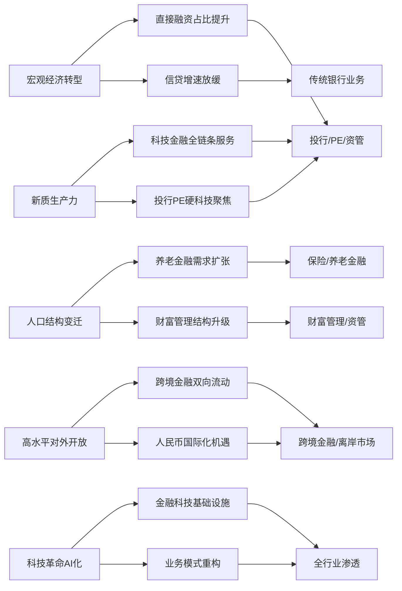
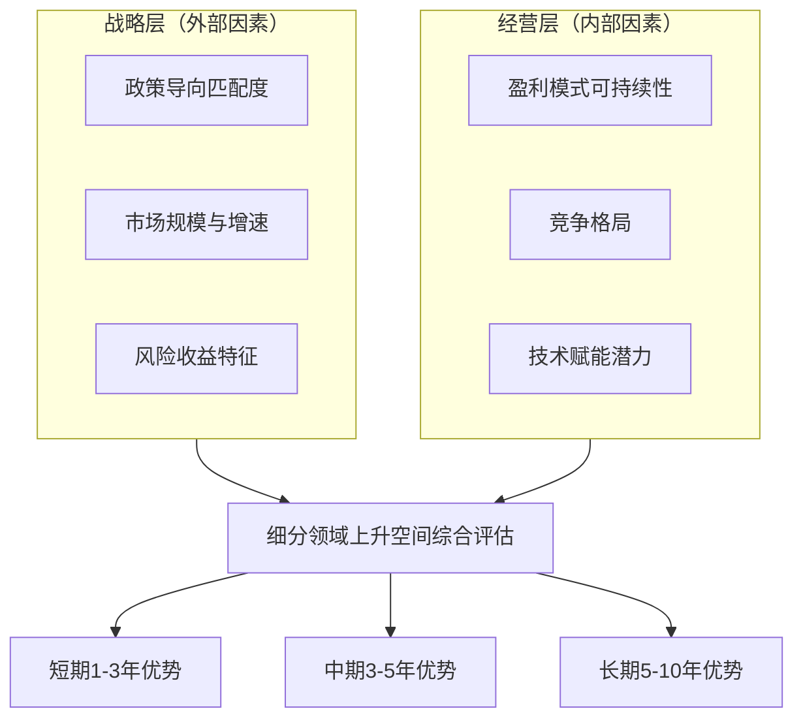
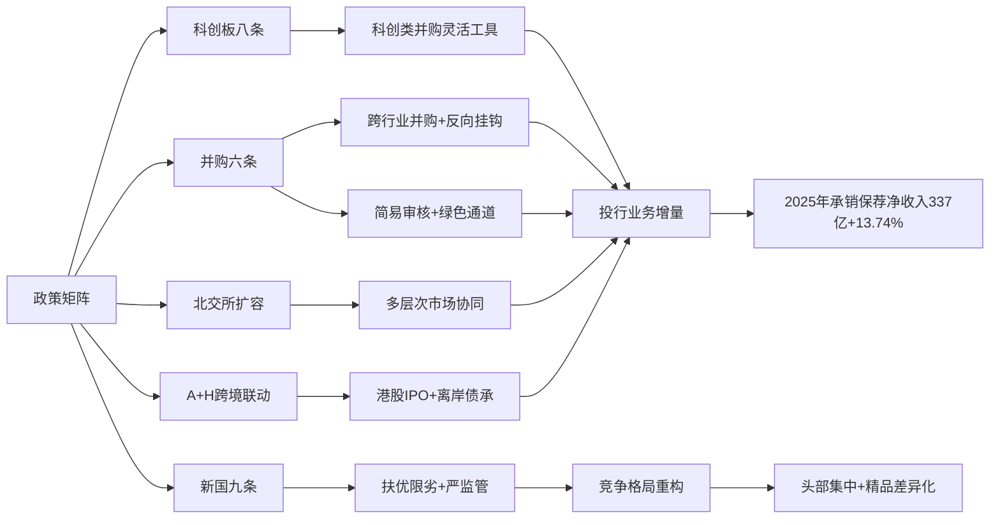
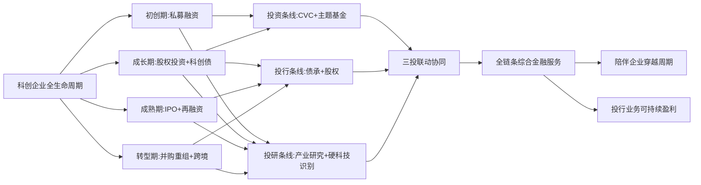
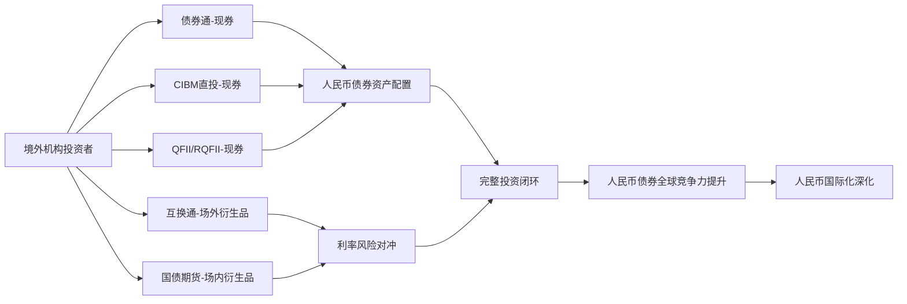
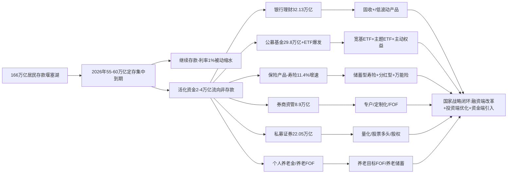
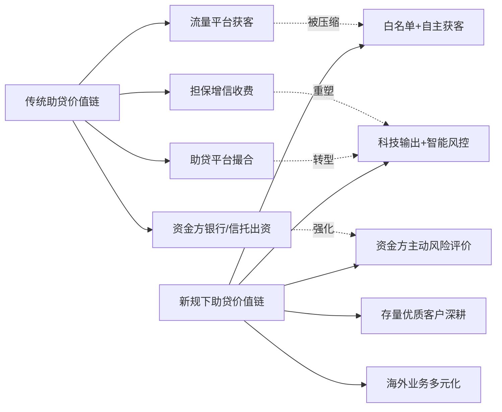
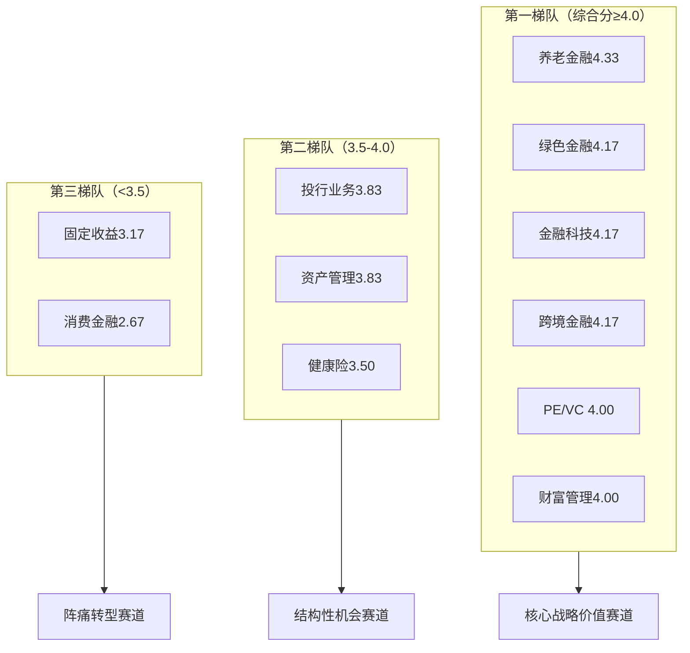

# 中国金融行业未来发展趋势研判与细分领域上升空间比较研究
# 1 研究背景、宏观趋势与顶层制度演变

中国金融业正站在一个关键的历史拐点。一方面，2023年10月中央金融工作会议首次明确提出"加快建设金融强国"的宏伟目标，并将其上升为"十五五"规划确立的国家战略[^1][^2]；另一方面，宏观经济的转型升级、人口结构的深度变迁、科技革命的加速渗透，以及全球货币体系的多极化重构，正共同重塑金融业未来十至十五年的发展轨迹。在这一背景下，准确判断各细分领域的上升空间，不仅需要回答"金融业向何处去"的方向性问题，更需要在统一的分析坐标系下，比较各赛道的相对优劣与战略价值。本章作为全篇研究的逻辑起点，将沿着"战略定位—驱动因素—顶层政策—监管范式—关键变量—评估框架"六条主线展开论述，为后续七章的细分领域研判与横向比较奠定方法论基础与宏观坐标。

## 1.1 中国金融行业的历史方位与"金融强国"战略内涵

理解中国金融业的未来走向，首先要厘清其当前所处的历史方位。改革开放四十多年来，我国没有发生过金融危机，这在世界大国中独一无二，也成就了经济快速发展和社会长期稳定的两大奇迹[^2]。然而，在体量上跻身世界前列的同时，我国金融业仍存在间接融资和债权融资比重偏高、金融服务普惠性不足、金融泛化乱办金融、大量非法金融活动等结构性问题[^3]。从"金融大国"向"金融强国"的跃迁，本质上是一场从规模扩张转向质量提升、从要素驱动转向制度驱动、从被动跟随转向主动塑造的系统性变革。

习近平总书记在2024年1月省部级主要领导干部推动金融高质量发展专题研讨班上，对金融强国的主要特征作了深入系统阐述，明确提出**金融强国应当基于强大的经济基础，具备领先世界的经济实力、科技实力和综合国力，同时具备六大关键核心金融要素，即拥有强大的货币、强大的中央银行、强大的金融机构、强大的国际金融中心、强大的金融监管、强大的金融法治**[^2]。这六大要素构成了一个有机整体：货币是金融实力的最直接载体，中央银行是宏观调控与货币治理的中枢，金融机构是市场活力的微观基础，国际金融中心是全球资源配置的枢纽节点，金融监管是风险防控的制度屏障，金融法治则是制度运行的根本保障。它们之间相互支撑、相互制约，共同决定一国金融体系的国际竞争力与抗风险能力。

中国特色金融发展之路的内核，集中体现为"八个坚持"，即坚持党中央对金融工作的集中统一领导、坚持以人民为中心的价值取向、坚持把金融服务实体经济作为根本宗旨、坚持把防控风险作为金融工作的永恒主题、坚持在市场化法治化轨道上推进金融创新发展、坚持深化金融供给侧结构性改革、坚持统筹金融开放和安全、坚持稳中求进工作总基调[^3]。这八条原则既遵循现代金融发展的客观规律，又体现适合我国国情的鲜明特色，构成研判中国金融业未来走向的根本立场与方法论。

进一步看，金融强国建设与中国式现代化、高质量发展、统筹发展和安全三大宏观叙事之间存在深刻的内在关联。从中国式现代化的整体目标看，**现代化强国必然是金融强国，金融是国民经济的血脉，是国家核心竞争力的重要组成部分，是大国博弈的必争之地**[^2]，社会主义现代化强国建设离不开强大金融体系的关键支撑。从高质量发展的角度看，"十五五"时期重点战略任务的落地——无论是高水平科技自立自强、扎实推进共同富裕，还是优化区域经济布局——都需要科技金融、普惠金融、养老金融等各领域优质金融服务的精准滴灌[^2]。从统筹发展和安全的视角看，"十五五"时期我国金融领域面临的风险挑战仍然复杂严峻，特别是来自外部的打压遏制随时可能升级，必须切实增强金融整体实力、国际竞争力和抗风险能力，不断促进金融高质量发展和高水平安全良性互动[^2]。

基于上述历史方位与战略内涵，**本报告对"未来发展趋势"与"上升空间"的研判基准也由此确立：能够直接服务于六大关键核心金融要素培育、能够紧密呼应"八个坚持"基本要求、能够在统筹发展和安全中实现高质量增长的细分领域，构成中国金融业未来最具战略价值的成长赛道**。这一基准将贯穿后续各章节的分析与比较。

## 1.2 影响金融业未来走向的核心驱动力

如果说战略定位决定了金融业的方向感，那么驱动力分析则揭示了变革的能量来源。综合参考资料所反映的政策导向、市场动态与结构性变化，可以归纳出五大核心驱动力，它们将共同塑造未来十至十五年中国金融业的发展轨迹，也构成后续各细分领域分析的共同因素框架。

**第一，宏观经济从高速增长向高质量发展转型，带来融资结构的深刻变迁**。我国金融体系存在间接融资和债权融资比重偏高的长期问题，深化金融供给侧结构性改革的核心任务之一，正是理顺间接融资与直接融资、股权融资与债权融资的关系，优化金融体系结构[^3]。这一变迁意味着，与传统信贷扩张高度相关的银行业务空间相对收敛，而依托资本市场的投行、PE/VC、资管、财富管理等直接融资链条上的业务，迎来结构性增长机遇。2025年A股总市值已达115.3万亿元，新上市公司中超九成为科技企业或者科技含量较高的企业，超七成登陆科创板、创业板和北交所[^4]，正是这一融资结构变迁的具体注脚。

**第二，新质生产力培育与科技自立自强对金融服务模式的全面重塑**。"十五五"时期是科技强国建设的关键时期，2024年5月科技部、央行等7部门联合发布《加快构建科技金融体制 有力支撑高水平科技自立自强的若干政策举措》，推出15项科技金融政策举措；科技创新和技术改造再贷款额度增至1.2万亿元，并将研发投入水平较高的民营中小企业等纳入支持领域[^5]。截至2025年11月末，科技贷款余额已达44.8万亿元，同比增长11.5%[^5]。科技型企业不同于传统重资产企业的轻资产、长周期、高不确定性特征，要求金融机构突破抵押担保依赖，发展投贷联动、股权投资、并购重组、债券市场"科技版"等全生命周期服务能力，从根本上重塑业务模式与风控逻辑。

**第三，人口老龄化与共同富裕推动养老金融与财富管理需求的爆发式扩张**。截至2025年11月末，养老产业贷款余额2162亿元，同比增长60.2%，是"五篇大文章"中增速最快的领域[^5]。这一高速增长的背后，是个人养老金账户扩容、商业养老保险产品创新、保险资金权益化配置等政策红利与社会需求的共同推动。中信证券在其2026年度行动方案中也明确提出，将"积极助力应对人口老龄化趋势，服务社保基金、企业年金与个人养老金入市需要，以服务居民养老需求为导向开发优化产品，引导社会资金投向养老产业与银发经济领域"[^6]。从居民端看，财富管理需求随收入水平提升而结构性升级，"存款搬家"趋势叠加买方投顾转型，为资管、财富管理行业打开长期增长空间。

**第四，高水平对外开放与人民币国际化加速，带来跨境金融的双向红利**。截至2025年8月末，来自全球近80个国家和地区的近1170家境外投资者进入我国债券市场，总持债规模约3.9万亿元，较债券通开通前增长了近4倍[^7]；"互换通"累计成交名义本金8.2万亿元，较上线初期增长9倍[^7]。同时，2025年上半年人民币跨境收付金额合计为35万亿元，同比增长14%，货物贸易跨境人民币收付占同期本外币跨境收付比重达28%，处于历史最好水平[^7]。人民币国际化的稳步推进与制度型开放的深化，为跨境投行、跨境财富管理、外资金融机构在华业务、离岸人民币产品等子赛道提供了系统性增量。

**第五，人工智能与数字技术革命对金融业态的颠覆性影响**。2025年国有六大行金融科技投入合计超1300亿元，较2024年的1254.59亿元进一步增长[^5]。在科技金融服务中，**银行通过运用大数据采集与融合技术，系统整合企业的研发投入强度、核心团队履历、专利质量与布局、产品管线进展等动态数据流；借助人工智能建模与机器学习算法，实现对科创企业创新实力与发展潜力的持续追踪与量化呈现**[^5]。头部券商也在加快金融科技转型，中信证券明确提出围绕"业技融合、算法可信、数据可靠"三大核心，推动核心业务与管理模式的智能化转型，构建高效、可信、共生的AI应用生态[^6]。AI从风控、投顾、运营、合规等环节全面渗透，正在成为金融机构构建新一轮竞争壁垒的关键变量。

为更直观地呈现五大驱动力对各细分领域的差异化影响，可以构建如下传导关系图：

上图清晰地呈现了五大驱动力如何通过不同的传导路径影响各细分领域。值得注意的是，这五大驱动力并非孤立作用，而是相互交织、彼此强化。例如，新质生产力培育同时依托直接融资体系完善与AI赋能下的精准识别能力，养老金融扩张则同时受益于资本市场改革与财富管理转型。这种多重叠加效应，使得部分处于多重驱动力交汇点的细分领域（如科技金融、跨境财富管理、AI金融科技）具备结构性而非周期性的成长属性。

## 1.3 "十五五"规划与中央金融工作会议的顶层定调

在确立战略方位与驱动力框架后，进一步需要解读官方层面对金融业未来发展路径的具体部署。"十五五"规划纲要和中央金融工作会议构成顶层设计的两大支柱，其核心政策导向集中体现为"五篇大文章"——**"加快建设金融强国方面，'十五五'规划纲要提出，提升金融服务实体经济质效，大力发展科技金融、绿色金融、普惠金融、养老金融、数字金融，加强对重大战略、重点领域和薄弱环节的优质金融服务"**[^5]。

"五篇大文章"并非五个孤立的业务标签，而是从功能维度对金融服务实体经济提出的系统性重构。其内在逻辑在于：科技金融对应高水平科技自立自强这一核心战略任务；绿色金融对应"双碳"目标与全面绿色转型；普惠金融对应共同富裕与服务薄弱环节；养老金融对应老龄化社会的深度适应；数字金融对应数字经济发展与金融基础设施升级。五者共同构成金融业服务中国式现代化的功能矩阵。

从市场规模演进态势看，"五篇大文章"领域的贷款余额已实现快速增长，验证了其作为金融业未来主战场的战略地位。下表汇总了截至2025年11月末的最新数据：

| 领域 | 贷款余额 | 同比增速 | 战略对应 |
|------|---------|---------|---------|
| 科技金融 | 44.8万亿元 | 11.5% | 高水平科技自立自强 |
| 绿色金融 | 44.2万亿元 | 23.0% | "双碳"目标与绿色转型 |
| 普惠金融 | 39.8万亿元 | 10.3% | 共同富裕与薄弱环节 |
| 养老金融（养老产业贷款） | 2162亿元 | 60.2% | 应对人口老龄化 |
| 数字金融（数字经济产业贷款） | 8.5万亿元 | 14.6% | 数字经济发展 |

数据来源：中国信通院《数字金融创新发展研究报告（2025年）》[^5]。

从上表可以解读出三个关键洞察。**第一，规模分层与增速分化并存**。科技金融、绿色金融、普惠金融已形成数十万亿元量级的存量基础，是当前金融服务实体经济的主力军；而养老金融虽存量基数较小，但增速领跑（60.2%），呈现典型的"小赛道、高弹性"特征；数字金融则处于规模与增速双优的状态。**第二，绿色金融23%的增速反映了"双碳"政策与转型金融工具创新的双重驱动**。2024年中国人民银行等七部委联合发布《关于进一步强化金融支持绿色低碳发展的指导意见》，明确支持高排放行业和高排放项目绿色低碳转型；国家发展改革委于2024年发布《绿色低碳转型产业指导目录》，包括7类一级目录、31类二级目录、246类三级目录，为金融支持重点行业低碳转型提供了基础的政策依据[^8]。地方层面，山西、内蒙古等地对煤电、煤炭深加工等传统优势产业的节能改造项目给予利率优惠和财政贴息；广东、浙江建立"转型项目白名单"制度，已纳入327个项目，带动融资规模超1500亿元；江苏设立转型金融风险补偿基金，对符合条件的转型贷款损失给予30%补偿[^8]。**第三，养老金融60.2%的高速增长虽起步基数低，但已成为政策与市场需求共振最为强烈的赛道**，对保险、资管、财富管理等多个细分领域具有直接拉动作用。

值得进一步关注的是"五篇大文章"在金融机构层面的落地路径。以工商银行为例，2025年末科技贷款余额6万亿元，较年初增长近1万亿元；投向制造业、普惠、科技创新领域的贷款分别增长19.4%、22.8%和19.9%[^5]。中国银行截至2025年2月末科技金融贷款余额达5.06万亿元，并计划2026年新增科技贷款7700亿元，新增科技客户3万户[^5]。证券业也将"五篇大文章"作为战略主轴，中信证券在其2026年度"提质增效重回报"行动方案中明确提出"将坚决落实'十五五'规划纲要部署，锚定金融强国建设目标，以金融'五篇大文章'为抓手，坚定不移推进'提质效、强竞争、拓国际'三大核心举措"[^6]。这意味着**"五篇大文章"已从政策导向转化为金融机构的具体战略部署，并将成为未来五至十年行业资源配置、业务创新与组织变革的核心方向**。

由此，本报告将"五篇大文章"作为细分领域上升空间比较的核心赛道锁定参照。在后续章节中，投行、PE/VC、资管、保险、消费金融、金融科技、绿色金融等各细分领域的分析，均将以是否对接、如何对接"五篇大文章"作为评估其政策匹配度的核心标尺。

## 1.4 金融监管范式重构与法治化进程

顶层战略的落地离不开监管范式的同步演变。"十五五"时期我国金融监管正经历从"规模导向"向"功能导向、穿透式监管"的深刻转型，其影响将渗透至各细分领域的准入门槛、合规成本与竞争格局，因而构成判断上升空间不可忽视的制度变量。

**法治化进程方面，2026年我国将制定《金融法》《金融稳定法》，标志着我国金融治理进入以系统性法治建设驱动高质量发展的新阶段**[^1]。**制定一部管总的、具有基础性统领性意义的《金融法》，可以明确金融监管的总体框架、基本原则和权责划分，落实"所有金融活动全部纳入监管"；制定《金融稳定法》，则致力于构建权责清晰、有序处置的风险化解长效机制**[^1]。这两部基础性法律的出台，将填补我国金融立法长期缺乏顶层统领的空白，为各细分领域的业务创新划定清晰的合规边界。北京金融法院自2021年成立至2025年底累计收结案均超过3.9万件，涉案标的额达1.4万亿元，通过判决澄清规则模糊地带、弥补法律空白，实现了从个案裁判到规则治理的实践探索[^1]，进一步印证金融法治建设正从立法、司法、监管三端协同推进。

**从重点领域看，监管范式重构在资本市场、保险业、国资金融三个维度同步展开**。

在资本市场层面，新"国九条"发布实施已满两年，"1+N"政策体系全面落地。2024年和2025年，证监会罚没款金额分别为153.42亿元、154.74亿元，创历史新高；向公安机关移送涉嫌证券期货犯罪案件线索178件、172件[^4]。**2025年证监会全年共查办证券期货违法案件701件，罚没款154.74亿余元，向公安机关移送涉嫌犯罪案件线索172件；联合最高人民检察院发布证券违法犯罪指导性案例，充分释放严监严管执法信号**[^9]。同时，特别代表人诉讼逐步走向常态化，金通灵案4.3万余名投资者获赔7.7亿余元[^4]。监管"长牙带刺"的常态化，一方面提高了违法违规成本、净化了市场生态，另一方面也对券商、上市公司、中介机构的合规体系建设提出更高要求，推动竞争从"规模博弈"转向"质量博弈"。

在保险业层面，2024年9月国务院印发的保险业新"国十条"明确"强监管、防风险、促高质量发展"三大主线，提出分阶段目标——2029年初步形成高质量发展框架，2035年建成具有国际竞争力的保险业新格局[^10]。新"国十条"在监管思路上呈现"高要求、强风控、严执法"三大变化：强调"必须坚持从严监管，确保监管'长牙带刺'、有棱有角，实现监管全覆盖、无例外，牢牢守住不发生系统性风险的底线"；提出"建立以风险监管为本的制度体系"，包括完善保险资产风险分类制度、强化逆周期监管、优化偿付能力和准备金监管政策等；对违法违规行为采取"零容忍"态度，"依法建立股东不当所得追回制度和风险责任事后追偿机制"[^11]。这意味着保险业未来的竞争格局将更加倚重风险定价能力、长期资金配置能力与服务实体经济能力，而非简单的规模扩张。

在国资金融层面，国务院国资委密集发布的"穿透式监管"组合拳标志着监管模式发生根本性变革。**穿透式监管要求实现全级次、全链条、全过程、全要素的"四全穿透"，重点覆盖投资、财务、采购等十大领域；明确建设数字化资源管理平台（DRP）作为支撑穿透式监管的技术底座；将穿透要求全面嵌入内控体系，强调从"抽样检查"向"全量监测"转变**[^12]。这一变革的本质是"从事后审计转向事中干预，从人防升级为技防"[^12]，破解了传统监管下"看得见、管不透、控不住"的困境。穿透式监管的核心管控逻辑是非线性管控，通过数字化手段实现"精准画像、分级管控"，让集团能够全面掌握子企业的经营能力、风险状况[^13]。

这一系列监管范式重构对各细分领域的影响呈现明显差异：

| 监管维度 | 主要工具 | 受影响领域 | 影响方向 |
|---------|---------|-----------|---------|
| 立法基础建设 | 《金融法》《金融稳定法》 | 全行业 | 统一框架、明确边界 |
| 资本市场严监管 | 新"国九条"、"1+N" | 投行、上市公司、中介 | 抬高合规成本、强化头部 |
| 保险业新"国十条" | 偿付能力、产品定价 | 寿险、财险、保险资管 | 推动高质量转型 |
| 穿透式监管 | DRP数字化平台 | 央国企金控平台 | 技术驱动、数智赋能 |
| 财务造假惩防 | 立体化追责、代表人诉讼 | 上市公司、审计 | 大幅提高违法成本 |

**从竞争格局视角看，监管趋严具有显著的"挤出效应"与"集中效应"**。一方面，合规成本提升将加速尾部机构出清，例如2024年以来证监会持续加大对辅仁药业、普利制药等恶性财务造假案件的惩处，依法惩处信永中和、亚太所、东海证券等中介机构[^9]；另一方面，头部机构因风控能力、合规体系、技术投入更具优势，将进一步巩固市场地位。这一规律在券商、保险、资管等子赛道均会显现，构成后续章节判断各细分领域竞争格局演化的重要逻辑。

## 1.5 利率市场化、人民币国际化与高水平对外开放

如果说监管范式重构主要从制度层面塑造行业格局，那么货币政策框架转型、利率市场化深化、人民币国际化加速以及金融高水平制度型开放，则从市场要素与价格信号层面影响各细分领域的盈利空间与业务边界。这三组关键变量在2024-2026年期间呈现出鲜明的演变特征，对不同细分领域产生差异化影响。

**利率市场化与货币政策框架转型方面**，2025年5月LPR下调10个基点之后，LPR连续11个月"按兵不动"——1年期3.0%、5年期以上3.5%，成为近年来罕见的政策稳定期[^14][^15][^16]。央行采取的策略是"用数量型工具补位，而不是用价格型工具一把砸下去"[^14]，一边通过7天逆回购稳定短端流动性，另一边靠结构性工具精准滴灌——普惠小微、科技创新、设备更新、房地产纾困都有各自的专项再贷款。这一格局的形成有其深层原因：**2025年四季度商业银行净息差持续处于1.42%的历史最低位，缺乏主动下调LPR加点的动力**[^15][^16]。更值得关注的是，一季度货币政策例会在延续"促进社会综合融资成本低位运行"的基础上，新增"规范信贷市场经营行为，降低融资中间费用"的表述，意味着政策重心正由总量宽松转向结构优化[^16]。

低利率与窄息差的双重压力对各细分领域的影响存在明显分化。对银行业而言，传统息差盈利模式承压，倒逼向中收业务、财富管理、综合金融服务转型。对券商资管和财富管理而言，居民"存款搬家"趋势在低利率环境下进一步强化，为公募基金、ETF、买方投顾等业务带来源头活水——2025年券商财富管理业务收入同比增速大多在20%左右，华泰证券财富管理业务实现收入158.64亿元，同比增长29.85%，对总收入的贡献度达44.30%[^17]。对保险业而言，长端利率低位徘徊增加了利差损风险，推动产品向浮动收益型、分红型转型——保险业新"国十条"首次提出支持浮动收益型保险发展[^10]。对债券市场而言，1年期AAA级同业存单收益率已降至1.48%左右[^16]，债券资产估值受益，固收+、做市业务空间扩大。

**人民币国际化方面，呈现出多个突破性进展**。从结算货币地位看，**SWIFT数据显示2026年1月人民币在国际市场支付份额中的比重为3.13%，是全球第五大活跃货币；2025年上半年银行自选代客人民币跨境收付金额同比增长14.0%，已成为全球第二大贸易融资货币；按全口径计算，人民币则为第三大支付货币**[^18]。**国际清算银行（BIS）在2025年9月发布的报告显示，人民币继续保持全球第五大交易货币地位，全球交易份额占比8.5%，较2022年上升1.5个百分点，是全球占比增幅最大的货币**[^18]。从大宗商品计价突破看，2026年3月中东对华原油贸易中人民币结算占比达到41%，超过欧元（约5-6%），成为这一领域第二大结算货币（仅次于美元约52%）[^19]；具体国家数据更为亮眼——伊朗100%、俄罗斯超过90%、伊拉克超过60%、沙特45%[^20]。从基础设施支撑看，CIPS系统呈爆发式增长，2026年3月CIPS日均交易额达9205亿元，4月2日单日交易额飙升至1.22万亿元，刷新历史纪录[^19]；上海原油期货已成为仅次于WTI和布伦特的全球第三大原油期货[^19]。从数字货币创新看，截至2025年11月末，数字人民币累计处理交易34.8亿笔，累计交易金额16.7万亿元，通过数字人民币App开立个人钱包2.3亿个；多边央行数字货币桥（mBridge）项目已进入持续运营阶段，截至2025年11月末累计处理跨境支付业务4047笔，累计交易金额折合人民币3872亿元[^18]。

人民币国际化突破的本质，是**从"区域货币"到"全球能源货币"的质变**[^19]，更深层意义在于建立了"卖油收到人民币→将人民币投资于中国资产"的金融闭环——2026年3月香港发行的离岸人民币政府机构债券获得11.40倍的超额认购[^19]，印证了人民币"走出去-留得住-回得来"的良性循环正在形成。

**金融高水平制度型开放方面，2025年呈现"基础设施互联互通+产品工具双向流动+外资准入持续放宽"三轨并进格局**。基础设施层面，2025年9月中国人民银行、中国证监会、国家外汇管理局联合发布公告，支持可在中国债券市场开展债券现券交易的境外机构投资者开展债券回购业务；2025年6月22日内地与香港快速支付系统互联互通（"跨境支付通"）业务上线运行，截至2025年7月末共处理超70万笔汇款，双向汇款涉及总额逾40亿元[^7]。产品工具层面，"南向通"延长结算时间、便利购买多币种债券并拓展内地投资者范围；"互换通"允许境外机构使用"债券通"债券缴纳保证金、延长利率互换合约期限至30年、增加合约品种、扩充报价商队伍并提高交易限额，截至2025年8月末"互换通"累计成交名义本金8.2万亿元，较上线初期增长9倍[^7]。外资准入层面，2025年3月1日起香港、澳门金融机构入股境内保险公司不再执行"最近一年末总资产不低于二十亿美元"的规定[^21]；截至2024年9月末，外资银行在华共设立了41家外资法人银行和116家外国银行分行，外资银行总资产3.90万亿元；境外保险机构在华共设立了67家外资保险机构，总资产2.82万亿元[^22]。

上述三组关键变量对不同细分领域的差异化影响，可归纳为下表：

| 细分领域 | 利率市场化影响 | 人民币国际化影响 | 高水平开放影响 | 综合方向 |
|---------|--------------|----------------|--------------|---------|
| 商业银行 | 净息差承压、转型压力 | 跨境结算业务增量 | 与外资银行竞合加剧 | 中性偏负 |
| 券商投行 | 直接融资需求扩大 | 跨境IPO/债承机遇 | "A+H"联动、出海布局 | 正面 |
| 财富管理 | 存款搬家受益 | 离岸人民币产品扩容 | 跨境财富管理打开 | 显著正面 |
| 保险资管 | 利差损风险上升 | 人民币资产配置增量 | 外资入股门槛降低 | 中性 |
| 债券市场 | 估值受益、流动性充裕 | 熊猫债扩容、债通深化 | QFI开放回购 | 显著正面 |
| 金融科技 | 数量型工具精准滴灌 | CIPS、数字人民币基建 | 跨境支付互联互通 | 显著正面 |

由此可见，**在低利率环境与人民币国际化、高水平开放共振的格局下，跨境金融、债券市场、财富管理、金融科技等细分领域具有更明确的政策红利与业务增量，而传统银行业务则面临转型压力**。这一判断将作为后续章节深入分析各细分领域上升空间的重要前提。

## 1.6 细分领域上升空间评估的多维分析框架

基于前述战略定位、驱动力、政策导向、监管范式与关键变量的系统梳理，本节构建用于后续章节比较研究的统一分析框架。该框架的构建原则有三：一是必须能够反映"金融强国"战略对各细分领域的差异化需求；二是必须保证各细分领域分析的可比性，避免因维度不一致导致的横向比较失真；三是必须兼顾定量评估与定性判断，体现金融业既受政策驱动又受市场规律支配的双重特征。基于此，本报告确立六大评估维度。

**维度一：政策导向匹配度**。即各细分领域与"五篇大文章"、国家重大战略（科技自立自强、双碳、共同富裕、人民币国际化）的契合程度。匹配度越高的领域，越能够获得专项再贷款、税收优惠、监管支持等政策红利。例如科技金融对应高水平科技自立自强、绿色金融对应"双碳"目标、养老金融对应人口老龄化应对，均处于政策最强支持区。

**维度二：市场规模与增速**。即各细分领域当前的存量基数与未来五至十年的增量空间。这一维度需结合贷款余额、AUM规模、保费收入、行业营收等存量指标，与过去三年复合增长率、未来政策落地预期等增量指标综合评估。如绿色贷款存量44.2万亿元、增速23%，养老产业贷款存量2162亿元、增速60.2%，分别代表"大体量稳增长"与"小体量高弹性"两种典型成长模式[^5]。

**维度三：盈利模式可持续性**。即各细分领域核心盈利来源的稳定性与抗周期能力，重点关注净息差、ROE、收入结构等指标。例如券商行业2025年自营收益同比增长32.9%，但其依赖市场行情的"靠天吃饭"特征明显[^23]；而买方投顾、被动指数化等业务则呈现更稳定的费率结构。**头部券商通过扩大OCI账户配置，有效平滑投资业绩的周期性波动**[^23]，反映出盈利模式正在从方向性博弈转向基于资产配置和风险定价的主动管理，这种转型的深度也将成为评估各细分领域可持续性的重要观察点。

**维度四：竞争格局**。即市场集中度、马太效应、外资参与度等结构性特征。2025年券商行业出现显著的头部集中——中信证券以300.76亿元归母净利润、748.54亿元营收稳居行业首位，国泰海通证券凭借合并重组实现278.09亿元归母净利润、631.07亿元营收，两家总资产均突破2万亿元[^24]。证券承销与保荐业务中，中信证券、中金公司、国泰海通、中信建投、华泰证券5家券商净收入合计占全行业总规模（337.11亿元）的比重达57.3%[^24]。竞争格局的演化方向——是头部进一步集中、中小机构差异化突围，还是新进入者颠覆——直接决定了各细分领域不同梯队机构的生存空间。

**维度五：风险收益特征**。即各细分领域的系统性风险敞口与监管约束。这一维度需考察资本市场波动敏感度、信用风险暴露、监管处罚强度、杠杆水平等。如新"国九条"下监管"长牙带刺"对券商投行业务提出更严合规要求；保险业新"国十条"对偿付能力、产品定价提出更高约束[^11]；穿透式监管"四全穿透"对金控平台数据治理能力提出全新挑战[^12]。监管约束既是风险防火墙，也是行业竞争的差异化要素。

**维度六：技术赋能潜力**。即AI、云原生、分布式架构、区块链、隐私计算等技术对各细分领域业务模式的重塑能力。技术赋能潜力大的领域，能够通过自动化、智能化、数据驱动突破传统业务边界，形成新的增长极。例如银行借助AI建模对科技型中小企业实现持续追踪与量化呈现[^5]；头部券商围绕"业技融合、算法可信、数据可靠"三大核心推动核心业务智能化转型[^6]；穿透式监管以DRP数字化资源管理平台为技术底座[^12]。技术杠杆将成为未来五至十年决定各细分领域相对竞争优势的关键变量。

将上述六大维度集成为统一评估框架，可以用以下二维矩阵呈现其相互关系：

该框架将贯穿后续第2至第7章对投行、PE/VC、固收与跨境金融、财富管理与养老、消费金融、金融科技与绿色金融等细分领域的深入分析，并作为第8章横向比较与综合排序的统一标尺。**在使用该框架时，需特别关注三个原则：第一，不同维度间存在权衡而非简单叠加，例如政策匹配度高但盈利模式承压的领域，需要在政策红利兑现期与盈利可持续性之间动态平衡；第二，时间维度上呈现差异化优势，部分领域短期景气但长期面临天花板（如周期性自营业务），部分领域短期增速平淡但长期具备结构性增长属性（如养老金融、绿色金融）；第三，需要识别确定性机会、高弹性机会与结构性陷阱的区别，避免将周期性反弹误判为结构性增长**。

综合本章六个层面的论述，可以为全报告确立如下宏观坐标系与基本判断：中国金融业正处于从"金融大国"向"金融强国"跃迁的关键期，宏观经济转型、新质生产力培育、人口结构变迁、对外开放深化、科技革命渗透五大驱动力交织共振；"十五五"规划与"五篇大文章"锁定了未来主战场，金融监管法治化与穿透式监管重塑了行业竞争规则；低利率、人民币国际化与制度型开放共同重构了细分领域的盈利空间与业务边界。在此宏观坐标系下，那些**同时处于多重驱动力交汇点、高度匹配"五篇大文章"政策导向、具备清晰盈利模式与显著技术杠杆**的细分领域，最有可能在未来五至十年中跑赢行业平均水平，成为金融强国建设的核心承载赛道。后续章节将基于本章构建的多维分析框架，对各细分领域逐一展开深度研判，最终回答"哪一个细分领域更有上升空间"这一核心问题。

# 2 投资银行业务：服务新质生产力的核心枢纽

如果说第一章构建的宏观坐标系明确了"金融强国"建设的方向感与驱动力图景，那么投资银行业务作为连接资本市场与实体经济的核心枢纽，无疑是检验这一战略落地成效的"第一观测点"。一方面，投行业务直接对接直接融资体系建设这一深化金融供给侧结构性改革的核心命题；另一方面，其对接的科创企业IPO、产业并购重组、科创债发行、跨境资本运作等业务场景，恰恰是"五篇大文章"中科技金融、数字金融两大主战场的集中体现。2024-2025年中国投行业务经历了从蛰伏到全面复苏的关键拐点，其复苏成色、结构特征、竞争格局演化、子赛道空间分化等多重信号，为研判这一细分领域的中长期上升空间提供了丰富的实证素材。本章将沿"复苏拐点—政策驱动—竞争格局—子赛道空间—中长期天花板"的逻辑主线展开，既呈现2025年这一关键节点的市场全景，又基于第一章六维分析框架对投行业务的上升空间作出系统判断。

## 2.1 投行业务的复苏拐点与结构性特征

中国投行业务过去五年的演进轨迹呈现典型的"先扬后抑、再触底反弹"的U型曲线。**A股股权融资规模在2021年达到1.79万亿元的阶段峰值后开始持续收缩，2022年、2023年募资额分别回落至15862亿元、10327亿元，2024年进一步缩减至3135亿元，较2021年峰值的缩减幅度达82.51%**[^25]。这一连年收缩反映了IPO节奏阶段性放缓、再融资监管趋严、市场情绪修复缓慢三重因素的叠加作用，也使得投行业务从"黄金赛道"短暂滑入"调整蛰伏期"。

2025年成为投行业务由冷转暖的关键拐点。Wind数据显示，**2025年A股股权募资总额反弹至10222.68亿元，已接近2023年水平，全年融资事件共315起，同比增加38起，募资规模同比增长226.10%**[^26][^25]。其中IPO项目112起，较同期增加10起，募集金额达1308.35亿元，同比增长97.40%；若剔除政策性因素，全年股权融资项目合计规模为5022.68亿元，同比增长60.22%[^25]。从券商行业整体业绩看，2025年150家证券公司实现营业收入5411.71亿元，同比增长19.95%；实现净利润2194.39亿元，同比增长31.20%；其中证券承销与保荐业务净收入337.11亿元，同比增长13.74%；财务顾问业务净收入57.84亿元，同比增长7.25%[^27]。**这意味着投行业务核心收入条线（承销保荐+财务顾问）合计约395亿元，较2024年呈现明显回暖**。

为更直观呈现这一U型曲线，下表汇总了近五年A股股权融资规模的演进态势：

| 年份 | A股股权融资规模 | 同比变化 | 关键特征 |
|------|--------------|---------|---------|
| 2021 | 1.79万亿元 | 阶段峰值 | 注册制深化、IPO高峰 |
| 2022 | 1.59万亿元 | -11.2% | 监管节奏放缓 |
| 2023 | 1.03万亿元 | -34.9% | 融资意愿减弱 |
| 2024 | 3135亿元 | -69.6% | 阶段性蛰伏低谷 |
| 2025 | 10222.68亿元 | +226.10% | U型反弹、全面复苏 |

数据来源：Wind及参考资料整理[^25]。

复苏背后是政策催化、市场情绪修复与上市公司融资意愿回暖三重驱动力的共振。**从政策端看，"科创板八条""并购六条"等政策持续发力，注册制改革向纵深推进，与跨境融资需求形成协同效应，推动股权融资市场提质增效**[^26]。从市场端看，2025年A股市场交投活跃度与投资者信心同步回升，全年成交额稳步增长，上证指数全年上涨18.4%，深证成指、创业板指分别上涨29.9%和49.6%[^27]，市场赚钱效应的恢复直接带动一级市场认购热情回升。从企业端看，从融资结构来看，增发等再融资品类贡献了主要增量，这一变化侧面反映出市场主体融资意愿逐步修复[^25]。

更值得关注的是投行业务收入结构的深层变迁。**传统上以IPO为单一引擎的投行收入模式，正在向"IPO+再融资+并购重组+债承+跨境"多元化协同转型**。这一转型既体现在市场数据上——2025年股权融资中再融资品类贡献主要增量，并购重组业务（按首次披露日统计）中中金公司以4761.25亿元的交易金额位居榜首，中信证券以4473.72亿元紧随其后[^26]——也体现在头部券商的业务摆布上。结构多元化降低了对单一IPO节奏的依赖，使得投行业务的收入波动性有望趋于平滑，为判断其可持续性提供了重要支撑。然而也应清醒认识到，**2025年的复苏在很大程度上仍依托于注册制深化与并购重组政策的双重催化，其"政策市"色彩较浓，能否转化为穿越周期的结构性增长，仍需观察科创企业IPO常态化节奏与并购市场活跃度的可持续性**。这一问题将在后续小节中进一步展开。

## 2.2 政策红利体系与制度型增量

投行业务2025年的强势复苏，离不开政策红利的持续释放和监管体系的不断完善[^26]。理解这一轮复苏的可持续性，必须深入解读支撑其底层的政策红利体系。2024年以来，资本市场政策呈现密集出台、相互衔接的"政策矩阵"特征，构成投行业务的制度型增量。

**"并购六条"是其中影响最为深远的政策之一**。2024年9月24日，证监会发布《关于深化上市公司并购重组市场改革的意见》（即"并购六条"），围绕**支持科技创新与产业整合并购、提升监管包容性、优化支付工具与审核流程、强化中介机构服务、加强合规监管并建立市场良性循环机制等六大方向**展开[^28][^29]。其核心政策工具包括：支持上市公司开展跨行业并购以加快向新质生产力转型；对私募投资基金投资期限与重组取得股份的锁定期限实施"反向挂钩"，促进"募投管退"良性循环；鼓励综合运用股份、定向可转债、现金等支付工具；建立重组股份对价分期支付机制，试点配套募集资金储架发行制度；建立重组简易审核程序，对运作规范、市值超过100亿元且信息披露质量评价连续两年为A的优质公司发行股份购买资产精简审核流程；对突破关键核心技术的科技型企业并购重组实施"绿色通道"[^28][^29]。

政策实效已在数据上得到充分验证。**政策实施一年内，上市公司累计披露资产重组超2100单，其中重大资产重组230余单。同年12月，浦发银行、太保集团、国泰海通证券联合发起成立"并购联盟"，并发布《中国并购综合指数（2025）》，显示政策实施后并购市场活跃度同比增幅达35.5%**[^28]。具体到月度节奏，**2024年8至10月A股重大资产重组（含发股并购）共计50起，而2024年前7个月总计才49起**[^30]，可见"并购六条"发布后市场响应极为迅速。板块结构上，**科创板上市公司发起的重大资产重组占比从2023年的3.5%大幅跃升至2024年前10个月的11.1%**[^30]，验证了政策"引导更多资源要素向新质生产力方向聚集"的战略意图。典型案例如赛力斯重大资产重组、汇顶科技收购云英谷科技、华海诚科收购衡所华威等，均集中在半导体、AMOLED显示、新能源等硬科技领域[^30]。

**"科创板八条"则是另一项关键政策**。**2024年6月19日发布的《关于深化科创板改革 服务科技创新和新质生产力发展的八条措施》，为科创类资产并购提供了更灵活的交易工具，如定向可转债、股份分期支付等**[^30]。叠加2025年科创板设立科创成长层、创业板启用第三套上市标准、北交所与新三板转板通道日益通畅[^31]，多层次资本市场服务科技创新的功能日益凸显——**2025年新上市公司主要集中在战略性新兴产业，信息技术、新材料、高端装备制造等硬科技领域企业成为上市主力军；科创板、创业板、北交所企业数量合计占比近七成**[^26]。这一板块结构的调整与"五篇大文章"中科技金融的导向高度契合，标志着投行业务正在从"为大企业融资"向"为新质生产力代言"的战略转型。

更值得关注的是监管层"扶优限劣"分类监管思路对投行业务竞争格局的塑造作用。**证监会主席吴清在中国证券业协会第八次会员大会上强调，证监会将着力强化分类监管、"扶优限劣"。对优质机构适当"松绑"，进一步优化风控指标，适度打开资本空间和杠杆限制，提升资本利用效率；对中小券商、外资券商在分类评价、业务准入等方面探索实施差异化监管，促进特色化发展；对于少数问题券商要依法从严监管，违法的从严惩治**[^26]。这一监管思路具有深远的格局塑造意义：对头部券商而言，资本约束放松意味着杠杆使用空间扩大，有利于做大重资产业务；对中小券商而言，差异化监管为其在区域市场、特色业务、专精特新等细分赛道找到生存空间提供制度依据；对问题券商而言，从严惩治则形成显著的"出清效应"。

为系统呈现政策红利体系的传导路径，可借助下图展示：

综上，**当前投行业务面对的政策红利体系不是单一政策的孤立作用，而是注册制深化、并购六条、科创板八条、北交所扩容、A+H联动、扶优限劣等多重政策协同形成的"政策合力"，这一合力在中长期具有较强的延续性，构成投行业务上升空间的核心制度支撑**。

## 2.3 头部券商的"两超多强"格局与一流投行建设

在政策红利持续释放的同时，2025年券商行业的竞争格局也发生了重大变化，呈现出鲜明的"两超多强"特征，传统"三中一华"格局被彻底打破。这一格局重构对投行业务上升空间的判断具有关键意义——它既反映了行业资源向头部集中的马太效应，也揭示了未来"一流投资银行"建设的核心承载主体。

从总体业绩看，**按归母净利润计算，2025年券商行业前十依次为：中信证券（300.76亿元）、国泰海通（278.09亿元）、华泰证券（163.83亿元）、广发证券（137.02亿元）、中国银河（125.20亿元）、招商证券（123.50亿元）、国信证券（110.73亿元）、申万宏源证券（103.63亿元）、中金公司（97.91亿元）、中信建投（94.39亿元）**[^32][^33][^34]。这十大券商合计贡献1535.06亿元净利润，占全行业净利润的比重高达70%[^34]，行业资源与利润向头部集中的"马太效应"达到新峰值。**2025年行业前10家券商的营业收入、净利润占全行业比重分别达67%和70%，集中度进一步提升**[^32]。其中中信证券与国泰海通构成行业"两超"格局，两家机构的营收、净利润合计均占到前十券商总量的近四成[^32]。

聚焦投行业务条线，头部集中的特征更为显著。**2025年股权承销金额前五的中信证券、国泰海通、中金公司、中银证券和中信建投，合计占据超74%的市场份额，形成稳固的第一梯队**[^26]。具体来看：

| 排名 | 券商 | 总承销金额 | IPO承销金额 | 投行业务收入 |
|------|------|-----------|------------|------------|
| 1 | 中信证券 | 2467.04亿元 | 248.70亿元 | 63.36亿元 |
| 2 | 国泰海通 | 1475.92亿元 | 195.35亿元 | 46.57亿元 |
| 3 | 中金公司 | 1180.40亿元 | 162.38亿元 | 50.31亿元 |
| 4 | 中银证券 | 1175.92亿元 | — | — |
| 5 | 中信建投 | 966.91亿元 | 189.94亿元 | — |

数据来源：Wind及上市券商2025年报[^26][^35][^36]。

中信证券稳坐"承销一哥"的核心优势在于其全方位的能力构建——**2025年中信证券实现营业收入748.54亿元、归母净利润300.76亿元，成为业内首家净利润突破300亿元关口的券商；其自营业务收入386.04亿元，同比增长46.53%，贡献超五成营收；投行业务收入63.36亿元位居行业第一**[^34][^35]。这种"投行业务+自营业务+全产业链协同"的全牌照综合化优势，使其在大型IPO、跨境资本运作、产业并购等高复杂度业务中具有不可替代的地位。

国泰海通则提供了"通过并购重组实现跨越式增长"的最佳样本。**2025年4月11日，国泰君安与海通证券正式合并组建国泰海通，截至2025年末，国泰海通合并总资产突破2.11万亿元，归母净资产3304.17亿元，均跃居行业首位；2025年全年实现营业收入631.07亿元，同比增长87.4%；归母净利润278.09亿元，同比大增113.52%**[^37][^38]。投行业务方面，**国泰海通投资银行业务营业收入47.47亿元，同比增加60.21%；2025年公司境内IPO主承销19家，2025年末IPO在审44家，均排名行业首位；完成港股配售项目37家，排名继续保持行业第一；中资离岸债券承销单数431单，承销金额53.33亿美元，单数排名中资券商第一**[^38]。这一"并购+整合+1+1>2"的路径不仅实现了规模与利润的双跃升，更重要的是构建了与上海国际金融中心地位相匹配的旗舰券商，承载了"金融强国"建设与"上海五个中心"建设的双重战略使命[^37][^38]。

更深层的洞察在于**头部券商业务模式的范式转换**。传统上券商投行业务被视为典型的"通道业务"，盈利模式高度依赖项目数量与单笔费率。但当前头部券商的业务模式已经发生根本变化——以自营业务为例，**头部券商投资业务已与传统模式不同。通过扩大OCI账户配置，可以有效平滑投资业绩的周期性波动。同时，伴随股债策略的日益多元化，包括但不限于量化中性、衍生品套利、高收益债投资及跨市场对冲等策略的广泛应用，自营业务已从方向性博弈转向基于资产配置和风险定价的主动管理**[^32]。这种转型在投行业务上同样存在——头部券商通过"投行+投资+研究+财富管理"的全业务链协同，将单一项目的承销保荐费用转化为陪伴企业全生命周期的综合收益，构建了远比中小券商更稳固的护城河。

**从未来走向看，"建设一流投资银行"政策引领下行业集中度有望进一步提升**[^33]。**当前行业资源向头部集中的趋势已十分显著。在打造一流投资银行的目标指引下，证券行业新一轮并购重组正进入实质整合、业绩兑现的新阶段，成功的整合案例也为相关券商带来了跨越式增长**[^34]。这意味着继国泰海通之后，行业还可能涌现出新的并购重组案例，进一步强化头部"两超多强"格局。对于研判投行业务上升空间而言，这一逻辑直接指向一个核心结论：**行业整体增长空间向头部集中、向一流投行建设倾斜的特征将长期延续，头部券商的投行业务上升空间显著高于行业平均水平**。

## 2.4 精品投行与中小券商的差异化突围

在头部券商高度集中的格局下，精品投行与中小券商如何寻找生存空间，是判断投行业务整体上升空间不可或缺的另一面。市场实践表明，差异化竞争路径的有效性正在得到验证，但其面临的天花板也较为明显。

**根据2025年精品投行行业研究，中国精品投行市场呈现"头部集中、专业分化"的竞争格局——中国投资银行CR5（前五大机构）占据A股58.7%的市场份额，显示出较高的行业集中度；精品投行作为行业的重要组成部分，占据了约20%的市场份额，市场规模达到2400亿元**[^31]。在这一格局中，传统大型券商如中信证券、中金公司、华泰证券凭借资本实力和全产业链服务能力占据主导地位；而精品投行通过差异化竞争策略在细分市场中找到了生存和发展空间。在本土精品投行阵营中，**华兴资本、易凯资本、汉能投资、汉理资本等机构凭借在特定行业的深度积累形成了独特竞争力**[^31]。

华兴证券提供了精品投行差异化突围的典型样本。**2025年华兴证券收入和净投资收益实现2.94亿元，同比增长19%；其中投资银行业务顾问及承销服务收入同比增58%；零售经纪业务收入较上年末增长55%**[^39]。其核心打法是聚焦硬科技、新能源、生物医药等前沿赛道，以专业的全生命周期服务陪伴中小创新企业成长——**在私募融资领域，公司帮助数家半导体、新能源产业链等硬科技领域企业完成私募融资，具体项目包括昆仑芯、加特兰、景略半导体等企业**[^39]。这种"业务聚焦+专业纵深+服务定制"的模式，使其在细分赛道与头部券商形成错位竞争。

中小券商则通过"区域市场+特色业务"的双轮驱动实现差异化突围。从区域深耕看，**第一创业深耕北交所，2024年承销北交所债券规模42.42亿元，排名行业第一名，并且主承销的多个北京国企债券在北交所市场创下首单纪录；太平洋证券继续把云南省昆明市城投公司的防风化债作为重点工作，全年为昆明市及云南其他地区发行公司债券总金额达96.34亿元，在云南债券承销市场排名第一；华鑫证券则专注于服务中高资质客户，加强对长期限产品的布局**[^40][^41]。从产业研究驱动看，申万宏源探索"研究先行+产业深耕"双轮驱动模式——**在传统研究所之外专门成立了产业研究院，下设新能源、新材料、AI与信息技术、高端装备和生物医药五大中心，这些研究中心不对二级市场服务，专门为投行和投资业务提供产业判断**[^42]；国海证券则依托广西区位优势打造北上广深研发、广西提供场景、东盟应用的模式，通过"科创桂林"计划为当地科创企业提供全生命周期服务方案[^42]。

中小券商的"逆袭"在2025年承销榜单上也得到印证——**申万宏源承销家数达11家，排名从去年的第54名飙升至第9名，跃升45位；国投证券、中国银河、国联民生等机构表现同样亮眼，分别实现12位、13位、13位的排名提升**[^25]。中邮证券更是凭借海光信息吸收合并中科曙光1159.67亿元单笔交易，在财务顾问榜单中跻身前三[^43]。

下表对比了头部券商与精品投行/中小券商两类玩家的核心差异：

| 维度 | 头部券商（一流投行建设主体） | 精品投行与中小券商 |
|------|--------------------------|-----------------|
| 战略定位 | 全牌照综合化、跨境布局 | 细分赛道专业化、区域深耕 |
| 资本实力 | 总资产万亿级（中信、国泰海通超2万亿） | 资产规模较小、决策灵活 |
| 业务覆盖 | IPO+再融资+并购+债承+跨境全覆盖 | 聚焦优势细分领域 |
| 客户结构 | 大型央国企、龙头企业、跨境客户 | 中小创新企业、区域企业 |
| 核心壁垒 | 资本+牌照+研究+客户网络 | 行业专业度+服务定制能力 |
| 市场份额 | CR5占58.7%、CR10占70%净利润 | 整体约20%份额 |
| 上升空间 | 显著、对接金融强国战略 | 有限但确定性较强 |

数据来源：参考资料整理[^32][^31]。

值得注意的是，**精品投行与中小券商的差异化突围虽然提供了"生存空间"，但其上升空间存在明显天花板**。一方面，2400亿元市场规模、20%市场份额的格局在短期内难以被颠覆性改变；另一方面，硬科技投行业务对资本实力、研究能力、跨境牌照的高要求，使得头部券商的优势会在大型项目中持续放大。因此对于研判投行业务上升空间而言，**精品投行赛道更适合视为"确定性存量机会"而非"高弹性增量机会"，其投资价值更多体现在与头部券商形成"生态竞合"中的特色突围**[^43]。

## 2.5 科创企业全生命周期服务与"三投联动"

如果说头部集中与差异化突围回答了"谁来做投行"的问题，那么"三投联动"与全生命周期服务则回答了"投行如何做"的更深层问题。这一服务模式的形成，与第一章所述"新质生产力培育对金融服务模式的全面重塑"高度呼应，构成投行业务从"通道驱动"向"价值发现+全生命周期陪伴"转型的核心载体。

**科创企业不同于传统重资产企业，具有高投入、高成长、高风险的"三高"特征，其金融需求贯穿初创期、成长期、成熟期、转型期四个阶段，且每个阶段所需的金融工具差异巨大**。传统单点式投行服务难以匹配这一需求，因此头部券商纷纷构建覆盖孵化、融资、上市、并购、退出的全生命周期服务体系。

国泰海通是"三投联动"模式的典型实践者。**国泰海通已从顶层设计到激励机制进行深度重塑，持续深化"投资-投行-投研"三投联动的协同生态，健全科技创新企业全链条综合金融服务模式**[^44]。在顶层设计方面，**国泰海通已将"做好科技金融大文章"全面融入战略规划，制定实施做好金融"五篇大文章"专题规划，聚焦科技企业全生命周期金融需求**[^44]。在组织架构方面，**通过细化完善投资银行业务委员会二级部门设置，加大对重点区域和战略性新兴产业的对接服务；升级设立政策和产业研究院，前瞻研判技术进步方向和产业投资机会**[^44]。在激励机制方面，**正在探索建立内部"科技产业联盟"，在相关业务条线设置科技金融专项考核指标**[^44]。

成效层面，国泰海通的数据极为亮眼：**截至目前，已累计服务107家企业登陆科创板、累计承销发行科创债1000余只；通过坚持"投早、投小、投长期、投硬科技"，已累计构建了超过700亿元的科创主题基金矩阵，并出资参投上海三大先导产业母基金，与产业龙头共建并购基金群**[^44]。与浦发、太保携手设立上海国智技术有限公司，新增投资硬科技规模超过60亿元，助力36家科创类企业股权融资435亿元[^38]。

中金公司则代表了"专业化团队+研究赋能"的另一种路径。**中金公司专门成立了服务中小微企业的团队，现已发展为超过50人的专精特新企业服务中心，专注于为企业提供融资、融智、拓客三类非传统通道服务——在融资方面不仅引荐股权投资机构，还与全国性银行、股份制银行乃至城商行建立战略合作；在融智方面开放研究部行业研究资源，并联合知名高校商学院开发实战课程；在拓客方面定期组织行业专场活动，帮助中小企业对接产业链"链主"企业**[^42]。

国元证券则提供了"行业组+一体化运营"的组织创新样本。**国元证券围绕高端装备、新一代信息技术、新材料、新能源、生物医药等六大战略赛道设立行业组，并将投资、投行和研究资源深度固化；提出"投资打头阵、投行作引流"，实现投行投资化、投资投行化的一体化运营。对这些战略部门实施差异化考核，重点考察其项目发掘和储备能力，而非短期盈利指标**[^42]。这种"行业纵深+长期主义考核"的设计，有效解决了科技金融业务投入周期长、短期回报不确定的痛点。

申万宏源的"研究先行+产业深耕"双轮驱动模式则将研究能力作为科技金融业务的核心引擎。**这种中观层面的研究通过每年深入调研数百家企业，能够对一个行业形成深度认知。比如在某一个产业，研究人员会实地走访产业链各环节的企业，从技术路线、市场需求、竞争格局等多维度进行评估，为项目筛选提供专业依据**[^42]。

为系统呈现"三投联动"模式的内在逻辑，可借助下图展示其传导机制：

**从技术赋能维度看**，科创企业全生命周期服务还与AI、大数据等技术深度融合。如第一章所述，银行通过运用大数据采集与融合技术系统整合企业的研发投入强度、核心团队履历、专利质量与布局、产品管线进展等动态数据流，借助AI建模实现对科创企业创新实力与发展潜力的持续追踪与量化呈现。这一技术能力同样在头部券商投行业务中加速渗透，构建系统的硬科技企业识别体系成为投行的新核心能力[^42]。

**从上升空间评估看，"三投联动"与全生命周期服务模式具有三重战略价值**：第一，对接"五篇大文章"中科技金融的政策红利，享受专项再贷款、税收优惠、监管支持的多重利好；第二，将单点服务转化为长期合作关系，提升客户黏性与单户综合贡献，降低收入波动性；第三，构建难以复制的"研究+牌照+资本+生态"复合壁垒，强化头部券商的差异化优势。基于这三重价值，**科创企业全生命周期服务可视为投行业务中长期上升空间最为确定的子赛道之一**。

## 2.6 产业并购重组与财务顾问业务

并购重组是"并购六条"政策催化下投行业务最直接的受益子赛道，也是判断中长期上升空间的关键观察窗口。基于第2.2节对政策红利的分析，本节进一步聚焦市场数据、竞争格局与中长期空间。

从市场总量看，并购重组浪潮已经形成。**2025年上半年中国并购市场（包含中国企业跨境并购）呈现出"量减价增"的显著特征，1493家A股上市公司共计筹划1984单并购重组计划。其中构成重大资产重组的有102单，同比增长121.74%。全市场共披露3531起并购事件，同比下降3.92%；交易规模约7983亿元，同比上升约1.86%**[^43]。**根据2025年上半年中国投资银行业务表现，境内市场获批并购交易跃升超过15倍至1545亿元**[^31]。这一"重大资产重组数量翻倍+交易金额跃升"的双重特征，反映出政策催化下市场结构发生根本变化——交易从"小而散"走向"大而精"，单笔规模显著放大。

从财务顾问费用增速看，国际数据进一步佐证了这一赛道的高景气。**伦敦证券交易所集团发布的《中国投资银行费用报告》显示，2025年上半年中国投行业务费用估计达到76亿美元，同比上涨35%，创下自2023年同期以来又一高值。其中已完成的并购财务顾问费用为4.14亿美元，同比上涨47%**[^43]。这一**47%的同比增速远高于投行业务整体复苏速度**，表明财务顾问业务正在成为投行业务收入增量最为显著的子赛道。

从竞争格局看，财务顾问业务呈现"头部主导+中小机构生态竞合"特征。**Wind数据显示，从财务顾问参与并购事件的规模来看，以并购事件首次公告日为统计口径，2025年上半年中信证券以1981.98亿元位居财务顾问榜首，中金公司和中邮证券分别以1189.77亿元和1159.67亿元位列第二名和第三名。尤为引人注目的是，中邮证券凭借单笔高达1159.67亿元的海光信息吸收合并中科曙光案，一举冲至FA榜第三，成为上半年最大"黑马"**[^43]。从全年并购重组业务（按首次披露日统计）看，**中金公司以4761.25亿元的交易金额位居榜首，中信证券以4473.72亿元的交易金额紧随其后；中国银河证券、申万宏源证券、国投证券分列第三至第五位**[^26]。

然而市场"蛋糕"的分配极不均衡。**记者统计发现，在财务顾问净收入一项，有18家上涨，24家下降，其中3家降幅超100%，最高达371%；更为显著的是11家上市公司财务顾问净收入下滑明显**[^43]。这一分化反映出在政策红利兑现期，**头部券商在超大额并购交易中的长期主导地位**已经确立，而中小机构的破局路径需要**以资金撮合×产业洞察×数字工具构建"三角能力"，在新能源、跨境并购等细分赛道构筑护城河，与头部机构形成"生态竞合"**[^43]。

从政策工具的丰富度看，"并购六条"为财务顾问业务提供的"政策工具箱"相当完备：**鼓励上市公司综合运用股份、定向可转债、现金等支付工具实施并购重组，增加交易弹性；建立重组股份对价分期支付机制，试点配套募集资金储架发行制度；建立重组简易审核程序；用好"小额快速"等审核机制，对突破关键核心技术的科技型企业并购重组实施"绿色通道"**[^28][^29]。这些工具的协同使用，使得复杂跨行业并购、未盈利资产收购、产业链整合等高难度交易成为可能，进一步打开财务顾问业务的服务边界与收费空间。

**从中长期空间看，并购重组与财务顾问业务的上升空间具有三大支撑**：其一，政策红利的持续释放——"并购六条"作为长期性政策框架，其制度型增量将在未来3-5年持续兑现；其二，产业整合的内在需求——传统行业转型升级、科创企业产业链整合、央国企战略重组等多类需求将持续涌现；其三，跨境并购的结构性机遇——中资企业出海与跨境并购在人民币国际化背景下加速推进。基于此，**产业并购重组财务顾问业务可视为投行业务中"高弹性、高景气、政策红利明确"的优质赛道，但需警惕单笔大型交易的偶然性贡献被错误推断为常态化趋势**。

## 2.7 债券承销与科创债"科技板"扩容

相对于股权融资业务的周期波动，债券承销业务长期保持稳定增长，是投行业务的"压舱石"。而2025年科创债"科技板"的快速扩容，则为这一传统业务注入了新的结构性增量。

从总量看，**2024年全市场各类债券发行规模合计79.86万亿元，同比增长12.41%；其中证券公司承销债券14.14万亿元，同比增长4.62%**[^40][^41]。**从整个债券承销市场格局来看，依然是强者恒强，前十强分食了市场近七成份额。其中前五家名单没有变化，中信证券、中信建投证券、华泰证券依然占据绝对优势，三家所占市场份额合计35%，再之后是中金公司、国泰海通**[^40][^41]。这种"强者恒强"特征比股权承销更为显著，反映出债券承销业务对资本实力、信用评级、销售网络的强依赖性。

但2025年的关键变化在于科创债"科技板"的横空出世与快速扩容。**2025年5月中国人民银行、中国证监会联合发布《关于支持发行科技创新债券有关事宜的公告》，标志着债券市场"科技板"正式落地**[^44]。**截至2025年岁末，全市场科创债发行规模已突破1.7万亿元**[^44]。在科创债由小变大的过程中，**金融机构（银行、券商）已成为发行主力，单笔规模大、认购踊跃；产业类主体数量多、覆盖广，形成"金融+产业"双轮驱动的格局**[^44]。

国泰海通作为首批发行科技创新债券的证券公司，其实践具有标杆意义。**考虑到股权类科技创新企业及私募基金投资周期较长的业务特性，在科创债发行品种期限选择上，其还特意选择10年期的科创债品种，并且在证券行业内唯一成功发行。所募集资金主要用于为相关业务提供长期稳定的资金来源，以耐心资本支持孵化，促进集成电路、生物医药、人工智能等先导产业领域发展**[^44]。这一案例的深层意义在于：**券商既是科创债的承销主力，也是科创债的发行主体，"金融+产业"双轮驱动让券商深度参与科技金融生态构建，超越了传统"中介通道"角色**。

从中小券商的差异化路径看，债券承销业务呈现明显的细分突围特征。**2024年有41家券商较2023年实现正增长，债券承销总金额同比增幅在50%以上的券商包括诚通证券、华金证券、金元证券、第一创业证券、华福证券、太平洋证券、华鑫证券、华龙证券、世纪证券。其中，诚通证券、华金证券、金元证券的增幅均超过1倍，位居前三**[^40][^41]。从典型路径看：第一创业深耕北交所债承——**全年承销北交所债券规模42.42亿元，排名行业第一名**[^40]；太平洋证券深耕地方化债——**全年为昆明市及云南其他地区发行公司债券总金额达96.34亿元，在云南债券承销市场排名第一**[^40]；华鑫证券深耕长期限产品——**专注于服务中高资质客户，加强对长期限产品的布局**[^40][^41]。

下表汇总了债券承销业务的"金字塔"格局：

| 层级 | 代表机构 | 业务特征 | 上升空间 |
|------|---------|---------|---------|
| 头部第一梯队 | 中信证券、中信建投、华泰 | 合计市场份额35% | 科创债扩容、规模优势 |
| 头部第二梯队 | 中金、国泰海通 | 跨境债券、综合服务 | 离岸债、科创债承销主力 |
| 中部券商 | 银河、招商、广发等 | 区域+行业综合布局 | 跟随增长 |
| 特色中小券商 | 第一创业、太平洋、华鑫 | 北交所、化债、长期限 | 细分赛道高弹性 |

数据来源：参考资料整理[^40][^41]。

**从中长期空间看，债券承销业务的上升空间逻辑可归纳为三点**：第一，宏观逻辑——直接融资占比提升趋势下债券融资作为重要补充将持续扩容；第二，结构逻辑——科创债"科技板"作为"债券版科创板"，其1.7万亿元规模有望进一步突破，为券商提供"承销+投资+做市"多元收益来源；第三，差异化逻辑——北交所债承、绿色债券、地方政府债、城投化债等细分赛道为中小券商提供错位竞争空间。这一子赛道虽不如并购重组那般高弹性，但其稳定性与可持续性更为突出，**可视为投行业务"低波动、稳增长"的核心收益基石**。

## 2.8 跨境投行与"A+H"双向联动

跨境投行业务正在成为头部券商继自营、经纪之后的"第三大核心增长曲线"[^32][^33]。这一定位本身就高度概括了跨境业务在投行业务上升空间研判中的战略地位。

从总量看，**2025年港股市场方面内资券商表现亮眼：中国国际金融（国际）有限公司以647.80亿港元的募资规模领跑，中信证券（国际）、华泰金融控股（香港）有限公司分别以489.92亿港元、242.15亿港元的募资规模位列第二、三位**[^26]。这一"中资券商主导港股IPO承销"格局的形成，反映出在A+H双重上市便利化、中概股回归、香港国际金融中心地位强化等多重背景下，中资券商已经从"港股市场的边缘参与者"转变为"主导力量"。

国泰海通是中资券商跨境投行业务的领先案例之一。**2025年完成港股配售项目37家，排名继续保持行业第一；中资离岸债券承销单数431单，承销金额53.33亿美元，单数排名中资券商第一**[^38]。其境外服务网络覆盖**中国香港、中国澳门、美国、英国、新加坡、日本、越南等17个国家和地区**[^37]，构建了相对完整的全球服务能力。

跨境投行业务的"第三大核心增长曲线"地位，从更宏观的视角看，与第一章所述人民币国际化加速、高水平制度型开放深化、CIPS规模跃升、香港离岸人民币市场扩容等趋势深度共振。具体而言：

**第一，A+H双重上市迎来新一轮高峰**。在科技龙头企业回归港股、中概股二次上市、"硬科技"企业A+H联动等需求驱动下，跨境IPO承销与配售业务空间显著扩大。

**第二，中资离岸债成为新增长极**。在境内债券融资成本与境外债券融资成本的相对变化中，中资美元债、点心债、自贸区债等创新品种为券商承销业务提供了新载体。国泰海通431单中资离岸债承销规模即体现了这一趋势。

**第三，跨境并购财务顾问需求扩大**。中资企业出海、产业链全球布局、新能源/半导体/生物医药等战略性新兴产业的跨境并购需求持续上升，为头部券商的跨境财务顾问业务带来增量。

**第四，QFI开放与互联互通深化扩大双向资金流动**。如第一章所述，2025年9月QFI获准开展债券回购业务，"互换通"累计成交名义本金8.2万亿元、较上线初期增长9倍，这些机制完善为跨境投行业务提供更多结构性产品和工具。

**从中长期空间评估看，跨境投行业务的上升空间具有"政策红利明确+空间巨大+壁垒高企"的三重特征**。其上升空间的核心驱动力来自人民币国际化的稳步推进与高水平制度型开放的持续深化，这是一个跨越5-10年的结构性进程而非短期周期。但值得提醒的是，跨境业务也面临**地缘政治冲突、中美科技脱钩、监管协调难度加大等不确定性**，这些风险因素可能对跨境IPO节奏、跨境并购审批、外资双向流动等造成阶段性扰动。因此跨境投行业务可定性为"高潜力+高门槛+中等风险"赛道，其受益主体集中在具备完整国际化布局的头部券商。

## 2.9 投行业务上升空间综合评估与风险提示

基于前述8个小节的系统分析，回到第一章所构建的六维评估框架，对投行业务整体上升空间作出综合判断。这一评估不仅服务于本章的收束，更为第8章横向比较提供基准输入。

**从六维评估框架的各维度看，投行业务的得分情况可归纳如下**：

| 评估维度 | 投行业务得分情况 | 核心支撑 |
|---------|--------------|---------|
| 政策导向匹配度 | 高 | 高度对接科技金融、数字金融两篇大文章；并购六条、科创板八条、新国九条等政策合力形成 |
| 市场规模与增速 | 中高 | 中国投资银行行业市场规模预计突破1.2万亿元，到2030年有望达到2.5-4万亿元，年复合增长率10-12%[^31] |
| 盈利模式可持续性 | 中 | 从"通道驱动"向"价值发现+全生命周期陪伴"转型；但仍存在一定周期性 |
| 竞争格局 | 头部高度集中 | "两超多强"+精品差异化；CR5占A股58.7%、前十券商净利润占行业70% |
| 风险收益特征 | 中等偏紧 | 新国九条严监管、财务造假"零容忍"对中介机构提出更高合规要求 |
| 技术赋能潜力 | 高 | AI/大数据对项目筛选、定价、风控全流程改造；硬科技识别系统加速建设 |

**综合判断：投行业务整体上升空间属于"中高"区间，但内部子赛道分化显著**。其中科创企业全生命周期服务、产业并购重组、科创债承销、跨境投行四大子赛道具有明确的上升空间，是投行业务未来5-10年的核心增长引擎；而传统IPO通道业务、再融资业务则更多体现为周期性反弹，难以构成结构性增长来源。

**从时间维度看，投行业务上升空间呈现"短期高景气、中期集中度提升、长期结构性增长"的三阶段特征**：

**短期（1-3年）：高景气延续**。2025年的复苏态势在政策红利持续兑现、市场情绪修复、上市公司融资意愿回暖三重驱动下有望延续。预计2026-2027年投行业务收入将保持10-15%的稳健增长，其中并购重组、科创债承销等子赛道增速更为突出。**2026年开年，投行业务开局稳健，硬科技、并购重组、绿色金融等成为核心增长点，行业正加速向专业化驱动转型**[^26]。

**中期（3-5年）：集中度进一步提升**。在"建设一流投资银行"政策引领下，行业并购重组将持续推进，国泰海通模式可能复制；头部券商通过资本扩张、技术投入、人才积累不断扩大与中小券商的差距；CR5、CR10集中度有望从当前70%进一步提升至75%以上。中小券商虽存在差异化生存空间，但市场份额整体可能继续收窄。

**长期（5-10年）：依托新质生产力培育实现结构性增长**。在科技金融、绿色金融两篇大文章持续兑现、人民币国际化稳步推进、A+H联动深化等多重驱动下，投行业务有望实现从"为大企业融资"向"为新质生产力代言"的战略升级，行业整体规模有望突破2.5-4万亿元[^31]，头部券商的国际竞争力显著提升，部分机构有望进入"世界一流投资银行"行列。

**关键风险提示**。在乐观判断的同时，必须清醒识别三大主要风险：

**第一，市场行情周期波动风险**。投行业务收入与资本市场表现高度相关，自营、经纪业务的波动会通过协同效应传导至投行条线。**自营业务向来被视为"靠天吃饭"，业绩表现高度依赖市场行情**[^32]。一旦A股市场出现深度调整，IPO节奏放缓、并购重组活跃度回落、跨境资本流动收紧等风险都可能导致投行业务再度承压。

**第二，合规成本上升对中小投行的挤出效应**。新"国九条"严监管、财务造假"零容忍"、特别代表人诉讼常态化等监管约束，使得中介机构的合规成本与责任风险显著上升。**2024年以来证监会持续加大对辅仁药业、普利制药等恶性财务造假案件的惩处，依法惩处信永中和、亚太所、东海证券等中介机构**。这一约束对头部券商而言可承受，但对中小投行而言可能成为"出清催化剂"，进一步加剧行业集中度。

**第三，跨境业务的地缘政治风险**。中美科技竞争、中概股监管协调、地缘冲突升级等不确定性可能对跨境IPO节奏、跨境并购审批、海外业务布局造成阶段性扰动。这一风险对国际化程度较高的头部券商影响更为直接。

综合本章九个小节的论述，**投行业务作为服务新质生产力的核心枢纽，是中国金融业未来5-10年最具战略价值的细分领域之一**。其上升空间的核心逻辑在于：高度匹配"金融强国"战略与"五篇大文章"政策导向，处于直接融资体系扩容、科技金融培育、产业并购整合、跨境资本运作四重驱动力的交汇点；竞争格局向头部高度集中且这一趋势将持续强化；技术赋能与三投联动模式构建了稳固的护城河。但其上升空间的兑现路径具有显著的"分化性"——头部券商享受最大的政策红利与市场份额扩张，精品投行与中小券商则在差异化突围中寻找有限的生存空间。这一判断将作为后续章节横向比较的重要输入，与PE/VC、固收、跨境金融、财富管理等其他细分领域进行系统对比。

# 3 私募股权与创业投资：耐心资本与硬科技投资的崛起

承接上一章关于投资银行业务的论述，如果说投行业务在二级市场为新质生产力企业打开融资通道，那么私募股权与创业投资（PE/VC）则在一级市场承担起更早期、更深层的"耐心资本"使命，二者共同构成直接融资体系服务实体经济的"双引擎"。在过去三年（2022-2024年）的深度调整周期中，PE/VC行业经历了募资规模腰斩、投资活跃度下滑、退出渠道阻塞的"寒冬"考验；但进入2025年，募投退三端同步回暖、国资LP结构性主导、硬科技投资集中度跃升、S基金与并购基金等新业态崛起、多元退出渠道全线打开等关键信号集中释放，标志着行业正在从规模驱动的旧范式向耐心资本驱动的新范式系统性切换。本章将基于第一章六维评估框架，沿"市场拐点—LP结构重构—投资逻辑硬科技化—币种与策略分化—新业态崛起—退出渠道多元化—地域与机构分化—综合研判"的逻辑主线展开，既呈现2025年关键节点的市场全景，也对PE/VC作为科技金融与新质生产力培育核心载体的中长期上升空间作出系统判断。

## 3.1 PE/VC市场的回暖拐点与全链条复苏特征

理解PE/VC行业当前所处的发展阶段，需要将2025年这一关键节点置于近五年的演进轨迹中观察。**2024年中国股权投资市场整体延续下滑态势但回暖迹象初现，募资新募集基金数量和规模分别为3981只、1.44万亿元，同比下滑43.0%和20.8%；投资案例数共8408起，剔除极值案例后披露金额6036.47亿元，同比降幅分别为10.4%和10.3%；退出案例3696笔，同比下降6.3%**[^45]。然而，**2024年募资市场的整体下滑伴随着结构上的积极变化——下半年险资、AIC、国资发起设立了多只大额基金，募资规模降幅持续收窄**[^45]，为2025年的全面复苏埋下伏笔。

进入2025年，PE/VC市场迎来标志性拐点。从清科研究中心的全口径数据看，**2025年中国股权投资市场募集规模达16483.04亿元，同比增长14.1%；投资规模达9287.16亿元，同比增长45.6%；全年共发生5211笔退出案例,同比增长41%**[^46]。从投中研究院的数据维度看，**2025年中国VC/PE市场新成立基金数量共计6127支,较去年同期增加1293支,同比增加27%；募资规模合计30860亿元,同比增加26%；本期共有3180家机构参与设立基金,较去年同期2814家增长13.01%**[^47]。两大数据源在统计口径上略有差异，但均一致指向"募投退三端全链条同步回暖"这一结构性变化，回暖力度之大、覆盖面之广，是过去三年所未见。

为更直观呈现这一U型曲线，下表汇总了2024-2025年关键指标的演变态势：

| 维度 | 2024年 | 2025年 | 同比变化 | 关键特征 |
|------|--------|--------|---------|---------|
| 新设基金数量（投中口径） | 4834支 | 6127支 | +27% | 机构活跃度显著回升 |
| 新设基金募资规模（投中口径） | 24521.9亿元 | 30860亿元 | +26% | 大额基金回归 |
| 募集规模（清科口径） | 1.44万亿元 | 1.65万亿元 | +14.1% | 止跌回稳 |
| 投资规模（清科口径） | 6036.47亿元 | 9287.16亿元 | +45.6% | 强势反弹 |
| 退出案例数（清科口径） | 3696笔 | 5211笔 | +41.0% | 退出爆发 |
| 退出交易额（贝恩美元口径） | 460亿美元 | 530亿美元 | +15.2% | 创2022年以来新高 |

数据来源：清科研究中心、投中研究院、贝恩公司《2026年中国私募股权市场报告》[^46][^45][^47][^48]。

复苏背后的驱动力可归纳为三重共振。**第一，政策红利持续释放与退出渠道优化扩容**[^49]。从《关于促进政府投资基金高质量发展的指导意见》（"1号文"）到AIC股权投资试点扩围至18个城市所在省份、6家国有大行AIC全部配齐，从"并购六条"到私募基金"反向挂钩"机制，多项关键政策密集落地为市场注入信心。**第二，长线资金加速入场**。AIC基金市场占比稳步提升,银行系整体LP出资热度上行,2025年银行LP出资次数同比增长21.7%[^47]；险资在保险资金长周期考核改革下加速布局PE/VC，市场形成"产业资本领衔、金融资本发力、国资精准调控"的出资新格局[^47][^50]。**第三，头部机构情绪与动作率先回暖**——2025年顶级市场化VC的投资节奏明显加快，出手频率和金额较上年均有显著提升,头部机构参投主体数量同比增加16.69%[^49]。

然而，回暖中"结构分化、择优配置"的本质同样不可忽视。贝恩公司在《2026年中国私募股权市场报告》中明确指出，**私募股权市场的复苏进程已经启动，但呈现结构分化、择优配置的特征。资金正流向少数优质资产，尤其集中在投资者对行业主题有明确判断、并能主动推动投后价值创造的领域**[^51][^48]。这意味着2025年的"全链条回暖"并非全行业普惠式繁荣，而是头部机构、优质项目、硬科技赛道的局部高景气；尾部机构、长尾项目、传统赛道仍处于出清进程。这种"结构性回暖"的判断对后续分析具有重要意义——**它既支持对PE/VC行业整体上升空间的乐观判断，也提示在具体研判中必须区分头部与尾部、优质与一般的差异化命运**。

## 3.2 LP结构重构：国资主导、险资入场与耐心资本崛起

如果说募投退三端的同步回暖反映了行业的"量"的修复，那么LP结构的根本性重构则揭示了行业"质"的变迁。这一变迁的核心特征是国资类资金的全面主导、政府引导基金的省级统筹、银行AIC与险资等长线资金的爆发式入场，标志着PE/VC行业正在从美元资本主导的旧范式向耐心资本主导的新范式系统切换。

**国资类资金的主导地位已经达到前所未有的高度**。执中《中国私募股权市场出资人解读报告2025》显示，**2024年国资性质资金在LP结构中占据主导地位,占比约88.8%,其中政府资金出资占比达52.5%**[^52]。烯牛数据进一步显示，**政府类LP是唯一实现连续四年同比正增长的大类LP，5年复合增长率达7.29%，认缴出资规模从2021年的11038.85亿元攀升至2025年的14864.66亿元，占整体LP认缴规模的比例从43.88%飙升至67.83%，主导地位越来越稳固**[^53]。LP投顾的数据则从机构数量与出资笔数维度佐证了这一格局——**2024年4556家机构LP中，国资和政府引导基金共2709家，较2023年的2266家同比增加19.55%；累计出资3993笔，在出资笔数总数中占比65.50%；累计认缴出资12542.77亿元，在认缴出资总额中占比高达81.58%**[^54][^55]。

国资主导格局内部呈现出三个值得深入观察的子结构。**其一，省级引导基金统筹趋势日趋明显**。**2023年省、市、区县级引导基金出资格局较为均衡,但2024年省级引导基金出资就远超其他类型,各地资金向省级统筹调配趋势明显——政府引导基金在2024年同比增加44%,全年累计出资2299亿元,省级引导基金出资最多,达1286亿元**[^52]。这一趋势的背后是2025年"1号文"取消注册地限制、降低返投比例的政策导向，引导政府投资基金不再追求"引项目落地"而是聚焦"补产业短板"，推动国家级与地方基金协同联动[^53]。**其二，地方国资'并购招购'转型为新动向**。在2025年140家上市公司披露控制权变更事项中,地方国资主导的并购案例达42宗——例如2025年12月新疆乌鲁木齐经开区通过新疆建发梵宇产业投资基金完成对A股上市公司天汽模控制权的收购,交易对价10.3亿元[^56]。这种"并购招商"模式既能达到传统"基金招商"的效果，又能让地方政府保底控制上市公司资源，可谓"一石二鸟"[^56]。**其三，央企管理基金规模逆势上涨**——**2024年央企向非关联基金的出资降至五年来最低点,但央企管理基金规模上涨31%,单只基金备案规模也有所上涨,早期基金占比从2020年的6%提升至2024年的17.9%**[^52]。这反映出央企正从被动LP角色转向主动管理基金的产业资本角色。

**金融机构LP的爆发式入场是2024-2025年LP结构重构最具突破性的变化**。投中数据显示，**2025年银行LP出手次数增幅达84%，险资、VC/PE机构出手次数也分别实现20.5%、19.8%的增长，VC/PE投资机构表现最为亮眼，出资金额同比大幅增长60.8%**[^50]。这一变化的政策驱动逻辑十分清晰：**2024年9月AIC股权投资试点放宽后,AIC基金市场占比稳步提升,银行系整体LP出资热度上行,出资次数同比增长21.7%,AIC是重要推动力量**[^47]；**2025年金融监管总局将AIC股权投资试点范围扩大至18个城市所在省份,6家国有大行AIC全部配齐,3家股份制银行AIC陆续落地,为银行资金入场打通了合规通道；同时金融监管总局支持保险资金用自有资金开展重大股权投资,财政部强化国有保险公司的长周期考核,不再以单一年度盈亏论英雄**[^53]。从落地节奏看，**截至2024年底,18个试点城市中有15个城市落地基金并完成备案,苏州、杭州与五大AIC全面合作；五大AIC出资已覆盖42个城市,截至2025年3月底实现试点城市全面覆盖,北京和上海是落地基金最多的城市**[^52]。

代表性LP的活跃度数据更直观地呈现了这一新格局。投中研究院数据显示，**2025年LP出手次数TOP排名中，工银金融资产投资有限公司以39次出手居首，代表项目包括江苏社保科创股权投资基金、南网工融双碳股权投资基金、深圳远致工融储能产业私募股权投资基金等；江苏省战略性新兴产业母基金有限公司、广西投资引导基金有限责任公司均以26次出手并列第二**[^47]。这一排行榜的背后，是"AIC+省级母基金+地方引导基金"协同出资的新格局正在快速成型。

为系统呈现LP结构重构的演变，可借助下表对比2024-2025年各类LP的相对地位：

| LP类型 | 2024年地位 | 2025年变化 | 政策驱动 |
|--------|-----------|-----------|---------|
| 政府类（含引导基金/国资） | 占比88.8%、1.27万亿元 | 政府类占比升至67.83%（认缴口径） | 1号文统筹、专项债注入 |
| 银行AIC | 出资笔数小幅增长 | 出资次数+84%、+21.7% | AIC试点扩至18省 |
| 保险资金 | 波动态势、首次下滑 | 出手次数+20.5% | 自有资金支持重大股权投资、长周期考核 |
| 企业投资者LP | 活跃但规模偏小 | 出手次数占比37.3%居首 | 产业资本领衔 |
| 上市公司LP | 出资金额同比降42% | 出资笔数下滑 | 围绕产业链布局集中 |
| 母基金 | 出手次数增长 | 进一步增长 | 国家创业投资引导基金落地 |
| 外资/美元LP | 持续低迷 | 北美仍冷、东南亚中东回暖 | 地缘政治影响 |

数据来源：执中、投中、烯牛数据、清科研究中心整理[^47][^50][^52][^54][^53]。

**LP结构重构的深层意义在于行业'耐心资本'属性的强化与高质量发展导向的确立**。一方面，国资主导格局意味着PE/VC行业的资金来源从"追求短期回报的市场化资本"向"对接国家战略、容忍长周期的耐心资本"系统切换；另一方面，AIC、险资等金融机构的入场带来的不仅是增量资金，更是与硬科技长周期投资逻辑高度匹配的资本属性。这种"政府资金定方向、金融资金补增量、产业资本领衔"的新型出资格局[^50][^53]，构成PE/VC行业未来5-10年最为稳定的资金供给基础，也是判断行业上升空间的核心制度变量。同时也需指出，**国资LP占比近九成的格局也带来潜在隐忧——市场化基金募资难度上升、社会资本积极性受挫、考核机制差异可能影响项目筛选效率，这些问题正是政府投资基金高质量发展指导意见所要破解的核心命题**。

## 3.3 硬科技投资集中度跃升与产业逻辑解构

LP结构重构的另一面是投资逻辑的深度变迁。在国资主导、耐心资本崛起的新格局下，PE/VC的投资方向呈现出向硬科技高度集中的鲜明特征，这一特征既是市场理性选择的结果，也是国家战略导向的直接映射，构成PE/VC对接科技金融、培育新质生产力的核心证据。

**从行业分布看，硬科技赛道已成为PE/VC投资的绝对主战场**。汉坤律师事务所2024年度数据显示，**人工智能（25.9%）与生物医疗（21.24%）合计吸纳近半数资金；人工智能、生物医疗和半导体（8.29%）三大领域合计吸纳55.43%的资金,反映出资本对技术壁垒和政策确定性行业的偏好**[^57]。投中数据进一步印证这一格局：**2025年前11月电子信息以3151起投资交易、3212.32亿元融资规模持续领先；先进制造和医疗健康行业作为第二梯队分别以1802起、1442起交易数量分列第二、第三位；从细分领域来看，半导体、人工智能领域大幅领跑，新材料、生物医药、医疗器械等投资热度略次之，而房地产及传统制造等行业热度有所回落**[^50]。清科数据从二级行业维度也呈现一致信号——**2025年上半年AI、GPU、创新药等细分领域获得机构重点关注,IT、半导体及电子设备、生物技术/医疗健康、机械制造四大行业仍为市场热点**[^58][^59]。

硬科技集中度跃升的产业逻辑可从三个层次解构。**第一层次，AI双轮驱动逻辑**。**软件类项目占比18.65%,涵盖自然语言处理、计算机视觉等底层技术;硬件类占比7.25%,以AI芯片和传感器为主。这种'软硬结合'的投资逻辑,源于大模型训练对算力需求的爆发式增长**[^57]。这一逻辑在头部VC的实操中得到充分印证——红杉中国2025年单笔投资金额最高的自变量机器人A+轮融资约10亿元，正是AI技术产业化落地的典型布局；高瓴创投同样将生物医药和人工智能作为合计占据年度核心投资份额的双主线[^49]。**第二层次，生物医药抗周期逻辑**。**生物医疗领域21.24%的占比较2023年提升3个百分点,创新药（占55%）、医疗器械（30%）和CXO（15%）构成三大细分赛道。投资人更青睐具备中美双报能力的Biotech企业,其IPO退出通道相对多元；基因编辑和ADC（抗体偶联药物）赛道单笔融资均值达3.2亿元,显著高于行业平均水平**[^57]。**第三层次，半导体理性回调与商业航天新热点**。**半导体保持8.29%的占比,但较2023年11.11%有所回落,反映资本对该赛道的趋于理性**[^57]；同时商业航天等新兴赛道开始成为头部机构布局重点，2025年从人工智能、半导体到商业航天、生物医药,硬科技赛道成为资本布局的核心主线[^49]。

**头部机构的投资图谱进一步揭示了硬科技集中的内在逻辑**。以红杉中国为例，**2025年其投资事件数量达到近30次,涉及金额达到75亿元,是近4年来的新高；在十大重点投资案例中，人工智能类项目占了3席,医疗健康类项目（含生物医药、医疗器械、医疗技术等）占5席,赛道聚焦特征显著**[^49]。高瓴创投同样**形成'硬科技+大健康'为核心、消费赛道补充的布局格局,尤其是生物医药和人工智能合计占据年度核心投资份额**[^49]。这种**头部机构从'广撒网'向'聚焦核心赛道+大额加注头部项目'的转型**，从微观层面强化了行业资金向硬科技集中的整体格局。

PE/VC对硬科技集中投资的战略价值，在2025年IPO市场的造富效应中得到震撼性印证。**2025年12月5日，国产GPU企业摩尔线程登陆科创板，首日股价暴涨425%,收盘价定格在600.5元/股,总市值突破2800亿元——其成长背后不仅有红杉中国等市场化投资机构、腾讯创业投资等CVC机构的支持,还有盐城、深圳、潍坊、淄博、上海等多地国资机构的直接或间接持股；2025年12月17日上市的沐曦股份,当日收盘实现692.95%单日涨幅,背后有国盛投资、上海科创基金、浦东资本等上海当地国资；壁仞科技于1月2日正式登陆港股,上市首日收涨75.82%,这是上海国投先导人工智能产业母基金首个直投项目**[^60]。这些案例**清晰呈现了'政府投资基金和国有资本凭借其雄厚的资金实力与配套产业政策,为研发周期长、投入高的硬科技领域提供了可靠的风险缓冲,同时依托系统性资源整合,有力推动了技术从实验室向产业化的快速转化'，由此形成投早、投小、投硬、投科技的政策目标与地方政府促进产业发展、实现资本增值目标的多赢格局**[^60]。

数据维度上，存量基金对硬科技的支持力度同样显著。**截至2025年三季度末，存续私募股权投资基金和创业投资基金中,在投项目数量15.3万个,在投本金9.05万亿元；创业投资基金在投项目中,投向高新技术企业数量和在投本金占比分别为49.94%和53.96%；投向初创科技型企业数量和在投本金占比分别为32.34%和20.78%,体现出创业投资投早、投小、孵化创新的重要作用**[^61]。这一数据与第一章所述"截至2025年11月末科技贷款余额已达44.8万亿元、同比增长11.5%"的间接融资数据形成有效互补，共同勾勒出"贷款+股权"双轮驱动支持科技自立自强的全景图。

**对照第一章六维评估框架，PE/VC在硬科技维度上呈现极高的政策导向匹配度与技术赋能潜力**：一方面，行业投资方向与"科技金融"大文章、新质生产力培育、科技自立自强等国家战略高度同频；另一方面，PE/VC作为最贴近创新前沿的资本形态，对识别、培育、产业化前沿技术具有不可替代的中介功能。这一高匹配度构成PE/VC上升空间的最核心战略支撑，也将其与其他细分领域形成显著的政策红利差异。

## 3.4 人民币基金与美元基金的分化路径

在LP结构重构与硬科技集中投资的双重背景下，人民币基金与美元基金呈现出截然不同的演进路径，这一分化既是市场逻辑差异的反映，也是地缘政治环境变迁的产物，对理解PE/VC行业格局演化具有关键意义。

**从规模占比看，人民币基金已经在募资市场形成绝对主导**。清科数据显示，**2025年上半年共有2158只人民币基金完成新一轮募集,同比上升12.6%；募资规模为7164.92亿元人民币,同比上升16.7%,其数量及规模占比达到99.4%和98.4%,同比增加0.4个和4.0个百分点；外币基金募资延续下滑趋势,仅有14只外币基金完成新一轮募集,同比下降30.0%,募资规模约118.37亿元人民币,同比下降67.5%**[^58][^59]。投资端的分化同样显著——**2025年上半年人民币投资金额2916.34亿元,同比小幅下降2.9%,投资案例数5452起,同比上升28.3%；外币投资额472.90亿元,出现止跌回升;投资案例数同比下降5.9%至160起**[^58]。

美元基金低迷的背后是复杂的结构性原因。贝恩公司全球合伙人周浩分析，**虽然海外LP愿意投资中国资产,但目前仍处于出清的过程,'需要先将之前的投资退出,再继续投资'——2016年前后美元基金在中国投资的项目中还有不少仍未实现退出**[^51][^62]。然而美元基金内部呈现明显的区域分化——**对东南亚与中东的美元基金而言,中国资产在它们的投资板块、投资金额占比均有显著提升,对主权基金与家族办公室而言'投中国'已成为一个必选项；东南亚、中东甚至欧洲的美元基金确实都在逐步投资中国,但北美的美元基金还看不到回暖迹象**[^51][^62]。这种"北美仍冷、东南亚中东欧洲回暖"的差异化格局，是地缘政治对国际资本流动影响的直接映射。

**两类基金的投资逻辑分化更具深层意义**。贝恩公司全球合伙人陈捷直言："**人民币基金与美元基金的投资逻辑完全不同,人民币基金侧重于新质生产力赛道的投资,美元基金可能更偏向于纯市场化竞争的赛道,比如消费零售**"[^51][^62][^48]。这一逻辑差异的根源在于资金属性——人民币基金背靠国资LP与产业资本，承担国家战略导向的投资使命；而美元基金更接近全球市场化资本逻辑，关注消费、互联网、商业模式创新等纯市场化赛道。这种逻辑差异使得即便美元基金回暖，其与人民币基金的投资方向也将形成互补而非简单替代关系。

**架构层面的变迁则进一步固化了这一分化格局**。汉坤律师事务所数据显示，**2024年中国VC/PE市场境内架构项目占比达73.58%,较2023年提升近5个百分点,创下近八年最高纪录；纯内资项目占比高达64.79%,反映出人民币基金的主导地位；外商投资企业（FIE）模式占比下降至35.21%,人民币投资项目占比同步攀升至67.88%；境外架构项目占比降至26.42%,其中VIE模式仅占33.33%,较2023年的43.27%大幅下滑——与2017-2022年间70%-99%的占比相比,VIE的吸引力已显著弱化；取而代之的是直接持股模式（66.67%）,其优势在于规避协议控制的法律风险,尤其在半导体等敏感行业更受青睐**[^57]。这一**'境内主导+VIE式微+纯内资崛起'的架构变迁**，是政策引导（国家稳增长政策强化本土资本信心、境外上市不确定性促使企业转向境内退出路径）与市场理性（外资机构对地缘风险的规避）共同作用的结果[^57]。

**值得关注的新趋势是本土GP的出海布局**。贝恩报告指出，**本土普通合伙人（GP）持续将约20%-30%的资金配置于海外市场,充分发挥中国市场布局、供应链优势以及投资组合的协同资源**[^51][^62]。陈捷将本土GP出海的两大主题概括为："**一是基金深耕某个行业,在中国积累了经验与能力后,去海外寻找产业链上下游相关标的时,要比海外投资者有更深的行业洞察；二是中国市场作为全球最大的下游市场,基金在海外寻找标的,可帮助被投企业进入中国市场,以获得更大的增长**"[^51][^62]。这一双向出海的趋势，标志着中国本土GP从"单一市场参与者"向"全球资源配置者"的角色升级，为跨境投资生态提供了新的增长维度，也与第一章所述人民币国际化、高水平制度型开放形成深度共振。

**对人民币基金与美元基金分化的综合判断是：人民币基金主导地位将在中长期持续强化，但这并不意味着美元基金完全退出**。一方面，新质生产力培育、国资LP主导、境内架构主流等结构性因素都支撑人民币基金的长期主导；另一方面，东南亚中东欧洲资本的逐步回暖、本土GP的双向出海布局、互联互通机制的深化都为美元资本的局部回归保留了空间。这种"人民币基金为主、美元基金为辅、双向出海拓展边界"的新格局，将构成PE/VC行业未来5-10年跨境维度的基本面坐标。

## 3.5 S基金、并购基金与CVC等新业态的崛起

在传统募投退三端复苏的同时，S基金、并购基金、CVC三大新业态在2024-2025年集中崛起，标志着PE/VC行业生态从"募资—投资—IPO退出"的单一线性模式向多元化、生态化的新阶段演进。这三类新业态的兴起不仅丰富了行业的业务模式，更为破解长期困扰行业的"退出难"问题提供了系统性解决方案。

**S基金（私募股权二级市场基金）方面，险资、国资、金融机构同步加码构成最显著的新格局**。2025年S基金市场迎来一系列重磅玩家：**3月25日中国人寿发布公告,拟出资28亿元参与设立福建省鑫睿科创接力股权投资基金,该基金总规模40.154亿元,是今年官宣规模最大的一只S基金；几乎同一时间,上海市首个由金融机构与地方共同主导的S策略母基金——上海交融接续基金完成备案,首期规模10亿元,通过双GP合作模式整合交行综合金融服务优势与浦东新区产业资源**[^63]。从交易市场看，**过去三个月内国内S市场就完成269笔交易,其中有国资和险资作为买方参与的交易共125笔,占比接近市场的一半；在规模前二十的交易中,这20笔交易合计金额达162.3亿元,其中险资参与的交易共7笔,国资参与的交易共12笔,基本覆盖了全部交易**[^63]。

S基金能够吸引长线资金的核心原因在于其独特的风险收益特性。**市场上的S基金的平均收益可以做到15%左右,而且收益波动性很小——也就是说头部和尾部的S基金收益没有极大的方差。相比之下,VC策略中头部基金与尾部基金的收益差距可能高达数十倍**[^63]。从历史业绩对比看，**在各类私募投资策略中,VC表现最好的五年平均收益可达50%,但表现最差的五年则为-13%；并购策略在最好年份收益27%,最差年份依然保持了3%的正收益；而S策略在最好的五年收益32%,在最差的五年仍然录得5%的正回报**[^63]。这种"风险收敛、收益可预期、跨周期抗跌"的特性恰好契合险资和国资对稳健性的天然追求。

但S基金市场仍处于发展初期，规模天花板尚未充分打开。**2024年是公认的S基金开始放量的元年,全国S基金的交易规模1469.06亿元；2025年又有所回落,全年S基金交易规模1316.91亿元**[^63]。一位国资投资人坦言："**现阶段S基金的比例在险资与国资万亿级的盘子里还只占了很小的一部分,而且增速有限……当前S交易依然是非标状态,难以大规模放量。现在有点像在沙里淘金,我们把钱准备好了,就是要等个好项目的出手机会**"[^63]。这一现实提醒，S基金的中长期成长空间巨大但兑现节奏受非标交易特性制约。

**并购基金方面，2025年呈现爆发式增长态势**。**普华永道统计显示2025年中国企业并购市场规模已超2.8万亿人民币,同比增长47%；其中私募股权基金表现活跃,发起的并购交易数量和交易金额分别同比增长了14%和16%**[^56]。从市场结构看，2025年的并购基金市场可归纳为四类玩家的差异化路径：

第一类是**传统并购基金的标杆崛起**——**2025年11月博裕资本就在凯雷、EQT、红杉等超20多家世界一流并购资本的竞标中脱颖而出,宣布收购星巴克中国区业务。在该交易中,星巴克中国的整体估值约为40亿美元,博裕资本支付约24亿美元现金以获得60%的股权,由此得到了标的控制权**[^56]。这一案例标志着头部中资私募机构已经具备与国际顶尖PE机构同台竞标优质资产的实力。

第二类是**风投/成长型投资GP转战并购市场**——"**并购六条"发布后,私募股权基金参与A股上市公司并购重组获得了来自官方的路条；2025年以启明创投旗下苏州启辰基金和奇瑞系瑞丞基金首当其冲,率先对两家上市公司天迈科技和鸿合科技的控制权发起收购,让私募股权基金的退出路径进一步拓宽、自主**[^56]。

第三类是**地方国资的并购招商**——**2025年140家上市公司披露控制权变更事项中,地方国资主导的并购案例达42宗；并购招商通过设立专项并购基金直接收购外地优质上市公司控股权,将其注册地迁入本地并导入产业链资源,可达到'基金招商'所能达成的效果,同时还能让地方政府保底控制上市公司资源**[^56]。

第四类是**外资基金回归寻找中国资产洼地**——**在人民币资产估值处于历史低位以及并购市场正在崛起的当下,博枫、KKR、淡马锡等不少美元基金管理人甚至悄然回归中国市场,并完成了人民币基金管理人的备案**[^56]。

并购基金的繁荣与贝恩公司观察到的"控股型投资转型"趋势形成印证——**2025年中国私募股权市场成长型投资约占交易总额的55%,但控股型投资的交易金额与数量持续攀升,反映投资者为追求更稳定现金流与更强业绩掌控力,正持续向控股型投资转型**[^51][^62][^64][^65]。这一转型的深层意义在于：**PE/VC行业的盈利模式正从单纯依赖企业上市的Beta收益向通过控股运营、价值创造获取的Alpha收益升级，对GP的投后管理能力提出更高要求**。

**CVC（企业风险投资）方面，呈现出'低位徘徊但产业赋能价值持续凸显'的特征**。2024年数据显示，**CVC新增备案基金193只,较2023年下降41.7%,处于近十年低位水平;但CVC在私募备案基金的占比保持稳定,2021年至今CVC新增备案基金数占比基本保持在4.4%左右**[^66]。从产业赋能价值看，CVC在多个维度发挥着不可替代的作用：**2024年参与的投资事件数为1027个,投资重点集中在早期阶段共投资735个、占比达71.6%；CVC踊跃投身智能制造、人工智能等赛道,分别投资192个和134个；2024年一级股权投资市场投资额过1亿美元的大额投资事件83个,其中CVC参投31个、占比37.4%；其中2024年人工智能7个投资额超1亿美元的大额事件中均有布局；独角兽成长方面,2024年国内新增20家独角兽,其中11家有CVC参与投资,占比55%；在IPO市场方面,2024年国内228家IPO企业里有76家曾获得CVC投资,CVC在2024年IPO企业的渗透率达33.3%**[^66]。这一组数据系统呈现了CVC作为产业资本对硬科技培育、独角兽孵化、IPO退出的全链条赋能价值——**每3家IPO公司就有1家靠CVC撑腰**[^66]。

为系统呈现三大新业态的差异化战略价值，可借助下表对比：

| 新业态 | 2024-2025年规模 | 核心玩家 | 战略价值 | 上升空间属性 |
|--------|----------------|---------|---------|-----------|
| S基金 | 1300-1500亿元交易规模 | 险资+国资+金融机构 | 缓解退出压力、长线资金匹配 | 高潜力、低弹性、非标制约 |
| 并购基金 | 并购市场超2.8万亿、+47% | 头部并购PE+VC转型+地方国资+外资回归 | 控股型转型、产业整合 | 高弹性、政策红利明确 |
| CVC | 备案基金占比4.4% | 上市公司+央企+互联网巨头 | 产业赋能、独角兽孵化、IPO渗透 | 中等、稳定、产业属性突出 |

数据来源：参考资料整理[^56][^63][^66]。

综合来看，**S基金、并购基金、CVC三大新业态共同构成了对传统PE/VC生态的有力补充**：S基金从退出端缓解流动性压力、并购基金从控股运营端实现价值创造、CVC从产业协同端赋能创新。这种生态化、多元化的演进，使得PE/VC行业从单一的"早期股权投资"升级为覆盖"早期—成长期—成熟期—并购重组—二级市场"的全生命周期资本服务体系，与第二章所述投行业务"三投联动"的理念高度契合，共同构成科技金融与新质生产力培育的核心载体。

## 3.6 多元退出渠道打开与基金到期压力

新业态的崛起与退出渠道的多元化在2025年形成深度共振，构成PE/VC行业"募投管退"循环重启的关键驱动力。但与此同时，存量基金到期清算的巨大压力与回报率门槛的显著抬升，也对行业可持续性提出严峻挑战。本节将"机会"与"压力"并置呈现，为研判行业上升空间提供风险维度。

**从退出结构看，PE/VC退出体系正从'IPO高度依赖'向多元化转型**。**2025年中国股权投资市场共发生5211笔退出案例,同比上升41.0%；其中被投企业IPO案例1957笔,占比37.6%；股权转让、回购、并购退出案例分别为1395笔、1318笔、468笔,占比分别为26.8%、25.3%、9%**[^61]。这一结构与历史相比已有明显变化——**目前我国创投行业已经形成了IPO、并购、S基金、回购等多元退出渠道**[^61]，IPO占比从过去的绝对主导降至37.6%，并购、S交易等"备选项"上升为退出路径的"主战场"[^60]。

**IPO退出方面，A股回暖与港股火爆的双重驱动带来'丰收效应'**。投中嘉川数据显示，**2025年1-11月共135家具有VC/PE背景的中企实现上市,获得VC/PE机构支持的上市企业数量同比上涨20.54%**[^60]。从全口径看，**2025年294家中企实现IPO上市,同比增长近三成,境外IPO占比达61%；账面股权价值大幅回升,退出回报率降至289%**[^47]。摩尔线程、沐曦股份、壁仞科技等硬科技企业的造富效应在第3.3节已有详述，这里需要特别强调的是**'政府投资基金和国有资本与地方政府促进产业发展、实现资本增值的目标实现统一,形成多赢格局'的政策意义**[^60]——IPO退出不仅是创投机构的"丰收时刻"，更是国家产业战略落地的关键节点。

**S交易方面，正式由'备选项'上升为退出路径的'主战场'**。**S基金能够得到青睐的主要原因在于S基金投资集成众多优点,比如底层资产相对清晰、投资周期相对较短、资产流动性较高、能够降低盲池风险等；统计数据表明,S基金的业绩平均表现好于一般的私募基金。因此,无论是政府投资机构、国资、金融机构,还是市场化母基金、S基金、市场化GP等,都对S基金交易表现出参与积极性**[^60]。**2025年1月浙江第一支由政府主导的S基金发布,首期规模5亿元、目标规模50亿元；2025年2月江西润信赣投接力基金完成备案**[^60]，地方政府主导的S基金正在成为打通存量基金退出的重要工具。

**并购退出方面，'反向挂钩'机制的制度型支持具有突破性意义**。"**1号文"明确提到拓宽基金退出渠道,推动区域性股权市场规则对接、标准统一,鼓励发展私募股权二级市场基金（S基金）、并购基金等；这一政策导向为S基金和并购基金的发展注入强心剂,利于行业多元化退出路径逐渐形成**[^60]。证监会出台"并购六条"修订《上市公司重大资产重组管理办法》、推出私募基金"反向挂钩"机制[^61]，这些制度型支持将私募基金参与并购退出的便利性大幅提升。从规模看，**2025年中国私募股权市场退出交易额猛增至约530亿美元,较2023年约170亿美元、2024年460亿美元大幅攀升；2025年初私募基金间交易成为退出主力,二季度起IPO退出势头逐渐回升**[^51][^62][^64][^65]。

**回购与实物分配方面，柔性退出机制的探索值得关注**。**在2024年时,政府投资基金和国资LP为退出而追责GP的现象较为明显,往下游传导,创投机构密集起诉被投企业发起回购诉讼成为行业焦点；2025年多地的回购条款正变得更加宽松,柔性退出机制被越来越多地执行**[^60]。同时，**监管部门持续发力拓宽退出渠道,如开展私募股权创投基金向投资者实物分配股票试点,健全基金份额转让制度,支持S基金、并购基金等发展**[^61]。这些机制创新对缓解GP-LP矛盾、保护被投企业稳定经营具有深远意义。

然而退出空间打开的同时，**行业面临的退出压力依然巨大**。清科研究中心数据显示，**截至2025年1月底12.51万亿元规模的基金进入退出期和延长期,其中4.83万亿元规模的基金进入延长期,7.67万亿元规模的基金进入退出期**[^61]。赛诺佳易创始人国立波指出："**当前LP对基金现金回流的要求日益紧迫,直接影响了GP的新一轮募资……2016年至2018年募资高峰期成立的基金集中进入退出阶段,目前行业内超7万亿元的存量基金面临到期清算压力**"[^61]。这一压力意味着即便2025年退出案例数同比增长41%，行业整体的退出供需失衡仍将延续较长时期。

**更深层的挑战在于回报率门槛的显著抬升**。贝恩公司明确指出：**在目前的进入估值倍数与杠杆水平下,实现目标收益率所需的盈利增速远高于以往；如今要实现20%以上的内部收益率,年均EBITDA（息税折旧及摊销前利润）增速需达到约12%,相比十年前仅需5%左右的增速大幅提升**[^51][^62][^64][^65]。这一挑战的本质是PE/VC行业从"估值套利+IPO退出"的旧范式向"投后价值创造+多元退出"的新范式转型——GP若不能通过深度行业洞察、严格投前评估、深入投后管理实现真正的价值创造，将很难在新环境下兑现目标收益。这也呼应了周浩所言的"**好的尽调需要梳理清楚商业、运营、技术、可持续发展、AI五个维度**"[^64][^65]，以及陈捷所言的"**头部机构将深厚行业专长、严格投前评估与深入投后管理相结合,并在找投管退全周期始终保持高效执行力,从而构筑核心护城河**"[^51][^62][^64][^65]。

退出渠道与退出压力的对比关系可借助下表呈现：

| 维度 | 机会侧 | 压力侧 |
|------|--------|--------|
| 渠道结构 | IPO+并购+S+回购+实物分配多元化 | 仍依赖IPO（占比37.6%） |
| 政策支持 | 1号文、并购六条、反向挂钩、实物分配试点 | 制度落地节奏不确定 |
| 市场表现 | 退出案例+41%、退出额530亿美元 | 12.51万亿元存量基金待退出 |
| 回报门槛 | 账面股权价值回升、退出回报率289% | EBITDA增速要求从5%升至12% |
| 投后能力 | 头部机构构建价值创造护城河 | 一般机构面临能力代差 |

数据来源：参考资料整理[^61][^47][^51][^62][^60]。

**综合判断：PE/VC退出渠道的多元化打开为行业上升空间提供了关键支撑，但存量基金到期压力与回报率门槛抬升构成中短期重大挑战**。这种"打开+承压"并存的格局，决定了行业的上升空间将更多惠及具备深度投后能力、专业行业洞察、严格投资纪律的头部机构，而尾部机构的出清节奏可能进一步加快。这一判断与第3.1节"结构分化、择优配置"的复苏特征形成呼应，也为后续地域格局与机构集中度的分析提供了内在逻辑。

## 3.7 地域格局与头部集中：长三角主导与机构分化

PE/VC行业的复苏不仅在产业逻辑与新业态层面呈现结构性特征，在地域分布与机构竞争格局上同样体现出显著的双重集中化趋势。这一双重集中既反映了产业集群效应的内在规律，也呼应了第二章所述投行业务"两超多强"格局的演化逻辑，对判断各梯队机构的生存空间具有关键意义。

**地域分布上，'东南沿海主导、京津冀崛起'格局清晰确立**。投中数据显示，**2025年共计32个省市区新设基金,其中浙江省新设数量1367支位居榜首,江苏省、广东省新设基金967支、644支紧随其后；浙江、江苏、江西、上海基金数量同比大幅增加；嘉兴、九江、宁波等地同比增势更迅猛**[^47]。从出资端看，执中数据显示**长三角地区出资最为活跃,合计占全国出资的35.8%,北京、浙江、江苏、广东出资均超千亿元**[^52]。烯牛数据则进一步提示了京津冀的跨越式增长——**2025年京津冀实现54.23%跨越式增长,区域资本协同效应凸显**[^53]。

投资端的地域格局同样呈现高度集中。**2025年江苏投资交易数量连续多年领跑全国,上海持续坐稳最吸金城市宝座,北京凭借大额交易案例的集中分布凸显规模优势**[^47]。汉坤数据显示，**北京、上海、深圳三地合计贡献53.37%的交易量,杭州与苏州以5.18%并列第四；这种'马太效应'与产业集群效应相关——例如北京中关村的人工智能、上海张江的生物医药、深圳南山区的硬件创新生态,形成了完整的产业链配套,降低了投资机构的尽调成本**[^57]。从地方国资分布看，**江苏省地方国资出资居全国前列,2024年跃居第一,安徽攀升至第二,浙江占比稳步提升至14%排名第三；东部沿海地区整体占比接近40%,主导地位稳固,中部安徽、湖北和西部重庆占比有所增长,江西、福建在2024年首次进入前十**[^52]。

**从地域格局看，PE/VC行业的'产业-资本-政策'三位一体协同效应已成为决定区域竞争力的核心要素**：长三角凭借成熟的产业集群、活跃的国资体系与领先的政策创新长期主导；京津冀依托国家级引导基金落地、央企总部聚集、北京国际科创中心建设实现快速崛起；珠三角则以民营经济与硬科技产业链支撑差异化发展。这一格局与第一章所述区域经济布局优化的国家战略形成深度共振，也为后续金融服务实体经济的精准滴灌提供了空间坐标。

**机构竞争格局方面，头部集中的马太效应同样显著**。从券商私募股权子公司的代表数据看，**截至2025年12月31日中金公司私募股权业务通过多种方式在管的资产规模达5242亿元,这一数据较前一年的4576亿元增长15%；作为中金公司旗下主要私募股权平台,中金资本累计认缴管理规模突破6800亿元；而其他券商私募股权业务基本在千亿元或以下的规模水平**[^46]。这一规模级差直接体现了头部GP与一般GP的资源禀赋差异。

**从基金募集集中度看,头部化趋势在贝恩报告中得到明确印证：**募集资金的流向越来越集中于头部优质基金,头部基金公司的募资额占比持续提升,预计继续向头部优质基金集中,资本竞争加剧,头部与中型私募机构的差距持续拉大**[^51][^62][^48]。从机构活跃度数据看，**2025年共有3180家机构参与设立基金,较去年同期2814家增长13.01%,其中62%的机构成立1支基金,18.6%的机构完成2支基金新设,19.4%的机构完成3支及以上基金新设；去年同期成立三支及以上机构占比为15%,机构活跃度同比显著上升**[^47]。看似机构整体活跃度上升，实则呈现"头部加码扩张+尾部少量参与"的两极分化。

**LP出资的'二八分布'也清晰呈现头部集中的金融逻辑**。LP投顾数据显示，**2024年机构LP出资规模呈'二八分布',62.47%的机构LP认缴金额在1亿以下,而10亿及以上的LP虽仅占6.32%,却贡献了65.30%的认缴金额,头部效应突出**[^54]。基金管理人层面，**2024年VC/PE市场完成募集基金共计467支,同比减少8.1%,募集规模累计4133.1亿元,同比减少46.9%；2024年共计2814家机构参与新设基金,相比去年3847家减少超千家**[^67]——基金管理人持续缩减叠加备案基金数量减少近五成而整体认缴规模持平[^55]，反映了VC/PE行业"集中度上升、头部化和分化趋势明显"的进程，是中国创投进入高质量发展阶段、存量出清、优胜劣汰的必然结果[^55]。

为系统呈现地域与机构双重集中格局，可借助下表对比：

| 维度 | 长三角主导 | 京津冀崛起 | 珠三角差异化 | 中西部突破 |
|------|----------|----------|------------|----------|
| 基金新设量 | 浙江1367支、江苏967支居前两位 | 北京占比提升 | 广东644支位列第三 | 安徽湖北重庆占比上升 |
| 出资规模 | 长三角占全国35.8% | 跨越式增长54.23% | 占比稳定 | 江西福建首次进入前十 |
| 投资集中度 | 上海最吸金、江苏交易数最多 | 北京大额交易突出 | 深圳硬科技集群 | 个别城市快速增长 |
| 产业生态 | 江苏制造+上海生物医药+杭州AI | 北京AI+央企总部 | 深圳硬件+广州互联网 | 区域特色产业 |
| 机构集中度 | 头部GP集中 | 央企背景GP活跃 | 民营GP活跃 | 国资GP主导 |

数据来源：参考资料整理[^47][^52][^57][^53]。

**综合机构格局看,PE/VC行业'头部化、专业化、差异化'的新一轮洗牌特征已经确立**。对照第一章六维评估框架中的"竞争格局"维度，PE/VC的格局演化呈现三个值得关注的特征：第一，**资源向头部高度集中**——这一趋势在LP出资、GP募资、项目获取、退出收益等环节同步显现；第二，**专业化分化加剧**——头部机构通过深度行业专长、严格投前评估、深入投后管理构筑核心护城河[^51][^48]，而无差异化能力的机构面临淘汰；第三，**地域产业绑定深化**——长三角、京津冀、珠三角等核心区域的产业集群与资本生态绑定日益紧密，区域GP的本地化优势难以被外部机构替代。这一格局与第二章所述投行业务"两超多强+精品差异化"的演化逻辑形成同频共振，共同体现了金融业从规模扩张向质量提升的范式转换。

## 3.8 PE/VC上升空间综合评估与风险提示

基于前述7个小节对PE/VC行业回暖拐点、LP结构、投资逻辑、币种分化、新业态、退出渠道、地域机构格局的系统分析，回到第一章所构建的六维评估框架，对PE/VC行业整体上升空间作出综合判断。这一评估既服务于本章的收束，也为第8章横向比较提供基准输入。

**从六维评估框架的各维度看，PE/VC行业的得分情况可归纳如下**：

| 评估维度 | PE/VC得分情况 | 核心支撑 |
|---------|--------------|---------|
| 政策导向匹配度 | 高 | 高度对接科技金融、新质生产力培育；1号文、AIC试点扩围、专项债注入引导基金、并购六条等多重政策红利 |
| 市场规模与增速 | 中高 | 2025年募资1.65万亿元、投资9287亿元、退出案例5211笔；增速分别为14.1%、45.6%、41.0% |
| 盈利模式可持续性 | 中等承压 | 从估值套利向价值创造转型；20%IRR目标所需EBITDA增速从5%升至12%、12.51万亿元基金待退出 |
| 竞争格局 | 头部高度集中 | 中金资本认缴管理规模突破6800亿元；头部GP募资占比持续提升；'头部化、专业化、差异化'确立 |
| 风险收益特征 | 中等偏紧 | 募资端国资占比近九成、退出端不确定性较大、基金到期清算压力突出 |
| 技术赋能潜力 | 高 | AI对尽调、投后管理的渗透加速；硬科技投资体系本身高度依赖技术识别能力 |

**综合判断：PE/VC行业整体上升空间属于'高政策红利、高结构分化'区间，其上升空间的兑现具有显著的'分化性'**。具体而言，PE/VC行业的上升空间主要集中在四大核心增长子赛道：

**第一，硬科技早期投资是核心增长引擎**。如第3.3节所详述，PE/VC在AI、半导体、生物医药等硬科技领域的高度集中（合计占比超55%）与国家科技自立自强战略高度匹配，叠加创业投资基金对高新技术企业、初创科技型企业的本金占比分别达53.96%、20.78%[^61]，这一子赛道既享受最大的政策红利，又具备最广阔的成长空间，是PE/VC行业未来5-10年的核心引擎。

**第二，并购重组与控股型投资是高弹性子赛道**。"并购六条"政策红利持续兑现、并购市场规模超2.8万亿元同比增长47%、控股型投资占比持续攀升、博裕收购星巴克中国等标杆案例陆续涌现，这些信号清晰指向并购基金作为"高弹性、政策红利明确"赛道的崛起态势[^56]。

**第三，S交易是高潜力但兑现节奏受限的赛道**。S基金的"风险收敛、收益可预期"特性与万亿级险资国资的稳健性追求高度契合，长期空间广阔；但当前S交易非标特性导致大规模放量受限，2024-2025年规模在1300-1500亿元区间，需要持续的标准化建设与基础设施完善[^63]。

**第四，CVC产业赋能是稳定增长子赛道**。CVC在IPO企业33.3%渗透率、独角兽企业55%参投率、人工智能大额事件全覆盖等多维度展现的产业赋能价值，使其成为PE/VC生态中"稳定、产业属性突出、跨周期"的特色赛道[^66]。

**从时间维度看,PE/VC行业上升空间呈现'短期景气延续、中期格局深化、长期结构性增长'的三阶段特征**：

**短期（1-3年）：景气延续叠加结构分化**。2025年募投退三端的全链条复苏在政策红利持续兑现、长线资金加速入场、退出渠道逐步打开三重驱动下有望延续。预计2026-2027年募资规模有望突破3.5万亿元，投资规模可能稳步上行至万亿元以上，退出案例数继续提升。但结构分化将更加显著——头部机构享受最大的政策红利与市场份额扩张，尾部机构出清进程加速。

**中期（3-5年）：格局深化与盈利范式重构**。在头部集中、地域产业绑定、新业态生态化等多重力量驱动下，PE/VC行业格局将进一步深化——CR50机构可能掌握行业70%以上的资源与项目；同时盈利范式从估值套利向价值创造的转型将基本完成，具备深度投后能力的GP将与一般GP形成不可逆的能力代差。S基金、并购基金等新业态可能突破当前发展瓶颈，规模实现倍数级增长。

**长期（5-10年）：依托新质生产力培育实现结构性增长**。在科技金融大文章持续兑现、人民币国际化稳步推进、本土GP双向出海布局等多重驱动下，PE/VC行业有望实现从"中国本土早期投资"向"全球资源配置+本土产业培育"的战略升级，行业整体规模有望进一步扩大，部分头部机构有望进入"世界一流PE机构"行列。

**关键风险提示**。在乐观判断的同时，必须清醒识别四大主要风险：

**第一,美元基金持续低迷与北美资本回归的不确定性**。如第3.4节所述，**北美的美元基金还看不到回暖迹象**[^51]，地缘政治冲突、中美科技脱钩等不确定性可能进一步压制美元基金回流节奏。这一风险对依赖外币基金募资的部分GP构成持续压力，也影响行业整体的资金多元化结构。

**第二,基金到期清算压力与流动性风险**。**截至2025年1月底12.51万亿元规模的基金进入退出期和延长期,其中4.83万亿元规模的基金进入延长期,7.67万亿元规模的基金进入退出期；行业内超7万亿元的存量基金面临到期清算压力**[^61]。如果退出节奏不及预期，可能引发GP-LP矛盾激化、回购诉讼增多、行业声誉受损等连锁反应，对募资端形成负反馈。

**第三,回报率门槛抬升对GP能力的挑战**。**实现20%以上的内部收益率,年均EBITDA增速需达到约12%,相比十年前仅需5%左右的增速大幅提升**[^64][^65]。这一挑战意味着大量缺乏深度投后能力的GP将面临业绩不达预期的风险，进而影响下一轮募资与机构生存。

**第四,国资LP占比过高带来的市场化效率隐忧**。国资性质资金在LP结构中占比约88.8%、政府类LP认缴规模占比67.83%[^52][^53]，这一格局虽然为行业提供了稳定资金供给，但也可能在考核机制、投资决策效率、风险偏好等方面形成同质化压力，影响行业市场化筛选优秀项目的能力。这一隐忧正是政府投资基金高质量发展指导意见所要破解的核心命题，其改革成效值得持续跟踪。

综合本章八个小节的论述，**PE/VC作为耐心资本与硬科技投资的核心载体，是中国金融业未来5-10年最具战略价值的细分领域之一**。其上升空间的核心逻辑在于：高度匹配"金融强国"战略与"五篇大文章"中科技金融的政策导向，处于直接融资体系扩容、新质生产力培育、长线资金入场、多元退出渠道打开四重驱动力的交汇点；竞争格局向头部高度集中且这一趋势将持续强化；S基金、并购基金、CVC等新业态构建了多元化、生态化的成长空间。但其上升空间的兑现路径具有显著的"分化性"——头部GP享受最大的政策红利与市场份额扩张，尾部机构在结构分化、择优配置的市场中加速出清。**与上一章投行业务相比，PE/VC在政策红利匹配度上同样处于最高梯队，但在盈利模式可持续性上承压更显著、在退出端不确定性上风险更突出，这一差异将成为第8章横向比较中不可忽视的关键观察点**。后续章节将沿此逻辑继续展开对固收、跨境金融、财富管理、养老金融、消费金融、金融科技与绿色金融等其他细分领域的深入分析，最终回答"哪一个细分领域更有上升空间"这一核心问题。

# 4 固定收益、跨境金融与对外开放：制度型开放下的双向红利

承接第二章投行业务与第三章PE/VC的分析逻辑——二者分别在二级股权市场与一级股权市场承担直接融资体系的核心使命，本章将视角转向中国金融体系中规模最为庞大、与宏观经济联系最为紧密的固定收益市场，以及与之深度交织的跨境金融体系。这一视角转换具有深刻意义：截至2025年末中国债券市场托管余额已达196.7万亿元、接近200万亿元关口[^68][^69]，已稳居全球第二大债券市场地位；与此同时，2025年人民币国际化迎来历史性突破，CIPS业务覆盖189个国家和地区[^70]，人民币国债期货向合格境外投资者首次开闸[^71]，债券通"南向通"扩容至非银机构[^72]，多重制度型开放举措密集落地。固定收益与跨境金融两大领域的深度交织，本质上是**低利率新常态的国内金融生态与人民币国际化、高水平制度型开放的全球金融格局两条主线的共振**：低利率压低国内资产收益形成"资产荒"，人民币国际化与制度型开放则为境内外资金双向流动打开通道，二者的交叉地带正成为金融业未来5-10年最具结构性红利的细分领域之一。本章将基于第一章六维评估框架，沿"债市扩容与结构变迁—子品种供需—创新品种崛起—衍生品建设—互联互通深化—跨境投行—人民币国际化—跨境财富管理—中资券商出海—外资在华布局—资管机构跨境—综合研判"十二条主线展开。

## 4.1 低利率新常态下的债券市场扩容与结构变迁

理解中国债券市场未来的上升空间，首先需要厘清其当前所处的"规模扩张+利率下行"双重底色。**截至2024年末我国债券市场托管余额达177万亿元，同比增长12.1%；2025年末进一步扩张至196.7万亿元，市场预测2030年有望冲击300万亿元，年复合增长率预计保持在8%—10%**[^68][^69][^73]。这一扩张速度在全球主要债券市场中均属领先，背后的核心驱动力是政府债券大规模净融资——**2025年政府债券净融资13.8万亿元，较2024年增加2.5万亿元；企业债券净融资2.4万亿元，较2024年增加4823亿元**[^68][^74][^75]。从存量结构看，**利率债（包括国债、地方政府债、政策性金融债）存量约123.89万亿元，信用债存量约53.05万亿元**[^73][^76]，利率债与信用债呈现约7:3的格局。

与规模扩张同步演进的，是利率水平的阶梯式下行。**2020年以来央行7天逆回购利率已下行80个基点，5年期LPR下行130个基点，10年期国债收益率下行约130个基点；2024年12月初10年期国债到期收益率近22年来首次跌破2%，2025年初最低至1.60%，目前仍在1.65%—1.85%区间震荡**[^73][^76]。**2025年末10年期国债收益率为1.85%，10年期与1年期国债收益率利差为51个基点，较2024年末收窄8个基点；3年期AAA级中期票据收益率与3年期国债收益率的利差为51个基点，较2024年末收窄4个基点**[^68][^74]。这两组利差数据揭示了债市的两个关键结构特征：**收益率曲线扁平化**与**信用利差压缩至历史低位**。

低利率新常态形成的深层机理可从三个层次解构。**第一层次，经济基本面的中长期变迁**。**国债收益率与GDP增速长期关联度较高；近10年我国GDP增长呈现三阶段特征——2015-2019年年均增速超6%，2020年疫情冲击降至2.3%，2021年反弹至8.1%，2023年至今进入平稳修复期、增速维持在5%左右**[^73][^76]。潜在经济增速下移压低了自然利率，构成债券收益率长期下行的根本动力。**第二层次，货币政策框架转型**。中央经济工作会议明确货币政策定调由"稳健"转向"适度宽松"，央行通过结构性工具精准滴灌、保持流动性宽裕，推动社会综合融资成本下降，债券收益率维持低位[^77][^78]。**第三层次，"存款搬家"与资产荒共振**。低利率环境下居民存款收益吸引力下降，资金涌向理财、债基、保险等替代品；金融机构面临可投资产收益率持续下行的"资产荒"压力，被迫拉久期、下沉信用、加配权益类资产以追求收益增厚。

从市场运行特征看，2025年的债市呈现"成交活跃、波动加剧、衍生品爆发"的复合特征。**2025年现券市场成交额425.3万亿元，较2024年增加1.4%；银行间市场人民币衍生品市场成交额58.5万亿元，较2024年增加58.6%；国债期货市场成交额97.0万亿元，较2024年增加43.9%；国债期货持仓量64.8万手，较2024年末增加30.4%**[^68]。衍生品市场近60%的同比增速远超现券市场，反映出**机构在低利率环境下对利率风险管理工具需求的爆发式增长**——这一趋势直接为后续小节关于国债期货向QFI开闸、衍生品市场建设的分析提供了市场基础。

为系统呈现2024-2025年债券市场的演变态势，可借助下表对比关键指标：

| 维度 | 2024年 | 2025年 | 同比变化 | 关键特征 |
|------|--------|--------|---------|---------|
| 债券市场托管余额 | 177.0万亿元 | 196.7万亿元 | +11.1% | 规模持续扩张 |
| 政府债券净融资 | 11.3万亿元 | 13.8万亿元 | +2.5万亿元 | 财政积极发力 |
| 企业债券净融资 | 1.92万亿元 | 2.4万亿元 | +4823亿元 | 直接融资支持实体 |
| 10年期国债收益率年末 | 1.68% | 1.85% | +17BP | 低位震荡 |
| 现券成交额 | 419.5万亿元 | 425.3万亿元 | +1.4% | 现券交易稳健 |
| 衍生品成交额 | 36.9万亿元 | 58.5万亿元 | +58.6% | 风险管理需求爆发 |
| 国债期货成交额 | 67.4万亿元 | 97.0万亿元 | +43.9% | 衍生品快速发展 |
| 境外机构托管余额 | 4.20万亿元 | 3.5万亿元 | -7000亿元 | 短期阶段性回落 |

数据来源：中国人民银行《2024年金融市场运行情况》、《2025年金融市场运行情况》[^68][^69]。

值得特别关注的是境外机构持债规模的阶段性回落——**2024年末境外机构在中国债券市场的托管余额为4.20万亿元、占比2.4%；2025年末降至3.5万亿元、占比1.8%**[^68][^69]。这一回落主要源于2024-2025年中美利差倒挂下境外机构对短端套息交易的策略调整、汇率因素影响以及部分国际投资者从在岸债券调配至在岸股票的资产再平衡[^79]。但从中长期看，**人民币债券资产对全球长期配置型资金的吸引力正在结构性提升**——这一判断的依据将在后续小节中通过国债期货开闸、互联互通深化、人民币国际化加速等多维度展开。

综合本节论述，**当前中国债券市场正处于"规模做大、收益率走低、波动加剧、衍生品扩容、对外开放深化"五条主线交织演进的关键阶段**。这一格局对各细分子赛道的影响呈现明显分化：传统持有到期、票息为主的策略空间收窄；交易型机会、信用择券、跨境配置、衍生品对冲等结构化机会扩大；新兴品种如科创债、绿色债券、熊猫债等迎来政策红利期。这一分化逻辑将贯穿本章后续各节分析。

## 4.2 利率债、信用债与子品种供需格局比较

在低利率新常态下，债券市场各子品种呈现出差异化的供需格局与定价特征。理解这种分化对评估资管机构固收策略选择空间至关重要。

**利率债方面，政府债主导格局进一步强化**。从供给端看，**2024年国债发行12.4万亿元，地方政府债券发行9.8万亿元，金融债券发行10.4万亿元**[^80][^81][^69]。2025年政府债净融资13.8万亿元创历史高位，反映出"实施更加积极的财政政策"的政策导向落地[^68]。从节奏看，**2026年一季度国债累计净发行10967亿元，同比少3714亿元，主要受到期量高增影响——一季度国债累计到期24933亿元创下历史单季度最大到期规模；地方债净发行同样偏慢，化债专项债累计发行9404亿元仅占全年2万亿限额的47%，显著低于去年同期的66.9%；新增专项债发行则同比小幅提速，1-3月累计发行11599亿元同比多1997亿元**[^82]。预测2026年二季度国债净融资规模约为1.82-1.97万亿元、地方债预计净发行1.73万亿元、政金债预计净供给5600-7000亿元，整体呈"前低后高"态势[^82]。这一供给节奏的脉冲式特征，对资管机构的久期管理与流动性安排提出更高要求。

**信用债方面，呈现"供给改善但利差极致压缩"的双重特征**。**2024年公司信用类债券发行14.5万亿元；2025年企业债券净融资2.4万亿元、较2024年增加4823亿元**[^68][^80]。供给端的改善反映了直接融资体系扩容的持续推进。但定价端的核心特征是**信用利差压缩至历史低位**——**2025年上半年3年期AAA级企业债与3年期国开债收益率利差均值仅27.60个基点，处于近年的低位**[^78]，2025年末3年期AAA级中期票据与3年期国债利差为51个基点[^68]。这一极致压缩源于"资产荒"格局下机构追逐票息的强烈需求，但也意味着**传统信用下沉策略的风险收益比恶化**——下沉一个评级所获得的额外收益已不足以补偿风险溢价。

子品种供需格局的差异化特征可借助下表系统呈现：

| 子品种 | 2024-2025年供给特征 | 定价特征 | 配置机构主力 | 投资策略主流逻辑 |
|------|-------------------|---------|------------|---------------|
| 国债 | 净融资13.8万亿、发行节奏脉冲式 | 1.85%低位震荡、曲线扁平 | 国有大行自营、保险、境外机构 | 久期博弈+套保配置 |
| 地方政府债 | 化债专项债节奏偏慢、新增专项债提速 | 与国债利差稳定 | 银行类机构主导 | 持有到期+流动性管理 |
| 政策性金融债 | 净发行偏慢、PSL替代效应 | 流动性溢价较低 | 公募基金、保险 | 交易型机会捕捉 |
| 公司信用类债券 | 净融资2.4万亿、增量改善 | AAA级利差27-51BP历史低位 | 公募基金、券商资管 | 高等级择券+票息策略 |
| 同业存单 | 发行31.5万亿、规模庞大 | 短端低位运行 | 货基、短债基金 | 流动性配置+套息 |
| 信贷资产支持证券 | 发行2703.8亿元 | 结构化收益相对较高 | 银行表内+理财 | 现金流匹配+收益增厚 |

数据来源：中国人民银行《2024年金融市场运行情况》、远东资信、参考资料整理[^68][^78][^80][^69]。

从投资者结构看，债券市场呈现高度集中的特征。**2024年末按法人机构（管理人维度）统计，非金融企业债务融资工具持有人共计2096家，前50名投资者持债占比51.6%，主要集中在公募基金、国有大型商业银行、信托公司等；前200名投资者持债占比83.8%。从交易规模看，前50名投资者交易占比60.2%，主要集中在证券公司、基金公司和股份制商业银行**[^80][^81]。**2025年末公司信用类债券前50名投资者持债占比53.4%，主要集中在国有大型商业银行（自营）、公募基金（资管）、保险类金融机构（资管）等；前200名投资者持债占比84.5%；从交易规模看，前50名投资者交易占比59.2%**[^68]。这一"持有集中在大行+保险+基金、交易集中在券商+基金+股份行"的二元结构，揭示了**配置盘与交易盘的角色分工**——大行和保险偏好持有获取票息，券商和基金则承担市场流动性提供与交易型机会捕捉。

**资产荒格局下的策略演化呈现三个值得关注的方向**[^73][^76]。第一，**交易层面**——在"资产荒"背景下，市场行为模式可能呈现非线性，需关注价格波动对投资者预期的反馈机制；第二，**策略选择**——平衡套息与久期收益，灵活应对收益率曲线变化，避免在市场情绪过度乐观时陷入"信仰加杠杆"陷阱；第三，**利率对冲**——加大利率衍生品工具的运用，通过国债期货、利率互换、远期等工具进行风险对冲，丰富收益来源。这一策略演化逻辑既反映了低利率环境的客观要求，也直接呼应了下一节关于国债期货市场建设的战略意义。

综合来看，**子品种供需格局的核心矛盾是"供给端持续扩容"与"收益率端持续走低"的张力**。这一张力使得债券市场的中长期上升空间不再依赖整体收益率水平的下行，而更多体现在**结构性机会的捕捉能力**——包括科创债、绿色债券等创新品种的政策红利、跨境品种的开放红利、衍生品市场的发展红利。后续各节将分别展开这些结构性机会的深入分析。

## 4.3 科创债"科技板"扩容与绿色债券突破万亿

承接第二章关于科创债承销的初步分析，本节将进一步聚焦债券市场两大创新品种——科创债与绿色债券——在2025年的突破性进展，揭示其作为"科技金融+绿色金融"两篇大文章核心载体的中长期增量空间。

**科创债"科技板"的快速扩容是2025年债券市场最具突破性的事件之一**。**2025年5月7日中国人民银行、中国证监会联合发布关于支持发行科技创新债券有关事宜的公告，支持金融机构、科技型企业、私募股权投资机构和创业投资机构三类机构发行科技创新债券**[^83][^84]，标志着债券市场"科技板"正式落地。从落地速度看，**自2025年5月7日债市"科技板"亮相以来，上交所科创债的发行规模已超9000亿元；截至2025年4月20日，已有149家发行人在上交所发行了214笔科创债，合计发行规模达1964.41亿元**[^85]。从地方落地看，**截至2026年一季度末，广东全省有8家金融机构、22家科技型企业、11家股权投资机构共41家主体在银行间市场发行科技创新债券合计超1400亿元，实现了金融机构、科技型企业、股权投资机构三类主体"全覆盖"**[^83][^84]。结合第二章所述全市场科创债发行规模已突破1.7万亿元的数据，科创债市场已经形成"金融+产业"双轮驱动的繁荣格局。

科创债快速扩容的核心驱动力来自三重红利的叠加。**第一，监管政策持续加码**——上交所修订科创债审核规则指引，进一步优化科创企业认定标准、募集资金使用、配套机制等；多地政府部门出台支持政策，如四川给予科创债发行主体补贴、江苏为科创债提供利息贴息、北京昌平提供科创债担保代偿风险补偿等[^85]。**第二，低利率环境的成本优势**——**4月以来上交所科创债平均发行利率为1.98%，相对今年3月2.09%的平均发行利率下降明显**[^85]，叠加创新品种的政策溢价，使科创债成为科技型企业融资的优选工具。**第三，发行结构持续优化**——**149家发行人发行的214笔科创债中，89笔发行规模不低于10亿元；信用评级普遍较高，最低评级不低于AA级，AAA级评级科创债占比达65.89%；4月以来上交所科创债平均发行期限达4.67年，较3月4.06年的平均发行年限有所延长**[^85]，期限延长反映出市场对科创债中长期资金属性的认可。

科创债的战略价值在于其"精准滴灌"的资金使用导向。**在上交所科创债发行人中，按行业划分，超60%来自工业、信息技术、材料等行业；募集资金告别传统"以债偿债、补充流资"的通用模式，高度聚焦科技创新核心环节**[^85]。典型案例如**小米通讯于2026年4月16日完成科创债"26小米K1"发行，实际发行规模10亿元，最终票面利率1.60%，全场获4.82倍超额认购；公司承诺将不少于50%募集资金用于智能制造相关的研发支出或相关领域的生产性支出，围绕"人车家全生态"发展战略，加快推动智能制造发展**[^85]。这一资金使用模式标志着科创债已从单纯的"融资工具"升级为支持科技自立自强的"产业资本动员机制"。

**绿色债券方面，2025年发行规模首次突破万亿元成为另一标志性事件**。**2025年境内绿色债券市场新增发行绿色债券645只，发行规模约10778.83亿元，首次突破年度万亿元水平；自2016年至2025年末，境内绿色债券累计发行规模约5.23万亿元，约占全部信用债比例的3.23%；境内外发行数量与规模较2024年显著提升，发行数量增加约35.22%，发行规模提升约58.18%**[^86][^87]。**绿色金融债券规模同比增长129.1%、绿色公司信用类债券同比增长15.9%；2025年中国绿色债券二级市场累计成交近1.2万亿元，同比增长78.8%；绿债指数样本券数量与市值延续扩容态势，截至2025年末样本券数量达615只，同比增长17.6%**[^87]。这一组数据系统勾勒出绿色债券作为"绿色金融"大文章核心载体的爆发式增长。

绿色债券的快速发展同样源于多重制度红利的协同。**2025年7月正式实施的《绿色金融支持项目目录（2025年版）》对原有《绿色债券支持项目目录（2021年版）》进行了更新，进一步强化对新能源、储能、电网升级、绿色制造、资源循环利用以及生态保护等领域的支持力度**[^86]。证监会发布《关于资本市场做好金融"五篇大文章"的实施意见》明确提出持续优化绿色债券标准体系，并在募集资金用途、信息披露及评估认证等方面推动制度统一[^86]。从发行主体看，**截至2025年末，绿债指数样本券覆盖主体255个，其中金融行业占比最高、占比43.9%；工业、公用事业处于第二、三位**[^87]。

科创债与绿色债券的差异化特征可借助下表系统对比：

| 维度 | 科创债"科技板" | 绿色债券 |
|------|--------------|---------|
| 政策起点 | 2025年5月人行证监会公告 | 2016年起步、2025年新版目录 |
| 全市场规模 | 突破1.7万亿元（2025年末） | 累计存量5.23万亿元 |
| 2025年发行规模 | 全市场1.7万亿+ | 10778.83亿元 |
| 同比增速 | 从0到1.7万亿（爆发式） | 发行规模+58.18% |
| 主力发行人 | 金融机构、科技企业、股权投资机构 | 金融机构（占比43.9%）+工业+公用事业 |
| 期限特征 | 4.67年（4月）较前期延长 | 中长期为主 |
| 资金用途 | 研发、生产性支出、股权投资 | 新能源、储能、生态保护等 |
| 战略对应 | 科技金融大文章 | 绿色金融大文章 |

数据来源：参考资料整理[^85][^83][^84][^86][^87]。

**香港作为离岸绿色债券枢纽的地位进一步强化**。**根据国际资本市场协会（ICMA）的统计，就安排亚洲区国际绿色和可持续债券发行，香港连续第八年高踞区内榜首，2025年发行总额达377亿美元，占市场份额40%；上述在香港安排发行的债券当中，私营发行人约占76%，其中金融机构约占四分之一**[^79]。**香港金管局2025年发行首批将港元和人民币代币化央行货币应用于交收程序的数码债券；在2025年11月发行的最新一批债券创下规模上的纪录，发行额约100亿港元，认购金额超过1300亿港元**[^79]。这一在岸—离岸协同的绿色金融生态，为中资金融机构提供了双向发力的业务空间。

**从中长期上升空间评估看，科创债与绿色债券两大创新品种均处于政策红利兑现期早段**。科创债的1.7万亿元规模相较于53.05万亿元的信用债存量基础仍有显著扩张空间；绿色债券虽然累计存量已达5.23万亿元，但占信用债比例仅3.23%，与"双碳"目标下绿色融资的真实需求相比仍有数倍增量潜力。这两大创新品种共同构成债券市场"科技金融+绿色金融"两篇大文章的核心载体，对发行人提供低成本融资通道、对承销商提供专业化业务增量、对投资人提供差异化资产配置选择，是固定收益领域**最具确定性政策红利的子赛道**。

## 4.4 国债期货开闸与债券衍生品市场建设

如果说科创债与绿色债券是创新品种维度的突破，那么2026年4月国债期货向合格境外投资者开闸则是衍生品市场建设的里程碑事件，对补齐境外机构"有市场、缺工具"短板、构建全方位境外参与体系具有战略意义。

**2026年4月24日，中国证监会发布公告称，经商中国人民银行、国家外汇局，将允许合格境外投资者参与国债期货交易，交易目的限于套期保值；同日中国金融期货交易所发布通知，即日起受理合格境外投资者参与国债期货交易的业务办理申请**[^71][^88]。这一政策的战略意义在于**精准回应境外投资者的核心关切**——**截至2026年3月末，境外机构投资者通过QFII/RQFII、CIBM直投、债券通等渠道参与境内债券市场，持有债券总额已超过4万亿元；然而此前合格境外投资者虽已可参与境内商品期货期权交易，但核心利率风险管理工具——国债期货——却长期未向境外债券投资者敞开大门，对于持有数万亿元人民币债券的境外机构而言，在面对利率波动时缺乏有效的场内对冲工具，始终存在"有市场、缺工具"的问题**[^71]。

国债期货开闸的影响可从多个维度展开。**第一，市场规模与发展空间**。**2025年国债期货市场成交额97.0万亿元，较2024年增加43.9%；2025年末国债期货持仓量64.8万手，较2024年末增加30.4%**[^68]，但**当前我国国债期货市场规模仅为现货市场的2%左右**[^71]，相对于成熟市场10%-20%的现货比例仍有数倍发展空间。新开发银行融资与资金管理局局长金中夏曾指出，**我国债券市场规模位居全球第二，但债券衍生品市场发展水平远低于发达国家；从人民币国际化、本币跨境融资及使用需求来看，完善债券衍生品市场尤为迫切，因其是管控跨境资金流动引发的利率、汇率风险的重要手段**[^71]。

**第二，跨境投资闭环的构建**。光大期货宏观金融研究总监朱金涛分析认为，国债期货开闸**将帮助境外机构建立从"现券配置"到"期货对冲"的完整投资闭环，吸引更多长期配置型资金流入国内债市**[^71]。汇丰银行（中国）证券服务部总监钟咏苓表示，**国债期货作为高效、便捷的对冲工具，能够帮助高效管理久期风险，有效对冲利率波动，在风险管理维度上，初步形成"国债现货+期货"的完整投资链条，有助于吸引更多境外长期资本、配置型投资者参与中国资本市场**[^88]。这一闭环的构建意义重大——它意味着**人民币债券资产从"配置工具"升级为"全球资产配置标准品"**，对境外机构的吸引力呈量级提升。

**第三，市场化定价基础的夯实**。受访人士指出，**国债期货向合格境外投资者开闸有助于提升国债期货定价的公允性与精准度，完善国债收益率曲线，夯实市场化利率定价基础；境外机构成熟的交易经验有望显著提升市场活跃度与成熟度**[^71]。这一逻辑与第一章所述"利率市场化深化"的政策导向形成深度呼应——只有当人民币债券市场具备更完善的衍生品工具、更国际化的投资者结构、更精准的市场化定价机制，"利率走廊+收益率曲线"的传导才能更有效地服务实体经济。

**第四，多层次境外参与体系的成型**。朱金涛进一步指出，**该举措进一步完善了我国跨境金融风险管理体系，结合债券通、互换通等现有机制，已搭建起"债券通（现券）—互换通（场外）—国债期货（场内）"全方位、多层次的境外投资参与体系，有利于提升人民币债券资产的全球竞争力与配置吸引力，稳步推进人民币国际化进程**[^71]。这一多层次体系的成型，可借助下图呈现其逻辑结构：

从全球视角看，国债期货开闸的时间节点恰逢全球资金从美元资产再平衡的关键窗口。中信期货研究所固定收益组资深研究员程小庆告诉记者：**在全球地缘冲突加剧、外部不确定性上升的背景下，中国国债的安全资产属性正受到海内外投资者的共同关注；此时向合格境外投资者放开国债期货，顺应了市场需求，补齐了外资参与国内债市的关键一环**[^71]。

**衍生品市场的发展空间不仅体现在国债期货层面，更体现在整体衍生品体系的扩容**。**2025年银行间市场人民币衍生品市场成交额58.5万亿元，较2024年增加58.6%；2025年末1年期FR007互换利率收盘价（均值）为1.50%，较2024年末提高3个基点**[^68]。58.6%的同比增速与现券市场1.4%的成交增速形成鲜明对比，反映出**机构投资者对利率风险管理工具的需求处于爆发式增长阶段**。这一需求增长既是低利率环境下利率波动加剧的客观结果，也是机构投资者从"持有到期"向"主动管理"转型的内在需求。

综合本节论述，**国债期货向QFI开闸标志着中国债券衍生品市场建设进入新阶段，其上升空间具有"政策红利明确+发展基础扎实+境外需求强劲"三重支撑**。从评估维度看，衍生品市场建设直接对应人民币国际化与高水平制度型开放两条战略主线，政策导向匹配度处于最高梯队；从规模看，仅占现券市场2%的衍生品规模相对于成熟市场比例仍有5-10倍增量空间；从风险管理看，衍生品工具的丰富将显著降低境外机构参与中国债券市场的"摩擦成本"。这一子赛道的核心受益主体包括期货公司、头部券商衍生品业务、做市商以及具备衍生品运用能力的资管机构。

## 4.5 债券通、互换通深化与境外资金双向流动

在国债期货开闸之前，债券通与互换通早已成为境外机构进入中国债券市场的核心通道。2024-2025年这两大互联互通机制的持续深化，构成境外资金双向流动的重要基础设施。

**债券通"北向通"方面，规模与服务能力持续提升**。**截至2025年5月，"北向通"累计成交9156亿元，服务境外投资者达835家**[^89]。从月度活跃度看，**2025年"债券通"北向通日均成交额同比超过390亿元人民币，稍低于2024年的417亿元人民币，部分原因是国际投资者重新分配资产，由在岸债券调配至在岸股票；"债券通"北向通继续是境外投资者进入内地在岸债券市场的主要渠道，占境外投资者在内地银行间债券市场总成交额的61%**[^79]。这一61%的占比清晰表明北向通已是境外机构投资中国债市的主导通道。

**北向通在2024-2025年还实现了功能维度的关键突破**。**2025年2月，债券通"北向通"离岸债券回购交易服务推出，渣打与客户首次以"债券通"（北向通）债券作为抵押品进行离岸人民币债券回购**[^90]；同年9月，浦发银行落地全市场首单"债券通"北向通债券回购交易，农业银行落地市场首批债券通"北向通"跨境回购交易[^90]。这些业务创新的核心意义在于**盘活境外机构持有的中国债券作为离岸抵押品的金融功能**，使中国债券资产的流动性管理工具更加丰富，提升其作为全球抵押品的吸引力。

**南向通方面，2025年7月扩容至非银机构是最具突破性的政策举措**。**2025年7月8日，中国人民银行金融市场司副司长江会芬在"债券通周年论坛2025"上宣布，近期将扩大境内投资者范围至券商、基金、保险、理财等4类非银机构；中国人民银行和香港金融管理局宣布了多项债券通优化扩容的措施，包括扩大南向通参与机构范围，加入券商、保险公司、理财及资产管理公司；优化离岸人民币债券回购业务，允许回购期间债券再质押使用等**[^72][^91]。在此之前，**债券通"南向通"的主要参与者为41家银行，合格境内机构投资者（QDII）和人民币合格境内机构投资者（RQDII）也可以通过"南向通"开展境外债券投资**[^91]。

南向通扩容至非银机构具有多重深远意义。**第一，规模扩容潜力打开**。**截至5月末南向通存量债券托管规模为5395.19亿元，今年以来规模有所走弱，较年初下行超200亿元**[^72]，相较于年度总额度5000亿元、每日额度200亿元等值人民币的政策空间仍有较大余量；非银机构入场将显著扩大资金供给端的多元化。**第二，对险资的战略意义重大**。**对于债券通"南向通"参与投资者将扩容至险企，业内人士表示，此举将有利于保险公司在资产端进一步优化资产配置组合，债券通"南向通"的规模也有望稳步增长；通过债券通"南向通"，保险机构可以在香港市场配置全球债券**[^91]。这一全球资产配置能力的拓展对保险资金应对低利率环境下的利差损压力具有关键意义。**第三，与香港离岸人民币市场的协同强化**。**在香港发行的离岸人民币债务证券在2025年的发行额同比增加2.7%至11009亿元人民币；截至2025年底，在香港发行的离岸人民币债务证券未偿还总额同比上升27.6%至16073亿元人民币**[^79]。境内非银机构参与南向通将为香港离岸人民币债券市场注入增量资金需求。

**互换通方面，2025年呈现出"累计规模快速攀升+合约期限延长+合约品种丰富"的多维度扩容**。**2023年5月15日"互换通"正式上线**[^89]；结合第一章数据，截至2025年8月末"互换通"累计成交名义本金8.2万亿元，较上线初期增长9倍。功能升级方面，**允许境外机构使用"债券通"债券缴纳保证金、延长利率互换合约期限至30年、增加合约品种、扩充报价商队伍并提高交易限额**（参见第一章）。互换通的快速发展，与本章第4.4节所述国债期货开闸形成深度互补——前者覆盖场外利率衍生品需求，后者覆盖场内利率衍生品需求，二者共同构建境外机构利率风险管理的完整工具箱。

**境外资金双向流动的整体格局可借助下表系统呈现**：

| 互联互通机制 | 上线时间 | 2025年关键节点 | 累计/年度规模 | 战略定位 |
|------------|---------|--------------|------------|---------|
| 债券通北向通 | 2017.7 | 离岸回购上线、跨境回购首批 | 累计成交9156亿（5月）、占境外成交61% | 境外资金入华核心通道 |
| 债券通南向通 | 2021.9 | 7月扩容至4类非银机构 | 存量约5395亿、年度额度5000亿 | 境内资金出海重要通道 |
| 互换通 | 2023.5 | 期限延长至30年、品种扩充 | 累计成交8.2万亿（8月） | 利率风险场外对冲 |
| 国债期货 | 2026.4开闸 | QFI首次获准参与 | 全市场年成交97万亿 | 利率风险场内对冲 |
| QFII/RQFII | 2002/2011 | 投资范围扩展 | 持债规模超4万亿 | 综合性外资入华通道 |

数据来源：参考资料整理[^68][^71][^90][^89][^72][^91]。

**从机构维度看，这一系列互联互通机制的深化具有"多方共赢"特征**。汇丰中国张劲秋表示：**债券通对推动中国债券市场开放和人民币国际化具有重要意义**[^90]。德银中国徐肇廷称：**债券通为境外投资者提供高效、便捷和安全的投资渠道**[^90]。彭博大中华区总裁汪大海认为：**债券通"南向通"有望为香港债券市场引入更多增量资金**[^90]。某券商人士分析：**南向通扩大参与机构将为离岸债券市场注入增量资金；近年来内地银行存款息率偏低，使得非银金融机构提供的理财产品吸引上升，目前非银金融机构新增资金占比愈来愈大，适时推动机构通过南向通在港获得更多境外投资渠道，时机已经成熟**[^72]。

**从中长期上升空间评估看，互联互通机制的深化具有三重战略价值**。第一，**香港离岸人民币枢纽地位的强化**——南向通扩容、互换通深化、跨境支付通上线等机制创新，共同推动香港在全球离岸人民币市场中的核心地位；第二，**人民币债券资产全球竞争力的系统提升**——通过北向通、南向通、互换通、国债期货四位一体的多层次体系，人民币债券资产从"封闭市场"升级为"具有全球可比性的标准品"；第三，**境内非银机构全球配置能力的解锁**——南向通扩容至非银机构标志着境内保险、理财、资管、券商首次获得便捷的境外债券配置通道，对应对国内低利率环境下的资产荒具有结构性意义。

## 4.6 熊猫债扩容与中资券商离岸债承销

熊猫债与中资券商离岸债承销构成跨境债券业务的"双向桥梁"——前者引境外发行人入境内市场融资，后者助境内主体在离岸市场发声，二者共同推动在岸—离岸协同生态的形成。

**熊猫债市场方面，2024-2025年呈现持续扩容与结构优化的鲜明特征**。**2024年中国债券市场共有44家主体累计发行109期熊猫债，发行规模共计1948亿元，续创历史新高，同比增长26.12%**[^92][^77]。**2025年上半年，中国债券市场共有30家主体累计发行56期熊猫债，发行规模共计947亿元，发行额较去年同期回落14.14%，仍显著高于除2024年外历年同期水平**[^78]。**2025年纯外资机构熊猫债发行金额同比大增超90%**[^93]，显示外资发行人结构性提升的持续趋势。从2024年的细分结构看，**熊猫债一级市场发行主体共44家，其中纯外资主体13家，占总发行主体数量的29.5%，占比同比扩大21.6个百分点，发行规模同比上涨145.9%至627亿元，占总发行规模比重32.2%，创近三年来新高；纯外资发行主体类型从原有的国际开发机构、外资金融机构和海外政府机构进一步扩大至外资工商企业，2024年拜耳公司、巴斯夫等首次发行**[^92]。

熊猫债扩容的驱动力可从三个维度解构。**第一，融资成本比较优势**。**2024年中国央行货币政策基本维持稳定偏宽松的基调，推动中国国债收益率逐步下行；中美利差倒挂加深，中国较低的利率水平对国际发行人具有较高吸引力；2025年上半年中国境内债市融资成本具有比较优势，国内信用债利差压缩至低位，有利于熊猫债发行**[^77][^78]。**第二，制度环境持续优化**。**2024年交易商协会修订发布《境外非金融企业债务融资工具业务指引》和《外国政府类机构和国际开发机构债券业务指引》，简化外国机构主体定向发行的要求；引入"边际区域灵活配售"、"时间优先"、"底层申购订单共享"等多项创新举措改善熊猫债发行定价和配售机制**[^92]。**第三，人民币国际化牵引**。**人民币国际化进程进一步深化，持续推动熊猫债市场的发展；尽管人民币面临一定贬值压力，但熊猫债作为主要的跨境人民币融资工具仍获得境外发行人青睐**[^92][^78]。

熊猫债的结构性变化中，"一带一路"主权机构与国际开发机构发债增多是值得关注的趋势。**2025年7月，中信证券助力亚洲基础设施投资银行（亚投行）成功发行20亿元熊猫债券，票面利率1.64%，认购倍数3.2倍——亚投行是由中国倡议发起、57国共同筹建创立的多边开发银行；2025年10月，申万宏源证券助力阿联酋沙迦酋长国政府成功发行20亿元熊猫债，票面利率2.7%，全场认购倍数1.77倍——这是市场首单由券商作为主承销商参与的主权政府熊猫债**[^93]。**2026年2月，中国银河证券助力马来西亚联昌银行在银行间债券市场成功发行"联昌银行股份有限公司2026年第一期人民币债券（债券通）"——联昌银行也是近五年来首个在中国发行熊猫债的马来西亚主体**[^93]。**此外，2026年中国银河证券还作为主承销商助力新加坡大华银行成功发行"大华银行股份有限公司2026年第一期人民币债券（债券通）"——大华银行是首家也是目前唯一一家在熊猫债市场发行债券的新加坡银行；本期项目发行规模50亿元，票面利率1.83%，境内各类银行及非银投资人认购踊跃，境外投资人占比超20%**[^93]。

科创熊猫债首现是2025年的另一突破。**2025年上半年熊猫债市场监管部门出台绿色、科创熊猫债发行利好政策，鼓励创新品种发展，政策红利提升了熊猫债市场吸引力；科技创新债首现熊猫债市场，可持续发展主题熊猫债发行降温**[^78]。这一品种创新与本章第4.3节所述科创债"科技板"扩容形成呼应，标志着创新品种已经从境内市场延伸至跨境融资领域。

**中资券商离岸债承销方面，国泰海通承销规模和单数均居中资券商前列**。结合第二章数据，**2025年国泰海通中资离岸债券承销单数431单，承销金额53.33亿美元，单数排名中资券商第一**。从中资券商境外业务的整体格局看，跨境债券承销已成为头部中资券商境外子公司的核心业务之一。**截至2025年底香港的未偿还G3货币债券总额为5336亿美元；2025年在香港发行的G3货币债券同比上升26%至1015亿美元，这增长主要源于内地发行人的持续需求**[^79]——这一G3货币债券发行的内地主体主导，为中资券商境外子公司提供了稳定的承销项目储备。

中资券商参与熊猫债与离岸债承销的"桥梁角色"具有重要战略意义。**南开大学金融学教授田利辉对券商中国记者分析称，随着人民币国际化向纵深推进，中资券商作为连接境内境外两个市场的重要桥梁，在债券定价、承销分销、跨境结算等环节具备独特优势；在共建"一带一路"倡议迈入高质量发展新阶段的当下，中资券商债券业务正迎来巨大机遇——沿线国家基础设施建设、绿色能源转型、产业链互联互通催生巨大融资需求，而熊猫债、"一带一路"债券等人民币计价工具，恰好契合了这些国家对多元化融资渠道和人民币资产配置的双重需求**[^93]。

**熊猫债与离岸债承销的协同效应可借助下表呈现差异化业务机会**：

| 业务类型 | 主要承销主体 | 2024-2025年规模 | 创新方向 | 战略价值 |
|---------|------------|--------------|---------|---------|
| 熊猫债承销 | 头部中资券商+部分外资行 | 2024年1948亿元、2025年扩容 | 科创熊猫债、绿色熊猫债 | 引外资发行人入境、做大人民币融资 |
| 中资美元债承销 | 中资券商境外子公司 | 国泰海通431单领先 | 跨境支付便利化 | 服务中资企业海外融资 |
| 离岸人民币债承销 | 中资券商+港资银行 | 2025年发行1.1万亿元 | 数码债券、代币化结算 | 强化香港离岸人民币枢纽 |
| G3货币债承销 | 中外资联合承销 | 2025年发行1015亿美元、+26% | 内地发行人主导 | 满足跨境美元欧元日元融资需求 |

数据来源：参考资料整理[^79][^92][^93][^78]。

**从中长期上升空间评估看，熊猫债与中资券商离岸债承销共同构成跨境债券业务的"双向引擎"**。熊猫债的核心驱动力——中美利差比较优势、人民币国际化牵引、制度环境优化——在中长期具有较强延续性；中资券商离岸债承销则与"一带一路"建设、中资企业出海、香港国际金融中心建设等国家战略形成深度共振。这一双向引擎的中长期空间约束主要在于人民币汇率波动对发行节奏的扰动、地缘政治对部分主权发行人的影响，但整体上该子赛道处于"政策红利明确+市场需求旺盛+机构能力提升"的良性循环中。

## 4.7 人民币国际化提速与CIPS基础设施跃升

承接第一章关于人民币国际化的宏观分析，本节将聚焦CIPS基础设施跃升与"十五五"政策升级两个核心维度，揭示人民币国际化对跨境金融业务的系统性牵引作用。

**CIPS（人民币跨境支付系统）的爆发式增长是人民币国际化最直观的指标**。**2024年人民币跨境支付系统（CIPS）处理业务821.69万笔，金额175.49万亿元，同比大幅增长42.60%；截至2025年3月末，CIPS共有170家直接参与者，1497家间接参与者，业务覆盖全球186个国家和地区**[^94]。**2025年上半年，CIPS共处理业务笔数402.95万笔、业务金额90.19万亿元，成为人民币国际化的重要支撑；CIPS业务覆盖全球189个国家和地区**[^70]。**截至2025年5月底，CIPS自上线以来已累计处理各类支付业务金额逾675万亿元**[^95]。**截至2024年末跨境人民币结算量达64.1万亿元，同比增长22.5%；CIPS业务量覆盖189个国家和地区，参与者达1690家**[^96]。这一组数据系统呈现了CIPS从基础设施到生态平台的跃升。

**CIPS业务规则的修订是2025年的另一关键节点**。**2025年7月4日，中国人民银行披露为适应人民币跨境支付系统业务发展需要，组织修订了《人民币跨境支付系统业务规则》（银发【2018】72号），形成《人民币跨境支付系统业务规则（征求意见稿）》**[^95]。**征求意见稿提出运营机构是经中国人民银行批准，为境内外参与者提供跨境人民币清算、结算服务的公司制企业法人；进一步健全参与者管理机制，有效满足CIPS参与者拓展需要**[^95]。其中关键变化包括：**境外机构申请成为CIPS直接参与者的，可委托符合条件的直接参与者作为资金托管行（此前业务规则要求"应当委托境内银行类直接参与者"），灵活性提升；同时新增风险管理框架要求和报文标准须落实国际反洗钱标准；涉及CIPS处理外币支付业务的情形，提出"对于通过CIPS处理跨境港元等外币支付业务的，运营机构另行制定相关规则"**[^95]。这一规则修订标志着**CIPS从单一人民币清算平台向多币种、国际化、与数字人民币协同的支付基础设施升级**。

**"十五五"规划在人民币国际化方面的政策升级具有里程碑意义**。**"十五五"规划建议提出，推进人民币国际化，提升资本项目开放水平，建设自主可控的人民币跨境支付体系；这一表述相较于"十四五"时期的"稳慎推进"展现出更积极的推进姿态，也引发市场的关注与讨论**[^97]。这一政策升级的背后，是人民币国际化在2024-2025年取得的多项关键突破：

**第一，离岸人民币市场稳步发展**。**中国人民银行与香港金融管理局推出联通两地市场、便利人民币交易的多项合作举措，支持香港金管局推出新的1000亿元人民币贸易融资安排，推动香港离岸人民币枢纽建设；截至2025年一季度末，主要离岸市场人民币存款余额约1.6万亿元，处于历史高位；2024年离岸人民币债券发行金额达1.2万亿元，同比增长27%**[^97]。**第二，双边货币合作不断深化**。**截至2025年6月30日，中国人民银行共与43个国家和地区的中央银行或货币当局签署过双边本币互换协议，其中有效协议32份，互换规模超过4.5万亿元人民币；2025年11月3日，央行公告称中国人民银行与韩国银行续签双边本币互换协议，互换规模为4000亿元人民币/70万亿韩元**[^97]。**第三，人民币投融资功能强化**。**截至2025年6月末，境外主体持有境内人民币股票、债券、贷款以及存款等金融资产余额合计10.4万亿元，同比增长5.2%；截至2025年一季度末，IMF（国际货币基金组织）公布的外汇储备币种构成调查（COFER）报送国持有的人民币储备规模为2463亿美元**[^97]。

**央行《人民币国际化报告（2025）》对未来政策方向作了系统部署**[^97]：

| 政策方向 | 具体举措 | 战略意义 |
|---------|---------|---------|
| 系统清理政策堵点 | 全面清理、整合金融机构提供跨境和离岸人民币金融服务、经营主体开展跨境贸易投资人民币结算相关政策 | 消除制度性摩擦 |
| 提升人民币融资货币功能 | 推动境外项目贷款、官方支持的融资项目以人民币结算；支持财政部及符合条件的地方政府、政策性金融机构等更多主体在境外发行人民币计价证券 | 扩大人民币计价资产 |
| 鼓励"熊猫债"发行 | 鼓励和支持更多境外央行、国际开发机构、跨国企业集团等符合条件的境外机构在境内发行"熊猫债" | 做大跨境人民币融资 |
| 推动境外人民币贷款 | 鼓励金融机构积极开展人民币境外贷款和跨境贸易融资业务 | 拓展人民币使用场景 |
| 金融高水平对外开放 | 有序推进金融服务业开放，支持符合条件的外资机构参与金融业务试点；优化境内机构投资境外金融市场的渠道；支持境外机构有序投资境内股票 | 双向打通资本流动 |

**数字人民币与mBridge等基础设施升级是人民币国际化的另一重要维度**。结合第一章数据，截至2025年11月末数字人民币累计处理交易34.8亿笔、累计交易金额16.7万亿元，多边央行数字货币桥（mBridge）项目累计处理跨境支付业务4047笔、累计交易金额折合人民币3872亿元。**货币桥项目进入最小可行性产品（MVP）阶段以来，四个管辖区的35家商业银行陆续在平台上展开真实交易，交易金额超过300亿元，场景涉及大宗商品、机电、跨境电商等货物贸易，以及技术服务、通讯服务、旅游服务、国际运输、商业服务等服务贸易**[^94]。**跨境二维码统一网关的建设是人民币国际化在零售端的重要布局——支付清算协会和中国银联建设的跨境二维码统一网关于2025年7月底上线试运行，截至9月11日统一网关办理业务198.1万笔、金额4.27亿元；中国银联、网联清算公司积极推进与泰国、越南、印尼等多国二维码网络互联，通过双向开放二维码受理网络，推动跨境支付合作成果更多惠及中外民众**[^70]。

**从中长期上升空间评估看，人民币国际化与CIPS基础设施跃升具有"政策强支持+网络效应放大+多维度创新"的复合优势**。这一子赛道的核心受益主体包括：CIPS参与机构（直接参与者170家、间接参与者近1500家）、跨境支付技术服务商、数字人民币产业链、跨境人民币计价资产管理机构。基于人民币国际化从"区域货币"向"全球能源货币"的质变（参见第一章相关分析），这一领域的上升空间具有**结构性而非周期性**特征——只要中美博弈深化、美元体系信任下降、中国经济和金融体系维持稳健，人民币国际化的趋势就具有不可逆性。

## 4.8 跨境财富管理与互联互通机制深化

如果说前几节聚焦债券与支付层面的跨境金融，那么跨境财富管理则是面向C端居民的跨境业务核心场景。这一领域在2024-2025年呈现出政策松绑、规模扩容、机制创新的复合活跃特征。

**跨境理财通方面，2.0试点优化升级带动规模显著扩容**。从规模演进看，**截至2024年7月末，粤港澳大湾区参与"跨境理财通"个人投资者12.11万人，境内银行通过资金闭环汇划管道办理资金跨境汇划金额835.37亿元；截至2024年12月末，参与个人投资者13.64万人，境内试点机构办理资金跨境汇划金额994.74亿元；截至2025年12月末，粤港澳大湾区参与"跨境理财通"个人投资者17.79万人，境内试点机构通过资金闭环汇划管道办理资金跨境汇划金额1312.99亿元**[^98][^99][^100]。这一从2024年中的835亿元到2025年末的1313亿元的规模扩张，年增速接近60%。**2025年粤港澳三地共有70家银行、28家证券公司、17.8万人参与"跨境理财通"试点；2025年粤港澳三地银行合作进一步深化，内地已有10家银行与香港、澳门地区银行开展一对多业务对接，三地合作银行还建立了投资者与汇款户开户行、投资户开户行的"三方"线上沟通渠道**[^101]。

**"跨境理财通2.0"试点政策完成优化升级，在投资者准入门槛、个人额度、参与机构范围等方面均有所放宽和扩大**[^101]。从结构看，**南向通跨境汇划金额占主导地位——2024年12月南向通跨境汇划金额26.90亿元，占当月汇划总额的99.4%；2025年12月南向通跨境汇划金额20.24亿元，占当月汇划总额的98.9%**[^99][^100]。这一结构反映了内地居民对香港金融市场全球资产配置功能的持续需求。证券公司参与"跨境理财通"也成为新增长点——**2025年12月境内银行办理"跨境理财通"资金汇划15.54亿元、占当月理财通业务的75.9%；境内证券公司办理"跨境理财通"资金汇划4.93亿元、占当月理财通业务的24.1%**[^100]。证券公司从政策落地到形成约四分之一份额，仅用一年多时间，体现了行业对该业务机会的快速响应。

**QDII方面，2025年迎来时隔近一年的额度扩容**。**国家外汇管理局公布的最新合格境内机构投资者（QDII）投资额度审批情况显示，截至3月27日共有193家金融机构累计获批QDII额度共1761.69亿美元，较上次公布（2025年6月）时的190家机构累计获批1708.69亿元新增了3家机构和53亿额度；这是自2021年6月以来外管局批出的最大规模单次新增额度，与人民币进入升值周期似有呼应**[^102][^103]。**今年3月底193家金融机构累计获批QDII额度1761.69亿美元，78家机构瓜分新获批的53亿美元额度**[^102]。从机构格局看，**截至3月27日规模排名前五位的QDII机构依然是易方达基金（78.6亿美元）、平安保险集团（77.6亿美元）、华夏基金（68.5亿美元）、汇丰银行（中国）（64.74亿美元）和南方基金（60.8亿美元）**[^103]。

QDII额度扩容直接带动了QDII基金的规模增长与申购恢复。**QDII基金规模在2025年12月底达到9815.59亿元，1月底增至10265.45亿元，2月底增至10305.63亿元；今年一季度，华泰柏瑞南方东英恒生科技ETF（QDII）、华夏恒生科技ETF（QDII）、华夏恒生互联网科技业ETF（QDII）、易方达恒生科技ETF（QDII）4只基金的份额增长超百亿份**[^102]。**QDII投资额度再次扩容之前，QDII基金"限购潮"屡见不鲜；自QDII投资额度扩容以来，已有汇添富纳斯达克生物科技ETF（QDII）等超20只基金（不同份额合并计算）发布了恢复、调整申购、大额申购、定投业务的公告**[^102]。这一限购到放开的转变，反映出居民境外资产配置需求与监管控制之间的动态平衡。

**沪深港通十周年累计成果显著**。**2024年11月，内地与香港资本市场互联互通正式迈入十周年，这十年时间已经充分验证了互联互通这一创新机制的成功；截至目前，两地市值占比超85%的股票已实现跨市场直接交易；在交易量方面，2024年前三季度北向和南向交易的日均成交额与2014年开通首月的日均数据相比，分别增长了21倍和40倍**[^104][^105]。**从资金流向看，截至2024年8月16日北向资金历史累计净流入1.76万亿元人民币；截至今年10月末南向资金历史累计净流入3.05万亿元人民币**[^105]。**2024年年初至8月底，陆股通日均成交金额占沪深两市日均成交金额的15.5%，同期港股通日均成交额占港股日均总成交额的33.4%**[^105]。这一组数据系统呈现了沪深港通作为"全球范围内最成功的金融创新之一"[^104]的实证表现。

**互联互通机制的持续深化体现在多个维度**。**ETF通的落地并扩容为内地与香港投资者的跨境投资提供了更多便利选择；2022年7月ETF正式纳入内地与香港股票市场交易互联互通机制**[^105]。**2023年6月19日港股"港元—人民币双柜台模式"正式启动；根据2024年4月19日中国证监会发布的5项两地互联互通优化措施，港股人民币柜台正式纳入港股通**[^105]。**2025年11月4日，中国证监会副主席李明在香港"国际金融领袖投资峰会"上表示将"支持把人民币股票交易柜台纳入港股通"；此举将进一步强化香港作为国际资产管理中心的功能**[^106]。**REITs纳入沪深港通、人民币股票柜台纳入港股通；"债券通"南向通扩展至非银机构**[^96]——多重机制创新共同构建了覆盖股票、债券、ETF、REITs、衍生品的全产品互联互通体系。

跨境财富管理生态的深化可借助下表系统呈现：

| 互联互通子机制 | 关键节点 | 2024-2025年规模 | 受益主体 |
|--------------|---------|--------------|---------|
| 跨境理财通 | 2.0升级、证券公司加入 | 2025年末累计1313亿元、17.8万投资者 | 试点银行+证券公司+三地居民 |
| QDII | 3月新增53亿美元 | 总额度1761.69亿美元 | 公募基金+保险+银行 |
| 沪深港通 | 双柜台、ETF通、REITs纳入 | 北向累计1.76万亿、南向累计3.05万亿 | 全市场参与者 |
| 港股人民币柜台 | 拟纳入港股通 | 政策待落地 | 内地投资者+港股市场 |
| QFII/RQFII | 投资范围扩展 | 893家境外机构获批QDII资格 | 外资资管+银行 |

数据来源：参考资料整理[^96][^104][^105][^98][^100][^101][^102][^106]。

**外资资管机构对跨境财富管理生态的高度关注，从《海外资管机构赴上海投资指南（2025版）》披露的数据可见一斑**。**2024年跨境人民币结算量达64.1万亿元，同比增长22.5%；QFII/RQFII可投范围扩展至场内ETF期权；REITs纳入沪深港通、人民币股票柜台纳入港股通；"债券通"南向通扩展至非银机构；截至2025年6月境外机构在银行间债券市场的持债总量为4.23万亿元，893家境外机构获批QDII资格**[^96]。**2024年上海金融业增加值8072.73亿元，占全市GDP比重15%；金融市场交易总额3650.30万亿元，增长8.2%；上海持牌金融机构总数达1782家，较2019年增长了7.41%，其中外资金融机构555家，占比约三分之一；总部设在上海的外资法人银行占内地总数的一半，合资基金管理公司、外资保险公司均占内地总数的一半左右，全球资管规模排名前十的资管机构已全部在上海展业**[^96]。

**从中长期上升空间评估看，跨境财富管理作为面向C端居民的跨境业务核心场景，具有"居民需求结构性升级+政策制度型开放+多机构生态协同"三重支撑**。其上升空间的核心驱动力来自：第一，居民全球资产配置需求的长期上升；第二，互联互通机制持续深化与产品工具持续丰富；第三，大湾区作为试验田向全国复制推广的政策预期。这一子赛道的核心受益主体包括：参与跨境理财通的银行与证券公司、QDII资管机构、跨境财富管理服务商，以及香港作为离岸财富管理枢纽的相关机构。

## 4.9 中资券商境外业务"两超多强"格局

承接第二章关于头部券商的初步分析，本节将聚焦中资券商境外业务的整体格局演变，揭示"国际化作为第三大核心增长曲线"的深层逻辑。

**从行业整体看，中资券商境外业务在2025年实现规模与质量的双跃升**。**中证协最新数据显示，截至2025年末，34家内地券商共设立36家境外子公司，境外子公司总资产达1.94万亿港元（约合1.78万亿元人民币），同比增长31.95%；全年实现营业收入452.33亿港元（约合414.41亿元人民币），同比增长6.15%**[^107]。**Choice数据显示，已披露境外业务收入的14家券商，全年共实现相关收入490.4亿元，同比增长22.54%，业务贡献度持续凸显**[^108]。这两组口径略有差异的数据均一致指向境外业务的全面回暖与持续扩容。

**头部格局方面，"两超多强"特征鲜明**。**2025年中信证券国际和中金国际作为出海"领头羊"，营业收入双双突破百亿元大关，稳居第一梯队——中信证券国际实现营业收入234.87亿元，中金国际实现营业收入137.36亿元；从净利润表现来看，中信证券国际以64.19亿元位居首位，中金国际则以45.93亿元紧随其后；其次是国泰海通金融控股与华泰国际，处于第二梯队——国泰海通金融控股在2025年实现营业收入92.50亿元、净利润23.76亿元，华泰国际实现营业收入83.91亿元、净利润29.66亿元；最后是第三梯队——银河国际控股实现营业收入25.69亿元、净利润5.3亿元，广发控股香港实现营业收入21.02亿元、净利润11.32亿元，中信建投国际营业收入14.92亿元、净利润8.91亿元，招证国际营业收入11.61亿元、净利润5.02亿元**[^109]。

证券时报对2025年中资券商出海的另一组数据呈现：**2025年中信证券国际全年实现营业收入33亿美元、净利润9亿美元，同比分别增长48%、72%，均创历史新高；换算成人民币来看，中信证券国际营收突破230亿元，几乎相当于中金国际的两倍——后者排名第二；净利润则达到62.88亿元，与一家中等券商相当**[^110]。**2025年中信证券、中金公司、华泰证券、国泰海通、广发证券的境外资产增速分别为31%、32%、38%、139%（收购因素）、78%**[^110]。两组数据虽然口径稍有差异，但均一致呈现头部集中的鲜明特征。

**境外业务对母公司的利润贡献度成为衡量国际化成效的关键指标**。**2025年中金国际净利润占母公司比重高达46.91%（另有口径为45.63%）；此外中信证券国际、华泰国际占比21.34%和18.10%；中信建投国际、国泰海通金融控股和广发控股香港净利润占比分别为9.44%、8.55%和8.26%；银河国际控股和招证国际占比则在5%以下**[^109][^110]。**国泰海通占比较2024年提升8.49个百分点至15.19%；中金公司依托全业务链条优势，跨境收入占比进一步扩大、提升4.59个百分点至29.47%；中信证券、中国银河占比分别提升3.57个、2.95个百分点，分别达20.73%、9.08%**[^108]。**2025年中金公司国际业务收入为83.93亿元，同比增长58.11%；华泰证券国际业务收入为59.18亿元，同比下降46.75%，主要由于2024年处置AssetMark产生一次性损益，若剔除该影响国际业务创收同比实际增长23.82%**[^107]。

**最值得关注的是头部券商海外子公司的高ROE特征**。**2025年中信证券国际ROE高达25%，中金国际高达15.86%，均高于合并口径**[^107]——这一海外业务"高盈利效率+高杠杆"的特性，使其展现出强大的利润创造能力，是境外业务成为头部券商业绩增长重要支柱的根本原因。投资银行业的境外业务毛利率也普遍高于境内：**头部券商中信证券和中金公司的境外业务营业收入分别为109.48亿元、53.08亿元，毛利率都超过59%，远高于境内业务；广发控股香港更为突出，2024年营业收入9.76亿元、净利润7.36亿元，粗略测算毛利率至少超过75%**[^111]。

中资券商境外业务的几个典型样本各具特色。**中信证券国际**作为行业龙头，**2025年实现营业收入234.87亿元、净利润64.19亿元、ROE 25%**[^109][^107]，依托全牌照综合化能力构建难以撼动的领先地位。**中金国际**则以利润贡献度领先——**净利润占母公司比重高达46.91%**[^109]，通过"全业务链条优势+跨境收入占比扩大"模式持续扩大优势。**国泰海通金控**通过整合海通国际实现跨越式增长——**国泰海通金控（持有国泰君安国际73.92%股份）和海通国际启动整合也是未来可期，两者合计营收规模将在行业排名中再上一个档次；2025年国泰海通的境外资产增速达139%（收购因素）**[^110]。

**中信建投国际与广发控股香港代表了"非方向性业务"破局的新路径**。**2025年中信建投国际实现营业收入和净利润翻倍增长——营业收入同比大增102.72%，净利润同比大涨177.57%；广发控股香港实现营业收入增长115.21%；中信建投执行委员会委员武超则在业绩说明会上分析子公司中信建投国际取得较好业绩的三个原因——一是在股权保荐、承销业务量以及经纪业务股票交易量等中介业务量上取得较大提升；二是跨境衍生品和固收客需业务等非方向性业务实现了较好增长；三是固收自营投资也取得较好投资收益**[^109]。**头部券商已然达成战略共识：坚定以香港为核心平台，稳步推进多区协同与全球化网络布局，以专业化运作对冲市场波动，国际化正加速成为建设一流投行的必经之路；面对未来复杂的全球宏观环境，跨境衍生品及客需业务等非方向性业务已成为破局利器**[^109]。

**多家券商对国际业务子公司频频增资**。**2025年以来，中信建投、招商证券、华泰证券、广发证券先后公告称拟向香港子公司增资，其中中信建投已于今年2月完成了15亿港元的增资**[^110]。这一增资潮反映出头部券商对境外业务长期价值的高度认可。开源证券非银金融行业首席分析师高超表示："**当前境外业务收入增长是头部券商的亮点，也是各家券商扩表的方向**"[^110]。

中资券商境外业务的差异化竞争路径可借助下表呈现：

| 战略类型 | 代表机构 | 2025年关键指标 | 核心模式 |
|---------|---------|-------------|---------|
| 全牌照领跑型 | 中信证券国际 | 营收234.87亿、净利64.19亿、ROE 25% | 全业务链综合化、规模最大 |
| 利润贡献领跑型 | 中金国际 | 净利占母公司46.91%、营收137.36亿 | 跨境投行+全业务链协同 |
| 并购整合跨越型 | 国泰海通金控 | 境外资产增速139%、营收92.50亿 | 海通整合+协同效应释放 |
| 非方向性破局型 | 中信建投国际、广发控股香港 | 营收翻倍、净利大涨 | 跨境衍生品+客需业务 |
| 多区联动型 | 华泰国际 | 营收83.91亿、净利29.66亿 | 美国剥离+东南亚中东布局 |

数据来源：参考资料整理[^112][^109][^110][^107]。

**从中长期上升空间评估看，中资券商境外业务作为"第三大核心增长曲线"具有持续扩容潜力**。证监会主席吴清在2025年12月明确强调：**证券机构需提升跨境金融综合服务能力，坚持高水平"走出去"和高质量"引进来"，助力打造具备全球资本配置能力、资产定价话语权的国际一流投资银行**[^107]。这一定调与本章前几节所述人民币国际化、互联互通深化、熊猫债扩容等政策方向形成深度协同，构成中资券商境外业务的最大长期红利。但同时也应警惕**地缘政治风险（中美博弈、欧洲监管协调难度上升）、汇率波动对盈利的影响、香港本地市场竞争加剧**等潜在挑战，这些风险在第8章横向比较时将作为关键扰动因素纳入考量。

## 4.10 外资金融机构在华布局与战略重塑

中资券商出海的另一面是外资金融机构在华布局的深化与战略重塑。这一双向流动构成跨境金融领域的双线叙事。

**从外资银行整体格局看，2024-2025年呈现"传统业务承压+战略重心调整+财富管理高增"的复合特征**。**截至2023年末，外资银行在华资产总额3.86万亿元，全年实现净利润212.48亿元；共有来自52个国家和地区的银行在华设立了机构，外资银行营业性机构总数已达888家，其中包括41家外资法人银行、116家外国银行分行和132家代表处，覆盖27个省级行政区**[^113]。这一基础布局已经较为完善，但2024-2025年的盈利表现承压。**国家金融监督管理总局公布的2025年三季度数据显示，国有大行、城商行和民营银行净利润分别增长2.27%、1.73%和7.09%，而外资银行同期净利润同比下滑19.34%，降幅在各类型银行中最大；这一差距直观揭示了其当前面临的挑战**[^106]。

外资银行面临的挑战源于多重因素。**有市场声音认为，随着经济格局变化与国内金融市场发展，外资银行的传统优势正受到挑战；某外资行从业人员向21世纪经济报道记者表示：在国内放宽外资准入限制的政策导向，与中国企业出海需求日益强劲的双重驱动下，擅长跨境业务的金融机构正迎来亮点机会——主打跨境业务的外资银行近期业绩普遍很好、并不缺少客户**[^106]。这一看似"冰火两重天"的格局，反映出**外资银行内部"传统对公业务承压+跨境业务高增长+财富管理爆发"的结构分化**。

**从资产规模分层看，外资银行已形成清晰的几大梯队**。**截至2024年末，在华的主要外资银行资产规模已形成分明的几大梯队：汇丰中国以超6000亿元总资产遥遥领先，构成第一梯队；渣打中国、东亚中国、花旗中国等几家外资行资产在1500亿至3000亿元区间；其他资产低于千亿元的银行构成后续梯队；营收格局与资产规模基本匹配**[^106]。这一梯队格局相对稳固，但战略重心正在发生明显转移。

**财富管理是外资银行2024-2026年的核心增长引擎**。**2025年瑞银中国财富管理业务实现双位数增长，境内和境外财富管理业务势头强劲；瑞银财富管理中国区主管吕子杰表示为了更好地满足客户需求，瑞银计划继续扩充财富管理业务的前端团队配置——计划今年增聘两位数的客户顾问；2025年瑞银集团对瑞银证券实现100%控股，全资控股之后该平台的财富管理业务进一步发展**[^114]。**2025年星展中国财富管理业务实现双位数增长：零售客户总资产、合格丰盛理财客户数同比均增近四成，代客境外理财海外基金系列规模同比增21%；集团层面2025年星展银行财富管理规模同比增19%至4880亿新元；同期净新增资金390亿新元，同比增幅为21%；2025年财富管理服务费收入增长29%，中国为核心增长引擎；2026年一季度中国区财富业务延续稳健增长**[^114]。**汇丰表示十分看好中国财富管理市场的发展前景，持续对内地的财富管理业务加大布局；2025年汇丰集团在中国内地的财富管理投资资产同比增长了37%；2024年以来汇丰中国已在内地10个城市开设了十余家新一代财富管理旗舰网点**[^114]。

**外资行香港"主场"战略重心南移是2024-2026年的关键趋势**。**汇丰银行在2026年1月推出了面向内地居民的"汇丰One账户"个人业务新政——一方面大幅提升便利性，支持内地客户远程手机开户；另一方面则抬高了门槛，对月均资产不足1万港元的新开户非香港居民，每月收取100港元管理费**[^106]。**业内人士对此分析指出，这一"简化"与"收费"并举的策略意味着"零门槛"时代过去，实质是外资行对高净值客户进行精准战略筛选，将资源集中于更有价值的客户群体**[^106]。

**渣打、花旗、星展等外资行的香港主场布局同步加速**。**渣打银行相关负责人向21世纪经济报道记者表示，1月22日该行位于香港中环国际金融中心一期的财富管理中心已正式开幕，这是其在港设立的第六家财富管理中心；渣打香港兼大中华及北亚区行政总裁禤惠仪指出香港是亚洲领先的财富管理枢纽，去年前三季度其高端客户业务推动了财富管理的增长；花旗集团财富管理环球主管Andy Sieg也曾提到香港是其亚洲财富业务的关键增长市场，尽管退出了中国内地财富管理业务，但其来自内地离岸客户的新增资产贡献显著**[^106]。**星展银行表示将依托深耕亚洲的区域优势——随着全球财富继续向亚洲转移**[^114]。

**外资资管机构的在华布局同样加速**。**截至2024年末，上海持牌金融机构总数达1782家，较2019年增长了7.41%，其中外资金融机构555家，占比约三分之一；总部设在上海的外资法人银行占内地总数的一半，合资基金管理公司、外资保险公司均占内地总数的一半左右，全球资管规模排名前十的资管机构已全部在上海展业；2024年至2025年上半年，KKR旗下开德私募、泰国金融巨头开泰银行旗下的开泰远景、量化对冲巨头宽立资本、新加坡淡明资本等均落户上海布局中国市场**[^96]。**外资资管加速布局：贝莱德、先锋领航、路博迈等获批公募牌照，带来先进管理经验与产品体系**[^115]。

**外资机构对中国资产的"定向加仓"行为也呈现新特征**。**2024年12月以来，又有多家A股公司发布了回购公告，摩根士丹利、高盛集团等知名外资机构新进重仓了多家公司；摩根大通也相继增持了顺丰控股、潍柴动力等多家H股股份；贝莱德、纽约梅隆银行等外资机构也在上周提升了对多只中国股票的多头仓位**[^116]。**2025年四季度QFII新进重仓持有超过1000万股以上的A股公司共有7家，包括京粮控股、三环集团、丰林集团、运达股份、宝胜股份、摩恩电气、恒邦股份；获QFII加仓的个股普遍呈现以下特征：第一，多来自高端制造与硬科技赛道，如半导体、电气设备等领域，符合产业升级与国产替代主线；中金公司研究部预计在全球地缘风险愈发频繁的情况下，中国资产的安全属性将愈发获得资金青睐**[^117]。

外资金融机构在华布局的差异化路径可借助下表呈现：

| 机构类型 | 代表机构 | 战略重心 | 2025年关键动作 |
|---------|---------|---------|--------------|
| 综合性外资银行 | 汇丰、渣打、花旗、东亚 | 跨境业务+财富管理+香港主场 | 财富管理高增长、内地网点优化 |
| 私人银行/财富管理 | 瑞银、星展 | 高净值客户全球配置 | 双位数增长、扩充客户顾问团队 |
| 全球资管巨头 | 贝莱德、富达、施罗德、路博迈 | 全资公募基金 | 产品创新+持续增持中国资产 |
| 量化对冲机构 | 宽立资本、淡明资本、开德私募 | 私募证券投资 | 落户上海、布局A股 |
| QFII投资机构 | 高盛、摩根士丹利、摩根大通 | A股H股长线配置 | 加仓硬科技+消费+红利板块 |

数据来源：参考资料整理[^96][^115][^116][^117][^114][^106]。

**从中长期上升空间评估看，外资金融机构在华布局正经历"从规模扩张向精专深耕"的战略重塑**。这一重塑的核心驱动力包括：第一，中国金融市场对外开放制度型推进——支持符合条件的外资机构参与金融业务试点；第二，中国企业出海对跨境综合金融服务的需求；第三，中国高净值客户全球资产配置需求的结构性升级；第四，香港作为离岸人民币和资管中心的功能强化。但同时也应注意，**国内银行业机构竞争加剧、地缘政治风险、外资银行传统对公业务的相对优势收窄**等因素将共同决定外资金融机构在华业务的最终形态——头部具备全球网络与跨境能力的机构将持续做大，缺乏差异化优势的中小外资机构则可能面临进一步整合或退出。

## 4.11 固收+、做市与资管机构跨境业务空间

资管机构作为固收市场的核心投资者与跨境业务的关键参与者，其业务格局与策略选择直接体现着低利率与高水平开放共振下的结构性红利。本节聚焦固收+、做市、跨境业务三大方向，揭示资管机构的中长期上升空间。

**固收+基金的爆发式增长是低利率环境最具代表性的资金流向**。**截至2026年4月21日，固收+基金的总规模合计已接近2.9万亿元大关，较2025年底增长5.5%；今年以来固收+基金整体表现亮眼，93%的基金实现了正收益**[^118]。**混合债券型二级基金作为"固收+"策略的典型代表，规模扩容最为显著——其规模从2024年末的0.7万亿元，增长至2025年末的1.6万亿元，一年内规模增长128%，并在本月中下旬攀升至1.71万亿元；偏债混合型基金也保持了稳健的增长态势，2024年末规模0.25万亿，2025年增长5.8%至0.27万亿，截至4月21日其规模突破0.28万亿，较2024年末增长5.18%**[^118]。这一"二级债基一年翻倍"的现象级增长，是低利率环境下"存款搬家"与买方投顾转型对固收+产品线拉动的最直接证据。

**固收+作为资金流向的中观逻辑**：**在低利率环境成为新常态、居民财富再配置需求旺盛的背景下，兼具债券底仓稳健性与多资产多策略增强弹性的"固收+"基金正迎来发展的黄金时代**[^118]。**2026年公募基金一季报揭示行业格局加速重构，总规模微调背后是深刻分化；"固收+"成为头部机构突围核心抓手——景顺长城基金、华商基金、永赢基金位列全市场非货规模增量前三，分别大增539.17亿元、365.39亿元、352.91亿元；海富通基金、中欧基金、招商基金、安信基金等紧随其后，单季非货规模增长均超160亿元；分析背后增长逻辑，不难发现"固收+"产品成为多数基金公司规模突围的核心抓手**[^108]。

固收+产品的策略呈现多元化创新。**2026年1季度部分领跑基金的策略选择包括聚焦CPO（共封装光学）、OCS（光路交换器）等前沿技术相关公司；推理应用相关资产；AI算力、半导体；债券配置上整体保持较短的久期水平、主要配置高票息的老券；信用方面利差较窄、不同等级有所分化、坚持远离风险的理念，以高等级、高流动性为择券标准**[^118]。这一组策略选择反映了固收+产品在低利率环境下的核心矛盾——**通过权益类资产捕捉超额收益+债券底仓保持稳健性**——的实际平衡方式。

**券商资管业务呈现马太效应与跨境业务双重特征**。**已有26家券商披露了2025年资产管理业务的收入，全年共实现资产管理业务手续费净收入409.01亿元，在可比口径下增长了8.09%；其中13家券商实现2025年资管业务收入正增长**[^119]。**头部集中度突出——中信证券是唯一一家资管业务收入突破100亿元的券商，2025年实现121.77亿元，同比增长15.90%；有8家券商的资管业务手续费净收入增幅超过10%，其中国泰海通受益于整合红利释放，资管业务增长显著、增幅达到64%；招商证券的资管业务收入也增长了21.72%；马太效应较为显著，"强者恒强"——在资管业务收入超过10亿的8家券商中，有7家实现增长；而资管收入低于5亿的12家券商中，10家均为负增长**[^119]。

**国泰海通资管的64%增长背后，恰是固收+、跨境、ABS等创新业务的集中发力**。**国泰海通年报指出资管业务主动融入集团发展全局，充分发挥券商资管特色优势，推动FOF产品、公募量化产品以及企业理财规模实现快速增长；深化投研核心能力建设，不断完善产品矩阵；服务国家"双碳"目标和民生保障，加大产品和服务模式创新，成功发行多单绿色及碳中和ABS产品；境外资产管理业务进一步丰富产品线，发力基金互认产品**[^119]。**招商证券则着力打造私募产品定制化服务能力，通过强化FOF产品及特色权益类产品的发行力度进一步丰富定制产品种类；境外业务方面聚焦构建多元化产品体系，重点推进ETF产品发行，满足投资者跨境资产配置需求**[^119]。这两个案例清晰呈现了**资管机构通过"FOF+ABS+跨境+绿色+量化"组合拳实现差异化突围**的路径。

**华泰资管也提供了产品布局的另一种思路**。**华泰证券资管2025年实现营收22.06亿、净利润11.42亿元，同比增加29.8%；增长原因在于一方面其投资资管业务重点推进固收/固收+、权益、FOF、跨境业务等业务发展，管理规模有效提升；另一方面，其投行资管业务深度挖掘内外部资源，持续健全协同联动机制，积极锚定优质资产，不断提升定价能力，重点通过ABS业务和公募REITs业务夯实业务增量**[^119]。

**从行业整体规模看，资管行业174.5万亿元基础上的结构演化具有深远意义**。**截至2025年三季度末，中国大资管行业整体规模达174.5万亿元，较2024年末增长5.2%；核心板块规模——银行理财32.13万亿元（同比+4.8%）、公募基金29.8万亿元（同比+10.3%）、保险资管36.2万亿元（同比+6.5%）、信托21.5万亿元（同比-2.1%）、券商资管8.9万亿元（同比+3.7%）、私募基金22.05万亿元（同比+12.6%）**[^115]。**前10家公募基金管理规模占比达45%，前5家理财公司占理财市场60%份额；规模效应显著——头部机构研发投入超10亿元/年，AI投研与风险管理系统领先，中小机构差距扩大**[^115]。

**资管机构的跨境业务布局是新增长极**。**2025年券商资管的产品布局方向包括FOF、ABS、跨境投资等，获取公募牌照已非发展的唯一路径；招商证券、国泰海通等头部资管机构在境外业务上聚焦构建多元化产品体系、发力基金互认产品**[^119]。**外资资管加速布局：贝莱德、先锋领航、路博迈等获批公募牌照，带来先进管理经验与产品体系**[^115]。**截至2025年6月开放式基金中权益基金（股票型及混合型）规模为8.42万亿元，同比增长26%；根据2025年中报，被动指数型基金（含指数增强型基金）持有A股市值达3.41万亿元，已超过同期主动权益类基金2.45万亿元的总市值**[^96]。

资管机构的跨境业务空间可借助下表系统呈现：

| 业务方向 | 当前规模 | 增长态势 | 代表机构 | 战略价值 |
|---------|--------|---------|---------|---------|
| 固收+基金 | 接近2.9万亿元 | 较年底+5.5%、二级债基翻倍 | 公募基金主导 | 低利率下的"资金洼地" |
| FOF产品 | 持续扩容 | 头部券商重点布局 | 国泰海通、华泰、招商 | 多资产配置载体 |
| 跨境ETF/QDII | QDII总额度1761.69亿美元 | 限购解除后申购恢复 | 公募基金为主 | 居民海外配置工具 |
| 基金互认产品 | 规模增长 | 国泰海通、招商等发力 | 券商资管+公募 | 跨境投顾载体 |
| 绿色及碳中和ABS | 创新产品 | 国泰海通成功发行多单 | 券商资管 | 五篇大文章载体 |
| 公募REITs | 持续扩容 | 华泰资管等领跑 | 头部资管 | 不动产盘活+稳定现金流 |
| 跨境衍生品 | 高增长 | 头部券商重点投入 | 中信建投、广发控股香港 | 风险对冲+跨境收入 |

数据来源：参考资料整理[^96][^118][^119][^115]。

**资管行业整体发展趋势的洞察**：**资管新规全面落地后，行业从野蛮生长转向规范发展，专业化、头部化、数字化、长期化成为核心趋势；低利率环境与居民财富升级驱动产品创新，固收+、FOF/MOM、REITs、另类投资成增长热点；机构竞争聚焦投研能力、科技赋能、客户服务三大核心，中小机构需差异化突围；监管核心导向——同类业务、相同标准；服务实体经济，引导资金流向科技创新、绿色发展、制造业升级等领域**[^115]。

**从中长期上升空间评估看，资管机构在固收+、做市、跨境业务三大方向具有结构性增长空间**。第一，**固收+作为低利率环境下最契合居民财富再配置需求的产品形态**，其爆发式增长与第一章所述"低利率环境与人民币国际化、高水平开放共振格局下财富管理领域显著正面"的判断高度一致；第二，**做市业务受益于债券衍生品市场建设、互换通深化、国债期货扩容等多重红利**，是低费率时代为数不多的稳定收益来源；第三，**跨境业务受益于QDII扩容、互联互通深化、外资来华布局**，是头部资管机构突破国内市场天花板的关键增量。但同时应关注**马太效应加剧导致的中小资管机构出清压力、降佣对全行业收入端的影响、AI赋能对人才结构的冲击**等挑战，这些将构成不同梯队资管机构差异化命运的核心变量。

## 4.12 固收与跨境金融上升空间综合评估与风险提示

基于前述11个小节的系统分析，回到第一章所构建的六维评估框架，对固定收益与跨境金融两大相互交织赛道作出综合判断。这一评估既服务于本章收束，也为第8章横向比较提供基准输入。

**从六维评估框架的各维度看，两大赛道的得分情况可归纳如下**：

| 评估维度 | 固定收益市场 | 跨境金融 | 综合判断 |
|---------|------------|---------|---------|
| 政策导向匹配度 | 高 | 极高 | 跨境金融对接人民币国际化、高水平开放最为直接；固收对接科技金融、绿色金融两篇大文章 |
| 市场规模与增速 | 中高 | 中高 | 债市196.7万亿元已具规模、年增长11%；跨境业务规模较小但增速领先（CIPS+42.6%、跨境理财通近60%） |
| 盈利模式可持续性 | 中等承压 | 高 | 固收承受低利率与利差压缩双重挤压；跨境业务高ROE+多元化收入来源 |
| 竞争格局 | 头部集中+多元参与 | 头部高度集中+外资竞合 | 固收市场参与者多元；跨境市场对资本与牌照要求极高，头部主导明显 |
| 风险收益特征 | 中等 | 中等偏紧 | 固收面临利率风险与久期风险；跨境业务面临汇率与地缘政治风险 |
| 技术赋能潜力 | 中高 | 高 | 固收受益于做市自动化、智能定价；跨境受益于CIPS、数字人民币、mBridge等基础设施升级 |

**综合判断：固收与跨境金融两大赛道在六维评估框架下均属"高政策红利+结构性增长"区间，但其上升空间的兑现路径存在显著差异**。固定收益市场作为存量基础最庞大的细分领域（196.7万亿元托管余额），其上升空间主要体现在**结构性机会的捕捉**——而非整体收益率的下行；跨境金融作为增量空间最广阔的细分领域，其上升空间主要体现在**规模从小到大的爆发式增长**——CIPS业务量年增42.6%、跨境理财通累计规模年增近60%等数据均印证这一点。

具体到子赛道，本章分析揭示出**

# 5 财富管理、资产管理与养老保险：居民财富迁徙与长期资金赛道

承接前四章对投行、PE/VC、固定收益与跨境金融等以供给端机构能力为核心的细分领域分析，本章将研究视角转向以居民端需求为核心驱动力的财富管理、资产管理与养老保险三大相互交织的赛道。如果说前四章揭示了金融业服务实体经济、培育新质生产力的"出口端"逻辑，那么本章关注的则是金融业对接166万亿元居民存款堰塞湖、对接3.2亿老龄人口养老需求、对接共同富裕"多渠道增加居民财产性收入"战略目标的"入口端"逻辑。在低利率新常态、存款利率断崖式下跌、2026年55-60万亿元定存集中到期、居民资产从"拥有房产"向"配置资产"结构性转型的宏观背景下，财富管理、资产管理、养老保险三者在资金来源、产品载体、机构主体、政策导向上深度交织——居民"存款搬家"的资金最终须通过资管产品承接，长期养老资金又需通过财富管理与资管平台进行配置，而保险机构则同时承担着资管机构与养老金融供给者的双重角色。本章将沿"居民财富迁徙的源头活水—买方投顾与财富管理范式革命—公募行业重构—多元资管机构差异化竞争—AI赋能与数字化转型—保险业整体格局—健康险创新—个人养老金扩容—险资权益化—长护险与养老产业—综合研判"十一条主线展开论述。

## 5.1 居民财富迁徙的宏观底色与"存款搬家"传导机制

理解2025-2026年中国财富管理行业的爆发式机遇，必须从居民资产负债表的深刻变迁切入。这一变迁并非短期周期性扰动，而是低利率新常态、房地产金融属性弱化、刚兑预期破除三重力量长期作用下的范式转换。

**最直接的触发因素是利率断崖式下跌**。**当活期存款利率滑向0.05%，三年期定存利率仅剩1.25%时，传统储蓄逻辑被根本动摇——2025年5月五大行同步下调存款利率，加速了"存款搬家"现象的演进**[^120]。**以100万元为例，三年前的五年期定期存款，三年利息可达15万元；同样的资金如今续存，三年利息仅为3万元，缩水超12万元**[^121]。这一"利率断崖"现象将在2026年集中显现规模效应——**监管数据显示，过去三年我国居民存款规模累计新增超80万亿元，其中近60%为定期存款；瑞银Evidence Lab测算，2026年约有55万亿至60万亿元的存款到期，规模与集中度均为近年罕见；中金公司测算2026年一年期以上定存到期约67万亿元，同比多增10万亿元**[^121]。这一规模量级超过2024年中国资管行业154万亿元总规模的三分之一，其再配置选择将对各细分领域产生量级冲击。

**居民资产配置范式的根本转换**。166万亿元居民存款形成的"资金堰塞湖"，正在低利率与房地产金融属性弱化的双重压制下寻找新的出口。**据相关报告显示，2024年国内资管市场规模已达154万亿元，居民资产中金融资产占比提升至47.6%；中金公司预计2026年约有2至4万亿元活化资金流向非存款投资领域**[^121]。从结构看，**2024年居民资产中金融资产增量贡献首次超过非金融资产，成为资产增长的核心动力——这一历史性转折点意味着中国居民正在从"拥有房产"走向"配置资产"**[^121]。这一转折点与第一章所述"宏观经济从高速增长向高质量发展转型带来融资结构深刻变迁"的判断深度共振——前者从供给端推动直接融资体系扩容，后者从居民端拉动财富管理需求结构性升级，二者共同构成中国金融业未来5-10年最重要的内生驱动力之一。

**"老三样"失灵带来的资产再平衡压力**。在过去的二十年中，存款、房产、刚兑理财构成了中国居民资产配置的"老三样"，三者均具备"高确定性+正收益+流动性"的优良特征。但**当前居民资产配置的传统"老三样"正在失去往日光环——存款利率跌至1%左右、房地产市场进入深度调整期、股票市场波动加剧、理财净值化转型打破刚兑预期**[^121]。这一三重失灵状态对居民形成强烈的再配置压力。

**"十五五"规划的政策定调升华**。这一居民端财富迁徙趋势在2026年得到了国家战略层面的系统性回应。**2026年3月，党的二十届四中全会审议通过了"十五五"规划建议，明确提出"扎实推进共同富裕、多渠道增加居民财产性收入"；规划纲要进一步提出"健全上市公司分红激励约束机制，丰富满足居民财富管理需求的金融产品和服务"，首次将财富管理纳入国家战略框架**[^121]。**北京大学博雅特聘教授田轩指出，将楼市与股市并列纳入国家中长期战略框架，标志着政策重心从单一稳增长转向系统性风险防控与高质量发展协同推进；其勾勒出"融资端改革—投资端优化—资金端引入"的正向闭环，核心逻辑是通过健全投融资协调的市场功能，为居民创造可持续的财产性收入**[^121]。这一政策定调的深层含义在于：**居民财富管理已不再是个人选择，而是国家制度性战略的一部分；谁能为普通家庭提供专业、系统的资产配置服务，谁就在参与这场制度性红利的分配**[^121]。

**居民财富迁徙的传导机制**。从存款流出到各类资管产品的资金接力呈现出明显的差异化特征。这一传导并非简单的"存款→理财"线性流向，而是涉及不同产品类型、不同风险偏好、不同监管约束的复杂网络。下图呈现这一传导机制的核心路径：

**"存款搬家"传导效率受阻的现实复杂性**。值得特别指出的是，这一传导并非顺畅高效，而是在2026年一季度遭遇阶段性扰动——**最新一季度金融数据显示，居民存款仍在搬家，但承接这部分资金的银行理财市场并未同步扩张，反而出现规模回落；多家机构测算显示，一季度银行理财市场规模出现回落至31万亿至32万亿元区间；央行披露数据显示，一季度住户存款增加7.68万亿元，同比少增1.54万亿元；非银行业金融机构存款增加2.03万亿元，同比多增1.72万亿元**[^122]。这一"存款减少+理财未增"的反常现象揭示了"存款搬家"传导机制的两个关键摩擦点：**一是季节性因素——一季度末银行存款考核压力较大，理财资金回流母行用于季末存款冲量；二是收益下行——2026年一季度全市场理财产品平均年化收益率从1月3.72%降至2月2.96%、3月2.26%；2026年3月新发人民币固收类理财产品平均业绩比较基准上限为2.71%、下限为2.18%**[^122]。

收益下行的传导效应已显现在产品端——**Wind数据显示，今年以来已有超40只固收理财产品发行失败，均为固定收益类产品，风险等级多为R1或R2，主要原因在于募集资金未达下限，而2025年同期仅3款、2024年同期仅为7款**[^122]。**与此同时，资金分流趋势同步显现，Wind数据显示一季度公募基金发行规模突破历史高位**[^122]。这一分流逻辑也解释了为何2025年公募基金规模能够实现历史性的爆发增长。

**综合判断**：居民财富迁徙的宏观底色由"利率断崖+老三样失灵+国家战略定调"三重力量共振而成，2026年55-60万亿元定存到期潮的规模量级与集中度均属罕见，将为各类资管产品提供史无前例的源头活水；但"存款搬家"的传导效率受到季节性因素、收益下行、产品选择复杂性等多重因素扰动，最终的资金分配将呈现明显分化——具备稳健收益、长期陪伴能力、多元配置工具的产品和机构将成为最大受益者。

## 5.2 买方投顾转型与财富管理范式革命

居民财富迁徙带来的不仅是资金量的扩张，更是服务模式的根本性变革。在过去十年中，中国家庭对理财顾问的核心诉求是"推荐高收益产品"；但**随着利率持续下行、资产复杂度提升、市场波动加剧，投资者需求已从"产品导向"升级为"方案导向"**[^121]。这一需求升级催生了财富管理行业的范式革命，而买方投顾转型正是这场革命的核心载体。

**中证协投顾能力素质模型与"客户受托人"定位的确立**是制度层面的起点。**2025年3月中证协发布的《证券公司关键岗位能力素质模型系列（投资顾问类）》，明确了投顾"客户受托人"定位、六大核心职责、四维能力框架与数字化能力要求，为行业投顾人才建设划定统一标尺**[^123]。这一标准的核心突破在于：**投顾"以客户为中心"的买方定位被正式确立，要求其切断与产品销售的强绑定，回归资产配置与客户长期陪伴的本职，精准支撑信义义务落地**[^123]。"客户受托人"定位的深远意义在于重塑投顾业务的盈利逻辑——传统投顾模式中从业人员的收入与产品销售规模强绑定，必然存在"重产品、轻服务"的天然倾向；新定位下投顾的核心价值由"卖出多少产品"转变为"为客户创造多少长期价值"，这一变化要求收费模式从佣金导向向AUM收费、订阅费、服务费等多元化结构升级。

**国投证券四大品牌的实践深化**则提供了买方投顾从理念走向落地的现实样本。国投证券的实践具有标杆意义——**截至2025年12月底，一方面在剔除新增资金影响后，存量客户资产实现20.2%的增值，高于2025年上证指数18.41%的年度涨幅；另一方面公司投顾业务签约客户数达61.8万，对应资产规模为1722.37亿元；国投证券用五年的时间深度践行买方投顾，根据客户需求画像孕育和培养了"臻心投"基金投顾、"臻心选"财富定制服务、"盈投顾"股票投顾、"智造+"智能投顾四大品牌体系，完成了向"客户利益优先"、"客户体验最佳"的深度转型；截至2025年12月底，国投证券投顾业务的客户留存率、复投率等核心指标持续优于行业平均水平，将"赚钱"从偶然事件转化为可循环、可复用的体系**[^124]。

这一四大品牌体系覆盖了不同客户群体的差异化需求。**"臻心投"基金投顾**面向破解"基金赚钱、基民不赚钱"的行业痛点——**其投资理念以"全球通、全天候、长期主义"为三大支柱：'全球通'通过"核心+卫星"结构拓展至全球资产，挖掘多元回报；'全天候'构建适应各类经济周期的稳健组合，提升持有体验；'长期主义'摒弃频繁交易，依靠复利实现财富稳步增长；同时打造图文与视频结合的内容矩阵，客户可通过国投证券手机APP查看个性化报告，并通过直播获取专业解读，践行"三分投、七分顾"，有效缓解焦虑、引导理性决策**[^124]。**"臻心选"财富定制**面向高净值个人及企业的差异化需求——**核心模式为"1+1+N"——即1个总部团队协同子公司提供高效的财富管理服务，1个分支财富顾问提供本地化贴身服务，协同为客户提供N项专属定制服务；这种模式不仅深挖了中高端客户的价值，更将服务颗粒度打磨至极致**[^124]。**普惠金融维度的深耕**也是国投证券模式的重要支撑——**目前已对超2200只公募基金实施申购费率优惠，并对214只养老目标FOF基金全面实行申购零费率，切实减轻投资者负担；前瞻性布局并托管了机器人产业ETF、科创板新能源ETF、科创板芯片ETF、科创板及创业板人工智能ETF等产品**[^124]。

**TAMP平台布局与"摸着石头过河"的现实挑战**。**当前中信证券、广发证券、国投证券、华安证券、国元证券、中航证券、华泰证券等多家券商已布局TAMP平台，行业正在加速试水**[^123]。TAMP的战略价值在于其与买方投顾标准的高度适配——**TAMP从定位、功能、流程到技术体系均与中证协投顾能力素质模型高度契合：TAMP匹配投顾"以客户为中心"的买方定位，通过平台化、集约化服务切断投顾与产品销售的强绑定，让投顾回归资产配置与客户长期陪伴；针对投顾六大核心职责，TAMP模式提供一站式作业闭环，覆盖客户管理、账户诊断、投资建议、交易执行、合规风控、投教服务全流程；在四维能力与数字化要求上，TAMP为投顾提供专业工具、智能策略、合规风控与AI赋能，直接满足协会对数字化工具应用的核心考核**[^123]。

然而TAMP的落地仍面临三大现实困境：**第一，政策边界尚不清晰——美国TAMP依托《投资顾问法》等完善法规，业务定位、信义义务、收费机制、合作模式均有法可依；国内基金投顾仍处于试点转常规阶段，完整法律法规体系尚未落地，TAMP作为"投顾的服务商"，在资质、服务范围、跨机构合作、收费合规等方面缺乏明确规则；第二，买方投顾生态仍不成熟——TAMP发展依赖三大基础：独立投顾群体壮大、账户管理普及、客户愿意为服务付费；目前国内财富管理仍处于向买方转型阶段，投资者"重产品、轻服务"，付费意识薄弱；第三，盈利模式尚未形成闭环——海外TAMP以AUM收费与订阅费为核心，现金流稳定；国内券商TAMP多处于内部赋能阶段，对外商业化收费试点较少，客户资产规模有限、费率承压，短期难以覆盖研发、运营成本**[^123]。

**FAA等新型职业角色崛起**是范式革命的另一维度。**面对166万亿元居民存款的资金堰塞湖与55-60万亿元定存集中到期的历史性窗口，FAA（家庭资产配置架构师）等新型职业角色应运而生，成为承接居民对专业、系统的资产配置服务需求的关键载体**[^121]。FAA角色的兴起本质上是对中证协投顾能力素质模型"客户受托人"定位的市场响应——居民端从"找产品"转向"找方案"、"找顾问"转向"找架构师"，这一称谓的微妙变化背后是服务关系的深度重构。

**综合判断**：买方投顾转型作为财富管理范式革命的核心载体，其上升空间具有"高政策红利+高需求拉动+长兑现节奏"的复合特征。从最终格局看，**长期随着基金投顾常规化推进、投资者付费意识提升、AI技术深度融入，TAMP必将成为券商财富管理转型的标配中台，是行业从规模竞争走向质量竞争的重要抓手**[^123]。这一判断对应到第一章六维评估框架的"盈利模式可持续性"维度，揭示出买方投顾转型的成功兑现将根本改变券商财富管理业务的盈利结构——从受市场行情扰动的波动性收入转向稳定的AUM收费，进而显著提升整个细分领域的中长期估值水平。

## 5.3 公募基金行业重构：降费让利、ETF封神与产品体系变革

承接第二章关于券商分仓佣金"三连降"对券商研究所收入端冲击的分析，本节将视角转向公募基金行业自身的深刻变革。2025年的公募基金行业经历了"盈利大爆发+规模再创新高+ETF全面封神+产品体系深度变革"的多维共振，是居民财富迁徙最直接的受益方。

**2025年盈利大爆发与万亿俱乐部扩容**。**2025年公募基金最直观的关键词，就是"盈利大爆发"——根据choice统计的年报数据，全行业全年盈利规模直接冲上2.6万亿，这个数字不仅远超2020年牛市巅峰，更是直接抹平了前两年市场调整带来的亏损，堪称行业史上最猛的一次回血；160多家基金公司里，几乎全员盈利**[^125]。这一爆发背后的盈利结构与前几年截然不同——**告别了"股弱债强"的尴尬局面，权益基金扛起了赚钱大旗：股票型、混合型基金包揽了超七成利润，主动权益基金平均收益率突破20%，翻倍基遍地开花，不少押中科技、科创赛道的基金，收益率直接冲上200%；商品基金成了最大黑马，全年盈利增速超550%，黄金ETF凭借金价走高成为避险增值的双优选择；QDII、FOF基金也迎来业绩爆发**[^125]。

规模端同样实现历史性突破。**2025年公募基金总规模突破37.7万亿元，再创新纪录，一年新增近5万亿规模**[^125]；从更精确数据看，**截至2025年末（剔除ETF联接基金市值），公募市场净值达到36.78万亿元，较2024年末增加4.64万亿元，增长幅度为13.81%**[^126]。从机构层面看，**截至2025年末管理规模突破万亿的基金公司达到10家，创历史新高；其中易方达基金和华夏基金双双突破2万亿级别；115家公募机构实现管理规模增长，占比超过七成；管理规模增长超过1000亿的公募机构达到15家，且以头部基金公司为主**[^126]。

**ETF封神：3.73万亿到6.02万亿的爆发式跃升**。**2025年可以说是ETF全面爆发的一年，总规模突破5.8万亿，资金疯狂涌入，单只基金盈利榜前20里ETF占了18席；沪深300ETF单只盈利近800亿，成为最赚钱基金；科创50、通信设备、高股息主题ETF规模暴涨**[^125]。**截至2025年末，ETF基金资产净值达到6.02万亿元（含另类投资、QDII、债券等类型），较2024年末的3.73万亿元增长61.53%**[^126]。**ETF基金投资具有独有优势：相对股票投资，ETF基金将一篮子股票纳入指数，且多数为具有行业代表性的龙头股票，风险相对分散；相对普通基金，ETF基金可在交易时间段内进行场内交易，做到实时买卖，且持有成本较低；2025年全年共有363只ETF基金成立，创业板相关指数、人工智能等科技指数、科技公司债指数等与科技相关产品密集发行，整体募集规模领先；例如全年有将近20只中证AAA科技创新公司债ETF成立，募集规模普遍在25亿元以上**[^126]。

**降费让利的传导效应：宽基ETF管理费降至0.15%**。**2024年11月19日市场中一批头部宽基ETF的降费率先启动——当日易方达、华夏、华泰柏瑞、嘉实、南方、华安等管理人集中公告，将公司旗下核心宽基ETF产品管理费率统一从0.5%调降至0.15%，托管费率统一从0.1%调降至0.05%，均为市场中的最低档水平**[^127]。这一70%的费率降幅，相当于将宽基ETF从传统主动权益的盈利模式中剥离，转向"低费率+大规模"的工具化模式。

降费效应已经直观体现在头部公募的业绩数据中。**易方达基金在2025年实现"增收不增利"——营业总收入129.96亿元同比增长7.33%，但净利润38.06亿元同比减少2.42%；这一异常变动与2025年ETF降费让利的成果显现密切相关——2025年全年公司总规模由20422.48亿元提升至25711.53亿元，同期ETF规模由6018.41亿元提升至8808.64亿元，其新增规模占到了当年新增总规模的52.75%，意味着ETF降费对公司净利润产生了较为直观的影响；对华泰柏瑞基金而言ETF降费带来的让利效应更为显著——华泰柏瑞基金2025年净利润为4.55亿元，同比下降37.69%，是目前已有数据披露的公募中盈利降幅最大的机构；公司同期营收为21.52亿元同比下降6.97%；截至去年底，华泰柏瑞基金的8454亿元的总管理规模中有6231亿元为ETF，其规模占比高达73.7%**[^127]。

行业整体让利规模十分庞大。**经过连续两年的费率改革，基金管理费、托管费、申购费全面下调，全行业给投资者让利超450亿元**[^125]。这一让利的本质是**居民财富与基金公司之间的利益再分配**——居民端节省的成本在低利率环境下被进一步放大其价值，而基金公司端则被迫从"管理费规模驱动"转向"业绩驱动+综合服务驱动"。

**公募降佣的传导效应**。**2024年4月19日证监会发布《公开募集证券投资基金证券交易费用管理规定》，自2024年7月1日起正式实施——新规将单家券商佣金分配上限从30%调降至15%，并新增"基金管理人不得通过转换存续基金证券交易模式等方式规避第五条规定"的内容，堵住了基金产品通过转券结的方式规避这一分配比例上限的漏洞；自2023年7月以来，公募基金行业费率改革工作已按照"管理人-证券公司-销售机构"的路径推进，佣金总额下降38%，为投资者每年节约200亿元**[^128]。**自2019年至2024年，券商的公募基金分仓佣金规模经历了一个类似"倒U形"曲线的变化：先是从2019年的77亿元增至2020年的139亿元，再步入2021年的"巅峰"220亿元，随后在2022~2024年出现三连降，分别为188亿元、168亿元、107亿元；2024年券商分仓佣金收入合计107亿元，同比下降36%**[^129]。这一从巅峰220亿元腰斩至107亿元的过程，倒逼券商研究所从"卖方研究服务转佣金"模式向**"研究价值创造+多元化收入"**模式转型，与第二章所述"投行业务从通道驱动向价值发现+全生命周期陪伴转型"的逻辑形成深度共振。

**公募REITs：亚洲第一、全球第二大市场的发展潜力**。**截至2025年末，我国累计发行产品78只、规模突破2000亿元，已成为亚洲第一大、全球第二大REITs市场**[^130]。**全年上市公募REITs共20只，发行规模407.81亿元，扩募项目5个（其中2只于2026年上市），合计募资71.5亿元**[^130]。从经营成效看，**沪市52只公募REITs全年合力交出收入145亿元、同比增长71%，可供分配金额88亿元、同比增长42%的亮眼答卷**[^131]。

公募REITs资产类型实现了多元化突破。**2025年市场诞生了多个"首单"标志性项目：首批两单数据中心REITs（南方万国数据中心REIT和南方润泽科技数据中心REIT）填补了新型基础设施领域空白；首单供热管网REITs（国泰君安济南能源供热REIT）拓展了市政设施边界；首单城市更新产业园REITs（华夏金隅智造工场REIT）创新了城市更新融资模式；公募REITs已覆盖产业园区、仓储物流、保障性租赁住房、消费基础设施、高速公路、市政环保、能源、数据中心、市政供热等十大领域；2025年12月31日证监会发布通知将商业综合体、商业零售、写字楼、酒店等商业不动产纳入公募REITs试点范围，实现"全门类资产"突破——这一政策不仅为存量商业地产提供了标准化退出通道，更预示着行业竞争核心正从开发销售转向"投、融、管、退"的全周期能力比拼**[^130]。

公募REITs的投资价值也在2025年得到充分验证。**全年二级市场表现可圈可点，除权价格平均上涨6.3%，若计入分红再投资，复权价格涨幅高达11.9%；分红派现方面全年实施分红110次，累计派发近78亿元，较上年增长30%；其中产权类REITs整体分派率达4.18%，展现出稳定的现金回报能力；经营权类REITs全周期内部收益率（IRR）约4.05%，为长期资金提供了可预期的收益锚点**[^131]。

为系统呈现2025年公募行业的重构态势，下表汇总关键演变特征：

| 维度 | 2024年末 | 2025年末 | 变化 | 战略意义 |
|------|---------|---------|------|---------|
| 公募市场总规模 | 32.83万亿元 | 36.78-37.7万亿元 | +13.8%、新增5万亿 | 居民财富迁徙最大受益方 |
| ETF基金资产净值 | 3.73万亿元 | 6.02万亿元 | +61.53% | 工具化投资全面崛起 |
| 万亿俱乐部公募 | 8家 | 10家 | +2家 | 头部高度集中 |
| 全行业全年盈利 | 调整期亏损 | 2.6万亿元 | 历史最猛回血 | 权益基金扛大旗 |
| 公募REITs规模 | 1700亿+ | 2099亿元、78只 | +407.81亿元 | 亚洲第一、全球第二 |
| 行业全年让利 | — | 超450亿元 | 持续兑现 | 利益重新分配 |

**行业重构的核心趋势在于"拼规模时代结束、拼回报才是硬道理"**。**经过连续两年的费率改革，"旱涝保收"的时代彻底结束；浮动费率基金成为发行主流，基金公司和基民利益深度绑定，赚不到钱就收不到费，倒逼基金公司专心做业绩；同时产品布局也回归本源，权益基金新发占比突破50%，指数基金、REITs等产品加速扩容，公募基金作为资本市场压舱石的作用越来越凸显；行业头部效应也愈发明显，盈利前十的基金公司赚走了行业一半的利润，易方达、华夏、南方等头部公司稳居前列，投研实力、渠道优势、产品布局的差距越拉越大，中小基金公司想要突围，只能靠特色化、精细化路线**[^125]。**中信证券披露的年报显示，华夏基金2025年录得净利润23.96亿元，同比增长11.01%——凭借更均衡的产品结构依然在2025年维持了稳健的盈利增长**[^127]，这表明**单一押注ETF的公司面临降费压力，而具备"主动+被动+固收+QDII"多元产品线的公司更能穿越费率改革周期**。

**综合判断**：公募基金作为居民财富迁徙最直接的受益赛道，其上升空间的核心在于"规模做大与利润分配重构的双重过程"。规模端，37.7万亿元基础上未来5年仍有翻倍空间，特别是ETF从6.02万亿元向10万亿元乃至更高规模迈进的潜力巨大；但利润端，降费让利将持续重塑行业利润分配结构——头部综合型公司、特色化中小公司具备穿越周期的能力，而依赖单一产品线的公司将面临持续承压。

## 5.4 银行理财、券商资管与多元资管机构的差异化竞争

如果说公募基金是2025年财富管理生态最为亮眼的一极，那么银行理财、券商资管、保险资管、信托、私募证券等其他子行业则呈现出截然不同的演进路径。

**大资管行业整体格局：座次重构与子行业分化**。**截至2024年末中国资管行业总体规模达157.04万亿元（部分资管产品系嵌套产品，含重复计算）；这一数据较上一年增长了13.09%，创资管新规发布之后最高增幅，而2022年末、2023年末的增幅分别是-0.10%、4.79%；2024年"存款搬家"效应明显，居民和机构存款涌向理财、保险、公募基金；从增幅来看，信托规模增幅最高，达23.58%；增幅第二、第三的分别是公募基金和保险，分别为20.39%和15.08%；银行理财也实现了11.75%的规模增长**[^132]。**2023年保险资管、公募基金规模都超越了银行理财，成为资管行业的"大哥""二哥"，银行理财屈居第三；2024年末依旧维持这样的格局——保险规模33.26万亿元在大资管中占比21.18%、公募基金规模32.83万亿元占比20.91%、银行理财规模29.95万亿元占比19.07%、信托规模29.56万亿元占比18.82%、私募基金规模19.91万亿元占比12.68%、证券公司资管5.47万亿元占比3.48%**[^132]。

**总体来说，银保资管机构（包括银行理财、信托、保险）整体资管规模为92.77万亿元，占比59.07%；证券业资管（包括公募基金、私募基金、券商资管、期货资管、基金公司专户、基金子公司专户）整体资管规模为64.27万亿元，占比40.93%**[^132]。这一"银保59%+证券40%"的格局反映出中国资管行业的深层结构特征——以商业银行为核心的传统金融生态仍然主导着资金来源，但以公募基金、证券业为代表的市场化机构正在快速崛起。

**银行理财："存款搬家"承接的曲折路径**。截至2025年三季度末银行理财规模32.13万亿元（同比+4.8%），恢复到了相对历史高位；但2026年一季度呈现意外回落——**多家机构测算显示一季度银行理财市场规模出现回落至31万亿至32万亿元区间；据普益标准数据，截至一季度末理财市场规模降至约31.36万亿元；华源证券测算截至2026年3月末理财规模合计32.0万亿元，较上月末减少1.3万亿；从月度表现来看，据华西证券统计，在2025年12月银行理财回表5100亿元的背景下，2026年1月理财市场规模并未如预期迎来回升，反而继续缩量，月度下降1142亿元，至33.18万亿元；2月市场略有回暖，规模环比增加0.15万亿元至33.33万亿元；3月规模再度大幅回落0.68万亿元，截至3月末降至32.65万亿元**[^122]。

**收益下行被认为是理财规模承压的重要因素**。**普益标准提供的数据显示，2026年以来银行理财产品收益率持续走低：1月全市场理财产品平均年化收益率为3.72%；2月降至2.96%，较前月回落76个基点；3月进一步降至2.26%；2026年3月新发人民币固收类理财产品平均业绩比较基准上限为2.71%，下限为2.18%；而2025年5月存款利率再度下调后，长期定期存款利率普遍降至2%以下，大行3年期存款挂牌利率仅约1.25%；在此背景下，理财产品基准预计仍将缓慢下移至2%左右水平**[^122]。

但银行理财仍有"固收+"等创新产品作为破局抓手。**以中银理财的"稳富固收增强"系列产品为例，其防守端是以80%以上的固收资产筑底；其进攻端则是在20%的额度内审慎配置权益类资产、黄金、优先股等资产，力争增厚整体回报；华泰证券研究指出，低利率环境叠加理财净值化转型，"固收+"已成为机构弥补权益能力短板、投资者追求稳健回报的优选方案**[^120]。中银理财的"固收+"产品矩阵呈现出多资产、多策略、多币种的特征——**包括被动股票指数跟踪策略产品（标的指数涵盖沪深300等宽基指数、红利、科技创新、核心资产等特色主题指数）、养老金融特色产品（结合养老资金长期性的特点，以追求绝对收益为目标）、全球配置策略产品（覆盖美元、欧元、港币、英镑、加元、澳元等多币种、多形态、多类型的外币理财产品体系）**[^120]。

从机构集中度看，前5家理财公司占理财市场60%份额，呈现典型的头部集中特征。**2025年5月五大行同步下调存款利率加速了"存款搬家"的演进——短短两个月后居民存款单月净减少1.1万亿元，这笔庞大的资金并未离场而是敏锐地流向了更具增值潜力的理财市场，据中信证券研究所测算，当月银行理财规模环比激增约2万亿元至32.67万亿元，增幅远超历史均值；在这场行业扩容中，中银理财表现亮眼，单月净增超1700亿元，稳居理财子公司头部梯队；截至2025年中其理财规模达18581.91亿元，上半年公司实现净利润13.58亿元，位居行业第二，同比涨幅超20%**[^120]。**银行理财行业自身规范转型效果显著——截至2023年底，银行理财市场存续规模26.80万亿元，其中净值型理财产品占比达到96.93%，较年初增加了1.46个百分点；持有理财产品的投资者数量为1.14亿个，较年初增长17.84%**[^133]。

**券商资管：头部7000亿元俱乐部成型与中小机构出清**。**截至2025年末，头部四强受托资金体量纷纷迈进7000亿门槛——中信证券稳坐行业头把交椅，受托资金规模1.76万亿元，较年初增长14.20%；2025年中信证券私募资产管理业务（不包括养老业务、资产证券化产品）市场份额14.02%，排名行业第一；国泰海通、中金公司和华泰证券挺进7000亿元"俱乐部"，分列业内第二至四位，受托资金规模分别较2024年末提升7.95%、9.06%和27.36%；中信建投紧随其后，全年受托资金达到5245亿元，这也是2019年之后其首次重回5000亿元门槛**[^134]。

收入端的"两开花"格局更为鲜明。**2025年国泰海通实现证券资管业务手续费佣金净收入20.45亿元，同比大涨135.81%；同期投资管理业务板块在手握一参（富国基金）两控（华安基金、海富通基金）一牌（国泰海通资管）公募牌照之下，板块全年录得营收76.16亿元，同比增长超过6成；华泰证券资管板块手续费佣金净收入大跌（受出售海外资管平台AssetMark影响），但同期公司投资管理业务全年录得营收近40亿元，同比增长1.76倍**[^134]。从更细分的口径分析，**头部券商资管收入与规模口径存在显著差异——中信、国泰海通、华泰三家的基金管理收入均为纯公募基金管理费；中金公司的基金管理净收入15.50亿中含私募股权（PE）基金管理费约9.42亿（中金资本运营+中金私募股权营收合计），剔除后可比公募口径约6.08亿；从私募资管规模看，中信证券（含资管子）17,615亿，同比+14.2%；国泰海通资管合并后7,507亿（集合2419亿+单一1854亿+专项2102亿+公募1132亿）；华泰资管7,085亿，同比+27.4%，有机增长最为强劲，ABS业务全国第二（发行规模1380亿）；中金资管8,545亿（集合2010亿+单一4808亿+专项1727亿）**[^135]。

中小券商承压尤其明显。**就受托资金规模看，昔日资管业务薄弱的券商在2025年资产管理规模进一步"缩水"——中原证券（-94.64%）、红塔证券（-88.85%）、方正证券（-25.02%）、华林证券（-18.69%）以及西部证券（-18.22%）等管理资产规模不足500亿者纷纷较期初下滑超两位数；受此影响，2025年红塔证券资管手续费佣金净收入便同比下滑超过6成；华林证券同类业务收入也同比锐减接近50%**[^134]。不过2026年一季度的数据显示，部分中小券商也通过特色化路径实现了亮眼增长——**一季度中信证券和国泰海通资管手续费净收入分别录得35.05亿元和17.57亿元，同比大增36.74%和50.50%；中小券商亦不甘落后，国金证券一季度录得0.58亿元资管业务手续费佣金净收入，同比大增98.38%，西部证券同比增长61%至0.45亿元**[^134]。

值得关注的是券商资管业务的关键转型。**截至2024年三季度末，证券公司及其子公司私募资产管理产品规模6.32万亿元；其中券商集合资产管理计划的规模为30584.88亿元，在总规模中的占比约为48%；券商单一资产管理计划规模为26345.12亿元，占比约为42%；相较2023年三季度末，券商集合资产管理计划的规模为26368.67亿元，占比约为43%；券商单一资产管理计划规模为28733.08亿元，占比约为47%**[^136]。这一"集合占比从43%升至48%、单一占比从47%降至42%"的座次反转，标志着券商资管从"通道业务"向"主动管理"的转型已经实质性兑现。

**保险资管：36.2万亿元规模与差异化竞争**。截至2025年三季度末保险资管规模36.2万亿元，同比+6.5%。从保险资管公司层面看，**2023年33家保险资管公司整体营业收入为350.40亿元，同比增加5.25%；其中国寿资产、泰康资产、平安资产3家保险资管公司的2023年营业收入超过40亿元；2023年33家保险资管公司整体净利润154.50亿元，同比增加6.85%；其中国寿资产、泰康资产、平安资产3家大型保险资管公司的净利润共占行业整体净利润的49.58%**[^137]。保险资管的核心竞争优势在于其**长期资金属性**——这一特性既支撑险资作为资本市场"耐心资本"的角色，也决定了其资产配置策略与一般公募、券商资管的根本差异（详见5.9节）。

为系统呈现各类资管机构的差异化定位，下表汇总2025年三季度末各子行业的规模、增速与竞争优势：

| 子行业 | 2025Q3规模 | 同比增速 | 头部集中度 | 核心竞争优势 |
|-------|----------|--------|----------|-----------|
| 保险资管 | 36.2万亿元 | +6.5% | 三巨头净利占比49.58% | 长期资金属性、资负匹配 |
| 公募基金 | 29.8万亿元 | +10.3% | 前10家占比45% | 工具化、ETF爆发、降费驱动 |
| 银行理财 | 32.13万亿元 | +4.8% | 前5家占60%份额 | 渠道优势、净值化转型、固收+ |
| 私募基金 | 22.05万亿元 | +12.6% | 头部20家集中 | 灵活策略、细分赛道 |
| 信托 | 21.5万亿元 | -2.1% | 三分类转型 | 服务信托、家族信托突破 |
| 券商资管 | 8.9万亿元 | +3.7% | 头部4家7000亿俱乐部 | 公募牌照+ABS+定制化 |

**《中国资产管理行业发展研究报告2025》的总指数测算**进一步印证了行业的稳定发展态势。**截至2024年末总指数位778.25、同比增长7.43%、环比增长1.60%；从各行业资产管理业务发展指数来看，主要有三个发展特征：第一，银行业、证券业、保险业、信托业和基金业资管发展均维持上升通道；第二，基金业指数打破一直以来的绝对领跑优势，在第三季度被保险业反超；第三，保险业和基金业领跑第一梯队，行业生态持续优化；银行业、证券业、信托业稳居第二梯队，保持平稳增长态势，梯队内差距逐步收窄，竞合格局更趋成熟**[^138]。

**综合判断**：多元资管机构的差异化竞争格局在2025年呈现"保险资管和基金业领跑+银行理财承压调整+券商资管头部集中"的多线分化特征。各子行业在政策匹配度、规模空间、盈利可持续性上各有侧重，最终的中长期上升空间将由其能否准确对接居民财富迁徙的特定细分需求决定——具备多元产品线、强大投研能力、持续科技投入、差异化定位的机构将持续受益，而依赖通道业务、缺乏特色优势的机构将加速出清。

## 5.5 AI赋能与数字化转型对财富/资管行业的重塑

承接第一章关于"科技革命对金融业态的颠覆性影响"的分析，本节将深入探讨AI与数字化转型对财富管理与资管行业的具体重塑。

**AI金融市场的爆发式增长背景**。**2025年中国AI金融市场呈现出爆发式增长态势——整体市场规模从2025年的1.8万亿元预计增长至2026年的3万亿元，2030年有望达到8.5万亿元；金融科技AI核心市场规模预计从2025年的2850亿元增长至2030年的6200亿元，年复合增长率达16.8%；更为细分的AI Agent市场2025年规模达28.66亿元，同比增长80%，2025年预计突破50亿元**[^139]。**从技术成熟度来看，AI在金融领域的应用已达到规模化部署阶段——行业整体技术成熟度评分达到4.7/5分，关键指标已达到金融级应用标准；经济可行性指数3.9/5分，投入产出比优于传统IT项目；政策支持度4.5/5分，监管框架包容创新**[^139]。

**应用渗透率的结构性分化与"马太效应"**。**根据中国金融科技产业联盟、艾瑞咨询联合发布的数据，2025年AI技术在我国金融机构的整体渗透率达到58.6%，较2024年提升17.9个百分点；其中头部金融机构渗透率突破85%，而中小金融机构渗透率逐步提升至42.1%，显示出明显的"马太效应"**[^139]。这一40多个百分点的渗透率差距直接转化为投研能力、客户服务能力、运营效率的根本性差异。具备规模与利润优势的头部机构能够持续投入AI建设，从而形成"业绩好—规模大—投入多—能力强—业绩更好"的正向飞轮，而中小机构则陷入相反的恶性循环。

**AI在投顾、组合管理、客户画像等场景的渗透**。**当前金融机构对AI应用的心态已发生根本性转变——从"试试看"的谨慎态度转向"不做就会落后"的紧迫感；2025年半年报显示，42家A股上市银行中九成已部署AI系统，应用场景从最初的智能客服扩展到风控、营销等核心业务**[^139]。

具体到财富管理与资管领域，AI的核心赋能场景包括：

**第一，投顾推荐的智能化升级**。买方投顾的核心瓶颈是"千人千面"的个性化服务无法依靠人工实现规模化——而AI正好填补这一缺口。**TAMP内置全流程合规留痕与风险控制，刚性保障投顾执业合规；平台还可按助理、投顾、首席三级梯队配置权限与模块，支撑券商分层培养与量化考核；TAMP为投顾提供专业工具、智能策略、合规风控与AI赋能，直接满足协会对数字化工具应用的核心考核，帮助投顾快速补齐能力短板，实现"人+机"协同展业**[^123]。

**第二，组合管理与多资产配置**。**多元配置趋势的持续升温，也对个人养老金FOF产品的基金管理人提出了更高要求，推动行业向高质量发展转型——管理人需要具备全面的多资产投研能力，理清不同资产之间的相关性，做好动态优化与风险对冲；多元配置也推动产品向精细化、定制化发展，更贴合个人养老的需求**[^140]。**FOF型和指数型产品在全部个人养老金Y份额中的占比分别为87.3%和12.7%；指数Y份额规模增长3.89亿元至15.76亿元，增幅超过三成**[^141]，反映出AI赋能下的工具化、多元化产品矩阵正在加速形成。

**第三，客户画像与个性化服务**。在传统财富管理模式下，客户画像主要依赖人工调研与简单问卷，颗粒度粗糙；AI通过整合交易数据、行为数据、社交数据等多维信息，可实现千人千面的精准画像。这一能力的突破对**国投证券"臻心选"财富定制模式中"1+1+N"服务核心**[^124]的实际落地具有关键支撑——只有具备AI驱动的精准客户画像，"N项专属定制服务"才能真正做到颗粒度精细。

**第四，智能客服与运营效率**。智能客服已从最初的简单问答升级为覆盖账户查询、产品推荐、风险提示、合规提醒的全流程服务体系，对降低运营成本、提升服务广度具有显著效果。

**数据合规与隐忧**。AI赋能在带来巨大机会的同时，也面临挑战。**然而在这场技术狂欢背后，数据合规、模型可解释性、人才短缺等挑战也日益凸显，亟需行业深入思考和应对**[^139]。数据合规层面，财富管理与资管行业的客户数据涉及高度敏感的财务信息、家庭信息、风险偏好信息，监管对数据使用、传输、存储的合规要求极为严格——如何在保护隐私的同时充分利用数据训练AI模型，是行业面临的核心挑战。

**综合判断**：AI赋能与数字化转型对财富管理与资管行业的重塑具有"提升效率+重构壁垒+加剧分化"三重效应。从短期看，AI赋能能够提升各机构的运营效率、客户服务质量、合规风控水平；从中期看，AI能力将成为机构间核心竞争壁垒——具备每年10亿元级科技投入能力的头部机构与中小机构间将形成不可逆的能力代差；从长期看，AI驱动的财富管理模式可能彻底改变行业的商业模式——从基于产品销售的佣金模式向基于服务和资产管理的费用模式转型。**对应到第一章六维评估框架的"技术赋能潜力"维度，AI赋能将成为决定财富管理与资管行业内部各机构相对竞争优势的最关键变量之一**——这一判断与第一章关于"技术杠杆将成为未来五至十年决定各细分领域相对竞争优势的关键变量"的判断深度共振。

## 5.6 保险业整体格局：寿险高增长、健康险冲刺万亿与转型阵痛

承接前几节对财富管理与资管行业的分析，本节将视角转向保险业。保险业既是大资管行业的核心组成部分（保险资管36.2万亿元领跑），又是养老金融的核心供给者，同时在低利率环境下其自身的产品结构也在发生深刻变迁。

**2025年保费"画像"：6.12万亿元规模的稳健增长**。**金融监管总局公布的数据显示，2025年保险业累计实现原保险保费收入6.12万亿元，同比增长7.43%；人身险板块无疑是拉动增长的主力引擎，全年人身险公司原保费收入达4.36万亿元，同比增长8.91%；其中寿险业务以3.56万亿元的收入和11.4%的同比增速一马当先；截至2025年末保险业总资产突破41万亿元，同比增长15.06%；与此同时，全年累计赔付支出2.44万亿元，同比增长6.2%**[^142]。**从险种结构看，寿险、健康险和意外险分别为3.56万亿元、0.77万亿元和0.04万亿元，分别同比增长11.4%、-0.41%和-9.85%；财险公司2025年保费增长幅度仍较小——2025年财险行业累计原保费收入1.76万亿元，同比增长3.92%；主力险种车险和近年来备受关注、政策频出的非车险，原保费收入分别为9409亿元和8161亿元，同比分别增长2.98%和5.03%**[^142]。

**寿险11.4%高增长的核心逻辑：储蓄需求驱动**。**2011-2025年我国寿险保费收入持续增长，寿险保费收入从2011年的8696亿元扩张至2025年（1-11月）的33874亿元；但占比先降后升——从2011年占据绝对主导的89.45%开始一路下滑，特别是在2016年前后，随着健康险等保障型业务的快速发展，其占比一度在2021年降至70.94%的历史低点；然而自2022年起这一趋势发生逆转，占比开始稳步回升，至2025年1-11月已回升至76.63%**[^143]。**这一"U型"转折的核心驱动力在于市场环境的根本性变化：前期行业在"保险姓保、回归本源"的监管引导下，产品结构向健康、意外等保障型险种倾斜；而近期的占比回升，则主要得益于利率持续下行背景下，具备长期储蓄和稳健收益特性的寿险产品需求出现爆发式增长，使其重新成为居民资产配置和家庭财富规划的核心工具**[^143]。

**众托帮联合创始人兼总经理龙格表示，寿险的高增长主要得益于利率下行环境下，其储蓄功能对居民的吸引力增强以及行业渠道改革见效**[^142]。这一"利率下行驱动储蓄需求爆发"的传导逻辑，与5.1节所述居民财富迁徙的整体趋势高度同频——**166万亿元居民存款堰塞湖中相当一部分通过寿险产品进行重新配置**，使寿险成为大资管行业之外承接"存款搬家"的另一关键载体。从国际视角看，**2024年中国寿险市场实现了15.4%的增长，远超亚洲寿险平均增长率7.8%，成为亚洲增长最快的市场之一；中国寿险市场的保险渗透率为2.4%，低于亚洲的4.3%、西欧的4.2%和北美地区的2.8%——随着中国人口老龄化加剧，养老金需求不断增加，寿险市场在未来仍有很大的发展空间**[^144]。

**健康险9973亿元未能突破万亿的结构性原因**。**2025年人身险公司和财产险公司的健康险全年累计总保费收入9973亿元，距离万亿里程碑仅一步之遥；细分来看，不同于人身险公司的健康险保费收入同比略有下滑，财产险公司的健康险业务则实现了11.3%的较快增长，贡献了2274亿元保费**[^142]。**北京工商大学中国保险研究院副秘书长宋占军表示，保费1万亿元是健康险行业呼唤多年的指标，此次没有实现突破，一方面是行业多年增长困境的体现；另一方面也要看到2025年健康险市场结构和监管政策的巨大变化，分红型健康险、商业长期护理保险将为下一阶段健康险的增长提供坚实基础；中国保险行业协会近日披露的数据显示，在政策支持和市场需求的双重驱动下，健康险近十年年均复合增长率超过20%，在售医疗保险产品超过1.1万个**[^142]。

健康险市场份额轨迹呈现出清晰的"倒U型"特征。**2011-2025年我国健康险市场经历了规模迅猛扩张与市场份额先快速提升后平缓调整的显著发展历程；其保费收入从2011年仅692亿元的较低基数，以远超行业平均的速度持续增长至2024年的9773亿元，十余年间规模增长超过十三倍；尤其在2019年前后增速达到高峰，这深刻反映了在人口老龄化加速、国民健康意识觉醒、基本医保体系改革以及"惠民保"等普惠型产品广泛推广的综合驱动下，市场需求的空前释放**[^143]。

**行业转型"从规模扩张迈向高质量发展"的关键命题**。**当前保险业的增长动力显著侧重于满足居民的长期储蓄和财富管理需求，而保障型业务的拓展则进入攻坚期；展望未来，如何在巩固储蓄优势的同时，有效激发健康、养老等领域的真实保障需求，突破结构性瓶颈，将是行业从规模扩张迈向高质量发展的关键命题**[^142]。这一命题的核心包含三个层面的转型：

**第一，浮动收益型产品的崛起**。**2025年第二届四明保险论坛提出，"十五五"时期商业健康保险需重点发展浮动收益型产品，改革税优健康险政策框架**[^145]。**业内人士分析指出，2024年人身险业市场回顾与展望——浮动收益型产品将迎来新的发展机遇，"保险+服务"的重要性将持续凸显，有望成为保费增长新动能；投资收益水平将有望改善，利率风险有望缓释**[^146]。

**第二，"保险+服务"模式的拓展**。**北京市连续3年出台支持政策——2024版到2026版，政策在数据共享、精准定价和产品创新等方面不断深化，展现出北京市推动商业保险与医药健康产业深度融合的决心**[^147]。

**第三，"保健康人"向"保人健康"的战略转型**。**商业健康保险的发展模式从单一风险保障转向"保障+服务+支付"的闭环，致力于覆盖基本医保外的医疗费用并提供健康管理服务，满足民众多元化、高品质的健康保障需求；行业正经历从"保健康人"向"保人健康"的战略转型——2025年9月发布的《关于推动健康保险高质量发展的指导意见》明确支持监管评级良好的专业健康保险公司试点提高健康管理服务在净保费中的成本分摊比例上限**[^145]。

**严监管下的市场集中度变化**。**2024年保险业的罚款总额超3.6亿元，与2023年的近3.8亿元相比有所下降，但从罚单件数看全年2762张罚单，较上年增长3.8%；2024年保险业约有49人被监管处罚禁止进入保险业，较2023年的33人显著增多；其中27人被罚终身禁止进入保险业**[^146]。**市场集中度方面，人身险行业的市场集中度进一步下滑——近三年上市险企市场规模占比持续降低，2024年上市险企市场规模占比较去年同期下降3.2个百分点至42.2%**[^146]。这一集中度下降的背后，是新兴中小险企在差异化产品（如带病体医疗险、银保分红险、年金险等）上的快速崛起。

**全球比较视角下中国保险业的成长空间**。**2024年中国保险市场取得了令人瞩目的成绩，实现了11.2%的强劲增长，再次回到两位数的增长率；总保费收入达到7540亿欧元，意味着亚洲地区总保费收入的一半以上来自中国市场；在过去十年里，中国在全球保险市场的份额几乎翻了一番，达到10.8%，稳居全球第二**[^144]。**预测未来十年全球保险市场将以5.3%的年增长率增长——中国仍将是全球人寿保险业务的主要增长引擎**[^144]。

**综合判断**：保险业整体格局呈现"寿险高增长+健康险攻坚期+财险稳健增长+严监管下集中度下降"的多维分化特征。其中长期上升空间集中体现在三个方向——一是低利率环境下储蓄型寿险持续受益于"存款搬家"逻辑，但需关注利差损风险；二是健康险冲击万亿后的高质量发展空间巨大，特别是带病体医疗险与商保创新药目录形成新增长点；三是浮动收益型产品、"保险+服务"模式构成长期产品创新方向。

## 5.7 健康险与中高端医疗险创新：带病体突破与商保目录落地

承接5.6节关于健康险冲刺万亿未果的分析，本节聚焦健康险领域2025-2026年最具突破性的两大创新方向——商保目录落地与带病体医疗险产品逻辑革命。

**首版《商业健康保险创新药品目录》：与基本医保互补**。**2025年12月7日，国家医保局在2025创新药高质量发展大会上发布首个《商业健康保险创新药品目录》——该目录由保险公司、国家医保局及药品生产企业共同制定，其制定过程参考了《关于推动健康保险高质量发展的指导意见》政策框架，纳入18家企业的19个创新药品（含9个1类新药），覆盖肿瘤、罕见病及慢性病领域，重点补充医保外前沿药物如CAR-T、TCE疗法、双特异性抗体等热门靶点药物**[^145]。

商保目录的战略意义在于**清晰界定商保与医保的互补定位**。**该目录预期将在全行业形成示范效应，突出三大特点：一是支持创新导向，涵盖CAR-T、TCE疗法、双特异性抗体等前沿靶点药物；二是关注老龄化趋势（如阿尔茨海默症用药）和儿童罕见病（如戈谢病、神经母细胞瘤用药）；三是明确保障边界——基本医保侧重安全可靠、靶点成熟药物，商保则侧重创新前沿药物；国家医保局明确将推动商保目录与多层次医疗保障体系衔接，促进商保与医保错位互补发展**[^145]。

地方实践方面，**2025年12月湖北省医保局联合商保机构推出创新药专项支持政策，包括通过投资基金形式注入长期资本支持药企研发、推进基本医保与商保"一站式"结算机制、允许使用医保个人账户购买商业健康保险产品**[^145]。北京市则以三年连续政策支持持续深化——**2026年版32条措施涵盖药械研发、临床试验、审评审批、生产流通和临床应用等全链条环节；其中第十七条提到支持创新药械纳入商业保险保障范围；第二十一条提到发挥商业健康保险支持作用——加快北京市医药健康可信数据空间建设，推进医疗、医保和商保的数据共享应用；探索开发面向疾病预测与干预的特定疾病险或特定药品险；推动北京普惠健康保等商业健康保险将更多创新药械、罕见病用药、创新技术纳入保障范围；推进商业健康保险与基本医疗保险"一站式"结算，优化快速理赔服务**[^147]。

**北京市连续3年政策的迭代深化**展现了商保与产业链协同的清晰路径——**从"探索共享机制"，到"支持使用医保数据"，再到"建设可信数据空间"，清晰地反映了数据已成为核心驱动力——这显示政府的思路已从解决"能不能共享"升级为打造一个安全、高效的数据基础平台，以促进医疗、医保、商保三方数据深度融合，共同服务产业；总体来看，三年政策持续强化商业健康保险在多层次医疗保障体系中的作用，商业保险定位由最初的医保补充配套，逐步升级为体系核心支柱之一，政策导向从单点赋能向医、药、保多方生态共建转变**[^147]。

**中高端医疗险从"筛选健康体"到"包容带病体"**。**长期以来，国内商业医疗险的经营逻辑均建立在"严核保、优筛选"的基础之上，通过冗长的健康告知、严格的既往症除外条款，筛选健康人群构建风险池，以实现稳健经营；传统中高端医疗险更是将这一逻辑推向极致，不仅限定投保年龄、提高准入门槛，更将各类慢性病、轻症既往症纳入除外责任，导致大量有保障需求的人群被排斥在外；2026年开启的中高端医疗险迭代潮，彻底打破了这一行业惯例，推动产品逻辑从"筛选式承保"向"包容式保障"转型**[^148]。

**典型产品案例一：太平洋蓝医保中高端医疗险2026**。**4月23日太平洋健康险召开蓝医保·中高端医疗险2026新品发布会——升级后的新产品以健告宽松、既往症可赔、全年龄段覆盖的产品设计再度搅动中高端医疗险市场格局；在准入端，产品将健康告知精简至2条，仅聚焦严重未确诊疾病与高危病症，大幅降低投保认知成本；在保障端，针对甲状腺/乳腺结节（1-3级）、<8mm肺结节、无并发症高血压/糖尿病等常见轻症，突破"既往症除外"的限制，实现"过告即保、保后即赔"；同时将承保年龄拓展至0-65岁，支持未成年人单独投保，填补了中高端医疗险在儿科独立承保领域的市场空白**[^148]。

**典型产品案例二：众安众民保中高端医疗险**。**作为行业先行者，众安保险的众民保·中高端医疗险已率先验证带病体医疗险的市场爆发力——该产品自2025年2月上市，10天内保费规模突破1.4亿元，截至2026年2月累计销量超100万单；近期升级后的产品进一步优化赔付规则，2万元以下医疗费用赔付比例提升至60%，2万元以上部分全额赔付，同时新增16种特定疾病康复保障，放开质子重离子医院与肿瘤特药目录限制，持续降低带病体的投保与理赔门槛**[^148]。

**产品的服务与保障层面边界也持续外延**。**医疗网络方面整合二级及以上公立医院与186家私立医疗机构，构建"公立+民营"双轨制就医通路，特需部、国际部支持直付服务，消除用户垫付压力；保障责任方面搭建涵盖271种特药、5种CAR-T疗法、64种先行区进口药的核心体系，新增硼中子俘获治疗、光免疫疗法等前沿肿瘤治疗手段，同时配套慢病原研药5折、线下药房9折、300万康复保险金、200元/天住院护理津贴等权益，形成"治疗-康复-护理"的全周期保障闭环**[^148]。

**4亿带病体人群的市场增量与经营挑战**。**两大医疗险险企的接连出击，在一定程度上折射出中国商业健康险正式进入"承保带病体"的核心竞争阶段；回望2025年，行业商业健康险保费收入收于9973亿元，冲击万亿目标未果；而在规模增长放缓的背后，市场结构已完成深刻重塑——传统重疾险增速持续放缓，医疗险以46%的保费占比跃升为健康险第一大险种，成为行业转型的核心抓手；当行业从规模扩张转向高质量发展，长期被排除在商业保障体系之外的4亿带病体人群正从"风险禁区"转变为商业健康险突破增长瓶颈的关键蓝海**[^148]。

但同时也应清醒认识到带病体业务面临的经营挑战。**在准入门槛大幅放宽、保障范围持续扩容的背后，定价失衡、风控缺失、医疗管理不足等隐忧同步显现；如何在保障普惠与经营可持续之间找到平衡，成为整个商业健康险行业必须直面的核心命题**[^148]。**众惠相互保险相关负责人在接受记者采访时表示，数据壁垒是长期制约商业健康险精细化发展的核心瓶颈，也是政策持续发力突破的关键方向；政策逐步有序释放了医保数据应用空间，推动行业从经验定价转向精准定价、智能风控，本质是构建支撑健康险高质量发展的关键基础设施，为产品创新与服务升级奠定基础**[^147]。这一方向与5.5节所述AI赋能形成深度耦合——只有具备AI驱动的精准定价能力与智能风控能力的险企，才能在4亿带病体的蓝海市场中实现"普惠"与"可持续"的平衡。

**综合判断**：健康险与中高端医疗险创新作为健康险冲击万亿后高质量发展的核心引擎，具有"政策红利明确+市场需求广阔+经营能力分化"三重特征。其上升空间的兑现节奏取决于：第一，商保目录与基本医保的互补衔接落地速度；第二，险企在带病体定价、风控、医疗管理上的能力建设；第三，"医、药、保"多方生态共建的深度。

## 5.8 养老金融三支柱建设与个人养老金扩容深化

承接前几节对财富管理、资管、保险业的分析，本节聚焦养老金融这一**第一章所述60.2%同比增速最快的"五篇大文章"领域**。养老金融作为应对3.2亿老龄人口、人口深度老龄化战略的核心金融供给，是居民财富迁徙最具结构性增长潜力的子赛道。

**个人养老金制度全面推开与政策红利释放**。**人社部发〔2024〕87号文件明确，按照《国务院办公厅关于推动个人养老金发展的意见》（国办发〔2022〕7号）有关要求，2022年11月个人养老金制度在36个城市（地区）先行实施，两年来先行工作取得积极成效，制度总体运行平稳；自2024年12月15日起在中国境内参加城镇职工基本养老保险或者城乡居民基本养老保险的劳动者均可以参加个人养老金制度；个人养老金税收优惠政策的实施范围从先行城市（地区）同步扩大到全国**[^149][^150]。

政策同步推出了多项产品供给优化与服务提升举措：**在现有理财产品、储蓄存款、商业养老保险、公募基金等金融产品的基础上，将国债纳入个人养老金产品范围；将特定养老储蓄、指数基金纳入个人养老金产品目录，推动更多养老理财产品纳入个人养老金产品范围；鼓励金融机构研究开发符合长期养老需求的个人养老储蓄、中低波动型或绝对收益策略基金产品等金融产品；除达到领取基本养老金年龄、完全丧失劳动能力、出国（境）定居等领取条件外，参加人患重大疾病、领取失业保险金达到一定条件、正在领取最低生活保障金的，可以申请提前领取个人养老金**[^150]。

**1.5亿开户人数与超七成账户"沉睡"的深层困境**。**最新数据显示，截至2025年底全国个人养老金开立账户人数已突破1.5亿，累计缴费金额超过1000亿元；但根据《2025中国养老金金融白皮书》，实际发生过缴费的账户仅占开户数的22%——换句话说，超过四分之三的账户处于"户开了、钱没存"的沉睡状态**[^151]。**一位国有大行的工作人员透露，在该行已开户的客户中，真正往账户里转过钱的只占两成左右，而用账户里的钱购买过养老产品的人，更是不足一成；更让人意外的是，即便那些已经存了钱的人，也有近四成把资金以活期形式"躺"在账户里，连产品都懒得选**[^151]。

账户"沉睡"背后的三重深层困境值得深入分析：

**第一，流动性担忧**。**35岁的陈先生是武汉一家私营企业的员工——"我现在每月还房贷，孩子上幼儿园，手头本来就不宽裕；这笔钱一旦存入就要等到退休才能支取，万一中间家里有急事怎么办？"——这种对流动性的担忧是很多中年人犹豫的主要原因；个人养老金账户原则上封闭运行至退休，对三四十岁的"夹心层"来说二三十年的锁定期确实让人心里没底**[^151]。

**第二，税收吸引力分层**。**税收优惠也并非人人适用——对于月收入不足5000元、本就无需缴纳个税的人群而言，存进去不仅当年省不了税，退休领取时反而要缴纳3%的个税，等于"倒贴"；而对于高收入者，每年1.2万元的免税额度又显得杯水车薪；按照现行政策，个人养老金的税收优惠力度与个人税率挂钩——最高档45%税率的人，每年存满1.2万元，当年就能直接省下5400元；对于月收入两三万的工薪族来说，这笔账算下来相当划算**[^151]。这一"两头难"的结构使得个人养老金的有效目标人群相对有限。

**第三，产品复杂性**。**还有不少人被琳琅满目的产品"劝退"——保险、理财、基金、储蓄、国债、指数基金……市场上个人养老金产品已超过1100只，普通用户很难分清哪一类产品适合自己；"太复杂了，研究不过来，索性先放着"——记者在采访中听到不止一位市民这样说**[^151]。

银行从"抢开户"到"留客户"的转型已成新趋势。**上市银行2025年年报透露了新的信号：农业银行个人养老金服务客户数较上年末增长109.1%，同时缴存金额增长101.5%，几乎同步；兴业银行累计开户778万户，较上年末增长24%；中信银行开户293万户，较上年末增长34.08%——这些数字背后，比拼的不再是谁开的户多，而是谁能让客户真正把钱存进来、留下来；在产品供给上，建设银行可售产品超250只，交通银行在售适老化产品382只，中国银行超270只**[^151]。

**个人养老金基金扩容：从288只到310只以上**。**2026年个人养老金基金继续扩容——继年初国泰中证A500ETF联接Y被纳入相关名录后，3月12日成立的光大保德信安选平衡养老目标三年持有混合发起式（FOF）Y也正式加入；截至3月20日，国内个人养老金基金总数已突破310只**[^140]。**Choice数据显示，截至3月19日个人养老金基金平均近一年回报超过15%，逾60只产品同期业绩超过20%；交银创业板50指数Y、天弘中证科创创业50ETF联接Y、易方达养老2055年持有混合（FOF）Y等产品业绩靠前**[^140]。

从规模演进看，**截至2025年6月30日个人养老金基金共计297只，较前一季度末的288只增长了9只，新增产品均为养老目标基金；二季度以前纳入名录的288只个人养老金Y份额整体规模达到124.09亿元，环比一季度末增长10.19亿元，其中281只规模有正增长；FOF产品依然是个人养老金基金Y份额的主力军——截至二季度末，FOF型和指数型产品在全部个人养老金Y份额中的占比分别为87.3%和12.7%；指数Y份额在个人养老金基金市场中的"加速度"同样不容小觑——自2024年12月新纳入个人养老金基金名录以来，指数型Y份额的总规模不仅在今年一季度迅速突破10亿元，在二季度的平均规模增速同样远超FOF基金；报告期内203只FOF基金Y份额规模从6.3亿元增至108.33亿元，而85只指数Y份额规模则增长3.89亿元至15.76亿元，后者增幅超过三成**[^141]。机构格局上，**截至二季度末共有华夏基金、易方达基金、兴证全球基金、工银瑞信基金和中欧基金5家管理人的个人养老金基金Y份额管理规模超10亿元；其中工银瑞信基金旗下产品是在二季度首次突破10亿元，主要得益于旗下目标日期系列产品的规模增长**[^141]。

**广东个人养老金试点的标杆样本**。**据广东省委金融办消息，截至2025年12月末广东个人养老金开立账户人数超过2665万人，占全国约五分之一，个人养老金开户数全国第一；缴费金额达213亿元，位居全国前列；广东金监局数据显示，辖内养老金融累计为超2100万群众积累1200亿元养老资金，同比增速8.37%**[^152]。

广东"三支柱"建设基础扎实成效明显。**第一支柱基本养老保险覆盖超过8200万人，基金累计结余超2.1万亿元；第二支柱企业年金和职业年金覆盖人数持续扩大，基金规模分别达1400亿元和超3900亿元，其中职业年金自运营以来累计投资收益率达22.19%；第三支柱个人养老金发展迅速；制度与市场供给正形成合力——广东养老金融试点项目全国品类最多、规模最大；其中商业养老年金保险规模超过200亿元，积累风险准备金突破790亿元，为第一、第二支柱养老资金提供了有效补充；面向老年群体风险保障需求，"银龄安康"政策性意外保险覆盖1277万老年居民**[^152]。**广东逐步构建起系统完备、持续深化的养老金融政策体系——从2022年率先开展个人养老金试点，到2023年印发全国首个省级第三支柱养老保险高质量发展文件，再到2025年11月出台《广东省推动养老金融高质量发展的实施方案》**[^152]。

**三支柱协同建设的"一柱独大、资金沉淀"结构性挑战**。**中国老龄科学研究中心老龄经济与产业研究所副所长、研究员杨晓奇指出，第一支柱基本养老金"一柱独大"，第二支柱企业年金与职业年金覆盖面有限，2024年底仅有3242万人参与其中；第三支柱个人养老金尚处于起步阶段，发挥的作用较小；养老金三支柱发展不协调，导致第一支柱负担过重，养老金替代率长期处于较低水平；随着人口老龄化的加剧和人均预期寿命的延长，第一支柱可持续发展压力日益加大，资金缺口不断增大**[^153]。

**南京财经大学金融学院投资学系主任翁辰同样指出了三支柱协同机制不健全的问题——第一支柱承担的压力过重；第二支柱覆盖面偏窄，中小企业和灵活就业群体参与不足；第三支柱个人养老金仍处在起步阶段，存在"开户多、缴存少、投资活跃度不高"等现象；更为关键的是，三支柱之间在账户体系、税收优惠、产品设计、信息共享等方面缺乏一体化衔接，整体保障梯度和互补效应未能得到充分发挥**[^153]。

运营效率层面的短板同样不容忽视。**杨晓奇提供的数据显示，截至2024年底基本养老保险基金累计结余达到8.72万亿元，但委托投资规模仅为2.34万亿元，占比仅26.83%；大量结余资金沉淀在地方无法有效保值增值；与此同时，尽管政策允许权益类投资上限达到30%，但实际配置比例却远低于这一水平**[^153]。**人社部最新数据显示，截至6月底养老保险基金投资运营规模2.55万亿元，同比增长34.21%**[^154]。**金维刚表示，这表明目前基本养老保险基金委托投资的资金占比较小，未来可以归集并委托投资的基金规模还相当庞大；不断加大基本养老保险基金委托投资的力度，提升基本养老保险基金委托投资规模，不仅能够给我国资本市场带来数万亿元的长线资金，而且可以更好地发挥出"压舱石"作用**[^154]。

**长周期考核与养老金融体系建设的政策推进**。**今年1月份，中央金融办、中国证监会、财政部、人力资源社会保障部、中国人民银行、金融监管总局联合印发《关于推动中长期资金入市工作的实施方案》——重点引导商业保险资金、全国社会保障基金、基本养老保险基金、企（职）业年金基金、公募基金等中长期资金进一步加大入市力度；公募基金、国有商业保险公司、基本养老保险基金、年金基金等都要全面建立实施三年以上长周期考核，细化明确全国社保基金五年以上长周期考核安排；今年以来，公募基金、国有商业保险公司三年以上长周期考核机制先后落地——5月7日证监会发布《推动公募基金高质量发展行动方案》明确对基金投资业绩全面实施三年以上长周期考核；7月11日财政部印发《关于引导保险资金长期稳健投资 进一步加强国有商业保险公司长周期考核的通知》，将国有商业保险公司净资产收益率和资本保值增值率考核指标调整为"当年度指标+三年周期指标+五年周期指标"，权重分别为30%、50%和20%**[^154]。

**养老金融监管的整体框架已建立**——**2025年国家金融监督管理总局印发《银行业保险业养老金融高质量发展实施方案》，明确提出构建有鲜明中国特色银行业保险业养老金融体系**[^153]；**中国人民银行等9部门2024年12月8日发布《关于金融支持中国式养老事业 服务银发经济高质量发展的指导意见》——到2028年养老金融体系基本建立，养老金融产品和业态逐步丰富，养老金融意识普遍形成，养老金融供给水平有效提升，人民福祉得到有效增进；到2035年各类养老金融政策效果充分显现，养老金融产品和服务更加精准高效、养老资金投资管理更加成熟稳健，基本实现中国特色金融和养老事业高质量发展的良性循环**[^155]。

**综合判断**：养老金融三支柱建设与个人养老金扩容深化作为最具结构性增长潜力的子赛道，其上升空间具有"高政策红利+大基础需求+长兑现节奏"三重特征。从政策维度看，第一章所述60.2%养老产业贷款增速、银发经济7万亿元（2024）至30万亿元（2035）扩张红利、长周期考核机制落地等多重红利叠加，构成最强政策驱动力；从需求维度看，1.5亿开户人数、3.2亿老龄人口、超七成账户沉睡背后的潜在唤醒空间巨大；但兑现节奏受制于流动性担忧、税收吸引力分层、产品复杂性等结构性困境。对应到第一章六维评估框架，养老金融在政策导向匹配度（养老金融大文章直接对应）、市场规模与增速（60.2%最高增速）上得分均处于最高梯队，是本章六维评估中**唯一在多个维度同时获得最高分**的子赛道。

## 5.9 险资权益化配置与作为耐心资本的角色重塑

承接5.8节关于养老金融与长周期考核的分析，本节聚焦保险资金作为最大长期资金提供方的角色重塑。险资作为"耐心资本"的制度型扩容是2024-2025年最具结构性意义的政策红利之一。

**权益类资产配置上限提升至50%的制度型扩容**。**2025年4月8日国家金融监督管理总局发布《关于调整保险资金权益类资产监管比例有关事项的通知》，优化保险资金比例监管政策，加大对资本市场和实体经济的支持力度**[^156]。这一政策的核心调整包括三大方向：

**第一，简化档位标准与上调比例上限**。**《通知》将保险公司权益类资产配置比例上限按偿付能力充足率划分为五档，最高档（综合偿付能力充足率超过350%）的权益类资产比例上限提升至总资产的50%，将部分高于综合偿付能力充足率下限要求的档位对应的权益类资产比例上调5%；将上季末综合偿付能力充足率在150%至200%、250%至300%、350%以上的权益类资产比例上限分别提升5%，分别从25%、35%、45%提升至30%、40%、50%**[^156][^157]。这一**"扶优限劣"**的监管导向，使偿付能力强的头部险企获得更大投资空间，而偿付能力较低的机构仍受严格限制。

**第二，提高保险公司投资创业投资基金的集中度比例**。**《通知》提出保险资金投资单一基金的账面余额占该基金实缴规模的比例不得高于30%；这一规定集中度比例从20%提升至30%，允许险资更深度参与单一基金的运作，提高资金配置效率；这一调整有助于鼓励险资加大对科技、大数据、新能源等国家战略性新兴产业的股权投资力度，体现"精准高效服务新质生产力"的政策导向**[^156]。

**第三，税延养老保险账户合并管理**。**《通知》明确税延养老保险普通账户不再单独计算投资比例，与其他保险产品账户合并管理；此举简化了保险账户管理流程，有助于保险公司提升资产配置灵活性，推动税延养老保险产品创新，进一步激活第三支柱养老保险市场潜力**[^156]。

**据统计，截至2024年底保险资金运用余额超过33万亿元，其中权益类（包括股票、证券投资基金、长期股权投资）投资规模至少6.57万亿元，是我国资本市场的重要中长期资金力量**[^158]。这一基数与50%上限之间的巨大空间，意味着政策红利的释放具有**万亿元级别的规模潜力**——按33万亿元保险资金运用余额计算，权益配置比例每提升5个百分点即对应1.65万亿元的潜在增量资金。

**保险资金长期投资改革三批试点累计批复2220亿元**。**截至目前，三批试点累计批复金额2220亿元，7家保险系私募基金管理公司发起设立的11只私募证券投资基金已全部投入运作；2024年3月，中国人寿与新华保险联合发起设立的鸿鹄基金一期正式启动，规模500亿元，成为行业首只保险系私募证券投资基金；2025年2月、5月，鸿鹄基金二期、三期分别获得批复，新华保险先后出资100亿元、112.5亿元认购二期、三期1号私募证券投资基金份额；新华保险年报显示，该公司累计出资462.5亿元参与三期试点基金，服务金融"五篇大文章"投资余额超过3600亿元，同比增长20%以上**[^159]。

**与此同时，泰康资产、太保资产、人保资产、平安资管、阳光资产、太平资产等机构相继加入；截至2025年末，鸿鹄基金系列已扩容至5只产品（一期、二期、三期1号、三期2号、三期3号），其余6只基金分别由其他6家机构管理，包括太保致远1号、泰康稳行一期、恒毅优选、太平卓远1号、人保启元惠众1号以及阳光和远；中国太保成功发布200亿元私募证券基金及300亿元战新并购基金；中国人保成功设立了行业首只聚焦新质生产力建设、规模100亿元的"中国人保现代化产业基金"，为科创企业发展提供有力资金支持**[^159]。

**新华资产管理公司总裁、资产管理公司香港董事长陈一江在2025年业绩发布会上用"社会效益和经济效益双丰收"总结试点两年的成效——"基金的设立有利于优化公司资产负债管理，也有利于稳定资本市场长期的健康发展。在低利率环境下，必须通过资产类型、行业分布、区域布局的多元化投资拓宽投资空间"**[^159]。

**头部险企集体加仓动态**。**从2025年年报披露情况看，权益投资无疑是险资投资体系中最引人注目的变化之一；数据显示，2025年五大上市险企股票投资余额同比增长超万亿元，权益投资成为拉动投资收益增长的核心动力；具体来看，中国平安权益资产占比由9.9%提升至19.2%，中国人寿股票和基金配置比例提升至16.9%，新华保险权益资产占比更是超过21%；如果从绝对规模来看，头部险企权益投资动辄数千亿元甚至上万亿元，已成为资本市场中不可忽视的重要力量**[^160]。

**从收益表现看，权益资产的贡献尤为突出——从总投资收益率水平看，新华保险为6.6%，位居第一，中国平安为6.3%，中国人寿为6.09%；在权益市场结构性行情推动下，权益投资回报率显著提升，有效弥补了固收收益下行带来的压力；投资收益的明显回升也直接带动上市险企净利润普遍实现两位数增长，投资端对利润的支撑作用进一步凸显**[^160]。

**中国人寿副总裁兼董事会秘书、首席投资官刘晖表示，该公司权益投资比例提升近5个百分点，重点布局新质生产力相关领域；中国太保副总裁苏罡也表示，在宏观政策持续发力、经济结构转型深化的背景下，公司通过优化资产配置、提升权益投资比例，实现了较好投资回报；中国平安2025年年报数据显示，2025年中国平安保险资金投资组合规模达6.49万亿元，较年初增长13.2%；股票资产账面价值同比激增119.1%至9580.89亿元，占总投资资产比例14.8%，提升7.2个百分点；中国平安副首席投资官路昊阳表示，中国平安的投资策略体现为"哑铃型"结构：一端配置高股息、现金流稳定的优质资产，发挥收益"压舱石"作用；另一端加大对新质生产力等成长性领域的布局**[^160]。

**这种变化的背后是投资理念的深层转型**——**从"防风险"到"管风险"，从"短期波动敏感"到"长期价值导向"，险资开始更加理性地看待市场波动，将其视为配置机会而非单纯风险来源；业内人士认为，保险资金天然具备久期长、规模大、负债稳定的特点，只要在风险可控前提下进行合理配置，就有条件在权益市场中获取长期回报**[^160]。

**固收仍是"压舱石"**。**尽管权益投资在2025年表现亮眼，但从整体资产配置结构看，固定收益类资产仍然是险资投资组合的核心基础；多家险企在年报及业绩发布会上均强调，固收投资在资产负债匹配和收益稳定方面具有不可替代的作用；中国人保副总裁才智伟表示，固收投资是做好资负匹配、防范利率风险的重要抓手，未来将进一步强化长久期债券配置；中国人寿在年报中也披露，公司已积累约3万亿元长期债券资产；从配置结构看，头部险企依然维持较高比例的固收配置——中国平安约73%的可投资资产集中在固收类资产**[^160]。这一"哑铃型+固收压舱石"的结构与第四章关于固定收益市场的分析形成呼应——险资对长久期债券、科创债等品种的持续配置，构成债券市场最稳定的需求基础。

**国有商业保险公司"3+5年"长周期考核机制**对长期投资行为塑造作用具有标志性意义。**2025年初发布的《关于推动中长期资金入市工作的实施方案》提出，对国有保险公司经营绩效全面实行三年以上的长周期考核，净资产收益率当年度考核权重不高于30%，三年到五年周期指标权重不低于60%；这一制度安排为保险资金"长钱长投"提供了机制保障，进一步打通保险资金入市的堵点；从2024年设立首只保险系私募证券投资基金至今，三批试点累计批复了2220亿元；多位上市险企高管在业绩发布会上表示，未来将围绕"十五五"规划布局战略性新兴产业，持续发挥保险资金作为资本市场稳定器的作用**[^159]。

**"未来，中国人寿将持续强化适应新的资产负债管理要求的组织架构，持续加强资产配置能力和品种投资能力建设，从而增强服务大局的能力，发挥好耐心资本作用，实现价值投资、稳健投资、长期投资"——中国人寿总裁利明光的表态**[^159]，集中体现了险资作为耐心资本角色重塑的战略方向。

**综合判断**：险资权益化配置与作为耐心资本的角色重塑，是连接资本市场稳定、新质生产力培育、养老金融供给三大战略议题的核心枢纽。其上升空间的逻辑链条清晰：政策端（权益上限至50%、长周期考核、私募基金试点）—资金端（万亿元级潜在增量）—配置端（哑铃型+长久期债+战略性新兴产业股权）—价值端（耐心资本+市场稳定器+服务实体经济）。这一全链条逻辑将在中长期内系统性地强化保险业作为长期资金主力军的战略地位，对应到第一章六维评估框架的政策导向匹配度、市场规模、风险收益特征三维度均得分较高。

## 5.10 长期护理险全国推开与养老产业金融生态

承接5.8节关于养老金融三支柱建设的宏观分析，本节聚焦养老金融供给侧的两大具体载体——长期护理险（社保"第六险"）的全国推开与养老产业金融生态的协同发展。

**长护险从试点走向全国推开的政策节点**。**2026年3月25日，中共中央办公厅、国务院办公厅印发《关于加快建立长期护理保险制度的意见》——明确用3年左右时间基本建立覆盖全民、统筹城乡、公平统一、安全规范、可持续的长期护理保险制度；这标志着被称为社保"第六险"的长护险，从局部试点走向全国推开；自2016年试点以来，长护险制度已覆盖3.08亿人，基金累计支出超1000亿元，为超过330万失能人员提供护理服务支持，减轻"失能家庭"负担**[^161]。

**目前，我国60岁及以上老年人口达3.2亿，其中失能老人约3500万**[^161]；从更广维度看，**截至2024年末全国60周岁及以上老年人口31031万人，占总人口的22.0%；全国65周岁及以上老年人口22023万人，占总人口的15.6%；全国65周岁及以上老年人口抚养比22.8%**[^162]。**长护险制度试点已覆盖地区从2016年启动之初的15个拓展到了2025年底的92个，覆盖人群已经达到了3.08亿，基金累

# 6 消费金融与零售信贷：存量竞争与高质量发展转型

承接第五章对财富管理、资产管理与养老保险三大居民需求端赛道的分析，本章将研究视角进一步下沉至与居民消费行为、家庭杠杆水平、长尾客群普惠服务最为直接相关的消费金融与零售信贷赛道。如果说第五章揭示的是166万亿元居民存款堰塞湖向各类资管产品再配置的"资产端迁徙"，那么本章关注的则是居民部门资产负债表"负债端"的深刻变革——在房贷连续11个季度负增长、居民短期消费贷余额跌至三年最低、宏观杠杆率结构性调整的多重压力下，消费金融与零售信贷行业正经历从"跑马圈地"到"精细化运营"的范式切换。这一切换不仅由市场需求收缩驱动，更由2024-2025年密集落地的助贷新规、24%综合融资成本红线、合作机构白名单、催收规范等监管组合拳系统性塑造，构成对前五章细分领域分析共同主题——"政策匹配度"与"竞争格局演化"——的最具张力的现实样本。本章将基于第一章六维评估框架，沿"宏观底色—监管重塑—持牌消金分化—商业银行转型—助贷新规冲击—资产质量与催收—差异化突围—科技赋能—综合研判"九条主线展开论述，揭示行业增速放缓但结构优化背景下头部、腰部、尾部机构命运的剧烈分化，并对该细分领域的中长期上升空间作出系统判断。

## 6.1 宏观底色：居民去杠杆、消费贷萎缩与贴息政策托举

理解消费金融与零售信贷行业当前所处的发展阶段，必须从居民部门资产负债表的宏观变迁切入。这一变迁与第五章所述居民"存款搬家"、财富迁徙形成"硬币的两面"——前者反映居民资产端从存款向资管产品的再配置，后者则反映居民负债端的主动收缩与结构调整，二者共同构成中国居民金融行为深刻变革的完整图景。

**居民短期消费贷余额跌至三年最低**。央行数据显示，**居民短期消费贷款余额在2025年12月末已跌至94900.77亿元，较上年末减少超7000亿元；这是居民短期消费贷款余额三年来首次跌落9.5万亿水平线下方，创出三年来（2023—2025年）的最低点**[^163]。从演进轨迹看，**自2023年6月起我国居民短期消费贷开始站上10万亿水平，并长期保持在此水平线的上方，直至2024年2月首次微降至9.99万亿元，由此开启10万亿元水平线的上下浮动；进入2025年后居民短期消费贷开启了整体向下的跌宕，2025年3月达10.0万亿元最后一次站在10万亿线之上，此后9个月一路震荡向下**[^163]。**全年居民短期消费贷减少了7061.91亿元，较上年末降幅为6.93%；居民中长期消费贷款虽然没有萎缩但同比增长疲弱，由2024年末的484977.86亿元增长至2025年末的486820.09亿元，仅增长了1842.23亿元，增幅仅0.38%；两者合计居民短期及中长期总体消费贷余额由586940.54亿元下降至581720.86亿元，减少了约5220亿元，降幅约0.9%**[^163]。

**居民部门去杠杆幅度逐季加大**。NIFD《2025年四季度宏观杠杆率报告》指出：**居民部门杠杆率从2024年末的61.4%回落至59.4%；2025年居民部门杠杆率共下降2.0个百分点，去年四个季度分别变化0.1、-0.5、-0.6和-1.1个百分点；由于房地产市场深度调整和消费内生增长动力不强，居民部门去杠杆幅度逐季加大；2025年居民部门债务增速为0.5%，创历史新低；其中房贷增速预计为-1.5%，略低于上年的-1.3%，自2023年二季度起已连续11个季度负增长**[^164]。这一"债务增速创历史新低+房贷连续11季度负增长"的双重信号，揭示出居民部门正经历持续而深刻的去杠杆进程。

居民去杠杆的传导机制具有清晰的因果链条。**房价下行压力和收入增长放缓是制约信用扩张的关键因素**[^164]——一方面房地产市场深度调整使购房需求与房贷扩张失去支撑，另一方面收入预期不稳促使居民优先压降负债、增加预防性储蓄。**实际房贷利率处于高位是居民提前还贷的主因**[^164]——居民提前还贷规模不减进一步导致住房贷款规模继续收缩，**2025年四季度房贷偿还规模约6185.6亿元，与三季度基本持平**[^164]，形成持续的"提前还贷—规模收缩—银行净息差承压"的负反馈循环。从结构看，**经营贷余额整体是增长的——居民经营贷总额由241446.94亿元上升至251078.73亿元，增量为9631.79亿元，增幅约为3.99%；其中中长期经营贷由131505.24亿元增加至141938.69亿元，增加了10433.45亿元，增幅约7.93%**[^163]。这一"消费贷萎缩+中长期经营贷增长"的结构性分化，反映出政策导向在普惠金融领域的精准发力。

**贴息政策托举："2字头"消费贷利率规模化对客**。在需求端持续收缩的同时，2026年开年监管联手优化贴息政策，为行业注入了一剂"政策强心针"。**2026年1月20日，财政部、央行和金融监管总局发布通知，对个人消费贷款财政贴息政策进行优化调整——该政策实施期限将延长至2026年12月31日，并在支持范围、消费限制等方面进一步优化；这意味着"2字头"的消费贷利率或将在今年正式规模化对客，银行消费贷业务进一步探入薄利区间**[^163]。与此同时，**2025年《关于发展消费金融助力提振消费的通知》《关于金融支持提振和扩大消费的指导意见》《关于加强商务和金融协同 更大力度提振消费的通知》等文件密集出台；2026年1月财政部等部门优化个人消费贷款贴息政策和服务业经营主体贷款贴息政策，延长实施期限、增加覆盖领域、加大支持力度，以真金白银为金融消费者减负**[^165]。

监管层关于个人信贷业务格局重塑的判断也清晰呈现。**人民银行2026年一季度金融统计数据显示，一季度人民币贷款增加8.6万亿元；分部门看，住户贷款增加2967亿元，其中短期贷款减少1640亿元，中长期贷款增加4607亿元，与以往同期数据相比折射出个人信贷行为的审慎趋向**[^165]；**2025年四季度末经营性贷款余额25.11万亿元，同比增长4.0%，全年增加9378亿元；不含个人住房贷款的消费性贷款余额21.16万亿元，同比增长0.7%，全年增加1802亿元——在个人住房贷款增速明显放缓时个人消费贷和经营贷成为增长的主要驱动力**[^165]。

中国社会科学院金融研究所副研究员范云朋的研判颇具洞察力：**个人住房贷款受市场周期调整及提前还款等因素影响，存量增速有所放缓，结构进入优化阶段；个人消费贷在前期快速增长后正逐步转向理性发展，金融机构越发注重信贷资金与居民实际收入水平的匹配；个人经营贷在普惠金融政策的持续引导下，已成为金融支持小微企业主和个体工商户的重要渠道**[^165]。这一判断揭示出消费金融与零售信贷行业正在告别"野蛮生长"的旧范式，转向"信贷资金与居民实际收入水平相匹配"的高质量发展新阶段。

为系统呈现2025年消费金融与零售信贷宏观底色的关键变迁，下表汇总核心指标：

| 维度 | 2024年末 | 2025年末 | 变化 | 关键解读 |
|------|---------|---------|------|---------|
| 居民短期消费贷余额 | 10.20万亿元 | 9.49万亿元 | -7062亿元、-6.93% | 三年最低点、需求结构性收缩 |
| 居民中长期消费贷余额 | 48.50万亿元 | 48.68万亿元 | +1842亿元、+0.38% | 增速疲弱、几近停滞 |
| 居民部门杠杆率 | 61.4% | 59.4% | -2.0pct | 债务增速0.5%创历史新低 |
| 个人住房贷款余额 | — | 37.01万亿元 | -1.8%、连续11季度负增长 | 房贷规模持续收缩 |
| 不含房贷的消费性贷款 | 20.98万亿元 | 21.16万亿元 | +1802亿元、+0.7% | 政策托举下微增 |
| 居民经营性贷款 | 24.14万亿元 | 25.11万亿元 | +9378亿元、+4.0% | 普惠政策导向下增长 |

数据来源：央行金融统计数据、NIFD报告、参考资料整理。

**综合判断**：消费金融与零售信贷行业当前所处的宏观底色，是"需求端结构性收缩+政策端贴息托举"的张力共存格局。一方面居民去杠杆的持续性、房贷连续11季度负增长、消费贷三年新低均指向行业总量空间的中长期收敛；另一方面贴息政策的规模化对客、"2字头"利率时代的来临则在边际上提供有限的需求释放。这一"总量收缩+结构托举"的底色，决定了行业整体已经告别"水涨船高"的扩张红利，转向"在收缩盘子中争夺优质份额"的存量竞争阶段，构成本章后续分析的核心宏观坐标。

## 6.2 监管组合拳与助贷新规：从粗放扩张到合规闭环

如果说宏观底色从需求端塑造了行业格局，那么2024-2025年密集落地的监管组合拳则从供给端、定价端、资金端系统性重塑了行业生态。这一组合拳的核心导向与第一章所述"金融监管从规模导向向功能导向、穿透式监管演变对行业格局的重塑作用"高度契合，构成消费金融与零售信贷领域最具标志性的范式转换。

**监管政策矩阵的系统性梳理**。从政策时序看，2024年以来针对零售信贷领域的监管文件呈现"密集出台、相互衔接、逐步深化"的鲜明特征：

**第一，2024年4月26日《关于进一步规范股份制银行等三类银行互联网贷款业务的通知》**——**针对股份制银行、城市商业银行、民营银行三类机构，规范其互联网贷款业务经营管理，推动行业健康发展以更好服务实体经济**[^166]，构成监管组合拳的起点。**第二，2025年4月《关于加强商业银行互联网助贷业务管理提升金融服务质效的通知》（即"助贷新规"）**——**于2025年10月1日正式实施；相较于2024年政策，该通知不仅将适用范围从三类机构拓展至全行业银行业金融机构，更在监管措施的强度与细度上进一步强化，确立"总行集中管理、权责收益匹配、风险定价合理、业务规模适度"四大原则，从顶层设计层面明确助贷业务的规范发展路径**[^166]。**第三，2025年8月《关于加强股份制银行等三类银行合作机构管理的通知》**——**国家金融监管总局通过穿透式监管规范银企合作，防范风险跨机构传导，切实提升金融服务实体经济质效**[^166]。**第四，2025年12月对民营银行与小贷公司的进一步约束**——**监管部门进一步细化要求，对民营银行、小额贷款公司的区域经营、利率定价等关键环节提出明确规范**[^166]。

**助贷新规四大原则与24%红线的核心约束**。助贷新规的关键突破在于明确了"总行集中管理、权责收益匹配、风险定价合理、业务规模适度"四大原则[^167][^166]。这四大原则的实质是从顶层设计上规范了助贷业务的发展路径，构成助贷行业未来运行的基本制度框架。其中**24%综合融资成本红线**是市场感知最为直接、影响最为深远的政策工具——**助贷新规落地的最大冲击是息费全面收紧，明确要求商业银行将增信服务费、担保费等各类息费统一计入"综合融资成本"，严格控制在年化24%以内**[^168]。这一硬性约束直接重塑了助贷行业的息费结构与盈利模式。

**穿透式监管与白名单制度对资金供给端的重塑**。监管对合作机构的管理已从"形式合规"升级为"穿透式监管"。从市场效果看：**基于政策监管指导，包括银行和信托的助贷规模下降要求、白名单制度等管理要求提升，以及民营银行区域化经营的进一步强化，市场针对零售金融的资金供给标准和规范性更强，同时也会挤出市场上缺乏自主能力、合规、消保以及风控能力较弱机构的市场份额**[^167]。这一变化意味着行业资金供给从"开放式市场化对接"转向"白名单准入+严格合规"的新格局，对中小助贷平台、流量平台形成显著的"挤出效应"。

**消费贷规模调整效果的实证**。监管组合拳的市场冲击可从央行数据直观印证：**截至2026年2月，境内居民短期消费贷款余额较2025年末减少4425亿元，市场正在经历从规模扩张向质量提升的阵痛与转型，各家主流从业机构也从过去以规模和利润增长为主转向符合监管和政策导向的高质量稳健经营**[^167][^166]。仅两个月时间居民短期消费贷余额再减4425亿元，反映出助贷新规10月正式实施后市场调整的力度之大、速度之快。

**消费金融公司全国展业牌照价值的稀缺化提升**。监管组合拳产生的另一个深远影响是消费金融公司牌照价值的差异化提升。**监管对持牌消费金融公司的要求聚焦于综合利率定价的规范性、消费者权益保护、合规性和风险管理，且允许其继续在全国范围内展业；这一差异化监管导向使得消费金融公司的牌照价值显著提升——全国展业能力成为稀缺优势，消费金融公司在满足监管定价要求以及合规、消保和风险管理等方面要求后，其全国性低定价获客能力将得到进一步加强**[^167]。**值得注意的是，监管部门对持牌消费金融公司的监管重点集中在综合利率定价规范、消费者权益保护、合规经营与风险管理四大维度，同时允许其维持全国范围内展业资格——这一差异化监管导向使得消费金融公司的牌照价值大幅提升，全国展业能力成为行业内稀缺优势**[^166]。

这一差异化监管导向的深层意义可从三个层次解读：**第一，区域经营约束差异**——民营银行被进一步强化区域化经营限制、小贷公司面临区域经营约束，而持牌消金公司保留全国展业资格，形成"全国展业=稀缺资源"的牌照价值；**第二，资金供给差异**——银行助贷规模管控与白名单制度收紧资金端，而持牌消金公司可凭借股东资源与自有资金获得更稳定的资金供给；**第三，能力建设导向差异**——监管引导消金公司聚焦综合利率定价规范、消保、合规、风控四大能力建设，对接"金融服务实体经济、坚定金融的政治性、人民性"的根本宗旨[^167]。

为系统呈现2024-2025年监管组合拳的政策矩阵，下表汇总关键文件与核心约束：

| 政策时点 | 政策文件 | 适用范围 | 核心约束 |
|---------|--------|---------|---------|
| 2024年4月 | 三类银行互联网贷款规范通知 | 股份行、城商行、民营银行 | 互联网贷款业务规范管理 |
| 2025年4月 | 助贷新规（10月1日生效） | 银行业金融机构全覆盖 | 四大原则+24%综合融资成本红线 |
| 2025年8月 | 三类银行合作机构管理通知 | 股份行、城商行、民营银行 | 穿透式监管+白名单制度 |
| 2025年12月 | 民营银行小贷公司补充规定 | 民营银行、小贷公司 | 区域经营+利率定价进一步约束 |

数据来源：参考资料整理。

**行业进入"精耕细作"新阶段的政策定调**。监管层对行业未来发展方向的定位清晰明确：**在坚持金融服务实体经济、坚守金融政治性与人民性的核心导向下，消费金融行业的发展方向与模式正经历深刻而全面的重塑；2025年以来一系列旨在规范市场秩序、防范金融风险的监管政策密集落地，推动行业彻底告别粗放式增长，正式迈入以"精耕细作"为核心特征的高质量发展新阶段；在此变革进程中，监管部门大力倡导金融机构构建能力闭环，加速行业格局优化调整，拥有核心自主能力与稳健经营"基本盘"的头部机构其竞争优势日益凸显**[^166]。

**综合判断**：消费金融与零售信贷领域的监管组合拳具有"系统性+穿透性+差异化"三重特征——系统性体现在从资金端、定价端、客群端、催收端的全链条覆盖；穿透性体现在从形式合规向实质穿透的升级；差异化体现在对持牌消金公司全国展业牌照价值的保留与对其他主体的区域化约束。这一组合拳从根本上改变了行业的盈利模式与竞争格局，构成本章后续分析持牌消金公司、商业银行、助贷机构差异化命运的核心制度变量。

## 6.3 持牌消费金融公司格局重构：头部承压与中尾部突围

监管组合拳与宏观底色叠加之下，2024-2025年持牌消费金融公司行业呈现出前所未有的剧烈分化格局。这一分化既是行业从规模扩张向质量竞争转型的必然结果，也是不同机构战略选择、风控能力、股东资源、科技投入综合差异的集中映射。

**行业整体规模与增速：从高歌猛进到稳步增长**。**截至2024年末，消费金融公司的资产规模及贷款余额分别达13848.59亿元和13456.03亿元，同比分别增长14.58%和16.66%，业务规模实现稳步增长，成为助力提振消费的重要金融力量**[^169]。这一增速相比此前已有明显回落——**2023年我国消费金融行业整体资产规模和贷款余额双双强势突破万亿元大关，分别达12087亿元和11534亿元，同比增速分别达到36.7%和38.2%；据中国银行业协会消费金融专业委员会披露的数据，2024年全行业净利润增速预计将回落，这是行业发展十余年来首次出现如此大范围的业绩回调**[^170]。从36.7%到14.58%的资产增速腰斩，从38.2%到16.66%的贷款增速大幅放缓，标志着持牌消金行业已经告别"高速增长黄金期"，进入"中速稳健增长期"。

**2024年业绩分化：头部三降与中尾部普涨**。**2024年消金公司业绩呈现"头部缩表、腰部赶超"的态势，整体业绩两极分化特征明显，部分头部公司出现营收净利"双降"、资产质量持续恶化，而中尾部公司则实现了业绩增长**[^171]。具体看：

**头部承压典型——招联消金"三降"**。**招联消金2024年总资产、营业收入、净利润同比首次"三降"——总资产1637.51亿元同比减少126亿元、缩水7.18%；营业收入173.18亿元同比下滑11.65%；净利润30.16亿元同比下滑16.22%**[^171]。**兴业消金净利润降幅高达79.25%几乎回落至2018年水平**——**2024年兴业消金实现营收100.67亿元同比下滑10.36%、净利润4.3亿元同比下滑79.25%；2023年兴业消金营收、净利分别为112.3亿元、20.72亿元**[^171][^172]。**中银消金净利润同比下降91.62%创近5年新低**——**2024年中银消金虽总资产实现同比上升6.53%但仅实现净利润0.45亿元同比下降91.62%**[^170]。

**中尾部突围典型**。**中邮消金2024年实现营收75.41亿元同比增长8.47%、净利润8.04亿元同比增长54.02%；截至2024年底中邮消金总资产672.29亿元较上年末增长15.47%**[^170]；**海尔消金实现营收31.69亿元同比增长27.32%、净利润4.45亿元同比增长21.92%**[^170]；**宁银消金2024年实现营业收入29.9亿元同比增长65.96%、净利润3.03亿元同比增幅达50.17%**[^170][^172]。

业绩分化的深层逻辑在于业务模式与风控能力的差异。博通分析金融行业资深分析师王蓬博的判断颇具洞察力：**部分消金机构传统上依赖大额贷款和线下业务，这种模式在当前市场环境下显得不够灵活，加之资产质量下降，长尾客群违约风险增加，不良贷款率上升，核销不良资产增加了成本，压缩了利润空间；头部公司在市场份额争夺中面临更多竞争者，包括新兴的金融科技公司和中小型消费金融公司，导致市场份额被分流；过去依赖的"高收益覆盖高风险"模式在当前市场环境下逐渐失效，需要进行战略调整和模式转型**[^171]。

**2025年格局：剧烈分化与三类典型路径**。进入2025年，行业分化进一步加剧，已披露业绩的12家持牌消费金融公司合计净利润92.5亿元、首尾相差113倍，呈现"冰火两重天"的鲜明格局[^173][^174]：

**第一阵营（净利超10亿元）**：**招联消费金融以30.54亿元净利润继续稳坐头把交椅同比增长1.26%但增速已近乎停滞；马上消费金融净利润为19.28亿元同比下降15.48%；兴业消费金融净利润达12亿元同比增长高达179.07%；平安消费金融全年实现净利润超10亿元、营收45.19亿元同比增长24.60%**[^174][^173]。四家合计净利润超72亿元，占据行业利润池的绝大部分份额[^173]。

**第二阵营（净利2-10亿元）**：**中邮消费金融、中银消费金融、海尔消费金融等净利润在2亿至10亿元之间；其中中银消费金融净利润为2.15亿元同比增长377.78%；海尔消金净利润4.63亿元同比增长4.04%**[^174][^175]。

**尾部承压（净利不足2亿元）**：**建信消费金融净利润为0.27亿元同比增长171%；湖北消费金融净利润3029万元同比下降80.89%（一说81.25%）；阳光消费金融净利润2843万元同比下滑51.72%**[^174][^173]。

**三类典型路径的深度剖析**。WEMONEY研究室对剧烈分化背后路径的归纳极具洞察力：**"招联、马上、兴业、平安四家超过10亿元构成行业第一阵营，合计净利润超72亿元，占据行业利润池的绝大部分份额；中银消金同比增长377.78%、兴业消金增长179.07%、建信消金增长170%、平安消金增长108%——四家机构实现翻倍以上增长；但它们的增长路径截然不同——兴业和中银主要依靠大规模不良资产出清一次性扫清历史包袱；平安消金则得益于股东资源协同和业务快速扩张；与之相对湖北消金净利润暴跌81.25%、阳光消金下滑51.72%、中邮消金下滑7.71%，这种'增者翻倍、降者腰斩'的极端分化在近年消金行业中尚属首次"**[^173]。

**第一类路径："缩表增利"的兴业、中银样本**。**兴业消金2024年净利润曾暴跌76.82%至4.3亿元，2025年飙升至12亿元，同期营收却下降11.71%、总资产收缩5.03%——全年累计挂牌32期不良贷款转让项目，涉及未偿本息合计401.06亿元居行业首位，其中12月单月挂牌10期，最大单笔转让包未偿本息高达208.13亿元；然而利润爆发式增长更多是报表层面的"一次性修复"——上半年净利润8.68亿元、下半年仅约3.32亿元占比不足全年三成；不良出清带来的利润释放不可持续**[^173]。**中银消金2024年净利润基数仅0.45亿元，2025年净利润2.15亿元同比暴增377.78%，在总资产和贷款余额主动压降的背景下实现"缩表增利"——仅2025年前8个月公司在银登中心披露的不良资产转让项目就达75期，部分资产包转让折扣低至0.17折近乎"清仓式"处置；大股东中国银行将持股比例提升至47.98%，进一步强化了对公司的控制力**[^173]。这一路径的本质是**通过"挥泪斩马谡"的不良出清扫清历史包袱+股东增资强化资本实力，实现V型反转**，但其可持续性面临真正的考验——历史包袱清扫完毕后能否构建新的盈利增长逻辑，将决定其中长期价值。

**第二类路径："场景深耕"的海尔消金样本**。**海尔消金已连续四年实现营收净利双增，营收年均复合增长率约27.6%；2025年实现营业收入35.51亿元、同比增长12.09%；净利润4.63亿元、同比增长4.04%；截至2026年1月底海尔消金服务网络覆盖31个省份430个城市，累计发放贷款232.3亿元，累计企业贴息金额83.2亿元，惠及用户数量49.8万人次**[^175]。海尔消金的核心竞争力在于其独特的"产业+金融"基因下的受托支付模式——**与线上先授信后消费的模式不同，海尔消费金融深耕线下受托支付模式构建差异化壁垒：一是专款专用，贷款资金直接支付给商户不经过借款人账户，从源头杜绝资金挪用与违规套现；二是真实场景、真实用户、真实需求，依托线下实体消费满足用户主动消费需求，客群资质更优、资产质量更稳；三是产融闭环，将金融嵌入产业全链条成为连接金融活水与实体消费的关键枢纽；依托这一模式海尔消费金融聚焦家电、教育、医美等核心场景业务，推动服务向县域、乡镇等下沉市场延伸**[^175]。这一路径的可持续性显著优于"缩表增利"模式，是行业未来高质量发展的重要参照（详见6.7节深入展开）。

**第三类路径："股东协同"的平安消金样本**。**平安消金2025年营收为45.19亿元同比增长24.60%、净利润超10亿元同比增长108%；其增长得益于股东资源协同和业务快速扩张**[^173][^174]。平安消金背靠平安集团的综合金融资源、客户基础、风控数据等多维优势，体现出股东背景对持牌消金公司经营效能的关键支撑。

**头部承压与"业务规模化≠业绩可持续"的辩证**。需要客观看待头部消金的承压逻辑。某消费金融公司高层对记者的判断颇具警示价值：**"消费金融业务本质相对简单——只要投入资源就会产生业绩；通过降低利率、加大广告投放引流，同时加之较为宽松的策略，业务规模便较为容易起量，营业收入与净利润也可以快速增长；在其看来，客群结构和资产质量需要时间检验，业务成效不能仅看短期增长，而应该拉长时间线评估"**[^172]。这一观点提醒，2024-2025年中尾部消金的爆发式增长中，部分增长的可持续性仍需时间检验——若客群下沉过快、风控水位不足，则可能在3-5年后重蹈头部消金"扩张—不良暴露—利润承压"的覆辙。

为系统呈现2025年12家持牌消费金融公司的差异化命运，下表汇总核心业绩指标：

| 阵营 | 公司 | 2025年营收（亿元） | 营收同比 | 2025年净利（亿元） | 净利同比 | 典型路径 |
|------|-----|-----------------|---------|-----------------|---------|---------|
| 第一阵营 | 招联消金 | 161.44 | -6.78% | 30.54 | +1.26% | 主动压降+优化结构 |
| 第一阵营 | 马上消金 | 155.34 | +2.5% | 19.28 | -15.48% | 头部规模承压 |
| 第一阵营 | 兴业消金 | 88.88 | -11.71% | 12.00 | +179.07% | 缩表增利+不良出清 |
| 第一阵营 | 平安消金 | 45.19 | +24.60% | 10+ | +108% | 股东协同+业务扩张 |
| 第二阵营 | 中邮消金 | 80.78 | +7.12% | 7.42 | -7.71% | 中部稳健增长 |
| 第二阵营 | 海尔消金 | 35.51 | +12.09% | 4.63 | +4.04% | 场景深耕+受托支付 |
| 第二阵营 | 中银消金 | — | — | 2.15 | +377.78% | 缩表增利+股东增持 |
| 尾部 | 建信消金 | — | — | 0.27 | +171% | 基数低、起步阶段 |
| 尾部 | 湖北消金 | — | — | 0.30 | -80.89% | 扩张陷阱、规模增利下滑 |
| 尾部 | 阳光消金 | — | — | 0.28 | -51.72% | 扩张陷阱、净利腰斩 |

数据来源：WEMONEY研究室、界面新闻、参考资料整理[^173][^174][^175]。

**综合判断**：持牌消费金融公司的格局重构呈现"头部承压调结构+中尾部分化突围"的鲜明特征。头部承压的核心原因在于其对线下大额业务、高息覆盖高风险模式的依赖在新监管环境下失效；中尾部突围的路径分为"缩表增利+场景深耕+股东协同"三类，其中场景深耕路径的可持续性最强、缩表增利路径的兑现节奏受限于历史包袱、股东协同路径的天花板取决于股东资源边界。这一格局对应到第一章六维评估框架的"竞争格局"维度，揭示出消金行业正在加速从"少数头部+众多中小"的扁平结构向"分层差异化+特色化突围"的多元化结构转型。

## 6.4 商业银行个人信贷转型：净息差承压与结构性分化

如果说持牌消金的分化代表了"专业化机构"的内部洗牌，那么商业银行个人信贷业务的转型则反映了金融体系主力军在低利率新常态下的整体调整。本节将聚焦国有大行、股份行、头部城商行的零售信贷业务变迁，揭示银行端从"高速扩张"向"稳息差、控风险、重质量"的转型进路。

**净息差降至历史低位与"内卷"加剧**。商业银行净息差的持续承压是个人信贷转型的最核心宏观背景。**金融监管总局发布的2025年商业银行主要监管指标情况表显示，2025年第一季度净息差为1.43%，后三季度净息差为1.42%；2025年年报数据显示，国有六大行净息差为1.2%—1.66%，同比收窄但下半年连续企稳**[^165]。**个人经营贷利率下调趋势明显，多家机构个人消费贷利率逼近3%红线，净息差承压叠加利率价格战，可见银行间业务竞争激烈**[^165]。

上海金融与发展实验室主任曾刚的判断深刻揭示了"内卷"的根源：**"当前商业银行个人信贷业务的'内卷'，首先表现在产品与服务的高度同质化，价格战成为最直接体现；'内卷'的深层原因在于金融供给与实体经济结构变迁之间的供需失衡"**[^165]。这一供需失衡的具体表现是：一方面居民有效需求不足导致优质资产稀缺，另一方面银行间为争夺有限优质客户陷入价格战，最终压低净息差、压缩盈利空间。

**"零售之王"招商银行的承压样本**。招商银行作为银行业的"零售之王"，其2024年财报呈现的数据具有重要参考意义：**截至2024年末招商银行公司客户总数达316.64万户较上年末增长12.26%、零售客户总数达2.1亿户较上年末增长6.6%；零售贷款规模增速放缓尤其近几年个人住房贷款规模增长几乎停滞，占招行零售贷款余额比例首次降至40%以下；零售贷款不良率则持续上升，过去几年信用卡、个人住房贷款不良率整体呈上升趋势**[^176]。

具体看招行的零售业务结构变迁：**截至2024年末个人住房贷款余额为1.42万亿元同比增长2.31%占零售贷款余额38.89%近年来占比首次降至40%以下；2020年之前房贷规模增速一直在15%以上，2021年增幅降至7.81%，2022年更是负增长**[^176]。**2024年招行贷款和垫款平均收益率为3.91%同比下降0.35BP，零售贷款平均收益率降幅更大为0.44BP**[^176]。这一变化背后既有央行引导LPR下调、推动金融机构向实体经济让利的政策因素，也有居民提前还贷、房地产市场深度调整的市场因素。

**头部城商行消费贷的分化与变局**。城商行端呈现出更加鲜明的差异化特征。**头部城商行主要与头部主流的助贷平台合作，且逐渐增加网点渠道、信息流广告投放等自主渠道投放，互联网贷款的风险波动对头部城商行而言整体可控；头部城商行已经对合作助贷平台实施非常严格的名单制准入，主要合作规模500亿+的大平台，另外从严控制风险调整后收益指标确保经营效益稳定持续**[^177]。

具体看四家头部城商行2024年个人消费贷的差异化表现：

| 银行 | 2024年消费贷余额 | 同比增速 | 个贷占比 | 不良率 | 关键变化 |
|------|---------------|---------|---------|--------|---------|
| 宁波银行 | 3575亿元 | +11.39% | 64.1% | 1.61% | 增速从31.89%回落 |
| 北京银行 | 2067.57亿元 | +2.74% | 28.51% | 未披露 | 增速从49.85%大幅减速 |
| 杭州银行 | 679.15亿元 | -6.69% | 22.21% | 1.20% | 同比下降、不良率高于个贷平均 |
| 重庆银行 | 147.19亿元 | +50.58% | 15.08% | 1.05% | 重回百亿、不良率改善 |

数据来源：[^177]整理。

这一组数据揭示了头部城商行消费贷的两点关键特征：**消费贷规模较大的城商行增长放缓但在个贷中占比依然比较突出；规模较小的城商行则扩张较快——基数的原因是一方面，展业策略和发展空间是另一方面；城商行消费贷不良率整体稳定，部分银行的消费不良率出现上升并高于个贷其他业务，这说明城商行在发展消费贷业务时风险控制出现分化导致不良波动情况差异**[^177]。

**信用卡市场加速优化与"卡债"风险**。信用卡作为零售信贷的传统主力军，正经历深刻调整。**信用卡市场也在加速优化——与2022年第三季度的历史峰值相比，3年来全国信用卡发卡量累计减少1.11亿张；从2025年年报数据看，中国银行、建设银行、交通银行信用卡贷款余额均有所下降，多家银行信用卡不良率突破3%警戒线；近期包括农业银行、交通银行、民生银行、广发银行在内的多家机构密集停发联名信用卡、清理低效卡种，民生银行一次性停发11款信用卡产品**[^165]。**信用卡发卡量较2022年峰值减少1.11亿张**这一规模级别的收缩，反映出信用卡市场已从"跑马圈地"全面转向"存量精耕"。

**个贷不良率整体上升与风险传导**。**Wind数据显示，2025年6月末28家披露指标的上市银行中仅江苏银行、兴业银行和平安银行3家个人贷款不良率较2024年年末减少，1家持平，其余24家银行个人贷款不良率有所上升**[^178]。招商银行副行长王颖在2025年中期业绩发布会上的表态颇具代表性：**"今年以来零售信贷全行业无论是在发展端还是在风险端都遇到了前所未有的挑战，零售信贷风险上升趋势未见拐点；在发展端受市场环境、信贷需求等多方面的影响，零售信贷全市场的增量大幅下降；在风险端受整个经济增速放缓、房地产市场下行、居民收入水平下降、客户还款能力和还款意愿等因素的影响，零售信贷也出现了全行业的风险上升趋势"**[^178]。

南开大学金融发展研究院院长田利辉对风险结构的判断进一步揭示了内在逻辑：**目前零售信贷风险呈现上升趋势，这是经济周期与结构转型的叠加结果；当前居民收入增速放缓、房地产下行压力持续，导致还款能力弱化，而信用卡客群下沉更放大风险敏感度；目前信用卡业务风险压力最大，客群下沉导致资产质量承压、行业不良率持续攀升，成为零售信贷风险的"先导指标"；其次住房装修、教育贷等大额消费贷款因资金用途监管难、收入波动影响大，风险也较高**[^178]。

**互联网贷款风险的特殊性**。某城商行零售部门负责人王润石的分析揭示了互联网贷款的核心风险点：**"目前平台合作类消费贷款风险等级最高，其核心症结在于'数据依赖陷阱'——银行过度依赖平台提供的用户画像，而助贷机构通过流量垄断形成数据黑箱，导致风控模型失真；助贷新规要求银行自主开展风险评价后，部分机构因缺乏原生数据积累，不得不面对'停贷则规模暴跌、续贷则不良高企'的两难"**[^178]。这一困境的本质是助贷新规"权责收益匹配"原则下，银行从"被动出资方"向"主动风控方"的角色转换中暴露的能力短板。

**风险化解的部分突破样本**。值得关注的是部分银行已在风险防控方面取得显著成效。**截至2025年6月末兴业银行和平安银行的信用卡不良率以及个人住房不良率均较2024年年底有所减少——兴业银行信用卡不良率降低0.36个百分点、个人住房不良率降低0.06个百分点；平安银行信用卡不良率降低0.26个百分点、个人住房不良率降低0.19个百分点**[^178]。兴业银行副董事长、行长陈信健的表态反映了行业风险化解的方向：**"这几年兴业银行下大力气推动房地产、地方政府融资平台、信用卡三大领域风险化解和业务转型，通过总行领导挂钩督导与风险防控敏捷小组攻坚等机制，取得良好成效，新发生不良峰值已经过去"**[^178]。

**"一表明示"与综合融资成本透明化**。监管层从信息披露端持续发力以推动行业规范化。**近期中国人民银行、金融监管总局联合发布《个人贷款业务明示综合融资成本规定》，要求"一表明示"各项息费**[^165]，这一政策与助贷新规24%综合融资成本红线形成制度协同，从根本上消除了过去依赖费用拆分、收费不透明等手段隐藏真实利率的灰色空间。

**综合判断**：商业银行个人信贷业务转型的核心命题是"如何在净息差承压、风险上升、需求收缩的多重压力下，构建可持续的零售业务模式"。从分化路径看，国有大行依靠系统性能力建设维持稳健增长（参见第一章相关数据）；股份制银行如招行依靠零售客户基础与生态化布局稳住"零售之王"地位；头部城商行通过严格白名单制度+自主渠道建设管控互联网贷款风险；中小银行则面临"自主能力建设难、规模收缩快"的双重压力。这一分化将在中长期内进一步加剧——对应第一章六维评估框架，商业银行零售业务的盈利模式可持续性维度承压最为显著，而具备完整零售生态、强大自主获客能力、领先科技投入的银行将在转型中胜出。

## 6.5 助贷与金融科技："六小强"的合规重塑与价值链再分配

承接6.2节对助贷新规的整体分析，本节将聚焦助贷行业最具代表性的"六小强"——奇富科技、乐信、信也科技、嘉银科技、小赢科技、宜人智科——在2025年监管大考下的业绩表现，揭示助贷新规对金融科技公司商业模式的根本性重塑。

**整体格局：增收难增利与尾部承压**。**截至目前奇富科技、乐信、信也科技、嘉银科技、小赢科技、宜人智科6家金融科技公司均已披露年报；从营收、净利、贷款余额等数据来看，行业上一年业绩大多报喜，实现营收、净利的不同程度增长，不过也有部分机构出现波动，延续往年趋势分化仍在持续加大；2025年助贷"六小强"合计营收超650亿元，整体保持正增长，但盈利端部分呈现增收不增利、尾部承压等鲜明特征**[^168]。

具体看头部梯队的业绩分化：

| 公司 | 2025年营收 | 营收变化 | 2025年净利 | 净利变化 | 关键特征 |
|------|----------|---------|-----------|---------|---------|
| 奇富科技 | 192.05亿元 | +11.88% | 59.8亿元 | -4.4% | 增收不增利、信贷与平台业务结构分化 |
| 信也科技 | 135.7亿元 | +3.8% | 25.5亿元 | +6.6% | 营收净利双增、海外为核心增长 |
| 乐信 | 131.5亿元 | -7.4% | 16.77亿元 | +52.4% | 非信贷业务对冲核心信贷下滑 |
| 嘉银科技 | 62.2亿元 | 同比增长 | 15.4亿元 | — | 派息总额4105万美元、同比+50% |
| 小赢科技 | 76.4亿元 | 同比增长 | 14.7亿元 | — | 多元增长模式 |
| 宜人智科 | 57.2亿元 | -1% | 0.405亿元 | -97.4% | 尾部承压最显著 |

数据来源：[^168][^179]整理。

**头部规模与集聚效应仍存**。**截至2025年12月31日奇富科技以1260.1亿元在贷余额居首，较上季度末降低8.8%、同比下滑8%；不过全年来看奇富科技促成放款3270.7亿元同比增长1.6%，复借率达93.3%；另外乐信、信也科技在贷余额分别为966亿元、683亿元；整体来看6家公司在贷余额较上年同期均出现不同程度的下降**[^168]。这一"在贷余额普降+复借率高位"的格局揭示出助贷行业的关键调整方向——**主动收缩规模、深耕存量优质客户**，而非过去依赖流量获取大量新客户。

**助贷新规四季度集中冲击**。联储证券研究院副院长沈夏宜的分析切中要害：**"2025年助贷行业呈现营收稳健增长、利润分化加剧、头部企业高度集中三大特征；助贷'六小强'合计营收超650亿元，头部奇富科技、信也科技、乐信营收占比超70%，但盈利端'增收不增利'现象显著——例如奇富科技净利同比降4.4%、宜人智科同比跌97.4%，可见四季度规模、利润双双承压"**[^168]。博通咨询首席分析师王蓬博进一步分析：**"四季度后主要还是受监管政策集中落地影响，包括对息费结构、出资比例及数据合规等方面的进一步规范，多数公司主动调整业务节奏，导致当季规模与利润双双承压，整体呈现出增收难增利的阶段性特征；我觉得这其实也反映出行业正在从粗放扩张转向更注重质量的发展路径"**[^168]。

**面对监管的差异化应对策略**。深圳商报对五家头部金融科技公司2025年年报的深度拆解，揭示了机构间应对策略的差异：

**第一，"挤水分+优结构"主动经营**。**面对宏观不确定性5家金融科技公司不约而同地选择了"审慎经营"——例如乐信在四季度主动进行业务结构调整、优化风险策略、严控新增资产质量，完成了"稳规模、降风险"的任务；宜人智科虽然全年利润受四季度拨备影响较大，但这也是其主动采取更为审慎的经营策略、提升风控门槛的必然结果，其重复借款人占比提升至77%，显示出对高质量存量客户的深度挖掘**[^179]。

**第二，结构调整与生态布局**。**乐信2025年全年营收131.52亿元虽同比微降7.4%，但其归母净利润达到16.77亿元同比大增52.4%，展现出极强的盈利韧性；这主要得益于其"消费场景+信贷服务"的生态布局优势，非信贷业务对利润的平滑作用开始显现**[^179]。**乐信收入结构方面核心信贷撮合服务出现收缩，不过分期电商平台服务等非信贷业务的增长对冲了核心信贷业务的下滑**[^168]。

**第三，海外扩张作为核心增长点**。**信也科技作为"稳健派"代表2025年实现营收135.7亿元同比增长3.8%、全年净利润25.5亿元同比增长6.6%，实现营收与净利润的"双增长"；但国内业务主动收缩，海外业务成为核心增长点**[^179][^168]。海外业务的崛起反映出头部金融科技公司应对国内严监管的战略性突围方向，与第四章关于跨境金融的整体逻辑形成共振。

**第四，重复借款人占比的高质量信号**。**宜人智科去年全年营收57.19亿元在复杂的市场环境中稳住了基本盘；尽管四季度受合规审慎计提拨备影响全年净利润出现波动，但公司通过主动收紧风控、调整客群结构，将重复借款人占比提升至77%，显示出对高质量存量客户的深度挖掘与经营韧性**[^179]。重复借款人占比作为衡量客群质量的关键指标，反映了助贷行业从"获新客驱动"向"存量经营驱动"的根本性转型。

**违规乱象与"24%+AMC"模式的整治信号**。在助贷新规规范化进程中，部分平台仍试图通过费用叠加规避利率红线，引发监管严厉整治。**2025年10月"助贷新规"细则正式落地，年化24%的综合融资成本成为行业红线；然而强监管之下乱象犹存——近日国家金融监督管理总局对分期乐、奇富借条、你我贷借款、宜享花、信用飞5家平台实施集中监管约谈，直指营销误导、息费不透明、不当催收等五大核心痛点**[^180]。

以信用飞为典型，其违规手法包括三类：**第一，"24%+AMC"债务管理咨询服务费模式**——**记者在信用飞App借款500元期限6个月，平台提供了一笔23.99%+债务管理咨询服务费模式的贷款；每月不仅需要等额还款89.26元，还需支付每月一笔3.03元的服务费；加上这笔服务费后每月还款92.29元，综合年化利率约为36%**[^180]。**第二，会员费诱导捆绑**——**会员服务费用为每月199元、折算全年为2388元；虽然借款利息和担保费综合年化利率为23.99%，确实未超过24%，但如果借款人被页面设置诱导开通了会员，加上一年2388元的会费，综合息费成本就轻松越过24%红线**[^180]。**第三，担保费拆息增费**——**有借款人投诉反映，信用飞通过关联担保公司以"息费分离、拆分收费"的阴阳合同模式将综合年化资金成本推高至36%；甚至有消费者反映5万元贷款分期12期核算年化利率高达47%远超监管上限**[^180]。

监管约谈的整治信号意义深远——它表明监管层不仅关注名义利率合规，更通过穿透式监管识破各类"形式合规、实质违规"的费用拆分模式。这一整治力度对行业的合规重塑具有标志性意义，将进一步压缩通过费用叠加规避利率红线的灰色空间。

**助贷生态从"规模-流量-牌照"博弈转向"风控-合规-科技"博弈**。综合"六小强"的应对策略，可以清晰看到助贷行业价值链正在发生根本性再分配：

**综合判断**：助贷行业在2025年经历了"合规重塑+价值链再分配"的双重洗礼，其上升空间的核心特征是"头部企业凭借科技能力与合规建设穿越周期，尾部企业加速出清"。从可持续性看，具备"技术输出能力+海外业务布局+优质客群深耕+生态化非信贷业务"四重能力的头部公司，其商业模式经过合规重塑后将更加稳健；而依赖流量红利、息费拆分、监管套利的中尾部平台将面临彻底退出。这一格局对应第一章六维评估框架的"风险收益特征"维度，揭示出助贷行业整体处于"中等偏紧"区间——即政策红利有限、风险约束抬升、能力代差扩大。

## 6.6 资产质量、不良处置与催收规范化

承接前几节对持牌消金、商业银行、助贷机构业绩与转型路径的分析，本节聚焦行业最为底层的"资产质量+不良处置+催收"三位一体生态，揭示2025年消费金融与零售信贷领域的真实风险水位与监管约束力度。

**资产质量整体承压：信用卡作为先导指标**。承接6.4节关于上市银行个贷不良率上升的分析，资产质量端的核心特征是**信用卡不良率作为先导指标的持续攀升**。招商银行副行长王颖的判断揭示了关键传导路径：**"信用卡的客群相较零售信贷更加下沉，对风险的敏感度更高；因此信用卡风险形势的变化可作为零售信贷风险变化的先导和重要的参考；信用卡全市场的不良率仍然呈明显的上升趋势未见拐点；从信用卡看零售信贷，零售信贷风险的明显上升是从去年开始，风险还在暴露过程中"**[^178]。这一"信用卡先导+整体零售传导"的逻辑链条，意味着即便部分银行已经实现局部风险化解，行业整体仍处于风险暴露过程中，资产质量承压在中短期内难以根本扭转。

**消金公司"地板价"清不良的密集涌现**。在资产质量承压的背景下，持牌消金公司密集通过不良资产转让方式出清历史包袱。结合6.3节的数据，**兴业消金全年累计挂牌32期不良贷款转让项目涉及未偿本息合计401.06亿元居行业首位，其中12月单月挂牌10期，最大单笔转让包未偿本息高达208.13亿元；中银消金仅2025年前8个月在银登中心披露的不良资产转让项目就达75期，部分资产包转让折扣低至0.17折近乎"清仓式"处置**[^173]。这些"地板价"不良处置反映了行业不良存量的真实规模与化解决心——**兴业消金单家401亿元的转让规模相当于其2024年末总资产821亿元的近一半**，揭示出过去激进扩张时期积累的历史包袱已经达到必须集中出清的临界点。

**助贷领域的资金风险传导**。助贷新规实施后，资金供给端与风险承担端的重新匹配带来新的风险传导挑战。结合6.4节中王润石提示的"高房价城市抵押经营贷的隐性风险值得警惕，深圳方面的数据显示房价每下跌10%抵押贷逾期概率上升1.2个百分点；更复杂的是'用途穿透难'问题，约15%的此类贷款违规流入楼市，一旦抽贷将引发连锁反应"[^178]，揭示出**抵押经营贷违规流入楼市的隐性风险**已成为零售信贷领域不可忽视的灰色地带。

**早期教育分期场景的历史教训**。回顾消费金融发展史，部分教育、医美等场景的合作风险已经多次暴露。**学霸君资金链断裂事件中海尔消费金融、中银消费金融、马上消费金融、91金融旗下易可分等多家金融机构踩雷**[^181]；**海尔消金教育分期合作机构涵盖尚德机构、学霸君、TutorABC、平安好学、51talk、美联英文、学霸一对一等机构**[^181]。这些案例揭示了**场景类信贷业务的关键风险点——合作场景方的经营风险会直接传导至消金机构资产质量**——这一教训对当前各类场景金融的发展具有重要警示意义，也是海尔消金等场景深耕型机构必须重点应对的风险维度。

**催收规范化：自律公约与新规约束**。催收作为不良处置的核心环节，2024-2025年面临前所未有的规范化约束。**《互联网金融逾期债务催收自律公约（试行）》明确规定了一系列规范——债务催收的基本原则是遵纪守法规范审慎保护隐私严格自律；从业机构开展债务催收业务时应自觉维护社会和谐稳定不得违背法律法规和公序良俗；如因不当债务催收导致债务人及相关当事人合法权益受到侵害从业机构应承担相应责任；互联网金融逾期债务催收应严格遵守国家相关法律规定，对于以利息违约金和各种费用形式对债务人收取的综合资金成本超出国家相关法律规定的不得对超出部分进行催收；从业机构应建立催收业务系统，该系统应有效支撑债务催收过程管理和债务催收行为管理；从业机构所开展的催收活动应在系统内进行记录，相关数据应保存5年以上**[^182]。

**2025年催收新规的系统性升级**。**自2024年12月起《互联网金融逾期债务催收自律公约》正式执行，确定条例每天催收电话不得超过3次，禁止在深夜和凌晨扰；依据相关法律的条例，任何金融机构在拨打借款人的电话实行催收时，一天拨打最多不超过3个；一旦超过3个就有"软暴力"催收的嫌疑**[^183]。具体规范包括：**催收时间每天限制在8点到晚上10点，除预约时间外发语音信息不能超过三条；信息保密不能胡乱泄露债务人的信息，否则或许面临法律处罚；现场催收每日只能1次，至少2人同行不超过3人，不得进入私人住宅或办公区域**[^183]。

**对暴力催收的"零容忍"导向**。监管层对网贷暴力催收的整治力度进一步加大。评论员戴先任的分析揭示了核心问题：**"《互联网金融逾期债务催收自律公约（试行）》规定债务催收不得骚扰无关人员，不得向债务人外的其他人员透露债务人负债、逾期、违约等个人信息；而这些网贷平台向未被设置为紧急联系人的通讯录联系人频繁发送催收短信、拨打催收电话侵犯了后者的合法权益；'株连'借款人'朋友圈'的暴力催收揭开了非法网贷的冰山一角，入侵借贷人住宅、骚扰恐吓借贷人及其家人、拘禁和殴打借贷人等暴力催收并不鲜见，均涉嫌违法乃至犯罪"**[^184]。**对网贷暴力催收有必要来一场深入清理，用强有力的"法力"进行持久治理；网络不是法外之地，净化网络环境营造良好的网络生态保护好人民群众的合法权益就必须对网贷非法催收"零容忍"**[^184]。

**催收外包管理的合规约束**。**从业机构实施债务催收外包应建立完善的外包管理制度，审慎选用外包机构，明确划分经济法律责任，持续关注催收外包机构的财务状况业务流程人员管理投诉情况等，确保外包机构遵守本公约要求；如因外包管理不力造成损害债权人债务人及相关当事人合法权益的，从业机构应承担相应责任**[^182]。这一规定将外包机构的合规风险直接传导至委托方，倒逼消金公司、助贷平台对外包机构进行严格审查与持续管理，对历史上"花式外包+责任转嫁"的灰色操作形成根本性约束。

**消费者权益保护的系统强化**。消金行业对困难客户的纾困力度持续加大。**2024年25家公司为187.66万客户减免利息32.19亿元；15家公司为12.86万客户延期还款24.39亿元；27家公司维护客户征信2.48万人次；同时消费金融公司积极践行社会责任投入帮扶资金612.34万元，为巩固脱贫攻坚成果、助力乡村振兴作出贡献**[^169]。**2024年年初消费金融新规《消费金融公司管理办法》出台增加了"消费者权益保护"专章**[^172]。这些政策与实践共同构建了"既严控风险、又保护消费者"的双重约束机制，对行业可持续经营能力形成深远塑造。

**个人贷款"明示综合融资成本"的制度补强**。承接6.4节，**中国人民银行、金融监管总局联合发布《个人贷款业务明示综合融资成本规定》要求"一表明示"各项息费**[^165]。这一制度与助贷新规24%红线、催收规范、消保专章共同构成了消费金融与零售信贷领域"事前披露+事中规范+事后保护"的全流程合规闭环，标志着行业从"分散治理"向"系统治理"的根本性升级。

为系统呈现资产质量、不良处置与催收规范化三位一体的格局，下表汇总核心约束工具：

| 维度 | 核心约束工具 | 关键数据/规定 | 监管导向 |
|------|------------|------------|---------|
| 资产质量 | 一表明示+24%红线 | 2025年6月末24家上市银行个贷不良率上升 | 风险暴露+真实定价 |
| 不良处置 | 银登中心挂牌转让 | 兴业32期401亿、中银75期0.17折 | 出清历史包袱 |
| 催收规范 | 自律公约+催收新规 | 一天最多3次、8-22点、外包责任穿透 | 保护消费者+合规闭环 |
| 消保专章 | 消金公司管理办法 | 2024年减免利息32.19亿元、延期还款24.39亿元 | 普惠金融政治性人民性 |

数据来源：参考资料整理。

**综合判断**：资产质量、不良处置与催收规范化三位一体的格局，构成消费金融与零售信贷行业"风险收益特征"维度的核心约束。一方面行业整体资产质量承压、不良处置规模庞大、风险暴露未见拐点；另一方面催收规范、消保专章、明示综合成本等监管工具系统强化了消费者保护与合规约束。这一"风险高位+约束趋严"的双重格局意味着：消费金融与零售信贷行业的盈利空间将在中长期内持续承压，依赖高息覆盖高风险的商业模式难以为继，而具备真实风险定价能力、合规化运营能力、消费者权益保护能力的机构将成为行业可持续发展的核心受益者。

## 6.7 差异化突围路径：场景金融、受托支付与产业金融生态

在监管组合拳与资产质量承压的双重压力下，消费金融与零售信贷行业的竞争已从"规模竞赛"转向"质量竞赛"，差异化突围成为各类机构寻找新增长点的核心命题。本节将聚焦五类典型差异化路径，比较其可持续性与中长期价值。

**第一类路径：海尔消金"产业+金融"基因下的受托支付模式**。海尔消金代表了消费金融公司差异化突围的最成熟样本。如6.3节已部分展开，**作为行业实践者海尔消费金融依托"产业+金融"独特基因，以受托支付为核心模式，在家电、教育、医美等真实消费场景精耕细作，坚守合规底线、利用科技赋能提升服务效能，在激活居民消费潜力的同时，为实体经济注入强劲金融动能**[^175]。

受托支付模式的三大独特价值在于：**一是专款专用——贷款资金直接支付给商户，不经过借款人账户，从源头杜绝资金挪用与违规套现，确保信贷资金真实用途；二是真实场景、真实用户、真实需求——依托线下实体消费，满足用户主动消费需求，客群资质更优、资产质量更稳；三是产融闭环——将金融嵌入产业全链条，成为连接金融活水与实体消费的关键枢纽**[^175]。这一模式的关键优势在于其与监管导向高度契合——监管层倡导金融服务实体经济、坚定金融的政治性人民性，受托支付模式正是这一导向的最直接落地。同时其独特优势还在于能够规避当前其他模式面临的核心风险——**与"花呗""白条"等互联网分期产品主导线上流量的当下，持牌消费金融机构正加速开辟线下差异化赛道**[^175]，海尔消金的服务网络在2026年1月底已覆盖31个省份430个城市，构建了竞争对手难以快速复制的下沉网络优势。

**普惠金融下沉与新市民服务**。海尔消金的差异化路径还体现在客群精准定位上。**依托这一模式海尔消费金融聚焦家电、教育、医美等核心场景业务，推动服务向县域、乡镇等下沉市场延伸，让普惠金融精准覆盖新市民、居家消费等刚需群体**[^175]。这一路径与中国银行业协会披露的行业整体导向高度契合——**消费金融公司作为金融体系必要有益补充，坚持下沉市场和长尾客户的客群定位，走差异化发展道路，充分发挥专营化小型消费金融机构特色，重点支持新市民、县域居民等群体的合理消费信贷需求，做到既"普"又"惠"，提升人民群众的获得感和幸福感，为做好普惠金融大文章作出积极贡献；2024年消费金融公司累计为8543万人次的县域客户提供了产品丰富、可得性更高的普惠金融服务**[^169]。

**第二类路径：国有银行"技术下沉+生态化"普惠金融模式**。承接第一章关于普惠金融的整体讨论，国有银行通过技术下沉与生态化布局构建普惠金融竞争优势。**通过创新数字化产品、构建智能授信、风控体系等，国有银行将"技术流"转化为"金融流"，为小微企业、乡村振兴、科技创新等重点领域和薄弱环节注入活水；在数字普惠金融方面国有行正从线上化向生态化演进——国有行利用大数据、人工智能、云计算等技术已基本完成普惠产品的线上化改造，实现7×24小时、无空间限制的自主服务；通过音视频交互与远程银行对公开户最快仅需15分钟；目前服务已进入以智能化为中心的"2.0阶段"，利用算法实现产品精准推荐；更进一步国有行正构建综合化生态平台，不仅重塑信贷旅程，还延伸至财务、法律、跨境撮合等场景，提供全方位智能服务**[^185]。

**第三类路径：股份制银行"园区金融+供应链金融+投贷联动"差异化优势**。**在普惠金融迈入数字化与生态化深度融合的2.0时代，股份制银行凭借灵活的机制与敏锐的市场洞察力，通过园区金融、供应链金融及投贷联动三大核心路径，构建了差异化的竞争优势；在园区金融领域股份行将产业园区视为链接金融与产业的关键纽带，通过"园区贷"等创新产品将园区的租金、水电、员工人数等动态运营数据转化为企业的"数字信用证"——这种模式实现了政府、银行与园区管理方的三方协同；在供应链金融方面股份行通过"以点带链"实现批量获客开辟了产业链普惠新路径——调研发现股份行正推动供应链金融向"脱核不离核"趋势演进，即在不完全依赖核心企业授信的前提下，利用流向数据、信息流等要素为下游企业提供独立融资，进一步提升了金融服务的渗透度**[^185]。

**第四类路径：新型机构差异化定位**。上海金融与发展实验室首席专家、主任曾刚的判断为新型金融机构差异化突围提供了清晰指引：**"民营银行、村镇银行、消费金融公司等新型机构在普惠金融探索中面临客群重叠与风控能力不足的双重困境；破解之道在于立足'三个差异化'：一是市场定位差异化——村镇银行应坚守'支农支小'定位深耕县域经济和'三农'领域；民营银行应发挥科技优势开辟服务民营经济的差异化路径；消费金融公司则应聚焦细分消费场景；二是服务模式差异化——新型机构应利用人缘、地缘优势下沉服务重心，避免与传统银行在标准化产品上正面竞争；三是风控技术差异化——通过构建大数据风控平台、场景金融生态实现从'以财务指标为核心'向'数字化评分模式'转型"**[^186]。

**第五类路径：业务模式探索与多元化方向**。**面对消费金融市场一系列新形势，各家消费金融公司也进行了更多元化的探索；中邮消费金融方面表示2024年国内消费金融市场在宏观经济复苏承压、居民消费信心波动背景下呈现出"稳增长"与"防风险"的行业特征**[^172]。某华中地区消费金融公司相关负责人的实践极具代表性：**"线下的抵押贷款业务我们已经暂停，现在公司主要发力新市民业务的小额信贷产品，希望通过助力新市民更快更好地适应、融入城市新生活"**[^172]。这一从"传统抵押贷款"向"新市民小额信贷"的战略转向，反映出消金公司主动响应宏观政策导向（共同富裕、新市民金融）+主动规避高风险业务（抵押贷款的房地产敞口）的双重逻辑。

**普惠金融"提质"新阶段的战略导向**。曾刚关于"十五五"普惠金融转型的判断深刻揭示了行业的方向：**"随着2025年6月《银行业保险业普惠金融高质量发展实施方案》的出台，我国普惠金融进入从'增量扩面'向'提质增效'全面转型的新阶段；与'十四五'时期相比当前呈现三大核心特征：一是从规模驱动转向质量导向；二是从单一信贷向综合服务拓展；三是数字化从工具升级为生产方式，强调数据要素对传统模式的重塑；当前所面临的关键挑战包括如何破解风险成本与商业可持续性矛盾、避免普惠金融机构同质化竞争、解决农村信用体系薄弱等问题；要实现转型关键在于构建'数字化+制度化'双轮驱动机制"**[^186]。

为系统呈现五类差异化突围路径，下表汇总核心特征：

| 路径类型 | 代表机构 | 核心模式 | 关键优势 | 中长期可持续性 |
|---------|---------|---------|---------|-------------|
| 受托支付场景金融 | 海尔消金 | 产业+金融、专款专用、产融闭环 | 31省430城网络、客群资质优 | 高、与监管导向最契合 |
| 国有行技术下沉 | 工行、建行等 | 数字化+生态化2.0 | 资金成本低、综合服务能力强 | 高、依托国家战略 |
| 股份行差异化 | 招行、平安、兴业等 | 园区金融+供应链+投贷联动 | 灵活机制+市场洞察 | 中高、依赖战略定力 |
| 新型机构精准 | 民营银行、消金公司 | 三个差异化（市场+模式+技术） | 灵活+科技+下沉 | 中、需克服同质化困境 |
| 业务结构调整 | 中邮、其他消金 | 暂停抵押+发力新市民 | 主动规避高风险 | 中、依赖执行力 |

数据来源：参考资料整理。

**综合判断**：差异化突围路径的核心命题是"在监管约束与市场收缩的双重压力下，找到不依赖规模扩张、不依赖高风险溢价、不依赖流量红利的可持续业务模式"。从五类路径的可持续性看，**受托支付场景金融模式（如海尔消金）与国有行技术下沉生态化模式具有最强的中长期可持续性**——前者通过"专款专用+产融闭环"从根本上杜绝资金挪用与风险传导，后者依托强大的资金、技术、客户基础优势构建综合服务壁垒。其他路径则面临不同程度的天花板约束。这一判断对应到第一章六维评估框架的"竞争格局"维度，揭示出消费金融与零售信贷行业未来的核心竞争优势将集中在"场景深度+科技能力+合规水平"三位一体的复合能力上。

## 6.8 科技赋能与AI大模型在消费金融的深度应用

承接第五章关于AI赋能金融业的整体逻辑，本节将聚焦消费金融行业的AI落地实践，揭示科技投入能力如何成为头部与中尾部机构能力代差的核心变量。

**消费金融行业整体科技转型态势**。**消费金融公司按照国家《"十四五"数字经济发展规划》要求，紧抓现代信息科技革命的历史机遇，加大科技的投入与研发，大力推进消费金融的数字化转型，不断拓宽业务覆盖范围，提升服务质量、营运效率和客户体验；截至2024年末消费金融公司累计取得技术专利1242项，为机构数字化转型提供有力的技术保障**[^169]。**消费金融公司大力推进金融科技的研发和创新——29家公司应用光学字符识别、28家应用活体检测、25家应用人工智能、19家应用知识图谱、14家应用机器人等最新科技，大大提升了服务质量，充分体现了金融新质生产力的作用**[^187]。这一组数据系统呈现了消金行业整体的科技渗透深度——OCR、活体检测覆盖率近100%（按31家行业总数估算）、人工智能与知识图谱覆盖率超60%，构建了全行业普及的科技基础设施。

**马上消费PowerAgent平台：AI大模型的标杆实践**。马上消费金融自研的"一站式大模型应用构建平台"代表了消金行业AI落地的最先进实践。**该平台核心技术创新在于：通过"组合式AI"能力实现多模态大小模型与工具的最佳策略组合；构建覆盖数据全流程的管理机制提升模型处理准确率；并沉淀了金融领域的行业知识（Know-How）与智能体（Agent）模板；平台在异构算力统一调度、大模型推理引擎优化（如量化加速）及智能体代理构建上取得了关键突破**[^188]。

平台落地的核心成效极为显著：**平台上线后在8个业务线、超40个场景快速落地，将大模型应用的平均交付时间从90天缩短至50天，GPU平均利用率提升20%；在具体业务中电销场景的转化率高于50%的人工坐席；代码审查减少了70%的人工时间；客诉单件处理时间从10分钟降至2分钟**[^188]。这些数据揭示了AI大模型对消费金融业务流程的根本性重塑——**电销转化率超50%意味着AI已经具备超越人工坐席的客户沟通能力；代码审查减少70%人工时间意味着研发效率的根本性提升；客诉处理从10分钟到2分钟意味着客户体验的飞跃式改善**。

**AI智能质检：从1.5%覆盖率到100%全覆盖的跃升**。智能质检是消金科技投入的另一标杆案例。**马上消费金融成立于2015年8月，传统人工质检团队主要负责每日随机抽检客服录音并严格依照51项规则对样本进行评估打分；人工质检模式虽能保障100%准确率，但月度覆盖率仅为1.5%，管理精细的同时也带来检出效率低、全量覆盖成本高等挑战；为突破人工质检困局马上消费金融率先引入智能质检系统；与此同时业务部门也寄予厚望，提出了覆盖率100%、召回率和准确率均达到80%的"天花板"目标**[^189]。

智能质检的技术挑战与突破路径揭示了AI落地的真实复杂性：**经过两年的漫长探索与迭代，全部12个高优模型的业务验证结果仍差强人意，召回率和准确率加总仅达到40%-70%；究其原因虽然智能质检系统的表现较人工质检水平显著提升，但由于技术自身存在局限性且衡量指标召回率与准确率相互"制约"——AI技术发展存在一定局限性：由于语音识别技术（ASR）的转译准确率平均水平接近90%，此外还存在坐席语速过快、方言及口音各异、背景吵杂音难识别等难题；而自然语言处理（NLP）的语义理解准确率仅为80%，在复杂语境、上下文理解、语音泛化理解亟需艰难攻关；因此在双向叠加因素的影响下智能质检的准确率和召回率难以达到100%**[^189]。

这一案例的启示性在于：**AI赋能并非简单的"开关式"应用，而需经过长期迭代、技术攻关、业务深度结合才能真正释放价值**——单纯的技术引进无法直接转化为业务价值，必须建立在持续的研发投入、业务理解、数据积累基础上。这也解释了为何AI赋能能力会成为头部与中尾部机构的核心代差——头部机构具备足够的研发投入能力与持续迭代能力，而中尾部机构难以承担长期试错成本。

**AI在消费金融全链条的渗透**。基于参考资料分析，AI在消费金融行业的渗透已经覆盖客户全生命周期：

**第一，智能客服与客户运营**。**传统系统依赖固定话术，仅能处理查询余额、转账等简单业务，面对"如何结合宏观经济调整跨市场基金配置"这类复杂需求常回应片面、无法深入沟通，导致客户满意度偏低**[^188]。马上消费PowerAgent平台的客诉处理时间从10分钟降至2分钟，标志着智能客服已经从简单问答升级为复杂业务处理。

**第二，智能营销与电销**。马上消费PowerAgent的电销场景转化率高于50%的人工坐席[^188]，这一突破将电销业务的成本结构从根本上重塑——AI能够实现7×24小时不间断营销、千人千面的精准触达、低边际成本的规模扩张。

**第三，智能风控与反欺诈**。**风险管控方面传统风控模型依赖历史数据建规，对新型电信诈骗、跨境资金异常流动等动态风险识别滞后**[^188]。AI通过实时数据流、多模态特征、动态学习能力，能够对新型风险进行更精准的识别与预警。结合6.7节关于国有行普惠金融的描述：**针对小微客群风险高、信息不对称的痛点，国有行通过应用机器学习、知识图谱、联邦学习等技术，深度对接税务、工商、政务等数据源；通过"数据+技术+模型+规则"实现了自动化准入与授信；例如某行搭建的百亿级金融图谱和8000项特征指标库实现了风险精准预警**[^185]。这一"百亿级金融图谱+8000项特征"的能力体现了AI风控的工程化深度。

**第四，智能催收与合规质检**。AI智能质检系统在催收合规、客服合规等环节的渗透，与6.6节所述催收规范化形成深度协同——AI能够通过自动化手段实现100%覆盖的合规审查，从根本上降低违规风险。同时AI催收能够通过情感识别、对话引导等技术，在合规框架内提升催收效率。

**第五，代码审查与运营效率**。马上消费代码审查减少70%人工时间[^188]意味着研发效率的根本性提升，让消金公司有能力以更少的研发投入实现更多的产品迭代与功能上线。

**科技投入能力的代差与马太效应**。AI赋能的真实价值并非"普适性技术"，而是需要建立在持续科技投入、业务理解、数据积累三位一体基础上的复合能力。承接第五章对AI金融科技马太效应的分析，头部金融机构与中小金融机构在AI渗透率上的差距将持续扩大。这一差距在消费金融行业同样存在——头部消金（如马上消费）能够投入数亿元研发PowerAgent平台、智能质检系统等核心基础设施，而中尾部消金即便愿意投入也面临"小规模研发难以形成完整能力闭环"的困境。

**科技输出与SaaS模式的扩展可能**。值得关注的是，头部消金的科技能力正在从"自用"向"输出"扩展。马上消费等头部机构通过将自研的AI平台、智能质检系统、风控模型等能力对外输出，形成新的收入来源。这一"科技输出"模式与第二章所述券商研究价值创造、第五章所述AI金融市场爆发的逻辑形成共振——金融机构的科技能力本身可以成为有偿服务的产品，构成除传统信贷收入之外的新增长点。

**综合判断**：科技赋能与AI大模型在消费金融行业的深度应用，呈现"头部领跑+中尾部追赶+能力代差扩大"的鲜明格局。AI赋能的核心价值在于**重塑成本结构（研发、客服、催收等环节大幅降本）、提升风控能力（对长尾客群与动态风险的精准识别）、扩大服务边界（突破人工服务的物理限制）**。但其落地过程并非线性，需要长期投入、持续迭代、深度业务结合。对应到第一章六维评估框架的"技术赋能潜力"维度，消费金融行业的AI赋能潜力较高——AI对行业商业模式具有根本性重塑能力；但这一红利将主要被具备规模化研发投入能力的头部机构享受，中尾部机构面临"科技投入不足→服务能力差→获客成本高→规模收缩→更无法投入"的负反馈循环风险。

## 6.9 上升空间综合评估、风险提示与机构层面价值天花板

基于前述8个小节的系统分析，回到第一章所构建的六维评估框架，对消费金融与零售信贷赛道作出综合判断。这一评估既服务于本章收束，也为第8章横向比较提供基准输入。

**从六维评估框架的各维度看，消费金融与零售信贷赛道的得分情况可归纳如下**：

| 评估维度 | 得分情况 | 核心支撑/制约 |
|---------|---------|-------------|
| 政策导向匹配度 | 中 | 对接普惠金融大文章+提振消费政策；但严监管下空间受限、24%红线收紧 |
| 市场规模与增速 | 中等偏低 | 消金公司资产1.38万亿元增速14.58%但行业整体放缓；居民短期消费贷创三年新低、连续11季度房贷负增长 |
| 盈利模式可持续性 | 中等偏低 | 24%红线下利润空间收窄；高息覆盖高风险模式失效；借新还旧客户出清重塑真实需求基础 |
| 竞争格局 | 头部承压、中部赶超、尾部出清 | 12家消金净利首尾差113倍；助贷六小强增收难增利；银行个贷不良普升；行业洗牌加速 |
| 风险收益特征 | 中等偏紧 | 个贷不良率持续上升、信用卡不良突破3%警戒线；催收合规约束大幅加强；"地板价"清不良规模庞大 |
| 技术赋能潜力 | 中高 | AI对长尾客群服务的根本性重塑；马上消费PowerAgent等标杆案例；但红利向头部集中 |

数据来源：参考资料整理。

**综合判断：消费金融与零售信贷赛道整体处于"中等偏低"上升空间区间**，其核心特征是"政策托举有限+总量收缩持续+合规约束抬升+盈利空间收窄"四重压力共振，但局部存在结构性机会窗口。这一判断与前几章对投行（中高）、PE/VC（高政策红利+高结构分化）、固收与跨境金融（高政策红利+结构性增长）、财富管理与养老（养老金融唯一在多维度同时获最高分）等细分领域的评估形成鲜明对比，揭示出消费金融与零售信贷在第一章六维评估框架下属于上升空间相对受限的细分领域。

**从时间维度看，消费金融与零售信贷的上升空间呈现"短期阵痛出清、中期质量竞争确立、长期有限稳健增长"的三阶段特征**：

**短期（1-3年）：阵痛出清持续**。**助贷新规四季度集中冲击效应将延续**——结合奇富科技2025年Q4在贷余额同比下滑8%、6家助贷"六小强"在贷余额普降的趋势[^168]，预计2026-2027年行业整体规模仍将处于调整期。**消金公司不良出清规模仍将居高不下**——兴业消金401亿、中银消金75期"清仓式"处置等案例表明历史包袱的化解仍需2-3年完成。**信用卡不良突破3%、个贷不良普升的态势短期内难以根本扭转**——王颖判断"零售信贷风险上升趋势未见拐点"[^178]意味着至少未来1-2年风险暴露过程将持续。

**中期（3-5年）：质量竞争格局确立**。在阵痛出清完成后，行业格局将重新构建——头部消金（招联、马上、平安、兴业、海尔等）通过"缩表增利+场景深耕+股东协同+科技输出"巩固优势地位；中尾部机构在监管约束、能力代差、科技投入不足等多重压力下加速出清或被并购整合；行业整体集中度可能进一步提升。这一阶段的核心特征是**从"野蛮生长"转向"专业化竞争"——具备真实风险定价能力、合规化运营能力、消费者权益保护能力、AI风控能力的机构将成为最大受益者**。

**长期（5-10年）：有限稳健增长**。在居民资产负债表修复完成、经济进入新平台、消费金融行业完成质量竞争重构后，行业将进入"有限稳健增长"阶段。增长空间主要来自：**第一，新市民、县域、银发等新客群的渐进式渗透**——结合6.7节，海尔消金累计为8543万人次县域客户提供普惠金融服务[^169]为这一方向提供了实证；**第二，受托支付、产业金融生态等差异化模式的规模化扩展**——能够规避资金挪用风险、对接真实消费场景的商业模式将获得更大发展空间；**第三，AI赋能下的成本结构重塑**——通过AI大模型实现的运营效率提升将为行业带来"以更低成本服务更多客户"的能力突破。但需明确的是，**长期来看消费金融与零售信贷行业的总量空间难以实质性突破**——居民去杠杆的中长期趋势、宏观经济结构转型对信贷需求结构的根本性影响、监管对粗放扩张的持续约束等多重因素将共同压制行业整体规模的扩张速度。

**关键风险提示**。在乐观判断的同时，必须清醒识别五大主要风险：

**第一，居民去杠杆持续与宏观经济超预期下行风险**。结合6.1节，居民部门杠杆率从61.4%降至59.4%、债务增速创历史新低、房贷连续11季度负增长[^164]，揭示居民去杠杆是中长期结构性趋势而非短期周期性扰动。如果宏观经济超预期下行（如名义GDP增速进一步走低、就业形势恶化、收入预期持续承压），则居民端的负债意愿将进一步收缩，行业总量空间将面临进一步压缩压力。

**第二，平台合作类资产风险传导风险**。结合6.4节王润石的判断——**目前平台合作类消费贷款风险等级最高，其核心症结在于"数据依赖陷阱"**[^178]。助贷新规"权责收益匹配"原则下，银行从被动出资方向主动风控方的角色转换中，部分机构因缺乏原生数据积累，面临"停贷则规模暴跌、续贷则不良高企"的两难。如果这一过渡期出现大面积坏账暴露，可能引发跨机构、跨产品的风险传导，对行业整体造成系统性冲击。

**第三，监管政策进一步收紧风险**。监管组合拳的演进方向具有不确定性。如信用飞等平台的"24%+AMC"违规模式被监管约谈整治[^180]显示监管对"形式合规、实质违规"的容忍度极低，未来不排除监管对会员费、担保费等费用结构进一步规范，将合规边界进一步收紧，进一步压缩行业利润空间。同时民营银行区域经营约束、小贷公司利率定价规范等政策的进一步落地也可能对行业格局产生新的冲击。

**第四，客群下沉与资产质量恶化风险**。在头部存量优质客户竞争白热化的背景下，部分机构可能为追求规模增长而进一步下沉客群、放松风控水位。某消金公司高层的警示——**"消费金融业务本质相对简单——只要投入资源就会产生业绩；但客群结构和资产质量需要时间检验，业务成效不能仅看短期增长，而应该拉长时间线评估"**[^172]——揭示了这一风险的真实性。如果中尾部机构在追求短期业绩中重蹈"扩张—不良暴露—利润承压"的覆辙，可能引发行业新一轮风险暴露。

**第五，流量红利消退后获客成本攀升风险**。在助贷新规白名单制度收紧、银行助贷规模管控等约束下，过去依赖第三方流量平台的获客模式难以持续。机构必须自主构建获客能力，但自主获客的边际成本通常显著高于流量平台合作模式。如果行业整体获客成本持续攀升而无法通过精细化运营对冲，则盈利空间将进一步压缩。同时**过去依赖流量推高获客成本的竞争格局也会逐步瓦解，行业准入门槛和展业规范性实质性提高**[^167]——这一变化既是约束也是机会，但对绝大多数机构而言短期阵痛大于长期红利。

**机构层面价值天花板：结构性机会窗口的有限性**。尽管行业整体上升空间属于"中等偏低"区间，但仍存在三类有限的结构性机会窗口：

**第一类：头部消金公司**。招联、马上、兴业、平安、中邮、海尔、宁银等具备规模优势、股东资源、风控能力、科技投入的头部消金公司，将受益于全国展业牌照价值的稀缺化提升、监管差异化导向带来的资金供给优势、行业洗牌后的市场份额扩张。**消费金融公司全国展业能力成为稀缺优势**[^166]这一判断为头部消金公司提供了清晰的中长期价值锚点。但需注意，头部消金内部仍存在显著分化——"缩表增利"型机构面临可持续性挑战，"场景深耕"型机构（如海尔消金）的可持续性最强。

**第二类：具备场景与受托支付能力的差异化机构**。结合6.7节分析，海尔消金等通过"产业+金融"基因构建受托支付模式的机构，由于其商业模式与监管导向高度契合、与真实消费场景深度绑定、与产业链协同共生，具备最强的中长期可持续性。这一模式的复制门槛极高——需要长期的产业资源积累、独特的股东背景支撑、全国性的下沉网络建设——使得已建立此类能力的机构具备难以替代的竞争优势。

**第三类：科技领先的金融科技公司**。结合6.5节与6.8节，奇富科技、信也科技等具备科技输出能力、海外业务布局、生态化非信贷业务的头部金融科技公司，在合规重塑后能够通过"风控+合规+科技+生态"的复合能力构建新的盈利增长逻辑。其中**海外业务的崛起反映出头部金融科技公司应对国内严监管的战略性突围方向**[^179]——能够将国内积累的技术、风控、运营能力输出至东南亚、拉美等新兴市场的机构，将获得超越国内监管约束的新增长空间。

**与前几章细分领域的横向定位**。综合本章九个小节的论述，**消费金融与零售信贷赛道作为对接居民消费需求、长尾客群普惠服务、提振消费政策的核心载体，是中国金融业普惠金融大文章的重要落地领域；但与第二章投行业务（高政策红利+服务新质生产力枢纽）、第三章PE/VC（高政策红利+硬科技集中度跃升）、第四章固收与跨境金融（结构性增长+人民币国际化共振）、第五章财富管理与养老（居民财富迁徙最直接受益+养老金融多维度最高分）等细分领域相比，消费金融与零售信贷在政策红利匹配度、市场规模增速、盈利模式可持续性等多个维度上得分较低**——这一定位将作为第8章横向比较中重要的"参照系基准"，与高景气赛道形成鲜明对照，为最终回答"哪一个细分领域更有上升空间"这一核心问题提供关键输入。后续第7章将继续沿

# 7 金融科技与绿色金融：数字化与双碳驱动的新增长极

承接前五章对投行、PE/VC、固收与跨境金融、财富管理与养老、消费金融与零售信贷等细分领域的逐一研判，本章作为细分领域分析的收尾篇章，将研究视角聚焦于金融科技与绿色金融两大相互交织的新增长极。这一聚焦具有深刻的逻辑必然性：一方面，金融科技与绿色金融分别对应"五篇大文章"中的"数字金融"与"绿色金融"两大独立赛道，是顶层战略最直接的政策承载领域；另一方面，二者并非孤立存在的细分赛道，而是渗透贯穿于前五章所有业务条线的"基础设施型"力量——金融科技为风控、投顾、运营、合规等所有业务环节提供数字化底座，绿色金融则为信贷、债券、投资、保险等所有产品形态注入"双碳"约束与机会。这一"基础设施型+全行业渗透型"的双重属性，决定了对金融科技与绿色金融上升空间的研判，不仅关乎两个独立赛道的相对优劣，更关乎整个金融业未来5-10年高质量发展的底层逻辑。本章将基于第一章六维评估框架，沿"金融科技市场规模—AI大模型渗透—信创替代攻坚—基础设施型技术演进—竞争格局比较—绿色金融政策驱动—绿色信贷扩容—绿色债券与转型金融—碳市场与CCER—ESG投资—综合研判"十一条主线展开论述。

## 7.1 金融科技市场规模、渗透率与发展阶段判断

理解金融科技作为细分赛道的上升空间，首先需要明确其当前所处的市场规模量级与发展阶段。2025年的中国金融科技市场呈现出"规模爆发式增长+技术成熟度跃升+渗透率结构性分化"的鲜明特征，构成对其"基础设施型赛道"属性的多维度印证。

**多维度市场规模：1.8万亿到8.5万亿的量级跃升**。2025年中国金融AI市场呈现出爆发式增长态势，整体市场规模从2025年的1.8万亿元预计增长至2026年的3万亿元，2030年有望达到8.5万亿元；金融科技AI核心市场规模预计从2025年的2850亿元增长至2030年的6200亿元，年复合增长率达16.8%；更为细分的AI Agent市场2025年规模达28.66亿元、同比增长80%[^190]。从更广义的金融科技口径看，艾瑞咨询预测**国内金融科技市场将以约13.3%的复合增长率于2028年突破6500亿元**[^191]。综合两个口径，金融科技作为整体细分赛道呈现"中等基数+高速增长+长周期成长"的复合特征——核心金融科技市场年增速13-17%、AI细分子市场增速更高达80%、AI Agent市场作为最具弹性的子赛道处于爆发起点。

这一规模量级的战略意义在于其与前五章细分领域的横向对比。从存量基础看，6500亿元金融科技市场虽小于绿色信贷44.77万亿元、债券市场196.7万亿元等传统业务的规模量级，但其作为"嵌入式"基础设施型业务，其价值不在于直接产生信贷或债券规模，而在于通过数字化能力赋能整个金融业的效率提升、成本下降、风险管控，具有"四两拨千斤"的杠杆效应。

**技术成熟度跃升：从"试试看"到"不做就会落后"的范式切换**。从技术成熟度来看，AI在金融领域的应用已达到规模化部署阶段——行业整体技术成熟度评分达到4.7/5分，关键指标已达到金融级应用标准；经济可行性指数3.9/5分，投入产出比优于传统IT项目；政策支持度4.5/5分，监管框架包容创新；特别值得关注的是，智能风控成为技术成熟度最高的场景，超90%头部银行已部署AI系统[^190]。

**当前金融机构对AI应用的心态已发生根本性转变——从"试试看"的谨慎态度转向"不做就会落后"的紧迫感**[^190]。这一心态切换背后，是金融业对数字化转型紧迫性的整体认知提升，标志着金融科技从"备选项"升级为"必选项"。**2025年半年报显示，42家A股上市银行中九成已部署AI系统，应用场景从最初的智能客服扩展到风控、营销等核心业务**[^190]。这一近100%的部署覆盖率，与2-3年前"试点先行、谨慎扩展"的格局形成鲜明对比。

**渗透率的"马太效应"：85%头部vs 42.1%中小**。承接第五、六章对AI赋能马太效应的初步讨论，本节进一步定量呈现金融科技渗透率的结构性分化。**根据中国金融科技产业联盟、艾瑞咨询联合发布的数据，2025年AI技术在我国金融机构的整体渗透率达到58.6%，较2024年提升17.9个百分点；其中头部金融机构渗透率突破85%，而中小金融机构渗透率逐步提升至42.1%，显示出明显的"马太效应"**[^190]。

这一40多个百分点的渗透率差距具有三重深远意义。**第一，技术能力差距将转化为业务竞争差距**——AI已成为风控、营销、客服、运营全流程的关键能力，渗透率高的头部机构能够以更低成本、更高效率、更优体验服务客户。**第二，技术投入门槛将形成不可逆的竞争壁垒**——头部金融机构每年研发投入超10亿元/年，AI投研与风险管理系统领先，中小机构差距扩大；这一研发投入的复利效应将在中长期内进一步放大马太效应。**第三，渗透率分化对应到行业整体格局的"二八分化"**——58.6%的整体渗透率背后是头部85%、中小42.1%的两极结构，这种二八分化与第二章投行业务、第三章PE/VC、第五章资管行业的头部集中度逻辑形成共振。

**全球视角与中国定位**。从全球比较看，**2025年仅有38%的金融机构在实际业务中使用AI，预计2026年该比例将迅速攀升至75%以上，几乎实现翻番；英伟达2026年3月发布的报告进一步印证了这一趋势，65%的受访者表示其公司正在积极使用AI**[^190]。中国金融机构58.6%的渗透率已显著高于全球38%的水平，反映出中国金融业在AI应用上的相对领先地位。但**美国占全球AI风险投资的99%，北美人工智能金融市场规模约为500亿美元，占全球总规模的41.7%**[^190]，这一投资格局表明中国虽然在应用渗透率上领先，但在底层AI技术研发投入、生态构建上仍与美国存在差距。

为系统呈现金融科技市场的关键维度，下表汇总核心数据：

| 维度 | 2025年现状 | 2028-2030年预测 | 关键洞察 |
|------|----------|--------------|---------|
| AI金融市场整体规模 | 1.8万亿元 | 2030年8.5万亿元 | 复合高增长[^190] |
| 金融科技AI核心市场 | 2850亿元 | 2030年6200亿元、CAGR 16.8% | 高景气稳健[^190] |
| 金融科技市场（艾瑞口径） | — | 2028年突破6500亿元、CAGR 13.3% | 长期成长[^191] |
| AI Agent市场 | 28.66亿元、同比+80% | 2025年突破50亿元 | 最具弹性子赛道[^190] |
| 整体AI渗透率 | 58.6%、+17.9pct | 持续提升 | 全行业普及加速[^190] |
| 头部机构渗透率 | 突破85% | 接近饱和 | 形成竞争壁垒[^190] |
| 中小机构渗透率 | 42.1% | 追赶但代差扩大 | 马太效应固化[^190] |

**综合判断**：金融科技作为细分赛道，其上升空间具有"高确定性增长+长周期景气+渗透率分化加剧"三重特征。从政策导向匹配度看，作为"五篇大文章"中数字金融的核心承载，政策红利明确；从市场规模与增速看，2028年突破6500亿元、2030年AI金融8.5万亿元的预期，体量虽小于传统业务但增速领先；从竞争格局看，头部85%+中小42.1%的渗透率分化将持续放大，行业资源向头部集中的趋势不可逆。

## 7.2 AI大模型与多技术融合在金融场景的深度渗透

承接7.1节对金融科技整体规模与渗透率的判断，本节进一步聚焦AI大模型作为最具突破性的技术力量，在风控、信贷、客服、营销、合规等核心场景的深度渗透。这一渗透不仅是单点技术的应用，而是从"流程辅助"向"价值创造"跃迁的范式革命。

**银行业AI应用的"十大典型案例"**。2025年银行业人工智能应用从"流程辅助"迈向"价值创造"，形成覆盖信贷、客服、风控、跨境金融等核心场景的落地热潮[^192]。

**工商银行"智贷通"+"工小审"：国有大行AI风控的标杆**。**工商银行构建新一代信贷智能体矩阵"智贷通"，并配套研发评审数字助手"工小审"，深度赋能信贷全流程；"智贷通"实现智能化信息捕捉、风险分析等核心功能，"工小审"可快速解析制度与数据，为审贷决策提供精准支撑；同时工行依托"工银智涌"千亿金融大模型体系，开展"领航AI+"行动，新增AI财富助理等100余个应用场景，企业级智能风控平台覆盖全部境内分行及130多个风控决策场景，实现五大市场风险智能化排查预警**[^192]。这一"智能体矩阵+数字助手+千亿大模型"的三层架构，展现了国有大行AI能力建设的系统性深度——从单点应用扩展到100余个场景，从单一风控延伸到投资、营销、运营全流程。

**招商银行"AI小招"+智能信贷服务：股份行的差异化突围**。**招行上海分行落地的智能信贷服务，于2025年12月31日正式运营；该应用融合大模型、知识图谱及RPA/OCR技术，构建授信全生命周期智能管理体系——通过大模型训练生成授信方案、拆解历史批复文本，减少人工操作；依托知识图谱梳理企业关联关系；借助RPA与OCR实现数据自动化处理；目前服务存续公司客户2000户，覆盖资产规模3000亿元，涉及需跟踪客户1000户、授信批复6000条，有效提升授信管理效率与风控精度；此外招行全行"AI小招"企业智能助手截至2025年上半年末，累计服务企业客户6.13万户，服务45.85万人次**[^192]。招行的实践揭示了"多技术融合"的核心价值——大模型、知识图谱、RPA、OCR单一技术能力有限，但融合后形成全链条智能化能力。

**浦发银行"抹香鲸"+湖南银行"湘银房抵贷"**。**浦发银行以"人工智能+科技金融"为核心，搭建"抹香鲸"数智管理平台，形成全流程线上闭环服务范式；该平台精准对接科创企业需求，实现"秒批秒贷"功能，曾为企业快速投放贷款990万元，"浦新贷"产品从申请到放款仅需48小时；截至2025年上半年，平台已服务近9000家科技企业，推动浦发银行科技金融贷款占比达44%**[^192]。**湖南银行"湘银房抵贷"实现房屋评估、资料提交、面签、抵押、提款全流程线上化；产品面向个体工商户等普惠群体，贷款额度最高可达房产评估价100%、年化利率3.15%-6%；截至2025年8月，累计进件22410户，投放金额61.1亿元**[^192]。

**兴业银行+建设银行：全渠道AI智能体与影像识别的成熟应用**。**兴业银行加速AI应用落地，构建智能体平台，上架超200个智能体，部署全渠道AI数字客服，将AI技术应用于消保内容审核；聚焦反洗钱、反欺诈领域筑牢数字安保防线，2025年上半年拦截涉诈资金5.04亿元，保护潜在受害者交易资金8.03亿元；此外兴业银行发布《"人工智能+"行动方案（2025—2027年）》，成立专项领导小组，推动AI技术规模化应用**[^192]。兴业银行200+智能体的上架规模，代表了AI从"单点试点"到"中台化运营"的跃迁。

**保险业AI实践与从单点向中台的跃迁**。承接7.1节关于AI在金融业全行业渗透的判断，保险业的AI应用同样深度展开。**众安保险基于通义千问大模型完成多个场景的智能化升级，验证了其在金融机构数据安全与实时性需求场景中的突出适配性；太平洋保险在数字审计员工、健康险理赔审核助手等业务场景使用了通义千问作为基础大模型，结合应用场景进行优化，打造具备服务闭环和领域专家能力的保险数字员工，支撑保险业务创新；中华财险携手阿里云在智能化应用、探索基础模型及模型管理平台、智算基础设施和灾备体系建设等方面不断探索，成为大模型应用创新典范**[^193]。

更值得关注的是保险业AI从单点应用向"集中化智能体中台"的跃迁。**保险业AI应用从单点工具性应用向集中化智能体中台转变，将从"效率工具"向"战略中枢"升级；AI驱动保险产品与服务深度融合，构建跨行业生态网络；AI在保险风控与合规领域的应用呈现"双面性"，帮助提升反欺诈效率与风险定价精度，同时带来合规挑战**[^194]。**保险业科技投入持续高速增长，2025年总投入将突破670亿元，大数据、云、AI为主要投入领域；生成式AI有望为保险业带来700亿美元生产力提升，金融行业大模型落地加速，保险领域仍有广阔空间**[^194]。

**金融大模型作为"大数据+大算力+强算法"集成体的产品化路径**。**金融大模型作为将专业知识与大模型能力相结合的行业大模型应用体系，是通用大模型在垂直行业的有效实践；金融行业对于大模型的广泛应用将改变金融科技范式，重塑金融机构工作方式与金融服务生态；基于"大数据+大算力+强算法"的金融大模型将在更多细分的金融场景带来新技术的变革**[^195]。这一从"通用大模型"到"行业大模型"的产业化演进，与第三章PE/VC对硬科技投资逻辑（AI软硬件双轮驱动）形成深度呼应——金融大模型的发展，既是AI产业的下游应用场景，也是PE/VC投资逻辑的实证落地。

**多模态、低代码、RPA等新兴技术的协同应用**。**多模态技术的应用助力"数字人"步入"数智人"时代；以文本输入的形式进行语言理解的文本对话式机器人目前已被广泛应用于金融行业客服领域；可以实现简单语言交互功能的AI数字人也被金融机构应用于线下网点的客户接待与线上直播间的带货服务，在解放人力的同时也降低了金融机构的运营成本；随着AI技术的提升与多模态技术的应用，虚拟数字人在思想决策、语言输出等方面将更加接近真人，覆盖的应用场景与可搭载的设备种类将更加丰富，逐步步入多模态输入模式下的AI数智人时代**[^195]。

**大模型加持下的低代码开发平台将实现更全面的业务场景覆盖，自然语言交互能力在低代码模式下的智能搭建与应用将进一步降低产品的使用门槛，通过需求描述自动生成简单应用的产品模式将成为可能；RPA与大模型、流程挖掘等多技术融合应用，以企业级集成平台的模式为金融机构提供复杂业务流程的自动化解决方案**[^195]。这一"低代码+RPA+大模型"的多技术融合，意味着金融机构从"业务定义→IT开发→上线使用"的传统模式向"业务人员直接通过自然语言生成应用"的新模式跃迁，从根本上改变了金融科技的生产方式。

**综合判断**：AI大模型与多技术融合在金融场景的深度渗透，呈现"全场景覆盖+多技术融合+从工具向中枢跃迁"三重特征。从场景覆盖看，信贷、风控、营销、客服、合规、运营等所有核心场景均有标杆案例；从技术融合看，大模型+知识图谱+RPA+OCR+多模态等多技术协同已成为业界共识；从战略定位看，AI正从"效率工具"升级为"战略中枢"，这一定位与第二章投行业务"三投联动"、第五章资管行业"AI驱动财富管理"、第六章消金行业"AI重塑商业模式"的判断形成深度共振，共同指向AI作为金融业未来5-10年最关键基础设施的战略地位。

## 7.3 金融信创"2027全栈替代"与产业链拉动效应

如果说AI大模型代表了金融科技的"软实力"突破，那么金融信创则代表了金融科技的"硬基础"重构。2025年国资委"79号文件"明确的"2027年央企国企100%信创国产化替代"政策硬约束，为金融信创提供了前所未有的政策强驱动，构成对金融科技产业链拉动效应最具确定性的支撑力量。

**政策硬约束：2027年的攻坚窗口**。**2025年国资委"79号文件"明确提出：到2027年，央企国企需实现100%信创国产化替代，覆盖芯片、操作系统、数据库等全产业链；这一政策不仅标志着国家信息安全战略的深化，更催生了万亿级市场机遇**[^196][^197]。从更细分的金融信创看，**2022年国资委明确提出，2027年前国有金融机构需完成信息化系统全栈信创改造，并分阶段推进：2023年起每季度报送进度，2025年非核心系统国产化率超60%，2028年实现核心系统单轨运行**[^198]。

**"金融行业（2026年Q2完成核心系统迁移）"的关键指标包括分布式数据库替代率达90%、交易系统响应时间≤50ms；风险管控通过灰度发布降低系统切换风险，建立回滚机制**[^196]。这一具体指标的硬性要求，反映了金融信创已从"概念推广"进入"工程攻坚"阶段——分布式数据库90%替代率与交易系统50毫秒响应时间，既是性能要求也是合规底线，任何不达标的替代方案都将面临返工风险。

**渗透现状的梯度结构：OA 70-80% vs 核心仅20%**。当前金融信创已形成"基础软硬件—硬件环境—迁移适配—应用软件"四层架构体系，呈现"硬件先行、系统突破、全栈替代"的推进路径[^199]。从渗透率看，**截至2025年金融OA系统国产化率已达70%-80%，非核心系统接近50%，但核心系统替代率仅为20%，主要受制于架构复杂性与稳定性要求**[^198]；**目前金融行业OA系统国产化推进最为迅速，整体替代率已达70%-80%；相比之下，核心业务系统的国产化率仍较低，仅约20%；2024-2025年成为核心系统替换启动的关键时期，预计2027-2028年中小银行将逐步完成收尾**[^199]。

这一70-80% / 50% / 20%的梯度结构具有清晰的战略含义。**OA系统等"非业务关键"系统替代率最高（70-80%），反映了"先易后难"的渐进路径已基本完成第一阶段；非核心系统约50%处于第二阶段中段；核心系统仅20%意味着真正的攻坚战刚刚开始**。这一梯度结构为投资者判断金融信创赛道的中长期空间提供了清晰的"未替代余量"——即剩余80%的核心系统替代将构成2025-2028年最具确定性的市场增量。

**全栈协同突破的标杆案例**。承接7.2节对头部金融机构科技投入的描述，金融信创全栈协同的突破已经在头部国有大行展开。**工商银行新一代分布式核心系统已实现云化部署，支持超20万TPS高并发交易，日均处理量超200亿笔，核心业务系统上云比例达100%**[^199]。**工商银行、建设银行等大型机构已率先完成分布式转型，工行云平台纳管超26万节点，日均服务调用量超200亿次；建行信用卡系统采用"鲲鹏+麒麟+高斯"全栈方案，支持高并发交易一致性保障**[^198]。**农行分布式核心系统依托腾讯云TDSQL数据库，支持8亿客户、日交易峰值20亿笔，可用率99.99%**[^198]。

**采购规模化：44亿大单背后的"自主可控+技术冗余"双轨策略**。**2025年5月中国建设银行发布金额超44亿元的服务器采购项目，采用鲲鹏与海光国产芯片服务器，凸显出金融机构在自主可控与技术多元之间的战略平衡**[^199]；**2025年建行服务器采购项目金额超44亿元，以鲲鹏/海光芯片为主，凸显"自主可控+技术冗余"的双轨策略**[^198]。这一44亿元单笔大单的规模量级，既反映了金融信创采购的真实力度，也透露了金融机构对供应链稳定性的高度关注——同时采用鲲鹏与海光双芯片路线，本质上是为了避免单一供应商集中风险，这一双轨策略可能成为头部金融机构在信创替代中的标准做法。

**报告显示，金融信创采购正从"政策合规驱动"转向"业务价值驱动"，标志着国产信创产品已具备成熟的商用能力**[^199]。这一从"合规驱动"到"价值驱动"的转变，意味着金融信创的市场动力从外部约束内化为内生需求，产业可持续性显著增强。

**市场规模与产业链拉动**。**报告预测，2025年中国金融信创市场规模将接近2500亿元，增速达35%，呈现高速增长态势**[^199]；**政策驱动下，2025年市场规模预计达近2500亿元，年增速35%，核心系统替代与AI融合成为核心趋势**[^198]。35%的年增速远高于金融科技整体13.3%的增速，反映出信创替代作为金融科技子赛道的高景气特征。

从产业链拉动看，**细分领域IT投入指引进一步细化：证券业要求2023-2025年IT投入占比不低于净利润的10%或营业收入的7%；保险业"十四五"规划明确IT投入占营收比率超1%；基金公司依据规模需投入营收的5%-8%；此类量化指标为信创投入提供制度性保障，推动资源向分布式数据库、云平台等关键领域倾斜**[^198]。**值得注意的是，国有大行IT投入结构已从规模扩张转向优化增效——2024年六大行金融科技投入1240亿元，同比略降0.15%，但占营收比重升至3.52%**[^198]。

**与AI融合的"智能+可控"双引擎**。**未来信创将呈现三大趋势：渗透深化——从中大型机构向中小银行、券商、保险等长尾市场扩展；AI融合——金融垂类大模型加速落地，与信创底座结合构建"智能+可控"双引擎；性能升级——信创系统从"可用"走向"好用"，支撑高频交易等核心场景**[^199]。这一"智能+可控"双引擎的定位，揭示了金融信创与AI赋能的深度耦合——单纯的国产化替代难以支撑业务创新，只有将信创底座与AI能力结合，才能既满足"自主可控"的政策要求，又满足"高质量发展"的业务需求。

**头部服务商主导的竞争格局**。**金融信创市场呈现"硬件先行、软件跟进"的竞争特征：硬件领域，华为、浪潮在服务器市场占据主导；基础软件层，麒麟操作系统、达梦数据库等国产产品快速迭代；应用软件层中，鲲鹏/海光占比超70%**[^198]。这一"硬件主导+软件跟进"的格局，为传统IT供应商在基础设施层提供了主导地位，也构成了7.5节将展开的金融科技公司竞争格局的关键支撑。

为系统呈现金融信创的关键演进，下表汇总核心数据：

| 维度 | 2025年现状 | 2027-2028年目标 | 关键洞察 |
|------|----------|--------------|---------|
| 金融信创市场规模 | 接近2500亿元、+35% | 持续高景气 | 政策硬驱动[^198][^199] |
| OA系统国产化率 | 70%-80% | 接近完成 | 第一阶段收尾[^198] |
| 非核心系统国产化率 | 接近50% | 2025年超60%目标 | 第二阶段攻坚[^198] |
| 核心系统国产化率 | 仅20% | 2026年Q2完成迁移 | 关键攻坚窗口[^196][^198] |
| 国有大行IT投入 | 2024年1240亿、占营收3.52% | 持续提升 | 优化增效[^198] |
| 单笔大单 | 建行44亿元服务器采购 | 规模化采购 | 双轨策略[^198][^199] |
| 头部应用 | 工行20万TPS、26万节点 | 全栈协同 | 标杆引领[^198][^199] |

**综合判断**：金融信创"2027全栈替代"政策硬约束下，行业进入2025-2028年的攻坚窗口期，核心系统替代构成最具确定性的市场增量。其上升空间具有"政策硬驱动+长周期攻坚+万亿级市场机遇"三重支撑——政策导向匹配度处于最高梯队，市场规模2500亿元增速35%处于高景气区间，产业链拉动效应惠及芯片、操作系统、数据库、中间件、应用软件等全产业链。这一判断为金融科技作为整体赛道的研判提供了关键支撑——信创替代的稳定增量与AI赋能的高弹性增量形成"基础+创新"的双引擎，共同支撑金融科技未来5年的持续高景气。

## 7.4 金融云、区块链与隐私计算等基础设施型技术演进

承接7.2节AI大模型与7.3节信创替代的分析，本节聚焦金融云、区块链、隐私计算等更具"基础设施"属性的技术演进。这些技术虽然不像AI大模型那样具备直接的业务价值"显示度"，但其作为金融数字化转型的底层支撑，对整个金融科技赛道的格局演化具有决定性影响。

**金融云市场：692亿元规模与阿里云连续6年第一**。**国际数据公司（IDC）最新《中国金融云市场（2024下半年）跟踪》报告显示，2024年中国金融云整体市场规模达692亿元人民币，同比增长11%；其中阿里云以18.4%的市场份额稳居第一，同比增速16%远超行业均值，实现份额与增速"双领跑"；自2019年上半年起，阿里云已连续6年蝉联中国金融云整体市场冠军并包揽6大核心子领域第一**[^193][^200]。从子市场看，**阿里云在金融云核心赛道优势显著：公有云基础设施市场以41%份额强势领跑，平台解决方案市场份额攀升至33%新高，银行解决方案、互联网金融解决方案等细分领域持续领跑，形成覆盖IaaS、PaaS、MaaS全技术栈的服务能力闭环**[^193][^200]。

从市场动态看，**2024年中国金融云市场呈现多元化发展态势，金融机构IT支出增长驱动力主要来自于在智算基础设施、大模型应用创新及核心系统改造等方面的加码，而阿里云正以全栈AI云实力构筑技术壁垒，并推动金融行业从单纯的技术升级走向智能服务能力的终极竞争**[^193][^200]。这一"从技术升级走向智能服务能力终极竞争"的判断，与7.2节AI大模型从"工具"向"中枢"跃迁的逻辑形成深度呼应。

**金融云市场调整期与AI赋能的结构性增长**。从2024上半年看，**中国金融云市场规模达到44.0亿美元，同比增长7.3%（按人民币统计为316.7亿元，同比增长11.5%）；市场大盘人民币同比增速实现双位数增长，但增速不及预期；在金融云子市场中，云基础设施市场环比有所回暖，但金融机构降本增效的情况依然延续，云解决方案市场整体发展速度进一步放缓；从2024年全年金融云市场总体情况来看，中国金融云市场处于调整期，各个子市场发展趋势继续分化**[^201]。这一"整体调整、AI驱动结构性增长"的格局，反映出金融云市场已经告别"水涨船高"的扩张红利，进入"AI赋能+核心系统改造+智算基础设施"三重驱动的精细化增长阶段。

**AI赋能金融创新场景：金融用户在储备一定算力和AI大模型资源之后，开始加速尝试用AI能力为应用场景赋能，并密切关注AI在业务场景的效益回馈；目前AI场景大部分仍集中在金融用户内部使用，在应用托管、客服、协同研发、远程类保险场景等领域有少量的对外输出；代码助手、生成式辅助办公、业务流程管理、会议信息提取与归档、风控智能化管理、智能客服辅助、智能获客、端到端个险业务等领域AI赋能进步明显**[^201]。

**核心系统云化改造的"倒计时阶段"**。承接7.3节关于金融信创核心系统攻坚的判断，**核心系统云化改造进入倒计时阶段：以银行和保险为代表的传统金融机构，核心系统改造已经出现多种行业案例可供参考，中长尾银行和保险机构将在未来2-3年内全部或者部分完成核心系统的分布式/云原生转换；证券金融机构也将在云基础设施建设全面铺开的同时将国产化因素贯穿整体战略设计**[^201]。

具体到云原生案例，**阿里云已与交通银行达成深度合作，目前交通银行个人业务核心系统已完成全量的下大机迁移；沧州银行携手阿里云打造一云多芯、自主可信云平台，实现服务器、芯片、操作系统、中间件、数据库等全栈替换顺利落地，也成为国内首家将新一代分布式核心系统直接部署到全栈云平台的城商行，对区域城商行核心系统全栈升级建设提供了范本**[^193][^200]。沧州银行作为城商行的标杆样本，为中长尾银行的核心系统云化改造提供了可复制的范本——其"一云多芯+全栈替换+分布式核心"的技术路径，既满足了信创合规要求，又具备业务支撑能力。

**金融大模型开放生态矩阵与"四大工程"方法论**。**金融属信息密集型、风险规避及强监管行业，对数据质量、推理准确性及响应速度及管控合规安全层面的要求都更高；数据治理、模型治理以及合规应用是金融大模型关注要素；而今天走在AI探索最前端的头部国有银行、证券和保险集团都不约而同都选择了阿里云通义大模型，解决研发提效、数字劳动力以及面向业务前台的生态流程提效**[^193][^200]。

具体落地包括：**在招商银行，智能投研助手"招银智库AI小研"、智能客服、通用办公、全行级知识库等场景均有落地；建信金科引入通义灵码赋能研发全流程，助力开发人员的研发智能化，代码智能生成采纳率超30%；阿里云在金融大模型领域持续发力，联合18家生态伙伴推出七大场景金融智能体；在大模型落地过程中，阿里云提出"四大工程"方法论，包括知识工程、推理工程、安全工程和评估工程，帮助金融机构系统性解决大模型应用中的关键问题**[^193][^200]。这一"知识、推理、安全、评估"四大工程方法论，实质上为金融行业的大模型落地提供了系统性框架。

**全球化服务护航金融科技出海**。承接第四章对跨境金融的分析，金融云的全球化服务能力为金融科技出海提供了关键支撑。**在跨境服务领域，阿里云构建起"全球化基础设施+本地化合规能力"的独特优势；香港华盛证券采用全栈云方案后，核心交易系统端到端时延降低10%，依托阿里云7×24服务保障**[^193][^200]。

**区块链联盟链基础设施：金融机构间数据共享与协同**。区块链作为另一类基础设施型技术，在金融业的应用聚焦于解决"跨机构数据共享难、信任成本高"的核心痛点。**金融机构内部协同方面，不同金融机构间业务协同需求旺盛，但常面临数据共享难、信任成本高的问题；形成的可重构、高并发、强安全的金融联盟区块链基础设施平台和系列产品，能助力银行、证券、保险等机构构建高效、安全的联盟链网络，实现跨机构数据的安全共享与业务协同；行业层面，供应链金融、贸易融资等领域涉及多方主体，信息不对称、流程繁琐；该场景技术可搭建联盟链，将核心企业、上下游供应商、金融机构等连接起来，实现贸易数据透明化、业务流程自动化，增强各参与方信任，降低融资风险**[^202]。

技术突破方面，**联盟区块链协议架构、性能优化、安全防护等方面已取得系列创新——支持8条异构联盟区块链，为国内之最；研发高并发、高可扩展的智能合约虚拟机与硬件加速技术，国密sm2数字签名速度达1000万次/秒，全球领先；突破联盟区块链安全防护技术，基于图卷积神经网络的智能合约漏洞检测精度最高达98.79%**[^202]。这一组数据反映出中国在区块链联盟链基础设施层面已形成全球领先的技术能力，为金融业跨机构协同、跨境金融、数字人民币应用提供了关键支撑。

**隐私计算与可信数据空间：数据要素市场流通的核心使能技术**。**2024年11月，国家数据局印发《可信数据空间发展行动计划（2024—2028年）》，提出到2028年，可信数据空间运营、技术、生态、标准、安全等体系取得突破，建成100个以上可信数据空间，促进数据要素规模化流通共享使用；这是国家层面首次对可信数据空间进行系统布局**[^203]。这一国家层面的系统布局，标志着隐私计算与可信数据空间已从"技术概念"上升为"国家战略"，其政策驱动力与7.3节金融信创"2027全栈替代"形成同等量级的战略支撑。

**平安"金融数据隐私计算平台"的标杆实践**。**中国平安的用户量级高达2.3亿，其中包含千万级别的机构客户；由平安集团、金融壹账通联合主导的"金融数据隐私计算平台"项目应运而生；该平台不仅兼顾了数据安全保护与多主体数据共享的需求，更利用隐私计算技术为核心，构建了一种数据安全合规流通共享平台**[^203]。

这一平台的核心技术架构展现了"隐私计算+区块链"双底座的设计精妙性。**深圳CA认证服务中台为可信数据空间提供统一的安全身份认证及业务安全保障等方面能力；建立分级管理体系，权限颗粒度细化至"证书类型+业务域"；支持百万级物联网设备证书批量发放；电子证据区块数据链基于"电子认证+区块链"技术提供符合《中华人民共和国电子签名法》中数字电文作为证据的真实性审查能力，电子证据的存证、取证能力，支持数据存证溯源、智能合约、分布式信息同步等能力的数据流通链，实现数据跨域可信流通利用；区块链技术成为数据协作流通中各方信任的基础**[^203]。

**隐私计算技术成为解决数据共享合规实现数据要素流通的重要技术方案；该平台充分利用了隐私计算中的匿踪查询、联合统计、联邦学习等核心技术，有效构建了信息查询、联合统计运算、联合建模等多种数据应用场景，打破了机构数据孤岛的关键难题，为金融机构提供了更多的可行路径，极大地提升了数据使用价值**[^203]。这一"匿踪查询+联合统计+联邦学习"的核心技术组合，与7.2节AI大模型、7.3节信创替代形成深度互补——AI需要数据，信创提供合规底座，而隐私计算解决"数据可用不可见"的合规与安全难题，三者共同构成金融科技未来5-10年的核心技术底座。

**综合判断**：金融云、区块链、隐私计算等基础设施型技术演进，呈现"头部高度集中+生态化竞合+战略级国家布局"三重特征。从政策导向匹配度看，可信数据空间已上升为国家战略，基础设施型技术处于政策红利最高梯队；从竞争格局看，金融云的阿里云、区块链的头部联盟链平台、隐私计算的头部金融机构（如平安壹账通）分别在各子赛道形成主导地位；从战略价值看，基础设施型技术虽然不像AI大模型那样具备直接业务价值显示度，但其作为AI赋能、信创替代、跨机构协同、数据要素流通的底层支撑，对金融科技整体赛道具有"成败在底层"的决定性影响。

## 7.5 金融科技公司竞争格局：科技子公司、互联网巨头与传统IT供应商

基于前几节对AI大模型、信创替代、基础设施型技术的分析，本节系统比较三类金融科技公司主体的差异化竞争路径，揭示金融科技赛道竞争格局的深层结构。

**第一类：金融机构科技子公司——母行资源驱动的"内嵌式"扩张**。金融机构科技子公司是近年来金融科技赛道最具特色的参与主体，其核心逻辑是依托母行的资源、客户、场景优势，从"内部服务"扩展到"对外输出"。

**建信金科作为典型样本**。**建信金科引入通义灵码赋能研发全流程，助力开发人员的研发智能化，代码智能生成采纳率超30%，显著提升研发团队开发效率与工程规范性；建信金科是中国建设银行金融科技子公司**[^193][^200]。30%的代码智能生成采纳率，反映出建信金科在AI研发能力上已达到行业领先水平，这一能力既能内部赋能母行的科技转型，也具备对外输出的潜力。

这一类机构具备三重优势：**第一，母行资源优势**——具备稳定的内部需求基础，无需从零开始拓展市场；**第二，业务理解深度**——深度参与母行业务流程，对金融业务场景的理解远胜于通用IT供应商；**第三，合规与监管协同**——作为持牌机构子公司，在金融数据安全、合规要求、监管对接上具有天然优势。但同时也面临三重挑战：**第一，商业化能力相对有限**——长期内嵌于母行体系，缺乏市场化竞争经验；**第二，跨母行合作的天花板**——为竞争对手银行提供服务面临商业利益冲突；**第三，技术能力深度的代差**——与阿里云、华为等头部技术供应商相比，在底层技术上仍存在差距。

**第二类：互联网金融科技公司——从"钱袋子"到"科技平台"的战略转型**。蚂蚁集团、腾讯金融科技、京东数科作为互联网金融科技的"三国鼎立"，其差异化路径反映了三种不同流量基因下的战略选择。

**蚂蚁集团：电商流量+生活服务平台的综合金融生态**。**蚂蚁集团起源于支付宝业务，而支付宝业务则起源于阿里巴巴电商业务；相比于阿里巴巴集团，主要专注于国内企业级别的数字化升级，蚂蚁集团更加专注于生活服务业的数字化升级，而金融服务是其中重要组成部分；蚂蚁集团在数字金融服务领域覆盖面积广泛，相较腾讯发展更为成熟；目前数字支付领域市场状况较为稳定，双寡头竞争局面已经形成，而贷款业务、理财业务和保险业务进入多维度竞争局面**[^204]。

**腾讯金融科技：社交流量+综合金融生态**。**腾讯金融的流量入口来源于微信，微信具有用户基数大这一优势，因此料未来的增长空间较大；同时，微信作为社交平台具有用户粘性更强，壁垒更高的特点；从长期来看，微信支付会挑战支付宝场景上的丰富性；蚂蚁集团的整体金融服务业务相比腾讯支付，发展更为成熟，信贷业务、理财业务和保险业务，起步较早，在平台业务规模、金融机构业务合作伙伴和服务类型上大幅领先腾讯金融**[^204]。

**京东数科：2B/2G导向的差异化突围**。**京东数科流量入口来自于京东，京东数科与京东集团各板块之间建立了长期、稳定、互惠的商业模式；京东集团拥有自己完整的自营体系，用户粘性较高；业务模式上，京东数科更加倾向于"To B"和"To G"类业务；由于京东数科数字支付业务量相对支付宝较少，京东数科只能通过充分提供服务并挖掘B端客户（金融机构、商家及企业）的商业价值以弥补支付规模上的弱势**[^204]。

三家公司的战略定位简述为"蚂蚁专注于生活服务平台，京东数科专注于2B，腾讯专注综合金融生态"[^204]，这一差异化定位反映了不同流量基因决定的战略路径。从更广视角看，**三家都是基于自身的生态、用户、数据、技术、人才、洞察和创新等优势，为用户、商户与企业、金融机构、政府等客户提供数字化服务；蚂蚁集团依托海量用户的优势，规模效应体现得更加明显；京东数科在政府数字化服务、商户营销服务等产业数字化方面实现了更多元的业务创新；腾讯金融主要依托微信社交平台，创造友好的交易生态**[^204]。

**第三类：传统IT供应商及AI赋能厂商——基础设施层的主导地位**。传统IT供应商以阿里云、华为、浪潮等为代表，通过提供基础设施层的全栈能力，在金融科技竞争格局中占据主导地位。承接7.4节分析，阿里云在金融云市场连续6年第一（18.4%份额）、公有云基础设施41%、平台解决方案33%的主导地位[^193][^200]，代表了云计算赋能金融业的最先进实践。承接7.3节分析，**硬件领域，华为、浪潮在服务器市场占据主导；鲲鹏/海光占比超70%**[^198]。这一硬件层的主导地位，使其成为金融信创"2027全栈替代"政策红利的最大受益者之一。

**全球与中国市场的格局对比**。从全球视角看，**全球金融科技行业在近年来呈现出爆发式增长态势，市场规模从2020年的约1120亿美元增长至2023年的接近2300亿美元，年均复合增长率接近27%，预计到2028年，全球金融科技市场规模有望突破5600亿美元；在亚太地区，中国与印度成为推动市场扩张的核心力量，其中中国移动支付市场规模在2023年已达到450万亿元人民币，占全球移动支付总量的60%以上**[^205]。从竞争格局看，**市场呈现出"头部集中，长尾分散"的特征，全球市值排名前十的金融科技企业合计占据约41%的市场份额，其中蚂蚁集团等中国企业位居前列**[^205]。这一41%的头部集中度与7.1节金融机构85%头部AI渗透率形成共振，共同揭示金融科技赛道的"二八分化"本质。

**三类主体的边界融合与竞合关系**。三类金融科技公司主体之间并非简单的"竞争"关系，而是呈现出"竞合"+"边界融合"的复杂格局。**金融科技平台型、技术输出型与垂直服务型企业的盈利模式差异；跨界合作、生态协同与并购整合趋势分析**[^205]，反映出金融科技赛道的边界正在融合，机构间的竞合关系日益复杂。

为系统呈现三类金融科技公司主体的差异化定位，下表汇总核心特征：

| 主体类型 | 代表机构 | 核心模式 | 关键优势 | 主要挑战 |
|---------|---------|---------|---------|---------|
| 金融机构科技子公司 | 建信金科、招银网络科技、平安金融壹账通 | 母行赋能+对外输出 | 业务理解深度+合规协同 | 商业化能力有限 |
| 互联网金融科技公司 | 蚂蚁集团、腾讯金融科技、京东数科 | 流量驱动+综合生态 | 用户基数+生态规模 | 监管约束+反垄断 |
| 传统IT供应商 | 阿里云、华为、浪潮 | 基础设施全栈服务 | 技术能力深度+规模效应 | 业务理解相对浅 |

**综合判断**：金融科技公司竞争格局呈现"三类主体差异化定位+生态化竞合+头部高度集中"特征。三类主体在不同层级形成主导——传统IT供应商主导基础设施层，互联网金融科技公司主导生态平台层，金融机构科技子公司主导应用赋能层。这一分层格局意味着金融科技赛道并非"零和博弈"，而是不同主体在各自优势领域共同做大市场蛋糕的"非零和增长"过程。但同时，头部41%的市场集中度也揭示出"赢者通吃"的趋势——能够实现跨层级整合的头部主体，将享有最大的中长期红利。

## 7.6 绿色金融的政策体系与"双碳"考核刚性化驱动

完成对金融科技赛道的系统分析后，本章后半部分转向绿色金融。如果说金融科技的核心驱动力是数字技术革命，那么绿色金融的核心驱动力则是"双碳"战略与考核机制的刚性化。2024-2025年绿色金融政策矩阵的密集落地，特别是双碳考核的刚性化升级，构成绿色金融未来5-10年最具确定性的政策红利。

**双碳考核刚性化的标志性突破**。**2025年4月23日，中共中央办公厅、国务院办公厅印发《碳达峰碳中和综合评价考核办法》，首次将双碳目标系统性纳入地方政府考核体系，并明确从2026年起实施年度评价；这意味着，碳达峰、碳中和成为具有刚性约束力的地方政府考核指标**[^206]。

**《办法》显示，考核以"5项控制指标+9项支撑指标"为核心的评价体系；其中，碳排放总量、碳排放强度、煤炭消费总量、石油消费总量以及非化石能源消费占比构成控制指标，任一项控制指标不达标则直接判定"不合格"，考核结果将与地方党委和政府领导班子选拔任用、监督管理直接挂钩；这种带有"一票否决"的制度设计，使双碳考核力度显著高于以往**[^206]。"5项控制+9项支撑"+"一票否决"+"与领导班子选拔任用挂钩"这一组合设计，从根本上改变了双碳目标的政治权重，使其从"软目标"升级为"硬约束"。

**政策落地的市场预期效应**。**多位从事绿色金融的业内人士接受财联社记者采访时指出，正在研究政策，初步判断，新政策会促使地方政府更严格收紧高耗能、高排放行业的管控，另一方面，随着地方双碳实施方案落地，与减碳降碳相关的配套产业发展和融资需求将会明显提升**[^206]。这一"双向传导"机制——一方面收紧高碳行业、另一方面激励绿色产业——将通过地方政府的考核压力，系统性地重塑产业资本配置的方向。

具体到银行端的影响传导，**一位股份行战略客户部负责人表示，政策刚刚发布，各家银行正在抓紧评估影响，但基本方向较为清晰：对绿色产业、低碳技术等领域的信贷投放将进一步加大，银行可能配套鼓励政策；而对高碳行业的授信条件、利率定价和额度管理将趋于收紧**[^206]。**该人士进一步表示，过去几年在监管引导下，部分银行已在压降高耗能行业贷款占比，这部分冲击有限；对于银行而言，更重要的是，此次考核办法带来更多更广的绿色信贷增长空间**[^206]。

**绿色金融顶层政策矩阵的系统升级**。除双碳考核办法外，2024-2025年绿色金融政策矩阵呈现密集出台、相互衔接的鲜明特征。

**2025年1月《银行业保险业绿色金融高质量发展实施方案》**。**国家金融监督管理总局办公厅、中国人民银行办公厅2025年1月17日印发的《银行业保险业绿色金融高质量发展实施方案》提出，未来5年，基本建成制度完善、监管有力、标准领先、组织完备、产品丰富、风控严格的绿色金融体系，在优化产业结构、改善环境质量、推动能源转型等方面发挥重要作用；银行保险机构绿色金融专业服务能力显著增强，碳核算、气候风险管理和信息披露水平有效提升，国际合作交流深入推进，逐步形成多层次、广覆盖、多样化、可持续的绿色金融服务体系；绿色金融业务在银行保险机构业务规模中的比重明显提升**[^207]。

实施方案还确立了四项基本原则：**坚持先立后破、分类施策；坚持市场导向、创新驱动；坚持监管引导、风险可控；坚持系统观念、协同发力**[^207]。这一原则体系既体现了战略定力，又体现了策略灵活性。

**《绿色金融支持项目目录（2025年版）》对2021版的更新**。承接第四章对绿色债券的初步分析，**2025年7月正式实行的《绿色金融支持项目目录（2025年版）》在绿色债券层面对原有《绿色债券支持项目目录（2021年版）》的绿色项目分类体系进行了更新，并在项目范围界定方面作出重要调整；与2021年版目录相比，《目录》在总体分类框架上保持基本延续，但在具体项目类别、技术路径以及支持重点方面进行了调整与补充，进一步强化对新能源、储能、电网升级、绿色制造、资源循环利用以及生态保护等领域的支持力度，使绿色金融资源配置更加贴合当前绿色低碳转型重点方向**[^208]。

**绿色金融支持储能加速发展的政策红利**。**《绿色金融支持项目目录（2025年版）》明确将新型储能产品制造、贸易及智能电网建设纳入支持范围，统一了绿色信贷、绿色债券等产品的认定标准；央行碳减排支持工具持续扩容，覆盖节能改造、能源绿色低碳转型等领域，储能项目可借此获得低利率资金；此外，储能类资产已被纳入REITs支持范围，为存量资产盘活提供了通道**[^209]。

**"十五五"硬约束与年度目标分解**。**"十五五"规划纲要明确，到2030年如期实现碳达峰，单位国内生产总值二氧化碳排放降低17%；2026年政府工作报告进一步将年度碳排放强度下降目标设定为3.8%左右**[^210]。这一17%硬约束与3.8%年度分解，为银行保险机构的绿色金融业务规模扩张提供了明确的政策牵引——以2025年绿色信贷余额44.77万亿元为基数，要支撑这一硬约束的实现，绿色信贷未来5年的复合增速难以低于15%。

**绿色金融国际合作机制的引领作用**。**我国已初步建立了一个有效支持"纯绿"或"接近纯绿"经济活动的绿色金融体系，在标准体系、市场规模等多个领域走在了国际前列；我国还倡议和发起了一系列绿色金融国际合作机制，包括G20可持续金融工作组、央行与监管机构绿色金融网络（NGFS）、可持续金融共同分类目录（CGT）工作组、"一带一路"绿色投资原则（GIP）、可持续投资能力建设联盟（CASI）等，这些机制在形成可持续金融全球共识、提高各国绿色金融标准的兼容性、为发展中国家提供能力建设等方面发挥了引领性作用**[^211]。这一国际合作领先地位，使中国绿色金融具备了"国内市场+国际标准"双重红利，与第四章人民币国际化的整体逻辑形成深度共振。

为系统呈现2024-2025年绿色金融政策矩阵的演进，下表汇总核心政策文件：

| 政策时点 | 政策文件 | 适用范围 | 核心约束 |
|---------|--------|---------|---------|
| 2024年4月 | 三大交易所ESG报告指引 | 上证180、科创50、深证100、创业板及双重上市 | 2026年起强制披露[^212] |
| 2025年1月 | 《银行业保险业绿色金融高质量发展实施方案》 | 银行保险机构 | 5年基本建成绿色金融体系[^207] |
| 2025年4月 | 《碳达峰碳中和综合评价考核办法》 | 地方政府 | 5+9指标+一票否决[^206] |
| 2025年7月 | 《绿色金融支持项目目录（2025年版）》 | 绿色信贷+绿色债券 | 强化新能源储能等支持[^208] |
| 2026年起 | "十五五"规划+年度政府工作报告 | 全国 | 单位GDP碳排放-17%、年度-3.8%[^210] |

**综合判断**：绿色金融的政策体系呈现"双碳考核刚性化+顶层文件密集落地+国际合作领先+地方创新差异化"四重特征，构成对绿色金融未来5-10年最具确定性的政策红利。从政策导向匹配度看，绿色金融作为"五篇大文章"的核心赛道，处于政策红利最高梯队；从机制设计看，双碳考核"一票否决"+与领导班子选拔任用挂钩，赋予绿色金融超越一般细分领域的政策传导力度；从国际定位看，中国绿色金融在标准体系、市场规模、国际合作上的领先地位，为中长期发展提供了独特的全球竞争力。

## 7.7 绿色信贷高速增长与"绿贷万亿俱乐部"扩容

承接7.6节对绿色金融政策体系的分析，本节聚焦绿色信贷作为绿色金融最大子赛道的具体实践。绿色信贷的高速增长态势与"绿贷万亿俱乐部"的快速扩容，既是双碳战略落地的直接体现，也是中国金融业最具规模的政策红利兑现路径。

**总量数据：44.77万亿元规模与近8万亿增量**。**截至2025年末，中国本外币绿色贷款余额44.77万亿元，全年增加7.72万亿元，主要集中在大行，其中规模靠前的是工农中建四大行和兴业银行、邮储银行，余额均超过万亿**[^206]。

从历史演进看，**2024年三季度末本外币绿色贷款余额35.75万亿元，同比增长25.1%，增速比各项贷款高17.5个百分点，前三季度增加5.67万亿元；其中，投向具有直接和间接碳减排效益项目的贷款分别为11.86万亿元和12.04万亿元，合计占绿色贷款的66.8%**[^213]。**此前十年，中国绿色贷款规模显著增长；原中国银监会数据显示，截至2013年6月末，国内21家主要银行机构绿色信贷余额达4.9万亿元；时至2023年年末，根据中国人民银行发布的数据，我国本外币绿色贷款余额已达到30.08万亿元**[^213]。

从4.9万亿元（2013年）到30.08万亿元（2023年）再到44.77万亿元（2025年），绿色贷款规模在12年间实现了近10倍的扩张，年复合增长率约为21%，远高于同期一般贷款增速。

**结构分析：基础设施绿色升级、清洁能源、节能环保三大主线**。**分用途看，基础设施绿色升级产业、清洁能源产业和节能环保产业贷款余额分别为15.42万亿元、9.38万亿元和5.01万亿元，同比分别增长23.9%、29%和21.2%，前三季度分别增加2.34万亿元、1.51万亿元和8010亿元；分行业看，电力、热力、燃气及水生产和供应业绿色贷款余额8.35万亿元，同比增长22.7%，前三季度增加1.02万亿元；交通运输、仓储和邮政业绿色贷款余额5.78万亿元，同比增长13.4%**[^213]。**清洁能源产业29%的同比增速领跑**，反映了在新能源装机大规模扩张、储能产业崛起等驱动下，清洁能源已成为绿色信贷最具高景气的子方向。

**"绿贷万亿俱乐部"：从2家到6家的快速扩容**。从国有大行看具体规模：**工商银行2025年末绿色贷款余额超6.7万亿元，总量依旧稳居同业首位；建设银行绿色贷款余额同样突破了6万亿元关口，2025年同比增长20.54%；农业银行2025年末绿色贷款余额达5.93万亿元，同比增长18.7%；中国银行2025年末绿色贷款余额4.96万亿元，同比增长27.85%，为六大行中增速最快的银行；此外，邮储银行首次进入"绿贷万亿俱乐部"，2025年末绿色贷款余额达10063.71亿元，同比增长17.15%；交通银行绿色贷款余额达9508.25亿元，较2025年年初增长14.16%，距离"绿贷万亿俱乐部"仅一步之遥**[^214]。

从股份行看，**兴业银行成为"绿贷万亿俱乐部"的新成员，2025年末绿色贷款余额为1.11万亿元，同比增逾14%；中信银行绿色贷款余额突破7000亿元，达7524.62亿元；浦发银行绿色信贷余额为7074亿元；此外，招商银行、光大银行、华夏银行、民生银行、平安银行、浙商银行的绿色信贷余额分别为6094.13亿元、4690.78亿元、3733.57亿元、3582.27亿元、2664.33亿元、2568.35亿元**[^214]。**多家股份行绿色贷款增速亮眼；其中，华夏银行绿色贷款余额同比增长30.99%，中信银行绿色贷款余额同比增长24.83%，浦发银行绿色信贷余额同比增长23.95%，招商银行、民生银行等也同比增长逾20%**[^214]。

**城商行与农商行的差异化突围**。**城商行和农商行方面，渝农商行绿色贷款余额达到828.17亿元，同比增长22.2%；青岛银行绿色贷款余额为588.13亿元，同比大增57.47%；无锡银行绿色信贷余额为111.83亿元，同比增长25.98%；瑞丰银行绿色贷款余额为61.03亿元，同比增长32.85%；张家港行绿色贷款余额为55.19亿元，同比增长26.05%；重庆银行虽未披露具体规模，但在年报中指出，其绿色信贷余额增长40%**[^214]。**青岛银行绿色贷款余额同比大增57.47%**这一增速远高于行业平均水平，反映出城商行通过差异化定位实现快速增长的可能性。

**创新实践的多元化布局**。各银行在绿色金融产品创新上呈现差异化特色。**工商银行表示，在2025年创新开展碳排放权、排污权、水权抵质押贷款等产品服务，积极拓展林业碳汇、海洋碳汇等生态产品服务，取得良好减排成效；同时，创新发行境内商业银行首单浮息绿色金融债券80亿元；中国银行表示，其承销境内绿色债券发行规模4288.23亿元，承销境外绿色债券发行规模295.71亿美元，分别位列银行类机构债券市场承销排名第一和彭博"全球离岸绿色债券"中资银行同业第一；邮储银行指出，持续提升绿色金融服务低碳转型质效，累计设立绿色金融部门、碳中和支行、绿色支行、蓝色支行等绿色金融特色机构56家，报告期内新增设立11家；兴业银行表示，在深耕清洁与可再生能源、水资源保护与利用等节能环保产业的同时，也为钢铁、有色等传统产业的绿色低碳转型提供"融资+融智"支持；华夏银行将绿色金融作为其着力打造的两大特色经营板块之一，与亚洲开发银行合作开展"促进产业园区绿色低碳发展"等重点项目；青岛银行深耕"绿金青银"特色品牌**[^214]。

**典型差异化案例：海洋经济、新能源汽车、ESG主题理财**。**浦发银行在零售端聚焦新能源汽车产业链，绿色新能源汽车贷款余额占零售汽车贷款比重超过50%，显示出对单一产业赛道的深度绑定能力；华夏银行在资管端发力，ESG主题理财产品累计管理规模达326.23亿元，绿色债券投资规模同步提升，通过表内外联动拓宽绿色资金供给渠道**[^210]。**青岛银行围绕山东海洋经济优势，量身打造"渔船贷""海藻贷"等特色产品，并发布国内首只海洋经济债券指数，将绿色金融与蓝色经济有机衔接**[^210]。

**保险业的绿色保险创新**。**中国太保2025年累计开发绿色保险创新产品40款，绿色保险保额超310万亿元，创新开发系列生态碳汇保险产品，涵盖森林碳汇、草原碳汇、湿地碳汇、海洋碳汇等；中国人保密集落地"全国首单"，例如全国首单海带碳汇指数保险、湿地管护成本损失保险等**[^210]。这一规模量级反映出绿色保险作为绿色金融的"风险保障"维度，已经形成与绿色信贷规模相匹配的体系。

**优质项目储备不足的现实挑战**。**华南地区一位城商行对公业务负责人指出，随着考核机制有效落实，应该会直接带动各地绿色产业丰富和活跃程度，比如减碳降碳技术类、服务类中小企业，市场机会会改善，对于地方银行而言，也是很好的切入口；不过，该人士也承认，优质绿色项目储备不足、收益周期较长等问题有待改善；此前有银行提出，与政府合作开发长周期、地方增信的信贷产品来解决**[^206]。这一现实挑战提醒，绿色信贷的高速增长并非没有约束。

为系统呈现"绿贷万亿俱乐部"的格局，下表汇总2025年末关键数据：

| 银行类型 | 代表银行 | 2025年末绿色贷款余额 | 同比增速 | 关键特色 |
|---------|---------|----------------|---------|---------|
| 国有大行 | 工商银行 | 6.7万亿元+ | — | 总量第一[^214] |
| 国有大行 | 建设银行 | 6万亿元+ | +20.54% | 突破6万亿[^214] |
| 国有大行 | 农业银行 | 5.93万亿元 | +18.7% | 稳健增长[^214] |
| 国有大行 | 中国银行 | 4.96万亿元 | +27.85% | 六大行最快[^214] |
| 国有大行 | 邮储银行 | 1.0064万亿元 | +17.15% | 新晋万亿俱乐部[^214] |
| 国有大行 | 交通银行 | 0.9508万亿元 | +14.16% | 距万亿一步之遥[^214] |
| 股份行 | 兴业银行 | 1.11万亿元 | +14% | 股份行首家万亿[^214] |
| 股份行 | 华夏银行 | 0.3734万亿元 | +30.99% | 股份行最快[^214] |
| 城商行 | 青岛银行 | 588.13亿元 | +57.47% | 海洋经济特色[^214] |

**综合判断**：绿色信贷高速增长与"绿贷万亿俱乐部"扩容，呈现"国有大行领跑+股份行20-30%高增速+城商行差异化突围"的三层格局。从政策红利兑现看，44.77万亿元规模、7.72万亿元年度增量、21%长期复合增速的数据，清晰证明绿色信贷已成为银行业最具规模的政策红利赛道。从可持续性看，双碳考核刚性化+优质项目储备约束的双重力量，决定了绿色信贷在中长期内将保持"高速但有质量"的增长——预计未来5年仍能保持15-20%的复合增速，2030年规模有望突破80万亿元。

## 7.8 绿色债券突破万亿与转型金融工具创新

承接第四章对绿色债券的初步分析与7.6节对绿色金融政策体系的梳理，本节聚焦2025年绿色债券发行规模首破万亿元的标志性突破，以及转型金融工具的创新实践，揭示绿色金融从"绿色"向"转型"演进的深层逻辑。

**绿色债券突破万亿：从培育到爆发的标志性节点**。**2025年，境内绿色债券市场新增发行绿色债券645只，发行规模约10778.83亿元，首次突破年度万亿元水平；自2016年至2025年末，境内绿色债券累计发行规模约5.23万亿元，约占全部信用债比例的3.23%；境内外发行数量与规模较2024年显著提升，发行数量增加约35.22%，发行规模提升约58.18%**[^208]。这一从培育到爆发的演进路径，2025年首破万亿元具有标志性意义——既是9年累积积累的厚积薄发，也是双碳考核刚性化、绿债目录更新等多重政策红利的集中兑现。

**绿色债券市场活跃度提升主要受绿色转型投资需求释放、绿色项目储备扩大等宏观经济因素带动，以及绿色债券体系建设持续完善的影响，同期金融机构绿色金融债发行显著增加；在"双碳"目标引导下，绿色金融政策体系不断完善，绿色债券标准持续统一，信息披露与评估认证机制逐步规范，为市场稳步扩容提供了制度保障**[^208]。

**碳中和债券的阶段性回落与民企发行乏力**。值得关注的是细分品种的差异化表现。**2025年，我国碳中和债券发行规模为1514.93亿元，同比（1802.59亿元）下降15.96%，发行规模整体有所收缩；在绿色债券发行中，民企规模仅占1.28%**[^206]。**上海某资深绿金行业人士表示，国内绿金体系仍有较大的发展空间，相信《办法》落地，有助于解决绿色债券市场国企发行乏力、民企发行过低的问题**[^206]。这一**民企占比仅1.28%**的结构性失衡，是绿色债券市场未来5-10年最重要的结构性挑战——只有民企发行规模显著提升，才能真正实现绿色债券对实体经济的全面服务。

**绿色债券的国际地位与中资银行承销的领先**。承接第四章关于熊猫债与中资券商离岸债承销的分析，中资银行在绿色债券承销领域的领先地位进一步强化。**中国银行承销境内绿色债券发行规模4288.23亿元，承销境外绿色债券发行规模295.71亿美元，分别位列银行类机构债券市场承销排名第一和彭博"全球离岸绿色债券"中资银行同业第一**[^214]。香港作为离岸绿色债券枢纽的地位进一步强化，为中资金融机构提供了双向发力的业务空间。

**博鳌《可持续发展的亚洲与世界2026年度报告》的政策建议**。**会上发布的《可持续发展的亚洲与世界2026年度报告》建议，创新金融工具，畅通绿色资本循环；其中提出，构建政策、合约、价格"三位一体"保障机制——以国家战略定方向、长期协议稳收益、差价合约控风险，三位一体增强项目可融资性；设立政府增信平台，为信用薄弱项目提供支付担保，降低融资门槛与成本，吸引更多社会资本支撑亚洲能源转型发展；大力推广绿色债券、可持续发展挂钩贷款、基础设施REITs，重点支持储能、智能电网等关键技术领域，提升资金配置精准度**[^215]。这一"政策、合约、价格三位一体"+"绿色债券+SLL+REITs"的政策建议，为绿色金融工具创新提供了清晰的方向指引。

**可持续发展挂钩贷款（SLL）：转型金融的核心工具**。SLL作为转型金融最具创新性的工具，正快速从国际实践向国内规模化落地。**可持续挂钩贷款，又称可持续发展挂钩贷款，是指将贷款利率等关键融资条款与借款人预先设定的可持续发展绩效目标完成情况相挂钩的贷款产品，旨在激励企业提升其在环境、社会及治理（ESG）领域的表现；其遵循《可持续发展挂钩贷款原则》，该原则于2019年3月由贷款市场协会（LMA）、亚太贷款市场协会（APLMA）和美国银团与交易协会（LSTA）联合发布；全球首个可持续发展挂钩贷款于2017年落地**[^216]。

**SLL与传统绿色贷款的根本区别在于其"结果导向"的激励机制**。**与传统贷款相比，可持续发展挂钩贷款属于结果导向的贷款别类，意图通过利率奖励增强借款人改进自身ESG表现的动力；可持续发展挂钩贷款的核心机制是通过将贷款利率等关键融资条款与借款人在可持续发展方面的关键绩效指标（KPI）达成情况动态绑定，引导和鼓励企业主动设定并努力实现其在环境、社会及治理（ESG）维度的中长期可持续发展绩效目标（SPT）；与绿色贷款等关注资金用途的贷款相比，可持续发展挂钩贷款适用范围更广，多数情况下可用于一般公司用途，为不专门从事绿色业务的企业提供了提升可持续发展表现的融资机会，是重要的转型金融工具**[^216]。

**SLL的国内发展轨迹**。**2017年至2023年8月，全球共计发放了可持续发展挂钩贷款1820笔，规模1.4万亿美元；2021年5月，国内首批可持续发展挂钩贷款推出；此后，国内金融机构陆续推广该产品，地方性标准和支持政策逐步完善——如2023年湖北省出台了《湖北省可持续发展挂钩贷款操作指引（暂行）》，2025年青海省发布了全国首个可持续挂钩贷款金融团体标准《青海省可持续挂钩贷款服务指南》（T/QFIQ 003—2025）；2026年3月，中国人民银行青海省分行与青海省智慧双碳大数据中心合作推出企业碳账户金融服务线上系统，以科技赋能绿色金融发展，支持可持续挂钩贷款等金融产品的数字化服务创新**[^216]。

**典型案例：远景能源6亿美元可持续挂钩银团贷款**。**2024年3月，中国人民银行等七部门在相关指导意见中鼓励金融机构利用转型金融标准，加大对低碳转型的信贷支持；2025年3月，远景能源完成6亿美元可持续发展挂钩银团贷款；挂钩指标设计已从单一环境指标向覆盖环境、社会、治理的多元融合方向演进，服务对象也从大型企业延伸至中小微实体企业；目前，该产品已在绿色工厂、循环经济等重点领域得到推广，成为推动绿色转型的金融工具之一**[^216]。

**储能万亿融资需求的催生**。**截至2025年底，中国新型储能累计装机达144.7GW，同比增长85%，是"十三五"末的45倍；国家"十五五"规划已将新型储能列为重点鼓励方向；然而，大规模发展伴随巨额资金需求，据北京绿色金融与可持续发展研究院近期在"第四届中国储能大会"上发布的《绿色金融支持储能加速发展报告》测算：至2060年累计融资需求约7—10万亿元，年均约2000—2500亿元；未来三年年度资金需求约1500—2000亿元**[^209]。

**储能项目盈利模式的成熟**。**储能的盈利模式正在经历深刻重构；各地逐步取消新能源强制配储要求，储能不再是为并网而建的"合规成本"，而必须通过自主运营实现盈利；与此同时，国家层面关于储能容量电价的顶层设计已在山东、甘肃、内蒙古等省份落地；当前独立储能的收益由三部分构成：容量补偿或容量租赁提供稳定现金流；现货市场峰谷套利贡献核心弹性收益；辅助服务（调频、调峰、爬坡等）带来叠加收益**[^209]。**以100MW/200MWh独立储能为模型，不同省份IRR差异显著：蒙西受益于高容量补偿（0.35元/kWh）和高电价差，IRR可达16.3%；山东在保守测算下IRR约6.6%，已初步具备经济性；山西结合一次调频辅助服务，IRR约8.8%；盈利模式的清晰化也使金融机构逐步从评估企业主体信用转向评估项目现金流——当储能电站具备稳定盈利预期时，绿色金融工具的介入可显著降低融资成本**[^209]。

**绿金委的转型金融研究推动**。**绿金委积极参与和推动国内机构借鉴《G20转型金融框架》，开展转型金融标准研究及试用、转型计划编制、转型金融产品设计、碳信息披露等工作**[^211]。这一研究推动作用，与7.6节政策体系形成深度协同——只有转型金融的标准、计划、产品、披露体系全面建立，SLL等创新工具才能从"个案试点"走向"规模化推广"。

为系统呈现绿色债券与转型金融工具的创新格局，下表汇总核心数据：

| 工具类型 | 2025年规模/案例 | 同比变化/特征 | 战略价值 |
|---------|--------------|------------|---------|
| 绿色债券 | 10778.83亿元、645只 | +58.18%首破万亿[^208] | 直接融资支撑绿色项目 |
| 累计绿债存量 | 5.23万亿元 | 占信用债3.23%[^208] | 中长期空间巨大 |
| 碳中和债券 | 1514.93亿元 | -15.96%、民企占比仅1.28% | 结构性失衡待破[^206] |
| 中行绿债承销 | 境内4288亿元、境外295.71亿美元 | 银行类机构第一[^214] | 中资银行引领 |
| 可持续挂钩贷款 | 远景能源6亿美元 | 全球首部地方团标[^216] | 转型金融核心工具 |
| 储能融资需求 | 累计7-10万亿元 | 年均2000-2500亿元[^209] | 万亿级新增市场 |

**综合判断**：绿色债券突破万亿与转型金融工具创新呈现"标志性突破+创新工具加速+万亿级需求催生"三重特征。从政策红利兑现看，绿色债券9年累积5.23万亿元、2025年首破万亿元，清晰呈现政策红利的厚积薄发；从工具创新看，SLL、绿色REITs、转型金融等新工具正在快速从国际实践转向国内规模化落地；从需求拉动看，储能7-10万亿元、智能电网、绿色制造等领域的庞大资金需求，为绿色金融工具创新提供了广阔市场空间。

## 7.9 全国碳市场扩容、CCER重启与碳金融衍生品发展

如果说绿色信贷与绿色债券代表了绿色金融的"融资工具"维度，那么碳市场则代表了绿色金融的"价格工具"维度。2025年全国碳市场建设的两大里程碑事件——碳市场扩容与CCER市场快速发展——为碳金融提供了前所未有的政策窗口与市场基础。

**碳市场扩容：从1个行业到4个行业的跨越**。**2025年3月，国务院批准钢铁、水泥、铝冶炼行业纳入全国碳市场；随后，生态环境部陆续印发了钢铁、水泥、铝冶炼行业企业温室气体排放核算与报告指南、核查技术指南等六项技术规范；此次扩大行业覆盖范围后，全国碳市场覆盖的温室气体排放量增加了约30亿吨，总量达到80亿吨，占全国排放总量的比例提高至60%以上**[^217][^218]。

**控排企业数量方面，据生态环境部披露，扩容之后纳入全国碳市场配额管理的重点排放单位（即控排企业）共计3378家，其中发电行业2087家，钢铁行业232家，水泥行业962家，铝冶炼行业97家**[^217][^218]。

**2026年的关键节点：首次实际履约年份**。**2026年，钢铁、水泥、铝冶炼三个行业在全国碳排放权交易市场首次进入实际履约年份；这三个行业于2025年纳入全国碳市场，企业当年获得的配额量与其实际排放量相等，所有企业均无配额缺口，无需支付履约成本；2026年，这三个行业获得配额的规则将改为全行业整体盈亏平衡，即部分企业有缺口，需在碳市场购买配额以完成履约；目前已有诸多新纳入碳市场的企业开始交易碳配额；例如，水泥行业的领头羊中国建材集团在2025年年底之前已购入10万吨配额，以应对将来之需**[^217][^218]。

**业内人士认为，全国碳市场新扩容的钢铁、水泥、铝冶炼企业2026年和2027年的履约成本不会很高；主管部门预计会在2028年开始收紧配额，加快推进相关企业低碳转型**[^217][^218]。这一"2026年首次履约+2028年收紧配额"的节奏设计，意味着碳市场正以渐进式方式推进，避免对相关行业造成过大冲击的同时，逐步释放价格信号。

**2025年市场运行情况：成交量2.35亿吨、均价62.36元/吨**。**2025年，纳入碳排放权交易市场配额管理的重点排放单位共计3378家，市场共运行243个交易日；截至2025年12月31日，全国碳排放权交易市场配额累计成交量8.65亿吨，累计成交额576.63亿元；其中，2025年全年配额成交量2.35亿吨，同比增长约24%，成交额146.30亿元，交易规模持续扩大；交易价格保持在合理区间，年底收盘价为74.63元/吨，全年交易均价为62.36元/吨；组织完成8场单向竞价，满足市场多样化交易需求**[^219]。**碳排放权交易市场配额清缴完成情况保持在高水平；2024年度配额应清缴总量81.94亿吨，配额清缴完成率约99.99%**[^219]。

**CCER市场重启：方法学体系大幅扩容**。**2024年1月22日，全国温室气体自愿减排交易在北京启动**[^220]。**2025年，温室气体自愿减排项目方法学制定发布工作加快推进，共发布油田气回收利用、盐沼植被修复、规模化猪场粪污沼气回收利用工程、电气设备六氟化硫回收净化等12项方法学，市场迎来快速扩容；自愿减排项目及减排量登记工作扎实开展，截至12月底，已登记自愿减排项目33个，减排量1776.37万吨；核证自愿减排量累计成交量921.94万吨，成交额6.50亿元，全年交易均价为70.76元/吨；注册登记系统累计开户6106家，涵盖项目业主、重点排放单位、金融机构等法人组织**[^219]。

**2025年市场总体情况**。**3月7日至12月31日，全国温室气体自愿减排交易市场共运行203个交易日，成交量884.41万吨，成交额6.26亿元，累计成交均价为70.76元/吨，日最高成交均价为107.36元/吨，日最低成交均价为50.84元/吨**[^221]。**2025年全国温室气体自愿减排交易市场CCER成交量为884.41万吨；其中，并网光热发电项目CCER成交量106.92万吨，并网海上风电项目CCER成交量777.49万吨**[^221]。**2025年全国温室气体自愿减排交易市场CCER成交额为6.26亿元；其中，并网光热发电项目CCER成交额0.87亿元，并网海上风电项目CCER成交额5.39亿元**[^221]。

**12项方法学的"系统性拓展"意义**。**2025年发布的12个方法学涵盖了16类温室气体自愿减排项目专业领域中的7类，分别是可再生能源、能源需求、建筑行业、燃料的飞逸性排放、六氟化硫的生产和消费产生的飞逸性排放、造林和再造林以及农业；这七大类行业的碳减排项目均可根据方法学要求参与CCER市场**[^222]。**生态环境部应对气候变化司有关负责人说，2025年发布的12项方法学，覆盖领域广泛，是CCER市场方法学体系建设的一次大规模、系统性拓展，将切实增强CCER市场服务国家高质量发展的整体效能；它们聚焦国家应对气候变化战略方向和"双碳"重点行动、自主贡献目标落实中的关键缺口和难点，为我国实现全经济范围，包括所有温室气体的新一轮国家自主贡献目标提供了有效的市场激励机制**[^222]。

**CCER的核心机制**：**简单来说，CCER就是给企业或机构的"减碳功劳"发一张"官方认证证书"，这张证书可在市场交易，使看不见、摸不着的生态价值转化为实实在在的经济收益；作为我国实现"双碳"目标（2030年前实现碳达峰、2060年前实现碳中和）的重要工具，CCER的作用贯穿全产业链：既帮重点排放企业降低履约成本，又为绿色项目添收益，还能作为碳金融基础资产，支持大型活动实现碳中和**[^223]。**它和我们常说的碳排放权（CEA）是"互补搭档"：CEA是给发电、钢铁、水泥等重点排放企业制定的"减排硬指标"，属于强制要求，企业每年必须清缴与排放量相等的碳配额；相较之下，CCER则是自愿参与，谁能多减碳，谁就能多拿收益**[^223]。

**碳金融衍生品发展滞后的现状**。**全国碳市场是全球规模最大的碳市场，近年来市场建设工作取得亮眼成绩；2025年8月，《关于推进绿色低碳转型加强全国碳市场建设的意见》进一步提出到2030年基本建成以配额总量控制为基础、免费和有偿分配相结合的全国碳排放权交易市场，为碳市场中长期建设提供了战略指引；在市场流动性方面，2025年全国碳市场成交总量达2.35亿吨，同比增长24.36%，市场活跃度稳步提升**[^224]。

但与全球主要碳市场相比，全国碳市场的活跃度仍存在显著差距。**全国碳市场的活跃度相较全球主要碳市场仍存在较大差距，且市场成交量呈现出典型的潮汐现象；以2023年数据为例，2023年全国碳市场的总成交量为2.12亿吨，交易换手率约为3%，而同期欧盟碳市场的总成交量达到93亿吨，交易换手率达到417%**[^224]。**金融属性较弱是全国碳市场流动性不足的重要原因之一；全国碳市场的交易主体以控排企业为主，金融机构参与受限，且缺乏碳期货等衍生品工具**[^224]。

**碳金融衍生品的政策窗口**。**近日，中共中央办公厅、国务院办公厅联合印发《关于推进绿色低碳转型加强全国碳市场建设的意见》，对加快建设统一、规范、高效的全国碳排放权交易市场和温室气体自愿减排交易市场作出系统部署；《意见》明确提出，要稳慎推进金融机构探索开发与碳排放权和核证自愿减排量相关的绿色金融产品和服务；规范开展碳与碳排放权相关的金融活动，稳妥探索碳期货、碳期权等金融产品和衍生品金融工具；这为健康有序发展我国碳金融市场、激发碳市场活力提供了政策依据和行动方向**[^225]。

**碳金融工具体系**。**碳金融主要分为碳市场融资、碳市场交易和碳市场支持等三类工具；其中，碳市场融资工具包括碳债券、碳基金、碳资产抵质押融资、碳资产回购、碳资产托管、碳拆借等；碳市场交易工具包括碳金融现货交易（碳配额交易、碳减排项目交易）和碳金融衍生品交易（碳期货、碳期权、碳远期、碳掉期等）；碳金融支持工具包括碳指数、碳保险和碳基金**[^225]。

**国际比较与发展前景**。**国际上，金融衍生品发展较为成熟；在欧盟碳市场建立之初，碳金融市场和碳现货市场已经开始同步建设，如2023年欧盟共交易3亿吨二氧化碳，其中期货交易76亿吨，期权交易13亿吨，总交易额6480亿欧元，二级市场衍生品交易规模远远超过一级市场配额拍卖规模；随着COP29就巴黎协定6.4条建立全球碳市场达成一致，我国越来越需要一个运作良好的碳金融衍生品市场和碳现货市场**[^225]。

**目前，我国碳市场融资类产品发展较好；由于碳资产质押、碳资产转让与担保产品设计简单，应用较为广泛；中国人民银行设立并延续实施碳减排支持工具，有力推动绿色信贷和绿色债券的发展；碳中和债券发行规模持续扩大，截至2024年末，国内共累计发行586支碳中和债券，发行规模共8199亿元，占整体绿色债券同期发行数量和规模的比例分别达到30%、27%；同时，各地也有交易类金融产品的初步尝试；在全国碳市场启动前，广州、湖北、上海等地方碳市场均推出了各自的碳远期合约**[^225]。

**碳金融衍生品的多重功能**。**在价格机制方面，强化价格信号，推动低碳转型；碳金融衍生品通过标准化合约及集中交易，能够有效形成市场化、前瞻性的价格信号；在风险机制方面，降低减排成本，提升履约确定性；碳金融衍生品不仅是单纯的套期保值工具，而且是能帮助企业将碳排放权纳入系统性的财务与战略管理的重要手段；在配置机制方面，引导绿色资本流动，促进技术创新；通过碳资产证券化、碳基金和绿色债券的结合，碳金融衍生品可将减排责任转化为可配置的金融资产，从而引导社会资本流向低碳产业和绿色技术创新；在国际竞争机制方面，提升国际竞争力，服务开放型绿色金融体系；在全球碳减排压力加大的背景下，碳金融衍生品还具有国际竞争与战略意义**[^226]。

**CCER市场建设的挑战**。**我国自愿减排交易机制与监管面临的挑战包括：一是自愿减排量核证技术算法存在不足；监测设备和技术的精细度、稳定性亟待提高，不同技术手段整合、跨区域跨类型数据整合存在困难；二是自愿减排量审定核查机制有待完善；自愿减排项目业主甚至合谋审定核查机构夸大造假减排数据、"漂绿"等行为仍有发生；三是CCER市场信息、项目信息披露有限；现存自愿减排项目预测减排量、已签发量、注销量等动态数据未能及时更新；四是CCER跨政策协同和国际化水平亟待提升**[^227]。

为系统呈现碳市场扩容与碳金融衍生品发展的格局，下表汇总核心数据：

| 维度 | 2024-2025年现状 | 关键洞察 |
|------|--------------|---------|
| 碳市场覆盖排放量 | 80亿吨、占全国60%以上 | 扩容至4行业[^217] |
| 控排企业数量 | 3378家 | 发电2087+钢铁232+水泥962+铝冶炼97[^217] |
| 2025年配额成交量 | 2.35亿吨、+24% | 累计8.65亿吨[^219] |
| 2025年配额均价 | 62.36元/吨、年末74.63元/吨 | 价格稳步上升[^219] |
| CCER 2025成交量 | 884.41万吨 | 海上风电+光热发电[^221] |
| CCER均价 | 70.76元/吨 | 高于配额均价[^219][^221] |
| CCER项目登记 | 33个、减排量1776.37万吨 | 12项新方法学[^219] |
| 碳中和债券存量 | 8199亿元、586支 | 占绿色债券30%[^225] |
| 衍生品发展 | 政策窗口已开启 | 仍滞后欧盟13.7倍[^224][^225] |

**综合判断**：全国碳市场扩容、CCER重启与碳金融衍生品发展，呈现"基础市场快速做大+衍生品市场政策窗口开启+发展空间巨大"三重特征。从基础市场看，碳市场覆盖80亿吨排放量、3378家控排企业，2026年首次履约将带来结构性放量；从CCER市场看，12项新方法学+884.41万吨年成交量+33个登记项目，标志着自愿减排市场已具备规模化基础；从衍生品市场看，3%的换手率与欧盟417%的对比清晰呈现发展空间，《意见》对碳期货、碳期权等的政策窗口已经打开。这一判断意味着碳金融作为绿色金融最具创新潜力的子赛道，在中长期内具备从万亿基础市场到衍生品市场快速扩容的可能性。

## 7.10 ESG投资

# 8 细分领域横向比较、风险评估与战略建议

经过前七章对投行业务、PE/VC、固定收益与跨境金融、财富管理与养老保险、消费金融与零售信贷、金融科技与绿色金融等核心细分领域的逐一研判，本报告已为回答"中国金融业未来哪一个细分领域更有上升空间"这一核心命题积累了充分的实证基础与分析坐标。本章作为全报告的收束章节，将在前七章丰富研判素材的基础上，运用第一章构建的六维评估框架，以**统一坐标系下的横向打分、多时间维度交叉验证、多情景稳健性测试**三重方法论保障最终判断的科学性与适应性，识别出最具上升空间的Top赛道梯队及其核心逻辑，进而归纳中国金融业未来5-10年的发展趋势主线，向金融机构、投资者、监管层、从业者四类主体提出可操作的战略建议，并展望金融强国建设进程中的行业生态重构图景。本章的核心价值不在于提出全新观点，而在于将前七章分散的局部判断系统整合为有层次、有取舍、有概率加权的最终结论，为各类主体的战略决策提供清晰指引。

## 8.1 统一评估框架下的细分领域横向打分与综合排序

为避免单一维度偏颇评估的风险，本节运用第一章构建的六维评估框架——**政策导向匹配度、市场规模与增速、盈利模式可持续性、竞争格局、风险收益特征、技术赋能潜力**——对前七章涉及的11个核心细分领域进行系统性横向打分。打分采用5分制（5分=极高、4分=高、3分=中等、2分=中等偏低、1分=低），得分依据严格来源于前七章的实证分析，最终综合得分取六维加权平均值。

下表系统呈现11个核心细分领域在六大维度上的打分结果与综合排序：

| 排名 | 细分领域 | 政策匹配度 | 规模与增速 | 盈利可持续性 | 竞争格局 | 风险收益 | 技术赋能 | 综合得分 |
|------|---------|----------|----------|------------|---------|---------|---------|---------|
| 1 | 养老金融与第三支柱 | 5 | 5 | 4 | 4 | 4 | 4 | **4.33** |
| 2 | 绿色金融与转型金融 | 5 | 5 | 4 | 4 | 4 | 3 | **4.17** |
| 3 | 金融科技与AI赋能 | 5 | 4 | 4 | 4 | 3 | 5 | **4.17** |
| 4 | 跨境金融与人民币国际化 | 5 | 4 | 4 | 5 | 3 | 4 | **4.17** |
| 5 | 投资银行业务 | 4 | 4 | 3 | 5 | 3 | 4 | **3.83** |
| 6 | PE/VC与硬科技投资 | 5 | 4 | 3 | 5 | 3 | 4 | **4.00** |
| 7 | 财富管理与买方投顾 | 5 | 4 | 4 | 4 | 3 | 4 | **4.00** |
| 8 | 资产管理与公募ETF | 4 | 5 | 3 | 4 | 3 | 4 | **3.83** |
| 9 | 固定收益与债券市场 | 4 | 4 | 2 | 3 | 3 | 3 | **3.17** |
| 10 | 健康险与商业保险创新 | 4 | 3 | 3 | 4 | 3 | 4 | **3.50** |
| 11 | 消费金融与零售信贷 | 3 | 2 | 2 | 3 | 2 | 4 | **2.67** |

数据来源：基于前七章实证分析综合评估。

从综合排序看，**养老金融以4.33分位居榜首**，是六维评估框架中唯一在政策匹配度与规模增速两维度同时获得最高分的细分领域——60.2%的养老产业贷款增速领跑"五篇大文章"、3.2亿老龄人口构成的超大需求基础、长周期考核机制为险资入市赋能、第三支柱税延优惠+扩容产品体系等多重红利共振，使其成为最具结构性增长潜力的赛道。**绿色金融、金融科技、跨境金融三大赛道并列第二（4.17分）**，分别从"双碳"战略硬约束、数字技术革命、人民币国际化三条不同主线获得政策最高匹配度，构成第二梯队的"政策红利核心赛道"。

**PE/VC与财富管理并列第六、第七（均为4.00分）**——前者依托硬科技投资集中度跃升与多元退出渠道打开，后者受益于166万亿元居民存款堰塞湖与55-60万亿元定存到期潮的源头活水，二者均处于驱动力交汇点。**投资银行业务以3.83分位列第五**——其头部"两超多强"竞争格局明确、技术赋能潜力较高，但盈利模式仍受市场行情周期性扰动制约。**资产管理同样以3.83分获中等偏上排名**，公募基金37.7万亿元规模与ETF爆发式增长支撑其规模维度高分，但降费让利持续重塑利润分配。

**固定收益、健康险、消费金融与零售信贷构成排名靠后的三大赛道**。固收市场虽然存量规模最为庞大（196.7万亿元），但低利率环境下的利差压缩与盈利可持续性承压使其综合得分仅为3.17分；健康险面临"冲刺万亿未果+带病体经营复杂性"的转型阵痛；**消费金融与零售信贷以2.67分位列末位**——居民去杠杆持续、24%综合融资成本红线收紧、个贷不良普升等多重压力使其在多个维度得分较低，是11个赛道中上升空间最为受限的领域。

为更直观地呈现各赛道在六大维度上的相对位次，以下雷达图框架可作为辅助理解工具：

横向打分揭示的关键洞察可归纳为三点。**第一，政策匹配度是决定上升空间的最关键变量**——综合得分前四的赛道在政策匹配度维度均获5分，与"五篇大文章"功能矩阵高度契合，印证了第一章关于"金融业未来主战场被锁定在五篇大文章核心赛道"的判断。**第二，规模增速维度的赛道分化明显**——养老金融、绿色金融、资产管理三大赛道获5分，反映出"高政策牵引+大基础需求"的双重驱动；而消费金融仅获2分，反映出居民去杠杆背景下传统零售信贷规模空间的中长期收敛。**第三，技术赋能潜力呈现"金融科技独大"格局**——金融科技以5分领跑，AI对其他细分领域的赋能潜力虽然普遍较高（4分居多），但金融科技作为"基础设施型赛道"的全行业渗透特征使其具备独特的杠杆效应。这一打分结果将作为后续时间维度交叉验证、情景稳健性测试、Top赛道识别的统一基准。

## 8.2 短期、中期、长期三时间维度下的赛道相对优劣分析

横向打分给出的是当前时点的静态评估，但金融业的细分领域上升空间具有显著的时间维度差异——部分赛道短期景气但长期面临天花板，部分赛道短期增速平淡但长期具备结构性增长属性。本节沿短期（1-3年）、中期（3-5年）、长期（5-10年）三个时间窗口，对各细分领域的相对优劣演变路径进行差异化比较，避免"将周期性反弹误判为结构性增长、将短期景气低迷误判为长期价值缺失"两类典型误判。

**短期（1-3年，2026-2028年）：政策红利兑现期与阵痛出清期并存**。在这一窗口内，赛道相对优劣主要取决于**政策红利兑现节奏、市场情绪修复速度、监管落地冲击程度**三大周期性因素。处于"短期景气延续"区间的赛道包括：投行业务（"并购六条"+"科创板八条"政策红利持续兑现，IPO节奏修复带动承销保荐回暖；预计2026-2027年投行收入保持10-15%稳健增长）、PE/VC（募投退三端复苏惯性延续，2025年募资1.65万亿元、投资+45.6%、退出+41.0%的高增速可能再延续1-2年）、跨境金融（人民币国际化加速、CIPS与互换通规模翻倍、债券通南向通扩容至非银机构等政策窗口红利集中释放）、绿色金融（绿色信贷15-20%复合增速、绿色债券万亿元突破后冲击1.5万亿、双碳考核2026年正式纳入地方政府评价）。

处于"短期阵痛持续"区间的赛道则包括：消费金融与零售信贷（助贷新规四季度集中冲击效应延续，2025年居民短期消费贷创三年新低、个贷不良率普升趋势未见拐点；预计未来1-2年仍处风险暴露过程）、固定收益（低利率环境压制盈利空间、信用利差极致压缩限制策略选择、券商资管马太效应加速尾部出清）、健康险（冲刺万亿未果后的产品逻辑革命阵痛期，带病体保险盈亏平衡仍需时间检验）。**这一短期分化的核心启示在于，投资者与机构在2026-2028年的资源配置应优先聚焦于"政策红利兑现期"赛道，规避"阵痛出清期"赛道的中短期风险**。

**中期（3-5年，2028-2030年）：集中度提升与盈利模式重构**。在这一窗口内，赛道相对优劣主要取决于**集中度演化方向、盈利模式重构成效、新业态生态化程度**三大结构性变迁。中期最具优势的赛道包括：金融科技（金融信创"2027全栈替代"基本完成，AI赋能从工具升级为战略中枢，头部85%渗透率与中小42.1%的代差固化为不可逆的竞争壁垒）、养老金融（个人养老金账户突破3亿户、第二支柱年金覆盖率提升、险资权益化50%上限释放万亿级增量、长护险全国推开形成"五险变六险"格局）、财富管理（55-60万亿元定存到期潮规模化兑现、买方投顾从理念走向规模化落地、TAMP等新基础设施成型、AI驱动千人千面服务实现规模化）、并购重组与控股型投资（"并购六条"政策长期红利持续兑现，控股型投资从55%向更高比例攀升，外资基金回归与本土GP出海协同推进）。

中期面临"盈利模式重构挑战"的赛道包括：PE/VC（12.51万亿元基金到期清算压力达到峰值，回报率门槛抬升对GP能力的考验加剧，缺乏深度投后能力的GP将集中出清）、投行业务（行业并购重组持续推进，CR5、CR10集中度从70%进一步提升至75%以上，中小券商面临差异化突围或被并购整合的二选一）、消费金融（行业完成质量竞争重构，头部消金通过"缩表增利+场景深耕+股东协同+科技输出"巩固优势，中尾部加速出清或被整合，整体规模空间难有实质性突破）。

**长期（5-10年，2030-2035年）：金融强国建设的深层趋势塑造**。在这一窗口内，赛道相对优劣主要取决于**金融强国战略落地深度、人民币国际化历史性突破、新质生产力培育成效、人口结构变迁累积效应**四大深层趋势。长期最具结构性增长潜力的赛道包括：

**第一，养老金融**——3.2亿老龄人口的需求基础在2030年突破4亿后形成空前规模红利，养老金融三支柱协同发展进入良性循环，预计2035年第三支柱个人养老金累计投资规模有望达到8380.50亿元（中性情景）至2.17万亿元（乐观情景），叠加银发经济从7万亿元（2024）扩张至30万亿元（2035），共同支撑养老金融成为最具确定性的"长坡厚雪"赛道。**第二，跨境金融与人民币国际化**——人民币在国际支付中的占比有望从当前3.13%向2035年的15-17%攀升，CIPS规模突破500万亿元，香港离岸人民币枢纽地位进一步强化，中资券商境外业务从"第三大核心增长曲线"升级为与国内业务并重的"双引擎"，跨境财富管理从大湾区试点扩展至全国常态化。**第三，绿色金融与碳金融**——"十五五"硬约束与2060碳中和目标共同支撑绿色金融体系建成，绿色信贷规模突破80万亿元，碳金融衍生品市场从政策窗口走向规模化，CCER市场实现从万吨级到亿吨级跃升，转型金融工具成为传统行业改造的核心金融工具。**第四，金融科技基础设施**——AI金融市场从2025年的1.8万亿元扩张至2030年的8.5万亿元，金融大模型成为"行业大模型"的标杆领域，可信数据空间形成100+个建成节点，数字人民币与mBridge重塑跨境支付格局。

长期面临"天花板逐步显现"的赛道包括：投行业务（直接融资占比提升的红利充分兑现后，行业整体规模有望突破2.5-4万亿元但增速回归常态，仅头部机构进入"世界一流投资银行"行列）、固定收益（低利率新常态可能延续，债券市场存量规模虽突破300万亿元但传统持有到期策略空间持续收窄）、消费金融与零售信贷（居民去杠杆的中长期趋势压制行业总量空间，新市民、县域、银发等新客群渐进式渗透提供有限增量）。

**时间维度的核心启示**。综合三时间维度分析，可识别出**三类性质迥异的赛道**：第一类是"短中长期均强势"的核心赛道——养老金融、绿色金融、跨境金融、金融科技四大赛道在三个时间维度均处于优势区间，是穿越周期的"超长坡赛道"；第二类是"短期景气、长期受限"的周期性赛道——投行业务、PE/VC、固定收益等在短期享受政策红利兑现红利，但长期受制于行业天花板逐步显现；第三类是"短期承压、长期可期"的反转型赛道——养老金融的部分子赛道（如长护险）、健康险的带病体业务等在短期面临阵痛但长期空间巨大。**这一时间分层为投资者识别"周期性反弹"与"结构性增长"提供了清晰的判断标尺**。

## 8.3 Top赛道识别：确定性机会、高弹性机会与结构性陷阱

在横向打分与时间维度分析基础上，本节进一步将识别出的Top赛道按性质区分为**确定性机会、高弹性机会、结构性陷阱**三类，为各类主体的差异化决策提供精细化指引。

**第一类：确定性机会——政策红利明确、需求基础扎实、兑现路径清晰**。这一类机会的核心特征是政策导向与基础需求形成"同频共振"，且兑现路径具备清晰的政策工具支撑，赛道整体上升空间无需依赖小概率事件触发。

**确定性机会1：养老金融三支柱协同建设**。核心逻辑在于"3.2亿老龄人口超大基础需求+长周期考核机制赋能险资入市+个人养老金账户全国扩容+长护险全国推开"四重驱动力同频共振，未来5-10年将释放万亿级新增市场空间。关键观察指标包括：个人养老金账户活跃缴费比例（当前22%，2030年目标突破50%）、第二支柱年金覆盖人数（当前3242万，2030年目标突破5000万）、养老FOF基金规模（当前108亿元，2030年目标突破1000亿元）、险资权益类资产配置比例（当前约15-20%，2030年目标向50%上限攀升）、长护险覆盖人数（当前3.08亿，2028年目标实现全民覆盖）。典型受益主体包括头部寿险公司（中国人寿、平安、太保、新华、泰康等）、持有公募基金管理资格的资管机构（前10家头部基金公司占比45%）、银行养老金融特色支行（建行、交行、邮储等）。

**确定性机会2：绿色信贷与转型金融工具**。核心逻辑在于"双碳考核刚性化（5+9指标+一票否决）+绿色信贷15-20%复合增速+转型金融工具创新加速"三重驱动，叠加"十五五"硬约束与年度3.8%碳排放强度下降目标的政策传导。关键观察指标包括：绿色信贷余额（2025年44.77万亿元，2030年目标突破80万亿元）、绿色债券年度发行规模（2025年1.08万亿元，2030年目标突破2万亿元）、可持续发展挂钩贷款（SLL）规模化落地节奏、储能项目融资需求兑现（年均2000-2500亿元）、转型金融标准与产品体系建设进度。典型受益主体包括"绿贷万亿俱乐部"6家国有大行+兴业银行（合计绿色贷款超34万亿元）、绿色保险领先机构（中国太保绿色保险保额超310万亿元、中国人保创新产品矩阵）、绿色债券承销头部券商（中信证券、中银证券、国泰海通等）。

**确定性机会3：科创金融全链条服务（投贷联动+三投联动）**。核心逻辑在于"科技自立自强战略硬约束+科技贷款44.8万亿元同比+11.5%+科创债1.7万亿元爆发式扩容+科创板/创业板/北交所多层次资本市场协同"四重驱动，是头部金融机构构建复合护城河的最优赛道。关键观察指标包括：科技贷款余额增速（"十五五"期间预计保持10-15%）、科创债年度发行规模（2025年突破1.7万亿元，2030年目标突破5万亿元）、科创板/创业板/北交所新上市公司硬科技占比（当前科技企业占比超70%）、头部券商"三投联动"模式（投资+投行+投研）的规模化兑现。典型受益主体包括头部券商（中信证券、国泰海通、中金公司、华泰证券、中信建投五家垄断科创债承销58.7%份额）、国有大行科技金融特色支行、PE/VC头部GP（红杉中国、高瓴创投、中金资本等）。

**第二类：高弹性机会——多重驱动力交汇、增速领先但波动较大**。这一类机会的核心特征是处于多重结构性力量交汇点，短期增速显著领先于行业平均水平，但兑现节奏受市场情绪、监管节奏、地缘政治等不确定性因素影响较大，需要把握时间窗口与风险敞口。

**高弹性机会1：并购重组与控股型投资**。核心逻辑在于"并购六条政策红利持续兑现+反向挂钩机制激活+并购市场规模超2.8万亿元同比+47%+控股型投资从55%向更高比例攀升"四重驱动，叠加新质生产力产业整合与传统行业转型升级的内在需求。关键观察指标包括：并购重组案例数与规模（2025年财务顾问业务费用同比+47%）、私募基金参与上市公司控制权变更比例、地方国资"并购招商"案例数、外资基金回归节奏、跨境并购需求兑现。典型受益主体包括头部并购PE（博裕资本、KKR、淡马锡、博枫等）、风投/成长型GP转型（启明创投、奇瑞系瑞丞基金等）、地方国资基金、上市公司财务顾问业务领跑券商（中金公司、中信证券、中邮证券等）。

**高弹性机会2：跨境投行与中资券商境外业务**。核心逻辑在于"人民币国际化加速+A+H双重上市需求爆发+中资离岸债承销规模扩容+QFI开放与互联互通深化"四重驱动，是头部券商继自营、经纪之后的"第三大核心增长曲线"。关键观察指标包括：港股IPO中资券商承销份额（当前中资三家合计领跑）、中资美元债与点心债年度发行规模、境外业务对母公司利润贡献度（中金国际46.91%为标杆）、海外子公司ROE水平（中信证券国际25%为行业最高）。典型受益主体包括中信证券国际、中金国际、华泰国际、国泰海通金融控股、中信建投国际等头部中资券商境外子公司。

**高弹性机会3：AI金融科技与大模型应用**。核心逻辑在于"AI Agent市场+80%同比增速+金融机构85%头部渗透率+'2027全栈替代'政策硬驱动+金融大模型从通用向行业垂直演进"四重驱动，是金融业"基础设施型"赛道中最具弹性的子方向。关键观察指标包括：金融机构AI研发投入（国有六大行2025年合计超1300亿元）、AI在风控、营销、运营场景的渗透率提升、金融大模型的行业垂直化进度、金融云市场份额演化（阿里云连续6年第一）、隐私计算与可信数据空间建成节点数。典型受益主体包括传统IT供应商（阿里云、华为、浪潮）、金融机构科技子公司（建信金科、金融壹账通等）、互联网金融科技公司（蚂蚁集团、腾讯金融科技、京东数科）。

**高弹性机会4：碳金融衍生品与CCER市场**。核心逻辑在于"全国碳市场扩容至4行业（覆盖80亿吨/60%排放量）+2026年首次实际履约+CCER 12项新方法学+碳金融衍生品政策窗口开启"四重驱动，是绿色金融最具创新弹性的子方向。关键观察指标包括：2026-2028年碳配额价格演化（当前62.36元/吨与欧盟差距巨大）、碳期货碳期权产品落地节奏、CCER年度成交量与项目登记数、碳市场金融机构参与比例提升。典型受益主体包括期货公司（中金所、上期所等）、头部券商绿色金融业务、碳资产管理专业机构、控排企业的碳资产管理需求服务商。

**第三类：结构性陷阱——表面景气但内核承压、易将短期反弹误读为长期机会**。这一类陷阱的核心特征是部分指标短期表现亮眼，但底层商业模式或政策合规性面临根本性挑战，盲目跟随可能在中长期内遭遇剧烈调整。

**结构性陷阱1：依赖息费拆分的助贷模式**。表面景气在于2025年助贷"六小强"合计营收超650亿元、规模看似稳定；内核承压在于24%综合融资成本红线下"24%+AMC"模式被监管约谈整治、白名单制度收紧、自主风控能力代差固化。这一陷阱的本质是商业模式的合规性与可持续性双重破产，识别要点包括：是否依赖会员费、担保费等费用叠加规避利率红线、是否过度依赖第三方流量平台获客、是否具备原生数据积累与自主风控能力。

**结构性陷阱2：周期性自营业务**。表面景气在于2025年券商自营业务同比+32.9%、贡献头部券商超五成营收；内核承压在于"靠天吃饭"的本质未变，市场行情下行时盈利可能大幅波动。这一陷阱的本质是收入波动性与可预期性不足，识别要点包括：自营业务收入占比是否过高（缺乏多元收入支撑）、OCI账户配置比例与久期管理能力、衍生品对冲与多元策略运用深度。

**结构性陷阱3：传统消费贷规模扩张**。表面景气在于部分中尾部消金公司2024-2025年实现"翻倍增长"；内核承压在于客群下沉过快、风控水位不足、可能在3-5年后重蹈头部消金"扩张—不良暴露—利润承压"覆辙。识别要点包括：是否依赖客群快速下沉获取规模增长、不良资产生成率是否同步攀升、风险定价能力是否真实匹配客群质量。

**结构性陷阱4："缩表增利"型消金的可持续性**。表面景气在于兴业消金2025年净利润+179.07%、中银消金+377.78%等爆发式反转；内核承压在于这种增长更多是历史包袱集中出清的"一次性修复"，401亿元转让规模与75期"清仓式"处置后的常态化盈利能力面临真正考验。识别要点包括：扣除不良资产转让一次性影响后的常态化净利润、新增业务的客群质量与风险定价、股东持续增资与战略支持的边界。

**结构性陷阱5：单一押注ETF的公募基金公司**。表面景气在于ETF从3.73万亿元跃升至6.02万亿元（+61.53%）的爆发式增长；内核承压在于宽基ETF管理费已降至0.15%（较0.5%降幅70%）、华泰柏瑞净利润同比下降37.69%等案例显示降费让利持续重塑利润分配。识别要点包括：产品矩阵的多元化程度（主动+被动+固收+QDII）、ETF规模占比是否过高、特色化产品布局深度。

为系统呈现三类机会的差异化特征，下表归纳关键判别要点：

| 机会类型 | 代表赛道 | 核心识别指标 | 风险敞口 | 投资策略 |
|---------|---------|------------|---------|---------|
| 确定性机会 | 养老金融、绿色信贷、科创金融 | 政策匹配度=5+长周期兑现路径 | 兑现节奏不及预期 | 长期配置、稳健加码 |
| 高弹性机会 | 并购重组、跨境投行、AI金融科技、碳金融衍生品 | 多驱动力交汇+短期高增速 | 政策节奏、地缘政治、市场情绪 | 把握时间窗口、动态调整 |
| 结构性陷阱 | 助贷息费拆分、周期自营、传统消费贷扩张 | 表面亮眼+底层承压 | 商业模式可持续性破产 | 主动规避、识别真伪 |

数据来源：基于前七章实证分析综合归纳。

## 8.4 关键风险变量识别与差异化冲击分析

任何上升空间的判断都建立在一定的宏观假设基础之上，识别影响判断成立的关键风险变量并分析其差异化冲击，是评估结论稳健性的必要步骤。本节系统识别六大关键风险变量，并构建风险敏感度矩阵。

**风险变量1：宏观经济超预期下行**。传导路径主要通过名义GDP增速回落→企业盈利承压→信贷需求收缩→居民收入预期恶化→消费与投资同步走弱。差异化冲击程度从高到低依次为：消费金融与零售信贷（居民去杠杆持续、不良率快速上升）、财富管理（居民资产配置意愿下降、风险偏好收缩）、投行业务（IPO节奏放缓、并购意愿下降）、PE/VC（项目估值承压、退出节奏受阻）、固定收益（避险情绪推动收益率下行、信用利差走阔）、跨境金融（外贸结算需求下降）；具备相对对冲属性的赛道包括：绿色金融（双碳考核硬约束维持政策投放）、养老金融（长周期需求基础不受短期经济波动影响）、科创金融（科技自立自强战略持续加码）。

**风险变量2：地缘政治冲突与中美科技脱钩**。传导路径主要通过外部制裁加码→跨境资本流动管制→关键技术供应链断裂→人民币汇率波动加剧→出口与跨境投资受阻。差异化冲击程度从高到低依次为：跨境金融（CIPS规模增速可能受冲击、QFII等外资入华节奏放缓、中资券商境外业务面临制裁风险）、PE/VC（美元基金回流北美持续放缓、跨境并购审批难度上升、本土GP出海受阻）、投行业务（A+H联动节奏受阻、中概股回归不确定性增加）、金融科技（核心技术国产化进度承压、AI芯片供应受限）；具备相对对冲属性的赛道包括：金融信创（"自主可控"战略反而强化、市场需求加速）、绿色金融（中国绿色金融国际合作领导力维持）、碳金融（中国碳市场作为全球最大碳市场地位巩固）。

**风险变量3：监管超预期收紧**。传导路径主要通过监管标准抬升→合规成本上升→业务空间收窄→中小机构出清加速→头部集中加剧。差异化冲击程度从高到低依次为：消费金融（24%综合融资成本红线进一步收紧可能、催收新规更严约束）、助贷与金融科技（白名单制度持续收紧、息费透明化继续深化）、PE/VC（基金募集合规成本上升、退出渠道审批趋严）、投行业务（新国九条严监管常态化、财务造假惩防力度加大）、保险业（偿付能力监管标准抬升、产品定价约束加强）；具备相对对冲属性的赛道包括：绿色金融（监管引导反而扩容）、养老金融（监管支持力度持续加大）。

**风险变量4：房地产与地方债务风险传导**。传导路径主要通过房地产持续调整→银行不良资产暴露→地方平台债务化解压力→财政空间受限→金融机构资产质量整体承压。差异化冲击程度从高到低依次为：固定收益（信用债违约风险上升、城投债估值承压）、商业银行零售信贷（房贷连续11季度负增长延续、抵押经营贷敞口暴露）、财富管理（理财产品净值波动加剧）、保险业（不动产投资敞口面临减值）、消费金融（居民资产负债表修复延后）；具备相对对冲属性的赛道包括：跨境金融（与房地产关联度低）、金融科技（基础设施型赛道相对独立）、养老金融（长周期资金不依赖短期资产质量波动）。

**风险变量5：资本市场深度波动**。传导路径主要通过A股估值承压→IPO节奏放缓→自营投资浮亏→公募基金赎回→财富管理AUM缩水→机构盈利同步承压。差异化冲击程度从高到低依次为：投行业务（自营业务"靠天吃饭"特征、承销保荐节奏依赖市场情绪）、PE/VC（IPO退出渠道受阻、估值倍数收缩）、资产管理（公募基金净值与规模双承压）、财富管理（居民"存款搬家"逆转、净值化产品赎回压力）、保险业（权益投资浮亏拖累总投资收益率）；具备相对对冲属性的赛道包括：固定收益（避险情绪带来债市机会）、绿色金融（政策支持的稳健现金流类项目）。

**风险变量6：人口老龄化超预期**。传导路径主要通过老龄化速度超预期→劳动力供给收缩→储蓄率结构变化→基本养老金支付压力加剧→第三支柱发展空间扩大但财政空间收窄。差异化冲击程度从高到低依次为：保险业（利差损风险加剧、长期储蓄型产品定价难度上升）、固定收益（养老金购债需求结构性增加，但低利率环境对险资资产负债匹配形成挑战）、消费金融（年轻客群基数收缩、新市民业务成为关键增量）；具备相对对冲属性的赛道包括：养老金融（需求基础结构性扩张，是受益最大赛道）、健康险（带病体保险需求上升）、长护险（全国推开节奏加快）、银发经济金融（贷款需求结构性增长）。

为系统呈现六大风险变量对各细分领域的差异化冲击，下表构建风险敏感度矩阵（H=高敏感、M=中敏感、L=低敏感、+表示对冲受益）：

| 细分领域 | 经济下行 | 地缘冲突 | 监管收紧 | 地产债务 | 市场波动 | 老龄化 | 综合敞口 |
|---------|--------|--------|--------|--------|--------|--------|---------|
| 消费金融 | H | L | H | H | M | M | 极高 |
| 投行业务 | M | M | M | L | H | L | 高 |
| PE/VC | M | H | M | L | H | L | 高 |
| 固定收益 | M+ | L | L | H | M+ | M+ | 中 |
| 跨境金融 | M | H | L | L | M | L | 中高 |
| 财富管理 | H | L | M | M | H | L | 高 |
| 资产管理 | M | L | M | M | H | L | 中高 |
| 保险业 | M | L | M | M | M | H | 中 |
| 健康险 | M | L | L | L | L | + | 低 |
| 养老金融 | + | + | + | L | L | + | 极低 |
| 绿色金融 | + | + | + | L | L | L | 极低 |
| 金融科技 | M | M | L | L | M | L | 中 |

数据来源：基于前七章实证分析综合评估。

矩阵揭示的关键洞察包括：**第一，养老金融与绿色金融是综合风险敞口最低的赛道**——其在多个风险变量下展现"对冲受益"特征，证明其作为核心配置赛道的稳健性；**第二，消费金融是综合风险敞口最高的赛道**——多重风险叠加压力进一步印证其上升空间排名末位的判断；**第三，跨境金融、PE/VC、投行业务等高排名赛道在地缘政治、市场波动等维度具有较高敞口**——其上升空间的兑现节奏可能受外部不确定性扰动；**第四，金融科技与保险业的综合敞口处于中等水平**——表明其上升空间相对稳健但需关注特定风险维度。

## 8.5 基准、乐观、悲观三情景下排序稳健性验证

为进一步检验各赛道相对排序的稳健性，本节构建基准、乐观、悲观三种宏观情景，分别测算各细分领域综合得分变化与相对排序波动，识别在多情景下排序均稳健的"核心配置型赛道"与排序波动较大的"高Beta型赛道"。

**情景设定与核心假设**。**基准情景（概率约50%）**：政策延续、温和复苏、监管定力。核心假设包括宏观经济维持5%左右增速、通胀温和回升、人民币国际化稳步推进、双碳考核如期实施、外部环境总体可控、监管在严监管基础上保持定力。**乐观情景（概率约25%）**：改革加速、外部缓和、新质生产力超预期兑现。核心假设包括财政货币政策联手发力、消费内需强劲修复、人民币国际化突破性进展、科技自立自强超预期兑现、中美关系出现阶段性缓和、外资双向流动加速、监管制度型开放扩容。**悲观情景（概率约25%）**：外部冲击叠加、内需持续疲弱、地缘风险升级。核心假设包括宏观经济超预期下行、房地产持续深度调整、地缘政治进一步紧张、中美科技脱钩升级、人民币贬值压力加大、监管收紧加码、资本市场深度波动。

**各赛道在三情景下的综合得分变化测算**。以基准情景下的横向打分为基础（参见8.1节），按以下规则进行情景调整：乐观情景下政策红利兑现节奏加快、市场需求扩容、技术进步加速，整体得分上调0.3-0.7分；悲观情景下政策传导受阻、市场需求收缩、风险敞口暴露，整体得分下调0.5-1.0分。具体调整幅度根据各赛道对宏观环境的敏感度差异化设定。

| 细分领域 | 基准得分 | 乐观情景 | 悲观情景 | 三情景波动 | 排序稳健性 |
|---------|--------|---------|---------|-----------|-----------|
| 养老金融 | 4.33 | 4.50 | 4.10 | 0.40 | 极稳健 |
| 绿色金融 | 4.17 | 4.50 | 3.90 | 0.60 | 稳健 |
| 金融科技 | 4.17 | 4.60 | 3.70 | 0.90 | 中等稳健 |
| 跨境金融 | 4.17 | 4.70 | 3.40 | 1.30 | 高Beta |
| PE/VC | 4.00 | 4.50 | 3.20 | 1.30 | 高Beta |
| 财富管理 | 4.00 | 4.40 | 3.30 | 1.10 | 中等稳健 |
| 投行业务 | 3.83 | 4.30 | 3.10 | 1.20 | 高Beta |
| 资产管理 | 3.83 | 4.20 | 3.20 | 1.00 | 中等稳健 |
| 健康险 | 3.50 | 3.80 | 3.20 | 0.60 | 稳健 |
| 固定收益 | 3.17 | 3.30 | 3.10 | 0.20 | 极稳健（低波动） |
| 消费金融 | 2.67 | 2.90 | 2.20 | 0.70 | 稳健（低水平） |

数据来源：基于前七章实证分析综合测算。

**情景稳健性的核心洞察**。**第一，养老金融在三情景下排序均稳居榜首（4.10-4.50区间）**，是唯一在悲观情景下仍能保持4分以上的赛道，其作为"核心配置型赛道"的属性得到充分验证。这一稳健性源于其内在驱动力——人口老龄化、长周期考核机制、长护险全国推开等均为长期结构性力量，不受短期宏观环境扰动。

**第二，绿色金融与健康险展现较强稳健性**。绿色金融受益于双碳考核刚性化的政策硬约束，即便在悲观情景下仍能维持3.90分；健康险受益于人口老龄化的结构性需求基础，其排序稳定性较高。

**第三，跨境金融、PE/VC、投行业务在乐观情景下展现最大弹性，但在悲观情景下回撤幅度最大**——三者波动幅度均在1.20-1.30分区间，属于典型"高Beta型赛道"。这一特征意味着，对这些赛道的判断需要更精细的情景概率加权——若投资者倾向于乐观判断则其上升空间最大，若倾向于悲观判断则需谨慎对待。

**第四，金融科技呈现"上行弹性大、下行抗性强"的非对称特征**——乐观情景下得分提升至4.60（仅次于跨境金融），悲观情景下回撤至3.70仍能保持中等水平。这一非对称性源于金融科技的"基础设施型"属性，AI赋能与信创替代具有较强的不可逆性。

**第五，固定收益在三情景下波动最小**（0.20分），但起步水平较低（3.17分），属于"低波动+低水平"赛道，更适合作为配置组合中的稳定器而非主攻赛道。

**最终排序的概率加权**。综合三情景概率加权（基准50%+乐观25%+悲观25%），各赛道的最终综合得分排序为：养老金融（4.32）>绿色金融（4.18）>金融科技（4.16）>跨境金融（4.11）>PE/VC（3.93）>财富管理（3.93）>投行业务（3.79）>资产管理（3.77）>健康险（3.50）>固定收益（3.19）>消费金融（2.66）。这一概率加权排序与基准情景排序高度一致，表明前七章建立的判断逻辑具有较强的情景稳健性。其中**养老金融、绿色金融、金融科技作为"核心配置型赛道"的判断在三情景下均得到验证**，可作为各类主体长期战略决策的最稳定基准。

## 8.6 中国金融业未来5-10年核心发展趋势主线归纳

在完成横向打分、时间维度、风险评估、情景验证的系统分析后，本节进一步从全报告视角凝练中国金融业未来5-10年的核心发展趋势主线，揭示各主线之间的相互关联与共振机制，为最终战略建议提供宏观坐标。

**主线1：从"金融大国"向"金融强国"的历史性跃迁**。这是贯穿全报告的最高战略主线，体现为六大关键核心金融要素（强大货币、强大中央银行、强大金融机构、强大国际金融中心、强大金融监管、强大金融法治）的协同培育。具体落地路径包括：人民币国际化稳步突破（SWIFT支付占比从3.13%向2030年8-10%、2035年15-17%攀升）、央行宏观调控框架现代化（数量型与价格型工具协同）、头部金融机构国际化（中信、国泰海通、中金等向"世界一流投资银行"行列迈进）、上海/香港/深圳国际金融中心差异化定位、金融监管法治化（《金融法》《金融稳定法》2026年制定）。

**主线2：直接融资体系深化扩容与"五篇大文章"功能矩阵全面落地**。直接融资占比提升是深化金融供给侧结构性改革的核心命题，体现为科创板/创业板/北交所多层次资本市场协同、注册制深化、债券市场突破300万亿元等。"五篇大文章"作为政策功能矩阵全面落地，到2030年科技金融贷款余额预计突破70万亿元、绿色金融余额突破80万亿元、普惠金融余额突破60万亿元、养老金融余额突破5000亿元、数字金融余额突破15万亿元。这一功能矩阵的全面落地将系统性重塑金融机构资源配置方向。

**主线3：人民币国际化与高水平制度型开放深度共振**。人民币国际化从"区域货币"向"全球能源货币"质变（中东原油结算占比41%、伊朗100%、俄罗斯90%+、沙特45%），形成"卖油收人民币→投资中国资产"的金融闭环。CIPS规模从2025年175万亿元向2030年500万亿元突破，跨境支付通、互换通、债券通南向通扩容、国债期货向QFI开闸等机制创新协同推进。香港离岸人民币枢纽地位强化（绿色债券亚洲第一、点心债存量1.6万亿、跨境理财通规模化扩容），形成"在岸+离岸"双轮驱动的人民币国际化生态。

**主线4：行业头部集中与差异化突围并行**。这一主线在前七章各细分领域均得到充分体现：投行业务"两超多强"（CR5占A股58.7%、前十券商净利占行业70%）、PE/VC头部GP集中（中金资本认缴管理规模超6800亿元）、公募基金前10家占比45%、银行理财前5家占60%、消金"翻倍增长vs腰斩出清"的极端分化、金融科技头部85%vs中小42.1%渗透率代差。集中度提升的对立面是中小机构的差异化突围——精品投行华兴证券、城商行青岛银行海洋经济特色、海尔消金"产业+金融"基因等案例提供了清晰的突围路径。

**主线5：AI与数字技术对全行业的范式重塑**。从工商银行"智贷通+工小审"+千亿大模型，到马上消费PowerAgent平台8业务线40+场景落地，再到平安隐私计算平台连接2.3亿用户与千万级机构，AI与数字技术正在系统性重塑金融业的生产方式。金融大模型从"通用大模型"向"行业大模型"演进，"知识工程+推理工程+安全工程+评估工程"四大方法论成为标准化框架。AI赋能能力将成为头部与中尾部机构能力代差的核心变量，形成"业绩好—规模大—投入多—能力强—业绩更好"的正向飞轮。

**主线6：绿色金融与转型金融体系建成**。从绿色信贷44.77万亿元、绿色债券万亿元突破、可持续发展挂钩贷款（SLL）规模化落地，到全国碳市场扩容至4行业80亿吨、CCER 12项新方法学、碳金融衍生品政策窗口开启，绿色金融与转型金融体系已具备成型的基础。"十五五"硬约束（单位GDP碳排放-17%）与年度3.8%碳排放强度下降目标，构成绿色金融未来5-10年最具确定性的政策红利。

**主线7：养老金融三支柱协同发展与长寿时代的金融供给重塑**。3.2亿老龄人口与30万亿元银发经济的双重红利下，第一支柱基本养老保险扩面+第二支柱企业年金职业年金提质+第三支柱个人养老金扩容形成协同发展格局。长护险作为"五险变六险"全国推开，险资权益类资产配置上限提升至50%释放万亿级增量，养老FOF基金规模与产品矩阵持续扩容，共同构建覆盖养老金管理、养老服务金融、养老产业金融的全方位供给体系。

**主线8：监管法治化与穿透式监管常态化**。新"国九条"+"1+N"政策体系下严监管常态化（2025年罚没款154.74亿元创新高、特别代表人诉讼常态化），保险业新"国十条"风险监管为本制度体系，国资委穿透式监管"四全穿透"+DRP数字化平台，《金融法》《金融稳定法》2026年制定填补立法空白。监管法治化推动金融业竞争从"规模博弈"转向"质量博弈"，倒逼机构能力建设。

**主线之间的共振机制**。八大主线并非孤立发展，而是相互关联、彼此强化：金融强国跃迁需要直接融资体系深化（主线1↔主线2）；人民币国际化与跨境金融红利需要监管法治化保障（主线3↔主线8）；头部集中与差异化突围共同推动AI赋能能力建设（主线4↔主线5）；绿色金融与养老金融均通过"五篇大文章"功能矩阵落地（主线2→主线6+主线7）。这种网络化共振机制，决定了中国金融业未来5-10年的发展将呈现"系统性变革"而非"单点突破"特征。

## 8.7 面向多元主体的战略建议

基于全报告系统分析与上节趋势主线归纳，本节针对金融机构、投资者、监管层、从业者四类核心主体提出有针对性、可操作的战略建议。

**对金融机构的战略建议**。针对**头部综合性金融机构**（如中信证券、招商银行、中国人寿等），建议聚焦三大核心赛道布局——养老金融、绿色金融、跨境金融，构建覆盖"五篇大文章"的功能矩阵；优先级排序上以养老金融为长期战略主战场（确定性最高）、绿色金融为政策红利核心赛道、跨境金融为高弹性增长引擎；能力建设方面将AI赋能与金融信创"2027全栈替代"作为核心基础设施投入，年度科技投入占营收比重维持3.5%以上；跨界整合方面通过"投行+投资+研究+财富管理"全业务链协同（如中信证券模式）、"产融闭环"受托支付（如海尔消金模式）等构建难以复制的护城河；风控合规方面将穿透式监管、消保专章、明示综合融资成本作为业务设计的前置约束。

针对**特色化中小金融机构**（如精品投行、城商行、专营消金等），建议聚焦差异化突围而非规模博弈——以区域产业特色（如青岛银行海洋经济、第一创业北交所债承）、细分赛道纵深（如华兴证券硬科技投行）、特定客群精准服务（如海尔消金家电场景）等构建不可替代的竞争优势；坚守合规底线，避免在24%综合融资成本红线、息费透明化等政策约束下铤而走险；积极拥抱与头部机构的"生态竞合"而非正面竞争；适度评估并购整合可能性（参考国泰海通模式），通过资源整合实现跨越式发展。

针对**新型业态机构**（如AIC、保险系私募、金融科技子公司等），建议把握政策窗口红利——AIC机构充分利用试点扩至18省的政策红利+长周期资金优势布局耐心资本投资；保险系私募基金推进鸿鹄基金系列等模式规模化复制+对接新质生产力培育；金融科技子公司从"内嵌式服务"向"对外输出"扩展，将科技能力本身打造为有偿服务产品（如建信金科代码采纳率30%案例）。

**对投资者的战略建议**。对**机构投资者**（保险资金、社保基金、企业年金、银行理财等），建议把握中长期资产配置主线——在低利率新常态下，权益类资产配置比例向监管上限攀升（险资50%上限）、长期债券作为压舱石（中国人寿3万亿元长期债券）、绿色金融与科创金融作为战略性新兴产业敞口；在长周期考核机制下树立"耐心资本"理念，避免短期业绩追逐；关注S基金、并购基金、碳金融衍生品等新业态作为多元化配置工具；重视ESG投资作为风险管理与价值创造的双重工具。

对**个人投资者**（高净值客户、中产阶层、年轻投资者），建议根据生命周期与风险偏好差异化配置——年轻投资者重点关注AI金融科技、新能源、半导体等硬科技赛道（通过公募基金、科创板ETF间接配置）；中产阶层把握"存款搬家"窗口期合理配置固收+、多元化资管产品、商业养老保险；高净值客户优先布局PE/VC、并购基金、跨境财富管理、家族信托等综合金融服务；普通投资者重视ETF工具化投资（费率0.15%+宽基覆盖+流动性优势）+个人养老金税收优惠+持续定投复利效应；所有投资者均应警惕周期性自营、传统消费贷扩张、依赖息费拆分模式等结构性陷阱。

**对监管层的战略建议**。在**统筹发展与安全**维度，继续推进《金融法》《金融稳定法》立法进程，构建"管总+稳定"双支柱法律体系；强化金融稳定保障基金积累与存款保险专业化处置职能；深化穿透式监管+技术驱动+数智赋能的监管模式升级；持续推进高风险中小银行改革化险与"一省一策"。

在**推进制度型开放**维度，继续扩大跨境理财通、互换通、QDII等机制规模与覆盖面；推动人民币股票柜台纳入港股通、REITs跨境互联互通等创新；优化外资准入与跨境资本流动管理；加强与"一带一路"国家、RCEP区域、东盟中东等地区的监管合作。

在**防范跨领域风险传导**维度，持续关注房地产+地方债务+中小银行三角风险传导；强化对非银金融机构（NBFI）的监测与系统重要性评估；完善"宏观审慎+微观监管"两位一体外汇市场管理框架；防范跨境数据流动、AI模型可解释性、隐私计算合规等新型风险。

在**引导耐心资本入市**维度，持续完善长周期考核机制（公募基金三年+保险五年+社保基金五年）；推进个人养老金账户全面扩容+税收优惠精准化；扩大险资权益化配置空间（50%上限释放）+持续推进保险系私募基金试点；优化养老FOF、绿色债券、科创债等长期资金导向型产品监管；推动转型金融标准、SLL等创新工具规模化落地。

**对从业者的战略建议**。**关注职业能力转型方向**——传统通道型业务（如简单产品销售、机械化合规审查）的从业者面临AI替代风险，应主动转型至需要复杂判断、客户陪伴、跨界整合等不可替代能力的岗位；新质生产力相关赛道（科创金融、产业研究、并购重组、跨境业务）需求快速扩张，应提前布局相关知识储备与能力建设。

**适应AI赋能下的人才结构变迁**——金融机构对"金融+科技+业务"复合型人才的需求显著增加，单一金融业务背景的竞争力相对下降；提示码农与算法工程师在金融业的薪酬溢价持续提升；运营、客服、合规等环节的人力规模面临收缩；产品经理、客户经理等岗位需要补充AI产品理解与数据驱动思维。

**把握买方投顾、家族资产配置架构师（FAA）等新型角色的崛起机遇**——客户从"找产品"转向"找方案、找架构师"，"客户受托人"定位下的投顾角色具有持续成长空间；TAMP平台与AI赋能下，独立投顾群体壮大成为可能；私行家族信托、跨境财富管理等高端服务领域需求结构性扩张。

**培养跨学科与全球视野**——金融业的复杂化要求从业者具备宏观经济、产业研究、技术创新、法律合规、可持续发展等多维度知识体系；人民币国际化与中资金融机构出海需要更多具备跨境业务、海外监管、跨文化沟通能力的人才；ESG、绿色金融、转型金融等新兴领域为有志青年提供了与国家战略同频共振的职业舞台。

## 8.8 金融强国建设的长期图景与行业生态重构展望

立足"十五五"乃至更长周期视角，本节展望金融强国建设进程中的行业生态重构图景，并最终回应全报告核心命题。

**六大关键核心金融要素的协同培育路径**。展望2030-2035年，**强大货币**层面，人民币国际地位与中国经济在全球占比基本匹配（GDP占比17%+），人民币在国际支付占比达到15-17%、国际储备占比达到5-7%、跨境结算占比超过40%，与欧元、英镑、日元等同处于"重要国际货币"行列。**强大中央银行**层面，央行宏观调控框架与现代化金融市场基础设施高度协同，CIPS规模突破500万亿元，数字人民币与mBridge等基础设施全球领先。**强大金融机构**层面，至少有2-3家中资券商进入"世界一流投资银行"前10行列（中信证券、国泰海通、中金公司具备最大潜力），1-2家中资银行进入全球系统重要性银行第一档（工行、建行已具备基础），1-2家中资保险机构进入全球前列（中国平安、中国人寿）。**强大国际金融中心**层面，上海建成全球第三大国际金融中心（仅次于纽约、伦敦），香港巩固全球离岸人民币枢纽地位，深圳成为全球科技金融与跨境创新中心。**强大金融监管**层面，"双支柱+穿透式+技术驱动"的中国特色监管模式成为国际标杆。**强大金融法治**层面，《金融法》《金融稳定法》引领的法律体系完整建成，金融纠纷解决机制（北京金融法院模式扩展）覆盖全国主要金融中心。

**"八个坚持"引领下的中国特色金融发展之路**。坚持党的领导确保金融工作正确方向；坚持以人民为中心使金融服务真正惠及亿万群众（个人养老金1.5亿账户活跃化、普惠金融继续下沉）；坚持服务实体经济使金融与产业升级深度耦合（科技金融70万亿元、绿色金融80万亿元）；坚持防控风险使系统性风险底线得到牢固坚守（金融稳定保障基金成熟运作）；坚持市场化法治化使金融创新与合规边界清晰；坚持深化金融供给侧结构性改革使直接融资占比显著提升；坚持统筹金融开放和安全使制度型开放与风险防控形成动态平衡；坚持稳中求进使金融业避免大起大落。

**金融业服务中国式现代化、共同富裕、双碳目标的功能定位深化**。在服务**中国式现代化**层面，金融业为高水平科技自立自强提供全生命周期资本支持（科创金融全链条），为优化区域经济布局提供差异化金融服务，为推进人与自然和谐共生提供绿色金融与转型金融工具。在服务**共同富裕**层面，财富管理与资产管理"多渠道增加居民财产性收入"的国家战略深度落地，养老金融三支柱协同建设让亿万家庭享有体面养老，普惠金融与消费金融精准对接长尾客群与新市民群体。在服务**双碳目标**层面，绿色金融体系完整建成支撑2030年碳达峰与2060年碳中和，碳市场作为最大碳排放交易市场+碳金融衍生品市场+CCER市场协同发展，转型金融工具引领传统行业改造升级。

**中国金融机构进入"世界一流"行列的可能性与路径**。中信证券依托"投行+投资+研究+财富管理+海外"全业务链综合化能力（自营386亿、投行63亿、净利300亿、海外营收234亿元、海外ROE 25%），最有可能在2030年前进入"世界一流投资银行"前10行列。国泰海通通过并购整合（资产突破2.11万亿元）+海外业务规模化（境外资产+139%）+科创金融领跑（累计107家科创板IPO+1000+科创债）实现跨越式成长。中金公司依托"全业务链协同+海外利润贡献46.91%"的独特定位形成差异化优势。中国平安依托综合金融生态+科技子公司（金融壹账通）+海外布局形成"中国版伯克希尔"潜力。中国人寿、招商银行等机构在各自细分领域具备全球领先潜力。

**上海、香港、深圳金融中心的差异化定位与全球竞争力提升**。**上海**定位为国际金融中心+人民币国际化在岸枢纽+科创板支持新质生产力主战场，到2030年金融业增加值突破1.5万亿元（占GDP比重20%+），持牌金融机构突破2500家，外资金融机构占比维持三分之一以上，全球资管前20家全部在沪展业。**香港**定位为全球离岸人民币枢纽+亚洲国际金融中心+大湾区超级联系人，离岸人民币存款规模突破3万亿元，离岸人民币债券发行规模突破2万亿元，绿色债券亚洲第一地位巩固，跨境理财通持续扩容并复制至其他地区。**深圳**定位为全球科技金融中心+跨境金融创新前沿+大湾区科创资本枢纽，依托腾讯、平安、招商银行等总部经济+创业板+前海合作区，形成"硬科技+金融+跨境"三位一体生态。

**最终回答全报告核心命题**：**"中国金融业未来哪一个细分领域更有上升空间？"**

基于本章六维评估框架横向打分、三时间维度交叉验证、风险敏感度矩阵分析、三情景概率加权稳健性测试的综合判断，本报告给出层次化、概率加权的最终结论：

**第一梯队：核心战略价值赛道（综合得分≥4.0且情景稳健性极强）——养老金融、绿色金融、金融科技、跨境金融**。这四大赛道在六维评估框架下综合得分领跑、在三时间维度均处于优势区间、在风险敏感度矩阵中综合敞口较低、在三情景概率加权下排序均稳居前列，是各类主体长期战略决策的最稳定基准。其中**养老金融以三情景下均稳居榜首的稳健性、4.32的概率加权综合得分、唯一在政策匹配度与规模增速两维度同时获最高分的特征，被识别为最具上升空间的核心赛道**。

**第二梯队：高弹性增长赛道（综合得分3.8-4.0且情景波动较大）——PE/VC、财富管理、投资银行业务、资产管理**。这四大赛道在政策红利与市场需求驱动下具备显著上升空间，但在悲观情景下回撤幅度较大，需要把握时间窗口与概率加权配置。其中PE/VC与财富管理的综合得分较投行与资管略高，反映出居民财富迁徙与硬科技投资两条主线的相对优势。

**第三梯队：阵痛转型赛道（综合得分≤3.5）——健康险、固定收益、消费金融与零售信贷**。这三大赛道虽各有结构性机会（健康险带病体保险创新、固收衍生品市场建设、消金场景金融差异化），但整体面临盈利模式重构压力、规模增速放缓、风险敞口较大等挑战，更适合作为机构差异化布局或投资组合稳定器，而非主攻方向。

**综合而言**，对于追求确定性的投资者与机构，**养老金融**是最值得长期重仓配置的赛道——其政策匹配度最高、需求基础最坚实、兑现路径最清晰、情景稳健性最强、风险敞口最低。对于追求高弹性回报的投资者，**跨境金融、并购重组、AI金融科技、碳金融衍生品**等"高弹性机会"提供了更大的潜在收益但伴随更高的波动。对于风险厌恶型投资者，**绿色金融**作为兼具政策红利与稳健性的赛道，是介于核心配置与高弹性之间的优选。

回望全报告的逻辑脉络，**中国金融业的未来不是单一赛道的"独角戏"，而是"五篇大文章"功能矩阵协同发展的"交响乐"**——科技金融、绿色金融、普惠金融、养老金融、数字金融分别对应高水平科技自立自强、双碳目标、共同富裕、人口老龄化、数字经济五大国家战略，共同构成金融业服务中国式现代化的功能矩阵。处于多重战略交汇点、与"五篇大文章"政策导向高度匹配、具备清晰盈利模式与显著技术杠杆的细分领域，最有可能在未来5-10年中跑赢行业平均水平，成为金融强国建设的核心承载赛道。这一判断既是对全报告核心命题的最终回应，也为各类主体在变革时代下的长期战略决策提供了方向性指引。

中国金融业正站在从"金融大国"向"金融强国"跃迁的历史性关口。在这一伟大变革中，机遇与挑战并存、确定性与不确定性交织、传统与创新共生。**那些能够准确识别核心赛道、坚守长期主义、构建专业能力、拥抱技术变革、践行人民立场的金融机构与从业者，必将在金融强国建设的伟大征程中赢得属于自己的历史性位置**。本报告的研究与判断仅为这一长期进程提供阶段性的研判与思考，未来的最终答卷，将由所有参与者共同书写。

# 参考内容如下：
[^1]:[以首善标准筑牢金融法治根基 ](https://business.sohu.com/a/1008734279_163278)
[^2]:[加快建设金融强国(学习贯彻党的二十届四中全会精神) ](http://theory.people.com.cn/n1/2025/1203/c40531-40616189.html)
[^3]:[走好中国特色金融发展之路,建设金融强国 ](https://www.shjgdj.gov.cn/node20/detail/1770010782179.html)
[^4]:[新“国九条”落地两年 资本市场多维进阶](https://baijiahao.baidu.com/s?id=1862953710026206991&wfr=spider&for=pc)
[^5]:[金融机构科技投入持续加大,如何发力科技金融|数读“十五五”规划](https://baijiahao.baidu.com/s?id=1861995491431600998&wfr=spider&for=pc)
[^6]:[时隔两年,头部券商再推“提质增效重回报”行动方案](http://news.10jqka.com.cn/20260426/c676286933.shtml)
[^7]:[金融高水平开放稳步拓展](https://jrjgj.yangling.gov.cn/xwdt/jryw/2010551869619023873.html)
[^8]:[“十五五”时期转型金融发展的趋势及建议](http://news.10jqka.com.cn/20260416/c676037335.shtml)
[^9]:[中国证监会2025年法治政府建设情况](http://www.csrc.gov.cn/fujian/c105584/c7623492/content.shtml)
[^10]:[国十条](https://baike.baidu.com/item/国十条/17419)
[^11]:[新财观|保险业新“国十条”:变化、要点及关键](https://baijiahao.baidu.com/s?id=1813212117610867368&wfr=spider&for=pc)
[^12]:[国资穿透式监管重磅落地,宇信科技方案助力央国企与金控平台数智化转型 ](https://www.ncsti.gov.cn/kjdt/yqdy/yqdt/202604/t20260422_244591.html)
[^13]:[【穿透式监管系列专题首篇】: 深度解读|穿透式监管发展趋势、核心要素、体系设计及落地路径 ](https://caifuhao.eastmoney.com/news/20260303180833064916460)
[^14]:[LPR纹丝不动11个月:当四大央行走到分岔口,中国央行在做一件更重要的事](https://baijiahao.baidu.com/s?id=1863241513906375477&wfr=spider&for=pc)
[^15]:[LPR连续11个月持平](https://finance.eastmoney.com/a/202604203711220236.html)
[^16]:[LPR连续11个月"按兵不动"](http://news.10jqka.com.cn/20260421/c676143862.shtml)
[^17]:[追逐五年前的历史高光,前十大券商排位正在悄然生变](https://www.163.com/dy/article/KPJN98VV05199NPP.html)
[^18]:[杨涛:数字人民币助力人民币国际化的思考](https://baijiahao.baidu.com/s?id=1862056395449984284&wfr=spider&for=pc)
[^19]:[人民币石油贸快速增长,首次成为全球第二大结算货币,意义重大](https://baijiahao.baidu.com/s?id=1863438611649310414&wfr=spider&for=pc)
[^20]:[将挑战美元霸权,人民币登顶世界第二,距离第一我们还有多远](https://baijiahao.baidu.com/s?id=1863073819844313567&wfr=spider&for=pc)
[^21]:[金融高水平制度型开放 如何更进一步](http://czt.xinjiang.gov.cn/xjczt/c115029/202503/57a06ac5175d4805942a64371f6fbbfe.shtml)
[^22]:[金融高水平对外开放稳步前行,央行工作会再释信号](https://baijiahao.baidu.com/s?id=1820485532621209998&wfr=spider&for=pc)
[^23]:[「国信非银」证券行业2025年年报综述暨战略转型总结:高景气遇到深转型,布局财富、跨境与AI新方向](https://baijiahao.baidu.com/s?id=1862085338691944097&wfr=spider&for=pc)
[^24]:[2025年券商业绩盘点:头部座次已定,业务分化加剧](https://baijiahao.baidu.com/s?id=1861330074246534670&wfr=spider&for=pc)
[^25]:[2025年股权融资潮起 规模反弹迎拐点,券商承销新局显现](https://www.163.com/dy/article/KIQI577J05129QAF.html)
[^26]:[2025年全面复苏 2026年三大赛道蓄势待发 投行业务春潮涌动 竞争格局优化升级](https://finance.eastmoney.com/a/202602253653140017.html)
[^27]:[证券行业2025年业绩大幅增长头部券商延续“强者恒强”](https://baijiahao.baidu.com/s?id=1861254671399719342&wfr=spider&for=pc)
[^28]:[并购六条](https://baike.baidu.com/item/并购六条/65466501)
[^29]:[并购新篇章:证监会“并购六条”政策全解读](https://baijiahao.baidu.com/s?id=1812520549316878299&wfr=spider&for=pc)
[^30]:[并购六条”激活并购重组市场!](http://www.csrc.gov.cn/shanxi/c106408/c7525017/content.shtml)
[^31]:[中国精品投行领域2025年发展现状及未来趋势展望](https://baijiahao.baidu.com/s?id=1853792790417531304&wfr=spider&for=pc)
[^32]:[券商前十座次重排!“两超多强”格局显现,两大业务成新关键赛道](https://baijiahao.baidu.com/s?id=1862853331155990891&wfr=spider&for=pc)
[^33]:[券商前十座次重排!“两超多强”格局显现,两大业务成新关键赛道](https://www.163.com/dy/article/KQS321C90519JFL1.html)
[^34]:[券商投行十强变局:“三中一华”格局松动,“四中两泰”长袖善舞](https://baijiahao.baidu.com/s?id=1863254537954382638&wfr=spider&for=pc)
[^35]:[30家券商发布2025年年报,各项业务收入大比拼 ](https://business.sohu.com/a/1010069691_122014422)
[^36]:[30家券商发布2025年年报,各项业务收入大比拼](https://wap.eastmoney.com/a/202604153705088227.html)
[^37]:[一转眼,国泰海通合并成立一年了](http://baijiahao.baidu.com/s?id=1862178630419896062&wfr=spider&for=pc)
[^38]:[“双雄合一”,助力金融强国建设——沪上两大券商合并整合元年答卷](http://www.xinhuanet.com/20260412/294bc437bfca41109fd98904c1db606e/c.html)
[^39]:[华兴证券2025收入 2.9 亿元:整体业绩显著提升 特色化战略构筑差异化竞争优势](https://baijiahao.baidu.com/s?id=1861159166818384567&wfr=spider&for=pc)
[^40]:[增幅最高263%!2024年债承市场大盘点!](https://baijiahao.baidu.com/s?id=1831597000667759453&wfr=spider&for=pc)
[^41]:[增幅最高263%!2024年债承市场大盘点](http://bond.10jqka.com.cn/20250509/c668036468.shtml)
[^42]:[锚定新质生产力 券商投行全生命周期服务体系日渐完善](https://baijiahao.baidu.com/s?id=1850435820934647043&wfr=spider&for=pc)
[^43]:[并购重组日趋活跃 券商争抢财务顾问“蛋糕”](https://baijiahao.baidu.com/s?id=1837377273627935276&wfr=spider&for=pc)
[^44]:[“我与浦东共成长”系列报道|科创债规模突破1.7万亿元,国泰海通以全链条服务浇筑科创企业新生态](https://baijiahao.baidu.com/s?id=1852849077024804627&wfr=spider&for=pc)
[^45]:[一年一度VC/PE总结来了 ](https://mp.weixin.qq.com/s?__biz=MzAwNDMzMTg5OA==&mid=2653531047&idx=4&sn=001b10c3a594c9d24ebc489ab469a9a6&chksm=80f08bb2b78702a441de4d5f844693b79720901e2f90a5756850793630bc1693331cfe679d09&scene=27)
[^46]:[2025年私募股权市场回暖!中金私募管理规模达5242亿,中金资本突破6800亿](http://finance.sina.com.cn/stock/bxjj/2026-04-20/doc-inhvcewk6947956.shtml)
[^47]:[2025年度VCPE报告:募投市场稳步上扬,交易回归近十年均值](https://www.chinaventure.com.cn/report/1005-20260119-1830.html)
[^48]:[贝恩公司:人民币基金呈上升趋势,成募资主要增长极](https://baijiahao.baidu.com/s?id=1863069284717888415&wfr=spider&for=pc)
[^49]:[年度盘点|2025年创投业全链条回暖!八大头部VC买了什么?](https://baijiahao.baidu.com/s?id=1852535533994036111&wfr=spider&for=pc)
[^50]:[前11月VC/PE募投市场同步升温](http://www.jjckb.cn/20251220/f76da6fff7da461d949f6a98426b8ec5/c.html)
[^51]:[贝恩公司:人民币基金呈上升趋势](https://baijiahao.baidu.com/s?id=1863080453742499911&wfr=spider&for=pc)
[^52]:[《中国私募股权市场出资人解读报告2025》发布:国资LP占比近九成 银行出资显著增加](https://www.stcn.com/article/detail/1673086.html)
[^53]:[2025 LP市场终迎拐点:终结四年下行,万亿耐心资本入场](https://baijiahao.baidu.com/s?id=1856100952557746600&wfr=spider&for=pc)
[^54]:[2024年度活跃机构LP画像报告-LP投顾 ](https://news.sohu.com/a/974942496_121757514)
[^55]:[2024机构LP众生相:国资与引导基金仍占主导地位 社会资本受重视程度提升](https://baijiahao.baidu.com/s?id=1821527868608086675&wfr=spider&for=pc)
[^56]:[中国基金并购哪家强?年度十佳案例等您票决!](https://dy.163.com/article/KP2AC4I10519AFU3.html)
[^57]:[2024年中国VC/PE市场深度分析:境内架构占比超七成,人工智能与生物医疗成投资热点](https://www.vzkoo.com/read/2025070978d2be805393236db28cc75a.html)
[^58]:[【行业研究】2025年上半年股权投资行业运行分析 ](https://caifuhao.eastmoney.com/news/20251106194223048232320)
[^59]:[2025年上半年股权投资行业发展运行分析 ](https://caifuhao.eastmoney.com/news/20251107110109754486050)
[^60]:[④资金效率提升:IPO、并购、S交易全线开花,退出路径多元化](https://baijiahao.baidu.com/s?id=1853667175283086723&wfr=spider&for=pc)
[^61]:[破解创投“退出难” 赋能新质生产力](http://k.sina.com.cn/article_7857141524_1d452771401901yidm.html)
[^62]:[贝恩公司:人民币基金呈上升趋势](https://www.163.com/dy/article/KR2J6L8U053469RG.html)
[^63]:[S基金迎来“新玩家”|聚焦](https://baijiahao.baidu.com/s?id=1860974607942650484&wfr=spider&for=pc)
[^64]:[2025年中国私募股权退出530亿美元创新高,成长型投资仍占半壁江山 贝恩:控股型投资转型持续](https://baijiahao.baidu.com/s?id=1863098981229484431&wfr=spider&for=pc)
[^65]:[2025年中国私募股权退出530亿美元创新高 成长型投资仍占半壁江山 贝恩:控股型投资转型持续](https://finance.eastmoney.com/a/202604223712975410.html)
[^66]:[每3家IPO公司就有1家靠它撑腰丨2024中国企业创投(CVC)发展报告](https://baijiahao.baidu.com/s?id=1824374801854909383&wfr=spider&for=pc)
[^67]:[2024年度VC/PE报告](https://cj.sina.com.cn/articles/view/5953466483/162dab07301901d6as)
[^68]:[央行:2025年政府债券净融资13.8万亿元,较2024年增加2.5万亿元](https://baijiahao.baidu.com/s?id=1856821306702455980&wfr=spider&for=pc)
[^69]:[央行:2024年,债券市场规模稳定增长](https://baijiahao.baidu.com/s?id=1822394549938132420&wfr=spider&for=pc)
[^70]:[CIPS业务覆盖189个国家和地区 ](https://www.gov.cn/yaowen/liebiao/202509/content_7041048.htm)
[^71]:[国债期货正式开门迎客!合格境外投资者获准入场 仅限套期保值](https://baijiahao.baidu.com/s?id=1863412011420524629&wfr=spider&for=pc)
[^72]:[债券通“南向通”首次纳入四类非银机构,超5000亿离岸市场有望持续扩容](https://baijiahao.baidu.com/s?id=1837075818979993195&wfr=spider&for=pc)
[^73]:[低利率环境下债券投资策略](https://www.163.com/dy/article/KMS26K3405568W0A.html)
[^74]:[央行:2025年,政府债券净融资13.8万亿元,较2024年增加2.5万亿元](https://baijiahao.baidu.com/s?id=1856821302660225041&wfr=spider&for=pc)
[^75]:[央行:2025年政府债券净融资13.8万亿元,较2024年增加2.5万亿元](https://baijiahao.baidu.com/s?id=1856821774408196094&wfr=spider&for=pc)
[^76]:[低利率环境下债券投资策略](https://baijiahao.baidu.com/s?id=1858348176793773917&wfr=spider&for=pc)
[^77]:[逐风行万里,发行势如虹:熊猫债市场2024年回顾及2025年展望](https://baijiahao.baidu.com/s?id=1828253064773288447&wfr=spider&for=pc)
[^78]:[远东资信:熊猫债市场2025年上半年回顾及下半年展望](https://baijiahao.baidu.com/s?id=1840860974621382407&wfr=spider&for=pc)
[^79]:[香港金管局:2025年香港三大债券细分市场均实现增长](https://baijiahao.baidu.com/s?id=1861175934224295500&wfr=spider&for=pc)
[^80]:[2024年金融市场运行情况](https://www.china-cba.net/Index/show/catid/33/id/44578.html)
[^81]:[2024年金融市场运行情况 ](https://www.gov.cn/lianbo/bumen/202501/content_7001574.htm)
[^82]:[二季度政府债发行或提速](https://baijiahao.baidu.com/s?id=1861713005128591859&wfr=spider&for=pc)
[^83]:[人民银行广东省分行答南财:银行间科创债发行规模超1400亿元](https://baijiahao.baidu.com/s?id=1863233587475393659&wfr=spider&for=pc)
[^84]:[人民银行广东省分行:银行间科创债发行规模超1400亿元](https://baijiahao.baidu.com/s?id=1863233713825912137&wfr=spider&for=pc)
[^85]:[用好用足科创债“活水” 精准浇灌硬科技“苗圃”](https://baijiahao.baidu.com/s?id=1863304366068555011&wfr=spider&for=pc)
[^86]:[IIGF年报 | 2025年绿色债券进展报告](https://iigf.cufe.edu.cn/info/1012/11204.htm)
[^87]:[2025年我国发行各类绿色债券10778.8亿元](http://imgs.xinhuanet.com/fortune/20260220/9d7a45fefef449909419aad4537a8f76/c.html)
[^88]:[汇丰:允许合格境外投资者参与国债期货交易,精准回应风险对冲诉求](https://m.jrj.com.cn/madapter/finance/2026/04/25011356896657.shtml)
[^89]:[债券通](https://baike.baidu.com/item/债券通/20627128)
[^90]:[#债券通](https://www.cnstock.com/tag/33336)
[^91]:[险资“你好”,债券通“南向通”开闸!对于险企,意味着什么?](https://baijiahao.baidu.com/s?id=1837170952616981928&wfr=spider&for=pc)
[^92]:[大公国际:2024年熊猫债市场回顾与2025年展望](https://baijiahao.baidu.com/s?id=1823830008511594815&wfr=spider&for=pc)
[^93]:[中资券商,海外债券承销项目争相上新](https://www.163.com/dy/article/KOPS4PU40519JFL1.html)
[^94]:[人民币突发!贸易战再迎利好,CIPS系统业务量大增42.6%,跨境支付体系建设取得重大进展!](https://baijiahao.baidu.com/s?id=1829356643388741996&wfr=spider&for=pc)
[^95]:[参与者、业务量持续增长 人民币跨境支付系统业务规则拟修订](http://k.sina.com.cn/article_7857201856_1d45362c0019047peq.html)
[^96]:[报告| 《海外资管机构赴上海投资指南(2025 版)》发布,今年有这些要点更新!](https://m.thepaper.cn/newsDetail_forward_31816649)
[^97]:[中韩续签4000亿本币互换协议,央行报告部署人民币国际化新局](https://baijiahao.baidu.com/s?id=1847761291316959894&wfr=spider&for=pc)
[^98]:[2024年7月跨境理财通业务情况通报](https://guangzhou.pbc.gov.cn/guangzhou/129196/4332364/4332376/5444963/index.html)
[^99]:[2024年12月跨境理财通业务情况通报](http://guangzhou.pbc.gov.cn/guangzhou/129196/4332364/4332376/5569735/index.html)
[^100]:[2025年12月跨境理财通业务情况通报](https://guangzhou.pbc.gov.cn/guangzhou/129196/4332364/4332376/2026011911534721234/index.html)
[^101]:[粤港澳大湾区"跨境理财通"累计资金汇划达1313亿元,70家银行、28家证券公司参与试点 ](https://www.sohu.com/a/986727223_114984)
[^102]:[QDII投资额度增加 一季度业绩表现分化](https://baijiahao.baidu.com/s?id=1862417461566734940&wfr=spider&for=pc)
[^103]:[预期人民币升值,QDII五年来最大扩容:78家机构瓜分53亿新额度](https://baijiahao.baidu.com/s?id=1861129804813514626&wfr=spider&for=pc)
[^104]:[互联互通迎来十周年,盘点上海国际金融中心建设成绩单](https://baijiahao.baidu.com/s?id=1817236089796980682&wfr=spider&for=pc)
[^105]:[内地与香港资本市场“互联互通”迎来十周年,业内期待进一步提升双向开放力度](https://baijiahao.baidu.com/s?id=1815971795750607173&wfr=spider&for=pc)
[^106]:[外资行战略重心南移 竞逐香港财富管理“主场”](https://baijiahao.baidu.com/s?id=1856372974638277608&wfr=spider&for=pc)
[^107]:[内地券商已设36家境外子,国际化布局已成重点项,有头部收入已占三分之一](https://baijiahao.baidu.com/s?id=1861886080483146348&wfr=spider&for=pc)
[^108]:[锚定国际一流投行,券商跨境收入贡献攀升;方一天出任华安基金党委副书记,获提名总经理 | 券商基金早参](https://www.163.com/dy/article/KR6HT5TD0512B07B.html)
[^109]:[8家头部券商境外“成绩单”出炉:中信证券国际、中金国际营收超百亿元,中信建投国际净利润增速领跑](https://baijiahao.baidu.com/s?id=1861366722773361633&wfr=spider&for=pc)
[^110]:[中资券商“扩表”海外业务 打造国际一流投行“排位赛”开启](https://baijiahao.baidu.com/s?id=1861854183751414448&wfr=spider&for=pc)
[^111]:[抢占海外市场!投行国际化战略步伐加快](https://baijiahao.baidu.com/s?id=1828374893887081089&wfr=spider&for=pc)
[^112]:[创历史最佳!2024券商出海:“两超两强”格局确立](https://baijiahao.baidu.com/s?id=1828283038587420869&wfr=spider&for=pc)
[^113]:[中国银行业协会发布《在华外资银行发展报告2023-2024》](https://app.xinhuanet.com/news/article.html?articleId=a446bf3cd5a0410099e752f74505e1c0)
[^114]:[外资行集体加码!中国财富管理业务高速增长,瑞银、星展、汇丰、渣打“招兵买马”](https://baijiahao.baidu.com/s?id=1862253058153228997&wfr=spider&for=pc)
[^115]:[中国资管行业分析:规模、格局与转型路径](https://baijiahao.baidu.com/s?id=1855562644105036872&wfr=spider&for=pc)
[^116]:[高盛、大小摩等外资大举增持中国资产!](https://baijiahao.baidu.com/s?id=1820393048049108062&wfr=spider&for=pc)
[^117]:[全球资金大挪移!外资巨头加仓A股,高盛、大摩盯上这些硬核资产](https://baijiahao.baidu.com/s?id=1861081972055949754&wfr=spider&for=pc)
[^118]:[固收+规模逼近2.9万亿,二级债基一年翻倍!超9成今年正收益](https://baijiahao.baidu.com/s?id=1863158908472188060&wfr=spider&for=pc)
[^119]:[26家券商资管业务大比拼,2025年收入增速最高达64%,管理规模底部企稳](https://baijiahao.baidu.com/s?id=1861819014859280322&wfr=spider&for=pc)
[^120]:[从“存款搬家”到“理财进阶”:银行固收产品的“新平衡术”](http://k.sina.com.cn/article_7879922977_1d5ae152101901eyu8.html)
[^121]:[五十万亿存款搬家、利率跌至1%,中国家庭的财富保卫战,谁在提供“导航仪”?](https://baijiahao.baidu.com/s?id=1861409818744667283&wfr=spider&for=pc)
[^122]:[存款搬家下,一季度理财市场规模为何不升反降](https://baijiahao.baidu.com/s?id=1862541629465936134&wfr=spider&for=pc)
[^123]:[适配买方投顾转型,TAMP正摸着石头过河,长期将成券商标配中台](https://baijiahao.baidu.com/s?id=1860996090786028362&wfr=spider&for=pc)
[^124]:[国投证券买方投顾 以重塑客户体验破解投资“机会错失困境” 打造财富管理新范式](https://baijiahao.baidu.com/s?id=1856892994674354803&wfr=spider&for=pc)
[^125]:[2025公募基金年报大盘点:赚麻了!基民终于回血,这几类基金赢麻了](https://baijiahao.baidu.com/s?id=1861991019261354664&wfr=spider&for=pc)
[^126]:[2025年公募规模出炉:ETF成重要增长引擎“万亿俱乐部”增至10家](https://baijiahao.baidu.com/s?id=1855459179736140758&wfr=spider&for=pc)
[^127]:[2025公募业绩透视:多数营利双增,ETF降费让利效应初显](https://baijiahao.baidu.com/s?id=1861313623023309918&wfr=spider&for=pc)
[^128]:[佣金总额下降38%!"降佣"新规落地:弥补券结规则漏洞,压实管理人责任](https://www.stcn.com/article/detail/1183194.html)
[^129]:[公募降费改革持续发力 券商分仓佣金少收了“三五斗”](https://fund.10jqka.com.cn/20250402/c667166935.shtml)
[^130]:[我国公募REITs的发展现状与高质量发展优化路径](https://baijiahao.baidu.com/s?id=1862612797715700682&wfr=spider&for=pc)
[^131]:[沪市公募REITs2025年年报“出炉”:52只产品收入合计145亿元 同比增长71%](https://baijiahao.baidu.com/s?id=1861466776186964084&wfr=spider&for=pc)
[^132]:[2025年资管行业市场规模和份额 ](https://caifuhao.eastmoney.com/news/20250904103145794053000)
[^133]:[中国银行业协会发布《中国银行业理财业务发展报告暨理财公司年鉴(2024)》](https://www.china-cba.net/Index/show/catid/14/id/44361.html)
[^134]:[券商资管格局重塑:头部吸金效应加剧,中小券商承压突围](https://baijiahao.baidu.com/s?id=1863514341507384650&wfr=spider&for=pc)
[^135]:[头部券商资管业务竞争格局分析](https://xueqiu.com/2993708459/383573329?_ugc_source=ugcbaiducard)
[^136]:[券商资管的2024年](https://finance.eastmoney.com/a/202412273280767614.html)
[^137]:[保险资管规模稳步上升,持续发挥长期资金优势 | 资管报告节选](https://www.cls.cn/detail/1807350)
[^138]:[《中国资产管理行业发展研究报告2025》发布:竞合共生,稳中有进](https://mp.weixin.qq.com/s?__biz=MjM5MDMwMjUyNA==&mid=2652328117&idx=2&sn=e276a0a35158b8188e822184b969ffe0&chksm=bcd36f8cb4cfaa92b1edd092e9e7315929eb40ff54c0579a2fd248683919c6bc2c89bd0fd28f&scene=27)
[^139]:[AI 在金融中的应用:风控、营销、客服、投顾落地场景深度研究](https://baijiahao.baidu.com/s?id=1860868010840542436&wfr=spider&for=pc)
[^140]:[产品阵营再扩容 个人养老金基金数量突破310只](https://jrj.wuhan.gov.cn/ztzl_57/xyrd/dcczbsc/202603/t20260323_2743535.shtml)
[^141]:[个人养老金基金再扩容 二季度指数Y份额规模领增](https://www.stcn.com/article/detail/2703433.html)
[^142]:[寿险保费双位数增长,健康险冲刺万亿,2025年保险业再进阶](https://baijiahao.baidu.com/s?id=1855926672450017732&wfr=spider&for=pc)
[^143]:[2026年中国保险行业细分市场分析 人身险保费收入持续增长,增速略回落【组图】](https://www.163.com/dy/article/KQ3DK782051480KF.html)
[^144]:[报告:未来十年全球保险市场预计将以5.3%的年增长率增长](https://baijiahao.baidu.com/s?id=1836620446576769922&wfr=spider&for=pc)
[^145]:[商业健康保险](https://baike.baidu.com/item/商业健康保险/1994561)
[^146]:[2024年人身险业市场回顾与展望](http://www.cjxww.cn/new/cjwnews/cjweconomy/202512/t20251230_32300613.html)
[^147]:[北京市连续3年出台支持政策 折射商业健康险三大展业方向](https://baijiahao.baidu.com/s?id=1862246465627233482&wfr=spider&for=pc)
[^148]:[中高端医疗险密集迭代!包容带病体成商保转型“试金石”?](https://baijiahao.baidu.com/s?id=1863269503160809800&wfr=spider&for=pc)
[^149]:[人社部发〔2024〕87号 人力资源社会保障部财政部国家税务总局金融监管总局中国证监会关于全面实施个人养老金制度的通知 ](http://www.changyuan.gov.cn/sitesources/cyxrmzf/page_pc/ztzl/yhyshjzl/zcxc/articlecea82139c32e4f4cb75efe6026fe5855.html)
[^150]:[人力资源社会保障部 财政部 国家税务总局 金融监管总局 中国证监会关于全面实施个人养老金制度的通知](https://www.mohrss.gov.cn/wap/zc/zcwj/202412/t20241212_532221.html)
[^151]:[存1.2万最高省税5400元,为何七成个人养老金账户仍在“沉睡”?](https://baijiahao.baidu.com/s?id=1863256930786776446&wfr=spider&for=pc)
[^152]:[广东加快构建现代养老金融体系:三支柱协同发力,金融加码支持银发经济发展 ](http://www.gd.gov.cn/zwgk/zdlyxxgkzl/mzxx/content/post_4856656.html)
[^153]:[养老金融提质加速 仍须补短板、强协同、畅循环](https://www.cet.com.cn/wzsy/jrzb/10339513.shtml)
[^154]:[基本养老保险基金为资本市场注入稳定“长钱”](https://gr.cri.cn/20250724/757b95e8-7a59-d022-80f7-6fdb6916f325.html)
[^155]:[中国人民银行 金融监管总局 国家发展改革委 民政部 财政部 人力资源社会保障部 国家卫生健康委 中国证监会 国家医保局关于金融支持中国式养老事业 服务银发经济高质量发展的指导意见](https://camlmac.pbc.gov.cn/zhengwugongkai/4081330/4406346/4693549/5560464/index.html)
[^156]:[险资权益投资比例调整优化 政策推动险资权益空间打开](https://baijiahao.baidu.com/s?id=1829448633093762508&wfr=spider&for=pc)
[^157]:[险资权益投资比例调整优化 政策推动险资权益空间打开](https://baijiahao.baidu.com/s?id=1829650766821466236&wfr=spider&for=pc)
[^158]:[险资权益类资产配置比例上限放宽,万亿元增量资金可期](https://baijiahao.baidu.com/s?id=1828880411213424985&wfr=spider&for=pc)
[^159]:[长期投资试点2220亿元全部入市 -中国金融新闻网](http://k.sina.com.cn/article_7857201856_1d45362c001904p8ye.html)
[^160]:[险资服务实体经济能力不断增强](https://baijiahao.baidu.com/s?id=1862941976841392228&wfr=spider&for=pc)
[^161]:[社保“第六险”来了!“小保费”撬动失能群体“大需求”](http://k.sina.com.cn/article_7857201856_1d45362c001904qbp0.html)
[^162]:[「天风医药杨松团队|行业点评」长期护理保险制度加快建立,积极应对人口老龄化](https://baijiahao.baidu.com/s?id=1861170237267503995&wfr=spider&for=pc)
[^163]:[居民短期消费贷跌至三年来最低!贴息红利又至,实际利率有望降至“2字头”](https://baijiahao.baidu.com/s?id=1855020829863553549&wfr=spider&for=pc)
[^164]:[去年宏观杠杆率被动升破300%,居民去杠杆幅度逐季加大](https://www.stcn.com/article/detail/3616152.html)
[^165]:[个人信贷业务转型进行时](https://baijiahao.baidu.com/s?id=1863121912744682971&wfr=spider&for=pc)
[^166]:[消费金融“精耕细作”时代来临,监管引导行业高质量升级](https://baijiahao.baidu.com/s?id=1860994302595348163&wfr=spider&for=pc)
[^167]:[监管重塑市场格局,消费金融行业步入“精耕细作”新阶段](https://baijiahao.baidu.com/s?id=1860981329791570556&wfr=spider&for=pc)
[^168]:[尾部承压!拆解助贷“六小强”2025年业绩,助贷新规冲击波明显](https://baijiahao.baidu.com/s?id=1861271973064907001&wfr=spider&for=pc)
[^169]:[中银协:截至2024年末消金公司资产规模及贷款余额同比分别增长14.58%、16.66%](https://baijiahao.baidu.com/s?id=1837595635843320642&wfr=spider&for=pc)
[^170]:[消金大格局在悄悄改写!2024年消费金融行业调查:头部承压,中小突围,业绩分化](https://baijiahao.baidu.com/s?id=1830159244893957028&wfr=spider&for=pc)
[^171]:[消金公司去年业绩分化:兴业消金净利大降近80%,中邮、宁银增超50%](https://baijiahao.baidu.com/s?id=1830100199133392146&wfr=spider&for=pc)
[^172]:[消费金融2024年业绩披露:头部下滑、中小平台起量](https://baijiahao.baidu.com/s?id=1829105425720016977&wfr=spider&for=pc)
[^173]:[12家消金公司2025年业绩披露:合计净利92.5亿,首尾相差113倍](https://baijiahao.baidu.com/s?id=1862353521178891944&wfr=spider&for=pc)
[^174]:[2025年消费金融公司业绩解析:招联、马上、兴业领跑净利榜单 ](https://business.sohu.com/a/1009926786_121956424)
[^175]:[海尔消费金融:以受托支付深耕线下场景,以科技赋能实体经济发展](http://3g.cnfol.com/news/diqucaijing/20260423/32168678.shtml)
[^176]:[个贷增速放缓、不良率上升!招商银行“零售之王”地位稳吗?](https://baijiahao.baidu.com/s?id=1828104927281580509&wfr=spider&for=pc)
[^177]:[头部城商行消费贷变局:网贷风险增加,加大人工风控介入 ](https://mp.weixin.qq.com/s?__biz=MzAwOTI1Mzg4MQ==&mid=2650491254&idx=2&sn=12fe735755d175f72687570724f3849b&chksm=822307b87d491bce50b544b07b7622af78092ebd56a83f503e1338595ab97e4da0878e34e176&scene=27)
[^178]:[零售金融转型阵痛:上半年24家上市银行个贷不良率上升](https://baijiahao.baidu.com/s?id=1842573544623899744&wfr=spider&for=pc)
[^179]:[助贷新规落地半年,行业如何应对监管大考?深度拆解5家头部公司2025年年报](https://baijiahao.baidu.com/s?id=1861439388788228552&wfr=spider&for=pc)
[^180]:[信用飞的利率游戏:合规的幌子与实际的刀子](https://news.qq.com/rain/a/20260406A05VW800)
[^181]:[学霸君资金链断裂 中银、海尔消金等多家金融机构踩雷](https://cj.sina.com.cn/articles/view/7879922977/1d5ae152101901ez6k)
[^182]:[互联网金融逾期债务催收自律公约实行 ](https://mip.66law.cn/laws/1859078.aspx)
[^183]:[催收一天打几次电话?2025必看真像+避坑攻略!](https://m.qqddc.com/qiye/xyqxin/22093737047.html)
[^184]:[对网贷暴力催收“零容忍”](https://baijiahao.baidu.com/s?id=1803909401311297849&wfr=spider&for=pc)
[^185]:[深调研报告:普惠金融迈向“质效”新阶段,各类机构如何差异化发展?](https://baijiahao.baidu.com/s?id=1852523610530037140&wfr=spider&for=pc)
[^186]:[普惠金融“提质”进行时:数智化浪潮下,如何寻求差异化路径](https://baijiahao.baidu.com/s?id=1850394408007441116&wfr=spider&for=pc)
[^187]:[中国银行业协会发布《中国消费金融公司发展报告(2024)》](https://www.china-cba.net/Index/show/catid/14/id/43694.html)
[^188]:[优秀案例|马上消费金融股份有限公司:PowerAgent一站式大模型应用构建平台](https://mp.weixin.qq.com/s?__biz=MjM5ODI0MTI2Ng==&mid=2650579876&idx=1&sn=45a1a924978d0677a59a54cd091fc7f2&chksm=bf75655c33c20a2d3d3edc41f4b2c718dbf563b11c890a074f557e3903be760d0bb60517f743&scene=27)
[^189]:[优秀案例|马上消费:探索AI智能质检系统引领用户体验新标杆](https://mp.weixin.qq.com/s?__biz=MjM5ODI0MTI2Ng==&mid=2650575258&idx=2&sn=077d9cac5b6f924321c694fd6f8cf238&chksm=bf03f4a056344f5e72044474cf39e112fb2ccd4285293fa2f695243f5c6c21cb24a95d2bbac2&scene=27)
[^190]:[AI 在金融中的应用:风控、营销、客服、投顾落地场景深度研究](https://finance.sina.com.cn/wm/2026-03-28/doc-inhsnzca1470261.shtml)
[^191]:[中国人民银行发布《中国金融稳定报告(2025)》](https://jrjgj.yangling.gov.cn/xwdt/jryw/2005559631209644034.html)
[^192]:[积极稳妥化解重点领域风险](https://www.sx-dj.gov.cn/ywsd/rdgc/2013511669412810754.html)
[^193]:[2025年10月 | IDC 中国金融云市场跟踪](https://www.aliyun.com/analyst-reports/idc-financial-24h2)
[^194]:[金融机构ESG披露迎大考 绿色金融实践转向“主动治理”](https://baijiahao.baidu.com/s?id=1863242365147482405&wfr=spider&for=pc)
[^195]:[中国金融稳定报告(2024)](https://baike.baidu.com/item/中国金融稳定报告(2024)/65257433)
[^196]:[万亿储能资金从哪来?——盈利模式与绿色金融工具深度解析](https://www.jwview.com/jingwei/html/04-13/666971.shtml)
[^197]:[互联网巨头的金融战略比较:从蚂蚁集团、腾讯金融到京东数科](http://baijiahao.baidu.com/s?id=1678317774482820478&wfr=spider&for=pc)
[^198]:[关于举办绿电、绿证、CCER交易培训的通知丨系列培训](http://finance.sina.com.cn/wm/2026-04-12/doc-inhuhmvw5255959.shtml)
[^199]:[2025年银行业人工智能十大典型应用案例](https://baijiahao.baidu.com/s?id=1853630234034977679&wfr=spider&for=pc)
[^200]:[全国碳市场扩容影响几何](http://finance.sina.com.cn/wm/2026-04-23/doc-inhvnnxa8673793.shtml)
[^201]:[金融数据隐私计算平台⸺数据要素市场安全共享新引擎](https://mp.weixin.qq.com/s?__biz=MjM5MzA3MzAzOQ==&mid=2655585145&idx=2&sn=01760263e68cdc740758fd2449b26555&chksm=bc0b0bb0d6f296afa18237ca30473750fdeaec89a16e310f5dc47172eb9e6186afefd56200e3&scene=27)
[^202]:[可持续挂钩贷款](https://baike.baidu.com/item/可持续挂钩贷款/67238128)
[^203]:[​​2025年金融信创行业分析:国产化替代加速,AI融合驱动新增长​​](https://m.vzkoo.com/read/20251028657fe09cb9879f67e95d90ea.html)
[^204]:[央行发布《中国金融稳定报告(2025)》](https://jingji.cctv.com/2025/12/26/ARTInnXzqPiWEwGtbzRa89nf251226.shtml)
[^205]:[信息量大!央行发布金融稳定报告](https://baijiahao.baidu.com/s?id=1819646252421261673&wfr=spider&for=pc)
[^206]:[双碳首次纳入地方政绩考核,银行紧急“审视”45万亿绿色信贷资产,配套融资需求望显著提升](https://finance.eastmoney.com/a/202604243718047134.html)
[^207]:[中金公司:资产管理/财富管理是中国金融行业未来十年主战场_腾讯新闻](https://new.qq.com/rain/a/20200901A078IY00)
[^208]:[麦肯锡:寿险行业立足保障类需求横纵打通产业链,制胜330万亿大财富管理市场](https://m.jiemian.com/article/7309129.html)
[^209]:[碳汇成“金” 育绿向“新”](https://gr.cri.cn/2026-01-22/7c1e9eda-5706-4ba7-9cc9-b29a34cc4280.html)
[^210]:[份额增速双领跑,阿里云引领中国金融云进入全面智能化新阶段](https://baijiahao.baidu.com/s?id=1834077310004303042&wfr=spider&for=pc)
[^211]:[金融科技市场规模将破5800亿!一文读懂6大发展趋势](https://baijiahao.baidu.com/s?id=1799759746158077450&wfr=spider&for=pc)
[^212]:[“链接未来·智汇静安”区块链创新应用优秀场景分享(五)| 金融联盟区块链基础设施关键技术与应用](http://baijiahao.baidu.com/s?id=1862077318193712629&wfr=spider&for=pc)
[^213]:[IIGF年报|2025年绿色债券进展报告](https://baijiahao.baidu.com/s?id=1860816117697322247&wfr=spider&for=pc)
[^214]:[2024年中国ESG政策发展回顾及2025年展望 ](https://mp.weixin.qq.com/s?__biz=MzI4MTEzOTMwNQ==&mid=2247695788&idx=1&sn=b17c358be03c18c9e66f9b368085f530&chksm=ea04fc8f4d8f42b922fab40375b19dfe172723a063929416690e6b0bc6d7c30482fa47940f01&scene=27)
[^215]:[中国金融学会绿色金融专业委员会2024/25年度工作报告与2025/26年度工作展望](http://www.greenfinance.org.cn/displaynews.php?id=4581)
[^216]:[金融科技公司市场深度研究及竞争格局分析报告.docx 30页](https://m.book118.com/html/2026/0103/5120324141013100.shtm)
[^217]:[《可持续发展的亚洲与世界2026年度报告》:大力推广绿色债券、可持续发展挂钩贷款、基础设施REITs](http://bond.10jqka.com.cn/20260326/c675556551.shtml)
[^218]:[严监管护航资本市场高质量发展](https://mp.weixin.qq.com/s?__biz=MjM5MTg0NDY1Mw==&mid=2654019731&idx=4&sn=e56918a7a51e066b24d24082562708d6&chksm=bc449a6a9707cc9c788c999c78fbbb73790d6e0c23220b6412c507b0f44cae1cb3bc97d3dd18&scene=27)
[^219]:[2027年信创国产化替代路线图:10大行业100%替代时间表解析 ](https://m.sohu.com/a/873068703_122014422/?pvid=000115_3w_a)
[^220]:[2025年好新闻 | 金融界:从适老改造到生态构建,银行多元化赋能养老金融高质量 发展](https://www.china-cba.net/Index/show/catid/35/id/46498.html)
[^221]:[孙立坚:后全球化时代的危与机——从地缘冲突到金融重构的战略洞察](https://view.inews.qq.com/a/20260407A05K6700)
[^222]:[21书评|算清“养老账”](https://www.163.com/dy/article/KHVCM2QK05199NPP.html)
[^223]:[2026-2030年中国跨境金融行业:大湾区跨境金融融合试点与市场联动](https://www.chinairn.com/hyzx/20251222/100012966.shtml)
[^224]:[碳金融衍生品创新赋能“双碳”目标实现 ](https://caifuhao.eastmoney.com/news/20251209153534325838750)
[^225]:[财金观点 | 钱宗鑫:跨境风险传播与防范 ](https://mp.weixin.qq.com/s?__biz=MzUxMTc3MjM5Ng==&mid=2247568646&idx=1&sn=cab2990995ffc059d65dfe18f64e062f&chksm=f96d1e85ce1a97935ceb8609feb8e0898e45fac1e6288f303410fd1e4fd0ba8c5519c4f6aceb&scene=27)
[^226]:[健康有序发挥碳金融工具的作用 | 碳市场建设解读⑭](https://www.mee.gov.cn/zcwj/zcjd/202511/t20251104_1131990.shtml)
[^227]:[2025年全国温室气体自愿减排交易市场运行情况一览](https://www.ccer.com.cn/wcm/ccer/html/2502ndsj/20260107/115103947.shtml)
