# 全球南方合作与文明交流互鉴：基于非西方现代化、后殖民主义、东方学与全球史的理论考察
# 1 导论与概念谱系：问题意识、理论坐标与全球南方—文明互鉴的双重建构

## 1.1 问题的提出：百年变局下的全球南方与文明对话之困

进入21世纪第三个十年，国际政治经济格局正在发生深刻而结构性的重组。一方面，"全球南方"作为新兴市场国家与发展中国家的集合体，已不再是冷战话语中"沉默的大多数"，而是日益成为国际秩序变革的关键力量。从《联合国气候变化框架公约》第二十九次缔约方大会，到亚太经合组织领导人非正式会议、二十国集团峰会，再到金砖国家领导人会晤、中非合作论坛北京峰会，"全球南方"已在密集的多边场合占据议程中心位置[^1]。中国领导人明确指出，"全球南方"声势卓然壮大，在人类进步事业中发挥着越来越重要的作用，并强调中国"始终是'全球南方'的一员，永远属于发展中国家"[^1]。学术出版领域同样印证了这一趋势：根据全球最大同行评议数据库之一Scopus的统计，过去20年英文研究中提及"全球南方"的内容呈指数级增长[^1]。

另一方面，与南方崛起相伴而生的，却是西方主导话语体系内部种种关于"文明"的焦虑性叙事。1996年，美国政治学家亨廷顿提出"文明冲突论"，断言未来世界国际冲突的根源主要不是意识形态或经济，而是文化的，"文明的冲突"将主宰全球政治，并将伊斯兰文明与儒家文明视为对西方文明的潜在威胁[^2][^3][^4]。这一判断尽管在"9·11事件"后获得部分应验性诠释，但其底层的西方中心主义假设仍然将非西方文明的崛起预设为冲突源头，将多元文明并存预设为零和博弈[^2]。再向上追溯，1969年BBC制作的十三集纪录片《文明》将"人类文明"几乎等同于卢瓦尔河城堡、佛罗伦萨宫殿、凡尔赛宫等西方景观，言外之意是"基督教文明之前的时代和东方都是不开化的"——这一对人类历史片面解释的视觉化呈现，恰恰显示了西方至上主义文明观长期渗透于大众文化叙事之中的深层结构[^2]。

更具学理纵深的问题在于：以"现代化=西方化"为内核的单线现代化叙事，长期将"发达""发展中"和"不发达"作为衡量人类社会进步的统一刻度，**含蓄地支持线性发展道路的想法**，将"西方国家"视为"先进国家"、将"其余国家"(Rest)视为"落后国家"[^5]。在文化研究层面，全球南方文学创作至今"在很大程度上受制于北方的文化霸权"——南方生产出来的文学依然需要来自北方的命名，南方作家彼此缺乏了解和共同语言，南方读者也并不阅读南方文学作品[^6]。在传播理论层面，长期以来非西方的传播活动被视为对美西方传播发展的反历史性和反常规的"模仿"，"西方学者占据知识生产的上游或制高点，'全球南方'的学者负责知识生产的原材料整理或初级加工"[^7]。

由此可见，"全球南方"群体性崛起的物质性、政治性事实，与西方中心主义文明话语的解释性、规范性框架之间，形成了显著的结构性张力。一方面，南方国家以前所未有的规模与深度参与全球事务、寻求自主发展路径与文明主体性表达；另一方面，既有的现代化理论、文明对话理论与发展主义话语，在解释这一历史变迁时呈现出明显的解释力赤字：它们或者将南方崛起视为对西方模式的趋同性追赶，或者将文明多样性视为冲突诱因，或者将南南互动视为西方主导秩序的"边缘补充"。这一解释力危机，正是本研究问题意识的真正起点。

本研究因此提出的核心问题是：**在反思西方中心主义的非西方理论视角下，如何重新理解全球南方合作与文明交流互鉴之间的内在关联与历史意义？**具体而言，全球南方的合作实践——从万隆精神到金砖机制，从南南合作到上海合作组织——是否仅是政治经济利益的聚合，抑或承载着更深层的文明对话与认识论变革功能？文明交流互鉴的当代理念——从"和而不同"到全球文明倡议——又是否为南方崛起提供了不同于"文明冲突"的规范性愿景？这两套话语体系之间，是否存在相互建构、相互成就的内在逻辑？回答上述问题，需要的不是对单一理论的重申，而是对多重理论资源的综合调用与批判性整合。

## 1.2 理论坐标：四重理论资源的选择与互补

要回应上述问题意识，单一的理论视角均显不足。**单纯的现代化理论容易陷入线性叙事，单纯的后殖民主义可能滑向无止境的解构，单纯的东方学批判易于停留于话语层面，单纯的全球史则可能淡化当代权力结构的延续性**。本研究因此选择非西方现代化理论、后殖民主义、东方学批判与全球史这四重相互补充的理论资源，作为贯穿全篇的分析坐标。

**第一，非西方现代化理论**为本研究提供了突破"现代性=西方化"等式的根本视角。这一理论谱系包括艾森斯塔特的"多元现代性"命题、查尔斯·泰勒"他种现代性"的论述，以及拉美依附理论、印度后发展理论、非洲乌班图哲学、中国"两个结合"等差异化的理论建构。其共同主张是：现代性并非一种由西方独占并向外扩散的固定模式，而是不同文明传统在与全球资本主义遭遇过程中各自生成的多元方案。这一视角使我们得以将全球南方各国的发展道路理解为现代性的差异化呈现，而非对西方模板的不完全摹写。

**第二，后殖民主义**为本研究提供了揭示殖民遗产在当代知识与权力结构中持续运作的批判性工具。后殖民研究、解殖（decoloniality）研究与南方认识论(epistemologies of the South)三者构成"批判性反思欧洲殖民主义在当代社会、政治与文化思维和行动方式之后果"的三种主要路径，它们均强调"无法计量的人类生命牺牲、文化与自然财富的征用，以及通过压制、沉默、禁止或扭曲对非欧洲文化与知识方式的破坏"[^8]。其具体理论资源包括：印度等南亚国家兴起的底层研究(subaltern studies)对统治阶层与被统治阶层之对立关系的关注；秘鲁社会学家阿尼巴尔·基哈诺的"权力的殖民性"(coloniality of power)理论，强调欧洲殖民主义在当代政治和文化中的残余，尤其是社会等级制度和知识形式；葡萄牙法学家鲍温图拉·德·苏撒·桑托斯的南方认识论，以及澳大利亚社会学家瑞文·康奈尔的南方理论，二者均将"南方"视作与"北方"迥异的知识和思想"产区"[^9][^10]。康奈尔的《南方理论》通过分析澳大利亚原住民文化、非洲复兴运动、伊朗现代化进程及拉丁美洲依附理论等案例，**唤起人们对知识领域中的边缘—中心关系的关注，囊括世界范围内更为多元的声音，打破欧美知识霸权**[^11][^12]。值得注意的是，解殖研究在1990年代兴起于拉美，其前提性判断是：拉美在19世纪初已实现政治独立，殖民主义在形式上已经终结，但接踵而至的是"殖民性"——一种继承了所有社会与文化等级的全球性社会互动模式[^8]。这一区分对于本研究尤为重要，它提示我们南方合作面临的并非"残余的殖民"，而是结构化、内在化于知识—权力体系的"殖民性"。

**第三，东方学批判**为本研究提供了解构西方对"他者"话语建构机制的认识论工具。萨义德1978年出版的《东方主义》借鉴米歇尔·福柯的"话语—权力"理论、葛兰西的"文化霸权"理论以及德里达的解构主义，提出东方主义是一个"权力—知识"话语系统，是"西方依靠其文化霸权建构起来的话语概念"，是"西方生产出来用以代表和替代真正东方的一整套知识体系"[^13]。萨义德指出，西方的东方研究并非纯粹学术，而是为殖民统治服务的工具，知识生产与政治控制密不可分；东方主义本质上是西方文化控制东方的一种方式，其中包含着东方与西方、中心与边缘等二元对立结构[^13]。该书出版"标志着后殖民主义研究领域的出现"，引发了人文社会科学学术界的范式转变[^13]。在本研究的语境中，东方学批判提供的不仅是对历史殖民话语的清算，更是对当代南方文明能否实现"自我表述"的认识论拷问。

**第四，全球史视角**为本研究提供了打破欧洲中心主义线性史观、重写文明互动长时段叙事的方法论支撑。从汤因比《历史研究》以多样文明论"突破西方中心主义的历史观"，对世界多样文明同等地进行研究，到当代彭慕兰"大分流"、贡德·弗兰克"白银资本"、塞巴斯蒂安·康拉德"全球史导论"等去欧洲中心主义史学范式，全球史的核心贡献在于揭示前现代时期已存在的多向文明互动，并将"西方崛起"重新置于偶然性与有限性的历史坐标中加以考察[^2][^3][^4]。这一视角使全球南方文明互鉴获得历史正当性与连续性论证：南南互动并非冷战之后的"新事物"，而是丝绸之路、印度洋贸易圈、跨撒哈拉网络等长时段文明交往的当代延续。

**四重理论资源之间的互补关系**可由下表呈现：

| 理论维度 | 核心命题 | 在本研究中的功能 | 主要代表 |
|---------|---------|----------------|---------|
| 非西方现代化 | 现代性是多元的而非单一的 | 论证南方各国发展道路的正当性 | 艾森斯塔特、泰勒、依附理论 |
| 后殖民主义 | 殖民性延续于当代权力—知识结构 | 揭示南南合作的解构性意义 | 萨义德、斯皮瓦克、巴巴、基哈诺、桑托斯、康奈尔 |
| 东方学批判 | 西方关于"东方"的话语是权力建构 | 拷问南方能否自我表述 | 萨义德 |
| 全球史 | 文明互动是长时段、多中心的 | 提供南南互鉴的历史纵深 | 汤因比、彭慕兰、弗兰克、康拉德 |

四者并非彼此孤立的工具箱，而是形成有机对话的理论网络：**后殖民主义提供"解构"动力，东方学批判提供"认识论反思"，非西方现代化提供"实践方案"，全球史则提供"历史纵深"**。它们之间也存在内在张力——例如多元现代性主张与南方认识论之间在对待"现代性"概念本身的态度差异，后殖民研究的学院化倾向与解殖研究的实践性取向之间的分歧——这些张力本身即是本研究在第七章批判性反思的对象。

## 1.3 "全球南方"的概念谱系：从"南方问题"到全球性政治主体

要理解全球南方何以承担文明互鉴的主体功能，必先廓清"全球南方"这一概念本身的历史生成与语义层累。该概念绝非单纯的地理描述，而是经历了百年思想史的层累过程，承载着学术与政治的双重价值。

正式提出"南方"概念的，是意大利共产党创始人之一、马克思主义哲学家安东尼奥·葛兰西。1926年，葛兰西在《南方问题的某些方面》中提到，**意大利北方的资本家同时控制着北方工人阶层和南方农民阶层，并将意大利南方作为可剥削的殖民地**[^9][^10]。这一最初的"南方"概念，已经包含了"内部殖民"的关键洞察——南方不仅是地理位置，更是一种被剥削的结构性位置。在后来的意大利社会思想领域，"南北差异"的探讨虽集中于经济发展水平差距，但其与殖民主义的内在联系在发展经济学中得到复兴[^9]。

20世纪五六十年代，阿根廷经济学家劳尔·普雷维什提出世界经济"核心"(core)与"外围"(periphery)的划分，并与其他对正统经济学持批判态度的学者共同呼吁改革世界贸易体系，"北方""南方"随之成为国际政治语言；一些曾沦为殖民地的发展中国家开始明确使用"全球南方"来表明其与工业化国家之间存在利益冲突[^9][^10]。1970年代，美国社会学家伊曼纽尔·沃勒斯坦等人开创了世界体系理论(world-systems theory)，以"核心/外围"替代"现代/传统"的划分，从根本上重写了发展话语的概念语法；同期文学和文化研究领域的后殖民主义兴起，1990年代社会学的交叉性(intersectionality)分析框架使以上概念得到强化[^9][^10]。

"全球南方"作为一个明确术语的诞生，则可追溯至1969年。美国作家、新左派活动人士卡尔·奥格尔斯比在美苏冷战高峰、美国国内爆发大规模反越战运动的背景下，于一本杂志上撰文指出："'北方'对'全球南方'的统治……已经趋同……产生了一种无法容忍的社会秩序"[^1][^5]。这一表述与1952年法国人口统计学家阿尔弗雷德·索维提出的"三个世界"划分（第一世界为美国及其西方盟友，第二世界为苏联及其东欧卫星国，第三世界为发展中国家和不结盟国家）形成对话，但又有所不同——它不再以冷战阵营为中介，而直接以南北结构为轴心[^1][^5]。值得一提的是，1974年毛泽东会见赞比亚总统卡翁达时阐述的三个世界划分理论亦构成重要的非西方思想资源：苏美两个超级大国属于"第一世界"，苏美以外的西方发达国家和东欧国家属于"第二世界"，亚洲、非洲、拉丁美洲的广大发展中国家属于"第三世界"[^1]。

1980年，国际发展问题独立委员会发布的《勃兰特报告》将人均GDP相对较高的国家与较贫穷的国家进行了区分，并绘制了将世界划分为南北两方的"勃兰特线"——大致沿北纬30度线穿越北美洲、中美洲、非洲北部和印度之后下移，但把澳大利亚和新西兰单列为"北方世界"[^1][^5]。1990年，联合国发布《南方的挑战：南方委员会的报告》，旨在帮助"南方国家"自主地实现发展抱负[^5]。随着"全球化"成为国际主流叙事，"南方"被加上"全球"前缀；2003年，联合国开发计划署推动"打造全球南方"项目，将南南合作纳入政策优先议程[^5]。**苏联解体后"第二世界"的终结导致"第三世界"术语使用频率迅速下降**，与此同时"发达""发展中"和"不发达"等词汇也因将"西方国家"视为"先进国家"而饱受批评，"全球南方"则因避免上述线性发展陷阱而获得新的话语生命力[^5]。

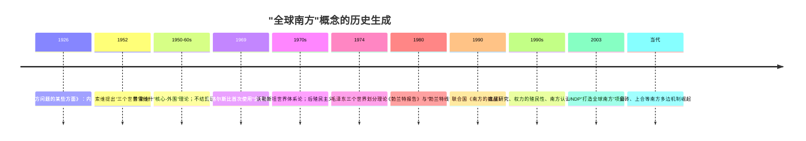

在这一漫长的话语演进基础上，**"全球南方"的当代内涵呈现出鲜明的层累结构**。第一层是地理区位意涵：绝大多数亚洲、非洲和拉丁美洲的发展中国家位于北纬30度以南[^5]。第二层是经济发展意涵：根据联合国2023年的划分标准，193个成员国中36个国家被认定为"发达国家"，其余被认定为"发展中国家""转型国家"或"新兴经济体国家"[^5]。第三层是地缘政治联合自强意涵：广大发展中国家具有相似的历史遭遇和共同的发展任务，"全球南方"作为一种政治"抵抗"主体出现[^5]。第四层——也是本研究尤为强调的——是文明主体性意涵：在桑托斯的南方认识论与康奈尔的南方理论中，"南方"被视作与"北方"迥异的知识和思想"产区"，承载着对"另类权力和知识来源的潜力"的探索[^9][^10]。

值得特别关注的是，安妮·加兰·马勒(Anne Garland Mahler)等学者进一步提出了"全球南方"的去地域化(deterritorialized)理解。她指出，"全球南方"在当代具有三重界定：其一是作为发展中国家的传统外交语言；其二是"在后民族意义上指代受当代资本主义全球化负面影响的空间与人群"，由此"地理北方中存在经济南方，地理南方中也存在经济北方"；其三则是作为"在当代全球资本主义共同压迫经验中产生的跨国政治主体的抵抗性想象"[^14]。马勒在《从三大洲主义到全球南方：种族、激进主义与跨国团结》一书中追溯了1966年成立于哈瓦那、由82个国家解放运动组成的"三大洲主义"联盟的思想遗产，揭示了"全球南方"作为跨国团结想象的激进谱系[^15][^16]。这一去地域化、关系性、抵抗性的理解，将"全球南方"从单纯的国家集合体提升为**一种跨地域的、以共同压迫经验为基础的政治主体性**，构成了文明互鉴主体的重要理论基础。

## 1.4 "文明交流互鉴"的理论谱系：从"和而不同"到全球文明倡议

与"全球南方"概念的西方学术发源不同，"文明交流互鉴"的话语谱系深植于中华文明的思想根脉，并在当代中国外交话语中获得系统性建构。这一谱系的考察对于理解全球南方的文明对话方案至关重要。

**思想根脉可上溯至先秦"和实生物，同则不继"的辩证智慧**。西周末期史伯指出："夫和实生物，同则不继。以他平他谓之和，故能丰长而物归之，若以同裨同，尽乃弃矣。故先王以土与金、木、水、火杂，以成百物"[^17]。这一思想确立了中华文明对差异性与多样性的根本肯认——不同事物相互调和、融合才能生成繁盛的新事物，单一同质的事物则无法持续[^18]。在此基础上发展出的"和而不同"，成为中华文化和谐共生精神的集中体现：它既肯定事物的多样性，又包容事物的差异性，并将不同的事物融合到一个和合体中[^18]。儒家的"大道之行，天下为公"、法家的"以天下之财，利天下之人"、道家的"藏天下于天下"，无不契合古人一以贯之的"天下一家"叙事逻辑[^17]。英国汉学家葛瑞汉曾敏锐指出："中国人倾向于把对立双方看作包容互补的关系，而西方人则习惯于强调二者的冲突"[^18]——这一比较为理解中西文明观的差异提供了深层的思维方式注脚。

近现代以来，**这一思想谱系经过费孝通的创造性转化，获得了现代学术语言的表达**。费孝通在80寿辰聚会上提出了著名的十六字箴言："各美其美，美人之美，美美与共，天下大同"[^19]。这一论述不是简单的传统文化复述，而是面对全球化与信息化时代的"思想观念上的一场深刻大变革"[^20]。费孝通敏锐地观察到，许多发展中国家的民众"由于受一种被扭曲的心理的影响，容易产生两种截然相反的倾向：一种是妄自菲薄，盲目崇拜西方；一种是闭关排外，甚至极端仇视西方"，而强势文明的发达国家则"容易妄自尊大，热衷于搞'传教'"[^20]。"美美与共"的提出，**正是要超越这种被殖民历史所扭曲的心理结构，建立起既不卑不亢、又能相互欣赏的文明心态**[^20]。费孝通进一步指出，要"做到不以本民族文化的标准，去评判异民族文化的'优劣'，断定什么是'糟粕'，什么是'精华'"[^20]——这一论述与后殖民理论家对欧洲中心主义评价标准的批判形成深刻的跨文化呼应。

在世界学术与国际政治层面，**英国历史学家汤因比的多样文明论提供了重要的同盟性资源**。汤因比在《历史研究》中"突破西方中心主义的历史观"，构建了一种文明形态史论，以文明为历史研究的单元，对世界多样文明同等地进行研究；他认为人类文明的产生和演化是多元的，在6000年人类历史上世界上有过许多种文明，文明的多样性是历史发展的基本形态[^2][^3][^4]。1998年联合国大会正式通过决议，确认世界上存在着不同的文明，并把2001年定为"文明对话年"；2001年联合国教科文组织大会通过《世界文化多样性宣言》，把文化的多样性提升到"人类共同的遗产"的高度来认识，认为这是保证人类生存的必需条件[^2][^3][^4]。这两项国际共识为文明互鉴提供了规范性基础。

当代文明互鉴观的系统建构，则始于2014年3月27日习近平在联合国教科文组织总部的演讲："文明因交流而多彩，文明因互鉴而丰富。文明交流互鉴，是推动人类文明进步和世界和平发展的重要动力"[^2][^3][^4]。这一论述被视为对亨廷顿"文明冲突论"的直接回应——亨廷顿对待非西方文明的看法是"文明对立论"，结论指向"文明冲突与战争"[^2][^3]，而文明互鉴观则提供了"人类文明共同体"的思想基础。

2023年3月15日，习近平在中国共产党与世界政党高层对话会上首次提出全球文明倡议[^21]。**该倡议的理论内涵可归纳为四大支柱**[^18]：

1. **尊重世界文明多样性**：从文明的多样性而言，每一种文明都扎根于自己的生存土壤，凝聚着一个国家、一个民族的非凡智慧和精神追求，文明虽有差异，但不是"唯我独尊"，而是多样平等共存；
2. **弘扬全人类共同价值**：从文明的共通性而言，全人类共同价值反映了世界各国人民普遍认同的价值理念的最大公约数，超越了意识形态、社会制度和发展水平差异；
3. **重视文明传承和创新**：从文明的发展性而言，文明交流互鉴既要继承发扬本民族优秀传统文化，又要与时俱进推陈出新；
4. **加强国际人文交流合作**：从文明的实践性而言，人文交流是增进各国人民相互了解、相互沟通的重要桥梁。

党的二十大报告进一步提出"以文明交流超越文明隔阂、文明互鉴超越文明冲突、文明共存超越文明优越"，**通过"三超越"在理论层级上系统回应了文明冲突论与文明优越论**[^18]。在制度层面，全球文明倡议已与全球发展倡议、全球安全倡议、全球治理倡议构成"全球倡议谱系"，是"中国为推动各国共同繁荣、世界普遍安全、文明交流互鉴、全球合作共治而贡献的系列公共产品"，"全球文明倡议致力于促进文明交流互鉴，其平等、互鉴、对话、包容的文明观，为构建人类命运共同体凝聚起更为广泛的价值共识"[^22]。截至2024年，全球文明倡议已写入中国和30多个国家的双边合作文件中；第七十八届联合国大会协商一致通过中国提出的设立文明对话国际日决议，充分表明全球文明倡议及其核心要义得到广泛认同和支持[^23]。

## 1.5 双重话语的相互建构：反霸权底色与解放性诉求的共鸣

在分别梳理"全球南方"与"文明交流互鉴"两大话语谱系之后，本节进一步揭示二者作为相互建构的话语体系所共享的反霸权底色与解放性诉求。这种相互建构关系并非外在的概念叠加，而是源自二者在深层历史经验与规范性愿景上的内在共鸣。

**第一重共鸣是反殖民、反霸权的历史经验同源性**。"全球南方"概念自葛兰西的"内部殖民"洞察、奥格尔斯比对"北方对全球南方统治"的控诉，到基哈诺"权力的殖民性"理论、康奈尔"南方理论"对欧美知识霸权的挑战，其底层始终贯穿着对帝国主义—殖民主义—新殖民主义历史结构的批判[^9][^10][^11]。"文明互鉴"理念虽植根于中国传统的"天下观"，但在当代的理论激活则同样发生在对西方中心主义文明观的回应之中——费孝通对"被扭曲心理"的诊断、汤因比对西方中心史观的突破、习近平对"三超越"的提出，都是在"近二三百年来，西方话语依托其背后的强势力量，塑造了西方至上主义的文明观，把其他国家和民族的文明不是视为低人一等，就是视为洪水猛兽"这一历史背景下展开的[^17]。**两套话语在"反西方中心主义"这一最根本的认识论立场上完全重合**。

**第二重共鸣是自主发展、自主表述的规范性诉求一致性**。"全球南方"的当代政治意涵核心是"独立自主是'全球南方'的底色，团结自强是'全球南方'的传统"[^1]，是从"沉默的大多数"走向"国际秩序变革的关键力量"的主体性建构。"文明互鉴"的核心要求则是各文明"做到不以本民族文化的标准，去评判异民族文化的'优劣'"[^20]，是文明主体性的相互承认与平等表述。在认识论层面，桑托斯的南方认识论、康奈尔的南方理论与全球文明倡议"尊重文明多样性"的支柱形成深刻的同构关系：**前者从社会科学知识生产的角度要求打破欧美知识霸权、囊括世界范围内更为多元的声音[^11]，后者则从国际政治与文化交往的角度要求文明的多样平等共存[^18]**。

**第三重共鸣是对平等对话秩序与多极世界的共同愿景**。全球南方崛起带来的不是新的霸权替代旧的霸权，而是对"国际秩序变革"的推动；其追求的是"践行真正的多边主义"、"倡导平等有序的世界多极化、普惠包容的经济全球化"[^1][^21]。文明互鉴所要构建的，则是"和而不同"的世界——"为了人类能够生活在一个'和而不同'的世界上，从现在起就必须提倡在审美的、人文的层次上，在人们的社会活动中树立起一个'美美与共'的文化心态"[^20]。**两者在规范性层面共同指向多极、多元、平等、包容的世界秩序，构成对单极霸权与文明等级的双重否定**。

在揭示三重共鸣的基础上，本研究进一步提出**"全球南方"与"文明交流互鉴"是相互建构的话语体系**这一总体性命题：

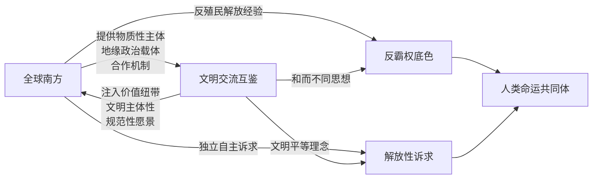

具体而言，**"全球南方"为"文明互鉴"提供物质性主体与地缘政治载体**：没有南方国家的群体性崛起、没有金砖、上合、中非合作论坛、中阿合作论坛等多边机制的支撑，文明互鉴可能停留为美好的规范性话语而难以转化为可操作的实践网络。**"文明互鉴"则为"全球南方"合作注入价值纽带与文明主体性**：没有文明多样性的相互承认、没有"美美与共"的心态建构，南方合作可能蜕化为单纯的利益交易而失去深层的精神黏合力。豪格(Sebastian Haug)的判断也在某种意义上印证了这一点："全球南方"概念正是通过加上"全球"前缀，将地理位置之南与政治、文化、认识论之南整合为一个具有自主性的话语主体，其讨论必然涉及"'另类'权力和知识来源的潜力"[^9]。

由此，**全球南方合作之所以能够推动文明交流互鉴，并不仅是因为南方国家在经济政治上日益重要，更因为南方崛起本身即是文明主体性重建的过程；而文明互鉴之所以构成全球南方合作的内在维度，也不仅是因为它是合作的"软实力"层面，更因为它是反西方中心主义认识论变革的核心战场**。这一相互建构关系，构成了本研究后续所有理论展开与实践分析的核心命题。

## 1.6 研究框架、概念边界与章节安排

为确保后续分析的严谨性，本节最后明确本研究的分析框架、关键概念的使用边界与章节组织逻辑。

**研究框架**以"话语谱系—理论考察—实践图景—未来路径"为主线展开。本章作为奠基性章节，完成话语谱系的梳理与四重理论坐标的确立；第二至第五章分别从后殖民主义与东方学批判、非西方现代化、全球史、四重理论整合四个维度展开理论考察；第六章进入合作机制与中国贡献的实践图景分析；第七章对内在张力与限度进行批判性反思；第八章则在结论层面展望人类文明新形态的理论前景。

**关键概念的使用边界**需作如下界定：

第一，**"全球南方"在本研究中采用包容性使用**：既指代地理意义上以亚非拉为主体的发展中国家集合，也涵盖马勒等学者所强调的去地域化、关系性的政治主体性[^14]。本研究承认"全球南方"概念存在内部异质性与可能的本质主义风险（这一问题将在第七章专门讨论），但仍坚持其作为话语策略与政治主体的有效性。

第二，**"文明"与"文化"的区分**：本研究中"文明"主要指具有长时段历史延续性、整合多种文化要素、承载普遍性价值追求的人类历史共同体单元（如汤因比意义上的文明形态）；"文化"则更多指特定群体的生活方式、价值表达与符号系统。文明互鉴的主体是文明，但其载体往往是具体的文化交往实践。

第三，**"现代化"与"现代性"的差异**："现代化"侧重指向社会经济结构的转型过程（工业化、城市化、制度变迁等可经验观察的变化）；"现代性"则更多指向与之相伴的认识论、价值观与主体性结构（理性化、个体化、世俗化等）。非西方现代化理论的关键贡献即在于将二者的捆绑关系松动开来——可以有不同于西方的现代化道路，亦可以有不同于西方的现代性方案。

第四，**"后殖民"(postcolonial)与"去殖民/解殖"(decolonial)的张力**：前者起源于1960年代亚非殖民地政治独立的余波，主要关注独立后的经济依附、政治从属与文化次属化；后者则于1990年代兴起于拉美，前提性判断是政治独立后殖民主义已让位于"殖民性"——一种结构化于全球社会互动的等级模式[^8]。本研究在使用相关概念时将注意区分二者的不同问题意识与理论侧重。

第五，**"互鉴"与"对话"的语义层次**："文明对话"侧重交流过程本身，"文明互鉴"则更强调相互学习、相互修正的实质性内容；本研究使用"互鉴"时即包含"对话"的过程性维度，又强调其超越单向凝视的双向建构性。

**章节安排的逻辑递进**可概括如下：本章奠定问题意识与理论坐标后，**第2章聚焦后殖民主义与东方学批判**，论证全球南方合作如何在认识论层面解构殖民性矩阵、重置知识生产的权力地理；**第3章转向非西方现代化与多元现代性**，揭示文明多样性作为现代性多元生成的内在动力；**第4章进入全球史视域**，为南南文明互动提供长时段历史正当性；**第5章整合四重理论维度**，建构以"主体性—多元性—互构性—长时段"为核心的全球南方文明互鉴理论模型；**第6章考察机制载体与中国贡献**，将抽象理论锚定于具体合作平台与全球文明倡议的实践方案；**第7章进行批判性反思**，呈现内在张力与限度；**第8章作出理论展望**，回到人类文明新形态的规范性愿景。

需要坦诚指出的是，本研究的资料基础以中文学术语境与汉语世界对全球南方与文明互鉴议题的讨论为主，对萨义德、斯皮瓦克、霍米·巴巴、彭慕兰、贡德·弗兰克、康拉德等核心理论家的原典阅读更多依赖二阶文献的转述与整合性论述。这一资料结构决定了本研究在某些理论环节可能存在深度上的局限，**后续章节将在涉及具体理论家命题时尽可能审慎地处理转述与原典之间的距离，并在资料支撑不足的论点处如实说明限度**。在百年未有之大变局的历史时刻，本研究试图以四重理论的整合性视角，回应一个关乎人类文明走向的根本问题：当全球南方不再沉默，当文明不再被预设为冲突，世界历史能否被重新书写？这一问题的回答，将在后续七章中逐步展开。

# 2 后殖民主义与东方学批判：文明解殖与知识权力的双重重构

第一章已经在话语谱系层面确立了"全球南方"与"文明交流互鉴"作为相互建构话语体系的反霸权底色与解放性诉求。然而，仅有谱系学的整理尚不足以解释一个更为根本的问题：在政治独立已基本完成、形式上的殖民帝国早已瓦解的当代世界，为何全球南方各国依然需要进行"文明解殖"？为何"文明对话"在多数情形下仍然呈现为西方主导的单向凝视而非平等的双向互鉴？回答这一追问，必须深入到殖民主义留给当代世界的最深层、也最隐蔽的遗产——**结构化于知识与权力之中的"殖民性"**。本章因此承担起整篇报告中的"解构性"功能：以法农、萨义德、斯皮瓦克、霍米·巴巴等后殖民理论家为思想资源，以萨义德的东方学批判为认识论支点，剖析西方对非西方文明的话语建构机制如何延续至今；继而以南方智库联盟、跨文明联合考古、非西方经典互译等当代实践为经验印证，论证全球南方合作如何在知识地理层面重置生产权力，从而推动文明互鉴由"被表述"走向"自我表述"。这一解构性工作，将为后续章节展开非西方现代化、全球史与理论整合奠定批判性前提。

## 2.1 殖民性矩阵与文明等级秩序：后殖民理论的批判性资源

理解全球南方合作的认识论意义，须从一个关键的概念区分开始：**"殖民"(colonialism)与"殖民性"(coloniality)的差异**。前者指向具体的政治军事征服与领土占领，是一种历史性的、可经由独立运动而终结的制度形态；后者则指涉一种"继承了所有社会与文化等级的全球性社会互动模式"，是一种结构化于现代世界体系之中、即便在政治独立之后仍持续运作的等级化逻辑。这一区分由秘鲁社会学家阿尼巴尔·基哈诺通过"权力的殖民性"(coloniality of power)概念予以理论化，强调欧洲殖民主义在当代政治和文化中的残余，尤其体现于"在现代/殖民的意象的基础上对世界的分等划级"——即沃尔特·米尼奥罗等学者所阐释的、通过"权力的殖民性"机制对世界进行等级划分的认识论操作[^24]。**殖民性矩阵的核心，正是这种以现代/殖民二元对立为底色的文明等级秩序**。

法农1952年出版的《黑皮肤，白面具》以临床精神分析的笔触，深刻揭示了殖民性如何在被殖民者的内心世界塑造出一种自我否定的人格结构。法农以原法属海外省安的列斯群岛的黑人为例描述了这种心理奴役的运作机制：安的列斯人在法律意义上是法国公民，作为有色人种，在面对白人时始终存在一种自卑感，他们在潜意识中承认白人的优越地位，努力戴上"白面具"，拉近与白人的距离，渴望获得承认；然而"变白"却是一种无法实现的想法，也因此成为了被殖民者永远的精神枷锁[^25]。这一分析的深刻之处在于，**它揭示了殖民统治不仅是外部的政治经济压迫，更是内在化为被殖民者自我认知的话语霸权**——"在白人的话语霸权下，黑人被认为是愚昧的、落后的，白人才是文明人"[^25]。法农的洞察由此指向一个根本命题：殖民解放不仅是政治层面的去殖民化，更必须是心理与认识论层面的去殖民化；只要"白面具"的渴望未被解构，文明等级秩序便得以在被殖民者的主体内部继续再生产。

这一心理—认识论层面的殖民性，在当代被基哈诺、米尼奥罗、杜赛尔等拉美解殖思想家进一步理论化为"殖民性矩阵"的概念。这一矩阵不再依靠殖民地总督府与军队，而是通过更为隐蔽的机制运作：通过学术体系中关于"先进"与"落后"的分类、通过国际媒体关于"文明"与"野蛮"的叙事、通过发展机构关于"援助"与"受援"的项目结构、通过学术排名与期刊评价中的认识论守门人机制——一整套被描述为"认识论的'世界警察'"的体系[^26]。墨西哥国立自治大学研究员费和平指出，自20世纪90年代起，美国与欧洲借"人权"话语外衣，强势输出自由主义，"知识外交"伴随资本流动、贸易协定、安全项目、国际认可，以及精英大学、多边机构与学术排名，共同构成认识论的"世界警察"，**只承认与西方式民主合拍的思想形态**[^26][^27]。

正是面对这一隐蔽而坚韧的殖民性矩阵，全球南方合作的认识论意义才得以凸显。**全球南方合作所面对的并非简单意义上的"残余殖民"，而是一种已经内嵌于现代世界体系深层结构、并通过日常的知识生产与流通持续再生产的等级化逻辑**。这一判断在2024年以来非洲、拉美学者对北方智库的批评浪潮中得到尖锐表达：北方智库在国际援助体系中扮演双重角色——一方面作为知识生产的"看门人"，通过议程设置、资金分配和方法论的"暴政"，延续了对南方本土知识体系的"认识论榨取"与"智力俘获"；另一方面，它们所倡导的"证据基础的政策"等援助范式，被批判为一种服务于新自由主义和地缘政治利益的、非政治化的技术外壳[^28][^29]。这场"去殖民化知识生产"运动的核心论点直指要害：**国际发展的根本失败不在于资金或技术的匮乏，而在于支撑其运行的知识体系的殖民性**[^28]。

由此可见，南南合作在认识论层面的解构性意义，并不在于简单地"反对西方"或"取代西方中心",而在于揭示并松动这套殖民性矩阵本身的运作机制。正如塞内加尔历史学家马马杜·法勒所指出的，**真正的挑战在于理解，"为什么某种特定话语秩序能够如此顽固地一再强加其片面性，全球南方国家又该如何摆脱这一困境"**[^26][^27]。这一追问构成了本章后续讨论的认识论起点。

## 2.2 "庶民能否言说"的当代回应：从沉默他者到南方主体

如果说基哈诺的"权力的殖民性"揭示了殖民性矩阵的结构性运作，那么印度后殖民理论家斯皮瓦克1988年发表的《庶民能否言说？》(Can the Subaltern Speak?)则以一个尖锐的提问，将这一矩阵中最深层的认识论困境凸显出来：在殖民话语已经预先规定了什么是"可言说的"、谁是"言说者"的条件下，被殖民的、被压迫的庶民(subaltern)是否还有可能真正发出自己的声音？抑或一切看似"庶民言说"的话语，最终都不可避免地被吸纳进西方知识体系的范畴框架之中？

斯皮瓦克的命题之所以具有震撼性，在于它将后殖民批判推到了一个近乎悲观的极限：即便殖民地已经独立、被压迫者似乎已经"获得发言权"，但只要他们使用的语言、概念、范式仍然来自殖民者所建立的知识体系，他们的"言说"就依然是被中介、被翻译、被规训的言说，而非真正自主的表述。这一困境在拉美社科理事会工作组的论述中得到了清晰回应——拉美社科理事会作为联结社会组织、致力于"从全球南方出发构建批判性与变革性思想"的学术共同体，其存在本身即是对斯皮瓦克之问的实践性回答[^30]。

与斯皮瓦克的解构性追问形成互补的，是印度裔英国学者霍米·巴巴(Homi Bhabha)的"混杂性"(hybridity)与"第三空间"(third space)理论。霍米·巴巴并不否认殖民话语的霸权性，但他坚持认为，在殖民者与被殖民者的接触地带，并非只有单向的压迫与被压迫，而是存在一种文化交错、相互渗透、彼此变形的复杂动态：**殖民话语在被传递、被翻译、被本土化的过程中，必然产生意义的滑移、扭曲与再生产，从而打开一个既非殖民者纯粹文化、亦非被殖民者纯粹文化的"第三空间"**[^31]。在这一空间中，文化身份不再是固定的本质，而是不断协商、混杂、重构的过程；被殖民者也不再仅仅是被动的话语客体，而能够通过混杂性策略实现某种主体性的迂回重建[^31]。霍米·巴巴的理论为讨论汤亭亭等华裔美国作家的文化身份策略提供了重要框架——他们试图在中美两种文化的夹缝中确立独特的文化身份，通过杂糅叙事策略追寻文化"第三空间"以期实现自我身份的重构[^31]。

将斯皮瓦克的"庶民失语"与霍米·巴巴的"第三空间"并置，可以更清晰地把握全球南方主体性建构的复杂路径。**当代全球南方崛起所提供的并非对斯皮瓦克之问的简单"否定性回答"——即简单宣称"庶民现已能够言说"——而是更为复杂的辩证性回应：南方主体的言说，既不是对殖民话语的彻底外在化，也不是对殖民话语的彻底内在化，而是在霍米·巴巴所揭示的混杂性空间中，通过对西方知识范畴的策略性挪用、改造、重组，逐步形成具有自主性的话语体系**。这一过程既包含解殖的解构动力，也包含本土知识传统的创造性激活，更包含南南之间的横向知识对话。

正是在这一意义上，全球南方在国际多边场合、学术话语与文化生产中由"沉默的大多数"向自主言说主体转变的当代图景，可以被理解为对斯皮瓦克命题的实践性回应。中国学者指出，全球南方应由全球南方国家来解释的呼声，反映出全球南方国家学术界关于知识生产主体性的觉醒；当下最受关注的全球南方国家知识生产议程包括三方面：一是发现并放大共通的核心议题与理论关怀；二是拆解欧洲中心主义的隐性认知框架，批判并超越西方现代化话语霸权；三是为支撑可持续发展并构建与之相匹配的身份认同开辟新的理论空间[^26][^27]。这三项议程已不再仅是"在西方框架内争取更多发言机会"，而是"对知识生产的'权力结构'本身进行彻底重置"[^28]。

然而，这一主体性建构过程本身亦充满内在风险与张力。第一，**精英化风险**：南方国家的"自主言说"在很大程度上仍然由受过西方学术训练的精英主导，其使用的概念语法、发表的期刊平台、对话的学术圈层依然深嵌于西方知识体系之中。第二，**再殖民化风险**：南南合作机制本身亦可能复制北南关系的等级模式——例如较大的南方国家对较小的南方国家形成新的话语主导。第三，**本质主义风险**：在反西方中心主义的旗帜下，可能出现将"南方"或"东方"重新本质化、浪漫化的倾向，从而以一种新的同质性叙事掩盖南方内部的真实差异。卡玛拉·哈里斯案例从另一个角度印证了主体性建构的复杂性——印度媒体The Wire在《卡玛拉·哈里斯：殖民梦的新衣》一文中直指，哈里斯的政治崛起更多是一种象征性姿态，而非实质性的进步，**揭示了殖民遗产如何延续，并伪装在那些它曾经压迫过的人们的皮肤之下**[^32]。这一案例提示我们，南方主体身份的标签性获得（少数族裔、女性、移民后代）并不自动等同于解殖意义上的真实主体性建构；如果其政治立场依然服务于霸权结构（如对加沙问题的选择性失语），那么"南方主体"的修辞便可能沦为对殖民结构的新一轮粉饰[^32]。

这些张力将在第七章得到更为系统的反思。但需要在此预先指出的是，**承认这些张力的存在并不构成对"南方能够言说"这一规范性命题的否定，而恰恰是该命题真正落地的前提**：唯有在持续反思精英化、再殖民化、本质主义风险的基础上，全球南方的自主言说才能避免重蹈其所批判的霸权逻辑。

## 2.3 东方学的话语—权力机制与非西方文明的自我表述困境

如果说斯皮瓦克之问揭示了庶民言说的认识论困境，那么萨义德1978年出版的《东方学》(Orientalism)则更早、也更具体地剖析了这一困境的话语生成机制。东方学作为萨义德最有影响力的概念，自其在1978年成书出版之后，成为"西方"认识"东方"的框架，也为后殖民理论研究开辟出一块宽阔土壤[^33][^34]。萨义德的核心命题可概括为：**"东方"并不是一个自然的地理实体，而是西方为了确立自身优越性和统治地位而建构出来的一套话语体系和知识系统**[^35]。东方学并非纯粹的学术活动，而是借助米歇尔·福柯的"话语—权力"理论、葛兰西的"文化霸权"理论以及德里达的解构主义所揭示的、一个"权力—知识"话语系统。

按萨义德的说法，**东方学主要是一种定义和"定位"欧洲的他者的方式；但作为一组相互关联的学科，东方学在很多重要的方面也关乎欧洲本身**——围绕民族特性、种族与语言起源为核心的论证为中枢[^33][^34]。这一论断揭示了东方学的双重运作：它既通过"东方"建构出一个低劣的、神秘的、需要被启蒙与统治的他者，又通过这一他者的对照，反向确立了"西方"作为文明、理性、进步的自我形象。萨义德在著作中明确指出："在所有情况下，东方只是欧洲观察者眼中的东方"——西方的"东方学家"并不平等地研究"东方"，他们站得高高在上，蔑视着他们的研究对象，以过去的信息覆盖过去的信息[^35]。

这一话语—权力机制的具体运作，可通过萨义德所引用的几位欧洲思想家的案例得到清晰展示：

**首先是1786年威廉·琼斯关于梵语与希腊语、拉丁语共同起源的著名宣言**。琼斯的话引发了全欧洲的"印度热"，学者们纷纷到梵语里去寻找比拉丁语和希腊语还要深藏于历史的欧洲语言的起源；在印度热过后，东方学被牢固确立了，而语言研究也得到了极大的扩张[^33][^34]。然而，看似纯粹的语文学研究，却很快"被疯狂的'种族人类学'学说给吞没了"——语言和认同的关联，特别是语言的多样性和种族认同的多样性的关联，引出了民族学这门学科，也就是现代人类学的前身[^33][^34]。东方语言研究因此从一开始就嵌入了关于民族特性与种族等级的政治构想之中。

**其次是19世纪法国文学家与历史学家欧内斯特·勒南**。勒南可以自信地宣称："每个人，无论多么不熟悉我们时代的事务，都会清楚地看到，实际上，信穆罕默德教的国家是低劣的"；他进而断言："所有去过东方或非洲的人都会震惊于此：真正的信徒头上的种种铁箍致命地限制了他的心智，使之在知识面前把自己完全地封闭起来"[^33][^34]。这种论断之所以能够"自信"地发出，正是因为它处于一个**"欧洲文明的优越性和重要性是不受质疑的"语境**——这就是那种"很快就被富有影响力的学者生产的神话、意见、道听途说和成见认为是已被接受的真理的话语的力量"[^33][^34]。

**再次是夏多布里昂、内瓦尔、福楼拜等浪漫主义文学家**。萨义德指出，夏多布里昂"对东方充满自我色彩"——他对于埃及的文明是赞扬的，但是又偏偏说"我看到一个新的文明的遗产已由一个天才的法国人带到了尼罗河两岸"，他似乎觉得**埃及的东西不是埃及的，这些好的东西都源于西方**[^35]。夏多布里昂、内瓦尔、福楼拜等人在作品中将东方描绘为欧洲的欲望客体（异域情调、女性化）和衬托西方优越性的"他者"[^35]。这种文学想象与勒南式的学术断言相互支援，共同构成了萨义德所说的"权力—知识"话语系统。

更为关键的是，萨义德在1993年出版的《文化与帝国主义》中将这一话语—权力分析进一步拓展到欧洲小说的形式与风格层面。**萨义德的核心论点是，西方文化与帝国主义之间存在一种"共谋"关系，帝国主义扩张不仅依靠军事和经济力量，也通过文化形式来制造幻觉、巩固统治**[^36]。为此，萨义德提出了"对位阅读"(contrapuntal reading)的方法，主张在阅读经典文本时，既要关注其美学价值，也要结合其创作的历史与政治背景，并倾听前殖民地本土作家和少数族裔的声音[^36]。萨义德通过对简·奥斯汀、约瑟夫·康拉德、阿尔贝·加缪等作家作品的分析来论证这一观点：例如，加缪虽然批评法国的殖民政策，但其反对阿尔及利亚独立战争的态度，**实际上排斥了由占多数的阿拉伯穆斯林主导的民主未来，这反映了其思想中隐含的帝国主义视角**[^36]。萨义德进一步指出，文化与帝国主义都不是静止的，由于帝国主义促动的全球化进程，各种文化相互交织、混合，呈现出不可避免的"混杂性"；他批判了欧洲中心论和文化霸权主义，提出了"混杂文化"和"反叙述"的模式，用以抵抗单一的文化霸权[^36]。

东方学话语机制的当代延续，远未随着政治殖民的终结而消散。第一章已提及的1969年BBC十三集纪录片《文明》将"人类文明"几乎等同于卢瓦尔河城堡、佛罗伦萨宫殿、凡尔赛宫等西方景观，正是东方学逻辑在大众文化领域的延伸——通过视觉编码将"文明"等同于"西方"，将非西方预设为"未开化"或"前文明"。这一遗产在当代依然以更微妙的形式延续：从国际媒体对全球南方的报道框架，到好莱坞电影对中东、非洲、拉美的形象塑造，再到学术期刊对非西方研究的"他者化"处理，**东方学并未消失，只是改变了其外衣**。

由此引出的根本困境是：在东方学话语长期占据"权力—知识"上游位置的条件下，**非西方文明如何摆脱"被表述"的客体地位，实现真正意义上的"自我表述"**？这一问题不仅是认识论问题，更是文明政治问题。它提示我们，文明交流互鉴的真正实现，不能停留于国家间的礼仪性交往或文化产品的相互输出，而必须深入到话语生产机制本身的重置——这正是下两节将要展开的实践分析所要回答的核心问题。

## 2.4 知识地理的重构：南方智库联盟与去殖民化知识生产运动

如果说东方学批判与"庶民能否言说"的追问构成了认识论层面的解构性工作，那么全球南方智库联盟与去殖民化知识生产运动则代表了在制度与机构层面的建构性回应。这一回应的核心命题是：**仅仅批判西方中心主义的话语霸权是不够的，必须建立南方自己的知识生产与传播机构，重置知识地理的权力分布**。

这一建构性回应的最早重要尝试，可追溯至1967年成立的拉丁美洲社会科学理事会（Consejo Latinoamericano de Ciencias Sociales, CLACSO）。CLACSO是联合国教科文组织认可的非政府国际机构，致力于社会科学和人文领域的研究；目前其成员涵盖了拉美和加勒比及其他地区的56个国家的927个研究机构（另一统计为961个），与拉丁美洲社会科学院、联合国拉丁美洲和加勒比经济委员会并称拉丁美洲三大社科研究机构[^37][^30]。CLACSO的自我定位极为明确——它"不仅是学术网络，更是联结社会组织、致力于从全球南方出发构建批判性与变革性思想的学术共同体"，并将"与作为世界体系转型关键行动者的中国进行深度对话"视为"共同迈向更加公正、团结与和平的国际格局的必要前提"[^30]。

CLACSO的成立模式直接催生了非洲对应机构的诞生。1973年成立的非洲社会科学研究发展委员会（CODESRIA）总部设在塞内加尔达喀尔，是按拉美社会科学委员会(CLACSO)的模型设计的机构——在结构上是大学和与大学相关的研究机构和研究中心组成的联合体；CODESRIA后来"成为一个规模更大的、有国际影响力的研究机构，把非洲大陆的大学和研究中心联合起来，并与拉美和亚洲的类似机构建立了密切的联系"[^38][^39]。**CODESRIA成立的过程本身就是非洲人民争取思想独立自主的一场战役**——其前身是"非洲研究机构负责人会议"，当时洛克菲勒基金会成立并资助该会议的动因是，非洲国家纷纷独立，西方害怕失去对非洲的控制权；他们深知，非洲各研究机构的西方负责人很快会被非洲本土学者取代，因此西方急需通过国际发展合作和学术交流继续影响非洲的学术领袖[^40][^41]。在这个背景下，作为CODESRIA幕后设计者和第一任执行秘书的埃及经济学家萨米尔·阿明（Samir Amin）巧妙地保留了CODESRIA的简称，却将其全称改为非洲社会科学研究发展理事会，从而将其定位明确转向"推动非洲独立思考的引擎，打破殖民遗产从而建立非洲自己的学术网络"[^40][^41]。萨米尔·阿明作为非洲依附理论的核心代表，其对全球资本主义体系外围—中心结构的批判，以及对中国"去依附"经验作为南方道路示范意义的推崇，构成了CLACSO—CODESRIA思想脉络中的重要节点[^42]。

然而，南方智库联盟的发展并非一帆风顺。CODESRIA第15届全体大会以"非洲与全球化危机"为主题，揭示了一个严酷的现实：理事会认为，全球化虽以促进人员、货物、服务和思想的流通为表象，但当前的全球化有明显的新自由主义倾向；**非洲独立已六十载，但殖民主义的影响仍然存在于非洲的教育体系和学界，美欧新自由主义仍主导知识的定义和传播**[^40][^41]。非洲研究学会(ASA)、非洲文学协会(ALA)、意大利非洲研究学会(ASAI)等组织的全球性非洲学术会议**无一例外都在北美和欧洲举行**[^40][^41]——这一现象本身即是知识地理殖民性的鲜明印证。南非大学校园2015年掀起的"罗德斯雕像必须推倒运动"再次令去殖民化成为非洲思考和讨论的重要议题[^40][^41]。

更具理论自觉的批评浪潮在2024年达到高峰。来自"全球南方"关键学术机构和政策领袖的系列报告、公开信及学术论著系统揭示了北方智库在国际援助体系中的双重角色：一方面，作为知识生产的"看门人"，通过议程设置、资金分配和方法论的"暴政"，**延续了对南方本土知识体系的"认识论榨取"与"智力俘获"**；另一方面，它们所倡导的"证据基础的政策"等援助范式，被批判为一种服务于新自由主义和地缘政治利益的、非政治化的技术外壳[^28][^29]。这一运动的核心诉求已"超越了简单的'包容性'诉求，正迫使国际援助范式发生结构性转变：即从'以能力建设为名'的知识转移，转向'以认识论正义为核心'的权力转移；从'北方主导、南方参与'的项目模式，转向'南方主导、自主定义'的发展路径"[^28][^29]。

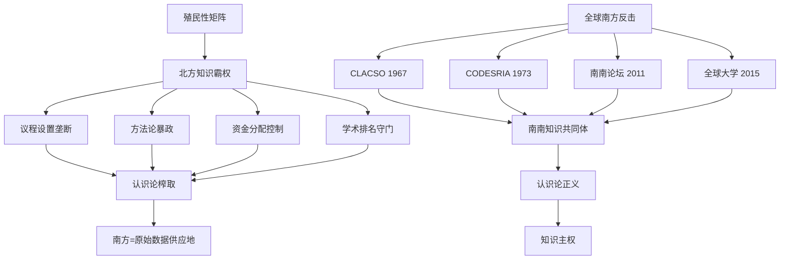

与CLACSO、CODESRIA这些机构性平台并行的，是更具民间性与跨界性的南南学术网络。2011年12月召开的第一届南南论坛(South South Forum on Sustainability)以"立足边缘国家的经验与现实，促进全球民间另类实践广泛开展对话与交流"为宗旨，有来自30个国家的120位学者和活动家参加[^42]。在此基础上酝酿筹组的"全球大学"(Global University for Sustainability)广泛联系全球南方与北方的进步知识分子，于2015年由200位创始成员宣布正式成立——发起人包括埃及的萨米尔·阿明、比利时的弗朗索瓦·浩达、美国的伊曼纽尔·沃勒斯坦、日本的武藤一羊和武者小路公秀，中国学者有戴锦华、温铁军、汪晖等[^42]。这一名单本身即体现了**南南—北南批判性知识分子之间的跨地域团结**——它不是简单的"南方主义"，而是基于反资本主义、反霸权立场的国际主义知识联盟。2025年8月召开的第12届南南国际学术会议以"绿色与可持续"为主题，邀请来自巴西、墨西哥、委内瑞拉、哥伦比亚、厄瓜多尔、美国、肯尼亚、冈比亚、印度、印度尼西亚、韩国、澳洲等12个国家的发言嘉宾参与，体现了南南知识共同体在生态文明、乡村振兴、全球治理等议题上的持续对话能力[^43]。

中国在这一知识地理重构进程中的位置，体现于多个维度的同时推进。在制度层面，2018年起上海外国语大学成为中国首家CLACSO成员机构，先后多次组织"SISU-CLACSO"拉美高水平教授的专题讲座，并不断探索"理论+实践"的创新模式[^44]。中山大学区域国别研究院与CLACSO"地缘政治、区域一体化与世界体系"工作组建立合作交流关系[^37]，对外经济贸易大学作为金砖国家智库合作中方理事会秘书处，与巴西应用经济研究所(IPEA)就金砖和全球南方合作的机制建设、经贸发展、教育人文交流等议题开展深度研讨[^45]。在理论层面，中国区域国别学的兴起被明确定位为应对西方知识权力的自主知识体系建构——研究者明确指出，西方国家通过"时间差"（拉美知识存量与增量生产维度）和"位置差"（拉美知识供给目标导向）形成对全球南方知识生产的"权力差"；**中国自主知识体系的建构，首先要面对的就是带霸权色彩的西方知识权力结构**[^43]。

CLACSO对中国"十五五"规划的解读尤具代表性。CLACSO学者基于其独特视角对中共二十届四中全会展开讨论，明确指出中国对科技自立自强和新质生产力的系统性投入，**对全球南方国家具有深刻的启示**：中国对"内生创新"和"技术现代化"的投入雄辩地证明，"全球南方国家完全有能力构建自身的发展路径，而不必永远依赖全球北方强加的模式"；鉴于CLACSO一贯批判榨取式、依附性的新殖民主义模式，"优先考虑技术自主和经济韧性的中国方案，无疑会激励拉美国家重新思考自身的发展道路"[^30]。更进一步，CLACSO提出，以人工智能为代表的新技术变革"应如何被用来加强技术主权、实现'认识论正义'，并避免我们陷入对由全球北方跨国公司所控制的平台和系统的依赖"——这一追问把南方知识主权与南方技术主权直接联结起来[^30]。

需要指出的是，这一知识地理的重构远未完成，且面临着诸多结构性约束。**北方智库的资金优势、语言优势（英语作为学术霸权语言）、平台优势（高影响因子期刊与国际媒体）依然在持续运作**；南方智库联盟的内部协调、可持续资助、青年学者培养、跨语言协作等方面仍面临严峻挑战[^40]。但即便如此，从CLACSO到CODESRIA，从南南论坛到中国区域国别学，从西非达喀尔的非洲社科理事会大会到中拉智库圆桌会议，**一个以"主体平等、议题自定、方法多元、相互参照"为基本原则的南南知识共同体，已经从呼之欲出转变为初具规模**[^26][^27]。

## 2.5 跨文明考古与经典互译：南南文明对话的实践地理

智库联盟的兴起重置的是抽象的认识论权力分布，而跨文明考古与经典互译则在物质遗存与文本翻译的具体层面，构成南南文明对话的实质性实践地理。这两类实践之所以重要，正在于它们直接对应于萨义德所揭示的两个核心问题：第一，关于"过去"的话语权——即谁有权讲述"东方"的历史；第二，关于"自我表述"的话语权——即非西方文明能否绕开西方中介、直接相互对话。

**跨文明联合考古的当代实践，正在系统性地重写海上丝绸之路与多中心文明互动的历史叙事**。中沙塞林港遗址联合考古便是这一重写工程的标志性案例。塞林港(Al-Serrian)是沙特红海之滨的一处重要海港遗址，**历史上曾与通往麦加的吉达港、通往麦地那的吉尔港"并驾齐驱"，是红海东岸的重要的朝圣贸易港**[^46][^47]。2016年，为落实中国与沙特阿拉伯两国元首达成的文化交流共识，中国国家文物局与沙特王国旅游与遗产签署合作协议；2018—2019年，中沙联合考古队对沙特塞林港遗址开展了两次考古发掘[^46][^47]。这一考古项目取得了超乎预期的成果：发现并确认了古海湾、古航道和被流沙掩盖的季节河遗迹；发现了成片分布的大型建筑遗址和两处排列有序的大型墓地；尤为引人注目的是，遗址还出土了一批来自中国的瓷器，包括青花灵芝云纹碗、蓝釉碗等[^46][^47]。这些物质遗存不仅印证了汪大渊《岛夷志略》、马欢《瀛涯胜览》中关于中国—中东海上贸易的文献记载，更**重写了海上丝绸之路的多中心叙事**——这条贸易网络并非以欧洲为中心向外辐射的"地理大发现"前奏，而是亚非之间长期存在的、独立于欧洲的多中心文明互动网络。中方领队姜波将塞林港遗址考古明确定位为"海上丝绸之路考古国际合作的范例"[^48]。

中埃孟图神庙南圣湖考古则在另一个文明节点上展开类似的实践。今年1月，中埃卢克索孟图神庙联合考古队宣布发现一座此前未知的圣湖遗迹，被命名为"南圣湖"——**这是埃及考古学史上首次在同一神庙区发现两座圣湖，也是埃及考古学史上唯一一座经过系统科学发掘的圣湖**[^49]。值得关注的是，孟图神庙遗址在20世纪40年代法国学者曾进行小规模发掘后数十年并未开展正式工作；8年前，这里"首次迎来中国考古队，中埃携手，让这座古老神庙缓缓揭开神秘面纱"[^49]。这一历史细节本身具有深刻的象征意义——埃及作为西方东方学、埃及学最早的"研究对象"，长期处于被表述的客体地位；而中埃联合考古的开展，则代表了一种新型的、平等的文明对话关系。正如埃及考古队员亨蒂所言："**联合考古的意义，不在于谁的技术更先进、谁的学术传统更悠久，而在于双方共同的信念：这是人类文明的创造，是属于全人类共同的遗产**"[^49]。这种"并肩工作的背影"成为"文明对话的模样，没有高下之分，平等照亮彼此"——它以最朴素的工作场景，回应了萨义德所批判的东方学家"站得高高在上"的认识论姿态。

中肯拉穆群岛水下考古在第三个维度上拓展了这一实践地理。中肯合作实施肯尼亚拉穆群岛水下考古项目是中国对肯尼亚实施的文化援助项目——2005年中国国家文物局与肯尼亚文化遗产部签署合作考古协议，2010年正式签署项目实施合同；从2010年11月至2014年1月，中肯联合水下考古队共计完成三个年度的水下考古调查、发掘、保护与研究工作[^50][^51]。该项目不仅发现了谢拉水下遗址的青花瓷器、马林迪奥美尼角沉船遗址等重要遗存，更印证了《明史·郑和传》中"麻林"和"慢八撒"（即马林迪和蒙巴萨）的记载[^50][^51][^52]。美国考古学者查普鲁卡·库辛巴指出，**中国与非洲的关联非常深远——肯尼亚的曼达、姆特瓦帕和格迪三座斯瓦希里城邦的考古发掘显示，自汉朝起中非之间就已经开始远距离的交流**[^52]。这一长时段的、独立于欧洲殖民贸易体系的中非互动，正是全球史视角下需要重新激活的文明互动实质（这一议题将在第四章详细展开）。

中洪科潘玛雅遗址联合考古则是这一实践地理向中美洲的延伸——**这是中国考古学者在中美洲主持的第一个田野考古项目**[^53][^54][^55]。2014年7月，中国社会科学院考古研究所与洪都拉斯人类学和历史学研究所签订合作协议；2015年，中国社会科学院将科潘遗址考古和玛雅文明研究列入创新工程重大课题予以支持[^54][^55]。这一项目的特殊意义在于其学术雄心——其目标不仅在于中美洲文明研究，**更在于中外文明的对比研究，期望对张光直等研究者提出的"玛雅—中国文化连续体"概念进行回应**[^54][^55]。中美洲原住民和亚洲人具有诸如蒙古褶和铲形门齿等共同的体质特征；他们还有一些相似文化实践和信仰——对玉的崇拜和使用，四方和中心的观念以及用不同颜色与之搭配；中美洲历法中数字和日名的组合方式不禁令人想起中国的天干地支；更为神奇的是，他们都会在满月表面看到一只兔子的形象[^53][^54][^55]。**这些跨文明的相似性研究，本身即是对欧洲中心主义"独立文明起源论"的悄然挑战**，是一种南方—南方之间直接的文明对话尝试。

下表汇总了上述四个跨文明联合考古项目的关键信息及其在南南文明对话中的功能定位：

| 项目 | 启动时间 | 关键发现 | 文明对话意义 |
|------|---------|---------|------------|
| 中沙塞林港 | 2016/2018-2019 | 古港遗址、中国瓷器、阿巴斯王朝金币 | 重写海上丝绸之路多中心叙事[^48][^46][^47] |
| 中埃孟图神庙 | 8年前启动 | 南圣湖（埃及首座系统发掘圣湖） | 打破东方学单向凝视，水文化跨文明对话[^49] |
| 中肯拉穆群岛 | 2005年协议/2010-2014发掘 | 谢拉水下遗址、奥美尼角沉船 | 印证郑和下西洋，长时段中非互动[^50][^51][^52] |
| 中洪科潘 | 2014/2015 | 8N-11贵族院落、玉饰与彩陶 | 跨太平洋文明比较，挑战独立起源论[^53][^54][^55] |

如果说跨文明联合考古重置的是**关于过去的话语权**，那么非西方经典互译则重置着**关于当下与未来的话语流动**。中阿典籍互译出版工程是这一实践维度的代表性案例。2008年5月，中国—阿拉伯国家合作论坛第三届部长级会议确定启动该工程；2010年5月，新闻出版总署与阿拉伯国家联盟秘书处签署合作备忘录正式启动该工程；截至2023年北京国际图书博览会期间，五洲传播出版社宣布完成全部50部作品的翻译出版工作[^56]。该工程的认识论意义体现在两个层面：第一，**《论语》《孟子》《老子》等20多种中国优秀典籍被翻译成阿拉伯语**，其中由薛庆国和费拉斯·萨瓦赫合作完成的《老子》《论语》《孟子》阿拉伯文译本，是中阿学者在中国文化原典阿拉伯文翻译史上的首次联袂[^56]；第二——也是更具深远意义的——对于阿拉伯国家读者而言，该工程提供了**直接了解中国文化的渠道，改变了以往主要依赖西方转译或视角的局面**[^56]。

这一"绕开西方转译"的认识论意义，需要置于萨义德东方学批判的语境中才能充分理解。在传统的知识—权力地图中，**中阿两大文明之间的相互理解，长期需要经由欧美学界的双重中介——欧美汉学家翻译、阐释中国，欧美阿拉伯学家翻译、阐释阿拉伯世界，再由中阿双方分别通过英语等中介语言相互"望见"**。这种间接性本身即是东方学话语权力的体现：它使中阿之间的文明对话必然带上欧美知识范畴的滤镜。中阿典籍互译工程通过中阿学者直接合作的方式，建立起一条**南方文明之间的直接对话渠道**——这正是对萨义德"对位阅读"理念的当代延展。萨义德所主张的"倾听前殖民地及少数族裔作家的声音"，在中阿典籍互译中体现为南方文明之间彼此倾听、相互翻译的实践。

类似的实践模式正在向更多南方文明扩展。**亚洲经典著作互译计划**作为习近平总书记2019年在亚洲文明对话大会上提出的倡议，截至目前已与23个亚洲国家签署了图书互译出版备忘录[^57]。中阿塞拜疆经典著作互译项目即是其重要组成部分——2022年3月30日，《中华人民共和国国家新闻出版署与阿塞拜疆共和国文化部关于经典著作互译出版的备忘录》签署，约定在未来5年内共同翻译出版50种两国经典著作[^58][^57]。在2025年6月19日的签约仪式上，中方授予阿方翻译和出版《家》和《老子注译及评介》阿塞拜疆语版的权利；阿塞拜疆文化部部长顾问奥尔汗·萨迪戈夫在致辞中指出，"古代丝绸之路早已架起中国与阿塞拜疆之间的文明桥梁，奠定了两国文化交流的深厚基础"[^57]。

由跨文明联合考古与经典互译共同构成的实践地理，正在系统性地体现对萨义德"对位阅读"理念的当代延展。萨义德的"对位阅读"原本是文学批评的方法论——主张在阅读经典文本时倾听被压抑的他者声音。**当这一方法论被扩展到考古、翻译、知识生产的整体实践之中时，它便转化为一种全球南方文明对话的元方法论**：不再是西方对非西方的单向凝视、单向叙述、单向命名，而是非西方文明之间在物质遗存、文献文本、思想观念多个层面的相互倾听、相互参照、相互翻译。这一元方法论的展开，正是下一节将要总结的"被表述的东方"向"自我表述的南方"认识论转向的实质内容。

## 2.6 从被表述的东方到自我表述的南方：文明互鉴的认识论转向

经过前述五节的层层展开，可以归纳出一个总体性判断：**全球南方合作所推动的，并非简单意义上的"文明交流"数量增加或"南方力量"政治崛起，而是文明互鉴在认识论结构上的根本转向——从"被表述的东方"向"自我表述的南方"的范式性变迁**。这一转向的内涵需要在与东方学话语机制的对照中才能得到清晰把握。

下表系统比较了"被表述的东方"与"自我表述的南方"在认识论结构上的差异：

| 维度 | 被表述的东方（东方学范式） | 自我表述的南方（南南互鉴范式） |
|------|---------------------------|------------------------------|
| **言说主体** | 西方东方学家、传教士、殖民官员 | 南方学者、考古学家、翻译家、政治领袖 |
| **言说对象** | 沉默的、被研究的客体化"东方" | 平等的、相互倾听的多元南方文明 |
| **话语结构** | 单向凝视、定义、定位他者 | 多向对话、相互翻译、彼此参照 |
| **知识地理** | 北方—大学/智库为中心，南方为原料供应 | 多中心—南南智库联盟、跨文明合作平台 |
| **知识—权力关系** | 知识服务于殖民/霸权秩序的合法化 | 知识生产与认识论正义、知识主权相联结 |
| **典型范式** | 勒南断言"信穆罕默德教的国家是低劣的" | 中沙考古学者"在每一项具体的工作中共同进步" |
| **文明等级** | 西方文明 vs. 落后东方的二元对立 | 各美其美、美美与共的多元平等共存 |
| **历史叙事** | 西方崛起的线性进步史观 | 长时段、多中心的全球文明互动史 |
| **价值理念** | 普世主义包装的西方中心主义 | 全人类共同价值与文明多样性辩证统一 |

由这一比较可清晰看出，全球南方合作通过主体性重建、知识自主与话语去蔽，正在推动文明互鉴的**三重根本性转向**：

**第一重转向：从单向凝视到多向对话**。东方学的核心机制是西方对东方的"凝视"——一种以观察者自我为中心、将被观察者客体化的认知姿态。全球南方文明对话的当代实践——无论是中沙考古队员"共同蹲在一个探方里"的工作场景[^48]，还是中阿学者在《老子》《论语》阿拉伯语翻译中的"首次联袂"[^56]，抑或是CLACSO对中国"十五五"规划的批判性解读[^30]——都在以最具体的方式打破这种凝视结构，建立起多向、平等、相互注视的对话关系。这一转向并非否定"差异"的存在，而是将差异从"等级化的他者"重新理解为"平等的相互参照对象"。

**第二重转向：从殖民等级到平等互鉴**。殖民性矩阵的核心运作机制是文明等级秩序——通过将非西方文明定位为"低劣的""神秘的""需要被启蒙的"，确立西方文明的支配地位。**而全球南方合作所体现的"平等互鉴"原则，则在制度层面与认识论层面同时拆解这一等级秩序**：在制度层面，南南智库联盟、联合考古项目、典籍互译工程都坚持双方对等参与、共同决策、成果共享的原则；在认识论层面，全球文明倡议明确主张"尊重世界文明多样性"、"重视文明传承和创新"，党的二十大报告"以文明交流超越文明隔阂、文明互鉴超越文明冲突、文明共存超越文明优越"的"三超越"，构成对文明等级秩序的系统性回应。

**第三重转向：从西方中介到直接交往**。这是最具实质意义、也最具结构性意义的转向。在东方学范式下，南方文明之间的相互理解必然经过欧美学界的"双重中介"——这种中介性本身即是西方话语霸权的物质基础。**全球南方合作的实践地理——从中阿典籍互译"改变以往主要依赖西方转译或视角的局面"[^56]，到金砖国家智库直接对话、CLACSO与中国学界的"深度对话"[^30]——正在系统性地建立起南方文明之间不经西方中介的直接交往渠道**。这一渠道的建立，是对斯皮瓦克"庶民能否言说"之问的最具实质性的回应：当南方文明之间能够直接相互翻译、相互倾听、相互参照时，"庶民"的言说便不再仅仅在西方知识范畴的框架内回响，而能够在自身的话语场域中获得意义。

这三重转向与第一章所阐述的文明交流互鉴理念之间存在深层共振。**全球文明倡议"四大支柱"的内在逻辑——尊重文明多样性、弘扬全人类共同价值、重视文明传承创新、加强国际人文交流合作——可以被理解为对后殖民主义批判的建设性回应**：它既继承了后殖民批判对西方中心主义的解构动力，又超越了纯粹解构性的悲观主义，提供了重建文明秩序的规范性愿景。费孝通的"各美其美，美人之美，美美与共，天下大同"——如第一章所阐释的——正是要超越被殖民历史所扭曲的心理结构，建立起既不卑不亢、又能相互欣赏的文明心态；这一论述与霍米·巴巴的"第三空间"理论、桑托斯的南方认识论形成深层的跨文化呼应。

然而，**承认这一转向的根本意义，并不等于宣告其已经完成或不存在挑战**。本研究作为去西方中心主义的认识论自觉的研究，必须警惕对"南方崛起"的浪漫化叙述。至少有以下几方面的张力与限度需要在此预先指出（更系统的反思将在第七章展开）：

第一，**南方智库联盟的资源结构性约束**：从CODESRIA面对的"非洲与全球化危机"，到南南论坛主要依靠香港岭南大学等机构的有限资助，南方知识共同体的可持续性仍面临严峻挑战；北方智库的资金、平台、语言优势仍在持续运作[^40][^42]。

第二，**南方内部的话语不对称**：在南南合作的具体实践中，较大的、资源较丰富的南方国家（如中国、印度、巴西）与较小的南方国家之间可能形成新的话语不对称；这种不对称如不加以反思，可能复制北南关系中的某些等级特征。

第三，**主体性与本质主义的边界**：在强调南方主体性建构的同时，必须警惕将"南方"或"东方"重新本质化的倾向。哈里斯案例所揭示的——少数族裔身份的标签性获得不等于解殖意义上的真实主体性[^32]——同样适用于"南方"概念本身：仅仅持有"南方身份"并不自动意味着站在去西方中心主义的认识论立场上。

第四，**后殖民理论自身的学院化困境**：后殖民理论作为一种主要在西方学院体系内发展起来的批判话语，本身就存在被西方学术体制吸纳、规训、消解的风险。如何使后殖民批判保持其与南方实际斗争的有机联系，而非沦为西方学术市场中的一种"学术商品"，是南方学界需要持续反思的问题。

尽管存在上述张力与限度，**全球南方合作所开启的认识论转向已经构成不可逆的历史进程**。正如塞内加尔学者法勒所指出的，**全球南方国家必须打破"西方是知识的终极阐释者，我们只是原始数据供应地"的二元对立思维**[^26][^27]。这一打破并非一蹴而就，而是一个持续展开的、有起伏有反复的历史进程。本章的解构性工作至此告一段落——通过法农、萨义德、斯皮瓦克、霍米·巴巴等后殖民理论资源对殖民性矩阵的剖析，通过对东方学话语—权力机制的系统揭示，通过对南方智库联盟、跨文明考古、经典互译等当代实践的考察，本章试图论证：**全球南方合作所推动的文明交流互鉴，不仅是政治经济意义上的合作，更是文明等级秩序的认识论解构与重构**。

这一解构性的工作为后续章节奠定了批判性前提：在解除了西方中心主义文明观的话语束缚之后，我们才能进入第三章关于非西方现代化与多元现代性的实质性讨论——不再追问"南方何时能够现代化",而是追问"现代性如何能够多元化";不再将文明多样性视为现代化的障碍，而是将其理解为现代性多元生成的内在动力。这一从"解构"到"建构"的理论运动，正是本研究整体论证逻辑的核心脉络。

# 3 非西方现代化与多元现代性：文明互鉴的现代性根基

第二章在认识论层面完成了对殖民性矩阵与东方学话语机制的解构性工作，论证了全球南方合作如何通过主体性重建、知识自主与话语去蔽，推动文明互鉴从单向凝视走向多向对话。然而，**话语层面的解构若不能落实为对"现代性"本身的实质性重审，则解殖工作便可能停留于批判而无法走向建构**。本章因此承接前章的批判性前提，进入更为根本的理论追问：在解除了"现代化=西方化"等式束缚之后，"现代性"是否仍是一个有意义的范畴？如果是，它在不同文明传统中如何获得差异化的展开？全球南方各国——拉美、南亚、非洲、中国——在自身的现代化道路探索中所形成的理论资源与实践方案，能否被理解为对"现代性"概念本身的多元化贡献？回答这些问题，需要在理论范式上完成从单一现代化叙事到多元现代性范式的根本转换，并在此基础上系统比较拉美依附理论、印度庶民研究、非洲乌班图哲学、中国式现代化等差异化的现代性文化方案。本章在整体研究中承担"实践方案"层面的论证功能：它将证明，**文明多样性并非现代化的障碍，而是现代性多元生成的内在动力；全球南方在现代化道路上的相互参照与相互启发，构成了文明互鉴的实质性内容而非外在装饰**。

## 3.1 从单一现代化到多元现代性：理论范式的根本转换

20世纪50—60年代兴起的经典现代化理论，以帕森斯、罗斯托、亨廷顿等人为代表，将现代化定位为一个由"传统社会"向"现代社会"演进的单线性、普世性、不可逆的历史过程，并将这一过程的"标准范本"等同于西方——尤其是西欧与北美——的发展经验。这一理论范式在表面上是社会学与发展经济学的"科学"建构，但其底层假设却深植于18世纪以来欧洲启蒙叙事所形塑的线性进步史观之中。第一章已指出，这一叙事**含蓄地支持线性发展道路的想法**，将"发达""发展中"和"不发达"作为衡量人类社会进步的统一刻度，从而在认识论上预设了西方的优越性与非西方的次属性。第二章则进一步揭示，这一叙事本身即是殖民性矩阵在发展理论领域的具体显现。

正是面对这一范式的解释力危机与认识论困境，**多元现代性(multiple modernities)理论**于1990年代后期由以色列社会学家艾森斯塔特(Shmuel N. Eisenstadt)系统提出。艾森斯塔特的核心命题是：**"现代性并非单一的、同质化的现象，而是不同社会和文明中发展出的多种文化方案和制度模式的集合。这些多元现代性并非简单地衍生于西方模式，而是反映了每个社会独特历史经验和文化传统的独特形态"**[^59]。这一命题对经典现代化理论构成根本性挑战：它既不否认存在一种可被称为"现代性"的历史趋势（工业化、城市化、识字率提高、社会动员加深、职业结构复杂化等[^59]），也不否认这一趋势具有一定的"内在的一般规律"[^59]，但同时坚持认为，这些趋势在不同文明传统中的具体展开形式、制度建构路径、价值取向选择，必然带有各自文化方案的独特印记，从而生成多元而非单一的"现代性形态"。

值得指出的是，艾森斯塔特对多元现代性的论证并非凭空而起，而是与雅斯贝尔斯1949年提出的"轴心时代"(Achsenzeit)理论存在深层的思想关联[^60]。1983—1984年，艾森斯塔特在德国和以色列召集了两次重要会议，邀请古代史、思想史、哲学以及宗教学的专家对轴心时代观念进行深入讨论，议题包括"第一次突破的背景，以及突破后'道统'(orthodoxy)与'法统'(legitimacy)的关系，正统的分化与转变，以及知识分子在各阶段所担任的角色"[^60]。这些讨论实际上为多元现代性理论提供了深层的文明史根基：**如果人类历史上的诸文明在公元前第一个千年的"轴心突破"中已分别发展出不同的超越性观念——希腊的"逻各斯"、印度的"梵天"、中国的"道"[^60]——那么这些差异化的文明根脉在面对现代性挑战时，自然会生成差异化的现代性方案**。1972年史华慈倡议召开的轴心时代国际会议中已明确提出"超越的时代"(The Age of Transcendence)命题，认为各文明的超越观念是对那一时代文明发展的"突破"(Durchbruch)[^60]。多元现代性理论与轴心文明论的这一思想接续关系提示我们：**现代性的多元化并非偶发的"地方变异"，而是植根于人类文明长时段的多元演进谱系**。

与艾森斯塔特相呼应，加拿大哲学家查尔斯·泰勒(Charles Taylor)在其著名论文《两种现代性理论》(Two Theories of Modernity)中作出更为精微的理论区分。泰勒将主流的现代性理论区分为"非文化型理论"(acultural theory)与"文化型理论"(cultural theory)：前者将现代性理解为各文化都将殊途同归的、抛弃前现代信念的普世过程；后者则将现代性理解为**"从一种背景理解格局向另一种格局的转变，这一转变重新定位了自我与他者及'好'(the good)的关系"**[^61]。泰勒的结论是：**"现代性并非所有文化在抛弃束缚先辈的信念之后必然趋同的生活形态，而是从一组背景理解向另一组背景理解的转变，这种转变重新定位了自我与他者及'好'的关系"**[^61]。这一论述的深刻之处在于，它将现代性从"摆脱传统"的负面定义——即仅仅以"非传统"来界定"现代"——重新还原为"背景理解格局的转换"这一更具建构性的过程；而由于不同文明的背景理解格局本身存在差异，转换的路径与结果自然不可能趋同。

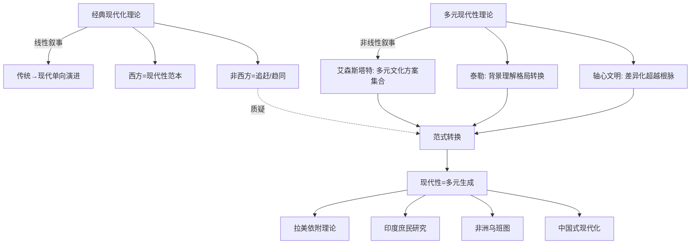

需要指出的是，多元现代性范式本身亦存在内在张力。其一，**"现代性"概念本身仍带有西方学术起源的印记**——即便强调多元，"现代性"作为讨论的元概念仍源自西方思想史，这使得多元现代性论述在一定程度上仍可能"以西方理论框架规训南方经验"。其二，**多元现代性可能滑向文化相对主义**——若过度强调每种文明的"独特方案"，可能淡化现代性进程中确实存在的某些跨文明共性（如人权、平等、可持续发展等价值诉求）。这些张力将在第六节预先点明，并在第七章得到系统反思。但即便如此，多元现代性范式所完成的根本任务——**将"现代性"从西方独占的固定模式解放为不同文明的生成性方案**——已经为本章后续考察拉美、印度、非洲、中国等具体路径提供了不可或缺的理论前提。

## 3.2 拉美依附理论与解殖路径：外围视角下的现代性反思

拉美对单线现代化叙事的早期、系统性挑战，发端于20世纪40年代末阿根廷经济学家劳尔·普雷维什(Raúl Prebisch)所提出的"中心—外围"(core-periphery)学说。普雷维什与其他对正统经济学持批判态度的拉美学者共同认为，**世界经济呈现出一种结构性不平等格局：少数发达国家凭借现代化生产技术、多元化生产结构与广泛生产领域占据"中心"地位，在世界经济体系中具有统治和支配地位；广大经济落后的发展中国家则因技术水平和生产率较低、生产结构单一而处于"外围"地位，其经济发展取决于中心国家经济发展的需要**[^62]。这一外围对中心的"依附"关系，导致一系列结构性后果：中心国家出口制成品、进口初级产品，外围国家则相反，由于世界市场上初级产品价格长期呈下降趋势，发展中国家的贸易条件不断恶化；中心国家技术领先且进步较快，外围国家技术渗透缓慢，结构性失业长期存在，人均收入差距持续扩大；外围国家的经济剩余流失，资金外流与技术渗透受阻[^62]。

普雷维什"中心—外围"学说的认识论意义远超出经济学技术性讨论的范畴。**它从根本上改写了对"落后"问题的解释框架**：经典现代化理论将非西方国家的"落后"归因于其内部的"传统残余"——文化保守、制度僵化、价值取向不利于资本积累；而"中心—外围"学说则将"落后"重新定义为**全球经济体系结构性运作的产物**——外围国家的不发达不是因为其"未充分接受"现代化，恰恰相反，是因为其作为外围被深度卷入了由中心主导的世界体系。这一解释框架的转变，将"内因论"颠覆为"结构论"，从而对现代化理论的整个论证基础形成釜底抽薪式的挑战。

普雷维什的开创性工作在依附学派(dependency school)那里得到深化与激进化。安德烈·贡德·弗兰克(Andre Gunder Frank)、塞尔索·弗塔多(Celso Furtado)、特奥托尼奥·多斯桑托斯(Theotonio Dos Santos)、保罗·巴兰(Paul Baran)、埃及裔学者萨米尔·阿明(Samir Amin)等学者将"中心—外围"分析推向高潮[^62]。其中尤需指出，**弗兰克提出的"不发达的发展"(development of underdevelopment)命题，将依附论的批判锋芒指向了现代化理论的"双轨假设"——即认为中心国家的发展与外围国家的发展可以并行不悖**：弗兰克论证恰恰相反，中心的发展正是建立在持续制造和再生产外围之不发达的基础上的。伊曼纽尔·沃勒斯坦(Immanuel Wallerstein)在此基础上将"中心—外围"二元结构进一步系统化为"中心—半外围—外围"三层结构，并发展为系统的世界体系理论；这一理论强调"半外围"国家兼具两者特征且地位可通过过渡变迁，**理论的核心主旨始终是揭露和批判不平等的国际分工与国际交换关系**[^62]。这一谱系的发展使依附理论成为发展中国家主张建立国际经济新秩序的重要理论依据。

依附理论的当代演化在拉美呈现为更为深刻的解殖学说。第二章已经讨论的米尼奥罗、基哈诺等拉美解殖思想家，将依附理论从经济结构批判推进到认识论批判：他们论证，**仅仅改变国际分工的经济秩序而不重置知识生产的认识论秩序，依附关系便可能以更隐蔽的形式延续**——这正是基哈诺"权力的殖民性"概念的核心意涵。由此，从普雷维什的经济学到米尼奥罗的解殖思想，**拉美贡献了一条从"经济外围批判"走向"认识论解殖"的连续性思想脉络**，其内在逻辑是：现代化的真正难题不在于"如何追赶中心"，而在于"如何摆脱中心—外围结构本身"，进而在于"如何摆脱这一结构在知识—权力层面的再生产机制"。

正是在这一思想脉络下，拉美社会科学理事会(CLACSO)对中国式现代化经验的关注与解读获得了重要意义。第二章已指出，**CLACSO学者认为中国对"内生创新"和"技术现代化"的系统性投入，"雄辩地证明全球南方国家完全有能力构建自身的发展路径，而不必永远依赖全球北方强加的模式"；鉴于CLACSO一贯批判榨取式、依附性的新殖民主义模式，"优先考虑技术自主和经济韧性的中国方案，无疑会激励拉美国家重新思考自身的发展道路"**。这一解读的深层逻辑是：**中国式现代化所体现的"去依附"经验——通过党领导下的统一规划、技术自立自强、超大规模市场支撑产业升级、保持金融与产业政策自主性——为深陷"中等收入陷阱"与"再初级化"困境的拉美国家提供了一种"突破中心—外围结构"的实践参照**[^63]。复旦大学张维为教授在2025年中国式现代化国际学术论坛上提出的"文明型国家"理论亦从国家形态层面回应了这一议题——他指出中国式现代化的成功"根植于其'文明型国家'特质，即一个古老文明与超大型现代国家的有机融合"，这种融合"政治上由代表整体利益的中国共产党领导，通过长期规划与强大执行力推动持续发展；经济上国有与民营互补的混合经济与超大规模市场，支撑了全面基础设施建设和充分竞争创新"，"使中国在较短时间内完成了工业追赶并站上科技前沿"[^63]。同样具有标志性的是，论坛吸引了来自"美国《科学与社会》杂志主编"胡里奥·华托、"巴西乌伯兰迪亚联邦大学教授尼迈尔·艾梅达·菲罗(Niemeyer Almeida Filho)"等拉美学者参与，并设置"当代资本主义批判与全球南方现代化"专门论坛[^63]，体现了拉美依附—解殖传统与中国道路之间的南南思想对话已具备稳定的制度化平台。

需要指出的是，这种南南思想对话并非单向的"中国经验外溢"，而是具有双向建构性。**拉美依附—解殖传统为中国理解自身现代化道路的世界历史意义提供了重要的批判性参照系**：中国学界关于"反帝反封建""不依附""独立自主"的话语，与拉美对世界体系结构性不平等的批判存在深层共鸣；而中国式现代化的具体实践，又反过来为拉美依附理论提供了"突破依附"在大型经济体层面的实证案例，从而避免了依附理论可能陷入的"无解的悲观主义"。这种双向参照，正是文明互鉴在现代性理论建构层面的实质性体现。

## 3.3 印度后发展思想与庶民研究：南亚现代性的本土建构

如果说拉美依附理论从外围经济结构层面挑战了单线现代化叙事，那么印度的后发展思想——尤其是1982年至2005年间由拉纳吉特·古哈(Ranajit Guha)、帕沙·查特吉(Partha Chatterjee)、迪皮什·查克拉巴蒂(Dipesh Chakrabarty)、吉安·普拉卡什(Gyan Prakash)等南亚学者持续推进的庶民研究(Subaltern Studies)——则从历史叙事与认识论层面对现代化理论的精英主义底色发起了系统性挑战[^64]。

庶民研究小组从1982年到2005年，"两年一本的速度，数十年如一日的坚持"，撰写并出版了12卷《庶民研究》[^64]。其核心问题意识是：**用一种与"精英"对立的、源自印度本土的"庶民"意识，去重新书写被西方及其同谋者共同篡改了的印度近现代历史**[^64]。具体而言，庶民研究反对印度近现代历史研究中的两种精英主义：殖民主义者的精英主义和印度资产阶级民族主义者的精英主义。**前者将印度的民族主义解释为一种刺激和反应的作用，认为它是印度的精英对殖民统治产生的制度、机遇和资源等作出的回应和"学习过程"；后者则把印度的民族主义描述为理想主义者的冒险行为，本地精英投身其中是为了领导人民从被征服状态走向自由**[^64]。这两种精英主义史学的共同偏见是：把印度民族的形成与民族主义的发展归结为精英的成就，而忽视了"庶民"，也就是处于"从属地位的下层"人民的能动性和自主性[^64]。

这一问题意识对现代化理论的挑战是深远的。**经典现代化理论默认现代化的主体是精英——技术官僚、企业家、改革派政治家、留学归国的知识分子；庶民研究则坚持现代化进程中真正的能动者还包括农民、工匠、底层妇女、贱民种姓、部落民众等被传统史学忽视的群体**。这一视角的转换在历史叙事层面具有深刻的政治意涵：它否认了"精英先觉醒、然后教化群众"这一线性教化论，而坚持"庶民有自身的历史能动性与意义生产能力"。庶民研究的理论资源既包括意大利马克思主义者葛兰西的"庶民"概念——并赋予它与精英对立的象征意义，使得以"庶民"为视角的历史书写具有了强烈的颠覆意味——也包括以E. P. 汤普森和霍布斯鲍姆为代表的英国马克思主义史学家"从下层看历史"(history from below)的研究旨趣[^64]。这些理论资源使庶民研究"呈现出一种新锐的开拓意识和激进的反抗态势，从其早期多关注农民反叛和农民战争中可以明显体察到这一点"[^64]。

庶民研究的国际化路径与第二章讨论的斯皮瓦克密切相关。**斯皮瓦克为《庶民研究》第4卷(1985年)写下《庶民研究：解构历史编纂》一文；1988年又发表后殖民主义重要文献《庶民能否说话吗？》为之摇旗呐喊；同年，她与古哈共同担任主编，从已出版的前5卷《庶民研究》中精选文章11篇组成一部文集，并请来萨义德作序**[^64]。这一"庶民研究—斯皮瓦克—萨义德"的学术联盟，标志着庶民研究"借助后殖民主义这股强劲的学术风潮，成功跻身西方学界，它所开创的后殖民史学研究方法，也在世界范围内产生了巨大影响"[^64]。德国史学家伊格尔斯在《二十世纪的历史学：从科学的客观性到后现代的挑战》(2005年)的后记中给予庶民研究高度评价，认为它是**非西方抵制单向流动的西方社会科学的一个"例外"，"在后现代主义对于西方现代性的批判中，参与了西方的对话"**[^64]。

庶民研究的具体研究路径在《南亚历史与社会写作》等卷次中得到充分展示。**苏迪普塔·卡维拉吉(Sudipta Kaviraj)识别了印度民族主义意识为民族想象历史过去的若干叙事模式，进而讨论了这种"印度的想象性建构"如何贫化了早先"模糊"的共同体感而代之以固定的、"可计数"的共同体；查特吉考察了加尔各答新中产阶级如何建构圣罗摩克里希那的形象，借由这一宗教信念领域揭示了"精英的庶民性"(the subalternity of an elite)；古哈延续其"无霸权之统治"(dominance without hegemony)主题，讨论了种姓制裁在司瓦德希(Swadeshi)与不合作运动中的运用，并特别关注了泰戈尔、甘地、尼赫鲁关于动员技术的写作；萨乌拉布·杜贝(Saurabh Dube)对萨特纳米(Satnami)教派的古鲁迦希达斯与巴拉克达斯的二十世纪神话文本进行了详尽解读**[^64]。这些具体研究共同构成了对印度现代化与民族主义的"非精英"重述。

更具理论纵深的贡献来自查克拉巴蒂2000年出版的《地方化欧洲》(Provincializing Europe)。其核心命题是：**欧洲并非现代性的普世参照系，而是一个"地方化"的、特定历史经验的产物；将"欧洲"视为现代性的标尺本身就是一种历史的暴力**。这一命题与艾森斯塔特的多元现代性、泰勒的他种现代性形成深层共振——三者从不同方向共同完成了将"现代性"从"欧洲"剥离的认识论工作。值得指出的是，查克拉巴蒂的命题并非要"否定欧洲"或"取代欧洲"，而是要将欧洲还原为多元现代性方案中的一种特殊方案，从而打开非西方文明独立思考自身现代性方案的认识论空间。这一工作可以被理解为查克拉巴蒂对斯皮瓦克"庶民能否言说"之问的实质性回应：**只有当欧洲被"地方化"之后，南方的"庶民言说"才不再被预先纳入欧洲的概念框架而失去自主性**。

印度现代性建构中的本土资源远不止于学术层面的庶民研究，亦包括政治实践层面的甘地非暴力思想、潘查希拉(Panchsheel)五项原则等。第一章已指出，**和平共处五项原则在印度被称作"潘查希拉(Panchsheel)"，在印度尼西亚则有写入宪法的建国五项基本原则简称"潘查希拉(Pancasila)"，"两个潘查希拉"在倡导独立、公正及和平等方面堪称异曲同工**[^65]。这一具体的话语共振——同一个梵语—巴利语词根承载着不同南方国家在反殖民独立运动中的共同政治理想——本身即是南方现代性方案在政治哲学层面的相互呼应。

需要审慎指出的是，**庶民研究本身也面临内在张力与衰退困境**。第二章已经讨论的精英化风险在庶民研究中尤为突出：庶民研究的主要发起者本身均为受过西方学术训练的精英学者，其使用的理论资源（葛兰西、福柯、德里达）均来自西方思想脉络，其主要发表平台与学术对话圈层亦深嵌于西方学院体制。**这一悖论——以精英学术方式书写庶民——是庶民研究无法彻底摆脱的认识论困境**。张旭鹏在评述中将庶民研究视为"一种激进史学的兴衰"[^64]，正是对这一困境的清醒诊断。但即便承认这些张力，庶民研究作为南方现代性建构的一种系统性尝试，其将历史能动性归还给被压抑的"庶民"、将欧洲"地方化"为多元方案之一种的认识论贡献，仍是不可替代的。

## 3.4 非洲乌班图哲学与共生现代性：关系本体的现代性方案

非洲对现代性的本土建构在理论形态上呈现出与拉美、印度都有所不同的特色：**它不是首先以经济结构批判（如依附理论）或史学叙事重写（如庶民研究）为切入点，而是从更具本体论纵深的"关系性"哲学根基重新思考现代性的人类学预设**。这一关系本体论方案的核心，便是南部非洲的"乌班图"(Ubuntu)思想。

"乌班图"一词源自南非祖鲁族(Zulu)所使用的语言，但代表着整个撒哈拉以南非洲的世界观或哲学思想，在包括津巴布韦的多个国家都有类似表述[^65]。南非金山大学(University of the Witwatersrand)哲学教授埃德温·埃蒂耶伊博曾向津巴布韦《先驱报》解释，乌班图思想用肯尼亚哲学家约翰·姆比蒂的话可以概括为**"我们在故我在(I am because we are. We are, therefore, I am)"**——这一表述明确指出**个人无法独立于他人存在，所以强调"和谐"(harmony)，与西方的个体主义(individualism)形成鲜明对比**[^65]。

这一关系本体论对西方现代性的核心人类学预设构成根本性挑战。西方现代性的标准叙事——从笛卡尔的"我思故我在"，到霍布斯的自然状态、洛克的财产权、康德的自律主体，再到当代自由主义的权利本位个人——都建立在"原子化个体"的预设之上：个体是先于社会的本体论起点，社会是个体之间通过契约建构的次生秩序。**乌班图的"我们在故我在"则倒转了这一关系：共同体先于个体，个体只能在与他者的关系中获得自身存在的意义；"和谐"不是个体让渡部分权利换取的次生秩序，而是人类存在的本体论基础**[^65]。

由乌班图所代表的关系本体论，并非单纯的"传统遗产"，而是当代非洲思想家系统建构的、面向现代性的哲学方案。第二章已经详细考察的非洲社会科学研究发展委员会(CODESRIA)便是这一方案的重要制度载体。CODESRIA从其成立之初，便明确将自身定位为"推动非洲独立思考的引擎，打破殖民遗产从而建立非洲自己的学术网络"。其首任执行秘书、埃及经济学家萨米尔·阿明作为非洲依附理论的核心代表，其理论贡献兼具拉美依附理论与非洲本土关怀的双重性：他既继承了普雷维什—弗兰克—沃勒斯坦的中心—外围批判，又将这一批判与非洲特有的"复兴"(renaissance)议程相结合，**论证非洲的发展不能复制西方资本主义的原子化、市场化、个体化路径，而必须建立在共同体生活方式的自主重建之上**。

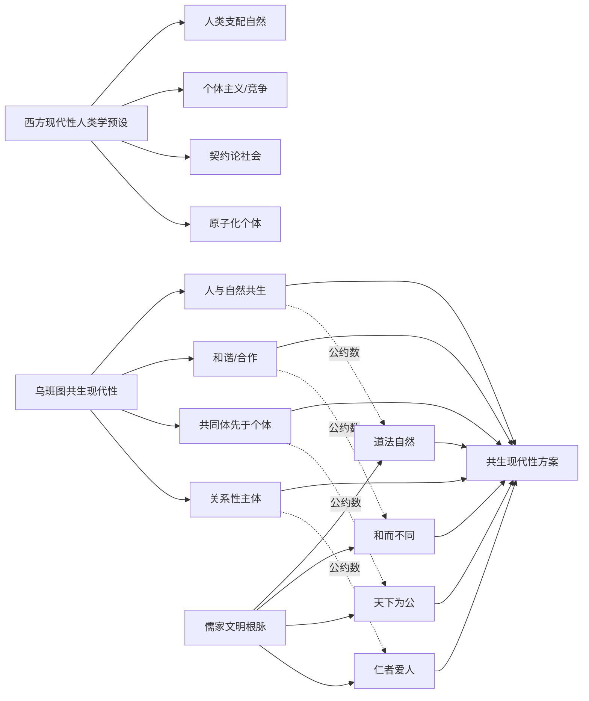

乌班图思想与儒家文明根脉的"公约数"共鸣，构成了南南文明互鉴在哲学层面最具深度的实例。**乌班图思想与中国儒家"仁民爱物、天下大同"的理念不谋而合**[^65]——这种共鸣并非政策话语层面的修辞，而是深层人类学预设的同构性：儒家的"仁者爱人"以关系伦理安顿人际秩序，道家的"道法自然"以生态智慧调节人天关系，墨家的"兼相爱"以平等精神拓展公共关怀，三者融贯一体，构建起和谐包容、融通致远的价值主轴，**从根本上突破了西方以资本和权力为核心的征服性逻辑**[^61]。这一论述与乌班图"和谐高于个体竞争"的预设形成结构性对应。正如《先驱报》所观察到的，**"和谐"成为"乌班图思想"与儒家思想的"公约数(common denominator)"**[^65]。

这一哲学层面的共鸣已经在中非合作的具体实践中获得制度化体现。2024年中非合作论坛峰会期间，乌班图思想再次受到关注[^65]。2023年中国向乌干达派出医疗队40周年之际，乌干达发展观察中心发文指出"**中国的医疗外交与非洲'乌班图思想'同频共振(China's medical diplomacy resonates with African philosophy of Ubuntu)**"[^65]。这种"同频共振"的判断揭示了一个具有理论意义的现象：**中非合作之所以能够呈现出与西方对非合作截然不同的关系结构与气质，并非偶然的政治选择，而是植根于乌班图—儒家在共生本体论上的深层亲缘性**。正如新华社所评论的：**"这些'志同道合(like-mindedness)'绝不只是单纯的巧合，更是在包容'不同'中寻求'共同'，在尊重'差异'中谋求'大同'的结果。与其渲染文明冲突可能带来的威胁，不如通过文明互鉴为全人类真正'重建更美好世界(build back better world)'"**[^65]。

由乌班图所代表的非洲共生现代性方案，对全球面临的当代危机具有特殊的回应能力。在生态危机层面，乌班图"人与自然和谐"的预设与西方启蒙以来"人类中心—征服自然"逻辑形成对照，为生态文明建设提供了深厚的哲学资源；在社会撕裂层面，乌班图"我们在故我在"对原子化、孤独化、对立化的现代社会病理具有诊断与治疗的双重意义；在国际关系层面，乌班图所体现的关系性思维，与"多极世界""命运共同体"等愿景具有内在亲缘性。**这些回应能力共同表明：非洲哲学不是现代性方案的"补充性变奏"，而是为应对21世纪人类共同挑战提供独立理论资源的"现代性原创"**。

需要审慎指出的是，乌班图哲学在当代非洲社会的实际运作并非完美无缺，亦面临精英政治征用、文化本质主义等内部张力。但即便承认这些张力，乌班图作为一种系统性的关系本体论方案，其在多元现代性谱系中的独特位置已然清晰：**它与拉美的结构批判、印度的庶民历史、中国的"两个结合"一道，共同构成了全球南方现代性多元生成的哲学谱系**。

## 3.5 中国式现代化与"两个结合"：文明型国家的现代性建构

如果说拉美贡献了从经济结构到认识论的解殖批判，印度贡献了庶民史学与"地方化欧洲"的认识论解构，非洲贡献了关系本体论的共生现代性方案，那么中国式现代化则在国家形态、方法论建构与实践规模三个层面，提供了非西方现代化最为系统、最具实践规模的当代典范。

**第一，中国式现代化的"后发效应"与"后发难题"**。作为后发国家现代化的特殊形态，中国式现代化既具有各国现代化的共同特征，又呈现出相对于"早发"的"后发"独特性[^59]。从全球范围看，**后发国家通常具有现代化起始阶段劳动力成本低廉、引进借鉴外来技术和发展经验等优势，与此同时，又可能面临内生要素供给不足、外部资源难以引进、发展依附于他国、脱离本国实际照搬他国模式、文化身份认同危机、缺乏超越传统的内在动力、发展中的社会不稳定等难题**[^59]。中国共产党和中国人民从自身独特基本国情出发，**较好发挥了自身的后发优势，有效破解了后发难题，迅速缩短了与"早发"国家的差距，成功推进和拓展了"赶超式""并联式"的中国式现代化**[^59]。这一"赶超式""并联式"的特质正是其与"早发"现代化"渐进式""串联式"路径的根本区别——**早发国家的工业化、城市化、市场化、民主化等过程在历史上分阶段、序贯展开；后发国家则必须在压缩的时空中并联推进多重转型**[^59]，这本身就要求一种与早发模式不同的方法论与制度安排。

第一章曾引用英国18世纪60年代工业革命作为全球现代化的"第一次浪潮"——它"首次开创了世界历史"[^59]，而中国式现代化作为"后来者"(late comers)的现代化[^59]，必须在这一已经被深度全球化的世界体系中找到自身的发展空间。这正是为何中国式现代化的成功具有南南示范意义：它向其他后发国家证明了，"对后来者的诅咒"是可以被打破的[^59]。

**第二，"两个结合"作为现代性建构的方法论**。中国式现代化最具理论纵深的方法论建构，是"马克思主义基本原理同中国具体实际相结合、同中华优秀传统文化相结合"的"两个结合"。汪晖将这一方法论概括为"中国化"命题——**"中国化"的核心要义是：持续地吸纳外来文化，但同时在实践中使之与中国历史、中国国情、中国现实、中国方式相适应，而中国社会也伴随着这些新因素的加入，而持续地发生变化**[^66]。汪晖进一步指出，"中国化"是"一个立足于中国现实和朝向未来的自我更新的进程，一个探寻未来而时时反顾过去的进程"[^66]——这一论述与查尔斯·泰勒所阐述的"现代性是从一种背景理解格局向另一种格局的转变"形成深层共振[^61]：中国化既不是简单的"传统延续"，也不是简单的"传统断裂"，而是在持续吸纳新因素的同时进行背景理解格局的整体重构。

汪晖关于中国化的另一关键洞察，是将其置于"四个共同"——"我们辽阔的疆域是各民族共同开拓的""我们悠久的历史是各民族共同书写的""我们灿烂的文化是各民族共同创造的""我们伟大的精神是各民族共同培育的"——的多元一体的文明史观之中[^66]。**这一多元一体的文明史观与艾森斯塔特"多元现代性"在国家内部的表达具有深层的同构性**：中国式现代化不是单一民族的现代化，而是中华民族共同体作为多元一体之文明体的现代化；其内部的多样性本身即构成现代性方案的丰富性。汪晖对"中国革命和中国改革进程中的中国化问题，是建立在人民史观之上，即人民是历史的创造者"[^66]的强调，又与印度庶民研究"从下层看历史"的旨趣形成跨文明呼应——尽管二者的具体路径与政治取向不同，但都坚持了"现代化的真正主体是人民而非精英"的人民史观立场。

**第三，文明型国家与儒家现代化：中国学界的多元学理建构**。中国学界对中国式现代化的学理建构本身呈现出多元化的特点。复旦大学张维为教授在2025年中国式现代化国际学术论坛上系统阐释了"文明型国家"理论：**中国式现代化的成功"根植于其'文明型国家'特质，即一个古老文明与超大型现代国家的有机融合"——政治上由代表整体利益的中国共产党领导，通过长期规划与强大执行力推动持续发展；经济上国有与民营互补的混合经济与超大规模市场，支撑了全面基础设施建设和充分竞争创新；社会上形成了政治、社会与资本力量有利于绝大多数人的平衡**[^63]。这一融合传统智慧与现代治理的路径，**"不仅使中国在较短时间内完成了工业追赶并站上科技前沿，也为世界提供了不同于西方模式的现代化道路新选择"**[^63]。

复旦大学范勇鹏研究员则从"现代性"的概念辨析出发提出更为激进的论述：**西方的现代化理论将西方政治制度作为现代性的重要指标，但是放在马克思主义语境下，现代性对应的是封建性。从封建性的角度来看，西方资本主义政治制度中存在大量的封建性因素——议会政体、选举票决、联邦制、地方自治、分权制衡、法治至上等制度都源自欧洲封建制度，迄今也仍具有很强的封建性。中国社会的封建性因素长期存在，但是两千多年的大一统、社会平等化和基于选贤任能的官僚制度发展，使古代中国在现代性上领先于其他古代文明**[^63]。这一论述实际上是对西方现代化理论的一种釜底抽薪式逆转——它不是接受"西方=现代"的预设而争取"非西方也能现代"，而是直接质疑"西方=现代"的预设本身。

北京大学姚洋则从儒家政治传统切入论证中国式现代化的文明根脉。姚洋认为，**中国的贤能政治传统对理解中国经济增长奇迹、理解中国政治体制有至关重要作用，并成为重构中国话语的重要历史资源**[^60]。从理论上讲，中国的贤能体制可以追溯到儒家学说——孔子、孟子都特别重视官员的德行和能力，孔子办学堂的重要目的就是让学生"学而优则仕"；孟子更加注重统治者的德行，"民为重，社稷次之，君为轻"；墨子真正提出了选贤任能；商鞅变法建立的军功爵制，立军功者都可以享受爵禄，不问出身门第，完全打破了"世卿世禄"制度；西汉的举孝廉、办太学，到隋唐基本完善的科举制度，**整体而言这样的历史传统一方面使中国逐渐培育起准现代国家的官僚体系，另一方面增加了社会流动性**[^60]。姚洋与团队收集了从1994年到2017年中国所有地市级及以上官员的数据进行实证研究，发现选贤任能在中国是有呈现的[^60]——这一研究既回应了西方学界对中国"政治锦标赛"假说的怀疑，也为中国式现代化的政治基础提供了实证学理支撑。姚洋进一步指出，**"中国现代化是中国在与西方的接触中展开的，完成中国现代化必须完成马克思主义、中国传统和西方主流价值观之间的融合"**[^67]——这一表述将中国式现代化定位为一种"三重融合"的特殊形态，与艾森斯塔特"多元文化方案"的多元现代性命题形成深层呼应。

不同学者的不同侧重——汪晖侧重"中国化"的方法论与人民史观、张维为侧重"文明型国家"的国家形态、范勇鹏侧重"封建性—现代性"的概念逆转、姚洋侧重"贤能政治"的儒家根脉——并非彼此排斥，而是从不同维度共同建构了中国式现代化的多元学理图景。**这一学理建构的多元性本身即体现了中国式现代化作为"非西方现代性方案"的丰富性**。

**第四，人类文明新形态与"传统—现代"线性进化逻辑的突破**。中国式现代化的世界历史意义，最终凝结于"人类文明新形态"这一标志性命题。**人类文明新形态以中国式现代化为实践基础，"突破了'传统—现代'的线性进化逻辑，构建出一种以文明共生、生态和谐与文化多元为核心要义的新型文明观，为破解当代文明危机提供了富有哲理的理论范式与路径选择"**[^61]。这一新形态的哲学基础包括三重根基：**历史唯物主义构成根本理论基石——文明不是观念的外化，而是人在物质生产—交往实践中改造自然同时又重塑自身的总和性成果；中华优秀传统文化构筑深厚文化根基——儒家"仁者爱人"、道家"道法自然"、墨家"兼相爱"融贯一体，从根本上突破了西方以资本和权力为核心的征服性逻辑；新时代实践探索的方法论创造构成科学认识论基础——坚持问题导向与目标导向相统一、系统思维与底线思维相结合、守正创新与开放包容相贯通**[^61]。

人类文明新形态之所以"新"，**在于它以整体性视野重塑了文明发展的坐标系：既破除单线进化论的迷思，又扬弃文明优劣论的偏见；既尊重各国自主选择，又倡导人类命运与共**[^61]。这一定位将中国式现代化的意义从"中国特殊"上升到"人类一般"——它不是要为其他国家提供可复制的"中国模式"，而是为全球南方乃至全人类探索现代性多元生成路径提供一种范式性贡献。

需要审慎指出的是，中国式现代化作为正在展开的历史进程仍面临诸多挑战。姚洋曾指出，发展中需要平衡公平与发展、共同富裕的实现路径需要从"提高穷人收入能力"入手而非过度关注财富集中、"健全新型举国体制"应避免成为产业政策的扩张化误用[^63]。范勇鹏亦坦承，**"中国也面临封建性的挑战，现代化建设仍然任重道远"**[^63]。这些自我批评本身即体现了中国式现代化的内省性与开放性，也为本研究在第七章的批判性反思保留了空间。

## 3.6 南南相互参照：现代性多元生成的互鉴机制

经过前述各路径的具体考察，可以归纳出一个总体性观察：**拉美依附理论、印度庶民研究、非洲乌班图哲学、中国式现代化虽然在具体内容、思想资源、政治取向上存在差异，但在更深层的理论结构上呈现出鲜明的三层共振**。

**第一层共振：反西方中心主义的认识论起点**。拉美依附理论批判中心—外围的结构性不平等[^62]，印度庶民研究批判殖民主义与民族资产阶级双重精英主义[^64]，乌班图哲学批判西方原子化个体主义[^65]，中国式现代化突破"传统—现代"线性进化逻辑[^61]——这四种路径都以拒绝"西方=现代性范本"的预设为共同起点。

**第二层共振：寻求文明主体性的规范性诉求**。CLACSO作为"联结社会组织、致力于从全球南方出发构建批判性与变革性思想的学术共同体"，庶民研究"用源自印度本土的'庶民'意识重新书写历史"[^64]，CODESRIA作为"非洲独立思考的引擎"，中国"两个结合"中"同中华优秀传统文化相结合"的理论自觉——四者都将文明主体性建构置于现代化探索的核心位置。

**第三层共振：探索差异化方案的实践取向**。普雷维什的进口替代工业化建议[^62]、甘地的非暴力替代道路、乌班图所支撑的非洲发展路径、中国式现代化的"五位一体"总体布局[^61]——四者都不满足于纯粹的批判，而是积极建构差异化的现代化具体方案。

下表系统呈现四条路径在多元现代性谱系中的特色与共鸣：

| 路径 | 核心理论资源 | 批判焦点 | 建构性方案 | 主要思想代表 |
|------|------------|---------|-----------|------------|
| 拉美依附—解殖 | 中心—外围、世界体系、权力的殖民性 | 经济结构性依附、认识论榨取 | 进口替代、技术自主、认识论正义 | 普雷维什、弗兰克、阿明、沃勒斯坦、米尼奥罗、基哈诺 |
| 印度庶民研究 | 葛兰西、英国马克思主义史学、后结构主义 | 殖民/民族双重精英主义 | 从下层看历史、地方化欧洲 | 古哈、查特吉、查克拉巴蒂、斯皮瓦克 |
| 非洲乌班图共生 | 撒哈拉以南本土哲学、非洲依附理论 | 西方个体主义、原子化主体 | 关系本体论、共生现代性 | 姆比蒂、埃蒂耶伊博、阿明 |
| 中国式现代化 | 马克思主义、中华优秀传统文化、新时代实践 | 西方化等同于现代化、资本中心逻辑 | 两个结合、人类文明新形态 | 汪晖、张维为、姚洋、范勇鹏 |

这一三层共振并非纯粹的理论巧合，而是已经通过具体的南南互鉴机制转化为可操作的相互学习实践。**第一，中非合作论坛中的乌班图—儒家对话**——2024年中非合作论坛峰会期间，乌班图思想与儒家"仁民爱物、天下大同"的"不谋而合"再次受到关注[^65]，"中国的医疗外交与非洲'乌班图思想'同频共振"[^65]，体现了哲学共鸣转化为合作实践的现实机制。**第二，CLACSO对中国"十五五"规划的解读**——CLACSO学者明确指出中国对"内生创新"和"技术现代化"的系统性投入"对全球南方国家具有深刻的启示"，"中国对'内生创新'和'技术现代化'的投入雄辩地证明，全球南方国家完全有能力构建自身的发展路径"，这构成拉美依附传统对中国经验的批判性参照。**第三，2025年中国式现代化国际学术论坛**——来自美国、英国、法国、俄罗斯、德国等25国的40多位国际学者参会，专门设置"当代资本主义批判与全球南方现代化""多元文明视野下的全球南方与中国式现代化"等平行论坛，俄罗斯科学院通讯院士博德鲁诺夫、巴西乌伯兰迪亚联邦大学教授菲罗等中外嘉宾发表主旨演讲[^63]，构成了四路径之间制度化、持续化的对话平台。**第四，姚洋所执行的北京大学南南合作与发展学院**[^67]、由埃及阿明、比利时浩达、美国沃勒斯坦、日本武藤一羊与武者小路公秀、中国戴锦华、温铁军、汪晖等共同发起的"全球大学"——这些平台共同构成了南南现代性互鉴的制度生态。

在前述比较与互鉴机制的基础上，可以提出本章的核心总体性命题：**"文明多样性作为现代性内在动力"**。这一命题包含三层含义：**其一**，文明多样性不是现代性的"外在变量"——不是先有"普世现代性"然后被各文明"地方化"，而是不同文明传统以自身的轴心突破[^60]为根脉，在与全球资本主义遭遇过程中各自生成现代性方案。**其二**，文明多样性是现代性的"构成性条件"——没有文明多样性提供的差异化文化方案，所谓"现代性"便会退化为单一文明的封闭自我循环，失去其应对人类共同挑战的丰富性。**其三**，文明多样性通过南南相互参照得到激活——拉美的结构批判、印度的庶民史学、非洲的关系本体、中国的两个结合通过相互学习相互修正，共同推动着现代性的多元生成；这一相互参照机制本身即构成了文明互鉴的实质性内容，而非仅仅是合作的"软实力"装饰。

需要预先指出的是，**多元现代性论述自身亦存在若干内在张力**，需要在理论上保持清醒：**第一，对"现代性"概念本身的态度差异**——是要"多元化现代性"还是要"超越现代性"？拉美解殖学者倾向后者（认为"现代性"概念本身即与殖民性纠缠），中国式现代化论述则倾向于前者（在保留现代性框架的前提下推进其多元化）；这一差异本身即构成南南内部的理论张力。**第二，本质主义风险**——将"中华文明""非洲哲学""印度传统"作为现代性方案根脉时，须警惕将各文明本质化、同质化、浪漫化，从而忽视各文明内部的多元性、流变性与批判性资源。**第三，现代性方案与全球化资本的复杂纠缠**——多元现代性方案在多大程度上能够真正摆脱全球资本主义体系的结构性约束，仍是一个开放问题；姚洋关于"健全新型举国体制"应避免成为通吃的判断[^63]、CODESRIA关于"美欧新自由主义仍主导知识的定义和传播"的观察，都提示我们多元现代性的实现仍是一个充满约束的历史进程。这些张力将在第七章的批判性反思中得到系统讨论。

经过本章的考察，**多元现代性范式已经从抽象的理论命题落实为四条具体的非西方现代化路径，并通过三层共振结构和具体互鉴机制呈现出全球南方在现代性建构层面的实质性贡献**。然而，要充分理解这种现代性多元生成的可能性与正当性，仅有对当代理论与实践的考察是不够的——必须进一步追问：在当代南方国家相互参照之前，全球南方各文明之间是否已存在长时段的文明互动？"西方崛起"与"现代性"之间是否如同主流叙事所描述的那样具有必然的因果关联？这些追问需要诉诸全球史的长时段视野。下一章将引入彭慕兰"大分流"、贡德·弗兰克"白银资本"、康拉德"全球史导论"等去欧洲中心主义的史学范式，从历史纵深层面为全球南方文明互鉴提供进一步的正当性论证。

# 4 全球史视域中的文明互动：去欧洲中心主义的长时段考察

第二章在认识论层面解构了殖民性矩阵与东方学话语机制，第三章在现代性建构层面论证了文明多样性作为现代性多元生成的内在动力。然而，前两章的论证仍主要聚焦于近现代以来的批判性重审与当代实践图景，**尚未从更长的历史尺度上回应一个根本性追问：全球南方各文明之间相互参照、相互借鉴的能力，是否仅是殖民结束之后才出现的"新生事物"？抑或它本身就是被欧洲中心叙事长期遮蔽的、长时段文明交往常态的当代再激活？** 这一追问的回答方式将根本性地影响我们对当代南南合作的理解：若将其视为"新生事物"，则其正当性必须借由当代政治经济现实来支撑，仍可能被纳入"后冷战秩序变迁"的西方解释框架；若将其视为长时段常态的回归，则当代南南文明互鉴便获得了贯通历史与现实的深厚根基，西方崛起本身反而被还原为相对短暂的历史插曲。本章因此承担"历史纵深"层面的论证功能，将彭慕兰《大分流》、贡德·弗兰克《白银资本》、阿布-卢格霍德《欧洲霸权之前》、约翰·霍布森《西方文明的东方起源》、塞巴斯蒂安·康拉德《全球史导论》等去欧洲中心主义史学范式作为理论资源，结合丝绸之路、印度洋贸易圈、跨撒哈拉网络等具体史实，论证南南文明互鉴的长时段历史正当性与连续性。

## 4.1 全球史范式的兴起：从欧洲中心线性史观到多中心互动叙事

全球史(global history)作为一种系统性史学范式，是20世纪后半期史学界回应经济全球化浪潮、反思欧洲中心主义传统的产物。第一章已提及汤因比《历史研究》以"多样文明论"突破西方中心主义历史观，对世界多样文明同等地进行研究，构成了全球史之先声。在汤因比之后，威廉·麦克尼尔的"文明的网络"叙事、彭慕兰、王国斌、李中清等加州学派的兴起、布罗代尔的长时段史学传统，共同推动了一场深刻的范式重置。塞巴斯蒂安·康拉德2013年的《全球史导论》（中文版2018年）作为全球史领域第一部系统性的导论著作，对这一范式的核心方法论进行了集大成式的总结[^68]。

康拉德对全球史的核心方法论建构可概括为以下几个相互支撑的命题。**第一，非民族国家范式与非欧洲中心主义构成全球史的双重根基**：康拉德明确指出，"全球史理论在方法上的核心即非民族国家范式和非欧洲中心主义——互动、互联和跨社会结构才是因果解释力的重点"[^68]。这一表述实际上完成了对19世纪以来史学双重传统的同时颠覆——既挑战以民族国家为预设单位的"国别史"传统（这一传统本身即是19世纪欧洲民族国家建构的产物），也挑战以欧洲为标尺、以西方崛起为主线的线性史观。**第二，空间转向、相关史、同步性、民族和定位构成全球史的方法论补充**[^68]。其中"同步性"概念尤具理论意义——它要求史学家不再仅仅在单一文明内部追溯线性演化，而是同时考察不同文明在同一历史时段所发生的相关现象，从而捕捉跨地域、跨文明的结构性关联。**第三，全球背景被划分为三种形式：具有全球视野的历史、关于全球互联的历史、以全球性整合为背景的历史**[^68]。这一区分使"全球史"避免被简化为"涵盖全球范围的历史"这一空间概念，而被精确化为以特定方法论问题意识界定的研究类型。

值得指出的是，康拉德对全球史范式自身可能陷入的偏误同样保持清醒批判。他明确指出全球史研究中较为典型的几个问题，如"对'欧洲中心论'矫枉过正、过于注重外部因素、对寻找'联系'证据的热衷、对'移动'的崇拜、对文化史维度的忽视"[^68]。这一自我批评对本研究尤具启示意义：**全球史的力量在于其对欧洲中心论的解构性贡献，但若简单地以"东方中心"或"南方中心"取代"西方中心"，便仍未摆脱中心—边缘的二元思维框架**。康拉德在2024年的访谈中进一步强调，全球史"不应成为全球化的意识形态补充——一种以历史必然性为幌子，将新自由主义经济与文化形式的扩张自然化或合法化的叙事"，"它的任务不是颂扬全球一体化，而是对其进行历史化：考察全球互联如何出现、服务于谁，以及如何受到挑战"[^69]。这一警示与本研究对全球南方文明互鉴的批判性建构立场完全一致。

康拉德对"全球时间标准化"案例的分析极具方法论示范意义。他指出，"19世纪末采用格林尼治标准时间并非简单地是一种中性的技术进步，以实现全球协调。它源于帝国的基础设施需求，尤其是英国铁路与海运系统，并由技术权力与帝国影响力的不对称所支撑"[^69]。这一分析揭示了全球史方法论的关键操作：**面对任何看似"自然进步"的全球化现象，须追问"谁的时间成了全球时间？哪些地方时间被取代或被从属化？以及抵抗如何表现"**[^69]。这种"通过强调摩擦、抗争与多元，全球史既揭示了全球资本主义的结构性框架，又打破了平稳趋同的幻象"[^69]的方法论自觉，构成了去欧洲中心主义全球史的核心精神。

由此可以勾勒出欧洲中心线性史观与全球史多中心互动叙事的根本分歧：

| 维度 | 欧洲中心线性史观 | 全球史多中心互动叙事 |
|------|----------------|---------------------|
| 历史单位 | 民族国家、文明实体 | 互动—互联—跨社会结构 |
| 因果叙事 | 内生动力—线性演进 | 同步性—相关性—外部纠缠 |
| 比较方式 | 以欧洲为标尺的单向度比较 | 交互式比较、多向度参照 |
| 时空预设 | 西方为中心向外辐射 | 多中心、多向度、网络化 |
| "西方崛起" | 内在必然、独特优越 | 偶然事件、有限范围 |
| 非西方位置 | 消极旁观、被动接受 | 能动主体、主导参与 |
| 现代性叙事 | 普世单一、欧洲范本 | 多元生成、相互构成 |

这一范式转换为本章后续展开的彭慕兰、弗兰克、阿布-卢格霍德、霍布森等具体研究提供了共同的方法论坐标。**值得强调的是，全球史范式的革命性意义不仅在于其挑战欧洲中心论的具体论点，更在于其重置了"何为历史"的元问题——历史不再是单一文明的线性自我展开，而是无数互动、纠缠、协商、抗争所共同编织的网络**。这一重置为全球南方文明互鉴提供了根本性的认识论支撑：南南之间的相互交往不再被视为"边缘的、补充性的"现象，而被还原为塑造世界历史本身的主干性力量。

## 4.2 "大分流"的偶然性：彭慕兰对1800年前东西方对等发展的重写

如果说康拉德为全球史提供了方法论纲领，那么美国国家艺术与科学院院士、前美国历史学会主席、加州学派代表人物彭慕兰(Kenneth Pomeranz)的《大分流：中国、欧洲与现代世界经济的形成》则在具体史学研究上，对欧洲中心主义的"西方崛起"叙事给出了最具冲击力的反例。该书获2000年费正清奖，被誉为"一举改变关于资本主义起源、西方崛起与东方没落的辩论走向"[^70]。

**彭慕兰的核心论证可以从一个看似简单却颠覆性的事实判断开始**：直到1800年前后，东西方走在大体相近的经济发展道路上，西方并无明显优势[^70]。这一判断对"现代社会科学大半源自欧洲人在19世纪晚期和20世纪时为了了解西欧的经济发展路径何以独一无二而做的研究"[^70]这一整套学术传统构成根本挑战。彭慕兰选取中国最发达的江南地区与西欧最发达的英格兰地区作为对比样本，通过详实的数据论证：在工业革命前夜，"两地区在人口、资本积累、技术、土地与要素市场、家庭决策等各个方面的相似度都非常高"；从奢侈品消费以及'资本主义'制度上，东西方确实存在不同，但这些不同又都不足以产生中西分流；特别是从生态制约的程度上来说，"中国(和日本)的核心区域和西欧的核心区域所承受的压力几乎是一致的"[^71]。彭慕兰进一步具体指出，江南与英格兰在"人均寿命、农业商业化程度、纺织业技术水平、奢侈品消费占比等方面近乎持平"[^72]。

这一对等发展的事实判断动摇了西方崛起叙事的根本前提：**如果1800年前东西方处于大体相近的发展水平，那么西方独特的"内在优势"——无论是产权制度、科学革命、资本主义精神还是新教伦理——便不能作为后续大分流的充分解释**。彭慕兰由此提出对"大分流"的偶然性解释：欧洲19世纪与旧大陆的分流"很大程度上归功于煤炭资源分布的优越地理位置和新世界的发现"[^71]。煤炭区位的偶然性体现于英国煤层正好位于易于开采的浅层位置；新世界发现的偶然性则体现于美洲殖民地为欧洲提供了棉花、糖等工业原料、奴隶贸易降低的劳动力成本，以及通过白银循环参与亚洲贸易的能力，从而构成了对本土生态压力的"生态缓解"(Ecological Relief)[^72]。这两项偶然性因素"使得欧洲是否集约利用土地变得不再重要，同时造就了其资源密集型产业的增长"[^71]，而中国(和日本)则"陷入了发展的死胡同，在原先劳动密集型和资源节约型的道路上越走越远"[^71]。

彭慕兰更具方法论纵深的贡献，是对**"交互式比较"(reciprocal comparison)** 的方法论建构。他明确指出："诸如'为什么英格兰没有变成江南'之类听起来古怪的问题无疑并不比人们更为习惯的'为什么江南没有变成英格兰'天生更高明，但它们也并不更低劣，它们还具有重要的优势"[^71]。这一双向比较的认识论意义，与第二章所讨论的萨义德对"被表述的东方"与"自我表述的南方"的根本区分形成深层呼应——**它打破了"以江南或英格兰任何一地为标准"的单向度评价框架，将中国置于与欧洲平等的比较平台**[^72]。在二十多年前的中国经济史学界，"学者们争论的焦点在于明清时期资本主义萌芽的诞生，中国在历史上为什么'失败'——没能最先发生工业革命"[^71]，这一问题意识本身即预设了"江南应当变成英格兰"的隐性标尺。彭慕兰的交互式比较则使学者们意识到，"现代经济增长可以有多种形态"[^71]——这一认识论突破与第三章艾森斯塔特"多元现代性"、查克拉巴蒂"地方化欧洲"在更早的史学层面构成了深层共振。

彭慕兰的"煤炭+新大陆"偶然性解释还回应了一个长期存在的学术分歧。**强调"原始积累"的论点——欧洲是靠强行剥夺美洲印第安人和被奴役的非洲人的财产才能达成马克思所说的资本"原始积累"——长期不受西欧主流学界的青睐**[^70]。彭慕兰的工作部分恢复了这一论点的合理性内核：他承认欧洲人对非欧洲人的剥削以及取得海外资源的机会的关键作用，同时又不将其当作促成欧洲发展的唯一动力，而是与煤炭区位、内在驱动力等因素共同构成的复合解释[^70]。这一平衡处理使其论证既避免了欧洲中心论的内生主义陷阱，又避免了简单"外因论"的解释力赤字。

需要审慎指出的是，《大分流》自问世以来在学术界引发了广泛而激烈的讨论，**赞誉与批评交织**[^72]。著名经济史学家迪尔德丽·麦克洛斯基(Deirdre McCloskey)评价"彭慕兰利用欧洲的发明——经济学——推翻了欧洲中心主义……欧洲人再也不会以为历史上只有他们曾站在经济增长的大门前了"[^71]。但批评的声音同样尖锐：部分学者对书中数据的准确性与代表性提出质疑，"认为某些经济指标的比较存在样本选取局限，可能夸大了东西方的相似性"[^72]；另有学者指出，"彭慕兰过于强调外部因素(殖民地、资源)的作用，相对忽视了文化传统、政治制度、技术创新等内生性因素对经济发展的影响"[^72]，欧洲独特的产权制度、科学革命传统、资本主义精神等在工业革命进程中发挥的作用不容忽视。在方法论层面亦有批评指出，"本书大量的证据都来自于二手文献，而非一手材料。这样做会使得所列证据存在某种选择性偏差"[^71]。《亚洲研究杂志》2002年五月刊曾刊登4篇有关《大分流》的评论文章，包括黄宗智的书评、彭慕兰对黄宗智的回应、李中清等对黄宗智的回应[^71]，构成了围绕该书的持续学术争鸣。

本研究在使用彭慕兰的论点时，将持守两层立场：**第一**，承认其在颠覆欧洲中心论史观、确立交互式比较方法论方面的开创性贡献，将其作为论证西方崛起偶然性与有限性的关键史学资源；**第二**，承认该书在证据基础与内生因素权重上存在的争议，避免将其结论绝对化为"东方=西方"的简单等同。**真正具有理论价值的不是关于江南与英格兰孰优孰劣的具体判断，而是其所确立的认识论原则：1800年前的世界其实是多中心并立的，没有哪个中心独霸世界**[^70]。这一原则将"西方崛起"重新置于偶然性与有限性的历史坐标中，为南方文明摆脱"追赶/趋同"的焦虑提供了关键的史学支撑。

## 4.3 "白银资本"与亚洲中心：弗兰克对前现代全球经济的重构

如果说彭慕兰的《大分流》以东西方对等发展的论证瓦解了西方"内生优越"的预设，那么德国—加拿大学者安德烈·贡德·弗兰克1998年出版的《白银资本：重视经济全球化中的东方》(Reorient: The Global Economy in the Asian Age)则提出了更为激进的主张：**1400—1800年间存在一个以亚洲、尤其是中国为中心的全球经济体系，欧洲是凭借亚洲力量而兴起的后来者，而非新体系的创造者**[^71][^73]。该书获1999年世界历史学会图书奖头奖[^73]。

弗兰克的核心论点可以在一组结构性事实关系中得到把握：**中国对白银的强大需求与欧洲对中国商品的需求二者的结合，导致了全世界的商业扩张**[^71]。这一双向需求关系构成了前现代全球经济的核心驱动机制。具体而言，"早在14世纪，历史学家伊本就意识到远古就存在一个包括中国在内的非洲—欧亚的金银市场。1621年，一些葡萄牙商人认识到中国是世界上货币的'天然中心'"[^74]。但是与"中国是货币的'密窖'，中国人囤积、窖藏货币"这一长期流行的偏见不同，弗兰克论证："中国吸引货币的目的和用途是用于拓殖和发展生产。当时，白银增加在欧洲引发通货膨胀，而在中国促进了生产发展和人口增长"[^74]——这一具体的经济史事实表明，**中国对白银的吸纳并非消极的财富储藏，而是积极的生产驱动**。

弗兰克由此提出对欧洲与世界经济关系的根本性重新定位：**"欧洲其实是凭借亚洲力量而兴起的，是世界创造了欧洲，而不是相反"**[^73]。"欧洲是加入了一个早已存在的以亚洲为中心的全球经济体系，而非创造了一个新体系"[^73]。这一论断对韦伯、桑巴特以来的西方经济史学传统构成根本性挑战——它否认了"欧洲先创造现代经济，然后将其扩展至世界"的传统叙事，反而将欧洲定位为加入既有亚洲中心体系的边缘后来者，并通过美洲白银这一关键媒介才得以参与亚洲商业网络。**这一论断的认识论意义在于，它将"前现代亚洲经济"从西方崛起叙事中的被动客体，重新还原为驱动全球商业扩张的主动中心**。

弗兰克在方法论上明确"主张以一种更充分的人类中心的全球范式来对抗欧洲中心范式"[^73]，采用整体主义方法，整合货币流动、人口及生产数据，横向对比不同经济结构[^71][^73]。其论证涵盖人口、生产、生产力、收入、贸易等数量维度，以及科学与技术（火炮、造船业、印刷术、纺织业、冶金、煤炭和动力、运输）、经济和金融制度等质量维度，并通过对1640年的银货危机、康德拉捷夫长波等横向整合的宏观历史分析，揭示了亚洲经济在前现代全球体系中的中心性[^71]。其作品被定位为"自20世纪80年代以来反'西方中心论'逐渐成为学界热门研究方向"背景下，"继萨义德、伯纳尔后，再次将目光投向东方"的重要尝试[^73]——这一定位将弗兰克的史学工作与第二章所讨论的萨义德东方学批判明确并置，体现了去欧洲中心主义在话语批判与史学重构上的双重谱系。

与弗兰克的论证形成深度互补的，是英国学者约翰·霍布森2004年出版的《西方文明的东方起源》(Eastern origins of Western civilization)。霍布森的核心论点更为激进——**他系统解构西方文明自主崛起的传统叙事，主张重塑全球史框架下的文明互动关系，论证东方文明对西方现代化的奠基性作用**[^74]。霍布森以公元500—1850年为时间跨度，分四部分论证：**亚非地区在全球化早期(500—1800年)通过技术创新、经济网络和知识传播主导世界格局，中国宋代工业化、伊斯兰文明技术传播及非洲贸易体系构成关键推力；欧洲通过模仿东方技术、殖民掠夺和不对称贸易实现后发崛起，其19世纪工业化实质吸收了中国农业革命成果与亚洲资源**[^74]。

霍布森的论证包含若干具有冲击力的具体命题：第一，**"基督教国家的建立和欧洲封建制度的东方起源"**——欧洲封建制度本身即受东方影响[^74]；第二，**"意大利开创者的神话"与"瓦斯科·达·伽马时代的神话"**——所谓欧洲文艺复兴的"自主开创"与大航海时代的"欧洲主导"均为神话[^74]；第三，**"英国工业化的中国起源：英国是擅长模仿的'后发国家'"**——这一表述将传统现代化理论中的"先发"与"后发"关系彻底逆转；第四，**"塑造欧洲种族主义身份和创造世界，公元1700—1850年：作为一种道德天职的帝国文明使命"**——揭示欧洲中心主义身份本身是18—19世纪建构的产物[^74]。霍布森指出有"两个过程导致了东方化西方的崛起"，因此"霍布森的书把迄今为止仍被边缘化的东方民族推到了世界历史发展进程的最前列"[^74]。

弗兰克与霍布森的工作可以与美国社会学家珍妮特·阿布-卢格霍德(Janet L. Abu-Lughod)的《欧洲霸权之前：1250—1350年的世界体系》形成第三重互补，从更早的13世纪世界体系层面进一步瓦解欧洲中心叙事。阿布-卢格霍德获得1990年美国社会学会杰出贡献奖的这部著作，描述了**"早期世界体系的兴起过程，该体系形成于十二世纪末期，至十四世纪最初几十年臻于顶峰，涵盖了从西北欧至中国的广阔区域"**[^75]。其核心命题是：**"这三个地区(欧洲、中东和亚洲)表现出大致的均衡发展，换言之，不存在可以统辖整个世界体系的霸权势力"**[^75]。

阿布-卢格霍德将13世纪世界体系具体重构为八个相互重叠的次体系：**西欧圈、地中海圈、欧亚大草原圈、埃及红海圈、中东波斯湾圈、阿拉伯海西印度洋圈、东印度洋东南亚圈、中国南洋圈，各个次体系相互重叠形成一个世界**[^76]。这一八子系统结构在地理空间上跨越了几乎整个旧大陆，"十三世纪世界体系的地理重心是东地中海和印度洋南边出口之间以及地中海和中亚之间的大陆桥，蒙古人的征服打通了大陆桥，世界体系由这个地区向东西方向连结，向西连结地中海和西欧，向东连结中国和印度，使世界体系保持平衡"[^76]。阿布-卢格霍德进一步揭示了13世纪体系的两个核心特质：**"经济一体化的增强和文化的繁荣"——一个又一个的地区迎来了文化和艺术成就的顶峰**[^68]：在中国，宋青瓷创造了陶瓷业的辉煌；在马穆鲁克王朝时期的埃及，工匠们在精心制作嵌有错综复杂的金银质阿拉伯图饰的家具；在西欧，教堂建筑艺术臻于极致；与此同时，南印度伟大的印度教庙宇建筑群如日中天[^68]。**"那时的欧洲还是最落后的地区，它或许从这个形成中的新网络获益最丰"**[^68]——这一论断对欧洲中心叙事的颠覆性不言而喻。

阿布-卢格霍德对13世纪体系运作机制的描述具有重要的当代启示意义。她指出，体系内的远程贸易"涉及世界上不同区域的众多商人团体。尽管阿拉伯语、希腊语和拉丁方言都覆盖了广泛地区，中国官话是远东地区众多国家的通用语言，但这些商人没有必要使用同一种语言交谈或者书写。各地的货币也没有必要完全一致。白银在欧洲价值颇高，黄金在中东地区得到重用，而铜币则是中国的首选"[^68]。这种**"语言多元、货币多元、规则协商、合作共生"的非霸权运作模式**，恰恰构成了与16世纪以来"单一霸权支配下的等级制"现代世界体系截然不同的多中心范式[^75]。授奖委员会对该书的评价亦提示我们，"通过强调从杭州到布拉格共同拥有的文化和商业制度，阿布—卢格霍特富有实质性的分析促使我们重新思考[以往对]现代世界体系所作的欧洲中心论的解释"[^76]。

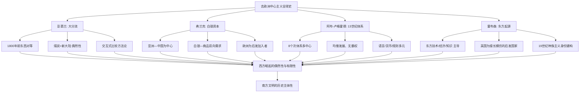

弗兰克、霍布森、阿布-卢格霍德三者的工作虽在具体论点上有所差异——弗兰克更强调1400—1800年的亚洲中心论，阿布-卢格霍德更强调1250—1350年的多中心均衡，霍布森则覆盖500—1850年的东方主导—西方模仿长时段——但**它们共享一个根本性的认识论立场：将前现代全球经济与文明格局重构为多中心、多向度、东方主动的图景，将欧洲在这一长时段中的位置还原为"后发者""加入者""模仿者"**。这一组研究与彭慕兰的"大分流"偶然性论证形成接力关系：彭慕兰证明了1800年前后东西方仍处于相近水平，弗兰克—霍布森—阿布-卢格霍德则进一步证明了在更长的前现代时段中，亚洲与东方的中心性。这一接力共同完成了对"西方独自崛起、东方消极旁观"传统叙事的史学瓦解，为全球南方文明的历史主体性提供了坚实的史学支撑。

## 4.4 丝绸之路与印度洋贸易圈：南方多中心文明互动的史实图景

抽象的史学范式必须落实到具体的史实图景才能展现其论证力量。本节以丝绸之路与印度洋贸易圈为核心案例，呈现前现代时期全球南方各文明之间长时段、多向度的互动史实。这两个网络共同构成了在欧洲扩张之前、独立于欧洲、并在相当时段内将欧洲仅作为外围参与者纳入的主干性文明交往体系。

**丝绸之路网络的形成本身即是多文明合力的产物，而非单一中心向外辐射的结果**。在丝绸之路开通之前，"不论是欧亚大陆公元前两千纪印欧民族的南下与东进，还是以斯基泰人为代表的草原游牧民族的迁徙，都带来了游牧文明与定居文明的碰撞与交融"[^77]。公元前一千纪中期在伊朗高原崛起的波斯帝国成为关键的中介性文明体——**"波斯帝国是世界上第一个横跨欧亚非三大洲的大帝国，西起埃及、爱琴海和多瑙河，东至中亚、印度河，北抵黑海、里海、咸海，南濒红海、波斯湾、阿拉伯海。波斯帝国几乎将古代除中国和西地中海地区之外的所有古代文明都联系在了一起"**[^77]。继之而起的亚历山大帝国虽然昙花一现，但其开创的希腊化世界"奠定了未来丝绸之路西段的基础"——三大希腊化王国（埃及的托勒密王国、马其顿的安提柯王朝、亚洲的塞琉古王国）通过希腊式城市的建立与道路系统的拓展，"无形中拓展了波斯帝国留下的道路系统，从而使得张骞一旦进入中亚，也就意味着踏上了通往地中海和印度的道路"[^77]。这一史实图景具有重要意义：**它揭示了丝绸之路的开通并非纯粹的"中国向外延伸"，而是中国秦汉王朝的崛起与已有的波斯帝国—希腊化世界遗产相互衔接、共同构成的跨文明合作产物**。

张骞通西域的具体细节进一步印证了这一多向互动的本质。张骞先后两次出使西域：第一次（公元前138—前126年）亲历大宛、康居、大月氏、大夏，同时对印度（身毒）、安息、条支、黎轩等地也有所耳闻；第二次（公元前119—前115年），他坐镇乌孙，派遣副使到大宛、康居、大月氏、大夏、安息、身毒等地[^77]。"他的副使抵达安息时，受到盛大欢迎，国王派兵两万护送。副使返回时，安息国王又派使节随同前往，以观汉之富饶广大。这些使节带来了条支的大鸟卵和黎轩的'眩人'(杂技演员)，开始了中国与安息在外交、文化与商贸方面的正式往来"[^77]。**这一细节展示了汉与安息这两个东西方大帝国之间的直接外交往来——不经欧洲中介、不经任何"西方中心"的双向文明对话**。从这一意义上讲，"张骞出使西域不仅标志着丝绸之路的全线贯通、中希文明接触的开始，更是古代中国与埃及、两河、波斯、印度和北方草原文明大交流、大汇合时代的开启"[^77]。

印度洋贸易圈构成了与陆上丝绸之路互补的另一条主干性南南交往网络。中国与印度洋诸地的贸易交往呈现出鲜明的多阶段演进图景：

**汉代奠定基础**：汉使曾航行至印度等地，印度等地商人亦曾常向汉朝贡献各类奇珍异宝；东南亚诸地与中国贸易联系更为密切，掸国（今缅甸）等国商人常来中国贸易、献贡；**来自罗马帝国的商人使节甚至也经印度洋入华贸易**[^77]——这一细节的认识论意义在于，它将罗马帝国（欧洲古代文明的代表）定位为印度洋既有贸易体系的"远端参与者"，而非该体系的核心。

**唐代海路兴起**：安史之乱之后海路交通取代陆路交通，成为中国与异域交往的主要通道；唐代非常重视海外贸易，于显庆六年（661年）颁布《定夷舶市物例敕》以管理海外贸易；玄宗年间，**"印度洋海外诸国来华通商者甚多，其中云集在广州的印度、波斯与马来亚等地的海舶不计其数，物资积载如山"**；唐廷在广州专设"市舶使"以监管贸易、征收关税[^77]。

**宋元高峰**：海外贸易所获资财已成为财政收入主要来源；中原王朝先后在广州、泉州、杭州、明州等地置市舶司，制定完备的市舶管理制度，**"积极鼓励中国商人出海贸易"**；此时，"大量中国商人积极进入印度洋各地经营贸易，贸易范围与规模较之前代不断扩大，中国海舶经常航行至红海、波斯湾、东非等遥远的印度洋西部海域"[^77]。

**明代郑和七下西洋**：明成祖时期"开启了郑和七下西洋的历史壮举，有力促进古代中国与印度洋地区各国的海上贸易往来"[^77]。

**直到近代以来"西方诸国在印度洋地区的经略使得古代传统贸易体系逐渐消解，被西方殖民贸易与垄断贸易所取代，传统的古代印度洋贸易让位于西方的全球性贸易"**[^77]。这一关键转折的史学意义至关重要：**它表明印度洋贸易圈作为南南文明交往网络的"消解"并非自然演化的结果，而是西方殖民暴力强行打断与替代既有体系的历史事件**。

印度洋贸易圈的多文明协作机制在中外文献的相互印证中得到充分展示。"3世纪萨珊波斯取代安息，成为波斯湾地区的新主人。波斯人扼守横贯其境的海路与陆路交通，通过垄断过境的贸易物资牟取高额利润，成为印度洋贸易的主导群体。7世纪之后则以阿拉伯帝国为主，**阿拉伯商人足迹几乎遍布印度洋各地**"[^77]。具体的文献链条尤具说服力：**唐代贾耽在"广州通海夷道"中已记载从广州通往阿拉伯的海上交通，与9世纪阿拉伯商人苏莱曼、10世纪初阿拉伯著名史地学家马苏第（《黄金草原》作者）所记从波斯湾通中国海道相同；宋人周去非《岭外代答》、赵汝适《诸蕃志》对此海路亦有记载**[^77]。**这种中阿（中波）文献跨语言、跨文明的相互印证本身即构成对萨义德"东方学单向凝视"批判的史学回应——前现代时期的中阿之间存在大量直接的、双向的文献记录与相互理解，远未呈现出近代以来"东方需要被西方表述"的认识论结构**。具体航行事实上，"9世纪，阿拉伯商人苏莱曼曾至印度、中国贸易，记载了从波斯湾通往中国的海路，整个航程总计历时4个多月，即可在西南季风期间完成从波斯湾到中国的航行"；"宋元时期，随着中国造船技术的提高及指南针的使用，中国海舶远洋航行能力迅速提高，大量中国海舶驶往阿拉伯地区贸易"[^77]。

第二章已经详细考察的中沙塞林港、中肯拉穆群岛、中埃孟图神庙等当代联合考古成果，正是对这一前现代南南互动史实图景的考古学印证。**当塞林港遗址出土"成片分布的大型建筑遗址"、"两处排列有序的大型墓地"以及"一批来自中国的瓷器，包括青花灵芝云纹碗、蓝釉碗"时，前述苏莱曼、马苏第、周去非、赵汝适所记载的航线网络便从文献获得物质实证**；当中肯拉穆群岛水下考古印证《明史·郑和传》中"麻林"和"慢八撒"（即马林迪和蒙巴萨）的记载时，前述郑和下西洋亦从政治史叙事转化为可触可见的文明交往遗存。这种"古代文献—现代考古—当代合作"的三重印证结构，使前现代南南文明互动的史实图景获得了空前坚实的支撑。

**由此可以归纳本节的核心论断：丝绸之路与印度洋贸易圈所构成的前现代南南互动并非边缘性贸易，而是塑造世界经济与文明格局的主干网络**。这一论断从三个层面得到支撑：**第一，规模层面**——市舶司制度下"物资积载如山"、海外贸易构成财政主要来源，已远超"补充性贸易"的规模描述；**第二，机制层面**——市舶制度的完备、商业法规的成文、跨语言文献的相互印证，已构成成熟的制度网络而非偶发性接触；**第三，转折层面**——这一网络的"消解"是被西方殖民暴力打断的历史事件，而非自然终结，因此其作为长时段常态的地位反而得到反衬性确认。

## 4.5 跨撒哈拉网络与南南互动的多元图景：被遮蔽的非西方文明交往

在丝绸之路与印度洋贸易圈之外，前现代全球南方还存在多条同样重要、却被欧洲中心叙事更深遮蔽的文明交往网络。本节扩展前节的史实图景，重点考察跨撒哈拉贸易、东非斯瓦希里海岸与跨太平洋文明联系等议题，并审慎讨论张光直"玛雅—中国文化连续体"假说所提示的方法论问题。

非洲在前现代世界体系中的地位是去欧洲中心叙事最严重低估的领域之一。**霍布森在《西方文明的东方起源》第二章明确将"伊斯兰和非洲开创者"定位为"在亚非大发现年代构建世界和全球经济的桥梁"**[^74]——这一表述将非洲与伊斯兰世界共同确立为前现代全球化的"开创者"，彻底颠覆了传统欧洲中心叙事中"黑暗大陆"的非洲形象。霍布森进一步在第四章论证"东方保持优势：东方专制主义与印度、东南亚和日本孤立主义的双重神话"[^74]——所谓"非洲孤立""亚洲孤立"本身即是欧洲中心叙事建构的神话，其功能是为欧洲后来的殖民扩张提供"将文明带给孤立土地"的合法化叙事。

阿布-卢格霍德对13世纪世界体系的八个次体系划分中，**"埃及红海圈"、"中东波斯湾圈"和"阿拉伯海西印度洋圈"占据了三个**[^76]——这意味着伊斯兰世界与非洲红海/印度洋海岸在13世纪世界体系中处于地理与功能的核心位置。其著作详细讨论了"中东腹地亚体系"，涵盖"蒙古通道、波斯湾路线与埃及开罗的贸易"[^75]——开罗作为前现代全球贸易枢纽的地位由此得到史学确认。在13世纪文化繁荣的图景中，阿布-卢格霍德特别提及"在马穆鲁克王朝时期的埃及，工匠们在精心制作嵌有错综复杂的金银质阿拉伯图饰的家具"[^68]——这一具体的文化生产场景，构成了对"非洲被动接受文明"叙事的鲜明反例。

东非斯瓦希里海岸作为非洲嵌入印度洋贸易圈的关键节点，在第二章已经讨论的中肯拉穆群岛水下考古中获得了重要印证。第二章引用美国考古学者查普鲁卡·库辛巴的判断：**"中国与非洲的关联非常深远——肯尼亚的曼达、姆特瓦帕和格迪三座斯瓦希里城邦的考古发掘显示，自汉朝起中非之间就已经开始远距离的交流"**。这一长时段中非互动的史实意义在本章语境下进一步凸显：**它将非洲—中国直接交往的历史上限推至公元前后，远早于欧洲航海者抵达非洲海岸的15世纪末**。换言之，在欧洲"发现"非洲之前的一千多年时间里，中非之间已存在独立于欧洲、不经欧洲中介的直接文明交往。

伊斯兰文明在前现代多文明网络中的桥梁性作用尤其值得强调。**"7世纪之后则以阿拉伯帝国为主，阿拉伯商人足迹几乎遍布印度洋各地，贩卖珍珠、象牙、犀角、乳香、龙涎、木香、丁香、安息香等阿拉伯特产"**[^77]。10世纪初阿拉伯著名史地学家马苏第"周游各地，先后到达东非、印度、锡兰、爪哇，乃至中国沿海等地，并著《黄金草原》一书"[^77]——**马苏第的旅行轨迹本身即是一幅前现代南南文明交往的活地图**，其足迹从北非到中国沿海，跨越了今天我们所谓"全球南方"的几乎所有主要文明区域。需要补充的是，"早在14世纪，历史学家伊本就意识到远古就存在一个包括中国在内的非洲—欧亚的金银市场"[^74]——这一认识论事实表明，非洲—欧亚的整体性金银市场早在伊本·赫勒敦时代即已被前现代学者所意识到，"全球经济"并非现代欧洲发明的概念。

在跨太平洋方向上，第二章已讨论的中洪科潘玛雅遗址联合考古所提示的"玛雅—中国文化连续体"议题，构成了一个既具启发性又须审慎处理的方法论案例。第二章引用的具体观察包括：**"中美洲原住民和亚洲人具有诸如蒙古褶和铲形门齿等共同的体质特征；他们还有一些相似文化实践和信仰——对玉的崇拜和使用，四方和中心的观念以及用不同颜色与之搭配；中美洲历法中数字和日名的组合方式不禁令人想起中国的天干地支"**。这些跨太平洋的相似性在欧洲中心叙事中长期被简单归类为"独立平行起源"或被边缘化处理。本研究在此采取审慎立场：**一方面，承认这些跨太平洋观察对欧洲中心主义"独立文明起源论"构成有益的方法论挑战，提示文明起源与传播的多线性可能；另一方面，避免将"玛雅—中国文化连续体"假说绝对化，须保留对其史前传播路径、考古链条完整性的进一步实证检验**。其方法论意义不在于得出确定性结论，而在于打开"非西方文明之间直接对话"的认识论空间——这一空间本身即是对欧洲中心叙事所遮蔽的可能性的恢复。

将本章前述各网络综合起来，可以勾勒出一幅前现代全球南方多中心文明互动的总图景：

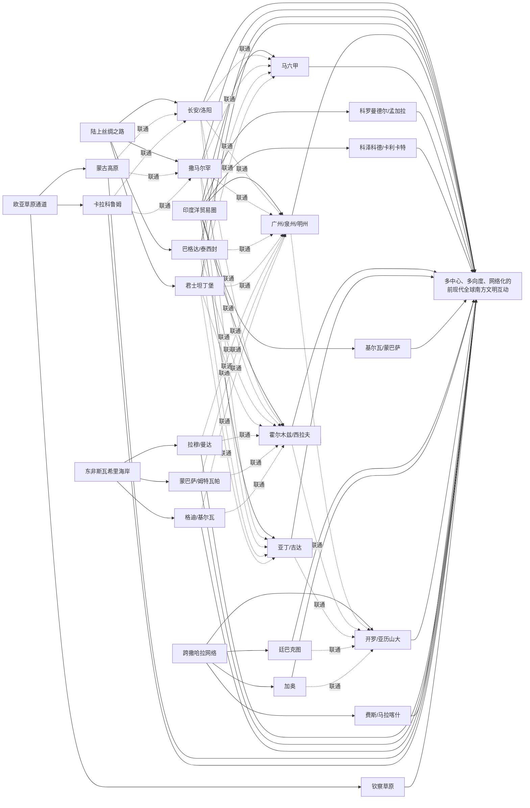

需要审慎指出的是，**对前现代多中心格局的史学重构必须避免新的浪漫化叙事**。康拉德所警示的"对'欧洲中心论'矫枉过正、过于注重外部因素、对寻找'联系'证据的热衷、对'移动'的崇拜"等全球史的典型问题[^68]，在前现代南南互动议题上同样存在。具体而言，前现代多中心体系绝非"和谐共生"的理想图景：阿布-卢格霍德的体系由蒙古征服打通[^76]，本身即建立在大规模军事暴力之上；阿拉伯帝国在印度洋的"主导"亦伴随着具体的商业垄断与利益分配；中国朝贡体系内部存在等级化关系；非洲跨撒哈拉贸易亦包含奴隶交易等暴力维度。**承认这些不平等与暴力维度，并不否认前现代体系的多中心性，反而使其作为"非霸权、均衡发展"的特征获得更精确的定义——多中心并非意味着平等无差异，而是意味着没有任何单一中心能够垄断整个体系的运作规则**。这一精确化对当代全球南方文明互鉴的启示在于：当代南南合作所追求的不是"消除一切不平等的乌托邦"，而是"打破单一中心垄断的多中心新格局"。

## 4.6 长时段视角下的当代南南文明互鉴：历史正当性与连续性论证

经过前五节对全球史范式、彭慕兰大分流论、弗兰克白银资本论、阿布-卢格霍德13世纪世界体系论、霍布森东方起源论以及具体史实图景的系统考察，本节归纳全球史视角对当代全球南方文明互鉴的三重论证功能。

**第一重论证功能：历史正当性论证**。当代全球南方合作——从万隆精神到金砖机制，从"一带一路"倡议到中非合作论坛——常被某些西方话语描述为"冷战后兴起的新事物"，并由此被纳入"挑战既有国际秩序"的解释框架。本章的史学考察从根本上瓦解了这一框架。**南南合作不是冷战之后的"新事物"，而是丝绸之路、印度洋贸易圈、跨撒哈拉网络等长时段文明交往的当代延续**。"一带一路"在地理路线上几乎完全重合于汉唐宋元时期已经成型的丝绸之路与海上丝绸之路；中阿合作在文献谱系上承接了苏莱曼、马苏第、周去非、赵汝适所记录的双向理解传统；中非合作在考古学上印证了自汉朝起中非之间已有的"远距离的交流"轨迹。**这种历史正当性论证的认识论意义在于：当代南南合作不需要从"反对西方"获得正当性，它本身即是被西方殖民暴力打断的更长时段文明交往的恢复**。

**第二重论证功能：连续性与重新激活**。第二章已经讨论中阿典籍互译工程"改变了以往主要依赖西方转译或视角的局面"的认识论意义；本章的全球史考察使这一意义获得了更深层的历史维度。**殖民现代性所造成的南方文明之间的"中介性隔绝"——中阿之间需要经由欧美汉学家与阿拉伯学家双重中介、中印之间需要经由英国印度学家中介、中非之间需要经由欧美非洲学家中介——是历史的例外而非常态**。在前现代时期的1500年里（公元前2世纪至公元18世纪），中国—阿拉伯—印度—东非之间存在大量直接的、不经欧洲中介的文献往来、商业网络与文明对话。"传统的古代印度洋贸易让位于西方的全球性贸易"[^77]这一近代转折，所打断的恰恰是这一漫长的直接交往传统。由此，**当代南南直接对话不是"创造一种新关系"，而是对长时段常态的回归与重新激活**。这一连续性认知具有重要的实践启示：当代合作机制的设计可以从前现代体系的多语言、多货币、多规则协商的"共生运作模式"中汲取资源——例如阿布-卢格霍德所描述的13世纪体系"语言不必同一、货币不必一致、规则需要协商"[^68]的运作原则，对于当代金砖货币安排、亚洲基础设施投资银行多边治理、"一带一路"沿线多语言合作等具有深刻参照意义。

**第三重论证功能：相对化"西方崛起"叙事**。彭慕兰证明1800年前东西方处于相近水平、西方崛起依赖于煤炭区位与新大陆生态缓解的偶然性；弗兰克证明1400—1800年欧洲是亚洲中心体系的"加入者"而非"创造者"；阿布-卢格霍德证明13世纪世界体系中欧洲是"最落后的地区"、"或许从这个形成中的新网络获益最丰"[^68]；霍布森证明欧洲500—1850年的整体演进是"东方化"的过程、英国工业化具有"中国起源"。这一连续的史学论证将"西方崛起"从"内在必然—独特优越—永恒规范"的位置上拉下来，重新定位为相对短暂、依赖偶然、有限范围的历史事件。**这一相对化的认识论后果至关重要：它使南方在认识论上摆脱"追赶/趋同"的焦虑，重建文明自信与历史主体性**。第三章所讨论的非西方现代化方案——拉美依附理论、印度庶民研究、非洲乌班图哲学、中国式现代化——之所以具备正当性，并不仅是因为它们是"南方反抗北方"的话语姿态，更是因为南方文明本身曾长期处于世界历史的主干位置；西方崛起的偶然性反衬出南方文明根脉的深厚性，使南方现代化方案获得了历史主体性的支撑而非仅仅是反抗主体性的支撑。

下表对全球史视角的三重论证功能进行系统呈现：

| 论证维度 | 史学根基 | 对当代南南合作的论证功能 | 对应的当代实践印证 |
|---------|---------|-----------------------|------------------|
| 历史正当性 | 丝绸之路、印度洋贸易圈、跨撒哈拉网络 | 南南合作是长时段常态而非冷战后新生事物 | "一带一路"地理重合、塞林港考古印证 |
| 连续性激活 | 前现代直接交往传统的存在与中断 | 殖民中介性隔绝是例外，南南直接对话是回归 | 中阿典籍互译"绕开西方转译" |
| 相对化西方 | 大分流偶然性、白银资本中心论、13世纪多中心 | 摆脱追赶/趋同焦虑，重建文明主体性 | 多元现代性方案、文明型国家建构 |

需要预先指出的是，**全球史范式自身并非没有内在张力，将其作为本章理论资源时须保持清醒**。除前节已指出的"避免浪漫化前现代多中心格局"之外，至少还有以下三方面的张力需要在第七章的批判性反思中得到系统讨论：

**第一，警惕忽视前现代体系内部的不平等**。前现代多中心体系绝非"无等级、无暴力、无剥削"的理想图景。承认其多中心性的同时，须避免将其浪漫化为现代世界的反衬性乌托邦。

**第二，警惕全球史成为新的同质化叙事**。康拉德本人的警示尤具针对性——全球史不应"成为全球化意识形态工作的同谋——例如，当它优先关注世界主义精英，强调连接而非强制，或将全球一体化视为历史必然时"[^69]。当代关于"前现代全球化"的论述若过度强调"连接"而忽视"强制"，便可能与新自由主义全球化的叙事工作合流，从而消解全球史的批判性。

**第三，警惕"南方中心论"取代"西方中心论"的简单替换**。彭慕兰的工作并非论证"东方=西方"或"东方>西方"，而是论证多元发展路径的存在；弗兰克的"亚洲中心论"在严格意义上是对"欧洲中心论"的纠偏，而非提出新的中心化叙事。本研究在使用这些史学资源时，将持守"多中心—多向度—网络化"的认识论立场，避免落入新的中心化陷阱。

经过本章的考察，**全球史视角已经从抽象的方法论纲领落实为具体的史学论证与史实图景，并通过三重论证功能为当代全球南方文明互鉴提供了不可或缺的历史纵深支撑**。结合第二章的认识论解构与第三章的现代性建构，本研究的批判性—建构性论证已经在话语、现代性、历史三个层面完成了实质性展开。但这三个层面的论证仍呈现为相对独立的工作——它们之间的有机联系、内在张力与互补关系，尚未得到系统性的整合性表述。下一章将承担这一整合性任务：综合前述四重理论维度（后殖民主义—东方学批判—非西方现代化—全球史），分析其在解释全球南方文明互鉴现象时的互补性与张力关系，并尝试归纳一个以"主体性""多元性""互构性""长时段"为核心要素的全球南方文明互鉴理论模型，从而为全文论证提供综合性的理论建构。

# 5 四重理论维度的整合性分析：文明互鉴的理论模型建构

经过前四章分别从认识论解构（第二章）、现代性建构（第三章）、历史纵深（第四章）三个层面对全球南方文明互鉴展开的实质性论证，本研究已在话语、现代性、历史三个相对独立的领域积累了丰富的批判性—建构性资源。然而，这些工作仍呈现为相对分立的理论运动：后殖民主义与东方学批判完成的是对殖民性矩阵的解构性瓦解，非西方现代化与多元现代性方案完成的是对差异化现代性的建构性确立，全球史则以长时段、多中心的史学重构提供历史正当性。**这三组工作在概念、方法论、问题意识上既相互支撑又内含张力——它们之间究竟构成何种有机联系？是否能够凝聚为一个统一的理论框架？这一框架又是否足以超越亨廷顿"文明冲突论"、福山"历史终结论"等既有西方文明对话理论？** 这一系列追问，正是本章作为"承上启下"环节所要回答的核心问题。本章将首先梳理四重理论维度的功能分工与互补结构，继而正视其内在张力，在此基础上提炼"主体性—多元性—互构性—长时段"四大核心要素，建构全球南方文明互鉴的整合性理论模型，并以此模型为参照，论证其对既有西方文明对话理论的范式性超越，最后审慎检视模型的适用边界与潜在限度，为第六章的实践图景与第七章的批判性反思提供统一的理论坐标。

## 5.1 四重理论维度的功能分工与互补结构

全球南方文明互鉴作为一个高度复杂的理论命题，其复杂性根源于它同时涉及话语层面的权力批判、现代性层面的方案建构、历史层面的长时段考察以及实践层面的合作机制。任何单一理论资源都难以同时覆盖这四个层面，这正是本研究采用四重理论维度的根本理据。在前四章的具体展开中，四重维度已分别承担了差异化的论证任务，本节将对其功能分工进行系统化整理，并揭示其作为有机理论网络的互补结构。

**后殖民主义在本研究中承担"解构动力"的功能定位**。从法农《黑皮肤，白面具》对殖民统治内化为被殖民者自我认知机制的剖析，到基哈诺"权力的殖民性"对全球性社会互动模式的等级化逻辑揭示，再到斯皮瓦克"庶民能否言说"对庶民被吸纳进西方知识范畴的悲观追问，以及霍米·巴巴"第三空间"对混杂性主体重建可能的辩证打开，后殖民主义的核心贡献是揭示殖民关系并未随着政治独立而终结，而是以更隐蔽的形式结构化于当代权力—知识体系之中。这一解构动力在第二章得到充分展开，其方法论作用是在解殖工作展开之前先行松动殖民性矩阵的认识论根基，避免任何建构性方案重新落入殖民等级秩序的框架。

**东方学批判在本研究中承担"认识论反思"的功能定位**。萨义德1978年《东方学》通过将福柯"话语—权力"理论、葛兰西"文化霸权"理论与德里达解构主义相结合，揭示了"东方"作为西方为确立自身优越性而建构的话语体系；其1993年《文化与帝国主义》进一步将这一批判扩展至小说形式与"对位阅读"方法。东方学批判与后殖民主义虽然存在深度交叉（萨义德本身即是后殖民理论的奠基者之一），但本研究将其单列为第二维度的理由在于：**东方学批判的具体工作不仅是揭示殖民性的存在，更是在认识论层面剖析西方关于"他者"的话语生产机制**——它直接处理的是"知识如何被生产""谁有权表述谁"这些元问题，从而为南南直接交往（中阿典籍互译、跨文明联合考古）提供了"绕开西方中介"的认识论合法性。最近《雅各宾》杂志维维克·齐贝尔(Vivek Chibber)对萨义德"文化转向"的批判尤值关注：齐贝尔指出萨义德将东方主义视为一种"潜在"的、可追溯到荷马史诗的话语权力意志，使后殖民批判从马克思主义的生产关系分析滑向"更观念论的层面"，反而成为殖民主义的"共谋"[^78]。这一批判提示我们，东方学批判作为认识论反思工具固然不可或缺，但若脱离物质基础分析，便可能蜕化为悬空的话语游戏——这一警示将在本章第二节的张力分析中得到展开。

**非西方现代化与多元现代性理论在本研究中承担"实践方案"的功能定位**。从艾森斯塔特"多元现代性"对线性现代化叙事的颠覆、查尔斯·泰勒"两种现代性理论"对文化型与非文化型现代性的精微区分，到拉美依附理论的中心—外围批判、印度庶民研究的"地方化欧洲"、非洲乌班图哲学的关系本体论、中国式现代化的"两个结合"，第三章已系统呈现了这一维度的丰富内涵。这一维度的不可替代性在于：**它使解殖工作从"反对什么"转向"建构什么"，从批判性的认识论清算落地为差异化的现代化具体方案**。如果说后殖民主义与东方学批判主要回答"西方话语如何运作"的问题，那么非西方现代化理论则回答"南方文明如何展开自身现代化道路"的问题。

**全球史在本研究中承担"历史纵深"的功能定位**。从彭慕兰《大分流》对1800年前东西方对等发展的史学重构、贡德·弗兰克《白银资本》对1400—1800年亚洲中心论的论证、阿布-卢格霍德《欧洲霸权之前》对13世纪八子系统多中心世界体系的描绘、约翰·霍布森《西方文明的东方起源》对欧洲500—1850年"东方化"过程的揭示，到塞巴斯蒂安·康拉德《全球史导论》对全球史方法论的系统化建构，第四章已展示这一维度的史学纵深。其不可替代的功能在于：**当代南南合作不需要从"反对西方"获得正当性，它本身即是被西方殖民暴力打断的更长时段文明交往常态的恢复**——这一连续性认知使南方文明摆脱"追赶/趋同"焦虑，重建文明自信与历史主体性。

四重维度的功能分工与互补结构可由下表系统呈现：

| 维度 | 功能定位 | 主要回答的问题 | 典型理论操作 | 输出结果 |
|------|---------|-------------|-------------|---------|
| 后殖民主义 | 解构动力 | 殖民性如何延续？ | 揭示权力—知识共谋、心理殖民、庶民失语 | 松动殖民性矩阵 |
| 东方学批判 | 认识论反思 | 谁有权表述谁？ | 剖析话语建构机制、对位阅读 | 重置知识地理 |
| 非西方现代化 | 实践方案 | 如何展开自身道路？ | 多元现代性、文明型国家、两个结合 | 差异化现代性方案 |
| 全球史 | 历史纵深 | 是新生事物还是常态回归？ | 大分流偶然性、白银循环、多中心体系 | 长时段正当性 |

四者并非孤立的工具箱，而是形成"解构—反思—建构—溯源"的有机理论网络：**后殖民主义"破"——破除殖民性话语霸权；东方学批判"省"——反思认识论根基；非西方现代化"立"——确立差异化实践方案；全球史"证"——以历史纵深证成多向互动**。这一"破—省—立—证"的内在逻辑顺序与本研究第二至第四章的章节安排存在深层呼应：先解构再反思，先反思再建构，先建构再溯源——但溯源所揭示的长时段历史又反过来重新激活前三个维度的解释力，从而形成循环往复、相互支撑的理论网络。

值得指出的是，正是这种功能分工避免了单一理论的内在局限。第一章已经明确指出："**单纯的现代化理论容易陷入线性叙事，单纯的后殖民主义可能滑向无止境的解构，单纯的东方学批判易于停留于话语层面，单纯的全球史则可能淡化当代权力结构的延续性**"。四重维度的互补结构正是对每一维度内在局限的相互弥补：后殖民的解构动力被非西方现代化的建构方案所完成，非西方现代化的"现代性"概念被全球史的长时段视野所相对化，全球史的多中心叙事被后殖民的权力批判所制约不致浪漫化，而东方学批判的话语层面工作则为这一切提供共通的认识论自觉。

## 5.2 四重理论之间的内在张力与对话关系

承认四重维度的功能分工与互补结构，并不意味着它们能够无缝拼接为完美的理论合金。相反，**真正具有理论生产力的整合工作，必须正视四者之间存在的实质性张力——这些张力不是理论的失败，而是理论生产力的源泉**。本节将系统梳理四重维度之间的四组核心张力，并通过具体案例展示在张力中推进综合的可能。

**张力一：后殖民主义的解构性取向与非西方现代化的建构性取向之间的方法论张力**。后殖民主义（尤其是萨义德式路径）的方法论倾向是解构一切总体叙事，强调异质性、不可通约性、文本的"在世性"；其极端形态可能导致"无止境的解构"——对任何建构性方案都报以怀疑，担心其重新陷入新的霸权。非西方现代化理论则需要建构性叙事——艾森斯塔特的"文化方案"、张维为的"文明型国家"、姚洋的"贤能政治"、汪晖的"中国化"，都需要某种可识别的整体性框架来确立其作为"方案"的正当性。**这一张力的实质是"为非西方发声"与"任何发声都可能成为新霸权"之间的认识论拉锯**。处理这一张力的关键在于：解构性取向应被理解为建构性取向的"前置工作"与"持续约束"，而非建构本身的对立面——正如第三章所论证的，多元现代性方案之所以能够避免"以西方理论框架规训南方经验"的陷阱，恰恰是因为它内嵌了后殖民批判的反思机制；反过来，建构性方案的存在也使解构性批判有了具体的着力点，避免其退化为悬空的元批判。

**张力二：多元现代性论述对"现代性"概念的保留与拉美解殖思想对"现代性=殖民性"的整体拒斥之间的范式分歧**。第三章已经预先指出，"对'现代性'概念本身的态度差异"是南南内部的理论张力——拉美解殖学者（米尼奥罗、基哈诺、杜赛尔等）倾向于将"现代性"概念本身视为与殖民性纠缠不可分割，主张"超越现代性"而非"多元化现代性"；中国式现代化论述则倾向于在保留现代性框架的前提下推进其多元化（"中国式现代化既具有各国现代化的共同特征，又呈现出基于自己国情的中国特色"）。**这一分歧的实质是："现代性"概念本身是否仍是一个有意义的范畴**。处理这一张力的关键在于：需要区分"作为西方独占模式的现代性"与"作为人类共同问题域的现代性"——前者必须被拒斥，后者则可以被多元化。在这一区分基础上，拉美解殖思想的"超越现代性"主张与中国式现代化的"多元现代性"实践可以被理解为同一深层目标（摆脱殖民性矩阵）的两种策略性表达。

**张力三：全球史强调跨文明互动与后殖民理论强调权力不对称之间的视角差异**。全球史范式（彭慕兰、弗兰克、阿布-卢格霍德、康拉德）倾向于建构跨文明互动、纠缠、共生的整体性叙事，需要某种可识别的共通框架来呈现"互动"。后殖民理论则更强调互动中的权力不对称、强制、暴力，担心"互动"叙事可能掩盖结构性剥削。**这一张力的实质是康拉德本人所警示的"温情脉脉的全球化叙事"风险——全球史是否可能成为新自由主义全球化的意识形态补充**。第四章已经明确引用康拉德的警示："全球史不应成为全球化的意识形态补充——一种以历史必然性为幌子，将新自由主义经济与文化形式的扩张自然化或合法化的叙事"，"它的任务不是颂扬全球一体化，而是对其进行历史化：考察全球互联如何出现、服务于谁，以及如何受到挑战"。处理这一张力的关键在于：全球史的"互动"叙事必须始终与后殖民的"权力"分析保持张力，前者提供宏观图景的丰富性，后者提供微观机制的批判性，二者结合才能避免互动史成为新的"扁平化全球史"。

**张力四：东方学批判的话语层面工作与全球史/政治经济学的物质层面工作之间的层次错位**。这是本章必须直面的最关键张力之一。如本章第一节已经引述的，齐贝尔(Vivek Chibber)在《雅各宾》对萨义德的批判尖锐指出：萨义德将东方主义视为先于殖民统治存在、可追溯至荷马史诗的"潜在"话语，将批判推向了"更观念论的层面"，使得后殖民理论以批判殖民的形式出现，但**最终和许多殖民主义的遗留形成了结合**——即后殖民批判的"文化转向"反而成为了殖民主义的共谋[^78]。齐贝尔认为，相比以前的反殖民主义者和反东方主义者（主要是马克思主义者，从生产关系等方面批判殖民主义），萨义德通过对东方学"潜在"性质的论述，实现了批判的"文化转向"——这种文化转向构成了很大的问题[^78]。

这一批判与已故历史学家阿里夫·德里克(Arif Dirlik)对全球南方与后殖民理论的政治经济学界定形成深层呼应。德里克"晚年尖锐批判各种新兴于前第三世界国家的思潮。他不同意后殖民理论，认为其论述会走向文化保守主义，更反对以各种'文化复兴'旗号下资本与国家的合谋"[^78]。德里克在2007年《全球南方》刊物创刊号上撰文指出，"'全球南方'并不是一个简单的地理概念，而是一个在全球范围内展开的不平等结构。造成这种不平等的实质则是资本主义世界市场形成之后，全球范围内生产力的不均衡发展，以及在这种不均衡基础上形成的工业化的全球北方对全球南方的剥削性积累"[^79]。德里克的洞见在于："**如果不改变既有的生产关系，以及由这种生产关系而催生的全球不平等结构，那么便无法真正解决发展不均衡的问题。如果全球南方国家谋求的现代化仍旧以延续资本主义北方现代化模式为基础，那么崛起的全球南方国家无疑也将变成新的霸权者，并在既有的不平等霸权结构中，重复霸权竞争、权力更替的故事**"[^79]。

殷之光的论述对这一物质—话语张力作了进一步的方法论澄清。他明确指出，对全球南方问题的讨论"应当是一种以生产关系为抓手、以共同体整体发展为目标的马克思主义政治经济学分析。这种分析的普遍意义在于，它能帮助我们跳出本质主义的局限，对'第三世界''边缘与半边缘国家''南方国家''发展中国家'等不同理论框架下对同一种现象的命名进行统一的、历史化的阐述，并且帮助我们不依赖身份认同、政治诉求等抽象的、暂时性的范畴展开论述，而将不平等以及由不平等产生的文化歧视与偏见落实到具体的，对生产关系、生产方式、不均衡发展的分析中"[^79]。这一论述强烈提示：**单纯的话语—文化批判路径若不与政治经济学分析相结合，便可能滑向德里克所警告的"文化保守主义"陷阱——以"文化复兴"旗号掩盖资本与国家的合谋**[^78]。

吕新雨基于"中国式现代化"是"第三世界的现代化"的判断，进一步将这一物质—话语张力具体化。她指出，"冷战-后冷战结构对世界农业资本主义的影响深度形塑了当代世界"，工业化与农业现代化"正是较量的关键"；"以工业化为基础的现代化发展和独立自主的国家主权地位"不仅仅是全球南方关切的核心议题[^80]。这一论述将文明互鉴的"软"层面与工业化、土地、粮食、能源等"硬"层面紧密联系起来，提示理论建构必须既处理话语—文化层面的认识论问题，又处理生产关系—世界体系层面的物质性问题。

处理这四组张力的关键，在于将张力本身理解为理论模型的内在动力而非外在矛盾。**张力的存在迫使任何整合性建构必须保持持续的反身性自觉——既不能停留于话语批判而忽视物质基础，也不能简化为生产关系分析而忽视认识论维度；既不能滑向文化保守主义而美化非西方传统，也不能落入文化相对主义而取消跨文明批判可能**。正是在这种持续的张力中，下一节将提出的四要素理论模型才能避免成为简单的概念拼贴，而成为具有真正解释力的理论架构。

## 5.3 理论模型的核心要素：主体性—多元性—互构性—长时段

在功能分工与张力对话的基础上，本节提炼全球南方文明互鉴理论模型的四大核心要素：**主体性、多元性、互构性、长时段**。这四要素并非对四重理论维度的简单平行映射，而是对四重维度共同关切的核心问题域的提炼性重组——它们各自跨越多个理论维度，共同构成模型的基本骨架。

**要素一：主体性(Subjectivity)**。主体性要素直接对应后殖民主义与东方学批判的解殖工作，但其内涵并不仅限于此——它同时吸纳了非西方现代化对文明主体性建构的关切（如汪晖"中国化"命题中"立足中国现实和朝向未来"的主体姿态）以及全球史对前现代南方文明历史能动性的恢复（如弗兰克对中国作为白银资本中心的论证）。**主体性要素的核心命题是：全球南方文明互鉴的认识论前提是恢复被殖民性结构压制的文明主体性，包括宏观层面的文明主体性与微观层面的庶民主体性双重恢复**。

主体性要素的内在张力在于：**宏观文明主体性与微观庶民主体性之间的辩证关系**。多元现代性倾向于以文明/民族为主体单位（艾森斯塔特的"文明比较"、张维为的"文明型国家"），存在将文明实体化的倾向；庶民研究/斯皮瓦克则警示，以"民族"或"文明"为主体单位本身可能压制内部的庶民声音（古哈批判的"印度资产阶级民族主义精英主义"、斯皮瓦克的"庶民无法发声"）。这一张力的处理原则是：**主体性必须在具体反抗结构性不公的实践中塑造，而非停留于文化符号或身份标签**——德里克所警告的"以各种'文化复兴'旗号下资本与国家的合谋"[^78]即是对此的反面警示。

**要素二：多元性(Plurality)**。多元性要素直接对应非西方现代化理论，但其内涵延伸至全球史的多中心世界体系（阿布-卢格霍德的八子系统）、东方学批判对"东方主义二元结构"的解构、以及后殖民主义对混杂性主体的辩证肯认。**多元性要素的核心命题是：现代性具有复数实现形态，每种文明可在自身历史连续性中开启现代转型的独特节奏；文明多样性不是现代性的外在变量，而是现代性多元生成的构成性条件**。

多元性要素的内在张力在于：**承认共通性与拒绝同质化之间的辩证平衡**。完全否认共通性会滑向相对主义，从而取消跨文明批判可能；过度强调共通性又会回到隐性的西方中心主义。处理这一张力的关键在于区分"作为西方独占模式的现代性"与"作为人类共同问题域的现代性"——前者必须被拒斥，后者可以被多元化。乌班图"我们在故我在"与儒家"仁者爱人"的"公约数"共鸣，正是在共通问题域（如何处理人际关系、个体与共同体的关系）下展开的差异化方案——共通的是问题，多元的是方案。

**要素三：互构性(Mutual Constitution)**。互构性要素直接对应"全球南方"与"文明互鉴"相互建构的话语关系（第一章核心命题），其理论资源贯穿四重维度：霍米·巴巴的第三空间/混杂性、康拉德的"纠缠"概念、霍布森的"东方化西方"、彭慕兰的"交互式比较"。**互构性要素的核心命题是：文明并非孤立实体，而是在长期跨文化接触中通过相互模拟、协商、嫁接而被共同生产；现代性本身即是欧洲与非欧洲世界共同建构的产物，南南合作中物质实践与文明对话呈现双向塑造关系**。

互构性要素的内在张力在于：**互构叙事如何不滑向"温情脉脉的文明对话"，而保持对权力不对称、不平等交换、殖民暴力的批判敏感**。这正是康拉德所警示的"将新自由主义经济与文化形式的扩张自然化或合法化"的风险，也是齐贝尔所批判的萨义德"文化转向"问题的延伸[^78]。处理这一张力的关键在于：互构性必须始终与权力分析保持张力——前现代多中心体系既是"互动—互联"的网络，也是包含暴力、垄断、奴隶贸易等不平等维度的复杂系统；当代南南合作既是"文明对话"，也涉及各国资本与利益的具体博弈。

**要素四：长时段(Longue Durée)**。长时段要素直接对应全球史的历史纵深，但其意义并不限于史学层面，而是为前三要素提供历史合法性根基：主体性的恢复以长时段历史主体性为根基（前现代亚洲为白银资本中心、前现代非洲嵌入印度洋贸易圈），多元性的存在以长时段轴心文明分化为渊源（雅斯贝尔斯轴心时代论与艾森斯塔特多元现代性的思想接续），互构性的运作以长时段跨文明交往网络为载体（丝绸之路、印度洋贸易圈、跨撒哈拉网络）。**长时段要素的核心命题是：文明互鉴需置于长时段、多中心的历史脉络中考察，"西方崛起"是偶然的、关联的、晚近的现象，而非线性必然**。

长时段要素的内在张力在于：**避免"用东方中心论替代西方中心论"以及"将前现代多中心格局浪漫化"**。康拉德对全球史"对'欧洲中心论'矫枉过正、过于注重外部因素"的警示在此尤为关键。处理这一张力的关键在于：长时段叙事须结合短时段的具体生产关系分析（吕新雨对农业资本主义、能源、粮食武器的关注[^80]、殷之光所主张的"以生产关系为抓手"的马克思主义路径[^79]），既看到前现代多中心格局的真实存在，也承认其内部的不平等与暴力维度。

四要素之间的内在关联结构可由以下方式展开：

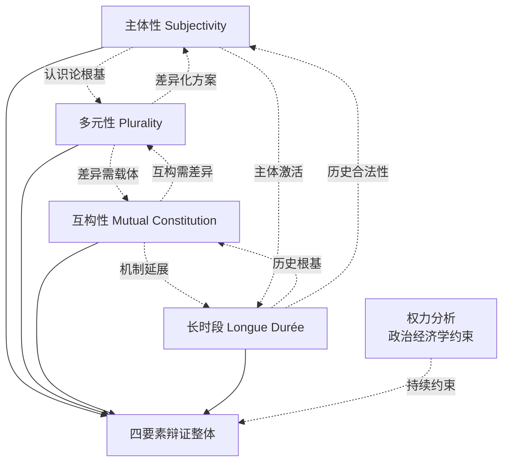

**主体性—多元性的关联**：主体性的恢复以承认多元为前提（不存在单一普遍主体），多元性的展开以主体性的实质化为内容（多元不是空洞的"差异"列表，而是主体性的差异化呈现）。这一关联体现于第三章拉美依附理论、印度庶民研究、非洲乌班图哲学、中国式现代化"四条路径"之中——四者既各自展开主体性建构，又共同构成多元现代性的具体图景。

**多元性—互构性的关联**：多元性强调差异的存在，互构性强调差异的相互生成；二者共同反对单一普遍主义，但需避免互构叙事消解差异的真实性。这一关联体现于乌班图—儒家"公约数"对话——它既肯定两种文明传统的差异（一为非洲口传哲学，一为东亚文献传统），又揭示差异之间通过具体实践（中非医疗合作、中非合作论坛）相互激活、相互参照的互构机制。

**互构性—长时段的关联**：互构性需要长时段证据支持（物质文化流动、贸易圈、技术传播），长时段叙事则以互构性为基本机制。这一关联体现于第四章对丝绸之路的考察——该网络既是当代"一带一路"互构性合作的历史原型，又只能在长时段视野（汉唐宋元明清直至殖民现代性打断）中得到完整理解。

**长时段—主体性的关联**：长时段视野为主体性提供历史合法性（南方文明曾长期处于世界历史主干位置，而非"沉默的大多数"），主体性反过来要求长时段叙事不沦为去政治化的"全球纠缠浪漫化"。这一关联体现于殷之光的论述——他坚持"以生产关系为抓手"的马克思主义政治经济学分析[^79]，正是要将长时段历史与主体性建构紧密联系，避免历史考察成为悬空的考古学游戏。

四要素的辩证整体并非封闭的概念系统，而是在持续的权力分析与政治经济学约束下不断自我调整的开放结构——这正是德里克、殷之光、吕新雨等学者所共同坚持的认识论立场[^80][^79][^78]。

## 5.4 理论模型的整体架构与运作机制

在四要素基础上，本节进一步建构全球南方文明互鉴理论模型的整体架构，呈现其作为有机系统的运作机制。模型的整体架构可以"双轴四要素"的方式呈现：**主体性—多元性构成认识论与文化论的纵轴，互构性—长时段构成实践论与历史论的横轴**；四要素在具体的文明互鉴实践中相互激活、相互支撑。

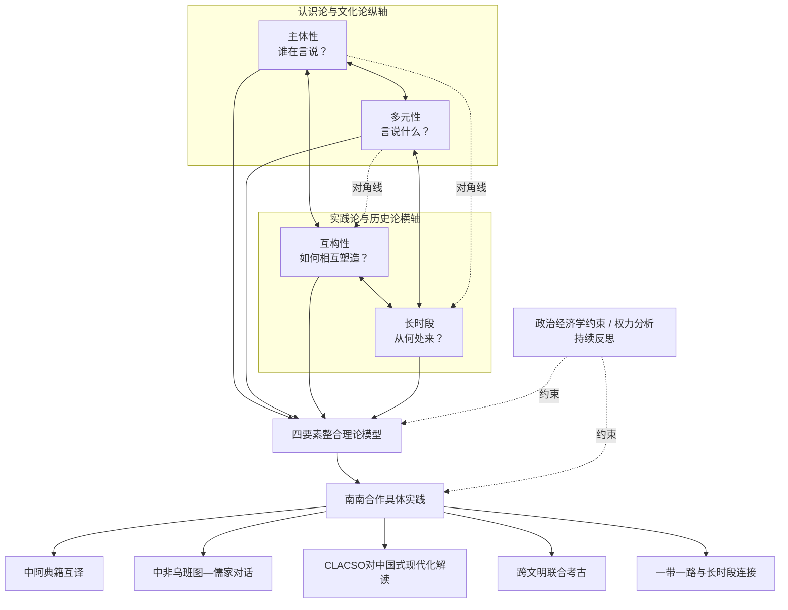

**纵轴（主体性—多元性）回答的是"文明互鉴如何在认识论与文化论层面成为可能"的问题**：主体性要素提供"言说者"的合法性（南方有权言说），多元性要素提供"言说内容"的丰富性（南方有不同方案可言说）。二者共同构成文明互鉴的认识论前提——若没有主体性，多元性便沦为西方学术市场中可消费的"异国情调"；若没有多元性，主体性便退化为单一民族主义的自我封闭。

**横轴（互构性—长时段）回答的是"文明互鉴如何在实践论与历史论层面具有现实性"的问题**：互构性要素提供"当代实践"的运作机制（南南互动中物质与文化的双向塑造），长时段要素提供"历史脉络"的连续性根基（当代互鉴是长时段交往的回归）。二者共同构成文明互鉴的实践论前提——若没有互构性，长时段便沦为对过去的怀旧；若没有长时段，互构性便失去历史深度而只剩当代浮表。

**四要素之间的对角线关联尤为关键**：主体性与长时段构成对角线（认识论主体性以历史主体性为根基），多元性与互构性构成另一对角线（差异化方案在互动中被相互激活）。这一双对角线结构使理论模型不是平面的"四要素并列"，而是立体的有机系统——任何具体的文明互鉴实践都同时激活四要素，并在四要素的相互作用中获得意义。

模型的解释力可由本研究前三章已经讨论的具体案例进行验证：

**案例一：中阿典籍互译工程**。这一实践同时激活四要素——它体现了**主体性**（中阿学者直接合作翻译，而非依赖欧美汉学家或阿拉伯学家的双重中介）、**多元性**（《老子》《论语》《孟子》代表中华文明独特的现代性方案与价值资源）、**互构性**（中阿学者首次"联袂"翻译过程本身即是文明互构的实践，译本反过来重塑两种文明的相互理解）、**长时段**（中阿之间从苏莱曼《中国印度见闻录》、马苏第《黄金草原》、周去非《岭外代答》以来已有千年文献往来传统）。

**案例二：中非乌班图—儒家对话**。这一对话同时激活四要素——**主体性**体现于非洲思想家（姆比蒂、埃蒂耶伊博）与中国学者直接对话，不经欧美哲学界中介；**多元性**体现于乌班图"我们在故我在"与儒家"仁者爱人"作为不同文明根脉提供的差异化人类学方案；**互构性**体现于"中国的医疗外交与非洲'乌班图思想'同频共振"的具体实践、中非合作论坛的制度化对话；**长时段**体现于自汉朝起中非已有的远距离交流，以及阿布-卢格霍德所揭示的13世纪体系中非洲红海/印度洋海岸的核心位置。

**案例三：CLACSO对中国"十五五"规划的解读**。这一解读同时激活四要素——**主体性**体现于拉美学者基于自身依附—解殖传统对中国经验的批判性诠释，而非接受北方智库的解读框架；**多元性**体现于将中国的"内生创新"与"技术现代化"理解为不同于全球北方模式的发展路径；**互构性**体现于拉美对中国经验的解读反过来激活中国学界对自身道路世界历史意义的反思；**长时段**体现于普雷维什—弗兰克—沃勒斯坦的世界体系传统与中国式现代化的"去依附"实践共同汇入对资本主义世界体系的长时段批判。

**案例四：跨文明联合考古**。中沙塞林港、中埃孟图神庙、中肯拉穆群岛、中洪科潘等项目同时激活四要素——**主体性**体现于"非西方学者主导的考古"打破东方学家"站得高高在上"的单向凝视；**多元性**体现于不同文明通过物质遗存呈现各自独特历史轨迹；**互构性**体现于"中埃携手揭开神庙面纱""共同蹲在一个探方里"的合作工作场景，以及张光直所提示的跨太平洋"玛雅—中国文化连续体"假说所打开的非西方文明直接对话空间；**长时段**体现于考古发现对前现代文明交往网络的物质实证。

**案例五："一带一路"与长时段连接**。这一倡议的整合性意义同时激活四要素——**主体性**体现于沿线国家共同决策、共同建设、共同受益的多边主体性结构；**多元性**体现于沿线各国不同文明、不同发展水平、不同政治制度的共存共建；**互构性**体现于基础设施建设、贸易畅通、人文交流的多向双向塑造；**长时段**体现于"一带一路"地理路线与汉唐宋元时期已成型的丝绸之路与海上丝绸之路的深度重合。

需要强调的是，**模型的运作机制始终内嵌着持续的政治经济学约束与权力分析反思**。这一反思机制由德里克、齐贝尔、殷之光、吕新雨等学者的批判性工作所提供[^80][^79][^78]——它要求模型在每一具体应用中都追问：互鉴实践是否真正改变了既有的生产关系？文明对话是否仅停留于话语层面而忽视物质基础？主体性建构是否避免了滑向文化保守主义？多元性方案是否未能将不平等"落实到具体的，对生产关系、生产方式、不均衡发展的分析中"[^79]？这一持续约束机制是模型避免沦为"温情脉脉文明对话神话"的根本保障。

## 5.5 对"文明冲突论"的超越：从二元对立到多向互鉴

在建构出整合性理论模型之后，本节以模型为参照，系统检视亨廷顿"文明冲突论"的理论局限，论证模型对其的范式性超越。第一章已经引述亨廷顿1996年提出的核心命题——"文明冲突"将主宰全球政治，伊斯兰文明与儒家文明被视为对西方文明的潜在威胁。这一理论虽然在"9·11事件"后获得部分应验性诠释，但其底层假设的西方中心主义偏误，需要通过四要素模型的逐一对照得到清晰揭示。

**亨廷顿"文明冲突论"的四重理论局限**可归纳如下：

第一，**文明实体化偏误**：将文明本质化为相互对立的封闭实体，忽视文明内部的多元性与文明之间的混杂性。亨廷顿将世界划分为西方、东正教、伊斯兰、儒家、印度、日本、拉丁美洲、非洲八大文明，每个文明被视为相对稳定、内部同质的封闭单元。

第二，**冲突预设偏误**：将非西方文明的崛起预设为冲突根源，将多元文明并存预设为零和博弈，忽视文明互动中的互构、协商与共生维度。

第三，**西方中心立足点**：表面上承认多元文明，实质上以西方文明为不证自明的参照系——"伊斯兰文明与儒家文明对西方文明的威胁"这一表述本身即默认了西方文明是被"威胁"的中心。

第四，**短时段视野**：以冷战后短时段格局推断"未来世界国际冲突的根源"，忽视文明互动的长时段历史与多中心常态。

四要素模型对文明冲突论的超越，可由表格系统呈现：

| 模型要素 | 对文明冲突论的超越 | 理论操作 |
|---------|------------------|---------|
| 主体性 | 拒绝将非西方文明客体化为"威胁" | 以"自我表述的南方"取代"被表述为威胁的他者" |
| 多元性 | 将文明差异理解为互鉴资源而非冲突诱因 | "和而不同"取代"非此即彼" |
| 互构性 | 揭示文明在交往中相互塑造而非僵化对峙 | 第三空间、纠缠、混杂性取代封闭实体 |
| 长时段 | 以前现代多文明共生史实瓦解"必然冲突"预设 | 13世纪八子系统多中心体系、丝绸之路常态 |

**主体性要素对文明冲突论的超越**：文明冲突论将非西方文明（尤其是伊斯兰与儒家）建构为西方需要应对的威胁性他者，本质上延续了第二章所揭示的东方学话语机制——非西方文明被客体化为"被表述的对象"。模型的主体性要素则通过"自我表述的南方"这一认识论转向，从根本上拒绝这一客体化操作：南方文明不是被描述、被预测、被防范的对象，而是有权直接发言、自我定义、自我建构的主体。

**多元性要素对文明冲突论的超越**：文明冲突论将文明差异预设为冲突诱因，其底层逻辑是"差异必然导致对立"。模型的多元性要素则将差异重新定位为互鉴资源——拉美依附理论、印度庶民研究、非洲乌班图哲学、中国"两个结合"四条路径之间的差异，恰恰是它们能够相互参照、相互启发、共同推进现代性多元生成的前提。这一差异观与费孝通"各美其美，美人之美，美美与共，天下大同"的论述形成深层共振——差异不是冲突的根源，而是共美的基础。

**互构性要素对文明冲突论的超越**：文明冲突论假设文明是封闭实体，"文明的断层线"将不同文明截然分开。模型的互构性要素则通过霍米·巴巴的"第三空间"、康拉德的"纠缠"、霍布森的"东方化西方"等理论资源，揭示文明在交往中相互塑造而非僵化对峙——欧洲文明本身即是吸纳东方技术、伊斯兰文明、非洲资源等多重输入的混杂产物，"纯粹的西方文明"或"纯粹的东方文明"在历史中从未真正存在过。这一互构性认知从根本上瓦解了"文明断层线"的本体论预设。

**长时段要素对文明冲突论的超越**：文明冲突论以冷战后短时段格局立论，其底层默认了"现代世界=不同文明的竞争场所"这一历史短视。模型的长时段要素则诉诸前现代多文明共生的史实——阿布-卢格霍德所揭示的13世纪八子系统中"语言不必同一、货币不必一致、规则需要协商"的运作模式、丝绸之路千年间多文明合作开通与维护的史实、印度洋贸易圈中阿拉伯—波斯—印度—中国—东非长期共商共建的规则体系——这些史实表明，多文明长期共生、协商共建是历史常态，而非文明必然冲突的反例。

更进一步，**理论模型与中国文明互鉴话语的内在一致性**为这一超越提供了实践印证。第一章已经详细阐释的费孝通"十六字箴言"、党的二十大报告"以文明交流超越文明隔阂、文明互鉴超越文明冲突、文明共存超越文明优越"的"三超越"、全球文明倡议"四大支柱"，与四要素模型形成深层对应：

- 费孝通"各美其美"对应**主体性**（每一文明拥有自我欣赏的主体能力）；
- "美人之美""美美与共"对应**多元性**与**互构性**（承认他者之美、共同生成新美）；
- "天下大同"对应**长时段**视野下的人类整体福祉。

党的二十大报告"三超越"则系统对应模型的四要素操作：
- "以文明交流超越文明隔阂"对应**主体性**（南方文明从被隔绝的客体走向交流主体）；
- "以文明互鉴超越文明冲突"对应**多元性**与**互构性**的辩证统一（差异通过互鉴转化为共生）；
- "以文明共存超越文明优越"对应**长时段**视野下对文明等级秩序的根本拒绝。

全球文明倡议四大支柱（尊重文明多样性、弘扬全人类共同价值、重视文明传承创新、加强国际人文交流合作）则可视为模型四要素在政策层面的具体展开。**这一深层对应关系表明，模型不是悬空的学术建构，而是已经被中国文明互鉴话语在概念与实践层面所支撑的理论框架；反过来，中国话语也通过这一模型的整合性建构，获得了系统的学理表达**。

## 5.6 对"历史终结论"的超越：从单线终结到多元生成

继文明冲突论之后，福山1989年提出、1992年系统化的"历史终结论"是另一项需要被四要素模型所超越的重要西方文明对话理论。福山的核心命题是：自由民主资本主义已成为人类政治制度演化的终极形态，西方意识形态的全球胜利标志着"历史的终结"——非西方现代化路径仅是通向同一终点的不同速率的"未完成版本"。这一论断在冷战结束初期获得广泛影响，但其底层延续的单线进化论与欧洲中心主义假设，恰是本研究四要素模型所要根本性突破的对象。

**历史终结论的四重理论局限**可归纳如下：

第一，**单线进化论预设**：将自由民主资本主义预设为人类历史演化的终极目的因，所有社会演化都被纳入这一线性轨道。

第二，**目的论叙事**：将历史理解为有"终点"的过程，从而剥夺了历史的开放性与生成性。

第三，**欧洲中心立足点**：以西方现代性为人类未来的范本，将非西方文明的独立探索预设为"尚未到达终点"的不完整。

第四，**对偶然性的盲视**：将"西方崛起"视为历史必然而非偶然事件，从而无法理解多元历史路径的可能性。

四要素模型对历史终结论的超越，可由以下四组对照展开：

**多元性要素对历史终结论的超越**：历史终结论的根本预设是"现代性=西方化=自由民主资本主义"这一三位一体等式。第三章所展开的非西方现代化方案——拉美依附—解殖传统从普雷维什"中心—外围"到米尼奥罗"权力的殖民性"对资本主义世界体系本身的批判、印度庶民研究"地方化欧洲"对欧洲作为现代性范本的认识论解构、非洲乌班图哲学对西方原子化个体主义的关系本体论替代、中国式现代化"两个结合"对马克思主义、中华优秀传统文化、新时代实践的"三重融合"——已经从根本上瓦解这一三位一体等式。模型的多元性要素将这些方案肯定为"独立正当的现代性方案"而非"通向同一终点的不同速率"——南方现代化不是趋同性追赶，而是文明多样性作为现代性多元生成内在动力的实质展开。

**主体性要素对历史终结论的超越**：历史终结论将非西方现代化纳入西方既定终点的认识论框架，预设南方主体的发展目标是"成为西方"。模型的主体性要素则通过"自我表述"的认识论转向，从根本上拒绝这一框架——南方文明的目标不是"成为他者"，而是在与他者的对话中"成为自身"。这一转向直接呼应殷之光所论述的"对全球南方问题的讨论应当是一种以生产关系为抓手、以共同体整体发展为目标的马克思主义政治经济学分析"[^79]——南方主体性的目标不是被西方意识形态定义的"自由民主"，而是消除全球范围内的不平等结构，推动人类整体生产力与文明形态的多元发展。

**长时段要素对历史终结论的超越**：历史终结论的史观基础是"西方崛起"的内在必然性——若西方崛起只是偶然事件，则其作为"历史终点"的地位便失去根基。第四章已经系统论证：彭慕兰证明1800年前东西方处于相近水平、煤炭区位与新大陆构成偶然性，弗兰克证明1400—1800年欧洲是亚洲中心体系的"加入者"，阿布-卢格霍德证明13世纪世界体系中欧洲是"最落后的地区"，霍布森证明欧洲500—1850年的整体演进是"东方化"过程。**这一连续的史学论证将"西方崛起"从"内在必然—独特优越—永恒规范"的位置上拉下来，重新定位为相对短暂、依赖偶然、有限范围的历史事件**——若"西方崛起"本身是偶然的，则"历史已经终结"的史观基础便从根本上瓦解。

吕新雨的论述对这一史观瓦解作了具体的政治经济学补充。她明确指出："**在'历史终结'的意识形态迷雾消散之后，以工业化为基础的现代化发展和独立自主的国家主权地位，不仅仅是全球南方关切的**"[^80]。俄乌战争、中美贸易战所触发的"工业化""现代化"等"似乎已经过气的二十世纪的旧概念，重新成为当代政治场域中厮杀的关键词"[^80]。这一具体观察证明，所谓"历史终结"非但未能终结历史，反而以最物质性的方式被持续展开的现实历史所反驳——工业化、土地、粮食、能源、半导体等具体的物质性较量持续证明，历史从未终结，南方现代化作为多元生成的进程仍在持续展开。

**互构性要素对历史终结论的超越**：历史终结论预设了一种封闭性终结——历史在自由民主资本主义中达到"完成态"，此后无非是这一形态的全球扩展。模型的互构性要素则呈现人类文明新形态的开放性生成——文明并非走向单一终点，而是在多向互动、相互塑造、共同建构中持续生成。第三章已经引述："**人类文明新形态以中国式现代化为实践基础，'突破了"传统—现代"的线性进化逻辑，构建出一种以文明共生、生态和谐与文化多元为核心要义的新型文明观'**"。这一新形态之"新"不在于提出新的"终点"取代旧的"终点"，而在于根本性地改变"历史是否有终点"这一元问题——历史不是走向终点的过程，而是文明持续相互建构的开放生成。

特别值得指出的是，**清华大学Vijay Prashad与赵月枝的对话所揭示的"全球南方传播与文化觉醒"议题**进一步印证了对历史终结论的超越：在世界经历深刻地缘政治与文化转型之际，全球南方正在成为重塑国际传播秩序与文化叙事的关键力量[^80]。Prashad与赵月枝在对话中系统论述了全球南方传播的现状、对其殖民文化遗产的批判、解殖在全球南方传播中的持续重要性，并寄希望于全球南方文化觉醒以"重构国际传播秩序与世界结构"[^80]。这一文化觉醒的实质，正是对"历史终结论"在传播领域的延伸——西方主导的国际传播秩序与文化叙事——的根本性挑战；其指向的不是新的"终结"，而是"重构"，即开放性的多向生成。

模型对历史终结论的超越在更深层次上具有方法论意义：它表明，**真正的人类未来不是走向单一形态，而是在多元文明的相互对话、相互建构、相互修正中持续展开**。这一立场既反对历史终结论的单线终结，也反对相对主义的"任何形态都同等正当"——通过持续的政治经济学约束（吕新雨[^80]、殷之光[^79]、德里克[^78]）与持续的认识论反思（齐贝尔对萨义德文化转向的批判[^78]），模型保留了跨文明批判的可能性，从而使"多元生成"既不滑向新的霸权（南方中心论），也不滑向无原则的相对主义。

## 5.7 理论模型的解释力验证与适用边界

在与既有西方文明对话理论（亨廷顿"文明冲突论"、福山"历史终结论"）的比较中初步验证理论模型的解释力之后，本节进一步审视其适用边界与潜在限度，为第六章实践图景的展开提供理论坐标，同时为第七章的批判性反思预留议题接口。

**首先，模型的综合解释力**可通过对几类典型案例的回溯性分析得到验证：

**万隆会议（1955）作为模型的"历史原型"案例**。万隆会议29个亚非国家的"团结、友谊、合作"实践，同时激活四要素：**主体性**——亚非国家首次以集体身份在国际舞台上自我表述，拒绝作为冷战两大阵营的附庸；**多元性**——参会国家包含不同社会制度、宗教信仰、发展阶段，但共同寻求反殖民独立与自主发展；**互构性**——会议精神（万隆十项原则）通过亚非各国相互协商而非任何单一国家主导而形成；**长时段**——其历史意义不仅在于冷战格局中的反阵营姿态，更在于对前现代亚非长时段直接交往的当代恢复。

**金砖合作机制作为模型的"当代深化"案例**。从最初的BRIC到BRICS再到BRICS+扩员，金砖机制同时激活四要素：**主体性**——金砖国家智库联盟、新开发银行、金砖货币安排等机制建设体现了南方主体在全球治理中的自我表述能力；**多元性**——成员国包含不同政治制度、文明传统、发展模式，但在改革国际经济金融秩序上形成共识；**互构性**——金砖各成员相互成为对方的发展机遇与文明参照对象；**长时段**——金砖各成员国在前现代世界体系中均曾占据关键位置（中国白银资本中心、印度文明母体、巴西—南非作为南大西洋枢纽）。

**"一带一路"倡议作为模型的"历史—当代连续性"案例**。如第四章已论证，"一带一路"地理路线与汉唐宋元时期成型的丝绸之路与海上丝绸之路深度重合，同时激活四要素：**主体性**——共建"一带一路"国家以平等主体身份参与而非接受单一中心的辐射；**多元性**——沿线国家包含不同文明、不同发展水平、不同政治制度的并存共建；**互构性**——基础设施建设、贸易畅通、民心相通的多向双向塑造；**长时段**——对前现代南南直接交往传统的当代恢复与重新激活。

**全球文明倡议作为模型的"规范性表达"案例**。第一章已经详细阐述全球文明倡议四大支柱与模型四要素的深层对应。这一对应关系既验证了模型的解释力，又表明模型并非纯粹的描述性框架，而是同时具有规范性意涵的理论建构。

**其次，模型的适用边界与潜在限度**需要审慎指出：

**第一，四要素的边界划分仍存在模糊地带**。在具体案例中，主体性与互构性的边界（南方主体的"自我表述"在多大程度上已经是与他者互构的产物）、多元性与长时段的边界（当代多元方案在多大程度上是历史延续）、互构性与多元性的边界（文明之间的相互塑造在多大程度上消解或丰富了文明差异）等，都存在交叉地带。这些模糊地带在某种意义上反映了真实文明互鉴现象的复杂性，但也提示模型在作具体应用时需要灵活处理而非机械套用。

**第二，模型对南方内部异质性的处理仍待深化**。模型虽然通过主体性要素的"宏观—微观"双重恢复试图回应南方内部分化问题，但对"全球南方"内部不同文明之间的差异、同一文明内部不同阶级与群体之间的差异、买办精英与大众阶级之间的矛盾、印度在新冷战中的摇摆等具体问题的细致处理仍嫌不足。这些议题将在第七章的批判性反思中得到专门讨论。

**第三，对全球北方进步力量在文明互鉴中的位置尚需明确**。模型以"全球南方"为主体，但第二章已经讨论的"全球大学"创始人名单中包含美国沃勒斯坦、比利时浩达、日本武藤一羊与武者小路公秀等北方批判性知识分子；齐贝尔对萨义德的批判[^78]、德里克作为土耳其裔美国学者的工作[^78]，也都是北方学院体系内部的批判性资源。**模型如何处理"反西方中心主义"与"北方进步力量参与南南互鉴"之间的关系，是一个需要进一步明确的议题**——这涉及到"全球南方"作为政治范畴而非地理范畴的具体边界。

**第四，模型的规范性诉求与解释性功能之间存在张力**。模型既要解释全球南方文明互鉴的现象（描述性功能），又要表达对这一现象的规范性立场（应然性功能）。这一双重功能在大多数情况下是相辅相成的，但在某些议题上可能产生张力——例如，当具体的南南合作实践偏离模型所表达的规范性愿景时（如南南内部的霸权征兆、文化保守主义滑坡），模型应如何回应？这一议题同样需要在第七章的批判性反思中得到展开。

**第五，模型必须始终保持对自身理论生产场域的反思**。本研究在第一章已坦诚指出，本研究的资料基础以中文学术语境与汉语世界对全球南方与文明互鉴议题的讨论为主；同时，四重理论维度的核心理论家大多在西方学术体制内生产理论（萨义德、斯皮瓦克、巴巴、米尼奥罗于美国学院；艾森斯塔特、泰勒于西方主流社会学/哲学；彭慕兰、康拉德同样）。**这构成一个根本性的悖论：以西方话语反西方，以西方学术体制为非西方主体性发声的合法性来源**。这一悖论无法通过单纯的理论操作得到消解，但可以通过持续的反身性自觉得到部分缓解——本研究在使用任何理论资源时都需要追问其产生场域、其与南方实际斗争的有机联系程度、其是否可能被西方学术市场吸纳为新的"学术商品"。

**第六，模型的运作仍需持续的政治经济学约束**。这是本章反复强调的关键约束。德里克对"文化保守主义"的警告[^78]、殷之光对"以生产关系为抓手"的坚持[^79]、吕新雨对"工业化与农业现代化"作为关键较量的强调[^80]、齐贝尔对萨义德"文化转向"的马克思主义批判[^78]，共同提示模型不能停留于话语—文化层面，而必须始终内嵌物质基础与生产关系分析。否则，文明互鉴便可能蜕变为德里克所警告的"以各种'文化复兴'旗号下资本与国家的合谋"[^78]，反而成为殖民性矩阵在新形态下的延续。

经过本章的工作，**全球南方文明互鉴的整合性理论模型已经在四重理论维度的功能分工、内在张力、四要素提炼、整体架构、超越性论证与适用边界审视中得到系统建构**。这一模型不是封闭的概念系统，而是开放的理论框架——它既向具体实践开放（第六章将以模型为坐标考察合作机制与中国贡献），也向批判性反思开放（第七章将以模型为对象审视其内在张力与限度）。模型的最终意义不在于提供一套完美的解答，而在于为持续展开的全球南方文明互鉴实践与思想生产提供一个可供对话、可供修正、可供超越的理论平台——正如人类文明新形态本身的"开放性生成"所昭示的，理论建构的根本目标不是抵达"终点"，而是为更深入的理解与更公正的实践开辟空间。

# 6 机制载体与中国贡献：合作平台的文明互鉴功能与全球文明倡议

第二至第五章已经分别从认识论解构、现代性建构、历史纵深与理论整合四个层面，完成了全球南方文明互鉴的理论建构工作，并在第五章提炼出"主体性—多元性—互构性—长时段"四要素整合性模型。然而，**任何理论模型若不能锚定于具体的机制载体与实践路径，便有滑向"悬空概念游戏"的风险**——这正是德里克所警告的"以各种'文化复兴'旗号下资本与国家的合谋"的认识论温床。本章因此承担承上启下的关键功能：以四要素模型为坐标，系统考察从万隆精神到当代多边机制的实践图景，重点分析中国作为全球南方天然成员的独特贡献，验证理论模型对实践的解释力，同时为第七章的批判性反思与第八章的总体展望积累具体的实证基础。本章的核心论证逻辑是：**机制化的合作平台是文明互鉴从"自发互动"走向"自觉互鉴"的关键中介；中国贡献——以"两个结合"、人类命运共同体、全球文明倡议为代表的话语创新与实践方案——不是为全球南方提供新的"标准答案"，而是作为"范式性参与者"为多元现代性谱系贡献中国资源**。

## 6.1 南南合作的历史机制基因：从万隆精神到不结盟运动与77国集团

当代南南合作机制并非凭空生成，而是植根于20世纪中叶亚非拉民族解放运动的历史土壤。这一历史脉络的考察对本章具有方法论意义：**它表明全球南方文明互鉴的机制化路径具有近70年的连续传统，当代合作平台的兴起是这一传统在新历史条件下的延续与升华，而非冷战之后的"新生事物"**——这一判断与第四章全球史视角下"南南合作是长时段常态回归"的论证形成微观—宏观的呼应。

**1955年4月18日至24日万隆会议作为南南合作机制的"元起点"**，其历史意义远超出政治协商层面。这场由亚非29个国家参加的会议在第三世界刚刚摆脱殖民统治、正在寻求自主发展道路的历史时刻召开，"与会各国怀着平等独立交往、使世界摆脱超级大国统治的共同愿望齐聚一堂"[^81]。会议催生的"万隆原则""万隆宣言"或"万隆精神"，被概括为"团结、友谊、合作"三大内涵[^82]。万隆十项原则以《联合国宪章》为基础，明确"互相尊重主权和领土完整、互不侵犯、互不干涉内政、平等互利、和平共处"等核心准则，强调"承认一切种族一律平等，承认一切大小国家一律平等"[^81][^82]。值得指出的是，万隆十项原则在中国、印度、缅甸共同倡导的和平共处五项原则基础上提出，**揭开了发展中国家团结合作、争取国家独立和主权、谋求经济发展和社会进步、维护世界和平、推动建立国际政治经济新秩序的历史新篇章**[^82]。

万隆会议的文明对话基因体现在三个层面。**第一，在精神内核层面**：万隆会议"在文化上强调了'亚非精神'，促进了文化自觉和逆转边缘化"[^82]——这一表述将万隆精神明确定位为文化自觉与边缘化逆转的运动，而非纯粹的政治协商；这一定位与第二章所讨论的法农、萨义德等后殖民理论家对文明解殖的认识论关切形成深层呼应。**第二，在主体建构层面**：万隆会议"首次将亚非各国的共同追求凝聚为亚洲价值观的普遍共识，开启了亚非自主探索安全治理道路的历程"[^83]——这一"首次"的表述具有重要的认识论意义，它标志着南方文明从"被表述的客体"向"自我表述的主体"的范式性转变。**第三，在文明谱系层面**：万隆精神并非单一会议事件的产物，而是开启了一脉相承的精神谱系——后续在"上海合作组织遵循的'上海精神'""澜湄合作机制孕育的澜湄精神""中国—中亚合作机制形成的'中国—中亚精神'"等当代合作机制中得到延续与丰富[^83]。这一精神谱系的连续性印证了第五章四要素模型中"长时段"要素的运作。

**1961年成立的不结盟运动**作为万隆精神的制度化延续，构成全球南方合作机制的重要载体。不结盟运动目前有121个成员国，中国于1992年正式成为其观察员国[^84][^85]。第19次峰会2024年1月在乌干达坎帕拉闭幕，发布的《坎帕拉宣言》"重申1955年万隆会议和1961年不结盟运动创立时确立的若干原则，强调要继续加强南南、南北合作，进一步维护、促进多边主义"[^84]。乌干达总统穆塞韦尼在峰会上明确表示，**不结盟运动将"秉承初创时的独立精神，拒绝接受一些发达国家对其他独立国家的胁迫、指手画脚和单边主义行径"**[^84][^85]。古巴国家副主席萨尔瓦多·梅萨进一步指出，不结盟运动"一直是世界上许多正义事业的支持者，包括反对殖民主义、新殖民主义、法西斯主义、种族主义和战争，并且抵制对成员国实施的不公平制裁和单边强制措施"[^84][^85]。

不结盟运动的当代演化呈现出鲜明的"文明对话功能扩展"特征。印尼学者纳比尔·伊赫桑指出，**面对"全球对国际法律和秩序的承诺正加速瓦解"的当代危机，"71岁的万隆精神必须得到所有爱好和平的国家的弘扬"**；前印尼总统梅加瓦蒂警告称，"新殖民主义和新帝国主义的威胁正以新形式重新出现，与1955年那一代人所面临的威胁不同"[^81]。这一警告与第二章所讨论的基哈诺"权力的殖民性"概念形成实践层面的呼应——殖民关系并未随政治独立而终结，而是以更隐蔽的形式持续运作。印度中国问题专家谭中将万隆精神归纳为三方面："一是提倡和平共处；二是号召亚非人民摆脱帝国主义与殖民主义压迫，成为独立国家；三是号召全世界弱小国家、民族团结起来，建立新的国际秩序"[^82]——这三方面构成了从"反殖民斗争"到"国际秩序重构"的连续谱系，将文明互鉴的政治基础与规范性愿景紧密结合。

**1964年成立的77国集团**及其延伸的"77国集团和中国"机制，是南南合作机制网络的另一关键支柱。77国集团成立时旨在"加强团结合作以加快发展中国家经济社会发展进程"，自20世纪90年代以来"中国同77国集团关系在原有基础上有了较大发展，通过'77国集团和中国'这一机制开展协调与合作"[^52]。该机制目前"代表134国、80%全球人口"，被联合国秘书长古特雷斯誉为"多边主义的坚实支柱，不断展现团结与力量"[^52]。

2023年9月15—16日在古巴哈瓦那举行的"77国集团和中国"峰会，"是南方国家规模最大的多边会议"，共有31国元首、116个成员国代表团参与；峰会通过的《哈瓦那宣言》包含46项条款，**"集中反映了发展中国家对改革国际经济秩序、反对单边制裁、促进科技公平发展等议题的共同诉求"**[^86]。宣言"用8项条款谴责单边强制措施，特别点名要求美国解除对古巴、委内瑞拉等国的封锁政策"，并"提出建立开放型技术转移平台，要求发达国家履行技术转让承诺"，将9月16日确立为"南方国家科学、技术和创新日"[^86]。委内瑞拉总统马杜罗高度评价宣言"揭穿了新殖民主义伪装"，尼加拉瓜代表称其为"打破依附关系的路线图"[^86]——这两个评价直接对应第三章拉美依附理论与解殖思想对世界体系结构性不平等的批判。

值得特别指出的是，《哈瓦那宣言》"继承发展了77国集团1964年成立时的基本原则，首次系统整合中国自1990年代参与机制建设形成的合作经验"，"与1979年《阿鲁沙纲领》、2000年《南方首脑会议宣言》相比，本文件更聚焦数字时代的发展权保障问题"[^86]。这一历史脉络的整理表明，**从1955年万隆会议→1961年不结盟运动→1964年77国集团→1979年《阿鲁沙纲领》→2000年《南方首脑会议宣言》→2023年《哈瓦那宣言》→2024年《坎帕拉宣言》，构成一条延续70年、不断丰富的南南合作机制谱系**。这一谱系不仅是政治外交史的串联，更是文明对话基因的连续传承——每一文件都既继承了"团结自强、独立自主"的核心精神，又在新历史条件下注入新的时代内涵（如《哈瓦那宣言》对数字时代发展权的关注）。

中国人民大学崔守军教授对"77国集团和中国"在捍卫多边主义方面取得的进展作了系统总结：**"一是在气候正义议题上发出了最强音"——成功推动发达国家就设立"损失与损害"基金达成历史性共识，"坚决捍卫了'共同但有区别的责任'原则"；**二是在发展议程上重塑了优先级**——在哈瓦那峰会和第三届南方首脑会议上，"特别是在推动落实联合国2030年可持续发展议程、呼吁改革国际金融架构、解决发展中国家债务危机等方面，提出了切实可行的'南方方案'"；**三是在抗击疫情与全球经济复苏上展现了行动力**[^52]。中国国际问题研究院王友明研究员则补充指出，该机制"提出的'非普惠的互惠原则'契合广大发展中国家的利益，有利全球南方国家发展"[^52]。

这一历史脉络的核心启示是：**当代金砖、上合等多边机制并非"另起炉灶"，而是在万隆—不结盟—77国集团所奠定的南南合作机制谱系基础上的当代深化与升级**。这一连续性认知对理解下一节将考察的当代多边机制具有重要的方法论意义——它表明这些机制承载的不仅是当代地缘政治需求，更是70年文明对话基因的累积性结晶。

## 6.2 当代多边机制的文明互鉴功能：金砖、上合、中非、中阿合作的比较考察

进入21世纪，全球南方合作进入机制化深化阶段，金砖国家合作机制、上海合作组织、中非合作论坛、中阿合作论坛、澜湄合作机制等多边平台相继兴起，形成涵盖政治、经济、人文、安全等多领域的机制网络。**这些机制的关键意义不仅在于政治协商功能本身，更在于其将文明互鉴从抽象理念落实为可操作的制度设计**——本节将从组织架构、人文交流、教育合作、文化互译、精神纽带五个维度展开比较考察，揭示机制化合作对文明对话从"自发互动"走向"自觉互鉴"的关键作用。

**第一维度：组织架构与议程设置的差异化路径**。金砖合作机制经历了从BRIC到BRICS再到BRICS+扩员的演进过程，形成"政治安全、经贸财金、人文交流'三轮驱动'"的合作格局[^87]。2024年10月《金砖国家领导人第十六次会晤喀山宣言》明确强调"互尊互谅、主权平等、团结民主、开放包容、深化合作、协商一致的金砖精神"，并欢迎"'全球南方'对金砖合作展现出的浓厚兴趣，核可金砖伙伴国模式文件"[^87]。中非合作论坛、中阿合作论坛则采取部长级会议为核心、多领域分论坛为支撑的层次化架构——中阿合作论坛"框架内已建立19项机制"，包括中阿文明对话会、中阿改革发展论坛、中阿企业家大会暨投资研讨会、中阿能源合作大会等[^27]。这一差异化路径的意义在于：**不同合作机制根据成员国构成、文明谱系、发展阶段等因素设计差异化制度安排，避免了"一刀切"的单一模板**——这一点本身即是对模型"多元性"要素的实践展开。

**第二维度：人文交流机制与智库网络建设**。这是当代多边机制相对于早期南南合作的重要深化。**金砖国家智库合作中方理事会**于2017年1月11日由中共中央对外联络部牵头组建，目前拥有88名理事、90家理事单位（另一统计为100余家），其核心职能"是推进金砖国家框架下的学术对话与智库合作，负责筹建和运作'金砖国家研究与交流基金'，并践行'金砖+'共识拓展合作网络"[^88][^46]。该理事会在2024年11月推动成立"全球南方"智库合作联盟，2025年支持中国人民大学启动"全球南方"绿色合作联合研究项目[^88]。2026年1月28日，巴西应用经济研究所(IPEA)所长访问该理事会秘书处，举行"全球南方发展与合作交流会"，双方就"金砖和全球南方合作的机制建设、经贸发展、教育人文交流等议题进行了深度研讨"[^45]——这一具体合作场景体现了第五章模型中"互构性"要素的实际运作。

**中非智库论坛**于2011年由浙江师范大学创办，2012年被纳入中非合作论坛框架，"以'民间为主、政府参与、坦诚对话、凝聚共识'为宗旨"[^89][^55]。第十三届会议2024年3月在坦桑尼亚达累斯萨拉姆举行，发布《中非智库关于深化全球发展合作的共识》（"中非达累斯萨拉姆共识"）；第十四届会议2025年在云南昆明举行，主题为"中非治国理政经验交流与中国式现代化"[^89]。**中阿改革发展研究中心**由习近平主席于2016年1月亲自倡议建立，由上海外国语大学承办，"已成为中阿交流改革开放、治国理政经验的思想平台"；十年来"已举办27期阿拉伯国家官员研修班，累计631名阿拉伯国家中高级官员参加培训"，"140余篇咨询报告获国家级采用"，承办了中阿智库联盟首次会议，"来自中国和19个阿拉伯国家及阿盟近40家智库与会"[^35][^34][^26]。

下表系统呈现当代主要多边机制在智库与人文交流维度的制度设计：

| 合作机制 | 智库平台 | 关键品牌活动 | 文明对话功能 |
|---------|---------|-------------|------------|
| 金砖合作 | 金砖国家智库合作中方理事会、金砖国家研究中心 | "全球南方"智库合作联盟、绿色金砖研讨会 | 南南知识共同体的机制化网络[^88][^46] |
| 中非合作论坛 | 中非智库论坛、中非智库10+10合作伙伴计划 | 中非达累斯萨拉姆共识、昆明宣言 | 中非治国理政经验交流[^89] |
| 中阿合作论坛 | 中阿改革发展研究中心、中阿智库联盟 | 中阿改革发展论坛、中阿文明交流互鉴国际研讨会 | 中阿文明深度对话与官员研修[^35][^27] |
| 上海合作组织 | 上合组织研究中心 | 上合组织峰会、智库论坛 | "上海精神"为内核的多边安全合作[^83] |
| 澜湄合作机制 | 澜湄合作智库网络 | 澜湄合作五年行动计划 | "澜湄精神"以民生合作夯实安全根基[^83] |

**第三维度：教育与人才培养的制度化合作**。这一维度的实践对认识论正义具有微观层面的实质性贡献。**金砖国家大学联盟**于2015年10月18日在北京正式成立，"现有来自金砖五国的38所高校，其永久秘书处设在中国北京师范大学，自2019年1月起，具体工作由复旦大学发展研究院金砖国家研究中心承担"，截至2024年"已促成跨国学术项目80余个"[^90]。**上海合作组织大学**由普京总统2007年8月在上合组织比什凯克元首峰会上倡议成立，"项目院校由来自上海合作组织5个成员国的100余所院校组成，其中哈萨克斯坦14所、中国45所，吉尔吉斯9所、俄罗斯21所、塔吉克斯坦10所"，旨在"为各成员国培养文化、科学、教育、经济等优先合作领域……的高水平人才"[^53]。

**中非高校20+20合作计划**作为2009年11月《沙姆沙伊赫行动计划》框架下的教育合作项目，2012年6月在广州正式启动，"遴选了北京大学与开罗大学、上海师范大学与博茨瓦纳大学等20对中非高校"，"实施'三年一轮'的合作模式"[^91][^92]。2024年5月31日，"中非高校百校合作计划"工作推进会暨启动仪式在北京外国语大学举行，"50所中方成员高校"入选；该计划是根据《中非人才培养合作计划》重大倡议在20+20基础上的深化推进[^91]。**中非人才培养合作计划**于2023年8月发布，"每年为非洲培训500名职业院校管理者、1000名中文教师及1万名'中文+职业技能'复合型人才，未来三年支持300名非洲青年科学家来华，并邀请2万名非洲国家政府官员和技术人才参加研修研讨活动"[^29]。

**鲁班工坊**作为"天津原创并率先实施建设的职业教育知名品牌"，被誉为"共建'一带一路'上的技术驿站"。截至当前，"中国已在南非、埃及、埃塞俄比亚、吉布提、肯尼亚等共计15个非洲国家成功落地了17所鲁班工坊"，"开设了52个各具特色的专业，紧密围绕铁路建设、机械制造、电气自动化等核心工业领域"[^93][^94]。鲁班工坊"实现了中国标准、中国模式、中国装备与中国方案的整体输出"，但其更深层意义在于——**马达加斯加鲁班工坊负责人马米·阿兰所介绍的"工坊要求学生在前两个学期就完成所有理论知识的学习，将更多时间投入到实操当中"，以及"目前马达加斯加多数机械制造企业使用的仍是手动机床，而鲁班工坊已配备4台数控机床供教学使用"[^94]，体现了职业教育合作对非洲工业化人力资本的实质性支撑**。马达加斯加学生左雅琴表示："在马达加斯加的鲁班工坊，我学习的更多是仪器的构造，了解如何安装设备""而在中国，我学习的内容更多是编程语言、软件等知识"[^94]——这一具体的学习经验体现了第五章模型中"互构性"要素在微观教育实践中的运作。

**第四维度：文化互译与跨文明考古的机制化嵌入**。这一维度的实质意义已在第二章"南南直接对话渠道"的认识论分析中得到展开，本节进一步揭示其机制化路径。**亚洲经典著作互译计划**作为习近平总书记2019年在亚洲文明对话大会上提出的倡议，"截至目前，中国已与23个亚洲国家签署了图书互译出版备忘录"[^57]。中阿典籍互译出版工程"已翻译出版近百部中阿经典著作和现当代文学作品"，"《论语》《孟子》《老子》等20多种中国优秀典籍被翻译成阿拉伯语"，"由薛庆国和费拉斯·萨瓦赫合作完成的《老子》《论语》《孟子》阿拉伯文译本，是中阿学者在中国文化原典阿拉伯文翻译史上的首次联袂"[^56]。中国—阿塞拜疆经典著作互译项目作为亚洲经典著作互译计划的重要组成部分，2025年6月19日在第三十一届北京国际图书博览会(BIBF)上举行了首批图书授权签约仪式，中方授予阿方翻译和出版《家》和《老子注译及评介》阿塞拜疆语版的权利[^57]。

跨文明联合考古的机制化嵌入同样具有重要意义。第二章已经详细考察的中沙塞林港、中埃孟图神庙、中肯拉穆群岛、中洪科潘等项目，均建立在国家级合作协议基础上。中沙塞林港项目"始于2016年，当年中沙签署《中国—沙特塞林港遗址考古合作协议书》"，2024年11月已组织实施第3季考古项目；中肯拉穆群岛项目"是我国对肯尼亚实施的文化援助项目。2005年中国国家文物局与肯尼亚文化遗产部签署合作考古协议，2010年《中国和肯尼亚合作实施拉穆群岛地区考古项目实施合同》正式签署"[^48][^50]。这种"国家协议—联合团队—长期项目—成果发布"的机制化路径，**使跨文明考古从单次的学术合作升级为系统性的文明对话工程**。中沙考古队员姜波明确指出："塞林港遗址考古是海上丝绸之路考古国际合作的范例。能够与中沙联合考古队同仁共同见证古代东西方文明的海上交流，我深感荣耀"[^48]——这一表述将具体考古工作与文明交流互鉴的宏观意义紧密联系。

**第五维度：精神纽带的价值谱系建构**。这是当代多边机制最具文明意涵的维度。从万隆精神出发，"亚洲价值观不断丰富升华，形成一脉相承的精神谱系"——**"上海精神"将亚洲价值观融入多边安全合作，为构建新型区域安全秩序提供范本；澜湄合作机制孕育的澜湄精神聚焦澜湄流域国家共同发展，以民生合作夯实安全根基；中国—中亚合作机制形成的'中国—中亚精神'，为地区安全与发展汇聚新动能**[^83]。习近平总书记进一步提出"以和平、合作、开放、包容的亚洲价值观为基本遵循"作为亚洲安全模式的精神内核[^83]。

亚洲安全模式的提出本身即体现了机制化合作的文明深化。2025年4月，中央周边工作会议首次将"亚洲安全模式"作为周边外交的战略支撑提出，**"亚洲安全模式以安危与共、求同存异、对话协商为核心原则，植根中华文明和合共生底蕴，融入共同、综合、合作、可持续的亚洲安全观"**[^83]。"亚洲方式"作为其行为准则，"集中体现为万隆会议十项原则"，"在决策层面，亚洲方式坚持非正式对话、平等协商、共识先行，摒弃强制表决，充分维护各国主权与核心关切"[^83]——这种"协商一致、尊重主权、照顾各方舒适度"的决策模式，与第四章阿布-卢格霍德所揭示的13世纪世界体系"语言不必同一、货币不必一致、规则需要协商"的多中心运作原则形成深层呼应。

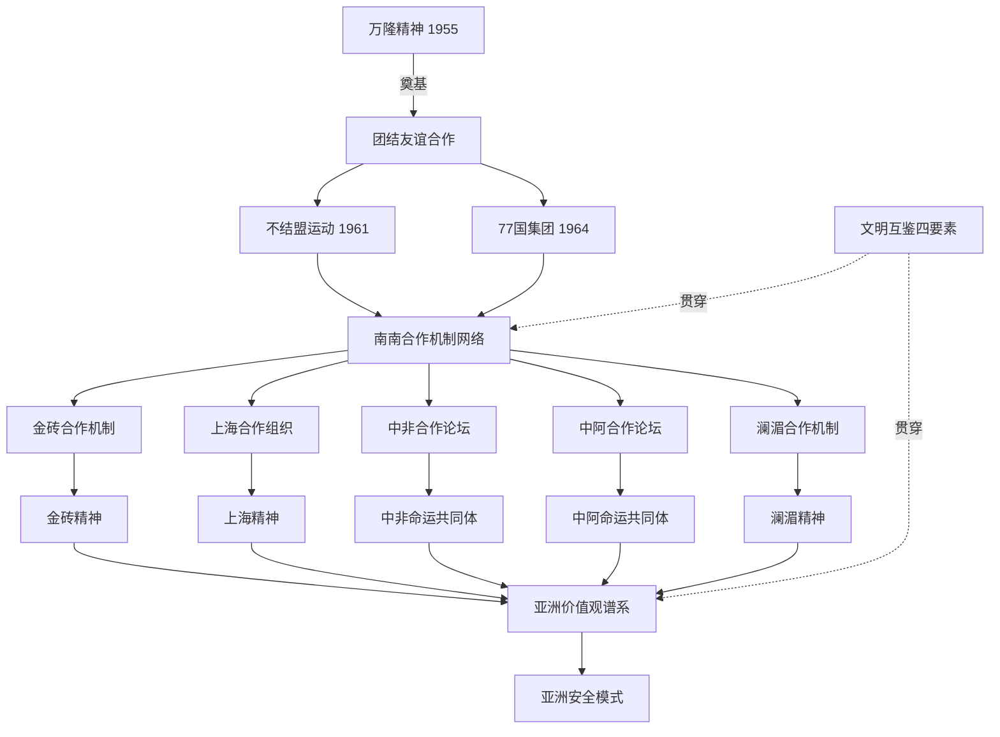

经过五个维度的比较考察，可以归纳本节的核心论断：**当代多边机制网络通过组织架构、智库平台、教育合作、文化互译、精神纽带的多维度制度设计，将文明互鉴从抽象理念转化为可操作实践网络，从而推动文明对话由"自发互动"升级为"自觉互鉴"**。这一升级的关键标志是：合作不再是偶然的、双边的、领导人推动的临时事件，而是机制化的、多边的、社会—学术—教育—文化全方位嵌入的稳定网络。这一机制化网络的存在，为下两节将要讨论的中国话语创新——"两个结合"、人类命运共同体、全球文明倡议——提供了具体的实践载体；反过来，中国的话语创新也为这些机制网络注入了新的理论内涵与价值定位。

## 6.3 中国话语创新（一）："两个结合"与中国式现代化的文明根基

如果说前两节考察的是机制层面的文明互鉴载体，那么从本节开始，论证将转向话语层面的中国贡献。其中"两个结合"作为中国式现代化的方法论建构，构成了中国向全球南方文明互鉴贡献的最具理论纵深的原创性话语资源。本节将系统阐释"两个结合"的理论内涵，论证其对第三章所讨论的非西方现代化命题的方法论回应，并分析其作为多元现代性谱系中差异化方案的世界意义。

**"两个结合"的理论内涵与历史定位**。习近平总书记在庆祝中国共产党成立100周年大会上首次提出"把马克思主义基本原理同中国具体实际相结合、同中华优秀传统文化相结合"，并在党的二十大报告中进一步阐明"两个结合"的基本内涵和实践意义[^82]。"两个结合"被定位为"我们在探索中国特色社会主义道路中得出的规律性认识"，是"习近平文化思想的一个重要论断"[^58][^82]。

"两个结合"的历史定位包含三个层次。**第一层是马克思主义中国化时代化历史经验的深刻总结**："只有把马克思主义基本原理同中国具体实际相结合、同中华优秀传统文化相结合，坚持运用辩证唯物主义和历史唯物主义，才能正确回答时代和实践提出的重大问题"[^58]。**第二层是党的理论创新的根本途径**："'两个结合'是推进党的理论创新的根本途径，是马克思主义理论之树常青的奥妙所在"[^58]。**第三层是中国特色社会主义道路的文化根基拓展**："'第二个结合'让中国特色社会主义道路有了更加宏阔深远的历史纵深，拓展了中国特色社会主义道路的文化根基"[^58][^82]。

值得特别关注的是**"第二个结合"的独立提出与凸显**。习近平总书记在文化传承发展座谈会上指出，"第二个结合"是"我们党对马克思主义中国化时代化历史经验的深刻总结，是对中华文明发展规律的深刻把握"，"这就把原来涵盖在'第一个结合'体系中的'第二个结合'独立出来、明确出来、凸显出来，表明我们党在传承中华优秀传统文化中推进文化创新从一种自发状态进入了新的自觉高度"[^58]。这一独立出来的认识论意义在于：**它从理论上明确承认中华文明传统不仅是被现代化进程"扬弃"的对象，而是与马克思主义并列的、具有当代生命力的"根脉"**。

习近平总书记从五个维度系统阐释"两个结合"的具体路径：**"'结合'的前提是彼此契合、'结合'的结果是互相成就、'结合'筑牢了道路根基、'结合'打开了创新空间、'结合'巩固了文化主体性"**[^82]。这五个维度共同构成"两个结合"的完整理论结构，其中**"巩固文化主体性"**这一表述与第五章模型"主体性"要素形成深层呼应——"两个结合"的最终落脚点不是抽象的理论调和，而是中华文化主体性在现代化进程中的实质性巩固。

**"两个结合"对非西方现代化命题的方法论回应**。第三章已经系统讨论了拉美依附理论、印度庶民研究、非洲乌班图哲学等非西方现代化方案。"两个结合"作为中国式现代化的方法论建构，构成了对这一命题的独特回应——它**既非简单延续西方现代化路径（拒绝"西化"），亦非传统主义复归（拒绝"复古"），而是文明型国家在多元现代性谱系中的创造性建构**。

这一独特性体现于"两个结合"对"现代化"概念的根本性重构。第三章已经引述张维为"文明型国家"理论：中国式现代化的成功"根植于其'文明型国家'特质，即一个古老文明与超大型现代国家的有机融合"[^87]。"两个结合"为这一融合提供了方法论基础：**通过马克思主义中国化时代化的最新成果与中华优秀传统文化的双重激活，中国式现代化获得了"既具有各国现代化的共同特征，更有基于自己国情的中国特色"的双重属性**[^95]。哲学家科学家把握中国式现代化理论内涵的关键，正在于"矛盾的普遍性与特殊性原理"——"现代化是人类社会从传统文明向现代文明转变的历史过程……中国式现代化具有各国现代化的共同特征"，"另一方面，矛盾的普遍性存在于特殊性之中，没有特殊性就没有普遍性"[^95]。这一辩证理解直接呼应第五章理论模型对"作为西方独占模式的现代性"与"作为人类共同问题域的现代性"的关键区分。

**"两个结合"对全球南方现代化的方法论启示**。"两个结合"的世界意义并不在于为其他南方国家提供"中国模式"，而在于提供一种**"植根本国、本民族历史文化沃土"的方法论原则**。习近平总书记明确指出："只有植根本国、本民族历史文化沃土，马克思主义真理之树才能根深叶茂"[^82]——这一论述的关键意涵在于：科学理论的普世价值与本民族文化传统并非对立关系，而是相互成就的辩证关系。

这一方法论原则对其他全球南方国家具有重要启示。第三章已讨论印度后发展思想、非洲乌班图哲学、拉美依附—解殖传统作为差异化的现代性方案，**它们与中国"两个结合"路径之间的共性在于：都拒绝将现代性等同于西方化，都试图在自身文明根脉中寻找现代化的内在动力**。这一共性正是"文明多样性作为现代性多元生成内在动力"命题的具体展开。汪晖在2024年文化强国建设高峰论坛上的演讲明确指出："**伴随着冷战的终结，苏联和东欧社会主义国家体系解体，但中国不但保持了政治结构、人口构成与国家规模的完整性，而且在社会主义国家体制的基础上，正在努力实现朝向全体人民共同富裕的现代化。没有社会主义建设和改革之间的连续性，这一现代化任务是难以完成的**"[^96]。这一连续性正是"两个结合"在历史层面的具体展开——中国式现代化不是断裂的、奇迹式的发明，而是在马克思主义、中华优秀传统文化、新时代实践三重资源持续融合中的渐进生成。

CLACSO对中国"十五五"规划的解读为这一启示提供了拉美视角的呼应。第三章已经引述CLACSO的判断："中国对'内生创新'和'技术现代化'的投入雄辩地证明，全球南方国家完全有能力构建自身的发展路径，而不必永远依赖全球北方强加的模式"[^30]。CLACSO学者进一步引发"发展为谁？创新为谁？"的根本性思考——**"以人民为中心"的发展模式与"以资本为中心"的模式形成根本区别**[^30]。这一思考实质上印证了"两个结合"作为方法论原则的世界意义——它启示其他全球南方国家可以根据自身的文明传统与现实条件，建构既不同于西方资本主义中心模式、也不同于中国具体路径的差异化现代化方案。

**"两个结合"的开放性与持续创新**。"两个结合"作为方法论建构本身具有开放性。习近平总书记强调，"我们要坚持对中华优秀传统文化进行创造性转化和创新性发展，高扬中华民族的文化主体性，把历经沧桑留下的中华文明瑰宝呵护好、弘扬好、发展好"[^58]。这一论述与第五章理论模型对"长时段"要素的强调形成内在一致——文化主体性的巩固不是封闭的自我循环，而是在持续的"创造性转化和创新性发展"中保持活力。汪晖将"中国化"概括为"持续地吸纳外来文化，但同时在实践中使之与中国历史、中国国情、中国现实、中国方式相适应，而中国社会也伴随着这些新因素的加入，而持续地发生变化"[^96]——这一开放性表述使"两个结合"既避免了简单的"传统复归"，又避免了无根的"全盘西化"，而是在动态平衡中持续生成新的现代性方案。

经过本节的考察，可以归纳"两个结合"作为中国话语创新的核心定位：**它是中国式现代化最具理论纵深的方法论建构，既回应了非西方现代化的理论命题（拒绝"西化=现代化"等式），又为全球南方探索差异化现代化路径提供了"植根本土、面向未来"的方法论原则**。然而，"两个结合"主要回答的是"如何展开自身现代化道路"的问题；要回答"如何与其他文明共同建构未来世界秩序"的问题，则需要进一步考察人类命运共同体理念与全球文明倡议——这正是下一节的任务。

## 6.4 中国话语创新（二）：人类命运共同体与全球文明倡议的理论吸纳

如果说"两个结合"主要解决"中国如何走自己的路"的问题，那么人类命运共同体理念与全球文明倡议则解决"中国与世界如何共同走向未来"的问题。这两大理论创新构成中国向全球南方文明互鉴贡献的规范性方案，本节将系统解读其理论内涵，并将其与本研究四重理论维度逐一对应，论证其对后殖民主义、东方学批判、非西方现代化、全球史视野的理论吸纳与发展。

**人类命运共同体理念作为"全球倡议谱系"的总体框架**。人类命运共同体作为习近平外交思想的核心标识性概念，与"一带一路"倡议、全球发展倡议、全球安全倡议、全球文明倡议、全球治理倡议构成完整的"全球倡议谱系"。陈文玲在评述王义桅《中国式现代化的天下担当——构建人类命运共同体》时指出，**这部著作"清晰地回答了一个核心问题：中国式现代化，不仅是中国自己的现代化，更是具有世界历史意义的现代化"**——"中国式现代化是和平发展、共同发展、文明包容的现代化，超越了西方传统现代化那种掠夺性、排他性、对抗性的逻辑"，"把'天下担当'作为中国式现代化的重要价值维度，强调中国的发展不是独善其身，而是兼济天下"[^97]。这一定位将人类命运共同体从纯粹的外交理念提升为"中国式现代化的理论归宿和价值目标"，构建起"中国式现代化—人类命运共同体—人类文明新形态"的完整理论逻辑[^97]。

**全球文明倡议的提出背景与四大支柱**。2023年3月15日，习近平总书记在中国共产党与世界政党高层对话会上首次提出全球文明倡议，"以四个'共同倡导'为核心理念"[^85]。倡议的提出回应了"百年未有之大变局"下的紧迫问题——当前"世界正面临百年未有之大变局，绝对贫穷、分配不公、恐怖主义、重大传染性疾病、粮食危机、气候变化等非传统安全威胁持续蔓延，恃强凌弱、冷战思维和单边主义行径对世界和平稳定、可持续发展带来冲击，'和平森林'正在遭遇'丛林法则'严重威胁"[^85]。

**全球文明倡议的"四大支柱"**——尊重世界文明多样性、弘扬全人类共同价值、重视文明传承和创新、加强国际人文交流合作[^98][^85]——构成了对当代文明对话核心问题的系统性回应：

**第一支柱"尊重世界文明多样性"**：呼吁"共同倡导尊重世界文明多样性，坚持文明平等、互鉴、对话、包容，以文明交流超越文明隔阂、文明互鉴超越文明冲突、文明包容超越文明优越"[^98]。其哲学基础是"当今世界有200多个国家和地区、2500多个民族、多种宗教，虽不同文明有特色、地域之别，但没有高下、优劣之分，正是文明多样性赋予这个世界姹紫嫣红的色彩"[^98]。

**第二支柱"弘扬全人类共同价值"**：呼吁"共同倡导弘扬全人类共同价值，和平、发展、公平、正义、民主、自由是各国人民的共同追求，要以宽广胸怀理解不同文明对价值内涵的认识，不将自己的价值观和模式强加于人，不搞意识形态对抗"[^98]。这一支柱的关键在于"以宽广胸怀理解不同文明对价值内涵的认识"——它既不否认存在跨文明的共同价值，又拒绝任何文明垄断对这些价值的解释权。

**第三支柱"重视文明传承和创新"**：呼吁"充分挖掘各国历史文化的时代价值，推动各国优秀传统文化在现代化进程中实现创造性转化、创新性发展"[^98]。这一支柱将"两个结合"的方法论原则上升为面向所有文明的普遍倡议——每个文明都有权在自身传统中寻找现代化的内在动力。

**第四支柱"加强国际人文交流合作"**：呼吁"探讨构建全球文明对话合作网络，丰富交流内容，拓展合作渠道，促进各国人民相知相亲，共同推动人类文明发展进步"[^98]。这一支柱与本章前两节考察的多边机制网络形成直接对接——倡议为既有机制网络的深化提供了规范性方向。

**全球文明倡议与四重理论维度的对应关系**。本研究的核心论证在于：全球文明倡议并非简单的政策话语，而是对前述四重理论维度的系统性吸纳与发展——

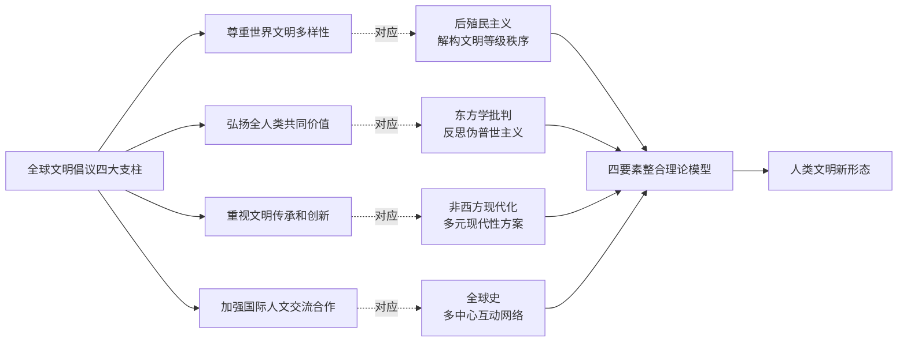

**第一支柱"尊重多样性"对应后殖民主义对文明等级秩序的解构**。第二章已经系统论证后殖民主义的核心贡献是揭示殖民性矩阵中的文明等级化逻辑。"尊重多样性"支柱"以文明交流超越文明隔阂、文明互鉴超越文明冲突、文明包容超越文明优越"的"三超越"，**正是从规范性层面拒斥这一等级秩序的当代表达**——"文明优越"的判断恰恰是殖民性矩阵的核心运作机制，"超越文明优越"则是从解殖角度对这一机制的根本性反对。

**第二支柱"共同价值"对应东方学批判对伪普世主义的反思**。第二章引用萨义德对"东方学"作为西方为确立自身优越性而建构的话语体系的批判。所谓"普世价值"在东方学话语中常被等同于"西方价值"，从而构成"伪普世主义"。"共同价值"支柱"以宽广胸怀理解不同文明对价值内涵的认识，不将自己的价值观和模式强加于人"的表述，**精确地划清了"共同价值"与"伪普世主义"之间的边界**——共同价值的存在并不意味着其内涵已被某种文明垄断性地定义，相反，需要不同文明从各自传统出发对其作出独特阐释。也门驻使馆临时代办邵峥的署名文章具体阐释了这一意涵："**全球文明倡议是继全球发展倡议、全球安全倡议后，中国为国际社会提供的又一重要公共产品，为推动人类现代化进程、推动构建人类命运共同体注入强大正能量**"[^98]。

**第三支柱"传承创新"对应非西方现代化的多元方案**。第三章已经系统论证多元现代性是文明多样性作为现代性多元生成内在动力的具体展开。"传承创新"支柱"推动各国优秀传统文化在现代化进程中实现创造性转化、创新性发展"，**正是将"两个结合"的中国方法论上升为面向所有文明的普遍倡议**——拉美的依附—解殖传统、印度的庶民研究、非洲的乌班图哲学，都可以在"传承创新"框架下获得正当性支撑。

**第四支柱"人文交流"对应全球史的多中心互动**。第四章已经论证前现代南南互动是塑造世界历史的主干网络而非边缘补充。"人文交流"支柱"探讨构建全球文明对话合作网络"的倡议，**与全球史视角下"互动—互联—跨社会结构"的方法论核心高度契合**——它不再是单一中心向外辐射的辐辏模式，而是多中心、多向度、网络化的对话格局。

**党的二十大"三超越"作为对"文明冲突论"的系统性回应**。党的二十大报告"以文明交流超越文明隔阂、文明互鉴超越文明冲突、文明共存超越文明优越"的"三超越"，构成了对亨廷顿"文明冲突论"的系统性理论回应。第一章已经引述"文明冲突论"将"伊斯兰文明与儒家文明视为对西方文明的潜在威胁"的核心命题。"三超越"则在三个层次上对其作出回应：**"超越文明隔阂"针对文明实体化偏误，强调文明之间存在交流而非封闭对峙；"超越文明冲突"针对冲突预设偏误，强调互鉴是常态而非冲突；"超越文明优越"针对西方中心立足点，强调文明平等而非等级**。

第五章已经系统建构了四要素模型对"文明冲突论"的超越性论证。在此基础上，"三超越"作为政策话语层面的具体表达，与四要素模型形成深层一致：主体性要素拒绝将非西方文明客体化为"威胁"——对应"超越文明隔阂"；多元性要素将文明差异理解为互鉴资源而非冲突诱因——对应"超越文明冲突"；互构性与长时段要素揭示文明在长时段交往中相互塑造——对应"超越文明优越"。

**全球文明倡议的国际共识进程**。全球文明倡议提出三年来，已"从中国理念上升为国际共识，从美好愿景转化为生动实践，取得丰硕成果"[^85]。其具体表现包括：**第一**，"从亚洲文明对话大会到中非、中阿、中拉等文明对话机制的不断完善，再到全球文明对话部长级会议在北京的成功举办，全球文明倡议的影响力在联合国、区域组织及民间层面持续扩大"[^85]。**第二**，在文化遗产保护与传承领域，"中国与亚洲、非洲、欧洲、拉丁美洲等的数十个国家开展了深度合作"[^85]——本章前节已具体考察这一领域的机制化合作。**第三**，**最具标志性的进展是"2024年6月7日，第78届联合国大会协商一致通过中国提出的设立文明对话国际日决议，决定将每年6月10日设立为文明对话国际日，标志着维护文明多样性、促进文明对话的理念已上升为全球性的共同行动"**[^85]。**第四**，截至2024年，全球文明倡议已写入中国和30多个国家的双边合作文件中[^85]。

值得指出的是，全球文明倡议的国际接受并非纯粹的"中国话语外溢"，而是通过具体的双向对话过程实现。**柬埔寨副首相兼外交国际合作部大臣贺南洪在评价中国倡议时指出**："中国倡议的'一带一路'、亚洲基础设施投资银行等对继承和弘扬万隆精神功不可没。这些举措为发展中国家之间的合作与发展创造出双赢的条件，再次确认了尊重主权和不干涉他国内政的重要性"[^82]。**亚非人民团结组织巴勒斯坦代表赛义德·卡迈勒**则从中东视角强调："血的事实表明，霸权国家处理国际问题的方式只会给中东带来更大灾难，破解中东乱局需要万隆精神"[^82]。这些来自不同区域的回应表明，**全球文明倡议的接受是建立在具体地缘政治经验与文明对话需求之上的实质性认同，而非纯粹的话语接受**。

经过本节的考察，全球文明倡议作为中国向全球南方文明互鉴贡献的规范性方案，其理论意义可以归纳为三层：**第一**，作为对当代文明对话核心问题的系统性回应——通过四大支柱的整合性建构；**第二**，作为对四重理论维度的吸纳与发展——既继承后殖民、东方学、非西方现代化、全球史的批判性资源，又将其综合为面向未来的规范性愿景；**第三**，作为对"文明冲突论"的范式性超越——通过"三超越"的具体表达。然而，全球文明倡议的世界意义最终不在于话语层面的成就，而在于其能否落地为具体的实践方案——这正是下一节将要考察的核心议题。

## 6.5 中国实践方案：合作机制网络与文明互鉴的具体路径

话语创新若不能落地为可操作的实践方案，便有沦为"美好愿景"的风险。本节考察中国通过具体合作机制网络将"两个结合"、人类命运共同体、全球文明倡议落地为实践路径的多维度尝试。这些路径已在本章第6.2节得到机制层面的横向比较，本节将进一步从"中国贡献"的视角，聚焦五个具有代表性的实践维度，论证中国如何为全球南方文明互鉴提供具体方案。

**第一维度："一带一路"作为整合性平台对前现代丝绸之路文明交往网络的当代激活**。"一带一路"倡议作为习近平总书记2013年提出的重大合作平台，在十二年的实践中已发展为涵盖基础设施、贸易、金融、人文等多领域的整合性框架。其文明互鉴意义不仅在于其规模（沿线已有150多国签署合作文件），更在于其与前现代丝绸之路网络的深度重合。第四章已经系统论证，"一带一路"在地理路线上几乎完全重合于汉唐宋元时期已经成型的丝绸之路与海上丝绸之路，由此**这一倡议不是凭空生成的"新合作"，而是被西方殖民暴力打断的长时段南南文明交往网络的当代恢复与激活**。

第二章详细考察的中沙塞林港、中肯拉穆群岛、中埃孟图神庙等跨文明联合考古项目，正是这一"激活"的具体物质印证。塞林港遗址出土的"成片分布的大型建筑遗址"和"一批来自中国的瓷器，包括青花灵芝云纹碗、蓝釉碗"[^48][^46]，与"一带一路"框架下的贸易畅通形成"古今呼应"——前现代海上丝绸之路所承载的中阿物质交往，正在新机制下获得新形式的延续。中肯拉穆群岛水下考古队发现的清代中晚期闽南窑场青花瓷器[^50][^51]，则将中非物质交往的连续性以最具体的考古证据呈现出来。

阿塞拜疆文化部部长顾问奥尔汗·萨迪戈夫的论述具体表达了这一历史连续性的当代意义："**古代丝绸之路早已架起中国与阿塞拜疆之间的文明桥梁，奠定了两国文化交流的深厚基础。我们有幸身处这一历史文化走廊之上，肩负着传承与发展的共同使命**"[^57]。这一表述将当代合作明确定位为"传承与发展"前现代文明交往的共同使命，而非外生于该传统的新关系。

**第二维度：智库对话机制对南南知识共同体建设的贡献**。中阿改革发展研究中心、中非智库论坛、金砖国家智库合作中方理事会、CLACSO对中国"十五五"规划解读等智库对话机制，构成中国对南南知识共同体建设的实质性贡献。**中阿改革发展研究中心**十年来累计接待"96批次，573人次的阿方政党、智库、媒体、青年代表团，32次组团出访阿拉伯国家知名智库和高校，参加83场国际会议"，与"沙特科研与知识交流中心、阿拉伯研究院等机构共建中国学研究所"[^35][^34]。中心理事长尹冬梅明确指出："中心见证了新时代中阿关系的蓬勃发展，其自身建设与发展也作为一项重要成果载入了中阿友好交往的史册"[^34][^26]。中心执行理事长孟钟捷进一步阐释："**中阿改革发展研究中心要充分利用上海外国语大学的语言优势和研究力量，不仅开展政策研究，更重要的是培养具有国际视野和专业能力的青年人才，在服务国家外交大局、促进中阿文明对话、培养青年人才方面作出更大贡献**"[^26]。

阿盟秘书长艾哈迈德·阿布·盖特2024年5月访问中心时"充分肯定中心的设立是延续中阿友谊的创新举措，符合双方人民的共同利益，赞扬其在推进中阿务实交流与高效合作方面作出的贡献"[^26]。这一具体评价体现了智库机制建设对南南文明对话的实质性支撑——**它不是政治话语的修辞性背书，而是制度化的、长期的、人员深度参与的对话平台**。

中非智库论坛第十三届会议2024年3月在坦桑尼亚发布的"中非达累斯萨拉姆共识"，"呼吁国际社会深化发展合作，支持各国走符合自身国情和文明特色的现代化道路"[^89]——这一共识的关键意义在于"自身国情和文明特色"的明确提出，与全球文明倡议第三支柱"重视文明传承和创新"形成具体对接。第十四届会议2025年在昆明发布的"昆明宣言"以"中非治国理政经验交流与中国式现代化"为主题[^89]，将中国式现代化经验明确定位为中非可共同探讨的话题，而非中国向非洲单向输出的标准答案。

第二章已经讨论的CLACSO对中国"十五五"规划的解读，是南南智库对话最具理论纵深的案例。CLACSO学者基于"独特视角"对中共二十届四中全会展开讨论，认为"中国对科技自立自强和新质生产力的系统性投入，对全球南方国家具有深刻的启示，并引发我们的多重思考"[^30]。**这一解读不是被动接受中国话语，而是从拉美依附—解殖传统出发对中国经验进行批判性诠释**——它体现了第五章模型"互构性"要素在跨大陆智库对话中的实际运作。

**第三维度：经典互译工程对"绕开西方转译"的南南直接对话渠道的制度化建设**。第二章已经从认识论层面论证"绕开西方转译"对全球南方文明对话的根本性意义。本节进一步揭示这一工作的机制化路径。亚洲经典著作互译计划"截至目前，中国已与23个亚洲国家签署了图书互译出版备忘录"[^57]。中阿典籍互译出版工程"截至2023年，互译作品数量已达50部"，"该工程已翻译出版近百部中阿经典著作和现当代文学作品"[^56]。

该工程的具体认识论意义在中阿典籍互译的具体实践中得到体现："**对于阿拉伯国家读者而言，该工程提供了直接了解中国文化的渠道，改变了以往主要依赖西方转译或视角的局面**"[^56]。这一"改变以往主要依赖西方转译"的判断具有第二章已详细分析的深远认识论意义——它直接拆解了萨义德所揭示的东方学话语权力中介机制。在中阿改革发展论坛、中阿文明对话会等机制平台的支撑下，**这一直接对话渠道获得了从经典翻译到学术对话再到政策研究的完整制度化路径**。

中阿典籍互译工程更具体的成就体现于关键译本的合作模式。"由薛庆国和费拉斯·萨瓦赫合作完成的《老子》《论语》《孟子》阿拉伯文译本，是中阿学者在中国文化原典阿拉伯文翻译史上的首次联袂"[^56]——**"首次联袂"的认识论意义在于：中阿学者直接合作翻译，意味着翻译过程本身即成为中阿文明对话的实质性互构空间**，符合第五章模型"互构性"要素的运作逻辑。

**第四维度：跨文明文化遗产合作的实质性互鉴**。除联合考古之外，中国与全球南方国家的文化遗产合作还包括世界遗产联合申报、文物保护修复等多种形式。"在中国的60处世界遗产中，就有着诸多同邻国合作保护的典范。如中国与哈萨克斯坦、吉尔吉斯斯坦联合申报的'丝绸之路：长安——天山廊道的路网'，就属于三国共同保护的跨国遗产"[^85]。"此外，中国还在柬埔寨等6个亚洲国家合作开展了11项历史古迹保护修复项目，与阿联酋、乌兹别克斯坦、沙特阿拉伯等亚洲14国开展了20余项联合考古合作"[^85]。

这些合作的文明互鉴意义不仅在于物质遗产的保护，更在于合作过程本身。第二章已经引述埃及考古队员亨蒂的论述："**联合考古的意义，不在于谁的技术更先进、谁的学术传统更悠久，而在于双方共同的信念：这是人类文明的创造，是属于全人类共同的遗产**"[^49]。这一表述与全球文明倡议第二支柱"弘扬全人类共同价值"形成深层呼应——全人类共同价值不是抽象的"普世主义"，而是在具体合作实践中由不同文明共同建构的价值共识。

**第五维度：南南教育合作对认识论正义的微观贡献**。鲁班工坊、中非高校百校计划、亚洲经典著作互译计划等南南教育合作机制，构成对认识论正义的微观层面贡献。这一贡献的关键意义在于：**认识论正义不仅是理论批判与制度建设问题，更是数百万具体学习者能否获得自主知识能力、能否参与文明对话的微观实践问题**。

鲁班工坊的具体案例尤具说明力。马达加斯加学生左雅琴的学习轨迹——从马达加斯加鲁班工坊学习仪器构造与设备安装，到通过该工坊机会来到中国进入天津机电职业技术学院学习软件技术，"通过中国汉语水平考试(HSK)达到四级水平"，期待"将她所学的信息技术应用于实际工作""将在中国学到的软件技术、设计理念和更系统化的工程思维反哺祖国"[^94]——这一具体轨迹体现了**南南教育合作如何为南方学生提供"绕开西方教育垄断"的多元学习路径**。这种多元路径的存在，本身即是对"全球北方跨国公司所控制的平台和系统的依赖"[^30]的微观突破。

下表系统呈现中国实践方案五个维度的具体展开：

| 实践维度 | 代表性机制 | 文明互鉴功能 | 对四要素模型的呼应 |
|---------|-----------|-----------|------------------|
| 一带一路与长时段连接 | 沿线合作、跨文明考古 | 对前现代南南交往网络的当代激活 | 长时段+互构性 |
| 智库对话机制 | 中阿改革发展研究中心、中非智库论坛、CLACSO对话 | 南南知识共同体的制度化建设 | 主体性+互构性 |
| 经典互译工程 | 亚洲互译计划、中阿典籍互译 | "绕开西方转译"的直接对话渠道 | 主体性+多元性 |
| 跨文明文化遗产合作 | 联合考古、世界遗产联申、修复合作 | 全人类共同遗产的实质性互鉴 | 多元性+互构性 |
| 南南教育合作 | 鲁班工坊、中非百校计划 | 认识论正义的微观实践 | 主体性+互构性 |

经过五个维度的考察，可以归纳本节的核心论断：**中国通过"一带一路"整合性平台、智库对话机制、经典互译工程、文化遗产合作、南南教育合作五个维度的具体实践，将"两个结合"、人类命运共同体、全球文明倡议的话语创新落地为可操作的实践方案**。这些方案的关键特征在于：**它们不是中国向其他南方国家单向输出的"中国模式"，而是建立在双方平等参与、共同决策、相互成就基础上的合作网络**。这一关键特征构成了下一节将要讨论的"中国贡献独特位置"的核心内涵。

## 6.6 中国贡献的独特位置与世界意义

经过前五节对历史脉络、机制比较、话语创新、实践方案的系统考察，本节归纳中国贡献在全球南方文明互鉴理论建构与实践网络中的独特位置与世界意义。这一归纳必须同时具备肯定性的内容（中国贡献的实质成就）与批判性的内容（中国贡献面临的内在张力），方能避免本研究第五章所警示的"温情脉脉文明对话神话"。

**中国作为全球南方天然成员的双重身份**。理解中国贡献的关键起点是把握中国在全球南方中的双重身份：**既是全球南方崛起的关键力量，又是文明型国家形态的当代典范**。第三章已经通过张维为"文明型国家"理论阐释了这一双重性的内涵——"中国式现代化的成功根植于其'文明型国家'特质，即一个古老文明与超大型现代国家的有机融合"[^87]。中国领导人明确指出，中国"始终是'全球南方'的一员，永远属于发展中国家"——这一定位既是政治承诺，也是认识论立场。汪晖在2025环球时报年会上具体阐释这一立场："**中国的行为本身具有示范性。例如，在推进共建'一带一路'倡议时，中国采取的方式与发达国家在这些地区所采取的方式不同，这样的行为模式能够提炼出一套关于自身行为的叙述，也就能够得到饱受殖民和后殖民困境影响的'全球南方'国家的欢迎**"[^99]。

这一双重身份决定了中国贡献的特殊性：**它既不能简单地代表"南方一般经验"（因为中国作为大型经济体与文明型国家具有显著独特性），也不能脱离"南方共同处境"（因为中国仍处于发展中阶段且与南方国家共享反殖民历史经验）**。这种"既共在又特殊"的位置使中国贡献获得了"范式性参与者"而非"标准答案提供者"的特殊定位。

**中国贡献的"三重独特性"**。基于双重身份，中国贡献体现于三个相互关联的独特性维度：

**第一，物质性贡献——作为大型经济体提供"去依附"实践范例**。第三章已经详细讨论了拉美依附理论从普雷维什到米尼奥罗的批判传统，以及该传统对中国式现代化"突破中心—外围结构"实践经验的关注。汪晖明确论证："独立自主发展的中国，则存在多种经济模式""**改革开放后的中国已经摆脱依附于发达国家的传统发展模式**"[^28]。CLACSO学者评价："在拉美社科理事会看来，中国经济与科技实力的崛起，正是重塑世界多边主义……的重要力量"[^30]。这一物质性贡献的世界意义在于：**它向其他后发国家证明了"对后来者的诅咒"是可以被打破的，南方国家可以通过自主选择不同发展路径而避免永恒依附的命运**。

**第二，精神性贡献——作为长时段连续文明体提供文明主体性建构范例**。中国作为五千多年连续文明体，其在现代化进程中保持文明主体性的实践经验对其他南方国家具有重要参考意义。"两个结合"特别是"第二个结合"作为方法论建构，为其他文明在现代化进程中"高扬中华民族的文化主体性"[^58]提供了具体路径。**这一精神性贡献的关键意义在于：它打破了"现代化必然导致文化西化"或"文化保守必然阻碍现代化"的二元对立，证明文明根脉可以成为现代化的动力而非阻力**。

**第三，制度性贡献——作为社会主义国家提供超越资本中心逻辑替代方案**。这是德里克所警告的"以各种'文化复兴'旗号下资本与国家的合谋"风险的根本性回应。汪晖强调："**没有社会主义建设和改革之间的连续性，这一现代化任务是难以完成的**"[^96]。中国式现代化作为社会主义现代化，其制度性贡献在于通过"社会主义市场经济""新型举国体制""共同富裕"等制度安排，**为全球南方提供了不同于资本主义中心模式的替代方案**。CLACSO学者在解读"十五五"规划时尖锐指出，"以人民为中心"的发展模式与"以资本为中心"的西方模式形成根本区别——"真正的创新必须服务于人民，并内嵌于对社群权利、环境可持续性乃至'祖传知识'的尊重之中"[^30]。

**中国贡献的内在张力与认识论自觉**。承认中国贡献的实质成就，并不意味着回避其面临的内在张力。本研究的批判性立场要求审慎指出至少四方面的张力：

**张力一："示范性"与"输出性"的边界**。汪晖明确强调中国贡献的定位是"示范性"而非"输出性"——"**中国对自主现代化道路的探索以及对各国和各地区探寻自身现代化方式的倡导，就可能具有影响力和领导力，与'全球南方'国家一道，驱动现有秩序的改进和新秩序的形成**"[^99]。这一"示范性"立场明确反对将中国模式作为标准答案输出。但在具体实践中，这一边界的把握仍面临挑战——大型经济体的"示范"在实际效应上可能产生外溢压力，而南方较小国家在选择合作伙伴时也可能受到地缘政治格局影响。处理这一张力的关键在于：中国贡献的"示范性"必须始终伴随对"南方各国自主选择"的尊重，避免将"中国经验"实体化为可复制的模板。

**张力二：避免"南方中心论"取代"西方中心论"的认识论自觉**。第五章已经预先指出，模型必须警惕落入新的中心化陷阱。在中国贡献日益增长的语境下，这一警示尤为重要。**汪晖关于"中国的行为本身对'全球南方'国家具有示范性"的判断，必须严格限定在"行为示范"而非"中心代表"的意义上**——中国不应被理解为"南方的中心"或"南方的代言人"，而应被理解为南南合作网络中的"重要节点之一"。CLACSO学者的具体表述精确地体现了这一立场——他们将中国定位为"作为世界体系转型关键行动者"[^30]之一，而非南方的"领导者"或"代表"。

**张力三：保持中国话语与南南批判性思想的双向对话**。这是中国贡献能否真正落地为南南共识的关键考验。第二、三章已详细讨论拉美CLACSO、非洲CODESRIA、印度庶民研究等南南批判性思想传统，以及德里克、齐贝尔、殷之光等学者对各种"文化转向"陷阱的警示。**中国话语创新若仅在中文语境内自我循环，便难以真正与这些南南批判性思想形成对话**——中阿改革发展研究中心、中非智库论坛、CLACSO对话等机制的存在，正是为这种双向对话提供制度化平台。但对话的实质化仍需中国学界持续深化对萨米尔·阿明、米尼奥罗、查特吉等南方思想家的研究与吸纳，避免单向"输出中国声音"而忽视"倾听南方批判"。

**张力四：物质性贡献与精神性贡献的内在协调**。中国作为大型经济体的物质性贡献（资本、基础设施、市场）与作为文明型国家的精神性贡献（话语、价值、文化）之间存在协调难题。**德里克尖锐指出："如果全球南方国家谋求的现代化仍旧以延续资本主义北方现代化模式为基础，那么崛起的全球南方国家无疑也将变成新的霸权者，并在既有的不平等霸权结构中，重复霸权竞争、权力更替的故事"**——这一警告对中国具有重要警示意义。中国话语创新若不能与具体的合作实践形成深度协调，便有可能滑向"以文明对话之名行资本扩张之实"的德里克式陷阱。处理这一张力的根本路径在于：始终坚持殷之光所主张的"以生产关系为抓手、以共同体整体发展为目标的马克思主义政治经济学分析"——文明互鉴不能脱离对生产关系的批判性反思，否则便可能蜕变为德里克所警告的"资本与国家的合谋"。

**中国贡献作为"范式性参与者"的世界意义**。在审视上述张力的基础上，可以更精确地把握中国贡献的最终定位：**中国是多元现代性谱系中的"范式性参与者"，而非"新的中心"**。这一定位包含三层含义：

**第一层"范式性"**：中国贡献提供的是一种"范式"——文明型国家如何通过"两个结合"在保持主体性的同时推进现代化、社会主义国家如何通过制度创新探索超越资本中心逻辑的发展路径、多边合作如何通过机制设计支撑文明互鉴。这种"范式性"使中国经验对其他南方国家具有启发意义，但不构成可机械复制的模板。

**第二层"参与者"**：中国不是文明互鉴的"主导者"或"领导者"，而是与其他南方国家平等参与、相互学习、共同建构的合作伙伴。"77国集团和中国"这一名称本身即体现了这一立场——中国与77国集团并列而非凌驾，是参与而非领导。

**第三层"多元谱系"**：中国贡献是多元现代性谱系中的一种方案，与拉美依附—解殖传统、印度庶民研究、非洲乌班图哲学等并列共存，相互参照、相互修正、相互启发。这一谱系的存在本身即是对单一"中国模式"或"南方模式"的拒斥。

经过本节的考察，可以归纳本章的总体性论断：**全球南方文明互鉴的当代实践展开于机制载体与中国贡献的双重支撑之下——机制载体（从万隆到金砖、上合、中非、中阿）将文明互鉴从抽象理念转化为可操作网络，中国贡献（"两个结合"、人类命运共同体、全球文明倡议）为这一网络注入原创性话语资源与具体实践方案**。然而，这一双重支撑并非完美无缺——本节已经审慎指出的四方面内在张力，以及更深层的南方内部分化、文明互鉴与地缘政治竞争纠缠等议题，都需要在第七章得到系统的批判性反思。

正如本研究始终坚持的批判性立场所要求的，承认中国贡献的实质成就与承认其面临的内在张力，并不矛盾——前者是对去西方中心主义认识论自觉的具体落实，后者是对警惕新中心化陷阱的持续警觉。两者共同构成本研究的方法论基础。**作为多元现代性谱系中的"范式性参与者"，中国贡献的世界意义最终不在于提供新的"标准答案"，而在于通过自身的探索与实践，与其他全球南方文明传统共同推动一种以"主体平等、多元共生、互鉴互构、共同发展"为核心特征的人类文明新形态的生成**——这正是第八章将要展开的总体性展望的核心命题。

但在进入这一总体展望之前，本研究必须首先对全球南方文明互鉴在理论与实践中面临的内在张力、限度与挑战进行系统的批判性反思——这正是第七章的任务。

# 7 张力、限度与挑战：全球南方文明互鉴的理论反思

经过前六章从认识论解构、现代性建构、历史纵深、理论整合、机制实践五个层面对全球南方文明互鉴的系统建构，本研究已经在话语谱系、四重理论维度、整合性模型与中国贡献等议题上完成了实质性论证。然而，**任何具有理论生产力的研究都不能止步于建构性工作，而必须以同等的严谨性对自身的理论资源、论证路径与实践图景进行批判性反思**。这一反思不是对前文论证的否定或自我消解，而是其必要的反身性补充——唯有正视张力，理论建构才能避免滑向新的霸权话语；唯有承认限度，实践方案才能保持持续的开放性与修正能力；唯有正面回应批评，全球南方文明互鉴的事业才能获得真正的思想免疫力。本章承担"批判性反思"的方法论功能，将从全球南方概念的本质主义风险、西方话语的污名化与地缘政治纠缠、后殖民理论的学院化困境、多元现代性的双重风险、政治经济学维度的物质性赤字、理论简单化与实践结构性约束六个相互关联的维度展开，确保理论模型保持开放性、反身性与持续修正能力，并为第八章的总体性展望预留批判性接口。

## 7.1 "全球南方"概念的本质主义风险与内部异质性

全球南方文明互鉴理论的首要批判性议题，是其核心范畴"全球南方"自身所蕴含的理论风险与现实张力。第一章已经梳理了"全球南方"从葛兰西"南方问题"到当代去地域化主体性的话语谱系，第六章则呈现了这一范畴在万隆—不结盟—77国集团—金砖等机制网络中的政治实化过程。然而，**正是在这一范畴日益获得理论与政治力量的当下，对其本质主义风险的反思尤为必要**——因为概念越是有力，其同质化倾向越容易掩盖真实的内部差异。

**第一，本质主义陷阱的具体呈现**。将"全球南方"作为统一政治主体的话语策略，在认识论上面临将南方实体化、同质化、浪漫化的三重风险。**实体化风险**体现于将"南方"从具体的历史关系中抽离为相对独立的实体范畴，从而忽视南方各国之间存在的文明传统、政治制度、宗教信仰、发展水平的真实差异——伊斯兰世界、儒家文化圈、印度文明圈、拉美天主教文化、撒哈拉以南非洲多元文化、东南亚混合文化等之间存在的深层差异，远非"南方"这一统一标签所能涵盖。**同质化风险**体现于将差异化的南方经验整合为单一叙事框架，掩盖各文明传统对现代性、世俗化、性别、宗教与政治关系等核心问题的不同立场。**浪漫化风险**则体现于将"南方"建构为反殖民、反霸权、反资本主义的天然主体，从而忽视南方内部存在的具体压迫关系——如殷之光所明确警示的，对全球南方问题的讨论必须"跳出本质主义的局限"，"不依赖身份认同、政治诉求等抽象的、暂时性的范畴展开论述"[^79]。

**第二，南方内部的结构性分化**。承认"全球南方"作为话语策略的有效性，必须同时承认其内部存在多重结构性分化：

*大型经济体与较小南方国家之间的不对称*：中国、印度、巴西、南非等大型经济体在GDP规模、科技能力、外交影响力、议程设置能力上远超大多数南方国家；这种规模差异在金砖等机制内部形成事实上的话语主导权差异。第六章引用CLACSO对中国的具体定位——"作为世界体系转型关键行动者"——本身即承认了大型南方经济体的特殊位置，但这一特殊位置如何不复制北南关系中的等级模式，仍是开放性问题。

*南方各国之间的具体利益冲突*：中印边界争端、阿拉伯—伊朗张力、印巴敌对关系、拉美各国政治轮替带来的对华合作态度差异、非洲不同次区域的发展利益分化等，都揭示南方各国之间存在远比"南方团结"修辞所暗示的更为复杂的真实矛盾。

*同一国家内部的阶级分化*：这是最易被本质化"南方"叙事所掩盖的层面。买办精英与大众阶级、跨国资本代理人与民族产业、城市中产与农村底层、各国跨国资本所有者与被剥削劳动者之间，存在远比国族边界更为深刻的实质对立。这一阶级维度对应德里克对"全球南方"概念的政治经济学界定——"如果不改变既有的生产关系，以及由这种生产关系而催生的全球不平等结构，那么便无法真正解决发展不均衡的问题"[^79][^78]。**若"南方主体性"建构忽视这一阶级维度，便可能沦为各国精英之间的话语合谋，而脱离大众实践的真实诉求**。

**第三，关键南方国家的战略摇摆问题**。印度作为南方关键大国的战略选择尤具症候性意义。一方面，印度积极参与金砖、上合等南南机制；另一方面，又加入美日印澳"四方机制"(Quad)，在中美战略竞争中展现明显的两面下注。这一摇摆不能简单归因于政策机会主义，而是反映了**"南方政治认同"在当代地缘政治格局中的复杂性与脆弱性**——南方各国基于自身具体国情（如印度对中国地缘竞争的关切）作出的战略选择，可能与"南方团结"的宏观叙事存在实质张力。类似的摇摆也存在于沙特等海湾国家（既深化对华合作又维持对美安全依赖）、土耳其（既参与跨欧亚大陆合作又是北约成员）、巴西（不同政府对南南合作的态度差异）等关键南方国家。

**第四，去地域化"全球南方"概念的解释力边界**。第一章已经引介马勒等学者对"全球南方"的去地域化、关系性理解——"全球南方"不仅指地理位置之南，更指"在当代全球资本主义共同压迫经验中产生的跨国政治主体的抵抗性想象"。这一理解固然具有重要的理论拓展意义，但也面临两个解释力边界。**第一**，若南方仅是"受资本主义全球化负面影响的空间与人群"，则其作为政治主体的统一性如何维持？北方移民工人、底层社区、原住民等"地理北方中的经济南方"与南方买办精英、跨国资本代理等"地理南方中的经济北方"之间，是否仍能形成有意义的政治主体性？**第二**，去地域化定义在拓宽南方边界的同时可能稀释其政治内涵——若任何受全球化负面影响的群体都属于"南方"，则"南方"作为分析范畴的精确性便面临稀释。

本节的核心论断是：**承认"全球南方"作为话语策略与政治主体的有效性，必须同时承认其内部异质性的真实存在；本质主义化的"南方"叙事，可能反向掩盖必须直面的结构性矛盾**。处理这一张力的方法论原则有二：其一，将"南方"理解为开放性、关系性、动态生成的政治范畴，而非封闭实体；其二，始终坚持以具体的生产关系分析为底色，避免身份政治脱离阶级分析。这一原则将贯穿本章后续各节的反思工作。

## 7.2 西方话语的污名化、分化策略与地缘政治纠缠

文明互鉴话语的当代展开并非发生在真空中，而是处于复杂的国际政治场域之中。本节考察这一话语在外部维度上所面临的结构性约束——西方主流话语的污名化策略、分化策略，以及文明互鉴与地缘政治竞争之间的复杂纠缠。

**第一，污名化策略的具体表现**。西方主流话语对南南合作的污名化，构成全球南方文明互鉴话语在国际舆论场上面临的主要挑战。其典型操作包括：将"一带一路"建构为"债务陷阱外交"——尽管多项独立研究已质疑这一叙事的实证基础；将金砖扩员描述为"反西方阵营"的形成——尽管金砖国家自身明确强调其非排他性；将中非合作渲染为"新殖民主义"——尽管非洲国家自身的反馈与这一标签存在显著差距；将文明互鉴话语贬低为"威权主义遮羞布"——通过将文明多样性主张污名化为对民主、人权等"普世价值"的拒斥。

这些污名化叙事并非孤立存在，而是构成一套系统性的话语机制——它在结构上延续了第二章所揭示的东方学话语权力机制。**西方对南南合作的污名化，本质上是将南南合作客体化为"威胁"，从而维护西方作为国际秩序"正当裁判者"的话语位置**。这一污名化机制的运作不需要东方学家亲自出场，而是通过国际媒体的报道框架、主流智库的政策分析、好莱坞影视的形象塑造、学术期刊的他者化处理等多渠道完成。第二章已指出，"东方学并未消失，只是改变了其外衣"——污名化策略恰是其当代外衣的具体形态。

**第二，分化策略的多维展开**。在污名化之外，西方对南方的分化策略呈现出更为精细的政治操作。**"民主国家联盟"框架**通过将南方国家区分为"民主南方"与"威权南方"，重置南方内部的政治认同坐标——这一区分实质上是将冷战时期"自由世界vs共产主义"的二元结构在后冷战时代的重新激活。**气候议题分化**通过将南方国家区分为高排放国家（如中国、印度、巴西）与低排放国家（如太平洋岛国、最不发达国家），制造南方内部对气候责任的不同立场。**价值观外交**通过推动"民主峰会""价值观联盟"等机制，瓦解南南共同立场——其策略是将南方国家中较为接近西方政治制度的部分纳入西方阵营，从而孤立其余部分。**安全联盟分化**则通过北约扩展、美日印澳四方机制、AUKUS等具体安全安排，对南方关键国家施加战略压力。

这些分化策略的累积效应是：**任何"南南团结"主张都必须在西方持续施加分化压力的背景下保持其凝聚力**。这一持续压力使得文明互鉴话语不可避免地在国际政治场域中具有"防御性"维度——它不仅是积极的建构性话语，也是对外部分化攻势的回应性话语。

**第三，文明互鉴与地缘政治竞争的纠缠**。一个尤需审慎处理的议题是：**当文明对话发生在中美战略竞争背景下时，文明话语本身可能被工具化为地缘政治博弈的资源，从而部分背离"超越冲突"的初衷**。这一风险并非假设性威胁——它已经在多个具体场景中显现。**俄乌战争**作为冷战后最大的地缘政治危机，使南方国家面临"选边站"的压力；中国、印度、巴西、南非等关键南方国家在联合国相关投票中的立场，既被一些西方话语解读为"威权阵营的扩张"，又被一些南方话语解读为"独立自主外交的体现"——文明互鉴话语难以中立地穿越这种政治分化。**巴以冲突**则更直接地暴露了文明话语的地缘政治承载力问题：南方国家对加沙人道主义灾难的关注，与西方对以色列安全的优先支持形成尖锐对立，文明对话在这一具体危机面前显现出其规范性力量与现实约束之间的真实张力。**伊朗局势**——包括核问题谈判、地区代理人冲突、抵抗运动话语等——同样将文明对话推入复杂的地缘政治漩涡[^79]。

吕新雨对俄乌战争作为"冷战-后冷战结构对世界农业资本主义影响"延伸的分析，提供了将地缘政治危机置于政治经济学框架的视角[^80]。她明确指出，俄乌战争不能仅在文化或意识形态层面理解，"美国的'粮食武器'逐渐成就其世界霸权"、"对第三世界小农的系统性摧毁"等具体物质性进程构成其深层背景；俄乌战争"其实可视为这一过程的延伸"[^80]。这一分析对本节的意义在于：**地缘政治冲突的"文明叙事化"必须与其物质性根源分析保持平衡**——若将俄乌战争简单纳入"民主vs专制"或"西方vs非西方"的文明话语框架，便会脱离其真实的物质性矛盾（粮食武器、能源依附、农业资本主义、去工业化等）。

**第四，话语反向征用的认识论风险**。"亚洲价值观""非西方文明""文明互鉴"等南方话语在国际场域中面临被西方反向征用的风险——这一风险体现于双重操作。**外部反向征用**：西方话语将这些南方话语建构为"反民主""反人权""反个体自由"的标签，从而剥夺其解放性内涵。例如，将"亚洲价值观"等同于"威权主义合法化"、将"文明多样性"等同于"普世价值否定"。**内部反向征用**：南方内部某些保守力量也可能征用这些话语，将其转化为对国内民主改革、性别平等、宗教自由等具体诉求的拒斥工具——这一风险与下文将讨论的文化保守主义滑坡密切相关。

处理这一双重反向征用风险的方法论原则是：**坚持文明互鉴话语的批判性、解放性、人民性内核，避免其退化为单纯的国家主义话语或精英共谋话语**。这要求文明互鉴话语必须发展出应对外部话语攻势的辩证能力——既不被污名化所束缚，也不滑向反向的对抗性话语陷阱。这种辩证能力的建立，需要将文明对话与具体的政治经济矛盾分析、国内民主进程、阶级利益结构紧密联系，而非将其抽象化为悬空的"文明vs文明"对抗叙事。

本节的核心论断是：**文明互鉴话语的真正落地，必须能够穿越西方话语的污名化与分化攻势，同时避免被地缘政治竞争工具化或被反向征用为保守主义话语**。这一穿越能力的建立，是全球南方文明互鉴事业的实质性考验之一。

## 7.3 后殖民理论的学院化困境与"文化转向"批判

本研究的核心理论资源——后殖民主义与东方学批判——自身存在哪些内在限度？这一追问对维护理论模型的反身性自觉至关重要。本节深入反思后殖民理论的"文化转向"批判、学院化困境、精英化风险与福柯主义路径的限度。

**第一，齐贝尔对萨义德"文化转向"的马克思主义批判**。第二章已经预先引述了纽约大学社会学教授维维克·齐贝尔(Vivek Chibber)在《雅各宾》对萨义德《东方学》的批判[^78]。这一批判在本节获得系统展开。齐贝尔的核心论点是：**萨义德在《东方学》中留下了一些问题，影响了后世对殖民主义和东方主义的批判路径——而这些影响未必都是进步的**[^78]。

齐贝尔的具体论证可以从对萨义德论述的两个层面区分开始。在第一个层面上，萨义德的论述是"很'唯物'的"——萨义德沿袭了前人对东方学传统的批判，指出"统治的具体形式和现实决定了其意识形态机器"，殖民统治长期需要"将东方神秘化、静止化"作为意识形态合法化的工具[^78]。这一层面的论述与马克思主义对意识形态的分析相一致，仍处于"物质决定意识"的解释框架之内。

但齐贝尔指出，**萨义德《东方学》之所以广受学界欢迎，恰恰是因为他从这里开始超越了唯物主义，进入了一种更观念论的层面**[^78]。萨义德将东方主义视为"先于殖民统治就存在的"，将其追溯到荷马史诗的时代——"这种东方主义一直'潜伏'在西方社会中，在近代化过程中和殖民主义结合"[^78]。萨义德将东方主义视为一种"权力意志"，其存在有赖于自身不断复制、传承一套固定的对东方的认识，"无论'东方主义'自身如何变化，它都有极强的延续性和传递性"[^78]。

齐贝尔对这一"潜在性"论述的批评具有方法论纵深。他援引叙利亚学者阿兹姆(Sadik Jalal al-Azm)和印度马克思主义者阿迈等人的论述，指出**萨义德通过对东方学"潜在"性质的论述，实现了批判的"文化转向"**[^78]。这一文化转向构成了很大的问题：**后殖民理论以批判殖民的形式出现，但最终和许多殖民主义的遗留形成了结合**[^78]。具体而言，文化转向通过将殖民批判从生产关系层面转移到话语—意识层面，使批判失去了对资本主义世界体系结构性矛盾的针对性，反而可能被纳入西方学术市场的"文化研究"消费循环。

齐贝尔批判的方法论意义对本研究的启示是双重的。**一方面**，本研究在第二、三、五章广泛援引萨义德的东方学批判作为认识论解构资源，这一援引仍然有效——东方学话语机制的具体揭示对理解南南直接对话渠道的认识论意义不可或缺。**另一方面**，齐贝尔的批评提示我们，**单纯的萨义德路径不足以承担全球南方文明互鉴的全部理论建构任务，必须始终与马克思主义政治经济学分析、生产关系批判、世界体系分析保持张力**。这正是本研究在第二章已审慎处理过的——后殖民批判作为"解构动力"必须与非西方现代化、政治经济学等其他维度有机结合，避免单兵突进。

**第二，后殖民理论的学院化困境**。后殖民理论作为一种主要在西方学院体系内（尤其是美国精英大学的人文社会科学院系）发展起来的批判话语，其使用的概念语法、发表平台、学术圈层均深嵌于西方知识体制。这一深嵌带来三方面的具体困境。

*概念语法的西方起源*：从"话语""权力""主体""他者""庶民""混杂性""第三空间"等核心范畴，无一例外都是西方理论传统的产物。即便这些概念被用于批判西方中心主义，其使用本身仍可能强化西方理论的概念霸权——这正是"以西方理论框架规训南方经验"的具体表现。

*发表平台的西方主导*：后殖民理论的核心著作（萨义德、斯皮瓦克、巴巴、查克拉巴蒂等）几乎全部由西方学术出版社（哥伦比亚大学出版社、普林斯顿大学出版社、劳特利奇等）出版，主要发表于西方人文社会科学顶级期刊。这一平台结构使得后殖民理论的"成功"在很大程度上仍是西方学术体制赋予的成功。

*学术圈层的精英化*：后殖民理论的主要传播者与接受者均为受过精英大学训练的学者；其阅读门槛之高、引用密度之大、跨文本对话之深，使其难以真正进入南方各国的本土学术对话与公共讨论。

这一学院化困境的具体后果是：**后殖民理论可能被吸纳为西方学术市场中的"学术商品"，从而失去与南方实际斗争的有机联系**。德里克对此有清晰诊断——他在晚年"尖锐批判各种新兴于前第三世界国家的思潮。他不同意后殖民理论，认为其论述会走向文化保守主义"[^78]。德里克作为出生于土耳其、24岁后再未回过土耳其的学者，其批判恰恰来自一个具有南方根源、在北方学术体制中工作、又始终保持批判距离的特殊位置——这一位置使他能够清醒地看到后殖民理论被吸纳的风险。

**第三，精英化风险与"为庶民代言"的认识论悖论**。后殖民理论的精英化风险尤其体现于"庶民研究"内部的悖论。第三章已经提及，**庶民研究的主要发起者本身均为受过西方学术训练的精英学者，其使用的理论资源（葛兰西、福柯、德里达）均来自西方思想脉络，其主要发表平台与学术对话圈层亦深嵌于西方学院体制**。从拉纳吉特·古哈、帕沙·查特吉到迪皮什·查克拉巴蒂、斯皮瓦克，无一不是在英美一流大学获得终身教职的学者。

这一悖论的具体表现是：**以精英学术方式书写庶民、为庶民代言**。斯皮瓦克"庶民能否言说"之问的悲观主义本身即是这一悖论的反思性表达——若庶民必须经过精英学者的中介才能"被听见"，那么这种"被听见"在多大程度上仍是真正意义上的庶民言说？张旭鹏将庶民研究视为"一种激进史学的兴衰"，正是对这一困境的清醒诊断。

需要审慎指出的是，承认这一精英化悖论并不构成对庶民研究学术贡献的否定——其将历史能动性归还给被压抑群体、将欧洲"地方化"为多元方案之一种的认识论贡献，仍是不可替代的。但这一悖论提示我们，全球南方文明互鉴的真正落地，不能仅依靠精英学者的话语生产，而必须扩展为更广泛的、具有多层次行动者参与的实践——包括基层组织、民间运动、底层知识传统的激活等。

**第四，福柯主义路径在分析非西方社会时的限度**。除萨义德路径之外，福柯的"话语—权力""灵性政治""治理性"等概念也是后殖民理论的重要资源。但福柯主义路径在分析非西方社会时存在重要限度——其典型案例是福柯1979年对伊朗革命的观察。

福柯对1979年伊朗革命的兴趣始于1977年通过"监狱信息小组"对伊朗政治犯问题的关注[^79]。福柯提出"灵性政治""单一政治团结"等概念，**既肯定他打破了西方对伊朗的刻板印象，也指出他的问题：福柯因为对欧洲左翼失望，避开了马克思主义的分析工具，导致他对伊朗革命的判断有些偏离当地真实的经济和社会矛盾**[^79]。具体而言，福柯将伊朗革命浪漫化为"反现代性"的"灵性政治"运动，但这一文化—精神层面的解读忽视了伊朗革命背后的经济矛盾（巴列维政权"穷兵黩武、大肆铺张、高压警治和异想天开的土地改革决策"破坏了一切政治基础[^79]）、阶级分化（巴扎商人、传统神职阶层、世俗左翼、农民阶级之间的复杂联盟与冲突）、以及全球资本主义体系对伊朗的具体作用机制。

这一案例对全球南方文明互鉴的方法论意义在于：**"灵性政治""话语权力"等文化—精神层面的概念若脱离政治经济学分析，便可能将非西方社会浪漫化为"现代性的他者"，反而无法准确把握其真实运作**。福柯对欧洲左翼失望转向文化—灵性维度的智识轨迹，恰恰提示了后殖民理论"文化转向"风险的更广泛背景——这种转向不是萨义德个人的偏好，而是1970—80年代西方批判理论整体面临理论危机时的一种共同反应。

本节的核心论断是：**后殖民理论作为解构性资源不可或缺，但必须始终与马克思主义政治经济学分析、生产关系批判、世界体系研究保持张力**。这一张力的维持，要求本研究在使用后殖民资源时持续保持反身性自觉——既肯定其揭示殖民性话语机制的功能，也警惕其可能滑向悬空的话语游戏。这一立场与第三章已经预先指出的"后殖民研究的学院化倾向与解殖研究的实践性取向之间的分歧"保持一致，并将这一分歧深化为本研究持续的方法论约束。

## 7.4 多元现代性的相对主义与文化保守主义双重风险

第三章建构的非西方现代化与多元现代性论述，是本研究"实践方案"维度的核心理论资源。但这一资源同样面临两类滑坡风险——文化相对主义与文化保守主义。本节系统反思这两类风险及其方法论应对。

**第一，文化相对主义风险**。多元现代性论述的核心命题是"现代性是多元的而非单一的"——艾森斯塔特、泰勒、查克拉巴蒂等学者从不同角度论证了这一命题的正当性。但这一命题若被推向极端，便可能滑向文化相对主义立场——"任何文明形态都同等正当"，从而取消跨文明批判的可能性。

文化相对主义风险的具体后果体现于三方面。**其一**，对各文明内部的具体不公无法做出规范性判断。如果坚持"各文明的标准只能在其内部得到评判"，那么对印度种姓制度、伊斯兰世界部分地区的女性压迫、撒哈拉以南非洲某些地区的部族冲突、东亚社会的家庭威权主义等具体不公，便难以形成跨文明的批判立场。**其二**，对人类共同价值的探讨可能被否定——如果不存在跨文明的规范性基础，那么"人权""平等""正义""自由"等概念便沦为各文明各自定义的术语，失去其规约具体压迫关系的力量。**其三**，文明对话本身可能失去意义——如果各文明只能"各美其美"而无法相互批判与相互修正，那么"对话"便降格为相互观赏，丧失实质内容。

应对文化相对主义风险的方法论原则是**区分"文明多样性"与"文明相对主义"**。第一章已经引用全球文明倡议第二支柱"弘扬全人类共同价值"——"和平、发展、公平、正义、民主、自由是各国人民的共同追求，要以宽广胸怀理解不同文明对价值内涵的认识"。这一论述的关键在于：既肯定共同价值的存在（反相对主义），又拒绝任何文明垄断对这些价值的解释权（反伪普世主义）。第五章的四要素模型也通过"区分作为西方独占模式的现代性与作为人类共同问题域的现代性"作出类似处理——共通的是问题，多元的是方案。

**第二，文化保守主义风险**。这是德里克反复警示的核心问题。德里克"晚年尖锐批判各种新兴于前第三世界国家的思潮。他不同意后殖民理论，认为其论述会走向文化保守主义，更反对以各种'文化复兴'旗号下资本与国家的合谋"[^78]。

文化保守主义风险的具体表现是：**以"文化复兴""传统回归""文明根脉"为旗号，掩盖具体的国内权力结构与阶级关系，沦为既有秩序的合法化工具**。其具体操作机制包括：选择性激活传统资源以服务于既有权力——例如选择性强调儒家"君君臣臣"而忽视"民贵君轻"、选择性强调伊斯兰传统秩序而忽视穆塔齐拉学派的理性主义、选择性强调印度种姓秩序而忽视佛教的平等精神；以"文化主体性"名义抵制内部批判——将女性主义、性别平等、宗教改革、底层赋权等具体诉求污名化为"西方文化入侵"；将"文明话语"工具化为转移阶级矛盾的注意力机制——以宏大的文明叙事掩盖具体的资本扩张、剥削加深、社会分化等物质性问题。

德里克的警告对包括中国在内的所有南方崛起国家都具有警示意义——**"如果全球南方国家谋求的现代化仍旧以延续资本主义北方现代化模式为基础，那么崛起的全球南方国家无疑也将变成新的霸权者，并在既有的不平等霸权结构中，重复霸权竞争、权力更替的故事"**[^79][^78]。这一警告的深层意涵是：**"文化复兴"的话语外衣不能掩盖生产关系的不变本质**——若南方国家在崛起过程中仍延续资本积累的不平等逻辑，那么再多的"文明对话""文化主体性"修辞，也无法改变其作为霸权再生产参与者的事实。

应对文化保守主义风险的方法论原则是**始终将文明话语与具体的阶级分析、权力批判、人民立场紧密结合**。第六章已经引述习近平总书记关于"两个结合"的论述——"我们要坚持对中华优秀传统文化进行创造性转化和创新性发展"。这一"创造性转化和创新性发展"的关键意涵是：传统不是封闭的现成资源，而是必须经过当代实践与价值审视的批判性激活。汪晖关于"中国化"的概括——"持续地吸纳外来文化，但同时在实践中使之与中国历史、中国国情、中国现实、中国方式相适应，而中国社会也伴随着这些新因素的加入，而持续地发生变化"——也体现了这一开放性立场。

**第三，本质主义风险的具体表现**。本节第一节已经讨论"全球南方"概念的本质主义风险，本节进一步深化对各文明传统本质化处理的反思。**将"中华文明""印度传统""非洲哲学""伊斯兰文明"作为同质化整体处理，会忽视各文明内部的多元性、流变性与批判性资源**。

具体而言，每一文明传统内部都存在丰富的批判性资源——*儒家传统*中有黄宗羲对君主专制的批判、戴震对程朱理学"以理杀人"的反思、王阳明心学对僵化道统的突破；*伊斯兰传统*中有穆塔齐拉学派的理性主义、伊本·鲁世德的亚里士多德主义阐释、当代伊斯兰女权主义思想；*印度传统*中有佛教对种姓制度的根本性挑战、洛迦耶陀派的唯物主义、安贝德卡尔对印度教种姓制度的解构；*非洲传统*中有不同区域的差异化哲学传统（约鲁巴、班图、阿肯等）、口述传统中的批判智慧、当代非洲女性主义对父权传统的挑战。

**忽视这些内部多元性与批判性资源，便会将文明传统简化为单一同质的整体，反而压制了文明传统内部的活力与张力**。文明互鉴的真正深度，不仅在于不同文明之间的对话，更在于每一文明内部多元资源之间的对话——内外双重对话才能避免本质主义陷阱。

**第四，"现代性"概念本身的争议**。第三章已经预先指出南南内部的关键理论张力——"对'现代性'概念本身的态度差异"。拉美解殖学者（米尼奥罗、基哈诺、杜赛尔等）倾向于将"现代性"概念本身视为与殖民性纠缠不可分割，主张"超越现代性"而非"多元化现代性"；中国式现代化论述则倾向于在保留现代性框架的前提下推进其多元化。

这一争议的实质是：**"现代性"作为元概念是否仍有意义**？拉美解殖立场的论证逻辑是：现代性自其欧洲起源以来即与殖民性、资本主义世界体系、欧洲中心主义不可分割，任何对"现代性"的保留性使用都难以彻底摆脱这些原罪。中国式现代化论述的反论证则是：现代性作为人类共同问题域（工业化、城市化、民主化、世俗化等）具有跨文明的有效性，关键在于将其从西方独占模式中解放出来。

第五章的四要素模型已尝试通过"区分两种现代性"作出处理，但这一处理是否能够真正消解争议，仍是开放问题。本节愿意承认：这一争议可能没有确定性答案，**南南内部理论张力本身即是全球南方文明互鉴丰富性的体现，而非应被消除的矛盾**。重要的不是强求统一，而是保持持续对话的能力。

**第五，多元现代性方案与全球资本主义体系的复杂纠缠**。这是多元现代性论述最深层的张力。多元现代性方案的"自主性"，在多大程度上能够真正摆脱全球资本主义体系的结构性约束？非西方现代化方案是否可能被资本逻辑重新吸纳？

这一追问的具体表现是：当中国式现代化被纳入全球价值链分工、当印度软件产业服务于全球资本积累、当非洲资源开发对接全球商品市场、当拉美农业出口面对全球粮食寡头时——这些"多元现代化路径"在多大程度上仍是真正"自主的"？吕新雨对"美国农业资本主义""粮食武器""第三世界小农被系统性摧毁"的分析提示我们，**多元现代性方案的自主空间始终受制于全球资本主义体系的结构性力量**[^80]。

姚洋对"健全新型举国体制应避免成为产业政策扩张化误用"的判断、范勇鹏对"中国也面临封建性的挑战，现代化建设仍然任重道远"的坦承，都体现了对这一结构性约束的清醒认知。处理这一张力的根本路径不是宣称已经摆脱约束，而是承认约束的持续存在并通过具体实践不断拓展自主空间。

本节的核心论断是：**多元现代性必须内嵌持续的反身性批判机制，方能避免滑向相对主义或文化保守主义陷阱**。这一反身性批判机制要求多元现代性论述始终与跨文明共同价值、内部多元批判资源、政治经济学分析、阶级与人民立场紧密结合，从而保持其作为解放性话语的内核。

## 7.5 政治经济学维度的物质性赤字与生产关系约束

第五章已经预先指出了本研究最关键的张力——文明互鉴话语脱离政治经济学分析的物质性赤字问题。本节将这一张力作为系统性反思议题加以展开，论证文明互鉴话语必须以马克思主义政治经济学分析为持续约束。

**第一，殷之光的方法论原则**。殷之光在《全球南方问题及其未来：兼论中国式现代化的普遍意义》中明确提出，对全球南方问题的讨论"应当是一种以生产关系为抓手、以共同体整体发展为目标的马克思主义政治经济学分析"。**这种分析的普遍意义在于，它能帮助我们跳出本质主义的局限**，对"第三世界""边缘与半边缘国家""南方国家""发展中国家"等不同理论框架下对同一种现象的命名进行统一的、历史化的阐述，"并且帮助我们不依赖身份认同、政治诉求等抽象的、暂时性的范畴展开论述，而将不平等以及由不平等产生的文化歧视与偏见落实到具体的，对生产关系、生产方式、不均衡发展的分析中"[^79]。

殷之光的方法论原则对本研究具有根本性的方法论意义。**它要求文明互鉴若仅停留于话语—文化层面而忽视生产关系、生产方式、不均衡发展的具体分析，便可能滑向"身份认同""政治诉求"等抽象、暂时性范畴，从而失去解释力与批判力**。具体而言，这一原则要求：

*将文明对话置于生产关系框架之中*：南南合作中的文明对话，不能脱离各国之间具体的产业链分工、贸易关系、投资结构、技术转移等物质性安排来理解。基础设施投资、产业转移、贸易畅通在多大程度上服务于生产关系变革，又在多大程度上可能复制资本积累的不平等逻辑——这是文明互鉴必须直面的物质性追问。

*将文化主体性建构落实到具体阶级位置*：殷之光所引德里克对"全球南方"的政治经济学界定——"地理北方中存在经济南方，地理南方中也存在经济北方"——揭示了一个关键事实：南方主体性的具体承担者是不同阶级位置的具体群体，而非抽象的国族整体。买办精英与劳动大众、跨国资本与民族产业、城市中产与农村底层之间的实质对立，决定了"南方主体性"必须落实到具体阶级立场，而非滑向抽象国族身份。

*将"全球南方"概念的当代有效性建立在生产关系分析之上*：德里克在2007年《全球南方》刊物创刊号上的论述——"'全球南方'并不是一个简单的地理概念，而是一个在全球范围内展开的不平等结构。造成这种不平等的实质则是资本主义世界市场形成之后，全球范围内生产力的不均衡发展，以及在这种不均衡基础上形成的工业化的全球北方对全球南方的剥削性积累"——为这一概念提供了政治经济学根基[^79]。**离开这一根基，"全球南方"便可能退化为单纯的文化标签或地缘政治术语**。

**第二，吕新雨对工业化与农业资本主义的政治经济学关切**。吕新雨基于"中国式现代化是第三世界现代化"的判断，对当代世界格局作出了具有政治经济学纵深的分析[^80]。她明确指出，"冷战-后冷战结构对世界农业资本主义的影响深度形塑了当代世界，俄乌战争正是这一过程的延伸"[^80]。

吕新雨的具体分析包含若干关键命题。**第一**，美国"粮食武器"作为霸权工具的历史与现实——"一战和二战之后美国的'粮食武器'逐渐成就其世界霸权"，"对第三世界小农的系统性摧毁，以及苏东解体后全球南北极化加剧，这些其实都可视为美国农业资本主义道路的衍生"[^80]。**第二**，苏东解体后的"去工业化"教训——"苏东解体之后俄罗斯和乌克兰迅速完成农业的资本主义化，并成为世界粮食出口大国，代价却是深度'去军（重）工化'、'去工业化'、国力严重衰退"[^80]。**第三**，二十世纪"旧概念"在当代的复活——"'新热战'和'新冷战'阴影下的俄乌战争与中美贸易战""使得'现代化'、'工业化'这些似乎已经过气的二十世纪的旧概念，重新成为当代政治场域中厮杀的关键词"[^80]。

吕新雨的核心论断尤为关键：**"在'历史终结'的意识形态迷雾消散之后，以工业化为基础的现代化发展和独立自主的国家主权地位，不仅仅是全球南方关切的"**[^80]。这一论断的方法论意义在于：**文明互鉴不能脱离工业化、土地、粮食、能源、半导体等具体物质性较量来抽象地讨论**。文明对话若不能回应粮食安全、产业自主、技术主权、能源独立等具体问题，便沦为远离实质的精神操练。

第二章已讨论的CLACSO对中国"十五五"规划的关注尤具说明力——CLACSO将焦点集中于中国对"科技自立自强和新质生产力的系统性投入"，将其视为"对全球南方国家具有深刻的启示"。**这种聚焦本身即体现了拉美依附—解殖传统对物质性问题的优先关切**——技术主权、产业自主、新质生产力，远比抽象的"文明对话"更能击中全球南方面临的真实问题。

**第三，德里克核心警告的全面意涵**。德里克的核心警告——"如果全球南方国家谋求的现代化仍旧以延续资本主义北方现代化模式为基础，那么崛起的全球南方国家无疑也将变成新的霸权者"——在本节获得最完整的展开[^79][^78]。

这一警告对包括中国在内的所有南方崛起国家都具有警示意义。**它提示我们，文明互鉴的真正落地，必须以生产关系变革为根本，而非仅止于文化对话**。具体而言，这一警示包含三层意涵：

*生产关系层面的根本性*：文明对话的话语成就，不能取代对生产关系不平等的具体批判；若不改变全球资本主义体系的根本结构，再多的"文明多样性"修辞也无法阻止新霸权国家以新形式重演旧霸权逻辑。

*中国实践的批判性自审*：中国作为"范式性参与者"，其实践本身也必须接受这一批判性审视。第六章已经讨论汪晖关于"独立自主发展的中国，则存在多种经济模式，改革开放后的中国已经摆脱依附于发达国家的传统发展模式"的判断——但这一判断需要持续的物质性检验。中国式现代化所标榜的"超越资本中心逻辑"，必须落实于具体的生产关系变革（共同富裕、新型举国体制、社会主义市场经济等）的实质性进展，而非仅停留于话语层面。

*"南南合作"的内在风险*：南南合作机制本身也可能复制资本积累的不平等逻辑——大型南方经济体对较小南方国家的贸易顺差、投资条件、产业链分工，可能在形式上与北南关系存在结构性相似。这一风险的存在不否定南南合作的整体意义，但要求南南合作必须不断进行自我批判与机制改进。

**第四，南南合作机制中可能的资本扩张维度**。本节进一步具体审视南南合作机制中可能存在的资本扩张维度。基础设施投资、产业转移、贸易畅通这三类典型的南南合作内容，在多大程度上服务于生产关系变革，又在多大程度上可能复制资本积累的不平等逻辑？

*基础设施投资*：基础设施建设确实为受援国提供了发展前提（铁路、港口、电站、通信等），但其融资模式、施工承包、运营维护、债务结构等具体安排，决定了其究竟是服务于受援国的生产能力建设，还是服务于资本回报最大化。这一具体差异不能简单通过"对华合作=南南合作"的话语标签所掩盖。

*产业转移*：当中国部分劳动密集型产业向东南亚、非洲转移时，这一转移既可能促进受援国的工业化进程，也可能仅仅是全球资本将剥削地点的迁移。两种可能性的差别取决于具体的劳工权益安排、技术转移程度、产业链嵌入位置等物质性内容。

*贸易畅通*：南南贸易的扩大本身具有正面意义——它确实在一定程度上降低了南方国家对北方市场的依附。但若南南贸易主要表现为大型南方经济体的工业品向较小南方国家出口、较小南方国家的初级产品向大型南方经济体出口，则在形式上可能复制"中心—外围"分工的某些特征。这一可能性的存在要求南南贸易必须不断升级——从"垂直贸易"走向"水平贸易"，从"产品贸易"走向"技术与产业链合作"。

**第五，物质性赤字的总体性表现**。综合本节前述分析，可以归纳文明互鉴话语物质性赤字的总体性表现：

*抽象修辞掩盖具体矛盾*：以"文明对话""美美与共""人类命运共同体"等宏大修辞，掩盖南南合作中具体的利益分配、阶级关系、技术依存等物质性矛盾。

*文化主体性掩盖阶级主体性*：以"文明主体性""文化自信"等主体性建构话语，掩盖对劳动阶级、底层群体、被边缘化群体的实质性赋权问题。

*精英话语掩盖大众实践*：文明互鉴话语主要由各国精英学者、外交官员、智库研究者生产，可能与南方各国大众的具体生活经验、真实诉求形成距离。

*规范性愿景掩盖现实约束*：以未来导向的规范性愿景（人类文明新形态等）掩盖当下面临的具体结构性约束（全球资本主义、气候危机、科技垄断等）。

应对物质性赤字的方法论原则，是**始终将文明互鉴话语与具体的政治经济学分析、阶级关系考察、生产方式批判紧密结合**。这一结合不是话语层面的修饰，而是方法论层面的根本约束——每一文明对话主张都应能落地为具体的生产关系变革诉求，每一互鉴实践都应能接受物质性后果的检验。

本节的核心论断是：**文明互鉴的真正落地，必须以马克思主义政治经济学分析为持续约束，避免话语成就遮蔽物质性赤字**。这一约束不是对文明互鉴的削弱，而是其获得真实历史力量的前提——唯有植根于生产关系变革的文明互鉴，才能避免成为德里克所警告的"资本与国家的合谋"，真正成为全球南方解放性事业的有机组成部分。

## 7.6 理论简单化叙事与实践结构性约束的总体反思

作为本章的综合性收束，本节归纳全球南方文明互鉴在理论上须警惕的简单化叙事与实践上须克服的结构性约束，为第八章的总体性展望预留批判性接口。

**理论层面：五类简单化叙事的警惕**。

**第一，"南方崛起=殖民性终结"的乐观主义叙事**。南方政治经济崛起并不自动等同于殖民性矩阵的瓦解。第二章已经引用基哈诺"权力的殖民性"概念——殖民性是结构化于现代世界体系深层的等级化逻辑，不会随着具体殖民帝国的终结或南方国家的崛起而自动消失。**当代殖民性可能以更隐蔽的形式持续运作**：数字殖民（科技平台垄断、数据主权丧失）、知识殖民（学术评价体系、概念语法依附）、生态殖民（碳排放权分配、资源开采模式）、金融殖民（评级机构、SWIFT体系、美元霸权）等。简单地以"南方崛起"宣告殖民性终结，会消解持续解殖工作的必要性。

**第二，"南南合作=平等互惠"的浪漫化叙事**。南南内部存在真实的不平等与权力不对称——大型经济体与较小南方国家之间、资源出口国与制造业国家之间、技术领先国家与技术追赶国家之间，都存在结构性差异。**必须避免以"南方团结"修辞掩盖具体矛盾**。承认这些矛盾的存在，并不否定南南合作的整体意义；恰恰相反，唯有正视矛盾，才能通过制度设计、规则协商、利益平衡等具体安排，真正建立可持续的南南合作机制。

**第三，"文明对话=冲突消解"的去政治化叙事**。文明对话不能取代具体的政治协商与利益博弈。**将文明话语过度承载会使其失去现实承载力**——例如将俄乌战争、巴以冲突等地缘政治危机简单化约为"文明对话不足"问题，会脱离其真实的政治、经济、安全维度；又如将贸易摩擦、产业竞争、技术博弈包装为"文明差异"问题，会模糊具体利益分歧的实质。文明对话有其规范性意义，但不能承担超出其能力的任务。

**第四，"中国贡献=南方代表"的中心化叙事**。第六章已经审慎指出，**中国是多元谱系中的"范式性参与者"而非"南方代言人"，必须严守这一边界**。中国话语创新的世界意义在于其作为多元方案之一的启发性，而非作为标准答案的复制性。任何将中国经验普遍化为"南方道路"的话语操作，都可能落入新的中心化陷阱，反向损害中国贡献的真正价值。

**第五，"前现代多中心=和谐共生"的怀旧叙事**。第四章已审慎指出，前现代多中心体系绝非"无等级、无暴力、无剥削"的理想图景。**前现代体系本身包含大量暴力、奴隶贸易、商业垄断等不平等维度**——蒙古征服打通的商道建立在大规模军事暴力之上、阿拉伯帝国在印度洋的"主导"伴随具体的商业垄断、中国朝贡体系内部存在等级化关系、非洲跨撒哈拉贸易包含奴隶交易等暴力维度。长时段叙事必须保持批判敏感，不能将前现代浪漫化为反衬现代的乌托邦——多中心并非意味着平等无差异，而是意味着没有任何单一中心能够垄断整个体系的运作规则。

**实践层面：四类结构性约束的克服**。

**第一，资源约束**。第二章已经讨论南方智库联盟面临的资源约束——CODESRIA面对的"非洲与全球化危机"、南南论坛主要依靠香港岭南大学等机构的有限资助、北方智库的资金、平台、语言优势仍在持续运作。这一约束在更广泛的南南合作机制中同样存在：南南合作的资金来源、技术能力、信息基础设施、传播平台等多个维度，都与北方主导的全球格局形成不对称。突破这一约束需要长期的资源积累、机制创新与南南合作的持续深化。

**第二，认识论约束**。南方学者的学术训练、概念语法、对话圈层仍深嵌于西方学术体制；自主知识体系建构是漫长进程，不可能在短期内完成。本研究自身即是这一约束的具体体现——本研究的资料基础、理论资源、表达方式都不可避免地带有当前学术体制的印记。承认这一约束的存在，并通过持续的反身性自觉与南南知识对话推动其逐步缓解，是认识论解殖的现实路径。

**第三，地缘政治约束**。南南合作展开于大国竞争背景下，其议程设置受制于具体地缘格局。中美战略竞争、俄乌战争、巴以冲突、伊朗局势等具体地缘政治议题，都对南南合作的政治协调能力构成持续考验。各南方国家基于自身具体国情作出的战略选择，可能与"南方团结"的宏观叙事存在张力。处理这一约束需要发展更为精细的多边外交艺术，既保持南南合作的整体方向，又尊重各国具体战略考量。

**第四，资本逻辑约束**。这是最具结构性的约束。全球资本主义体系的力量持续约束着南方现代化方案的自主空间——金融体系的美元依附、技术体系的知识产权霸权、贸易体系的WTO规则架构、生产体系的全球价值链分工等。第三章已讨论的拉美依附—解殖传统、CLACSO对"以人民为中心vs以资本为中心"的根本区分，都揭示了这一约束的深层性质。突破这一约束不仅需要话语层面的批判，更需要具体的金融、技术、贸易、生产方式变革——这是一项跨代际的历史任务。

**承认张力，开放未来**。本节最后强调一个根本性的方法论立场：**承认这些张力、限度与挑战，并不构成对全球南方文明互鉴事业的否定，恰恰相反，正是这一事业获得真实历史力量的前提**。

德里克的批判性立场尤具启发——他作为"思想活跃又深具生产性的马克思主义者"，"晚年尖锐批判各种新兴于前第三世界国家的思潮"，但其批判并非否定全球南方的解放事业，而是为这一事业守护理论的纯粹性[^78]。同样，殷之光对马克思主义政治经济学路径的坚持、吕新雨对工业化与农业资本主义的关切、齐贝尔对萨义德文化转向的批判[^78]、福柯式路径在分析伊朗革命时的限度反思[^79]——这些批判性工作都不是对全球南方事业的拆解，而是其自我修正与自我更新的必要环节。

吕新雨在书中"质疑了美国道路的'普世性'，否决了中国走美国式农业资本主义道路在政治和现实中的可能，解构了中国的新自由主义叙述中'美国式道路'与作为'普鲁士道路'的俄苏/中国道路之间的'自由'与'专制'的二元对立"，并明确表示"今天，如何超克新、旧冷战叙述去勘探、理解和阐释世界格局的底层逻辑，从而联合一切可以联合的力量保卫世界和平，需要我们把视线拉长，从二十世纪发生在中俄两国的战争、革命与世界社会主义的历史与实践再出发"[^80]——这一论述既体现了对既有秩序的根本性批判，又体现了对未来道路的开放性探索。Vijay Prashad与赵月枝在清华大学的对话同样体现了"全球南方传播与文化觉醒"事业的批判性自觉——既肯定全球南方文化觉醒"重构国际传播秩序与世界结构"的潜力，也强调"持续殖民文化遗产批判"的必要性[^80]。

唯有持续的批判性反思——**对自身理论资源的反身性审视、对实践方案的开放性修正、对外部话语攻势的辩证回应、对内部矛盾的坦诚直面**——才能使全球南方文明互鉴事业避免重蹈其所批判的霸权逻辑。这种批判性反思不是事业的对立面，而是其内在生命力的源泉。

经过本章的工作，全球南方文明互鉴的整合性理论模型已经完成了从建构到反思的完整循环——前六章建构理论与考察实践，本章则从内部进行系统性的批判审视。**这一审视没有抵达"答案的终点"，而是为持续展开的理论对话与实践探索保留了开放性接口**。第八章将在此批判性反思的基础上，展望"以主体平等、多元共生、互鉴互构、共同发展为核心特征"的人类文明新形态——这一展望不是宏大叙事的简单宣告，而是承认张力、正视限度、回应挑战之后的开放性愿景。正如人类文明新形态本身所昭示的"开放性生成"，理论建构的根本目标不是抵达"终点"，而是为更深入的理解与更公正的实践不断开辟空间。

# 8 结论：迈向人类文明新形态的理论展望

百年未有之大变局的历史时刻，将"全球南方合作如何推动文明交流互鉴"这一议题推到了人类文明走向的根本性追问的位置。本研究从第一章"全球南方"与"文明交流互鉴"双重话语谱系的考察出发，经由第二章后殖民主义与东方学批判的认识论解构、第三章非西方现代化与多元现代性的实践方案建构、第四章全球史长时段视野的历史纵深论证、第五章四要素整合性理论模型的系统建构、第六章机制载体与中国贡献的实践图景、第七章对内在张力与限度的批判性反思，已经在话语谱系、四重理论维度、整合性模型、机制实践与反身性自觉五个层面完成了系统性论证。本章作为全文的总结性章节，承担两重相互关联的任务：一方面归纳贯穿全文的核心论点链条，提炼人类文明新形态的核心特征及其对国际秩序变革、全球治理重构、世界历史叙事重写的深远意义；另一方面坦诚承认研究的具体限度，提出后续研究的延伸议程，使本研究在闭环的同时保持向未来开放的生成性。这一双重任务的同时承担，本身即体现了本研究始终坚持的批判性—建构性辩证立场——理论的真正力量不在于宣告抵达终点，而在于为持续的探索与公正的实践不断开辟空间。

## 8.1 核心论点的总体性归纳：全球南方合作作为文明互鉴的动力源泉

回溯全文七章的论证链条，可以提炼出一个贯穿始终的核心命题：**全球南方合作不仅是政治经济意义上的国际秩序重组，更是文明主体性重建与认识论范式转换的双重历史进程，是推动文明交流互鉴从"被表述"走向"自我表述"、从"单向凝视"走向"多向对话"、从"殖民等级"走向"平等互鉴"的根本动力源泉**。这一总体性命题的展开，由全文七章的论点链条层层支撑。

**第一章奠定了双重谱系的认识论起点**：通过对"全球南方"从葛兰西"南方问题"到当代去地域化政治主体性的话语演进的梳理，以及"文明交流互鉴"从"和而不同"到全球文明倡议的理论谱系的考察，论证了二者作为相互建构的话语体系所共享的反殖民解放、自主发展、平等对话三重共鸣，确立了"全球南方为文明互鉴提供物质性主体与地缘政治载体，文明互鉴为全球南方合作注入价值纽带与文明主体性"的相互建构关系。这一相互建构关系构成了本研究所有后续论证的基础命题。

**第二章在认识论层面完成了解构性工作**：通过法农、萨义德、斯皮瓦克、霍米·巴巴等后殖民理论资源对殖民性矩阵的剖析，通过对东方学话语—权力机制的系统揭示，论证了全球南方合作通过主体性重建、知识自主与话语去蔽，正在推动文明互鉴的"三重根本性转向"——从单向凝视到多向对话、从殖民等级到平等互鉴、从西方中介到直接交往。这一解构性工作为后续建构性论证清除了认识论障碍。

**第三章在实践方案层面完成了建构性工作**：通过对拉美依附—解殖传统、印度庶民研究、非洲乌班图哲学、中国式现代化"四条路径"的系统比较，论证了"文明多样性作为现代性多元生成内在动力"的核心命题——文明多样性不是现代性的外在变量或装饰，而是现代性多元生成的构成性条件。这一论证使全球南方在现代化道路上的相互参照与相互启发，从合作的"软实力"维度上升为文明互鉴的"实质性内容"。

**第四章在历史纵深层面完成了正当性论证**：通过对彭慕兰"大分流"、贡德·弗兰克"白银资本"、阿布-卢格霍德13世纪世界体系、霍布森东方起源、康拉德全球史方法论的综合考察，结合丝绸之路、印度洋贸易圈、跨撒哈拉网络等具体史实，论证了**南南合作不是冷战之后的"新生事物"，而是被西方殖民暴力打断的长时段文明交往常态的当代恢复**。这一长时段论证使全球南方文明互鉴获得了贯通历史与现实的深厚根基。

**第五章在整合性建构层面完成了理论模型构建**：通过对四重理论维度的功能分工与内在张力的系统梳理，提炼出"主体性—多元性—互构性—长时段"四要素整合性理论模型，并以此模型为参照论证了对亨廷顿"文明冲突论"、福山"历史终结论"等既有西方文明对话理论的范式性超越。这一模型不是封闭的概念系统，而是开放的理论框架，向具体实践与批判性反思双向开放。

**第六章在实践图景层面完成了机制载体与中国贡献的考察**：通过对从万隆精神到金砖、上合、中非、中阿等多边机制网络的系统考察，以及对"两个结合"、人类命运共同体、全球文明倡议的中国话语创新的具体阐释，论证了**机制化合作对文明对话从"自发互动"走向"自觉互鉴"的关键中介作用**，并将中国贡献定位为多元现代性谱系中的"范式性参与者"而非"标准答案提供者"。

**第七章在批判性反思层面完成了反身性自觉的系统展开**：通过对"全球南方"概念本质主义风险、西方话语污名化与地缘政治纠缠、后殖民理论学院化困境、多元现代性双重风险、政治经济学维度物质性赤字、理论简单化与实践结构性约束六个维度的批判性审视，确立了"承认张力、正视限度、回应挑战"的反身性立场。这一反身性立场不是对前六章建构工作的否定，而是其必要的内在补充。

七章论证形成的不是封闭的理论系统，而是相互支撑、相互修正的开放性理论网络。其总体性结论可以归纳为以下三个递进层次：

**第一层结论（事实判断）**：全球南方合作是当代世界历史最具结构性的进程之一；这一进程的深层意涵不限于政治经济维度，而同时承载着文明对话与认识论变革的双重功能。

**第二层结论（机制判断）**：全球南方合作之所以能够推动文明交流互鉴，根本机制在于——它通过对殖民性矩阵的解构、对多元现代性方案的建构、对长时段交往常态的激活、对机制网络的制度化，**同时回应了文明互鉴在认识论、现代性、历史性、实践性四个层面的根本问题**。

**第三层结论（规范性判断）**：全球南方合作所推动的文明交流互鉴，其规范性愿景指向"以主体平等、多元共生、互鉴互构、共同发展为核心特征"的人类文明新形态——这一新形态不是新霸权对旧霸权的替换，而是对单一霸权与文明等级秩序的双重否定，其真正实现需要全球南方与全球北方所有进步力量的共同参与。

## 8.2 人类文明新形态的核心特征：主体平等、多元共生、互鉴互构、共同发展

在四要素理论模型与全球文明倡议四大支柱的基础上，**人类文明新形态的核心特征可被系统提炼为"主体平等、多元共生、互鉴互构、共同发展"**。这一四元结构并非对四要素模型的简单重复，而是其在规范性层面的具体化展开——四要素回答"理论如何建构"，四特征回答"未来文明形态应当如何"。

**特征一：主体平等**。这一特征对应四要素模型的"主体性"要素，其规范性内涵是文明主体性的相互承认与平等表述，对文明等级秩序的根本性拒斥。第二章对殖民性矩阵的解构、对"自我表述的南方"认识论转向的揭示、对从"被表述的东方"向"自我表述的南方"范式变迁的论证，共同构成这一特征的认识论根基。其具体内容包括：每一文明都有权直接发言、自我定义、自我建构，不需经由任何"中心文明"的中介性认证；不同文明之间的差异不构成等级关系，"高下、优劣"的判断在文明间不具有正当性；文明主体性的相互承认是文明对话得以展开的认识论前提，而非对话的结果。党的二十大报告"以文明共存超越文明优越"的"三超越"之一，构成了这一特征的政策话语层面表达。

**特征二：多元共生**。这一特征对应四要素模型的"多元性"要素，其规范性内涵是文明多样性作为现代性多元生成内在动力的辩证理解，对单线进化论的根本性超越。第三章对拉美依附理论、印度庶民研究、非洲乌班图哲学、中国式现代化"四条路径"的比较考察，论证了文明多样性不是现代性的外在变量，而是现代性多元生成的构成性条件。其具体内容包括：现代性具有复数实现形态而非单一终极模式；每种文明可在自身历史连续性中开启现代转型的独特节奏；共通的是问题，多元的是方案——文明之间分享共同的问题域（如何处理人际关系、个体与共同体、人与自然、传统与现代等），而以差异化方案展开各自回应。**多元共生不是文化相对主义，而是承认共通问题域基础上的差异化方案共存**——这一立场已在第七章对相对主义风险的反思中得到方法论澄清。

**特征三：互鉴互构**。这一特征对应四要素模型的"互构性"要素，其规范性内涵是文明在长期跨文化接触中相互塑造、共同生成的关系性本体，对文明实体化与冲突论的根本性超越。第二章霍米·巴巴的"第三空间"理论、第四章康拉德的"纠缠"概念与霍布森的"东方化西方"论证、第六章中阿典籍互译"首次联袂"与中非乌班图—儒家"同频共振"的具体实践，共同支撑这一特征。其具体内容包括：文明并非孤立封闭实体，而是在长期跨文化接触中通过相互模拟、协商、嫁接、对话被共同生产；现代性本身即是欧洲与非欧洲世界共同建构的产物而非欧洲单方面创造；南南合作中物质实践与文明对话呈现双向塑造关系。**互鉴互构既反对将文明本质化为冲突源泉，又拒绝以"温情脉脉对话"叙事掩盖权力不对称**——这一辩证立场要求互构性叙事必须始终与权力分析、政治经济学批判保持张力。

**特征四：共同发展**。这一特征对应理论模型对"长时段"要素与政治经济学约束的内在整合，其规范性内涵是以人民为中心、以共同体整体福祉为目标的发展观，对资本中心逻辑的根本性超越。第三章CLACSO对"以人民为中心vs以资本为中心"的根本区分、第六章人类命运共同体作为"中国式现代化的天下担当"的定位、第七章殷之光"以共同体整体发展为目标"的方法论原则，共同支撑这一特征。其具体内容包括：发展不应以扩大不平等为代价，而应以共同体整体福祉为目标；技术进步、产业升级、经济增长应服务于人民的实质性赋权而非资本积累的最大化；"全球倡议谱系"（发展、安全、文明、治理）作为系统性公共产品共同支撑共同发展愿景。**共同发展将文明对话与生产关系变革紧密联系**——这一联系是对德里克"文化复兴掩盖资本与国家合谋"风险的根本性回应。

四大特征作为人类文明新形态的核心内涵，其相互关系可以归纳为：**主体平等是认识论前提，多元共生是文化论展开，互鉴互构是实践论机制，共同发展是规范性目标**。四者不是平行的特征清单，而是相互支撑、循环生成的有机整体。

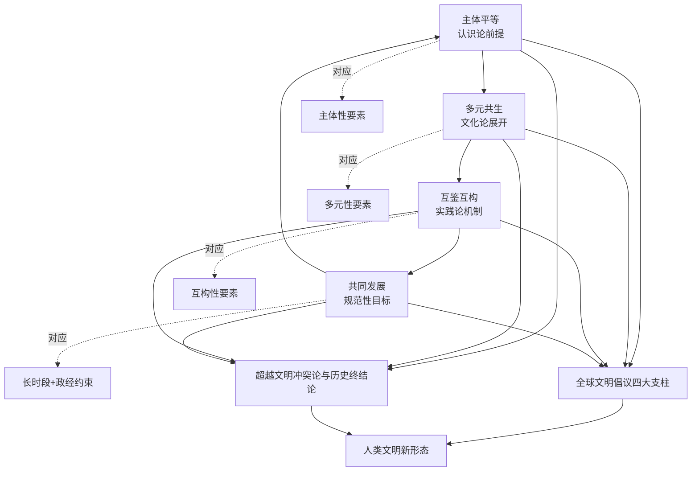

更具方法论意义的是，**四大特征本身具有"开放性生成"而非"封闭终极答案"的根本属性**。第三章已经引述："**人类文明新形态以中国式现代化为实践基础，'突破了"传统—现代"的线性进化逻辑，构建出一种以文明共生、生态和谐与文化多元为核心要义的新型文明观'**"。这一新形态之"新"不在于提出新的"终点"取代旧的"终点"，而在于根本性地改变"历史是否有终点"这一元问题。第五章对福山"历史终结论"的范式性超越论证已经揭示这一点——历史不是走向终点的过程，而是文明持续相互建构的开放生成。四大特征因此不应被理解为对人类未来文明形态的封闭性规定，而应被理解为引导持续探索的方向性坐标——它们既肯定有方向（反对相对主义），又拒绝有终点（反对教条主义）。

这一开放性生成属性使得人类文明新形态作为规范性愿景，能够同时实现对亨廷顿"文明冲突论"与福山"历史终结论"的双重超越：相对于"文明冲突论"，它通过主体平等与互鉴互构拒斥文明等级与封闭实体；相对于"历史终结论"，它通过多元共生与共同发展拒斥单线进化与封闭终点。这一双重超越的具体论证已在第五章得到系统展开，本章在此基础上将其规范性意涵进一步明确。

## 8.3 对国际秩序变革的深远意义：从单极霸权到平等多极

人类文明新形态作为规范性愿景，对当前国际秩序变革具有深远的规范性意义。这一意义不是抽象的概念输出，而是与全球南方崛起所推动的具体秩序变革进程深度协同的现实力量。

**对单极霸权秩序的根本性挑战**。冷战终结以来形成的单极霸权秩序，建立在三重相互支撑的预设之上：政治维度上的"民主国家联盟"作为合法性支配中心、经济维度上的新自由主义全球化作为通用规则、文化维度上的西方价值观作为普世标尺。人类文明新形态愿景对这三重预设构成系统性挑战。**通过"主体平等"特征**，它拒斥任何文明垄断对国际规范的解释权，从而瓦解"民主国家联盟"作为合法性中心的认识论基础——民主、人权、法治等价值的解释权不再属于任何单一文明，而需要不同文明从各自传统出发作出独特阐释。**通过"多元共生"特征**，它拒斥单一发展模式的普遍性，从而瓦解新自由主义全球化作为通用规则的正当性——发展道路具有多元形态，不存在适用于所有国家的标准模板。**通过"互鉴互构"特征**，它拒斥文明等级秩序，从而瓦解西方价值观作为普世标尺的认识论支配——价值的"共同性"必须通过不同文明的相互对话与相互修正而获得。

**与南方崛起所推动的国际秩序变革的内在协同**。第六章已经详细考察了从万隆会议到《哈瓦那宣言》的南南合作机制谱系，以及金砖、上合、中非、中阿等多边机制对国际秩序的实质性塑造。崔守军教授对"77国集团和中国"在捍卫多边主义方面的总结——"在气候正义议题上发出最强音""在发展议程上重塑优先级""在抗击疫情与全球经济复苏上展现行动力"——具体展现了南方崛起对国际秩序变革的实践力量。人类文明新形态愿景与这一实践力量形成内在协同：**愿景为实践提供规范性方向，实践为愿景提供物质性载体**。"践行真正的多边主义""倡导平等有序的世界多极化、普惠包容的经济全球化"等具体话语，正是这一协同关系的政策表达。

**具体规范性资源的塑造潜力**。人类文明新形态愿景包含若干具有塑造力的具体规范性资源。**"和而不同"原则**为多极世界提供了不同于"新冷战"二元对立的关系范式——多极不是多个对立阵营，而是多个相互尊重、相互参照、相互修正的文明主体。**"协商一致"模式**为国际决策提供了不同于"强制表决"的程序范式——第六章已经引述亚洲安全模式中"在决策层面，亚洲方式坚持非正式对话、平等协商、共识先行，摒弃强制表决，充分维护各国主权与核心关切"的具体表述；这一模式与第四章阿布-卢格霍德所揭示的13世纪世界体系"语言不必同一、货币不必一致、规则需要协商"的多中心运作原则形成深层呼应。**"亚洲安全模式"**为区域安全治理提供了不同于"军事联盟主导"的合作范式——以"安危与共、求同存异、对话协商为核心原则，植根中华文明和合共生底蕴，融入共同、综合、合作、可持续的亚洲安全观"。

**审慎指出秩序变革的具体约束**。承认人类文明新形态愿景对国际秩序变革的塑造潜力，必须同时审慎指出这一变革进程面临的具体约束。第七章已经系统讨论的西方话语污名化与分化策略、地缘政治纠缠、关键南方国家战略摇摆、资本逻辑结构性约束等议题，都在国际秩序变革层面持续起作用。具体而言，**地缘政治竞争的复杂性**使南南合作机制始终面临"工具化"的风险——文明对话话语可能被工具化为大国博弈的资源；**霸权抵抗的持续性**使秩序变革进程面临具体反作用力——美国主导的"民主国家联盟"、AUKUS等安全安排、对中国的科技封锁、对俄罗斯的金融制裁等具体操作，都构成对多极秩序生成的具体约束；**南方内部协调难题**使南南共同立场的形成需要长期的多边外交努力——印度的战略摇摆、海湾国家的两面下注、拉美各国政府轮替带来的政策不连续性等，都是这一难题的具体表现。

**秩序变革作为渐进、有起伏、长期的历史过程**。基于上述约束的承认，本节强调一个根本性的认识论立场：**国际秩序变革不是线性进展的快速过程，而是渐进的、有起伏的、长期的历史过程**。第七章已经审慎指出："变革是渐进的、有起伏的、长期的历史过程而非线性进展"——这一立场的方法论意义在于，它既避免对秩序变革进程的过度乐观（将南方崛起预设为不可逆趋势），又避免对秩序变革困难的过度悲观（将单极霸权预设为不可撼动结构）。**秩序变革的真正动力来自全球南方与全球北方进步力量的持续合作、来自具体合作实践的累积性深化、来自规范性话语与物质性变革的双向推进**——这种动力不会一蹴而就地实现"新秩序"，而会在持续的张力、博弈、协商、调整中逐步重塑国际格局。

## 8.4 对全球治理重构的实践价值：从北方主导到南北南北共商共建

人类文明新形态愿景对全球治理重构具有具体的实践价值。这一价值不限于规范性愿景的提供，而落实为对气候、债务、数字、公共卫生、科技伦理、生态文明等具体全球性议题的差异化方案。

**气候治理领域**：第六章已经引述崔守军教授对"77国集团和中国"在气候正义议题上推动发达国家就设立"损失与损害"基金达成历史性共识、坚决捍卫"共同但有区别的责任"原则的具体进展。**"共同但有区别的责任"原则本身即是人类文明新形态愿景在气候治理领域的具体展开**——它既肯定人类共同应对气候危机的责任（共同性），又承认不同国家基于历史排放、发展阶段、能力差异的具体责任分配（差异性）。这一原则与人类文明新形态"共同发展"特征形成深层一致——发展不应以扩大不平等为代价，气候责任亦不应以掩盖历史排放责任为代价。

**债务治理领域**：南方国家长期面临的债务危机问题，背后是国际金融架构的不平等结构。第六章已经引述《哈瓦那宣言》"提出建立开放型技术转移平台，要求发达国家履行技术转让承诺"的具体诉求，以及尼加拉瓜代表称其为"打破依附关系的路线图"的评价。**对债务治理的差异化方案要求改革国际金融架构、改革主权债务重组机制、对发展中国家债务危机提供"南方方案"**——这些具体诉求是人类文明新形态愿景在债务治理领域的具体落地。需要审慎指出的是，债务治理的真正变革必须与第七章所讨论的资本逻辑约束的突破相联系——若不改变全球金融体系的美元依附与评级机构垄断等深层结构，债务治理的话语成就难以转化为根本性的物质性改变。

**数字治理领域**：第二章已经引述CLACSO学者对"以人工智能为代表的新技术变革'应如何被用来加强技术主权、实现"认识论正义"，并避免我们陷入对由全球北方跨国公司所控制的平台和系统的依赖'"的关键追问。这一追问指向数字治理领域的差异化方案——**以技术主权与认识论正义替代北方知识垄断**。具体而言，数据本地化、算法主权、平台多元化、数字基础设施的南南合作等具体议题，都是人类文明新形态愿景在数字治理领域的可操作内容。中国"十五五"规划对"科技自立自强和新质生产力的系统性投入"被CLACSO学者评价为"对全球南方国家具有深刻的启示"，其启示意义即在于此——技术主权的获得不是排他性民族主义诉求，而是认识论正义的物质性前提。

**公共卫生领域**：新冠疫情时期暴露的"疫苗民族主义"问题，将公共卫生领域的全球治理重构推到了紧迫位置。中国提出的"人类卫生健康共同体"理念，作为人类命运共同体在公共卫生领域的具体展开，**为替代疫苗民族主义提供了规范性方案**——疫苗作为公共产品而非排他性商品、医疗援助作为人类共同责任而非地缘政治工具、公共卫生能力建设作为南南合作重点等。第三章已经引述非洲对"中国的医疗外交与非洲'乌班图思想'同频共振"的判断，揭示了公共卫生合作背后的深层文明共鸣——乌班图"我们在故我在"的关系本体论与儒家"仁者爱人"的伦理传统，在公共卫生领域共同支撑着不同于新自由主义"个体责任"模式的"共同体责任"模式。

**科技伦理领域**：人工智能、基因工程、脑科学等前沿科技的伦理挑战，要求全球治理提供跨文明的伦理共识。**人类文明新形态愿景为这一共识的形成提供了"多元参照、共同建构"的方法论原则**——伦理标准的形成不应由单一文明垄断，而应在不同文明传统的相互对话中形成；东方传统中"天人合一""中庸之道""和而不同"等思想资源，与西方传统中的人权、自主、尊严等概念可以形成相互补充而非相互替代的关系。这一对话过程本身即是文明互鉴在科技伦理领域的具体展开。

**生态文明领域**：第三章已经讨论非洲乌班图哲学"人与自然共生"的关系本体论对西方启蒙以来"人类中心—征服自然"逻辑的根本性挑战。**生态文明智慧作为对"征服性发展逻辑"的替代，是人类文明新形态愿景在生态领域的具体展开**。中国"绿水青山就是金山银山"理念、非洲乌班图思想、印度"地球母亲"传统、拉美原住民"美好生活"(Buen Vivir)概念等不同文明的生态智慧，构成了对单一现代化生态观的多元修正。这些智慧的相互参照与相互激活，正是文明互鉴在生态文明建设中的实质性内容。

**"全球倡议谱系"作为系统性公共产品**。第一章已经引述全球文明倡议、全球发展倡议、全球安全倡议、全球治理倡议构成"全球倡议谱系"——"中国为推动各国共同繁荣、世界普遍安全、文明交流互鉴、全球合作共治而贡献的系列公共产品"。这一倡议谱系的整体性贡献在于：**它将治理重构从单一议题拓展为系统性方案，将文明对话从精神层面落地到具体治理领域**。发展—安全—文明—治理四大倡议之间的有机协调，体现了人类文明新形态作为整合性愿景的实践展开。

下表系统呈现人类文明新形态愿景在六大全球治理议题上的差异化方案：

| 治理议题 | 北方主导模式的局限 | 人类文明新形态的差异化方案 | 对应特征 |
|---------|-----------------|--------------------------|---------|
| 气候治理 | 单一标准、忽视历史责任 | 共同但有区别的责任、损失与损害基金 | 共同发展 |
| 债务治理 | 美元依附、评级垄断 | 改革国际金融架构、南方方案 | 主体平等 |
| 数字治理 | 北方平台垄断 | 技术主权、认识论正义、数据本地化 | 主体平等 |
| 公共卫生 | 疫苗民族主义 | 人类卫生健康共同体、公共产品定位 | 共同发展 |
| 科技伦理 | 单一文明垄断 | 多元参照、共同建构 | 互鉴互构 |
| 生态文明 | 征服性发展逻辑 | 多文明生态智慧相互参照 | 多元共生 |

**承认全球治理重构必须以生产关系变革为根本依托**。本节最后必须强调第七章所反复申明的方法论原则：**全球治理重构必须以生产关系变革为根本依托，避免话语层面的成就脱离物质性基础**。气候治理需要全球能源体系的根本转型、债务治理需要国际金融架构的根本改革、数字治理需要平台经济结构的根本调整、公共卫生需要医药资本主义的根本变革——这些根本性变革都涉及生产关系层面的深层调整，而非仅止于话语层面的修辞性创新。**人类文明新形态愿景的真正实现，需要话语层面的持续创新与生产关系层面的根本变革之间的双向推进**。这一双向推进的展开，正是后续研究与实践的根本任务。

## 8.5 对世界历史叙事重写的认识论意义：从西方崛起到多元生成

人类文明新形态愿景的最深层意义，在于其对世界历史叙事的根本性重写。这一重写不仅涉及对过去的重新理解，更涉及对未来的重新想象——因为我们如何讲述过去，决定了我们如何想象未来；我们如何想象未来，又反过来塑造我们如何理解现在。

**第四章全球史考察基础上的认识论转向**。第四章通过对彭慕兰大分流、弗兰克白银资本、阿布-卢格霍德13世纪世界体系、霍布森东方起源等去欧洲中心主义史学范式的综合考察，已经在事实层面瓦解了"西方崛起"叙事的认识论根基。本节在此基础上，将这一史学论证上升为对世界历史叙事的整体性重写。

**第一重重写：将"西方崛起"还原为偶然的、有限的、晚近的历史事件**。彭慕兰证明1800年前东西方处于相近水平、煤炭区位与新大陆构成偶然性，弗兰克证明1400—1800年欧洲是亚洲中心体系的"加入者"而非"创造者"，阿布-卢格霍德证明13世纪世界体系中欧洲是"最落后的地区"，霍布森证明欧洲500—1850年的整体演进是"东方化"过程。**这一连续的史学论证将"西方崛起"从"内在必然—独特优越—永恒规范"的位置上彻底拉下，重新定位为相对短暂（不到300年）、依赖偶然（煤炭区位+新大陆生态缓解）、有限范围（局限于工业资本主义阶段）的历史事件**。这一重新定位的认识论后果至关重要——若西方崛起是偶然的、有限的、晚近的，那么以其为模板的"线性进步史观"便从根基上失去了正当性。

**第二重重写：将前现代多中心文明互动重新确立为世界历史主干**。第四章已经详细考察的丝绸之路、印度洋贸易圈、跨撒哈拉网络、东非斯瓦希里海岸等多向度文明互动网络，构成了被欧洲中心叙事长期遮蔽的世界历史主干。**这些网络不是世界历史的"边缘补充"，而是塑造世界历史本身的主干性力量**。从张骞通西域到郑和下西洋、从马苏第《黄金草原》到伊本·赫勒敦对非洲—欧亚金银市场的认识、从塞林港的中阿瓷器到拉穆群岛的中非考古发现，前现代南南直接交往的史实图景已经获得了"古代文献—现代考古—当代合作"的三重印证。这一图景的恢复，使世界历史从"西方独自展开"的单线叙事转向"多文明共同编织"的网络叙事。

**第三重重写：将南南直接交往恢复为长时段常态而非冷战后新生事物**。第六章已经反复强调的核心命题——"一带一路"地理路线与汉唐宋元时期成型的丝绸之路与海上丝绸之路深度重合、中阿典籍互译延续了苏莱曼《中国印度见闻录》以来的双向理解传统、中非合作印证了自汉朝起的远距离交流轨迹——共同支撑这一重写。**殖民现代性所造成的南方文明之间的"中介性隔绝"是历史的例外而非常态**；当代南南直接对话不是"创造一种新关系"，而是对长时段常态的回归与重新激活。这一重新定位使南南合作获得了贯通历史与现实的深厚根基，从而摆脱了"冷战后新生事物"的叙事框架。

**世界历史叙事模式的整体性转换**。这三重重写共同推动世界历史叙事从"西方中心—线性进步"模式转向"多中心—多向度—网络化"模式。这一转换的认识论意义可以归纳为以下层次：

| 维度 | 西方中心—线性进步模式 | 多中心—多向度—网络化模式 |
|------|---------------------|------------------------|
| 历史主体 | 西方为唯一主动者 | 多文明共同主动者 |
| 因果叙事 | 西方内生动力—向外辐射 | 多向互动—相互塑造 |
| 时间结构 | 线性进步—走向终点 | 多线生成—持续展开 |
| 空间结构 | 中心—边缘辐辏 | 多中心—网络化关联 |
| 价值预设 | 西方文明优越性 | 文明平等多元 |
| 非西方位置 | 消极旁观、被动接受 | 能动主体、主导参与 |

**南方文明从"沉默的大多数"恢复为世界历史的能动主体**。这一叙事重写最具实质意义的后果，是南方文明历史地位的根本性恢复。在西方中心叙事中，南方文明长期被定位为"等待被现代化的客体""消极旁观西方崛起的看客""现代世界体系的边缘补充"。多中心—网络化叙事则将南方文明恢复为塑造世界历史本身的能动主体——前现代的中国是白银资本中心而非"未现代化的传统社会"、前现代的印度是文明母体而非"等待被启蒙的他者"、前现代的伊斯兰世界是连接欧亚非的桥梁而非"封闭的中世纪"、前现代的非洲是嵌入印度洋贸易圈的活跃参与者而非"黑暗大陆"。这一历史地位的恢复，为当代南方文明的主体性建构提供了不可替代的史学支撑——南方主体性不是凭空创造的"新主体性"，而是被殖民现代性压制的历史主体性的当代恢复。

**审慎指出叙事重写须避免的简单替换陷阱**。承认世界历史叙事重写的根本性意义，必须同时审慎指出第七章已经反复警示的关键风险：**这一叙事重写必须避免落入"东方中心论"或"南方中心论"的简单替换陷阱**。第四章已经引用康拉德的具体警示——全球史"对'欧洲中心论'矫枉过正、过于注重外部因素、对寻找'联系'证据的热衷、对'移动'的崇拜"等典型问题。彭慕兰的工作并非论证"东方=西方"或"东方>西方"，而是论证多元发展路径的存在；弗兰克的"亚洲中心论"在严格意义上是对"欧洲中心论"的纠偏，而非提出新的中心化叙事。**世界历史叙事的真正重写，是从"任何中心论"走向"多中心—多向度—关系性"的开放叙事立场**——这一立场既反对西方中心，也反对任何形式的替代性中心；既肯定文明的真实差异，也承认文明的相互纠缠。

**叙事重写与未来想象的双向关系**。世界历史叙事的重写不仅是史学问题，更是未来想象问题。**当西方崛起被还原为偶然事件，"现代化=西方化"的等式便失去合法性根基；当前现代多中心被恢复为常态，"多极世界"便不再是新发明而是历史的回归；当南方文明被恢复为能动主体，"南方崛起"便不是反常现象而是历史主体性的当代展开**。这种叙事—想象的双向关系，使世界历史叙事的重写直接转化为对人类未来的开放性想象——未来不是走向某个预定终点（无论是"自由民主资本主义"还是其他单一形态），而是在多元文明的持续相互对话、相互建构、相互修正中开放生成。这正是人类文明新形态作为"开放性生成"的最深层认识论根基。

## 8.6 研究的限度与持续反身性自觉

在第七章已经系统展开批判性反思的基础上，本节进一步坦诚指出本研究本身的具体限度。**这一限度的承认不是对研究价值的削弱，而是其作为开放性学术工作的内在要求**——任何宣称已经解决全部问题的研究都是教条主义的，唯有坦诚承认限度的研究才能为后续工作保留真正的开放性接口。

**第一，资料基础以中文学术语境为主的局限**。第一章已经坦诚指出："本研究的资料基础以中文学术语境与汉语世界对全球南方与文明互鉴议题的讨论为主"。这一资料结构带来若干具体局限：对萨义德、斯皮瓦克、霍米·巴巴、彭慕兰、贡德·弗兰克、康拉德等核心理论家的原典阅读更多依赖二阶文献的转述与整合性论述；对拉美依附理论原典（普雷维什、弗兰克、阿明、米尼奥罗等）、印度庶民研究原典（古哈、查特吉、查克拉巴蒂等）、非洲哲学原典（姆比蒂、埃蒂耶伊博等）的具体阅读深度，受制于当前可获得的中文学术资源。这一局限对本研究的具体后果是，在涉及具体理论家命题时可能存在解读上的不充分或边界处理上的不严谨。后续研究需要直接深入这些理论家的原始文本，与当前的整合性论述形成相互修正的关系。

**第二，四重理论资源的西方学术起源悖论**。本研究的核心理论资源——后殖民主义、东方学批判、多元现代性、全球史——其核心理论家大多在西方学术体制内生产理论：萨义德、斯皮瓦克、巴巴于美国学院；艾森斯塔特、泰勒于西方主流社会学/哲学；彭慕兰、康拉德同样。**这构成一个根本性的认识论悖论：以西方话语反西方，以西方学术体制为非西方主体性发声的合法性来源**。第七章已经具体讨论了后殖民理论的学院化困境——其使用的概念语法、发表平台、学术圈层均深嵌于西方知识体制，从而面临被吸纳为"学术商品"的风险。本研究自身即处于这一悖论之中——本研究虽然立场上自觉地反对西方中心主义，但其论证语言（"主体性""多元性""认识论""话语—权力"等）、引用谱系（萨义德、福柯、葛兰西、康拉德等）、表达方式（学术论文体例、注释规范、概念结构等）都不可避免地带有西方学术体制的印记。这一悖论无法通过单纯的理论操作得到消解，但可以通过持续的反身性自觉得到部分缓解——本研究在使用任何理论资源时都需要追问其产生场域、其与南方实际斗争的有机联系程度、其是否可能被西方学术市场吸纳为新的"学术商品"。

**第三，文明互鉴话语与政治经济学分析整合的不彻底**。第七章已经系统反思了"文明互鉴话语脱离政治经济学分析的物质性赤字"问题。本研究虽然在多个章节（第三章拉美依附理论部分、第六章中国贡献部分、第七章批判性反思部分）有意识地引入政治经济学维度，但这一整合在全文的展开中仍然是不平衡、不彻底的——文明互鉴的话语层面分析占据了相对更大的篇幅，而对生产关系、生产方式、不均衡发展的具体物质性分析则相对较少。德里克的警告、殷之光的方法论原则、吕新雨对工业化与农业资本主义的关切，本应在每一章节都构成持续的方法论约束，但实际行文中仍存在话语分析与物质分析"分章并置"而非"全程贯通"的倾向。后续研究需要将马克思主义政治经济学分析作为更彻底的方法论底色贯穿始终。

**第四，对南方内部异质性处理的相对简化**。第七章已经详细讨论"全球南方"概念的本质主义风险与内部异质性问题。本研究虽然在多处提示这一异质性的存在（如第三章对四条现代性路径的差异化考察、第六章对中国双重身份的审慎处理、第七章对南方内部分化的系统反思），但对南方内部具体异质性的处理仍然相对简化。具体而言，对伊斯兰世界内部什叶—逊尼传统的差异、对非洲内部南北非洲与撒哈拉以南非洲的差异、对拉美内部加勒比裔传统与原住民传统的差异、对东南亚内部佛教传统与伊斯兰传统的差异等，本研究都未能展开具体的差异化分析。这一相对简化使得本研究的"南方"叙事仍带有一定的整合化倾向，需要后续研究通过更细致的区域研究与文明研究加以丰富。

**第五，对北方进步力量参与位置的边界模糊**。第二章已经讨论"全球大学"创始人名单中包含美国沃勒斯坦、比利时浩达、日本武藤一羊与武者小路公秀等北方批判性知识分子；第七章也提到齐贝尔（土耳其裔美国学者）、德里克（土耳其裔美国学者）作为北方学院体系内部的批判性资源。本研究在多处涉及北方进步力量参与南南批判性思想生产的具体案例，但对"全球南方"作为政治范畴而非地理范畴的具体边界、对北方进步力量在全球南方文明互鉴中的具体位置、对南南—南北批判性合作的具体机制等议题的处理，仍然相对模糊。**这一模糊涉及一个根本性的方法论问题：如何在"反西方中心主义"与"国际主义批判性团结"之间建立辩证关系**——既避免南方主义的封闭排他，又避免国际主义的去南方主体性。这一议题需要后续研究作出更系统的处理。

**第六，模型规范性诉求与解释性功能之间的张力**。第五章已经预先指出，理论模型既要解释全球南方文明互鉴的现象（描述性功能），又要表达对这一现象的规范性立场（应然性功能）。这一双重功能在本研究的展开中并非完全无张力——当具体的南南合作实践偏离模型所表达的规范性愿景时（如南南内部的霸权征兆、文化保守主义滑坡、买办精英主导等），模型如何回应？本研究在第七章已经审慎讨论这些张力，但模型如何在保持规范性方向的同时承担起对具体偏离的批判性诊断功能，仍是有待深化的议题。

**对"以西方话语反西方"认识论悖论的持续警觉**。基于上述六方面限度的承认，本研究强调一个根本性的方法论立场：**研究始终需要保持对自身理论生产场域的反身性自觉**。这一反身性自觉具体包括：警惕"以西方话语反西方"的认识论悖论可能滑向新的话语依附；警惕文明互鉴话语滑向"以文明对话之名行资本扩张之实"的德里克式陷阱；警惕"南方主体性"建构滑向新的本质主义或文化保守主义；警惕"中国贡献"的肯定性论述滑向新的中心化叙事。**这种持续警觉不是对研究本身的自我消解，而是其作为批判性—建构性辩证工作的内在要求**——唯有持续的自我修正，理论建构才能避免重蹈其所批判的逻辑。

## 8.7 后续研究延伸议程：比较文明、跨文明知识生产与南南理论对话

基于本研究的限度承认与开放性立场，本节提出后续研究在三大方向上的延伸议程。这些议程不是对本研究未尽工作的补充清单，而是基于本研究所打开的问题空间所提示的、具有内在生产力的研究方向。

**第一，比较文明研究方向**。本研究虽然涵盖了拉美、印度、非洲、中国"四条路径"的比较考察，但对各文明传统内部多元资源的具体激活、对文明传统之间深层结构的精细比较、对"轴心时代"以来人类文明分化与互动的长时段考察等议题，仍有大量深化空间。具体延伸方向包括：

*儒家、伊斯兰、印度、非洲、拉美、东欧—欧亚等文明传统的差异化现代性方案的具体比较研究*。本研究已经触及儒家与乌班图的"公约数"对话、伊斯兰文明在印度洋贸易圈中的桥梁角色、印度文明的庶民史学等议题，但缺乏对各文明传统作出系统性、对等性比较考察。后续研究需要在"轴心时代"以来各文明的差异化超越方案、各文明应对全球资本主义遭遇的不同回应、各文明内部现代化—传统化张力的差异化处理等议题上展开更精细的比较工作。

*激活各文明内部的多元批判资源，避免文明本质化处理*。第七章已经审慎指出每一文明传统内部都存在丰富的批判性资源——儒家的黄宗羲、戴震、王阳明，伊斯兰的穆塔齐拉学派、伊本·鲁世德，印度的佛教、洛迦耶陀派、安贝德卡尔，非洲的不同区域哲学传统等。后续研究需要将这些内部多元资源与文明对话主题紧密结合，避免将文明传统简化为单一同质整体。

*关注被本研究相对忽视的文明传统*。东欧—欧亚文明（斯拉夫传统、东正教传统、俄罗斯思想等）、东南亚混合文明（佛教—伊斯兰—本土传统的多元融合）、太平洋岛屿文明（萨摩亚、汤加、毛利等本土传统）、加勒比裔文明（与非洲—欧洲—原住民传统的复杂交织）等，都是本研究未能展开但对全球南方文明互鉴具有重要意义的领域。

**第二，跨文明知识生产方向**。第二章已经详细考察了从CLACSO到CODESRIA、从南南论坛到中国区域国别学的南南知识共同体建设。后续研究需要在制度化深化与方法论建构两个层面进一步推进：

*推进南方智库联盟、经典互译工程、跨文明联合考古、南南教育合作的机制化深化*。具体议题包括：金砖国家智库合作中方理事会牵头的"全球南方"智库合作联盟如何向更多议题领域、更多区域、更深层学术对话拓展；亚洲经典著作互译计划如何向阿拉伯、非洲、拉美进一步延伸；跨文明联合考古如何从双边项目升级为多边平台；鲁班工坊等南南教育合作如何从职业技能向高等教育、研究生培养、博士联合培养等更高层次拓展。

*建构以"主体平等、议题自定、方法多元、相互参照"为原则的南南知识共同体*。这一建构需要在具体的知识生产实践中逐步完成——从合作研究项目的议题设置、研究方法的多元尝试、研究成果的多语言发布、学术评价机制的去欧美中心化等具体环节系统推进。

*重置全球知识地理*。第二章已经引述塞内加尔学者法勒的判断："全球南方国家必须打破'西方是知识的终极阐释者，我们只是原始数据供应地'的二元对立思维"。这一打破不是一蹴而就的革命性事件，而是在每一具体知识生产环节（研究议程、方法选择、概念建构、传播平台、评价标准等）的持续重置。

**第三，南南理论对话方向**。这是本研究所打开问题空间中最具理论纵深的延伸方向。本研究虽然已经触及拉美依附—解殖传统、印度庶民研究、非洲乌班图哲学、中国"两个结合"等南南理论资源，但这些资源之间的具体学术对话仍然非常有限。后续研究需要推进：

*中国"两个结合"与拉美依附—解殖传统、印度庶民研究、非洲乌班图哲学、阿拉伯文明对话理论之间的深度学术对话*。具体议题包括：中国式现代化的"去依附"经验与拉美依附—解殖传统的具体对话；中国革命与改革的人民史观与印度庶民研究"从下层看历史"的具体对话；儒家关系伦理与非洲乌班图哲学的具体对话；中华文明的"和而不同"与阿拉伯文明的"宽容多元"传统的具体对话。这些对话需要在具体的学术合作项目、共同研讨会、合作出版物、跨语言互译等机制中展开。

*发展具有真正南南共识基础的整合性理论框架*。本研究提出的"主体性—多元性—互构性—长时段"四要素整合性模型，是一个具体的整合尝试。后续研究需要在更广泛的南南学术对话中检验、修正、丰富这一框架，使其真正成为"南南共识"而非"中国学者的整合"。这一过程需要持续的开放性——任何整合性框架都不应被宣告为"最终答案"，而应保持向新的批判与新的资源开放。

*持续与北方批判性思想保持开放对话*。后续研究在推进南南理论对话的同时，必须避免南南理论对话退化为封闭性自我循环。马克思主义、批判理论、女性主义、生态思想、后人类思想等北方批判性资源，都是全球南方文明互鉴可以持续学习与对话的伙伴。第二章已经讨论"全球大学"创始人名单中包含的北方批判性知识分子的具体例证，第七章也讨论了齐贝尔、德里克等的批判性贡献。**南南理论对话与南北批判性合作不是相互排斥的两种工作，而是相互支撑的同一事业的两个维度**——前者建构南南共识，后者保持开放性；前者确立主体性，后者拒绝封闭性。

下表系统呈现三大方向延伸议程的具体内容：

| 研究方向 | 核心议题 | 具体延伸议程 |
|---------|---------|------------|
| 比较文明研究 | 各文明差异化现代性方案的具体比较 | 儒家—伊斯兰—印度—非洲—拉美—东欧文明比较、各文明内部多元资源激活、被忽视文明传统的考察 |
| 跨文明知识生产 | 南南知识共同体建设 | 智库联盟深化、经典互译扩展、联合考古多边化、南南教育升级 |
| 南南理论对话 | 整合性理论框架建构 | 中国—拉美—印度—非洲—阿拉伯理论深度对话、共识性框架建构、与北方批判性思想的持续对话 |

这三大方向延伸议程的展开，将使全球南方文明互鉴研究从当前的初步建构阶段，进入更为成熟、更为系统、更为深入的发展阶段。这一发展不是某个单一学者或单一研究项目能够完成的，而是需要全球南方与全球北方进步学术界共同参与的长期事业。

## 8.8 开放性生成的总体愿景：在持续探索中迈向人类共同未来

回到本研究开篇所设定的历史时刻——百年未有之大变局。这一历史时刻的根本特征不是某种预定结局的临近，而是多种可能性的共同展开。世界历史正处于深刻而不确定的转折点：单极霸权秩序面临深刻挑战却未被根本取代，多极世界正在生成却尚未稳定形成；全球资本主义体系暴露出多重危机（金融危机、生态危机、不平等危机、流行病危机等）却未找到根本性出路；西方中心主义文明观持续运作但其合法性根基已经松动；全球南方崛起为不可逆转的趋势但其内部协调与外部突围仍面临严峻考验。在这一充满张力的历史时刻，**理论建构的根本任务不是宣告某种确定性结局，而是为开放性可能保留真正的认识论空间与实践通道**。

**重申本研究的根本立场**。经过八章的展开，本研究的根本立场可以归纳为以下相互支撑的命题：**理论建构的目标不是抵达"终点"，而是为更深入的理解与更公正的实践不断开辟空间**。这一立场具体包含三层意涵：

*反对历史终结*：拒斥任何宣告人类历史已经抵达终极形态的话语操作——无论是"自由民主资本主义作为终极形态"的福山式叙事，还是任何替代性的封闭性终极方案。历史不是走向终点的过程，而是文明持续相互建构的开放生成。

*反对中心垄断*：拒斥任何文明垄断对人类未来的解释权——无论是西方中心论，还是任何形式的替代性中心论。人类未来不应由任何单一文明定义，而应在不同文明的相互对话与相互修正中开放生成。

*反对教条相对*：在拒斥中心垄断的同时，拒斥滑向"任何形态都同等正当"的教条相对主义。文明对话需要持续的跨文明批判可能性——这种批判可能性必须建立在共同问题域的承认之上，而非建立在对差异的绝对化之上。

**人类文明新形态作为开放性生成的历史进程**。基于上述根本立场，人类文明新形态不应被理解为封闭的现成方案，而应被理解为**在多元文明持续相互对话、相互建构、相互修正中开放生成的历史进程**。这一进程的展开需要四个相互支撑的条件：

*主体平等的认识论前提*：每一文明都被承认为有权直接发言、自我定义、自我建构的主体；任何宣称为"南方代言人"或"文明仲裁者"的话语操作都被自觉警惕。

*多元共生的文化论展开*：文明多样性被理解为现代性多元生成的内在动力而非待克服的障碍；不同文明的差异化方案在共通问题域基础上获得相互参照、相互启发的机会。

*互鉴互构的实践论机制*：文明对话不是固定身份之间的相互观看，而是在具体合作实践中相互塑造、共同生成的过程；机制化的合作平台为这一过程提供制度化承载。

*共同发展的规范性目标*：发展不以扩大不平等为代价、不以服务资本积累为目标，而以人民为中心、以共同体整体福祉为目标；文明对话与生产关系变革始终保持双向推进。

**当下的可能性图景**。在百年未有之大变局的历史时刻，本研究的最终愿景是：**当全球南方不再沉默、当文明不再被预设为冲突、当现代性不再被独占为西方专利、当历史不再被宣告终结，世界历史将在主体平等、多元共生、互鉴互构、共同发展的基础上获得重新书写的可能**。这一可能性的真实性已经在多个维度获得初步印证——全球南方在二十国集团、金砖、上合等机制中的议程设置能力、中阿典籍互译"绕开西方转译"的认识论突破、中非合作论坛对乌班图—儒家"同频共振"的文明对话深化、CLACSO对中国"十五五"规划"以人民为中心"的批判性诠释、亚洲经典著作互译计划与23个亚洲国家的图书互译合作、第78届联合国大会协商一致通过中国提出的设立文明对话国际日决议等。这些具体实践不构成"历史已经转向"的证明，但构成"历史可以转向"的初步开端。

**开放性愿景的根本性约束**。然而，这一可能性的真正实现，需要清醒地承认其面临的根本性约束。本研究在第七章与本章已经反复申明的方法论立场要求强调：**这一可能性的真正实现，需要全球南方与全球北方所有进步力量的共同参与，需要话语层面的持续创新与生产关系层面的根本变革，需要每一文明传统对自身资源的批判性激活与对他者文明的开放性倾听**。

*共同参与的国际主义维度*：人类文明新形态不是"南方对北方的胜利"，而是对"南北二元对立"本身的超越。北方进步力量参与全球南方文明互鉴的事业，南方进步力量参与全球北方批判性变革的事业，构成同一国际主义事业的两个面向。

*双向推进的辩证维度*：话语层面的创新与生产关系层面的变革缺一不可。仅有话语创新而无物质变革，便沦为德里克所警告的"文化复兴掩盖资本与国家合谋"；仅有物质变革而无话语创新，便难以摆脱旧霸权逻辑的话语束缚。两者必须双向推进、相互支撑。

*内外对话的反身性维度*：每一文明传统对自身资源的批判性激活——对内部多元资源的激活、对内部不公关系的反思、对内部封闭倾向的克服；与对他者文明的开放性倾听——对差异化方案的尊重、对外部批评的接纳、对共通问题域的承认——构成同一反身性自觉的内外两个维度。

**结语：在持续探索中迈向人类共同未来**。本研究开始于一个根本性问题：在反思西方中心主义的非西方理论视角下，如何重新理解全球南方合作与文明交流互鉴之间的内在关联与历史意义？经过八章的展开，这一问题没有获得"确定性答案"，但获得了相对系统的初步回应——通过双重话语谱系的考察、四重理论维度的整合、四要素模型的建构、机制载体与中国贡献的实践分析、内在张力的批判性反思，本研究尝试论证：**全球南方合作不仅是政治经济意义上的国际秩序重组，更是文明主体性重建与认识论范式转换的双重历史进程；其规范性愿景指向以"主体平等、多元共生、互鉴互构、共同发展"为核心特征的人类文明新形态**。

但这一回应不是研究的"终点"，而是后续研究的"起点"——它所打开的问题空间远大于其所给出的答案。对各文明传统的更深入比较考察、对南南知识共同体的更系统建设、对南南理论对话的更深度展开、对话语创新与物质变革双向推进的更具体路径探索——这些工作都需要全球范围内的进步学术界共同承担。

百年未有之大变局的历史时刻不会等待任何"准备就绪"的理论。**唯有在持续的探索中、在不断的实践中、在反复的修正中，全球南方文明互鉴的事业才能真正展开；唯有在多元文明持续相互对话、相互建构、相互修正中，人类共同未来才能真正生成**。世界历史能否被重新书写，其答案不在于任何理论的精确预测，而在于每一具体行动者——学者、思想家、政治家、艺术家、教育者、劳动者、普通公民——在自己的位置上对这一可能性所作出的具体贡献。

正如人类文明新形态本身所昭示的"开放性生成"，本研究最终的愿望不是为读者提供"最终答案"，而是与读者一道，在持续的探索中迈向人类共同未来。这一探索的真正力量，不在于任何宣告的完美性，而在于其作为持续展开的开放性事业所蕴含的、永不枯竭的思想生命力与实践可能性。

# 参考内容如下：
[^1]:[「环时深度」从发展中国家、第三世界到“全球南方”](https://baijiahao.baidu.com/s?id=1816647429212678151&wfr=spider&for=pc)
[^2]:[中国传统文化“和而不同”的当代运用,表达了作为一个新型文明国家的东方智慧——文明互鉴:一种崭新的文明观](https://baijiahao.baidu.com/s?id=1759583175010929296&wfr=spider&for=pc)
[^3]:[“文明互鉴观”是一个崭新的文明观](https://baijiahao.baidu.com/s?id=1759961826186070043&wfr=spider&for=pc)
[^4]:[文明互鉴:一种崭新的文明观](https://baijiahao.baidu.com/s?id=1759580911096566868&wfr=spider&for=pc)
[^5]:[“全球南方”做题你遇到了吗? ](https://mp.weixin.qq.com/s?__biz=MzAwNzM5OTQyNA==&mid=2651482988&idx=6&sn=234e0f631b6a7ae8316ab9b037b30dec&chksm=81b5bb9cc867f6100af5fdd550f16a3afce0f004f7b3d3de334b158bd8a561693703600e694b&scene=27)
[^6]:[蒋晖:全球南方文学何以突围西方文化霸权?](https://www.guancha.cn/jianghui/2025_05_17_776152.shtml)
[^7]:[“全球南方”传播理论的历史与命题:全球“知”网的想象力 ](https://mp.weixin.qq.com/s?__biz=MzAxMTMzMDIzOQ==&mid=2651546979&idx=1&sn=45bfdcb258889d429a39ff2592f8bf41&chksm=8165eee944558fe2158224f6b58bde0051b7d15134cdcf8153de1c7b647e99b486919418a1ed&scene=27)
[^8]:[Postcolonialism, Decoloniality, and Epistemologies of the South](http://doi.org/10.1093/acrefore/9780190201098.013.1262)
[^9]:[“全球南方”承载学术与政治价值](http://k.sina.com.cn/article_7517400647_1c0126e47059024vtv.html)
[^10]:[“全球南方”承载学术与政治价值](https://baijiahao.baidu.com/s?id=1719991892461182819&wfr=spider&for=pc)
[^11]:[南方理论:社会科学知识的全球动态](https://baike.baidu.com/item/南方理论：社会科学知识的全球动态/63937946)
[^12]:[南方理论](https://book.douban.com/subject/36716243/)
[^13]:[Orientalism](https://baike.baidu.com/item/Orientalism/57762016)
[^14]:[What/Where is the Global South?](http://globalsouthstudies.as.virginia.edu/what-is-global-south)
[^15]:[ANNE GARLAND MAHLER, From the Tricontinental to the Global South: Race, Radicalism, and Transnational Solidarity. Durham and London: Duke University Press, 2018.](http://doi.org/10.61490/eial.v31i2.1696)
[^16]:[From the Tricontinental to the Global South](https://book.douban.com/subject/30145790/)
[^17]:[各美其美 美美与共](http://theory.people.com.cn/GB/n1/2020/0422/c40531-31684055.html)
[^18]:[全球文明倡议:促进人类文明交流互鉴的中国方案](https://baijiahao.baidu.com/s?id=1771358893218889378&wfr=spider&for=pc)
[^19]:[各美其美](https://baike.baidu.com/item/各美其美/3054695)
[^20]:[费孝通:美美与共与人类文明](https://aike.smu.edu.cn/mod/book/view.php?id=5776)
[^21]:[全球文明倡议](https://baike.baidu.com/item/全球文明倡议/63011538)
[^22]:[全球倡议谱系:推动构建人类命运共同体的系统性方案](https://www.sdx.js.cn/art/2026/4/13/art_3043_133031.html)
[^23]:[和而不同,推动文明交流互鉴(和音)](https://baijiahao.baidu.com/s?id=1819456438861147307&wfr=spider&for=pc)
[^24]:[张维为、范勇鹏出席“2025中国式现代化国际学术论坛”并发言 ](https://cifu.fudan.edu.cn/9b/b3/c412a760755/page.htm)
[^25]:[黑皮肤,白面具](https://ubook.reader.qq.com/kol-rec/sqeecc602b67c9d3d5)
[^26]:[“我们无处安放绝望, 唯有行动”: 南南论坛与全球大学的12年实践](https://www.163.com/dy/article/I4UA3QID052100BV.html)
[^27]:[吕新雨:西方路径已经破产,我们是否可以来一场“人民的全球化”?_世界_革命_现代化的](https://news.sohu.com/a/953887325_115479)
[^28]:[保罗·弗莱雷](https://baike.baidu.com/item/保罗·弗莱雷/9754805)
[^29]:[批判性教学](https://baike.baidu.com/item/批判性教学/2474254)
[^30]:[中国—阿拉伯国家合作论坛](https://baike.baidu.com/item/中国—阿拉伯国家合作论坛/64379322)
[^31]:[Writings on South Asian history and society](http://www.semanticscholar.org/paper/05771d569c5245db4411b85f6c873b09de67b2db)
[^32]:[【理响中国】人类文明新形态的哲学基础与实践向度 ](https://theory.gmw.cn/2025-12/02/content_38452274.htm)
[^33]:[在卡玛拉·哈里斯败选之际,重思“解殖女性主义”](https://www.163.com/dy/article/JHU41CAP0514R9P4.html)
[^34]:[全球南方国家知识生产新图景呼之欲出](https://www.cssn.cn/skgz/bwyc/202511/t20251121_5950765.shtml)
[^35]:[“时间差”“位置差”“权力差”与区域国别自主知识生产:以拉美研究为例](http://ilas.cssn.cn/xschengguo/xslunwen/202512/t20251206_5954416.shtml)
[^36]:[一场源自拉美的思想风暴:从“边缘”位置质询“中心” ](https://www.sohu.com/a/841604485_121123711)
[^37]:[多视角观察非洲知识生产与发展](http://www.sass.cn/109009/51043.aspx)
[^38]:[10周年!中阿改革发展研究中心耕耘结硕果](https://mp.weixin.qq.com/s?__biz=MjM5MTU4NTg0MA==&mid=2247655627&idx=1&sn=a4b91468c0efe1604b94d7a1792e8805&chksm=a701e31ace4510ef91d936f837dd0b638fd13f381418af8a58f7558a07fcd5b546afe6697338&scene=27)
[^39]:[资讯丨澜湄国家命运共同体构建与水治理现代化:金色十年的进程与前景](https://fddi.fudan.edu.cn/_t2515/da/9b/c21257a776859/page.htm)
[^40]:[10周年!中阿改革发展研究中心耕耘结硕果](http://www.chinaarabcf.org/chn/zagx/zaggfzyjzx/202601/t20260122_11841160.htm)
[^41]:[全球南方国家知识生产新图景呼之欲出](http://baijiahao.baidu.com/s?id=1849374313500658393&wfr=spider&for=pc)
[^42]:[殷之光︱ 全球南方问题及其未来:兼论中国式现代化的普遍意义](https://mp.weixin.qq.com/s?__biz=MzAwNDYzNzAwNw==&mid=2651079742&idx=1&sn=7eea39a6ae819f7c9d50f7a1584f20c3&chksm=8118cb5aedce90d5a3fefdeddb9d06cf84f40bf357fbf878166cd3ea95b03934d33ed4538913&scene=27)
[^43]:[Communication and cultural awakening of the Global South: A dialogue with Vijay Prashad](http://openurl.ebsco.com/contentitem/doi:10.1177%2F20570473251351387?sid=ebsco:plink:crawler&id=ebsco:doi:10.1177%2F20570473251351387)
[^44]:[Introduction to The China Model: Political Meritocracy and the Limits of Democracy](https://www.lhp.sdu.edu.cn/__local/8/A3/41/19FC270FED665F76E15B982A2E0_2113C3A6_144AFB.pdf)
[^45]:[一个“文明型国家”的崛起](https://book.qq.com/book-read/49378604/20)
[^46]:[批判教育学的概念](https://xbjk.ecnu.edu.cn/CN/html/2017-4-62.htm)
[^47]:[中非高校20+20合作计划](https://baike.baidu.com/item/中非高校20+20合作计划/6304821)
[^48]:[汪晖](https://baike.baidu.com/item/汪晖/76721)
[^49]:[What does FOCAC mean for the Global South? ](https://www.idcpc.org.cn/english2023/opinion/202411/t20241113_165946.html)
[^50]:[国际发展中的“去殖民化知识生产”运动对援助范式的冲击-基于2024年非洲、拉美学者对北方智库批评](https://www.renrendoc.com/paper/500242716.html)
[^51]:[金砖国家研究中心(教育部)](https://fddi.fudan.edu.cn/19033/list.htm)
[^52]:[保罗·弗莱雷](https://m.baike.so.com/doc/2697864-2848540.html)
[^53]:[国际发展中的“去殖民化知识生产”运动对援助范式的冲击——基于2024年非洲、拉美学者对北方智库批评.pdf](https://m.book118.com/html/2026/0110/5344100021013103.shtm)
[^54]:[合作交流-金砖国家大学事务办公室](https://www2.ncwu.edu.cn/jzdx/hzjl.htm)
[^55]:[SISU-CLACSO系列西班牙语专业区域国别拉丁美洲研究重要实践成果发布](https://www.shisu.edu.cn/research-/3/20231228/1349.html)
[^56]:[科学把握中国式现代化理论内涵](http://dangjian.people.com.cn/n1/2023/1130/c117092-40128607.html)
[^57]:[中非高校20+20合作计划](https://baike.baidu.com/item/中非高校20%2B20合作计划/6304821)
[^58]:[中外考古学者聚焦肯尼亚:古代海上丝绸之路贸易重要地区之一](https://baijiahao.baidu.com/s?id=1817062779762573784&wfr=spider&for=pc)
[^59]:[深刻理解“两个结合”](https://www.qstheory.cn/20250609/6a06fd1fd84e46c3b2f8bf6c45619af7/c.html)
[^60]:[沙特阿拉伯塞林港遗址考古发掘与收获:探寻掩埋在流沙之下的海丝古港](https://baijiahao.baidu.com/s?id=1802533395761466812&wfr=spider&for=pc)
[^61]:[中国与阿塞拜疆签署关于经典著作互译出版的备忘录 开启两国人文交流互鉴新阶段 - 中国一带一路网](https://www.yidaiyilu.gov.cn/p/231847.html)
[^62]:[金砖国家智库合作中方理事会](https://baike.baidu.com/item/金砖国家智库合作中方理事会/22821434)
[^63]:[2025BIBF | 中国-阿塞拜疆经典著作互译项目首批图书授权签约仪式成功举行](https://mp.weixin.qq.com/s?__biz=MjM5MjQ3NDIwMQ==&mid=2649659771&idx=1&sn=101fdaadbec1bef6da477f42cd3a4262&chksm=bf825cf5182f693e9c6bcafefab247c3250f84f6a8956e90b9d14e11c4d6fd65a0c7f72b11d0&scene=27)
[^64]:[重温千年交往历史 感受人文交流脉动——记中沙塞林港遗址联合考古](http://www.chinaarabcf.org/zagx/rwjl/202510/t20251020_11736281.htm)
[^65]:[万隆精神](https://baike.baidu.com/item/万隆精神/2679608)
[^66]:[准确理解“第二个结合”的时代意义和科学内涵](http://dangjian.people.com.cn/n1/2024/0418/c117092-40218307.html)
[^67]:[机制简介](https://www.ccbtc.org.cn/jinzhuan/about/jzj/list/index_pc.html)
[^68]:[走進科潘遺址 探秘瑪雅文明(文明互鑒·考古故事)](http://yn.people.com.cn/BIG5/n2/2024/0701/c372453-40896668.html)
[^69]:[中非智库论坛](https://baike.baidu.com/item/中非智库论坛/23727562)
[^70]:[綜述:不結盟運動峰會發出全球南方團結聲音 ](http://big5.www.gov.cn/gate/big5/www.gov.cn/yaowen/liebiao/202401/content_6927405.htm)
[^71]:[走进洪都拉斯 探寻玛雅文明 ](https://www.yidaiyilu.gov.cn/p/0E23DF0N.html)
[^72]:[驻也门使馆临时代办邵峥在也媒体发表署名文章《全球文明倡议:一花独放不是春,百花齐放春满园》](https://www.fmprc.gov.cn/gjhdq_676201/gj_676203/yz_676205/1206_677124/1206x2_677144/202303/t20230327_11049533.shtml)
[^73]:[上海合作组织大学](https://baike.baidu.com/item/上海合作组织大学/2645000)
[^74]:[第四季中国考古大讲堂第二期丨沙特塞林港遗址考古发掘与收获](http://www.ncha.gov.cn/art/2024/7/25/art_1027_190405.html)
[^75]:[综述:不结盟运动峰会发出全球南方团结声音 ](https://www.sxjz.gov.cn/xwzx/ywkx/content_491214)
[^76]:[美美与共 大道同行——写在全球文明倡议提出三周年之际](https://baijiahao.baidu.com/s?id=1859689746081894280&wfr=spider&for=pc)
[^77]:[第四季中国考古大讲堂第六期丨中国-肯尼亚合作实施拉姆群岛水下考古](https://baijiahao.baidu.com/s?id=1816036152358762582&wfr=spider&for=pc)
[^78]:[澎湃思想周报丨萨义德的软肋;大卫·哈维辩资本的速率与规模](https://www.thepaper.cn/newsDetail_forward_16021146)
[^79]:[历史学家阿里夫·德里克逝世:他用革命佐菜 历史下酒|界面新闻 · 文化](https://www.jiemian.com/article/1789458_qq.html)
[^80]:[再读伊朗:通过福柯,还是马克思?](https://www.szhgh.com/Article/opinion/zatan/2026-03-23/401410.html)
[^81]:[中非智库](https://baike.baidu.com/item/中非智库/64870540)
[^82]:[巴西应用经济研究所所长到访金砖国家智库合作中方理事会秘书处](https://www.ccbtc.org.cn/jinzhuan/jzdt/zflshdt/0424/20260424162553218056917_pc.html)
[^83]:[第四季中国考古大讲堂第六期丨中国-肯尼亚合作实施](http://www.ncha.gov.cn/art/2024/11/16/art_722_192421.html)
[^84]:[金砖国家大学联盟](https://baike.baidu.com/item/金砖国家大学联盟/15525175)
[^85]:[拉丁美洲社会科学理事会工作组到访研究院](https://sti.sysu.edu.cn/iirs/zh-hans/node/301)
[^86]:[天下体系](https://baike.baidu.com/item/天下体系/65626995)
[^87]:[四十多年过去,萨义德的《东方学》仍然诉说着当下](https://baijiahao.baidu.com/s?id=1691185405473283790&wfr=spider&for=pc)
[^88]:[“77国集团和中国”成为多边主义的坚实支柱(环球热点)](https://baijiahao.baidu.com/s?id=1855429677980984183&wfr=spider&for=pc)
[^89]:[汪晖:中国的行为本身对“全球南方”国家具有示范性](https://baijiahao.baidu.com/s?id=1818409225597477168&wfr=spider&for=pc)
[^90]:[鲁班工坊:本土人才培育为非洲工业化注入新动能](https://baijiahao.baidu.com/s?id=1855690691593364817&wfr=spider&for=pc)
[^91]:[非洲社会科学研究发展委员会](https://baike.baidu.com/item/非洲社会科学研究发展委员会/67405196)
[^92]:[The China Model](https://baike.baidu.com/item/The%20China%20Model/57743245)
[^93]:[国际资讯 | “十五五”规划与南南知识建构——基于拉美视角的解读与学术倡议](https://mp.weixin.qq.com/s?__biz=MzA3MDM2NDI5Mw==&mid=2652116891&idx=3&sn=1307fda877906c6f713a099829ba18e0&chksm=8597cd585d8caaed4c60dc4548be4184de8485d020ee1d088ace827c4f1a17555c76df7ea43c&scene=27)
[^94]:[Council for the Development of Social Science Research in Africa ](https://codesria.org/)
[^95]:[西亚非所周瑾艳:多视角观察非洲知识生产与发展](http://www.cass.net.cn/xueshuchengguo/guojiyanjiuxuebu/201901/t20190121_4814052.shtml)
[^96]:[【智库荐读】金砖国家领导人第十六次会晤喀山宣言(全文) ](https://mp.weixin.qq.com/s?__biz=MzIyMDY5Mzg4NA==&mid=2247547359&idx=1&sn=10679f1730a6dea7c9c7de8f12c9471c&chksm=96f010a5e1977489fc75266500c90f9142ee8894d77c17bbcea5f972948d4dcf1907234e27d0&scene=27)
[^97]:[中非人才培养合作计划](https://baike.baidu.com/item/中非人才培养合作计划/63361287)
[^98]:[中国式现代化道路将影响全球新秩序形成](http://paper.people.com.cn/rmzk/html/2023-09/22/content_26019696.htm)
[^99]:[天津在非洲建设12个鲁班工坊 为非洲青年提供就业与发展新机遇 ](https://www.yidaiyilu.gov.cn/p/202597.html)
