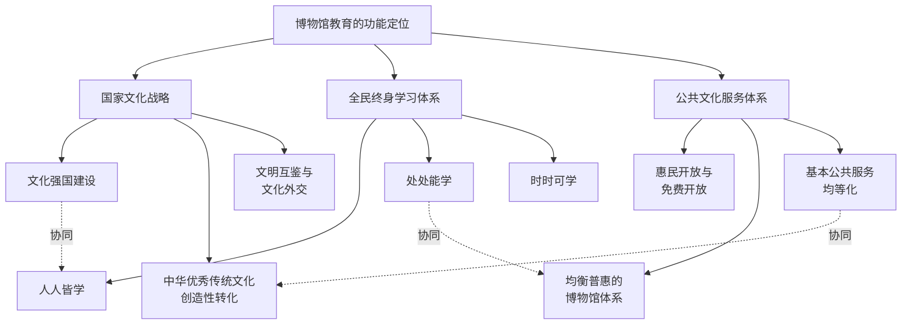
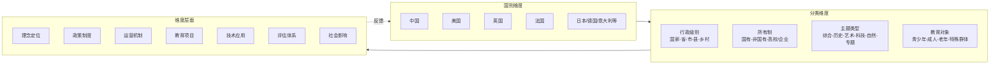
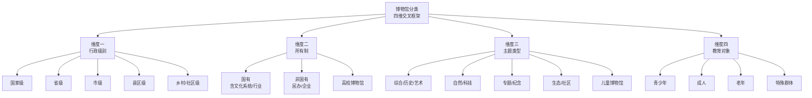
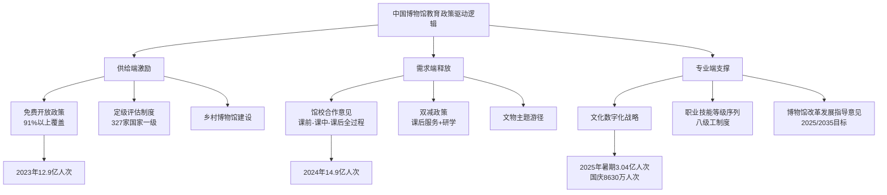
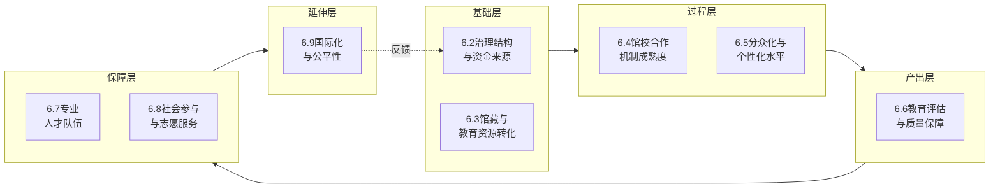
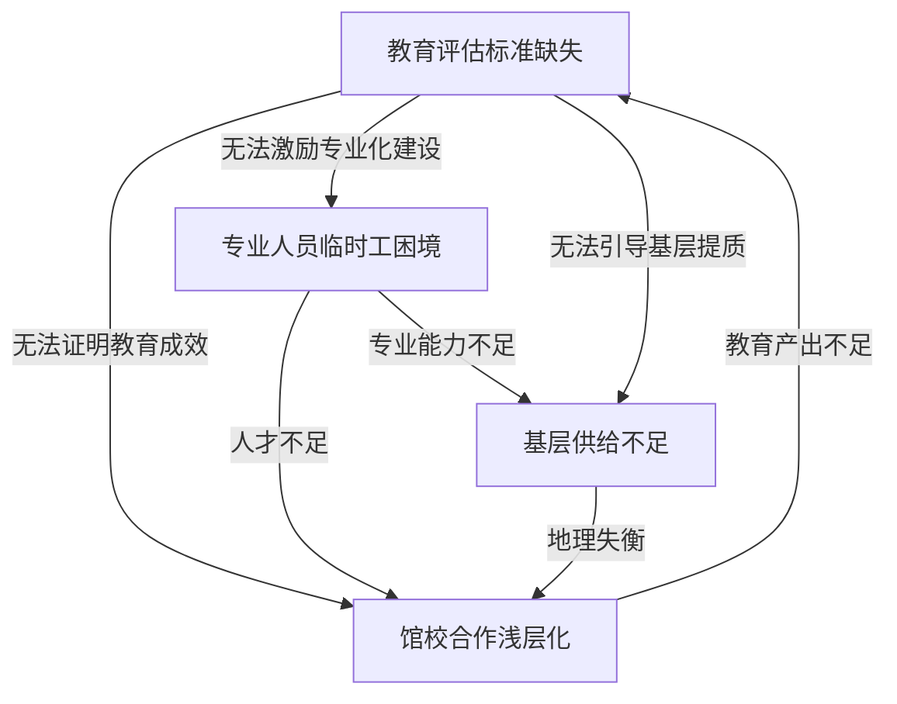
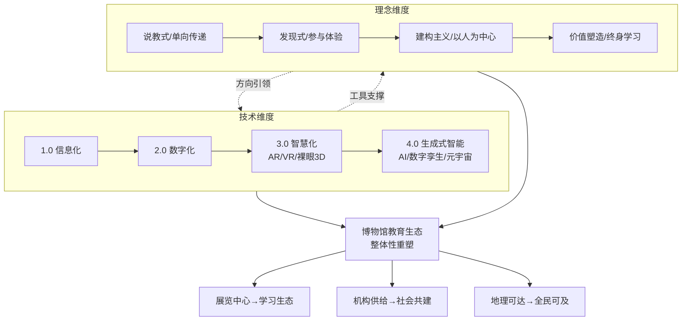
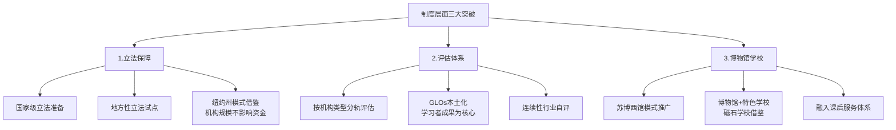
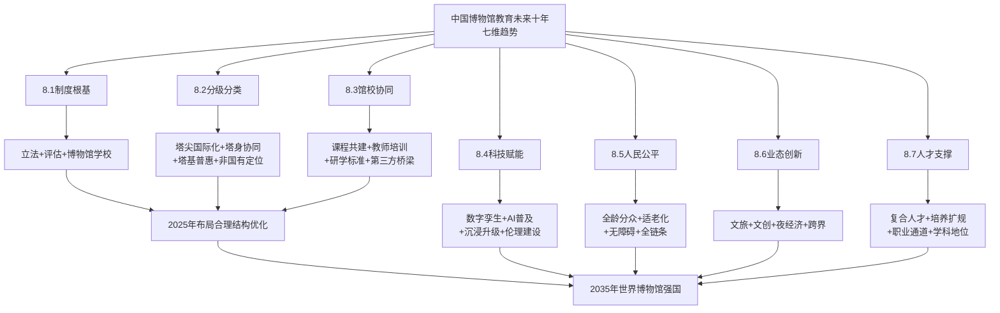
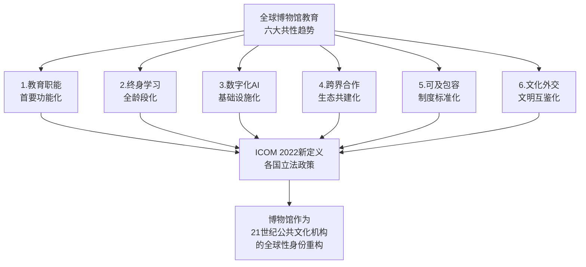

# 中外博物馆教育的现状与未来趋势研究
# 1 研究背景、概念界定与分析框架

博物馆作为人类文明的容器与公共文化的重要载体，其角色已从近代以来以"收藏—保护"为核心的封闭式机构，演变为以"教育—学习"为首要使命的开放式公共空间。2023年，仅中国一国就有6833家博物馆举办陈列展览4万余个、教育活动38万余场，接待观众12.9亿人次，博物馆日益成为广大人民群众教育学习的公共空间，成为中小学生喜爱的"第二课堂"[^1]。在国际层面，国际博物馆协会（ICOM）于2022年8月在布拉格特别大会上通过的新博物馆定义，将"教育"明确置于博物馆核心功能序列之中，并强调可及性、包容性、社区参与与可持续性[^2]。这一系列变化既映射出全球博物馆事业的深刻转型，也提示我们：要理解中外博物馆教育的现状差异与未来走向，必须首先回到概念本身、回到理论谱系、回到分析框架的搭建。

本章作为全书的逻辑起点，承担三项基础性任务：一是厘清博物馆与博物馆教育的概念边界和历史脉络；二是把博物馆教育置于国家文化战略、终身学习体系与公共文化服务三重宏观语境之中，确认其功能定位；三是梳理博物馆教育理念从说教式到建构主义的理论谱系，并在此基础上构建贯穿全书的"国别—分类—维度"三维分析框架。需要说明的是，由于本章定位为概念基础与方法论铺垫，所引用的实证数据相对有限；后续章节将在本章框架下展开系统性的中外比较与趋势研判。

## 1.1 博物馆与博物馆教育的概念演变

### 1.1.1 从"Mouseion"到现代博物馆：词源与语义的流变

汉语中的"博物馆"一词译自英文"Museum"，几乎大部分西方语言（法语、德语、意大利语、西班牙语乃至俄语）均源于希腊语的"Mouseion"，其本意为"缪斯的所在地"，是为了对宙斯与记忆女神的九个女儿——缪斯——表示敬意；法国学者G.比代在《希腊语—拉丁语词典》中将其解释为"供奉缪斯、从事研究之处所"[^3]。

被誉为世界第一所博物馆的"亚历山大博物院"（Mouseion of Alexandria）展示了这一概念在古典时代的丰富内涵：它在"Mouseion"这一概念下所从事的活动几乎囊括了现代社会主要文化教育机构的全部职能，包括大学、研究院、图书馆、档案馆和收藏室；其本意指"用于追求治学和学艺的大楼或房舍"，即由教授们用于研究、写作和讲课的场所，并设有为教学和科研服务的实验室、图书馆、档案室、收藏室乃至动物园和植物园[^3]。**这种"博物—研究—教学"三位一体的古典原型，已经在词源层面预设了博物馆与教育之间难以割裂的内在联系**。

经历了基督教欧洲长达近十个世纪的禁用之后，"Mouseion"概念在文艺复兴时代重新回到人们的生活中：首先出现在佛罗伦萨梅蒂奇家族的收藏中，继而被用来称呼第一座近代意义博物馆——牛津大学阿什米尔博物馆[^3]。但近代以来，随着学术活动的分化，原来博物馆中的各种机构纷纷从母体中分离：从事学术研究和讲课的场所被"University"（大学）取代，贮藏图书资料的场所专称"Library"（图书馆），从事测试分析的地方称"Laboratory"（实验室），档案收藏专归"Archives"，"Museum"的内涵大大缩小，成了专指用于收藏、研究和展出对人类智慧发展具有价值的物品的场所[^3]。在17世纪后半叶阿什莫尔与赫斯特关于特拉德斯干收藏归属的诉讼中，处理诉讼的法院将博物馆解释为"贮存和收藏各种自然、科学与文学珍品或趣物或艺术品的场所"，这表明近代早期的博物馆已被主要定位为"为了收藏品的安全和保护的目的而营造的建筑"[^3]。**从古典时代的"研究—教学综合体"退缩为近代的"收藏—展示场所"，又在20世纪以降逐步回归并凸显教育职能，构成了博物馆概念史的基本张力**。

### 1.1.2 国际博协博物馆定义的修订脉络

为博物馆制定能够被普遍认可的定义，是一项持续至今的努力。国际博物馆协会（ICOM）作为依据法国1901年社团法成立的非营利性、非政府国际学术组织，1946年11月由美国博物馆协会会长C·J·哈姆林倡议创立，总部设于法国巴黎联合国教科文组织大楼内[^4]。自成立之初，ICOM就在不断根据时代变化适时修改关于博物馆的定义[^2]。其定义脉络的核心节点可梳理如下表：

| 年份 | 关键修订 | 教育/社会功能权重 |
|------|---------|-----------------|
| 1946 | 涵盖艺术、技术、科学、历史或考古的藏品对公众开放的所有机构，含动植物园 | 以"对公众开放"为基本要求 |
| 1956 | 强调以"保存、研究、提高"为目的的永久性机构 | 加入"研究与提高"的目的 |
| 1961 | 明确以"研究、教育、欣赏"三大目的为认定标准 | **首次将"教育"写入定义** |
| 1974 | 哥本哈根会议确立非营利性与社会服务属性，强调"为社会及其发展服务" | 教育、研究、欣赏并列 |
| 2007 | 将"教育"调整到博物馆功能的首位 | **教育跃居首位** |
| 2022 | 布拉格新定义：增加可及性、包容性、社区参与、可持续性等价值导向 | 教育与多元价值并举 |

资料来源：综合自ICOM历次定义修订及相关研究[^2][^4][^5]。

1974年6月，ICOM于哥本哈根召开第11届会议，将博物馆定义为"是一个不追求营利，为社会和社会发展服务的公开的永久机构。它把收集、保存、研究有关人类及其环境见证物当作自己的基本职责，以便展出，公诸于众，提供学习、教育、欣赏的机会"[^4]。这一界定首次明确博物馆的非营利性及社会服务属性，为现代博物馆事业的发展奠定了制度根基[^4]。2007年，新的《国际博物馆协会章程》将博物馆定义中的"教育"调整到博物馆功能的首位，"为教育、研究、欣赏的目的征集、保护、研究、传播并展出人类及人类环境的物质及非物质文化遗产"[^5]。

2022年8月24日，在布拉格举行的第26届ICOM大会框架下，ICOM特别大会通过了新的博物馆定义，这是历时18个月、涉及来自世界各地126个国家委员会数百名博物馆专业人士参与过程的高潮[^2]。新定义的中文官方版表述为："博物馆是为社会服务的非营利性常设机构，它研究、收藏、保护、阐释和展示物质与非物质遗产。向公众开放，具有可及性和包容性，博物馆促进多样性和可持续性。博物馆以符合道德且专业的方式进行运营和交流，并在社区的参与下，为教育、欣赏、深思和知识共享提供多种体验"[^2]。**这一新定义与博物馆角色的一些重大变化相一致，认识到包容性、社区参与和可持续性的重要性**[^2]，并将"教育"与"欣赏、深思、知识共享"并置为博物馆为公众提供的多种体验之首。

### 1.1.3 狭义与广义博物馆教育的内涵辨析

在博物馆定义不断演进的同时，"博物馆教育"作为一个相对独立的概念也经历了从模糊到清晰的过程。学界对博物馆教育的核心理解可在三个层面把握。

第一，**功能层面**的界定。博物馆教育存在狭义和广义之分：狭义的博物馆教育是指在博物馆内实施的一般教育项目，而广义的博物馆教育则认为由博物馆产生的、具有教育意义和功能的一切事物皆可视作博物馆教育[^5]。美国《博物馆教育工作者手册》对此持广义立场，认为"博物馆教育被广义地理解为任何促进公众知识或体验的博物馆活动……教育的愿景事实上也是博物馆使命和整体目标的愿景。教育和展览是彼此关联的，并应该相互包含"[^6]。

第二，**本质层面**的界定。中国《博物馆学概论》将博物馆教育界定为"一种交往行为，它是以博物馆'物'为根本媒介，而进行知识、情感、态度、观念的交流与对话，以形成相互'理解'和非强迫性'共识'的行为"[^6]；国际博协《博物馆学关键概念》则强调"梳理综合从博物馆获取的知识，通过知识整合、激发感知、获取新体验，帮助观众个人发展和获得成就"[^6]。**这些界定共同指向博物馆教育区别于学校教育的核心特征——以"物"为媒介、以"交流"为方式、以"非强迫性共识"为目标**。

第三，**特征层面**的界定。博物馆教育具有公众性、社会性、终身性、直观性、丰富性、拓展性、自主性和愉悦性等多重特征：以公众为服务对象、提高其科学文化素养是其使命；终身性与无限性赋予其不同于学校教育的时限优势；以实物例证表达内涵的方式具有鲜明的直观性、形象性、可比性和强烈的说服力、震撼力，使其成为区别于其他教育方式的重要特色；自主性则强调"为公众自我学习提供服务而实现教育目的"，公众可在完全自主、自由的状态下接受熏陶[^6]。中国博物馆教育的脉络也印证了这一本质：自1905年张謇创办南通博物苑开始，我国博物馆就以教育为目的，以传播知识、教育公众为己任；20世纪二三十年代，蔡元培提出博物馆是重要的社会教育机构，并且"教育不专在学校"；2015年颁布的《博物馆条例》明确规定博物馆的三大目的是教育、研究和欣赏，并将博物馆教育列为首位[^1][^5]。

需要特别指出的是，本研究所涉及的"博物馆教育"主要采用广义内涵——既包括馆内的展览阐释、教育项目、研学活动，也包括馆校合作、数字化教育、社区参与、文创开发等具有教育功能的延伸活动。这一界定有助于在后续中外比较中保持口径的统一性。

## 1.2 博物馆教育的功能定位与战略语境

博物馆教育不是孤立的专业活动，而是嵌套在国家文化战略、全民终身学习体系与公共文化服务体系三重宏观语境之中。明确其功能定位，是把握中外现状差异与未来走向的前提。

### 1.2.1 国家文化战略语境：文化强国建设的重要载体

在中国语境下，博物馆教育被置于"建设文化强国"战略目标的核心位置。习近平总书记多次强调："要发挥好博物馆保护、传承、研究、展示人类文明的重要作用，守护好中华文脉，并让文物活起来，扩大中华文化的影响力"；并明确指出"博物馆建设要更完善、更成体系，同时发挥好博物馆的教育功能"[^7][^1]。2024年10月，习近平总书记在主持中共中央政治局第十七次集体学习时发出锚定建成文化强国战略目标、不断发展新时代中国特色社会主义文化的号召[^1]。

围绕这一战略定位，博物馆教育承担着推动**中华优秀传统文化创造性转化、创新性发展**的特殊使命。通过展览和社教活动等方式，博物馆不断加强文物资源挖掘阐释，结合现代科技和数字手段，利用跨学科的多维视角对中华优秀传统文化进行创造性转化和创新性发展，以公众便于理解和传播的方式呈现，激发公众对中华优秀传统文化的理解和认同[^1]。"一个博物馆就是一所大学校"的论断，则将博物馆教育从行业内部的专业活动提升为国民教育体系不可或缺的有机组成部分[^7][^5]。

### 1.2.2 全民终身学习语境：学习型社会的关键节点

终身学习是博物馆教育在全球范围内确立其地位的另一条关键脉络。联合国教科文组织终身学习研究所（UNESCO Institute for Lifelong Learning, UIL）将终身学习定义为面向所有人的赋权与社会变革之路，致力于支持成员国根据可持续发展目标4建立有效且包容的终身学习政策与体系，发展跨越生命周期、覆盖各种场景、惠及所有人的学习生态[^8]。**在数字技术与人工智能时代，学习生态高度互联，博物馆等非正式学习场所被纳入这一生态的重要节点**[^8]。

在博物馆研究领域，终身学习视角已成为国际共识。日本东京大学研究者Hironobu Shindo在UIL访问期间提出，文化活动如博物馆参观是终身学习的核心要素，博物馆作为终身学习空间能够支持公民教育、对话与民主参与[^9]。在中国，2020年9月，习近平总书记在教育文化卫生体育领域专家代表座谈会上指出，"要完善全民终身学习推进机制，构建方式更加灵活、资源更加丰富、学习更加便捷的终身学习体系"[^1]。博物馆教育作为社会教育的重要组成部分，拥有包括历史文物、艺术品、科技展品、互动体验等丰富多元的教育资源，具有实物性、情境性、体验性、主动性、终身性等特点，能够满足不同年龄段和不同兴趣爱好群体的学习和教育需求，是构建全民终身学习体系的重要途径[^1]。

实践层面，地方实践已展现出博物馆嵌入终身学习生态的多种形态。以广东省为例，截至相关统计时点，广东已构建起覆盖省、市、县、镇、村五级的公共文化设施网络，建成县级以上公共图书馆150个、文化馆144个、博物馆416个、美术馆139个，以及乡镇（街道）综合文化站1619个、行政村（社区）综合性文化服务中心2.6万个[^10]。针对青年群体，《广东省文明（青年）夜校工作方案》出台后，广州、深圳等8个地市开办夜校点47个，累计推出各类课程4700多期，服务青年超100万人次；针对老年群体，广州"银龄学堂"刮起"学习风"[^10]。这些实践共同呈现出"人人皆学、处处能学、时时可学"的学习型社会风貌[^10]。

### 1.2.3 公共文化服务语境：提质增效的重要载体

第三重语境是公共文化服务体系。2026年政府工作报告提出："实施公共文化服务提质增效行动，做好公共图书馆、博物馆、文化馆等惠民开放，完善全民阅读推广服务体系，广泛开展群众性文化活动，繁荣互联网条件下新大众文艺"[^10]。**博物馆是公共文化服务的重要载体，以博物馆高质量发展优化公共文化供给，本质上是实现文化价值与服务效能的双重提升**[^7]。

公共文化供给的便利性、普惠性、多样性共同构成全民终身学习的基础条件：便利性降低学习成本，使高品质文化课程与资源易于获取；普惠性致力于服务不同群体的精神需求，资源向基层、农村及特殊群体倾斜；多样性则借助科技赋能，提供沉浸体验与个性化服务[^10]。在博物馆领域，要在陈列展览、社会教育、开放服务、文创开发、传播推广等方面持续发力，推动博物馆高质量发展，增强优质文化供给，提升公共文化服务水平[^7]。

上述三重语境并非各自独立，而是相互交织、彼此支撑：国家文化战略提供方向引领与制度保障，终身学习体系提供学习者主体定位，公共文化服务体系提供基础设施与供给机制。**博物馆教育的独特性正在于它同时回应这三重需求——既是文化传承的载体，又是学习主体的资源，更是公共服务的产品**。这种三位一体的功能定位，构成了本研究审视中外博物馆教育现状与未来趋势的基本坐标。

## 1.3 博物馆教育理念的理论谱系

如果说功能定位回答了"博物馆教育为什么重要"，那么理念演进则回答了"博物馆教育应当如何开展"。自博物馆诞生之日起，博物馆内的教育现象经历了从无到有的发展，其自身逻辑也随着社会变迁经历了**从权威教化型到学习体验型**的演变[^5]。这一演变并非简单的替代关系，而是叠加、交织、共存的过程，共同构成当代博物馆教育实践的理论底色。

### 1.3.1 从说教式到建构主义：四种范式的更替

博物馆教育理念的演进大致可以梳理为四种范式：说教式、刺激—反应式、发现式与建构主义。

**说教式（Didactic）范式**根植于近代博物馆作为"权威阐释者"的角色定位。博物馆以专家姿态向"无知的公众"传授标准化知识，展品说明牌承载固定的"正确解读"，观众被预设为被动接受者。这一范式在我国体现为新中国成立后借鉴苏联模式形成的群众工作部传统：1951年中国历史博物馆和中国革命博物馆设立了群众工作部，主要工作是讲解，担负起对大众的社会教育工作[^5]。这一阶段博物馆教育"从传统的说教"出发[^5]，强调单向传递。

**刺激—反应式范式**受行为主义心理学影响，关注通过展陈设计的视觉、听觉刺激引发观众的预期反应，强调展览的吸引力、展品摆放的视线引导、互动按钮的反馈机制等技术层面优化。这一阶段博物馆开始重视观众体验，但仍将观众视为可被预测和操控的对象。

**发现式（Discovery-based）范式**以观众主动探究为核心，鼓励观众通过观察、操作、提问自主获取知识，儿童博物馆与科学中心的兴起是这一范式的典型实践。博物馆教育此时"主动调动观众的热情，让他们关注、参与和融入到博物馆教育活动中来"[^5]，"为公众自我学习提供服务而实现教育目的"[^6]。

**建构主义（Constructivist）范式**则进一步把"意义"的生成权交还给观众。在这一视角下，博物馆教育被重新理解为"以博物馆'物'为根本媒介，进行知识、情感、态度、观念的交流与对话，以形成相互'理解'和非强迫性'共识'的行为"[^6]。**意义不再是博物馆"传输"给观众的固定内容，而是观众基于自身经验、兴趣、社会文化背景主动建构的过程**。这一范式的兴起与20世纪80年代以来的"文化转向"密切相关：21世纪的博物馆被期待能参与建设更加平等和公正的社会、扮演更核心的社会角色，社会和道德责任感的全新使命让博物馆不得不重新思考其目的、方法和成效[^11]。

### 1.3.2 福克与迪尔金的学习情境化模式

在建构主义范式下，最具影响力的理论框架之一是美国学者约翰·福克（John H. Falk）与林恩·迪尔金（Lynn D. Dierking）提出的"学习情境化模式"（Contextual Model of Learning）[^12][^13]。两位作者皆为美国博物馆研究和科学教育的领军人物：福克为加州大学伯克利分校生物学与教育学双料博士，俄勒冈州立大学终身科学技术工程与数学学习研究中心主任；迪尔金为佛罗里达大学科学教育博士，现任俄勒冈州立大学教育学院研究院[^12]。其代表作《博物馆体验再探讨》原版首次出版于1992年，2021年由社会科学文献出版社出版的中文版结合了过去二十年的研究进展进行了更新[^12][^13]。

学习情境化模式的核心是把博物馆体验置于**个人情境、社会文化情境、实体情境**三个维度的交互之中加以理解。该模式按时间线组织讨论，对博物馆参观这一链条上的前、中、后三个环节进行细致分析[^12][^13]。其关键洞见在于：观众并非被动接受展览设定的体验，而是主动地构建自己的体验——"观众们不仅主动选择参观哪个展览，还从某一个展览中选择观看哪些内容……与个人和社会文化情境一样，实体情境也由个人主动构建。利用博物馆自身的原料，观众主动地打造他们自己的实体情境"[^13]。

更具操作意义的是，福克与迪尔金从身份角度出发，将博物馆观众分为**七种类型**：探索者、导览者、专业人士/"发烧友"、寻求"体验"者、"充电"者、虔诚的朝圣者和寻求"关联"者[^12]。这一分类突破了以往按人口统计学特征（年龄、教育程度、收入）划分观众的传统思路，转而关注观众参观博物馆的内在动机与身份认同。**这意味着博物馆教育的设计必须从"展览中心"转向"观众中心"，从"我们想让观众学到什么"转向"观众希望从我们这里获得什么"**。该书在最后一章对博物馆在21世纪的发展作出展望，强调线上体验与社群互动的有机融合，构建了从个体需求到公共价值的完整分析路径[^12]。

### 1.3.3 胡珀-格林希尔与"后博物馆"理论

如果说福克与迪尔金的工作主要在心理学与学习科学层面深化了博物馆教育的微观机制，那么英国莱斯特大学的艾琳·胡珀-格林希尔（Eilean Hooper-Greenhill）则从更宏观的批判教育学与后现代理论视角重塑了博物馆教育的研究范式。

胡珀-格林希尔主编的《博物馆的教育角色》（The Education Role of the Museum）第一版发行于1994年，第二版于1999年正式出版，共收录论文36篇，分为"传播理论"、"博物馆学习"、"开发有效展览"、"对博物馆观众的思考"四个主题[^14]。在导读章节中，她将博物馆定位为文化和社会机构，提出"将博物馆边缘化"（marginalizing the museum）的研究范式，从教育、传播、阐释三个维度结合文化研究勾勒出整体结构；导读首先点出关键切入点是"意义"——这不仅包括博物馆依托"物"所生产的意义，也涵盖观众主动建构的意义[^14]。

其2007年出版的《博物馆与教育：目的、方法及成效》（Museums and Education: Purpose, Pedagogy, Performance）则是在新世纪英国博物馆面临"如何证明博物馆的教育影响力"这一关键问题的背景下，开发出**适用于博物馆、档案馆、美术馆的通用学习成果框架（Generic Learning Outcomes Framework）**，被视作英国博物馆界的一场新评估革命，为之后英国博物馆明确教育角色和构建学习理论奠定坚实基础[^11]。该书诞生于"后博物馆"（post-museum）时代——二战后英国博物馆在经济危机、政策导向和社会责任的重压下，迫切需要通过观众评估和研究来向政府提供关于其经济价值和社会价值的"证据"；20世纪末，社会各界认为博物馆把教育作为首要职能的理念只流于表面，在实际运营中尚未受到足够重视；进入21世纪后，胡珀-格林希尔敏锐察觉到当代博物馆迫切需要明确自身在新时代中的教育目的、职能和表现[^11]。

**"后博物馆"理论的核心主张**是：21世纪的博物馆被期待参与建设更加平等和公正的社会，扮演更核心的社会角色，这是"文化转向"的重要标志；博物馆将通过意义建构来完成对"物"的分享和持续性的非中性阐释，形成对文化、传播、学习、身份认同之间复杂关系的复合理解，寻找到建立多元观众关系的新方式[^11]。这意味着博物馆不再是中立的"知识容器"，而是承担社会、道德责任的"意义协商空间"。

### 1.3.4 莱斯特学派与布尔诺学派：学术取向的差异

在介绍上述理论资源时，有必要简要厘清当代博物馆相关学科的两大传统。20世纪60年代，博物馆学作为一门在大学开展教学活动的学科，起源于捷克斯洛伐克布尔诺的马萨里克大学与英国莱斯特大学；此后数十年，这两所大学分别发展出了博物馆学最知名的两大学派——**布尔诺学派与莱斯特学派**[^15]。

| 维度 | 莱斯特学派（英国/英语国家） | 布尔诺学派（东欧/拉美/法德） |
|------|------------------------|--------------------------|
| 学科称谓 | 博物馆研究（Museum Studies） | 博物馆学（Museology） |
| 学科性质 | 跨学科研究领域 | 独立学术体系中的科学 |
| 研究对象 | "研究博物馆"（to study museums） | "博物馆性"（museality） |
| 学术取向 | 实践导向+批判研究并存 | 理论体系建构 |
| 代表学者 | 胡珀-格林希尔等 | 斯特兰斯基、瓦达荷西等 |
| 理论资源 | 后结构主义、女权主义、后马克思主义、文化研究 | 强调专门研究对象、研究方法、专业术语 |

资料来源：综合自相关研究[^15]。

莱斯特学派将博物馆研究视为"一种后现代的研究领域"，广泛吸收后结构主义、女权主义、后马克思主义等后现代知识，积极与社会学、人类学等学科进行交叉，因此被认为是"一种后现代的研究领域"[^15]。布尔诺学派则试图寻找博物馆学专门的研究对象、研究方法、专业术语和学科体系，以将其建设成为一门独立学科；他们认为博物馆学的研究对象不是博物馆，而是"博物馆性"（museality），这种理论范式也对法语国家、拉美地区的博物馆学产生了重要影响[^15]。**两大学派的差异不仅是术语之别，更折射出英美与欧陆在博物馆教育实践中各自不同的传统，这一点在本研究后续比较国别现状时具有重要参考价值**。

综合上述理论资源，可以将博物馆教育理念的演进逻辑概括为：从"以物为中心"的权威教化，转向"以人为中心"的意义建构；从"教"为主导的单向传递，转向"学"为主导的多元交流；从专家垄断的知识生产，转向社区参与的共同阐释。**这一理念演进与2022年ICOM新定义中"教育、欣赏、深思和知识共享"的并置以及"在社区参与下"的强调形成了内在呼应**[^2]，也为本研究构建分析框架提供了理论支撑。

## 1.4 "国别—分类—维度"三维分析框架的建构

在前述概念界定与理论梳理基础上，本研究构建一个统一的"国别—分类—维度"三维分析框架，作为后续章节中外比较与趋势研判的方法论基础。

### 1.4.1 三维框架的基本结构

**国别维度**对应"参照系"。中国作为本研究的核心研究对象，需要在与代表性国家的比较中明晰自身定位。选取的代表性国家包括：英国与美国（英美模式，以英国莱斯特学派和美国学习情境化研究为理论代表）、法国（欧陆模式，承载"Mouseion"古典传统与近代博物馆制度策源地的双重身份）、日本（东亚模式，与中国共享儒家文化圈与终身学习研究的活跃实践，如东京大学Shindo关于博物馆与终身学习的研究[^9]）、德国（科技与工业博物馆教育传统的代表）以及意大利、西班牙等国作为补充比较对象。这一选取兼顾东西方博物馆教育发展路径差异，覆盖英美式跨学科"博物馆研究"与欧陆式"博物馆学"两大学术传统[^15]。

**分类维度**对应"被研究对象的类型学切分"。博物馆作为一个庞大而异质的机构集合，必须经过分类才能进行有意义的比较。本研究采用多维度交叉分类：按行政级别可分为国家级、省级、市级、县区级、乡村/社区级（如浙江已建设完成1000家乡村类博物馆[^7]）；按所有制可分为国有、非国有/民办、企业/高校博物馆；按主题类型可分为综合性、历史类、艺术类、自然科学类、科技类、专题/纪念馆、生态/社区博物馆、儿童博物馆等；按教育对象可分为青少年、成人、老年、特殊群体。**这一分类体系将在第2章系统建构，并在全书后续章节中保持术语与口径一致**。

**维度层面**对应"可比较的指标体系"。从理念定位、政策制度、运营机制、教育项目、技术应用、评估体系、社会影响七个角度展开比较分析，确保中外比较建立在对称、可比的指标体系上。这一维度设计回应了博物馆教育的核心要素：理念定位决定方向，政策制度提供保障，运营机制支撑落地，教育项目体现内容，技术应用塑造形态，评估体系保证质量，社会影响检验成效。

### 1.4.2 三维框架的内在逻辑与应用方式

三维框架的内在逻辑可概括为"**国别提供文化语境，分类提供结构切片，维度提供比较坐标**"。三者并非彼此独立，而是相互嵌套：在国别维度内部，须按分类维度进行细分（如中国的一级博物馆与英国的国家级博物馆、中国的乡村博物馆与日本的生态博物馆）；在分类维度内部，须按维度层面展开比较（如中外艺术类博物馆在馆校合作机制上的差异）；在维度层面内部，须回到国别与分类语境加以解释（如评估体系的差异既受国别治理传统影响，也受博物馆类型差异影响）。

在后续章节中，三维框架的应用方式如下：第2章建构博物馆分类体系，对应"分类维度"的系统化展开；第3章中国现状、第4章英美现状、第5章其他代表性国家现状，对应"国别维度"的系统化呈现；第6章中外比较分析、第7章科技与理念双轮驱动、第8章中国未来趋势、第9章国际共性趋势与对策建议，则在三维交叉中展开深度分析与研判。**每一章的写作都将自觉地参照三维框架，确保术语一致、口径统一、可比性充分**。

### 1.4.3 框架的局限与说明

需要坦诚说明的是，三维分析框架虽然为本研究提供了系统化的方法论支撑，但仍面临若干局限：第一，国别选取虽兼顾代表性，但难以穷尽所有有意义的比较对象；第二，分类维度在不同国家的口径并不完全一致（如中国的"一级博物馆"评估制度与美国博物馆联盟的"认证博物馆"制度在内涵与外延上存在差异），后续比较时将做必要的概念对齐说明；第三，维度层面所采用的指标在数据可得性上中外存在不对称（如中国相关统计数据较为完整，部分国家则需依赖学术研究与机构报告），本研究将在行文中如实说明数据局限。

尽管如此，三维框架的核心价值在于为本研究提供了一个**自洽、对称、可操作**的分析坐标系——使得分散的事实陈述能够被组织成结构化的比较分析，使得多元的理论资源能够被整合为统一的解释逻辑，使得未来趋势的研判能够建立在对当下现状的系统理解之上。这一框架也为后续章节按照"概念—分类—国别现状—比较—驱动力—中国趋势—国际共性—对策建议"的整体逻辑展开奠定了基础，构成本研究区别于一般文献综述的方法论特色。

# 2 博物馆分类体系的建构与教育功能差异

第1章已经界定了博物馆教育的概念边界、功能定位与理论谱系，并在最后构建了"国别—分类—维度"的三维分析框架。本章承接其中"分类维度"，将其展开为可操作、可贯穿全书的具体分类体系。**之所以必须把分类问题提前到第2章单独建构，是因为博物馆作为一个高度异质的机构集合，离开分类就难以进行有意义的中外比较——一座只有数百件藏品的县级民俗馆与一座年接待量过千万的国家级综合馆，虽同名"博物馆"，其教育功能的发挥逻辑却几乎不在同一量级**。本章首先梳理中外既有分类标准的差异（2.1），随后沿行政级别（2.2）、所有制（2.3）、主题类型（2.4）三条主线展开横向比较，再引入教育对象的功能性切分（2.5），最终形成"四维交叉"的统一分类框架（2.6），为第3—5章的国别现状描述与第6章的中外比较提供分类工具与术语基础。

## 2.1 国内外博物馆分类标准的演变与比较

### 2.1.1 中国的"三维分类+三级评估"双重体系

中国博物馆分类标准的制度根基来自2015年3月20日起施行的《博物馆条例》（国务院令第659号）。《条例》第二条明确，博物馆是指"以教育、研究和欣赏为目的，收藏、保护并向公众展示人类活动和自然环境的见证物，经登记管理机关依法登记的非营利组织"，并将博物馆划分为"国有博物馆"和"非国有博物馆"两大基本类别——"利用或者主要利用国有资产设立的博物馆为国有博物馆；利用或者主要利用非国有资产设立的博物馆为非国有博物馆"，且"国家在博物馆的设立条件、提供社会服务、规范管理、专业技术职称评定、财税扶持政策等方面，公平对待国有和非国有博物馆"[^16]。

在此基础上，学界与行业管理形成了**举办主体—内容性质—隶属关系**的三维分类共识：按举办主体分为国有（含文物部门和其他部门所属）和非国有（民办）；按内容性质划分为历史类、艺术类、科技类、综合类等；按隶属关系包括文化系统直属博物馆和行业博物馆（如高校、科研机构或企业所属的专题馆）；同时，非官方分类中还存在按主题、地域或运营模式划分的类型（如生态博物馆）[^17]。

与上述"分类"并行的是"评级"——这是中国博物馆管理体系中具有强烈中国特色的制度安排。根据2016年7月发布、2019年12月修订的《博物馆定级评估办法》，凡在境内正式登记、经省级文物行政部门备案、向社会开放、正常运行36个月以上的各类博物馆，均可申请参加定级评估；评估遵循"自愿申报、行业评估、动态管理、分级指导和公平、公正、公开的原则"，由国家文物局制定办法和标准，中国博物馆协会具体负责评估工作；博物馆经评估确定相应等级，"从高到低依次为国家一级博物馆、国家二级博物馆、国家三级博物馆"，定级工作"原则上每三年集中开展一次"，"运行评估至少每三年进行一次"[^18]。截至2024年底，全国备案博物馆达7046家，其中国家一、二、三级博物馆达1660家[^19]。**这一"分类+评级"的双轨制度设计，使中国博物馆既被结构性地切分为不同类型，又被纵向地排成质量梯度，形成了与国际通行做法显著不同的制度纹理**。

### 2.1.2 英美的"专业认证"范式

与中国"由政府主导的行业评级"不同，英美两国的分类与质量识别更多依赖行业组织主导的专业认证。英国创新性地实施了《博物馆认证计划》（Museum Accreditation Scheme），通过建立统一的行业标准体系，系统规范博物馆在运营管理、藏品维护、公共服务等关键领域的业务标准；该认证机制不仅明确了博物馆作为公共信托责任主体的专业要求，更构建了全行业共同遵循的运营准则[^20]。这一制度依托英国"一臂之距"的治理模式——文化媒体体育部负责战略规划，英格兰艺术委员会承担专业督导，博物馆享有运营自主权；英国还构建了多层级法律框架保障博物馆建设，包括1983年《国家遗产法案》、1992年《博物馆和美术馆法》以及2011年《慈善法》（支持部分博物馆能以慈善机构的形式注册和运营）[^20]。

美国博物馆联盟（American Alliance of Museums, AAM）则将自身定位为"代表整个博物馆领域的唯一组织——从艺术与历史博物馆到科学中心和动物园"，强调通过联结人群、培育学习与社区、滋养博物馆卓越来推动公平且有影响力的博物馆[^21]。AAM统计显示，美国共有约35000家博物馆，分布在所有社区，其中20%位于乡村地区；博物馆领域支持着726000个就业岗位，每年为美国经济贡献500亿美元[^21]。**值得注意的是，美国不存在中国意义上的"国家一级博物馆"序列，AAM认证（Accreditation）才是行业最高质量标识——这意味着在中外比较时，"中国一级博物馆"与"美国AAM认证博物馆"在制度内涵上不能简单等同，前者是政府委托行业组织进行的等级评定，后者是同行评议式的专业资格认定**。

### 2.1.3 ICOM国际口径与中外范式差异

在国际层面，国际博物馆协会（ICOM）作为与联合国教科文组织保持官方联系的非政府组织，主要通过30个常设专业委员会的方式对博物馆进行专业领域切分，如展览交流专业委员会（ICEE）等[^22][^23]。ICOM的工作重心不在为博物馆划分行政等级或质量层级，而在按专业领域（展览、教育、藏品保护、自然史、艺术等）建构知识共同体。这种以"专业领域"为切入的分类逻辑，与中国以"行政级别+主题类型+所有制"三维并行、英国以"认证标准"为核心的分类逻辑形成了三种不同的范式。

将三种范式作横向比较，可以更清晰地理解其差异：

| 维度 | 中国 | 英国 | 美国 | ICOM |
|------|------|------|------|------|
| 主导主体 | 国家文物局+中国博物馆协会 | 英格兰艺术委员会等 | AAM等行业组织 | 国际行业组织 |
| 核心机制 | 评级（一/二/三级） | 认证（Accreditation） | AAM认证 | 专业委员会 |
| 分类基础 | 举办主体+内容性质+隶属关系 | 业务标准合规 | 同行评议+使命匹配 | 专业领域 |
| 法律根基 | 《博物馆条例》《博物馆定级评估办法》 | 《国家遗产法案》《博物馆和美术馆法》《慈善法》 | 非营利+理事会+联邦税法 | ICOM章程 |
| 周期 | 三年一轮评估 | 持续认证 | 持续认证 | 不适用 |
| 强制性 | 自愿申报，但与财政拨款挂钩 | 自愿，但与公共资金支持挂钩 | 自愿 | 不适用 |

资料来源：综合自《博物馆条例》《博物馆定级评估办法》[^18][^16]、英国博物馆政策研究[^20]、AAM官网[^21]、ICOM专业委员会介绍[^22][^23]。

**这一比较表明，中外分类标准的差异不仅是技术层面的指标差异，更是治理传统的差异——中国采用"政府引导+行业实施"的等级评估范式，英美采用"行业自治+同行评议"的专业认证范式，ICOM则采用"专业领域共同体"的横向网络范式**。这三种范式在后续比较中都将作为参照系出现，因此本研究在表述时遵循以下口径对齐规则：涉及"国家一级博物馆"等中国术语时保留原表述，并在首次出现时标注其制度内涵；涉及英美时使用"认证博物馆"或"AAM认证博物馆"以避免与中国评级混淆；涉及国际通用层面时优先采用ICOM定义。

## 2.2 按行政级别的分类：资源禀赋与教育能力梯度

行政级别是中国博物馆体系中最具结构性意义的切分维度。在"国家—省—市—县区—乡村/社区"的多层结构中，资源禀赋自上而下呈现明显梯度，这种梯度直接决定了各层级博物馆教育功能的发挥空间。

### 2.2.1 中国的层级体系：从"塔尖"到"塔基"

在中国7046家备案博物馆中，1660家国家一、二、三级博物馆构成了"塔尖"，免费开放率达91.46%[^19]。这些等级馆通常具备较为完整的藏品体系、稳定的财政拨款、专职化的研究与教育队伍，以及稳定的展览与教育项目周期。以国家一级博物馆为代表的塔尖机构往往承担着引领示范、国际传播与重大文化外交任务——如故宫博物院、中国国家博物馆等通过数字化建设推出相关平台；上海博物馆"金字塔之巅：古埃及文明大展"于2025年8月吸引观众超277万人次，创下博物馆单个收费特展参观人数的世界纪录[^19]。这些数字所反映的不仅是"明星馆"的吸引力，更是塔尖博物馆在策展能力、国际合作、传播营销方面所积累的深厚资本。

省市级博物馆居于"塔身"，在区域文化辐射中扮演关键角色。北京提出"两轴四区多点"博物馆空间布局规划，深圳自然博物馆等新型场馆建设中，反映了一线城市对博物馆体系的整体规划能力[^19]；2024年全国博物馆接待观众近15亿人次、2025年暑期接待量达3.04亿人次、2025年国庆期间接待近8630万人次的数据，以及2025年9月"高质量完成'十四五'规划"系列主题新闻发布会公布的"免费开放的博物馆数量达到6444家，占比91%以上"，共同显示中国博物馆体系正在以前所未有的规模承载公众的文化教育需求[^19]。

县区级与乡村/社区级博物馆构成"塔基"，是博物馆教育公共服务可及性的关键节点，但也面临最突出的供给短板。**塔基博物馆的资源禀赋与教育能力梯度差异，决定了均等化公共文化服务的"最后一公里"问题**。值得注意的是，截至2024年底全国"平均每20万人拥有一家博物馆"[^19]，这一覆盖率虽已较为可观，但在城乡分布上仍存在结构性不均衡。

### 2.2.2 国际比较：层级体系的不同搭建方式

英国采用"国家博物馆—地方博物馆"二元结构，依托"文化部—艺术委员会—博物馆"三级管理体系——文化媒体体育部负责战略规划，英格兰艺术委员会承担专业督导，博物馆享有运营自主权[^20]。国家博物馆（如大英博物馆等）由中央政府通过文化媒体体育部直接资助，地方博物馆则更多依靠地方政府、艺术委员会、慈善基金等多元渠道。**英国"一臂之距"的治理模式使得即便在层级关系中，博物馆仍享有较大的运营自主权，这一点与中国博物馆与其主管单位之间相对紧密的行政关系形成对照**[^20]。

美国博物馆体系不存在严格意义上的中央集权式层级，35000家博物馆分布在所有社区，其中20%位于乡村地区；这一高度分散的分布反映出美国博物馆"自下而上、社区驱动"的发展逻辑[^21]。联邦层面有史密森学会等国家级机构，州、县、市、社区层面则各有相应的博物馆体系，但其间不存在中国式的"上下级关系"，更多是协作伙伴关系。

法国虽然在文博政策上以国家为主导，承袭"文化例外"原则——将文化产品定位为具有独特社会价值和民族特质的特殊商品，主张其不应完全受市场机制支配，而需政府采取适当保护措施[^20]——但其国立博物馆与地方博物馆仍构成清晰的二级体系，国立博物馆（如卢浮宫）在文化外交中承担引领角色。

### 2.2.3 行政层级对教育功能发挥的结构性影响

将层级与教育能力建立对应，可以看到一个共性规律：**层级越高，资源越富集，教育项目的复杂度、国际化程度、技术投入越高；层级越基层，越贴近社区，但也越容易陷入"展品有限、人员不足、活动单一"的困境**。这一规律在中外都成立，但表现形式各有差异——在中国，差异更多通过财政拨款渠道与人员编制结构传导；在英国，差异更多通过英格兰艺术委员会的资助分配与认证标准传导；在美国，差异更多通过捐赠人网络的密度与基金会项目的覆盖传导。

但层级并不必然意味着教育功能的强弱排序——基层博物馆在与社区生活的紧密联系、在地方文化传承的细颗粒度上，反而具有塔尖博物馆难以替代的优势。这一点将在2.4节讨论生态博物馆与社区博物馆时进一步展开。

## 2.3 按所有制的分类：治理结构与运营自由度差异

所有制是另一条贯穿中外的关键分类轴。它决定了博物馆的资金来源、决策机制、问责对象，进而深刻影响教育项目的创新空间与运营自由度。

### 2.3.1 中国的国有/非国有二分及其衍生类型

如前所述，《博物馆条例》将中国博物馆划分为国有与非国有两大基本类别，并强调国家在设立条件、社会服务、规范管理、专业技术职称评定、财税扶持政策等方面"公平对待国有和非国有博物馆"[^16]。条例同时规定，"国有博物馆的正常运行经费列入本级财政预算；非国有博物馆的举办者应当保障博物馆的正常运行经费"，"国家鼓励设立公益性基金为博物馆提供经费，鼓励博物馆多渠道筹措资金促进自身发展"，"博物馆依法享受税收优惠"[^16]。

在国有博物馆内部，又可按隶属关系细分为文化系统所属博物馆与行业博物馆（如高校、科研机构或企业所属的专题馆）[^17]——这一差异具有重要教育意义：文化系统所属博物馆通常承担综合性公共文化服务功能，行业博物馆则在专业知识传播与行业人才培养上具有不可替代的优势。非国有博物馆中，又可分为民办（如个人或社会团体捐赠藏品设立）、企业（如企业利用其历史与产品资源设立）等亚类。

《博物馆条例》对设立条件提出了较为明确的要求——固定的馆址以及符合国家规定的展室、藏品保管场所；相应数量的藏品以及必要的研究资料，并能够形成陈列展览体系；与其规模和功能相适应的专业技术人员；必要的办馆资金和稳定的运行经费来源；确保观众人身安全的设施、制度及应急预案[^16]。**这些条件构成了所有制类型博物馆共同的准入门槛，但不同所有制博物馆在满足这些条件的方式与稳定性上存在显著差异——国有博物馆主要依赖财政预算的稳定性，非国有博物馆则更需通过举办者保障与多渠道筹资来维持**。

### 2.3.2 国际比较：三种典型治理生态

不同所有制结构催生了不同的治理生态，可大致归纳为三种典型：

**英国"一臂之距"模式**：通过理事会制度、认证制度等创新机制，既保持政府政策引导又激发机构活力[^20]。在这一模式下，国家博物馆虽接受公共资金，但其日常运营由独立理事会负责，政府仅通过战略框架、绩效协议、认证标准等"远程"机制施加影响，避免直接干预具体业务。2011年《慈善法》进一步支持部分博物馆能以慈善机构的形式注册和运营[^20]，使所有制结构具有了制度上的弹性。

**美国非营利+理事会+捐赠制**：博物馆作为非营利组织，依靠董事会治理、专业管理者运营、捐赠人与基金会资金支持的三足结构。35000家博物馆构成的庞大体系背后，是高度分散的所有权与治理权——726000个博物馆相关就业岗位、每年500亿美元经济贡献、20%乡村地区分布，共同表明这一治理生态在覆盖面与渗透力上的特征[^21]。

**法国"文化例外"下的国家主导模式**：法国与英国在博物馆管理模式上具有相似性，两国均采用以国家为主导的治理体系；但相较于英国，法国的文化政策更注重保护本国文化遗产，展现出更为鲜明的特色——独创性地提出"文化例外"原则，将博物馆作为弘扬本国文化的教育基地；同时着力拓展文化外交网络，积极参与国际文化组织框架下的多边合作；并强化文化领域资金投入，升级文博场馆硬件设施[^20]。

### 2.3.3 所有制差异对教育功能的影响

所有制差异对博物馆教育功能的影响主要通过三条路径传导。第一，**资金灵活性**：私人或基金会主导的博物馆在教育项目预算分配上享有更高自由度，可较快响应教育市场需求；国家主导或财政预算型博物馆则更稳定，但程序性约束较多。第二，**决策响应速度**：理事会治理模式（英美）下，新教育项目可由专业管理者直接发起，决策链短；行政事业单位模式下，新项目往往需经过更长的审批程序。第三，**社区参与深度**：非国有博物馆，尤其是社区博物馆与高校博物馆，因贴近特定群体而具有更深的社区嵌入性，教育项目更易实现"共建共享"。

但这并不意味着所有制差异决定了教育功能的优劣——国有博物馆的资源体量、藏品品质、政策保障是非国有博物馆难以企及的；非国有博物馆的灵活性、专业聚焦、社区嵌入则是大型国有馆的有益补充。**两者形成互补而非替代关系，这也是《博物馆条例》强调"公平对待"的制度智慧所在**[^16]。

## 2.4 按主题类型的分类：教育内容与受众适配性

主题类型是博物馆教育内容设计最直接的切分维度。中国《博物馆条例》及相关政策依据藏品和展示内容，将博物馆划分为历史类、艺术类、科技类、综合类等[^17]；在此基础上，业内通常补充自然类、专题/纪念类、生态/社区博物馆、儿童博物馆等亚类。中国传统上还有"专门性、纪念性和综合性"的三分法[^19]。本节重点剖析其中两类具有理论范式意义的特殊类型——生态/社区博物馆与儿童博物馆，因为它们在博物馆教育理念演进中分别代表了"以社区为单位的整体性教育"与"以儿童为中心的互动式教育"两种突破性范式。

### 2.4.1 主流主题类型的教育语言差异

不同主题类型的博物馆在叙事逻辑、展陈语言、教育方法上存在系统性差异，可概括为下表：

| 主题类型 | 核心叙事 | 展陈语言 | 主导教育方法 | 受众适配 |
|---------|---------|---------|-----------|---------|
| 综合类 | 文明全景 | 多维并置 | 主题导览+专题讲座 | 全龄段 |
| 历史类 | 时间序列 | 文物+情境复原 | 讲解+研学+情境再现 | 青少年+成人 |
| 艺术类 | 审美体验 | 原作并置+灯光氛围 | 艺术鉴赏+艺术工作坊 | 艺术爱好者+学生 |
| 自然类 | 自然规律 | 标本+生境复原 | 观察+实验+野外延伸 | 青少年+亲子家庭 |
| 科技类 | 科学原理 | 互动装置+实验台 | 动手实验+STEM/STEAM | 青少年+教师 |
| 专题/纪念类 | 特定主题深耕 | 主题化展陈 | 主题教育+研学定制 | 主题兴趣群体 |
| 生态/社区类 | 文化整体性 | 原址+社区生活 | 参与式+在地化 | 社区成员+研究者 |
| 儿童博物馆 | 体验探索 | 可触摸+互动装置 | 动手—探索—对话 | 0—12岁儿童+家庭 |

资料来源：综合自《博物馆条例》分类[^17]、相关研究及本研究归纳。

**这一表格揭示了一个核心规律：博物馆教育方法的选择并非任意，而是与主题类型存在深层对应关系——历史类博物馆的"讲解+研学"传统、科技类博物馆的"动手实验"传统、艺术类博物馆的"鉴赏+工作坊"传统，都是长期实践与受众心理共同塑造的结果**。

### 2.4.2 生态/社区博物馆：从法国理论到中国第三代实践

生态博物馆（ecomuseum）作为新博物馆学理论指导下的一场博物馆运动，起源于20世纪70年代的法国——乔治·亨利·里维埃（Georges Henri Riviēre）和雨果·戴瓦兰（Hugues de Varine）将环境保护的理念引入到文化遗产的保护与博物馆建设，把生态（ecological）和生计（economic）看作有机整体，用动态的概念实现对一个社区整体的保护[^24]。其核心是"将社区整体作为博物馆"，三个特性即文化遗产的在地化保护、整体性保护以及文化遗产保护与社区发展的统一[^24]。

挪威式的生态（社区）博物馆理论及其在贵州、广西的实践推广，构成了中国生态博物馆的"第一代/第二代"形态。这一阶段的实践遵循"村民是文化的拥有者"这一国际生态博物馆"六枝原则"，但也存在对"第二类'生态'即生产生计"的相对忽视——这种"不能搞'生产'、不迎合旅游、不是景点"的解释在发展中国家造成某种错觉[^24]。

第三代实践以浙江安吉生态博物馆为代表——"将生态和生计（生产）并置，践行以'文化为引领的新发展观'，以总体设计、整体推进的策略，走出了一条既符合中国实际，又能兼容当下与长远需求的道路"[^24]。温州矾山生态博物馆是这一脉络的最新延续：温州矾山以其独特的工业遗产闻名于世，素有"世界明矾之都"之称，鼎盛时期曾供应全球60%的明矾；2025年初，温州矾矿遗迹及其文化景观跻身《中国世界文化遗产预备名录》；项目方提出通过矾山生态博物馆建设和"全球，乡村"首届苍南国际双年展的举办，同步为矾山的工业遗产活化和社区文化振兴注入新的活力——"生态博物馆从整体性维度出发，将分散的生产与展示空间集中转化为开放、流动的文化能量场，推动社区居民从'遗产见证者'转向'叙事共建者'"[^25]。

**生态/社区博物馆的教育意义在于：它打破了"博物馆—观众"的二元结构，将社区成员同时确立为教育对象与教育主体，使"教育"从"对物的阐释"扩展为"对生活方式的共同书写"**。这一范式与第1章讨论的建构主义理念高度契合——意义不再是博物馆"传输"给观众的固定内容，而是社区基于自身经验、文化传统主动建构的过程。

### 2.4.3 儿童博物馆：从布鲁克林起源到中国起步

儿童博物馆是另一类具有理论范式意义的特殊类型。1899年12月16日，世界上第一家儿童博物馆——布鲁克林儿童博物馆正式开门迎客，仅1899年最后两星期就接待了观众807人，从此世界范围内开启了儿童博物馆建设和发展的序幕[^26]。其发展历经四个阶段：1899—1930年代的试验期，以自然标本和复制品为主展陈；20世纪30年代到60年代的初步探索阶段；1964年波士顿儿童博物馆推出《里面是什么？》剖解实物展项，"儿童博物馆运动之父"迈克尔·斯波克首创互动展览形式，把博物馆参观者从"被动参观"推进到"多角度多层次的互动"；1970—1980年代进入扩建期；1990年后新增族群主题馆，并成立青少年博物馆展览合作组织与世界儿童博物馆协会推动国际交流[^26]。

截至21世纪初，美国已建立超过300座此类场馆，主要由国家和地方政府举办，部分小型场馆由社会人士或邻里组织支持，88%提供专项教育项目，年参观量达3000万人次；在全球23个国家和地区，分布着大大小小三百多家儿童博物馆[^26][^27]。儿童博物馆的核心教育哲学是"让你动，许你碰"——它打破了对博物馆的局限认识，倡导尊重孩子、重视家庭教育、崇尚合作精神、鼓励专注努力[^27]。

儿童博物馆与传统博物馆、科技馆、主题公园在教育属性上存在系统性差异，可比较如下：

| 对照对象 | 儿童博物馆 | 比较对象 |
|---------|----------|---------|
| 传统博物馆 | 探索和非正式的学习方式、互动型展览、为儿童和家庭设计 | 基于物的学习方式、被动展览、为广泛观众设计 |
| 科技馆 | 内容范围宽泛 | 内容集中于科学和技术 |
| 主题公园/游乐场 | 探索式学习、为儿童家庭设计、有内容设计 | 目的是娱乐、为广泛观众设计、几乎没有内容设计 |

资料来源：整理自《儿童探索博物馆》词条[^27]。

**这一比较清晰地说明，儿童博物馆并非传统博物馆的"儿童版本"，而是一种独立的教育机构类型——它以"儿童"为中心，让儿童在体验和互动中充分发挥想象力和创造力**[^27]。

国际典型案例如瑞典六月坡儿童主题博物馆（Junibacken），自1996年成立以来一直被誉为欧洲最好的儿童博物馆之一，以纪念儿童文学作家阿斯特丽德·林格伦为主题，独具童话故事列车展、驻馆作家故事会、全瑞典最大的儿童书店三大特色项目；美国圣何塞儿童探索博物馆于1990年开业，由墨西哥建筑师里卡多·莱戈雷塔设计紫色建筑，教育内容涉及艺术、科学、环境、文化、健康等领域；印第安纳波利斯儿童博物馆占地约2.09万平方米、展馆面积约4.37万平方米，共五层，设有12个主要场馆，主题涉及物理、自然科学、历史、世界文化和艺术；法兰克福儿童博物馆是德意志联邦遗产中最古老的儿童博物馆，设有纸艺工坊、媒体工坊、戏剧与音乐工坊、设计工坊、艺术工坊等空间，将学习、试验和乐趣融为一体[^28]。

中国儿童博物馆建设则相对滞后。在中国大陆，仅有中国儿童中心儿童探索馆和内蒙古呼和浩特市儿童探索博物馆正在建设[^27]；上海儿童玻璃博物馆作为上海玻璃博物馆的子馆，是中国唯一一座针对儿童设立、强调可触摸与互动探索的博物馆，"玻玻璃璃化学实验室"系列自2014年至今已举办超过50期[^28]。**与美国300余家儿童博物馆、年接待3000万人次的规模相比，中国儿童博物馆"展教服务尚处起步阶段"的现状[^26]，构成了中国博物馆体系一个突出的结构性短板，也是后续第8章讨论中国未来趋势时需要重点关注的方向**。

## 2.5 按教育对象的分类：青少年、成人、老年与特殊群体

在主题分类基础上，引入"教育对象"作为横向切分维度，是对ICOM 2022年新定义中"可及性、包容性、社区参与"价值导向的直接回应。教育对象切分使博物馆从"有什么展什么"的供给逻辑转向"谁来学就为谁设计"的需求逻辑，是分众化、精准化教育服务的前提。

**青少年群体**通常是博物馆教育的核心对象，也是中国"博物馆作为第二课堂"政策的主要受益者。第1章已提到，2023年中国博物馆举办教育活动38万余场，博物馆已成为中小学生喜爱的"第二课堂"。馆校合作、研学旅行、第二课堂构成了面向青少年的三大主要服务形态。儿童博物馆则更精细地将青少年群体进一步分为低龄儿童（0—6岁）、学龄儿童（6—12岁），并匹配差异化的展教设计。

**成人群体**是终身学习的主体，对应于第1章讨论的"全民终身学习"语境。成人博物馆教育更多依托特展、讲座、文化沙龙、文化消费等形态。上海博物馆"金字塔之巅：古埃及文明大展"在2025年8月吸引观众超277万人次创下世界纪录[^19]，反映了成人观众对深度文化体验的旺盛需求。

**老年群体**则是近年来才被博物馆教育"看见"的新兴对象。第1章已提到广州"银龄学堂"、广东省构建省—市—县—镇—村五级公共文化设施网络等地方实践，反映了老龄化背景下博物馆向老年群体延伸服务的趋势。这一对象的教育设计需关注无障碍、节奏舒缓、社交属性、健康促进等特殊需求。

**特殊群体**——包括残障人士、低收入群体、新移民、少数民族等——的教育服务是衡量博物馆"包容性"的关键指标。2022年ICOM新定义将"可及性和包容性"明确写入博物馆功能序列，意味着特殊群体的教育服务从"额外的善举"上升为"必备的责任"。这要求博物馆在空间无障碍改造、多语言服务、感官包容（针对视障、听障）、低门槛参与机制等方面进行系统投入。

**教育对象的细分对博物馆教育项目设计提出了直接要求：同一展览对不同对象需配以不同的解说语言、活动设计、参观节奏与服务标准**。这一维度虽不像行政级别、所有制、主题类型那样具有明确的制度性切分，但它是连接前三个维度与具体教育实践之间的关键桥梁——只有当行政级别、所有制、主题类型决定的"博物馆是什么"与教育对象决定的"博物馆为谁服务"相互匹配时，教育功能才能真正落地。

## 2.6 统一分类框架的建构：贯穿中外比较的"四维交叉"体系

### 2.6.1 四维交叉框架的整体结构

综合前述分析，本研究最终确立**"行政级别×所有制×主题类型×教育对象"的四维交叉分类框架**，作为贯穿全书后续章节的统一分类工具。该框架的整体结构可用下图呈现：

### 2.6.2 中外语境下的术语对齐规则

四维框架在跨国应用时需遵循以下术语对齐规则，以确保中外比较的可比性：

第一，**行政级别维度**：中国采用"国—省—市—县—乡村"五级，英国对应为"国家博物馆—地方博物馆"二级，美国对应为"联邦/史密森—州—县市—社区"四级且层级关系松散，法国对应为"国立—地方"二级。在比较时需说明中国"国家一级博物馆"是评级概念而非纯粹的行政层级概念，避免与英国"National Museum"行政归属概念混淆。

第二，**所有制维度**：中国"国有/非国有"二分法对应英美"public/private"或"government/non-profit"二分法，但需注意英美"非营利"组织在中国语境下既可对应"国有事业单位"也可对应"非国有民办"，需根据具体资金来源做对齐判断。

第三，**主题类型维度**：综合、历史、艺术、自然、科技等大类在中外大体可比，但生态/社区博物馆、儿童博物馆等特殊类型在不同国家的发展阶段差异显著（如儿童博物馆中国仅2家在建，美国已超300家[^27]），比较时需在数量与质量两个层面分别说明。

第四，**教育对象维度**：青少年、成人、老年、特殊群体的划分在中外大体一致，但具体细分边界（如"青少年"在中国常指18岁以下，在美国博物馆教育语境中常指K-12阶段）需根据来源国惯例做必要调整。

### 2.6.3 与第1章三维框架的对应关系及全书应用

四维分类框架与第1章三维分析框架的对应关系是：四维框架是三维框架中"分类维度"的具体展开，并将与三维框架中的"国别维度"和"维度层面"形成交叉网格——在第3章中国现状描述中，将沿"行政级别+所有制"两轴展开（重点呈现一二三级博物馆引领、省市馆辐射、县乡馆短板、国有/民办差异）；在第4章英美现状描述中，将沿"主题类型+教育对象"两轴展开（重点呈现儿童博物馆、艺术博物馆、科学中心的分众化项目）；在第5章其他代表性国家描述中，将聚焦每一国家的特色类型（法国的艺术与生态、日本的社区参与、德国的科技与工业、意大利的数字化）；在第6章中外比较中，四维交叉将作为指标对齐的基础，确保"治理结构、资金来源、馆校合作、教育评估"等比较议题建立在可比的分类切片之上。

### 2.6.4 框架的局限与处理原则

需要坦诚说明的是，四维交叉框架在实际应用中仍面临若干局限：第一，**数据可得性不对称**——中国相关统计数据（如7046家博物馆、1660家等级馆、91.46%免费开放率等[^19]）较为完整，部分国家则只能依赖行业组织报告或学术研究的局部数据，难以做严格的指标对齐；第二，**分类标准内在张力**——同一博物馆可能在不同维度下被归入不同类别（如一座县级民办儿童博物馆同时属于"县区级×非国有×儿童类×青少年"四重身份），简单的单维分类难以反映其复合属性；第三，**类型边界的动态性**——生态博物馆、社区博物馆、儿童博物馆等类型本身仍处于演变之中，"安吉模式""第三代生态博物馆"等概念尚在学术性批判反思之中[^24]，分类不可能一劳永逸地固化。

针对这些局限，本研究在后续行文中遵循以下处理原则：一是**口径优先**——同一概念在全书各章保持一致表述，不在章节间随意切换标准；二是**说明优先**——遇有跨国指标不对称时，在文中明确说明"由于数据可得性差异……"，避免假性可比；三是**复合归属优先**——对具有多重属性的代表性案例，明确说明其在四维中的位置，避免归类武断；四是**动态修订优先**——对仍在演变的类型，引用最新文献并说明其学术争议，如生态博物馆"是否欢迎游客""是否搞生产"等议题在中外的不同表述[^24]。

综上，本章建构的四维交叉分类框架既是对国内外既有分类标准的综合提炼，也是面向全书后续比较与趋势研判的方法论工具。**它的核心价值在于——使分散的博物馆个案能够被准确归位到结构化的坐标系中，使不同国家的多样化实践能够在对称的指标体系下进行对话，使中国博物馆教育的现状特征与未来走向能够在全球比较视野中获得清晰定位**。下一章将首先在这一分类框架下系统呈现中国博物馆教育的现状与特点。

# 3 中国博物馆教育的现状与特点

第1章已经从概念史、功能定位与理论谱系三个层面完成了博物馆教育的基础铺垫，第2章进而建构了"行政级别×所有制×主题类型×教育对象"的四维交叉分类框架。本章作为整篇报告的第三章，正式进入"国别维度"的系统呈现，承担起描绘中国博物馆教育现状全貌的核心任务。**之所以将中国置于国别比较的首位单独成章，既是因为中国是本研究的核心研究对象，也是因为中国博物馆教育在过去十余年间所呈现的政策密度、增长速度、实践丰度与问题复杂度，已使其成为一个无法被简单归入既有"东亚模式"或"全球南方模式"的独立样本——它既受英美建构主义理论的影响，又深植于"博物馆是大学校"的中国话语；既以"政府主导、行业实施"的强制度路径推进，又在民间力量、企业资本、数字技术的多元力量驱动下不断溢出体制边界**。

本章的展开逻辑严格遵循第2章四维框架的指引：3.1节先呈现政策制度这一中国博物馆教育最具特色的"驱动主轴"；3.2、3.3节沿"行政级别"与"所有制"两条主轴分层比较教育能力梯度与运营自由度差异；3.4节归纳近年现象层面的四大显性特征；3.5节以代表性案例呈现创新实践的丰度；3.6节诊断现存的结构性问题。本章为第4—5章国别比较与第6章中外横向比较提供"中国侧"的系统画像，所有数据与口径将在后续章节保持一致。

## 3.1 政策驱动逻辑与制度框架的演进

### 3.1.1 多层政策叠加的制度图景

中国博物馆教育的当代格局是由一组层层叠加、相互嵌套的政策文件共同塑造的。第1章已提及，2015年颁布的《博物馆条例》明确规定博物馆的三大目的是教育、研究和欣赏，并将博物馆教育列为首位。这一立法层面的定位，构成了此后十年博物馆教育各项政策的总纲。在《博物馆条例》之上，2021年中宣部等九部门印发的《关于推进博物馆改革发展的指导意见》提出了清晰的时间表——"到2025年，形成布局合理、结构优化、特色鲜明、体制完善、功能完备的博物馆事业发展格局……到2035年，中国特色博物馆制度更加成熟定型，博物馆社会功能更加完善，基本建成世界博物馆强国，为全球博物馆发展贡献中国智慧、中国方案"[^29]。

围绕这一总体框架，至少有六类政策对博物馆教育产生了直接而深远的影响：

第一，**免费开放政策**显著扩大了博物馆教育的公共可及性。截至2024年底，全国备案博物馆达7046家，免费开放率达91.46%[^30]；2025年9月公布的"高质量完成'十四五'规划"系列数据则进一步显示，全国免费开放的博物馆数量达到6444家，占比91%以上。免费开放不只是票价层面的让利，更是把博物馆从"专业小众场所"重塑为"公共文化基础设施"的制度安排——它改变了博物馆与观众的关系结构，使得博物馆教育的对象从有支付意愿的少数人扩展为全体公民。

第二，**馆校合作政策**构建了博物馆教育与基础教育衔接的正式机制。教育部、国家文物局印发《关于利用博物馆资源开展中小学教育教学的意见》，针对"馆校合作长效机制尚有待进一步健全，博物馆教育资源供给和中小学校教育教学需求之间的有机融合还有待进一步增强，博物馆教育功能发挥的途径和方式还有待进一步拓展和创新"等问题，特别强调"推动博物馆教育资源与学校教育需求的有机衔接，更加明确教育部门和中小学校、文物部门与博物馆各自在利用博物馆资源开展中小学教育教学中的责任分工和具体要求，更加突出博物馆教育课程开发与教育目标、教学内容的互补和有机融合"[^31]。在具体执行层面，该意见在资源建设方面强调"均衡化、针对性和广覆盖缺一不可"，要求"博物馆教育服务应当贯穿中小学教育教学的课前、课中、课后全过程"[^31]。地方层面则有大量配套文件落地执行，如西安市2022年出台的《关于利用博物馆资源开展中小学教育教学的通知》明确提出"建立合作工作机制""评选研学实践教育基地和爱国主义教育基地""组织开展研学实践教育活动"等具体任务[^32]。

第三，**"双减"政策**间接催生了博物馆教育的需求井喷。"双减"压缩了校外学科培训空间，使得家庭与学校对"非学科素质教育"的需求集中释放，研学、博物馆课后服务、第二课堂成为承接这一需求的主要载体。如有政协委员所建议的，"将博物馆青少年教育纳入课后服务内容，鼓励小学在下午3点半课后时间开设校内博物馆系列课程，利用博物馆资源开展专题教育活动"[^33]，这正是双减背景下博物馆教育与基础教育深度融合的政策响应。

第四，**国家文化数字化战略**为博物馆教育提供了技术底层重塑的政策动力。2025年9月发布的《关于扩大服务消费的若干政策措施》明确提出，"支持文博场馆创新办展方式，其收益可按规定用于绩效激励，根据工作成效合理核定绩效工资总量"[^34]，这是把数字化、市场化与体制内绩效激励打通的关键举措。

第五，**博物馆定级与评估制度**通过《博物馆定级评估办法》《国家一级博物馆运行评估规则》构建了"动态分级—持续监督"的质量监管机制。第2章已经介绍了这一制度的基本框架；2024年5月18日，第五批全国博物馆定级评估一级博物馆名单公布，共有123家博物馆通过评估[^33][^35]，至此全国国家一级博物馆总数达到327家[^35]。

第六，**乡村博物馆、文物主题游径、文物行业职业技能等级**等专项政策，分别从空间普惠、文旅融合、人才支撑三个维度对博物馆教育生态进行补强。

### 3.1.2 "供给—需求—专业"三位一体的驱动逻辑

将上述六类政策放在一起观察，可以辨识出中国博物馆教育独特的**"供给端激励—需求端释放—专业端支撑"三位一体驱动逻辑**：免费开放与定级评估在供给端持续做大做优博物馆体系，馆校合作意见与"双减"在需求端释放青少年与家庭的学习需求，文化数字化战略与人才职业技能等级序列在专业端为内容生产与服务提供工具与队伍。这三条政策线索的叠加，使中国博物馆教育在2020年代呈现出与英美"行业自治+市场驱动"模式截然不同的发展节奏——它不是渐进的市场扩张，而是政策密集激发的爆发式增长。

### 3.1.3 政策成效的量化映证

政策成效的最直观量化映证来自国家文物局连续发布的接待观众规模数据。2023年全国博物馆举办陈列展览4万余个、教育活动38万余场，接待观众12.9亿人次，创历史新高[^35][^36];2024年这一数字进一步攀升至14.9亿人次，举办陈列展览4.3万个、教育活动51.1万场[^30];进入2025年，春节假期日均接待量较去年同期增长12.84%[^37]，暑期接待量达到3.04亿人次，国庆期间接待近8630万人次。**仅用三年时间，中国博物馆年接待量从12.9亿人次增长至14.9亿人次，教育活动数量从38万余场增长至51万余场，这一增速在全球博物馆事业发展史上罕见**[^30][^35]。

国家文物局还在2025年国际博物馆日中国主会场活动上"公布国家一级博物馆运行评估结果、2024年度全国博物馆十大陈列展览精品和2025年度全国最具创新力博物馆名单，发布中国博物馆事业发展报告（2024）、大运河国家文化公园博物馆发展报告，启动文明桥梁计划——文物出境展览精品项目"[^30]，这一系列行动表明，政策驱动不仅作用于规模扩张，也持续作用于质量提升与国际拓展。

## 3.2 分级体系下的教育能力梯度

依据第2章建构的行政级别维度，中国博物馆教育在"国家—省—市—县区—乡村"五级结构中呈现出明显的资源禀赋梯度，这一梯度直接转化为教育能力的差异。本节按"塔尖—塔身—塔基"的逻辑分层呈现。

### 3.2.1 塔尖层：国家级与省级博物馆的引领作用

国家一级博物馆构成了中国博物馆教育体系的塔尖，承担着精品展览引领、系统化课程开发、跨境教育合作与馆际辐射四重使命。

在**精品展览引领**方面，第2章已提及上海博物馆"金字塔之巅：古埃及文明大展"在2025年8月吸引观众超277万人次创下博物馆单个收费特展世界纪录这一标志性事件。山西博物院作为另一座代表性国家一级博物馆，馆藏文物超65万件（组），其中一级文物1650件（组），打造了以"晋魂""晋现""晋汇""晋鉴"为主题的"博物馆里读中国"精品展览体系——基本陈列"晋魂"以时间为轴，通过"文明摇篮""夏商踪迹""晋国霸业""民族熔炉"等七个篇章系统展示三晋文化在中华文明中的核心地位；临时展览板块年均推出30余场特色展览，形成"基本陈列稳基础、临时展览强特色、专题展览挖深度"的展览格局[^38]。

在**系统化教育课程**方面，中国国家博物馆构建了覆盖小学不同学段的完整课程体系。其小学阶段教育课程包括"华夏匠心—妙手仁医""华夏瑰宝—花间呈祥话瑞鸟""华夏美食—远古时期人们吃什么""华夏衣裳—穿越千古的时装秀""华夏匠心—印刷术""华夏书风—解密古汉字的奇妙演变""华夏瑰宝—国韵青花""华夏乐韵—击打清脆""华夏美食—粮仓满满的幸福日子""华夏美食—识茶辨味"等十余门课程，分别面向一二年级、三四年级等不同学段，每门课程均配置具体的教学目标、文物依托、活动设计与评价方式[^39]。这一系统化课程体系的特点是**以馆藏文物为根本媒介、以学段认知规律为分龄依据、以学科融合为内容架构**，体现了国家级博物馆将"博物馆教育课程化"推向制度化阶段的能力。

在**跨境教育合作**方面，故宫博物院与团结香港基金辖下中国文化研究院共同携手于2022年10月在香港特别行政区推出"我们的故宫"中小学教育项目，"双方结合故宫博物院以往自主开发的历史通识读本、视频等教育资源，将其转化为更适用于香港学生理解的线上教材，并赋予多元丰富的形式，包括专题展板、大挂图、短视频、动画、学习单、线上学习平台等教学资源"，项目正式发布后即有7-8万名学生报名使用"故宫100题"线上学习平台，60多所学校表示有兴趣引入"我们的故宫"教材；该项目"打通了香港当地中文、中史、常识、视艺、音乐、生活与社会、公民等多个学习科目"[^37][^39]。这一案例说明，国家一级博物馆已成为国家文化外交与跨地区教育协同的重要载体。

在**馆际辐射与公共服务**方面，山西博物院构建了"馆校共建""馆际联动"机制，"与全省11个市、30余个县的博物馆建立合作关系，通过文物借展、展览巡展、人员培训等方式，推动优质资源下沉基层"，2025年提供综合服务56万余人次，提供讲解服务20226批次，开展研学活动300余场[^38]。故宫博物院在浙江省博物馆之江馆区、江西省博物馆、新疆维吾尔自治区博物馆设立"故宫厅"，安徽博物院在多县设立分院、建立全省展览资源共享机制[^40]，均是塔尖博物馆通过"东部带西部、大馆带小馆、总馆带分馆"的方式发挥示范带动作用的代表。

### 3.2.2 塔身层：省市级博物馆的区域协同

省市级博物馆作为塔身，是连接塔尖与塔基的关键中介，主要通过"区域协作—文化数字化—教育常态化"三条路径发挥作用。

四川省的实践具有典型意义。"十四五"期间，四川全省备案博物馆达459家，其中一级博物馆16家，全省183个县（区、市）实现"一县一馆"全覆盖；新增"国字号"四川中国白酒博物馆，四川大学博物馆新馆、罗家坝遗址博物馆等一大批综合、专题、行业博物馆扎堆亮相；"五年累计投入中央、省级免费开放补助超13亿元，接待观众量相当于全省每人年均走进博物馆近两次"[^41]。在教育层面，"全省博物馆原创教育项目达900个，年均举办临时展览上千个、各类活动万余场，让博物馆成为'第二课堂'"[^41]。**四川"一县一馆"全覆盖与省级原创教育项目"900个"的体量，是省级博物馆实现教育资源系统化、体系化下沉的典型样本**。

四川还通过"加大对中小博物馆的宣传推广力度，组织开展特色临展与社会教育活动，有效疏解热门场馆的接待压力；统筹各地通过'大馆带小馆'、巡展借展、联合策展、数字展览等多种形式，推动优质文物资源向基层流动、向公众贴近"，并以三星堆博物馆为重点，加快推进"提质扩容"工程[^41]。这一系列举措显示，省市级博物馆在区域协同上的功能已不限于纵向辐射，而是包含横向联动、错位互补、流量分配等多重职能。

吉林省"点亮文博之光"中小型博物馆提质升级行动计划通过"技术设备置入+专业能力导入"赋能中小博物馆发展[^40]，山西博物院与全省11市30余县建立合作关系[^38]，均是塔身层博物馆主导区域协同的具体范例。

### 3.2.3 塔基层：县区级与乡村博物馆的机遇与挑战

塔基层是博物馆教育公共服务可及性的关键节点，但也面临最突出的供给短板。县区级博物馆借文旅热潮乘势而上，乡村博物馆则在"建起来、活起来、强起来"的进程中拓展教育普惠的边界。

**县区级博物馆**当前的发展机遇主要来源于供给端的政策支持和需求端的文旅融合[^37]。在供给端，《关于推进以县城为重要载体的城镇化建设的意见》等政策出台，推动多地积极培育文旅产业，并将县级博物馆融入地方文旅规划；安徽省宣城市绩溪博物馆馆长王志超介绍，"中央对地方博物馆纪念馆提供免费开放补助资金的同时，县财政每年支持一部分开放经费，纳入全县年度财政计划"[^37]。在需求端，"随着游客从观光游转向文化体验深度游，县级博物馆凭借'小而美'的特色成为游客探索地方历史细节的重要目的地"——位于江西省宜春市的高安市博物馆作为元青花专题博物馆，2024年接待游客量约为50万人次，较之前的约30万人次大幅增长；安徽省黄山市歙县徽州历史博物馆开发独特的徽文化IP，策划"徽商妇""初登第，得意回"等主题夜游活动，开发书签、明信片、装饰品等文创产品，2024年接待游客达80万人，文创产品销售额超300万元[^37]。

但县级博物馆的可持续运营仍"面临着专业人才短缺、文创开发能力弱、运营管理能力不足等诸多挑战"，多位受访者建议"政策资源的支持应实现'一馆一策'，县级博物馆应通过多种方式吸引全链条专业人才，深化与上级博物馆、高校机构、社会力量的联动合作，创新展陈方式和文创产品开发，通过提质升级打破发展'限级'"[^37]。

**乡村博物馆**则呈现出更具中国特色的"家门口"教育普惠形态。截至2025年，浙江省已建设完成1000家乡村（类）博物馆，"十四五"期间圆满完成建设1000家的目标[^40][^42]，"这1000余家扎根泥土的'文化客厅'，不仅打破了博物馆必须高居庙堂的刻板印象，更打通了文化惠民的'最后一公里'，成为农文旅融合最生动的'会客厅'"[^42]。开化县建设有10余家场馆，"仅2025年，'跟着场馆游开化'品牌曝光量就超2000万次"，并探索出"政府主导、社会运营、专业运作、群众受益"的"十馆联运"模式——"将分布在各个乡镇的文化场馆委托给专业文旅集团运营……这一模式成效显著：后勤成本降低40%，管理响应效率提升60%，2026年春节假期，通过'十馆联动'推出12场主题活动，接待人次同比增长102.2%"[^42]。

山东省早在2020年就已建成210多家乡村博物馆，济南市章丘区三涧溪博物馆"从2018年8月投入使用后的六年时间里，吸引了超40万人前来打卡"[^42]。**乡村博物馆在"原汁原味的乡愁""文化自信最深沉的表达"两个层面承载了独特的教育价值**——它把面临消失危机的乡村文化瑰宝留存下来，使文化根脉显得出、看得见、摸得着[^42]。

但乡村博物馆共性难题同样突出："文化内涵挖掘不深"、"在展示手法上，很多乡村博物馆仍然停留在传统的橱窗陈列，缺乏创新与互动"、"资金和人才短缺"、"宣传力度不够"[^42]；"多数乡村博物馆仍以'静态展示'为主，VR、AR、全息投影等沉浸式技术应用不足；偏远乡村的博物馆、景点虽有资源，但因交通串联不畅、标识导览不清、停车休憩设施不足，难以纳入全域旅游的'黄金纽带'"[^42]。这些问题将在3.6节作为结构性挑战进一步剖析。

### 3.2.4 五级梯度的总体图景

将上述三层放在一起观察，可以得到中国博物馆教育能力的总体梯度图景：

| 层级 | 代表机构 | 教育能力特征 | 典型数据 |
|------|---------|------------|---------|
| 国家级（塔尖） | 故宫、国博、上博、南博、山西博物院 | 精品展览引领、系统化课程、跨境合作、馆际辐射 | "金字塔之巅"277万人次世界纪录；"我们的故宫"惠及7-8万香港学生；山西博物院年度300余场研学[^38][^37] |
| 省级（塔身上） | 江苏、四川、山东等省级馆 | 区域协作、馆校共建、原创教育项目体系 | 四川900个原创教育项目；江苏20个馆校合作优秀案例[^43][^41] |
| 市级（塔身下） | 苏博、扬州中运博、青州博等 | 主题特展、文创开发、文旅联动 | 苏博文创跨城抢购；青州博物馆周边酒店翻番[^34] |
| 县区级（塔基上） | 高安市博、徽州历史博、绩溪博 | "小而美"特色、文物主题游径、IP开发 | 高安市博2024年50万人次；徽州历史博文创超300万元[^37] |
| 乡村/社区级（塔基下） | 浙江1000家乡村馆、山东三涧溪、开化十馆 | 家门口学习、社区共建、产业联动 | 浙江1000家；开化2025年品牌曝光超2000万[^40][^42] |

资料来源：综合自相关文献。

**这一梯度图景揭示出中国博物馆教育的结构性特征：塔尖具备国际竞争力但数量有限，塔身承担起"承上启下、辐射区域"的中介功能，塔基则在"普惠"维度承担起公共文化服务"最后一公里"的关键责任**。这一结构既是中国博物馆事业过去十余年快速扩张的产物，也是未来高质量发展必须面对的不均衡现实。

## 3.3 国有与非国有博物馆的教育功能比较

按所有制维度切入，可以揭示中国博物馆教育在治理结构与运营自由度差异下呈现出的不同教育生态。

### 3.3.1 国有博物馆：体制保障下的综合性教育服务

国有博物馆依托财政预算稳定性、藏品体量优势与专业团队配置，承担综合性公共文化服务与重大主题教育功能。**陕西历史博物馆作为国家级重点博物馆，馆藏规模宏大，藏品170余万件**[^44]，从远古人类初始阶段使用的简单石器到1840年前社会生活中的各类器物，时间跨度长达一百多万年[^45]。山西博物院作为国家一级馆，2025年提供综合服务56万余人次，提供讲解服务20226批次，开展研学活动300余场[^38]，体现了国有博物馆在专业化教育服务规模上的稳定供给能力。

四川省"全省博物馆原创教育项目达900个，年均举办临时展览上千个、各类活动万余场"[^41]，绝大部分仍由国有博物馆承担，反映出国有博物馆通过财政保障实现教育项目持续开发与系统迭代的体制优势。这种"国家在博物馆的设立条件、提供社会服务、规范管理、专业技术职称评定、财税扶持政策等方面，公平对待国有和非国有博物馆"[^44]的制度承诺，在实践中由于国有博物馆既有的资源禀赋差距，仍呈现出"事实上的不对等"。

### 3.3.2 非国有博物馆："窄而深"的特色化教育补充

非国有博物馆在"特色鲜明、品类丰富"的方向上有效填补国有博物馆空白[^46]。截至2024年初，山东共有各类博物馆812家，其中非国有博物馆470余家，非国有博物馆数量位居全国前列；"个人创办的非国有博物馆是'主力军'，约占全省非国有博物馆总量的3/4；此外为企业创办的行业性博物馆，如青岛啤酒博物馆、张裕酒文化博物馆等，主要为宣传产品、打造品牌、提升企业知名度而设立"[^46]。

非国有博物馆教育价值的独特性表现在三个维度：

第一，**藏品在垂直领域丰富而深入**。"青岛贝壳博物馆内，有号称'海贝之王'的直径一米的大砗磲，也有需要用放大镜才能看到的小沙贝，还有来自4.5亿年前奥陶纪的鹦鹉螺化石等稀有品种，馆内藏有12000余种贝壳标本、5000余枚贝壳化石、800余件世界贝壳艺术品，馆藏数量处于世界领先水平"；位于淄博市的中国课本博物馆，"以22000平方米的沉浸式场馆、3万余册的馆藏课本，填补了中国教科书历史馆藏的空白"[^46]。

第二，**研学价值不可忽视**。招远恒德钱币博物馆"一套珍稀的新中国首版人民币……共含12种面额、62种版别，全国仅存27套，山东省内完整展出的仅此一套，深受研学学生的喜爱"，馆长李永军表示"让藏品发挥教育作用，让孩子们深入了解货币历史，才是其真正的价值所在"[^46]。

第三，**企业反哺与文创变现**。烟台市芝罘区张裕酒文化博物馆"通过4.0智能化升级改造，将张裕酒文化博物馆打造成全链条体验式剧场"案例入选中国旅游研究院"2024年文旅融合创新场馆十佳创新案例"，年均接待国内外游客超10万人次，带来直接和间接经济收入数亿元[^46]。曲江艺术博物馆"由港资企业—西安运高国际酒店有限公司出资筹建，以'博物馆+国际酒店'的模式进行投资运行的，展陈内容主要以中国古代壁画源流展和公司法人代表郭炎先生的私人藏品为主"[^44]，展现了"博物馆+商业"的复合运营模式。

### 3.3.3 两类博物馆教育功能的差异化对比

将国有与非国有博物馆在教育功能维度的差异化表现作系统对比：

| 维度 | 国有博物馆 | 非国有博物馆 |
|------|-----------|------------|
| 资金来源 | 财政预算、免费开放补助、运营收入 | 企业反哺、个人投入、文创变现、捐赠 |
| 藏品规模 | 体量大、序列完整（陕历博170余万件、山西博物院65万件） | 垂直深入但总量有限（贝壳博12000余种、课本博3万余册） |
| 教育项目 | 系统化课程体系、覆盖全学段（国博"华夏"系列） | 主题深耕、行业特色（绒绣、人民币、酒文化） |
| 展陈语言 | 庄重叙事、按朝代/学科序列展陈 | 主题驱动、灵活跨界（曲艺博中西结合） |
| 科技应用 | 投资规模大、技术系统化（陕历博3D、西博虚拟翻书） | 视情况而定，部分高端馆持平甚至超越国有馆 |
| 受众体量 | 接待量大、覆盖面广 | "藏于深闺"现象普遍，宣传推广不足 |
| 运营自由度 | 程序性约束多、决策链长 | 决策灵活、可快速响应市场 |
| 主要困境 | 创新机制相对刚性 | 资金短缺、人才不足、入不敷出 |

资料来源：综合自相关文献。

非国有博物馆面临的"绝大多数入不敷出"现象普遍存在——"办民办博物馆的人，肯定是有点情怀的，不然没法坚持下去"[^46]。烟台绒绣博物馆馆长宋洪涛作为省级非遗第四代传承人，办馆动机源于"想进一步传承和发展绒绣"的责任感[^46]。**这种"情怀驱动"的非国有博物馆生态，既是中国博物馆体系多元化的宝贵补充，也暴露出《博物馆条例》"公平对待"原则在实操层面的落实难度——在财税扶持、人才职称、专业培训等方面，非国有博物馆仍处于明显弱势**。

需要特别指出的是，国有与非国有博物馆并非简单的优劣对比，而是各自占据生态位的互补关系。如学者所观察到的，国营博物馆与民营博物馆"两者都有其自身的特殊价值，比如陕历博和西博的历史价值还有曲艺博的艺术价值，还有两者共有的人文价值"[^44]。**两类博物馆在馆藏深度、教育受众、运营自由度上的差异化定位，使中国博物馆教育的整体格局比单一所有制结构更加丰富多元**。

## 3.4 当下博物馆教育的四大显性特征

近年来中国博物馆教育在政策驱动与社会需求的双重激发下，呈现出四个相互关联的显性特征。

### 3.4.1 "博物馆热"持续升温

"博物馆热"是过去几年中国文化生活最显著的现象之一。从节假日参观高峰可见一斑——2024年春节期间全国博物馆8天接待观众7358.01万人次，同比增长98.6%；2024年国庆假期全国博物馆接待观众7488万人次；"五一"假期全国6000多家博物馆共接待观众5054万人次；2025年春节假期日均接待量较去年同期增长12.84%[^47][^37][^46]。"为了一座馆，奔赴一座城"已从口号成为现实——"暮色渐浓，苏州博物馆内闭馆铃声响起，文创柜台前，几个年轻人正举着'晴虹摇影宫灯发光冰箱贴'排队等待付款……一枚冰箱贴，让年轻人专程请假跨城抢购；一场明星IP特展，能带来超亿元收入；一座县级博物馆，一年吸引游客数十万人次"[^34]。

这一热度催生了"博物馆经济圈"的形成。在山东省青州博物馆周边，"清明假期，酒店入住客人比平时翻了一番，客房早早预订一空。大部分客人都是冲着博物馆而来"[^34]。河南博物院副院长翟红志表示："'博物馆+'文旅融合新模式不断涌现，博物馆正通过辐射周边商业、创意设计、联动区域文旅资源、构建消费生态，形成独特的'博物馆经济圈'，实现'一馆热'带动'一片活'的综合拉动效应，文化流量不断转化为区域发展增量"[^34]。**"博物馆热"已从单纯的文化现象演变为带动区域经济的产业现象，这一转变也使博物馆教育的影响半径从机构内延伸至城市消费生态**。

### 3.4.2 研学潮蓬勃发展

研学旅行已成为博物馆教育最具市场活力的形态。"携程平台上，今年暑期研学游订单量增长175%。其中，国内研学游人数增长2倍，热门研学游目的地为北京、上海、南京、呼伦贝尔、成都；海外研学游人数增长120%"[^47]。"2024年全国55家国家考古遗址公园研学游收入2033.64万元，同比增长166%"[^34]。

精品研学课程不断涌现。南京博物院与苏州和云观博数字科技有限公司联合开发的"博物馆里的萌兽"系列研学课程，"专为5-8岁儿童打造，以启发式教学结合体验性学习……精选南京博物院自带'卖萌'属性的文物瑰宝，跨越新石器时代至明清时期的悠远时空，设计六节精彩纷呈的系列课程，以时间为轴，以文物特色为引……自该系列研学活动发布以来，开设近800场，吸引了来自北京、山东、四川、贵州、上海等多地的学员近万人次"[^48]。该课程以"行前线上互动、展厅探索导览、主题探讨表达、知识巩固与延伸、美育手工体验五大模块构成，形成有效的研学闭环"[^48]，体现了博物馆研学从"参观打卡"向"课程闭环"的进阶。

故宫博物院推出"紫禁城的记忆""非遗传承"等研学课程，结合文物讲解与手工制作；中国国家博物馆开发"古代中国"主题研学路线，通过文物导览和互动游戏让青少年理解中华文明脉络；上海自然博物馆以"恐龙探秘""生态保护"为主题，通过VR体验、标本观察等形式普及科学知识[^34]。**研学市场的规模化与课程质量参差不齐并存——15年从业经验的从业者王虎纹"这个暑期带着团队组织了至少三四十个研学团"，但市场也出现"研学游不能变成到此一游""'研学热'如何走向真研学"等反思**[^47]。

### 3.4.3 文创圈粉与产业联动

博物馆文创已从"复制品"演变为"现象级商品"。据国家文物局数据，"2024年全国博物馆文创产品销售收入34.28亿元，同比增长63.7%。2025年，天猫平台博物馆文创上新超5000款"[^34]。具体到机构层面：

- 国家博物馆"截至2025年3月下旬，凤冠冰箱贴累计销量突破100万件，带动凤冠IP全系列产品销售额超亿元"，2024年文创总收入比上年增长超过90%[^34]；
- 甘肃省博物馆"凭借各类'丑萌'玩偶火爆出圈，那匹跑得太快把脖子跑歪的铜奔马玩偶……设计开发文创产品2000余件，涉及产品品类200余种"，"'绿马'等文创产品年销售额破千万元"[^34]；
- 湖北省博物馆"2024年开发上新文创产品超300款，文创销售数量突破280万件，销售额过亿元"[^34]；
- 三星堆博物馆"2024年文创产品年销售额高达1.9亿元"[^34]；
- 广东省博物馆"广宁玉雕'金鸡报喜'相继推出16款文创产品，2024年广东省博物馆文创产品全年销售额超4000万元"[^34]。

文创的"吸金"能力，"在于它成功打通'文化IP—商业变现'的闭环。'过去，博物馆的文创开发往往停留在简单的复制粘贴。如今，越来越多的博物馆采用IP授权+联合开发模式，与社会资本合作，让专业的人做专业的事'"[^34]。**文创不仅是博物馆经济创收的渠道，更成为博物馆教育的延伸载体——文创产品把博物馆的内容、价值观、审美带入日常生活，构成了一种"消费即学习"的新型教育形态**。

### 3.4.4 科技赋能展陈

数字技术正在全方位重塑博物馆展陈与教育语言。第1章已经讨论了"数字敦煌"、敦煌"数字人"伽瑶、数字藏经洞等案例。本节进一步呈现近年涌现的代表性实践：

- **5G+AR双师课堂**：扬州中国大运河博物馆联合扬州育才实验学校，"运用5G+AR技术开发'运'育未来双师课堂，集成运河知识图谱、运河在线课程等资源"[^43]；
- **3D建模与AR沉浸式课堂**：苏州博物馆与苏州高新区实验初级中学联合打造的"数研博物馆"项目，"以'技忆苏州——苏作工艺陈列'展览为依托，借助3D建模、AR技术打造沉浸式课堂，配套动画视频全网播放量达54万人次"[^43]；
- **裸眼3D屏与全息投影**：广西博物馆"鼓动八桂 声震九州——广西古代铜鼓文化数字化陈列"是国内外首个铜鼓专题的数字化展厅，"采用了全息投影、增强现实（AR）、虚拟现实（VR）、全景漫游、数字魔方屏、多人音画互动等多种数字手段"[^49][^50]；
- **XR数字展**：河南博物院"XR数字展《唐宫夜宴》夜场开放首月实现满场率100%"[^34]；
- **4D影院与全息技术**：郑州商都遗址博物院"4D影院上演《桑林祈雨》，全息技术重现了商汤祈雨的历史场景"[^34]。

成都大学团队主持研发的"智能自适应视觉交互式数字艺术创作系统"，"通过深度学习算法与智能图像识别技术，实现了历史建筑的高精度数字化重建。这套系统不仅将创作效率提升了约65%，更重要的是解决了传统数字创作中风格迁移精度不足的核心难题"[^51]，体现了AI技术在文化遗产数字化领域的最新进展。**科技赋能展陈已不限于"工具叠加"，而是从展陈理念、叙事方式、互动机制层面重塑博物馆教育的形态——从"看物"到"沉浸"、从"听讲"到"对话"、从"单向"到"共创"**。

## 3.5 代表性实践：馆校合作、数字化展演与社区参与

本节按"馆校合作—数字化展演—社区参与"三个维度，进一步呈现中国博物馆教育创新实践的丰度。

### 3.5.1 馆校合作的多元形态

江苏省2025年公布的"20个江苏省馆校合作优秀案例"集中展示了馆校合作的多元形态[^43]。这些案例呈现出五条主要路径：

**第一，数智驱动**。除前文提及的扬州中运博"运育未来"双师课堂、苏博"数研博物馆"外，常州博物馆与常州开放大学等"通过线上巡展、VR沉浸式课堂等多种形式，增强研学实效"；镇江博物馆"重点打造《云游博物馆·让偏远地区的博物馆教育跑起来》馆校衔接项目，实现了跨区域网络'协作共育'"[^43]。

**第二，跨学科融合**。苏州吴文化博物馆与苏州碧波中学"开启'文物+戏剧'沉浸式课堂，文物讲解结合戏剧角色扮演的形式，深化学生对历史背景的理解"；南京城墙博物馆"带动南京工程学院学生根据城墙现状攻克仿古城墙砖剥落问题、城砖粘合剂问题、城墙整体安全性问题等课题，为南京城墙保护与传承注入新活力"[^43]。

**第三，特殊群体服务**。"南京博物院在无障碍服务领域积极探索，与南京市聋人学校合作开展'江南百工'系列课程。课程中不仅有生动的文物手语导览视频，还有动态手语词典及多模态互动装置，让听障学生亲身感受古代工艺文明的发展脉络。南京六朝博物馆的'六朝风物'课程覆盖视障学生，创新多感官学习法，数字化赋能无障碍学习"[^43]。**这是中国博物馆响应ICOM 2022年新定义"可及性、包容性"价值导向的代表性实践**。

**第四，红色思政**。"淮海战役纪念馆与徐州工业职业技术学院联合开展'红色美育体验舱'项目，将支前小推车、烈士家书等文物转化为教学素材"；"雨花台烈士纪念馆联合近20所高校成立'大思政课'联盟，通过'信仰的种子'校园行等活动，将雨花英烈事迹融入思政课堂"；"常州三杰纪念馆与瞿秋白烈士母校常州市觅渡桥小学合作，通过'重走秋白上学路'实境思政课，串联瞿秋白故居、私塾旧址等文物遗址"[^43]。

**第五，馆校共研与项目式学习**。沈阳市2024-2025学年度首届"我是博物馆小研究员"项目式学习活动是另一具有代表性的实践。沈河区四所学校（沈阳市实验学校、第七中学、育源中学、文艺路第二小学）的案例在全市交流推广[^52]。沈阳大东区杏坛小学"以《以项目式学习催生教育教学新样态》为研究方向，深度参与沈阳市基础教育综合改革实验……与辽宁省博物馆合作，通过'请进来+走出去'的方式实现资源共享"——"组织学生实地考察'山河与共——辽金历史文化主题文物展'，利用博物馆开放的专属研究区域、专业讲解及珍贵资料，构建沉浸式学习场景；另一方面，邀请博物馆将文物展板引入校园，开展'移动博物馆'活动"；项目还组建"语文、道德与法治、美术、综合实践等学科教师团队……围绕展览资源与学生学情，共同制定'驱动问题+任务清单+评价量规'三位一体的实施方案"[^53]。**杏坛小学"多维协同机制的构建与深化"被认为是推动项目式学习落地见效的核心密码，体现了馆校合作从"单次参观"向"课程共建+长效协同"的范式转变**[^53]。

南京博物院教育工作者陈刚的观察提示出"馆校合作"内涵的扩展："'馆校合作'中的'馆'……确确实实已将名人故居、校史馆、古代建筑、文保单位、现当代艺术馆、图书馆、文化主题公园、考古发掘现场等纳入到'馆'的外延下"，"'校'在类型上也有明显变化……中职教育、高等职业教育、大专院校等学校，在馆校合作中开展了很多值得分享的项目和课程"[^54]。**这一外延扩展使馆校合作从最初"博物馆+中小学"的二元结构，演化为"广义文化遗产场所+全学段学校"的多元网络，是中国馆校合作从初级阶段迈向成熟阶段的重要标志**。

### 3.5.2 数字化展演的代表性案例

数字化展演已成为中国博物馆教育的重要形态。"数字敦煌·开放素材库"是其中最具国际影响力的案例。"2016年，'数字敦煌'资源库上线，首次向全球免费共享30个敦煌石窟的高清图像和全景漫游，用户足不出户就能欣赏到高清的敦煌文化数字资源，目前访问用户遍布全球78个国家，累计访问量超过2000万次"[^55][^34]。基于区块链技术的"数字敦煌·开放素材库"实现了"内容可追溯、可查证、可管控"——"块链式存储、去中心化的区块链技术，为难题破解提供了新可能。将敦煌文物数字化资源与区块链技术相结合，相关素材与授权、支付、下载等各个环节都可实现'上链'存证"；"在应用该技术的'数字敦煌·开放素材库'中，来自敦煌莫高窟、瓜州榆林窟、天水麦积山石窟等6处遗产地的448幅壁画、9409份素材和697号藏经洞经卷全都收录其中……自2022年底上线至今，'数字敦煌·开放素材库'访问量超过400万次，素材下载量超过3万次"[^55]。**数字敦煌的实践不仅回应了文化遗产保护与全民共享之间的张力，也为博物馆教育资源的开放共享与版权治理提供了"中国方案"**。

第3.4节已介绍的广西博物馆铜鼓数字化陈列、河南博物院XR《唐宫夜宴》、郑州商都4D《桑林祈雨》等案例，与上海博物馆东馆"文物医院"的终身教育沉浸式教研形成呼应。后者由徐汇区虹梅街道社区（老年）学校组织，"以'科技赋能文物保护，数字启迪终身教育'为主题"，"在被誉为'文物医院'的文物保护科技中心，大家直观感受了文物修复的全流程体系……数字化无损检测、精准数据建模为文物保护赋予科学内核"，"数字文物馆则展示了高精度三维扫描、虚拟文物复原、沉浸式数字展示等前沿技术，构建起文物的'数字永生'体系"[^47]。**这一案例的特殊意义在于，它把博物馆数字化资源不仅服务于青少年教育，也整合到面向成人与老年的终身教育生态中——这正是第1章讨论的"全民终身学习"语境的具体落地**。

### 3.5.3 社区参与的本土化表达

社区参与是博物馆教育"以人民为中心"的重要表征。在城市层面，博物馆夜经济与延时开放成为新形态。"上海45家博物馆在周末晚间掀起'博物馆奇妙夜'热潮，中国园林博物馆推出'仲夏夜之梦'夜宿最美博物馆活动，观众可在博物馆夜宿，24小时感受不同时段的园林之美。南京博物馆通过'夜游博物馆'模式延长开放时间，2024年文创销售总额达12亿元"[^34]。

在乡村层面，博物馆与社区产业深度融合。开化县大溪边乡上安村打造了"集'红高粱'乡村振兴讲堂、脱贫攻坚党建科普展示馆等为一体的综合型党群服务中心，年均吸引游客近6万人次"，村民"动员体质较好的老人参与到红高粱种植中来，'既让他们有事做，又能让他们有钱挣'……如今，上安村已经形成了'一季油菜花、一季红高粱'的'梁花'模式，年营收超500万元，'我们居住在村里的100余名60岁以上老人，实现年均增收2万余元'"[^42]。**这一案例表明，乡村博物馆已不限于文化展示功能，而是嵌入地方产业发展、老龄人口就业、乡村振兴战略的多重链条，构成了具有中国特色的"博物馆+社区+产业"协同形态**。

香港"我们的故宫"项目则展现了社区参与的另一种形态——通过教育资源在地化转化，把国家级博物馆的核心内容转化为服务香港中小学生的教育产品，"打通了香港当地中文、中史、常识、视艺、音乐、生活与社会、公民等多个学习科目"，使博物馆教育成为内地与香港文化交流的桥梁[^37][^39]。**这些社区参与的案例共同构成了对ICOM 2022年新定义中"在社区参与下""为教育、欣赏、深思和知识共享提供多种体验"的中国语境本土化表达**。

## 3.6 现存突出问题与结构性挑战

中国博物馆教育在快速发展的同时，也面临四类相互关联的结构性挑战，这些问题不仅是当下的现象诊断，也是后续第6章中外比较与第8章中国未来趋势研判必须直面的对象。

### 3.6.1 基层供给短板：县乡博物馆的"限级"困境

第3.2.3节已提及县级博物馆"发展限级"与乡村博物馆"静态展示"的共性难题。在县级层面，"自身建设弱、文旅融合不足、运营管理能力不足"普遍存在；"专业人才短缺、文创开发能力弱、运营管理能力不足"成为可持续运营的主要障碍[^37]。在乡村层面，问题更加突出——"对当地文化内涵的挖掘不够深入，只是简单地罗列着与其他乡村博物馆雷同的展品……缺乏创新与互动……资金不足是乡村博物馆建设的一大瓶颈……由于地处偏远，工作条件艰苦，难以吸引和留住专业人才……宣传推广不到位"[^42]。

开化县政协委员黄美琪的调研发现具有代表性："县域内发展不平衡、部分村庄产业谋划能力薄弱；多数乡村博物馆仍以'静态展示'为主，VR、AR、全息投影等沉浸式技术应用不足；偏远乡村的博物馆、景点虽有资源，但因交通串联不畅、标识导览不清、停车休憩设施不足，难以纳入全域旅游的'黄金纽带'"[^42]。**基层供给短板本质上是"博物馆体系塔基"在资源、人才、运营三个维度上同时受限的综合困境，这一困境构成中国博物馆教育公共服务均等化的核心约束**。

### 3.6.2 教育人员专业化困境：人才缺口与结构错位

教育人才短缺是制约博物馆教育高质量发展的关键瓶颈。全国政协委员、国际博物馆协会副主席安来顺曾在双周协商座谈会上指出："不算博物馆在岗人员继续教育，全国博物馆系统每年需要新增近1万人，而目前全国高校博物馆专业毕业生总数仅有1000人"，"培养博物馆高层次实践人才的文博专业硕士每年招生500人左右，平均对口就业率仅为49.95%"[^56]。教育部副部长翁铁慧的回应也证实了这一困境：2020年高校考古文博类专业"只有17.9%的毕业研究生、8.8%的本科毕业生就职于博物馆、考古所和历史研究单位"，"2020届考古文博专业的毕业生就业趋向落实率只有67.6%，学生们认为硕士及以上学历的薪酬较低"[^56]。

人才结构错位则是更深层的问题。安来顺指出："我国博物馆专门人才缺口依然很大，知识结构不甚合理、专业化程度参差不齐"，"博物馆专门人才数量缺口依然很大，特色化的人才培养定位不甚明晰，专业课程设置的结构和内容不够合理，博物馆相关专业学科整合协调未能完全到位，从业者知识结构不甚合理，用人单位与培养对接中的针对性不强"[^29]。在博物馆招聘中，"招聘时优先考虑考古学、历史学等学科的毕业生，因为博物馆学专业性不强，无太多用武之地"成为高校博物馆学专业教育与行业需求断层的直接体现[^56]。

具体到不同领域：在考古领域，"大量钻探、发掘、提取、清理等工作长期依赖临时组建的民工队"；在古建筑领域，"现场调查、测量、绘图、化学保护及维修程序等方面的人才有待进一步培养。传统'师傅带徒弟'的模式导致施工队水平参差不齐"；在博物馆领域，"文物征集、保管、藏品防腐、科技手段运用、展览展陈、社教、文物活化利用及文创发展等，既需要学校理论支撑，也要求从业者与时俱进、不断拓宽视野"[^29]。文物行业职业技能培训与等级认定的实施意见提出"八级工"职业技能等级序列，"从学徒工到首席技师，并完善与职称的制度衔接"[^29]，但这一制度尚处建立初期，复合型、技能型人才缺口仍将在中长期内存在。**与第1章讨论的胡珀-格林希尔主张的博物馆"教育目的、职能和表现"重塑相对照，中国博物馆教育队伍建设的根本难题不是"理念缺失"，而是"专业化通道尚未充分制度化"**。

### 3.6.3 馆校合作浅层化：从参观式合作到课程共建的距离

虽然3.5.1节呈现的江苏20个馆校合作优秀案例与沈阳"我是博物馆小研究员"项目体现了较高的合作深度，但全国整体上馆校合作仍以浅层为主。地方政协委员的调研指出："当前博物馆与中小学校合作过程中，教育活动内容还不够丰富、效果有待进一步发挥。一是有关行业主管部门没有针对性政策，缺乏馆校教育合作科学评估、反馈机制，博物馆与中小学校缺乏深层次的沟通协作，只是社会盈利性机构利用博物馆资源开展一些专业性、科学性不强的教育活动；二是博物馆建设发展不平衡、不充分……三是复合型人才队伍建设滞后，专业人才缺乏、能力不足。由于受博物馆专业人员相关知识局限，无法充分匹配学校教育需要，同时学校教师对博物馆资源的认识和了解不全面不充分"[^33]。

学界对馆校合作课程建设的研究也证实，"我国博物馆教育由'参观'走向'课程'是近年才出现的改革趋向，因此实践积累不足而研究成果单薄"；存在的问题集中在"政府政策落实，博物馆资源供给，学校的课程及教师管理，教师专业发展"等层面[^33]。**馆校合作浅层化的核心症结，在于博物馆资源与学校教育需求衔接不充分、专业人员与教师双向流动机制薄弱、课程深度共建与长效评估反馈机制尚未制度化**。

### 3.6.4 评估标准与机制缺失：从定级争议到学习成效评估空白

定级评估制度作为中国特色的质量监管机制，在实操中暴露出标准适配性、透明度与公信度方面的问题。北京天文馆等四家博物馆在国家一级博物馆运行评估中被取消等级、调整为国家二级博物馆的事件，引发了较大争议[^57]。北京天文馆馆长朱进认为："由于评估主要按文物类博物馆的标准进行，藏品是很重要的考量项目，因此除陨石外没有其他藏品的北京天文馆'比较吃亏'"，"不同的专业对博物馆的定位有不同的理解，其中恐怕存在认识理念上的差异。比如博物馆到底应该提供哪些服务？未来发展方向是什么？……作为科普基地，北京天文馆并非以文物收藏为主，也不以展览为主，更多是以市场运作的方式、以节目的形式向参观者普及科学知识、培养科学精神。如果拿一个文物类博物馆的标准来要求的话，天文馆的优势和长项反而得不到体现"[^57]。**这一争议折射出中国博物馆定级评估在面对自然科学类、科普类、儿童类等非典型文物类博物馆时的标准适配性问题**。

更深层的问题是博物馆教育成效评估体系的整体缺失。第1章讨论的英国胡珀-格林希尔团队开发的"通用学习成果框架（GLOs）"在英国博物馆评估实践中已成为成熟工具；而中国尚未形成同等系统化、可操作的本土化教育成效评估工具。馆校合作中"缺乏馆校教育合作科学评估、反馈机制"[^33]，"建立学生活动体验、学习效果评估、服务满意度评价等跟踪反馈机制"[^31]在政策文件中已被提出，但在实操层面尚未形成统一标准。**评估机制缺失不仅影响博物馆教育的质量提升，也使博物馆向政府、社会证明其教育价值的能力受限——这一点恰是英国"后博物馆"理论强调的"如何证明博物馆的教育影响力"问题的中国版本**。

### 3.6.5 四类问题的内在关联

将上述四类问题放在一起观察，可以辨识出其内在关联：基层供给短板是"空间维度"的不均衡，人才缺口是"主体维度"的不充分，馆校合作浅层化是"机制维度"的不深入，评估缺失是"质量维度"的不完善。**四者共同指向中国博物馆教育从"快速扩张"向"高质量发展"转型过程中的核心命题——如何在已经建成的庞大体系上，把数量优势转化为质量优势，把政策驱动转化为内生动力，把单点创新转化为系统能力**。

| 问题层面 | 核心症结 | 主要表征 | 关联章节 |
|---------|---------|---------|---------|
| 基层供给（空间维度） | 县乡博物馆资源、人才、运营三重受限 | "限级"困境、静态展示、VR/AR技术应用不足 | 3.2.3 |
| 人才队伍（主体维度） | 培养规模与需求严重不匹配、学科边缘化 | 1万缺口vs.1000毕业生、对口就业49.95% | 3.6.2 |
| 馆校合作（机制维度） | 政策落实、资源供给、教师管理三方面不到位 | 浅层参观为主、课程共建有限、双向流动薄弱 | 3.5.1, 3.6.3 |
| 评估机制（质量维度） | 定级标准适配性差、教育成效评估空白 | 北京天文馆降级争议、缺乏GLOs同类工具 | 3.6.4 |

资料来源：综合自相关文献。

这四类问题共同构成了第6章中外比较中"中国相对短板"的具体内涵，也将在第8章关于中国未来趋势的研判中作为政策制度完善、人才队伍培育、馆校协同深化、评估体系建设等对策建议的现实依据。**第3章呈现的中国博物馆教育现状，因此既是一幅"成就斐然"的发展图景，也是一份"挑战集中"的问题清单——两者并存，构成了理解中国博物馆教育独特复杂性的真实坐标**。下一章将转入英美博物馆教育的现状比较，与本章建立的中国侧画像形成对照。

# 4 英美博物馆教育的现状与特点

第3章已经系统呈现了中国博物馆教育"政策密度高、增长速度快、问题集中"的现状全貌。要在全球比较视野中准确定位中国的位置，必须把视线转向博物馆教育发展最为成熟、理论与实践积累最为深厚的两个参照系——美国与英国。**之所以将英美两国置于同一章下作对照剖析，是因为它们共同分享着第1章讨论的莱斯特学派"博物馆研究"传统、共同将"教育是博物馆灵魂"作为行业共识，并共同采用"行业自治+同行评议"的专业认证范式；但两国在治理结构、资金来源、政策路径、组织生态上的差异同样显著——美国是高度分散的"非营利+理事会+捐赠"驱动型生态，英国则是"一臂之距"治理下政府引导与机构自主平衡的连续性制度建构**。本章遵循第2章四维分类框架与第1章三维分析框架的指引，4.1—4.2节呈现美国侧画像，4.3—4.4节呈现英国侧画像，4.5节展开两国横向对比并提炼对中国的可借鉴启示，为第5章其他代表性国家比较与第6章中外横向比较奠定"英美侧"的系统画像。

## 4.1 美国博物馆教育的制度根基与组织生态

### 4.1.1 "教育是博物馆灵魂"的行业共识

美国博物馆教育的制度底层是一种近乎共识性的行业宣言——博物馆首先是教育机构，其次才是收藏机构。这一共识并非自发形成，而是经由美国博物馆协会（American Association of Museums，今American Alliance of Museums，AAM）一系列纲领性文件的持续建构而来。1984年，AAM出版《新世纪的博物馆》（Museums for a New Century）报告，将"教育"认定为博物馆的"首要"目标，并描述："若典藏品是博物馆的心脏，教育则是博物馆的灵魂"，认为博物馆在发挥教育潜力上仍有待提升，需要在组织和工作重点方面做出改变[^58]。1990年，时任AAM首席执行官爱德华·埃博（Edward H. Able, Jr）明确提出："博物馆第一重要的是教育，事实上教育已经成为博物馆服务的基石"[^58]。1992年AAM继续推出《卓越与平等：博物馆教育与公共面相》（Excellence and Equity: Education and Public Dimension of Museums），鼓励博物馆将"教育"放在公共服务（角色）的中心，明确指出博物馆是"公共服务与教育机构，而'教育'这个字眼包括了探索、研究、观察、理性思考、沉思与对话之意涵"[^58]。

这一共识的制度化标志是AAM作为"代表整个博物馆领域的唯一组织——从艺术与历史博物馆到科学中心和动物园"的行业自治角色。AAM主导的认证制度（Accreditation）是美国博物馆质量识别的最高标识，第2章已说明这一同行评议式的专业资格认定与中国"国家一级博物馆"政府委托行业组织进行的等级评定在制度内涵上不能简单等同。**值得指出的是，AAM自2020年6月起持续发布《美国博物馆全国年度概况》（Annual National Snapshot of United States Museums），通过对博物馆馆长的样本调查（如2023年版调查于3—4月开展、340位馆长回应、误差±5.13%）来评估行业受疫情冲击及恢复状况——三分之二的受访博物馆尚未恢复至疫情前的参观量水平**[^59][^60]。这种基于样本调查的行业自评机制，是英美"行业自治+市场反馈"治理传统的具体体现。

### 4.1.2 史密森学会：半官方学术联合体的独特地位

如果说AAM代表了美国博物馆行业的横向网络，那么史密森学会（Smithsonian Institution）则代表了美国博物馆体系中最具独特性的纵向"塔尖"。史密森学会是唯一由美国政府资助、半官方性质的第三部门博物馆机构，1846年由美国国会根据英国科学家詹姆斯·史密森的遗赠在华盛顿特区创立，旨在"增进和传播知识"；学会现为全球最大的博物馆与研究中心群，旗下拥有19座博物馆、国家动物园及多个研究中心，藏品超过1.5亿件，涵盖自然历史、艺术、文化、航空航天等领域，并向公众免费开放[^61]。

学会的治理结构是一种典型的"董事会—专业管理"双层架构。美国国会将学会的管理权授予一个董事会（Board of Regents），其成员包括美国首席大法官、副总统、三位参议员、三位众议员以及九名公民；董事会每年至少召开四次会议，例如2024年1月29日的会议议程涵盖了执行会议、各委员会报告、财务审查以及战略规划实施等事项[^61]。**这种"政治权威+公民代表"组合的董事会模式，使史密森学会在保持半官方权威的同时享有较大的运营自主权——它既不像中国的国家级博物馆那样直接嵌入行政事业单位序列，也不像美国大多数私立博物馆那样完全依赖捐赠人网络**。

具体到教育实践层面，史密森国立自然历史博物馆（Smithsonian National Museum of Natural History）的青少年项目体系颇具代表性，主要包括四类[^62]：

- **Summer High School Internships**（暑期高中生带薪实习）：面向15—18岁青少年的付费实习项目，2026年项目接受3月20日前的申请；
- **Teen Earth Optimism Videos**：青少年视频系列，邀请各科学领域专家与社区组织代表分享气候议题；
- **Natural History Investigations**：课后探究项目，让学生跟随博物馆科学家与教育者学习自然历史与科技技能，并参观博物馆幕后区域；
- **Q?Crew Teen Volunteers**：青少年志愿者计划，让青少年在互动科学学习实验室帮助观众的同时获得服务学习学分。

**这一项目矩阵的核心特征是"分龄分众+真实参与"——它不是把青少年视为被动的参观者，而是把他们作为博物馆教育生态的合作者、生产者甚至工作人员**。这种以青少年为合作主体的设计逻辑，与第1章讨论的福克与迪尔金"七种观众类型"理论中的"专业人士/'发烧友'"路径形成了制度对接。

### 4.1.3 多元组织生态：从儿童博物馆到科学中心

美国博物馆体系最显著的特征是其分布之广与类型之全。全境共有约35000家博物馆，分布在所有社区，其中20%位于乡村地区[^63][^59]。截至2014年5月19日的另一统计显示美国全境共有35144家博物馆，按办馆主体区分70%以上为私立博物馆，其余是各级政府（国立、州立、市立等）和社团、学校办的博物馆[^63]。这种"私立主导+政府补充"的所有制结构，与中国"国有为主、非国有补充"的所有制结构形成了直接对照。

在这一庞大体系中，**儿童博物馆**作为一种独立的教育机构类型最具理论范式意义。第2章已详细介绍了儿童博物馆的发展史——1899年布鲁克林儿童博物馆作为世界上第一家儿童博物馆开门迎客，1962年波士顿儿童博物馆馆长迈克尔·斯波克（Michael Spock）在"儿童本位"思想下移除了展厅内"请勿触摸"标志，鼓励孩子们"动手"的天性，后开发了诸多可触摸互动的展览与针对三岁以下的幼儿开发的游戏空间（Play Space），成为博物馆教育游戏实践的先行者[^64]。这一"让你动、许你碰"的教育哲学，深刻影响了此后半个多世纪的全球儿童博物馆运动。

迈阿密儿童博物馆特许学校（Miami Children's Museum Charter School）则是这一传统在体制层面的极致延伸——它是全美唯一的博物馆基础学校（museum-based school），为幼儿园至五年级（K-5）学生提供独特的、富有创造性的环境，让孩子们玩耍、学习、想象与创造[^65]。**这一案例的体制创新在于：它把博物馆从"放学后的补充教育空间"重新定位为"作为基础教育主阵地的学校载体"，使博物馆教育与正式学校教育实现了制度层面的彻底融合**。

与儿童博物馆相邻的是**科学中心与自然历史博物馆**生态。前文已介绍的史密森国立自然历史博物馆即为此类代表，旧金山探索博物馆（Exploratorium）与西雅图飞行博物馆等也都构成了STEM教育的典型非正式学习环境[^66]。研究表明，参与非正式学习环境的科学活动不仅有助于培养儿童的科学推理能力，还能显著增强他们对科学学习的投入和热情，特别是在博物馆、动物园、水族馆和植物园等场所进行的非正式STEM学习，其效果尤为显著[^66]。

**艺术博物馆**则以纽约大都会博物馆（Metropolitan Museum of Art）、古根海姆博物馆（The Guggenheim Museum）、波士顿博物馆（The Museum of Science, Boston）等为代表，构成了美国博物馆体系中艺术教育的塔尖[^63]。

### 4.1.4 资金结构的"三足鼎立"

支撑这一庞大组织生态的，是美国博物馆独特的"三足鼎立"资金结构。一般来说，美国博物馆的资金来源与收入主要包括三个组成部分：政府赞助、私人捐赠和博物馆自身的创收[^67]。

**第一足：政府赞助**。在美国历史上一直有反对政府资助艺术的思想存在，二战以前美国的联邦政府与州政府对艺术机构几乎不提供任何持续性的财政赞助；直到20世纪60年代以来，美国越来越重视国家文化的传承和发展，政府开始对文化艺术事业实行间接管理[^63][^67]。美国政府对博物馆的赞助主要是通过国家艺术基金会（NEA）、国家人文基金会（NEH）、博物馆与图书馆服务协会（IMLS）等非营利基金会下发的，同时还有州政府的赞助[^63][^67]。**资助比例非常有限，一般只占博物馆全年收入的10%~20%左右**[^67]。这一比例与中国国有博物馆财政拨款占主导的资金结构形成了鲜明对照。

**第二足：私人捐赠**，包括个人和法人组织的捐赠。**第三足：博物馆自身的创收**，来源包括门票、会员、博物馆商店（书店）、餐厅（咖啡厅）、出售藏品、大规模的藏品共享等[^67]。在美国，会员费收入是博物馆最为普遍的一种筹集资金的方式，几乎所有的博物馆都在推行会员制；以纽约大都会博物馆为例，会员费收入占其收支情况的14%[^63]。

**值得特别指出的是，美国"以免税（尤其是同额免税）为核心，已经形成了相对完善的艺术社会化运行体制，激励慈善、捐赠活动，为各类基金会的成立提供了良好的政策环境，也保障了博物馆的运营资金与自身独立性"**[^67]。这种通过税收政策杠杆撬动社会资本的制度设计，使博物馆的运营资金"在经济上、管理上独立于政府，在一定程度上免受政府压力"——"这是美国博物馆不同于许多国家的一个重要特点"[^67]。

进一步从制度创新角度看，纽约州2017年通过的《博物馆教育法案》（Museum Education Act）是美国博物馆教育资金保障机制的重要案例。在纽约州的法律中，博物馆被视为教育机构，并赋予纽约州教育部对其进行质量评估和优化督促的权利，但当纽约创立这个体系时并没有包括直接资助这些文化机构的方式——一些博物馆和文化组织只能通过纽约州艺术委员会获得资助，但每年向600多万学龄儿童提供指导的1400个历史社团、动物园、植物园、水族馆和文化艺术机构并不能得到政府的直接支持；该法案将建立起一种机制，将分配急需的项目资金到那些纽约州内的管理着国家遗产的文化组织和机构，"不论这些机构的资金规模、地理位置和主题内容，都不会影响资金的获得"，并指导纽约州教育部行政长官建立并实施一个项目，为课程式教育项目提供竞争性拨款（competitive funding）[^68]。**这一法案的意义在于：它把博物馆教育从"由市场决定"的领域中部分抽出，明确为受公共财政保障的法定责任——这种"立法保障教育拨款"的路径与中国《博物馆条例》将博物馆教育列为首要功能的法律定位有着相似的制度逻辑**。

## 4.2 美国博物馆教育的典型模式与创新实践

在4.1节构建的制度根基与组织生态基础上，美国博物馆教育呈现出五类最具代表性的典型模式。这五类模式并非平行并列，而是嵌套在不同制度层级——博物馆学校嵌入基础教育体制、STEM/STEAM对接州课标、第三方机构介入馆校合作、立法保障特殊群体服务、游戏化学习重塑早期教育——共同构成了美国博物馆教育的多元图景。

### 4.2.1 博物馆学校的体制创新：从特许学校到磁石学校

**博物馆学校**代表了美国博物馆教育最深层的体制创新——它不再让博物馆作为学校教育的补充，而是将博物馆作为学校教育的载体本身。前述迈阿密儿童博物馆特许学校作为全美唯一的博物馆基础学校，"为幼儿园至五年级（K-5）学生提供独特的、富有创造性的环境，让孩子们玩耍、学习、想象与创造"，2026—2027学年的注册从2025年10月1日开始[^65]。

与博物馆学校相邻的另一种制度创新是**磁石学校**（Magnet School）。磁石学校是公立学校的一部分，最初是为了打破各种族间的隔离而建立的，可跨学区招生，无视学区、种族界限；磁石学校的教育主题主要包括科学、技术、工程和数学（STEM）、美术和艺术表演、国际文凭课程、职业和技术教育（CTE）、世界语言（浸入式和非浸入式）等[^69]。如今全美有4340所磁石学校，在校生超过350万；磁石学校的生均经费平均每年要比普通公立学校多200美元，一些磁石学校还能拿到州政府的取消种族隔离的专项经费以及联邦政府的Magnet Schools专项资金[^69]。**磁石学校虽然不直接是"博物馆学校"，但其以STEM、艺术、世界语言等主题为核心的特色课程设计，天然地需要与博物馆、科学中心、艺术机构等非正式学习环境深度对接——这种"主题特色学校+博物馆资源"的协同生态，构成了博物馆教育嵌入基础教育的"中间路径"**。

博物馆学校与磁石学校的体制创新，在中国语境下尚无直接对应物。第3章讨论的中国馆校合作主要采取"博物馆+学校"的合作模式，而非"博物馆作为学校"或"以博物馆为主题特色的学校"模式。这构成了第8章讨论中国未来趋势时"探索中国式博物馆学校"的重要参照对象。

### 4.2.2 基于NGSS的STEM/STEAM课程设计

美国博物馆教育与基础教育衔接最为系统化的领域，是基于"下一代科学标准"（Next Generation Science Standards, NGSS）的STEM/STEAM课程设计。NGSS"不仅教给孩子科学知识，还有科学和工程（engineering）的方法，让小朋友从小就要学习科学家和工程师的探究思维和方法"[^70]。

**耶鲁大学Peabody博物馆与新哈芬公立学校的合作**是这一模式最具代表性的案例。Peabody博物馆主任David Skelly与新哈芬公立学校校长Madeline Negrón携手合作，旨在将博物馆的丰富资源与学校的教育目标相结合；新哈芬公立学校最近采用了由史密森学会开发的新科学课程，与康涅狄格州的下一代科学标准（NGSS）相一致，旨在从小学到高中全方位提升科学教育质量；在这一背景下，Peabody博物馆的教育团队与学校的科学主管及教师密切合作，确保博物馆的展览和活动能够与课堂学习紧密相连[^71]。**根据耶鲁大学新闻2024年11月22日发布的最新数据，自合作开展以来，Peabody博物馆共接待了超过1500名学生参与相关课程，课程实施后学生的科学理解能力平均提高了25%**[^71]。Peabody的教育项目矩阵包括K-12 Programs & Group Visits、Yale Community（基于物的教学）、Teen Programs（面向新哈芬与西哈芬公立高中学生的免费动手实践科学、职业与升学准备项目，含每周课程、周末就业、暑期实习、实地考察与特别活动）等[^72]。

**洛斯阿拉莫斯国家实验室（Los Alamos National Laboratory, LANL）**则代表了科研机构主导的STEM教育路径。LANL于2023财年（从2022年10月1日开始）启动了一系列STEM教育倡议，并持续到2025财年，积极支持地方学校的科学教育，提供教师培训和课程开发[^71]。

**史密森自然历史博物馆**面向青少年的项目矩阵（4.1.2节已述）是另一系统化案例。NASA则通过Artifact Module（向各地方组织提供真实太空文物以丰富课程）、Student Spaceflight Experiments Program（让5年级—大学的学生设计实验送往国际空间站）等项目，把美国国家级科研机构的资源直接对接到K-12教育现场[^73]。

NGSS驱动的STEM课程在美国博物馆体系中的标准化程度，使得跨机构、跨州、跨学段的资源整合成为可能。研究指出，美国博物馆通过策划丰富多样的教育活动，为各年龄段学生提供有针对性的STEM教育资源，在提供STEM学习资源、与学校STEM教育有效衔接、支持STEM教师专业发展、吸引家庭参与STEM教育、促进STEM教育公平等方面积累了系统经验[^66]。

### 4.2.3 第三方机构主导的馆校合作机制

美国博物馆教育的第三个特色模式是**第三方机构在馆校合作中发挥的桥梁作用**。这一模式的核心是"相关性原则"——博物馆和学校了解彼此的真正需求，是实现关系可持续发展的根基；同时博物馆根据中小学需求供给契合的产品与服务，此谓相关性原则的应用[^74]。

明尼苏达州的**巴肯博物馆（The Bakken Museum）与明尼阿波利斯公立学校的合作项目**是这一原则的典型案例。最初该项目完全由馆方开发，没有任何外部利益相关者的介入；师生似乎很享受，却难以维系它；当负责人询问教师如何促使其发挥作用时，真正的变化才开始；巴肯博物馆意识到，**如果不解决教师负责的课程及其标准问题，那么无论项目有多好，教师也几乎无法参与**；后来博物馆还与当地科学领导者交流，进一步强调馆校合作中最具相关性的项目需要纳入正规教育的最佳实践，以提高学生成绩，促进高质量教学[^74]。

这种"由第三方架构起的博物馆与学校的三角关系"也是重要的合作途径——博物馆研究者介入课标的制定、博物馆教育者主动介入K-12正式教育中、教师与博物馆教育者共同架构课程[^72]。研究显示，美国纽约州、马萨诸塞州、加利福尼亚州、俄亥俄州的K-12美术课程标准"无一例外地强调博物馆教育与学校的对接，并对学生、教师、博物馆提出了不同的要求和评估"[^72]。**美国博物馆与图书馆服务署2002年的一份调研报告显示，"教师首要影响了学校是否决定使用博物馆资源"——这意味着场馆视教师为关键性目标市场，必须小心培育和争取，以保持现有的学校团体参观水平**[^74]。

这一"以教师为关键中介"的合作哲学，与中国馆校合作以"博物馆—学校行政单位"为主要对接路径的传统形成了直接对照，提示中国馆校合作深化的可能路径——在第3章诊断的"馆校合作浅层化"困境中，强化教师作为合作中介的角色或可成为破题方向之一。

### 4.2.4 面向特殊群体与社区的分众化教育

第三个特色模式是面向特殊群体与社区的分众化教育，其核心制度保障来自前述纽约州《博物馆教育法案》。该法案的"博物馆教育新机制"将分配急需的项目资金到那些纽约州内的管理着国家遗产的文化组织和机构，不论这些机构的资金规模、地理位置和主题内容，都不会影响资金的获得；该法案将指导纽约州教育部行政长官建立并实施一个项目，该项目将为课程式教育项目提供竞争性拨款（competitive funding），涉及到学生或博物馆人员在博物馆与教室间往返的交通补助以及制作与国家教育标准相一致的教育材料[^68]。**这一立法路径的关键在于，它把"机构规模与地理位置"这两个最容易导致教育不公平的变量从拨款决策中剔除，使乡村小馆与都市大馆在竞争性拨款面前处于同等地位**——这一制度设计对中国第3章诊断的"基层供给短板"问题具有直接借鉴意义。

社区驱动的另一典型案例是**第三方机构与社区组织的协同**。文献提及"耶鲁大学Peabody博物馆与新哈芬公立学校、洛斯阿拉莫斯国家实验室、西北大学与美国男孩女孩俱乐部"等案例，展示了博物馆如何通过实地考察、虚拟考察、教师培训和课程整合，为学生提供丰富的科学学习体验[^71]。

### 4.2.5 博物馆游戏化学习的早期探索

美国博物馆教育的第五个特色模式是博物馆游戏化学习。1962年迈克尔·斯波克在波士顿儿童博物馆首创"动手互动"展览，在"儿童本位"思想下移除了展厅内"请勿触摸"标志；后开发了诸多可触摸互动的展览与针对三岁以下的幼儿开发的游戏空间（Play Space），成为博物馆教育游戏实践的先行者；在技术影响下，Play Space不断创新拓展，现设计了孩子们可独立或与成人共同探索的游戏场，参与观众也没有年龄限制，包括体能游戏"探险景观"（Adventure Landscape）、装扮游戏（Pretend Play）等[^64]。

这一传统在当代延伸到布鲁克林儿童博物馆等机构。匹兹堡儿童博物馆（2012年开馆）会教当地孩子刺绣、变魔术和制作黏胶玩具；马萨诸塞州艾瑞·卡尔图画书艺术博物馆（2002年）则把图画书艺术作为儿童教育载体[^74]。**这些机构的核心理念可概括为"既是实验室，也是游乐场"——通过玩耍来学习的理念是这些新浪潮儿童博物馆的核心，这一理念正来自于19世纪德国教育家、幼儿园的先驱弗里德里希·福禄贝尔，即"玩耍是人类童年发展的最重要方式"**[^74]。

下表汇总美国博物馆教育的五类典型模式及其制度逻辑：

| 模式 | 代表机构/案例 | 核心制度逻辑 | 中国可借鉴启示 |
|------|------------|------------|--------------|
| 博物馆学校 | 迈阿密儿童博物馆特许学校、4340所磁石学校 | 博物馆作为学校载体、跨学区招生、特色主题课程 | 探索中国式博物馆学校与馆校"实质性融合"路径 |
| NGSS驱动的STEM | Peabody博物馆-新哈芬公校、史密森、LANL | 课标对接+教师培训+长期合作（学生科学理解+25%） | 推动馆校合作从单次参观向课标对接的标准化课程演进 |
| 第三方机构馆校合作 | 巴肯博物馆"相关性原则" | 以教师为关键中介、博物馆研究者参与课标制定 | 强化教师作为馆校合作中介的角色 |
| 立法保障特殊群体 | 纽约州《博物馆教育法案》 | 立法赋予教育拨款、规模与地理位置不影响资金 | 完善博物馆教育的法律保障与基层公平拨款机制 |
| 博物馆游戏化学习 | 波士顿儿童博物馆Play Space、布鲁克林儿童博物馆 | "让你动许你碰"、福禄贝尔"玩中学" | 加快儿童博物馆建设、引入游戏化学习理念 |

资料来源：综合自相关文献。

## 4.3 英国博物馆教育的政策框架与法律基础

如果说美国博物馆教育的活力来自高度分散的"非营利+捐赠"生态，那么英国博物馆教育的稳健则来自一种连续性的政策与法律建构——它把博物馆教育明确地嵌入国家公共教育体系，并通过"一臂之距"的治理模式实现政府引导与机构自主的平衡。

### 4.3.1 馆校合作传统的连续性建构

英国是最早建立博物馆的国家之一，并且整个国家十分重视博物馆中小学生的教育。早在**1931年，英国教育委员会便发布了《博物馆与学校：公共博物馆与公共教育机构不断增加的合作可能性备忘录》**，该备忘录展示了英国国内博物馆教育的发展现状，列举了一些国内及国外的优秀案例[^64]。**1988年英国"国家课程"明确指出，学校课程可与博物馆教育相互连接**——此后博物馆馆方开始配合课程标准中《艺术与设计》学科的指标，针对不同学龄青少年分阶段制定活动手册，与学校紧密连接，提供详实的参观指南给师生使用；新世纪以来，英国大多数的国立、省立、私立博物馆都纷纷设立了博物馆教育部门，形成了博物馆与当地教育局的常规、多样的合作模式[^64]。

**这种"政府以国家课程框架为博物馆教育提供基础对接平台、博物馆主动开发与课标契合的活动手册"的双向衔接模式，是英国博物馆教育区别于美国"州层级课标对接"模式的最显著特征——前者实现了全国统一的课标—博物馆对接，后者则是州州不同的拼图式对接**。

### 4.3.2 多层级法律框架与治理模式

英国博物馆教育的法律基础是一套多层级、连续性的法律框架。第2章已经介绍：英国构建了多层级法律框架保障博物馆建设，包括1983年《国家遗产法案》、1992年《博物馆和美术馆法》以及2011年《慈善法》（支持部分博物馆能以慈善机构的形式注册和运营）。在这一法律基础上，英国采用"一臂之距"的治理模式——文化媒体体育部（DCMS）负责战略规划，英格兰艺术委员会（Arts Council England, ACE）承担专业督导，博物馆享有运营自主权。

**英格兰艺术委员会作为英国博物馆事业的关键中介机构**，是创意与文化的国家发展机构，2020—2030年战略《让我们创造》（Let's Create）旨在促进全国文化艺术的平衡发展[^75]。ACE与英国国家档案馆（The National Archives）2024—2027年合作协议建立在2021—2024年合作框架基础上，认识到档案馆、图书馆和博物馆"经常共享受众、工作人员、利益相关者和藏品"，反映了三类机构在共同价值、目标与现实层面的协同需求[^75]。

ACE资金分配的最新动向值得特别关注。**2023年4月至2026年4月期间，ACE宣布了一轮针对博物馆和视觉艺术机构的4.46亿英镑资金支持计划，相比上一年度的4.07亿英镑有所增加；在这轮计划中，990个艺术机构获得了资助，其中276个是首次获得资助，占总数的28%**[^68]。这一变化的核心驱动力是"本轮资金开始从以伦敦地区为主要扶持对象，转向伦敦以外的地区。这一转变是为了回应2020年ACE发布的最新战略目标'Let's Create'，以促进全国文化艺术的平衡发展"——根据ACE的调查显示，伦敦地区在文化艺术领域的年人均消费为21英镑，而非伦敦地区仅为6英镑[^68]。新一轮的投资变得更加多元，除了传统的艺术博物馆，还触达了曼彻斯特足球博物馆、伦敦邮政博物馆和花园博物馆等[^68]。**这种"中央资金向地区均衡倾斜"的分配机制，与中国"东部带西部、大馆带小馆"的资源下沉政策具有相似的政策意图，但实现路径不同——英国通过中央机构的资金分配权直接调节，中国则更多依靠总分馆制、巡展、合作等"机构间协作"实现**。

### 4.3.3 《博物馆认证计划》：行业最高质量标识

第2章已经介绍了《博物馆认证计划》（Museum Accreditation Scheme）作为英国博物馆质量识别的最高制度——通过建立统一的行业标准体系，系统规范博物馆在运营管理、藏品维护、公共服务等关键领域的业务标准；该认证机制不仅明确了博物馆作为公共信托责任主体的专业要求，更构建了全行业共同遵循的运营准则。这一认证制度与ACE的资金分配机制深度挂钩——通过认证的博物馆更易获得公共资金支持，从而形成"质量标准—资金激励—行业自律"的正向循环。

英国DCMS发布的部门经济估算数据显示了文化部门作为整体的规模：截至2024年日历年度，DCMS部门（不含旅游业）占英国全部填补就业岗位的11.7%[^76]；2023年DCMS部门（不含旅游与公民社会）的小时产出约为35英镑[^77]。**这些数据虽然不直接对应博物馆部门，但从国家统计层面把博物馆与艺术、文化、媒体、创意产业整体纳入国民经济与就业核算，反映了英国把博物馆教育视为国家文化产业基础设施一部分的政策视野**。

下表汇总英国博物馆教育的政策与法律基础结构：

| 层级 | 关键节点 | 核心机制 |
|------|---------|---------|
| 馆校合作 | 1931年《博物馆与学校备忘录》 | 公共博物馆—公共教育机构合作可能性 |
| 法律基础 | 1983年《国家遗产法》、1992年《博物馆和美术馆法》、2011年《慈善法》 | 国家文化遗产保护、博物馆地位法定、慈善机构注册 |
| 课程对接 | 1988年"国家课程" | 国家课程明确博物馆教育与学校课程连接 |
| 治理架构 | DCMS—ACE—博物馆三级 | 战略规划、专业督导、运营自主"一臂之距" |
| 战略文件 | ACE《Let's Create》（2020—2030） | 4.46亿英镑、276家首次获资助、向非伦敦地区倾斜 |
| 质量识别 | 《博物馆认证计划》 | 行业最高质量标识、与公共资金挂钩 |

资料来源：综合自相关文献。

## 4.4 英国代表性博物馆的教育实践与教育哲学

在4.3节构建的政策与法律基础上，英国各类代表性博物馆通过多样化的教育实践共同建构了"边学边玩、直观体验、审美养成"的英国式博物馆教育哲学。本节以大英博物馆、V&A、自然历史博物馆、泰特四类代表性机构为案例展开。

### 4.4.1 大英博物馆：分龄定制与三星数字课堂

大英博物馆作为世界知名博物馆，在推广教育与研究方面起步较早，并建立了行之有效的制度。其教育团队为不同年龄层和受教育阶层的人设计提供了多种多样的学习机会和体验方式，**为在英国读书的3—18岁孩子因材施教，分别定制了不同的课程和探索方式**[^72]。具体到学校教育层面，大英博物馆为英国学校提供基于课程聚焦的现场授课、教师参观指南与课堂资源，并明确"免费，仅限英国学校，必须预约"，预约电话为+44 (0)20 7323 8181[^63]。

针对成年人，大英博物馆推出的项目旨在探索世界文化遗产，并通过演讲、辩论、表演、学习日和短期课程等推动成年人体验更为丰富的世界文化；比如**大英博物馆推出的"90分钟环游世界"讲座，针对大英博物馆最著名的藏品，为成年人和12岁的青少年提供精讲**[^72]。

数字化教育是大英博物馆的另一重要标识。**三星电子与大英博物馆合作的Samsung Digital Discovery Centre（SDDC）于2009年启动，2016年宣布五年合作续约**——该中心是为儿童和青少年提供学习和互动博物馆藏品的最先进技术中心，提供英国博物馆中最具雄心和最广泛的现场数字学习项目，在学年中运行十一种不同的学校项目，并在每年五十个周末运行家庭项目；所有活动都是免费的[^72]。在升级后的SDDC基础上，**新的"Virtual Visits"项目使无法亲临博物馆的学校能够通过直接广播到教室的学习课程体验大英博物馆藏品并与工作人员互动；项目计划在五年内为来自英格兰、苏格兰、威尔士和北爱尔兰的35000名学生提供虚拟参观机会**[^71]。Virtual Visits的课程设计紧密贴合学校课程需求与课堂技术现实——会议针对史前英国、罗马英国和印度河谷文明开设，新的古埃及和古希腊会议正在开发中；每个班级的会议都将根据其需求进行调整，学生可以与大英博物馆工作人员直接互动，并享用高分辨率数字资产，如3D数字对象[^71]。**这一案例的双重启示是：一方面通过企业合作把数字化能力建设的资金与技术风险外部化，另一方面通过虚拟课堂把博物馆教育的地理可及性扩展到任何有联网课堂的学校**——这与中国近年来5G+AR双师课堂、扬州中运博"运育未来"等实践具有相似的技术路径，但英国的合作机制更为制度化与长期化。

为了方便来自世界各地的研究人员接触大英博物馆藏品，大英博物馆通过藏品数字化的方式将超过200万个藏品的高清图像公布在网站上，刘易斯棋子的面部特征、罗塞塔石碑的每一笔刻痕都清晰可见；该研究室自上世纪初成立以来，1949年大英博物馆的科研人员首次讨论了在博物馆建立放射性碳测年代实验室的计划，并在10年后发布了第一个放射性碳年代测定结果[^72]。每年接待超过500万人次游客的大英博物馆作为免费对公众开放的博物馆，"将持续在确保包容和公平的优质教育，让全民终身享有学习机会方面发挥重要作用"[^72]。

### 4.4.2 V&A博物馆：分众化教育与可及性创新

维多利亚和阿尔伯特博物馆（V&A）是英国博物馆教育"以观众为中心"哲学的最典型实践者。V&A提供了大量学习与馆藏互动的方式：从针对小学、中学、大学学生与教师的活力项目，到Learning Academy面向成人的课程及面向文化与遗产部门专业人士的国家与国际培训[^65][^58]。具体板块包括：V&A Academy（业余成人课程、工作坊、研讨会、学习日与专业发展机会）、Executive Education（创意领导力、团队文化、品牌重塑）、Schools（跨学科虚拟课程、在线资源、不断变化的展览展示项目）、V&A/RCA联合MA项目（与皇家艺术学院的合作硕士项目）[^65][^58]。

**V&A博物馆教育的核心哲学是"包容性"——"每个人都应该在博物馆里受到欢迎"**。V&A博物馆已开展数个公教项目，包括为听力障碍观众举办的英语手语双语活动、为阿尔茨海默症患者及其家人举办特别活动、为盲人和视力障碍者举办的附带特别深度讲解的参观活动，尽可能地保证博物馆的项目能够服务到更多的观众；通常这些活动还包括允许观众上手触摸博物馆展品（handling sessions）等环节[^69]。V&A还在学校项目中特别开设"特殊教育需求"项目，与特殊教育教师和专家紧密合作；项目包括使用3D打印物品开设实际操作课程，为有参观障碍的儿童开发特殊的"感官箱"，并在规模较小的小组中开设专门课程，以帮助有特殊教育需求的儿童真正参与博物馆教育[^69]。

V&A的家庭友好设计也颇具代表性：马德伊斯基中庭花园已经成为一个非常受欢迎的去处，很多家庭在此野餐，孩子们则能够在探索博物馆间隙在此休息玩耍——"这就需要了解你的观众想要什么，以及思考博物馆如何消除游览障碍"[^69]。**V&A学习与数字项目主管Elizabeth Galvin的方法论可概括为"以观众为中心、消除障碍、特殊群体特别关照、培训工作人员、网站明确特殊群体参观指南"——这一方法论与第1章讨论的福克与迪尔金"七种观众类型"理论形成了直接呼应**。

在儿童博物馆领域，**V&A于2023年7月将原V&A儿童博物馆翻修后以"Young V&A"的新名称重新开放——此次重建耗资1350万英镑，是建馆以来规模最大的一次翻修**[^67]。改造工程由AOC architecture与De Matos Ryan两大建筑事务所负责，改造设计理念上从关注社会历史转变为以儿童游戏和学习方式为主导的互动模式，并特别邀请了儿童和年轻人参与设计过程；改造后的博物馆设有三个永久互动展厅，主题分别为"想象"（imagine）、"游戏"（play）和"设计"（design），博物馆计划展出近2000件作品，其中包括涉及可持续性、性别、人权和种族等议题的儿童抗议艺术（protest art）[^67][^74]。AOC工作室合伙人杰夫·希尔克罗夫特（Geoff Shearcroft）说："小朋友不太清楚的是我们为什么要收集和陈列展品。一名9岁的孩子说，'物品是有权利的。'这句话让我记忆犹新，因为这既体现了保护藏品的重要性，也表达了将藏品视为博物馆体验的需要"[^74]。

V&A的影响还通过王室效应放大——凯特王妃带着路易王子接受了英国著名博物馆（V&A博物馆）的博物馆教育，她甚至还对英国民众说，作为家长她很愿意带孩子来博物馆接受博物馆教育，同时鼓励每一位家长多带孩子来博物馆接受博物馆教育[^64]。

### 4.4.3 自然历史博物馆：课标对接与公民科学

伦敦自然历史博物馆（Natural History Museum, NHM）是英国博物馆"基于科学+面向学校"教育路径的典型代表。馆内拥有7500万动植物和化石矿物标本，记载着从类人猿到今天的1000万年历史[^67]。

NHM面向学校的教育资源系统而精细。其代表性资源包括[^78][^73]：
- **Build the Change: Human Impact**：与LEGO Group共同开发的五课课程，适合KS2班级，通过鸟类案例探讨人类对地球的影响；
- **Conversations with Greta Thunberg**：通过短视频呈现Greta Thunberg、博物馆科学家与年轻人讨论气候危机；
- **Big ideas in science: Evolution**：支持进化教学的课程地图、动手活动以及介绍遗传学和化石的想法，面向小学和KS3。

NHM还提供完整的学校预约访问机制——所有学校必须提前预约访问，分别提供伦敦南肯辛顿馆与赫特福德郡Tring馆的访问；并设有教师电子刊物，定期发送学校活动与教学资源的更新[^73]。

家庭教育层面，NHM以**Wildlife Photographer of the Year**等明星展览作为吸引家庭观众的载体——"通过赞美自然令人敬畏的美丽并敦促我们保护它的图像，停顿、反思和与自然世界重新连接"[^58]；同时与David Attenborough合作的"Our Story"沉浸式电影体验、"Visions of Nature"混合现实体验等也是家庭教育的核心产品[^58]。"From the Beginning"画廊探索地球生命演化、"Human Evolution"画廊追溯人类起源、"Earth's Treasury"画廊展示矿物宝石等永久陈列，则构成了科学教育的体系化载体[^58]。

**NHM的教育哲学可概括为"通过明星展览吸引、通过课标资源转化、通过家庭活动延伸"——这种"展览—课标—家庭"三轨并行的设计逻辑，使博物馆同时服务于学校学习、家庭教育与公众科普三类需求**。

### 4.4.4 泰特：数字儿童平台与艺术工作坊

泰特（Tate）作为英国当代艺术博物馆的代表，旗下有Tate Britain、Tate Modern、Tate Liverpool + RIBA North、Tate St Ives四座场馆，前三座免费开放[^71]。其教育实践的标志性产品是**Tate Kids数字平台**——为儿童提供"Make"（创作）、"Artists"（艺术家）、"Games"（游戏）、"Quizzes"（小测验）、"Videos"（视频）等板块，提供Tate Paint、Sculpture Chaos、Lightbox、Tate Draw、Pixel Draw等互动工具，以及"Who is Alberta Whittle?""Who is J.M.W. Turner?""Who is Yayoi Kusama?""Who is Yoko Ono?"等艺术家专题；平台还接受儿童在Tate Paint上的作品提交[^70]。**这一数字平台的设计逻辑是"把博物馆变成儿童创作的工坊而非展示的舞台"——它把传统博物馆教育中"看与学"的关系倒转为"做与创造"的关系，与4.2.5节讨论的美国博物馆游戏化学习哲学共享深层理论根基**。

实体场馆层面，泰特提供学校访问、家庭友好（"欢迎来到泰特！在我们的画廊里制造声音"）、可及性（画廊与资源的访问信息）、私人导览等服务[^71]。这种"数字平台+实体场馆+会员制"的多渠道服务体系，使泰特能够同时覆盖儿童、家庭、学校、艺术爱好者等多元受众。

### 4.4.5 英国博物馆教育哲学的共性提炼

将上述四类代表性机构的教育实践综合观察，可以提炼出英国博物馆教育哲学的五个共性特征：

**第一，分龄分众的精细化设计**。从大英博物馆"3—18岁因材施教"到V&A的"primary, secondary, college students and teachers"分层项目，再到NHM的KS2/KS3分级课程，英国博物馆教育普遍以学段、年龄、特殊需求为分类基础，提供精细化的差异化服务。

**第二，家庭参与的深度嵌入**。从V&A马德伊斯基中庭花园到NHM的家庭活动、Tate的"在画廊里制造声音"，家庭被视为博物馆教育的核心受众而非"附带观众"，这种家庭友好的空间设计与活动安排是英国博物馆教育区别于一般"参观—讲解"模式的显著特征。

**第三，可及性服务的制度化**。从V&A为听障、视障、阿尔茨海默症患者设计专门项目，到NHM、大英博物馆的特殊需求支持，可及性已从"可选服务"上升为"必备标准"——这正是第1章讨论的ICOM 2022年新定义"可及性、包容性"价值导向的具体落地。

**第四，终身学习的全龄覆盖**。大英博物馆的"探索世界文化遗产"成人项目、V&A的Learning Academy成人课程、Executive Education等共同构成了面向成人的终身学习产品矩阵；大英博物馆的成人学习板块进一步细分为讲座辩论、表演、在线活动、节庆与特别活动、短期课程与学习日、工作坊、画廊讲座、电影放映、可及性活动、研讨会与专家讲座、ESOL（针对非英语母语者的英语课程）等多个子类[^62]。**这种成人教育产品的丰富度远超中国当前博物馆面向成人的服务规模，是中国博物馆教育第6章可借鉴启示中的重要方向**。

**第五，王室与名人的文化推广效应**。凯特王妃带儿参观V&A的示范效应，以及大英博物馆等机构与著名学者、艺术家、环保活动家（如Greta Thunberg）的合作，使博物馆教育的文化影响力超越机构本身。

## 4.5 英美博物馆教育的对比与可借鉴启示

### 4.5.1 系统性维度对比

将英美两国置于第1章三维分析框架"维度层面"下进行系统对比，可清晰呈现两种博物馆教育模式的差异：

| 比较维度 | 美国 | 英国 |
|---------|------|------|
| **资金结构** | 三足鼎立：政府基金（NEA/NEH/IMLS，10—20%）+私人捐赠+自创收（会员费/商店等） | 公共资金主导：DCMS拨款、ACE资助（4.46亿英镑/3年）+ 自创收，与认证挂钩 |
| **治理模式** | 高度分散：35000家博物馆、社区驱动、私立占70%以上、非营利+理事会 | "一臂之距"：DCMS—ACE—机构三级、政府引导+机构自主 |
| **法律基础** | 联邦免税501(C)条款、各州立法（如纽约州《博物馆教育法案》） | 多层级国家法律：1983《国家遗产法》、1992《博物馆和美术馆法》、2011《慈善法》 |
| **馆校合作** | 第三方介入+州层级课标（NY/MA/CA/OH等K-12美术课标）；以教师为中介 | 国家课程内嵌式衔接（1988起）；认证制度+ACE资金双重保障 |
| **教育评估** | AAM认证；行业自评（Annual National Snapshot年度调查） | 《博物馆认证计划》；胡珀-格林希尔通用学习成果框架（GLOs）成熟应用 |
| **特殊群体服务** | AAM倡导多元包容；纽约州法案保障基层公平拨款 | V&A手语/感官箱/3D打印；ESOL课程；制度化的可及性标准 |
| **数字化合作** | 私立基金会+科技公司合作；NASA Artifact Module等 | 大英博物馆-三星SDDC（2009年起，5年35000名学生Virtual Visits）；NHM家庭赞助 |
| **儿童博物馆** | 约300家、年接待3000万人次、布鲁克林发源、迈阿密特许学校 | Young V&A（2023年1350万英镑改造）；伦敦科学博物馆滑梯；探索故事中心 |
| **国际拓展** | 史密森国立亚洲艺术博物馆与中国文物返还；NASA国际太空站合作 | 大英博物馆200万件数字化、全球考古合作；ESOL服务多元社群 |

资料来源：综合自相关文献。

**这一对比揭示了英美博物馆教育的核心差异：美国是"市场化驱动的多元拼图"，英国是"制度化驱动的连续建构"——前者通过分散与竞争激发活力，后者通过整合与规范保障质量；前者的优势在于创新速度与社会动员能力，后者的优势在于政策连续性与质量稳定性**。

### 4.5.2 共性特征的提炼

尽管存在上述显著差异，英美博物馆教育仍共享若干深层共性，这些共性构成了"英美模式"区别于其他国家模式的本质特征：

**第一，"教育是博物馆灵魂"的行业共识**。无论是美国AAM 1984年《新世纪的博物馆》宣言，还是英国博物馆界普遍把博物馆视为"培养好奇心、创造力和批判性思维的充满活力的教育中枢"[^72]，两国都把博物馆教育从"附属功能"提升为"核心使命"，并通过行业组织的纲领性文件、法律文件、评估标准持续巩固这一共识。

**第二，"以观众为中心"的设计哲学**。从美国福克与迪尔金的"七种观众类型"理论到英国V&A"以观众为中心"实践，从美国"相关性原则"到英国"分龄分众"设计，两国都把博物馆教育的设计起点从"博物馆有什么藏品"转向"观众需要什么体验"。

**第三，"可及性与包容性"的价值取向**。美国纽约州《博物馆教育法案》"机构规模与地理位置不影响资金"的立法，英国V&A为特殊群体设计的专门项目、ACE向非伦敦地区倾斜的资金分配，都体现了博物馆教育从"服务精英"向"服务全民"的价值转型。

**第四，"行业自治+同行评议"的质量保障**。AAM认证与英国《博物馆认证计划》共享的核心逻辑是：博物馆质量识别由行业组织而非政府部门主导，认证与公共资金支持挂钩从而形成正向循环。

### 4.5.3 对中国博物馆教育的四点借鉴启示

基于上述系统对比与共性提炼，结合第3章诊断的中国博物馆教育四类结构性挑战（基层供给短板、教育人员专业化困境、馆校合作浅层化、评估标准与机制缺失），可提炼出英美经验对中国博物馆教育的四点可借鉴启示：

**第一，法律保障的连续性建构**。英国从1931年《博物馆与学校备忘录》到2011年《慈善法》近80年的多层级法律建构、美国纽约州《博物馆教育法案》通过立法保障教育拨款的实践，均提示中国应在《博物馆条例》基础上进一步建构博物馆教育的专门立法或地方立法，明确博物馆作为国民教育有机组成部分的法律地位，把馆校合作、教育拨款、特殊群体服务等事项从政策文件层面提升为法律强制层面。**这一启示直接回应第3章诊断的"评估标准与机制缺失"问题——法律的连续性建构是评估机制规范化的根本前提**。

**第二，第三方机构在馆校合作中的桥梁作用**。美国巴肯博物馆"相关性原则"案例、第三方机构介入州层级课标制定的实践，提示中国馆校合作可能需要引入"第三方机构"这一关键角色——既不是博物馆，也不是学校，而是博物馆研究者、教师培训机构、专业基金会等具有桥梁功能的中介组织。**这一启示直接回应第3章诊断的"馆校合作浅层化"问题——馆校合作的深化不能仅靠机构间的双边对接，而需要"以教师为关键中介、以专业组织为桥梁"的三方协同**。

**第三，面向多元受众的分众化设计能力**。英国V&A"primary—secondary—college—adult—professional"全学段设计、大英博物馆"3—18岁因材施教+成人90分钟环游世界"、Tate Kids数字平台、自然历史博物馆KS2/KS3分级资源等实践，提示中国博物馆教育应从当前以"青少年"为单一焦点的设计逻辑转向覆盖"婴幼儿—青少年—成人—老年—特殊群体"的全龄段分众化设计。**第3章诊断的"基层供给短板"中，乡村博物馆的"静态展示"困境很大程度上正源于设计能力的单一——通过分众化设计能力的提升，乡村博物馆有可能在小体量基础上实现高密度的服务**。

**第四，教育成效评估工具的本土化建设**。英国胡珀-格林希尔团队开发的通用学习成果框架（GLOs）作为博物馆、档案馆、美术馆通用的评估工具，其成熟应用为英国博物馆"向政府提供关于其经济价值和社会价值的'证据'"提供了制度化路径；美国AAM的Annual National Snapshot年度行业自评则提供了另一种基于样本调查的评估范式。**这两种评估工具的核心共同点在于：它们都不是政府主导的等级评定，而是行业自治的成效证明**——这与中国当前以《博物馆定级评估办法》为主的政府主导评估体系形成了制度性差异。第3章讨论的北京天文馆降级争议折射出"以文物类博物馆标准评估自然科学类博物馆"的标准适配性问题，提示中国应在现有定级评估体系基础上，建设面向博物馆教育成效的专门评估工具，使评估能够"按机构类型分轨"并"以学习者成果为核心"。

### 4.5.4 对中国"非借鉴性差异"的清醒认识

需要特别说明的是，英美经验并非全部可借鉴——英美博物馆教育模式建立在其独特的政治体制、文化传统、社会组织生态之上，部分制度安排在中国语境下不具备直接复制的条件。例如，美国"非营利+捐赠+免税"的资金结构高度依赖完善的慈善文化与税收政策；英国"一臂之距"的治理模式依赖文化媒体体育部、英格兰艺术委员会等机构的成熟治理传统。中国博物馆教育的政策驱动逻辑、强大的政府资源调动能力、6444家免费开放博物馆构成的庞大基础设施，本身就是英美模式所不具备的独特优势——**第6章将进一步从"中国相对优势"与"中国相对短板"的双向维度展开系统比较，本章的英美侧画像作为该比较的重要参照基础**。

下一章将转入法、日、德、意等其他代表性国家博物馆教育现状的比较，与本章建立的英美侧画像形成进一步对照，共同构成第6章中外横向比较的完整国别基础。

# 5 其他代表性国家博物馆教育的现状与特点

第4章已经从制度根基、组织生态、典型模式与教育哲学等多个维度对英美博物馆教育进行了系统呈现，并在最后提炼出"市场化驱动的多元拼图"（美国）与"制度化驱动的连续建构"（英国）这两种英美内部的差异及其对中国的可借鉴启示。然而，**全球博物馆教育的图景远不止英美一极——法国、日本、德国、意大利等国家在各自独特的文化传统、教育体制与治理模式下，发展出了与英美模式既有共性又有显著差异的特色路径**。如果说英美代表了"行业自治+同行评议"的治理范式，那么本章涉及的法国代表了"国家主导+艺术学院传统"的欧陆典范，日本代表了"社区嵌入+综合学习课程协同"的东亚路径，德国代表了"科技工业传统+联邦科研协同"的中欧模式，意大利则代表了"遗产保护立法+激励机制+数字化补位"的地中海方案。

本章遵循第1章三维分析框架与第2章四维分类体系的指引展开。5.1—5.5节按"国别画像"逻辑分别呈现法、日、德、意、西等代表性国家博物馆教育的现状与特色路径；5.6节进而沿"治理结构、资金来源、教育哲学、馆校合作、技术应用、国际拓展"六个维度对欧陆、东亚、英美三大模式进行横向系统比较，并从文化传统、教育体制、政治体制三个层面解释模式差异的深层根源。本章为第6章中外横向比较与第8、9章趋势研判提供完整的国别参照基础。需要坦诚说明的是，由于本章涉及的国家数量较多、可获取的中文与英文资料在不同国家之间存在显著的不对称（法、日、德、意四国资料相对充分，西班牙、北欧等补充比较对象的资料较为有限），本章在5.5节将明确说明这一资料局限并相应缩减篇幅。

## 5.1 法国博物馆教育：文化例外原则下的国家主导型艺术教育

### 5.1.1 国家主导型治理逻辑与艺术学院传统

第2章已经介绍了法国博物馆教育的基本治理特征——承袭"文化例外"原则、将文化产品定位为具有独特社会价值和民族特质的特殊商品、主张其不应完全受市场机制支配、由政府采取适当保护措施。本节进一步从机构层面剖析这一原则如何在博物馆教育实践中具体落地。

法国博物馆教育最深层的传统并非来自现代文化部的政策建构，而是承袭自17世纪皇家学院以来的师徒共育模式。**卢浮宫与巴黎美术学院（Beaux-Arts de Paris）于2023—2024年度建立的新合作正是这一传统的当代延续**。根据卢浮宫官方资料，该合作的核心是"卢浮宫工作坊"（Atelier du Louvre）——卢浮宫全年邀请并接纳一个巴黎美术学院的工作坊入驻馆内，让年轻艺术家进行自由的再创作；首个入驻工作坊由Angelica Mesiti与Marion Naccache主持[^79]。

这一合作机制的历史根基可追溯至1819年巴黎美术学院的创立——自该校成立以来，在其学习的年轻艺术家就有访问卢浮宫的传统，卢浮宫作为塞纳河对岸长期被誉为"艺术家之家"的机构，与对岸的学院形成了制度化的对应关系；从古至今，教师都会带学生到卢浮宫，如古斯塔夫·莫罗的工作坊就曾包括亨利·马蒂斯、朱塞佩·佩诺内、安妮特·梅萨热以及希查姆·贝拉达等知名艺术家[^79]。**更深层的渊源在于，巴黎美术学院本身继承自皇家绘画学院与圣路加学院——后者在17世纪中叶就将其总部设于卢浮宫的大画廊；法国大革命时期由亚历山大·勒努瓦创立的法国纪念物博物馆，则设于现今美术学院所在的小奥古斯丁修道院建筑内，作为卢浮宫博物馆的对应机构，其闭馆后部分藏品并入卢浮宫**[^79]。这种历时数百年的机构联姻，构成了法国博物馆教育"国家主导+艺术学院传统"双重身份的制度基础——博物馆与艺术教育机构的边界在法国语境下从未像英美那样清晰。

### 5.1.2 国家级博物馆的扩建计划与教育职能升级

法国国家级博物馆在21世纪面临的共同挑战是：日益增长的收藏与每年激增的参观人数，与既有空间和教育服务能力之间的矛盾。**奥赛博物馆"奥赛全开"（Orsay Wide Open）扩建计划是这一挑战下的代表性应对**。根据相关报道，奥赛博物馆作为世界上最多印象派画作的收藏之地，藏有包括莫奈、德加、雷诺阿、梵高、高更等艺术家在内的近代艺术品4千多件；该扩建项目仅在博物馆目前的占地空间内进行，预计分两个阶段于2026年完成，将13000平方英尺的行政空间改建为美术馆公共空间，用来着重展示其印象派和后印象派收藏，并**建立新的教育和研究中心**[^62]。

奥赛博物馆馆长劳伦斯·戴·卡赫（Laurence des Cars）表示："希望通过'奥赛全开'项目实现博物馆的核心目标：通过宽敞的展厅和丰富的教育资源，加深观众对我们藏品和文化艺术史的理解，为其营造更为舒适的参观体验"[^62]。该项目的资金来源以匿名慈善家通过非营利组织"美国奥赛博物馆之友"捐赠的2000万欧元（合2260万美元）为关键支点[^62]——**这一资金渠道值得关注：作为典型的"国家主导型"博物馆，奥赛同样借助国际捐赠网络获取扩建资金，提示法国博物馆教育的资金结构并非纯粹的财政依赖，而是"国家主导+国际捐赠+市场创收"的复合模式**。

### 5.1.3 卢浮宫的全球品牌输出与中国合作

法国国家级博物馆的另一条独特路径是全球品牌输出。**卢浮宫阿布扎比分馆作为法国在海外最大的文化项目**，由普利兹克建筑奖得主、法国建筑师让·努维尔设计；同样由让·努维尔设计的浦东美术馆于2025年12月12日开幕的"图案的奇迹：卢浮宫印度、伊朗与奥斯曼的艺术杰作"展览，将卢浮宫的伊斯兰艺术珍品馆藏带到上海，是卢浮宫在中国所举办规模最大的一次展览，展出约300件卢浮宫的馆藏珍品，展现16至19世纪来自印度、伊朗与奥斯曼世界的艺术创作与生活美学器物[^61]。该展览的展陈设计师Cécile Degos也是浦东美术馆"缔造现代：来自巴黎奥赛博物馆的艺术瑰宝"展的展陈设计师[^61]。

这一系列合作不仅是商业意义上的IP输出，更蕴含深层的教育逻辑——通过将卢浮宫、奥赛等机构的核心藏品带到全球各地，法国国家级博物馆把艺术教育的影响力扩展至原本难以触及的观众群体。**第3章已述浦东美术馆开馆四年累计接待观众近300万人次、近一年举办近150场公共教育活动吸引逾11万人次参与、与英国泰特美术馆联合发起的第二届"美普绘"少儿艺术家培养计划覆盖全国吸引超3万人参与并获国家文旅部2024年度全国美术馆优秀公共教育提名项目**[^75]——这一数据从中国侧反映了法国博物馆品牌输出在中国语境下转化为教育实效的能力。

### 5.1.4 蓬皮杜艺术中心：全球Constellation网络

如果说卢浮宫与奥赛代表了法国博物馆教育的古典传统与印象派遗产，那么蓬皮杜艺术中心则代表了法国博物馆教育的当代分布式网络模式。蓬皮杜中心宣布2025—2030年间在多个机构展开"Constellation"全球项目，覆盖巴黎大宫殿、巴黎电影论坛、巴黎欢乐之城、维特里-苏尔-塞纳MAC VAL、巴黎mk2 Bibliothèque、里尔LAM、蒙彼利埃mille formes、梅斯蓬皮杜中心、柏林新国家美术馆、沙特阿拉伯AlUla、马拉加蓬皮杜中心、上海西岸、巴塞罗那CaixaForum、卢加诺Museo in Erba等多地[^65][^64]。

具体到教育合作层面，蓬皮杜全球Constellation网络包括与北京民生美术馆合作的"Colors!"展览、与卢加诺Museo in Erba合作的"Il popolo di domani"青少年展览、为3—8岁儿童设计的"Pompidou Circus"巡回展览（基于让-夏尔的展览—工作坊）等[^65][^64]。**这种"以蓬皮杜为母品牌、以全球合作机构为分布节点、以儿童与青少年为教育核心受众"的网络设计，使法国当代艺术教育的影响力远超机构本身的物理边界，构成了法国博物馆教育全球品牌输出的"分布式版本"**。

### 5.1.5 文化部统计监测与遗产培训体系

法国博物馆教育的另一项制度特征是国家层面的系统性数据监测与专业培训体系。法国文化部研究、统计、文献部门（Département des Études, de la Prospective, des Statistiques et de la Documentation, DEPS）发布的2024—2025年度工作计划，明确包含"领土文化动态观测""文化供给观测""文化支出观测""遗产参观观测"等多项工具与项目[^80]。**这一系统性的国家文化统计建构，与英国DCMS的部门经济估算具有相似功能，但更强调"文化领土动态"与"遗产参观"的细颗粒度监测，反映出法国"国家主导"治理逻辑下对博物馆教育进行精细化数据化管理的特征**。

在专业人才培训层面，法国国家遗产学院（Institut national du patrimoine, INP）针对文博专业人士开展的持续培训具有代表性。INP于2024年4月17—19日在南特布列塔尼公爵城堡（Château des ducs de Bretagne）与人与技术之家（Maison des hommes et des techniques）举办的"遗产与艺术文化教育：从战略到行动"持续培训，配套发布了由INP资源中心副主任Célia Corbet编制的"遗产与艺术文化教育"参考书目，涵盖"面向青少年的文化中介与传播"等主题[^81]。**这种由国家级专业机构主导、面向在职博物馆专业人士的"持续培训+参考书目"模式，与英国V&A Learning Academy面向专业人士的培训定位相似，但更具"国家学院"属性——它把博物馆专业培训纳入国家遗产人才培养体系**。

### 5.1.6 法国博物馆教育的四重特征归纳

综合上述呈现，法国博物馆教育的特征可归纳为四重叠加：**第一，国家主导的治理传统**——卢浮宫、奥赛、蓬皮杜等核心博物馆均为国立机构，承担国家文化战略与文化外交使命；**第二，艺术学院传统的师徒共育模式**——从17世纪皇家学院到当代卢浮宫—巴黎美术学院"工作坊"合作，艺术教育与博物馆机构的边界长期模糊化；**第三，国家级的遗产培训与统计体系**——INP的专业培训与DEPS的系统性数据监测，构成了"专业人才—统计监测"的双轮支撑；**第四，全球品牌输出与分布式网络**——卢浮宫阿布扎比、卢浮宫上海展、蓬皮杜全球Constellation网络等共同构成了法国博物馆教育的"输出型"全球影响力。

**这一四重特征叠加的结果是：法国博物馆教育在治理逻辑上与英美的"行业自治"形成了鲜明对照——法国把博物馆视为国家文化战略的延伸器具，而英美更倾向把博物馆视为公共信托下的相对独立机构**。这一对照将在5.6节作三大模式系统比较时进一步展开。

## 5.2 日本博物馆教育：生态博物馆与综合学习时间的社区协同

### 5.2.1 朝日町：日本第一个生态博物馆与"整个町都是博物馆"

第2章已经系统介绍了生态博物馆作为新博物馆学理论指导下的博物馆运动起源于20世纪60年代末的法国，并由乔治·亨利·里维埃首度提出"生态博物馆"概念。**1991年，日本第一个生态博物馆——位于山形县的朝日町生态博物馆诞生**[^78]。本节进一步剖析这一日本本土化路径的独特性。

朝日町位于山形县中部，西边是山脉连绵的盘梯朝日国立公园，母亲河最上川从町中心流过，夏天人们在毛榉林中露营，冬天朝日町是天然的滑雪场；这个20万平米的山区小镇自然条件相当丰富，被称为"苹果和葡萄酒之乡"；朝日町生态博物馆的直接发起契机来自1988年朝日山下家庭旅行村"朝日自然观"的建设[^78]。**生态博物馆的发起也与当时的社会状态紧密相关——泡沫经济崩盘后，日本社会一度陷入低迷，人们逐渐放下对物质享受的追求，开始去自然环境中寻找心灵静地，小镇村落就是绝佳目的地；与此同时，偏远地区的村镇也面临着人口流失等问题，需要重新聚集人们的目光，两方面一拍即合，生态博物馆顺势而生**[^78]。

朝日町的"第三次综合开发基本构想"中写到："我们的目标是建立一种生活方式，让生活在我们小镇的每个人都为这个小镇的文化、自然和生活方式感到自豪，并充分利用，幸福、快乐地生活"[^78]。1991年，朝日町编写了自己的生态博物馆基本构想，提出"整个町都是博物馆"的整体性保护理念——朝日町的居民既是博物馆的拥有者也是参与者[^78]。1987年，日本博物馆学者新井重三给生态博物馆取名为"生活与环境博物馆"，尽管这个术语在之后未被广泛使用，但新井重三的定义更直接地解释了什么是"生态博物馆"——生态博物馆将某个地域的整个环境与人文都看成是博物馆，不限定在展馆建筑内，表现人与环境之间关系的自然遗产、文化遗产、产业遗产都是生态博物馆的"展品"，且以"现地保存"为原则[^78]。

**朝日町三十多年的实践对中国的启示具有特殊意义**。第2章已经讨论了浙江安吉、温州矾山等中国"第三代"生态博物馆实践——朝日町作为日本第一个生态博物馆的早期探索，以及其"乡村振兴载体"功能（"日本的乡村振兴事业发展得全世界有目共睹，朝日町生态博物馆在最初带来的启示意义今天仍然值得回味"[^78]），为中国乡村博物馆与生态博物馆的发展提供了重要参考。**值得注意的是，朝日町模式与法国阿尔萨斯生态博物馆等户外博物馆有本质区别——后者主要是在自然环境中收藏民族传统建筑（如白川村的合掌造民家园把曾有人生活过的合掌造建筑迁移到博物馆空间中），游客最多也只能进行参观；而生态博物馆是有人持续生活着的区域，游客也可以在博物馆空间中居住、生活、感受**[^78]。这种"持续居住+游客融入"的模式，把博物馆从"参观对象"提升为"共同生活的场所"。

### 5.2.2 东京国立科学博物馆：全龄设计与时间序列叙事

如果说朝日町代表了日本博物馆教育的乡村社区路径，那么东京国立科学博物馆（National Museum of Nature and Science, Tokyo）则代表了日本国家级科学博物馆的精细化教育设计。该馆地球馆三层设有"罗盘乐园"展厅，**值得特别关注的是，"本展厅是对'亲子探险广场罗盘乐园'进行部分改建后而成；为了让更多参观者愉快使用，取消了年龄限制，并增设了比其他展厅更加简单的展示解说"**[^73]——这种从"亲子专属"扩展到"全龄通用"的设计调整，与第4章讨论的英国V&A、自然历史博物馆"分龄分众设计"逻辑形成呼应，但更强调"无年龄边界"的包容性。

地球馆一层"地球演化史导览"以宇宙史、生命史、人类史的宏大故事为主题，构建了"用标本、资料和影像探究历史足迹的138亿年时间之旅"，是连接整个地球馆展室的主题区[^73]；地下三层"探索自然的《规律》"通过"宇宙约诞生于137亿年前。从那时起，宇宙不断膨胀，并形成了无数的星系。我们的太阳系也是这样诞生的"等叙事，把基础科学定律与日常视野相连——"理解辽阔的宇宙，认识构成宇宙的物质和支配这些物质的物理定律是所有科学理解的基础。通过这种理解，我们的视野变得更宽阔，自然观也发生了变化"[^73]。**这种"宇宙—生命—人类"三轴线叙事架构与"基础规律→日常感知"的认知阶梯设计，使博物馆从简单的展品陈列升级为具有教育结构性的"科学世界观建构平台"**。

### 5.2.3 综合学习时间：日本中小学课程改革与博物馆资源对接

日本博物馆教育与基础教育衔接的最具特色机制是"综合学习时间"课程。**20世纪90年代，日本为适应社会发展、应对诸多挑战以及着力发展学生的"生存能力"，对基础教育进行了重大改革，全面开设了"综合学习时间"这样一门综合实践课程**[^70]。从时代背景来看，随着科技的飞速进步，信息传播的速度和广度达到了前所未有的程度，国际竞争日益激烈；日本意识到，传统的以单一学科知识传授为主的教育模式，已难以满足学生未来在复杂多变的社会中生存和发展的需求；学生不仅需要掌握扎实的学科知识，更需要具备独立思考、自主学习、解决实际问题以及与他人合作交流等多方面的能力；"综合学习时间"课程应运而生，旨在打破学科界限，让学生在多样化的学习活动中通过主动探究、相互合作，培养创新思维和实践能力，提升"生存能力"[^70]。

学者佐藤学强调，"综合学习时间"课程旨在打破传统学科界限，培养学生在复杂社会环境中的"生存能力"，这种能力涵盖了自主学习、问题解决以及社会交往等多方面；他通过对多所学校的长期观察研究，发现该课程促使学生在面对实际问题时，能够主动运用跨学科知识进行分析和解决，从而提升了自身的综合素养[^70]。学者青木昌彦研究指出，日本"综合学习时间"课程内容丰富多样，紧密结合社会实际需求——国际理解教育让学生了解不同国家的文化、价值观和社会制度，培养全球视野；信息教育使学生掌握信息技术，适应数字化时代的发展；环境教育则增强学生的环保意识，引导他们关注地球家园的可持续发展[^70]。

**"综合学习时间"课程作为日本中小学课程改革的核心制度创新，与博物馆资源构成了天然的对接关系——课程的"打破学科界限+主动探究+社会实际需求"三大特征，恰好对应博物馆作为"跨学科+体验式+真实社会情境"非正式学习环境的核心属性**。这一对接机制与第3章讨论的中国"双减"政策催生研学需求、第4章讨论的美国NGSS驱动的STEM课程对接具有相似的政策逻辑，但日本路径更强调"综合性"而非美国式的"学科专精"，更强调"生存能力"而非中国式的"素质教育"。

### 5.2.4 高校观光学专业的博物馆人才培养

日本博物馆教育的另一个值得关注的维度是高校观光学专业对博物馆讲解员的人才培养。北海道大学作为日本最早的高等教育机构（前身为札幌农学校，1876年创立）、日本超级国际化大学计划的A类顶尖校，其观光学修士培养中包含博物馆讲解员相关的研究方向[^71]。一位转专业到观光学的中国留学生分享："日本的教授们比较看重实际经历，加之我有曾在大学中担任博物馆讲解员的经验，于是在老师的鼓励下我开始考虑转专业到观光学……由于我之前在博物馆的工作经验，所以之后我的四篇计划书都是围绕博物馆展开的"[^71]。

这一案例从侧面反映出，日本高校把博物馆讲解员的实践经验作为观光学专业的有效背景，并把博物馆研究纳入观光学的研究范围；这种"博物馆—观光学—文化保护"的学科交叉，与第3章讨论的中国"博物馆学作为考古学下二级学科"的边缘化处境形成了有趣对照。日本高校"在文化保护和传承方面做得非常好"[^71]，这一行业声誉在很大程度上得益于博物馆专业人才与观光学、文化遗产学等相邻学科的交叉融合。

### 5.2.5 日本博物馆教育的三重特征归纳

综合上述呈现，日本博物馆教育的特征可归纳为三重叠加：**第一，乡村振兴载体功能**——以朝日町生态博物馆为代表的"整个町都是博物馆"模式，把博物馆教育嵌入泡沫经济崩盘后乡村社区重建的历史进程；**第二，综合学习时间课程协同**——通过国家课程改革打破学科界限，使博物馆资源与中小学探究式学习形成天然对接；**第三，社区参与与全龄包容**——东京国立科学博物馆"罗盘乐园"取消年龄限制等设计，体现日本博物馆教育从"亲子专属"向"全龄共享"的演进。

**值得特别注意的是，日本博物馆教育的"东亚模式"特征不在于其与中国的相似性，而在于其在儒家文化圈、社区紧密、人口老龄化等共同语境下发展出的特色解决方案**——朝日町作为人口流失偏远地区博物馆教育的成功样本，对中国乡村博物馆"基层供给短板"具有直接借鉴意义；综合学习时间课程则为中国馆校合作"浅层化"困境提供了课程改革层面的参考方向。

## 5.3 德国博物馆教育：科技工业博物馆传统与博物馆联盟治理

### 5.3.1 德意志博物馆：百年科技教育传统与"动手做"哲学

德国博物馆教育最显著的特色是其深厚的科技与工业博物馆传统，**位于慕尼黑博物馆岛的德意志博物馆（Deutsches Museum）作为这一传统的旗舰，2025年迎来建馆100周年**。该馆官方表述指出："100年来，德意志博物馆通过互动站点、实验和独一无二的展品激发着访客的灵感——观看原创杰作、动手尝试技术、近距离体验科学"[^79]。德意志博物馆呈现了技术与自然科学的过去、现在和未来，提供从航天学到经典光学、从化学到20项常设展览的完整知识体验[^79]。

该馆当前的特别展览包括"行星健康"（Planetary Health，"在人与地球的脉动中。展览展示了人类健康与地球健康如何紧密相连"，2026年4月7日至9月30日展出）、"EinDollarBrille：简单的想法，巨大的影响"特别活动、"桥梁与水利工程"导览、"动手活动：弯曲迷你眼镜"特别活动、"印刷技术与媒体革命"导览等[^79]。**这种"原创杰作+动手尝试+近距离体验"的三元设计哲学，与第4章讨论的美国波士顿儿童博物馆"让你动许你碰"游戏化学习哲学共享深层理论根基，但德意志博物馆更强调"技术与科学"而非"儿童与游戏"的核心定位——这种"成人科学动手做"传统是德国科技博物馆教育区别于美国儿童科学中心的关键特征**。

德意志博物馆的另一独特性体现在其学术研究传统。该馆的出版系列追溯至1906年的《论文与报告》（Abhandlungen und Berichte），涵盖关于当代文化、社会、经济和政治议题的科学研究[^61]；DM Studies系列展示博物馆研究项目以及与之合作的研究所与机构在技术史、科学史以及修复与博物馆学研究领域的成果；DM Preprint系列于2019年秋季并入DM Studies；档案馆出版物记录单个遗产与重要专题；"公共理解科学"（Public Understanding of Science）系列则聚焦德语区科学与公众关系的辩论[^61]。**特别值得指出的是，"Artefacts"系列由德意志博物馆、伦敦科学博物馆和史密森学会联合主办，涵盖关于物件研究方法创新及其对博物馆藏品与展示活动反作用的论文**[^61]——这一三方合作的国际学术系列，是德国博物馆教育全球学术合作的重要标志，与第4章讨论的美国史密森学会、英国伦敦科学博物馆形成了制度化的研究网络。

### 5.3.2 柏林博物馆岛：启蒙运动以来的博物馆社会角色

柏林博物馆岛（Museumsinsel）作为世界文化遗产的五馆联动模式，是德国博物馆教育的另一旗舰。该岛由柏林老博物馆、新博物馆、国家美术馆、博德博物馆及佩加蒙博物馆组成，其中以佩加蒙博物馆所收藏的大型历代建筑物部分最具盛名——如希腊佩加蒙神庙的祭坛、公元前二世纪左右的小亚西岸密列特的市集大门和巴比伦的依舒塔尔城门[^62]。1999年，柏林的博物馆岛被联合国教科文组织世界遗产委员会批准作为文化遗产列入《世界遗产名录》[^75][^62]。

世界遗产委员会评价指出："博物馆是一种社会现象，源于18世纪的启蒙运动。柏林的博物馆岛共有五个建于1824年至1930年间的博物馆，是一种理想的实现，展示了20世纪博物馆设计方式的变革。各个博物馆的设计都有意地在其艺术藏品之间建立起有机联系，而各建筑的规划和建筑质量又大大提升了馆中藏品的价值，这些藏品展示了各个时期人类文明发展的历史"[^75][^62]。**这一评价把柏林博物馆岛定位为"启蒙运动—社会现象—博物馆设计变革"三位一体的历史载体——它不仅是博物馆建筑的杰作，更是博物馆作为现代公共教育机构的制度起源样本**。第1章讨论的"博物馆是推进现代博物馆建筑设计最好的说明，是启蒙时代的一种社会现象，并影响了法国革命"[^75]，恰好印证了柏林博物馆岛作为博物馆教育历史源头的特殊地位。

柏林博物馆岛馆群最初为普鲁士皇家博物馆，二战期间70%建筑遭损毁，战后因德国分裂导致藏品分散；1999年博物馆岛被列入世界遗产名录，两德统一后启动全面修复，其中新博物馆由大卫·奇普菲尔德主持重建[^75]。馆内亚洲艺术收藏始于1924年设立的专题展区，部分中国文物源自1901年清朝醇亲王载沣的捐赠[^75]——**这一中德文物渊源构成了博物馆教育跨文化对话的历史底层**。

### 5.3.3 柏林未来博物馆：联邦科研协同的"未来对话"模式

德国博物馆教育最具创新性的当代实践是柏林未来博物馆（Futurium）。**该馆位于德国国会大厦和火车总站之间、紧邻施普雷河畔，是由联邦教育及研究部（BMBF）主导的项目，每年提供约1650万欧元的支持；德国著名的马克斯·普朗克学会、亥姆霍兹联合会和弗劳恩霍夫协会等顶级科研机构也参与其中，为科学知识的传播和科技创新的推动贡献力量**[^65]。该馆由柏林建筑事务所Richter Musikowski Architekte的合伙人克里斯托夫·里希特和扬·穆西科夫斯基以及景观设计师朱卡共同策划和设计，总面积超过5000平方米，外观采用金属玻璃面板制成，于2019年9月5日隆重开幕[^65]。

未来博物馆"以'我们未来想要过怎样的生活？'为核心问题，贯穿整个展览，引导着参观者深入思考和探讨未来生活的各个方面；此外，为了更好地探讨这个问题，博物馆还开设了许多有趣的活动，可以通过网上预约参加，比如开放实验室之夜：'FAIR MOVE——柏林未来的交通'等主题活动"[^65]。展厅设计划分巧妙，覆盖多个功能区域——活动论坛区域底层"通过移动隔断墙和智能建筑技术，可配置面积从50至670平方米不等的活动空间。这些区域配备了日光灯光、明亮的声学活性表面、各种可扩展的投影媒体和无障碍设计，为未来世界的交流提供了场所"；同时设有"未来实验室"等区域[^65]。

**柏林未来博物馆的"联邦教育及研究部+顶级科研机构"协同模式具有重要的制度创新意义**。它把博物馆教育的资源支撑从单一的文化部门拨款扩展到"教育部+科研机构联合体"——马克斯·普朗克学会作为德国基础研究的代表、亥姆霍兹联合会作为德国大型科研基础设施的代表、弗劳恩霍夫协会作为德国应用研究的代表，三大科研机构联合参与博物馆教育，使博物馆成为国家科研体系向公众传播的关键节点。**这一"产学研协同"的博物馆模式，与第4章讨论的美国洛斯阿拉莫斯国家实验室STEM教育、史密森学会等具有相似的"科研机构主导教育传播"逻辑，但德国路径更强调多机构联合而非单一机构主导**。该馆"免费向公众开放的政策，使得更多人能够畅游其中，亲身感受这个结合未来科技与城市活力的独特场所"[^65]——免费开放叠加联邦科研协同，构成了德国"未来对话"教育模式的核心制度框架。

### 5.3.4 德国博物馆联盟：行业组织自治的悠久传统

德国博物馆教育的行业治理依托德国博物馆联盟（Deutscher Museumsbund）。**德国境内各博物馆于1929年成立了德国博物馆联盟会（Deutscher Museumsbund）**[^69]。**博物馆研究所（Institut für Museumsforschung）和德国博物馆联合会（Deutscher Museumsbund）形成了联合发布数据的传统——例如2010年11月30日两者联合发布相关消息**[^69]。这种"博物馆研究所+博物馆联合会"的双轨制机构治理模式，与英国"博物馆认证计划+ACE"的双轨模式具有相似的"行业自治+专业评估"逻辑，但德国传统更悠久（1929年vs.英国相对较晚的认证计划）。德国"超过6000座博物馆"的庞大体系[^65]之所以能够保持相对统一的行业标准与质量水平，与博物馆联盟近百年的协调作用密不可分。

### 5.3.5 德国博物馆教育的三重特征归纳

综合上述呈现，德国博物馆教育的特征可归纳为三重叠加：**第一，科技工业传统**——以德意志博物馆百年科技教育、20项常设展览覆盖航天、光学、化学等领域为代表，把"动手做"科学教育哲学制度化；**第二，联邦科研协同**——以柏林未来博物馆为代表，联邦教育及研究部主导、马克斯·普朗克学会、亥姆霍兹联合会、弗劳恩霍夫协会等顶级科研机构联合参与，构建"产学研一体化"的博物馆教育模式；**第三，联盟治理与国际学术合作**——德国博物馆联盟自1929年起的近百年协调作用、Artefacts系列与英国科学博物馆和史密森学会的三方学术合作传统，使德国博物馆教育在保持本土特色的同时深度嵌入全球学术网络。

## 5.4 意大利博物馆教育：数字化转型与遗产公众参与激励机制

### 5.4.1 乌菲齐美术馆：分类教育与数字化转型

第2章已经介绍了乌菲齐美术馆作为世界最古老美术馆之一的基本情况——馆藏约10万件13至18世纪欧洲艺术精品，涵盖达·芬奇《三王礼拜》、波提切利《维纳斯的诞生》与《春》、拉斐尔《金翅雀的圣母》等镇馆之作，被誉为"文艺复兴艺术宝库"。本节进一步剖析其作为意大利博物馆教育代表的具体实践。

乌菲齐美术馆把自身定位为"完美的艺术史教科书"——其官方表述明确指出："乌菲齐画廊是一本完美的艺术史手册！为您的学生提供发现所有时代最伟大杰作的机会"[^64]。具体的学校预约渠道为g_a-uff.scuolagiovani@cultura.gov.it，欢迎学校团体和班级前来参观[^64]。乌菲齐还把教育服务进一步细分为"学校""家庭""终身学习""导游与团体""学者"等多个分类[^73]——**这种"五大受众分类"的精细化设计，与第4章讨论的英国V&A"primary—secondary—college—adult—professional"全学段设计具有相似的分众化逻辑，但乌菲齐更强调"学者"作为独立受众类别，反映出意大利艺术博物馆与艺术史学术研究之间的深度共生关系**。

可及性方面，**乌菲齐为庆祝2023年国际残疾人日开展双重举措——在乌菲齐增设两个新的学习实验室，并出版该系列的第二本触觉书**[^64]。这一为残障人士开发的触觉书系列，与第4章讨论的英国V&A为听障、视障、阿尔茨海默症患者设计专门项目共享同样的"可及性制度化"逻辑。

数字化转型层面，**乌菲齐21世纪实施数字化项目，完成1150件作品超高清数字化并开发沉浸式互动展，疫情期间通过虚拟技术维持运营**。该馆于1989年展厅数量增至46个、2006年扩建工程将展览面积增至13000㎡，21世纪进一步推进数字化项目。乌菲齐还于2014年起成为同济大学海外教学基地，推动艺术与建筑学科国际研学合作。**1796年拿破仑曾意图掠夺藏品，最终因藏品公共属性作罢，仅"美第奇的维纳斯"雕像短暂流失，后由末代继承人安娜玛丽亚捐赠给佛罗伦萨政府**[^78]——这一历史细节折射出意大利艺术藏品"公共属性"的深远制度根基。

乌菲齐还展示了其在战时人文记忆传承中的独特角色。"1944年7月29日—8月4日。皮蒂宫共和国"项目"通过文字与影像叙述1944年夏天那些戏剧性的日子。从沿阿诺河房屋的疏散，到在皮蒂宫内寻找避难所，直至佛罗伦萨人在那个清晨看到被摧毁桥梁扬起的尘埃云笼罩城市"[^64]。这种"博物馆作为战时记忆载体"的教育实践，把博物馆教育的内涵从"艺术鉴赏"扩展到"历史记忆与公民教育"。

### 5.4.2 意大利文化遗产保护体系与公众参与激励机制

意大利博物馆教育的最显著制度特征是其建立在数量庞大文化遗产基础上的公众参与激励机制。意大利文化遗产在线平台（vincoli in rete）的数据显示，**截至2017年8月，意大利境内共有206840处受保护的不可移动资产和1661053件可移动文物**，分别是：195601幢单体建筑、914处考古遗址点、64处考古遗址片区、9968处考古纪念物、248处公园及花园、54154件艺术品、1606899件考古出土文物[^70]。**这些文化遗产由国家、市镇、教会、基金会、团体及私人等所有，在本国的保护级别上没有差异**[^70]——这一"统一保护级别"的制度设计，使意大利文化遗产保护避免了第3章讨论的中国博物馆"国有/非国有差异化保护"问题，但也带来了远超国家财政能力的保护需求。

**近年来，受经济危机影响，意大利国家文化遗产与文化活动、旅游部（MiBAC）的财政预算不足国家财政资金的千分之三**[^70]。为弥补财政资金不足，意大利政府采取了三种主要的公众参与激励机制：

**第一，指定个人所得税用途**——纳税人可以指定其个人所得税的一部分用于文化遗产保护；

**第二，鼓励自由捐赠**——通过"艺术补贴"（Art Bonus）等项目鼓励企业和个人对文化遗产保护进行捐赠；

**第三，出让公共文化资产使用权**——通过"故乡价值"等项目调动社会资本参与文化遗产保护与利用全过程[^70]。**这些举措不仅有效保护利用了文化遗产，而且增加了就业岗位，带动了社会经济发展，这些较为成熟的制度和做法值得借鉴**[^70]。

在具体实践层面，山西、安徽黄山、江苏苏州、浙江金华、广东开平等中国地区已经开展了类似的探索性实践——通过认领认养的形式保护了一批文物建筑，在有效保护的基础上将其开辟为博物馆、陈列馆、图书馆、文化旅游场所、民宿等，在丰富当地居民文化生活的同时也带动了旅游业发展[^70]。这种从意大利经验向中国实践的迁移，体现了"激励机制+认领认养"模式的跨文化适用性。

### 5.4.3 意大利博物馆教育的三重特征归纳

综合上述呈现，意大利博物馆教育的特征可归纳为三重叠加：**第一，遗产保护立法体系**——通过《文化和景观财产法典》构建20余万处不可移动资产、160余万件可移动文物的统一保护级别，形成欧洲最完整的国家级文化遗产保护体系；**第二，公众参与激励机制**——通过艺术补贴、故乡价值等项目，把财政预算不足千分之三的困境转化为社会资本参与的制度机会；**第三，数字化补位与国际合作**——以乌菲齐美术馆为代表，通过数字化项目、触觉书、沉浸式互动展等弥补传统展陈的局限，并通过同济大学海外教学基地等国际研学合作扩展教育影响力。**这一三重特征共同构成了"地中海模式"——它既不像法国"国家主导型"那样依赖中央财政，也不像英美"行业自治型"那样依赖私人捐赠传统，而是发展出"遗产基础+激励机制+数字化补位"的独特组合**。

## 5.5 西班牙等其他欧陆国家：补充比较与多元路径

### 5.5.1 西班牙CaixaForum与蓬皮杜全球网络合作

需要坦诚说明的是，本节涉及的西班牙、葡萄牙、北欧等国博物馆教育，可获取的中文与英文资料较为有限，因此本节作为补充比较，篇幅相应缩减。

西班牙博物馆教育最值得关注的特色是其参与法国蓬皮杜全球Constellation网络的合作教育模式。**巴塞罗那CaixaForum与马拉加蓬皮杜中心同时被纳入蓬皮杜2025—2030年全球网络项目**[^65][^64]——这种"国家品牌（蓬皮杜）+地方机构（CaixaForum）"的合作模式，使西班牙地方文化机构能够借助法国国家级博物馆品牌实现教育影响力的快速扩展。CaixaForum作为西班牙重要的文化机构，其与蓬皮杜的合作不仅是展览层面的IP借用，更是教育资源、策展能力、国际网络的系统性嫁接。

### 5.5.2 北欧儿童博物馆的福利国家公共服务传统

第2章已经介绍了瑞典六月坡儿童主题博物馆（Junibacken）作为欧洲最好的儿童博物馆之一的基本情况——自1996年成立以来一直被誉为欧洲最好的儿童博物馆之一，以纪念儿童文学作家阿斯特丽德·林格伦为主题，独具童话故事列车展、驻馆作家故事会、全瑞典最大的儿童书店三大特色项目。北欧儿童博物馆体系的深层制度根基是福利国家的公共服务传统——把儿童文化教育作为公共福利的重要组成部分，由国家、地方政府与基金会共同支持。

### 5.5.3 ICOM研究与交流中心：发展中国家博物馆能力建设的全球网络

第4章已经讨论了英美博物馆教育的国际拓展，本节进一步呈现一个具有"南南合作+南北合作"双重特征的全球网络——国际博物馆协会研究与交流中心（ICOM-IMREC）。**ICOM-IMREC由国际博物馆协会、上海大学联合主办，苏州博物馆协办；2025年7月启动的"国际博协研究与交流中心数字化领导力研修项目"汇集了来自英国、法国、西班牙、摩尔多瓦、澳大利亚、新西兰、贝宁、印度、菲律宾、新加坡、日本以及中国的20余位博物馆机构负责人、专家学者及项目学员**[^82]。

该研修项目的国际专家团队代表性强——上海大学党委副书记、国际博协研究与交流中心管理委员会副主席段勇、国际博协研究与交流中心学术委员会主席卡罗尔·斯科特、中国博物馆协会副秘书长艾静芳、国际博协亚太联盟主席安来顺、新西兰惠灵顿维多利亚大学教授科纳尔·麦肯锡、英国莱斯特大学教授罗斯·帕里、英国莱斯特大学博物馆学讲师萨里娜·韦克菲尔德等[^82]。**国际博物馆协会秘书处能力建设协调员卢多维卡·安东努奇指出，"数字化转型是全球博物馆界面临的复杂挑战，本次研修项目兼具研究、实践与国际交流价值，契合国际博协战略规划，是助力博物馆从业者思考数字化转型的重要举措"**[^82]。

**这一项目的特殊意义在于：它把摩尔多瓦、贝宁、印度、菲律宾、新加坡等发展中国家的博物馆机构负责人纳入与英国莱斯特学派、法国、新西兰等成熟传统博物馆界的对话中——这种"发达国家+发展中国家+主办国（中国）"的三方网络，构成了英美—欧陆—东亚之外更广泛的全球博物馆教育图景**。中国通过承办国际博协研究与交流中心，在博物馆教育能力建设的国际合作中扮演了"枢纽角色"。

### 5.5.4 补充比较的总体启示

通过西班牙CaixaForum、北欧儿童博物馆、ICOM-IMREC全球网络等补充案例，可以揭示英美—欧陆—东亚之外更广泛的全球博物馆教育图景：**地中海/南欧国家（西班牙、葡萄牙等）通过加入跨国文化网络获取国际化资源**；**北欧国家依托福利国家传统提供高水准的公共博物馆服务**；**发展中国家（摩尔多瓦、贝宁、印度、菲律宾等）通过国际博协等组织的能力建设项目缩小与发达国家的数字鸿沟**。这些多元路径共同提示：博物馆教育的国际比较不应局限于"英美—中国"二元对照，而应建立在"全球网络中的多极对话"基础之上。

## 5.6 欧陆—东亚—英美三大模式的比较与文化解释

### 5.6.1 三大模式的六维度系统比较

在前述国别画像基础上，沿第1章三维分析框架的"维度层面"展开三大模式的横向系统比较，可得下表：

| 比较维度 | 欧陆模式（法/德/意） | 东亚模式（日/中） | 英美模式（英/美） |
|---------|------------------|----------------|----------------|
| **治理结构** | 国家主导（法）/ 联邦科研协同（德）/ 国家立法+激励（意） | 政府主导+社区协同（日）/ 政府主导+行业实施（中） | 行业自治（美）/ "一臂之距"（英） |
| **资金来源** | 公共财政为主+国际捐赠（法）/ 联邦科研机构联合（德）/ 国家+艺术补贴+捐赠（意） | 政府拨款+地方自治（日）/ 财政预算为主+免费开放补助（中） | 三足鼎立（美：政府+捐赠+自创收）/ ACE资助+认证挂钩（英） |
| **教育哲学** | 艺术鉴赏与师徒共育（法）/ 科学动手做（德）/ 艺术史教科书（意） | 整体性保护与社区共生（日）/ 第二课堂与文化传承（中） | 观众中心（英）/ 教育是博物馆灵魂（美） |
| **馆校合作** | 学院传统（法卢浮宫-美院）/ 国家科研协同（德）/ 学校预约+研学基地（意） | 综合学习时间（日）/ 馆校合作意见+双减（中） | 国家课程内嵌（英1988起）/ 第三方介入+州课标（美） |
| **技术应用** | 数字化展陈+全球Constellation（法）/ 联邦科研支撑（德）/ 数字化补位（意） | 课程协同支持的探究式技术（日）/ 5G+AR双师课堂等爆发式应用（中） | 三星-大英博物馆Virtual Visits（英）/ NASA等多元合作（美） |
| **国际拓展** | 全球品牌输出（卢浮宫阿布扎比/上海，蓬皮杜Constellation） | 国际博协中心承办（中）/ 学术合作（日） | 史密森全球研究网络（美）/ 大英博物馆全球数字化（英） |

资料来源：综合自相关文献。

### 5.6.2 模式差异的深层文化解释

进一步从文化传统、教育体制、政治体制三个层面解释三大模式差异的深层根源：

**第一，文化传统的差异**。欧陆模式根植于启蒙主义传统——柏林博物馆岛被联合国教科文组织评价为"博物馆是一种社会现象，源于18世纪的启蒙运动"[^75][^62]，法国卢浮宫承袭自皇家学院的师徒共育传统[^79]，意大利乌菲齐承袭自美第奇家族文艺复兴传统——这种"以艺术与科学传统为核心、以国家文化为边界"的启蒙主义遗产，决定了欧陆博物馆教育的"国家主导+艺术学院传统"特征。东亚模式则根植于集体主义与社区紧密的文化传统——日本朝日町"整个町都是博物馆"的整体性保护[^78]、中国"博物馆是大学校"的话语，都体现了把博物馆教育嵌入社区集体生活的东亚文化逻辑。英美模式根植于实用主义与公民社会传统——美国博物馆作为公民教育载体的早期定位、英国博物馆通过国家课程嵌入公共教育体系，都体现了"以实用价值与公民参与为核心"的盎格鲁-撒克逊文化遗产。

**第二，教育体制的差异**。欧陆国家普遍采用中央集权式的教育体制——法国教育部对全国课程标准的统一规定，意大利国家文化遗产部对遗产保护级别的统一管理，德国虽为联邦制但通过博物馆联盟等行业组织实现行业标准的统一——这种集权式教育体制使博物馆教育能够较容易地与全国统一的课程框架对接。东亚国家则呈现"中央指导+地方实施+课程改革"的混合模式——日本"综合学习时间"作为国家课程改革的产物体现中央指导，但课程内容由地方学校根据社区资源具体设计；中国类似地通过馆校合作意见提供国家指导，由各省市自治区落实。英美国家的教育体制最为分权——美国各州教育权的独立性使博物馆—学校对接呈现"州州不同的拼图式"，英国虽有1988年国家课程但仍保留较多地方与学校自主权。

**第三，政治体制的差异**。法国"文化例外"原则下的国家中央集权、德国联邦分权与州自治、意大利国家立法与省域协同、英国"一臂之距"政府引导、美国分散的非营利+理事会治理、中国政府主导+行业实施、日本中央指导+省域自治——这些政治体制差异直接转化为博物馆治理结构的差异。**值得注意的是，第3章讨论的中国"政府主导+行业实施"模式，在制度逻辑上与法国"文化例外+国家主导"模式更为接近，而与英美"行业自治"模式相距较远——这一发现对第6章中外比较具有重要参照价值**。

### 5.6.3 三大模式对中国的差异化借鉴启示

回到"中国—世界"的对话语境，三大模式分别对中国博物馆教育提供差异化的借鉴启示：

**欧陆模式对中国艺术博物馆与文化遗产保护的启示**——法国卢浮宫—巴黎美术学院"工作坊"合作机制对中国艺术博物馆与艺术院校深度融合具有直接参考价值；意大利"艺术补贴+故乡价值"激励机制为中国通过指定个人所得税用途、自由捐赠、出让公共文化资产使用权激发文化遗产保护社会参与提供了制度模板；德国"联邦教育及研究部+顶级科研机构"协同模式为中国把博物馆教育与科研体系深度对接提供了组织架构参考。

**东亚模式对中国乡村博物馆与馆校协同的借鉴**——日本朝日町作为"乡村振兴载体"的成功经验，对第3章诊断的中国乡村博物馆"静态展示"困境提供了"整个町都是博物馆"的整体性保护思路；日本"综合学习时间"课程改革对中国馆校合作"浅层化"困境提供了课程改革层面的破题路径——馆校合作的深化不能仅依赖博物馆与学校的双边对接，更需要从国家课程改革层面打破学科界限、释放探究式学习需求。

**英美模式之外的多元参照系**——通过法、日、德、意等多元参照系，可以避免把"中国博物馆教育现代化"简化为"向英美学习"——欧陆国家"国家主导+文化传统"路径与中国当前"政府主导+行业实施"模式具有更深的制度亲和性；东亚国家在共同的儒家文化圈、人口老龄化、城乡差距等语境下发展出的特色解决方案，对中国具有独特的可参照性。

下一章将转入中外博物馆教育的系统性横向比较，整合本章建立的非英美参照系与第4章建立的英美参照系，与第3章建立的中国侧画像形成对照，展开六维度比较分析与启示提炼。

# 6 中外博物馆教育的比较分析与启示

前五章已经分别完成了概念铺垫（第1章）、分类框架建构（第2章）、中国侧画像（第3章）、英美侧画像（第4章）以及法、日、德、意等其他代表性国家侧画像（第5章）的呈现。本章作为整篇报告的第六章，承担着把前述分散的国别叙述整合为系统性横向比较的关键职能——既要把"中国与世界"放在同一坐标系下作八维度的对照，又要为后续第7章"科技与理念双轮驱动"、第8章"中国未来趋势"、第9章"国际共性趋势与对策建议"提供比较结论与可借鉴路径。**之所以必须在国别叙述之后单独设章作系统比较，是因为博物馆教育的国别差异并非简单的"先进—落后"梯度，而是在治理传统、文化语境、教育体制、政治结构等多重变量交织下形成的"模式差异"——只有在对称的指标体系与坦诚的方法论说明下展开比较，才能既识别中国的相对短板，又彰显中国的独特优势，避免陷入"全盘借鉴英美"或"夸大中国成就"两种简单化倾向**。

本章的展开严格遵循第1章三维分析框架与第2章四维分类体系的指引：6.1节阐明八维度比较框架的内在逻辑与方法论限制；6.2—6.9节沿"治理结构与资金来源、馆藏与教育资源转化、馆校合作机制成熟度、教育项目分众化、教育评估与质量保障、专业人才队伍、社会参与与志愿服务、国际化与公平性"八个维度展开系统比较；6.10—6.11节诊断中国相对短板与识别中国潜在优势；6.12节提炼国际经验的本土化借鉴路径。需要坦诚说明的是，本章的部分维度（如教育评估、人才队伍、馆校合作）基于前章已建立的较充分论据，可作较深入比较；而另一些维度（如志愿服务、个性化技术应用）则受限于跨国数据可得性，比较深度相应有限——本章在相应位置将明确说明这一限制。

## 6.1 八维度比较框架与方法论说明

### 6.1.1 比较框架的内在逻辑

八维度比较框架是第1章三维分析框架"维度层面"的具体化展开，但又比第1章初步设定的七维度（理念定位、政策制度、运营机制、教育项目、技术应用、评估体系、社会影响）更为系统化与可操作。这一框架的设计逻辑可概括为"基础—过程—产出—保障—延伸"五层结构：**基础层**包括治理结构与资金来源（6.2节）、馆藏与教育资源转化效率（6.3节），这是博物馆教育的根本性条件；**过程层**包括馆校合作机制成熟度（6.4节）、教育项目分众化与个性化水平（6.5节），这是博物馆教育的核心运作过程；**产出层**指向教育评估与质量保障体系（6.6节），关注博物馆教育的成效证明能力；**保障层**包括专业人才队伍建设（6.7节）、社会参与与志愿服务（6.8节），关注博物馆教育的可持续支撑；**延伸层**指向国际化与公平性（6.9节），关注博物馆教育在地理空间与社会群体上的覆盖广度。

### 6.1.2 中外可比性原则与术语对齐

跨国比较的可比性建立在三条原则之上：**第一，术语对齐**。第2章已说明"中国一级博物馆"是政府委托行业组织进行的等级评定、"美国AAM认证博物馆"是同行评议式的专业资格认定，二者在制度内涵上不能简单等同；本章在涉及质量识别、评估体系等议题时严格遵循这一对齐规则。**第二，指标对称**。每一维度尽量选取在中外都可观察、可量化或可定性表述的指标，避免出现"仅有中国数据而无国外参照"或"仅有概念性国外描述而无中国对应"的不对称问题。**第三，背景化解释**。比较结果不停留在指标差异层面，而是回到第5章末已揭示的"政治体制、教育体制、文化传统"三层差异中加以解释，避免脱离语境的孤立判断。

### 6.1.3 数据可得性的不对称限制

需要坦诚说明的是，本章比较涉及的中外数据可得性存在显著不对称。中国侧数据相对完整——国家文物局连续发布的接待观众规模、博物馆数量、教育活动场次等核心指标具有较高时效性与权威性，第3章已系统呈现7046家备案博物馆、14.9亿人次接待、91%以上免费开放等关键数据[^35][^36]。英国侧数据次之——DCMS发布的部门经济估算、ACE资金分配等具备制度化数据基础[^75]。美国侧数据则更多依赖AAM行业自评——AAM连续发布的Annual National Snapshot提供了基于样本调查（如2023年版340位馆长回应、误差±5.13%）的行业自评数据[^59][^60]。法、日、德、意等国数据多来自机构官方资料、学术研究与媒体报道，难以与中英美形成严格对称的统计指标。本章在涉及数据敏感的比较时，将以质性描述为主、数量化对比为辅，避免假性可比。

## 6.2 治理结构与资金来源的比较

### 6.2.1 七种治理范式的横向比较

第3—5章已分别呈现各国治理结构的特征，本节作系统对比。从治理主导力量、机构自主程度、政策传导路径三个子维度观察，可识别出七种治理范式：

| 国家 | 主导力量 | 关键机构 | 自主程度 | 政策传导特征 |
|------|--------|--------|---------|------------|
| 中国 | 政府主导+行业实施 | 国家文物局、中国博物馆协会 | 中等（强政策约束） | 自上而下、政策密集驱动 |
| 美国 | 行业自治+市场驱动 | AAM、各州、史密森董事会 | 高（理事会治理） | 分散网络、捐赠人响应 |
| 英国 | "一臂之距"政府引导 | DCMS、ACE | 较高（认证挂钩资金） | 战略框架+认证标准 |
| 法国 | 国家主导+文化例外 | 文化部、DEPS、INP | 较低（国立机构为主） | 中央集权+全球品牌输出 |
| 德国 | 联邦科研协同+联盟自治 | BMBF、马普/亥姆霍兹/弗劳恩霍夫学会、Deutscher Museumsbund | 中等 | 科研机构联合+行业联盟 |
| 日本 | 政府主导+社区自治 | 文部科学省、地方自治体 | 中等 | 中央指导+地方实施 |
| 意大利 | 国家立法+激励机制 | MiBAC、地方政府 | 中等（财政紧张激发自筹） | 立法保障+社会参与 |

资料来源：综合自第3—5章相关文献。

**这一比较揭示出一条重要规律：博物馆教育的治理结构差异不是"集权—分权"单一谱系，而是"政府主导力强度"与"行业自治成熟度"两个维度的组合**。中国当前位于"政府主导力强—行业自治成熟度中等"的象限，英美位于"政府主导力弱—行业自治成熟度高"的象限，法国位于"政府主导力强—行业自治成熟度较低"的象限。在政治体制差异维度，第3章讨论的中国"政府主导+行业实施"模式与第5章讨论的法国"文化例外+国家主导"模式具有更深的制度亲和性，而与英美"行业自治"模式相距较远——这一发现对理解中国博物馆教育的可借鉴方向具有方向性意义。

### 6.2.2 资金结构差异的传导机制

资金来源结构是治理结构的直接外化。从财政预算依赖度、私人捐赠占比、市场创收能力、税收激励工具、立法保障层级五个指标观察，可见显著差异：

**中国国有博物馆的资金结构以财政预算为主**——第3章已述2015年颁布的《博物馆条例》规定"国有博物馆的正常运行经费列入本级财政预算"，"五年累计投入中央、省级免费开放补助超13亿元"（四川案例）。**美国博物馆资金呈"三足鼎立"结构**——政府赞助一般只占博物馆全年收入的10%~20%左右，私人捐赠与博物馆自身创收占据主导，纽约大都会博物馆会员费收入占其收支情况的14%[^63][^67]。**英国博物馆通过DCMS与ACE的"认证—资助挂钩"机制，把资金分配权与质量识别权结合**——ACE宣布的2023年4月至2026年4月期间4.46亿英镑资金支持计划，相比上一年度的4.07亿英镑有所增加；在这轮计划中990个艺术机构获得资助，其中276个是首次获得资助，占总数的28%[^68][^75]。**意大利则呈现"国家立法+激励机制"补位模式**——MiBAC的财政预算不足国家财政资金的千分之三，意大利政府采取指定个人所得税用途、鼓励自由捐赠、出让公共文化资产使用权等多种方式调动社会资金参与到文化遗产保护与利用全过程中[^70]。

**这一资金结构差异通过三条路径传导至博物馆教育的实际运行**：第一，**自主性传导**——美国"非营利+捐赠+免税"结构使博物馆在经济上、管理上独立于政府，"在一定程度上免受政府压力"——这是美国博物馆不同于许多国家的一个重要特点[^67]；中国国有博物馆财政预算主导则带来稳定性的同时也带来程序性约束的相对刚性。第二，**连续性传导**——英国近80年的多层级法律建构（1931年《博物馆与学校备忘录》、1983年《国家遗产法案》、1992年《博物馆和美术馆法》、2011年《慈善法》）保障了博物馆教育资金支持的连续性；意大利财政紧张倒逼出来的"艺术补贴"等激励机制，通过法律工具构建了相对稳定的社会参与通道。第三，**创新空间传导**——美国非营利+理事会治理下博物馆理事会可直接发起新教育项目、决策链短；法国国立博物馆扩建（如奥赛"奥赛全开"项目通过匿名慈善家2000万欧元捐赠启动）则展示出"国家主导+国际捐赠"复合资金路径的创新空间[^62]。

### 6.2.3 立法保障层级的关键差异

立法保障层级是治理结构与资金来源的制度根基。中国《博物馆条例》（2015年）作为综合性行政法规，明确博物馆教育、研究、欣赏的三大目的，但与英美专门立法相比仍存在层级差距。英国通过1931年《博物馆与学校：公共博物馆与公共教育机构不断增加的合作可能性备忘录》、1988年"国家课程"明确学校课程可与博物馆教育相互连接、1983年《国家遗产法案》、1992年《博物馆和美术馆法》、2011年《慈善法》等多层级法律建构形成连续性制度积累[^64]。美国除联邦层面501(C)条款的免税规定外，纽约州2017年通过的《博物馆教育法案》构建了竞争性拨款机制，"将分配急需的项目资金到那些纽约州内的管理着国家遗产的文化组织和机构，不论这些机构的资金规模、地理位置和主题内容，都不会影响资金的获得"[^68]。**这种"立法保障+竞争性拨款"机制把基层博物馆教育的资金保障从"政府善意"提升为"法定权利"，是英美法律工具的关键创新——这一机制对中国第3章诊断的县乡博物馆"限级"困境具有直接借鉴意义**。

## 6.3 馆藏规模与教育资源转化效率的比较

### 6.3.1 馆藏体量与博物馆数量的国际对比

中国博物馆教育在馆藏体量与博物馆数量上具有明显的规模优势。第3章已述全国备案博物馆总数从2012年的3866家增加到2024年底的7046家[^35][^36]。美国全境共有约35000家博物馆，分布在所有社区，其中20%位于乡村地区[^63]；德国有超过6000座博物馆[^65]；意大利则拥有数量庞大的文化遗产，"截至2017年8月，意大利境内共有206840处受保护的不可移动资产和1661053件可移动文物"[^70]。从单个博物馆的馆藏体量看，史密森学会拥有藏品超过1.5亿件[^61]，大英博物馆收藏品数量超过800万件[^67]，乌菲齐美术馆藏有约10万件13至18世纪欧洲艺术精品[^78]，中国陕西历史博物馆藏品170余万件，山西博物院藏品超65万件（其中一级文物1650件组）。

| 国家/机构 | 博物馆数量/馆藏 | 数据时点 |
|---------|-------------|---------|
| 中国（全国） | 7046家备案博物馆 | 2024年底 |
| 美国（全国） | 约35000家、35144家（含70%以上私立） | 2014年5月19日及近期 |
| 德国（全国） | 超过6000座博物馆 | 近期 |
| 意大利（不可移动遗产） | 206840处、1661053件可移动文物 | 2017年8月 |
| 史密森学会 | 19座博物馆+1.5亿件藏品 | 近期 |
| 大英博物馆 | 800万件 | 近期 |
| 卢浮宫 | 馆藏宏富，伊斯兰艺术等多类目 | 近期 |
| 陕西历史博物馆 | 170余万件 | 近期 |

资料来源：综合自相关文献。

**值得注意的是，"博物馆数量+馆藏体量"的双重规模优势并不自动转化为博物馆教育的"转化效率优势"——这正是中国博物馆教育当前面临的核心挑战之一**。

### 6.3.2 数字化转化的国际比较

数字化是博物馆藏品转化为教育资源的关键路径。**大英博物馆通过藏品数字化的方式将超过200万个藏品的高清图像公布在网站上**——刘易斯棋子的面部特征、罗塞塔石碑的每一笔刻痕都清晰可见[^72][^63]。乌菲齐"21世纪实施数字化项目，完成1150件作品超高清数字化并开发沉浸式互动展，疫情期间通过虚拟技术维持运营"[^78]。中国敦煌研究院的"数字敦煌·开放素材库"自2022年底上线至今访问量超过400万次、素材下载量超过3万次，已收录莫高窟、瓜州榆林窟、天水麦积山石窟等6处遗产地的448幅壁画、9409份素材和697号藏经洞经卷。

藏品数字化进一步演化为面向青少年的数字教育产品。**英国大英博物馆与三星电子合作的Samsung Digital Discovery Centre（SDDC）于2009年启动，2016年宣布五年合作续约**；新的"Virtual Visits"项目"使无法亲临博物馆的学校能够通过直接广播到教室的学习课程体验大英博物馆藏品并与工作人员互动；项目计划在五年内为来自英格兰、苏格兰、威尔士和北爱尔兰的35000名学生提供虚拟参观机会"[^71][^72]。**这种"博物馆—企业—学校"三方合作通过虚拟课堂把藏品转化为远程教育资源的机制，是英美数字化转化效率较高的关键制度创新**。

### 6.3.3 全球品牌输出作为教育资源转化的高阶形态

藏品转化的高阶形态是全球品牌输出。**法国卢浮宫阿布扎比分馆作为法国在海外最大的文化项目**，由让·努维尔设计；同样由让·努维尔设计的浦东美术馆于2025年12月12日开幕的"图案的奇迹：卢浮宫印度、伊朗与奥斯曼的艺术杰作"展览，将卢浮宫的伊斯兰艺术珍品馆藏带到上海，是卢浮宫在中国所举办规模最大的一次展览，展出约300件卢浮宫的馆藏珍品[^61]。蓬皮杜艺术中心宣布2025—2030年间在多个机构展开"Constellation"全球项目，覆盖巴黎、柏林、AlUla、马拉加、上海、巴塞罗那、卢加诺等多地[^65][^64]。

**对照来看，中国博物馆的全球品牌输出尚处起步阶段——更多以"引进世界顶级博物馆展览"（如浦东美术馆与卢浮宫、奥赛、泰特等的合作）为主要形态，"中国博物馆走向世界"的反向输出能力仍待建设**。这一对照揭示了"藏品规模优势"与"全球品牌输出能力"之间的深层落差——后者不仅依赖藏品本身，更依赖品牌建设、国际网络、文化外交能力的长期积累。

### 6.3.4 中国"藏品丰富但转化机制相对薄弱"的结构性特征

综合上述比较可以发现，中国博物馆教育在馆藏规模上具有全球前列的体量优势，但在三个维度的转化效率上存在结构性短板：第一，**藏品数字化深度不均衡**——大馆数字化程度较高（如数字敦煌、故宫数字化），但庞大的中小型博物馆数字化进程相对滞后；第二，**藏品共享开放度有待提升**——大英博物馆200万件高清图像免费公开是行业领先标杆，中国博物馆藏品数据公开尚未形成同等规模的开放生态；第三，**全球品牌输出能力仍待建设**——卢浮宫阿布扎比、蓬皮杜Constellation、史密森全球研究网络等代表的"博物馆品牌全球输出"模式，是中国博物馆未来需要突破的方向。这一组结构性特征将在第8章中国未来趋势讨论中进一步深化。

## 6.4 馆校合作机制成熟度的比较

### 6.4.1 馆校合作的三种制度路径

中、英、美、日、法等国馆校合作呈现出三种典型制度路径，反映出各国教育体制与博物馆治理的深层差异：

**第一，"国家课程内嵌式衔接"路径（英国）**。英国早在1931年教育委员会便发布《博物馆与学校：公共博物馆与公共教育机构不断增加的合作可能性备忘录》[^64]；1988年英国"国家课程"明确指出，学校课程可与博物馆教育相互连接，此后博物馆馆方开始配合课程标准中《艺术与设计》学科的指标，针对不同学龄青少年分阶段制定活动手册[^64]。这种"全国统一课标—博物馆主动对接"的双向衔接模式，是英国馆校合作连续性建构的关键制度优势。

**第二，"州层级课标对接+第三方机构桥梁"路径（美国）**。美国馆校合作没有英国式的全国统一课标对接机制，但发展出更精细化的州层级路径。研究显示，美国纽约州、马萨诸塞州、加利福尼亚州、俄亥俄州的K-12美术课程标准"无一例外地强调博物馆教育与学校的对接，并对学生、教师、博物馆提出了不同的要求和评估"[^72]。**美国馆校合作最关键的制度创新是"以教师为关键中介"——美国博物馆与图书馆服务署2002年的一份调研报告显示，"教师首要影响了学校是否决定使用博物馆资源"**[^74]。明尼苏达州的巴肯博物馆（The Bakken Museum）与明尼阿波利斯公立学校的合作项目展示了"相关性原则"的应用——巴肯博物馆意识到，"如果不解决教师负责的课程及其标准问题，那么无论项目有多好，教师也几乎无法参与"[^74]。耶鲁大学Peabody博物馆与新哈芬公立学校的合作更进一步——"自合作开展以来，Peabody博物馆共接待了超过1500名学生参与相关课程，课程实施后学生的科学理解能力平均提高了25%"[^71][^72]。

**第三，"课程改革协同+综合学习"路径（日本）**。日本的"综合学习时间"作为国家课程改革产物，"旨在打破传统学科界限，培养学生在复杂社会环境中的'生存能力'"[^70]——这种"打破学科界限+主动探究+社会实际需求"三大特征，恰好对应博物馆作为"跨学科+体验式+真实社会情境"非正式学习环境的核心属性，形成了天然的对接关系。

**法国则呈现"艺术学院传统+师徒共育"的特殊模式**——卢浮宫与巴黎美术学院于2023—2024年度建立的新合作设立"卢浮宫工作坊"（Atelier du Louvre），让年轻艺术家入驻卢浮宫进行自由的再创作[^79]。**这一模式不是典型意义的"馆校合作"，而是"艺术博物馆—艺术学院"的机构联姻，其历史可追溯至17世纪皇家学院传统**。

### 6.4.2 中国馆校合作的现状与国际参照

第3章已系统呈现了中国馆校合作的现状——教育部、国家文物局印发《关于利用博物馆资源开展中小学教育教学的意见》构建了制度框架，"双减"政策催生了课后服务与研学需求井喷；江苏20个馆校合作优秀案例与沈阳"我是博物馆小研究员"项目展现了馆校合作的代表性创新。但同时，第3章也诊断出中国馆校合作"浅层化"的现状——"有关行业主管部门没有针对性政策，缺乏馆校教育合作科学评估、反馈机制，博物馆与中小学校缺乏深层次的沟通协作"。

将中国馆校合作放在国际参照系中观察，可识别出三个突破方向：

**第一，强化课标对接深度**。中国当前馆校合作以"博物馆+学校"的双边对接为主，与英国"全国统一课标—博物馆主动对接"模式相比，缺乏"国家课程标准内嵌博物馆资源"的制度桥梁。第8章讨论中国未来趋势时，"研学课程标准化"与"课程共建"将作为重要方向。

**第二，引入第三方机构桥梁**。美国巴肯博物馆"相关性原则"案例、第三方机构介入州层级课标制定的实践，提示中国馆校合作可能需要引入"第三方机构"这一关键角色——既不是博物馆，也不是学校，而是博物馆研究者、教师培训机构、专业基金会等具有桥梁功能的中介组织。

**第三，强化教师作为合作中介的角色**。美国馆校合作"以教师为关键中介"的哲学，对中国第3章诊断的"博物馆专业人员相关知识局限，无法充分匹配学校教育需要，同时学校教师对博物馆资源的认识和了解不全面不充分"困境具有直接启示——双向教师培训（让博物馆教育者了解学校课程，让学校教师熟悉博物馆资源）是破题的关键路径。**沈阳"我是博物馆小研究员"项目中杏坛小学组建"语文、道德与法治、美术、综合实践等学科教师团队"参与项目式学习设计的做法，已经体现了这一方向**。

## 6.5 教育项目分众化与个性化水平的比较

### 6.5.1 中外分众化设计的成熟度差异

教育项目分众化设计的成熟度集中体现了博物馆教育"以观众为中心"哲学的落地深度。第4章已系统呈现英国V&A的分众化设计——"primary, secondary, college students and teachers"分层项目，V&A Academy（业余成人课程）、Executive Education（创意领导力）、Schools（跨学科虚拟课程）、V&A/RCA联合MA项目等[^65][^58]。大英博物馆"为在英国读书的3—18岁孩子因材施教，分别定制了不同的课程和探索方式"[^72][^63]，并针对成年人推出"90分钟环游世界"讲座，针对成年人和12岁的青少年提供精讲。**大英博物馆的成人学习板块进一步细分为讲座辩论、表演、在线活动、节庆与特别活动、短期课程与学习日、工作坊、画廊讲座、电影放映、可及性活动、研讨会与专家讲座、ESOL（针对非英语母语者的英语课程）等多个子类**[^62]。

美国福克与迪尔金的"七种观众类型"理论（探索者、导览者、专业人士/"发烧友"、寻求"体验"者、"充电"者、虔诚的朝圣者和寻求"关联"者）为美国博物馆分众化设计提供了理论支撑。史密森自然历史博物馆面向青少年的项目矩阵（Summer High School Internships、Teen Earth Optimism Videos、Natural History Investigations、Q?Crew Teen Volunteers）即是这一理论的实践化案例[^62]。

日本东京国立科学博物馆"罗盘乐园"展厅通过"取消年龄限制"将"亲子专属"扩展到"全龄共享"[^73]，体现了从"设定边界"到"消除边界"的分众化设计演进。意大利乌菲齐美术馆把教育服务进一步细分为"学校""家庭""终身学习""导游与团体""学者"等多个分类[^64][^73]——其"学者"作为独立受众类别的设计反映出意大利艺术博物馆与艺术史学术研究的深度共生。

### 6.5.2 中国教育项目分众化的现状与对照

第3章已述中国博物馆教育在馆校合作中已开始体现分众化倾向——南京博物院"江南百工"系列课程为听障学生设计、"六朝风物"课程覆盖视障学生；中国国家博物馆构建了覆盖小学不同学段的完整课程体系，包括"华夏匠心—妙手仁医""华夏瑰宝—花间呈祥话瑞鸟"等十余门课程，分别面向一二年级、三四年级等不同学段。但与英美法日意等国相比，**中国博物馆教育的分众化设计仍以"青少年"为单一焦点，面向成人、老年、特殊群体的产品矩阵丰富度尚有较大差距**。

具体差距体现在四个层面：**第一，成人教育产品的丰富度**——大英博物馆面向成年人的近10类成人学习子类、V&A Academy面向"all ages"的成人课程，相比中国博物馆面向成人的常态化教育产品仍属相对稀缺。**第二，特殊群体服务的制度化**——V&A为听障、视障、阿尔茨海默症患者设计的专门项目已形成稳定服务体系，中国博物馆相应服务尚处探索期。**第三，专业群体（学者、专业人士）的独立产品线**——意大利乌菲齐"学者"作为独立受众类别、V&A Executive Education面向专业人士的培训，提示中国博物馆教育需建设面向专业群体的产品矩阵。**第四，全龄共享设计的成熟度**——日本东京国立科学博物馆"罗盘乐园"取消年龄限制的全龄设计，提示中国博物馆需要把"亲子"扩展到"全龄"的设计思路。

### 6.5.3 个性化技术应用的国际前沿

教育项目的个性化设计离不开技术工具的支撑。第3章已述中国数字化展演已涌现5G+AR双师课堂、3D建模与AR沉浸式课堂、裸眼3D屏与全息投影、XR数字展、4D影院与全息技术等多元路径，是中国博物馆教育的鲜明优势。游戏化学习方面，国际研究表明"以遊戲為基礎的學習（GBL）……不只可能是您工具組中的新教學策略，也可以徹底改變您在教室中教授和處理主題的方式"[^78]——这一全球趋势在Minecraft Education等平台支持下日益深化，中国博物馆教育游戏化研究也在跟进——"博物馆教育游戏经历了从现实互动到虚拟操作再到'虚实'相生体验的转变"[^64]。

**值得指出的是，技术应用的"个性化"不仅是技术层面的智能推荐，更是教育哲学层面的"以学习者为中心"。第7章将专门讨论科技与理念双轮驱动对博物馆教育的影响，本节仅作为分众化议题的延伸提示**。

## 6.6 教育评估与质量保障体系的比较

### 6.6.1 三种评估范式的制度比较

教育评估与质量保障是博物馆教育"产出层"的核心议题。中外存在三种典型评估范式：

**第一，中国"政府主导评估"范式**。第2章已述中国《博物馆定级评估办法》（2016年发布、2019年修订）依据《博物馆条例》和评估办法相关指标进行——从综合管理与基础建设、藏品管理与科学研究、展示教育与社会服务三方面的240多个指标项进行评估[^57]。一级博物馆是国家文物局对博物馆等级划分设定的最高等级，需综合得分达到800分。截至2024年5月18日，第五批全国博物馆定级评估一级博物馆名单公布，共有123家博物馆通过评估，全国国家一级博物馆总数达到327家[^35]。**这一评估制度的特征是"政府委托行业组织+定级与拨款挂钩+三年一轮动态管理"**。

**第二，英国"行业认证+学习成果框架"范式**。英国胡珀-格林希尔（Eilean Hooper-Greenhill）团队开发的"通用学习成果框架（Generic Learning Outcomes Framework, GLOs）"被视作英国博物馆界的一场新评估革命，"为之后英国博物馆明确教育角色和构建学习理论奠定坚实基础"。**这一框架诞生的政策背景是英国博物馆"迫切需要通过观众评估和研究来向政府提供关于其经济价值和社会价值的'证据'"——把"教育影响力"转化为"评估证据"，使博物馆能够向政府与社会证明其公共价值**。这一框架与英国《博物馆认证计划》（Museum Accreditation Scheme）形成"质量识别+成效证明"的双轨评估体系。

**第三，美国"行业自评+定期调查"范式**。美国博物馆联盟（AAM）作为代表整个博物馆领域的唯一组织，通过认证制度（Accreditation）实现专业资格认定。AAM自2020年6月起持续发布《美国博物馆全国年度概况》——2023年版调查于3—4月开展，340位馆长回应，误差±5.13%[^59][^60]；2024年、2025年版年度概况持续追踪疫情后博物馆领域的恢复状况[^59]。AAM还发布艺术博物馆馆长调查（Art Museum Director Survey 2025）等专题报告。**这一评估范式的特征是"同行评议+样本调查+连续追踪"——它不试图给博物馆"打分排级"，而是通过持续的行业自我观察形成"行业健康度"的动态评估**。

法国DEPS的国家文化统计监测、意大利"统一保护级别"的遗产管理体系，则呈现了第四、第五种评估范式的轮廓——前者是"国家精细化数据监测"模式，后者是"统一保护级别下的遗产管理"模式。

### 6.6.2 中国评估范式的标准适配性挑战

中国"政府主导评估"范式在过去十余年发挥了重要作用，推动了博物馆事业的规范化与质量化。但第3章诊断的北京天文馆等四家博物馆在国家一级博物馆运行评估中被取消等级、调整为国家二级博物馆的事件，折射出"标准适配性"的核心挑战[^57]。北京天文馆馆长朱进的分析颇具代表性："由于评估主要按文物类博物馆的标准进行，藏品是很重要的考量项目，因此除陨石外没有其他藏品的北京天文馆'比较吃亏'"，"作为科普基地，北京天文馆并非以文物收藏为主，也不以展览为主，更多是以市场运作的方式、以节目的形式向参观者普及科学知识、培养科学精神。如果拿一个文物类博物馆的标准来要求的话，天文馆的优势和长项反而得不到体现"[^57]。

**这一争议的深层原因不是评估制度本身的问题，而是"以单一标准评估异质性博物馆"的方法论局限——文物类、自然科学类、儿童类、艺术类等不同主题类型的博物馆在使命、产出、教育方法上存在系统性差异，难以用统一指标体系充分覆盖**。北京大学考古文博学院教授宋向光的不同观点也提示出"博物馆到底应该提供哪些服务？未来发展方向是什么？"等深层认识理念的差异[^57]。

### 6.6.3 中国教育成效评估工具的本土化建设方向

更深层的问题是博物馆教育成效评估体系的整体缺失。第3章已述馆校合作中"缺乏馆校教育合作科学评估、反馈机制"，"建立学生活动体验、学习效果评估、服务满意度评价等跟踪反馈机制"在政策文件中已被提出，但在实操层面尚未形成统一标准。

借鉴国际经验，中国教育成效评估工具的本土化建设可沿三条路径展开：**第一，在《博物馆定级评估办法》基础上发展"按机构类型分轨"的评估标准**——把文物类、自然科学类、儿童类、艺术类、生态/社区类等不同主题类型的博物馆纳入差异化评估指标体系，避免"以文物标准评一切"的方法论局限。**第二，借鉴英国GLOs框架建设"以学习者成果为核心"的成效评估工具**——把博物馆教育从"以馆方供给为标尺"转向"以学习者获得为标尺"，使评估能够回答"博物馆教育实际产生了什么学习成效"这一根本问题。**第三，借鉴美国AAM Annual National Snapshot建设连续性行业自评机制**——通过样本调查与行业自评，形成"行业健康度"动态监测的常态化能力。**这三条路径的本土化转化将在第8章中国未来趋势中进一步展开**。

## 6.7 专业人才队伍建设的比较

### 6.7.1 培养规模与对口就业率的国际对照

第3章已系统诊断中国博物馆教育人才缺口的严峻现实——全国政协委员、国际博物馆协会副主席安来顺指出："不算博物馆在岗人员继续教育，全国博物馆系统每年需要新增近1万人，而目前全国高校博物馆专业毕业生总数仅有1000人"，"培养博物馆高层次实践人才的文博专业硕士每年招生500人左右，平均对口就业率仅为49.95%"[^56]。教育部副部长翁铁慧的回应也证实，2020年高校考古文博类专业"只有17.9%的毕业研究生、8.8%的本科毕业生就职于博物馆、考古所和历史研究单位"，"2020届考古文博专业的毕业生就业趋向落实率只有67.6%，学生们认为硕士及以上学历的薪酬较低"[^56]。

国际对比的角度看，美国DCMS数据显示文化部门作为整体的就业规模占据了重要的国民经济份额——截至2024年日历年度，DCMS部门（不含旅游业）占英国全部填补就业岗位的11.7%[^76]。美国博物馆领域支持着726000个就业岗位，每年为美国经济贡献500亿美元。**中国博物馆人才"每年1万人需求vs.1000人毕业生"的悬殊缺口，与英美文化部门作为庞大就业生态的对比，揭示出中国博物馆专业教育与行业需求的深层断层**。

### 6.7.2 专业培训与持续教育的国际经验

国际上博物馆专业培训呈现"高校学位教育+行业持续培训"双轨制度。**英国V&A Learning Academy"a wide range of part-time adult courses, workshops, conferences, study days and professional development opportunities"[^65][^58]，以及Executive Education面向创意领导力、团队文化、品牌重塑的专业人士培训**，形成了博物馆机构主导的持续教育体系。**法国国家遗产学院（INP）面向文博专业人士开展的持续培训具有代表性——2024年4月17—19日在南特举办的"遗产与艺术文化教育：从战略到行动"持续培训，配套发布由INP资源中心副主任Célia Corbet编制的"遗产与艺术文化教育"参考书目**[^81]。**德国博物馆联盟（Deutscher Museumsbund）自1929年成立以来近百年的协调作用、Artefacts系列与英国科学博物馆和史密森学会的三方学术合作传统**[^61][^69]，体现了行业自治组织在专业人才培养中的关键作用。

国际博协研究与交流中心（ICOM-IMREC）2025年7月启动的"国际博协研究与交流中心数字化领导力研修项目"汇集了来自英、法、西、摩尔多瓦、澳、新、贝宁、印度、菲律宾、新加坡、日、中12国的20余位博物馆机构负责人、专家学者及项目学员[^82]。**这一项目的特殊意义在于，它由国际博协与上海大学联合主办、苏州博物馆协办——中国通过承办国际博协研究与交流中心，在博物馆教育能力建设的国际合作中扮演了"枢纽角色"**。这是中国博物馆教育人才国际化建设的重要进展，但常态化、制度化的国际人才培训机制仍待建设。

### 6.7.3 学科地位与专业认可的深层比较

更深层的问题是博物馆专业的学科地位。如安来顺所言，"博物馆学很大程度上强调应用性，现在高校普遍采用校外导师制，很多高校还是过分强调教师的外聘要求，要求在核心期刊发表多少论文，或者什么成果，某种程度上限制了一线实践的导师……考古学在2010年成为一级学科，博物馆学、文化遗产和文物保护在其下成为二级学科以后，博物馆学的萎缩、边缘化是客观存在的，反映在课题申报、成果发表等方面"[^56]。

学科边缘化的国际比较视角也值得关注。**博物馆学作为一门在大学开展教学活动的学科，起源于20世纪60年代捷克斯洛伐克布尔诺的马萨里克大学与英国莱斯特大学；此后数十年，这两所大学分别发展出了博物馆学最知名的两大学派——布尔诺学派与莱斯特学派**。莱斯特学派将博物馆研究视为"一种后现代的研究领域"，广泛吸收后结构主义、女权主义、后马克思主义等后现代知识；布尔诺学派则试图寻找博物馆学专门的研究对象、研究方法、专业术语和学科体系，以将其建设成为一门独立学科。**这种"两大学派+独立学科地位"的国际传统，与中国博物馆学作为考古学下二级学科的边缘化处境形成了鲜明对照**。早在1908年，史蒂文森（Sarah Yorke Stevenson）就在宾夕法尼亚博物馆和工业艺术学校为艺术博物馆的"curator"开设博物馆课程，涉及藏品、展览、教育等，并要求他们参与实操[^56]——这一国际博物馆专业教育的悠久传统与中国博物馆专业当前面临的"高校博物馆学专业教育与行业需求断层"问题，呈现出明显的发展阶段差距。

### 6.7.4 临时用工现象的本土现实

第3章已诊断的"临时工"困境是中国博物馆专业人才队伍最具中国特色的问题——"在考古领域，'大量钻探、发掘、提取、清理等工作长期依赖临时组建的民工队'；在古建筑领域，'现场调查、测量、绘图、化学保护及维修程序等方面的人才有待进一步培养。传统师傅带徒弟的模式导致施工队水平参差不齐'"。文物行业职业技能培训与等级认定的实施意见提出"八级工"职业技能等级序列，"从学徒工到首席技师，并完善与职称的制度衔接"——但这一制度尚处建立初期。

**对比来看，国际上博物馆教育领域的人才队伍呈现"专业化、稳定化、职业化"特征——美国博物馆领域支持的726000个就业岗位是稳定的全职岗位生态，英国V&A、法国INP的持续培训则是面向稳定专业人员的能力提升体系。中国博物馆教育要从"临时工困境"走向"专业化通道制度化"，需要在职业资格认证、薪酬体系、职称序列、继续教育等多个维度进行系统建设**——这一议题将在第8章中国未来趋势"人才队伍"维度作为重点展开。

## 6.8 社会参与与志愿服务的比较

### 6.8.1 美国"会员制+捐赠人网络+青少年志愿者"的社会参与生态

社会参与是博物馆教育"基础保障"的重要维度。美国博物馆社会参与机制最具代表性。第4章已述美国博物馆资金"三足鼎立"中的私人捐赠和会员费收入构成重要支柱——纽约大都会博物馆会员费收入占其收支情况的14%[^63]。**会员制度在不同的博物馆中不尽相同，基本上会员资格定为一年有效，须每年交纳年费，一般没有终身会员；会员享有的基本权利是免费参观和购物打折；会员们按照交纳会费多少分为不同的等级，享有不同权利**[^63]。这种"会员费+捐赠人网络+免税激励"的社会参与生态，把博物馆从"政府供给"机构转化为"社会共建"机构。

青少年志愿者计划是美国博物馆社会参与的另一重要形态。**史密森自然历史博物馆Q?Crew Teen Volunteers项目让青少年"earn service learning credits while helping visitors in an interactive science learning lab"（在互动科学学习实验室帮助观众的同时获得服务学习学分）**[^62]。这种"博物馆志愿服务—学校学分—公民教育"的三方联动机制，把博物馆教育与公民教育、社会化学习、青少年成长等多重议题有机结合，是美国博物馆社会参与制度的精妙设计。

### 6.8.2 英国家庭参与与可及性服务的制度化

英国博物馆社会参与的核心特色是家庭参与与可及性服务的制度化。第4章已详述V&A马德伊斯基中庭花园成为家庭"野餐+休息+玩耍"的开放空间——"很多家庭在此野餐，孩子们则能够在探索博物馆间隙在此休息玩耍"[^69]；V&A为听障、视障、阿尔茨海默症患者设计专门项目，使用3D打印物品开设实际操作课程，为有参观障碍的儿童开发特殊的"感官箱"[^69]。Tate"欢迎来到泰特！在我们的画廊里制造声音"的家庭友好政策[^71]、自然历史博物馆面向家庭的赞助计划等，都把家庭作为博物馆教育的核心受众而非"附带观众"。

意大利"艺术补贴"（Art Bonus）等激励项目则展示了通过税收政策杠杆撬动社会资本参与博物馆教育的机制——"指定个人所得税用途、鼓励自由捐赠、出让公共文化资产使用权"等多种方式调动社会资金参与到文化遗产保护与利用全过程中[^70]。

### 6.8.3 中国博物馆社会参与的现状与差距

中国博物馆社会参与的现状呈现出"政府主导供给+免费开放普惠+志愿服务起步"的特征。第3章已述全国博物馆免费开放率达91.46%、6444家博物馆免费开放，这一普惠性供给在全球范围内具有突出优势。**但在会员制度、捐赠人网络、青少年志愿者计划、家庭参与的制度化等方面，中国博物馆与英美仍存在显著差距**：

第一，**会员制度尚未广泛建立**——大多数中国国有博物馆免费开放的同时未发展出系统化的付费会员体系，缺少"会员费收入+会员权益+会员社群"的稳定机制。第二，**捐赠人网络的法律基础待完善**——美国"以免税（尤其是同额免税）为核心，已经形成了相对完善的艺术社会化运行体制，激励慈善、捐赠活动"[^67]，中国博物馆捐赠免税的力度与广度仍有提升空间。第三，**青少年志愿者计划尚未形成"博物馆志愿服务—学校学分—公民教育"的三方联动机制**——"青少年志愿者+博物馆+学校"的协同模式有待制度化。第四，**家庭参与的空间设计与服务体系尚处探索期**——V&A中庭花园式的家庭友好空间设计在中国博物馆中尚不常见。

### 6.8.4 中国独特的"博物馆经济圈"作为社会参与新形态

需要指出的是，中国博物馆社会参与并非仅有差距，也有独特创新。第3章已述河南博物院副院长翟红志所言"'博物馆+'文旅融合新模式不断涌现，博物馆正通过辐射周边商业、创意设计、联动区域文旅资源、构建消费生态，形成独特的'博物馆经济圈'，实现'一馆热'带动'一片活'的综合拉动效应"。这种"博物馆—商业—旅游—文创"的产业联动生态、浙江1000家乡村博物馆"政府主导、社会运营、专业运作、群众受益"的"十馆联运"模式、香港"我们的故宫"项目通过教育资源在地化转化覆盖7—8万香港学生等，都是中国博物馆社会参与的本土创新。**这些创新与英美"会员制+捐赠人网络"模式形成互补——前者通过"产业联动"实现社会参与，后者通过"个人捐赠"实现社会参与，两种路径各有所长**。

## 6.9 国际化与公平性的比较

### 6.9.1 国际拓展路径的多元图景

国际化是博物馆教育"延伸层"的关键议题。中外国际化路径呈现多元图景：

**第一，全球品牌输出路径**。法国卢浮宫阿布扎比、卢浮宫上海展、蓬皮杜全球Constellation网络（覆盖巴黎、柏林、AlUla、马拉加、上海、巴塞罗那、卢加诺等多地）[^65][^64]、史密森全球研究网络等代表了"博物馆机构全球品牌输出"的高阶国际化形态。

**第二，藏品数字化全球开放路径**。大英博物馆通过藏品数字化的方式将超过200万个藏品的高清图像公布在网站上[^72][^63]；中国数字敦煌已实现"访问用户遍布全球78个国家，累计访问量超过2000万次"。这种"数字开放替代物理触达"的路径，正在重塑博物馆国际化的边界。

**第三，国际研学与学术合作路径**。意大利乌菲齐美术馆"2014年起成为同济大学海外教学基地，推动艺术与建筑学科国际研学合作"[^78]；德国Artefacts系列由德意志博物馆、伦敦科学博物馆和史密森学会三方联合主办[^61]。

**第四，能力建设国际合作路径**。国际博协研究与交流中心（ICOM-IMREC）2025年7月启动的数字化领导力研修项目汇集12国20余位博物馆机构负责人[^82]，是中国通过承办国际机构在国际能力建设领域扮演"枢纽角色"的代表性案例。

中国博物馆国际化当前以"引进世界顶级博物馆展览"（如浦东美术馆与卢浮宫、奥赛、泰特等的合作）和"藏品数字化全球开放"为主要形态，"中国博物馆走向世界"的反向输出能力仍待建设。

### 6.9.2 公平性机制的制度比较

公平性是博物馆教育"延伸层"的另一关键议题。从地理空间公平、机构规模公平、特殊群体公平三个子维度观察，可见显著差异：

**第一，地理空间公平的制度建构**。**英国ACE在Let's Create战略下的资金分配机制把"中央资金向地区均衡倾斜"作为核心导向**——根据ACE的调查显示，伦敦地区在文化艺术领域的年人均消费为21英镑，而非伦敦地区仅为6英镑；这意味着ACE需要大幅增加非伦敦地区的投资；新一轮的投资变得更加多元，除了传统的艺术博物馆，还触达了曼彻斯特足球博物馆、伦敦邮政博物馆和花园博物馆等[^68]。**中国通过"东部带西部、大馆带小馆、总馆带分馆"的资源下沉政策实现地理空间公平**——故宫博物院在浙江省博物馆之江馆区、江西省博物馆、新疆维吾尔自治区博物馆设立"故宫厅"，安徽博物院在多县设立分院；山西博物院与全省11市30余县建立合作关系，通过文物借展、展览巡展、人员培训等方式推动优质资源下沉基层。

**第二，机构规模公平的立法保障**。**美国纽约州2017年通过的《博物馆教育法案》构建了"机构规模与地理位置不影响资金"的竞争性拨款机制**——"将分配急需的项目资金到那些纽约州内的管理着国家遗产的文化组织和机构，不论这些机构的资金规模、地理位置和主题内容，都不会影响资金的获得"[^68]。**这一立法路径的关键在于，把"机构规模与地理位置"这两个最容易导致教育不公平的变量从拨款决策中剔除，使乡村小馆与都市大馆在竞争性拨款面前处于同等地位**——这一制度设计对中国第3章诊断的"基层供给短板"问题具有直接借鉴意义。

**第三，特殊群体公平的服务制度化**。第4章已详述英国V&A为听障、视障、阿尔茨海默症患者设计专门项目[^69]，意大利乌菲齐为庆祝2023年国际残疾人日开展双重举措[^64]，第3章已述南京博物院"江南百工"系列课程为听障学生设计、"六朝风物"课程覆盖视障学生。**ICOM 2022年新定义将"可及性、包容性"明确写入博物馆功能序列**，意味着特殊群体的教育服务从"额外的善举"上升为"必备的责任"——中国博物馆相关服务正处于从探索期向制度化阶段的过渡中。

### 6.9.3 中国国际化与公平性的相对位置

综合上述比较可见，**中国博物馆教育在公平性维度上具有相对优势——91%以上免费开放、东部带西部资源下沉、乡村博物馆建设等机制构成了"普惠性公共服务"的中国方案；但在国际化维度上仍处发展中位置——"中国博物馆走向世界"的反向输出能力、藏品数字化全球开放规模、国际学术合作深度等都有提升空间**。这一相对位置的判断将为第8章中国未来趋势讨论中"国际传播"与"普惠性建设"两个方向的对策建议奠定基础。

## 6.10 中国相对短板的系统诊断

### 6.10.1 四类核心短板的归纳

基于6.2—6.9节的八维度比较，可以系统归纳中国博物馆教育在全球比较中的四类核心短板。这一诊断不是简单地列举问题，而是要在国际参照下识别出"中国博物馆教育从规模扩张走向高质量发展所必须突破的结构性约束"。

**第一类：教育评估标准缺失**。具体表现包括：定级评估制度面临"以单一标准评估异质性博物馆"的方法论局限（如北京天文馆降级争议折射的标准适配性问题）；缺乏类似英国胡珀-格林希尔通用学习成果框架（GLOs）的"以学习者成果为核心"的成熟评估工具；缺乏类似美国AAM Annual National Snapshot的连续性行业自评机制。**这一短板的制度根源在于"政府主导评估"范式下，评估的主导逻辑是"对博物馆机构打分排级"而非"对教育成效进行证明"——这种范式差异使中国博物馆向政府与社会证明其教育公共价值的能力受到限制**。

**第二类：专业人员"临时工"困境**。具体表现包括：每年1万人需求与1000人毕业生的悬殊缺口；文博专业硕士对口就业率仅49.95%；考古、古建筑、博物馆等领域的"临时工"现象普遍；博物馆学作为考古学下二级学科的边缘化处境。**这一短板的制度根源在于学科地位、薪酬体系、职业通道的多重约束——学科边缘化使博物馆专业难以吸引优秀人才，薪酬较低使毕业生流向其他领域，职业通道狭窄使专业人才难以稳定发展**。

**第三类：基层供给不足**。具体表现包括：县级博物馆"自身建设弱、文旅融合不足、运营管理能力不足、专业人才短缺、文创开发能力弱"；乡村博物馆"对当地文化内涵的挖掘不够深入、缺乏创新与互动、资金不足、难以吸引和留住专业人才、宣传推广不到位、VR/AR/全息投影等沉浸式技术应用不足"。**这一短板的制度根源在于资源配置的"塔尖—塔基"梯度失衡——塔尖博物馆资源高度集中，塔基博物馆"建起来容易、活起来难、强起来更难"——尽管《博物馆条例》强调"公平对待国有和非国有博物馆"，但事实上的不对等仍然普遍存在**。

**第四类：馆校合作浅层化**。具体表现包括：缺乏"全国统一课标内嵌博物馆资源"的制度桥梁（对照英国1988年国家课程模式）；缺乏第三方机构作为馆校合作中介（对照美国巴肯博物馆"相关性原则"实践）；缺乏教师作为关键中介的双向培训机制；缺乏"博物馆资源—课程标准—教师培训—成效评估"的长效协同链条。**这一短板的制度根源在于馆校合作的运行逻辑仍以"机构间双边对接"为主，而非"教育生态多方协同"——这种运行逻辑的限制使馆校合作难以从"参观式"深化为"课程化"**。

### 6.10.2 四类短板的内在关联

四类短板并非各自独立，而是相互关联、彼此强化。可用下图呈现其内在关联：

**这一关联图揭示出，四类短板构成了一个"自我强化的负向循环"——评估缺失使博物馆教育的产出难以证明，进而难以激励专业化建设和基层提质；专业人员不足又使馆校合作和基层供给难以深化；基层供给不足又使地理空间的馆校合作不均衡；馆校合作浅层化又使教育产出不足，反过来加剧评估缺失的根源问题**。要打破这一循环，需要在制度层面同时发力，而非单点突破——这一系统性诊断为第8章中国未来趋势讨论提供了关键依据。

## 6.11 中国潜在优势的系统识别

### 6.11.1 四类核心优势的归纳

在系统诊断短板的同时，必须以同等严谨态度识别中国博物馆教育在全球比较中的潜在优势。这些优势并非"自我赞美"，而是在国际参照下确实存在的中国独特资源——它们构成了中国博物馆教育从"快速扩张"走向"高质量发展"乃至"世界博物馆强国"的内生动力。

**第一类：政策驱动力强**。第3章已识别出中国博物馆教育独特的"供给端激励—需求端释放—专业端支撑"三位一体驱动逻辑——免费开放与定级评估在供给端持续做大做优博物馆体系，馆校合作意见与"双减"在需求端释放青少年与家庭的学习需求，文化数字化战略与人才职业技能等级序列在专业端为内容生产与服务提供工具与队伍。**这种政策密集驱动的发展节奏，与英美"行业自治+市场驱动"的渐进发展模式形成鲜明对照——前者具有明显的速度与规模优势，能够在短时间内实现整体性提质升级**。2021年中宣部等九部门印发的《关于推进博物馆改革发展的指导意见》提出的"到2025年形成布局合理、结构优化、特色鲜明、体制完善、功能完备的博物馆事业发展格局……到2035年中国特色博物馆制度更加成熟定型，博物馆社会功能更加完善，基本建成世界博物馆强国"目标，是其他国家罕见的"中长期国家级战略时间表"。

**第二类：资源体量大**。中国7046家备案博物馆、14.9亿人次年接待量、91%以上免费开放、4.3万个陈列展览、51万场教育活动等核心数据[^35][^36]，构成了全球独一无二的博物馆教育"超大规模生态"。**与美国35000家、英国相对较少的国家博物馆体系相比，中国博物馆体系的"塔尖—塔身—塔基"五级结构在数量与覆盖面上具有规模优势**——尤其是浙江1000家乡村博物馆、四川"一县一馆"全覆盖等基层实践，是全球罕见的"基层博物馆高密度建设"案例。

**第三类：数字化基础好**。第3章已述5G+AR双师课堂、3D建模与AR沉浸式课堂、裸眼3D屏与全息投影、XR数字展、4D影院与全息技术等多元数字化路径，成都大学团队主持研发的"智能自适应视觉交互式数字艺术创作系统"将创作效率提升约65%、解决传统数字创作中风格迁移精度不足的核心难题。"数字敦煌·开放素材库"实现了"内容可追溯、可查证、可管控"的区块链版权治理，"自2022年底上线至今，'数字敦煌·开放素材库'访问量超过400万次，素材下载量超过3万次"。**这种"爆发式数字化应用+体系化版权治理"的双重特征，使中国博物馆教育在数字化维度上具有超越很多发达国家博物馆的速度优势**。

**第四类：文化战略协同性强**。第1章已述博物馆教育嵌入"国家文化战略+全民终身学习+公共文化服务"三重宏观语境的中国独特定位。**习近平总书记多次强调"要发挥好博物馆保护、传承、研究、展示人类文明的重要作用，守护好中华文脉，并让文物活起来，扩大中华文化的影响力"，"博物馆建设要更完善、更成体系，同时发挥好博物馆的教育功能"——这种"国家级战略关注"在其他国家博物馆体系中较为罕见**。"一个博物馆就是一所大学校"的论断把博物馆教育从行业内部的专业活动提升为国民教育体系不可或缺的有机组成部分；中华优秀传统文化创造性转化、创新性发展使博物馆教育承担起独特的文明传承使命。这种文化战略协同性使中国博物馆教育的政策资源调动能力、社会动员能力、跨部门协同能力都达到了较高水平。

### 6.11.2 优势如何转化为发展动能

四类核心优势如何转化为中国博物馆教育走向"世界博物馆强国"的内生动力？关键在于发挥"优势—短板互补"的协同机制：

**第一，以政策驱动力强弥补行业自治成熟度不足**。中国博物馆教育当前的行业自治成熟度相对英美仍有差距，但政策驱动力强可以通过自上而下的制度设计，加速建立"政府引导+行业实施+社会参与"三方协同的成熟治理体系。

**第二，以资源体量大弥补单点教育转化效率不足**。庞大的博物馆数量与馆藏体量提供了"规模效应"——通过分级分类施策、塔尖示范带动、塔身辐射协同、塔基普惠覆盖，可以在不同层级形成有针对性的教育转化路径。

**第三，以数字化基础好弥补地理空间不均衡**。第4章已述大英博物馆—三星合作Virtual Visits项目"使无法亲临博物馆的学校能够通过直接广播到教室的学习课程体验大英博物馆藏品"——中国数字化基础好可以使这种"虚拟课堂打破地理限制"的模式在更大规模上落地，从根本上重构地理空间公平的实现路径。

**第四，以文化战略协同性强弥补国际化反向输出能力不足**。文化战略的国家级关注度可以转化为"中国博物馆走向世界"的强力推动——通过"一带一路"文化合作、孔子学院、海外文化中心等多元渠道，结合数字化技术与国际策展能力，逐步构建中国博物馆全球品牌输出能力。

**综合来看，中国博物馆教育在全球比较中的位置可概括为"短板与优势并存、规模与质量同构"——既不是简单的"落后于英美"，也不是简单的"领先于全球"，而是处于一个"以独特政策路径与超大规模生态走向博物馆强国"的特殊发展阶段**。这一阶段的核心命题是如何在已经建成的庞大体系上把数量优势转化为质量优势、把政策驱动转化为内生动力、把单点创新转化为系统能力——这一命题将贯穿后续第7、8、9章的所有讨论。

## 6.12 国际经验的本土化借鉴路径

### 6.12.1 "非借鉴性差异"的清醒认识

在提炼可借鉴国际经验之前，必须先确立"非借鉴性差异"的清醒认识。第4章已坦诚说明，英美博物馆教育模式建立在其独特的政治体制、文化传统、社会组织生态之上，部分制度安排在中国语境下不具备直接复制的条件——美国"非营利+捐赠+免税"的资金结构高度依赖完善的慈善文化与税收政策；英国"一臂之距"的治理模式依赖文化媒体体育部、英格兰艺术委员会等机构的成熟治理传统。同样，第5章揭示的法、日、德、意等国模式也都根植于各自独特的文化传统与制度环境。

**因此，国际经验的本土化借鉴不是简单的"制度移植"，而是"借鉴什么—如何本土化—预期效果"的三步转化过程**。下表系统呈现六条主要借鉴路径的转化逻辑：

| 借鉴路径 | 借鉴什么 | 如何本土化 | 预期效果 |
|---------|--------|-----------|---------|
| 英国"国家课程+认证制度" | 全国统一课标内嵌博物馆资源、行业认证与公共资金挂钩 | 在《博物馆条例》基础上推动馆校合作纳入国家课程标准；完善定级评估按机构类型分轨 | 提升馆校合作深度、完善质量识别体系 |
| 美国"博物馆学校+第三方机构+立法保障" | 博物馆作为学校载体、第三方机构桥梁作用、机构规模与地理位置不影响资金 | 探索中国式博物馆学校（如博物馆与中小学共建特色课程基地）；培育博物馆教育研究院、专业基金会作为第三方桥梁；推动博物馆教育法律保障地方性立法试点 | 创新馆校合作机制、保障基层公平拨款 |
| 法国"艺术学院传统+全球品牌输出" | 博物馆与艺术院校师徒共育、博物馆全球品牌输出 | 推动故宫、国博等与中央美院、中国美院等深度合作；通过"一带一路"、海外文化中心等渠道构建中国博物馆全球品牌输出 | 提升艺术博物馆教育与文化外交能力 |
| 日本"综合学习时间+生态博物馆" | 国家课程改革打破学科界限、整体性保护与社区共生 | 在新一轮课程改革中借鉴"综合学习时间"理念；推动"中国第三代生态博物馆"理论创新与乡村振兴协同 | 深化课程改革协同、推动乡村博物馆与课程改革协同 |
| 德国"联邦科研协同" | 联邦教育及研究部+顶级科研机构联合参与博物馆 | 推动博物馆与中科院、中国科协、高校重点实验室等深度对接；建设中国版"未来博物馆"科研协同样本 | 深化博物馆与科研体系对接、建设科研协同的科普教育生态 |
| 意大利"激励机制+认领认养" | 艺术补贴、故乡价值、出让公共文化资产使用权 | 完善文物保护社会捐赠免税政策；推广文物认领认养在更多省份的落地 | 激发文化遗产保护社会参与、缓解基层资金压力 |

资料来源：综合自前述章节分析。

### 6.12.2 六条借鉴路径的优先级排序

这六条借鉴路径在中国语境下的可操作性与紧迫性存在差异，可作如下优先级排序：

**第一优先级：英国"国家课程+认证制度"路径**。该路径的可操作性最高——中国《博物馆条例》已为馆校合作奠定法律基础，定级评估制度已建立基本框架，借鉴英国经验完善"按机构类型分轨"的评估标准、推动馆校合作纳入国家课程标准的探索，是最直接、最具突破性的方向。**这一路径直接回应中国"评估标准缺失"与"馆校合作浅层化"两个核心短板**。

**第二优先级：美国"第三方机构桥梁+立法保障"路径**。培育博物馆教育研究院、专业基金会等作为第三方桥梁，推动博物馆教育法律保障的地方性立法试点（如广东、浙江、江苏等省份），是中长期重点方向。**这一路径直接回应中国"馆校合作浅层化"与"基层供给不足"两个核心短板**。

**第三优先级：日本"综合学习时间"与意大利"激励机制"路径**。前者需要等待新一轮国家课程改革的政策窗口，后者需要在税收政策、文物认领认养等领域配套立法支撑。**这两条路径属于"政策窗口型"借鉴，时机成熟时可快速落地**。

**第四优先级：法国"艺术学院传统+全球品牌输出"和德国"联邦科研协同"路径**。这两条路径属于"长期建设型"借鉴——艺术学院与博物馆的深度合作需要在合作机制、师资共享、学分互认等多个层面长期建设；联邦科研协同需要在跨部门协同、科研基金支持、产学研衔接等方面系统建设。**这两条路径是中国博物馆教育走向"世界博物馆强国"的高阶能力建设方向**。

### 6.12.3 借鉴国际经验的边界与原则

最后需要强调，国际经验的本土化借鉴必须遵循三条根本原则：**第一，坚守中国特色社会主义博物馆制度的根本方向**——博物馆教育作为社会主义文化强国建设的重要载体，其根本立场、价值取向、文化使命必须与中国特色社会主义文化制度相一致，不能简单套用西方制度模板。**第二，立足中国博物馆教育的特殊发展阶段**——中国处于"从规模扩张走向高质量发展"的特殊阶段，借鉴国际经验必须服务于这一阶段的核心命题，而非脱离实际的制度移植。**第三，发挥中国独特优势的内生动力**——政策驱动力强、资源体量大、数字化基础好、文化战略协同性强等优势是中国博物馆教育的内生动力，借鉴国际经验必须与中国优势协同共振，形成"自身优势+他山之石"的复合发展路径。

**综合来看，本章八维度系统比较揭示出中国博物馆教育既有四类核心短板亟待突破，又有四类潜在优势可资发挥；六条国际借鉴路径既有清晰的可操作内容，又有明确的本土化转化逻辑**。这一比较分析的核心结论将为第7章"科技与教育理念演进对博物馆教育的双重驱动"、第8章"中国博物馆教育的未来发展趋势"、第9章"国际共性趋势、结论与对策建议"提供方法论铺垫与内容基础。在第7章，我们将进一步剖析推动中外博物馆教育共同变革的深层动力——科技演进与教育理念演进的协同重塑作用。

# 7 科技发展与教育理念演进对博物馆教育的双重驱动

前六章已经完成了从概念铺垫、分类建构、国别现状到中外比较的系统呈现。第6章在八维度比较的基础上，提炼出中国博物馆教育"短板与优势并存、规模与质量同构"的特殊发展阶段判断，并指出其核心命题是"如何在已经建成的庞大体系上把数量优势转化为质量优势、把政策驱动转化为内生动力、把单点创新转化为系统能力"。要回答这一命题，仅停留在"现象比较—指标差异"层面已不充分，必须进一步追问：**究竟是什么底层动力在持续重塑全球博物馆教育的形态？为什么不同国家、不同层级、不同类型的博物馆，在过去十余年间不约而同地经历了从"以物为中心"到"以人为中心"、从"实物陈列"到"沉浸交互"、从"单向讲解"到"个性化学习"的相似转型？**

本章作为整篇报告承上启下的关键章节，承担起"动力学解释"的核心使命——将前章的"现状—比较"分析推进至"动力—机制"分析，揭示推动博物馆教育变革的两大底层动力：**科技演进与教育理念演进**。本章遵循"技术维度—理念维度—协同重塑"的展开逻辑：7.1节建构博物馆教育技术演进的1.0信息化→2.0数字化→3.0智慧化→4.0生成式智能四阶段框架；7.2—7.4节分别剖析沉浸式技术、生成式AI与大模型、元宇宙与数字孪生三条技术前沿路径；7.5节梳理"以物为中心到以人为中心"的理念范式转换；7.6节探讨分层化、智慧化服务体系作为运营哲学的落地实践；7.7节论证两者协同重塑博物馆教育生态的复合效应。**本章的核心理论贡献在于：把第1章理论谱系所揭示的"理念演进"与中国博物馆教育实践中爆发式涌现的"技术应用"整合为一个统一的"双轮驱动"分析框架，为第8章中国未来趋势研判与第9章国际共性趋势归纳提供动力学解释基础**。

## 7.1 博物馆教育技术演进的四阶段框架：从1.0信息化到4.0生成式智能

### 7.1.1 四阶段演进框架的建构

要系统理解技术对博物馆教育的影响，必须先建构一个能够覆盖技术演进全光谱的分析框架。综合行业实践与学术观察，可以把博物馆教育的技术演进梳理为四个相互衔接、彼此叠加的阶段。这一框架的代表性表述来自德基美术馆"金陵图数字艺术展"项目方的归纳——"从文博数字化1.0时代的数字影像采集到2.0时代的三维动画捕捉，再到3.0时代的沉浸交互，每一次技术革新都带来了新的观展体验。如今进入到观展4.0阶段，观众观展开始从看个热闹到'看出门道'。技术在不断突破，大量新的科技手段带来无穷想象"[^83]。

| 阶段 | 时期定位 | 核心技术特征 | 教育能力定位 | 代表性应用场景 |
|------|---------|----------|------------|------------|
| 1.0 信息化 | 早期 | 数字影像采集、文物高清拍摄、藏品数据库、官网门户 | 静态信息呈现、藏品数字档案 | 故宫"数字文物库"100多万件文物记录保存[^84]、文物高精度数字档案[^85] |
| 2.0 数字化 | 过渡 | 三维动画捕捉、虚拟漫游、线上展览、3D文物复原 | 跨越时空浏览、永不闭馆 | 2024年全国1.2万个线上展览[^84]、12家博物馆360°超清全景观展[^76] |
| 3.0 智慧化 | 当前主流 | AR/VR、裸眼3D、全息投影、5G+多媒体交互、4D影院 | 沉浸交互、多感官协同、参与式体验 | 殷墟博物馆裸眼3D让20多件商代文物"活起来"[^76]、湖南博物院马王堆汉代文化沉浸式数字大展[^86] |
| 4.0 生成式智能 | 前沿涌现 | 生成式AI、大模型、跨模态语义对齐、数字孪生、元宇宙 | 个性化学习、千人千面、虚实融合 | 故宫数字孪生平台、安阳"殷契行止"甲骨文智能体[^80]、"山海璇玑"历史文博大模型[^80] |

资料来源：综合自相关文献。

**这一框架的核心价值在于揭示出技术演进并非简单的"工具叠加"，而是博物馆教育能力的递进升级**——1.0阶段解决"文物如何被记录"，2.0阶段解决"观众如何跨越时空看到文物"，3.0阶段解决"观众如何沉浸式体验文物语境"，4.0阶段解决"文物如何与观众进行个性化对话"。每一次阶段跃迁，都不是抛弃前一阶段，而是在前一阶段基础上叠加更高维度的教育能力。

### 7.1.2 三个代表性案例的阶段定位

为更清晰地呈现四阶段框架的实证内涵，可对三个具有"阶段标志"意义的案例作精细定位。

**德基美术馆"金陵图数字艺术展"是3.0向4.0过渡阶段的标志性案例**。一幅被誉为南京版"清明上河图"的《金陵图》，作为皇室珍藏，是唯一一幅回到南京的风俗画长卷；在德基美术馆忽明忽暗的如梦天灯下，长110米、高3.6米的"金陵图动态长卷"徐徐展现眼前，串联起金陵城的东郊西郊和繁华都市；在动起来的基础上，"金陵图数字艺术展"全球首创"人物入画，实时跟随"的互动观展模式，突破性地将新锐科技引入经典文物数字化中，观众以"第一人称"视角，与533个"画中人"亲密交流；观展过程中，观众可以自主寻找散布全城的25位特殊身份的"神秘人"，解锁不同的故事线获取不同知识；展览通过知识激励的方式，每解锁一个知识点就会有相应的激励，使得观众从过去展览中灌输型的知识获取，变成自主获取知识；展览在智能算法的加持下，通过好莱坞电影科技、Unity3D引擎、军工级定位系统—UWB智能手环等尖端科技，"它是一场'有生命'的智慧型展览，其作为科技赋能传统文化的典范，充分融合了学术史实和先进科技"[^83]。**这一案例的关键创新在于把"博物馆参观"从"既定线性流程"转化为"开放式探索游戏"——观众的身份从"被动接受者"变为"故事解锁者"，知识获取的逻辑从"灌输型"变为"激励型"，这正是从3.0沉浸交互向4.0个性化智能过渡的标志性特征**。

**三星堆《奇幻之旅》是3.0智慧化阶段的代表案例**。由中央广播电视总台推出的《三星堆奇幻之旅》依托三星堆大量考古发掘成果和云端即时渲染技术，通过文物全景复原、游戏交互场景搭建、三维角色渲染等设计手法，打造出我国首个大型沉浸式数字交互空间；观众只需要通过一个小小二维码就能"钻"到屏幕里亲临三星堆考古发掘现场，探秘古蜀奇幻之旅；得益于大规模即时云渲染技术提供的图形算力和存储空间，观众已不再受到本地硬件限制，多人同时进入到画面里去，从传统线性视频流单向传播给观众，变为双向可交互的传播，实现了"千人千面"，不同的网友登录会获得不同的内容体验[^83]。**这一案例的特殊性在于它通过"云端即时渲染"突破了沉浸式技术对本地硬件的依赖——这是从"机构内部沉浸"向"全民可及沉浸"的关键跃迁，预示着4.0阶段的实现路径**。

**故宫"数字孪生平台"是4.0生成式智能阶段的旗舰案例**。该平台是故宫博物院联合多家高校与企业协同攻关、在"十四五"国家重点研发计划支持下建成的"国内首个'一体两面、双轮驱动'的大型综合性博物馆数字孪生应用平台"，作为"标志性核心成果"；平台打造了统一的"故宫数据底座"，深度整合4类36项多源多模态数据，实现了"人—物—环境"全维度数据的互联互通；"平台不仅能以高精度模型还原数字故宫，更赋予数字孪生体演化模拟与风险预测能力"[^87]。**这一案例展示了4.0阶段博物馆技术应用的整体性特征——它不再是单点技术的应用，而是"数据底座+智能管理+沉浸体验+学术研究"的系统集成，使博物馆从"展品+展厅"演变为"全维度数字生命体"**。

### 7.1.3 阶段演进背后的"技术—展陈—教育"三重耦合

四阶段演进框架不仅揭示了技术本身的迭代，更揭示了"技术—展陈—教育"三重耦合的深层规律。从1.0到4.0，技术的每一次升级都同步带来展陈语言与教育模式的协同变革：

**1.0阶段**，技术服务于"信息记录"，展陈仍以"实物陈列+图文说明"为主，教育模式停留在"参观+讲解"的传统形态。**2.0阶段**，技术开始打破物理时空限制，展陈出现"虚拟漫游+线上展览"的延伸形态，教育模式向"远程访问+自主浏览"扩展。**3.0阶段**，技术通过"沉浸交互+多感官刺激"重塑观众体验，展陈进入"陈列+对话"双轨并行阶段，教育模式从"被动观看"转向"主动参与"。**4.0阶段**，技术通过"个性化生成+智能交互"实现"千人千面"，展陈从"既定剧本"转向"动态生成"，教育模式从"统一供给"转向"自适应学习"。

**这一耦合规律对中国博物馆教育的启示是双重的**：一方面，中国博物馆已经在3.0阶段的多个维度（5G+AR双师课堂、裸眼3D、XR沉浸展等）涌现大规模应用，部分领域（如数字孪生）已进入4.0前沿；另一方面，技术阶段的跃迁必须伴随展陈语言与教育模式的协同变革——单纯把"技术装进旧展陈"无法释放4.0阶段的真正能量。这一规律将贯穿7.2—7.4节对三条技术前沿路径的具体剖析。

## 7.2 沉浸式技术对展陈语言的重塑：AR/VR、裸眼3D与多感官体验

### 7.2.1 从"观看"到"参与"：展陈范式的根本转变

沉浸式技术作为3.0智慧化阶段的核心技术族，其对博物馆教育的最深刻影响是把展陈范式从"观看"重塑为"参与"。**国家自然博物馆"脊椎动物的崛起"展厅的裸眼3D展项是这一范式转变的代表案例**。"未见恐龙，先闻其声！'妈妈快来看！这两只恐龙在打架！'近日，在北京国家自然博物馆的'脊椎动物的崛起'展厅，7岁的乐乐正兴奋地指着眼前的'活'恐龙。大屏幕上，白垩纪晚期霸王龙与三角龙正死力相拼，咆哮声、怒吼声，真实又刺激，仿佛下一秒恐龙就要跃出画面！这不是科幻电影，而是裸眼3D技术打造的沉浸式体验"[^86]。在同馆的"植物世界"展厅，"裸眼3D技术大放异彩。无须佩戴任何设备，只见喷瓜、望天树两种植物就在你的眼前展示着种子传播的不同路径……观众在观看时，会有被喷瓜种子喷射到脸上的身临其境感"[^86]。

更进一步的参与式体验来自AR眼镜的引入。"戴上AR眼镜步入各个展厅，来自北京市朝阳区的小学生王雨欣新奇地看着世界上最早有胎盘的哺乳动物——中华侏罗兽拖着长长的尾巴，在树上灵巧地攀爬；看着高大的恐龙骨骼标本长出血肉，在她面前'奔跑'……时不时她就要伸出手去触摸，却只触到一片虚拟的空气。'太神奇了！'王雨欣兴奋地说，'我可以和这些"活"过来的展品互动，了解它们的生活习性、演化历程'"[^86]。**这一案例揭示出沉浸式技术的核心教育价值不仅是"视觉震撼"，更是"行为唤起"——它激发了儿童伸手去触摸、追问背后原理的探究本能**。国家自然博物馆志愿者周老师证实："自引入AR技术以来，观众在展厅的停留时间明显延长了，尤其是青少年的参与度显著提高，许多家长反馈，孩子对自然科学的兴趣因这次独特的体验而愈发浓厚。在裸眼3D展示区，很多观众会反复观看，还会主动询问背后的技术原理，科技让大家在博物馆有了更多的参与感"[^86]。

### 7.2.2 从"陈列"到"对话"：叙事方式的多元化

沉浸式技术的第二个深层影响是把展陈从"陈列"升级为"对话"。**湖南博物院马王堆汉代文化沉浸式数字大展是这一转变的标志性案例**。"最近，来到湖南博物院的观众可以在生命艺术——马王堆汉代文化沉浸式数字大展现场，通过超大型球幕、全息影像、裸眼3D和镜像空间等技术，沉浸式体验马王堆汉墓的墓室构造、纷繁器物及其背后的人文思想。'这是湖南博物院在展陈模式上的再次新变革。'湖南博物院院长段晓明说。截至2024年年底，湖南博物院有文物53.9万件套103万件，没有科技的助力，数字技术的发展，绝大部分文物将躺在库房里，无缘与研究者和广大观众见面。作为'2024年文化和旅游数字化创新示范优秀案例'，马王堆汉代文化沉浸式数字大展集合全球领先的学术资源，运用前沿多媒体技术，以数字化多媒体剧场的方式全新演绎了长沙马王堆汉墓这一令世界瞩目的文化遗产"[^86]。**这一案例揭示了沉浸式技术的另一项关键价值——它解决了"绝大部分文物躺在库房里，无缘与研究者和广大观众见面"这一全球博物馆共同困境，使博物馆海量馆藏从"沉睡的资源"激活为"对话的伙伴"**。

**安阳殷墟博物馆《再现·大邑商》演艺项目则展示了沉浸式技术与演艺融合的进一步可能**。该项目位于殷墟宫殿宗庙遗址地下展馆内，"以甲骨文本为核心，搭建起连接古今文明的桥梁，为游客再现商代风云史诗。步入其中，甲骨文中记载的将军'沚'化身为引导员'亚止'，带领游客踏入'大邑商'，成为时代的亲历者，为荣耀而战。在这里，游客还能通过'身影入画'，深度体验商朝文化，参与祈愿占卜，开启一场集历史传承与现代旅游于一体的文化之旅"；观众反馈："演出将声、光、影像等元素精妙融合，打造全方位、沉浸式感官空间，我仿若瞬间穿越，亲眼领略殷商时期的社会万象与历史风云"[^76]。同馆殷墟博物馆"运用裸眼3D技术让杜岭方鼎、亚醜青铜钺、四羊方尊、跪坐玉人等20多件商代珍贵文物纷纷'活'了起来；在沉浸式数字展厅，通过9块LED显示屏与轨道，运用多媒体交互技术，以武丁讲述的形式，直观展现大邑商的强盛与辉煌"[^76]。**"亚止带领游客踏入大邑商""武丁讲述大邑商"等设计的共同特征是把博物馆参观从"游客—文物"的二元结构转化为"游客—历史人物—文物"的三元对话——历史人物作为叙事中介，使原本静态的文物获得了"开口说话"的能力**。

类似实践还有广西柳州白莲洞洞穴科学博物馆——"博物馆里每一款互动游戏都经过匠心独运的设计，巧妙融入现代科技的创新要素，不仅是为了增加参观的乐趣，更是为了让观众在玩乐中了解丰富的柳州史前文化"[^86]。

### 7.2.3 多感官协同与游戏化体验：参与深度的递进

沉浸式技术从单一感官刺激向多感官协同的演进，进一步深化了观众的参与深度。**Paradox悖论博物馆作为"上海城市课堂教育联盟"成员之一，"持续践行寓教于乐的核心理念，致力于激发大众特别是青少年的创新思维与探索精神"**[^88]。"悖论博物馆专注于打造一个充满悖论的世界，将看似矛盾的现象与观念巧妙地融合在一起，借助科技与艺术的力量，创造出超越常规认知的沉浸式体验。馆内50+的展品，每个都极具互动性和教育性，展品旁附有视觉错觉和反常效果背后的科学知识讲解。"在2024年国际博物馆日"博物馆致力于教育和研究"主题下，悖论博物馆推出"探索悖论的乐趣"亲子特别活动，"同学和家长们不仅沉浸式体验了一次寓教于乐的探索之旅，在参观结束后还加入到科创工作坊中，动手制作了与'无尽之环'展品相同的太阳能摆件"[^88]。**这一案例的特殊意义在于它把沉浸式体验与"动手制作工作坊"对接，使观众的参与从"感官层面"扩展到"行为层面"——观众不仅"看到"和"感受到"，还"动手做出"了与展品同款的物件**。

### 7.2.4 技术应用的本位原则：保护为先、技术为用、文化为魂

沉浸式技术的爆发式应用同时也带来了潜在的"技术炫技遮蔽文化内涵"风险。对此，文博数字展示从业者提出了具有方向性意义的本位原则——"做文博项目我们一直坚持一个原则：保护为先，技术为用，文化为魂。所有数字展示的手段，都是为了更好地呈现文物价值，绝对不能为了追求炫酷效果，忽略文物保护和内容专业性"[^85]。

这一原则在三个维度上具有制度意义：**第一，"保护为先"明确技术应用的底线**——青铜器、书画、壁画这类文物都是不可再生的文化遗产，即便保管再精细也难免有自然风化的损耗；通过数字化采集，把文物的纹理、色泽、细微痕迹完整留存，相当于给文物做了专属"数字备份"，后续学术研究、虚拟修复都有精准依据，这也是文博数字化最核心的初衷[^85]。**第二，"技术为用"明确技术的工具属性**——技术不是博物馆教育的目的，而是服务于"文物价值呈现+观众理解促进"的工具。**第三，"文化为魂"明确技术应用的灵魂**——所有技术应用必须服务于文化内涵的深度表达，避免"为炫酷而炫酷"的浅层应用。

**这一本位原则与第1章讨论的建构主义博物馆教育理念形成了深层呼应——技术不应替代意义建构，而应为意义建构提供工具支撑**。这一原则将贯穿7.3节生成式AI、7.4节元宇宙等更前沿技术的讨论。

## 7.3 生成式AI与大模型对博物馆教育的深层赋能

### 7.3.1 生成式AI的技术特征与博物馆教育的契合点

生成式AI作为4.0生成式智能阶段的核心技术族，其对博物馆教育的影响远超3.0沉浸式技术的范畴。**腾讯研究院研究员童祁的分析揭示了这一影响的深层机制**："随着以ChatGPT为代表的大模型浪潮和生成式人工智能涌现，进一步加速人工智能的商业化路径，及其对普罗大众日常工作、消费、娱乐等的影响。生成式人工智能指的是机器学习系统，经过训练后可以接收用户的输入（例如，某个关键词或文本'提示'），然后输出新的内容，包括音频、代码、图像、文本、视频等"[^89]。"比如本周OpenAI推出新模型GPT-4o，革新语音交互功能，打造出非常情感化、自然化、实时响应的语音助手。这意味着人机交互方式的革命性变革，从以图形用户界面（GUI）为代表的视觉交互极致发展，开始转向通过自然语言界面接入所有场景与人类交互的趋势"[^89]。

值得指出的是，AI对博物馆领域的关注并非新近现象。早在2017年，**美国博物馆联盟（AAM）就指出，"人工智能将成为21世纪博物馆管理海量数据的重要工具……视觉识别算法可以通过标记、排序和绘制博物馆数据库内部和之间的连接来释放数字图像收藏的潜力"**[^89]。**博物馆教育与生成式AI存在三个深层契合点**：第一，博物馆拥有海量结构化与半结构化数据（藏品信息、历史档案、研究文献等），是大模型训练的优质语料；第二，博物馆教育本质上是"知识传播与意义建构"，与生成式AI"接收提示—输出内容"的功能逻辑高度匹配；第三，博物馆面向的多元受众有强烈的个性化、跨语种、跨年龄层服务需求，恰是生成式AI"千人千面"能力的最佳应用场景。这种契合性意味着生成式AI将不只是博物馆教育的"附加工具"，而可能成为重塑博物馆教育生态的"基础设施"。

### 7.3.2 文物研究与保护：AI辅助考古与微痕分析

生成式AI对博物馆教育的第一条赋能路径是文物研究与保护的深度智能化。**国家文物局局长饶权在2025北京文化论坛上的介绍系统呈现了这一路径的最新进展**："数字技术让文化遗产'家底'更清晰更完整，管理更精准更科学。"具体到AI辅助考古的层面，"在近期备受关注的青海尕日塘秦刻石鉴定过程中，高精度信息增强、微痕分析等科技手段，为调查研究工作提供了坚实有力的证据；在三星堆遗址，AI辅助多个跨坑器物实现完整拼接；在殷墟，基于深度学习的自动缀合系统，让78对甲骨碎片'破镜重圆'；在云冈石窟，高精度3D重建助力在数字世界复原了第20窟大佛原貌"[^84]。

更前瞻的实践来自上海博物馆"长江口二号"沉船考古与保护数字孪生系统。上海市文化和旅游局党组成员、上海博物馆馆长褚晓波介绍："该系统通过全生命周期信息数字化采集，构建'长江口二号'沉船专属的数字孪生体，为构建考古'元宇宙'提供场景示范和重要组成，并为'长江口二号'沉船的考古发掘和文物保护提供科学精准、全方位的数据资料保障"[^84]。**这些案例的共同意义在于：AI已经从博物馆教育的"展示工具"深入到博物馆研究的"知识生产"环节——AI不仅帮助公众理解文物，更帮助研究者发现文物。这把博物馆教育从"成果传播"延伸到"成果生产"的全链条**。

### 7.3.3 公众传播：AI智能体与文化IP的活化

生成式AI对博物馆教育的第二条赋能路径是公众传播层面的革命性变革。**当IP遇上AI，文化有了"科技范"**——这一行业判断已通过多个标志性案例得到验证。

故宫"福墩"AI玩偶作为典型案例：**"我是福墩，故宫的文化传播小达人！"2025年10月，在阿联酋迪拜GITEX GLOBAL 2025展会现场，一只身着传统刺绣纹样的宫猫玩偶用流畅的英语讲述着故宫的故事，引来各国观众驻足互动**[^80]。中国国家博物馆AR凤冠冰箱贴则展示了AI与文创的深度结合——"'用手机扫一下，凤冠上的金龙居然会动！'在中国国家博物馆的文创体验区，95后游客李悦举着刚买的AR凤冠冰箱贴，看着屏幕里缓缓呈现的3D文物模型，兴奋地和同伴分享。展柜中，明孝端皇后凤冠静静陈列，金翠交辉的纹饰沉淀着数百年历史；而展柜外，借助AI技术，这件国宝文物已化身年销量数十万件的'网红文创'，成为年轻人追捧的'新中式出片神器'"[^80]。

更具学术深度的案例是甲骨文智能体的诞生。**"2025年10月，全球首个甲骨文智能体'殷契行止'在河南省安阳殷墟博物馆发布。游客只需对着甲骨图片轻轻一扫，甲骨文智能体'殷契行止'便能瞬间完成文字识别、释义查询与数字摹本生成，让三千多年前的古老文字'开口说话'"**[^80]。"'殷契行止'是由安阳师范学院甲骨文信息处理教育部重点实验室联合腾讯SSV数字文化实验室等众多机构联合研发的'AI+文化'创新成果。该智能体是基于联合团队在甲骨文检测、摹本生成、字形匹配、释文检索、拓片校重等方面的核心算法，并依托腾讯云智能体开发平台构建的面向古文字专家与公众的AI研究工具，旨在以人工智能赋能古文字研究、保护与传播，让每一片甲骨'读得懂、找得到、用得上'"[^80]。

历史文博大模型则代表了更系统化的"学术—公众"桥梁建构。**专注于中华历史文博领域的大模型"山海璇玑"，搭建起了学术与公众之间的桥梁。该模型由北京大学历史学系提供全流程学术支持，在其语义与逻辑推理能力之上，注入了海量文物数据与北大权威史学语料**[^80]。"在技术实现层面，'山海璇玑'依托芒果大模型技术底座，深度融合权威史学语料与海量文物数据，完成了从数据清洗、预训练到强化学习的全流程自研训练体系，实现了文本、图像、3D模型、音频的跨模态语义对齐，并通过三层知识检索架构确保内容可溯源。中国科学院为训练工程优化提供了关键技术支撑。其推出的'文物建模'功能可生成高精度三维模型，'造物工坊'能将文物纹样转化为文创设计，已为沉浸式互动展《辛追夫人的晚宴》提供史学支持，让观众得以'穿越时空'体验历史场景"[^80]。

数字人讲解员则是公众传播的另一前沿形态。在2025年元宇宙典型案例库中，**博物馆领域涌现出多个标志性数字人案例：张掖大佛寺数字人"云灼"、临洮临小婵（貂蝉）数字人、武侯祠博物馆数字人"小诸葛"、衡水市博物馆AI数字人、成都杜甫草堂博物馆"草堂智能考官'AI杜甫'"等**[^90]。在内蒙古博物院，智能导览机器人不仅承担导览任务，还能"表演节目"[^81]。**这些案例的共同特征是把博物馆讲解从"标准化讲解员"扩展为"个性化文化伙伴"——每一个数字人都拥有独特的人格设定、文化背景、互动风格，使观众能够与不同时代、不同身份、不同地域的"文化代言人"进行对话**。

业内专家对这一变革的判断颇具洞察力："AI正在让文物从'博物馆里的展品'变成'可对话、可体验、可共创的文化伙伴'"[^80]。**这一判断揭示了AI赋能博物馆教育的核心逻辑——它不仅改变了文物的"被看方式"，更改变了文物的"存在方式"**：文物不再仅是过去的遗存，而是当下的对话者；不再仅是知识的对象，而是共创的伙伴。

### 7.3.4 个性化学习：从"统一供给"到"千人千面"

生成式AI对博物馆教育的第三条赋能路径是个性化学习能力的爆发式提升。"AI+文旅"已经在更广义的层面展示出"千人千面"的服务能力——**"10秒生成专属旅行攻略，连小众打卡点都精准覆盖！"北京游客陈先生在去云南旅游前，在DeepSeek AI大模型输入"亲子游+历史文化+避坑"等需求进行攻略策划，系统即刻输出涵盖大理洱海生态廊道骑行、白族非遗扎染体验等行程，甚至细化到每天具体的食宿安排**[^81]。中国旅游研究院发布的《全国智慧旅游发展报告2024》显示："人工智能技术的新突破推动旅游行业数智化加速升级，为智慧旅游发展带来了新的机遇。生成式人工智能将对旅游内容创作、旅游趋势预测、旅游数据分析、个性化营销产生较大的影响，正成为推动行业变革的重要力量"[^81]。

具体到博物馆领域，AI数字导游已成为高频应用形态。**"漫步城墙，穿梭游弋在花灯之间，如果你对每组花灯的形制和工艺产生好奇，更想知道怎样的游览路线才是最优解，景区里有一位懂得汉语、英语、俄语的'唐代姑娘'会为你贴心地送上答案，这就是陕西省西安市'游陕西'平台刚刚上线的智能客服。在西安的相关景区，扫码之后，穿着汉服、造型憨态可掬的'唐代姑娘'便会出现在手机里，她会全程陪伴左右并随时提供游玩攻略"**[^81]。这种"多语种+情境化+陪伴式"的AI导游，回应了第6章诊断的中国博物馆"分众化设计能力不足"的短板，为青少年、成人、老年、特殊群体、国际观众等不同受众提供差异化体验。

### 7.3.5 AI应用面临的版权、伦理与文化保真挑战

生成式AI在博物馆教育中的爆发式应用同时也带来一系列严峻挑战。欧盟相关研究报告指出："在文化领域应用AI需要在多个领域投入，最明显的是基础设施、设备和高素质人力资源。人力资源至关重要，因为AI需要被高质量数据'喂养'以训练其执行任务。数据需要可互操作，并且需要使用元数据进行适当描述。此外，在使用此类数据之前，必须解决版权问题，文化遗产专业人员需要学会如何熟练地驾驭这一复杂领域"[^91]。

**这些挑战在中国数字敦煌的实践中得到了开创性回应**。"基于区块链技术的'数字敦煌·开放素材库'实现了'内容可追溯、可查证、可管控'——'块链式存储、去中心化的区块链技术，为难题破解提供了新可能。将敦煌文物数字化资源与区块链技术相结合，相关素材与授权、支付、下载等各个环节都可实现"上链"存证'"——这是第3章已述的中国版权治理"中国方案"的具体落地。但更广泛的AI应用伦理议题（如生成内容的文化保真度、AI对文物语境的简化或扭曲、个性化推荐的"信息茧房"风险等）仍需博物馆界、技术界、学术界的持续关注。

**正如有媒体所警示，"这场洪水暗示了我们数字未来的一个版本，在这个版本中，我们每个人都生活在一个完全个性化的娱乐泡沫中，人工智能在几秒钟内就为我们制作了视频和歌曲。这并非危言耸听"**[^89]。**博物馆教育在拥抱AI的同时，必须坚守文化的真实性、深度与多样性——这正是7.2.4节"保护为先、技术为用、文化为魂"本位原则在4.0阶段的深化与延伸**。这一立场也呼应了ICOM 2022年新定义对博物馆"以符合道德且专业的方式进行运营和交流"的强调——AI应用的"道德与专业"边界，将是博物馆教育4.0阶段必须前瞻性回应的核心议题。

## 7.4 元宇宙与数字孪生：博物馆教育空间的虚实融合

### 7.4.1 数字孪生：从"永久数字档案"到"智能管理中枢"

数字孪生技术作为4.0生成式智能阶段的另一核心技术，把博物馆从"物理空间+数字补充"升级为"物理与数字深度融合的双生体"。**故宫博物院的实践具有标志性意义——故宫"用时20多年，完成了超过100万件文物数据的采集，未来计划再用10到20年，让195万件文物悉数数字化"**[^84]。

故宫数字孪生平台的复合功能体现了数字孪生作为"永久数字档案+智能管理中枢+沉浸宣教场景"三位一体复合工具的完整面貌：**第一，作为永久数字档案**——平台打造了统一的"故宫数据底座"，深度整合4类36项多源多模态数据，实现了"人—物—环境"全维度数据的互联互通。**第二，作为智能管理中枢**——"平台不仅能以高精度模型还原数字故宫，更赋予数字孪生体演化模拟与风险预测能力。通过实时监测客流热力、精准模拟客流趋势，搭建动态调控预案库，依托全链路热力可视化系统实现分钟级决策响应，推动场馆管理从'被动应对'向'主动干预'升级，为'平安故宫'建设筑牢智慧根基"[^87]。**第三，作为沉浸宣教场景**——基于数字孪生底座与云端实时渲染技术，养心殿、中轴线数字孪生智慧导览精准拟合气象与GIS数据，实现物理时空与数字世界的实时同步映射；项目不仅带来高真实感的虚拟漫游体验，更打造故宫中轴线虚拟教学场景，构建集教育、互动、体验于一体的立体式宣教应用[^87]。**这一三位一体的复合功能，使数字孪生超越了单纯"展示工具"的范畴，成为博物馆全生命周期管理的基础设施**。

数字孪生在文物保护层面同样展现出独特价值。"数字化保护也为脆弱的文化遗产筑起了系统性屏障。当前，卫星遥感执法监测已覆盖40余处世界文化遗产和5000多处全国重点文物保护单位。大数据、物联网、云计算构建的智能传感网络，如同不眠不休的'天眼'，实时预警安全风险。'高精度数字化还为文物"祛病延年"提供"药方"。'从莫高窟到贝叶经，一批珍贵脆弱文物的信息得以定格在数字世界，实现永久保存。考古与历史研究，也因为数字技术从传统的'经验驱动'迈向'数据驱动'"[^84]。在敦煌研究院，"已经完成300个洞窟的数字化采集，200个洞窟的数据处理，212个洞窟空间结构、45身彩塑、16个遗址的三维重建，5万余张历史档案底片数字化，总数据量超过了500TB，旨在实现敦煌石窟的'永久保存，永续利用'"[^84]。

故宫还展示了数字孪生的进一步深化——"故宫的'数字孪生'项目正在建设中，计划明年建成并开放。'全景故宫'让用户能跨越时空，领略雨雪晨昏、四季变换的紫禁城；'故宫名画记'中高达数十亿像素的文物影像，提供了比亲临现场更为精微的观赏体验"[^84]。VR大空间游览作为数字孪生的延伸应用，"养心殿三希堂"VR大空间虚拟游览以LBE沉浸式互动为核心，"采用叙事化空间设计，融合虚拟影像、空间音效、动态场景转换等多感官手段，让观众打破时空边界，零距离领略故宫文化的精髓"[^87]。**这种"数字孪生+VR大空间"的组合，使观众能够"零距离"感受原本因保护需要而限制开放的文物空间——这是数字孪生对博物馆教育"可及性"的根本性提升**。

### 7.4.2 元宇宙：博物馆物理时空边界的根本性突破

元宇宙作为另一前沿技术形态，进一步把博物馆教育空间从"实体—虚拟"二元结构推向"虚实融合"的新生态。**苏州姑苏区"元宇宙+古城保护"项目是这一方向的代表性实践**。"元宇宙是'人、现实空间、虚拟空间'的虚实映射、交互、融合，是与现实世界高度互通的平行虚拟宇宙。本案例紧紧围绕务实管用工作原则，综合古城保护更新治理方案和文化旅游需求，以姑苏区32号街坊、平江九巷为重点，探索元宇宙技术在古城保护与有机更新、文旅融合等方面的技术应用，建成以元宇宙技术为基础的'元宇宙+'系列应用，助力城市数字经济新场景、新应用、新生态"[^92]。"案例通过'元宇宙+'的沉浸式服务体验模式，将苏州历史文化遗产还原至元宇宙空间，并以江南丝竹、昆曲、古琴、评弹等国家非物质文化遗产填补深化元宇宙世界精神内涵"[^92]。

更早的"云游苏州元宇宙"案例展示了元宇宙作为博物馆教育空间延伸的可能：**"2023年2月25日，'云游苏州'元宇宙服务App正式上线。该元宇宙以平江路作为第一款应用场景，通过当下流行的数字化手段赋能传统景区，打通线上线下文旅资源，为古城文商旅融合赋能加码。打开'云游苏州'App，少年'江南'即刻启程。大家跟随他的脚步，逛沿街店铺，赏街巷胜景，完成任务还能"意外"地在平江河畔收获一枚宝箱获得奖励"**[^93]。"该元宇宙将平江路的现实美景搬到数字孪生世界中，数字技术与古城2500多年文化融合叠加，仅靠一部手机，就能'云上'游览平江路"[^93]。

工业和信息化部等部门遴选的"2025年元宇宙典型案例"系统呈现了博物馆领域的元宇宙应用全景[^90]。在博物馆数字人方面，张掖大佛寺数字人"云灼"、武侯祠博物馆数字人"小诸葛"、衡水市博物馆AI数字人、成都杜甫草堂博物馆"草堂智能考官'AI杜甫'"等已成为博物馆教育的标准配置；在交互终端方面，大尺寸倒装LED球带幕显示器、一体式AI+AR智能眼镜、消费级体全息AR光波导光学显示模组、交互式裸眼3D/XR智能终端、360°全域体感元宇宙智能交互终端等共同构成了元宇宙博物馆的硬件基础[^90]。这些案例的共同特征是把元宇宙作为"博物馆+城市+产业"协同创新的共同载体，而非孤立的博物馆内部应用。

### 7.4.3 元宇宙的市场前景与博物馆教育的位置

从更广阔的产业视角看，元宇宙市场的快速发展为博物馆教育提供了规模化基础。"全球元宇宙市场预计将大幅增长，到2030年市场规模将达到3220亿美元。报告进一步指出，沉浸式体验需求的增长、区块链游戏行业的蓬勃发展以及区块链采用的持续增长将推动这一增长。值得注意的是，文旅、游戏等行业在推动元宇宙市场方面发挥着重要作用"[^93]。元宇宙市场呈现的发展趋势包括"大规模投资""技术创新和进步""平台竞争和生态系统建设""跨界融合与合作""数字资产和虚拟经济""用户需求和个性化体验"等[^93]。

**博物馆教育在元宇宙生态中的独特位置在于其文化深度与公共属性**——元宇宙不仅可以是娱乐平台，也可以是文化教育平台；不仅可以是消费空间，也可以是公共文化服务空间。中国"双教育""双文旅"等场景应用的探索，正是把博物馆教育嵌入元宇宙生态的本土路径。这一路径的关键挑战在于如何避免元宇宙博物馆沦为"数字游戏"，而保持其作为"文化对话空间"的核心使命——这正是7.2.4节"保护为先、技术为用、文化为魂"本位原则在元宇宙时代的进一步深化。

### 7.4.4 数字孪生与元宇宙的协同：博物馆教育生态的全新基础设施

把数字孪生与元宇宙作为一对相互关联的技术族放在一起观察，可以发现两者共同构成了博物馆教育生态的全新基础设施：**数字孪生提供"高保真+全数据"的数字底座，元宇宙提供"可交互+可共创"的虚拟空间，两者协同使博物馆教育从"实体场馆"的有限空间扩展为"虚实融合"的无限空间**。这一协同效应将在7.7节作为"双轮驱动协同效应"的重要组成部分进一步阐释。

## 7.5 教育理念从"以物为中心"到"以人为中心"的范式转换

### 7.5.1 "博物馆转向"的内在逻辑

如果说7.1—7.4节已经从技术维度完整呈现了博物馆教育变革的"硬件基础"，那么本节及7.6节将从理念维度揭示变革的"软件灵魂"。第1章已经从理论谱系层面铺垫了博物馆教育从说教式、刺激—反应式、发现式到建构主义的四阶段范式更替，本节进一步把这一理论谱系与中国"博物馆转向"的具体话语对接，剖析理念演进的实践内涵。

**上海交通大学媒体与传播学院副院长李康化对中国"博物馆转向"的概括具有典型意义**："早期，我国博物馆的工作主要围绕文物展开，包括对考古发掘出的文物进行清理和保护等。这意味着博物馆的工作重心在于收藏与保护馆藏文物，一定程度上对观众缺乏足够的重视。自2008年《关于全国博物馆、纪念馆免费开放的通知》下发以后，我国开始了迄今为止世界上规模最大的博物馆免费开放行动。博物馆开始重视与观众间的互动，逐渐从以藏品为中心，转向以观众为中心。许多博物馆主动走进校园、社区，策划公共教育活动，开发文创产品，借助科技手段开发手机应用等"[^89]。"从以'物'（藏品）为中心到以'人'（观众）为中心，既顺应了现代博物馆的发展趋势，也凸显了我国建设文化强国背景下文化机构将社会效益放在首位的担当。博物馆的藏品固然重要，但观众参观博物馆不仅是为了'看物'，更是为了与物、与地、与人产生连结。因此，'博物馆转向'有助于增进博物馆与观众之间，乃至传统文化艺术与现代受众之间的关联，激发大众参与文化建设的热情"[^89]。

**这一概括揭示了"博物馆转向"的三层内在逻辑**：第一，**功能逻辑**——博物馆不再仅是文物保护场所，更是公众文化生活的服务者；第二，**关系逻辑**——博物馆与观众的关系从"展示者—参观者"转向"对话者—参与者"；第三，**价值逻辑**——博物馆的价值不再仅以馆藏丰富度衡量，更以其与社会、与观众、与时代的连结深度衡量。这种"博物馆转向"是博物馆教育从"工具理性"向"价值理性"升级的根本表现。

### 7.5.2 从"重物轻人"到"人物并重"：服务对象的扩展

理念演进的第一重表征是从"重物轻人"到"人物并重"的转型，其在博物馆服务层面的具体落地是服务对象从"参观者"扩展为"公众"。**"博物馆逐渐从传统的'重物轻人'向'人物并重'转型，服务对象从'参观者'延伸为更广泛的'公众'，这就要求博物馆主动依据公众需求，构建高效、有温度的服务体系，作为文化遗产的守护者的同时，成为公众文化生活的服务者、引导者和陪伴者"**[^86]。

这一转型对博物馆当代职能提出了全新要求。"近年来，我国博物馆事业迎来前所未有的公众参与热潮，越来越多的观众将走进博物馆视为文化生活的重要方式，主动感受历史之美与文化之魅。然而，参观人数的迅速增长，也反映出当前博物馆服务供给结构性短板、体验品质参差不齐以及响应机制灵活性不足等现实问题。在延续文化'热度'的同时，如何赋予服务更多人文'温度'，推动博物馆从'以物为核心'向'以人为中心'的发展模式转型，已成为推动博物馆高质量发展的关键课题"[^86]。

**"从热度到温度"的话语转换具有深刻的方向意义**——"热度"指向流量、参观人次、社交媒体热度等可量化指标，"温度"则指向人文关怀、个性化服务、情感共鸣等质性维度。这一转换标志着博物馆教育评价标准的根本性升级——从"看了多少观众"转向"服务了多少观众的真实需求"。

### 7.5.3 从"教育"到"学习"：意义生成权的转移

理念演进的第二重表征是从"教育"到"学习"的转型，其核心是把意义生成权从博物馆转移到观众。第1章已经介绍了美国博物馆联盟（AAM）1984年《新世纪的博物馆》报告的标志性宣言——"若典藏品是博物馆的心脏，教育则是博物馆的灵魂"，1990年时任AAM首席执行官爱德华·埃博"博物馆第一重要的是教育，事实上教育已经成为博物馆服务的基石"等论述。

中国语境下，王勇超关于博物馆"由护物到化人"的论述具有典型意义。**"要让博物馆实现由'护物'到'化人'的重要转型，由以'藏物为主'到以'育人为主'的转变"**[^77]。"博物馆不仅具有抢救文化遗产、保存各类文物、珍藏民族记忆、守护中华文明的功能，具有研究、探索、分类、展示、讲述中国故事、传播中国声音的功能，也有文化、文物、旅游行业的作用，而且要承担更多的社会责任，担负更重要的历史使命"[^77]。"作为重要的文化教育阵地，博物馆应办成也能够办成滋养道德、提高见识、丰富才华、增加知识、培育美感的'大学校'。在实施过程中，博物馆应发挥各自优势特色，扬长避短，绝不能千篇一律、千馆一面"[^77]。"要充分注意博物馆这类'学校'与正规大中小学教育的区别，即博物馆不能代替也无法代替普通学校的教育功能，普通学校也同样不能代替博物馆的教育功能，二者各有优势，应取长补短，相辅相成，相得益彰。要充分保持和发挥博物馆实践性、参与性、直观性、趣味性、生动性、形象性等共性特征，寓教于乐，让历史发言，让文物说话，让讲解者深度发挥，让参观者独立体悟"[^77]。

**"让讲解者深度发挥，让参观者独立体悟"的话语，深刻揭示了从"教育"到"学习"理念演进的根本机制——意义生成权的转移**。在传统"教育"框架下，意义由讲解者（博物馆专家）单向传递给参观者；在新的"学习"框架下，意义由参观者基于讲解者提供的资源主动建构。这正是第1章讨论的建构主义博物馆学的核心主张——"以博物馆'物'为根本媒介，进行知识、情感、态度、观念的交流与对话，以形成相互'理解'和非强迫性'共识'的行为"。

### 7.5.4 从"单向传递"到"建构主义与多感知体验"：学习路径的多元化

理念演进的第三重表征是从"单向传递"到"建构主义与多感知体验"的转型。这一转型在儿童博物馆理念上得到了最鲜明的呈现。**加拿大Carleton University的Monica Eileen Patterson教授在"为儿童策展——美术馆儿童艺术教育国际论坛"上提出的观点具有方向性意义——"以儿童为中心"（child-centred）的博物馆学，就是最先进的博物馆学**[^84]。

Patterson通过三个连环问题揭示了这一观点的内在逻辑：**为什么博物馆很重要？为什么儿童很重要？为什么儿童对博物馆很重要？**[^84]"博物馆不只是展示文物或艺术作品，选择展出（或不展出）哪些主题、哪些作品，都是一种公共论述、一种立场表态，可以促进社会的对话，也能凝聚社会共识（或引起社会冲突）"[^84]。"一般人对于儿童的概念，就是需要被照顾、被教育的对象。然而，儿童对于城市中的公共空间是很有影响力的。孩子掌握了比我们想象中还要多的知识，由于他们没有既定的思考模式，也有丰富的想象力、创造力和创新能力，因此往往能够为我们带来新的创意和惊喜"[^84]。"根据统计，儿童是家庭造访博物馆最主要的动机，而校外教学也是博物馆主要的访客来源。世界上有三分之一的人口都是儿童，因此儿童的影响力不容小觑。更重要的是，能够引起孩子兴趣的展览，对所有博物馆的访客往往都很有趣"[^84]。

更深层的理论建构来自儿童博物馆学的"典范转移"。**"在儿童博物馆学中，对于儿童态度经历过三阶段的转变，也就是所谓的典范转移（paradigm shift）。首先，是一九九〇年代兴起的新的社会童年研究翻转了童年的定义。研究学者看见，童年不是固定不变的模式，而是随着社会发展而变动。其次，儿童的能动性（agency）也被看见，不再是附属于成人，而是独立个体，有其权利，因此必须尊重他们的独特性。最重要的，我们应该将儿童视为知识持有者与生产者，倾听他们的声音，理解他们的观点和需求"**[^84]。

**这一"儿童作为知识持有者与生产者"的观念，把建构主义博物馆学推向了最彻底的形态——它不仅承认儿童有学习能力，更承认儿童有知识生产能力**。这一观念对所有博物馆受众都具有普适意义——任何观众都不仅是知识的接受者，更是知识的共同创造者。多感知体验的设计逻辑正是建立在这一观念基础上——通过视觉、听觉、触觉、行为、情感等多通道刺激，激发观众作为"知识生产者"的能动性。

### 7.5.5 从"知识传授"到"价值塑造与终身学习"：使命的升华

理念演进的第四重表征是从"知识传授"到"价值塑造与终身学习"的使命升华。第1章已经介绍了习近平总书记关于"文化文艺工作者、哲学社会科学工作者都肩负着启迪思想、陶冶情操、温润心灵的重要职责，承担着以文化人、以文育人、以文培元的使命"的论述。在博物馆领域的具体展开是——**"作为重要的文化教育阵地，博物馆应办成也能够办成滋养道德、提高见识、丰富才华、增加知识、培育美感的'大学校'"**[^77]。

王勇超的论述明确了博物馆"以人为本"教育使命的多层次内涵——"以物育人""提高观众的道德情操、远见卓识、才能技艺、知识学问、审美能力等"[^77]。**这一多层次内涵把博物馆教育从"知识层面"扩展到"道德、审美、技能、情操"等价值层面**——博物馆不再仅是"传授知识的场所"，而是"塑造完整人格的场所"。

终身学习则是这一使命的另一重要维度。第1章已经介绍了博物馆教育"终身性、自主性"的特征。在2024年国际博物馆日"博物馆致力于教育和研究"主题下，这一终身学习使命得到了进一步强化——"博物馆是融汇教育和研究的重要空间，是培养好奇心、创造力和批判性思维的教育中枢，形塑我们对世界的认知"[^89]。**"教育中枢"这一定位把博物馆从教育生态的"补充节点"提升为"核心节点"，使博物馆教育与基础教育、高等教育、职业教育、社区教育共同构成现代终身学习生态的支柱**。

### 7.5.6 四重表征的内在统一与中国语境的特殊性

把四重表征放在一起观察，可以发现它们具有深层的内在统一性——都指向博物馆教育从"以机构为中心"到"以人为中心"的根本性转型。这一转型的中国语境具有以下特殊性：

**第一，政策与理念双向支撑**。中国"博物馆转向"既受全球建构主义博物馆学理论的影响，也受2008年免费开放政策、2015年《博物馆条例》、"双减"政策等政策驱动。这种"政策—理念"双向支撑使转型速度远超一般市场驱动模式。

**第二，传统文化基础与"以文化人"的本土话语**。"以文化人、以文育人、以文培元""一个博物馆就是一所大学校""由护物到化人"等本土话语，与全球建构主义博物馆学理论形成了独特的对话关系——既吸收了"以人为中心"的现代理念，又承载着中华优秀传统文化"教化"的精神传统。

**第三，规模化的覆盖面**。第3章已述中国14.9亿人次年接待量、91%以上免费开放等核心数据，使"博物馆转向"在中国语境下具有"超大规模公共服务"的意义——它不仅是少数文化精英的理念调整，更是面向全民的公共文化服务转型。

## 7.6 分层化、智慧化的服务体系：以观众为中心的运营哲学落地

### 7.6.1 分层精准服务体系的设计逻辑

如果说7.5节梳理了"以人为中心"理念的四重表征，那么本节进一步剖析这一理念在运营层面如何具体落地。第6章已经诊断了中国博物馆教育的"分众化设计能力不足"短板，并指出英国V&A、美国福克迪尔金"七种观众类型"等国际经验的可借鉴价值。本节聚焦于服务体系的设计逻辑，回应这一短板的本土化破题路径。

观众需求的"动态化、分层化"是分层服务体系建设的逻辑起点。**"观众需求也呈现动态化、分层化趋势。因年龄、认知、参观动机等差异，对展览内容、互动方式、服务流程有着截然不同的期待。如青少年群体偏爱沉浸式、互动性强的体验，老年观众则更看重舒适性与知识获取的便捷性，专业研究者需深度学术支持，国际观众期待多语种服务和文化阐释，这也对博物馆的服务创新提出了更高要求"**[^86]。

针对这一分层需求，构建分层精准服务体系的具体路径包括：**"服务设计需兼顾观众的核心文化需求与次要功能需求（如休息、导引、互动、餐饮），于细微处体现人文关怀。针对青少年、老年人、残障人士、国际观众、专业研究者等不同群体，设计差异化服务内容。可开设青少年研学营、老年人绿色通道、无障碍参观动线、多语种导览设备、研究资料预约查询等"**[^86]。

**两个标杆案例展示了分层精准服务的本土化实践**："中国国家博物馆服务咨询台增设了手语视频导览器，内置古代中国展品手语讲解视频，为听障观众提供无障碍的参观导览服务；中国考古博物馆为乘轮椅者专门设置低位服务台、低位饮水机和轮椅升降平台，均为分层服务的良好实践"[^86]。这两个案例的特殊意义在于，它们把"可及性"从抽象理念转化为具体的物理设施与服务流程——手语视频导览器、低位服务台、低位饮水机、轮椅升降平台等可量化、可复制的服务设施，构成了分层精准服务体系建设的最小可行单元。

### 7.6.2 观众研究与数据驱动的服务决策

分层精准服务体系不能仅依赖理念和经验判断，必须建立在系统性的观众研究与数据驱动基础上。**"为实现精准化的观众需求分析，须将观众反馈作为改进服务方式和提高质量的重要参考。因此，应通过问卷调查、留言台、热线电话、线上评价、社交媒体互动、合作调研等多渠道系统收集观众意见与行为数据，同时进行科学分析，真正让观众反馈促进服务设计与流程优化"**[^86]。

**这一多渠道反馈机制的关键创新在于把观众从"被服务的对象"转化为"参与改进的伙伴"**——观众的每一条留言、每一次评价、每一个社交媒体互动，都被视为改进服务的宝贵资源。这一机制与第1章讨论的福克与迪尔金"个人情境"理论形成了实践层面的对接——只有理解观众的内在动机与身份认同，才能设计出真正贴合需求的服务。

"从公众角度出发，'以观众为中心'的理念可贯穿于博物馆服务全链条，包括策展和教育活动的设计、空间规划与人员培训等各个环节，始终立足观众的真实需求，体现专业与人文相融合的服务理念。对此，博物馆应主动开展观众研究，深入洞察不同群体的需求，积极推动文化对话与交流，最终真正实现'以人为本'的服务宗旨"[^86]。**"全链条贯穿"的话语揭示了"以观众为中心"理念落地的系统性要求——它不能是某个环节的局部改进，而必须是从策展到教育、从空间规划到人员培训的全方位变革**。

### 7.6.3 从"热度"到"温度"：服务理念的升华

分层精准服务体系的最高境界是从"热度"走向"温度"的服务理念升华。**"在当代社会，博物馆如何积极适应时代发展、深度融入社会并不断提升服务水平，已成为衡量其社会价值与工作成效的重要标准"**[^86]。"博物馆逐渐从传统的'重物轻人'向'人物并重'转型，服务对象从'参观者'延伸为更广泛的'公众'，这就要求博物馆主动依据公众需求，构建高效、有温度的服务体系，作为文化遗产的守护者的同时，成为公众文化生活的服务者、引导者和陪伴者"[^86]。

"服务者、引导者和陪伴者"的三重角色定位，深刻揭示了博物馆与观众关系的根本性升级——博物馆不再是单一的"展示者"，而是承担起多重伴随性角色：作为服务者满足观众的功能性需求，作为引导者帮助观众深化文化理解，作为陪伴者参与观众的整个文化生活历程。**这一三重角色与第1章讨论的福克与迪尔金"七种观众类型"理论形成了对称呼应——观众有多元身份，博物馆也应承担多元角色**。

回应第6章诊断的中国博物馆"分众化短板"，本节呈现的"分层精准服务+观众研究驱动+三重角色定位"运营哲学，构成了破题的方向引领。它不仅是技术问题，更是哲学问题；不仅是设施问题，更是关系问题；不仅是当下问题，更是发展问题。这一运营哲学将在第8章中国未来趋势讨论中作为"分级分类发展""人民性与公平性""人才队伍"三个维度的重要理论支撑。

## 7.7 科技与理念双轮驱动的协同效应及其对博物馆教育生态的重塑

### 7.7.1 协同效应的四个层面

在前述技术维度（7.1—7.4节）与理念维度（7.5—7.6节）两条主线分别梳理基础上，本节作为第7章总结，论证两者协同重塑博物馆教育生态的复合效应。这一协同效应可从四个层面展开。

**第一层面：技术为理念落地提供工具支撑**。"以人为中心""个性化学习""可及性服务""终身学习"等理念在技术工具不发达的时代只能停留在小规模、精英化的层次——博物馆讲解员的"一对一"个性化讲解只能服务少数观众，无障碍服务只能依靠物理设施改造的有限投入，终身学习只能依赖少数主动型学习者的自我组织。**而7.1—7.4节呈现的AI、AR/VR、数字孪生、元宇宙等技术，使理念落地获得了规模化的技术工具——AI数字人可以同时为千万观众提供"千人千面"的个性化讲解；多语种AI客服使国际观众的语言障碍被根本性消除；线上展览与数字孪生使无法亲临现场的观众跨越地理障碍；虚拟课堂使乡村学校的学生与都市学生平等共享博物馆资源**[^81]。这一规模化能力使理念从"理想"走向"普惠现实"。

具体到中国实践，第3章已述2024年全国博物馆推出1.2万个线上展览、"永不闭馆"的文化盛宴。"博物馆的物理边界，也在被数字技术无限延伸"[^84]。在数字时代，"数字化也让来博物馆的人，从'参观者'变为'参与者'。从'隔着玻璃看'到'沉浸其中玩'，年轻观众成为积极的参与者、共建者，甚至创造者"[^84]——这正是"以人为中心"理念在技术工具支撑下的规模化落地。

**第二层面：理念为技术应用确立方向**。技术本身是中立的工具，可以被用于不同方向——可以服务于"以物为中心"的炫酷展示，也可以服务于"以人为中心"的深度对话；可以被用于浅层娱乐，也可以被用于深层教育。**7.5—7.6节呈现的"以人为中心""建构主义""价值塑造""分层精准服务"等理念，为技术应用确立了方向——避免技术炫技遮蔽文化内涵，避免数字化沦为"数字游戏"，避免AI应用陷入"信息茧房"陷阱**。

7.2.4节讨论的"保护为先、技术为用、文化为魂"本位原则[^85]，正是这一方向引领的具体表达。**这一本位原则在博物馆教育4.0阶段尤为关键——当生成式AI、大模型、元宇宙等技术能力指数级跃升时，没有理念的引领，技术应用极有可能滑向"为创新而创新"的迷失**。

**第三层面：协同推动博物馆教育生态的三重转型**。技术与理念的协同效应不仅体现在单点的工具与方向匹配，更体现在博物馆教育生态的整体性转型。这一转型可概括为三个关键路径：

第一，**从"展览中心"向"学习生态"转型**——博物馆不再仅是举办展览的场所，而是融汇教育、研究、社区参与、文化对话的学习生态。第1章已述博物馆作为"培养好奇心、创造力和批判性思维的教育中枢"[^89]的定位，正是这一转型的方向标。

第二，**从"机构供给"向"社会共建"转型**——"数字化也让来博物馆的人，从'参观者'变为'参与者'"[^84]，年轻观众成为积极的参与者、共建者，甚至创造者。"在由北京市文物局、北京中轴线申遗保护工作办公室等共同打造的'云上中轴'小程序里，'数字打更人'功能便改变了年轻"[^84]观众的角色定位——观众从被动接受者转化为主动共建者。

第三，**从"地理可达"向"全民可及"转型**——传统博物馆教育受制于地理区位、开放时间、场地容量等物理约束，"线下博物馆难免受地域、开放时间、场地容量限制，偏远地区的观众、不便出行的人群，很难亲临现场。数字文物、线上云展厅可以24小时开放，即便海外用户也能随时浏览，真正让文物实现全民共享，不再被物理空间束缚"[^85]。这一"全民可及"的实现，是科技与理念双轮驱动协同效应的最深远成果——它根本性地重塑了博物馆教育的可及性边界。

**第四层面：协同效应同时提出新挑战**。双轮驱动协同效应在重塑博物馆教育生态的同时，也提出一系列新挑战：

**技术伦理挑战**——AI生成内容的真实性与文化保真度、个性化推荐可能带来的"信息茧房"、虚拟体验对实物认知的潜在替代等。

**数据治理挑战**——博物馆数据如何在开放共享与版权保护之间取得平衡，如7.3.5节讨论的数字敦煌区块链版权治理虽是开创性方案，但更广泛的行业标准仍待建立。

**数字鸿沟挑战**——基层博物馆、偏远地区观众、老年群体等可能因数字化能力不足而被新生态边缘化，第6章诊断的中国基层博物馆"VR/AR/全息投影等沉浸式技术应用不足"恰是这一挑战的本土表现。

**文化内涵保真度挑战**——技术手段越丰富，越需要警惕"形式遮蔽内容"的风险。Monica Patterson关于"博物馆不只是展示文物或艺术作品，选择展出（或不展出）哪些主题、哪些作品，都是一种公共论述、一种立场表态"[^84]的论断提示我们，技术应用必须服务于深层的公共论述与社会对话，而非沦为浅层的视觉奇观。

**人才能力鸿沟挑战**——双轮驱动要求博物馆从业者同时具备文化、教育、技术三重能力，这对第6章诊断的中国博物馆专业人员"临时工"困境与人才结构错位问题提出了更高要求——单纯的考古学、博物馆学、历史学背景已不足以应对4.0阶段的多重挑战。

### 7.7.2 双轮驱动作为分析框架的方法论意义

把"科技与理念双轮驱动"作为一个统一的分析框架，对全书后续讨论具有方法论意义。**任何博物馆教育的具体趋势、政策、实践，都可以被分解为"技术成分"与"理念成分"的组合**。例如：分级分类发展既需要数字化工具的支持（技术维度），也需要"以人为中心"理念的引领（理念维度）；馆校协同既需要5G+AR双师课堂等技术工具（技术维度），也需要"教育生态多方协同"理念的指导（理念维度）；人民性与公平性既需要数字化普惠工具（技术维度），也需要"可及性、包容性"价值取向（理念维度）。这一分析框架将贯穿第8章中国未来趋势研判与第9章国际共性趋势归纳，使我们能够在每一具体趋势的剖析中同时关注其技术基础与理念灵魂。

### 7.7.3 双轮驱动对博物馆教育核心使命的回归与升华

最后需要强调的是，科技与理念双轮驱动的协同效应不是要让博物馆变成"科技公司"或"娱乐场所"，而是要让博物馆更好地实现其作为公共文化机构的核心使命——**保存人类文明记忆、传承文化精神、促进社会教育、推动文明互鉴**。

第1章已述ICOM 2022年新定义中"博物馆是为社会服务的非营利性常设机构……为教育、欣赏、深思和知识共享提供多种体验"的核心表述。**双轮驱动的协同效应正是这一核心使命的当代实现路径——技术使博物馆能够在更大规模、更广人群、更深层次上实现"教育、欣赏、深思、知识共享"，理念使博物馆始终把"为社会服务""非营利""多种体验"等本质属性放在首位**。

正如学习"金陵图数字艺术展"项目方所言："技术在不断突破，大量新的科技手段带来无穷想象，与此同时"——但这"同时"之后的内容才是关键：必须始终以文化为魂、以人为本、以教育为灵魂，才能让科技的无穷想象真正服务于博物馆教育的本质使命。

**综合本章七节的系统讨论，可以得出一个核心结论：博物馆教育的未来不是单一技术决定的未来，也不是单一理念塑造的未来，而是科技演进与教育理念演进协同共振的未来——只有理解这一双轮驱动的内在逻辑，才能准确研判中国博物馆教育的未来趋势（第8章）与全球博物馆教育的共性趋势（第9章）**。下一章将在这一双轮驱动框架基础上，深入讨论中国博物馆教育的未来发展趋势及其可操作的实施路径。

# 8 中国博物馆教育的未来发展趋势

前七章已经完成了从概念铺垫、分类建构、国别现状到中外比较再到双轮驱动机制的系统呈现。第6章八维度比较揭示出中国博物馆教育"短板与优势并存、规模与质量同构"的特殊发展阶段，第7章则进一步从"科技演进与教育理念演进协同共振"的动力学层面解释了博物馆教育变革的深层机制。**当我们把第3章诊断的四类核心短板（评估缺失、人才困境、馆校浅层、基层供给）、第6章识别的四类潜在优势（政策驱动、规模体量、数字基础、战略协同）以及第7章揭示的双轮驱动协同效应整合起来观察，一个核心问题随之浮现：在2025年"形成布局合理、结构优化、特色鲜明、体制完善、功能完备的博物馆事业发展格局"已基本达成、2035年"基本建成世界博物馆强国"战略目标渐行渐近的背景下，中国博物馆教育下一个十年的具体走向如何？**

本章作为整篇报告的重点章节，承担起系统研判中国博物馆教育未来趋势的核心使命。本章遵循"制度根基—结构布局—协同机制—技术赋能—公平价值—业态创新—人才支撑"的七维展开逻辑，每一维度均紧扣前章诊断的短板与识别的优势，并参考第4—5章梳理的国际经验。**本章不停留在趋势描述，而是为每一趋势提出可操作的实施路径，使研判建立在"现状诊断—国际参照—内生优势—路径设计"四位一体的方法论之上**。本章核心立场是：中国博物馆教育的未来不是简单的"补短板"，而是在国家战略目标引领下，把规模优势转化为质量优势、把政策驱动转化为内生动力、把单点创新转化为系统能力的整体性跃迁。

## 8.1 制度层面：法律保障、评估体系与博物馆学校的体制创新

制度建设是博物馆教育从"政策驱动"走向"法治化、标准化、体制化"的根本保障。在2015年《博物馆条例》、2021年《关于推进博物馆改革发展的指导意见》、2022年《博物馆运行评估办法》构成的现行制度框架基础上，未来十年中国博物馆教育的制度建设应在三条核心路径上取得突破。

### 8.1.1 推动博物馆教育的专门立法与地方性立法试点

第6章已经识别出英国"近80年的多层级法律建构（1931年《博物馆与学校备忘录》、1983年《国家遗产法案》、1992年《博物馆和美术馆法》、2011年《慈善法》）"与美国纽约州2017年《博物馆教育法案》"竞争性拨款机制"的两条立法借鉴路径。**对照来看，中国《博物馆条例》虽明确"教育、研究、欣赏"为博物馆三大目的，并在《关于推进博物馆改革发展的指导意见》中提出"发挥教育功能、加强对中华文明的研究阐发、教育普及和传承弘扬"等要求[^86][^77]，但博物馆教育的专门立法仍处空白——馆校合作、教育拨款、特殊群体服务等核心议题主要依赖政策文件而非法律强制**。

未来十年的可操作路径包括三个层级：**第一，推动博物馆教育的国家级立法准备**——在《博物馆条例》修订或专门立法时，把"博物馆作为国民教育有机组成部分"的法律地位明确化，把教育部、国家文物局《关于利用博物馆资源开展中小学教育教学的意见》提出的"博物馆教育服务应当贯穿中小学教育教学的课前、课中、课后全过程"等要求从政策层面提升为法律层面。**第二，推动地方性立法试点**——借鉴山西省财政厅会同文物局等五部门《文物全科人才免费定向培养实施办法》"全流程人才培养模式"的省级立法创新经验[^94]，鼓励广东、浙江、江苏、上海、北京等博物馆事业相对发达的省市率先开展博物馆教育地方性立法试点，把馆校合作、特殊群体服务、教育拨款等议题纳入地方法规。**第三，借鉴纽约州法案的"机构规模与地理位置不影响资金"原则**——把基层博物馆教育的资金保障从"政府善意"提升为"法定权利"，直接回应第3章诊断的县乡博物馆"限级"困境。

### 8.1.2 建立博物馆教育的国家标准与评估体系

第3章诊断的北京天文馆等四家博物馆在国家一级博物馆运行评估中被取消等级的事件[^57]，折射出"以单一标准评估异质性博物馆"的方法论局限。第6章进一步指出，中国当前评估体系与英国胡珀-格林希尔通用学习成果框架（GLOs）"以学习者成果为核心"的评估工具、美国AAM Annual National Snapshot年度行业自评机制存在结构性差距。

未来十年评估体系建设应沿三条路径展开。**第一，在《博物馆定级评估办法》《博物馆运行评估标准》基础上推动"按机构类型分轨"的差异化评估**——根据2022年发布的《博物馆运行评估办法》"评估工作流程包括定性评估、定量评估、现场考察和综合评议"的基本框架[^84]，进一步把文物类、自然科学类、儿童类、艺术类、科技类、生态/社区类等不同主题类型纳入差异化指标体系。**这一思路在2026年发布的GB/T 47178—2026《科普展教服务提供者基本要求》国家标准中已得到部分体现**——该标准"精准聚焦科普展教活动组织实施方与科普场所运营管理方两大关键主体，为各类科普展教服务提供者提供统一的服务规范与管理要求"[^92]，是评估体系按主题分轨的标志性进展。

**第二，建设"以学习者成果为核心"的本土化评估工具**。借鉴英国GLOs框架，把博物馆教育评价从"以馆方供给为标尺"转向"以学习者获得为标尺"。**这一方向在地方实践中已开始萌芽**——2025年内蒙古自治区文物局牵头制定的《博物馆教育服务规范》"涵盖术语和定义、基本要求、服务内容与要求、人员要求、质量评估与提升等多个方面"，"对学术讲座、博物馆课程、博物馆研学、博物馆教育等高频博物馆活动做出了明确规范"，被认为"填补了内蒙古自治区博物馆教育服务标准空白，标志着全区博物馆教育服务进入标准化、专业化发展新阶段"[^93]。这一地方标准的全国推广与升级，是中国博物馆教育成效评估工具体系化建设的重要起点。

**第三，建设连续性行业自评机制**。借鉴美国AAM自2020年起持续发布的Annual National Snapshot（如2023年版340位馆长回应、误差±5.13%）[^59][^60]，推动中国博物馆协会等行业组织建设常态化、年度化的"博物馆事业发展报告"——该报告体系已有雏形（如2025年国际博物馆日中国主会场活动上发布的"中国博物馆事业发展报告（2024）、大运河国家文化公园博物馆发展报告"），未来需进一步从"机构自评"扩展为"行业整体自评"，从"年度盘点"扩展为"连续追踪"。

### 8.1.3 探索中国式博物馆学校的体制创新

第4章已经介绍了美国迈阿密儿童博物馆特许学校作为"全美唯一的博物馆基础学校"的体制创新意义，以及全美4340所磁石学校所代表的"以STEM/艺术/世界语言等主题为核心+博物馆资源深度对接"的中间路径。中国语境下的博物馆学校探索已有重要本土实践：**2021年，国内首家博物馆学校——苏州博物馆西馆建成开放**——"在建设之初苏州博物馆就提出要把西馆打造成国内首家博物馆学校，并首次尝试在国内地方综合类博物馆内设置探索体验馆"[^91]。苏州吴文化博物馆作为后起之秀也搭建了完整的教育体系，2025年推出"博物馆学校"教育品牌，"将吴文化博物馆从'短暂参观场所'升级为'终身学习场景'，为全年龄段公众提供丰富多彩的文化教育体验"，"学校课程活动体系分为六个板块，综合利用知识宣讲、手工体验、演绎互动、户外研学等多种授课形式，为小学阶段至银发群体提供170多门全方位的分众化定制课程活动"[^91]。

吴文化博物馆馆长陈曾路对博物馆学校理念的阐释具有方向性意义：**"博物馆学校是我们对'终身学习'理念的实践，也是开馆五周年对公众的献礼。我们希望通过这一品牌，让博物馆成为市民文化生活的重要组成部分，助力学习型社会建设"**[^91]。在已有探索基础上，未来十年中国式博物馆学校的体制创新可沿三条路径展开：**第一**，鼓励有条件的国家一级博物馆与省级综合馆参考苏博西馆模式建设"博物馆学校"品牌，把"短暂参观场所"升级为"终身学习场景"；**第二**，探索"博物馆+特色基础学校"的深度融合模式，借鉴美国磁石学校"主题特色+博物馆资源深度对接"经验，推动博物馆与中小学共建特色课程基地（如"考古基础学校""非遗传承学校""科学探索学校"等）；**第三**，把博物馆学校理念融入"双减"政策下的课后服务体系，使博物馆教育从"放学后的补充活动"升级为"基础教育的有机组成部分"。

**这三条路径共同构成中国博物馆教育"法治化、标准化、体制化"制度建设的核心方向**——它们既回应了第3章诊断的"评估标准与机制缺失"短板，也借鉴了第6章总结的"法律保障的连续性建构"国际经验，更立足于中国独特的政策驱动力优势与已有的本土创新基础。

## 8.2 分级分类发展：塔尖引领、塔身协同、塔基普惠的差异化路径

第2章已经建构了"行政级别×所有制×主题类型×教育对象"的四维交叉分类框架，第3章呈现了中国博物馆"国家—省—市—县区—乡村"五级结构的资源禀赋梯度。未来十年中国博物馆体系的差异化发展，应沿着"塔尖引领示范、塔身区域协同、塔基普惠特色、非国有差异定位"四条路径同步推进。

### 8.2.1 国家级馆：从"引进世界"到"中国博物馆走向世界"

第3章已述截至2024年5月18日全国国家一级博物馆总数达到327家[^35][^87]。第6章诊断指出，中国博物馆教育在国际化维度上仍处发展中位置——"中国博物馆走向世界"的反向输出能力、藏品数字化全球开放规模、国际学术合作深度等都有提升空间。**未来十年国家级馆的核心使命是从"引领示范+国内辐射"扩展为"引领示范+国际传播"双重职能**。

具体路径包括三条：**第一，借鉴法国卢浮宫阿布扎比、蓬皮杜全球Constellation网络等品牌输出经验，推动故宫、国博、上博、南博、陕历博等头部国家一级博物馆建设"中国博物馆海外分馆/合作馆"网络**——这一方向已在故宫博物院与团结香港基金"我们的故宫"中小学教育项目（覆盖香港7—8万学生）等实践中初步显现。**第二，藏品数字化的全球开放升级**——延续敦煌研究院"数字敦煌"覆盖全球78个国家、累计访问量超过2000万人次的成熟基础[^84]，推动故宫数字孪生平台、195万件文物数字化等长期工程从"内部基础设施"扩展为"全球开放资源"，对标大英博物馆超过200万个藏品高清图像免费公开的开放程度。**第三，国际学术合作网络的深度建设**——延续国际博物馆协会研究与交流中心（ICOM-IMREC）2025年数字化领导力研修项目"汇集英、法、西、摩、澳、新、贝宁、印度、菲、新、日、中12国20余位博物馆机构负责人"的"枢纽角色"经验[^82]，推动中国头部国家一级博物馆从"国际项目参与者"升级为"国际学术议程引领者"。

### 8.2.2 省市级馆：区域协同与精品化发展

省市级博物馆作为塔身，在区域文化辐射中扮演关键角色。第3章已述四川省"全省博物馆原创教育项目达900个、年均举办临时展览上千个、各类活动万余场"、辽宁省博物馆"从文物展到文化展"转型、山东博物馆全媒体矩阵传播等成熟实践。陕西省"十四五"博物馆事业发展规划提出"到'十四五'末达到11万人拥有一座博物馆，重点支持陕西历史博物馆、秦始皇帝陵博物院成为代表中国特色、中国风格、中国气派，引领行业发展的世界一流博物馆；支持重要省、市级博物馆融入卓越博物馆发展计划，因地制宜特色化发展"[^81]，是省级层面差异化发展的代表性规划。

未来十年省市级馆发展应沿两条主轴推进：**第一，纵向协同的"大馆带小馆、东部带西部"路径深化**——延续故宫在浙江省博物馆之江馆区、江西省博物馆、新疆维吾尔自治区博物馆设立"故宫厅"、山西博物院与全省11市30余县建立合作关系等成熟模式，构建省级馆作为区域协同中枢的常态化机制。**辽宁省博物馆从"养在深闺人未识"到"圈粉无数"的转型经验颇具典型意义**——通过"诗画中国——中国绘画的诗意之境"大型特展、"古代辽宁"之"辽金时期"展厅焕新、"万马奔腾——丙午马年生肖文物展"等连续创新，"从聚焦单一文物到呈现文化脉络、从文物为中心到观众为中心，让展览不再是文物的简单堆砌，而是有温度、有故事、有脉络的文化呈现"[^95]。**第二，横向协同的"联合策展、巡展借展"路径升级**——参考山东博物馆"山河永固——晋冀鲁豫抗日根据地革命文物展""一城山色半城湖——济南泉·城历史文化特展"等品牌展览跨馆联动经验[^96]，推动省市级馆通过联合办展打破地域局限。

### 8.2.3 县区与乡村馆："小而美"特色化与教育普惠

第3章诊断的县级博物馆"自身建设弱、文旅融合不足、运营管理能力不足、专业人才短缺"与乡村博物馆"静态展示为主、VR/AR/全息投影等沉浸式技术应用不足"困境，是中国博物馆教育公共服务均等化的核心约束。然而，**这一塔基层级也涌现出一批"小而美"的代表性创新案例，揭示了破题的可能路径**。

青州博物馆作为"中国最牛县级博物馆"以"宜子孙"玉璧、明代状元卷等馆藏文物享誉文化圈，"五一"假期累计接待国内外游客4.5万人次再创历史新高[^97]。会宁县博物馆作为国家二级馆、甘肃省省级爱国主义教育基地，"以'小而美'的精准定位，扛起了传承会宁千年文脉的重任"，"现馆藏各类藏品3937件/套"，年均免费接待游客超10万人次，每年策划10多个交流与临时展览[^98]。和政古生物化石文化旅游区化石陈列中心作为"2024年新晋国家一级博物馆名录的核心展陈空间"，"借助声光电、人工智能、虚拟现实等一系列现代科技手段，让沉睡千万年的远古生命重新'活'过来"[^99]。**这些"小馆亦有大作为"的本土实践证明，县级博物馆完全可以通过"专精特新"实现"破圈"**——"中小博物馆首先要重视以'本土化叙事'为核心，通过创意展陈，将地方文化资源转化为'可触摸的历史'……中小博物馆无须效仿大馆的'百科全书'模式，而应聚焦'一县一品'走特色化之路和精品化之路"[^97]。

乡村博物馆层面，**浙江开化县"十馆联运"模式具有标志性意义**——"将分布在各个乡镇的文化场馆委托给专业文旅集团运营……后勤成本降低40%，管理响应效率提升60%，2026年春节假期，通过'十馆联动'推出12场主题活动，接待人次同比增长102.2%"。**这一"政府主导、社会运营、专业运作、群众受益"的运营模式**，为破解乡村博物馆"建起来易、活起来难"困境提供了可复制的中国方案。

未来十年县乡博物馆发展应沿四条路径推进：**第一**，深化"一县一品"差异化与精品化策略；**第二**，借助文物主题游径、馆际交流展、巡回展览等机制实现"常看常新"；**第三**，通过"大馆带小馆"机制把塔尖资源系统下沉到塔基；**第四**，参考开化"十馆联运"模式探索专业化运营机构托管模式。

### 8.2.4 非国有博物馆：差异化定位与制度环境优化

非国有博物馆在"特色鲜明、品类丰富"方向上有效填补国有博物馆空白。第3章已述山东470余家非国有博物馆中"个人创办的非国有博物馆约占全省非国有博物馆总量的3/4；此外为企业创办的行业性博物馆"，青岛贝壳博物馆、淄博课本博物馆、招远恒德钱币博物馆等"窄而深"特色化案例展示了非国有博物馆教育价值的独特性。**但"绝大多数入不敷出"现象普遍存在，《博物馆条例》"公平对待"原则在实操层面的落实仍有提升空间**。

未来十年非国有博物馆发展应沿三条路径推进：**第一**，强化制度环境的"公平对待"——在财税扶持、人才职称、专业培训、定级评估等方面落实国有与非国有博物馆同等待遇；**第二**，借鉴意大利"艺术补贴"激励机制，通过完善博物馆捐赠免税政策激活社会资本参与；**第三**，引导非国有博物馆走"窄而深"特色化道路，避免与国有大馆同质竞争，发挥其"绝对的特色感和单品深度"的内在优势。

## 8.3 馆校协同：从浅层参观到课程共建、教师培训、研学课程标准化

馆校协同是中国博物馆教育最具发展潜力同时也最具结构性挑战的维度。第3章诊断的"馆校合作浅层化"与第6章对比英美"国家课程内嵌式衔接""第三方机构桥梁""相关性原则"等国际经验后揭示的差距，共同指向馆校协同深化的紧迫性。未来十年应沿四条路径系统突破。

### 8.3.1 从"双边对接"到"课程共建"

第3章已经呈现了江苏20个馆校合作优秀案例与沈阳"我是博物馆小研究员"项目式学习的代表性创新。**沈阳大东区杏坛小学的实践具有方向性意义**——其与辽宁省博物馆的合作不是简单的"参观+讲解"，而是组建"语文、道德与法治、美术、综合实践等学科教师团队……围绕展览资源与学生学情，共同制定'驱动问题+任务清单+评价量规'三位一体的实施方案"。这种"博物馆资源—学校学情—学科教师协同"的课程共建模式，与第4章讨论的耶鲁大学Peabody博物馆与新哈芬公立学校"课程实施后学生的科学理解能力平均提高了25%"的合作成效形成方法论层面的对接。

**晋中市2025年"馆校合作课程研发启动暨科学教育能力培训活动"则展示了从地方政府层面推动课程共建制度化的最新进展**——该活动"标志着我市馆校合作从'活动共建'正式迈向'课程共建、机制长效'的新阶段"，市教育局对课程研发、师资培训等工作作出具体安排，"要求做到'有师资、有课时、有方案、有考核'"[^90]。云南民族博物馆联合云南师大附中西山学校、红旗小学教育集团、昆一中附小开展的"馆校合作展教体系研发项目集体备课活动"则呈现了"'文物+'与'学科×'"的跨学科课程共建模式[^100]。

未来十年课程共建的实施路径应包括：建立"博物馆资源—国家课程标准—学段认知规律"三轴对齐的标准化课程体系；推动课程共建机制从"活动级"升级为"年度级、学期级、单元级"的常态化合作；借鉴日本"综合学习时间"课程改革经验，探索把博物馆资源系统纳入新一轮国家课程改革的政策窗口。

### 8.3.2 教师作为关键中介的双向培训

第6章已经识别出美国"以教师为关键中介"的馆校合作哲学——美国博物馆与图书馆服务署2002年的调研报告显示"教师首要影响了学校是否决定使用博物馆资源"。中国馆校合作深化的关键路径之一，正是建立博物馆教育者与学校教师的双向培训与流动机制。

未来十年应推进三方面建设：**第一**，建设博物馆教育者面向学校教师的"教师工作坊"常态化机制——参考英国大英博物馆"为英国学校提供基于课程聚焦的现场授课、教师参观指南与课堂资源"经验，鼓励中国头部国家一级博物馆开发面向学校教师的系统化培训课程；**第二**，建设学校教师在博物馆"驻馆研修"机制——选拔骨干教师赴博物馆短期研修，使学科教师深度了解博物馆藏品资源与教育资源；**第三**，把"具备馆校合作素养"纳入学校教师专业发展评价体系，使馆校合作从教师"个人兴趣"升级为"职业能力"。

### 8.3.3 研学课程的标准化升级

第3章已述2025年暑期研学游订单量增长175%、博物馆研学呈现"参观打卡"与"课程闭环"并存的两极分化现象。**南京博物院"博物馆里的萌兽"系列研学课程是研学课程标准化的代表性案例**——该课程"以行前线上互动、展厅探索导览、主题探讨表达、知识巩固与延伸、美育手工体验五大模块构成，形成有效的研学闭环……自该系列研学活动发布以来，开设近800场，吸引了来自北京、山东、四川、贵州、上海等多地的学员近万人次"。**长白山自然博物馆"馆校联合打造沉浸式研学实践"也提供了从"走马观花"到"深度参与"的转变样本**——"切实减轻了学生机械记忆的负担，提升了实践能力与思维品质"[^83]。

未来十年研学课程标准化升级应沿三条路径推进：**第一**，由国家文物局会同教育部出台"博物馆研学课程基本要求"国家标准，把"五模块研学闭环"等成熟模式上升为行业规范；**第二**，建立"研学课程认证"机制，区分高质量研学课程与低质量"研学游"，引导市场良性发展；**第三**，把研学课程纳入定级评估指标体系，作为博物馆教育质量评价的重要维度。

### 8.3.4 第三方机构作为馆校合作桥梁

借鉴美国巴肯博物馆"相关性原则"实践经验，中国馆校合作未来应着力培育第三方中介机构作为合作桥梁。**这一方向在内蒙古自治区2025年发布的《博物馆教育服务规范》中已有制度雏形**——该地方标准"既体现了博物馆教育的公益属性，又融入了新时代'馆校合作'等创新方向，对解决当前博物馆教育服务中存在的资源分散、专业性不足等问题具有重要的指导意义"[^93]。

未来十年应着力培育三类第三方机构：**博物馆教育研究院**（高校博物馆学专业、社科院文化研究机构等）作为学术桥梁；**专业基金会**（如中国博物馆协会、地方文博协会等）作为资源协调桥梁；**专业服务机构**（独立策展机构、研学课程开发机构、博物馆数字化服务商等）作为执行桥梁。这一"三类机构协同+博物馆+学校"的多元生态，将使馆校合作从"双边对接"升级为"教育生态多方协同"。

## 8.4 科技赋能：数字孪生、AI个性化导览与沉浸式多感知教育

在第7章建立的"四阶段技术演进框架"基础上，未来十年中国博物馆教育将在3.0智慧化向4.0生成式智能阶段的跃迁中迎来全面加速。这一加速的核心特征不仅是技术应用规模化，更是技术应用从"明星馆配置"扩展为"行业标配"、从"单点创新"扩展为"系统集成"的整体性跃迁。

### 8.4.1 数字孪生博物馆的规模化建设

第7章已经详细论证了故宫博物院数字孪生平台作为"国内首个一体两面双轮驱动的大型综合性博物馆数字孪生应用平台"的旗舰示范意义[^87]。未来十年数字孪生应用应从"机构内部应用"扩展为"行业基础设施"。

具体路径包括三条：**第一**，推动数字孪生从国家一级博物馆"标杆示范"向省市级博物馆"普及应用"扩展——截至2024年"全国已完成数字化改造的博物馆占比达41.3%"[^88]，但深度数字孪生应用仍集中于头部馆，省市级馆的数字孪生建设是下一阶段的重点。**第二**，应对超大规模数据挑战——故宫"195万件文物未来10—20年数字化"、敦煌"总数据量超过500TB"等长期工程要求建设博物馆行业级的数字资源管理基础设施[^88][^84][^87]。上海博物馆"长江口二号"沉船考古与保护数字孪生系统通过"全生命周期信息数字化采集，构建'长江口二号'沉船专属的数字孪生体，为构建考古'元宇宙'提供场景示范"，是行业基础设施建设的前瞻性实践。**第三**，推动数字孪生平台与博物馆业务的深度融合——从"展示工具"升级为"管理中枢+学术研究+沉浸宣教"三位一体的复合工具。

### 8.4.2 AI个性化导览与生成式内容创作的全场景普及

第7章已经介绍了故宫"福墩"、安阳"殷契行止"甲骨文智能体、北大"山海璇玑"历史文博大模型、商汤科技与傅利叶机器人在上海市历史博物馆的GR-1人形机器人讲解、中国国家博物馆数智人"艾雯雯"等代表性AI应用[^80][^101][^102]。**上海2025年文博领域AI应用场景对接交流会标志性地呈现了AI从"明星馆配置"扩展为"行业标配"的进展**——会上"上海博物馆与百视通合作打造数字孪生博物馆，融合AIGC、超高清等技术；中共一大纪念馆积极推进红色文化人工智能赋能，规划开发'初光'大模型；上海市历史博物馆携手四家科创企业，将在空间扫描、敏捷式采集建模、数字版权保护与智能导览等领域持续深化合作；上海市文物交流中心（上海文物商店）与上海库帕思科技有限公司签署合作框架协议，围绕上海市文物交流中心收藏保管的文物探索可移动文物语料库建设"[^102]。

未来十年AI赋能博物馆教育应沿三条路径展开：**第一**，构建"千人千面"的分众化智能服务体系——延续陕西"游陕西"平台多语种"唐代姑娘"智能客服、内蒙古博物院智能导览机器人等实践，推动AI导览覆盖青少年、成人、老年、特殊群体、国际观众等全部分众群体[^81]。**第二**，推动文博领域大模型的体系化建设——以"山海璇玑"模型"由北京大学历史学系提供全流程学术支持，深度融合权威史学语料与海量文物数据"为代表，建设涵盖通史、断代史、专题史、区域文化等多层次的中华文博大模型集群[^80]。**第三**，建设博物馆领域的可移动文物语料库——上海文物商店与库帕思科技的合作探索"可移动文物语料库建设"是这一方向的开端，未来需推动行业级语料库标准与共享机制建设[^102]。

### 8.4.3 沉浸式与多感知教育的内涵升级

第7章已经从理论层面论证了沉浸式技术从"视觉震撼"走向"行为唤起"和"意义建构"的演进逻辑。具体到未来十年的实施路径，可参考多个标志性案例：

**中国考古博物馆球幕影片《考古遗址中的文明——二里头》是考古学术成果数字化转化的代表**——"全新升级的中国考古博物馆球幕影院，配备直径约16米的LED透声球幕，以8K超高清分辨率和高动态范围色彩，在视觉上将历史细节无限放大。结合三维全景声系统，立体呈现从朝堂雅乐到作坊锤音的声音细节"[^99]。

**博新全宇宙沉浸式探索中心则展示了"大空间VR+IP化运营"的产业化路径**——"博新全宇宙(The Multiverse Project)成立于2018年7月12日，所属公司为盛世万和(上海)文化科技有限公司。它是一个大空间沉浸式互动内容品牌……与法国沉浸式内容工作室Excurio进行战略合作"，运营《消失的法老》《生命的纪元》《永恒的巴黎圣母院》等沉浸式体验[^97]。

**安阳殷墟博物馆《再现·大邑商》、湖南博物院马王堆汉代文化沉浸式数字大展、临夏和政古生物化石中心裸眼3D"复活"四大动物群等案例，则呈现了沉浸式技术在不同主题类型博物馆的差异化应用**[^86][^76][^99]。

未来十年沉浸式与多感知教育发展应沿三条路径推进：**第一**，推动沉浸式应用从"明星展览"扩展为"展厅日常"——使沉浸式体验成为博物馆基本陈列的有机组成；**第二**，深化沉浸式技术与教育目标的协同——避免"为沉浸而沉浸"的浅层应用，把沉浸式技术作为意义建构的工具；**第三**，建设沉浸式内容的本土IP化能力——参考博新全宇宙模式，推动中国本土沉浸式IP的产业化发展。

### 8.4.4 技术应用的伦理与文化保真度建设

第7章已经讨论了"保护为先、技术为用、文化为魂"本位原则在4.0阶段的特殊重要性，以及生成式AI带来的版权、伦理、文化保真度挑战。数字敦煌"开放素材库"基于区块链技术实现"内容可追溯、可查证、可管控"的版权治理"中国方案"为这一方向提供了开创性实践——"将敦煌文物数字化资源与区块链技术相结合，相关素材与授权、支付、下载等各个环节都可实现'上链'存证……自2022年底上线至今，'数字敦煌·开放素材库'访问量超过400万次，素材下载量超过3万次"[^84]。

未来十年技术应用伦理与文化保真度建设应着力四方面：**第一**，建立AI生成内容的文化保真度审核机制——对AI生成的文物解说、历史叙述等内容进行学术权威性审核，避免"科技范"遮蔽"文化魂"；**第二**，建设个性化推荐的反"信息茧房"机制——避免AI推荐使观众陷入"完全个性化的娱乐泡沫"；**第三**，平衡虚拟体验与实物认知——避免数字孪生与VR体验对观众认知实物文物的潜在替代；**第四**，推动文博数字资源开放共享标准的体系化建设——延续数字敦煌区块链版权治理的开创性实践，建设国家级文博数字资源开放共享标准[^89]。

## 8.5 人民性与公平性：分众化设计、适老化、无障碍与特殊群体精准服务

第7章已经从理念层面论证了博物馆教育从"以物为中心"到"以人为中心"的范式转换，以及"分层精准服务体系"作为运营哲学落地的具体形态。第6章则诊断指出中国博物馆教育在分众化设计能力上与英国V&A、美国福克迪尔金"七种观众类型"等国际经验存在差距。未来十年人民性与公平性建设应沿四条路径推进。

### 8.5.1 全龄段分众化设计能力建设

中国博物馆教育当前以"青少年"为单一焦点的设计逻辑，未来需扩展为覆盖"婴幼儿—青少年—成人—老年—特殊群体"的全龄段分众化设计。**中国国家博物馆构建的覆盖小学不同学段的完整课程体系**——包括"华夏匠心—妙手仁医""华夏瑰宝—花间呈祥话瑞鸟""华夏美食—远古时期人们吃什么"等十余门课程，"分别面向一二年级、三四年级等不同学段，每门课程均配置具体的教学目标、文物依托、活动设计与评价方式"——是分众化设计的本土代表，但其覆盖范围仍主要局限于学龄儿童群体。

未来十年应着力扩展三方面：**第一**，开发面向婴幼儿的博物馆教育产品——参考第2章讨论的儿童博物馆"让你动许你碰"哲学，推动中国儿童博物馆建设走出"中国大陆仅有中国儿童中心儿童探索馆和内蒙古呼和浩特市儿童探索博物馆正在建设"的起步阶段。**第二**，开发面向成人的多元化教育产品——借鉴大英博物馆成人学习板块"讲座辩论、表演、在线活动、节庆与特别活动、短期课程与学习日、工作坊、画廊讲座、电影放映、可及性活动、研讨会与专家讲座、ESOL"等丰富分类，推动中国博物馆面向成人的常态化教育产品体系化。**第三**，开发面向专业群体的产品——借鉴乌菲齐美术馆把"学者"作为独立受众类别的设计，推动中国博物馆建设面向研究者、艺术家、专业人士的深度学术服务。

### 8.5.2 适老化服务的系统化建设

中国正面临人口老龄化的深远挑战，博物馆教育的适老化服务建设具有重要时代意义。**上海博物馆东馆"文物医院"作为虹梅街道社区（老年）学校学习场景**——"以'科技赋能文物保护，数字启迪终身教育'为主题"，在被誉为"文物医院"的文物保护科技中心，参与者"直观感受了文物修复的全流程体系……数字化无损检测、精准数据建模为文物保护赋予科学内核"，"数字文物馆则展示了高精度三维扫描、虚拟文物复原、沉浸式数字展示等前沿技术"——是适老化服务与终身学习理念融合的代表案例。

未来十年适老化服务建设应着力四方面：**第一**，硬件适老化——建设无障碍参观动线、舒适休息区、清晰指示系统等老年友好的物理空间；**第二**，节奏适老化——设计节奏舒缓的参观流线与教育活动；**第三**，社交属性化——把博物馆参观作为老年人社交活动的载体，强化"博物馆作为陪伴者"的角色定位；**第四**，健康促进化——把博物馆教育与老年健康促进、认知训练、文化养老等融合。

### 8.5.3 无障碍与特殊群体的制度化服务

第7章已经介绍了中国国家博物馆手语视频导览器、中国考古博物馆低位服务台与轮椅升降平台、南京博物院"江南百工"听障课程、南京六朝博物馆"六朝风物"视障课程等本土实践。这些实践已经初步显示出从"探索期"向"制度化"过渡的迹象，但与英国V&A为听障/视障/阿尔茨海默症患者设计的专门项目体系相比仍有差距。

未来十年无障碍与特殊群体服务建设应沿三条路径推进：**第一**，把无障碍服务从"少数明星馆探索"扩展为"行业基本标准"——参考2022年ICOM新定义"可及性、包容性"价值导向，把无障碍服务纳入定级评估指标体系。**第二**，扩展特殊群体服务的覆盖范围——从当前主要面向听障、视障群体扩展到自闭症人群、阿尔茨海默症患者、低收入群体、新移民等更广泛的特殊群体。**第三**，建设特殊群体服务的专业化能力——通过专业培训、跨界合作（与医疗机构、特殊教育学校等合作）等机制提升专业服务水平。

### 8.5.4 分层精准服务体系的全链条贯穿

第7章已经论证了"从热度到温度"的服务理念升华。**这一理念的核心是构建"博物馆作为服务者、引导者、陪伴者"的三重角色定位**[^86]。未来十年分层精准服务体系建设应贯穿博物馆运营全链条：**策展环节**遵循"以观众为中心"理念；**教育活动环节**实现分众化精准设计；**空间规划环节**实现全龄段友好与无障碍可及；**人员培训环节**强化"服务者+引导者+陪伴者"三重角色能力。**通过观众研究与数据驱动决策——"通过问卷调查、留言台、热线电话、线上评价、社交媒体互动、合作调研等多渠道系统收集观众意见与行为数据，同时进行科学分析"——使分众化服务从"理念"走向"普惠现实"**[^86]。

## 8.6 业态创新：文旅融合、文创开发、夜间经济与跨界合作

第6章已经识别出中国独特的"博物馆经济圈"作为社会参与新形态的优势。未来十年中国博物馆教育与产业生态的协同创新将沿四条业态创新路径展开。

### 8.6.1 文旅融合的深化

"为了一座博物馆，奔赴一座城"已从口号成为现实[^95]。**上海博物馆"金字塔之巅：古埃及文明大展"作为标志性案例**——"累计接待观众总数277万人次，一举刷新全球博物馆单个收费特展参观人数的纪录。展览总营收超7.6亿元，其中门票收入超3.2亿元，文创活动及周边衍生产品收入超4.4亿元"[^95]。河南博物院副院长翟红志的判断颇具方向性：**"'博物馆+'文旅融合新模式不断涌现，博物馆正通过辐射周边商业、创意设计、联动区域文旅资源、构建消费生态，形成独特的'博物馆经济圈'，实现'一馆热'带动'一片活'的综合拉动效应，文化流量不断转化为区域发展增量"**[^95]。

未来十年文旅融合深化应沿三条路径推进：**第一**，构建"博物馆—城市—产业"协同生态——参考青州博物馆周边酒店翻番、徽州历史博物馆"博物馆奇妙游"夜游带动全县春节旅游大幅度增收等成熟模式；**第二**，推动文旅融合从"流量驱动"升级为"内涵驱动"——参考辽宁省博物馆"诗画中国"特展"打破传统陈列桎梏，以叙事单元为桥，让诗画同源的中华美学变得可感可触"的高质量样本[^95]；**第三**，建设博物馆作为"全域旅游黄金纽带"的功能定位——回应开化县调研发现的"偏远乡村的博物馆、景点虽有资源，但因交通串联不畅、标识导览不清、停车休憩设施不足，难以纳入全域旅游的'黄金纽带'"问题。

### 8.6.2 文创开发的IP化与产业化

中国博物馆文创已从"复制品"演变为"现象级商品"。**第3章已述2024年全国博物馆文创产品销售收入34.28亿元、同比增长63.7%；2025年天猫平台博物馆文创上新超5000款；中国国博凤冠冰箱贴累计销量突破100万件、带动凤冠IP全系列产品销售额超亿元；甘博"绿马"等文创产品年销售额破千万；湖北省博2024年开发上新文创产品超300款、销售数量突破280万件、销售额过亿元；三星堆博物馆2024年文创产品年销售额高达1.9亿元；广东省博2024年文创产品全年销售额超4000万元**。

第7章已经介绍了"博物馆文创从1.0到4.0"的演进框架——"过去，博物馆的文创开发往往停留在简单的复制粘贴。如今，越来越多的博物馆采用IP授权+联合开发模式，与社会资本合作，让专业的人做专业的事"[^100]。**南京城市职业学院与南京大报恩寺遗址博物馆"馆校协同育新人 南城院文创设计赋能南京文旅新场景"实践提供了"文创+人才培养"复合路径**——师生团队"完整经历了文创产品从需求分析、文化提炼到创意设计、打样落地的全过程，在实践中提升了文化解读、设计表达、工艺应用、沟通协作和项目执行等综合能力"[^103]。

未来十年文创开发应沿四条路径推进：**第一**，从"产品开发"升级为"IP运营"——参考故宫"福墩"、河南博物馆唐宫夜宴仕女IP、河南博物院"考古盲盒"等IP化运营经验[^80][^100]；**第二**，从"线下销售"扩展为"全域营销"——参考上海博物馆通过文创打通"线上线下"的成熟做法[^95]；**第三**，把文创开发与人才培养结合——推广南城院模式，使文创成为博物馆教育人才培养的实践载体；**第四**，把文创纳入博物馆教育评估——使文创从"经营创收"升级为"文化教育延伸"。

### 8.6.3 夜间经济的常态化运营

夜间博物馆已从"特别活动"演变为"常态化运营"。**杭州德寿宫《德寿夜宴》作为标志性案例**——"作为全国首个以南宋皇家宫苑遗址为核心场景的行浸式博物馆夜游项目，《德寿夜宴》自今年春节期间正式运营以来，14天内吸引游客超1.8万人次，成为杭州'文商旅融合'的现象级案例，并荣获第九届龙雀奖'年度文旅科技应用项目'"[^96]。

**美团旅行数据显示，"7月以来，关键词'博物馆夜游'搜索热度环比增长近200%。去哪儿旅行数据也显示，7月中上旬，博物馆搜索量同比翻番，'夜宿博物馆'的打卡攻略贴数量环比翻番"**[^95]。"上海45家博物馆在周末晚间掀起'博物馆奇妙夜'热潮，中国园林博物馆推出'仲夏夜之梦'夜宿最美博物馆活动，观众可在博物馆夜宿，24小时感受不同时段的园林之美。南京博物馆通过'夜游博物馆'模式延长开放时间，2024年文创销售总额达12亿元"[^89]。国家自然博物馆2025"博物馆之夜"以"光韵"为主题开设夜宿、4D观影等互动项目；江苏常州博物馆2025"常博奇妙夜"在延续夜赏、夜演等八大主题的基础上打造三大原创沉浸式剧游[^95]。

未来十年夜间经济建设应沿三条路径推进：**第一**，构建"白+黑"全时段博物馆教育生态——参考杭州德寿宫"白天+夜晚"立体运营模式，使夜间经济成为博物馆教育的有机组成；**第二**，推动夜游模式的内涵升级——避免"延长开放时间"的简单化，参考《德寿夜宴》"行浸式"模式，把夜游打造为深度文化体验；**第三**，把夜间经济与城市文化生态融合——参考上海"博物馆奇妙夜"对城市夜间经济的整体激活效应。

### 8.6.4 跨界合作的多元拓展

未来十年跨界合作应沿三条路径推进：**第一**，激活社会资本参与——借鉴意大利"艺术补贴"激励机制，完善文物保护社会捐赠免税政策，推广文物认领认养在山西、安徽黄山、江苏苏州、浙江金华、广东开平等地的本土落地经验[^94]；**第二**，深化博物馆与高校的产学研合作——参考上海交通大学"上海文物建筑与人工智能协同研究中心"、安阳师范学院甲骨文信息处理教育部重点实验室与腾讯SSV数字文化实验室合作等模式[^80][^102]；**第三**，深化博物馆与媒体、文创企业、科技公司的跨界合作——把博物馆教育内容通过更多元的渠道触达公众。

## 8.7 人才队伍：复合型博物馆教育者的培育、职业通道与学科地位

人才队伍是支撑前述六维趋势的根本性维度。第3章诊断的"专业人员临时工困境"与第6章揭示的"中国博物馆专业教育与行业需求深层断层"问题，要求未来十年在四方面进行系统性建设。

### 8.7.1 复合型博物馆教育者队伍建设

第7章双轮驱动框架对博物馆教育者提出了"懂文化、懂教育、懂技术、懂传播"四重能力的新要求。这一要求超越了传统"考古学/历史学/博物馆学"单一学科背景的局限。**笔谈学者已经敏锐指出这一断层的深层根源**——"高校教育与行业需求之间之所以出现断层，主要是由于博物馆学学科源自深层的不被认可：一是来自社会的不被认可，博物馆是一份普通工作，还是一种专业性强的工作？二是来自学界的不被认可，博物馆学是一门学科吗？如果是，其学科体系何在？"[^56]

未来十年应着力推进四方面建设：**第一**，构建跨学科人才培养通道——把博物馆教育者培养从单一学科基础扩展为"考古学+教育学+计算机科学+传播学+设计学"的跨学科基础；**第二**，强化校外导师制与一线实践——回应安来顺关于"博物馆学很大程度上强调应用性，现在高校普遍采用校外导师制，很多高校还是过分强调教师的外聘要求，要求在核心期刊发表多少论文，或者什么成果，某种程度上限制了一线实践的导师"的呼吁[^56]；**第三**，建设面向博物馆教育者的"持续教育平台"——参考英国V&A Learning Academy、法国国家遗产学院（INP）持续培训体系；**第四**，把数字化、AI素养纳入博物馆教育者必备能力——回应上海大学—国际博协研究与交流中心数字化领导力研修项目的方向性意义[^82]。

### 8.7.2 培养规模与对口就业率的双重提升

第3章已述安来顺指出的"每年1万人需求vs.1000人毕业生"悬殊缺口与文博专业硕士49.95%对口就业率困境[^56]。**山西省"文物全科人才免费定向培养"实践提供了具有方向性意义的中国创新机制**——"省财政厅联合省文物局、教育厅、人力资源社会保障厅、省委编办等五部门，制定出台《文物全科人才免费定向培养实施办法》，在全国首创'定向招生、免费培养、定向分配、带编入岗'的全流程人才培养模式。针对基层文物保护单位专业人才匮乏、新生力量补给不足、老一辈文保工作者陆续退休等现实问题，自2022年起，连续五年面向全省117个县(市、区)开展定向招生，学生毕业后直接安置到县级及以下基层文物保护事业单位带编上岗，从根源上破解基层文保人才'引不进、留不住'的难题"[^94]。该机制"2023年以来，省级财政累计投入培养资金1468.64万元"。

未来十年培养规模与对口就业率提升应沿三条路径推进：**第一**，扩大博物馆专业招生规模——回应教育部副部长翁铁慧"扩大考古博物馆专业招生计划、大力优化人才知识结构和进一步提升人才培养专业化程度"的部署；**第二**，推广山西"定向培养+带编入岗"模式——把这一全国首创经验推广到博物馆教育人才队伍建设；**第三**，提升对口就业的吸引力——通过薪酬体系、职业通道、职称序列等多维度改革破解"硕士及以上学历薪酬较低"的人才流失问题。

### 8.7.3 职业通道与薪酬体系的制度化建设

文物行业职业技能等级序列改革为职业通道建设提供了制度基础。**"八级工"职业技能等级序列从学徒工到首席技师的设计，并完善与职称的制度衔接，是破解第3章诊断的"考古领域大量钻探、发掘、提取、清理等工作长期依赖临时组建的民工队"等"临时工困境"的关键改革**。

未来十年职业通道与薪酬体系建设应着力四方面：**第一**，全面推进"八级工"职业技能等级序列落地——使博物馆教育领域的从业者从"临时工"转化为有稳定职业通道的专业人员；**第二**，建设涵盖学徒工到首席技师的稳定职业发展通道——回应"在博物馆领域，文物征集、保管、藏品防腐、科技手段运用、展览展陈、社教、文物活化利用及文创发展等，既需要学校理论支撑，也要求从业者与时俱进、不断拓宽视野"的复合性需求；**第三**，落实《关于推进博物馆改革发展的指导意见》中"博物馆开展陈列展览策划、教育项目设计、文创产品研发取得的收入，按规定纳入本单位预算统一管理，可用于藏品征集、事业发展和对符合规定的人员予以绩效奖励"的激励机制[^77]；**第四**，2025年9月《关于扩大服务消费的若干政策措施》明确提出"支持文博场馆创新办展方式，其收益可按规定用于绩效激励，根据工作成效合理核定绩效工资总量"——这一政策为博物馆教育人才队伍激励机制建设提供了重要制度突破。

### 8.7.4 学科地位的提升与持续教育体系

回应博物馆学作为考古学下二级学科的边缘化处境[^56]，未来十年学科地位提升应沿三条路径推进：**第一**，推动博物馆学成为一级学科或独立交叉学科——参考英国莱斯特学派"博物馆研究"与捷克布尔诺学派"博物馆学"两大独立学科传统；**第二**，建设中国版国家级博物馆专业人才持续教育平台——参考法国INP持续培训体系与英国V&A Learning Academy面向专业人士的培训定位，依托国际博协研究与交流中心（ICOM-IMREC）等平台建设国家级持续教育体系[^82]；**第三**，推动博物馆学的国际化——通过承办国际博协相关项目，把中国从"国际项目参与者"升级为"国际学术议程引领者"。

下表汇总未来十年中国博物馆教育七维趋势的核心抓手与关键时间节点：

| 维度 | 核心抓手 | 关键里程碑 | 直接回应短板/借鉴对象 |
|------|--------|-----------|------------------|
| 8.1 制度根基 | 立法保障、按类型分轨评估、博物馆学校 | 地方立法试点、评估标准修订、博物馆学校品牌推广 | 评估缺失短板/英国GLOs+美国纽约州法案 |
| 8.2 分级分类 | 塔尖国际化、塔身协同、塔基"小而美"、非国有差异化 | 中国博物馆海外网络、"大馆带小馆"常态化、"一县一品" | 基层供给短板/法国蓬皮杜Constellation |
| 8.3 馆校协同 | 课程共建、教师双向培训、研学标准化、第三方桥梁 | 馆校合作纳入新一轮课改、研学课程国家标准 | 馆校浅层短板/美国"相关性原则"+日本综合学习时间 |
| 8.4 科技赋能 | 数字孪生普及、AI全场景普及、沉浸内涵升级、伦理建设 | 数字孪生行业基础设施、文博大模型集群、文化保真度审核机制 | 数字鸿沟挑战/英国SDDC+故宫数字孪生 |
| 8.5 人民公平 | 全龄分众、适老化、无障碍、分层全链条 | 无障碍纳入定级评估、儿童博物馆突破起步阶段 | 分众化能力短板/英国V&A+ICOM 2022新定义 |
| 8.6 业态创新 | 文旅深化、文创IP化、夜经济常态、跨界拓展 | 博物馆经济圈成熟、文创进入定级评估 | 中国独特优势/意大利"艺术补贴" |
| 8.7 人才支撑 | 复合型培育、培养扩规、职业通道、学科地位 | 山西模式全国推广、八级工序列落地、博物馆学一级学科 | 人才困境短板/英国V&A Academy+法国INP |

**综合本章七节的系统研判，可以得出一个核心判断：中国博物馆教育的未来十年是"制度建设—结构优化—协同深化—技术赋能—公平普惠—业态创新—人才支撑"七维同步推进的整体性跃迁过程**。这一跃迁的根本动力来自第6章识别的四类潜在优势（政策驱动、规模体量、数字基础、战略协同）与第7章揭示的科技与理念双轮驱动协同效应；其根本目标是把规模优势转化为质量优势、把政策驱动转化为内生动力、把单点创新转化为系统能力，最终在2035年实现"基本建成世界博物馆强国"的国家战略目标。下一章将在中国侧未来趋势研判基础上，归纳全球博物馆教育的共性趋势，并提出系统性对策建议，为整篇报告作出收束。

# 9 国际共性趋势、结论与对策建议

前八章已经依次完成了概念铺垫（第1章）、分类框架建构（第2章）、中国侧画像（第3章）、英美侧画像（第4章）、其他代表性国家比较（第5章）、八维度系统对比（第6章）、双轮驱动机制剖析（第7章）以及中国未来十年七维趋势研判（第8章）。当我们站在整篇报告的收束位置回望前路，**一个核心问题需要在最后一章得到回答：把分散在各国语境中的具体趋势整合起来观察，是否能识别出超越国别差异的全球博物馆教育共性趋势？这些共性趋势在未来十年将催生哪些国际协作议题？全书所建构的"科技与教育理念双轮驱动"分析框架在多国实证下是否得到验证？以及最重要的——基于全书的系统比较与趋势研判，能为中国博物馆教育走向2035年"世界博物馆强国"提出怎样的系统性对策建议？**

本章作为整篇报告的收束章节，承担着"归纳—展望—验证—对策—反思"五重使命。本章遵循"全球共性归纳（9.1）—未来协作展望（9.2）—中外规律提炼与假设验证（9.3）—中国系统性对策（9.4）—研究局限与未来方向（9.5）"的展开逻辑，**既要在前八章基础上提炼具有全球普适意义的规律性认识，也要面向中国博物馆教育的特殊发展阶段提出可操作的政策建议，更要坦诚说明研究的局限与未来可拓展的方向**。本章的核心立场是：中国博物馆教育的未来既不能脱离全球博物馆教育演进的共性规律，也不能简单复制任何单一国家的现成模式，而应在深刻理解共性规律与差异机制的基础上，走出一条具有中国特色、契合中国国情、面向人类共同未来的博物馆教育发展之路。

## 9.1 全球博物馆教育的六大共性趋势

基于前八章对中、英、美、法、日、德、意等多国博物馆教育的系统比较，可以归纳出超越国别差异的六大全球共性趋势。这些趋势并非简单的"现象叠加"，而是博物馆作为现代公共文化机构在全球化、数字化、老龄化、城市化、文明对话等多重时代背景下共同面临的深层结构性变化。

### 9.1.1 教育职能进一步上升为博物馆首要功能

**第一大共性趋势是教育职能在博物馆功能序列中的持续上升**。第1章已经梳理了国际博物馆协会（ICOM）博物馆定义的修订脉络——1961年首次将"教育"写入定义，1974年哥本哈根会议确立非营利性与社会服务属性，2007年将"教育"调整到博物馆功能的首位，2022年布拉格新定义则把"教育、欣赏、深思和知识共享"并置为博物馆为公众提供的多种体验之首。这一脉络在中、英、美、法、日、德、意各国实践中均得到了充分映证：

中国2015年《博物馆条例》明确博物馆三大目的为教育、研究和欣赏并将博物馆教育列为首位；美国博物馆联盟（AAM）1984年《新世纪的博物馆》报告将"教育"认定为博物馆的"首要"目标，1990年时任AAM首席执行官爱德华·埃博进一步明确"博物馆第一重要的是教育"；英国早在1931年教育委员会便发布《博物馆与学校：公共博物馆与公共教育机构不断增加的合作可能性备忘录》；法国通过文化部与国家遗产学院（INP）的"遗产与艺术文化教育"持续培训体系系统建设博物馆教育专业能力。**这一全球共性的深层意义在于：博物馆已经从近代以来以"收藏—保护"为核心的封闭机构，演变为以"教育—学习"为首要使命的开放空间——这一定位的全球扩散是博物馆作为现代公共文化机构的根本性身份重构**。

### 9.1.2 终身学习与全民美育成为核心使命

**第二大共性趋势是博物馆教育从"面向青少年的补充教育"扩展为"覆盖全龄段的终身学习场所"**。这一趋势在多国得到清晰呈现：联合国教科文组织终身学习研究所（UIL）将文化活动如博物馆参观确立为终身学习的核心要素，在数字技术与人工智能时代博物馆等非正式学习场所被纳入学习生态的重要节点。英国大英博物馆"为在英国读书的3—18岁孩子因材施教"并面向成年人推出"90分钟环游世界"讲座；V&A的Learning Academy面向"all ages"提供业余成人课程、工作坊、研讨会、学习日与专业发展机会；意大利乌菲齐美术馆把教育服务细分为"学校""家庭""终身学习""导游与团体""学者"五大分类。

中国语境下，苏州吴文化博物馆"将博物馆从'短暂参观场所'升级为'终身学习场景'，为全年龄段公众提供丰富多彩的文化教育体验"——"学校课程活动体系分为六个板块……为小学阶段至银发群体提供170多门全方位的分众化定制课程活动"。日本东京国立科学博物馆"罗盘乐园"展厅"取消年龄限制"扩展全龄共享设计；上海博物馆东馆"文物医院"作为虹梅街道社区（老年）学校学习场景体现了博物馆教育嵌入终身学习生态的实践。**这一趋势揭示出博物馆教育的服务对象正从"儿童—青少年"为主的窄谱受众扩展为"婴幼儿—青少年—成人—老年—特殊群体"的全龄段生态，博物馆作为"教育中枢"在终身学习生态中的核心节点地位得到全球性确认**。

### 9.1.3 数字化与人工智能驱动学习方式重塑

**第三大共性趋势是数字化与人工智能技术从"博物馆的工具"演变为"博物馆教育的基础设施"**。第7章已经系统建构了"1.0信息化—2.0数字化—3.0智慧化—4.0生成式智能"四阶段演进框架。这一框架在多国实践中得到充分验证：

英国大英博物馆与三星电子合作的Samsung Digital Discovery Centre（SDDC）2009年启动、2016年宣布五年合作续约，新的"Virtual Visits"项目"计划在五年内为来自英格兰、苏格兰、威尔士和北爱尔兰的35000名学生提供虚拟参观机会"；故宫博物院"数字孪生平台"作为"国内首个'一体两面、双轮驱动'的大型综合性博物馆数字孪生应用平台"标志着4.0阶段的旗舰实践；安阳殷墟"殷契行止"甲骨文智能体作为"全球首个甲骨文智能体"展示了AI赋能古文字研究、保护与传播的系统能力；美国博物馆联盟早在2017年就指出"人工智能将成为21世纪博物馆管理海量数据的重要工具"。

**这一趋势的深层意义在于：数字化与AI不仅是技术工具的迭代，更是博物馆教育能力的根本性升级——从"机构内部应用"向"行业基础设施"扩展，从"展示工具"向"管理中枢+学术研究+沉浸宣教"三位一体复合工具升级，从"统一供给"向"千人千面"个性化学习升级**。这一升级具有不可逆的全球性特征——任何国家的博物馆教育在未来十年都将不可避免地经历这一基础设施重构。

### 9.1.4 跨界合作与教育生态共建

**第四大共性趋势是博物馆教育从"机构内部活动"扩展为"教育生态多方协同"**。这一趋势在多国呈现出多元化的协同形态：

美国"博物馆—学校—第三方机构—科研机构"协同生态——明尼苏达州巴肯博物馆"相关性原则"通过第三方机构介入解决教师课程标准对接问题，耶鲁大学Peabody博物馆与新哈芬公立学校的合作"自合作开展以来Peabody博物馆共接待了超过1500名学生参与相关课程，课程实施后学生的科学理解能力平均提高了25%"；德国"联邦科研协同"模式——柏林未来博物馆由联邦教育及研究部（BMBF）主导，"德国著名的马克斯·普朗克学会、亥姆霍兹联合会和弗劳恩霍夫协会等顶级科研机构也参与其中"；法国"博物馆—艺术院校"师徒共育——卢浮宫与巴黎美术学院于2023—2024年度建立"卢浮宫工作坊"（Atelier du Louvre）合作；中国"博物馆—学校—科技企业"多方协同——上海2025年文博领域AI应用场景对接交流会展示了博物馆与商汤、傅利叶机器人、MiniMax、北京博问等科技企业的深度协同。

**这一趋势揭示出博物馆教育的运作逻辑已从"机构间双边对接"转向"教育生态多方协同"——博物馆、学校、科研机构、科技企业、社区组织、媒体平台共同构成博物馆教育的多元生态网络**。

### 9.1.5 可持续发展与社会包容议题融入

**第五大共性趋势是可及性、包容性、社区参与等价值取向从"理念倡议"上升为"制度标准"**。ICOM 2022年新定义将"可及性和包容性"明确写入博物馆功能序列，意味着特殊群体的教育服务从"额外的善举"上升为"必备的责任"。这一趋势在多国得到具体落地：

英国V&A为听障观众举办英语手语双语活动、为阿尔茨海默症患者及其家人举办特别活动、为盲人和视力障碍者举办的附带特别深度讲解的参观活动，并在学校项目中特别开设"特殊教育需求"项目，使用3D打印物品开设实际操作课程，为有参观障碍的儿童开发特殊的"感官箱"；意大利乌菲齐美术馆为庆祝2023年国际残疾人日开展双重举措——"在乌菲齐增设两个新的学习实验室，并出版该系列的第二本触觉书"；美国纽约州2017年《博物馆教育法案》通过"机构规模与地理位置不影响资金"的竞争性拨款机制把"机构规模与地理位置不影响资金"原则上升为法律保障；中国国家博物馆服务咨询台增设手语视频导览器、中国考古博物馆为乘轮椅者专门设置低位服务台、低位饮水机和轮椅升降平台、南京博物院"江南百工"系列课程为听障学生设计、"六朝风物"课程覆盖视障学生。

**这一趋势的深层意义在于：博物馆教育的服务边界正在不断扩展，从"主流社会的少数群体"延伸到"被传统体系边缘化的多元群体"——这正是博物馆作为公共文化机构社会责任在21世纪的具体落地**。

### 9.1.6 博物馆在文化外交与文明互鉴中的角色提升

**第六大共性趋势是博物馆从"国家文化机构"扩展为"文化外交与文明互鉴的载体"**。这一趋势在多国呈现为多样化的全球品牌输出与跨文化对话实践：

法国卢浮宫阿布扎比分馆作为法国在海外最大的文化项目，蓬皮杜艺术中心宣布2025—2030年间在多个机构展开"Constellation"全球项目（覆盖巴黎、柏林、AlUla、马拉加、上海、巴塞罗那、卢加诺等多地）；美国史密森学会全球研究网络与跨国学术合作；英国大英博物馆通过藏品数字化的方式将超过200万个藏品的高清图像公布在网站上"为方便来自世界各地的研究人员接触大英博物馆藏品"；中国故宫博物院与团结香港基金"我们的故宫"中小学教育项目惠及7—8万香港学生；山东博物馆"赴塞尔维亚成功举办'孔子家乡 好客山东——中国古代礼乐文化展'，以文物为载体，在中塞建交70周年之际，诠释东方礼乐智慧，促进民心相通"；国际博物馆协会研究与交流中心（ICOM-IMREC）2025年启动的"国际博协研究与交流中心数字化领导力研修项目"汇集来自12国的20余位博物馆机构负责人——上海大学党委副书记、国际博协研究与交流中心管理委员会副主席段勇、国际博协研究与交流中心学术委员会主席卡罗尔·斯科特、中国博物馆协会副秘书长艾静芳、国际博协亚太联盟主席安来顺、新西兰惠灵顿维多利亚大学教授科纳尔·麦肯锡、英国莱斯特大学教授罗斯·帕里、英国莱斯特大学博物馆学讲师萨里娜·韦克菲尔德等专家共同参与，体现了博物馆全球网络化的最新进展。

**这一趋势揭示出博物馆教育已从国家内部的公共文化服务扩展为国家间文明互鉴与文化外交的重要载体——博物馆作为"超级翻译官"的角色定位（上海让AI成为讲述上海故事、中国故事的"超级翻译官"的表述）正在全球范围内得到广泛认同**。

## 9.2 未来十年全球博物馆教育的协作议题展望

基于9.1节归纳的六大共性趋势，可以进一步展望未来十年全球博物馆教育在四个维度可能出现的共同议题与协作机会。这些议题既是各国博物馆教育的共同挑战，也是国际合作的新契机。

### 9.2.1 标准化维度：从国别标准到国际标准的建构

**未来十年标准化建构的核心议题集中在三个领域**：博物馆教育成效评估的国际标准、可移动文物数字化的国际标准、AI生成内容审核的国际标准。

在教育成效评估层面，英国胡珀-格林希尔团队开发的通用学习成果框架（GLOs）已成为博物馆、档案馆、美术馆通用的成熟工具，美国AAM自2020年6月起持续发布的《美国博物馆全国年度概况》（2023年版调查于3—4月开展、340位馆长回应、误差±5.13%）提供了基于样本调查的行业自评范式。**这两种国别评估范式如何向国际标准演进，将是未来十年的关键议题**。中国2026年发布的GB/T 47178—2026《科普展教服务提供者基本要求》国家标准、内蒙古2025年《博物馆教育服务规范》地方标准等本土实践，为国际标准建构提供了亚洲视角的素材。

在可移动文物数字化层面，故宫"完成超过100万件文物数据的采集，未来计划再用10到20年，让195万件文物悉数数字化"、敦煌研究院"已经完成300个洞窟的数字化采集……总数据量超过了500TB"、大英博物馆"超过200万个藏品的高清图像公布在网站上"、乌菲齐美术馆"完成1150件作品超高清数字化"——这些规模化数字化实践急需在采集精度、元数据规范、跨馆互操作性、版权治理等领域形成国际共识。

在AI生成内容审核层面，欧盟相关研究报告已指出"在文化领域应用AI需要在多个领域投入……数据需要可互操作，并且需要使用元数据进行适当描述。此外，在使用此类数据之前，必须解决版权问题"，**未来十年博物馆领域AI伦理标准的国际协商将成为全球博物馆教育的核心议题之一**。

### 9.2.2 网络化维度：全球博物馆教育合作网络的深化

**未来十年网络化深化的核心议题在于以多重节点为支点的全球博物馆教育合作网络的体系化建设**。这一网络可识别出三种典型形态：

第一种是**"母机构—全球分布式网络"形态**——以法国蓬皮杜全球Constellation网络为代表，"覆盖巴黎大宫殿、巴黎电影论坛……柏林新国家美术馆、沙特阿拉伯AlUla、马拉加蓬皮杜中心、上海西岸、巴塞罗那CaixaForum、卢加诺Museo in Erba"等14个节点，把法国当代艺术教育的影响力扩展到全球网络。

第二种是**"国际行业组织—多国成员"形态**——以国际博协研究与交流中心（ICOM-IMREC）为代表，"由国际博物馆协会、上海大学联合主办，苏州博物馆协办"，2025年7月启动的数字化领导力研修项目"汇集了来自英国、法国、西班牙、摩尔多瓦、澳大利亚、新西兰、贝宁、印度、菲律宾、新加坡、日本以及中国的20余位博物馆机构负责人、专家学者及项目学员"。**这一网络形态的特殊意义在于把摩尔多瓦、贝宁、印度、菲律宾等发展中国家纳入与发达国家博物馆界的常态化对话中——这是发达国家与发展中国家"南南合作与南北合作并进"的重要载体**。

第三种是**"专题学术合作—跨国机构"形态**——以德国Artefacts系列为代表，"由德意志博物馆、伦敦科学博物馆和史密森学会联合主办，涵盖关于物件研究方法创新及其对博物馆藏品与展示活动反作用的论文"，是德、英、美三方学术合作的制度化平台。

**这三种网络形态的深化与扩展，将构成未来十年全球博物馆教育合作的主要基础架构**。中国通过承办ICOM-IMREC，已在国际能力建设网络中扮演了"枢纽角色"——这是中国博物馆教育从"国际项目参与者"向"国际学术议程引领者"升级的重要起点。

### 9.2.3 个性化维度：千人千面教育服务的全球规模化落地

**未来十年个性化维度的核心议题是基于大模型与跨模态语义对齐的"千人千面"教育服务在全球范围内的规模化落地**。第7章已经介绍了北京大学历史学系联合芒果大模型技术底座研发的"山海璇玑"模型——"完成了从数据清洗、预训练到强化学习的全流程自研训练体系，实现了文本、图像、3D模型、音频的跨模态语义对齐，并通过三层知识检索架构确保内容可溯源"，是中国文博垂域大模型建设的旗舰案例。安阳"殷契行止"甲骨文智能体则展示了垂直领域智能体的最新进展——"游客只需对着甲骨图片轻轻一扫，甲骨文智能体'殷契行止'便能瞬间完成文字识别、释义查询与数字摹本生成"。

这一进展具有全球意义：当多国博物馆都开始建设各自的文博垂域大模型与智能体时，不同语言、不同文化、不同历史传统的大模型如何实现互操作与跨文化对话，将成为全球博物馆教育个性化建设的核心议题。**业内专家"AI正在让文物从'博物馆里的展品'变成'可对话、可体验、可共创的文化伙伴'"的判断——这一变化的全球扩散将构成未来十年博物馆教育最深远的变革**。

### 9.2.4 伦理化维度：共同伦理边界的国际共识形成

**未来十年伦理化维度的核心议题是AI应用的文化保真度、数据治理、版权治理、反"信息茧房"等共同伦理边界的国际共识形成**。第7章已经讨论了这些挑战的本质——"博物馆教育在拥抱AI的同时，必须坚守文化的真实性、深度与多样性"——这正是"保护为先、技术为用、文化为魂"本位原则在4.0阶段的深化与延伸。

中国数字敦煌"开放素材库"基于区块链技术实现"内容可追溯、可查证、可管控"的版权治理"中国方案"为这一国际议题提供了开创性实践基础。**未来十年博物馆界、技术界、学术界、政府部门需要在以下议题上形成国际共识**：AI生成的文物解说与历史叙述的学术权威性审核机制；个性化推荐算法的反"信息茧房"机制；虚拟体验与实物认知的平衡边界；博物馆数据开放共享与版权保护的协同机制。这些议题的国际协商，将构成博物馆教育国际治理体系建设的重要内容。

| 维度 | 核心议题 | 关键国际机制建议 | 中国可贡献 |
|------|---------|--------------|----------|
| 标准化 | 教育成效评估、文物数字化、AI内容审核 | ICOM主导的国际标准、ISO相关技术委员会 | GB/T 47178等本土标准、数字敦煌版权治理"中国方案" |
| 网络化 | 母机构-分布式、行业组织-成员、专题学术-跨国 | ICOM-IMREC等行业组织升级 | 承办ICOM-IMREC的"枢纽角色" |
| 个性化 | 大模型互操作、跨文化对话、千人千面落地 | 国际博物馆AI联盟（待建设） | 山海璇玑、殷契行止等垂域大模型 |
| 伦理化 | 文化保真、信息茧房、版权治理、虚实平衡 | ICOM伦理准则的AI时代修订 | 数字敦煌区块链版权治理 |

资料来源：综合自前述章节分析。

## 9.3 中外博物馆教育核心差异与共性规律的提炼

基于第6章八维度系统比较与全书系统呈现，本节进一步提炼中外博物馆教育的三组核心差异与三组共性规律，并系统验证全书"科技与教育理念双轮驱动"的核心假设。

### 9.3.1 三组核心差异

**第一组核心差异是治理范式差异**。第6章已经识别出"政府主导力强度"与"行业自治成熟度"两个维度的组合差异——中国位于"政府主导力强—行业自治成熟度中等"象限，英美位于"政府主导力弱—行业自治成熟度高"象限，法国位于"政府主导力强—行业自治成熟度较低"象限。**这一差异不是简单的"集权—分权"梯度，而是反映出不同治理传统下博物馆作为公共文化机构的不同角色定位**——在中欧国家主导模式下博物馆是国家文化战略的延伸器具，在英美行业自治模式下博物馆是公共信托下的相对独立机构。

**第二组核心差异是资金结构差异**。中国国有博物馆以财政预算为主——"国有博物馆的正常运行经费列入本级财政预算"，"五年累计投入中央、省级免费开放补助超13亿元"（四川案例）；美国博物馆呈"三足鼎立"结构——政府赞助一般只占博物馆全年收入的10%~20%左右，私人捐赠与博物馆自身创收占据主导；英国通过DCMS与英格兰艺术委员会（ACE）的"认证—资助挂钩"机制——"2023年4月至2026年4月期间4.46亿英镑资金支持计划……276个是首次获得资助，占总数的28%"；意大利在MiBAC财政预算"不足国家财政资金的千分之三"困境下发展出"指定个人所得税用途、鼓励自由捐赠、出让公共文化资产使用权"等激励机制补位。**这一差异通过自主性传导、连续性传导、创新空间传导三条路径深刻影响博物馆教育的实际运行**。

**第三组核心差异是馆校合作机制差异**。中国馆校合作以政策驱动+双边对接为主——"教育部、国家文物局印发《关于利用博物馆资源开展中小学教育教学的意见》"构建制度框架；英国采用"国家课程内嵌式衔接"——"1988年英国'国家课程'明确指出，学校课程可与博物馆教育相互连接"；美国采用"州层级课标对接+第三方机构桥梁+教师中介"——"教师首要影响了学校是否决定使用博物馆资源"；日本采用"综合学习时间"课程改革协同——"打破传统学科界限，培养学生在复杂社会环境中的'生存能力'"。**这一差异决定了不同国家馆校合作的深度与可持续性**。

### 9.3.2 三组共性规律

**第一组共性规律是"以人为中心"理念的全球扩散**。从美国福克与迪尔金"七种观众类型"理论到英国V&A"以观众为中心"实践，从中国"博物馆转向"话语到法国蓬皮杜面向3—8岁儿童的"Pompidou Circus"巡回展览，从日本东京国立科学博物馆"罗盘乐园"取消年龄限制到意大利乌菲齐"五大受众分类"精细化设计——**"以人为中心"已经成为全球博物馆教育的共同理念底色，超越了国别、文化、治理传统的差异**。

**第二组共性规律是"科技+教育"双轮驱动的普适效应**。从大英博物馆-三星SDDC的Virtual Visits项目到故宫数字孪生平台，从史密森学会全球研究网络到中国数字敦煌覆盖78个国家2000万次访问，从博新全宇宙《消失的法老》在上海、成都、深圳、武汉四地落地到柏林未来博物馆"以'我们未来想要过怎样的生活？'为核心问题"的科研协同——**"科技+教育"协同重塑博物馆教育生态的效应在所有比较国家中都得到了显著呈现，揭示出双轮驱动是博物馆教育现代化的全球共性机制**。

**第三组共性规律是"可及性与包容性"价值取向的国际共识**。ICOM 2022年新定义把"可及性、包容性、社区参与、可持续性"等价值导向写入全球博物馆共同行动纲领，多国实践在听障/视障/特殊教育需求服务、基层博物馆资金保障、多语种服务、儿童—老人—残障人群分众化设计等议题上呈现出高度一致的方向性变化。**这一共识不仅是技术或工具层面的趋同，更是价值层面的全球共识——博物馆教育的服务对象正从"主流公众"扩展为"全体公民"乃至"全人类"**。

### 9.3.3 双轮驱动核心假设的多国实证验证

**全书第7章建构的"科技演进与教育理念演进协同重塑博物馆教育生态"核心假设，需要在多国实证数据下得到系统验证**。验证可从三个维度展开：

**技术维度的全球普适性验证**——四阶段框架（1.0信息化→2.0数字化→3.0智慧化→4.0生成式智能）在中国故宫数字孪生平台、英国大英博物馆Virtual Visits、美国史密森学会数字资产、法国卢浮宫数字化全球开放、意大利乌菲齐沉浸式互动展、德国柏林未来博物馆等案例中均得到清晰呈现。**技术演进虽然在各国进度不一，但演进方向高度一致——这印证了科技演进作为博物馆教育变革底层动力的全球普适性**。

**理念维度的全球普适性验证**——"以物为中心到以人为中心"的范式转换在中国"博物馆转向"话语、英国胡珀-格林希尔"后博物馆"理论、美国福克与迪尔金"学习情境化模式"、加拿大Patterson教授"以儿童为中心"博物馆学等理论与实践中均得到充分映证。**理念演进的方向同样高度一致——从权威教化到意义建构、从单向传递到多元交流、从专家垄断到社区参与**。

**协同效应的全球普适性验证**——技术为理念落地提供工具支撑、理念为技术应用确立方向、协同推动博物馆教育生态的三重转型（"展览中心→学习生态、机构供给→社会共建、地理可达→全民可及"）的协同效应，在多国实践中均得到清晰呈现。中国"5G+AR双师课堂"使乡村学校学生平等共享博物馆资源、英国Virtual Visits使无法亲临博物馆的学校通过课堂体验大英博物馆藏品、法国蓬皮杜全球网络使分布式机构共享同一文化品牌——这些案例共同验证了协同效应的不可逆全球性。

**综合三维度验证，可以确认全书核心假设具有跨国实证支撑**：科技演进与教育理念演进的协同共振是博物馆教育从20世纪传统形态向21世纪现代形态转型的根本动力学机制，这一机制具有跨越国别、文化、治理传统的普遍解释力。

## 9.4 面向中国博物馆教育的系统性对策建议

基于第3章诊断的四类核心短板（评估缺失、人才困境、馆校浅层、基层供给）、第6章识别的四类潜在优势（政策驱动、规模体量、数字基础、战略协同）、第7章双轮驱动机制以及第8章七维趋势研判，本节面向中国博物馆教育提出涵盖七大维度的系统性对策建议。**每条建议遵循"现状诊断—国际参照—内生优势—操作路径"四位一体的方法论支撑，既回应当下挑战，也面向2035年世界博物馆强国战略目标**。

### 9.4.1 政策制度完善

**对策建议一：推动博物馆教育的专门立法与地方性立法试点**

**现状诊断**：中国《博物馆条例》虽明确"教育、研究、欣赏"为博物馆三大目的，但博物馆教育的专门立法仍处空白——馆校合作、教育拨款、特殊群体服务等核心议题主要依赖政策文件而非法律强制。**国际参照**：英国通过1931年《博物馆与学校：公共博物馆与公共教育机构不断增加的合作可能性备忘录》、1983年《国家遗产法案》、1992年《博物馆和美术馆法》、2011年《慈善法》等多层级法律建构形成连续性制度积累；美国纽约州2017年《博物馆教育法案》构建"机构规模与地理位置不影响资金"的竞争性拨款机制。**内生优势**：中国独特的"政府主导力强"优势可使立法工作快速推进。**操作路径**：（1）在《博物馆条例》修订或专门立法时把"博物馆作为国民教育有机组成部分"的法律地位明确化；（2）鼓励广东、浙江、江苏、上海、北京等省市开展博物馆教育地方性立法试点；（3）借鉴纽约州法案"机构规模与地理位置不影响资金"原则，把基层博物馆教育资金保障从"政府善意"提升为"法定权利"。

**对策建议二：建立按机构类型分轨的差异化评估体系**

**现状诊断**：现行《博物馆定级评估办法》面临"以单一标准评估异质性博物馆"方法论局限（北京天文馆等四家在国家一级博物馆运行评估中被取消等级事件）。**国际参照**：英国胡珀-格林希尔通用学习成果框架（GLOs）"以学习者成果为核心"评估工具与美国AAM Annual National Snapshot连续性行业自评机制。**内生优势**：中国博物馆协会主导的评估制度框架已较为成熟，按主题类型分轨改革具有制度可行性。**操作路径**：（1）在2022年《博物馆运行评估办法》"评估工作流程包括定性评估、定量评估、现场考察和综合评议"框架基础上，把文物类、自然科学类、儿童类、艺术类、科技类、生态/社区类等不同主题类型纳入差异化指标体系；（2）依托2026年《科普展教服务提供者基本要求》国家标准、2025年内蒙古《博物馆教育服务规范》地方标准等本土实践，建设"以学习者成果为核心"的本土化教育成效评估工具；（3）建设连续性行业自评机制，推动"中国博物馆事业发展报告"年度化、连续化。

### 9.4.2 分级分类施策

**对策建议三：差异化推进"塔尖国际化、塔身协同、塔基'小而美'、非国有差异定位"**

**现状诊断**：第3章已述中国博物馆"塔尖具备国际竞争力但数量有限，塔身承担'承上启下、辐射区域'中介功能，塔基承担'最后一公里'公共文化服务责任"的结构性梯度，但基层供给短板与非国有博物馆"绝大多数入不敷出"现象普遍存在。**国际参照**：法国卢浮宫阿布扎比、蓬皮杜全球Constellation网络等品牌输出经验；美国纽约州法案的基层公平拨款；意大利"艺术补贴"激励机制对非国有机构的支持。**内生优势**：中国独特的"超大规模生态"优势——浙江1000家乡村博物馆、四川"一县一馆"全覆盖等基层实践是全球罕见的"基层博物馆高密度建设"案例。**操作路径**：（1）国家级馆从"引领示范+国内辐射"扩展为"引领示范+国际传播"双重职能，推动故宫、国博、上博、南博等头部馆建设"中国博物馆海外分馆/合作馆"网络；（2）省市级馆深化纵向"大馆带小馆"与横向"联合策展"双轴协同；（3）县级馆走"专精特新"差异化道路，推广青州博物馆"宜子孙"玉璧、明代状元卷、和政古生物化石等"一县一品"模式；（4）乡村博物馆推广浙江开化"十馆联运"模式——"政府主导、社会运营、专业运作、群众受益"；（5）非国有博物馆落实《博物馆条例》"公平对待"原则，借鉴意大利"艺术补贴"激励机制完善捐赠免税政策。

### 9.4.3 馆校协同深化

**对策建议四：构建"课程共建—教师双向培训—第三方桥梁—研学认证"四位一体的馆校协同生态**

**现状诊断**：第3章已述中国馆校合作"浅层化"——"博物馆与中小学校缺乏深层次的沟通协作，只是社会盈利性机构利用博物馆资源开展一些专业性、科学性不强的教育活动"。**国际参照**：英国"国家课程内嵌式衔接"（1988年起）、美国"以教师为关键中介+第三方机构桥梁"（巴肯博物馆"相关性原则"案例）、日本"综合学习时间"课程改革协同。**内生优势**：江苏20个馆校合作优秀案例、沈阳"我是博物馆小研究员"项目式学习、晋中市馆校合作课程研发等本土创新基础雄厚。**操作路径**：（1）推动馆校合作纳入新一轮国家课程改革，借鉴日本"综合学习时间"课程改革打破学科界限经验；（2）建设博物馆教育者面向学校教师的"教师工作坊"常态化机制与学校教师在博物馆"驻馆研修"机制；（3）培育博物馆教育研究院（高校博物馆学专业、社科院文化研究机构等）、专业基金会（中国博物馆协会、地方文博协会等）、专业服务机构（独立策展机构、研学课程开发机构、博物馆数字化服务商等）三类第三方机构作为合作桥梁；（4）由国家文物局会同教育部出台"博物馆研学课程基本要求"国家标准，把南京博物院"博物馆里的萌兽""五模块研学闭环"等成熟模式上升为行业规范。

### 9.4.4 科技理性应用

**对策建议五：推动科技应用从"明星馆配置"扩展为"行业基础设施"**

**现状诊断**：第3章已述中国数字化展演已涌现5G+AR双师课堂、3D建模与AR沉浸式课堂、裸眼3D屏与全息投影、XR数字展、4D影院与全息技术等多元路径，"全国已完成数字化改造的博物馆占比达41.3%"，但深度数字孪生应用仍集中于头部馆。**国际参照**：第7章四阶段框架与英国SDDC、美国NASA Artifact Module等多元合作模式。**内生优势**：中国数字化基础好——"爆发式数字化应用+体系化版权治理"双重特征。**操作路径**：（1）推动数字孪生从国家一级博物馆"标杆示范"向省市级博物馆"普及应用"扩展，推广故宫"国内首个'一体两面、双轮驱动'的大型综合性博物馆数字孪生应用平台"经验；（2）构建涵盖通史、断代史、专题史、区域文化等多层次的中华文博大模型集群，以"山海璇玑""殷契行止"等为旗舰扩展更多领域；（3）推动AI导览覆盖青少年、成人、老年、特殊群体、国际观众等全部分众群体；（4）坚守"保护为先、技术为用、文化为魂"本位原则，建立AI生成内容的文化保真度审核机制；（5）延续数字敦煌"开放素材库"基于区块链技术实现"内容可追溯、可查证、可管控"的版权治理"中国方案"，建设国家级文博数字资源开放共享标准。

### 9.4.5 人才队伍培育

**对策建议六：构建"复合型培育—培养扩规—职业通道—学科地位"四位一体的人才支撑体系**

**现状诊断**：第3章已述全国政协委员、国际博物馆协会副主席安来顺指出的"全国博物馆系统每年需要新增近1万人，而目前全国高校博物馆专业毕业生总数仅有1000人"、"文博专业硕士每年招生500人左右，平均对口就业率仅为49.95%"严峻现实。**国际参照**：英国V&A Learning Academy、法国国家遗产学院（INP）持续培训体系、莱斯特学派与布尔诺学派两大独立学科传统。**内生优势**：山西省"文物全科人才免费定向培养"模式——"省财政厅联合省文物局、教育厅、人力资源社会保障厅、省委编办等五部门……在全国首创'定向招生、免费培养、定向分配、带编入岗'的全流程人才培养模式","2023年以来，省级财政累计投入培养资金1468.64万元"。**操作路径**：（1）构建"考古学+教育学+计算机科学+传播学+设计学"跨学科人才培养通道；（2）将山西"定向培养+带编入岗"模式从文物领域推广到博物馆教育人才队伍建设全领域；（3）全面推进"八级工"职业技能等级序列落地，"从学徒工到首席技师"建设稳定职业发展通道；（4）落实2025年9月《关于扩大服务消费的若干政策措施》"支持文博场馆创新办展方式，其收益可按规定用于绩效激励，根据工作成效合理核定绩效工资总量"政策；（5）推动博物馆学成为一级学科或独立交叉学科，依托ICOM-IMREC建设国家级持续教育平台。

### 9.4.6 评估体系建设

**对策建议七：建设"本土化GLOs—连续性自评—按类型分轨"三位一体的评估体系**

**现状诊断**：评估机制缺失是中国博物馆教育"产出层"的核心议题——第3章已述馆校合作"缺乏馆校教育合作科学评估、反馈机制"。**国际参照**：英国GLOs通用学习成果框架与美国AAM Annual National Snapshot双轨借鉴。**内生优势**：政策驱动力强可快速建立国家级评估标准。**操作路径**：与对策建议二的"按机构类型分轨评估"形成协同——（1）借鉴GLOs建设"以学习者成果为核心"的本土化评估工具；（2）借鉴AAM Annual National Snapshot建设连续性行业自评机制；（3）推动评估从"对博物馆机构打分排级"转向"对教育成效进行证明"——这种范式转换将根本性提升中国博物馆向政府与社会证明其教育公共价值的能力。

### 9.4.7 国际经验本土化转化

**对策建议八：六条借鉴路径的优先级排序与转化机制**

**现状诊断**：国际经验的本土化借鉴必须遵循"非借鉴性差异"的清醒认识——英美博物馆教育模式建立在其独特的政治体制、文化传统、社会组织生态之上。**国际参照与内生优势**：第6章已经识别出英、美、法、日、德、意六条主要借鉴路径。**操作路径**：按优先级排序推进六条路径——（1）第一优先级：英国"国家课程+认证制度"路径——可操作性最高，直接回应"评估缺失"与"馆校浅层"两大短板；（2）第二优先级：美国"第三方机构桥梁+立法保障"路径——培育第三方桥梁机构与推动地方性立法试点；（3）第三优先级：日本"综合学习时间"与意大利"激励机制"路径——属于"政策窗口型"借鉴，时机成熟时可快速落地；（4）第四优先级：法国"艺术学院传统+全球品牌输出"和德国"联邦科研协同"路径——属于"长期建设型"借鉴，是走向"世界博物馆强国"的高阶能力建设方向。**借鉴必须遵循三条根本原则**：坚守中国特色社会主义博物馆制度的根本方向；立足中国博物馆教育"从规模扩张走向高质量发展"的特殊发展阶段；发挥中国独特优势的内生动力。

| 对策建议 | 直接回应 | 关键里程碑（建议） | 国际参照对象 |
|--------|--------|---------------|----------|
| 1.立法+地方试点 | 评估缺失+基层公平 | 地方立法试点先行启动、《条例》修订纳入教育议题 | 英国多层级法律+美国纽约州法案 |
| 2.分轨评估+本土GLOs | 评估缺失 | 评估标准修订、本土化学习成果框架 | 英国GLOs+美国AAM |
| 3.分级分类施策 | 基层供给 | 海外网络建设、"大馆带小馆"、"一县一品"、"十馆联运"推广 | 法国Constellation+意大利激励机制 |
| 4.馆校四位一体 | 馆校浅层 | 研学国家标准、教师双向培训、第三方机构培育 | 英国国家课程+美国"相关性原则"+日本综合学习时间 |
| 5.科技基础设施化 | 数字鸿沟+伦理挑战 | 数字孪生省市级普及、文博大模型集群、文化保真审核机制 | 英国SDDC+故宫数字孪生 |
| 6.人才四位一体 | 人才困境 | 山西模式全国推广、八级工序列、博物馆学一级学科 | 英国V&A Academy+法国INP |
| 7.评估三位一体 | 评估缺失 | 学习者成果框架、行业年度报告、按类型分轨 | 英国GLOs+美国AAM |
| 8.六路径转化 | 综合借鉴 | 优先级排序推进 | 英美法日德意综合 |

资料来源：综合自前述章节分析。

## 9.5 研究局限与未来可拓展方向

作为整篇研究报告的最后一节，必须以与对策建议同等的严谨态度坦诚说明本研究的局限与未来可拓展的方向。这一坦诚不仅是学术伦理的要求，更是把研究成果置于持续完善生态中的必要前提。

### 9.5.1 研究的四类局限

**第一，国别选取局限**。本研究以中、英、美、法、日、德、意为核心比较对象，并以西班牙、北欧国家、ICOM多国网络作为补充参照。但这一选取仍存在覆盖盲区——韩国作为东亚博物馆教育的重要力量、俄罗斯作为欧亚博物馆传统的代表、加拿大与澳大利亚作为英美传统在大洋洲与北美洲的延伸、北欧国家作为福利国家公共服务模式的代表、拉丁美洲（巴西、墨西哥、阿根廷等）作为南半球博物馆教育的活跃地带、非洲国家作为新博物馆运动的重要场域——这些区域的博物馆教育实践未能在本研究中得到充分呈现。**这一局限尤为体现在第5章资料局限说明部分——"由于本章涉及的国家数量较多、可获取的中文与英文资料在不同国家之间存在显著的不对称（法、日、德、意四国资料相对充分，西班牙、北欧等补充比较对象的资料较为有限），本章在5.5节将明确说明这一资料局限并相应缩减篇幅"**。

**第二，数据可得性不对称**。中国侧数据相对完整——国家文物局连续发布的接待观众规模、博物馆数量、教育活动场次等核心指标具有较高时效性与权威性；英国侧数据次之——DCMS发布的部门经济估算、ACE资金分配等具备制度化数据基础；美国侧数据则更多依赖AAM行业自评——AAM连续发布的Annual National Snapshot提供了基于样本调查的行业自评数据；法、日、德、意等国数据多来自机构官方资料、学术研究与媒体报道，难以与中英美形成严格对称的统计指标。**这一不对称使部分维度的国际比较只能以质性描述为主、数量化对比为辅——本研究在第6章八维度比较时已多次说明这一限制**。

**第三，分类框架张力**。第2章建构的"行政级别×所有制×主题类型×教育对象"四维交叉分类框架虽具结构化优势，但在实际应用中仍面临三重张力：复合属性归类困难（如一座县级民办儿童博物馆同时属于"县区级×非国有×儿童类×青少年"四重身份）；类型边界动态变化（如生态博物馆、社区博物馆、儿童博物馆等类型本身仍处于演变之中）；中外口径差异（如中国"一级博物馆"评估制度与美国AAM认证博物馆制度的内涵差异）。**这些张力虽通过"口径优先、说明优先、复合归属优先、动态修订优先"四原则得到部分缓解，但仍无法完全消除**。

**第四，研究方法局限**。本研究以文献综述与比较分析为主要方法，缺乏对博物馆教育成效的实证测量与一手观众访谈数据。**第6章已经识别出"中国当前评估范式下，评估的主导逻辑是'对博物馆机构打分排级'而非'对教育成效进行证明'"的深层问题——这一问题在本研究方法论上同样存在**。本研究对博物馆教育的"成效"判断主要依赖政策文件、机构报告、学术研究等二手资料，未能通过观众调查、学习成效测量、纵向追踪等实证方法直接获取一手数据。

### 9.5.2 未来可拓展的五个方向

基于上述局限，未来研究可在以下五个方向进一步拓展：

**第一，博物馆教育成效的实证研究**。借鉴英国胡珀-格林希尔通用学习成果框架（GLOs）、美国福克与迪尔金"学习情境化模式"等理论资源，开展中国博物馆教育成效的本土化实证研究——通过观众调查、学习成效测量、纵向追踪、对照实验等方法，建立中国博物馆教育成效的量化证据基础。**这一方向的成果将直接服务于第8章讨论的"本土化GLOs学习成果框架建构"对策建议**。

**第二，AI伦理与文化保真度的专题研究**。围绕第7章讨论的"AI生成内容的真实性与文化保真度、个性化推荐可能带来的'信息茧房'、虚拟体验对实物认知的潜在替代"等议题，开展博物馆领域AI伦理的专题研究——既包括理论层面的价值边界探讨，也包括实证层面的算法审计与效果评估，以及制度层面的国际伦理标准协商。**这一方向回应了9.2.4节展望的"伦理化维度"国际协作议题**。

**第三，生态/社区博物馆的跨国比较研究**。围绕第2章讨论的法国生态博物馆理论起源、日本朝日町第一个生态博物馆实践、中国浙江安吉与温州矾山的"第三代"生态博物馆，开展系统性跨国比较研究——既梳理理论谱系的国际传播与本土化路径，也比较不同国家生态博物馆与乡村振兴、社区参与、文化遗产保护的协同机制。**这一方向对中国乡村博物馆建设具有直接战略意义**。

**第四，博物馆教育与终身学习生态的协同研究**。围绕第1章讨论的"博物馆教育—全民终身学习—公共文化服务"三重宏观语境，深化博物馆教育嵌入终身学习生态的实证研究——既包括博物馆与图书馆、文化馆、社区学校等其他终身学习场所的协同机制，也包括博物馆面向婴幼儿、青少年、成人、老年、特殊群体等全龄段受众的差异化服务体系。**这一方向回应了9.1.2节归纳的"终身学习与全民美育成为核心使命"全球共性趋势**。

**第五，中国博物馆全球品牌输出的战略研究**。围绕第6章诊断的"中国博物馆走向世界反向输出能力仍待建设"短板与第8章提出的"塔尖国际化"对策建议，开展中国博物馆全球品牌输出的战略研究——既借鉴法国卢浮宫阿布扎比、蓬皮杜Constellation网络、史密森全球研究网络等国际经验，也研判"一带一路"框架下博物馆文化外交、海外文化中心建设、数字化全球开放等多元路径。**这一方向直接服务于2035年"基本建成世界博物馆强国"战略目标**。

### 9.5.3 总结收束：走向2035年世界博物馆强国

回到整篇研究报告的起点。第1章曾以ICOM 2022年布拉格新定义作为本研究的概念锚点——"博物馆是为社会服务的非营利性常设机构……为教育、欣赏、深思和知识共享提供多种体验"。在历经九章系统呈现之后，我们能够更深刻地理解这一定义所蕴含的时代意义——博物馆作为21世纪的公共文化机构，其核心使命已经从近代以来的"收藏—保护"转向"教育—对话—包容—可持续"，其运行边界已经从"国家文化机构"扩展为"文化外交与文明互鉴载体"，其底层动力已经从"机构自我运行"转变为"科技与教育理念双轮驱动"。

**对中国博物馆教育而言，这是一个机遇与挑战并存的特殊历史时刻**。第3章诊断的四类核心短板（评估缺失、人才困境、馆校浅层、基层供给）与第6章识别的四类潜在优势（政策驱动、规模体量、数字基础、战略协同）共同构成了中国博物馆教育发展的"双轮特征"——优势之大与短板之深都有其结构性根源。第7章揭示的双轮驱动机制与第8章研判的七维趋势，则为中国博物馆教育走向2035年世界博物馆强国提供了清晰的动力学解释与具体路径指引。

**中国博物馆教育的未来，既不是简单的"补短板"工程，也不是简单的"向英美学习"路径，而是在国家文化战略引领下，把规模优势转化为质量优势、把政策驱动转化为内生动力、把单点创新转化为系统能力的整体性跃迁过程**。在这一跃迁中：制度建设需要法律保障、评估体系、博物馆学校三轮并进；分级分类需要塔尖国际化、塔身协同、塔基普惠、非国有差异同步推进；馆校协同需要课程共建、教师培训、第三方桥梁、研学认证四位一体；科技赋能需要数字孪生、AI普及、沉浸升级、伦理建设协同发力；人民公平需要全龄分众、适老化、无障碍、分层全链条贯穿；业态创新需要文旅深化、文创IP化、夜经济常态、跨界拓展同步开展；人才支撑需要复合型培育、培养扩规、职业通道、学科地位综合突破。

**当2035年的中国回望2025年的我们，希望看到的不仅是"7046家备案博物馆、14.9亿人次接待量、91%以上免费开放"等量化指标的进一步增长，更是博物馆教育作为"以文化人、以文育人、以文培元"使命载体的深层制度化与全民可及性——博物馆真正成为习近平总书记所期许的"大学校"，不仅守护好中华文脉、传承中华文明，也为全球博物馆教育贡献中国智慧、中国方案，在文明互鉴中展现"美美与共、天下大同"的中国胸怀**。

本研究作为面向政府决策者、博物馆管理者、教育研究者的系统性分析，希望提供方向引领与操作参考的双重价值——既揭示规律性认识，也提供可行性路径；既识别差距挑战，也彰显独特优势；既立足当下实情，也面向长远未来。在博物馆教育这一融汇文化传承、教育创新、社会包容、国际对话于一体的复杂领域，任何单一研究都不可能穷尽其全部维度，本研究亦不例外。我们诚挚期待后续研究者、实践者、决策者能够在本研究的基础上进一步深化、修正、拓展，共同推进中国博物馆教育走向高质量发展的崭新阶段，共同为世界博物馆事业的繁荣发展贡献中国力量。

**博物馆是凝固的时间，也是流动的未来；是文明的容器，也是教育的灵魂。在科技与理念双轮驱动的全球时代，中国博物馆教育正在书写一部具有中国特色、面向人类共同未来的新的历史篇章——这部篇章的主角，是博物馆中的每一件文物、每一位讲解者、每一位参观者、每一位研究者，也是我们每一个走进博物馆、被博物馆滋养、并通过博物馆与历史和未来对话的中国人**。

# 参考内容如下：
[^1]:[《博物馆工作指南》公益连载系列之博物馆教育 ](https://mp.weixin.qq.com/s?__biz=MzI3MjU0ODk5OQ==&mid=2247565592&idx=2&sn=8aa972dd0bcc80747ec830f5b90a1da9&chksm=eb3354f0dc44dde6629b8a166b9d7119125d1ac6c553e5439457c5959fcde8645f1328624f57&scene=27)
[^2]:[刚刚!博物馆的最新定义公布! ](http://wwj.wlt.fujian.gov.cn/xwzx/wbyw/202208/t20220826_5982377.htm)
[^3]:[书评·书讯| 揭示博物馆教育性的通用框架:评《博物馆与教育:目的、方法及成效》](https://mp.weixin.qq.com/s?__biz=Mzg5NTcyOTY5NA==&mid=2247492563&idx=1&sn=b54cc611547badf8714024eda3096d6d&chksm=c1a1fcf32a049f892ddbbe3e546152eab10d3503f8a86f2de94249e5faf756339711baf3c100&scene=27)
[^4]:[博学前沿|英国莱斯特学派介绍 ](https://mp.weixin.qq.com/s?__biz=MzI3MTU3MzI1NA==&mid=2247498956&idx=1&sn=c1ab4f8deb9619bba29af80d5e811642&chksm=ea6b46c05c4fbddbbf2ee76cd0fb3d9e40199a858d7680ed912d02bd4b040d0452b0a080958c&scene=27)
[^5]:[博物馆体验再探讨](https://baike.baidu.com/item/博物馆体验再探讨/59997839)
[^6]:[博物馆体验再探讨](https://book.douban.com/subject/35430537/)
[^7]:[引介/评述|博物馆的新定义即将出炉,回顾博物馆定义的历史](https://artmuseum.gzarts.edu.cn/info/1021/1784.htm)
[^8]:[American Alliance of Museums](https://www.aam-us.org/)
[^9]:[简述我国对博物馆的分类。](https://easylearn.baidu.com/edu-page/tiangong/questiondetail?id=1830753492150042295&fr=search)
[^10]:[黄洋:以博物馆高质量发展优化公共文化供给](https://www.sh-popss.gov.cn/newsDetails.asp?idval=8975)
[^11]:[博物馆体验再探讨-当当网](http://product.m.dangdang.com/detail29227744-0-1.html)
[^12]:[Blog: Museums as lifelong learning spaces supporting connection and dialogue](https://www.unesco.org/en/articles/blog-museums-lifelong-learning-spaces-supporting-connection-and-dialogue)
[^13]:[书评·书讯| 携带意义展开交流的博物馆:评《博物馆的教育角色》 ](https://mp.weixin.qq.com/s?__biz=Mzg5NTcyOTY5NA==&mid=2247490675&idx=1&sn=8290ebb034af605130991f031dc4e7bf&chksm=c1302749e9bc4958afeb42a5c6608f45d02473b5b6c543d7c92580afe8ec925f1aa8c15cc67b&scene=27)
[^14]:[博物馆](https://baike.baidu.com/item/博物馆/22128)
[^15]:[Institute for Lifelong Learning](https://www.uil.unesco.org/en)
[^16]:[声纳丨以博物馆高质量发展优化公共文化供给](https://baijiahao.baidu.com/s?id=1862120731710688456&wfr=spider&for=pc)
[^17]:[儿童探索博物馆](https://baike.baidu.com/item/儿童探索博物馆/16324109)
[^18]:[国外的博物馆政策有哪些特点可以学习借鉴? ](https://mp.weixin.qq.com/s?__biz=MzIzMzUxMDkwMw==&mid=2247562227&idx=3&sn=a94973f1da049fc716bd7f3cd83e5f6c&chksm=e926814d27a3536bf8267908e094a3061d776f6c526ba3f239beda80ecfa7cea32808792fb1f&scene=27)
[^19]:[学习资料](https://sthjt.nmg.gov.cn/sthjdt/ztzl/xxxcgcddsjdjs/xxzl/202412/t20241216_2636087.html)
[^20]:[国际博协展览交流专业委员会(ICEE)简介](http://www.aec1971.org.cn/art/2012/9/17/art_1338_30038.html)
[^21]:[矾山生态博物馆启动 ](http://art.china.cn/tongzhi/2025-05/20/content_43119049.shtml)
[^22]:[文物活起来 文明走出去 全力推动博物馆事业高质量发展 ](http://www.sxdygbjy.gov.cn/xxkt/2026n4y/llwz/art/2026/art_5fcddaa14e92458f927dac389744cbca.html)
[^23]:[四川全省备案博物馆达459家 实现“一县一馆”全覆盖 ](http://scdfz.sc.gov.cn/gzdt/zyhy/content_190220)
[^24]:[关于利用博物馆资源开展中小学教育教学的通知](https://baike.baidu.com/item/关于利用博物馆资源开展中小学教育教学的通知/64407805)
[^25]:[让“课堂”与“殿堂”紧密携手——教育部、国家文物局有关部门负责人解读关于利用博物馆资源开展中小学教育教学的意见 ](https://www.gov.cn/zhengce/2020-10/19/content_5552482.htm)
[^26]:[数字艺术创新赋能国家文化数字化战略新实践](https://baijiahao.baidu.com/s?id=1848400001716481849&wfr=spider&for=pc)
[^27]:[【案例分享】博物馆研学之“博物馆里的萌兽”系列研学课程 ](https://mp.weixin.qq.com/s?__biz=MzU0Mzc0MzQ1Mw==&mid=2247557712&idx=2&sn=131f036a9145bef7bf29516f7fad5827&chksm=fa8e7777f54884a966c2d71ee170c146f0a500ce7181ef1207af4d34ed50aca469d091e6b640&scene=27)
[^28]:[江苏文旅头条|聚焦“大思政课”建设,江苏馆校合作优秀案例公布 ](https://mp.weixin.qq.com/s?__biz=MzA5MDU2OTY2OA==&mid=2652550483&idx=1&sn=19d1be52760dd298230d26c0c5cc7b64&chksm=8a0e7c4b4b2e480c48e0ebb3a97c5b6f76e5fa00f35a3f9109d0a3830d33b230b9a154f3477c&scene=27)
[^29]:[Arts Council England and The National Archives collaboration agreement 2024-2027](https://www.nationalarchives.gov.uk/archives-sector/our-archives-sector-role/working-in-partnership/arts-council-england-and-the-national-archives-collaboration-agreement/)
[^30]:[纽约州通过博物馆教育法案,让博物馆教育获取支持有法可依](https://m-news.artron.net/20160330/n1024389.html)
[^31]:[沈阳杏坛小学进行“我是博物馆小研究员”项目实践复盘总结 ](https://ln.cri.cn/n/20250710/1bc4ba62-5901-6cb9-1b78-76317e46854f.html)
[^32]:[【历史】庄钦耀《民营博物馆与国营博物馆区别之比较》](https://lwl.xawl.edu.cn/info/1060/19321.htm)
[^33]:[Home](https://www.deutsches-museum.de/en)
[^34]:[名城纵横42 | 文化遗产周边建设控制:法、英两地经验与启示 ](https://roll.sohu.com/a/752245451_121123713)
[^35]:[Patrimoines et éducation artistique et culturelle](https://assets10.keepeek.com/medias/domain12100/media100099/29900-1k1fdg9bba.pdf)
[^36]:[“AI+文旅”,解锁更多出游新体验](https://browser.qq.com/mobile/news?doc_id=9266879a5c978852)
[^37]:[年度最华丽大展!浦东美术馆“图案的奇迹”展陈设计背后的创意和巧思](https://www.thepaper.cn/newsDetail_forward_32174390)
[^38]:[2024年全国博物馆接待观众14.9亿人次](https://baijiahao.baidu.com/s?id=1832435462232439155&wfr=spider&for=pc)
[^39]:[Aus der Forschung](https://www.deutsches-museum.de/museum/verlag/aus-der-forschung)
[^40]:[馆校合作课程建设研究](http://cdmd.cnki.com.cn/Article/CDMD-10269-1020636020.htm)
[^41]:[千家乡村博物馆如何“活起来”?政协委员来支招](https://baijiahao.baidu.com/s?id=1859171634147817928&wfr=spider&for=pc)
[^42]:[英国艺术投资引发不满:资金流向变化](http://mbd.baidu.com/newspage/data/dtlandingsuper?nid=dt_3992731594868641647)
[^43]:[当千年文物遇上数字技术:这场沉浸式教研,让终身教育“活”了](http://baijiahao.baidu.com/s?id=1863161153851975032&wfr=spider&for=pc)
[^44]:[瞭望| 县级博物馆破“限级”](http://www.jx.xinhuanet.com/20250513/d4e1549ebc764149aece15e04d4a76c1/c.html)
[^45]:[数万香港中小学生走进“我们的故宫”](https://www.mct.gov.cn/preview/whzx/zsdw/ggbwy/202211/t20221114_937416.html)
[^46]:[史密森尼学会](https://baike.baidu.com/item/史密森尼学会/11048569)
[^47]:[Musée du Louvre et Beaux-Arts de Paris un nouveau partenariat](http://www.beauxartsparis.fr/fr/actualite/musee-du-louvre-et-beaux-arts-de-paris-un-nouveau-partenariat)
[^48]:[从文化流量到消费增量 “博物馆经济圈”释放新价值](https://baijiahao.baidu.com/s?id=1861986937174677546&wfr=spider&for=pc)
[^49]:[“馆校合作”的反思与展望](https://xw.qq.com/cmsid/20220107A01C5Q00)
[^50]:[非正式学习环境中的STEM教育:美国博物馆学习服务案例研究](https://www.ict.edu.cn/sknews/sjjyxx/neirong/n20240723_84991.shtml)
[^51]:[广西古代铜鼓文化数字化陈列](https://www.gxmuseum.cn/Exhibition/BaseExh/16d6878840db37f10ff6113a78287262)
[^52]:[社教-中国国家博物馆官方网站](https://www.chnmuseum.cn/fw/)
[^53]:[民办博物馆,期待更多被看见](https://baijiahao.baidu.com/s?id=1799169263114217240&wfr=spider&for=pc)
[^54]:[“奥赛展”倒数100天,浦东美术馆开馆四年这些大展你看过吗?](https://baijiahao.baidu.com/s?id=1837068112759226656&wfr=spider&for=pc)
[^55]:[补文物行业人才短板是关键](https://baijiahao.baidu.com/s?id=1863608032854852651&wfr=spider&for=pc)
[^56]:[Programme de travail « études et statistiques » 2024-2025](https://www.culture.gouv.fr/Media/medias-creation-rapide/programme-de-travail-etudes-et-statistiques-2024-2025_deps.pdf)
[^57]:[“十四五”文博事业:成就、挑战与“十五五”展望](http://imgs.xinhuanet.com/finance/20250826/d0cb793c6271401eb870615835b5abdc/c.html)
[^58]:[DCMS Sector Economic Estimates: Employment ](https://www.gov.uk/government/collections/dcms-sector-economic-estimates-employment)
[^59]:[Decolonizing Museums: Toward a Paradigm Shift](http://doi.org/10.1146/annurev-anthro-052721-040652)
[^60]:[技术实践|文物数字展示落地全解:让博物馆藏品,在数字里“活”起来](https://baijiahao.baidu.com/s?id=1861173233566630636&wfr=spider&for=pc)
[^61]:[全国博物馆总数达6833家 去年接待观众12.9亿人次 ](https://mp.weixin.qq.com/s?__biz=MzIyMjM4MjA1Mg==&mid=2247641233&idx=1&sn=071f200e44c03a1c37dbd8350684001a&chksm=e822ba1adf55330c726343c39aaeddfc8cb29ae134c4f2c02f9d7b72f13428fc22d89e55a08d&scene=27)
[^62]:[国家文物局:全国备案博物馆已达6833家,接待观众12.9亿人次 ](https://politics.gmw.cn/2024-05/18/content_37329871.htm)
[^63]:[数字技术赋能博物馆——为观众打开“魔法”之门](https://baijiahao.baidu.com/s?id=1832090080489181618&wfr=spider&for=pc)
[^64]:[博物馆人才缺口大](http://www.cppcc.gov.cn/zxww/2022/07/07/ARTI1657179999251406.shtml)
[^65]:[博物馆面临“降级”考验 评估制度期待完善](http://www.ce.cn/culture/whyq/0001/index.shtml)
[^66]:[Visit us](https://www.nhm.ac.uk/visit.html)
[^67]:[从“热度”到“温度”:博物馆观众服务的守正与创新](https://www.yanews.cn/guonei/2025/11-05/gDa0w58r.html)
[^68]:[Museum history](https://www.nhm.ac.uk/discover/museum-history.html)
[^69]:[笔谈之三:实然与应然:高校博物馆学专业教育与行业需求的断层与争议](http://sanyamuseum.com/a/chenliexuanjiao/2025/0923/10273.html)
[^70]:[美国博物馆联盟AAM2023年度美国博物馆全国概况调查报告英文版12页.pdf 12页VIP](https://m.book118.com/html/2025/0612/7010010160010116.shtm)
[^71]:[Media and creative industries ](https://www.gov.uk/business-and-industry/media-and-creative-industries)
[^72]:[国际博协研究与交流中心数字化领导力研修项目圆满收官](https://schim.shu.edu.cn/info/1376/13093.htm)
[^73]:[Research and Reports](https://www.aam-us.org/category/research-and-reports/)
[^74]:[中央宣传部 国家发展改革委 教育部 科技部 民政部 财政部等九个部门印发《关于推进博物馆改革发展的指导意见》的通知](https://dj.chinanpo.mca.gov.cn/ds/240352f625.html)
[^75]:[创历史新高 2023年全国博物馆接待观众12.9亿人次](https://content-static.cctvnews.cctv.com/snow-book/index.html?item_id=2375276630416475092&track_id=D992E324-B5A4-4C80-8ACC-1ABBA91C1CAC_737712901164)
[^76]:[我市馆校合作迈入课程共建新阶段 市科协与市教育局联合启动课程研发](https://news.10jqka.com.cn/20260420/c676107858.shtml)
[^77]:[博物馆文创的发展之路:从1.0到4.0](https://www.ssmzd.com/content/646856/68/14572072.html)
[^78]:[故宫也要养家](http://baijiahao.baidu.com/s?id=1647189177051737651&wfr=spider&for=pc)
[^79]:[Explore the Museum](https://www.nhm.ac.uk/visit/galleries-and-museum-map.html)
[^80]:[2025年智慧博物馆五年发展:文物数字化标准制定与沉浸式展览体验报告.docx](https://m.book118.com/html/2026/0106/6044044131012042.shtm)
[^81]:[文博数字化4.0时代 尖端科技为文物价值发掘和文化传承保驾护航](https://baijiahao.baidu.com/s?id=1748924727064867733&wfr=spider&for=pc)
[^82]:[博物馆运行评估办法](https://baike.baidu.com/item/博物馆运行评估办法/62333936)
[^83]:[中国考古博物馆球幕影片上新,带您穿越时空探索“最早中国”](https://baijiahao.baidu.com/s?id=1851099066205696450&wfr=spider&for=pc)
[^84]:[Artificial intelligence in the context of cultural heritage and museums Complex challenges and new opportunities](https://www.europarl.europa.eu/RegData/etudes/BRIE/2023/747120/EPRS_BRI(2023)747120_EN.pdf)
[^85]:[馆校协同育新人 南城院文创设计赋能南京文旅新场景](https://finance.sina.cn/2026-04-27/detail-inhvxpif2341063.d.html)
[^86]:["2025 年元宇宙典型案例"入选案例名单](https://www.ncsti.gov.cn/kjdt/tzgg/202601/P020260107538555898610.pdf)
[^87]:[博物馆与学校合作有多少种模式](https://baijiahao.baidu.com/s?id=1718263499290767513&wfr=spider&for=pc)
[^88]:[馆校联合打造沉浸式研学实践 探索规范办学育人新路径](http://baijiahao.baidu.com/s?id=1863322475044737060&wfr=spider&for=pc)
[^89]:[馆校合作共研跨学科育人新路径](https://mzzj.yn.gov.cn/html/2025/weishudongtai_0924/4060810.html)
[^90]:[上海文博圈全面接入AI:未来你的博物馆之旅,科幻又浪漫](https://baijiahao.baidu.com/s?id=1841411986478297016&wfr=spider&for=pc)
[^91]:[记者观察|专精特新,县级博物馆的“破圈”之路](https://baijiahao.baidu.com/s?id=1832261128939913583&wfr=spider&for=pc)
[^92]:[人工智能重塑博物馆观展体验](https://baijiahao.baidu.com/s?id=1860936405849094150&wfr=spider&for=pc)
[^93]:[当人工智能走进博物馆,AI让文物“活”起来](http://baijiahao.baidu.com/s?id=1841420794181679976&wfr=spider&for=pc)
[^94]:[思想者|单霁翔:文化的力量,让文化遗产资源活起来](https://www.jfdaily.com/staticsg/res/html/web/newsDetail.html?id=1085755)
[^95]:[山西财政精准施策 筑牢文物专业人才队伍根基](http://news.10jqka.com.cn/00000000/c675936838.shtml)
[^96]:[三江源国家公园 | 三江源国家公园管理局](https://sjy.qinghai.gov.cn/szyw/712964069544005.html)
[^97]:[杭州德寿宫:“五一”起开启“白+黑”宋韵生活美学之旅 ](http://www.zj.chinanews.com.cn/jzkzj/2026-04-26/detail-ihfcvhef2807364.shtml)
[^98]:[辽博如何从“深闺”走向“顶流”?](http://ln.people.com.cn/n2/2026/0410/c378317-41547932.html)
[^99]:[山东博物馆2025工作总结大会系列报道(五)](https://weibo.com/ttarticle/p/show?id=2309405260114356994223)
[^100]:[临夏有约:史前古动物“重生记”](https://baijiahao.baidu.com/s?id=1863353313404988982&wfr=spider&for=pc)
[^101]:[会宁县博物馆“小而美”,传承文化“大作为”​](https://mp.weixin.qq.com/s?__biz=MzIwMTk2MzM1NA==&mid=2248316386&idx=1&sn=ae9d63cf11a8676ce54ea992d4d13db9&chksm=9409c53ccc6994733b2b369ff4f68247a4beaab6495a31ba11939ef8e03cde971587e44d7ec3&scene=27)
[^102]:[差异化让县级博物馆“小而美”(四海听音)](https://baijiahao.baidu.com/s?id=1836589143235861603&wfr=spider&for=pc)
[^103]:[博新全宇宙沉浸式探索中心](https://baike.baidu.com/item/博新全宇宙沉浸式探索中心/67669035)
