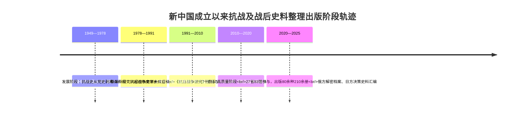
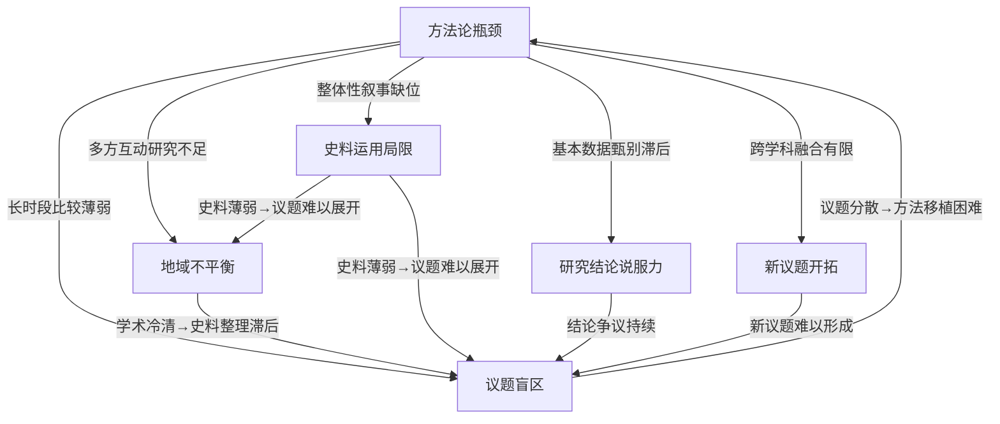

# 1937—1949年中国历史研究的学术图景与未来选题展望
# 1 研究缘起、范围界定与史料学术基础

中国近现代史学术版图中，1937—1949年是一个充满张力却又内在贯通的特殊时段。这十二年间，民族危亡与国家重塑两大主题交织演进：从卢沟桥畔的烽火到天安门城楼上的宣告，中国经历了人类近代史上最惨烈的反侵略战争之一，也完成了20世纪东亚最深刻的政权与社会结构更迭。要对这一时段的学术研究进行系统性的元层次综述，首先必须回答一个前置性问题——为何要把"抗日战争"与"解放战争及战后过渡期"作为一个研究整体来考察？这一时段在既有的近现代史分期框架中处于何种位置？其史料基础与学术增长又呈现怎样的动态结构？本章作为全篇综述的总论与方法论铺垫，将从学理定位、范围界定、史料整理轨迹、海外史料引入与史料结构反思五个维度展开论述，为后续章节关于研究领域、视角、方法、理论与结论的横向比较奠定文献学与方法论前提。

## 1.1 1937—1949年作为独立研究时段的学理定位

将1937—1949年作为一个独立的研究时段加以考察，并非自明之举，而是与中国近现代史分期问题这一长达数十年的学术争论密切相关。这一争论的核心，正是确定中国近代史学科研究对象的根本性问题。

新中国成立以前，研究者对中国近代史与中国现代史并未形成明确区分，那时的学者基本上将二者视为同一含义，这一状况也表明中国近代史在当时尚未形成具有独立研究对象的完整学科[^1]。中国近代史与中国现代史的明确分界，源于胡绳1954年在《历史研究》创刊号上发表的《中国近代历史的分期问题》一文。胡绳明确将中国近代历史的时限范围限定在1840年至1919年之间，这一主张在随后的学术讨论中得到多数学者认可，由此中国历史学界形成了以五四运动为分界线的"近代史—现代史"二分格局——1840年鸦片战争至1919年五四运动的旧民主主义革命时期称作中国近代史，1919年以后的新民主主义革命时期则称作中国现代史[^2][^1]。范文澜在1955年出版的《中国近代史》上册"九版说明"中接受了这一分期，并指出"现在因为近代史与现代史已有明确的分期"这一事实[^2]。

然而，这一以政治事件为标尺的分期并未获得学界一致认同。范文澜、林敦奎、荣孟源、李新、刘大年、陈旭麓等学者相继提出，应按照社会性质来划分历史时期：1840年至1949年的中国均为半殖民地半封建社会，中国近代史应当包含这一完整时期[^2][^1]。范文澜实际上是这一主张的最初提出者——其1947年在华北新华书店出版的《中国近代史》上编第一分册，第一次给出了中国近代史的完整概念，把旧民主主义革命时期与新民主主义革命时期都划作近代中国的历史时期[^2][^1]。即便在1955年版"九版说明"中接受胡绳分期之后，他在1956年7月政协全国委员会的中国近代史讲座报告中仍强调，1840年至1949年间的历史是半殖民地半封建社会的历史，所谓1919年的分界只是"习惯上"的做法，他并不认同这种分期是科学的[^2]。

进入改革开放新时期，分期问题的讨论再度活跃。坚持1919年分界的学者主要以旧民主主义革命与新民主主义革命的区别为依据，意在突出无产阶级领导的新民主主义革命的重要性；但该主张被认为忽视了社会性质这一更具结构性的标志——在半殖民地半封建社会中，无论旧民主主义革命还是新民主主义革命都属于民主革命性质，都是反帝反封建，区别仅在于领导力量与革命前途的不同[^1]。中国社会科学院近代史研究所赓续20世纪50年代的主张，再次明确以1840—1949年作为研究对象；李侃、陈旭麓、胡绳、张海鹏等先后撰文阐述并逐步形成共识。1999年以来，已有数种中国近代史著作采用了1840—1949年的分期方案[^1]。这一学术史脉络的厘清，对于本研究至关重要：**正是在"1840—1949年作为完整近代史"这一日益凝聚的共识下，1937—1949年才能够作为该完整时段内一个具有内在连续性的子时段被独立考察，而不至于被五四—1949的二分框架所割裂**。

将1937—1949年合并考察的学理依据可以从四个层面加以阐明。第一，在民族战争向国内战争的转换逻辑上，1937年全面抗战的爆发与1945年抗战胜利、1946年内战全面展开之间，存在着政治力量消长与政权合法性重构的连续机制。中共领导的人民解放战争之所以能够在1949年取得胜利，与抗战时期土地制度改革奠定的群众基础密切相关——金冲及指出，"中国共产党不是以空话，而是以领导农民进行土地改革的事实，使他们迅速看清是谁代表着他们的利益，应该跟着谁走……中国革命的军事斗争同土地制度的改革是不能分开的"[^3]。第二，在政权更迭与社会经济结构的连续性上，国民政府在1937—1949年间持续面临通货膨胀困局：抗战期间因东南沿海税源沦陷、内地工业化未完成、商业投机与纸币增发等因素已埋下隐患，抗战胜利后又在经济尚未恢复时发动内战，导致赤字继续扩大、人民对法币信心降至最低，官僚资本借通货膨胀进一步壮大[^3]。这种由战时延伸至战后的财政—经济链条本身就证明了两个时段不可分割。第三，在抗战胜利与新中国成立的因果链条上，汪朝光强调，抗战胜利"重新确立了中国的大国地位，彻底洗刷了近代以来抗击外来侵略屡战屡败的民族耻辱，是近代中华民族复兴史上的丰碑"[^4]，而这一民族复兴的政治与精神资源恰恰构成了1949年新政权建立的历史前提。第四，从中华民族复兴史范式出发，金冲及把20世纪视为"决定我们民族生死存亡的一百年"，强调这百年是一场"毫不间断的接力跑"[^5]，1937—1949年正处于这一接力链条上从最低谷攀升至关键转折的核心阶段。

由此，1937—1949年既是抗日战争史、中华民国史的高潮段落，也是中共党史从"局部执政"走向"全国执政"的关键过渡期，更是中华民族复兴史叙事中的枢纽时段。**将其作为一个独立研究单元考察，既呼应了张海鹏等学者主张的"1840—1949年完整近代史"框架，又契合金冲及所揭示的二十世纪中国历史的"接力跑"内在逻辑**。

## 1.2 研究范围、学科边界与文献筛选口径

在确立1937—1949年作为独立研究时段的学理基础之上，需要进一步明确本综述的时间边界、空间范围、学科边界以及文献筛选口径，以便为后续章节的学术图景呈现提供清晰的方法论保障。

**时间边界**严格限定为1937年7月全面抗战爆发至1949年10月新中国成立这一12年又3个月的时段。这一界定遵循习近平总书记关于抗战的论述与学界主流共识——尽管"十四年抗战"概念已成为权威表述，强调"中国人民经过14年艰苦卓绝而又气壮山河的浴血奋战"[^4]，但本研究将上限定于1937年，主要基于全面抗战爆发后中国社会进入总体战状态的结构性变化；对于1931—1937年的局部抗战研究成果，仅在与全面抗战延续性密切相关时纳入讨论。下限的1949年则与张海鹏等学者主张的近代史下限相一致[^1]。

**空间范围**呈现明显的多重性与异质性。1937—1949年间的中国实际上同时存在国统区、中共领导的敌后抗日根据地与解放区、日占沦陷区、伪政权统治区、以及香港、澳门和被日本殖民统治的台湾地区等多重空间[^6]；此外，海外华人社会、租界、盟国驻华机构所在区域，以及战时中国与盟国、敌国之间的跨国互动空间，也构成不可忽视的研究地理。这种空间异质性决定了本综述必须兼顾各类区域研究成果，避免以单一空间叙事遮蔽其他区域的历史复杂性。

**学科边界**呈现典型的交叉特征。1937—1949年研究横跨中国近代史、中共党史、中华民国史、新中国史、抗日战争史、世界反法西斯战争史等多个学科领域。如刘萍所指出，"自抗日战争胜利以来，中国大陆地区抗日战争史研究经历了独特的发展历程……抗日战争史已经成为中国近代史研究的重要领域，且已形成独立的分支学科"，但其早期长期"从属于中国革命史或中共党史范畴"[^7]。这种学科归属的演变本身就揭示了该时段研究的多学科属性。本综述的学科覆盖将以中国近代史、中共党史、中华民国史为核心，向新中国史的史前史研究、世界反法西斯战争史的中国战场研究、近代中外关系史等延伸。

**文献筛选口径**采取广义"研究成果"概念，纳入学术专著、CSSCI/核心期刊论文、博硕士学位论文、档案汇编、史料丛刊、学术综述与研究报告等多种类型；对通俗读物、网络非学术内容则审慎采用。**语种范围**以中文文献为主体，兼顾日文、英文、俄文等外文研究成果，特别关注海外中国学（美国、日本、欧洲、俄罗斯）以及港澳台地区学界的代表性论著。**质量门槛**遵循Rubric P-4标准：优先采用权威学术综述、专业出版社学术专著、权威学术机构发布的研究报告，对争议性结论尽量做到多源互证。下表对本综述的主要范围与口径作出概览：

| 维度 | 具体界定 |
|------|---------|
| 时间边界 | 1937年7月—1949年10月（含相关延伸研究） |
| 空间范围 | 国统区、敌后根据地、沦陷区、伪政权区、港澳台、海外华人社会及跨国互动空间 |
| 学科范围 | 中国近代史、中共党史、中华民国史、新中国史、抗日战争史、世界反法西斯战争史等 |
| 成果类型 | 学术专著、核心期刊论文、博硕论文、档案汇编、史料丛刊、学术综述 |
| 语种范围 | 中文为主，兼顾日、英、俄等外文研究 |
| 地域范围 | 大陆、港澳台、海外（美、日、欧、俄等） |
| 学派覆盖 | 大陆主流学界、海外中国学、港台学界 |

需要坦诚说明的是，受参考资料覆盖面的限制，本综述对海外中国学（特别是欧美学界）的具体论著评介、对港台学界研究脉络的细节梳理可能存在一定盲区，相关分析将主要基于已掌握资料中的零星线索（如杜赞奇、马若孟、黄宗智利用满铁资料的研究[^8]，魏斐德、余茂春、山极晃等人对战略情报局与中共关系的研究[^9]等）展开，并在各章节中尽量标注覆盖局限。

## 1.3 国内史料整理与出版的历史轨迹

历史研究是一切社会科学的基础，史料则是历史研究的基础[^7]。1937—1949年研究的学术增长，与新中国成立以来史料整理出版工作的阶段性推进密切相关，呈现出史料开放与学术增长的良性互动关系。

**1949—1978年初创阶段**：抗日战争史研究在相当长时期内从属于中国革命史或中共党史范畴，相关史料的搜集、整理和出版乏善可陈[^7]。1978年前公开出版的史料和零星内部资料相当有限。20世纪50年代，中国现代史料编辑委员会翻印了原延安时事问题研究会编辑的《抗战中的中国丛刊》，包括《九一八以来国内形势的演变》《抗战中的中国经济》《抗战中的中国政治》《抗战中的中国军事》《抗战中的中国文化教育》等；再版了《从"九一八"到"七七"：国民党的投降政策与人民的抗战运动》（上海人民出版社1958年版），并补充编辑了《抗日战争时期国民党统治区情况资料》（1957年内部印行）；中国科学院近代史研究所编辑出版了《陕甘宁边区参议会文献汇辑》（科学出版社1958年版）；此后还有北京师范大学历史系编印的《抗日战争时期汉奸汪精卫卖国投敌资料》（1964年内部印行）、复旦大学历史系翻译出版的《日本帝国主义对外侵略史料选编》（上海人民出版社1975年版）等[^7]。这一时期史料整理的特点是数量稀少、类型单一、内部印行为主，明显从属于革命史叙事。

**1978—1991年发展阶段**：1978年改革开放后，由于多方面因素的推动，抗战史研究开始兴起，并从中国革命史和中共党史研究中逐步剥离出来，向独立的分支学科发展，史料的整理和出版也呈现出良好的势头[^7]。然而由于这一时期相关档案尚未开放，出版的史料种类及数量仍然有限[^7]。

**1991年以来的繁荣阶段**：1991年中国抗日战争史学会成立及《抗日战争研究》创刊是关键节点，越来越多的学者开始投身于抗日战争史研究，对资料的需求更加迫切；同时，为促进学术发展，国家档案管理政策开始调整，历史档案逐步解禁，丰富了史料来源，史料收集和整理不再是无米之炊[^7]。这一阶段的标志性进展还包括：2001年日本亚洲历史资料中心成立并对外开放；美国自2007年起战略情报局、中央情报局、国务院等政府机构收藏的有关日本战争罪行及战后审判战犯的档案逐步解密开放，其中包括中国抗日战争相关档案；英、法、荷以及日内瓦国联和联合国档案馆所藏与中国抗战有关的档案也逐步开放[^7]。

**国家级史料工程的推进**构成新世纪以来最具结构性意义的发展。2016年6月，由国家档案局组织领导全国各级综合档案馆共同参与的《抗日战争档案汇编》编纂工程正式启动，丛书以影印形式呈现抗战时期珍贵档案原貌，内容涵盖政治、经济、军事、外交、文化等多个领域，选用档案绝大部分是首次公布[^10]。"十四五"时期，《抗日战争档案汇编》编纂出版领导小组办公室持续推进出版工作；截至2025年6月，共有**27个省、自治区、直辖市的83家各级综合档案馆参与到汇编编纂工程，出版系列丛书80余种210余册**[^10]。领导小组办公室还通过制作《〈抗战汇编〉工作指南》数字课程、组织交流研讨会、举办培训班等方式不断提高编审人员业务能力，2023年4月在长沙举办的编纂工作培训班吸引了来自全国各级档案部门的140余名学员参加[^10]。这一国家级工程使抗战档案史料从分散收藏走向系统整理，从单馆出版走向全国协同。

值得关注的是，史料类型的多元化是新世纪以来的另一显著趋势。除官方档案外，个人文书、回忆录、口述史料、影像史料的收集与整理同步推进。以金冲及《二十世纪中国史纲》为例，该书"引用的资料极为丰富，特别是大量引用了过去尚未公开发表过的珍贵资料，如党和国家领导人在各种场合的讲话记录、插话记录，在一些文件上的批语，还有一些内部信件和'未刊稿'等，又及时跟踪搜集了一些近年来新解密的档案、日记，新出版的回忆录和有价值的著述"[^5]，反映出史料类型的极大丰富。

## 1.4 海外与第三方史料的引入与利用

1937—1949年研究的国际化特征极为突出——这一时段中国深度卷入第二次世界大战与战后国际秩序重建，相关史料天然分布于多个国家与地区。海外与第三方史料的发掘整理，对深化和完善这一时段的研究具有不可替代的价值。

**日方史料**居于海外史料发掘的核心位置。一方面，作为侵略战争发动者，日本方面的史料是中国学界必须深入研究的基本素材[^11]。另一方面，日方史料的整理工作历经曲折——战败前夕，日本曾大批量销毁机密文件，加上其军事要地和军政指挥机关遭受了盟军的猛烈轰炸，大批高层决策重要文献已经永远地消失了；不过经过战后各界数十年的发掘与整理，副本、抄件或者其他来源使得相当多的重要史料重新面世，构成当今数量庞大的日方各类史料的实际存在[^11]。

满铁调查报告是日方史料中最具代表性的体系。南满洲铁道株式会社（满铁）表面上是经营铁路的公司，实际上还负有对中国物产、自然资源进行调查以及为日本政府相关政策提供政治、经济、社会等情报的特殊机构；满铁专门设立了多门类的调查机关，组建了以日本知名大学的相关专业学者和学生组成的、庞大且精明强干的调查队伍，在长达40余年的时间里形成了大量关于中国的资料图书和档案材料[^8]。其中"中国抗战力调查"是1939年6月至1940年5月由满铁调查部及其现地机关统一进行的、参加调查者30余人的综合调查，最终形成《中国抗战力调查委员会昭和14年度总括资料》，内分5篇10分册，涵盖战时中国内政、八路军及新四军、战时经济政策、内地经济、列国对华援助等[^12]。这一调查从他者视角揭示了中国共产党"是中国最具潜力的政治势力"的判断[^13]，为中共抗战中流砥柱作用提供了珍贵的旁证。中文版满铁资料的整理出版方面，《满铁调查报告》由辽宁省档案馆、黑龙江省档案馆等机构编纂，广西师范大学出版社出版，已出版多辑（第一辑全24册2005年5月、第二辑全24册2005年8月、第三辑全25册2008年6月、第八辑2016年4月）[^14]；《满铁调查（第一辑）》由华中师范大学中国农村研究院与黑龙江省档案馆联合编译、中国社会科学出版社2015年出版，收录13份原始档案，时间跨度1925—1937年[^8]。这些资料的中文化大大降低了国内学界的利用门槛。

《日本侵华决策史料丛编》代表了日方决策史料整理的最新高峰。该丛编由北京大学历史学系徐勇教授、臧运祜教授任总主编，以2009年教育部哲学社会科学研究重大课题攻关项目"日本侵华史料整理与研究"的结项成果为基础，先后共有中日两国37位学者参与，前后耗时近八年编纂而成；全书分为政治外交、军事战略、殖民经济、社会文化四编，共选定17个专题，结集46卷册[^15]。其主体材料大多出自日本原防卫厅（现防卫省）战史部、外交史料馆、国立公文书馆及国会图书馆、国际日本文化研究中心、各大学图书馆、亚洲历史资料研究中心等各相关研究机构，以及各类非卖品文献、旧报刊、人物专辑等，更有相当一批在日本也未公开发表的一手档案；此外还选录了一部分台北"国史馆"、中央研究院，及美国国家档案馆、国会图书馆等馆藏史料，可以称得上是海峡两岸迄今为止篇幅最大、相关史料收录最为完整的日本侵华决策专题史料汇集[^15][^11]。汤重南指出，该书具有"篇幅最大、最为完整""系统性、全面性""中日专家共同合作"三大特点[^11]；张海鹏认为，丛编"从史料的方面，特别是通过日本自身史料，来凸显、分析和解读日本发动战争的机制，有助于今后弄清日本举国战争体制的形成问题"[^15]。

**美方史料**主要包括国家档案馆所藏战略情报局（OSS）档案、纳粹与日本战争罪行解密档案，以及陆军情报部、联邦调查局等政府机构所藏档案[^7]。围绕抗战时期美国战略情报局与中共军事合作问题，魏斐德对戴笠的研究、余茂春对战略情报局在华活动的整理、山极晃和蒋迈（Matthew D. Johnson）利用美国国家档案馆所藏政府解密文件对美国战时情报局活动的研究，以及任东来透过特工约翰·伯奇死亡事件对美中关系的揭示，均依托这一史料群展开[^9]。

**俄方史料**近年取得突破性进展。中央档案馆公布了俄罗斯转交我方的一批苏联审讯日本731部队的解密档案材料，包括对731部队成员的审讯记录、731部队罪行调查报告、苏联官方内部函电，起止时间为1939年5月11日至1950年12月25日；档案以伯力审判档案为主体，跨越审判前、审判中、审判后三个历史阶段，首次披露苏联在伯力审判前期的侦讯过程，发现与731部队罪行相关人员多达200余人，对核心战犯、证人重点取证，最终锁定战犯12人进行公开审判[^16]。俄罗斯联邦安全局公共关系中心还在该局官网发布了鄂木斯克州分局提供的解密文件数字版副本及内容摘要，证实日军用携带病菌的炮弹攻击数百名中国人以计算感染率的暴行[^17]。这些档案"以历史铁证固化日本侵华细菌战罪行，再次证实日本细菌战是有组织、有预谋、自上而下成体系的国家犯罪"[^16]。

**台湾地区史料**是民国史研究不可或缺的资源。台湾地区现存民国档案的来源主要有三：一是当年国民党政府退离大陆时从大陆运往台湾的部分档案，数量大、涉及面广；尤其是蒋介石档案——1949年5月16日蒋介石档案与"中央银行"的黄金一并由"中字105号"登陆艇从上海运往台湾，长期存放于桃园县大溪镇专用档案库（俗称"大溪档案"），1995年移交"国史馆"收存，取名"蒋中正总统档案"，内容广泛、数量颇丰，时间跨度1923—1975年，分为筹笔、革命文献、特交文卷、特交文电、特交档案、领袖家书、文物图书、蒋氏宗谱、照片影集等九大类，计有4200册27.3万件[^6]。二是台湾光复后形成的国民党政权及台湾省政府档案；三是日本殖民统治台湾时期形成的台湾总督府档案[^6]。中央研究院近代史研究所档案馆于1955年成立筹备处、1965年4月正式设所，同年征得清末以来外交部门官方档案，1966年经济部移交大陆时期经济档案，所藏外交与经济档案被史学界公认为研究清末民国时期外交、财经方面最具权威的重要史料[^18][^19]。陈谦平教授等学者通过赴英国剑桥大学、伦敦英国国家档案馆（TNA）搜集中英关系英文档案、赴美国哈佛大学接触美方档案，奠定了多国档案互证研究方法的基础[^20][^21]。

**多国档案互证方法**的兴起是新世纪以来该时段研究方法论上的重要进展。陈谦平强调，"国际化并不意味着简单套用西方理论，而是在扎实掌握中外档案史料的基础上，在东西方不同学术语境中展开交流与对话"[^20]。汪朝光、徐勇、张海鹏等学者也都在不同程度上倡导和实践多国史料的综合运用[^15][^4]。下表对各方史料的代表性资源、典藏机构与学术价值作出概览：

| 史料来源 | 代表性资源 | 主要典藏/整理机构 | 学术价值 |
|---------|-----------|-----------------|---------|
| 国内档案 | 《抗日战争档案汇编》80余种210余册 | 国家档案局领导，27省83家档案馆参与 | 政治、经济、军事、外交、文化全领域，多为首次公布[^10] |
| 日方调查 | 满铁调查报告、《中国抗战力调查》 | 辽宁/黑龙江省档案馆、广西师大出版社、华中师大 | 中国基层社会经济、抗战力量他者视角[^14][^8][^12] |
| 日方决策 | 《日本侵华决策史料丛编》46卷册 | 北京大学历史学系、社科文献出版社 | 政治外交、军事战略、殖民经济、社会文化决策史料[^15] |
| 美方档案 | 战略情报局档案、战争罪行解密档案 | 美国国家档案馆 | 战时中美合作、战争审判[^7][^9] |
| 俄方档案 | 731部队伯力审判档案 | 俄联邦安全局、中央档案馆 | 细菌战罪行铁证[^16][^17] |
| 台湾档案 | 蒋中正总统档案、外交经济档案 | "国史馆"、中研院近史所档案馆 | 国民政府决策、外交、经济[^18][^6][^19] |

## 1.5 史料结构的不平衡及其对研究议题的制约

国内外史料整理的进展虽然成就斐然，但当前史料结构仍存在若干结构性不平衡，这种不平衡深刻地影响着1937—1949年研究的议题选择、论证深度与结论倾向，构成本综述后续章节横向比较的方法论前提。

**第一，类型上政治军事偏多而经济社会、思想文化、日常生活偏少**。这一不平衡在抗战史料出版中尤为明显。刘萍指出，"现实诸因素的导向作用，使史料工作领域发展不平衡。近年的一些突破性成果，主要分布在一些应用性强、可以直接反击日本右翼翻案的领域，如日军侵华暴行等问题。但是有关日本军政高层在各时期、各领域的侵华决策背景、过程实情等系统性、基础性工作却未能跟上"[^11][^7]。受现实政治需求驱动，南京大屠杀、731部队、慰安妇等暴行类史料整理较为突出；而战时社会经济、文化教育、日常生活等领域的史料则相对薄弱，由此导致相关研究议题难以充分展开。

**第二，地域上正面战场与敌后战场较充裕而沦陷区、边疆民族地区相对薄弱**。国统区与中共根据地的官方档案保存相对完整，研究成果丰硕；而沦陷区社会的微观史料、伪政权运作的内部档案、边疆民族地区的多语种文献相对有限。满铁调查报告虽然提供了沦陷区社会调查的珍贵素材[^14][^8][^12]，但学界对其的系统利用与深度阐释尚不充分。

**第三，语种上中文史料利用充分而日、英、俄等外文及第三方史料利用不足**。日方核心史料的空间局限是一大客观因素——"日本战争决策方面的核心史料大多存于日本本土，中国学界需要克服空间局限，以吸收日方成果、争取日方学者合作。由此需要有关领导部门或后援单位的相应支持，需要克服对外交通、语言、经费诸多障碍"[^11]。同时，相当一批战争决策类史料控制在日本官方、半官方研究机构手中，加上右翼学者的干扰，造成日方史料的公开和利用方面尚存严峻问题[^11]。多语种能力的不足、跨国合作的成本、海外档案利用的体制性障碍，都制约着中国学界对外文史料的深度开发。

**第四，层级上宏观决策档案丰富而基层与微观史料整理滞后**。各国官方决策档案的整理日趋成熟，但反映基层社会、普通民众、士兵与平民经验的史料仍然分散。这一不平衡与近年来"夯实历史研究的微观基础"的学术诉求形成张力——史学界经过拨乱反正后，"史学研究的热点和重点也逐渐由聚焦重大历史问题、探索社会发展规律的'宏大叙事'，转向更加关注下层社会生活和具体问题的微观研究及个案研究"[^22]，但微观史料的供给尚未完全满足研究的需求。

这种结构性不平衡带来若干**潜在的方法论风险**。首先是"饥渴式"利用风险。徐勇等学者警示，"资料之门一旦开启，则需要克服由于长期资料滞后而导致的'饥渴式'仓促利用，要防止唯日方史料为准的片面性"[^11]。其次是单一来源依赖风险——对日方史料、单一档案或单一回忆录的过度依赖，容易导致结论失衡。第三是史料鉴别不足风险。"需要对日方史料做出有效的鉴别或辨识，而后正确地加以利用"[^11]。第四是数据可靠性风险。王奇生指出，抗战时期国民党、共产党和日军均存在对伤亡数字的策略化宣传现象，"日军和中共军队一般会将内部报告和对外宣传区别对待，内部报告较为真实，而国军则内部报告亦不可靠"[^22]；中共方面后来在1944年3月21日由毛泽东、朱德、彭德怀、刘少奇联名致电八路军总部、山东军区、晋西北，明确要求"我军公布战绩的数字一律不准扩大，均发表实数"[^22]——这些细节提醒研究者必须对宣传性史料保持必要的鉴别意识。

应对这些风险，**学界已逐步形成多方互证、批判性使用的方法论共识**。徐勇强调，"需要努力以中方及欧美多方史料的收集与整理，补充日方史料之不足，让更多的研究者有米可炊。而解决这些问题，还需要中日两国及多国的合作携手，共同开发日方史料"[^11]。陈谦平倡导的"以多国史料互证为特色的研究方法"[^20]、张海鹏支持的中日学者合作整理决策史料[^15]、汤重南强调的"文献资料对于还原历史真相具有重要价值"[^11]，都体现出这一方法论自觉。同时，杨奎松对历史人物思考的尊重——"我们不能代替历史人物思考"——以及"历史学者的作用更重要的不在于能得出什么样的结论，而在发现和澄清史实"的研究取向[^23]，也为该时段研究在史料严谨性方面提供了重要参照。

综上所述，1937—1949年作为中国近现代史上一个具有内在连续性的子时段，其研究的学术增长深刻依赖于史料整理的阶段性推进。从1949—1978年的初创阶段到21世纪以来的工程化、国际化阶段，史料供给的体量、类型、地域与语种均发生了结构性变化。但当前史料结构在类型、地域、语种、层级四个维度上的不平衡，仍然制约着研究议题的均衡展开与结论的深度论证。**正是基于这一史料学术基础的整体把握，本综述后续章节将从研究领域分布（第2章）、研究视角与范式（第3章）、研究方法（第4章）、重大议题结论（第5章）、国内外学术对话（第6章）、研究薄弱地带（第7章）等维度，对1937—1949年研究的现有成果进行系统的横向比较，并在此基础上展望最具潜力的未来选题（第8章），最终在结论部分（第9章）就如何在中国自主知识体系建构的背景下平衡政治性与学术性、宏观叙事与微观考察、本土经验与全球对话提出方向性建议**。

# 2 研究领域的横向图谱与议题分布

第1章已经阐明，1937—1949年研究的学术增长深度依赖于史料整理的阶段性推进，而史料结构在类型、地域、语种、层级四个维度上的不平衡，必然投射到研究领域的分布格局之上。本章作为整篇综述的核心比较性章节，将在第1章所确立的史料学术基础上，对1937—1949年研究进行领域分类与议题切片相结合的横向扫描。所谓"领域分类"，是依据研究对象的实质内容将现有成果归入七大主要研究领域；所谓"议题切片"，则是在每一领域内部进一步识别其议题的密度分布、深度层级与活跃程度。这样一种"双层切割"的图谱化呈现，旨在揭示当前研究中**哪些地带已成高地、哪些地带尚为洼地、哪些地带处于空白**——这些发现既是后续第3章关于视角与范式比较的基础参照，也是第7章关于薄弱地带识别和第8章关于潜力选题预测的问题坐标。

需要预先说明的是，"领域"的划分不可避免存在交叉：日本侵华决策研究与战时外交研究在涉及日本对华政策时存在重合，根据地研究与中共党史研究在很多议题上无法切分，沦陷区研究又与日伪政权研究、暴行研究存在多重交集。本章遵循"以研究主题为核心、以代表性学者为锚点"的原则进行归类，对跨领域议题在最相关章节集中评介，并在2.8节中专门讨论领域间的衔接与空白。

## 2.1 日本侵华决策、政策与暴行研究

日本侵华研究是1937—1949年研究中史料体量最大、成果最为密集的领域之一，其内部可大致划分为**战争决策机制研究、侵华政策与殖民统治研究、战争罪行与暴行研究**三大议题群。这一领域的研究格局深受现实政治议题驱动——既要应对日本右翼"虚构派"对侵略历史的否认，又要为东京审判、南京审判等战后定论提供学术支撑——因而呈现出"暴行类研究高度饱和、决策史研究相对滞后、殖民文化研究尚显薄弱"的不平衡格局。

**战争决策机制研究**长期受制于日方核心档案的可及性。以北京大学历史学系徐勇、臧运祜任总主编的《日本侵华决策史料丛编》为标志性成果，该项目以教育部哲学社会科学研究重大课题攻关项目"日本侵华史料整理与研究"为基础，先后有中日两国37位学者参与，前后耗时近八年，分政治外交、军事战略、殖民经济、社会文化四编共17个专题46卷册，被张海鹏评价为"从史料的方面，特别是通过日本自身史料，来凸显、分析和解读日本发动战争的机制，有助于今后弄清日本举国战争体制的形成问题"。臧运祜等学者长期聚焦于日本侵华战争期间的决策及其演变这一基础性议题。但总体而言，由于日方核心史料"大多存于日本本土""相当一批战争决策类史料控制在日本官方、半官方研究机构手中"，**国内学界对日本"举国战争体制"形成机制的系统性研究尚未充分展开**。

**侵华政策与殖民统治研究**主要围绕日本在沦陷区的政治、经济、文化统制展开。其中**满铁与殖民经济研究**已形成相当规模。被海外誉为"中国的满铁、伪满洲国研究第一人"的解学诗，从事中日关系史研究近60年，主持编纂《满铁档案资料汇编》15卷等大型史料集，提出"满铁是日本侵华综合实体"的核心观点，著有《新编伪满洲国史》《满铁与中国劳工》《隔世遗思——评满铁调查部》《满铁与华北经济》等[^24][^25]。其与宋玉印编撰的《满铁内密文书》30卷收录大量日本侵华机密档案，《历史的毒瘤——伪满政权的兴亡》（1993）作为"抗日战争史丛书"重要一员，从"建国"丑剧、傀儡体制、强权经济、"三大国策"、战时高压、"治安肃正"、民族奴化、紧急劫掠等十个维度系统揭示了伪满洲国作为"日本帝国主义实行武装占领、进行军事殖民统治的军政府"的本质[^25]。日本学者江口圭一对蒙疆、华北、华中、华南鸦片政策的研究，浅田乔二、熊达云对华北经济统制的研究，以及王士花、戴建兵、居之芬、张利民等大陆学者对日本华北经济掠夺的系统考察，构成了这一议题的多源互证格局[^26][^27]。

**战争罪行与暴行研究**则是该领域中议题最密集、社会关注度最高的研究板块，呈现出**南京大屠杀、731部队细菌战、慰安妇制度、毒气化学战、强制劳工**五大次议题群并立的格局。

**南京大屠杀研究**经历了从内部交流到国际传播的发展历程。张生指出，中国的南京大屠杀史研究始于20世纪60年代——1963年南京大学日本史小组编著的《日寇在南京的大屠杀》一书"对南京大屠杀的研究分为谋杀、强奸、抢劫、纵火四个部分，形成了关于这段历史研究的基本架构"，对中国学者和日本学者均具"原典"意义；1979年高兴祖在该书中加入对日本右派思想的批驳，1985年公开出版《日军侵华暴行——南京大屠杀》专著[^28]。20世纪80年代初日本文部省教科书事件与田中正明否认论调激发了中国学界第一个研究高潮；2000年前后张宪文等教授带领团队前往世界各地搜集南京大屠杀相关资料，其中美国、德国资料最为丰富——美国资料分为战地记者报道、外交官电台档案、14位美国侨民一手资料三方面，分别保存在美国国家档案馆、耶鲁大学神学院图书馆等机构[^28]。新世纪以来，**程兆奇代表的上海交通大学研究路径**与张生代表的南京大学研究路径构成两大重镇。程兆奇主持教育部重大攻关项目《东京审判若干重大问题研究》及国家社科基金抗战工程项目，主编《远东国际军事法庭庭审记录·全译本》《中国对日战犯审判档案集成》，代表著作包括《南京大屠杀研究——日本虚构派批判》《日本现存南京大屠杀史料概论》《东京审判——为了世界和平》[^29]。其《南京大屠杀研究——日本虚构派批判》自2018年首次出版以来已推出韩文、英文、日文、俄文、德文等多语种版本，韩文、俄文、日文版均入选国家社会科学基金中华学术外译项目，英文版入选中宣部"丝路书香"工程，标志着南京大屠杀研究的国际化输出取得突破性进展[^30]。日本学者笠原十九司则长期致力于中国近现代史和东亚近现代史研究，著有《南京难民区的一百天》《南京事件》《南京事件争论史》《"百人斩竞赛"与南京大屠杀》等十余部专著，并通过对永井仁左右《阵中日记》及南京暴行现场照片的史料挖掘，为加害者一方的历史证据补充作出贡献[^31]。

**731部队细菌战与化学武器研究**在新世纪借助俄方档案解密获得重大推进。如第1章所述，俄罗斯联邦安全局向中央档案馆转交的伯力审判档案以审讯记录、罪行调查报告、苏联官方内部函电为主体，跨越审判前、审判中、审判后三个历史阶段，发现与731部队罪行相关人员多达200余人。日军在侵华战争中至少使用化学武器1241例（有确切时间地点记录），地点遍及中国18个省区，造成20余万人伤亡；在湖南宜昌（1941年9月30日）、河北北疃村（1942年5月27日）、山西武乡西营（1938年4月15日）等地实施了系统性化学战暴行[^32]。日本历史学家粟屋宪太郎、吉见义明、松野城在《毒气战相关资料》中系统记录了日军化学武器的使用情况[^32]。

**慰安妇制度研究**以**苏智良、陈丽菲教授夫妇**的接力调查为代表性成果。苏智良1991年开始接触"慰安妇"制度受害者，团队足迹遍及中国20多个省市，先后找到358位"慰安妇"制度受害幸存者；其216万字的四卷本《日军"慰安妇"全史》分为《"慰安妇"制度的背景》《慰安所的建立与扩散》《慰安所的管理与"慰安妇"实态》《受害者的觉醒与国际社会的回应》四卷，基于中国（含台湾）、韩国、日本、荷兰、菲律宾、马来西亚、印尼、缅甸、东帝汶等多个国家和地区的多语种史料，是该议题"最全面、最系统、最权威论述日军'慰安妇'制度历史的多卷本专著"[^33][^34]。研究显示，日军在中国各地建立了至少2100个慰安所，仅在上海就查证127个；日军"慰安妇"制度受害者全球至少40万人，其中一半是中国人[^33][^34]。

**战争损失与人口伤亡研究**以卞修跃为代表。卞修跃长期致力于抗战时期人口损失研究，运用大量文献档案资料，结合史学研究和人口学统计方法，对抗战时期各省人口损失情况进行整理统计与估计，得出"中国战时人口损失最低限度为4500万人""若计入战争造成的瘟疫、疾病及人口负增长等因素，抗战时期中国人口的总体损失应在5000万以上""中国军人死伤约1140万"等重要结论[^35][^36]。其《抗战时期中国人口损失考察》被列为教育部哲学社会科学研究重大委托项目、国家出版基金资助项目，填补了这一基础性议题的研究空白。

综观该领域，其内部不平衡格局相当明显：**暴行类研究因现实政治需求而高度饱和**，南京大屠杀史料集已达72卷，多语种外译输出体系已经形成；**决策史研究虽有《日本侵华决策史料丛编》等突破但因日方核心史料的可及性而仍有较大空间**；**殖民文化与思想渗透研究尚显薄弱**——对东乡实等殖民学者的"殖民史学"剖析[^37]、对日本"东洋史学"将中国文明描述为"停滞""僵化"的话语建构机制[^37]的批判性研究刚刚展开，远未形成系统化研究格局。

## 2.2 正面战场与国统区政治、军事、经济研究

正面战场与国统区研究的学术地位，经历了从"长期薄弱"到"空前繁荣"的根本性逆转。如王建朗在《抗日战争研究》创刊号上所指出的，建国以后相当长一段时期内"仅有的一些有关抗战的研究，也大都集中于共产党领导的敌后战场上，而对于国民政府的研究则非常薄弱"[^38]。改革开放尤其是1991年抗战史学会成立和《抗日战争研究》创刊以来，国民政府与正面战场研究取得了"空前繁荣"的局面[^38]。该领域内部可大致划分为**战役军事史、政治制度与党政体制、战时经济与统制贸易**三大议题群。

**战役军事史研究**已经形成相当成熟的体系。以"正面战场十大经典战役"——淞沪会战、忻口战役、南京保卫战、台儿庄战役、武汉会战、长沙会战、昆仑关大捷、仁安羌大捷、常德会战、雪峰山战役——为代表的战役史研究脉络清晰[^39]。淞沪会战中，日军先后投入陆海空兵力近30万人、舰船130余艘、飞机400余架、战车300余辆；中国军队投入兵力约70余万，奋勇迎战；中国军队以伤亡25万人的沉重代价，毙伤日军4万余人，挫败了日军"3个月灭亡中国"的狂妄企图，是中国从局部抗战转向全面抗战的历史转折点[^40][^41]。**台湾学者张瑞德的研究开辟了"新军事史"路径**——其《山河动——抗战时期国民政府的军队战力》（旧版《抗战时期的国军人事》）将军队作为社会的一个子系统加以考察，研究军队的人从哪里来、来了以后怎样变成军人、离开军队以后到哪里去；史料涵盖一份1949年之前的官佐名单及《资绩薄》、斯坦福大学胡佛研究所东亚图书馆收藏的国军回忆记录、重要将领言论集及民国时期军事出版物，以及台湾中央研究院近代史所对军中人物所做的口述历史访谈[^42]。该书揭示，抗战期间国军师级以上军官有黄埔军校、陆军大学校、保定军校、地方军校及行伍、归国留学生五大来源；战前师长到各路军总司令基本被保定军校、地方军校毕业生及行伍出身者包揽，到1944年战区正副司令长官一级"保定帮"仍占绝对优势，至师长一级出身黄埔者已超出出身保定军校者27%；同学、同乡等人际网络在相当程度上左右着国军的任免与升迁[^42]。**新军事史的另一代表是黄博文对武汉会战中日本海军的研究**——通过日本海军第三舰队为主力组建溯江部队、协同陆军波田支队沿长江发起溯江作战的考察，揭示日本海军在武汉会战中"已展现出一定的陆海空立体化协同作战能力"，弥补了既有研究"局限于日本海军在武汉会战中的部分前线作战行动"的不足[^43]。中外研究者关于武汉会战的成果也已相当系统：胡璞玉、郭汝瑰从中方视角整合，胡德坤、张宪文、步平、王建朗、米德将武汉会战置于全面抗战宏观视野中考察，麦金农考察其作为"抗日战争转向消耗战的重要历史节点"的地位，户部良一从日本陆军第十一军视角考察华中作战模式[^43]。涂文学进一步从短时段事件史、中时段局势史、长时段文明史三个维度提出武汉抗战是一段"独立的'断代'史"，开启了"近代中国政治、经济、社会与文化的深刻转型"的论断[^44]。

**政治制度与党政体制研究**虽然不及军事史成熟，但近年逐步推进。**台湾学者刘维开**专研中国近现代史、国民党史及近代中国政治制度史，1983年进入中国国民党党史委员会工作，1990年代在国民党党史委员会任职期间系统整理蒋介石日记，成为该领域首批研究者；其代表作《蒋介石的1949：从下野到再起》通过日记与档案互证研究提出"蒋介石对1949年局势早有预见"等观点；其在第十六届国情国学教学研讨会上发表的《从训政到宪政——抗战期间的政制转型与民主发展》演讲，将抗战时期国民党党政体制的演变置于政制转型的视野中考察[^45]。**国统区民众政治动员研究**则涉及国民参政会、《新华日报》《群众》周刊、国民政府军事委员会政治部第三厅、各种抗敌协会等中共统战工作组织[^34][^31]。

**战时统制经济与贸易研究**以**郑会欣的系统研究**为代表。其《国民政府战时统制经济与贸易研究（1937—1945）》分上下两编共十二章——上编系统梳理抗战时期外贸政策的演变脉络（包括政策实施阶段特征及战后转变原因，重点分析统购统销政策在不同时期的内涵调整），下编以贸易委员会及其下属公司为研究个案，考察机构组织架构、资本运作及经营活动，对财政部贸易委员会的功能、机构及其对战时经济的作用进行深入剖析[^46]。**徐昂关于中美易货关系的研究**则提出，1939—1941年间中美先后达成2500万美元桐油借款、2000万美元华锡借款、2500万美元钨砂借款、5000万美元金属借款共四项易货借款（合同总金额1.7亿美元），其性质上"一方面以跨国商业贸易的形式展开，另一方面又在复杂的博弈中实现中美两国各自的国家利益"——这些借款"在双向增进中美两国反法西斯的战争能力同时，也伴随着中国人民为捍卫民族生存、维持国家信用作出的巨大牺牲"[^47]。**民族工业内迁研究**则有赵柏田《生死危城》打捞淞沪会战前后短短四个月的工业内迁历史——林继庸主持工厂迁移期间，除协助搬迁国营工厂外，上海工厂共迁出146家、机器和材料14600余吨、技术工人2500多名，成为"中国工业的火种"[^48][^49]。到1940年，沿海民营企业迁入四川、广西、贵州、陕西等地的企业有452家[^49]。

综观这一领域，其结构特征是**战役军事史成熟、政治制度史推进、统制经济研究形成体系**，但**国统区基层社会、知识分子精神史、文化教育、战时社会动员、地方派系政治等议题相对薄弱**——这与张瑞德、刘维开等学者所代表的精英政治与制度研究的"自上而下"取向有关，也与基层档案、个人文书史料整理滞后的客观条件相关。

## 2.3 中共领导的敌后战场与抗日根据地研究

敌后战场与根据地研究是1937—1949年研究中近年呈现最显著"研究热潮"的领域。如王奇生所观察到的，"中国共产党的抗战近年来重新成为研究热点，以更加学术的态度研讨中共在抗战时期的所作所为、敌后根据地的具体情况，将揭示历史更多纷繁复杂的面相"[^50]。这一热潮的形成，既源于一批青年学者对地方与基层档案的深度挖掘，也得益于"新革命史"范式的方法论自觉。

齐小林系统梳理了新中国成立后敌后战场研究的三个发展阶段：**起步阶段（1949—1978）**初步搭建研究框架，整理出版重要史料，代表作有齐武《一个革命根据地的成长——抗日战争和解放战争时期的晋冀鲁豫边区概况》（1957）、《抗日战争时期的人民解放军》（1953）、河北军区政治部编《冀中抗日战争简史》（1958）、穆欣《晋绥解放区民兵抗日斗争散记》（1959）等；**初步学术化阶段**研究范畴扩展、史料利用深化；**日益深化阶段**呈现学术议题多元化、跨学科融合的态势[^49]。

**黄道炫关于中共抗战时期生存与抵抗的研究**构成新阶段的代表性贡献。黄道炫提出，中共"独特的抗战方式、生存方式"长期未被充分阐释——"中共的抵抗是为了生存，而且它的生存其实就在抵抗，也是抵抗的一部分，生存和抵抗是紧密相关的。共产党在敌后生存，我（共产党）的生存就是给你（敌人）制造难度，这种生存可能首先是为了自己的存续，客观上却造成了敌对状态下的抵抗"[^51]。其关于根据地温饱问题的研究，通过对民众日常生活、物价、粮食供给等微观史实的考察，揭示了根据地民众态度从最初的疑虑、不满到逐渐归心的复杂转变过程；他指出日军烧杀抢掠"激起民众的敌对情绪"，山西武乡的调查显示日军"残暴的烧杀（烧房三万余间，烧粮二万余担，杀人七百多，伤一百三十余人），粉碎了武乡人民'哪个朝廷不纳粮'的幻想，激起深刻的民族仇恨"，但民众情绪的改变"也和中共艰苦的努力分不开"[^24]。黄道炫的代表作《张力与限界：中央苏区的革命（1933—1934）》等专著，揭示了中共革命的"系统性特征"与"整风运动的政治文化"[^25][^52]。

**李金铮提出的"跨根据地"视野**是该领域方法论上的重要创新。他在2022年4月华中师范大学首届革命根据地经济史学术研讨会上提出"'跨根据地'视野的研究方法"，主张"突破各根据地、解放区研究的封闭倾向，从相互联系的角度进行研究"[^26]。其《抗日根据地的"关系"史研究》（2016）认为，"一切历史也可以说是'关系'史"，根据地至少包括根据地自身内部的关系、不同根据地之间的关系、根据地与国民党敌后游击区的关系、根据地与大后方国统区的关系、根据地与敌占区的关系等多个层面[^26]。其《内与外：华北根据地、解放区之间的商贸往来》《跨区磨合：华北根据地、解放区之间的本币关系》两篇文章，将"跨根据地"视野付诸实证；他指出"对外贸易"在华北各根据地、解放区文献中的多重含义——既可专指对敌贸易，也可包括友邻区贸易，反映了友邻区贸易"内"与"外"互为交叉的特征[^26][^27]。

**王奇生对中共动员机制的"老问题再思考"**则进一步推动了根据地研究的深化。他指出，关于减租减息的研究存在过去未被注意的层面——"对于华北的地主来说，要减他的租、减他的息，他还是一百个不乐意，所以减租减息政策最初推行的时候阻力很大，在有些地方甚至根本推行不下去。后来没办法，还是只能采取斗争的方式"[^50]。关于土地问题与中共动员农民的关系，他提出"过去我们强调土地问题对中共动员农民的重要性，但其动员机制可能比我们想象的要复杂得多。1927年以前的大革命时期，土地问题没有提上议程，但是广东、湖南、湖北等省的900多万农民被发动起来了——可见，农民能否发动起来，土地问题未必是唯一因素"[^50]。关于1946年以后土改与国共内战的关系，他援引青年学者齐小林的研究，认为"翻身农民参军，主要缘于中共基层政权和党组织强大的组织动员能力"——这是对传统"翻身农民为了对共产党报恩"叙事的重要修正[^50]。

**根据地研究的新议题群**还包括技术与物质史、有线电话网与现代通信、跨学科融合等方向。**齐小林对华北抗日根据地有线电话网安全和效率问题的研究**揭示了一个长期被忽视的议题——中国共产党在革命进程中始终重视现代技术的运用，但其物质和技术层面的现代意义"则很少有人关注"。第一二九师在《长途有线电话工作条例汇编》中明确指出，"敌后根据地处在敌人四面包围的环境，应付敌人扫荡与反扫荡，全靠通信的灵活与周密"，长途电话使军事机关、党部、政府、民众团体、学校、报馆等"皆可以使用电话"，1945年2月滨海军区甚至明确规定"每日十时至十二时，由工商管理局互相通话，交流各地之贸易情况"——有线电话不仅是军事工具，也成为根据地经济整合的重要技术手段[^53]。在2026年4月的"日本侵华史学术研讨会"上，刘宗灵关于《华北抗日根据地制图工作的物质技术史考察（1937—1945）》的研究展示了八路军如何"通过技术革新与本土化替代建立起独特的地图生产体系"——以麻纸、漂白布充当图纸，利用弹壳、高粱秆自制绘图笔，基于传统工艺以松烟、蓖麻油调制石印药墨，"突破对舶来品的依赖"[^54]。这些研究揭示了革命根据地"政治、文化和社会方面的现代意义"之外被长期忽视的"物质和技术层面的现代意义"[^53]。

**华北沦陷区与根据地的对照研究**也构成根据地研究的延伸维度。如张同乐所述，华北抗日根据地与华北沦陷区在时空上高度交叠，根据地的生存与发展从来不是孤立的，而是处在与敌伪、国统区、友邻区多重关系中——这一观察与李金铮的"跨根据地"视野形成方法论上的呼应。

综观这一领域，其特征是**研究热度持续上升、方法论自觉显著增强、新议题不断涌现**，但**中共党史档案开放局限**仍构成根本性约束——黄道炫坦诚指出，"做党史研究的最大难题"在于档案的可及性，"我记得我99年去中央展览馆登记查阅的时候，前面一大条的登记单，像我这样私人去的极少，而且即使去了他也不会给你看……现在逼得我们只能去揣想，只能往基层找材料"[^55][^25]。这种约束反过来催生了"基层化转向"——研究者通过挖掘地方与基层档案、私人日记、回忆录、报刊等史料，从微观层面切入，反而开辟了新的学术增长点。

## 2.4 日伪政权与沦陷区社会研究

沦陷区研究在抗日战争史研究中长期处于相对薄弱的位置——刘萍指出，"相较于东北沦陷区和华中沦陷区而言，学术界对华北沦陷区的研究尚显薄弱，有待加强"[^26][^27]。但近年来该领域呈现出**大陆"政权—暴行—抗争"研究路径与海外"灰色地带—合作—暧昧性"研究路径并立**的格局，研究视角的差异正成为方法论争鸣的焦点。

**伪政权研究**已经形成相当系统的成果群。**东北伪满研究**以解学诗为代表，其《历史的毒瘤——伪满政权的兴亡》（1993）以"建国"丑剧、傀儡体制、军警宪之天下、强权经济、"三大国策"、战时高压、血腥的"治安肃正"、民族奴化、紧急劫掠、穷途末路十章结构，系统揭示伪满洲国作为"日本帝国主义实行武装占领、进行军事殖民统治的军政府"的本质[^25]。**华北伪政权研究**以张同乐《华北沦陷区日伪政权研究》（2012）为代表，该书"对华北伪政权的权力结构及其运作、军政要员的派系进行了系统研究，突破以往华北地方伪政权研究的地区分割状态，进行跨区域整体性探讨与研究"，从社会关系、人际关系和文化认同心态等方面深入探讨华北汉奸群体的复杂派系，剖析不同阶层附逆者出任伪职的原委与心态[^56]。郭贵儒、刘敬忠、关捷等学者也对华北伪政权的政治、经济、军事、思想和警政活动有系统论述[^26][^27]。**伪政权基层研究**则有朱德新对冀东伪政权保甲制度、崔玉敏对山东沦陷区保甲制度、郑亚红对河北定县伪政权形态演化的研究[^26][^27]。

**沦陷区社会研究**的方法论分歧最为显著。**大陆主流路径**强调"傀儡—殖民—民族抗争"的分析框架，认为"沦陷区广大工人、农民、青年学生和其他爱国人士，基于民族大义，为争取自由和生存权纷纷投入自发的或有组织的抗日斗争中"[^57]。**海外路径**则以**卜正民（Timothy Brook）的《通敌：二战中国的日本特务与地方菁英》**（中文版译作《秩序的沦陷：抗战初期的江南五城》）为代表，主张突破民族国家框架，以二战史研究中的合作史（historiography of collaboration）为参照系，在区域史的范围内呈现战时中国的"灰色地带"（gray zone）。卜正民对collaboration的定义是"在占领当局的监督和施压下，继续行使权力"，集中分析嘉定、镇江、南京、上海、崇明五个地方的史料，"试图从人性与生活的层面、实际发生的事情，让读者了解'通敌合作'比我们所想像的更为模棱、广泛而普遍"[^53][^58][^59]。然而，这一价值中立取向也遭到批评——袁一丹指出，"在'沦陷'的特殊语境中，是否能超然于敌我对峙，持第三方的立场？用'合作'或更轻描淡写的'一起工作'替换'附逆'、'事伪'、'通敌'，摘掉'汉奸'的帽子改称'合作者'，能否保证价值中立呢？……在'沦陷'的问题上，没有中立的概念工具，只有伪装中立的语词"[^53][^58]。

**美国学者傅葆石的研究**则将这一视角扩展至文化史领域。其英文专著《灰色上海》（Passivity, Resistance, and Collaboration: Intellectual Choices in Occupied Shanghai, 1937—1945）于1993年由斯坦福大学出版社出版，提出"在乱世求生，一方面是顾全民族大义，在道德夹缝中"沦陷区文化人的"三种互相纠缠、互相纠结的状态：一个是隐退、一个是反抗、一个是合作"，并强调"反抗其实也有暧昧的"——这一分析路径将犹太集中营文学批评的"灰色地带"概念引入抗战史研究[^60][^61]。其对沦陷时期上海电影《万世流芳》的解读则展示了"在特定的历史处境，非政治的大众文化可能最具政治性"的复杂性——电影《万世流芳》"有意远离和回避'大东亚'的政治性涵义，在威权建制内守护了娱乐文化空间"[^61]。

**张福运对沦陷期南京民间社会的研究**尝试在两种范式之间建立第三种视角。他将南京民间社会切割为知识分子、普通商贩、底层市民三个群体，发现普通商贩"在货源阻滞的现实面前与生存优先的法则下"经销日本货、招揽日本兵的现象暴露了"民族正义的缺失"——这一观察既不完全否认抗争的存在，也不简单接受"灰色地带"的中立化处理，而是承认特定群体在特定情境下的复杂选择[^57]。

**沦陷区其他议题研究**包括日本在沦陷区的鸦片政策与毒品泛滥（江口圭一、李恩涵、李真、吕天石）、奴化教育、汉奸群体（如华北汪精卫、王克敏、梁鸿志、王揖唐等），以及"中华民国临时政府"与汪伪国民政府关系等[^56][^26][^27]。

综观这一领域，其特征是**伪政权政治史相对成熟、沦陷区微观社会与文化史正在兴起、范式分歧显著**。如何超越"抗争论—灰色地带说"的二元对立，以及如何在民族国家叙事与区域社会史叙事之间寻找平衡，构成沦陷区研究最具挑战性的方法论议题。同时，**华北"特别市"（北平、天津、青岛）的城市统治史、沦陷区日常生活史、沦陷区认同与记忆史**等议题，仍为有待深耕的洼地[^26][^27]。

## 2.5 战时外交与国际关系研究

如第1章所述，战时中外关系研究在新中国成立后相当长一段时期内"集中于美国侵华的专题上""对于国民政府的研究则非常薄弱"[^38]。改革开放尤其是1991年抗战史学会成立和《抗日战争研究》创刊以来，该领域呈现出"空前繁荣"的景象——既有"高水平的专著"密集出版，也涌现出多语种档案互证的方法论自觉。

**双边关系研究**已经形成完整体系。如王建朗所概览的，1980年代以来出版的综合性专著包括陶文钊、杨奎松、王建朗著《抗日战争时期中国对外关系》（中共党史出版社1995年版）、王建朗《抗战初期的远东国际关系》（台湾东大图书公司1996年版）；双边关系专著包括王淇主编《从中立到结盟——抗日战争时期美国对华政策》、任东来《争吵不休的伙伴——美援与中美抗日同盟》、王真《动荡中的同盟——抗日战争时期的中苏关系》、李嘉谷《合作与冲突，1931—1945年的中苏关系》、曹振威《侵略与自卫——全面抗战时的中日关系》、马振犊与戚如高《友乎？敌乎？德国与中国抗战》（以上专著均由广西师范大学出版社出版）、徐蓝《英国与中日战争，1931—1941》（北京师范学院出版社1991年版）、李世安《太平洋战争时期的中英关系》等[^38]。徐昂对中美易货借款的最新研究进一步深化了中美战时经济外交关系研究，揭示中美四项易货借款合同总金额为1.7亿美元，少于全面抗战初期苏联对华2.5亿美元的易货借款合同金额，但"双向增进中美两国反法西斯的战争能力"[^47]。

**战略层面研究**则围绕战时国际秩序的核心文献与机制展开。**《开罗宣言》研究**关注其作为"战后我国领土海洋维权的国际法保障"的国际法效力——1943年11月22日至26日中美英三国首脑举行开罗会议，《开罗宣言》于12月1日以中美英三国名义正式发布，宣布将日本"窃取于中国之领土，例如东北四省、台湾、澎湖群岛等，归还中华民国"；其与德黑兰会议、雅尔塔会议、波茨坦会议等"共同构成了战时国际法的基本原则，奠定了战后国际秩序的法律基础"[^28]。**汪朝光关于雅尔塔体系的研究**则强调"该体系作为大国协作与冲突之下的产物，事实上维系过相当时期内的世界和平，但囿于时空条件和种种因素，其发挥的作用是差异化且具有历史局限性的"[^55]。**关培凤、胡德坤等关于世界反法西斯联盟的研究**则系统考察了中国建立世界反法西斯联盟思想之源、中国在巩固反法西斯联盟中的贡献等议题[^62]。

**海外学者的中国战场研究**构成这一领域最为活跃的国际化板块。**英国历史学家拉纳·米特（Rana Mitter）**长期致力于中国抗战史研究——其《中国，被遗忘的盟友：西方人眼中的抗日战争全史》试图打破"西方传统二战史学认为二战从1939年希特勒入侵波兰开始"的话语惯性，主张"中国是第二次世界大战中的一个大国，而中国在二战中的经历在西方至今仍然鲜有人知"[^63][^51]。米特强调，"中国不仅是世界反法西斯战争的重要参与者，更是在最困难的时候最早站出来抵抗轴心国的国家""中国战场牵制了大量日军兵力，为后来英国、美国加入战争争取了宝贵时间和战略空间"[^51][^52]。米特特别提出，"如果中国在1938年选择妥协，和日本签署停战协议……日本将进一步侵略东南亚、苏联远东甚至英属印度。但这一切并没有发生，正是因为中国战场牵制了大量日军兵力"——这一观点对国际学界长期低估中国战场作用的话语形成有力挑战[^51]。**入江昭（Akira Iriye）的跨国史方法论**则为该领域提供了重要的理论资源。这位曾任芝加哥大学历史系主任、哈佛大学历史系主任、美国历史学会主席的著名历史学家，早在1978年就任美国外交史协会主席时便倡导"以文化为路径研究国际关系史"，其《全球史与跨国史：过去、现在和未来》清晰介绍了全球史和跨国史自20世纪90年代以来兴起的学术背景与思想源流；他在2006年北京大学的讲座《从民族国家历史到跨国史：历史研究的新取向》强调"仅靠国际史视角不足以打破民族国家史的局限，必须关注非国家行为体的跨国流动"——可视为跨国史方法论引入中国学术界的标志性事件[^58][^59]。**冷战史学者文安立（Odd Arne Westad）**则将冷战史的视野延伸至1945—1949年的中国，其《风暴将至：权力、冲突与历史的警示》通过一战与当下大国博弈的对比为研判国际格局演进提供历史镜鉴[^64]。

**国内学者的国际化研究**则以多国档案互证为方法论基石。如第1章所述，陈谦平等学者通过赴英国剑桥大学、伦敦英国国家档案馆、美国哈佛大学搜集中外档案，奠定了多国档案互证研究方法的基础。牛大勇、沈志华主编的《冷战与中国的周边关系》（2004）作为北京大学现代史料研究中心与华东师范大学等机构联合举办的"冷战中的中国与周边关系"国际学术会议成果，运用多国解密档案及口述史料对冷战格局下的中国外交政策进行实证分析[^65][^56]。该书涉及雅尔塔秘密协定与中国、美日同盟与毛泽东"一边倒"决策、中苏同盟体制等专题，"我国台湾学者和外国学者的文章也为拓宽冷战史研究思路提供了有益的借鉴"[^56]。

综观这一领域，**双边关系研究体系完整、国际化方法论自觉显著、海外视角影响日益增强**构成其鲜明特征。米特的"被遗忘的盟友"叙事与入江昭的跨国史方法论，正在与中国学界的多国档案互证研究形成富有成效的对话格局；同时，**中国与亚洲其他战场（东南亚、印缅）关系、中国与小国（如东欧、拉美）关系、战时跨国民间网络（华侨、教会、传教士）等议题**仍有较大开拓空间。

## 2.6 战后审判、接收与重建研究

战后过渡期研究（1945—1949）作为1937—1949年研究的"后半段"，其内部呈现"战后审判研究达到高地、战后接收研究有所推进、战后社会经济重建研究相对薄弱"的不平衡格局。

**战争审判研究**已经形成系统化、国际化的研究高地。**程兆奇主持的东京审判研究**是该领域的核心——其团队主编《远东国际军事法庭庭审记录·全译本》《中国对日战犯审判档案集成》等大型文献汇编，主持东京审判文献数据库建设，代表性论文包括《东京审判的历史意义不容抹杀》《中国对日本战犯审判研究三题》《中国因素对于东京审判的意义》《昭和天皇战争责任再检讨》《日本南京大屠杀争论的回顾与展望》《中国东京审判研究的新进展》等[^29]。在审判法理与正义性论证方面，程兆奇与王秀梅、张建伟、徐持等学者共同强调东京审判作为"实质性审判"的法理基础与程序正义——"个人刑事责任原则的确立，可以说是东京审判重大的贡献之一"，松井石根作为南京大屠杀第一责任人负有"积极责任"，"断头台上得不冤"[^66]。**南京审判研究**则由侵华日军南京大屠杀遇难同胞纪念馆主导推进——2025年纪念馆联合中国外文局推出史料外译丛书《二战记忆：南京大屠杀》，丛书第2、3册分别为《东京审判：南京大屠杀的证据与判决》和《南京审判：南京大屠杀的证据与判决》，从远东国际军事法庭和南京审判战犯军事法庭的庭审文件中精选证人证词、庭审记录、判决书等重要文献并作注解[^67]。**纪录片与跨媒介学术传播**构成战争审判研究的延伸——继《东京审判》《亚太战争审判》《正义之剑》之后，2025年纪录片《正义的审判》"聚焦了抗日战争胜利后，自1945年至1956年间，中国针对日本战犯暴行的12个法庭审判"，配合上海交通大学出版社发布的"战争审判文献数据库"，形成了"纪录片+学术传播"的协同模式[^68]。

**战后接收研究**主要关注国民政府的接收实践与失败教训。**台湾学者林桶法**专注于战后接收与撤退研究，著有《从接收到沦陷——战后平津地区接收工作检讨》《战后中国的变局——以国民党为中心的探讨》《1949大撤退》等[^69][^45]。其《1949大撤退》以辅仁大学历史系教授的身份，"以翔实的资料和严谨的考证，解读波澜壮阔的大历史"，揭示蒋介石赴台之原因与时机、国民党赴台前的种种部署与撤退计划制定内幕、政府机关与重要人士与文物迁台经历、1949大规模移民潮对台湾的冲击与影响等[^69]。其与蒋永敬合著的《蒋介石与国共和战：一九四五—一九四九》（2011）从台湾视角对国共和战进行系统考察[^45]。

**战后政治重建研究**则围绕政治协商会议、行宪国大、五一口号等关键事件展开。**金冲及的《转折年代——中国的1947年》**作为这一议题的代表作，将1947年作为"转折年代"加以系统考察[^38]。**"五一口号"研究**则关注1948年4月30日中共发布《中国共产党中央委员会发布纪念"五一"劳动节口号》——其中第五条号召"各民主党派、各人民团体、各社会贤达迅速召开政治协商会议，讨论并实现召集人民代表大会，成立民主联合政府"——的统战工作意义。这一口号"立即得到各民主党派、各人民团体、海外华侨团体和无党派民主人士的热烈响应"，5月5日李济深、何香凝、沈钧儒、章伯钧、马叙伦、陈其尤、彭泽民等12位民主党派与无党派代表联名致电毛泽东响应[^68]。

综观这一领域，**战争审判研究的国际化输出**构成最显著的成就——程兆奇《南京大屠杀研究——日本虚构派批判》多语种版本（韩、英、日、俄、德）的出版，标志着中国学术声音在战争审判议题上的国际话语权显著提升[^30]。但**战后接收—内战—新政权过渡期的整体性研究**仍显不足：林桶法的研究主要聚焦国民党视角，大陆学界对国民政府接收的系统研究尚未形成与战争审判研究相当的体量；战后社会经济恢复、城市治理、文化教育重建、知识分子选择等议题更为薄弱。

## 2.7 解放战争时期国共博弈与新政权建立研究

解放战争时期（1946—1949）作为1937—1949年研究的"下半段"，其议题分布呈现"军事史与高层政治史成熟、社会变迁与基层治理研究滞后"的特征。**金冲及的整体性研究**构成这一时段的代表性成果——其《转折年代——中国的1947年》《决战：毛泽东、蒋介石是如何应对三大战役的》《生死关头：中国共产党的道路抉择》系列著作，从中共党史与近代史交叉的视角，对解放战争时期国共博弈与新政权建立进行了系统考察；其主编的《毛泽东传》《周恩来传》《刘少奇传》《朱德传》《陈云传》等中共领袖传记，成为该时段研究的基础性参考[^38]。

**军事史研究**以三大战役为高峰。除金冲及《决战》之外，台湾学者刘维开的《蒋中正的一九四九：从下野到复行视事》《蒋介石的1949：从下野到再起》通过对蒋介石日记的系统整理，提出"蒋介石对1949年局势早有预见"等观点，展示了"日记与档案互证研究"的方法论价值[^45]。这一议题在两岸学界形成了视角的差异——大陆学界以中共军事胜利为主线，台湾学界则以国民党败退过程为主线；如王奇生所观察到的，"台海两岸对解放战争的不同认知"本身构成了一个重要的学术议题[^45]。

**政治史与统战史研究**关注国共和战、政治协商会议、人民政协的形成。1948年"五一口号"作为人民政协与多党合作制度的起点，其前后的政治进程已如2.6节所述。"五一口号"发表后约两个月内，各民主党派、人民团体、海外华侨与无党派民主人士陆续发表声明响应；1948年5月7日台湾民主自治同盟发表《告台湾同胞书》，5月23日民主建国会在上海召开常务理监事会议响应，6月4日柳亚子、茅盾、章乃器等125人联合发表声明响应[^68]。

**经济社会史研究**以城市接管与工商业政策调整为热点。中国共产党在解放战争时期的城市工商业政策研究关注其"经历了一个调整与发展的动态过程"——抗战胜利初期"将夺取大城市的战略方针调整为'着重于夺取小城市及广大乡村'"；不断调整城市工商业政策"是中国共产党不仅成功接管城市还能在城市站稳脚跟的重要举措，也是中国共产党从局部执政转向全国执政的重要环节"[^70]。**土地改革与参军动员研究**则有齐小林、王奇生等人的修正性见解——挑战"翻身农民为了对共产党报恩"的传统叙事，强调中共"基层政权和党组织强大的组织动员能力"在参军动员中的作用[^50]。**民族工商业者与统一战线研究**则梳理迁川工厂联合会（胡厥文为理事长）、西南实业协会（胡子昂参与组建）、中国全国工业协会、中国中小工厂联合会等社团的活动，及其在1945年民建筹建中的作用——民建筹建发起签名的134人中"正是以迁川工厂联合会、中华职业教育社成员为主"[^49]。

综观这一领域，其**军事史与高层政治史相对成熟，但战时社会变迁、知识分子选择、地方政权过渡、解放区与国统区的人员物资流动、战后人口迁徙（如林桶法所揭示的）等议题相对薄弱**。同时，大陆学界与港台学界在解放战争研究上的视角差异——前者强调中共胜利的内在合法性，后者关注国民党败退的内外原因——构成跨学界对话的重要张力。**1945—1946年的过渡期研究**（即抗战胜利到内战全面爆发之间的短暂窗口期）尤为薄弱，这一过渡期既涉及战后接收的复杂性，又涉及国共博弈的关键转折，其整体性研究尚未充分展开。

## 2.8 七大领域间的体量比较与跨领域空白地带

在前七节分领域呈现的基础上，本节进行横向比较与综合归纳，力图构建七大领域的比较矩阵，识别研究热点、相对冷点与跨领域空白，为第3—7章的深入分析提供整体性图谱与问题坐标。

### 七大领域的多维比较矩阵

下表从**成果体量、议题密度、史料支撑度、方法成熟度、国际化程度**五个维度对七大研究领域进行综合比较：

| 研究领域 | 成果体量 | 议题密度 | 史料支撑度 | 方法成熟度 | 国际化程度 | 代表性学者集群 |
|---------|---------|---------|-----------|----------|----------|--------------|
| 日本侵华决策、政策与暴行 | ★★★★★ | ★★★★★ | ★★★★（暴行档案密集，决策档案受限） | ★★★★ | ★★★★★（多语种外译突出） | 程兆奇、苏智良、卞修跃、解学诗、笠原十九司、藤原彰 |
| 正面战场与国统区 | ★★★★ | ★★★（战役密集，社会经济稀疏） | ★★★★（蒋日记、二档馆档案） | ★★★★（新军事史路径成熟） | ★★★ | 张瑞德、刘维开、郑会欣、马振犊、麦金农 |
| 中共敌后战场与抗日根据地 | ★★★★★ | ★★★★★（近年呈井喷态势） | ★★★（基层档案下沉，中央档案受限） | ★★★★★（"跨根据地"等方法论自觉） | ★★★ | 黄道炫、李金铮、王奇生、齐小林、陈永发 |
| 日伪政权与沦陷区社会 | ★★★ | ★★★（政权研究密集，社会研究稀疏） | ★★★（伪政权档案有限，民间史料分散） | ★★★（范式分歧显著） | ★★★★（卜正民、傅葆石等海外学者引领） | 解学诗、张同乐、张生、卜正民、傅葆石 |
| 战时外交与国际关系 | ★★★★ | ★★★★（双边关系完整，跨国民间稀疏） | ★★★★（多国档案互证） | ★★★★（国际化方法论领先） | ★★★★★（米特、入江昭、文安立等） | 王建朗、陶文钊、汪朝光、关培凤、米特、入江昭 |
| 战后审判、接收与重建 | ★★★★ | ★★★（审判密集，接收薄弱） | ★★★★（审判档案丰富，接收档案分散） | ★★★★（跨媒介传播创新） | ★★★★★（多语种外译） | 程兆奇、张生、林桶法 |
| 解放战争与新政权建立 | ★★★★ | ★★★（军事高层成熟，社会基层薄弱） | ★★★（蒋日记开放，中共档案受限） | ★★★ | ★★★（两岸视角差异明显） | 金冲及、王奇生、刘维开、林桶法 |

★为相对评估，并非绝对量化

### 研究热点、相对冷点与跨领域空白

基于以上多维比较，可以清晰地识别出当前研究的三类地带：

**研究热点（成果密集、方法成熟）**集中在以下议题：南京大屠杀与东京审判（史料集已达72卷、多语种外译体系完整）、慰安妇与731部队（依托新解密档案的爆发式增长）、淞沪、武汉、长沙等大型会战（战役军事史成熟）、敌后根据地日常生活与基层动员（黄道炫、李金铮等推动）、战时双边外交（中美、中苏、中英、中德关系研究系统化）、土地改革与城市接管（金冲及、齐小林等推动）。

**相对冷点（成果有限、有待深耕）**包括以下议题：日本"举国战争体制"形成的决策机制研究（受日方核心史料限制）、国统区基层社会与战时民众日常生活、知识分子精神史与文化抗战（除武汉抗战的初步开拓外尚显薄弱）、沦陷区微观社会史与日常生活史（华北"特别市"研究尤为薄弱[^26][^27]）、解放战争时期社会变迁与基层治理、战后接收的整体性研究（林桶法之外大陆学界关注不足）、1945—1946年过渡期研究、战争中的女性、儿童与少数民族经验。

**跨领域空白（学科交叉的洼地）**则呈现出更为根本性的方法论意义：

第一，**正面战场与敌后战场的整体性比较研究**。现有研究多聚焦于单一战场内部，对国共两军在战略协同、战役配合、情报交流、人员流动、军需互济等层面的复杂互动缺乏整体性把握。

第二，**根据地—国统区—沦陷区三元结构的横向比较研究**。李金铮提出的"跨根据地"视野虽已初步实践，但扩展到根据地与国统区、根据地与沦陷区的"跨边界"研究尚处起步阶段；战时三大区域在经济、文化、教育、民众心态等层面的相互渗透与对照研究存在大量空白。

第三，**抗战与解放战争的连续性研究**。当前研究多以1945年8月作为分水岭，对抗战胜利—接收—内战—新政权建立这一连续历史过程的整体性把握不足。具体而言，战时统制经济到战后经济政策的连续与断裂、抗战中党政军体制到战后党政军体制的演变、战时地方精英到战后地方政权的过渡，都是富有潜力的研究空白。

第四，**战时—战后跨地区人口流动与社会重组研究**。从1937年的工业内迁到1949年的"大撤退"，从战时难民潮到战后复员、从沦陷区接收到边疆开发，跨越1937—1949年的人口流动构成贯穿这一时段的"长链条"议题，但相关研究多被切割在不同时段的研究中。

第五，**军事—社会—文化的交叉融合研究**。当前军事史研究偏重战役战略，社会史研究多偏离军事，文化史研究又较少与战争主题深度对话；如何在三者之间建立有机联系，是该时段研究方法论上的重要挑战。

第六，**战后审判与冷战起源的衔接研究**。东京审判、南京审判作为战时正义的延伸，其与战后冷战格局形成、雅尔塔体系演进、亚太秩序重建之间的内在联系，目前在程兆奇、汪朝光等学者的研究中已初步呈现，但系统化、跨学科的研究尚未形成。

### 不平衡格局的多重原因

七大领域间的不平衡格局，源于史料、政治、学科建制三重原因的交织作用。**史料层面**，正如第1章所述，史料结构在类型、地域、语种、层级上的不平衡直接决定了研究领域的分布——南京大屠杀史料的丰富与战时社会经济史料的稀缺，必然导致暴行研究与社会史研究的体量悬殊。**政治层面**，战争记忆的现实政治意义对研究议题的选择产生深刻影响——南京大屠杀、慰安妇、731部队等暴行研究因"反击日本右翼翻案"的现实需求而高度饱和，而沦陷区微观社会史等"政治敏感性"较低的议题则相对冷清。**学科建制层面**，中国近代史、中共党史、中华民国史、新中国史等学科的相对分立，导致跨学科、跨领域议题难以充分展开——根据地研究主要由中共党史学者推进，国统区研究主要由民国史学者推进，战时外交研究主要由近代外交史学者推进，三者之间的对话与综合远未充分。

这种不平衡格局既是过去七十余年研究积累的客观结果，也是未来研究的问题坐标。**正是在这一七大领域横向图谱的基础上，第3章将进一步分析视角与范式的演进、第4章将分析方法的转型与跨学科融合、第5章将比较重大议题的具体结论、第6章将考察国内外学术对话、第7章将系统识别薄弱地带、第8章将基于本章所揭示的热点—冷点—空白格局遴选最具研究潜力的未来选题**。本章的图谱化呈现既为这些后续分析提供了基础参照，也提示了一个根本性的方法论命题：1937—1949年研究的进一步突破，将更多地依赖于跨领域整合、跨学科对话与跨时段连续性的把握，而非单一领域内部的纵深推进。

# 3 研究视角的范式更替、理论资源与本土化改造

第2章以七大研究领域的横向图谱，揭示了1937—1949年研究在成果体量、议题密度与方法成熟度上的不平衡格局。然而，决定这些研究地带分布与论证深度的，除史料供给这一外部条件之外，还有一个更为深层的内部机制——研究者所秉持的视角与所援用的理论资源。**同一段历史，在革命史范式下被书写为"中流砥柱"的辉煌历程，在现代化范式下被解读为"国家能力建设"的曲折演进，在新革命史范式下被还原为"多方互动"的复杂图景，在跨国史视野下又被重新定位为"全球反法西斯战争的东方主战场"**。视角与理论的差异，不仅塑造着具体结论的形成路径，也深刻地划定着每一种研究取向的解释边界。本章作为整篇综述从横向图谱走向纵深分析的关键过渡，将依次梳理范式更替、视角张力、理论资源、本土化改造与塑形效应五个层次，既为第4章的方法论分析提供视角—理论坐标，也为第5章的重大议题结论比较预设解释框架的对照参照。

## 3.1 五大研究范式在1937—1949年研究中的更替与共存

1937—1949年研究的范式演进，并非简单的"新范式取代旧范式"的线性更替，而是呈现出**多重范式叠加共存、各有解释边界、彼此互补又相互对话**的复杂格局。从新中国成立至今的七十余年间，革命史范式、现代化范式、新革命史范式、中华民族复兴史范式、中国式现代化范式先后兴起或并行运用，形成了该时段研究最具方法论意义的"理论地层"。

**革命史范式**作为新中国成立后最早确立的主导性叙事框架，其学理根基由胡绳、范文澜等第一代马克思主义史学家奠定。如第1章所述，胡绳1954年在《历史研究》创刊号上发表的《中国近代历史的分期问题》，将1840—1919年限定为旧民主主义革命时期、1919年以后为新民主主义革命时期，从而把1937—1949年置于新民主主义革命的核心阶段加以叙述。这一范式以阶级分析为方法论核心、以"反帝反封建"两大主题为叙事主轴、以中共领导的无产阶级革命为价值归宿，长期主导着抗战与解放战争研究。其代表性议题包括两条战线斗争、土地革命与减租减息、抗日民族统一战线、人民战争路线、解放战争胜利的必然性等。革命史范式的优势在于具有清晰的史观坐标与价值取向，能够把零散的历史事件整合为具有内在逻辑的革命叙事；其局限则在于易于陷入意识形态话语的固化，对革命之外的多元主体、复杂动机与"灰色地带"的关注不足。王奇生敏锐指出，改革开放以来革命史研究"内中不乏精深实证的佳作，不过更多的研究仍沿袭革命意识形态话语的阐释"[^71]，正是对这一局限的清醒认识。

**现代化范式**的兴起则与改革开放后的学术转型密切相关。马敏指出，"现代化主要是指18世纪工业革命以来人类社会从传统的农业社会向现代工业社会转变的历史过程"；尽管"一度流行的现代化理论主要产生于20世纪六七十年代以美国为主的西方学者，但在近代中国却有着更早的历史渊源，这就是1933年7月《申报月刊》特辑所发起的有关'中国现代化问题'的讨论"[^72]。罗荣渠在那场讨论中指出，"虽然论者对现代化缺乏统一认识，但认为应'着重于经济之改造与生产力提高'，以及类似的论文，在讨论中明显占上风"；黄兴涛、陈鹏强调，"工业化与机械化仍是当时国人把握'现代化'概念时较为一致，也更具底盘意义的基础内涵"[^72]。1933年经济学家张素民甚至明确提出："就国家社会而言，现代化即是工业化……工业化为其他一切的现代化之基础"[^72]。这一历史脉络为现代化范式在该时段研究中的运用提供了深厚的本土学理资源——1937—1949年间的工业内迁、战时统制经济、国家能力建设、城市化曲折演进等议题，均得以在"中国传统社会向现代社会转型"的长链条中重新定位。涂文学将武汉抗战视为"开启了近代中国政治、经济、社会与文化的深刻转型"的论断，正体现了将抗战置于现代化长链条中考察的理论自觉。现代化范式的解释力在于揭示了革命叙事之外的国家建设与社会转型维度；但其也面临"西方中心论"的质疑——如朱浒所提示的，海外学界对中国近代史的"挑战—回应"框架"很容易鼓励人们把并不仅仅是，或主要并不是对西方作出反应的发展错误地解释为是对西方作出的反应"[^72]。

**新革命史范式**的形成是新世纪以来该时段研究最具方法论意义的转向。王奇生在概括这一范式的兴起背景时指出："最近数年来，中国学界有'重写'革命史的态势，并形成一股新的革命史研究热。这一轮革命史研究热，明显超越了传统革命史学的藩篱，试图对革命进行纯学理的实证探讨。但也不可否认，对现实政治的焦虑与对未来中国走向的萦怀，牵动国人对中国革命历程进行重新反思与探究"[^71]。新革命史范式的方法论自觉体现在三个层面：其一，将研究对象"放回到20世纪中国的历史情境中去'设身处地'地理解，又企图使自己与这场革命保持一定的距离以'冷眼旁观'"[^71]；其二，超越"成王败寇"的目的论叙事，关注革命过程的"高山滚石"效应、累积繁衍效应与升级递进效应——王奇生提出，辛亥革命、国民革命、共产革命构成"中国革命过程中相互衔接、演进的三个阶段，前一次革命为后一次革命'预留'了空间，后一次革命在前一次革命的基础上推进"[^71]；其三，将基层档案、私人文献、地方实践纳入研究，凸显革命的复杂面向。如黄道炫、李金铮、齐小林等学者关于根据地温饱、跨根据地经济关系、有线电话网技术史的研究（已在第2章详述），均是新革命史范式的具体实践。

**中华民族复兴史范式**则是新时代以来日益凸显的范式自觉。习近平总书记强调："中国人民抗日战争的伟大胜利，彻底洗刷了近代以来中国人民抗击外来侵略屡战屡败的民族耻辱，重新确立了中国在世界上的大国地位……为中华民族伟大复兴开辟了光明前景"[^73]。这一范式将1937—1949年置于近代以来中华民族从沉沦走向复兴的"接力跑"链条中加以考察，强调抗战胜利"为中华民族由近代以来陷入深重危机走向伟大复兴确立了历史转折点"[^73]。金冲及"二十世纪是决定我们民族生死存亡的一百年"的论断，构成了这一范式的代表性表述。中华民族复兴史范式的解释力在于打破近代史与新中国史的人为割裂，将抗战、解放战争与新中国建立纳入民族复兴的整体叙事；其与革命史范式互补共生，但更强调民族整体性而非阶级对立，更关注复兴主体的多元构成而非单一革命主体。

**中国式现代化范式**则是最新形成的方法论自觉，其特征在于"以中国式现代化推进强国建设、民族复兴伟业"的现实关切与历史回望的双向互动。这一范式既承接现代化范式对工业化、城市化等结构性变革的关注，又克服了"西方中心"的解释偏差；既吸收新革命史范式对历史复杂性的尊重，又在中华民族复兴史框架内整合多元历史主体。具体到1937—1949年研究，中国式现代化范式将这一时段视为中国现代化道路在战火中艰难探索的关键阶段——抗战时期的国家能力建设、根据地的乡村治理实验、战后接收中的国家重建尝试，均被纳入"中国式现代化早期实践"的考察视野。

下表对五大范式的核心要素进行综合比较：

| 范式 | 兴起时期 | 核心方法 | 解释主轴 | 代表学者/著作 | 主要解释边界 |
|------|---------|---------|---------|--------------|-------------|
| 革命史范式 | 新中国成立后 | 阶级分析、矛盾分析 | 反帝反封建、新民主主义革命 | 胡绳、范文澜 | 多元主体与灰色地带关注不足 |
| 现代化范式 | 改革开放后 | 长时段结构分析 | 传统社会向现代社会转型 | 罗荣渠、马敏 | 易陷"西方中心"质疑 |
| 新革命史范式 | 新世纪以来 | 基层档案、实证还原 | 革命过程的复杂互动 | 王奇生、黄道炫、李金铮 | 易碎片化、宏观把握不足 |
| 中华民族复兴史范式 | 新时代以来 | 长链条整合叙事 | 民族沉沦—复兴的接力跑 | 金冲及、张海鹏 | 具体机制阐释空间待开拓 |
| 中国式现代化范式 | 新时代以来 | 跨学科整合 | 现代化的中国道路探索 | 多学科共建 | 历史与现实衔接逻辑待深化 |

值得强调的是，**这五大范式并非依次取代关系，而是叠加共存、互补对话**——在当前1937—1949年研究的实际格局中，单一研究著作往往交织运用多种范式资源。正如张海鹏所言："唯物史观是史学研究特别是中国近代史和国史研究的根本指导思想，这一点已经成为学界的共识"[^74]，唯物史观作为根本指导思想为各范式提供了共同的哲学基础；而具体范式的选择则取决于研究问题的性质与研究者的理论自觉。

## 3.2 视角张力对历史书写的重塑：自上而下/自下而上、宏观/微观、单线/复线

范式之外，研究视角的具体取向同样深刻塑造着1937—1949年的历史书写。本节通过四组视角张力的比较，揭示视角差异如何对同一历史对象产生显著不同的认知。

**第一组：自上而下与自下而上**。自上而下视角聚焦高层决策、精英政治与制度演变。如第2章所述，张瑞德对国军军官来源与人事网络的研究、刘维开对蒋介石1949年决策的研究、金冲及对中共领导集体的群像式书写，均代表了高层决策研究的成熟路径。这些研究依赖蒋介石日记、领导人传记档案、最高决策机构会议记录等"权力中心"史料，揭示了重大历史进程中的精英博弈。自下而上视角则反向切入，聚焦基层社会、普通民众与日常生活。山西大学中国社会史研究中心行龙教授在2003年偶然购得一袋契约后开启的"集体化时代的农村社会研究"，提出了一个具有深远意义的范式调整——他将抗战时期根据地的互助组与1949年后的初级社、高级社、人民公社联结为连续历史，"集体化时代"作为一个跨越1949年分界线的范畴被重新命名[^75]。行龙明确指出："学界往往把1949年前后割裂开了，但农村社会中的路线、方针，包括一些很具体的做法，比如土改的做法，都是从抗战时期根据地时期延续到了后来。没有互助组，就没有初级社"[^75]。这一论断不仅挑战了1949年前后断裂的叙事框架，也为本综述将1937—1949年作为整体加以考察提供了基层社会史的视角支撑。行龙团队"收集到遍及山西南北各地百余村庄、数千万件的档案资料"[^75]的实践，更体现了自下而上视角对史料工作的方法论要求。

自上而下与自下而上的视角差异，对同一历史对象产生显著不同的认知。以根据地动员为例，从高层视角看是中共战略路线的成功推行；从基层视角看则是黄道炫所揭示的"中共艰苦的努力"与民众态度复杂转变的互动结果。两种视角并非互相否定，而是构成对同一进程的多层面把握。

**第二组：宏观叙事与微观个案**。宏观叙事以金冲及《二十世纪中国史纲》为代表，将百年中国置于"接力跑"的整体框架中加以书写；微观个案则以王笛的微观史研究为方法论典范。王笛"以小见大"的研究路径将成都茶馆这一看似寻常的市井空间，"转化为洞察20世纪下半叶中国宏观历史变革的棱镜"，回答了"国家权力怎样介入小商业的经营之中？社会主义娱乐是怎样在地方社会中建立起来的？传统行会发生了怎样的变化，最后怎样走向死亡？政治运动怎样改变了茶馆和公共生活？"等一系列宏观与微观相通的问题[^76]。王笛坦言其受詹姆斯·C.斯科特影响，认为"通过一件非常小的事情来说明一些大的观点"[^77]是微观史的核心方法。在该时段研究中，王笛《茶馆：成都的公共生活和微观世界（1900—1950）》《袍哥：1940年代川西乡村的暴力与秩序》等著作，将公共空间、地方暴力与民国基层社会编织为可触可感的微观图景。微观史的方法论价值在于"挑战了线性进步的现代化叙事，为我们理解东方世界的社会变迁提供了一种更具包容性和解释力的分析框架"[^76]。

宏观与微观视角对1937—1949年研究的贡献是互补而非对立的——金冲及式的宏观叙事提供"接力跑"的整体坐标，王笛式的微观个案则填充这一坐标中具体而微的人间细节。其方法论焦虑在于：单一微观个案难以代表整体趋势，单一宏观叙事又易于忽略个体差异；如何在两者之间建立有机联系，仍是该时段研究持续探索的方法论难题。

**第三组：单线史与复线史**。单线史叙事以单一历史主线（如中共革命的胜利路径）为主轴，将其他历史主体作为衬托或对立面加以描述；复线史叙事则承认战时多元主体（国民党、共产党、日伪、地方实力派、第三方力量）并存，并力图把握多元主体之间的互动机制。杜赞奇提出的"复线历史"概念，强调历史叙述应当摆脱单一进步主线的束缚，关注被主线叙事遮蔽的多重声音。在该时段研究中，复线史的兴起与卜正民、傅葆石所代表的"灰色地带"路径形成共振——卜正民对collaboration的中性化定义、傅葆石对沦陷区文化人"隐退、反抗、合作"三种状态的剖析，均体现了对多元主体复杂选择的尊重（已在第2章详述）。然而，复线史的方法论也面临挑战：袁一丹对"灰色地带"概念的批评——"在'沦陷'的特殊语境中，是否能超然于敌我对峙，持第三方的立场？……在'沦陷'的问题上，没有中立的概念工具，只有伪装中立的语词"——提示复线史并非真正的"中立"，而是带有自身价值预设的另一种叙事选择。

**第四组：大历史与小历史**。大历史视角以王奇生概括的20世纪中国革命三大效应为代表——"高山滚石"效应、累积繁衍效应、升级递进效应[^71]，将1937—1949年置于辛亥革命、国民革命、共产革命相互衔接的长程逻辑中考察。小历史视角则关注日常生活、地方实践与个体经验。王笛在采访中反思："那些被视为'历史残渣'的普通人日常，那些被忽视的、被认为没有价值的琐碎细节，也终将分解、转化并重新获得意义，成为理解一个时代的土壤"[^78]。两种视角对1937—1949年的认知差异显而易见：大历史关注革命的长程逻辑与结构性后果，小历史关注战乱中普通人的求生选择与日常智慧。在国共关系研究中，大历史视角倾向于揭示两党博弈的结构性必然，小历史视角则呈现具体战役、地方互动中的偶然性与人性面相；在根据地建设研究中，大历史视角强调政策路线的整体演进，小历史视角则关注具体村庄、具体家庭、具体个体的微观感受。

四组视角张力的并存，构成了该时段研究的方法论丰富性，也提示了**视角自觉**的重要性——研究者选择何种视角，并非纯粹技术性的方法选择，而是对研究问题的根本性理论判断。

## 3.3 唯物史观与本土理论资源：阶级分析、矛盾论与马克思主义中国化

在中国学界主流的方法论自觉中，唯物史观作为该时段研究的根本指导思想，构成各种范式与视角的共同哲学基础。习近平总书记关于"深入开展中国人民抗日战争研究，必须坚持正确历史观"的论述明确指出："历史唯物主义作为'唯一科学的历史观'，认为社会存在决定社会意识，社会基本矛盾是一切社会发展的动力，生产力是社会发展的最初源泉，人民群众是历史的创造者，必须坚持用发展、全面、联系的观点分析和研究历史"[^73]。张海鹏将这一立场进一步阐释为国史与近代史研究的"根和魂"——"国史研究中的理论问题，就是如何运用唯物史观的问题以及如何正确运用马克思主义中国化理论来指导研究的问题，这是国史研究的指导思想，是国史研究理论中的根和魂"[^74]。

具体到1937—1949年研究，唯物史观的运用呈现出三个核心维度。

**第一维度：社会基本矛盾分析**。生产力与生产关系、经济基础与上层建筑的矛盾运动，被用来分析中日民族矛盾上升为主要矛盾的过程。如对九一八事变的解读："1931年9月18日，日本侵略者悍然发动九一八事变。这是日本军国主义者长期推行对华侵略扩张政策的必然结果，也是其为摆脱资本主义经济大危机的侵略行动。此后，中日民族矛盾逐渐超越国内阶级矛盾上升为主要矛盾"[^73]。这一分析框架将抗战的爆发置于资本主义世界经济危机与日本帝国主义对外扩张的结构性逻辑中，避免了将历史事件简化为偶然性因素的局限。

**第二维度：阶级分析方法的运用与调适**。阶级分析方法在土地改革、根据地动员、国共关系研究中长期占据核心地位，但近年来呈现出灵活调适的趋势。王奇生指出，"过去我们强调土地问题对中共动员农民的重要性，但其动员机制可能比我们想象的要复杂得多。1927年以前的大革命时期，土地问题没有提上议程，但是广东、湖南、湖北等省的900多万农民被发动起来了——可见，农民能否发动起来，土地问题未必是唯一因素"（已在第2章引用）。这一观察并非否定阶级分析的解释力，而是指出简单化阶级分析的局限——农民动员涉及组织能力、政治承诺、地方网络、文化认同等多重因素，单一土地经济利益不足以涵盖全貌。这种"对阶级分析的调适"，体现了唯物史观在新革命史范式下的本土化深化。

**第三维度：实践论与矛盾论作为研究对象与方法论资源的双重身份**。毛泽东1937年发表的《实践论》《矛盾论》（"两论"），既是1937—1949年研究的具体研究对象，又是该时段研究的方法论资源。李维武在系统考察"两论"的形成与影响时指出，"两论"奠定了中共哲学基础，"中国共产党在迎接全民族抗日战争爆发所作哲学准备工作中，形成了以毛泽东的《实践论》和《矛盾论》为内核的辩证唯物主义认识论，回答和解决了长期困扰党的马克思主义普遍真理与中国具体实际的关系问题，从而奠定了党的哲学基础"[^79]。从这一基础出发，中共"在全民族抗战中，提出'马克思主义中国化'论题，确立党的群众路线，系统阐发新民主主义理论，丰富和发展了党的哲学思想。中国共产党哲学思想的形成和发展，成为党在抗日战争中发挥中流砥柱伟大作用的思想之源和理论之本"[^79]。郭湛进一步指出，"两论"中"最具有核心意义的内容，是知行统一理论和对立统一法则……借助知行统一和对立统一的哲学智慧，我们更容易理解，百年来中国发展的历程，何以艰难曲折而又灿烂辉煌"[^80]。"两论"作为方法论资源的意义在于：它本身就是马克思主义普遍真理与中国具体实际相结合的典范，为中国学者从事马克思主义中国化研究提供了内在的理论自觉。

**唯物史观与中华民族复兴史叙事、中国式现代化理论的有机衔接**，构成新时代以来理论自觉的最新进展。如汪朝光所概括的，抗战胜利"重新确立了中国的大国地位，彻底洗刷了近代以来抗击外来侵略屡战屡败的民族耻辱，是近代中华民族复兴史上的丰碑"——这一表述既承接唯物史观对历史规律的把握，又以"民族复兴史"框架整合具体历史进程，展示出唯物史观在新范式中的延伸生命力。张海鹏所论"中国近代史是国史的昨天，新中国是从近代中国走出来的"[^74]，则在唯物史观的根本立场下打通了近代史与国史的连续性，为1937—1949年作为"近代史下半段—新中国史前史"的双重定位提供了理论依据。

## 3.4 现代化理论、公共领域与市民社会理论的本土化运用

源自西方的解释框架在该时段研究中的运用与改造，是中国学界理论自觉的重要面向。本节聚焦现代化理论与公共领域/市民社会理论两类影响最为深远的西方框架。

**现代化理论的本土化运用**已在3.1节有所论及，此处进一步分析其在该时段具体研究中的渗透路径。马敏的考察揭示了一个具有方法论意义的事实：现代化理论"并非西方独有的专利，它很早便引起了中国学界和社会有识之士的关注"——1933年《申报月刊》"中国现代化问题"讨论中，工业化作为现代化的核心内涵已得到中国知识分子的普遍认同[^72]。这一历史脉络为该时段现代化研究的本土化运用提供了内在依据：罗荣渠、马敏等学者将1933年讨论视为"中国现代化史理论的历史渊源"，而非西方理论的简单引入。在1937—1949年研究中，现代化视角的具体运用包括：第一，战时工业内迁研究将战争中的工业疏散视为中国工业化曲折推进的一环；第二，统制经济研究（如郑会欣的研究）将国民政府的经济管控置于现代国家能力建设的视野中考察；第三，根据地工业、合作社、有线电话网研究（如刘宗灵、齐小林的研究）将根据地的物质技术基础视为革命现代性的具体形态；第四，城市治理研究（如王笛、史谦德的研究）将城市公共空间的演变置于现代化进程中加以把握。

值得警觉的是，朱浒提示的"西方中心论"陷阱在该时段研究中仍然存在。海外学界关于近代中国的不少叙述，"虽然把论述范围扩展到了全球，但是有关近代世界变迁与中国的关联却只有十分零散、片段的叙述"[^72]。柯文对"挑战—回应"框架的批评——这种框架"很容易鼓励人们把并不仅仅是，或主要并不是对西方作出反应的发展错误地解释为是对西方作出的反应"，并使人认为"凡是和西方入侵没有明显联系的中国近世史的各个方面都是不重要的"[^72]——直接关涉1937—1949年研究中如何处理外部冲击与内部演变的关系。夏明方更进一步批评海外的"中国中心观"——其本意是"打破传统与近代二元对立的所谓欧洲中心论模式"，却在"去冲击论""去近代化论""去帝国主义论"的论证中"把出现在近代中国的西方力量大为弱化甚至于消解，不免有矫枉过正之嫌"[^72]。这一双重批评提示，**真正的本土化并非对外部因素的简单去除，而是在承认中外互动的前提下，把握中国自身的演变逻辑**。

**公共领域与市民社会理论的本土化改造**则呈现出更为复杂的争鸣图景。如黄宗智主编《中国研究的范式问题讨论》所记录的，罗威廉、兰金（冉玫烁）、史谦德等学者"从近代中国社会史的诸多个案研究中都发现，清代和民国时期，存在着某些与市民社会相关联（但不是完全相同）的现象，他们将其称为'公共领域'"[^81]。但这一概念应用于中国研究"引起了较多的争议"——"一些学者认为哈贝马斯的'公共领域'概念并不适用于中国"[^82]。

中国学界的本土化改造路径主要由两个方向展开。**第一个方向是黄宗智的"第三领域"重构**。黄宗智批评"国家与社会的二元分立是从那种并不适合于中国的近现代西方经验里抽象出来的一种理想构造，我们需要转向采用一种三分的观念，即在国家与社会之间存在着一个第三空间，而国家与社会又都参与其中"[^83]。他建议借用哈贝马斯的"公共领域"概念来定义这种第三空间，并称之为"第三领域"——"'第三领域'尽管同时受到国家和社会的双重影响，但是可以阻止那种将至化约到国家或社会范围的倾向"[^83]。在2022年新作《国家与社会的二元合一：中国历史回顾与前瞻》中，黄宗智进一步从"二元分立"走向"二元合一"，提出"强调依据实际运作，而后借助与各大流派的不同理论的对话，来建构新颖的'中层'（即可以论证的）理论"[^84]。这一从"二分"到"第三领域"再到"二元合一"的概念演进，是中国学界对西方理论本土化改造的典型路径。

**第二个方向是王笛的茶馆个案修正**。王笛通过成都茶馆研究检验并修正"公共领域"概念，提出："关键的问题不在于是否可以使用'公共领域'这个概念来解释现代中国，而是如何定义这个概念以适应独特的中国语境。探讨'公共领域'如何作用于市民社会概念的内涵和外延是十分重要的"[^82]。他进一步提出"国家嵌入社会"的中国情境化理解——"以成都茶馆为代表的中国公共空间呈现出一种'国家嵌入社会'的独特形态：它既受国家权力的规训与引导，又葆有民间社会的自主性与韧性"[^76]。这一论断对1937—1949年研究的方法论意义在于：战时国统区社会、根据地民间组织、沦陷区民间社会等议题的研究，不能简单套用西方"国家—社会对立"框架，而必须把握中国情境下"国家嵌入社会"的独特互动逻辑。

公共领域理论本土化的具体运用涵盖多个议题：罗威廉、史谦德对北京城市政治的研究为该时段国统区城市公共生活研究提供了起点[^75]；王笛对1900—1950年成都茶馆作为"解决纠纷的场所""最民主的法庭"的考察[^82]，揭示了战时基层公共生活的复杂面相；战时国民参政会、各种抗敌协会、根据地参议会等议题，亦可在改造后的"中国式公共领域"框架内重新解读。

## 3.5 全球史、跨国史与国家—社会互动框架的引入

进入21世纪以来，全球史、跨国史与国家—社会互动框架的引入，为1937—1949年研究提供了新的理论资源。

**全球史与跨国史方法论**的引入与日裔美籍历史学家入江昭密切相关。入江昭早在1978年就任美国外交史协会主席时便倡导"以文化为路径研究国际关系史"，其《全球史与跨国史：过去、现在和未来》清晰介绍了全球史和跨国史自20世纪90年代以来兴起的学术背景与思想源流（已在第2章引用）。入江昭2006年北京大学讲座《从民族国家历史到跨国史：历史研究的新取向》强调"仅靠国际史视角不足以打破民族国家史的局限，必须关注非国家行为体的跨国流动"——这成为跨国史方法论引入中国学界的标志性事件。

全球史与跨国史在1937—1949年研究中的具体运用呈现出多重路径。**米特"被遗忘的盟友"叙事**（已在第2章详述）将中国战场置于全球反法西斯战争的结构性位置加以重新定位，挑战了西方传统二战史学以欧洲战场为中心的话语惯性。**朱浒主持的"近代以来世界变局与中国发展进程研究"**则在更长的时段框架内提出方法论自觉——"要揭示中国式现代化发展道路的历史渊源及其脉络，从全球史视野下重新审视晚清中国的社会发展进程，是必不可少的一环"[^72]。这一方法论同样适用于1937—1949年研究，其核心立场是"应该承认，在反对'西方中心论'思路的指引下，海外学界的中国近代史研究的确出现了不少新气象，也为调整认知中国历史的视角和内容起到了积极作用"，但更需要"冷静地反问一下：这种研究取向和学术潮流，是否为中国近代史研究提供了不再具有'西方中心论'意味的认知结构"[^72]。

**孙江"全球本土化"（glocalization）概念史路径**为该时段中外概念交流与思想传播研究提供了新视角。孙江将学衡研究院的宗旨确定为"梳理知识之谱系，前瞻学术之大势，预流国际前沿，树立本土风范，谓其主旨曰全球本土化"，并将"全球本土化"诠释为"超越中外古今二元对立，承认彼此互文性的旨趣"[^83]。他特别强调："全球本土化的关键在于去中心化，然后才是本土化；反过来说，去中心化的本土化虽然批判西方中心主义，但绝不是排他的"，并援引斯坦因梅茨的批评，警惕另一种执着于"土著术语"的西方中心主义——"异国情调"[^83]。"一言以蔽之，唯有承认彼此的存在，才有可能迈向全球本土化"[^83]。这一方法论自觉对1937—1949年研究极具启示——抗战时期"持久战""新民主主义""民主集中制"等核心概念的形成，既不是西方理论的简单移植，也不是中国传统的纯粹延续，而是全球本土化进程的具体产物；其概念史研究需要在全球—本土的双向互动中加以把握。

**国家—社会互动框架**则以杜赞奇《文化、权力与国家》为代表性资源。杜赞奇利用满铁资料对华北乡村权力结构的研究，提出"权力的文化网络"与"国家政权内卷化"两大核心概念——"国家政权在乡村社会的延伸或扩张是以'权力的文化网络'为基础"，"权力的文化网络汇聚了国家地方政权、家族、宗教、民间组织等权力主体"[^77]。"权力的文化网络"概念的方法论意义在于其包容性——"包括在宗族、市场等方面形成的等级组织或巢状组织类型","既有以地域为基础的有强制义务的团体（如某些庙会），又有自愿组成的联合体（如水会和商会）","还包括非正式的人际关系网，如血缘关系、庇护人与被庇护人、传教者与信徒等关系"[^77]。"国家政权内卷化"概念则揭示了"国家机构不是靠提高旧有或新增机构的效益，而是靠复制或扩大旧有的国家与社会关系——如中国旧有的营利型经纪体制——来扩大其行政职能"的现象[^76]。

杜赞奇框架对1937—1949年研究的影响是深远的。在根据地研究中，"权力的文化网络"概念为分析中共如何嵌入华北乡村既有权力结构、如何通过减租减息与基层政权重建改造文化网络提供了理论工具。在伪政权研究中，张同乐对华北伪政权的派系研究、朱德新对冀东伪政权保甲制度的研究（已在第2章详述），均在某种程度上回应了"国家政权内卷化"问题——日伪政权如何利用既有的营利型经纪体制扩张统治触角。在国统区基层治理研究中，杜赞奇框架同样适用于分析国民党县级党政体制为何"利益分肥、派系倾轧和土豪劣绅是其痼疾"[^74]。

**黄宗智从"国家与社会"二元到"二元合一"的理论调整**则反映了中国学界对国家—社会互动框架的进一步本土化反思。黄宗智强调实践、调和理论以及关注当代是其研究的三大特色；其"内卷化"概念虽源于格尔茨对印度尼西亚农业的研究，但黄宗智"并未直接照搬格尔茨原义，而是重新定义了中国的'内卷化'含义"[^84]。这种对外来理论的"再定义"过程，正是国家—社会互动框架本土化的方法论核心。**黄宗智的"二元合一"主张与王笛的"国家嵌入社会"判断、孙江的"全球本土化"路径，构成了中国学界对外来理论本土化改造的三种代表性路径**——它们共同指向一个核心方法论自觉：在承认理论对话的前提下，构建符合中国情境的中层理论。

## 3.6 底层研究、后殖民理论与后现代史观的局部渗透

在该时段研究中，底层研究、后殖民理论、后现代史观等批判性理论虽然影响相对边缘，但其启发性不容忽视。

**底层研究视角**的渗透与微观史路径相互交织。王笛对人力车夫、茶客、贩夫走卒、袍哥的微观史研究构成了中国底层史书写的代表性实践。王笛坦言："在我的全部著述中，《茶馆2》花的时间最长，付出的精力最多。一个主要原因就是我在田野考察方面下了很大功夫"[^76]。其方法论自觉的核心是"我画的从来不是英雄，而是身边的普通人"[^78]——这一立场与底层研究学派的核心精神完全一致。史谦德《北京的人力车夫》通过对1929年10月22日人力车夫与电车公司冲突的微观还原，揭示了"1920年代群众政治和团体政治的绽放，使得城市政治'不再只是精英仲裁和政府机关的专属领地'"[^75]——这一论断对该时段国统区底层政治史研究具有方法论启示。行龙团队对集体化前史普通农民的关注、对地方精英与底层互动的考察，则将底层研究视角延伸至山西基层乡村的具体场域[^75]。

底层研究视角对1937—1949年研究的具体贡献体现在：第一，揭示战时社会动员的复杂性——并非简单的精英号召加民众响应，而是底层与精英之间复杂的协商、博弈与共生；第二，呈现战乱中普通人的求生选择——既不简单以"民族大义"评判，也不轻易归于"通敌合作"，而是在特定情境下理解其行动逻辑；第三，关注被传统叙事遮蔽的群体——士兵、难民、女性、儿童、少数民族等。

**后殖民理论的渗透**在该时段研究中相对有限，但已显示出潜在的方法论价值。后殖民理论以萨义德《东方学》、霍米·巴巴的文化杂糅、斯皮瓦克的"底层能否发声"为代表，关注殖民话语如何塑造西方中心主义的权力结构。其在1937—1949年研究中的运用方向至少包括：第一，对日本"东洋史学"将中国文明描述为"停滞""僵化"的话语建构机制的批判性研究——这一方向虽已被学者们注意到，但系统化研究尚未充分展开；第二，对沦陷区殖民教育、殖民媒介、殖民文化政策的话语权分析——傅葆石对《万世流芳》等沦陷时期文化作品的解读已经初步开拓了这一方向；第三，对战后远东国际军事法庭法理基础的批判性反思——东京审判作为西方主导的国际法实践，其与亚洲被殖民经验的复杂关系仍有研究空间。需要警觉的是，后殖民理论本身亦带有西方学术语境的特殊预设，其在中国语境中的运用同样需要孙江式的"全球本土化"自觉。

**后现代史观**对该时段研究的渗透更为有限，主要体现在对宏大叙事的反思、对历史确定性的质疑、对档案权力的批判等层面。《中国研究的范式问题讨论》中收录的"为什么历史是反理论的？""后现代研究：望文主义，方为妥善"等文章[^83]，反映了中国学界对后现代史观的审慎接受。后现代史观在1937—1949年研究中的具体运用包括：对官方档案"权威性"的相对化处理、对个人记忆与集体记忆张力的关注、对历史叙事建构性的反思。然而，过度的后现代取向也面临"价值虚无主义"的风险——在抗日战争这一涉及民族正义的重大议题上，后现代史观的相对化倾向极易陷入袁一丹所批评的"伪装中立的语词"陷阱。这种张力提示，后现代史观在该时段研究中的运用必须保持高度的方法论自觉，避免削弱抗战正义性的根本立场。

**底层研究、后殖民理论、后现代史观的共同启示**在于：它们都强调"被遮蔽者的声音"——底层研究关注被精英叙事遮蔽的普通民众，后殖民理论关注被西方话语遮蔽的非西方经验，后现代史观关注被宏大叙事遮蔽的多元历史声音。在1937—1949年研究中，这三种视角的局部渗透共同推动了对女性战争经验、儿童战争经验、少数民族战争经验、沦陷区民众日常生活等长期薄弱议题的关注，构成了第7章将系统讨论的"薄弱地带"问题意识的理论源头。

## 3.7 视角与理论的塑形效应、学术风险与方法论自觉

在前述五节系统比较的基础上，本节归纳视角与理论运用对1937—1949年研究结论的塑形效应及其学术风险，并提炼方法论自觉的核心维度。

**塑形效应**首先体现在不同视角对同一历史对象产生显著不同的认知。下表以三个共有研究对象为例，比较不同视角下的认知差异：

| 研究对象 | 革命史范式 | 现代化范式 | 新革命史范式 | 中华民族复兴史范式 | 海外/台港视角 |
|---------|-----------|-----------|-----------|----------------|--------------|
| 国共关系 | 中流砥柱与反动派的两条路线斗争 | 国家能力建设的两种探索路径 | 复杂互动中的合作与摩擦 | 民族危亡下的统一战线与博弈 | 国民党败退的内外原因 |
| 根据地建设 | 革命战争的总后方 | 战时国家建设的特殊形态 | 多重关系中的生存与抵抗 | 民族复兴的乡村探索 | 权力的文化网络的中共改造 |
| 战时社会 | 反帝反封建的群众运动 | 现代化曲折推进的社会基础 | 多元主体的复杂互动 | 民族整合的关键阶段 | 灰色地带与暧昧选择 |

这一比较矩阵清晰地揭示了**视角差异如何带来结论差异**——同一段历史，在不同范式与视角的"棱镜"下呈现出显著不同的图景。这并非意味着所有视角都同等有效，而是提示研究者：视角的选择本身就是一个根本性的方法论判断，需要在理论自觉的基础上加以审慎对待。

**理论运用的塑形效应**则体现在不同理论资源对结论的内在塑造。"权力的文化网络"视角揭示根据地建设中的文化嵌入机制；"跨根据地"视角揭示根据地之间的经济互动与战略协同；"生存与抵抗"视角揭示中共生存方式本身就是抵抗的一部分；"技术与物质史"视角揭示根据地的现代性面相。这些视角并非互相否定，而是共同构成对根据地这一复杂历史对象的多层面把握。

**学术风险**则需要研究者保持高度警觉。**第一是理论先行风险**——套用西方理论而忽略中国情境的特殊性。袁一丹对"灰色地带"概念的批评提醒：在沦陷区研究中简单移植西方"合作史"框架，可能在不经意间消解民族抗争的正当性[^81]。陈谦平所言"国际化并不意味着简单套用西方理论，而是在扎实掌握中外档案史料的基础上，在东西方不同学术语境中展开交流与对话"，正是对此风险的清醒回应。**第二是范式僵化风险**——单一范式视为唯一真理，忽视其他范式的解释贡献。革命史范式、现代化范式、新革命史范式等各有解释边界，任何一种范式的过度膨胀都将损害历史认识的完整性。**第三是碎片化风险**——新革命史与微观史的兴起虽然丰富了研究层次，但若缺乏宏观把握，则易陷入"为微观而微观"的碎片状态。如何在微观考察与宏观叙事之间建立有机联系，是新革命史范式持续面临的方法论挑战。**第四是过度阐释风险**——某些理论工具（如后现代史观）若运用不当，可能导致历史相对主义甚至价值虚无主义，削弱抗战正义性的根本立场。**第五是政治性与学术性失衡风险**——该时段研究兼具重大政治意义与学术意义，过度强调任何一端都将损害研究质量；如何在历史虚无主义与意识形态化之间保持学术张力，是该时段研究的根本性方法论挑战。

**方法论自觉的核心维度**可以归纳为以下几点。其一，**坚持唯物史观的根本指导**。如张海鹏所强调的，唯物史观作为根和魂为各种范式与视角提供了共同的哲学基础[^74]。其二，**保持范式开放与对话**。在革命史、现代化、新革命史、中华民族复兴史、中国式现代化等多重范式叠加共存的当下，研究者应当尊重不同范式的解释贡献，避免单一范式的霸权倾向。其三，**深化理论本土化改造**。如黄宗智的"二元合一"、王笛的"国家嵌入社会"、孙江的"全球本土化"所示，外来理论的引入必须经过中国情境的深度改造方能发挥学术效力。其四，**坚持史料与理论的双向互动**。第1章已强调史料供给的根本性意义；本章则进一步提示，史料解读本身受到视角与理论的塑造，"让历史说话，用史实发言"[^73]需要在史料与理论的辩证互动中实现。其五，**保持政治性与学术性的有机统一**。习近平总书记关于"坚持正确历史观""坚决抵制和彻底批驳歪曲抗战历史的错误言行"的论述[^73]，与张海鹏、王奇生等学者关于"对革命进行纯学理的实证探讨"的方法论主张[^71]，并不矛盾——在抗战正义性与民族复兴叙事的根本立场下，进行高质量的学术研究，正是当代学者的方法论使命。

综上所述，1937—1949年研究的视角与理论格局，呈现出**多重范式共存、多元视角并立、多种理论本土化改造、方法论自觉日益成熟**的丰富图景。**正是这一视角—理论坐标的复杂性，决定了该时段研究既不可能由单一范式垄断，也不能任由各种取向自由飘散，而必须在唯物史观的根本指导下，通过持续的对话、批评与本土化改造，构建符合中国情境的中层理论与解释框架**。本章所揭示的范式更替、视角张力、理论本土化路径与方法论自觉，将为第4章关于研究方法的转型与跨学科融合提供视角—理论坐标，也为第5章关于重大议题结论比较提供解释框架的对照参照——只有在视角与理论的对照中，才能真正理解为何同一历史对象会呈现出截然不同的学术面相。

# 4 研究方法的转型与跨学科融合

第3章已经揭示，1937—1949年研究的视角—理论格局呈现出多重范式叠加共存、外来理论本土化改造、方法论自觉日益成熟的复杂图景。然而，视角与理论的转化最终必须落实到具体的方法操作之中——**研究方法是视角与理论之间、史料与结论之间的方法论枢纽**。本章作为衔接第3章理论分析与第5章议题结论比较的中介性章节，将系统梳理该时段研究中各类方法的应用图谱与适配性。所谓"方法转型"，并非简单的工具更新，而是涉及史料解读维度的扩展、研究问题的重塑以及学科边界的跨越。本章将依次考察实证考据、计量分析、口述史、影像史、概念史、社会史与人类学田野、新文化史、政治文化分析与区域比较及跨国史等九大类方法，进而对方法转型的整体塑造效应与方法论困境进行综合反思，为后续章节提供方法论坐标。

## 4.1 传统实证考据方法的延续、深化与多档案互证的方法论升级

实证考据作为中国史学源远流长的根本方法，在1937—1949年研究中始终占据基础性地位。然而，新世纪以来的实证考据已不再是单一档案、单一来源的内部勘比，而是经历了向**"多国档案互证"**方法的实质性升级——这一升级本身就是对第1章所揭示的史料结构不平衡问题的方法论回应。

多档案互证的方法论自觉首先体现在外交史与战时国际关系研究中。如第1章所述，陈谦平等学者通过赴英国剑桥大学、伦敦英国国家档案馆（TNA）搜集中英关系英文档案，赴美国哈佛大学接触美方档案，逐步奠定了"以多国史料互证为特色的研究方法"。陈谦平所强调的"国际化并不意味着简单套用西方理论，而是在扎实掌握中外档案史料的基础上，在东西方不同学术语境中展开交流与对话"，将多档案互证从单纯的史料技术上升为方法论自觉。徐勇、张海鹏在《日本侵华决策史料丛编》编纂中倡导的"中日两国及多国合作携手共同开发日方史料"立场，则进一步将多档案互证制度化为跨国学术合作的组织形式——37位中日学者历时近八年完成46卷册史料汇编，本身就是多档案互证方法的体制化实践。

具体研究中的多档案互证案例已经形成相当规模的方法学积累。**台湾学者刘维开的"蒋介石日记与档案互证"**是个体研究层面最具代表性的案例。刘维开1990年代在国民党党史委员会任职期间系统整理蒋介石档案，通过《蒋中正总统档案》（"大溪档案"）4200册27.3万件与蒋介石日记的相互对照、与"国史馆"外交经济档案的相互佐证，提出"蒋介石对1949年局势早有预见"等结论。这一方法的关键在于：日记作为私人记录虽具内心独白价值，但带有自我合理化倾向；档案作为机构记录虽具客观性，但缺乏决策动机的呈现；唯有两者互证，才能逼近真实的决策过程。**程兆奇主持的东京审判研究**则将多档案互证扩展到国际审判史领域——《远东国际军事法庭庭审记录·全译本》的整理需要将东京法庭原始庭审记录、日方决策档案（《日本侵华决策史料丛编》所收材料）、各被告方辩护证据、检方证据、日本本土未公开档案进行多层次比对，方能形成关于审判法理与历史责任的可靠结论。**苏智良团队的慰安妇研究**则跨越九个国家与地区——中国（含台湾）、韩国、日本、荷兰、菲律宾、马来西亚、印尼、缅甸、东帝汶——的多语种史料，将亲历者证词、日本军方档案、盟军调查档案、慰安所旧址实地考察相互印证，最终得出"日军在中国各地建立了至少2100个慰安所，仅在上海就查证127个""日军慰安妇制度受害者全球至少40万人，其中一半是中国人"等结论。

多档案互证方法升级的方法论意义在于三个层面。**第一，史料层级的相互校验**——内部决策文件、外部观察记录、亲历者证词三类层级史料的对照，能够避免单一来源的偏见。**第二，跨国视角的相互补足**——加害者档案、受害者证词、第三方观察记录的对比，能够构建超越任何一方话语的客观图景。**第三，宣传性与真实性的相互鉴别**——王奇生指出抗战时期国共日三方均存在伤亡数字的策略化宣传现象，"日军和中共军队一般会将内部报告和对外宣传区别对待，内部报告较为真实，而国军则内部报告亦不可靠"，多档案互证正是鉴别宣传性史料的根本路径。徐勇所警示的"饥渴式利用"风险——"资料之门一旦开启，则需要克服由于长期资料滞后而导致的'饥渴式'仓促利用，要防止唯日方史料为准的片面性"——只有通过多档案互证才能得到方法论上的克服。

这一方法升级亦呼应了"让历史说话、用史实发言"的根本方法论自觉。杨奎松所强调的"我们不能代替历史人物思考""历史学者的作用更重要的不在于能得出什么样的结论，而在发现和澄清史实"，与汤重南所论"文献资料对于还原历史真相具有重要价值"，共同构成了多档案互证方法的认识论基础。

## 4.2 计量分析与战争损失、经济史研究的量化路径

计量分析方法在1937—1949年研究中的运用，主要集中于战争损失统计、战时经济量化与军事人事统计三个领域。这一方法的兴起既得益于档案数据化的技术进步，也回应了反击日本右翼"虚构派"否认论调的现实需求——精确的数字本身就是历史的铁证。

**战争损失的统计学估算**以卞修跃为代表性研究者。卞修跃长期致力于抗战时期人口损失研究，运用大量文献档案资料，结合史学研究和人口学统计方法，对抗战时期各省人口损失情况进行整理统计与估计。其核心结论包括"中国战时人口损失最低限度为4500万人""若计入战争造成的瘟疫、疾病及人口负增长等因素，抗战时期中国人口的总体损失应在5000万以上""中国军人死伤约1140万"等。其《抗战时期中国人口损失考察》被列为教育部哲学社会科学研究重大委托项目、国家出版基金资助项目，填补了这一基础性议题的研究空白。值得注意的是，这一量化估算并非简单的数字堆砌，而是综合了战时直接死亡、间接死亡、瘟疫疾病、人口负增长、军人伤亡等多重维度，构成具有内部逻辑的统计体系。在战争罪行量化方面，化学武器使用统计——"日军在侵华战争中至少使用化学武器1241例（有确切时间地点记录），地点遍及中国18个省区，造成20余万人伤亡"——同样体现了量化方法对战争暴行规模的精确把握。

**战时统制经济的量化考察**以郑会欣的系统研究为代表。其《国民政府战时统制经济与贸易研究（1937—1945）》对贸易委员会及其下属公司的资本运作及经营活动进行量化考察。**徐昂关于中美易货关系的量化研究**则提出，1939—1941年间中美先后达成2500万美元桐油借款、2000万美元华锡借款、2500万美元钨砂借款、5000万美元金属借款共四项易货借款，合同总金额1.7亿美元——这些精确数字使中美战时经济同盟的规模与结构得以具象化呈现，并便于与同期苏联对华2.5亿美元易货借款进行规模比较。**民族工业内迁的统计**——林继庸主持工厂迁移期间，除协助搬迁国营工厂外，上海工厂共迁出146家、机器和材料14600余吨、技术工人2500多名；到1940年沿海民营企业迁入四川、广西、贵州、陕西等地企业有452家——同样体现了量化方法对历史事实的"骨骼性"支撑作用。

**军事人事的统计分析**则以张瑞德的"新军事史"研究为代表。如第2章所述，张瑞德通过对1949年之前官佐名单及《资绩薄》的统计分析，揭示抗战期间国军师级以上军官的五大来源结构——黄埔军校、陆军大学校、保定军校、地方军校及行伍、归国留学生；并通过比例统计指出，至师长一级出身黄埔者已超出出身保定军校者27%。这一量化结论将"同学、同乡等人际网络在相当程度上左右着国军任免与升迁"的质性观察落实到具体数据之上。

然而，**计量方法在该时段研究中面临深刻的史料困境**。王奇生敏锐地揭示了一个根本性问题：抗战时期国民党、共产党和日军均存在对伤亡数字的策略化宣传现象。中共方面后来在1944年3月21日由毛泽东、朱德、彭德怀、刘少奇联名致电八路军总部、山东军区、晋西北，明确要求"我军公布战绩的数字一律不准扩大，均发表实数"——这一指令本身就反证了此前存在数字"扩大"的现象。该现象的方法论后果是双重的：一方面，研究者必须对宣传性数字保持必要的鉴别意识；另一方面，由于内部真实数据的部分缺失或不可及，量化研究的精度本身受到结构性制约。计量方法的另一困境在于战时档案的破坏性损失——日方战败前夕大批量销毁机密文件、盟军轰炸毁损档案——使得很多关键数据的原始来源已永久消失，副本、抄件或回忆数据的精度天然低于原始档案。

应对这些困境，**量化结论与质性叙事的相互校验**已成为该时段计量研究的方法论共识。卞修跃的人口损失估算在使用统计学方法的同时，必须依托对各省具体战事过程、瘟疫流行情况、难民迁移规模的质性把握；徐昂的中美易货研究在量化合同金额的同时，必须解读这些借款"双向增进中美两国反法西斯的战争能力""伴随着中国人民为捍卫民族生存、维持国家信用作出的巨大牺牲"的政治经济意涵。**数字提供骨架、叙事赋予血肉**，两者结合方能避免"数字陷阱"——即孤立数字脱离历史情境而被误读。

## 4.3 口述史、回忆录与个体经验的抢救性记录

口述史方法在1937—1949年研究中的兴起，与该时段研究的根本性时间约束密切相关——抗战亲历者已日益凋零，每一位幸存者的离去都意味着不可逆的记忆消失。这一时间约束使得口述史方法在该时段研究中具有"抢救性记录"的特殊紧迫性，孙江所揭示的"记忆研究最重要的目的是抢救个体经验"的方法论主张[^85]，在该时段研究中具有尤为切近的现实意义。

**慰安妇制度受害者的口述调查**是该时段口述史方法最具代表性的接力实践。苏智良1991年开始接触"慰安妇"制度受害者，团队足迹遍及中国20多个省市，先后找到358位"慰安妇"制度受害幸存者。这一持续三十余年的接力调查，本身就是与时间赛跑的抢救性工程——每一次访谈都可能是当事人最后的发声机会。其216万字的四卷本《日军"慰安妇"全史》中第三卷《慰安所的管理与"慰安妇"实态》、第四卷《受害者的觉醒与国际社会的回应》大量依托幸存者的口述证词，与日方军档、盟军调查档案相互印证。**台湾中研院近代史所的国军将领口述历史项目**则通过制度化的访谈机制，对国军中高层人物的战时经历进行系统记录——这些口述材料后来成为张瑞德等学者重建国军人事网络的关键史料来源。

**集体化时代农村社会的口述采集**则展示了口述史方法对该时段基层社会研究的方法论价值。山西大学行龙团队"收集到遍及山西南北各地百余村庄、数千万件的档案资料"，与之配套的是大量针对集体化时代亲历者的口述访谈。行龙将抗战根据地时期与新中国集体化时期联结为连续历史的方法论主张——"学界往往把1949年前后割裂开了，但农村社会中的路线、方针，包括一些很具体的做法，比如土改的做法，都是从抗战时期根据地时期延续到了后来"——本身就需要依托具有时间跨度的口述记忆来支撑。

**纪录片中的口述记录**则将口述史方法延伸至大众传播领域。《山河为证》中"摄影师李军放带领观众采访平山县抗战老兵"，"潘家峪惨案中幸存老人回忆时的眼部特写和提到'做梦梦到他们，梦到'时的话语哽咽，这些梦魇式的个体创伤表达"，让观众的情绪体验与历史记忆建立直接联系[^86]。平山李银君老人则在回忆自己在儿童团站岗放哨用木头制作假枪的经历时，"随口哼唱的'哈哈哈，别看我们年纪小，站岗、放哨，汉奸一个跑不了'的童谣也使历史记忆更加生动鲜活"[^86]。这些"主持人带领探索、口述史的影像叙事模式，归还观众评判思考的权力，同时增加了历史资料的真实性、可信度"[^86]——口述史方法通过纪录片形式获得了远超学术圈的传播力。

口述史方法的方法论贡献体现在三个层面。**第一，弥补官方档案的层级偏向**——官方档案天然集中于决策层级，而口述史能够呈现普通士兵、平民、女性、儿童等被官方记录长期遮蔽的群体的战争经验。**第二，激活情感与日常的历史维度**——日记式的内心独白、童谣式的日常细节、噩梦式的创伤复现，这些都难以从档案中直接提取，却是理解战争"人之为人"维度的关键。**第三，呼应记忆研究的方法论自觉**——孙江关于"在经历过战争、被殖民和革命的中国，历史满身疮痍，包括概念史在内的历史研究，应该以寻求共识为取向"的论断[^85]，提示口述史不仅是史料补充，更承担着记忆共同体建构的功能。

然而，**口述史方法面临记忆的建构性与可靠性张力**。亲历者的记忆受到时间侵蚀、情感投射、社会期待、政治氛围等多重因素的塑造，每一次讲述都不是对历史的简单"复读"，而是带有当下重构的"再叙述"。处理这一张力的方法论原则是：将口述史与文献档案、实物遗存、影像资料等多重证据并置使用，既尊重个体记忆的独特价值，又通过多元证据的相互校验避免单一记忆的偏差被无限放大。在抗战亲历者日益凋零的时代背景下，口述史方法的紧迫性与方法论审慎应当并行不悖。

## 4.4 影像史、纪录片与跨媒介学术传播

影像史方法在1937—1949年研究中的运用呈现出双重特征：一方面，影像作为历史史料类型本身被深度开发；另一方面，纪录片等影像形式作为学术传播媒介承担起公共记忆建构的功能。两者共同构成"史料层面"与"传播层面"协同推进的方法论格局。

**影像史料的深度开发**已取得显著成果。如第2章所述，南京大屠杀研究中美国侨民拍摄的现场照片、日军永井仁左右《阵中日记》中所附南京暴行现场照片等，构成日本"虚构派"否认论调难以反驳的视觉铁证；笠原十九司"通过对永井仁左右《阵中日记》及南京暴行现场照片的史料挖掘，为加害者一方的历史证据补充作出贡献"。**傅葆石对沦陷时期电影《万世流芳》的文化史解读**则将影像史料的运用扩展至文化心态分析——电影《万世流芳》"有意远离和回避'大东亚'的政治性涵义，在威权建制内守护了娱乐文化空间"，傅葆石由此提出"在特定的历史处境，非政治的大众文化可能最具政治性"的方法论判断，揭示了影像作为隐性政治表达的特殊功能。

**"纪录片+学术传播"协同模式**则是新世纪以来的方法论创新。继《东京审判》《亚太战争审判》《正义之剑》之后，2025年纪录片《正义的审判》"聚焦了抗日战争胜利后，自1945年至1956年间，中国针对日本战犯暴行的12个法庭审判"，配合上海交通大学出版社发布的"战争审判文献数据库"，形成了纪录片影像呈现与学术数据库支撑相结合的协同模式。**《山河为证》作为2025年纪念抗战胜利80周年献礼片**则将纪录片美学推进到新阶段——影片"开场取景2025年小兴安岭东北抗日联军密营遗址，随后大银幕切换成为黑白影像资料，辅以《周保中日记》的旁白配音"，"摄影师李军放带领观众采访平山县抗战老兵、访问平山县档案室等场景实拍提供了限知视点"，"主持人带领探索、口述史的影像叙事模式，归还观众评判思考的权力"[^86]。这种"双主线、一辅线"的叙事结构——"通过战争线交汇国际线，穿插现实寻访"——以及对潘家峪惨案、南京大屠杀等节点的"梦魇式个体创伤表达"，使影像史料从单纯的视觉证据上升为情感记忆载体[^86]。

电影学者饶曙光将《山河为证》定义为"主流纪录大片"，揭示其"兼具历史性、纪实性、电影性的三重创作纬度"[^86]——这一概念为影像史方法的多重身份提供了理论概括。影像既是历史的"遗存"，又是叙事的"表述"，更是记忆的"召唤"——三重身份在同一部作品中共存，本身就构成方法论上的复杂性。《山河为证》中"国际首席爱乐乐团的配乐在电影节奏的推进与情绪的渲染上起到了重要作用"，地域民歌与方言唱腔的运用"使整部影片更具地域色彩"[^86]，这些音乐与文学元素共同构成了影像史方法的多元表达体系。

**故宫文物南迁的跨媒介呈现**则展示了影像史与文献史、口述史的综合运用。郑欣淼的《国家记忆：故宫文物南迁史》、章宏伟的《故宫掌门人：1925—1949》、祝勇的《故宫文物南迁》三部著作"分别从史学、人物、文学三个维度，依托大量档案史料、书信日记、影像资料与实地调研，系统梳理南迁过程，厘清历史脉络，巨细靡遗地重现了1933—1947年间故宫文物南迁这场世界文物史上规模最大、历时最久、行程最长的文化大迁徙"[^87]。郑欣淼《国家记忆》"首次提出故宫文物南迁'是中国抗日战争史上保护中华文脉的一场壮举'，为这一重大事件确立了应有的历史定位"[^87]。这种文献—影像—实地调研的多媒介整合，将"以易培基、马衡、欧阳道达、那志良、庄严等为代表的一代故宫人"在"民族遭难、国运衰微之际，以'人在文物在'的典守精神"完成的文化抗战，转化为可被现代受众感知的立体记忆[^87]。

影像史方法的方法论贡献在于：**既扩展了史料维度，又承担起公共记忆建构与国际话语权争夺的功能**。程兆奇《南京大屠杀研究——日本虚构派批判》多语种版本（韩、英、日、俄、德）的国际化输出，与南京大屠杀史料集72卷的整理、相关纪录片的国际传播相互配合，共同构成了中国学术声音在战争审判议题上的国际话语权建构。影像史方法的运用因此不仅是史学技术问题，更是文化战略问题——这一方法论自觉提醒研究者：在历史虚无主义与日本右翼否认论调持续存在的国际语境下，影像史作为"可视化的史实"具有文字论证不可替代的传播力与说服力。

## 4.5 概念史、跨语际实践与思想话语研究

概念史方法在1937—1949年研究中的运用，是新世纪以来最具方法论自觉的"语言转向"实践。这一方法不再将概念视为透明的描述工具，而是将其本身作为研究对象——**概念的形成、流变、翻译与争夺，本身就构成历史的核心组成部分**。

**孙江主编的"学衡尔雅文库"**是概念史方法本土化的代表性平台。该文库由南京大学学衡研究院统筹，"延揽来自不同国家和地区的一流学者，旨在梳理'影响现代中国政治—社会的100个关键概念'，在此基础上形成100本专著，通过对每一个关键概念进行深度的知识考察"[^85]。第一辑七种图书包括《人种》（孙江著）、《封建》（冯天瑜著）、《法治》（李晓东著）、《国语》（王东杰著）、《国民性》（李冬木著）、《科学》（沈国威著）、《功利主义》（李青著）[^85]。孙江在引言中提出，"基于'全球本土化'（glocalization）的学术品格，'学衡尔雅文库'志在从'传统概念'、'翻译概念'和'本土概念'三个面向出发"对基本概念进行研究，并秉持"没有共同的概念，就不可能有共同的社会，更不可能有行动的政治领域"的核心信条[^85]。

孙江关于概念史方法论的进一步阐发深具启示。他指出"概念越抽象，越容易滥用和误用，因为每个人都可以赋予其新的内涵"，"概念史研究的目的不是助长滥用和误用，而是想通过'正本清源'的努力搭建进行坚实的对话的基础，大家能在基本概念、进而历史的基本问题上达成共识"[^85]。这一方法论自觉对1937—1949年研究极具价值——抗战时期形成或激烈流变的"持久战""新民主主义""民族""抗战建国""汉奸""伪政权""合作""通敌""中流砥柱""统一战线""减租减息"等核心概念，每一个都承载着特定的历史经验与政治选择，对其进行概念史考察，正是理解该时段历史的一把钥匙。

更具方法论敏感度的是概念翻译政治的批评性反思。如第3章所引袁一丹对"灰色地带"概念的批评——"在'沦陷'的特殊语境中，是否能超然于敌我对峙，持第三方的立场？用'合作'或更轻描淡写的'一起工作'替换'附逆'、'事伪'、'通敌'，摘掉'汉奸'的帽子改称'合作者'，能否保证价值中立呢？……在'沦陷'的问题上，没有中立的概念工具，只有伪装中立的语词"。这一批评本身就是高度自觉的概念史实践——它揭示了概念翻译过程中的价值选择，提示研究者每一个看似中性的术语背后都潜藏着政治立场。孙江所警惕的"前些年，学界谈'天下'，作为中国人，我们理解天下的正面含义——四海一家，世界大同。但周边的韩国、日本和越南等国家的学者就不这么看，认为是天朝意识的返照；西方一些学者也不这样看，认为是中华帝国梦"[^85]——同样揭示了概念在跨语境流通中的意义争夺。

概念史方法的方法论贡献在于：**它将思想话语的形成与流变本身作为可研究的历史对象**。在1937—1949年研究中，这一方法的潜力远未充分释放——抗战时期国共两党在"民族""国家""人民""统一战线""根据地"等核心概念上的话语争夺，沦陷区"东亚共荣""中日提携"等殖民话语的建构与渗透，战后"自由中国""民主政治""新民主主义"等概念的此消彼长，都是有待深耕的概念史议题。孙江的"全球本土化"立场——"超越中外古今二元对立，承认彼此互文性的旨趣"——为这些议题提供了重要的方法论自觉。

值得特别指出的是，概念史方法与第3章所述孙江"全球本土化"路径、王笛"国家嵌入社会"判断、黄宗智"二元合一"主张构成了相互呼应的方法论星座——它们共同强调在承认跨文化对话的前提下构建符合中国情境的中层理论。概念史正是这一方法论自觉在语言层面的具体落实。

## 4.6 社会史、人类学田野与基层档案的下沉路径

社会史与人类学田野方法的兴起，是新世纪以来1937—1949年研究最具结构性意义的方法论改造。如第3章所述，这一改造既呼应了"自下而上"视角的方法论自觉，又是对中央档案受限这一现实约束的实质性回应——**当顶层档案的可及性受到制约时，基层档案与田野调查就成为新的方法论突破口**。

**行龙团队对山西基层档案与田野材料的深度挖掘**是这一方法路径的标志性实践。行龙团队在长期田野工作中"收集到遍及山西南北各地百余村庄、数千万件的档案资料"，对刘大鹏《退想斋日记》等微观文献进行深度解读——《社会史研究》第14辑中行龙撰文《刘大鹏及其〈退想斋日记〉》，正是这一方法路径的延伸成果[^87]。《社会史研究》辑刊作为山西大学中国社会史研究中心主办的学术平台，其常设栏目"专题论文""学术评论""资料选编"以及第14辑新增的"读史札记"，构成了社会史方法的体制化呈现[^87]。该辑收录的"全面抗战时期国统区护士动员与前线救护——以中国护士学会为中心"（宋青红、曹凤）、"全面抗战时期闽粤赣边区对谣言的应对（1937～1941）"（陈旭楠、欧阳恩良、唐闻晓）等论文[^87]，将社会史方法直接运用于该时段研究，开拓了护士动员、舆论与谣言应对等长期被忽略的微观议题。

**李金铮的"跨根据地"视野与"关系史"研究**则是社会史方法在根据地研究中的方法论升级。如第2章所详述，李金铮主张"突破各根据地、解放区研究的封闭倾向，从相互联系的角度进行研究"，并在《抗日根据地的"关系"史研究》中提出"一切历史也可以说是'关系'史"的方法论主张。其《内与外：华北根据地、解放区之间的商贸往来》《跨区磨合：华北根据地、解放区之间的本币关系》将这一方法路径付诸实证。**黄道炫对根据地温饱问题的微观考察**——通过对民众日常生活、物价、粮食供给等微观史实的考察揭示民众态度的复杂转变；**对武乡日军暴行的微观研究**——"残暴的烧杀（烧房三万余间，烧粮二万余担，杀人七百多，伤一百三十余人），粉碎了武乡人民'哪个朝廷不纳粮'的幻想"——这些研究都将社会史方法与新革命史范式紧密结合。

**齐小林、刘宗灵的物质技术史研究**则将社会史方法扩展至技术与物质维度。齐小林对华北抗日根据地有线电话网安全和效率问题的研究、刘宗灵对华北抗日根据地制图工作的物质技术史考察（"以麻纸、漂白布充当图纸，利用弹壳、高粱秆自制绘图笔，基于传统工艺以松烟、蓖麻油调制石印药墨"），揭示了革命根据地"政治、文化和社会方面的现代意义"之外被长期忽视的"物质和技术层面的现代意义"。这些研究的方法论意义在于：它们将根据地研究从政治史、军事史的传统疆域扩展到物质生产、技术革新、日常基础设施的微观层面——这正是社会史方法在该时段研究中的纵深拓展。

社会史方法对该时段研究的方法论改造体现在三个维度。**第一，史料层级的下沉**——从中央档案、领导人传记下沉到地方档案、村庄档案、私人日记、契约文书。**第二，研究对象的下沉**——从精英人物、重大决策下沉到普通民众、日常生活、基层组织。**第三，问题意识的下沉**——从宏观结构、政治路线下沉到微观机制、地方实践、技术细节。如第2章引用黄道炫所言："做党史研究的最大难题"在于档案的可及性，"现在逼得我们只能去揣想，只能往基层找材料"——基层化转向的方法论自觉正是在这一现实约束下形成的。

值得强调的是，**社会史方法并非简单的"以小代大"，而是通过微观还原揭示宏观结构**。《社会史研究》第14辑中关于"清代桑园围研究的评论""中国宗族系谱理论研究的内涵与价值"等学术评论[^87]，体现了社会史方法对"地域社会的编史学与秩序构建"的整体性把握——微观个案的累积最终指向对历史结构的更精细描绘。这一方法论自觉与第3章所述行龙将抗战根据地与新中国集体化时期联结为连续历史的范式调整相互呼应，共同推动了该时段研究在方法论层面的深度变革。

## 4.7 新文化史、日常生活史与符号、空间、记忆研究

新文化史方法在1937—1949年研究中的渗透，与王笛、卢汉超等学者的代表性实践紧密相关。新文化史并非孤立的方法论选择，而是与微观史、社会史、人类学田野相互交织的方法论星丛——其核心特征在于将**符号、空间、日常、记忆**作为历史研究的核心对象，而非仅仅作为政治军事叙事的"背景"。

**王笛茶馆、街头、袍哥研究的"空间—日常—文化"三位一体路径**是新文化史方法在该时段研究中的代表性实践。王笛在与社会学家于海的对话中明确表达了其方法论立场——"我在做文化史的时候，思考的问题也是这两个方面，一个是空间的问题，另一个是人怎样使用这个空间的问题"[^88]。其史学观的转化是这一方法路径的根本前提："当我们把史学观从英雄史观、帝王史观，转向我称为的日常史观——就是认为日常生活中的普通人在历史上的作用和他们在历史中扮演的角色，我们不能说更重要，至少是同等的重要"[^88]。其博士论文《街头文化：成都公共空间、下层民众与地方政治（1870—1930）》通过对"街头出现的各种文化现象，包括城市的外观、民间艺人的表演、民众的谋生方法，以及对街头的争夺"的考察，揭示"正是底层民众的日常生活创造了这些街头文化"[^88]。其《茶馆：成都的公共生活和微观世界（1900—1950）》则将茶馆作为"微观世界"加以解读——"通过日常，把整个20世纪的社会、经济、政治、文化种种变迁都展示了出来"[^88]。其《袍哥：1940年代川西乡村的暴力与秩序》则将焦点转向民国时期四川的秘密社会组织，"以袍哥的个体故事开始，展现乡村社会的暴力与秩序，探讨国家的司法权在基层的分化"[^88]。这一从街头到茶馆再到袍哥的研究脉络，构成了新文化史方法在民国时期社会研究中的连贯实践。

王笛的方法论自觉特别值得关注。他坦言其方法论转向的契机："90年代，王笛前往美国约翰·霍普金斯大学读博……他开始读这些此前在国内从未接触过的著作，罗伯特·达恩顿的《屠猫记》、卡洛·金茨堡的《奶酪与蛆虫》、埃马纽埃尔·勒华拉杜里的《蒙塔尤》、娜塔莉·戴维斯的《马丁·盖尔归来》等微观史经典对他影响极大"[^88]。其方法论主张"普通人、民众才是历史、文化和文明的主要创造者"[^88]，与日常史观、空间研究、文化分析相互融合，构成了新文化史方法在中国语境中的成熟形态。

**卢汉超《霓虹灯外》对上海日常生活的"怀旧"式书写**则是新文化史方法在城市史研究中的代表性实践。卢汉超《霓虹灯外：二十世纪初日常生活中的上海》（Beyond the Neon Lights: Everyday Shanghai in the Early Twentieth Century, 1999）由"寻求都市梦""立锥之地""上海屋檐下"三部分构成，"在'怀旧'之中将读者大众引入上海的现代性与传统的持久性融合的氛围中"[^89]。这一研究路径有其方法论传承——"日常生活作为史学研究的领域，可追溯到法国年鉴派第二代大师布罗代尔时期，他提出了极具影响的三层式历史解释模型。布罗代尔非常看重作为中时段的日常生活所扮演的角色，他认为决定长时段结构的是由衣食住行等日常生活来建构的。而传统历史中占重要地位的历史事件，在他看来，只是'历史浪潮巨流之上的表层骚动与泡沫'而已"[^89]。1970年代起劳伦·斯通所称的"叙事的复兴"则进一步推动了"对市井小民的历史作深入的叙述"的方法论转向[^89]。卢汉超在处理"小市民"概念时"超越了美国学界1980年代对'小市民'以职业来作为区分标准的论述"[^89]，体现了对西方理论的本土化改造——这与第3章所述"国家嵌入社会"的本土化判断形成方法论呼应。

**社会史辑刊中的新文化史议题**也展示了这一方法的多元渗透。《社会史研究》第14辑收录的"从舆论风波到社会风潮：性别冲突下的20世纪20年代女子剪发潮"（马维强、史灿）、"旅沪商人如何应对死亡：上海四明公所助葬体系的构建"（王志龙、鹿瑶）等论文[^87]，以及对沈艾娣《梦醒子：一位华北乡居者的人生（1857—1942）》"非典型的微观史著作"的再读评论[^87]，都体现了新文化史方法对身体、性别、死亡、信仰等长期被忽略议题的开拓。**陈旭楠、欧阳恩良、唐闻晓对全面抗战时期闽粤赣边区谣言应对（1937～1941）的研究**[^87]，则是将新文化史的"舆论与谣言"研究路径直接运用于抗战时期的代表性尝试。

**故宫文物南迁的符号史与记忆史考察**则是新文化史方法在文化抗战研究中的运用。如第1章所述史料整理工作所揭示的，故宫文物南迁"是中国抗战史上保护中华文脉的一场壮举"[^87]，其作为文化符号的意义远超物质层面——"以易培基、马衡、欧阳道达、那志良、庄严等为代表的一代故宫人，如何在民族遭难、国运衰微之际，以'人在文物在'的典守精神，完成了一场壮烈的护宝行动和文化抗战"[^87]。这种将"国家记忆"作为研究对象的方法论自觉，正是新文化史在抗战研究中的具体实践。

新文化史方法对1937—1949年研究的方法论贡献在于：**它将战时社会、国统区民众生活、沦陷区文化心态等长期薄弱议题转化为可深度研究的学术对象**。第2章已揭示，沦陷区微观社会史与日常生活史是当前研究的相对冷点；新文化史方法的成熟运用，将为这些洼地的填补提供方法论工具。同时，符号史、记忆史、空间史等子方法的兴起，也使该时段研究的史料维度极大扩展——从档案到日记、从文件到图像、从决策到日常、从精英到大众，新文化史方法将研究对象的范围扩展到几乎所有具有意义生产功能的历史遗存。

## 4.8 政治文化分析、区域比较与跨国史方法

政治文化分析、区域比较与跨国史方法在1937—1949年研究中的运用，构成方法论星丛中具有方向性意义的三大方法。它们共同指向第2章所揭示的"跨领域空白地带"——单一方法难以突破的整合性问题，往往需要这些跨界方法提供突破工具。

**政治文化分析方法**关注合法性建构、政治符号、群众动员的文化机制。在中共动员机制研究中，王奇生关于减租减息推行阻力的观察——"对于华北的地主来说，要减他的租、减他的息，他还是一百个不乐意，所以减租减息政策最初推行的时候阻力很大，在有些地方甚至根本推行不下去。后来没办法，还是只能采取斗争的方式"——以及关于"翻身农民参军，主要缘于中共基层政权和党组织强大的组织动员能力"的修正性观点，体现了政治文化分析对动员机制复杂性的把握。**这一方法不仅关注政策本身，更关注政策在地方实践中如何通过特定的文化符号、仪式动员、组织网络得以落地**。在国民政府研究中，刘维开关于"从训政到宪政——抗战期间的政制转型与民主发展"的考察，将国民党党政体制的演变置于政治文化转型的视野中。在伪政权研究中，张同乐对华北汉奸群体派系的研究——"从社会关系、人际关系和文化认同心态等方面深入探讨华北汉奸群体的复杂派系，剖析不同阶层附逆者出任伪职的原委与心态"——正是政治文化分析在该议题中的代表性实践。

**区域比较方法**在1937—1949年研究中的探索已经形成多个方向。**"跨根据地"比较**以李金铮的实证研究为代表，聚焦华北各根据地、解放区之间的商贸往来与本币关系。**"根据地—国统区—沦陷区三元结构比较"**则是更具挑战性的方向——这一结构本身就是1937—1949年中国空间格局的核心特征，但当前的比较研究仍处起步阶段，三大区域在经济、文化、教育、民众心态等层面的相互渗透与对照尚有大量空白。**"华北—华中—华南差异比较"**则关注不同地理区域的抗战与战后过渡的差异——华北以晋察冀、晋冀鲁豫、晋绥根据地为核心，华中以新四军根据地为核心，华南则以东江纵队、琼崖纵队等较小规模武装为核心，三者在敌我力量对比、地方文化基础、与国民党友邻关系等方面均存在显著差异。**张同乐《华北沦陷区日伪政权研究》"突破以往华北地方伪政权研究的地区分割状态，进行跨区域整体性探讨与研究"**的方法论自觉，正是区域比较方法在伪政权研究中的成熟运用。

**跨国史方法**则将研究视野从国别史扩展到跨国互动与全球史。如第3章所述，入江昭2006年北京大学讲座"从民族国家历史到跨国史：历史研究的新取向"强调"仅靠国际史视角不足以打破民族国家史的局限，必须关注非国家行为体的跨国流动"——这一方法论主张为该时段研究提供了重要的理论工具。**米特"被遗忘的盟友"叙事**将中国战场置于全球反法西斯战争的结构性位置加以重新定位，挑战了西方传统二战史学以欧洲战场为中心的话语惯性。米特关于"中国战场牵制了大量日军兵力，为后来英国、美国加入战争争取了宝贵时间和战略空间"的论断，以及"如果中国在1938年选择妥协……日本将进一步侵略东南亚、苏联远东甚至英属印度"的反事实推论，都是跨国史方法的具体运用。**文安立的冷战史研究**则将跨国史视野延伸至1945—1949年的中国——其《风暴将至：权力、冲突与历史的警示》通过一战与当下大国博弈的对比为研判国际格局演进提供历史镜鉴。

跨国史方法在该时段具体议题中的运用包括：战时外交研究中对中美、中苏、中英、中德双边关系的多档案互证；战时跨国民间网络研究中对华侨抗战捐献、教会救援网络、传教士战时角色的考察；战后审判研究中对东京审判、南京审判与全球战争审判格局的整体把握；雅尔塔体系研究中对大国协作与冲突格局的整体性分析。汪朝光关于雅尔塔体系"作为大国协作与冲突之下的产物，事实上维系过相当时期内的世界和平，但囿于时空条件和种种因素，其发挥的作用是差异化且具有历史局限性的"判断，正是跨国史方法的具体运用。

**这三大方法的共同方法论意义在于：它们都强调"互动"而非"孤立"——政治文化分析强调政策与文化的互动、区域比较强调不同区域之间的互动、跨国史强调不同国家与跨国行为体之间的互动**。这一"互动"取向，正是回应第2章所揭示"跨领域空白地带"的方法论钥匙——七大跨领域空白（正面战场与敌后战场的整体性比较、根据地—国统区—沦陷区三元结构、抗战与解放战争的连续性、跨地区人口流动、军事—社会—文化交叉融合、战后审判与冷战起源衔接等）几乎都需要这三大方法的综合运用方能突破。

## 4.9 方法转型对史料解读维度与研究问题更新的双重塑造

在前述七节方法图谱基础上，本节归纳方法转型对1937—1949年研究的整体性塑造效应。这一塑造效应体现在两个层面：**史料解读维度的扩展**与**研究问题的更新**。两者相互促成，共同推动该时段研究从单维向多维、从静态向动态、从国别向跨国的深度转型。

**从史料解读维度看，方法转型使同一份史料可在多重方法视野下重新被激活**。以满铁调查报告为例——这份原本以日方殖民调查为目的的史料，在不同方法的视野下呈现出截然不同的研究价值：从实证考据视角看，它是日方殖民经济政策的原始档案；从计量分析视角看，它包含大量战时中国基层社会的统计数据，可用于人口、农业、工业、贸易的量化分析；从概念史视角看，它的术语体系（"匪""治安""开发""指导"等）本身就是日方殖民话语的原始素材；从社会史视角看，它对沦陷区村庄的微观调查为基层社会重建提供了珍贵材料；从政治文化分析视角看，它揭示了日方对中国基层权力网络的认知与操控机制；从跨国史视角看，它是日本"举国战争体制"在中国具体实施的物质化证据。**同一份史料的多重激活，本身就是方法转型最具方法论意义的成果之一**。

类似的多维激活也适用于蒋介石日记——刘维开的研究主要从实证考据角度展开，将日记与档案互证；但同样的日记从概念史角度可以考察其使用的政治术语，从政治文化分析角度可以考察其决策逻辑的文化根源，从跨国史角度可以考察其对国际局势的认知方式。再如根据地内部文件——黄道炫从社会史角度还原温饱问题，齐小林从物质技术史角度考察有线电话网，李金铮从关系史角度考察跨根据地经济，王奇生从政治文化分析角度考察动员机制——同一类史料在不同方法的视野下被重新激活为多重研究素材。

**从研究问题更新看，方法转型催生了大量新议题**。新革命史范式与社会史方法相互结合，催生了根据地物质技术史（齐小林、刘宗灵）、根据地温饱史（黄道炫）、跨根据地经济关系史（李金铮）等新议题。新文化史方法的运用，催生了战时日常生活史、空间史、符号史、记忆史等新议题——王笛茶馆、街头、袍哥研究的延伸，《社会史研究》辑刊中关于女子剪发潮、商人助葬体系、谣言应对等议题[^87]，都是新议题群的具体表现。概念史方法的引入，催生了概念跨语际旅行史议题——抗战时期"持久战""新民主主义""汉奸""伪政权"等核心概念的形成与流变，正在成为新的学术增长点。底层研究与口述史方法的融合，催生了底层情感史议题——士兵创伤记忆、平民求生选择、女性战争经验、儿童战争经验等长期被遮蔽的议题正在被重新激活。影像史方法的成熟，催生了影像与记忆建构史议题——纪录片、电影、照片作为研究对象本身，而非仅仅作为研究工具。

**方法成熟度的不平衡**则是方法图谱中需要冷静审视的一面。下表对九大方法的成熟度作出综合评估：

| 方法 | 成熟度 | 主要瓶颈 | 代表性学者集群 |
|------|-------|---------|--------------|
| 实证考据（含多档案互证） | 高度成熟 | 海外档案语种与可及性 | 陈谦平、刘维开、程兆奇、苏智良、徐勇 |
| 计量分析 | 中等成熟 | 战时数据策略化宣传与档案毁损 | 卞修跃、郑会欣、徐昂、张瑞德 |
| 口述史 | 快速发展 | 亲历者凋零的时间约束、记忆建构性张力 | 苏智良、行龙、台湾中研院近史所 |
| 影像史 | 快速发展 | 史料数字化进展与跨媒介学术规范 | 程兆奇、傅葆石、纪录片创作团队 |
| 概念史 | 正在兴起 | 翻译政治的方法论自觉、本土化改造深度 | 孙江、冯天瑜、沈国威、王东杰 |
| 社会史与人类学田野 | 正在兴起 | 中央档案受限的现实约束、整体性把握 | 行龙、李金铮、黄道炫、齐小林 |
| 新文化史 | 正在兴起 | 西方理论的本土化适配、过度阐释风险 | 王笛、卢汉超、宋青红 |
| 政治文化分析 | 中等成熟 | 与社会史、概念史的方法论整合 | 王奇生、张同乐、刘维开 |
| 区域比较与跨国史 | 中等发展 | 多国史料协同、研究协作机制 | 米特、入江昭、汪朝光、关培凤 |

这一不平衡格局提示，**方法转型并未在所有方法上同步推进**。实证考据由于其作为根本方法的地位，已经达到高度成熟；口述史与影像史在抢救性记录与公共传播双重需求下快速发展；概念史与新文化史正在兴起但本土化改造仍在进行中；计量分析受到战时档案的结构性制约难以达到完全成熟；跨国史方法的实践受限于多国学术协作机制的不充分。理解这一不平衡格局，对于研究者选择适切的方法进入具体议题至关重要。

## 4.10 方法论困境的批判性反思：碎片化、过度阐释与方法移植水土不服

方法转型在带来研究突破的同时，也产生了一系列方法论困境。本节对三大主要困境——**碎片化、过度阐释、方法移植水土不服**——进行批判性反思，并归纳方法论自觉的核心命题。

**第一，"碎片化"问题**。新革命史与新文化史的兴起、社会史与微观史的深耕、口述史与底层研究的拓展，使该时段研究呈现出前所未有的微观丰富性。然而，丰富性的另一面是整体性的失落——当无数微观个案累积起来，是否能够构成对历史的整体性理解？章开沅警示："'碎片'一词，易生误解。或许可以说，我们所已知者无非是历史的一鳞半爪，往往都是组成历史的碎片，然而却不能认为历史本身就是一堆杂乱无章的碎片"，他主张"重视细节研究，同时拒绝'碎片化'"[^90]。钱乘旦更直陈"'碎片化'为史学重大危机"，认为"历史学受到后现代主义的巨大冲击，变得越来越碎片化……历史学正遭遇后现代主义，它的体系正在被解构。这就是历史学正在面临的重大危机"[^90]。

罗志田的"非碎无以立通"论则提供了辩证的回应路径。罗志田指出："史料本有断裂和片段的特性，则史学即是一门以碎片为基础的学问"，"即使断裂的零碎片段，也可能反映出整体；需要探讨的，毋宁是怎样从断裂的片段看到整体的形态和意义"[^90]。他援引梁启超"历史现象只是'一躺过'""专务求'不共相'"的观点，但同时承认"这个说法或许有些偏至"[^90]。罗志田主张："并非每一史家的每一题目都必须阐发各种宏大论述；越来越多的近代史研究涉入更具体的层面，或许是一种欣欣向荣的现象"[^90]。这一立场对1937—1949年研究的方法论意义在于：碎片化本身并非问题，关键是研究者是否具备"由碎入通"的方法论自觉。

更为深入的反思则将"碎片化"概念本身加以辨析。"在中国史学界，'碎片化'作为问题的提出，先于'碎片'，因为前者是'问题'，而后者不是"——史料的"碎片性"是史学的客观前提，但研究的"碎片化"才是方法论上的问题[^90]。"我们迄今赖以研究历史的证据可能确实是历史身上抖落的'碎屑'，但我们既然可能从一个细胞中找到隐藏生物体全部秘密的基因，从这些'碎屑'中找到历史传承的规律也非痴人说梦"[^90]。这一辩证理解为该时段研究的方法论选择提供了重要参照——微观史、新文化史、概念史的兴起不应被简单视为碎片化的征兆，而应被理解为通过精细考察逼近整体的多元路径。

**第二，"过度阐释"问题**。新文化史的符号解读、概念史的话语分析、底层研究的情感重构等方法，在缺乏足够史料支撑时容易陷入过度阐释——将研究者的当代关切投射到历史对象之上，将偶然的细节解读为必然的结构，将单一证据放大为整体判断。袁一丹对"灰色地带""合作"等概念去政治化阐释的批评（已在第3章详引），正是对过度阐释的方法论警示——"在'沦陷'的问题上，没有中立的概念工具，只有伪装中立的语词"——这一论断揭示了过度阐释往往不是中立的方法论选择，而是隐含着特定价值预设的解释立场。

过度阐释的另一表现是孙江所警示的"概念越抽象，越容易滥用和误用"——"'公共知识分子'原本是一个非常好的词汇，在一些人那里成了贬义词"[^85]。这一现象在1937—1949年研究中具有具体表现：将"市民社会""公共领域""国家能力""现代性"等抽象概念套用于战时中国社会，往往因为缺乏足够的本土化改造而导致解释失灵。应对过度阐释的方法论原则是：保持史料证据的优先性、保持解释边界的明确性、保持研究者价值预设的自觉性——这些原则的落实，需要研究者持续的批判性反思。

**第三，"方法移植水土不服"问题**。如第3章所详述，公共领域、市民社会、内卷化、底层研究等西方方法在中国情境中的适配性局限已经被多位学者指出。黄宗智从"国家与社会"二元到"二元合一"的理论调整、王笛"国家嵌入社会"的中国情境化判断、孙江"全球本土化"的方法论自觉，构成了应对水土不服的三种代表性本土化改造路径。

方法移植水土不服的核心病灶在于：**方法本身往往携带着其源起语境的特殊预设，将这些预设无反思地移植到中国情境中，必然产生解释失灵**。哈贝马斯的"公共领域"概念以欧洲市民阶层与国家相对独立的历史经验为前提，运用于战时中国"国家嵌入社会"的复杂情境时必然需要根本性改造。后现代史观以欧洲中心叙事的解构为目标，运用于中国民族抗争史时若不加自觉则可能消解抗战正义性的根本立场。底层研究以印度殖民历史为分析对象，运用于中国革命语境时需要回应中国底层与革命党的复杂互动。这些方法移植的张力，并非否定外来方法的价值，而是提示**真正的方法运用必须经过本土化的深度改造**。

陈谦平"国际化并不意味着简单套用西方理论，而是在扎实掌握中外档案史料的基础上，在东西方不同学术语境中展开交流与对话"的论断，恰是应对水土不服的方法论钥匙。**真正的方法本土化不是简单拒绝外来方法，也不是机械模仿外来方法，而是在深入理解中外学术语境差异的基础上，构建符合中国情境的中层理论与方法路径**。

**方法论自觉的核心命题**最终归结为以下辩证张力的把握。**第一，"碎"与"通"的辩证**——既要重视细节研究、深化微观考察，又要保持整体性视野、避免碎片堆积。罗志田"非碎无以立通"的论断、章开沅"重视细节研究同时拒绝碎片化"的主张[^90]，提示研究者必须在两者之间保持持续的张力。**第二，微观与宏观的辩证**——既要通过微观个案展现历史的丰富性，又要通过宏观把握揭示历史的结构性。王笛微观史"以小见大"的方法路径、金冲及"接力跑"宏观叙事的方法路径，应当被视为相互补充而非相互排斥的方法论选择。**第三，本土与全球的辩证**——既要警惕西方中心论的话语遮蔽，又要避免封闭式的本土主义；孙江"全球本土化"的"承认彼此互文性的旨趣"，为这一辩证提供了方法论钥匙。**第四，政治性与学术性的辩证**——该时段研究兼具重大政治意义与学术意义，过度强调任何一端都将损害研究质量。习近平总书记关于"坚持正确历史观""坚决抵制和彻底批驳歪曲抗战历史的错误言行"[^86]的论述，与王奇生关于"对革命进行纯学理的实证探讨"的方法论主张，并不矛盾——在抗战正义性与民族复兴叙事的根本立场下，进行高质量的学术研究，正是当代学者的方法论使命。

综上所述，1937—1949年研究的方法转型呈现出**多元方法并立、本土化改造持续深化、跨学科融合不断推进、方法论自觉日益成熟**的丰富图景。本章所揭示的九大方法图谱、史料解读维度的扩展、研究问题的更新、方法论困境的反思，将为第5章关于重大议题结论的横向比较提供方法论参照系——只有理解结论背后的方法支撑，才能真正辨析不同结论之间的实质性差异及其学术价值。**正是在方法的成熟与困境的辩证中，1937—1949年研究持续推进着自身的学术增长——这种增长既不是单一方法的胜利游行，也不是各种方法的散乱并置，而是在唯物史观根本指导下、在多元方法对话中、在本土化改造深化中所形成的方法论自觉的不断升华**。

# 5 重大议题的研究结论比较与学术争鸣

第2章呈现了1937—1949年研究的七大领域横向图谱，第3章梳理了视角与范式的更替，第4章考察了方法转型与跨学科融合。然而，**视角与方法的差异最终必须通过具体议题的研究结论才能得到实质性检验**——同一段历史在不同视角与方法的塑造下，会形成何种具体结论？这些结论之间存在哪些共识与争鸣？争鸣的方法论根源是什么？本章作为综述的核心议题比较性章节，将围绕九大核心议题进行纵深切片，比较不同时期、不同流派、不同视角下的代表性结论，呈现学术共识与持续争论的格局，为第6章国内外学术对话、第7章薄弱地带识别提供议题坐标。

需要说明的是，本章的"议题切片"与第2章"领域分类"具有不同的方法论功能：领域分类聚焦研究对象的实质内容分布，议题切片则聚焦具体结论的横向比较。前者回答"研究了什么"，后者回答"得出了什么——以及为何不同的研究者会得出不同的结论"。

## 5.1 抗战军事战略与两个战场关系的结论演变

正面战场与敌后战场的关系评估，是1937—1949年研究中最具典型意义的"结论演变"议题——同一段历史，在不同时期、不同视角下被赋予了显著不同的相对评价。这一演变既反映了史料供给的阶段性变化，也折射出研究者价值立场的隐性塑造。

**新中国成立后相当长一段时期内的革命史叙事**强调中共领导的敌后战场作为"中流砥柱"的核心地位。如第2章所述，这一时期"仅有的一些有关抗战的研究，也大都集中于共产党领导的敌后战场上，而对于国民政府的研究则非常薄弱"[^38]。**改革开放以来，正面战场研究进入"空前繁荣"阶段**[^38]。1991年中国抗日战争史学会成立和《抗日战争研究》创刊，推动了双战场研究格局的实质形成。新时代以来，"局部抗战与全国性抗战具有统一性""正面战场和敌后战场是相互依存和相互支持的关系"成为权威定论：**"如果没有正面战场多次大规模作战，吸引并杀伤大量日军，敌后战场的开辟将是艰难的；同样，如果没有八路军、新四军和广大人民武装在敌后战场对日、伪军的有力牵制、打击，正面战场所承受的军事压力将更大"**[^67]。这一论断既承接革命史叙事的中流砥柱论，又吸收了正面战场研究的实证成果，构成新时代主流定论的核心表述。

**正面战场"主力贡献论"**则基于实证数据提出。根据中华民国行政院1947年2月发布的《关于抗战损失和日本赔偿问题报告》，从1937年到1945年8年的全面抗战中，国民革命军牺牲132.8万人、病故42.3万人、失踪13.01万人，共损失超过188万人；中共一方《抗日战争八年敌我兵力损失统计》则记录八路军、新四军、华南抗日游击队人员损失共牺牲160603人、失踪87208人、被俘或病故45989人，共损失超过29万人。在战绩方面，国军组织了22场大规模会战、重要战斗1117次、小型战役3万余次；何应钦《八年全面抗战之经过》记载国军共击毙日军483708人，与战后日本厚生省统计大致接近；中共方面"歼灭日军52余万"的笼统说法中，"依据战场负伤和死亡比1:3的惯例，中共军队约击毙10—15万日军"。在财政上，国民政府承担了战争期间的直接或间接开支400亿美元，并在抗战初期通过财政拨款支持中共敌后根据地——根据中共西北财经办事处公布的《抗战以来的陕甘宁边区财政概况》，1937年下半年至1940年陕甘宁根据地共获得国民政府拨款相当数额[^29]。基于这些数据，部分研究者主张正面战场在全面抗战多数时间（1937—1944年）发挥了"抗战主力军的作用，贡献了多数战争资源、做出了主要的牺牲"[^29]。

**"敌后战场战略地位高于正面战场"的他者视角**则以日军档案为依据。根据日军当时的战略文件，**"在日军眼里，正面战场的战略地位不及敌后战场，因为日本侵华战争的战略重心在华北"**：1938年8月8日东京制定的战争"总方针"规定"事变处理的结局应是，尽快地首先解决华北问题"；"华北的政务大部分由东京直接指导，故妨碍总军的统一"；日军视华北的战略重要性"置于华南与华中之上"，并将其作为"兵站基地"。1938年12月6日日本《对华处理办法》明确规定"持久作战的样式，便成了保持占领地域及毗邻地域内的治安和对敌反攻企图的反击""华北治安的症结所在，并非国民党政府，而在中共"——这成为日军武汉会战后"分散兵力而开始持久作战"的根本原因[^30]。这一基于日方档案的论证逻辑提供了"中流砥柱论"的他者视角佐证——速战速决战略之所以转为"持久作战的样式"，"主要是被敌后战场的共产党及其领导的军队所粉碎打倒"[^30]。

**淞沪、忻口等战役的具体研究**则丰富了正面战场叙事的细节层次。淞沪会战中，日军先后投入陆海空兵力近30万人、舰船130余艘、飞机400余架、战车300余辆；中国军队投入兵力约70余万；历时91天的会战，中国军队以伤亡25万人的沉重代价毙伤日军4万余人，1位军长、4位师长副师长殉国，28位团长、44位营长阵亡[^40][^41]。第18军第98师第583团3营600人在宝山抗击日军2500人，营长姚子青率部死守7日全部阵亡；第43军第26师扼守大场镇，"全师4000多人拼到不足600人"[^41]。美国海军陆战队军官卡尔逊在给罗斯福总统的信中说："就我在中国将近十年的观察，我从未见过中国人像今天这样团结，为共同的事业奋斗"[^41]。1937年11月1日西方媒体刊发的"第二战区前敌总指挥卫立煌和八路军总指挥朱德并肩站在同一条战壕"的照片，则成为国共合作抗战的标志性影像[^41]。

**两个战场关系评估的视角差异**最终归结于结论比较矩阵：

| 评估维度 | 革命史叙事 | 新时代整体论 | 主力贡献论 | 日方档案视角 |
|---------|-----------|-------------|-----------|-------------|
| 核心结论 | 中共敌后中流砥柱 | 两个战场互为依存 | 国军承担主力贡献 | 敌后战场战略地位更高 |
| 主要史料 | 中共党史档案 | 综合多方档案 | 国军伤亡与战绩统计 | 日军战略档案 |
| 时段适用 | 全程 | 全程 | 1937—1944 | 1938—1945 |
| 价值立场 | 革命史范式 | 民族复兴史框架下整合 | 实证主义 | 他者视角的间接佐证 |

王奇生在多次讲座中指出，**"国共两党对抗战胜利的共同作用""目前研究的还不够，不仅对国民党的抗战研究不够，对中共领导的抗战研究也不够深入"**[^45]。这一判断对该议题具有重要方法论意义——两个战场的相对评价不应被简化为非此即彼的零和判断，而应在更细致的时段切分（战略防御、战略相持、战略反攻）、更精确的统计基础（内部报告与对外宣传的鉴别）、更立体的多档案互证基础上展开。新时代主流定论之所以能够整合不同视角的合理成分，正是因为它既承认敌后战场的战略支撑作用，又承认正面战场的牵制贡献，避免了单一视角的偏颇。

## 5.2 《论持久战》的形成、内涵与历史影响

《论持久战》研究是1937—1949年思想史研究中最具深度的议题之一。这一研究的多重维度——形成史、思想内涵、传播史、历史影响——共同构成了对这部"指导全国抗日战争的纲领性文献"的立体把握。

**形成史维度**关注《论持久战》的思想资源吸纳。1938年5月26日至6月3日毛泽东在延安抗日战争研究会作《论持久战》讲演时，正值"中国抗日战争的关键时刻，也是决定中华民族历史命运的紧要关头"——"亡国论""速胜论"等错误观点甚嚣尘上，"如果这些问题得不到解决，对我国坚持长期抗战将十分不利"[^63]。为撰写这部著作，毛泽东进行了系统的理论准备：阅读了大量马克思主义哲学著作，"在读艾思奇的《哲学与生活》一书时，写下了自己的独到见解；在读李达的《社会学大纲》时，在书眉和空白处留下了上万字的批注；在读潘梓年的《逻辑与逻辑学》时，毛泽东更是一气看完"；同时认真研读克劳塞维茨的《战争论》，"在延安成立专门的研究小组，采取边读书边讨论的方法展开深入学习……在毛泽东的倡导下，延安学术界曾掀起一阵翻译和学习《战争论》的热潮"[^63]。这些理论资源的吸纳与超越，构成《论持久战》思想史研究的核心议题。

**思想内涵维度**关注持久战的辩证逻辑。"《论持久战》通篇充满了辩证法和唯物主义的立场观点。它始终坚持从实际出发，客观地、全面地研究和分析抗日战争发生的历史背景和战争进程，始终着眼于战争的全局，研究和分析敌我双方存在的矛盾，以及造成这些矛盾的种种因素，从而科学地预见抗日战争的走向"[^63]。全文共120小节、论述了21个问题，包括持久战的三个阶段、抗日的政治动员、兵民是胜利之本等核心内容。郭湛对毛泽东"两论"（《实践论》《矛盾论》）的方法论分析——"最具有核心意义的内容，是知行统一理论和对立统一法则"——提示《论持久战》正是"两论"哲学方法在具体战争分析中的实践运用。

**军事史维度**对持久战三阶段论的研究构成结论比较的重要面向。**黄道炫从军事史角度的解读**特别值得关注：黄道炫指出，**"中共的军事发展中，持久战和游击战是最重要的问题。毛泽东在这方面的贡献应该是无与伦比的"**——但这一贡献"中间有一个比较长久而艰难的发展过程。从民族战争的角度说，红军将领最初是有配合国军正规军进行战争的想法，即使不打正规战，那也是运动战。而毛泽东从头到尾一直坚持游击战，这是他在中共的一个特殊表现"。从结果看，"如果中共跟国军打配合战，成为阵地抵抗的一部分，这对中共不是一个有利的选择，对整个抗战也很难说。因为两三万人放到正规战里消耗，一两个战役可能就没有了……而开展游击战，中共的政治优势、作战特长都能得到发挥，可以扬长避短"[^51]。黄道炫进一步指出，毛泽东"讲游击战，说'根据地是可以流动的'……毛泽东认为根据地不是以地盘为主，尽管地盘是基础，根据地更重要的是人……根据地是一个网，而不是一个一个的点，各个根据地可以互相配合"——这是毛泽东持久战思想的总体设计[^51]。这一分析将《论持久战》研究从单纯的文本解读推进到军事战略与政治整合的复合视野。

**传播史维度**则展示了《论持久战》的影响超越国界的国际意义。1938年7月延安解放社印发单行本《论持久战》，"各根据地官兵争相传阅。当月，汉口、重庆、桂林、西安等地的新华日报馆，相继出版铅印订正本。一时间，《论持久战》供不应求，一扫国人心中的迷茫"[^63]。这一传播过程本身就是抗战思想史的重要组成。

各维度结论的综合整理为：

| 研究维度 | 核心结论 | 代表性研究/学者 |
|---------|---------|----------------|
| 形成史 | 多重理论资源吸纳与超越 | 缪炳法、毛泽东研究专家[^63] |
| 思想内涵 | 辩证法与唯物主义的立场 | 党史学界主流[^63] |
| 军事史 | 游击战路线的特殊价值 | 黄道炫[^51] |
| 哲学基础 | "两论"知行统一与对立统一 | 李维武、郭湛 |
| 传播史 | 全国及国际影响 | 抗战史学界[^63] |

总体而言，《论持久战》研究已形成相当成熟的学术共识——其作为"伟大的马列主义文献""毛泽东对马列主义军事理论的杰出贡献"的历史地位不可动摇。但黄道炫等学者从军事史角度的深化分析，以及对毛泽东1938—1939年党内地位上升机制的微观考察，仍为这一议题保留了进一步深耕的空间。

## 5.3 国共合作与摩擦的关键事件再评价

国共关系研究是1937—1949年研究中结论最为多元、争鸣最为持续的议题领域。本节聚焦三个具有代表性的争鸣面向。

**第一，王明问题的再评价**。传统叙事将王明定性为"右倾投降主义"路线的代表，并将1931—1934年中共所谓"左倾错误"也归咎于王明。**黄道炫等学者基于新材料挑战了这一传统叙事**——黄道炫明确指出，"假设说承认31到34年的中共存在所谓的左倾错误，王明和这个左倾错误也没有太大关系。王明的指导应该说是中共里面相对比较理性化一点的"；"中共那些老一辈的人员有很多的回忆录说，1933年陶铸当时任福州市委书记，王明不满意他的工作要打击他……这个事情的经过是有错误的，最荒唐的是把陶铸的撤职归咎于王明，王明这时候在莫斯科啊，这事情和他没有关系。当一个人倒霉了，这时候我们的文化会把所有的错误都指向他，而把所有的正确都指向另外一个人。所以这些材料都是铁板钉钉地指向这个结果。如果你不去进一步反思而是单纯接受的话，你是没办法知道当时到底发生了什么的"[^55]。**这一基于历史档案的修正性见解，挑战了"成王败寇"式的政治文化叙事**。

至于王明1937—1938年的所谓"右倾投降主义"路线，黄道炫认为"王明右倾实际上是想在无形中制约国民党"——以"一切经过统一战线、一切服从统一战线"为表述的政策，其实质是在统一战线框架内维持中共的相对独立性[^55]。对于学界关注度较高的"延安整风之前毛泽东安排王明担任中央妇委书记和女大校长是否带有羞辱含义"的争议，已有学者通过梳理1938—1939年党中央对妇女工作的高度重视、王明作为政治局委员书记处书记接替李富春的合理性，反驳了此种"羞辱说"——"由一位中央政治局委员来主管妇女工作就是羞辱？是不是作者把自己轻视妇女工作的扭曲心理强加给毛泽东呢？"[^70] 这一争论本身就揭示了海外争议性著作（如《红太阳是怎样升起的》）与大陆学界的方法论张力。

**第二，1943年闪击延安计划的发生机制与中共"政治攻势"应对**。1943年6月，正值共产国际解散之际，"蒋介石正在命令胡宗南悄悄地准备一项'闪击边区'的军事计划"——胡宗南于6月8日在洛川召开军事会议，"将原来在黄河边上防御日军的两个军调陕甘宁边区周边，作进攻边区的准备"，预定先攻占淳化、栒邑、正宁、宁县、镇原5县（"囊形地带"）。1943年7月3日，**"在胡宗南身边工作中共地下党员熊向晖就将有关情况紧急密报延安"**[^91]。中共中央立即行动：7月2日毛泽东为延安《解放日报》撰写社论《质问国民党》；7月8日中共中央决定发动"宣传反击"，要求各中央局、中央分局"动员当地舆论，并召集民众会议"；7月9日延安三万群众举行紧急动员大会[^91]。这一研究路径的方法论意义在于：通过情报传递、社论发布、群众动员等具体环节的还原，揭示了国共博弈中信息战、舆论战、政治战的复杂机制——这一机制远比传统叙事中的"军事冲突"叙事更为立体。

**第三，国统区统战阵地中的国共博弈**。1937年12月中共代表周恩来等同蒋介石会谈，提出成立两党关系委员会、决定共同纲领、扩大国防参议会等具体建议；八路军先后在西安、南京、上海、太原、兰州、迪化、武汉等地设立办事处；中共中央长江局（对外称中共代表团）由王明任书记、周恩来任副书记[^34]。1938年1月国民政府改组军事委员会设立政治部，邀请周恩来、黄琪翔任副部长，郭沫若任政治部第三厅厅长，"建立了10个抗敌演剧队、4个抗敌宣传队和1个儿童剧团"[^31]。1938年6月21日国民政府公布第一届国民参政会参政员名单，参政员共200名——"国民党有88人，占44.5%；以'文化团体代表'的名义，邀请共产党员毛泽东、陈绍禹（王明）、秦邦宪（博古）、董必武、林伯渠、吴玉章、邓颖超7人为参政员"[^31]。这些具体数字与机构构成，提供了国共博弈研究的微观基础。

**关于国共关系研究的方法论张力**，主要体现在金冲及、王奇生、杨奎松、刘维开等学者的不同视角及史料选择上。金冲及作为新中国培养的第一代历史学家，长期从事中共党史研究，强调"中国共产党不是以空话，而是以领导农民进行土地改革的事实，使他们迅速看清是谁代表着他们的利益"[^38]；王奇生作为中华民国史研究的代表，主张"对国民党的抗战研究不够，对中共领导的抗战研究也不够深入"[^45]；杨奎松、黄道炫等基于地方档案与基层文献的研究，挑战了传统的简单化叙事；台湾学者刘维开则通过蒋介石日记的系统整理提出"蒋介石对1949年局势早有预见"等观点。**这些不同视角的并存与对话，构成了国共关系研究最具学术活力的争鸣空间**。

## 5.4 根据地经济政策：减租减息、统一累进税与跨区贸易

根据地经济政策研究的结论分歧，集中体现了第3章所述新革命史范式对传统革命史叙事的修正与深化。

**第一，减租减息推行机制的再认识**。**传统叙事**强调"民族矛盾上升、阶级矛盾下降"导致中共政策从激进走向温和——从土地革命转向减租减息即是这一变化的重要表征；既如此，中共在华北农村推行减租减息应是一个很顺利的过程。**王奇生等基于地方档案的修正性见解**则指出：减租减息相较于之前的土地革命确实温和了很多，"**但问题是，华北地区没有经历过土地革命；对于华北的地主来说，要减他的租、减他的息，他还是一百个不乐意，所以减租减息政策最初推行的时候阻力很大，在有些地方甚至根本推行不下去。后来没办法，还是只能采取斗争的方式，揪斗一批地主典型，把地主的威风斗下去，地主才服服帖帖同意减租减息**"[^50]。这一基于地方档案的微观还原，揭示了政策"温和化"叙事下的实际复杂性。

**第二，统一累进税与晋冀鲁豫财经实践**。在邓小平的直接领导下，晋冀鲁豫抗日根据地形成了系统的经济建设思想。邓小平指出："敌后的经济战线，包含了两个不能分离的环节，一是对敌展开经济斗争，一是在根据地展开经济建设。没有对敌斗争，谈不上根据地建设，没有根据地建设，更谈不上对敌斗争"[^32]。在工农业生产、减租减息、统一累进税、减轻农民负担、商业贸易、货币金融、经济人才培养等方面，形成了"比较系统的思想脉络"。邓小平特别强调粮食生产的极端重要性："谁有了粮食，谁就有了一切。战时粮食普遍缺乏。我们处在农村只能以农业生产为主"[^32]。手工业方面也有显著发展——"以纺织品为例，冀南区差不多每两人一架纺车，每六七人一架织布机"[^32]。这些实证细节为根据地经济政策的整体性把握提供了基础。

**第三，李金铮"跨根据地"视野下的经济关系研究**。如前章所述，李金铮提出"跨根据地"视野，将华北各根据地、解放区视为相互联系的整体加以考察。其研究揭示，各根据地、解放区的贸易策略一致："对外贸易统制，对内贸易自由"——但"对外贸易"的含义存在分歧，主要有三种情况：其一专指对敌贸易，友邻区之间不在此列；其二既包括对敌贸易也包括友邻区之间贸易；其三没有明确区分对敌贸易和友邻区贸易[^27]。这种界定上的分歧，"主要原因在于友邻区既有相对独立性，不适宜称'对内外贸'，但又同处于党的统一领导下，也不适合称'对外贸易'"[^27]。具体的政策措施包括：开辟友邻区贸易路线、组织友邻区货物调剂、以纳税或免税保护友邻区贸易、建立货币兑换制度。**这些具体机制的揭示，挑战了既往"封闭式"根据地研究的局限**。

**第四，黄道炫关于根据地温饱的微观考察**。如前章所引，黄道炫通过对民众日常生活、物价、粮食供给等微观史实的考察，揭示了根据地民众态度从最初的疑虑、不满到逐渐归心的复杂转变[^24]。1940年王紫峰在根据地的物价调查发现"各种物价都较卢沟桥事变前涨了三、四倍，而工价一般只增加了一倍或不到一倍，吃亏的主要还是工人和军人"；1941年晋冀豫根据地的报告写道"冀西、晋中人民无糠可吃，树皮吃光，平定、昔阳、和顺、邢台、赞皇等县平均每月饿死45人"[^24]。山西武乡的调查更具典型性：日军"残暴的烧杀（烧房三万余间，烧粮二万余担，杀人七百多，伤一百三十余人），粉碎了武乡人民'哪个朝廷不纳粮'的幻想，激起深刻的民族仇恨"[^24]。但民众情绪的改变"也和中共艰苦的努力分不开"——这一基于微观史料的论断，将根据地动员机制研究从宏观政策层面推进到微观心态层面。

**根据地经济政策研究的结论比较**揭示了几个核心争鸣点：政策温和化叙事vs.推行阻力实证、土地利益动员vs.组织能力动员、封闭式根据地研究vs.跨根据地关系研究、宏观政策分析vs.微观心态考察。这些争鸣并非互相否定，而是在不同史料层级（中央文件vs.基层档案）、不同视角（宏观vs.微观）、不同方法（政策史vs.关系史）的对话中，共同推动着该议题研究的深化。

## 5.5 延安整风、马克思主义中国化与中共政治文化

延安整风运动作为中共党史的重大事件，其研究结论的演变折射出范式更替的方法论意义。

**传统叙事**将延安整风视为统一思想、奠定毛泽东思想指导地位的关键运动。**新革命史范式下的深化研究**则关注其作为"政治文化形成机制"的复杂面相。如黄道炫《张力与限界：中央苏区的革命（1933—1934）》等研究所揭示，中共革命具有"系统性特征"——这种系统性既体现在政策路线的一致性上，也体现在政治文化、动员机制、组织建设等多重维度的内在关联上。黄道炫坦言其研究的方法论自觉："我现在的想法是，面对官方史学和学术研究之间可能存在的出入，我们最好不要做'把对方扫到垃圾堆里'的单纯的批评者。我们可以想象自己为一个医生。医生的职责是治病救人，而不是看乐子、说风凉话"[^25]——这一立场为延安整风等敏感议题的学术化研究提供了方法论参照。

**马克思主义中国化命题的形成**则是延安整风思想史脉络的核心议题。如第3章所述，"两论"（《实践论》《矛盾论》）作为中共哲学基础的奠基意义已得到李维武等学者的系统阐发。在这一哲学基础上，中共"在全民族抗战中，提出'马克思主义中国化'论题，确立党的群众路线，系统阐发新民主主义理论"——这一思想转型与延安整风作为"思想统一"运动的关系，构成思想史研究的纵深议题。郭湛对"两论"中"知行统一理论和对立统一法则"作为核心方法论的分析，提示延安整风不仅是政治运动，更是马克思主义普遍真理与中国具体实际相结合的方法论实践。

**整风与王明问题的关联性再评价**则将整风研究与5.3节所述王明问题再评价相互联结。如黄道炫所论，将1931—1934年所谓"左倾错误"归咎于王明本身就是历史叙述的简化，整风过程中对王明的批判同样需要置于复杂的政治文化与历史情境中加以理解[^55]。**金冲及关于"不能把错误都归给王明"的座谈记录**，与黄道炫的研究形成方法论上的呼应——即对历史人物的评价不应被"成王败寇"的政治文化所支配，而应在严肃的史料考证基础上进行客观评价。

**海外争议性著作的学术回应**构成整风研究的对话面向。《红太阳是怎样升起的》等著作提出的若干判断（如"延安整风之前毛泽东安排王明担任中央妇委书记和女大校长有明显羞辱王明的含义"），已遭到大陆学界的实证性反驳——通过梳理1938年12月21日中共中央书记处会议决定成立妇女运动委员会、1939年2月《关于开展妇女工作的决定》强调"纠正一切对于妇女工作的轻视、忽视与消极的态度"等史实，证明王明1939年2月接替李富春担任中央妇女运动委员会主任"恰恰体现了党中央基于重视妇女工作的考虑"[^70]。这一争辩展示了延安整风研究中史料严谨性与解释立场的双重张力。

**整风研究的多维结论**最终归结为以下议题图谱：作为"思想统一"运动的整风（传统叙事）、作为"政治文化"形成机制的整风（新革命史范式）、作为马克思主义中国化哲学奠基的整风（思想史路径）、作为党内权力关系重构的整风（海外争议性研究）。**这些视角的并存与对话，是延安整风研究持续深化的方法论动力**。

## 5.6 日军暴行规模认定与战争损失统计

日军暴行规模与战争损失统计是1937—1949年研究中量化结论最为密集、史料铁证最为充分、与日方否认论调争辩最为激烈的议题。

**第一，南京大屠杀遇难人口的中日认定分歧**。**中国政府与学界的30万定论**："南京大屠杀中国遇难同胞30万，这是中国政府和学界经过多年研究论证得出的结论"[^62]。这一结论的形成过程历经曲折——"日军屠城时，将大量遗体焚尸灭迹或抛入长江，致使统计具体人数非常困难。中国政府调查取证时坚持求实求真，主要根据档案、证词或其他历史记录"。由于"组织调查的机构不同，有中国政府，有军事法庭，有外国机构，有私人组织；由于调查的范围不同，有的局限于城区，有的包括城郊；由于调查的时间不同，有的先，有的后……总之，由于历史的原因，1946年以后中国方面记录南京大屠杀死难人口至少有十二种以上数据"[^62]。30万的最终定论是综合各方调查后的权威结论。

**日本右翼"虚构派"的论调升级**则呈现出"逐步退让又持续否认"的特征。早期日本右翼分子"将远东国际军事法庭被告及其辩护律师的辩词奉若至宝，炒作'南京沦陷时人口不足30万'等谎言"；后来"部分右翼学者披上'学术'外衣，声称当时国共两党刊物无相关记载"；中国学者从史料中找到确凿证据驳斥后，他们"又转而质疑南京大屠杀幸存者证词、《拉贝日记》的真实性"；近年来，"日本右翼分子北村稔则试图否定田伯烈等第三方人士的客观性，否认其编纂的《外人目睹中之日军暴行》作为第三方证据的效力"——但"这些论调已被证实完全站不住脚"[^92]。**程兆奇、张生、笠原十九司等通过多档案互证予以系统反驳**：程兆奇《南京大屠杀研究——日本虚构派批判》自2018年首次出版以来已推出韩文、英文、日文、俄文、德文等多语种版本[^30]；笠原十九司通过永井仁左右《阵中日记》及南京暴行现场照片的史料挖掘提供了加害者一方的历史证据[^31]。永井仁左右作为日军独立野战重炮兵第十五联队士兵，亲眼目睹了"日军屠杀1.5万—2万名俘虏"的暴行，其阵中日记和回想录中记录："有传闻说，炮兵团长说要适当处置，说是什么人都行，带走几个人也行，想怎么砍就怎么砍。有个军医刀法低劣，斩首时把刀砍弯了收不进刀鞘。还有部队把众多俘虏赶到城墙一角，铁丝网围起来后用机枪射杀，然后再浇上汽油焚烧"[^31]——**这种来自加害者一方的史料铁证，是任何"虚构派"论调都无法反驳的**。

**第二，慰安妇制度规模的国际化论证**。如第2章所述，苏智良团队基于多国多语种史料确认日军在中国各地建立了至少2100个慰安所、仅在上海就查证127个、在中国大陆地区曾找到幸存的358位"慰安妇"制度受害者[^33]。**"数以万计条史料都确认了'慰安妇'制度的性质，有力驳斥了日本右翼把'慰安妇'制度等同于公娼制度的不实言论"**[^33]。其216万字四卷本《日军"慰安妇"全史》是"迄今为止'慰安妇'问题研究领域最全面、最系统、最权威论述日军'慰安妇'制度历史的多卷本专著"[^33]。该研究的方法论意义在于——基于中国（含台湾）、韩国、日本、荷兰、菲律宾、马来西亚、印尼、缅甸、东帝汶等多国多语种史料的综合运用，已经超越了单一国别史的限制，构成跨国史方法在战争罪行研究中的成熟实践。

**第三，化学武器与细菌战的量化定证**。"日军在侵华战争中至少使用化学武器1241例（有确切时间地点记录），地点遍及中国18个省区，造成20余万人伤亡"——这一统计数字已经成为该议题的权威数据。在细菌战方面，俄罗斯转交的伯力审判档案"以历史铁证固化日本侵华细菌战罪行，再次证实日本细菌战是有组织、有预谋、自上而下成体系的国家犯罪"。值得指出的是，**731部队战犯在战后的命运**——"美国为获取731部队人体实验资料，赦免了石井四郎等战犯罪责"[^92]——揭示了战后审判正义性中的重大缺陷，这一议题与5.8节所述东京审判正义性争辩相互联系。

**第四，卞修跃关于中国战时人口损失的统计学估算**。其核心结论："**中国战时人口损失最低限度为4500万人；若计入战争造成的瘟疫、疾病及人口负增长等因素，抗战时期中国人口的总体损失应在5000万以上；中国军人死伤约1140万**"[^35]。其《抗战时期中国人口损失考察》运用史学研究与人口学统计相结合的方法，对中国抗战人口损失的伤亡比率、军民比率、区域分布等进行了深入分析[^36]。需要说明的是，搜索结果中亦出现"中国战时人口共计损失2232万人"的另一表述[^36]——这一数据可能对应不同的统计口径（如直接死亡vs.总损失、狭义vs.广义）。卞修跃作为"我国详细考证抗日战争伤亡人数的第一人"[^35]，其研究的多重数据呈现，正反映了战争损失统计中"统计口径"本身就是研究议题的特征。**军事科学院刘庭华《中国抗日战争与第二次世界大战统计》**则提供了从中日国力军力对比、各战场人员装备数据、华侨抗战贡献等十类的统计报表[^36]，构成战争损失统计的补充体系。

**暴行规模与损失统计的方法论启示**在于：量化结论的可靠性不仅依赖于统计方法的科学性，更依赖于多档案互证的严密性。在日本右翼持续否认论调的国际语境下，中国学界通过永井仁左右《阵中日记》（加害者档案）、《拉贝日记》《魏特琳日记》（第三方观察者档案）、幸存者口述（受害者证词）、远东国际军事法庭与南京审判庭审记录（司法定论）的多重证据链构建，使南京大屠杀30万定论"作为一个历史事实存在"已成为"所有严肃学者均承认"的国际共识[^92]。

## 5.7 伪政权性质评估与"通敌—合作"范式之争

伪政权与沦陷区研究中的"通敌—合作"范式之争，是1937—1949年研究中范式分歧最为根本、价值立场最为敏感的争鸣议题。

**第一，大陆主流的"傀儡—殖民—军政府"路径**。**解学诗将伪满洲国定性为"日本帝国主义实行武装占领、进行军事殖民统治的军政府"**[^24][^25]——这一定性已成为大陆学界对伪政权性质的主流共识。其《历史的毒瘤——伪满政权的兴亡》以"建国"丑剧、傀儡体制、军警宪之天下、强权经济、"三大国策"、战时高压、血腥的"治安肃正"、民族奴化、紧急劫掠、穷途末路十章结构，系统揭示了伪满洲国的本质性殖民属性[^25]。**张同乐《华北沦陷区日伪政权研究》**则对华北伪政权"权力结构、行政组织运作、军政要员派系进行系统研究"，并"对汉奸群体附逆心态与伪职人员任伪职原委"作了系统揭示[^56][^26]。这一路径的方法论核心是承认伪政权作为日本侵略战争产物的根本属性，承认汉奸群体的民族背叛性质。

**第二，海外的"灰色地带—合作—暧昧性"路径**。**卜正民《通敌：二战中国的日本特务与地方菁英》**（中文版译作《秩序的沦陷：抗战初期的江南五城》）将主题词collaboration定义为"在占领当局的监督和施压下，继续行使权力"——这一定义试图从中性化角度处理通敌行为。卜正民集中分析嘉定、镇江、南京、上海、崇明五个地方的史料，"试图从人性与生活的层面、实际发生的事情，让读者了解'通敌合作'比我们所想像的更为模棱、广泛而普遍"[^59]。**傅葆石《灰色上海》**（Passivity, Resistance, and Collaboration: Intellectual Choices in Occupied Shanghai, 1937—1945）则将沦陷区文化人的选择剖析为"隐退、反抗、合作"三种"互相纠缠、互相纠结的状态"，并强调"反抗其实也有暧昧的"[^61][^60]。这一路径的方法论自觉是借鉴二战史研究中"合作史"（historiography of collaboration）的国际框架，并受犹太集中营文学批评中"灰色地带"概念的启发。

**第三，袁一丹、张福运等学者的批评性回应**。**袁一丹质疑"灰色地带"概念的价值中立伪装**：她指出中文中与collaboration对应的词汇"并不限于'合作'、'通敌'，还有'事伪'、'附逆'、'落水'等"——"或许在作者看来，'通敌'之'敌'、'事伪'之'伪'、'附逆'之'逆'，都预设了政治立场与道德判断，不如'合作'一词显得价值中立。但在'沦陷'的特殊语境中，是否能超然于敌我对峙，持第三方的立场？用'合作'或更轻描淡写的'一起工作'替换'附逆'、'事伪'、'通敌'，摘掉'汉奸'的帽子改称'合作者'，能否保证价值中立呢？……**在'沦陷'的问题上，没有中立的概念工具，只有伪装中立的语词**"[^53][^58]。袁一丹进一步主张，沦陷区研究"所追求的价值中立，并不等于斩断历史的尾"，而需要"正视'汉奸'、'附逆'、'事伪'这些词背后的历史记忆"。

**张福运对沦陷期南京民间社会的研究**则尝试在两种范式之间建立第三种视角。他将南京民间社会切割为知识分子、普通商贩、底层市民三个群体，发现普通商贩"在货源阻滞的现实面前与生存优先的法则下"经销日本货、招揽日本兵的现象暴露了"民族正义的缺失"[^57]。这一观察既不完全否认抗争的存在，也不简单接受"灰色地带"的中立化处理，而是承认特定群体在特定情境下的复杂选择——这种"第三种视角"为该议题的方法论突破提供了重要尝试。

**伪政权性质评估的范式比较矩阵**：

| 维度 | 大陆主流路径 | 海外灰色地带路径 | 第三种视角 |
|------|-------------|----------------|-----------|
| 性质定性 | 傀儡、殖民、军政府 | 暧昧、模棱、复杂 | 视具体情境复合判断 |
| 概念选择 | 汉奸、附逆、事伪、通敌 | 合作、合作者 | 在二者之间审慎使用 |
| 价值立场 | 民族正义为根本前提 | 标榜价值中立 | 承认情境复杂但保持立场 |
| 主要方法 | 政权制度史、暴行档案 | 区域史、底层视角 | 具体群体的复合考察 |
| 代表性学者 | 解学诗、张同乐、刘敬忠 | 卜正民、傅葆石 | 张福运、袁一丹（批评者） |

**汪伪政权研究**作为伪政权研究的具体延伸，其结论同样存在范式分歧。日本学界对日汪关系的研究"很多研究倾向于将汪精卫塑造为悲剧人物"——这一倾向本身就反映了价值预设的塑造效应[^93]。相对而言，国内"对汪伪政权宏观角度的考察相对较少，但近年来以《汪伪政权全史》为代表，涌现了一批具有重要意义的研究"[^93]。

这一范式之争的根本方法论意义在于：**沦陷区研究不能简单标榜价值中立，价值立场的自觉正是研究者方法论自觉的重要面向**。在日本右翼持续否认侵略历史、试图为"合作者"翻案的国际语境下，伪政权研究的范式选择直接关涉抗战正义性的根本立场。这并不意味着排斥微观研究与复杂性考察——张福运式的"第三种视角"恰恰提示，在坚持民族正义根本立场的前提下，可以也应当承认沦陷区社会的具体复杂性。

## 5.8 东京审判与战后审判的正义性争辩

战后审判正义性研究是1937—1949年研究中国际化输出最为成功、跨媒介学术传播最为成熟的议题领域。

**第一，东京审判法理基础与程序正义**。**程兆奇、王秀梅、张建伟等学者从"个人刑事责任原则的确立"角度提出**："个人刑事责任原则的确立，可以说是东京审判重大的贡献之一"——这是无论战争罪、侵略罪还是危害人类罪"早已形成共识"的国际共识，"是犯罪，个人都要承担责任"[^66]。在审判程序正义方面，几位嘉宾一致认为"东京审判是一个实质性的审判，它不是流于形式的表演式的审判"——"为实现客观公正，法庭对辩护方权利进行了充分保障：起诉书、宪章的副本译成日文给被告方；被告人可聘请美、日籍律师；组建语言仲裁小组"等。"尽管这场审判十分漫长，但效率的牺牲并非无意义——它换来的是更强的司法公信力，也是世界更大范围对于东京审判的认同"[^66]。

**第二，松井石根战犯责任的再检讨**。**程兆奇关于松井石根"积极责任"的论证**是这一议题的代表性贡献。在东京审判中，"法庭仅以普通罪名的消极责任判处松井石根死刑，这也为日后关于其量刑和判决的争议埋下伏笔"。程兆奇做了大量的研究、对比分析，"戳穿松井石根为自己辩护的谎言，最终证明：松井石根负有不可推卸的'积极责任'。'所以说他断头台上得不冤！'"[^66] 加拿大检察官诺兰对松井石根的质证档案（"诺兰档案"33册3000多页影印版收藏在侵华日军南京大屠杀遇难同胞纪念馆）揭示了控辩双方的激烈交锋——通过对日军第十六师团参谋长中泽三夫、上海派遣军参谋长饭沼守的连续质证，证明"松井在南京陷落后即知晓了日军在南京进行抢劫和强奸等暴行"，"松井明知南京大屠杀暴行却放任不管，最终被远东国际军事法庭判定有罪，被判处绞刑"[^94]。

**第三，东京审判的缺陷与争议**。学界对东京审判的肯定并非全盘维护，而是承认其存在重大缺陷。**未追究天皇战争责任的政治权宜**："没有追究日本天皇责任，主要是因为美国的权宜考虑和误判。权宜考虑是在美方特别是盟军总司令麦克阿瑟看来，追究天皇责任会增加美军的占领成本"。麦克阿瑟在给美国陆军参谋长艾森豪威尔的信中明确说，"追究天皇需要增派百万美军和数十万行政人员"。但这是个重大误判——"昭和天皇独白录"的发现解开了天皇是否积极参与战争决策的疑团[^95]。**731部队战犯逃避审判**："美国为获取731部队人体实验资料，赦免了石井四郎等战犯罪责"[^92]。"细菌战和化学战的战犯亦在美军占领当局的庇护下逍遥法外，使日本军国主义的余孽未被彻底清除"[^94]。

**第四，南京审判与中国对日战犯审判**。**纪录片《正义的审判》聚焦了抗日战争胜利后，自1945年至1956年间，中国针对日本战犯暴行的12个法庭审判**[^68]，呈现了"中国以法理精神惩治战犯的历史"。值得注意的是，"新中国也涉及了对罪犯进行教育改造，使之从内心认清自己犯下罪孽，在忏悔中获得'重生'。而当历史的审判落下帷幕，上千名日本战犯重返故土后，许多人成了和平的使者"——这一独特的"教育改造"模式，构成中国战犯审判区别于其他同盟国审判的重要特色。

**第五，战后审判与冷战格局的关联**。东京审判的缺陷与冷战格局的形成存在内在关联。**张生从战后国际政治结构的角度分析**："美国在二战末期选择与日本保守势力妥协，保留天皇制度，并逐步扩大豁免范围，导致战争责任链条断裂，留下隐患……随着冷战格局形成，美国重新调整对日政策，不少战犯未受审判甚至重返政坛，从20世纪50年代起开始系统性地篡改和美化侵略历史"[^92]。**张连红进一步指出**："东京审判虽然对日本的侵略行为作出了定性审判，对甲级战犯进行了惩处，但很快由于冷战需要，美国开始实施对日本的扶持政策，尤其在日本经济崛起后，日本右翼不断发出试图推翻东京审判结论"[^92]。这一分析将战后审判研究与雅尔塔体系研究、冷战起源研究有机贯通——汪朝光关于雅尔塔体系"作为大国协作与冲突之下的产物，事实上维系过相当时期内的世界和平"的判断[^55]，与战后审判正义性研究形成方法论上的呼应。

**第六，国际话语权建构与跨媒介学术传播**。如第4章所述，**"纪录片+学术传播"协同模式**已经形成成熟实践。程兆奇《南京大屠杀研究——日本虚构派批判》多语种版本（韩、英、日、俄、德）的国际化输出，与南京大屠杀史料集72卷的整理、相关纪录片的国际传播相互配合，"共同构成了中国学术声音在战争审判议题上的国际话语权建构"[^30][^94]。施普林格·自然集团人文社科（德语）编辑总监多萝西·费策评价"程先生的研究以翔实的证据为基础，展现了独立而客观的视角，为国际历史话语贡献了重要的声音"[^30]——这一国际学界的肯定，标志着中国战争审判研究的国际话语权显著提升。

战后审判正义性研究的方法论自觉总结为：**在承认审判正义性根本立场的前提下，承认其历史局限；在维护审判定论的同时，深化对审判过程与法理基础的实证研究；在国际话语权争夺的背景下，通过多语种学术输出与跨媒介传播构建中国学术声音**。这一方法论自觉，为该议题的持续深化提供了根本遵循。

## 5.9 解放战争胜负原因的多元解释

解放战争胜负原因研究是1937—1949年研究中两岸视角差异最为显著、解释路径最为多元的议题领域。

**第一，蒋介石的"自我反省"路径**。1949年3月底，蒋介石"深感局势不利，开始反思国民党失败的原因，并总结了13条"，主要可归纳为八大败因：外交失策（与苏联、美国、英国关系处理不当）、军事问题（军纪松散、缺乏共同信念、过度依赖外援将精锐部队调往东北）、党内混乱（纪律松散、派系林立、共产党特工渗透）、经济金融政策失误（宋子文抛售国库黄金未能控制通货膨胀）、对外干预的妥协（接受美国推动多党合作和民主改革的建议）、领导层的问题（急躁、独断、人事用人宽容导致背叛者再度被重用）、腐败和民心丧失（"五子登科"等贪污现象）、宣传失败（三民主义未能有效传播）[^54][^60]。**蒋介石的自我反省是一份重要的"历史当事人"史料，但其结论本身受到自我合理化倾向的塑造**——这一史料的局限性也提示研究者需要进行批判性运用。

**第二，毛泽东与中共的"五条胜因论"**。在战略优势上，毛泽东认为"国民党面临的困难远比共产党大。首先，美国对国民党的干预限制了蒋介石的决策自由。其次，战后的中国一片废墟，面临重建的巨大压力"。在灵活作战上，"共产党采取了灵活的战术，集中优势兵力进行作战，不拘泥于占领每一寸土地，进退自如"。在土地改革上，土地改革奠定了群众基础。在统一战线上，1948年"五一口号"号召召开新政治协商会议、成立民主联合政府，"立即得到各民主党派、各人民团体、海外华侨团体和无党派民主人士的热烈响应"[^68]。在人民支持上，金冲及强调："中国共产党不是以空话，而是以领导农民进行土地改革的事实，使他们迅速看清是谁代表着他们的利益，应该跟着谁走"[^38]。

**第三，台湾学者基于蒋介石日记与档案互证的研究**。**林桶法《1949大撤退》**通过翔实的资料和严谨的考证，"解读波澜壮阔的大历史，再现河山变色的大时代"——揭示了"蒋介石赴台之原因与时机""国民党赴台前的种种部署与撤退计划制定内幕""政府机关、重要人士与文物迁台经历详情""1949大规模移民潮对台湾的冲击与影响"[^69]。**台湾学者强调"对历史有一个全面的了解"**——"胜利总是伴随着失败，只有兼顾胜利和失败两方面的情形，关注他们双方的选择和作为"[^69]。林桶法所著《从接收到沦陷——战后平津地区接收工作检讨》《战后中国的变局——以国民党为中心的探讨》等专书，则从国民党视角对战后接收与变局进行了系统考察。

**第四，金冲及的整体性研究**。其《转折年代——中国的1947年》《决战：毛泽东、蒋介石是如何应对三大战役的》《生死关头：中国共产党的道路抉择》等系列著作，从中共党史与近代史交叉的视角，对解放战争时期国共博弈与新政权建立进行了系统考察[^38]。其主编的《毛泽东传》《周恩来传》《刘少奇传》《朱德传》《陈云传》等中共领袖传记，成为该时段研究的基础性参考。金冲及"博学笃志、切问近思"的治学路径——从读艾思奇《大众哲学》接触马克思主义，到长期从事中国近代史、中共党史、中华人民共和国史研究——本身就体现了研究者个人学术成长与该时段研究范式形成之间的内在关联。

**第五，王奇生、齐小林对"翻身报恩论"的修正**。如第2章所述，王奇生援引青年学者齐小林的研究，认为"**翻身农民参军，主要缘于中共基层政权和党组织强大的组织动员能力**"，挑战了传统"翻身农民为了对共产党报恩，也为了保卫自己在土改中获得的果实，而积极主动参加中共军队"的叙事[^50]。这一修正性见解的方法论意义在于：将解放战争胜负原因的解释从单一的"利益—回报"模型推进到"组织—动员"模型，揭示了中共基层政权建设作为胜负关键变量的实质性作用。

**第六，城市工商业政策的动态调整**。中国共产党在解放战争时期的城市工商业政策研究关注其"经历了一个调整与发展的动态过程"——"系统梳理解放战争时期中国共产党在城市工商业管理问题上面临的多重张力与动态调整过程，有利于深入理解中国共产党工作重心转移过程中城市工作思想方法的完善和自身角色功能的转型"[^70]。抗战胜利初期"中国共产党为顾全外交大局和保护组织力量，决定将夺取大城市的战略方针调整为'着重于夺取小城市及广大乡村'"；不断调整城市工商业政策"是中国共产党不仅成功接管城市还能在城市站稳脚跟的重要举措，也是中国共产党从局部执政转向全国执政的重要环节"[^70]。这一研究路径将解放战争胜负原因从军事胜败扩展到政权治理能力的根本性维度。

**两岸视角差异的方法论张力**：大陆学界以中共军事胜利为主线，强调内在合法性与人民支持；台湾学界以国民党败退过程为主线，关注国民党败因的内外原因。如王奇生所观察到的，"台海两岸对解放战争的不同认知"本身构成了一个重要的学术议题[^45]。这一差异并非完全对立——大陆学界（金冲及等）也承认国民党败因中的内在原因（腐败、独断、派系），台湾学界（林桶法、刘维开等）也承认中共动员能力的实际作用。**两种视角的并存与对话，正是解放战争研究持续深化的方法论动力**。

## 5.10 九大议题的共识、争鸣与方法论启示

在前九节具体议题比较的基础上，本节归纳1937—1949年研究中已形成的学术共识、持续争论的核心争议点、以及视角—方法—结论之间的内在关联。

**学术共识层面**已形成的核心结论可归纳为以下几点。**第一，抗战胜利的民族正义性**——"中国人民抗日战争胜利重新确立了中国的大国地位，彻底洗刷了近代以来抗击外来侵略屡战屡败的民族耻辱，是近代中华民族复兴史上的丰碑"——这一定论在大陆主流学界、海外严肃学者、国际史学界均已达成共识，米特"被遗忘的盟友"叙事即是国际学界对中国战场历史地位的承认[^63][^51]。**第二，南京大屠杀30万遇难者的基本定论**——通过中国政府与学界多年研究论证、远东国际军事法庭与南京审判的司法定论、永井仁左右《阵中日记》等加害者档案、《拉贝日记》等第三方观察者档案、幸存者证词的多重证据链构建，"所有严肃学者均承认南京大屠杀作为一个历史事实存在"已成为国际共识[^92][^62]。**第三，东京审判的法理正当性与历史价值**——"纽伦堡国际军事法庭、远东国际军事法庭把战犯永远钉在历史的耻辱柱上，这两场大审判的正义性质、历史价值、时代意义不可撼动"已成为权威定论；尽管承认其存在缺陷（未追究天皇责任、731部队战犯逃避审判等），但其根本正义性不容动摇[^66][^94][^95]。**第四，中共在敌后战场发挥的重要作用**——日方战略档案的他者视角、敌后战场对持久战的战略支撑、根据地民众动员的实际成效，共同构成了"中流砥柱"作用的多重论证[^30]。**第五，两个战场互为依存共同抗战**——新时代主流定论已经超越了革命史叙事的单一中流砥柱论与"主力贡献论"的零和判断，确立了双战场协同抗战的整体性把握[^67]。**第六，慰安妇制度作为日本战争罪行**——"日军在亚洲各地的殖民地、占领地均设立了形态各异的慰安所""数以万计条史料都确认了'慰安妇'制度的性质，有力驳斥了日本右翼把'慰安妇'制度等同于公娼制度的不实言论"已成为国际共识[^33]。

**争鸣层面**则集中在以下核心争议点。**第一，两个战场贡献的相对评估**——"中流砥柱论"与"主力贡献论"的张力，需要在更细致的时段切分、更精确的统计基础、更立体的多档案互证基础上展开。**第二，伪政权与沦陷区社会的范式之争**——"傀儡—殖民—军政府"路径与"灰色地带—合作—暧昧性"路径的根本性范式分歧，关涉抗战正义性的根本立场与微观研究复杂性的方法论平衡。**第三，根据地动员机制的多元解释**——"土地利益动员论"与"组织能力动员论"、"政策温和化叙事"与"推行阻力实证"的争鸣，揭示了不同史料层级（中央文件vs.基层档案）与不同视角（宏观政策vs.微观心态）的方法论张力。**第四，王明问题与延安整风的再评价**——传统叙事与新革命史范式修正性见解的对话，挑战了"成王败寇"式的政治文化叙事。**第五，解放战争胜负原因的内外因权重**——蒋介石"八大败因"自反、毛泽东"五条胜因"立论、王奇生齐小林"组织动员论"修正、台湾学者的国民党视角，共同构成多元解释格局。**第六，战时人口损失的具体数字**——卞修跃4500万与5000万以上估算、刘庭华《统计》中各项数据的不同口径、各类研究的具体数字差异，反映了战争损失统计中"统计口径"本身就是研究议题的特征。

**方法论启示层面**可归纳为四点核心命题。

**其一，史料层级与多档案互证决定结论的可靠性**。本章九大议题的结论比较揭示，凡是经过严密多档案互证的结论（如南京大屠杀30万定论、慰安妇制度规模、化学武器使用统计），均已形成权威共识；凡是史料层级单一或受到结构性制约的议题（如中共党史核心档案受限的领域），结论分歧持续存在。这一规律呼应了第1章所揭示的史料结构对研究的根本性塑造作用，也呼应了第4章所论"多国档案互证"作为方法论升级的重要性。如徐勇所警示的"饥渴式利用"风险——只有通过持续的多档案互证、内部档案与对外宣传的鉴别、加害者与受害者双重证据链的构建，才能逼近历史真实。

**其二，视角与范式选择塑造结论的解释边界**。同一段历史，在革命史范式、现代化范式、新革命史范式、中华民族复兴史范式、海外/台港视角下呈现出截然不同的图景。这并不意味着所有视角都同等有效——价值立场的差异本身就是研究者方法论自觉的重要面向。袁一丹对"灰色地带"概念的批评提示，**所谓"价值中立"往往是隐含着特定预设的解释立场**；而新时代主流定论对革命史叙事与正面战场研究的整合，则展示了在民族复兴史框架下整合多元视角的方法论可能。研究者选择何种视角，应当成为有意识、有反思、有担当的方法论判断，而非无意识的话语沿袭。

**其三，政治性与学术性的有机统一是高质量研究的根本保障**。抗战与解放战争研究兼具重大政治意义与学术意义。习近平总书记关于"坚持正确历史观""坚决抵制和彻底批驳歪曲抗战历史的错误言行"的论述，与王奇生关于"对革命进行纯学理的实证探讨"的方法论主张，并不矛盾。**程兆奇南京大屠杀研究多语种国际化输出的成功**，恰恰证明了高质量学术研究是政治立场最有力的支撑；**苏智良慰安妇研究跨国史料与多语种文献的综合运用**，恰恰证明了严密学术规范是历史正义最坚实的基石。在抗战正义性与民族复兴叙事的根本立场下，进行高质量的学术研究，正是当代学者的方法论使命。

**其四，本土化理论与全球对话是结论深化的双向动力**。卜正民"灰色地带"概念在中国语境中遭到的批评、傅葆石"隐退—反抗—合作"三态分析的方法论价值与局限、米特"被遗忘的盟友"叙事对国际学界的话语挑战、入江昭跨国史方法论对中国学界的启发，共同构成了本土化与全球对话的双向互动。如第3章所论孙江"全球本土化"路径所提示，**真正的方法本土化不是简单拒绝外来方法，也不是机械模仿外来方法，而是在深入理解中外学术语境差异的基础上，构建符合中国情境的中层理论与解释框架**。本章九大议题的研究结论比较，进一步验证了这一方法论自觉对结论深化的根本意义。

九大议题的结论图谱可综合为下表：

| 议题 | 主要共识 | 持续争鸣 | 方法论关键 |
|------|---------|---------|-----------|
| 两个战场关系 | 互为依存共同抗战 | 相对贡献评估 | 时段切分与统计鉴别 |
| 《论持久战》 | 历史地位不可动摇 | 军事史角度的特殊路径 | 思想史与军事史结合 |
| 国共合作摩擦 | 统战策略基本框架 | 王明问题、闪击延安机制 | 微观档案与情报史 |
| 根据地经济政策 | 政策框架基本定论 | 推行阻力与动员机制 | 基层档案与跨根据地视野 |
| 延安整风 | 思想统一基本作用 | 政治文化形成机制 | 思想史与制度史结合 |
| 暴行规模与损失 | 重大数字基本定论 | 统计口径与具体数据 | 多档案互证 |
| 伪政权性质 | 大陆主流路径形成共识 | "通敌—合作"范式之争 | 价值立场自觉 |
| 战后审判正义性 | 法理正当性确立 | 缺陷与冷战格局关联 | 国际话语权建构 |
| 解放战争胜负 | 多重原因综合作用 | 两岸视角差异 | 整体性研究与基层动员 |

**本章作为综述的核心议题比较性章节**，通过九大议题的纵深切片，揭示了视角与方法如何转化为具体结论的差异、共识与争鸣如何在学术对话中持续演进。**这些具体议题的结论格局，将为第6章关于国内外学术对话的考察提供议题坐标，为第7章关于薄弱地带的系统识别提供问题导向，为第8章关于潜力选题的预测提供生长点参照**。正如本章九大议题的比较所示，1937—1949年研究的进一步突破，将更多地依赖于在唯物史观根本指导下、在多元视角对话中、在本土化方法深化中所形成的方法论自觉的不断升华——这一方法论自觉，既是对历史真相的不懈追求，也是对民族正义的学术守护。

# 6 国内外学术对话与海外中国学的影响

第5章通过九大议题的纵深切片，揭示了视角与方法如何转化为具体结论的差异，也提示了一个贯穿全篇的方法论现象：在几乎每一个核心议题中，海外中国学的代表性论著都构成了与中国学界对话、争鸣甚至挑战的重要参照系。从易劳逸对国民党失败原因的剖析，到米特对中国战场地位的重塑；从杜赞奇"权力的文化网络"对根据地与基层治理研究的方法论渗透，到卜正民"灰色地带"路径在沦陷区研究中引发的范式之争——海外中国学已经不再是中国学界研究的"外在参照"，而是深度嵌入1937—1949年研究的国际对话格局之中。本章作为整篇综述的国际比较性章节，将系统梳理美、英欧、日、俄、台港等不同地域学界的代表性研究脉络与理论贡献，比较中外问题意识、史料运用与解释框架的异同，并在此基础上评估跨界对话对中国学界自主知识体系建构的促进效应与方法论挑战，为第7章薄弱地带识别和第8章潜力选题预测提供国际比较坐标。

需要预先说明的是，受参考资料覆盖面的限制，本章对海外中国学的呈现存在两类必然的局限：其一，在地域上对俄罗斯、欧洲（除英国外）学界的具体论著评介相对薄弱，主要基于已掌握资料中的零星线索展开；其二，在学派内部细节上，对若干代表性学者的最新研究覆盖不全。本章将在相关小节中如实标注覆盖盲区，避免以主观推测填充篇幅。

## 6.1 美国学界的代表性范式与研究脉络

美国学界对1937—1949年中国研究的范式演进，构成了海外中国学最具系统性与影响力的学术脉络。从二战后费正清所奠定的哈佛学派传统，到新世纪以来跨国史与全球史的转向，美国学界在国民党失败论、中共革命起源论、统一战线研究三大主题上形成了具有持续解释力的代表性结论。

**费正清及其"冲击—回应"框架**作为美国中国学最具开创性的范式，深刻塑造了1937—1949年研究的早期格局。费正清1983年的论断认为，美国之所以"失去中国"，原因就在于不理解中国共产党与中国共产主义，从而导致美国对华政策接连失败；他严厉批评美国政客把中国共产党妖魔化的意识形态偏见和简单化思维，认为"（中共）滚雪球式的迅猛发展是一个巨大的组织奇迹"[^96]。费正清在《美国与中国》（第四版）中对中共统一战线的评价同样具有开创性——他指出"中国共产党成立后不久就确立了统一战线的路线，但中共提出的团结民主主义革命势力的想法并不符合共产国际的意思，导致统一战线政策在最初一段时期并不成功"，并将中共统一战线策略评价为"老练、灵活而卓有成效的"，认为"中共从一开始就不是单纯的阶级革命政党，而是以灵活的路线和联盟政治为生存策略的革命组织"[^97]。这些论断构成美国学界对中共革命与统战策略系统认识的早期基石。

**易劳逸（Lloyd E. Eastman）的国民党失败论**是美国学界对1937—1949年研究最具持续影响力的代表性贡献。易劳逸（1929—1993）是美国伊利诺伊大学历史系教授，1953年加入美国陆军并在美军语言学校学习一年普通话后被派往日本任《星条旗报》记者，退役后在哈佛大学攻读博士学位、师从费正清，1989年被任命为伊利诺伊大学资深学者，被国际学界公认为"20世纪60—80年代民国史研究的代表人物之一"[^98][^99]。其代表作《毁灭的种子：战争与革命中的国民党中国（1937—1949）》（1984年，1989年中译本由王建朗、王贤知翻译以《蒋介石与蒋经国》为名由中国青年出版社出版，2009年江苏人民出版社新版增加贾维译者并恢复原名）共九章，分析了五个核心主题：**中央政府与地方的矛盾、国民政府对农民的税收政策、党内派系斗争、国民党的军队状况及货币改革问题**[^98][^100]。

易劳逸的方法论自觉与其核心论断同样具有开创性。他自称运用"地质学家研究地球形成的方法"，"通过国民党自身的材料，摘取一系列典型例子，解剖式地深入挖掘"——这种方法的价值在于"不必陷入浩如沧海的史料之中，又能掌握整个结构"[^100]。其核心论断分为五个层次：第一，在中央与地方关系上，他考察了中央政府与昆明地方政权的互动，认为"国民政府没有资本获得地方政府的忠诚，调动地方资源"；同时蒋介石让"各个地方军队保持虚弱且相互斗争来维持他的权力地位"，这种"虚弱平衡"战略导致各方势力萎靡不振、阻碍了国家繁盛。第二，在农民税收政策上，他以沉重的税收政策对农民的压力论证了国民政府在农民阶层中的失败——连年战争带来的巨大粮食消耗、残酷的劳役与官员腐败等使国民政府失去农民的支持。第三，在党内派系上，他以三青团和革新集团为例展现党内派系斗争，认为"它源于体制上缺乏'有效的、制度化的沟通渠道'，官员不必对政府以外的力量负责"。第四，在军队状况上，他展示了"专业训练缺乏、蒋介石任人唯亲、糟糕的医疗支持下虚弱与混乱的军队"。第五，在货币改革上，他以金圆券改革和1948年蒋经国上海"打虎"行动因孔令侃扬子公司事件被迫中止等案例，证明"国民党在中上层社会中的失败"[^98][^100]。

易劳逸的根本论断——**"国民党失败不是因为缺乏美援，而是因为本身的弊病"**——在该书写成的1980年代具有重大方法论意义。这一论断的形成与其学术背景密切相关：在他的民国史研究开始的1960年代，"麦卡锡主义的威胁刚刚远去，国民党史研究从带有政治色彩的中美关系研究的桎梏中挣脱出来"，历史学者不再受到政治因素影响、只顾搜寻共产党对美国政策的影响而认为美国的亲共分子决定了中国革命的结局；"政治压力的消减展开了一个全新的研究图景"，易劳逸在这一"有待开发的、材料极有限的领域提出了新的观点，即认为国民党的失败与缺乏美援和抗日战争无关，政权的垮台来自政权内部的弊病和分裂"——这是对"谁丢失了中国"这一在美国历史研究界长期争论不休问题的早期理性讨论[^100]。

国际学界对易劳逸的评价呈现出"开拓性贡献与方法局限并存"的双重判断。柯博文评价其研究"为国民党政权的研究设立了新的标准"，雷利·桑德兰认为"对国民党失败这一问题的新近研究会由《毁灭的种子》而得以开拓"，迈克尔·戈德利（Michael R. Godley）则表示"此书会再引起十年的讨论"[^100]。但批评同样存在——罗伯特·贝德斯基（Robert E. Bedeski）评价"（易劳逸的研究）是以一种相当片面的方式进行的……他没有公正地评价国民党的主要贡献"。这种批评被认为可能受到导师费正清的"亲共"倾向以及抗战和内战期间对国民党的批评的影响，也源于易劳逸"急于扭转此前'麦卡锡主义'对民国史研究的影响"——"在这种写作意愿的趋势下，他成功拓宽了民国史的研究视野，成为一个'拓疆者'"，"然而，今天看来，这也使得他对'国民党为何失败'的研究浅尝即止"[^100]。**易劳逸还撰写了《国民党中国的法西斯主义：蓝衣社》《流产的革命：1927—1937国民党统治下的中国》等著作，并参与了《剑桥中华民国史（下卷）》的写作**[^99]，其著作"被公认为研究国民党历史的经典著作"[^98]。

**柯博文（Parks Coble）关于战时通货膨胀的论断**进一步深化了国民党失败论。柯博文关注到抗战期间国民政府的恶性通货膨胀，**"据此将抗战视为国民党政权失败的起点"**[^101][^102][^103]——这一论断将国民党败因的时段下限从内战时期前推至抗战时期，构成对易劳逸观点的进一步发展。**陶涵（Jay Taylor）则从国民党炸毁黄河大堤的决策看出其战略与政策局限**，由此提出"国民党无法解决通货膨胀、土地占有失衡、腐败三大顽疾，进而影响了其战后的历史命运"[^101][^102][^103]——陶涵的研究将"长时段评估抗战时期国民政府的军事决策与效能"作为方法论自觉，体现了美国学界对国民党失败原因的持续探索。

**斯考切波（Theda Skocpol）的比较革命学视角**则从更宏观的层面肯定了中共领导力的关键作用。1979年，斯考切波在其专著《国家与社会革命》（States and Social Revolutions）中比较研究了法国大革命、俄国革命与中国革命，发现**"当国家衰弱和阶级危机出现之时，革命领导成为革命成功的关键"**——通过比较研究，她认为"中国共产党在中国革命，特别是在革命意识唤醒和引导过程中发挥了重要的领导作用"[^96]。1945年7月美国联邦政府战争部（War Department）内部发行的《中国共产党研究报告》也曾认为：**"中国共产党是中国领导力（leadership）最强、最有活力的组织。她士气高昂，政策清晰坚定，落实有力，富有奉献精神。中国共产党是中国效能最强大的组织。"**[^96]——这种早期的他者评价与斯考切波的比较学结论形成了跨时段呼应。

**范力沛（Lyman P. Van Slyke）的中共统战史研究**是美国学界在统一战线研究上的代表性贡献。其《朋友还是敌人：中共统战史》"描述了统一战线从策略到战略到意识形态的演变过程，也对不同时期它的功能做出了总结"。范力沛指出，"革命时期，统一战线的基本功能，主要是区分敌友、管理冲突和实现政治扩张"；到了革命胜利后，在社会主义改造时期，"统一战线则被用来帮助政权接收、社会改造和精英整合"；在随后的发展历程中，"统一战线被扩展到在国际社会区分敌友，对内政治动员，对外团结同道以对抗帝国主义势力，他认为，这一时期的统战工作的意识形态性比较强，是为'继续革命'服务的一种战略"[^97]。这一系统分析为中共统战史研究提供了功能演变的整体性框架。**美国学者科尔（Allan B. Cole）早在1951年的文章《新中国的统一战线》就系统回顾了"从建党之初到建国之初这段时期统一战线在不同时期的成败得失和功能发挥"**[^97]，构成统战研究的最早学术起点。

**塞奇（Tony Saich）的"寻找盟友"叙事**则提供了对中共革命与统战的新视角。其著作《Finding Allies and Making Revolution: The Early Years of the Chinese Communist Party》（《寻找盟友与锻造革命：中国共产党早期历程》）认为，**"统一战线除了拓展早期共产党的生存空间功能外，还有社会嵌入功能，也就是此前有学者提到的'自下而上'的统一战线"**[^97]。这一"自下而上"统一战线的方法论自觉，与第3章所论行龙、王笛等中国学者的"自下而上"视角形成方法论呼应。

**美籍华裔学者邹谠**作为美国学界对1937—1949年研究的另一重要代表，其《美国在中国的失败（1941—1950）》"从同样的角度解释了统一战线的成功之道"——"既要谋求党的发展壮大，又要保持自身独立性，为此采取的策略是'发展自己的力量，争取中间集团，孤立势不两立的敌人'"[^97]。邹谠的论断与第5章所述毛泽东"五条胜因论"形成方法论呼应，体现了海外华裔学者对中共革命策略的深入把握。

**周锡瑞（Joseph Esherick）对陕甘宁边区创建机制的考察**是美国学界基层化路径的代表性贡献。如第2章所引方德万的评价，方德万"考察了中共的根据地是如何建立起来的，与周锡瑞关于陕甘宁边区创建的研究有异曲同工之处"，从这些研究可以得出一个共识性结论："中国共产党能够创建敌后根据地并使之获得大发展，根本在于中国共产党施行了正确的政策与成功的治理，二者都做到了从根据地民众利益出发来赢得民众的支持"[^101][^102][^103]。曹树基对周锡瑞的方法论评价具有重要参考价值——他指出在西方学界，"似乎也仅有周锡瑞教授等少数学者解读中共党史方面的史料比较细致，而国内学者则没有这类读史料的方法训练"[^104]——这一评价既承认周锡瑞在史料解读上的方法论严谨性，也提示中外学界在史料训练传统上的差异。

**美国学界的代表性研究脉络**可综合为下表：

| 学者 | 代表作 | 核心论断 | 方法论根基 |
|------|-------|---------|-----------|
| 费正清 | 《美国与中国》 | 中共统战策略"老练、灵活而卓有成效" | 冲击—回应框架的修正性运用 |
| 易劳逸 | 《毁灭的种子》《流产的革命》 | 国民党失败源于内部弊病而非缺乏美援 | "地质学"式典型案例剖析 |
| 柯博文 | 战时通货膨胀研究 | 抗战为国民党败局起点 | 经济金融史长时段分析 |
| 陶涵 | 蒋介石研究 | 通胀、土地、腐败三大顽疾 | 军事决策长时段评估 |
| 斯考切波 | 《国家与社会革命》 | 革命领导成为成功关键 | 比较革命学方法 |
| 范力沛 | 《朋友还是敌人》 | 统战功能演变三阶段 | 制度功能分析 |
| 塞奇 | 《寻找盟友与锻造革命》 | 统战的社会嵌入功能 | "自下而上"路径 |
| 邹谠 | 《美国在中国的失败》 | 发展自己、争取中间、孤立敌人 | 战略博弈分析 |
| 周锡瑞 | 陕甘宁边区研究 | 治理与民众利益相结合 | 基层档案细致解读 |
| 迈斯纳 | 《毛泽东的中国及其后》 | 统一战线中自主性原则的必要性 | 自主性视角 |

迈斯纳（Maurice Meisner）"以史笔回顾了共产国际为中共指定的不惜一切代价维护国共联盟的统一战线战略如何使中共惨遭败绩"[^97]——这一观点与费正清、邹谠、毕仰高等的论断共同构成了海外学界关于"中共统一战线绝非列宁或共产国际的革命联盟策略的翻版，而是自主探索的一种政治实践"[^97]的基本共识。

总体而言，**美国学界对1937—1949年中国研究的方法论根基从冲击—回应框架向内部解释模型的演变、从单一意识形态视角向多元学科融合的转型，构成海外中国学最具系统性的范式演进脉络**。其代表性结论——国民党失败的内因论、中共革命的内生性、统一战线的策略灵活性——已经深度融入中国学界的研究语境，构成了无法忽视的国际对话参照。但其方法论局限同样不容忽视——贝德斯基对易劳逸"片面性"的批评、海外学界对国民党正面贡献的相对忽视、以及第3章所述朱浒、夏明方对"中国中心观"双重批评所揭示的西方话语隐含预设，都提示中国学界在与美国学界对话时需要保持方法论自觉。

## 6.2 杜赞奇与印度裔学者的理论贡献

杜赞奇（Prasenjit Duara, 1950— ）作为印度裔美籍历史学家，是1937—1949年研究中具有特殊理论贡献的代表性学者。其学术经历——"早年于印度尼赫鲁大学获中国研究硕士学位，后在哈佛大学师从孔飞力攻读博士学位"，历任芝加哥大学历史系教授（1991—2008）、新加坡国立大学亚洲研究所所长（2008—2015），现任杜克大学奥斯卡·唐家族杰出东亚研究教授、芝加哥大学东亚历史与文明荣休教授，2019—2020年担任美国亚洲研究协会会长，2017年获挪威奥斯陆大学荣誉博士学位[^105]——本身就是跨文化、跨学科、跨地域学术对话的典范，其理论贡献也呈现出独特的复合性。

**第一重理论贡献：《文化、权力与国家》及"权力的文化网络"概念**。杜赞奇的代表作《文化、权力与国家：1900—1942年的华北农村》获得了"1989年度的美国历史学会费正清奖以及1990年度的亚洲研究学会列文森奖"双重殊荣[^105]——这一国际学界的双重认可，本身就证明了该书的范式意义。该书利用满铁资料对华北乡村权力结构的研究，提出**"权力的文化网络"**与**"国家政权内卷化"**两大核心概念。如第3章所述，"权力的文化网络"概念的方法论意义在于其包容性——它"包括在宗族、市场等方面形成的等级组织或巢状组织类型","既有以地域为基础的有强制义务的团体（如某些庙会），又有自愿组成的联合体（如水会和商会）","还包括非正式的人际关系网，如血缘关系、庇护人与被庇护人、传教者与信徒等关系"。"国家政权内卷化"概念则揭示了"国家机构不是靠提高旧有或新增机构的效益，而是靠复制或扩大旧有的国家与社会关系——如中国旧有的营利型经纪体制——来扩大其行政职能"的现象。

杜赞奇这两大概念对1937—1949年研究的方法论渗透是深远的。在根据地研究中，"权力的文化网络"概念为分析中共如何嵌入华北乡村既有权力结构、如何通过减租减息与基层政权重建改造文化网络提供了理论工具——这一方法论资源与第5章所论王奇生关于减租减息推行阻力的研究、黄道炫关于根据地温饱与民众心态转变的研究形成方法论呼应。在伪政权研究中，张同乐对华北伪政权的派系研究、朱德新对冀东伪政权保甲制度的研究（已在第2章详述），均在某种程度上回应了"国家政权内卷化"问题——日伪政权如何利用既有的营利型经纪体制扩张统治触角。在国统区基层治理研究中，杜赞奇框架同样适用于分析国民党县级党政体制的"利益分肥、派系倾轧和土豪劣绅"等痼疾。

**第二重理论贡献：《从民族国家拯救历史》与"复线历史"理论**。杜赞奇1995年写就的《从民族国家拯救历史》（中文版由社会科学文献出版社2003年版，2008年江苏人民出版社再版，2009年又有《从民族国家拯救历史：民族主义话语与中国现代史研究》版本）[^105]，提出了具有方法论挑战性的**"复线历史"**（bifurcated history）理论。如第3章所引，这一理论"批判以黑格尔哲学为基础的线性历史观，主张历史并非单一线性演进，而是由多重话语在时空扩散中形成的互动关系"[^106]。

复线历史理论的核心方法论自觉在于：**通过分析历史叙述结构与语言传播，揭示被压抑的多元声音**。杜赞奇以中国近现代反宗教运动、会党革命话语重构等案例，"展现权力如何通过'古代—中世纪—现代'三段论遮蔽历史可能性，同时恢复民间信仰抗争等被主流叙事排斥的历史记忆"[^106]。具体到1937—1949年研究，杜赞奇在该书第三章"反宗教运动与被压迫者之复归"中叙述的"晚清乃至国民党统治时期以来对乡村民间信仰的镇压运动"——民族主义者认为"宗教是一种迷信，迷惑人民而不利于现代化的建设，同时寺庙们积累了大量的财富，可以为国家启动现代化所需的大量财力提供支持，因而在乡村展开了轰轰烈烈的反宗教运动"——揭示了"政府在乡村消灭迷信的过程中直接控制了过去从未控制过的乡村的集体财产和乡村的财政来源"[^106]。这一过程中，民族主义者面临"如何保持一个存在于时间中的前后一致的民族""如何来解释民间信仰在中国历史中的重要作用"的叙述模式难题——他们设计出两种策略："一是极力夸大与过去的决裂的感染力，使之获得某种再生能力，从而使新的象征（如翻身）合法化；二是强调与'他者'的迥异之处，将宗教和无用的过去和帝国主义联系起来，树立中华民族与'他者'的矛盾"[^106]。1929年小刀会及后来其演变的"大同军"掀起的武装反抗——"对反宗教运动的剧烈反弹竟使得这些人喊出了'打倒三民主义'、'拥护帝国主义'、'日本人是朋友'的口号，人数达到数万，并攻占了多座城市"[^106]——则被杜赞奇视为复线历史的典型案例，"包含了特权阶层（僧侣、当权者）的保护自我利益和秘密社会保护民间文化的努力"。

**复线历史理论作为后现代历史研究的产物，受到后殖民理论影响，试图通过历史与现实的复杂交易（transactions），激活被西方权力排斥的边缘化叙事**[^106]。学者将其应用于"重审晚清联邦主义、封建话语分析等研究，但其对现代化叙事的解构作用仍存在学术争议"[^106]——这一"学术争议"本身就提示，杜赞奇的复线历史理论在中国学界的接受需要经过本土化的批判性改造。如第3章所论袁一丹对"灰色地带"概念的批评所提示的，后现代取向在涉及民族正义的重大议题上需要保持方法论自觉，避免削弱抗战正义性的根本立场。

**杜赞奇的两大理论贡献相互呼应**：从"权力的文化网络"对国家—社会互动的精微把握，到"复线历史"对线性叙事的根本性挑战，杜赞奇为1937—1949年研究提供了"分析工具"与"方法论自觉"两个层面的资源。其后续著作《主权与真实性》（Sovereignty and Authenticity, Rowman & Littlefield Publishers, 2004）、《全球现代性的危机》（The Crisis of Global Modernity, Cambridge University Press, 2014，中文版由商务印书馆2017年出版）[^105]，则进一步将这一方法论自觉延伸至全球现代性反思的更大视野。

**毕仰高（Lucien Bianco）对中共党组织作用的肯定**则代表了法国学界对中共革命起源的重要贡献。毕仰高（1930— ）"是法国知识界研究中国近现代历史的领军人物""毕业于巴黎高师，后任教于法国高等社会学院"[^107]，其代表作包括《中国革命的起源》、《20世纪中国的农民运动》（后者获得2001年列文森中国研究书籍奖）[^107]。其1971年出版的《中国革命的起源（1915—1949）》（The Origins of Chinese Revolution, 1915-1949）有日文译本（坂野正高翻译、坪井善明补译，东京大学出版会1989年出版）和2017年联经出版的中文版[^107]。毕仰高在该书中明确指出：**"中国共产党通过党组织建设在革命中发挥了关键作用"**——他认为中共"准确把握了帝国主义与中华民族、封建主义与人民大众的矛盾，从而成功领导了中国革命"[^107]。华盛顿大学学者梅谷和戴德华对此进行了延伸论证，认为"中国共产党将军事组织与政治社会制度相融合是其取得胜利的重要因素"[^107]。

毕仰高在《中国革命的起源（1915—1949）》中还有一个重要论断：**"尽管概念来自共产国际，但中共统一战线实践甚至比共产国际更超前"**[^97]——这一论断与费正清"中共统一战线策略老练、灵活而卓有成效"的判断、塞奇"自下而上"统一战线视角形成了跨学派的方法论共识。学界对中共早期统一战线的研究"大体有一个共识，那就是中共的统一战线绝非列宁或共产国际的革命联盟策略的翻版，而是自主探索的一种政治实践"[^97]——这一国际共识本身就是海外中国学对1937—1949年研究的重要方法论贡献。

**本尼迪克特·安德森"想象共同体"理论**作为另一项海外重要理论资源，在战时民族主义研究中具有渗透性影响。受参考资料所限，本节难以对其在该时段研究中的具体运用作系统介绍，但可以提示的是：第3章已论及孙江"全球本土化"路径中关于天下、民族等概念在跨语境流通中的意义争夺，与"想象共同体"理论的方法论自觉具有共鸣性；米特将中共领导的根据地视为"抗战民族主义的实践场与传播源"[^101][^102][^103]的论断，本身也带有"想象共同体"理论的痕迹。这一理论在中国学界的本土化运用，仍是有待进一步深耕的方法论方向。

**杜赞奇与印度裔学者理论贡献的方法论意义**在于：他们以"非西方非东方"的中介性身份，为中国研究提供了**既挑战西方中心主义、又不简单回归东方主义**的第三种视角。这种第三种视角的价值正在于其方法论的复合性——杜赞奇既能熟练运用满铁资料等具体史料，又能从理论高度反思线性历史叙事；既能深入华北乡村的基层细节，又能超越国别研究的学科疆域。这种复合性方法论，正是中国学界自主知识体系建构所应汲取的国际经验。

## 6.3 英国与欧洲学界的全球史与跨国史路径

英国与欧洲学界对1937—1949年中国研究的代表性贡献，集中体现在以全球史与跨国史方法论为核心的研究取向上。这一取向不仅挑战了西方传统二战叙事的"欧洲中心论"偏差，也为重新评估中国战场地位、还原抗战的全球协作属性提供了重要的方法论资源。

**拉纳·米特（Rana Mitter）作为英国学界对1937—1949年研究最具代表性的学者**，其学术贡献已在前述章节多次涉及。米特是英国历史学家、牛津大学现代中国政治与历史学教授，"在2007年创办牛津大学中国抗日战争研究中心，2014年改为牛津大学中国研究中心，成为西方汉学界的权威研究机构之一"[^108]。其代表作《中国，被遗忘的盟友：西方人眼中的抗日战争全史》（Forgotten Ally: China's World War II, 1937—1945）"是英国牛津大学历史学家拉纳·米特撰写的抗日战争史著作，其中文版由新世界出版社于2015年出版"[^109]，"耗时十年完成"[^110]。该书英文原版于2013年9月10日由Houghton Mifflin Harcourt出版精装版，英文平装版于2014年9月2日由Mariner Books出版，中文简体版于2015年4月由新世界出版社出版（译者蒋永强、陈逾前、陈心心，精装397页）[^109]，并于2014年8月22日在复旦大学美国研究中心举行了新书首发会暨研讨会。

**该书的内容架构与核心论断**展现了全球史方法论的成熟运用。全书由"大战在即""兵灾连绵""孤军奋战""饮鸩为盟"四部分构成[^109]，"以蒋介石、毛泽东、汪精卫三人为主线，解析国共合作与冲突、敌后根据地建设及伪政权形成等政治图景，涵盖七七事变、南京大屠杀、黄河决堤等关键事件"[^110]。米特在书中"客观全景式地描述了从'七七事变'到'淞沪会战'、从'南京大屠杀'到'重庆大轰炸'等一系列关键历史事件，并涉及国共两党的合作与抗战"[^109]，并披露了"中国军民伤亡3500余万人、直接经济损失1000亿美元等数据"[^110]。

米特的核心论断可归纳为三个层面。**第一，对中国战场作为"东方主战场"地位的论证**。"作为第二次世界大战中最早爆发的战场，中国战场牵制了数十万日军，中国的持久抗战为世界反法西斯战争的胜利提供了至关重要的战略支持"[^109]。米特强调：**"自'二战'时起，中国就已经是'负责任的大国'"**[^110]。**第二，对"被遗忘"原因的政治分析**。如第3章引用，米特指出："东方主战场不是一开始就被西方人所遗忘的，'1939年5月3日和4日经历大轰炸之后，响彻重庆上空的防空警报，早已传出中国国界。陪都重庆的哀号传到了西方，必定会被看作是反抗压迫的象征。可以肯定的是这场战争对他国人民而言并不遥远，而在当时它也是最受全球瞩目的战争之一'"——"这段历史为何会被西方的历史学者忽视？政治立场是主要因素，'简而言之，这段历史早在冷战初期就被抹杀了，近期才重新浮现'"[^111]。**第三，对中国战场战略贡献的具体论证**。"米特特别提到，正是中国在长达十四年的持久抗战中付出的巨大代价，才使得盟国在后期有了喘息的机会""中国全面抗战始于1937年，比英、法反法西斯战争早了整整两年，比美国参战早了四年，所以中国是最早抗击轴心国侵略的国家。珍珠港事件爆发后，美国的主要战略目标之一就是'确保中国持续参战'，以此牵制身处中国内陆的大批日军"[^108]。

**米特对中共敌后根据地的评价**同样体现了全球史视野下的客观分析。如第2章所引，米特将中共领导的根据地视为**"抗战民族主义的实践场与传播源"**——"根据地的税收政策、军事战略、政策主张等，擘画了战后中国的整体样貌"；他在将中共敌后根据地政策与国民政府决策对比后得出**"中共提出及实施的社会改革方案显然胜于国民政府空洞而落实无门的建设计划"**[^101][^102][^103]。这一基于全球史视野的客观分析，与其对国民党局限性的判断——"国民党无法解决通货膨胀、土地占有失衡、腐败三大顽疾"——共同构成了对国共两党战时表现的整体性把握。

**该书的国际影响与中国意义**值得专门评介。其英文版获得《纽约时报》《华盛顿邮报》《泰晤士报》《金融时报》等多国主流媒体评论，并被《经济学人》和《金融时报》评为2013年度图书，获得2014年威斯敏斯特公爵军事文学奖章[^109]。"本书被认为是西方学者首次以自己的视角重写'全本'八年中日战争史，弥补了西方历史书籍中对中国抗日战争角色和地位的忽视"[^109]。米特强烈呼吁，"中国人民的坚韧和勇气应得到应有的尊重。这场战争不仅仅是中国人民的悲壮记忆，也是全世界人民共同抗击法西斯的历史"[^108]——这种基于他者视角的国际呼吁，构成了中国战场国际话语权建构最具说服力的"外援"。

**方德万（Hans van de Ven）的中国民族主义与战争研究**则代表了欧洲学界从中国内部视角重构国民党研究的方法论自觉。方德万"是荷兰汉学家，英国国家学术院院士""现任剑桥大学副校长、东亚研究系教授""北京大学历史学系客座讲席教授"[^112][^113]——其学术经历"1980年毕业于荷兰莱顿大学中文系，入美国哈佛大学师从孔飞力研习中国近代史，1987年获博士学位""长期任教于剑桥大学，曾任剑桥大学亚洲与中东研究院院长"[^113]。2022年起，方德万受聘为北京大学客座讲席教授，"每年秋季学期在北京大学开设近代史课程，如'二战中的亚洲'等，也围绕抗战时期中国民众的日常生活等主题开办讲座"[^113]。

**方德万的代表作《中国的民族主义和战争（1925—1945）》**（2007年由生活·读书·新知三联书店出版，胡允桓翻译，全书484页）的核心方法论自觉是**挑战欧美学术界在论述抗战前夕和抗日战争期间中国政府作用时所惯用的"史迪威模式"**[^112]。该书"主张应从中国社会本身来寻求答案"，"在翻阅爬梳了大量原始档案和文献的基础上，对此项课题进行重新研究，提出了不少新看法"[^112]。全书共分七章，内容包括"重看史迪威"、"建立国民革命军"、"北伐时期的暴力文化"、"南京十年中的国民党政策及军事改革"、"在北方的进取政策"、"日军南下前的抗战"以及"战时动员"[^112][^114]。

方德万的核心论断可归纳为四个层面。第一，在分析中"应把战事和军事置于国民党历史的中心"，并指出**"国民党民族主义的一项内容是驳斥将中国描绘成一种不尚武的文化"**[^112]——这一论断挑战了西方学界长期以来对中国军事文化的偏见。第二，"虽然国民党人受到西方军事模式和文化批评的影响，他们并没有忘记中国自身的特点"——这一论断展现了对国民党在吸收西方军事理念时对中国传统延续性的把握。第三，方德万"使用中国档案，记述了中日军队在正面战场的交锋，**驳斥了美国对二战时期中国的判断**，否定了'中国无力也不愿与日本作战'等论断"[^112]——这一论断与米特"被遗忘的盟友"叙事形成了相互佐证。第四，方德万"对史迪威其人的评价是'**算不上什么重要的军事领袖，由他负责的行动也无足轻重**'"[^114]——这一评价构成对"史迪威模式"最直接的方法论挑战。

方德万方法论的开拓性意义在于：**他是最早向西方介绍中国抗战历史的学者之一，也是最早使用中国档案进行此项研究的学者**[^112]。"该书也成为最早向西方系统介绍中国正面战场抗战历史的重要学术著作之一""这一挑战西方主流叙事的观点在提出初期曾引发争议，后逐渐被学术界接受"[^112]——这种从"争议"到"接受"的过程，本身就是海外中国学方法论本土化的典型轨迹。方德万还指出**"敌后根据地的开辟'是随着战争的长期性和残酷性'而选择的抗日方式，是'发动民众的抗日斗争'的重要载体，客观上有力支持了正面战场"**[^101][^102][^103]——这一论断与其对正面战场的研究形成了双战场研究的整体性把握。方德万的其他重要著作包括《从朋友到同志：中国共产党的初创》（1991年）、《潮来潮去：海关与中国现代性的全球起源》[^114][^113]——后者将研究视野扩展至跨国制度史，是全球史方法的又一具体实践。

**欧美学界对二战起点的重新塑造**是全球史路径的另一重要贡献。如第2章所述，**"很多学者开始重塑二战叙事的起点，纠正'欧洲中心论'偏差**。《牛津二战手册》相关专章、布坎南所著《全球视野下的第二次世界大战（1931—1953）》、理查德·奥弗里所著《二战新史：鲜血与废墟中的世界，1931—1945》等都将二战起源上溯至1931年，强调中国战场乃至亚洲战场在世界反法西斯战争中的重要性"[^101][^102][^103]。这一"二战起点重塑"运动与中国学界2025年中国社会科学出版社《新编第二次世界大战史》"专设'九一八事变揭开世界反法西斯战争的序幕'章节，纠正了西方传统二战叙事中的'1939年起点论'"[^115][^116]的尝试形成了中外学界的方法论共振。

**战时中外微观合作的跨国史研究**则代表了全球史方法在具体议题上的精细化推进。如第2章所引述，**Sonya Grypma的研究指出，"抗战时期加拿大传教士护士在华西地区推动了四川护理业'从教会救济式护理转向公共卫生取向的专业护理'，关注到战争契机下中国医疗力量与国际力量的深度互动"**[^101][^102][^103]。**J. Megan Greene考察了1937年至1950年间中美之间的新科技合作，指出"抗战打破了地域壁垒，促进了中美在工业、农业、科学、公共卫生等领域的知识交流与技术合作"**[^101][^102][^103]。**傅知行、金家德主编的论文集《Uneasy Allies: Sino-American Relations at the Grassroots, 1937—1949》（不安的盟友：基层视角下的中美关系，1937—1949）全面梳理了这一时段中美在情报、水利工程、航空发展等领域的合作**[^101][^102][^103]——该论文集的标题"Uneasy Allies"（不安的盟友）本身就揭示了跨国合作的复杂面相。

这些跨国史研究呈现出"范围越来越广"的趋势[^101][^102][^103]——"从军事协作到知识技术交流，相关研究触及中国与盟国战时合作的方方面面"——以及"呈现各种复杂面相"的特征——"既关注中美合作的一面，又看到合作背后复杂的动机以及合作中的冲突与矛盾。中国战场上的盟国支援，并非只有道义"[^103]。这种多面相的全球史考察，将1937—1949年中外关系研究从传统的双边外交史推进到了基层互动、技术交流、文化合作的综合性视野。

**英国与欧洲学界全球史路径的方法论意义**可总结为：第一，对二战叙事起点的重新塑造，将中国战场置于全球反法西斯战争的核心位置；第二，对"史迪威模式"的根本性挑战，从中国内部视角重构国民党研究的方法论自觉；第三，对中外微观合作的跨国史考察，将战时国际关系研究从外交史扩展至基层互动史；第四，对中外档案的综合运用，体现"国际化并不意味着简单套用西方理论"的方法论自觉。这些贡献为中国学界自主知识体系建构提供了"既挑战西方中心论又坚持学术规范"的国际经验。

## 6.4 日本学界的研究脉络与中日学术合作

日本学界对1937—1949年中国研究的多元路径，呈现出"侵略与反抗"二元叙事张力下的复杂演变。如波多野澄雄所述，日本的中国史专家宇野重昭1987年时曾在书中写到**"对作为加害者的日本人来说，客观地将日中战争作为研究主题加以论述是极其困难的"**[^117]——这一困境构成了日本学界研究该时段历史的根本性方法论挑战。

**日本学界研究态度的两种基本立场**已被波多野澄雄系统梳理：**一是认同宇野的观点，以克服日中战争研究之困难为立场；另一有力的立场是重视日本人的战争责任和战争罪行**[^117]。其结果"正如今井就稔所述，'关于战时中国的研究，对主导一方的研究属日本史的范畴，而对反抗一方的研究则属中国史的区域'，彼此间仿佛存在默认的分工，可以说这一倾向在日本根深蒂固"[^117]。这种"日本史—中国史"的学科分工，本身就是日本学界研究该时段历史的结构性特征。

**石岛纪之的"自下而上"民众史路径**是日本学界研究该时段最具代表性的贡献之一。石岛纪之（1941— ），"日本菲利斯女学院大学（菲莉斯女学院大学）名誉教授""1965年毕业于东京大学大学院人文科学研究科硕士课程""长期担任国立茨城大学教授""主要研究领域为中国近代史""是中国抗日战争史研究领域的著名学者"[^96][^118]。其代表作《中国抗日战争史》（青木书店1984年11月出版）是"为纪念'九一八'事变53周年而作"，中文译本由郑玉纯、纪宏翻译、张珠江校译，1990年7月由吉林教育出版社出版（共153页，属于"外国学者研究历史译丛"系列）[^96][^118]。

该书的核心方法论特征是**"明确日本帝国主义的对华战争是侵略战争；主张抗日战争的分期应为1931.9—1945.9；不仅从军事上，而且从政治、经济上亦有较多论述；根据史实，肯定国民党、共产党各自所进行的抗日活动"**[^96][^118]。石岛纪之的研究"代表了当时日本学界从传统宏大的革命史叙事转向抗日战争史的微观实证研究"[^96]——他"强调不仅从政治、经济、军事等各方面综合把握抗日战争，而且关注国共两党和其他各党派动向，并以全球视野来审视中国抗战。他充分肯定中国抗战在世界史上的重大意义，认为其将日本拖入战争泥淖，迫使日本与美英开战，最终成为击溃日本帝国主义的关键力量"[^96]。该书中文译本面世后，"因其视野开阔，注重'各个侧面、各党派、各种力量的全面研究'，受到中国研究者的重视"[^96]。日文原版"至2020年该版本在日本已印刷达8次"[^96]，足见其学术影响的持续性。

**石岛纪之的后续研究——《抗日战争时期的中国民众：饥饿、社会改革和民族主义》**（日文版由研文出版2014年出版，中文版由李秉奎翻译、中国社会科学出版社2016年6月出版，为"鼓楼史学丛书"之一）[^118]，将其方法论自觉推进到一个新的阶段。该书"采用'由下至上'视角研究抗日战争时期中国普通民众的生存状态"，"突破传统抗战史研究框架，着重展现民众在战争中的苦难与应对机制"[^118]。

该书的内容架构展现了"自下而上"路径的成熟运用。第一部分"向饥饿宣战"聚焦粮食短缺问题，分析日伪统治区、国民党统治区及抗日根据地应对粮食危机的策略——涉及"浙江省—拉锯战争的受害者""河南省—大饥馑""日军占领区、汪伪政权统治区——上海""国民政府统治区——重庆与成都""共产党领导下的抗日根据地"等多个具体案例[^118]，"探讨国民政府'焦土政策'对民众生活的破坏性影响"[^118]。第二部分"民族主义与社会改革：以太行抗日根据地为中心"以晋冀鲁豫边区太行根据地为研究对象，"考察日军军事压迫下民众的生存状态，以及根据地实施的社会改革措施和民众抗争行动，揭示极端环境下形成的集体抗争意识"[^118]。

**石岛纪之撰写该书的两个明确目的**反映了其方法论自觉：**"一是通过研究中国民众遭受的苦难，让日本读者更深刻地理解'日中战争'是日本的侵略战争；二是从民众史和社会史的角度探求抗日战争时期中国社会的真相"**[^118]。他在研究中"区分了从'国家历史'角度出发的'英勇斗争'的主流表述与从民众的'实相'与'心性'出发的研究，并强调了后者的必要性"[^118]。在全书最后的"结束语"中，石岛纪之提出了一个核心问题：**"对于以维持生活和确保安全为优先的民众（特别是农民）来说，他们的生活逻辑与抗战逻辑如何才能结合？"**——他指出"这对于国民党和共产党的领导者来说，都是最重要且困难的任务"[^118]。这一问题意识与第5章所论黄道炫关于根据地温饱与民众心态转变的研究形成了方法论上的深度呼应——"自下而上"民众史路径在中日两国学界已经形成了跨界对话的方法论共识。

**笠原十九司的南京大屠杀实证研究及其与中国学界的合作**则代表了日本学界对侵略战争罪行实证研究的代表性贡献。笠原十九司"长期致力于中国近现代史和东亚近现代史的研究，曾经参加过南京大屠杀调查研究会，对侵华日军南京大屠杀历史有深入研究，著有《南京难民区的一百天》《南京事件》《南京事件争论史》《"百人斩竞赛"与南京大屠杀》等十余部个人专著"[^119]。"在日本，只要提到南京大屠杀，笠原十九司是绕不开的名字"[^119]——这一评价本身就标志着其在该议题上的国际权威地位。

**笠原十九司对永井仁左右《阵中日记》及南京暴行现场照片的史料挖掘**是其方法论严谨性的代表性体现。笠原十九司的论文《史料发掘：南京大屠杀的现场与照片——基于一个日军炮兵的阵中日记和回想录》"被翻译并刊登在2024年第3期《日本侵华南京大屠杀研究》杂志上，鲜为人知的史料在中国引发关注"[^119]。永井仁左右作为侵华日军独立野战重炮兵第十五联队的士兵——"1937年9月13日应召入伍，随部队登陆上海，之后又一路向南京进犯。12月13日，日军攻占南京后，他亲眼目睹了日军屠杀俘虏的暴行。退出现役时，他将南京大屠杀的现场照片藏在写真帖的衬纸里，秘密带回日本，并根据战时所写的阵中日记，整理出更为详细的回想录"[^119]——其留下的史料构成日本"虚构派"否认论调难以反驳的加害者一方铁证。笠原十九司收到的信中"还附带有6张照片复印件，其中3张为屠杀现场""征得永井元的同意，笠原十九司将这些照片和他父亲的阵中日记、回想录一起整理，2007年发表在日本的《战争责任研究》杂志上"[^119]——这种"加害者后代→日本学者→中日学术合作"的史料传递路径，本身就是中日学术合作机制的微观体现。

笠原十九司对自身研究的方法论自觉值得专门提及。在被问及永井元父亲"留下记录"的"原动力"时，笠原十九司指出：**"他的父亲希望让人们知道这一暴行，才留下了这样一份记录，事实就是事实，不知道是不行的。战争是杀人，也是破坏。对日本侵略战争的反省是原动力"**[^119]。这一基于"对日本侵略战争的反省"的研究立场，构成笠原十九司方法论自觉的核心——"事实就是事实"的实证主义信念，与对加害者历史责任的伦理担当紧密结合。早在1965年，笠原十九司就到访过中国——"那时，正在东京教育大学东洋史学专业就读的他和100多位日本青年一起，受邀赴中国交流访问。在南京，笠原十九司见到了一位老太太"，"这个老太太在南京大屠杀中被强奸了，她来到我们面前，流着泪，讲述了自己遭受的迫害"[^119]——这种早期的亲历访谈，为其后续研究奠定了具体的人性基础。

**日本学界从"革命范式"向"国家建设范式"转换的方法论自觉**则是1990年代以来的重要方法论转向。家近亮子曾在其著作序言中写到**"关于是中国共产党领导了抗日战争并取得胜利的说法，直至20世纪70年代后半期仍为定论。但笔者对此颇为怀疑，故而转向对国民政府领导人蒋介石的研究"**[^117]。家近从20世纪80年代起开始研究日中战争——"和她一样，很多研究者不满足于此前主宰中国史研究的片面的共产党中心的历史观，转为客观评价中华民国时期的统治系统，以及军事、政治、社会的近代化、民主化和经济发展等问题"[^117]。"特别是到了90年代，中国史研究发生了由'**革命范式**'向'**国家建设范式**'的转换，这或源于学界对现代中国这个不断成长大国的民主化和国家建设走向的共同关心"[^117]——这一范式转换与第3章所论中国学界的现代化范式兴起、海外学界国民党研究"空前繁荣"形成了跨界呼应。

**日本学界的多元议题研究**呈现出"百花齐放"的格局。波多野澄雄系统梳理了日本日中战争史研究的13个主要研究方向，列举的主要议题包括：**军党关系（刘维开）、国民党和国民政府的组织结构概览（齐藤道彦）、国民政府军的结构与作战（笠原十九司）、国民参政会的历史作用（周勇）、地方自治与地方行政改革（味冈彻）、抗战时期的国共关系（井上久士）、四川省西部地方领导人与国民政府的对立关系（今井骏）、矿业政策与经济发展（久保亨）、贸易统制（郑会欣）、国民精神总动员运动与总动员体制（姬田光义）、航空政策（萩原充）、四川省农村的征用实态与社会变容（笹川裕史）、甘肃省的农村建设运动（山本真）、言论统制与宣传政策（中村元哉）、新生活运动（深町英夫）、教科书政策（高田幸男）、昆明知识分子的自由主义（水羽信男）、华侨政策（菊池一隆）、YWCA（中华基督教女青年会）的活动与女性动员（石川照子）、国民政府的国际宣传工作（土田哲夫）、史迪威事件与蒋介石的应对（加藤公一）、田中奏折及日中关系（服部龙二）**[^117]。这一议题清单清晰展示了日本学界在国民政府研究上的细致深耕——其覆盖面已经远超传统的政治军事议题，扩展至经济、社会、文化、教育、宗教、性别、舆论、外交等多元维度。

**石岛纪之与久保亨合编以及中央大学人文科学研究所主编的两本论文集**是日本学界相关研究的代表性成果[^117]——"由于两者所收论文的执笔者有所重叠"。这种以论文集形式呈现的多议题协作研究，本身就构成日本学界研究该时段的重要方法论特征。

**日本学界研究方法的多样化**则是1990年代以来的另一显著趋势。波多野澄雄指出：**"进入20世纪90年代后，随着国际性研究交流与研究方法日趋多样化，文化研究（cultural studies）和后殖民主义（postcolonialism）等新视角强势导入日中战争研究领域，于是一些并不拘泥于'侵略与反抗'或'主导与从属'等二分论的研究成果进入人们视野"**[^117]。这一方法论扩展与第4章所论中国学界新文化史、概念史、跨国史方法的兴起形成了跨界共振。同时，"伴随研究视角的多样化，有研究开始探讨日本有必要同中国一样接纳'对华侵略战争'的视角"[^117]——这一立场转变体现了日本学界部分学者对侵略战争性质的进一步反省。

**中日学术合作的代表性机制**则以《日本侵华决策史料丛编》为典型。如第1章所述，该丛编"由北京大学历史学系徐勇教授、臧运祜教授任总主编，先后共有中日两国37位学者参与，前后耗时近八年编纂而成"——其本身就是中日学术合作的体制化典范。汤重南指出，该书具有"篇幅最大、最为完整""系统性、全面性""中日专家共同合作"三大特点；张海鹏认为，丛编"从史料的方面，特别是通过日本自身史料，来凸显、分析和解读日本发动战争的机制，有助于今后弄清日本举国战争体制的形成问题"——这种基于多年合作的史料整理工程，构成了中日学界方法论对话的最具体载体。

**宇野重昭的方法论尝试**值得专门提及。宇野"试图将中国民众对日本侵略的反抗视为'本质上的民族主义运动'，以此作为日中两国研究者进行讨论的共同基础"——他认为这一基础之所以可能形成，"乃因中国和日本的民族主义运动皆是在西欧的冲击下，在被迫进行快速近代化的过程中，以领导人动员大众的形式展开的'**自上而下的民族主义运动**'，由此意义上说两者具有相同性质"[^117]。这一方法论尝试虽然存在争议（将中日民族主义运动同质化可能模糊侵略与反抗的本质区别），但其对中日学界共同对话基础的建构性思考，仍具方法论启示意义。

**日本学界研究脉络的方法论意义**可总结为：第一，"自下而上"民众史路径（石岛纪之）的成熟运用，与中国学界形成了方法论共振；第二，南京大屠杀实证研究（笠原十九司）的史料严谨性与伦理担当相结合，构成中日学术合作的典范；第三，从"革命范式"向"国家建设范式"的转换（家近亮子等），体现了对中国共产党中心历史观的方法论反思；第四，多元议题研究（波多野澄雄整理的13个方向）的细致深耕，为中国学界提供了议题拓展的国际参照；第五，文化研究与后殖民主义视角的引入，丰富了"侵略与反抗"二元叙事的方法论维度。但日本学界也存在方法论局限——"侵略与反抗"二分论的根深蒂固、日本史与中国史学科分工的结构性张力、部分研究对侵略战争性质的相对淡化——这些局限提示中国学界在与日本学界对话时需要保持方法论自觉。

## 6.5 俄罗斯与苏联学界的史料贡献与研究空白

俄罗斯与苏联学界对1937—1949年中国研究的独特贡献与现存空白，构成本综述参考资料覆盖的明显薄弱地带。坦诚说明，受限于参考资料中俄罗斯学界具体论著评介的相对稀少，本节将主要基于已掌握资料中关于俄藏档案与中俄学术交流的零星线索展开，对俄罗斯学界本身的研究脉络仅能作概括性把握。

**俄藏档案对1937—1949年研究的史料价值**是俄罗斯方面最为明确的贡献。如第1章详述，**俄罗斯解密档案**取得了突破性进展。中央档案馆公布了俄罗斯转交我方的一批苏联审讯日本731部队的解密档案材料，包括"对731部队成员的审讯记录、731部队罪行调查报告、苏联官方内部函电，起止时间为1939年5月11日至1950年12月25日"；档案"以伯力审判档案为主体，跨越审判前、审判中、审判后三个历史阶段，首次披露苏联在伯力审判前期的侦讯过程，发现与731部队罪行相关人员多达200余人，对核心战犯、证人重点取证，最终锁定战犯12人进行公开审判"。这些档案"以历史铁证固化日本侵华细菌战罪行，再次证实日本细菌战是有组织、有预谋、自上而下成体系的国家犯罪"。俄罗斯联邦安全局公共关系中心还在该局官网"发布了鄂木斯克州分局提供的解密文件数字版副本及内容摘要，证实日军用携带病菌的炮弹攻击数百名中国人以计算感染率的暴行"。这一档案开放对第5章所论日军暴行规模认定研究构成了关键的史料支撑。

**汪朝光对俄藏档案重要性的评价**为这一议题提供了权威的方法论判断。汪朝光在《海外藏中国近代史料与中国近代史研究》一文中坦率指出：**"同样是收藏中国近代史料甚为丰富的国度，俄罗斯藏中国近代史料目前被发掘利用的就比较少"**[^120]。他分析了制约因素："这当然与很多因素有关，如档案文献的开放度不那么够。我去过两次俄罗斯，感觉查阅档案的手续有些繁难，确实不够开放。再有，懂俄文的学者数量远少于懂英文和日文的学者数量，年轻一代学者中同样如此。**但是，这些都不应该是忽视俄罗斯藏档重要性的理由。俄罗斯与近代中国尤其是中国革命的关系非常密切。这方面的档案文献，如共产国际和苏共的档案，绝大多数都藏在俄罗斯**"[^120]。汪朝光的论述清晰提示了三个核心判断：**俄藏档案的史料独特性、俄方档案利用的现存薄弱、俄藏档案对中国革命研究的关键意义**。

**中俄学术合作机制的不充分**正是俄藏档案利用不足的结构性原因。汪朝光所提出的"档案文献的开放度不那么够""查阅档案的手续有些繁难，确实不够开放""懂俄文的学者数量远少于懂英文和日文的学者数量"三大障碍，构成了中俄学术合作的客观限制。"这些都不应该是忽视俄罗斯藏档重要性的理由"——汪朝光的呼吁本身就提示，中国学界对俄藏档案的系统性利用仍是该时段研究的重大方法论缺口。

**俄藏档案的核心价值**集中体现在三个方面。**第一，共产国际与苏共档案对中共党史研究的关键意义**。这些档案"绝大多数都藏在俄罗斯"，对1937—1949年间中共与共产国际、苏共关系研究具有不可替代的史料价值。如第6.1节所引迈斯纳关于"共产国际为中共指定的不惜一切代价维护国共联盟的统一战线战略如何使中共惨遭败绩"的论断，必然依托共产国际档案才能得到深度论证。**第二，伯力审判档案对日军侵华暴行研究的铁证价值**。如第5章所论暴行规模认定研究所示，俄罗斯转交的伯力审判档案已经成为日军细菌战罪行的"历史铁证"。**第三，苏联对华援助档案对中苏关系研究的关键支撑**。如第2章所引徐昂关于中美易货研究指出"四项易货借款合同总金额为1.7亿美元，少于全面抗战初期苏联对华2.5亿美元的易货借款合同金额"——这一比较本身就提示苏联对华援助在战时国际关系中的重要地位，相关研究有赖于俄藏档案的进一步开放。

**沈志华、汪朝光等学者对俄藏档案的发掘利用经验**构成了中国学界突破俄方档案利用瓶颈的代表性实践。如第2章所引，**牛大勇、沈志华主编的《冷战与中国的周边关系》（2004）**作为北京大学现代史料研究中心与华东师范大学等机构联合举办的"冷战中的中国与周边关系"国际学术会议成果，"运用多国解密档案及口述史料对冷战格局下的中国外交政策进行实证分析"——其中"涉及雅尔塔秘密协定与中国、美日同盟与毛泽东'一边倒'决策、中苏同盟体制等专题"——这些议题的研究必然涉及对俄藏档案的运用。汪朝光本人亦在多场讲座与文章中倡导和实践俄藏档案的发掘利用。这些实践构成了中国学界对俄方档案系统性突破的初步基础。

**苏联与俄罗斯学界对中国革命与抗战的研究路径**则因参考资料的局限而难以系统呈现。可以提示的是：苏联时期对中国研究曾长期受意识形态主导，相关具体论著与代表性学者在本综述参考资料中并未提供足够的评介线索。**这一覆盖盲区构成本综述的明显薄弱地带**，需要在后续研究中通过专门的俄方学术资源调研予以补充。

**俄罗斯学界研究空白的方法论意义**在于：它揭示了海外中国学覆盖的不平衡格局——美、英、日学界研究密集，俄、欧大陆学界相对稀疏，这种不平衡既反映了语种障碍与档案开放度的客观限制，也提示中国学界自主知识体系建构需要主动突破"英语世界中心"的隐性偏向。汪朝光所言"懂俄文的学者数量远少于懂英文和日文的学者数量，年轻一代学者中同样如此"，对中国学界人才培养与学术规划具有明确的提示意义——**多语种研究能力的均衡培养、对俄藏档案的系统性发掘、中俄学术合作机制的体制化推进**，应当成为该时段研究国际化的重要方向。

## 6.6 台港地区学界的视角与方法论特色

台湾与香港地区学界对1937—1949年研究的独特贡献，构成两岸三地学术对话的重要组成部分。其方法论特色既源于独特的史料优势（特别是台湾"国史馆"、中研院近史所档案馆所藏档案），也体现了与大陆学界不同的视角立场，构成第5章所论"两岸视角差异"的具体方法论支撑。

**台湾学界的研究脉络**已在前述章节多次涉及，本节作综合性梳理。**张瑞德的"新军事史"路径**（已在第2章详述）将军队作为社会的一个子系统加以考察——"研究军队的人从哪里来、来了以后怎样变成军人、离开军队以后到哪里去"，史料涵盖"一份1949年之前的官佐名单及《资绩薄》、斯坦福大学胡佛研究所东亚图书馆收藏的国军回忆记录、重要将领言论集及民国时期军事出版物，以及台湾中央研究院近代史所对军中人物所做的口述历史访谈"——这一方法论自觉构成了台湾学界对正面战场研究的代表性贡献。**刘维开的蒋介石日记与档案互证研究**（已在第2章、第4章、第5章详述）通过对《蒋中正总统档案》（"大溪档案"）4200册27.3万件的系统整理与日记的相互对照，提出"蒋介石对1949年局势早有预见"等观点，体现了"日记与档案互证研究"的方法论价值。**林桶法的接收与撤退研究**（已在第2章、第5章详述）以《从接收到沦陷——战后平津地区接收工作检讨》《战后中国的变局——以国民党为中心的探讨》《1949大撤退》等专书系统揭示了"蒋介石赴台之原因与时机、国民党赴台前的种种部署与撤退计划制定内幕、政府机关与重要人士与文物迁台经历、1949大规模移民潮对台湾的冲击与影响等"。**蒋永敬与林桶法合著的《蒋介石与国共和战：一九四五—一九四九》（2011）**则从台湾视角对国共和战进行系统考察。

**家近亮子作为日本学者对台湾学界的方法论贡献**值得专门提及。家近"从20世纪80年代起开始研究日中战争"，其问题意识——"关于是中国共产党领导了抗日战争并取得胜利的说法，直至20世纪70年代后半期仍为定论。但笔者对此颇为怀疑，故而转向对国民政府领导人蒋介石的研究"[^117]——与台湾学界的方法论取向高度契合，构成日台学者跨界对话的具体表现。

**台湾学界依托"国史馆"、中研院近史所档案馆所形成的史料优势**是其方法论特色的根本支撑。如第1章详述，台湾地区现存民国档案的来源主要有三：一是当年国民党政府退离大陆时从大陆运往台湾的部分档案，"数量大、涉及面广"——尤其是蒋介石档案"1949年5月16日蒋介石档案与'中央银行'的黄金一并由'中字105号'登陆艇从上海运往台湾，长期存放于桃园县大溪镇专用档案库（俗称'大溪档案'），1995年移交'国史馆'收存，取名'蒋中正总统档案'""时间跨度1923—1975年，分为筹笔、革命文献、特交文卷、特交文电、特交档案、领袖家书、文物图书、蒋氏宗谱、照片影集等九大类，计有4200册27.3万件"。二是台湾光复后形成的国民党政权及台湾省政府档案；三是日本殖民统治台湾时期形成的台湾总督府档案。**中央研究院近代史研究所档案馆于1955年成立筹备处、1965年4月正式设所，同年征得清末以来外交部门官方档案，1966年经济部移交大陆时期经济档案，所藏外交与经济档案被史学界公认为研究清末民国时期外交、财经方面最具权威的重要史料**。这一独特的史料优势，构成台湾学界研究该时段的根本性方法论资源。

**香港地区学界的代表性贡献**则以**傅葆石的《灰色上海》**为代表。如第3章、第5章详述，傅葆石作为以美国学界为主要学术阵地的华人学者，其英文专著《灰色上海》（Passivity, Resistance, and Collaboration: Intellectual Choices in Occupied Shanghai, 1937—1945）于1993年由斯坦福大学出版社出版，"提出'在乱世求生，一方面是顾全民族大义，在道德夹缝中'沦陷区文化人的'三种互相纠缠、互相纠结的状态：一个是隐退、一个是反抗、一个是合作'，并强调'反抗其实也有暧昧的'"。其对沦陷时期上海电影《万世流芳》的解读则展示了"在特定的历史处境，非政治的大众文化可能最具政治性"的复杂性。傅葆石的研究在港台学界产生了较为广泛的回响，与卜正民"灰色地带"路径形成了跨界呼应。

**台港学界在沦陷区研究、文化抗战研究中的特殊视角**与其独特的历史语境密切相关。傅葆石对沦陷时期文化的研究，体现了港台学界对沦陷区文化心态与大众文化政治性的特殊敏感。这种敏感与大陆学界以"抗争史"为主流框架的沦陷区研究形成了视角差异——后者以民族正义为根本立场，前者则更关注沦陷区社会的复杂面相与微观选择。如第5章所论袁一丹对"灰色地带"概念的批评所提示，**两种视角的差异本身就构成沦陷区研究最具方法论意义的争鸣空间**。

**两岸学界在核心议题上的视角差异**已在第5章作了系统比较，本节作综合归纳：

| 核心议题 | 大陆学界主流视角 | 台湾学界主流视角 |
|---------|----------------|----------------|
| 解放战争胜负原因 | 中共军事胜利与人民支持 | 国民党败退的内外原因 |
| 蒋介石评价 | 抗战领导人与国民党败因承担者 | 抗战决策者与"对1949年局势早有预见" |
| 国共关系 | 统一战线的策略与摩擦应对 | 国共博弈中的国民党政策选择 |
| 战后接收 | 国民党接收失败与中共胜利 | 接收工作的得失与撤退过程 |
| 抗战领导权 | 中共敌后战场中流砥柱 | 国民政府正面战场主导贡献 |
| 史料运用 | 中共档案、日方档案、多国档案 | 蒋介石日记、"国史馆"档案、中研院档案 |

这一视角差异并非完全对立——大陆学界（金冲及等）也承认国民党败因中的内在原因（腐败、独断、派系），台湾学界（林桶法、刘维开等）也承认中共动员能力的实际作用。**两种视角的并存与对话，构成解放战争研究持续深化的方法论动力**。如王奇生所观察到的，"台海两岸对解放战争的不同认知"本身构成了一个重要的学术议题。

**两岸学术对话的方法论意义**可总结为四点。**第一，史料的互补性**——大陆学界拥有中共党史档案、地方档案的优势，台湾学界拥有蒋介石日记、"国史馆"档案的优势，两岸学者通过史料共享可以构建更立体的历史图景。**第二，视角的对话性**——大陆学界的中共立场与台湾学界的国民党立场形成具有学术活力的对话空间，避免单一视角的偏颇。**第三，方法的协同性**——张瑞德"新军事史"、刘维开"日记与档案互证"、林桶法"接收与撤退"等台湾方法论与黄道炫、王奇生等大陆方法论形成了跨界对话。**第四，议题的交叉性**——蒋介石研究、国共关系、解放战争、战后接收等议题，是两岸学界共同关注的核心议题，两岸学者的协同研究可以推进议题的整体性深化。

**台港地区学界的研究脉络与方法论特色，构成中国自主知识体系建构的"内部国际化"维度**——其与大陆学界的对话不是简单的"国内对国外"，而是中华学术共同体内部不同研究脉络的方法论协同。

## 6.7 国内外学界问题意识与解释框架的异同比较

在前六节地域分类基础上，本节进行国内外学界的横向比较，从问题意识、史料运用、解释框架三个层面系统揭示中外学界的异同与对话格局。

**第一，问题意识层面的异同**。中国学界以"中流砥柱""民族复兴""抗战胜利"为核心问题意识，强调中共在抗战中的领导地位、抗战胜利的民族正义性、抗战与新中国建立的内在连续性；海外学界则以"国民党何以失败""中共何以胜利""中国战场何以被遗忘"为核心问题意识，关注两党博弈的内在机制、中共革命的内生性、中国战场的国际地位。

这一问题意识的异同呈现"既同又异"的复合格局。**相同之处**在于：中外学界都关注国民党与共产党的较量、都关注中国战场的历史地位、都关注战时与战后的连续性问题。**差异之处**在于：中国学界更强调"中共领导"的根本性意义，海外学界更关注"政权失败"的内在机制；中国学界更强调"民族复兴"的整体性叙事，海外学界更关注"国际地位"的全球比较；中国学界更强调"抗战胜利"的政治意义，海外学界更关注"战后秩序"的延续问题。

**问题意识异同背后的深层因素**包括：研究者的国族立场、学科传统的塑造、政治语境的影响、史料供给的差异。如朱浒所警示的"挑战—回应"框架的"西方中心"隐患——这种框架"很容易鼓励人们把并不仅仅是，或主要并不是对西方作出反应的发展错误地解释为是对西方作出的反应"——揭示了海外学界问题意识中可能存在的隐性预设。但海外学界并非铁板一块——杜赞奇的"复线历史"、米特的"被遗忘的盟友"叙事、方德万的"中国内部视角"、石岛纪之的"自下而上"路径，都体现了海外学者对西方中心论的方法论反思。

**第二，史料运用层面的异同**。中国学界的史料优势在于：中共党史档案、国家档案局领导的《抗日战争档案汇编》80余种210余册（截至2025年6月，27个省、自治区、直辖市的83家各级综合档案馆参与）、抗日战争与近代中日关系文献数据平台总文献数达7400万余页（截至2024年底，是目前亚洲最大的中国抗日战争史数据库）等[^115][^116]。海外学界的史料优势在于：日本本土核心决策档案、美国国家档案馆所藏战略情报局与战争罪行档案、英国国家档案馆所藏外交档案、俄罗斯共产国际与苏共档案、台湾"国史馆"所藏蒋介石档案等。

**史料运用的方法论差异**集中体现在以下几个方面。**汪朝光的判断**："古代史，尤其是距今相对久远的古代史，留下的文字史料是有限的（在印刷术未发明前更是如此），以致研究者可以基本通读某个朝代的大多数甚或绝大多数文字史料""近代史则不然。随着印刷的普及，近代文字史料数量之庞大，已经到了没有任何学者有可能通读哪怕是其中一小部分了""任何一个国家的历史都与这个世界上的其他国家和地区有着密不可分、千丝万缕、勾连一体的关系，研究某国的历史，其史料往往并不局限于该国所存，而很有可能也存于他国，从而更需要研究者放宽眼界，广为搜求"[^120]——这一判断对中外学界都具有方法论指导意义。

**曹树基对中外史料解读训练的比较**则提示了方法论差异的另一维度：**"总的来说，中国古代史研究者阅读的资料比较有限，在有限的资料里做研究，就需要在资料上下功夫"**"在西方似乎也仅有周锡瑞教授等少数学者解读中共党史方面的史料比较细致，而国内学者则没有这类读史料的方法训练"[^104]——这一比较既肯定了中国古代史学者的史料解读传统，也提示了中共党史史料解读训练的方法论缺位。中国学界与海外学界在史料解读训练上的差异，是史料运用差异的深层方法论原因。

**多国档案互证已成为该时段研究的方法论共识**，这一共识在中外学界都已形成。中国学界陈谦平、汪朝光、徐勇、张海鹏等学者倡导和实践多国史料的综合运用；海外学界米特、方德万、苏智良跨国合作等同样依托多国档案互证的方法论。如苏智良团队的慰安妇研究跨越九个国家与地区——中国（含台湾）、韩国、日本、荷兰、菲律宾、马来西亚、印尼、缅甸、东帝汶——的多语种史料的综合运用，已经超越了中外史料运用的单一界限，构成跨国史方法的成熟实践。

**第三，解释框架层面的异同**。中国学界的主流解释框架包括：唯物史观为根本指导的革命史范式、新革命史范式、中华民族复兴史范式、中国式现代化范式；海外学界的代表性解释框架包括：冲击—回应框架、传统—现代二元张力、权力的文化网络、复线历史、跨国史与全球史、灰色地带与合作史等。

**两种解释框架的异同**呈现复杂格局。**相同之处**在于：中外学界都在向跨学科、跨地域、跨方法的综合性方向发展；都在反思单一范式的解释边界；都在追求方法论的本土化与国际化的平衡。**差异之处**在于：中国学界以唯物史观为根本指导的方法论自觉，与海外学界相对多元的方法论选择形成对照；中国学界对"中共中流砥柱"的根本立场，与海外学界相对中性的"两党博弈"分析形成对照；中国学界对"民族复兴"叙事的整体性把握，与海外学界相对碎片化的微观研究形成对照。

**两种解释框架的对话性**则体现在：海外理论资源（如杜赞奇的"权力的文化网络"、米特的"被遗忘的盟友"、入江昭的跨国史、方德万的"中国内部视角"）已经深度融入中国学界的方法论工具箱；中国学界的本土化改造（黄宗智的"二元合一"、王笛的"国家嵌入社会"、孙江的"全球本土化"）也对海外学界产生了反向影响。如孙江的"全球本土化"路径——"承认彼此互文性的旨趣""唯有承认彼此的存在，才有可能迈向全球本土化"——为中外解释框架的对话提供了根本性的方法论自觉。

**国内外学界问题意识、史料运用、解释框架的异同综合矩阵**：

| 比较维度 | 中国学界 | 海外学界（美、英欧、日为主） |
|---------|---------|---------------------------|
| 核心问题意识 | 中流砥柱、民族复兴、抗战胜利 | 国民党失败、中共胜利、中国战场地位 |
| 主要史料优势 | 中共档案、国家级档案汇编、数据库 | 日方决策档案、美国战争档案、俄藏档案、英国外交档案 |
| 主流解释框架 | 唯物史观、新革命史、民族复兴史 | 冲击—回应、权力的文化网络、跨国史、灰色地带 |
| 价值立场 | 民族正义为根本前提 | 相对中性的学术立场 |
| 方法论自觉 | 政治性与学术性有机统一 | 方法论多元主义 |
| 国际化水平 | 多国档案互证、多语种外译输出 | 跨国合作、多语种学术规范 |

这一对照不是要论证中外学界的优劣，而是要揭示**两种学术传统的方法论互补性**。中国学界的国族立场与海外学界的国际视角、中国学界的整体性叙事与海外学界的微观考察、中国学界的本土化改造与海外学界的方法论创新——这些差异共同构成了1937—1949年研究的国际对话格局。**真正的国际化不是中国学界向海外学界的单向靠拢，也不是海外学界向中国学界的单向接受，而是在持续对话中共同推进对历史真相的逼近**。

## 6.8 跨界对话的促进效应与方法论挑战

在前述六节系统比较的基础上，本节综合评估海外中国学对中国学界自主知识体系建构的双重作用——既看到跨界对话的促进效应，也警觉其中的方法论挑战，并归纳应对挑战的方法论原则。

**第一，促进效应层面**。海外中国学对中国学界自主知识体系建构的促进效应体现在四个层面。

**其一，海外理论资源拓展中国学界的方法论工具箱**。如前述各章所详述，杜赞奇的"权力的文化网络"概念为根据地研究、伪政权研究、国统区基层治理研究提供了核心分析工具；杜赞奇的"复线历史"理论为还原战时中国多元主体的复杂声音提供了方法论资源；入江昭的跨国史方法为该时段研究提供了"从民族国家历史到跨国史"的方法论启示；安德森的"想象共同体"理论为战时民族主义研究提供了重要参照；毕仰高对中共党组织作用的肯定与中国学界形成方法论共振；石岛纪之的"自下而上"民众史路径为中日学术合作提供了方法论基础。这些理论资源经过本土化改造后，已经深度融入中国学界的方法论工具箱，构成自主知识体系建构的重要外部输入。

**其二，米特"被遗忘的盟友"叙事为中国战场国际话语权提供他者佐证**。如前述详引，米特"自'二战'时起，中国就已经是'负责任的大国'"的论断、"中国战场牵制了大量日军兵力，为后来英国、美国加入战争争取了宝贵时间和战略空间"的判断、"中国是世界反法西斯战争中最先抗击轴心国侵略的国家"的论证，构成对中国战场国际话语权最具说服力的他者佐证。**他者佐证的方法论价值正在于其"非中国学者"的身份**——当一位英国牛津大学的西方历史学家从西方视角重写中国抗战全史并得出"中国是负责任大国"的结论时，这种结论比中国学者的同类论断在国际学界更具话语权。米特的代表性贡献体现在三个层面：第一，对二战起点的重新塑造（从1939年上溯至1931/1937年）；第二，对中国战场作为"东方主战场"地位的论证；第三，对国共两党与汪伪三方力量博弈的整体性把握[^109][^110][^108]。

**其三，中外学术合作提升研究的史料厚度**。《日本侵华决策史料丛编》作为中日合作的代表性项目，"先后共有中日两国37位学者参与，前后耗时近八年编纂而成"，构成了中日学术合作的体制化典范。苏智良慰安妇研究跨越九个国家与地区的多语种史料的综合运用，构成跨国合作的另一典范。陈谦平、汪朝光等学者的多国档案互证实践则将国际化方法论从理念落实为研究方法。这些合作实践不仅提升了具体研究的史料厚度，也培养了中国学界国际化研究的方法论自觉。

**其四，国际对话激发中国学界的方法论自觉**。海外学界的研究路径——如易劳逸"地质学式"典型案例剖析、方德万"中国内部视角"、米特全球史叙事、杜赞奇理论建构、石岛纪之"自下而上"路径——本身就是中国学界方法论反思的重要参照。中国学界的代表性回应——如黄宗智的"二元合一"、王笛的"国家嵌入社会"、孙江的"全球本土化"、张海鹏的"唯物史观为根和魂"——既是对海外学界方法论挑战的回应，也是中国学界方法论自觉的具体体现。**这种"挑战—回应"的良性循环，正是国际对话促进中国学界自主知识体系建构的根本机制**。

**第二，方法论挑战层面**。海外中国学对中国学界的方法论挑战同样不容忽视，体现在四个层面。

**其一，"挑战—回应"框架的西方中心隐患**。如朱浒、夏明方对"中国中心观"的双重批评所揭示，海外学界的"挑战—回应"框架与"中国中心观"虽然各有方法论价值，但都可能携带西方中心论的隐性预设。"挑战—回应"框架"很容易鼓励人们把并不仅仅是，或主要并不是对西方作出反应的发展错误地解释为是对西方作出的反应"；"中国中心观"在"打破传统与近代二元对立的所谓欧洲中心论模式"的初衷下，"在'去冲击论''去近代化论''去帝国主义论'的论证中'把出现在近代中国的西方力量大为弱化甚至于消解，不免有矫枉过正之嫌'"。这两种倾向虽然方向不同，但都可能塑造对1937—1949年中国历史的偏颇认知。

**其二，"灰色地带"概念的去政治化风险**。如前述详论，**卜正民"灰色地带"路径**的方法论自觉是借鉴二战史研究中"合作史"的国际框架，主张超越民族国家叙事；但**袁一丹的批评**——"在'沦陷'的特殊语境中，是否能超然于敌我对峙，持第三方的立场？……在'沦陷'的问题上，没有中立的概念工具，只有伪装中立的语词"——揭示了"灰色地带"概念在涉及民族正义重大议题上的去政治化风险。**这种风险的根本在于：所谓"价值中立"往往是隐含着特定预设的解释立场**，而非真正的方法论中立。

**其三，"告别革命论"在海外学界的回响**。如前述章节所引李泽厚《告别革命》一书的观点，"告别革命论"曾在中外学界产生回响，提出"不能盲目崇拜革命，因为不是任何革命行动都是好的。包括法国大革命、辛亥革命等等，都值得重新研究和评价"，认为"影响20世纪中国命运和决定其整体面貌的革命是'激情有余，理性不足'""改良比革命好，改良可能成功，革命则一定失败"[^111]。沙健孙等大陆学者对此进行了系统批驳——"无条件地排斥一切革命，而把改良绝对化、社会化，这种'改良崇拜'本身就是十足的主观主义、教条主义，它把复杂的社会历史问题极度地简单化了，因而是反历史、反科学的"[^111]；谷方更尖锐地指出，**"告别革命就是告别社会主义"**"革命与社会主义密不可分。到现在为止，一些国家所建立的社会主义制度，毫无例外都是革命的产物，而且是暴力革命的产物。没有革命就没有社会主义，这是社会主义发展史上的基本事实"[^111]。"告别革命论"对革命史叙事的潜在消解作用，构成了对中国学界1937—1949年研究的方法论挑战。

**其四，易劳逸式批判性叙事的"失之偏颇"问题**。如前述罗伯特·贝德斯基的批评所示，易劳逸的研究"是以一种相当片面的方式进行的……他没有公正地评价国民党的主要贡献"[^100]——"今天看来，这也使得他对'国民党为何失败'的研究浅尝即止"[^100]。这种批判性叙事的"失之偏颇"问题，提示中国学界在借鉴海外研究时需要保持方法论平衡——既要承认海外研究的开拓性贡献，也要辨析其方法论局限。

**第三，应对挑战的方法论原则**。在跨界对话的促进效应与方法论挑战的双重作用下，中国学界自主知识体系建构应当遵循**"以我为主、为我所用、批判借鉴、本土化改造"**的方法论原则。这一原则的具体内涵包括以下几个层面。

**第一层面：以我为主**。在与海外中国学持续对话中，中国学界应当坚持自己的核心问题意识、根本价值立场与主流解释框架。习近平总书记关于"深入开展中国人民抗日战争研究，必须坚持正确历史观"的论述、张海鹏关于"唯物史观是史学研究特别是中国近代史和国史研究的根本指导思想"的判断、汪朝光关于"在跨国学术对话中坚持中国立场"的实践，都为"以我为主"提供了方法论参照。**"以我为主"不是封闭性立场，而是在国际对话中坚守自身根本立场的方法论自觉**。

**第二层面：为我所用**。海外中国学的理论资源、方法路径、史料发掘成果，应当被中国学界批判性吸收并服务于自主知识体系建构。如前述米特"被遗忘的盟友"叙事被中国学界引用以佐证中国战场地位、杜赞奇"权力的文化网络"被中国学者运用于根据地与基层治理研究、入江昭跨国史方法被中国学界用于战时国际关系研究，都体现了"为我所用"的方法论自觉。**"为我所用"不是简单挪用，而是经过批判性筛选后的有机融入**。

**第三层面：批判借鉴**。对海外中国学的借鉴必须建立在批判性评估的基础上。**对易劳逸式批判性叙事的"片面性"保持警觉，对"灰色地带"路径的"去政治化"保持警惕，对"挑战—回应"框架的"西方中心论"保持反思，对"告别革命论"的革命史消解保持批判**——这些批判性立场不是反对国际对话，而是确保对话在方法论上的健康进行。沙健孙、谷方对"告别革命论"的批驳[^111]、袁一丹对"灰色地带"的批评、朱浒夏明方对"中国中心观"的双重反思，都为批判借鉴提供了具体范例。

**第四层面：本土化改造**。海外理论资源进入中国学界后必须经过深度的本土化改造方能发挥学术效力。**黄宗智的"二元合一"对"国家与社会"二分的本土化改造、王笛的"国家嵌入社会"对"公共领域"概念的本土化改造、孙江的"全球本土化"对中外概念交流的方法论自觉**，都为本土化改造提供了方法论范例。如孙江所言：**"全球本土化的关键在于去中心化，然后才是本土化；反过来说，去中心化的本土化虽然批判西方中心主义，但绝不是排他的"**"唯有承认彼此的存在，才有可能迈向全球本土化"——这一方法论自觉为本土化改造提供了根本性指导。

**第四，跨界对话的方向性命题**。在与海外中国学持续对话中构建中国自主抗战史知识体系，需要在以下方向性命题上持续深化。

**其一，构建中国自主的方法论体系**。这一体系既要吸收海外理论资源（如权力的文化网络、复线历史、跨国史等），又要立足唯物史观的根本指导，形成具有中国情境解释力的中层理论。第3章所论唯物史观与中华民族复兴史叙事、中国式现代化理论的有机衔接，构成中国自主方法论体系的核心方向。

**其二，提升中国学术的国际话语权**。如程兆奇《南京大屠杀研究——日本虚构派批判》多语种版本的国际化输出（韩、英、日、俄、德）所示，中国学术的国际话语权需要通过高质量的学术研究、多语种的学术输出、跨媒介的学术传播协同推进。**国际话语权不是抽象的政治议题，而是具体落实于学术著作的国际接受度、学术概念的国际影响力、学术机构的国际合作度等多个层面**。

**其三，深化多国档案互证的研究方法**。如汪朝光所提示的对俄藏档案利用不足的薄弱地带、徐勇所警示的对日方核心史料"饥渴式利用"的风险、陈谦平所倡导的"以多国史料互证为特色的研究方法"，都提示该时段研究需要在多国档案互证的方法论上持续深化。**这一深化不仅是史料工作的问题，更是研究者多语种能力培养、跨国学术合作机制建构、史料数据库国际化共享的综合性问题**。

**其四，扩展跨界对话的地域覆盖**。当前中外学术对话主要集中在中国与美、英、日学界之间，对俄罗斯、欧洲大陆、韩国等学界的对话相对薄弱。这一不平衡格局应当通过主动拓展跨界对话的地域覆盖予以改善——如对俄藏档案的系统性发掘、对韩国学界（特别是慰安妇问题研究、独立运动

# 7 研究的不足、薄弱地带与学术空白

第2章至第6章的横向图谱、范式更替、方法转型、议题结论比较与中外学术对话考察，已经从多个侧面揭示了1937—1949年研究的成就与张力。然而，**真正决定下一阶段学术增长方向的，往往不是已经丰收的高地，而是被遮蔽、被分割、被边缘化的薄弱地带**。本章作为整篇综述从全景比较走向选题预测的关键过渡章节，将不再停留于"何处不足"的现象描述，而是进入"为何不足""如何关联""如何累积"的深层分析——从地域、议题、史料、方法四个维度系统识别该时段研究的薄弱地带与学术空白，揭示这些薄弱地带形成的史料结构性约束、政治议程牵引、学科建制分割、方法论局限等多重原因，进而为第8章潜力选题的遴选提供问题坐标与学理依据。

需要预先说明的是，本章所论的"薄弱"是相对意义上的判断——相对于热点议题的饱和程度而言、相对于该时段历史本身的复杂性而言、相对于自主知识体系建构的整体诉求而言。任何一项被识别为"薄弱"的议题，都已存在若干代表性研究的初步开拓；本章的方法论目标不是否定既有成果，而是通过系统的薄弱地带识别，揭示生长点所在。

## 7.1 地域覆盖的不平衡：华南、西南、边疆与沦陷区微观社会

地域覆盖的不平衡是1937—1949年研究中最为直观的薄弱表现。在第2章七大领域横向图谱中已经初步显露的地域偏差，在本节将得到系统化的整理与归因分析。**这种不平衡不仅是研究分布的客观现象，更是史料可及性、地方学术力量分布、研究范式偏向、政治记忆议程等多重因素累积作用的结果**。

**华南抗战研究的"区域拼图"缺失**是地域不平衡最具代表性的表现之一。如第2章所述，华南敌后战场是抗战时期中国共产党创建的三大敌后战场之一，华南抗日纵队"在东江、海南岛、广东广西边区、珠江流域、粤中、韩江流域等辽阔地区进行艰苦卓绝的抗战"[^121]。在中国人民抗日战争胜利70周年阅兵式上，华南抗日游击队350名英模组成的参阅方阵接受检阅，"这是对华南人民长期艰苦抗战所付出的巨大牺牲和贡献的最高礼遇"[^121]。然而长期以来，"与华北、华中等地相比，华南抗战文献整理与研究较为薄弱"[^121]。近年虽然出现了广西师范大学左双文团队依托国家社科基金重大项目推进的《华南抗战时期史料汇编》等标志性成果，"所收录的文献较系统全面地反映了抗战时期华南地区政治、经济、军事、法律、历史、文化、教育等方面的情况"[^121]，但研究性成果与史料整理之间仍存在显著落差。游海华明确提出："学界关于华南抗战研究的已有成果大多聚焦于中共党史、军史、战史等方面，很少从华南抗日根据地史角度展开探讨"[^121]；左双文亦指出，"关于华南抗日根据地的研究，过去在史料整理方面是有成绩的，1986年就出版了《东江革命根据地财政税收史料选编》，但专门的研究性成果确实不是太多"[^121]。**史料整理已具基础而研究性成果尚未跟上，构成华南抗战研究最为典型的"高史料—低研究"格局**。王英俊的判断进一步揭示了这一格局的方法论意义："深入开展中共华南抗战研究，不仅可以补齐中共抗战历史的区域'拼图'，深化中共党史、抗日战争史研究，还可以提升中国抗战在世界反法西斯战争中的地位和作用"[^121]——这一论断将华南研究从单纯的"地域补缺"提升到了中国抗战国际地位建构的方法论高度。

**西南大后方研究的"重庆一极化"现象**则是地域不平衡的另一典型表现。如第2章所引尚季芳的判断："近年来，学术界对西南抗战大后方的地位有充分的研究，而对西北抗战大后方的地位认识很不足，仅有的研究只关注个别省份，而无整体关照。有的文章虽以'大后方研究'冠名，但其研究对象则局限于西南地区"[^122]。高士华亦指出："这种研究力量和成果比较集中的现象确实存在。重庆在战时非常重要，政治、军事、外交都处于中心地位，资料留存多，十几年来重庆官、学界积极推动，学者们积极努力，出现了抗战研究繁盛局面，可喜可贺，希望西部其他省区把抗战研究放到一个更为重要的位置，迎头赶上"[^122]。**"重庆一极化"现象的根本原因在于战时重庆作为陪都的政治军事中心地位、相应留存档案的丰富性、地方学术机构的持续推动**——这三大因素共同形成了地域研究的"路径依赖"，使其他西南省份（云南、贵州、西康）以及西北大后方（陕、甘、宁、青、新）成为相对洼地。陈谦平在第六届中国抗战大后方研究高端论坛上提出，"应将抗战大后方研究的视角前移至全面抗战之前，研究要有整体的历史架构，涉及区域应包括四川、云南、西康、贵州、陕西、甘肃、宁夏、青海、新疆和广西"[^123]——这一主张本身就反映了对当前"重庆一极化"格局的方法论反思。

**边疆与少数民族地区的抗战经验研究**则是地域不平衡中最为薄弱的环节。高士华明确提出："'西部少数民族与抗日战争'课题应该引起更多学人的关注。在西南和西北地区生活着为数众多的少数民族，虽然不少地处偏僻之区，但抗战精神是一样的。他们在抗战期间与祖国同呼吸共命运，出现了很多可歌可泣的英雄事迹和人物，应该加强研究"[^122]。这一议题的核心方法论挑战在于："因为所在区域不同，这场战争对各个少数民族造成的影响是不一样的，各个民族是如何抗战的，有哪些不同的影响和特点？需要做深入具体的研究"[^122]。具体到内蒙古、新疆、西藏等边疆地区，抗战参与机制、与中央政府的互动、与国际势力（苏联、英国）的复杂关系等议题，均为亟待深耕的洼地。罗群在第六届中国抗战大后方研究高端论坛上《边疆开发与建设中的"西南模式"——以抗战时期云南植棉业发展为中心》的研究指出，"在国家化整合前提下，西南边疆的开发建立在主权国家观念的基础上。开发边疆与中华民族复兴密不可分，其中交织着中央与地方实力集团的博弈"[^123]——这一案例展示了边疆研究的方法论价值，但类似研究在内蒙古、新疆、西藏等地区仍相对稀缺。

**沦陷区微观社会研究的洼地**则在第2章已被多次提及。如刘萍所判断，"相较于东北沦陷区和华中沦陷区而言，学术界对华北沦陷区的研究尚显薄弱，有待加强"。具体到华北"特别市"（北平、天津、青岛）的城市治理史、伪政权基层运作、民众日常生活、文化教育、舆论环境等议题，均为有待深耕的洼地。海外学者卜正民、傅葆石的"灰色地带"路径虽然在江南五城与上海研究上有所开拓，但其"灰色地带"概念遭到袁一丹的方法论批评后，如何在坚持民族正义根本立场的前提下展开沦陷区微观社会研究，本身就构成方法论挑战。**沦陷区微观社会研究的薄弱，与"政治议程牵引"密切相关**——南京大屠杀、731部队、慰安妇等暴行类研究因"反击日本右翼翻案"的现实需求而高度饱和，而"政治敏感性"较低的沦陷区日常生活史、民众心态史则相对冷清，这一现实政治议程对研究议题选择的塑造作用，正是地域不平衡的深层原因之一。

**地域不平衡的形成原因**可综合归纳为四重结构性因素：

| 因素维度 | 具体表现 | 影响地域 |
|---------|---------|---------|
| 史料可及性 | 重庆、华北档案丰富vs.华南、西北档案分散 | 西北、华南、边疆 |
| 地方学术力量分布 | 重庆、北京、上海学术机构集中vs.边疆地区力量薄弱 | 边疆、少数民族地区 |
| 研究范式偏向 | 革命史范式偏重根据地中心区vs.边缘区域 | 华南纵队、地方武装 |
| 政治议程牵引 | 暴行研究饱和vs.沦陷区日常生活冷清 | 华北沦陷区、伪政权基层 |

这一不平衡格局的累积效应在于：**长期被忽视的地域既缺乏学术成果的积累，又缺乏后续研究者的关注，形成"学术冷清—史料整理滞后—研究者匮乏—成果稀少"的负反馈循环**。打破这一循环，正是地域薄弱地带未来研究突破的方法论起点。

## 7.2 议题分布的盲区：跨边界互动、社会心态与边缘群体

议题分布的盲区比地域不平衡更具学术增长潜力，因为议题盲区往往涉及现有学科建制难以覆盖的"中间地带"——这些中间地带恰恰是1937—1949年中国历史最具复杂性的核心面向。本节将系统识别六类核心盲区，并分析其与学科分割、政治议程、方法传统之间的深层关联。

**第一，中共对敌伪工作研究的系统化不足**。中共在抗战时期对敌伪工作的多重维度——情报战、统战渗透、伪军反正、敌伪基层瓦解、"敌伪人员"的政治教育与转化——构成中共抗战中流砥柱作用的具体机制，但相关研究尚显分散。如第5章所述，1943年7月3日中共地下党员熊向晖向延安紧急密报胡宗南"闪击边区"军事计划这一典型情报战案例，揭示了情报传递、社论发布、群众动员等环节的复杂机制，但此类微观研究尚未形成系统化研究格局。戴建兵以石德铁路为例的研究亦提示了一个重要议题方向："石德线由日军修筑完成，对根据地发展造成极大限制，华北根据地的地道战、地雷战及改造平原地形等与此不无关系。一条铁路的建设，对整体政治格局和社会环境变化产生重要影响"[^124]——这种从基础设施切入考察敌伪与根据地复杂互动的视角，本身就是对敌伪工作研究的拓展。**敌伪工作研究的薄弱，与中共党史档案的可及性约束密切相关**——黄道炫所言"做党史研究的最大难题"在于档案的可及性，"现在逼得我们只能去揣想，只能往基层找材料"[^125]——这一现实约束直接制约着对敌伪工作微观机制的实证还原。

**第二，会道门、秘密社会与基层抗战的复杂互动**。袍哥、红枪会、一贯道、青帮、洪门等会道门与秘密社会，在国共日三方力量博弈中往往呈现"摇摆—合作—对抗"的复杂选择。王笛《袍哥：1940年代川西乡村的暴力与秩序》将秘密社会置于民国基层社会的复杂秩序中加以考察，"以袍哥的个体故事开始，展现乡村社会的暴力与秩序，探讨国家的司法权在基层的分化"——这一研究为会道门研究提供了微观考察范例。然而，会道门在沦陷区与日伪政权的复杂关系、在根据地与中共政权的渐进互动、在国统区与国民党基层的依附与博弈，均为有待系统研究的议题。如第5章所引张福运对沦陷期南京民间社会的研究将民间社会切割为知识分子、普通商贩、底层市民三个群体——这种群体差异化分析路径，同样适用于会道门研究。**会道门研究的薄弱，反映了中国学界长期以来对"非正式组织"重视不足的方法论传统**——传统革命史叙事关注政党与群众的直接互动，而对介于政党与群众之间的"中间组织"关注有限；新革命史范式虽然将这类议题纳入视野，但相关研究仍处起步阶段。

**第三，战时与战后社会心态、情绪与谣言研究**。战时中国社会的心态结构——从恐慌到坚韧、从绝望到希望、从顺从到抗争的复杂演变——是理解抗战胜利与解放战争胜利的根本性维度，但相关研究尚显薄弱。如第4章所引《社会史研究》第14辑收录的"全面抗战时期闽粤赣边区对谣言的应对（1937～1941）"（陈旭楠、欧阳恩良、唐闻晓）等论文，已经初步开拓了战时舆论与谣言应对议题，但远未形成系统化研究格局。张生关于南京大屠杀期间不同人群"尊严"问题的反思——"在讨论南京大屠杀期间不同人群的'尊严'时，必须充分考虑他们各自不同的历史社会结构和文化背景。在战云密布的当下，如何从历史中汲取迈向未来的力量，是我们的责任"[^124]——则提示了社会心态研究的伦理深度。**战时社会心态研究的薄弱，与"事件史叙事"传统密切相关**——李金铮所论"历史著作更多是通过事件呈现的""但历史又是由多方面的合力所形成的，在事件之外，还有更为深厚的社会基础性力量在发挥作用"[^126]——正是对这一传统的方法论反思。布罗代尔意义上的"长时段潜流"、心态结构、情绪机制，构成战时社会的"基础性力量"，这一基础性力量的研究薄弱，制约了对该时段历史复杂性的整体把握。

**第四，战后接收与城市治理过渡的整体性研究**。1945年8月抗战胜利至1949年10月新中国成立的四年间，国民政府的接收实践、军管阶段的城市治理、新政权建立的过渡机制，构成1937—1949年研究中最具连续性的"过渡期"议题。如第2章所述，林桶法《从接收到沦陷——战后平津地区接收工作检讨》、《1949大撤退》等专书从台湾视角对接收与撤退进行了系统考察，但**大陆学界对国民政府接收的整体性研究尚未形成与战争审判研究相当的体量**。如第5章所引中国共产党在解放战争时期的城市工商业政策研究关注其"经历了一个调整与发展的动态过程"——抗战胜利初期"将夺取大城市的战略方针调整为'着重于夺取小城市及广大乡村'"，不断调整城市工商业政策"是中国共产党不仅成功接管城市还能在城市站稳脚跟的重要举措，也是中国共产党从局部执政转向全国执政的重要环节"——这一研究路径将解放战争胜负原因从军事胜败扩展到政权治理能力的根本性维度，但战后接收—军管—新政权建立这一连续过程的整体性把握，仍是有待深耕的议题。

**第五，1945—1946年过渡期的连续性研究**。抗战胜利到内战全面爆发之间的短暂窗口期（1945年8月至1946年6月），是1937—1949年研究中最具历史复杂性、却最为薄弱的过渡期。这一过渡期既涉及战后接收的复杂性，又涉及国共博弈的关键转折——重庆谈判、政治协商会议、停战令、马歇尔调处、东北接收冲突等关键事件密集发生，但其整体性研究尚未充分展开。辽宁大学历史学院王春林《乐观与现实：重庆谈判期间国共两党的心态》[^123]从国共两党人士心态演变角度展现重庆谈判的历史过程，认为"尽管国共两党矛盾根深蒂固，但出于现实原因还是走到谈判桌前"——这一基于心态史的研究路径，构成1945—1946年过渡期研究的初步开拓。但**整体性的"过渡期"研究仍需打通抗战史与解放战争史的学科壁垒**——这一壁垒的根源正在于学科建制分割：抗战史研究主要由抗日战争史学者推进，解放战争研究主要由中共党史学者推进，过渡期作为两者交叠的"中间地带"反而成为研究薄弱地带。

**第六，边缘群体的战争经验研究**。女性、儿童、士兵创伤、难民、华侨归侨、少数民族、知识分子、宗教人士等边缘群体在战争中的具体经验，构成第3章所论"自下而上"视角与"底层研究"的核心议题。当前这一议题已经起步——如苏智良慰安妇研究关注女性受害者，吴敏超对"抗日战争将领、经济学人、华侨华人"的研究关注个体生命[^127]，《社会史研究》第14辑收录的"全面抗战时期国统区护士动员与前线救护——以中国护士学会为中心"（宋青红、曹凤）关注护士群体——但远未饱和。吴敏超的方法论自觉值得专门提及："战争年代的个体生命，他们的日常生活和精神世界，共同组成了战时社会、战时中国的多元图景。在全民族抗战中，普通人的个体生命是整个社会最根本的元气之所在。每个人的生命历程，事实上全息式地承载着整个社会的生命历程"[^127]。其代表性论文《马寅初被捕前后：一个经济学家的政治选择》《苏南反"清乡"：中共干部汪大铭的作战与生活》《从临时难民到落地生根：二战前后的新西兰华侨女性》等[^127]，展示了边缘群体研究的多元面向。**但这一议题群的发展仍受限于口述史抢救的紧迫时间约束**——如第4章所引王奇生所言"如果我们这代人不做，50年以后的历史学家会责备我们没有尽到责任"[^128][^129]——边缘群体亲历者的凋零正在加速，相应的史料抢救与研究开拓必须同步推进。

**议题盲区的形成原因**可综合归纳为：学科建制分割（抗战史—解放战争史—中共党史—中华民国史的相对分立）、政治议程牵引（暴行研究饱和而日常研究冷清）、方法传统局限（事件史叙事而非社会基础史叙事）、史料约束（中共档案可及性受限、亲历者凋零）四重因素。**这四重因素相互交织，使得议题盲区呈现出"结构性盲区"特征——单一议题的薄弱不是孤立现象，而是结构性约束的累积表现**。

## 7.3 史料运用的局限：多语种海外档案、民间文献与影像物质遗存

史料运用的局限是地域薄弱与议题盲区的深层制约因素。如第1章所揭示，1937—1949年研究的学术增长深刻依赖于史料整理的阶段性推进，史料结构在类型、地域、语种、层级四个维度上的不平衡直接决定了研究领域的分布。本节将进一步从多语种海外档案、民间文献、影像与物质遗存、口述史抢救、史料数字化共享五个维度，系统反思史料运用的结构性短板。

**第一，多语种海外档案利用的不平衡**。如第6章所详论，海外档案的利用呈现"日方与英方相对充分、俄藏严重不足、其他语种几乎空白"的不平衡格局。**汪朝光对俄藏档案的方法论判断**最为权威："同样是收藏中国近代史料甚为丰富的国度，俄罗斯藏中国近代史料目前被发掘利用的就比较少。这当然与很多因素有关，如档案文献的开放度不那么够。我去过两次俄罗斯，感觉查阅档案的手续有些繁难，确实不够开放。再有，懂俄文的学者数量远少于懂英文和日文的学者数量，年轻一代学者中同样如此。但是，这些都不应该是忽视俄罗斯藏档重要性的理由。俄罗斯与近代中国尤其是中国革命的关系非常密切。这方面的档案文献，如共产国际和苏共的档案，绝大多数都藏在俄罗斯"。这一判断揭示了多语种海外档案利用的三大障碍——**开放度不足、查阅手续繁难、多语种人才匮乏**——三者共同构成了俄藏档案利用的结构性瓶颈。

更具系统性的薄弱地带在于**韩国、东南亚、欧洲大陆小语种档案的几乎空白**。1937—1949年间中国与韩国独立运动的复杂互动（如大韩民国临时政府在重庆的活动）、与东南亚华侨抗战网络的多边联系、与德国（早期顾问团）、法国（越南问题）、意大利（外交承认）、北欧（国际红十字会）等的具体往来，都涉及相应国别的档案与多语种文献，但中国学界对这些档案的系统发掘几乎空白。罗敏《中国与"二战"后亚洲秩序的重建——以"二战"后越南问题为中心的讨论》[^129]、《中国国民党与越南独立运动》[^128]等研究在中越关系、中韩独立运动等议题上有所开拓，但相对于该时段中国与亚洲多国的复杂互动而言，相关史料整理与研究仍处起步阶段。**多语种海外档案利用的不平衡，反映了中国学界长期以来对"英语世界中心"的隐性偏向**——这一偏向不仅限制了具体议题的研究深度，也制约了中国学术国际化的多维度推进。

**第二，民间文献的下沉式整理远未充分**。**行龙团队对山西基层档案与田野材料的深度挖掘**是民间文献整理的代表性实践。如第4章所引，行龙团队"收集到遍及山西南北各地百余村庄、数千万件的档案资料"，对刘大鹏《退想斋日记》等微观文献进行深度解读。但相对于全国范围内民间文献（地方契约、家族档案、私人日记、书信、账簿、谱牒）的浩瀚存量，类似行龙团队规模的系统性整理在大多数省份仍处起步阶段。王奇生关于民间史料抢救紧迫性的呼吁——"民间的资料的搜集、口述历史的展开，是一件非常有紧迫感的工作。'如果我们这代人不做，50年以后的历史学家会责备我们没有尽到责任'"[^128]——直接关涉民间文献整理的现实迫切性。朱青生亦指出："档案有伪造和掩饰的可能，在这种情况下，亲身经历者留下的记录就特别重要"[^128]——这一判断为民间文献的史料价值提供了方法论支撑。**民间文献整理的全国不均衡，造成了基层社会研究的"地方学术力量依赖"现象**——山西、广东等地依托地方学术机构形成相对完整的民间文献库，而其他省份则相对薄弱，这一不均衡进一步加剧了第7.1节所论的地域不平衡。

**第三，影像史料与物质遗存的史料化运用尚处起步阶段**。如第4章所论影像史方法已取得显著进展——南京大屠杀照片、永井仁左右《阵中日记》所附照片、笠原十九司发掘的现场照片、傅葆石对沦陷时期电影《万世流芳》的解读——但相对于战时影像的浩瀚遗存（战时照片、电影胶片、宣传画、地图、新闻片），其史料化运用仍处起步阶段。物质遗存（战场遗址、武器实物、生活器物、建筑遗存）的史料化运用更为薄弱——刘宗灵关于华北抗日根据地制图工作的物质技术史考察（"以麻纸、漂白布充当图纸，利用弹壳、高粱秆自制绘图笔"）、齐小林对华北抗日根据地有线电话网安全和效率问题的研究，已经开拓了物质技术史方向，但类似研究仍属个例。**影像与物质遗存的史料化运用薄弱，反映了中国学界传统"文献中心主义"的方法论惯性**——对文字档案的高度依赖与对图像、器物、空间的相对忽视，制约了该时段研究的多维史料运用。

**第四，口述史抢救面临亲历者凋零的紧迫时间约束**。如第4章所详论，口述史方法在该时段研究中具有"抢救性记录"的特殊紧迫性。苏智良团队三十余年接力调查358位慰安妇制度受害幸存者、台湾中研院近史所的国军将领口述历史项目、行龙团队对集体化时代亲历者的口述访谈、纪录片《山河为证》中对平山县抗战老兵的访谈——这些实践都体现了口述史方法的迫切性。然而，**抗战亲历者已日益凋零的根本性时间约束**正在以不可逆的速度压缩口述史抢救的窗口期。中国美术批评家年会名誉主席贾方舟（81岁）所言："共和国所有的运动我都记忆犹新，这一代人如果没有了，该怎么抢救历史记忆啊"[^128]——这一焦虑直接适用于抗战亲历者群体。印红标对未能抓住亨得利钟表创始人孙辈访谈机会的"至今引为遗憾"[^128]——则提示口述史抢救的不可重复性。**口述史抢救的方法论挑战不仅在于具体访谈的开展，更在于全国范围内的协同布局**——萧冬连关于"即使是改革开放这一段历史，40多年来很多人都已不在，要抓紧做口述的工作"[^128]的呼吁，对1937—1949年研究尤为切近。

**第五，史料数字化与跨库联通的国际共享机制不充分**。中国学界已经形成若干代表性数据库——抗日战争与近代中日关系文献数据平台等。罗敏关于"'抗战文献数据平台'与创新中共抗战史研究的方向和可能"以及"'数据'与史学研究——抗日战争与近代中日关系文献数据平台介绍"的研究[^129]，已经初步阐发了数据平台对该时段研究的方法论意义。金以林（中国社会科学院近代史研究所研究员兼副所长）指出："要做档案，史料必须编目、扫描、上线，否则'真正给你有50个集装箱的东西，想找'也找不到"[^128]——这一判断揭示了史料数字化的根本必要性。然而，**跨库联通与跨国共享机制仍不充分**——国内不同机构的数据库之间存在数据孤岛、中外数据库之间缺乏标准化对接、多语种史料的协同检索机制尚未建立——这些技术与制度层面的瓶颈，制约了该时段研究的整体性史料运用。

**史料薄弱与议题盲区的相互制约**构成本节的核心方法论命题。下表对五大史料薄弱及其影响议题作综合梳理：

| 史料薄弱 | 具体表现 | 直接制约的议题 |
|---------|---------|---------------|
| 多语种海外档案 | 俄藏开放不足、小语种空白 | 中共与共产国际关系、中外多边互动 |
| 民间文献 | 全国不均衡、抢救滞后 | 基层社会、日常生活、地方治理 |
| 影像与物质遗存 | 史料化运用滞后 | 物质技术史、空间史、文化心态史 |
| 口述史 | 亲历者凋零紧迫 | 边缘群体经验、个体记忆 |
| 数据库共享 | 跨库联通与国际共享不足 | 整体性研究、跨国比较 |

**史料薄弱不是孤立现象，而是结构性议题盲区的物质基础**——多语种档案的薄弱直接制约了第7.2节所论的中共对敌伪工作研究、跨国互动研究；民间文献的不均衡直接制约了边缘群体研究、基层社会研究；影像与物质遗存的滞后直接制约了战时社会心态研究、物质文化研究；口述史抢救的紧迫直接制约了战时个体经验研究。**只有将史料薄弱与议题盲区作整体性把握，才能真正理解该时段研究的结构性约束**。

## 7.4 方法论的瓶颈：跨边界互动、长时段比较与整体性叙事的缺位

方法论的瓶颈是地域不平衡、议题盲区、史料局限的根本性深层因素。本节作为本章的收束性节段，将系统反思1937—1949年研究在跨边界互动、长时段比较、整体性叙事、基本数据甄别、跨学科融合五个方法论维度上的根本性瓶颈，并归纳这些瓶颈与前述三重薄弱的累积效应，为第8章潜力选题预测奠定问题坐标。

**第一，多方互动研究不足**。1937—1949年中国历史的根本特征在于多元主体并存——国共两党、日本侵略者、伪政权、地方实力派、第三方力量（民主党派、知识分子、宗教组织、华侨）、国际势力（美、苏、英、德）等多重主体在同一时空下互动博弈。然而，**多方互动研究的深度仍显不足**。这一不足体现在三个层面：第一层面是**正面战场与敌后战场的整体性比较薄弱**——如第5章所论两个战场关系评估的视角差异，呈现出"中流砥柱论"与"主力贡献论"的张力，但这一张力的方法论根源正在于现有研究多聚焦于单一战场内部，缺乏对两个战场战略协同、战役配合、情报交流、人员流动、军需互济等层面的整体性把握。第二层面是**根据地—国统区—沦陷区三元结构的横向对照不充分**。李金铮提出的"跨根据地"视野——"突破各根据地、解放区研究的封闭倾向，从相互联系的角度进行研究"——已经初步实践，但扩展到根据地与国统区、根据地与沦陷区的"跨边界"研究尚处起步阶段。如李金铮在《抗日根据地的"关系"史研究》中所论："一切历史也可以说是'关系'史"——根据地至少包括"根据地自身内部的关系、不同根据地之间的关系、根据地与国民党敌后游击区的关系、根据地与大后方国统区的关系、根据地与敌占区的关系等多个层面"。这一"关系史"方法论自觉的全面贯彻，仍是该时段研究的重要方向。第三层面是**国共日三方博弈中的基层互动**——如戴建兵以石德铁路为例的研究所揭示，"一条铁路的建设，对整体政治格局和社会环境变化产生重要影响"[^124]——基层层面的多方互动机制仍是有待深耕的议题。

**多方互动研究不足的根本原因，在于学科分割与档案分散的双重约束**。学科分割使根据地研究、国统区研究、沦陷区研究各自为政；档案分散使多方互动的史料分布于不同地域、不同机构、不同语种的档案系统中，整合性研究面临高昂的协作成本。**应对这一瓶颈的方法论钥匙，正是第3章所论李金铮"关系史"路径与第4章所论政治文化分析、区域比较、跨国史方法的综合运用**。

**第二，长时段比较研究的薄弱**。布罗代尔意义上的"长时段视野"对1937—1949年研究的方法论意义已被多位学者深刻揭示。李金铮援引布罗代尔的论断："事件的历史是表面的骚动，是潮汐的强力运动所掀起的波涛。我们不会注意历史的潜流——那些活水。这些潜流的真正意义，只有当人们观察到它们在长时间的作用时才会显现，'惊天动地的事件常常发生在一瞬间，但它们不过是一些更大的命运的表征。而且只有根据这些命运，事件才能得到解释'"[^126]。这一论断对长时段比较研究具有根本性的方法论指导意义。

具体到该时段研究，长时段比较的薄弱体现在四个层面。**其一，抗战与解放战争的连续性研究**——如第7.2节所论1945—1946年过渡期研究的薄弱。**其二，战时与战后的衔接研究**——战时统制经济到战后经济政策的连续与断裂、战时党政军体制到战后党政军体制的演变、战时地方精英到战后地方政权的过渡，都是富有潜力的研究空白。**其三，1937—1949年与新中国前30年的延续断裂**——行龙将抗战根据地时期与新中国集体化时期联结为连续历史的方法论主张："学界往往把1949年前后割裂开了，但农村社会中的路线、方针，包括一些很具体的做法，比如土改的做法，都是从抗战时期根据地时期延续到了后来。没有互助组，就没有初级社"——这一"集体化时代"跨1949视角，挑战了1949年前后断裂的叙事框架。但类似的跨1949连续性研究仍属个例。**其四，与世界其他战时社会的横向比较**——如第6章所论米特将中国战场置于全球反法西斯战争的结构性位置加以重新定位、《新编第二次世界大战史》将二战起点上溯至1931年[^130]——这些尝试构成长时段比较的初步开拓，但与法国维希政权、苏联卫国战争、英国战时社会等的具体横向比较仍较稀缺。**潘洵关于"重视抗日战争前后历史的连续性"的方法论自觉**——"抗日战争是中国近现代史上的重要阶段，是中华民族复兴的关键时期，西部作为复兴基地，做出了伟大贡献和牺牲。同时，战时大量人员、物资进入西部，促进了西部的开放和开发，影响深远。在西部自身发展史上，抗日战争是一个不可忽视的时期，这和后来的西部三线建设和如今的西部开发都可以有机地联系在一起"[^122]——为长时段比较研究提供了具体的方法论范例。

**第三，整体性叙事的缺位**。整体性叙事的缺位是该时段研究最具方法论挑战性的根本瓶颈。**李金铮关于"事件史强而社会基础性力量弱"问题的系统反思**最具代表性："历史著作更多是通过事件呈现的，事件最能反映历史发生、发展和转变的进程，因而有其合理性。但历史又是由多方面的合力所形成的，在事件之外，还有更为深厚的社会基础性力量在发挥作用……抗日战争是一场总体战，除了事件性较强的军事、政治、外交的历史外，还有支撑这些领域的经济、社会、文化等基础性力量，而这些力量往往与悠久的历史传统之间存在密切联系。显然，绝大多数的人是不可能上战场的，而是在战争背景和战争进程中延续日常的生产和生活，共同构成了抗日战争的全貌"[^126]。这一判断揭示了整体性叙事缺位的核心病灶——**对"事件史"的过度依赖与对"基础性力量"的相对忽视**。

李金铮进一步坦诚指出，即便是已经出版的标志性通论性著作——军事科学院军事历史研究部著《中国抗日战争史》三卷本（解放军出版社，2005年）、王建朗、曾景忠著《抗日战争（1937—1945）》（《中国近代通史》第9卷，江苏人民出版社，2009年）、张宪文主编《中国抗日战争史》四卷本（化学工业出版社，2017年）等——"几部大著所取得的重大成就及其推动抗战史研究的意义是毋庸置疑的"，但仍可在"如何呈现支撑抗战的社会基础性力量"等关键问题、核心问题上提出"思考和改进的意见"[^126]。这一方法论自觉提示，**整体性叙事的进一步深化，正是1937—1949年研究迈向更高水准的关键方向**。

整体性叙事缺位的具体表现包括：宏观叙事与微观考察之间的有机贯通仍是方法论挑战——如第3章所论金冲及式宏观叙事与王笛式微观个案的方法论张力；事件史与心态史之间的衔接仍显薄弱；政治军事史与社会经济文化史的整合仍不充分；通史撰写中的"主线清晰"与"内容全面"之间的平衡仍有调整空间。**整体史目标的方法论重要性**——李金铮所论"整体史或总体史是历史研究的根本目标。无论中国古代史、中国近代史还是比较短时的抗日战争史，一切具体的、片段的研究，最终都是为了写出一部大家比较信服的整体史，也就是内容全面、主线清晰、结构平衡、客观反映的通史著作"[^126]——为整体性叙事提供了根本性的方法论坐标。

**第四，基本数据的甄别与考证尚未形成系统化基础工作**。**李金铮关于基本数据问题的方法论强调**最具代表性："中国抗战史研究应重视基本数据问题。基本数据反映和影响社会形态、社会现象及历史发展进程，触及问题的内核及本质，往往胜过千言万语。数据是研究历史的基本方法，中国共产党军队的数据、党员构成的变化、抗日根据地人口与地理范围的变化、农业粮食产量变化、货币发行量和物价指数的变动等，均是影响抗战史进程的基础性数据，尤应加强甄别和考证，以提升抗战史研究的说服力"[^124]。这一论断揭示了基本数据工作的方法论根本性——**没有可靠的基本数据，所有的解释框架都是悬空的；没有经过甄别考证的数据，量化结论都将受到质疑**。

如第4章与第5章所论，王奇生敏锐揭示了战时数据的策略化宣传现象——抗战时期国民党、共产党和日军均存在对伤亡数字的策略化宣传，"日军和中共军队一般会将内部报告和对外宣传区别对待，内部报告较为真实，而国军则内部报告亦不可靠"。中共方面后来在1944年3月21日由毛泽东、朱德、彭德怀、刘少奇联名致电八路军总部、山东军区、晋西北，明确要求"我军公布战绩的数字一律不准扩大，均发表实数"——这一指令本身就反证了此前存在数字"扩大"的现象。**战时数据的策略化宣传与战后档案的部分缺失或不可及，使基本数据的甄别考证面临严峻的方法论挑战**。当前研究中部分议题（如根据地人口、党员构成、农业产量、货币发行）的基本数据尚未形成全面、系统、可靠的统计体系，这一基础工作的薄弱直接制约了相关研究结论的说服力。

**第五，跨学科融合的深度有限**。1937—1949年研究的跨学科融合虽有推进，但深度有限。**萧冬连的方法论判断**值得引述："当代史——特别是改革开放史——的研究如果局限于历史学领域之内很难深入进去，因为这些研究是多学科的互鉴对话的过程。'历史学都是按时间编排起来，但说清了叙事过程还是不能说明问题，因为问题都有内在的运行机制，一个决定往往由各种因素共同促成。'萧冬连还举例称，很多社会学机构做了广泛的社会调查，有一些甚至做了十几年的田野，这些条件是历史学学者所没有的，国史研究也要借鉴这些学者的方法和成果"[^128]——这一判断对1937—1949年研究同样适用。

具体到该时段研究，跨学科融合的薄弱体现在与社会学、人类学、经济学、人口学、传播学、政治学、心理学等学科的对话深度不足。**与社会学的对话**——社会学的社会调查方法、网络分析方法、组织分析方法对中共动员机制研究、伪政权基层运作研究、根据地社会结构研究具有重要方法论价值，但实际运用仍显有限。**与人类学的对话**——人类学的田野调查方法、文化象征分析、仪式研究对会道门研究、少数民族抗战研究、地方信仰与战时动员研究具有重要方法论价值，但相关实践仍处起步阶段。**与经济学、人口学的对话**——经济学的计量分析、博弈论分析对战时经济、统制贸易、国际经济关系研究具有重要方法论价值；人口学的统计方法对战争损失估算（卞修跃的研究）、战时人口流动研究具有重要方法论价值；但这些跨学科对话尚未形成系统化研究格局。**与传播学的对话**——传播学对《论持久战》传播、战时舆论与谣言、宣传话语建构的研究具有重要方法论价值，但相关研究仍较稀缺。**与政治学的对话**——政治学的国家—社会互动框架、政治文化分析、政党研究对国共关系、伪政权性质评估、统一战线研究具有重要方法论价值，但本土化运用仍需深化。

**方法论瓶颈与前述三重薄弱的累积效应**构成本章的核心方法论命题。下图以系统性视角呈现四重薄弱的累积关系：

四重薄弱之间的累积效应表现为：**方法论瓶颈是根本性深层因素，地域不平衡、议题盲区、史料运用局限是表层显现，三者通过多重负反馈循环相互强化**。打破这一累积循环，正是1937—1949年研究迈向新阶段的根本性方法论命题——**这一命题的具体落实，依赖于跨学科整合、跨领域贯通、跨时段连续、跨地域对比、跨语种协作的综合性方法论自觉**。

**应对方法论瓶颈的方法论原则**可综合归纳为：第一，坚持唯物史观的根本指导，在多重范式叠加共存中保持方法论自觉；第二，深化"关系史"路径，从根据地内部关系扩展到跨边界、跨区域、跨主体的多重关系；第三，突破"事件史"局限，在事件研究的同时深耕社会基础性力量；第四，强化基本数据工作，将数据甄别考证作为系统化基础工程；第五，推进跨学科对话，在历史学根本立场下吸收多学科方法论资源；第六，构建整体性叙事，在通史撰写中实现"内容全面、主线清晰、结构平衡、客观反映"的方法论目标。这些原则的具体落实，正是第8章潜力选题预测的方法论依据。

综上所述，第7章通过地域、议题、史料、方法四个维度的系统识别与归因分析，揭示了1937—1949年研究的结构性薄弱与累积效应。**这些薄弱地带不是研究的"失败"，而是未来学术增长的"生长点"——每一处薄弱都隐含着突破的可能、深化的空间、创新的契机**。本章所揭示的薄弱地带与方法论瓶颈，将为第8章遴选最具研究潜力的2—3个未来选题提供具体的问题坐标与学理依据。**正如李金铮所言"惊天动地的事件常常发生在一瞬间，但它们不过是一些更大的命运的表征。而且只有根据这些命运，事件才能得到解释"**[^126]——1937—1949年研究的进一步突破，将更多地依赖于对"更大的命运"的把握，而这种把握正需要在跨边界、长时段、整体性、跨学科的方法论自觉中才能实现。

# 8 未来最具研究潜力的2—3个选题预测与论证

第1章至第7章的系统分析已经完成了从史料学术基础、领域横向图谱、范式更替、方法转型、议题结论比较、国内外学术对话到薄弱地带识别的全景式扫描。然而，**学术综述的真正价值不仅在于"回望已成"，更在于"前瞻未达"——通过对既有研究地形的精确把握，识别下一阶段最具突破潜力的生长点**。本章作为整篇综述从全景比较走向前瞻预测的收束性章节，将在前七章累积发现的基础上，遴选并论证三个最具研究潜力与拓展空间的选题方向，为研究者提供具体的选题参照，也为中国自主知识体系建构在该时段研究中的深化推进指明方向。

需要强调的是，本章所论的"潜力选题"并非主观臆测，而是基于第7章所识别的核心薄弱地带的反向推导——多方互动研究不足（选题一）、长时段连续性研究薄弱（选题二）、多语种海外档案利用不平衡（选题三）这三大结构性短板，恰恰对应着三大选题的问题坐标。每一选题的论证都将从**学术价值、史料可获得性、方法可行性、理论创新空间、与现实关切的呼应**五个维度系统展开，确保论证的学理依据与可操作性兼具。

## 8.1 选题遴选的方法论依据与论证框架

在前七章系统分析基础上，本节首先阐明遴选三大潜力选题的方法论依据，确立五维度论证框架的统一坐标，为后续具体论证提供方法论参照。

**第一，问题导向原则**。选题须直接回应第7章所识别的地域不平衡、议题盲区、史料局限、方法瓶颈四重薄弱中的核心结构性短板。第7章的累积分析揭示，当前1937—1949年研究的薄弱地带并非孤立现象，而是结构性约束的累积表现——史料薄弱直接制约议题展开，议题盲区反过来强化史料不足，方法瓶颈则是地域不平衡、议题盲区、史料局限的根本性深层因素。**真正具有突破潜力的选题，必须能够同时回应多重薄弱**——单纯的地域补缺、议题填空、史料发掘、方法尝试，都难以产生根本性的学术增长。本章遴选的三大选题，每一项都直接对应一个核心结构性短板，又同时关涉其他薄弱维度的协同突破。

**第二，生长点判断原则**。选题须既有初步研究基础（避免空中楼阁），又有显著拓展空间（避免红海竞争）。一个真正的生长点应当具备三个特征：其一，已有代表性学者的初步开拓，形成方法论共识与基本史料体系；其二，仍存在大量未被充分研究的具体议题、未被系统利用的史料、未被深度对话的视角；其三，具有跨学科、跨领域、跨语种的整合潜力，能够推动方法论自觉的整体升华。如李金铮的"跨根据地"视野与"关系史"研究为多方互动研究奠定了方法论基础，但其全面贯彻仍需更多研究者的持续推进；郑会欣的战时统制经济研究、行龙的"集体化时代"跨1949视角为长时段连续性研究提供了起点，但战时—战后—建国初期的整体性贯通仍是空白；汪朝光、陈谦平等学者的多国档案互证实践为跨国史研究奠定了基础，但对俄藏档案与小语种档案的系统发掘仍处起步阶段。**这种"已起步而未成熟、有积累而未饱和"的状态，正是生长点的典型特征**。

**第三，方法论自觉原则**。选题须能够整合前述章节所论的多元方法、跨学科融合、多档案互证、本土化理论改造等方法论资源。第3章所论唯物史观根本指导下的多重范式叠加共存、第4章所论九大方法图谱的成熟运用、第5章所论结论形成中视角与方法的塑造效应、第6章所论"以我为主、为我所用、批判借鉴、本土化改造"的国际对话原则，共同构成了潜力选题的方法论坐标。**任何脱离这一方法论坐标的选题，都难以在当代学术语境中产生根本性突破**。

**第四，价值平衡原则**。选题须在政治性与学术性、宏观与微观、本土与全球之间保持有机平衡。如第5章方法论启示所归纳，"政治性与学术性的有机统一是高质量研究的根本保障"——抗战与解放战争研究兼具重大政治意义与学术意义，过度强调任何一端都将损害研究质量。习近平总书记关于"坚持正确历史观""坚决抵制和彻底批驳歪曲抗战历史的错误言行"的论述，与王奇生关于"对革命进行纯学理的实证探讨"的方法论主张，并不矛盾——在抗战正义性与民族复兴叙事的根本立场下，进行高质量的学术研究，正是当代学者的方法论使命。**真正具有持久生命力的潜力选题，必须能够在这一价值平衡中找到自身的方法论位置**。

**五维度论证框架**作为三大选题论证的统一坐标，包括以下具体内涵：

| 论证维度 | 核心问题 | 具体内涵 |
|---------|---------|---------|
| 学术价值 | 回应何种学术问题？ | 与现有研究的对话关系、对薄弱地带的回应、对学科建构的贡献 |
| 史料可获得性 | 依托何种史料基础？ | 国内外档案开放度、史料整理积累、跨语种文献支撑 |
| 方法可行性 | 运用何种方法路径？ | 多元方法整合、跨学科融合、操作性方法论 |
| 理论创新空间 | 推动何种理论建构？ | 本土化中层理论建构、国际理论对话、范式深化潜力 |
| 现实关切呼应 | 服务何种现实需求？ | 国家战略需求、国际话语权建构、当代治理经验提炼 |

需要坦诚说明本章遴选的局限：受参考资料覆盖面与研究者视野约束，本章遴选的三大选题并不穷尽所有潜力方向。如华南抗战的区域整体性研究、边疆与少数民族抗战经验研究、战时社会心态与情绪研究、女性与儿童战争经验研究等议题，同样具有重要的学术潜力，但因其相对集中于地域或群体维度，在结构性意义上不及本章所遴选的三大选题。本章的方法论目标不是提供"穷尽性清单"，而是在最具结构性意义的方向上提出具体论证，为研究者提供示范性参照。同时，本章所遴选的三大选题之间存在内在的协同效应——它们分别从"中共内部行动机制""战时—战后连续性""中国与世界互动"三个维度构成对1937—1949年研究的立体化推进，这种协同性将在8.5节作系统归纳。

## 8.2 选题一：1937—1949年中共在敌伪—国—中—地方多方互动中的行动机制与政治文化研究

本选题直接回应第7章所论"多方互动研究不足"的核心方法论瓶颈，聚焦中共在敌伪、国民政府、地方实力派、第三方力量等多元主体并存格局中的具体行动机制与政治文化形成机制。这一选题的提出，既基于黄道炫所揭示的中共"独特的抗战方式、生存方式"研究空间，也基于李金铮所倡导的"关系史"路径的全面贯彻可能性。

**学术价值**层面，该选题具有突破性的方法论意义。**第一，突破传统革命史叙事中"中共—日军"二元对立框架**。如第3章所论，传统革命史范式以阶级分析为方法论核心，将抗战时期的中共行动主要置于"反帝反封建"的二元结构中加以叙述。然而，1937—1949年中国历史的根本特征恰在于多元主体并存——国共两党、日本侵略者、各类伪政权（伪满、汪伪、华北临时政府等）、地方实力派（阎锡山、龙云、刘文辉、马家军等）、第三方力量（民主党派、知识分子、宗教组织、华侨）、国际势力（美、苏、英、德）等多重主体在同一时空下互动博弈。**真正的中共行动机制研究，必须将其置于这一多元博弈的关系网络中加以整体把握**。**第二，突破单一战场内部研究的封闭性**。如第7章所论李金铮"跨根据地"视野所揭示，根据地至少包括"根据地自身内部的关系、不同根据地之间的关系、根据地与国民党敌后游击区的关系、根据地与大后方国统区的关系、根据地与敌占区的关系等多个层面"——这一"关系史"方法论自觉的全面贯彻，将根据地研究从单一空间内部研究推向跨空间互动研究。**第三，深化对中共"独特生存方式"与"中流砥柱"作用具体机制的学理阐释**。如第2章所引黄道炫所论，**"中共的抵抗是为了生存，而且它的生存其实就在抵抗，也是抵抗的一部分，生存和抵抗是紧密相关的"**——这一论断将中共行动从"自上而下的政策推行"重新定位为"在多方压力下的生存性抵抗"，构成对传统中流砥柱叙事的深化而非否定。基于多方互动视角的研究，将能够更精细地揭示"中流砥柱"作用如何通过具体的多方博弈机制实现。

具体到议题展开，该选题至少涵盖五大子议题：**其一，中共对敌伪工作的系统研究**——包括情报战、统战渗透、伪军反正、敌伪基层瓦解、"敌伪人员"政治教育与转化等多重维度。如第5章所引1943年7月3日中共地下党员熊向晖向延安紧急密报胡宗南"闪击边区"军事计划这一情报战案例，揭示了情报传递、社论发布、群众动员等环节的复杂机制——类似的微观研究亟待形成系统化研究格局。戴建兵以石德铁路为例的研究亦提示了基础设施视角的研究价值——"一条铁路的建设，对整体政治格局和社会环境变化产生重要影响"。**其二，中共与地方实力派的博弈与合作**——华北的阎锡山、东北的张学良残部、西北的马家军、西南的龙云与刘文辉等地方实力派与中共的复杂关系，构成根据地建设与抗战格局的关键变量。如第2章所引中共在山东抗日根据地的战略部署研究所揭示，"其他政治力量基于各种考量对山东'虎视眈眈'，希望这里能成为其治下区域。而要使山东成为中共革命事业的坚强堡垒，既需要与其他政治力量进行'对抗与竞争'，更需要作出科学的战略部署"——这种"对抗与竞争"的具体机制研究仍有大量空白。**其三，中共在国统区的统战阵地与基层渗透**——国民参政会、《新华日报》《群众》周刊、政治部第三厅、各种抗敌协会等公开机构的统战工作机制，与地下党组织、外围群众团体、文化界人士的渗透机制，构成中共在国统区行动的多层网络。**其四，根据地内部的多方互动**——如岳靖芝对晋西北抗日根据地基层政权运行机制的考察所揭示，"开会"作为基层政权运行机制本身就是中共与民众、上级与下级、政策与实践之间多重互动的具体载体——"会议怎样在民主决策、宣传动员、政策落实、政治导向等方面发挥具体功能？中共是如何利用开会，使之成为动员、整合社会力量的重要领导方式？"这些问题的具体回答，构成根据地内部多方互动研究的微观切入点。**其五，多方互动塑造下的中共政治文化**——党内政治生活、群众路线、统一战线工作方法、决策机制、组织动员模式等中共政治文化的具体形成，在多方互动的压力下呈现出独特的形成机制，这一议题与延安整风、马克思主义中国化等思想史议题密切相连。

**史料可获得性**层面，该选题已具备相当坚实的史料基础。**第一，国家档案局《抗日战争档案汇编》80余种210余册**（截至2025年6月，27个省、自治区、直辖市的83家各级综合档案馆参与）的系统整理，为多方互动研究提供了"政治、经济、军事、外交、文化"全领域的档案支撑，"选用档案绝大部分是首次公布"。**第二，抗日战争与近代中日关系文献数据平台总文献数达7400万余页**（截至2024年底，是目前亚洲最大的中国抗日战争史数据库），罗敏关于"'抗战文献数据平台'与创新中共抗战史研究的方向和可能"的研究已经初步阐发了数据平台对该议题的方法论意义。**第三，各省市县档案馆基层档案的下沉式整理**——如王奇生所指出，"这些年县市一级的档案馆较为开放，'这些年我们没少搜集'"——基层档案的可及性已经显著改善。**第四，行龙团队山西基层档案模式的全国推广可能性**——其"收集到遍及山西南北各地百余村庄、数千万件的档案资料"的实践经验，为其他省份的基层档案系统整理提供了可复制的路径。**第五，他者视角史料的协同运用**——《日本侵华决策史料丛编》46卷册、满铁调查报告、《战前及沦陷期间华北经济调查》等史料群从日方视角揭示了中共在敌伪统治区的活动；台湾"国史馆"蒋中正总统档案与中央研究院近代史研究所档案馆所藏档案则从国民党视角提供了对中共行动的认知与应对——这些他者视角的协同运用，构成多方互动研究的关键史料支撑。**第六，革命亲历者的日记、回忆录、口述史的系统整理**——如李金铮所论"最近一个时期，革命亲历者的日记、回忆录、口述史相继问世，成为根据地史料的一个热点"——为微观层面的多方互动研究提供了私人史料维度的支撑。

需要坦诚指出的是，史料层面仍存在结构性约束。如第2章所引黄道炫坦诚指出，"做党史研究的最大难题"在于档案的可及性，"现在逼得我们只能去揣想，只能往基层找材料"——中共党史核心档案的可及性约束仍是该选题面临的现实挑战。但这一约束反而催生了"基层化转向"的方法论自觉——通过基层档案、地方档案、私人史料、他者视角史料的多元整合，恰恰能够避免对中央档案的单一依赖，构建更立体的多方互动研究图景。

**方法可行性**层面，该选题可综合运用多元方法路径。**第一，李金铮"跨根据地""关系史"路径作为方法论核心**——其"一切历史也可以说是'关系'史"的方法论主张、《内与外：华北根据地、解放区之间的商贸往来》《跨区磨合：华北根据地、解放区之间的本币关系》等实证研究，已经为该选题提供了成熟的方法论范例。**第二，政治文化分析方法**——如王奇生关于减租减息推行阻力的"政治文化"再思考、关于"翻身农民参军主要缘于中共基层政权和党组织强大的组织动员能力"的修正性见解，将多方互动研究从"政策史"推进到"政治文化形成机制"层面。**第三，基层档案下沉路径**——黄道炫"往基层找材料"的方法论自觉、行龙团队的山西基层档案实践、《社会史研究》辑刊的多元议题积累，构成基层化研究的方法论支撑。**第四，情报与会议史方法**——熊向晖密报案例、岳靖芝晋西北基层会议研究等，将多方互动研究从宏观政策推进到情报、会议、动员等具体行动机制的微观层面。**第五，敌伪工作微观史方法**——戴建兵石德铁路案例、敌伪保甲制度研究（朱德新、崔玉敏、郑亚红）等，提供了敌伪工作微观研究的具体范例。**第六，跨学科融合方法**——与社会学的网络分析、政治学的国家—社会互动框架、人类学的仪式与象征分析、传播学的舆论与话语建构等跨学科方法的对话，将进一步深化多方互动研究的方法论维度。

具体的研究路径建议包括：以特定区域（如华北根据地、华中根据地）为基础展开多方互动的系统考察；以特定议题（如对敌工作、统战工作、地方实力派关系）为切入点展开纵深研究；以特定时段（如战略相持阶段1939—1943、战后过渡期1945—1946）为坐标展开横向比较；以特定主体（如某一根据地的中共组织、某一伪政权的运作机制、某一地方实力派的政治选择）为对象展开微观考察。

**理论创新空间**层面，该选题具有显著的本土化中层理论建构潜力。**第一，在杜赞奇"权力的文化网络"基础上的中国情境化深化**。如第3章所论，杜赞奇的"权力的文化网络"概念对根据地研究具有重要的方法论资源价值——为分析中共如何嵌入华北乡村既有权力结构、如何通过减租减息与基层政权重建改造文化网络提供了理论工具。基于多方互动视角的研究，可以进一步在权力的文化网络框架内引入敌伪、国民政府、地方实力派等多元主体的网络嵌入与改造机制，构建符合中国情境的"多元主体—文化网络—权力博弈"中层理论。**第二，在塞奇"自下而上统一战线"基础上的方法论拓展**。如第6章所论，塞奇提出"统一战线除了拓展早期共产党的生存空间功能外，还有社会嵌入功能，也就是此前有学者提到的'自下而上'的统一战线"——这一论断与中国学界的"自下而上"视角形成方法论呼应。基于多方互动视角的研究，可以进一步深化"自下而上"统一战线的具体机制研究，揭示中共如何在多方压力下通过社会嵌入实现政治扩张。**第三，在范力沛中共统战史研究基础上的纵深推进**。范力沛关于统战"区分敌友、管理冲突和实现政治扩张"功能演变的系统分析，为多方互动研究提供了功能演变的整体性框架。基于该选题的研究，可以进一步在功能演变框架内引入具体的微观机制研究，使统战史研究从"功能描述"推进到"机制还原"。**第四，超越"成王败寇"叙事而呈现革命的系统性与复杂性**。如黄道炫所论"我们最好不要做'把对方扫到垃圾堆里'的单纯的批评者。我们可以想象自己为一个医生。医生的职责是治病救人，而不是看乐子、说风凉话"——这一方法论自觉为多方互动研究提供了根本性的伦理立场。基于多方互动视角的研究，能够呈现革命的系统性特征与复杂面相，避免传统叙事的单一化与简化。

**现实关切呼应**层面，该选题对当代中国共产党组织建设、群众路线、统一战线工作的历史经验提炼具有直接启示意义。**第一，对党的全面领导历史经验的提炼**——多方互动中中共如何确立并维护领导地位的具体机制，对当代党的领导体制建设具有重要镜鉴。**第二，对群众路线历史经验的提炼**——多方压力下中共如何动员、整合、引导民众的具体方法，对当代群众工作具有重要启示。**第三，对统一战线历史经验的提炼**——多元主体并存格局中中共如何团结大多数、孤立少数的策略智慧，对当代统一战线工作具有持久价值。**第四，对基层治理历史经验的提炼**——根据地基层政权的运行机制、多方互动中的基层治理智慧，对当代基层治理现代化具有借鉴意义。

需要指出的是，该选题的现实呼应度相对内向——主要服务于党的建设与基层治理的内部需求，相对而言其国际对话度不及选题三。但在党的全面领导、群众路线、统一战线、基层治理等议题上，该选题的研究成果将具有深远的学理价值与现实意义。

## 8.3 选题二：抗战与战后过渡期的中国式现代化早期实践——以经济、社会治理与国家建设连续性为中心

本选题直接回应第7章所论"长时段比较薄弱""整体性叙事缺位""1945—1946过渡期研究空白""抗战与解放战争连续性研究不足"等多重瓶颈，将1937—1949年置于中国式现代化早期探索的长链条中加以整体性考察。这一选题的提出，既基于行龙"集体化时代"跨1949视角的方法论启示，也基于潘洵关于"重视抗日战争前后历史连续性"的明确呼吁，更基于2025年中国现代文化学会年会等学术会议所形成的"将抗战史、解放战争史通贯研究"的学界共识。

**学术价值**层面，该选题具有打通学科壁垒的整体性意义。**第一，打通抗战史—解放战争史—新中国史前30年的学科壁垒**。如第7章所论，1937—1949年研究的薄弱地带之一在于学科建制分割——抗战史研究主要由抗日战争史学者推进，解放战争研究主要由中共党史学者推进，新中国史前30年研究主要由当代史学者推进，三者之间的对话与综合远未充分。如2025年中国现代文化学会年会所揭示的学界共识："要深刻理解抗日战争的深远影响，必须加强对于解放战争史的研究，而后者是当前研究的薄弱环节，成果稀少、叙述简单、议题单一，亟需学界投入力量，大力发展"——这一明确呼吁本身就构成该选题的学理依据。**第二，呼应行龙"集体化时代"跨1949视角与潘洵"重视抗日战争前后历史连续性"主张**。如第3章所引行龙明确指出："学界往往把1949年前后割裂开了，但农村社会中的路线、方针，包括一些很具体的做法，比如土改的做法，都是从抗战时期根据地时期延续到了后来。没有互助组，就没有初级社"——这一论断为长时段连续性研究提供了具体的方法论起点。潘洵进一步指出："抗日战争是中国近现代史上的重要阶段，是中华民族复兴的关键时期，西部作为复兴基地，做出了伟大贡献和牺牲。同时，战时大量人员、物资进入西部，促进了西部的开放和开发，影响深远。在西部自身发展史上，抗日战争是一个不可忽视的时期，这和后来的西部三线建设和如今的西部开发都可以有机地联系在一起，进行大力研究和发掘"——这一方法论自觉为该选题提供了具体的研究路径示范。**第三，揭示战时统制经济、根据地财政金融、城市工商业政策、国家能力建设等议题在战时—战后—建国初期的连续与断裂逻辑**。这些议题作为中国式现代化早期实践的核心维度，其连续性与断裂性的研究将极大丰富中国现代化道路研究的学理深度。**第四，为习近平总书记关于"中国式现代化"的论述提供历史学支撑**。如第3章所述，"中国式现代化范式"是新时代以来形成的方法论自觉，其特征在于"以中国式现代化推进强国建设、民族复兴伟业"的现实关切与历史回望的双向互动。1937—1949年作为中国现代化道路在战火中艰难探索的关键阶段——抗战时期的国家能力建设、根据地的乡村治理实验、战后接收中的国家重建尝试——构成"中国式现代化早期实践"的具体内容。这一时段研究的深化，将为中国式现代化的历史溯源提供坚实的学理支撑。

具体到议题展开，该选题至少涵盖四大子议题：**其一，战时—战后经济政策的连续与断裂**。从孔祥熙的"战时计划经济"政策（田赋征实、专卖事业、统制经济、统购统销等）到战后国民政府接收时期的经济措施，再到中共根据地的财政金融实践（统一累进税、北海币与冀南币、对外贸易统制对内贸易自由等），最终延续至新中国成立初期的财政经济体系——这一连续性链条的具体机制研究，构成中国现代化早期经济实践的核心议题。如卢作孚"经营地方"的中国式非凡企业家特质研究所揭示，"中国近代的企业家与世界的企业家是否既有共性又有特性"——这种对中国式现代化早期主体的研究，本身就具有重要的学理价值。**其二，战时—战后社会治理的连续与断裂**。从国统区的保甲制度到沦陷区的伪政权基层运作，从中共根据地的村政权建设到战后接收中的城市治理，最终延续至新中国成立初期的基层治理体系——这一连续性链条的具体机制研究，构成中国现代化早期社会治理实践的核心议题。如《红色记忆——从解放到接管太原的历史转折》展览所揭示，1949年4月24日太原解放后，"太原市军事管制委员会、中共太原市委、太原市人民政府认真贯彻党的城市接管方针政策，高效、系统、有序、完整地接收、接管国民党阎锡山时期的经济、政治、文化等各类单位"——这种从"战时—接收—新政权建立"的连续过程考察，本身就构成长时段研究的具体实践。**其三，战时—战后国家能力建设的连续与断裂**。从国民政府的现代化国家建设尝试（财政统一、币制改革、税制改革等）到中共根据地的政权建设实验，再到战后接收中的国家重建努力，最终延续至新中国成立初期的国家治理体系——这一连续性链条的具体机制研究，构成中国现代化早期国家建设实践的核心议题。**其四，战时—战后中国式现代化早期主体的形成**。包括企业家群体（如卢作孚等"经营地方"的中国式企业家）、知识分子群体、技术专家群体、地方治理精英群体等中国式现代化早期主体的形成机制及其在战时—战后的连续性，构成中国现代化早期实践的人格化维度。

**史料可获得性**层面，该选题的史料体系已具相当完整性。**第一，战时统制经济史料**——郑会欣《战前及沦陷期间华北经济调查》（620页孤本）、《国民政府战时统制经济与贸易研究（1937—1945）》及其依托的财政部贸易委员会档案；《中华民国史档案资料汇编第5辑第3编》战后复员档案（包括《收复区敌产处理办法》《财政金融复员紧急措施纲要》等战后复员与经济措施文件）；这些史料构成战时—战后经济政策连续性研究的基础。**第二，根据地财政金融史料**——魏宏运主编的《抗日战争时期晋察冀边区财政经济史资料选编》《抗日战争时期晋冀鲁豫边区财政经济史资料选编》；《华北解放区财政经济史资料选编》；冯田夫与李炜光合著的《中国财政通史·革命根据地卷》、姜宏业的《中国金融通史·新民主主义革命根据地时期》等通论性著作——这些史料构成根据地经济实践研究的基础。**第三，战时—战后经济史的通论性著作**——刘克祥主编《中国近代经济史（1937—1949）》（4730页，2021年人民出版社出版，入选中国社会科学院创新工程2022年度重大科研成果）作为该时段经济史研究的集大成者，为长时段研究提供了重要的整合性参照。**第四，战后接收档案与展览资源**——《红色记忆——从解放到接管太原》展览及类似的全国各地战后接收主题的档案整理与展览实践，为城市接管—社会治理过渡的具体研究提供了丰富的史料支撑。**第五，关于"集体化时代"的跨1949史料**——行龙团队收集的"遍及山西南北各地百余村庄、数千万件的档案资料"，《社会史研究》辑刊的持续积累，为跨1949连续性研究提供了基层档案的方法论范例。**第六，企业史与企业家史史料**——民生公司档案、卢作孚相关史料、迁川工厂联合会档案等，为中国式现代化早期主体研究提供了具体的史料支撑。

**方法可行性**层面，该选题可综合运用多元方法路径。**第一，现代化范式的本土化运用**——以罗荣渠"一元多线历史发展观"为方法论资源，将1937—1949年置于中国现代化进程的世界历史范畴中加以考察，同时避免"西方中心论"陷阱。如第3章所论，罗荣渠强调"现代化绝非自古有之，也不是人类社会发展的普适终点，而是特定的世界历史阶段——即工业革命以来现代技术经济要素从西欧向世界扩散，并引发其他诸多领域的适应性变迁的全球进程"。基于这一方法论资源的研究，能够将1937—1949年中国式现代化早期实践纳入全球现代化的整体进程加以考察。**第二，长时段比较方法**——以布罗代尔"基础性力量"概念为方法论资源，将事件史与社会基础史有机结合，揭示1937—1949年中国式现代化早期实践中的"潜流"与"活水"。如李金铮所论"惊天动地的事件常常发生在一瞬间，但它们不过是一些更大的命运的表征。而且只有根据这些命运，事件才能得到解释"——这一论断对该选题具有根本性的方法论指导意义。**第三，计量分析方法**——以卞修跃、徐昂、郑会欣等学者的量化研究为方法论参照，对战时统制经济、根据地财政金融、战后接收的具体规模、结构、效率进行精确把握，避免"宏大叙事"的空泛化。**第四，社会史下沉方法**——以行龙、李金铮等学者的社会史研究为方法论参照，将长时段研究从宏观经济史下沉到基层社会史，揭示中国式现代化早期实践在基层社会的具体形态。**第五，跨学科融合方法**——与经济学、社会学、政治学、人口学等学科的持续对话，将该选题从单一的历史学研究推向跨学科综合研究。如第7章所引萧冬连所论"国史研究也要借鉴这些学者的方法和成果"——这一方法论自觉对该选题尤为切近。

具体的研究路径建议包括：以特定经济议题（如田赋征实、统制经济、货币改革、国家资本扩张）为切入点展开战时—战后—建国初期的连续性考察；以特定区域（如华北、华中、西南、东北）为基础展开战时—战后社会治理的纵深研究；以特定主体（如企业家、知识分子、技术专家）为对象展开中国式现代化早期主体的形成机制研究；以特定时段（如1945—1946年过渡期、1948—1950年新政权建立期）为坐标展开关键过渡期的整体性研究。

**理论创新空间**层面，该选题具有显著的本土化中层理论建构潜力。**第一，在中国式现代化范式与中华民族复兴史范式的有机衔接下构建战时—战后中国国家建设连续性的理论框架**。如第3章所论，中国式现代化范式与中华民族复兴史范式作为新时代以来的方法论自觉，二者在理论资源上存在内在衔接的可能性——前者强调现代化道路的中国特色，后者强调民族复兴的整体叙事。基于该选题的研究，可以构建"民族危亡—现代化探索—国家建设连续性"的理论框架，揭示中国现代化道路的独特逻辑。**第二，回应朱浒、夏明方对"西方中心论"与"中国中心观"的双重反思**。如第3章所引朱浒、夏明方的批评所揭示，海外学界的"挑战—回应"框架与"中国中心观"虽然各有方法论价值，但都可能携带西方中心论的隐性预设——前者过度强调西方冲击的塑造作用，后者则在解构西方中心论的过程中"把出现在近代中国的西方力量大为弱化甚至于消解"。基于该选题的研究，可以在承认中外互动的前提下，把握中国自身的现代化逻辑，避免双重偏差。**第三，深化对中国现代化道路独特逻辑的把握**。如程亚文关于"中国式现代化的早期探索"的研究所揭示，**"中国式现代化的历史缘起，是在全球中心-边缘格局下，中国陷入国家崩溃和帝国主义压迫的处境，以及在资本主义的全球扩张中，中国也需要面对市场扩张与保护社会的'双向运动'带来的资本-政治关系紧张"**——这一论断为中国现代化道路的独特逻辑研究提供了具体的方法论起点。基于该选题的研究，可以进一步揭示1937—1949年中国式现代化早期实践如何在"打倒帝国主义"和"节制资本"的双重诉求下重构政治主题、塑造"人民"叙事、奠定新国家形态。**第四，与海外现代化理论的本土化对话**。在与罗荣渠"一元多线历史发展观"、章开沅"超越西方文化与传统文化"、海外现代化研究等理论资源的持续对话中，构建符合中国情境的中国式现代化早期实践理论。

**现实关切呼应**层面，该选题直接服务于"以中国式现代化推进强国建设、民族复兴伟业"的现实战略。**第一，为当代国家治理体系与治理能力现代化提供历史镜鉴**——1937—1949年中国式现代化早期实践中的国家能力建设、社会治理探索、经济政策连续性，对当代国家治理具有持久启示。**第二，为新发展阶段的中国式现代化道路提供历史溯源**——通过揭示1937—1949年中国式现代化早期实践的具体内容，丰富中国式现代化的历史维度，深化对中国现代化道路独特性的把握。**第三，为"两个结合"特别是"马克思主义基本原理同中华优秀传统文化相结合"提供历史例证**——抗战时期马克思主义中国化命题的形成、中共在多元文化语境中的本土化探索，构成"两个结合"的历史先声。**第四，回应"如何理解新时代党的创新理论的历史逻辑、理论逻辑、实践逻辑"的现实关切**——1937—1949年作为新时代党的创新理论的历史源头之一，其研究的深化将极大丰富对党的创新理论历史逻辑的把握。

需要指出的是，该选题的现实呼应度极强，但也面临"中国式现代化"概念回溯使用的方法论风险——如何避免目的论叙事，将历史实践本身的复杂性、曲折性、多元性充分呈现，是该选题需要持续保持方法论自觉的关键问题。

## 8.4 选题三：跨国史与全球史视野下的中国战时外交、战后秩序与国际正义——基于多语种海外档案的再研究

本选题直接回应第7章所论"多语种海外档案利用不平衡""俄藏档案系统性发掘空白""小语种档案几乎空白"等史料瓶颈，以及第6章所揭示的中国战场国际话语权建构需求。这一选题的提出，既基于汪朝光对俄藏档案重要性的明确判断，也基于米特"被遗忘的盟友"叙事所揭示的国际话语空间，更基于2025年抗战胜利80周年与联合国成立80周年双重历史性年份所形成的现实战略需求。

**学术价值**层面，该选题具有突破性的国际化意义。**第一，突破"英语世界中心"的隐性偏向**。如第6章所论，当前中外学术对话主要集中在中国与美、英、日学界之间，对俄罗斯、欧洲大陆、韩国、东南亚等学界的对话相对薄弱。汪朝光关于俄藏档案的判断——"俄罗斯与近代中国尤其是中国革命的关系非常密切。这方面的档案文献，如共产国际和苏共的档案，绝大多数都藏在俄罗斯"——直接揭示了多语种档案利用不平衡的方法论代价。**该选题的根本方法论突破在于：通过多语种海外档案的系统性发掘，构建超越"英语世界中心"的全球史视野**。**第二，依托多国多语种档案重新审视中国抗战的全球意义**。如第6章所引米特"被遗忘的盟友"叙事所揭示，"中国战场牵制了大量日军兵力，为后来英国、美国加入战争争取了宝贵时间和战略空间""中国是世界反法西斯战争中最先抗击轴心国侵略的国家"——这些论断已经为中国战场国际地位的论证提供了他者视角佐证。基于多语种海外档案的再研究，能够进一步深化对这一议题的学理论证，超越米特之论而推进至更深层次。**第三，深化对战后国际秩序重建中"中国力量"的研究**。如米特所论："新的研究方向也可从战争时期本身转向战后时期……学者们对二战后成立并深刻影响中国乃至亚洲及全球命运的国际机构研究兴趣日益浓厚。二战末期成立的一个重要机构是联合国。在美国总统罗斯福关于战后世界秩序的构想中，中国扮演着关键角色。他提出的'四大警察'理论，设想由美、英、苏、中四国组成一个类似世界理事会的机构，共同维护全球和平。时至今日，联合国依旧是1945年建立的国际秩序的核心。近年来，理解中国参与联合国的历史渊源变得愈发重要"——这一研究方向构成该选题的核心议题之一。**第四，深化对东京审判与战后正义的法理基础研究**。如第5章所论，战后审判正义性研究已经取得显著成就，但其与冷战格局形成、雅尔塔体系演进、亚太秩序重建之间的内在联系仍有大量研究空间。基于多语种海外档案的研究，能够将战后审判研究从单一国别史推进到跨国法理史与国际正义史的综合研究。

具体到议题展开，该选题至少涵盖六大子议题：**其一，雅尔塔体系两重性研究**。如汪朝光所论，雅尔塔体系"作为大国协作与冲突之下的产物，事实上维系过相当时期内的世界和平，但囿于时空条件和种种因素，其发挥的作用是差异化且具有历史局限性的"。具体到中国，雅尔塔会议中"美英苏三国更是背着中国在雅尔塔达成秘密协议，规定苏联在对德战争结束三个月内参加对日作战，但同时将获得日本在中国东北的部分权益（如由苏联租借旅顺军港、保证苏联在大连商港的优惠权、中苏合办中东南满铁路）作为参战的补偿（还规定外蒙自中国独立的现状须予维持）"——基于俄、美、英、台多国档案的雅尔塔体系再研究，将能够更精细地揭示中国在战后国际秩序重建中的"利益—损失"双重维度。**其二，东方主战场话语建构与国际话语权争夺**。如第6章所论米特"被遗忘的盟友"叙事所揭示，中国战场作为东方主战场的国际地位长期被西方传统二战叙事所忽视。基于多语种海外档案的研究，能够通过他者视角的系统整理，进一步论证中国战场作为东方主战场的具体贡献——汪朝光关于"中国战场对反法西斯战争胜利作出了重大贡献"的论断（"中国战场在世界反法西斯战争中，不仅开战时间长，地域规模大，作战次数多，而且长期牵制了日本军队的主力，使其无法从中国战场脱身而转战其他战场，对稳定东方反法西斯战局及其最后胜利起到了至关重要的作用"），需要通过多语种档案的系统性论证才能在国际学界获得更广泛的认同。**其三，东京审判与南京审判的国际法理基础**。如程兆奇所论，"个人刑事责任原则的确立，可以说是东京审判重大的贡献之一"——这一国际法理基础的研究需要基于多语种法庭档案、各国法学传统、战后国际法形成史的综合考察。**其四，战时跨国民间网络研究**。如第6章所引战时中外微观合作研究——加拿大传教士护士在华西地区推动护理业现代化、中美在工业农业科学公共卫生等领域的知识交流与技术合作——构成全球史视野下的"基层国际合作史"议题。徐国琦"共有的历史"路径为这一议题提供了方法论资源——"共有历史"概念强调"非政府因素对国际关系的影响"，与跨国史方法形成方法论呼应。**其五，中国与亚洲其他战场的关系研究**。中国与朝鲜独立运动（大韩民国临时政府在重庆活动）、与越南独立运动（如罗敏《中国国民党与越南独立运动》研究）、与东南亚华侨抗战网络、与缅印战场盟军作战等的具体互动，构成中国战场作为东方主战场的具体内涵。**其六，对日索赔与战后处置的法理与现实研究**。1972年《中日联合声明》中国"放弃对日本国的战争赔偿要求"的决策背景、对日战争审判的延续性问题、日本右翼否认论调的国际反击等议题，构成战后国际正义研究的当代延伸。

**史料可获得性**层面，该选题面临的史料条件呈现"多元丰富但分布分散"的特征。**第一，俄罗斯档案**——俄罗斯转交的伯力审判档案"以审讯记录、罪行调查报告、苏联官方内部函电为主体，跨越审判前、审判中、审判后三个历史阶段"；俄罗斯联邦安全局公共关系中心发布的鄂木斯克州分局解密文件；共产国际与苏共档案。汪朝光关于俄藏档案重要性的判断与其多年来的发掘实践，为该选题提供了方法论起点。**第二，美国档案**——国家档案馆所藏战略情报局（OSS）档案、纳粹与日本战争罪行解密档案，以及陆军情报部、联邦调查局等政府机构所藏档案。如第1章所述，魏斐德对戴笠的研究、余茂春对战略情报局在华活动的整理、山极晃和蒋迈对美国战时情报局活动的研究，已经为该领域奠定了方法论基础。**第三，台湾档案**——台湾"国史馆"所藏蒋中正总统档案4200册27.3万件（1995年从大溪档案库移交，时间跨度1923—1975年）；中央研究院近代史研究所档案馆所藏外交与经济档案（1955年成立筹备处、1965年4月正式设所，所藏外交与经济档案被史学界公认为研究清末民国时期外交、财经方面最具权威的重要史料）；杨奎松"在台北看档案"的实践经验为台湾档案利用提供了方法论参照。**第四，日本档案**——防卫省战史部、外交史料馆、国立公文书馆及国会图书馆、亚洲历史资料研究中心等机构档案。《日本侵华决策史料丛编》46卷册的整理基础，为该选题的日方档案利用提供了重要的协同支撑。**第五，英国档案**——英国国家档案馆（TNA）所藏中英关系档案。陈谦平等学者通过赴英国剑桥大学、伦敦TNA搜集中英关系英文档案的实践，奠定了英方档案利用的方法论基础。**第六，韩国档案**——大韩民国临时政府档案、韩国独立运动相关档案；以及韩国学界相关研究成果。如金凯（韩国延世大学汉学研究所研究员）对美国对日历史问题"双重标准"的批评所揭示，韩国学界的研究成果构成中国学界跨语种对话的重要资源。**第七，东南亚档案**——华侨抗战档案、东南亚国家关于战时与中国关系的档案。如菊池一隆关于华侨政策的研究所揭示，东南亚华侨网络是中国抗战国际支持的重要组成部分，相关档案的发掘整理仍处起步阶段。

汪朝光、陈谦平、沈志华、罗敏等学者已经奠定多国档案互证方法的基础。如第1章所论陈谦平所强调的，"国际化并不意味着简单套用西方理论，而是在扎实掌握中外档案史料的基础上，在东西方不同学术语境中展开交流与对话"——这一方法论自觉为该选题的史料运用提供了根本性指导。

需要坦诚指出的是，该选题面临的史料挑战相对突出：**多语种能力门槛**（需要掌握英、日、俄、韩等多种外语）、**档案分布全球**（需要赴多国档案馆查阅）、**开放度差异显著**（如汪朝光所言俄藏档案"开放度不那么够"）、**多语种翻译与考证成本高昂**——这些客观挑战对研究者的语言能力、跨国合作能力、研究经费支持都提出了较高要求。但这一挑战本身也构成该选题的方法论价值——能够攻克这一史料挑战的研究，必将对中国学术国际化作出根本性贡献。

**方法可行性**层面，该选题可综合运用多元方法路径。**第一，入江昭跨国史方法**——将研究视野从国别史扩展到跨国互动与全球史。如第3章所引入江昭"从民族国家历史到跨国史：历史研究的新取向"的方法论主张——"仅靠国际史视角不足以打破民族国家史的局限，必须关注非国家行为体的跨国流动"——为该选题提供了根本性的方法论资源。**第二，孙江"全球本土化"概念史**——通过对战时国际关系核心概念（如"东方主战场""持久抗战""不平等条约""战后国际秩序""人类命运共同体"等）的概念史考察，揭示概念在跨语境流通中的意义建构与争夺。学衡尔雅文库的方法论积累为这一路径提供了重要的本土化资源。**第三，徐国琦"共有历史"路径**——徐国琦明确指出，"共有历史"概念"以跨国史视角打破民族国家史观限制，强调非政府因素对国际关系的影响"。其"国际史三部曲"《中国与大战》《奥林匹克之梦：中国与体育，1895—2008》《一战与华工》以及《Chinese and Americans: A Shared History》，为该选题提供了方法论范例。其关于围棋、麻将与中美共有历史的研究，更展示了"共有的历史"概念在文化、思想、外交多重维度上的运用潜力。**第四，多档案互证方法**——以陈谦平、沈志华等学者的多国档案互证模式为方法论参照，将俄、美、英、日、韩、台、东南亚等多国档案作系统性互证。**第五，跨媒介学术传播方法**——以程兆奇南京大屠杀研究多语种外译模式为方法论参照（其《南京大屠杀研究——日本虚构派批判》已推出韩、英、日、俄、德等多语种版本），将该选题的研究成果通过多语种学术输出与跨媒介传播在国际学界形成话语影响。**第六，比较社会史方法**——如米特所提示，"比较社会史有望成为未来史学发展的重要方向。理解中国的抗战经验不仅对中国学术界具有重要意义，也应为全球所共知。因此，相关学术研究应进一步探讨中国经验的独特性，同时厘清其与世界其他地区的共通点"。

具体的研究路径建议包括：**以特定议题为核心展开多国档案互证研究**——如雅尔塔体系研究、东京审判研究、对日索赔研究、战时跨国民间网络研究等；**以特定双边或多边关系为切入点展开多语种档案研究**——如中美关系、中苏关系、中英关系、中日关系、中朝韩关系、中越关系等；**以特定时段为坐标展开整体性研究**——如战时外交（1937—1945）、战后接收与国际秩序重建（1945—1949）、东京审判与战后正义（1946—1948）等；**以特定主体为对象展开跨国史研究**——如华侨网络、传教士网络、留学生网络、技术专家网络等。

**理论创新空间**层面，该选题具有显著的国际理论对话与本土化中层理论建构潜力。**第一，在唯物史观根本指导下构建中国自主的战时国际关系与战后国际秩序理论框架**。如第3章所论张海鹏"唯物史观为根和魂"的判断，唯物史观作为根本指导思想为该选题提供了哲学基础。基于这一基础的研究，能够在马克思主义国际关系理论与中国特色大国外交理论的有机衔接下，构建符合中国情境的战时国际关系理论。**第二，超越"挑战—回应"与"中国中心观"的双重局限**。如第3章所论朱浒、夏明方对两种海外理论框架的双重反思——"挑战—回应"框架"很容易鼓励人们把并不仅仅是，或主要并不是对西方作出反应的发展错误地解释为是对西方作出的反应"；"中国中心观"在解构西方中心论的过程中"把出现在近代中国的西方力量大为弱化甚至于消解，不免有矫枉过正之嫌"。基于该选题的研究，可以在承认中外互动的前提下，把握中国自身的战时外交逻辑与战后国际秩序参与机制，避免双重偏差。**第三，推进雅尔塔体系研究的中国视角**。汪朝光关于雅尔塔体系两重性的论断——"作为大国协作与冲突之下的产物，事实上维系过相当时期内的世界和平，但囿于时空条件和种种因素，其发挥的作用是差异化且具有历史局限性的"——为基于多国档案的雅尔塔体系再研究提供了方法论起点。基于该选题的研究，可以将雅尔塔体系研究从"大国博弈视角"扩展到"中国视角下的战后国际秩序参与"，深化对联合国"四大警察"中"中国角色"的具体研究。**第四，深化东京审判正义性研究的国际法理基础**。基于多语种法庭档案与战后国际法形成史的综合考察，可以将东京审判研究从单一审判史推进到战后国际正义体系建构史，回应日本右翼否认论调，巩固东京审判的法理正当性。**第五，构建"被遗忘的盟友"叙事的中国学术回应**。在与米特"被遗忘的盟友"叙事的持续对话中，中国学界可以构建更深层次的中国战场国际地位论述——既吸收米特等西方学者的他者视角佐证，又超越其叙事范式而推进至更深的学理层次，最终构建符合中国自主知识体系的战时中国国际地位理论。

**现实关切呼应**层面，该选题直接服务于多重现实战略需求。**第一，服务于中国国际话语权建构**。在当前国际格局深刻变革、单边主义与多边主义博弈加剧的背景下，中国学术的国际话语权建构具有特殊的战略意义。如第4章所引王毅外长在2025年国际形势与中国外交研讨会上的论述——"2025年是世界反法西斯战争胜利80周年，也是联合国成立80周年。在这个厚重的历史性年份，世界再次来到何去何从的重要关口"——该选题的研究将为这一历史性年份的中国话语建构提供学理支撑。**第二，服务于人类命运共同体理念阐释**。"中国共产党愿同各国政党交流互鉴现代化建设经验，共同丰富走向现代化的路径"——基于该选题的研究，可以通过中国战时外交与战后国际秩序参与的历史经验提炼，为人类命运共同体理念提供历史学支撑。**第三，服务于对日本右翼否认论调的学术反击**。在日本右翼否认侵略历史、试图为"合作者"翻案的国际语境下，基于多语种海外档案的系统研究将构成最有力的学术反击。**第四，服务于"以史为鉴、面向未来"的战略需求**。如汪朝光所论，"前事不忘，后事之师。当我们今天沐浴在和平的阳光里，更能体会先辈艰苦卓绝的抗战对中华民族伟大复兴的历史意义，也更能体会中国人民的英勇抗战对国际反法西斯战争的伟大贡献及其国际意义"。**第五，服务于在百年变局下中国特色大国外交的战略需求**。基于该选题的研究，可以为当代中国特色大国外交提供深厚的历史经验积累。

需要指出的是，该选题的现实呼应度极强（特别是在2025年抗战胜利80周年与联合国成立80周年双重历史性年份的背景下），但其学术研究的国际化挑战也最为突出——多语种能力、跨国合作、史料获取、学术输出等多重方法论挑战需要持续的体制化支持与人才培养。

## 8.5 三大选题的协同效应、推进路径与方法论启示

在前述三大选题分别论证的基础上，本节归纳三者的协同效应与整体性意义，并就推进路径与方法论启示提出方向性建议。

**协同效应**层面，三大选题构成对1937—1949年研究的立体化推进。**选题一聚焦中共在多方博弈中的内部行动机制**——以"内部互动"为核心切入点，回应多方互动研究不足的方法论瓶颈，深化对中共"中流砥柱"作用具体机制的学理阐释。**选题二聚焦战时—战后中国国家建设的连续性逻辑**——以"时间连续"为核心切入点，回应长时段比较薄弱与整体性叙事缺位的方法论瓶颈，深化对中国式现代化早期实践的整体性把握。**选题三聚焦中国与世界互动的全球史维度**——以"空间外部"为核心切入点，回应多语种海外档案利用不平衡的方法论瓶颈，深化对中国战场国际地位与战后国际秩序参与的学理论证。**三者分别从"内部—连续—外部"三个维度构成对1937—1949年研究的立体化推进，相互呼应又彼此补充**。

| 协同维度 | 选题一 | 选题二 | 选题三 |
|---------|-------|-------|-------|
| 核心切入点 | 内部行动机制 | 时间连续性 | 空间外部互动 |
| 主要薄弱回应 | 多方互动研究不足 | 长时段比较薄弱 | 海外档案利用不平衡 |
| 主导方法论 | 关系史与政治文化分析 | 现代化范式与长时段比较 | 跨国史与共有历史 |
| 主要史料体系 | 国内档案+他者视角史料 | 经济社会史料+长时段史料 | 多语种海外档案 |
| 现实关切呼应 | 党的建设与基层治理 | 中国式现代化战略 | 国际话语权建构 |
| 学术对话主轴 | 杜赞奇—塞奇—范力沛 | 罗荣渠—章开沅—行龙 | 米特—入江昭—徐国琦 |

更深层的协同性体现在三者的方法论共振。**第一，三者共同体现"以我为主、为我所用、批判借鉴、本土化改造"的方法论原则**——选题一在杜赞奇等海外理论资源基础上构建中国情境化的多方互动中层理论，选题二在罗荣渠等学者积累基础上构建中国式现代化早期实践理论，选题三在米特、入江昭等海外路径基础上构建中国自主的战时国际关系与战后国际秩序理论。**第二，三者共同体现唯物史观根本指导下的方法论自觉**——选题一以社会基本矛盾分析与阶级分析方法的灵活调适为基础，选题二以社会存在决定社会意识与生产力发展为根本动力的历史观为基础，选题三以马克思主义国际关系理论与中国特色大国外交理论的有机衔接为基础。**第三，三者共同体现政治性与学术性的有机统一**——选题一在抗战正义性立场下深化对中共行动机制的学理研究，选题二在中国式现代化战略需求下深化对历史实践复杂性的把握，选题三在国际话语权建构需求下深化对历史正义的学理论证。

**推进路径建议**层面，三大选题的体制化推进需要在多个维度上持续发力。

**第一，依托国家级科研项目形成集团化研究力量**。如《日本侵华决策史料丛编》依托教育部哲学社会科学研究重大课题攻关项目"日本侵华史料整理与研究"——37位中日学者历时近八年完成46卷册史料汇编——的成功经验所示，国家级科研项目对结构性议题研究具有不可替代的支撑作用。三大选题的推进，可以依托国家社科基金重大项目、教育部哲学社会科学研究重大课题攻关项目、中国社会科学院创新工程重大项目等国家级平台，形成集团化研究力量。如卞修跃《抗战时期中国人口损失考察》作为教育部哲学社会科学研究重大委托项目、国家出版基金资助项目，正是国家级项目支撑结构性议题研究的代表性范例。

**第二，推进国际学术合作机制的体制化**。如《日本侵华决策史料丛编》中日合作模式所示，跨国学术合作是推进结构性议题研究的关键机制。具体到三大选题：选题一可以依托与日本、韩国学界的合作推进对敌伪工作的多视角研究；选题二可以依托与海外现代化研究学界的对话推进中国式现代化早期实践的国际比较研究；选题三需要在中俄、中欧（特别是英、法、德）、中韩、中日、中国与东南亚多国学术合作机制的全面推进上持续发力。汪朝光关于俄藏档案利用不足的方法论判断尤为切近——"档案文献的开放度不那么够""查阅档案的手续有些繁难""懂俄文的学者数量远少于懂英文和日文的学者数量"——三大障碍需要通过中俄学术合作机制的体制化推进逐步突破。

**第三，加强多语种人才培养，打破"英语世界中心"的隐性偏向**。三大选题（特别是选题三）的推进，需要培养掌握俄、日、韩、东南亚小语种的多语种研究人才。如汪朝光所言"懂俄文的学者数量远少于懂英文和日文的学者数量，年轻一代学者中同样如此"——这一现实约束需要通过高校历史学专业的多语种课程改革、跨学科联合培养机制、海外联合培养项目等多重路径逐步突破。多语种人才培养不仅是技术性问题，更是中国学术国际化战略的根本性命题——只有形成均衡的多语种研究能力，中国学术的国际话语权建构才能真正具有可持续性。

**第四，推动史料数字化与跨库联通**。如金以林所论"要做档案，史料必须编目、扫描、上线，否则'真正给你有50个集装箱的东西，想找'也找不到"——史料数字化是结构性议题研究的基础设施。具体到三大选题：可以依托抗日战争与近代中日关系文献数据平台（截至2024年底总文献数达7400万余页，是亚洲最大的中国抗日战争史数据库）、中国共产党历史展览馆档案展数据库、上海交通大学战争审判文献数据库等已有基础设施，进一步推进跨库联通与国际共享机制建设。罗敏关于"'抗战文献数据平台'与创新中共抗战史研究的方向和可能"以及"'数据'与史学研究——抗日战争与近代中日关系文献数据平台介绍"的研究，已经初步阐发了数据平台对该时段研究的方法论意义。未来需要在跨语种检索、跨库联通、国际共享机制等方面持续推进。

**第五，强化跨学科融合**。三大选题的推进都需要跨学科对话——选题一需要与社会学、政治学、人类学、传播学的对话；选题二需要与经济学、社会学、政治学、人口学的对话；选题三需要与国际关系、国际法学、外交学的对话。如萧冬连所论"国史研究也要借鉴这些学者的方法和成果"——这一方法论自觉对三大选题都具切近意义。

**第六，建立学术成果的国际化输出机制**。如程兆奇南京大屠杀研究多语种版本（韩、英、日、俄、德）的国际化输出所示，国际化输出是中国学术声音走向世界的关键环节。三大选题的研究成果，需要通过国家社科基金中华学术外译项目、中宣部"丝路书香"工程、各类学术翻译资助等机制，形成多语种学术输出与跨媒介学术传播的协同体系。

**第七，加强口述史抢救与亲历者记忆保存**。如王奇生所论"民间的资料的搜集、口述历史的展开，是一件非常有紧迫感的工作。'如果我们这代人不做，50年以后的历史学家会责备我们没有尽到责任'"——口述史抢救对三大选题（特别是选题一与选题二中涉及边缘群体经验的子议题）具有不可替代的方法论意义。亲历者凋零的紧迫时间约束，使口述史抢救成为该时段研究的方法论命题。

**方法论启示**层面，三大选题共同指向"在唯物史观根本指导下、在多元方法对话中、在本土化理论改造深化中"的方法论自觉升华。

**第一，唯物史观的根本指导**。如第3章所论张海鹏判断，"唯物史观是史学研究特别是中国近代史和国史研究的根本指导思想，这一点已经成为学界的共识"。三大选题在多元方法对话中，必须始终坚持唯物史观的根本指导——以社会基本矛盾分析为方法论基础、以人民群众是历史的创造者为根本立场、以发展全面联系的观点分析历史。这一根本指导不是对方法多元性的限制，而是对学术研究价值方向的根本保障。

**第二，多元方法对话的方法论自觉**。三大选题都需要综合运用多元方法路径——实证考据、计量分析、口述史、影像史、概念史、社会史、新文化史、政治文化分析、区域比较、跨国史等九大方法图谱在三大选题中各有侧重运用。如第4章所论方法转型对史料解读维度与研究问题更新的双重塑造——"方法转型催生了大量新议题""同一份史料的多重激活，本身就是方法转型最具方法论意义的成果之一"。三大选题的推进，正需要在多元方法的对话中持续深化方法论自觉。

**第三，本土化理论改造的深化**。三大选题都需要在与海外理论资源的持续对话中，构建符合中国情境的中层理论。如第3章所论黄宗智的"二元合一"、王笛的"国家嵌入社会"、孙江的"全球本土化"所代表的本土化路径，为三大选题提供了方法论范例。**真正的方法本土化不是简单拒绝外来方法，也不是机械模仿外来方法，而是在深入理解中外学术语境差异的基础上，构建符合中国情境的中层理论与方法路径**——这一方法论自觉对三大选题具有根本性指导意义。

**第四，"以我为主、为我所用、批判借鉴、本土化改造"原则的具体落实**。如第6章所归纳，这一原则是中国学界自主知识体系建构的根本方法论原则。**"以我为主"**——三大选题都坚持中国学界的核心问题意识、根本价值立场与主流解释框架；**"为我所用"**——三大选题都批判性吸收海外理论资源服务于自主知识体系建构；**"批判借鉴"**——三大选题都对海外研究的方法论局限保持清醒认识；**"本土化改造"**——三大选题都通过深度的本土化改造使外来理论资源发挥真正的学术效力。这一原则在三大选题中的具体落实，正是中国自主抗战史知识体系建构的具体生长点。

**第五，方法论自觉的整体升华**。三大选题的协同推进，将推动1937—1949年研究的方法论自觉达到新的高度。具体而言：**研究视野的全方位拓展**——从单一研究领域内部走向跨领域整合、从国别史走向跨国史、从短时段事件史走向长时段连续史；**研究方法的多元化整合**——从单一方法走向多元方法对话、从单学科研究走向跨学科融合；**理论建构的本土化深化**——从外来理论简单移植走向本土化中层理论建构；**学术对话的国际化升级**——从国别学术圈内部对话走向国际学术共同体的深度参与。这一方法论自觉的整体升华，是三大选题协同推进的最终学理目标。

需要坦诚说明的是，三大选题作为未来研究方向的开放性。**它们并非排他性的"唯一答案"，而是基于当前研究格局的方向性预测**。1937—1949年研究的薄弱地带远不止于本章所论的三大方向——华南抗战的区域整体性研究、边疆与少数民族抗战经验研究、战时社会心态与情绪研究、女性与儿童战争经验研究、战时知识分子精神史、沦陷区微观社会日常生活史、战时文化抗战与新民主主义文化建设、解放战争时期社会变迁与基层治理等，都是富有研究潜力的方向。本章所遴选的三大选题，只是在最具结构性意义的方向上提出具体论证，为研究者提供示范性参照。**学术研究的真正生命力，恰在于研究者基于自身学术兴趣、史料积累、方法准备所形成的独立选题判断**。本章的方法论目标，是为这种独立判断提供参照系而非替代选项。

**三大选题的预测性质也需要在持续的学术实践中检验、修正、深化**。学术研究的发展往往超出预测范围——新史料的发现、新方法的形成、新议题的提出、新对话的展开，都可能改变当前的研究格局。本章基于2025年前后的研究状况所作的预测，需要在未来5—10年的学术实践中持续检验。如李金铮所提示的"惊天动地的事件常常发生在一瞬间，但它们不过是一些更大的命运的表征"——1937—1949年研究的进一步突破，将更多地依赖于对"更大的命运"的把握，而这种把握需要在持续的学术实践中才能逐步实现。

综上所述，本章基于第1—7章的累积发现，遴选并系统论证了三个最具研究潜力与拓展空间的选题方向——**1937—1949年中共在敌伪—国—中—地方多方互动中的行动机制与政治文化研究、抗战与战后过渡期的中国式现代化早期实践、跨国史与全球史视野下的中国战时外交战后秩序与国际正义**。这三大选题分别从"内部—连续—外部"三个维度构成对该时段研究的立体化推进，既具有鲜明的问题导向与生长点意义，又具有显著的协同效应与整体性价值。**正是在这三大选题的协同推进中、在唯物史观根本指导下、在多元方法对话中、在本土化理论改造深化中，1937—1949年研究将持续推进自身的学术增长，为中国自主抗战史知识体系建构作出新的贡献**。本章所揭示的选题方向、推进路径与方法论启示，将为第9章关于该时段研究总体成就、范式演进规律与学术增长点的归纳提供前瞻性参照——**学术综述的真正完成，不在于对已成研究的全景式回顾，而在于对未达研究的方向性指引**。

# 9 结论与展望

回望1937—1949年中国历史研究的学术历程，从新中国成立初期史料的稀缺与革命史范式的确立，到改革开放以来研究领域的全面铺展，再到新时代以来自主知识体系建构的方法论自觉——七十余年的学术积累已经形成了一幅壮阔的研究图景。本综述前八章通过史料学术基础梳理、研究领域横向图谱、范式更替与理论资源、方法转型与跨学科融合、重大议题结论比较、国内外学术对话、薄弱地带识别与潜力选题预测的依次展开，对这一研究图景进行了系统性的元层次扫描。**作为整篇综述的收束性章节，本章不再纠缠于具体议题的细节论证，而是在前八章累积发现的基础上，从总体成就归纳、范式演进规律提炼、史料—方法—理论协同机制阐发、中国自主知识体系建构方向性建议四个层面，回应"学术图景与未来选题展望"这一核心研究主题，为该时段研究迈向新阶段提供方法论坐标与战略性思考**。本章既是对前八章的学理性收束，也是对未来研究的前瞻性指引——学术综述的真正完成，正如第8章末所言，不在于对已成研究的全景式回顾，而在于对未达研究的方向性指引。

## 9.1 1937—1949年研究的总体成就与范式演进规律

七十余年的学术积累，已经使1937—1949年研究从新中国成立初期"乏善可陈"的薄弱起点，发展成为中国近代史研究中最具显学地位的领域之一。本节从史料、领域、方法、国际化四个维度归纳总体成就，并在此基础上提炼范式演进的内在规律。

**史料整理工程化**构成总体成就最具基础性意义的维度。如第1章所详述，新中国成立以来抗战及战后史料整理出版经历了从初创阶段（1949—1978）、发展阶段（1978—1991）、繁荣阶段（1991—2010）、工程化阶段（2010—2020）到"十四五"高质量阶段（2020—2025）的五阶段演进。**国家档案局领导的《抗日战争档案汇编》编纂工程**截至2025年6月已有27个省、自治区、直辖市的83家各级综合档案馆参与，出版系列丛书80余种210余册，覆盖政治、经济、军事、外交、文化全领域[^116]。**抗日战争与近代中日关系文献数据平台**截至2024年底总文献数达7400万余页，是目前亚洲最大的中国抗日战争史数据库[^116]。"抗日战争专题研究"丛书被列为"十四五"国家重点出版物出版专项规划，涉及侵华日军无差别轰炸重大惨案、中国人口损失、中日外交战略博弈、日本对汪伪政权的扶植、日本对华货币战、日本对东北的殖民统治、国民政府对日本战犯的审判、美洲华侨与抗日战争等多元议题[^115]。这些史料工程的累积，使该时段研究从"无米可炊"的薄弱起点，跃升至"史料密集、整理系统、数字共享"的当代水准。

**研究领域全覆盖**构成总体成就最具结构性意义的维度。如第2章七大领域横向图谱所揭示，研究已经在日本侵华决策政策与暴行、正面战场与国统区、中共敌后战场与抗日根据地、日伪政权与沦陷区社会、战时外交与国际关系、战后审判接收与重建、解放战争与新政权建立七大主要领域形成相对完整的研究体系。其中**通史著作的集中出版**尤为标志性——张宪文、陈谦平等著《中国抗日战争史》（共四卷）、步平、王建朗主编《中国抗日战争史》（共八卷，分局部抗战、战时军事、战时政治、战时军队、战时外交、战时经济与社会、伪政权与沦陷区、战后处置与战争遗留问题八个专题）、王继平著《中国共产党文化抗战史（1931—1945）》、2025年中国社会科学出版社《新编第二次世界大战史》等成果，构成该时段研究自主知识体系建构的标志性基础[^115][^116]。

**方法论多元化**构成总体成就最具方法论意义的维度。如第4章九大方法图谱所归纳，实证考据、计量分析、口述史、影像史、概念史、社会史与人类学田野、新文化史、政治文化分析、区域比较与跨国史九大方法在该时段研究中各有侧重展开，形成多元方法对话的方法论格局。**多档案互证方法**已经从单纯的史料技术上升为方法论自觉——如汪朝光所论"研究某国的历史，其史料往往并不局限于该国所存，而很有可能也存于他国，从而更需要研究者放宽眼界，广为搜求，以使其研究建立在更为扎实的史料基础之上"[^120]。**社会史与新文化史的下沉路径**——黄道炫、李金铮、王奇生、齐小林等学者将根据地研究从政治军事史扩展至温饱、跨根据地经济、动员机制、物质技术等微观维度——使该时段研究具备了从宏观结构到基层细节的全景式把握能力[^120][^104]。

**国际化输出突破**构成总体成就最具时代意义的维度。如第5、6章所论，**程兆奇《南京大屠杀研究——日本虚构派批判》多语种版本（韩、英、日、俄、德）的出版**——韩文、俄文、日文版均入选国家社会科学基金中华学术外译项目、英文版入选中宣部"丝路书香"工程——标志着中国学术声音在战争审判议题上的国际话语权显著提升。**苏智良团队跨九个国家与地区多语种史料的慰安妇研究**、**米特"被遗忘的盟友"叙事在国际学界对中国战场地位的重新论证**、**方德万对"史迪威模式"的根本性挑战**、**石岛纪之"自下而上"民众史路径与中日学术合作机制的体制化**——这些国际化进展共同构成了该时段研究在国际学界话语权建构上的重大突破。**2025年中国社会科学出版社《新编第二次世界大战史》中英文版同时推出**——"该书同时推出了英文版，让中国学界关于二战史的观点进入全球视野，为读者展现了一幅不同于西方主流叙事的历史图景"[^115]——更是中国学术国际化输出的标志性事件。

在归纳上述四维度成就的基础上，可以进一步提炼**范式演进的内在规律**。

**第一，多重范式叠加共存而非线性替代**。如第3章所详论，革命史范式、现代化范式、新革命史范式、中华民族复兴史范式、中国式现代化范式在1937—1949年研究中并非依次取代关系，而是叠加共存、互补对话。这一规律的方法论意义在于：每一范式都有其独特的解释边界与方法论价值，范式之间的关系不是"非此即彼"而是"各有所长"——革命史范式提供了根本的价值坐标，现代化范式开辟了结构性变革的视野，新革命史范式深化了实证还原的精度，中华民族复兴史范式构建了长链条的整体叙事，中国式现代化范式衔接了历史与现实的双向互动。**真正成熟的研究者，往往能够在多重范式的叠加运用中保持清醒的方法论自觉，而非陷入单一范式的偏执**。

**第二，范式更替背后的多重塑造机制**。范式演进并非纯粹的学术内部逻辑，而是史料供给、政治议程、学科建制、方法论自觉、代际更替等多重因素累积塑造的结果。**史料供给**层面，国家档案局领导的《抗日战争档案汇编》、抗日战争与近代中日关系文献数据平台、《日本侵华决策史料丛编》等史料工程的推进，直接催生了新议题与新范式的兴起。**政治议程**层面，从改革开放后正面战场研究的"空前繁荣"到新时代以来抗战史研究自主知识体系建构的明确诉求，国家战略需求对研究范式的塑造作用清晰可见。**学科建制**层面，1991年中国抗日战争史学会成立及《抗日战争研究》创刊、抗战史从中共党史中独立出来作为分支学科、近代史—现代史—当代史的学科分立及其反思——这些建制性变化都对范式演进产生深远影响[^120][^104]。**方法论自觉**层面，从王奇生、黄道炫等"六零后历史学者"对粗疏学风的反拨，到孙江"全球本土化"、黄宗智"二元合一"、王笛"国家嵌入社会"的本土化改造路径，方法论自觉的代际深化构成范式演进的内在动力[^104]。**代际更替**层面，第一代马克思主义史学家（胡绳、范文澜）、改革开放后崛起的中生代学者（张海鹏、金冲及、汪朝光）、"六零后"代表性学者（王奇生、黄道炫、李金铮）、新生代青年学者的接力推进，构成范式演进的人格化载体[^131][^120]。

**第三，研究取向的整体转型轨迹**。七十余年的累积，使该时段研究呈现出三个层面的整体转型。**其一，从"政治军事中心"向"社会文化全景"的转型**——传统研究偏重高层政治、重大战役、外交决策，新世纪以来日益关注战时社会、日常生活、文化心态、物质技术等"基础性力量"。**其二，从"事件史叙事"向"基础性力量考察"的转型**——李金铮所论"绝大多数的人是不可能上战场的，而是在战争背景和战争进程中延续日常的生产和生活，共同构成了抗日战争的全貌"——这一方法论自觉使研究视野从"波涛"扩展至"潜流"。**其三，从"国别研究"向"跨国对话"的转型**——多档案互证、跨国史方法、多语种学术输出、国际学术合作机制的体制化，使该时段研究从相对封闭的国别学术圈走向国际学术共同体的深度参与。

**这三个层面的整体转型，并非对传统研究的否定，而是在传统研究基础上的深化与拓展**。政治军事中心、事件史叙事、国别研究的传统取向仍然具有不可替代的方法论价值，新兴的社会文化全景、基础性力量考察、跨国对话取向则在传统基础上扩展了研究的多维度深度。整体转型的方法论自觉，正是该时段研究七十余年累积的最具历史意义的成就。

## 9.2 史料、方法与理论良性互动作为未来研究的根本动力

在归纳总体成就与范式演进规律的基础上，本节聚焦史料、方法与理论三者之间的辩证关系，阐发其作为未来研究根本动力的方法论意义。**1937—1949年研究的进一步突破，不依赖于任何单一维度的孤立推进，而依赖于史料、方法与理论的协同深化与良性循环**。

**史料结构决定研究地形**——这一命题贯穿本综述始终。如第1章所论，史料结构在类型、地域、语种、层级四个维度上的不平衡直接投射到研究领域的分布之上。南京大屠杀史料集已达72卷与战时社会经济史料相对稀缺的悬殊，必然导致暴行研究饱和而社会史研究薄弱的格局；中共党史核心档案的可及性约束与基层档案的下沉式整理之间的张力，必然催生新革命史范式"基层化转向"的方法论自觉；多语种海外档案利用的不平衡（日方与英方相对充分、俄藏严重不足、其他语种几乎空白），必然制约该时段研究的国际化水平。**研究地形的深刻变化，根本依赖于史料结构的根本性改善**——国家级史料工程的持续推进、多语种海外档案的系统性发掘、民间文献的全国均衡整理、口述史的紧迫性抢救、影像与物质遗存的史料化运用、史料数字化与跨库联通的协同推进，构成史料维度的核心命题。

**方法转型激活史料维度**——这一命题揭示了方法对史料的能动作用。如第4章所论"同一份史料的多重激活"现象——满铁调查报告在实证考据、计量分析、概念史、社会史、政治文化分析、跨国史等多元方法的视野下呈现出截然不同的研究价值，蒋介石日记在不同方法的视野下被重新激活为多重研究素材。**这一现象的方法论意义在于：史料的研究价值不是预先给定的，而是在方法运用中持续生成的**。新方法的引入催生新议题——新革命史范式与社会史方法相互结合催生了根据地物质技术史、温饱史、跨根据地经济关系史；新文化史方法的运用催生了战时日常生活史、空间史、符号史、记忆史；概念史方法的引入催生了概念跨语际旅行史；底层研究与口述史方法的融合催生了底层情感史；影像史方法的成熟催生了影像与记忆建构史。**方法转型不是对史料的消费，而是对史料的赋能**——同一份史料在多元方法的视野下不断被赋予新的研究意义，构成该时段研究持续学术增长的根本机制之一。

**理论自觉塑造解释边界**——这一命题揭示了理论对史料与方法的根本性塑造作用。如第3章所论，同一段历史在不同范式与视角的"棱镜"下呈现出截然不同的图景：国共关系在革命史范式下被书写为"中流砥柱与反动派的两条路线斗争"，在现代化范式下被解读为"国家能力建设的两种探索路径"，在新革命史范式下被还原为"复杂互动中的合作与摩擦"，在中华民族复兴史范式下被定位为"民族危亡下的统一战线与博弈"，在海外/台港视角下被关注为"国民党败退的内外原因"。**这一比较矩阵清晰地揭示了视角差异如何带来结论差异**——视角的选择本身就是一个根本性的方法论判断，需要在理论自觉的基础上加以审慎对待。**唯物史观作为根本指导思想**——如张海鹏所论"唯物史观是史学研究特别是中国近代史和国史研究的根本指导思想，这一点已经成为学界的共识"——为多重范式的叠加运用提供了共同的哲学基础[^131]。**本土化中层理论建构**——黄宗智的"二元合一"、王笛的"国家嵌入社会"、孙江的"全球本土化"等代表性路径——为外来理论资源的本土化改造提供了方法论范例。**真正的理论自觉，既不是对外来理论的机械模仿，也不是对本土传统的封闭固守，而是在跨文化对话中构建符合中国情境的中层理论与解释框架**。

**史料、方法、理论的辩证关系**最终归结于良性循环的方法论命题。史料结构的改善为方法转型提供物质基础，方法转型的成熟激活史料的多重维度，理论自觉的深化塑造方法运用的解释边界，理论的本土化改造又反过来催生新的史料发掘需求与方法创新方向。**这一良性循环不是抽象的方法论命题，而是1937—1949年研究七十余年累积所形成的具体经验**——从胡绳、范文澜的革命史范式奠基，到改革开放后多元范式的兴起；从国家级史料工程的工程化推进，到多档案互证方法的方法论升级；从外来理论的简单移植，到本土化中层理论的成熟建构——史料、方法、理论的相互促进贯穿了该时段研究的整个学术史。

**协同深化的具体路径**层面，未来研究需要在五个维度上持续推进。**第一，国家级史料工程的高质量发展**——《抗日战争档案汇编》计划出版1000册，目前已出版550余册，未来需要在覆盖完整性、整理精细化、数字化共享、国际化输出等方面持续提升[^116]。**第二，多语种海外档案的系统性发掘**——汪朝光关于俄藏档案"开放度不那么够""查阅档案的手续有些繁难""懂俄文的学者数量远少于懂英文和日文的学者数量"三大障碍的判断，提示中国学界需要通过中俄、中欧、中韩等学术合作机制的体制化推进逐步突破[^120]。**第三，多档案互证与跨学科融合的方法论深化**——陈谦平所言"国际化并不意味着简单套用西方理论，而是在扎实掌握中外档案史料的基础上，在东西方不同学术语境中展开交流与对话"，构成方法论深化的根本指导。**第四，唯物史观根本指导下本土化中层理论的持续建构**——在多重范式叠加共存的格局中保持方法论自觉，在外来理论与本土经验的对话中构建符合中国情境的解释框架。**第五，学术成果国际化输出机制的体制化完善**——以国家社科基金中华学术外译项目、中宣部"丝路书香"工程等为代表的多语种学术输出机制需要进一步完善，使中国学术声音在国际学界获得与中国战场历史地位相称的话语权。

**特别值得指出的是，史料、方法、理论的良性互动在新生代学者群体中正呈现出显著的代际深化趋势**。如汪朝光所论"治学对个人而言是一种理想，对集体而言是一份工作，对国家而言是一份责任"，这一治学理念在新生代学者中的传承，构成史料—方法—理论协同深化的人格化保障[^131]。王奇生与黄道炫所代表的"六零后历史学者对粗疏学风的反拨"——"我做政治史比较关注组织、制度、机制""我们在研究中解决各层次的问题，不必刻意追求一个放之四海而皆准的宏大理论""不能简单地借用某一个西方理论概念，套在自己的历史研究中""从史实中综合、提炼你的观点、理论，以及概念。从史实阅读中产生你的问题意识，而不是先验的"——这些方法论自觉为新生代研究者树立了榜样[^104]。**正是在这种代际深化中，1937—1949年研究的史料、方法、理论协同进一步迈向方法论自觉的整体升华**。

## 9.3 中国自主知识体系建构背景下的方向性建议

在前两节归纳总体成就、提炼演进规律、阐发协同机制的基础上，本节聚焦中国自主抗战史知识体系建构的时代背景，就该时段研究的未来推进提出四组辩证性方向建议，并最终回应"学术图景与未来选题展望"的核心研究主题。

**第一组建议：政治性与学术性的有机统一**。1937—1949年研究兼具重大政治意义与学术意义——既是对民族正义、国家立场、历史真相的根本性维护，又是对学术规范、史料严谨、方法多元的具体性追求。**习近平总书记关于"深入开展中国人民抗日战争研究，必须坚持正确历史观"的论述、张海鹏关于"唯物史观是史学研究特别是中国近代史和国史研究的根本指导思想"的判断、王奇生关于"对革命进行纯学理的实证探讨"的方法论主张，并不矛盾——它们共同构成了政治性与学术性有机统一的方法论坐标**。具体而言：**坚守抗战正义性立场**——在日本右翼持续否认侵略历史、试图为"合作者"翻案的国际语境下，中国学界必须坚定维护抗战正义性的根本立场，对"告别革命论""灰色地带"等去政治化论调保持方法论自觉与批判性回应[^132][^111]。**追求高质量学术研究**——程兆奇南京大屠杀研究多语种国际化输出的成功、苏智良慰安妇研究跨国史料的综合运用、卞修跃战争损失统计的系统量化、《日本侵华决策史料丛编》中日学者37人合作八年的体制化实践，都证明了高质量学术研究是政治立场最有力的支撑[^115][^116]。**反对历史虚无主义**——对淡化革命传统、消解民族正义、鼓吹"改良崇拜"、迎合外部话语等历史虚无主义倾向保持清醒的批判意识，同时避免简单化、标签化、教条化的研究方式[^132][^111]。**抵制意识形态化的简化**——在政治立场坚定的基础上，避免将复杂的历史进程简化为单一线性叙事，承认历史本身的多元性、复杂性、曲折性。**只有在政治立场与学术规范的有机统一中，1937—1949年研究才能既维护历史正义又呈现历史真相、既服务现实战略又坚守学术品格**。

**第二组建议：宏观叙事与微观考察的相互贯通**。如第3章、第4章、第5章所论，宏观叙事与微观考察的张力贯穿该时段研究始终。**金冲及式的"接力跑"宏观叙事**与**王笛式的茶馆、街头、袍哥微观个案**之间，**李金铮的"跨根据地"关系史**与**黄道炫的根据地温饱微观考察**之间，**米特"被遗忘的盟友"全球史叙事**与**苏智良慰安妇受害者的个体口述**之间，构成了多层次的方法论张力。**真正成熟的研究，应当能够在宏观与微观之间建立有机贯通**——宏观叙事提供整体坐标，微观考察填充具体内容；宏观叙事揭示结构性必然，微观考察呈现具体性偶然；宏观叙事承载长链条逻辑，微观考察激活基础性力量。如李金铮所言"惊天动地的事件常常发生在一瞬间，但它们不过是一些更大的命运的表征。而且只有根据这些命运，事件才能得到解释"——这一论断为宏观与微观的相互贯通提供了根本性的方法论指导。具体推进路径上，**通史撰写中的"内容全面、主线清晰、结构平衡、客观反映"**仍是该时段研究的整体性目标；**专题研究中的"由碎入通"**——罗志田所论"非碎无以立通"、章开沅"重视细节研究同时拒绝碎片化"——构成微观研究的方法论自觉；**事件史与基础性力量考察的有机结合**——既研究淞沪、武汉、长沙等大型会战的事件性进程，又研究战时社会、日常生活、心态结构、物质技术等基础性力量，构成方法论平衡的具体实践。

**第三组建议：本土经验与全球对话的双向互动**。在中国学界自主知识体系建构与国际学术共同体深度参与的双重诉求下，本土经验与全球对话的双向互动构成该时段研究最具时代意义的方法论命题。**"以我为主、为我所用、批判借鉴、本土化改造"原则**作为这一互动的根本指导，已在第6章作了系统阐发。具体而言：**以我为主**——坚持中国学界的核心问题意识（中流砥柱、民族复兴、抗战胜利、东方主战场）、根本价值立场（民族正义为根本前提）、主流解释框架（唯物史观根本指导下的多重范式叠加），不在与海外学界对话中失去自身的主体性[^131][^111]。**为我所用**——批判性吸收海外理论资源（杜赞奇"权力的文化网络"、入江昭跨国史、米特"被遗忘的盟友"叙事、石岛纪之"自下而上"民众史路径等），使其服务于自主知识体系建构。**批判借鉴**——对海外研究的方法论局限（易劳逸"片面性"、卜正民"灰色地带"去政治化、"挑战—回应"框架"西方中心论"隐患、"告别革命论"对革命史叙事的消解）保持清醒认识与方法论批评。**本土化改造**——通过深度的本土化改造使外来理论资源发挥真正的学术效力，构建符合中国情境的中层理论与解释框架。如孙江"全球本土化"路径所提示——"全球本土化的关键在于去中心化，然后才是本土化；反过来说，去中心化的本土化虽然批判西方中心主义，但绝不是排他的""唯有承认彼此的存在，才有可能迈向全球本土化"——这一方法论自觉为本土经验与全球对话的双向互动提供了根本性指导。**真正的国际化不是中国学界向海外学界的单向靠拢，也不是海外学界向中国学界的单向接受，而是在持续对话中共同推进对历史真相的逼近**。具体推进路径上，**多语种学术输出体系**（程兆奇模式的多语种外译）、**跨国学术合作机制**（《日本侵华决策史料丛编》模式的中外学者协同）、**国际学术对话平台**（学术会议、专业期刊、研究中心等）的体制化建设，构成本土经验与全球对话双向互动的具体载体。

**第四组建议：继承传统与开拓创新的相互促成**。1937—1949年研究的进一步推进，既需要继承七十余年累积的学术传统，也需要在新史料、新方法、新视角的开拓中实现创新突破。**继承传统**层面——胡绳、范文澜、张海鹏、金冲及等老一辈学者奠定的革命史范式与马克思主义史学传统，刘大年、章开沅、罗荣渠等学者推动的现代化范式与社会史传统，王奇生、黄道炫、李金铮等"六零后"学者深化的新革命史范式与基层史料路径，构成不可割断的学术传承[^131][^104]。**开拓创新**层面——新生代学者对概念史、新文化史、影像史、计量史、跨国史等新方法的引入，对边疆民族、女性儿童、底层情感、物质技术等新议题的开拓，对俄藏档案、东南亚档案、小语种文献等新史料的发掘，构成该时段研究持续学术增长的具体动力。**继承与创新的相互促成**，体现在新一代学者对前辈学术成就的深入研读、对方法论自觉的代际深化、对学术传统的批判性继承之中。张海鹏所论"国史研究中的理论问题，就是如何运用唯物史观的问题以及如何正确运用马克思主义中国化理论来指导研究的问题，这是国史研究的指导思想，是国史研究理论中的根和魂"，与汪朝光所言"老老实实做人，勤勤恳恳做事"的治学信条，共同构成了继承与创新的根本性方法论保障[^131]。

在四组辩证性建议的基础上，本综述最终回应"学术图景与未来选题展望"的核心研究主题。1937—1949年作为中国近现代史上一个具有内在连续性的子时段——既是抗日战争史、中华民国史的高潮段落，也是中共党史从"局部执政"走向"全国执政"的关键过渡期，更是中华民族复兴史叙事中的枢纽时段。**从这一枢纽时段研究的持久学术价值看，七十余年的累积已经形成了相对完整的研究图景，但远未达到饱和状态——本综述第7章所识别的地域、议题、史料、方法四重薄弱地带，第8章所论证的"中共多方互动"、"中国式现代化早期实践"、"跨国史与全球史视野下的战时外交战后秩序与国际正义"三大潜力选题，正是该时段研究未来突破的具体方向**。

**从这一枢纽时段研究的时代使命看**，该时段研究不仅是学术问题，更是关涉中华民族伟大复兴的战略性议题。如汪朝光所论："抗战精神的形成和发展，不止在抗战时期，需要从更长的历史时段来观察。近代以来，每当面临着国家蒙辱、人民蒙难、文明蒙尘的变局之时，总有爱国志士挺身而出，也总有广大民众一呼百应，为挽救国家危亡而奋斗，这反映的是中国人民决不屈服于任何外来压迫、决心自立于世界民族之林的一以贯之的民族精神，这是历史的必然""抗战精神发展到当下，其传承是一以贯之的，并不随时代的变化而失去其意义，而是不断更新其内涵"[^131]。**这一论断为1937—1949年研究的时代使命提供了精神坐标**——研究该时段的历史，不仅是对过去的回望，更是对民族精神传承的学术守护；不仅是对学术议题的探讨，更是对中华民族伟大复兴历史逻辑的深度阐释。

**从这一枢纽时段研究迈向新阶段的方法论命题看**，1937—1949年研究的进一步突破，将更多地依赖于跨领域整合、跨学科对话、跨时段连续、跨地域对比、跨语种协作的综合性方法论自觉。在唯物史观根本指导下、在多元方法对话中、在本土化理论改造深化中、在政治性与学术性的有机统一中、在宏观叙事与微观考察的相互贯通中、在本土经验与全球对话的双向互动中、在继承传统与开拓创新的相互促成中——**该时段研究将持续推进自身的学术增长，为中国自主抗战史知识体系建构作出新的贡献，也为中华民族伟大复兴的学术使命提供持久支撑**。

回到本综述开篇所提出的核心问题：1937—1949年中国历史研究在中国近现代史学术版图中的特殊地位、研究领域的横向图谱、视角与范式的演进逻辑、研究方法的转型路径、重大议题的结论比较、国内外学术对话的格局、薄弱地带的系统识别、未来选题的潜力预测——这些问题的系统性回答，构成了对七十余年学术积累的元层次反思。**学术综述的真正完成不在于答案的终结，而在于问题的开放——本综述所揭示的研究图景，既是对过去的总结，也是对未来的指引；既是对成就的礼敬，也是对挑战的承担**。1937—1949年作为中华民族复兴史枢纽时段研究的持久学术价值，正在于其不可穷尽的学术开放性——每一代学者都将在这一研究图景中找到自己的方法论位置，每一项突破都将在前人累积基础上开辟新的方向，每一次对话都将在中外学术共同体中深化对历史真相的逼近。**这正是该时段研究作为中国自主知识体系建构有机组成部分的根本意义所在**。

# 参考内容如下：
[^1]:[权威解读 | 张海鹏:中国近代史和中国现代史的分期问题 ](https://mp.weixin.qq.com/s?__biz=MzU1MDMwOTkzNg==&mid=2247925058&idx=4&sn=568ef4d0551a6ec1b2875aa39da103af&chksm=fa5cf9f513a8806bb145c671468d3fad8033cb90cfd9c5e948fef8bd60d3fa485571796b9c8d&scene=27)
[^2]:[关于中国近现代史的分期问题 ](http://www.xinhuanet.com/politics/2015-07/27/c_128063606.htm)
[^3]:[阅读材料,回答问题。](https://easylearn.baidu.com/edu-page/tiangong/questiondetail?id=1834810091800253420&fr=search)
[^4]:[弘扬伟大抗战精神 聚力强国复兴伟业 演讲人:汪朝光 演讲地点:中国人民抗日战争纪念馆 核心价值观百场讲坛 演讲时间:2025年9月 ](http://scdfz.sc.gov.cn/whzh/whpl/content_184368)
[^5]:[“决定我们民族生死存亡的一百年”——读金冲及《二十世纪中国史纲》|读+](http://baijiahao.baidu.com/s?id=1700061760598770484&wfr=spider&for=pc)
[^6]:[夏茂粹:台湾地区现存民国档案综述 ](https://mp.weixin.qq.com/s?__biz=MjM5Mzc0Njk1MA==&mid=2651179556&idx=5&sn=750bd1e18a589592de32b58fa0f692d1&chksm=bd63334d8a14ba5bab31267648ffab4c694bba35771102d555aea64196531cadb138be97c7b8&scene=27)
[^7]:[刘萍|中国抗日战争史料出版综述](http://www.1937nanjing.org/xueshujiaoliu/xueshuyanjiu/2024/0806/5573.html)
[^8]:[满铁调查(第一辑)](https://baike.baidu.com/item/满铁调查（第一辑）/20599709)
[^9]:[抗战时期美国战略情报局与中共军事合作的尝试](https://weibo.com/ttarticle/p/show?id=2309404624107164532909&ivk_sa=32692)
[^10]:[编研:守护历史记忆的红色密码 ——“十四五”时期档案编研工作回顾](http://www.hebdag.org.cn/contentTemp/content.html?id=7867)
[^11]:[《日本侵华决策史料丛编》:不断完善深化日本侵华史研究](https://dy.163.com/article/DM4HJTDA051495OJ.html)
[^12]:[【理响中国】日本侵华期间满铁的“中国抗战力调查”](https://www.cssn.cn/skgz/bwyc/202509/t20250918_5916127.shtml)
[^13]:[日方档案佐证中国共产党在抗日战争中的中流砥柱作用](http://fz.fjdsfzw.org.cn/2025-06-19/content_160509.html)
[^14]:[满铁调查报告](https://baike.baidu.com/item/满铁调查报告/57442873)
[^15]:[艰辛八载粹真知:《日本侵华决策史料丛编》刊行](http://baijiahao.baidu.com/s?id=1604949243169314530&wfr=spider&for=pc)
[^16]:[俄方转交我方一批解密档案材料,侵华日军暴行再添铁证!](https://baijiahao.baidu.com/s?id=1851373909627897044&wfr=spider&for=pc)
[^17]:[俄罗斯公布解密文件 涉及中国](https://baijiahao.baidu.com/s?id=1840954376806270119&wfr=spider&for=pc)
[^18]:[中研院近史所檔案館 ](https://archives.sinica.edu.tw/)
[^19]:[中研院近史所档案馆数字化工作概述](https://d.wanfangdata.com.cn/conference/9304475)
[^20]:[师说·学脉|静守方寸,心系寰宇——陈谦平教授寄语青年学子](https://history.nju.edu.cn/53/87/c28484a807815/page.htm)
[^21]:[陈谦平](https://baike.baidu.com/item/陈谦平/10330429)
[^22]:[夯实历史研究的微观基础——以革命史研究为例](https://www.dswxyjy.org.cn/n1/2017/0929/c398751-29567680.html)
[^23]:[杨奎松:“我们不能代替历史人物思考”](http://paper.people.com.cn/hqrw/html/2012-12/06/content_1162513.htm)
[^24]:[加强华北沦陷区日伪统治下的城市史研究](https://www.cssn.cn/skgz/bwyc/202309/t20230918_5686072.shtml)
[^25]:[唤醒记忆 防止风化——日学者谈历史教育及传承 ](http://news.xinhuanet.com/world/2017-12/13/c_129763939.htm)
[^26]:[著名美国历史学家入江昭逝世|入江昭谈跨国史与全球史](https://mp.weixin.qq.com/s?__biz=MzA4OTUyMzU5OQ==&mid=2650140287&idx=1&sn=b9c65068c1b82d3d0351d2781679d516&chksm=895e67238a8ac99d817a8e6036c1693a4ccf021898494fd643ea76aeb0700d1a7458986f5801&scene=27)
[^27]:[全球视野下的中国抗战——访哈佛大学肯尼迪学院教授拉纳·米特](https://mp.weixin.qq.com/s?__biz=MzUyMTQ4MDM1NQ==&mid=2247514823&idx=1&sn=98794a26680063efd3226d37fa9e1d12&chksm=f83a22558e68602d535ce8268fba17a61bc2ef561185c36ba8e4a2fd43075f24dd6ef9fae00e&scene=27)
[^28]:[关培凤](https://cictsmr.whu.edu.cn/info/1021/17791.htm)
[^29]:[华北抗日根据地有线电话网安全和效率问题研究(齐小林)](https://baijiahao.baidu.com/s?id=1842677566189617725&wfr=spider&for=pc)
[^30]:[越来越多日本人认为,自己才是二战“受害者”](https://news.ifeng.com/c/8c4Bo3wevGs)
[^31]:[黄道炫:抗战时期中共的生存和抵抗](https://www.cnr.cn/newscenter/native/gd/20151208/t20151208_520732522.shtml)
[^32]:[段凡 张晓刚:殖民史学是“台独”思想的癌变因子](https://news.qq.com/rain/a/20260422A081PS00)
[^33]:[王立新|江海不归,风范永存——追忆入江昭教授](https://baijiahao.baidu.com/s?id=1856341452462887962&wfr=spider&for=pc)
[^34]:[通敵](https://book.douban.com/subject/26409467/)
[^35]:[学术成果丨卞修跃:抗战时期中国人口损失考察 ](https://mp.weixin.qq.com/s?__biz=MzUxODgwOTkzNg==&mid=2247559278&idx=1&sn=22e1ab5fba784b0e8f143e4c0e50b28e&chksm=f9809851cef711470b5a222d4d38be42e18e07690225801e1fd3e96a72a5a3b8bb1fd2baf01f&scene=27)
[^36]:[中国抗日战争与第二次世界大战统计](https://baike.baidu.com/item/中国抗日战争与第二次世界大战统计/12227242)
[^37]:[卞修跃](https://history.ucass.edu.cn/info/1248/4240.htm)
[^38]:[《正义的审判》:见证没有硝烟的“战后之战”](https://www.jfdaily.com/staticsg/res/html/web/newsDetail.html?id=987883&sid=300)
[^39]:[“通敌”还是“合作”:抗战史研究可以去道德化么? 2016-01-03 11:22 来源:澎湃新闻 袁一丹](https://weibo.com/p/1001603934124950822327?pids=Pl_Official_CardMixFeedv6__4&feed_filter=1)
[^40]:[李金铮教授:内与外——华北各根据地、解放区之间的商贸往来 ](https://mp.weixin.qq.com/s?__biz=MzU2NTA2MDkxMA==&mid=2247484898&idx=1&sn=9c358f554b9bbe6605ee79ea983a2596&chksm=fc4031a3cb37b8b5e5c3966ae676665218b70b03c2d9c998167a6816b39ee7a52fd79240656f&scene=27)
[^41]:[https://mp.weixin.qq.com/s?__biz=MzA3MDM2NDI5Mw==&mid=2652117324&idx=1&sn=df0b49b23d9117e36206b4e092421537&chksm=8518a46aabd51c90dee321e86aced1f30773ae8a4e7e26f377d3545bb879606454599ed19dc7&scene=27](https://mp.weixin.qq.com/s?__biz=MzA3MDM2NDI5Mw==&mid=2652117324&idx=1&sn=df0b49b23d9117e36206b4e092421537&chksm=8518a46aabd51c90dee321e86aced1f30773ae8a4e7e26f377d3545bb879606454599ed19dc7&scene=27)
[^42]:[历史的铁证 和平的警钟(铭记历史·捍卫和平)——东京审判开庭80周年的回望与启示(上)](https://baijiahao.baidu.com/s?id=1863589460494742589&wfr=spider&for=pc)
[^43]:[国民党败因:蒋介石总结8个败因还不够,共产党的5条胜因是关键](https://news.sohu.com/a/957494174_121165424)
[^44]:[徐昂:抗战时期中美易货关系史的基本问题](https://ie.sass.org.cn/2025/0627/c2063a578789/page.htm)
[^45]:[百问学史丨抗战期间民族工商业者为救亡图存作出的努力 ](https://mp.weixin.qq.com/s?__biz=MzI5MDg5NDA1Mw==&mid=2247535520&idx=1&sn=7c017ade64dd7a3a20d5e0fe3c4a4793&chksm=eda4df271ba036f66b2777b270228793c30d4bfa1fe861edc9b26e9a685eb776473845bbf3bb&scene=27)
[^46]:[闪击延安](https://baike.sogou.com/m/fullLemma?lid=101246096)
[^47]:[在近代日本人眼中,中国社会为何会被视为良知逐渐消失、文明发展停滞并最终走向“亡国”的结局?](https://baijiahao.baidu.com/s?id=1863507924562342816&wfr=spider&for=pc)
[^48]:[中国戦线従军记: 歴史家の体験した戦场](https://baike.baidu.com/item/中国戦线従军记：%20歴史家の体験した戦场/57357383)
[^49]:[解读中日全面战争](https://baike.baidu.com/item/解读中日全面战争/57357382)
[^50]:[伪政权](https://baike.baidu.com/item/伪政权/65634645)
[^51]:[[图]美国伊利诺伊大学东亚与太平洋研究中心主任傅葆石(Poshek Fu)教授应邀来历史研究所作演讲](https://ih.sass.org.cn/2009/0626/c2377a73914/page.htm)
[^52]:[国民政府战时统制经济与贸易研究](https://baike.baidu.com/item/国民政府战时统制经济与贸易研究/7468658)
[^53]:[黄道炫](https://baike.baidu.com/item/黄道炫/4017178)
[^54]:[铭记|中国人永不原谅这支邪恶部队——“731”](http://www.81.cn/jlwh/2017-04/28/content_7590583_8.htm)
[^55]:[专访《生死危城》作者赵柏田:写抗战时上海工厂内迁,就像打捞海底沉船 ](https://www.gdwsw.gov.cn/wsgdxxyt/content/post_40111.html)
[^56]:[「理响中国」中国抗战在世界反法西斯战争中的历史地位](https://baijiahao.baidu.com/s?id=1836953066727433199&wfr=spider&for=pc)
[^57]:[731部队研制出的生化武器,从此让日本臭名昭著!](http://baijiahao.baidu.com/s?id=1644905952470042039&wfr=spider&for=pc)
[^58]:[黄博文 | 武汉会战中的日本海军](http://jds.cass.cn/xscg/xslw/202411/t20241129_5806012.shtml)
[^59]:[臧运祜:日本侵华战争期间的决策及其演变](https://zhuanlan.zhihu.com/p/1993767683284550674)
[^60]:[“解剖千只老鼠!人体实验一直有!”731部队原队员揭露细菌武器生产细节](https://quality.huanqiu.com/article/4QBWtJtuLbW)
[^61]:[抗战时期邓小平经济建设思想探析 ](https://mp.weixin.qq.com/s?__biz=MjM5Nzk1NTc4MA==&mid=2650588423&idx=1&sn=e89ccb452cfc73933befb96c98e90e50&chksm=beda74ac89adfdba2ff59437ee1e911e9720b1bc44733b44e648bdeeb164efb9dbec3feb2381&scene=27)
[^62]:[全球视野下的中国抗战——访哈佛大学肯尼迪学院教授拉纳·米特 - 综合资料 - 抗日战争纪念网](https://www.krzzjn.com/show-607-151777.html)
[^63]:[“通敌”还是“合作”:抗战史研究可以去道德化么?](https://www.thepaper.cn/newsDetail_forward_1415452)
[^64]:[国民党败因:蒋介石总结8个败因还不够,共产党的5条胜因是关键](https://news.sohu.com/a/940983188_121157380)
[^65]:[齐小林 | 新中国成立后敌后战场研究的历程和反思 - 综合资料 - 抗日战争纪念网](https://www.krzzjn.com/show-319-146205.html)
[^66]:[日本扶植汪伪政权研究](https://fanqienovel.com/reader/7343135168825134106)
[^67]:[中国人民政治协商会议的召开](http://www.zbszx.gov.cn/html/202509/773_5259.html)
[^68]:[【新闻速递】著名冷战史学者、耶鲁大学教授文安立(Odd Arne Westad)主讲:从一战看大国博弈与国际体系的演变](https://www.thepaper.cn/newsDetail_forward_32784244)
[^69]:[华强| 中日两国对南京大屠杀遇难人口的认定与分歧 【南京大屠杀八十周年记忆专题之五】 ](https://mp.weixin.qq.com/s?__biz=MzA4MjcxMDEwNQ==&mid=2686255718&idx=2&sn=cdfa60c2602bcf62e76256b712e181e1&chksm=ba6839508d1fb0462f1be6c8b228f42163a7668a5f58a60e33be40a78aa32e76dd4530aa42a1&scene=27)
[^70]:[前沿|抗战有没有让国军变得更现代 ](https://mp.weixin.qq.com/s?__biz=MzIyMjAzOTQyMg==&mid=2652891740&idx=1&sn=0dc40d0c88dcd4a1d3312b2d809db226&chksm=f3d8d64dc4af5f5b3fcf1052269605e81344d19e460af7669f807b70fe4dac254d80e550df7c&scene=27)
[^71]:[张生简介](https://www.krzzjn.com/show-1231-36310.html)
[^72]:[校史馆举行第二十一次业务学习交流会](https://xsg.tsinghua.edu.cn/info/1002/2200.htm)
[^73]:[拉纳·米特谈西方视角下的中国抗战](http://baijiahao.baidu.com/s?id=1586366874538860377&wfr=spider&for=pc)
[^74]:[30多年找寻300多幸存者,教授夫妇书写日军“慰安妇”全史让真相永不消失](http://baijiahao.baidu.com/s?id=1852629836746353063&wfr=spider&for=pc)
[^75]:[冷战与中国的周边关系](https://baike.baidu.com/item/冷战与中国的周边关系/57050469)
[^76]:[“慰安妇”问题研究者苏智良:寻找358位受害幸存者背后的历史真相](https://people.cctv.com/2025/08/07/ARTIRg21SFmTqF9qOxutNy13250807.shtml)
[^77]:[解放战争时期中国共产党的城市工商业政策调整](https://cd.hebzgfw.cn/xlx/fwdt/dsxx_11692/202507/t20250723_1216868.html)
[^78]:[毛泽东“羞辱王明”纯属无稽之谈](https://www.dswxyjy.org.cn/n1/2016/0316/c398751-28203824.html)
[^79]:[《论持久战》:一篇光辉文献的诞生与传播](http://www.81.cn/js_208592/16295972.html)
[^80]:[牛大勇](https://baike.baidu.com/item/牛大勇/5162079)
[^81]:[北大教授王奇生:中共的抗战重新成为研究热点](https://m.thepaper.cn/newsDetail_forward_1345665_1)
[^82]:[华北沦陷区日伪政权研究](https://baike.baidu.com/item/华北沦陷区日伪政权研究/1770337)
[^83]:[【统战知识微课堂】统战史话(21)——支持和开展国统区民主运动](https://mp.weixin.qq.com/s?__biz=MzI1MDA0Mzc4NQ==&mid=2650772617&idx=3&sn=2cbfb3a80f81fe33720c150bb38f373c&chksm=f08dc3b642832824b2e8875ca636cd7a6d6fd150ed00d0b2c60c7d2def96b8a14030265e4d60&scene=27)
[^84]:[李金铮 || “跨根据地”视野 ](https://mp.weixin.qq.com/s?__biz=MzkyNzE2OTE4NA==&mid=2247490790&idx=1&sn=381c7dd07bff902625d29d0fde475423&chksm=c305698690e39113f524b5e326755b14d9a08538de1b6c9e80a5b16e7dccfbcd210fec1a98f3&scene=27)
[^85]:[加强华北沦陷区日伪统治下的城市史研究](https://www.cssn.cn/lsx/slcz/202309/t20230918_5686293.shtml)
[^86]:[国民党统治区的统一战线工作](http://www.sdzx.gov.cn/sdszxwsg/articles/ch01075/202204/dffd77c4-ffad-4b05-a78e-34b112043f9f.shtml)
[^87]:[德日悔罪态度缘何不同?东京审判程序正义如何体现?这场对话有答案](https://sykp.lncourt.gov.cn/article/detail/2025/08/id/8958904.shtml)
[^88]:[百年党史视域下党的土地政策变迁](http://www.xadsw.org.cn/index.php?c=show&id=534)
[^89]:[特刊丨宝塔山下的思想淬火——延安整风运动](http://www.81.cn/js_208592/16399897.html)
[^90]:[面对面丨一个日本人,为何研究南京大屠杀40年?](https://baijiahao.baidu.com/s?id=1817918711848855386&wfr=spider&for=pc)
[^91]:[卞修跃](https://baike.baidu.com/item/卞修跃/10765534)
[^92]:[东京审判奠定了战后国际秩序的法理基石(国际论坛)](https://www.163.com/dy/article/KRDUGTMR0514R9M0.html)
[^93]:[微信公众平台](https://mp.weixin.qq.com/s?__biz=MzA4MTA1OTE2NA==&mid=2653751909&idx=1&sn=a136cc8b0b5bac60ead8991da53efa26&chksm=851a4c6b3694037d513ba01cb8d3f2104073c6133925045e10ce844f799a1905b675fc99547c&scene=27)
[^94]:[日本侵华史学术研讨会:多维视角下的史料挖掘与真相还原](https://baijiahao.baidu.com/s?id=1863044686410655271&wfr=spider&for=pc)
[^95]:[讲座︱沦陷时期上海文人的选择:退隐,反抗还是合作?](https://www.thepaper.cn/newsDetail_forward_1254191)
[^96]:[抗日根据地社会史研究的回顾与思考 - 道客巴巴](https://www.doc88.com/p-7886253633346.html)
[^97]:[徐国琦:围棋、麻将与中美共有历史](https://www.163.com/dy/article/J3REKQPQ0514R9P4.html)
[^98]:[蒋介石与蒋经国](https://baike.baidu.com/item/蒋介石与蒋经国/12216351)
[^99]:[杜赞奇](https://baike.baidu.com/item/杜赞奇/5191702)
[^100]:[易劳逸](https://baike.baidu.com/item/易劳逸/66765264)
[^101]:[对抗战时期中国作为负责任大国的角色作出公正的历史评价](http://www.81.cn/yd_208600/16408425.html)
[^102]:[中国的民族主义和战争(1925-1945)](https://baike.baidu.com/item/中国的民族主义和战争(1925-1945)/4676069)
[^103]:[中国革命的起源](https://baike.baidu.com/item/中国革命的起源/57655310)
[^104]:[陈子明 何家栋:论中国革命及其反对派——兼析李泽厚“告别革命论”](https://www.aisixiang.com/data/19537.html)
[^105]:[中国,被遗忘的盟友](https://baike.baidu.com/item/中国，被遗忘的盟友/57298739)
[^106]:[十年来欧美学界的中国抗日战争史研究](https://baijiahao.baidu.com/s?id=1849168093271881184&wfr=spider&for=pc)
[^107]:[【纪念抗战胜利80周年】 “经营地方”——卢作孚的中国式非凡企业家特质‖虞和平 ](http://scdfz.sc.gov.cn/whzh/slzc1/content_185915)
[^108]:[面对面丨一个日本人,为何研究南京大屠杀40年?](http://news.cnr.cn/native/gd/20241209/t20241209_527002978.shtml)
[^109]:[百年党史学思践悟【75】路克利:中国共产党的成功之道:百年来英语世界的解读 ](https://mp.weixin.qq.com/s?__biz=MzA5ODE5NTEzMw==&mid=2651402795&idx=1&sn=772ec93f0d820259088f55e8ba2b2571&chksm=8b68d1f9bc1f58ef837af34df49519ae6bd6c5d0584237f09d99627a3006a696c60b0ebb5e2f&scene=27)
[^110]:[中国抗日战争史](https://baike.baidu.com/item/中国抗日战争史/19731156)
[^111]:[郝平| 构建东方主战场视域下的抗战史研究体系](http://jds.cass.cn/xscg/xslw/202601/t20260130_5971440.shtml)
[^112]:[李金铮‖关于抗日战争整体史的叙事问题 ](https://mp.weixin.qq.com/s?__biz=MzkyNzE2OTE4NA==&mid=2247484694&idx=1&sn=fc35596787298302c20fe9cd2694365f&chksm=c22d6ad9f55ae3cf0f8fabfcb305d71bba612005edeacffe70178f03bcc2e17c3717fe6da1b6&scene=27)
[^113]:[【纪念抗战胜利80周年】抗日战争时期中国共产党领导文化建设的历史考察‖何娟 ](http://scdfz.sc.gov.cn/whzh/slzc1/content_183644)
[^114]:[让历史说话 用史实发言](https://www.cssn.cn/skgz/bwyc/202504/t20250429_5871760.shtml)
[^115]:[王奇生vs黄道炫 | 六零后历史学者对谈:求真求解 对粗疏学风的反拨 ](https://www.sohu.com/a/360474349_611133)
[^116]:[【摘记】](https://www.douban.com/note/859578449/)
[^117]:[中国现代文化学会2025年学术年会暨“抗战文化与民族复兴”学术研讨会在南京成功举行](http://jds.cass.cn/newzxdt/202510/t20251009_5918171.shtml)
[^118]:[汪朝光:全球视野下中国抗战史研究的再思考](https://www.aisixiang.com/data/167893.html)
[^119]:[中国共产党创建发展山东抗日根据地的战略部署](https://www.jcqzw.com/xxyd/dsbl/202604/t20260423_1150212.shtml)
[^120]:[【命题研究】从反思“告别革命论”谈起——兼论教材编写与高考命题中的潜在问题 ](https://mp.weixin.qq.com/s?__biz=MzI3MDM0NTYwNQ==&mid=2247675200&idx=1&sn=b55601b6175a49a6b8492b6a305f513b&chksm=eb0168efeaa00ca5f9d5f72c248348a0b8552989a678be600a216243c492b55ee6b4bd0c59ed&scene=27)
[^121]:[在台北看档案](https://ecnuxb.ihwrm.com/index/article/articleinfo.html?doc_id=314049)
[^122]:[战后为何放弃对日本索赔……曾经的中日关系,远比你想象的要好](https://m.163.com/dy/article/KR6I3KQ10556E6Y0.html)
[^123]:[近十年中国抗战史研究的蓬勃发展](https://cssn.cn/lsx/lsx_ttxw/202506/t20250619_5880020.shtml)
[^124]:[汪朝光:中国抗日战争与抗战史研究的国际意义](http://www.nopss.gov.cn/n1/2020/0813/c430756-31820800.html)
[^125]:[二战期间四大国际会议内容总结_镇赉华图](https://jl.huatu.com/2022/0409/2201069.html)
[^126]:[「理响中国」构建全球战争史中的中国抗战记忆](https://baijiahao.baidu.com/s?id=1836954401912485536&wfr=spider&for=pc)
[^127]:[程兆奇:中国社会对东京审判的认知(1946—1948)](https://news.qq.com/rain/a/20241112A07MJ200)
[^128]:[抗战大后方无差别轰炸研究的进展及思考](https://www.saac.gov.cn/daj/zgdawxycml/202506/2d4e89af036c46ee80337f9425c81bab/files/ef0d440e1c934e678c432aa00f1efa45.pdf)
[^129]:[新时代二战史研究的新开拓](https://baijiahao.baidu.com/s?id=1843491448460648894&wfr=spider&for=pc)
[^130]:[现代化新论,何新之有](http://baijiahao.baidu.com/s?id=1854086331378993180&wfr=spider&for=pc)
[^131]:[王奇生vs黄道炫:研究中共党史必须具有全球史眼光 ](https://www.douban.com/group/topic/74007172/)
[^132]:[张菊香:对“告别革命论”的批判](https://mkszyxy.sicau.edu.cn/info/1139/2659.htm)
