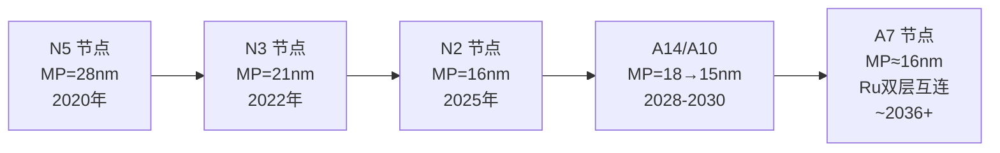
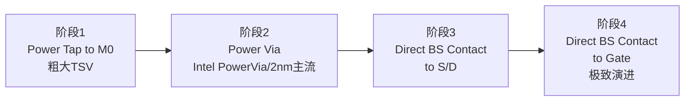
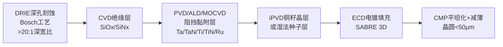
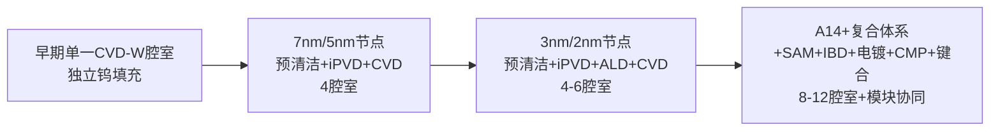

# 先进制程芯片金属薄膜沉积设备的应用图谱与选型逻辑研究
# 1 研究背景与金属薄膜在先进制程中的战略地位

集成电路制造正在经历一场由几何微缩驱动的深刻变革。当工艺节点从7nm跨越至5nm、3nm、2nm乃至埃米时代的A14、A10节点，芯片内部的物理图景已经发生根本性改变：晶体管结构从平面MOSFET演化为FinFET、再演化为环绕栅极的Nanosheet GAA，并在2030年前后将进一步演化为互补场效应晶体管（CFET）；互连体系则从单一的铜大马士革结构裂解为铜、钴、钌、钼、钨多金属并存的复合架构；芯片的供电方式也将从正面供电彻底翻转为背面供电网络（BSPDN）。在这一系列代际跃迁背后，**金属薄膜的沉积工艺与对应设备已经从一种"配套环节"跃升为决定先进制程能否成功落地的核心使能技术**。本章作为整篇报告的逻辑起点，旨在围绕用户所关切的"用了哪些设备、沉积什么金属、为什么选择"这一三元命题，建立先进制程芯片制造与金属薄膜沉积设备之间的关联框架，剖析金属薄膜在FEOL、MEOL、BEOL及先进封装各环节中所承担的差异化功能，并由此推导出沉积设备在台阶覆盖率、膜厚均匀性、纯度、热预算、沉积速率等关键指标上的差异化要求，为后续章节的设备类型对比、应用图谱构建和选型逻辑研究奠定问题坐标系与需求基准。

## 1.1 先进制程演进对金属薄膜的全新挑战

理解金属薄膜在先进制程中的战略地位，必须首先理解工艺节点演进的物理实质。早期平面晶体管时代，工艺节点数字精准对应栅极间距、线到线间距等物理尺寸，但随着鳍式场效应晶体管（FinFET）取代平面晶体管，将芯片从二维结构推向三维立体架构，这种命名逻辑开始瓦解，"3纳米""5纳米"已经脱离了物理尺寸的本质含义，而蜕变为一种约定俗成的命名符号[^1]。然而，命名虽已"脱实"，背后的工艺挑战却愈发"务实"——每一次节点演进都对应着晶体管架构、互连体系和材料选择的系统性重构。

从结构演进的时间轴上看，平面MOSFET主导了28nm及以上节点；当特征尺寸缩小至22nm及以下时，传统平面晶体管的短沟道效应难以控制，导致电流泄漏问题突出，FinFET结构由此应运而生，使工艺得以推进至14nm、7nm、5nm节点[^2]。当工艺节点推进至3nm及以下时，FinFET结构的局限性开始显现，半导体行业转向更为先进的环绕栅极晶体管（GAA）结构，包括Nanosheet和Nanowire等形式：三星在3nm节点率先实现了GAA结构（MBCFET™）的量产，相较于5nm FinFET工艺性能提升23%，功耗降低45%，芯片面积减少16%；台积电的N2则在2025年下半年进入大批量生产，是其首个使用纳米片GAAFET的节点[^2][^3]。展望更前沿的节点，台积电规划A14（1.4nm）于2028年推出、A10（1nm）于2030年面世，英特尔的14A定于2026年生产、10A于2027年底进入开发/生产阶段；IMEC的路线图甚至将视野延伸至2039年的A7（0.7nm）节点，届时晶体管架构将进一步从GAA纳米片演化为CFET[^4][^5]。

下表系统梳理了从7nm到A7节点的工艺特征演进及其对金属薄膜的衍生需求：

| 工艺节点 | 量产年份 | 晶体管架构 | 关键工艺创新 | 金属薄膜的新挑战 |
|---------|---------|-----------|------------|----------------|
| 7nm（N7） | 2018 | FinFET | EUV引入、HKMG成熟 | 接触/互连电阻急剧上升[^6] |
| 5nm（N5） | 2020 | FinFET | EUV广泛应用、Co接触 | MP=28nm，铜互连阻挡层减薄[^7] |
| 3nm（N3） | 2022 | FinFET（TSMC）/GAA（Samsung） | 多重EUV图案 | MP=21nm，无阻挡层钨触点[^8][^7] |
| 2nm（N2） | 2025 | GAA Nanosheet | ALD使用大幅增加、6种Vt | MP=16nm，纳米片底部无视线沉积[^8][^3] |
| A14（1.4nm） | 2028 | 第二代GAA + 背面供电 | BSPDN | 背面金属层、纳米TSV[^4] |
| A10（1nm） | 2030 | GAA + BSPDN | 高NA EUV（0.55–0.75 NA） | Ru互连试产、0.7nm线宽工艺[^4] |
| A7（0.7nm） | ~2036+ | CFET（双排架构） | 单片CFET、MRW中线布线 | 16nm间距Ru双层互连[^5][^9] |

由此可见，每一次节点演进都迫使金属薄膜在三个维度上突破物理极限：**第一，材料体系的更替**——从早期Al互连到Cu大马士革，再到当下Co/Ru/Mo并存的多金属架构，以及HKMG中的TiN、TaN、TiAl等功函数金属和高K栅介质的金属化栅极方案[^2][^9]；**第二，几何尺度的极致压缩**——金属薄膜的厚度已从纳米级压缩到亚纳米级，例如英特尔展示的硅基RibbonFET CMOS晶体管硅层厚度仅为1.7nm，而2nm节点的金属间距MP仅为16nm，1nm以下节点更将进一步压缩至15–18nm[^10][^7]；**第三，三维结构的共形覆盖**——GAA纳米片的栅极沟道底部"没有直接的视线"，这使得传统的物理沉积方式无法保证薄膜在所有方向上均匀生长，迫使工艺向原子层级的共形沉积技术倾斜[^8]。这三重挑战共同将金属薄膜沉积技术推到了先进制程演进的关键瓶颈位置。

## 1.2 FEOL环节金属薄膜的功能定位与工艺需求

前道工艺（FEOL）在硅晶圆上构建晶体管等有源器件结构，其工艺水平直接决定了芯片的性能极限、功耗控制和可靠性表现，是整个半导体制造流程中技术壁垒最高的部分[^2]。在这一环节中，金属薄膜承担着两类核心功能：**栅极结构金属化**与**源漏区硅化物形成**。

**首先是高K金属栅（HKMG）模块**。在2nm节点，集成电路的线宽接近电子波长，量子隧穿效应（QTE）导致漏电流问题突出，传统材料体系面临物理极限。为应对这些挑战，半导体行业引入了HKMG替代传统的Poly/SiO₂栅结构，以降低栅极漏电流[^2]。HKMG的金属栅极并非单一金属，而是由多层功函数金属（如TiN、TaN、TiAl、TiAlN）和填充金属（W、Co）构成的复合结构。IMEC早在32nm节点即已使用基于铪的高K电介质和基于钽的金属栅极实现了平面CMOS性能改进，将反相器延迟从15ps提升至10ps，并将工艺步骤从15步缩减至9步[^11]，这奠定了后续HKMG向FinFET、GAA迁移的工艺基础。

GAA架构的引入对功函数金属沉积提出了**质变性挑战**。在台积电N2节点，需要支持六种阈值电压（Vt）级别以满足不同电路模块的性能/功耗需求——逻辑核心使用低Vt晶体管以实现高速，I/O等外围功能则使用高Vt以最大限度降低功耗。值得注意的是，对于GAAFET而言，Vt调整比FinFET更困难[^8]。要实现不同的阈值电压，必须以"精细控制"的方式沉积介电材料和功函数金属，使其厚度因器件而异；与此同时，**栅极沟道的底部没有直接的视线**——这一物理事实直接决定了基于视线的物理气相沉积（PVD）和电子束蒸发难以胜任，而原子层沉积（ALD）凭借其表面自限制反应机制可在三维结构的所有表面（包括"看不见"的底部）实现单原子层级的均匀生长。这正是台积电在N2节点工艺中**ALD使用相对FinFET大幅增加的关键驱动因素之一**[^8]。

**其次是源漏区硅化物（Silicide）形成**。为降低源漏接触电阻，需要在源漏区与触点金属之间形成一层金属硅化物，常见材料包括NiSi、NiPtSi、Ti-Si等。这些硅化物的前体金属（Ni、Pt、Ti）通常通过PVD溅射沉积，随后经退火与硅反应生成硅化物层。FEOL环节由于位于工艺流程上游，对**热预算极为敏感**——后续工序的高温处理会扩散先前形成的掺杂分布并破坏精细金属结构，因此FEOL所有金属薄膜沉积工艺都需在尽可能低的温度下完成，这构成了沉积设备选型的另一关键约束。

综合上述分析，FEOL环节对金属薄膜沉积设备的核心要求可归纳为：**原子级膜厚控制能力**（亚纳米精度）、**对GAA三维结构的极致共形覆盖能力**、**支持多Vt调控的厚度梯度精细化能力**、**高纯度（避免杂质引起的Vt漂移）**、**低热预算**。这些要求合在一起，已经在很大程度上为ALD成为FEOL主导工艺埋下了伏笔。

## 1.3 MEOL环节金属薄膜的接触与互连衔接作用

中道工艺（MOL/MEOL）是半导体制造中相对较新的一层，承担着将分立的晶体管器件与上层金属互连体系连接起来的桥梁功能，由一系列接触结构构成[^6]。随着工艺节点缩小至10nm及以下，**接触和互连电阻急剧上升，已成为限制器件性能的关键因素**[^6][^12]。在7nm及以下节点，由于MOL尺寸进一步缩小，研究表明Co、Rh、Ir、Ru、Ti、Mo等金属在小尺寸下表现出比W和Cu更优的导电性，因此学术界已提出针对n型源漏接触使用Ru、Mo、Ti，针对p型源漏接触使用Co、Rh、Ir以分别优化接触电阻的差异化方案[^12]。这一研究取向揭示出MEOL层金属化的一个核心趋势：**单一材料体系（W/Cu通用）正在被基于功函数匹配与电阻率优化的差异化材料组合所替代**。

更具突破性的是**台积电在N2节点引入的"无阻挡层钨"（barrier-less tungsten）栅极接触**。传统钨接触需要TiN/Ti阻挡黏附层防止扩散，但阻挡层本身电阻较高，且占用宝贵的接触孔体积。N2节点的栅极接触现已使用无阻挡层钨，几乎肯定使用应用材料Endura集群设备完成，该集群在连续真空中集成预清洁、PVD W衬垫和CVD W填充腔室。AMAT在IEDM 2023上的演示声称其方案可使电阻率降低40%，而台积电的实际测量显示RC（电阻和电容）降低了55%，并直接转化为环形振荡器测试中超过6%的性能提升[^8]。这一案例**完整诠释了MEOL环节对沉积设备的差异化要求**：需要将PVD（金属衬垫）与CVD（金属填充）在同一真空簇中无缝集成，以避免界面氧化和颗粒污染；需要在亚20nm的接触孔中实现无空洞填充；需要严格控制接触界面的电阻率与杂质。

接触孔的高深宽比（AR）特性进一步加剧了沉积难度。当接触孔尺寸缩小至10nm级别而深度保持不变时，AR可超过10:1甚至15:1，常规PVD的视线沉积特性会在孔口形成"悬挂"结构，导致孔底覆盖严重不足。这迫使MEOL工艺向**离子化PVD（iPVD）**（通过提高沉积粒子方向性改善底部覆盖）和**ALD**（共形覆盖）双管齐下的协同方案演进。综合来看，MEOL环节对沉积设备的核心要求是：**高深宽比共形覆盖能力、无空洞填充能力、极低接触电阻率、PVD/CVD/ALD多技术集群集成能力**。

## 1.4 BEOL环节金属薄膜的互连与多层布线需求

后道工艺（BEOL）负责构建芯片内部的多层金属互连，其重要性在先进制程中**已与晶体管本身同等重要**[^8]。当前BEOL工艺主要采用铜（Cu）大马士革结构，由阻挡层（TaN/Ta，防止铜原子扩散）、衬垫层（Co/Ru，改善铜的浸润与电迁移特性）、铜籽晶层（PVD沉积，作为电镀种子）、铜电镀填充（ECD）四道工序组成。然而，**铜互连随微缩化发展正在快速逼近其物理极限**——当导线变细时，电子在狭窄空间内频繁撞击边界、拐弯减速，电阻上升远比理论预期更快，加之阻挡层电阻高且难以做更薄，进一步压缩了铜导体的有效截面[^9][^7]。

下图归纳了BEOL金属间距（Metal Pitch, MP）的微缩节奏：

值得关注的是，IMEC的最新路线图显示金属排线的微缩化发展正在减缓——3nm节点MP为21–24nm，2nm/1.5nm节点MP为18–21nm，1.0nm以下节点MP为15–18nm；过去技术蓝图中21nm直接过渡到16nm，而最新版本则插入了18nm和15nm的过渡台阶，表明**纯尺寸微缩已逼近物理极限，材料替换成为主要突破方向**[^7]。

为缓解微缩带来的电阻问题，业界采取了两条路径：其一加厚铜排线层；其二将排线金属改为不需要阻挡层的材料，重点是钌（Ru）[^7]。**钌之所以成为铜的有力替代者，与其物理特性和ALD工艺契合度密切相关**：在极细线宽下钌的电阻对"变细"不像铜那样敏感，且钌特别适合ALD一层一层贴覆的沉积模式，即使在极度窄深的导电沟槽中也能均匀铺设；这种工艺还能让钌内部的晶粒排列更整齐，电子运行不易被反复打断[^9]。三星在IEDM 2025上发布的实验结果显示，在横截面积仅为300nm²的超细互连线中，采用ALD工艺制造的钌线相比溅射工艺的钌线**电阻降低了46%**；IMEC同期展示了在16nm间距下（适用于A7工艺节点）实现的两层钌互连结构，并在300mm晶圆上取得了**95%以上的良率**[^9]。这两项突破显示Ru互连即将从研究阶段过渡至产业化阶段。

与此同时，**导孔（Via）电极由于率先迎来微缩化极限，其材料也已不再采用铜，而是改为钨（W）、钼（Mo）、钴（Co）、钌（Ru）等熔点较高的金属**[^7]。这意味着BEOL本身已经从单一铜大马士革架构演化为"铜导线+多金属导孔"的异质化结构，对沉积设备的多金属覆盖能力、与铜大马士革工艺兼容性、低RC延迟保证能力提出了综合要求。

此外，台积电在N2节点的BEOL优化还展示了**金属层RC的显著改进**：在单次图案化ArFi层中，主力金属和通孔的RC分别降低了19%和25%；优化的M1（金属层1）图案化方案通过新颖的1P1E EUV图案技术，使该层电容降低了近10%（标准单元层级）至50%（M1层级），同时节省多个EUV掩模[^8]。这表明BEOL的性能改进已不再依赖于单纯的尺寸微缩，而是通过**材料替换、图案优化、介电材料改善**三方面协同推进——其中前两者直接关联到金属薄膜沉积设备的能力升级。

## 1.5 先进封装与背面供电带来的新型薄膜需求

进入2nm及以下节点，**封装已经成为推动计算扩展的关键途径**[^8]。台积电N2P工艺将于2026年引入背面供电技术（BSPDN），通过将电源轨移动至晶圆背面来解耦I/O和电源线，从而解决BEOL中电阻升高等挑战，并消除数据连接与电源连接之间的潜在干扰；据行业消息，仅背面电源轨就可带来个位数的功率改进和两位数的晶体管密度改进[^3]。英特尔的20A、台积电的A14均将背面供电列为标志性技术。背面供电网络对金属薄膜沉积设备提出了**全新的工艺组合**：**纳米TSV的高深宽比金属化**（通常要求阻挡层ALD沉积+铜籽晶层PVD+铜电镀填充）、**晶圆背面减薄后的金属层重新构建**（要求低温工艺以避免破坏前道结构）、**电源通孔的低电阻金属填充**（部分采用离子束沉积Mo或CVD-W）。

在3D封装领域，**异构集成方案的多样化进一步拓展了金属薄膜的应用场景**。英特尔在IEDM 2024上展示的"选择性层转移"（Selective Layer Transfer, SLT）技术可在芯片封装中将吞吐量提升高达100倍，并能够结合混合键合或融合键合工艺集成超薄芯粒[^10]。台积电在IEDM 2024上则展示了下一代SoIC 3D混合键合产品[^8]。混合键合的核心是Cu-Cu直接键合界面，要求键合面铜薄膜具有**晶圆级超平整度（CMP后表面粗糙度<1nm）、严格的表面氧化控制、亚微米级铜衬垫对位精度**——这些指标对沉积铜薄膜的均匀性、纯度和后CMP稳定性提出了远高于传统BEOL的要求。

更前沿的视野中，IMEC在A7节点（0.7nm）的双排CFET标准单元设计中引入了"中线布线壁"（MRW）以实现自上而下的信号连接，每3.7个FET共享一个MRW即可构建逻辑和SRAM单元，使标准单元高度从4T进一步降低到3.5T，SRAM单元面积减少15%；与A14 NSH技术构建的SRAM相比，基于双行CFET的SRAM可使面积缩小40%以上[^5]。这种新型架构进一步将MEOL/BEOL的边界打破，要求沉积设备能够支持**正面与背面双向布线、超高深宽比通孔金属化、多层精细金属薄膜协同生长**。

由此可见，**金属薄膜沉积技术正在从晶体管制造向封装互连领域延伸**，传统上分属前道、后道、封装的不同沉积工艺正在被统一到"晶圆级原子级金属化"的大技术框架之下。这一趋势对设备厂商的工艺组合广度、晶圆级均匀性能力、低温兼容性提出了系统性挑战。

## 1.6 沉积设备核心性能指标的差异化映射

综合FEOL、MEOL、BEOL及先进封装四大环节对金属薄膜的差异化功能需求，可以归纳出沉积设备的六项核心性能指标：**台阶覆盖率/共形性、膜厚均匀性与重复性、薄膜纯度与杂质控制、热预算约束、沉积速率与产能、缺陷密度**。各环节对这些指标的优先级存在显著差异，下表系统呈现这种差异化映射，作为后续章节设备分类、技术对比与选型分析的基本评价维度：

| 性能指标 | FEOL（HKMG/硅化物） | MEOL（接触/触点） | BEOL（互连/导孔） | 先进封装（TSV/混合键合） |
|---------|------------------|----------------|----------------|----------------------|
| 台阶覆盖率/共形性 | ★★★★★（GAA底部无视线）[^8] | ★★★★★（高AR接触孔） | ★★★★（双大马士革沟槽） | ★★★★★（>10:1 TSV） |
| 膜厚均匀性 | ★★★★★（亚nm Vt调控）[^8] | ★★★★ | ★★★★（RC控制）[^7] | ★★★★★（晶圆级混合键合） |
| 纯度/杂质控制 | ★★★★★（Vt漂移敏感） | ★★★★★（接触电阻）[^12] | ★★★★（Cu扩散） | ★★★★★（键合界面） |
| 热预算 | ★★★★★（避免掺杂扩散） | ★★★★ | ★★★★★（低K介质损伤） | ★★★★（已成芯片不可高温） |
| 沉积速率/产能 | ★★（薄膜薄、可慢） | ★★★（接触填充量大） | ★★★★（铜大量填充） | ★★★（TSV体积大） |
| 缺陷密度 | ★★★★★ | ★★★★★ | ★★★★ | ★★★★★ |

从上表中可读出几条关键洞察：**第一，台阶覆盖率与共形性在先进制程的所有环节都处于最高优先级**，这从根本上限制了基于视线机制的电子束蒸发与MBE在量产芯片中的应用——它们的几何沉积特性无法满足GAA、深TSV、高AR接触孔的共形要求；**第二，FEOL和先进封装对膜厚均匀性与纯度的要求最为苛刻**，这与多Vt调控、键合界面质量直接相关，倾向于采用ALD等具备表面自限制特性的技术；**第三，热预算约束在FEOL和BEOL两端都极为严格**——前者因后续工序中存在的掺杂分布不能被破坏，后者因低K介质材料无法承受高温；**第四，沉积速率与产能的优先级在BEOL和封装环节相对较高**，这正是CVD（钨填充）和电镀（铜填充）能够在大体积金属填充任务中保留主导地位的根本原因。

将上述指标与第1.1至1.5节所述应用场景对接，可以预判后续章节中将得到验证的核心结论：**ALD将在共形性与膜厚控制要求最高的功函数金属、阻挡层、Ru/Mo新互连等场景中持续扩张份额；PVD（特别是离子化PVD）将在金属衬垫层、铜籽晶层、硅化物前体金属等仍依赖物理沉积的场景中保持稳固地位；CVD将在钨/钴大体积填充等需兼顾共形性与产能的场景中继续不可替代；而电子束蒸发与MBE则因台阶覆盖率不足、产能受限等原因，在量产ULSI芯片金属薄膜沉积中已被边缘化，其角色更多保留在化合物半导体、研发线、特殊金属层等利基场景**。这一判断将构成本报告后续章节展开"设备—金属—应用"三元映射分析的基本框架。

# 2 五类金属薄膜沉积设备的原理对比、能力边界与适用边界识别

第1章已论证了先进制程的演进对金属薄膜在共形性、纯度、热预算、沉积速率等维度提出了高度差异化的需求。然而，要回答用户所关切的"用了哪些设备、沉积什么金属、为什么选择"这一三元命题，仅有需求侧的图谱并不足够——还必须从设备侧建立起对应的"能力坐标系"。本章因此承担起承上启下的关键功能：**自需求出发反向审视五类金属薄膜沉积设备（PVD、CVD、电子束蒸发、ALD、MBE）的物理化学机制、可达性能边界与天然短板，识别哪些设备能够进入先进制程量产主流、哪些在量产中被边缘化但在利基场景仍不可替代**。这一能力坐标系将与第1章建立的需求坐标系一同，构成第3章及以后各应用场景章节展开"设备—金属—应用"三元映射的双轴基准。

需要先行说明的是，五类设备并非平行竞争关系，而是在不同的物理机制基础上各自演化出适配特定工艺约束的能力剖面。PVD依靠物理动量交换实现金属原子从靶材到衬底的转移，其优势在于直接沉积纯金属；CVD依靠气相化学反应在衬底表面生成固态薄膜，其优势在于良好的台阶覆盖与大体积填充能力[^13]；ALD作为CVD的特殊演化形式，将连续反应分解为自限制的脉冲半反应，以牺牲速率换取原子级精度与近100%共形覆盖[^14][^15]；电子束蒸发作为最早期的物理气相沉积形式，依靠高能电子束加热坩埚使膜料气化后直线飞向衬底[^16][^17]；MBE则在超高真空中以分子束在单晶衬底上逐层外延生长[^18][^19]。这五类技术的机制差异，从根本上决定了它们在先进制程中的角色分化。

## 2.1 PVD设备体系：磁控溅射、离子化PVD与RFPVD的机制分化与能力边界

PVD作为物理沉积技术的总称，在先进制程金属薄膜领域已形成磁控溅射、离子化PVD（iPVD）与射频PVD（RFPVD）三大相互衔接、各有所长的子体系。理解三者的机制分化，是把握PVD为何在先进制程的金属衬垫层、铜籽晶层、硅化物前体金属等场景中保持稳固地位的关键。

**磁控溅射**是PVD体系的基础形态，其核心创新在于靶材背面引入磁体构建交变电磁场，延长电子在等离子体中的运动路径并显著提升等离子体浓度，从而在更低的启辉电压与靶材电压下维持高效溅射[^16]。这一机制带来三重直接收益：其一，降低衬底损伤——较低的离子轰击能量减少了对已有结构的物理破坏；其二，提高沉积速率——更高的等离子体密度直接转化为更高的溅射产额；其三，改善大尺寸晶圆均匀性——商用设备普遍采用旋转磁体设计，平衡薄膜均匀性、靶材利用率与全靶溅射需求，避免固定磁场导致的局部过度消耗与颗粒污染[^16]。然而，磁控溅射继承了PVD的视线沉积本质——溅射出的金属原子虽然以较宽角分布（区别于电子束蒸发的近直线轨迹）飞向衬底[^20]，但当面对深宽比超过5:1的沟槽或通孔时，孔口悬垂效应与底部覆盖不足问题依然显现。这是磁控溅射在BEOL双大马士革沟槽阻挡层、铜籽晶层等场景中能够胜任、但在更高深宽比的TSV或先进节点接触孔中需让位于离子化PVD的根本原因。

**离子化PVD（iPVD）**正是为破解高深宽比共形覆盖难题而演化的PVD分支。其核心机制是通过金属原子等离子化与晶圆偏压调控实现定向沉积——具体技术路径包括射频线圈等离子体生成、高磁场磁控溅射源强化离子化率，以及自离子化技术[^16]。其中自离子化技术尤为关键：通过高磁场强度与低压/零氩气工艺（如铜自溅射）降低离子散射，增强台阶底部覆盖并削弱沟槽口悬垂结构，同时利用反溅射效应优化拐角覆盖率[^16]。在产线工艺工程师的视角下，**衬底偏压是先进节点PVD工艺的"灵魂"**——施加偏压后沉积过程从"温柔的下雪"变为"有控制的冰雹"，Ar离子会把那些松散附着在结构侧壁或拐角处的金属原子"敲"到沟槽或通孔的底部，这一"再溅射"过程显著提升底部覆盖率、减少悬垂、避免孔口过早封闭，并使薄膜更致密、电阻率更低[^21]。该技术已主导铝互连阻挡层、钨栓塞黏附层及铜互连籽晶层制备，并与金属CVD腔室集成，形成多工艺协同系统[^16]。

iPVD的工业化典范是应用材料公司（AMAT）的Endura Ventura系统。该系统专为TSV金属化设计，通过改进的离子密度、方向性与可调能量，在深宽比≥10:1的TSV内部沉积比传统BEOL系统薄50%的连续钽或钛阻挡层和铜晶种层，且因薄膜更薄与沉积速率更高，产能超过现有BEOL PVD系统的一倍以上[^22]。Ventura反应室可在Endura平台上灵活处理钽和钛阻挡层并与铜晶种层制程整合——其中**钛具有更高的成本效益**，构成阻挡层材料选型的重要考量[^22]。值得强调的是，腔体压力对iPVD的台阶覆盖能力具有反直觉的影响：**低压力下原子飞行"准头"更好（更具方向性），台阶覆盖能力反而提升**，这正是iPVD选择低压工艺窗口的物理依据[^21]。

**RFPVD**则以13.56MHz等射频电源为激励源，通过正负半周期交替实现靶材表面稳定负电位，兼容导体与非导体靶材溅射。其低靶材电压特性有效控制沉积粒子动能，优化薄膜成膜结构并降低衬底损伤，适用于超薄膜厚度精密控制场景[^16]。然而，低靶材电压的代价是溅射产额降低、沉积速率不及DCPVD。为此，**直流与射频混合加载技术**应运而生，既维持低损伤特性又提升沉积速率，在金属栅等精细结构中展现应用价值，体现多电源协同的技术融合趋势[^16]。这一混合加载方案对HKMG中TiN等导电屏蔽层的精细沉积尤为关键，是PVD得以在金属栅辅助沉积场景中保留位置的工艺基础。

PVD的核心性能特征可归纳如下：可沉积金属种类涵盖Al、Cu、Ti、Ta、Co、Ni、Pt、Au、Cr、W、ITO等几乎所有需要的导体材料，**其面向先进制程的核心优势在于直接沉积高纯度纯金属、与CVD腔室集群集成能力强、产能高**；其先天短板在于台阶覆盖率虽优于电子束蒸发但弱于ALD，对深宽比>10:1的结构需借助iPVD与衬底偏压才能勉强胜任。这一能力剖面决定了PVD在先进制程中的角色定位——在金属衬垫层、铜籽晶层、硅化物前体金属、TSV阻挡/籽晶等"需直接物理沉积纯金属且共形要求适中"的场景中保持稳固主导地位。

## 2.2 CVD设备体系：金属CVD与MOCVD的化学反应机制与大体积填充能力

CVD的本质是气相化学反应——通过将气体前驱体引入反应腔，在基板表面发生化学反应形成固态薄膜，反应前体一般为硅烷、磷烷、硼烷、氨气、氧气等气体原料，生成物为氮化物、氧化物、氮氧化物、碳化物、多晶硅等固体薄膜，反应条件一般为高温、高压或等离子体[^13]。CVD家族涵盖普通CVD、PECVD（等离子体增强CVD，适用于低温沉积）、HDPCVD（高密度等离子体CVD，可同时沉积与刻蚀，具备优秀高深宽比间隙填充能力）、SACVD（次常压CVD，借助臭氧高活性氧自由基实现优秀填孔能力）以及MOCVD（金属有机化学气相沉积）等子类[^13]。在金属薄膜沉积语境下，CVD又可细分为以W CVD为代表的**金属CVD**与服务于化合物半导体外延的**MOCVD**两大主战场。

**金属CVD的代表性工艺是钨化学气相沉积（W CVD）**，主要用于接触孔与通孔的金属填充，其核心是还原反应——常见前驱体为六氟化钨（WF₆），还原剂为氢气（H₂）或硅烷（SiH₄），主反应方程为WF₆ + 3H₂ → W + 6HF[^23]。W CVD之所以在先进制程接触孔填充中不可替代，关键在于其**两阶段沉积逻辑**：第一阶段是Nucleation（成核），即钨原子或分子在基底表面形成初始晶核的过程；第二阶段是体相填充。成核阶段的工艺意义体现在三个方面——其一，先进制程接触孔/通孔的深宽比可超过10:1，若成核不均匀会导致后续填充出现孔洞（Voids）或接缝（Seams）；其二，良好的成核层可确保钨与底层TiN阻挡层的紧密接触，降低接触电阻；其三，无成核层时钨可能以岛状（Island Growth）生长，导致薄膜粗糙或剥落[^23]。这一机制使W CVD相对于PVD沉积铝具备**在更小线宽条件下提供更好的覆盖均匀性并解决电迁移问题**的本质优势[^24]。除WF₆外，W CVD也可使用WCl₆、WCl₅和W(CO)₆等前驱体，但各有优缺点[^24]。

随着工艺节点推进至10nm及以下，**钴CVD与钌CVD**也在新型互连中逐步崭露头角。三星在IEEE IITC会议上的研究表明，铜线全封装包括金属帽层（通常为钴）以减少电迁移，再加上绝缘的蚀刻停止与阻挡层；通过添加蚀刻停止层沉积前的等离子体预处理，铜线应力可减少30%、通孔电阻减少10%[^25][^26]。IMEC的模拟显示，**使用钌通孔用于互连堆叠的前四层可将整体电阻降低高达60%**[^25]——这一数据为CVD/ALD钌成为新一代通孔金属沉积工艺提供了直接的因果链支撑。在与铜线集成时，IMEC建议仅在介电侧壁上沉积TaN阻挡层、将钌直接沉积在暴露的铜上，并首选**集群工具工艺**，因为从暴露的铜上移除原生氧化物可能损伤介电钝化[^25]——这一工艺约束对设备形态本身提出了"PVD/CVD/ALD多腔室真空集成"的硬性要求。

**MOCVD**则以金属有机源（如三甲基镓TMG、三甲基铝TMA）在高温下分解沉积，是化合物半导体（GaN、GaAs、SiC外延）产业化的主力[^13][^27]。在GaN基材料生长中，MOCVD与MBE、HVPE并列为三大主流外延技术，但MOCVD凭借更高的产能与更低的单位成本，主导了基于GaN的传统LED等商品器件市场[^27][^28]。Yole的市场数据显示，**MOCVD在2020年外延设备市场收入中占比超过60%，预计将以7%的复合年增长率增长至2026年的6.3亿美元**，远超MBE市场规模（2020年4500万美元，2026年6800万美元）[^28]。

CVD的核心性能边界体现为：**沉积速率远高于ALD与MBE，台阶覆盖率优于PVD但弱于ALD**，热预算普遍较高（金属CVD典型温度300–500°C，MOCVD可至1000°C以上），可能存在F、C等前驱体残留杂质，**与PVD腔室集群集成能力极强**。这一组合决定了CVD在两大场景中的核心地位：一是BEOL/MEOL的大体积金属填充（钨塞、钴接触、未来的钌通孔），二是化合物半导体外延（GaN/GaAs/SiC）。

## 2.3 ALD设备体系：热ALD与PEALD的自限制反应机制与极致共形能力

ALD是由CVD演变而来的薄膜制备技术，其根本性区别在于**将连续的化学反应分解为两个交替进行的自限制半反应**——通过将两种前驱体以气体脉冲形式交替引入反应器，前驱体之间靠真空泵抽取或惰性气体吹扫实现隔离，前驱体分子通过吸附在样品表面发生反应生成薄膜[^14]。一个完整的ALD循环包含四步：前驱体A脉冲并自限制吸附于活性位点、惰性气体吹扫、前驱体B脉冲并与吸附层反应、惰性气体再次吹扫；每次循环理论上仅完成单原子层生长，通过控制循环次数实现原子级精度的薄膜厚度控制[^14][^15]。

ALD反应的正常进行需满足三大条件：**前驱体挥发性**（在较低温度下饱和蒸气压必须足够高）、**前驱体化学稳定性**（在腔体温度下不发生自分解，且不腐蚀基底或已沉积层）、**适宜的沉积温度窗口**——温度过低会导致热能不足以完成表面反应或前驱体凝结，温度过高则会导致前驱体分解，因此每种材料体系都存在一个有限的"ALD窗口"[^14]。

依据反应活化方式，ALD分为**热原子层沉积（TALD）**与**等离子体增强原子层沉积（PEALD）**两类[^13]。TALD完全依赖热能驱动表面反应，工艺温度典型范围为50–500°C[^14]；PEALD通过等离子体增强反应活性，可在较低温度下实现较快的薄膜沉积速度，对热敏感衬底（如先进封装中的玻璃基板与已集成芯片）尤为友好[^13]。在TGV（玻璃通孔）应用中，玻璃基板和热敏感芯片要求后续薄膜沉积必须在低温（通常<200°C）下进行以杜绝基板翘曲和器件热损伤——这正是PEALD的天然战场[^29]。

ALD的能力边界呈现"极致共形+原子级精度"与"低速率"的鲜明对照，可从六个维度进行刻画：

| 性能维度 | ALD的极限性能 | 工艺意义 |
|---------|--------------|---------|
| 膜厚精度 | 原子/分子尺度可控（亚nm） | GAA多Vt调控、阻挡层减薄 |
| 台阶覆盖率 | 接近100%，可处理高达1:2500 HAR | TSV/TGV阻挡与种子层、GAA底部沉积 |
| 沉积温度 | 50–500°C（PEALD更低） | 兼容低热预算、热敏基板 |
| 材料广度 | Al₂O₃、TiO₂、HfO₂、ZrO₂、TiN、TaN、Pt、Ir、Ru、Mo、W、Co等 | 覆盖HKMG、阻挡层、新互连 |
| 缺陷密度 | 沉积薄膜致密无针孔 | 优异密封性与隔离性 |
| 沉积速率 | 慢，每循环仅一个原子层 | 产能瓶颈，需空间型ALD突破 |

这一性能组合的内在机理是"自限性反应"——每个循环只沉积一个原子层，沉积过程能填补薄膜中的微小缺陷，保证膜层完整性[^15]。商用化ALD设备的代表如PICOSUN R-200已可处理多孔、通孔、超高深宽比（最高可达1:2500）样品，覆盖Al₂O₃、TiO₂、SiO₂、Ta₂O₅、HfO₂、ZrO₂、AlN、TiN以及金属Pt、Ir等多种材料体系[^14]。

ALD相对于传统沉积技术（PECVD/PVD）的核心优势在于**在高深宽比结构中实现均匀沉积**——传统方法在微纳米尺度结构中沉积不均匀，而ALD能在每个层面均匀吸附前体并逐层沉积，无厚薄不均现象[^15]。这一优势在先进制程的多个关键场景中已转化为不可替代的工艺地位：第三代半导体行业头部企业之一的微导纳米已开发ALD/Ru等先进工艺，其iTomic PE系列PEALD与iTomic MeT系列金属ALD系统应用于TSV/TGV通孔内TiN、TaN、Ru等阻挡层与种子层沉积，被定位为**"唯一能在极高深宽比通孔内实现均匀、连续、超薄薄膜覆盖的技术"**[^29]。

ALD的相对劣势是**沉积速率慢与前驱体成本高**，尽管循环沉积速度较慢，但其薄膜质量和均匀性使其成为高精度领域的首选[^15]。为应对产能挑战，业界正推动两条突破路径：**空间型ALD（Spatial ALD）**通过将晶圆在多个独立反应区之间快速移动而非依赖时间序列脉冲来提升沉积速率；**批量式ALD**通过单腔同时处理多片晶圆来匹配量产线需求[^15][^29]。微导纳米的iTomic SPX系列空间型ALD与iTomic MW系列批量式ALD正是这一方向的典型产业化产品[^29]。

综合上述分析，**ALD是GAA功函数金属、铜互连阻挡层、Ru/Mo新互连、TSV/TGV阻挡与种子层等先进制程关键场景的不可替代技术**——这一论断将在第3、5、6、7章针对各应用场景的具体分析中得到反复验证。

## 2.4 电子束蒸发的原理特性与在量产ULSI中的边缘化逻辑

电子束蒸发是真空蒸镀设备的重要分支，其核心机制是利用电子枪发射的高能电子束，通过磁场线圈聚焦与偏转后轰击水冷铜坩埚中的膜料，凭借**3000–6000°C的高能量密度**将膜料局部加热至升华，气化原子或分子在真空环境中以近直线轨迹飞向衬底凝结成膜[^16][^30][^31]。e型电子枪因电子轨迹形似字母"e"而得名，主要由发射体组件、偏转磁极靴、水冷坩埚换位机构、散射电子与离子收集极组成；磁偏转电子束蒸发源的引入提升了沉积效率，并克服了直枪式蒸发源占用空间大、X射线二次电子损伤大的缺点[^30][^31]。EB-PVD设备可蒸镀Al、Cu、Ti、Ni、Cr、Au、Ag、W、ITO、TiO₂、Al₂O₃、ZnO、HfO₂、TiC、SiC、TiN、Si₃N₄、AlN等多种材料，特别擅长**难熔金属（W、Mo、Ta）与化合物的高纯度沉积**[^16][^17]。

然而，电子束蒸发在主流先进制程量产中已退居LED电极、剥离工艺、光学薄膜等利基场景[^16]，其边缘化逻辑可从四个层面系统揭示：

**第一，视线沉积特性导致台阶覆盖能力不足**。蒸发是一个热过程，蒸发源类似于一个点向上方的承载晶圆装置发散，由于这种**几乎直线的沉积轨迹，材料很难进入台阶的侧面和底部**[^20]。相比之下，溅射是动量交换过程，靶材被等离子轰击并以更广的角分布到台阶上，因此**溅射的台阶覆盖能力远远大于蒸发**[^20]。这一物理差异在面对先进制程的GAA纳米片底部、深宽比>10:1的接触孔与TSV时被极度放大——电子束蒸发的几何沉积特性从根本上无法满足共形覆盖要求。

**第二，X射线辐射、高能离子轰击与中性副产物对衬底及光刻胶造成损伤**。电子束蒸发过程中会产生中性原子或分子、电子、离子、X射线、热等多种副产物，这些副产物会对硅衬底或衬底上的PMMA胶产生负面影响，导致**成膜开裂与起泡问题**[^32]。苏州大学研究团队的工作显示，使用Balzers、creavac、Leybold等传统设备供应商生产的电子束蒸发设备沉积材料时均会造成硅衬底上的PMMA胶开裂与起泡，必须通过在蒸发腔内安装永磁体及金属电极构建保护性电磁场才能解决[^32]。这种衬底损伤风险与先进制程对器件可靠性的严苛要求形成尖锐冲突。

**第三，单晶圆批处理产能受限、靶材利用率低**。电子束蒸发设备多采用单点式蒸发源，为改善大尺寸衬底均匀性需增加源基距与旋转衬底，但需权衡生长速率与材料利用率[^16]。这一物理约束意味着电子束蒸发难以满足12英寸晶圆量产的产能与晶圆级均匀性要求。

**第四，膜厚均匀性控制难度大**。蒸发过程中原子动量较低，重新凝华为固相后与衬底间的结合力较弱，这一缺陷虽可通过加热衬底改善但增加了热预算约束；同时蒸发源稳定性受温度分布不均与材料挥发率影响，传统方法难以精确控制蒸发材料的成分与纯度[^33][^34]。

正是基于上述四重原因，电子束蒸发在先进制程主流逻辑/存储芯片中已**逐步退居LED电极等特定场景应用**[^16]，其继续保留价值的场景集中在：MEMS制造（MEMS沿用了大量传统IC的工艺设备，但其性能要求低于先进IC）[^35]、剥离成形工艺（如苏州大学孙斌博士团队改进电子束蒸发用于Au、Ni、Si、TiO₂、Cu、Hf、Co、Pt等材料的高良率剥离成形）[^32]、光学薄膜（AR膜、ITO膜）以及研发性的难熔金属薄膜实验[^31][^33]。**这些利基场景的共同特征是：对台阶覆盖率要求低、衬底对损伤不敏感、产能要求不高、薄膜纯度优先级高于均匀性**——恰好与先进制程量产芯片的需求剖面形成镜像对照，从而清晰界定了电子束蒸发的能力归属。

## 2.5 MBE的原子级生长机制与在化合物半导体中的不可替代性

分子束外延（MBE）由美国贝尔实验室J.R. Arthur等人于1968年提出，由卓以和（Alfred Y. Cho）等人于1971年发展成熟，是一种在超高真空（典型6.6×10⁻⁸ Pa量级）条件下，将组成薄膜的各元素在相应束源炉中加热形成定向原子束或分子束，入射到加热衬底上进行薄膜生长的物理沉积技术[^18][^19]。典型MBE系统由进样室、预处理室、生长室构成，配备束源炉、机械快门、反射高能电子衍射仪（RHEED）和束流监测仪等核心部件[^18][^19]。

MBE的独特优势可归纳为五项：**原子尺度精确控制**（单原子层级生长精度）、**超高真空环境保障的高纯度**（避免外界杂质干扰）、**较低生长温度**（避免高温缺陷与衬底/薄膜互扩散）、**复杂异质结构能力**（超晶格、量子阱、能带工程）、**实时原位监测**（RHEED可实时反馈生长状态）[^18]。在工程精度上，MBE可控制原子束的入射角度误差<0.5°、流量精度达10⁻⁶ mbar·L/s、外延层厚度均匀性<1%、掺杂浓度偏差<5%[^36]。在GaN射频器件中，MBE生长的二维电子气（2DEG）层电子迁移率>20,000 cm²/(V·s)，厚度仅10nm；相对MOCVD，MBE的原子级控制能力使薄膜缺陷密度降低70%，器件击穿电压从100V提升至600V以上[^36]。

然而，MBE在ULSI量产硅基逻辑芯片中长期处于边缘化地位，其核心原因体现在五个层面：

**第一，生长速率极慢**。外延生长速度通常约为每秒1/3个单层（0.1nm/s），相当于人类头发每秒生长速度的百万分之一[^36][^37]。这一速率对ULSI每天数千片晶圆的量产节奏而言完全不可接受。

**第二，单片处理产能低、设备与维护成本极高**。MBE反应器在超高真空条件下运行，使用液氮冷却低温屏蔽板捕获污染物，**对衬底晶格匹配度要求苛刻**[^18][^37]。MBE存在成本高、维护要求高、停机时间长等局限[^38]，与硅基ULSI芯片的低成本量产经济性背道而驰。

**第三，材料体系与硅CMOS不匹配**。MBE所采用的III-V族材料体系中，**在硅衬底上生长需要极高的温度（>1000°C）以确保氧化物解吸**，需要专门的加热器和晶圆支架；晶格常数和膨胀系数不匹配的问题使硅上的III-V族生长仍是一个活跃的研发课题[^37]。

**第四，不适合常规互连金属沉积**。Cu、W、Co等先进制程主流互连金属并非MBE的强项；MBE的强项在于III-V化合物半导体的高质量单晶外延，这种能力在硅基逻辑/存储制程中的需求点极为有限。

**第五，市场规模本身受限**。Yole数据显示，MBE设备市场长期价值有限，2020年收入仅4500万美元，预计2026年达到6800万美元——**仅相当于MOCVD市场（2026年预计6.3亿美元）的约十分之一**[^28]。

但与此同时，MBE在化合物半导体与前沿研究领域具有**不可替代地位**，这构成了其继续存续的根本理由：

- **III-V族化合物半导体外延**：MBE是化合物半导体材料研发与生产的基石，主要用于制备GaAs、InP等薄膜材料[^18]。MBE凭借低危害特性和铝镓砷/砷化镓材料的优良生长品质，已占据砷化镓电子专用市场[^38]。
- **射频微波器件**：MBE主导HEMT、HBT等高电子迁移率器件的产业化，5G基站的GaN功率器件正是其重要应用场景，2023年全球GaN功率器件市场规模达15亿美元，带动MBE设备需求年增20%[^36]。
- **半导体激光器**：MBE是中红外锑化物激光器的核心制备技术，覆盖了2–12μm整个中远红外光谱波段，蒙彼利埃大学团队在硅基片上集成中红外GaSb基二极管激光器、InAs/AlSb量子级联激光器和InAs/GaInSb带间级联激光器即采用专用MBE策略[^39]。
- **量子计算与拓扑材料**：MBE用于生长半导体-超导体异质结，并在二维拓扑绝缘体研究中扮演核心角色[^18]。
- **GaN基纳米结构**：中科院苏州纳米所利用MBE技术制备的GaN基纳米柱柔性自驱动紫外探测器具有977的紫外/可见光抑制比和2.51×10¹¹ Jones的比探测率[^27]。

在化合物半导体外延中，MBE与MOCVD的分工逻辑非常清晰：**MBE主导高性能、低产量、研发与试产场景；MOCVD主导大批量商品器件**——这一分工在LED、激光器、功率器件领域已形成稳定格局[^28]。同时国产MBE设备正在打破海外垄断——曾被德国AIXTRON、美国Veeco垄断的MBE市场正迎来中国厂商的突破，中电科二所研发的6英寸MBE设备在GaN外延层表面粗糙度（<0.5nm）和掺杂均匀性（±3%）等指标上已接近国际一流水平，价格仅为进口设备的60%；国产MBE设备2024年市场份额有望从5%提升至15%[^36]。

## 2.6 五类设备的多维能力对比与先进制程主流/边缘化判断框架

在前述五节针对各类设备物理机制与能力边界的逐一剖析基础上，本节构建一张统一的多维对比矩阵，以便清晰呈现五类设备在先进制程关键约束下的能力差异，为后续章节的应用图谱与选型逻辑研究奠定能力分级基准。

| 维度 | 磁控PVD/iPVD/RFPVD | 金属CVD/MOCVD | 热ALD/PEALD | 电子束蒸发 | MBE |
|------|---------|---------|---------|---------|---------|
| **沉积机制** | 物理动量交换溅射 | 气相化学反应 | 自限制脉冲半反应 | 高能电子束加热气化 | 超高真空热蒸发外延 |
| **可沉积金属** | Al/Cu/Ti/Ta/Co/Ni/Pt/W等几乎全谱 | W/Co/Ru/Mo（金属CVD）；GaN/GaAs/SiC（MOCVD） | TiN/TaN/Ru/Mo/W/Co/Pt/Ir等 | 难熔金属W/Mo/Ta、Au/Ag等 | III-V化合物（GaAs/InP/GaSb） |
| **台阶覆盖率** | iPVD优、磁控中、RF中 | 优（HDPCVD/SACVD更优） | **近100%（最高1:2500）** | **差（视线沉积）** | 差（外延逐层） |
| **膜厚精度** | nm级 | nm级 | **亚nm级（原子级）** | nm级 | **原子级（外延）** |
| **沉积温度** | 室温–400°C | 300–1000°C+ | 50–500°C（PEALD更低） | 衬底可室温（源3000–6000°C） | 较低（避免互扩散） |
| **沉积速率** | 高 | **很高** | 慢（每循环1原子层） | 高 | **极慢（0.1nm/s）** |
| **纯度/缺陷** | 高纯度、致密 | 中（F、C残留） | 致密、无针孔 | 高纯度（真空环境） | **极高（UHV）** |
| **产能/成本** | 量产级、成本可控 | 量产级、成本可控 | 产能瓶颈、前驱体贵 | 单片低产能 | 极低产能、高成本 |
| **集群集成** | 与CVD腔室高度集成 | 与PVD/ALD集成 | 与PVD/CVD集成 | 弱 | 弱 |

从这张矩阵中可以提炼出**先进制程量产主流采用vs.边缘化/淘汰**的五条判断依据：

**第一条：共形能力是否满足GAA与高AR结构**。先进制程的GAA底部、>10:1接触孔、>10:1 TSV普遍要求接近100%的台阶覆盖率，**ALD是唯一全面满足该要求的技术**，iPVD与CVD（特别是HDPCVD）在中等深宽比场景下可胜任，电子束蒸发与MBE的视线/外延机制从根本上无法满足共形要求——这是后两者在主流量产中边缘化的首要原因。

**第二条：是否兼容低热预算**。FEOL后续工序、BEOL低K介质、混合键合已集成芯片均要求低温沉积，**PEALD（50–200°C可用）、PECVD、低温PVD**是优选；MOCVD的高温（>1000°C）使其只能用于晶圆制造起点，电子束蒸发虽衬底可室温但坩埚高温产生的副产物（X射线、离子）仍会损伤衬底。

**第三条：是否支持晶圆级量产产能**。ULSI每月数十万片晶圆的产能压力下，**PVD（高速率）、CVD（高速率）、批量/空间型ALD（产能改进型）**为可行方案；电子束蒸发的单片处理与MBE的0.1nm/s速率从根本上不匹配量产节奏。

**第四条：是否能与多技术集群无缝集成**。先进制程接触孔与互连工艺普遍采用"PVD衬垫+CVD填充"或"ALD阻挡+PVD籽晶+ECD填充"的多腔室真空集群（如AMAT Endura平台）[^22]，**PVD/CVD/ALD三者具备成熟的集群集成能力**，电子束蒸发与MBE因机制独特、需要特殊真空环境（MBE的UHV、电子束的高能源），与其他设备集群兼容性差。

**第五条：是否具备经济可行的产能成本**。MBE设备初投资与维护成本远高于PVD/CVD/ALD，前驱体ALD虽然单台投资可控但消耗品成本高，PVD与CVD的整体经济性最优——这一经济性约束在硅基ULSI的低成本竞争市场中几乎是决定性的。

基于上述五条判断依据可以得出本章的核心结论：**ALD、PVD、CVD构成先进制程量产金属薄膜沉积的"主导三角"**——ALD占据极致共形与原子级精度场景（HKMG功函数金属、新型阻挡层、Ru/Mo新互连、TSV/TGV阻挡与种子层），PVD占据物理沉积纯金属与中等共形场景（金属衬垫层、铜籽晶层、硅化物前体金属），CVD占据大体积金属填充与化合物半导体外延场景（钨塞、钴接触、未来钌通孔、GaN/GaAs/SiC外延）；**电子束蒸发与MBE退守利基领域**——前者保留于LED电极、剥离工艺、光学薄膜、MEMS等对共形要求低且产能压力小的场景，后者保留于III-V化合物半导体、量子结构、半导体激光器、HEMT/HBT射频器件、量子计算异质结等对原子级精度与超高纯度要求极高但允许低产能的高端利基场景。

这一"三主导+两利基"的设备格局，将作为后续第3至第7章针对FEOL HKMG、MEOL接触/硅化物、BEOL铜互连、新材料/背面供电、3D集成/TSV等具体应用场景展开"设备—金属—应用"三元映射的统一坐标基准。值得提醒的是，本章对设备能力边界的判断主要基于公开技术文献与设备厂商资料，对于2nm以下节点中尚处研发阶段的新型沉积技术（如选择性沉积、面积选择性ALD等）仍存在覆盖局限，相关补充将在第6章针对新材料与新架构的设备需求重塑中进一步展开。

# 3 金属栅极层（HKMG）的金属薄膜沉积设备应用分析

第1章已勾勒出先进制程对金属薄膜沉积技术提出的差异化需求图谱，第2章则从设备侧建立了"三主导（ALD/PVD/CVD）+两利基（电子束蒸发/MBE）"的能力坐标系。本章作为整篇报告"应用场景—设备选型"映射分析的开端，聚焦FEOL环节最具代表性的金属薄膜密集应用——高K金属栅极（HKMG）模块。HKMG之所以被置于应用场景分析的首章，原因有三：其一，它是金属薄膜在先进制程中**首次承担直接决定晶体管电学性能的核心角色**——栅极功函数直接决定阈值电压（Vt），栅极电阻直接决定开关速度；其二，它**汇聚了功函数金属、阻挡层、填充金属、覆盖层等多类金属薄膜**，是PVD、CVD、ALD三大主流设备协同工作的典型场景；其三，从28nm节点首次大规模商用至2nm节点的GAA演进，HKMG承载了**ALD份额持续扩张**这一最具代表性的设备格局变迁，是观察先进制程沉积设备演化逻辑的最佳窗口[^40]。

本章将依循"分层结构拆解→主导设备论证→辅助设备角色→填充金属选型→集成路线对比→GAA再升级"的递进逻辑展开，回答用户三元命题在HKMG场景下的具体表达：HKMG用了哪些设备、沉积了哪些金属、为何如此选择。

## 3.1 HKMG结构的金属薄膜分层与材料体系拆解

理解HKMG模块的设备选型，必须先厘清其堆叠结构的材料分层。HKMG的诞生源自一个根本性的物理约束——随着器件尺寸缩小，传统SiO₂栅介质厚度无法随缩放定律同步缩放，平面器件gate oxide厚度已抵达1nm极限，无法承受工作电压带来的最大泄漏电流；因此业界引入高介电常数（high-k）材料以增加栅介质的物理厚度，在保持等效氧化层厚度（EOT）不变的前提下降低漏电[^41]。这一替换逻辑直接决定了HKMG堆叠的第一层——**高K介质层**——必须是HfO₂或HfSiON这类高介电常数氧化物。其中HfO₂的介电常数为20–25，但在温度超过500°C时会发生结晶并产生晶界缺陷，导致漏电增大；为改善高温稳定性，可掺Si和氮化形成HfSiON，其高温稳定性出色但介电常数降至15[^41]。这一矛盾的解决路径直接催生了"先栅依赖HfSiON、后栅采用纯HfO₂"的材料分层差异——前者需经受源漏高温工序，故选热稳定的HfSiON；后者在多晶硅去除后才沉积，避开了高温环境，可直接采用更高介电常数的纯HfO₂[^41]。

在高K介质之上的金属堆叠根据集成方案不同而呈现差异化结构。**后栅（RMG）方案**是当前7nm及以下先进制程的主流，其堆叠从下至上依次为：HfO₂高K介质（ALD沉积）、TaN阻挡层（ALD沉积，作为PMOS中的阻挡层保护TiN，并防止后续金属对高K介质的扩散）、TiN功函数金属（PMOS有效功函数>5.0eV）、TiAl功函数金属（NMOS有效功函数<4.2eV，退火后TiAl与TiN反应生成TiAlN作为NMOS功函数调节层）、Al/W填充金属（间隙填充以降低栅极电阻）[^42][^43]。**先栅（MIPS）方案**则在HfSiON/SiO₂界面层之上插入功函数覆盖层（NMOS采用La₂O₃、PMOS采用Al₂O₃以解决费米能级钉扎），随后沉积高熔点TiN层，最后在TiN之上沉积传统多晶硅栅以保持工艺兼容性[^41]。

下表归纳了HKMG各层金属薄膜的功能定位与厚度量级，为后续设备选型对照建立基础：

| 层位 | 材料 | 功能定位 | 厚度量级 | 关键工艺约束 |
|------|------|---------|---------|------------|
| 界面层 | SiO₂ | 高K/Si界面缓冲 | <1nm | HF去除原氧化层后再生薄氧化硅[^42] |
| 高K介质 | HfO₂（后栅）/HfSiON（先栅） | 替代SiO₂、降低漏电 | 1–2nm | 共形沉积、低热预算[^42][^41] |
| 阻挡层 | TaN | 防扩散、保护下层 | 数Å–1nm | 致密、超薄、无针孔[^42] |
| PMOS功函数 | TiN | 有效功函数>5.0eV | 数Å–数nm | 化学计量精确控制、功函数调节[^43][^41] |
| NMOS功函数 | TiAl→TiAlN | 有效功函数<4.2eV | 数nm | 退火反应生成TiAlN[^42][^43] |
| 覆盖层（先栅） | La₂O₃（NMOS）/Al₂O₃（PMOS） | 解决费米钉扎 | 亚nm | 极超薄连续膜[^41] |
| 填充金属 | Al（早期）/W/Co | 降低栅极电阻 | 数十nm | 窄深沟槽无空洞填充[^42] |

由此可见，HKMG模块的金属薄膜以**亚纳米至数纳米的超薄共形膜为主、辅以数十纳米的栅沟槽填充膜**——前者将设备选型推向ALD与RFPVD的精密沉积域，后者将设备选型推向CVD的大体积填充域。这一双重需求结构，正是后续3.2至3.4节展开主导设备、辅助设备与填充金属设备分别论证的内在逻辑起点。

## 3.2 ALD在功函数金属沉积中的主导地位与驱动逻辑

ALD之所以在HKMG功函数金属沉积中确立主导地位，并非因为其速率优势——恰恰相反，ALD每循环仅生长一个原子层，速率远低于PVD与CVD——而是因为其物理机制完美契合了HKMG对**原子级厚度精度、近100%共形覆盖、低热预算**这三项硬约束的同时满足。

**第一驱动因素：原子级厚度精度满足多Vt调控**。在HKMG模块中，PMOS与NMOS的有效功函数要求分别为>5.0eV与<4.2eV，这一差异主要通过TiN功函数金属层的厚度与化学计量精细调控实现[^43][^44]。更进一步，先进逻辑芯片需要支持多个阈值电压级别（如台积电N2节点的6种Vt）以适配不同电路模块的性能/功耗需求；要实现不同Vt，必须以"精细控制"的方式沉积功函数金属，使其厚度因器件而异。ALD基于循环次数的厚度控制机制天然契合这一需求——每个完整循环理论上沉积一个原子层，通过调整循环次数即可实现亚埃级别的厚度梯度，这是PVD的nm级精度与CVD的化学反应速率控制都无法企及的精度等级。

**第二驱动因素：近100%共形覆盖适配三维结构**。HKMG在FinFET节点已经从平面演化为三维鳍片侧壁覆盖结构，进入GAA Nanosheet节点后更演化为**纳米片底部"没有直接视线"的全包围栅极结构**。ALD的自限制脉冲半反应机制使得前驱体分子能够在三维结构的所有表面（包括"看不见"的底部）实现单原子层级的均匀生长。代表性产业化设备ASM Eagle XP PEALD的公开参数显示，其在20:1高深宽比结构上的台阶覆盖率>95%，300mm晶圆上膜厚均匀性<1%（3σ），工艺温度窗口室温–400°C，可沉积TiN、HfO₂、ZrO₂等HKMG所需材料，已被台积电、三星、英特尔等用于3nm/2nm制程研发与量产，其在FinFET/GAA高K栅介质（HfO₂）和金属电极（TiN）沉积中的应用已成产业标配[^45]。这一组性能参数与HKMG共形沉积需求形成精准映射。

**第三驱动因素：低热预算兼容后栅集成**。后栅（RMG）工艺中，HKMG是在源漏极形成、ILD0沉积、CMP多晶硅开孔、过渡多晶硅栅去除之后才沉积的——此时晶圆上已存在完整的源漏掺杂分布与精细金属硅化物结构，**任何高温工艺都会破坏这些预先建立的器件特征**[^42]。ALD的工艺温度窗口（典型50–500°C，PEALD更低）以及PEALD借助等离子体在低温下完成表面反应的能力，恰好满足这一低热预算约束。ASM作为全球ALD设备市场领导者（占有率>55%），其Eagle XP系列贡献超60%营收，正是凭借对低温PEALD与高生产率（最高8腔并行处理、180片/小时）的组合突破，确立了在先进制程HKMG市场的统治地位[^46][^45]。

**ALD与刻蚀协同实现多Vt精细化的产线案例**。上海华力集成电路2025年11月公开的"HKMG的阈值电压调节方法"专利清晰呈现了ALD在多Vt调控中的产线实现路径[^47]。该专利核心逻辑分三步：第一步，在已形成TaN阻挡层的衬底上采用ALD形成图案化的功函数TiN层，根据CPP（Contact Poly Pitch）不同将各阈值电压区域分为多个CPP区域，CPP差异使各阈值电压区域内部各CPP区域的TiN厚度产生"第一差异"；第二步，采用WCl5进行TaN对TiN的刻蚀选择比大于1的选择性刻蚀，CPP对TiN刻蚀厚度产生"第二影响"使第一差异减少；第三步，形成功函数TiAl层。**这一产线方案揭示了ALD在GAA时代多Vt调控中的真实角色——并非单独依靠ALD的厚度精度完成所有Vt梯度，而是通过"ALD沉积初始厚度差异+选择性刻蚀回调"的协同机制实现多CPP区域的差异化Vt调控**[^47]。这一协同需求进一步强化了ALD在HKMG模块的不可替代性——只有ALD沉积的薄膜能够在亚埃级精度上响应后续选择性刻蚀的厚度回调，PVD与CVD的厚度精度不足以匹配这种精细调控逻辑。

ALD沉积的具体材料覆盖范围也支撑了其在HKMG中的全面主导地位。**TiN沉积**已成为ALD在功函数金属中的代表性应用，公开技术资料明确指出"HF（高K介质）通常使用ALD工艺实现，ALD工艺也可以沉积TiN和Ta层"[^42]。结合TaN阻挡层、HfO₂高K介质亦由ALD完成，HKMG堆叠中除填充金属外的几乎所有亚nm至数nm层位都已由ALD主导。

## 3.3 RFPVD在金属栅极辅助沉积中的不可替代角色

ALD在HKMG功函数金属中确立主导地位，但这并不意味着PVD在金属栅极沉积中已无立足之地——恰恰相反，**RFPVD（射频PVD）凭借其在化学计量精确控制、低损伤等离子体、连续超薄薄膜沉积上的独特优势，与ALD形成互补而非替代的关系**，构成HKMG金属栅极沉积体系的另一关键支柱。应用材料公司的Endura Avenir RFPVD系统是这一辅助角色的典型产业化代表，其面向22nm及以下节点高K/金属栅极应用与逻辑接触硅化物的设计理念，深刻揭示了RFPVD在HKMG中的不可替代职能[^43][^44]。

**第一职能：超薄连续TiN覆盖层（<10Å）的可控沉积**。在先栅极（Gate-First）集成方案中，RFPVD技术能够实现"可控的高均匀度连续薄膜沉积（<10Å）"——这一超薄连续性能力对先栅工艺至关重要[^43][^44]。先栅方案下TiN层既是金属嵌入层也是后续多晶硅栅的接触界面，其连续性直接决定栅极漏电与功函数稳定性；ALD虽具更高厚度精度，但在某些超薄TiN应用中RFPVD通过低功率射频等离子体可实现的连续覆盖与化学计量调优具有特定工艺窗口优势。

**第二职能：低损伤等离子体保障无电荷陷阱突变界面**。先进制程的器件越来越脆弱，深宽比不断增加，使当前PVD技术在填充较深窄结构、避免等离子体损伤方面难度升高[^43]。RFPVD采用基于射频的低功率等离子体，最大限度减轻损伤风险并取得更均匀的等离子体密度分布[^43][^44]。这一损伤控制能力在HKMG中尤为关键——栅介质HfO₂层位于RFPVD沉积TiN的正下方，任何离子轰击或电荷注入都会在高K介质中形成电荷陷阱，进而导致Vt漂移与可靠性退化。Avenir系统的RFPVD技术"在沉积超薄覆盖层和金属栅极薄膜时最大限度降低损伤风险，形成无电荷陷阱的突变界面"，**这一界面质量是确保HKMG电学性能稳定性的核心前提**[^43][^44]。

**第三职能：TiN化学计量精确调控匹配双侧有效功函数要求**。Avenir系统的"调优能力能够实现精确的TiN薄膜化学计量控制，以便在不牺牲薄膜均匀度的前提下实现整体Vt控制。就有效功函数而言，该需求可转换为<4.2eV（对于NMOS）和>5.0eV（对于PMOS）"[^43][^44]。这一表述清晰指出了RFPVD在HKMG中的另一核心定位——通过对TiN中Ti/N比例的精确调控直接调节功函数。化学计量调控的能力机理在于：RFPVD的射频等离子体可独立调节离子能量与离子通量，进而调控TiN薄膜中氮的含量，这是DC PVD难以企及的工艺自由度。**直流与射频混合加载技术**进一步在维持低损伤特性的同时提升沉积速率，构成RFPVD在金属栅辅助沉积中保留位置的工艺基础（参见第2.1节）。

**第四职能：先栅与后栅集成方案的双向适配**。Avenir系统"为前栅极和后栅极集成方案提供了各种解决方案，从而使芯片制造商能够在这两种方法之间轻松转换"[^43][^44]。**对于先栅极**，RFPVD通过低功率射频等离子体实现可控的高均匀度连续薄膜沉积（<10Å）；**对于后栅极**，则采用"高压力电容耦合等离子体操作"以确保良好的底部覆盖率和最小的悬突[^43][^44]。后栅方案中HKMG沉积于多晶硅去除后形成的窄深沟槽内，沟槽底部的覆盖率成为关键约束——高压力电容耦合等离子体模式通过提高金属电离密度增强方向性，从而改善沟槽底部覆盖。这一"模式可切换"的特性使Avenir成为同时服务多种集成方案的灵活平台。

值得强调的是，RFPVD与ALD在HKMG功函数金属层中的关系是**互补而非替代**：ALD占据"原子级精度+共形覆盖+多Vt调控"的核心战场，RFPVD占据"化学计量调优+无损伤界面+连续超薄膜"的辅助战场，两者通过Endura等集成平台在同一真空集群中协同工作。Endura平台为高K/金属栅极应用提供了"全套PVD、CVD和ALD技术"——这正是HKMG多金属层沉积所必须的多技术集群形态[^43]。

## 3.4 栅极填充金属的CVD/ALD选型与产能—共形权衡

完成功函数金属层沉积后，HKMG模块的最后一道金属沉积工序是**栅极沟槽的填充金属**，旨在降低栅极整体电阻并完成栅极结构闭合。这一环节的设备选型逻辑与功函数金属截然不同——填充任务需要数十纳米厚度的大体积金属沉积，因此沉积速率与无空洞填充能力成为首要约束，CVD与新兴的金属ALD成为主导技术。

**Al填充的退场逻辑**。早期HKMG填充金属采用"利用大量铝（Al）填充间隙"的方案[^42]，借助PVD的回流（Reflow）工艺实现栅极沟槽的金属填充。然而，随着工艺节点推进至先进制程的窄深栅极沟槽，PVD-Al回流工艺的两大短板被极度放大：其一，铝的电迁移（Electromigration）问题在小线宽下导致可靠性下降——这正是BEOL中铝互连让位铜大马士革的同一物理原因；其二，PVD的视线沉积特性使铝难以填充高深宽比沟槽，孔口悬挂导致空洞缺陷。因此，先进节点HKMG填充金属已逐步从铝迁移至**钨（W）和钴（Co）**。

**W CVD的两阶段机制与不可替代性**。W CVD之所以能在HKMG填充与MEOL接触填充中保持主导地位，关键在于其"成核+体填充"的两阶段沉积逻辑（详见第2.2节）——成核阶段确保钨与底层TiN阻挡层的紧密接触并降低接触电阻、避免岛状生长导致的薄膜粗糙；体填充阶段则借助高速气相反应实现窄深沟槽的快速填充。Lam Research的ALTUS系列产品线正是W CVD/ALD一体化平台的市场领先代表——其将CVD和ALD技术结合，沉积先进金属化应用所需的高度共形薄膜[^48]。ALTUS明确将钨沉积定位为"用于在芯片上形成接触、通孔和插塞等导电特征"，并指出"这些特征尺寸小、通常窄、仅使用少量金属，因此最小化电阻并实现完全填充难度大；在纳米尺度下，即使轻微缺陷也可能影响器件性能或导致芯片失效"——**这一定位准确刻画了HKMG栅极填充与MEOL接触填充对CVD/ALD设备的共同需求剖面**[^48]。

**Mo ALD的新兴价值**。除W之外，钼（Mo）作为新兴填充金属正逐步进入HKMG与相邻金属化场景。Lam ALTUS明确指出："Mo可以使用ALD沉积以在器件特征中提供更好的填充。或者，可以使用非氟化卤化物前驱体沉积Mo，以避免某些钨应用中由氟引起的介质损伤"[^48]。这一表述揭示了Mo ALD相对W CVD的两大新兴价值：**其一，更好的器件特征填充**——ALD的近100%共形覆盖在更窄、更高深宽比的栅极沟槽中胜于CVD的成核+填充机制；**其二，避免氟损伤**——W CVD常用前驱体WF₆在还原反应中产生HF副产物，可能扩散至高K介质中破坏HfO₂层；非氟化卤化物前驱体的Mo ALD则从根本上消除了氟扩散风险。这一驱动逻辑同时也反映在DRAM字线、3D NAND字线等场景对Mo替代W的趋势中（详见第6章）。

**回刻与CMP工艺兼容性**。ALTUS提到Mo沉积的另一优势是"回刻和化学机械平面化（CMP）工艺采用已知化学和工具集，可在工艺流程中实现更快的集成"[^48]——这一工艺兼容性对HKMG模块尤其重要，因为HKMG的最后一步是金属CMP过程以完成后栅HKMG工艺[^42]。Mo与W都已建立成熟的CMP工艺基础，构成填充金属选型的工程可行性前提。

栅极填充金属的设备选型逻辑可归纳如下：**CVD W凭借成熟的成核+填充两阶段机制与高速率，在当前7nm/5nm节点HKMG栅极填充与MEOL接触填充中保持主导地位；ALD Mo凭借非氟前驱体的介质友好性、更好的窄深沟槽填充能力，正在向更先进节点（3nm/2nm及以下）逐步渗透；ALD W则在最窄沟槽场景中作为CVD W的延伸或替代方案**。这一"CVD主战、ALD扩张"的格局，与功函数金属层"ALD主导、RFPVD辅助"的格局形成镜像——两者共同构成HKMG模块"原子级共形（ALD/RFPVD）+大体积填充（CVD/ALD）"的双轨设备体系。

## 3.5 先栅与后栅集成方案对设备选型的差异化影响

HKMG的两条经典工艺路线——**先栅（Gate-First, MIPS）**与**后栅（Gate-Last, RMG）**——不仅在材料体系上存在差异（HfSiON vs. 纯HfO₂），更在设备组合与工艺约束上呈现显著的差异化驱动逻辑。理解这一差异，是把握HKMG沉积设备演化的另一关键维度。

**先栅工艺的设备选型特征**。先栅工艺又称金属嵌入多晶硅（MIPS）工艺，其特点是在high-k材料和多晶硅栅之间插入金属材料，具体在HfSiON与多晶硅栅之间嵌入高熔点TiN层以及不同功函数覆盖层（NMOS的La₂O₃、PMOS的Al₂O₃）[^41]。先栅集成的核心特征是**HKMG先于源漏高温工序形成**——这意味着HKMG必须经受后续源漏注入退火（典型1000°C以上）的高温洗礼，因此对栅介质材料的热稳定性提出严格要求，HfSiON凭借出色的高温稳定性（虽然介电常数仅15）成为先栅的首选[^41]。

先栅工艺对设备的差异化要求体现为：**其一，对设备的热预算约束相对宽松**——HKMG沉积本身可在较高温度下进行，因为后续工序还有更高温的源漏退火，PVD与热ALD的较高工艺温度均可接受；**其二，对超薄连续TiN层的化学计量调优能力提出更高要求**——先栅TiN同时承担金属嵌入层与多晶硅栅接触界面双重功能，其化学计量直接影响功函数与界面稳定性。这正是RFPVD在先栅集成中以"<10Å可控连续薄膜+化学计量精确调控"的能力组合占据特定工艺窗口的根本原因[^43][^44]。

然而先栅工艺也存在明显劣势——"工艺相对简单，因为其制造流程相对更符合传统的集成电路制造顺序，设备和工艺的兼容性较好，因此制造成本在早期有一定优势。但随着性能要求的提高，需要更多的优化步骤（如金属嵌入和覆盖层），其优势在逐渐减小"[^41]。这种优势的减小，正是先栅工艺逐步让位于后栅工艺的根本原因。

**后栅工艺的设备选型特征**。后栅工艺，又称金属替代栅（RMG）工艺，其栅极采用金属材料，栅介质材料为纯HfO₂，**关键在于"使用ALD来淀积高K介质材料HfO₂"**[^41]。后栅集成的工艺步骤更复杂：(a) ILD0沉积（至少包含氮化物衬垫/ESL和氧化层两层）；(b) CMP多晶硅开孔（ILD0过抛光暴露多晶硅栅）；(c) 过渡多晶硅栅去除（高选择性刻蚀去除多晶硅）；(d) HF去除沟道氧化层、再生薄氧化硅、ALD沉积铪基高K介质；(e) ALD沉积TiN（PMOS功函数）和Ta层；(f) 图形化从NMOS去除Ta、沉积TiAl、利用大量Al填充间隙；(g) 退火使TiAl与TiN反应生成TiAlN（NMOS功函数调节层）；(h) 金属CMP完成后栅HKMG工艺[^42]。

这一工艺序列对设备组合的差异化要求体现为：**其一，强烈依赖ALD的台阶覆盖率以保证窄深沟槽内均匀沉积**——多晶硅去除后形成的栅极沟槽是先进节点中最严苛的高深宽比结构之一，沟槽底部的HfO₂、TaN、TiN必须由ALD保证近100%共形覆盖；**其二，要求集成平台能够在同一真空集群中无缝衔接预清洁、ALD HfO₂、ALD/RFPVD TiN、ALD TiAl与W/Co填充**——多腔室真空集成对避免界面氧化、颗粒污染至关重要，应用材料Endura平台正是凭借"全套PVD、CVD和ALD技术"集成能力成为后栅HKMG的产业标配[^43][^49]；**其三，热预算极为严格**——后栅HKMG沉积时晶圆已存在完整的源漏掺杂分布与精细金属硅化物结构，所有HKMG沉积工艺必须在低温下完成，PEALD与RFPVD的低温能力成为关键。

**后栅相对先栅的本质优势**。除上述设备适配差异外，后栅工艺还有一项更为根本的物理优势：**当去除过渡多晶硅栅后，PMOS和NMOS沟道应力显著增加，这使得载流子迁移率增加、速度提高。这与去除硬停止层类似，可以增加拉伸应变或压缩应变。这是后栅HKMG比先栅方法优越的地方之一**[^42]。这一应力释放机制叠加纯HfO₂的更高介电常数（20–25 vs. 15），使后栅工艺在7nm及以下先进制程中成为绝对主流。**Avenir系统的RFPVD技术对前栅极和后栅极集成方案均提供解决方案，使芯片制造商能够在两种方法之间轻松转换**[^43][^44]，这一"双向适配"能力是设备厂商应对集成方案演化的关键策略。

下表对比了先栅与后栅工艺在设备选型上的差异化驱动：

| 维度 | 先栅（MIPS） | 后栅（RMG） |
|------|-------------|------------|
| HKMG形成时机 | 源漏高温工序之前 | 源漏极、多晶硅去除之后 |
| 高K介质材料 | HfSiON（耐高温，k=15） | 纯HfO₂（k=20–25） |
| 高K介质沉积设备 | ALD（兼容CVD） | **ALD为主导** |
| 功函数金属沉积主力 | RFPVD（化学计量调优）+多晶硅 | **ALD（共形+精度）+RFPVD辅助** |
| 设备热预算约束 | 较松（HKMG可耐高温） | **严格（已存在精细结构）** |
| 集成平台需求 | 兼容传统CMOS流程 | **多腔室真空集群（Endura）** |
| 沟道应力 | 无应力释放机制 | **多晶硅去除后应力增加** |
| 主流节点 | 28nm早期 | **22nm/14nm/7nm/5nm/3nm/2nm** |

## 3.6 FinFET向GAA演进对HKMG沉积设备能力的再升级

HKMG沉积设备的演化并未止步于后栅工艺成为主流——从14/7nm FinFET向3/2nm GAA Nanosheet的进一步演进，正在驱动HKMG沉积设备能力的新一轮升级。这一升级的核心驱动可归纳为三条主线：**纳米片底部"无视线"区域的共形挑战、多Vt调控对厚度梯度精度的极限要求、CPP差异化对工艺窗口兼容性的新约束**。

**第一升级方向：ALD份额相对FinFET大幅增加**。在FinFET节点，HKMG主要沉积于鳍片侧壁与顶部，虽然已是三维结构但仍存在大致可见的几何路径；进入GAA Nanosheet节点，栅极结构演化为完全包围纳米片沟道的全包围栅（Gate-All-Around），**纳米片底部沟道完全没有直接的视线**——这一物理事实从根本上排除了视线沉积技术的可能性，迫使HKMG的几乎所有金属薄膜层都必须由ALD完成。这正是台积电N2节点工艺中"ALD使用相对FinFET大幅增加"的根本驱动因素，也是ASM Eagle XP系列在3nm/2nm制程研发与量产中贡献ASM超过60%营收的产业基础[^45]。

**第二升级方向：多Vt调控对ALD循环精度的极限要求**。GAA节点支持的Vt数量从FinFET时代的3–4种扩展到N2节点的6种——这意味着同一晶圆上需要沉积6种不同厚度的功函数金属堆叠[^45]。**对于GAAFET而言，Vt调整比FinFET更困难**——不仅因为可调节的金属层位减少（GAA结构空间更紧凑），还因为纳米片堆叠的几何复杂性使每一层厚度变化都被多次放大。要实现六种Vt梯度，必须以"精细控制"的方式沉积功函数金属，使其厚度因器件而异——这倒逼ALD循环次数控制精度从早期的±1循环提升至亚循环级精度，并要求与图形化、选择性刻蚀工艺的高度协同。

**第三升级方向：CPP差异化对工艺窗口兼容性的新约束**。上海华力2025年公开的多CPP区域Vt调节方案揭示了GAA时代HKMG沉积的另一核心约束：**同一晶圆上不仅存在多种Vt区域，每个Vt区域内部还根据CPP（Contact Poly Pitch）不同分为多个CPP子区域**，CPP差异本身会对ALD沉积厚度产生影响，使CPP子区域内部的TiN厚度产生"第一差异"[^47]。这一CPP差异化效应给HKMG沉积设备带来双重新约束：**其一，设备工艺窗口必须能够在同一晶圆上兼容多种厚度梯度**——这是传统ALD设备需要重新评估的能力维度；**其二，需要与选择性刻蚀的精确协同**——通过WCl5对TaN/TiN的选择性刻蚀（选择比>1）回调ALD沉积形成的厚度差异，从而协同调控不同CPP区域的阈值电压、降低功函数材料填充厚度、扩大可靠性测试窗口[^47]。**这一"ALD沉积+选择性刻蚀回调"的协同机制是GAA时代HKMG多Vt调控的核心产线工艺范式**，对ALD设备的循环精度、与刻蚀设备的工艺协同提出了系统性升级要求。

**第四升级方向：高深宽比与超薄共形的进一步极限化**。N2节点金属间距MP仅为16nm，纳米片堆叠的高度方向也在压缩，HKMG各层的可用空间被严重挤压——TiN功函数金属层厚度可能压缩至数Å级别，TaN阻挡层可能压缩至亚nm级别。**这些超薄层位的连续性、化学计量稳定性、Vt调控敏感度都将被推至物理极限**，对ALD前驱体化学、表面预处理、沉积窗口都提出新挑战。ASM Eagle XP系列在这一方向的演进路径包括"支持High-NA EUV兼容工艺，膜厚控制精度提升至0.05Å"[^45]，反映了设备厂商对这一极限化趋势的工程响应。

综合本章六节的递进分析，可以归纳出HKMG模块设备选型的核心结论：

**第一，HKMG沉积已确立"ALD主导+RFPVD辅助+CVD/ALD填充"的三元设备体系**。ALD承担HfO₂高K介质、TaN阻挡层、TiN/TiAl/TiAlN功函数金属等所有亚nm至数nm共形薄膜的沉积，是HKMG沉积设备体系的核心；RFPVD（以AMAT Endura Avenir为代表）承担超薄连续TiN覆盖层、化学计量调优、低损伤界面等辅助职能；CVD W与ALD W/Mo承担栅极沟槽的大体积填充。

**第二，从先栅到后栅的演化加剧了对ALD与多腔室真空集群的依赖**。后栅工艺的低热预算约束、纯HfO₂的应力释放优势使其成为7nm及以下绝对主流，并推动应用材料Endura、Lam ALTUS、ASM Eagle XP等"多腔室真空集群+全套PVD/CVD/ALD"集成平台成为产业标配。

**第三，从FinFET到GAA的演化将ALD推向不可替代地位**。纳米片底部"无视线"、6种Vt调控、CPP差异化协同等GAA时代的新约束，迫使HKMG几乎所有金属薄膜层都必须由ALD完成，并需要与选择性刻蚀深度协同。**电子束蒸发与MBE在HKMG模块中无任何应用空间**——这一判断完全符合第2章建立的"三主导+两利基"格局，并将在后续MEOL、BEOL、TSV等章节继续得到验证。

需要指出的是，本章对HKMG设备选型的分析主要基于公开技术文献与设备厂商资料，对具体晶圆厂在2nm节点HKMG模块中各层金属薄膜沉积工艺的精确分配（如哪些层位采用ASM PEALD、哪些层位采用AMAT RFPVD）受商业机密保护未能完全透明化；同时，对于GAA节点中正在出现的选择性沉积、面积选择性ALD等新兴工艺的设备形态影响，将在第6章针对新材料与新架构的设备需求重塑中进一步展开讨论。

# 4 中道接触与硅化物层的金属薄膜沉积设备应用分析

第3章已论证了HKMG模块如何形成"ALD主导+RFPVD辅助+CVD/ALD填充"的三元设备体系，揭示了FEOL环节金属薄膜沉积的核心选型逻辑。然而，HKMG所完成的仅是晶体管栅极的金属化——栅极形成之后，如何把"埋藏"在晶圆深处的源、漏、栅三个电极有效地引出至上层互连体系，构成了另一个独立而关键的工艺挑战。这一桥梁性环节即**中道工艺（MOL/MEOL）**，承担着将分立的有源器件与上层多层金属互连体系连接起来的物理使命。当工艺节点缩小至10nm及以下时，**接触和互连电阻急剧上升，已成为限制器件性能的关键因素**[^50]，MEOL中的金属薄膜选择与沉积设备组合也因此成为整条工艺链中性能瓶颈最为集中的环节之一。

本章承接第3章的逻辑脉络，将设备—金属—应用三元映射的分析视野延伸至MEOL层，并为第5章铜互连分析做好铺垫。研究依循"接触孔分层结构拆解→阻挡黏附层PVD/ALD协同→钨塞CVD填充与无阻挡层钨突破→钴接触在10nm以下的崛起→硅化物前体金属PVD沉积演进→集群集成与节点适配"的递进逻辑展开，回答MEOL环节的三元命题：用了哪些设备（PVD/iPVD/ALD/CVD的组合）、沉积了哪些金属（Ti/TiN/TaN阻挡层、W/Co填充金属、Ni/Pt/Ti硅化物前体）、为什么如此选择（高深宽比共形覆盖、低接触电阻、低损伤、集群真空集成等驱动逻辑）。

## 4.1 接触孔金属薄膜的分层结构与电阻挑战

理解MEOL环节设备选型的差异化逻辑，必须首先解构接触孔的多层金属薄膜结构。一个完整的MEOL接触孔自下而上由三个功能层位构成：**最底部的金属硅化物界面层**（NiSi/NiPtSi/CoSi₂/TiSi₂等，与源漏区硅形成欧姆接触）、**中间的Ti/TiN阻挡黏附层**（典型双层结构，Ti改善与硅化物的界面接触并降低接触电阻、TiN防止上层钨前驱体WF₆中的氟向下扩散并破坏硅化物层）、**最上方的W或Co填充金属**（完成接触孔体填充并接续至上层互连）。这三层金属薄膜虽然名义上同属"接触孔"工艺范畴，但其功能定位、厚度量级、共形要求各不相同，对应的沉积设备组合也完全分化。

**接触电阻急剧上升的物理机理**是理解MEOL设备选型驱动力的核心切入点。在7nm及以下节点，由于MOL尺寸进一步缩小，接触孔的横截面积按平方关系收缩，单位接触孔的接触电阻随尺寸缩小急剧升高。对0.25μm工艺技术平台的接触孔，其尺寸达到0.32μm以下时，单个接触孔的接触电阻已升高到200ohm以上[^51]——而当节点推进至10nm以下、接触孔尺寸压缩至10nm级别时，这一电阻值还会按几何关系进一步放大。与此同时，**研究表明Co、Rh、Ir、Ru、Ti、Mo等金属在小尺寸下表现出比W和Cu更优的导电性**，单一钨填充体系在M0/M1层位已显露出根本性的物理局限。这一物理事实直接驱动了两项工艺创新：**其一**，传统钨填充开始向钴填充演进（详见4.4节）；**其二**，TiN阻挡层逐步减薄甚至消除（详见4.3节的"无阻挡层钨"突破）。这两项创新虽然金属体系不同，却共同指向同一目标——**在压缩接触电阻的同时为有效导电金属让出更多体积**。

接触孔的**几何特征**进一步放大了沉积设备选型的难度。当接触孔横向尺寸缩小至10nm级别而垂直深度因器件层堆叠保持相对稳定时，其深宽比（AR）可超过10:1甚至15:1。这一几何特征对沉积技术形成了三重硬约束：**第一**，常规PVD的视线沉积特性会在孔口形成"悬挂"结构，导致孔底覆盖严重不足；**第二**，CVD虽然台阶覆盖率优于PVD，但若成核阶段不均匀，仍会在窄深结构中产生空洞（Voids）或接缝（Seams）；**第三**，多层金属薄膜的沉积顺序要求设备之间具备无缝衔接能力——从硅化物到Ti衬垫、再到TiN阻挡、最后到W/Co填充——任一界面的氧化或颗粒污染都会使前序工艺前功尽弃。

综合上述分析，MEOL接触孔环节对沉积设备的核心要求可归纳为四项：**高深宽比共形覆盖能力**（应对>10:1的接触孔几何）、**无空洞填充能力**（避免接缝/孔洞导致的电阻飙升）、**超低接触电阻率**（减薄阻挡层、提高填充金属体积占比）、**PVD/CVD/ALD多技术真空集群集成能力**（保证多层界面无氧化、无颗粒污染）。这一需求剖面将引导后续4.2至4.4节针对各层金属薄膜的具体设备选型论证，呈现MEOL与第3章HKMG既相似（同样需要多技术集群）又不同（更强调高深宽比填充与低接触电阻）的设备组合特征。

## 4.2 Ti/TiN阻挡黏附层的PVD与ALD协同沉积

接触孔金属化的第一道金属沉积工序是Ti/TiN阻挡黏附层。**Ti的核心功能是改善W填充金属与底层硅化物的界面接触**——纯钨与硅化物之间的物理化学结合较弱，且钨的体填充工艺会带入大量HF副产物可能腐蚀硅化物层；**TiN的核心功能则是阻挡扩散**——既阻挡上层WF₆前驱体中的氟向下扩散破坏硅化物，也防止下层硅原子向上扩散污染填充金属。这种"Ti衬垫+TiN阻挡"的双层结构是先进制程接触孔的产业标配，其沉积设备选型却呈现出鲜明的"PVD/iPVD与ALD分工协同"特征。

**Ti衬垫层的iPVD沉积逻辑**。Ti作为接触孔最底层的金属薄膜，必须直接接触硅化物表面，要求高纯度（避免引入污染中心）与适度的底部覆盖率（保证整个孔底硅化物界面的电学接触均匀性）。这一需求剖面与iPVD（离子化PVD）的能力图谱高度匹配：iPVD通过金属原子等离子化与晶圆偏压调控实现定向沉积，**衬底偏压使Ar离子把那些松散附着在结构侧壁或拐角处的金属原子"敲"到沟槽或通孔的底部**，这一"再溅射"过程显著提升底部覆盖率、削弱孔口悬垂、避免孔口过早封闭，并使薄膜更致密、电阻率更低。在中等深宽比接触孔（典型8:1–10:1）的Ti沉积场景中，iPVD的方向性沉积能力既能保证孔底有足够厚度的Ti层与硅化物形成可靠接触，又能维持PVD体系的高纯度优势——这是PVD-Ti在先进制程接触孔衬垫层中保持地位的根本物理依据。

**TiN阻挡层的PVD向ALD演进**。然而，对于位于Ti层之上的TiN阻挡层而言，技术演进方向已经截然不同。TiN阻挡层的关键约束是**连续性与厚度**——必须形成无针孔的连续薄膜以阻挡氟扩散，但又必须尽可能薄以为内层钨让出更多导电体积。当节点推进至10nm以下、接触孔深宽比超过10:1时，PVD-TiN即便借助iPVD的定向沉积，仍难以在孔底实现亚nm级别的连续超薄膜——孔口悬垂效应在如此极端的几何条件下会被极度放大。**ALD-TiN凭借自限制脉冲半反应机制实现的近100%共形覆盖**，从根本上突破了这一物理瓶颈。第3章已论证ALD的极限性能可处理高达1:2500 HAR的结构，对于MEOL接触孔的10–15:1深宽比，ALD几乎可以保证孔内任意位置的TiN薄膜厚度一致——这一能力是PVD-TiN无法企及的。

这一PVD向ALD的演进逻辑还有另一层支撑。第2章已经引述"HF（高K介质）通常使用ALD工艺实现，ALD工艺也可以沉积TiN和Ta层"——这一表述明确将TiN/Ta置于ALD的能力域内。在MEOL接触孔的TiN阻挡层场景中，ALD的另一项隐性优势是**对前驱体F、C等残留杂质的精细化学控制**——ALD的脉冲式前驱体输送与吹扫可以最大限度地降低残留F对下层硅化物的腐蚀风险，这是CVD-TiN难以做到的。

**Endura平台的"iPVD衬垫+ALD阻挡"集群集成**。"PVD衬垫+ALD阻挡"协同模式的工程实现依赖于多腔室真空集群平台。应用材料Endura系列正是这一集群形态的代表性产业化案例：Endura Ventura系统可在Endura平台上灵活处理钽和钛阻挡层并与铜晶种层制程整合，反应室通过改进的离子密度、方向性与可调能量在深宽比≥10:1的TSV内部沉积钽或钛阻挡层和铜晶种层。虽然Ventura的官方表述聚焦于TSV场景，但其底层技术原理——iPVD+ALD多腔室集成——同样适用于MEOL接触孔的Ti/TiN沉积。这一集群集成的核心工程价值在于：**晶圆在沉积Ti衬垫之后无需暴露大气即可直接进入ALD-TiN腔室**，避免Ti薄膜表面氧化形成TiO₂层（TiO₂会在Ti与TiN之间引入额外接触电阻，破坏阻挡黏附层的电学连续性）。

**PVD-TaN向ALD-TaN的过渡**。在BEOL铜互连场景中（详见第5章），PVD-TaN向ALD-TaN的过渡是阻挡层减薄的代表性技术路径，**预计ALD TaN将在5nm节点上广泛实施，可能采用SAM（自组装单层）工艺**[^52]。这一过渡的物理逻辑同样适用于MEOL接触孔——从PVD TaN到ALD TaN的过渡，将导致薄膜更薄、更连续[^52]，进而压缩通孔底部阻挡金属的体积、为铜或钨填充让出更多空间。**通孔底部不需要阻挡层是降低整体电阻和扩展铜镶嵌工艺到2nm节点的关键**[^52]——这一从BEOL发展出的阻挡层减薄甚至消除趋势，正是MEOL无阻挡层钨突破的工艺先导，将在4.3节进一步展开。

## 4.3 钨塞填充的CVD-W工艺与无阻挡层钨突破

完成Ti/TiN阻挡黏附层沉积后，接触孔进入最关键的体填充工序。**钨化学气相沉积（CVD-W）凭借其两阶段成核+体填充机制，长期在接触孔/通孔填充中占据主导地位**——这一地位的物理基础已在第2.2节充分论证：以六氟化钨（WF₆）为前驱体、氢气（H₂）或硅烷（SiH₄）为还原剂的反应（WF₆ + 3H₂ → W + 6HF），通过先在TiN表面形成均匀晶核、再进行体相填充的两阶段沉积，可在>10:1的高深宽比接触孔中实现高致密度、低电阻率钨层的精准沉积。

**Endura Volta W CVD的产业化能力指标**。应用材料Endura Volta CVD W系列设备是这一工艺的代表性产业化平台。该系列主打300mm晶圆先进制程兼容，**核心优势在于采用专用钨沉积CVD工艺，可实现高致密度、低电阻率钨金属层的精准沉积，膜厚控制精度达0.1nm级，高深宽比填充保形性>95%，能有效适配微小尺寸接触孔与通孔的无空隙填充需求**[^53]。设备核心构成包括专用钨沉积反应腔室、高精度钨前驱体输送系统、稳定射频电源模块、高真空抽气系统及智能工艺控制系统五大单元[^53]。这组性能指标——0.1nm级膜厚控制、>95%保形性、无空隙填充——精准对接了4.1节提出的MEOL高深宽比共形覆盖与无空洞填充两大需求；其在7nm及以下节点逻辑芯片钨栓塞、3D NAND存储电极等关键制程中的广泛应用[^53]验证了CVD-W在先进制程接触填充场景的核心地位。

**Lam ALTUS的CVD/ALD一体化平台**。除AMAT外，Lam Research的ALTUS系列产品线代表了W CVD/ALD一体化的另一路线。ALTUS将CVD和ALD技术结合，**为先进的钨金属化用途生成高度共形的金属薄膜**[^54]，应用涵盖互连、晶体管、先进封装、先进存储等多个场景[^54]。在3D NAND的极端深宽比通道孔填充中，**ALTUS® W提供低应力HAR鎢填充能力**[^55]，与VECTOR® PECVD的高生产率氧化物间隙填充协同工作，使更薄的氧化物/氮化物沉积层成为可能、实现每个元件更高的位元[^55]。这一技术组合体现了CVD-W从平面接触孔向3D结构通道孔的能力延伸。

**台积电N2节点的"无阻挡层钨"工艺创新**。CVD-W的下一阶段演化已在2nm节点率先呈现。第1章已经引述了台积电在N2节点引入的**"无阻挡层钨"（barrier-less tungsten）栅极接触**——这一突破并非来自CVD-W工艺本身的革命，而是来自**多技术集群的深度集成**。具体而言，这一工艺路径的实现依赖于AMAT Endura集群在连续真空中集成预清洁、PVD-W衬垫和CVD-W填充三个工艺模块，避免了传统TiN阻挡层的引入，同时通过PVD-W的薄衬垫层弥补了去除TiN后界面接触的稳定性需求。AMAT在IEDM 2023上的演示数据声称该方案可使电阻率降低40%，台积电的实际测量则显示RC（电阻和电容）降低了55%，并直接转化为环形振荡器测试中超过6%的性能提升。

无阻挡层钨工艺创新背后的工艺机理与设备演化逻辑值得深入解读。从工艺机理看，传统接触孔结构中TiN阻挡层占据接触孔横截面相当比例的体积——典型值约为孔径的10–15%，对于10nm级接触孔意味着1–1.5nm的TiN厚度（双侧合计2–3nm）。当接触孔尺寸压缩至2nm节点的水平时，这部分阻挡层"占位"的相对比重急剧上升，**消除TiN阻挡层即可为有效导电的钨金属让出更多截面体积**——这是电阻率降低40%的直接物理来源。从设备演化看，无阻挡层钨工艺**完整诠释了MEOL环节对沉积设备的差异化要求**：需要将PVD（金属衬垫）与CVD（金属填充）在同一真空簇中无缝集成，以避免界面氧化和颗粒污染；需要在亚20nm的接触孔中实现无空洞填充；需要严格控制接触界面的电阻率与杂质——三者缺一不可。这正是单一CVD设备无法独立完成的复合任务，必须依赖Endura这类多技术集群平台。

由此可见，MEOL沉积设备的演化逻辑已从单一CVD向**"预清洁+PVD衬垫+CVD填充"的多技术集群**深度演进。这一演化路径与第3章HKMG从单层ALD向"ALD+RFPVD+CVD/ALD"多技术集群的演化逻辑形成镜像——两者共同指向先进制程沉积设备的统一趋势：**单一沉积技术已无法独立胜任先进节点的复合工艺需求，多腔室真空集群平台成为产业标配**。

## 4.4 钴接触在10nm以下节点的崛起与设备选型

钨在接触孔与通孔中的主导地位虽然已经持续数十年，但当工艺节点推进至10nm以下时，钨自身也开始显露出根本性的物理局限。**英特尔在10nm工艺节点的部分互连层上率先导入钴材料，达到了5~10倍的电子迁移率改善，将通路电阻降低了两倍**[^50][^56]。这一组数据揭示了钴相对钨在小尺寸下的双重优势：电迁移可靠性与电阻率。

**钴崛起的技术经济驱动**。钴接触崛起的物理机理可从两条路径理解。**第一条路径**是电子迁移率改善——铜全包覆中钴帽（cobalt cap）已被多家逻辑代工厂用作电迁移阻挡层，钴的强金属-金属键合可以有效抑制铜原子在电流作用下的定向迁移；当钴直接作为填充金属时，整个互连体系都受益于这一抗电迁移特性。**第二条路径**是小尺寸下的电阻率优势——**钴只是在互连层很窄的时候才对铜有导电性的优势**[^50][^56]，这一物理边界与MEOL接触孔的几何特征（10nm以下、横截面极小）高度吻合，但同时也限定了钴的应用范围——钴**只是在金属0层（M0）和金属1层（M1）取代铜，其他互连层还是会继续用铜**[^50][^56]。这一"局部替代"逻辑与MEOL接触孔从W向Co部分迁移的产业实践完全一致。

**应用材料Cobalt Product Suite端到端工艺套件**。钴接触的产业化落地依赖于完整的工艺套件支撑。应用材料公司的Cobalt Product Suite正是这一端到端方案的代表性产业化案例——该套件**作为铜被引入双大马士革20年来在接触和互连领域最重要的材料创新**[^57]，由三个新沉积工艺、一个新退火产品和一个量产验证的CMP工具组成端到端工艺套件，使钴作为导电材料用于维持高性能逻辑晶体管和互连扩展[^57]。这一套件的技术经济意义是双重的：**其一**，钴本身就是比钨低电阻率的材料；**其二**，钴接触的工艺流程会产生更大体积的导电金属，这改善了性能，并且伴随着方差减小，进而改善良率[^57]。

应用材料对钴崛起的工艺驱动给出了清晰的论证：**随着特征CD持续缩小，降低器件功耗和提高性能速度越来越受到接触和局部互连性能的限制**[^57]——这一表述与4.1节关于接触电阻在10nm以下急剧上升的物理机理完全吻合。**对于7nm节点及更先进的节点，钨gapfill中不断增加的电阻导致更高的功耗和更慢的芯片性能；第一级铜互连面临类似挑战，电阻随铜体积减小而上升，同样减慢芯片性能**[^57]。这正是钴在M0/M1层位同时替代钨与铜的产业逻辑。

**钴接触的设备组合**。Cobalt Product Suite的"三个新沉积工艺"对应着钴金属化的多技术组合。结合公开技术资料与行业实践，钴接触的典型沉积工艺组合为：**ALD-Co衬垫层**（提供薄而连续的成核基础）+ **CVD-Co体填充**（实现高速率窄深沟槽填充）+ **退火处理**（优化晶粒结构、降低电阻率）+ **CMP平面化**（完成接触孔顶部平整化以便上层互连）。其中CVD-Co与ALD-Co的差异化角色逻辑与第3章HKMG中CVD-W与ALD-Mo的分工逻辑高度类似——**ALD占据"原子级共形+成核基础"的精度位、CVD占据"高速率体填充"的速率位**。

**产业落地节奏**。钴接触的产业落地呈现清晰的节奏：**应用材料是最早投入以钴作为导线材料、取代传统铜和钨的半导体技术大厂之一；格罗方德在7nm制程工艺中同样用钴代替了钨**[^50][^56]。这一节奏验证了钴接触从研发到量产的完整路径——从应用材料2018年用钴作为导线材料在部分领域取代传统的铜、钨线[^50][^56]，到格罗方德7nm节点钴替代钨、英特尔10nm节点钴互连，再到三星和台积电同期积极研发新型互联材料[^50][^56]，钴接触已成为7nm及以下节点的产业标配。

**钴的应用边界与多金属并存**。然而，钴接触并未全面取代钨，而是与钨形成"钴主导M0/M1、钨主导接触孔体填充与高层互连导孔"的分工格局。这一分工背后的物理基础已在4.1节提及——**铜全面取代铝，但钴对铜的取代有所不同；钴只是在互连层很窄的时候才对铜有导电性的优势，所以钴只是在金属0层（M0）和金属1层（M1）取代铜，其他互连层还是会继续用铜**[^50][^56]。当导电体的截面尺寸变大时，铜的低电阻率优势重新显现，钴的相对优势消失。这一物理边界使得MEOL与BEOL底层（M0/M1）成为钴的核心战场，而其他互连层仍由铜大马士革主导（详见第5章）。同样地，**英特尔新近引入了金属锑和钌做金属接触，让电容更小，突破了硅的限制**[^50][^56]——这一表述揭示了MEOL金属化向"多金属并存"方向的进一步演化，钴、钌、锑等新材料正在共同重构接触金属体系，**预计在不远的将来，钴合金、钌和铑等新一代互联材料有望闪亮登场**[^50][^56]。

## 4.5 硅化物前体金属PVD沉积与制程节点演进

接触孔金属化的最底层是金属硅化物界面层，这一层位的金属薄膜虽然最终以金属硅化物（NiSi/NiPtSi/CoSi₂/TiSi₂）的化合物形态存在，但其形成路径都经历了"前体金属PVD溅射沉积→退火与硅反应生成硅化物→未反应金属选择性去除"的三步工艺。理解前体金属（Ni、Pt、Co、Ti）的PVD沉积工艺及其在不同制程节点的演进，是把握MEOL底层金属化设备选型的关键。

**Salicide工艺的演进逻辑**。从早期Polycide（仅在多晶硅栅形成硅化物）到Salicide（自对准在多晶硅栅与源漏区同时形成硅化物）的演进，本质上是为了应对**深亚微米及以下节点源漏区串联电阻急剧增大、接触孔接触电阻随尺寸缩小急剧升高**的双重挑战[^51][^58]。Salicide技术利用金属（Ti、Co、NiPt等）与直接接触的有源区和多晶硅栅的硅反应形成Silicide，金属不会与接触的SiO₂、Si₃N₄和SiON等介质材料发生反应，所以Silicide能够很好地与有源区和多晶硅栅对准[^51]——这一"金属仅与裸硅反应、不与介质反应"的化学选择性是Salicide自对准机制的物理基础。

**前体金属的代际演进**。Salicide前体金属的选择呈现清晰的代际演进路径：**早期为TiSi₂、深亚微米节点为CoSi₂、65/55nm及以下节点为NiSi/NiPtSi**[^58]。这一演进的驱动力是不同硅化物在小尺寸下的电阻率、硅消耗量、热稳定性的综合权衡：

| 硅化物代际 | 主要节点 | 前体金属 | 关键问题 |
|-----------|---------|---------|---------|
| TiSi₂ | 早期 | Ti | 窄线条电阻急剧上升（线宽效应） |
| CoSi₂ | 深亚微米 | Co | 硅消耗量大、界面粗糙度高 |
| NiSi/NiPtSi | 65/55nm及以下 | Ni、Pt | 硅消耗减半、界面平滑、电阻率更低 |

这一代际演进背后存在一条统一的物理逻辑——**随着节点缩小，源漏区结深变浅，硅化物形成过程中消耗的硅量必须相应减少**，否则硅化物会"吃穿"源漏区导致漏电；同时硅化物/硅界面的粗糙度也必须降低，否则在结深极浅的情况下界面起伏会破坏结的整体性。

**Endura ALPS Co/Ni PVD系统的产业化能力**。应用材料公司的Endura ALPS（先进低压源）PVD系统是先进制程硅化物前体金属沉积的代表性产业化平台。**Endura ALPS Co PVD系统针对高深宽比结构中的栅极和触点提供简单、高效能的硅化层解决方案，将钴延伸应用在≤90nm以下技术节点，可提供优异的钴底部覆盖，且电浆不会对元件造成损坏，缺陷数量极少**[^59]。这组能力指标精准对接了硅化物前体金属沉积的核心需求：**底部覆盖率**（保证孔底硅化物均匀形成）、**低等离子损伤**（避免Ti、TiN阻挡层尚未形成时直接对硅衬底造成等离子损伤）、**低缺陷密度**（避免颗粒污染影响硅化物界面平整度）。**Endura ALPS Co提供出色的电阻性、低漏电流和热稳定效能，解决了钛集聚、接触点电阻变化和摻杂物吸除等难题**[^59]。

针对65nm/55nm及以下节点，**钴的硅消耗和硅化钴/硅介面的粗糙度变得更加关键**[^59]——这一表述与上述代际演进逻辑完全吻合。**Endura ALPS Ni PVD系统可沉积稳定的硅化镍薄膜，使硅消耗量减少2倍，薄膜界面更平滑且电阻率更低；ALPS Ni可达到100Å底部覆盖，且电浆不会对元件造成损坏，同时微粒数量还能降至最低**[^59]。这组指标——硅消耗减半、界面平滑、电阻率更低——清晰刻画了PVD-Ni相对PVD-Co在55nm及以下节点的演进优势，正是NiSi取代CoSi₂成为先进节点主流硅化物的根本物理依据。

**Siconi预清洁的工艺协同价值**。硅化物前体金属沉积的另一关键挑战是**沉积前的硅清洁表面处理**——任何残留的原生氧化层都会破坏后续硅化物形成的均匀性与电学接触。**Endura ALPS Ni PVD系统采用单反应室Siconi Preclean预清洁界面工程技术，解决了硅化镍（NiSi）成形前的硅清洁表面处理难题；Siconi Preclean预清洁技术可提供高选择性清洗（大于20:1 SiO₂:Si，>5:1 SiO₂:SiN），但和传统氢氟酸清洁制程不同的是，此技术在清洁和镍沉积之间无需紧密的等候时间控制**[^59]。这一"无需紧密等候时间控制"的特性具有重要的工程价值——传统HF清洗需要在硅表面再次氧化前的极短时间窗内完成沉积，对产线节奏构成严格约束；Siconi技术通过远端等离子体源中产生蚀刻液大幅降低对基板的损害，并产生最少的蚀刻特性（如氮隔离层和硅栅）[^59]，从而打破了"清洁—沉积"之间的时间耦合，提升了产线灵活性。

**Siconi预清洁还具有更深层的电学价值**：根据器件研究显示，相较于传统氢氟酸溶液清洗流程，**采用Siconi Preclean预清洁技术能减少NiSi₂尖形缺陷，并且降低接面漏电**[^59]。NiSi₂尖形缺陷是NiSi形成过程中的典型失效模式——退火过程中Ni过度向硅中扩散形成尖锐的NiSi₂晶须，刺穿浅结导致漏电飙升；Siconi预清洁通过提供更平滑的硅表面减少了这一缺陷的形成位点。这一案例完整诠释了**MEOL底层金属化对"PVD沉积+预清洁+退火"多工艺真空集群的硬性需求**——单一PVD设备无法独立完成硅化物前体金属沉积，必须依赖Endura这类集成预清洁腔室与PVD腔室的多腔室真空集群。

**退火工艺的协同对接**。前体金属PVD沉积之后，硅化物的最终形成依赖于退火工艺。**通过加热金属与硅形成的欧姆接触，是实现电信号有效传输的关键界面，该制备过程被称为退火，主要分为炉式退火和RTP（快速热退火）两种方式**[^58]。退火参数（温度、时间、气氛）与前体金属厚度、Pt掺杂比例等PVD沉积参数共同决定了最终硅化物的相组成、粗糙度、电阻率与漏电特性。**对厚度为3kÅ的多晶硅栅，方块电阻高达36ohm/sq**[^51]，而经过Polycide的多晶硅+WSi₂双层结构后**方块电阻大约是3ohm/sq**[^51]——一个数量级的电阻降低正是硅化物工艺的核心价值所在。

值得说明的是，本节内容涉及的硅化物前体金属PVD设备主要为基础研究文献与AMAT产品资料所覆盖，对于2nm节点及以下硅化物工艺的精确演进路径（如是否会进一步从NiSi向其他硅化物迁移、是否会引入新的Pt/Pd/Mo等前体）受商业机密保护未能完全透明化。但从已有信息可以判断的核心趋势是：**硅化物前体金属沉积仍将由PVD主导，原因在于其纯金属沉积能力、与Siconi预清洁的真空集群兼容性、以及前体金属本身对共形覆盖要求相对较低（前体金属仅需均匀覆盖孔底，最终的化合物形成依赖于热反应而非沉积本身）**。这一判断维持了第2章建立的"PVD占据物理沉积纯金属与硅化物前体金属场景"的能力定位。

## 4.6 MEOL多技术集群集成与节点适配的设备选型逻辑

综合4.1至4.5节的分层分析，MEOL环节的设备选型已呈现清晰的"**iPVD衬垫+ALD阻挡+CVD填充**"三元设备体系。这一体系并非静态固定，而是随制程节点演进呈现差异化的演化路径：

| 制程节点 | 硅化物前体 | 衬垫层 | 阻挡层 | 填充金属 | 主导设备组合 |
|---------|-----------|--------|--------|---------|------------|
| 14/7nm | NiPtSi（PVD） | Ti（iPVD） | TiN（PVD/ALD） | W（CVD） | iPVD+CVD-W |
| 5/3nm | NiPtSi（PVD） | Ti（iPVD） | **TiN（ALD为主）** | W/Co（CVD/ALD） | iPVD+ALD+CVD-W/Co |
| 2nm及以下 | NiPtSi（PVD优化） | **PVD-W衬垫**（无TiN） | **取消** | **无阻挡层W**+Co接触 | Endura集群（预清洁+PVD-W+CVD-W） |

从这张演化矩阵中可以读出三条核心规律：

**第一规律：ALD的份额随节点推进持续扩张**。从14/7nm节点TiN阻挡层的"PVD/ALD并存"，到5/3nm节点"ALD-TiN为主导"，再到2nm节点TiN阻挡层被无阻挡层钨工艺直接消除，ALD在MEOL阻挡层场景的演化路径并非单调线性扩张，而是呈现"先扩张后被颠覆"的曲折轨迹——这一轨迹的内在驱动力是接触电阻压力的不断升级。当ALD减薄阻挡层的能力逼近物理极限（亚nm），节点演化的下一步就是直接消除阻挡层。这一"减薄→消除"的演化逻辑同样适用于BEOL铜互连的阻挡层减薄趋势（详见第5章）。

**第二规律：CVD-W保持核心填充地位、CVD/ALD-Co在M0/M1扩张**。CVD-W凭借两阶段成核+体填充机制与高速率优势，在7nm/5nm节点接触孔体填充中保持主导地位，并通过Endura Volta、Lam ALTUS等成熟平台延续至2nm节点的无阻挡层钨场景。与此同时，CVD/ALD-Co在M0/M1层位逐步替代钨与铜，形成"钴主导M0/M1、钨主导主接触孔与高层导孔"的多金属共存格局。**电子束蒸发与MBE在MEOL环节完全无应用空间**——其视线沉积/外延机制无法应对>10:1的接触孔深宽比，单片低产能无法匹配12英寸晶圆量产，X射线/高能离子损伤风险与MEOL对器件可靠性的严苛要求形成尖锐冲突，进一步验证了第2章建立的"三主导+两利基"格局。

**第三规律：多腔室真空集群成为MEOL设备的标准形态**。从早期单一CVD-W腔室独立完成钨填充，到Endura集群在连续真空中集成预清洁、PVD衬垫、CVD/ALD阻挡、CVD填充等多个工艺模块，MEOL设备形态已从"单点设备"演化为"集群平台"。这一形态演化的内在驱动力有三：**其一**，避免界面氧化——任一金属薄膜暴露大气都会形成原生氧化层，破坏后续工艺的电学连续性；**其二**，避免颗粒污染——大气环境中的微粒污染会在高深宽比接触孔中放大为关键缺陷源；**其三**，工艺协同需求——如Siconi预清洁与PVD-Ni的紧密耦合、PVD-W衬垫与CVD-W填充的连续真空集成、ALD-TiN与PVD-Ti的界面无氧化对接，这些工艺协同都要求多腔室真空集群作为载体。

**第四规律：MEOL设备能力的复合化指向先进制程的统一趋势**。回看第3章HKMG的设备选型逻辑——从单层ALD向"ALD+RFPVD+CVD/ALD"多技术集群演化；本章MEOL的设备选型逻辑——从单一CVD-W向"预清洁+iPVD+ALD+CVD"多技术集群演化；以及第2章建立的"三主导（ALD/PVD/CVD）+两利基（电子束蒸发/MBE）"设备格局——这三层分析共同指向先进制程沉积设备的统一演化趋势：**单一沉积技术已无法独立胜任先进节点的复合工艺需求，多腔室真空集群平台（Endura、ALTUS、Eagle XP等）成为产业标配；同时单台设备的能力维度从"单一沉积工艺优化"扩展到"多工艺无缝衔接、界面控制、产能匹配、节点适配"等综合能力**。这一复合化趋势将在第5章铜互连场景、第6章Ru/Mo新材料场景、第7章TSV/3D集成场景中继续得到验证与强化。

需要客观说明的是，本章对MEOL各层金属薄膜沉积工艺的设备选型分析，基于公开技术文献、设备厂商产品资料以及产业落地案例。**对于具体晶圆厂在2nm节点MEOL各层金属薄膜沉积工艺的精确分配**（如台积电N2节点是否完全采用AMAT Endura集群、各层位的具体工艺参数、PVD-W衬垫的具体厚度与CVD-W填充的具体反应条件等）受商业机密保护未能完全透明化。但从已有公开信息可以判断的核心结论是确定的：**MEOL环节的"iPVD衬垫+ALD阻挡+CVD填充"三元设备体系已经稳固确立，多腔室真空集群成为产业标准，钨与钴在不同层位形成分工共存格局，电子束蒸发与MBE完全不适用**。这一结论将作为下一章铜互连体系分析的衔接基础，引导读者从中道工艺的设备图谱过渡至后道工艺更复杂的铜大马士革多金属架构。

# 5 后道铜互连体系的金属薄膜沉积设备应用分析

第4章已论证了MEOL环节如何形成"iPVD衬垫+ALD阻挡+CVD填充"的三元设备体系，并揭示了从7nm/5nm经典工艺向2nm节点无阻挡层钨工艺的演化轨迹。当晶体管被MEOL接触结构成功"引出"至晶圆表面之后，整个芯片性能与功耗的命运便交付给了**后道铜互连体系（BEOL）**——由数千万米微细布线编织成的多层金属网络，承担着芯片内部的电源分配与全部信号传输任务。自IBM于1990年代向业界引入双大马士革（dual damascene）处理的铜互连以来，半导体行业一直在利用铜的高导电率、低电阻率和可靠互连优势[^60]，**双大马士革在过去25年里一直是并且仍然是互连的基础**[^60]。然而，随着工艺节点向2nm乃至1nm演进，铜互连的物理极限正在被多重挑战逼至临界点，相应的沉积设备体系也正在经历一场从"渐进式减薄优化"到"颠覆性架构重塑"的双轨演化。

本章承接第4章MEOL的逻辑脉络，将设备—金属—应用三元映射推进至BEOL层。研究依循"铜大马士革分层结构与RC延迟挑战→TaN/Ta阻挡层PVD向ALD演进→Co/Ru衬垫CVD/ALD沉积→铜籽晶层iPVD不可替代地位→铜电镀填充与CMP→减成蚀刻新工艺→无阻挡层钼替代路径"的递进逻辑，回答BEOL环节的三元命题：用了哪些设备（PVD/iPVD、CVD、ALD、ECD的复合组合）、沉积了哪些金属（TaN/Ta、Co、Ru、Cu、Mo等多金属体系）、为什么如此选择（电阻率/电迁移/共形/无空洞/低废料等多重物理与经济驱动）。

## 5.1 铜大马士革工艺的金属薄膜分层与RC延迟挑战

理解BEOL沉积设备选型的差异化逻辑，必须首先回答两个根本性问题：为什么是铜替代了铝？为什么是大马士革替代了减成蚀刻？这两个问题的答案不仅奠定了过去25年BEOL的工艺基石，也预示了2nm节点之后铜互连终将被部分替代的物理宿命。

**铜替代铝的多重驱动**。铜相较于铝展现出**较低的电阻率（铜为1.67微欧·厘米，铝为2.67微欧·厘米）和更强的电迁移抗力（铜的晶格与晶界扩散能分别为2.2eV和0.7至1.2eV，而铝则分别为1.4eV和0.4至0.8eV），赋予了它更高的可靠性**[^61]。当晶体管尺寸持续缩减、电阻电容（RC）延迟成为制约集成电路性能的关键因素时，**在90纳米及以下工艺节点，铜开始作为金属互联材料取代铝，同时采用低介电常数材料作为介质层**[^61]。然而铜也有显著短板：**粘附力弱难以紧密贴合硅基板易于剥离、易渗透至硅及其化合物中可能引发集成电路失效、在空气中易于氧化且氧化层不够紧密、缺乏高效的铜刻蚀手段**[^61]。这些短板共同决定了铜互连必须依赖大马士革工艺并配备阻挡层与衬垫层。

**大马士革的"先沟槽后填充"工艺范式**。由于铜不能产生挥发性的氯化物，很难用反应性离子刻蚀（RIE）的方法来制作互连线图形，因此铜互连多采用大马士革镶嵌工艺[^62]。**大马士革工艺先在低k介质层上刻蚀所需沟槽和通孔，然后沉积一层阻挡层，再把铜淀积到这些沟槽或通孔中，最后用化学机械抛光的方法对互连线作整体平坦化，去掉多余物质**[^62]。这一范式相对铝互连工艺有望减少20%至30%的步骤，简化流程、降低成本[^61]。在当前后端工艺中，**第一层金属层M1主要采用单镶嵌工艺，而M2至Mx层因涉及通孔层与金属层故多采用双镶嵌工艺**[^61]。双镶嵌相对单镶嵌工艺少约30%的工序，因此最为常用[^62]。

完整的M1单镶嵌工艺可详细划分为薄膜沉积、图案曝光与显影、介质层蚀刻、阻挡层构建、种子层沉积、铜电镀以及化学机械抛光等多个关键环节[^61]。其中涉及金属薄膜沉积的核心工序为四道：

| 层位 | 材料 | 功能定位 | 厚度量级 | 主流沉积设备 |
|------|------|---------|---------|------------|
| 阻挡层 | TaN/Ta双层 | 阻止铜原子向介质层扩散、提供电接触与机械支撑 | 数Å–数nm | PVD（iPVD）/ALD |
| 衬垫层 | Co、Ru | 改善铜浸润性、抑制电迁移、提升籽晶连续性 | 亚nm–数nm | CVD/ALD |
| 铜籽晶层 | Cu | 为电镀提供导电基础 | 数nm | iPVD |
| 铜填充 | Cu | 完成沟槽/通孔体填充 | 数十–数百nm | ECD（电镀） |

**RC延迟的恶性循环**。然而，这一经典铜大马士革架构在线宽不断缩小的过程中正在面临严峻挑战。**工艺节点从45nm下降到22nm，RC延迟会增加7%；下降到10nm，RC延迟会增加22%；再下降到7nm，RC延迟会增加48%**[^62]。RC延迟增加的核心物理机理是**互连线电阻率在急剧增加**——在宏观尺度下铜的体电阻率往往是影响线电阻率的主要因素，**然而随着线宽减小至铜的平均电子自由程（40nm）以下，表面和晶界的电子散射急剧增强，导致线电阻率的急剧增加**，这种纳米尺度上发生的载流子增强散射现象被称为**尺寸效应（Size Effect）**[^62]。**当线宽从20nm下降到10nm时，线电阻率从约1.8μΩ/cm增加到约20μΩ/cm**[^62]——一个数量级的电阻率上升，直接将RC延迟问题推到了器件性能的瓶颈位置。

更糟糕的是，线宽缩小同时引发**阻挡层体积比上升的恶性循环**：**在阻挡层（体电阻率较高）厚度固定的前提下，随着线宽缩小，沟槽内铜的比例会越来越低，进一步缩小了铜互连线的截面积**——换言之，不断缩小互连尺寸会显著增加阻挡层的体积比，从而加速互连线电阻率的升高[^62]。线宽缩小还伴随电流密度和器件工作温度的升高，所产生的电迁移（EM）或应力空洞将严重损害互连材料的可靠性；阻挡层、种子层以及电镀工艺可能无法完美契合，导致金属淀积时容易出现空洞等缺陷，**在制作种子层时通常会在沟槽或通孔的顶部产生悬垂，甚至沟槽顶部会存在开口不足的情况**[^62]。

由此推导出BEOL铜互连体系对沉积设备的差异化需求结构：**阻挡层必须减薄（让出更多铜导体体积）但仍保持完整阻挡能力，要求设备从PVD向ALD演进**；**衬垫层必须改善铜浸润性并抑制电迁移，要求CVD/ALD的共形与化学兼容**；**铜籽晶层必须解决悬垂与开口不足问题，要求iPVD的高电离与再溅射能力**；**铜填充必须在窄深沟槽中实现无空洞填充，电镀（ECD）凭借设备成本低、温度低、薄膜均匀、对通孔及沟槽的填充能力强成为主流**[^62]。这四道工序的设备选型逻辑，正是后续5.2至5.5节展开的核心内容。

## 5.2 TaN/Ta阻挡层的PVD向ALD演进与SAM选择性沉积突破

阻挡层是铜大马士革沉积链条的第一道金属薄膜工序。**沉积金属阻挡层TaN/Ta的目的是为了阻止铜原子向介质层中的扩散，同时提供良好的电接触和机械支撑**[^61]。这一双重功能要求阻挡层既要"致密无针孔"以阻挡扩散，又要"超薄连续"以为内层铜让出更多导体体积——这两项要求在物理上构成天然矛盾，迫使阻挡层沉积技术从早期PVD向更精细的ALD演进，并在2nm节点附近催生出更具颠覆性的SAM选择性沉积突破。

**iPVD-TaN/Ta在3x/2x节点的产业化能力**。在当前7nm/5nm节点的TaN/Ta阻挡层沉积中，应用材料公司的Endura CuBS RFX PVD系统是主流产业化平台。该系统**用于3x/2x及更先进节点的逻辑和存储器件应用，SIP（自离子化等离子体）EnCoRe II Ta(N) 阻挡层和 EnCoRe II RFX 铜晶种层处理室采用高电离 PVD 技术，该技术能够以最小的悬突和光滑的形态实现完全覆盖的低温薄膜沉积**[^63]。这一组性能描述精准对接了5.1节提出的两项核心约束——最小悬突应对线宽缩小后的孔口封闭风险、低温沉积保护低k介电层完整性。

更关键的是，**EnCoRe II Ta(N) 腔的厚度调优功能使客户能够降低阻挡层的厚度，以便将线性电阻微缩到 3x/2x 节点的水平，同时通过出色的底部和侧壁覆盖层减少电迁移和应力迁移**[^63]。"厚度调优"这一表述揭示了PVD-TaN在先进节点的延续路径：通过工艺参数的精细调控（自离子化等离子体强度、衬底偏压、低压工艺窗口）将PVD-TaN的厚度向其物理极限压缩，以缓解阻挡层体积比上升的恶性循环。

**界面控制与预清洁的工艺协同**。阻挡层沉积的另一核心挑战是**界面完整性**——任何介质表面残留的聚合物、底层铜表面的氧化物（CuO）都会破坏阻挡层与下层金属/介质的电学与机械结合。Endura CuBS RFX系统采用了**新型 Aktiv Preclean 方法，提供突破性的预清洁技术，以便有效地去除聚合物残留和减少 CuO，同时保护多孔的低 k 级间介电薄膜，如Black Diamond™ II**[^63]。值得强调的是，**和传统的反应性预清洁方法不同的是，Aktiv Preclean 工艺不会明显改变 k 值，所以这便于向下一代低 k介电层过渡**[^63]——这一"k值保护"特性在后端工艺中具有关键经济意义，因为低k介质本身是降低RC延迟的另一支柱（与阻挡层减薄并行的两条路径之一），任何破坏k值的工艺都会冲销阻挡层减薄带来的RC收益。

**Endura CuBS RF XT PVD 系统在高真空条件下依次沉积 Ta(N)/Ta 阻挡层，然后沉积铜种子层。通过在 Endura 平台上整合全系产品（包括新型 Aktiv Preclean），可确保出色的膜层附着力和无氧化物界面，同时保持 k 值完整性，以实现低通孔电阻和高器件可靠性**[^63]。这一"预清洁+TaN/Ta阻挡层+铜籽晶层"的连续真空集成模式，构成了铜大马士革阻挡层沉积的产业标配。

**ALD-TaN在5nm节点的预期路径**。然而，PVD-TaN的"厚度调优"也存在物理极限——当节点向5nm以下推进时，PVD视线沉积的固有特性使得侧壁覆盖与底部覆盖的均匀性难以同步压缩至亚nm级别。这正是ALD-TaN崛起的物理拐点。第2章已论证ALD的近100%共形覆盖能力可处理高达1:2500的高深宽比结构，这一能力图谱与5nm及以下节点铜互连阻挡层减薄需求高度契合。在2nm逻辑节点，铜线和通孔正在通过创造性的方式延伸——**一些最有吸引力的选择包括限制barrier和liner对电阻率的影响，方法是使这些薄膜更薄——从化学气相沉积 (CVD) 到原子层沉积 (ALD)**[^60]。这一表述明确指出了ALD相对CVD/PVD在阻挡层减薄场景中的代际优势。

**SAM选择性沉积的颠覆性突破**。减薄之外的另一条更具颠覆性的工艺路径是**自组装单分子层（SAM, self-assembled monolayers）选择性沉积**——直接在通孔底部消除阻挡层金属。**TEL 和 Applied Materials 都提供使用自组装单分子层 (SAM) 实现选择性沉积的集成工艺；这些使用 CVD 或旋涂薄膜的 SAM 通常有选择地沉积在金属上，而不是电介质上，因此钴或钌liners或 ALD Ta/TaN 等barriers会粘附到所需表面**[^60]。这种"金属上不沉积/电介质上沉积"或"特定表面选择性"的化学分异机制，从根本上改变了传统blanket沉积+图案化的工艺范式。

在IITC的演讲中，**TEL 企业研发部和 JSR Micro 的研究人员展示了与使用 JSR 的 SAM 抑制 ALD TaN 相关的电阻和铜体积的改善，甚至取代了铜阻挡层金属。对低 k 电介质 (2.5) 的最佳选择性是通过在通孔底部使用一种 SAM (SAM_B)，然后在低 k 上使用另一种材料 (SAM_F) 实现的；该流程能够完全消除通路侧壁(sidewalls)上的钌liner**[^60]。这一"SAM_B+SAM_F"双SAM组合的工艺意义是双重的：**其一**，通孔底部消除Ru衬垫——直接降低通孔串联电阻、为铜让出更多导通截面；**其二**，完全消除铜阻挡层金属——这意味着传统PVD-TaN/Ta腔室在SAM工艺中将被旋涂SAM工艺与ALD选择性沉积工艺所替代，对Endura等PVD集群的腔室分工形成根本性挑战。

**SAM工艺对设备体系的重塑**。SAM工艺并非简单的"新ALD腔室"，而是要求集成平台同时具备**SAM旋涂/CVD沉积腔室、SAM预处理腔室（如氢气预处理）、选择性ALD沉积腔室、衬垫/籽晶层后续沉积腔室**等多种新型工艺单元。在TEL展示的方案中，**氢气预处理后SAM在使用化学沉积的预通孔填充过程中充当屏障**[^60]——这一协同机制要求多腔室真空集群必须扩展至涵盖SAM工艺。预计到2nm及更先进节点，铜互连阻挡层场景的设备格局将从当前"iPVD-TaN为主导、ALD-TaN扩张"的二元结构演化为"iPVD-TaN+ALD-TaN+SAM选择性沉积"的三元复合结构。

## 5.3 Co与Ru衬垫层的CVD/ALD沉积与铜浸润性优化

完成阻挡层沉积后，铜大马士革沟槽与通孔的金属化进入第二道金属薄膜工序——**衬垫层（Liner）**。衬垫层位于阻挡层与铜籽晶层之间，承担着改善铜的浸润性、抑制电迁移、提升铜种子层连续性等关键过渡功能。**Liner（衬垫层）有助于金属粘合，Barrier（阻挡层）阻止金属扩散至介质层**[^62]——这一功能划分清晰指出了衬垫层与阻挡层的分工逻辑。

**Co/Ru衬垫的物理动因**。早期铜大马士革工艺仅使用Ta单层同时承担阻挡与衬垫双重功能，但随着线宽缩小、铜籽晶层悬垂与连续性问题加剧，业界逐步引入Co、Ru等过渡金属作为专用衬垫层。第4章已经引述钴在小尺寸下的电子迁移率改善与电阻率优势，这些特性同样适用于BEOL衬垫场景。三星在IEEE IITC会议上的研究表明，**铜线全封装包括金属帽层（通常为钴）以减少电迁移，再加上绝缘的蚀刻停止与阻挡层；通过添加蚀刻停止层沉积前的等离子体预处理，铜线应力可减少30%、通孔电阻减少10%**——这一组数据为钴帽工艺的产业化提供了直接的因果链支撑（第2章引述）。Ru则因其特别适合ALD一层一层贴覆的沉积模式而成为更先进节点的衬垫首选——即使在极度窄深的导电沟槽中也能均匀铺设，且能让金属内部的晶粒排列更整齐、电子运行不易被反复打断（第1章引述）。

**为何CVD/ALD而非PVD成为Co/Ru衬垫的主导**。Co/Ru衬垫的设备选型与TaN/Ta阻挡层呈现明显的代际差异——前者从一开始就以CVD/ALD为主导，而非走PVD向ALD演进的渐进路径。这一选型差异的物理基础有三：**第一**，衬垫层的厚度量级更薄（亚nm至数nm），PVD的视线沉积特性在如此薄的厚度下难以保证连续性；**第二**，衬垫层的化学功能（改善铜浸润、抑制扩散）依赖于精细的界面化学控制，CVD/ALD的化学反应机制比PVD的物理动量机制更适合这一精度要求；**第三**，衬垫层与下层TaN阻挡层、上层铜籽晶层的界面无氧化对接是关键工艺约束，CVD/ALD腔室与PVD腔室在Endura、ALTUS等集群平台中的真空集成更适合实现这一连续工艺。

**应用材料2nm节点RuCo衬垫工艺创新**。在最近于日本举行的超大规模集成电路技术与电路研讨会上，**应用材料公司发表了一篇论文，描述了一种扩展 2nm 及以上工艺节点的先进逻辑芯片铜互连的方法**[^64]。**应用材料公司开发了一种铜互连工艺流程，该流程利用了各种设备和材料，包括新的Low k电介质线和钌钴（RuCo）衬里技术；在论文中，应用材料公司通过开发基于2纳米节点最新晶体管技术的AI加速器测试芯片，证明了该工艺的可行性**[^64]。这一RuCo衬垫的工艺意义在于将Ru与Co两种衬垫材料的优势组合——Ru的优异ALD沉积适配性与电阻不敏感特性、Co对铜电迁移的抑制作用——共同延伸铜互连在2nm及以上节点的可行性。**应用材料公司逻辑和内存工艺集成总监Gaurav Thareja表示："我们迫切需要工艺创新，以便在不影响可靠性和良率的情况下降低电阻和电容"**[^64]。

**集群工具工艺的硬性需求**。Co/Ru衬垫层的产业化对集群工具工艺提出了硬性需求。第2章已引述**IMEC建议仅在介电侧壁上沉积TaN阻挡层、将钌直接沉积在暴露的铜上，并首选集群工具工艺，因为从暴露的铜上移除原生氧化物可能损伤介电钝化**——这一表述明确指出了"PVD/CVD/ALD多腔室真空集成"的硬性要求（第2章引述）。在Endura/ALTUS等平台中，TaN阻挡层（PVD或ALD）与Ru/Co衬垫层（CVD/ALD）必须在连续真空中无缝衔接，否则TaN表面的原生氧化层会破坏Ru/Co衬垫的成核连续性，进而导致铜籽晶层悬垂、铜电镀填充空洞等下游缺陷。

**Co/Ru衬垫的扩展应用**。除了作为传统铜大马士革的衬垫层，Co/Ru沉积工艺还在向通孔金属化场景扩展。IMEC的模拟显示，**使用钌通孔用于互连堆叠的前四层可将整体电阻降低高达60%**（第2章引述）。这意味着Ru在BEOL底层互连中正从"衬垫角色"扩展到"通孔填充金属角色"。这一角色扩展将进一步提升CVD/ALD-Ru设备在BEOL沉积链条中的份额——而这正是5.7节将要讨论的1nm节点铜互连替代路径的关键铺垫。

## 5.4 铜籽晶层的iPVD不可替代地位与高电离沉积技术

完成阻挡层与衬垫层沉积后，铜大马士革进入**铜籽晶层（Cu Seed）**沉积工序。铜籽晶层是后续电镀填充的导电基础——电镀过程依赖晶圆表面的连续导电层提供电流通路，任何籽晶层的不连续都会在电镀阶段被放大为孔洞或填充失效。这一功能定位决定了铜籽晶层沉积必须满足三项硬约束：**孔口悬突最小化**（避免封闭沟槽口导致内部填充不完整）、**侧壁连续性**（保证整个沟槽内壁的电流均匀性）、**CMP后无缺陷**（避免晶圆边缘线端孔隙等可靠性失效模式）。

**铜籽晶层沉积失效模式的工艺意义**。铜种子层的工艺失效模式具有典型性。**在制作种子层时，通常会在沟槽或通孔的顶部产生悬垂，甚至沟槽顶部会存在开口不足的情况；此外，一些添加剂很容易在沟槽的开口处附着并堵塞，导致铜淀积不完整，形成空洞等缺陷**[^62]。这些失效模式集中在沟槽顶部——而这正是物理沉积技术最易产生悬突的位置。任何无法有效抑制顶部悬突的沉积技术都会在窄深沟槽中产生关键失效。

**为何PVD（尤其iPVD）至今不可替代**。理论上，ALD能够提供更均匀的共形覆盖、CVD能够提供更高的速率，但铜籽晶层沉积至今仍由iPVD主导。这一选型逻辑的根基在于**纯铜的物理性质与电镀工艺的电学要求**：电镀填充需要籽晶层提供低电阻率、高纯度的连续导电基础，而CVD-Cu的前驱体残留（碳、氟、氧等杂质）会显著降低铜的电阻率与电迁移性能；ALD-Cu虽然纯度高但产能受限于循环式沉积速率，在数nm厚度的籽晶层场景中速率劣势被放大。**iPVD直接物理沉积高纯度纯铜+与TaN阻挡层在Endura集群中的真空无缝衔接+高电离再溅射改善底部覆盖**——这一组组合优势使iPVD在铜籽晶层场景成为不可替代的主流。

**EnCoRe II RFX Cu腔的创新技术**。Endura CuBS RFX PVD系统中的铜籽晶层沉积腔室——EnCoRe II RFX Cu——代表了iPVD技术的产业化巅峰。**对于铜晶种层，EnCoRe II RF XT Cu 腔采用了创新的磁控运动、磁通量控制和高再溅射比机制，以进一步增强同形覆盖**[^63]。这三项创新技术的协同作用如下：

- **磁控运动**——通过靶材背面磁体的旋转/扫描运动，使等离子体在靶材表面动态分布，避免靶材局部过度消耗导致的颗粒污染，同时改善300mm晶圆全片的沉积均匀性；
- **磁通量控制**——通过精确调节磁场强度与分布，独立调控离子化率与沉积速率，实现铜原子的高电离化以增强方向性；
- **高再溅射比机制**——通过提升基片偏压驱动的Ar离子轰击强度，将沉积到沟槽顶部的铜原子"敲"至底部和侧壁，从而抑制悬突、改善底部覆盖、提升侧壁连续性。

**这些技术缓解了会降低金属空隙填充品质的问题，如晶圆边缘的线端孔隙或CMP处理后的缺陷**[^63]——这一表述精准对应了铜籽晶层的两类核心失效模式：晶圆边缘线端孔隙（由籽晶层在边缘区域厚度不足导致）与CMP后缺陷（由籽晶层连续性不足导致的电镀不完整）。

**自离子化技术的工艺机理**。iPVD的核心物理机理是**自离子化（self-ionization）**——通过高磁场强度与低压/零氩气工艺降低离子散射，增强台阶底部覆盖并削弱沟槽口悬垂结构，同时利用反溅射效应优化拐角覆盖率（第2章引述）。在产线工艺工程师视角下，**衬底偏压是先进节点PVD工艺的"灵魂"**——施加偏压后沉积过程从"温柔的下雪"变为"有控制的冰雹"，Ar离子会把那些松散附着在结构侧壁或拐角处的金属原子"敲"到沟槽或通孔的底部（第2章引述）。这一"再溅射"过程在铜籽晶层场景中具有特别的工艺价值——铜的低熔点（1085°C）使其在再溅射过程中更易实现表面流动与重排，从而进一步改善薄膜致密度与连续性。

**iPVD与ALD/CVD的能力边界对比**。综合上述分析，铜籽晶层场景下iPVD相对ALD/CVD的能力边界优势可归纳如下：

| 能力维度 | iPVD（EnCoRe II RFX） | ALD-Cu | CVD-Cu |
|---------|---------------------|--------|--------|
| 铜薄膜纯度 | **极高（直接物理沉积）** | 高（需选择前驱体） | 中（前驱体残留风险） |
| 厚度精度 | nm级 | **亚nm级** | nm级 |
| 共形覆盖（中AR） | 良好（再溅射改善） | **优** | 良好 |
| 沉积速率 | **高** | 慢 | 较高 |
| 与TaN集群集成 | **极成熟（同平台）** | 可集成 | 可集成 |
| 工艺成本 | 适中 | 前驱体贵 | 前驱体贵 |
| 籽晶层产业化成熟度 | **主流标配** | 试验性 | 试验性 |

由此可见，铜籽晶层场景下iPVD的不可替代性源自"纯度+集群兼容+成熟度"的综合优势，而非单一维度的极致性能。这也解释了为什么尽管ALD在阻挡层与衬垫层场景中份额持续上升，但在铜籽晶层场景中iPVD仍稳固保持主导地位——直至铜本身被Ru/Mo等替代金属彻底取代之前，iPVD-Cu仍将是BEOL沉积链条中的关键环节之一。

## 5.5 铜电镀填充（ECD）与CMP的产业化设备体系

完成阻挡层、衬垫层、铜籽晶层三道金属薄膜沉积后，铜大马士革进入最后一道也是体积最大的工序——**铜电镀填充（ECP/ECD, Electrochemical Plating/Deposition）**。需要明确说明的是，电镀本身严格意义上属于湿法电化学工艺而非干法物理/化学气相沉积，但在BEOL金属化设备链条中，电镀填充与PVD/ALD/CVD三类气相沉积设备共同构成完整的金属薄膜沉积体系，且其设备选型逻辑与前序气相沉积工序的工艺协同密切相关。

**电镀作为铜填充主流的经济性与工艺优势**。**铜淀积可以用化学气相沉积（CVD）、溅射、电镀等方法。由于溅射工艺的台阶覆盖性差，CVD会有杂质在沉积过程中夹杂在薄膜里，且沉积速度慢，而电镀的优势在于设备成本低、工作温度低、薄膜均匀、质量好，对通孔及沟槽的填充能力强。因此电镀技术是铜淀积技术的主流**[^62]。这一组对比清晰揭示了电镀相对气相沉积技术的核心比较优势：**设备成本低**（无需高真空腔室与等离子体源）、**工作温度低**（常温电化学反应，对低k介质零热损伤）、**薄膜均匀性高**（通过电流密度调控实现晶圆级一致性）、**填充能力强**（电镀添加剂体系可针对窄深沟槽实现"超填充"，从底向上完成填充避免顶部封闭）。

**SABRE系列电镀设备的产业地位**。Lam Research的SABRE系列产品是大马士革精密铜电镀的市场领先平台。**SABRE产品系列广泛应用于大马士革工艺上，提供精密的金属铜电镀**，主要应用于互连与高级内存场景[^65]。SABRE系列采用Lam成熟的Electrofill技术，与PVD籽晶、ALD/PVD阻挡层在Endura/SABRE集群体系中形成完整的工艺协同——晶圆从PVD籽晶腔室进入电镀槽，无需暴露大气即可完成铜填充，避免籽晶层表面氧化导致的电镀不均。

**SABRE 3D系列在硅片级封装与TSV应用中的微米级填充能力**。除大马士革精密铜电镀外，**SABRE 3D系列将Lam可靠的SABRE Electrofill技术与其他创新技术相结合，可提供硅片级封装和硅通孔应用所需的高质量薄膜，且具有高生产效率**[^66]。**虽然与后端（BEOL）大马士革铜填充类似，硅片级封装和硅通孔电镀处理的级别要大得多——沉积的薄膜为微米级（10⁻⁶ m）而非埃级（10⁻¹⁰ m）；这通常需要较长的沉积时间，处理也涉及多个步骤；相应的挑战包括在高电镀速率下提高硅片内均匀性和片内共面性，降低持有成本，尽量减少缺陷，使微凸块和焊点可靠、无孔洞**[^66]。SABRE 3D的核心客户利益包括**先进电镀槽技术、更快的电镀速率不影响均匀性、硬件和工艺旋钮提高良率、模块化架构灵活满足多种封装应用、低拥有成本**[^66]。

**ECD与CVD/ECD混合补充体系**。除SABRE系列外，**Lam Research的Kallisto产品系列是先进的立式加工平台，用于对300×300毫米至5.1代（1100×1300毫米）的基板进行湿法化学制备，以满足半工业的需求**[^65]，应用涵盖先进封装、先进的基板材料、光电子学与光子学、分立与功率器件、迷你/微型LED、面板级扇出、高级内存等多场景。这些不同代际、不同尺寸的电镀平台共同构成了从晶圆级BEOL到先进封装的完整电镀设备生态。

**铜CMP对前序沉积质量的反向约束**。铜电镀填充完成后，铜大马士革工艺的最后一道关键工序是**化学机械抛光（CMP）**，其作用是去除多余的铜并将互连线作整体平坦化（第2章及前节引述）。CMP工艺质量的优劣不仅取决于CMP设备本身，还反向约束前序所有金属薄膜沉积工序的质量——这一反向约束是BEOL沉积设备体系中不易被直观理解但极为关键的工艺逻辑。具体表现在三个方面：

**第一**，铜籽晶层的连续性与均匀性直接决定电镀填充的均匀性，进而决定CMP去除步骤中的过抛光风险——若籽晶层存在边缘线端孔隙[^63]，电镀后该位置的铜厚度不足，CMP过抛光会暴露下层阻挡层，破坏互连线连续性；

**第二**，阻挡层的厚度与致密性决定CMP的停止层准确性——CMP化学浆料对铜的去除速率远高于TaN/Ta阻挡层，若阻挡层不连续或厚度不均，CMP会在局部"穿透"阻挡层导致铜扩散至介质；

**第三**，衬垫层的浸润性决定铜晶粒在沟槽内的取向与尺寸，进而影响CMP后铜表面的粗糙度——三星研究显示**通过添加蚀刻停止层沉积前的等离子体预处理，铜线应力可减少30%、通孔电阻减少10%**（第2章引述），这一应力减少直接降低了CMP后的表面粗糙度与缺陷密度。

由此可见，BEOL铜大马士革工艺的"PVD阻挡+CVD/ALD衬垫+iPVD籽晶+ECD填充+CMP"是一个紧密耦合的工艺链条，任一环节的设备能力短板都会被后续工序放大为关键失效。这一耦合性是Endura/SABRE集群体系成为产业标配的根本原因——只有多腔室真空集群+电镀模块+CMP模块的端到端集成才能保证整条链条的工艺一致性与良率稳定性。

## 5.6 局部互连减成蚀刻工艺与PVD/CVD设备的新角色

铜大马士革工艺虽然在过去25年里支撑了从0.13μm到3nm的BEOL演进，但当节点向2nm及以下推进时，其根本工艺范式正面临颠覆性挑战。**imec 研究员兼纳米互连项目总监 Zsolt Tokei 指出：在过去的 25 年里，双镶嵌一直是并且仍然是互连的基础。但我们看到，由于 RC 延迟的原因，金属图案(metal patterning)可能变得相关**[^60]。这一表述背后的工艺范式即**半大马士革（semi-damascene）减成蚀刻**——它代表了铜大马士革之外的另一条颠覆性工艺路径。

**减成蚀刻的物理逻辑与废料动因**。减成蚀刻的工艺逻辑与大马士革"先沟槽后填充"截然相反——**先在介质表面沉积金属薄膜（blanket沉积）+图形化光刻+刻蚀去除多余金属形成互连线**。这种工艺范式的物理动因有三重：**第一**，避免大马士革"过度沉积再抛光回蚀"的废料浪费——**虽然减法金属化能减少废料量**[^67]，对于昂贵金属（如钌）尤为重要；**第二**，消除通孔底部阻挡层——位于通孔或其他垂直特征底部的阻挡层会串联一个额外的电阻，**底部阻挡层主导了接触点和通孔的电阻**[^67]；**第三**，与自对准通孔结合改变线到中线的连接方式——Imec的semi-damascene方案**这与自对准过孔(self-aligned vias)结合，可能还会改变到线的中间**[^60]。

**Imec的渐进引入路径**。Imec认为减成工艺的引入将是颠覆性的，因此可能会被逐步引入。**我们认为一开始它会被用于一层，但后来它会传播到几层**[^60]。这一渐进路径的工程理性在于：**减成蚀刻虽然金属沉积模块改动小，但需要对整体工艺进行更重大且成本高昂的变革**[^67]——光刻、刻蚀、CMP等模块都需要重新优化。先在单一层位（如局部互连M0/M1）试点验证，再逐步扩展至多层，是控制颠覆性创新风险的合理工程策略。

**Intel减成法钌互连技术的IEDM 2024突破**。Intel在IEDM 2024上展示的减成法钌互连技术是这一工艺范式的代表性产业化突破。**该技术采用了钌这种替代性的新型金属化材料，同时利用薄膜电阻率（thin film resistivity）、空气间隙（airgap），Intel代工在互连微缩方面实现了重大进步，具备可行性，可投入量产，而且具备成本效益**[^68]。这一组突破的核心数据是**在间距小于或等于25纳米时，采用减成法钌互连技术实现的空气间隙，可以使线间电容最高降低25%，从而替代铜镶嵌工艺的优势**[^68]。

减成法钌互连相对铜大马士革的工艺与经济收益是双重的：**其一**，**引入空气间隙后，不再需要通孔周围昂贵的光刻空气间隙区域，也可以避免使用选择性蚀刻的自对准通孔**[^68]——这一设计简化直接降低了制造成本；**其二**，**该技术有望在Intel代工的未来制程节点中得以应用**[^68]——意味着减成法钌互连不仅是研究演示，而是已被纳入英特尔代工的产业化路线图。

**减成蚀刻对沉积设备的全新需求**。减成蚀刻工艺范式的颠覆性在于将沉积设备的角色从"沟槽内填充"转向"晶圆全面blanket沉积+图案化刻蚀"。这一角色转变对PVD/CVD设备能力提出了与大马士革截然不同的工艺约束：

**第一约束：blanket沉积的厚度均匀性**——减成蚀刻完全依赖沉积金属薄膜的全片均匀性，任何厚度不均都会被后续刻蚀步骤放大为线宽差异。这对PVD的300mm晶圆全片均匀性、CVD的反应均匀性、ALD的循环精度提出了比大马士革更高的要求。

**第二约束：晶粒结构与可刻蚀性**——大马士革工艺中沟槽内填充的金属其晶粒结构由沟槽几何约束自然形成，而减成蚀刻中blanket薄膜的晶粒结构直接决定刻蚀剖面的垂直度与表面粗糙度。**对于钼以及其他纳米线而言，电学、热学和电迁移特性都取决于沉积薄膜的晶粒尺寸和晶界结构。而这些又取决于前驱体、工艺参数、底层电介质的表面特性等等**[^67]——这一表述揭示了沉积工艺参数对最终金属线性能的全链路影响。

**第三约束：薄膜电阻率的极致优化**——blanket沉积的金属薄膜在被刻蚀图案化后承担互连线的全部电流，因此薄膜电阻率直接决定线电阻。Intel减成法钌互连技术明确将"薄膜电阻率"作为三大核心创新维度之一[^68]——这意味着设备工艺优化的目标从大马士革时代的"沟槽填充无空洞"转向减成蚀刻时代的"blanket薄膜电阻率最低化"。

**第四约束：钌等高熔点金属的可刻蚀性**——铜不能产生挥发性的氯化物使其难以反应离子刻蚀（这正是大马士革诞生的根本原因）[^62]，但**钌和钼这样的铜替代品可能更适合金属蚀刻的减法方案，自铝互连时代以来，这种方案尚未在逻辑中广泛使用**[^60]。这一可刻蚀性差异是钌成为减成蚀刻首选金属的物理基础——也意味着PVD/CVD-Ru设备需要协同刻蚀设备共同优化，这是大马士革时代不存在的协同模式。

**PVD/CVD blanket沉积能力的战略重估**。综合上述分析，减成蚀刻工艺范式对沉积设备体系的最深层影响是**PVD/CVD的blanket沉积能力重新获得战略价值**——在大马士革时代，PVD/CVD的核心能力评估指标是"沟槽/通孔内填充质量"；而在减成蚀刻时代，核心能力评估指标转变为"晶圆全片blanket薄膜的厚度均匀性、电阻率、晶粒结构"。这一战略重估意味着传统的Endura/SABRE集群平台需要在腔室设计、工艺窗口、产能匹配等多维度进行重新优化，以支持减成蚀刻新工艺的产业化落地。

## 5.7 无阻挡层混合钼方案与1nm节点铜替代路径

铜互连体系的最后演进章节是**铜替代金属的引入**。当2nm及以下节点铜的尺寸效应、阻挡层体积比恶性循环、电迁移可靠性等问题被推至物理极限时，将"局部最低层互连"的金属从铜替换为更适合小尺寸场景的金属成为不可避免的演化路径。**领先的设备制造商和设备公司正在寻找一些有趣的途径来获取这些最低含量的铜**[^60]。这一路径分化主要呈现两条候选：钌（Ru）与钼（Mo）。

**钌与钼的优劣权衡**。Imec的Zsolt Tőkei对两种铜替代候选材料的优劣权衡给出了清晰判断：**虽然钌（ruthenium）衬垫已接近量产准备，但该金属尚未准备好在高度微缩的互连中取代铜；钌的价格非常昂贵，且当前的制造工艺对此并无助益。此外，大马士革工艺中"过度沉积再抛光回蚀"步骤所产生的大量废料也是一个严重问题。而虽然减法金属化能减少废料量，但它需要对整体工艺进行更重大且成本高昂的变革**[^67]。这一组判断指出了Ru在量产路径上的双重障碍：**价格昂贵+大马士革废料严重**——这两项障碍都直接关联到工艺范式（详见5.6节减成蚀刻讨论）。

钼则呈现更平衡的优势组合：**对于这些应用，一个日益具有吸引力的选择——至少目前看来——是钼。Tőkei表示，与现有材料及钌等替代品相比，钼具有多重优势：它的电阻率优于钨，不需要阻挡层，且与钌相比，它更便宜并对电介质有更好的附着力**[^67]。这一组优势的工程意义是：**钼非常自然地适用于接触点和字线应用，能很好地融入现有的集成方案**[^67]——意味着钼的引入对前后端工艺改动最小、量产路径最短。

**Lam Research无阻挡层混合钼方案**。Lam Research在IEEE互连技术大会展示的无阻挡层混合钼方案是这一替代路径的代表性产业化突破。**在混合金属化方案中，钼作为一种无阻挡层的接触金属尤其具有吸引力。在这种方案中，首先进行通孔预填充，然后是铜大马士革线**[^67]。其工艺创新的核心数据是：**拉姆研究（Lam Research）的高级半导体工艺与集成工程师TaeYeon Oh及其同事在近期的IEEE互连技术大会上展示，无阻挡层的混合钼方案与传统的铜双大马士革设计相比，可将总电阻降低约56%**[^67]。

混合钼方案的工艺意义具有多重维度：**第一**，**因为位于通孔或其他垂直特征底部的阻挡层会串联一个额外的电阻，所以底部阻挡层主导了接触点和通孔的电阻**[^67]——消除底部阻挡层即可直接解决BEOL底层最关键的电阻瓶颈；**第二**，**Tőkei表示，将钼集成到这样的工艺流程中，除了金属沉积模块本身，可能几乎不需要其他改动**[^67]——这意味着混合钼方案对现有铜大马士革工艺线的改造成本最低；**第三**，**钼比钌更容易氧化，使其更容易被化学机械抛光（CMP）去除**[^67]——这一CMP兼容性优势在量产经济性中具有重要意义，因为CMP是BEOL最昂贵的工序之一。

**MoO₂Cl₂/MoCl₅固态前驱体的ALD沉积工艺挑战**。然而，钼的产业化引入并非没有工艺挑战，其核心挑战集中在**前驱体化学**层面。**对于钼的集成，金属沉积模块需要能够处理像MoO₂Cl₂和MoCl₅这样的固态前驱体；总的来说，固态前驱体在半导体制造中正变得越来越普遍。然而，与气态甚至液态前驱体相比，固态前驱体的热稳定性通常较差，提供的材料通量也不够均匀**[^67]。这一前驱体特性差异对ALD设备提出了三项工程挑战：**前驱体加热与气化系统的稳定性**（避免热降解）、**前驱体输送通量的均匀性**（避免薄膜厚度不均）、**前驱体与底层电介质的化学兼容性**（避免界面污染）。

**循环沉积技术对晶粒尺寸的精确控制**。Lam Research的工程响应是**循环沉积技术**——通过混合基于热和等离子体的工艺循环以达到预期效果。**拉姆研究的研究人员表示，他们通过循环沉积技术实现了对晶粒尺寸的精确控制，根据需要混合基于热和等离子体的工艺以达到预期效果。他们的研究表明，大晶粒的钼薄膜对于成功集成至关重要**[^67]。这一晶粒控制的工艺意义直接对应了第5.6节减成蚀刻对薄膜晶粒结构的高度敏感性——晶粒尺寸不仅决定刻蚀剖面，更决定最终金属线的电阻率与电迁移性能。

**大晶粒钼在7nm以下厚度的电阻率优势**。循环沉积控制晶粒结构的核心收益在于：**在他们的实验中，小晶粒钼的电阻率对厚度的依赖性与钨相当。相比之下，大晶粒钼的电阻率对厚度的依赖性要小得多，并且在厚度低于约7纳米时优于钨、钌，甚至铜**[^67]。这一组数据具有里程碑式的工艺意义——它揭示了在7nm以下厚度场景下，**经精细晶粒控制的钼薄膜在电阻率上同时优于钨、钌、铜**。这意味着钼不仅是钨在接触点与字线应用中的替代候选，更是在BEOL底层互连中替代铜的强势竞争者。

**钼在3D NAND字线应用中的延伸优势**。除了BEOL互连，钼的另一关键应用场景是3D NAND字线。**在3D NAND器件中，铠侠的研究人员报告称，通常用于钨沉积的六氟化钨（WF₆）前驱体所产生的氟残留物可能会被困在空洞中，最终侵蚀周围的电介质材料；随着特征尺寸缩小和电流密度增加，钨也面临电迁移问题**[^67]。这一表述揭示了钼相对钨在3D NAND字线场景的双重优势：**避免氟残留对电介质的侵蚀**（钼前驱体不含氟）、**改善电迁移可靠性**（钼的电迁移特性优于钨）。这一应用场景将进一步推动ALD-Mo/CVD-Mo设备在BEOL之外的扩展（详见第6章针对DRAM/NAND字线的进一步分析）。

**KAIST研究的补充验证**。除Lam Research外，**韩国科学技术院（KAIST）的研究**[^67]也对钼的小尺寸优势进行了补充验证（搜索结果信息截断未完全展示，但其总体方向支持上述结论）。多家研究机构的协同验证，表明钼替代路径已不再是单一厂商的探索性方案，而是正在形成产业级共识。

**铜互连体系沉积设备的演进总结**。综合5.1至5.7节的分析，BEOL铜互连体系沉积设备的演进路径已呈现清晰的两阶段轨迹。**第一阶段**——从早期7nm/5nm节点的"PVD-TaN阻挡+iPVD-Cu籽晶+ECD-Cu填充"经典三元体系，逐步演化为"iPVD/ALD-TaN阻挡+CVD/ALD-Co/Ru衬垫+iPVD-Cu籽晶+ECD-Cu填充"四元体系，并在2nm节点引入RuCo衬垫等工艺创新；**第二阶段**——从2nm节点开始，铜互连体系将进入"PVD blanket+CVD/ALD多金属（Ru/Mo）+减成刻蚀+局部电镀"的复合体系，这一演进伴随大马士革向半大马士革的工艺范式转换，伴随铜向钌/钼的金属替代，伴随PVD/CVD blanket沉积能力的战略重估，伴随SAM选择性沉积等新工艺单元的引入。

下表归纳了铜互连体系两阶段沉积设备的演化对比：

| 维度 | 第一阶段（7/5/3nm经典铜大马士革） | 第二阶段（2nm+ 复合体系） |
|------|---------------------------------|------------------------|
| 主导金属 | Cu | **Cu+Ru+Mo多金属并存** |
| 阻挡层工艺 | iPVD-TaN | **ALD-TaN+SAM选择性沉积** |
| 衬垫层工艺 | CVD/ALD-Co | **CVD/ALD-Ru/RuCo** |
| 籽晶层工艺 | iPVD-Cu | iPVD-Cu（减成层位无需籽晶） |
| 填充工艺 | ECD-Cu | ECD-Cu+blanket沉积+减成刻蚀 |
| 工艺范式 | 双大马士革 | **大马士革+半大马士革混合** |
| 代表设备 | Endura CuBS RFX、SABRE | Endura RuCo、SABRE+Lam Mo ALD |
| 颠覆性创新 | RFX iPVD、Aktiv Preclean | **SAM、减成钌、混合钼、空气间隙** |

这一双轨演进格局——**渐进式的阻挡层减薄、衬垫优化、籽晶改进，叠加颠覆性的SAM选择性沉积、减成蚀刻、铜替代金属**——共同构成了BEOL铜互连体系从7nm至1nm节点的完整演化图景。其核心结论与第3章HKMG、第4章MEOL一脉相承：**ALD份额持续扩张、PVD（iPVD）在籽晶层与blanket沉积场景中地位稳固、CVD在衬垫层与体填充场景中不可替代、电镀在体填充场景中无可撼动；电子束蒸发与MBE在BEOL所有环节完全无应用空间——其视线沉积/外延机制无法应对窄深沟槽的共形要求，X射线/高能离子损伤与低k介质的脆弱性形成尖锐冲突，单片低产能与12英寸量产节奏完全不匹配**。这一判断与第2章"三主导+两利基"格局完全一致，并将在第6章针对Ru/Mo新材料与背面供电的设备需求重塑、第7章针对3D集成与TSV/HBM的设备应用分析中继续得到验证与扩展。

需要说明的是，本章对2nm及以下节点BEOL沉积设备演进的分析主要基于公开技术文献、设备厂商产品资料以及学术会议（IITC、IEDM、IEEE互连技术大会）展示，**对于具体晶圆厂在1nm/A14节点BEOL各层金属薄膜沉积工艺的精确分配**（如台积电N2P/A14节点是否完全采用AMAT RuCo衬垫工艺、Intel减成法钌互连的具体设备配置、不同晶圆厂在SAM工艺供应商上的选择等）受商业机密保护未能完全透明化。但从已有公开信息可以判断的核心结论是稳固的：**铜大马士革工艺正在从"经典三元设备体系"向"复合多金属设备体系"演进，PVD/CVD/ALD/ECD多技术真空集群+电镀模块+CMP模块的端到端集成将进一步深化，钌/钼等替代金属的引入将重塑设备厂商的产品路线图**。这一结论将作为下一章新材料（钌、钼）与背面供电场景设备选型分析的衔接基础，引导读者从经典铜大马士革向先进互连新材料与新架构的更深层设备需求重塑展开探查。

# 6 先进互连新材料（钌、钼）与背面供电的设备选型趋势

第5章已论证铜大马士革工艺正从"经典三元设备体系"向"复合多金属设备体系"演进，并预示了铜在BEOL底层互连中终将被部分替代的物理宿命。当工艺节点突破2nm并向A14（1.4nm）、A10（1nm）乃至A7（0.7nm）继续推进时，**两条颠覆性主线**正在同时重塑先进制程的金属薄膜沉积设备格局：其一，是局部互连金属从铜向**钌（Ru）**、字线/接触金属从钨向**钼（Mo）**的代际替换——这是材料层面的跃迁；其二，是**背面供电网络（BSPDN）**作为2nm及以下节点必备架构对沉积设备体系的全新需求——这是架构层面的革命。两条主线在A14节点附近交汇，共同将先进制程沉积设备的能力边界推向新的极限。

本章承接第5章逻辑脉络，将"设备—金属—应用"三元映射推进至A14及以下节点的新材料与新架构层面。研究依循"Ru替代Cu的产业化拐点→Mo替代W的多场景渗透→PVD/CVD/ALD竞争格局重构→BSPDN四阶段架构演进→纳米TSV与背面金属层设备选型→新材料新架构的系统性重塑"递进逻辑展开，回答先进互连新材料与背面供电场景下的三元命题：用了哪些设备（ALD为新主导、PVD/CVD/IBD分工补充、电镀与键合协同）、沉积了哪些金属（Ru、Mo、Cu、W、TaN/TiN等多金属并存）、为什么如此选择（尺寸效应、ALD工艺契合度、低温兼容性、blanket均匀性等多重物理与经济驱动）。

## 6.1 钌替代铜的产业化拐点与ALD-Ru主导设备格局

钌作为铜在局部互连中的替代候选，从研究阶段向产业化阶段跨越的拐点已在2025年附近显现。这一拐点的标志是IEDM 2025上三星与imec的两组里程碑式实验数据，以及钌沉积主导设备从PVD溅射向ALD的全面切换。

**IEDM 2025的两组里程碑数据**。第一组数据来自三星：在横截面积仅为300nm²的超细互连线中，**采用优化工艺的钌线相比溅射工艺钌线，电阻降低了46%**[^69][^70]。这一46%的电阻降幅之所以具有里程碑意义，并非因为它揭示了钌相对铜的优势——而是因为它揭示了"钌+ALD"组合相对"钌+PVD溅射"组合的工艺差异；换言之，**钌的电学性能潜力只有在ALD工艺下才能被充分释放**。第二组数据来自imec：**在16 nm间距（适用于0.7nm以下工艺）下的两层钌互连结构，在300mm晶圆上实现了超过95%的良率**[^69][^70]。300mm晶圆与95%良率两项指标的同时达成，意味着钌互连已具备进入A7节点产业化的工程基础——95%良率虽未达到主流量产线的99%+水平，但已远超研究阶段的工艺成熟度门槛。

**钌相对铜的物理优势链条**。钌之所以能在A7节点附近替代铜担纲局部互连金属，其物理优势体现在三条相互强化的因果链上。**第一条链是尺寸效应敏感度**——铜的电阻率随线宽缩小而急剧上升，根本原因在于电子在狭窄空间内频繁撞击边界、拐弯减速；而**在极细的线宽下，钌的电阻对"变细"这件事儿没那么敏感，比铜更适合做细**[^70]。第5章已经引述铜在线宽20nm下降到10nm时电阻率从约1.8μΩ/cm暴增至约20μΩ/cm的数据，钌则在同等尺寸下保持相对稳定的电阻率特征——这是钌成为铜替代候选的根基。**第二条链是ALD工艺契合度**——**钌特别适合ALD（原子层沉积）工艺**[^69][^70]，**和传统铜互连靠"往里灌再刮平"的电镀工艺不同，ALD工艺是一层一层地贴，哪怕导电沟槽极度窄和深，也能把钌均匀铺好**[^70]。这一工艺契合度直接决定了设备主导权的归属——铜的填充必须依赖电镀（ECD），而钌的沉积可以由ALD独立完成。**第三条链是晶粒排列均匀性**——ALD工艺**还能让钌内部的"晶粒排列"更整齐，电子跑起来不容易被反复打断——就好比把原本坑坑洼洼、岔路很多的土路，升级成了平整的柏油路，电阻自然也就降下来了**[^70]。这一晶粒控制能力直接关联到第5.6节减成蚀刻对薄膜晶粒结构的高度敏感性——大晶粒、低界面散射的钌薄膜不仅电阻率更低，刻蚀剖面也更清晰、表面粗糙度更低。

**ALD-Ru在产业化中的主导地位**。三条物理优势链条共同推导出ALD-Ru在钌互连场景中的主导地位。这与第5章铜籽晶层场景形成了鲜明对比：铜籽晶层场景下，iPVD凭借"纯铜物理沉积+集群兼容+成熟度"的综合优势保持不可替代地位；而钌互连场景下，**ALD-Ru从一开始就直接确立主导地位，PVD-Ru（溅射）反而成为对照工艺甚至被淘汰的选项**——三星46%电阻降低的实验数据本身就是这一替代关系的直接证据[^69][^70]。

**PVD-Ru的角色重定位**。然而PVD-Ru并未完全退场，而是退居至两个特定环节。**第一环节是减成蚀刻blanket沉积**——第5章已引述Intel在IEDM 2024上展示的减成法钌互连技术[^71]，其工艺范式是"先全片blanket沉积金属薄膜+图形化光刻+刻蚀去除多余金属形成互连线"。在blanket沉积场景中，沉积速率与晶圆全片均匀性的优先级超过共形覆盖，PVD溅射的高速率特征反而获得了相对优势。**第二环节是早期试产与中间研究层**——三星实验中作为对照的"溅射工艺钌线"[^69]即是PVD-Ru在产业化早期阶段的角色定位，其工艺成熟度更高、设备投入更可控，适合作为ALD工艺优化前的对照基准。**CVD-Ru**则在通孔填充与衬垫场景中作为ALD的补充——第5章已引述IMEC的模拟显示使用钌通孔用于互连堆叠的前四层可将整体电阻降低高达60%，并建议将钌直接沉积在暴露的铜上、首选集群工具工艺。

**钌量产化的双重障碍**。然而钌的产业化并非坦途，第5章引述的Imec Tőkei判断已经指出双重障碍：**钌的价格非常昂贵，且当前的制造工艺对此并无助益。此外，大马士革工艺中"过度沉积再抛光回蚀"步骤所产生的大量废料也是一个严重问题**。这两项障碍共同决定了钌的产业化路径不能完全沿用铜大马士革工艺范式——必须辅以**减成蚀刻**或**SAM选择性沉积**等工艺创新来减少昂贵金属的浪费。Intel减成法钌互连技术明确提到**该工艺引入空气间隙，无需通孔周围昂贵的光刻空气间隙区域，也可以避免使用选择性蚀刻的自对准通孔**[^71]——这一设计简化既是工艺创新，也是对钌昂贵成本的工程响应。

**设备厂商的差异化路径**。围绕钌沉积，设备厂商正在分化出差异化的研发路径。**Intel代工**沿减成法钌互连+空气间隙路径，**该工艺率先在研发测试设备上展示，可量产、具有成本效益**[^71]，预期应用于Intel代工的未来制程节点。**imec与设备厂商联盟**沿16nm间距双层钌互连+大马士革工艺路径推进，依托300mm晶圆95%良率为产业化奠定工程基础[^69]。**三星**则深度优化ALD-Ru的晶粒排列与电阻特性，46%电阻降低的实验数据为设备工艺参数优化树立了基准[^69]。这三条路径分别对应"减成法blanket沉积型设备""大马士革ALD-Ru主导型设备""ALD晶粒控制型设备"三种产品形态，构成了钌沉积设备生态的初步分化。

## 6.2 钼替代钨的多场景渗透与ALD-Mo设备崛起

如果说钌替代铜的故事尚处在"产业化拐点临近"阶段，那么钼替代钨的故事已经进入了"多场景产业化加速渗透"阶段。钼的渗透并非局限于BEOL局部互连，而是同时在**BEOL底层混合互连、DRAM接触电极、3D NAND字线**等多场景同步推进，且已有明确的设备产业化里程碑。

**钼的全面优势剖面**。钼相对钨的优势是综合性的而非单点突破。**首先是电学优势**：相比传统钨工艺，**钼导线电阻降低55%，芯片运行速度提升18%，功耗下降25%**[^72]；在韩国科学技术院的实验室里，**钼薄膜电阻率已做到12.9μΩ·cm，接近纯钼块材的5.3μΩ·cm**[^72]。**其次是工艺简化优势**：**钼工艺无需氟化物阻挡层，制造步骤从15道缩减至9道**[^72]——这一步骤简化的工艺意义在第3章HKMG模块讨论中已有铺垫（避免WF₆前驱体中HF扩散破坏HfO₂高K介质），第5章混合钼互连讨论也已揭示去除底部阻挡层可降低56%总电阻。**第三是CMP与电介质附着力优势**：钼在Lam ALTUS的产品定位中明确指出**回刻和化学机械平面化（CMP）工艺采用已知化学和工具集，可在工艺流程中实现更快的集成**；imec Tőkei也指出**与钌相比，它更便宜并对电介质有更好的附着力**。这三组优势共同构成了钼对钨多场景替代的物理与经济基础。

**Lam ALTUS Halo设备的产业化里程碑**。钼沉积设备的产业化里程碑由Lam Research在2025年5月的ALTUS Halo钼ALD设备完成。**2025年5月17日，全球最大半导体设备商泛林集团（Lam Research）宣布，其研发的ALTUS Halo钼原子层沉积设备已交付三星电子和SK海力士**[^72]。这台**价值3000万美元的"钼打印机"，能在指甲盖大小的芯片上精准铺设1纳米宽的钼导线，速度比传统钨工艺快8倍，直接推动3D NAND闪存成本下降30%**[^72]。

ALTUS Halo设备的核心技术参数与Lam Research长期建立的钨/钼ALD/CVD一体化平台路线深度衔接（参见第3章引述的Lam ALTUS定位"Mo可以使用ALD沉积以在器件特征中提供更好的填充。或者，可以使用非氟化卤化物前驱体沉积Mo，以避免某些钨应用中由氟引起的介质损伤"）。**ALTUS Halo设备采用革命性四站模块设计：第一站用氩气轰击晶圆表面，第二站沉积钼原子，第三站氮化处理增强导电性，第四站激光抛光消除缺陷。这套系统能在40:1深宽比的沟槽中，以0.02纳米精度逐层堆叠钼原子**[^72]。这一组数据——**40:1深宽比、0.02nm精度**——已经超越了第2章ASM Eagle XP在20:1深宽比下>95%台阶覆盖率的产业基准，标志着钼ALD设备能力的跃升。

**三星与SK海力士的产业化案例**。ALTUS Halo设备的产业化效益在三星与SK海力士的最新工艺中已得到验证。**在三星位于韩国平泽的晶圆厂里，工程师们正用二氯二氧化钼（MoO₂Cl₂）黄色粉末打印芯片线路。这种材料在650℃高温下分解出的钼原子，能以97%的覆盖率填满比头发丝细4万倍的沟槽**[^72]。97%的覆盖率与40:1深宽比的组合，对应的正是3D NAND字线场景的极端工艺需求——3D NAND的层数已从V8的238层向SK海力士V9的321层突破[^73]，每一层字线都需要在垂直堆叠的极深沟槽中实现金属化沉积。

**钼对3D NAND成本结构的重塑**。钼对3D NAND成本结构的重塑是革命性的。**美光科技测试数据显示，采用钼金属化的3D NAND芯片，存储密度从每平方毫米1.5Gb跃升至3.2Gb，I/O带宽突破3200MT/s**[^72]——存储密度翻倍直接对应每比特成本的腰斩。**三星工程师透露，该设备使3D NAND堆叠层数突破500层大关，单位容量成本降至0.03美元/GB；相比之下，采用传统钨工艺的英特尔144层3D NAND，良率仍卡在78%难以突破**[^72]。这一组对比数据揭示了钼ALD设备对存储产业格局的潜在颠覆性——掌握ALTUS Halo级别钼沉积能力的存储厂商可以越过钨工艺的良率瓶颈，在层数竞赛中占据决定性优势。

**SK海力士V9 NAND与钼应用**。第三方分析也佐证了钼在NAND领域的产业化进展。**SK海力士321层工艺的单片存储容量比上一代238层工艺提升了44%**[^73]，且公开报告关注**三星如何利用钼来改进其现有的V9产品，以及SK海力士未来可能推出的一项重大创新**[^73]。这一观察与ALTUS Halo设备已交付三星和SK海力士[^72]的事实互为印证——钼在NAND字线场景的渗透已不再是单一案例，而是头部存储厂商的产业级共识。

**MoO₂Cl₂/MoCl₅固态前驱体的工程挑战**。钼ALD的产业化离不开前驱体生态的协同。第5章已经引述钼集成对ALD设备处理MoO₂Cl₂和MoCl₅这样的固态前驱体的能力要求，以及固态前驱体相对气态/液态前驱体在热稳定性与材料通量均匀性上的劣势。Entegris等前驱体供应商正在围绕钼前驱体构建完整生态：**作为全球领先且在固态前驱体与输送方面拥有20年以上经验的厂商，Entegris可帮助客户应对芯片制造中不断变化的需求；从高纯度前驱体与输送容器，到先进涂层与输送柜，提供了完整解决方案以使能下一代先进器件**[^74]。**Mo正在被存储与逻辑应用采用，原因在于其优异的电学导电性、与硅的兼容性以及易于集成至现有半导体工艺如原子层沉积（ALD）和化学机械平面化（CMP）**[^74]——这一表述明确将ALD与CMP并列为钼集成的两大支撑工艺，呼应了Lam Research与Entegris在设备—前驱体—工艺集成生态上的协同。

**钼前驱体的产业链分布**。围绕钼前驱体的产业链分布也具有战略意义。**湖南奕嘉新材的车间里，纯度达99.9999%的二氯二氧化钼晶体正在装车。这种每公斤售价1.2万美元的黄色粉末，2024年全球出货量暴涨400%，中国厂商占据65%市场份额**[^72]。**韩国半导体研究院报告显示，一块300mm晶圆需要消耗2.3克钼前驱体，而中国企业的生产成本比美国低47%**[^72]。这一数据揭示了一个反直觉现象——尽管钼沉积**关键设备仍受制于人**[^72]（Lam Research对华禁售ALTUS Halo设备），但钼前驱体的供应已基本由中国厂商主导，构成了设备—前驱体生态的非对称依赖关系。**在江苏南通，纯铭新材的六羰基钼生产线正24小时运转。该材料用于制造芯片接触电极，可使DRAM延迟时间从15ns降至9ns**[^72]——这一应用案例表明六羰基钼Mo(CO)₆作为另一种钼前驱体在DRAM接触电极场景中具有特定的工艺优势，进一步丰富了钼的多场景应用图谱。

**循环沉积技术对晶粒尺寸的精确控制**。第5章已经引述Lam Research通过循环沉积技术实现对晶粒尺寸的精确控制——混合基于热和等离子体的工艺循环以达到预期效果，并指出大晶粒钼薄膜在7纳米以下厚度时电阻率优于钨、钌甚至铜。这一晶粒控制能力在ALTUS Halo设备的四站模块设计中得到工程化体现：**第一站氩气轰击表面预处理**确保表面化学一致性、**第二站沉积钼原子**完成核心生长、**第三站氮化处理**调节晶粒边界与电学特性、**第四站激光抛光**消除表面缺陷[^72]。这一四站协同的设备工程方案，将循环沉积的工艺概念落实为可量产的产线工具。

**工艺温度与缺陷控制的双重突破**。钼ALD的另一组工程突破体现在工艺温度与表面粗糙度上。**研究人员通过交替沉积钼和氮化钼薄层，将工艺温度从650℃降至600℃，同时表面粗糙度控制在0.56nm以内。这项技术让芯片寿命延长3倍，漏电流减少82%**[^72]。50℃的工艺温度降低对热预算敏感的BEOL与背面供电场景具有重要意义——温度每降低50℃，对低k介质的损伤、对已集成晶体管的扩散风险都会显著降低；0.56nm的表面粗糙度则为后续CMP工艺与多层堆叠提供了优异的几何基础。

## 6.3 PVD/CVD/ALD三类设备在Ru/Mo新材料场景下的竞争格局重构

钌与钼新材料的引入，正在系统性重构PVD/CVD/ALD三类设备在先进互连场景中的竞争格局。这一重构既体现在能力边界的重新划分，也体现在设备厂商产品路线图的差异化分化。下表系统对比三类设备在Ru/Mo新材料场景中的能力边界与竞争位序：

| 维度 | PVD（含IBD） | CVD | ALD |
|------|------------|-----|-----|
| **Ru沉积主导地位** | 减成蚀刻blanket、对照基准 | 通孔/衬垫补充 | **主导（IEDM 2025三星46%电阻降）** |
| **Mo沉积主导地位** | 背面供电特殊场景IBD | 体填充补充 | **主导（ALTUS Halo 0.02nm精度）** |
| **共形能力** | 中等（依赖再溅射） | 良好 | **接近100%（40:1深宽比97%覆盖率）** |
| **晶粒结构控制** | 有限 | 中等 | **精细（循环沉积+氮化处理）** |
| **沉积速率** | 高 | 高 | 中（ALTUS Halo比W快8倍） |
| **低温兼容性** | 良 | 中（650→600℃） | **优（PEALD更低）** |
| **blanket均匀性** | **优** | 良 | 优 |
| **与减成蚀刻适配** | **强（高速率blanket）** | 中 | 强（精细晶粒） |
| **与SAM选择性沉积适配** | 弱 | 中 | **强（化学选择性）** |
| **代表设备** | Endura iPVD-Ru | Lam ALTUS（CVD-W/Mo） | **Lam ALTUS Halo、ASM Eagle XP** |

**ALD的主导地位确立**。从对比矩阵可清晰读出，**ALD在Ru/Mo新材料场景中确立了远比传统铜大马士革阻挡层场景更强势的主导地位**。这一主导地位的内在驱动有四：**第一，共形覆盖优势**——40:1深宽比97%覆盖率的能力图谱[^72]精准对接了3D NAND字线、A7节点16nm间距双层钌互连等极端几何场景；**第二，晶粒控制优势**——循环沉积技术对晶粒尺寸的精细控制能力直接决定了Ru薄膜46%电阻降低[^69]、Mo薄膜在7nm以下厚度优于其他金属的电学性能；**第三，低温兼容优势**——600℃的工艺温度[^72]与PEALD更低的温度窗口为A14及以下节点的低热预算约束提供了基础保障；**第四，化学选择性优势**——ALD的脉冲式前驱体输送机制天然适配SAM选择性沉积工艺范式，这是PVD/CVD难以企及的工艺自由度。

**CVD的速率补充角色**。CVD在Ru/Mo新材料场景中的角色已从经典铜大马士革时代的"阻挡层/衬垫层主力"退居为"体填充与高速率场景的速率补充"。这一角色重定位的物理基础是：当ALD能够在合理产能下完成共形覆盖与晶粒控制时，CVD的高速率优势在亚nm至数nm的薄膜场景中相对ALD的精度劣势变得不再具有决定性。但CVD并未退场——在DRAM/NAND字线的大体积金属填充、BEOL中高深宽比通孔的加速填充等场景中，CVD-Mo与CVD-Ru仍可作为ALD的速率补充。Lam ALTUS系列将CVD和ALD技术结合的产品路线，正是这一CVD/ALD互补思路的产业化体现。

**PVD的双重战略价值**。PVD在Ru/Mo新材料场景中的角色经历了一次"先退后进"的曲折演化。**先退**——在大马士革工艺范式下，PVD-Ru/Mo因共形覆盖与晶粒控制能力不足让位于ALD；**后进**——在减成蚀刻工艺范式下，PVD的blanket沉积均匀性与高速率特征重新获得战略价值。第5章已论证减成蚀刻对沉积设备的核心需求是"晶圆全片blanket薄膜的厚度均匀性、电阻率、晶粒结构"，这正是PVD溅射的传统能力强项。这一"PVD blanket沉积重获战略价值"的判断在第5.6节已被引出，在Ru/Mo新材料场景中得到进一步强化。

**离子束沉积（IBD）的特殊场景保留**。除主流PVD溅射外，**离子束沉积（IBD）**作为PVD家族的特殊分支，在背面供电的Mo沉积等极端低损伤、高方向性场景中保留特定位置。IBD相对磁控溅射的差异在于：离子源与靶材分离设计，使沉积方向性与离子能量更可控、对衬底损伤更低。这一特性在背面供电场景下具有特殊价值——晶圆已减薄至数百纳米且正面已存在完整器件结构，任何对衬底的物理损伤都会被极度放大。第6.5节将进一步展开IBD在BSPDN场景中的具体应用。

**设备厂商产品路线图的分化**。三类设备能力边界的重新划分，直接驱动了设备厂商产品路线图的差异化分化。**Lam Research**通过ALTUS Halo钼ALD设备[^72]在Mo沉积赛道占据先发优势，并通过ALTUS系列CVD/ALD一体化平台覆盖Ru/Mo/W多金属沉积；**应用材料（AMAT）**通过Endura RuCo衬垫工艺创新（第5章引述）在Ru沉积衬垫层赛道布局，并通过Endura CuBS RFX的iPVD技术维持籽晶层与减成蚀刻blanket沉积的双重战略位置；**ASM**凭借Eagle XP系列在HKMG ALD场景的55%以上市场份额（第3章引述）维持ALD设备的整体话语权，并向Ru/Mo专用ALD设备扩展；**TEL（东京电子）**则在SAM选择性沉积领域与JSR Micro联合展示SAM抑制ALD TaN工艺创新（第5章引述），切入新兴细分赛道。这一"四强格局向Ru/Mo专用设备细分赛道分化"的演进，构成了下一阶段设备产业格局重塑的核心特征。

**国产化设备的现状与差距**。需要客观说明的是，国产钼沉积设备与国际先进水平仍存在显著差距。**泛林集团对华禁售ALTUS Halo设备，中微半导体紧急启动的钼沉积设备项目，目前只能做到28nm工艺**[^72]——28nm工艺与ALTUS Halo面向2nm/A14节点的产业定位之间存在多代差距。**知情人士透露，长江存储最新232层3D NAND产线，仍依赖ASML的钼沉积模块**[^72]——这一信息（注意此处可能涉及来源准确性争议，原文表述如此）揭示了关键钼沉积设备的进口依赖现状。综合判断，国产Ru/Mo专用设备的突破将是未来5–10年中国半导体设备产业的关键战略任务。

## 6.4 背面供电网络的四阶段架构演进与设备需求分化

如果说Ru/Mo新材料是"金属体系"层面的代际跃迁，那么**背面供电网络（BSPDN）**则是"芯片架构"层面的颠覆性革命。第1章已引述BSPDN将原先与晶体管一同排布的供电网络直接转移到晶体管的背面重新排布，是晶体管三维结构上的一种创新。本节将基于BSPDN四阶段架构演进，系统分析其对沉积设备体系提出的差异化需求。

**BSPDN的物理动因**。BSPDN的物理动因在第1章与第5章均有铺垫，本节进一步归纳其完整逻辑链。**随着晶体管越来越小、密度越来越高、堆叠层数越来越多，可能需要穿过10-20层堆栈才能为下方的晶体管提供供电和数据信号，导致互连线和电源线共存的线路层变成了一个越来越混乱的网络**[^75]。同时，**电子在向下传输的过程中，会出现IR压降现象，导致电力损失产生**[^75]；**芯片内部的电源线路，在布线复杂的后段制程上，往往占据了至少20%的绕线资源，如何解决信号网络跟供电网络之间的资源排挤问题，使元件进一步微缩，变成芯片设计者所面临的主要挑战之一**[^75]。BSPDN的核心理念是**将电源布线移到晶圆背面，这为信号布线和电源开辟了空间，信号布线留在正面，而电源则移到背面**[^76]。

**BSPDN的四阶段架构演进**。BSPDN并非单一架构，而是从"间接"到"直接"的四阶段渐进演进，**这代表了工艺复杂度的逐步提升和寄生电阻的持续降低**[^77]：

第一阶段——**Power Tap to M0**：电力从背面金属层（BS_M0）通过粗大的硅通孔（TSV）传输到正面顶层金属，再逐层向下传递；TSV占用空间巨大（Micron级别），严重阻碍晶体管缩放，且路径过长压降改善有限[^77]。第二阶段——**Power Via**：目前2nm节点的主流方案（如Intel PowerVia），**在晶体管下方埋入电源轨（BPR），通过较小的垂直通孔（PV）直接与背面金属连接；据IMEC数据显示，这种架构能带来10%以上的性能增益，主要源于布线拥挤度的降低**[^77]。第三阶段——**Direct BS Contact to S/D**：背面通孔不再经过BPR，而是直接接触NanoSheet（纳米片）晶体管的源极/漏极（S/D），**要求极高的晶圆减薄技术（需减薄至数百纳米以内）和精准的背面套刻精度**[^77]。第四阶段——**Direct BS Contact to Gate**：极致的演进，背面金属直接驱动栅极，主要用于特定的逻辑控制或SRAM单元优化[^77]。

**三大代工巨头的差异化方案**。围绕BSPDN四阶段架构，**英特尔的PowerVia、比利时微电子研究中心（imec）的Buried Power Rail、台积电的Super PowerRail**构成了三大并行方案[^78]。

**英特尔PowerVia**：**作为才进入晶圆代工市场没多久且此前在工艺水平上落后不少的英特尔，却成了背面供电技术的先行者。在2024年上半年投产的20A节点上，英特尔将成为业界首个将背面供电技术应用于量产节点的厂商，而该节点也将首次引入英特尔的GAA版本，RibbonFET晶体管**[^79]。Intel在测试芯片Blue Sky Creek上的验证数据显示，**在PowerVia的设计下，核心频率有了5%以上的提升，单元密度达到90%以上**[^79]，**实现了超过90%的电池利用率**[^80]。Intel将**PowerVia的开发与晶体管开发分离，以确保其为基于Intel 20A和Intel 18A工艺节点的芯片实施做好准备**[^80]——这一"工艺解耦"的工程策略是Intel能够率先量产BSPDN的关键风险控制方法。

**台积电Super PowerRail**：**台积电的A16节点制程技术中的电力传输线直接连接到源极和汲极，因此要比英特尔的背面供电技术更加复杂；台积电表示，其决定采用更复杂的设计原因是有助于提高客户芯片的效能**[^78]。Super PowerRail对应的正是第三阶段Direct BS Contact to S/D架构。性能数据：**在相同工作电压（Vdd）下，使用Super PowerRail的A16节点运算速度要比N2P快8~10%；相同运算速度下，功耗降低15%~20%，芯片密度提升高达1.10倍**[^78]。台积电方案的代价是**生产复杂且昂贵**[^78]，预计**2026年量产**[^79][^78]。

**imec Buried Power Rail**：作为研究机构，imec的方案是产业界共同的技术研究基础。Arm在imec合作研究中模拟比较"传统供电""晶圆正面供电结合埋入式电源轨""背面供电搭配纳米硅穿孔与埋入式电源轨"三种方案，发现**BPR本身可以构建一个比普通前端供电网络效率高40%的电力网络；就供电效率的结果来看，第三种明显胜过其它方法**[^75]。

下表对比三大方案在工艺阶段、量产节点、技术特征上的分化：

| 维度 | 英特尔PowerVia | 台积电Super PowerRail | imec BPR |
|------|---------------|----------------------|----------|
| **架构阶段** | 阶段2（Power Via） | 阶段3（Direct BS Contact to S/D） | 研究阶段（多方案并行） |
| **首次量产节点** | 20A（2024年上半年） | A16（2026年量产） | 研究方案 |
| **量产时间领先性** | **业界首个** | 落后约2年 | – |
| **晶体管架构协同** | RibbonFET GAA | 第二代N2P GAA | – |
| **性能收益** | 频率提升>5%、密度>90% | 速度提升8-10%或功耗降15-20% | 比传统PDN效率高40% |
| **工艺复杂度** | 中等 | **更复杂、昂贵** | 多方案对比 |
| **直接连接对象** | 通过BPR | **直接接S/D** | 通过BPR |

**载体晶圆键合的物理挑战**。BSPDN对沉积设备体系提出的第一项全新约束是**载体晶圆键合**。**背面供电的难点在于需要打磨晶圆（wafer）背面，让其薄到将近可以接触电晶体，但同时，这样会使晶圆刚性大打折扣，因此必须在晶圆正面键合一片载体晶圆（carrier wafer），来承载背面制造过程**[^79][^78]。这一载体晶圆键合工艺要求晶圆正面与载体晶圆之间形成机械强度足够、电学不干扰、可后续解键合的临时结合界面——对键合设备、低温键合材料、以及上层金属薄膜与键合材料的兼容性提出了新约束。

**纳米TSV金属化的设备挑战**。BSPDN对沉积设备体系的第二项全新约束来自**纳米TSV（nTSV）**。**在nTSV（纳米硅穿孔）工艺中，为要确保纳米级孔中铜金属涂布均匀，也需要更多设备协助检测**[^79][^78]。这一表述揭示了纳米TSV金属化对设备生态的双重需求——既需要高深宽比共形沉积设备（ALD阻挡层+iPVD铜籽晶+ECD铜填充），也需要在线检测设备协同验证金属涂布的均匀性。**为确保纳米级孔道内铜金属的均匀沉积，台积电需投入更多高端设备，以支撑这一精密且复杂的制造流程**[^79]。

**晶圆减薄的物理极限挑战**。BSPDN对沉积设备体系的第三项全新约束来自**晶圆减薄**。第三阶段Direct BS Contact to S/D架构要求**极高的晶圆减薄技术（需减薄至数百纳米以内）和精准的背面套刻（Overlay）精度**[^77]。当晶圆被减薄至数百纳米时，其机械刚性极差、热应力敏感性极高、对沉积过程中的任何温度梯度与力学冲击都极为脆弱——这从根本上将所有BSPDN环节的金属薄膜沉积工艺约束推向**低温（典型<200°C）+低应力+低损伤**的"三低"工艺窗口。

**BSPDN已成A14及以下节点设备厂商的战略高地**。综合上述分析，BSPDN已经从一项"可选的性能优化技术"升级为A14及以下节点不可回避的基础架构。**与EUV光刻机类似，BSPDN被视为继续开发更精细工艺节点技术的基本技术，预计将成为领先芯片晶圆厂的又一个竞争高地**[^75]。**在未来2~3年内，前沿逻辑设计必须采用两种新模式：全环绕栅极（GAA）和背面供电网络（BSPDN或backside power delivery network）**[^76]。这意味着设备厂商若不能为BSPDN提供完整的沉积、检测、键合、减薄设备组合，将在A14及以下节点的设备竞争中失去战略位置。

## 6.5 纳米TSV与背面金属层的沉积设备选型

BSPDN四阶段架构演进与三大代工方案的差异化路线最终落实为两类核心结构的金属薄膜沉积工艺：**纳米TSV金属化**与**背面金属层重新构建**。本节聚焦这两类结构的设备选型逻辑，揭示BSPDN场景下"经典工艺组合+全新约束条件"的复合特征。

**纳米TSV的几何特征与设备选型**。纳米TSV（nTSV）是BSPDN连接背面金属层与正面晶体管/BPR的关键垂直结构，其几何特征通常为直径数百纳米至微米级、深宽比>10:1。这一几何特征在第7章传统TSV场景中也有类似覆盖，但纳米TSV的关键差异在于"晶圆已减薄"——晶圆基底从典型的775μm减薄至数百纳米，这意味着传统TSV的"先沉积后填充"工艺范式必须重新适配减薄后的物理约束。

纳米TSV金属化沿用了BEOL铜大马士革的经典工艺组合：**ALD阻挡层（TaN/TiN）+ iPVD铜籽晶层 + ECD铜电镀填充**。这一组合在第5章已被详细论证。但在BSPDN场景下，三道工序均承受新约束：

**第一约束——沉积温度<200°C**。因晶圆正面已存在完整的GAA晶体管、HKMG栅极、BEOL多层互连等精细器件结构，任何高温工艺都会破坏这些预先建立的器件特征。这一温度上限将PVD-Cu籽晶层的工艺窗口（典型室温–400°C）压缩至下限附近，将ALD-TaN/TiN工艺窗口推向PEALD而非热ALD的偏好区间，将ECD铜电镀（本身就是常温电化学反应）反而成为最具温度兼容性的工序。

**第二约束——机械应力与晶圆翘曲控制**。减薄至数百纳米的晶圆在机械上接近薄膜状态，任何沉积过程中的薄膜应力都会被放大为晶圆级翘曲。PVD-Cu籽晶层的高电离再溅射机制可能引入较高的薄膜应力，需通过工艺参数优化降低；ALD的低温自限制反应机制相对低应力，是减薄晶圆场景下的优选；ECD铜填充的应力可通过电镀添加剂体系与电流密度调控。

**第三约束——金属涂布均匀性的检测协同**。**为要确保纳米级孔中铜金属涂布均匀，也需要更多设备协助检测**[^79][^78]——这一表述明确指出BSPDN的纳米TSV金属化已不仅是沉积设备的独立挑战，而是"沉积+检测"一体化设备生态的协同挑战。检测设备需要在沉积过程中或沉积后实时验证孔内金属涂布的连续性与厚度均匀性，避免缺陷被逐步放大至成品阶段。

**背面金属层的重新构建**。BSPDN的另一类核心结构是**背面金属层（BS_M0等）**，承担背面供电网络的电源分配功能。背面金属层的沉积工艺组合更为多样化，根据具体方案与层位不同可能采用：

- **低温PVD**：用于背面金属层的籽晶或薄阻挡层，受益于其温度可控、纯度高、与现有Endura等集群平台的兼容性；
- **PEALD**：用于背面阻挡层与衬垫层，其等离子体增强机制可在<200°C完成共形沉积，为减薄晶圆场景的低温约束提供基础；
- **CVD-W**：用于电源通孔等需要大体积金属填充的结构，借助第3章已论证的W CVD成核+体填充两阶段机制；
- **离子束沉积（IBD）-Mo**：用于背面金属层的特殊场景，IBD的低损伤、高方向性、与减薄晶圆的应力兼容性使其在Mo沉积上具有潜在优势。

**电源通孔的低电阻金属选型**。**电源通孔**是连接背面金属层与BPR或S/D接触的垂直结构，其金属选型与互连通孔类似但更强调低电阻。第5章引述的混合钼方案——**无阻挡层的混合钼方案与传统的铜双大马士革设计相比，可将总电阻降低约56%**——直接适用于电源通孔场景。CVD-W长期是电源通孔的传统选择，但随着钼ALD设备（如Lam ALTUS Halo）的产业化，钼正在成为电源通孔的新候选。

**沉积+检测+键合一体化设备生态**。BSPDN对设备生态的最深层重塑在于**从"单点沉积设备"向"沉积+检测+键合一体化设备生态"的演进**。这一演进的内在驱动有三：**其一**，载体晶圆键合工艺要求键合设备与上层金属薄膜形成无缝衔接，键合界面的金属薄膜（如键合衬垫层）需具备晶圆级超平整度；**其二**，纳米TSV的检测协同要求沉积设备与在线检测设备共享数据接口、共同验证沉积质量；**其三**，晶圆减薄、背面套刻、背面金属沉积、解键合等多工序需要在同一设备生态中无缝衔接，避免减薄晶圆在设备间转移过程中受损。这一一体化设备生态的演进，将进一步强化第5章确立的"多腔室真空集群+电镀模块+CMP模块"端到端集成方向，并扩展至涵盖键合、检测、减薄等新模块。

## 6.6 新材料与新架构对设备需求结构的系统性重塑

综合6.1至6.5节的分析，钌/钼新材料与背面供电新架构正在从**五个维度**系统性重塑先进制程沉积设备的能力需求与产业格局，为第7章3D集成/TSV/HBM设备应用与第8章设备厂商竞争格局分析奠定基础。

**重塑维度一：ALD份额的二级跃升**。第3章已论证ALD份额从HKMG高K介质扩张至功函数金属、阻挡层；第4章进一步论证ALD-TiN在MEOL接触孔阻挡层场景的扩张；第5章再论证ALD-TaN/Ru/Co在BEOL阻挡层与衬垫层场景的扩张。本章Ru/Mo新材料场景下，**ALD的份额从"阻挡层与衬垫层（薄膜）"进一步跃升至"主体导电金属（Ru/Mo本身）"**——这是一个根本性的份额跃升。在A7节点钌互连、3D NAND钼字线、A14节点BSPDN背面金属层等场景中，ALD不再是辅助性的薄阻挡层沉积技术，而成为承担主体导电金属沉积任务的核心工艺。这一跃升对应的产业含义是：**ALD设备厂商在A14及以下节点的市场份额将进一步上升，可能从当前ASM占ALD市场55%以上份额的格局向更集中或更分散两个方向演化**，取决于Lam ALTUS Halo等专用ALD设备的市场渗透速度。

**重塑维度二：设备能力的新维度**。Ru/Mo新材料对设备能力提出了三个全新维度，这些维度在传统铜大马士革时代并不突出：**其一，固态前驱体输送能力**——MoO₂Cl₂、MoCl₅等固态前驱体的热稳定性差、通量均匀性挑战要求设备具备前驱体加热、气化、均匀输送的工程能力，这是Entegris等前驱体供应商与Lam等设备商协同生态的工程基础[^74][^72]；**其二，循环沉积晶粒控制能力**——通过混合基于热和等离子体的工艺循环精细调控晶粒尺寸、晶界结构、表面粗糙度的能力（ALTUS Halo的四站模块设计与600℃低温+0.56nm粗糙度突破[^72]即是产业化体现）；**其三，晶圆级blanket均匀性**——减成蚀刻工艺范式下，沉积金属薄膜的晶圆全片均匀性直接决定刻蚀图形的线宽差异与电阻一致性。这三个新维度共同构成了下一代沉积设备的能力评估标尺。

**重塑维度三：低温兼容性与晶圆翘曲控制的优先级跃升**。BSPDN场景下，沉积温度<200°C、晶圆减薄至数百纳米、机械应力与晶圆翘曲控制等约束被推至前所未有的优先级。这些约束在传统BEOL场景下虽然已存在（低k介质保护要求<400°C），但在BSPDN场景下被加剧至完全不同的量级。这一优先级跃升将驱动两类设备演化：**其一，PEALD设备**因其低温特性获得相对热ALD的更大市场空间；**其二，键合工艺与沉积工艺的协同设备**——临时键合材料、解键合工艺、键合后金属薄膜兼容性等成为设备研发的新焦点。

**重塑维度四：多技术真空集群的复合化**。第3章HKMG的"PVD/CVD/ALD三元集群"、第4章MEOL的"预清洁+PVD+ALD+CVD四元集群"、第5章BEOL的"PVD/CVD/ALD/ECD四元集群+CMP"，本章新材料新架构场景将多技术真空集群进一步扩展至涵盖**SAM选择性沉积、离子束沉积（IBD）、湿法电镀、临时键合、晶圆减薄、背面套刻**等多模块的**复合平台**。这一复合化趋势对设备厂商的产品组合广度、模块集成能力、跨工艺协同设计能力提出了系统性挑战。下表归纳了从7nm经典工艺到A14+复合工艺的设备集群演化：

| 制程阶段 | 经典BEOL（7/5/3nm） | 新材料过渡（2nm） | A14+复合（含BSPDN） |
|---------|--------------------|--------------------|--------------------|
| **沉积技术构成** | PVD+CVD+ALD+ECD | +SAM选择性沉积 | +**IBD+键合+减薄+检测** |
| **真空集群规模** | 4–6腔室 | 6–8腔室 | **8–12腔室+集群间协同** |
| **核心代表平台** | Endura CuBS、SABRE | Endura RuCo、ALTUS Halo | **BSPDN专用集群（待产业化）** |
| **跨工艺协同** | PVD/CVD/ALD互锁 | +SAM化学协同 | +**键合/减薄/检测全链路协同** |

**重塑维度五：设备厂商竞争格局的细分赛道分化**。传统的AMAT/Lam/ASM/TEL四强格局虽然仍占据主导地位，但Ru/Mo新材料与BSPDN新架构正在驱动竞争格局向**细分赛道分化**：

- **Ru沉积赛道**：AMAT（Endura RuCo）、ASM（Eagle XP系列ALD扩展）、Lam（ALTUS系列）、TEL（与JSR的SAM协同）四强分头布局，但尚未形成绝对领先者；
- **Mo沉积赛道**：Lam Research凭借ALTUS Halo设备在2025年率先建立产业化领先地位[^72]，AMAT、ASM等正在追赶；
- **BSPDN专用设备赛道**：包括临时键合设备、晶圆减薄设备、背面套刻光刻设备、背面金属层沉积设备、纳米TSV检测设备等多个细分领域，目前尚未形成稳定的市场格局；
- **国产化追赶赛道**：中微半导体、北方华创等国产设备厂商在Ru/Mo专用设备、BSPDN专用设备领域追赶国际先进水平的窗口期已经打开，但28nm级别的钼沉积工艺水平[^72]与国际先进水平之间仍存在多代差距。

**总结性判断**。综合本章六节分析，钌/钼新材料与背面供电新架构正在驱动先进制程沉积设备体系完成从**"PVD/CVD/ALD三元主导+ECD填充"**向**"ALD主导Ru/Mo主体金属+多技术复合集群+键合检测协同"**的代际跃迁。这一跃迁的核心结论可归纳为四点：**第一**，**ALD已从HKMG/MEOL/BEOL阻挡层场景跃升为Ru/Mo主体导电金属沉积的主导技术**，份额跃升一个台阶；**第二**，**PVD（含IBD）从大马士革填充辅助退守至减成蚀刻blanket沉积、铜籽晶层、背面金属层特殊场景，但凭借这些场景保持稳固战略地位**；**第三**，**CVD在大体积金属填充与高速率场景中作为速率补充，与ALD形成互补而非替代关系**；**第四**，**电子束蒸发与MBE在Ru/Mo新材料与BSPDN新架构场景中完全无应用空间**——其视线沉积/外延机制无法应对纳米TSV的高深宽比、减薄晶圆的机械应力敏感性、A7节点16nm间距的极端微缩，这一判断与第2章建立的"三主导+两利基"格局完全一致。

需要客观说明的是，本章对A14及以下节点新材料与BSPDN设备的分析主要基于公开技术文献、设备厂商产品发布、IEDM/IITC学术会议展示。对于**具体晶圆厂在A14/A10/A7节点新材料与BSPDN工艺中各设备厂商专用设备的市场份额分配、SAM工艺在量产线的具体应用范围、Lam ALTUS Halo设备的全球部署节奏与定价策略、BSPDN专用设备的产业化时间表**等深层产业信息，受商业机密保护未能完全透明化。但从已有公开信息可以判断的核心结论是稳固的：**钌互连即将从研究阶段过渡至A7节点产业化、钼正在3D NAND/DRAM/BEOL多场景同步渗透、BSPDN已成A14及以下节点设备厂商不可回避的战略高地，ALD份额将进一步跃升、设备厂商竞争格局将向细分赛道分化**。这一结论将作为下一章3D集成与TSV/HBM设备应用分析的衔接基础，引导读者从平面互连新材料与背面供电新架构的设备需求重塑，过渡至3D异构集成与超高深宽比TSV场景的设备应用图谱。

# 7 3D集成与TSV/HBM中的金属薄膜沉积设备应用分析

第6章已论证了钌/钼新材料与背面供电新架构如何驱动先进制程沉积设备体系完成代际跃迁，并在论及BSPDN场景的纳米TSV金属化时，初步揭示了"晶圆减薄+低温沉积+多设备协同"的复合约束。然而，纳米TSV只是3D集成版图中"最微缩"的一极——在另一端，**HBM内部TSV以2–5μm直径、30–60μm深度的中等尺度承担存储层间垂直互连**，**CoWoS硅中介层TSV则以5–20μm直径、80–120μm深度的微米级尺度贯通整个减薄晶圆**[^81]。从纳米TSV到中介层TSV，几何尺度跨越了三到四个数量级，对应的金属薄膜沉积设备选型逻辑也呈现出与平面互连截然不同的差异化图谱。

本章作为"应用场景—设备选型"映射分析的收官章节，将三元映射推进至3D集成与先进封装领域。研究将依循"TSV类型谱系拆解→阻挡黏附层PVD/ALD/MOCVD选型→铜籽晶层iPVD与湿法替代→铜电镀填充与CMP协同→HBM/CoWoS生态→混合键合界面要求→设备格局总结"的递进逻辑展开，回答3D集成场景下的三元命题：用了哪些设备（PVD/iPVD/ALD/MOCVD/ECD/CMP的复合组合）、沉积了哪些金属（Ti/TiN/TaN/Ru/Cu等多金属体系）、为什么如此选择（高深宽比共形、微米级填充、晶圆级超平整度、低温兼容等多重物理与经济驱动）。

## 7.1 3D集成场景的TSV类型谱系与金属薄膜需求分化

理解3D集成场景下沉积设备选型的差异化逻辑，必须首先建立TSV类型谱系的几何与功能基准。当前产业化TSV并非单一形态，而是根据应用场景呈现出**纳米TSV、HBM TSV、中介层TSV**三大类型，其几何尺度跨越四个数量级，工艺集成路径与产业分工也截然不同。

**TSV的几何尺度跨越**。在尺度最微缩的一端，**对于2nm及以下的工艺节点，纳米TSV（尺寸小于100nm）将电源轨连接到晶体管，从而更高效地为器件供电**[^81]——这正是第6章已展开的BSPDN场景。在中等尺度，**HBM内部的TSV直径通常为2至5微米，深度为30至60微米**[^81]，承担多片DRAM Die与Logic Die之间的垂直互连。在最大尺度的一端，**硅中介层内部的TSV比HBM中使用的TSV更大，通常直径为5到20微米，深度为80到120微米**[^81]，作为CoWoS等2.5D封装中GPU与HBM堆栈之间的硅中介层垂直贯通通道。

下表系统对比三类TSV的几何特征、深宽比与制造主体：

| TSV类型 | 直径 | 深度 | 深宽比 | 集成路径 | 制造主体 |
|---------|------|------|--------|---------|---------|
| 纳米TSV | <100nm | 数百nm | 中等 | 中通孔（FEOL之后） | 代工厂（TSMC/Intel/Samsung） |
| HBM TSV | 2–5μm | 30–60μm | 6:1–12:1 | **中通孔** | DRAM厂（SK海力士/三星/美光） |
| 中介层TSV | 5–20μm | 80–120μm | 4:1–24:1 | 后通孔/中通孔 | 代工厂CoWoS、UMC外购 |

**先通孔/中通孔/后通孔的产业分工**。TSV的制造时序不仅是工艺选择问题，更直接决定了由哪一方负责集成。**TSV（硅通孔）可以在制造流程的开头、中间或结尾进行制造，这通常决定了由哪一方负责集成该工艺。例如，像日月光（ASE）和安靠（Amkor）这样的OSAT厂商通常最后进行TSV制造（或称TSV揭示工艺），而像台积电（TSMC）和三星（Samsung）这样的代工厂则进行TSV开头制造和TSV中间制造（在FEOL之后）的工艺。与此同时，英特尔代工厂则以将TSV集成到中介层和嵌入式芯片平台而闻名**[^81]。这种产业分工差异直接关联到设备选型——代工厂的中通孔TSV必须在FEOL晶体管已存在的前提下完成，对热预算、衬底损伤、颗粒污染的约束远比OSAT的后通孔TSV严格。

**HBM TSV的中通孔工艺选择动因**。**HBM芯片制造商采用中间通孔工艺（在前端器件之后形成通孔），因为该工艺能够在TSV密度、成本和散热限制之间取得最佳平衡。TSV以规则的瓦片状阵列排列，避开了模拟电路和高应力区域**[^81]。这一选择背后存在三重物理约束：**第一**，TSV对机械应力非常敏感，因此需要设置"禁入区"来限制通孔之间的距离[^81]，规则阵列设计是控制应力分布的工程响应；**第二**，**在这些高而深的结构中，可能会形成空隙和接缝等缺陷，这就需要优化蚀刻和电镀工艺，以确保高良率和长期可靠性**[^81]——这一约束直接对应阻挡层与电镀工艺的设备能力；**第三**，HBM要求TSV密度足以支撑1024bit总线位宽[^82]，这意味着单颗HBM芯片内部TSV数量数以千计，任何单一TSV的缺陷都会被规模化放大。

**中介层TSV与RDL多层互连的协同**。中介层TSV的尺度更大但功能更复杂，**硅中介层既提供使用通孔硅（TSV）的垂直连接，也提供使用重分布层的水平连接。硅中介层内部的TSV以簇状形式排列在微凸点阵列下方、布线通道沿线、芯片边缘附近以及供电区域。代工厂将硅中介层作为其产品的一部分进行制造。也有一些公司专门提供中介层**[^81]。这意味着中介层TSV的金属化必须与RDL多层互连工艺协同——这正是7.5节将展开的"TSV+RDL双层金属化"复合工艺。

**TSV的产业演进背景**。值得注意的是，TSV技术并非完全成熟，而是正处于尺寸缩小与缺陷控制的双重压力下。**随着TSV尺寸的缩小，其制造成本越来越高，也越来越容易出错**[^81]；**随着器件整体密度的增加，TSV密度也随之提高。这反过来又要求更小的通孔间距和/或更小的TSV尺寸以及更小的微凸点，而这些都可能导致信号完整性问题，从而需要新的屏蔽方法，并加速向混合键合技术的过渡**[^81]——这一表述揭示了TSV演进与混合键合崛起之间的内在因果（详见7.6节）。

**金属薄膜需求的差异化映射**。综合上述分析，三类TSV对金属薄膜的差异化需求可归纳为：**纳米TSV强调与晶体管的精准对位与极低热预算**（第6章已论证）；**HBM TSV强调高密度规则阵列与低应力——任何阻挡层不连续、籽晶层不均匀都会在数千个TSV中放大为良率失效**；**中介层TSV强调长贯通能力（80–120μm深度）与RDL多层互连兼容**——其深宽比可达20:1以上，对沉积设备的高深宽比共形能力提出极致挑战。这一差异化需求图谱将引导后续7.2至7.4节展开TSV各层金属薄膜的具体设备选型论证。

## 7.2 TSV阻挡层与黏附层的PVD/ALD/MOCVD设备选型

TSV金属化的第一道金属薄膜工序是阻挡层与黏附层。**对于铜填充的TSV，沉积黏附层和扩散阻挡层的技术，如Ti-TiN、Ti-TiW和Ta-TaN，沿用了集成电路的制造技术**[^83]。这一工艺继承关系意味着TSV阻挡层的设备选型起点与第5章BEOL铜大马士革阻挡层一致，但TSV的高深宽比（10:1至25:1）与微米级几何尺度，使得设备选型在深宽比维度上呈现出全新的分层逻辑。

**PVD在10:1深宽比TSV中的主导地位与极限**。在中等深宽比TSV场景中，PVD仍是主流工艺。**针对黏附层，扩散阻挡层和种子层沉积，PVD由于成本低，生产率高，一致性好等优点，是高深宽比（10:1）通孔中最常用的制备方法。离子化金属离子及二次溅射等技术，可以实现深孔上金属材料的连续覆盖，确保后续电镀工艺的有效进行**[^83]。这一表述明确将PVD的能力边界划定在"约10:1深宽比"——iPVD通过自离子化与二次溅射可以在此区间内实现连续覆盖，但其覆盖效果存在严格的物理上限。

**PVD在TSV内的实际覆盖率数据**。**PVD工艺一般只能实现金属层大约1%的覆盖效果，所以种子层要具有一定厚度才能保证电镀填充工艺的质量**[^83]。具体到产业实测数据，**PVD Ti/Cu薄膜在10μm×100μm TSV内的厚度分布，最薄弱位置的覆盖率仅约1.5%，基本可以保证侧壁金属的连续覆盖，但表面厚度会达到1.4～1.5μm，这不利于TSV尺寸的进一步缩小，并给后续表面平坦化工艺带来很大负担**[^83]。这一组数据揭示了PVD在TSV场景中的根本性矛盾：**为了保证孔底连续覆盖（1.5%覆盖率），晶圆表面必须沉积1.4–1.5μm的厚膜——这部分厚膜不仅是材料浪费，更增加了CMP的工艺负担**。同时，**目前PVD设备是主流TSV工艺中最昂贵的设备之一，拥有很高的成本**[^83]。

**iPVD在Endura Ventura系统的产业化突破**。第5章已经引述应用材料Endura Ventura系统的核心创新——**Ventura反应室专为TSV金属化设计，通过改进的离子密度、方向性与可调能量，在深宽比≥10:1的TSV内部沉积比传统BEOL系统薄50%的连续钽或钛阻挡层和铜晶种层，且因薄膜更薄与沉积速率更高，产能超过现有BEOL PVD系统的一倍以上**。这一"薄50%+产能翻倍"的能力组合精准对接了上述PVD表面厚膜过厚的产业痛点——更薄的阻挡层意味着更少的CMP去除负担，同时为内层铜让出更多导通体积。同时**Ventura反应室可在Endura平台上灵活处理钽和钛阻挡层并与铜晶种层制程整合**，实现了TSV金属化全链条的真空集群协同。

**ALD与MOCVD在>15:1深宽比TSV中的不可替代性**。然而，当TSV深宽比突破PVD的能力边界时，ALD与MOCVD成为不可替代的替代技术。**由于在微米尺度深孔内覆盖率低，因此通过PVD在更高深宽比（15:1以上）TSV中沉积连续的阻挡层和种子层面临巨大困难。ALD和金属有机化学气相沉积（MOCVD）是制备小直径高深宽比共形金属薄层TSV的替代技术。在直径小于5μm，深宽比大于25:1的TSV中，可以利用ALD共形沉积钌（Ru）种子层和TaN阻挡层，利用MOCVD共形沉积TiN阻挡层**[^83]。这一表述清晰界定了ALD/MOCVD相对PVD的能力边界——**深宽比15:1以上是PVD的物理极限，25:1以上是ALD/MOCVD的主战场**。

**ALD阻挡层的双材料选择逻辑**。在ALD阻挡层场景中，TiN与TaN两种材料并非简单替代关系，而是各有所长。**对于ALD阻挡层，TiN和TaN材料是可选材料，其中TiN在TSV结构中显示了优良的共性沉积和可靠性。但是这两种材料电阻率高，在其表面湿法沉积铜非常困难，结合力也差**[^83]。这一表述揭示了ALD阻挡层在TSV场景的核心矛盾：**ALD-TiN/TaN虽然共形覆盖优异，但其高电阻率与差结合力使得后续铜沉积困难**——这正是7.3节将展开的湿法种子层方案与黏附剂方案的工艺动因。

**Ru薄膜作为Cu/TiN增黏剂的产业实践**。为解决ALD阻挡层与铜结合力差的问题，业界引入了Ru薄膜作为黏附剂层。**ALD沉积钌、钨虽然不能作为阻挡层，但可以沉积在阻挡层上作为铜的增黏剂。Kwon等人研究了通过PEALD沉积钌薄膜作为铜和TiN之间的助黏层，衬底为40nm TiN/100nm SiO₂，钌沉积温度为270℃，每个周期沉积厚度为0.038nm，电阻率是12μΩ/cm。通过剥离法黏附力测试，确认2nm超薄钌薄膜能够增强MOCVD铜和阻挡层TiN之间的结合力，提高原因在于结合面区域的Cu—Ru化学键**[^83]。这一组工艺数据具有多重产业意义：**第一**，PEALD-Ru在270°C的低温窗口下完成沉积，对TSV场景中已集成芯片的低热预算约束友好；**第二**，每循环0.038nm的精细生长能力使2nm超薄Ru层成为可能，几乎不增加TSV内的体积占用；**第三**，**Cu—Ru化学键**是结合力增强的物理机理，这与第6章引述的"钌特别适合ALD一层一层贴覆"具有同一物理基础——Ru与Cu之间的化学亲和性是二者协同的根基。

**国产ALD设备在TSV/TGV场景的产业切入**。在TSV阻挡层与黏附层赛道，国产ALD设备已开始切入。第2章已经引述微导纳米的iTomic PE系列PEALD与iTomic MeT系列金属ALD系统应用于TSV/TGV通孔内TiN、TaN、Ru等阻挡层与种子层沉积，被定位为"唯一能在极高深宽比通孔内实现均匀、连续、超薄薄膜覆盖的技术"。HBM领域的国产化进展也将这一切入窗口进一步打开——**HBM 高度复杂的制造工艺对半导体设备提出了严苛要求，却也为国产设备商打开了战略性切入窗口**[^82]。

下表归纳了TSV阻挡层与黏附层的设备选型分层逻辑：

| 深宽比区间 | 主导沉积设备 | 阻挡层材料 | 黏附剂层 | 产业代表 |
|-----------|------------|-----------|---------|---------|
| ≤10:1 | iPVD | Ta/TaN、Ti/TiN | – | AMAT Endura Ventura |
| 10:1–15:1 | iPVD（极限）/ALD（崛起） | Ta/TaN、Ti/TiN | – | Endura Ventura/微导纳米 |
| >15:1（直至25:1+） | **ALD（TaN/Ru）+MOCVD（TiN）** | TaN（ALD）、TiN（MOCVD） | **2nm PEALD-Ru增黏剂** | 微导纳米iTomic、海外ALD |

## 7.3 TSV铜籽晶层iPVD沉积与新型湿法替代方案

完成阻挡层与黏附剂层沉积后，TSV金属化进入铜籽晶层工序。铜籽晶层作为后续电镀填充的导电基础，其连续性与均匀性直接决定TSV电镀的良率。在TSV场景下，由于通孔深宽比远高于BEOL大马士革沟槽，铜籽晶层沉积面临比第5章所论更严峻的工艺挑战，并催生了iPVD主流工艺与新型湿法替代方案的并行格局。

**iPVD作为TSV铜籽晶层主流的延续逻辑**。第5章已论证iPVD在BEOL铜籽晶层场景中的不可替代地位，这一逻辑在TSV场景中得到延续——**为了晶格匹配，种子层一般选择铜材料**[^83]，而iPVD直接沉积高纯度纯铜的能力图谱与BEOL场景一致。iPVD在TSV场景的核心技术——自离子化、衬底偏压再溅射、磁控运动——也与BEOL场景相同。AMAT Endura Ventura反应室在深宽比≥10:1的TSV内部沉积铜晶种层的产业化能力即是这一延续的代表。

**PVD表面厚膜的双重产业痛点**。然而，TSV场景的几何特征使iPVD的固有短板被显著放大。如7.2节引述的产业实测数据，**PVD Ti/Cu薄膜在10μm×100μm TSV内表面厚度会达到1.4–1.5μm，这不利于TSV尺寸的进一步缩小，并给后续表面平坦化工艺带来很大负担**[^83]。这一表面厚膜过厚的问题在TSV场景中具有双重产业痛点：**其一**，CMP去除1.4–1.5μm厚的铜层不仅消耗大量CMP耗材，还会引入额外的工艺时间与缺陷风险；**其二**，**PVD设备是主流TSV工艺中最昂贵的设备之一，拥有很高的成本**[^83]——昂贵设备+厚膜浪费的双重经济负担直接驱动业界探索新型替代方案。

**Alchimer全湿法解决方案的工艺创新**。法国Alchimer公司的全湿法TSV金属化方案是这一探索方向的代表性创新。**近年来，包括法国Alchimer公司及美国设备商Lam Research在内的多家单位，都进行了扩散阻挡层及种子层的新型沉积工艺的研究和开发。法国Alchimer公司提出使用化学镀方式在侧壁绝缘层表面沉积NiB层作为扩散阻挡层，可以实现超过90%的台阶覆盖率；进一步使用电接枝工艺制作种子层，法国Alchimer公司可以提供TSV侧壁薄膜的全湿法解决方案**[^83]。这一全湿法方案的工艺意义是革命性的——它从根本上消除了PVD的视线沉积约束，通过化学镀NiB实现>90%的台阶覆盖率，远超PVD约1.5%的覆盖率。

**全湿法方案的量产化障碍**。然而，**全湿法解决方案目前还没有得到应用，其工艺稳定性，良率和可靠性都还存在一些问题**[^83]。这一表述客观指出了全湿法方案在量产化进程中的现实障碍。化学镀NiB与电接枝铜的工艺机理虽然在覆盖率上具有理论优势，但其反应过程涉及湿法化学的复杂动力学，对溶液组成、温度、pH值、添加剂体系等多参数的控制远比真空沉积复杂；同时，湿法工艺与晶圆制造前道的真空环境兼容性差，集群集成难度高。这些产业化障碍使得全湿法方案至今仍处于研发示范阶段。

**ALD阻挡层+湿法种子层的复合方案前景**。在iPVD与全湿法两条路径之外，**使用ALD工艺制备阻挡层，再以湿法工艺制备种子层成为一个极具竞争力的高深宽比TSV制备方案**[^83]。这一复合方案融合了ALD阻挡层的极致共形优势（可处理>25:1深宽比）与湿法种子层的高覆盖率优势，为更高深宽比TSV制备提供了潜在路径。但前述ALD阻挡层与铜结合力差的问题（7.2节引述）需要通过2nm PEALD-Ru增黏剂等工艺创新解决。

下表对比TSV铜籽晶层三种沉积方案的能力边界：

| 方案 | 适用深宽比 | 台阶覆盖率 | 量产化成熟度 | 主要短板 |
|------|-----------|-----------|------------|---------|
| iPVD | ≤10:1 | 约1.5%（实测） | **主流** | 表面厚膜过厚、设备昂贵 |
| ALD阻挡+湿法种子 | >15:1 | ALD近100%、湿法>90% | 研发/示范 | ALD与铜结合力差、需Ru增黏剂 |
| 全湿法（Alchimer） | 高深宽比 | >90% | 未量产 | 工艺稳定性/良率/可靠性问题 |

## 7.4 TSV铜电镀填充与CMP平坦化的设备协同

TSV金属化的体填充工序由铜电镀（ECD）完成，随后通过CMP去除晶圆表面多余金属并完成减薄。这两道工序在TSV场景中呈现出与BEOL大马士革显著不同的工艺特征——薄膜厚度从埃级跃升至微米级，工艺时间从分钟级延长至小时级，对设备的电镀槽设计、电流密度调控、CMP去除能力都提出了全新挑战。

**TSV电镀的微米级薄膜挑战**。第5章已经引述SABRE 3D系列在TSV场景的能力定位——**虽然与后端（BEOL）大马士革铜填充类似，硅片级封装和硅通孔电镀处理的级别要大得多——沉积的薄膜为微米级（10⁻⁶ m）而非埃级（10⁻¹⁰ m）；这通常需要较长的沉积时间，处理也涉及多个步骤；相应的挑战包括在高电镀速率下提高硅片内均匀性和片内共面性，降低持有成本，尽量减少缺陷，使微凸块和焊点可靠、无孔洞**。这一组挑战的核心可归纳为四项：**高电镀速率下的均匀性**、**片内共面性**、**无孔洞填充**、**持有成本控制**——四项约束共同决定了TSV电镀设备必须在SABRE系列基础上进行专门化升级。

**SABRE 3D系列的能力组合**。**SABRE 3D系列将Lam可靠的SABRE Electrofill技术与其他创新技术相结合，可提供硅片级封装和硅通孔应用所需的高质量薄膜，且具有高生产效率**。其核心客户利益包括：**先进电镀槽技术、更快的电镀速率不影响均匀性、硬件和工艺旋钮提高良率、模块化架构灵活满足多种封装应用、低拥有成本**。这五项能力的协同价值在于：**电镀槽技术升级**应对TSV内电流分布的几何复杂性、**电镀速率与均匀性解耦**解决"快但不均匀"的固有矛盾、**模块化架构**适配HBM/CoWoS/TSV多种封装场景的产能弹性、**低拥有成本**应对电镀厚膜带来的耗材压力。

**电镀添加剂体系的"超填充"机理**。TSV铜电镀的核心工艺机理是**自下而上的"超填充"（superfill）**——通过电镀液中加速剂、抑制剂、整平剂三类添加剂的协同作用，使TSV底部沉积速率高于侧壁与开口，避免顶部封闭导致内部空洞。这一添加剂体系的精细调控是TSV电镀质量的关键，但其机理细节超出本研究的核心命题，此处不再展开。

**CMP环节的双重任务**。TSV铜电镀完成后，CMP环节承担两项关键任务：**第一**，去除晶圆表面多余的1.4–1.5μm厚铜层并完成平坦化；**第二**，**对晶圆进行减薄——CMP设备则要将晶圆减薄至50μm以下，确保铜层暴露以实现互连**[^82]。这两项任务对应不同的CMP/减薄设备工艺窗口——表面铜CMP使用硅基化学浆料、减薄CMP则需要专用减薄轮+精细CMP的组合。

**国产CMP/减薄设备的产业切入**。在CMP/减薄设备领域，**华海清科（CMP/减薄设备）**已成为国产化代表[^84]。华海清科产品线在HBM TSV减薄环节具备从0到1的突破能力，其技术参数与海外产品的差距随HBM国产化进程持续缩小。

**TSV完整工艺链的设备图谱**。综合7.2至7.4节分析，TSV金属化的完整设备链条可归纳为六道核心工序：

这一工艺链清晰映射到产业链[^85]：**TSV制造的主要工艺流程依次为：（1）硅通孔制造深反应离子刻蚀（DRIE）法形成通孔；（2）绝缘层制备使用化学沉积的方法沉积制作绝缘层；（3）阻挡层和种子层制备使用物理气相沉积的方法沉积制作阻挡层和种子层；（4）电镀填充选择一种电镀方法在盲孔中进行铜填充；（5）抛光使用化学和机械抛光（CMP）法去除多余的铜。而一旦完成了铜填充，则需要对晶圆进行减薄；最后是进行晶圆键合**[^85]。CoWoS硅中介层TSV的工艺链与之高度一致——**为了形成TSV，晶圆上涂有光刻胶，然后使用光刻技术进行图案化。然后使用深反应离子蚀刻（DRIE）将TSV蚀刻到硅中，以实现高深宽比蚀刻。使用化学气相沉积（CVD）沉积绝缘层（SiOX、SiNx）和阻挡层（Ti或Ta）。然后使用物理气相沉积（PVD）沉积铜种子层。然后使用电化学沉积（ECD）用铜填充沟槽以形成TSV，通孔不穿过整个晶圆**[^86]。这一表述明确将"CVD沉积阻挡层（Ti或Ta）+PVD沉积铜种子层+ECD铜填充"作为CoWoS中介层TSV的标准工艺组合。

## 7.5 HBM堆叠与CoWoS硅中介层的金属化设备生态

HBM作为TSV技术最受关注的产业化场景，在AI算力爆发驱动下迎来黄金发展期，并对TSV/RDL沉积设备生态形成强劲拉动。本节聚焦HBM TSV、CoWoS硅中介层RDL、国产设备产业切入三个维度，分析3D集成场景下沉积设备生态的产业化全景。

**HBM TSV成本结构与设备战略地位**。HBM制造的成本结构清晰揭示了TSV工艺的战略地位。**TSV工艺占HBM总成本的30%，是决定产品性能的核心工序**[^82]。更细致地，**根据3D InCites，以4层DRAM存储芯片与一层逻辑芯片堆叠为例，在99.5%的封装良率下，TSV生产、TSV显露、晶圆凸点、组装（采用TC-NCF法）在总成本中的占比分别为18%、12%、3%、15%，其中TSV环节成本包括TSV创建和TSV显露，合计占比达30%，约为27.6亿美元**[^85]。这一组数据具有双重产业含义：**第一**，TSV是HBM最大单一成本环节，任何TSV设备的工艺改进都直接转化为HBM的成本竞争力；**第二**，**TSV环节作为成本的重要组成项，直接影响了产品的良率**[^85]——TSV设备能力直接关联HBM良率，这正是各国晶圆厂与设备厂商高度重视TSV设备研发的根本动因。

**HBM TSV的完整设备需求体系**。HBM制造对设备的需求覆盖整个TSV工艺链[^82]：**TSV工艺的实现需要一系列高端设备支撑：深孔刻蚀设备采用Bosch工艺干法刻蚀技术，为通孔制造奠定基础；气相沉积设备负责绝缘层、阻挡层与种子层的精准沉积；铜填充设备需解决高深宽比微孔金属化难题，是整个工艺中难度最大的环节；CMP设备则要将晶圆减薄至50μm以下，确保铜层暴露以实现互连。此外，2.5D封装所需的中介层制造设备、堆叠键合设备以及封装后的检测设备，共同构成了HBM生产的设备体系，其技术门槛远超传统DRAM制造设备**[^82]。这一系统性表述精准对接了7.2至7.4节展开的设备链条——**深孔刻蚀（DRIE）+气相沉积（CVD绝缘层、PVD/ALD阻挡黏附层、iPVD籽晶层）+电镀（ECD填充）+CMP/减薄+键合+检测**——这是HBM TSV的标准设备组合。

**CoWoS硅中介层的多层金属化需求**。CoWoS作为AI芯片2.5D封装的主流工艺，其硅中介层除TSV外还需要构建RDL（再分布层）多层互连。**TSV制造完成后，再分布层（RDL）将形成在晶圆的顶部。将RDL视为将各种有源芯片连接在一起的多层电线。每个RDL由较小的通孔和实际RDL组成。通过PECVD沉积二氧化硅（SiO2），然后涂覆光刻胶并使用光刻对RDL进行图案化，然后使用反应离子蚀刻去除RDL通孔的二氧化硅。此过程重复多次，以在顶部形成较大的RDL层**[^86]。这一RDL工艺流程清晰展示了PECVD作为介电层沉积主力的角色。

**RDL金属化的双大马士革工艺**。CoWoS RDL的金属化工艺呈现出与BEOL双大马士革高度相似的设备组合。**在典型的配方中，溅射钛和铜，并使用电化学沉积（ECD）沉积铜。然而，我们认为台积电使用极低k电介质（可能是SiCOH）而不是SiO2来降低电容。然后使用CMP去除晶圆上多余的电镀金属。主要是标准的双镶嵌工艺。对于每个附加RDL，重复这些步骤**[^86]。这一表述揭示了CoWoS RDL的设备组合——**PECVD沉积低k SiCOH电介质+PVD溅射Ti/Cu+ECD铜电镀+CMP**——这一组合与第5章BEOL铜大马士革工艺高度一致，意味着AMAT/Lam等设备厂商在BEOL积累的工艺资产可以直接迁移至CoWoS RDL场景。

**RDL之上的UBM层**。完成RDL多层后，CoWoS还需要构建UBM（凸块下金属化）层为顶部凸块提供电学接触。**在顶部RDL层上，通过溅射铜形成凸块下金属化**[^86]——这一PVD-Cu溅射UBM层延续了PVD在物理沉积纯铜薄膜场景中的固有优势。

**AI算力驱动下的HBM/CoWoS产能扩张**。HBM/CoWoS的产能扩张正在为TSV/RDL设备厂商带来巨大市场机遇。**人工智能正在蓬勃发展。每个人都想要更多的人工智能加速器，而主要的限制因素是将5nm ASIC和HBM组合在一起的CoWoS先进封装工艺，其产能容量不足导致GPU短缺，这种短缺将持续到明年第二季度。台积电正在向设备制造商紧急订购，填充其位于竹南的新先进封装。三星、英特尔、Amkor、JCET和ASE也在扩展他们的竞争技术，以分得一杯羹**[^86]。**台积电、英伟达等大客户要求台积电增加CoWoS容量**——这意味着AMAT、Lam、ASM等设备厂商在CoWoS专用设备的订单将持续高景气。

在HBM层面，**AI 浪潮的全面席卷下，存储芯片短缺问题愈演愈烈，三星、SK 海力士、美光等国际存储巨头纷纷将资本开支向 HBM 等高端存储产品倾斜，传统存储供需缺口预计将持续至 2026 年**[^82]。**2024年半导体存储器市场规模达到1700亿美元，较上年增长78%。按产品类型划分，DRAM（包括HBM）占据最大份额，达57%。HBM本身占10%**[^82]——HBM市场规模从10%占比向更高比重的提升过程，对应的正是HBM专用TSV设备的市场空间扩张。

**国产设备厂商在HBM领域的产业切入**。在HBM AI算力爆发与国际供应链紧张的双重驱动下，国产半导体设备正在大举进军HBM领域，在关键技术上实现从0到1的突破[^82]。下表系统梳理国产设备厂商在HBM TSV各环节的切入布局[^84]：

| 工艺环节 | 国产设备厂商 | 对应海外厂商 |
|---------|-------------|-----------|
| 深硅刻蚀（DRIE） | **中微公司** | AMAT/Lam |
| TSV全流程设备 | **北方华创** | AMAT |
| 薄膜沉积（PVD/ALD） | **微导纳米** | AMAT/ASM |
| CMP/减薄 | **华海清科** | AMAT/Ebara |
| 涂胶显影（凸块光刻） | **芯源微** | TEL |
| 混合键合设备 | **拓荆科技** | EVG/SUSS |
| 缺陷检测 | **赛腾股份**/**精测电子**/**中科飞测** | KLA |

**国产化的战略意义**。**HBM 高度复杂的制造工艺对半导体设备提出了严苛要求，却也为国产设备商打开了战略性切入窗口**[^82]。这一战略切入窗口的核心机会在于：**第一**，HBM对设备的工艺精度、兼容性与稳定性要求持续提升，**为具备核心技术实力的设备商提供了广阔市场空间**[^82]；**第二**，HBM在设计、制造与封测全流程均存在显著差异，**进一步放大了对专用设备的需求**[^82]；**第三**，**作为扩产前置环节的半导体设备，率先成为市场关注的核心焦点**[^82]——存储厂商扩产周期的设备需求前置释放，为国产设备的快速放量提供了产能爬坡窗口。值得注意的是，国产设备在HBM TSV薄膜沉积环节的突破主要集中在ALD与PVD的中低端机型，针对2nm/A14节点纳米TSV的高端ALD设备仍存在与海外的代际差距。

## 7.6 混合键合界面金属薄膜的极致工艺要求

如果说TSV是3D集成"垂直互连"的基础工艺，那么**混合键合（Hybrid Bonding）**则是3D集成"芯片间无凸点直接互连"的下一代核心技术。当传统焊锡凸点在<10μm间距下面临工艺难度激增、缺陷率上升、热/机械可靠性降低、互连密度受限四重瓶颈时[^87]，混合键合应运而生，并对沉积设备体系——尤其是铜薄膜的沉积质量——提出了远超传统TSV的极致工艺要求。

**混合键合的技术原理与代际跃迁**。**混合键合通过直接将两片晶圆（Wafer）或芯片（Die）上的金属（通常是铜）和介电层（如氧化硅）进行键合，实现芯片间的互连。其核心特点包括：无凸点设计（Bump-less Interconnect）、可实现更小的互连间距（可小于10微米，甚至达到亚微米级）、高密度互连、良好的电性能与热性能、高对准精度要求（需要纳米级<1μm的对准精度）**[^87]。这一技术原理的代际跃迁性体现在：**互连密度较传统微凸点提升逾15倍，间距可下探至250nm亚微米级，互连能效提高3倍以上，并有助于提高热传导性能**[^88]。

**HBM5对混合键合的产业必需性**。在HBM领域，混合键合已从"技术选项"升级为"产业必需"。**在HBM高带宽内存领域，混合键合已从技术选项变为必需，三星、美光、SK海力士三大存储巨头明确宣布HBM5 20Hi必须采用混合键合技术。行业已进入高速落地期，台积电等大厂提前扩产，HBM4/5与高端AI芯片将率先规模应用**[^88]。这一产业宣告意味着混合键合的设备需求将从研发阶段直接进入HBM4/5量产阶段，对应的设备订单与产能爬坡节奏极为陡峭。

**铜薄膜的极致工艺要求**。混合键合对铜薄膜沉积质量的要求远超传统BEOL铜大马士革。**混合键合的实现依赖于超高精度的化学机械平坦化（CMP）工艺，需将键合表面的粗糙度（Ra）控制在0.5纳米以下。铜焊盘需预设约5纳米或更小的凹陷（Dishing），以补偿后续退火过程中的热膨胀差异。铜焊盘的凹陷控制是确保键合界面无空洞、实现可靠互连的关键**[^88]。这一组数据揭示了混合键合对沉积设备的反向约束链条：

- **键合表面粗糙度Ra<0.5nm**——这一指标比传统BEOL铜CMP后表面粗糙度严格一个数量级，要求铜薄膜本身具备晶圆级超平整度与极致均匀性；
- **铜焊盘5nm以下Dishing**——CMP后铜焊盘需精准凹陷以补偿退火热膨胀，过深Dishing导致键合空洞、过浅Dishing导致键合应力，这要求前序铜电镀的厚度均匀性与CMP工艺的精确停止控制达成系统协同；
- **键合界面无空洞**——任何空洞缺陷都会破坏Cu-Cu原子级直接键合的电学连续性。

这些指标对沉积设备从"窄深沟槽填充"向"晶圆级超平整度铜薄膜"的能力维度延伸构成了硬性要求。

**两阶段键合工艺的退火物理机理**。**键合过程分为两个阶段：首先在室温下，通过表面羟基（-OH）形成氢键，实现芯片的初步粘合与对准。随后在150°C至400°C的温度范围内进行退火处理，利用铜原子的扩散形成牢固的冶金级连接，完成最终的芯片集成**[^88]。这一两阶段机理对铜沉积质量提出了反向约束——**铜原子的扩散能力直接决定键合质量，而扩散能力又取决于铜薄膜的晶粒结构、纯度、应力状态等沉积参数**。具体而言：

**第一**，**铜薄膜晶粒结构**——退火过程中铜原子的扩散主要沿晶界进行，过细晶粒导致扩散过快可能产生空洞，过粗晶粒则扩散不足导致键合不牢；
**第二**，**铜薄膜纯度**——电镀液添加剂残留、有机物污染等都会在键合界面形成扩散障碍；
**第三**，**铜薄膜应力**——前序沉积引入的薄膜应力会在退火过程中转化为键合界面的机械应力，可能导致键合面分层。

这些反向约束意味着：**混合键合时代的iPVD-Cu籽晶层与ECD-Cu电镀工艺，必须在保持窄深沟槽填充能力的同时，进一步提升晶圆级薄膜均匀性、晶粒结构控制、纯度与应力管理**——这是对第5章BEOL铜大马士革工艺能力的系统性升级。

**代表性产业化案例**。混合键合在多家产业巨头中已实现规模化产业化：

**索尼**——**索尼率先推出了混合键合产品**[^88]，其CMOS图像传感器3D堆叠是混合键合最早的产业化案例之一。

**台积电**——**台积电已将该技术应用于大规模商业化生产**[^88]。台积电在IEDM 2024上展示了下一代SoIC 3D混合键合产品。

**三星**——**三星电子已开发出其混合铜键合技术，其耐热性较热压键合提高了20%，并支持16层或更高层的堆叠**[^88]。这一16层以上堆叠能力直接对应HBM5 20Hi的产业化需求。

**英特尔**——**英特尔也公布了其混合键合技术计划，其Foveros Direct技术实现了9微米间距，每比特功耗低于0.05皮焦耳，搭载该技术的Panther Lake处理器计划于2025年底开始出货**[^88]。**英特尔在其Foveros Direct技术中应用铜对铜混合键合，已实现9微米间距（对应互连密度约每平方毫米12,000个连接），每比特功耗低于0.05皮焦耳，使得芯片间连接的能效已接近芯片内部互连的水平（约0.1皮焦耳/比特）**[^88]——这一组数据是混合键合时代的标志性里程碑：芯片间连接的能效已逼近芯片内部互连的物理极限。**英特尔的Foveros技术自2018年历经五代发展，互连密度提高30倍**[^88]——五代演进的密度跃升揭示了混合键合作为长期技术路线的持续创新空间。

**长江存储与铠侠的混合键合应用**。在3D NAND存储领域，混合键合也已规模化应用。**长江存储的Xtacking架构以及铠侠与西部数据的第8代BiCS 3D NAND存储器也采用了混合键合技术**[^88]。Xtacking架构通过将逻辑层与存储层分离制造再混合键合，避开了3D NAND堆叠层数提升与CMOS工艺协同的固有矛盾——这一架构的成功为长江存储在3D NAND代际竞争中提供了差异化优势。

**国产混合键合设备的产业切入**。在混合键合设备赛道，国产厂商已开始切入：**拓荆科技（混合键合设备）**[^84]作为国产代表，正在为HBM/3D集成产业链提供混合键合解决方案。然而需要客观说明的是，国产混合键合设备相对EVG/SUSS等海外厂商在对位精度、产能、稳定性等关键指标上仍存在显著差距，特别是在HBM5 20Hi所需的纳米级对位精度上的赶超仍需时日。

**混合键合对沉积设备的能力维度延伸**。综合上述分析，混合键合对沉积设备体系的最深层影响可归纳为三项能力维度延伸：**第一**，**铜薄膜的"晶圆级超平整度"维度**——传统BEOL关注的是沟槽内填充质量，混合键合关注的是晶圆全片表面平整度；**第二**，**沉积参数与键合质量的"反向工艺协同"维度**——前序沉积的晶粒结构、纯度、应力直接决定后端键合良率；**第三**，**沉积/CMP/键合的"全链路集成"维度**——三个工序需要在数据流、参数协调、设备生态层面形成端到端协同，这是单一沉积设备无法独立完成的系统性挑战。这一能力维度延伸将驱动设备厂商从"沉积设备产品"向"沉积+CMP+键合一体化生态"演进，构成下一代3D集成设备生态的核心特征。

## 7.7 3D集成场景下沉积设备选型的核心约束与设备格局总结

综合7.1至7.6节六节分析，3D集成与TSV/HBM场景下的沉积设备选型已呈现清晰的"几何分层+工艺组合+生态协同"复合图谱。本节作为本章收束，将归纳3D集成场景下沉积设备选型的核心约束矩阵，构建TSV类型与主导设备的映射，并完成"设备—金属—应用"三元映射在3D集成场景的最终闭环。

**3D集成场景的核心约束矩阵**。3D集成场景对沉积设备选型形成六项核心约束，其优先级与传统平面工艺存在显著差异：

| 约束维度 | 3D集成场景表现 | 受影响设备 |
|---------|--------------|-----------|
| **高深宽比共形覆盖** | 10:1（HBM TSV）至25:1+（中介层） | iPVD极限/ALD/MOCVD主导 |
| **微米级厚膜与纳米级薄膜双重精度** | 表面1.4–1.5μm vs. 阻挡层nm | iPVD（厚膜）+ALD（薄膜）协同 |
| **晶圆级超平整度** | 混合键合Ra<0.5nm | 沉积+CMP全链路协同 |
| **低温兼容** | 减薄晶圆<200°C、PEALD-Ru 270°C | PEALD/低温PVD优先 |
| **键合界面纯度与氧化控制** | Cu-Cu原子级直接键合 | 集群真空保护+无添加剂残留 |
| **与CMP/减薄/键合的端到端集成** | 晶圆减薄至50μm、键合界面准备 | 沉积+CMP+减薄+键合一体化 |

**TSV类型—深宽比—主导设备的映射矩阵**。基于上述约束矩阵，可以构建3D集成各场景的主导设备图谱：

| TSV/封装类型 | 几何特征 | 阻挡黏附层 | 籽晶层 | 填充 | CMP/键合 |
|-------------|---------|-----------|--------|-----|---------|
| 纳米TSV（BSPDN） | <100nm，AR中等 | **PEALD（TaN/TiN）** | iPVD（薄）/无籽晶 | ECD（小体积） | 低温CMP+键合 |
| HBM TSV | 2–5μm/30–60μm | iPVD+ALD（高AR时） | **iPVD（主流）** | ECD（SABRE 3D） | CMP+混合键合（HBM5） |
| 中介层TSV（CoWoS） | 5–20μm/80–120μm | **CVD/PVD（Ti或Ta）** | **PVD溅射** | ECD（微米级） | CMP+RDL多层 |
| 极高深宽比TSV | <5μm/>25:1 AR | **ALD（TaN）+MOCVD（TiN）+PEALD-Ru增黏剂** | ALD-Ru/湿法 | ECD | CMP |
| CoWoS RDL | 多层金属互连 | – | **PVD溅射Ti/Cu** | ECD | CMP（双大马士革重复） |
| 混合键合界面 | Cu-Cu亚微米 | – | – | iPVD+ECD（极致均匀） | **CMP（Ra<0.5nm）+键合** |

从这张矩阵中可以读出三条关键洞察：

**第一洞察：iPVD与ECD是HBM/CoWoS主流TSV的主导组合**。HBM TSV（2–5μm/30–60μm，AR约6:1–12:1）与中介层TSV（5–20μm/80–120μm，AR约4:1–24:1）作为当前产业化最大规模的两类TSV，其阻挡层、籽晶层、填充层基本由"PVD/iPVD溅射+ECD电镀"主导。这与第5章BEOL铜大马士革的"PVD/ALD阻挡+iPVD籽晶+ECD填充"组合保持一致，意味着AMAT Endura/Lam SABRE等BEOL平台的工艺资产可顺畅迁移至3D集成场景。

**第二洞察：ALD/MOCVD在极高深宽比与极小尺寸场景中不可替代**。当TSV深宽比突破15:1并向25:1+演化、或尺寸缩小至100nm级别（纳米TSV）时，iPVD的视线沉积特性已无法保证连续阻挡层，**ALD（TaN/Ru）+MOCVD（TiN）+PEALD-Ru增黏剂**成为主导组合。这一格局与第6章Ru/Mo新材料场景的ALD主导地位完全一致——ALD作为先进制程沉积设备的"极致共形+原子级精度"代表，其份额扩张已从HKMG、BEOL阻挡层延伸至3D集成的高深宽比与微缩场景。

**第三洞察：电子束蒸发与MBE在3D集成全场景完全无应用空间**。这一判断的物理基础三重：**其一**，电子束蒸发的视线沉积特性使其在>10:1的TSV中孔底覆盖率甚至低于PVD溅射，无法满足任何TSV阻挡/籽晶层需求；**其二**，单片低产能与电子束蒸发的衬底损伤风险（X射线、高能离子）与HBM/CoWoS的量产节奏与器件可靠性要求形成尖锐冲突；**其三**，MBE的UHV超高真空环境与微米级薄膜需求、晶圆减薄场景下的机械应力敏感性完全不兼容，且其外延生长机制无法在SiO₂介质表面成核。这一判断与第2章建立的"三主导（ALD/PVD/CVD）+两利基（电子束蒸发/MBE）"格局完全一致——电子束蒸发与MBE在3D集成场景的角色保留为零。

**国产设备的产业化机遇与差距**。在HBM/CoWoS/混合键合的产业扩张窗口下，国产设备面临前所未有的产业化机遇。中微公司（深硅刻蚀）、北方华创（TSV全流程）、微导纳米（薄膜沉积）、华海清科（CMP/减薄）、拓荆科技（混合键合）、芯源微（涂胶显影）等国产厂商已在HBM TSV各环节实现"从0到1"的突破[^84]。然而需要客观说明的是，国产设备相对国际先进水平的差距集中在三个关键维度：**第一**，2nm/A14节点纳米TSV所需的高端PEALD设备与海外存在代际差距；**第二**，混合键合设备在纳米级对位精度、HBM5 20Hi所需的高层数堆叠稳定性上仍需追赶EVG/SUSS等海外厂商；**第三**，CoWoS RDL所需的大尺寸、高良率PECVD/PVD/ECD一体化集群平台尚未形成。这些差距决定了国产设备的切入将沿"先量产化中端机型、后突破高端节点"的渐进路径展开。

**3D集成场景的设备选型核心结论**。综合本章分析，3D集成与TSV/HBM场景下沉积设备选型的核心结论可归纳为四点：

**第一**，**3D集成场景下"PVD/iPVD+ECD"的主流地位与"ALD/MOCVD"的高端补充形成稳定双层结构**——前者覆盖HBM/CoWoS主流TSV，后者覆盖极高深宽比与纳米TSV。

**第二**，**TSV金属化的完整设备链条（DRIE+CVD绝缘层+PVD/ALD/MOCVD阻挡黏附+iPVD/湿法籽晶+ECD填充+CMP/减薄）已成3D集成的产业标配**，AMAT、Lam、ASM等海外厂商通过Endura/SABRE/Eagle XP等平台主导，国产厂商通过中微/北方华创/微导纳米/华海清科分头切入。

**第三**，**混合键合作为HBM4/5与3D集成下一代核心封装技术，对铜薄膜的晶圆级超平整度（Ra<0.5nm）与CMP后焊盘Dishing控制提出了远超传统BEOL的极致要求**，将驱动沉积+CMP+键合一体化生态的进一步深化。

**第四**，**电子束蒸发与MBE在3D集成全场景完全无应用空间**——这与第3至第6章HKMG、MEOL、BEOL、新材料/BSPDN场景的判断完全一致，**最终验证了第2章建立的"三主导+两利基"格局在先进制程量产芯片金属薄膜沉积全场景的稳固性**。

至此，本报告已完成"设备—金属—应用"三元映射在FEOL（HKMG）、MEOL（接触/硅化物）、BEOL（铜互连）、新材料/BSPDN（钌钼/背面供电）、3D集成/TSV/HBM五大应用场景的系统覆盖。下一章将基于本章及前述各章的应用场景分析，归纳影响先进制程金属薄膜沉积设备选型的核心驱动因素，构建"应用场景—关键约束—主导设备"的决策矩阵，揭示ALD份额持续扩张、PVD地位稳固、CVD不可替代、电子束蒸发与MBE在量产中受限的深层逻辑。

# 8 设备选型的核心驱动因素与决策逻辑归纳

前7章已完成"设备—金属—应用"三元映射在FEOL（HKMG）、MEOL（接触/硅化物）、BEOL（铜互连）、新材料/BSPDN（钌/钼/背面供电）、3D集成/TSV/HBM五大应用场景的系统覆盖。每一章都围绕特定场景回答"用了什么设备、沉积什么金属、为什么这样选"的具体问题。然而，仅有具体场景的解答尚不足以构成一套可指导未来设备选型的通用决策框架——产业化场景千变万化，新节点、新材料、新架构持续涌现，唯有从前述具体案例中抽取共性规律、提炼底层逻辑，方能形成跨越场景的普适指导。本章作为前述应用场景分析的逻辑收束，承担三项核心任务：**其一**，系统归纳影响先进制程金属薄膜沉积设备选型的五大核心驱动因素（共形覆盖、热预算、纯度/电阻率、速率/产能、集群集成）；**其二**，构建"应用场景—关键约束—主导设备"的三维决策矩阵；**其三**，从底层逻辑揭示"ALD份额持续扩张、PVD地位稳固、CVD不可替代、电子束蒸发与MBE在量产中受限"这一格局的深层成因，最终回应用户原始三元命题在普适层面的回答，并为第9章设备厂商竞争格局与国产化路径研究奠定理论基础。

## 8.1 特征尺寸微缩与高深宽比对台阶覆盖率的硬约束

在前7章梳理的所有应用场景中，**台阶覆盖率（Step Coverage）/共形性**在关键约束矩阵中几乎都位居最高优先级——这并非偶然，而是源自先进制程演进的一条根本性物理事实：**几何结构的三维化与微缩化使得"视线沉积"机制走向系统性失效**。

**高深宽比与三维结构的全面化**。回顾第1章至第7章的具体场景，先进制程的高深宽比与三维结构已渗透至几乎每一个金属薄膜沉积环节：FEOL环节，GAA纳米片底部"没有直接视线"的全包围栅极结构（第3章）；MEOL环节，10:1甚至15:1深宽比的接触孔（第4章）；BEOL环节，A14节点MP=18nm、A10节点MP=15nm的窄深双大马士革沟槽（第5章）；BSPDN环节，<100nm直径的纳米TSV与减薄至数百纳米晶圆上的背面金属层（第6章）；3D集成环节，5–20μm直径、80–120μm深度、深宽比可达25:1+的中介层TSV，以及40:1深宽比的3D NAND字线沟槽（第7章）。这一"三维化与微缩化"的全面渗透意味着：**任何依赖视线机制的沉积技术，在先进制程绝大多数环节都将遭遇物理不可行**。

**视线沉积机制的系统性失效**。视线沉积技术的物理本质是源粒子（蒸发原子或溅射原子）以近直线轨迹飞向衬底，遇到三维结构的侧壁阴影区域时无法有效到达。第2章已论证电子束蒸发的"几乎直线沉积轨迹"使材料很难进入台阶的侧面和底部；磁控PVD的角分布虽宽于电子束蒸发，但当面对>5:1的沟槽或通孔时，孔口悬垂效应与底部覆盖不足问题依然显现；iPVD通过自离子化与衬底偏压再溅射可将能力边界扩展至10:1，但**Endura Ventura实测的1.5%孔底覆盖率**（第7章引述）揭示了即便是最先进的iPVD技术，在TSV场景中仍处于"勉强连续"的临界状态。

**ALD自限制脉冲半反应机制的物理优越性**。与视线机制截然不同，ALD的自限制脉冲半反应机制基于"前驱体A脉冲并自限制吸附于活性位点+前驱体B脉冲并与吸附层反应"的化学过程——前驱体分子通过气相扩散到达三维结构的所有内表面，并在每个表面活性位点上各自饱和吸附一个分子。这种"化学吸附而非物理动量"的机制从根本上解耦了"沉积"与"几何视线"——只要前驱体能够通过气相扩散到达，无论该位置是否被几何阴影遮挡，都能实现单原子层级的均匀生长。这一机制的能力图谱体现为：**PICOSUN R-200可处理高达1:2500的高深宽比结构**（第2章引述），**ASM Eagle XP在20:1高深宽比结构上台阶覆盖率>95%**（第3章引述），**Lam ALTUS Halo在40:1深宽比沟槽中实现97%覆盖率**（第6章引述）。这一组数据跨越多家厂商、多种材料、多代设备，共同验证了ALD作为"先进制程极致共形沉积"代名词的产业地位。

**iPVD的物理边界与战略保留**。然而ALD的优势并不意味着PVD完全退场。当深宽比≤10:1、且要求高纯度纯金属物理沉积时（如铜籽晶层、硅化物前体金属、减成蚀刻blanket沉积），iPVD的"自离子化+衬底偏压再溅射+磁控运动"组合仍能提供PVD的固有优势（高纯度、高速率、与CVD腔室集群集成）。iPVD在HBM TSV（AR约6:1–12:1）与中介层TSV（AR约4:1–24:1，部分场景）中的主流地位即是这一物理边界的产业化体现。**iPVD的能力边界因此可清晰界定为：≤10:1深宽比、需高纯度纯金属、对孔底连续覆盖要求适中的场景**——这一边界既是iPVD的战略阵地，也是其面对ALD扩张的物理护城河。

**MOCVD在极高深宽比的特殊补充**。在>15:1甚至>25:1的极端深宽比场景中，ALD与MOCVD成为不可替代的双主力。MOCVD沉积TiN阻挡层在直径<5μm、深宽比>25:1的TSV中的产业化应用（第7章引述），是MOCVD相对ALD在产能与速率上具有相对优势、相对PVD在共形性上具有绝对优势的特定窗口。

综合上述分析，**"共形能力"作为设备选型第一约束的根本地位**已无可动摇。这一约束直接决定了视线沉积技术（电子束蒸发与PVD磁控溅射的纯视线模式）在先进制程的系统性退场，并将ALD推上不可替代的核心位置。本节论证的物理逻辑将作为8.6节决策矩阵构建的第一坐标轴。

## 8.2 热预算约束与低温兼容性的优先级跃升

如果说"共形覆盖"是先进制程沉积设备选型的"几何硬约束"，那么"热预算"则是与之并列的"温度硬约束"。前7章的多个场景反复揭示：随着工艺节点向2nm及以下推进、3D集成与BSPDN将多代器件结构在同一晶圆上累积，**热预算约束的温度上限已从早期的<400°C系统性收紧至<200°C甚至更低**，这一收紧直接重塑了沉积设备的可用工艺窗口与厂商竞争格局。

**热预算约束的多场景层级化**。综合前述章节，热预算约束在不同场景下呈现出清晰的层级化：

| 应用场景 | 热预算上限 | 物理动因 |
|---------|-----------|---------|
| 化合物半导体外延（MOCVD/MBE） | >1000°C | 单晶外延生长本身需要 |
| FEOL先栅HKMG | 较宽（仍需耐源漏退火） | HfSiON选择源自此 |
| FEOL后栅HKMG | <400°C | 已有源漏掺杂分布与硅化物 |
| BEOL铜大马士革 | <400°C | 低k介质损伤敏感 |
| 3D NAND字线/钼ALD | 600°C（由650°C突破） | 多层堆叠后的复合温度敏感 |
| BSPDN纳米TSV/背面金属 | <200°C | 减薄晶圆、已有完整器件 |
| 混合键合（最终退火前） | 室温–400°C | 已集成芯片+键合界面控制 |
| TGV玻璃通孔 | <200°C | 玻璃基板翘曲与器件热损伤 |

这一温度收紧的层级化趋势对沉积设备的工艺窗口形成系统性筛选——**温度越低，可选设备类型越受限，对低温兼容能力的要求就成为关键准入门槛**。

**PEALD相对热ALD的份额扩张**。在ALD设备体系内部，PEALD（等离子体增强ALD）相对热ALD的份额扩张是热预算收紧最直接的体现。PEALD通过等离子体增强反应活性，可在50–200°C的低温窗口下实现可观的沉积速率（第2章引述），第7章引述的Kwon等人在270°C下沉积PEALD-Ru薄膜作为铜与TiN之间的助黏层即是产业化案例。在TGV玻璃通孔场景（玻璃基板和热敏感芯片要求<200°C）、BSPDN纳米TSV场景、混合键合界面预处理场景中，PEALD几乎是唯一能同时满足共形性与低温要求的沉积技术。这一"低温兼容窗口"成为PEALD相对热ALD的核心战略价值，也是ASM Eagle XP系列、微导纳米iTomic PE系列等PEALD产品在先进节点市场份额持续扩张的根本驱动。

**RFPVD与低温PVD的工艺优势凸显**。在PVD设备体系内部，RFPVD（射频PVD）相对常规DC磁控溅射的优势在低温场景中进一步放大。第3章已引述AMAT Endura Avenir RFPVD的"低损伤等离子体保障无电荷陷阱突变界面"特性——这一特性的物理基础是射频低功率等离子体相对DC高电压模式更柔和的离子轰击，意味着RFPVD不仅热预算友好，而且对衬底损伤更低。Endura CuBS RFX系统的"低温薄膜沉积"能力（第5章引述）同样是这一RFPVD技术在BEOL铜大马士革阻挡层场景的延伸应用。

**MOCVD的高温局限与场景限定**。MOCVD作为化合物半导体外延的主力（GaN/GaAs/SiC，温度可至1000°C以上），其高温特性使其在硅基逻辑/存储制程中无法被FEOL/MEOL/BEOL任一环节直接采纳——任何1000°C级别的高温都会摧毁已存在的器件结构。这一温度限制将MOCVD严格限定于化合物半导体外延场景，构成了MOCVD不能跨入硅基ULSI主流金属化的物理边界。需要指出的是，MOCVD在TSV阻挡层场景的应用（如沉积TiN，第7章引述）使用的是经过低温优化的MOCVD变种，与传统外延MOCVD在工艺温度上有显著差异。

**电子束蒸发坩埚高温副产物的衬底损伤**。电子束蒸发的特殊性在于：虽然衬底本身可保持室温（甚至降温），但坩埚中膜料的局部加热温度高达3000–6000°C，这一极端高温产生的副产物（X射线、高能离子、中性原子）会对衬底造成显著损伤。第2章已引述苏州大学研究团队的工作显示，使用传统电子束蒸发设备沉积材料时会造成硅衬底上PMMA胶的开裂与起泡。这一"衬底虽冷、副产物伤衬底"的特殊矛盾，使电子束蒸发在先进制程中的衬底损伤风险与器件可靠性要求形成尖锐冲突，进一步压缩其在量产中的应用空间。

**MBE的低温优势与产能困境**。MBE在超高真空下的较低生长温度本是其相对MOCVD的优势之一（避免高温缺陷与衬底/薄膜互扩散，第2章引述），但其极慢的生长速率（0.1nm/s）与硅基ULSI量产节奏完全不兼容，使得低温优势无法转化为量产场景的实际竞争力。

**热预算约束作为硬性准入门槛**。综合上述分析，**"低温兼容性"已从早期的"可选优化指标"系统性升级为先进节点设备的"硬性准入门槛"**——任何设备若不能在<200°C的工艺窗口下完成有意义的金属薄膜沉积，将在BSPDN、混合键合、3D集成等下一代关键应用中失去战略位置。这一"温度准入"将与"共形准入"共同构成8.6节决策矩阵的双重前置筛选条件。

## 8.3 薄膜电阻率与纯度要求的差异化映射

如果说共形覆盖与热预算是几何与温度层面的"准入约束"，那么**薄膜电阻率与纯度**则是直接决定金属薄膜电学性能的"绩效约束"。前7章的多个场景揭示了一条根本性的因果链——**金属薄膜的最终电学性能，是沉积机制、前驱体化学、晶粒结构、杂质分布等多重因素的综合产物**——而不同沉积设备在这些因素上的能力图谱差异，直接决定了它们在不同电学性能要求场景下的适用性。

**应用场景的差异化电学优先级**。前7章揭示的不同应用场景对电阻率与纯度的优先级存在显著差异：

| 应用场景 | 电阻率优先级 | 纯度优先级 | 关键约束细节 |
|---------|------------|----------|------------|
| HKMG功函数金属 | 中（Vt调控为先） | **极高** | 化学计量精度直接决定Vt，杂质引起Vt漂移 |
| HKMG填充金属（W/Co） | 高（栅极电阻） | 中 | F残留可能损伤HfO₂高K介质 |
| MEOL接触填充 | **极高** | 高 | 接触电阻在小尺寸下急剧上升 |
| 硅化物前体金属 | 中（最终为化合物） | 高 | 影响硅化物相组成与界面平整度 |
| BEOL阻挡层 | 中（自身电阻贡献） | 高 | 减薄趋势下阻挡层电阻占比上升 |
| BEOL衬垫层 | 中 | 高 | 影响铜浸润与电迁移 |
| BEOL铜籽晶层 | **极高** | **极高** | 电镀基础，纯度低导致铜薄膜电阻率上升 |
| Ru/Mo新互连 | **极高** | **极高** | 大晶粒+低杂质是7nm以下电阻率优于Cu的前提 |
| 混合键合界面铜 | 中 | **极致** | Cu-Cu原子级直接键合需无氧化/无添加剂残留 |

**沉积机制对纯度的内在影响**。不同沉积机制对薄膜纯度的内在影响呈现出系统性差异。**PVD作为物理动量交换沉积**，从靶材到薄膜没有化学反应步骤，前驱体即靶材本身（高纯度金属靶）——这一机制使PVD天然具备"直接沉积纯金属"的纯度优势。第2章引述PVD体系的核心优势"直接沉积高纯度纯金属"，第5章引述iPVD-Cu籽晶层凭借"纯度+集群兼容+成熟度"的综合优势保持不可替代地位，本质上都是这一纯度优势的产业化体现。

**CVD的前驱体残留风险**则是其相对PVD的固有短板。第2章引述CVD"可能存在F、C等前驱体残留杂质"——具体而言，W CVD的WF₆前驱体在还原反应中产生HF副产物（第3章/第6章），CVD-Cu的有机金属前驱体可能残留碳/氧（第5章），这些残留杂质会从根本上影响薄膜电阻率与可靠性。第6章引述"在3D NAND器件中，铠侠的研究人员报告称，通常用于钨沉积的WF₆前驱体所产生的氟残留物可能会被困在空洞中，最终侵蚀周围的电介质材料"——这一氟残留风险正是钼ALD中"非氟化卤化物前驱体"成为关键工艺创新（避免氟损伤）的物理动因。

**ALD循环沉积对晶粒结构的精细控制**。ALD的特殊纯度优势体现在"循环沉积技术对晶粒结构的精细控制"上。第6章引述Lam Research"通过循环沉积技术实现了对晶粒尺寸的精确控制，根据需要混合基于热和等离子体的工艺循环以达到预期效果"，并展示了"大晶粒钼薄膜在7纳米以下厚度时电阻率优于钨、钌、甚至铜"的关键数据。第6章引述三星在IEDM 2025展示的"采用ALD优化工艺的钌线相比溅射工艺钌线电阻降低了46%"——这一46%电阻降幅的物理本质正是ALD相对PVD溅射在晶粒结构控制上的能力差异。**晶粒尺寸越大、晶界越少，电子散射越弱，电阻率越低**——这一物理因果链使得ALD在Ru/Mo新材料场景中确立了相对PVD溅射的代际优势。

**MBE超高真空对极致纯度的保障**。MBE在超高真空（典型6.6×10⁻⁸ Pa量级）下的生长环境（第2章引述）使其薄膜纯度位居所有沉积技术之首。这一极致纯度在量子异质结、半导体激光器、HEMT器件等需要纯度优先于其他指标的利基场景中具有不可替代价值——但同样的极致纯度在硅基ULSI主流场景中并非关键差异化指标，反而被MBE的0.1nm/s极慢速率与高昂成本所抵消。

**纯度—电阻率—晶粒结构三联指标的深度绑定**。综合上述分析，**薄膜的最终电学性能并非由单一沉积参数决定，而是"纯度—电阻率—晶粒结构"三联指标的协同产物**。这一三联指标与各类沉积设备机制的深度绑定关系可归纳为：

- **PVD**：纯度高、速率高、晶粒结构受限于物理动量交换机制（再溅射可改善但有限）；
- **CVD**：速率高、晶粒可调、纯度依赖前驱体化学（F/C残留风险）；
- **ALD**：纯度可控、晶粒结构精细可调（循环沉积技术）、速率受限于循环式机制；
- **MBE**：纯度极致、晶粒外延单晶级、速率极慢、成本极高；
- **电子束蒸发**：纯度高（真空蒸发）、晶粒结构受限于视线沉积、速率适中、衬底损伤风险。

这一深度绑定关系直接决定了不同应用场景下的设备选型——**Ru/Mo新材料场景下ALD主导的根本动因是"晶粒结构可控+电阻率优势+纯度可控"的三联组合**，**铜籽晶层场景下iPVD稳固主导的根本动因是"高纯度+集群兼容+成熟度"的三联组合**，**化合物半导体场景下MBE/MOCVD分工的根本动因是"纯度优先级（MBE）vs.产能优先级（MOCVD）"的三联权衡**。

## 8.4 沉积速率与产能经济性的权衡逻辑

前述三节论证了共形覆盖、热预算、纯度/电阻率三项"绩效约束"，但任何沉积设备进入量产线还必须通过最后一道"经济性闸门"——**沉积速率与产能经济性**。前7章的多个场景反复揭示：在亚nm至数nm的薄膜场景中，速率劣势往往可被精度优势抵消；但在数十nm至微米级的体填充场景中，速率优势直接转化为成本优势，成为不可妥协的产业化前提。

**薄膜厚度量级与速率—精度权衡的差异化**。前7章场景在薄膜厚度量级上呈现出鲜明的层级化分布：

| 厚度量级 | 典型场景 | 速率—精度最优解 |
|---------|---------|---------------|
| 亚nm（数Å） | HKMG功函数金属、阻挡层减薄、键合衬垫 | **ALD（精度压倒速率）** |
| 数nm | 衬垫层、籽晶层 | iPVD/CVD/ALD（按场景细分） |
| 数十nm | 栅极填充、接触填充 | **CVD（速率压倒精度）** |
| 数百nm至μm | TSV填充、背面金属层 | **ECD电镀（最高产能/单位成本）** |

这一层级化分布揭示了"速率—精度权衡"的差异化最优解——**薄膜越薄，精度优先级越高；薄膜越厚，速率优先级越高**。

**CVD的高速率不可替代性**。CVD的速率优势在"数十nm体填充"场景中体现得最为充分。第3章引述Lam ALTUS系列对W CVD钨沉积的产业化定位，凭借两阶段成核+体填充机制在窄深沟槽中实现高速率填充；第4章引述Endura Volta CVD W系列在高深宽比接触孔填充中的"高深宽比填充保形性>95%、无空隙填充"能力；第6章引述Lam ALTUS Halo钼ALD设备"速度比传统钨工艺快8倍"——值得注意的是，即便ALTUS Halo将ALD速率推到了8倍于钨CVD的水平，但这一速率绝对值仍主要服务于3D NAND字线场景的"亚nm精度+高深宽比覆盖+大体积填充"复合需求，而非单纯的体填充任务。在传统接触孔体填充与栅极填充场景中，CVD-W凭借其成熟的产能与成本优势仍保持不可替代地位。

**ECD电镀的产能—成本极致**。ECD电镀作为湿法电化学工艺，其设备—产能—成本组合在所有金属沉积技术中独树一帜。第5章引述铜电镀的核心优势——"设备成本低、工作温度低、薄膜均匀、对通孔及沟槽的填充能力强"。Lam SABRE 3D系列在TSV电镀场景中提供"硅片级封装和硅通孔应用所需的高质量薄膜，且具有高生产效率"，**沉积的薄膜为微米级（10⁻⁶ m）而非埃级**（第7章引述）——这一微米级体填充能力是ALD与CVD都无法在合理产能与成本下实现的。**电镀凭借其"低设备成本+低工作温度+高填充速率"的三重优势，在铜大体积填充场景中确立了无可撼动的主流地位**，并在TSV/HBM/混合键合的微米级填充扩展场景中持续巩固这一地位。

**ALD通过批量式与空间型ALD突破产能瓶颈**。ALD的固有短板是"循环式低速率"——理论上每循环仅沉积一个原子层，与CVD/ECD的连续式高速率沉积相比天然处于劣势。然而，这一短板正在通过两条工程路径得到突破：**第一**，**批量式ALD**——通过单腔同时处理多片晶圆来匹配量产线需求（第2章引述微导纳米iTomic MW系列）；**第二**，**空间型ALD（Spatial ALD）**——通过将晶圆在多个独立反应区之间快速移动而非依赖时间序列脉冲来提升沉积速率（第2章引述微导纳米iTomic SPX系列）。这两条路径共同保证了ALD在产能压力下仍能进入量产线——**ASM Eagle XP通过"最高8腔并行处理、180片/小时"的设备工程将ALD推到量产产能水平**（第3章引述）。这一产能工程化使ALD在亚nm精度场景中能够同时满足精度需求与产能需求，奠定了ALD份额在先进制程持续扩张的产业化基础。

**电子束蒸发的单片低产能困境**。电子束蒸发的产能短板源自其设备形态——单点式蒸发源、单晶圆批处理、为改善大尺寸衬底均匀性需增加源基距与旋转衬底（第2章引述）。这一形态下的产能瓶颈使电子束蒸发难以满足12英寸晶圆量产的产能与晶圆级均匀性要求。即便其在LED电极、光学薄膜、剥离工艺等利基场景中保持产业化价值，也无法跨越产能门槛进入主流ULSI量产线。

**MBE的0.1nm/s速率瓶颈**。MBE的速率瓶颈更为极端。第2章引述MBE的外延生长速度通常约为每秒1/3个单层（0.1nm/s），相当于人类头发每秒生长速度的百万分之一。这一速率绝对值意味着即便沉积一层10nm的金属薄膜也需要约100秒，而ULSI每天数千片晶圆的量产节奏将这一速率推向完全不可接受的境地。这是MBE在硅基ULSI量产中边缘化的最根本经济动因——**任何精度优势在产能数量级劣势面前都将失去产业化意义**。

**速率—产能—成本的经济性边界**。综合上述分析，"速率—产能—成本"经济性已构成设备能否进入量产线的最终闸门。这一经济性边界对不同沉积技术的影响可总结如下：

- **CVD**：高速率+成熟产能+合理成本，适配"数十nm体填充"主流场景；
- **ECD**：极高产能+极低单位成本+微米级填充能力，适配"数百nm至μm体填充"场景；
- **ALD**：通过批量式/空间型工程化突破产能瓶颈，适配"亚nm精度+合理产能"场景；
- **PVD**：高速率+成熟产能+集群兼容，适配"数nm纯金属沉积+共形要求适中"场景；
- **MOCVD**：高产能+高温外延，适配"化合物半导体外延"场景；
- **电子束蒸发**：单片低产能，仅适配"低产能利基场景"（LED电极、光学薄膜等）；
- **MBE**：极慢速率+高成本，仅适配"低产能高纯度利基场景"（化合物半导体研发、量子结构等）。

这一经济性边界与8.1–8.3节的共形覆盖、热预算、纯度/电阻率三项约束共同构成"四重筛选"，将设备选型空间从理论上的所有沉积技术压缩至每一具体场景下少数几个可行方案。

## 8.5 多技术真空集群集成能力与端到端工艺协同

前四节论证了共形覆盖、热预算、纯度/电阻率、速率/产能四项"单一设备约束"，但前7章的多个场景揭示了一项更深层的产业化约束——**多技术真空集群集成能力**。先进制程的金属薄膜沉积已不再是"单一沉积技术独立完成"的工艺范式，而是"多腔室真空集群+端到端工艺协同"的复合范式。这一范式转变将集群兼容性从"可选优化"系统性升级为"硬性准入门槛"，并构成第五项核心驱动因素。

**集群形态的代际演进**。前7章揭示的集群形态演进呈现出清晰的复杂化轨迹：

这一从"单点"到"集群"再到"端到端生态"的演进，是先进制程沉积设备体系的系统性特征。

**集群集成的三重价值**。集群集成相对单一设备的核心价值体现在三个方面：

**第一，避免界面氧化**。任何金属薄膜暴露大气都会形成原生氧化层（如Cu→CuO、Ti→TiO₂、Ta→Ta₂O₅），这些氧化层会在多层金属堆叠中引入额外接触电阻、破坏后续工艺的电学连续性，并在某些场景下成为缺陷成核位点。第4章已引述PVD-Ti/ALD-TiN集群集成的核心工程价值是"晶圆在沉积Ti衬垫之后无需暴露大气即可直接进入ALD-TiN腔室，避免Ti薄膜表面氧化形成TiO₂层"；第5章引述Endura CuBS RFX的Aktiv Preclean+Ta(N)/Ta+Cu连续真空集成确保"出色的膜层附着力和无氧化物界面"。这些案例都直接揭示了集群真空保护对界面质量的不可替代价值。

**第二，避免颗粒污染**。大气环境中的微粒污染（PM2.5级别）在高深宽比接触孔/通孔/TSV中会被放大为关键缺陷源——第7章引述的混合键合"高度仅为1微米的颗粒会导致直径为10毫米的粘合空隙，从而导致键合缺陷"，正是颗粒污染在亚微米级互连中放大效应的极端体现。集群真空保护通过持续维持10⁻⁷至10⁻⁹ Torr级真空环境，从根本上消除了大气颗粒污染的进入通道。

**第三，工艺参数协同**。多腔室集群不仅是"物理空间相邻"，更是"工艺参数互锁与协同"。Endura ALPS Ni PVD系统的Siconi Preclean预清洁与Ni沉积之间"无需紧密的等候时间控制"（第4章引述），即是集群参数协同的典型案例——传统HF清洗需要在硅表面再次氧化前的极短时间窗内完成沉积，对产线节奏构成严格约束；Siconi+PVD-Ni的集群协同打破了这一时间耦合，提升了产线灵活性。Endura RuCo衬垫工艺中Ru与Co两种衬垫材料的协同沉积（第5章引述）同样依赖于多腔室真空集群对工艺参数的精确互锁。

**电子束蒸发与MBE的集群兼容性短板**。在"集群准入"维度上，电子束蒸发与MBE呈现出难以克服的兼容性短板。**电子束蒸发**因其坩埚高温副产物（X射线、高能离子、中性原子）的特殊性，需要专门的辐射屏蔽与衬底保护机制（第2章引述苏州大学团队的"在蒸发腔内安装永磁体及金属电极构建保护性电磁场"），这些特殊机制使电子束蒸发腔室难以与PVD/CVD/ALD腔室共享真空传输系统。**MBE**则因其超高真空（UHV，6.6×10⁻⁸ Pa）的极端环境要求，与PVD/CVD/ALD典型的高真空（10⁻⁵至10⁻⁷ Torr）环境存在数量级差异——任何单次大气接触或低真空污染都会破坏MBE的UHV积累，需要数小时甚至数天的恢复时间。这一UHV兼容性短板从根本上将MBE排除在主流多技术集群平台之外。

**主流集群平台的产业化代表**。前7章贯穿引述的主流集群平台代表了"多技术真空集群"的产业化巅峰：

- **AMAT Endura系列**：Endura CuBS RFX（铜大马士革）、Endura Volta（钨CVD）、Endura ALPS（硅化物前体）、Endura Avenir（HKMG RFPVD）、Endura Trillium（GAA金属栅极ALD）、Endura Ventura（TSV金属化）等多产品线集成；
- **Lam ALTUS系列**：CVD/ALD一体化平台，覆盖W、Mo、Co等多金属沉积；ALTUS Halo钼ALD（第6章引述）；
- **Lam SABRE系列**：电镀平台，SABRE（BEOL大马士革）+SABRE 3D（TSV/封装电镀）；
- **ASM Eagle XP**：PEALD平台，覆盖HKMG、阻挡层、Ru/Mo新材料；
- **TEL与JSR Micro协同**：SAM选择性沉积工艺创新。

**集群兼容性作为生态准入门槛**。综合上述分析，**"集群兼容性"已成为设备生态准入门槛**——任何沉积技术若不能与PVD/CVD/ALD主流集群平台无缝集成，将在先进节点的产业化竞争中失去战略位置。这一准入门槛是电子束蒸发与MBE在量产ULSI芯片中边缘化的另一关键深层原因，也将与8.1–8.4节的四项约束共同构成8.6节决策矩阵的五维筛选基准。

## 8.6 应用场景—关键约束—主导设备的决策矩阵构建

基于8.1至8.5节归纳的五大核心驱动因素（共形覆盖、热预算、纯度/电阻率、速率/产能、集群集成），本节构建跨越前7章所有应用场景的"应用场景—关键约束—主导设备"三维决策矩阵。这一矩阵以可视化方式呈现ALD、PVD（含iPVD/RFPVD/IBD）、CVD、ECD、MOCVD等设备在不同场景的份额分布，并标注电子束蒸发与MBE的"空白区域"，为设备厂商产品布局与晶圆厂工艺选型提供决策参考。

**决策矩阵的构建逻辑**。矩阵的横轴为细分应用场景（按FEOL→MEOL→BEOL→新材料/BSPDN→3D集成的工艺顺序排列），纵轴为五大核心驱动因素的优先级（★越多优先级越高），矩阵单元格标注主导设备组合与典型代表平台/产品。

**核心决策矩阵**（基于前7章具体论证整合）：

| 应用场景 | 共形 | 热预算 | 纯度 | 速率 | 集群 | 主导设备组合 | 代表平台 |
|---------|-----|--------|------|------|------|------------|---------|
| HKMG高K介质（HfO₂） | ★★★★★ | ★★★★★ | ★★★★★ | ★★ | ★★★★★ | **ALD（PEALD优先）** | ASM Eagle XP |
| HKMG功函数金属（TiN/TaN/TiAl） | ★★★★★ | ★★★★★ | ★★★★★ | ★★ | ★★★★★ | **ALD主导+RFPVD辅助** | ASM Eagle XP+AMAT Avenir |
| HKMG填充金属（W/Co/Mo） | ★★★★ | ★★★★ | ★★★★ | ★★★★ | ★★★★★ | **CVD-W主导+ALD-Mo扩张** | Lam ALTUS+ALTUS Halo |
| 硅化物前体金属（Ni/Pt/Ti） | ★★★ | ★★★★ | ★★★★ | ★★★ | ★★★★★ | **iPVD（+Siconi预清洁）** | AMAT Endura ALPS |
| MEOL Ti衬垫层 | ★★★★ | ★★★★ | ★★★★ | ★★★ | ★★★★★ | **iPVD** | AMAT Endura |
| MEOL TiN阻挡层 | ★★★★★ | ★★★★ | ★★★★ | ★★★ | ★★★★★ | **ALD（5nm以下主导）** | ASM/AMAT ALD |
| MEOL钨塞填充 | ★★★★ | ★★★★ | ★★★★ | ★★★★★ | ★★★★★ | **CVD-W（无阻挡层钨为前沿）** | Lam ALTUS+AMAT Endura Volta |
| MEOL钴接触填充（M0/M1） | ★★★★ | ★★★★ | ★★★★ | ★★★★ | ★★★★★ | **ALD-Co衬垫+CVD-Co填充** | AMAT Cobalt Suite |
| BEOL TaN/Ta阻挡层 | ★★★★★ | ★★★★ | ★★★★ | ★★★ | ★★★★★ | **iPVD（5nm前）→ALD（5nm后）+SAM（2nm+）** | AMAT Endura CuBS RFX |
| BEOL Co/Ru衬垫层 | ★★★★ | ★★★★ | ★★★★ | ★★★ | ★★★★★ | **CVD/ALD（RuCo协同）** | AMAT RuCo |
| BEOL铜籽晶层 | ★★★★ | ★★★★ | ★★★★★ | ★★★★ | ★★★★★ | **iPVD（不可替代）** | AMAT Endura EnCoRe II RFX Cu |
| BEOL铜填充 | ★★★ | ★★★★★ | ★★★★ | ★★★★★ | ★★★★★ | **ECD电镀（绝对主流）** | Lam SABRE |
| BEOL减成蚀刻Ru blanket | ★★ | ★★★★ | ★★★★★ | ★★★★ | ★★★★ | **PVD（Ru blanket）+刻蚀+ALD优化** | Intel减成法（IEDM 2024） |
| 钌新互连（A7+局部） | ★★★★★ | ★★★★ | ★★★★★ | ★★★ | ★★★★★ | **ALD-Ru主导（IEDM 2025三星46%降）** | imec/三星/AMAT |
| 钼字线（3D NAND/DRAM） | ★★★★★ | ★★★★ | ★★★★★ | ★★★★ | ★★★★★ | **ALD-Mo（40:1, 97%覆盖率）** | Lam ALTUS Halo |
| 混合钼互连（BEOL底层） | ★★★★★ | ★★★★ | ★★★★★ | ★★★ | ★★★★★ | **ALD-Mo+循环沉积晶粒控制** | Lam |
| BSPDN纳米TSV阻挡 | ★★★★★ | ★★★★★ | ★★★★ | ★★ | ★★★★★ | **PEALD（<200°C）** | 微导纳米/ASM PEALD |
| BSPDN背面金属层 | ★★★★ | ★★★★★ | ★★★★ | ★★★ | ★★★★★ | **低温PVD/PEALD/CVD-W/IBD-Mo复合** | （专用设备产业化中） |
| HBM TSV阻挡黏附（≤10:1） | ★★★★ | ★★★ | ★★★★ | ★★★★ | ★★★★★ | **iPVD（Ventura）** | AMAT Endura Ventura |
| HBM TSV铜籽晶 | ★★★★ | ★★★ | ★★★★★ | ★★★★ | ★★★★★ | **iPVD（主流）** | AMAT Endura Ventura |
| HBM TSV铜填充 | ★★★ | ★★★★★ | ★★★★ | ★★★★★ | ★★★★★ | **ECD（SABRE 3D）** | Lam SABRE 3D |
| 中介层TSV（CoWoS） | ★★★★ | ★★★ | ★★★★ | ★★★★ | ★★★★★ | **PVD（Ti/Cu）+ECD** | AMAT/Lam |
| CoWoS RDL多层互连 | ★★★ | ★★★★ | ★★★★ | ★★★★ | ★★★★★ | **PECVD+PVD溅射+ECD（双大马士革重复）** | AMAT/Lam |
| 极高深宽比TSV（>15:1） | ★★★★★ | ★★★ | ★★★★ | ★★ | ★★★★★ | **ALD（TaN/Ru）+MOCVD（TiN）+PEALD-Ru增黏** | 微导纳米/ASM/海外ALD |
| 混合键合界面铜 | ★ | ★★★★★ | ★★★★★ | ★★★★ | ★★★★★ | **iPVD+ECD+CMP（Ra<0.5nm）** | AMAT/Lam+CMP |
| 化合物半导体外延（GaN/GaAs） | – | – | ★★★★ | ★★★★ | – | **MOCVD（量产）/MBE（研发）** | AIXTRON/Veeco |
| LED电极/光学薄膜（利基） | – | – | ★★★★ | ★★ | – | **电子束蒸发（保留）** | Balzers/creavac等 |

**矩阵的关键洞察**。从这张矩阵中可以提炼出三条核心洞察：

**洞察一：ALD的"全场景渗透"特征**。ALD在矩阵中出现频次最高，且其份额随节点演进持续扩张——从HKMG高K介质与功函数金属、到MEOL TiN阻挡层、到BEOL TaN阻挡层与Co/Ru衬垫层、到Ru/Mo新材料主体导电金属、到BSPDN纳米TSV阻挡层、到极高深宽比TSV阻挡黏附——ALD几乎渗透至先进制程金属薄膜沉积的所有共形要求严苛环节。这一"全场景渗透"特征是ASM、Lam、AMAT、微导纳米等厂商持续加大ALD设备研发投入的根本动因。

**洞察二：PVD的"分场景稳固"特征**。PVD虽未在所有场景占据主导，但在硅化物前体、铜籽晶层、HBM/中介层TSV金属化、减成蚀刻blanket沉积等特定场景中占据稳固地位。这些场景的共同特征是"需高纯度纯金属物理沉积+共形要求适中+集群兼容性高"——这正是PVD的物理机制天然适配的能力图谱。**PVD的稳固地位不是被动防守，而是主动占据特定能力区间**。

**洞察三：电子束蒸发与MBE的"空白区域"**。矩阵中除"化合物半导体外延"与"LED电极/光学薄膜"两个利基场景外，电子束蒸发与MBE在所有先进制程量产场景的主导设备列均为"空白"——这一空白验证了第2章建立的"三主导（ALD/PVD/CVD）+两利基（电子束蒸发/MBE）"格局在前7章具体场景中的稳固性。这一空白区域并非偶然，而是源自第2章对"先进制程量产采用vs.边缘化"五条判断依据的系统性筛选。

**矩阵的实用价值**。这一矩阵不仅是前7章分析的总结归纳，更是面向未来的设备选型决策工具——当任一新场景出现时（如A7节点的CFET金属化、新型铁电存储器的金属电极、量子计算单元的特殊金属层），可通过五大驱动因素的优先级评估快速定位主导设备组合，避免在不可行的设备路径上浪费研发资源。

## 8.7 设备格局演化的深层逻辑：ALD扩张、PVD稳固、CVD不可替代、电子束蒸发与MBE受限

基于8.1至8.6节归纳的五大驱动因素与决策矩阵，本节从底层逻辑揭示先进制程沉积设备格局演化的四条深层规律，构成对用户原始三元命题"为什么这样选"的最终系统性回答。

**深层逻辑一：ALD份额持续扩张的根本动因**。ALD份额从HKMG阻挡层逐步扩展至Ru/Mo主体导电金属沉积的过程，并非偶然的"技术替代"，而是ALD的五大能力维度精准对接先进节点演化方向的必然结果：

- **共形覆盖维度**：自限制脉冲半反应机制实现接近100%共形覆盖（最高1:2500、40:1沟槽97%覆盖率），精准对接GAA纳米片底部、>15:1 TSV、3D NAND字线沟槽、纳米TSV等极端几何场景；
- **原子级精度维度**：每循环单原子层生长支持亚埃级厚度梯度，精准对接HKMG多Vt调控、阻挡层减薄、Ru/Mo纳米线晶粒控制等极致精度场景；
- **低温兼容维度**：50–500°C工艺窗口（PEALD更低）精准对接FEOL后栅、BEOL低k介质、BSPDN减薄晶圆、混合键合等低热预算场景；
- **晶粒控制维度**：循环沉积技术（混合热ALD与PEALD循环）精细调控晶粒尺寸与晶界结构，是Ru薄膜46%电阻降低、Mo薄膜在7nm以下厚度优于其他金属的物理基础；
- **化学选择性维度**：脉冲式前驱体输送机制天然适配SAM选择性沉积、面积选择性ALD等新工艺范式。

这五大能力维度在前7章不同场景中分别被激活，共同推动ALD份额从"特殊场景的辅助技术"跃升为"先进制程主流场景的主导技术"。**ALD的扩张不会停止，因为先进制程的演化方向（GAA→CFET、铜→钌/钼、正面供电→背面供电、传统封装→混合键合）每一项都进一步放大ALD的能力优势**。

**深层逻辑二：PVD（含iPVD/RFPVD/IBD）地位稳固的原因**。PVD虽然在ALD扩张中让出部分阵地，但在多个特定场景中保持稳固地位的根本动因可归纳为四条：

- **纯金属物理沉积优势**：PVD作为物理动量交换沉积，从靶材到薄膜无化学反应步骤，天然具备"直接沉积纯金属"的纯度优势——这一优势在铜籽晶层、硅化物前体金属等"纯度优先"场景中是CVD/ALD难以企及的；
- **集群兼容与成熟度**：PVD腔室与CVD/ALD腔室在Endura/ALTUS等平台中的真空集成已有数十年积累，工艺参数协同、产能匹配、维护体系都极为成熟，这一成熟度本身就是产业化护城河；
- **高产能与合理成本**：PVD的高沉积速率与适中设备成本使其在量产线的经济性优于ALD/MBE；
- **战略位置的主动重塑**：第5/6章引述的"减成蚀刻blanket沉积重新获得战略价值"——PVD并非被动防守，而是主动适应工艺范式转变（大马士革→减成蚀刻），凭借blanket沉积能力开辟新阵地。

**iPVD、RFPVD、IBD作为PVD的子体系**，分别在TSV/铜籽晶层（高电离再溅射）、HKMG辅助（化学计量调优+低损伤）、BSPDN背面金属（低损伤+高方向性）等差异化场景中占据特定位置。**PVD的稳固不是单点稳固，而是多子体系协同的全方位稳固**。

**深层逻辑三：CVD在W/Co/Mo大体积填充与化合物半导体外延中的不可替代性**。CVD在两类核心场景中的不可替代地位源自其速率优势与成熟工艺生态的双重支撑：

- **W/Co/Mo大体积填充**：CVD-W凭借两阶段成核+体填充机制在窄深沟槽中的高速率填充，是接触孔/通孔/栅极填充场景的产业标配；CVD-Co在M0/M1层位扩张，CVD-Mo在3D NAND字线扩张——三者共同构成"数十nm体填充"场景的速率—精度最优解；
- **化合物半导体外延**：MOCVD凭借高温外延与高产能（远超MBE）主导GaN/GaAs/SiC基LED、功率器件、射频器件等大批量商品器件市场，2026年市场规模预计达6.3亿美元（约为MBE的10倍）。

值得指出的是，**CVD与ALD的关系并非简单替代，而是"速率—精度"权衡下的互补**——Lam ALTUS将CVD与ALD技术结合的产品路线、AMAT Endura Volta的CVD-W与上下游ALD/PVD腔室协同，都是这一互补关系的产业化体现。

**深层逻辑四：电子束蒸发与MBE在量产芯片中受限的五重原因**。综合前7章所有场景的反复验证，电子束蒸发与MBE在量产ULSI芯片金属薄膜沉积中受限的根本原因可归纳为五条：

1. **视线/外延机制无法应对先进制程三维结构**——电子束蒸发的"几乎直线沉积轨迹"与MBE的"单晶外延逐层生长"，都无法满足GAA底部、>10:1接触孔、>15:1 TSV、纳米TSV、混合键合界面等共形要求；
2. **衬底损伤风险**——电子束蒸发的坩埚高温副产物（X射线、高能离子）与MBE的UHV特殊环境，都对先进节点的脆弱器件结构构成损伤威胁；
3. **单片低产能与极慢速率**——电子束蒸发的单点蒸发源单片处理、MBE的0.1nm/s速率，都从根本上不匹配12英寸晶圆量产节奏；
4. **与CMOS工艺生态不兼容**——MBE的III-V化合物体系与硅基CMOS的晶格常数/膨胀系数不匹配；电子束蒸发难以与PVD/CVD/ALD主流集群平台无缝集成；
5. **市场规模与经济性受限**——MBE 2026年6800万美元市场规模仅相当于MOCVD（6.3亿美元）的十分之一，难以支撑大规模设备研发投入。

**两者在利基场景的不可替代价值**。然而，电子束蒸发与MBE并未完全退场，而是在量产ULSI之外的特定场景中保持不可替代价值：

- **电子束蒸发**：LED电极、剥离工艺、光学薄膜（AR膜、ITO膜）、MEMS制造、研发性难熔金属薄膜实验等；
- **MBE**：III-V化合物半导体外延（GaAs/InP/GaSb）、HEMT/HBT射频器件、半导体激光器（中红外激光器、量子级联激光器）、量子计算异质结、二维拓扑绝缘体研究、GaN基纳米结构等。

这些利基场景的共同特征是"对台阶覆盖率要求低+衬底对损伤不敏感+产能要求不高+对纯度/单晶性要求极高"——恰好与先进制程量产芯片的需求剖面形成镜像对照。**这一镜像关系清晰界定了电子束蒸发与MBE的能力归属，验证了第2章建立的"三主导+两利基"格局在所有应用场景中的稳固性**。

**对用户原始三元命题的最终回答**。综合本章八节分析，用户原始三元命题"用了哪些设备、沉积什么金属、为什么这样选"在普适层面的最终答案可凝练为：

- **用了哪些设备**：先进制程金属薄膜沉积主流采用**PVD（含iPVD/RFPVD/IBD）、CVD（含金属CVD/MOCVD）、ALD（含热ALD/PEALD）三大技术体系，配合ECD电镀完成体填充**；电子束蒸发与MBE退守利基场景；
- **沉积什么金属**：HKMG的TiN/TaN/TiAl/W/Co/Mo、MEOL的Ti/TiN/W/Co/Ni/Pt、BEOL的TaN/Ta/Co/Ru/Cu、新材料场景的Ru/Mo、3D集成的Ti/TiN/TaN/Cu等多金属并存体系；
- **为什么这样选**：基于**共形覆盖、热预算、纯度/电阻率、速率/产能、集群集成五大核心驱动因素**的综合权衡，每一场景下的设备选型都是这五大约束在该场景具体优先级下的最优解。**ALD扩张、PVD稳固、CVD不可替代、电子束蒸发与MBE受限**这一格局，是这五大约束在先进制程演化方向下的必然产物。

## 8.8 决策框架对设备厂商与国产化路径的启示

基于8.6节决策矩阵与8.7节设备格局演化逻辑，本节提炼对设备厂商产品布局与国产化追赶路径的核心启示，构成本章的实践价值落点，并为第9章设备厂商竞争格局与国产化路径的具体研究提供框架基础。

**对设备厂商产品布局的启示**。决策矩阵与演化逻辑共同揭示了未来5–10年设备厂商产品布局的三大战略方向：

**第一，ALD专用设备是最具增长潜力的细分赛道**。基于决策矩阵中ALD的全场景渗透特征与8.7节深层逻辑一的五大能力维度，ALD专用设备——特别是**Ru/Mo专用ALD设备、PEALD设备、批量式/空间型高产能ALD设备、SAM选择性沉积ALD设备**——将成为未来5–10年最具增长潜力的细分赛道。Lam ALTUS Halo钼ALD设备价值3000万美元、率先交付三星与SK海力士的产业化里程碑（第6章引述），ASM Eagle XP系列在3nm/2nm制程贡献超60%营收（第3章引述），都是这一趋势的直接产业化体现。设备厂商若不能在ALD细分赛道占据领先位置，将在A14及以下节点失去战略主动权。

**第二，多腔室集群平台的复合化能力将成为厂商竞争力核心标尺**。8.5节已论证多技术真空集群从"4腔室→6腔室→8–12腔室+模块协同"的代际演进，决策矩阵也清晰呈现几乎所有场景的"集群"约束都是★★★★★。这意味着设备厂商的竞争已从"单一腔室技术领先"转向"多腔室集群平台的复合化能力"——AMAT Endura、Lam SABRE、ASM Eagle XP的产业化领先地位都源自这一复合化能力。**新进入厂商若仅有单一腔室技术，即便单点技术先进，也难以撼动这些集群平台的产业地位**。

**第三，BSPDN专用设备将开辟全新蓝海**。BSPDN作为A14及以下节点不可回避的基础架构（第6章引述"前沿逻辑设计必须采用GAA和BSPDN两种新模式"），其专用设备生态——**临时键合设备、晶圆减薄设备、背面套刻光刻设备、纳米TSV金属化设备、背面金属层低温沉积设备**——目前尚未形成稳定市场格局。这一"专用设备产业化中"的空白窗口期，是设备厂商抢占下一代战略高地的关键机会窗口。预计未来3–5年BSPDN专用设备将经历类似EUV光刻机当年的"从研发到量产"产业化爬坡。

**对国产化追赶路径的启示**。决策矩阵与设备格局演化逻辑同样为国产化追赶路径提供了清晰指引：

**第一，HBM TSV中端设备已具备从0到1突破窗口**。第7章已引述国产设备厂商在HBM TSV各环节的切入布局——**中微公司（深硅刻蚀）、北方华创（TSV全流程）、微导纳米（薄膜沉积）、华海清科（CMP/减薄）、拓荆科技（混合键合）、芯源微（涂胶显影）、赛腾股份/精测电子/中科飞测（缺陷检测）**——构成了HBM TSV设备国产化的"全链路切入"格局。HBM对设备的工艺精度、兼容性与稳定性要求持续提升，**为具备核心技术实力的设备商提供了广阔市场空间**（第7章引述）。这一从0到1的突破窗口若能在2026–2028年HBM4/5量产爬坡期成功把握，国产设备将在HBM领域获得稳定的产业生态位。

**第二，2nm/A14节点高端环节仍存在多代差距**。然而需客观说明的是，国产设备相对国际先进水平的差距在多个高端环节仍然显著：

- **2nm/A14节点高端ALD设备**：国产钼沉积设备目前只能做到28nm工艺（第6章引述），与Lam ALTUS Halo面向2nm/A14节点的产业定位之间存在多代差距；
- **混合键合设备**：国产设备在纳米级对位精度、HBM5 20Hi所需的高层数堆叠稳定性上仍需追赶EVG/SUSS等海外厂商（第7章引述）；
- **CoWoS RDL一体化集群**：所需的大尺寸、高良率PECVD/PVD/ECD一体化集群平台尚未形成（第7章引述）；
- **HKMG/MEOL/BEOL高端集群平台**：与AMAT Endura、Lam ALTUS、ASM Eagle XP的差距是系统性而非单点性的，需要长期工艺积累。

**第三，"先量产中端、后突破高端"的渐进路径**。基于上述格局，国产化追赶应沿"先量产中端、后突破高端"的渐进路径展开。具体而言：**短期（1–3年）**聚焦HBM TSV中端设备量产化，把握存储厂商扩产周期的设备需求前置释放窗口（第7章引述"作为扩产前置环节的半导体设备，率先成为市场关注的核心焦点"）；**中期（3–5年）**突破2nm/A14节点高端ALD与PEALD设备，参与BSPDN专用设备产业化竞争；**长期（5–10年）**在多腔室集群平台的复合化能力上形成与国际厂商的全面竞争力。这一渐进路径既符合工艺积累的客观规律，也最大化把握了HBM/CoWoS/BSPDN等产业窗口的战略机遇。

**研究的客观局限性说明**。最后需要客观说明的是，本研究在多个方面存在客观局限性：

**其一，商业机密的透明度限制**。具体晶圆厂在2nm/A14/A10节点的工艺分配（哪些层位使用ASM PEALD、哪些层位使用AMAT RFPVD、哪些层位使用Lam ALTUS Halo）、设备厂商在不同细分赛道的精确市场份额数据、新兴工艺（SAM选择性沉积、减成蚀刻钌、混合钼方案）的产业化时间表与具体设备配置，均受商业机密保护未能完全透明化。

**其二，技术演进的快速性**。半导体设备行业技术演进速度极快，本研究主要基于2020–2025年公开技术文献、设备厂商产品资料、IEDM/IITC/VLSI Symposium学术会议展示。对于2025年下半年至2030年的产业化路线图（如A14节点的具体设备组合、A10节点的进一步演化、A7节点CFET金属化的设备需求），相关动态需持续跟踪。

**其三，国产化数据的来源差异**。本研究中部分国产化数据（如某些产品市场份额、产业链企业的具体产能与技术参数）来源于二级市场分析与行业资讯，与晶圆厂内部数据可能存在差异，建议读者结合多源信息综合判断。

**其四，利基场景覆盖深度的不均衡**。本研究聚焦于先进制程主流量产场景，对电子束蒸发在LED/光学薄膜/MEMS、MBE在化合物半导体/量子结构等利基场景的覆盖深度相对有限。这些利基场景虽不在用户原始命题的核心关切范围，但对完整理解金属薄膜沉积设备生态具有补充价值。

至此，本章已完成"应用场景—关键约束—主导设备"决策框架的系统构建，归纳了五大核心驱动因素与四条设备格局演化深层逻辑，并提炼了对设备厂商与国产化路径的实践启示。这一普适性决策框架将作为下一章设备厂商竞争格局、国产化进展、未来技术演进展望分析的理论基础，引导读者从"决策框架的抽象逻辑"过渡至"产业格局的具体演进"，最终形成对用户原始三元命题的完整回答。

# 9 主流设备厂商格局、国产化进展与未来技术演进展望

第8章已构建"应用场景—关键约束—主导设备"的普适决策框架，归纳了五大核心驱动因素与四条设备格局演化深层逻辑。然而，**框架的最终价值必须落实到具体的产业格局与厂商竞争中**——决策矩阵中标注的"AMAT Endura""Lam ALTUS Halo""ASM Eagle XP""微导纳米iTomic"等代表平台，背后是一场跨越国别、技术、节点的全球性产业竞争。本章作为整篇报告的收官章节，承担三项使命：**其一**，系统梳理全球四强（应用材料、Lam Research、TEL、ASM）在PVD/CVD/ALD三大技术体系的市场份额、产品布局与战略卡位；**其二**，深入剖析国内厂商（北方华创、拓荆科技、中微公司、微导纳米、研微半导体）的差异化突破路径并客观评估与国际先进水平的代际差距；**其三**，综合归纳前八章建立的"设备—金属—应用"三元映射核心结论形成完整对应图谱，并展望CFET、Ru/Mo新互连、混合键合、选择性沉积等下一代技术对沉积设备的全新挑战。本章既是前八章决策框架与场景分析的产业落地映射，也是对用户原始三元命题"用了哪些设备、沉积什么金属、为什么这样选"在产业格局与未来演进层面的最终回答。

## 9.1 全球四强格局：应用材料、Lam Research、TEL、ASM的差异化布局

全球先进制程金属薄膜沉积设备市场长期由应用材料（Applied Materials, AMAT）、Lam Research、东京电子（TEL）、ASM International四家厂商主导，形成"美荷日"三强多极的稳定格局。从摩根士丹利证券与SEMI的统计数据看，**2024年前道工艺设备市场中，光刻设备244亿美元由ASML占94.1%、干刻设备171亿美元由Lam与AMAT合占58.9%、视觉检测设备143亿美元由KLA与AMAT合占69.6%、CVD设备115亿美元由AMAT与Lam合占62.3%**[^89]。这一统计揭示了"超过100亿美元的巨大市场主要由欧美制造商主导"的产业现实，金属薄膜沉积设备正是其中最典型的代表赛道。

**应用材料：Endura平台的全技术体系集成王者**。应用材料作为半导体设备行业的老牌龙头，自1967年成立以来始终聚焦半导体设备领域，凭借数十年积累已**在薄膜沉积设备和CMP设备等领域具备市场领先水平**[^90]。从市场份额看，**应用材料在全球PVD设备市场拥有近55%份额，在全球CVD设备市场也达到近30%份额**[^91];从产品体系看，AMAT在2013年起的Gary Dickerson时代推出Endura®平台**集成半导体薄膜沉积三大马车PVD/ALD/CVD，并布局先进封装设备**[^90]。这一"三技术统一集成平台"的产品形态，是AMAT在过去十年保持行业领先的根本竞争力来源。

更关键的是，AMAT在2nm及以下节点的前瞻产品布局已全面落地。2025年4月8日宣布的两款"埃级"工艺沉积设备已被领先逻辑芯片制造商在2nm及以下尖端工艺中导入：**Producer Precision Selective Nitride PECVD作为面向浅沟槽隔离结构的等离子体增强CVD系统采用创新的自下而上选择性沉积工艺、仅在沟槽必要位置向氧化硅绝缘介质上沉积致密的氮化硅层**;**Endura Trillium ALD则是为GAA优化的原子层沉积设备、可构建具有原子级均匀性的复杂金属栅极结构，允许晶圆厂灵活调节不同晶体管的阈值电压**[^92]。GAA结构相较FinFET更为复杂、需要超过500道工序方能制造、其中不少都要用到全新的材料沉积方法[^92]——这一工艺复杂度增量正是AMAT集成平台的核心市场机会。前几章已反复引述的Endura系列子产品——CuBS RFX（铜大马士革）、Volta（钨CVD）、ALPS（硅化物前体）、Avenir（HKMG RFPVD）、Ventura（TSV金属化）——共同构成了横跨FEOL/MEOL/BEOL/3D集成全场景的产品矩阵。AMAT通过优势产品打入客户、并打造"设备全家桶"，逐步增加在晶圆厂中的设备种类和份额，**占到了晶圆制造厂1-2成的资本开支**[^90]，这种"设备全家桶"模式构成了其他厂商难以撼动的产业生态壁垒。

**Lam Research：钨/钼沉积与TSV电镀双赛道的细分领导者**。Lam Research凭借在刻蚀、薄膜沉积（CVD/ECD/ALD）、去光阻设备等领域的产品组合[^91]，在金属薄膜沉积赛道形成两大核心战略阵地：钨/钼CVD/ALD一体化平台与TSV电镀平台。第3至第6章已多次引述Lam ALTUS系列——**将CVD和ALD技术结合，沉积先进金属化应用所需的高度共形薄膜**——其中**ALTUS® W提供低应力HAR钨填充能力**支撑3D NAND极端深宽比通道孔填充。2025年5月17日发布的**ALTUS Halo钼ALD设备已交付三星电子和SK海力士、价值3000万美元、能在40:1深宽比沟槽中以0.02nm精度逐层堆叠钼原子、速度比传统钨工艺快8倍、直接推动3D NAND闪存成本下降30%**——这一里程碑式产业化突破奠定了Lam在钼沉积细分赛道的先发优势。

在TSV电镀赛道，Lam SABRE系列同样占据领导地位。**SABRE产品系列广泛应用于大马士革工艺上，提供精密的金属铜电镀**;**SABRE 3D系列将SABRE Electrofill技术与其他创新技术相结合，可提供硅片级封装和硅通孔应用所需的高质量薄膜**，沉积的薄膜为微米级（10⁻⁶ m）而非埃级（10⁻¹⁰ m）。这一从BEOL大马士革（埃级）到TSV/封装电镀（微米级）的能力跨度，使Lam在2.5D/3D封装爆发式增长的产业窗口下持续受益。

**ASM：ALD龙头地位与"黄金赛道"战略卡位**。ASM作为全球ALD设备市场的绝对领导者，**与TEL在ALD设备行业形成双巨头格局，市场占有率合计超50%。从技术路线来看，ALD设备可分为单片式和批量式两大类别，前者主要应用于高端逻辑芯片领域，ASM以55%的市场占有率占据主导地位**[^93]。ASM的Eagle XP系列贡献ASM超60%营收，凭借20:1高深宽比下>95%台阶覆盖率、300mm晶圆膜厚均匀性<1%（3σ）、最高8腔并行处理180片/小时的能力组合（前文引述），已被台积电、三星、英特尔等用于3nm/2nm制程研发与量产。

ASM在2025年9月伦敦投资者日的战略宣告进一步确立了其"未来黄金赛道"定位:**芯片制造行业正向复杂3D架构及先进材料转型，这与ASM的优势高度契合（ALD和Epi）。ASM预计到2030年营收将增至57亿欧元以上、复合年增长率（CAGR）至少达到12%、将远超过整体半导体设备（WFE）市场~6%的增速**[^94]。ASM对增长路径的拆解极为清晰:从3nm FinFET过渡到2nm GAA，为ASM带来每10万片月产能4亿美元的ALD+Epi新增市场;从2nm GAA过渡到1.4nm GAA，将带来4.5亿至5亿美元的更大新增市场[^94]。增长的两大新引擎来自:**晶圆正面（更高介电常数材料、更多功函数金属、ALD Mo、选择性沉积等）与晶圆背面（背面供电网络带来的低温外延、介电质衬垫和ALD Mo等全新应用）**[^94]。这一战略卡位与第6章建立的"ALD份额从HKMG阻挡层向Ru/Mo主体金属与背面供电的二级跃升"判断完全吻合。

ASM技术副总裁Glen Wilk对未来挑战的判断更为前瞻:**当制程走向2纳米以下，ALD技术面临三大挑战——其一是高深宽比沟槽避免堵塞;其二是区域选择性沉积ASD;其三是无缝隙填充Seam-free gap fill。若进一步走到CFET架构，ALD沉积将面临更多挑战，主要在低温沉积和选择性沉积，要求将比GAA更严格**[^95]。ASM率先开发选择性沉积（ASD）技术帮助客户解决先进制程挑战，提升制程良率、组件可靠性与整体性能，这一前瞻技术储备是其面对Lam ALTUS Halo钼ALD等竞争产品时的核心战略护城河。

**TEL：EUV深度绑定与全工艺链布局**。东京电子作为日本设备厂商的代表，凭借涂胶显影领域的统治地位与刻蚀、清洗、成膜等环节的完整布局，构成与AMAT/Lam/ASM并列的第四强。**在芯片前道制造的四大核心工艺——成膜、涂胶显影、刻蚀、清洗中，TEL拥有完整的产品布局，同时各类产品均占据全球第一或第二的市场份额。特别是涂胶显影设备领域，TEL拥有92%的市占率;如果具体到EUV相关的涂胶显影设备，TEL的市占率是100%，与ASML的EUV光刻机形成深度技术绑定**[^96]。这一与EUV光刻机的深度绑定意味着TEL在所有需要EUV图案化的先进节点（5nm及以下）金属薄膜沉积工艺中都占据上游战略位置。

TEL的金属沉积布局虽不及AMAT/Lam/ASM那样全面集中于"明星产品"，但其在SAM选择性沉积领域与JSR Micro的协同布局已展现前瞻视野。第5章已引述**TEL企业研发部和JSR Micro的研究人员展示了使用JSR的SAM抑制ALD TaN相关的电阻和铜体积改善，甚至取代铜阻挡层金属;通过在通孔底部使用一种SAM(SAM_B)、然后在低k上使用另一种材料(SAM_F)，能够完全消除通路侧壁上的钌liner**——这一双SAM组合工艺创新对铜阻挡层场景具有颠覆性意义。同时TEL经营层为2027财年设定了3万亿日元销售额、35%营业利润率的战略目标，2025-2029财年规划1.5万亿日元研发投资、7000亿日元资本支出、每年2000人新增员工节奏[^96]，资本与人才双重投入支撑其在下一代技术节点的持续竞争力。

**四强差异化竞争图谱总结**。下表系统对比四强在金属薄膜沉积细分赛道的战略卡位:

| 厂商 | 核心优势 | 旗舰平台/产品 | 2nm+战略布局 | 细分赛道地位 |
|------|---------|-------------|------------|------------|
| **应用材料** | 三技术全集成 | Endura平台、Trillium ALD、Producer Selective Nitride PECVD | GAA金属栅极、选择性沉积、RuCo衬垫 | PVD约55%、CVD约30%[^91] |
| **Lam Research** | W/Mo沉积+TSV电镀 | ALTUS Halo钼ALD、SABRE 3D | Mo替代W、混合钼方案 | 钼沉积先发、电镀龙头 |
| **ASM** | ALD绝对龙头 | Eagle XP系列 | ALD+Epi"黄金赛道"、ASD | ALD全球55%[^93] |
| **TEL** | EUV协同+全工艺 | LITHIUS Pro Z涂胶显影 | SAM选择性沉积、低k介质 | 涂胶显影92%[^96] |

四强格局清晰呈现"AMAT集成平台王者+Lam细分赛道领导者+ASM ALD龙头+TEL全工艺链与EUV协同"的差异化竞争态势。**集群平台复合化能力+前瞻技术储备已成为厂商竞争力的核心标尺**——单一腔室技术领先已不足以撼动这些厂商的产业地位，新进入者面对的是从研发投入、客户关系、工艺协同、生态绑定到全场景覆盖的系统性壁垒。

## 9.2 国产设备厂商的差异化突破路径与产品矩阵

在全球四强格局的强势竞争之下，中国大陆半导体设备厂商正经历从"低端跟进"向"核心技术突破"的关键转型。从前道工艺设备各品类看，**中国厂商的崛起尤为显著:北方华创（6%）和中微电子（6%）在干法刻蚀设备领域的份额不断提升，北方华创（12%）在PVD设备领域的份额不断提升**[^89]。本节按PVD、CVD/PECVD、ALD/PEALD三大技术分类，系统梳理国产厂商的差异化布局与产品矩阵。

**北方华创:平台型PVD龙头与全产品线扩张**。北方华创作为中国PVD工艺装备技术的开拓者，自2008年起深耕PVD装备研发。2025年5月28日的"PVD整机1000台交付庆典"标志着公司**继刻蚀设备、立式炉设备之后，第三个达成单产品出货量突破1000台的品类里程碑**[^97]。从产品矩阵看，北方华创已**成功推出40余款量产型PVD设备，累计出货量达1000台、超过5000个腔室**;在PVD技术体系上**在磁控溅射源设计、高真空静电卡盘、等离子体产生及控制、腔室设计与仿真模拟、颗粒控制、软件控制等多项关键技术上取得一系列突破**;在集成电路领域，公司提供的**铜互连（Cu Contact）、铝垫层（Al Pad）、金属硬掩膜（Metal Hardmask）、金属栅（Metal Gate）、硅化物（Silicide）等PVD设备已在客户端稳定量产超千万片**[^97]。值得特别关注的是，**金属栅PVD产品成功突破核心工艺、实现稳定量产;铜互连PVD产品可支持芯片内部互连线（Inter Metal）与顶部互连线（Top Metal）工艺的批量生产;铝PVD产品广泛应用于逻辑、DRAM、3D NAND等领域，可全覆盖铝垫层、再布线层（RDL）等工艺所需的1-7微米不同膜厚需求**[^97]。这一全场景PVD产品矩阵恰好对应了第3-7章建立的"PVD稳固阵地"——从HKMG金属栅辅助沉积、MEOL硅化物前体到BEOL铜互连籽晶层、3D NAND/DRAM/封装RDL——构成了国产PVD设备的完整产品图谱。

从财务表现看，北方华创2025年实现营业总收入393.53亿元、同比增长30.85%，**集成电路装备领域刻蚀、薄膜沉积、炉管、湿法清洗等多款设备市占率稳步提升、集成电路设备的营收同比增长超50%**[^98]。在半导体装备方面**成功推出离子注入设备、电镀设备等多款具备完全自主知识产权的新产品，实现12英寸先进低压化学气相硅沉积立式炉等核心设备的规模化量产;立式炉、物理气相沉积（PVD）设备继刻蚀机之后，顺利实现交付数量突破1000台;同时完成对芯源微的并购整合，进一步完善了半导体装备领域全链条产品布局**[^98]。北方华创的核心战略思路即是**站在平台化的布局，工艺覆盖度和产品覆盖度已经完全对标美国的龙头**[^99]——这一"平台化对标AMAT"的定位是其相对中微、拓荆等聚焦型厂商的战略差异。

**拓荆科技:介质薄膜与3D-IC国产替代标杆**。拓荆科技作为**国内唯一一家实现产业化应用的集成电路PECVD、SACVD设备厂商**[^100]，在介质薄膜沉积赛道占据国产替代的标杆地位。从市场份额看，公司董事长吕光泉表示**2024年中国大陆薄膜沉积设备市场推算约为97亿美元、其中公司覆盖的产品市场规模约48.5亿美元、而公司对应产品收入41亿元、市场份额占比约12%**[^95]。从产品矩阵看，拓荆科技已形成**PECVD、ALD、SACVD、HDPCVD、Flowable CVD等薄膜设备产品系列，可以支撑逻辑芯片、存储芯片中所需的全部介质薄膜材料约100多种工艺应用**[^95]，并已在3D-IC及先进封装领域取得**国产键合领域设备装机量及键合相关工艺覆盖率第一的佳绩**[^101]。

具体到产品验证进度，**公司PE-ALD高温、低温SiO2、SiN等薄膜均已实现产业化应用;Thermal-ALD设备持续获得订单并出货至客户端验证、已通过验证的Thermal-ALD（TS-300Altair）设备再次获得重复订单;SACVD设备在国内集成电路制造产线的应用规模进一步提升;HDPCVD反应腔累计出货量达70个;超高深宽比沟槽填充CVD首台产品通过客户验证、实现产业化应用;晶圆对晶圆键合产品Dione300及芯片对晶圆混合键合前表面预处理产品Propus均实现产业化、性能表现优异**[^102]。2025年公司业绩快报显示**实现营收65.19亿元、同比增长58.87%;实现归母净利润9.29亿元、同比增长35.05%**[^103]。需要特别说明的是，拓荆科技的产品定位以**介质薄膜为主、金属薄膜沉积涉及较少**——这一定位与北方华创以PVD金属沉积为核心、微导纳米与研微半导体专注ALD金属沉积形成清晰的国产厂商分工格局。

**中微公司:从刻蚀龙头向薄膜沉积扩张**。中微公司作为国内刻蚀设备龙头，正在向薄膜沉积赛道扩展。2024年公司**LPCVD薄膜设备2024年实现首台销售、全年设备销售约1.56亿元、累计出货量已突破100个反应台**[^104]，标志着薄膜沉积业务从0到1的突破。**2025年LPCVD和ALD设备销售约5.06亿元、同比增长约224.23%**[^105]，呈现高速增长态势。中微公司对成都市高新区的产业布局也聚焦于"高端逻辑及存储芯片，开展化学气相沉积设备、原子层沉积设备及其他关键设备的研发和生产工作"[^104]，2025年至2030年期间项目总投资约30.5亿元。**截至2025年底刻蚀设备反应台全球出货量超过6800台、薄膜设备2025年营收同比大幅增长约224.23%、核心技术达到国际先进水平**[^106]。中微公司的薄膜业务虽然起步晚于北方华创、拓荆科技，但其凭借在刻蚀设备领域积累的客户资源（中芯国际、长江存储等头部晶圆厂）与平台经验，在薄膜沉积扩张中展现出显著的后发优势。

**微导纳米:ALD与PEALD的全场景覆盖**。微导纳米作为国内ALD设备的代表厂商，已构建完整的产品矩阵覆盖逻辑、存储、先进封装三大场景。**微导纳米是国内首家将量产型High-k ALD设备应用于28nm前道生产线的国产设备厂商;新一代iTomic® PE采用独特的Thunder Balance®技术，可实现射频效果的毫秒级切换，在薄膜均匀性、致密性及颗粒控制等关键指标上达到国际先进水平、能够满足逻辑芯片关键界面层与阻挡层的严苛制造需求**[^107]。在存储芯片领域，**iTomic® SPX系列空间型原子层沉积设备针对DRAM高深宽比结构填充难题，通过优化反应腔体设计在保持近100%优异台阶覆盖率的同时大幅提升沉积速率，且单腔可同时处理多片晶圆**[^107]。在先进封装领域，**iTronix®系列低温PECVD设备基于专有的冷却和动态温控技术、可在50~450°C的温度区间内实现高质量薄膜沉积、有效解决了传统高温工艺导致的晶圆翘曲、材料热损伤等问题**[^107]。

从市场表现看，**3年内微导纳米设备累计过货晶圆突破600万片;2025年公司半导体设备收入达8.81亿元、同比增长169.12%、占主营业务收入比重从12.14%跃升至33.50%**[^107]——这一169%的增速是国产设备从"研发验证"向"规模量产"加速转化的代表性表现。微导纳米的"全场景产品矩阵+差异化技术卡位+规模化验证能力"组合恰好对应了第8章决策矩阵中ALD的"全场景渗透"特征。

**研微半导体:5nm及以下金属ALD设备填补国内空白**。研微半导体作为后起之秀，在3年内完成了从0到1的关键突破。公司**自2022年10月成立至今，累计融资额近10亿元人民币**;**2024年11月成功交付国内首台300毫米金属原子层沉积设备、有效解决了5nm及以下制程中电阻率升高的难题;2025年4月实现单月"双交付"，自主研发的Auratus设备同时交付国内领先的逻辑芯片制造商和先进封装客户、仅耗时18个月便全面覆盖逻辑、存储、先进封装三个赛道**[^93]。研微半导体的特殊战略价值在于**填补国内空白**——其首台300mm金属原子层沉积设备的核心突破点是**应用于5nm及更先进制程的生产过程，跟同行相比解决了中高深宽比结构的台阶覆盖不良问题、也降低了电阻率、技术水平全球领先**[^108]。**公司研发的High-K材料ALD设备采用的是全球首创的双腔架构、在占地面积相同的情况下产能翻倍、综合成本下降30%-40%**[^108]——这一双腔架构产能翻倍的工艺创新展示了国产ALD在产能工程化路径上的差异化探索。2026年2月公司完成近7亿元A轮融资，引入高瓴资本、石溪资本、金石投资等头部机构[^109]，资本市场对其技术路线给予高度认可。

**国产厂商产品矩阵综合对比**。下表按PVD/CVD/ALD三大技术分类系统对比五大国产厂商的产品定位:

| 厂商 | PVD布局 | CVD/PECVD布局 | ALD/PEALD布局 | 核心客户 | 战略定位 |
|------|---------|--------------|--------------|---------|---------|
| **北方华创** | **金属栅、铜互连、铝垫层、硅化物等全面覆盖；PVD出货1000台**[^97] | 12英寸LPCVD立式炉规模量产[^98] | 跟进布局 | 中芯国际、长江存储等 | 平台型对标AMAT[^99] |
| **拓荆科技** | – | **PECVD、SACVD、HDPCVD、Flowable CVD全系**[^95] | PE-ALD/Thermal-ALD产业化[^102] | 中芯国际、华虹、长江存储、长鑫存储[^100] | 介质薄膜与3D-IC标杆 |
| **中微公司** | – | LPCVD首台销售突破[^104] | LPCVD/ALD营收同比增长224%[^105] | 中芯国际、台积电先进制程[^105] | 刻蚀龙头向薄膜扩张 |
| **微导纳米** | – | iTronix低温PECVD[^107] | **iTomic PE/SPX/MeT全场景PEALD**[^107] | 28nm前道生产线[^107] | ALD全场景覆盖 |
| **研微半导体** | – | PECVD布局[^93] | **首台300mm金属ALD填补空白、5nm及以下**[^93] | 国内逻辑/存储/先进封装[^93] | 高端ALD填补空白 |

国产厂商在金属薄膜沉积赛道已形成**北方华创主导PVD金属沉积+拓荆科技主导介质薄膜与3D-IC+中微公司从刻蚀向薄膜扩张+微导纳米/研微半导体主导ALD金属沉积**的差异化分工格局。这一分工既是各厂商技术积累与客户基础的自然延伸，也是面对国际四强竞争压力下的产业理性选择——**避免国产厂商之间的同质化内卷、形成与国际厂商竞争的产品互补**。值得指出的是，国产厂商的产品矩阵主要集中于PVD金属沉积与ALD/PEALD的中低端机型，在高端ALD（特别是2nm/A14节点专用Ru/Mo ALD）、多腔室真空集群复合化能力、混合键合超高精度等环节仍存在显著差距，这些差距将在9.3节系统识别。

## 9.3 国产化与国际先进水平的差距识别及供应链安全评估

国产设备厂商在过去5年的快速突破令人瞩目，但客观评估与国际先进水平的差距仍是制定国产化战略的前提。本节从四个维度系统识别差距，并结合MATCH法案等地缘政治压力评估关键设备国产化对中国先进制程供应链安全的战略意义。

**差距维度一:2nm/A14节点高端ALD设备的多代差距**。第6章已引述泛林集团对华禁售ALTUS Halo设备的事实，**中微半导体紧急启动的钼沉积设备项目目前只能做到28nm工艺**——28nm工艺与ALTUS Halo面向2nm/A14节点的产业定位之间存在多代差距。研微半导体的300mm金属ALD设备虽然解决了5nm及以下制程电阻率升高难题[^93]，但相对ALTUS Halo在40:1深宽比97%覆盖率、0.02nm精度、四站模块协同等综合能力指标上仍需追赶。微导纳米虽然在28nm前道生产线已规模量产[^107]，但向2nm/A14节点高端Ru/Mo专用ALD的跨越仍处于研发阶段。**国产高端ALD设备与Lam ALTUS Halo、ASM Eagle XP之间的多代差距是系统性而非单点性的**——既有腔室硬件能力的差距、也有循环沉积晶粒控制工艺的差距、还有前驱体生态协同的差距。这一差距的弥合将是未来5–10年国产ALD设备最关键的战略任务。

**差距维度二:多腔室真空集群平台复合化能力的系统性差距**。第8章已论证多腔室真空集群从"4腔室→6腔室→8–12腔室+模块协同"的代际演进，决策矩阵中几乎所有场景的"集群"约束都是★★★★★。AMAT Endura平台自Gary Dickerson时代起经过十余年持续投入已形成集成PVD/ALD/CVD三大技术体系的完整生态[^90]，Lam ALTUS将CVD和ALD技术结合的产品路线、ASM Eagle XP最高8腔并行处理180片/小时的产能工程化都是这一复合化能力的体现。相比之下，**北方华创虽然完成芯源微并购整合、进一步完善了半导体装备领域全链条产品布局**[^98]，但其产品矩阵的协同集成深度仍处于"多产品并存"而非"全平台一体化"的阶段。国产集群平台与国际厂商的差距不仅在腔室数量与单腔技术，更在腔室间真空传输的稳定性、工艺参数互锁的精度、产能匹配的合理性、维护体系的成熟度等综合维度——这些维度的差距弥合需要长期的工艺积累与客户反馈循环，无法通过单点技术突破短期实现。

**差距维度三:混合键合纳米级对位精度差距**。第7章已引述HBM5 20Hi对混合键合的产业必需性[^110]，国产混合键合设备在纳米级对位精度与高层数堆叠稳定性上仍需追赶EVG/SUSS等海外厂商。拓荆科技的Dione300晶圆对晶圆混合键合产品与Propus芯片对晶圆混合键合前表面预处理产品已实现产业化[^102]，但**与英特尔Foveros Direct实现的9微米间距、HBM5 20Hi所需的纳米级对位精度之间仍存在显著差距**。三星已开发出耐热性较热压键合提高20%、支持16层或更高层堆叠的混合铜键合技术（第7章引述），台积电将混合键合应用于大规模商业化生产并在IEDM 2024展示下一代SoIC 3D混合键合产品，这些产业化成果背后的设备能力是国产混合键合设备需要追赶的标杆。

**差距维度四:CoWoS RDL一体化集群尚未形成**。第7章已论证CoWoS RDL所需的大尺寸、高良率PECVD/PVD/ECD一体化集群平台在国内尚未形成。AMAT/Lam等国际厂商在BEOL积累的工艺资产可以直接迁移至CoWoS RDL场景，使其在AI算力爆发驱动的CoWoS产能扩张中持续受益——**台积电正在向设备制造商紧急订购，填充其位于竹南的新先进封装**（第7章引述）。国产厂商在CoWoS RDL一体化集群的空缺将影响未来3–5年中国AI芯片自主供应链的关键能力。

**地缘政治压力下的供应链安全压力**。在国产化追赶的同时，地缘政治压力正持续加剧国产化的紧迫性。2026年4月22日美国众议院外交事务委员会通过的**《硬件技术控制多边协同法案》（MATCH法案），被业界称为"史上最严对华芯片管制"**，标志着美国对华半导体遏制战略完成体系化升级——**从过去锁定先进制程上限，转向全面封锁中国半导体产业全链条，无论是先进技术还是成熟体系，均被纳入管制范围**[^111]。MATCH法案最具杀伤力的并非新设备禁售，而是切断存量设备的全链条服务——**从安装、校准、维修到软件更新、甚至技术培训，只要设备含有10%以上美国技术成分均被禁止提供服务**[^111]。这种"断服绝杀"意味着中国现有半导体产线将面临"故障即瘫痪"的风险，存量产能遭遇釜底抽薪式打击。**法案在设备管制上实施"关键设备全国性禁令"——将管控范围从特定企业扩展至中国全境，不仅全面禁止深紫外光刻（DUV）等先进设备对华出口，还将蚀刻、沉积等成熟制程关键设备一并纳入，覆盖28nm至7nm全制程链条**[^111]。法案还**强制盟友协同管控，要求日本、荷兰等盟友在150天内对齐对华半导体设备出口管制政策**[^111]。

**国产化进展的产业节奏判断**。在外部封锁加码与内部驱动强劲的双重压力下，国产化正呈现加速态势。**2026年是中国半导体国产替代的"提速期+验证期"，国产化率从2024年的35%预计加速至2026年的45-50%以上**[^99]——这一节奏判断的具体路径是:**成熟制程（28nm+）方面，刻蚀、薄膜沉积、清洗、CMP、离子注入等已基本实现工艺覆盖，国产化率20-40%;先进制程方面，光刻机仍卡脖子（<1%），但量测/检测、涂胶显影、热处理等加速突破**[^99]。**2026年驱动因素包括中国300mm晶圆厂设备支出940亿美元（2026-2028累计），长江存储/长鑫/中芯/华力扩产+AI芯片需求**[^99]。北方华创、中微公司、拓荆科技、盛美上海等国产设备厂商订单饱满、签单进展好[^99]。市场预期得到资本市场认可——**2026年全球半导体制造设备销售额有望达1381亿美元创历史新高**[^105]，**2026年全球半导体设备销售额将突破1450亿美元、同比增长9%**[^98]，国内晶圆厂扩产带来对半导体设备的刚性需求与海外晶圆厂扩产形成共振。

**关键设备国产化的战略意义**。综合上述差距识别与供应链压力评估，关键设备国产化对中国先进制程供应链安全的战略意义可归纳为三层:**第一层是存量产线的运维保障**——MATCH法案"断服绝杀"风险下，国产设备生态的成熟度直接决定现有产线的可持续运行能力;**第二层是成熟制程的自主可控**——28nm及以上节点的金属薄膜沉积设备国产化已基本可行，2026年45-50%国产化率目标若达成，将使中国成熟制程产能基本摆脱外部依赖;**第三层是先进制程的关键突破**——7nm/5nm/2nm节点的高端ALD、混合键合、CoWoS RDL等关键设备的国产化突破，是中国先进制程产业能否摆脱"卡脖子"状态的决定性环节，需要长期持续投入。**只有在三层战略意义同步推进的产业格局下，中国半导体设备产业才能形成与AMAT/Lam/ASM/TEL四强长期竞争的真正根基**。

## 9.4 先进制程金属薄膜沉积"设备—金属—应用"对应图谱总结

至此，本报告已完成"设备—金属—应用"三元映射在五大应用场景的系统覆盖。本节作为对前八章核心结论的最终系统性总结，按FEOL→MEOL→BEOL→新材料/BSPDN→3D集成的工艺顺序构建完整对应图谱，最终回答用户原始三元命题。

**FEOL环节HKMG层位**:在高K介质HfO₂（先栅采用HfSiON）、TaN阻挡层、TiN/TiAl/TiAlN功函数金属、W/Co/Mo填充金属四层结构中，**ALD（PEALD优先）作为绝对主导技术**承担HfO₂、TaN、TiN/TiAl等所有亚nm至数nm共形薄膜的沉积——其原子级厚度精度（支持台积电N2节点6种Vt调控）、近100%共形覆盖（应对GAA纳米片底部"无视线"区域）、低热预算兼容（后栅工艺<400°C约束）、对GAA结构的极致适配能力使其不可替代。**RFPVD（以AMAT Endura Avenir为代表）作为辅助技术**承担<10Å超薄连续TiN覆盖层、化学计量精确调优（NMOS<4.2eV/PMOS>5.0eV有效功函数）、低损伤等离子体保障无电荷陷阱突变界面等关键职能。**CVD-W（以AMAT Endura Volta、Lam ALTUS为代表）与新兴ALD-Mo（Lam ALTUS Halo）**承担栅极沟槽大体积填充任务，其中Mo ALD凭借非氟前驱体的介质友好性正在向更先进节点逐步渗透。

**MEOL环节接触与硅化物层位**:在硅化物前体（Ni/Pt/Ti）、Ti衬垫层、TiN阻挡层、W/Co填充金属四层结构中，**iPVD（以AMAT Endura ALPS为代表，配合Siconi预清洁）**承担Ni/Pt硅化物前体金属沉积——65/55nm及以下节点ALPS Ni系统使硅消耗量减少2倍、薄膜界面更平滑、电阻率更低。**iPVD承担Ti衬垫层沉积**——通过自离子化与衬底偏压再溅射改善底部覆盖。**ALD承担5nm以下TiN阻挡层主导沉积**——凭借近100%共形覆盖突破PVD视线沉积的物理极限。**CVD-W承担钨塞填充**——其中**台积电N2节点引入"无阻挡层钨"的产业化突破**通过AMAT Endura集群在连续真空中集成预清洁、PVD-W衬垫和CVD-W填充三个工艺模块，使电阻率降低40%、RC降低55%、环形振荡器性能提升超6%。**ALD-Co衬垫+CVD-Co填充（AMAT Cobalt Suite）**承担10nm以下节点M0/M1层钴接触——钴在小尺寸下相对铜的电子迁移率改善5–10倍、通路电阻降低2倍。

**BEOL环节铜互连体系**:在TaN/Ta阻挡层、Co/Ru衬垫层、铜籽晶层、铜填充四道工序中:**iPVD（AMAT Endura CuBS RFX EnCoRe II Ta(N) 与 EnCoRe II RFX Cu）**主导阻挡层与籽晶层经典工艺——5nm节点前PVD-TaN通过厚度调优向ALD-TaN演进、5nm及以下节点ALD-TaN逐步确立主导，2nm+节点引入SAM选择性沉积消除通孔底部Ru衬垫并完全消除铜阻挡层金属（TEL与JSR Micro的双SAM组合）。**CVD/ALD承担Co/Ru衬垫层沉积**——AMAT在2nm节点开发的RuCo衬垫工艺创新延伸铜互连可行性。**iPVD稳固主导铜籽晶层**——其"高纯度+集群兼容+成熟度"三联优势使ALD/CVD-Cu难以替代。**ECD电镀（Lam SABRE）主导铜填充**——凭借设备成本低、工作温度低、薄膜均匀、对通孔及沟槽填充能力强的固有优势保持绝对主流地位。**Intel减成法钌互连技术（IEDM 2024）**在间距≤25nm时通过空气间隙使线间电容最高降低25%，开辟了减成蚀刻新工艺范式下PVD blanket沉积重新获得战略价值的新阵地。

**新材料/BSPDN环节**:**ALD-Ru主导A7节点局部互连**——三星在IEDM 2025展示的300nm²超细钌线在ALD优化工艺下相比溅射工艺电阻降低46%，imec在16nm间距双层钌互连结构上300mm晶圆良率超95%。**ALD-Mo主导3D NAND/DRAM字线与BEOL底层混合互连**——Lam ALTUS Halo钼ALD设备已交付三星与SK海力士、价值3000万美元、40:1深宽比97%覆盖率、0.02nm精度、速度比传统钨工艺快8倍、推动3D NAND成本下降30%、堆叠层数突破500层、单位容量成本降至0.03美元/GB。**Lam无阻挡层混合钼方案**通孔预填充+铜大马士革线组合相比传统铜双大马士革使总电阻降低56%，集成对现有铜大马士革工艺线改造成本最低。**PEALD应对BSPDN<200°C低温约束**——纳米TSV阻挡层、背面金属层重新构建均依赖PEALD的低温兼容能力。**IBD-Mo覆盖背面金属层特殊场景**——其低损伤、高方向性特性适配减薄晶圆的应力敏感性。**英特尔PowerVia在20A节点率先量产业界首个BSPDN**带来核心频率提升>5%、单元密度>90%;台积电Super PowerRail在A16节点（2026年量产）实现速度提升8-10%或功耗降15-20%、芯片密度提升1.10倍。

**3D集成/TSV/HBM环节**:**iPVD（AMAT Endura Ventura）+ECD（Lam SABRE 3D）主导HBM/CoWoS主流TSV**——HBM TSV（2–5μm/30–60μm，AR约6:1–12:1）、中介层TSV（5–20μm/80–120μm，AR约4:1–24:1）的阻挡黏附层、铜籽晶层、铜填充由这一组合完成，TSV工艺占HBM总成本30%。**ALD（TaN/Ru）+MOCVD（TiN）+PEALD-Ru增黏剂覆盖>15:1甚至>25:1极高深宽比TSV**——ALD的近100%共形覆盖突破PVD视线沉积约1.5%孔底覆盖率的物理极限，2nm PEALD-Ru层增强MOCVD-Cu与阻挡层TiN之间的Cu-Ru化学键结合力。**混合键合对铜薄膜晶圆级超平整度的极致要求**（Ra<0.5nm、铜焊盘5nm以下Dishing、键合界面无空洞）驱动"沉积+CMP+键合"端到端生态深化——三星HBM5 20Hi、英特尔Foveros Direct 9μm间距、台积电SoIC 3D混合键合都依赖这一极致工艺。

**电子束蒸发与MBE的最终定位验证**:经过五大应用场景的反复验证，电子束蒸发与MBE在量产ULSI芯片金属薄膜沉积全场景中**完全无应用空间**——其视线沉积/外延机制无法应对GAA底部、>10:1接触孔、>15:1 TSV、纳米TSV、混合键合界面等共形要求;衬底损伤风险（电子束坩埚高温副产物X射线/离子、MBE的UHV特殊环境）与先进节点脆弱器件结构的可靠性要求形成尖锐冲突;单片低产能（电子束蒸发）与极慢速率（MBE 0.1nm/s）从根本上不匹配12英寸晶圆量产节奏;与CMOS主流真空集群平台的兼容性短板使其无法进入Endura/ALTUS/Eagle XP等产业化生态。**两者在利基场景保持不可替代价值**:电子束蒸发保留于LED电极、剥离工艺、光学薄膜（AR膜、ITO膜）、MEMS制造、研发性难熔金属薄膜实验等场景;MBE保留于III-V化合物半导体外延（GaAs/InP/GaSb）、HEMT/HBT射频器件（5G GaN功率器件）、半导体激光器（中红外激光器、量子级联激光器）、量子计算异质结、二维拓扑绝缘体研究、GaN基纳米结构等需要原子级精度与超高纯度但允许低产能的高端利基场景。**这一镜像格局——量产ULSI主流场景的"三主导（PVD/CVD/ALD）"+利基场景的"两利基（电子束蒸发/MBE）"——是先进制程金属薄膜沉积设备格局的最终稳态判断**。

**对用户三元命题的最终回答**。综合本节图谱与前八章分析，用户原始三元命题"用了哪些设备、沉积什么金属、为什么这样选"的完整回答如下:

- **用了哪些设备**:先进制程金属薄膜沉积主流采用PVD（含磁控溅射、iPVD、RFPVD、IBD）、CVD（含金属CVD、MOCVD）、ALD（含热ALD、PEALD）三大气相沉积技术体系，配合ECD电镀完成大体积铜填充;电子束蒸发与MBE退守利基场景，在量产ULSI主流芯片金属薄膜沉积中无应用空间。

- **沉积什么金属**:HKMG的TiN/TaN/TiAl/TiAlN功函数金属与W/Co/Mo填充金属;MEOL的Ni/Pt/Ti硅化物前体、Ti衬垫、TiN阻挡、W/Co填充;BEOL的TaN/Ta阻挡、Co/Ru衬垫、Cu籽晶与填充;新材料场景的Ru/Mo替代金属;BSPDN的Cu纳米TSV、低温背面金属层;3D集成的Ti/TiN/TaN/Cu等多金属并存体系。

- **为什么这样选**:基于共形覆盖、热预算、纯度/电阻率、速率/产能、集群集成五大核心驱动因素的综合权衡。**ALD扩张是因为其原子级精度+近100%共形+低温兼容+晶粒精细控制+化学选择性五大能力维度精准对接GAA→CFET→Ru/Mo→BSPDN的演化方向;PVD稳固是因为其高纯度纯金属物理沉积优势+集群兼容成熟度+主动适应减成蚀刻新工艺范式;CVD不可替代是因为其在数十nm体填充与化合物半导体外延的速率优势+成熟工艺生态;电子束蒸发与MBE受限是因为其视线/外延机制+衬底损伤+低产能+集群兼容差+经济性受限的五重结构性短板**。

## 9.5 下一代技术演进对沉积设备的新挑战

虽然前八章已系统覆盖至2nm/A14节点的现有产业格局，但下一代技术演进——CFET、A10/A7埃米节点、二代/三代背面供电、HBM5 20Hi混合键合、3D DRAM——正持续推动沉积设备能力边界的新一轮跃升。本节系统揭示这些下一代技术对沉积设备的新挑战。

**CFET互补场效应晶体管的双重挑战**。CFET作为A7（0.7nm）节点附近的下一代晶体管架构，将在GAA纳米片基础上**通过堆叠两层晶体管实现PFET和NFET的垂直集成**[^95]，对沉积设备形成低温与选择性沉积双重挑战。**第一重挑战是低温沉积**:**过去GAAFET架构是一次同时完成制程，所以对高温处理没问题;但到CFET架构，可能面临需先制造上面两层、再进行下面两层，而制作新结构时需要高温，使得已完成的旧结构需面临二次高温，恐导致损坏或性能退化**[^95]。这一"已完成下层结构面临二次高温"的工艺约束，将沉积温度上限进一步压缩至比GAA更严格的水平，使PEALD与低温CVD的相对优势进一步凸显。**第二重挑战是堆叠两层结构的超薄共形选择性沉积**:**CFET是在GAA基础上再堆栈一层，如同盖高楼一样，如何从上到下实现超薄且均匀的沉积、且不能产生缝隙，是个棘手问题**[^95]。**此外低温沉积又会面临元素（如碳）残留**[^95]——这一前驱体残留风险要求ALD前驱体化学的进一步优化。CFET还需要进一步发展底部接触直接连接到底部器件的方案，要求**底部器件层的接触从纳米片晶体管侧面到埋地电网的"PowerVia"连接**[^112]——这一接触方案与背面供电协同进一步加剧沉积设备的复杂度。

**A10/A7埃米节点的极致微缩**。第1章已引述A14节点台积电将于2028年推出、A10节点将于2030年面世、A7节点（0.7nm）则在2036年前后实现。台积电A10将由A14的1.4nm进一步压缩至1nm尺度，IMEC的0.7nm A7节点路线图甚至将视野延伸至2039年。在这些节点中，**晶体管架构将进一步从GAA纳米片演化为CFET，金属间距MP将进一步压缩至15–18nm甚至更窄**。这一极致微缩对沉积设备的新挑战体现在三方面:**其一**，纳米TSV尺寸进一步压缩至<50nm级别，对PEALD的工艺窗口形成更严苛约束;**其二**，互连层金属薄膜厚度可能压缩至亚nm级别，迫使ALD循环次数控制精度从±1循环提升至亚循环级精度;**其三**，多Vt调控的Vt梯度数量可能从N2节点的6种进一步扩展，对ALD与选择性刻蚀的协同精度提出新要求。

**二代/三代背面供电的工艺挑战**。第6章已论证BSPDN四阶段架构演进:阶段1 Power Tap to M0、阶段2 Power Via（Intel PowerVia/2nm主流）、阶段3 Direct BS Contact to S/D（台积电Super PowerRail/A16）、阶段4 Direct BS Contact to Gate。从2nm节点的Power Via到A16节点的Direct BS Contact to S/D再到Direct BS Contact to Gate的演进，对沉积设备的新挑战集中于:**第一**，**晶圆减薄至更薄水平**——阶段3要求晶圆减薄至数百纳米以内、阶段4可能进一步压缩至100nm以下，对沉积过程中的应力管理提出极致要求;**第二**，**背面光刻与键合相关变形的对准挑战**——**特别是背面接触，需要与所接触的器件进行非常具有挑战性的对准、可能在10nm或更好的范围内、因此与键合相关的变形是一个严重的问题**[^112];**第三**，**当正面完全金属化和钝化的器件晶圆熔合到裸硅"载体"晶圆时，会发生与键合相关的变形;键合工艺本质上是拉伸器件晶圆、迫使其贴合载体晶圆;除去大约500nm的原始硅厚度可以缓解部分产生的应力**[^112]——这一晶圆变形问题对沉积设备与减薄/键合设备的端到端协同提出系统挑战。

**Ru/Mo替代铜对设备处理固态前驱体能力的要求**。第6章已论证钼集成需要金属沉积模块处理MoO₂Cl₂和MoCl₅这样的固态前驱体。**与气态甚至液态前驱体相比，固态前驱体的热稳定性通常较差，提供的材料通量也不够均匀**[^113]——这一前驱体特性差异对ALD设备提出三项工程挑战:**前驱体加热与气化系统的稳定性（避免热降解）、前驱体输送通量的均匀性（避免薄膜厚度不均）、前驱体与底层电介质的化学兼容性（避免界面污染）**。Lam通过循环沉积技术实现晶粒尺寸的精确控制（混合热和等离子体的工艺）展示了一条工程响应路径，但这种循环沉积工艺的产业化普及仍需要前驱体生态、设备工程、工艺集成的协同推进。Entegris等前驱体供应商围绕钼前驱体构建的完整生态[^113]是这一推进的关键支撑。

**HBM5 20Hi混合键合的极致要求**。第7章已引述HBM5 20Hi必须采用混合键合技术的产业必需性，互连密度较传统微凸点提升逾15倍、间距下探至250nm亚微米级、互连能效提高3倍以上。HBM5对沉积设备的新挑战集中于:**第一**，**铜薄膜Ra<0.5nm晶圆级超平整度**——这一指标比传统BEOL铜CMP后表面粗糙度严格一个数量级，要求iPVD-Cu籽晶层与ECD-Cu电镀工艺在保持窄深沟槽填充能力的同时进一步提升晶圆级薄膜均匀性、晶粒结构控制、纯度与应力管理;**第二**，**键合界面无空洞要求**——**高度仅为1微米的颗粒会导致直径为10毫米的粘合空隙，从而导致键合缺陷**[^110]——这一颗粒污染敏感度要求沉积设备真空环境的进一步净化提升;**第三**，**Cu-Cu原子级直接键合的扩散动力学**——退火过程铜原子的扩散能力直接决定键合质量，要求前序铜薄膜的晶粒结构、纯度、应力状态精细可控。

**3D DRAM对ALD填缝与区域选择性沉积的产业化需求**。3D DRAM作为存储器的下一代技术拐点，对ALD的填缝与区域选择性沉积提出全新挑战。第151条引述ASM对ALD三大挑战的判断:**其一是高深宽比沟槽避免堵塞（如吸管内侧涂色容易卡在前方或入口处）;其二是区域选择性沉积ASD（在芯片特定区域沉积、节省后续曝光和加工步骤）;其三是无缝隙填充Seam-free gap fill（避免缝隙在后续蚀刻或其他制程中越撑越大最终导致裂开）**[^95]。这三大挑战在3D DRAM场景中被同步放大，要求ALD设备厂商在产品形态上从"通用ALD"向"专用填缝ALD"、"专用ASD ALD"等细分类型分化。微导纳米的iTomic SPX系列空间型ALD通过优化反应腔体设计在保持近100%台阶覆盖率的同时大幅提升沉积速率，正是面向3D DRAM等高深宽比结构填充需求的产业化响应。

**这些挑战对设备厂商的系统性影响**。综合上述分析，下一代技术演进对沉积设备的挑战已不再是"单一工艺参数升级"，而是"多技术复合集群+晶圆级一体化生态"的系统性升级。这一系统性升级将驱动设备厂商从"单一沉积技术优化"转向五个新维度的能力构建:**第一**，**前驱体生态协同能力**——固态前驱体输送、低温前驱体化学、化学选择性前驱体的协同设计;**第二**，**循环沉积晶粒控制能力**——通过混合热/等离子体工艺循环精细调控薄膜微观结构;**第三**，**晶圆级超平整度能力**——从沟槽内填充质量向晶圆全片平整度的能力维度延伸;**第四**，**端到端生态集成能力**——沉积+CMP+键合+减薄+检测的全链路协同;**第五**，**专用细分赛道布局能力**——填缝ALD、ASD ALD、低温CFET ALD等专用产品的差异化研发。这五个新维度共同构成下一代沉积设备厂商竞争力的新坐标系。

## 9.6 未来趋势预判:ALD扩张、PVD新角色、选择性沉积兴起对产业的重塑

基于前文系统分析，本节综合预判未来5–10年金属薄膜沉积设备产业的核心演进趋势，最终回应用户原始三元命题在产业未来层面的回答，并客观说明研究的局限性与持续跟踪方向。

**趋势一:ALD份额持续扩张并进入"二级跃升"阶段**。第6章已论证ALD份额从HKMG阻挡层向Ru/Mo主体导电金属沉积的二级跃升判断。从产业数据看，**2025年中国大陆半导体ALD设备市场规模将达到14.13亿美元，2022-2025年复合增速高达21.13%**[^93]。从全球趋势看，ASM预计到2030年营收将增至57亿欧元以上、CAGR至少12%、远超整体WFE市场~6%增速[^94]。这两组数据共同支撑"ALD成为最具增长潜力细分赛道"的判断。在产业格局层面，ALD扩张将呈现三层影响:**第一层**，AMAT/Lam/ASM等国际厂商在ALD细分赛道的产品矩阵将进一步丰富，Endura Trillium、ALTUS Halo、Eagle XP等系列将向Ru/Mo专用、低温CFET专用、ASD专用等细分类型分化;**第二层**，国产ALD厂商如微导纳米、研微半导体的产业切入窗口持续打开，2026年前后中国大陆ALD国产化率有望从当前的低水平向30-50%加速提升;**第三层**，ALD前驱体生态（Entegris等）的协同价值进一步凸显，前驱体—设备—工艺三位一体的产业生态将成为竞争核心。

**趋势二:PVD在减成蚀刻blanket沉积、铜籽晶层、背面金属层等场景获得新战略价值**。第5–6章已论证PVD并非被动防守，而是主动适应工艺范式转变（大马士革→减成蚀刻），凭借blanket沉积能力开辟新阵地。这一新战略价值的具体体现在三个方面:**第一**，**Intel减成法钌互连技术（IEDM 2024）将PVD blanket沉积+刻蚀的工艺范式推向产业化**——率先在研发测试设备上展示，可量产、具有成本效益[^91][^96]。**英特尔代工还率先汇报了一种用于先进封装的异构集成解决方案选择性层转移（Selective Layer Transfer, SLT），能够将吞吐量提升高达100倍**[^91]——这一SLT技术结合混合键合或融合键合工艺集成超薄芯粒，进一步扩展了PVD在3D集成中的角色。**第二**，**iPVD在铜籽晶层与HBM/中介层TSV金属化中的稳固主导地位**通过AMAT Endura Ventura、CuBS RFX等平台持续巩固——HBM/CoWoS的产能扩张带来的iPVD设备订单将在未来3–5年持续高景气。**第三**，**RFPVD在HKMG超薄连续TiN辅助沉积、IBD在BSPDN背面金属层特殊场景的差异化布局**——iPVD/RFPVD/IBD三大子分支的差异化布局使PVD体系整体在先进制程持续保持稳固地位。北方华创以PVD为核心赛道的国产化战略选择，恰好契合PVD场景的多样性与稳固性[^97]。

**趋势三:选择性沉积（ASD）、自组装单分子层（SAM）、面积选择性ALD（AS-ALD）等新工艺范式从研发走向产业化**。从国际厂商布局看，**TEL与AMAT都提供使用自组装单分子层（SAM）实现选择性沉积的集成工艺**——TEL与JSR Micro协同的SAM_B+SAM_F双SAM组合可使阻挡层完全消除，AMAT的Producer Precision Selective Nitride PECVD已被领先逻辑芯片制造商在2nm及以下尖端工艺中导入[^92]。从科研突破看，**浙江大学赵俊杰研究团队基于光催化表面引发化学气相沉积（PS-iCVD）策略实现了甲基丙烯酸酯类聚合物的全干式区域选择性沉积、利用TiO2在365 nm波长紫外光下的光催化活性可将自由基的产生限制在TiO2微区从而获得92.2%以上的沉积选择性**[^114]，并基于带隙较窄的铁金属自然氧化层（FeOx）建立了可见光驱动的VLiCVD策略、在Fe/FeOx区域获得pGMA膜厚>40nm同时选择性达到97.4%[^114]。**华中科技大学陈蓉教授团队通过选择性原子层沉积技术实现目标介电层在底部介电层的自对准生长、生长区达到5nm厚度、非生长区不生长、选择性达到100%、并实现自对准沉积**[^115]——该团队提出的"循环耦合"工艺使传统AB双循环转变为ABC多循环耦合，能够实现"表面原位还原-生长-缺陷去除"的步骤，最终实现高精度自对准[^115]。这些科研突破的共性是**靠前驱体的选择和工艺动力学调控实现无模板、无阻挡剂的选择性生长**[^115]——这一新工艺范式的产业化将系统性重塑后续沉积、刻蚀、CMP等模块，进而对整个先进制程工艺链条产生深远影响。

**趋势四:多腔室真空集群向"沉积+CMP+键合+减薄+检测"端到端复合生态演进**。第8章已论证集群形态从"4腔室→6腔室→8–12腔室+模块协同"的代际演进，下一代演进将进一步向"沉积+CMP+键合+减薄+检测"五模块协同的端到端复合生态延伸。**英特尔代工分享的对先进封装和晶体管微缩技术未来发展的愿景**指出三个关键点将有助于AI在未来十年朝着能效更高的方向发展:**先进内存集成（消除容量、带宽和延迟的瓶颈）、用于优化互连带宽的混合键合、模块化系统及相应的连接解决方案**[^91][^96]。这一愿景对应的设备生态需求即是端到端五模块协同。BSPDN专用设备（临时键合设备、晶圆减薄设备、背面套刻光刻设备、纳米TSV金属化设备、背面金属层低温沉积设备）将开辟全新蓝海，其产业化爬坡可能经历类似EUV光刻机当年的"从研发到量产"过程。

**对设备厂商产品布局的最终战略指引**。综合上述四大趋势，未来5–10年设备厂商产品布局的战略指引可凝练为:**ALD专用设备研发投入是首要战略选择**——特别是Ru/Mo专用ALD、PEALD、批量式/空间型高产能ALD、SAM选择性沉积ALD等细分赛道;**多腔室集群平台的复合化能力是竞争力核心标尺**——单一腔室技术领先难以撼动AMAT Endura、Lam ALTUS、ASM Eagle XP的产业生态壁垒，新进入厂商必须在集群集成能力上系统投入;**BSPDN专用设备开辟全新蓝海**——预计未来3–5年BSPDN专用设备将经历快速产业化爬坡，是设备厂商抢占下一代战略高地的关键机会窗口。

**对国产化战略制定的最终战略指引**。在外部封锁加码（MATCH法案）与内部驱动强劲（大基金三期、AI算力需求、本土晶圆厂扩产）的双重压力下，国产化战略应沿"先量产中端、后突破高端"的渐进路径展开。**短期（1–3年）**聚焦HBM TSV中端设备量产化，把握存储厂商扩产周期的设备需求前置释放窗口——中微公司（深硅刻蚀）、北方华创（TSV全流程）、微导纳米（薄膜沉积）、华海清科（CMP/减薄）、拓荆科技（混合键合）、芯源微（涂胶显影）、赛腾股份/精测电子/中科飞测（缺陷检测）的"全链路切入"格局已形成。**中期（3–5年）**突破2nm/A14节点高端ALD与PEALD设备，参与BSPDN专用设备产业化竞争。**长期（5–10年）**在多腔室集群平台的复合化能力上形成与国际厂商的全面竞争力。研微半导体在5nm及以下金属ALD的填补空白突破[^93]、北方华创PVD出货1000台的平台型布局[^97]、拓荆科技在3D-IC混合键合的国产替代标杆地位[^101]——这些产业化里程碑共同支撑了国产化追赶的可行性判断。

**对用户原始三元命题在产业未来层面的最终回答**。综合前八章决策框架与本章产业格局/未来趋势分析，用户原始三元命题"用了哪些设备、沉积什么金属、为什么这样选"在产业未来层面的最终回答可凝练为:

- **未来用了哪些设备**:ALD/PEALD份额持续扩张并进入主体导电金属沉积主导地位;PVD（含iPVD/RFPVD/IBD）在减成蚀刻、铜籽晶层、背面金属层等场景获得新战略价值;CVD在体填充与化合物半导体外延中保持不可替代;ECD在大体积铜填充中持续主导;新工艺范式（ASD、SAM、AS-ALD）从研发走向产业化;多腔室真空集群向端到端复合生态演进;BSPDN专用设备开辟全新蓝海;电子束蒸发与MBE在量产ULSI主流场景持续受限于利基场景。

- **未来沉积什么金属**:Ru在A7节点局部互连产业化、Mo在3D NAND/DRAM/BEOL底层多场景渗透、Cu在BEOL高层与封装继续主导、TaN/TiN在阻挡层场景因SAM选择性沉积可能局部消除、TiAl/TiN/W/Co在HKMG/MEOL继续协同、新候选金属（如锑、铑、铱）可能在特定接触场景出现。

- **为什么这样选**:基于先进制程演化方向（GAA→CFET→A7节点、Cu→Ru/Mo、正面供电→背面供电、传统封装→HBM5混合键合、传统沉积→选择性沉积/减成蚀刻）对沉积设备五大核心驱动因素（共形覆盖、热预算、纯度/电阻率、速率/产能、集群集成）的差异化优先级权衡，以及基于地缘政治压力下供应链安全考量的国产化战略需求。

**研究的客观局限性与持续跟踪方向**。最后需要客观说明的是，本研究在多个方面存在局限性。**第一，商业机密的透明度限制**——具体晶圆厂在2nm/A14/A10/A7节点的工艺分配、设备厂商在不同细分赛道的精确市场份额数据、新兴工艺（SAM选择性沉积、减成蚀刻钌、混合钼方案、ASD）的产业化时间表与具体设备配置、混合键合设备在HBM5场景的具体能力指标，均受商业机密保护未能完全透明化。**第二，技术演进的快速性**——半导体设备行业技术演进速度极快，本研究主要基于2020–2026年公开技术文献、设备厂商产品资料、IEDM/IITC/VLSI Symposium/SEMICON学术会议展示。对于2026年以后的产业化路线图（如A14节点的具体设备组合、A10节点的进一步演化、A7节点CFET金属化的设备需求、3D DRAM的设备生态），相关动态需通过持续跟踪IEDM/IITC等顶级学术会议、设备厂商Investor Day与产品发布、SEMI/Yole/Gartner市场报告进行更新。**第三，国产化数据的来源差异**——本研究中部分国产化数据来源于二级市场分析与行业资讯，与晶圆厂内部数据可能存在差异，建议读者结合多源信息综合判断。**第四，利基场景覆盖深度的不均衡**——本研究聚焦于先进制程主流量产场景，对电子束蒸发在LED/光学薄膜/MEMS、MBE在化合物半导体/量子结构等利基场景的覆盖深度相对有限。**第五，地缘政治变量的不确定性**——MATCH法案等出口管制政策的实际执行节奏、盟友协同的实际程度、中国反制措施的演化路径，都将直接影响国产化进度与设备厂商竞争格局，相关动态需持续跟踪。

**结语**。先进制程金属薄膜沉积设备作为半导体制造三大核心设备之一，其产业格局正经历AI算力爆发、GAA/CFET晶体管演进、Ru/Mo替代铜、BSPDN背面供电、HBM5混合键合、选择性沉积新范式等多重变革的叠加冲击。在这场变革中，**ALD扩张是必然趋势、PVD稳固是物理基础、CVD不可替代是工艺现实、电子束蒸发与MBE受限是结构性短板**——这一格局将在未来5–10年持续稳固。国际四强（AMAT/Lam/ASM/TEL）凭借集群平台复合化能力与前瞻技术储备维持产业领导地位，国产厂商（北方华创/拓荆科技/中微公司/微导纳米/研微半导体）在差异化赛道形成全链路切入、把握HBM/CoWoS/BSPDN产业化窗口的同时仍需在2nm/A14节点高端环节系统性追赶。从用户原始三元命题"用了哪些设备、沉积什么金属、为什么这样选"出发，本报告通过九章系统论证已建立完整的"设备—金属—应用"对应图谱、五大核心驱动因素决策框架、四条设备格局演化深层逻辑、产业格局与未来趋势综合判断。这一系统论证既回应了用户的具体问题，也为关心半导体设备产业的研究者、决策者、从业者提供了可参考的分析框架与持续跟踪基础。

# 参考内容如下：
[^1]:[芯片,最新路线图](https://baijiahao.baidu.com/s?id=1835902084432023287&wfr=spider&for=pc)
[^2]:[半导体前端工艺概述与技术演进](https://news.qq.com/rain/a/20250615A064XR00)
[^3]:[台积电深度披露2nm、3nm技术演进](https://baijiahao.baidu.com/s?id=1764325535680138765&wfr=spider&for=pc)
[^4]:[晶圆代工,角逐1nm](https://baijiahao.baidu.com/s?id=1863255102514329097&wfr=spider&for=pc)
[^5]:[IEDM 2024上,0.7nm来了](https://baijiahao.baidu.com/s?id=1817957786857730510&wfr=spider&for=pc)
[^6]:[New BEOL/MOL Breakthroughs?](https://www.360doc.cn/article/68538116_896236573.html)
[^7]:[3nm后的芯片应该怎么“连”? ](https://mp.weixin.qq.com/s?__biz=MzI1OTExNzkzNw==&mid=2650457051&idx=1&sn=990b854f57ee785ab5aa5bf0a8f71cd2&chksm=f273a5c5c5042cd33a7321045d0a88fe2092146360971e0933dd6579173e0250a8dd8eb2d575&scene=27)
[^8]:[【产业信息速递】2nm以下的芯片技术,巨头秀肌肉 ](https://mp.weixin.qq.com/s?__biz=MzU4ODU1NjQyMg==&mid=2247533592&idx=4&sn=bf9b253ea81c8e7fbebd297475e6f0c4&chksm=fc2f426039d740bbd2af8471792bbb97ba7d31d86c4a160cefcbb0e9ff2f82cc8ebfd2d1da1a&scene=27)
[^9]:[老美一个会,芯片以后不用铜和硅了?](https://baijiahao.baidu.com/s?id=1858525903066375368&wfr=spider&for=pc)
[^10]:[英特尔IEDM 2024大晒封装、晶体管、互连等领域技术突破](https://www.jiemian.com/article/12165217.html)
[^11]:[Imec Simplifies High-k Metal Gate Process](http://www.nstl.gov.cn/paper_detail.html?id=bb6461bd9d322869dbd093905430d15d)
[^12]:[Alternative Semiconductor Middle of Line Materials for Improving Sub Nanometer Device Contact Resistance](http://www.researchgate.net/publication/321397934_Alternative_Semiconductor_Middle_of_Line_Materials_for_Improving_Sub_Nanometer_Device_Contact_Resistance)
[^13]:[薄膜沉积工艺有哪些分类,薄膜制备中的材料有哪些类型?](https://baijiahao.baidu.com/s?id=1820854530310585758&wfr=spider&for=pc)
[^14]:[一文读懂原子层沉积(ALD)技术 设备上新,敬请期待! ](https://mp.weixin.qq.com/s?__biz=MzIyNDczNDgwMg==&mid=2247514523&idx=1&sn=30f524e21075df59b9b321e675926a18&chksm=e9fd8bcf6b306cc8eb9b91804835bf99561bda2dc8c7da5232a8c49fdee95b0dd9f96e9b11b2&scene=27)
[^15]:[原子层沉积(ALD, Atomic Layer Deposition)详解 ](https://mp.weixin.qq.com/s?__biz=MzI1OTExNzkzNw==&mid=2650477730&idx=1&sn=ef8b46659a6e9edea691bce1435af8c6&chksm=f3eb968f087b2e2270660bcd1c54d8b698cbfe2213ad94406131ffd41f8150e246e1dfba1f14&scene=27)
[^16]:[一文浏览薄膜生长工艺的设备](https://baijiahao.baidu.com/s?id=1857882248600596678&wfr=spider&for=pc)
[^17]:[电子束蒸发镀膜(EB-PVD)的工艺和优缺点 - 港湾半导体](https://www.nanofab.com.cn/insight/application/what-is-electron-beam-evaporation-deposition/)
[^18]:[分子束外延生长系统MBE](https://baike.baidu.com/item/分子束外延生长系统MBE/55793571)
[^19]:[MBE分子束外延系统](https://baike.baidu.com/item/MBE分子束外延系统/55779290)
[^20]:[PVD的台阶覆盖能力比较 ](https://mp.weixin.qq.com/s?__biz=MzI1OTExNzkzNw==&mid=2650464647&idx=1&sn=0ff0291b596015d656ff69f19df8c531&chksm=f2738799c5040e8f47a7b9a6ef47d1aeca8cd1689a2f11c16a67379edb478f5cb1a3304256cd&scene=27)
[^21]:[PVD工艺常用术语](https://www.eefocus.com/article/1884604.html)
[^22]:[Endura® Ventura® PVD](https://www.appliedmaterials.com/tw/zh_tw/product-library/endura-ventura-pvd.html)
[^23]:[半导体芯片制造中 W CVD(钨化学气相沉积)](https://blog.csdn.net/qq_31982109/article/details/145857226)
[^24]:[钨(w)金属在芯片中的用途及沉积方法](https://post.m.smzdm.com/zz/p/aoqoek66/)
[^25]:[钌互连技术即将到来](https://baijiahao.baidu.com/s?id=1802534213231075426&wfr=spider&for=pc)
[^26]:[铜互连,尚能饭否?](https://baijiahao.baidu.com/s?id=1802524951039289448&wfr=spider&for=pc)
[^27]:[GaN基材料](https://baike.baidu.com/item/GaN基材料/18884008)
[^28]:[关于MOCVD、HTCVD 和 MBE 在内的外延设备发展状态,释放分子束外延的潜力](https://www.21ic.com/a/943919.html)
[^29]:[当业界讨论“玻璃基板与TGV风云再起”时,](https://xueqiu.com/1678663536/384893938)
[^30]:[电子束蒸发舟](http://www.lgshimo.com/?p=1455)
[^31]:[电子束蒸发源](https://baike.baidu.com/item/电子束蒸发源/16704505)
[^32]:[“苏集创”苏州大学创新成果推介(52)——一种基于改进电子束蒸发的高良率剥离成形工艺](https://sdttc.suda.edu.cn/32/dc/c23346a537308/page.htm)
[^33]:[解密电子束蒸发镀膜:技术原理与应用领域探析 ](https://www.sohu.com/a/774807699_121665567)
[^34]:[一文了解薄膜制备技术](https://www.eefocus.com/article/1888636.html)
[^35]:[你可能看不懂的硬核传感器知识:MEMS芯片制造工艺流程 ](http://mt.sohu.com/a/797410621_120498874)
[^36]:[分子束外延(MBE):打造原子级精准的 “半导体晶格工厂”](https://cloud.tencent.com/developer/news/2573895)
[^37]:[对比分子束外延(MBE)与金属有机化学气相外延(MOCVD)技术 ](http://www.iawbs.com/portal.php?mod=view&aid=3568)
[^38]:[砷化镓半导体](https://baike.baidu.com/item/砷化镓半导体/55941681)
[^39]:[综述:硅基外延生长的中红外III-V族半导体激光器 ](https://mp.weixin.qq.com/s?__biz=MzA3ODY2MTkxMw==&mid=2651330142&idx=1&sn=d975f7aee180ea3af75f9ef9b59c9231&chksm=8443e628b3346f3e73643e1fa9e620d5c55cb508e9ad19bc4e9c997a800361776b440e0fc15e&scene=27)
[^40]:[22/28纳米制程](https://baike.baidu.com/item/22%2F28纳米制程/67595743)
[^41]:[HKMG, Gate-first, Gate-last分别指什么?](https://xueqiu.com/1678663536/321682185)
[^42]:[ICT技术高k金属栅(HKMG)的工艺过程简析 ](https://m.elecfans.com/article/2225587.html)
[^43]:[RF PVD](https://www.appliedmaterials.com/cn/zh_cn/product-library/endura-avenir-rf-pvd.html)
[^44]:[RF PVD](https://www.appliedmaterials.com/cn/zh_cn/semiconductor/products/processes/pvd/endura-avenir-rf-pvd.html)
[^45]:[ASM Eagle XP PEALD 半导体设备机架以及零部件制造](http://www.zihejx.com/?list_168/3540.html)
[^46]:[Atomic Layer Deposition ](https://www.asm.com/our-technology-products/ald)
[^47]:[上海华力申请HKMG阈值电压调节方法专利,协同调控不同CPP区域的阈值电压](https://www.163.com/dy/article/KN6F8DJT0519QIKK.html)
[^48]:[ALTUS Product Family](https://www.lamresearch.com/product/altus-product-family/)
[^49]:[应用材料 AMAT:AI 全在涨,何时轮到 AI Capex“全家桶”?](https://baijiahao.baidu.com/s?id=1843598769869544401&wfr=spider&for=pc)
[^50]:[芯片里的金属 - 湖南省工业和信息化厅](http://gxt.hunan.gov.cn/xxgk_71033/gzdt/rdjj/202204/t20220426_22747713.html)
[^51]:[科普:金属硅化物工艺技术详解](https://www.163.com/dy/article/DRPJKUAV0511CPMT.html)
[^52]:[2nm之后,铜互联何去何从?](https://user.guancha.cn/main/content?id=718724)
[^53]:[应用材料 AMAT/APPLIED MATERIALS Volta CVD W 系列 二手薄膜沉积CVD设备](https://maimai.cn/article/detail?fid=1904431897&efid=vzr-25ybDc2F1rQTdQfAvA)
[^54]:[高度なパッケージング](https://www.lamresearch.com/ja/solution/advanced-packaging-ja/)
[^55]:[低溫蝕刻](https://www.lamresearch.com/zh-hant/?p=23855)
[^56]:[芯片里的金属](http://www.chinasei.com.cn/zcjd/202204/t20220427_46636.html)
[^57]:[Cobalt Product Suite](https://www.appliedmaterials.com/products/cobalt)
[^58]:[半导体中的合金制备技术详解](https://www.elecfans.com/d/7349767.html)
[^59]:[Endura® ALPS® PVD (ALPS Co & Ni)](https://www.appliedmaterials.com/content/applied-materials/tw/zh_tw/product-library/endura-alps-pvd-alps-co-ni)
[^60]:[铜互连,还能撑多久?](https://baijiahao.baidu.com/s?id=1752359982765065224&wfr=spider&for=pc)
[^61]:[铜大马士革工艺 ](https://mp.weixin.qq.com/s?__biz=MzI1OTExNzkzNw==&mid=2650478362&idx=1&sn=5b3491d5bcb87503435ff5124c2a47ec&chksm=f3f69a55cf352d056b8ef13c8315760cf0b63d540b1dc837f3f633fff379bf0ab30e7c59c96e&scene=27)
[^62]:[一文了解金属互连中阻挡层](https://www.elecfans.com/d/6375486.html)
[^63]:[Endura™ CuBS RFX PVD](https://www.appliedmaterials.com/cn/zh_cn/product-library/endura-cubs-rf-xt-pvd.html)
[^64]:[铜互连,挺进1nm](https://www.163.com/dy/article/K4BHRST30511CPMT.html)
[^65]:[沉积产品](https://www.lamresearch.com/zh-hans/products/our-processes/deposition/)
[^66]:[SABRE 3D产品系列](https://www.lamresearch.com/zh-hans/product/sabre-3d/)
[^67]:[这种材料,有望在先进节点取代铜和钨](https://m.thepaper.cn/newsDetail_forward_31634935)
[^68]:[Intel制程和封装4大突破:封装吞吐量提升100倍](https://baijiahao.baidu.com/s?id=1817865520327174230&wfr=spider&for=pc)
[^69]:[老美一个会,芯片以后不用铜和硅了?](https://post.smzdm.com/p/a8272pgq/)
[^70]:[老美一个会,芯片以后不用铜和硅了?](https://www.163.com/dy/article/KMVN0M99051196HN.html)
[^71]:[英特尔展示互连微缩技术突破性进展 ](https://newsroom.intel.com/zh-cn/英特尔代工/英特尔展示互连微缩技术突破性进展)
[^72]:[钨时代终结!全球首台钼原子层沉积设备亮相,2nm芯片成本直降30%](https://baijiahao.baidu.com/s?id=1832458136184423262&wfr=spider&for=pc)
[^73]:[下一代芯片的曙光:这些创新技术值得期待](https://www.icpdf.com/news/2711.html)
[^74]:[Molybdenum, the Precursor Revolutionizing Semiconductor Manufacturing](https://www.entegris.com/ja/home/resources/industry-insights/molybdenum.html)
[^75]:[背面供电技术,越来越热! ](https://caifuhao.eastmoney.com/news/20230818094011019023870)
[^76]:[2nm之战全面打响!背面供电成制胜关键? ](https://news.sohu.com/a/815890843_121487107)
[^77]:[背面供电网络 (BSPDN) 的架构革命](https://mp.weixin.qq.com/s?__biz=MzI1OTExNzkzNw==&mid=2650483060&idx=1&sn=8aeaceb0e639dde42cf84af19fcfbde4&chksm=f3412655c192310d2ed39ed095c6b4f8f748e5f95d034bac98b9d2c17b3f3a25e54e81d89be9&scene=27)
[^78]:[目标2026年量产,初探台积电背面供电技术:最直接高效,但也更贵](https://www.163.com/dy/article/J687QFAV0511B8LM.html)
[^79]:[先进制程要想继续往下突破,背面供电技术是绕不过去的槛](https://www.xianjichina.com/special/detail_551861.html)
[^80]:[技术前沿:背面供电支持2纳米芯片制程](https://baijiahao.baidu.com/s?id=1820658846148045432&wfr=spider&for=pc)
[^81]:[TSV,太难了](https://www.163.com/dy/article/KR6KL2TL0511CPMT.html)
[^82]:[国产半导体设备,大举进军HBM](https://baijiahao.baidu.com/s?id=1851452686047762779&wfr=spider&for=pc)
[^83]:[硅通孔三维封装技术](https://ubook.reader.qq.com/book-read/41202975/23)
[^84]:[存储扩产周期:HBM(高带宽内存)制备设备厂商梳理](https://baijiahao.baidu.com/s?id=1854568028565917288&wfr=spider&for=pc)
[^85]:[HBM制造的核心壁垒在于晶圆级先进封装工艺](https://baijiahao.baidu.com/s?id=1816393848956412777&wfr=spider&for=pc)
[^86]:[热门的CoWoS工艺详解 ](https://mp.weixin.qq.com/s?__biz=MzU1NzA0MjAyNg==&mid=2247523916&idx=1&sn=87382fa43467efd13accaf0bf126dedd&chksm=fc390e49cb4e875f83e104cd7ce4eada81337aeb01ba60b6292c12f2565a2f62d4f4f93b12fa&scene=27)
[^87]:[技术前沿:混合键合工艺](https://baijiahao.baidu.com/s?id=1837259499776985343&wfr=spider&for=pc)
[^88]:[混合铜键合](https://baike.baidu.com/item/混合铜键合/67523139)
[^89]:[半导体巨头纷纷布局混合键合,下一代HBM的主流选择?](https://www.seccw.com/Document/detail/id/29926.html)
[^90]:[英特尔展示多项突破:减成法钌互连技术最高可将线间电容降低 25%](https://baijiahao.baidu.com/s?id=1817850953864022496&wfr=spider&for=pc)
[^91]:[英特尔展示多项突破:减成法钌互连技术最高可将线间电容降低 25%](https://www.163.com/dy/article/JIT23MN10511B8LM.html)
[^92]:[应用材料 AMAT:AI 全在涨,何时轮到 AI Capex“全家桶”?](http://xueqiu.com/6249637706/353427689?_ugc_source=ugcbaiducard)
[^93]:[高盛与中信证券研判:半导体设备+国产替代下中微公司成长之路](http://app.myzaker.com/news/article.php?pk=69ed7da6b15ec025b6695968)
[^94]:[半导体技术|背面供电设计进入量产期](https://instrument.ofweek.com/2025-04/ART-8320087-8500-30661616.html)
[^95]:[详解上市公司之中微公司](http://xueqiu.com/4931906414/379317965?_ugc_source=ugcbaiducard)
[^96]:[浙江大学赵俊杰团队:聚合物区域选择性沉积实现非光刻“自对准”图案化制造 ](https://mp.weixin.qq.com/s?__biz=MzUxMDMzODg2Ng==&mid=2247769319&idx=2&sn=97089aee818528920b2e97abcab7d084&chksm=f831ac2cdb87b592fe4c47648f6741dab93932512484c4c6761ebd1c35fb6e84b0a017545f76&scene=27)
[^97]:[再度加码,美国推出最严法案,中国如何应对?](https://www.163.com/dy/article/KRCM783Q0553X7Z9.html)
[^98]:[北方华创2025年营收同比增长逾三成 国产化替代持续加速](https://www.163.com/dy/article/KQTHR0G1053469RG.html)
[^99]:[3400亿龙头时隔10年净利下滑!北方华创四大费用为何大增?公司回应来了](https://baijiahao.baidu.com/s?id=1862982492786543749&wfr=spider&for=pc)
[^100]:[半导体设备零部件PVD和ALD熔射服务市场调研报告-主要企业、市场规模、份额及发展趋势 ](https://www.sohu.com/a/1012037258_121823328)
[^101]:[拓荆科技:三大新产品系列助力半导体制造创新突破 落实“技术引领”战略目标 ](https://www.cs.com.cn/ssgs/gsxw/202503/t20250327_6481658.html)
[^102]:[拓荆科技 新产品新工艺机台取得突破](https://stock.10jqka.com.cn/20241109/c663374213.shtml)
[^103]:[拓荆科技:高强度研发与自主创新双轮驱动 推动产品多维度创新迭代](https://baijiahao.baidu.com/s?id=1860793227549650963&wfr=spider&for=pc)
[^104]:[半导体设备零部件PVD和ALD熔射服务市场稳健增长,CAGR达9.2% ](https://caifuhao.eastmoney.com/news/20250814151053896809200)
[^105]:[晶圆代工,角逐1nm](https://www.thepaper.cn/newsDetail_forward_33036589)
[^106]:[听风辨势∣半导体设备:产业自主化驱动确定性高景气](https://baijiahao.baidu.com/s?id=1861134617123355154&wfr=spider&for=pc)
[^107]:[应用材料推出两款适用于 2nm 及以下尖端逻辑制程的沉积系统](https://view.inews.qq.com/a/20260409A044K400)
[^108]:[无锡新增两家融资成功的企业,均与半导体行业相关!](https://baijiahao.baidu.com/s?id=1826180332061965849&wfr=spider&for=pc)
[^109]:[研微半导体](https://baike.baidu.com/item/研微半导体/67429738)
[^110]:[中国半导体设备国产化率加速提升,2026年预计达45%](https://browser.qq.com/mobile/news?doc_id=681698e811112952)
[^111]:[ASM 展望:ALD/Epi 会是未来半导体设备的黄金赛道! ](https://www.eet-china.com/mp/a449037.html)
[^112]:[微导纳米亮相SEMICON China 2026,精准共振产业趋势](https://baijiahao.baidu.com/s?id=1860813415783394704&wfr=spider&for=pc)
[^113]:[半导体设备零部件PVD和ALD熔射服务市场调研报告-主要企业、市场规模、份额及发展趋势 ](https://news.sohu.com/a/1012037258_121823328)
[^114]:[原子级精度重塑高端制造!ALD 技术如何突破半导体 5nm / 全固态电池瓶颈?](https://mp.weixin.qq.com/s?__biz=MzI5MTU3NjU1Ng==&mid=2247567742&idx=2&sn=5c7ae6b718821ed7116dc1765ba523c1&chksm=ed420b081ee4fd26ebe88dca111327b20598cf7974780aa020d1ddd29e1e430df55318fa2499&scene=27)
[^115]:[科学家开发原子沉积技术,提升集成电路自对准工艺制造效率与精度](https://baijiahao.baidu.com/s?id=1773159005086206065&wfr=spider&for=pc)
