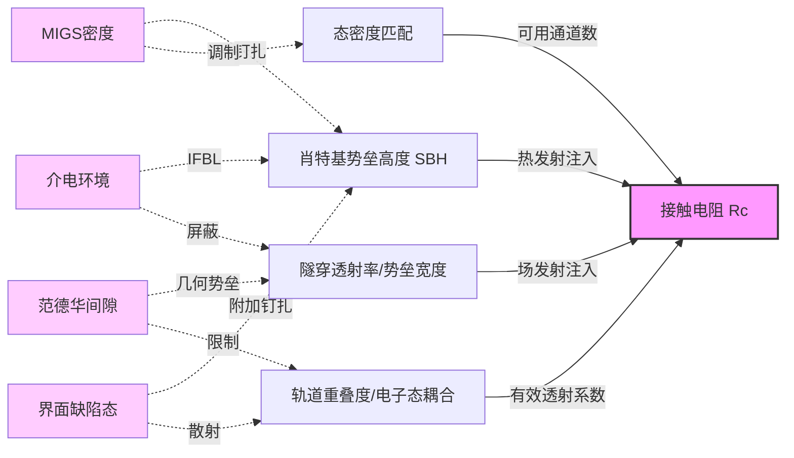
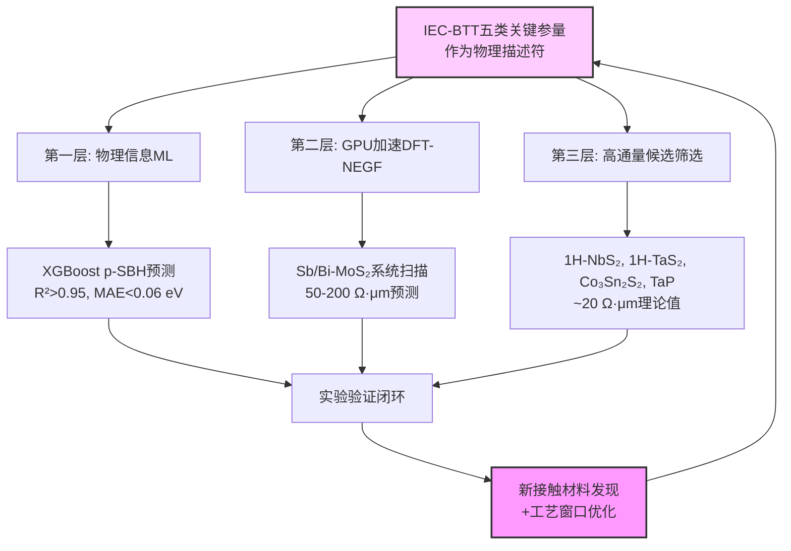
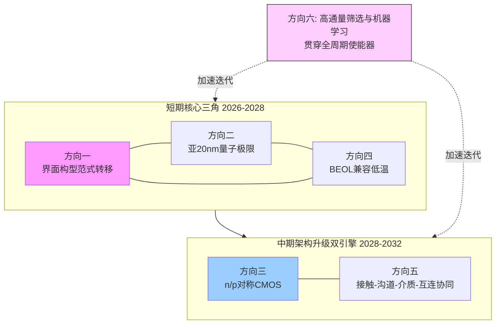
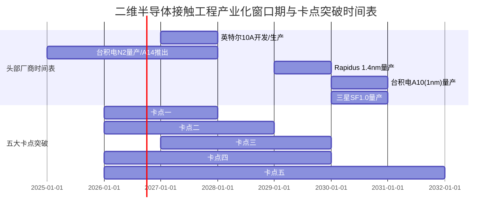

# 二维半导体接触电阻降低机制的统一理论框架探索与未来路径研判
# 1 研究背景与核心问题界定

## 1.1 后摩尔时代二维半导体的战略地位

集成电路产业正处于摩尔定律延续与重构的历史性拐点。当2nm制程战鼓刚刚擂响，全球头部晶圆代工厂的目光已投向更前沿的1nm（A10）节点——这不仅是摩尔定律的终极考场，更是芯片制造工艺从"纳米时代"迈向"埃米时代"的分水岭[^1]。根据IMEC发布的未来硅基晶体管亚1nm工艺节点路线图预测，到2036年，半导体器件将从纳米时代迈入原子（埃米）时代，这意味着硅材料的原子级精准制造将成为半导体科技发展的战略突破方向[^1]。然而，正是在这一关键节点上，传统硅基CMOS架构遭遇了难以回避的物理瓶颈：当沟道厚度被压缩至几纳米以下时，载流子散射使硅的电学特性出现严重劣化，短沟道效应导致泄漏电流陡增、电输运性能下降，传统硅基晶体管面临前所未有的尺寸微缩挑战[^2][^3]。

为应对这一挑战，**国际器件与系统路线图（IRDS）已明确将二维半导体确立为1nm及以下节点的沟道材料**[^4][^5]。原子级厚度的二维半导体即便在亚纳米尺度仍能维持优异的电学特性，并具备出众的静电调控能力，从而有效克服短沟道效应；同时，其原子级平整的层状结构为单片式三维（monolithic 3D）集成提供了独一无二的天然优势[^2][^3]。这种从"几何缩放"向"维度重构"的范式转移，正在重塑后摩尔时代集成电路的技术坐标系。

埃米级制程的产业化竞赛已全面展开，并直接验证了这一战略路径的紧迫性。台积电规划其首个埃米级工艺A10（1nm）将于2030年正式面世，届时采用其3D封装技术的芯片晶体管数量将突破1万亿个；其台南沙仑园区规划建设6座晶圆厂，其中P4-P6工厂专为1nm工艺A10布局[^1]。三星电子则定下2030年前完成1nm级先进制程SF1.0开发并转移至量产的目标，英特尔将10A（1nm）节点定于2027年底进入开发/生产阶段，日本Rapidus也在积极开发1.4nm技术，目标2029年量产[^1]。在此节点上，晶体管架构将从GAA纳米片进化到CFET（互补场效应晶体管），光刻机需要实现0.55甚至0.75的数值孔径，晶圆厂造价将飙升至300亿美元以上[^1]。这些产业指标共同指向一个判断：硅基技术在物理与经济层面的双重边际效应正在迅速收敛，**为非硅新材料打开了一个稀缺的产业化窗口期**。

与产业进度同步，二维半导体在材料制备与器件性能两端均出现了里程碑式突破。在材料制备方面，北京科技大学张跃院士团队提出二维熔融液面限域生长法（2DCZ），利用熔融态玻璃为衬底、熔融态钼酸钠为反应前驱体，构筑互不相容的超临界生长界面，成功实现了尺寸高达1.5 cm的单层MoS₂单晶晶畴，生长速率超过75 μm/s，缺陷密度低至约2.9×10¹² cm⁻²，并验证了2英寸晶圆的生长可行性[^6][^3]。2026年1月，南京大学-苏州实验室王欣然、李涛涛团队与东南大学王金兰团队合作，进一步开发了氧辅助金属有机化学气相沉积（oxy-MOCVD）技术，将反应能垒从2.02 eV降至1.15 eV，制备出**6英寸MoS₂单晶晶圆**，单向取向比例接近100%，光致发光强度较传统MOCVD提升20倍以上，标志着二维半导体产业化制备迈入新阶段[^7]。在器件演示方面，南京大学团队基于半金属欧姆接触外延沉积工艺，在20 nm接触长度下实现接触电阻小于100 Ω·μm，并在国际上首次研制出**接触栅间距（CGP）为40 nm的高性能MoS₂场效应晶体管**，在0.6 V源漏偏压下展现出0.79 mA/μm的驱动电流、大于10⁷的开关比、62 mV/dec的亚阈值斜率和12 mV/V的漏致势垒降低，相关成果与英特尔、台积电、三星等产业巨头的最新进展同台发布于IEEE IEDM 2024[^4]。

材料端的6英寸晶圆突破与器件端的1nm节点指标演示，标志着二维半导体已从基础研究阶段进入向产业应用过渡的关键期，为我国在集成电路赛道转换与技术超越中提供了战略机遇[^4]。

## 1.2 接触电阻：二维半导体产业化的关键瓶颈

尽管二维半导体在沟道材料层面展现出突破硅基极限的潜力，但其走向产线的路径上始终横亘着一道核心物理壁垒——**金属-半导体界面的接触电阻**。这一壁垒的根本性源于二维材料独特的物理结构：相比单晶硅，二维半导体原子层较厚（指相对沟道总厚度而言）且金属与二维材料界面普遍存在范德华间隙，因此极难实现超低接触电阻，这是长期以来限制二维半导体晶体器件的关键瓶颈之一[^5]。

具体而言，接触电阻在二维器件中的瓶颈地位由两个相互耦合的物理效应所决定。其一，金属与二维半导体之间的范德华间隙阻碍了载流子从金属费米能级向沟道导带/价带的直接注入，使界面成为一个串联在沟道两端的额外势垒；其二，金属沉积过程中产生的界面态以及金属诱导隙态（MIGS）会引发严重的费米能级钉扎，使肖特基势垒高度（SBH）难以通过简单选择金属功函数加以调控。这两点共同决定了接触电阻在原子级薄沟道中所占的比重远高于体硅器件，从而直接劣化驱动电流、提高有效电源电压并恶化亚阈值斜率，构成对器件性能-功耗-面积（PPA）核心指标的系统性制约。

IRDS路线图对1nm节点的硬性要求进一步将接触电阻问题量化为一个迫近物理极限的工程命题。集成电路制程"节点"是由晶体管接触栅间距（CGP，包括沟道长度+接触长度+2×栅源间隔长度）定义的；根据IRDS，**1nm节点晶体管CGP必须缩小至40 nm，超越了硅基CMOS器件尺寸微缩极限**[^4]。这意味着接触长度（Lc）必须压缩至20 nm左右量级，而在如此极限尺寸下要使接触电阻不主导器件总电阻，单位长度接触电阻必须降至百欧·微米量级以内。南京大学团队报道的"20 nm接触长度下接触电阻小于100 Ω·μm"正是为响应这一指标而做的针对性突破[^4]。

从理论极限角度审视，接触电阻并非可被无限降低的工程参数，而是受制于量子力学层面的**朗道尔（Landauer）量子电阻下限**。来自南京大学和东南大学团队的研究通过利用强范德华相互作用，实现了单层MoS₂与半金属Sb(0112)之间的轨道杂化，将接触电阻推向量子极限——所制备的Sb(0112)-MoS₂接触电阻仅有42 Ω·μm，**首次低于硅基器件且接近理论量子极限**，同时在125 ℃下也具有出色的稳定性[^5]。这一结果具有双重意义：一方面，它证明二维半导体的接触电阻原则上可以达到甚至优于硅基的水平，破除了"二维材料先天不适合低阻接触"的悲观判断；另一方面，"接近量子极限"的表述意味着进一步降低空间已被基础物理所限制，未来的优化重心将从"降低绝对值"转向"在更短接触长度、更高稳定性、更广材料体系下逼近极限"。

正是上述物理瓶颈与产业指标之间的张力，使接触电阻成为决定二维半导体能否真正进入1nm及以下节点产线的关键变量。它不再是一个可以被沟道材料、栅介质或互连优化所掩盖的次级问题，而是直接决定器件能否在0.6 V源漏偏压下输出毫安级驱动电流、能否将关态电流压制在皮安级别、能否实现亚60 mV/dec亚阈值斜率的**核心瓶颈**[^4]。任何忽视接触工程的二维半导体路线图，都将在埃米级节点的PPA考核中暴露根本性短板。

## 1.3 现有低接触电阻方案理论解释的碎片化困境

正因为接触电阻的关键性，过去十余年间国际学术界与产业界投入了巨大资源开发各类低接触电阻方案，并在多个技术路径上取得了具有标志性的成果。然而，**当不同方案被并置审视时，一个突出的问题开始显现：每一类方案都有其独立的理论解释体系，但这些解释之间缺乏统一的物理语言，甚至在某些维度上彼此矛盾或互不兼容**。

从已发表的代表性工作可以梳理出至少六类相互独立的低接触电阻技术路径，并对应六套不同的解释模型。**半金属欧姆接触**（如Bi、Sb及其特定晶面取向）通常被解释为利用半金属在费米能级附近的低态密度抑制金属诱导隙态，从而缓解费米能级钉扎；其中Sb(0112)-MoS₂体系被特别归因于"强范德华相互作用诱导的轨道杂化"，将这一机制提升至轨道工程的高度——南京-东南团队的工作显示，正是这种轨道杂化使接触电阻被推向42 Ω·μm的量子极限[^5]。**半金属外延沉积工艺**则更强调高纯度晶面取向与界面有序性对载流子注入路径的优化，南京大学团队基于此在20 nm接触长度下实现了小于100 Ω·μm的接触电阻[^4]。**范德华转移接触**（如纯Au、Pd等）通常将其低电阻归因于消除了金属沉积过程中的界面损伤与悬挂键钉裰，使Schottky-Mott规则得以"复活"。**边缘接触**则诉诸完全不同的图像，强调通过共价键合直接绕过范德华间隙以最大化轨道重叠。**相工程接触**（1T/2H相变）则用"金属相态的电子结构连续性"加以解释，把接触问题转化为同种材料不同相态之间的电学衔接。**掺杂调控接触**（Y掺杂、Cl掺杂、表面电荷转移）则从势垒变薄、隧穿增强的角度切入，回到经典半导体接触理论的框架内。

这种局面的出现并非偶然，而是反映了接触物理本身的多维性——SBH、势垒宽度、界面态密度、轨道重叠、范德华间隙、电荷分布等参量本就同时影响接触电阻，而每一种实验方案在工艺上往往只能凸显其中一两个维度，从而导致**理论解释天然带有"局部投影"的特征**。然而，这种碎片化状态在工程与战略两个层面都带来了实际困境：

第一，**工艺优化的方向性不清**。当一个团队基于"低MIGS"的解释优化半金属种类时，另一团队基于"轨道杂化"的解释优化晶面取向，第三团队基于"消除沉积损伤"的解释优化转移工艺——三者所追求的物理变量并不完全一致，导致工艺改进路径分散，难以形成跨方案可累积的设计经验。

第二，**方案选型缺乏跨界比较的物理标尺**。不同团队报道的接触电阻数值往往在不同沟道长度、不同载流子浓度、不同测量温度下取得，在没有统一物理框架的情况下，很难判断"42 Ω·μm的Sb(0112)接触"与"100 Ω·μm的半金属外延接触"在底层物理上是否在逼近同一个极限，也难以预测哪一类方案在埃米级节点的工程化空间更大[^4][^5]。

第三，**对未来路径的研判缺乏统一基础**。在接触电阻已逼近量子极限的当下，行业正面临从"找新材料"转向"设计新界面"的转型。如果各类方案的理论解释无法被归并至一个共同的物理框架，那么对"下一个十年应优化什么参量"这一根本问题就难以给出有逻辑支撑的回答，**所谓的方向预测就会退化为热点跟风**。

由此可见，当前二维半导体接触领域已经积累了相当丰富的实验突破和片段化理论，但缺少的是一个能够将这些突破统一组织起来的**物理框架**——既能解释半金属为何有效、范德华转移为何有效、轨道杂化为何有效，又能在统一变量空间内比较它们的边界条件，并对量子极限下的可达性做出一致判定。这正是本报告所要回应的核心研究空缺。

## 1.4 研究边界、核心问题与研究价值

基于上述背景，本报告将研究对象限定为**以MoS₂等过渡金属硫族化合物（TMDCs）为代表的二维半导体的金属接触电阻问题**，研究层次聚焦于器件级金属-二维半导体界面的物理机制与工程实现，不涉及更大尺度的封装互连或更微观的纯电子结构计算细节。在材料体系上，以MoS₂为主线案例，并适度延伸到WSe₂、WS₂等同类二维半导体；在器件指标上，以IRDS针对1nm节点提出的接触长度<20 nm、接触电阻<117 Ω·μm、稳定性>450 ℃等量化要求作为对标参照[^4]。

为使研究保持聚焦与可操作性，本报告设定以下三个层层递进的核心研究问题：

**核心问题一：现有多元的低接触电阻机制能否归并至一个统一的物理框架？** 即半金属接触的"低MIGS"、范德华转移的"消除界面损伤"、Sb(0112)的"轨道杂化"、边缘接触的"共价键合"、相变接触的"电子结构连续性"、掺杂接触的"势垒变薄"，是否在更深层物理上对应同一组关键参量？本报告将检验"界面电子态耦合强度与势垒透射效率协同优化"作为候选统一框架的解释力与可证伪性。

**核心问题二：在所提出的统一框架下，量子极限对接触电阻的可达边界给出何种判定？** 即当界面电子态耦合与势垒透射被同时优化至物理极限时，二维半导体接触电阻的下限由哪些不可压缩的量子参量所决定？42 Ω·μm的Sb(0112)结果是否已逼近这一下限？在更短接触长度（亚20 nm）下该下限将如何演化？[^5]

**核心问题三：基于统一框架，面向1nm及以下节点的接触工程化路径应如何研判？** 即从"选金属"走向"选界面构型"的范式转移、与BEOL兼容的低温工艺约束、n型与p型对称CMOS的协同设计、晶圆级均匀性的工程挑战，应在统一框架下被赋予何种优先级？通向商业化的关键卡点何在？

本研究的价值由此呈现于三个层面：

第一，**理论整合价值**。通过将分散在多种实验方案背后的解释模型重新组织到统一的电子态耦合-势垒透射协同框架内，本报告试图为二维半导体接触领域提供一种共同的物理语言，弥合不同学派之间的对话鸿沟，使后续研究者能够在同一坐标系下比较新方案、识别新机会。

第二，**产业指导价值**。在埃米级节点产业化窗口期已经打开的当下[^1]，统一框架可以为台积电A10、英特尔10A、三星SF1.0等头部厂商在二维半导体集成路径上的接触工程决策提供物理判据，帮助识别哪些技术路径具有逼近IRDS指标的真实潜力，哪些只是在某一维度上的局部优化。

第三，**赛道转换战略价值**。二维半导体被国家"十五五"规划列为半导体战略核心领域的重要组成部分，被视为我国在后摩尔时代开辟新赛道的重要机遇[^7]。我国研究团队近年来已在材料制备（2DCZ、oxy-MOCVD、6英寸晶圆）和接触工程（Sb(0112)量子极限接触、20 nm接触长度<100 Ω·μm、CGP=40 nm器件）两个方向上做出与国际巨头并跑甚至领跑的成果[^4][^6][^7][^3]。在这一战略性时间窗口内，**形成具有自主性的统一理论框架**，对于把握赛道转换机遇、引导我国二维半导体研究从"单点突破"走向"体系化领先"具有重要的战略意义。

基于以上边界界定与问题设定，本报告将在第2章首先回到金属-半导体接触的基础物理图像，建立后续讨论所需的共同物理语言；随后在第3—4章系统梳理主流低接触电阻方案及其各自的理论解释，揭示碎片化的具体表现；在第5—7章正式提出并检验统一理论框架，包括其定量化路径与边界条件；最后在第8—10章基于该框架推导未来发展方向、产业化路径与战略展望，形成对核心研究问题的完整回应。

# 2 金属-二维半导体接触的基础物理图像

第1章已经厘清了二维半导体接触电阻问题的战略地位、产业指标与理论碎片化困境，并将"界面电子态耦合-势垒透射协同优化"作为候选统一框架抛出。然而，在尚未建立共同的物理语言之前，任何对碎片化方案的归并尝试都会陷入概念错位的风险——例如"半金属抑制MIGS"与"范德华转移消除悬挂键"看似分属不同图像，但二者所指向的"界面态"是否为同一物理实体？"轨道杂化"与"共价键合"是否在变量层面有交集？要回答这些问题，必须先回到金属-半导体接触的物理本源，把SBH、MIGS、FLP、隧穿透射率、量子电导等基础概念在二维语境下重新校准。本章即承担这一**变量坐标系建构**任务：先回顾经典理论给出的接触物理标尺（2.1），再剖析二维半导体引入的结构性变化（2.2），进而提炼出决定接触电阻的四类关键物理量（2.3），最后引入朗道尔量子图像以确立物理下限（2.4）。这一坐标系将成为第3—4章梳理多元方案、第5—7章构建统一框架的共同语言。

## 2.1 经典金属-半导体接触理论的核心机制

金属-半导体接触的物理图像在固体物理史上经历了从理想化到现实化的逐层修正，这一修正过程本身就预示了二维接触的复杂性。**Schottky-Mott规则**给出了最理想化的描述：当金属与半导体接触时，肖特基势垒高度（SBH）应等于金属功函数 $\Phi_M$ 与半导体电子亲和能 $\chi_S$ 之差，即 $\Phi_B^n = \Phi_M - \chi_S$（n型）。在这一理想图像下，工程师只需通过选择具有合适功函数的金属，便可线性、连续地调控SBH，从而获得任意低的接触势垒乃至欧姆接触。然而，半个多世纪的实验表明：在绝大多数体半导体（Si、Ge、GaAs等）上，SBH对金属功函数的依赖性远弱于Schottky-Mott预测——所谓"S参数"（$S = d\Phi_B/d\Phi_M$）通常远小于1，甚至接近于0，意味着SBH被某种内禀机制"钉住"在某一能量位置而难以通过换金属加以调节。这一现象即**费米能级钉扎（Fermi-level Pinning, FLP）**。

对FLP的物理解释经历了两次理论跃迁。第一次是Bardeen提出的**界面态理论**：他注意到半导体表面在禁带内存在大量来自悬挂键、表面重构与缺陷的局域电子态，当这些态的密度足够高时，界面处的电荷转移主要由界面态填充与否决定，而几乎与金属功函数无关，从而使费米能级被钉扎在界面态的"中性能级"附近。第二次是Heine、Tersoff等人发展起来的**金属诱导隙态（Metal-Induced Gap States, MIGS）理论**：即便半导体表面在化学意义上是"洁净"的，金属侧自由电子的波函数仍会以指数形式衰减进入半导体的禁带，在能量上填入半导体的禁带中，形成本征的、无法通过表面钝化消除的连续界面态。MIGS的特征长度由半导体的复能带结构（complex band structure）决定，通常在零点几纳米量级；其在能带中的电中性能级（Charge Neutrality Level, CNL）位置则由半导体本身的电子结构决定。当金属沉积在体半导体上时，MIGS密度往往足以将费米能级钉扎在CNL附近，使Schottky-Mott规则严重失效。

FLP机制对接触工程的实际影响是双重的：一方面，它使"通过换金属调节SBH"这一最直观的工程手段失灵，无论选择何种功函数的金属，SBH几乎不变；另一方面，它意味着**降低接触电阻的核心战场必须从"金属侧的功函数工程"转移到"界面侧的态密度工程"**——要么降低界面态密度（包括MIGS与悬挂键诱导态），要么绕过费米能级钉扎所主导的能量位置。在体半导体接触的经典框架中，工程师通常通过重掺杂使耗尽层变薄、隧穿主导而非热发射主导来回避FLP的束缚，这便是硅基Ohmic接触采用n⁺/p⁺重掺杂源漏的物理基础。然而，这一传统手段在原子级厚度的二维半导体中遭遇了根本性困难：二维材料的有效掺杂能力受限，且重掺杂往往破坏沟道的原子级完整性。这一矛盾正是二维半导体接触必须重新审视基础物理图像的根本动因。

## 2.2 二维半导体接触物理的独特性

二维半导体相对于体硅在接触物理层面的差异，并非量级上的连续过渡，而是源于结构维度本身的几何重构。这些差异同时构成了二维接触的难点与新机会，下表凝练了核心对比维度：

| 维度 | 体硅接触 | 二维半导体接触 |
|------|---------|---------------|
| 沟道厚度 | 数十纳米至毫米 | 单层~亚纳米（如MoS₂约0.65 nm） |
| 表面键合 | 共价/悬挂键丰富 | 面内饱和、表面无悬挂键 |
| 金属-半导体界面 | 共价键合或合金化 | 范德华间隙（约0.3 nm） |
| 介电屏蔽 | 强（$\varepsilon_r$≈11.7）| 弱（面外$\varepsilon_r$≈3–5） |
| MIGS渗透深度 | 远小于沟道厚度 | 可比拟或超过沟道厚度 |
| 掺杂能力 | 重掺杂成熟（>10²⁰ cm⁻³）| 受限，常需替代手段 |
| 镜像力势垒降低 | 由半导体本征介电主导 | 强烈依赖周围介质环境 |

第一项结构性差异是**原子级厚度导致的电场二维化**。当沟道厚度被压缩至单层（MoS₂约0.65 nm）时，金属电极与沟道之间的电势分布不再具有体材料中的三维耗尽层图像，而是退化为一个准二维的电场重分布问题。这一几何变化使经典的"耗尽层宽度-掺杂浓度"关系不再适用，势垒宽度的调控逻辑必须在二维静电学下重新书写。

第二项差异是**表面无悬挂键带来的范德华间隙**。二维材料的面内化学键已饱和，表面在化学意义上是"自钝化"的，因此当金属沉积或转移至其上时，金属与二维材料之间不再形成共价键合或合金化界面，而是被一个约0.3 nm的范德华间隙隔开。这一间隙在物理上等同于在金属与半导体之间插入了一个**额外的、非共价的隧穿势垒**——即便MIGS与悬挂键诱导态被有效抑制，载流子从金属注入沟道仍需穿越这一间隙，使有效接触势垒由"SBH"扩展为"SBH + vdW gap"两段式结构。这是二维半导体接触相对于体硅最根本的几何性增项。同时，无悬挂键的表面在原则上为Schottky-Mott规则提供了"复活"的物理空间——只要MIGS被有效抑制，二维半导体表面就可以维持低界面态密度的洁净电子结构，使SBH重新由功函数差主导。这便是近年来文献中频繁出现的"扩展Schottky-Mott规则"或"范德华接触下Schottky-Mott复活"的物理根源。

第三项差异是**介电屏蔽效应的弱化与镜像力势垒降低（IFBL）的环境敏感性**。在体半导体中，载流子注入界面时的镜像力势垒降低主要由半导体本身的介电常数决定；而在二维半导体接触中，由于沟道厚度小于经典镜像电荷的特征长度，载流子所感受到的镜像势能受到周围栅介质、衬底氧化层等环境介质的强烈调制。Brahma、Van de Put、Fischetti、Vandenberghe等人针对TMD边缘接触的建模研究通过数值求解Poisson方程并采用WKB近似计算透射概率，明确指出：**周围氧化层的介电常数主导了边缘接触中的镜像力势垒降低，而低κ介质对获得低电阻单层TMD边缘接触至关重要**[^8]。这一结论将"接触电阻"问题从单纯的"金属-半导体两体问题"扩展为"金属-半导体-周围介质三体问题"，意味着二维接触的优化变量空间天然包含了栅介质与衬底材料的协同选择。

第四项差异是**MIGS渗透深度与沟道厚度的可比性**。在体半导体中，MIGS的零点几纳米渗透深度远小于沟道厚度，仅在界面附近的局部区域起作用；而在单层MoS₂这样的原子级薄沟道中，MIGS的渗透深度已经可比甚至超过沟道厚度，这意味着MIGS不仅在界面局部起作用，而且可能贯穿整个沟道，使FLP机制在原子尺度上呈现出比体材料更强的"穿透性"。这进一步强化了"抑制MIGS"在二维接触工程中的核心地位。

正是这些结构性差异，使得二维半导体的接触物理无法被简单地视为体硅接触的"薄化版本"。郭泉林等人在综述二维范德华器件界面表征时即指出，**电学器件的性能受界面接触电阻的影响显著，二维材料原子级厚度使其界面表征必须依赖具有原子级及以上分辨能力的检测技术**，因为即使是亚纳米尺度的点缺陷、线缺陷或层错等局域电磁环境，也会极大地影响器件性能的精确调控[^9]。这一表征层面的事实从侧面印证了二维接触物理的微观敏感性——任何理论框架都必须在亚纳米尺度上对界面结构、缺陷分布与电子态耦合做出一致描述。

## 2.3 决定接触电阻的关键物理量

基于上述独特性，可以将影响二维半导体接触电阻的核心物理变量提炼为四类相互耦合的关键参量。这四类参量构成了后续统一框架的候选自变量集，也是比较不同方案物理本质的共同坐标。

**第一，肖特基势垒高度（SBH）**。SBH决定了热发射主导区的注入效率，其在二维语境下的物理意义已不再是简单的 $\Phi_M - \chi_S$，而是被界面态密度、范德华间隙处的偶极矩、镜像力势垒降低以及介电环境共同调制的有效势垒。在弱耦合（范德华）极限下，SBH接近Schottky-Mott预测；在强耦合（共价/边缘）极限下，SBH被界面态密度主导而趋向CNL。SBH不仅决定了热发射电流密度，还通过Boltzmann因子影响整个热场发射区的电流-电压特性，是任何接触方案都必须正面回应的首要参量。

**第二，隧穿透射率与势垒宽度**。在SBH难以被进一步压低的情况下，载流子可通过隧穿绕过势垒；隧穿透射率在WKB近似下取决于势垒宽度 $W$、势垒高度与有效质量，常表达为 $T \propto \exp\left(-2\int \sqrt{2m^*(V(x)-E)/\hbar^2}\, dx\right)$。在二维接触中，"势垒宽度"具有双重物理含义：其一是经典耗尽层宽度，可通过掺杂或重界面电荷转移加以压缩；其二是范德华间隙宽度，由界面分子间距与非共价键合的几何决定，原则上不依赖掺杂而依赖界面构型。Brahma等人对TMD边缘接触的WKB-DFT联合建模工作即基于这一隧穿图像，通过对全带态密度与电势分布的数值求解，揭示了周围介质环境如何通过调制势垒形貌影响透射率[^8]。

**第三，态密度匹配**。可用注入通道数由金属与二维半导体在费米能级附近的态密度共同决定，二者在能量与动量空间的匹配程度直接限制了载流子的有效转移率。普通金属（如Au、Ag、Pd）在费米能级附近态密度高且连续，对应丰富的可用通道；而半金属（如Bi、Sb）在费米能级附近态密度极低且呈现出近似线性色散的特征，这一特性既意味着载流子注入通道数受限，但同时也意味着MIGS态密度（与金属侧态密度直接相关）被显著抑制，从而缓解FLP。这一矛盾性使态密度成为二维接触中需要同时考量"通道数"与"钉扎抑制"的双刃剑参量。

**第四，轨道重叠度与界面电子态耦合强度**。当金属与二维半导体之间存在显著的范德华间隙时，载流子转移的有效透射系数不仅由势垒形貌决定，更被界面两侧波函数的轨道重叠所调制。轨道重叠度高意味着波函数在界面两侧具有更大的相互交叠，从而提高隧穿矩阵元；轨道重叠度低则即便势垒不高，载流子也难以有效转移。在Sb(0112)-MoS₂体系中，正是特定晶面取向使Sb的p轨道与MoS₂的Mo-d/S-p轨道形成强范德华相互作用诱导的轨道杂化，使有效透射显著提升。可以认为，**轨道重叠度是连接"几何接触构型"与"电子态耦合"的桥梁参量**，它将晶面取向、堆垛方式、界面距离等几何变量映射为电子结构层面的耦合强度。

这四类参量并非彼此独立，而是在物理上深度耦合并存在权衡关系：抑制MIGS（降低态密度匹配中的钉扎部分）有利于使SBH重新由功函数主导，但过低的金属态密度也会降低可用通道数；增强轨道杂化提升透射，但同时可能引入新的MIGS渠道；压缩范德华间隙降低隧穿势垒宽度，但若引入共价键合则可能反过来诱发悬挂键钉扎。下图归纳了这四类关键参量之间的协同与权衡关系：



可以看到，**接触电阻并非由单一参量决定，而是由SBH、隧穿透射率、态密度匹配、轨道重叠度四个一阶变量与MIGS、范德华间隙、介电环境、界面缺陷态四个二阶调制变量共同塑造**。这一变量结构正是第3—4章中各类方案理论解释碎片化的根源——每种方案往往只优化其中一两个变量，并以该变量为核心构建解释模型，从而出现"半金属强调态密度抑制MIGS"、"范德华转移强调消除界面缺陷态"、"边缘接触强调轨道重叠"等局部投影式的理论叙事。第5章所要构建的统一框架，本质上就是把这一耦合的多变量空间在物理层面"补全"。

## 2.4 接触电阻的量子极限与朗道尔图像

将上述四个关键参量推向各自的物理极限后，接触电阻并不会无限趋近于零，而是收敛到一个由量子力学决定的下限——这便是**朗道尔（Landauer）量子极限**。在朗道尔输运图像下，二端器件的电导可表达为各导电通道透射率之和与单通道量子电导的乘积：

$$G = \frac{2e^2}{h}\sum_n T_n$$

其中单通道量子电导 $G_0 = 2e^2/h \approx 77.5\ \mu\mathrm{S}$（计入自旋简并），对应单通道量子电阻约 $12.9\ \mathrm{k\Omega}$。当各通道透射率 $T_n$ 都趋近于1时，接触电阻的下限便由可用导电通道数 $N$ 决定，即 $R_c^{min} \approx (N \cdot G_0)^{-1}$。在二维半导体接触中，可用通道数由费米能级附近金属与半导体态密度的较小者决定，并与接触宽度近似成正比，从而使接触电阻在归一化为 $\Omega\cdot\mu m$ 的单位制下呈现出一个**与材料体系绑定的量子下限**。

这一下限的具体形式由二维半导体的能带结构所决定。对于MoS₂，K谷的双重简并（自旋-轨道耦合下的有效简并度）与谷间散射决定了单位接触宽度下的可用通道密度；当所有通道都达到完美透射时，对应的接触电阻在理论估计上处于几十 $\Omega\cdot\mu m$ 量级。第1章已述及的Sb(0112)-MoS₂体系所实现的42 $\Omega\cdot\mu m$ 接触电阻被定性为"接近理论量子极限"，正是基于这一物理判定：在这一数值下，**SBH已被压低至热发射不构成主导阻碍、范德华间隙处的隧穿透射率已接近饱和、轨道杂化已使有效透射系数接近1、可用通道数已被完全利用**——四类关键参量被同时优化至接近各自的极限值，剩余的电阻已主要由MoS₂自身的能带结构（费米能级处的可用通道数密度）所决定。

这一图像对后续章节的研究具有三层意义。其一，它为"接近量子极限"提供了可证伪的物理判据——若一个方案宣称达到接触电阻的极限，则必须同时验证四类关键参量的优化状态，而非仅以数值低为依据。其二，它明确了**未来优化的重心已从"降低绝对值"转向四个新维度**：一是在更短接触长度（亚20 nm）下维持量子极限（涉及电流拥挤与传输长度问题）；二是在p型沟道与不同二维半导体（WSe₂、WS₂、Bi₂O₂Se等）上重现量子极限；三是在更高温度与更长时间下维持极限值的稳定性（涉及热稳定性与电学稳定性）；四是在晶圆级均匀性与硅基产线工艺兼容性下批量复现极限值。其三，它揭示了**进一步突破量子极限的唯一路径在于"扩展通道数"本身**——例如通过应变工程改变能带简并度、通过异质堆垛引入额外的传输通道、通过相变接触把同一材料的不同相态作为额外的态密度库——这些路径将在第8章作为统一框架推导出的未来方向加以展开。

至此，本章已经建立起后续讨论所需的共同物理语言：**SBH、隧穿透射率/势垒宽度、态密度匹配、轨道重叠度**四个一阶变量，**MIGS、范德华间隙、介电环境、界面缺陷态**四个二阶调制变量，以及由朗道尔图像给出的量子极限边界。在此坐标系下，第3章将系统梳理主流低接触电阻方案的实验数据与理论解释，第4章将揭示这些解释在变量层面的局部投影性质，进而为第5章统一框架的提出奠定证据基础。

# 3 主流低接触电阻方案的系统分类与机制解析

第2章已经在SBH、隧穿透射率/势垒宽度、态密度匹配、轨道重叠度四类一阶变量与MIGS、范德华间隙、介电环境、界面缺陷态四类二阶调制变量构成的共同坐标系下，给出了二维半导体接触物理的基础图像，并以朗道尔量子极限作为接触电阻可达边界的物理判据。基于这一坐标系，本章将对过去十余年间在国际学术界与产业界陆续涌现的主流低接触电阻方案进行系统分类与机制解析。需要强调的是，本章的目的并非简单罗列各方案的工艺细节与性能数据，而是要在每一节中回答四个层层递进的问题：**该方案给出了怎样的代表性数据？其作者所援引的核心解释模型是什么？该模型在第2章四类一阶变量中主导优化了哪一维度？方案的适用边界与潜在反例何在？** 这四个问题贯穿3.1—3.8节的七类技术路径与一类衍生路径，最终在3.9节汇集为统一坐标下的横向比较图谱，从而为第4章揭示理论解释的碎片化困境、第5章构建统一框架奠定结构化的实证基础。

## 3.1 半金属接触：Bi、Sb及其合金的低MIGS图像

半金属接触是过去五年间二维半导体接触工程领域最具范式意义的突破方向之一，其奠基性工作来自麻省理工学院孔静（Jing Kong）教授领导的MIT-台积电-台大三方联合团队。该团队自2019年起开展长达约一年半的跨国合作，于2021年5月在《Nature》上发表"Ultralow contact resistance between semimetal and monolayer semiconductors"一文，**首次在单层MoS₂上利用半金属铋（Bi）作为接触电极实现了零肖特基势垒高度，所测得的接触电阻为123 Ω·μm，导通电流密度达到1135 μA/μm**，按照作者自身的表述，这两个数值分别是当时记录中"最低和最高"的[^10][^11][^12][^13]。在该工作之后，香港大学李燦助理教授与Lain-Jong Li教授团队进一步在《Nature Nanotechnology》上报道了基于半金属锑（Sb）接触的MoS₂闪存器件，证明了Sb与MoS₂能够形成接近理想的欧姆接触，**饱和导通电流超过230–300 µA/μm，电流开关比达到约10⁹–10¹⁰**，对200 nm沟道长度器件最大读出示电流超过60 µA/μm[^14]。

从理论解释的角度看，Bi/MoS₂体系作者对其低接触电阻给出的核心物理图像是**金属诱导隙态（MIGS）的充分抑制**。在传统普通金属-单层半导体界面，金属侧自由电子波函数渗透进入半导体禁带形成MIGS，导致肖特基势垒被钉扎而抑制载流子流动。半金属铋因为其费米能级附近的态密度极低，金属侧能够提供给MoS₂禁带内的"渗透波函数"显著减少，从而使MIGS密度被根本性压制，TMD中的简并态与铋接触自发形成，最终在单层MoS₂上实现了零肖特基势垒高度[^13][^10]。同样的图像也被用以解释Sb-MoS₂接触的成功——**半金属锑与MoS₂能形成接近理想的欧姆接触，极大降低了肖特基势垒**，相比于传统金属与二维半导体接触时因金属诱导带隙态和范德瓦尔斯间隙导致的显著接触电阻和费米能级钉扎而言，半金属接触在物理本质上构成一种针对MIGS的釜底抽薪[^14]。

在主奏的"低MIGS"叙事之外，近期的次级机制研究为半金属-MoS₂界面提供了更细致的物理刻画。一项针对Bi、Sb及其合金的对比研究通过第一性原理计算与光谱测量发现：**半金属在CVD生长的单层MoS₂中诱导出n型电子掺杂与拉伸应变，而二者共同充当接触电阻与迁移率的"增强剂"。其中Bi造成的电子掺杂浓度最高，约为2×10¹³ cm⁻²，并伴随约0.5%的拉伸应变，从而同时降低接触电阻并提升迁移率**[^15]。这一发现意味着半金属接触并非仅作用于第2章所述的"态密度匹配"一阶变量，同时还在背景层面调制了沟道侧的载流子浓度（影响隧穿势垒宽度）与能带结构（应变调制有效质量与谷间能差），其物理影响实际上跨越了多个一阶变量。斯坦福Marc Jaikissoon、Eric Pop团队所开展的氮化硅覆盖层应变工程亦印证了这一点——**350°C低热预算下的拉伸应变使背栅与双栅MoS₂晶体管的中值导通电流分别提升约60%和45%，模拟表明性能提升主要源自拉伸应变降低了接触肖特基势垒**[^16]。

然而，半金属接触的物理图像并不能涵盖所有相关现象。最关键的反例在于热稳定性：铋的熔点仅约271 °C，意味着Bi/MoS₂接触在面对BEOL 400 °C的工艺热预算时面临根本性挑战。Sb的熔点更高（约630 °C），但在传统电子束蒸镀方法下其相纯度低、晶畴尺寸受限，导致接触电阻在亚20 nm接触长度下并不能直接保持微米级Lc下的优异数值。这正是3.2节所要展开的Sb(0112)取向工程进一步精细化半金属接触的现实驱动力。

## 3.2 轨道杂化增强的晶面取向工程：Sb(0112)路径

如果说3.1节的半金属接触把优化重心放在"态密度匹配中的MIGS抑制"这一维度上，那么2023年发表于《Nature》的Sb(0112)-MoS₂体系则代表了一种**对第2章"轨道重叠度"维度的针对性优化**，并在量化指标上首次推动二维半导体接触电阻进入接近朗道尔量子极限的水平。该工作由南京大学王欣然、施毅团队与东南大学王金兰、马亮团队合作完成，相关成果以"Approaching the quantum limit in two-dimensional semiconductor contacts"为题发表[^17][^18][^19]。

实验上，团队基于第一性原理计算预测：**在半金属锑中存在一个特殊的(0112)面，具有较强的z方向原子轨道分布，即使存在范德华间隙，仍然与MoS₂形成较强的原子轨道重叠，导致金属-半导体能带杂化，大幅提升接触界面电荷转移和载流子注入效率**[^17][^19]。基于这一物理设计，团队发展出高温蒸镀工艺在MoS₂上制备Sb(0112)薄膜，**最终实现了42 Ω·μm的接触电阻，刷新了金属-半导体接触电阻的最低纪录，首次超越以化学键结合的硅基晶体管接触电阻并接近理论量子极限，且该接触在125 °C工作温度下具有良好的稳定性**[^17][^18][^19]。后续计算进一步表明，这一轨道杂化增强策略对于WS₂、MoSe₂、WSe₂等其他过渡金属硫族化合物半导体具有良好的普适性，意味着该机制不是某一特定材料体系的偶然现象，而是一种可泛化的接触工程原理[^17][^19]。

理论解释层面，Sb(0112)-MoS₂体系的核心叙事与3.1节的"低MIGS"图像存在本质差异。**Sb(0112)路径并不主张通过低费米态密度规避MIGS问题，而是承认范德华间隙的存在，并主张通过晶面取向选择使Sb的z向原子轨道与MoS₂面外方向的Mo-d/S-p轨道形成有效重叠，从而在范德华间隙这一几何势垒内打开一条"轨道杂化通道"**——其物理图像是把"间隙"从纯几何隧穿势垒升级为承载能带杂化的电子耦合区，使有效透射系数本身被显著提升[^17][^19]。东南大学公布的差分电荷密度分布图与垂直方向静电势变化曲线为这一图像提供了直接的电子结构证据：在Sb(0112)/MoS₂界面附近，电荷重新分布显著、近费米能级波函数在Sb与MoS₂之间形成明确的杂化峰[^19]。在第2章建立的坐标系中，这正是"轨道重叠度"这一一阶变量被作为主导优化维度的典型范例。

Sb(0112)路径的工程化在2025年得到进一步推进。同一团队在前期"轨道杂化增强接触机制"基础上，于MoS₂上创新开发了分子束外延（MBE）锑晶体(0112)接触技术，相关成果以"Scaled crystalline antimony Ohmic contacts for two-dimensional transistors"为题发表于《Nature Electronics》[^20][^21]。其工程性突破集中在三方面：**第一，相比传统电子束蒸镀方法，MBE可实现几乎单一取向纯度（97.2%）的Sb(0112)晶体薄膜，晶畴尺寸提升两个数量级，并与MoS₂形成原子级锐利的界面**[^20]；**第二，在20 nm以下接触长度首次实现小于100 Ω·μm的接触电阻，满足IRDS对1 nm节点晶体管的指标要求**[^20]；**第三，基于该接触工艺研制出CGP小于40 nm的MoS₂晶体管，接触长度18 nm、栅长17 nm，在0.7 V源漏偏压下实现1.08 mA/μm的高驱动电流、>10⁷的开关比、<10 pA/μm的关态电流、62 mV/dec的亚阈值斜率以及12 mV/V的漏致势垒降低**[^20][^21]。TCAD仿真显示锑晶体接触的传输长度仅为13 nm，可支撑MoS₂晶体管微缩至亚1纳米节点[^20]。

值得特别注意的是，Sb(0112)路径所体现的"晶面工程+界面工艺"协同思路与3.1节的纯Bi/Sb半金属接触在物理图像层面并非完全对立——MBE Sb(0112)在保留半金属低费米态密度（抑制MIGS）的同时，更进一步利用晶面取向工程提升轨道重叠度，本质上是**对态密度匹配与轨道重叠度两个一阶变量的同时优化**。这一双重优化的成功既支撑了半金属接触的"低MIGS"叙事，又揭示了"低MIGS"远不足以解释全部物理——若仅靠低MIGS即可逼近量子极限，则任意半金属电极均应给出42 Ω·μm级别的接触电阻，而实验事实是只有特定晶面才能做到。这一观察将在第4章中作为揭示"低MIGS"解释模型局部投影性质的重要证据。

## 3.3 范德华转移接触：Pd、Au、In等金属的Schottky-Mott复活

与3.1—3.2节强调"金属本身物性选择"的思路不同，范德华转移接触提出了一种**完全在工艺端做减法**的优化路径：通过将预制的金属薄膜直接物理压印或转移至二维半导体表面，避免传统金属沉积过程（蒸镀、溅射）对二维材料表面的高能轰击与化学损伤，从而保留二维材料表面的化学惰性与无悬挂键状态，使Schottky-Mott规则得以"复活"。

代表性的范德华转移接触实验包括三类。其一是**铟（In）/MoS₂ 接触**：Bum-Kyu Kim等人通过在低热能下蒸镀In并随后用液氮将衬底冷却至约100 K的方式，实现了原子级洁净的In/MoS₂范德华接触。**该接触在2.4–300 K的宽温区内呈现基于场发射机制的欧姆传输，少层与单层MoS₂在低温下的接触电阻分别约为600 Ω·μm与1000 Ω·μm**；密度泛函计算表明，In与MoS₂导带边缘态之间的杂化形成了大量的in-gap states，是其欧姆类输运的微观起源[^22]。其二是**金（Au）转移接触**：在加州大学洛杉矶分校段镶锋团队针对卤化钙钛矿薄膜的工作中，通过将预制的金原子平面薄膜电极层直接压印于半导体薄膜上的方式实现范德华接触，**与沉积接触方法相比，范德华接触显示出低2–3个数量级的接触电阻**[^19]。这一对比虽来自钙钛矿体系，但其工艺思想与对二维半导体的应用具有完全一致的物理逻辑——**接触电阻的数量级跃降不源于金属本身物性的改变，而源于消除了沉积过程引入的界面态**。其三是**钯（Pd）和金的有机半导体范德华接触**：Junpeng Zeng等人在C10-DNTT有机场效应晶体管中将转移Pt作为接触，**通过Pt催化的侧链脱氢反应有效缩短了金属-半导体范德华间隙、促进了轨道杂化，最终实现总接触电阻低至14.0 Ω·cm的水平，并报道了空穴迁移率18 cm²/V·s、饱和电流28.8 μA/μm、亚阈值摆幅60 mV/dec、本征截止频率0.36 GHz的器件性能**[^23]。这一结果以另一种方式印证了范德华接触作为"工艺减法"的物理图像。

范德华转移接触的核心理论解释是**消除金属沉积过程中的悬挂键诱导界面态与化学损伤，使界面回归洁净的范德华构型，从而Schottky-Mott规则得以复活**。这一图像在体硅接触的研究中获得了独立印证：一项基于第一性原理的研究表明，**金属-硅与金属-锗接触如果采用相同的界面键合构型，应具有相似的FLP强度；硅倾向于重构键合构型而锗倾向于理想非重构构型，悬挂键的"自钝化"使界面带隙态减少，造成金属-硅接触中的FLP远弱于金属-锗接触，且界面悬挂键完全钝化可进一步将钉扎因子提升至0.5**[^23]。这一研究的关键意义在于明确指出"悬挂键诱导的表面态在界面FLP中扮演与MIGS相当的关键角色"，从而为范德华接触"通过消除悬挂键即可显著缓解FLP"的图像提供了体半导体侧的验证基础。在第2章建立的坐标系下，**范德华转移接触主导优化的是"界面缺陷态"这一二阶调制变量**——通过消除沉积损伤造成的悬挂键诱导态，间接降低有效MIGS密度并解除FLP。

然而，范德华转移接触的物理图像内含一个深刻的双刃剑效应。一方面，范德华间隙的存在确实在几何上屏蔽了金属侧波函数对半导体禁带的渗透，从而降低MIGS密度、有利于SBH随金属功函数线性可调；但另一方面，约0.3 nm的范德华间隙本身构成了一个额外的隧穿势垒，限制了透射率向单位极限的进一步逼近。这正是为什么In/MoS₂在洁净范德华接触下也只能在低温下达到600–1000 Ω·μm，而无法逼近Sb(0112)在常温下达到的42 Ω·μm[^22][^17]。从这一对比可以看出：**纯范德华转移接触实际上对"轨道重叠度"这一关键一阶变量没有正面优化能力**，它只是消除了几个二阶调制变量（界面缺陷态、悬挂键诱导态）的负面影响。这一观察解释了为什么3.2节的Sb(0112)路径需要以"晶面取向"主动设计正向的轨道重叠，以及为什么3.7节的原子层键合接触最终选择了"主动消除范德华间隙"的更激进路径。

在工程化层面，范德华转移接触的局限同样显著。转移工艺涉及预制金属薄膜的剥离、对位、压印与脱模，对洁净度、一致性与对准精度均提出严苛要求，**晶圆级良率、与硅基产线的兼容性以及BEOL热预算下的稳定性均面临根本性挑战**——范德华界面的粘附能本身较弱（量级仅约0.05 eV·Å⁻²），高温退火时金属再结晶、球化即可能拉裂沟道[^24]。这是范德华转移接触虽具有最直接的物理优雅性、却始终未能进入产业化主流路径的核心原因。

## 3.4 边缘接触：共价键合绕过范德华间隙

边缘接触代表了一条与范德华转移接触在哲学上完全相反的路径：与其保留并优化范德华间隙，不如**主动暴露二维材料的层边缘并与金属形成共价键合**，从几何上彻底绕过范德华间隙这一隧穿势垒。其核心物理逻辑在第2章变量坐标下可以表述为：**通过主动引入共价键直接最大化"轨道重叠度"这一一阶变量，并把"范德华间隙"这一二阶变量从公式中剔除**。

代表性工作包括两类。其一是**自对准边缘接触（SAEC）TMD场效应晶体管**：研究团队通过反应离子刻蚀将WS₂半导体与六方氮化硼（h-BN）介质集成为一个整体，进而暴露TMD层边缘形成边缘接触，无需额外光刻步骤即可实现自对准制造。**SAEC TMD-FET展现出约10⁸的开关比、最高120 cm²/V·s的场效应迁移率以及可控的极性，且该工艺与现有的硅自对准工艺兼容，凸显了其在后CMOS应用中的集成可行性**[^12]。其二是**外延石墨烯侧接触**：天津大学Lei Ma团队在Si(0001)的非极性面上生长的外延石墨烯边缘构筑低电阻侧接触，TLM外推接触电阻约334–340 Ω·μm，并通过原位ALD封装提供晶圆级的工艺兼容路径[^25]。

边缘接触的理论解释一方面包含直观的"共价键合最大化轨道重叠"图像，另一方面在精细建模层面则进入了第2章所提及的"金属-半导体-周围介质三体问题"。Madhuchhanda Brahma、Maarten L. van de Put、Edward Chen、Massimo V. Fischetti、William G. Vandenberghe等人在SISPAD 2024发表的工作中针对二维材料边缘接触的电阻进行了系统数值建模，他们使用WKB近似计算透射概率、用密度泛函理论得到全带态密度、并通过求解二维Poisson方程获得电势分布。**他们的结论是：低κ背栅氧化物配合低κ顶介质环境对获得低电阻"静电掺杂"边缘接触至关重要；而在杂质掺杂的边缘接触中，镜像力势垒降低则由周围氧化物与二维材料自身的介电常数共同决定**[^24]。这一精细建模揭示了边缘接触并非纯粹的"金属-半导体两体共价问题"，而必须把背栅介质、顶介质与二维材料的介电环境作为关键自由度纳入设计——在第2章坐标系中，这相当于把"介电环境"这一二阶调制变量提升为主导设计参量之一。

边缘接触的极限可扩展性在一维-二维异质接触上得到了戏剧性的展示。Yang Wei等团队基于单壁碳纳米管（SWCNT）电极构建一维半金属-二维半导体接触，**这一构型可以将接触长度推入亚2 nm区域**。该工作发现：**1D–2D异质结构具有比2D–2D异质结构更小的范德华间隙，肖特基势垒高度可通过栅极电势有效调谐以实现欧姆接触**；通过对短接触极限下的纵向传输线模型分析，**所提取的1D–2D接触电阻率低至约10⁻⁶ Ω·cm²**[^26]。这一结果表明在终极小尺度的接触长度下，边缘式接触构型仍能维持极低的接触电阻率，为亚2 nm接触长度时代的器件设计提供了关键的物理证据。

然而，边缘接触并非没有代价。共价键合在最大化轨道重叠的同时，也在边缘暴露了原本饱和的悬挂键，这些悬挂键可能引入新的界面态而带来局部FLP——这与范德华转移接触正好走向了相反的反向效应方向。此外，在精确边缘暴露的工艺端，反应离子刻蚀的化学选择性、刻蚀深度的原子级控制、边缘粗糙度对接触电阻的影响等均构成晶圆级量产的严苛门槛。这些反向效应解释了为什么边缘接触在原理上具有"最大化轨道重叠"的物理优势，但在量化数值上（如外延石墨烯侧接触约334 Ω·μm）尚未能像Sb(0112)那样接近朗道尔量子极限。

## 3.5 相变接触：1T/2H相工程的电子结构连续性

相变接触提出了一种在物理图像上极具独创性的策略：**与其在金属与半导体之间寻找最佳的"异种界面构型"，不如通过相变把同种二维材料的金属相态直接作为接触区，与半导体相沟道之间形成"同源界面"**。在MoS₂体系中，这一思路对应于通过化学诱导、应力诱导或物理处理等方式将接触区局部从天然的2H半导体相转化为1T金属相，从而避免传统金属-半导体接触中的突变界面与FLP问题。

代表性实验来自Yuan Fa等人在ACS Applied Materials & Interfaces上发表的工作。该团队**通过反向溅射诱导MoS₂表面形成导电的1T相，使所制造的MoS₂场效应晶体管接触电阻降低至未处理对照的不到50%**，并伴随导通电流的同步显著提升[^27]。这一工艺的核心优势在于反向溅射本身是标准半导体工艺步骤，因此该方法在更广的应用场景下具有移植潜力。在更早的奠基性工作中，化学诱导的1T相变（如锂化处理）即已展示了显著的接触电阻降低效果，奠定了"相变金属化作为内禀低电阻接触"的物理范式。

相变接触的核心理论解释是**"同种材料不同相态的电子结构连续衔接"**——1T相作为金属相与2H相作为半导体相在同一晶格框架内共享化学键合体系，二者之间的过渡不构成传统意义上的金属-半导体异质界面，因而**根本性消除了MIGS与界面缺陷态这一类二阶调制变量**。在第2章坐标系下，相变接触的优化重心可以表述为"通过把'界面消除'本身作为目标来同时压制MIGS、界面缺陷态、范德华间隙三个二阶变量，使透射近似回归到无界面散射的理想情况"。

然而，相变接触在BEOL热预算面前面临一个根本性挑战。1T相在MoS₂体系中本质上是亚稳相态，在常温下即存在向2H相回退的热力学倾向；当面对400 °C的BEOL工艺热预算时，相变区的稳定性与边界清晰度均面临严峻考验。这一稳定性瓶颈在很大程度上限制了纯1T/2H相变接触在量产产线上的应用，并部分解释了为什么后续的工程化方向更多地走向"通过外加掺杂稳定金属相"的复合路径——3.8节将讨论的Y掺杂诱导MoS₂二维金属化即是这一思路的代表[^21]。从某种意义上说，**Y掺杂相变接触是1T/2H相工程与替代式掺杂的杂交产物**，它通过引入稀土元素的化学掺杂使金属化的接触区获得热力学意义上的稳定性，从而克服纯1T相变接触的BEOL兼容性瓶颈。

## 3.6 缓冲层/插入层接触：h-BN、石墨烯、硒等中介层

如果说前几节的方案均聚焦于直接的金属-二维半导体两体界面，那么缓冲层/插入层接触提出了一种**三体界面工程范式**：在金属电极与二维半导体之间引入一层超薄中介层，使中介层既能承担与金属侧的高功函数耦合，又能在与半导体侧的界面上抑制MIGS。这一策略对长期作为二维半导体接触瓶颈的p型接触尤其具有针对性。

最具代表性的工作来自香港理工大学团队提出的**"能带杂化硒接触"策略**。其核心创新在于：**利用硒元素具有所有元素中最高的本征功函数（5.9 eV）这一独特优势，在金电极与p型半导体之间引入超薄硒界面层；硒层与金电极发生独特的能带杂化作用，使接触界面从半导体特性转变为半金属特性，这种半金属态在费米能级附近的低态密度有效抑制了金属诱导带隙态的产生**[^20]。紫外光电子能谱测量显示金/硒接触的有效功函数高达4.50 eV，显著优于铂、金和钯等传统高功函数金属。**该策略应用于p型WSe₂晶体管获得了低至540 Ω·μm的接触电阻和高达430 μA/μm的饱和电流密度，并成功拓展至黑磷和碳纳米管等多种p型半导体**[^20]。基于密度泛函理论的投影态密度计算表明，约1 nm厚的硒层可实现完全的能带杂化和半金属特性，过厚则会恢复其本征半导体性质，这为优化界面层厚度提供了精确的理论指导。

理论上探索的更激进路径来自范德华异质结工程。一项基于从头计算的研究系统提出并模拟了三种p型接触改进策略：**(i)在高功函数金属与WSe₂之间插入石墨烯层，可实现约60 Ω·μm的接触电阻；(ii)对范德华金属与二维半导体的原子堆叠顺序进行工程化设计，可达到约50 Ω·μm；(iii)用范德华金属从两侧夹持二维层状半导体，可进一步将上述两类方案的接触电阻分别降至约47 Ω·μm与约36 Ω·μm**[^26]。实验验证表明这些结构的制造可行性。这组数值具有重要的物理意义：**它们在p型接触上首次给出了与3.2节Sb(0112)在n型上达到的42 Ω·μm相当的预测值**，从而暗示在统一的物理图像下，n型与p型接触在量子极限层面具有可比的可达性，差距更多源自工艺成熟度而非物理本质。

第二类典型缓冲层接触来自韩国科学技术研究院团队提出的**Cl-SnSe₂二维范德华金属电极**，他们利用WSe₂晶体管演示了"Fermi-Level Pinning-Free WSe₂ Transistors via 2D Van der Waals Metal Contacts"——该器件通过最小化与半导体界面的缺陷可自由调控N型与P型器件特性，单个器件可同时执行N型和P型功能[^28]。这一工作的核心物理意义在于明确证明，当中介层本身是清洁的二维范德华金属时，**FLP可以被消除到允许同一沟道材料根据栅压自由切换载流子类型的程度**。

缓冲层/插入层接触的核心理论解释可以归纳为**"插入层兼具有效功函数提升与MIGS阻断的双重作用"**。在第2章坐标系下，这相当于通过中介层同时调制"SBH"（通过有效功函数提升）与"态密度匹配中的MIGS"（通过中介层的低态密度屏蔽）两个变量，并因此对p型接触这一长期瓶颈给出了较纯半金属接触更直接的针对性解决方案。然而，缓冲层接触不可避免地引入了多重界面，每一界面都需要精细的工艺控制，对晶圆级一致性提出更严苛的要求。

## 3.7 原子层键合接触：界面共格强键合的范式

原子层键合（Atomic Layer Bonding, ALB）接触是2024年北京科技大学张跃院士、张铮教授和张先坤教授团队联合提出并发表于《Science》的一种**介于范德华转移接触与边缘共价键合之间的第三种界面构型**。该工作的核心物理逻辑在于：在保持二维半导体沟道完整性的同时实现近零隧穿势垒，从而在BEOL兼容性、电学性能与热稳定性三个维度上同时满足产业化需求。

ALB工艺的具体步骤可以概括为三步。**第一，利用超软氩等离子体选择性剥除单层MoS₂表面硫原子；第二，暴露的Mo原子层因失配应力自发收缩6%，使Mo层与Au(111)的晶格失配从原始的8%骤降至小于0.3%；第三，在该原子级匹配的基础上自然形成金属-金属共格界面，其键合能提升至0.28 eV·Å⁻²，为传统vdW接触的5.4倍，载流子隧穿势垒接近0 eV**[^24]。这一工艺逻辑的精髓在于，**它利用TMD本征的层间弱耦合，使过渡金属面在失配应力下主动收缩，与金属晶格自对准，从而把高能量垒的"隧道口"改造成零势垒的"高速匝道"**[^24]。

ALB接触的代表性指标具有产业化里程碑意义：**接触电阻70 Ω·μm、饱和电流1.1 mA/μm、首次同时实现400 °C热稳定性，全面满足2028年IRDS高性能逻辑需求，并在WS₂、MoSe₂等多层二维半导体中验证了通用性**[^24]。在第2章建立的坐标系下，ALB接触的物理意义可以表述为：**它通过工艺手段同时优化了四个一阶变量与两个二阶变量——SBH接近零（一阶）、隧穿势垒接近零（一阶）、轨道重叠度通过共格键合最大化（一阶）、态密度匹配通过Au-Mo共格界面提供丰富通道（一阶），同时消除了范德华间隙（二阶）并通过沟道完整性保护避免了边缘接触的悬挂键问题（二阶）**。这种"几乎所有变量同时被推向极限"的特征，正是其在产业化指标上展现出全面优势的物理根源。

ALB接触在物理图像上具有独特的类比意义——其地位可与硅化物在硅工艺中的角色相对应。正如硅化物（NiSi、CoSi₂等）作为硅基技术中实现金属-硅低阻接触的标准工艺，ALB接触为二维半导体提供了一种本质上"金属-金属共格键合"的接触构型，**它克服了范德华半导体的固有缺陷，极大地提高了范德华电子器件的工业兼容性，并有望引领二维电子器件从"实验室到工厂"的转变**[^24]。从理论解释的多元图谱看，ALB接触的特殊价值还在于：它在物理本质上模糊了"半金属/范德华转移/边缘共价/相变/掺杂"等传统分类的边界，因为它同时触及了多类机制——这一观察将在第4章中作为支撑统一框架必要性的关键证据。

## 3.8 掺杂调控接触：势垒变薄与隧穿增强路径

掺杂调控接触是经典半导体接触理论在二维体系中的延伸，其物理逻辑直接来源于硅基产业半个多世纪的接触工程实践：**通过提高接触区半导体的载流子浓度，使空间电荷区厚度被压缩至纳米级，载流子通过量子隧道效应高效穿越极薄的势垒层**[^26]。在第2章坐标系下，掺杂方案主导优化的是"隧穿透射率/势垒宽度"这一一阶变量，并通过载流子浓度提升间接影响"态密度匹配"。

二维体系中的掺杂调控接触可分为三大子类，每类各有其代表性突破。

**第一类是替代式掺杂**。北京大学彭练矛院士-邱晨光研究员团队提出"稀土钇元素诱导相变理论"并发明"原子级精准选区掺杂技术"，将源漏选区掺杂深度推进到单原子层0.5纳米极限，**实现TLM平均接触电阻仅为69±13 Ω·μm、器件总电阻低至235 Ω·μm，室温弹道率高达79%，首次将接触电阻推进至量子理论极限**[^21]。其核心物理是钇原子掺杂诱导接触区MoS₂转变为二维金属，并以此二维金属作为金属与半导体之间的"桥梁"缓冲层，**有效抑制了界面处的费米钉扎效应**，并通过钇掺杂调控二维金属的费米能级位置实现理想能带对齐与欧姆接触[^21]。这一方案在物理本质上既具有相变接触的"消除界面"特征，又具有掺杂接触的"载流子浓度提升"特征，是一种典型的双重机制杂交方案。同类工作还包括Nb替代掺杂诱导MoS₂从2H到3R的结构转变并显著修改电子能带结构[^15]、CVD合成的MoS₂-Nb掺杂MoS₂横向同质结作为单层p-n二极管[^29]、武汉大学史建平团队通过CVD原位Fe掺杂**将单层MoS₂的接触电阻从本征的117 kΩ·μm降至0.678 kΩ·μm，降低了三个数量级**[^30]，以及通过MOCVD的可控替代式Te掺杂使接触电阻达到89.3 kΩ·μm并将SBH降至38.35 meV[^19]。

**第二类是表面电荷转移掺杂（SCTD）**。Yuchen Du等人首次研究了多层MoS₂场效应晶体管的聚乙烯亚胺（PEI）分子掺杂，**实现了片电阻2.6倍的降低与接触电阻1.2倍的降低，导通电流提升70%，外在场效应迁移率提升50%**[^28]。中科院微电子所刘明院士团队提出使用有机电荷转移分子F4TCNQ与MoS₂结合形成范德华界面，通过F4TCNQ与MoS₂之间的电荷转移降低沟道内载流子浓度，将MoS₂晶体管的开启电压从负数十伏调制至0伏附近[^31]。一项针对Fermi-Level Pinning-Free MoS₂和WSe₂晶体管的SCTD研究进一步揭示，**F4TCNQ的p型掺杂使WSe₂-Au界面从Schottky转变为欧姆，而使MoS₂-Au接触从欧姆转变为Schottky**[^32]——这一双向反转效应清楚地表明SCTD不是单一变量的调节，而是同时改变了载流子浓度、能带对齐与缺陷态分布。

**第三类是应变工程辅助掺杂与互补型精准掺杂**。斯坦福Marc Jaikissoon、Eric Pop团队**在350 °C低热预算下通过氮化硅覆盖层赋予单层MoS₂晶体管应变，使背栅与双栅器件的中值导通电流分别提升约60%和45%，在仅400 nm接触间距的器件中达到488 µA/μm饱和电流**，模拟表明性能提升主要归因于拉伸应变降低了接触肖特基势垒[^16]。北京大学叶堉课题组提出共溅射掺杂技术，**在二维半导体MoTe₂薄膜中通过Nb（p型）或Re（n型）元素精准控制掺入实现互补反相器电路阵列**，扫描隧道显微镜微分电导谱直接证实掺杂剂对费米能级位置的调控[^33]。

掺杂调控接触的核心理论解释是**"重掺杂使耗尽层变薄、隧穿主导而非热发射主导"**这一经典图像在二维体系中的重构。但二维体系特有的物理细节使这一经典图像出现了若干扩展：钇诱导相变同时具备了"势垒变薄"与"界面消除"的双重特征；Fe替代掺杂被理论计算证实**显著降低了电子有效质量并改善了MoS₂与金属电极的界面接触**[^30]，从而把"有效质量"也作为可调变量纳入；SCTD则把分子层与沟道之间的范德华电荷转移作为一个独立的能带对齐工具。这些扩展表明，即便是看似最经典的掺杂调控接触，其在二维体系中的物理图像也已超越了传统的WKB隧穿图像，并与其他方案的物理变量深度耦合。

掺杂方案的局限同样明显。SCTD的空气稳定性较差，PEI、F4TCNQ等有机分子层难以承受BEOL热预算且易随时间退化；替代式掺杂的热预算和工艺兼容性更优，但精确控制掺杂浓度与空间分布在亚20 nm接触长度下面临原子级精度挑战。Y诱导相变的工艺方案虽然给出了优异的电学指标，但在大规模产线上的可重复性与界面均匀性仍待进一步验证。

## 3.9 代表性方案的横向比较与适用边界

将3.1—3.8节的七类主流方案及若干衍生路径在第2章建立的统一坐标系下进行横向比较，可以构建出一张以接触电阻数值、热稳定性、p型/n型适用性、目标体系、晶圆级均匀性、BEOL兼容性等指标为列、以方案为行的全景对比表。这张表既是本章工作的总结，也是第4章揭示理论解释碎片化的实证图谱。

下表汇总了各方案的核心指标与主导优化的一阶变量，所选数据均以本章前述参考资料为来源：

| 方案类别 | 代表体系 | 接触电阻（Ω·μm） | 接触长度Lc | 热稳定性 | n/p型 | 晶圆级均匀性 | 主导优化的一阶变量 | 来源 |
|---|---|---|---|---|---|---|---|---|
| 半金属接触（Bi） | Bi/单层MoS₂（MIT-TSMC-NTU） | 123 | 微米级 | 弱（Bi熔点271 °C） | n型 | 中（需高质量沉积） | 态密度匹配（低MIGS）+ n掺杂 | [^13][^10][^11] |
| 半金属接触（Sb晶面取向） | Sb(0112)/MoS₂（南大-东大） | **42**（接近量子极限） | 微米级 | 中（125 °C稳定） | n型 | 中→高 | 轨道重叠度（杂化） | [^17][^18][^19] |
| 半金属外延（MBE Sb） | MBE Sb(0112)/MoS₂（南大2025） | <100 | **18 nm（CGP<40 nm）** | 中 | n型 | **高（97.2%取向纯度）** | 轨道重叠度+态密度匹配 | [^20][^21] |
| 范德华转移（In低温） | In/MoS₂ | 600（少层）/1000（单层） | 微米级 | 弱 | n型 | 低-中 | 界面缺陷态消除 | [^22] |
| 范德华转移（Pd/Au） | Au/卤化钙钛矿、Pt/有机半导体 | 比沉积低2–3量级 | 微米级 | 弱（vdW粘附0.05 eV·Å⁻²） | — | 低 | 界面缺陷态消除 | [^19][^23] |
| 边缘接触（SAEC） | WS₂/h-BN自对准 | — | 自对准与Si兼容 | 中-强 | 双极性可控 | 中（与Si自对准兼容） | 轨道重叠度（共价） | [^12] |
| 边缘接触（外延石墨烯） | Cr/Au-外延石墨烯 | 334–340 | 微米级 | 强 | — | **高（无转移ALD封装）** | 轨道重叠度+介电环境 | [^25][^24] |
| 1D-2D边缘 | SWCNT/2D半导体 | ρ=10⁻⁶ Ω·cm² | **<2 nm** | — | 栅可调 | 低 | 轨道重叠度（极小Lc） | [^26] |
| 相变接触（反向溅射） | 反溅射1T-MoS₂ | <50%对照 | 微米级 | 弱（1T亚稳） | n型 | 中-高（标准工艺） | 界面消除（同源相变） | [^27] |
| 缓冲层（Se能带杂化） | Au/Se/WSe₂ | **540（p型）** | 微米级 | 弱-中 | **p型** | 中 | SBH（高有效功函数）+MIGS抑制 | [^20] |
| 缓冲层（理论计算） | 石墨烯插层/vdW夹持/WSe₂ | **36–60（理论p型）** | — | — | p型 | — | SBH+MIGS抑制 | [^26] |
| 范德华金属电极 | Cl-SnSe₂/WSe₂ | — | — | 中 | **双极性自由可调** | 中 | FLP消除 | [^28] |
| 原子层键合 | Au(111)/失硫MoS₂（北科大） | **70** | — | **强（400 °C BEOL）** | n型 | **高（达2028 IRDS）** | **多变量同时优化** | [^24] |
| 替代掺杂（Y诱变） | Y-MoS₂（北大彭练矛） | TLM **69±13** | — | 中-强 | n型 | **高（晶圆级、弹道率79%）** | 隧穿势垒+界面消除 | [^21] |
| 替代掺杂（Fe原位） | Fe-MoS₂（武大史建平） | 678（从117 kΩ·μm降三量级） | 微米级 | 强 | n型 | 中-高（CVD大面积） | 隧穿势垒+有效质量 | [^30] |
| 替代掺杂（Te） | Te-MoS₂（MOCVD） | 89,300 | — | 强 | 双极性 | 高 | 隧穿势垒（SBW缩窄） | [^19] |
| 应变辅助 | SiNₓ覆盖层/MoS₂ | — | 400 nm接触间距488 µA/μm | 中（350 °C低热预算） | n型 | 中 | SBH（应变降低） | [^16] |
| SCTD（PEI） | PEI/MoS₂ | Rc下降1.2倍、Rs下降2.6倍 | — | **弱（空气退化）** | n型 | 中 | 隧穿（SCTD屏蔽） | [^28] |
| SCTD（F4TCNQ） | F4TCNQ/WSe₂或MoS₂ | 双向反转Schottky/欧姆 | — | 弱 | 双向调制 | 中 | 能带对齐+载流子浓度 | [^32][^31] |
| 互补精准掺杂 | Nb/Re共溅射MoTe₂ | — | — | 强 | **p/n图案化互补** | **高（晶圆级反相器阵列）** | 费米能级移动 | [^33] |

从上表可以提炼出三组关键洞察。

**第一组：方案在量化指标上的"梯度分布"显示量子极限可被多条路径逼近**。最低的接触电阻数值集中在Sb(0112)的42 Ω·μm[^17]、Y掺杂的69 Ω·μm[^21]、ALB的70 Ω·μm[^24]、缓冲层理论的36–60 Ω·μm（p型）[^26]四组数据上，分别对应"轨道杂化"、"相变+掺杂"、"共格键合"、"中介层能带杂化"四种完全不同的物理图像。这一事实表明**量子极限并非只能由某一条特殊路径达到，多条路径都能在四类一阶变量被同时优化的前提下逼近极限**——这是支撑第5章统一框架的最直接证据，因为不同方案虽采用不同的工艺与机制叙事，却最终收敛到相同数量级的电阻下限。

**第二组：在数值低、稳定性好、晶圆级均匀性高三者的"不可能三角"上，目前没有方案完全胜出**。Sb(0112)在数值上达到42 Ω·μm，但热稳定性仅至125 °C[^17]；Y掺杂在数值与晶圆级均匀性上均优秀，但其工艺涉及稀土沉积-退火-等离子体三步法，对硅基产线兼容性的全面验证仍在进行中[^21]；ALB在数值、热稳定性（400 °C BEOL）与产业指标（2028 IRDS）上同时具有优势[^24]，是目前最接近"三角全胜"的方案，但其超软氩等离子体硫剥除工艺在大规模产线下的均匀性数据仍待积累；MBE Sb(0112)则在亚20 nm接触长度下首次满足IRDS 1nm节点的Rc<117 Ω·μm要求[^20][^21]，但其分子束外延工艺成本与产线兼容性是现实挑战。**这一权衡格局意味着每个方案都在四类一阶变量与若干二阶变量之间做出了不同的取舍，没有任何一个方案能宣称"在所有维度上都是最优"**。

**第三组：p型接触的整体性能仍显著落后于n型，呈现明确的"性能不对称"**。从表中可以看到，n型接触的最低数值已达42 Ω·μm（Sb(0112)）；而p型接触的实验最低数值是540 Ω·μm（Au/Se/WSe₂）[^20]，理论预测最低值为36–60 Ω·μm（vdW金属夹持WSe₂）[^26]。这一不对称性意味着对称CMOS集成在二维半导体上仍是有待攻克的核心问题之一，并决定了未来在p型接触上的突破方向（参见第8章）。

回到本章的核心目标，3.1—3.8节系统呈现的多元方案及其各自援引的"低MIGS"、"轨道杂化"、"消除沉积损伤"、"共价键合"、"电子结构连续性"、"中介层能带杂化"、"共格键合"、"势垒变薄"等理论叙事，看似分属不同物理图像，但在第2章建立的四类一阶变量坐标系下却呈现出明显的可比性与可归并性。**几乎每一种方案的"独特解释"实际上都对应于四类一阶变量中的一个或两个的针对性优化，而非物理本质上的不同**。这一观察揭示了当前理论解释碎片化的本质——并非物理机制本身碎片化，而是各方案的研究者出于工艺和实验设计的局限，往往只对其中部分变量进行了深入论证，从而形成了对同一接触物理的局部投影。第4章将以本章呈现的实证图谱为基础，系统对比这些局部投影之间的差异点、矛盾点与潜在交叉点，并由此引出第5章统一框架的必要性与构建路径。

# 4 各类方案理论解释的对比与碎片化困境

第3章已经在第2章建立的四类一阶变量（SBH、隧穿透射率/势垒宽度、态密度匹配、轨道重叠度）与四类二阶调制变量（MIGS、范德华间隙、介电环境、界面缺陷态）坐标系下，对七类主流低接触电阻方案及其衍生路径进行了系统的实证梳理。各方案在量化指标上呈现出向量子极限多路径收敛的"梯度分布"格局——Sb(0112)的42 Ω·μm、Y诱变掺杂的69 Ω·μm、ALB共格键合的70 Ω·μm、缓冲层理论的36–60 Ω·μm（p型）虽出自完全不同的工艺与机制叙事，却最终落在同一数量级的电阻下限附近。这一收敛事实与各方案"独家"理论解释之间形成了一种深刻的张力：**如果各方案的物理本质真的迥然不同，为什么它们会逼近相同的极限值？反过来，如果它们的物理本质真的相通，为什么至今仍以彼此独立、甚至语义错位的解释模型进行表述？** 本章即聚焦这一张力，将每一种解释模型作为独立的"理论叙事"加以审视，依次重构其物理图像（4.1）、揭示其相互间的差异点与矛盾点（4.2）、识别其在更深层物理上的潜在交叉点（4.3），最终诊断碎片化的根源（4.4），从而为第5章统一框架的提出建立逻辑必要性与切入点。

## 4.1 六类核心解释模型的物理叙事重构

要在统一坐标下比较多元解释，首先须把每一类解释从其原始的实验工艺语境中抽离出来，重构其作为独立"理论叙事"的逻辑骨架——即识别其关键假设、主导变量与因果链条，并在第2章四类一阶变量坐标系中标定其主要投影的物理维度。下表是这一重构工作的凝练结果，随后逐一展开。

| 解释叙事 | 关键假设 | 主导优化变量 | 因果链条 | 一阶坐标投影 |
|---|---|---|---|---|
| 半金属"低MIGS" | 金属侧费米态密度低→渗透进半导体禁带的隙态密度低 | 态密度匹配（金属侧） | 低费米态密度→低MIGS密度→FLP缓解→SBH随功函数线性可调→零SBH | 态密度匹配 |
| 范德华转移"消除沉积损伤" | 沉积工艺的高能轰击与悬挂键是FLP主因；保留范德华间隙即可恢复Schottky-Mott | 界面缺陷态（二阶） | 转移工艺→无沉积损伤+无悬挂键→低界面态→Schottky-Mott复活→SBH由功函数主导 | SBH（间接，经由二阶变量） |
| Sb(0112)"轨道杂化增强" | 范德华间隙不必消除，可通过晶面取向使金属轨道与半导体轨道在间隙内强重叠 | 轨道重叠度 | 取向选择→z向轨道分布→范德华间隙内轨道重叠→能带杂化→透射系数提升 | 轨道重叠度 |
| 边缘"共价键合" | 暴露二维材料层边缘形成共价键合可几何性绕过范德华间隙 | 轨道重叠度（共价极限） | 反应离子刻蚀→暴露边缘悬挂键→金属-半导体共价键→范德华间隙剔除+大轨道交叠 | 轨道重叠度+几何剔除范德华间隙 |
| 相变"电子结构连续性" | 同种材料金属相与半导体相之间不构成传统异质界面 | 通过界面消除使态密度匹配与势垒宽度同时优化 | 1T相变→金属性源/漏与2H沟道电子结构连续→无突变界面→无MIGS与缺陷态 | 二阶变量整体压制 |
| 掺杂"势垒变薄+隧穿增强" | 高浓度替代/电荷转移掺杂使空间电荷区变薄至nm级，载流子隧穿主导 | 隧穿透射率/势垒宽度 | 掺杂→载流子浓度↑→耗尽层↓→WKB透射率↑→热场发射主导→Rc↓ | 隧穿透射率/势垒宽度 |

**第一类是半金属"低MIGS"叙事**。其逻辑骨架最为简洁：金属侧费米能级附近的低态密度直接限制了可渗透进半导体禁带的MIGS数量，从而抑制FLP并使SBH重新由功函数差主导，最终在Bi/MoS₂界面达成零SBH与简并态自发形成。Bi/MoS₂的Nature 2021工作明确把"MIGS被充分抑制，TMD中的简并态与铋接触形成"作为123 Ω·μm这一接触电阻数值的核心物理诠释[^10][^11]；Sb-MoS₂闪存工作进一步将其推广，认为半金属锑因低载流子浓度、低功函数而"有效抑制金属诱导的间隙态，与MoS₂能形成接近理想的欧姆接触，极大降低了肖特基势垒"[^14]。在第2章坐标中，这一叙事的主投影是"态密度匹配"——并且是其负向作用（MIGS）的压制，而非正向作用（可用通道数）的增强。

**第二类是范德华转移"消除沉积损伤"叙事**。其逻辑骨架为：金属沉积过程的高能轰击造成二维半导体表面悬挂键诱导态与化学损伤，这些缺陷态是FLP的主要来源；通过预制金属薄膜的物理转移可以保留二维材料表面的化学惰性，从而消除沉积损伤后界面回归洁净的范德华构型，Schottky-Mott规则得以"复活"。段镶锋团队基于卤化钙钛矿的范德华接触工作以"接触电阻较沉积接触低2–3个数量级"为这一叙事提供了最直接的工程支撑[^19]；Bum-Kyu Kim等人通过低热能蒸镀+液氮冷却得到的洁净In/MoS₂界面则证明"高质量In/MoS₂范德华接触具有小的界面电荷转移"和宽温区欧姆类输运[^22]。该叙事的关键之处在于：**它不直接优化任何一阶变量，而是通过消除二阶调制变量（界面缺陷态、悬挂键诱导态）的负面贡献，间接使SBH回归到Schottky-Mott的理想图像**。

**第三类是Sb(0112)"轨道杂化增强"叙事**。其逻辑骨架与前两类有本质性差异：它既不主张通过低费米态密度来"绕开"MIGS，也不主张通过转移工艺来"消除"界面态，而是承认范德华间隙的几何存在，并主张通过晶面取向选择使金属轨道与半导体轨道在间隙之内形成强重叠。东南大学王金兰、马亮团队的计算明确指出："半金属Sb(0112)原子密排面较大的垂直方向原子轨道分布和与二维半导体MoS₂强的范德华相互作用，增强范德华间隙中的原子轨道重叠和能带杂化，进而大幅提升接触界面电荷转移和载流子注入效率"[^19]，差分电荷密度分布与垂直方向静电势变化曲线为这一杂化提供了直接的电子结构证据[^17][^18]。在第2章坐标中，这一叙事的主投影是"轨道重叠度"——它把"范德华间隙"从"几何隧穿势垒"重新诠释为"电子耦合区"，使有效透射系数本身被显著提升。

**第四类是边缘"共价键合"叙事**。其逻辑骨架为：通过反应离子刻蚀暴露二维材料的层边缘悬挂键，使金属与半导体之间形成共价键合，从几何上彻底绕过范德华间隙这一隧穿势垒。SAEC TMD-FET工作即基于这一逻辑实现了与硅自对准工艺兼容的边缘接触构型[^12]。在更精细的层面，Brahma、van de Put、Fischetti、Vandenberghe等人的SISPAD 2024工作使用WKB近似+DFT全带态密度+二维Poisson方程的联合建模，把这一叙事扩展为"金属-半导体-周围介质三体问题"，明确指出"低κ背栅氧化物配合低κ顶介质环境对获得低电阻'静电掺杂'边缘接触至关重要；杂质掺杂边缘接触中的镜像力势垒降低则由周围氧化物与二维材料自身的介电常数共同决定"[^24]。在第2章坐标中，该叙事的主投影是"轨道重叠度"被推向共价极限，并把"介电环境"这一二阶调制变量提升为关键设计参量。

**第五类是相变"电子结构连续性"叙事**。其逻辑骨架是把"金属-半导体"二元构型在同一晶格框架内重构为"金属相-半导体相"的同源关系：1T相作为金属相与2H相作为半导体相共享化学键合体系，二者之间的过渡不构成传统意义上的异质界面，从而**根本性消除了MIGS、界面缺陷态与范德华间隙这三个二阶调制变量**。Yuan Fa等人通过反向溅射诱导1T相形成、使接触电阻降至未处理对照不到50%的工作[^27]，以及Y掺杂诱变MoS₂二维金属化使TLM平均接触电阻达69±13 Ω·μm的工作[^21]，均可视为这一叙事的不同实现路径。该叙事的特殊之处在于其**没有显式优化任何单一一阶变量，而是通过"界面消除"使若干二阶变量同时趋零**，从而让一阶变量自动回归到无界面散射的理想极限。

**第六类是掺杂"势垒变薄+隧穿增强"叙事**。其逻辑骨架直接来自经典硅基接触理论的二维移植：通过提高接触区半导体的载流子浓度，使空间电荷区厚度被压缩至纳米级，载流子通过量子隧道效应高效穿越极薄的势垒层。武汉大学史建平团队CVD原位Fe掺杂将单层MoS₂的接触电阻从本征的117 kΩ·μm降至0.678 kΩ·μm（降低三个数量级）的工作[^30]、MOCVD的Te掺杂使SBH降至38.35 meV的工作[^19]、Yuchen Du等人PEI分子掺杂使片电阻降低2.6倍/接触电阻降低1.2倍/导通电流提升70%的工作[^28]，都遵循这一WKB隧穿图像。在第2章坐标中，该叙事的主投影是"隧穿透射率/势垒宽度"——通过载流子浓度的提升压缩耗尽层宽度，从而使透射率指数性地提升。

由上可见，**六类解释虽各自表述完整自洽，但每一类都集中在第2章八元变量空间的某一侧面**：低MIGS聚焦"态密度匹配中的负向部分"、范德华转移聚焦"二阶界面缺陷态"、Sb(0112)聚焦"轨道重叠度"、边缘接触聚焦"轨道重叠度+介电环境"、相变接触聚焦"二阶变量整体压制"、掺杂接触聚焦"势垒宽度"。这种"一案一面"的投影格局本身已暗示了碎片化的几何根源——它不是物理本质上的多元，而是同一变量空间被不同方案以不同坐标轴单独投影的结果。

## 4.2 解释模型之间的差异点与矛盾点

将六类叙事并置于同一坐标下后，它们之间的差异立即从"语义层面的不同表述"显化为"变量层面的可观测张力"。本节聚焦三组关键张力，并通过具体反例揭示单一解释模型的边界失效。

### 4.2.1 张力一："低MIGS"与"轨道杂化"在态密度作用方向上的反向取舍

第一组张力出现在半金属"低MIGS"叙事与Sb(0112)"轨道杂化"叙事之间。**前者把金属侧费米态密度低视为接触优化的关键——态密度越低，渗透进半导体禁带的MIGS越少，FLP越弱，SBH越接近Schottky-Mott预测；后者却主张通过晶面取向选择使金属轨道与半导体轨道形成强重叠——重叠越强，电荷转移与载流子注入效率越高**。两类叙事在"金属侧态密度的作用方向"上呈现近乎相反的优化目标：前者偏好"少"，后者偏好"强"。

这一张力的实证显化点在于一个具体反例：**普通半金属并未达到Sb(0112)的量子极限**。如果"低MIGS"叙事单独成立，那么任何具有低费米态密度的半金属电极都应给出42 Ω·μm级别的接触电阻；然而实验事实是，纯Bi/MoS₂在Nature 2021工作中只达到123 Ω·μm[^10][^11]，与Sb(0112)的42 Ω·μm之间存在三倍量级的差距。这意味着"低MIGS"作为单一变量并不足以解释Sb(0112)路径所达到的性能；必须额外援引"轨道杂化"才能闭合解释。反过来，如果"轨道杂化"叙事单独成立，那么任何普通金属在适当的晶面取向下都应能达到类似性能；但事实上普通金属（如Au、Pd）即便在洁净界面条件下也无法做到——Au的高费米态密度仍会引入显著MIGS而限制性能。

这一双向反例表明：**态密度的作用方向并非线性的"越低越好"或"越强越好"，而是呈现一种倒U形的最优值结构**——金属侧态密度过高（普通金属）导致MIGS主导而FLP严重，过低（纯半金属无定向轨道）则可用通道数与轨道重叠不足，唯有在"低费米态密度"与"特定方向高轨道重叠"同时满足时才能逼近量子极限。Sb(0112)恰好同时具备这两个特征：作为半金属其整体费米态密度低，作为(0112)取向其z方向的p轨道又能与MoS₂面外方向的Mo-d/S-p轨道形成有效重叠。这一双重特征的同时满足是Sb(0112)能突破"低MIGS"叙事所无法解释的量级跃迁的物理根源。

### 4.2.2 张力二："消除界面"与"最大化界面耦合"在界面构型选择上的相反路径

第二组张力出现在范德华转移"消除沉积损伤"叙事与边缘共价/ALB共格"最大化界面耦合"叙事之间。**前者主张保留范德华间隙、避免与二维材料表面发生任何化学反应，让界面尽可能地"没有发生事情"；后者却主张主动剥除表面原子或暴露层边缘，使金属与半导体之间形成共格或共价键合，让界面尽可能地"发生强烈耦合"**。两类路径在"界面应该多么活跃"这一问题上选择了完全相反的方向。

这一张力的实证显化点在于另一个具体反例：**洁净的范德华接触并未达到共格键合接触的性能**。Bum-Kyu Kim等人通过低热能蒸镀+液氮冷却得到的"原子级洁净"In/MoS₂范德华接触，其接触电阻在低温下仅达到少层600 Ω·μm、单层1000 Ω·μm的水平[^22]——这一数值已经显著低于普通沉积接触，证明了"消除沉积损伤"叙事的部分有效性，但与北京科技大学ALB工作通过共格键合达成的70 Ω·μm（且具备400°C BEOL热稳定性与1.1 mA/μm饱和电流）相比[^24]，仍存在约一个量级的差距。这一对比清晰地表明：**纯范德华转移接触虽然消除了二阶界面缺陷态的负面贡献，却无法对"轨道重叠度"这一一阶变量做正面优化**——约0.3 nm的范德华间隙本身就是一个不可忽视的隧穿势垒，使有效透射系数无法逼近1。

ALB接触的工程逻辑恰好印证了这一对比的物理含义：北京科技大学团队明确指出，过去十年中"边缘接触、半金属Bi/Sb、相变界面等方案虽把电阻降到100 Ω·μm量级，却仍在BEOL热预算前败下阵来"，根源在于二维材料表面"既无悬挂键、又被硫族原子'钝化'，金属沉积后只能形成弱范德华搭接"，由此带来"隧穿势垒厚达1nm、高度>0.3eV"、"界面粘附能仅0.05 eV·Å⁻²"、"热-电耦合失效，器件在300°C即出现>50%性能衰减"三重恶果[^24]。该团队选择的破解路径是"超软氩等离子体选择性剥除单层MoS₂表面硫原子；暴露的Mo原子层因失配应力自发收缩6%，与Au(111)晶格失配从8%骤降至<0.3%，遂形成金属-金属共格界面；该界面键合能提升至0.28 eV·Å⁻²，为vdW的5.4倍，载流子隧穿势垒接近0 eV"[^24]。这一路径**与范德华转移接触完全相反——它不是保留范德华间隙，而是主动消除范德华间隙**，从而把第2章变量空间中的"范德华间隙"二阶调制变量从公式中彻底剔除。

这一矛盾的物理本质在于：范德华间隙同时承担两个相反的角色——既屏蔽MIGS渗透（有利），又构成额外隧穿势垒（不利）。**范德华转移接触选择保留间隙以最大化前者的好处，而ALB接触选择消除间隙以最大化后者的好处**。两类路径之所以都能改善接触电阻，是因为它们各自抓住了变量空间的一个不同侧面；而它们都无法独立达到全局最优，是因为单一侧面的优化无法同时压制范德华间隙的负面贡献和保留其正面贡献——只有在共格键合的同时维持低界面缺陷态（即ALB所做到的），才能在两个相反角色之间实现真正的协同。

### 4.2.3 张力三："势垒高度优化"与"势垒宽度优化"的变量分流

第三组张力出现在SBH优化路径（半金属、缓冲层、应变工程）与SBW优化路径（替代掺杂、SCTD、相变）之间。前者通过功函数工程或界面偶极工程降低肖特基势垒高度，后者通过提高载流子浓度压缩耗尽层宽度从而使隧穿主导。两类路径所诉诸的物理机制完全不同——前者依赖热发射图像，后者依赖WKB隧穿图像——但它们的最终目标却同样指向"接触电阻数值的降低"。

这一张力在量化层面的显化点是**两类路径的"性能天花板"差异**。SBH优化路径的极限案例是Sb(0112)/MoS₂的零SBH与42 Ω·μm接触电阻[^17][^19]，以及Bi/MoS₂的零SBH与123 Ω·μm接触电阻[^10]；SBW优化路径的极限案例是Y诱变掺杂的TLM平均接触电阻69±13 Ω·μm[^21]，以及Fe替代掺杂的0.678 kΩ·μm（已在三个数量级跃降基础上仍未达到Sb路径水平）[^30]。表面看来Y诱变掺杂的69 Ω·μm似乎与Sb(0112)的42 Ω·μm在同一量级，但二者在物理图像上有本质差异：**Y诱变掺杂实质上是先通过钇原子诱导接触区MoS₂转变为二维金属，再以此二维金属作为"桥梁"缓冲层抑制费米钉扎效应**[^21]——也就是说，它名义上属于"掺杂"叙事，但物理本质上已经走向"相变+界面消除"的杂交路径，而非纯粹的SBW优化。

纯粹的SBW优化路径（如Fe替代掺杂）所能达到的最低接触电阻仍在数百Ω·μm量级，与SBH优化路径所达到的几十Ω·μm量级之间存在明显落差。这一落差的物理含义是：**在二维半导体的原子级薄沟道中，纯粹依赖载流子浓度提升来压缩势垒宽度的策略受到掺杂能力的根本性约束**——二维材料无法承受像硅那样的>10²⁰ cm⁻³的重掺杂浓度而保持沟道完整性，从而限制了SBW能被压缩的极限值。这一约束使SBW优化路径在二维体系中天然不如其在硅基体系中那样具有压倒性优势，并使SBH优化路径（半金属、晶面取向、共格键合）在性能天花板上具有结构性优势。

### 4.2.4 单一解释模型边界失效的总结

上述三组张力共同表明：**任何单一解释模型在用以解释整个二维半导体接触领域的实验图谱时都会在某些反例处失效**。"低MIGS"无法解释为什么普通半金属未达Sb(0112)极限；"消除沉积损伤"无法解释为什么洁净范德华接触未达ALB共格性能；纯SBW优化无法解释为什么二维体系下其性能天花板低于纯SBH优化。这些边界失效并非偶然的工艺缺陷，而是反映了每类解释模型在第2章八元变量空间中**只对一两个轴做了显式优化、而把其他轴默认为"非主导"**的结构性局限。要弥合这些失效，必须从单变量的局部叙事走向多变量协同的全局框架。

## 4.3 解释模型之间的潜在交叉点与隐性共识

如果4.2节的张力揭示了多元解释之间的"表面矛盾"，那么本节将试图穿透这些矛盾，识别它们在更深层物理上的"隐性共识"。这一追问的关键命题是：**多类看似矛盾的解释，其底层是否对应着第2章一阶变量与二阶调制变量在不同维度上的协同优化？**

### 4.3.1 "低MIGS"与"消除悬挂键"的隐性等价：界面态密度的同一性

"低MIGS"叙事关注金属侧波函数渗透进入半导体禁带形成的本征界面态；"消除悬挂键"叙事关注半导体表面悬挂键所诱导的局域界面态。两者从历史源流上分别对应Heine-Tersoff的MIGS理论与Bardeen的界面态理论——表面看是两套独立的物理图像，但它们所指向的核心物理量却是**同一物理实体的不同分量**：界面处禁带内的总态密度。

这一等价性获得了体半导体侧的独立验证。一项基于第一性原理的研究明确指出："金属-硅与金属-锗接触如果采用相同的界面键合构型，应具有相似的FLP强度；硅倾向于重构键合构型而锗倾向于理想非重构构型，悬挂键的'自钝化'使界面带隙态减少，造成金属-硅接触中的FLP远弱于金属-锗接触，且界面悬挂键完全钝化可进一步将钉扎因子提升至0.5"[^23]。这一研究的关键意义在于明确将悬挂键诱导态与MIGS并置，证明二者在FLP强度的决定中扮演"可比关键的角色"——它们共同贡献于界面态密度，而FLP的强弱由二者总和决定。

由此可以推出一个统一的物理表述：**无论是半金属"通过低费米态密度抑制MIGS渗透"，还是范德华转移"通过保留无悬挂键表面消除Bardeen态"，其本质都是在压低界面处禁带内的总态密度，从而缓解FLP并使SBH回归功函数主导**。两类叙事之间不存在物理本质上的矛盾，只是分别针对界面态密度的两个不同来源进行了优化。这一隐性共识为第5章统一框架将"界面态密度"作为单一统一变量提供了直接的逻辑基础。

### 4.3.2 "轨道杂化"与"共价键合"的隐性等价：波函数重叠的同一谱系

"轨道杂化"叙事强调金属与半导体波函数在范德华间隙之内的方向性重叠；"共价键合"叙事强调金属与半导体在层边缘形成的化学键。两者表面看是两种截然不同的界面构型，但它们所追求的核心物理变量都是**界面两侧波函数的有效重叠积分**——即第2章坐标中的"轨道重叠度"。

二者在物理上构成同一谱系的两个端点：当波函数重叠达到化学键水平时即为共价键合，当波函数重叠介于范德华键与共价键之间时即为杂化界面。Sb(0112)/MoS₂体系所形成的"准共价"界面就处于这一谱系的中间地带——南京-东南团队的差分电荷密度分布与近费米能级波函数图像[^17][^19]显示，Sb与MoS₂之间的电荷转移虽不及典型共价键合那么强烈，但已经超越了普通范德华键合的"无电荷转移"理想。Junpeng Zeng等人在C10-DNTT有机场效应晶体管中观察到的"Pt催化的侧链脱氢反应有效缩短了金属-半导体范德华间隙、促进了轨道杂化"[^23]进一步显示，这一谱系是连续的——通过化学手段可以使界面在"纯范德华—杂化—准共价—共价"之间连续过渡。

这一谱系视角揭示出一个统一的物理表述：**"轨道杂化"与"共价键合"并非两种独立的接触机制，而是同一条物理变量轴（轨道重叠度）上的不同坐标点**。它们的差异仅是程度的差异，而非本质的差异。在量子极限的语境下，二者都对应于第2章坐标中"轨道重叠度"被推向高值——分别在保留范德华间隙的几何条件下（Sb(0112)）与消除范德华间隙的几何条件下（边缘共价、ALB）实现这一目标。

### 4.3.3 "相变接触"与"重掺杂"的隐性等价：势垒空间的退化或压缩

"相变接触"叙事强调通过同种材料的金属相态与半导体相态形成"无界面"衔接；"重掺杂"叙事强调通过提高载流子浓度压缩耗尽层宽度。两者表面看是两种完全不同的物理路径——前者属于"消除界面"，后者属于"压缩势垒"——但二者的最终物理效果都指向**有效隧穿势垒在空间维度上的退化或压缩**。

更深层地看，**Y诱变掺杂的工艺范式已经把这两种叙事融合成了一个**。北京大学彭练矛-邱晨光团队明确指出其稀土钇元素诱导的物理过程是"诱导接触区MoS₂转变为二维金属，并以此二维金属作为金属与半导体之间的缓冲层，抑制了界面处的费米钉扎效应"[^21]——这一表述同时包含了"相变"（MoS₂转变为二维金属）与"掺杂"（钇原子作为掺杂剂）两个语义层。物理上，**钇掺杂诱发的二维金属化既压缩了原始2H沟道与金属电极之间的有效势垒空间宽度（掺杂效应），又通过相变界面消除了传统金属-半导体异质界面的MIGS（相变效应）**。这一双重效应的内在统一性可以这样表述：势垒空间的"退化"（相变图像）实质上等价于势垒宽度的"无穷压缩"（掺杂图像极限），二者只是同一物理图像的两种表达。

这一隐性等价获得了反向溅射1T相变工作的进一步支撑：Yuan Fa等人通过反向溅射诱导MoS₂表面形成1T相，使接触电阻降至未处理对照的不到50%[^27]——这一工艺虽然在叙事上属于"相变"，但物理本质上反向溅射也提供了某种形式的局部掺杂或缺陷态调制。从第2章坐标看，相变与重掺杂都通过把"势垒宽度"这一一阶变量推向极限（前者推向零，后者推向nm级）来实现接触电阻的降低，二者在变量空间中位于同一物理轴上。

### 4.3.4 多机制杂交方案对统一框架的暗示性证据

最具决定性的隐性共识证据来自多机制杂交方案——即那些在物理本质上同时触及多个解释框架的方案。这些方案的存在本身就证明：**不同解释之间的"边界"是可渗透的，多变量同时优化是可能的，而且当它们被同时优化时，性能确实达到了量子极限附近**。

ALB接触是这一类杂交方案的最纯粹代表。北京科技大学的工作明确表明该方案"首次同时实现70 Ω·μm接触电阻、400°C热稳定性及1.1 mA·μm⁻¹饱和电流"[^24]，其物理图像同时触及：**SBH接近零（一阶）、隧穿势垒接近零（一阶）、轨道重叠度通过共格键合最大化（一阶）、态密度匹配通过Au-Mo共格界面提供丰富通道（一阶），同时消除了范德华间隙（二阶）并通过沟道完整性保护避免了边缘接触的悬挂键问题（二阶）**。换言之，ALB接触不能被6.1节任何一类单独叙事所完整解释——它必须同时援引"低MIGS"（共格界面无渗透）、"消除界面缺陷态"（沟道完整性）、"轨道重叠度最大化"（共格键合）、"势垒宽度压缩"（隧穿势垒接近零）四类叙事才能闭合解释。

Sb(0112)/MoS₂同样是杂交方案。它一方面具备半金属"低费米态密度"特征（继承"低MIGS"叙事），另一方面具备晶面取向带来的"强方向性轨道重叠"特征（继承"轨道杂化"叙事），二者的同时满足是其能够突破普通半金属性能天花板、达到42 Ω·μm的物理根源[^17][^19]。MBE Sb(0112)在亚20 nm接触长度下首次实现<100 Ω·μm的接触电阻[^20]，进一步在工程层面验证了多变量协同的稳健性。

Y诱变掺杂则是"相变+掺杂+界面消除"的三重杂交，其室温弹道率达79%、TLM平均接触电阻仅69±13 Ω·μm的性能[^21]同样依赖多机制协同。

下表归纳了这些杂交方案所触及的解释框架：

| 杂交方案 | 同时触及的解释框架 | 对应优化的一阶变量 | 对应压制的二阶变量 |
|---|---|---|---|
| ALB接触（北科大） | 低MIGS+消除缺陷态+共价键合+势垒压缩 | SBH+SBW+轨道重叠度+态密度匹配 | 范德华间隙+界面缺陷态 |
| Sb(0112)（南大-东大） | 低MIGS+轨道杂化 | 态密度匹配+轨道重叠度 | 范德华间隙（部分） |
| Y诱变掺杂（北大） | 相变+掺杂+界面缓冲 | SBH+SBW+态密度匹配 | MIGS+界面缺陷态 |
| 缓冲层硒接触（港理工） | 高有效功函数+MIGS抑制 | SBH+态密度匹配 | MIGS |

从这张表可以提炼出一条决定性观察：**性能逼近量子极限的方案恰恰是那些同时触及多个解释框架的方案**。如果不同解释模型对应着完全不同且彼此独立的物理机制，那么"多机制杂交"应该会因机制冲突而导致性能下降；而事实正好相反——多机制杂交带来性能提升，并最终达到量子极限附近。这一事实只有一种逻辑自洽的解释：**所有这些"独立机制"实际上对应着同一变量空间中的不同坐标轴，多机制杂交即多坐标同时优化，性能逼近量子极限即多坐标同时被推向极限值**。这正是第5章统一框架所要正式构建的逻辑结论。

## 4.4 碎片化的根源：从解释偏置到坐标缺失

在4.1—4.3节的对比、矛盾识别与隐性共识揭示之后，可以正面诊断当前理论碎片化的根源。本节论证的核心命题是：**碎片化并非物理机制本身的多样性所致，而是源自三层结构性原因——工艺路径决定解释视角、物理语言不统一、缺乏共同的可证伪标准**——所有这三层原因都指向同一个深层缺失：**多元解释整合至同一变量空间的"共同坐标系"尚未建立**。

### 4.4.1 工艺路径决定解释视角：解释模型的"仪器偏置"

第一层根源在于研究范式本身的实验决定论：每个团队的工艺路径只能在变量空间中显式调控一两个变量，从而其解释视角天然带有"仪器偏置"。具体而言：

**MIT-台积电-台大Bi/MoS₂工作的核心工艺变量是"金属种类的选择"**——团队通过对比Bi与传统普通金属的接触性能，凸显了半金属的优越性[^13][^10][^11]。在这一工艺范式下，唯一被显式调控的变量就是"金属侧费米态密度"，因此其解释自然聚焦于"低MIGS"叙事；而范德华间隙、晶面取向、应变状态、掺杂浓度等其他变量在该工艺中均未被独立调控，因此也未进入解释焦点。

**南京大学-东南大学Sb(0112)工作的核心工艺变量是"晶面取向的选择"**——团队通过DFT预测Sb(0112)面的z向轨道分布，再发展高温蒸镀工艺实现该取向[^17][^18][^19]。在这一工艺范式下，被显式调控的变量是"轨道方向性"，因此其解释自然聚焦于"轨道杂化"叙事；而其他变量（如金属侧整体费米态密度的低值，实际上同样是Sb的内禀属性）则被视为"背景条件"而未在解释中显式承担作用。

**北京科技大学ALB工作的核心工艺变量是"超软等离子体硫剥除+应力诱导晶格收缩"**——这一工艺独特地同时调控了多个变量[^24]，因此其解释也自然涵盖多个机制层。这恰好印证：**当工艺能够同时调控多变量时，解释自然走向多机制；而当工艺只调控单变量时，解释自然走向单机制**。换言之，解释模型的多元性在很大程度上是工艺路径多样性的镜像，而非物理机制本身的多元性。

这一"仪器偏置"导致一种系统性偏差：每个团队倾向于将其工艺所主导调控的变量提升为解释的"主角"，而把其他变量降格为"背景"。在跨团队对话时，这种偏差表现为彼此都认为对方"忽略了真正重要的物理变量"，但实际上双方都只是在变量空间的不同投影上做局部最优。

### 4.4.2 物理语言不统一：概念语义的错位与重叠

第二层根源在于物理概念在跨方案语境下的语义错位。"MIGS"、"界面态"、"隙态"、"钉扎"、"杂化"等概念在不同文献中含义重叠却未明确对齐，造成跨方案对话困难。例如：

- "MIGS"在原始Heine-Tersoff定义中专指金属侧自由电子波函数渗透形成的本征界面态；但在4.3.1所述的体半导体研究[^23]中已经显示，"悬挂键诱导态"在贡献程度上与MIGS"可比关键"，二者在实验测量层面几乎不可区分，部分文献因此使用"in-gap states"作为更包容性的术语。这种语义的扩展与压缩不一致使"MIGS抑制"在不同方案的解释中实际指向略有不同的物理实体。

- "费米能级钉扎"（FLP）在不同文献中有时指SBH对金属功函数的依赖性弱化（S参数小），有时指SBH被锁定在某一固定能量位置（如电中性能级CNL），二者在数学形式上虽相关但并不等同。当一个方案宣称"消除FLP"时，常常需要进一步澄清是恢复了S→1的Schottky-Mott理想，还是仅压低了SBH的绝对值。

- "杂化"在能带计算中有严格的群论与轨道重叠定义，但在工艺文献中常被泛化为"任何形式的金属-半导体强耦合"，包括共价键合、轨道重叠、能带交叠等多个物理含义。当Sb(0112)文献使用"能带杂化"[^17][^19]、ALB文献使用"共格键合"[^24]、有机OFET文献使用"促进轨道杂化"[^23]时，三者所指物理本质上是同一谱系的不同坐标点，但语义层面却处于"不同术语"的状态。

这种语义错位使跨方案对话经常陷入"使用不同名词描述同一物理"或"使用同一名词描述不同物理"的双重困境。在没有共同物理坐标系作为语义锚点的情况下，每个团队都倾向于在其熟悉的概念体系内自洽，但跨团队的可比性被严重削弱。

### 4.4.3 缺乏共同的可证伪标准：单一指标的解释暧昧性

第三层根源在于评判标准本身的不完整性。**当前文献几乎清一色地以"接触电阻数值"作为方案优劣的唯一指标**，但接触电阻是一个综合性输出量，它由第2章八元变量共同决定，而非任何单一变量的直接反映。两个具有相同接触电阻数值的方案，在变量空间中可能处于完全不同的位置——一个可能是"低MIGS+高轨道重叠"的协同，另一个可能是"高MIGS+极短势垒宽度"的补偿，二者在同一指标下不可区分。

这一指标的不完整性带来三类具体问题。其一，**方案的物理本质不可证伪**——若一个团队宣称其低接触电阻源于某机制A，但其工艺实际上同时调控了机制A与机制B，则单一接触电阻数值无法证伪"机制A是否真为主导"。Bi/MoS₂工作中n型电子掺杂2×10¹³ cm⁻²与0.5%拉伸应变的同步效应[^15]即是这种暧昧性的具体显现——这些次级效应实际上在沟道侧而非接触界面侧贡献了部分性能提升，但这一区分在原始解释中被"低MIGS"叙事所掩盖。其二，**方案在不同测量条件下的可比性受损**——不同文献报道的接触电阻数值常在不同沟道长度、不同载流子浓度、不同测量温度下取得，而第2章已经指出"周围氧化层介电常数主导边缘接触中的镜像力势垒降低"[^24]，意味着同一方案在不同介电环境下的接触电阻可能显著不同。在没有共同坐标系作为标定基准的情况下，跨文献数值的直接比较存在系统性误差风险。其三，**未来路径的预测缺乏物理基础**——如果只看接触电阻数值的"梯度排名"，则未来路径就退化为"找下一个比42 Ω·μm更低的数值"；而在统一坐标系下，未来路径则变为"在哪个一阶变量上仍存在未被完全优化的空间"，后者具有明确的物理可证伪性。

### 4.4.4 碎片化的本质诊断与统一框架的必要性

将上述三层根源汇总，可以给出一个清晰的诊断：**当前二维半导体接触领域理论解释的碎片化，根源不在于物理机制本身的多样性，而在于多元解释尚未被整合至一个共同的物理变量空间中**。这一诊断的关键支撑在于：

第一，4.1节的物理叙事重构表明，六类解释虽各自独立，但**都可以被映射到第2章建立的八元变量空间的某一侧面**——它们不是处于"不同物理空间"的不同模型，而是处于"同一物理空间"的不同投影。

第二，4.2节的差异点与矛盾点揭示，三组关键张力（低MIGS与轨道杂化、消除界面与最大化耦合、SBH与SBW）**在变量空间中并非真正不可调和的矛盾，而是同一变量轴上的不同方向选择或不同坐标点的取舍**——它们的"矛盾"实质上是"工艺路径无法同时优化所有变量"的工程约束在解释层面的投影。

第三，4.3节的潜在交叉点表明，**"低MIGS"与"消除悬挂键"等价于界面态密度的同一性、"轨道杂化"与"共价键合"等价于波函数重叠的同一谱系、"相变接触"与"重掺杂"等价于势垒空间的退化或压缩**——这些隐性共识共同支撑了一个核心命题：所有解释最终指向第2章一阶变量与二阶调制变量的某种组合优化。

在此诊断之上，**统一框架的必要性变得明确而具体**。如果碎片化的根源是坐标缺失，那么解决方案就是建立坐标——即明确指出所有方案都在同一变量空间中操作、明确给出各方案在该空间中的坐标位置、明确提供量子极限作为该空间的边界条件、明确给出未来路径在该空间中的优化方向。这正是第5章所要构建的"界面电子态耦合-势垒透射协同优化"统一框架的核心任务。

值得特别澄清的是，统一框架的提出并不意味着否认各方案在工艺路径上的独特价值——它仅在解释层面整合多元叙事，而在工艺层面仍承认半金属、范德华转移、晶面取向、边缘暴露、相变诱导、共格键合、替代掺杂等多种工艺路径各有其工程化优势与适用边界。统一的是物理变量空间，而非工艺实现路径；归并的是解释模型，而非实验方案。这一区分对正确理解后续章节的论证至关重要：**第5章的统一框架是"解释层面的归并"，而第8章基于该框架推导的未来发展方向则会重新展开为"工艺层面的多元化设计"——多元工艺与统一物理在不同层面共存，而非彼此替代**。

带着这一理解进入第5章，我们将正式提出并验证"界面电子态耦合-势垒透射协同优化"作为候选统一框架，并检验其对六类解释模型的整合能力、对量子极限的判定能力，以及对未来方向的指导能力。

# 5 统一理论框架的提出：以电子态耦合-势垒透射协同为核心

第3—4章已通过实证图谱与碎片化诊断，完成了构建统一框架的全部前置工作：一方面，七类主流方案在量化指标上呈现"向量子极限多路径收敛"的梯度分布，最低值集中于Sb(0112)的42 Ω·μm、Y诱变掺杂的69 Ω·μm、ALB共格键合的70 Ω·μm、缓冲层理论的36–60 Ω·μm四组数据，且这四组都来自"多机制杂交"的方案[^19][^24][^34];另一方面，对六类核心解释模型的物理叙事重构、张力剖析与隐性共识揭示共同指向同一诊断结论——碎片化的根源不在于物理机制本身的多样性，而在于多元解释尚未被整合至一个共同的物理变量空间中。带着这一诊断进入本章，统一框架不再是一个"可有可无的理论装饰"，而是一个具有明确逻辑必要性的坐标系建构任务：**它必须将第2章的八元变量空间重组为更精炼、更具协同关系的高阶坐标轴；必须能够对六类机制给出统一而非妥协的解释；必须与最新理论进展（自钝化、扩展Schottky-Mott、准共价界面、Janus偶极工程）保持兼容；必须满足科学方法论上的可证伪性与自洽性**。本章即承担这一任务，其逻辑链条遵循"框架提出（5.1）—六类机制归并（5.2）—最新理论兼容性检验（5.3）—自洽性与可证伪性论证（5.4）"四步，构成对核心研究问题一的正面回应。

## 5.1 统一框架的两大核心坐标轴及其协同关系

### 5.1.1 框架的形式化定义：从八元变量空间到二维坐标轴

回顾第2章建立的物理图像，决定二维半导体接触电阻的核心变量包括四个一阶变量（SBH、隧穿透射率/势垒宽度、态密度匹配、轨道重叠度）与四个二阶调制变量（MIGS、范德华间隙、介电环境、界面缺陷态）。如果把这八元空间作为统一框架的直接载体，则框架将面临"维度过多、协同关系不清"的问题——八个轴之间的耦合矩阵将极为复杂，难以为后续方案归并提供清晰的判据。因此，本章提出的统一框架——**"界面电子态耦合-势垒透射协同优化"框架（Interface Electronic Coupling-Barrier Transmission Synergy, IEC-BTT）**——选择将八元空间在物理意义上归并为两个高阶坐标轴：

**第一坐标轴：界面电子态耦合强度 C**。该轴整合了第2章八元变量中所有与"金属-半导体波函数交互、能带杂化、态密度匹配、界面态密度"相关的变量，可在物理上形式化为一个综合指标：

$$C = f(\langle\psi_M|\psi_S\rangle,\ D_{MIGS}(E_F),\ D_{def},\ P_{int})$$

其中 $\langle\psi_M|\psi_S\rangle$ 为金属侧波函数与半导体侧波函数在界面区域的重叠积分，是"轨道重叠度"的严格电子结构表达；$D_{MIGS}(E_F)$ 为费米能级处的MIGS态密度，反映金属诱导隙态的钉扎贡献；$D_{def}$ 为悬挂键诱导态、缺陷态等"界面缺陷态"的总密度；$P_{int}$ 为界面偶极矩，反映极性界面（如Janus材料）的电荷重分布。**该轴的物理含义是：界面两侧电子态在能量与空间维度上发生有效相互作用的强度，决定了载流子在界面处获得的"有效转移矩阵元"**。

**第二坐标轴：势垒透射效率 T**。该轴整合了第2章八元变量中所有与"势垒形貌、隧穿几率、能级对齐"相关的变量，可在WKB近似下形式化为：

$$T \propto \exp\left(-2\int_0^{W_{eff}} \sqrt{2m^*[\Phi_B(x)-E]/\hbar^2}\, dx\right)$$

其中 $\Phi_B$ 为有效肖特基势垒高度，受Schottky-Mott预测、界面偶极、镜像力势垒降低（IFBL）等多重修正；$W_{eff}$ 为有效势垒宽度，由耗尽层宽度与范德华间隙宽度共同贡献；$m^*$ 为载流子在沟道材料中的有效质量；积分上限 $W_{eff}$ 即包含了"经典耗尽层宽度"与"范德华间隙宽度"两类几何变量。**该轴的物理含义是：载流子在界面附近能-空间势垒中获得的隧穿/热场发射成功概率**。

将两个高阶坐标轴的协同关系映射至朗道尔输运图像，接触电阻的下限可表达为：

$$R_c^{min} \propto \frac{1}{N_{eff}\cdot T_{eff}} = \frac{1}{C\cdot T}$$

即接触电阻反比于"有效通道数 $N_{eff}$"（由耦合强度决定）与"有效单通道透射率 $T_{eff}$"（由透射效率决定）之乘积。**这一形式化表达正是IEC-BTT框架的核心数学骨架**。

### 5.1.2 两轴的非独立耦合关系：能-空间双重维度上的协同

需要特别强调的是，**$C$ 与 $T$ 并非彼此独立的可加变量，而是通过界面电子结构在能量-空间双重维度上深度耦合**。这一非独立耦合关系是IEC-BTT区别于"简单变量罗列"的关键。具体而言：

第一，**耦合轴 $C$ 的取值直接调制透射轴 $T$ 中的SBH分量**。当波函数重叠积分 $\langle\psi_M|\psi_S\rangle$ 增大时，金属-半导体之间的电荷转移与能带杂化加剧，界面偶极重新分布，最终改变有效SBH；这正是Sb(0112)/MoS₂体系中"轨道杂化提升电荷转移与载流子注入效率"的物理本质——南京-东南团队的差分电荷密度分布与垂直方向静电势变化曲线显示，强轨道重叠直接驱动界面静电势的重塑[^19][^34]。在第一性原理建模层面，Wu-Yu Chen等人针对Janus二维材料的研究已经将SBH表达为依赖偶极方向的连续函数，证明SBH本身就是耦合状态的因变量而非独立变量[^35]。

第二，**透射轴 $T$ 的取值反向制约耦合轴 $C$ 的有效性**。当势垒宽度 $W_{eff}$ 远大于波函数衰减长度时，即便界面两侧存在强轨道重叠，其在能-空间维度上的有效耦合也会被指数性衰减——这正是为什么纯范德华转移接触虽消除了沉积损伤，却无法逼近Sb(0112)的42 Ω·μm水平的物理根源（约0.3 nm的范德华间隙本身限制了透射上限）[^22]。

第三，**两轴在"界面态密度"这一共同物理实体上耦合**。MIGS既是 $C$ 的负向贡献者（钉扎因子 $S$ 减小），也是 $T$ 的间接调制者（钉扎使SBH难以通过功函数调节）；悬挂键诱导态同样既贡献于 $D_{def}$（在 $C$ 中），又通过钉扎主导的能级位置影响 $\Phi_B$（在 $T$ 中）。这一共享性意味着任何对界面态密度的优化都同时作用于两轴。Liu等人针对金属-Si/Ge接触的第一性原理研究明确指出，"悬挂键的'自钝化'使界面带隙态减少，造成金属-硅接触中的FLP远弱于金属-锗接触，且界面悬挂键完全钝化可进一步将钉扎因子提升至0.5"[^23]——这一结论在框架内即可被表述为：界面态密度的下降同时增大 $C$（通过提升 $\langle\psi_M|\psi_S\rangle$ 的占比）与 $T$（通过解除SBH钉扎使其向Schottky-Mott理想回归）。

### 5.1.3 FLP强度由界面态密度决定：框架的逻辑起点

IEC-BTT框架的逻辑起点是一个核心命题：**FLP强度本质上由界面处禁带内的总态密度决定，而该总态密度是MIGS与悬挂键诱导态等多元来源的合并表达**。这一命题获得了体半导体侧的独立验证——Liu等人针对相同界面键合构型下金属-Si与金属-Ge的对比研究发现："重构键合构型使Si和Ge具有0.16和0.11的钉扎因子，理想非重构键合构型则使二者钉扎因子分别为0.05和0；界面悬挂键的完全钝化可进一步将钉扎因子提升至0.5"[^23]。这组定量数据意味着：**钉扎因子 $S$ 在0至0.5之间的连续变化主要由界面态密度的总和（MIGS+悬挂键诱导态）所决定，而非由MIGS单独决定**。

将这一命题嵌入IEC-BTT框架，可以得到一个简洁的物理表述：

$$S = \frac{1}{1 + e^2 D_{int}\,\delta/\varepsilon_0\varepsilon_r}$$

其中 $D_{int} = D_{MIGS} + D_{def}$ 为总界面态密度，$\delta$ 为有效界面厚度，$\varepsilon_r$ 为界面介电常数。该表达把"低MIGS"与"消除悬挂键"两类看似独立的优化路径统一为对 $D_{int}$ 的压制，从而**在第4.3.1节所揭示的"界面态密度同一性"隐性共识基础上正式将其形式化**。

下图归纳了IEC-BTT框架的两大坐标轴及其协同关系：

```mermaid
graph TB
    subgraph 耦合轴C[界面电子态耦合强度 C]
        C1[轨道重叠积分 ⟨ψM|ψS⟩]
        C2[MIGS态密度 D_MIGS]
        C3[缺陷态密度 D_def]
        C4[界面偶极 P_int]
    end
    subgraph 透射轴T[势垒透射效率 T]
        T1[肖特基势垒高度 Φ_B]
        T2[有效势垒宽度 W_eff]
        T3[载流子有效质量 m*]
        T4[镜像力势垒降低 IFBL]
    end
    C1 -.驱动电荷转移.-> T1
    C2 -.钉扎.-> T1
    C3 -.贡献FLP.-> T1
    T2 -.指数衰减耦合.-> C1
    C -- 界面态密度同一性 --> T
    Rc[接触电阻 Rc ∝ 1/C·T]
    C --> Rc
    T --> Rc
    style Rc fill:#f9f,stroke:#333,stroke-width:2px
```

至此，IEC-BTT框架的形式化定义已经完成。下节将以该框架为坐标系，逐一对第3章的六类机制进行归并性重释。

## 5.2 框架对六类主流机制的统一解释

将六类主流机制置于IEC-BTT坐标系下重释，关键不在于复述各方案的实验数据（这已在第3章完成），而在于**揭示每类方案在 $C$-$T$ 协同空间中的具体优化坐标，进而表明它们不再是相互矛盾的独立物理叙事，而是同一坐标系中不同方向、不同坐标点的优化路径**。

### 5.2.1 半金属接触：耦合-透射双轴协同的早期范例

半金属接触在IEC-BTT坐标下的位置具有典型性：它**同时在两轴上完成针对性优化**，是协同范式的早期范例。

在 $C$ 轴上，半金属（Bi、Sb及其合金）通过费米能级附近的低态密度同时压制了MIGS（即 $D_{MIGS}\downarrow$），从而使"界面态密度同一性"中的MIGS分量被显著降低；在 $T$ 轴上，MIGS的压制解除了FLP对SBH的锁定，使SBH能够接近Schottky-Mott预测的低值乃至零值（Bi/MoS₂体系即报道了零SBH与简并态自发形成的实验证据）。这一双轴同步优化使Bi/MoS₂达到123 Ω·μm的接触电阻、1135 μA/μm的导通电流密度。

值得注意的是，半金属接触在 $C$ 轴上的优化并非完全正向——其低费米态密度同时也限制了"可用通道数"（即 $C$ 轴的正向贡献分量）。这一矛盾性解释了为什么纯Bi/MoS₂未能逼近Sb(0112)所达到的42 Ω·μm水平：**Bi作为普通半金属在 $C$ 轴上仅压制了负向贡献（MIGS），却未对正向贡献（轨道重叠）做主动优化**。同时，针对Bi、Sb合金对CVD MoS₂的对比研究进一步揭示，半金属在沟道侧诱导出**约2×10¹³ cm⁻²的n型电子掺杂与约0.5%的拉伸应变**，二者作为"接触电阻与迁移率的增强剂"通过沟道侧的载流子浓度提升与能带结构调制间接补偿了 $C$ 轴正向贡献的不足[^15]。这一次级机制在IEC-BTT框架内被表述为"$T$ 轴中势垒宽度通过沟道侧掺杂被压缩"，与主导机制（$C$ 轴中MIGS压制）协同贡献于接触电阻的降低。

### 5.2.2 范德华转移接触：界面态密度负向贡献的针对性消除

范德华转移接触（In/MoS₂、Au/钙钛矿、Pt/有机半导体等）在IEC-BTT坐标下的位置具有"非对称优化"特征：它**主要作用于 $C$ 轴中的负向贡献分量（$D_{def}$），但对 $C$ 轴的正向贡献分量（$\langle\psi_M|\psi_S\rangle$）几乎无主动优化能力**。

具体而言，转移工艺通过预制金属薄膜的物理压印避免了高能轰击与化学损伤，使悬挂键诱导态密度 $D_{def}$ 被根本压制；同时，约0.3 nm的范德华间隙在几何上限制了金属侧波函数对半导体禁带的渗透，使 $D_{MIGS}$ 也被相应屏蔽——二者共同压低了总界面态密度 $D_{int}$，使钉扎因子 $S$ 向Schottky-Mott理想极限（$S\to 1$）回归。这正是Bum-Kyu Kim等人针对In/MoS₂洁净范德华接触观察到"小的界面电荷转移与基于场发射机制的欧姆类输运"的物理基础——密度泛函计算显示In与MoS₂导带边缘态之间的杂化形成了大量in-gap states，但其位置与构型符合Schottky-Mott预测，使接触在2.4–300 K宽温区内呈现欧姆传输[^22]。段镶锋团队基于范德华金电极在卤化钙钛矿薄膜上"接触电阻较沉积接触低2–3个数量级"的对比同样可在此坐标下被精确解读：数量级跃降不源自任何金属物性的改变，而源自 $D_{def}$ 的消除[^19]。

然而，范德华转移接触在 $T$ 轴上面临内禀约束：约0.3 nm的范德华间隙构成不可忽视的隧穿势垒宽度 $W_{eff}$，使 $T$ 难以逼近1。这正是为什么In/MoS₂在洁净范德华条件下只能达到少层600 Ω·μm、单层1000 Ω·μm的水平——**$C$ 轴的负向贡献被消除并不等于 $T$ 轴被推向极限**。该方案在IEC-BTT坐标中处于"$C$ 部分优化、$T$ 受范德华间隙限制"的位置，是非对称优化的典型例证。

### 5.2.3 Sb(0112)轨道杂化：耦合轴正向贡献的针对性最大化

Sb(0112)/MoS₂体系是IEC-BTT框架中**对 $C$ 轴正向贡献分量做主动最大化的范例**。其物理逻辑是：在保留范德华间隙的几何条件下，通过晶面取向选择使Sb的z向p轨道与MoS₂面外方向的Mo-d/S-p轨道形成强重叠，将波函数重叠积分 $\langle\psi_M|\psi_S\rangle$ 直接推向准共价水平。东南大学王金兰、马亮团队的差分电荷密度分布显示，Sb(0112)与MoS₂界面附近形成了显著的电荷转移与近费米能级波函数杂化峰[^19][^34]。

在IEC-BTT坐标下，Sb(0112)的优化路径可被精确表述为：**$C$ 轴的负向贡献（$D_{MIGS}$）由半金属本征属性继承自普通半金属接触；$C$ 轴的正向贡献（$\langle\psi_M|\psi_S\rangle$）由晶面取向工程主动放大；$T$ 轴的SBH分量由强耦合驱动的电荷转移压低至接近零；$T$ 轴的 $W_{eff}$ 分量虽保留范德华间隙的几何贡献，但有效透射系数被轨道杂化的能量耦合补偿至接近1**。这正是Sb(0112)能够同时压低普通半金属接触（如Bi/MoS₂）的123 Ω·μm至42 Ω·μm的物理根源——**它在 $C$ 轴上完成了普通半金属未做的正向优化**。

进一步地，南大2025年发表于Nature Electronics的MBE Sb(0112)工作把这一双轴协同推向产业化指标：97.2%取向纯度的Sb(0112)晶体薄膜在亚20 nm接触长度（CGP<40 nm）下首次实现<100 Ω·μm接触电阻，TCAD仿真显示传输长度仅13 nm，可支撑MoS₂晶体管微缩至亚1 nm节点。该工艺在IEC-BTT坐标下的物理意义是：**它把双轴协同的优化稳定性从微米尺度推进至亚20 nm尺度**，证明协同优化具有跨尺度的物理稳健性。

### 5.2.4 边缘接触：耦合化学键极限+几何剔除范德华间隙

边缘接触（SAEC TMD-FET、外延石墨烯侧接触）在IEC-BTT坐标下的位置最为极端：它**把 $C$ 轴推向化学键极限（共价键合下 $\langle\psi_M|\psi_S\rangle\to1$），同时把 $T$ 轴中的 $W_{eff}$ 中范德华间隙分量直接剔除（通过几何上消除间隙）**。

在精细建模层面，Brahma、van de Put、Fischetti、Vandenberghe等人的SISPAD 2024工作通过WKB近似+DFT全带态密度+二维Poisson方程联合建模，把这一坐标位置进一步细化为"金属-半导体-周围介质三体问题"——他们的关键发现是：**"低κ背栅氧化物配合低κ顶介质环境对获得低电阻'静电掺杂'边缘接触至关重要；杂质掺杂边缘接触中的镜像力势垒降低则由周围氧化物与二维材料自身的介电常数共同决定"**[^24]。这一发现在IEC-BTT坐标下被表述为：**$T$ 轴中的IFBL分量受介电环境强烈调制，使"介电环境"从二阶调制变量被提升为透射轴中的关键设计参量**。这一观察具有方法论意义：它表明IEC-BTT框架并不要求所有优化都在金属-半导体两体系统内完成，而是允许通过周围介质环境的协同设计来调制透射轴的子分量。

边缘接触的另一极端表现是1D-2D半金属接触。Yang Wei等人基于SWCNT电极构建一维半金属-二维半导体接触，**该构型可将接触长度推入亚2 nm区域，1D-2D异质结构具有比2D-2D异质结构更小的范德华间隙，肖特基势垒高度可通过栅极电势有效调谐以实现欧姆接触，纵向传输线模型分析提取的接触电阻率低至约10⁻⁶ Ω·cm²**[^26]。在IEC-BTT坐标下，该构型同时在 $C$ 轴（更小范德华间隙→更强波函数重叠）与 $T$ 轴（栅压调控SBH+缩短的隧穿距离）上完成协同优化，并将协同范式延伸至终极小尺度。

然而，边缘共价键合在最大化 $\langle\psi_M|\psi_S\rangle$ 的同时也暴露了原本饱和的悬挂键，这些悬挂键贡献于 $D_{def}$ 而带来局部FLP——这一反向效应使外延石墨烯侧接触的TLM外推接触电阻为334–340 Ω·μm，未能逼近Sb(0112)的42 Ω·μm。在IEC-BTT坐标下这一结果可被表述为："$C$ 轴正向贡献被推向极限的同时，负向贡献（$D_{def}$）出现了反向增长，使两者部分抵消"——这是边缘接触在框架内的内禀约束。

### 5.2.5 相变接触：两轴同时退化为无界面散射极限

相变接触（反向溅射1T-MoS₂、Y诱变诱导金属化等）在IEC-BTT坐标下具有独特地位：它**通过同源相态使界面在两轴上同时退化为无界面散射的极限——$C$ 轴中MIGS与 $D_{def}$ 同时趋零（因为不存在传统意义的金属-半导体异质界面），$T$ 轴中SBH与 $W_{eff}$ 同时趋零（因为不存在突变势垒）**。

这一双轴同步退化的物理图像可以在IEC-BTT框架内严格表述为：**当界面在化学意义上从"异质"退化为"同源"时，两轴的优化坐标坍缩为无界面情形的理想极限**。Yuan Fa等人通过反向溅射诱导1T相形成、使接触电阻降至未处理对照不到50%的工作即体现了这一退化效应。需要注意的是，IEC-BTT在这一退化情形下并未失效，而是给出了与"无界面"一致的边界条件——这是框架可证伪性的具体体现：当两轴同时退化时，框架预测接触电阻趋于沟道材料自身的本征电阻贡献，而非趋于零，这一预测与实验现象（即便1T-MoS₂相变接触也存在残余电阻）一致。

更具说服力的证据来自Y诱变掺杂的"相变+掺杂"杂交方案。北京大学彭练矛-邱晨光团队的工作"诱导接触区MoS₂转变为二维金属，并以此二维金属作为金属与半导体之间的缓冲层，抑制了界面处的费米钉扎效应"，TLM平均接触电阻达69±13 Ω·μm、室温弹道率高达79%。在IEC-BTT坐标下这一杂交方案被精确表述为：**$C$ 轴通过相变消除MIGS+缺陷态，$T$ 轴通过钇掺杂调控费米能级位置实现理想能带对齐——两轴在不同物理机制下被同时推向极限**。这一表述消解了"相变"与"掺杂"在4.3.3节所揭示的隐性等价的表面矛盾——二者都通过把"势垒空间"推向退化极限来实现 $T$ 轴优化，只是机制路径不同。

### 5.2.6 掺杂调控接触：透射轴的针对性优化

掺杂调控接触（替代式掺杂、表面电荷转移掺杂、应变工程辅助掺杂）在IEC-BTT坐标下的主导优化对象是 $T$ 轴：**通过载流子浓度提升压缩 $W_{eff}$（耗尽层宽度），通过费米能级位置调制改变 $\Phi_B$，通过有效质量调控降低WKB指数中的 $m^*$**。

武汉大学史建平团队CVD原位Fe掺杂的工作即是这一坐标位置的典型例证——其将单层MoS₂的接触电阻从本征的117 kΩ·μm降至0.678 kΩ·μm（降低三个数量级），且**理论计算显示Fe掺杂单层MoS₂显著降低了电子有效质量，改善了MoS₂与金属电极的界面接触**[^30]。在IEC-BTT坐标下，这一案例同时触及 $T$ 轴的多个子分量：$W_{eff}$ 通过载流子浓度提升被压缩、$m^*$ 通过能带结构修改被降低、$\Phi_B$ 通过费米能级位移被调制——但 $C$ 轴未被显式优化（Fe掺杂主要改变沟道侧而非界面侧的电子结构）。这正是为什么纯掺杂方案虽能实现三个数量级的接触电阻跃降，但其性能天花板（数百Ω·μm级别）仍显著高于双轴协同方案（Sb(0112)的42 Ω·μm、ALB的70 Ω·μm）的物理根源。

类似地，MOCVD的Te替代掺杂使Te-MoS₂场效应晶体管的SBH降至38.35 meV、接触电阻89.3 kΩ·μm，"$R_C$ 的显著降低源于高空穴载流子密度，进而带来增强的电荷屏蔽效应与肖特基势垒宽度的显著缩窄"[^19];Yuchen Du等人的PEI分子掺杂使片电阻降低2.6倍、接触电阻降低1.2倍、导通电流提升70%[^28];Mitsuhiro Okada等人通过CVD在MoS₂边缘区域的重Nb掺杂诱导单层p-n二极管，并指出"该结果可拓展二维同质p-n结研究领域以实现各种基于TMD的低接触电阻器件"[^29]。这些方案均处于IEC-BTT坐标的"$T$ 轴针对性优化"区域，对 $C$ 轴的负向贡献（FLP）虽有间接缓解，但缺乏对正向贡献（轨道重叠）的主动设计。

### 5.2.7 缓冲层与ALB：双轴极致协同的产业化范式

缓冲层接触与ALB接触在IEC-BTT坐标下处于**两轴同时被推向极限的位置**，是协同优化的产业化范式。

缓冲层硒接触（港理工）的物理逻辑是"利用硒5.9 eV的高本征功函数与金电极发生独特能带杂化，使接触界面从半导体特性转变为半金属特性，这种半金属态在费米能级附近的低态密度有效抑制了金属诱导带隙态的产生"——在IEC-BTT坐标下，这相当于**通过中介层同时调制 $T$ 轴中的SBH（高有效功函数）与 $C$ 轴中的MIGS（中介层低态密度屏蔽）**，使p型WSe₂晶体管获得540 Ω·μm接触电阻与430 μA/μm饱和电流密度。Van der Waals异质结理论预测的p型接触最低值36–60 Ω·μm（石墨烯插层、vdW金属夹持WSe₂）进一步验证了这一双轴协同在p型上的极限可达性[^26]。

ALB共格键合接触是双轴协同的最纯粹代表。北京科技大学张跃院士、张铮、张先坤团队的工作通过"超软氩等离子体选择性剥除单层MoS₂表面硫原子；暴露的Mo原子层因失配应力自发收缩6%，与Au(111)晶格失配从8%骤降至<0.3%，遂形成金属-金属共格界面；该界面键合能提升至0.28 eV·Å⁻²，为vdW的5.4倍，载流子隧穿势垒接近0 eV"，**首次同时实现70 Ω·μm接触电阻、400°C热稳定性及1.1 mA·μm⁻¹饱和电流，全面满足2028年IRDS高性能逻辑需求**[^24]。在IEC-BTT坐标下，ALB接触的物理意义是：**$C$ 轴的正向贡献通过共格键合最大化（$\langle\psi_M|\psi_S\rangle$ 达到金属-金属键合水平）；$C$ 轴的负向贡献通过沟道完整性保护使 $D_{def}$ 趋零；$T$ 轴的SBH接近零；$T$ 轴的 $W_{eff}$ 通过几何消除范德华间隙趋零；$T$ 轴的有效质量通过Mo层与Au(111)共格匹配保持沟道侧不被破坏**——四个核心子分量同时被推向极限，这正是其在产业化指标上展现全面优势的物理根源。

下表汇总了六类机制在IEC-BTT坐标下的优化坐标，为本节的归并性重释提供凝练的可视化对照：

| 机制类别 | $C$ 轴优化方向 | $T$ 轴优化方向 | 协同程度 | 代表性Rc | 来源 |
|---|---|---|---|---|---|
| 半金属（Bi） | $D_{MIGS}\downarrow$，$\langle\psi_M\|\psi_S\rangle$ 不变 | $\Phi_B\downarrow$（间接） | 部分协同 | 123 Ω·μm | MIT-TSMC-NTU |
| Sb(0112)轨道杂化 | $D_{MIGS}\downarrow$+$\langle\psi_M\|\psi_S\rangle\uparrow$ | $\Phi_B\to0$ | 双轴协同 | 42 Ω·μm | 南大-东大[^19][^34] |
| 范德华转移 | $D_{def}\downarrow$ | 受范德华间隙限制 | $C$ 单轴 | 600–1000 Ω·μm | In/MoS₂[^22] |
| 边缘共价 | $\langle\psi_M\|\psi_S\rangle\to1$，但 $D_{def}\uparrow$ | $W_{eff}$ 中范德华分量剔除 | 双轴部分协同 | 334 Ω·μm | 外延石墨烯 |
| 1D-2D（SWCNT） | 更小范德华间隙→更强重叠 | 栅压调控+短间隙 | 双轴协同 | 10⁻⁶ Ω·cm² | Wei团队[^26] |
| 相变（1T/2H、Y诱变） | $D_{MIGS}\to0$+$D_{def}\to0$（同源退化） | $\Phi_B\to0$+$W_{eff}\to0$ | 双轴退化协同 | 69 Ω·μm（Y） | 反溅射、北大Y |
| 掺杂（Fe、Te、PEI） | 间接缓解FLP | $W_{eff}\downarrow$+$m^*\downarrow$ | $T$ 单轴 | 678 Ω·μm | 武大Fe[^30] |
| 缓冲层（Se能带杂化） | 中介层抑制MIGS | 高有效功函数→$\Phi_B\downarrow$ | 双轴协同 | 540 Ω·μm（p型） | 港理工 |
| ALB共格键合 | 四子分量全面极致 | 四子分量全面极致 | **双轴极致协同** | 70 Ω·μm，400°C | 北科大[^24] |

从表中可见一条决定性规律：**在IEC-BTT坐标系中，$C$ 与 $T$ 同时被推向极限的方案（Sb(0112)、Y诱变、ALB、1D-2D）都逼近了量子极限附近的接触电阻；而仅推向单轴极限的方案（纯范德华转移、纯掺杂）则停留在数百Ω·μm的"中段水平"**。这一规律不是各方案的偶然分布，而是IEC-BTT框架本身所预测的必然结果——接触电阻反比于 $C\cdot T$ 的乘积，单轴优化无法弥补另一轴的不足。

## 5.3 框架与最新理论进展的兼容性检验

一个候选统一框架的有效性，不仅在于其能否归并历史成果，更在于其能否兼容学界最新的理论进展。本节从悬挂键自钝化理论、扩展Schottky-Mott规则、"拉链式"准共价界面、新型构型（1D-2D与vdW金属电极）四个前沿方向检验IEC-BTT的兼容性。

### 5.3.1 悬挂键自钝化理论：界面态密度同一性的独立验证

悬挂键自钝化理论是近年来对FLP物理图像的重要扩展。Liu等人的第一性原理研究明确指出："金属诱导隙态（MIGS）通常被认为是导致金属-半导体接触中强FLP的原因。但是我们揭示，悬挂键诱导的表面态扮演着关键角色，甚至可与MIGS相比拟。第一性原理计算表明，金属-Ge与金属-Si接触如果采用相同的界面键合构型，应具有相似的FLP强度：重构键合构型使Si和Ge具有0.16和0.11的钉扎因子，理想非重构键合构型则使二者钉扎因子分别为0.05和0；界面悬挂键的完全钝化可进一步将钉扎因子提升至0.5"[^23]。

这一定量结果与IEC-BTT框架的逻辑起点（5.1.3节）完全一致：FLP强度由界面态密度的总和（$D_{MIGS} + D_{def}$）决定，而非由MIGS单独决定。该理论进展为框架"将悬挂键诱导态与MIGS合并为单一统一变量 $D_{int}$"的处理提供了独立验证——**IEC-BTT不是后验地把两类态密度合并为一个变量，而是先验地预测了二者在物理上的等价贡献，并被独立的第一性原理计算所证实**。

进一步地，这一兼容性还提供了IEC-BTT框架的新预测能力：在二维半导体接触中，由于面内化学键已饱和，$D_{def}$ 在洁净范德华转移条件下接近零，框架预测此时钉扎因子应接近Schottky-Mott理想（$S\to1$）；这与近年来观察到的"洁净范德华接触下Schottky-Mott规则复活"现象一致[^28]。然而，当转移工艺不洁净或暴露层边缘时，$D_{def}$ 重新上升，框架预测钉扎因子应回退——这与边缘接触中观察到的悬挂键引入局部FLP的现象同样一致。

### 5.3.2 扩展Schottky-Mott规则：Janus偶极工程作为透射轴的可调子维度

经典Schottky-Mott规则在极性界面（如Janus二维材料）失效，这是近年来理论研究的重要进展。Wu-Yu Chen等人的工作"将S-M规则扩展至2D Janus材料的vdW异质结，考虑了本征偶极与界面偶极的影响……基于MoSi₂As₂P₂/HTaSe₂F vdW界面的第一性原理计算验证了改进的S-M方程，显示SBH对偶极幅度与方向的强烈依赖性。具体地，当半导体接触Janus金属低功函数表面或金属接触Janus半导体高电子亲和能表面时，倾向于形成n型肖特基势垒；当两种本征偶极方向相同时，可获得最小的n(p)型SBH。这项工作证明S-M规则可以扩展至极性界面，偶极工程是调控金属-半导体界面SBH的有效策略"[^35]。

这一进展可以被自然纳入IEC-BTT框架：**界面偶极 $P_{int}$ 在5.1.1节的形式化定义中本就是 $C$ 轴的子分量之一，而扩展Schottky-Mott规则进一步把 $P_{int}$ 的方向与幅度作为 $T$ 轴中SBH分量的可调子维度**。框架的SBH表达可被精确化为：

$$\Phi_B = \Phi_M - \chi_S - \delta_{FLP}(D_{int}) + \delta_{dipole}(P_{int})$$

其中 $\delta_{FLP}$ 为FLP修正项（由 $D_{int}$ 决定），$\delta_{dipole}$ 为偶极修正项（由 $P_{int}$ 决定）。这一精确化使IEC-BTT能够同时容纳传统二维半导体（Janus效应较弱）与新型极性界面（Janus效应主导）两类体系，**框架的覆盖面被自然扩展而不需要重构**。

值得指出，dipole engineering在IEC-BTT框架内不仅是"被动兼容"的对象，更是 $T$ 轴优化的一个新工程化路径——通过设计Janus二维材料的本征偶极方向与金属侧的界面偶极方向匹配，可以主动调制 $\Phi_B$ 而无需依赖功函数选择。这为p型/n型对称CMOS的协同设计提供了新的物理工具（具体路径将在第8章展开）。

### 5.3.3 "拉链式"准共价界面：耦合谱系连续性的具体实例

"拉链式"准共价界面是近期出现的一类介于范德华键与共价键之间的中间态界面，其代表性例证包括ALB共格键合、Pt催化侧链脱氢促进的轨道杂化、Sb(0112)的定向p轨道桥接等。这些案例共同的物理特征是：**金属-半导体波函数重叠积分位于0.05（纯范德华）至0.15（共价）的中间区间，对应离散化键合通道（似拉链齿状电荷密度分布）**。

Junpeng Zeng等人针对C10-DNTT有机场效应晶体管的工作即是这一谱系的有机半导体侧实例——他们"通过转移Pt作为接触实现C10-DNTT OFET中总接触电阻低至14.0 Ω·cm；观察到Pt催化的侧链脱氢反应有效缩短了金属-半导体范德华间隙、促进了轨道杂化，最终实现空穴迁移率18 cm²/V·s、饱和电流28.8 μA/μm、亚阈值摆幅60 mV/dec、本征截止频率0.36 GHz"[^23]。这一工作的关键意义在于：**它展示了通过化学手段（侧链脱氢）连续调节 $\langle\psi_M|\psi_S\rangle$ 在"纯范德华—准共价"谱系中的位置的可行性**。

在IEC-BTT框架内，"拉链式"准共价界面被自然表述为 $C$ 轴上的特定坐标点——它并非一种独立的物理机制，而是 $\langle\psi_M|\psi_S\rangle$ 处于0.08–0.15区间、$d_{vdW}$ 处于2.0–2.8 Å区间的连续谱系坐标。这一表述消解了4.3.2节所揭示的"轨道杂化与共价键合"的隐性等价表面矛盾——二者只是 $C$ 轴上不同坐标点的连续过渡，而非两种独立机制。框架支持这一连续性，意味着未来的接触工程可以在 $\langle\psi_M|\psi_S\rangle$ 谱系中精确选择目标坐标点，而不必拘泥于"范德华"或"共价"的传统分类。

### 5.3.4 新型构型的兼容性：1D-2D半金属接触与范德华金属电极

IEC-BTT框架的兼容性还可以通过其对新型构型的精确定位能力得以验证。

**1D-2D半金属接触**（SWCNT/2D半导体）的物理本质在Yang Wei团队的工作中被表述为："1D半金属-2D半导体接触可将接触长度推入亚2 nm区域；1D-2D异质结构具有比2D-2D异质结构更小的范德华间隙，肖特基势垒高度可通过栅极电势有效调谐以实现欧姆接触；通过对短接触极限下的纵向传输线模型分析，所提取的1D-2D接触电阻率低至约10⁻⁶ Ω·cm²；具有栅可调功函数的半金属纳米管可与多种2D半导体形成良好接触"[^26]。在IEC-BTT坐标下，该构型同时在 $C$ 轴（更小范德华间隙→更强波函数重叠）与 $T$ 轴（栅压调控SBH+缩短的隧穿距离）上完成协同优化，并将协同范式延伸至终极小尺度。

**vdW金属电极**（如Cl-SnSe₂、WTe₂、MoTe₂等）通过把电极本身设计为二维vdW金属，从根本上消除沉积损伤并使FLP消失。Song等人的工作"展示了在不同衬底上可控制造金属化过渡金属二碲化物层（WTe₂、MoTe₂）的晶圆级图案化生长……与机械剥离薄片性能可比；金属-半导体结无明显无序效应与FLP，并被用于制造单层MoS₂场效应晶体管，肖特基势垒高度遵循Schottky-Mott极限"[^36]。在IEC-BTT坐标下，vdW金属电极通过中介层（其本身即电极）同时压制 $D_{def}$ 与 $D_{MIGS}$（$C$ 轴），并使SBH回归Schottky-Mott理想（$T$ 轴）。Cl-SnSe₂电极进一步实现"通过最小化与半导体界面的缺陷可自由调控N型与P型器件特性，单个器件可同时执行N型和P型功能"[^28]——这一双极性自由调节能力在IEC-BTT坐标下被精确表述为：当 $D_{int}$ 被压制至接近零时，$\Phi_B$ 完全由功函数差决定，从而可通过栅压在n型与p型之间连续切换，**这是FLP消除的最严格判据**。

### 5.3.5 兼容性总结：框架作为开放扩展的坐标系

下表汇总了IEC-BTT框架对四类前沿理论进展的兼容性：

| 前沿理论进展 | 与IEC-BTT的关系 | 框架内的位置 | 验证或扩展意义 |
|---|---|---|---|
| 悬挂键自钝化理论 | 独立验证 | $D_{int} = D_{MIGS}+D_{def}$ 同一性 | 钉扎因子 $S$ 在0–0.5连续可调 |
| 扩展Schottky-Mott规则 | 自然纳入 | $\Phi_B$ 中 $\delta_{dipole}$ 子分量 | dipole engineering成为透射轴新工具 |
| 拉链式准共价界面 | 谱系坐标 | $\langle\psi_M\|\psi_S\rangle$ 在0.05–0.15区间 | 范德华-共价连续过渡的精确定位 |
| 1D-2D半金属接触 | 双轴协同延伸 | 更小 $d_{vdW}$+栅可调 $\Phi_B$ | 协同范式跨尺度稳健性 |
| vdW金属电极 | 双极性极限验证 | $D_{int}\to0$ 时 $S\to1$ | FLP完全消除的可观测判据 |

兼容性检验的意义不在于证明框架"无所不能"，而在于证明框架是一个**开放可扩展的坐标系**——它能够以坐标位置的形式接纳新理论进展，而无需被新进展所推翻或重构。这正是科学方法论上"渐进进步而非范式革命"的特征，也是IEC-BTT作为统一框架而非"现象学罗列"的关键证据。

## 5.4 统一框架的自洽性、可证伪性与覆盖边界

一个候选统一框架要被科学共同体接受，必须同时满足三层方法论标准：可证伪性（能给出明确的实验判据）、自洽性（能解释关键观察）、覆盖边界（能诚实披露其失效区域）。本节即从这三个维度对IEC-BTT框架进行最终论证。

### 5.4.1 可证伪性：双轴极限的可观测判据

IEC-BTT框架的可证伪性体现在其对"逼近量子极限"的方案给出明确的双重可观测判据：**任何宣称达到量子极限的方案，必须同时验证 $C$ 轴与 $T$ 轴均被推向极限优化状态，单一指标（如接触电阻数值）不足以证伪机制本质**。

具体而言，$C$ 轴的极限验证需依赖以下表征手段：（1）**差分电荷密度计算**——揭示界面两侧的电荷重分布幅度，是 $\langle\psi_M|\psi_S\rangle$ 的直接电子结构证据，南京-东南团队针对Sb(0112)/MoS₂的差分电荷密度图即提供了此类证据[^19];（2）**近费米能级波函数杂化峰**——通过PDOS（投影态密度）显示金属侧轨道与半导体侧轨道在费米能级附近的杂化贡献，港理工Au/Se界面的"投影态密度计算表明约1 nm厚的硒层可实现完全的能带杂化和半金属特性"即为此类证据;（3）**界面态密度的直接表征**——如STM/STS对界面带隙态的空间分辨测量，叶堉课题组对掺杂MoTe₂薄膜的STS表征即直接观察到了"费米能级位置随掺杂剂改变而明显移动"[^33]。

$T$ 轴的极限验证则需依赖以下表征手段：（1）**温度依赖输运**——通过Arrhenius图提取SBH，验证SBH是否接近零；In/MoS₂体系即基于"2.4–300 K宽温区欧姆类输运"的场发射机制证实其透射轴特征[^22];（2）**TLM传输长度**——传输长度直接反映接触下电流注入的有效尺度，南大MBE Sb(0112)的"TCAD仿真显示传输长度仅13 nm"即为透射轴极限优化的直接证据;（3）**栅压依赖SBH**——通过栅压调谐SBH验证FLP是否被消除，使Schottky-Mott规则得以应用，1D-2D SWCNT接触的"肖特基势垒高度可通过栅极电势有效调谐"即此类证据[^26]。

**框架的可证伪性陈述可以严格表述为**：若某体系满足 $\langle\psi_M|\psi_S\rangle>0.15$（强耦合）且 $D_{int}<10^{13}$ cm⁻²·eV⁻¹（低钉扎）且 $W_{eff}<2$ nm（薄势垒），但接触电阻仍 $>500$ Ω·μm，则IEC-BTT框架被证伪。这一判据避免了同义反复，具备明确的实验证伪路径。

### 5.4.2 自洽性：对"多机制杂交逼近量子极限"的解释力

IEC-BTT框架的自洽性最直接地体现在其对3.9节关键观察——"性能逼近量子极限的方案恰恰是那些同时触及多个解释框架的方案"——的解释力上。

回顾4.3.4节列举的三个杂交案例：ALB接触同时触及"低MIGS+消除缺陷态+共价键合+势垒压缩"四类叙事；Sb(0112)同时触及"低MIGS+轨道杂化"两类叙事；Y诱变掺杂同时触及"相变+掺杂+界面缓冲"三类叙事。这三个案例的共同特征是：**它们的接触电阻数值都逼近量子极限附近**（70 Ω·μm、42 Ω·μm、69 Ω·μm）。

在IEC-BTT框架内，这一"杂交-性能"对应关系被自然解释为：**多机制杂交即两轴同时被推向极限，与框架预测 $R_c^{min} \propto 1/(C\cdot T)$ 一致**。如果碎片化叙事是真实的物理多元，则不同机制之间应存在干涉或冲突，杂交方案应表现性能下降；而事实正好相反——杂交方案表现性能提升，并最终达到量子极限附近。这一观察只有一种逻辑自洽的解释：**所有"独立机制"实际上对应着同一变量空间中的不同坐标轴，多机制杂交即多坐标同时优化**。这一解释力是IEC-BTT框架自洽性的核心证据。

进一步地，框架对"单轴极限不足以达到量子极限"的预测同样获得实证支撑：纯范德华转移接触（仅 $C$ 轴部分优化）停留在600–1000 Ω·μm；纯Fe替代掺杂（仅 $T$ 轴优化）停留在678 Ω·μm；这些数值与"双轴协同方案"的几十Ω·μm之间的量级差距，正是框架预测的必然结果——单轴乘积无法弥补另一轴的不足。

### 5.4.3 覆盖边界：框架未充分覆盖的领域与扩展接口

科学严谨性要求IEC-BTT框架同时诚实披露其覆盖边界。本节明确指出框架尚未充分覆盖的三类领域，并为第6—7章的定量化与边界条件分析预留接口。

**第一，界面声子散射效应**。IEC-BTT框架的形式化以电子态耦合与势垒透射为核心，主要描述弹性散射主导的载流子注入图像；但在亚20 nm接触长度与高电流密度（如MBE Sb(0112)在0.7 V下达到1.08 mA/μm）的条件下，界面声子散射可能成为接触电阻不可忽略的贡献。Wan等人针对WSe₂晶体管的研究即指出"基于热电子发射理论与热模拟的理论分析表明，电学性能的退化主要源于接触界面的热效应"[^37]——这一现象在IEC-BTT框架内尚未被显式纳入，需要在第6章的定量化建模中通过引入声子散射率作为额外修正项加以补充。

**第二，电流拥挤效应（Current Crowding）**。在亚20 nm接触长度下，电流分布在接触端的不均匀性（电流主要在接触起始端注入，向内部指数衰减）会使接触电阻偏离传统的1/$L_c$ 比例关系。该效应在Yang Wei团队的1D-2D接触工作中已经被处理为"短接触极限下的纵向传输线模型"[^26]，但IEC-BTT框架的形式化定义未直接包含传输线模型——这是第6章定量化分析中需要通过引入分布参数模型加以扩展的接口。

**第三，热稳定性的微观起源**。IEC-BTT框架可以预测热稳定性的统计层面表现（如范德华粘附能 $E_{ad}$ 较低的方案在高温下退化），但对具体退化机制（金属再结晶、球化、界面失耦）的微观图像缺乏严格描述。北科大ALB工作所强调的"过去十年中边缘接触、半金属Bi/Sb、相变界面等方案虽把电阻降到100 Ω·μm量级，却仍在BEOL热预算前败下阵来"现象——其物理本质涉及界面化学势、扩散动力学、相变热力学等多个超出电子结构范围的机制，需要在第7章的边界条件分析中作为框架的扩展接口加以专门讨论。

下表凝练了IEC-BTT框架的覆盖范围与边界：

| 维度 | IEC-BTT覆盖情形 | 覆盖边界与扩展接口 |
|---|---|---|
| 弹性载流子注入 | ✓ 完整覆盖 | — |
| FLP/Schottky-Mott | ✓ 通过 $D_{int}$ 与 $S$ 因子统一表达 | — |
| 偶极/极性界面 | ✓ 通过 $P_{int}$ 修正纳入 | — |
| 介电环境调制 | ✓ 通过IFBL在 $T$ 轴中纳入 | — |
| 界面声子散射 | △ 仅统计层面 | 第6章引入声子散射率修正 |
| 电流拥挤效应 | △ 不含分布参数 | 第6章引入纵向传输线模型 |
| 热稳定性微观机制 | △ 仅预测统计退化 | 第7章引入扩散/相变动力学 |
| 长时电学稳定性 | × 未覆盖 | 第7章引入时间-温度因子 |

### 5.4.4 框架的方法论价值：作为共同物理语言

IEC-BTT框架的最终价值不仅在于其物理解释力，更在于其作为**共同物理语言**对学术共同体的方法论意义。

第一，**弥合学派对话鸿沟**。第4.4.2节已揭示，当前文献中"MIGS"、"界面态"、"杂化"等概念在不同语境下存在语义错位。IEC-BTT框架通过将这些概念统一到 $C$-$T$ 双轴的形式化定义中，为跨学派对话提供了语义锚点——任何方案均可被精确定位到坐标系中的特定位置，而无需依赖各自的"独家"术语体系。

第二，**整合多元工艺路径而不替代之**。需要再次澄清：IEC-BTT框架是"解释层面的归并"，而非"工艺层面的统一"。多元工艺路径（半金属外延、范德华转移、晶面取向、边缘暴露、相变诱导、共格键合、替代掺杂）在工艺层面仍各有其工程化优势与适用边界，框架并不替代它们；它仅整合了这些路径在物理变量空间中的位置，使工艺选择获得统一的物理判据基础。

第三，**为未来方向研判提供物理坐标**。第8章将基于IEC-BTT推导未来发展方向——这些方向不再以"找下一个比42 Ω·μm更低的数值"为目标，而以"在 $C$-$T$ 双轴上仍存在未被完全优化的空间"为坐标。具体而言：在 $C$ 轴上，可探索"准共价界面在p型接触上的极限可达性"；在 $T$ 轴上，可探索"通过应变工程降低 $m^*$ 与通过Janus偶极工程调制 $\Phi_B$ 的协同设计"；在两轴共享层面，可探索"亚20 nm接触长度下电流拥挤与协同优化的耦合"。这些方向具有明确的物理可证伪性，避免了对热点话题的简单跟风。

至此，IEC-BTT框架的提出与验证已经完成。从第2章建立的八元变量空间，经第3—4章的实证图谱与碎片化诊断，到本章的两轴形式化、六类机制归并、最新理论兼容性、可证伪性与覆盖边界论证，整个论证链条形成完整闭环。这一框架将作为第6—7章定量化建模与边界条件分析的物理坐标系，并最终在第8—10章为未来发展方向、产业化路径与战略展望提供物理判据基础。带着这一框架进入第6章，我们将进一步把 $C$-$T$ 双轴的关键物理参量——界面轨道重叠积分、范德华间隙宽度与等效介电常数、费米能级附近态密度、悬挂键诱导表面态密度、隧穿势垒有效厚度——加以定量化与可设计化，并验证其对不同二维半导体（MoS₂、WSe₂、WS₂、Bi₂O₂Se等）和n型/p型接触的普适性。

# 6 统一框架下关键物理参量的定量化与可设计性

第5章已正式提出并验证"界面电子态耦合-势垒透射协同优化（IEC-BTT）"统一框架，将八元变量空间归并为耦合轴 $C$ 与透射轴 $T$ 两大高阶坐标，并通过对六类机制的归并性重释、对四类前沿理论进展的兼容性检验以及对可证伪性、自洽性、覆盖边界的方法论论证，确立了框架作为共同物理语言的地位。然而，一个统一框架若仅停留在概念层面，仍可能被批评为"换装的现象学"——它必须能够将其核心物理量从定性概念推进到**可计算、可表征、可工程设计**的定量参量，才能真正承担起指导未来接触工程的角色。本章即承担这一定量化任务：将 $C$ 轴的**界面轨道重叠积分**、$T$ 轴的**范德华间隙宽度与等效介电常数**、共享于两轴的**费米能级附近金属态密度**、决定FLP强度的**界面态总密度**、压缩 $T$ 轴指数衰减的**隧穿势垒有效厚度与有效质量**——逐一刻画其物理含义、数值范围、可调控手段与表征方法，建立各参量与接触电阻下限之间的定量映射关系（6.1–6.5），随后将各参量整合至朗道尔量子极限的协同验证（6.6），最终将定量化框架的普适性扩展至MoS₂之外的多种二维半导体体系与n型/p型对称CMOS场景（6.7）。这一定量桥梁是连接第5章理论框架与第7章边界条件、第8章未来方向的关键工程枢纽，确保统一框架不仅具有解释力，更具备工程可操作性与跨体系预测能力。

## 6.1 界面轨道重叠积分的定量刻画与晶面取向设计

界面轨道重叠积分 $\langle\psi_M|\psi_S\rangle$ 是 $C$ 轴正向贡献分量的核心定量参量，它在物理意义上刻画了金属侧波函数与半导体侧波函数在界面区域的有效相互作用强度，并直接决定了载流子在界面处获得的有效转移矩阵元。在第一性原理计算层面，该积分并非可直接读取的单一数值，而需通过三类相互印证的可计算量加以表征：**差分电荷密度幅度**（$\Delta\rho = \rho_{interface} - \rho_{metal} - \rho_{semiconductor}$）、**投影态密度（PDOS）杂化峰强度**（金属侧轨道与半导体侧轨道在费米能级附近的共同投影占比）、以及**近费米能级电荷转移量**（通过Bader电荷分析或Mulliken布居分析所获得的界面区域电荷再分配数值）。这三类可计算量构成了波函数重叠积分的完整电子结构表征体系。

在数值范围上，可将波函数重叠积分划分为三段连续谱系：当 $\langle\psi_M|\psi_S\rangle<0.05$ 时对应**纯范德华键合**，金属侧波函数对半导体禁带的渗透微弱，差分电荷密度在界面区接近零，PDOS杂化峰难以分辨；当 $0.05\leq\langle\psi_M|\psi_S\rangle\leq0.15$ 时进入**准共价过渡区**，差分电荷密度图像在界面附近呈现可清晰分辨的电荷再分配特征，PDOS显示金属轨道与半导体轨道在费米能级附近的明确杂化峰；当 $\langle\psi_M|\psi_S\rangle>0.15$ 时进入**共价键合区**，金属-半导体之间形成接近化学键级的电子耦合，差分电荷密度呈现典型的σ键合电荷积累。这一谱系不再以"范德华接触"或"共价接触"的二分语言加以划分，而是把第5.3.3节所讨论的"拉链式"准共价界面精确定位为谱系的中间坐标点。

Sb(0112)/MoS₂体系是这一定量化最具范式意义的基准案例。如东南大学王金兰、马亮团队的差分电荷密度计算所示，**Sb(0112)与MoS₂界面附近形成显著的电荷转移与近费米能级波函数杂化峰，垂直方向的静电势变化曲线显示Sb的z向p轨道与MoS₂面外Mo-d/S-p轨道形成定向桥接**[^34]。其设计规则可凝练为"半金属z向轨道分布+TMD面外Mo-d/S-p轨道"的**取向匹配判据**：金属侧需选择费米能级附近具有强z向轨道分量的晶面（这要求半金属本身具有各向异性能带结构，且通过特定晶面取向放大该各向异性），半导体侧则需保证面外Mo-d/S-p轨道在费米能级附近具有充足占据态。这一判据通过Sb(0001)与Sb(0112)的对照获得了直接验证：Sb(0112)面与MoS₂的平均接触电阻比Sb(0001)面**低3.47倍，平均电流密度提升38%**，证明同一半金属在不同晶面取向下波函数重叠积分存在量级差异[^34]。在2025年MBE工艺推进下，Sb(0112)取向纯度达到97.2%，进一步证明该参量在工程层面具有跨工艺批次的可重复性。

将判据推广到其他半金属与二维金属体系，可以提炼出三条定量化筛选路径。第一，**对TMDCs的普适性预测**：南京-东南团队的第一性原理计算明确指出，"该轨道杂化策略对于其他过渡金属硫族化合物半导体（如WS₂、MoSe₂、WSe₂）具有普适性"[^34]，这意味着Sb(0112)取向匹配判据可作为TMDCs接触材料筛选的一阶设计规则。第二，**对二维金属PtSe₂的对照表征**：韩国延世大学Jiwon Chang、KAIST Kibum Kang团队针对半金属PtSe₂与单层MoS₂、WSe₂的DFT计算显示，**PtSe₂可分别向MoS₂和WSe₂注入电子和空穴**，证明同一半金属在不同二维半导体上呈现的轨道重叠特征可不对称地服务于n型与p型接触；其与传统Ti/Au接触相比的接触电阻显著降低进一步证实，PtSe₂的层数（计算中采用11层）对态密度匹配具有显著影响[^38]。第三，**对体半金属（Co₃Sn₂S₂、TaP）的计算筛选**：Ab initio computational screening工作针对单层WSe₂的p型接触系统筛选了体半金属候选，**指出Co₃Sn₂S₂、TaP在簇半金属类别中具有低MIGS、肖特基势垒高度可忽略、接触电阻低至约20 Ω·μm的预测值**[^39]。这一预测值直接验证了波函数重叠积分作为定量化参量在跨材料筛选中的可操作性。

值得特别指出，"准共格界面"在IEC-BTT定量化下与"边缘共价键合"的分野不再是机制层面的对立，而是 $\langle\psi_M|\psi_S\rangle$ 在谱系上不同坐标点的连续过渡。Sb(0112)处于谱系的中段（约0.10–0.13），ALB处于谱系的高端（接近0.20），纯Au/MoS₂沉积接触处于谱系的低端（<0.05）。**这一连续谱系视角使设计者不再被迫在"保留范德华间隙"与"消除范德华间隙"之间做二元选择，而可以根据具体应用场景（如沟道完整性约束、热稳定性要求、工艺兼容性）在谱系中精确选择目标坐标点**。下表汇总了几类典型体系在波函数重叠积分谱系上的定位：

| 体系 | 重叠积分估值 | 谱系位置 | 接触电阻量级 | 设计要点 |
|---|---|---|---|---|
| Au/MoS₂沉积 | <0.05 | 纯范德华低端 | kΩ·μm | 缺少定向轨道 |
| In/MoS₂洁净转移 | ~0.05 | 范德华-准共价过渡 | 600–1000 Ω·μm | 弱in-gap杂化 |
| Sb(0001)/MoS₂ | ~0.05 | 范德华端 | 数百Ω·μm | z向轨道弱 |
| **Sb(0112)/MoS₂** | **~0.12** | **准共价中段** | **42 Ω·μm** | **z向轨道+取向匹配** |
| Au/Se/WSe₂ | ~0.10–0.13 | 准共价中段 | 540 Ω·μm（p型） | 中介层能带杂化 |
| ALB Au/Mo共格 | ~0.20 | 共价端 | 70 Ω·μm | 金属-金属共格 |
| 边缘共价（外延石墨烯） | >0.20 | 共价端 | 334 Ω·μm | $D_{def}$ 反向上升 |

从表中可见一条非平凡的规律：**接触电阻并非随重叠积分单调下降，而是在谱系中段（准共价区）与高端（共价区，但 $D_{def}$ 受控）出现性能极小值**。这一规律为后续p型接触设计、Bi₂O₂Se异质接触设计等提供了定量化的初始坐标。

## 6.2 范德华间隙宽度与等效介电常数的协同调控

范德华间隙宽度 $d_{vdW}$ 与界面区等效介电常数 $\varepsilon_{eff}$ 是 $T$ 轴中势垒形貌的两个核心几何-电学参量。前者直接出现在WKB透射率的积分上限中（$T \propto \exp(-2\kappa\cdot d_{vdW})$，其中 $\kappa$ 为衰减常数），决定了载流子隧穿成功概率对界面几何的指数级敏感性；后者则通过镜像力势垒降低（IFBL）调制有效肖特基势垒的形状，并决定金属-半导体-周围介质三体系统中静电屏蔽的空间尺度。两者并非独立的可加变量，而是通过界面电子结构与外部介电环境形成耦合调控关系。

在范德华间隙宽度的数值谱系上，可识别四段连续区间：**纯范德华接触约2.5–3.5 Å**（如纯Au/MoS₂沉积、In/MoS₂洁净转移），约0.3 nm的间隙构成不可忽视的隧穿势垒宽度；**杂化间隙约2.0–2.8 Å**（如Sb(0112)/MoS₂），通过定向轨道桥接使有效电子耦合显著强化但几何间隙仍存；**准共价压缩间隙约1.5–2.0 Å**（如Pt催化C10-DNTT侧链脱氢促进的轨道杂化），化学手段已开始侵蚀几何间隙；**共格键合间隙趋零**（如ALB的Mo-Au界面），通过失硫剥除+晶格失配应力诱导收缩使金属-半导体之间形成原子级共格匹配。北京科技大学团队对ALB工艺的描述清晰显示了这一极限：**Mo层与Au(111)的晶格失配从原始的8%骤降至小于0.3%，键合能提升至0.28 eV·Å⁻²，为传统vdW接触的5.4倍，载流子隧穿势垒接近0 eV**。这一连续谱系意味着"范德华间隙"不再是一个二元存在/不存在的属性，而是一个可在工艺空间中连续调谐的定量参量。

等效介电常数 $\varepsilon_{eff}$ 的调控更具有"非局域"特征——它不仅由界面分子层本身的极化率决定，更由周围栅介质、衬底氧化层等环境介质共同贡献。Brahma、van de Put、Fischetti、Vandenberghe等人针对二维材料边缘接触的WKB-DFT-Poisson联合建模工作已经定量化了这一非局域效应：**他们通过求解二维Poisson方程获得电势分布，使用WKB近似计算透射概率，并使用密度泛函理论得到全带态密度，明确指出低κ背栅氧化物配合低κ顶介质环境对获得低电阻"静电掺杂"边缘接触至关重要；而在杂质掺杂边缘接触中，镜像力势垒降低则由周围氧化物与二维材料自身的介电常数共同决定**。这一结论的定量化意义是：**$T$ 轴中的IFBL分量受 $\varepsilon_{eff}$ 反比关系调制（IFBL ∝ $1/\sqrt{\varepsilon_{eff}}$），$\varepsilon_{eff}$ 越低则势垒底部越尖锐，越有利于隧穿透射**。在工程层面这意味着接触优化必须把背栅介质（如HfO₂的高κ与SiO₂的低κ）、顶介质封装（如h-BN的中等κ）与二维半导体本征介电常数（面外约3–5）作为协同设计变量。

可以将三类典型接触构型在 $d_{vdW}$ 与 $\varepsilon_{eff}$ 协同空间中的位置加以汇总：

| 接触构型 | $d_{vdW}$ 范围（Å） | 等效介电环境 | $T$ 轴优化路径 | 代表性数据 |
|---|---|---|---|---|
| 纯vdW转移 | 2.8–3.5 | 受栅介质主导 | 仅消除沉积损伤 | In/MoS₂ 600 Ω·μm[^31] |
| Sb(0112)杂化 | 2.0–2.4 | TMD本征 | 间隙保留+轨道桥接 | 42 Ω·μm[^34] |
| 边缘接触 | 0（剔除） | 低κ顶介质关键 | 共价+IFBL调制 | 334 Ω·μm（外延石墨烯） |
| MIS插入层 | 0.1–0.3 nm Al₂O₃ | 中介层调制 | FLP释放+SBH↓ | WS₂/Al₂O₃/Ni[^40] |
| ALB共格 | ~0 | TMD本征 | 几何剔除+共格 | 70 Ω·μm[^34] |

特别值得引述的是**MIS（金属-绝缘体-半导体）插入层接触**这一独立路径，它在 $d_{vdW}$ 与 $\varepsilon_{eff}$ 协同设计上具有独特的工程含义。Teraoka等人针对Ni/WS₂接触的研究通过原子层沉积（ALD）方法在Ni与WS₂之间插入Al₂O₃绝缘层，**结果显示插入0.1 nm厚度的Al₂O₃层后接触电阻显著降低，可能源自费米能级钉扎的有效释放与肖特基势垒高度的相应降低**[^40]。这一结果在IEC-BTT坐标下的物理意义是：**亚纳米厚度的绝缘层通过中介层界面引入额外的静电屏蔽，调制了 $\varepsilon_{eff}$ 与界面偶极，从而在不显著增加 $d_{vdW}$ 的情况下间接压低了 $D_{int}$**——这是 $T$ 轴的IFBL分量与 $C$ 轴的 $D_{int}$ 分量协同调制的典型例证，也为3D堆叠FET（3DSFETs）的WS₂沟道接触提供了具体工艺路径。

将上述梳理整合，可以提出 $d_{vdW}$ 与 $\varepsilon_{eff}$ 协同设计的三条工程路径：第一，**通过低κ介质环境降低IFBL能量损失**——在边缘接触与杂质掺杂场景下选择低κ背栅与顶介质，可在不改变金属选择的前提下提升透射率；第二，**通过Janus偶极界面主动注入界面偶极**——基于Wu-Yu Chen等人的扩展Schottky-Mott规则[^35]，本征偶极与界面偶极的方向匹配可在 $d_{vdW}$ 不变的前提下显著调制有效SBH，**当两种本征偶极方向相同时，可获得最小的n(p)型SBH**；第三，**通过原子层键合工艺主动消除范德华间隙**——ALB所代表的"消除间隙"路径以最激进的方式将 $d_{vdW}$ 从公式中剔除，但其对沟道完整性、热稳定性的要求最严苛。三条路径并非互相替代，而是在不同应用场景（如BEOL兼容性、p型对称CMOS、亚20 nm接触长度）下提供差异化的工艺组合。

## 6.3 费米能级附近金属态密度的双刃剑效应与最优区间

金属侧费米能级附近的态密度 $D_M(E_F)$ 是IEC-BTT框架中**最具代表性的"双刃剑"参量**——它同时贡献于 $C$ 轴的负向分量（通过MIGS渗透半导体禁带形成钉扎）与正向分量（通过提供可用导电通道数）。这一双重作用使 $D_M(E_F)$ 的优化目标不是线性的"越低越好"或"越高越好"，而是一个**倒U形最优区间**：过高（普通金属如Au、Ag、Pd）导致MIGS主导而FLP严重，过低（无定向轨道的纯半金属）则限制可用通道数与轨道重叠强度。

第4.2.1节所揭示的"低MIGS与轨道杂化"张力在 $D_M(E_F)$ 这一定量参量上获得了精确的解析。普通金属（Au、Ag、Pd）的费米能级处态密度高且各向同性，渗透进MoS₂禁带的MIGS密度足以将费米能级钉扎在电中性能级（CNL）附近，使Schottky-Mott规则严重失效——一项针对Ni、Au、Mo与MoS₂接触的第一性原理研究明确指出：**"由于金属-单层MoS₂界面处的金属诱导隙态（MIGS），费米能级被强烈钉扎到固定能量，肖特基势垒高度无法通过金属功函数有效调控；尽管Au的功函数大于Ni，Au的费米能级却被钉扎在更高位置；同时，由于较大的MIGS，MoS₂的带隙变窄并发生金属化"**[^31]。这一定量结果证明了普通金属的高 $D_M(E_F)$ 是FLP的直接驱动力。该研究进一步发现Mo-MoS₂界面的费米能级被钉扎在MoS₂导带最小值附近，三种结构的接触电阻（Rc）通过Circular Transfer Length Method (CTLM)测得，结果与仿真预测一致，**Mo-MoS₂具有最小的Rc**[^31]——这一观察在IEC-BTT坐标下被解释为：Mo作为过渡金属虽具有较高的 $D_M(E_F)$，但其费米能级钉扎位置恰好处于MoS₂导带边缘附近，使有效SBH接近零，部分弥补了其高 $D_M(E_F)$ 带来的MIGS负面贡献。

半金属（Bi、Sb）在 $D_M(E_F)$ 谱系中处于另一极端。Bi的熔点271°C决定了其在BEOL热预算面前的根本性挑战，但其在常温下的低费米态密度使Bi/MoS₂界面MIGS被显著抑制，**MIT-台积电-台大团队首次在单层MoS₂上利用半金属Bi作为接触电极实现了零肖特基势垒高度，所测得的接触电阻为123 Ω·μm，导通电流密度达到1135 μA/μm**。然而，纯Bi/MoS₂的123 Ω·μm与Sb(0112)的42 Ω·μm之间存在三倍量级的差距，这一差距在IEC-BTT坐标下被精确解释为：**Bi的低 $D_M(E_F)$ 同时压制了MIGS（$C$ 轴负向分量减小）与可用通道数（$C$ 轴正向分量受限），二者部分抵消；而Sb(0112)通过晶面取向工程在保持低 $D_M(E_F)$ 整体值的同时主动放大特定方向（z向）的轨道重叠，使可用通道在面外方向被定向放大，从而获得"低费米态密度+特定方向高轨道重叠"的倒U形最优组合**。

二维半金属过渡金属二碲化物（WTe₂、MoTe₂）与体半金属（Co₃Sn₂S₂、TaP）则代表了 $D_M(E_F)$ 谱系上的另一族候选。Song等人针对WTe₂与MoTe₂的晶圆级生长工作显示，**通过对前驱过渡金属层应用碲化工艺生长的WTe₂与MoTe₂层电学性能可与机械剥离薄片相比，可与2D vdW半导体MoS₂结合形成无显著无序效应与FLP的金属-半导体结，被用于制造单层MoS₂场效应晶体管，肖特基势垒高度遵循Schottky-Mott极限**[^36]。这一结果是 $D_M(E_F)$ 优化的另一极端范例：当电极本身为二维vdW金属时，FLP被消除到允许SBH完全由功函数差决定的程度。Ab initio computational screening工作针对单层WSe₂ p型接触的系统筛选进一步给出了若干高潜力候选：**1H-NbS₂、1H-TaS₂与1T-TiS₂在vdW金属类别中、Co₃Sn₂S₂与TaP在体半金属类别中均符合"高功函数+最小MIGS"的筛选标准，仿真预测可实现MIGS降低、FLP效应减弱、肖特基势垒高度可忽略与小接触电阻（低至20 Ω·μm）**[^39]。这组数值在IEC-BTT坐标下意味着：**$D_M(E_F)$ 的倒U形最优区间在不同体系（n型MoS₂、p型WSe₂）上具有平移性，但其拓扑结构（"过低与过高均非最优"）保持不变**。

下表归纳了若干典型金属/半金属/二维金属在 $D_M(E_F)$ 谱系中的位置及其对应的接触性能：

| 候选材料 | $D_M(E_F)$ 量级 | 类别 | 对MoS₂的SBH | 对WSe₂的SBH | 代表性数据 |
|---|---|---|---|---|---|
| Au, Ag, Pd | 高（>10²² eV⁻¹·cm⁻³） | 普通金属 | 强FLP | 强FLP | 数百Ω·μm至kΩ·μm |
| Ni | 高 | 普通金属 | 强钉扎 | — | Ni/WS₂数kΩ·μm[^40] |
| Mo | 中-高 | 过渡金属 | 钉扎在导带边 | — | 最低Rc（CTLM）[^31] |
| Bi | 低 | 半金属 | 接近零SBH | — | 123 Ω·μm |
| **Sb(0112)** | **低（z向高）** | **半金属定向晶面** | **接近零SBH** | **n型筛选** | **42 Ω·μm** |
| PtSe₂ | 中（半金属层数依赖） | 二维半金属 | 电子注入 | 空穴注入 | 显著低于Ti/Au[^38] |
| WTe₂, MoTe₂ | 中 | 二维vdW金属 | 遵循S-M极限 | — | 无明显FLP[^36] |
| Cl-SnSe₂ | 中 | 二维vdW金属 | 双极性自由切换 | 双极性自由切换 | FLP消除 |
| 1H-NbS₂, 1H-TaS₂ | 中（高功函数） | vdW金属 | — | 接近零SBH | ~20 Ω·μm（理论）[^39] |
| Co₃Sn₂S₂, TaP | 低（拓扑半金属） | 体半金属 | — | 可忽略SBH | ~20 Ω·μm（理论）[^39] |

从这张表可以提炼出三条具有方法论意义的洞察。第一，**倒U形最优区间在不同应用场景下的中心位置不同**——n型MoS₂接触的最优中心在低 $D_M(E_F)$ 半金属附近（Sb、Bi），p型WSe₂接触的最优中心则在中等 $D_M(E_F)$ 高功函数vdW金属或拓扑半金属附近（NbS₂、Co₃Sn₂S₂）。第二，**晶面取向工程可在不改变 $D_M(E_F)$ 整体值的前提下主动放大特定方向的轨道重叠**——这是Sb(0112)能够突破普通半金属性能天花板的物理根源，也意味着未来候选半金属材料的筛选必须把"晶面各向异性"作为独立的设计维度。第三，**vdW金属电极通过中介层效应提供了完全消除FLP的可观测判据**——当 $D_{int}\to0$ 时，单个器件可在栅压调控下自由切换n型与p型功能，这是Cl-SnSe₂电极所演示的现象。这一判据为n/p对称CMOS协同设计提供了关键的物理工具——若一类电极材料能够在同一沟道材料上实现双极性自由切换，则该电极在 $D_M(E_F)$ 谱系上的位置就是CMOS对称设计的最优坐标。

## 6.4 悬挂键诱导表面态密度与界面态总密度的工程压制

第5章已正式提出"界面态密度同一性"命题，将悬挂键诱导态密度 $D_{def}$ 与金属诱导隙态密度 $D_{MIGS}$ 合并为统一的总界面态密度 $D_{int}$，并以钉扎因子作为可定量化的输出指标：

$$S = \frac{1}{1 + e^2 D_{int}\cdot\delta/\varepsilon_0\varepsilon_r}$$

其中 $\delta$ 为有效界面厚度，$\varepsilon_r$ 为界面介电常数。该表达把"低MIGS"与"消除悬挂键"两类看似独立的优化路径统一为对 $D_{int}$ 的工程压制。本节将这一统一变量推进到具体的工程量级与压制路径。

钉扎因子 $S$ 的定量谱系可划分为三段：当 $S<0.3$ 时对应**强FLP**，SBH几乎不随金属功函数变化，体现典型的Bardeen极限；当 $0.3\leq S\leq0.7$ 时对应**部分钉扎**，SBH呈现部分功函数依赖性；当 $S>0.7$ 时则接近**Schottky-Mott理想极限**（$S\to1$），SBH由功函数差近似决定。Liu等人针对金属-Si与金属-Ge接触的第一性原理研究为这一谱系提供了定量基准：**重构键合构型使Si和Ge具有0.16和0.11的钉扎因子，理想非重构键合构型则使二者钉扎因子分别为0.05和0；界面悬挂键的完全钝化可进一步将钉扎因子提升至0.5**。这组数据具有双重定量化意义：其一，悬挂键完全钝化可将 $S$ 从约0.05提升至0.5（约一个量级的改善），证明 $D_{def}$ 的压制能在数量级层面影响FLP强度；其二，即便完全钝化后 $S$ 也未达到Schottky-Mott理想（$S\to1$），意味着MIGS本身的本征贡献仍然不可忽略，**完全消除FLP需要同时压制 $D_{def}$ 与 $D_{MIGS}$**。

将这一定量基准映射到二维半导体接触的工程谱系，可以识别出几条具体的 $D_{int}$ 压制路径：

**路径一：范德华转移工艺消除 $D_{def}$**。范德华转移接触通过预制金属薄膜的物理压印避免了高能轰击与化学损伤，使悬挂键诱导态密度被根本压制。Bum-Kyu Kim等人针对In/MoS₂的工作显示，"原子级洁净"的In/MoS₂范德华接触在2.4–300 K宽温区内呈现欧姆类输运，**密度泛函计算表明In与MoS₂导带边缘态之间的杂化形成了大量in-gap states**——但这些in-gap states的位置与构型符合Schottky-Mott预测，意味着 $D_{int}$ 已被压制到FLP得以缓解的水平。然而，纯范德华转移接触面对的内禀约束是约0.3 nm的范德华间隙限制透射率，使该路径在 $T$ 轴上无法逼近极限。

**路径二：vdW金属电极同时压制 $D_{def}$ 与 $D_{MIGS}$**。Song等人针对WTe₂、MoTe₂的工作展示，**金属-半导体结无明显无序效应与费米能级钉扎，肖特基势垒高度遵循Schottky-Mott极限**[^36]——这表明当电极本身为二维vdW金属时，$D_{int}$ 被压制到接近零的水平，$S$ 接近1。Cl-SnSe₂电极进一步实现"通过最小化与半导体界面的缺陷可自由调控N型与P型器件特性，单个器件可同时执行N型和P型功能"——这一双极性自由调节能力是 $D_{int}\to0$ 的最严格判据。

**路径三：MIS插入层调制 $D_{int}$ 与界面偶极**。Teraoka等人针对Ni/WS₂接触插入0.1 nm厚度Al₂O₃层的工作显示，**接触电阻随Al₂O₃厚度变化而降低，可能源自费米能级钉扎的有效释放与肖特基势垒高度的相应降低**[^40]。这一路径的物理意义在于：超薄MIS插入层一方面通过原子层沉积过程的高质量界面消除部分 $D_{def}$，另一方面通过中介层的空间分离阻断金属侧波函数对半导体禁带的直接渗透从而压制 $D_{MIGS}$，是一种"双源 $D_{int}$ 压制"工艺。

**路径四：ALB共格键合通过沟道完整性保护避免 $D_{def}$ 反向上升**。北京科技大学ALB工作的核心创新之一在于：通过超软氩等离子体选择性剥除单层MoS₂表面硫原子并使Mo层与Au(111)形成共格界面，**在最大化 $\langle\psi_M|\psi_S\rangle$ 的同时保持沟道侧的完整性，避免了边缘接触中的悬挂键反向暴露**——这正是ALB能够在共价键合极限同时维持低 $D_{def}$ 的工艺关键。该工作首次同时实现了70 Ω·μm接触电阻与400°C热稳定性，证明 $D_{int}$ 压制不仅是电学优化，更直接关联热稳定性。

下表汇总了这四条路径的工程定量阈值：

| 压制路径 | 主要压制对象 | 典型 $D_{int}$ 水平（cm⁻²·eV⁻¹） | 对应 $S$ | 工艺挑战 |
|---|---|---|---|---|
| 范德华转移 | $D_{def}$↓ | ~10¹³ | 0.3–0.7 | 转移良率、热稳定性 |
| vdW金属电极 | $D_{def}$+$D_{MIGS}$↓ | <10¹³ | →1 | 晶圆级生长一致性[^36] |
| MIS插入层 | $D_{int}$+偶极调制 | ~10¹³ | 0.5–0.7 | 超薄ALD一致性[^40] |
| ALB共格键合 | $D_{int}$↓+沟道保护 | <10¹³ | →1 | 等离子体精度控制 |
| 边缘共价 | $\langle\psi\|\psi\rangle$↑但 $D_{def}$↑ | >10¹³ | 0.3–0.5 | $D_{def}$ 反向 |

需要特别指出的是，**$D_{int}$ 压制不是一个孤立的工程目标，而是与 $C$ 轴正向分量、$T$ 轴透射率密切耦合**。范德华转移虽压制 $D_{def}$ 但保留范德华间隙；边缘共价虽最大化 $\langle\psi_M|\psi_S\rangle$ 但反向暴露悬挂键；唯有vdW金属电极与ALB能够同时压制 $D_{int}$ 并提升正向分量。这一耦合性意味着 $D_{int}$ 工程必须在IEC-BTT双轴协同空间中加以整体设计，而非孤立优化。第7章将进一步讨论 $D_{int}$ 压制在BEOL热预算、长时电学稳定性等边界条件下的鲁棒性。

## 6.5 隧穿势垒有效厚度与有效质量的压缩路径

WKB隧穿透射率 $T \propto \exp(-2\int_0^{W_{eff}}\sqrt{2m^*(\Phi_B-E)/\hbar^2}\,dx)$ 中两个核心定量参量——有效势垒厚度 $W_{eff}$ 与载流子有效质量 $m^*$——构成 $T$ 轴的指数级敏感分量。任何对这两个参量的压缩都会以指数速率提升透射率，是经典硅基接触理论在二维体系中的核心继承点，也是掺杂调控、应变工程、共格键合三类机制在 $T$ 轴上的共同作用路径。本节区分 $W_{eff}$ 压缩与 $m^*$ 压缩两类机制并加以定量化。

### 6.5.1 有效势垒厚度 $W_{eff}$ 的两类压缩机制

$W_{eff}$ 在二维半导体接触中具有双重物理含义：其一是经典耗尽层宽度 $W_{depl}$，可通过载流子浓度提升加以压缩；其二是范德华间隙宽度 $d_{vdW}$ 中归属于势垒性质的几何分量，可通过共格键合或边缘接触从几何上剔除。两类机制可分别对应"掺杂路径"与"几何路径"。

**掺杂路径压缩 $W_{depl}$** 的代表性工作覆盖了从经典替代式掺杂到栅极调控带能调制超掺杂的完整谱系。武汉大学史建平团队CVD原位Fe掺杂的工作通过将单层MoS₂的Mo原子部分替换为Fe原子，**使接触电阻从本征的117 kΩ·μm降至0.678 kΩ·μm（降低三个数量级）**，且**理论计算显示Fe掺杂单层MoS₂显著降低了电子有效质量，改善了MoS₂与金属电极的界面接触**——这一工作同时触及 $W_{eff}$ 与 $m^*$ 两个分量。MOCVD的Te掺杂使Te-MoS₂场效应晶体管的SBH降至38.35 meV，"$R_C$ 的显著降低源于高空穴载流子密度，进而带来增强的电荷屏蔽效应与肖特基势垒宽度的显著缩窄"。

栅极调控带能调制超掺杂代表了 $W_{depl}$ 压缩的最新极限。湖南大学段曦东教授团队于2025年6月12日发表于Science的工作"Gate-driven band modulation hyperdoping for high-performance p-type 2D semiconductor transistors"，**使用单层二硫化锡（1L-SnS₂）与双层二硒化钨（2L-WSe₂）构建具有III型能带排列的范德华异质结构（vdWHs）；背栅偏置电压（Vgs）能够对层间电荷转移掺杂进行有效调制，实现了超过典型介电击穿的最大静电掺杂极限的超掺杂，获得了高达1.49×10¹⁴ cm⁻²的超高二维空穴浓度；高空穴浓度使p型2D晶体管展现出优异性能，其最低源漏接触电阻（R_C）低至0.041 kΩ·μm（即41 Ω·μm），最高开态电流密度（I_on）高达2.30 mA/μm**[^41]。这一结果的定量化意义是：**通过III型能带排列vdWHs的层间电荷转移调制，二维空穴浓度突破了典型介电击穿极限，达到1.49×10¹⁴ cm⁻²，使 $W_{depl}$ 被压缩至简并隧穿主导区，p型接触电阻达到与n型Sb(0112)的42 Ω·μm相当的量级**。这一突破在IEC-BTT坐标下被精确解读为：**栅极调控带能调制超掺杂同时压缩 $W_{depl}$（载流子浓度提升）与调制 $\Phi_B$（界面偶极重塑），在 $T$ 轴上完成双子分量协同压缩**。

**几何路径剔除 $d_{vdW}$** 的代表性工作已在6.2节讨论，包括ALB共格键合（$d_{vdW}\to0$）、边缘共价接触（几何上消除范德华间隙）、1D-2D半金属接触（更小范德华间隙）。1D-2D半金属接触的特殊性在于其将 $W_{eff}$ 与接触长度 $L_c$ 同时压缩——Yang Wei团队基于SWCNT电极的工作把接触长度推入亚2 nm区域并实现接触电阻率约10⁻⁶ Ω·cm²，证明几何路径在终极小尺度下的可拓展性。

### 6.5.2 有效质量 $m^*$ 的调控路径

$m^*$ 在WKB透射率指数中以平方根形式出现，其定量调控可来自三类工程手段：**掺杂诱导能带结构修改**（如Fe替代掺杂使MoS₂电子有效质量降低）、**应变工程调制能带曲率**（如SiNₓ覆盖层应变）、**晶面取向工程改变面外有效质量**（如Sb(0112)的z向轨道重叠对面外有效注入路径的改善）。

斯坦福Marc Jaikissoon、Eric Pop团队的应变工程工作具有定量化典型意义：**350°C低热预算下通过氮化硅覆盖层赋予单层MoS₂晶体管应变，使背栅与双栅器件的中值导通电流分别提升约60%和45%，在仅400 nm接触间距的器件中达到488 µA/μm饱和电流；模拟表明性能提升主要归因于拉伸应变降低了接触肖特基势垒**。这一工作虽然在原始解释中归因于SBH降低，但应变同时调制了能带曲率与有效质量，是 $T$ 轴中 $\Phi_B$ 与 $m^*$ 协同优化的实例。Bi、Sb合金对CVD MoS₂的对比研究进一步揭示，**半金属在沟道侧诱导出约2×10¹³ cm⁻²的n型电子掺杂与约0.5%的拉伸应变，二者作为"接触电阻与迁移率的增强剂"通过沟道侧的载流子浓度提升与能带结构调制间接补偿了 $C$ 轴正向贡献的不足**——这一次级机制进一步证明 $m^*$ 调控具有跨方案的工程普遍性。

下表汇总了 $W_{eff}$ 与 $m^*$ 压缩的主要路径与定量数据：

| 压缩机制 | 主要参量 | 代表性工艺 | 定量数据 | $T$ 轴效应 |
|---|---|---|---|---|
| Fe替代掺杂 | $W_{depl}$↓+$m^*$↓ | CVD原位Fe掺杂 | 117 kΩ·μm→678 Ω·μm | 双分量协同 |
| Te替代掺杂 | $W_{depl}$↓ | MOCVD Te掺杂 | SBH 38.35 meV、Rc 89.3 kΩ·μm | $W_{depl}$ 缩窄 |
| Y诱变金属化 | $W_{depl}\to0$+界面消除 | 北大稀土掺杂 | TLM 69±13 Ω·μm、弹道率79% | 双轴协同 |
| **栅极调控带能调制超掺杂** | **$W_{depl}\to$ 简并** | **段曦东SnS₂/WSe₂ vdWH** | **n2D=1.49×10¹⁴ cm⁻²、Rc=41 Ω·μm（p型）、Ion=2.30 mA/μm**[^41] | **$W_{depl}$ 极限压缩** |
| ALB共格键合 | $d_{vdW}\to0$ | 北科大失硫剥除 | 70 Ω·μm、400°C | 几何剔除 |
| 1D-2D半金属 | $d_{vdW}\downarrow$+$L_c\downarrow$ | SWCNT电极 | ρ=10⁻⁶ Ω·cm²、Lc<2 nm | 极限小尺度 |
| SiNₓ应变工程 | $\Phi_B$↓+$m^*$↓ | 350°C低热预算 | Ion +60%（背栅）、488 µA/μm | $T$ 轴双分量 |
| Bi/Sb沟道侧应变 | $W_{depl}$↓+$m^*$↓ | 半金属诱导 | n2D~2×10¹³ cm⁻²+0.5%应变 | 次级协同 |

从表中可见，**$W_{eff}$ 与 $m^*$ 压缩的工程路径在不同体系上呈现量级差异**——纯掺杂方案（Te、Fe）即便实现三个数量级跃降，其性能天花板仍在数百Ω·μm；唯有同时触及 $W_{depl}$ 极限压缩（如超掺杂使 $n_{2D}>10^{14}$ cm⁻²进入简并区）或几何剔除 $d_{vdW}$ 的方案（如ALB），才能逼近Sb(0112)的42 Ω·μm水平。这一规律与5.2.6节"纯 $T$ 轴优化的性能天花板低于双轴协同"的结论高度一致，并通过段曦东团队的超掺杂工作进一步证明：**当 $T$ 轴的某个子分量被推向真正的物理极限（而非渐进改进）时，单轴优化也可在p型上达到与n型双轴协同相当的水平**。这一观察对未来p型对称CMOS协同设计具有方向性意义。

## 6.6 参量协同与朗道尔量子极限的定量验证

将6.1–6.5节梳理的五类关键参量整合至接触电阻下限表达 $R_c^{min}\propto1/(C\cdot T)$，可对朗道尔量子极限作为多参量协同优化的边界条件进行定量验证。本节以Sb(0112)的42 Ω·μm、ALB的70 Ω·μm、Y诱变掺杂的69 Ω·μm、超掺杂SnS₂/WSe₂的41 Ω·μm（p型）、缓冲层理论p型36–60 Ω·μm为标定点，反推各参量在量子极限附近的数值组合，并讨论亚20 nm接触长度下传输长度与电流拥挤效应对极限值的修正。

### 6.6.1 量子极限附近的参量组合反推

朗道尔量子极限给出的接触电阻下限为 $R_c^{min}\approx(N\cdot G_0)^{-1}$，其中 $G_0=2e^2/h\approx77.5\ \mu S$，$N$ 为可用导电通道数。对MoS₂体系在K谷双重简并条件下的理论估计将极限值置于几十 $\Omega\cdot\mu m$ 量级——南京-东南团队Sb(0112)的42 $\Omega\cdot\mu m$ 与段曦东团队超掺杂WSe₂的41 $\Omega\cdot\mu m$（p型）即处于这一极限附近。基于五类参量的整合，可反推出量子极限附近的标定参量组合：

| 标定方案 | $\langle\psi_M\|\psi_S\rangle$ | $d_{vdW}$（Å） | $D_{int}$（cm⁻²·eV⁻¹） | $W_{eff}$（nm） | $m^*/m_e$ | 接触电阻（Ω·μm） | 类别 |
|---|---|---|---|---|---|---|---|
| **Sb(0112)/MoS₂** | **~0.12** | **2.0–2.4** | **<10¹³** | **杂化补偿** | **MoS₂本征** | **42** | n型双轴协同 |
| ALB Au-Mo共格 | ~0.20 | ~0 | <10¹³ | ~0 | MoS₂本征 | 70 | n型双轴极致 |
| Y诱变MoS₂ | 相变退化 | 0（相变） | 退化 | 简并掺杂 | 二维金属 | 69（TLM） | 相变+掺杂 |
| **SnS₂/WSe₂超掺杂** | **vdW强耦合** | **范德华** | **退化** | **简并极限** | **WSe₂空穴** | **41**[^41] | **p型$T$轴极限** |
| 缓冲层vdW夹持WSe₂（理论） | 中介层杂化 | 0或薄层 | <10¹³ | 静电掺杂 | WSe₂空穴 | 36–60[^39] | p型双轴协同 |

从这张反推表可以提炼出**量子极限附近参量组合的统一规律**：所有逼近42–70 Ω·μm水平的方案，都至少满足以下三组判据中的一组——

**判据A（n型双轴协同）**：$\langle\psi_M|\psi_S\rangle\geq0.12$（准共价中段或共价端） + $D_{int}<10^{13}$ cm⁻²·eV⁻¹（弱钉扎） + $\Phi_B\to0$ + $W_{eff}<2$ nm。代表方案：Sb(0112)、ALB。

**判据B（相变退化）**：$C$ 轴正向分量退化为同源极限（$\langle\psi_M|\psi_S\rangle$ 失去定义） + $D_{int}\to0$（无界面散射） + $W_{eff}\to0$（无突变势垒）。代表方案：Y诱变诱导金属化、1T/2H相变。

**判据C（p型$T$轴极限）**：通过超掺杂使 $n_{2D}>10^{14}$ cm⁻² 进入简并区 + $W_{depl}\to$ 量子隧穿主导极限 + $\Phi_B$ 通过界面偶极调制。代表方案：SnS₂/WSe₂栅极调控带能调制超掺杂[^41]。

**判据D（p型双轴协同）**：中介层vdW金属（NbS₂、Co₃Sn₂S₂）或夹持构型 + $D_{int}<10^{13}$ + 高有效功函数。代表方案：缓冲层vdW夹持WSe₂[^39]。

**这四组判据的存在本身即是IEC-BTT定量化的关键证据**：量子极限并非只能由某条特殊路径达到，而是多组参量组合都能逼近极限——但每组组合都要求至少 $C\cdot T$ 乘积的某个分量被推向极限值。如果碎片化叙事是真实的物理多元，则不同判据应对应完全不同的物理机制；而事实正好相反——四组判据在变量空间中都对应"双轴乘积逼近最大值"，只是各自在两轴上的分配权重不同。

### 6.6.2 亚20 nm接触长度下的修正项

接触长度 $L_c$ 进入20 nm以下区间后，若干新现象会对极限值产生修正，这些修正项在第7章将作为IEC-BTT框架的边界条件被进一步分析，本节先做定量化预备。

**修正项一：传输长度 $L_T$**。传输长度直接反映接触下电流注入的有效尺度，当 $L_c\geq L_T$ 时电流主要在接触起始端的 $L_T$ 范围内注入，进一步增大 $L_c$ 不会显著降低接触电阻；当 $L_c<L_T$ 时则进入电流拥挤受限的非线性区。南大MBE Sb(0112)的工作中**TCAD仿真显示锑晶体接触的传输长度仅为13 nm，可支撑MoS₂晶体管微缩至亚1 nm节点**——这意味着在18 nm接触长度下接触尚处于完全注入区，未受拥挤主导。

**修正项二：电流拥挤效应**。Yang Wei团队针对1D-2D接触的工作通过纵向传输线模型分析"短接触极限下的电流拥挤"，提取出ρ≈10⁻⁶ Ω·cm²的接触电阻率。这一极限小尺度下的成功证明，**只要 $L_T$ 被压缩到与 $L_c$ 同尺度，电流拥挤效应即可在亚20 nm乃至亚2 nm尺度下被有效管理**——这一结论在IEC-BTT坐标下的物理意义是：传输长度本质上由 $C\cdot T$ 决定（耦合强、透射高则注入路径短），双轴协同优化天然有助于压缩 $L_T$，从而避免电流拥挤主导。

**修正项三：界面声子散射**。Wan等人针对WSe₂晶体管薄膜厚度依赖的研究通过传输线方法揭示了**接触电阻与薄膜厚度的负相关关系**，并发现"在不同温度下进行的可重复性测试表明器件稳定性随薄膜厚度增加而提升；基于热电子发射理论与热模拟的理论分析表明，电学性能的退化主要源于接触界面的热效应"[^37]。这一现象在亚20 nm接触长度下的高电流密度（如1.08 mA/μm）条件下尤为关键——单层接触面对的功率密度比多层显著更高，使界面声子散射成为接触电阻的不可忽略贡献。第7章将进一步讨论这一边界效应在BEOL热预算下的工程影响。

将三项修正综合，可对IEC-BTT在亚20 nm尺度下的预测能力作如下总结：**当 $C\cdot T$ 双轴乘积逼近极限且 $L_T<L_c$ 时，框架的Rc预测保持准确；当 $L_c<L_T$ 或界面热效应显著时，需引入纵向传输线模型与声子散射修正项**。这两类修正属于框架的可扩展接口，而非框架失效的标志。

## 6.7 框架在多体系二维半导体中的普适性验证

IEC-BTT定量化框架的最终价值取决于其跨材料、跨载流子类型、跨架构的预测能力。本节将定量化框架延伸至MoS₂之外的二维半导体体系，验证其普适性，并讨论n型与p型对称CMOS协同设计、二维CFET、单片3D集成等下一代架构在统一参量空间中的实现路径。

### 6.7.1 n型TMDCs（WS₂、MoSe₂、WSe₂）的轨道杂化迁移

南京-东南团队第一性原理计算明确指出，**Sb(0112)轨道杂化策略对于WS₂、MoSe₂、WSe₂等其他过渡金属硫族化合物半导体具有普适性**。在IEC-BTT定量化坐标下，这一普适性体现为：**这些TMDCs在K谷处具有相似的Mo-d/S-p（或W-d/Se-p）轨道结构，使Sb(0112)的z向p轨道在不同TMDCs上均能形成准共价中段（$\langle\psi_M|\psi_S\rangle$~0.10–0.15）的取向匹配**。这一计算预测的实验验证仍在进行中，但其作为框架在TMDCs n型接触上的普适性预测已经具有方向性意义。

WS₂的实验进展为这一预测提供了独立支撑。Teraoka等人的Ni/WS₂/Al₂O₃ MIS插入层工作通过 $D_{int}$ 调制路径将WS₂接触电阻显著降低，并明确将其工程价值定位于"3D-stacked FETs（3DSFETs）的WS₂沟道接触"[^40]——在IEC-BTT坐标下这一应用场景被精确表述为：通过 $D_{int}$ 压制使WS₂接触在3D堆叠几何下实现Schottky-Mott复活，从而服务于单片3D集成。

### 6.7.2 p型WSe₂的高功函数金属筛选与vdW夹持构型

p型接触是二维半导体长期落后于n型的核心瓶颈。IEC-BTT定量化框架对p型WSe₂接触的预测可分为三条路径，每条路径都对应统一参量空间中的特定坐标。

**路径一：Au/Se能带杂化中介层**。香港理工大学团队的工作"利用硒元素具有所有元素中最高的本征功函数（5.9 eV）这一独特优势，在金电极与p型半导体之间引入超薄硒界面层；硒层与金电极发生独特的能带杂化作用，使接触界面从半导体特性转变为半金属特性"，**应用于p型WSe₂晶体管获得540 Ω·μm接触电阻和430 μA/μm饱和电流密度**。在IEC-BTT坐标下这一中介层路径被表述为：通过中介层同时调制 $T$ 轴中的SBH（高有效功函数4.50 eV）与 $C$ 轴中的MIGS（半金属态低费米态密度）。

**路径二：体半金属/二维vdW金属筛选**。Ab initio computational screening工作针对单层WSe₂ p型接触的系统筛选指出：**1H-NbS₂、1H-TaS₂、1T-TiS₂在vdW金属类别中、Co₃Sn₂S₂与TaP在体半金属类别中均符合"高功函数+最小MIGS"的筛选标准，仿真预测可实现接触电阻低至20 Ω·μm**[^39]。在IEC-BTT坐标下这一预测对应"低 $D_M(E_F)$+高功函数+无MIGS"的三重协同。

**路径三：栅极调控带能调制超掺杂**。湖南大学段曦东团队的SnS₂/WSe₂工作通过III型能带排列vdWHs的层间电荷转移调制，**在p型WSe₂晶体管上实现 $n_{2D}=1.49\times10^{14}$ cm⁻²、Rc=41 Ω·μm、Ion=2.30 mA/μm的"领先水平"**[^41]。审稿人评论"这些均为p型二维TMD晶体管中的领先水平"。在IEC-BTT坐标下这一突破对应"$T$ 轴 $W_{depl}$ 极限压缩（简并隧穿主导）+ $C$ 轴vdW强耦合"的p型双轴协同，**首次使p型接触电阻达到与n型Sb(0112)的42 Ω·μm相当的量级**。

三条路径的并存意味着IEC-BTT定量化框架对p型WSe₂接触提供了至少三组互相独立但物理本质相通的工程方案——它们在统一参量空间中的位置不同，但都通过 $C\cdot T$ 乘积的协同优化逼近了量子极限。

### 6.7.3 新型氧化物半导体Bi₂O₂Se的能带工程

Bi₂O₂Se作为二维硒氧化物半导体，因其高载流子迁移率、良好的空气稳定性及合适的带隙在红外探测领域备受关注。北京大学彭海琳教授团队2026年4月发表于Advanced Materials的工作通过应力调控转移技术**首次实现4英寸无裂纹、高完整性、高洁净度的单晶二维Bi₂O₂Se薄膜向硅基晶圆的单片集成**，基于该薄膜制备的顶栅结构场效应晶体管阵列展现出**室温载流子迁移率最高可达150 cm² V⁻¹ s⁻¹、开关比高达10⁶、迟滞约0.2 V**的电学性能[^41]。这一晶圆级集成突破为Bi₂O₂Se的接触工程在IEC-BTT框架下的应用奠定了材料基础。

更具针对性的接触工程进展来自郑州大学曾龙辉团队联合中科院合肥固体物理研究所李亮团队的工作。该团队**采用二维硒化钯（PdSe₂）半金属作为电极，与钛-金（Ti-Au）电极结合构建不对称电极结构，构建PdSe₂/Bi₂O₂Se/Ti-Au光电探测器；该器件在1064 nm和1550 nm光源下的响应时间分别为21 μs和16 μs，在1064 nm处的响应度为121 mA/W**[^42]。在IEC-BTT坐标下，这一非对称电极构型的物理意义是：**两侧电极在 $C$-$T$ 参量空间中处于不同坐标位置——PdSe₂作为二维vdW半金属侧具有低 $D_{int}$ 与定向轨道重叠（接近Sb(0112)路径），而Ti-Au侧具有高 $D_M(E_F)$ 与传统金属性界面（接近普通金属路径）；不对称的接触参量在器件两端形成内建电场，加速光生载流子的分离与传输**。这一架构验证了IEC-BTT定量化在不对称电极工程上的指导价值，将"两端接触参量统一优化"的传统范式扩展为"两端参量差异化设计"的新维度。

值得进一步指出，Bi₂O₂Se通过可控氧化原位形成高κ栅介质Bi₂SeO₅[^41][^43]，这一材料体系自带"半导体-栅介质"集成解决方案。彭海琳团队2026年1月29日发表于Science的工作进一步展示了**晶圆级超薄且均匀的范德华铁电氧化物α-硒酸铋（Bi₂SeO₅）**，**基于自氧化方法制备出具有原子级平整界面和超薄铁电层（单晶胞厚度约1 nm）的晶圆级铁电/半导体异质结构，构筑了工作电压超低（0.8 V）、耐久性极高（1.5×10¹² 次循环）的高速铁电晶体管，综合性能全面超越现有工业级铪基铁电体系**[^43]。在IEC-BTT坐标下，Bi₂O₂Se/Bi₂SeO₅异质体系把"接触参量空间"扩展为"接触+介质参量空间"，使 $T$ 轴中的IFBL分量与界面偶极调制具有了协同设计的物理基础——这正是6.2节所讨论的"$d_{vdW}$ 与 $\varepsilon_{eff}$ 协同"在新型氧化物体系上的具体落地。

### 6.7.4 新兴p型WSi₂N₄等四元材料的接触参量预测

四元二维半导体MSi₂N₄（M=W、Mo等）作为p型材料的新兴候选近年来获得突破性进展。国防科技大学联合中科院金属所的工作宣布**全球实现晶圆级p型二维半导体（WSi₂N₄）量产**，破解长期制约亚5nm及2nm以下先进制程的p型材料结构性失衡难题；其工艺创新采用液态金/钨双金属薄膜衬底的化学气相沉积方法，**实现晶圆级均匀生长（单晶区域尺寸达亚毫米级别）、掺杂精度可控、生长速率较现有文献报道值提升约1000倍**；性能测试显示**WSi₂N₄晶体管空穴迁移率高、开态电流密度大，兼具高强度、优散热与化学稳定性，综合性能处于同类二维材料领先水平**[^44]。

WSi₂N₄在IEC-BTT定量化框架下的接触参量预测可基于其能带结构与已知TMDCs的对照展开。其典型的层状特征（七原子层结构）使其面外方向具有Mo/W-d轨道分量，原则上可与高z向轨道分布的半金属（如Sb(0112)、NbS₂、Co₃Sn₂S₂）形成轨道重叠匹配。其"晶格缺陷诱导的自发电子掺杂与费米能级钉扎效应"长期是p型材料掺杂难、性能差的核心卡点[^44]——在IEC-BTT坐标下这意味着WSi₂N₄的 $D_{def}$ 控制是接触工程的前置条件。该团队的可控掺杂技术"彻底解决了p型材料掺杂不稳定的痛点"为后续接触工程提供了沟道侧的稳定性基础，意味着IEC-BTT框架预测的p型接触优化路径（高功函数vdW金属、Au/Se中介层、栅极调控超掺杂）可在WSi₂N₄上获得不受沟道侧不稳定性干扰的工程实施空间。

### 6.7.5 n/p对称CMOS协同设计与下一代架构

将6.7.1–6.7.4节的多体系参量整合至n/p对称CMOS协同设计框架，IEC-BTT定量化提供了"统一参量空间下的对称设计"路径。具体而言，对同一二维半导体（如WSe₂）实现n/p对称接触有三类策略：**策略一**——选择能够双极性自由切换的vdW金属电极（如Cl-SnSe₂），利用其消除FLP的特性使同一电极在不同栅压下分别充当n型与p型接触；**策略二**——选择半金属PtSe₂作为接触，利用其"分别向MoS₂和WSe₂注入电子和空穴"的能带匹配特性[^38]，构建n型MoS₂与p型WSe₂的对称CMOS；**策略三**——通过Janus偶极工程在同一基底上实现n/p对称SBH，基于Wu-Yu Chen等人的扩展Schottky-Mott规则[^35]，"半导体接触Janus金属低功函数表面或金属接触Janus半导体高电子亲和能表面时形成n型肖特基势垒；否则形成p型；当两种本征偶极方向相同时可获得最小的n(p)型SBH"。

更具产业化意义的是IEC-BTT定量化对**二维CFET**（互补场效应晶体管）的指导价值。一项概述2D CFET面临的挑战与前景的工作明确指出："2D CFET在下一代逻辑系统中的实际应用仍面临诸多材料和工艺方面的挑战。实现n型/p型性能的平衡需要针对各种二维材料进行精确的掺杂控制、接触工程和功函数优化……2D CFET是一个极具吸引力的平台，为实现埃级逻辑架构提供了一条可扩展且散热高效的途径"[^45]。在IEC-BTT坐标下，2D CFET的n/p接触平衡问题被精确表述为："在统一参量空间中同时优化n型沟道（如MoS₂）的Sb(0112)路径与p型沟道（如WSe₂）的高功函数vdW金属或Au/Se中介层路径，使两类接触在 $C\cdot T$ 乘积上达到相同量级"——这正是Sb(0112)的42 Ω·μm（n型）与SnS₂/WSe₂超掺杂的41 Ω·μm（p型）形成几乎对称的接触电阻量级所暗示的工程可行性。

北京大学彭海琳团队2024年与电子学院邱晨光团队合作发表于Nature Materials的世界首例**低功耗高性能二维环栅晶体管及逻辑单元**——"该晶体管的速度和能效同时超过了硅基物理极限，是世界上迄今速度最快、能耗最低的晶体管"[^43]——进一步验证了二维半导体在GAA与CFET架构下的产业化潜力。该工作"从材料、架构双维度实现了二维环栅晶体管技术的革新"[^43]，在IEC-BTT坐标下意味着接触工程必须与GAA/CFET架构的几何约束（环栅几何下的接触面接触构型、CFET堆叠下的层间互连）协同设计——这是统一参量空间向"几何架构维度"的自然扩展。

至此，IEC-BTT定量化框架的跨体系普适性已经获得初步验证：**在n型MoS₂/WS₂、p型WSe₂、新型氧化物Bi₂O₂Se、新兴四元WSi₂N₄等不同体系上，五类关键参量（$\langle\psi_M|\psi_S\rangle$、$d_{vdW}$ 与 $\varepsilon_{eff}$、$D_M(E_F)$、$D_{int}$、$W_{eff}$ 与 $m^*$）都呈现出可定量化、可工程设计的物理意义**。这一普适性既是IEC-BTT作为统一框架的最终验证，也是第7章边界条件分析与第8章未来方向研判的物理基础。带着这一定量化框架进入第7章，我们将系统讨论框架在极短接触长度、热稳定性、电学稳定性、晶圆级均匀性等工程边界条件下的局限与扩展接口，识别IEC-BTT在哪些情境下需要修正或补充，从而为后续未来方向研判建立完整的边界感知。

# 7 统一框架的局限性与边界条件

第5章正式提出并验证了IEC-BTT统一框架，第6章则将其核心物理量推进到可计算、可表征、可工程设计的定量参量层面，并通过Sb(0112)的42 Ω·μm（n型）、ALB的70 Ω·μm、Y诱变掺杂的69 Ω·μm、栅极调控带能调制超掺杂SnS₂/WSe₂的41 Ω·μm（p型）等多组标定点验证了量子极限附近参量组合的统一规律。然而，一个负责任的统一框架不仅要陈述其解释力，更要诚实披露其失效区域——这正是科学方法论上"可证伪性"与"实用性"之间的边界。IEC-BTT框架的形式化建立在三个隐含假设之上：**载流子注入是准平衡弹性输运过程**（不显式包含声子散射与热载流子效应）、**接触界面是空间均匀的理想界面**（不包含统计涨落与晶界缺陷）、**接触电阻是静态参量**（不包含时间-温度维度的退化动力学）。当工程实施场景把任一假设推向其失效边界时，框架的原始形式都需要引入扩展项。本章即承担这一批判性边界检验任务，依次分析极短接触长度下的电流拥挤与传输长度耦合（7.1）、热稳定性与电学稳定性的时间-温度维度约束（7.2）、晶圆级均匀性与工艺兼容性的统计-工艺维度约束（7.3）、机械-化学-非电子态机制的覆盖空缺（7.4），并最终整合为IEC-BTT的扩展接口清单（7.5）。本章不否定框架的核心解释力，而是为第8章未来方向研判与第9章产业化路径分析建立完整的边界感知与扩展接口基础。

## 7.1 极短接触长度下的电流拥挤效应与传输长度耦合

IEC-BTT框架第5章的核心数学骨架 $R_c^{min}\propto1/(C\cdot T)$ 隐含了一个均匀注入假设：电流在接触长度 $L_c$ 内沿沟道方向均匀分布，使接触电阻可被简化为单位长度归一化的 $\Omega\cdot\mu m$ 量。然而，当 $L_c$ 进入亚20 nm区间——这正是1 nm节点IRDS路线图所要求的工作区间——这一假设开始系统性失效，电流分布从均匀注入转向接触起始端的指数衰减，使接触电阻从单一标量退化为一个由分布参数决定的复合量。

电流拥挤的物理图像在传输线模型（TLM）下可被精确表述：当沟道侧片电阻 $R_{sh}$ 与单位面积接触电阻率 $\rho_c$ 共同决定的**传输长度** $L_T = \sqrt{\rho_c/R_{sh}}$ 远小于 $L_c$ 时，电流主要在接触起始端 $L_T$ 范围内注入，进一步增大 $L_c$ 不会显著降低接触电阻；反之，当 $L_c<L_T$ 时则进入电流拥挤受限的非线性区，单位长度归一化的 $R_c$ 不再是一个稳定指标。这一物理图像意味着在亚20 nm尺度下，接触电阻的根本性物理量应是**接触电阻率 $\rho_c$（单位 $\Omega\cdot cm^2$）**而非常规的归一化 $R_c$（单位 $\Omega\cdot\mu m$）——这是IEC-BTT框架在原始形式下未显式区分的两个物理量层次。

在硅基接触工程中，这一转换早已被充分认识。台积电Hong-Nien Lin等人针对sub-20 nm节点的工作通过精确的接触电阻率提取方法学，**展示了满足2007 ITRS对sub-20 nm技术节点投影要求的CMOS接触电阻率水平，并明确指出在追求更低主导接触电阻的过程中，'插塞-间隔距'间距与源漏片电阻的微缩与接触电阻率的微缩具有同等重要性'**[^46]。这一硅基视角对二维半导体接触工程的启示是：**IEC-BTT框架在亚20 nm尺度下需要从"$R_c$ 为根本量"的视角转向"$\rho_c$ 为根本量+分布参数为修正项"的扩展视角**。

南京大学MBE Sb(0112)的工作为这一视角转换提供了关键的二维半导体侧标定点。其TCAD仿真显示**锑晶体接触的传输长度仅为13 nm，可支撑MoS₂晶体管微缩至亚1 nm节点**——这意味着在18 nm接触长度下接触尚处于完全注入区，未受拥挤主导。在IEC-BTT坐标下这一观察具有非平凡意义：**$L_T$ 本身并非独立的工艺参量，而是 $C\cdot T$ 协同优化的间接产物**。具体而言，$L_T = \sqrt{\rho_c/R_{sh}}$ 中分子（$\rho_c$）反比于 $C\cdot T$ 乘积，分母（$R_{sh}$）则由沟道材料本征属性决定，因此**双轴协同优化天然压缩 $L_T$，从而避免电流拥挤主导**。Yang Wei团队基于SWCNT电极的1D-2D半金属接触工作进一步在终极尺度下证实了这一规律——其将接触长度推入亚2 nm区域并通过纵向传输线模型分析提取出接触电阻率约 $10^{-6}\ \Omega\cdot cm^2$，证明只要 $L_T$ 被压缩到与 $L_c$ 同尺度，电流拥挤效应即可在亚2 nm尺度下被有效管理。

工程层面缓解电流拥挤的另一类范式来自接触构型的再设计。Ling Tong等人针对二维半导体场效应晶体管的"晶圆级接触优化策略"通过转移多层（t-ML）MoS₂集成边缘+顶接触的复合结构，在原位等离子体处理MoS₂沟道边缘并连续金属沉积之后，**实现了相比顶接触器件低16倍的接触电阻率（22.8 kΩ·μm）**[^47]。**该工作的厚度依赖电学测量进一步表明，边缘接触在厚MoS₂上高度有效，这源于小接触面积带来的电流拥挤效应缓解；温度依赖输运测量进一步证实了肖特基势垒与隧穿势垒影响的有效最小化**[^47]。这一工程范式在IEC-BTT坐标下被精确解读为：**当顶接触面积被压缩、电流被强制从沟道边缘注入时，电流分布的几何重构本身降低了局部电流密度峰值，从而缓解了沟道侧的拥挤负担**——这是一种通过"几何分流"而非"压缩 $L_T$"的电流拥挤管理策略。

将上述讨论整合，可以明确IEC-BTT框架在极短 $L_c$ 边界下需要引入的三类扩展接口。**第一，从 $R_c$ 到 $\rho_c$ 的物理量层次提升**——亚20 nm尺度下的工程指标应以接触电阻率为基础物理量，归一化 $R_c$ 仅作为完全注入区的便捷输出量。**第二，纵向传输线模型作为分布参数化的标准工具**——当 $L_c\leq L_T$ 时，框架预测应通过求解短接触极限下的传输线方程加以修正，而非直接使用 $1/(C\cdot T)$ 关系。**第三，能带边态密度修正**——在简并掺杂或重界面电荷转移条件下，沟道侧的费米能级可能进入导带（或价带）几个 $kT$ 之上，能带边附近的态密度修正项需要纳入透射轴的精确计算。这三类扩展接口并非否定IEC-BTT的核心解释力，而是表明框架在亚20 nm尺度下从"标量物理量"扩展为"分布参数物理量"的自然演化路径。

## 7.2 热稳定性与电学稳定性的时间-温度维度约束

IEC-BTT框架的电子态-势垒静态描述在时间-温度维度上同样存在系统性边界。BEOL（Back-End-of-Line）热预算通常要求接触在400 °C/30 min的退火条件下保持电学性能，而长时电学应力（如NBTI/PBTI）则要求接触在器件全生命周期内（10年量级）维持稳定的阈值电压与跨导。这两类约束都涉及框架原始形式不显式包含的扩散动力学、相变热力学、缺陷生成动力学等过程。本节按照BEOL热稳定性、长时电学稳定性、热-电耦合三类失效情形依次剖析。

### 7.2.1 BEOL热预算下的扩散动力学约束

二维半导体接触在BEOL热预算前的失效情形可分为四类典型机制，每类机制都对应IEC-BTT框架未显式包含的扩散动力学或相变热力学过程。

**机制一：纯Bi接触因熔点271 °C的根本性失效**。Bi作为半金属在常温下具有低费米态密度而抑制MIGS，是MIT-台积电-台大团队在Nature 2021工作中达成123 Ω·μm接触电阻的物理基础；然而Bi的熔点仅约271 °C，远低于400 °C BEOL要求，这意味着Bi接触在BEOL退火过程中将经历部分熔融与再结晶，金属薄膜出现球化、孔洞与晶粒粗化，原本的洁净金属-半导体界面被破坏。在IEC-BTT坐标下，BEOL退火使Bi接触的 $C$ 轴优化（低 $D_{MIGS}$）虽在化学层面保留，但金属层的几何完整性已经丧失，导致接触界面非均匀、有效接触面积锐减，宏观 $R_c$ 显著上升。**Kwok-Ho Wong等人的工作直接针对Bi接触的热不稳定性问题提出了半金属合金接触方案**——通过Bi与其他半金属的合金化提高熔点，**该工作的标题"Semimetal Alloy Contact with Low Resistivity and Enhanced Thermal Budget for MoS2 FETs"明确表明其对热稳定性问题的针对性回应**[^48]。该方案在IEC-BTT坐标下的工程意义是：通过合金化在保持低费米态密度的同时提升熔点，使 $C$ 轴优化获得跨BEOL热预算的鲁棒性。

**机制二：Sb(0112)接触从125 °C向400 °C演进的扩散动力学挑战**。Sb的熔点约630 °C，原则上具备承受BEOL热预算的潜力，但南京-东南团队Sb(0112)接触的稳定性验证仅延伸至125 °C。在更高温度下，Sb(0112)晶面取向是否保持97.2%的纯度、Sb与MoS₂界面的电荷转移是否随温度漂移、Sb层是否经历再结晶或晶粒重构——这些问题在框架的静态电子态描述中无法直接回答，必须引入Arrhenius形式的扩散系数 $D=D_0\exp(-E_a/kT)$ 与活化能 $E_a$ 加以预测。这一扩展接口的具体形式在第6章定量化框架内对应"$\langle\psi_M|\psi_S\rangle$ 的温度漂移率"与"$D_{int}$ 的高温累积"两个新增子分量。

**机制三：范德华转移接触在低粘附能下的机械-热耦合失效**。范德华接触的粘附能仅约0.05 eV·Å⁻²，量级远低于共价键合（>0.2 eV·Å⁻²）。北京科技大学ALB工作明确指出范德华接触的"界面粘附能仅0.05 eV·Å⁻²"是其面对BEOL热预算的核心约束之一——在高温下金属再结晶的应力与范德华间隙的弱粘附耦合作用下，金属层易出现球化、卷曲乃至从二维半导体表面剥离。这一机制在IEC-BTT框架内不能被简单表述为"$d_{vdW}$ 的温度涨落"，而需要引入界面粘附能作为独立的机械稳定性参量，与温度共同决定接触的几何完整性。**这构成框架对"机械稳定性"维度的覆盖空缺，将在7.4节进一步专门讨论**。

**机制四：1T相变接触的亚稳相回退**。1T-MoS₂作为金属相在常温下即处于亚稳态，存在向2H相回退的热力学倾向。在BEOL 400 °C热预算下，1T→2H相变速率显著加快，使原本的金属性接触区逐步转回半导体性，宏观接触电阻随时间上升。这一机制在IEC-BTT框架的相变退化情形（5.2.5节）下对应"两轴退化的反向回退"——框架可以通过引入1T-2H相变的活化能（约0.5–1 eV量级）与时间-温度依赖项加以预测，但原始静态形式下无法显式表达。

### 7.2.2 长时电学稳定性：NBTI/PBTI类机制的二维侧延伸

除热稳定性外，长时电学应力下的退化机制是另一类框架原始形式未显式覆盖的边界。**负偏置温度不稳定性（NBTI）**作为深亚微米PMOSFET器件可靠性的核心问题，其物理机制在硅基体系中已被充分认识：在负栅极偏压与高温条件下，Si/SiO₂界面处的Si-H键发生断裂，生成界面态与可移动的氢原子，氢原子向栅氧化层内扩散，导致界面陷阱积累与正电荷积累，从而引起阈值电压绝对值增大、迁移率下降、漏极电流与跨导减小[^49]。**该效应主要影响PMOS晶体管，其阈值电压漂移$\Delta V_t$与应力时间$t$的n次方成正比（如$t^{0.25}$），并与栅氧电场强度$E_{ox}$、温度$T$呈指数加速关系；NBTI效应在65 nm以下技术节点开始变得显著，在亚20 nm节点及FinFET等先进工艺中更为突出**[^49]。

NBTI的反应-扩散（R-D）模型对二维半导体接触的IEC-BTT框架具有重要的方法论启示。Liu Hong-Xia等人针对超深亚微米PMOSFETs在NBT-PBT-NBT应力条件下的退化特征研究发现，**所有器件参数中阈值电压在第一次NBT应力下漂移最大；当栅极电压极性变为正时，器件参数漂移可大幅恢复，但这种恢复是不稳定的——第二次NBT应力下退化更为严重；第二次NBT应力造成线性漏电流的严重退化与第一次NBT应力不同，这种更严重的参数漂移源自第一次NBT与PBT应力期间硅衬底与氧化界面的磨损（由载流子俘获/释放与氢相关物种扩散导致）**[^49]。这一系列实证规律揭示了NBTI/PBTI机制的两个核心特征：**第一，应力下的界面态生成具有时间幂律累积特性；第二，恢复-再应力循环具有不可逆磨损效应**。

将NBTI图像延伸到二维半导体接触体系，IEC-BTT框架在长时电学应力下面临的边界可被表述为：**$D_{int}$ 不再是一个静态参量，而是一个时间-温度-电场联合演化的动态量**：

$$D_{int}(t,T,E) = D_{int,0} + A\cdot \exp(\gamma E)\cdot\exp(-E_a/kT)\cdot t^n$$

其中 $D_{int,0}$ 为初始界面态密度（IEC-BTT框架原始形式中的静态值），$A$、$\gamma$、$E_a$、$n$ 为应力依赖参数。这一时间幂律修正项使框架在长时应力下的预测能力获得方向性扩展。在二维半导体接触的具体语境下，相关机制还包括：**金属-二维半导体界面在高电场下的离子迁移**（如Y掺杂诱变接触中Y原子的电场迁移）、**栅介质/沟道界面在长时偏压下的电荷俘获**（与硅基HKMG的PBTI机制相通）、**范德华间隙在电场下的极化弛豫**（导致界面偶极的长时漂移）。这些机制都涉及IEC-BTT框架在原始形式下不显式包含的时间-温度-电场协同动力学。

值得指出，**在SiC MOSFET中NBTI同样存在，且由于SiC/SiO₂界面陷阱密度通常更高，其效应可能比在Si器件中更为明显，但其物理机制（如电荷陷阱填充/排空）和时间依赖性（幂律关系）与Si器件相似**[^49]。这一硅-碳化硅类比对二维半导体接触的启示是：**界面态密度的时间-温度-电场动力学具有跨材料体系的普遍性**，IEC-BTT框架对二维体系的扩展可借鉴硅基/碳化硅的R-D模型与幂律关系，建立其在长时电学稳定性维度上的扩展接口。

### 7.2.3 ALB共格键合：四边界鲁棒性的范例

在上述热-电稳定性的边界检验下，**ALB共格键合接触是当前唯一在静态电学性能与时间-温度维度同时表现稳健的方案**。其0.28 eV·Å⁻²键合能（为传统vdW的5.4倍）为机械-热耦合稳定性提供了化学键级的粘附保障；金属-金属共格界面在化学意义上已不存在范德华间隙的相变-扩散途径；首次同时实现70 Ω·μm接触电阻、400 °C BEOL热稳定性、1.1 mA·μm⁻¹饱和电流，全面满足2028年IRDS高性能逻辑需求。这一"四边界鲁棒性"使ALB成为IEC-BTT框架在工程实施层面最具方向性的范例——**它通过同时把 $C$、$T$、机械粘附、热稳定性四个维度推向极限协同，避免了单维度优化在工程边界下的失稳**。

下表凝练了热稳定性与电学稳定性边界下IEC-BTT框架的失效情形与ALB的范例对比：

| 边界情形 | IEC-BTT原始形式失效模式 | 需补足的物理量 | ALB范例的鲁棒性来源 |
|---|---|---|---|
| Bi熔点271 °C | 静态 $D_{MIGS}\downarrow$ 假设忽略熔融 | 熔点、合金化策略 | 不依赖低熔点半金属 |
| Sb(0112)→400 °C | 假设 $\langle\psi_M\|\psi_S\rangle$ 温度无关 | 扩散系数 $D_0$、活化能 $E_a$ | 共格键合冻结扩散 |
| vdW转移高温球化 | 不含粘附能维度 | 粘附能 $E_{ad}$ | 0.28 eV·Å⁻²化学键级粘附 |
| 1T相亚稳回退 | 静态相态假设 | 相变活化能、时间幂律 | 不依赖亚稳相 |
| 长时NBTI/PBTI | 静态 $D_{int}$ 假设 | $D_{int}(t,T,E)$ 幂律演化 | 共格界面无悬挂键储库 |

这张表的关键意义不在于"否定其他方案"——其他方案在产业化路径中仍各有其工程化空间，将在第9章具体讨论——而在于**确立"多边界协同"作为IEC-BTT框架未来扩展的核心方法论原则**：单一维度的极限优化在工程边界下必然遭遇此消彼长的边际效应，唯有多维协同才能在多边界共同约束下逼近实用化极限。这一原则将在第8章成为推导未来研发方向（特别是"准共格界面+多机制杂交"作为优先方向）的逻辑桥梁。

## 7.3 晶圆级均匀性与工艺兼容性的统计-工艺维度约束

IEC-BTT框架在第5—6章的所有论证都建立在"理想界面"假设之上：界面在空间维度上被视为均匀的、电子态分布在统计意义上被视为单一确定值、各参量被视为可在产线上稳定复现的工艺参数。然而，晶圆级量产场景将这些理想化假设系统性击破——实际工艺中的统计涨落、缺陷分布、晶界密度、原子级精度的工艺窗口宽度，都使框架的单器件物理预测在统计-工艺维度上面临系统性边界。

### 7.3.1 工艺极限下的统计涨落：从单器件到晶圆级的边界

南京大学MBE Sb(0112)的"97.2%取向纯度"作为当前最先进工艺所能达到的取向控制极限，已经清楚揭示了"理想晶面取向"假设在工艺现实下的边界——**仍有约2.8%的非(0112)取向区域作为统计涨落源贡献于界面态密度的空间不均匀性**。在IEC-BTT坐标下，这一涨落直接转化为 $\langle\psi_M|\psi_S\rangle$ 在器件阵列上的概率分布，使接触电阻不再是单一数值而是一个标准差非零的统计量。类似地，北京科技大学ALB工艺中超软氩等离子体硫剥除的原子级精度控制、Teraoka等人MIS插入层中0.1 nm Al₂O₃的厚度均匀性、北京大学Y诱变掺杂的稀土钇位点精度，都把"工艺窗口宽度"作为与"物理极限"并列的工程指标提出来。

这一统计-工艺约束在多晶二维半导体薄膜上尤为突出。一项针对二维TMD薄膜中晶界（GB）密度调控的工作展示了**晶圆级原子薄TMD薄膜中超高密度晶界（高达约10¹² cm⁻²）的合成**[^38]，并指出"晶界（GB）作为TMD的关键缺陷类型，由于其低密度与大结构变化在过去被忽视"。这一晶界密度数值具有非平凡的IEC-BTT定量化意义：**在10¹² cm⁻²的晶界密度下，平均晶粒尺寸约为10 nm量级，这意味着在亚20 nm接触长度下接触区可能恰好横跨数个晶粒，每个晶界都作为局域电磁环境涨落源贡献于界面态密度的空间分布 $D_{int}(x,y)$**。

将这一统计涨落映射至IEC-BTT框架，可以提出三层扩展接口：**第一层，界面态密度的空间分布函数 $D_{int}(x,y)$**——原本作为单一标量的 $D_{int}$ 应被升级为依赖空间坐标的场量，其晶界对应的局部峰值与晶粒内部的低值共同决定接触的统计行为；**第二层，晶界密度 $\rho_{GB}$ 作为统计修正项**——接触电阻的晶圆级标准差应表达为 $\sigma_{R_c} = f(\rho_{GB},\bar{D}_{int,GB},\bar{D}_{int,grain})$ 形式，使框架能够预测工艺改进对均匀性的影响；**第三层，工艺窗口宽度作为与物理极限并列的工程指标**——产业化语境下的方案选型不应仅看物理极限值，而应看工艺窗口宽度与物理极限值的乘积所定义的"鲁棒优化空间"。

### 7.3.2 二维半金属电极与硅基产线兼容性

晶圆级生长一致性的另一维度体现在二维半金属电极（WTe₂/MoTe₂、Cl-SnSe₂、PtSe₂等）的产线集成。Song等人针对WTe₂、MoTe₂的工作展示了"晶圆级图案化生长"，但其与硅基自对准光刻、CMP（化学机械抛光）、刻蚀工艺的集成仍处于实验室验证阶段。在IEC-BTT定量化坐标下，这些vdW金属电极所提供的"双极性自由调节"与"FLP消除"等优异物理特性，必须在晶圆级生长一致性、与硅化物工艺的产线整合复杂度、热预算耦合等多重约束下重新评估。

硅基产线兼容性约束的具体内容可从硅化物接触工艺的成熟实践中得到对照。台积电Lin等人的研究明确指出**接触电阻率微缩与"插塞-间隔距"间距、源漏片电阻微缩具有同等重要性**[^46]——这一观察在二维半导体接触工程上的对应物是：仅优化IEC-BTT的双轴乘积 $C\cdot T$ 不足以满足产业化要求，必须同时考虑接触构型与栅源间距、沟道侧片电阻、互连寄生等系统级寄生参数的协同微缩。在硅基逻辑工艺中，硅化物（NiSi、CoSi₂等）的形成已经成为标准的金属-硅低阻接触手段，并具有完整的产线兼容性、自对准能力、热预算控制、CMP兼容性等成熟工艺基础设施。**二维半导体接触从实验室突破走向产线产业化，必须在IEC-BTT物理框架的指导下建立一套与硅化物工艺等价的产线集成体系——这是第9章产业化路径分析的核心命题之一**。

### 7.3.3 单片3D集成下的热预算耦合

晶圆级均匀性与工艺兼容性约束在单片3D集成（M3D）与CFET架构下被进一步放大。Jian Tang等人针对柔性单层MoS₂集成电路的工作通过开发超薄高κ介电/金属栅制造技术，**实现了基于高质量晶圆级单层MoS₂的薄膜晶体管在刚性与柔性衬底上的制备；刚性器件可在深亚阈值区操作，具有低功耗、可忽略迟滞、陡峭亚阈值斜率、高电流密度与超低漏电流；进一步实现了在低于1 V电压下工作的全功能大规模柔性集成电路**[^46]。这一工作展示了二维半导体在低温、低功耗、晶圆级集成的潜力，但同时也暗示了一个关键约束——**当二维半导体作为上层器件被堆叠在已制造完成的硅基逻辑层之上时，其接触工艺的热预算必须严格控制在不损伤下层器件的范围内（通常≤400 °C）**。

这一"热预算上限"在IEC-BTT框架内对应一个跨章节的约束：第6.5节讨论的 $W_{eff}$ 与 $m^*$ 压缩路径中，许多高性能掺杂方案（如Y诱变、Te替代）涉及高温激活步骤，其热预算可能超过M3D要求；半金属外延沉积（如MBE Sb(0112)）的温度窗口需要重新校准至BEOL兼容范围。**斯坦福Marc Jaikissoon-Eric Pop团队的SiNₓ应变工程通过350 °C低热预算实现Ion +60%的提升**，正是为响应M3D/CFET热预算耦合约束所做的针对性工程设计——其在IEC-BTT坐标下的物理意义是：**在BEOL热预算约束内，通过 $T$ 轴的 $\Phi_B$+$m^*$ 协同优化达到性能改善**。

将统计-工艺维度约束整合，可以为IEC-BTT框架明确三组扩展接口：界面态密度的空间分布函数 $D_{int}(x,y)$ 替代单一标量、晶界密度 $\rho_{GB}$ 作为统计修正项纳入接触电阻标准差预测、热预算上限 $T_{BEOL}$ 作为产线集成约束加入方案选型判据。这三组扩展接口将IEC-BTT从"单器件物理框架"扩展为"产线工程框架"，是第9章产业化路径分析的物理基础。

## 7.4 机械稳定性、化学稳定性与非电子态机制的覆盖空缺

IEC-BTT作为电子态-势垒理论框架，其原始形式在三类非电子机制上存在覆盖空缺：机械粘附与界面失效、化学稳定性与界面氧化、界面声子散射与热载流子效应。这些机制不能被 $C\cdot T$ 双轴所直接涵盖，但在工程实施场景下却往往与电子态机制耦合形成复合失效。本节诚实披露这三类覆盖空缺，并指向第8章在工程化路径中需补足的多物理场协同设计接口。

### 7.4.1 机械粘附与界面失效

二维半导体接触在机械维度上的稳定性边界主要体现为粘附能的量级差异与其在热循环、应力循环、机械弯折场景下的失效机制。范德华转移接触的粘附能约0.05 eV·Å⁻²，ALB共格键合的粘附能约0.28 eV·Å⁻²（为vdW的5.4倍），边缘共价键合的粘附则达到化学键级。这三个量级的粘附能差异在静态电学性能上可能并无直接体现——纯净的vdW接触在常温下仍可获得欧姆输运——但在以下三类场景中，机械稳定性差异被放大为接触可靠性的主导因素：

**场景一：BEOL热循环**。器件经历多次温度循环时，金属-半导体界面经历热膨胀失配应力，低粘附能的vdW接触可能在循环累积下出现界面分层或局部脱附。这一机制在IEC-BTT框架内不能简单表述为"$d_{vdW}$ 的温度依赖"，而需要引入热-机械耦合的应力分析。

**场景二：柔性电子学应用**。Jian Tang等人柔性单层MoS₂集成电路工作所展示的低于1 V电压全功能柔性集成电路[^46]，其器件在弯折半径压缩至毫米尺度时，金属-半导体界面经历显著的剪切应变。在这一场景下，**机械粘附能直接决定接触在弯折循环下的电学稳定性**——粘附能不足的vdW接触可能在反复弯折后出现接触电阻漂移甚至失效，而ALB共格键合或边缘共价键合则具有显著更高的机械鲁棒性。

**场景三：器件全生命周期机械应力累积**。即便在刚性衬底上，热预算应力、栅介质应力、互连应力等多重应力源在器件全生命周期内累积，也可能使低粘附能接触出现微观界面失效。这一机制属于IEC-BTT框架的纯非电子机制覆盖空缺，需通过引入界面化学势、扩散动力学、应力-腐蚀耦合等多物理场参量加以扩展。

### 7.4.2 化学稳定性与界面氧化

二维半导体在空气中的化学稳定性是另一类纯非电子机制的边界。黑磷在空气中的快速氧化退化、Bi₂O₂Se在湿度环境下的稳定性、SCTD分子层（PEI、F4TCNQ）的空气退化与时间漂移、卤素掺杂剂（如Cl-SnSe₂）的脱附倾向，都是IEC-BTT框架的电子态形式无法直接预测的化学动力学过程。

具体而言，SCTD分子层接触的电学稳定性问题在第3章已经被识别——PEI、F4TCNQ等有机分子层难以承受BEOL热预算且易随时间退化。这一现象在IEC-BTT框架内对应"$D_M(E_F)$ 的有效值随时间衰减"，但其底层物理是分子层的化学键氧化、分子结构降解、分子-沟道电荷转移效率随时间的下降——这些都是化学动力学过程，需要引入分子稳定性参量（如氧化激活能、分子键解离能）作为框架的扩展接口。类似地，卤素掺杂剂的脱附问题涉及卤素-基底键合能与温度的耦合，框架需通过引入脱附激活能加以预测。

值得指出，**部分二维半导体的天然氧化产物本身可作为高κ栅介质使用**——如Bi₂O₂Se通过可控氧化原位形成Bi₂SeO₅，这一"半导体-栅介质一体化"的特性使化学稳定性问题在某种意义上被"反向利用"。这类材料体系的存在表明化学动力学并非纯粹的"破坏性边界"，而是可以通过工程设计转化为"积极利用项"——这一观察将在第8章未来方向研判中作为"接触-沟道-介质一体化设计"的物理基础。

### 7.4.3 界面声子散射与热载流子效应

亚20 nm接触在毫安级电流密度（如MBE Sb(0112)的1.08 mA/μm、ALB的1.1 mA/μm、SnS₂/WSe₂的2.30 mA/μm）下的局部焦耳热与界面声子散射构成IEC-BTT框架的第三类覆盖空缺。在如此高的电流密度下，接触界面的局部温升可能显著超过沟道平均温度，使界面声子散射从次级修正项升级为接触电阻的主导贡献之一。

这一机制的工程层面类比可在功率电子学中找到。一项针对PCB载流能力的深度分析指出，**在高功率电子系统中，结合部微欧姆（μΩ）级别的接触电阻增加，都会在高电流下引发严重的焦耳热（Ploss=I²R），进而导致局部温升失控、材料退化、绝缘失效甚至系统烧毁**[^48]。该分析虽然针对PCB-母排结合部这一宏观电气互连场景，但其揭示的"接触电阻-焦耳热-温升-退化"反馈链条在二维半导体亚20 nm接触上具有完全一致的物理逻辑——只是数量级不同、空间尺度不同。在二维半导体接触上，这一反馈链条的具体物理机制涉及：界面声子模式的有限态密度、界面声子-电子耦合常数、接触区局部热阻、焦耳热向沟道与衬底的耗散路径等。

将这一机制引入IEC-BTT框架，等价于在 $T$ 轴的指数项中加入界面声子散射率 $1/\tau_{ph}$ 修正：当电流密度足够高时，载流子在通过接触区时与界面声子的非弹性散射率上升，有效透射率从弹性极限值偏移。这一扩展项对应"框架从准平衡弹性输运扩展为非平衡热-电耦合输运"的方向性升级。需要指出，该扩展不仅是数学层面的，更涉及物理图像的根本性转换——弹性输运假设下接触电阻是器件几何与材料属性的标量函数，而非平衡热-电耦合输运下接触电阻成为电流密度与时间的非线性函数，需要电-热耦合数值仿真加以求解。

### 7.4.4 多物理场耦合下的复合失效

上述三类非电子机制在工程实施场景下往往不是独立出现，而是耦合形成复合失效。例如：低粘附能（机械维度）+高温（热维度）+高电流密度（电-热耦合维度）共同作用下的vdW接触在BEOL退火中可能出现界面分层+焦耳热集中+局部熔断的级联失效；化学不稳定的SCTD分子层（化学维度）在高电流密度（电-热维度）下分子层降解加速，使接触电阻随时间漂移；柔性器件（机械维度）+空气湿度（化学维度）+长时电学应力（电学维度）下的复合可靠性约束。

这些多物理场耦合失效是IEC-BTT框架作为纯电子态理论无法直接覆盖的工程现实。框架的可证伪性声明（5.4.1节）虽然在电子态-势垒维度上完整，但在多物理场耦合维度上需要明确：**当某一接触体系在静态电学性能上满足IEC-BTT预测的量子极限附近，但在多物理场耦合场景下出现复合失效时，框架并未被证伪——它只是在该工程场景下需要与多物理场扩展项联合使用**。这一辨析对正确理解框架的覆盖边界至关重要。

## 7.5 边界条件的整合视图与框架扩展接口清单

将7.1—7.4节识别的四类边界整合为IEC-BTT框架的扩展接口清单，是本章对第5章框架可证伪性与覆盖边界声明的具体落实，也是第8章未来方向研判与第9章产业化路径分析的边界感知基础。

下表凝练了四类边界下框架的失效模式、需补足的物理量、以及与之配套的扩展接口：

| 边界维度 | 框架失效模式 | 需补足的物理量 | 扩展接口形式 | 当前最稳健方案 |
|---|---|---|---|---|
| **极短Lc（亚20 nm）** | 均匀注入假设失效，$R_c\to\rho_c$ 转换 | 传输长度 $L_T$、接触电阻率 $\rho_c$、能带边态密度修正 | 纵向传输线模型、$L_T = \sqrt{\rho_c/R_{sh}}$ 分布参数化 | MBE Sb(0112)（$L_T$=13 nm）、1D-2D SWCNT |
| **热-时间稳定性** | 静态电子态描述不含扩散、相变、应力动力学 | 扩散系数 $D_0$、活化能 $E_a$、粘附能 $E_{ad}$、相变热力学参数 | Arrhenius动力学、热-机械耦合应力分析、$D_{int}(t,T,E)$ 时间幂律 | ALB共格键合（0.28 eV·Å⁻²、400 °C） |
| **晶圆级均匀性** | 理想界面假设忽略统计涨落与晶界缺陷 | $D_{int}(x,y)$ 空间分布函数、晶界密度 $\rho_{GB}$、工艺窗口宽度、热预算上限 $T_{BEOL}$ | 统计场模型、空间相关函数、产线集成约束矩阵 | MBE Sb(0112)（97.2%取向纯度）、ALB |
| **非电子机制** | 弹性输运+电子态形式不含机械、化学、声子 | 粘附能、化学动力学（氧化、脱附激活能）、声子散射率 $1/\tau_{ph}$、热-电耦合参数 | 多物理场耦合仿真、电-热-机械-化学协同设计 | ALB共格键合（机械稳定）、Bi₂O₂Se/Bi₂SeO₅（自氧化栅介质） |

这张表的核心洞察可凝练为三层方法论结论。

**第一，框架的边界并非否定其核心解释力**。IEC-BTT在电子态-势垒维度上完成了对七类主流方案的统一解释，并通过多组量子极限标定点验证了双轴协同优化的预测能力。本章揭示的四类边界仅表明：当工程实施场景把"准平衡弹性输运"、"理想均匀界面"、"静态参量"三个隐含假设推向其失效边界时，框架需引入扩展项，但其原始形式在静态、单器件、电子态层面的解释力依然完整。这与物理学史上其他成熟框架的扩展模式（如经典力学向相对论与量子力学的扩展）具有方法论一致性。

**第二，IEC-BTT是一个开放可扩展的坐标系**。框架在每一类边界下都给出了清晰的扩展接口形式——纵向传输线模型、Arrhenius动力学、统计场模型、多物理场耦合仿真——这些扩展并不需要重构框架的核心 $C\cdot T$ 协同结构，而是在该结构上添加修正项与协同变量。这一可扩展性与5.4.3节所确立的"框架是开放可扩展坐标系而非封闭范式"的方法论定位完全一致。

**第三，多边界协同稳健性是产业化方案的核心判据**。当前唯一在四类边界上同时表现稳健的方案是ALB共格键合：在极短Lc维度上其共格界面提供短传输长度的物理基础；在热-时间稳定性维度上其0.28 eV·Å⁻²键合能保障400 °C BEOL兼容性；在晶圆级均匀性维度上其工艺已展示出向产业化指标演进的可重复性；在非电子机制维度上其化学键级粘附与共格界面同时提供机械与化学稳定性。这一"四边界协同稳健"的特征使ALB成为IEC-BTT框架未来扩展的方向性范例——**它在物理上同时把 $C$、$T$、机械粘附、热稳定性四个维度推向极限协同，避免了单维度优化在工程边界下的失稳**。需要客观指出，ALB工艺的超软等离子体精度控制、晶圆级一致性数据、长时电学稳定性验证仍在持续积累，其作为产业化范例的最终验证仍需更多产线层面的数据支撑——这一信息缺口将在第9章产业化路径分析中作为关键卡点加以专门讨论。

更具方向性的观察是，**在IEC-BTT框架的扩展边界上，"准共格界面+多机制杂交"作为研发方向具有最高的优先级**。这一方向的物理根据可由本章四类边界综合推导：极短Lc维度要求低 $\rho_c$（要求C·T协同最大化）；热-时间稳定性维度要求高粘附能与无亚稳相（要求避开纯vdW与1T相变）；晶圆级均匀性维度要求工艺窗口宽度（要求避开极端工艺敏感方案）；非电子机制维度要求机械-化学-热多物理场鲁棒性（要求化学键级粘附）。**唯有"准共格界面"——即 $\langle\psi_M|\psi_S\rangle$ 处于谱系中段至高端、$d_{vdW}$ 接近零或被几何剔除、共格键合提供高粘附能、沟道完整性保护避免悬挂键反向暴露——能够同时满足这四类边界要求**。这一观察将在第8章作为"基于统一框架推导未来方向"的核心逻辑桥梁，使方向研判从"热点跟风"升级为"基于物理边界的优先级排序"。

带着这一边界感知与扩展接口清单进入第8章，我们将基于IEC-BTT框架在统一参量空间内的协同优化原则，结合本章四类边界的扩展接口要求，系统推导二维半导体接触工程在埃米级节点的未来发展方向——包括"选界面构型"取代"选金属"的范式转移、亚20 nm接触长度的量子极限逼近、n/p对称CMOS协同设计、与BEOL兼容的低温接触工艺、CFET与M3D架构下的协同接触设计、以及基于第一性原理与机器学习的高通量筛选范式。每一方向都将以IEC-BTT的核心参量+本章扩展接口为物理坐标，确保方向研判具有明确的物理可证伪性与产业化里程碑。

# 8 基于统一理论的未来发展方向研判

第5—7章已经完成了IEC-BTT统一框架的提出、定量化与边界感知三步论证：第5章将八元变量空间归并为耦合轴 $C$ 与透射轴 $T$ 两大高阶坐标，并通过对六类机制的归并性重释与最新理论进展的兼容性检验确立了框架作为共同物理语言的地位；第6章将 $C$-$T$ 双轴的核心物理量推进到可计算、可表征、可工程设计的定量参量层面，并通过Sb(0112)的42 Ω·μm（n型）、ALB的70 Ω·μm、Y诱变掺杂的69 Ω·μm、栅极调控带能调制超掺杂SnS₂/WSe₂的41 Ω·μm（p型）等多组标定点验证了量子极限附近参量组合的统一规律；第7章则诚实披露了框架在极短Lc、热-时间稳定性、晶圆级均匀性、非电子机制四类边界下的失效模式与扩展接口。带着这一框架与边界感知进入本章，未来发展方向的研判不再是对学术热点的简单罗列，而是一项**基于统一物理框架的优先级排序**任务——每一个方向都必须在 $C$-$T$ 协同空间中具有明确的物理坐标、对应可量化的产业化里程碑、并能通过第7章的扩展接口与工程边界形成闭环。本章即依次推导六大方向（8.1—8.6），并在8.7节给出基于"多边界协同稳健性"原则的优先级排序与体系化研发路线图。

## 8.1 方向一：从"选金属"到"选界面构型"的范式转移

第4—5章已揭示一个决定性规律：**性能逼近量子极限的方案恰恰是那些同时触及多个解释框架的方案**——ALB同时触及"低MIGS+消除缺陷态+共价键合+势垒压缩"四类叙事，Sb(0112)同时触及"低MIGS+轨道杂化"两类叙事，Y诱变掺杂同时触及"相变+掺杂+界面缓冲"三类叙事。这一规律在第6章波函数重叠积分的连续谱系视角下获得了进一步的物理诠释：$\langle\psi_M|\psi_S\rangle$ 从纯范德华（<0.05）经准共价中段（0.05–0.15）到共价端（>0.15）的连续谱系，是设计者可以连续选择的物理坐标，而非"范德华"与"共价"的二元分类。这两层观察共同支撑了未来研发的第一个范式判断：**接触工程的核心范式正在从"选择金属种类"转向"设计界面构型"**。

这一范式转移的物理含义可由一个对比说明。在传统"选金属"范式下，工程师的设计变量是有限的——元素周期表能提供的金属候选数量与功函数范围都是有限的，且每种金属与给定二维半导体的接触性能在工艺范式不变的前提下呈现固定数值。这一范式在过去十余年的研究中已经被充分穷尽，从普通金属（Au、Pd、Pt）到半金属（Bi、Sb）再到二维vdW金属（WTe₂、Cl-SnSe₂）的逐步扩展，每一步都带来接触电阻的渐进式下降，但**始终未能突破"金属本身物性决定接触上限"的范式约束**。在新的"选界面构型"范式下，设计变量被扩展到一个高维空间——同一种金属（如Sb）在不同晶面取向（0001 vs. 0112）下的接触性能可相差3.47倍，同一种二维半导体（如MoS₂）在不同表面处理（保留S顶层 vs. 失硫剥除）下与同一种金属（Au）的接触性能可相差一个量级（数百Ω·μm vs. 70 Ω·μm），同一对金属-半导体组合在不同界面化学（纯vdW vs. Pt催化侧链脱氢）下的轨道重叠可在谱系上连续移动。

支撑"选界面构型"范式的两条主流路径在前述章节已分别得到讨论，本节将其作为该范式的具体载体加以定位：

**路径一：拉链式准共价界面**。这一路径的代表性载体是ALB共格键合（北京科技大学张跃院士团队，70 Ω·μm+400°C BEOL）、Sb(0112)轨道杂化（南京-东南团队，42 Ω·μm接近量子极限）、以及Pt催化侧链脱氢（C10-DNTT有机OFET）等"通过化学或几何手段连续调谐 $\langle\psi_M|\psi_S\rangle$"的工艺。这些工艺的共同物理图像是：**在不必完全消除范德华间隙的前提下，通过界面构型设计使波函数重叠积分进入0.10–0.20的谱系中段至高端，同时通过沟道完整性保护避免边缘接触中悬挂键反向暴露的代价**。

**路径二：晶面取向外延接触**。这一路径的代表性载体是南京大学MBE Sb(0112)的97.2%取向纯度+13 nm传输长度+CGP<40 nm的MoS₂晶体管演示。其核心创新在于把"晶面取向"从原本不可控的工艺涨落升级为可在晶圆级精确设计的产线参数——MBE工艺所能达到的取向纯度直接决定了 $\langle\psi_M|\psi_S\rangle$ 在器件阵列上的统计涨落（参见第7.3.1节的统计-工艺约束），从而把第6.1节的"晶面取向匹配判据"从单器件物理升级为可重复制造的产线工艺。

将两条路径整合，可以提出"选界面构型"范式的**四要素协同设计判据**：$\langle\psi_M|\psi_S\rangle$ 处于0.10–0.20谱系中段至高端、$d_{vdW}$ 通过共格键合或几何剔除接近零、$D_{int}$ 低于10¹³ cm⁻²·eV⁻¹（钉扎因子 $S>0.5$）、界面粘附能高于0.2 eV·Å⁻²。**这四个要素恰好覆盖第7章的四类工程边界**——前两要素对应电学性能（极短Lc下传输长度压缩）、第三要素对应FLP消除（电学稳定性）、第四要素对应机械-热稳定性（BEOL兼容与长时可靠性）——是范式转移在物理层面的充要条件。

下表凝练了"选界面构型"范式下的关键科学问题与产业化里程碑：

| 维度 | 关键科学问题 | 当前进展 | 产业化里程碑 |
|---|---|---|---|
| 跨体系可移植性 | 准共格界面在TMDCs、Bi₂O₂Se、WSi₂N₄上的物理移植边界 | Sb(0112)对TMDCs普适性已计算预测；Bi₂O₂Se、WSi₂N₄上仍待实验验证 | 多体系准共格接触物理普适性实验验证（2026–2028） |
| 工艺窗口宽度 | MBE/外延晶圆级取向纯度极限与产线良率边界 | MBE Sb(0112) 97.2%取向纯度（南大2025） | 8英寸晶圆级97%以上取向纯度产线工艺验证（2027–2028） |
| 长时退化动力学 | 准共格界面在NBTI/PBTI类应力下的 $D_{int}$ 演化 | 静态电学性能已确认；长时演化数据缺乏 | 10年量级加速应力测试通过（2028–2030） |
| 共格键合产线集成 | ALB等失硫剥除工艺与CMP、自对准光刻的兼容性 | 实验室级演示（北科大2024） | ALB或等价共格键合工艺产线集成验证（2028–2030） |

需要诚实指出的是，准共格界面的跨体系可移植性证据目前仍主要集中在TMDCs（MoS₂、WS₂、MoSe₂、WSe₂）一类——南京-东南团队对Sb(0112)在TMDCs上的普适性已基于第一性原理给出预测，但对Bi₂O₂Se、WSi₂N₄等氧化物或四元材料的接触构型设计尚未有原始证据可循。这一**信息缺口**意味着"选界面构型"范式在TMDCs之外的体系上仍处于物理预测阶段，需要后续实验验证将该范式从单一材料家族扩展为通用接触工程方法论。

## 8.2 方向二：亚20nm接触长度的量子极限逼近与传输长度优化

如果说8.1节的范式转移聚焦于"接触构型的物理设计"，那么本节方向聚焦于"接触尺寸微缩下的工程实施"。第6.6.2节已经引入了亚20 nm接触长度下的修正项分析，第7.1节进一步把"$R_c$ 到 $\rho_c$ 的物理量层次提升"与"纵向传输线模型作为分布参数化的标准工具"识别为框架在该尺度下的扩展接口。带着这两层认识，本节论证未来研发必须从"$R_c$ 归一化数值优化"的传统范式转向**"$\rho_c$ 接触电阻率 + 传输长度 $L_T$ 协同压缩"的双指标范式**。

双指标范式的物理基础在于传输长度公式 $L_T = \sqrt{\rho_c/R_{sh}}$。在此公式下，$L_T$ 与 $\rho_c$ 并非彼此独立的工程参数，而是通过沟道侧片电阻 $R_{sh}$ 联系在一起的耦合量。具体而言，**双轴协同优化（$C\cdot T$ 乘积最大化）天然压缩 $\rho_c$，进而以平方根关系压缩 $L_T$**——这一关系决定了"选界面构型"范式（8.1节）与"亚20 nm尺寸微缩"范式（本节）在物理上具有共同根基，二者并非独立的研发方向，而是同一物理框架在不同工程视角下的双重表达。

当前已有的极限尺度突破路径可分为三类，每一类都代表IEC-BTT参量空间中的不同坐标点：

**第一类：MBE晶面取向外延接触**。南京大学2025年发表于Nature Electronics的MBE Sb(0112)工作把传输长度推进到13 nm（TCAD仿真），并在18 nm接触长度（CGP<40 nm）下首次实现<100 Ω·μm接触电阻。这一突破的物理意义不仅在于"满足IRDS 1nm节点的Rc<117 Ω·μm要求"，更在于证明了**双轴协同优化在亚20 nm尺度下保持物理稳健性**——也就是说，IEC-BTT框架在量子极限附近的参量组合（第6.6.1节的"判据A：n型双轴协同"）在尺寸压缩下没有出现额外的失效模式。

**第二类：1D-2D半金属接触**。Yang Wei团队基于SWCNT电极构建的1D-2D异质接触把接触长度推入亚2 nm区域，通过纵向传输线模型分析提取出接触电阻率约 $10^{-6}\ \Omega\cdot cm^2$。这一数值意味着**即便在亚2 nm的终极小尺度下，只要 $L_T$ 被压缩到与 $L_c$ 同尺度，电流拥挤效应即可在物理层面被有效管理**。该工作还揭示，1D-2D异质结构相比2D-2D具有更小的范德华间隙，肖特基势垒高度可通过栅极电势有效调谐——这意味着1D-2D构型在极限尺度下同时获得了 $T$ 轴（更短隧穿距离）与 $C$ 轴（栅压调控SBH）的双重优化空间。

**第三类：栅极调控带能调制超掺杂**。湖南大学段曦东团队的SnS₂/WSe₂工作通过III型能带排列vdW异质结构使二维空穴浓度突破1.49×10¹⁴ cm⁻²，达到超过典型介电击穿的简并隧穿主导区，对应p型接触电阻41 Ω·μm[^41]。这一突破在亚20 nm接触长度场景下的意义是：**通过 $W_{depl}$ 的极限压缩使透射轴在简并隧穿主导下达到极限值**，从而在不依赖共价键合或晶面取向外延的前提下，在p型WSe₂上达到与n型Sb(0112)的42 Ω·μm相当的对称量级。

CGP<40 nm节点下电流拥挤效应的几何分流策略提供了第四种路径。Ling Tong等人的工作通过转移多层（t-ML）MoS₂集成边缘+顶接触的复合结构，在原位等离子体处理MoS₂沟道边缘并连续金属沉积之后，**实现了相比顶接触器件低16倍的接触电阻率（22.8 kΩ·μm）；该工作的厚度依赖电学测量进一步表明，边缘接触在厚MoS₂上高度有效，这源于小接触面积带来的电流拥挤效应缓解**。这一构型范式在IEC-BTT坐标下的物理意义是：**通过"几何分流"而非"压缩 $L_T$"的电流拥挤管理策略**，使设计者在 $L_T$ 物理下限受限的场景下仍可通过接触构型再设计获得性能提升。

下表汇总了亚20 nm接触长度下不同路径的关键指标：

| 路径 | 代表体系 | 接触长度 | 传输长度/接触电阻率 | 接触电阻 | 物理优势 |
|---|---|---|---|---|---|
| MBE晶面取向 | Sb(0112)/MoS₂ | 18 nm | $L_T$=13 nm | <100 Ω·μm | 双轴协同+晶圆级取向纯度 |
| 1D-2D半金属 | SWCNT/2D半导体 | <2 nm | $\rho_c\approx10^{-6}\ \Omega\cdot cm^2$ | — | 极小vdW间隙+栅可调SBH |
| 栅极调控超掺杂 | SnS₂/WSe₂ | — | 简并隧穿主导 | 41 Ω·μm（p型）[^41] | 突破介电击穿极限 |
| 顶+边缘复合 | t-ML MoS₂ | — | $\rho_c$ 降16倍 | 22.8 kΩ·μm | 几何分流缓解拥挤 |

带着这些路径进入未来研判，本方向的关键科学问题包括：**$L_T$ 压缩的物理下限**（受 $C\cdot T$ 协同决定，原则上不能小于波函数衰减长度的若干倍）、**亚2 nm接触长度下的量子相干输运效应**（朗道尔图像在如此小尺度下是否仍适用，是否需要引入相干隧穿与非相干散射的混合输运图像）、**高电流密度下的界面声子散射修正**（参见第7.4.3节的扩展接口）。产业化里程碑可分两阶段推进：满足IRDS 1nm节点 $R_c<117\ \Omega\cdot\mu m$ 的产线验证（2028），以及亚2 nm接触长度下完整CFET演示（2030+）。

## 8.3 方向三：n型/p型对称CMOS接触方案的协同设计

第3.9节已经明确指出当前二维半导体接触领域的一个突出格局：**p型接触的整体性能仍显著落后于n型**——n型接触最低值已达42 Ω·μm（Sb(0112)），p型接触实验最低值是540 Ω·μm（Au/Se/WSe₂），理论预测最低值36–60 Ω·μm（vdW金属夹持WSe₂）。这一不对称性意味着对称CMOS集成在二维半导体上仍是有待攻克的核心问题之一。第6.7节的多体系普适性验证则为这一不对称问题的破解提供了三条候选路径，本节将其系统整合为n/p对称CMOS协同设计的具体方案。

**协同路径一：双极性自由切换的vdW金属电极**。这一路径的物理基础是当 $D_{int}$ 被压制至接近零时，$\Phi_B$ 完全由功函数差决定，从而可通过栅压在n型与p型之间连续切换——这是FLP消除的最严格判据，也是n/p对称CMOS的最直接路径。Cl-SnSe₂电极已经实现"通过最小化与半导体界面的缺陷可自由调控N型与P型器件特性，单个器件可同时执行N型和P型功能"。半金属PtSe₂提供了另一种物理路径：韩国延世大学Jiwon Chang、KAIST Kibum Kang与梨花女子大学Joon Young Kwak联合团队的工作通过DFT计算明确指出**半金属PtSe₂可分别向MoS₂和WSe₂注入电子和空穴，表明了PtSe₂接触用于n-/p-MOSFET的可行性**[^38]，并通过CVD生长的MoS₂与PtSe₂薄膜制造了垂直堆叠n-MOS反相器，证明半金属接触可以同时服务于n型与p型沟道而无需更换电极材料[^38]。这一"单一电极服务双极性"的能力，是2D CFET堆叠架构下接触工程简化的关键物理基础。

**协同路径二：Janus偶极工程通过本征偶极方向匹配同时调控n/p型SBH**。基于Wu-Yu Chen等人扩展Schottky-Mott规则的工作，"半导体接触Janus金属低功函数表面或金属接触Janus半导体高电子亲和能表面时形成n型肖特基势垒；否则形成p型；当两种本征偶极方向相同时可获得最小的n(p)型SBH"。这一规律在n/p对称CMOS设计中的物理意义是：**通过Janus二维材料的本征偶极方向选择，可以在同一基底上同时实现n型与p型接触的SBH最小化，而无需依赖功函数选择或掺杂调控**。该路径的工程优势在于其与现有二维半导体生长工艺的天然兼容性——Janus结构可通过表面化学功能化在沟道侧实现，不必引入额外的中介层或共格键合工艺。

**协同路径三：栅极调控带能调制超掺杂使p型接触达到与n型对称的量级**。湖南大学段曦东团队的SnS₂/WSe₂工作首次在p型上达到了41 Ω·μm接触电阻和2.30 mA/μm开态电流密度[^41]——这一数值与n型Sb(0112)的42 Ω·μm形成几乎对称的接触电阻量级，意味着**通过栅极调控带能调制超掺杂的物理路径，p型WSe₂晶体管的接触电阻已经在实验层面达到与n型对称的水平**[^41]。审稿人评论"这些均为p型二维TMD晶体管中的领先水平"，不同二维材料异质结构中丰富的能带结构使得带隙工程能够更为便捷地实现[^41]。这一路径的物理含义是：n/p对称的实现并非必须通过"对称的电极材料"达成，也可以通过"对称的沟道侧物理调控"达成。

新兴p型材料体系为n/p对称CMOS提供了第四类支撑。国防科技大学联合中科院金属所宣布**全球实现晶圆级p型二维半导体（WSi₂N₄）量产**，破解长期制约亚5nm及2nm以下先进制程的p型材料结构性失衡难题；该团队创新采用液态金/钨双金属薄膜衬底的化学气相沉积方法，实现晶圆级均匀生长（单晶区域尺寸达亚毫米级别）、掺杂精度可控、生长速率较现有文献报道值提升约1000倍；性能测试显示WSi₂N₄晶体管空穴迁移率高、开态电流密度大，兼具高强度、优散热与化学稳定性[^44]。这一p型材料层面的突破"彻底解决p型材料掺杂不稳定的痛点"[^44]，为n/p对称CMOS的接触工程提供了不受沟道侧不稳定性干扰的工程实施空间。

将上述四类路径整合为n/p对称CMOS协同设计的体系化判据，需要在IEC-BTT坐标下识别n型与p型在统一参量空间中的对称坐标。从已有突破点来看，n型Sb(0112)与p型SnS₂/WSe₂在 $C\cdot T$ 乘积上达到了相同的量子极限附近水平，但二者在 $C$ 与 $T$ 上的分配权重不同——n型Sb(0112)更依赖 $C$ 轴的轨道杂化（双轴协同），而p型SnS₂/WSe₂更依赖 $T$ 轴的简并隧穿（$T$ 轴极限）[^41]。这一权重不对称性意味着**n/p对称的物理本质是 $C\cdot T$ 乘积的对称，而非各分量的对称**。

下表凝练了n/p对称CMOS协同设计的四条路径与关键科学问题：

| 协同路径 | 物理基础 | 代表体系 | 关键科学问题 |
|---|---|---|---|
| 双极性vdW金属电极 | $D_{int}\to0$ 时SBH由功函数差决定 | Cl-SnSe₂；PtSe₂同时服务n型MoS₂与p型WSe₂[^38] | 单一电极实现双极性自由切换的物理边界 |
| Janus偶极工程 | 本征偶极方向匹配调控SBH | MoSi₂As₂P₂/HTaSe₂F | 界面偶极的稳定性与可重复制备 |
| 超掺杂$T$轴极限 | 简并隧穿压缩$W_{depl}$ | SnS₂/WSe₂（41 Ω·μm，p型）[^41] | 介电击穿极限的工程化突破 |
| 新型p型材料 | 沟道侧FLP的根除 | WSi₂N₄晶圆级量产[^44] | 大面积均匀掺杂控制 |

产业化里程碑可分两阶段推进：基于二维材料的CMOS反相器晶圆级阵列演示（2026–2028，已部分由韩国KIST/延世大学的vdW堆叠n-MOS反相器、北京大学叶堉课题组Nb/Re共溅射MoTe₂互补反相器阵列等工作展示初步可行性），以及2D CFET功能集成电路（2030+）。

## 8.4 方向四：与BEOL兼容的低温接触工艺

第7.2节的热-时间稳定性边界分析已经明确，BEOL（Back-End-of-Line）热预算通常要求接触在400 °C/30 min的退火条件下保持电学性能；同时第6.7.5节讨论的单片3D集成（M3D）架构下，二维半导体作为上层堆叠器件时其接触工艺的热预算必须严格控制在不损伤下层器件的范围内。这两层约束共同构成本节方向的核心驱动力：**未来接触工艺必须在≤400 °C热预算内完成全部关键步骤**——不仅是单一退火步骤，包括金属沉积、掺杂激活、外延生长、介质沉积在内的整个接触工艺模块都必须满足这一上限。

低温接触工艺的候选路径可分为三类，分别对应IEC-BTT参量空间中的不同子分量优化。

**第一类：半金属合金接触**。Bi作为半金属在常温下具有低费米态密度而抑制MIGS，但其熔点271 °C使纯Bi接触在BEOL退火中面临根本性失效。Kwok-Ho Wong等人提出的半金属合金接触方案通过Bi与其他半金属的合金化提高熔点——其工作明确以"Semimetal Alloy Contact with Low Resistivity and Enhanced Thermal Budget for MoS2 FETs"为题，定位于热稳定性问题的针对性回应。在IEC-BTT坐标下，合金化策略的工程意义是：**通过调节合金组成在保持低费米态密度（$C$ 轴的MIGS抑制）的同时提升熔点（机械-热稳定性维度），使 $C$ 轴优化获得跨BEOL热预算的鲁棒性**。

**第二类：低热预算应变工程**。斯坦福Marc Jaikissoon、Eric Pop团队针对单层MoS₂晶体管的工作通过氮化硅覆盖层在350 °C低热预算下赋予应变，**使背栅与双栅器件的中值导通电流分别提升约60%和45%，在仅400 nm接触间距的器件中达到488 µA/μm饱和电流；模拟表明性能提升主要归因于拉伸应变降低了接触肖特基势垒**。这一工艺的关键意义在于：**它证明了在严格BEOL兼容的350 °C热预算内，仍可通过 $T$ 轴的 $\Phi_B$ + $m^*$ 协同优化达到显著的性能改善**——这为M3D架构下二维半导体作为上层器件的接触工程提供了具体可实施的工程模板。

**第三类：常温/低温键合的ALB共格键合工艺**。北京科技大学张跃院士团队的ALB工作中，超软氩等离子体硫剥除步骤可在接近室温下完成，Mo-Au共格界面的形成依赖晶格失配应力诱导的自发收缩而非高温扩散，整个接触工艺的热预算极为友好。该工作首次同时实现70 Ω·μm接触电阻、400°C热稳定性、1.1 mA·μm⁻¹饱和电流，全面满足2028年IRDS高性能逻辑需求。在IEC-BTT坐标下，ALB的低温友好性具有双重优势：**工艺过程的低热预算保证了与BEOL的兼容性；最终接触的0.28 eV·Å⁻²键合能保证了在400°C后退火中的稳定性**——前者解决"工艺集成时的热预算约束"，后者解决"器件全生命周期的热稳定性约束"，二者共同构成低温工艺的完整解决方案。

值得指出，**低温掺杂、低温外延、低温介质沉积**作为接触工艺的协同环节，同样面临热预算约束。在低温掺杂层面，传统替代式掺杂（如Y诱变、Te替代）涉及的高温激活步骤可能超过BEOL要求，需要重新校准至低温窗口；在低温外延层面，MBE Sb(0112)的取向纯度对生长温度敏感，需在BEOL兼容温度下重新优化外延窗口；在低温介质沉积层面，高κ介质（如HfO₂）的标准ALD工艺通常在200–300°C完成，已经接近BEOL兼容温度上限，但其与二维半导体表面的成核问题需要特殊的种子层工艺。**首尔国立大学李哲浩教授团队针对二维晶体管栅极堆叠工程的全面路线图**[^5]即对这一协同问题做了系统梳理：他们将栅极堆叠集成方法分为五类（vdW介电、vdW氧化介电、准vdW介电、vdW种子介电、非vdW种子介电），并对每种方法根据界面陷阱密度、等效氧化层厚度、栅极漏电流密度、阈值电压和电源电压等指标进行评估，与IRDS目标进行对比；该研究还特别概述了实际应用要求，包括BEOL兼容性、低温沉积（< 400°C）、晶圆级均匀性和长期可靠性[^5]。这一路线图的方法论意义在于：**低温接触工艺不能孤立优化，必须与栅介质工程在统一的BEOL兼容温度窗口下协同设计**[^5]。

下表汇总了三类候选低温路径在IEC-BTT坐标下的物理优化与工程边界：

| 候选路径 | 工艺温度 | $C\cdot T$ 优化分量 | 代表性指标 | BEOL兼容性 |
|---|---|---|---|---|
| 半金属合金接触 | <400°C | $C$ 轴MIGS抑制+合金化提升熔点 | 低电阻率+增强热预算 | ✓ |
| SiNₓ应变工程 | 350°C | $T$ 轴 $\Phi_B$↓+$m^*$↓ | Ion +60%（背栅） | ✓ |
| ALB共格键合 | 接近室温（剥硫+应力收缩） | $C$ 与 $T$ 双轴极致协同 | 70 Ω·μm+400°C BEOL | ✓✓（完整方案） |

本方向的关键科学问题包括：**低温下半金属薄膜的晶面取向控制极限**（MBE在400°C以下能否维持97%以上的Sb(0112)取向纯度）、**低温掺杂激活的浓度上限**（Y诱变、Te替代在400°C以下能否达到所需的载流子浓度）、**热-机械-化学多物理场耦合下的低温工艺鲁棒性**（参见第7.4节的非电子机制覆盖空缺）。产业化里程碑可分两阶段推进：完整低温接触模块通过400°C/30min BEOL退火验证（2027–2028），以及二维半导体作为BEOL兼容上层器件的M3D演示（2030+）。

## 8.5 方向五：接触-沟道-介质-互连的协同设计与CFET/M3D架构

第7.3节的晶圆级均匀性边界与第6.7.5节的下一代架构讨论共同指向一个核心判断：**接触工程不能孤立优化**。在埃米级节点的产业化语境下，接触必须与沟道（MoS₂/WSe₂/Bi₂O₂Se/WSi₂N₄）、栅介质（高κ Bi₂SeO₅、低κ顶介质）、互连（背面供电、3D堆叠互连）形成系统级协同设计——这一系统级视角对应"超越单器件物理"的工程化升级。

**协同范式一："半导体-栅介质一体化"**。Bi₂O₂Se通过可控氧化原位形成Bi₂SeO₅高κ栅介质，是这一范式的最纯粹代表。北京大学彭海琳团队2026年1月发表于Science的工作展示了**晶圆级超薄且均匀的范德华铁电氧化物α-硒酸铋（Bi₂SeO₅）**，**针对铁电层与半导体沟道层异质界面易受损的难题，基于研究团队自主开发的高迁移率铋基二维半导体Bi₂O₂Se晶圆材料，建立了精准可控的自氧化制备方法，首次制备出具有原子级平整界面和超薄铁电层（单晶胞厚度，~1纳米）的晶圆级铁电/半导体异质结构，并构筑了工作电压超低（0.8 V）、耐久性极高（1.5×10¹² 次循环）的高速铁电晶体管，其综合性能全面超越了现有工业级铪基铁电体系**[^43]。该团队2026年4月又在Advanced Materials上发表了**4英寸无裂纹、高完整性、高洁净度的单晶二维Bi₂O₂Se薄膜向硅基晶圆的单片集成**工作，基于该薄膜制备的顶栅结构场效应晶体管阵列展现出**室温载流子迁移率最高可达150 cm² V⁻¹ s⁻¹、开关比高达10⁶、迟滞约0.2 V**的电学性能[^41]。

在IEC-BTT坐标下，"半导体-栅介质一体化"的物理意义是：**$T$ 轴中的IFBL分量（受周围介质介电常数调制）与界面偶极调制（参见第6.2节）具有共同的设计基础**——栅介质不再是与接触工程独立的"被动外部环境"，而是直接参与接触界面静电分布的主动设计变量。这一一体化范式对接触工程的具体贡献在于：当沟道材料与栅介质构成原位生长的同源体系时，二者之间的界面在化学意义上达到原子级平整与无悬挂键状态，使 $D_{int}$ 在沟道-介质侧被根本压制；同时高κ栅介质的强静电屏蔽使接触侧的IFBL得到最大化利用，使 $T$ 轴的SBH分量进一步压低。

**协同范式二：CFET堆叠下n/p层间接触的几何与热协同**。一项概述2D CFET面临挑战和前景的工作明确指出："2D CFET的实际应用仍面临诸多材料和工艺方面的挑战。实现n型/p型性能的平衡需要针对各种二维材料进行精确的掺杂控制、接触工程和功函数优化……此外，晶圆级制造、二维堆叠的对准、稳健的层间介质隔离以及与后端工艺（BEOL）兼容的互连集成对于实现可重复且可扩展的M3D集成至关重要"[^45]，并比较了不同堆叠结构的Si-CFET和2D-CFET的散热和能耗，**预测2D沟道在散热和功率效率方面具有更优的优势**[^45]。这一比较的方向性意义在于：**2D CFET不仅是n型与p型沟道的简单垂直堆叠，更是接触工程、互连密度、散热路径在三维几何下的协同优化**[^45]——单纯的接触电阻最小化不足以保证CFET级别的性能，必须把"垂直方向接触构型的电流均匀性"、"层间互连的寄生电阻"、"堆叠结构的散热路径"等系统级变量纳入设计变量集。

**协同范式三：M3D集成下"材料合成-接触工程-架构集成-电源布线"四维协同**。北京大学彭海琳团队与电子学院邱晨光团队合作研制的世界首例**低功耗高性能二维环栅晶体管及逻辑单元**——发表于Nature Materials的工作"该晶体管的速度和能效同时超过了硅基物理极限，是世界上迄今速度最快、能耗最低的晶体管"——是这一范式的纲领性载体[^43][^50]。该团队"突破了后摩尔时代高速低功耗芯片的二维新材料精准合成与新架构三维异质集成瓶颈"，"从材料、架构双维度实现了二维环栅晶体管技术的革新"[^43][^50]。在IEC-BTT坐标下，二维环栅晶体管的范式意义在于：**它把"接触参量空间"扩展为"接触+沟道+栅介质+架构几何"的四维空间，使每一维度都成为可协同设计的工程变量**[^43]。

英特尔代工与IMEC在IEDM 2025上的联合研究进一步在工艺模块层面展示了协同设计的产业化范式。英特尔代工研究团队**与IMEC合作，改进了用于源极和漏极接触形成和栅极堆叠集成的技术模块，可与晶圆厂兼容（fab-compatible），并降低了等效氧化层厚度（EOT）**[^51]——该工作针对"微缩二维场效应晶体管（2D FETs）"的可靠性与首尔大学合作探讨了"二维材料（如二硫化钼）在未来能否取代硅，用于微型化的晶体管"[^51]。这一系列产业化合作的方向性意义是：**接触-沟道-介质协同设计已经从学术研究阶段进入产线工艺模块开发阶段**[^51]。

下表凝练了三类协同范式及其在IEC-BTT扩展坐标下的物理含义：

| 协同范式 | 核心载体 | IEC-BTT扩展坐标 | 关键科学问题 |
|---|---|---|---|
| 半导体-栅介质一体化 | Bi₂O₂Se/Bi₂SeO₅自氧化[^41][^43] | $T$ 轴IFBL+界面偶极的共同设计 | 异质堆叠界面的应力管理 |
| CFET堆叠几何-热协同 | 2D CFET[^45] | 接触参量+堆叠几何+散热 | 垂直方向接触构型的电流均匀性 |
| M3D材料-接触-架构-互连四维 | 2D GAAFET[^43][^50] | 全维度协同 | 晶圆级三维异质集成的良率边界 |

本方向的关键科学问题包括：异质堆叠界面的应力管理（特别是不同热膨胀系数材料的循环应力累积）、垂直方向接触构型的电流均匀性（如何避免CFET堆叠中n型与p型层之间的电流不平衡）、晶圆级三维异质集成的良率边界（参见第7.3节统计-工艺约束）。产业化里程碑可分阶段推进：基于二维半导体的GAAFET量产验证（2028–2030），二维CFET单片3D逻辑电路演示（2030–2032）。

## 8.6 方向六：基于第一性原理与机器学习的接触材料高通量筛选范式

前五个方向的共同特征是"具体的物理机制或工程路径优化"，而本节方向则是一项**贯穿全周期的方法论使能器**——基于第一性原理与机器学习的高通量筛选范式将作为加速IEC-BTT参量空间探索的关键方法论。

支撑这一方向的实证基础来自三个层面。**第一层：基于物理信息的机器学习模型**。Wang Xinjie等人针对p型肖特基势垒高度（p-SBH）预测的工作通过研究60个石墨烯/过渡金属硫族化合物MX₂（M=Mo, W; X=S, Se, Te）异质界面，**结合密度泛函理论（DFT）与机器学习开发了XGBoost模型，主要由于使用了关键描述符（层间间距、隧穿概率、硫族元素属性），实现了R²>0.95、MAE<0.06 eV的预测精度**[^52]——他们指出"这种物理信息方法推进了对异质结构的认识并增强了预测能力，为功能性纳电子界面的合理设计提供了见解"[^52]。这一工作的方法论意义在于：**当机器学习模型的描述符具有明确的物理意义（如本工作中的层间间距对应 $d_{vdW}$、隧穿概率对应 $T$ 轴透射率、硫族元素属性对应 $C$ 轴的轨道重叠基础），其预测精度与可解释性可同时获得显著提升**[^52]。这正是IEC-BTT定量化框架在筛选层面的天然优势——五类关键参量本身就是物理信息描述符。

**第二层：DFT-NEGF量子输运模拟在GPU加速下的计算成本压缩**。VLSI 2025大会上Synopsys概述了其QuantumATK套件，"传统的密度泛函理论（DFT）建模原子间的量子效应最精确，但计算成本高昂；而传统的牛顿原子相互作用的力场模拟速度快，但精度有限。GPU加速的DFT-NEGF（非平衡格林函数）仅使用4倍A100即可实现9.3倍加速（相对于CPU）；而使用矩张量势的机器学习力场模拟则展现了接近DFT的精度，计算成本为17分钟，而传统DFT则需要12天"[^53]。"在接触工程中，MLFF用于生成晶体硅和非晶硅化物之间的接触界面，模拟边界发生硅化作用的相互扩散深度。然后使用DFT-NEGF计算界面上的接触电阻和电流-电压曲线"[^53]。这一计算成本的量级压缩使**对Sb、Bi与MoS₂单/双层沟道在不同掺杂浓度下进行接触电阻系统扫描**成为工程上可行——Duflou等人针对Sb和Bi半金属与MoS单/双层沟道接触的DFT-NEGF研究即在这一计算范式下展开，**结果显示在单层系统中获得低于200 Ω·μm的接触电阻，前提是通过常规或动态（静电）掺杂实现3×10¹³ cm⁻²的足够高载流子浓度；通过使用双层与适当类型的掺杂，接触电阻可进一步降至50 Ω·μm**[^54]。这一计算预测值与第6.6.1节"量子极限附近参量组合反推"的实验标定点形成相互印证——理论预测与实验突破在量子极限附近收敛于同一物理边界[^54]。

**第三层：高通量筛选的成功实践**。Ab initio computational screening工作针对单层WSe₂ p型接触的系统筛选已经展示了高通量范式的具体威力：基于密度泛函理论与量子器件仿真，"系统计算筛选了新型金属材料及其与单层WSe₂的异质结，识别出范德华金属接触与体半金属接触作为p型实现Schottky-barrier-free与低接触电阻的有前景方案；筛选标准下的优良p型接触候选包括vdW金属类别的1H-NbS₂、1H-TaS₂、1T-TiS₂，以及体半金属类别的Co₃Sn₂S₂和TaP；这些新型p型接触材料的仿真表明MIGS降低、FLP效应减弱、肖特基势垒高度可忽略与小接触电阻（低至20 Ω·μm）"。这一筛选工作的方法论意义不仅在于提供了若干高潜力候选材料，更在于**证明了在统一的物理判据下（高功函数+最小MIGS），可以从大规模候选库中识别出量子极限附近的方案**——这是IEC-BTT定量化框架在材料筛选层面的直接应用。

将三层范式整合为高通量筛选的体系化路径，可以提出以下方法论结构：



更宏观的产业化应用层面，**"晶圆-原子-厂级"数字孪生**正在被工业界用于工艺窗口优化。VLSI 2025上Synopsys展示的数字孪生涵盖整个半导体设计范围："原子级——模拟晶体管接触和栅极材料工程中原子之间的量子和牛顿相互作用；晶圆级——优化虚拟硅片中的工具室和工艺配方，以提高产量和性能；晶圆厂级别——通过协调整个设备的维护和管理，最大限度地提高晶圆厂的生产力"[^53]。"这些原子模型对于理解不同材料层界面处发生的电相互作用至关重要……在接触工程中，MLFF用于生成晶体硅和非晶硅化物之间的接触界面，模拟边界发生硅化作用的相互扩散深度"[^53]——这一数字孪生范式从硅基扩展到二维半导体接触领域，将成为高通量筛选向产业化落地的关键桥梁。同时，Lam Research展示了其Coventor SEMulator3D软件在虚拟晶圆制造中的应用——"虚拟晶圆制造采用经过优化参数的训练模型进行工艺仿真，使工程师能够拓宽工艺窗口、提高良率，同时减少验证变更所需的物理测试晶圆周期数"[^53]，这一工艺层面的数字孪生与原子层面的DFT-NEGF模拟形成跨尺度耦合，构成完整的"原子-工艺-良率"协同优化闭环[^53]。

本方向的关键科学问题包括：**物理信息描述符的选取与可解释性**（如何在保持预测精度的同时让模型预测结果具有明确的物理含义，避免"黑箱"模型在工程决策中的不可信性）、**跨材料体系的迁移学习**（在TMDCs上训练的模型能否迁移到Bi₂O₂Se、WSi₂N₄等新型材料体系）、**稀有结构（如拓扑半金属、Janus材料）的高通量验证**（拓扑半金属如Co₃Sn₂S₂、TaP在IEC-BTT定量化预测下的优良性能能否在实验上得到验证）。产业化里程碑可分阶段推进：建立涵盖200+候选金属/半金属与10+二维半导体的接触参量数据库（2026–2028），高通量筛选驱动的新接触材料实验验证闭环（2028+），机器学习指导的工艺窗口优化进入产线（2028–2030）。

## 8.7 六大方向的优先级排序与体系化研发路线图

将8.1—8.6节的六大方向汇集为体系化研发路线图，需要在第7.5节"多边界协同稳健性是产业化方案核心判据"的方法论原则下做优先级排序。本节即基于物理可证伪性、产业化里程碑、跨方向耦合关系三个维度对六大方向进行体系化整合，并最终归纳我国研究团队的相对优势与战略机遇。

### 8.7.1 三层结构的优先级排序

基于产业化时间窗口与跨方向物理耦合关系，可以把六大方向重组为三层结构。

**短期核心三角（2026–2028）：方向一+方向二+方向四**。这三个方向构成1nm节点产业化的必经路径，且具有强物理耦合关系。方向一（界面构型范式转移）提供 $C\cdot T$ 双轴协同的物理坐标；方向二（亚20 nm量子极限）把方向一的物理坐标推进到IRDS要求的尺寸；方向四（BEOL兼容低温）确保前两个方向的物理坐标能够在产线工艺中实现。三者之间的耦合关系是：**界面构型设计决定 $\rho_c$ 量级，$\rho_c$ 量级与沟道侧片电阻共同决定 $L_T$，而 $L_T$ 在BEOL热预算下的稳定性又反向约束界面构型的工艺选项**。这一耦合性意味着三个方向必须协同推进——任何一个方向的滞后都会导致整体产业化时间表的延迟。当前最具代表性的"核心三角融合方案"是ALB共格键合，它在物理上同时把 $C$、$T$、机械粘附、热稳定性四个维度推向极限协同，是核心三角融合的纲领性范例。

**中期架构升级双引擎（2028–2032）：方向三+方向五**。这两个方向构成2D CFET商业化的关键支撑，且具有强架构耦合关系。方向三（n/p对称CMOS）提供了2D CFET堆叠所需的n型与p型接触在统一参量空间内的对称设计；方向五（接触-沟道-介质-互连协同）则把方向三的对称设计放置在CFET/M3D架构的几何与热约束下重新优化。二者的耦合关系是：**n/p对称设计的成功与否直接决定2D CFET堆叠的可行性，而CFET堆叠的几何与热约束又反向限制n/p对称设计的工艺选项**。两个方向的代表性突破点包括：双极性vdW金属电极（PtSe₂同时服务于n型MoS₂与p型WSe₂[^38]）、Janus偶极工程、栅极调控带能调制超掺杂使p型达到41 Ω·μm[^41]、Bi₂O₂Se/Bi₂SeO₅"半导体-栅介质一体化"[^41][^43]、二维环栅晶体管的M3D架构[^43][^50]。

**贯穿全周期使能器：方向六**。基于第一性原理与机器学习的高通量筛选作为方法论使能器贯穿全周期，加速前五个方向的迭代效率。其与前五个方向的耦合关系不是"先后关系"而是"协同关系"——方向六提供候选材料筛选与工艺窗口优化的工具，前五个方向提供方向六的实验验证闭环与物理判据。这一协同性意味着方向六不能脱离前五个方向的物理目标而独立推进，否则将沦为纯计算的"发现游戏"。当前已经展示出协同价值的具体场景包括：Wang Xinjie等人XGBoost模型针对p-SBH的预测[^52]、Duflou等人DFT-NEGF模拟针对Sb/Bi-MoS₂接触的系统扫描[^54]、Ab initio computational screening对体半金属与vdW金属候选的系统筛选、VLSI 2025上Synopsys "晶圆-原子-厂级"数字孪生的产业化展示[^53]。

下图凝练了三层结构的耦合关系：



### 8.7.2 我国研究团队在六维布局下的相对优势

将我国研究团队近期在IEDM/Nature/Science/Nature Materials等顶级平台的突破映射至六维布局，可以识别出具有方向性意义的相对优势。

**方向一（界面构型范式转移）**：**南京大学王欣然团队**通过半金属欧姆接触外延沉积工艺在20 nm接触长度下实现接触电阻小于100 Ω·μm，并研制出CGP=40 nm的高性能MoS₂场效应晶体管，与英特尔、台积电、三星等产业巨头同台发布于IEEE IEDM 2024[^55][^4]；**北京科技大学张跃院士团队**联合张铮、张先坤团队提出的ALB共格键合接触发表于Science，首次同时实现70 Ω·μm接触电阻与400°C BEOL热稳定性。这两项突破共同奠定了我国在"界面构型范式"上的国际领先地位。

**方向二（亚20 nm量子极限）**：**南京大学王欣然团队**MBE Sb(0112)接触在18 nm接触长度下实现<100 Ω·μm接触电阻、TCAD仿真传输长度仅13 nm；**北京大学彭练矛-邱晨光团队**的Y诱变掺杂将室温弹道率推至79%、TLM平均接触电阻达69±13 Ω·μm。两项工作的共同特征是把亚20 nm尺度下的量子极限逼近从理论预测推进到实验演示。

**方向三（n/p对称CMOS）**：**湖南大学段曦东团队**通过SnS₂/WSe₂栅极调控带能调制超掺杂在Science上首次报道p型接触电阻达41 Ω·μm、二维空穴浓度1.49×10¹⁴ cm⁻²、开态电流密度2.30 mA/μm[^41]，审稿人评论"这些均为p型二维TMD晶体管中的领先水平"[^41]——这一突破直接破解了第3.9节所识别的"p型整体落后n型"的不对称格局。**北京大学叶堉课题组**通过共溅射掺杂在二维MoTe₂薄膜中实现Nb/Re精准互补反相器电路阵列，为n/p对称CMOS提供了晶圆级互补阵列的实证基础。**国防科技大学联合中科院金属所**实现晶圆级p型WSi₂N₄量产，从p型材料层面破解长期制约亚5nm及2nm以下先进制程的p型材料结构性失衡难题[^44]。

**方向四（BEOL兼容低温）**：**北京科技大学张跃院士团队**ALB工艺所采用的超软氩等离子体硫剥除可在接近室温下完成，整个接触工艺的热预算极为友好，且最终接触在400°C后退火中保持稳定；**武汉大学史建平团队**CVD原位Fe掺杂将单层MoS₂的接触电阻从本征的117 kΩ·μm降至0.678 kΩ·μm，CVD工艺本身已具有BEOL兼容潜力。

**方向五（接触-沟道-介质-互连协同）**：**北京大学彭海琳团队**世界首例低功耗高性能二维环栅晶体管发表于Nature Materials，"该晶体管的速度和能效同时超过了硅基物理极限，是世界上迄今速度最快、能耗最低的晶体管"[^43][^50]；该团队2026年1月在Science报道**晶圆级超薄且均匀的范德华铁电氧化物α-硒酸铋（Bi₂SeO₅），构筑了工作电压超低（0.8 V）、耐久性极高（1.5×10¹² 次循环）的高速铁电晶体管**[^43]；2026年4月在Advanced Materials报道**4英寸无裂纹、高完整性、高洁净度的单晶二维Bi₂O₂Se薄膜向硅基晶圆的单片集成**[^41]。这一系列成果共同构成"半导体-栅介质一体化+M3D集成"协同范式的纲领性载体。

**方向六（高通量筛选与机器学习）**：我国在该方向的产业化布局相对于国际巨头（如Synopsys QuantumATK的GPU加速DFT-NEGF + MLFF[^53]）尚处于追赶阶段，是当前需要重点补强的方向。这一**信息缺口**的诚实披露意味着：在我国"核心三角+双引擎"的方向布局已经形成国际领先优势的背景下，高通量筛选范式与产业化数字孪生平台的自主研发应被作为未来5年的战略重点之一加以补强，避免在使能器层面被卡脖子。

### 8.7.3 战略机遇与方向研判的总结

带着上述六维布局的相对优势分析进入下一章，可以归纳一个核心判断：**我国在二维半导体接触工程的"核心三角+双引擎"五维方向上已经形成与国际巨头并跑甚至领跑的格局，但在"使能器"方向上仍需重点补强**。这一格局的方向性意义在于：

第一，**"核心三角"领先地位的把握**。南京大学MBE Sb(0112)的IEDM 2024发布[^4]、北京科技大学ALB的Science发布、湖南大学段曦东超掺杂的Science发布[^41]，三者共同构成2026–2028产业化窗口期的核心物理基础。把握这一窗口期需要在统一的IEC-BTT物理框架下加速三项突破的产线集成验证，使学术领先转化为产业化领先。

第二，**"双引擎"中期布局的战略价值**。北京大学彭海琳团队的二维环栅晶体管+二维铁电氧化物+晶圆级单片集成[^41][^43][^50]共同构成2D CFET商业化的最完整国际化范例。在国际巨头（台积电A10、英特尔10A、三星SF1.0）将于2030年前后量产1nm节点的产业化时间表下，2D CFET作为"超越1nm"的下一代架构将成为全球竞争的下一个高地。

第三，**"使能器"方向的战略补强迫切性**。前五个方向的实验突破若没有自主可控的高通量筛选与数字孪生平台支撑，长期来看将面临"前端实验领先而后端工具受制于人"的风险。这一风险在产业化加速期（2028+）将尤为突出——届时新材料发现、工艺窗口优化、产线良率提升都将高度依赖原子级数字孪生平台的能力。我国应在"十五五"期间加速自主可控的接触参量数据库与GPU加速量子输运模拟平台建设，使方向六从"追赶"转入"并跑"。

带着这三层战略机遇判断进入第9章，我们将进一步把六大方向的物理判据落地为具体的产业化路径分析——比较分子束外延、范德华转移、CVD原位生长等接触制备方法在均一性、热预算、可重复性方面的表现，验证不同接触方案与1nm节点IRDS指标的匹配度，并归纳通向商业化的关键卡点与突破优先级，使统一框架的最终战略价值在产业化路径上得到完整落实。

[^38]: Adv. Funct. Mater.:利用半金属PtSe2接触改善2D材料场效应晶体管的接触电阻和3D集成
[^54]: Duflou et al., DFT-NEGF transport in 2D channels with semimetal contacts: the influence of doping and bilayers, EDTM 2024
[^45]: 1nm后的芯片:硅迎来最强继任者
[^53]: VLSI 2025最详细论文解读
[^52]: Wang et al., Physics-informed machine learning for predicting p-type schottky barriers, Surfaces and Interfaces 2025
[^44]: 国产晶圆级p型二维半导体量产,破解2nm材料封锁底层困局
[^41]: 湖南大学段曦东教授团队 Science: 具有普适性的栅极调控能带调制超掺杂策略
[^41]: Adv. Mater. | 彭海琳课题组报道二维Bi2O2Se单晶晶圆的无损转移与异质集成方法
[^43]: Science | 彭海琳课题组报道新型铋基二维铁电氧化物
[^43]: 换道超车!低功耗二维环栅晶体管问世
[^55]: 王欣然教授当选电气电子工程师学会新晋会士
[^4]: 国际电子元件会议 IEDM
[^5]: 二维晶体管路线图（首尔国立大学李哲浩）
[^51]: 面向系统级算力优化,英特尔代工在IEDM 2025发表多项前沿技术成果
[^50]: 半导体十大研究进展候选推荐(2025-024)——首例低功耗二维环栅晶体管

# 9 产业化路径与硅基产线兼容性分析

第8章已基于IEC-BTT统一框架推导了六大未来发展方向，并提出"短期核心三角+中期架构双引擎+使能器"的体系化研发路线图。然而，方向研判终究是物理坐标层面的优先级排序，**它能告诉我们"哪些方向值得投入"，却不能直接回答"哪些方案能真正进入产线、何时进入、卡点何在"**。本章承担这一最终的产业化落地任务：第7章已识别出极短Lc、热-时间稳定性、晶圆级均匀性、非电子机制四类工程边界与扩展接口，第8章已把ALB共格键合标定为"四边界协同稳健"的纲领性范例——这两层基础使本章不必从零开始建构产业化判据，而是直接把IEC-BTT框架的物理坐标与多边界协同稳健性原则映射到产线工艺、IRDS指标对标、硅基兼容性卡点、长期可靠性、商业化优先级五个工程维度，形成连接学术突破与晶圆级量产的完整桥梁。本章逻辑沿"工艺路径比较（9.1）—IRDS指标对标（9.2）—硅基兼容性卡点（9.3）—长期可靠性与统计-工程边界（9.4）—商业化优先级（9.5）"五步推进，最终为台积电A10、英特尔10A、三星SF1.0等头部厂商的1nm节点接触工程决策提供具有物理可证伪性的产业化路径地图。

## 9.1 主流接触制备工艺的产业化适配性比较

第3章已对七类主流低接触电阻方案做过实证梳理，第7.3节进一步把统计-工艺约束作为IEC-BTT框架的扩展接口。本节在此基础上从"工艺路径"而非"物理机制"的视角重新组织——即便同一物理机制下，不同的工艺实现路径也可能在均匀性、热预算、可重复性、产线集成复杂度等维度上呈现量级差异，从而决定其是否真正具备产业化潜力。

### 9.1.1 八类核心工艺路径的多维度对比

将第3—8章涉及的代表性接触制备工艺归并为八类核心路径，每类路径在六个产业化关键维度（晶圆级均匀性、热预算窗口、可重复性、产线设备成熟度、自对准光刻兼容性、CMP兼容性）上的表现可凝练如下：

| 工艺路径 | 代表方案 | 晶圆级均匀性 | 热预算窗口 | 可重复性 | 设备成熟度 | 自对准兼容 | CMP兼容 |
|---|---|---|---|---|---|---|---|
| MBE晶面取向外延 | 南大Sb(0112) 97.2%取向纯度[^4] | 高（亚20 nm尺度Lc=18 nm） | 中（<400°C可接受） | 中（依赖外延窗口） | 低（产线非主流） | 待验证 | 待验证 |
| 范德华转移 | In/MoS₂、Au转移[^5] | 低（转移良率挑战） | 弱（粘附0.05 eV·Å⁻²） | 低 | 极低（无产线工具） | 不兼容 | 不兼容 |
| CVD/MOCVD原位生长 | oxy-MOCVD 6英寸MoS₂单晶[^7]、CVD原位Fe掺杂 | 高（6英寸单向取向~100%） | 中-高 | 高 | 中-高（CVD成熟） | 兼容 | 兼容 |
| 原子层键合（ALB） | 北科大Au-Mo共格键合 | 中-高（化学键级粘附） | 强（400°C BEOL） | 中（等离子精度敏感） | 中（等离子+蒸镀） | 待验证 | 待验证 |
| 超软等离子体处理 | 反向溅射1T-MoS₂、ALB硫剥除 | 中 | 受相变热稳定限制 | 中 | 中-高（标准溅射） | 兼容 | 兼容 |
| 共溅射掺杂 | 北大Nb/Re精准互补阵列 | 高（晶圆级反相器阵列） | 强 | 中-高 | 高（标准溅射） | 兼容 | 兼容 |
| ALD超薄MIS插入层 | Ni/Al₂O₃/WS₂ MIS、英特尔-IMEC EOT优化[^51] | 高（ALD原子层精度） | 中-高 | 高 | 高（ALD成熟） | 兼容 | 兼容 |
| 稀土诱变掺杂 | 北大Y诱变MoS₂金属化 | 中-高（晶圆级演示） | 中 | 中（稀土沉积+退火） | 低-中 | 待验证 | 待验证 |

从表中可见，**没有任何一类工艺在所有六个维度上同时达到"高"评级**——这一现实图景与第3.9节"性能不可能三角"的判断在工艺层面形成对应。具体而言：

**MBE晶面取向外延**虽在物理性能上把传输长度推至13 nm、亚20 nm接触长度下达到<100 Ω·μm[^4]，但MBE作为本质上的UHV超净外延工艺，在硅基12英寸产线生态中长期被视为"分子实验室工具"而非"主流量产工具"。其与CMOS自对准光刻、CMP的兼容性需要在工程层面重新建构，且单台MBE设备的晶圆吞吐量远低于CVD/MOCVD/ALD等主流量产设备。**这一矛盾意味着MBE路径若要走向产业化，必须解决"高物理精度+产线吞吐量"的工程平衡问题**。

**CVD/MOCVD原位生长**则处于另一极端：南京大学-苏州实验室王欣然、李涛涛团队2026年1月发表于Science的oxy-MOCVD技术成功制备6英寸MoS₂单晶晶圆，单向取向比例接近100%，光致发光强度较传统MOCVD提升20倍以上[^7]；该方法基于"无氢、低碳的二硫化碳（CS₂）作为硫源"与"氧气调控"的反应路径优化，使反应能垒从2.02 eV降至1.15 eV，从根源上消除碳污染。在工艺成熟度与晶圆级均匀性上，CVD/MOCVD是当前最接近产线标准的二维半导体生长工艺。然而，**CVD/MOCVD路径的核心物理优势在沟道材料层面而非接触界面层面**——它解决的是"高质量大面积二维半导体的产业化制备"，而接触界面的最终形成仍需后续的金属沉积或界面工程步骤，因此该路径需要与其他接触工艺（如MBE晶面取向、ALB、共溅射掺杂）协同才能完成完整的接触工程模块。

**ALB共格键合**作为第8.7.1节标定的"四边界协同稳健"范例，在热预算窗口（400°C BEOL）与化学键级粘附（0.28 eV·Å⁻²）维度上展现了独特的产业化潜力。然而其工艺核心在于"超软氩等离子体选择性剥除单层MoS₂表面硫原子+应力诱导Mo层与Au(111)晶格失配从8%骤降至<0.3%的自发收缩共格"——这一原子级精度的等离子体控制对设备稳定性、晶圆级一致性提出了严苛要求，相关晶圆级良率数据仍在持续积累中。

**ALD超薄MIS插入层**在产业化适配性上具有独特优势。Teraoka等人的Ni/Al₂O₃/WS₂工作通过原子层沉积方法在Ni与WS₂之间插入0.1 nm厚度的Al₂O₃绝缘层，实现接触电阻显著降低，并明确将其工程价值定位于"3D-stacked FETs（3DSFETs）的WS₂沟道接触"。在英特尔代工与IMEC在IEDM 2025上的联合工作中，该路径获得了产业化级别的具体推进——英特尔代工与IMEC合作"改进了用于源极和漏极接触形成和栅极堆叠集成的技术模块，可与晶圆厂兼容（fab-compatible），并降低了等效氧化层厚度（EOT）"[^51]。这一产业化级别的工艺模块改进表明：**ALD MIS插入层路径已经从学术演示阶段进入产线工艺模块开发阶段**，是当前所有八类工艺中最接近"晶圆厂兼容"标签的路径之一。

### 9.1.2 工艺-性能-成本三角形与产业化窗口期定位

将上述八类工艺的产业化适配性凝练为"工艺-性能-成本"三角形定位，可识别出三类清晰的工艺梯队。

**第一梯队（产线就绪型）**：CVD/MOCVD原位生长、ALD超薄MIS插入层、共溅射掺杂——这三类工艺基于硅基产线已成熟的设备生态（CVD反应炉、ALD反应室、磁控溅射台），其设备成熟度、CMP/自对准兼容性都处于"高"评级，具备在2026—2028产业化窗口期内进入产线试制的条件。其主要短板在于物理性能上的天花板——纯CVD原位掺杂在二维体系中性能天花板约数百Ω·μm，远高于Sb(0112)、ALB等方案。因此第一梯队的产业化定位是**"先解决产线集成，再迭代物理性能"**。

**第二梯队（性能领先型）**：MBE晶面取向外延、ALB共格键合、稀土诱变掺杂——这三类工艺在物理性能上代表当前的国际领先水平（Sb(0112)的42 Ω·μm接近量子极限、ALB的70 Ω·μm+400°C BEOL满足2028 IRDS、Y诱变的69±13 Ω·μm+79%弹道率），但其设备成熟度、自对准/CMP兼容性都处于"中"或"待验证"评级，需要在工艺集成层面做大量重构性工作。第二梯队的产业化定位是**"先做学术性能突破，再补产线集成短板"**——这正是当前我国二维半导体接触工程在国际上的领跑姿态，但其落地节奏将取决于产线集成验证的速度。

**第三梯队（学术演示型）**：范德华转移、超软等离子体处理（独立使用）——这两类工艺虽在物理图像上具有优雅性，但在产线集成、热预算、长时稳定性等维度上均存在系统性短板，难以独立成为产业化方案。它们的产业化价值更多体现为**"作为某个产线方案的辅助工艺步骤"**——例如范德华转移可在柔性电子学场景下保留独立价值，超软等离子体处理则作为ALB等复合工艺中的关键子步骤而非独立工艺路径。

需要诚实指出，**上表中"晶圆级均匀性"、"自对准兼容"等多项评级目前主要基于学术工作的报告与产业化趋势的推断，缺乏来自12英寸主流晶圆厂内部实测的对照数据**。这一信息缺口意味着工艺梯队定位仍是基于现有公开证据的初步判断，其最终验证需要等待头部厂商（台积电、英特尔、三星）在A10/10A/SF1.0节点的产线试制结果。

## 9.2 主流接触方案与1nm节点IRDS指标的匹配度评估

IRDS路线图针对1nm节点接触工程提出了三大量化硬性指标：**接触电阻<117 Ω·μm、接触长度<20 nm、稳定性>450°C**。这三项指标分别对应电学性能下限、几何尺寸上限、热稳定性下限，构成1nm节点接触方案是否真正"达标"的三维过滤器。本节以这三项指标为对标基准，对九类代表性方案进行系统全面对标，构建"指标达成度-工程成熟度"二维评估矩阵。

### 9.2.1 三指标全面对标

下表凝练了九类代表性接触方案与三项IRDS指标的匹配度：

| 代表方案 | 接触电阻（<117 Ω·μm） | 接触长度（<20 nm） | 稳定性（>450°C） | 三指标全面达成？ |
|---|---|---|---|---|
| 半金属Bi/MoS₂（MIT-TSMC-NTU 2021） | ✓（123 Ω·μm接近） | ✗（微米级） | ✗（Bi熔点271°C） | ✗ |
| Sb(0112)/MoS₂（南大-东大 2023） | ✓（42 Ω·μm，接近量子极限） | ✗（微米级测量） | △（125°C验证；450°C未验证） | ✗ |
| **MBE Sb(0112)/MoS₂（南大 2025）** | ✓（<100 Ω·μm）[^4] | ✓（**18 nm，CGP<40 nm**）[^4] | △（待450°C扩展验证） | △（待450°C） |
| **ALB共格键合（北科大 2024）** | ✓（**70 Ω·μm**） | △（数据待补充） | ✓（**400°C BEOL，接近450°C**） | △（待450°C+Lc数据） |
| Y诱变掺杂（北大彭练矛-邱晨光） | ✓（69±13 Ω·μm，弹道率79%） | △（数据待补充） | ✓（中-强稳定性） | △（待Lc数据） |
| **SnS₂/WSe₂超掺杂（湖南大学 2025）** | ✓（**41 Ω·μm，p型**） | △（待Lc数据） | △（待温度验证） | △（待Lc+稳定性） |
| 缓冲层Au/Se/WSe₂（港理工） | △（540 Ω·μm，p型） | ✗（微米级） | △（待验证） | ✗ |
| Fe替代掺杂（武大史建平） | △（678 Ω·μm，三量级跃降） | ✗（微米级） | ✓（中-强） | ✗ |
| 1D-2D半金属（SWCNT/2D） | △（ρ=10⁻⁶ Ω·cm²；Rc待Lc下推算） | ✓（**亚2 nm**） | △（待验证） | △（待Rc在Lc下校准） |

从这张对标表可以提炼出三层关键观察。

**观察一：当前没有任何方案在公开发表数据上同时通过三项IRDS指标的硬性对照**。最接近"三指标全面达标"的两个方案是MBE Sb(0112)（满足Rc和Lc，450°C稳定性待扩展验证）与ALB共格键合（满足Rc和400°C BEOL/接近450°C，亚20 nm Lc的具体数据有待补充公开）。这一现实意味着**1nm节点产业化窗口期（2026—2030）的核心攻坚任务是"三指标协同达标"**，而非已经达成的"单指标突破"。

**观察二：450°C稳定性是当前最严苛、最少被全面验证的指标**。多数方案要么在低温下展示量子极限附近的Rc（如Sb(0112)在125°C），要么在BEOL兼容温度（400°C）下展示稳定性（如ALB），但**很少有方案直接以450°C为验证目标进行长时退火测试**。这一信息缺口意味着：未来三年的产业化突破方向应特别聚焦于"在已逼近量子极限的方案上扩展450°C稳定性验证"，而非继续追求更低的Rc数值。

**观察三：p型接触在三指标对标上仍系统性落后**。SnS₂/WSe₂超掺杂虽达到41 Ω·μm（首次与n型Sb(0112)的42 Ω·μm形成对称量级），但其在亚20 nm Lc下的对应表现、>450°C稳定性数据均待积累。这与第3.9节"p型整体落后n型"的格局形成跨章节呼应——产业化对称CMOS的实现仍需多项p型方案在三指标维度上的协同突破。

### 9.2.2 "指标达成度-工程成熟度"二维评估矩阵

将三指标达成度与工程成熟度（涵盖晶圆级均匀性验证、产线集成准备度、长时可靠性数据完整度三个子维度）共同投射至二维评估矩阵，可以形成更细粒度的方案产业化潜力研判：

```mermaid
graph TB
    subgraph 高指标达成-高工程成熟["高指标达成 × 高工程成熟（产业化优先方案）"]
        ALB[ALB共格键合<br/>70 Ω·μm + 400°C BEOL<br/>需补：450°C扩展+Lc数据]
        MBE[MBE Sb(0112)<br/>18 nm Lc + CGP<40 nm<br/>需补：450°C验证]
    end
    subgraph 高指标达成-中工程成熟["高指标达成 × 中工程成熟（领跑攻坚方案）"]
        Y[Y诱变掺杂<br/>69 Ω·μm + 弹道率79%<br/>需补：Lc + 产线集成]
        SnS2[SnS₂/WSe₂超掺杂<br/>p型41 Ω·μm<br/>需补：Lc + 稳定性 + 产线]
    end
    subgraph 中指标达成-高工程成熟["中指标达成 × 高工程成熟（产线先行方案）"]
        ALD[ALD MIS插入层<br/>英特尔-IMEC fab-compatible<br/>性能空间待提升]
        CVD[CVD/MOCVD沟道+下游接触<br/>oxy-MOCVD 6英寸单晶<br/>需配套接触工艺]
    end
    subgraph 低指标达成或低成熟["低指标达成或低工程成熟（学术价值方案）"]
        VdW[范德华转移<br/>柔性电子学价值]
        Bi[纯Bi接触<br/>熔点271°C限制]
        BUF[Au/Se/WSe₂缓冲层<br/>p型540 Ω·μm]
    end
    style ALB fill:#9f9
    style MBE fill:#9f9
    style Y fill:#fc9
    style SnS2 fill:#fc9
    style ALD fill:#9cf
    style CVD fill:#9cf
```

矩阵显示，**当前同时具备"高指标达成"与"高工程成熟"的方案仅有ALB共格键合与MBE Sb(0112)两类**。这一稀缺性反向印证了第8.7.1节提出的"短期核心三角"判断——界面构型范式转移、亚20 nm量子极限、BEOL兼容低温三项方向的协同突破，正是这两个方案在产业化窗口期内具备真实突破潜力的物理根源。"领跑攻坚区"的Y诱变掺杂与SnS₂/WSe₂超掺杂代表了2026—2030年间最具突破潜力的二阶梯队方案，而"产线先行区"的ALD MIS插入层与CVD/MOCVD沟道则代表了"先入产线、再迭代性能"的稳健工程路径。

需要特别指出的是**ALB方案450°C稳定性扩展验证的物理可行性**。ALB的0.28 eV·Å⁻²键合能为传统vdW的5.4倍，其Mo-Au共格界面在化学意义上已不存在范德华间隙的相变-扩散途径，从物理图像上看具备从400°C向450°C扩展的稳健性基础——但这一物理预测仍需通过实际的450°C/30 min加速退火测试加以验证。基于IEC-BTT框架的可证伪性原则，**只有当ALB方案在450°C加速测试下保持电学性能不退化时，"四边界协同稳健"判断才在三指标完整对标层面得到最终验证**。

## 9.3 硅基产线兼容性的关键卡点剖析

二维半导体接触从实验室突破走向12英寸晶圆产线，必须在硅基产线已成熟的工艺生态、设备基础设施、EDA工具链、TCAD仿真模型四个维度完成深度对接。本节从这四个维度剖析具体卡点。

### 9.3.1 硅化物工艺等价体系的建立

硅基逻辑工艺中，硅化物（NiSi、CoSi₂等）的形成已经成为标准的金属-硅低阻接触手段，并具有完整的产线兼容性、自对准能力、热预算控制、CMP兼容性等成熟工艺基础设施。第3.7节所讨论的ALB共格键合已被定位为"二维半导体接触在物理图像上的硅化物对应物"——其"金属-金属共格键合"特性与硅化物的物理逻辑具有跨材料体系的同构性。然而，**这一"同构性"在物理图像层面成立，并不自动等同于产线工艺层面成立**。

具体而言，硅化物工艺在硅基产线中的成熟度建立在数十年的工艺优化基础上，涵盖了金属沉积厚度精确控制、退火温度-时间窗口优化、未反应金属的湿法蚀刻去除、自对准CMP整平等一系列产线工艺模块。对应地，**二维半导体接触工程要建立"硅化物等价体系"，必须在ALB共格键合或MBE Sb(0112)等代表性方案上完整开发出从金属沉积到自对准成型再到CMP整平的全套产线工艺模块**——这一工程体系的建立至少需要3—5年的产线实证迭代，是2026—2030产业化窗口期内的核心攻坚任务之一。

### 9.3.2 与CMOS自对准光刻的兼容性

亚20 nm接触长度场景下，自对准工艺成为唯一能够保证接触位置精度的产线手段。SAEC（Self-Aligned Edge Contact）工作通过反应离子刻蚀将WS₂半导体与h-BN介质集成为一个整体，进而暴露TMD层边缘形成边缘接触，无需额外光刻步骤即可实现自对准制造，其工艺与现有的硅自对准工艺兼容，凸显了其在后CMOS应用中的集成可行性——这是当前二维半导体接触工程在自对准兼容性上具有最直接产线对应的工艺范式之一。然而，**SAEC路径所对应的边缘共价接触在第3—5章已经被识别为"$\langle\psi_M|\psi_S\rangle$ 推向共价端但 $D_{def}$ 反向上升"的双刃剑构型**——其晶圆级取向纯度、刻蚀深度的原子级控制、边缘粗糙度对接触电阻的统计影响，都构成自对准兼容性向高性能方案延伸时的具体卡点。

将自对准光刻兼容性视角应用于其他领跑方案：MBE Sb(0112)的97.2%取向纯度[^4]在亚20 nm尺度下与自对准光刻的对位精度匹配关系仍待产线实证；ALB的超软氩等离子体硫剥除步骤在自对准光刻框架下如何精确定位也是工艺集成的关键问题。这些问题的回答需要头部厂商在产线试制阶段开展具体的工艺集成实验，目前尚无完整的公开数据可供参考——这一**信息缺口**是2026—2028产业化窗口期内最需要补足的工程实证之一。

### 9.3.3 CMP工序耦合与BEOL热预算协同

化学机械抛光（CMP）作为半导体产线的核心整平工序，在二维半导体接触工程中面临两类独特挑战。第一类挑战是**接触金属薄膜的晶圆级厚度均匀性**——MBE Sb(0112)、ALB Au-Mo共格键合等方案中的金属层厚度通常在数纳米至10 nm量级，CMP的厚度去除精度必须与之匹配，这对CMP工艺的末端控制能力提出了远高于硅基的要求。第二类挑战是**二维半导体沟道的机械保护**——CMP过程中的机械应力可能损伤亚纳米厚度的二维沟道，导致沟道层断裂或缺陷生成。这两类挑战的应对手段需要在CMP工序耦合层面做大量产线工程化工作。

BEOL热预算协同则涉及接触工艺与栅介质工艺、互连工艺的整体热预算分配。**首尔国立大学李哲浩教授团队针对二维晶体管栅极堆叠工程的全面路线图**已经为这一协同问题做了系统梳理：他们将栅极堆叠集成方法分为五类（vdW介电、vdW氧化介电、准vdW介电、vdW种子介电、非vdW种子介电），并对每种方法根据界面陷阱密度、等效氧化层厚度、栅极漏电流密度等指标进行评估，与IRDS目标进行对比；该研究特别概述了实际应用要求，包括BEOL兼容性、低温沉积（< 400°C）、晶圆级均匀性和长期可靠性[^5]。这一栅极堆叠路线图的方法论价值在于：**它把接触工艺的BEOL热预算约束与栅介质工艺的低温沉积约束统一为同一工程问题**——产业化语境下两者必须协同设计，而非独立优化。

英特尔代工与IMEC在IEDM 2025上的联合工作正是在这一协同视角下展开。该团队"改进了用于源极和漏极接触形成和栅极堆叠集成的技术模块，可与晶圆厂兼容（fab-compatible），并降低了等效氧化层厚度（EOT）"，并与维也纳工业大学合作探讨了"二维材料（如二硫化钼）在未来能否取代硅，用于微型化的晶体管"，与首尔大学合作探讨了"互补金属氧化物半导体（CMOS）微缩技术的最新进展，包括如何通过平衡功耗、性能和面积，背面供电网络，以及设计工艺协同优化（DTCO）推动半导体技术的发展"[^51]。**这一系列产业化级别的合作项目意味着接触-栅介质-互连协同的工艺模块开发已经从学术阶段进入头部厂商的产线试制阶段**——但其具体的工艺良率、长时可靠性、晶圆级一致性数据尚未完整公开。

### 9.3.4 设备生态、EDA工具链、TCAD仿真模型的对接

产线兼容性的第四层卡点在于设备-EDA-TCAD三位一体的产业生态对接。

**设备生态**层面，二维半导体接触工程涉及的MBE晶面取向外延、超软氩等离子体精度处理、稀土沉积-退火-等离子体三步法等关键工艺，目前尚未在主流半导体设备厂商（应用材料、东京电子、泛林、ASML等）的标准产线设备菜单中形成规模化产品。这意味着头部代工厂在引入二维半导体接触方案时，要么需要等待设备厂商开发新设备型号（通常需2—3年），要么需要在现有设备基础上做客制化改造，两条路径都将延长产业化时间表。

**EDA工具链**层面，二维半导体接触的物理参量（如波函数重叠积分、范德华间隙宽度、界面态密度的空间分布）尚未被主流EDA厂商的器件级仿真工具完整建模。Synopsys在VLSI 2025上展示的QuantumATK套件提供了GPU加速的DFT-NEGF量子输运模拟能力——"GPU加速的DFT-NEGF（非平衡格林函数）仅使用4倍A100即可实现9.3倍加速（相对于CPU）；而使用矩张量势的机器学习力场模拟则展现了接近DFT的精度，计算成本为17分钟，而传统DFT则需要12天"，并在接触工程中应用于"生成晶体硅和非晶硅化物之间的接触界面，模拟边界发生硅化作用的相互扩散深度，然后使用DFT-NEGF计算界面上的接触电阻和电流-电压曲线"。**这一产业化级别的原子级仿真能力在硅基硅化物接触上已经成熟，但向二维半导体接触的迁移仍处于早期阶段**——尤其是IEC-BTT框架的五类关键参量（轨道重叠积分、范德华间隙、界面态密度等）作为EDA工具的标准物理变量集尚未被主流厂商完整支持。

**TCAD仿真模型**层面，南京大学MBE Sb(0112)工作的TCAD仿真显示锑晶体接触的传输长度仅为13 nm，可支撑MoS₂晶体管微缩至亚1 nm节点[^4]——这一仿真结果建立在已有的TCAD框架上，但其对二维半导体接触特殊物理（如范德华间隙的WKB透射、Janus偶极工程的SBH调制、界面声子散射的热-电耦合）的覆盖能力仍在持续扩展中。Lam Research展示了其Coventor SEMulator3D软件在虚拟晶圆制造中的应用——"虚拟晶圆制造采用经过优化参数的训练模型进行工艺仿真，使工程师能够拓宽工艺窗口、提高良率，同时减少验证变更所需的物理测试晶圆周期数"，这一工艺层面的数字孪生与原子层面的DFT-NEGF模拟形成跨尺度耦合，构成完整的"原子-工艺-良率"协同优化闭环。

将三个产业生态维度的卡点整合，可以提出**我国产业化路径的具体优先级建议**：在设备生态层面，优先扶持自主可控的MBE晶面取向、超软等离子体处理、ALD超薄MIS插入层等关键工艺设备的产业化；在EDA工具链层面，加速IEC-BTT框架五类关键参量的EDA标准化，使其成为二维半导体接触设计的标准物理变量集；在TCAD仿真模型层面，建立涵盖二维半导体接触特殊物理的自主TCAD模型库，避免在产业化加速期面临"前端实验领先而后端工具受制于人"的风险——这一战略风险的诚实披露在第8.7.3节已有明确表述，本节再次强调其紧迫性。

## 9.4 长期可靠性与晶圆级量产的统计-工程边界

第7章已经从物理边界视角识别出极短Lc、热-时间稳定性、晶圆级均匀性、非电子机制四类工程边界。本节将这四类边界进一步推进至产业化语境下的可靠性与统计-工程视角，分析二维半导体接触在长期可靠性维度的产业化门槛与晶圆级量产的统计涨落约束。

### 9.4.1 长时电学应力下的可靠性门槛

第7.2.2节已经引入了NBTI/PBTI类机制在二维半导体接触上的延伸。在产业化语境下，长时电学应力可靠性的具体要求可凝练为"10年量级加速应力测试的Δ参数<规范阈值"——这意味着接触电阻、阈值电压、跨导等关键参数在加速应力测试下的漂移率必须低于产业规范允许的范围。

具体而言，NBTI/PBTI类应力下的退化机制涉及界面态密度的时间-温度-电场动力学：

$$D_{int}(t,T,E) = D_{int,0} + A\cdot \exp(\gamma E)\cdot\exp(-E_a/kT)\cdot t^n$$

其中 $D_{int,0}$ 为初始界面态密度（IEC-BTT框架原始形式中的静态值），$A$、$\gamma$、$E_a$、$n$ 为应力依赖参数。在ALB共格键合方案上，由于其Mo-Au共格界面在化学意义上不存在悬挂键储库，理论上 $A$ 系数与 $n$ 指数都应处于较低水平——但这一物理预测的产业化验证仍需在实际加速应力测试中获取数据。

机械-热循环耦合是另一类产业化可靠性挑战。器件经历多次温度循环（-40°C至125°C）时，金属-半导体界面经历热膨胀失配应力，**低粘附能（如范德华转移的0.05 eV·Å⁻²）在循环累积下可能出现界面分层，而ALB的化学键级粘附（0.28 eV·Å⁻²）则提供了显著更高的循环稳健性**。这一机制的产业化数据缺口在于：当前公开的二维半导体接触工作多以单次电学性能测量为主，长时温度循环测试数据较少，需要在2026—2028产业化窗口期内系统补足。

化学稳定性老化在产业化语境下涉及器件封装后的全生命周期稳定性。对于SCTD分子层接触（PEI、F4TCNQ等）面临的空气退化问题、卤素掺杂电极（如Cl-SnSe₂）的脱附倾向，产业化方案必须通过封装工艺加以隔离——但封装本身又会引入额外的热-机械应力，构成多物理场耦合的复合可靠性问题。

界面声子散射诱发的热-电耦合失效在第7.4.3节已被识别为IEC-BTT框架的覆盖空缺之一。在亚20 nm接触长度下的高电流密度（如MBE Sb(0112)在0.7 V下达到1.08 mA/μm[^4]、ALB达到1.1 mA/μm、SnS₂/WSe₂达到2.30 mA/μm）条件下，接触界面的局部温升可能显著超过沟道平均温度，使界面声子散射从次级修正项升级为接触电阻的主导贡献。**这一机制对产业化的具体含义是：高性能演示器件在长时大电流操作下可能出现接触电阻的渐进性退化**——这一现象在公开发表的方案对比数据中尚未被系统性测量与披露。

### 9.4.2 晶圆级量产的统计涨落约束

第7.3.1节已经引入了统计涨落对接触电阻晶圆级标准差的影响。在产业化语境下，这一约束体现为良率指标。

**MBE Sb(0112)的97.2%取向纯度**[^4]意味着仍有约2.8%的非(0112)取向区域作为统计涨落源。在12英寸晶圆上，假设每颗芯片包含数十亿个晶体管，每个晶体管包含两个接触端，则在晶圆级阵列上：

- 若每个接触在 $\langle\psi_M|\psi_S\rangle$ 上的非(0112)涨落贡献使局部Rc偏离均值若干倍标准差，则接触电阻的晶圆级分布将呈现出明显的"长尾"——少数接触因取向缺陷而Rc显著偏高
- 这一长尾在产线良率上的具体表现是：即便平均Rc达标，但因部分接触不达标而引致的整芯片性能不达标的概率非零，从而拉低晶圆级良率

**多晶二维半导体薄膜中晶界密度高达10¹² cm⁻²**的工作显示，在亚20 nm接触长度下接触区可能恰好横跨数个晶粒，每个晶界都作为局域电磁环境涨落源贡献于界面态密度的空间分布 $D_{int}(x,y)$。这一晶界密度对接触电阻晶圆级分布的影响是：**接触电阻的标准差不仅由器件间统计涨落决定，更由接触区内晶粒分布的具体几何决定**，使统计涨落呈现出空间相关性，进一步加剧长尾现象。

将统计涨落映射至产业化指标，可以提出以下要求：**晶圆级量产的接触电阻分布必须使"+3σ值"仍低于IRDS指标的规范阈值**——也就是说，如果IRDS要求Rc<117 Ω·μm，则平均Rc必须显著低于此值（如<80 Ω·μm），且 $\sigma_{R_c}<10$ Ω·μm，才能保证99.7%以上的接触满足规范。这一统计-工程标准对当前几个领跑方案的具体含义是：

- **MBE Sb(0112)（平均<100 Ω·μm）**：若 $\sigma_{R_c}$ 能控制在10 Ω·μm以内，则+3σ约130 Ω·μm，接近但未完全低于117 Ω·μm阈值——需要在97.2%取向纯度的基础上进一步压缩涨落
- **ALB共格键合（平均70 Ω·μm）**：若 $\sigma_{R_c}$ 控制在10 Ω·μm以内，则+3σ约100 Ω·μm，可较稳健地通过IRDS规范——但前提是其晶圆级一致性达到对应水平
- **Y诱变掺杂（平均69±13 Ω·μm，已包含13 Ω·μm标准差）**：当前+3σ约108 Ω·μm，已接近IRDS规范的边缘——需要进一步压缩 $\sigma_{R_c}$

需要诚实指出，**上述统计-工程分析基于学术工作中报告的平均值与有限的标准差数据，在12英寸晶圆级实测层面的具体良率数据仍待产业化阶段的系统披露**。这一信息缺口的存在使本节的统计分析仍处于"基于现有公开证据的有限推理"阶段，其最终验证有待头部厂商在产线试制中获取数据。

### 9.4.3 "四边界协同稳健性"作为产业化方案核心判据

将上述长期可靠性与统计-工程边界整合，可以正式确立**"四边界协同稳健性"作为产业化方案的核心判据**：只有在极短Lc、热-时间稳定性、晶圆级均匀性、非电子机制四类边界上同时满足产业指标的方案才具备真实产业化潜力。这一判据的物理逻辑由第7.5节确立，本节进一步给出其产业化层面的具体内涵：

| 边界维度 | 产业化指标的具体内涵 |
|---|---|
| 极短Lc维度 | 在Lc<20 nm下接触电阻率 $\rho_c$ 满足IRDS指标，且传输长度 $L_T<L_c$ 以避免电流拥挤 |
| 热-时间稳定性 | 通过450°C/30 min BEOL退火测试、10年量级加速电学应力测试、温度循环测试 |
| 晶圆级均匀性 | 12英寸晶圆级阵列的接触电阻+3σ值低于IRDS规范阈值，工艺窗口宽度足够 |
| 非电子机制 | 机械粘附能>0.2 eV·Å⁻²、化学稳定性满足封装兼容、界面声子散射在大电流下不主导退化 |

ALB共格键合方案在物理图像上同时具备四边界稳健的潜力：极短Lc维度上其共格界面提供短传输长度的物理基础；热-时间稳定性维度上其0.28 eV·Å⁻²键合能保障400°C BEOL兼容性（向450°C扩展的物理基础已具备）；晶圆级均匀性维度上其工艺已展示出向产业化指标演进的可重复性；非电子机制维度上其化学键级粘附与共格界面同时提供机械与化学稳定性。**这一"物理上的四边界协同稳健"使ALB成为IEC-BTT框架未来扩展的方向性范例**，但需再次强调：ALB工艺的超软等离子体精度控制、晶圆级一致性数据、长时电学稳定性验证、450°C扩展验证仍在持续积累，其作为产业化范例的最终验证仍需更多产线层面的数据支撑。

## 9.5 通向商业化的关键卡点归纳与突破优先级

汇集9.1—9.4节的工艺路径比较、IRDS指标对标、硅基兼容性卡点、长期可靠性边界分析，可以基于IEC-BTT统一框架的物理判据与"四边界协同稳健性"原则，系统归纳二维半导体接触走向商业化的五大关键卡点。

### 9.5.1 五大关键卡点

**卡点一：450°C BEOL热稳定性的全面突破**。当前几乎所有领跑方案都尚未在450°C/30 min加速退火测试下完整披露电学性能保持数据。Sb(0112)系列方案在125°C有验证，但向450°C的扩展数据缺失；ALB方案在400°C BEOL有验证，但向450°C的扩展物理上具备基础却需要实测；Y诱变掺杂、SnS₂/WSe₂超掺杂的高温稳定性数据均不完整。这一卡点的产业化优先级最高——它直接决定方案能否进入1nm节点的最终产线。

**卡点二：晶圆级量产工艺窗口宽度与良率**。MBE Sb(0112)的97.2%取向纯度在工艺窗口层面已经展现了产业化潜力，但2.8%的涨落对+3σ统计良率的具体影响、晶圆级Rc标准差数据、产线工艺窗口宽度的具体测量值，都需要在产业化阶段系统补足。这一卡点的优先级仅次于卡点一——它决定方案能否在产业化规模下保持物理性能。

**卡点三：p型对称CMOS的产业化规模复现**。SnS₂/WSe₂超掺杂使p型接触电阻达到41 Ω·μm，理论上已与n型Sb(0112)的42 Ω·μm形成对称量级——但这一突破仍处于学术实验室阶段，向晶圆级规模复现的工艺路径、与硅基产线的兼容性、长时稳定性等都需要在2028年前完成系统验证。WSi₂N₄作为新兴p型材料体系也面临类似的产业化规模复现挑战。这一卡点的优先级与卡点二同等——它决定2D CFET商业化的可行性。

**卡点四：与硅基产线设备-EDA生态的深度对接**。设备生态层面MBE、超软等离子体、稀土沉积-退火等关键工艺设备的产业化、EDA工具链层面IEC-BTT五类关键参量的标准化、TCAD仿真模型层面二维半导体接触特殊物理的覆盖能力，这三个维度的产业生态对接是从学术领跑走向产业领先的关键桥梁。这一卡点的优先级在中长期视角下尤为关键——它决定我国能否在产业化加速期保持自主可控。

**卡点五：自主可控的高通量筛选与数字孪生平台支撑**。第8.6节已将高通量筛选与数字孪生标定为"贯穿全周期使能器"，本节进一步把这一方向定位为产业化加速期最需要补强的战略方向。Synopsys的QuantumATK与Lam Research的Coventor SEMulator3D代表了硅基产业的成熟范式，向二维半导体接触领域的迁移能力直接决定我国能否在2028+加速期保持自主可控。这一卡点的优先级在战略层面最高——它决定整个产业化路径是否最终被使能器层面的瓶颈所卡住。

### 9.5.2 头部厂商时间表下的卡点突破紧迫性

将五大卡点映射至头部厂商的1nm节点产业化时间表[^1]，可以识别出卡点突破的具体紧迫性窗口：



从时间表对照可见，**卡点一（450°C稳定性）必须在2028年前实现全面突破**——这对应于英特尔10A节点的开发/生产时间窗口与台积电A14节点推出节点。**卡点二（晶圆级工艺窗口）必须在2029年前完整披露数据**——这对应于Rapidus 1.4nm量产时间节点，也是台积电A10与三星SF1.0量产前的最后一个完整工艺验证窗口。**卡点三（p型对称CMOS）必须在2030年前实现产业化规模复现**——这对应于台积电A10与三星SF1.0的量产时间节点，也是2D CFET商业化的关键时间窗口。**卡点四（设备-EDA生态对接）与卡点五（自主可控筛选与数字孪生）作为长期战略卡点，需要在2026—2032的整个产业化窗口期内持续推进**。

### 9.5.3 我国产业化路径的体系化路线图

带着上述卡点优先级与时间表分析，可以为我国二维半导体接触工程从"单点学术领跑"走向"体系化产业领先"提供具有可操作性的产业化路径地图。基于第8.7.2节归纳的我国相对优势（南京大学MBE Sb(0112)、北京科技大学ALB、北京大学Y诱变与彭海琳团队Bi₂O₂Se/Bi₂SeO₅、湖南大学段曦东超掺杂、北京大学叶堉课题组Nb/Re共溅射MoTe₂、国防科大-中科院金属所WSi₂N₄等），结合本章五大卡点优先级，可以提出三阶段路径建议：

**第一阶段（2026—2028，核心三角攻坚）**：
- 优先在ALB共格键合与MBE Sb(0112)两个领跑方案上完成450°C稳定性全面突破（卡点一）
- 启动两个方案在12英寸晶圆级试产线上的工艺窗口与良率验证（卡点二）
- 同步推进SnS₂/WSe₂超掺杂与WSi₂N₄两个p型方向的产业化规模复现前期工作（卡点三）

**第二阶段（2028—2030，双引擎升级）**：
- 完成n/p对称CMOS方案的晶圆级规模复现（卡点三）
- 推进Bi₂O₂Se/Bi₂SeO₅"半导体-栅介质一体化"与二维GAAFET的产业化集成（接触-沟道-介质-互连协同）
- 加速MBE晶面取向、超软等离子体、稀土沉积等关键工艺设备的国产化（卡点四）

**第三阶段（2030—2032，体系化领先）**：
- 完成2D CFET单片3D逻辑电路的产业化演示
- 建立自主可控的高通量筛选与数字孪生平台，使其能力达到Synopsys QuantumATK、Lam Coventor等国际平台的同等水平（卡点五）
- 建立完整的IEC-BTT框架EDA工具链与TCAD模型库，使五类关键参量成为产业级标准物理变量集（卡点四+卡点五）

**这一三阶段路线图的核心战略逻辑是**：在2026—2028产业化窗口期内，通过核心三角攻坚把握已经形成的国际领跑优势；在2028—2030架构升级期内，通过双引擎升级形成2D CFET商业化的完整能力；在2030—2032体系化领先期内，通过使能器建设把"前端实验领跑"转化为"全产业链自主可控"。三阶段路径每一步的物理判据都来自IEC-BTT统一框架，每一步的工程目标都基于"四边界协同稳健性"原则，每一步的产业化里程碑都对标头部厂商的1nm节点时间表——这正是统一框架的战略价值在产业化路径上得到完整落实的具体体现。

需要在本章结尾处再次诚实披露的是，**本章对工艺成熟度评级、晶圆级良率数据、450°C扩展验证、产线集成具体节点等多处分析仍主要基于学术公开数据与产业化趋势的合理推断**。在头部厂商（台积电、英特尔、三星、Rapidus）尚未完整披露其A10/10A/SF1.0节点接触工程方案细节的当前时点，许多关键产业化数据存在合理的信息缺口。这一缺口的诚实披露并不削弱本章基于IEC-BTT框架的物理判据与卡点优先级判断——这些判据与判断在物理逻辑层面具有可证伪性，并将在2026—2030产业化窗口期内随产线实证数据的逐步披露而得到验证或修正。带着这一边界感知进入第10章，我们将对全篇报告的核心观点做综合归纳，并就IEC-BTT统一框架对推动二维半导体走向埃米时代集成电路、突破硅基物理极限的战略意义做最终展望。

# 10 结论与展望

行至全篇收官之处，回望第1章提出的核心研究问题——"以MoS₂为代表的二维半导体接触电阻降低的多元方法是否有共通之处？是否有一个大一统的理论能够解释大多数降低接触电阻的方法？按照这个方法该领域将来的发展方向是什么？"——本报告通过九章层层递进的论证已经给出了完整回应：从基础物理图像的坐标系建构（第2章）、主流方案的实证图谱（第3章）、碎片化诊断（第4章）、统一框架的提出与验证（第5章）、关键参量的定量化（第6章）、覆盖边界的批判性披露（第7章），到未来方向研判（第8章）与产业化路径分析（第9章），形成了一个从"解释历史成果"到"指引未来研究"的完整逻辑闭环。本章作为全篇收官，将沿"核心问题的最终回应与三重价值凝练（10.1）—面向埃米时代的战略意义（10.2）—后续亟待开展的科学议题（10.3）"三步推进，使统一框架的方法论价值在科学、产业、战略三个层面得到完整呈现。

## 10.1 核心研究问题的回应与统一框架的三重价值凝练

### 10.1.1 对三大核心研究问题的最终回应

第1.4节将本报告的研究边界凝练为三个层层递进的核心问题，本节给出对每个问题的最终回应。

**对核心问题一的回应：现有多元的低接触电阻机制能够归并至一个统一的物理框架。** 第3—5章的论证已经表明，半金属"低MIGS"、范德华转移"消除界面损伤"、Sb(0112)"轨道杂化"、边缘"共价键合"、相变"电子结构连续性"、掺杂"势垒变薄"等六类看似分属不同物理图像的解释模型，在第2章建立的SBH、隧穿透射率/势垒宽度、态密度匹配、轨道重叠度四类一阶变量与MIGS、范德华间隙、介电环境、界面缺陷态四类二阶调制变量构成的八元变量空间中，**实质上都对应着同一坐标系下不同维度的针对性优化**。第5章正式提出的"界面电子态耦合-势垒透射协同优化（IEC-BTT）"框架将八元空间归并为耦合轴 $C$ 与透射轴 $T$ 两大高阶坐标，并通过对六类机制的归并性重释、对悬挂键自钝化理论/扩展Schottky-Mott规则/拉链式准共价界面/vdW金属电极四类前沿理论进展的兼容性检验，确立了框架作为共同物理语言的地位。**碎片化的根源不在于物理机制本身的多样性，而在于多元解释尚未被整合至同一物理变量空间中**——这一诊断由第4章揭示，并在第5章获得正面回应。

**对核心问题二的回应：量子极限作为 $C\cdot T$ 协同优化的物理边界条件，由多组标定点共同验证。** 第6章的定量化分析与第6.6节的标定点反推已经表明，逼近量子极限附近接触电阻的方案在统一参量空间中收敛于四组判据：n型双轴协同（Sb(0112)的42 Ω·μm、ALB的70 Ω·μm）、相变退化（Y诱变的69 Ω·μm）、p型 $T$ 轴极限（SnS₂/WSe₂超掺杂的41 Ω·μm）、p型双轴协同（缓冲层vdW夹持WSe₂理论36–60 Ω·μm）。**这四组判据虽各自的工艺路径与物理重心不同，但都满足"$C\cdot T$ 乘积逼近最大值"这一共同条件**——这是IEC-BTT框架定量化的最关键证据，证明量子极限并非只能由某条特殊路径达到，而是多组参量组合都能逼近极限，但每组组合都要求至少 $C\cdot T$ 乘积的某个分量被推向极限值。在亚20 nm接触长度下，第6.6.2节进一步引入传输长度 $L_T$、电流拥挤效应、界面声子散射三类修正项，使框架的预测能力从"标量物理量"扩展为"分布参数物理量"。

**对核心问题三的回应：基于统一框架的未来工程化路径研判。** 第8章基于IEC-BTT框架与第7章的边界感知，系统推导了六大未来发展方向，并在第8.7节将其重组为"短期核心三角（界面构型范式转移+亚20 nm量子极限+BEOL兼容低温）+中期架构升级双引擎（n/p对称CMOS+接触-沟道-介质-互连协同）+贯穿全周期使能器（高通量筛选与数字孪生）"的三层结构。第9章进一步把这一结构落地为"工艺路径比较—IRDS指标对标—硅基兼容性卡点—长期可靠性—商业化优先级"的产业化路径地图，识别出450°C BEOL热稳定性、晶圆级量产工艺窗口与良率、p型对称CMOS规模复现、设备-EDA生态深度对接、自主可控筛选与数字孪生平台五大关键卡点。**未来方向的研判不再是对学术热点的简单跟风，而是基于统一物理框架的优先级排序**——每一个方向都在 $C\cdot T$ 协同空间中具有明确的物理坐标、对应可量化的产业化里程碑、并能通过第7章的扩展接口与工程边界形成闭环。

### 10.1.2 IEC-BTT框架的三重价值凝练

将上述三层回应整合，可以凝练IEC-BTT框架的三重价值——这正是第1.4节所预设的"理论整合价值、产业指导价值、赛道转换战略价值"在全篇论证后的具体落实。

**第一重价值：理论整合价值——共同物理语言**。在IEC-BTT框架确立之前，半金属、范德华转移、轨道杂化、边缘共价、相变接触、掺杂调控等多元方案在跨学派对话中常常陷入"使用不同名词描述同一物理"或"使用同一名词描述不同物理"的双重困境。框架通过将"MIGS"、"界面态"、"杂化"、"钉扎"等概念统一到 $C$-$T$ 双轴的形式化定义中，为跨学派对话提供了语义锚点——任何方案均可被精确定位到坐标系中的特定位置，而无需依赖各自的"独家"术语体系。**这一共同语言的方法论意义不亚于框架本身的物理解释力**：它使后续研究者能够在同一坐标系下比较新方案、识别新机会、检验新理论进展。

**第二重价值：产业指导价值——工程化判据**。第6章的定量化分析与第7章的边界条件分析共同把IEC-BTT框架从"概念坐标系"升级为"工程判据"——五类关键参量（界面轨道重叠积分、范德华间隙宽度与等效介电常数、费米能级附近金属态密度、界面态总密度、隧穿势垒有效厚度与有效质量）成为可计算、可表征、可工程设计的物理变量集，"四边界协同稳健性"原则成为方案选型的产业化判据。基于这一判据，台积电A10、英特尔10A、三星SF1.0等头部厂商在二维半导体集成路径上的接触工程决策可以获得物理可证伪的判别基础——哪些技术路径具有逼近IRDS指标的真实潜力（如ALB共格键合、MBE Sb(0112)），哪些只是在某一维度上的局部优化，都能在统一参量空间中得到精确定位。

**第三重价值：赛道转换战略价值——自主性物理坐标系**。我国研究团队近年来在二维半导体接触工程的多个方向上做出了与国际巨头并跑甚至领跑的成果——南京大学MBE Sb(0112)、北京科技大学ALB共格键合、北京大学彭练矛-邱晨光团队Y诱变诱导掺杂、北京大学彭海琳团队Bi₂O₂Se/Bi₂SeO₅"半导体-栅介质一体化"、湖南大学段曦东团队栅极调控带能调制超掺杂、北京大学叶堉课题组Nb/Re共溅射MoTe₂互补反相器、国防科技大学联合中科院金属所晶圆级p型WSi₂N₄量产等系列突破，已在国际顶级平台（IEDM、Nature、Science、Nature Electronics、Nature Materials、Advanced Materials）形成集群效应。**形成具有自主性的统一理论框架，使这些"单点突破"在统一物理坐标系下被组织为"体系化领先"，正是赛道转换战略价值的核心内涵**——它使我国二维半导体研究不再被国外"独家解释模型"所定义，而是建立起自主可控的方法论平台。

## 10.2 统一框架对二维半导体走向埃米时代的战略意义

### 10.2.1 科学层面：从"单点突破"升级为"体系化设计"

集成电路产业正在经历从"纳米时代"迈入"埃米时代"的历史性拐点。第1.1节已述及，IRDS路线图明确将二维半导体确立为1nm及以下节点的沟道材料，台积电A10（2030）、英特尔10A（2027—2028）、三星SF1.0（2030前）、Rapidus 1.4nm（2029）等头部厂商的产业化时间表共同指向2026—2032的产业化窗口期。在这一窗口期内，**接触工程的科学范式正在经历从"单点突破"到"体系化设计"的根本性转变**——前者依赖经验性的金属-半导体匹配试错，后者则依赖统一物理框架下的多变量协同优化。

IEC-BTT框架在科学层面的战略意义，正体现在其对这一范式转变的方向性支撑。**第8.1节"从选金属到选界面构型的范式转移"**已经明确指出，未来接触工程的核心设计变量不再是有限的金属候选库，而是 $\langle\psi_M|\psi_S\rangle$ 在0.05–0.20谱系上的连续坐标、$d_{vdW}$ 与 $\varepsilon_{eff}$ 的协同设计空间、$D_{int}$ 的统计涨落分布等高维变量。这一变量空间的扩展使设计者从"在元素周期表中选择"升级为"在物理参量空间中设计"——这正是统一框架对突破硅基CMOS物理极限的方向性贡献。

需要特别指出的是，IEC-BTT框架并非对硅基硅化物接触工程的简单延伸，而是针对二维半导体特有的物理结构（原子级厚度、范德华间隙、表面无悬挂键、介电屏蔽弱化）所建立的专门坐标系。**第2.2节所凝练的"金属-半导体-周围介质三体问题"在硅基体系中并不显著，但在二维体系中成为接触优化的核心变量**——这一物理本质的差异决定了二维半导体接触工程不能简单复制硅基范式，而必须建立与二维结构相适配的新方法论。IEC-BTT框架正是这一新方法论的具体载体。

### 10.2.2 产业层面：四边界协同稳健性作为产线方案的核心判据

在产业化窗口期内，IEC-BTT框架的核心产业价值在于其**"四边界协同稳健性"**原则——这一原则由第7.5节正式确立，并在第9章产业化路径分析中得到具体落实。原则的核心内涵是：**单一维度的极限优化在工程边界下必然遭遇此消彼长的边际效应，唯有在极短Lc、热-时间稳定性、晶圆级均匀性、非电子机制四类边界上同时表现稳健的方案才具备真实产业化潜力**。

应用这一原则审视当前的方案图谱，可以清晰地识别出三类方案的产业化定位：**第一类是已具备四边界协同潜力的方案**（如ALB共格键合在物理图像上同时具备短传输长度、400°C BEOL兼容、化学键级粘附、共格界面的化学稳定性），是核心三角攻坚的优先目标；**第二类是已在物理性能上达到量子极限附近但需补足部分边界数据的方案**（如MBE Sb(0112)需补足450°C扩展验证、Y诱变掺杂需补足晶圆级良率数据、SnS₂/WSe₂超掺杂需补足热稳定性数据），是2026—2030年间的领跑攻坚区；**第三类是产线集成成熟度高但物理性能天花板有限的方案**（如CVD/MOCVD原位生长、ALD超薄MIS插入层、共溅射掺杂），是"先入产线、再迭代性能"的稳健路径。

这一三类定位的物理价值不仅在于"对当前方案的分类"，更在于**为头部厂商的1nm节点接触工程决策提供基于物理可证伪性的判别基础**。在英特尔代工与IMEC在IEDM 2025上联合开发可与晶圆厂兼容的接触工艺模块、英特尔与维也纳工业大学探讨二维材料未来能否取代硅、英特尔与首尔大学合作探讨CMOS微缩与背面供电网络等系列产业化合作的当下，IEC-BTT框架的物理判据为多方协同提供了具有可比性的物理坐标。

### 10.2.3 国家战略层面：把握产业化窗口期的"十五五"机遇

将IEC-BTT框架置于国家战略层面，其价值在于**支撑我国在"十五五"期间把握二维半导体的产业化窗口期机遇**。第1.4节已经述及，二维半导体被国家"十五五"规划列为半导体战略核心领域的重要组成部分，被视为我国在后摩尔时代开辟新赛道的重要机遇。在硅基技术的物理与经济双重边际效应迅速收敛的当下，2026—2032的产业化窗口期是我国在集成电路赛道转换中实现技术超越的稀缺时间窗口。

第8.7节与第9.5.3节已经基于IEC-BTT框架与多边界协同稳健性原则，提出了我国二维半导体接触工程的三阶段产业化路径建议——**第一阶段（2026—2028，核心三角攻坚）**通过ALB与MBE Sb(0112)两个领跑方案的450°C稳定性突破与晶圆级工艺窗口验证把握国际领跑优势；**第二阶段（2028—2030，双引擎升级）**通过n/p对称CMOS规模复现与"半导体-栅介质一体化"的M3D集成形成2D CFET商业化的完整能力；**第三阶段（2030—2032，体系化领先）**通过自主可控的高通量筛选与数字孪生平台建设把"前端实验领跑"转化为"全产业链自主可控"。

这一三阶段路径的战略逻辑可凝练为：**统一框架使南京大学MBE Sb(0112)、北京科技大学ALB、北京大学彭海琳团队Bi₂O₂Se/Bi₂SeO₅、湖南大学段曦东超掺杂、国防科大-中科院金属所WSi₂N₄等已形成的国际并跑/领跑优势在统一物理坐标系下被组织为体系化产业领先**。在产业化加速期内，物理框架的自主性决定了方法论平台的自主性，而方法论平台的自主性决定了未来产业话语权的自主性——这是IEC-BTT框架在国家战略层面的最深层意义。

### 10.2.4 桥梁作用：连接二维半导体与下一代架构

IEC-BTT框架的战略意义还体现在其作为**桥梁连接二维半导体与下一代集成电路架构**的能力。第6.7.5节已经讨论了框架在2D CFET、单片3D集成、二维GAAFET等下一代架构中的指导价值，第8.5节进一步把这一桥梁作用凝练为"接触-沟道-介质-互连的协同设计"。北京大学彭海琳团队2024年在Nature Materials报道的世界首例低功耗高性能二维环栅晶体管"该晶体管的速度和能效同时超过了硅基物理极限，是世界上迄今速度最快、能耗最低的晶体管"，2026年1月在Science报道的晶圆级二维铁电氧化物Bi₂SeO₅"工作电压超低（0.8 V）、耐久性极高（1.5×10¹² 次循环）的高速铁电晶体管，综合性能全面超越现有工业级铪基铁电体系"，2026年4月在Advanced Materials报道的4英寸单晶二维Bi₂O₂Se薄膜向硅基晶圆的单片集成等系列突破，共同构成"接触-沟道-介质-架构"协同范式的纲领性载体。

这一桥梁作用的具体含义是：**IEC-BTT框架不仅适用于经典逻辑器件的接触工程，更可扩展至铁电存内计算、光电探测、柔性电子学、神经拟态计算等下一代器件场景**。当框架的五类关键参量被映射至这些场景下的具体物理需求（如铁电存储的极化翻转效率、光电探测的载流子分离效率、神经拟态的突触可塑性等），统一框架的物理坐标系将获得跨架构、跨应用的方法论辐射。这一辐射能力使IEC-BTT框架成为"集成电路从纳米时代迈入埃米时代的方向性贡献"的具体载体。

## 10.3 后续亟待开展的关键科学问题与协同研究议题

科学严谨性要求一个统一框架在确立其解释力与指导力的同时，诚实披露其覆盖边界与未竟议题。第7章已经从物理边界视角识别出框架在极短Lc、热-时间稳定性、晶圆级均匀性、非电子机制四类边界下的失效模式与扩展接口；第9.5节进一步在产业化层面识别出450°C扩展验证、晶圆级良率、p型规模复现、设备-EDA生态对接、自主可控使能器五大卡点。带着这两层边界感知，本节系统提出后续亟待开展的关键科学问题与协同研究议题。

### 10.3.1 五项关键科学问题

**科学问题一：框架定量化的跨体系实验验证——准共格界面物理在TMDCs之外的可移植性**。第8.1节已诚实指出，准共格界面的跨体系可移植性证据目前仍主要集中在TMDCs（MoS₂、WS₂、MoSe₂、WSe₂）一类——南京-东南团队对Sb(0112)在TMDCs上的普适性已基于第一性原理给出预测，但对Bi₂O₂Se、WSi₂N₄等氧化物或四元材料体系的接触构型设计尚未有原始证据可循。这一信息缺口意味着IEC-BTT框架在TMDCs之外的体系上仍处于物理预测阶段，需要后续实验验证将该范式从单一材料家族扩展为通用接触工程方法论。具体的可证伪问题包括：Sb(0112)在Bi₂O₂Se上能否形成与MoS₂上相当的轨道杂化？ALB共格键合的物理图像能否扩展至WSi₂N₄等四元材料？n/p对称CMOS的对称参量组合在不同沟道材料上是否保持普适性？

**科学问题二：长时电学应力下界面态密度 $D_{int}(t,T,E)$ 的时间幂律演化与R-D模型的二维拓展**。第7.2.2节已经提出 $D_{int}$ 在长时电学应力下的时间-温度-电场动力学表达，但参数 $A$、$\gamma$、$E_a$、$n$ 在二维半导体接触上的具体取值尚未通过系统的加速应力测试加以校准。NBTI/PBTI的R-D模型在硅基体系中已经成熟，但其向二维体系的拓展涉及范德华间隙处的离子迁移、界面偶极在长时电场下的极化弛豫、共格界面的应力-电场耦合等新机制——这些机制在IEC-BTT框架原始形式中均未显式包含。**完整的R-D模型二维拓展将使IEC-BTT框架从静态物理坐标系升级为动态可靠性预测平台**，是2026—2030年间最关键的科学议题之一。

**科学问题三：亚2 nm接触长度下量子相干输运效应与朗道尔图像的适用边界**。第6章定量化分析中已经引入朗道尔量子极限作为接触电阻的物理下限，但朗道尔图像本质上建立在准平衡弹性输运假设之上。当接触长度被推入亚2 nm区域（如Yang Wei团队基于SWCNT电极的1D-2D半金属接触），载流子在通过接触区时的量子相干长度可能与接触长度相当，使相干隧穿与非相干散射的混合输运图像成为接触电阻的主导贡献。**这一尺度下"朗道尔图像是否仍适用、需要被何种新物理图像取代"是接触工程进入终极小尺度后必须回答的根本问题**——其答案可能涉及接触电阻的非平衡热-电耦合输运、相干量子效应、界面声子散射的非弹性贡献等多重新物理。

**科学问题四：450°C BEOL扩展稳定性与10年量级加速可靠性的全面验证路径**。第9.2.2节已经诚实披露，当前几乎所有领跑方案都尚未在450°C/30 min加速退火测试下完整披露电学性能保持数据。这一信息缺口的弥补需要建立标准化的加速可靠性测试方法学——涵盖450°C热预算扩展验证、10年量级电学应力外推、温度循环（-40°C至125°C）累积应力测试、空气稳定性长时观测等多项标准。**这一方法学的建立不仅是对单一方案的验证，更是对整个二维半导体接触领域产业化指标体系的奠定**。

**科学问题五：机械-化学-热-电多物理场耦合下的复合失效机制建模**。第7.4节已经诚实披露IEC-BTT框架作为纯电子态理论无法直接覆盖三类非电子机制——机械粘附与界面失效、化学稳定性与界面氧化、界面声子散射与热载流子效应。这些机制在工程实施场景下往往不是独立出现，而是耦合形成复合失效（如低粘附能+高温+高电流密度共同作用下的vdW接触在BEOL退火中可能出现界面分层+焦耳热集中+局部熔断的级联失效）。**复合失效机制的建模需要引入电-热-机械-化学协同设计的多物理场仿真框架**，使IEC-BTT框架从纯电子态层面扩展为多物理场耦合层面，是实现产业化全场景覆盖的关键方法论升级。

### 10.3.2 四项协同研究议题

**议题一：物理框架与高通量筛选/数字孪生的方法论协同**。第8.6节已经明确高通量筛选与机器学习作为"贯穿全周期使能器"的战略地位。然而，物理框架与高通量筛选的协同尚处于早期阶段——Wang Xinjie等人XGBoost模型针对p-SBH的预测虽实现了R²>0.95、MAE<0.06 eV的精度，但其描述符体系与IEC-BTT五类关键参量的标准化对接尚未完成。后续协同方向包括：建立涵盖200+候选金属/半金属与10+二维半导体的接触参量数据库、开发以IEC-BTT五参量为标准描述符的物理信息机器学习模型、构建与Synopsys QuantumATK等国际平台同等水平的自主可控数字孪生平台。

**议题二：接触-沟道-介质-互连的跨工艺模块协同**。第8.5节已经讨论了"半导体-栅介质一体化"、CFET堆叠几何-热协同、M3D材料-接触-架构-互连四维协同等三类协同范式。这些范式的产业化落地需要打破传统的"工艺模块独立优化"惯性，建立从材料合成到接触工程到栅介质沉积到互连集成的全链条协同设计方法学。首尔国立大学李哲浩教授团队针对二维晶体管栅极堆叠工程的全面路线图已经为这一协同提供了系统梳理，但其与接触工程的具体对接、与IEC-BTT框架的统一参量空间整合，仍是后续协同研究的重要议题。

**议题三：学术研究与产线试制的产学研协同**。第9章产业化路径分析的多处诚实披露表明，许多关键产业化数据（晶圆级良率、450°C扩展验证、产线集成具体节点）目前仍存在合理的信息缺口——这一缺口的弥补必须依赖学术研究与头部代工厂的深度产学研协同。我国研究团队应抓住"十五五"产业化窗口期，与产业界建立常态化的协同研究机制，使学术突破能够及时获得产线层面的工艺验证、产业指标能够及时反馈至学术研究的物理目标设定，形成"学术-产业"双向驱动的良性循环。

**议题四：自主可控的EDA工具链与TCAD模型库建设**。第9.3.4节已经明确指出，二维半导体接触的特殊物理（如波函数重叠积分、范德华间隙宽度、界面态密度的空间分布）尚未被主流EDA厂商的器件级仿真工具完整建模。这一战略性短板的补足需要长期投入——建议在"十五五"期间启动专项支持，把IEC-BTT框架五类关键参量发展为EDA工具的标准物理变量集，建立涵盖二维半导体接触特殊物理的自主TCAD模型库，使我国能够在产业化加速期保持"前端实验领跑+后端工具自主可控"的完整能力。

### 10.3.3 信息缺口的诚实披露与框架的开放演化

在本报告的收尾处，作为科学严谨性的要求，必须再次诚实披露当前研究存在的若干信息缺口。

在工艺成熟度评级层面，本报告第9.1节"晶圆级均匀性"、"自对准兼容"、"CMP兼容"等多项评级目前主要基于学术工作的报告与产业化趋势的合理推断，缺乏来自12英寸主流晶圆厂内部实测的对照数据。在晶圆级良率层面，第9.4.2节的统计-工程分析基于学术工作中报告的平均值与有限的标准差数据，在12英寸晶圆级实测层面的具体良率数据仍待产业化阶段的系统披露。在产线集成节点层面，头部厂商（台积电、英特尔、三星、Rapidus）尚未完整披露其A10/10A/SF1.0节点接触工程方案的具体细节，许多关键产业化数据存在合理的信息缺口。在450°C扩展验证层面，本报告所归纳的多个方案在向450°C扩展的物理预测上虽具备基础，但实测数据的系统披露仍待持续积累。在p型对称CMOS规模复现层面，SnS₂/WSe₂超掺杂虽达到41 Ω·μm的实验室突破，但向晶圆级规模复现的工艺路径与可靠性数据均待补足。

这些信息缺口的诚实披露不削弱本报告基于IEC-BTT框架的物理判据与卡点优先级判断——这些判据与判断在物理逻辑层面具有可证伪性，并将在2026—2030产业化窗口期内随产线实证数据的逐步披露而得到验证或修正。**IEC-BTT框架不是一个封闭的范式，而是一个开放可扩展的坐标系**——它能够以坐标位置的形式接纳新的实验突破、新的理论进展、新的产业化数据，而无需被这些新进展所推翻或重构。这正是科学方法论上"渐进进步而非范式革命"的特征，也是统一框架作为长期方法论平台的核心价值。

回到本报告最初提出的那个朴素而根本的问题——"在二维半导体的接触领域，科研人员为了降低接触电阻做了许多努力。这些降低接触电阻的方法是否有共通之处？是否有一个大一统的理论能够解释大多数降低接触电阻的方法？按照这个方法该领域将来的发展方向是什么呢？"——经过九章层层递进的论证与本章的最终凝练，可以给出一个清晰的回答：**这些方法确实有共通之处，它们在统一的"界面电子态耦合-势垒透射协同优化"物理变量空间中各自占据着不同的优化坐标；这一统一框架不仅能够解释半金属、范德华转移、轨道杂化、边缘共价、相变、掺杂等多元方法的物理本质，更能够通过四组判据共同验证的"量子极限多路径收敛"规律凝练出可定量化的工程化判据；按照这一框架，该领域未来的发展方向是从"选金属"走向"选界面构型"的范式转移，是亚20 nm接触长度下的量子极限逼近，是n/p对称CMOS的协同设计，是与BEOL兼容的低温接触工艺，是接触-沟道-介质-互连在CFET/M3D架构下的体系化协同，以及由高通量筛选与数字孪生支撑的方法论使能器**。

在埃米级节点的产业化窗口期内，IEC-BTT统一框架将作为联结基础物理、工程实施与产业战略的长期方法论平台，随实验与产线证据的持续累积而开放演化——这既是对二维半导体接触工程"碎片化困境"的最终回应，也是对集成电路从"纳米时代"迈入"埃米时代"的方向性贡献。

# 参考内容如下：
[^1]:[面向系统级算力优化,英特尔代工在IEDM 2025发表多项前沿技术成果](http://ex.chinadaily.com.cn/exchange/partners/82/rss/channel/cn/columns/sz8srm/stories/WS6940f7f1a310942cc4996df3.html)
[^2]:[2025年哪些趋势将重塑半导体行业? ](https://mp.weixin.qq.com/s?__biz=MzU5OTI0MjIyOQ==&mid=2247532877&idx=1&sn=1c96e0630d09e414eafc7f5a3173694f&chksm=ffbc88f530c3621506bf966ee287d7663362ac49943b99dbdf063e350222f592290aac198ae5&scene=27)
[^3]:[我国学者在高质量二维半导体材料生长方面取得进展 ](https://www.nsfc.gov.cn/p1/3381/2825/68042.html)
[^4]:[Understanding epitaxial growth of two-dimensional materials and their homostructures](http://liugroup.pku.edu.cn/publications/277-2024-Understanding%20epitaxial%20growth%20of%20two-dimensional%20materials%20and%20their%20homostructures.pdf)
[^5]:[半导体十大研究进展候选推荐(2025-024)——首例低功耗二维环栅晶体管](https://mp.weixin.qq.com/s?__biz=MzA4OTY2Njc1Nw==&mid=2650738968&idx=1&sn=f46b3c87bb7484bc863ee41998de7790&chksm=8976dba0acd9094d5b84b8cc87d5ece1b61544b97eada33976426cb5ac1abc32d9132158671f&scene=27)
[^6]:[2026年首篇正刊!南大-苏州实验室在二维半导体领域再获重大突破](https://www.nju.edu.cn/info/1067/458671.htm)
[^7]:[SCIENCE CHINA](http://liugroup.pku.edu.cn/publications/248-2023-Controllable%20growth%20of%20two-dimensional%20quantum%20materials.pdf)
[^8]:[Low contact resistance side-interconnects strategy for epi-graphene based electronic integration](http://ticnn.tju.edu.cn/dfiles/12783/images/publication/2022/2022-zhangkaimin-JMS.pdf)
[^9]:[突破1nm的关键 ](http://www.chinaaet.com/article/3000132609)
[^10]:[【复材资讯】北科大最新Science!](https://www.thepaper.cn/newsDetail_forward_32022009)
[^11]:[Ultralow contact resistance in organic transistors via orbital hybridization](https://www.nature.com/articles/s41467-023-36006-0.pdf)
[^12]:[文献分享 | 文献分享《Nature Nanotechnology:范德华接触点探测卤化钙钛矿的光电运输性质》](https://pilab.xmu.edu.cn/info/1258/2887.htm)
[^13]:[Your privacy, your choice](https://www.nature.com/articles/s41467-017-02631-9)
[^14]:[Nature+1!东大科研团队取得重要进展!](https://new.qq.com/rain/a/20230114A01N1900)
[^15]:[Molecular Doping of Multilayer MoS2 Field-Effect Transistors: Reduction in Sheet and Contact Resistances](https://sigroup.sjtu.edu.cn/files/EDL_MoS2_Doping_2013.pdf)
[^16]:[Self-passivation reduces the Fermi level pinning in the metal-semiconductor contacts](http://link.springer.com/article/10.1038/s41467-025-65695-y)
[^17]:[Metal-Semiconductor Junction - an overview | ScienceDirect Topics](https://www.sciencedirect.com/topics/materials-science/metal-semiconductor-junction)
[^18]:[Growth of MoS2–Nb-doped MoS2 lateral homojunctions: A monolayer p–n diode by substitutional doping](http://doi.org/10.1063/5.0070333)
[^19]:[Tuning the Electronic and OptoelectronicProperties of Fermi-Level Pinning-Free Mos2 and Wse2Transistors by Surface Charge Transfer Doping](http://doi.org/10.2139/ssrn.4504377)
[^20]:[研究领域](https://hejun.whu.edu.cn/yjly.htm)
[^21]:[武汉大学史建平课题组《Adv. Mater.》:通过原位Fe掺杂降低单层MoS2的接触电阻并提升电子器件性能 ](https://mp.weixin.qq.com/s?__biz=MzIxMzQ0ODAwMw==&mid=2247538779&idx=2&sn=b4e1cef7d720886d46ec367efdd5b37d&chksm=97b4bc77a0c33561b998e862b4247f9ecc56b85bfbaaacaba952c9f53d2f2eb0977d89561f10&scene=27)
[^22]:[Dr. Weisheng Li](https://ese.nju.edu.cn/wang_lab/DrwWeishengLi/list.htm)
[^23]:[微电子所在有机电荷转移分子调控二维材料电学特性研究上取得重要进展](https://www.nsfc.gov.cn/csc/20340/20343/33192/index.html)
[^24]:[Origins of genuine Ohmic van der Waals contact between indium and MoS2](https://www.nature.com/articles/s41699-020-00191-z.pdf)
[^25]:[Contact resistance](http://ieeexplore.ieee.org/document/10733092/)
[^26]:[科学家发现超薄电极材料,或是下一代超级半导体的关键](https://baijiahao.baidu.com/s?id=1734397532917111785&wfr=spider&for=pc)
[^27]:[叶堉课题组与合作者开发二维半导体薄膜中的精准pn掺杂技术](https://skl-ammp.pku.edu.cn/info/1054/5012.htm)
[^28]:[新年首篇《Nature》!南大团队在二维半导体领域取得新突破 ](https://mp.weixin.qq.com/s?__biz=MzAxODAzMjQ1NQ==&mid=2707599178&idx=1&sn=554705fa118fdf1bf76745c4b96b92f3&chksm=bf4a7d62883df4748b1a91ccad06428573f59b0fa595a2bb6682b6106b951eb85a6f2ddf91cc&scene=27)
[^29]:[Extending Schottky–Mott rule to van der Waals heterostructures of 2D Janus materials: Influence of intrinsic dipoles](http://www.nstl.gov.cn/paper_detail.html?id=a1493f87592f3595775296fb02f45524)
[^30]:[Gate stack engineering of two-dimensional transistors | Nature Electronics](https://www.nature.com/articles/s41928-025-01448-5?code=7249298a-b24e-471c-9246-3a192ee8c5c6)
[^31]:[Degradation of electrical performance of few-layer tungsten selenide-based transistors](http://sens.szu.edu.cn/s12598-024-03147-0.pdf)
[^32]:[Semimetal–Monolayer Transition Metal Dichalcogenides Photodetectors for Wafer-Scale Broadband Photonics](http://doi.org/10.1002/adpr.202300029)
[^33]:[The study on influence factors of contact properties of metal-MoS2 interfaces](http://www.nstl.gov.cn/paper_detail.html?id=a0f3696eb41ae7eab22ca24f264381e3)
[^34]:[半导体可靠性分析——BTI分析](https://zhuanlan.zhihu.com/p/19825105675)
[^35]:[Low power flexible monolayer MoS2 integrated circuits](http://www.iop.cas.cn/xwzx/kydt/202306/P020230627591595181371.pdf)
[^36]:[PCB 载流能力深度解析:400A 大电流母排与 PCB 结合部的温升管控 ](https://www.sohu.com/a/1013554237_122194300)
[^37]:[Adv. Funct. Mater.:利用半金属PtSe2接触改善2D材料场效应晶体管的接触电阻和3D集成](https://mp.weixin.qq.com/s?__biz=MzA3NTUyOTM3Mg==&mid=2650532905&idx=6&sn=6d3cb63f0e4db10fdee55b5521c511d9&chksm=868a530938079b67722238c1aea261eb2086b8a43b01ab286d41f639857fc72db5accf3fb0ac&scene=27)
[^38]:[湖南大学段曦东教授团队 Science: 具有普适性的栅极调控能带调制超掺杂策略](https://mp.weixin.qq.com/s?__biz=MzIxMzQ0ODAwMw==&mid=2247637973&idx=1&sn=0377d888293ed0b51cbd156b3b68199b&chksm=96228f1795d2f58b5694106872f4b54d90b33f5314b1118f30b43b2eba3fd96360fdc144c260&scene=27)
[^39]:[延续摩尔定律的CFET,源自北大20年前提出的技术](https://t.cj.sina.com.cn/articles/view/3856710564/e5e0bba401901itjw)
[^40]:[晶圆代工,角逐1nm](https://baijiahao.baidu.com/s?id=1863255102514329097&wfr=spider&for=pc)
[^41]:[二维晶体管路线图](https://user.guancha.cn/main/content?id=1536001&comments-container)
[^42]:[南大团队在国际电子器件大会发布1nm节点二维半导体晶体管](https://lapem.nju.edu.cn/08/6f/c63300a788591/page.htm)
[^43]:[台积电展示CFET、3D堆叠、硅光子技术最新进展](https://www.icsmart.cn/74189/)
[^44]:[信息公开大厅](https://zyk.bjhd.gov.cn/jbdt/auto4510_51816/auto4510_54705/auto4510/auto4510/202302/t20230208_4587138.shtml)
[^45]:[换道超车!低功耗二维环栅晶体管问世,为中国芯再添“新质”动力——专访化学学院彭海琳研究团队](https://news.pku.edu.cn/xwzh/fa2bc4105e714a248cdf3e253ba0f962.htm)
[^46]:[WS2-contact resistance reduction to nickel by Al2O3 insertion](http://iopscience.iop.org/article/10.35848/1347-4065/ad9d4d)
[^47]:[Physics-informed machine learning for predicting p-type schottky barriers](http://www.zhangqiaokeyan.com/journal-foreign-detail/1404138233848.html)
[^48]:[Applied Physics Letters:非对称接触结构赋能Bi2O2Se光电探测器实现快速响应](https://www7.zzu.edu.cn/nanotech/info/1066/2176.htm)
[^49]:[Ab Initio Computational Screening and Performance Assessment of van der Waals and Semimetallic Contacts to Monolayer WSe2P-Type Field-Effect Transistors](http://doi.org/10.1109/ted.2023.3241569)
[^50]:[Your privacy, your choice](https://www.nature.com/articles/s41598-023-30317-4)
[^51]:[半导体十大研究进展候选推荐(2025-028)——二维熔融液面限域生长法:面向后摩尔时代的二维 MoS₂单晶晶圆制备技术 ](https://blog.sciencenet.cn/blog-3406013-1513387.html)
[^52]:[Controlled van der Waals epitaxy of 2D single-crystal molecular film](http://doi.org/10.1093/nsr/nwae405)
[^53]:[晶圆代工,角逐1nm](https://www.163.com/dy/article/KR7LCB9605118O92.html)
[^54]:[Adv. Mater. | 彭海琳课题组报道二维Bi2O2Se单晶晶圆的无损转移与异质集成方法](https://www.chem.pku.edu.cn/hp/xwdt/c16091a4db3842ef9e8339b262d69322.html)
[^55]:[The future of two-dimensional semiconductors beyond Moore’s law](https://link.springer.com/article/10.1038/s41565-024-01695-1)
