# 破局核拨制低效困境：市政污水收集处理与雨洪协同的高效运作方案研究
# 1 研究背景与核心命题界定

我国城镇化进程已由大规模增量扩张转入存量提质阶段，城市水环境治理也从"补污水处理设施缺口"的单点突破，迈入"厂网河（湖）一体、雨污协同共治"的系统攻坚期。在这一转折点上，作为支撑市政污水收集处理体系运转的财政核拨制——以政府非税收入形式征收污水处理费、按用水量计征、由地方财政统筹后向运营主体拨付服务费的资金流转机制——日益暴露出制度供给与治理需求不匹配的结构性张力。一方面，住房城乡建设部明确要求到2027年基本消除城市建成区生活污水直排口和设施空白区，城市生活污水集中收集率达到73%以上[^1]；另一方面，地方财政紧平衡的现实使污水处理服务费拖欠周期已普遍延至一年以上，应收账款仍在滚动放大[^2]。"按量付费"机制下污水处理厂被动接收大量外来水稀释、进水浓度低、处理效能差等现象在多地反复出现[^3]，与生态文明建设对污染物削减、合流制溢流控制、水体水质改善等高阶环境效能的要求形成尖锐矛盾。

本章作为全篇研究的逻辑起点，需要首先厘清核拨制是何时、以何种制度逻辑形成的，它与污水处理收费、政府购买服务、特许经营等机制如何耦合运作；进而识别它在新阶段所承受的多维压力来源；最终在城市水务系统化视角下，重新界定"高效运作"的内涵与衡量标准，为后续九章的诊断、机制比较、方案设计搭建统一的分析框架。

## 1.1 我国市政污水核拨制的制度脉络与运作逻辑

我国市政污水处理资金保障机制的形成，是一个由事业单位财政全额拨款、向"污染者付费"原则下的收费制度、再向多元主体参与的市场化运营服务费支付机制逐步演进的过程。理解当前核拨制的运作逻辑，必须首先回到它的制度生成脉络。

### 1.1.1 收费制度的法律确立与"非税收入—专款专用"链条的形成

我国污水处理收费制度的现代化起点，可以追溯到上世纪80年代上海、北京等城市开始建设大型城市污水处理厂的实践。以上海为例，1982年曲阳污水处理厂、1985年龙华污水处理厂相继开工建设，当时的资金来源主要是政府事业性投资[^4]。**直至2015年1月，国家发展改革委、财政部和住房城乡建设部联合发布《关于制定和调整污水处理收费标准等有关问题的通知》（发改价格〔2015〕119号），排水收费的性质才从经营性收费正式转变为属于政府非税收入的行政事业性收费**[^4]。这一性质转变，构成了当前核拨制的制度基础。

在此之前的2014年12月，财政部、国家发展改革委、住房城乡建设部已以财税〔2014〕151号印发《污水处理费征收使用管理办法》，自2015年3月1日起施行。该办法以38条规定确立了污水处理费征收使用管理的核心制度框架，明确了三项关键制度安排：第一，污水处理费按照"污染者付费"原则，由排水单位和个人缴纳并专项用于城镇污水处理设施建设、运行和污泥处理处置；第二，污水处理费属于政府非税收入，全额上缴地方国库，纳入地方政府性基金预算管理，实行专款专用；第三，鼓励各地区采取政府与社会资本合作、政府购买服务等多种形式参与城镇排水与污水处理设施投资、建设和运营[^5]。这三项规定共同构筑了"用户缴费—财政归集—专款拨付"的资金闭环。

发改价格〔2015〕119号文同步明确了收费标准的"四原则"——污染付费、公平负担、补偿成本、合理盈利，并设定了底线标准：2016年底前，设市城市污水处理收费标准原则上每吨应调整至居民不低于0.95元、非居民不低于1.4元；县城、重点建制镇原则上每吨应调整至居民不低于0.85元、非居民不低于1.2元[^6]。该文件同时要求各地依法履行污水处理企业成本监审、专家论证、集体审议等定价程序，并鼓励通过特许经营、政府购买服务、股权合作等方式吸引社会资本参与[^6]。

### 1.1.2 "按用水量计征—财政统筹—服务费拨付"的运作链条

在上述制度框架下，当前主流的核拨制运作链条可归纳为四个环节，其耦合关系如下图所示：

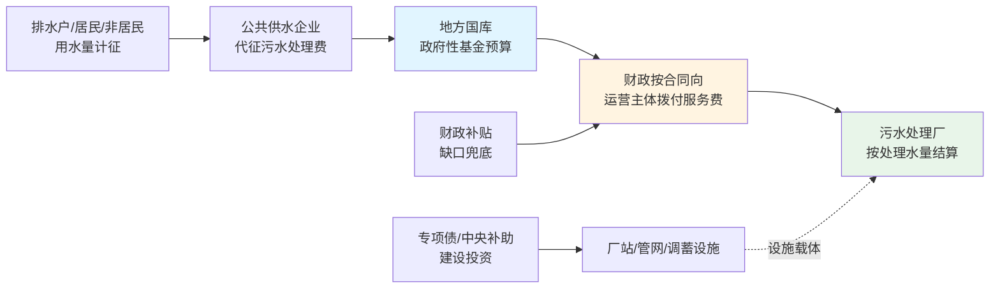

第一环节为**计征**。除大量蒸发蒸腾等特殊情形外，污水处理费按缴纳义务人的用水量计征：使用公共供水的以水表显示量值为准；使用自备水源的以计量设备值为准，未安装计量设备的按取水设施额定流量每日运转24小时计算[^5][^6]。

第二环节为**代征与缴库**。以重庆市南川区2025年12月印发的实施办法为例，公共供水企业向用户收取水费时附加征收污水处理费，使用税务部门通用机打发票单列"污水处理费"科目；区住房城乡建委开具财政部门统一监制的财政票据，代征单位持该票据将代征款项缴入区财政非税收入专户[^7]。南川区的居民、非居民标准分别为1元/立方米、1.3元/立方米，由区城投集团代为征收[^7]。

第三环节为**财政归集与拨付**。以上海市2026年2月修订印发的《上海市污水处理费征收使用管理实施办法》为例，市属污水处理设施服务范围内的污水处理费属于市级收入、全额缴入市级国库；区污水处理设施服务范围内的属于区级收入、全额缴入区级国库[^8]。资金最终通过年度预算安排，按合同约定向污水处理服务单位拨付。

第四环节为**结算**。运营主体（含国有水务公司、BOT/TOT特许经营企业、政府购买服务承接方）按合同约定的处理水量、单价进行月度或季度结算；处理水量由水表/流量计计量、双方确认。在该链条中，污水处理服务费在概念上有两层——一是用户向政府缴纳的"污水处理费"（政府非税收入），二是政府向运营主体支付的"污水处理服务费"（按合同约定的运营服务对价），二者并不等同：当用户缴费不足以覆盖服务费时，缺口由地方财政补贴兜底；这正是"核拨制"在中文语境下的实质含义——以财政为枢纽，对污水处理设施的运行成本进行核定和拨付。

### 1.1.3 与社会资本参与机制的耦合关系

核拨制并非孤立运作，它与PPP、政府购买服务、特许经营等市场化机制深度耦合，并在不同形态中表现为差异化的合同结构。从概念上看，**政府购买服务的主要内容是无形服务，以即时生产、即时消费为特征，购买合同本身不涉及与服务相关的基础设施建设**；**而PPP项目的主要内容是有形的基础设施建设及运营，项目直接涉及新供给能力的创造，所提供服务直接依赖基础设施作为载体**[^9][^10]。在污水处理领域，二者经常组合使用：新建污水处理厂往往采用BOT/PPP模式由社会资本投资建设并运营，运营期内通过政府购买服务（按处理水量和合同单价付费）实现回报；既有设施的委托运营则更接近纯粹的政府购买服务。

四川彭山经济开发区污水处理厂是这一耦合关系的典型样本：眉山首创水务有限公司2014年与园区管委会签订《彭山县成眉石化园区污水处理厂项目特许经营合同》，取得30年BOT特许经营权，项目总投3449.82万元，规模5万吨/日（一期一阶段1万吨/日）；2024年完成提标改造预验收后，出水执行《四川省泯江、沱江流域水污染物排放标准》[^1]。该项目由眉山市彭山区发展和改革局依据《政府制定价格成本监审办法》《四川省污水处理定价成本监审办法》对2022—2024年度污水处理成本进行监审，监审结果直接构成政府向运营主体支付服务费的成本依据[^1]。这一案例直观显示出当前核拨制的双重特征：**一方面，财政以核定成本为基础按量付费，看似严谨；另一方面，成本监审以历史发生的处理水量为分母，既未将进水污染物浓度、污染物削减量纳入计费，也未将管网外水入侵的"隐性补贴"纳入考量**——这正是后续章节将深入剖析的逆向激励之源。

将上海、昆明、重庆南川等地的实施办法横向对比，可以看出核拨制的制度共性：

| 制度要素 | 上海市（2026年修订）[^8] | 昆明市（2025年修订）[^11] | 重庆南川区（2025年印发）[^7] |
|---|---|---|---|
| 法律依据 | 《水污染防治法》《城镇排水与污水处理条例》《污水处理费征收使用管理办法》 | 《水污染防治法》《城镇排水与污水处理条例》 | 《水污染防治法》《城镇排水与污水处理条例》、财税〔2014〕151号 |
| 资金性质 | 政府非税收入，纳入政府性基金预算 | 纳入本级财政预算 | 政府非税收入，区财政收支两条线 |
| 计征方式 | 按用水量×标准×0.9 | 按用水量计征 | 按用水量计征 |
| 资金分级 | 市/区两级国库分别归集 | 滇池流域内/外分主管部门 | 区级征收 |
| 资金用途 | 设施建设、运行、污泥处理处置 | 设施建设、更新改造、维护、防涝应急 | 设施建设、运营、维护 |
| 社会资本参与 | 鼓励PPP、政府购买服务、特许经营 | 鼓励社会资本多种合作形式参与 | 委托区城投集团代征 |

可以看出，**三地办法在"非税收入—专款专用—按量付费—财政兜底"的核心架构上高度一致，差异主要体现在地方分级管理、行业主管部门划分等执行层面**。这种一致性既是国家层面财税〔2014〕151号办法刚性约束的结果，也是核拨制困境在全国范围呈现共性问题的制度根源——任何单一城市的局部改革，都难以独立突破国家层面的制度框架。

## 1.2 核拨制低效困境的多重压力来源

进入"十四五"以来，核拨制面临的运行环境发生了深刻变化。城市水务治理从"有没有"向"好不好"转型，从"末端处理达标"向"全过程减污降碳"升级，从"晴天达标"向"雨天不黑臭"延伸。在这一背景下，原本服务于增量建设期、以"按量付费"为核心特征的核拨制，承受着四重相互叠加的结构性压力。

### 1.2.1 巨额投资需求与现有资金供给之间的剪刀差

第一重压力来自城镇化新阶段下补短板的庞大投资需求。**根据2021年6月发布的《"十四五"城镇污水处理及资源化利用发展规划》，"十四五"期间要新增和改造污水收集管网8万公里**[^12]；2023年发改委、环境部、住建部三部门发布的《环境基础设施建设水平提升行动（2023—2025年）》进一步要求，到2025年新增和改造污水收集管网4.5万公里[^3]。E20研究院执行院长薛涛对管网建设投资规模作出测算：**"管网建设空间很大，如果对雨水污染进行非常完善的处理，粗略估计至少需要15万亿—20万亿的投资"**[^3]。仅广东一省，《广东省城镇生活污水处理"十四五"规划》就明确十四五期间全省城镇生活污水处理设施建设预期参考投资约**1748亿元**，新增城镇污水收集管网预期参考规模约13963公里，新建（扩建）污水处理设施预期参考规模约600.1万立方米/日[^13]。

中国工程院院士徐祖信测算指出，**全国建成区约53%缺污水管网，污水管网外水入渗率为34%，38%的生活污水直排水体**[^1]。这意味着即使按已建成管网长度计算，欠账规模仍是惊人的。然而，与之相对的资金供给却严重不足：薛涛在2025年下半年针对市政污水、垃圾处理行业的调查显示，**这些行业的欠费周期已达一年之久，账期和额度还在滚动增加中**[^2]。地方财政对环保企业的支付能力没有根本性缓解——"北方的某省的各个地级市和县区，本级收入没有增量资金偿还欠款，只能靠中央转移支付或发债"[^2]。节能国祯（300388.SZ）2025年年报直接指出：**"受当前政府财力未能明显改善影响，运营费收取滞后。当前地方政府财力紧张，项目资金大部分依靠专项债，回款难度大。全国各地财政收支呈现'紧平衡'，地方财政收支平衡压力加大，导致各污水处理厂运营费用支付困难"**[^2]。

巨额投资缺口与有限的污水处理费收入、紧平衡的地方财政之间，形成了显著的剪刀差。即便不考虑提标改造和雨洪协同的额外需求，仅完成"十四五"管网建设任务，单位污水处理费收入所需承担的资本性成本就远超现行收费水平所能覆盖的范围。

### 1.2.2 环境效能升级与按量付费的激励错配

第二重压力来自生态文明建设对环境效能考核标准的持续提升与按量付费激励机制之间的根本性矛盾。**住房城乡建设部等5部门在《关于加强城市生活污水管网建设和运行维护的通知》中明确，到2025年城市污水处理厂进水生化需氧量（BOD）浓度高于100毫克/升的规模占比达到90%或较2022年提高5个百分点**[^1]。但目前我国大部分城市的污水处理厂进水浓度严重偏低：**徐祖信院士测算的全国管网外水入渗率34%以及部分地方初期雨水COD浓度高达2000毫克/升的事实，意味着大量污水处理厂处理的实际是稀释后的污水，污染物削减量与处理水量严重背离**[^1]。

中规院副总工程师王家卓对这一困境作出系统诊断：**"在污水处理收费和付费方面，我国很多城市普遍存在两个问题。一是污水收费价格无法涵盖污水处理和污泥处置成本，不少城市甚至低于国家提出的最低标准。尤其是在近些年各地纷纷实施污水处理厂出水提标改造后，收费单价和城市对污水处理的付费单价之间的差值就更大了。另一个问题就是向污水处理企业付费的方式和依据上，各地基本都采用了按照处理污水量付费的方式，一些进水污染物浓度不同的污水处理厂可能面临同一单价，显然进水浓度较低的污水处理厂的环境效益、资金使用效益就差很多"**[^14][^3]。

按量付费机制下污水处理厂提质增效动力的缺失逻辑可以清晰推演：**在一定范围内，进水污染物浓度偏低可能会使污水处理厂的运营成本有所下降；而如果采取措施减少雨水、山泉水等进入污水管网，从而提高污水浓度，那么污水量也会有所减少。在按水量付费的模式下，污水处理厂得到的污水处理费自然也会减少**[^14][^3]。山西省城镇排水专业委员会专家委员郝晓光将这一困境的财政后果点破：**"以往的考核简单地依据处理水量进行付费，对污水处理厂的污染物负荷没有进行考核计量，导致在污水收集率高、进水浓度高的地区，污水处理厂处理的难度大、投入大，但是付费方面并没有针对性的补偿；在污水收集率低、进水浓度低，污水处理厂处理难度小、投入小的情况下，付费没有适度核减，从而导致地方政府为没有达到的环境效益买单，造成政府的资金无端浪费"**[^14][^3]。

进一步加剧这一矛盾的，是大部分城市处于污水处理厂和污水管网分开运营管理的"厂网分离"状态——**污水处理厂没有能力和动力来提升污水浓度**[^14][^3]。这种激励机制扭曲被生态环境部总工程师张波在2022年初的新闻发布会上以更直白的方式刻画："有的地方靠撒药治污，有的地方靠加盖板遮人耳目，有的地方靠调水冲污等等；有的城市确实也花了不少钱，但是工作质量不行，管网收集的不是污水而是雨水、地下水"[^1]。这意味着，按量付费的核拨制不仅未能激励提质增效，反而对"撒药、加盖板、调水冲污"等表象治理形成了某种容忍——只要处理水量达标即可获得服务费拨付，而真正反映环境效能的污染物削减量并未进入计费公式。

### 1.2.3 财政紧平衡下的服务费拖欠与现金流传导

第三重压力来自地方财政紧平衡引发的服务费拖欠及其向运营主体的现金流传导。**E20平台总经理薛涛与30余家环保企业的交流显示，地方财政支付能力没有根本性缓解，虽然中央有政策要求，但只有小部分资金、局部缓解，应收账款还在滚动放大中**[^2]。

环保企业上市公司年报印证了这一判断。截至2025年4月3日，已披露数据的14家环保行业上市公司中大部分应收账款数据仍在上升[^2]。具体看：创业环保（600874.SH）按欠款方归集的期末余额前五名分别是天津市水务局、界首市排水管理中心、酒泉市肃州区人民政府、西安市水务局、曲靖市城市供排水管理总公司——**前五大欠款方全部为地方政府或其下属水务/财政部门**[^2]。绿色动力（601330.SH）前五大欠款方包括北京市通州区城市管理委员会、汕头市潮阳区城市管理和综合执法局、济南市章丘区环境卫生管护中心等[^2]。

应收账款问题的传导机制具有滚动放大特征，主要由三方面原因驱动：**首先，地方财政收支紧张情况没有得到根本性好转，历史欠账没有解决，应收账款的额度还会增加；其次，中央出台了相关政策用一部分资金解决欠款问题，因此应收账款增速有所下降；再次，大量新建项目转运营，会增加企业资产，也会增加政府付费。但由于账期问题仍然存在，政府付费跟不上，就会出现资产增加，拖欠账款同步增加的情况**[^2]。这一现象意味着核拨制的资金链条事实上已部分失效——名义上的"专款专用"在执行层面演变为"延期支付"，运营主体被迫以自有资金或外部融资垫付运营成本，而民营企业由于融资通道更窄、成本更高，承受的压力比国企更大[^2]。全联环境商会2026年环境企业家媒体见面会牵头会员企业起草的《关于生态环境领域保障存量项目运维的议案》明确指出，**当前环保企业的压力主要来自政府财政收入和土地收入下降，随着地方政府性债务管理政策持续收紧，各地市政环境基础设施项目主管单位拖欠应付账款问题严峻**[^2]。

### 1.2.4 雨洪极端事件频发与雨污系统割裂

第四重压力来自气候变化背景下雨洪极端事件频发与传统雨污系统割裂治理之间的结构性张力。2023年夏天我国北方多地出现极端暴雨天气，城市排水管网经历严峻考验[^3]。在大量城市保留合流制管网的背景下，雨季溢流污染成为城市黑臭水体反复返黑的重要诱因——**"消除雨天黑臭比消除晴天黑臭要困难得多，所以我国黑臭水体治理现在进入了攻坚克难的关键时期"**[^1]。

合流制溢流（CSO）控制是国际上许多国家长期面临的重大问题。美国自1965年联邦水污染控制法首次在联邦法规层面提出控制合流制溢流污染以来，已开展CSO控制相关工作50余年；联邦政府和各地政府投入巨额资金实施大量系统性改造工程[^15]。**日本东京中心城区合流制区域占比高达82%，自2003年起开展为期20年的全国合流制区域整改，截至2024年3月底基本实现合流区域与分流制相当的污染负荷整改目标，即雨天排水时的平均BOD浓度降低至40 mg/L以下；值得注意的是，在此期间全国范围内的合流改分流累计面积仅占合流区域的5%——这并非主要整改措施**[^15]。这意味着对存量合流制系统而言，依靠"全面雨污分流"实现溢流控制并不现实，而我国部分城市片面追求"运动式雨污分流"反而造成新的两套合流制混接乱象。

国内政策层面，住房城乡建设部等5部门已要求各地"因地制宜采取雨前降低管网运行水位、雨洪排口和截流井改造、源头雨水径流减量等措施，削减雨季溢流污染入河量"，并鼓励"在完成管网建设改造的前提下，建设雨季溢流污水快速净化设施"[^1]。然而在核拨制框架下，**污水处理费的征收范围、使用范围均限定在污水处理设施的建设、运行和污泥处理处置，雨水管网维护、合流制溢流控制、调蓄池共用等雨污协同领域的资金需求基本游离于污水处理费之外**——这从根本上限制了核拨制对雨洪协同需求的覆盖能力。日本东京的做法形成鲜明对比：**家庭平均每月污水费约150元人民币，而雨水处理费用则由财政全额承担**[^15]——其制度设计明确区分了污水处理费的边界并由财政对雨水部分承担兜底责任，回避了雨污资金混淆的难题；而我国当前既未让污水处理费扩展至雨水维度，也未建立稳定的雨洪管理财政专项预算，导致雨污协同陷入"两不管"地带。

四类压力相互叠加、彼此强化的传导关系，可归纳为下表：

| 压力维度 | 核心矛盾表现 | 传导后果 | 关键证据 |
|---|---|---|---|
| 投资需求剪刀差 | 管网新增改造规模与污水处理费收入严重不匹配 | 历史欠账难补，新增需求挤占运营资金 | "十四五"新增改造管网8万公里[^12]；管网投资缺口15—20万亿[^3] |
| 环境效能错配 | 按量付费无法激励降低外水、提升进水浓度 | 财政为环境效益未达买单；提质增效动力缺失 | 全国53%建成区缺管网、外水入渗率34%[^1]；BOD<100mg/L厂"一厂一策"[^1] |
| 财政紧平衡 | 服务费拖欠周期超过1年，应收账款滚动放大 | 运营主体现金流承压；新建—运营—欠款连锁反应 | 创业环保前五大欠款方均为地方政府部门[^2] |
| 雨污系统割裂 | 雨洪协同资金需求游离于污水处理费体系之外 | 雨季溢流污染屡控难治；黑臭水体反复返黑 | 雨水管道初期雨水COD达2000mg/L[^1]；东京CSO整改20年仍未结束[^15] |

## 1.3 研究边界与"高效运作"内涵界定

要在多重压力交织的复杂背景下找到核拨制困境的破解之道，必须首先在分析视角和概念框架上完成两项基础工作：一是明确研究的系统边界，二是界定"高效运作"的核心内涵。

### 1.3.1 从条块割裂到系统集成的研究视角

本研究突破传统将污水处理与雨水排洪排涝视为两个独立子系统的分析视角，将二者纳入统一的城市水务系统进行整体研究。这一视角的合理性建立在三个事实基础之上：

第一，**物理系统层面，污水管网与雨水管网在合流制区域本就同源**，即便在分流制区域，两套管网在地理空间、检查井、排放口、河道断面上也高度交织；雨污错混接、管网破损、河湖水倒灌等普遍存在的问题（住建部要求"开展水体沿线雨水排口和合流制溢流口防倒灌改造，严防河湖水倒灌生活污水管网"[^1]）使两套系统的运行状态相互干扰、相互影响。

第二，**财务系统层面，建设投资、维护成本、应急响应在污水与雨水之间难以严格区分**——一条道路下的合流管渠改造、一个调蓄池的共用、一座泵站的雨季运行成本均无法机械切割，强行切割反而带来更高的协调成本。

第三，**政策导向层面，国家已明确"厂网一体""建管并举、系统整治"的方向**——住建部等5部门要求"推动建立厂网统筹的城市生活污水专业化运行维护管理模式"[^1]，内蒙古自治区《城镇生活污水管网综合整治攻坚行动方案》进一步明确"推行厂网一体，鼓励将污水管网、泵站、处理厂打包委托专业单位运维，破解'厂网分离'管理难题"[^16]，云南昆明2025年修订的条例则将内涝防治专项规划纳入城镇排水与污水处理专项规划[^11]。这些政策已为系统集成研究视角提供了制度依据。

基于上述判断，本研究将"厂—网—河—湖—泵—调蓄—海绵—污泥"作为一个不可分割的有机整体，把雨污分流改造、合流制溢流控制、调蓄池共用、再生水回用、初期雨水处理等具体工程要素，统一置于"城市水务系统"的分析坐标内。同时，研究在水量水质两个维度均强调晴雨天差异化运行——晴天关注污水浓度、污染物削减、节能降耗；雨天关注溢流控制、调蓄能力、排涝韧性，以此形成贯穿全篇的雨污协同分析视角。

### 1.3.2 "高效运作"的三维内涵

在统一的城市水务系统视角下，"高效运作"不再是单一维度的"处理水量达标"或"出水水质合规"，而是一个由成本、服务、效能三维组成的复合概念。

**第一维度——成本维度的全生命周期可控性**。"高效运作"首先要求建设、运营、维护、改造、应急五大成本环节的整体可控。建设成本涵盖厂站、管网、调蓄、海绵设施的资本性投入；运营成本涵盖电耗、药耗、人工等日常支出；维护成本涵盖管网检修、设备更新、雨污分流改造等持续性投入；改造升级涵盖提标扩容、智慧化等阶段性投入；应急成本涵盖暴雨、突发污染、设施故障等事件性支出。任何一个环节失控都会传导到全局。当前核拨制突出问题在于其覆盖范围基本限于运营成本，**管网维护、雨污协同、应急响应等大量成本环节游离在污水处理费之外，导致资金保障的完整性缺失**——这一点将在第3章作系统化结构分析。

**第二维度——服务维度的可持续供给能力**。"高效运作"要求城市水务系统能够稳定、连续、有韧性地提供四类公共服务：一是污水收集服务，对应集中收集率、直排口消除率等指标；二是污水处理服务，对应处理率、出水水质达标率等指标；三是雨水排放服务，对应内涝防治达标率、雨季排水通畅率等指标；四是雨洪韧性服务，对应应对超标降雨的设施承载能力、应急响应速度等指标。服务可持续性的核心在于"长效"——既包括运营主体的财务可持续（不能靠拖欠形成"伪可持续"），也包括设施本身的物理可持续（不能"重使用轻维保"形成短命工程）。住建部等5部门明确的"建立运行维护长效机制"[^1]，正是对服务可持续性的系统性回应。

**第三维度——效能维度的可量化、可考核、可付费属性**。"高效运作"最终要落到环境效能的可衡量上。**这就要求将污染物削减量、出水水质达标率、合流制溢流控制率、内涝防治达标率、碳减排量等核心绩效指标，从"定性的政策要求"转化为"定量的考核公式"，再进一步转化为"可计费的价格条款"——这正是"按效付费"机制的本质内涵**[^14][^3]。从国际经验看，日本排水政策以成本效益为决策依据，按受益者负担原则实行阶梯污水费制度，雨水处理费用由财政全额承担，建立了清晰的效能—成本对应关系[^15]；英国虽因水务局（Ofwat）监管"失灵"于2025年启动改革——河流、湖泊和海洋污染创纪录、水务公司基础设施投资不足、水费不断飙升等问题并存，新机构被要求"派专家进驻水务公司，确保公司依法运营，提升环境绩效"——但其单一监管机构整合多部门职能、追求"环境绩效"的改革方向，仍可作为效能可量化、可考核机制设计的镜鉴[^15]。

三维内涵共同构成本研究后续章节的统一分析框架与评价坐标，其相互关系如下图所示：

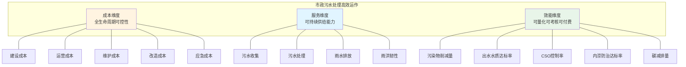

将这三个维度与上一节识别的四类压力源对应起来，可以看出当前核拨制困境的实质——**它在制度设计上单一聚焦于"处理水量"这一单一指标，既未覆盖成本维度的完整链条（管网与污泥成本游离体外），又未保障服务维度的可持续性（拖欠与雨洪割裂），更未实现效能维度的可计量（按量付费与污染物削减量脱钩）**。这一三维诊断框架，将贯穿后续第2章至第10章的分析，为问题诊断、机制比较、方案设计提供统一的评价坐标和论证逻辑起点。

需要特别说明的是，本研究全程立足于"政府管理部门可操作"的应用导向——所有的诊断分析、机制比较、方案设计，最终都将回答政府管理部门"做什么、怎么做、谁来做、何时做、如何衡量"的具体问题，而非停留在原则性建议层面。这一应用导向决定了本章界定的"高效运作"三维内涵，不仅是学术意义上的概念框架，更是后续可操作方案集的设计准绳。

# 2 核拨制低效困境的多维诊断

第1章已经界定了我国市政污水核拨制的制度脉络，并从投资剪刀差、激励错配、财政紧平衡、雨污割裂四个维度刻画了核拨制所承受的多重压力。然而，外部压力之所以能够长期累积而难以化解，根本原因在于核拨制自身在制度设计层面存在结构性缺陷——这些缺陷在特定的体制环境中相互耦合、彼此放大，最终形成全链条的低效困境。本章在第1章界定的"成本—服务—效能"三维分析框架下，从激励、协同、财务、效能四个层面对这一困境进行系统化诊断，采用"机理推演—数据验证—典型案例"三步论证方法，揭示按量付费与成本加成的内在逻辑缺陷如何在厂网分离、九龙治水、雨污割裂的体制环境下被进一步放大，并通过财政补贴缺口、应收账款滚动、设施"晒太阳"与超负荷并存等现象，对城市水务系统的环境治理实效形成系统性削弱。本章不仅为第3—5章的全生命周期成本分析与国内外机制比较提供问题靶向，更为第6章按效付费机制设计、第7章多元化投融资方案、第8章政府可操作方案集确立必须破解的关键症结。

## 2.1 激励层面：按量付费与成本加成的双重逆向激励

核拨制的第一层困境是激励机理的扭曲。无论是当前主流的"按量付费"还是部分地区试行的"成本加成核定"，其计费公式的内在逻辑都与"提质增效"的政策目标相背离，事实上对运营主体形成了**降本提效的反向惩罚**。这一扭曲不是个别地区执行偏差导致的局部问题，而是计费机理本身的系统性缺陷，需要在机理层面加以解构。

### 2.1.1 按量付费的逆向激励机理：进水量越大、浓度越低，企业越受益

按量付费机制的核心计费公式是"服务费 = 处理水量 × 合同单价"，在这一公式下，运营主体的收入最大化策略是**追求处理水量最大化、运营成本最小化**——而这两个变量恰恰与"减少外水入侵、提升进水浓度、降低吨水能耗"的环境治理目标形成直接对立。

机理推演可以从一个量化情境切入：当某污水处理厂面临进水BOD浓度50mg/L和150mg/L两种状态时，如果合同单价相同，**处于污水处理链条上的各方是否有动力去提升污水浓度？**答案显然是否定的。中规院副总工程师王家卓对这一情境的财务后果作出系统刻画：在按水量付费的模式下，"假定其他条件不变，如果采取措施减少雨水、山泉水等进入污水管网，从而提高污水浓度，那么污水量也会有所减少。在按水量付费的模式下，污水处理厂得到的污水处理费自然也会减少。这不利于提高污水处理厂提质增效的积极性"[^3]。更进一步，"在一定范围内，进水污染物浓度偏低，可能会使污水处理厂的运营成本有所下降"[^3]——这意味着**进水浓度下降不仅不会减少收入，反而会降低成本，形成"双重利好"的逆向激励**。

这一机理推演已被全国范围的实证数据所证实。生态环境部华南督察局调研员对湖北、海南两省10个市县26座城镇污水处理厂的进水进行取样监测，结果显示：**26座污水处理厂进水中CODCr的平均浓度仅为85mg/L。其中，有19座污水处理厂的进水浓度在100mg/L以下，8座甚至低于50mg/L，最低的仅有17mg/L；仅有1座污水处理厂的进水浓度略超过200mg/L。而对湖北省某县级市12个小区取样监测后发现，其生活污水CODCr日均浓度平均值为397mg/L**[^17]。换言之，**居民生活源头排放的"原始污水"浓度近400mg/L，而进入污水处理厂的"末端污水"浓度仅85mg/L——超过75%的污染物浓度在管网传输过程中被外水稀释或在管道沉积降解中流失**。这不仅证明了进水低浓度问题的普遍性，也佐证了按量付费机制对管网修复、雨污分流、源头减量行为的系统性抑制。

将这一逆向激励链条结构化呈现，可以清晰看到激励信号传导的全过程：

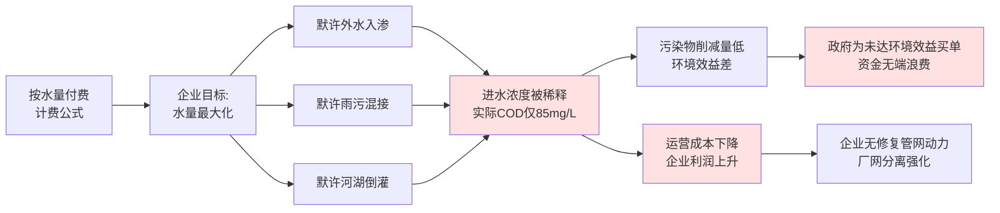

山西省城镇排水专业委员会专家委员郝晓光将这一困境的财政后果直接点破：**"以往的考核简单地依据处理水量进行付费，对污水处理厂的污染物负荷没有进行考核计量，导致在污水收集率高、进水浓度高的地区，污水处理厂处理的难度大、投入大，但是付费方面并没有针对性的补偿；在污水收集率低、进水浓度低，污水处理厂处理难度小、投入小的情况下，付费没有适度核减，从而导致地方政府为没有达到的环境效益买单，造成政府的资金无端浪费"**[^18][^3]。

### 2.1.2 成本加成模式的"扩大成本基数"反向激励

如果说按量付费的逆向激励是"水量越大越好"，那么部分地区试行的"成本加成核定"模式的逆向激励则是"成本越高越好"。在这一模式下，政府以运营主体的实际发生成本为基础，加上合理利润率核定服务费单价；其内在逻辑漏洞在于，**运营主体对降本节支非但没有动力，反而存在通过扩大成本基数争取更高单价的反向激励**——这与电力、燃气等被监管行业长期面临的"A-J效应"（Averch-Johnson效应）在本质上同构。

四川彭山经济开发区污水处理厂2022—2024年度的成本监审，是分析这一机制的典型样本。眉山首创水务有限公司2014年与园区管委会签订《彭山县成眉石化园区污水处理厂项目特许经营合同》，取得30年BOT特许经营权，项目总投3449.82万元，规模5万吨/日（一期一阶段1万吨/日）。2024年4月完成提标改造预验收后，工艺由"水解酸化+A2/O"升级为"水解酸化+五段巴顿甫"，出水标准从《城镇污水处理厂污染物排放标准》（GB18918-2002）一级A标提升为《四川省泯江、沱江流域水污染物排放标准》（DB51/2311-2016）。眉山市彭山区发展和改革局依据《政府制定价格成本监审办法》《四川省污水处理定价成本监审办法》对其进行了监审，监审结果直接构成政府向运营主体支付服务费的成本依据[^1]。

从监审报告的方法论看，存在三处值得关注的结构性缺陷：

**第一，监审分母仍以历史处理水量为基准**，未将进水污染物浓度、污染物削减量纳入成本核算公式。这意味着即便企业通过修复管网、撇除外水提升了进水浓度，其新增的"污染物削减量"既不会进入分子（成本基数），也不会进入分母（计费水量）——污染物削减效益在监审框架下"消失"了。

**第二，提标改造后的成本上升被自动纳入新单价基数，但提标决策的合理性论证缺位**。彭山项目2024年提标后工艺更复杂、药耗能耗显著上升，但提标至流域特别排放限值是否经过成本效益论证、是否存在过度提标问题，在现有监审框架下并无审视空间——监审仅核定"已发生成本是否合规"，不审视"成本是否合理"。这与北京工业大学彭永臻院士的提醒形成呼应：**"以COD为例，一级A排放标准限制为50mg/L，而Ⅳ类和Ⅲ类水质要求则分别为30mg/L和20mg/L，达到这样的排放标准将造成污水处理厂的处理成本提高5倍以上"**[^19]。当成本"自动通过"监审进入单价时，运营主体反而获得了"积极配合提标"的财务激励——成本越高、单价越高、收益基数越大。

**第3，固定资产折旧与维护成本占比无约束**。监审办法仅核减了显然不合理的项目（如非工艺人员劳务费），但对固定资产折旧基数、大修维护频次等关键变量缺乏行业基准比对——这恰恰是"扩大成本基数"反向激励的主要操作空间。

更令人警醒的是，这一反向激励在地方实践中已经出现明显信号。重庆水务2024年年报显示，公司污水处理服务费采取政府采购形式、每3年核定一次。**前六期污水处理结算价格分别为：3.43元/立方米→3.25元/立方米→2.78元/立方米→2.77元/立方米→2.98元/立方米→2.35元/立方米。第六期污水结算价格同比下降21%**[^20]。表面看，第六期单价下调反映了政府对成本的强化约束；但深入观察可以发现，单价下调直接导致重庆水务2024年归母净利润同比下降27.88%——**这意味着政府与运营主体之间陷入了"博弈—压价—亏损—拖欠—涨价诉求—再博弈"的负向循环，而非建立起"绩效—激励—改善"的正向循环**。

### 2.1.3 按效付费试点对激励重构的初步验证

与按量付费、成本加成形成对照的，是部分地区开展的按效付费试点。E20研究院执行院长薛涛指出：**"成都等地已经在实践'按效付费'了，其基础是管网相对较好，从而使得污水量相对下降。考虑到污水处理厂的效率比较高，换成按效付费，双方都合适"**[^18][^3]。

按效付费的本质是"实现'效'的货币化"——污水处理企业可以提供更高品质的水，但这会增加成本；将污染物削减量、出水水质达标率、污泥无害化稳定化处理效果等"环境效益"明确转化为货币化的支付条款，**让企业的财务激励方向与环境治理目标方向对齐**[^18]。其制度抓手在2024年得到国家层面的明确：国家发改委、住建部、生态环境部联合印发的《关于推进污水处理减污降碳协同增效的实施意见》明确提出"推动建立污水处理服务费与污水处理厂进水污染物浓度、污染物削减量、出水水质、污泥无害化稳定化处理效果挂钩的按效付费机制"[^18]。内蒙古自治区2025年印发的《城镇生活污水管网综合整治攻坚行动方案》进一步明确"按效付费，建立以污染物收集效能为核心的绩效考核体系，将污水处理厂进水浓度、污泥处理率等指标与付费挂钩，激励运维质效提升"[^16]。

按效付费试点的可行性前提，是**管网状态相对完善、外水稀释问题相对可控**——这同时也揭示了激励机制改革的深层依赖：**单纯改变计费公式还不够，必须配合厂网一体的体制重构，才能真正消除按量付费的逆向激励基础**。这也解释了为什么按效付费试点目前主要集中在管网基础较好的成都、湘潭、南京、十堰、苏州等城市，而对于管网欠账严重的中西部中小城市，按效付费的直接套用反而可能因进水浓度大幅波动导致企业财务大幅震荡——激励重构必须与协同体制重构同步推进，这正是本章2.2节将进一步剖析的协同层面困境。

## 2.2 协同层面：厂网分离、九龙治水与雨污割裂的体制裂痕

激励机理的扭曲并非单纯由计费公式造成，更深层的根源在于**核拨制运行所依托的体制环境本身存在跨主体、跨设施、跨子系统的协同断裂**——厂网分离造成处理与收集脱节、九龙治水造成职责交叉与责任真空、雨污割裂造成排涝韧性与污水治理的资金通道分裂。这三重协同断裂相互强化，使按量付费的逆向激励无法通过任何单一主体的努力得以化解。

### 2.2.1 厂网分离：污水处理厂"无能力也无动力"提升进水浓度

"厂网分离"是当前我国大多数城市市政污水系统的运营常态——污水处理厂由专业水务公司或BOT特许经营企业运营，污水管网则归属市政、水务或区属国企管理，二者分属不同主体、不同合同、不同考核体系。在这一格局下，**即便污水处理厂愿意提升进水浓度，它对管网状态也没有任何控制权**——管网破损、雨污混接、河湖倒灌、施工降水偷排等问题，全部位于处理厂的管理边界之外。

王家卓对厂网分离与按量付费叠加效应的判断尤为精辟：**"加之大部分城市都处于污水处理厂和污水管网分开运营管理状态，污水处理厂没有能力、更没有动力来提升污水浓度。因为浓度提升后，污水量就会减少，在按水量付费的模式下，显然污水处理厂就会'吃亏'"**[^18][^3]。这一论断揭示了**"激励错配×体制割裂"的乘数效应**——单一改激励而不破体制，或者单一破体制而不改激励，都难以从根本上化解逆向激励链条。

武汉市的"厂网一体"改革正是从反向案例出发证明了上述判断。武汉污水治理改革前面临三大共性难题：**一是权责碎片化，厂网分治、协同不畅，治理效能打折扣；二是底数不清晰，老旧管网资料缺失，破损、混接、入渗问题突出；三是运维不专业，标准不一、力量薄弱，问题易反复**[^21]。改革后，武汉以黄陂后湖（新城区）、黄家湖（中心城区）两大试点先行先试，建立"市级统筹、区级承诺"的管网改造投资模式，并出台《武汉市市管城镇生活污水处理设施运行绩效考核办法（试行）》《武汉市市政生活污水收集系统运营绩效评价管理办法（试行）》，建立**以污染物消减为核心的厂网联动绩效考核体系**——结果是：盘龙污水处理厂2025年进水BOD浓度较2024年同期提升37.3%；处理水量同比增长23.03%；黄家湖厂2025年进水BOD浓度较2024年同期提升16.1%；处理水量同比增长7.96%[^21]。

武汉的改革成效从反向印证了厂网分离体制下"按量付费"的低效本质——**只有当厂与网纳入同一运营主体、同一考核体系时，提升进水浓度才会从"利益对立"转化为"利益一致"**。这也说明，第6章按效付费机制设计必须与第5章厂网河（湖）+雨污一体化协同机制设计配套推进，二者不可偏废。

### 2.2.2 九龙治水：跨部门跨区域的责任真空与重复投入

"九龙治水"是我国水环境治理长期面临的体制痼疾——住建、水务、生态环境、发改、财政、自然资源等多部门职责交叉，规划、建设、运维、监管链条断裂；跨区域流域治理则面临**"上游能管不愿管、下游想管不能管"**的"上下游不同步"治理僵局，以及**"左右岸不同行"**的区域间治理步调和力度不统一[^22]。

最高人民检察院第八检察厅2022年挂牌督办的五起跨区域生态环境公益诉讼案件，提供了九龙治水的典型实证。其中黄河干流河南濮阳、山东菏泽交界河段浮舟侵占河道岸线案，案涉浮舟与拖轮"严重侵占河道岸线，妨碍黄河行洪安全"——东明县自然资源和规划局明确案涉浮舟停靠地不在东明县内、不归其管辖，而长期以来河南黄河河务局等相关部门多次督促浮桥公司改正违法行为、并对其处以行政罚款，但浮桥公司**仅缴纳了罚款，一直未将浮舟和拖轮撤离黄河河道**[^22]。最终通过最高检挂牌督办、依托"河长+检察长"协作机制，才推动9组浮舟全部出河上岸、3300吨钢铁全部清运完毕。该案折射出的不仅是个别违法行为，更是**"行政罚款—罚而不改—跨界规避—责任真空"的体制顽疾**。

将九龙治水的多部门责任分布与污水核拨制的资金流向叠加，可以更清晰地看到协同断裂的体制根源：

| 治理环节 | 主管部门 | 资金通道 | 协同断裂表现 |
|---|---|---|---|
| 污水厂建设运营 | 住建/水务 | 污水处理费+财政补贴 | 厂方对管网状态无管理权 |
| 污水管网建设 | 住建/市政 | 财政拨款+专项债 | 建设主体与运维主体常常分离 |
| 管网运维 | 区属国企/外包 | 财政补贴（不在污水处理费范围）| 资金保障最薄弱 |
| 排水监管 | 城管/住建 | 财政预算 | 对工业排污、混接行为执法不足 |
| 河湖水质监管 | 生态环境部门 | 财政预算 | 对溢流污染追责难落地 |
| 防汛排涝 | 水务/应急 | 防汛专项 | 与污水管网调度脱节 |
| 流域跨界治理 | 多省市/河长制 | 跨界生态补偿（机制不健全） | 上下游不同步、左右岸不同行 |

可以看出，**核拨制的资金通道仅能覆盖"污水厂建设运营"这一环节，而污水管网运维、排水监管、河湖水质、防汛排涝等关联环节均位于核拨制之外**——这就形成了"按量付费的资金激励集中于厂方、而管网运维与监管的缺位却由全社会承担"的资源错配格局。住建部等5部门《关于加强城市生活污水管网建设和运行维护的通知》之所以强调"建立厂网统筹的城市生活污水专业化运行维护管理模式"，正是对九龙治水积弊的针对性回应[^1]。

### 2.2.3 雨污割裂：核拨制资金边界与雨洪协同需求的错位

第三层协同断裂是雨污系统的财务割裂。如第1章所指出的，**污水处理费的征收与使用范围被严格限定在污水处理设施的建设、运行和污泥处理处置**[^19]——雨水管网维护、合流制溢流控制、调蓄池共用、初期雨水处理等雨污协同领域的资金需求，基本游离于核拨制之外。

这一财务边界设置在分流制理想状态下尚可勉强维持，但在我国大量保留合流制、雨污混接普遍存在的现实条件下，已经造成严重的资金通道与治理需求错位：

第一，**外水入侵与雨污混接造成的"低浓度高水量"现象，本质上是雨水（清水）入侵污水通道**，但治理这一问题所需的管网修复、雨污分流改造、检查井整治等投入，没有专门的资金通道——污水处理费只能补贴运营、不能补贴管网修复，雨水管网又没有对应的"雨水处理费"。

第2，**合流制溢流污染治理需要厂、网、调蓄池、初雨处理设施的整体投资**，但核拨制只覆盖厂方运营，对于"雨季溢流污水快速净化设施"等住建部明确鼓励的协同设施[^1]，资金来源主要依赖一次性财政补贴或专项债，缺乏长效的"按效付费"通道。

第3，**调蓄池等共用设施在晴天可作污水均质池、雨天可作合流制截流的双重功能**，但其投资分摊在污水预算与防涝预算之间无清晰规则，造成"两不管"的资金困局。

日本东京的制度设计提供了清晰的对照参照：**东京家庭平均每月污水费约150元人民币，而雨水处理费用则由财政全额承担**——其制度明确将污水处理费的边界限于受益者负担（污染者付费），而将雨水管理（公共防灾属性）由财政全额兜底，回避了雨污资金混淆的难题[^15]。从合流制改造的经验看，日本自2003年起开展为期20年的全国合流制区域整改，**截至2024年3月底已基本实现合流区域与分流制相当的污染负荷整改目标，即雨天排水时的平均BOD浓度降低至40 mg/L以下；值得注意的是，在此期间全国范围内的合流改分流累计面积仅占合流区域的5%——这并非主要整改措施**[^15]。这说明对存量合流制系统而言，主要整改路径是"增强雨天截留能力、提升简易处理水平、采用调蓄技术"，而这些路径在我国当前的核拨制体系下**既缺乏稳定资金通道，也缺乏明确的考核计费抓手**。

我国云南昆明2025年修订的条例已经开始尝试在地方层面打破雨污资金割裂，将"内涝防治专项规划"纳入"城镇排水与污水处理专项规划"，并在污水处理费使用范围中纳入"防涝应急"功能——这是地方层面的有益突破，但在国家层面财税〔2014〕151号办法的刚性约束下，这种突破仍属局部探索，难以形成全国性的雨污协同资金通道。**核拨制的资金边界与城市水务系统的实际治理需求之间的错位，构成了第7章多元化投融资方案必须破解的关键问题**。

## 2.3 财务层面：收费缺口、拖欠传导与全成本覆盖失灵

激励扭曲与协同断裂在资金供给端的最终投影，是核拨制的财务可持续性危机。这一危机表现为三个层层递进的问题：收费标准结构性低于全成本、地方财政紧平衡下的服务费拖欠传导、核拨制覆盖范围的结构性残缺。三者相互叠加，使核拨制的"专款专用"链条在执行层面演变为"局部覆盖+延期支付"。

### 2.3.1 收费标准与全成本之间的结构性缺口

核拨制最根本的财务困境，是污水处理费征收标准与污水处理及污泥处置全成本之间的结构性倒挂。E20研究院执行院长薛涛对此作出系统测算：**"目前收取的污水处理费整体来看，只能达到污水处理和污泥处理全成本的0.7—0.8倍。目前，估算下来，污水处理厂每天的资金缺口或者说需要财政补贴的资金是4000万元—6000万元，每年的缺口达上百亿元"**[^19]。按县级以上城市每天1.8亿吨污水处理总量、每吨污水处理费1元的均值测算，每日缺口4000万—6000万元的规模与污水处理费日收入规模相当——**意味着每收一元污水处理费，财政还需补贴0.25—0.4元才能勉强维持基本运营**[^23][^19]。

缺口形成的原因，薛涛归纳为两点：**"一是原有成本中考虑污泥处理费的处理处置标准不够高；二是大量污水处理厂在提标改造"**[^19]。具体而言：

**关于污泥处置成本**：目前我国污泥简单脱水填埋的成本大概是100—150元/吨，分摊到污水处理费里大概是0.08—0.15元/吨；而对污泥进行全量、妥善、安全地处置，费用大约为300元/吨—500元/吨，摊到污水处理费里大约为0.25元/吨—0.5元/吨。**但这部分收费并没有完全调整到位**——在中央生态环保督察震慑、填埋场紧缺、修复污泥堆场巨额费用等客观压力下，污泥处置标准必须提高，但收费调整却长期滞后[^19]。

**关于提标改造**：彭永臻院士的测算指出，**以COD为例，一级A排放标准限制为50mg/L，而Ⅳ类和Ⅲ类水质要求则分别为30mg/L和20mg/L，达到这样的排放标准将造成污水处理厂的处理成本提高5倍以上**[^19]。住建部等5部门《关于深入打好城市黑臭水体治理攻坚战实施方案》明确要求"不盲目提高污水处理厂出水标准、新扩建污水处理厂"——这一政策导向恰恰是对过度提标导致成本失控的事后修正[^19]。

收费标准本身的执行也存在显著差距。**全国目前仍有100多座城市的居民污水处理费收费标准低于0.95元/吨，而超过60%的城市居民污水处理费收费标准也只是刚刚达到0.95元/吨的最低标准，远不能覆盖处理成本**[^20]。在一项针对江苏省2019—2021年城市污水处理费现状的调查中，多个地级市呈现严重收支倒挂：

| 城市 | 污水处理费收入 | 污水处理费支出 | 收支比 |
|---|---|---|---|
| 南京市区 | 7.5亿元 | 11亿元 | 1∶1.47 |
| 徐州市区 | 1.3亿元 | 2亿元 | 1∶1.54 |
| 淮安市区 | 0.97亿元 | 1.60亿元 | 1∶1.65 |
| 扬州市区 | 1.3亿元 | 2.5亿元 | 1∶1.92 |
| 江阴市区 | 0.69亿元 | 1.3亿元 | 1∶1.88 |

注：数据来源2019—2021年江苏省城市污水处理费现状调查[^20]。

可以看出，**江苏作为东部经济发达省份的多个地级市收支倒挂比已达到1:1.47—1:1.92**，这种结构性缺口在中西部经济欠发达地区只会更加严峻。焦作市的实证数据进一步印证了这一判断——焦作市现有运行城镇生活污水处理厂14个，日处理污水总规模为59万吨，**2023年市本级收污水处理费1.1亿元（含以前年度拖欠4900万元），支出2.13亿元，倒挂约1亿元；2024年市本级收污水处理费6800万元，支出2亿元，倒挂约1.32亿元；截至（2025年7月）目前，2025年收污水处理费3300万元，支出1.12亿元，缺口问题依然突出**[^24]。当地财政部门的回应耐人寻味：根据财政部《"三保"保障清单管理办法》（财预〔2022〕156号）规定，"三保"保障范围实行中央和省级两级管理，市级政府无调整权限，**目前污水处理费暂未纳入"三保"保障清单，但已纳入"三保"以外刚性支出保障范围**[^24]——这意味着在地方财政紧平衡下，污水处理费支出的优先级既不属于"三保"刚性，又必须从有限的"三保"以外资金中挤出，**保障稳定性极为脆弱**。

### 2.3.2 服务费拖欠及其向运营主体的现金流传导

收支倒挂的财务后果不仅由地方财政承担，更通过服务费拖欠传导至运营主体。**据知情人透露，我国主流大型水务公司有约50%—90%的应收账款来自污水处理费，且欠款方大多为各地方政府**[^20]。第1章已经引述创业环保前五大欠款方均为地方政府部门的实证；从行业层面看，全联环境商会在2026年环境企业家媒体见面会牵头会员企业起草的《关于生态环境领域保障存量项目运维的议案》明确指出：**当前环保企业的压力主要来自政府财政收入和土地收入下降，随着地方政府性债务管理政策持续收紧，各地市政环境基础设施项目主管单位拖欠应付账款问题严峻**。

拖欠问题在重庆水务案例中以更尖锐的方式呈现。重庆水务2024年年报显示，公司归母净利润7.85亿元，**同比下降27.88%**——导致净利润大幅下滑的直接原因之一就是污水处理阶段价格下降。**前六期污水处理结算价格分别为：3.43元/立方米→3.25元/立方米→2.78元/立方米→2.77元/立方米→2.98元/立方米→2.35元/立方米。第六期污水结算价格，同比下降21%**[^20]。一些中小型污水处理企业对此感到担忧："大型污水处理厂在资本和工艺上是具备抗风险能力的，但小型污水处理厂则不然，如果政府能够及时支付污水处理费，企业可做到保本微利运行，如果下调费用或出现拖欠，除了影响日常运行也影响生产"[^20]。

这一现金流传导路径揭示出核拨制财务困境的"双重挤压"机理：**一方面，政府为压减财政支出而下调服务费单价，对企业形成"成本约束和收益监管"的强化**——这与中共中央办公厅、国务院办公厅《关于完善价格治理机制的意见》"强化企业成本约束和收益监管、充分考虑群众承受能力、明确政府投入和使用者付费的边界"的政策导向直接相关[^20]；**另一方面，财政紧平衡下的服务费拖欠又使企业的实际现金流远低于账面收入**——企业在"价降+欠款"的双重挤压下被迫以自有资金或外部融资垫付运营成本。对民营中小企业而言，这种挤压可能是致命的——"如果下调费用或出现拖欠，除了影响日常运行也影响生产"[^20]。

### 2.3.3 核拨制覆盖范围的结构性残缺

财务困境的第三层表现，是核拨制覆盖范围本身的结构性残缺。如本章2.2.3节已指出，污水处理费的使用范围被严格限定在污水处理设施的建设、运行和污泥处理处置——这就意味着以下大量成本环节游离于核拨制之外：

**管网维护成本**：管网检修、清淤、CCTV排查、雨污错接整治等持续性投入。从行业经验数据看，管网大修按固定资产价值的1.7—2%计提、维护按0.5—1%计提，转化为吨水成本可达0.05—0.13元/吨——**这部分成本几乎全部依赖一次性财政补贴或专项债，未纳入污水处理费**，导致管网长期处于"重使用轻维保"状态。徐祖信院士测算指出：**全国建成区约53%缺污水管网，污水管网外水入渗率为34%，38%的生活污水直排水体**[^3][^1]——这一惊人数据正是管网长期维护资金缺位的直接后果。

**雨污协同成本**：合流制溢流控制、调蓄池共用、初期雨水处理、海绵设施、雨季管网调度等。这些成本既不在污水处理费范围内，也未形成独立的"雨水处理费"或稳定的财政专项预算。

**应急响应成本**：暴雨灾害、突发污染、设施故障等事件性支出。云浮"十四五"暴雨灾害损失超过27亿元的实证表明，应急成本量级巨大，但其与污水处理费、防汛专项、应急预算之间的分摊规则并不清晰。

**污泥高标准处置成本**：如前所述，安全处置费用约300—500元/吨，对应吨水成本0.25—0.5元/吨，但当前收费调整严重滞后[^19]。

将这些游离环节叠加，可以看出核拨制名义上的"全成本"实际上是"残缺成本"——**覆盖完整的应包含建设、运营、维护、改造、应急五大成本环节，但当前污水处理费实际上只能勉强覆盖运营成本的60—80%，对维护、改造、应急的覆盖几近为零**。这一结构性残缺直接造成了"专款专用"在执行中演变为"延期支付+局部覆盖"，也是第3章必须系统化梳理全生命周期成本结构、第7章必须设计多元化投融资方案的根本原因。

## 2.4 效能层面：低负荷、低浓度与设施"晒太阳"的实效削弱

激励扭曲、协同断裂、财务失灵在终端的累积投影，是城市水务系统环境治理实效的系统性削弱。这一削弱表现为四组看似矛盾、实则同源的现象：低进水浓度普遍化、高设计能力与低实际负荷率并存、局部超负荷运行与雨季溢流并发、园区/乡镇/农村污水处理设施"晒太阳"。这四组现象共同构成核拨制低效困境的最直观证据。

### 2.4.1 低进水浓度的普遍化：96%被调查厂存在低浓度问题

进水浓度偏低是核拨制低效困境最普遍、最直观的效能表现。生态环境部华南督察局调研员对湖北、海南两省10个市县26座城镇污水处理厂的进水监测显示：**26座中有25座存在低浓度进水问题（覆盖率约96%），平均CODCr仅85mg/L，最低仅17mg/L**——而居民生活污水原始浓度高达397mg/L[^17]。**进水浓度比原始浓度低75%以上**，意味着相当比例的进水实际上是被外水稀释的"清污水"。

以平阳县2025—2026年季度运行数据为微观印证（CODcr/BOD单位均为mg/L）：

| 污水处理厂 | 2025Q3 BOD | 2025Q4 BOD | 2026Q1 BOD | 2025Q3 负荷率 | 2025Q4 负荷率 |
|---|---|---|---|---|---|
| 昆鳌厂 | 112.33 | 97.25 | 106 | 64.08% | 64.38% |
| 水头厂 | **50.93** | **53.88** | **76.4** | 65.99% | 68.45% |
| 萧江厂 | 78.92 | 90.21 | 125.91 | 93.02% | 92.71% |
| 东海厂 | 197.22 | 92.38 | 93.58 | 78.45% | 79.69% |

注：数据综合自平阳县2025年第三、四季度及2026年第一季度全县城镇污水处理设施运行情况通知[^25][^26][^27]。

可以看出，**水头污水处理厂连续三个季度BOD浓度仅50—76 mg/L，远低于住建部"BOD>100mg/L的规模占比达90%"的考核要求**[^1]，且负荷率长期维持在65—70%——这正是"低浓度+低负荷+成本错配"的典型表现。东海厂2025Q3进水BOD达197mg/L、Q4却骤降至92mg/L，这种季度间剧烈波动也提示其上游管网存在严重的雨污混接或外水入侵问题。

南方地区的低浓度问题尤其突出。**北方地区的进水浓度比南方地区高出48%—59%**——主要原因有四：外水入渗（南方管道地下水入渗量可达3800—6300 m³/(km²·d)，是德国1296 m³/(km²·d)的3—5倍）、雨污错接混接、污染物在管网中沉积降解、水文气象客观因素（南方河湖众多、地表水位高、易倒灌）[^17]。值得警醒的是，**"我国现有很多污水管道都在带病工作，渗入量已超过国家标准的10倍以上（GB 50268—2008）"**[^17]——这意味着相当比例的污水管道实际上处于"边输送污水边吸入清水"的失效状态。

### 2.4.2 低负荷与超负荷的两极分化

效能削弱的第二组矛盾现象，是高设计能力与低实际负荷率并存、同时局部超负荷运行与雨季溢流并发。

**低负荷端**：北京海淀区北部地区温泉、永丰、翠湖、上庄、稻香湖5座污水处理厂设计处理规模15.2万立方米/天，2024年1—6月份共计处理污水2122.1022万立方米，**实际处理规模11.66万立方米/天，处理负荷率77%**[^28]；平阳县多座厂负荷率长期维持在64—70%[^25][^26][^27]；苏州2025年86座城镇污水厂设施平均负荷79.2%[^29]。低负荷状态意味着大量已建设施的设计能力未得到充分利用，**单位污染物削减成本被显著抬高**。

**超负荷端**：第三轮第二批中央生态环保督察通报显示，**昆明市主城区现有22座污水处理厂，有7座常年超负荷运行**；2023年重庆市中心城区污水处理厂中有8家长期超负荷运行，其中**鸡冠石污水处理厂设计日处理能力80万吨，实际2023年单日最高处理水量达121.9万吨，负荷率高达152%**——更严重的是，该厂服务范围内雨季生活污水溢流问题长期难以根本解决，**2023年重庆鸡冠石污水处理厂、太平门污水提升泵站共向长江溢流直排污水约900万吨，溢流污水化学需氧量平均浓度为96.6毫克/升，超地表水Ⅲ类标准3.8倍**；福建龙岩市铁山污水处理厂大量生活污水通过进水总管的溢流口直排龙津河，**化学需氧量、氨氮和总磷浓度分别为75毫克/升、17.6毫克/升和2.1毫克/升，分别超地表水Ⅲ类标准2.8倍、16.6倍和9.5倍**[^30]。

清华大学水环境保护研究所邱勇对超负荷的判断标准颇具参考价值：**"污水处理系统是否正常运行，主要看出水水质是否达标和上游管网是否溢流。如果出水可以达标排放，就无需过于关注其是否超负荷运行……如果因为超负荷运行，导致出水不能达标排放或者存在污水溢流问题，那就要分析原因、寻找对策、迅速改善"**——督察组通报的污水处理厂超负荷问题，均涉及超标排放或溢流问题[^30]。一位污水处理厂厂长还透露："当水力负荷率大于80%时，除少数超大型污水处理厂以外，一般的污水厂根本无法在出水达标的前提下倒池停水检修"——**这就意味着有些机器可能存在长期"带病"工作的情况，运营风险自然较大**[^30]。

低负荷与超负荷的两极分化，其根源恰恰在于核拨制的激励扭曲与协同断裂——**按量付费激励"水量越多越好"，使部分厂被动接收外水形成超负荷；而管网欠账、空白区未消除又使部分厂"无水可收"形成低负荷；前者带来雨季溢流污染，后者带来设施利用效率低下；二者共同削弱整体效能**。

### 2.4.3 设施"晒太阳"与建而不用：核拨制末梢的失效

效能削弱的最末梢、最尖锐的表现，是园区、乡镇、农村污水处理设施"晒太阳""睡大觉"——已建成的设施长期闲置或停运，导致前期巨额投资沦为沉没成本，污水甚至直接进入河流。

**乡镇与农村层面**：2024年4月中央第五生态环境保护督察组在河南省三门峡市义马市东区街道办事处的"全国文明村"河口村和"美丽乡村示范村"霍村督察时，发现两个村的污水处理站长期"睡大觉""晒太阳"——**塔式生态滤池内的活性污泥早已失效，排污管道内积存着大量生活污水，遇到下雨天，污水会直接入河**；当地干部回答，因为受经济条件制约，没有维护费用[^31]。贵州紫云县滇花县城老城区污水处理厂"管网没建好，影响污水处理厂运行，厂里连维持自负盈亏都有些困难"；**山东某镇规模为1万立方米/天的污水处理厂，从2013年建成到2014年彻底停运，仅运行了一年左右的时间，含污水管网建设费用在内总投资为4000余万元——主要原因是管网配套建设滞后，收不到水**[^32]。

**园区层面**：工业园区污水处理厂"晒太阳"的案例同样不少——"由于基础设施建设滞后、设计建设不合理、日常运行成本高、生产工艺不完善等原因，导致不少园区建了污水处理厂，污水依旧处理难。有的园区污水处理厂无奈'沉睡'，甚至'沦为'化粪池"[^33]。

这些案例的共同问题机理可归纳为四点：**一是管网配套滞后，"水还没有流到村口的处理厂，就没了"**；二是运营经费不足，"维持自负盈亏都有些困难"，以致"没有维护费用"；三是规模分散与经济性差，"乡镇污水处理项目规模小、分布散、管理难度大、效益低，单个乡镇污水处理项目难以吸引社会资本，难以开展市场化运作"[^31]；四是监管缺位，"小型处理设施安装在线监测设施的很少，基层环境执法能力如果较弱，很难以抽查的方式来保障出水指标的正常"[^32]。这四点共同指向核拨制在末梢的失效——**当处理水量极小、污水处理费收入与设施运维成本严重不匹配时，按量付费的核拨链条事实上已经断裂；而九龙治水的体制下，设施运维责任在乡镇政府、村集体、第三方企业之间互相推诿，形成责任真空**。

需要说明的是，本研究的核心命题聚焦于市政（城镇）污水的核拨制困境，乡镇与农村污水处理设施的"晒太阳"问题虽然在严重程度上更为突出，但其制度环境（无稳定收费、无市场化运作基础）与城镇有本质差异，不能直接套用城镇方案。但乡镇农村案例提供了一个极有价值的参照视角——**它揭示了当核拨制的资金保障基础（稳定的污水处理费收入）不存在时，所谓"高效运作"将完全无从谈起**；这反向印证了城镇核拨制改革必须从根本上重建"激励—协同—资金—效能"的正向循环，否则任何局部改革都将重蹈乡镇农村设施"建而不用"的覆辙。

### 2.4.4 四个层面的传导耦合：恶性循环图谱

将激励、协同、财务、效能四个层面的诊断成果相互连接，可以勾勒出核拨制低效困境的传导耦合图谱：

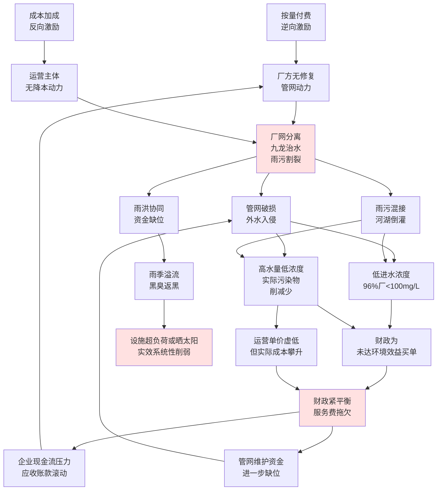

这一图谱揭示出**"低浓度—高水量—成本错配—财政承压—维护不足—效能下滑"的恶性循环**：按量付费与成本加成的逆向激励，叠加厂网分离、九龙治水、雨污割裂的体制断裂，导致管网外水入侵与雨污混接长期难以治理；进而造成进水浓度普遍偏低、低负荷与超负荷两极分化；最终财政为未达环境效益买单、服务费拖欠又反向挤压管网维护资金，使下一轮"低浓度—高水量"循环更为严重。**这一恶性循环不会因任何单一节点的改革而自动打破——只有同时重构激励机制（按效付费）、整合协同体制（厂网河湖+雨污一体化）、扩展资金通道（多元化投融资）、强化效能考核（全生命周期成本管理），才能将其转化为"高浓度—精准削减—成本可控—财政可承受—维护充分—效能提升"的正向循环**。

这一恶性循环的破解路径，构成本研究后续章节的核心使命：第3章将系统化梳理全生命周期成本结构与资金缺口，明确改革必须覆盖的成本范围；第4章将比较武汉、湘潭、南京、十堰、苏州等地的厂网一体+按效付费改革案例，以及美国、日本、德国、英国的国际经验，提炼可借鉴的制度要素；第5章将设计"厂网河（湖）+雨污"一体化协同运作机制，破解协同断裂；第6章将构建按效付费的考核与计费公式，破解激励扭曲；第7章将设计多元化投融资与财政统筹方案，破解资金缺口；第8—10章将形成政府管理部门可直接落地的方案集、风险防控机制与政策建议。

# 3 全生命周期成本结构与资金缺口分析

第2章已经揭示，核拨制低效困境的财务根源在于其覆盖范围的结构性残缺——污水处理费名义上"专款专用"于污水处理设施的建设、运行和污泥处置，但城市水务系统的实际成本远不止于此。要为后续机制设计与方案构建提供量化靶向，必须先回答两个基础性问题：**第一，城市水务系统的全生命周期成本究竟由哪些环节构成、各环节的量级与吨水单价是多少？第二，当前的污水处理费、财政补贴、专项债、社会资本等资金来源各自能覆盖哪些成本环节、覆盖深度如何，资金缺口集中分布在哪些环节？** 本章遵循第1章界定的"成本维度全生命周期可控性"内涵，把"厂—网—河—湖—调蓄—海绵"作为不可分割的有机整体，构建"建设—运营—维护—改造—应急"五维成本框架，通过"工程量×单价"和"固定资产×计提率"两条路径分别测算建设性成本与持续性成本，再与四类现行资金来源逐项对照，最终形成"成本结构—资金来源—缺口分布"三维对应图谱，为第4章国内外机制比较与第7章多元化投融资方案设计确立量化基础。

## 3.1 全生命周期成本五维框架的构建

城市水务系统的成本不能简单地等同于污水处理厂的运营支出。在第1章界定的"厂—网—河—湖—泵—调蓄—海绵—污泥"系统集成视角下，全生命周期成本必须涵盖从设施新建、日常运行、持续维护、阶段性升级到突发事件应急响应的完整链条。这五大维度的边界、核算口径与计费特征存在显著差异，需先做清晰界定，才能避免后续测算中的口径混淆。

**建设投资**指厂站、管网、调蓄池、海绵设施、初雨净化设施等基础设施的一次性资本投入，以"投资总额"或"吨水造价"为核算口径，资金特征是大额、阶段性、需通过折旧分摊到运营期；**运营成本**指设施日常运转所发生的电耗、药耗、人工、污泥处置等持续性支出，以"元/吨"为核算口径，资金特征是稳定、连续、与处理水量直接挂钩；**维护成本**指为维持设施物理可持续而发生的设备大修、备品备件、管网检修、雨污错接整治等持续性投入，传统上按"固定资产×计提率"换算为吨水成本，资金特征是规律性发生但易被压减；**改造升级成本**指因排放标准提升、规模扩容、智慧化改造等阶段性政策驱动产生的跃迁性投入，资金特征是非连续、与政策周期挂钩、对运营成本结构形成剧烈冲击；**应急响应成本**指因暴雨灾害、突发污染、设施故障等事件性触发的处置与修复支出，资金特征是不可预测、量级波动巨大、跨部门分摊规则不清。

在传统的污水处理成本会计体系中，前述五个维度被归并为"直接费用—制造费用—期间费用"三大类[^34]：其中能源费用（电费占总费用40—50%）、材料费用（絮凝剂、化验等）、直接人工及福利费属于直接费用；维修费、原材料费、备品备件费属于制造费用；管理费、财务费用、设备折旧及其他间接费用属于期间费用[^34]。这一传统会计框架虽完整覆盖了运营层面的成本要素，但未将管网建设、雨污分流改造、海绵设施运维、暴雨应急等城市水务系统的协同成本纳入其中——这正是核拨制覆盖残缺的会计学根源。

**核拨制下污水处理费的覆盖边界**与五维成本的对应关系，可以更清晰地呈现核拨制结构性残缺的本质：

| 成本维度 | 核算口径 | 资金特征 | 当前污水处理费覆盖深度 |
|---|---|---|---|
| 建设投资 | 元/吨水造价、亿元/项目 | 大额一次性、阶段分摊 | 仅覆盖厂站新建的部分折旧 |
| 运营成本 | 元/吨 | 稳定连续 | 60—80%（缺口靠财政补贴） |
| 维护成本 | 元/吨（计提换算） | 规律性、易压减 | 设备维护部分覆盖；管网维护几乎不覆盖 |
| 改造升级 | 亿元/项目、元/吨上升幅度 | 跃迁性、政策驱动 | 几乎不覆盖（依赖专项补助、专项债） |
| 应急响应 | 亿元/事件 | 事件性、量级波动大 | 完全不覆盖（依赖应急预算、防汛专项） |

需要特别强调的是，**雨洪协同设施（合流制溢流控制、调蓄池共用、海绵设施、初雨净化）作为与污水主线并行的成本子系统，必须纳入全生命周期成本框架**——这是落实第1章界定的"雨污协同视角贯通性"的必然要求。在传统按子系统割裂的核算方式下，调蓄池在晴天作为污水均质池、雨天作为合流截流池的双重功能成本难以分摊，海绵设施的削峰减污效益无法纳入污水处理体系账面——这种核算割裂本身就是雨污协同体制断裂在财务层面的反映。本章后续测算将明确把雨洪协同设施作为五维成本中的关键组分，避免重蹈"两套账、两套人马、两个钱袋"的核算覆辙。

测算路径上，本章对建设性成本采用"工程量×单价"法（如"管网长度×每公里造价""厂站规模×吨水造价"），对持续性成本采用"固定资产×计提率"法（如"维护成本=固定资产×0.5—1.0%"）和"单耗×单价"法（如"电耗=吨水电耗×电价"），对改造与应急成本采用"典型项目对照"法。各路径的数据来源以政府权威文件、行业调查报告、典型工程案例与省级成本监审报告为主，对存在显著差异的数据来源在文中说明分歧并取中位数或区间值进行测算。

## 3.2 建设投资成本：厂站、管网、调蓄与海绵设施

建设投资是全生命周期成本中量级最大、最依赖一次性资金注入的环节。由于不同子系统的投资特征差异显著，需要分别测算厂站、管网、调蓄海绵三个子板块。

### 3.2.1 厂站建设投资：吨水造价1500—2000元的行业基准

厂站建设投资遵循较为成熟的"吨水造价"行业基准。**根据已建、在建污水处理厂的实际情况，吨水造价一般在1500—2000元之间，运行费在0.1元—1.4元/吨之间，即建成一座日处理50万吨污水的城市污水厂，一次性投资费用约在7.5亿至10亿元，年运行费需数千万元甚至达亿元**[^35]。这一基准在2025年的实证项目中得到印证——湖北孝感孝南区经济开发区北区污水处理厂及配套管网（厂网一体）项目估算价近5.16亿元；江西九江经开区石化产业园污水处理厂及其配套管网项目总投资约4.34亿元；武汉天源中标南宁市沙井厂等4个水质净化厂及配套管网特许经营项目，投标报价工程费10.68亿元[^36]。

按住建部《2023年中国城市建设状况公报》披露，**截至2023年末全国城市污水处理厂处理能力达2.27亿立方米/日，同比增长4.84%**[^37]。按吨水造价1500—2000元的行业基准换算，仅维持现有设施的存量重置成本就达**3.4—4.5万亿元**——这一量级远超污水处理费每年百亿级的收入规模，从根本上决定了厂站建设投资必须依赖财政、专项债与社会资本的多元注入，而不可能由污水处理费独立承担。

### 3.2.2 管网建设投资：80亿元/月的释放强度与15—20万亿元的总缺口

与厂站相对成熟的造价体系不同，管网建设投资在"十四五"以来呈现规模空前、节奏密集的释放态势。**据不完全统计，仅2025年1—5月（截至5月13日），已经释放超13个亿级污水管网项目，总投资金额超80亿元**[^36]。从单个项目体量看，2025年呈现明显放大趋势：

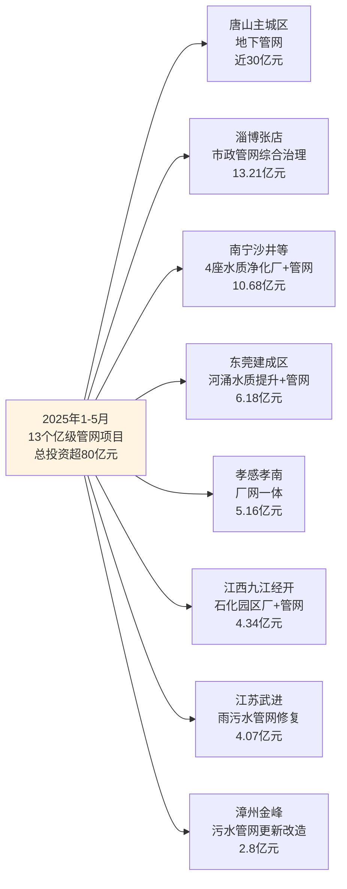

数据来源：《环保水圈》2025年统计[^36]。

从政策目标看，**"十四五"期间要新增和改造污水收集管网8万公里**[^3]；2023年发改委、环境部、住建部三部门发布的《环境基础设施建设水平提升行动（2023—2025年）》进一步要求，**到2025年新增和改造污水收集管网4.5万公里**[^3]。仅广东一省，《广东省城镇生活污水处理"十四五"规划》就明确十四五期间全省新增城镇污水收集管网预期参考规模约13963公里，其中城市（县城）7495公里、建制镇6468公里[^13]。

E20研究院执行院长薛涛对管网建设投资规模作出宏观测算：**"管网建设空间很大，如果对雨水污染进行非常完善的处理，粗略估计至少需要15万亿—20万亿的投资"**[^3][^1]。住建部《2023年中国城市建设状况公报》披露，截至2023年末全国城市排水管道长度95.25万公里，同比增长4.27%[^37]——按"十四五"再新增改造8万公里推算，新增改造规模相当于现有存量的8.4%。

**管网建设投资的资金来源呈现"国债+专项债+财政+自筹"的典型组合特征**：唐山主城区项目近30亿元资金来自超长期国债、专项债及财政资金；安徽寿县1.8亿元乡镇污水处理厂项目资金来自争取上级专项资金及地方财政配套；湖北孝感孝南厂网一体5.16亿元由项目单位自筹及争取上级资金；江苏武进4.07亿元、广东东莞6.18亿元、四川德阳1.2亿元则全部由财政资金支撑[^36]。这一资金结构特征在第3.7节将与运营期资金来源进一步对比分析。

### 3.2.3 调蓄与海绵设施投资：松原61.86亿元三年示范的实证

雨洪协同设施投资在过去十年随海绵城市建设持续放量。**松原市2022年6月成功入选第二批全国系统化全域推进海绵城市建设示范城市，三年示范期内计划实施7大类143个项目，总投资61.86亿元，其中海绵相关投资30.02亿元**[^38]。具体投资结构包括：投入5.1亿元改造雨水主干系统、雨水排放标准达到两年一遇；改造城区25个内涝积水点；改造全市41%的支路和巷路；改造210万平方米老旧小区；依托镜湖等天然水体新增10万立方米调蓄容积，使江南片区内涝防治能力达到30年一遇、实现24小时146.1毫米降雨条件下不内涝[^38]。这一实证为单个示范城市的海绵投资量级提供了基准——**单个地级市三年期海绵+雨洪协同投资约30—60亿元**。

调蓄与海绵设施的覆盖范围在地方立法中已有清晰界定。**《扬州市海绵城市建设管理条例》（2025年8月通过、2025年9月省人大常委会批准）将海绵城市设施界定为具有"渗、滞、蓄、净、用、排"功能的绿色雨水设施、城镇排水与污水处理设施、河湖水体设施等的统称，包括雨水渗透设施、转输设施、调蓄设施、集蓄利用设施、截污净化设施以及附属设施等**[^39]。这一范围界定明确将"调蓄设施"和"截污净化设施"纳入海绵城市设施口径，为合流制溢流控制设施、初雨净化设施的资金归集提供了制度依据。

### 3.2.4 三大子板块的投资结构估算

将厂站、管网、调蓄海绵三个子板块的投资量级进行结构化对比，可以勾勒出建设投资的整体格局：

| 子板块 | 量级测算 | 单位指标 | 资金来源主导通道 |
|---|---|---|---|
| 厂站建设 | 50万吨/日厂7.5—10亿元；存量重置3.4—4.5万亿元 | 吨水造价1500—2000元 | 专项债+BOT/PPP+财政补贴 |
| 管网建设 | "十四五"投资缺口15—20万亿元；2025年1—5月单月级别项目80亿元 | 单公里改造200—300万元（详见3.4节） | 超长期国债+专项债+财政 |
| 调蓄与海绵 | 单城三年期30—60亿元（松原案例） | 调蓄容积10万m³级 | 中央海绵示范补助+地方财政 |

按行业经验粗略估算，**厂站：管网：调蓄海绵的投资比例约为1：3—5：1—2**——管网投资占据建设投资的主导地位，量级远超厂站本身。这一结构与"管网欠账是当前城市水务系统最大短板"的政策共识完全一致：徐祖信院士测算"全国建成区约53%缺污水管网，污水管网外水入渗率为34%，38%的生活污水直排水体"[^3]，这一短板的弥补必然要求建设投资重心从"厂"向"网"显著转移。同时也意味着，**核拨制下以厂站运营为主要支付对象的污水处理费体系，与建设投资以管网为重心的现实需求之间存在显著的结构错配**——这是第3.7节将进一步分析的资金通道与治理需求错位的根源。

更宏大的背景是，**"十五五"期间（2026—2030）全国城市更新总投资将突破20万亿元，年均投入接近4万亿，其中地下管网更新投资约4万亿元，聚焦雨污分流、燃气改造、防汛排涝**[^40]。这一国家级战略安排意味着未来五年管网建设投资将延续"十四五"以来的高强度释放节奏，但若不同步重构资金保障机制和运营激励机制，新建管网仍可能陷入"建而不养、养而不修、修而不究"的传统循环。

## 3.3 运营成本：电耗、药耗、人工与污泥处置

运营成本是污水处理费直接对应的核心环节，其结构化拆解已有较为成熟的行业经验。按"五分法"，吨水运营成本由能耗、药剂、污泥处置、人力、其他五个分项构成，各分项占比与典型单价如下表所示：

| 成本分项 | 占比 | 关键参数 | 典型吨水单价 |
|---|---|---|---|
| 能耗成本 | 30—50% | 江苏一级A考核单耗0.34—0.42 kWh/m³（一级B按0.7折算） | 0.145—0.358元/吨 |
| 药剂成本 | 10—20% | PAC 50mg/L投加、PAM、酸碱药剂 | 0.02—0.04元/吨 |
| 污泥处置 | 10—15% | 简单填埋vs全量安全处置差距悬殊 | 0.08—0.5元/吨 |
| 人力成本 | 15—25% | 日处理5—10万吨厂定员50人 | 按规模分档配置 |
| 其他成本 | 5—10% | 设备维护、化验、检测、管理 | — |

数据来源：综合自污水处理厂成本控制行业经验[^34]。

### 3.3.1 能耗与药剂成本的精细化测算

能耗成本是吨水运营成本中占比最大的单项。**江苏省城镇污水处理厂运行管理考核标准对污水处理单耗有明确考核要求：一级A标准考核分为四个级别（≤0.34 kWh/m³、0.34—0.37、0.37—0.42、≥0.42），一级B标准按一级A的70%考核，低于一级B的按一级A的50%考核**[^34]。按南京电价0.852元/kWh计算，**一级A标准下吨水电费约0.145—0.358元**[^34]。具体到设备级测算，**一台100kW曝气风机日运行24小时、负载率0.8、电价0.6元/度，年电费约42万元**[^34]。曝气系统通常占污水处理厂总能耗的40—60%[^34]，是节能降耗的重点。

药剂成本量级较小但结构复杂。按典型工艺测算：**日处理1万吨水、PAC投加量50mg/L、单价2元/kg，年PAC成本约36.5万元**[^34]，折算为吨水约0.10元；污泥脱水机阳离子聚丙烯酰胺投加成本约0.018—0.0216元/吨；板框压滤机三氯化铁+氧化钙药剂成本约0.021—0.0252元/吨[^34]。药剂成本对工艺路线高度敏感，提标改造引入的新工艺往往伴随药剂成本显著上升。

### 3.3.2 污泥处置成本：0.08—0.5元/吨的悬殊差距

污泥处置成本是运营成本中差异最大的单项。**污水处理企业污泥产量约为每处理10000吨污水产生1—1.2吨干污泥**[^34]，产泥率较为稳定；但处置方式不同，单位成本差距悬殊：

- **简单脱水填埋**：100—150元/吨干泥，分摊到吨水约0.08—0.15元/吨；
- **全量安全处置（焚烧/资源化/制建材）**：300—500元/吨干泥，分摊到吨水约0.25—0.5元/吨[^34]。

按E20研究院执行院长薛涛的实测案例，**外运填埋运输费80元/吨、处置费120元/吨，年污泥成本约58.4万元**[^34]。当前行业现状是大部分地区收费标准仅按"简单脱水填埋"水平核定，但实际处置因填埋场紧缺、中央生态环保督察震慑、修复污泥堆场巨额费用等压力被迫向"全量安全处置"升级，这就形成了**"应处置标准上升+收费标准滞后"的结构性缺口约0.15—0.4元/吨**——这一缺口正是第2章引述的"全国污水处理费仅覆盖全成本0.7—0.8倍"的关键贡献因素之一。

### 3.3.3 提标改造对运营成本结构的剧烈冲击

运营成本最大的不确定性来自提标改造的成本传导。**北京工业大学彭永臻院士的测算指出，以COD为例，一级A排放标准限制为50mg/L，而Ⅳ类和Ⅲ类水质要求则分别为30mg/L和20mg/L，达到这样的排放标准将造成污水处理厂的处理成本提高5倍以上**（前文章节已引）。从工艺角度，常规工艺一级B吨水电费0.2—0.3元，提标至一级A约0.4—0.5元，极致脱氮除磷可达0.8—1元以上——意味着**提标改造直接造成吨水运营成本翻倍乃至数倍上升**。

四川彭山经济开发区污水处理厂2024年4月完成提标改造预验收，工艺由"水解酸化+A2/O"升级为"水解酸化+五段巴顿甫"，出水标准从一级A标提升为《四川省泯江、沱江流域水污染物排放标准》（DB51/2311-2016）（前文已引）。从眉山首创水务有限公司2022—2024年成本监审数据看，**职工薪酬申报数从2022年117.4万元增至2024年131.2万元，监审核定从108.9万元增至123.1万元**[^1]——这只是成本上行的表层映射，提标改造带来的药剂、能耗增量更为可观。

与提标驱动的成本上行形成鲜明对照的，是**重庆水务前六期污水处理结算价格3.43元/m³→3.25元→2.78元→2.77元→2.98元→2.35元的下行轨迹，第六期同比下降21%**（前文已引）。这种"成本上行+收费下行"的剪刀差正是当前核拨制运营成本端最尖锐的财务困境，第2.3.2节已分析过其对企业现金流的双重挤压效应。

需要补充指出的是，技术创新对运营成本压减仍存在空间。**BIOFIX固定床生物膜工艺通过高比表面积固定床载体（800—1200 m²/m³）和分区曝气控制，使微生物浓度提升至传统工艺的3—5倍**[^40]。某化工园区废水处理项目改造前采用UASB+A/O工艺、COD去除率75%、吨水处理成本1.8元；改造为BIOFIX单级工艺后COD去除率92%、吨水处理成本降至1.2元[^40]。同时，**该工艺通过微生物固定化技术将污泥产率从0.3—0.5 kgVSS/kgCOD降至0.1—0.2 kgVSS/kgCOD，污泥产量减少60%**[^40]——某食品加工厂改造前日产污泥8吨、处置费用2400元/天，改造后日产污泥3.2吨、处置费用降至960元/天，年节约成本52.56万元[^40]。这表明在合理的激励机制下，技术创新可以为吨水成本压减提供6—7成空间，但前提是按效付费等正向激励机制能够将技术红利传导到企业财务激励上——这正是第6章按效付费机制设计的核心命题。

## 3.4 维护成本：管网检修、设备更新与雨污分流改造

维护成本是核拨制覆盖最薄弱、缺口最严峻的环节。第2.3.3节已指出，污水处理费的使用范围被严格限定在"建设、运行和污泥处理处置"，**管网检修、CCTV排查、雨污错接整治、外水入侵修复等持续性投入几乎全部依赖一次性财政补贴或专项债，缺乏长效资金通道**。本节将对该环节进行量化测算，揭示资金缺口的实际规模。

### 3.4.1 设备维护与大修：固定资产计提法的吨水换算

按行业通用的"固定资产×计提率"法测算设备维护成本：**根据已建、在建污水处理厂吨水造价1500—2000元、固定资产形成率85%，每年大修成本按固定资产的1.7—2.0%提取，则污水处理企业的固定资产修理成本为0.0594—0.0931元/立方污水；每年设施设备维护成本按固定资产的0.5—1.0%提取，则维护成本为0.0174—0.0466元/立方污水**[^34]。两项合计，**设备维护与大修的吨水成本约0.077—0.140元**——这一量级仅相当于当前居民污水处理费0.85元/吨标准的约10—16%[^38]。

设备维护层面，污水处理费在多数地方的成本监审中已部分覆盖，但实际中仍存在显著压减空间——这种压减往往以延长设备使用寿命、降低运行可靠性为代价，是第2.4.2节引述"水力负荷率大于80%时一般污水厂根本无法在出水达标的前提下倒池停水检修"的财务根源。

### 3.4.2 管网检修：与德国45.3年管龄管理水平的差距对比

管网检修是维护成本中量级最大、覆盖最薄弱的环节。从管理水平对比看，**德国排水管网总长度从2013年的57.56万公里增加到2016年的59.43万公里，增长3.3%；自1995年以来年均增加约9200公里，平均管龄36.9年，按各年龄段长度比例加权后排水管道平均管龄45.3年；德国城镇排水系统纳管率97.1%（2018年调查为98.2%）**[^15]。对比之下，**我国部分区域"现有很多污水管道都在带病工作，渗入量已超过国家标准的10倍以上（GB 50268—2008）"**（前文章节已引），南方管道地下水入渗量3800—6300 m³/(km²·d)是德国1296 m³/(km²·d)的3—5倍。

德国的管网管理经验给予两点重要启示：**第一，管网维护是一项需要长期、稳定投入的常态化工作，年均更新改造约占总长度1.6%（9200/575580）**；**第二，纳管率97%以上的成熟体系是建立在数十年持续维护投入基础之上的**。我国管网总长度95.25万公里[^37]，按德国1.6%的年更新比例测算，仅维持现有管网正常状态就需每年新增改造约1.5万公里——这与"十四五"五年8万公里目标所体现的年均1.6万公里改造强度大致吻合，但若考虑历史欠账（53%建成区缺管网、外水入渗率34%），实际年度需求可能远高于此。

### 3.4.3 雨污分流改造：每公里200—300万元的工程实证

雨污分流改造是当前阶段最迫切、投资强度最大的管网维护类工程。多地工程实证为单价测算提供了直接依据：

| 项目 | 总投资 | 改造规模 | 单公里造价（万元/km） |
|---|---|---|---|
| 沁水县12片区雨污分流源头治理 | 1.91亿元 | 主管网98.81公里+接户管111.1公里 | 综合约91（仅按主管网约193） |
| 新平县老旧排水管网改造及空白补全 | 2.08亿元 | 89公里新管网（含雨污分流） | 234 |
| 漳州金峰开发区污水管网更新改造（EPC） | 2.8亿元 | 含管道修复、清淤、错混接改造 | — |
| 江苏武进区雨污水管网修复改造一期 | 4.07亿元 | EPC一体化 | — |
| 东莞建成区河涌水质提升及排水管网提质增效（一期） | 6.18亿元 | 政府投资 | — |

数据来源：综合自2025年各地管网项目招投标信息[^36][^38][^41]。

按沁水（综合91万元/km、主管网193万元/km）与新平（234万元/km）等案例的分布，**雨污分流改造的每公里造价大致落在200—300万元区间**，具体取决于是否包含接户管、管径规模、路面恢复条件等。按全国"十四五"新增改造管网8万公里测算，**仅雨污分流改造的工程量级即可达1.6—2.4万亿元**——这一规模与薛涛"15—20万亿管网投资缺口"的测算[^3]在量级上基本一致，只是后者还涵盖了源头海绵、初雨净化等更广义的雨水污染治理工程。

雨污分流改造对污水处理效能的提升作用在多地实证中已获印证。**新平县范晓飞副局长指出，"过去雨污混流导致污水处理厂压力剧增，改造后将从根本上解决这一问题"**[^41]；沁水县案例同样表明，"项目全面建成后，将大幅提升沁水县城排水防涝能力，有效缓解汛期内涝问题，解决雨污混流造成的污水处理厂超负荷运行难题"[^38]。但需要警醒的是，第2.2.3节引述的日本东京"全国合流改分流累计面积仅占合流区域的5%——这并非主要整改措施"的经验提示，**单纯依靠雨污分流改造并不足以根治合流制溢流，必须与调蓄、初雨净化、源头海绵等措施协同推进**——这就要求维护成本的资金通道不能仅限于污水管网本体，必须延伸至雨污协同设施。

### 3.4.4 维护成本的资金保障脆弱性

将设备维护、管网检修、雨污分流改造三项合计，城市水务系统每年的常态化维护需求量级粗略推算如下：

- 设备维护与大修：按全国2.27亿吨/日处理能力、吨水成本0.077—0.140元测算，年规模约**640—1160亿元**[^37]；
- 管网检修与更新：按全国95.25万公里管网、年更新比例1—1.6%测算，年改造规模约0.95—1.5万公里，按200—300万元/km单价，年规模约**1900—4500亿元**；
- 雨污分流改造（"十四五"集中攻坚期）：年规模约**3200—4800亿元**（按总盘1.6—2.4万亿元、五年分摊）。

三项合计年度维护性需求约**5740—10460亿元**——而当前污水处理费年收入按全国2.27亿吨/日×365天×1元/吨估算约**830亿元**，**单是维护性需求就已达到污水处理费收入的7—13倍**。这一量级落差直观揭示了核拨制覆盖的结构性残缺：**污水处理费连运营成本都难以全覆盖，更遑论数倍于此的维护性需求。维护成本的资金保障，事实上完全依赖财政补贴、专项债、超长期国债等核拨制以外的资金通道**——这就是第3.7节将进一步剖析的资金通道与治理需求错位的核心证据。

## 3.5 改造升级成本：提标扩容与智慧化

改造升级是阶段性、跃迁性的成本环节，其量级与节奏受政策周期与排放标准升级直接驱动。"十四五"以来的改造升级浪潮主要由三股力量推动：一是排放标准从一级B、一级A向"准Ⅳ类""准Ⅲ类"持续提升；二是合流制片区雨污分流改造与厂网一体化改造；三是污水处理厂智慧化、低碳化升级。

### 3.5.1 提标改造：从一级A到准Ⅳ类的成本跃迁

提标改造的成本跃迁可以从单个项目和区域规模两个层面观察。**单项目层面**，彭山污水处理厂从GB18918一级A提升至四川省泯江沱江流域排放标准，工艺从"水解酸化+A2/O"升级为"水解酸化+五段巴顿甫"，反映出工艺路线的整体重构（前文已引）。**区域规模层面**，福建省"十四五"实施方案明确，**21座生活污水处理厂尾水一级A提标改造在2025年底前完工，14座生活污水处理厂根据负荷率推进新建扩建**[^1]，加之2024—2025年新建改造污水管网2000公里以上、新建改造污水提升泵站14座[^1]，构成省级层面提标扩容的典型工作量。

国家层面对"准Ⅳ类""准Ⅲ类"的态度趋于谨慎。**青山研究院2025年提标改造观察指出，"准Ⅳ类"就是让污水厂的排放接近地表水Ⅳ类水质——这几乎等同于一般工业用水或景观用水的水质，有些地方的"准Ⅲ类"甚至逼近饮用水源二级保护区水质**[^40]。一些一二线城市的大型污水厂被要求对标这些极严标准，而偏远地区、小规模设施则相对宽松一些，出现了明显的区域和规模差异[^40]。**全国2020年前后污水处理厂总数已超1.5万座**[^40]，绝大多数为2010年代中期建成。如今这批设施同时进入折旧高峰、运行成本压力期与提标改造期，构成了"十四五""十五五"改造升级浪潮的设施基础。

提标驱动的成本上升与服务费下行的剪刀差在2025年集中爆发。**昆明市投资约43亿元的新建第十五水质净化厂BOT项目，2023年定标、2025年却因政策调整而不得不解除原合同、重新招标；贵州某地价值8亿元的工业废水厂，由于费用高企和管理矛盾，建成验收后被地方政府强行接管**[^40]。这些案例反映的"特许经营分手潮"——表面是个别合同纠纷，深层却是核拨制下提标成本上行与服务费支付能力下行之间矛盾的总爆发。

### 3.5.2 提标改造的资金保障：依赖专项债与中央补助

提标改造的资金来源以中央补助、专项债、社会资本融资为主，污水处理费仅在改造完成后通过涨价缓慢传导。从2025年各地实证看：

- 漳州金峰开发区污水管网更新改造工程（EPC）项目估算价超2.8亿元——以EPC方式打包提标改造与管网修复[^36]；
- 顺庆区荆溪片区污水管网改造项目中标价超1.01亿元，包括新建污水干管支管、修复病害管网及错混接改造[^36]；
- 湖北荆门白云大道及周边道路污水管网更新改造工程（EPC）合同估算价超1亿元[^36]。

这些项目共同特征是"改造与新建打包+EPC总承包+财政或专项债资金"——污水处理费在其中的角色仅限于偿还专项债的还款来源之一。**根据《污水处理费征收使用管理办法》（财税〔2014〕151号），污水处理费属于政府性基金预算管理，可作为专项债还款来源**[^42]，但**单一新建污水处理项目的负荷是逐渐增加的，在专项债常见的5—10年期限内、按发行利率与利息保障倍数1.1要求测算，单个新建污水项目可承担的专项债额度相对于投资额占比很低。因而，在为新建污水处理项目申报专项债额度时，通常需要统筹某一区域整体的污水处理费收入**[^42]。这一逻辑约束意味着，**专项债不能简单地"项目对项目"匹配，必须以区域统筹的方式打包使用**——这一思路在第7章多元化投融资方案设计中将进一步展开。

### 3.5.3 智慧化升级：标准化运维与数据资产潜力

改造升级的另一重要方向是智慧化运维。沛县供水PPP项目的实践提供了一个具有示范意义的样本：**沛县供水PPP项目按照"水务城乡一体、供排一体、厂网一体"的原则，将沛县城乡供排水业务打包整体交由沛县兴蓉水务发展有限公司负责实施，其中市政污水处理项目3.15万m³/d、总计13个建制镇污水处理厂，特许经营期30年，项目计划投资总额约2.5亿元**[^42]。该项目以龙固镇污水处理厂为控制中心，设立中央控制系统，实现13个建制镇污水处理厂所有重点部位监控画面、各类主要设备参数、进出水水质、水量、工艺过程等参数传输至生产调度中心[^42]——这种"中央控制+无人值守+精准调度"的模式，**使得乡镇级小规模污水处理设施的运维成本得以通过规模化、标准化显著压减**。

智慧化升级的财务意义在于其对"低浓度低负荷高单耗"中小厂的成本压减潜力。沛县模式下13个乡镇污水处理厂打包总投资2.5亿元、特许经营30年[^42]，平均到单个厂年投资约64万元——若没有智慧化集中控制和厂网一体化运维，单个乡镇厂的运营成本将大幅高于这一水平。智慧化对核拨制改革的启示在于：**通过技术手段降低运维成本，可以为按效付费机制的财务可持续性创造空间**——这一逻辑将在第6章按效付费机制设计中进一步展开。

## 3.6 应急成本：暴雨、突发污染与设施故障

应急成本是长期被忽视但量级巨大的环节。第2.2.3节已指出，雨水管网维护、合流制溢流控制、调蓄池共用等领域处于"两不管"地带，应急响应所需资金更是缺乏制度化的稳定通道。本节通过暴雨灾害与溢流污染两类典型情形进行量化分析。

### 3.6.1 暴雨灾害：云浮"十四五"超27亿元损失的实证

云浮市作为典型山区市的实证为暴雨应急成本提供了较为完整的量化样本。**云浮山区面积占比超60%，境内分布14个强降雨频繁的"雨窝点"，"十四五"期间全市因自然灾害累计造成直接经济损失超27亿元，其中暴雨及次生洪涝灾害占比极高**[^42]。这一直接经济损失尚不包括城市排水管网的应急运维成本、设施故障修复成本与污染治理后续成本。

云浮的应对方式具有重要借鉴意义。**《云浮市暴雨灾害防御条例》于2025年12月24日云浮市第七届人大常委会第三十二次会议通过、2026年3月26日省人大常委会批准、2026年4月15日起施行，构建预防、监测、预报、预警、应急处置、保障全链条体系，将暴雨灾害防御工作所需经费纳入本级财政预算**[^42][^37]。这种"通过地方立法将应急成本制度化纳入财政预算"的做法，明确将应急资金从"事件性临时拨付"转向"制度性常态保障"，是第7章财政统筹方案设计的重要参照。

县级层面的应急预案则以"分级响应+24小时值守+物资储备"为核心。**祁阳市市政设施内涝防治抢险应急预案确立"安全第一、常备不懈，以防为主、全力防险"的方针，按蓝色（IV）、黄色（III）、橙色、红色四级响应；蓝色预警下办公室主任、各责任单位负责人带班，24小时值班；汛期24小时值班，积极做好城区内道路、排水等市政设施的检查、养护工作**[^43]。这种分级响应机制虽较为完善，但其资金保障在污水处理费、防汛专项、应急预算之间分摊规则不清——多数地区的暴雨应急成本实际上被压在城市管理执法局、住建局等部门的日常预算中，缺乏稳定的预算科目对接。

### 3.6.2 突发污染：溢流直排的生态修复与责任成本

突发污染应急成本的量级在中央生态环保督察通报案例中可见一斑。**2023年重庆鸡冠石污水处理厂、太平门污水提升泵站共向长江溢流直排污水约900万吨，溢流污水化学需氧量平均浓度为96.6毫克/升，超地表水Ⅲ类标准3.8倍**（前文已引）。900万吨溢流污水所形成的生态损害修复成本、可能涉及的生态环境损害赔偿、责任追究成本均未纳入常规财务体系；**福建龙岩铁山污水处理厂大量生活污水通过进水总管的溢流口直排龙津河，化学需氧量、氨氮和总磷分别超地表水Ⅲ类标准2.8倍、16.6倍和9.5倍**（前文已引）——这些数据所对应的生态修复责任与财务后果，已远超污水处理厂自身的财务承受能力。

溢流污染应急的根源仍在于雨污协同设施缺失。住建部等5部门已明确要求**"鼓励各地在完成管网建设改造的前提下，建设雨季溢流污水快速净化设施，结合本地实际明确排放管控要求"**[^1]——但雨季溢流污水快速净化设施在全国范围尚处试点阶段，其运维资金通道尚未制度化。当前应急成本的现状可归纳为"四个不清"：**预算科目不清、分摊规则不清、责任主体不清、长效机制不清**。

### 3.6.3 应急成本的常态化与制度化

应急成本的特殊性在于其难以精确预测，但可以通过常态化预算安排实现整体可控。日本东京经验提供了清晰参照：**东京家庭平均每月污水费约150元人民币，而雨水处理费用则由财政全额承担**[^15]——其制度明确将"污染者付费"与"防灾公共属性"分账管理，雨水部分（含暴雨应急）由财政预算稳定承担，避免了核拨制式的"事件触发临时拨付"。这种制度化安排的优势在于：第一，企业运营预期稳定，不必为不可预测的应急事件承担额外财务压力；第二，应急能力建设有稳定资金支持，不会因事件未发生而被压减；第三，跨部门职责分工清晰，避免推诿。

国内云南昆明2025年修订的条例已经开始尝试在地方层面打破核拨制的资金边界，将"内涝防治专项规划"纳入"城镇排水与污水处理专项规划"，并在污水处理费使用范围中纳入"防涝应急"功能（前文已引）。这是地方层面的有益突破，但在国家层面财税〔2014〕151号办法的刚性约束下，这种突破仍属局部探索，难以形成全国性的雨污协同应急资金通道。**应急成本制度化的关键，在于第7章必须设计的"污水处理费+雨水管理费/财政专项+应急预算"的多通道资金统筹方案**。

## 3.7 现行资金来源的覆盖能力与制度边界

将五维成本与四类现行资金来源逐项对照，可以清晰识别每类资金来源的覆盖能力与制度边界。

### 3.7.1 污水处理费：覆盖运营60—80%的有限基础

污水处理费是核拨制的资金核心，但其覆盖能力存在显著边界。**云梦县2026年最新标准为居民0.85元/吨、非居民1.20元/吨，城区享受困难群众最低生活保障的用户按0.80元/吨缴纳**[^38]。这一标准与发改价格〔2015〕119号文规定的"县城、重点建制镇原则上每吨应调整至居民不低于0.85元、非居民不低于1.2元"的最低底线完全一致，反映出基层实际执行情况——**底线即上限**。

对照江苏多市1:1.47—1:1.92的收支倒挂数据（前文已引），污水处理费实际只能覆盖运营成本的60—80%，对维护、改造、应急的覆盖深度几近为零。从全国分布看，**全国目前仍有100多座城市的居民污水处理费收费标准低于0.95元/吨，超过60%的城市居民污水处理费收费标准也只是刚刚达到0.95元/吨的最低标准**（第2章已引）——这意味着即便不考虑维护、改造、应急等核拨制以外的成本环节，污水处理费的现行水平本身就难以覆盖运营成本的全部。

### 3.7.2 财政补贴：兜底缺口的脆弱性

财政补贴是核拨制资金链条的最终兜底。**E20研究院薛涛指出，"政府收到的所有污水处理费都进入一个大池子，叫政府性基金账户，支付的时候资金也统一从这个账户提取，并在不足时额外从另一个池子，即一般性公共预算账户中抽取资金来做补贴"**[^44]。从政府性基金账户到一般公共预算账户的资金流转路径，构成了核拨制的兜底机制。

但这种兜底在地方财政紧平衡下日益脆弱。**焦作市市本级污水处理费2023年收入1.1亿元、支出2.13亿元、倒挂约1亿元；2024年收入6800万元、支出2亿元、倒挂约1.32亿元**（第2章已引）。当地财政部门的回应"目前污水处理费暂未纳入'三保'保障清单，但已纳入'三保'以外刚性支出保障范围"（第2章已引），从制度层面揭示了一个关键事实——**污水处理费支出的优先级低于"三保"（保基本民生、保工资、保运转），在地方财政紧平衡下，其保障稳定性依赖于地方政府的相机决策**，缺乏强制性制度约束。

### 3.7.3 专项债与超长期国债：建设投资的主力支撑

专项债与超长期国债构成了"十四五"以来建设投资的主力资金通道。**唐山主城区地下管网及配套设施改造提升工程（一期）总投资近30亿元，资金来自超长期国债、专项债及财政资金**[^36]。从制度逻辑看，**专项债通常以省级单位为统筹、发行主体，主要用于有一定收益的公益性项目，期限通常在5—10年**[^42]。

专项债适用的项目特征要求"现金流收入能够完全覆盖专项债券还本付息规模"[^42]，这就形成了重要的运用约束：**单一新建污水项目的使用者污水费扣除项目日常经营成本后的净收入已经处在较低水平。在专项债常见的期限内（5—10年），按照专项债发行利率和利息保障系数至少要达到1.1的要求测算，单个新建污水项目可承担的专项债额度相对于投资额占比很低。因而，在为新建污水处理项目申报专项债额度时，通常需要统筹某一区域整体的污水处理费收入**[^42]。这一逻辑约束的实践含义是：专项债的使用必须与PPP/特许经营、区域统筹、"项目库+资金池"等机制结合，才能突破单一项目的还款能力瓶颈——这正是第4章将分析的海宁市"项目库+资金池"模式与第7章"项目打包+稳定现金流+市场化融资"方案的逻辑起点。

超长期国债与科技创新和技术改造再贷款也在拓展水务领域的资金通道。**国家已将科技创新和技术改造再贷款规模由5000亿元提高至1.2万亿元，利率从1.75%降至1.25%**[^37]——这一规模与利率优势虽主要面向石化化工等老旧装置更新，但对水务领域的提标改造、智慧化升级同样具有借鉴意义。

### 3.7.4 社会资本：从规模扩张到结构调整

PPP/特许经营曾是社会资本进入水务领域的主流通道。**沛县供水PPP项目按"水务城乡一体、供排一体、厂网一体"原则，将沛县城乡供排水业务打包整体交由沛县兴蓉水务发展有限公司负责实施，特许经营期30年，项目计划投资总额约2.5亿元**[^42]——这是PPP模式在乡镇水务整合中的成功样本。**彭山项目则代表BOT特许经营在新建污水厂中的典型应用**——首创水务公司2014年与园区管委会签订《特许经营合同》，取得30年BOT特许经营权，项目总投3449.82万元（前文已引）。

但2025年以来，PPP/特许经营在水务领域已进入结构调整期。**昆明市投资约43亿元的新建第十五水质净化厂BOT项目2023年定标、2025年却因政策调整而不得不解除原合同、重新招标；贵州某地8亿元工业废水厂建成验收后被地方政府强行接管**[^40]。这些"分手潮"的背后是社会资本对回款风险的重新评估——**主流大型水务公司50—90%应收账款来自污水处理费、欠款方多为地方政府**（前文已引）的现实下，社会资本对新建项目的参与积极性显著下降。**节能国祯（300388.SZ）2025年年报直接指出："受当前政府财力未能明显改善影响，运营费收取滞后……地方财政收支呈现'紧平衡'，地方财政收支平衡压力加大，导致各污水处理厂运营费用支付困难"**（第2章已引）。

E20研究院薛涛对此的判断颇具洞察力：**"目前从各上市公司的报表中可以看到，排名靠前的几家以污水特许经营为主的上市公司盈利状况都不错。这说明了市场化机制的重要性"**[^44]——但这一判断的成立条件是"约定服务费水平合理+回款稳定"，当后者发生动摇时，PPP/特许经营的财务模型基础就会受到冲击。这也提示，**社会资本通道的可持续性，从根本上仍取决于核拨制本身的财务可持续性**——这是第7章必须直面的根本逻辑。

### 3.7.5 五维成本与四类资金来源的覆盖矩阵

将五维成本与四类资金来源的对应关系构成矩阵，可以直观呈现现行资金保障体系的覆盖深度与缺口分布：

| 成本维度 | 污水处理费 | 财政补贴 | 专项债/国债 | 社会资本 | 缺口分布特征 |
|---|---|---|---|---|---|
| **建设投资—厂站** | 部分覆盖（折旧） | 局部补贴 | 主力通道 | BOT/PPP主力 | 总体可保障，但回款风险上升 |
| **建设投资—管网** | 几乎不覆盖 | 局部补贴 | **绝对主力** | 厂网一体打包参与 | 缺口最严重（15—20万亿） |
| **建设投资—调蓄海绵** | 不覆盖 | 中央示范补助主力 | 部分支撑 | 局部参与 | 长效资金通道缺失 |
| **运营成本** | **主力（覆盖60—80%）** | 兜底缺口 | 不覆盖 | 享受合同收益 | 提标后剪刀差扩大 |
| **维护成本—设备** | 部分覆盖 | 局部补贴 | 不覆盖 | 合同内分担 | 易被压减 |
| **维护成本—管网** | **几乎不覆盖** | 一次性补贴 | 主要通道 | 不参与 | **缺口巨大（年5740—10460亿元）** |
| **改造升级** | 仅事后涨价传导 | 中央补助 | 主力通道 | EPC/PPP参与 | 短期跃迁压力 |
| **应急响应** | **完全不覆盖** | 防汛/应急专项 | 不覆盖 | 不参与 | **预算科目不清、分摊规则不清** |

数据来源：综合本章前述分析。

从矩阵可以清晰看出三个关键现象：**第一，污水处理费的覆盖范围仅集中于运营成本和部分维护成本（设备），对建设、管网维护、改造、应急四大维度的覆盖深度极低；第二，专项债与社会资本主要覆盖建设投资，但管网建设的体量已远超其承载能力；第三，应急响应在四类资金来源中均无稳定通道，是覆盖最薄弱的环节**。

## 3.8 管网运维与雨洪协同的资金保障薄弱环节

基于五维成本与四类资金来源的对应分析，可以最终定位两大资金保障最薄弱的环节：管网运维与雨洪协同。

### 3.8.1 管网运维：长效资金通道的制度性缺失

管网运维资金保障的脆弱性在制度层面具有根本性。第2.3.3节已指出，**污水处理费的"专款专用"范围严格限定在污水处理设施的建设、运行和污泥处理处置**——这一限定在《污水处理费征收使用管理办法》（财税〔2014〕151号）的国家层面规则中刚性确立。其后果是：

**第一，管网维护"建得起、养不起"**。中央政府通过专项债、国债、海绵城市示范补助等通道支持管网建设，但建成后的检修、清淤、CCTV排查、雨污错接整治、外水入侵修复等持续性投入几乎全部依赖一次性财政补贴或专项债追加，而非通过污水处理费体系的稳定通道。这就形成了**"建—不养—坏—再建—再不养"的恶性循环**——徐祖信院士测算的"全国建成区约53%缺污水管网，污水管网外水入渗率为34%"正是这一循环的总体后果。

**第二，按全国管网外水入渗率34%、53%建成区缺管网测算，仅完成"十四五"管网建设任务即需巨额持续投入**（按本章3.4.4节测算，年度维护性需求约5740—10460亿元），而当前覆盖能力严重不足。即便假定"十五五"4万亿元地下管网更新投资全部到位[^40]，分摊到5年也仅相当于年度需求的下限——更何况这4万亿元中污水管网占比并不会是全部。

**第三，住建部等5部门在《关于加强城市生活污水管网建设和运行维护的通知》中已经为管网运维转型提供了方向性指引——**"以效能提升为核心，以管网补短板为重点，坚持问题导向、重点突破、建管并举、系统整治、精准施策，推动建立厂网统筹的城市生活污水专业化运行维护管理模式"**[^1]，但这一指引必须辅以"按效付费、厂网一体、长效资金"的配套机制改革才能真正落地。

### 3.8.2 雨洪协同：日本东京"分账边界"经验与中国昆明"局部突破"

雨洪协同环节是另一个资金保障薄弱地带。第2.2.3节已分析其"两不管"困境，本节进一步从国际对照与国内突破两个角度刻画其结构特征。

**日本东京的"分账边界"经验**为雨洪协同的资金保障提供了清晰参照。**东京下水道局作为政府机构与公营企业，负责排水系统的规划、投资、建设与运行，并与东京下水道服务公司（TGS）紧密合作。在收支平衡与费用分担方面，日本城市排水运营遵循可持续原则，力求收支平衡。污水费征收遵循受益者负担原则，实行阶梯污水费制度。在东京，家庭平均每月污水费约为150元人民币，而雨水处理费用则由财政全额承担**[^15]。**东京郊区各市镇自行建设与维护市政排水管网，污水接入流域下水道进行集中处理，并按量支付污水处理费，目前单价约为76元人民币/立方米。流域下水道的建设费用由相关市镇分摊，符合国家补贴条件的项目可获得国家财政支持**[^15]。

这一制度设计的精髓在于**"两条边界"**：一是**受益者付费的"污水边界"**——按污染者付费原则、受益者负担、阶梯收费等机制落实；二是**公共属性兜底的"雨水边界"**——雨水管理具有防灾减灾、公共安全等公共属性，由财政全额承担。两条边界清晰分账，避免了核拨制式的资金混淆。再加上**德国排水管网纳管率97%以上的成熟体系建立在数十年持续投入基础之上**[^15]，这些发达国家经验共同提示：**雨洪协同的长效资金保障，必须通过制度化的财政预算科目而非污水处理费的临时拓展来实现**。

**中国昆明的"局部突破"**虽方向正确但仍受国家层面制度约束。**云南昆明2025年修订的条例将"内涝防治专项规划"纳入"城镇排水与污水处理专项规划"，并在污水处理费使用范围中纳入"防涝应急"功能**——这是地方层面的有益突破，将污水处理费部分用途扩展至雨洪协同。但在国家层面财税〔2014〕151号办法的刚性约束下，这种突破仍属局部探索，**全国性的"污水处理费+雨水管理费/财政专项"双通道资金体系尚未建立**。

合流制溢流控制、调蓄池共用、初期雨水处理（COD达2000mg/L）、海绵设施运维等领域的资金缺口，本质上是雨洪协同设施在污水处理费体系外、在防汛专项预算外、在应急预算外的"三外"困境。**美国自1965年联邦水污染控制法首次提出CSO控制至今已50余年；联邦政府和各地政府投入巨额资金实施大量系统性改造工程**[^15]——美国的经验在于联邦层面将CSO纳入排放许可（NPDES）的点源污染管控要求，从制度层面强制各地承担CSO控制责任[^15]，但这一强制责任背后需要稳定的资金通道支撑。

### 3.8.3 资金缺口的总体量化与三维图谱

将本章前述分析整合，可以形成"成本结构—资金来源—缺口分布"三维对应图谱：

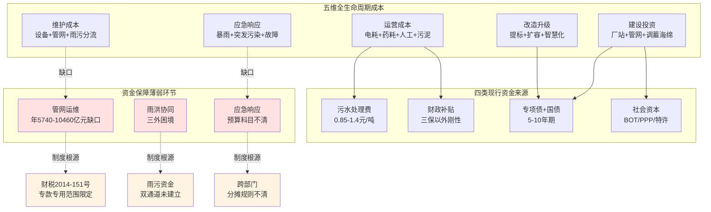

这一图谱揭示了核拨制困境破解必须从三个维度同步推进的逻辑：**一是必须将管网运维纳入长效资金通道，从制度层面突破"专款专用范围"对管网维护的限制；二是必须建立"污水处理费+雨水管理费/财政专项"的双通道体系，破解雨污协同的"三外"困境；三是必须明确应急响应的跨部门分摊规则，将应急成本制度化纳入财政预算**。

具体到资金缺口的量化测算，可以勾勒出未来五年的总体规模：

| 缺口类型 | 五年规模测算 | 关键依据 |
|---|---|---|
| 管网建设 | 4万亿元（"十五五"地下管网） | 城市更新部署[^40] |
| 管网运维（5年累计） | 2.87—5.23万亿元 | 本章3.4.4年度需求×5 |
| 雨污协同与海绵建设 | 1—2万亿元（推算） | 全国类似松原级城市量级 |
| 提标改造 | 5000亿元—1万亿元 | 1.5万座厂×平均3000—6000万元 |
| 应急响应 | 数千亿元（含间接损失） | 云浮单市超27亿/5年×全国 |

这些测算仅提供量级参考，实际缺口规模还受地区差异、改造深度、政策力度等多重因素影响。**核心结论是：未来五年城市水务系统的资金需求将达到10万亿元以上量级，远超污水处理费体系（按全国年800—1000亿元规模、5年合计4000—5000亿元）的承载能力。这一量级差异决定了核拨制改革不能仅限于"调高污水处理费"或"加大财政补贴"的单点调整，必须通过激励机制重构（按效付费）、协同体制重构（厂网河湖+雨污一体化）、资金通道重构（多元化投融资）、考核体系重构（全生命周期成本管理）的四维联动，才能从根本上化解资金缺口。**

本章的成本结构分析与资金缺口定位，为第4章国内外创新机制比较提供了量化靶向——湘潭、南京、十堰等地的"厂网一体+按效付费"改革，本质上是对管网运维资金通道的制度性重构；海宁市"项目库+资金池"模式，本质上是对专项债区域统筹运作机制的实践突破；日本东京的"双账户"经验，则提供了雨洪协同资金保障的可借鉴范式。第7章多元化投融资方案设计将基于本章定位的薄弱环节（管网运维、雨洪协同、应急响应），进一步设计具体的资金组合工具与制度突破路径。

# 4 国内外创新机制比较与经验提炼

第3章的成本结构分析揭示，未来五年城市水务系统资金缺口将达到10万亿元以上量级，远超污水处理费体系自身的承载能力，单纯依靠"调高收费"或"加大补贴"的单点调整无法破解核拨制困境。但与此同时，国内外已有大量地方与国家层面的创新实践，从激励机制重构、协同体制整合、资金通道拓展、监管效能提升等不同维度形成了可供借鉴的制度模板。本章在第3章定位的资金缺口与制度边界基础上，系统比较国内外突破核拨制低效的创新机制——国内聚焦湘潭、南京、长沙、十堰、武汉等地"厂网一体+按效付费"改革的差异化路径，对比PPP/BOT/TOT特许经营在新建与存量项目中的演进，考察海宁、温州鹿城、湖南省级层面区域统筹型投融资经验；国际层面对照美国CWSRF低息贷款、雨水费制度，日本东京"污水+雨水"分账边界与流域下水道协同治理，德国"上松下紧"法律体系与排污税倒逼机制，以及英国Ofwat监管改革的镜鉴。本章通过"机制要素—适配条件—可复制性"三维框架提炼共性规律，为第5章协同机制设计、第6章按效付费公式构建、第7章多元化投融资方案提供可借鉴的制度模板与避坑参照。

## 4.1 国内"厂网一体+按效付费"改革的多地实践对比

国内"厂网一体+按效付费"改革自2022年以来在湖南、江苏、湖北、安徽等省份多地展开，形成了从省级立法到市县试点的多层次实践网络。这些实践的共同方向是打破核拨制下"按量付费+厂网分离"的制度组合，但在主体整合方式、考核指标设计、价格联动机制、资金来源组合等具体路径上呈现显著差异化。本节选取湘潭、南京、长沙、十堰、武汉五地为典型样本进行对比分析，并以湖南省级"小快灵"立法为统筹框架。

### 4.1.1 湘潭：全国首创"按污染物浓度削减率"付费的县市级样本

湘潭是全国第一个全面实施"按效付费"的城市，其改革路径具有"小切口、低成本、可量化"的鲜明特征。湘潭市住建局深入分析污水处理成本、效益和付费之间的内在联系，**将污水处理运维费从污水处理服务费中分离出来，按污染物浓度削减率计算付费**，变污水处理"按量付费"为"按效付费"[^45]。其改革成效集中体现在四个量化指标上：

第一，**进水浓度显著提升**。截至2023年底，市城区平均污水进水BOD浓度为70mg/L；按《湘潭市城区污水进水浓度提升攻坚行动方案》要求，2024年12月底前市城区4个污水处理厂进水BOD浓度要提升至100mg/L以上[^45]；2024年平均BOD浓度达75.2mg/L，较2020年提升65%[^46]。

第二，**财政资金直接节约**。湘潭市4座污水处理厂在原特许经营协议基础上，**全部补充签订了"按效付费"协议**，通过实施一批"撇清水、挤外水、收污水"项目，**撇除外水和"按效付费"每年可节省资金5000多万元**[^45]。

第三，**避免重复建设投资**。原规划的6万吨/日的铁牛埠污水处理厂**无需建设，节省建设投资约3.5亿元、节约用地约120亩**[^45]。这一指标对第3章测算的厂站建设投资缺口具有直接参考意义——在管网完善与按效付费协同推动下，单座中等规模厂的避免新建即可节约亿元级投资。

第四，**黑臭水体治理同步推进**。爱劳渠水体治理已完成建设项目28个、投资约7亿元，建设截污干管10公里、污水管道32千米，消除污水直排口487个，建设7000立方米的调蓄池1座，完成87个小区、65个企事业单位的雨污水分流改造以及80户散户截污改造；2023年底湘潭城区24条黑臭水体全部完成治理并销号、消除率100%[^46][^47]。

湘潭模式的核心制度抓手可归纳为"五个以效"——**以"效"问质**（建立以进水浓度为核心指标的管网工程质量考核机制）、**以"效"问病**（监测溯源法划分2353个排水单元、排查问题2200余个）、**以"效"问策**（"一渠一策""一厂一策"打捆形成厂网一体化项目包）、**以"效"问钱**（争取地方专项债券资金20多亿元、环保资金5000万元、引导自筹3亿元）、**以"效"问责**（倒追建设、管理、维护等主体单位履职履责情况）[^46]。

### 4.1.2 南京:多维效能指标体系与片长制驻厂办公

南京改革的特色在于**考核指标的多维化**与**厂网协同的物理空间整合**。2025年4月《南京市主城区污水处理厂网一体运行维护按效付费实施方案》正式落地，新方案的核心是将评价指挥棒从单一的"处理水量"，**转向以化学需氧量（COD）、生化需氧量（BOD）等污染物浓度为核心，并综合系统运行健康度、安全环保水平的多维效能指标体系**[^46][^48]。

机制成效从财务、效能、环境三个维度可观察。**财务层面**：仅2025年上半年测算就节省污水处理费支出约3500万元；**效能层面**：桥北污水处理厂在新考核方案启动后，总进水量减少同时进水化学需氧量（COD）浓度相较往年提高5.7%，出水指标总磷、总氮均有所降低；**环境层面**：2025年一季度南京污水集中收集率达95%，并列全省第一；2025年全市生活污水处理厂进水COD浓度较2024年提升约15%，初步测算城市生活污水集中收集处理率达90%以上，成功入选首批国家供排水综合管理重点城市[^48]。该创新方案作为住建部城市更新复核重点事项，**得到了部委专家的一致认可，助力南京成为全国四个评价等级为A的城市之一**[^48]。

南京模式最具借鉴价值的制度创新是**"片长制"驻厂办公**机制。南京水务集团排水设施运营中心已与包括桥北厂在内的8家污水处理厂结成"一对一"的联合战队，**按照"一厂一网、厂网联动"原则，将管网巡查机构直接设置在各污水处理厂内，实行驻厂办公、一体化运行管理**——当进水COD等关键指标出现异常波动时，厂方第一时间发出"警报"，管网团队便沿着管网逆向溯源排查跑冒滴漏或河水倒灌的"病灶点"[^46]。这种物理空间的整合极大加速了应急响应。

南京的另一突破是**新机制特许经营与按效付费的并行推进**。2025年12月26日，南京水务集所属子公司金陵环境公司联合中建生态环境集团有限公司等四家企业，共同组建中建水务（南京）有限公司，与江宁区水务局正式签署《南京市江宁区科学园污水处理厂五期工程项目特许经营协议》，**该项目作为江苏省首个特许经营新机制模式的大型污水处理项目，污水处理厂设计处理能力达16万立方米/日，总投资预计9.89亿元，采用BOOT（建设-拥有-运营-移交）模式，特许经营期40年；招标公告中明确民营企业（含外商投资企业）在项目公司股权占比不低于35%，江宁区本级国有独资或国有控股企业不得作为本项目的投标方**[^48]。这一案例提示南京已形成"存量厂按效付费改革+新建厂特许经营新机制"的双轨并进格局。

### 4.1.3 长沙:30年委托运营+管网资产经营性转化

长沙改革的鲜明特征是**长周期委托运营合同**与**管网资产从公益性向经营性的属性转化**。2024年10月，市住建局与长沙水业集团子公司签订委托运营协议，**采取"委托运营+绩效合同管理"模式，分批移交4621公里市政排水管网、31座泵站，并逐步整合存量及在建污水处理厂，委托运营期限30年**[^47][^49]。

长沙在价格联动机制设计上独树一帜。其按效付费实施方案将**污水处理服务费拆分为建设投资、生产运营变动部分和固定部分，并引入LPR浮动机制对冲风险**[^47]。这种"建设+变动+固定+LPR浮动"的拆分模型相较于湘潭的"浓度削减率"单一公式更具结构化特征，能在通胀环境下保持企业财务稳定，避免重庆水务式的"一刀切压价"导致的负向循环。

长沙模式最具创新性的是**管网资产的属性转化**。长沙市一方面探索**将污水管网运维费纳入污水处理成本，使管网由公益性资产转变为经营性资产，成功推动与国开行的融资合作**；另一方面计划分批次将污水管网资产评估后注入运营公司，**首批3区已注入约6.2亿元，有效降低企业负债率**；同时抢抓政策机遇，**编制城区地下管网管廊建设改造方案，成功争取2025年超长期特别国债资金20.68亿元**[^47]。这一资产转化路径直接呼应了第3章定位的"管网运维长效资金通道缺失"困境——通过将管网资产纳入运营公司资产负债表，配套现金流（污水处理服务费的固定+浮动拆分部分）形成稳定还款来源，从而打通了管网维护从"事件性补贴"向"市场化融资"的转换路径。

成效层面，**2025年长沙市城区污水处理厂年均进水BOD浓度达86.5mg/L，较2024年提升7.2%；城区15座污水处理厂按效付费预计每年可节约污水处理服务费约1.1亿元；预计全市污水处理厂每年可节约资金约1.4亿元**[^45][^47]。

### 4.1.4 十堰:三步整合形成生态水务集团与全国典型示范

十堰改革兼具**南水北调核心水源区的特殊政治责任**与**中小城市资源整合的方法论价值**。其改革轨迹呈现清晰的"三步整合"特征：**2023年7月，十堰市组建十堰生态环境集团，明确其承担城区生活污水"厂网一体"运维管理；2025年9月，进一步整合原生态环境集团、市水务公司、市水源公司，组建十堰生态水务集团公司，实现城区污水收集处理"统一规划、统一建设、统一运维、统一管理"**[^50]。同步，十堰相继出台《中心城区排水专项规划（2020—2035年）》《城区生活污水厂网一体化运维工作实施方案》《城乡生活污水管网整治攻坚行动方案（2024—2027年）》等政策文件[^50]。

十堰模式的设施移交规模与县域复制成效在全国具有标杆意义。**通过依法收回、按期收回、提前收回等方式，稳步推进城区10座污水处理厂统一移交至十堰生态水务集团运维管理；同步完成904公里污水管网统一接管**[^50]。在县域层面，**郧西、郧阳、房县等6个县（市、区）先后完成改革**——郧西县全面接管18座城乡污水处理厂、425座农村生活污水治理设施，实现"县、乡、村"三级污水厂网一体化运维管理；房县"四体合一"模式（城乡村一体、供排水一体、厂区管网一体、投资建管一体）被列入省住建厅典型案例向全省推广[^50]。

十堰改革的成效集中体现在四个层面：**信用评级层面**，十堰生态水务集团获评"AA+主体长期信用等级"[^50]；**运行效能层面**，**县城污水处理厂进水BOD浓度达到100mg/L以上，乡镇污水处理厂进水COD浓度达到150mg/L以上**[^50]；**水质保障层面**，丹江口水库自2014年12月12日正式向北方通水以来，**已连续11年稳定保持在Ⅱ类及以上水质标准，累计向北方安全供水超750亿立方米**[^50]；**全国推广层面**，十堰推进城市污水收集处理"厂网一体化"的经验做法已**入选住建部《推进城市生活污水管网全覆盖及厂网一体长效机制建设工作指南（第一版）》典型案例**，获省委、省政府肯定并在全省推广[^50]。

### 4.1.5 武汉、湖南省级立法与省级统筹

武汉的改革探索从反向案例切入论证厂网一体的必要性。武汉污水治理改革前面临三大共性难题：**一是权责碎片化，厂网分治、协同不畅；二是底数不清晰，老旧管网资料缺失；三是运维不专业，标准不一**。改革后，武汉以黄陂后湖（新城区）、黄家湖（中心城区）两大试点先行先试，建立"市级统筹、区级承诺"的管网改造投资模式，并出台《武汉市市管城镇生活污水处理设施运行绩效考核办法（试行）》《武汉市市政生活污水收集系统运营绩效评价管理办法（试行）》。改革成效：**盘龙污水处理厂2025年进水BOD浓度较2024年同期提升37.3%，处理水量同比增长23.03%；黄家湖厂2025年进水BOD浓度较2024年同期提升16.1%**（前文章节已引）。

更具系统性意义的是**湖南省级"小快灵"立法**。湖南以"小快灵"立法方式，在全国率先出台《湖南省城镇污水管网建设运行管理若干规定》，**自2024年3月1日起施行，推行"厂网一体"、专业化运行维护和按绩效付费管理制度，为有效破解城镇污水收集处理难题提供了坚强法治保障**[^45][^51]。该《规定》以问题为导向、采用"小快灵"立法方式，明确雨污分流、新建生活污水处理厂应当实行厂网一体化等要求。**预计可节约20%至50%污水处理费支出**，节约资金统筹用于污水管网建设改造[^51]。

省级统筹的资金平台体系亦颇具示范价值。湖南**着力构建"政府—银行—企业"合作交流平台**，举办全省城镇污水处理质效提升现场推进会和对接活动，**发布项目库，涉及资金500多亿元；抢抓"两重两新"机遇，争取超长期特别国债和中央预算内资金共138亿元，总投资达到328亿元，包括地下管网项目149个、厂网河湖一体化综合治理项目23个、污水垃圾治理项目88个；启动19个污水处理"厂网一体""按效付费"试点示范，相关部门安排2000万元奖补资金支持示范项目**[^45]。

将五地改革核心要素归纳如下表：

| 维度 | 湘潭 | 南京 | 长沙 | 十堰 | 武汉 |
|---|---|---|---|---|---|
| **主体整合方式** | 国有平台承债式整合（厂网泵站成建制划转） | 水务集团接管+片长制驻厂+特许经营新机制 | 委托运营+绩效合同30年+股权划转 | 三步整合组建生态水务集团；引入北排/碧水源打捆托管 | 试点先行+市级统筹区级承诺 |
| **主要考核指标** | 进水BOD浓度、污染物浓度削减率、污泥无害化率 | COD/BOD浓度、系统运行健康度、安全环保 | 运维/安全/运行效果挂钩、厂网联动绩效 | 县城进水BOD≥100、乡镇COD≥150 | 以污染物消减为核心的厂网联动绩效 |
| **价格联动机制** | 运维费剥离+浓度削减率计费 | 多维效能指标体系 | 拆分式（建设+变动+固定+LPR浮动） | 按效付费（指标权值） | 绩效考核挂钩 |
| **资金节约/避让规模** | 年节约5000多万；少建1座厂省3.5亿+120亩 | 年节约近6000万元 | 年节约1.1—1.4亿；首批资产注入6.2亿 | 财政运维支出年降12% | 进水BOD大幅提升 |
| **整合规模** | 4座厂全部签约 | 8家厂结成战队 | 4621公里管网+31座泵站 | 904公里管网+10座厂 | 黄陂后湖+黄家湖两试点 |
| **特色制度抓手** | "五个以效"问责机制 | 片长制驻厂办公 | 管网资产经营性转化 | 三步整合+县域以城带乡 | 市级统筹区级承诺 |

从对比可以看出，**五地改革的共同方向高度一致——打破厂网分离、构建"主体整合+多维考核+资金节约"的正向循环；但在具体路径上呈现"差异化适配"特征**：湘潭以"小切口、低成本、可量化"路径适配中等城市；南京以"多维效能+片长制+特许经营新机制"路径适配大型省会城市；长沙以"长周期合同+管网资产转化+多元融资"路径适配大型省会城市；十堰以"三步整合+县域复制"路径适配中等山区城市；武汉以"市级统筹区级承诺"适配特大城市。这种差异化适配性为第8章针对不同规模城市设计差异化方案提供了直接参照。

## 4.2 按效付费考核指标与价格联动机制的设计要点

将多地实践的具体制度抽象为可推广的设计要点，按效付费机制的核心包含三个技术模块：考核指标体系、价格联动公式、绩效与服务费拨付的挂钩路径。本节进一步梳理这三个模块的设计要素与落地前置条件。

### 4.2.1 考核指标的多维化设计

按效付费的指标体系经历了从"单一进水浓度"到"多维效能指标"的演进。国家层面，2024年1月发布的《关于推进污水处理减污降碳协同增效的实施意见》明确提出**"推动建立污水处理服务费与污水处理厂进水污染物浓度、污染物削减量、出水水质、污泥无害化稳定化处理效果挂钩的按效付费机制"**[^52][^53]——这一界定确立了"四维指标"的国家层面框架。湖南《城镇污水管网建设运行管理若干规定》进一步将"**污水处理厂进水污染物浓度、污染物削减量和污泥无害化处理率**"作为核心考核指标[^45]。

地方实践在四维基础上进一步扩展。南京方案**综合系统运行健康度、安全环保水平的多维效能指标体系**，并拟将节能降碳指标纳入；长沙方案**将运营维护、安全生产、运行效果等考核结果直接与年度服务费挂钩**[^47]；内蒙古《攻坚行动方案》要求**建立以污染物收集效能为核心的绩效考核体系，将污水处理厂进水浓度、污泥处理率等指标与付费挂钩**[^16]。归纳起来，按效付费的考核指标可在四个维度上展开：

| 指标维度 | 核心指标 | 落地特征 |
|---|---|---|
| **效能维度** | 进水BOD/COD浓度、污染物削减量、出水水质达标率 | 国家层面共识、各地基础指标 |
| **协同维度** | 污水集中收集率、外水入侵率、合流制溢流控制率 | 厂网一体改革后才能考核 |
| **资源化维度** | 污泥无害化率、再生水利用率、能耗强度 | 与碳达峰碳中和目标对接 |
| **管理维度** | 系统运行健康度、安全环保水平、应急响应能力 | 南京、长沙等地特色指标 |

需要指出的是，**指标越多维，对监测数据完整性、第三方核查能力、考核公式权重设置的要求就越高**。湘潭采用相对简化的"污染物浓度削减率"作为核心计费变量，便于操作但维度单一；南京采用多维效能指标体系，覆盖全面但对数据基础与考核能力提出更高要求。这一权衡取舍的关键，是地方政府能否建立稳定可靠的在线监测网络与第三方核查机制——十堰建成的污水处理智慧监管平台、为60余条重点支沟建立动态水质数据库、布设20余套污染物多因子在线监测仪[^50]，正是这一基础能力建设的典范。

### 4.2.2 价格联动机制的拆分模型

价格联动是按效付费机制的财务核心。从各地实践看，主要存在三种价格联动模型：

**第一种是"运维费剥离+削减率计费"模型（湘潭式）**。其本质是将污水处理服务费分为"基础运维费"和"绩效奖惩费"两个部分，**将污水处理运维费从污水处理服务费中分离出来，按污染物浓度削减率计算付费**[^45][^46]。这一模型的优点是公式简单、便于操作、易被基层政府理解；缺点是对工艺成本结构变化（如提标改造、能源价格波动）的适应性较弱。

**第二种是"拆分式+LPR浮动"模型（长沙式）**。其结构是**将污水处理服务费拆分为建设投资、生产运营变动部分和固定部分，并引入LPR浮动机制对冲风险**[^47]。建设投资部分对应资产折旧与融资成本，挂钩LPR保证了利率风险的转移；生产运营变动部分对应电耗、药耗等与处理水量挂钩的变量；生产运营固定部分对应人工、管理等基础成本。这种拆分模型的优点是结构清晰、能够分别匹配不同性质的风险；缺点是公式复杂、需要专业咨询机构与精细化成本核算能力支撑。

**第三种是"多维效能权重"模型（南京式）**。其特征是**建立季度座谈与动态调整机制**，引导运营单位持续向"绿色低碳"转型[^48]。这种模型的优点是适应性强、可与节能降碳、智慧化等新要求动态对接；缺点是对监管能力要求高、容易产生"指标博弈"。

需要警示的是，价格机制的反面教材同样具有警示意义。**重庆水务前六期污水处理结算价格3.43元/m³→3.25元→2.78元→2.77元→2.98元→2.35元的下行轨迹**（前文章节已引），代表了缺乏拆分模型与浮动机制的传统价格调整路径——单纯依靠政府定期重新核定单价的方式，容易陷入"博弈—压价—亏损—拖欠—再博弈"的负向循环。长沙引入LPR浮动正是对这一困境的针对性破解。

### 4.2.3 按效付费落地的前置条件与适用边界

按效付费并非可以无差别推广的"万能方案"，其落地必须满足若干前置条件，而对管网欠账严重的地区直接套用反而存在财务震荡风险。

**前置条件一：管网基础完善度**。E20研究院执行院长薛涛对此判断鲜明：**"成都等地已经在实践'按效付费'了，其基础是管网相对较好，从而使得污水量相对下降。考虑到污水处理厂的效率比较高，换成按效付费，双方都合适"**[^53][^3]。这就意味着按效付费的财务可行性，依赖于管网修复、雨污分流、外水撇除等前期工作已基本完成，使进水浓度能稳定维持在100mg/L以上。

**前置条件二：厂网主体一体化**。北控水务集团副总裁刘伟岩指出：**"如果排水管网和污水处理厂的运营管理不是同一个主体，即厂网分离，实施按效付费，就容易导致责任边界不明晰的问题，因此会存在一定的障碍"**[^52]。湖南19个试点项目中**14个项目拟采取污水处理厂及其服务片区管网由同一个主体负责建设运维的模式，有5个项目拟采取污水处理厂、管网分别由不同主体负责建设运维但联动考核的模式**[^45]——可见厂网一体并非按效付费的绝对前提，但厂网联动考核机制是必备条件。

**前置条件三：监测数据可信度与成本核算透明度**。多维考核公式的可执行性直接依赖于在线监测、第三方核查、成本监审三个数据基础。十堰智慧监管平台、湘潭排水单元网格化（划分2353个排水单元、排查问题2200余个）[^46]、南京片长制驻厂等创新，本质上都是数据基础设施的建设。

**适用边界与避坑要点**：对于**管网基础薄弱、外水入侵严重、进水浓度长期低于50mg/L的地区**，直接套用按效付费会导致企业进水浓度无法快速提升、绩效考核长期不达标、服务费大幅缩水、财务震荡——这恰恰可能形成对管网修复的负向激励（企业宁可消极应对、被动等待政府补管网投入，也不主动减薪节支）。这类地区的可行路径，应是**先实施厂网一体整合、争取专项债与超长期国债推动管网集中修复，待进水浓度稳步提升后再分阶段过渡到按效付费**——这正是湖南19个试点项目中"分阶段分期实施"路径的真实含义。

## 4.3 PPP/BOT/TOT特许经营在新建与存量项目中的演进

PPP/BOT/TOT特许经营作为社会资本参与污水处理的核心模式，在过去20年里推动了我国污水处理行业从增量建设向市场化运营的快速发展。但2023年115号文与2024年17号令的相继出台，标志着特许经营进入"合规化转型"的新阶段；与此同时，2024—2025年密集爆发的"分手潮"也揭示了传统模式的结构性缺陷。本节按新建项目演进、存量项目盘活、教训警示三个维度展开分析。

### 4.3.1 新建项目:115号文新机制下的合规化转型

新机制下的标志性新建项目，是2025年12月签约的**南京江宁科学园五期工程**——江苏省首个特许经营新机制模式的大型污水处理项目。其制度结构呈现五个鲜明特征：第一，**规模与投资**：污水处理厂设计处理能力达16万立方米/日，总投资预计9.89亿元，土建按16万m³/d一次建成，设备分期建设（近期2030年8万m³/d、远期2035年8万m³/d）[^48]。第二，**模式选择**：采用BOOT（建设-拥有-运营-移交）模式，特许经营期40年——比传统BOT 25—30年特许期更长，对应更稳定的现金流预期。第三，**民营股权要求**：招标公告中明确**民营企业（含外商投资企业）在项目公司股权占比不低于35%**[^48]——这是对国办函〔2023〕115号文"鼓励民营企业参与"政策导向的具体落实。第四，**国资回避要求**：江宁区本级国有独资或国有控股企业（含其独资或控股的子公司）不得以任何方式作为本项目的投标方、联合投标方；政府出资人代表原则上不得在项目公司中控股[^48]——这一规定直接回应了过去"国企既当运动员又当裁判员"的体制痼疾。第五，**联合体组建**：南京水务集所属子公司金陵环境公司联合中建生态环境集团有限公司等四家企业共同组建中建水务（南京）有限公司[^48]——通过央企+地方国企+民营+外资的多元联合体设计实现风险共担。

新机制的合规化框架已通过**国办函〔2023〕115号文（《关于规范实施政府和社会资本合作新机制的指导意见》）、国家发展改革委等六部门2024年第17号令（《基础设施和公用事业特许经营管理办法》）、《政府和社会资本合作项目特许经营方案编写大纲（2024年试行版）》、《政府和社会资本合作项目特许经营协议（编制）范本（2024年试行版）》、发改办投资〔2024〕151号文（关于建立全国政府和社会资本合作项目信息系统）**等系列文件搭建完成[^54]。

但传统BOT模式的内在缺陷在彭山污水处理厂2022—2024年成本监审案例中暴露无遗（前文章节已系统分析）。其核心问题在于：**第一，监审分母仍以历史处理水量为基准**，未将进水浓度、削减量纳入；**第二，提标改造后成本上升被自动纳入新单价基数**，但提标决策的合理性论证缺位；**第三，固定资产折旧与维护成本占比无约束**——这一系列缺陷反映出传统按量付费BOT与按效付费机制的内在不兼容性。

### 4.3.2 存量项目:从兰州TOT到中部某市新机制TOT的演进

存量项目盘活领域，TOT（移交-管理-移交）模式经历了从传统模式到新机制模式的演进。**传统模式以兰州七里河安宁污水处理厂TOT为代表**——七里河安宁污水处理厂设计规模为20万立方米/日，2007年9月底投产试运行，目前实际处理能力为16万立方米/日；2009年8月25日通过TOT方式国际公开招标，成都市排水有限责任公司中标，**中标价为4.96亿元；运营管理30年，期满后移交回政府方，期间政府方给运营管理商支付污水处理服务费**[^55]。这一传统TOT的核心制度抓手是"政府盘活存量、社会资本带入资金与技术、双方按合同分担风险"。

**新机制下的标志性TOT项目是中部某市16万吨/日污水处理厂TOT**——这一项目是国办函〔2023〕115号文发布后该省第一个污水处理厂特许经营项目。济邦咨询作为实施机构的全过程交易顾问，**在8个月时间内协助完成了特许经营模式可行性论证、特许经营方案编制、辅助招标、特许经营协议编制、谈判签约等工作。最终，成功协助实施机构激活了存量水务资产，为市财政带来了数亿元的新增入库收益。交易遵循了115号文及系列配套文件的监管要求，未额外新增地方财政未来支出责任，政府与社会资本合理分担40年特许经营期内的合作风险**[^54]。

新机制TOT与传统TOT的差异主要体现在四个方面：**一是合规性**：必须遵循115号文、17号令、信息系统等系列配套文件；**二是支出责任**：明确"未额外新增地方财政未来支出责任"，回避了传统PPP纳入财政预算10%上限的约束；**三是特许期长**：从30年延伸到40年，匹配长周期资产管理；**四是风险分担**：政府与社会资本合理分担40年特许经营期内的合作风险，避免了传统模式中政府承担过多兜底责任的格局[^54]。

### 4.3.3 教训警示:从临颍5.7亿索赔到昆明43亿解约的"分手潮"

特许经营领域2024—2025年密集爆发的"分手潮"是核拨制困境对市场化通道的反向冲击。其中**临颍县康达环保案**最为典型：2008年临颍县政府通过特许经营协议引入重庆康达环保，以2000万元授予其30年污水处理厂运营权；此后两次扩建升级中，企业累计投资1.58亿元，将日处理能力从3万吨提至6万吨，出水标准从二级升至一级A。然而协议中埋下致命隐患：**财政依赖陷阱（企业回款完全依赖地方财政分期支付，缺乏第三方资金保障机制）、调价机制缺失（污水处理费标准十年未变，而电价、药剂成本上涨超40%，处理每吨水实际亏损0.4元）、政府担保虚设（协议中"财政兜底"条款因县级财力薄弱形同虚设）**。截至2024年9月，临颍县政府拖欠费用达1.29亿元；企业被迫于2025年5月向漯河中院提起诉讼，**索赔金额高达5.78亿元（含投资本金、欠费及30%年化违约金）**[^56]。

康达环保的另一宗"分手"——**舞钢市翻版事件**也极具警示意义。**2024年11月，康达以5700万元向舞钢市政府转让特许经营权，抵销欠费后净亏1000万元，30年经营权缩水至12年草草收场**[^56]。这意味着即便提前退出，企业仍承受了显著的投资损失。

更宏观的"分手潮"涉及多个大型项目：**昆明市投资约43亿元的新建第十五水质净化厂BOT项目，2023年定标、2025年却因政策调整而不得不解除原合同、重新招标；贵州某地价值8亿元的工业废水厂，由于费用高企和管理矛盾，建成验收后被地方政府强行接管**（前文章节已引）。这些案例共同呈现的全国性困局是：**全国超100座城市污水处理费低于0.95元/吨的成本线，60%企业遭遇财政拖欠；PPP项目普遍存在"三高病症"——环保企业负债率超70%、股权质押率超80%、商誉减值风险高**[^56]。

从制度层面归纳，传统PPP/BOT模式存在三大结构性缺陷：

| 风险维度 | 企业代价 | 政府责任缺失 |
|---|---|---|
| 财政支付违约 | 兴源环境被拖垮现金流，股价暴跌 | 地方财政预算未单列PPP支出 |
| 调价机制僵化 | 南郊污水厂成本1元/吨，收费0.8元 | 收费标准5年未调整 |
| 法律保障薄弱 | 西宁企业诉讼7年追回3000万欠款 | 合同效力未被司法优先承认 |

数据来源：康达环保案例分析[^56]。

将这些教训提炼为新机制下的关键制度要素，至少包括四点：**一是风险分担**——政府与社会资本应通过特别评估机制等工具应对处理水量波动等不可控风险；**二是回报安排**——必须设置明确的调价机制（如长沙的LPR浮动）应对成本上行；**三是支付保障**——建立第三方资金监管账户或政府支付保证金机制，避免依赖地方财政"裸支付";**四是绩效约束**——通过按效付费而非按量付费实现激励相容**。新机制下的南京江宁五期、中部某市TOT等项目，正是对这些教训的针对性回应。

### 4.3.4 新建—存量两类项目的差异化适配

将新建与存量项目的特许经营要素归纳，可形成下表：

| 维度 | 新建项目（BOT/BOOT） | 存量项目（TOT/委托运营） |
|---|---|---|
| **代表案例** | 南京江宁五期16万m³/d、9.89亿、40年BOOT | 兰州七里河4.96亿TOT、中部某市16万m³/d新机制TOT |
| **特许期** | 30—40年 | 25—40年 |
| **核心制度** | 115号文+17号令+信息系统 | 同上+存量盘活专项要求 |
| **股权要求** | 民营≥35%；政府代表不控股 | 类似要求 |
| **支付安排** | 使用者付费+政府补贴 | 同上+不新增财政支出责任 |
| **风险分担** | 联合体共担+特别评估机制 | 政府与社会资本40年期内合理分担 |
| **典型教训** | 临颍5.78亿索赔；昆明43亿解约 | 兰州案例较稳健，但调价机制仍欠缺 |

数据来源：综合本节前述案例[^56][^54][^55][^48]。

这一对比为第8章针对不同情景设计差异化方案提供了重要参照——**新建项目宜走"新机制BOOT+按效付费+多元联合体"路径；存量项目宜走"新机制TOT+按效付费+不新增财政支出责任"路径；对于已签的传统BOT项目，则需通过补充协议、调价谈判、第三方支付保障等工具进行"软改造"，避免重蹈临颍式索赔覆辙**。

## 4.4 区域统筹型投融资模式：海宁"项目库+资金池"与温州鹿城"三色清单"

在城市水务系统资金缺口巨大、单一项目融资能力受限的背景下，区域统筹型投融资模式的价值凸显。区域统筹的核心逻辑是**通过项目打包、资金池统筹、多通道组合工具，突破单一项目还款能力瓶颈，将"零散建设资金"转化为"系统化区域投资"**。本节聚焦海宁、温州鹿城、湖南省级层面的三类典型实践。

### 4.4.1 海宁市水务集团:"十五五"54亿元统筹与AA+融资能力

海宁市水务集团的实践代表了**县级层面"项目库+资金池+混改+信用评级"的复合统筹模式**。在项目库构建上，**"十五五"期间，水务集团围绕分质供水、排水设施改造、流域水生态治理三大板块持续加码有效投资，谋划实施17个重大项目，总投资超54亿元，实现有效投资33亿元**[^57]。这一项目库的设计具有三个特征：**一是板块协同**——分质供水、排水改造、流域治理三大板块协同投资，体现了第3章界定的"厂—网—河—湖—调蓄—海绵"系统集成视角；**二是规模适中**——单个县级市3年期级别（54亿元）的项目库规模相比松原海绵示范（30—60亿元）具有可比性，提供了县级市集成投资的量级参照；**三是有效投资率高**——33亿元/54亿元≈61%的有效投资率反映了项目储备与实施能力的匹配。

在融资能力建设上，海宁水务集团**深化体制改革提升运营效能、坚持国企"瘦身增效"、积极引入财政注资和优质资产、多方筹措资金加快增资扩股、进行混合所有制改革转型；用好"AA+"信用评级，提升融资能力**[^57]。AA+主体信用评级的获得为水务集团进入资本市场提供了直接的融资工具——这与十堰生态水务集团获评AA+评级、长沙水业集团成功推动与国开行的融资合作，共同构成了"国有水务平台+AA级以上信用评级+多通道融资"的标准化路径。

### 4.4.2 温州鹿城"三色清单":双周调度与39.89亿元专项债

温州鹿城区的实践代表了**区县级层面"政策响应+项目储备+清单管理+专项债集中获批"的资金保障组合拳**。其制度设计聚焦三个机制：

**第一，"每周政策调度+动态储备调整"机制**。鹿城区**常态化对接上级部门获取政策解读，做到"政策先知、要点吃透"，确保申报方向精准匹配中央资金投向；截至目前组织召开项目研究会26次，对接上级部门52次，动态跟踪超20项上级利好政策文件**[^58]。

**第二，"红橙黄绿"四色分级清单+双周调度**。按照"分级储备、分头审核、分类建库"思路，**聘请专业咨询公司建立"红橙黄绿"四色分级清单，以"清单化管理+双周调度"方式，确保储备项目滚动生成；重点摸排并储备产业园区、棚户区改造、地下管网改造等项目50余个，储备筛选项目优化后中标率大幅提升**[^58]。

**第三，"清单化攻坚+闭环式提效"管理体系**。**构建"签约—落地—纳统—达产"闭环管理体系，通过"数字化监控+节点化支付+全流程溯源"，项目单位同步签订建设合同和资金监管协议**[^58]。

成效层面，**2025年上半年获批项目建设类专项债券39.89亿元，限额居温州各区县第一；争取上级转移支付资金31.5亿元、增长4.22%；老旧电梯更新方面抢抓"两新"政策窗口，积极申报并顺利获批1.879亿元超长期特别国债，上半年完成1250余台老旧电梯更新，数量及补助金额居全省各区县第一**[^58]。这一实证为区县级层面专项债集中获批的可能性提供了量级参照——**单个区县半年级别专项债40亿元规模，相当于一个中等城市3—5年管网改造任务的资金保障**。

### 4.4.3 湖南省级"政府—银行—企业"平台与500亿元项目库

省级层面的统筹经验在湖南最为典型。湖南**着力构建"政府—银行—企业"合作交流平台，举办全省城镇污水处理质效提升现场推进会和对接活动，发布项目库，涉及资金500多亿元；抢抓"两重两新"机遇，争取超长期特别国债和中央预算内资金共138亿元，总投资达到328亿元，包括地下管网项目149个、厂网河湖一体化综合治理项目23个、污水垃圾治理项目88个**[^45]。

这一省级统筹平台的关键功能可归纳为四点：**一是项目库统一发布**——500多亿元项目库的集中发布形成对银行、社会资本的"集合招商"效应；**二是"两重两新"政策抓手**——138亿元国债与预算内资金通过省级集中申报形成规模优势；**三是奖补撬动**——2000万元奖补资金支持19个示范项目，形成"小投入撬动大改革"的示范效应；**四是政银企对接平台化**——将分散的项目—资金对接转化为系统化平台运作，降低交易成本**。

### 4.4.4 区域统筹模式破解专项债"还款瓶颈"的逻辑机制

区域统筹型投融资模式最重要的制度创新，是**破解了第3章揭示的单一新建污水项目专项债承载能力不足的瓶颈**。第3章已分析："单一新建污水项目的负荷是逐渐增加的，在专项债常见的5—10年期限内、按发行利率与利息保障倍数1.1要求测算，单个新建污水项目可承担的专项债额度相对于投资额占比很低。因而，在为新建污水处理项目申报专项债额度时，通常需要统筹某一区域整体的污水处理费收入"。

区域统筹模式正是对这一约束的针对性突破。其逻辑机制可归纳为三步：

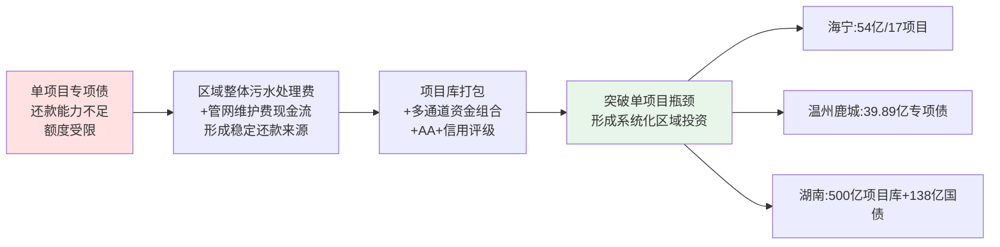

具体的资金组合工具包括：**超长期特别国债+中央预算内资金+地方专项债+财政自筹+银行授信+社会资本**——这一组合的本质是**通过区域整体的稳定现金流（按效付费节约的运维费+污水处理费+管网维护费）支撑长期债务，再通过国债、预算内资金、社会资本注入等"轻"资本工具补足短期建设资金**。这种逻辑机制正是第7章多元化投融资方案设计的核心起点。

## 4.5 国际经验：日美德英四国机制范式与制度抓手

国际经验对中国核拨制改革的借鉴价值，不在于直接套用特定模式，而在于揭示成熟水务体系在"效能监管—雨污分账—长效融资—合规约束"四个维度的成熟制度抓手。本节按制度功能对四国经验作精准对照。

### 4.5.1 日本:"流域下水道+净化槽"双轨与污水雨水分账边界

日本经验最具借鉴价值的是**"流域下水道+净化槽"分级覆盖**与**污水雨水分账边界**。

**双轨制度层面**，日本生活污水处理设施主要有三类：**下水道（城市污水管网）、农业村落污水处理设施、净化槽设施**——下水道属于污水集中处理管网设施，主要用于处理城市污水；农业村落污水处理设施依托净化槽技术，主要针对1000人以下的村庄；净化槽设施是一体化污水处理装置，主要针对10人以下的单户住宅区，以公共排水管网不能覆盖、污水无法纳入集中处理设施的偏远地区和山区为主要对象。**2015年净化槽在日本的普及率达到9.1%；2018年末日本污水处理普及率达90.9%**[^59][^15]。

**合流制溢流治理路径层面**，**自2003年起日本开展为期20年的全国合流制区域整改。截至2024年3月底，已基本实现了合流区域与分流制相当的污染负荷整改目标，即雨天排水时的平均BOD浓度降低至40mg/L以下；值得注意的是，在此期间，全国范围内的合流改分流累计面积仅占合流区域的5%，可见这并非主要整改措施**[^15]。**目前东京中心城区的合流制区域占比高达82%，而郊区分流制区域占比为70%**[^15]——这意味着对存量合流制系统而言，**主要整改路径是"增强雨天截留能力、提升简易处理水平、采用调蓄技术"，而非全面雨污分流**。这一经验对我国当前部分城市片面追求"运动式雨污分流"具有重要警示意义。

**财政分账边界层面**，**在东京，家庭平均每月污水费约为150元人民币，而雨水处理费用则由财政全额承担**[^15]。**东京郊区各市镇自行建设与维护市政排水管网，污水接入流域下水道进行集中处理，并按量支付污水处理费，目前单价约为76元人民币/立方米。流域下水道的建设费用由相关市镇分摊，符合国家补贴条件的项目可获得国家财政支持**[^15]。**日本排水政策以成本效益为决策依据**[^15]——东京下水道局作为政府机构与公营企业，与东京下水道服务公司（TGS）紧密合作，**过去数十年间东京都下水道局的公务员数量减少了约一半，而TGS的人员比例则持续上升**[^15]，体现了公益服务+市场化运营的混合机制。

### 4.5.2 美国:CWSRF低息贷款池与雨水费制度

美国经验最具借鉴价值的是**Clean Water State Revolving Fund（清洁水州循环基金）**与**雨水费制度**。

**CWSRF基金层面**，美国CWSRF已运作37年，**累计向美国各社区提供1814亿美元（51000笔低息贷款）支持，用于污水处理设施、面源污染控制、分散式污水处理系统、雨水径流缓解、绿色基础设施、河口保护和水回用等水质基础设施项目；2021年《基础设施投资和就业法案》（IIJA）再为CWSRF注入117亿美元（另有10亿美元专门用于新型污染物治理）**[^60]。CWSRF的制度精髓在于**"联邦资本+州循环+地方借款"的三级融资结构**——联邦每年向各州拨付资本金，州政府以此为本金向地方政府发放低息贷款，地方政府以未来污水处理费现金流偿还本金；偿还的本金回流州基金继续放贷，形成"循环放大"效应。这一机制对中国"超长期国债+地方专项债+污水处理费"组合具有直接借鉴意义。

**雨水费制度层面**，**截至目前美国已有39个州约1417个地区（包括县、市、镇）征收雨水费**[^61][^62]。雨水费**通过计量房屋不透水表面面积（如屋顶、车道）征收，收费的主要依据是雨水从不可渗透的路面产生径流进入下水道会造成污染**[^61]。具体征收方式上，**美国雨水收费的计算方法有多种，包括按户固定交费、附加在水费中、按土地使用情况分几个档次缴费，也有的依据土地面积及性质进行计算。其中"等效住宅单位"计算方法在美国最常见，占了一半以上**[^61]。**美国雨水收费的月收费量中值为1.68—11.70美元，明显低于水费和污水费**[^61]。**雨水费产生的收入将用于升级雨水系统和下水道系统。按照专款专用的原则，雨水费用于补贴维护维修雨水收集处理相关设施的费用以及雨水管理事业**[^61]。

更具创新性的是**绿色基础设施减免机制**。**华盛顿哥伦比亚特区对居民区和商业区收取每月固定的雨洪费及不透水面积费，并对安装绿色基础设施的业主提供最高55%的费用减免**[^61]。这一机制将雨水管理从"事后处理"转向"源头减量"，通过经济激励引导业主主动采用海绵设施。

需要说明的是，**美国合流制溢流（CSO）控制是国际上许多国家长期面临的重大问题；据EPA 2000年估算，若达到85%的溢流体积控制要求，至少需投资506亿美元，占排水设施总投资需求的27.9%**[^63]——这一巨额投资的资金来源很大程度上依赖CWSRF基金支持，体现了"长效低息贷款+雨水费专款专用"的资金通道协同。

### 4.5.3 德国:"上松下紧"法律体系与排污税倒逼机制

德国经验最具借鉴价值的是**"上松下紧"四级法律体系**与**污水排污税倒逼机制**。

**法律体系层面**，德国排水相关法律呈现"上松下紧"特征。**上级法律法规"宽泛"，主要是给出方向；下级法律法规则结合地方的气候、地质条件、技术发展水平、经济承受能力、水体受纳能力等，对上级法律法规的完善和细化，并作出具体规定**[^64]。具体层级为：**WRRL（欧盟水框架指令）→WHG（德国联邦水资源法）→AbwV（污水条例）→AbwAG（污水排污税法）+各州具体规定**[^64]。

**排污税倒逼机制层面**，**德国各污水处理厂出水水质远远好于排放标准要求，做到了不是为达标处理而处理，其得益于德国污水排污费法（AbwAG）**[^64]。其精妙之处在于：**《污水条例》中规定的污水处理厂出水水质限值极为宽泛，显著的特点就是规模越小，要求越松**——但通过排污税对超标排放征税，使企业有强烈动机将出水水质提升到远高于法规底线水平。这一机制对我国按效付费机制设计具有重要启示——**正向激励（按效付费）与反向激励（排污税）的组合可以形成更有效的效能引导**。

**管网管理水平层面**，德国建立了完善的管网调查与维护体系。**自1984/85年起，德国水协就开始对德国排水管网状况进行定期调查（基本上是三年一次）**[^15]。2018年第八次调查显示，**德国城镇排水系统纳管率为97.1%（2018年调查为98.2%）；城镇排水管网总长度从2013年的57.56万公里增加到2016年的59.43万公里，增长3.3%；自1995年以来年均增加约9200公里；按各年龄段长度比例加权后排水管道平均管龄45.3年**[^15]。

德国管网管理体系揭示了**"长期定期调查+稳定年度更新+全成本回收"的成熟范式**——年均更新约占总长度1.6%（9200/575580）的更新比例，与第3章测算的中国管网更新需求量级具有可比性，但中国当前的更新强度与资金保障距离这一水平仍有显著差距。

### 4.5.4 英国:Ofwat监管失灵与2025年改革镜鉴

英国经验的特殊价值在于其反向警示——**作为最早实施水务私营化的国家之一（自1989年起），英国在2025年宣布废除其水务监管机构（Ofwat），是该领域最大规模的一次改革**。改革的直接背景是：**近年来英国水务行业问题频出，河流、湖泊和海洋污染达到创纪录水平，水务公司基础设施投资不足、财务管理不善，水费却不断飙升，给英国家庭财务状况带来巨大压力，引发社会广泛不满。审查结果认为，英国水务局未能有效履行职责，无法达到环境保护的要求**[^15]。

改革的核心制度抓手有两方面：**一是监管整合**——**英国水务局将被一个新的单一监管机构取代，其将整合四个不同监管机构的职能。新机构将像金融危机后监管银行的机制一样，派专家进驻水务公司，确保公司依法运营，提升环境绩效**[^15]；**二是消费者保护**——**新设立的英国水务监察员将取代英国消费者水务委员会，以帮助解决消费者与自来水公司间的纠纷**[^15]。改革目标是**到2030年将英国污水污染减少一半**，且**不排除未来水费涨幅高于通胀水平的可能，不过更倾向于"小幅、稳定地增长"**[^15]。

英国经验对中国的镜鉴意义在于三个方面：**第一，单纯依靠私营化+价格管制的模式存在系统性失灵风险**——监管能力跟不上市场化深度时，水务公司可能利用信息不对称损害公共利益；**第二，监管整合是效能监管的必由之路**——四部门职能整合到单一监管机构的方向，与中国"厂网一体化"改革整合多主体的方向具有同构性；**第三，"派专家进驻水务公司"的强监管机制可能成为深度监管的新趋势**——这与南京"片长制驻厂办公"在精神上相通。

### 4.5.5 四国经验的制度功能对照

将四国经验按制度功能维度归纳：

| 制度功能 | 日本 | 美国 | 德国 | 英国 |
|---|---|---|---|---|
| **覆盖范围分级** | 流域下水道+净化槽双轨 | CWSRF全口径覆盖 | 5级城市规模分类标准 | 私营化区域水务公司 |
| **雨污分账边界** | 污水费150元/月+雨水费财政全担 | 污水费+雨水费（39州1417地区）专款专用 | 全成本回收+排污税 | 监管价格上限+用户保护 |
| **长效融资工具** | 国家补贴+市镇分摊 | CWSRF循环基金1814亿美元37年 | 全成本回收+长期管网维护预算 | 五年价格审查 |
| **效能激励机制** | 按受益者负担+流域协同 | 雨水费+绿色基础设施减免55% | 排污税倒逼超标处理 | 按绩效监管+公开问责 |
| **合规约束体系** | 下水道法+技术标准 | NPDES排放许可+CSO控制策略 | "上松下紧"四级法律体系 | 整合后单一监管机构 |
| **对中国的核心启示** | 雨污分账+合流制截留+流域协同 | 长效低息贷款池+雨水费 | 排污税倒逼+管网定期调查 | 监管整合+派驻专家 |

## 4.6 关键制度要素与适配条件提炼

将国内外创新机制提炼为可供政府管理部门借鉴的制度要素清单与适配条件矩阵，是本章承接第3章资金缺口分析、对接第5—8章方案设计的核心任务。

### 4.6.1 七大可复制制度要素

基于本章前述分析，可归纳出**七大关键制度要素**，每项要素都对应一类核心治理功能：

**要素一:法治先行**。湖南"小快灵"立法《城镇污水管网建设运行管理若干规定》、内蒙古《城镇生活污水管网综合整治攻坚行动方案》、扬州《海绵城市建设管理条例》、云浮《暴雨灾害防御条例》等地方立法实践表明，**通过省级或地级市级立法将厂网一体、按效付费、雨污协同等改革从政策共识固化为法律约束，是改革持续推进的法治基础**。其设计要点是"小切口、强约束、可操作"——避免大而全的综合性立法，聚焦具体痛点的关键性条款。

**要素二:主体整合**。湘潭"成建制承债式整合"、南京"水务集团接管+片长制"、长沙"30年委托运营+股权划转"、十堰"三步整合形成生态水务集团"、武汉"市级统筹区级承诺"等案例共同提示，**主体整合是按效付费、长效融资等机制能够落地的体制基础**。其设计要点是"国资平台为主、专业公司技术赋能、第三方运维补强"，并通过AA+主体信用评级（海宁、十堰）打开资本市场融资通道。

**要素三:按效付费考核公式**。湘潭"浓度削减率单一指标"、长沙"建设+变动+固定+LPR浮动"拆分模型、南京"多维效能权重"模型、内蒙古"污染物收集效能为核心"指标体系，提供了从简单到复杂的多种公式选择。其设计要点是**根据本地管网基础与监管能力选择适配的考核维度数量与公式复杂度**，避免一刀切。

**要素四:区域统筹融资**。海宁"项目库+资金池+混改+AA+评级"、温州鹿城"四色清单+双周调度+39.89亿专项债"、湖南"政银企平台+500亿项目库+138亿国债"，提供了从县级到省级的多层次区域统筹模式。其设计要点是**通过项目打包、资金池统筹、多通道资金组合工具，突破单一项目还款能力瓶颈**——这一要素对接美国CWSRF循环基金的逻辑机制。

**要素五:雨污分账**。日本东京"污水费150元/月+雨水费财政全担"、美国39州1417地区雨水费制度、德国"上松下紧"全成本回收，提供了清晰的雨污资金边界范式。其设计要点是**按"污染者付费+财政公共属性兜底"原则建立"污水处理费+雨水管理费/财政专项"的双通道资金体系**——这一要素直接破解第3章定位的雨洪协同"三外"困境。

**要素六:智慧监管**。十堰"武当云谷大数据平台+114座污水处理厂用电监测"、湘潭"2353个排水单元网格化+监测溯源法"、南京"片长制驻厂+24小时联动"、英国"派专家进驻水务公司"，提供了从数据采集到执法监督的全链条智慧监管范式。其设计要点是**全过程数据可视化+用电监测+在线水质+应急联动**。

**要素七:长效专项债与稳定运维费匹配机制**。长沙"管网资产经营性转化+国开行融资+20.68亿超长期国债"、湖南"328亿元总投资中138亿国债+预算内资金"、美国CWSRF的循环基金机制，提供了"长期稳定现金流+长期低息债务"的匹配范式。其设计要点是**将按效付费节约的运维费、管网维护费、再生水收益等多源稳定现金流，转化为长期专项债与超长期国债的还款保障**——这正是第7章多元化投融资方案设计的核心逻辑起点。

### 4.6.2 适配条件矩阵

不同规模城市、不同管网基础、不同财政承受力下，七大制度要素的适配性存在显著差异。形成下表的适配矩阵：

| 适配维度 | 大城市/东部 | 中等城市/中部 | 小城市/县乡/西部 |
|---|---|---|---|
| **法治先行** | 省级综合立法+市级配套 | 省级"小快灵"立法+市级实施方案 | 省级立法+县级实施细则 |
| **主体整合** | 大型水务集团委托运营/特许经营新机制 | 国资平台承债式整合（湘潭式） | 县域生态水务集团（十堰、郧西模式） |
| **按效付费公式** | 多维效能权重（南京式） | 拆分式+LPR浮动（长沙式） | 浓度削减率单一指标（湘潭式） |
| **区域统筹融资** | 省级"政银企平台"+大型项目库 | 区县"四色清单"+专项债集中获批 | 县域"项目库+混改"+AA+信用评级 |
| **雨污分账** | 试点污水费+雨水费双通道 | 财政专项支撑雨水管理 | 财政全担+专项补贴 |
| **智慧监管** | 智慧水务平台全覆盖+片长制 | 监管平台+排水单元网格化 | 用电监测+智能感知核心节点 |
| **长效融资匹配** | 超长期国债+专项债+银行授信+绿债 | 超长期国债+专项债+财政自筹 | 中央补助+省级配套+专项债 |
| **适用前置条件** | 管网基础完善、AA级以上水务集团 | 管网欠账中等、可整合的国资平台 | 管网欠账严重、需先做厂网整合 |
| **典型代表** | 南京、长沙、武汉、苏州 | 湘潭、海宁、十堰中心城区 | 十堰下属县（郧西、房县）、温州鹿城 |

数据来源：综合本章前述分析。

### 4.6.3 制度要素与后续章节的对接接口

为保持本研究的结构性与可操作性，明确七大制度要素与后续章节（第5—8章）的对接关系：

- **第5章"厂网河（湖）+雨污"一体化协同运作机制设计**：核心引用要素二（主体整合）、要素五（雨污分账）、要素六（智慧监管）；引用案例：南京片长制、十堰生态水务集团、日本流域下水道、湘潭排水单元网格化；
- **第6章按效付费价格机制与成本监审制度重构**：核心引用要素三（按效付费考核公式）、要素一（法治先行）；引用案例：湘潭浓度削减率、长沙拆分模型、南京多维效能、湖南"小快灵"立法、德国排污税；
- **第7章多元化投融资与财政资金统筹方案**：核心引用要素四（区域统筹融资）、要素七（长效专项债匹配）；引用案例：海宁项目库、温州鹿城四色清单、湖南政银企平台、美国CWSRF基金；
- **第8章政府管理部门可操作方案与实施路径**：综合引用全部七大要素；引用案例：差异化适配矩阵、五地改革对比表、新机制特许经营要点、"分手潮"教训。

### 4.6.4 避坑要点与前置条件清单

最后，需明确每项要素的关键避坑要点与前置条件，避免改革推进中重蹈覆辙：

**法治先行的避坑要点**：避免"贪大求全"导致立法周期过长、错失改革窗口；前置条件是已有较成熟的政策共识与试点经验。

**主体整合的避坑要点**：避免"为整合而整合"导致行政性垄断、效率不升反降；前置条件是已有可整合的国资平台、人员安置预案、资产评估机制。

**按效付费的避坑要点**：避免在管网基础薄弱地区直接套用导致企业财务震荡、激励机制反向逆转；前置条件是管网基本完善、厂网联动机制初步建立、监测数据可信度可保障。

**区域统筹融资的避坑要点**：避免项目库"装篮子"无实质整合、空转资金池；前置条件是已有清晰的项目储备清单、稳定的现金流来源、专业的项目策划与融资能力。

**雨污分账的避坑要点**：避免雨水费征收引发的社会承受力风险（参考美国部分居民对"自然降雨为何要付费"的不满[^62]）；前置条件是清晰的不透水面积测绘、绿色基础设施减免机制、低收入家庭补贴。

**智慧监管的避坑要点**：避免重设备轻应用、数据孤岛、信息安全漏洞；前置条件是统一的数据标准、跨部门数据共享协议、信息系统运维能力。

**长效融资匹配的避坑要点**：避免将不稳定的财政补贴当作"稳定现金流"用于长期债务、避免单项目额度受限；前置条件是按效付费已落地形成可预测现金流、专项债与污水处理费收入有效对接、信用评级支撑融资能力。

将国内外创新机制系统化梳理与提炼后，可以形成对核拨制困境破解路径的清晰认知——**国内外案例共同证明：核拨制困境的破解不可能依赖单一改革，必须通过激励机制重构（按效付费）、协同体制重构（厂网河湖+雨污一体化）、资金通道重构（多元化投融资）、监管效能重构（智慧监管+法治约束）的四维联动。本章梳理的七大制度要素，正是这四维联动的具体抓手；适配条件矩阵则提示了不同情境下的差异化组合**。后续第5—8章将按这一逻辑路径，分别从协同机制、价格机制、投融资方案、可操作方案集四个维度展开具体设计，最终形成第10章的政策建议体系。

# 5 "厂网河（湖）+雨污"一体化协同运作机制设计

第2章揭示了厂网分离、九龙治水、雨污割裂三重协同断裂如何放大按量付费的逆向激励效应，第3章量化定位了管网运维（年度需求5740—10460亿元）与雨洪协同（"三外"困境）两大资金保障最薄弱环节，第4章进一步从国内外创新实践中提炼出主体整合、智慧监管、雨污分账等七大可复制制度要素。然而，这些诊断与提炼若不能落地为具体可执行的协同运作机制，仍将停留在原则性建议层面。本章的使命，是将分散于湘潭、南京、长沙、十堰、武汉、杭州、沅江、武汉黄孝河、上海竹园、北京新凤河、佛山、三明等地的协同实践，整合为一套可供政府管理部门直接借鉴的"组织—工程—调度"三层递进设计方案。

研究遵循的基本逻辑是：**只有先在组织层重构运营主体边界（破除厂网分离与九龙治水的体制根源），再在工程层重塑设施物理协同（破解雨污割裂的工程基础），最后在调度层实现晴雨天差异化与智慧联动（建立日常运行的协同机理），才能让"厂、网、河、湖、雨水管渠、海绵设施"真正在同一治理逻辑下协同运转**。三个层次相互依存：组织整合若不能支撑工程协同，将沦为"换牌子不换体制"的形式整合；工程协同若不能在日常调度中得到激活，将沦为"建好设施不会用"的资产闲置；调度联动若没有组织主体与工程基础支撑，将沦为"信息可视化但无人响应"的数字摆设。本章作为破解协同断裂的体制方案，与第6章按效付费机制、第7章多元化投融资方案形成"体制—激励—资金"三位一体的改革闭环——本章设计的协同物理基础与组织架构，正是第6章按效付费考核指标得以落地的物理载体，也是第7章雨污分账资金通道得以建立的工程依据。

## 5.1 组织层：统一水务运营主体的整合路径与治理架构

组织层是协同运作机制的根基。第2章已论证，"厂网分离+按量付费"形成"激励错配×体制割裂"的乘数效应，单一改激励而不破体制无法破解逆向激励链条。武汉的反向案例尤为典型——盘龙污水处理厂在厂网纳入同一运营主体、同一考核体系后，2025年进水BOD浓度较2024年同期提升37.3%、处理水量同比增长23.03%。这一实证从根本上证明：**只有当厂与网纳入同一运营主体时，提升进水浓度才会从"利益对立"转化为"利益一致"**。本节基于第4章梳理的多地实践，将组织整合路径分类为三种典型模式，并设计统一运营主体的内部治理架构与外部权责边界。

### 5.1.1 三类典型整合模式与适配条件

国内外协同实践揭示，主体整合并非"一种模式打天下"，而是根据城市规模、管网基础、存量资产格局、地方财政能力呈现差异化适配。从第4章的多地比较可以归纳出三类典型整合模式。

**模式一：国有平台承债式整合（湘潭—十堰模式）**。其核心是由地方政府主导组建国有水务平台，通过承债方式将原本分散在不同部门、不同主体的厂、网、泵站、管道资产成建制划转到统一平台旗下。湘潭市"将污水处理运维费从污水处理服务费中分离出来，按污染物浓度削减率计算付费"，配套4座厂全部签约按效付费协议；十堰则通过三步整合——2023年7月组建十堰生态环境集团、2025年9月进一步整合原生态环境集团、市水务公司、市水源公司组建十堰生态水务集团公司，并通过依法收回、按期收回、提前收回等方式稳步推进城区10座污水处理厂统一移交至十堰生态水务集团运维管理，同步完成904公里污水管网统一接管。该模式的适配条件是**管网欠账严重、需先做主体重构的中等城市**——存量BOT/PPP合同有限、地方财政可承担承债成本、国有平台有承接资产的整合能力。

**模式二：大型水务集团委托运营+特许经营新机制（南京—长沙模式）**。其核心是依托已有AA+评级的大型水务集团，通过长周期委托运营协议接管存量资产，并按2024年115号文与17号令要求引入新机制特许经营吸引社会资本参与新建项目。长沙市住建局2024年10月与长沙水业集团子公司签订委托运营协议，**采取"委托运营+绩效合同管理"模式，分批移交4621公里市政排水管网、31座泵站，并逐步整合存量及在建污水处理厂，委托运营期限30年**[^65]；南京水务集团排水设施运营中心已与8家污水处理厂结成"一对一"联合战队，**按"一厂一网、厂网联动"原则将管网巡查机构直接设置在各污水处理厂内**，并通过2025年12月签约的江宁科学园五期项目（16万立方米/日、9.89亿元、40年BOOT、民营股权≥35%）落实新机制要求。该模式的适配条件是**已有AA+评级水务集团、市场化能力强、需要在存量整合与新建吸引并进的大城市**——通过委托运营整合存量、通过新机制特许经营吸引增量，形成"双轨并进"格局。

**模式三："水管家"全链条特许经营（沅江三峡模式）**。其核心是由具备流域治理经验的央企或大型国企，通过BOT+TOT组合模式承接全链条治理，覆盖从源头供水到末端处理的全部水务环节。沅江市人民政府与长江三峡沅江智慧水管家公司正式签订《沅江市第一污水厂"厂网一体化及按效付费"运营服务协议暨水环境综合治理PPP项目补充协议》，**项目采用"BOT+TOT"模式，由长江三峡沅江智慧水管家公司统一运营中心城区范围内的自来水厂、水质净化厂及排水管网及附属设施，实现从源头供水、管网改造、污水处理到河湖连通及生态修复的"一个主体"全链条负责**[^66]。这种"供排一体化"的"水管家"模式的特殊价值在于——沅江"水域面积占城市建成区面积的40%以上，过去因雨污混流、管网与污水处理厂分离等'九龙治水'问题，导致内涝与污水直排现象频发"[^66]，这种流域治理任务突出、九龙治水痼疾深重的中小城市，需要"一个主体全链条负责"的彻底整合。该模式的适配条件是**流域治理任务突出、地方治理能力不足、需引入大型央企或专业水务企业的中小城市**。

杭州市2019—2025年六年水务一体化改革则提供了**特大城市层面"渐进式整合"的范本**。杭州2019年4月正式启动市区水务一体化改革，明确以市水务集团为改革经营平台，推进全市水务"规划布局、资源调配、服务标准、管理政策"四个统一；六年间历经从滨江区"破冰试点"到十个城区全面贯通的完整历程，**至2025年10月22日余杭、临平水务一体化改革顺利完成时，市水务集团服务面积从一体化改革前约630平方公里扩展到约7000平方公里，服务人口从约300万增至超1000万**[^67]。各区域公司形成独具特色的实践案例：滨江区在跨区域协同方面树立了典范、富阳区在服务创新方面成效显著、萧山区在资源优化配置上贡献突出（在工业水厂建设中通过直接改造江东水厂满足萧山、钱塘两区的工业用水需求，避免了各区独立、重复建设的资源低效利用情况）、临安区"天目智管水务平台"成为智慧水务建设的亮点、钱塘区在业务整合上取得突破性进展（2025年1月完成下沙区域供排水业务系统性整合、7月签署江东区域城市污水特许经营协议）。

将四类模式的核心特征归纳为下表：

| 模式 | 代表城市 | 整合方式 | 整合规模 | 特许期/期限 | 适配条件 |
|---|---|---|---|---|---|
| 国有平台承债式 | 湘潭、十堰 | 政府组建国资平台、成建制承债划转 | 湘潭4座厂；十堰904公里管网+10座厂 | 永续经营 | 中等城市、管网欠账严重、存量PPP有限 |
| 大型集团委托运营+新机制 | 南京、长沙 | 大型水务集团接管+新机制特许经营双轨 | 长沙4621公里管网+31座泵站、30年；南京8家厂结成战队 | 30—40年 | 大城市、AA+评级水务集团、双轨并进 |
| "水管家"全链条 | 沅江 | 大型央企BOT+TOT全链条特许 | 自来水厂+净水厂+管网+河湖连通 | 长周期 | 中小城市、流域治理任务突出、九龙治水严重 |
| 渐进式区域整合 | 杭州 | 市级平台逐区破冰、四个统一 | 7000平方公里、超1000万人 | 永续经营 | 特大城市、跨行政区协调 |

数据来源：综合自第4章及本节前述案例。

需要特别警示的是，**任何一类整合模式都必须避免"为整合而整合"导致行政性垄断、效率不升反降的风险**。湘潭、十堰模式的成功，关键在于整合后辅以按效付费考核机制约束，使整合后的国资平台仍面临"绩效—奖惩"压力；南京模式的成功，关键在于"片长制驻厂"等内部协同机制确保整合不流于形式；杭州模式的成功，关键在于"四个统一"明确了整合后的资源调配、服务标准、管理政策的统一规则。这些避坑要点在第8章方案设计中需进一步落实为具体的合同条款与考核办法。

### 5.1.2 统一运营主体的内部治理架构

主体整合后的内部治理架构，决定了"统一主体"是真正的协同运营还是形式上的"换牌子"。基于多地实践共性，可以提炼出**"厂网联动事业部+流域片区分公司+智慧调度中心"三级架构**作为统一运营主体的标准内部治理设计。

**第一级：厂网联动事业部**。事业部按"厂—网—泵站—调蓄"业务条线组织，承担专业化运营职能。其核心创新是借鉴**南京"片长制"驻厂办公机制**——南京水务集团排水设施运营中心已与包括桥北厂在内的8家污水处理厂结成"一对一"的联合战队，按照"一厂一网、厂网联动"原则，将管网巡查机构直接设置在各污水处理厂内，实行驻厂办公、一体化运行管理[^65]。这种物理空间整合的关键价值在于——当进水COD等关键指标出现异常波动时，厂方第一时间发出"警报"，管网团队便沿着管网逆向溯源排查跑冒滴漏或河水倒灌的"病灶点"。事业部内部需建立"进水浓度异常—管网溯源—问题修复—效能反馈"的闭环响应流程，将厂网协同从合同条款层面落实到日常运营层面。

**第二级：流域片区分公司**。分公司按汇水流域划分管理边界，承担流域内"厂—网—河—湖—海绵—雨水管渠"全要素的属地化运维。这一设计直接借鉴**瀚蓝环境"厂、站、网、源、人、车六在线统一调度"模式**——瀚蓝环境2022年进行智慧平台3.0迭代，建成了排水设施全要素标杆管理平台，实现了"厂网源河"一体化的管理[^68]。流域片区分公司的边界划定应尊重水文规律而非行政边界——例如武汉黄孝河机场河流域治理项目以126平方公里流域面积、256万居民为统一治理单元，通过"调蓄+强化处理+行洪"一体化体系运行，**累计削减入河悬浮物14290吨、化学需氧量17525吨**[^69]。这种以流域为单位的属地化运维，从根本上解决了"行政区划切割流域"导致的上下游不同步、左右岸不同行问题。

**第3级：智慧调度中心**。调度中心承担全域"感知—分析—调度—预警"的中枢职能，是组织整合在数字化层面的"神经系统"。其架构借鉴**上海竹园数字孪生、临安"天目智管"、天津"四预"功能数字孪生水务**等先进实践——天津数字孪生水务体系采取"数字孪生流域、数字孪生水网、数字孪生工程'三位一体'架构"，构建具有预报、预警、预演、预案即"四预"功能的数字孪生水务体系[^70]；临安"天目智管水务平台"依托物联网和大数据技术实现全区供排水系统实时监控和数据分析，同时推广使用数字孪生技术、管网地理信息系统等先进工具，构建起"可视+数据"双核驱动的动态3D场景[^67]。

三级架构的协同关系可用下图刻画：

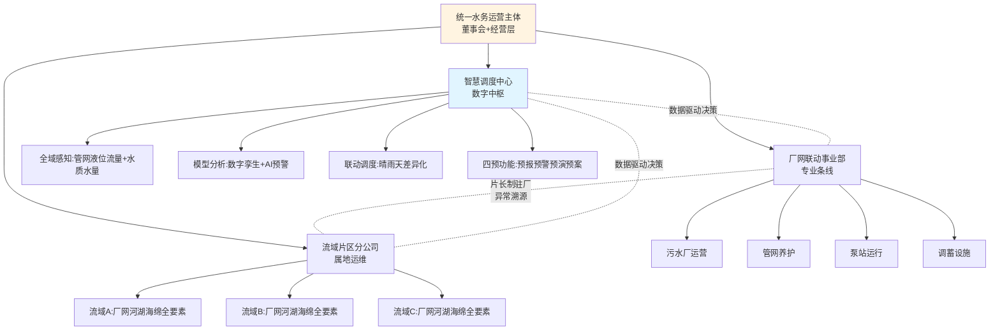

### 5.1.3 与外部部门的权责边界与法治保障

统一运营主体的成立，并不意味着外部跨部门协调的取消。住建、水务、生态环境、应急等部门的职能仍需保留，但权责边界必须重新清晰划定，避免运营主体陷入"既要应对多头监管、又要承担多元责任"的困境。

参照内蒙古《自治区城镇生活污水管网综合整治攻坚行动方案》"推行厂网一体，鼓励将污水管网、泵站、处理厂打包委托专业单位运维，破解'厂网分离'管理难题"和"按效付费，建立以污染物收集效能为核心的绩效考核体系"的政策导向[^16]，可将外部权责边界归纳为：

**住建/水务部门**作为行业主管部门，承担规划制定、标准发布、项目立项、考核监督等职能；不再直接介入具体运营，但通过按效付费考核合同对运营主体形成持续约束。**生态环境部门**承担排放许可、水质监管、合流制溢流处罚等职能；通过排污许可证（NPDES类）与运营主体建立"许可—排放—执法"的合规关系。**应急部门**承担暴雨灾害防御、防汛抢险等职能；通过应急联动机制与运营主体建立"预警—响应—处置"的协作关系。**财政部门**承担污水处理费征收监管、服务费拨付、绩效评价等职能；通过监审办法与运营主体建立"成本—绩效—支付"的财务关系。

**法治保障层面**，借鉴第4章梳理的"小快灵"立法范式具有重要价值。湖南省人大常委会以"小快灵"立法方式在全国率先出台《湖南省城镇污水管网建设运行管理若干规定》，自2024年3月1日起施行，**推行"厂网一体"、专业化运行维护和按绩效付费管理制度，预计可节约20%至50%污水处理费支出**。佛山《海绵城市建设管理条例》（2026年1月23日省人大常委会批准通过）则提供了海绵层面立法的参照——该法规明确了海绵城市建设的基本原则、部门职责、规划管控、建设要求、运营维护及法律责任，特别是确立了"规、建、管"全过程管控机制：将海绵城市建设要求纳入国土空间规划、土地出让、规划许可、施工图审查、施工许可、竣工验收和运营维护等各环节，形成管理闭环[^71]。三明市《海绵城市规划建设管理条例》于2024年10月1日正式施行，《三明市海绵城市规划设计导则》等7项技术导则也相继实施，为项目建设各环节提供了标准化、规范化的技术支撑[^72]。

立法的设计要点是"小切口、强约束、可操作"——避免大而全的综合性立法，聚焦厂网一体、按效付费、雨污协同等具体痛点的关键性条款。三明市人大城建环保委负责人对立法过程的回顾颇具启发：**"立法的过程，本身就是一次理念普及的过程……我们召开了20多场座谈会，听取了上百位专家和市民的意见。很多人从一开始问'海绵是什么'，到最后主动为条款提建议"**[^72]。这一过程本身就是协同运作机制的社会基础培育。

**资产划转、人员安置、AA+主体信用评级培育**等关键支撑要素，需在整合方案中同步设计。资产划转层面，参照长沙模式将污水管网资产评估后注入运营公司——长沙首批3区已注入约6.2亿元，**有效降低企业负债率**（前文已引）；人员安置层面，借鉴日本东京经验——东京都下水道局过去数十年间公务员数量减少了约一半，而TGS（东京下水道服务公司）的人员比例则持续上升[^15]，体现"政府机构瘦身+市场化运营公司增员"的渐进过渡；信用评级层面，海宁水务集团获得AA+评级、十堰生态水务集团获得AA+评级、长沙水业集团成功推动与国开行融资合作，共同构成"国有水务平台+AA级以上信用评级+多通道融资"的标准化路径——这一路径将在第7章作为多元化投融资方案的关键基础设施。

## 5.2 工程层：厂网河湖与雨污设施的共建共享方案

工程层是协同运作的物质基础。第3章已经定位，雨洪协同设施（合流制溢流控制、调蓄池、初期雨水处理、海绵设施）是当前资金通道最薄弱的环节，处于污水处理费体系外、防汛专项预算外、应急预算外的"三外"困境。要破解这一困境，必须先在工程层设计具体的共建共享方案，明确每类协同设施的技术路径、投资分摊、运维归属——为第7章雨污分账资金通道设计提供工程依据。本节按"分流改造—溢流控制—调蓄共用—再生水协同—海绵衔接"五个工程组分展开。

### 5.2.1 雨污分流改造的差异化推进策略

雨污分流改造是"十四五"以来最受关注、投资强度最大的协同工程，但同时也是最容易陷入"运动式改造"陷阱的环节。第3章已定位每公里造价约200—300万元、按全国"十四五"新增改造管网8万公里测算，仅雨污分流改造工程量级即可达1.6—2.4万亿元。然而，**日本东京20年合流制整改的经验提供了重要警示**——自2003年起日本开展为期20年的全国合流制区域整改，**截至2024年3月底已基本实现合流区域与分流制相当的污染负荷整改目标，即雨天排水时的平均BOD浓度降低至40 mg/L以下；值得注意的是，在此期间全国范围内的合流改分流累计面积仅占合流区域的5%，可见这并非主要整改措施**[^15]。这一经验意味着对存量合流制系统而言，依靠"全面雨污分流"实现溢流控制并不现实。

基于这一警示与国内实践，雨污分流改造应采取**"老城区合流制保留+局部强化、新区分流制建设+源头到末端、城中村源头改造+片区整治"的差异化策略**：

**老城区合流制保留+局部强化**：对暗涵渠箱密集、地下空间紧张、改造成本极高的老城区，借鉴武汉黄孝河机场河"包括晴天全截污、雨天控溢流、汛期治洪涝"思路[^69]，不强制推进全面分流，而是通过截污干管完善、调蓄池建设、初雨净化设施、CSO控制工程等组合提升合流制系统效能。武汉黄孝河机场河流域126平方公里，**老城区黄孝河暗涵汇水范围为合流区，每逢下雨天，雨水和污水便混在一起流入暗涵，钢坝难以完全拦截，污水处理厂处理能力不足，导致暗涵内的合流污水不断溢出到明渠，导致"小雨小溢，大雨大溢，暴雨全溢"**[^69]——其治理方案没有简单粗暴地实施全面分流，而是通过"调蓄+强化处理+行洪"一体化体系实现"晴天全截污、雨天控溢流"。

**新区分流制建设+源头到末端**：对城市新区与新开发片区，严格执行雨污分流标准。住建部等5部门《关于加强城市生活污水管网建设和运行维护的通知》明确要求**"城市新区生活污水管网规划建设应与城市建设同步推进"**[^1]。广东《"十四五"规划》进一步要求**"珠三角城市重点完善污水源头收集，持续开展雨污分流建设，将雨污分流'毛细血管'延伸到每家每户"**[^13]——这种"延伸到户"的源头到末端建设是新区避免老城区"雨污混接历史欠账"的关键。

**城中村源头改造+片区整治**：城中村是雨污分流改造的最大难点。福建省"十四五"实施方案要求**"将雨污分流改造作为老旧小区必改项之一。分期分批实施城中村雨污分流"**[^1]；广东省规划进一步明确**"到2025年各地市要基本消除城中村、老旧城区和城乡接合部等区域生活污水收集管网空白区"**[^13]。结合住建部"老旧城区、城中村和城乡结合部可因地制宜采用集中纳管与分散收集处理等方式处理生活污水"[^1]的导向，城中村改造应采取"源头入户管改造+片区主管整治+混接整治三合一"的策略。

需要特别警示的是，**单纯依靠雨污分流改造并不足以根治合流制溢流——必须与调蓄、初雨净化、源头海绵等措施协同推进**。住建部《关于深入打好城市黑臭水体治理攻坚战实施方案》明确反对"运动式雨污分流"导向，提出"因地制宜采取雨前降低管网运行水位、雨洪排口和截流井改造、源头雨水径流减量等措施，削减雨季溢流污染入河量"[^1]。瀚蓝环境对治水痛点的判断尤为犀利：**"厂进水浓度低、晴天污水溢流、污（废）水直排、河水倒灌（特别在南方水网比较发达的地区，例如珠三角，情况比较严重，河水挤占了污水管网的容量，降低了浓度）、雨天水浸（由于雨水管网的一些先天不足以及管网养护投入的不足，导致雨天水浸比较严重）"**——这五大痛点显示，雨污分流只能解决其中的"晴天污水溢流"和"雨天水浸"部分症状，对河水倒灌、外水入侵等问题需通过其他工程手段配套解决[^68]。

### 5.2.2 合流制溢流（CSO）控制工程体系

合流制溢流控制工程是协同运作机制中技术最复杂、投资强度最大、效益最直接的子系统。借鉴第4章梳理的国际经验与国内武汉、上海等地实践，可设计**"调蓄+强化处理+行洪+智慧调度"四位一体的CSO控制工程体系**。

**第一组分：初雨调蓄设施**。其核心功能是在雨季初期通过调蓄池截留高污染负荷的初期雨水，避免直接溢流入河。上海市水务局2024年7月发布的《竹园污水处理厂初雨调蓄工程方案》行业意见提供了精细化的设计参照——**工程服务于竹园二厂、竹园升级补量工程（三厂）、竹园污泥厂区域，总面积约47.67公顷，排水体制采用分流制，雨水采用强排模式。初期雨水截流标准采用5毫米**；**原则同意在竹园二厂雨水泵站的泵房前池新增截流泵（2用1备），单泵流量0.09立方米/秒；竹园升级补量工程（三厂）雨水泵站的泵房前池新增截流泵（1用1备），单泵流量0.22立方米/秒；竹园污泥厂雨水泵站的泵房前池新增截流泵（1用1备），单泵流量0.06立方米/秒，共折合调蓄规模为1590立方米。原则同意初雨截流时间均按1小时控制**[^73]。

崇明新城1号（西门泵站）初期雨水调蓄工程则提供了片区级调蓄池的设计参照——**崇明新城1#（西门泵站）初期雨水调蓄池建设工程服务于崇明新城1号排水系统，规划排水体制为分流制，雨水采用强排模式。初期雨水截流标准采用5毫米，初雨调蓄池规模为7600立方米，服务面积约2.1平方公里**；**调蓄池放空出路为南门路DN1200已建污水干管，经输送后最终纳入城桥污水厂进行处理**[^74]。从竹园（1590立方米调蓄/47.67公顷）和崇明（7600立方米调蓄/2.1平方公里）两个案例可以提炼初雨调蓄设施的关键设计参数：**5毫米初雨截流标准、初雨截流时间1小时、放空出路接入污水干管最终纳入污水厂处理**——这一参数体系对全国同类设施具有直接参照价值。

**第二组分：雨季溢流污水快速净化设施**。住建部等5部门已明确**"鼓励各地在完成管网建设改造的前提下，建设雨季溢流污水快速净化设施，结合本地实际明确排放管控要求"**[^1]。武汉黄孝河机场河项目就建设了"地下净化设施，提升出水水质并补充生态用水"，并通过"调蓄+强化处理+行洪"一体化体系联动运行，**累计削减入河悬浮物14290吨、化学需氧量17525吨**[^69]。这一组分对应的是上海竹园项目"放空出路最终纳入污水厂处理"的延伸——当合流污水量超出污水厂处理能力时，雨季溢流污水快速净化设施承担"二级保障"角色。

**第三组分：雨洪排口与截流井改造**。住建部要求**"开展水体沿线雨水排口和合流制溢流口防倒灌改造，严防河湖水倒灌生活污水管网"，"加快破损检查井改造与修复，逐步淘汰砖砌污水检查井"**[^1]。这一组分针对的是第2章揭示的"南方水网比较发达地区河水倒灌挤占污水管网容量"问题——通过截流井改造、防倒灌闸、单向阀等工程手段，从物理上隔绝外水入侵。

**第四组分：合流制片区暗涵渠箱整治**。广东《"十四五"规划》要求**"合流制区域重点改造暗涵渠箱，并加大截流井、截流闸、溢流口等截流设施改造力度"**[^13]。武汉黄孝河老城区暗涵整治正是这一思路的实践——通过暗涵清淤、暗涵内截污、暗涵与明渠节点改造等组合措施，提升合流制系统输送能力与截污能力。

### 5.2.3 调蓄池晴雨双功能共用机制

调蓄池是协同运作机制中最具创新价值的工程要素——其晴天与雨天的双重功能，使其天然成为破解雨污资金割裂的物理载体。

**晴天功能**：作为污水均质池均衡进水浓度。通过适度的水量调蓄，可以平抑昼夜进水水量与浓度的剧烈波动，使污水厂在更稳定的进水条件下运行，**间接提升处理效能、降低吨水能耗**——这正是按效付费机制下"高浓度→高削减量→高服务费"激励链条的物理基础之一。

**雨天功能**：作为合流制截流池削减溢流。通过收集初期雨水，避免高污染负荷直接溢流入河——这正是CSO控制工程体系的核心组分。

调蓄池晴雨双功能共用的关键设计要点是：**一是物理结构兼容**——调蓄池的进水口、出水口、放空管路需同时兼容晴天均质和雨天截流两种工况；**二是控制策略切换**——通过SCADA系统根据雨量预报、管网液位等信号自动切换晴雨工况；**三是投资分摊与运维归属规则**——这是破解雨污资金割裂的关键。可借鉴日本东京"污水费150元/月+雨水处理费用财政全担"分账经验，将调蓄池建设投资按晴天功能与雨天功能比例分摊：**晴天功能投资由污水处理费体系承担（纳入污水处理服务费成本基数），雨天功能投资由财政雨水管理专项承担**[^15]。这一分摊规则的理论基础是受益者付费——晴天功能的受益主体是污水处理企业（提升处理效能）、雨天功能的受益主体是公共防灾（削减河湖污染、保障防涝）。

### 5.2.4 再生水回用与生态补水协同

再生水回用是协同运作机制中实现"资源化收益反哺运维"的关键环节，也是第6章按效付费考核与第7章数据资产化收益反哺的物质基础。

**典型案例一：北控水务银川第一再生水厂**。该厂作为西北地区规模最大的半地埋式花园污水处理厂，**直接推动银川市再生水回用率从11%跃升至58.5%**[^75][^76]。以高标准工艺实现再生水高效回用，大幅减少了当地对黄河取水的依赖——这一数据揭示，对水资源紧缺地区，再生水回用率的提升潜力巨大，且具有"减少新水取用"的双重效益。

**典型案例二：北京新凤河流域治理**。该项目**以厂网河一体化模式为核心，污水处理达标后直接回补河道，从源头缓解流域水资源短缺问题；同时构建"水下森林"与滨水缓冲带，全面恢复河道自净能力**[^75][^76]。这种"达标尾水回补河道+水下森林"模式的关键创新，是将污水处理厂出水从"末端排放对象"转化为"区域水资源平衡的主动供给方"——尾水补水既缓解了河道生态流量不足问题，又通过水下森林进一步净化水质、提升生物多样性。

再生水回用与协同运作机制的衔接体现在三个层面：**一是水资源平衡**——通过工业回用、生态补给、市政杂用多维再生水应用场景，**结合雨洪水收集利用、海水淡化技术协同发展，将废弃资源转化为战略供水资源**[^75]；**二是收益反哺**——再生水使用费、水权交易收益、节水奖励等可作为运营主体的额外收入，反哺管网维护与雨洪协同设施运维（这一思路在第7章将进一步展开）；**三是按效付费指标**——再生水回用率、生态补水保障率等可作为按效付费考核的辅助指标，引导运营主体主动推进资源化利用。

### 5.2.5 源头海绵设施与初期雨水处理的衔接

源头海绵设施是协同运作机制的"源头减量"环节，通过削峰减污从根本上降低管网与污水厂的负荷压力。

**佛山10年海绵建设**提供了系统化全域推进的范本。佛山地处珠江三角洲河网腹地，是典型的平原河网城市，2000多条河涌勾勒出"有河皆成网，无处不成河，水在城中流"的独特风貌；**经过10年探索，佛山不仅形成了"全域统筹、片区示范、特色打造"的系统化全域推进海绵城市建设模式，更在2023年成功入选国家第三批系统化全域推进海绵城市建设示范城市**，**获得中央财政三年9亿元的专项补助资金**[^71][^77]。佛山龙舟广场观赛席占地约16.5万平方米的滨水空间，"当雨水自然流入两侧低于地表的下凹绿地，经过滞蓄、净化后，或补充地下水，或用于景观水体"——展现了"全海绵"广场的微循环利用[^71]。

**三明山地河谷海绵实践**则提供了山地城市的特色范本。三明作为典型的南方山地河谷型城市，**"山夹城、水穿城"，"山水、雨水、洪水"三水叠加，雨季面临内涝之困，旱季承受缺水之忧**[^72]；以"渗、滞、蓄、净、用、排"六位一体理念，同步推进人行道海绵化改造与雨污分流改造——市区列东核心片区道路海绵化改造示范工程项目人行道改造总面积约9.5万平方米，**东新二路、东新五路年径流总量控制率达到60%以上，年径流污染控制率超40%，片区排水防涝能力显著提升**[^72]。三明在2024年中央财政海绵城市建设示范补助资金绩效评价中获评A档，成为全国仅10个获此殊荣的城市之一[^72]。

**合肥园博园生态修复**则展示了海绵设施与既有建筑改造的复合实践。合肥园博园项目占地面积490亩，街区南北总长约2公里，过去为骆岗机场；**通过地形塑造、植物风貌打造、土壤改良等方式重塑场地自然风貌，保留乔木近万株，让硬化面积达31%的旧机场转化为蓝绿空间占比超75%的城市生态功能区**；**采用透水铺装、植草沟、溢流雨水管网等手段，打造近30万平方米下沉式绿地，疏浚建设水系和湿地超1000亩，运用雨水回收、海绵设施净化、水生动植物净化吸收、补水置换净化等技术，实现区域内水系统自平衡、自循环、自净化**[^65]。

源头海绵设施对管网与污水厂的减负效益核算，是协同运作经济性论证的关键。从三明等地实证看，**年径流总量控制率达到60%以上**意味着源头60%的雨水通过海绵设施滞蓄、下渗、净化得到处理，**直接减轻了下游管网与污水厂的水量与污染负荷**；**年径流污染控制率超40%**意味着40%以上的非点源污染在源头被削减，对水体黑臭治理形成釜底抽薪的效果。这一减负效益若能纳入运营主体的成本核算（如管网运行水位降低节约的电耗、调蓄池规模减小节约的投资、污水厂峰值流量降低节约的扩容投资），就能为海绵设施投资形成"避免增量投资+降低运维成本"的清晰经济性论证——这一逻辑将在第7章作为多元化投融资方案设计的重要依据。

将五个工程组分整合为下表，明确每项工程的协同效益、投资分摊与运维归属：

| 工程组分 | 核心功能 | 关键设计参数 | 投资分摊 | 运维归属 |
|---|---|---|---|---|
| 雨污分流改造 | 源头分离污水与雨水 | 200—300万元/公里 | 财政为主+污水处理费补充 | 流域片区分公司 |
| CSO控制工程 | 雨季溢流污染削减 | 5毫米初雨截流、1小时截流时间 | 财政雨水专项+海绵示范补助 | 厂网联动事业部 |
| 调蓄池晴雨共用 | 晴天均质+雨天截流双功能 | 1590—7600立方米/池 | 双功能比例分摊 | 厂网联动事业部 |
| 再生水回用 | 资源化+生态补水 | 回用率目标58.5%（银川案例） | 污水处理费体系 | 污水厂运营 |
| 源头海绵 | 削峰减污源头减量 | 年径流总量控制率60%+ | 中央示范补助+财政 | 园林/水务+运营公司 |

## 5.3 调度层：晴雨天差异化运行与智慧水务联动

调度层是协同运作机制的"神经系统"。组织整合提供了主体边界、工程协同提供了物质基础，但最终能否在日常运营中实现"晴天提浓度、雨天控溢流"的双重目标，取决于调度层的实时感知能力、智能分析能力、联动响应能力。本节按"差异化运行模式—智慧水务平台—成本压减与韧性提升机理"三个维度展开。

### 5.3.1 晴雨天差异化运行模式

差异化运行的核心理念是：**晴天与雨天对协同运作的目标函数完全不同，必须建立两套差异化的运行策略与考核指标，避免用单一目标函数管理双工况运行**。

**晴天运行模式**以"提升进水浓度、降低吨水能耗、保障污泥稳定处置"为核心目标。具体行动包括：第一，**撇除外水**——通过管网修复、雨污错接整治、井口防倒灌改造等措施，避免地下水、河湖水、施工降水等外水进入污水管网，将进水浓度稳定提升至100mg/L以上（住建部要求"到2025年城市污水处理厂进水生化需氧量（BOD）浓度高于100毫克/升的规模占比达到90%或较2022年提高5个百分点"[^1]）；第二，**防止河湖倒灌**——南方水网密集地区是这一问题的重灾区，瀚蓝环境对此判断："河水倒灌（特别在南方水网比较发达的地区，例如珠三角，情况比较严重，河水挤占了污水管网的容量，降低了浓度）"[^68]，必须通过截流井改造、防倒灌闸等工程手段从物理上隔绝；第3，**优化曝气与药剂投加**——借鉴上海竹园数字孪生厂经验"曝气、提升、搅拌等过程能耗巨大，化学除磷药剂投加量庞大。在'双碳'战略背景下，如何通过精细化控制实现节能降耗，是运营管理的核心命题"[^78]，通过实时水质数据驱动的精细化控制实现节能降耗。

**雨天运行模式**以"削减溢流污染、保障排涝韧性、防止污水厂冲击"为核心目标。具体行动包括：第一，**雨前降低管网运行水位**——住建部已明确"因地制宜采取雨前降低管网运行水位"[^1]，通过雨量预报触发提前排空，为雨季截流腾出管网容量；第二，**启动调蓄池截流**——根据降雨强度与持续时间动态启停调蓄池，按竹园项目"5毫米初雨截流标准、1小时截流时间"等参数执行[^73]；第3，**雨季溢流快速净化**——当合流污水量超出污水厂处理能力时，启动雨季溢流污水快速净化设施承担"二级保障"，避免直接溢流入河；第4，**错峰泵站调度**——通过流域片区分公司协调辖区内各泵站启停时序，避免"上游泵站集中提升+下游污水厂集中冲击"的连锁问题；第5，**保护污水厂工艺**——通过分流、旁通、限流等措施，避免雨季高水量低浓度冲击破坏生物处理工艺的菌群平衡。

**分级响应机制**是差异化运行的组织保障。借鉴祁阳市市政设施内涝防治抢险应急预案"按蓝色（IV）、黄色（III）、橙色、红色四级响应"的设计思路，可建立"晴天常规—小雨级响应—中雨级响应—暴雨级响应—超标降雨级响应"五级运行模式：

| 运行模式 | 触发条件 | 核心行动 | 响应主体 |
|---|---|---|---|
| 晴天常规 | 无降雨预报 | 提浓度、降能耗、稳污泥 | 厂网联动事业部 |
| 小雨级响应 | 1—5毫米/24小时 | 启动初雨截流、监测水质波动 | 流域片区分公司+智慧调度中心 |
| 中雨级响应 | 5—25毫米/24小时 | 调蓄池启用、错峰泵站调度 | 智慧调度中心统一指挥 |
| 暴雨级响应 | 25—100毫米/24小时 | 雨季溢流快速净化启动、污水厂限流 | 调度中心+运营主体高层 |
| 超标降雨响应 | >100毫米/24小时 | 跨部门联动、应急抢险、保城市基本运行 | 政府应急办+运营主体 |

数据来源：综合自住建部要求、祁阳市预案及多地实践。

南京"片长制驻厂"机制[^65]与瀚蓝环境"厂、站、网、源、人、车六在线统一调度"模式[^68]提供了分级响应的组织保障范本——**前者通过物理空间整合实现"异常即时响应"，后者通过数字平台整合实现"全要素实时调度"**，两者结合可形成"物理协同+数字协同"的双重响应能力。

### 5.3.2 智慧水务平台对厂网河雨数据的统一感知与联动调度

智慧水务平台是协同运作机制的数字化中枢，承担"感知—分析—决策—执行"全链条职能。基于多地先进实践，可提炼出**"全要素感知+数字孪生分析+AI预警调度+四预功能"四层架构**。

**第一层：全要素感知**。武汉黄孝河机场河项目搭建全国首个智慧管理平台，**实时传输126平方公里流域内409余处监测点数据，通过模型分析优化调度方案，实现科学决策**[^69]。这一案例提示，全要素感知至少需覆盖管网液位流量、厂区进出水水质水量、河湖断面、雨量预报、设备运行状态五大要素，监测点密度达到"每平方公里3—5个点"的水平。十堰建成的污水处理智慧监管平台、为60余条重点支沟建立动态水质数据库、布设20余套污染物多因子在线监测仪（前文章节已引），同样体现了"全域感知、节点加密"的设计思路。

**第二层：数字孪生分析**。上海竹园数字孪生厂提供了超大型合流制污水处理厂数字孪生的标杆——**竹园四期工程处理规模达120万立方米/日，是国内乃至亚洲领先的超大型污水处理厂；上海城投水务集团决定将竹园四期污水处理厂打造为"数字孪生污水处理厂"，以"数字驱动，智慧运营"为核心，破解超大型合流制污水处理厂的运行控制世界性难题**[^78]。其关键挑战是"合流制系统的巨大冲击：片区排水体制以合流制为主，雨季时大量雨水混入污水管网，导致污水处理厂进水呈现'水量大、水质稀、波动剧烈'的特点，对处理工艺的稳定运行构成严峻挑战"——数字孪生通过对实物厂的全要素镜像，能够预演不同工况下的运行表现，为调度决策提供仿真支撑。

**第3层：AI预警调度**。瀚蓝环境智慧平台3.0**做到了包括物联感知、智慧预警、智能AI分析、数字孪生在内的智慧决策**[^68]——AI预警调度的核心是通过历史数据训练的模型，对未来1—24小时内的进水水量水质、降雨过程、管网液位等进行预测，并自动生成调度建议（如调蓄池启停时序、曝气强度调整、泵站调度方案）。临安"天目智管水务平台"依托物联网和大数据技术实现全区供排水系统实时监控和数据分析，构建起"可视+数据"双核驱动的动态3D场景[^67]——这种"可视化+数据驱动"的双核机制，是AI预警调度从"专业人员看懂"走向"领导层决策依据"的关键。

**第4层：四预功能**。天津市水务局2026年4月召开数字孪生建设成果新闻通气会披露，**天津数字孪生水务体系采取"数字孪生流域、数字孪生水网、数字孪生工程'三位一体'架构"，构建具有预报、预警、预演、预案即"四预"功能的数字孪生水务体系，逐步实现了水务治理从"经验驱动"向"数据驱动"、从"被动应对"向"主动防控"、从"分散管理"向"协同共治"的转型升级**[^70]。"四预"功能直接呼应了协同运作机制对前瞻性、预警性、预演性、预案性的全方位要求——"预报"是基础感知能力的延伸、"预警"是分级响应的触发器、"预演"是决策方案的事前推演、"预案"是应急联动的剧本化。

**第5层：联动调度协议**。智慧平台不仅服务于运营主体内部，还需与外部部门形成数据共享与联动调度协议。深圳茅洲河"管理中心依托大数据与AI技术，构建覆盖全流域的智慧监测网络，实时分析水质、流量及污染风险，实现精准预警与快速响应"[^79]——其经验在于通过统一平台实现住建、水务、生态环境、应急等多部门的数据汇聚与决策协同。沅江"依托中心城区智慧水环境管控平台，实现对水系水质、管网运行、泵站状态进行'一屏统揽'、智能分析和实时预警调度。推动水环境管理从事后处置向事前预警转型，为'旱季不溢流、雨季不内涝'提供科技支撑"[^66]——这种"一屏统揽"的设计正是协同运作机制在数字化层面的最终呈现。

智慧水务平台的总体架构可用下图刻画：

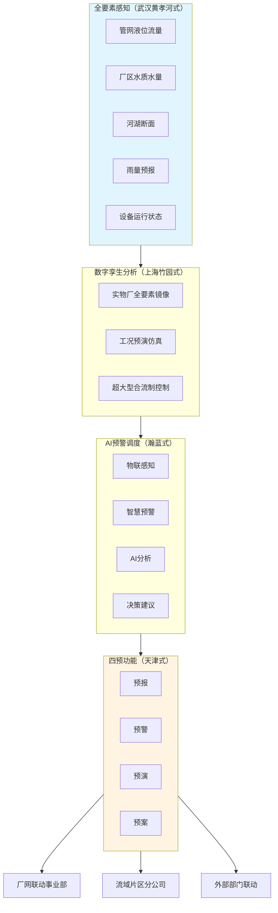

### 5.3.3 协同运作的成本压减与韧性提升机理

协同运作的最终价值，需要通过成本压减与韧性提升的量化机理论证。本小节从三条路径展开机理分析，为第6章按效付费考核指标提供物理基础，为第7章雨污分账资金通道设计提供工程依据。

**路径一：减少外水入侵的吨水成本压减**。第3章已引述"南方管道地下水入渗量3800—6300 m³/(km²·d)是德国1296 m³/(km²·d)的3—5倍"以及"我国现有很多污水管道都在带病工作，渗入量已超过国家标准的10倍以上（GB 50268—2008）"等数据。如果通过协同运作机制将外水入渗率从34%降至10%（接近德国水平），则进水浓度可从当前平均85mg/L提升至150—200mg/L水平——污水处理水量减少约25%，但单位污染物削减量提升约80%。从财务效应看：**水量减少直接降低吨水电耗、药耗、人工等运营成本；污染物削减量提升使按效付费机制下的服务费收入增加**——形成"成本下降+收入上升"的双重收益。湘潭市的实证已证明这一机理——**通过实施一批"撇清水、挤外水、收污水"项目，撇除外水和"按效付费"每年可节省资金5000多万元**（前文章节已引）；武汉盘龙厂经过厂网联动，**2025年进水BOD浓度较2024年同期提升37.3%**（前文章节已引）也是这一机理的直接体现。

**路径二：错峰处理的设施利用率优化**。第2章揭示了"低负荷与超负荷的两极分化"现象——部分厂超负荷运行（如重庆鸡冠石厂负荷率152%）、部分厂低负荷运行（如平阳水头厂65—70%）。协同运作机制通过流域片区分公司的统一调度，可在区域内实现污水处理负荷的动态调节——通过管网联通、调蓄池缓冲、备用厂启停等措施，将超负荷厂的部分流量调度到低负荷厂，**使全域设施利用率提升至接近设计能力的80%水平**。错峰处理的财务效应是显著的：避免了"超负荷厂服务费虚高+低负荷厂服务费不足以覆盖固定成本"的双重低效，使全域服务费支出与处理效能匹配度大幅提升。

**路径三：资源化利用的收益反哺**。北控水务银川第一再生水厂使银川市再生水回用率从11%跃升至58.5%[^75]、北京新凤河流域治理实现"水资源高效循环与生态价值的双重提升"[^75]——这些案例提示，再生水回用、污泥能源化、雨水资源化等资源化收益可形成对运营主体的额外现金流。北控水务"积极打造工业回用、生态补给、市政杂用多维再生水应用场景，结合雨洪水收集利用、海水淡化技术协同发展，将废弃资源转化为战略供水资源，有效缓解区域水资源紧缺压力"[^75]——这一思路的财务意义在于，**资源化收益可反哺管网维护与雨洪协同设施运维，部分弥补第3章定位的"年5740—10460亿元维护性需求"缺口**。

**韧性提升机理**则体现在三个方面：第一，**调蓄能力提升**——通过初雨调蓄池、雨季溢流快速净化设施、源头海绵削峰等组合，城市水务系统应对超标降雨的承载能力显著增强。松原市三年示范期"依托镜湖等天然水体新增10万立方米调蓄容积，使江南片区内涝防治能力达到30年一遇、实现24小时146.1毫米降雨条件下不内涝"（前文章节已引）即为典型实证。第二，**应急联动**——智慧水务平台与外部部门的数据共享和联动调度，使暴雨灾害、突发污染、设施故障等事件性应对从"事后被动响应"转向"事前主动防控"。天津数字孪生水务**在上海合作组织天津峰会保障、海河"25·7"区域性大洪水应对、引江引滦水资源调度等重点工作中发挥关键支撑作用**[^70]——这种重大事件中的"关键支撑作用"正是协同韧性的最直接体现。第3，**源头减量**——海绵设施、雨污分流、再生水回用等组合形成的源头减量效应，从根本上减轻了城市水务系统在极端事件下的承载压力。佛山桑园围水利工程跨越900多年至今仍发挥着调蓄灌溉的作用[^71]、岭南古建筑"重力排水系统"中"塘如一方碧玉，不仅是聚财纳福的文化符号，更扮演着关键的生态角色，它汇聚雨水、调节微气候、渗透补充地下水，并在暴雨时有效蓄滞，缓解内涝"[^71]——这些传统智慧与现代海绵理念的高度契合，揭示了源头减量的长效价值。

将三条成本压减路径与三类韧性提升机理整合为下表，明确协同运作的量化效益：

| 协同效益维度 | 量化机理 | 关键证据 | 对接章节 |
|---|---|---|---|
| 减少外水入侵 | 入渗率34%→10%；进水浓度提升 | 湘潭年节约5000万；武汉盘龙BOD升37.3% | 第6章按效付费考核 |
| 错峰处理 | 全域负荷率提升至80% | 重庆/平阳两极分化案例 | 第6章成本基数核定 |
| 资源化收益反哺 | 再生水回用率11%→58.5% | 银川案例；北京新凤河 | 第7章数据资产化与收益反哺 |
| 调蓄能力提升 | 30年一遇内涝防治 | 松原10万立方米调蓄；上海竹园1590立方米 | 第7章雨污分账资金通道 |
| 应急联动 | 重大事件关键支撑 | 天津数字孪生支撑上合峰会 | 第8章风险防控机制 |
| 源头减量 | 年径流总量控制率60% | 佛山10年海绵；三明A档示范 | 第7章中央示范补助延续 |

这一量化效益矩阵直接呼应了第1章界定的"成本可控+服务可持续+效能可量化"三维目标——**成本维度通过外水撇除、错峰处理、资源化收益实现压减；服务维度通过应急联动、调蓄能力、源头减量实现可持续；效能维度通过进水浓度提升、污染物削减量增加、再生水回用率提升实现可量化**。这一三维呼应不仅是本章设计的逻辑闭环，也是后续第6—8章方案设计的物理基础与价值锚点。

需要特别强调的是，**协同运作的量化效益必须依托第6章按效付费机制将其转化为运营主体的财务激励，否则再精妙的协同设计也将沦为"政府强推、企业被动"的形式工程**。这正是本章作为"体制方案"与第6章作为"激励方案"、第7章作为"资金方案"形成"体制—激励—资金"三位一体改革闭环的内在逻辑——本章设计的协同物理基础，必须通过第6章的考核指标与计费公式转化为"高浓度→高削减量→高服务费"的清晰激励链条；本章揭示的雨洪协同资金需求，必须通过第7章的"污水处理费+雨水管理费/财政专项+多元化投融资"双通道体系得到稳定保障。三章共同构成核拨制困境破解的核心方案集。

总结本章设计，**"厂网河（湖）+雨污"一体化协同运作机制必须从组织、工程、调度三个层次同步推进**——单纯组织整合而无工程协同，将沦为"换牌子不换体制"；单纯工程协同而无调度联动，将沦为"建而不用"；单纯调度联动而无组织主体支撑，将沦为"信息孤岛"。本章基于第2—4章的诊断与提炼，提供了"组织三类整合模式+工程五类共建共享方案+调度差异化运行+智慧水务平台四层架构+协同效益三路径"的完整设计方案，为政府管理部门提供了可直接借鉴的协同运作框架，也为后续第6—8章的激励机制、资金方案、可操作方案集设计奠定了体制与工程基础。

# 6 "按效付费"价格机制与成本监审制度重构

第5章"厂网河（湖）+雨污"一体化协同运作机制为破解核拨制困境奠定了体制基础与工程载体——通过组织整合消除了厂网分离的体制根源、通过工程协同重塑了雨污共建共享的物理基础、通过智慧调度实现了晴雨天差异化的运行机理。然而，组织整合与工程协同若不能在日常运营中通过激励机制传导到运营主体的财务决策上，仍可能重蹈"政府强推、企业被动"的形式化困境。武汉盘龙厂2025年进水BOD浓度同比提升37.3%、湘潭4座厂签约按效付费协议年节省5000多万元、长沙城区15座厂年节约约1.1亿元、南京2025年上半年节省约3500万元——这些第4、5章已引述的实证表明，**只有通过价格机制将协同运作的物理收益转化为运营主体的财务激励，"高浓度→高削减量→高服务费"的正向循环才能真正建立**。

本章作为破解核拨制激励扭曲的核心方案，承接第5章协同机制提供的物理基础与组织载体，为第7章多元化投融资方案的资金回报机制提供价格锚点。研究遵循"绩效指标—计费公式—收费扩展—成本监审—配套工具—落地保障"六位一体的设计逻辑：首先构建覆盖五个维度的多层级绩效指标体系，再设计基础服务费+绩效服务费的二元结构计费公式；进而论证污水处理费向"污水收集处理费"扩展的制度路径；重构成本监审办法以破解"扩大成本基数"反向激励；设计差别化、阶梯化、信用挂钩三类配套价格工具；最后系统梳理落地前置条件、风险防控与差异化适配方案。本章的设计成果将直接转化为政府管理部门可操作的合同条款、监审办法与价格调整机制，与第5章体制方案、第7章资金方案形成"体制—激励—资金"三位一体的改革闭环。

## 6.1 按效付费多维绩效指标体系构建

按效付费机制的核心是将污染物削减量、出水水质达标率、管网健康度等环境治理实效从"定性的政策要求"转化为"定量的考核公式"，再进一步转化为"可计费的价格条款"。第4章已经提炼出考核指标设计的多种模式——湘潭式单一浓度削减率、长沙式拆分模型、南京式多维效能权重——本节在国家发改委、住建部、生态环境部《关于推进污水处理减污降碳协同增效的实施意见》框架下，整合多地实践，构建可供政府管理部门直接借鉴的五维指标体系。

### 6.1.1 五维度多层级绩效指标体系框架

参照"厂网一体按效付费"绩效评价指标体系的成熟设计——**绩效评价指标体系分为基本指标和鼓励指标，总分100分，其中基本指标占比80%—90%，鼓励指标占比10%—20%，可根据区域治理重点动态调整指标权重**[^80]——本章构建覆盖污水收集效能、污水处理质量、污泥处置效能、设施运行管理、节能降碳与雨洪协同五个维度的指标体系。

**第一维度：污水收集效能（20—25分）**。该维度承接第5章组织协同与工程共建共享设计，重点考核前端控源截污与清污分流成效，包括污水集中收集率、管网完好率、进水污染物浓度达标率三项核心指标[^80]。其设计逻辑是倒逼厂网联动事业部主动推进管网修复、雨污错接整治、外水撇除等工作，破解第2章揭示的"按量付费下污水处理厂没有能力也没有动力提升进水浓度"的逆向激励[^3]。住建部"到2025年城市污水处理厂进水生化需氧量（BOD）浓度高于100毫克/升的规模占比达到90%或较2022年提高5个百分点"的国家目标，可作为该维度"进水污染物浓度达标率"指标的达标阈值参照[^1]。

**第二维度：污水处理质量（30—35分）**。该维度以污水处理厂出水水质达标率为核心，涵盖化学需氧量（COD）、氨氮、总氮、总磷等主要污染物去除率，严格按照国家及地方排放标准考核，**出水水质连续超标将予以重罚**[^80]。这一维度直接对应第1章"高效运作"三维内涵中"效能维度的可量化、可考核、可付费属性"，是按效付费机制最核心的考核指标。

**第三维度：污泥处置效能（15—20分）**。该维度包括污泥无害化处置率、污泥含水率达标率，确保污泥处置符合环保要求、杜绝二次污染[^80]。第3章已揭示当前我国污泥简单脱水填埋成本0.08—0.15元/吨水与全量安全处置0.25—0.5元/吨水之间的悬殊差距，将污泥处置纳入按效付费考核可避免"重水轻泥"的传统倾向。

**第四维度：设施运行管理（15—20分）**。该维度包括设备综合运行率、安全生产情况、在线监测设备运行稳定性、运维管理制度完善性等，保障设施持续稳定运行[^80]。其特殊价值在于将"在线监测设备运行稳定性"明确纳入考核——这是按效付费机制能够公平执行的数据基础保障。

**第五维度：鼓励指标（10—20%权重）**。聚焦节能降碳、资源循环利用及精细化管理，主要包括单位污水处理能耗药耗低于行业平均的节能降耗成效、再生水利用率达到规定标准的资源化利用、应对进水冲击及突发环境事件的应急处置能力、运用智慧监管平台实现全流程可视化精细化管理的数字化管理[^80]。这一维度直接对接国家"减污降碳协同增效"政策导向[^81]，引导运营主体主动向"绿色低碳、智慧精细"转型。

将五维度指标体系整合为下表，明确每项指标的权重区间、核心考核内容与第5章物理基础的对应关系：

| 维度 | 权重区间 | 核心指标 | 对应第5章物理基础 |
|---|---|---|---|
| 污水收集效能 | 20—25分 | 集中收集率、管网完好率、进水浓度达标率 | 厂网联动事业部+管网修复+外水撇除 |
| 污水处理质量 | 30—35分 | 出水水质达标率（COD、氨氮、总氮、总磷） | 流域片区分公司+智慧调度精细化曝气 |
| 污泥处置效能 | 15—20分 | 无害化处置率、含水率达标率 | 污泥稳定处置链条 |
| 设施运行管理 | 15—20分 | 设备运行率、安全生产、在线监测稳定性 | 智慧水务平台第一层全要素感知 |
| 鼓励指标 | 10—20% | 节能降耗、再生水利用、应急处置、数字化 | 资源化收益反哺+四预功能调度 |

### 6.1.2 关键考核指标的计量方法与硬约束机制

指标体系的可执行性，关键在于每项指标的计量方法、达标阈值、扣分细则与加分条件的精细化设计。**各指标考核标准参照《城镇污水处理厂运营质量评价标准》《城镇污水处理工作考核暂行办法》及地方相关标准制定，明确达标阈值、扣分细则和加分条件**[^80]：

**出水水质达标率**：连续达标得满分，单次超标按比例扣分，季度内累计超标次数达到规定上限的，该指标得0分，并启动专项整改[^80]。这一硬约束机制使得"撒药治污""加盖板遮人耳目""调水冲污"[^3]等表面治理手段无法蒙混过关，必须从工艺、管网、源头多维度真正提升处理效能。

**污水收集率**：达到年度目标得满分，每低于目标1个百分点扣相应分数，**低于目标10个百分点以上的，额外扣减基本付费金额**[^80]。这一设计的深刻之处在于其突破了"绩效服务费内浮动"的边界，进入了"基本付费金额扣减"的硬约束区域——倒逼运营主体主动消除管网空白区、推进雨污分流改造，这正是第3章定位的"管网运维年缺口5740—10460亿元"问题的激励侧解决方案。

**污泥无害化处置率**：100%达标得满分，每出现1次不达标情况扣5分，**累计3次以上不达标，暂停付费并责令整改**[^80]。"暂停付费"是仅次于合同解除的最严厉处罚，体现了对污泥二次污染问题的零容忍。

**针对性区域指标**：各地可结合实际，针对工业废水占比高、水环境敏感等区域，增设针对性考核指标，如工业废水预处理达标率、重点污染物额外削减量等[^80]。这一弹性设计回应了第1章界定的"差异化与适配性思维"——按效付费指标体系不能"一刀切"，必须根据区域治理重点进行本地化调整。

### 6.1.3 指标维度数量与监管能力的权衡

需要特别警示的是，**指标维度越多、考核公式越复杂，对监测数据完整性、第三方核查能力、考核公式权重设置的要求就越高**。第4章梳理的三种典型模型在指标复杂度上呈现显著差异：

**湘潭式单一浓度削减率**：以"污染物浓度削减率"作为核心计费变量，公式简单、便于操作、易被基层政府理解；缺点是对工艺成本结构变化（如提标改造、能源价格波动）的适应性较弱。其适配条件是**管网欠账中等、监管能力相对薄弱、需要先用简单公式建立改革共识**的中等城市。

**长沙式拆分模型**：将污水处理服务费拆分为建设投资、生产运营变动部分、生产运营固定部分，并引入LPR浮动机制对冲风险；优点是结构清晰、能够分别匹配不同性质的风险；缺点是公式复杂、需要专业咨询机构与精细化成本核算能力支撑。其适配条件是**已有AA+评级水务集团、市场化能力强、可承担长期复杂合同管理成本**的大城市。

**南京式多维效能权重模型**：建立季度座谈与动态调整机制，引导运营单位持续向"绿色低碳"转型；优点是适应性强、可与节能降碳、智慧化等新要求动态对接；缺点是对监管能力要求高、容易产生"指标博弈"风险。其适配条件是**已建成全要素智慧水务平台、片长制驻厂等深度协同机制已落实**的特大城市与省会城市。

监管能力建设是指标体系设计的隐性前置条件。**深圳市恒星物联水位、流量感知设备**对污水管网关键节点水位、瞬时流量及累计流量进行实时监测，为污水集中收集率核算提供精准数据支撑；同时通过水位异常预警，及时排查管网堵塞、破损等问题，提升管网完好率[^80]。**水质监测设备**对污水处理厂进水、出水水质进行实时在线监测，精准捕捉污染物浓度变化，同步上传监测数据至智慧监管平台，实现水质数据可追溯、可核查，为水质达标率考核提供客观、精准的基础数据[^80]——这些技术支撑是按效付费考核能够公正执行的数据基础。

## 6.2 按效付费计费公式与服务费拨付机制设计

在多维指标体系基础上，需将其转化为可执行的计费公式与拨付机制。本节按"二元结构计费公式—动态调整规则—硬约束机制—评价拨付流程—与长期投资能力的财务匹配"五个层次展开。

### 6.2.1 "基础服务费+绩效服务费"二元结构计费公式

按效付费总付费金额采用"基础服务费+绩效服务费"二元结构：**总付费金额 = 基础服务费 + 绩效服务费**[^80]。这一二元结构的关键创新，是将"保障运营单位基本运营需求"与"激励效能提升"两个目标分离，避免了"全量绩效化"导致企业财务震荡、"全量基础化"导致激励缺失的两类极端。

**基础服务费**：主要覆盖运营单位的固定成本（设备折旧、人工薪酬、管理费用等）和合理收益，根据污水收集处理设计规模、工艺标准及区域成本水平核定，**原则上不低于运营成本的60%，保障运营单位基本运营需求**[^80]。这一60%的下限设计具有重要的财务保障意义——它使运营主体即使在绩效考核大幅扣减的极端情况下，仍能获得覆盖固定成本的基础现金流，避免出现重庆水务式"价格腰斩—企业亏损—服务质量下滑—政府再压价"的负向循环。

**绩效服务费**：按多维指标考核结果浮动核定，体现"效能—奖惩"激励。绩效服务费的浮动空间，约对应运营成本的40%——这是"高绩效高激励、低绩效硬约束"双向激励机制的财务来源。

将二元结构计费公式以表格形式精细化：

| 服务费组成 | 占比 | 核定依据 | 调整频率 | 风险归属 |
|---|---|---|---|---|
| 基础服务费 | ≥60%运营成本 | 设计规模×工艺标准×区域成本 | 3—5年定期评估 | 政府承担 |
| 绩效服务费（达标部分） | 浮动0—100% | 五维指标考核结果 | 月度初评+季度结算 | 运营主体承担 |
| 绩效服务费（奖励部分） | 鼓励指标加分 | 节能降碳、再生水、数字化 | 年度终评 | 共担激励 |

### 6.2.2 长沙式四段拆分动态调整规则

二元结构在应对成本上行（提标改造、能源涨价）、利率波动、负荷增长等复杂变量时，仍需引入动态调整规则。借鉴第4章梳理的长沙模式——**将污水处理服务费拆分为建设投资、生产运营变动部分和固定部分，并引入LPR浮动机制对冲风险**，可设计四段拆分动态调整公式：

**建设投资部分**：对应资产折旧与融资成本，挂钩LPR保证利率风险的转移。当LPR上行时，建设投资部分单价相应上调，保证运营主体的资金成本不被价格机制吞噬；反之亦然。

**生产运营变动部分**：对应电耗、药耗等与处理水量挂钩的变量，按吨水变动成本×处理水量计算。该部分可进一步与电价、主要药剂价格挂钩——当电价或PAC价格出现显著波动（如超过基准价的±10%）时，自动触发单价调整。

**生产运营固定部分**：对应人工、管理等基础成本，按合同约定的固定金额支付，可结合CPI变化每3—5年评估调整。

**绩效奖惩部分**：对应五维指标考核结果，按月初评、按季结算、按年终评。

四段拆分模型的优势在于**风险分担的精细化**——利率风险由LPR浮动机制承担、能源与药剂价格风险由变动部分挂钩机制承担、人工成本通胀风险由固定部分定期评估机制承担、效能提升与下降风险由绩效奖惩部分承担。这种"风险分类匹配"的设计避免了重庆水务模式下"政府单方面定价、企业单方面承担所有风险"的不可持续格局——重庆水务前六期污水处理结算价格3.43元/m³→3.25元→2.78元→2.77元→2.98元→2.35元的下行轨迹，第六期同比下降21%，导致重庆水务2024年归母净利润同比下降27.88%，即是缺乏拆分模型与浮动机制的反面教材。

需要特别说明的是，长沙拆分模型的实施前置条件是**地方政府具备较强的合同管理能力与专业咨询支撑**——四段拆分公式的精细化执行需要专业财务、工程、法律团队的常态化参与。对于监管能力相对薄弱的中小城市，可采用湘潭式简化版本——基础服务费60%+绩效服务费40%的二元结构作为起步，待监管能力提升后再向四段拆分演进。

### 6.2.3 连续超标重罚与停付整改硬约束机制

按效付费机制的执行力，关键在于硬约束的清晰与可执行。除6.1.2节已设计的"出水水质连续超标重罚""污水收集率低于目标10%以上额外扣减""污泥无害化连续3次以上不达标暂停付费"等单项硬约束外，还需建立全局性的硬约束触发机制：

**重大环境事件触发停付**：发生溢流污染入河、出水超标致下游饮用水源污染、污泥违规处置造成二次污染等重大环境事件的，立即启动停付程序，待整改完成、第三方核查通过后恢复支付。

**信用降级触发服务费下调**：运营主体因排污违法被生态环境部门列入"红牌"名单的，按本章6.5节"环保信用挂厂"规则下调服务费——这一机制与企业排污信用挂钩的逻辑一致，体现了"守信激励—失信惩戒"的环境信用闭环原则[^82]。

**第三方核查触发争议解决**：当政府方与运营主体对绩效考核结果出现争议时，由独立的第三方核查机构进行复核，复核结论作为最终结算依据。这一机制借鉴了娄底市"公开遴选第三方服务机构对供水成本及污水处理、生活垃圾处理成本进行成本审核"[^83]的经验，将第三方核查从"事后监督"前置为"过程仲裁"。

### 6.2.4 月度初评+季度结算+年度终评的评价拨付流程

按效付费的评价拨付频率需要平衡"激励及时性"与"考核公允性"两个要求。设计"月度初评+季度结算+年度终评"三级评价流程：

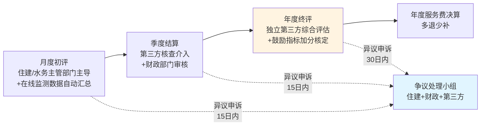

**月度初评**：以在线监测数据为主，由住建/水务主管部门主导初步汇总，向运营主体发出考核结果初评通知；运营主体可在15日内提出异议申诉。这一频率确保了激励信号的及时性——运营主体能在月度尺度上调整运营行为以响应考核压力。

**季度结算**：第三方核查机构介入，对在线监测数据、人工取样化验数据、设施运行台账进行交叉核对；财政部门审核后按季度结算服务费。季度结算是按效付费机制的"主结算频率"——既避免了月度结算的繁琐，又避免了年度结算的滞后。

**年度终评**：独立第三方综合评估机构进行年度综合评价，重点对鼓励指标（节能降碳、再生水利用、数字化管理、应急处置）进行加分核定，并对全年服务费进行决算"多退少补"。

**争议处理与申诉程序**：由住建、财政、第三方核查机构组成争议处理小组，月度初评异议在15日内处理、季度结算异议在30日内处理、年度终评异议在60日内处理。争议处理结论作为后续支付的依据。

### 6.2.5 与长期投资能力的财务匹配

按效付费机制的最终价值，不仅在于"算清运营成本"，更在于通过"高浓度→高削减量→高服务费"的清晰激励链条，为运营主体的长期投资能力提供财务支撑。这一逻辑与第7章多元化投融资方案的对接接口体现在三个层面：

**第一，按效付费节约资金作为长期债务还款现金流**。湘潭年节约5000多万元、长沙城区15座厂年节约约1.1亿元、南京2025年上半年节省约3500万元——这些通过按效付费机制节省下来的资金，并非简单地"返还财政"，而是可以转化为长期专项债与超长期国债的还款现金流，用于支撑管网改造、雨污协同设施建设等长期投资。这一财务匹配机制将在第7章作为"按效付费节约资金转化为长期债务还款来源"的核心逻辑展开。

**第二，绩效考核结果作为社会资本回款保障**。在第4章梳理的"分手潮"教训中，临颍康达环保因"财政依赖陷阱+调价机制缺失+政府担保虚设"被迫诉讼索赔5.78亿元——这一教训提示，社会资本参与水务项目的最大风险不是市场风险，而是政府方付费的不确定性。按效付费机制通过"基础服务费保底+绩效服务费浮动+第三方核查仲裁"的三层保障，将社会资本的回款从"依赖地方财政相机决策"转化为"依据绩效考核结果按合同执行"，大幅降低了社会资本的政策性风险。

**第三，多维指标考核作为厂网河湖一体化协同效能的财务量化载体**。第5章设计的厂网河湖+雨污一体化协同运作机制，其量化效益（外水入侵率34%→10%、进水浓度提升、错峰处理、资源化收益）必须通过按效付费的多维指标考核才能转化为运营主体的财务激励。换言之，**按效付费是协同运作机制能够"自我激励、自我循环"的财务发动机**——没有按效付费的财务激励，协同运作就只能依靠政府强推；有了按效付费的财务激励，协同运作就能转化为运营主体的主动选择。

## 6.3 污水处理费向"污水收集处理费"扩展的制度路径

按效付费机制设计完成后，仍面临一个根本性的制度约束——当前国家层面财税〔2014〕151号办法将污水处理费的征收使用范围限定在"建设、运行和污泥处理处置"，**管网运维年缺口5740—10460亿元、雨洪协同"三外"困境**等核拨制覆盖结构性残缺，无法仅通过按效付费机制本身解决。本节论证将污水处理费征收范围与使用范围从狭义"污水处理费"扩展至广义"污水收集处理费"乃至"水环境综合服务费"的制度路径。

### 6.3.1 管网运维成本纳入收费覆盖的法律突破口与会计处理规则

第3章已系统揭示，管网运维是核拨制覆盖最薄弱、缺口最严峻的环节。当前污水处理费的使用范围被严格限定在污水处理设施的建设、运行和污泥处理处置[^84][^85]，管网检修、CCTV排查、雨污错接整治、外水入侵修复等持续性投入几乎全部依赖一次性财政补贴或专项债，缺乏长效资金通道。

突破这一局限的关键，在于**将管网运维费从"额外财政补贴"转化为"污水处理服务费成本基数"的制度突破**。第4章已引述长沙改革的关键创新——**将污水管网运维费纳入污水处理成本，使管网由公益性资产转变为经营性资产，成功推动与国开行的融资合作**；**计划分批次将污水管网资产评估后注入运营公司，首批3区已注入约6.2亿元，有效降低企业负债率**。这一实践已经初步证明了管网运维成本纳入收费覆盖的可行性。

将这一突破制度化，需要从三个层面同步推进：

**第一，会计处理规则**。参照《四川省污水处理定价成本监审办法》"污水处理定价成本由固定资产折旧费、污水处理生产成本和其他运营费用构成。**污水收集输送管网运营成本在污水处理定价成本外单列**"[^86]的设计，建立"污水处理定价成本+污水收集输送管网运营成本"双轨并行的会计科目体系。这一双轨设计的精妙之处在于——既保留了原有污水处理定价成本的连续性（避免对存量BOT/PPP合同造成冲击），又将管网运营成本作为单独条目纳入价格监审范围，为后续政府向运营主体支付管网运维服务费提供了会计基础。

**第二，资产评估与划转规则**。借鉴长沙模式，将存量污水管网资产经评估后划转入统一运营主体的资产负债表，配套现金流（按效付费节约的运维费+污水处理服务费的固定+浮动拆分部分）形成稳定还款来源，从而打通管网维护从"事件性补贴"向"市场化融资"的转换路径。

**第三，国家层面财税〔2014〕151号办法修订路径**。在地方探索成熟的基础上，推动国家层面修订《污水处理费征收使用管理办法》，将"污水收集"明确纳入污水处理费的使用范围。这一修订是管网运维长效资金通道建立的根本保障。

### 6.3.2 雨污协同成本的纳入边界与使用规则

第3章定位的雨洪协同"三外"困境（污水处理费体系外、防汛专项预算外、应急预算外），需要通过雨污协同成本的纳入边界设计加以破解。

云南昆明2025年修订的条例已经开始尝试在地方层面打破雨污资金割裂——将"内涝防治专项规划"纳入"城镇排水与污水处理专项规划"，并在污水处理费使用范围中纳入"防涝应急"功能。深圳市《污水处理费征收使用管理办法》明确"市排水主管部门核定污水处理费支出范围内的市政排水设施运行服务费"[^84]——这种"市政排水设施"的表述比传统"污水处理设施"更宽泛，已经隐含了向雨污协同延伸的制度空间。

雨污协同成本的纳入边界，建议采取"分类纳入、清晰分账"的原则：

**第一类，晴雨双功能共享设施**：调蓄池、合流制截流设施、初期雨水快速净化设施等晴天用于污水均质、雨天用于截流的共享设施，按晴天功能与雨天功能比例分摊投资与运维成本——晴天功能投资由污水处理费体系承担、雨天功能投资由财政雨水管理专项承担。这一规则已在第5.2.3节明确，本节将其制度化为收费规则。

**第二类，雨污协同型管网改造**：雨污分流改造、雨污错接整治、城中村源头改造等同时改善污水收集与雨水排放的工程，可全额纳入"污水收集处理费"覆盖范围——其逻辑在于这些改造的本质目标是提升污水收集效能、降低外水入侵，受益者主要是污水处理体系。

**第三类，纯雨水管理设施**：雨水管网、海绵设施、防汛排涝工程等纯雨水管理设施，仍由财政雨水管理专项承担。这一边界保留了对污水处理费"污染者付费"原则的尊重——雨水管理具有公共防灾属性，不应由污水排放者通过污水处理费承担。

### 6.3.3 向"污水处理费+雨水管理费/财政专项"双通道体系演进

借鉴日本东京"污水费150元/月+雨水处理费财政全担"分账经验[^15]，以及美国39州1417地区雨水费制度的实践，可以论证向"污水处理费+雨水管理费/财政专项"双通道体系演进的制度路径。

**美国雨水费制度的关键启示**：美国雨水费**通过计量房屋不透水表面面积（如屋顶、车道）征收，收费的主要依据是雨水从不可渗透的路面产生径流进入下水道会造成污染**；**美国雨水收费的月收费量中值为1.68—11.70美元，明显低于水费和污水费**；**雨水费产生的收入将用于升级雨水系统和下水道系统。按照专款专用的原则，雨水费用于补贴维护维修雨水收集处理相关设施的费用以及雨水管理事业**。更具创新性的是**绿色基础设施减免机制——华盛顿哥伦比亚特区对居民区和商业区收取每月固定的雨洪费及不透水面积费，并对安装绿色基础设施的业主提供最高55%的费用减免**——这一机制将雨水管理从"事后处理"转向"源头减量"，通过经济激励引导业主主动采用海绵设施。

我国当前直接引入美国式雨水费的社会承受力风险较大，但可以分阶段推进：**短期（"十五五"期间）**——以财政专项预算保障雨水管理资金需求，同时在海绵城市示范城市试点对大型工商业用户征收基于不透水面积的雨水管理费；**中期（"十六五"期间）**——在管网欠账补齐、按效付费机制成熟的地区扩大雨水费试点范围，建立"污水处理费+财政雨水专项+雨水费试点"三通道体系；**长期（"十七五"以后）**——在制度成熟、社会承受力提升的基础上，全面建立"污水处理费+雨水管理费"双通道体系。

### 6.3.4 污水处理费征收标准动态调整机制

收费扩展的另一关键问题，是动态调整机制的建立。第2章已揭示**全国目前仍有100多座城市的居民污水处理费收费标准低于0.95元/吨**[^85]，国家发改委等部门2015年119号文要求的最低标准在20年后仍未在全国实现，反映出动态调整机制的严重缺失。

许昌、诸暨、深圳、济南等地最新调价案例显示"成本监审+定期评估+财力承受+程序合规"是动态调整的核心要素：

**许昌案例**：许昌市中心城区居民污水处理收费标准从原0.65元/m³调整至0.95元/m³，调整自2025年12月抄见表量起执行[^87]。**调整背景**：执行的居民污水处理收费标准为2004年省定征收标准0.65元/m³，全省其他地市在2017年已将居民污水处理费标准调整至0.95元/m³，许昌与国家最低标准差额0.3元/m³一直由财政承担；**调整必要性**：上述收费标准已执行二十年，**近年来由于不断加大污水处理设施建设改造方面投资，收费有限，财政压力逐渐加大**；**调整影响测算**：根据2024年居民生活用水及用水户数测算，居民每月户均增加用水成本约（污水处理费）3.98元[^87]。许昌案例的关键启示是——**长期不调整收费标准只是将矛盾从"用户付费"转化为"财政承担"，并非真正避免了成本支付，反而损害了财政可持续性**。

**诸暨案例**：**一般工业企业污水处理费收费标准由现行的2.40元/立方米调整为2.60元/立方米，印染、化纤、制药、化工和金属表面处理等工业企业污水处理费收费标准由现行的3.50元/立方米调整为3.90元/立方米**；**对含印染砂洗工序的纺织染整企业、含合成反应的化纤制造企业、制药企业（单纯复配、分装企业除外）、含金属表面处理工序的工业企业等污水实行差别化收费政策，污水处理费按照排放污水的酸碱度（PH）、化学需氧量（COD）、氨氮（NH3-N）等污染因子浓度复合征收**[^88]。诸暨案例提供了"行业差别化+多因子收费"的动态调整范式，将在本章6.5节进一步展开。

**深圳案例**：居民类污水第一阶梯1.00元/立方米、第二阶梯1.50元/立方米、第三阶梯3.00元/立方米；非居民类污水1.54元/立方米；特种行业污水3.00元/立方米；在上述收费标准基础上，**对环保诚信企业（绿牌）按照90%征收污水处理费；对环保警示企业（黄牌）按照110%征收污水处理费；对环保不良企业（红牌）按照130%征收污水处理费**[^89]。深圳案例提供了"阶梯+环保信用挂钩"的复合调整机制，将在6.5节进一步展开。

**济南案例**：2026年起执行的居民阶梯水价基本水价按1:2:4比例核定，第一阶梯到户水价4.2元/立方米（含水资源税0.4元、污水处理费1元）、第二阶梯7.0元/立方米、第三阶梯12.6元/立方米[^90]。济南案例提供了"水价+污水处理费同步阶梯"的设计范式。

将上述案例归纳为"3—5年定期评估+成本核增触发+居民承受能力测算"的标准化调整流程：

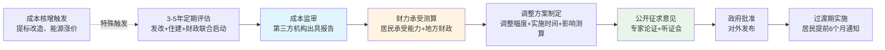

这一流程的关键设计要点：**第一**，明确触发机制——3—5年定期评估是常规触发，提标改造、能源涨价等成本核增是特殊触发；**第二**，强化第三方核查——成本监审报告由独立第三方机构出具，避免运营主体或政府方单方面影响；**第三**，平衡多元利益——居民承受能力、地方财政承受力、运营主体合理收益三者需协同测算；**第四**，程序合规——公开征求意见、专家论证、听证会等程序保障了价格调整的社会接受度。

### 6.3.5 国家层面立法配套与制度演进路径

从狭义"污水处理费"到广义"污水收集处理费"乃至"水环境综合服务费"的演进，需要国家层面的立法配套：

**短期配套**：修订《污水处理费征收使用管理办法》（财税〔2014〕151号），将"污水收集"明确纳入污水处理费的使用范围；出台《城镇生活污水收集处理按效付费指南》，统一全国按效付费机制设计标准；推广湖南"小快灵"立法范式，鼓励地方层面针对厂网一体、按效付费、雨污协同等出台地方性法规。

**中期配套**：研究修订《城镇排水与污水处理条例》，将"厂网一体""按效付费""雨污协同"等改革方向上升为国家层面行政法规；研究制定《城市水环境综合服务费征收使用管理办法》，整合污水处理费、雨水管理费、再生水使用费等多类费用为统一的水环境综合服务费体系。

**长期配套**：研究制定专门的《城镇水环境综合服务法》，从法律层面整合排水、污水处理、雨洪管理、河湖水生态保护等城市水环境综合服务的法律框架，为水环境综合治理提供根本性的法治保障。

## 6.4 成本监审办法重构与管网运维成本单列

按效付费机制的执行公正性，关键在于成本监审办法能否客观、合理地核定运营主体的真实成本。第2章已揭示四川彭山2022—2024年成本监审报告暴露的三处结构性缺陷——监审分母仍以历史水量为基准、提标改造成本自动通过、固定资产折旧维护无约束[^1]——本节基于这一诊断，重构污水处理定价成本监审办法。

### 6.4.1 双轨并行的成本构成口径重构

参照《四川省污水处理定价成本监审办法》的成本构成设计，将污水处理定价成本由"固定资产折旧+生产成本+其他运营费用"扩展为"污水处理定价成本+污水收集输送管网运营成本"双轨并行：

**第一轨：污水处理定价成本**。延续《四川省污水处理定价成本监审办法》的成本构成定义——**污水处理定价成本由固定资产折旧费、污水处理生产成本和其他运营费用构成**。其中**污水处理生产成本，是指污水处理企业将通过城镇污水收集管网收集输送到污水处理厂的生活污水、工业污（废）水和径流水净化处理所发生的各项合理支出，不包括污水收集输送环节成本。包括直接材料费、动力费、人工费、修理费、污泥处置费、检验监测费、机物材料消耗费、低值易耗品摊销及其他费用等**[^86]。

**第二轨：污水收集输送管网运营成本（单列）**。这一单列的设计是对当前监审办法的关键突破。具体的核算口径应包括：管网巡查、检测（CCTV内窥）、清淤养护等日常维护成本；管网破损、老化更新等大修成本；雨污错接整治、外水入侵修复等专项整治成本；管网设备（泵站、流量计、液位计、井盖等）的折旧与维护成本。

**双轨并行的会计与定价规则**：两轨成本分别核算、分别监审、分别定价，但在最终的服务费计算中合并为统一的"污水收集处理服务费"。这一设计的精妙之处在于——既保留了原有污水处理定价成本的连续性（避免对存量BOT/PPP合同造成冲击），又将管网运营成本作为独立轨道纳入价格监审范围，为政府向运营主体支付管网运维服务费提供了清晰的会计基础。

### 6.4.2 行业基准定额与"扩大成本基数"反向激励的破解

第2章揭示的"成本加成模式扩大成本基数反向激励"问题，必须通过行业基准定额的引入加以破解。

参照《四川省污水处理定价成本监审办法》关于成本核算的合理性原则——**计入定价成本的费用应当反映生产经营活动正常需要，并按照合理方法和合理标准核算；影响定价成本水平的主要技术、经济指标应当符合行业标准或者公允水平**[^86]——可以建立以下关键参数的行业基准与公允水平比对机制：

**单位电耗基准**：参照江苏省城镇污水处理厂运行管理考核标准——一级A标准考核分为四个级别（≤0.34 kWh/m³、0.34—0.37、0.37—0.42、≥0.42），一级B标准按一级A的70%考核——监审中对超出该基准且无合理工艺解释的部分予以核减。

**单位药剂消耗基准**：按典型工艺PAC投加量（约50mg/L）、PAM投加量等建立行业基准。

**人工配置基准**：按"日处理X万吨厂定员Y人"的规模—人员配置经验关系建立基准——例如日处理5—10万吨厂定员50人左右，超规模配置部分予以核减。

**固定资产维护计提率基准**：参照"每年大修成本按固定资产的1.7—2.0%提取、设施设备维护成本按固定资产的0.5—1.0%提取"的行业经验，建立计提率上限。监审中对超出上限部分予以核减。

**污泥处置成本基准**：建立"简单脱水填埋（100—150元/吨干泥）—全量安全处置（300—500元/吨干泥）"的成本区间基准，监审中要求运营主体证明其处置方式的合理性。

行业基准定额的引入，将"扩大成本基数"的反向激励转化为"压缩成本基数"的正向激励——运营主体若能将关键参数控制在行业基准以下，其压减部分可作为合理收益保留；若超过行业基准，则需提供充分的合理性解释，否则在监审中予以核减。

### 6.4.3 提标改造成本审视与"成本是否合理"的论证环节

针对第2章揭示的"提标改造成本自动通过"问题，需要在监审办法中增加"成本是否合理"的论证环节。

具体设计：**第一，提标决策合理性审查**——对超出国家排放标准底线（一级A）的过度提标，要求论证其必要性、技术可行性、经济合理性；对仅满足地方流域特别排放限值或受纳水体水质要求的合理提标，纳入正常成本核定。**第二，技术路线择优审查**——对同等排放标准下不同技术路线的成本差异进行审查，要求运营主体证明其选择的技术路线是经济性较优的方案，避免"过度复杂化、过度投资化"的工艺选择。**第三，提标—收费传导审查**——对提标改造导致的成本上升进行分阶段传导，避免一次性大幅上调对用户和财政造成冲击。

这一设计直接回应了王家卓的判断——**"在污水处理收费和付费方面，我国很多城市普遍存在两个问题。一是污水收费价格无法涵盖污水处理和污泥处置成本，不少城市甚至低于国家提出的最低标准。尤其是在近些年各地纷纷实施污水处理厂出水提标改造后，收费单价和城市对污水处理的付费单价之间的差值就更大了"**[^3]——既要解决提标后成本与收费倒挂的问题，又要避免"为提标而提标"导致成本无序攀升。

### 6.4.4 第三方审核机制与监审程序规范化

第三方审核是监审公正性的关键保障。参照娄底市公开遴选第三方服务机构对供水成本及污水处理、生活垃圾处理成本进行成本审核的实践——**对2022—2024年娄底城区供水成本及污水处理（含污泥处置）、生活垃圾处理成本进行审核，该项目涉及5个主体，需在45个工作日内出具正式成本审核报告**；申请单位的基本资格条件包括"具有财政部门颁发的会计师事务所执业证书""未被'信用中国'网站、'中国政府采购网'列入失信被执行人、重大税收违法失信主体记录名单、政府采购严重违法失信行为信息记录名单"；**现场监审团队不少于3人，须由本事务所执业注册会计师带队，审计助理人员须有初级以上会（审）计专业技术资格职称**；严格按照《政府制定价格行为规则》《政府制定价格成本监审办法》《城镇供水定价成本监审办法》《湖南省城镇污水处理成本审核技术方法（试行）》等进行成本监审[^83]——可以提炼出第三方审核的标准化设计要点：

**监审主体**：发改部门主导+城镇排水主管部门配合，参照《四川省污水处理定价成本监审办法》"污水处理定价成本监审由政府价格主管部门组织实施，城镇排水行政主管部门应配合价格主管部门开展污水处理定价成本监审工作"[^86]的分工原则。

**第三方资质**：注册会计师事务所执业资质+行业经验+信用合规——"具有供水、污水处理、垃圾处理行业成本审核相关工作经验和案例并提供佐证资料的，同等条件下优先考虑"[^83]。

**监审周期**：3年一次定期监审+按效付费动态触发。即每3年开展一次定期成本监审作为基础，同时按效付费机制下出现重大成本变化（提标改造、能源价格异常波动）时启动专项监审。

**监审程序**：参照彭山案例[^1]的标准化六步程序——书面通知→资料初审→实地审核→集体审议→意见告知→出具报告。具体时限按"45个工作日内出具正式成本审核报告"[^83]控制。

**监审独立性保障**：成本监审过程中第三方机构不得泄露经营者的商业秘密；与接受成本审核的经营者有利害关系的成本审核工作人员，应当回避[^83]——这一独立性保障是成本监审公正性的根本保障。

### 6.4.5 成本监审报告社会公示与信息公开

破解政府与运营主体之间信息不对称的最有效工具，是成本监审报告的社会公示与关键参数的行业披露。

具体设计：**第一**，成本监审报告社会公示——除涉及商业秘密的部分外，监审报告主要内容应通过政府门户网站、行业协会网站等渠道向社会公开；**第二**，关键参数行业披露——单位电耗、单位药耗、人工成本、固定资产维护计提率等关键参数按城市规模、工艺类型分类公布行业基准值；**第三**，与按效付费考核结果联动调整——成本监审结论与按效付费考核结果相互印证，避免"成本一直增长、绩效一直下降"的极端反差，倒逼运营主体在成本与绩效之间寻求平衡。

信息公开的深度直接决定了按效付费机制的公信力。**英国Ofwat监管失灵的教训提示——审查结果认为，英国水务局未能有效履行职责，无法达到环境保护的要求**[^15]——监管不透明、信息不对称是监管失灵的核心机理。我国按效付费机制的设计必须从一开始就建立强信息公开机制，避免重蹈监管失灵的覆辙。

## 6.5 差别化收费、阶梯收费与环保信用挂钩配套工具

按效付费机制重塑了运营端的激励，但用户端的激励同样需要价格工具的传导。本节设计三类配套价格工具，形成"用户—政府—运营主体"完整的激励相容链条。

### 6.5.1 工业差别化与多因子收费：源头减污的价格信号

工业用户的污染负荷往往远高于居民，且行业差异显著。差别化与多因子收费的设计，目标是引导工业企业源头预处理、清洁生产，从源头降低进入污水管网的污染负荷。

诸暨市2026年实施的工业污水多因子收费方案提供了精细化设计的标杆：

| 污染物 | 入网基准（纺织染整） | 入网基准（其他企业） | 分档值 | 浮动标准 |
|---|---|---|---|---|
| 酸碱度（PH） | 6—9 | 6—9 | 1 | 每超过一档增加0.7元/m³ |
| 化学需氧量（COD） | 200mg/L | 500mg/L | 50mg/L | 每上升一档增加0.3元/m³；纺织染整每降低一档下降0.15元、其他企业下降0.1元 |
| 氨氮（NH₃-N） | 20mg/L | 35mg/L | 5mg/L | 同COD规则 |

数据来源：诸暨市《工业污水多因子收费标准》[^88]。

诸暨设计的精妙之处体现在四个层面：**第一，行业差别化基准**——纺织染整企业的入网基准（COD 200mg/L、NH₃-N 20mg/L）比其他企业（COD 500mg/L、NH₃-N 35mg/L）严格，反映了纺织染整行业污染治理责任更重的政策导向；**第二，双向浮动激励**——超过基准时上调收费、低于基准时下调收费（纺织染整每降一档减0.15元、其他企业减0.1元），形成"减污有奖、增污有罚"的双向激励；**第三，多因子复合征收**——按PH、COD、NH₃-N月平均值分别计算，并按最高因子确定污水处理费——"按最高因子"的规则避免了运营主体在不同污染物间"避高就低"的策略性行为；**第四，行业聚焦**——多因子收费对象限定为印染砂洗、化纤、制药、金属表面处理等高污染负荷行业[^88]，避免对低污染行业的过度负担。

将工业差别化收费的标准化设计要点归纳：**污染物指标选择**——以COD、氨氮、总氮、总磷、pH等核心污染指标为主，结合行业特征增加重金属、有毒有机物等指标；**入网基准**——按行业污染特征分类设定，水污染重点行业基准更严格；**分档阈值**——按浓度梯度设置，每档之间留有合理调整空间；**浮动标准**——上下浮动幅度要充分覆盖企业治污成本与收益预期，体现激励刚性。

### 6.5.2 居民阶梯收费：节水激励与社会承受力的平衡

居民阶梯收费的设计目标是"基础阶梯保障基本生活+节水激励引导集约用水+低收入兜底保障社会公平"三层结构的平衡。

各地实践已经形成多种成熟模式：

**济南2026年新规**：基本水价按1:2:4比例核定。**第一阶梯保持基本水价2.8元/立方米不变，覆盖户年用水量0—144（含）立方米，到户水价4.2元/立方米（含水资源税0.4元、污水处理费1元）；第二阶梯基本水价调整为5.6元/立方米，覆盖户年用水量144—288（含）立方米，到户水价7.0元/立方米；第三阶梯基本水价调整为11.2元/立方米，覆盖户年用水量288立方米以上部分，到户水价12.6元/立方米**[^90]。

**广州2025年新规**：居民用水三级价差比1:1.5:3，**21m³/月，4人家庭，每多1人可加5m³**；**特殊群体享福利——低保家庭每人每月7m³享0.7元超低价，烈士遗属/优抚对象同享优惠，超出部分1.98元/m³**；**污水处理费同步阶梯——居民0.95元/m³按90%水量计征，但阶梯同步**[^91]。

**深圳阶梯**：居民类污水第一阶梯1.00元/立方米、第二阶梯1.50元/立方米、第三阶梯3.00元/立方米[^89]。

**容城分档**：低收入家庭享80%优惠[^92]。

**上海三档**：4.05元、5.80元和8.79元/m³[^92]。

将各地阶梯结构整合为下表：

| 城市 | 阶梯结构 | 价差比 | 低收入保障 | 污水处理费同步阶梯 |
|---|---|---|---|---|
| 济南 | 三档（144/288m³） | 1:2:4 | — | 含污水处理费1元 |
| 广州 | 三档（21m³/月） | 1:1.5:3 | 低保7m³享0.7元 | 0.95元/m³按90%计 |
| 深圳 | 三档 | 1:1.5:3 | — | 1.00/1.50/3.00元 |
| 容城 | 三档累进 | — | 80%优惠 | — |
| 上海 | 三档 | — | — | 含污水处理费 |

数据来源：综合自[^92][^91][^90][^89]。

居民阶梯收费的设计要点：**第一**，基础阶梯覆盖基本生活用水——按家庭月用水20—30立方米左右设定，保障所有家庭基本用水需求按基础价支付；**第二**，节水激励层级递进——价差比一般在1:1.5—1:2:4之间，价差越大节水激励越强但需考虑社会承受力；**第三**，低收入兜底保障——低保家庭、烈士遗属、优抚对象等特殊群体享受额外优惠或补贴；**第四**，污水处理费同步阶梯——污水处理费按用水量阶梯同步征收，体现"用水越多、排污越多、付费越多"的污染者付费原则。

需要说明的是，**广州按用水量90%计征污水处理费**[^91]的规则反映了"用水量与排水量存在一定差异"的物理规律——居民用水中约10%通过蒸发、烹饪、绿化浇灌等渠道未进入污水管网，按90%系数计征更符合实际。这一系数在不同城市可能有所差异，需结合本地用水结构调整。

### 6.5.3 环保信用挂钩：守信激励与失信惩戒的闭环

环保信用挂钩是按效付费机制在用户端的延伸——通过将企业的污水处理费征收标准与其环保信用等级、排污许可履行情况、违法处罚记录挂钩，形成"用户合规—污染负荷低—社会成本低—收费优惠—激励合规"的正向循环。

深圳市的实践提供了清晰的范本：**对环保诚信企业（绿牌）按照90%征收污水处理费；对环保警示企业（黄牌）按照110%征收污水处理费；对环保不良企业（红牌）按照130%征收污水处理费**[^89]。这一"绿黄红三色挂钩"机制的精妙之处在于：

**第一**，差别化收费幅度与企业经营成本影响相匹配——±10—30%的浮动幅度足以引起企业重视，但不至于对企业经营造成毁灭性影响；
**第二**，与环保信用评价体系联动——深圳已建立完整的《深圳市排污单位环境信用评价管理办法》[^82]，环保信用评价的红黄绿三色直接对应污水处理费的差别化征收；
**第3**，形成"评价—公开—奖惩—修复—激励"的完整闭环——**生态环境部门根据排污单位环境信用信息，按照规定的指标、方法和程序，对排污单位环境行为进行综合信用评价，确定信用等级，并依法依规向社会公开**[^82]，**评价管理遵循依法依规、客观公正、公开透明、部门联动、奖惩并重的原则**[^82]。

将三类配套工具整合应用，可形成"前端工业差别化（按污染负荷）+终端居民阶梯化（按用量）+全程信用挂钩（按合规）"的立体化价格信号系统：

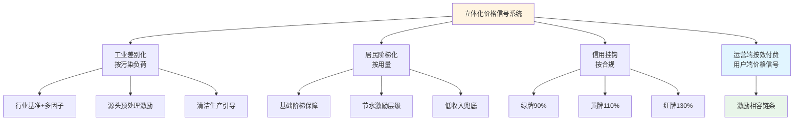

立体化价格信号系统与运营端按效付费机制的协同，形成了"用户—政府—运营主体"完整的激励相容链条——用户根据自身污染负荷、用水量、合规记录付费，政府根据成本监审与定期评估调整收费标准，运营主体根据按效付费考核结果获得服务费——三方在统一的价格信号下追求各自的最优行为，最终实现城市水务系统的高效运作。

## 6.6 按效付费机制落地的前置条件、风险防控与差异化适配

按效付费机制并非可以无差别推广的"万能方案"——其落地必须满足若干前置条件，对管网欠账严重的地区直接套用反而存在财务震荡风险。本节系统梳理落地前置条件、潜在风险与差异化适配方案，为政府管理部门提供"避坑指南"。

### 6.6.1 落地前置条件：管网基础、厂网整合、监管能力三要素

**前置条件一：管网基础完善度**。E20研究院执行院长薛涛对此判断鲜明——**"成都等地已经在实践'按效付费'了，其基础是管网相对较好，从而使得污水量相对下降。考虑到污水处理厂的效率比较高，换成按效付费，双方都合适"**[^3]。这一判断揭示了按效付费的财务可行性，依赖于管网修复、雨污分流、外水撇除等前期工作已基本完成，使进水浓度能稳定维持在100mg/L以上。

**前置条件二：厂网主体一体化或厂网联动考核机制**。北控水务集团副总裁刘伟岩的判断同样具有警示意义——**"如果排水管网和污水处理厂的运营管理不是同一个主体，即厂网分离，实施按效付费，就容易导致责任边界不明晰的问题，因此会存在一定的障碍"**。湖南19个试点项目中14个项目采取污水处理厂及其服务片区管网由同一个主体负责建设运维的模式，5个项目采取污水处理厂、管网分别由不同主体负责建设运维但联动考核的模式——可见厂网一体并非按效付费的绝对前提，但厂网联动考核机制是必备条件。这一前置条件直接对接第5章的组织整合方案——**只有第5章设计的组织整合落地，第6章的按效付费机制才能有效执行**。

**前置条件三：监测数据可信度与成本核算透明度**。多维考核公式的可执行性直接依赖于在线监测、第三方核查、成本监审三个数据基础。监测层面需建立**深圳市恒星物联水位、流量感知设备**[^80]、水质监测设备等技术基础；核查层面需建立独立第三方核查机构与成本监审第三方机构；成本核算层面需按6.4节重构的监审办法严格执行。

### 6.6.2 四类关键风险及防控对策

**风险一：管网薄弱地区直接套用导致企业财务震荡、激励反向逆转**。对于管网基础薄弱、外水入侵严重、进水浓度长期低于50mg/L的地区，直接套用按效付费会导致企业进水浓度无法快速提升、绩效考核长期不达标、服务费大幅缩水、财务震荡——这恰恰可能形成对管网修复的负向激励（企业宁可消极应对、被动等待政府补管网投入，也不主动减薪节支）。

**防控对策**：分阶段过渡。第一阶段（1—2年）实施厂网一体整合、争取专项债与超长期国债推动管网集中修复；第二阶段（2—3年）建立厂网联动考核机制、试点按效付费；第三阶段（3—5年）全面推行按效付费。

**风险二："指标博弈"风险**。多维考核下运营主体可能选择性达标——重点投入产生最大绩效收益的指标，忽视权重较低但长期重要的指标。

**防控对策**：第一，在指标体系中设置"硬约束指标"——如出水水质连续超标重罚、污泥无害化连续不达标暂停付费等，避免运营主体放弃这些底线指标；第二，建立"动态权重调整机制"——每3—5年根据治理重点变化调整指标权重，避免运营主体对固定权重的长期"博弈"；第三，强化第三方核查——通过独立第三方对运营主体的全面绩效进行评估，识别"选择性达标"的策略性行为。

**风险三："重庆水务式压价循环"风险**。缺乏拆分模型与浮动机制易陷入"博弈—压价—亏损—拖欠"负向循环。重庆水务前六期价格3.43→3.25→2.78→2.77→2.98→2.35元/m³的下行轨迹是这一风险的直接警示。

**防控对策**：第一，引入长沙式四段拆分模型——将服务费拆分为建设投资+生产运营变动+生产运营固定+绩效奖惩四段，分别匹配不同性质的风险；第二，引入LPR浮动机制对冲利率风险；第三，建立"基础服务费不低于运营成本60%"[^80]的硬保障，避免企业陷入全面亏损。

**风险四："临颍式索赔"风险**。第4章已引述的临颍县康达环保因"财政依赖陷阱+调价机制缺失+政府担保虚设"被迫诉讼索赔5.78亿元的教训，对按效付费机制设计具有重要警示——按效付费协议必须明确支付保障与第三方资金监管。

**防控对策**：第一，建立第三方资金监管账户——污水处理费征收后专户存储、按合同支付，避免被地方财政挪用；第2，建立政府支付保证金机制——政府方按合同约定金额预存保证金，作为支付保障；第3，建立支付滞期违约金机制——服务费支付滞期超过约定期限的，按LPR上浮一定比例计收违约金，强化政府方按时支付的财务约束。

### 6.6.3 大、中、小三类城市的差异化适配方案

按效付费机制必须根据城市规模、管网基础、财政能力等差异化适配。基于第4章梳理的多地实践与本章前述设计，可形成下表的差异化适配方案：

| 适配维度 | 大城市/东部 | 中等城市/中部 | 小城市/县乡/西部 |
|---|---|---|---|
| **指标体系** | 多维效能权重模型（南京式） | 拆分式+LPR浮动（长沙式） | 浓度削减率单一指标（湘潭式） |
| **计费公式** | 四段拆分（建设+变动+固定+绩效） | 二元结构（基础60%+绩效40%） | 二元结构简化版 |
| **组织协同** | 大型水务集团委托运营+片长制+特许经营新机制 | 国资平台承债式整合 | 县域生态水务集团+省级统筹 |
| **监测能力** | 全要素智慧水务平台+四预功能 | 监管平台+排水单元网格化 | 用电监测+核心节点感知 |
| **成本监审** | 3年定期+季度专项+第三方独立 | 3年定期+第三方核查 | 省级统一组织+市县实施 |
| **配套工具** | 工业多因子+居民阶梯+信用挂钩 | 工业差别化+居民阶梯 | 工业差别化+基础阶梯 |
| **典型代表** | 南京、长沙、武汉、苏州 | 湘潭、海宁、十堰中心城区 | 十堰下属县（郧西、房县）、温州鹿城 |

数据来源：综合本研究第4—6章前述分析。

### 6.6.4 与第5、第7章的对接接口

最后，明确按效付费机制与第5章组织协同方案、第7章多元化投融资方案的对接接口，确保"体制—激励—资金"三位一体的改革闭环能够在落地层面紧密协同：

**与第5章的对接接口**：
- 第5章组织整合方案为按效付费提供主体载体——只有厂网一体的运营主体，按效付费考核才有清晰的责任主体；
- 第5章工程协同方案为按效付费提供物理基础——只有调蓄池、初雨净化、再生水回用等工程协同到位，按效付费的多维指标才能真正达标；
- 第5章智慧调度方案为按效付费提供数据支撑——只有四预功能数字孪生平台，按效付费的实时考核才有可信数据基础。

**与第7章的对接接口**：
- 按效付费节约资金作为长效债务还款现金流——湘潭年节约5000多万、长沙年节约约1.4亿元、南京半年节省3500万元等节约资金，可作为长期专项债与超长期国债的还款保障，支撑管网改造、雨污协同设施建设等长期投资；
- 绩效考核结果作为社会资本回款保障——按效付费机制将社会资本的回款从"依赖地方财政相机决策"转化为"依据绩效考核结果按合同执行"，大幅降低社会资本的政策性风险，为第7章PPP/特许经营新机制的落地提供激励基础；
- 多维指标考核作为厂网河湖一体化协同效能的财务量化载体——按效付费的五维度指标体系，将第5章设计的厂网河湖+雨污协同效能（外水入侵率34%→10%、进水浓度提升、错峰处理、资源化收益）转化为运营主体的财务激励，为第7章数据资产化与资源化收益反哺提供财务激励基础。

总结本章设计，**按效付费价格机制与成本监审制度重构是破解核拨制激励扭曲的核心方案**——五维度多层级绩效指标体系将环境治理实效转化为可量化的考核坐标；二元结构计费公式与四段拆分动态调整规则在"保障基本运营"与"激励效能提升"之间建立财务平衡；污水处理费向"污水收集处理费"扩展的制度路径破解了管网运维与雨污协同的资金通道困局；双轨并行成本监审办法与第三方审核机制保障了价格执行的公正性；工业差别化、居民阶梯化、信用挂钩三类配套工具构建了立体化价格信号系统。本章设计与第5章组织协同方案、第7章多元化投融资方案紧密对接，共同构成"体制—激励—资金"三位一体的改革闭环，为政府管理部门提供了直接可操作的制度工具集。

# 7 多元化投融资与财政资金统筹方案

第3章已经定位，未来五年城市水务系统的资金需求将达到10万亿元以上量级，远超污水处理费体系（按全国年800—1000亿元规模、5年合计4000—5000亿元）的承载能力——这一量级落差决定了核拨制改革不能仅依靠"调高污水处理费"或"加大财政补贴"的单点调整，必须通过资金通道的系统性重构加以化解。第5章设计的"厂网河（湖）+雨污"一体化协同运作机制为资金统筹提供了组织载体与工程依据；第6章重构的"基础服务费+绩效服务费"二元结构与"污水处理费向污水收集处理费扩展"的制度路径，为长期债务还款提供了可预测的现金流锚点。然而，体制整合与激励重构的物理收益若不能转化为对中央资金、专项债、社会资本、绿色金融的有效撬动，仍可能在落地阶段陷入"有方向、无资金"的困境。

本章作为破解核拨制资金通道狭窄困境的核心方案，遵循"资金来源—组合工具—撬动模式—补贴转型—创新路径"五位一体的设计逻辑：首先系统梳理中央与地方财政专项、超长期特别国债、地方专项债、绿色金融、社会资本与EOD模式等多元资金渠道的政策边界与适配条件；进而设计"项目打包+稳定现金流+市场化融资"的区域统筹撬动模式，破解第3章定位的单一项目专项债承载能力不足瓶颈；重构财政补贴从"补建设"向"补运营、补绩效"的转型机制，配合第6章按效付费形成正向激励闭环；探索数据资产化、再生水与污泥资源化、碳资产、水权交易等创新路径，为运营主体开辟非财政性稳定现金流；最终整合为"污水处理费+雨水管理费/财政专项+多元化投融资"三通道资金保障体系，并按城市规模差异化适配。本章方案与第5章协同机制、第6章按效付费机制构成"体制—激励—资金"三位一体改革闭环，为第8章可操作方案集提供资金保障基础。

## 7.1 多元化资金渠道的政策边界与适配条件

支撑10万亿元级资金缺口的破解，必须充分激活每一类资金渠道的政策空间。本节系统梳理五大类资金渠道的政策依据、适用范围、申报路径与组合限制，构建为后续撬动模式提供工具箱的"资金清单"。

### 7.1.1 中央财政专项：管网补助、海绵示范、城市更新三大主线

中央财政专项是我国水务领域规模最稳定、政策导向最明确的资金来源，呈现"管网补助—海绵示范—城市更新"三大主线并行格局。

**第一主线：城市管网及污水处理补助资金**。该资金以《城市管网及污水处理补助资金管理办法》（财建〔2021〕144号）为基本制度依据，2024年财政部以财建〔2024〕139号补充通知进一步细化操作要求，并在2024、2025年连续两年下达预算指标——**2024年6月7日财政部以财建〔2024〕145号下达2024年城市管网及污水处理补助资金预算，用于支持系统化全域推进海绵城市建设示范、实施城市更新行动**[^36][^34]；**2025年6月9日财政部以财建〔2025〕147号下达2025年城市管网及污水处理补助资金预算，用于支持实施城市更新行动**[^34]。资金支出列政府收支分类科目"211.节能环保支出"，要求**资金安排方案应于收到资金60天内报财政部、住房城乡建设部备案**[^34]，并按要求加强资金监管和预算执行、严禁挤占挪用、确保资金使用安全规范有效。这一资金以"省级统筹、项目法管理"为基本模式——以四川省为例，**四川省财政厅以川财建〔2024〕99号通知将2024年中央城市管网及污水处理补助资金预算下达成都、绵阳市财政局，要求各市于8月20日前确定资金安排方案并报省厅备案**[^39]。

**第二主线:海绵城市建设示范补助**。该主线已形成成熟的"三年示范期+亿元级补助"模式。**松原市2022年6月入选第二批全国系统化全域推进海绵城市建设示范城市，三年示范期内计划实施7大类143个项目，总投资61.86亿元，其中海绵相关投资30.02亿元**[^38]；**佛山2023年成功入选国家第三批系统化全域推进海绵城市建设示范城市，获得中央财政三年9亿元的专项补助资金**（前文章节已引）。海绵城市示范补助的资金特征是"集中投放、综合性强"——支持范围涵盖雨水主干系统改造、内涝积水点治理、雨污分流改造、老旧小区改造、公园绿地海绵化等系统化工程，与本研究第3章的雨洪协同设施投资缺口高度对接。

**第三主线：城市更新行动补助**。该主线呈现"项目驱动→机制驱动"的清晰演进路径。**2024年首批确定15个试点城市（石家庄、太原、沈阳、上海、南京、杭州、合肥、福州、南昌、青岛、武汉、东莞、重庆、成都、西安），政策导向以"项目驱动"为主，资金重点支持地下管网、污水厂网等基础设施补短板项目**[^35]；**2025年扩围至20个城市（北京、天津、唐山、包头、大连、哈尔滨、苏州、温州、芜湖、厦门、济南、郑州、宜昌、长沙、广州、海口、宜宾、兰州、西宁、乌鲁木齐），政策导向开始从单一"项目建设"转向"项目建设+机制探索"，新增了对消费型基础设施和长效机制培育的要求**[^35]；**2026年4月发布的新政策入选城市数量与首批相同（不超过15个），但申报门槛从"地方政府债务风险低"放宽至"债务风险可控"，支持范围扩大至所有地级及以上城市；同时政策强制要求入选城市建立三年期实施方案和项目储备、体检评估体系，标志着支持体系正式进入强调"长效机制"和"可持续性"的成熟阶段**[^35]。城市更新补助的政策演进对本研究的关键启示在于——**中央资金支持已从"资助单个项目落地"转向"推动地方构建一套涵盖规划、融资、实施、运营的可持续制度体系"**[^35]，这与本研究"体制—激励—资金"三位一体改革的内在逻辑高度同构。

**2025年城市更新六大领域**中的"地下管网改造"被明确界定为**"城市更新中相对较为隐蔽但却至关重要的一环。它具有较强的公益属性，关乎城市的整体安全和居民的基本生活保障"**[^34]，要求项目实施时**"进行全面细致的前期勘察、严把工程质量关、建立完善的后期维护和管理机制"**[^34]——这一规定与本研究第6章按效付费机制对管网建设质量的考核要求形成政策协同。

### 7.1.2 超长期特别国债：千亿级"两重"资金的水务投向

超长期特别国债是2024年以来出现的规模最大、期限最长的中央层面建设资金通道。**2024年起中国连续发行超长期特别国债，不列入赤字，用于支持国家重大战略和重点领域安全能力建设、大规模设备更新和消费品以旧换新。其中，2024年发行1万亿元、2025年发行1.3万亿元；2026年发行1.3万亿元，与去年相当**[^38]。

国债资金对水务领域的支持力度极为可观。**2024年中国安排超长期特别国债7000亿元用于1465个"两重"项目建设，支持城市地下管网更新改造超过8万公里、长江沿线城市污水管网建设改造1.3万公里、"三北"沙化土地综合治理等近4000万亩等，全年完成投资超过1.2万亿元；2025年用于"两重"建设的超长期特别国债资金规模进一步增加到8000亿元，支持了1459个"硬投资"项目建设**[^38]。**2026年直接支持"两重""两新"的国债资金达1.25万亿元，包括8000亿元支持"两重"、2000亿元支持大规模设备更新、2500亿元支持消费品以旧换新**[^38]。

国债资金对地方水务项目的精准穿透在多地获得实证。**应城市2025年累计获批城市地下管网项目5个、资金27429万元；近期国家发展改革委下达城市地下管网管廊建设改造领域2026年提前批超长期特别国债投资计划，应城市3个排水项目获批超长期特别国债资金17929万元，建成后将进一步完善主城区排水系统布局，补齐城市基础设施短板，持续提升城市防洪排涝能力和污水收集处理能力**[^38]。长沙市同样**抢抓政策机遇，编制城区地下管网管廊建设改造方案，成功争取2025年超长期特别国债资金20.68亿元**（前文章节已引）。这些案例提示，**超长期特别国债的水务投向已形成"中央总盘+省级统筹+市县申报"的成熟机制，地级以上城市单批次申报规模可达1.7—21亿元量级**。

超长期国债的核心制度优势在于**"超长期限+低成本+中央统筹"**——**超长期特别国债凭借20至50年超长期限、低成本、中央统筹等优势，精准匹配了重大项目、设备更新、消费提振等长周期、大投入、惠长远领域的资金需求**[^38]。这一资金特征与本研究第3章定位的城市水务系统全生命周期成本特征——大额投资、长期回收、跨代际效益——高度匹配，是破解管网建设资金缺口的最具战略意义的资金工具。

### 7.1.3 地方专项债：单项目额度受限与区域统筹的必要性

地方专项债是支撑水务领域建设投资的另一主力通道，但其使用受单项目还款能力的根本性约束。第3章已经引述："**单一新建污水项目的负荷是逐渐增加的，在专项债常见的5—10年期限内、按发行利率与利息保障倍数1.1要求测算，单个新建污水项目可承担的专项债额度相对于投资额占比很低。因而，在为新建污水处理项目申报专项债额度时，通常需要统筹某一区域整体的污水处理费收入**"[^42]。

各地实践揭示专项债适配水务项目的两类典型路径：**第一，"小额专项债+多源资本金"路径**。陕西省平利县城污水处理厂及城区雨污分流改造项目计划总投资8000万元，其中**申请专项债券资金4000万元（占50%）、地方政府自筹资金4000万元；2021年4000万元10年期专项债券资金已于2021年10月拨付县级财政专用账户，截至2022年8月专项债券资金支出4000万元，资金使用进度为100%；项目收益通过自来水公司在收取自来水费时代征收**[^40]。**第二，"大额专项债+土地出让+污水处理收益"路径**。安徽省砀山县城市黑臭水体治理项目计划投资21311.41万元，其中**项目资本金为4811.41万元（占22.58%）、拟通过地方政府债券筹资16500.00万元（占77.42%）；项目主要收入为污水处理收入和土地出让收入；融资平衡覆盖倍数为3.85倍，能够合理保障融资资金的本金和利息**[^40]。

专项债对污水处理领域的适配性源于两项关键制度优势：**第一，污水处理费的法定属性满足专项债还款来源要求**——**根据《污水处理费征收使用管理办法》（财税〔2014〕151号），由排水单位和个人缴纳的居民污水处理费属于政府非税收入，全额上缴地方国库，纳入地方政府性基金预算管理，实行专款专用。该机制完全符合相关法规对专项债还款来源的要求**[^42]；**第二，污水处理PPP项目结算单价具有政府调度灵活性**——**污水处理PPP项目结算污水处理费通常都包括使用者污水费和政府补贴两部分，由政府统收统支，分别来自政府性基金收入和一般公共预算支出。这给予了政府方相关资金调度更高的灵活性**[^42]。

但专项债对单一新建项目的承载能力存在结构性瓶颈：**单一新建污水项目的使用者污水费扣除项目日常经营成本后的净收入已经处在较低水平。在专项债常见的期限内（5—10年），按照专项债发行利率和利息保障系数至少要达到1.1的要求测算，单个新建污水项目可承担的专项债额度相对于投资额占比很低**[^42]。这一瓶颈正是7.2节"项目打包+稳定现金流+市场化融资"撬动模式的逻辑起点。

### 7.1.4 绿色金融与EOD模式：撬动社会资本的新型工具

绿色金融与EOD模式构成激活社会资本的两类创新工具。

**绿色金融层面**，水务项目作为典型的绿色低碳项目获得多类金融机构的差异化支持。**齐鲁银行滨州博兴支行对博兴县经济开发区中水回用建设项目（总投资1.88亿元、年产高品质再生水1825万吨）的授信实践具有标杆意义——客户经理们将目光投向项目自身土地、设备和未来收益的稳定性与可预测性，量身定制了"前低后高"的分期还款计划：项目建设期只还息不还本，投产后的前三年每年本金还款额设定为500万、600万、800万的低位区间，待项目满产达效后再适当提高还款额度**[^40][^44]。这一案例的关键启示是——**绿色金融对水务项目的风险评估已从传统的"抵押物+财务报表"转向"项目自身收益的稳定性与可预测性"**[^40]，对应的关键支撑是"被列入中央预算内投资的政策导向"和"长期稳定的购水合同"两大确定性来源。

更具创新性的是**齐鲁银行滨州分行与企业合作开展的"氢气回收量挂钩可持续发展挂钩贷款"——这一创举打破了固定利率的僵局，巧妙地将贷款利率与企业氢气回收量、减排成效直接绑定**[^44]。这一机制的精妙之处在于将企业的减排行为直接转化为利率优惠的财务激励，与本研究第6章按效付费机制在用户端的延伸具有同构性，可作为7.4节碳资产收益反哺路径的设计参照。

绿色债券层面，**招商证券2023年绿色投行项目数量同比增长超过30%，共计完成绿色投行项目45个，包括3个IPO项目、7个再融资项目和35个绿色债券项目，合计承销金额196.63亿元，发行总规模1335.96亿元；资管业务方面新增绿色债券投资金额同比增长超4倍，新增投资42笔，合计金额20.84亿元；发行主体所属行业涉及水务、新能源、绿色金融等绿色产业或相关支持领域；募集资金用途包括污水处理、水电建设、绿色产业基金注资绿色行业等多种绿色金融领域**[^42]。这一数据反映出，**水务领域已经成为绿色债券市场的稳定标的，AA+评级及以上水务集团完全有能力通过绿色债券进入百亿级资本市场**——这正是第4章梳理的海宁、十堰水务集团获得AA+评级的财务价值所在。

**EOD（生态环境导向的开发）模式**则是2019年以来快速成熟的另一类创新工具。**生态环境部对EOD的官方定义是：以生态保护和环境治理为基础，以特色产业运营为支撑，以区域综合开发为载体，采取产业链延伸、联合经营、组合开发等方式，推动公益性较强、收益性较差的生态环境治理项目与收益较好的关联产业有效融合，统筹推进，一体化实施，将生态环境治理带来的经济价值内部化**[^37]。EOD模式对水务领域的支持力度已经形成"政策—资金—试点"完整闭环：**2021年生态环境部批复了第一批36个试点项目、2022年又批复了58个试点项目；2021年财政部正式发布《重点生态保护修复治理资金管理办法》提出工程总投资10—20亿元补5亿、20—50亿元补10亿、50亿元以上补20亿，最高项目奖补资金比例达60%、金额达20亿；银行配合度较高，截止2021年底国开行对首批试点项目累计授信额度约520亿元**[^37]。

EOD模式的水务领域应用与本研究的"厂网河湖+雨污"一体化思路高度契合——通过将公益性强、收益差的厂网建设与收益较好的关联产业（如再生水回用、流域沿岸土地开发、水环境治理后的旅游休闲产业）打包，实现整体项目自我造血。这正是7.2节区域统筹撬动模式的关键工具选项。

### 7.1.5 社会资本：新机制特许经营与"分手潮"教训

社会资本通过PPP/特许经营参与水务项目，是过去20年我国污水处理行业市场化发展的核心驱动力，但2025年以来已进入"合规化转型"新阶段。第4章已经系统梳理了115号文与17号令下的新机制特许经营框架，以及"分手潮"教训形成的四类制度要素（风险分担、回报安排、支付保障、绩效约束）。本节进一步梳理几类与本研究核心命题相关的典型案例。

**雅安市城镇污水处理设施建设PPP项目**作为四川省唯一典型案例入选国家发改委绿色PPP项目典型案例名单。该项目**主要包括污水处理厂新建工程5万m³/d、姚桥再生水厂1万m³/d、大兴再生水厂0.2万m³/d、乡镇污水处理站51座（共涉及51个乡镇、总规模1.1336万m³/d）、新村聚集点污水处理设施16座（总规模0.049万m³/d）、新建或改建污水处理站配套管网共261.81km、污水提升泵站1处0.08万m³/d及污水处理设施运行监管信息化平台**[^42]。雅安项目的关键示范价值在于——**采用PPP模式推进城市公用基础设施建设的首个项目，集污水处理厂、再生水厂、乡镇污水处理站、新村污水处理、配套管网、信息化平台为一体的全要素打包**——为多类型、多空间、多设施的协同投资提供了直接参照。

**界首市污水处理PPP项目（第二批）**则提供了"15个乡镇污水处理设施+城区配套+入河排污口整治"的县域全域整合范本。该项目内容包括**界首市15个乡镇污水处理设施（含11个污水处理厂及配套管网和4座一体化泵站）、界首市靳寨就业创业园污水处理厂及配套管网、界首市入河排污口整治工程，项目总投资约为4.87亿元；其中乡镇污水处理厂部分近期设计总规模为9100m³/d、远期15500m³/d，配套污水管网约161.87km、配套接户管229.80km；天津创业环保集团股份有限公司于2019年3月与界首市住房和城乡建设局签订《特许经营协议》后，加紧开展项目建设工作**[^42]。该项目的核心亮点是**"坚持规划引领，探索出一条因地制宜的污水处理项目建设经验，项目设计规模符合实际需求，采用成熟技术工艺，建设模式更经济"**，运营方面**"以先进高效的智慧水务联接理念为指导，整体设立'1个调度中心'，推行管理标准的统一和资源共享"**[^42]——这一"调度中心+智慧水务+管理标准统一"的运营设计，与本研究第5章第三层智慧调度中心的架构设计高度同构。

**沛县供水PPP项目**是江苏省和国家PPP双示范项目，**按照"水务城乡一体、供排一体、厂网一体"的原则，将沛县城乡供排水业务打包整体交由沛县兴蓉水务发展有限公司负责实施，其中市政污水处理项目3.15万m³/d、总计13个建制镇污水处理厂，特许经营期30年，项目计划投资总额约2.5亿元**[^42]。沛县项目作为运营层面的标杆——**以龙固镇污水处理厂为控制中心设立中央控制系统，可实现对各厂区全方位的监视及调控，是实现全方位无人值守的核心厂站，实现设备问题、工艺情况精准发现，减少中间环节**[^42]——直接验证了第5章智慧调度中心模式在县域层面的可复制性。

**都江堰市供排水系统提升PPP项目**则代表了"水管家"全链条特许经营的最高水平。**该项目由中国铁工投资建设集团牵头组成的联合体负责投资建设，中铁水务集团承担运营管理职责；项目覆盖都江堰市全域71万余人，内容包括供水系统改造、城镇污水处理、村镇处理站建设、管网升级以及供排水智能监管平台搭建等全方位水务服务；特许经营期长达30年；目前已经接收运营的17座城镇污水处理厂及62座农村污水处理站，设计总处理规模达到18.44万吨/日；处理设施采用了先进的氧化沟/AAO+深度处理工艺，出水水质严格执行《四川省岷江、沱江流域水污染物排放标准》；项目还创新性地引入了供排水智能监管平台，通过物联网、大数据等现代信息技术，实现了对全市水务系统的实时监控和智能化管理**[^43]。22.71亿元投资体量、71万人口覆盖、30年特许经营期的组合，为中等城市层面"水管家"模式提供了完整的财务与运营参照。

需要警示的是，特许经营领域的"分手潮"教训不容忽视。**昆明市投资约43亿元的新建第十五水质净化厂BOT项目，2023年定标、2025年却因政策调整而不得不解除原合同、重新招标；贵州某地价值8亿元的工业废水厂，由于费用高企和管理矛盾，建成验收后被地方政府强行接管**[^40]。这些案例**背后，折射出地方财政对污水项目的"兜底"能力在下降，对高成本运营的耐受度在降低**[^40]——这就要求新机制特许经营必须配套按效付费的合理回报机制与第三方资金监管的支付保障，避免重蹈覆辙。

### 7.1.6 五大资金渠道的政策边界与组合限制汇总

将五大类资金渠道的政策依据、适用范围、申报路径与组合限制系统整合：

| 资金渠道 | 政策依据 | 适用范围 | 申报路径 | 组合限制 |
|---|---|---|---|---|
| 中央财政专项 | 财建〔2021〕144号、财建〔2024〕139号、财建〔2024〕145号、财建〔2025〕147号 | 海绵示范、城市更新、管网及污水处理 | 省级统筹、项目法管理、60天内备案 | 不得挤占挪用、与专项债合理衔接 |
| 超长期特别国债 | 国务院"两重""两新"安排 | 地下管网、长江沿线污水管网、设备更新 | 国家发改委下达投资计划、提前批+正式批 | 与中央预算内投资协调 |
| 地方专项债 | 财税〔2014〕151号、各省地方政府债券管理办法 | 有一定收益的公益性项目（污水处理、管网） | 省级统筹、覆盖倍数1.1—1.2倍 | 单项目还款能力受限、需区域统筹 |
| 绿色金融 | 绿色金融政策、央行绿色信贷指引 | 污水处理、再生水、节能减排、生态修复 | 银行信贷+绿债承销+ESG披露 | 项目需符合绿色目录、需稳定现金流 |
| 社会资本（PPP/特许经营） | 国办函〔2023〕115号、国家发改委等2024年第17号令 | 新建/存量污水处理厂、管网、再生水 | 全国PPP项目信息系统、特许经营方案 | 民营股权≥35%、政府代表不控股、不新增财政支出责任 |
| EOD模式 | 财政部《重点生态保护修复治理资金管理办法》、生态环境部EOD通知 | 生态环境治理+关联产业组合开发 | 省级试点+国家试点常态化申报 | 公益性项目与收益性产业需有效融合 |

这一汇总为后续7.2节撬动模式设计提供了清晰的工具箱清单——**每一类资金渠道都有其适用边界，单一渠道难以独立覆盖10万亿元级缺口；只有通过"项目打包+稳定现金流+市场化融资"的组合工具，才能将分散的资金渠道整合为系统化的资金保障**。

## 7.2 "项目打包+稳定现金流+市场化融资"撬动模式

破解第3章定位的单一新建污水项目专项债承载能力不足瓶颈，需要从根本上改变"项目对项目"的传统申报模式，转向"区域统筹+组合工具"的撬动模式。本节基于多地实践提炼撬动模式的逻辑机理与操作要点。

### 7.2.1 项目打包逻辑：多厂+管网+多源收益的整合

项目打包是区域统筹模式的工程基础。其核心逻辑是通过将多个零散项目打包为综合性投资项目，扩大总投资规模、整合多源收益、形成单项目无法承载的融资能力。

**定安县建制镇污水处理项目**提供了县域层面项目打包的标杆案例。**项目类型为新建厂网一体化项目（4座污水厂+配套管网）；建设规模总处理规模3000m³/d、配套管网总长98.06km；总投资2.48亿元；专项债额度18000万元（占比72%），期限15年，年利率2.1%—2.6%；项目单位为定安县公共事业有限公司；获批批次为2024年海南省专项债券（二期）等四批次，共计发行4500万元**[^41]。该项目的核心亮点与实操策略可归纳为三个层次：

**第一，规划背书提升申报优先级**——项目属于县城及建制镇污水处理空白区域补短板项目，**纳入《定安县"十四五"生态环境保护规划》《海南省城镇污水处理设施建设"十四五"规划》，符合国家及省级专项债支持方向，通过"规划背书"提高申报优先级**[^41]。这一"规划入库"路径是任何专项债申报的基础前提。

**第二，收益自平衡多源设计**——**核心收益污水处理费（0.85元/m³），按设计规模3000m³/d测算，年污水处理费收益93万元；补充收益为定安县中心城区土地征收片区开发地块的国有土地等使用权出让收入；运营成本补贴由政府方通过绩效考核后支付给中标方；全生命周期总收益3.08亿元，覆盖倍数1.31倍，满足海南省1.2倍要求**[^41]。这一"污水处理费+土地出让+运营补贴"的多源收益结构，是支撑专项债覆盖倍数达标的关键设计。

**第三，合规要件高效办理**——**项目采用"存量用地+简化审批"模式，4座污水厂均选址于建制镇规划工业用地，无需新增建设用地，用地预审与选址意见书办理周期短；环评采用"区域环评+项目备案"模式确保要件齐全后及时申报**[^41]。这一设计直接缩短了项目从立项到融资的周期。

定安经验提炼为可复制的项目打包逻辑：**县域小体量项目可采用"多厂打包+管网配套"模式，扩大总投资规模，整合收益来源，解决单一项目收益不足问题；充分利用地方政策红利，争取补充收益及运营补贴，补充收益缺口；选址优先采用存量用地，简化用地审批流程，缩短申报周期**[^41]。

**合肥市西部组团污水处理厂二期工程**则代表了大城市层面"提标改造+资源化"的项目打包样本。**项目类型为扩建+提标改造项目；建设规模新增处理规模20万m³/d、总规模达到30万m³/d，出水标准由一级A提升至符合《巢湖流域城镇污水处理厂和工业行业主要水污染物排放限值》（DB34/2710-2016）标准；总投资14.85亿元；专项债额度6.5亿元（占比43.7%、剩余资金为财政统筹资金），期限20年、年利率2.62%—3.27%；项目单位为合肥市水务环境建设投资有限公司；获批批次为2022年安徽省专项债第四十期等6批次，累积发行金额6.5亿元**[^41]。

合肥项目的关键创新是**"提标改造+资源化利用双驱动"**——**项目不仅满足环保标准升级要求，还配套建设再生水回用系统，年供水量5000万m³，收益来源多元化，增强自平衡能力；污水处理费1.3元/吨（以后每5年上涨10%），按新增20万m³/d测算，年污水处理费收益1亿元；全生命周期总收益20.7亿元，覆盖倍数1.42倍，满足安徽省1.2倍要求，偿债保障能力强**[^41]。该项目的核心启示是：**大城市污水处理项目可结合提标改造与资源化利用，进一步拓展再生水、污泥处置等收益渠道，提高收益覆盖倍数；长期协议（如再生水供应协议、污泥处置协议）是保障收益稳定的关键，协议期限需与专项债存续期匹配**[^41]。

将定安、合肥、雅安三个项目的打包模式整合：

| 项目特征 | 定安（县域空白） | 合肥（大城市提标） | 雅安（市域全要素） |
|---|---|---|---|
| 项目数量 | 4座厂+管网 | 1座厂扩建+再生水回用 | 5万吨厂+2再生水厂+51乡镇站+16新村站+261公里管网+泵站+信息化平台 |
| 总投资 | 2.48亿元 | 14.85亿元 | 数十亿元（PPP模式） |
| 专项债占比 | 72% | 43.7% | 部分专项债+社会资本+财政 |
| 收益来源 | 污水处理费+土地出让+运营补贴 | 污水处理费+再生水回用收益 | 污水处理费+政府付费+用户付费 |
| 覆盖倍数 | 1.31倍 | 1.42倍 | — |
| 关键启示 | 多厂打包+多源收益+简化审批 | 提标改造+资源化+长期协议 | 全要素打包+智慧水务+全域覆盖 |

数据来源：综合自[^41][^42]。

### 7.2.2 稳定现金流构造：四源收益的分类与匹配

稳定现金流是市场化融资的财务基础。基于多地实践，可归纳出四类典型现金流来源及其与不同融资工具的匹配关系：

**第一类:污水处理费**——这是核心稳定来源，对应运营期的处理水量×单价。第6章已设计的按效付费机制下"基础服务费60%+绩效服务费40%"的二元结构，使污水处理费的现金流可预测性大幅提升——基础服务费部分可视为类固定收益、绩效服务费部分可视为浮动收益，两者组合形成"主-辅"现金流结构。

**第二类:政府运营补贴/服务费**——通过政府购买服务方式按合同约定支付。**长沙乡镇污水处理设施建设和运行补助资金以"建设补助+以奖代补"为主要形式**[^37]，**云南省2026—2028年省级统筹每年不少于10%的农村公益事业建设财政奖补资金支持农村生活污水治理**[^37]——这些专项补助形成的稳定现金流，可作为低收益项目的"兜底"来源。

**第三类:资源化收益**——再生水使用费、污泥制建材收益、水权交易收益等。**博兴县中水回用项目通过国家电厂的配套工程拥有长期稳定的购水合同**[^40][^44]，**平湖市以1106.8万m³"超滤+反渗透"高品质再生水优先保障了总产值约550亿元的两个重大产业项目运行**[^93]——这些长期稳定的购水协议是再生水项目获得绿色金融授信的关键支撑。

**第四类:土地出让与片区开发收益**——结合项目周边土地综合开发的收益。**砀山项目主要收入为污水处理收入和土地出让收入，融资平衡覆盖倍数达3.85倍**[^40]——这一案例提示，土地出让收入对县域专项债覆盖倍数有重大支撑作用，但需注意土地出让的政策周期性风险。

四类现金流的组合规则：**核心源（污水处理费）必备+辅助源（政府运营补贴/资源化/土地出让）至少1类+长期协议背书**。这一组合规则为7.5节三通道资金保障体系提供了现金流基础。

### 7.2.3 市场化融资组合工具：专项债+EPC+特许经营+银行授信

市场化融资工具的组合使用是撬动模式的资金侧。基于多地实践可提炼四类标准化组合：

**组合一：专项债主导+财政补充**。适用于现金流相对稳定但社会资本兴趣较弱的县域项目。如定安项目"专项债72%+地方自筹+争取上级补助"。

**组合二：专项债+EPC一体化**。**漳州金峰开发区污水管网更新改造工程总承包（EPC）项目估算或投资概算超2.8亿元；中交一公局集团联合体中标淄博市张店区市政管网综合治理工程总承包项目，联合体投标报价为13.21亿元；中国五冶中标顺庆区荆溪片区污水管网改造项目，中标价超1.01亿元**[^36]。EPC一体化的优势是建设期工程总承包+运营期服务费支付的清晰对接，但纯EPC模式不直接解决长期运维资金保障问题。

**组合三：专项债+特许经营新机制**。如南京江宁科学园五期项目（前文章节已引）——专项债解决建设期资本金缺口、特许经营协议明确40年长期运营期、按效付费机制保障合理回报。这一组合是当前最具综合性的组合工具。

**组合四：EOD+绿色金融+特许经营**。适用于流域综合治理、生态环境与产业开发组合的复杂项目。EOD模式通过将公益性项目与收益性产业整合，实现整体项目的自平衡；绿色金融提供长期低成本资金；特许经营提供长期运营保障。**国开行对首批EOD试点项目累计授信额度约520亿元**[^37]——这一规模显示EOD模式具有重大的资金撬动潜力。

### 7.2.4 AA+信用评级培育与资产评估划转的关键操作

AA+信用评级是水务运营主体进入资本市场的"通行证"。第4章已经引述海宁水务集团获得AA+评级、十堰生态水务集团获评AA+主体长期信用等级（前文章节已引）的实践。这里进一步梳理AA+信用评级培育的关键操作。

**第一，资产规模门槛**——通过资产评估划转将分散的厂、网、泵站资产集中注入运营公司。**长沙水业集团首批3区已注入约6.2亿元，有效降低企业负债率**（前文章节已引）；**杭州市水务集团服务面积从一体化改革前约630平方公里扩展到约7000平方公里，服务人口从约300万增至超1000万**（前文章节已引）——这些资产规模扩张是AA+评级的物质基础。

**第二，现金流稳定性**——按第7.2.2节的"四源收益+长期协议"机制构造稳定现金流，作为信用评级的核心支撑。

**第三，治理结构规范**——按现代企业制度建立董事会、监事会、经理层的规范治理结构，保证决策、执行、监督的相互制衡。

**第四，信息披露透明**——按公司债、绿色债等公开市场信息披露要求建立常态化的财务报告、绩效披露、债务披露机制。

资产评估划转的具体操作可借鉴长沙模式：**"探索将污水管网运维费纳入污水处理成本，使管网由公益性资产转变为经营性资产，成功推动与国开行的融资合作"**（前文章节已引）。这一操作的关键创新是**资产属性的法律转化——从公益性资产向经营性资产的转化是其能够进入运营公司资产负债表、配套现金流形成稳定还款来源的根本前提**。

### 7.2.5 大、中、小三类城市的撬动模式差异化适配

将本节设计的撬动模式按城市规模差异化适配：

| 适配维度 | 大城市/东部 | 中等城市/中部 | 小城市/县乡/西部 |
|---|---|---|---|
| **项目打包规模** | 数十亿元级（合肥14.85亿、雅安项目级） | 5—10亿元（湘潭、十堰中心城区） | 1—5亿元（定安、平利、界首） |
| **现金流结构** | 污水处理费+再生水+碳资产+数据资产 | 污水处理费+土地出让+运营补贴 | 污水处理费+省级补助+乡镇配套 |
| **融资组合** | 绿色债券+特许经营新机制+银行授信 | 专项债+特许经营+EPC | 专项债+EOD+财政补助 |
| **信用评级** | AAA-AA+ | AA+ | AA-AA+ |
| **运营主体** | 大型水务集团 | 国资水务平台 | 县域生态水务集团 |
| **典型代表** | 南京、长沙、合肥、苏州 | 湘潭、十堰中心城区、雅安 | 定安、平利、界首、沛县 |

数据来源：综合本节前述分析。

## 7.3 财政补贴从"补建设"向"补运营、补绩效"转型

财政补贴机制的转型，是配合按效付费机制形成正向激励闭环的关键环节。第2章已揭示当前"重建设轻运维"的传统倾向——大量园区、乡镇污水处理设施"晒太阳""睡大觉"的根源之一就是建设资金到位后，运营资金缺乏长效保障。本节设计补贴机制的三类转型路径与配套保障机制。

### 7.3.1 长沙"以奖代补":运营期补贴与绩效挂钩的标杆

长沙市2024年10月印发的《长沙市乡镇污水处理设施建设和运行补助资金管理办法》提供了"以奖代补"机制的完整范本。该办法的核心设计可概括为"双轨补贴+综合评估"：

**第一轨:新建乡镇污水处理厂配套管网补助**——**新建配套管网（不包括入户管网）应符合本地区排水设施规划，符合省、市相关技术标准要求，完成竣工验收，按一定标准给予建设补助，每个乡镇根据实际完成公里数给予补助，补助范围不超过5公里，具体要求、奖补标准等由市住房和城乡建设局会同市财政局组织申报时予以明确**[^37]。这一轨保留了传统的建设期补贴功能，但通过"竣工验收+实际公里数+补助上限"三道控制确保资金不浪费。

**第二轨:乡镇污水治理质效提升评估"以奖代补"**——**对各乡镇污水治理管理成效和属地污水处理厂处理规模、运行模式和成本、整体负荷率、进出水水质指标、智慧化管理等运行效果进行综合评估，对实施成效好的乡镇，按三档给予资金奖补支持。具体评估由市住房和城乡建设局会同市财政局组织开展，资金用于乡镇污水处理设施建设或运行维护管理**[^37]。这一轨是机制创新的核心——**将传统的"建好就给钱"转化为"运行好才给钱"，并通过"处理规模+运行模式和成本+整体负荷率+进出水水质指标+智慧化管理"五维度综合评估**，与第6章按效付费机制的多维度指标体系形成跨层级的政策协同。

长沙模式的另一重要设计是**专项补助资金支出范围的清晰界定**——**专项补助资金使用范围包括（一）新建乡镇污水处理厂配套管网补助、（二）乡镇污水治理质效提升评估"以奖代补"、（三）乡镇污水治理相关专题调研、培训和课题研究有关工作经费等**[^37]。这一界定将"建设、绩效、能力建设"三类支出明确分类，避免了资金的混用与挤占。

### 7.3.2 云南农村污水治理:省级统筹+群众参与的"15%专项"模式

云南省2026年印发的关于农村公益事业建设财政奖补资金支持农村生活污水治理的通知，提供了省级层面"专项比例+程序规范+优先支持"的完整设计。

**第一，专项比例保障**——**2026—2028年，省级统筹每年不少于10%的农村公益事业建设财政奖补资金支持农村生活污水治理。奖补资金按照因素法下达，项目法管理**[^37]。这一"不少于10%"的比例保障，是确保专项资金投入稳定性的关键制度设计。

**第二,严格的支持范围**——**支持公共区域的农村接户管、支管、主管、隔油隔渣池、检查井、清扫井等收集系统，以及因村施策采用"小三格"、"大三格"、氧化塘、土壤渗滤系统及一体化设施等符合村庄实际需求的末端处理系统等，不包含农户院内管网等户内设施建设；县（市、区）优先选择生态化、资源化利用模式，与农村厕所革命有效衔接，一体推进治理；奖补资金不得用于农村生活污水治理建设以外的其他内容**[^37]。这一界定明确将"公共区域"与"农户院内"区分开来，体现了财政资金的公共属性边界。

**第三,程序规范与群众参与**——**坚持自下而上、村民"一事一议"民主议定的原则，实行村级申报、乡（镇）级初审、县（市、区）及州（市）分级审核、省级备案的管理制度；项目以县（市、区）为单位申报，每个项目不得超过100万元；申报项目需符合村庄规划要求；已获得中央、省级其他农村生活污水治理项目资金支持的村庄不得申报**[^37]。

**第四,群众投工投劳优先支持**——**省财政厅、省农业农村厅、省生态环境厅将组织开展项目复核，根据复核结果对通过项目予以支持，并对其中通过群众投工投劳、以工代赈等方式推进实施的项目予以优先支持**[^37]。这一"优先支持"机制将群众参与从政治意义提升为财政激励的工具，是农村基础设施建设领域的有益创新。

云南模式对本研究的启示在于——**对乡镇农村等末梢领域，省级统筹的"专项比例+严格范围+程序规范+群众参与"组合，是破解第2章揭示的乡镇污水处理设施"晒太阳"困境的有效工具**。

### 7.3.3 元谋绩效评价:80.5分良级的运维补助样本

元谋县污水处理厂运维补助经费项目绩效评价报告提供了运维补助资金绩效评价的完整范本。**该项目评价分值80.50分、评价等级良；项目支出总额285.50万元，其中县级资金285.50万元；评价机构为云南昆审会计师事务所（普通合伙）；评价方式为第三方评价；评价类型为项目支出绩效评价；项目评价起止时间为2024年7月26日至2024年8月26日**[^93]。

元谋绩效评价的关键设计要素：**第一，明确评价分值与等级**——80.50分对应"良"级，介于优（85+）与中（70—80）之间，反映了评价结果的客观性；**第二，第三方独立评价**——通过专业会计师事务所开展，避免了内部评价的利益冲突；**第三，标准化评价程序**——从书面通知、资料初审到实地审核、集体审议、意见告知、出具报告，流程规范可追溯。

将运维补助绩效评价制度化的关键意义在于——**它将财政补贴从"事前申报+事中拨付+事后了事"转化为"事前申报+事中拨付+事后绩效评价+反馈调整"的闭环管理**，避免了大量园区、乡镇污水处理设施"晒太阳"问题的财政成因。

### 7.3.4 三类转型路径的系统化设计

基于长沙、云南、元谋等地实践，可设计补贴机制三类转型路径：

**路径一：建设期补贴与运营期补贴的合理比例重构**。当前我国大量补贴资金集中于建设期，"建好就甩手"导致后期运维资金严重不足。建议按"建设期补贴30—50%+运营期补贴50—70%"的比例重构资金结构，借鉴长沙双轨设计、云南15%专项的做法。运营期补贴的核心载体是"以奖代补"——通过对实际运行效果（按第6章五维度指标考核）的评估给予差别化奖补，引导运营主体追求长期效能。

**路径二：运营期补贴与按效付费考核结果挂钩**。运营期补贴金额按"基础奖补+绩效奖补"两段设计：基础奖补按设施规模、运行模式等保障基本运维需求；绩效奖补按按效付费考核结果差别化分配。这一挂钩机制的精妙之处在于——**财政补贴的发放与按效付费机制的考核结果直接绑定，使按效付费的激励信号通过财政补贴渠道得到双重强化**。运营主体既要追求向用户/政府收取的按效付费服务费，又要追求向地方财政申请的绩效奖补，两类激励叠加形成强化的正向循环。

**路径三:多种工具组合**。借鉴长沙、云南等地经验，**"以奖代补""先建后补""差额补助"**等工具应根据不同项目类型组合使用：

- "以奖代补"适用于运营效果明确可考核的存量设施提质增效；
- "先建后补"适用于建设资金需企业先期垫付的新建项目，竣工验收合格后给予建设补助；
- "差额补助"适用于按效付费体系下基础服务费不足以覆盖成本的特殊情况，由财政补足差额。

### 7.3.5 补贴资金的分级保障机制

第2章已经引述焦作市的实证——**财政部门的回应"目前污水处理费暂未纳入'三保'保障清单，但已纳入'三保'以外刚性支出保障范围"**——这一回应揭示了核拨制资金在地方财政紧平衡下的脆弱性。本研究建议从制度层面建立补贴资金的分级保障机制：

**第一级:污水处理服务费支付优先级提升**。建议中央层面修订"三保"保障清单管理办法，将城市生活污水处理服务费支付明确纳入"三保"以外刚性支出保障范围的核心层级，赋予其优先于一般性运转支出的法律地位。

**第二级:第三方资金监管账户**。借鉴临颍康达环保案教训，建立第三方资金监管账户机制——**污水处理费征收后专户存储、按合同支付，避免被地方财政挪用**。这一账户应由财政、住建、行业主管部门、运营主体、第三方监管机构共同监管，确保资金流向透明、专款专用。

**第三级:支付滞期违约金机制**。对政府方支付滞期超过约定期限（如90天）的，按LPR上浮一定比例（如50—100%）计收违约金，强化政府方按时支付的财务约束。这一机制虽然名义上增加了地方财政的潜在负担，但实质上是**通过"违约成本显性化"倒逼地方财政重视水务支付的优先级**。

**第四级:跨期补贴资金"补改投"试点**。对长期拖欠的存量服务费形成的应收账款，可探索"债转股"或"补改投"试点——将部分应收账款转化为运营主体的资本金注入，既缓解了运营主体的现金流压力，又化解了地方政府的支付负担。这一机制需要相应的会计与法律制度配套，可在条件成熟的城市先行试点。

## 7.4 数据资产化与资源化收益反哺运维的创新路径

为运营主体开辟非财政性稳定现金流，是部分弥补第3章定位的年5740—10460亿元维护性需求缺口的创新突破口。本节设计五类创新路径：再生水资源化、污泥资源化、数据资产化、碳资产、水权交易与生态补偿。

### 7.4.1 再生水资源化:博兴、平湖、银川三类模式

再生水资源化是当前最具规模化潜力的资源化路径。基于本研究多地实证，可归纳出三类典型模式。

**模式一：博兴"工业用户+长期购水合同+绿色金融"模式**。博兴县经济开发区中水回用建设项目正是这一模式的标杆——**总投资1.88亿元，核心内容是对博兴县第二污水处理厂的尾水进行深度处理，旨在将水质提升至可供电厂使用的标准；这座工厂每年可生产高品质再生水1825万吨，相当于为博兴县"创造"了一个"中型水库"；该项目每年可减少化学需氧量（COD）排放547.5吨，极大改善了小清河、支脉河等渤海湾上游水系的水环境质量**[^40][^44]。该模式的财务结构是"国家电厂的配套工程+长期稳定的购水合同"——**项目的确定性源于两大核心支撑：一是被列入中央预算内投资，政策导向明确；二是作为国家电厂的配套工程，拥有长期稳定的购水合同**[^40]。这一长期购水合同正是齐鲁银行能够对项目授信的核心支撑。

**模式二:平湖"超滤+反渗透+逆阶梯惠企"模式**。平湖市以再生水利用配置试点为契机——**全力推动"污水分质处理-集中优质再生"的特色再生水利用模式，高标准建设"超滤+反渗透"3万m³/d的再生水利用工程及配套供水管线设施；2024年全市以1106.8万m³"超滤+反渗透"高品质再生水，优先保障了总产值约550亿元的两个重大产业项目运行**[^93]。该模式的关键创新是**多层次效益评价的定价模型**——**及时核算再生水建设、运行成本，从增加工艺过程中循环利用次数、置换排污和用水指标等多层面，分析评价资源、环境、社会、生态、经济多方面效益，建立再生水定价模型，支撑优质优价为原则的自主协商定价机制和"逆阶梯"惠企策略的执行，灵活的定价方式保障了企业合理利润，引导企业加大用水量，体验优质再生水为精细化工企业循环水和脱盐水两条用水工艺线带来的明显效益**[^93]。

**"逆阶梯"惠企策略是这一模式的精妙设计**——传统阶梯水价是"用水越多、单价越高"，目的是节水；而再生水的"逆阶梯"是"用水越多、单价越低"，目的是引导企业用足用够再生水。这一反向阶梯的财务效果显著——**2024年再生水利用量达1106.8万m³，置换企业原水取用量24.9%，占本地工业用水总量的14.13%；万元工业增加值用水量较2021年下降19.62%，年度降幅由嘉兴全市排名最后跃居第一；万元GDP用水量提前完成"十四五"末控制目标**[^93]。

平湖模式的另一关键设计是**PPP融资+特许经营**——**政府主导，积极构建PPP融资模式，引入社会资本，授权本地水务事业管理中心与上海复旦水务工程技术有限公司合作开展再生水厂建设及25年的特许经营权，保障企业回收成本+适当盈利，释放政府巨额投资压力**[^93]。**用户卫星能源生产部经理表示，"氯离子浓度较常规工业水降低85%以上、循环水循环次数增加4-5倍，并省去内部二次脱氯工艺减少浓缩液的污水排放量，几乎达到近零排放"。经测算，共计减少994万元/年的排污费，再生水生产企业为本地增加税收714万元**[^93]。这一"企业降本+地方增收"的双赢结果是再生水回用模式可持续的财务基础。

**模式三:佛山"区域循环+梯级利用"模式**。佛山作为南方丰水地区的代表，**作为南方城市，水量丰沛、自来水价格较低，同时城市布局分散，不宜大面积铺设独立的再生水利用管网；佛山选择统筹工业生产、市政杂用生态用水等再生水利用重点区域，科学就近规划再生水利用设施的建设和布局，优化覆盖范围和输送效能，实现区域内、园区内的梯级利用、循环利用；预计到2026年，再生水利用率将由目前34%提高到48%**[^37]。佛山模式的关键启示是——**对水资源相对丰富的南方地区，再生水的核心定位不是"替代自来水"而是"工业循环+生态补给"，应聚焦"区域内梯级利用"而非"全域管网铺设"**[^37]。这一定位与平湖、银川（北方缺水地区）形成鲜明对比。

将三类模式的核心要素整合：

| 模式 | 代表城市 | 核心驱动 | 投资规模 | 关键收益机制 |
|---|---|---|---|---|
| 工业用户+长期合同+绿色金融 | 博兴 | 国家电厂配套+长期购水合同 | 1.88亿元 | 1825万吨/年×购水单价 |
| 超滤+反渗透+逆阶梯惠企 | 平湖 | 重大产业项目用水保障 | 3万m³/d工程 | 1106.8万m³×逆阶梯单价 |
| 区域循环+梯级利用 | 佛山 | 工业循环+生态补给 | 区域分散布局 | 利用率34%→48%（2026年）|

数据来源：综合自[^40][^44][^37][^93]。

再生水资源化对本研究的核心价值在于——**它通过将"末端排放对象"转化为"区域水资源平衡的主动供给方"（前文章节已引），形成了运营主体之于污水处理费体系外的额外现金流，且这一现金流具有"市场化定价+长期合同+用户多元"的稳定特征，是支撑长期债务还款的优质来源**。

### 7.4.2 污泥资源化:政企协作模式与建材能源化路径

污泥资源化的政策窗口正在打开，但其规模化与市场化程度远不及再生水。基于本研究案例，可归纳出三类典型路径。

**路径一:政企协作的农业利用**。**陕西省汉中市城固县文光村位于平川地区、距离县城18公里、辖4个自然村6个村民小组、常住人口692户2076人；该村以优质粮油、中药材、柑桔、猕猴桃等为主要致富产业；针对猕猴桃种植用水用肥需求与百姓意愿，制定"户用化粪池+大三格式化粪池+暂存池+猕猴桃灌溉"的利用模式；明确双方职责分工协作，建立政府和企业分头建设、共同运维的管理机制，实现建管并重、发挥合力；由政府负责户用化粪池、大三格式化粪池、暂存池等污水收集、处理设施的完善建设及后期运行效果监督管理，企业负责猕猴桃果园内灌溉系统建设与处理设施、灌溉系统的后期运维保障**[^37]。该模式的关键创新是"政府建公共设施+企业建用户端设施+收益分享"的政企协作分工，为农村污水处理提供了低成本可复制路径。

**路径二:制建材**。污泥制建材可形成稳定的市场化收益来源，但需要专业的工艺与运营能力。第3章已经引述污泥处置方式的成本差距——**污泥简单脱水填埋的成本大概是100—150元/吨，分摊到污水处理费里大概是0.08—0.15元/吨；而对污泥进行全量、妥善、安全地处置，费用大约为300元/吨—500元/吨，摊到污水处理费里大约为0.25元/吨—0.5元/吨**——这一成本差距意味着污泥资源化的市场化潜力巨大。

**路径三:能源化**。污泥能源化（如厌氧消化产沼气、热水解、协同焚烧发电）正在成为大型水务集团的重要资源化方向。能源化的财务价值不仅在于减少处置成本，更在于产生可计量的电力、热能、生物气等收益。结合按效付费机制下的"污泥无害化处置率"考核（第6章已设计），能源化既能提升按效付费考核分值，又能形成额外现金流，具有"双重收益"特征。

### 7.4.3 数据资产化:智慧水务平台数据的新型融资工具

数据资产化是数字时代水务运营主体的新型融资路径。基于第5章设计的智慧水务平台四层架构（全要素感知—数字孪生分析—AI预警调度—四预功能），运营主体积累了海量的高价值数据资产：

**第一类:全要素感知数据**——管网液位流量、厂区进出水水质水量、河湖断面、雨量、设备运行状态等实时数据。这些数据对城市规划、防汛应急、生态环境监管、商业地产等多类用户具有显著价值。

**第二类:按效付费考核数据**——按效付费机制下积累的多维度绩效考核数据，反映了运营主体的真实运营效能，是同业对标、行业研究、政策评估的重要数据基础。

**第三类:用户用水排水数据**——居民、工商业的用水排水模式数据，与第6章工业差别化收费、信用挂钩等价格工具结合，可形成针对用户行为的精细化分析能力。

**第四类:设施运行与维护数据**——设备故障历史、维护工单、备品备件消耗等数据，对设备制造商、维护服务商、保险公司具有商业价值。

这些数据资产可通过**数据资产入表、数据交易、数据质押融资**等创新工具进行变现。当前我国数据资产入表已有2024年起的财政部会计准则配套支持，数据交易在北京、上海、深圳等地已建成数据交易所，数据质押融资正在试点中。水务运营主体作为典型的"数据密集型"行业，应主动布局数据资产化的制度准备：

- **数据治理与确权**——按数据安全法、个人信息保护法等要求建立数据分类分级、脱敏处理、权属界定等制度；
- **数据合规交易**——通过数据交易所等合规渠道开展数据共享与交易；
- **数据估值入表**——按会计准则将符合条件的数据资产纳入资产负债表，提升信用评级；
- **数据产品孵化**——开发面向特定行业的数据产品（如保险定损、城市规划、应急管理等），形成稳定的数据收入。

数据资产化对本研究的关键价值在于——**它为运营主体开辟了一条独立于污水处理费、独立于财政补贴的全新收益渠道，且这一渠道与运营主体的运营效能正相关——运营越精细、数据越完整、价值越高**。这与按效付费机制形成"激励—数据—资产化"的正向循环。

### 7.4.4 碳资产:CCER、绿色债券与可持续发展挂钩贷款

碳资产收益是水务领域响应"双碳"目标的重要财务支撑。三类碳金融工具与水务领域的对接：

**第一类:CCER（中国核证自愿减排量）**。再生水替代新水（减少新水生产能耗）、污泥能源化（替代化石能源）、节能降耗（曝气优化、变频电机）等碳减排成效，可申请开发为CCER项目，在全国统一碳交易市场出售获得碳收益。

**第二类:绿色债券**。**招商证券2023年绿色债券承销金额196.63亿元、发行总规模1335.96亿元**[^42]——这一规模显示绿色债券市场对水务项目具有显著的资金供给能力。运营主体可通过发行绿色债券为再生水回用、污泥处置、提标改造等绿色项目融资，享受绿债的较低利率与较长期限。

**第三类:可持续发展挂钩贷款**。齐鲁银行的"氢气回收量挂钩可持续发展挂钩贷款"具有重要参照价值——**这一创举打破了固定利率的僵局，巧妙地将贷款利率与企业氢气回收量、减排成效直接绑定**[^40][^44]。借鉴这一思路，水务领域可设计"再生水回用率挂钩贷款""污泥无害化率挂钩贷款""出水水质挂钩贷款"等多种可持续发展挂钩贷款产品——**贷款利率与运营主体的环境绩效指标直接绑定，达标越优、利率越低**。这一机制与第6章按效付费机制形成"按效付费向用户/政府收取+按效融资向银行降低成本"的双向激励，是金融工具与运营机制深度融合的最高形态。

### 7.4.5 水权交易与生态补偿:跨区域资金回流路径

水权交易与流域生态补偿是水务领域的最后一类创新收益渠道，目前处于试点探索阶段，但具有长期战略价值。

**水权交易**：通过节水奖励、水资源使用权置换等机制，节水成效可转化为可交易的水权，在水权交易市场出售。这一机制对再生水利用、节水技改等成效形成市场化激励。

**流域生态补偿**：上下游、左右岸跨区域水质交易与水权置换的资金回流路径。**云浮市作为典型的山区市，"十四五"期间因自然灾害累计造成直接经济损失超27亿元，其中暴雨及次生洪涝灾害占比极高**[^42]——这种以流域为单位的灾害与治理成本分布，为流域生态补偿提供了理论基础。第2章已经引述最高检挂牌督办的黄河跨区域生态环境公益诉讼案件——通过"河长+检察长"协作机制推动跨界治理。在制度成熟的基础上，应进一步探索"流域水质好坏直接对应资金回流多少"的市场化补偿机制。

将五类创新路径整合为下表：

| 创新路径 | 收益机制 | 量级潜力 | 落地难度 | 与按效付费协同 |
|---|---|---|---|---|
| 再生水资源化 | 长期购水合同+逆阶梯定价 | 单项目千万级—亿元级 | 低（已成熟） | 高（再生水利用率为按效付费指标） |
| 污泥资源化 | 制建材/能源化/农业利用 | 单厂百万级—千万级 | 中（受工艺与市场影响） | 高（污泥无害化为按效付费硬约束） |
| 数据资产化 | 数据交易+数据质押+数据入表 | 单运营主体百万级—千万级 | 高（制度与市场尚不成熟） | 极高（数据来自按效付费体系） |
| 碳资产 | CCER+绿色债券+SLL | 单项目数十万—百万级；融资规模亿元级 | 中（碳市场规则尚在演进） | 高（碳减排为节能降碳鼓励指标） |
| 水权交易与生态补偿 | 节水奖励+流域补偿 | 跨区域规模待定 | 高（制度尚在试点） | 中（需扩展按效付费指标体系） |

## 7.5 "三通道"资金保障体系与差异化适配

整合本章前述设计，构建"污水处理费+雨水管理费/财政专项+多元化投融资"三通道资金保障体系，并按城市规模差异化适配。

### 7.5.1 三通道资金保障体系的总体架构

**第一通道：污水处理费体系**。覆盖运营成本、部分维护成本、按效付费节约转化为长期债务还款的现金流。该通道以第6章设计的"污水处理费向污水收集处理费扩展"制度路径为基础，配合按效付费机制的"基础服务费60%+绩效服务费40%"二元结构，形成稳定的"主-辅"现金流，是水务系统的核心资金来源。

**第二通道：雨水管理费/财政专项**。覆盖雨洪协同设施建设运维、合流制溢流控制、应急响应等雨水边界成本。借鉴日本东京"雨水处理费用财政全担"经验、美国39州1417地区雨水费制度、昆明2025年修订条例将"内涝防治专项规划"纳入"城镇排水与污水处理专项规划"、扬州2025年《海绵城市建设管理条例》（前文章节已引）等立法突破。该通道短期以财政雨水管理专项为主，中期在试点基础上逐步引入雨水费机制，长期形成稳定的雨水财政预算+雨水费试点的双源结构。

**第三通道:多元化投融资**。覆盖建设投资、改造升级、跨期资金缺口，包括超长期国债、专项债、绿色金融、社会资本、数据资产化、资源化收益等多类工具。该通道以第7.1—7.4节设计的多元资金渠道与撬动模式为基础，形成"中央总盘+省级统筹+市县申报+社会资本+创新工具"的立体化资金供给体系。

三通道的协同关系可用下图刻画：

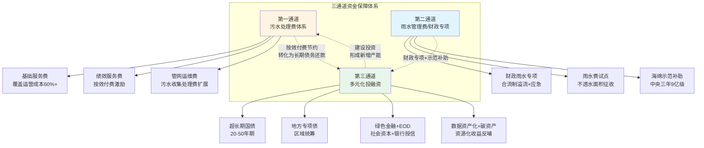

三通道的内在协同逻辑是——**第一通道形成稳定运营现金流，支撑长期债务还款；第二通道明确雨水边界、回避雨污资金混淆；第三通道注入大额建设投资、形成新增产能；三者通过"建设—运营—还款—再建设"的循环，形成可持续的资金保障**。

### 7.5.2 各通道的资金规模量级目标

将本章前述分析整合，形成各通道未来五年的资金规模量级目标：

| 通道 | 五年规模量级 | 关键资金工具 | 量级测算依据 |
|---|---|---|---|
| 第一通道（污水处理费体系） | 4000—5000亿元 | 污水处理费收入+按效付费节约 | 全国年800—1000亿元×5年 |
| 第二通道（雨水管理费/财政专项） | 5000—8000亿元 | 财政专项+海绵示范+应急专项 | 全国海绵示范+城市更新+防汛专项规模推算 |
| 第三通道（多元化投融资） | 8—12万亿元 | 超长期国债+专项债+社会资本+创新工具 | "十五五"地下管网4万亿+管网运维5年累计2.87—5.23万亿+雨污协同1—2万亿+提标5000亿—1万亿 |

**第一通道**：按全国年800—1000亿元污水处理费收入×5年≈4000—5000亿元，加按效付费节约5—10%（湘潭、长沙、南京等地实证）形成的运维节约现金流，扩展到污水收集处理费后规模可进一步扩大。

**第二通道**：按全国海绵城市示范（每城3年30—60亿元×全国规模）、城市更新行动（中央补助每批次15城×示范级别）、防汛专项预算（按云浮"十四五"超27亿元损失推算全国规模）等综合推算，五年级别5000—8000亿元。

**第三通道**：按第3章测算的"十五五"地下管网4万亿+管网运维5年累计2.87—5.23万亿+雨污协同1—2万亿+提标改造5000亿—1万亿+应急响应数千亿，五年累计8—12万亿元。

三通道五年规模合计约9—13万亿元，与第3章测算的10万亿元级资金缺口基本匹配——这一匹配证明了三通道资金保障体系在量级上的可行性，但前提是各通道工具能够在政策、市场、机制三个层面同步激活。

### 7.5.3 大城市/东部:AA+水务集团+绿色债券+特许经营+数据资产主轴

大城市/东部以**"AA+水务集团+绿色债券+特许经营新机制+数据资产"为主轴**：

**AA+水务集团整合**：通过资产评估划转、混合所有制改革、信用评级培育，形成具备百亿级融资能力的运营主体。代表案例包括南京水务集团、长沙水业集团、杭州市水务集团（服务面积7000平方公里、超1000万人）。

**绿色债券融资**：进入百亿级公开市场，以再生水回用、提标改造、智慧化升级等绿色项目为标的发行绿色债券。代表案例包括招商证券绿债承销规模数百亿元级。

**特许经营新机制**：按115号文与17号令要求规范实施，民营股权≥35%、政府代表不控股、不新增财政支出责任。代表案例包括南京江宁科学园五期（16万m³/d、9.89亿元、40年BOOT）。

**数据资产化先行**：依托智慧水务平台积累的数据资产，开展数据交易、数据质押、数据入表试点，开辟新型融资渠道。

### 7.5.4 中等城市/中部:项目打包+专项债集中获批+EOD+资源化反哺主轴

中等城市/中部以**"项目打包+专项债集中获批+EOD模式+资源化反哺"为主轴**：

**项目打包获批专项债**：通过区域统筹将多个项目打包，形成专项债覆盖倍数1.2—1.5倍的可融资项目。代表案例包括温州鹿城2025年上半年获批39.89亿元专项债（前文章节已引）、合肥西部组团二期6.5亿元专项债等。

**EOD模式整合公益与产业**：通过将公益性强的水务治理与收益较好的关联产业打包，实现整体项目自平衡。可争取国开行EOD贷款、生态环境部财政奖补等多源资金。

**再生水与污泥资源化反哺**：通过再生水回用合同、污泥制建材/能源化等资源化路径，为运营主体开辟非财政性现金流。代表案例包括博兴中水回用1.88亿元、平湖再生水PPP+25年特许经营。

### 7.5.5 小城市/县乡/西部:中央补助+省级配套+乡镇打包PPP+以奖代补主轴

小城市/县乡/西部以**"中央补助+省级配套+乡镇打包PPP+以奖代补"为主轴**：

**中央补助为主力**：通过城市管网及污水处理补助资金、海绵示范补助、城市更新行动补助等中央转移支付资金保障基础投入。

**省级配套与统筹**：借鉴湖南"政府—银行—企业"平台500亿元项目库+138亿元国债、云南"15%专项+群众参与"等模式。

**乡镇打包PPP**：通过将多个乡镇/建制镇/新村点位的污水处理设施打包，扩大投资规模、吸引社会资本。代表案例包括雅安51个乡镇+261公里管网、界首15个乡镇+11座厂、沛县13个建制镇厂网一体（前文章节已引）、定安4厂+98公里管网（前文章节已引）。

**以奖代补激励运维**：借鉴长沙双轨补贴、云南15%专项、元谋绩效评价等机制，将有限财力投向运维质效最薄弱环节。

### 7.5.6 三通道与第6章按效付费、第8章可操作方案集的对接接口

最后，明确三通道资金保障体系与第6章按效付费机制、第8章可操作方案集的对接接口，确保资金通道重构与体制重构、激励重构形成完整闭环：

**与第6章按效付费机制的对接**：

- **第一通道与按效付费的二元结构对接**——污水处理费的"基础服务费60%+绩效服务费40%"二元结构直接对应第一通道的稳定现金流；按效付费节约的运维费转化为长期债务的还款现金流，支撑第三通道的债务工具。
- **第二通道与雨污分账的对接**——雨水管理费/财政专项的边界划定，对应第6章"污水处理费向污水收集处理费扩展+晴雨双功能调蓄池分账"的制度设计。
- **第三通道与按效付费考核结果挂钩——**绩效考核结果作为社会资本回款保障、绿色金融授信依据、数据资产估值参考，将按效付费的激励效应延伸到融资环节。

**与第8章可操作方案集的对接**：

- **资金保障基础**——三通道资金保障体系是第8章组织重构、合同范本、考核办法、实施路线图能够落地的财务基础，没有资金保障，再精妙的方案也是"空中楼阁"。
- **差异化适配模板**——大、中、小三类城市的资金组合主轴，为第8章针对不同规模城市设计差异化方案选项提供资金侧的具体参照。
- **风险防控对接**——第三方资金监管账户、支付滞期违约金、信用挂钩、绩效考核等机制，为第9章风险防控与长效保障机制提供资金侧的制度抓手。

总结本章设计，**多元化投融资与财政资金统筹方案是破解核拨制资金通道狭窄困境的核心方案**——五大类资金渠道的政策边界梳理为撬动模式提供工具箱；"项目打包+稳定现金流+市场化融资"区域统筹模式破解了单一项目专项债承载能力不足瓶颈；财政补贴从"补建设"向"补运营、补绩效"的转型与按效付费机制形成正向激励闭环；数据资产化、资源化收益、碳资产、水权交易等创新路径为运营主体开辟非财政性稳定现金流；最终整合为"污水处理费+雨水管理费/财政专项+多元化投融资"三通道资金保障体系并按城市规模差异化适配。本章方案与第5章协同机制、第6章按效付费机制构成"体制—激励—资金"三位一体改革闭环，为第8章可操作方案集提供了完整的资金保障基础。

需要特别强调的是，**资金通道的重构不是单纯的"找钱"，而是通过制度创新让"成本可控+服务可持续+效能可量化"的高效运作目标获得稳定的财务支撑**——按效付费节约的5—10%运维资金通过第一通道转化为长期债务的还款现金流，再生水与污泥资源化收益通过创新路径反哺运维，碳资产与数据资产为运营主体开辟数字时代的新型资产化路径，雨水边界的明确划定避免了雨污资金的相互挤占——这些设计共同构成了对"运营越精细、效能越高、收益越多、融资越易"正向循环的财务激活。这正是本研究"体制—激励—资金"三位一体改革逻辑的最终归宿，也是政府管理部门破解核拨制低效困境、实现城市水务系统高效运作的资金保障路径。

# 8 政府管理部门可操作方案与实施路径

前七章的研究已经形成了核拨制困境破解的完整逻辑框架——第1—2章诊断了核拨制在激励、协同、财务、效能四个层面的结构性缺陷，第3章定位了10万亿元级资金缺口与管网运维、雨洪协同两大薄弱环节，第4章提炼了七大可复制制度要素，第5—7章分别设计了"体制—激励—资金"三位一体的改革方案。然而，这些诊断、提炼与设计若不能转化为政府管理部门可直接拿取使用的"工具箱"，仍可能停留在原则性建议层面，难以应对地方政府"明天就要开始改、下周就要出方案"的紧迫现实需求。

本章作为全篇研究的成果集成与落地转化层，遵循"组织重构—合同范本—考核细则—工程标准—智慧监管—应急联动—试点推广—差异适配"八位一体的设计逻辑，将前七章的体系化结论转化为可直接使用的操作工具集。每一节回答政府管理部门最关切的五个问题——**做什么、怎么做、谁来做、何时做、如何衡量**——并通过"操作步骤+关键参数+典型代表+避坑提示"的标准化呈现，使方案具备直接落地的可执行性。本章既是前七章设计的应用转化，也为第9章风险防控与第10章政策建议提供操作基础，在整篇研究中扮演"方案集成者"与"落地翻译器"的双重角色。

## 8.1 组建一体化运营主体的组织重构方案

组织重构是协同运作机制能够物理落地的根基。第5章已经基于湘潭—十堰、南京—长沙、沅江、杭州四类典型整合模式进行了适配条件分析，本节进一步细化为政府管理部门可直接执行的操作步骤、时间节点、责任主体与关键里程碑。

### 8.1.1 五步标准化组织重构操作流程

基于多地实践共性提炼，组织重构的标准化操作流程可归纳为五步——**领导小组成立→资产清查评估→主体组建与划转→人员安置过渡→信用评级培育**——每一步对应明确的责任主体、时间节点与里程碑产出。

**第一步：成立改革领导小组与跨部门协调机制（启动后1个月内）**。借鉴**十堰市2023年将"厂网一体化"机制建设列为年度重大改革任务、成立由市政府主要领导牵头的改革领导小组、建立跨部门协调联动机制**[^50]的经验，由市委或市政府主要领导担任组长，住建/水务、发改、财政、生态环境、自然资源、国资等部门负责人为成员，下设专项推进组（设施移交组、资产评估组、人员安置组、合同谈判组、风险防控组）。郧西县由县主要领导任组长、整合部门资源积极筹措项目建设资金的组织模式同样值得参照[^50]。

领导小组的核心职责包括：审议改革方案与重大事项决策、协调跨部门职责边界、调度资产划转与人员安置进展、监督改革风险防控。在工作机制上，建议建立"双周调度+月度汇报+季度评估"的常态化推进机制——温州鹿城**截至目前组织召开项目研究会26次、对接上级部门52次**[^15]的高频次调度密度具有重要参照价值。

**第二步：资产清查评估与移交方案制定（启动后2—6个月）**。资产清查评估是后续主体组建、信用评级、市场化融资的基础工作。借鉴**十堰市坚持"一厂一策"、通过依法收回、按期收回、提前收回等方式稳步推进城区10座污水处理厂统一移交至十堰生态水务集团运维管理；同步完成904公里污水管网统一接管**[^50]的实践，资产清查评估应包括三类工作：

第一类是**存量资产实物清查**——对厂、网、泵站、调蓄池、附属设施进行全面盘点，建立"一厂一档、一段一档"的资产数据库。郧西县**委托上海市城市建设设计研究总院对城乡污水管道全面排查、摸清底数、合理布局、科学规划污水处理体系**[^50]的做法可作为县域层面的标准范式。第二类是**资产价值评估**——通过具备相应资质的第三方评估机构对资产进行价值评估，为划转、注入、信用评级提供依据。**长沙市首批城区存量污水管网资产成功注入市水业集团排水设施公司，集结政府、企业、中介机构多方智慧和力量，成功破解存量地下管网年代久远、建设资料不齐、权属不清等核心难点**[^15]——这一突破的关键在于形成了**一套涵盖注入实施路径、资产清查标准及重新评估规范的"一揽子"标准化操作体系**[^15]。第三类是**移交方案精细化设计**——明确移交时序、过渡期安排、新旧合同衔接规则。长沙模式**按污水处理厂对应的纳污区分批次将市政排水设施移交给水业集团，按纳污区自该区域首批次交接日起设置两年过渡期，预计到2025年底前全面完成城区市政排水设施移交接收工作**[^49],为分批次移交提供了清晰的时序模板。

**第三步：主体组建与资产划转（启动后6—12个月）**。这一阶段是组织重构的核心环节。借鉴**十堰市2023年7月组建十堰生态环境集团、2025年9月进一步整合原十堰生态环境集团、市水务公司、市水源公司重新组建十堰生态水务集团公司**[^50]的"两步走"路径，可形成以下操作模板：

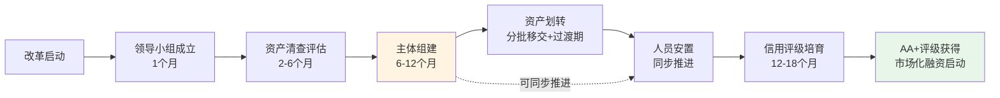

主体组建的关键决策是组织形态选择——**国有独资模式**适用于管网欠账严重、需先做体制重构的中等城市（如湘潭、十堰）；**国有控股+多元股东模式**适用于已有较强市场化基础、可引入战略投资者的大城市（如长沙、南京）；**央企+地方国企+民营+外资联合体模式**适用于流域治理任务突出、需引入大型央企的中小城市（如沅江三峡水管家模式）[^47][^49]。

**第四步:人员安置与待遇保障（与第三步同步推进）**。人员安置是组织重构最敏感的环节，处理不当将引发改革阻力。基本原则是"人随资产走、待遇不降低"——参照日本东京经验**东京都下水道局过去数十年间的公务员数量减少了约一半，而TGS（东京下水道服务公司）的人员比例则持续上升**[^15]，体现"政府机构瘦身+市场化运营公司增员"的渐进过渡。具体操作要点包括：

- **岗位转换路径**——原住建/水务局事业编制人员可选择保留事业编留任主管部门、转为运营公司聘用人员、按工龄经济补偿后退出三种路径，避免"一刀切";
- **薪酬过渡机制**——建立3—5年的薪酬过渡期，过渡期内待遇不低于改革前水平，过渡期后按运营公司绩效薪酬体系执行;
- **培训赋能配套**——针对管网运维、智慧水务、应急响应等新业务领域开展技能培训，提升原有人员适应新岗位的能力。

**第5步:AA+主体信用评级培育（启动后12—24个月）**。AA+评级是水务运营主体进入资本市场的"通行证",是第7章设计的多元化投融资方案能够落地的关键。借鉴**十堰生态水务集团被国内权威信用评级机构安融信用评级有限公司评定为"AA+主体长期信用等级"**[^50]、海宁水务集团获得AA+评级的实证经验,信用评级培育需在四个层面同步推进:

| 培育维度 | 关键操作 | 量化目标 |
|---|---|---|
| 资产规模门槛 | 资产评估划转、混合所有制改革 | 总资产规模达到行业AA+评级要求 |
| 现金流稳定性 | 按效付费二元结构、长期协议背书 | 经营性现金流连续3年正向稳定 |
| 治理结构规范 | 现代企业制度、董监高制衡 | 通过监管机构合规审查 |
| 信息披露透明 | 财务报告、绩效披露、债务披露 | 满足公开市场披露要求 |

### 8.1.2 三级内部治理架构的落地配套

第5章设计的"厂网联动事业部+流域片区分公司+智慧调度中心"三级内部治理架构,需要配套清晰的职能分工与运行机制。基于多地实践,可设计以下运行细则:

**厂网联动事业部**承担专业化运营职能,内设污水厂运营部、管网养护部、泵站运行部、调蓄设施部等业务条线。**核心运行机制是借鉴南京"片长制"——将管网巡查机构直接设置在各污水处理厂内,实行驻厂办公、一体化运行管理**[^46]。具体落地需建立四项制度:

- **驻厂办公制度**——管网团队定员驻厂,与污水厂团队同地办公、共享数据、协同响应;
- **联合考核制度**——厂方与网方共同接受按效付费考核,绩效奖金捆绑发放;
- **异常预警响应制度**——**当进水COD等关键指标出现异常波动时,我们会第一时间在群里发出"警报"。管网团队的同事便会以污水处理厂为起点,沿着管网逆向溯源,排查跑冒滴漏或河水倒灌的"病灶点"**[^46]——这种24小时应急响应群是低成本但极有效的协同机制;
- **联合培训制度**——定期开展厂网协同培训,培育复合型人才。

**流域片区分公司**按汇水流域划分管理边界。**沅江市与长江三峡沅江智慧水管家公司签订协议、由长江三峡沅江智慧水管家公司统一运营中心城区范围内的自来水厂、水质净化厂及排水管网及附属设施**[^94]的全链条覆盖路径,为流域片区分公司的边界划定提供了参照——尊重水文规律而非行政边界。

**智慧调度中心**作为数字中枢,承担"感知—分析—调度—预警"中枢职能。其建设路径详见第8.5节。

### 8.1.3 大、中、小三类城市的差异化时间节点

不同规模城市的组织重构进程节奏差异显著,需提供差异化的时间节点参照:

| 适配维度 | 大城市/东部 | 中等城市/中部 | 小城市/县乡/西部 |
|---|---|---|---|
| 整合方式 | 大型水务集团委托运营+特许经营新机制 | 国资平台承债式整合 | 县域生态水务集团 |
| 启动至完成时间 | 18—36个月（杭州2019—2025六年完成全域）[^49] | 12—24个月（十堰两步整合2023—2025）[^50] | 6—18个月（郧西县快速整合）[^50] |
| 关键里程碑 | 整合区域>1000万人;管网>4000公里;AA+评级 | 整合区域百万级人口;管网>500公里;AA+评级 | 县域三级一体化运维;群众满意度 |
| 典型代表 | 杭州、南京、长沙、武汉 | 湘潭、十堰、海宁 | 郧西、房县、定安 |

**杭州市六年改革实践**为特大城市提供了渐进式整合的完整参照——**至2025年10月22日余杭、临平水务一体化改革顺利完成时,市水务集团服务面积从一体化改革前约630平方公里扩展到约7000平方公里,服务人口从约300万增至超1000万**[^49]——这种"逐区破冰、四个统一"的渐进式路径,对其他特大城市具有直接借鉴意义。

### 8.1.4 关键避坑提示

组织重构推进中存在四类典型陷阱,需提前防范:

**陷阱一:"为整合而整合"导致行政性垄断**。整合后若缺乏内部考核机制约束,可能形成新的低效。防范对策是整合后立即配套按效付费考核机制(详见第8.3节),使整合后的国资平台仍面临"绩效—奖惩"压力。

**陷阱二:资产权属不清导致评估困难**。**长沙市存量地下管网年代久远、建设资料不齐、权属不清**[^15]是普遍性难题。防范对策是建立"一揽子"标准化操作体系,通过专业咨询机构、政府部门、企业的多方协作破解权属难题。

**陷阱三:人员安置不当引发改革阻力**。**郧西县在改革过程中注重解决三大核心问题:人员安置坚持"人随资产走、待遇不降低",妥善安置涉改人员,实现改革平稳过渡;资产厘清:引入第三方机构开展资产评估与尽调,逐厂签订三方会商备忘录,确保资产移交合法合规;机制创新:探索"按效付费"机制**[^50]——这一三大核心问题的处理范式应作为人员安置的标准模板。

**陷阱四:信用评级培育周期过长延误融资**。AA+评级需要资产规模、现金流、治理结构、信息披露的综合达标,周期通常在12—24个月。防范对策是从启动改革之初就同步推进评级准备工作,而非在主体组建完成后才启动。

## 8.2 厂网一体特许经营与委托运营合同范本要点

合同范本是政府与运营主体之间权责关系的法律载体,直接决定改革的财务可持续性。第4章已系统梳理过传统PPP/BOT与新机制特许经营的演进轨迹及"分手潮"教训,本节进一步将合同条款精细化为可直接采纳的范本要点。

### 8.2.1 新建项目(BOT/BOOT新机制)合同范本要点

新建项目合同范本以**南京江宁科学园五期项目**为标杆参照。该项目作为江苏省首个特许经营新机制模式的大型污水处理项目,**污水处理厂设计处理能力达16万立方米/日,总投资预计9.89亿元,采用BOOT(建设-拥有-运营-移交)模式,特许经营期40年**[^48]。其合同设计的关键创新可归纳为以下七项核心条款:

**条款一:特许期限与移交规则**。建议特许期限为25—40年,匹配长周期资产管理与社会资本合理回报需求;新机制下普遍采用40年期限以匹配按效付费下的稳定现金流。**项目采用BOOT模式,特许经营期限共计40年(自特许经营协议签订之日起至特许经营合作期结束之日止)**[^48]——较传统BOT 25—30年特许期更长,对应更稳定的现金流预期。

**条款二:股权结构与控制权**。借鉴南京江宁项目设计,**要求民营企业(含外商投资企业)在项目公司股权占比不低于35%,可以是满足民营企业(含外商投资企业)要求的几家单位持股之和(联合体投标时股权占比以联合体协议书为准),且本级国有独资或国有控股企业(含其独资或控股的子公司)不得以任何方式作为本项目的投标方、联合投标方;政府出资人代表原则上不得在项目公司中控股**[^48]。这一条款是落实国办函〔2023〕115号文"鼓励民营企业参与"政策导向的标准模板。

**条款三:风险分担与价格调整机制**。建议采用第6章设计的长沙式四段拆分模型——**将污水处理服务费拆分为建设投资、生产运营变动部分和固定部分,并引入LPR浮动机制对冲风险**[^47][^1]。具体设计要点包括:利率风险通过LPR浮动机制由政府承担;能源与药剂价格风险由变动部分挂钩机制承担;人工成本通胀风险由固定部分定期评估机制承担;效能提升与下降风险由绩效奖惩部分承担。

**条款四:绩效考核与服务费支付挂钩**。建议明确规定**将年度服务费与运营维护、安全生产、运行效果等考核结果直接挂钩,倒逼运营方主动提升进水浓度**[^47][^1]。具体执行细则参照第8.3节按效付费实施细则。

**条款五:第三方资金监管账户与支付滞期违约金**。这是临颍5.78亿索赔教训的针对性回应。具体设计要点包括:污水处理费征收后专户存储、按合同支付;政府方按合同约定金额预存保证金;政府方支付滞期超过约定期限(如90天)的,按LPR上浮一定比例(如50—100%)计收违约金;支付违约累计超过特定金额或时长的,运营主体可启动合同争议解决程序。

**条款六:退出与争议解决机制**。借鉴**中部某市16万吨/日污水处理厂TOT项目"政府与社会资本合理分担40年特许经营期内的合作风险"**的设计,明确合同解除的条件、程序、补偿机制。**南京市江宁区科学园污水处理厂五期项目特许经营协议**[^48]的合同标准化设计应纳入仲裁、调解、诉讼等多元争议解决路径。

**条款七:合规要件**。新机制特许经营必须严格遵循115号文+17号令+《政府和社会资本合作项目特许经营方案编写大纲(2024年试行版)》+《政府和社会资本合作项目特许经营协议(编制)范本(2024年试行版)》+发改办投资〔2024〕151号文(关于建立全国政府和社会资本合作项目信息系统)等合规要件。**中部某市新机制TOT项目交易遵循了115号文及系列配套文件的监管要求,未额外新增地方财政未来支出责任**——这种"不新增财政支出责任"的合规突破是新机制下的关键创新。

### 8.2.2 存量项目(TOT/委托运营)合同范本要点

存量项目合同以**长沙市2024年10月与长沙水业集团签订的30年委托运营协议**[^49]为标杆参照。其设计要点可归纳为五项核心条款:

**条款一:委托范围与移交时序**。**水业集团将负责整个长沙市城区(湘江新区、芙蓉区、天心区、开福区、雨花区、望城区)范围内的市政污水管网、雨水管网和合流管网的运营,城区存量污水处理厂移交后的运营,城区污水提升及合建泵站的运营。市住建局按污水处理厂对应的纳污区分批次将市政排水设施移交给水业集团**[^49]——明确"按纳污区分批次移交"的时序规则,避免"一次性大规模移交"带来的风险。

**条款二:过渡期安排**。**按纳污区自该区域首批次交接日起设置两年过渡期,预计到2025年底前全面完成城区市政排水设施移交接收工作**[^49]——两年过渡期既保证了运营平稳过渡,又给运营主体充分的资产盘点、人员熟悉时间。

**条款三:绩效合同管理**。**采取"委托运营+绩效合同管理"模式,水业集团协助市住建局,对污水处理厂开展绩效合同管理等事务性工作,市住建局对水业集团委托运营管理实行绩效考核**[^95]——这种"政府考核运营主体、运营主体管理污水处理厂"的双层绩效管理架构,实现了政府监管与企业运营的有效分工。

**条款四:股权划转与资产注入**。借鉴长沙模式**计划分批次将污水管网资产评估后注入运营公司,首批3区已注入约6.2亿元,有效降低企业负债率**[^47][^1];**其他市属国企直接投资或参股的存量污水处理厂,相关股权划转至长沙水业集团;社会资本方运营的污水处理厂,到期收回后依法依规移交水业集团运营;城区在建污水处理厂由原建设单位完成建设后,移交水业集团统一运营**[^95]。

**条款五:运维质量标准与资金拨付**。**由市住房和城乡建设局牵头制定我市城区市政排水设施管理养护质量、绩效考核、资金拨付等有关标准制度,规范运维质量标准,建立考核付费机制,完善排水管理制度保障**[^95];**由市住房和城乡建设局按照保本微利的原则,根据水业集团日常运营维护内容和管网病害治理及雨污分流改造工作量,以及市政排水设施管理养护质量、资金拨付等有关标准制度向水业集团拨付**[^95]。"保本微利"原则是政府委托运营合同的财务核心原则,既保障运营主体合理收益,又避免不当盈利。

### 8.2.3 已签传统BOT合同的"软改造"路径

对于已签的传统BOT合同,既不能简单粗暴地强制解约(避免类似昆明43亿元解约纠纷),也不能"既往不咎"任由低效继续。借鉴**湘潭市4座污水处理厂在原特许经营协议基础上,全部补充签订了"按效付费"协议**[^45]的实践,可设计三步"软改造"路径:

**第一步:存量合同评估**。**湖南省印发《关于推进城镇生活污水处理质效提升行动的通知》,全面启动"厂网一体"和"按效付费"改革,要求各地对污水处理特许经营情况开展评估,明确"按效付费"具体路径和期限**[^45]。建议每个城市对存量BOT/PPP/特许经营合同进行全面评估,识别可"软改造"的项目与必须解约或调整的项目。

**第2步:补充协议签订**。在不违反原合同核心条款的前提下,通过签订补充协议增加按效付费、雨污协同、智慧化升级等新内容。补充协议的关键技术是"在原合同框架下叠加新机制"而非"推倒重来"——这种叠加式改造避免了大规模合同纠纷的风险。

**第3步:支付保障同步建立**。补充协议应同步建立第三方资金监管账户、支付滞期违约金等支付保障机制,既消除运营主体对回款的担忧,也化解政府方对成本上升的顾虑。**临颍县政府拖欠费用达1.29亿元;企业被迫于2025年5月向漯河中院提起诉讼,索赔金额高达5.78亿元(含投资本金、欠费及30%年化违约金)**——这一警示意味着支付保障的滞期违约金条款应明确为合同硬约束。

### 8.2.4 "分手潮"避坑要点系统化梳理

将2024—2025年密集爆发的特许经营"分手潮"教训系统化整理为避坑清单:

| 风险类型 | 教训案例 | 避坑要点 |
|---|---|---|
| 财政依赖陷阱 | 临颍康达环保企业回款完全依赖地方财政,缺乏第三方资金保障 | 第三方资金监管账户+污水处理费专户存储 |
| 调价机制缺失 | 临颍十年未调价,处理每吨水实际亏损0.4元 | LPR浮动+定期评估+成本核增触发机制 |
| 政府担保虚设 | 临颍县级财力薄弱,"财政兜底"形同虚设 | 上级财政担保或保证金机制 |
| 强制接管争议 | 贵州某地8亿工业废水厂建成验收后被强行接管 | 退出条件清晰约定+争议解决程序前置 |
| 政策调整解约 | 昆明43亿元第十五水质净化厂2023年定标、2025年解约 | 政策调整不可抗力条款+合理补偿机制 |
| 中小企业被压垮 | 重庆水务第六期同比下降21%,2024年净利润降27.88% | 基础服务费≥60%运营成本硬保障 |
| 索赔诉讼周期长 | 西宁企业诉讼7年追回3000万欠款 | 仲裁优先+争议解决时限约束 |

## 8.3 按效付费实施细则与绩效考核办法

按效付费机制是核拨制改革的财务激励核心。第6章已设计了五维度多层级绩效指标体系与二元结构计费公式,本节将其转化为可直接执行的实施细则。

### 8.3.1 五维度指标权重表与计量方法的标准化模板

参照"厂网一体按效付费"绩效评价指标体系**总分100分,其中基本指标占比80%—90%,鼓励指标占比10%—20%,可根据区域治理重点动态调整指标权重**的设计原则,结合湘潭、长沙、南京、武汉等地实践,可形成大、中、小三类城市差异化的考核办法模板:

**大城市/东部模板(南京式多维效能权重模型)**:

| 维度 | 权重 | 核心指标 | 计量方法 |
|---|---|---|---|
| 污水收集效能 | 25分 | 污水集中收集率(8分)、管网完好率(8分)、进水浓度达标率(9分) | 在线监测+第三方核查 |
| 污水处理质量 | 35分 | COD/BOD去除率(15分)、氨氮去除率(8分)、总氮总磷去除率(7分)、水质稳定性(5分) | 在线监测+人工取样化验 |
| 污泥处置效能 | 15分 | 无害化处置率(10分)、含水率达标率(5分) | 处置台账+第三方核查 |
| 设施运行管理 | 15分 | 设备综合运行率(5分)、安全生产(5分)、智慧化管理水平(5分) | 用电监测+管理记录 |
| 鼓励指标(节能降碳与资源化) | 10分 | 单位能耗降幅、再生水利用率、应急处置能力 | 同业对标+创新奖励 |

**南京方案的核心是将评价指挥棒从单一的"处理水量",转向以化学需氧量(COD)、生化需氧量(BOD)等污染物浓度为核心,并综合系统运行健康度、安全环保水平的多维效能指标体系**[^46][^48]。该方案得到部委专家一致认可,**助力南京成为全国四个评价等级为A的城市之一**[^48]。

**中等城市/中部模板(湘潭式浓度削减率单一指标模型)**:

| 维度 | 权重 | 核心指标 | 计量方法 |
|---|---|---|---|
| 污水收集效能 | 25分 | 污水集中收集率、外水削减率 | 在线监测 |
| 污水处理质量 | 40分 | COD/BOD/氨氮浓度削减率(加权平均) | 进出水水质监测 |
| 污泥处置效能 | 20分 | 污泥无害化处置率 | 处置台账 |
| 设施运行管理 | 15分 | 安全生产+设施运行 | 管理记录 |

**湘潭模式的核心是将污水处理厂进水污染物浓度、污染物削减量和污泥无害化处理率等作为核心考核指标,构建以污染物削减绩效为导向的"按效付费"机制,实现"厂网一体"工程建设与运营效果的联动考核**[^45][^46]。

**小城市/县乡/西部模板**(简化基础版):

| 维度 | 权重 | 核心指标 |
|---|---|---|
| 进水浓度达标率 | 30分 | BOD≥100(县城)/COD≥150(乡镇) |
| 出水水质达标率 | 40分 | 满足排放标准的天数比例 |
| 设施稳定运行 | 20分 | 设施正常运行率 |
| 污泥规范处置 | 10分 | 处置合规性 |

借鉴**郧西县城污水处理厂进水BOD浓度达到100mg/L以上,乡镇污水处理厂进水COD浓度达到150mg/L以上**[^50]的考核标杆,小城市/县乡指标体系应聚焦"硬约束达标"而非"复杂多维",降低执行难度。

### 8.3.2 评价拨付流程的时限节点

设计"月度初评+季度结算+年度终评"三级评价流程,各阶段时限节点如下:

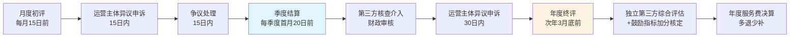

**月度初评**:每月15日前,由住建/水务主管部门主导汇总在线监测数据,向运营主体发出考核结果初评通知;运营主体可在15日内提出异议申诉。

**季度结算**:每季度首月20日前,第三方核查机构介入,对在线监测数据、人工取样化验数据、设施运行台账进行交叉核对;财政部门审核后按季度结算服务费。

**年度终评**:次年3月底前,独立第三方综合评估机构进行年度综合评价,重点对鼓励指标进行加分核定,并对全年服务费进行决算"多退少补"。

### 8.3.3 硬约束触发条件与停付整改机制

按效付费机制的执行力依赖硬约束的清晰与可执行。建议设置以下硬约束触发条件:

**单项指标硬约束**:出水水质单次超标按比例扣分;季度内累计超标次数达到规定上限的,该指标得0分,并启动专项整改;污水收集率低于年度目标10个百分点以上的,额外扣减基本付费金额;污泥无害化处置率累计3次以上不达标,暂停付费并责令整改。

**重大事件硬约束**:发生溢流污染入河、出水超标致下游饮用水源污染、污泥违规处置造成二次污染等重大环境事件的,立即启动停付程序,待整改完成、第三方核查通过后恢复支付。

**信用约束**:运营主体因排污违法被生态环境部门列入"红牌"名单的,按本章8.3.5节"环保信用挂钩"规则下调服务费。

### 8.3.4 第三方核查机构遴选标准

第三方核查的公正性是按效付费机制公信力的关键。借鉴**娄底市公开遴选第三方服务机构对供水成本及污水处理、生活垃圾处理成本进行成本审核**实践,第三方核查机构的遴选标准可归纳为五项:

第一,**资质门槛**——具有财政部门颁发的会计师事务所执业证书或同等资质;第二,**信用合规**——未被"信用中国"网站、"中国政府采购网"列入失信被执行人、重大税收违法失信主体记录名单、政府采购严重违法失信行为信息记录名单;第三,**行业经验**——具有供水、污水处理、垃圾处理行业成本审核相关工作经验和案例并提供佐证资料的,同等条件下优先考虑;第四,**人员配置**——现场监审团队不少于3人,须由本事务所执业注册会计师带队,审计助理人员须有初级以上会(审)计专业技术资格职称;第五,**时限保障**——能在45个工作日内出具正式成本审核报告。

### 8.3.5 立体化价格信号系统的配套实施细则

第6章设计的"工业差别化+居民阶梯化+信用挂钩"立体化价格信号系统,需要配套实施细则才能落地。基于诸暨、济南、广州、深圳等地实践,可形成以下标准化模板:

**工业差别化收费实施细则**(诸暨模板):

| 适用对象 | 触发条件 | 收费规则 |
|---|---|---|
| 印染、化纤、制药、化工、金属表面处理 | 污染物超过入网基准 | 按PH、COD、NH₃-N分档浮动,纺织染整每超一档增0.7元/m³ |
| 高污染行业 | 污染物低于入网基准 | 双向浮动激励,纺织染整每降一档减0.15元、其他企业减0.1元 |

**居民阶梯收费实施细则**(济南模板):

| 阶梯 | 户年用水量(m³) | 价差比 | 含污水处理费 |
|---|---|---|---|
| 第一阶梯 | 0—144 | 1 | 1.0元/立方米 |
| 第二阶梯 | 144—288 | 2 | 同步阶梯 |
| 第三阶梯 | 288以上 | 4 | 同步阶梯 |

**环保信用挂钩实施细则**(深圳模板):

| 信用等级 | 收费比例 | 政策导向 |
|---|---|---|
| 环保诚信(绿牌) | 90% | 守信激励 |
| 环保警示(黄牌) | 110% | 提醒整改 |
| 环保不良(红牌) | 130% | 失信惩戒 |

## 8.4 雨污协同规划与建设标准

雨污协同规划与建设标准是协同运作机制的工程实施依据。第5章已设计"分流改造—溢流控制—调蓄共用—再生水协同—海绵衔接"五个工程组分,本节进一步将其转化为可直接采用的规划编制要点与建设技术标准。

### 8.4.1 差异化雨污分流改造推进策略

雨污分流改造必须根据区域特征采取差异化策略。**老城区合流制保留+局部强化、新区分流制建设+源头到末端、城中村源头改造+片区整治**的差异化推进框架的具体落地要点如下:

**老城区合流制策略**——对暗涵渠箱密集、地下空间紧张的老城区,不强制推进全面分流,而是借鉴武汉黄孝河经验通过截污干管完善、调蓄池建设、初雨净化设施、CSO控制工程等组合提升合流制系统效能。这一策略的国际参照是日本东京经验——**自2003年起日本开展为期20年的全国合流制区域整改。截至2024年3月底,已基本实现了合流区域与分流制相当的污染负荷整改目标,即雨天排水时的平均BOD浓度降低至40mg/L以下;值得注意的是,在此期间,全国范围内的合流改分流累计面积仅占合流区域的5%,可见这并非主要整改措施**[^15]。

**新区分流制建设策略**——严格执行雨污分流标准,推进"延伸到户"的源头到末端建设。**广东省"十四五"规划明确,珠三角城市重点完善污水源头收集,持续开展雨污分流建设,将雨污分流"毛细血管"延伸到每家每户**[^13]。**到2025年,各地市要基本消除城中村、老旧城区和城乡接合部等区域生活污水收集管网空白区,消除城市建成区生活污水直排口**[^13]。

**城中村源头改造策略**——采取"源头入户管改造+片区主管整治+混接整治三合一"的策略。**福建省"十四五"实施方案要求将雨污分流改造作为老旧小区必改项之一,分期分批实施城中村雨污分流**[^1]。

### 8.4.2 CSO控制工程"四位一体"技术标准

合流制溢流(CSO)控制工程的"调蓄+强化处理+行洪+智慧调度"四位一体技术体系,需要明确的关键参数标准:

**初雨调蓄设施参数**——参照上海市水务局2024年7月发布的《竹园污水处理厂初雨调蓄工程方案》行业意见,**初期雨水截流标准采用5毫米;原则同意初雨截流时间均按1小时控制**;调蓄池规模按片区面积折算,**竹园项目47.67公顷服务面积对应1590立方米调蓄规模、崇明新城1#项目2.1平方公里服务面积对应7600立方米调蓄规模**;放空出路设计——**调蓄池放空出路为南门路DN1200已建污水干管,经输送后最终纳入城桥污水厂进行处理**。

**雨季溢流污水快速净化设施**——住建部明确**鼓励各地在完成管网建设改造的前提下,建设雨季溢流污水快速净化设施,结合本地实际明确排放管控要求**[^1]。武汉黄孝河机场河项目通过**"调蓄+强化处理+行洪"一体化体系联动运行,累计削减入河悬浮物14290吨、化学需氧量17525吨**——为大型流域CSO控制工程提供了量级参照。

**雨洪排口与截流井改造**——住建部要求**开展水体沿线雨水排口和合流制溢流口防倒灌改造,严防河湖水倒灌生活污水管网。加快破损检查井改造与修复,逐步淘汰砖砌污水检查井,新建污水检查井推广使用混凝土现浇或成品检查井**[^1]。

### 8.4.3 调蓄池晴雨双功能投资分摊规则

调蓄池晴雨双功能共用是破解雨污资金割裂的物理载体,需要明确的投资分摊规则:

| 功能维度 | 投资归属 | 运维归属 |
|---|---|---|
| 晴天均质功能(污水均质池) | 污水处理费体系承担 | 厂网联动事业部 |
| 雨天截流功能(合流截流池) | 财政雨水管理专项承担 | 厂网联动事业部 |
| 共用部分(土建结构、监测设备) | 按晴雨功能比例分摊 | 厂网联动事业部 |

具体分摊比例可结合调蓄池实际运行模式确定,一般晴天功能投资占比30—50%、雨天功能投资占比50—70%。

### 8.4.4 再生水回用配置标准

再生水回用配置标准基于水利部2021年12月与六部门联合发布的《典型地区再生水利用配置试点方案》,**聚焦缺水地区、水环境敏感地区、水生态脆弱地区等重点区域开展实践探索,选取76个城市开展试点工作**[^3]。**水利部2026年开展典型地区再生水利用配置试点评估总结工作,以期在再生水规划、配置、利用、产输、激励等方面形成一批效果好、能持续、可推广的先进模式和典型案例**[^3]。

可参考三类典型模式:

**北方缺水地区"工业用户+长期合同"模式**——博兴县中水回用项目**总投资1.88亿元,核心内容是对博兴县第二污水处理厂的尾水进行深度处理,旨在将水质提升至可供电厂使用的标准;这座工厂每年可生产高品质再生水1825万吨**;银川第一再生水厂**直接推动银川市再生水回用率从11%跃升至58.5%**。

**长三角"超滤+反渗透+逆阶梯惠企"模式**——平湖市以**1106.8万m³"超滤+反渗透"高品质再生水,优先保障了总产值约550亿元的两个重大产业项目运行**;通过**"逆阶梯"惠企策略灵活定价方式保障了企业合理利润,引导企业加大用水量**。

**南方丰水地区"区域循环+梯级利用"模式**——佛山**作为南方城市,水量丰沛、自来水价格较低,同时城市布局分散,不宜大面积铺设独立的再生水利用管网;预计到2026年,再生水利用率将由目前34%提高到48%**。

### 8.4.5 海绵设施标准与衔接路径

海绵设施标准已在多地立法中得到明确。**佛山《海绵城市建设管理条例》(2026年1月23日省人大常委会批准通过)明确了海绵城市建设的基本原则、部门职责、规划管控、建设要求、运营维护及法律责任,特别是确立了"规、建、管"全过程管控机制:将海绵城市建设要求纳入国土空间规划、土地出让、规划许可、施工图审查、施工许可、竣工验收和运营维护等各环节**;**三明市《海绵城市规划建设管理条例》于2024年10月1日正式施行,《三明市海绵城市规划设计导则》等7项技术导则也相继实施**。**扬州《海绵城市建设管理条例》(2025年8月通过、2025年9月省人大常委会批准)将海绵城市设施界定为具有"渗、滞、蓄、净、用、排"功能的绿色雨水设施、城镇排水与污水处理设施、河湖水体设施等的统称,包括雨水渗透设施、转输设施、调蓄设施、集蓄利用设施、截污净化设施以及附属设施等**。

海绵设施关键指标参考三明实证——**市区列东核心片区道路海绵化改造示范工程项目人行道改造总面积约9.5万平方米,东新二路、东新五路年径流总量控制率达到60%以上,年径流污染控制率超40%,片区排水防涝能力显著提升**。

雨污协同规划与城镇排水与污水处理专项规划、内涝防治专项规划的衔接路径,可借鉴云南昆明2025年修订条例的突破——**将"内涝防治专项规划"纳入"城镇排水与污水处理专项规划",并在污水处理费使用范围中纳入"防涝应急"功能**。

## 8.5 智慧监管平台搭建路径

智慧监管平台是协同运作机制的"神经系统",承担"感知—分析—调度—预警"全链条职能。第5章已设计四层架构,本节进一步细化为四阶段建设路径。

### 8.5.1 第一阶段:全要素感知网络

全要素感知是智慧平台的基础。借鉴多地实践,关键参数为:

**监测点密度**——武汉黄孝河机场河项目**搭建全国首个智慧管理平台,实时传输126平方公里流域内409余处监测点数据,通过模型分析优化调度方案,实现科学决策**——监测点密度达到约3.2个/平方公里。

**监测要素覆盖**——深圳水务集团构建排水—水环境数据智能体,**汇聚国家、地方政府以及水务企业生产运营等11家单位多源数据,覆盖流域内从源头排水小区到海湾的11类关键涉水数据、37类监测数据,监测站点数量超过8000个**[^13]。十堰智慧监管平台为**60余条重点支沟建立动态水质数据库,布设20余套污染物多因子在线监测仪,配套安装30余套进水指标监测设备**[^50]。

**用电监测覆盖**——十堰**已在全市114个污水处理厂安装用电监控监测终端,实时收集计量监测数据,并提交十堰智慧城市大脑进行分析研判**[^50]。"以电折水"是低成本但极有效的运行监管手段。

### 8.5.2 第二阶段:数字孪生分析

数字孪生层是从"数据看板"向"智能决策"跃迁的关键。**上海城投水务集团决定将竹园四期污水处理厂打造为"数字孪生污水处理厂",以"数字驱动,智慧运营"为核心,破解超大型合流制污水处理厂的运行控制世界性难题**;关键挑战是**合流制系统的巨大冲击:片区排水体制以合流制为主,雨季时大量雨水混入污水管网,导致污水处理厂进水呈现"水量大、水质稀、波动剧烈"的特点,对处理工艺的稳定运行构成严峻挑战**。

竹园四期工程处理规模达120万立方米/日,是国内乃至亚洲领先的超大型污水处理厂——其数字孪生实践对其他超大型合流制污水处理厂具有直接示范价值。

### 8.5.3 第三阶段:AI预警调度

AI预警调度通过历史数据训练模型,对未来1—24小时内的进水水量水质、降雨过程、管网液位等进行预测,自动生成调度建议。临安**"天目智管水务平台"依托物联网和大数据技术实现全区供排水系统实时监控和数据分析,同时推广使用数字孪生技术、管网地理信息系统等先进工具,构建起"可视+数据"双核驱动的动态3D场景**。

### 8.5.4 第四阶段:四预功能

天津数字孪生水务**采取"数字孪生流域、数字孪生水网、数字孪生工程'三位一体'架构",构建具有预报、预警、预演、预案即"四预"功能的数字孪生水务体系**。

四阶段建设路径整合为下表:

| 阶段 | 关键能力 | 核心参数 | 典型代表 |
|---|---|---|---|
| 第一阶段 | 全要素感知 | 监测点≥3点/km²、用电监测全覆盖 | 武汉黄孝河、十堰、深圳水务 |
| 第二阶段 | 数字孪生 | 实物厂全要素镜像、工况预演 | 上海竹园四期 |
| 第三阶段 | AI预警调度 | 1—24小时预测、自动决策建议 | 瀚蓝环境3.0、临安天目智管 |
| 第四阶段 | 四预功能 | 预报+预警+预演+预案 | 天津数字孪生水务 |

### 8.5.5 平台建设投入量级与避坑提示

智慧监管平台的硬件投入量级参考——大城市数字孪生超大型厂级平台投资可达数千万元;中等城市全要素感知+智慧水务平台投资千万元级;县域简化版用电监测+核心节点感知投资百万元级。

避坑提示包括四点:**避免重设备轻应用**——平台建成后必须配套足够的运维人员与培训,避免"建好不会用";**避免数据孤岛**——必须建立跨部门数据共享协议,避免重复建设;**避免信息安全漏洞**——按数据安全法、关键信息基础设施保护要求建立信息安全保障;**避免与按效付费在线监测脱钩**——平台监测数据必须能直接对接按效付费考核公式,实现"监测—考核—付费"闭环。

## 8.6 应急联动预案与跨部门协同机制

应急联动是协同运作机制的韧性保障。第5章已设计五级运行模式,本节将其转化为可直接执行的预案文本要点。

### 8.6.1 五级运行模式预案文本

借鉴祁阳市市政设施内涝防治抢险应急预案的"蓝黄橙红"四级响应设计,扩展为五级运行模式:

| 运行模式 | 触发条件 | 核心行动 | 响应主体 | 资金来源 |
|---|---|---|---|---|
| 晴天常规 | 无降雨预报 | 提浓度、降能耗、稳污泥 | 厂网联动事业部 | 污水处理费 |
| 小雨级响应 | 1—5毫米/24小时 | 启动初雨截流、监测水质波动 | 流域片区分公司+智慧调度中心 | 污水处理费+雨水专项 |
| 中雨级响应 | 5—25毫米/24小时 | 调蓄池启用、错峰泵站调度 | 智慧调度中心统一指挥 | 雨水专项 |
| 暴雨级响应 | 25—100毫米/24小时 | 雨季溢流快速净化启动、污水厂限流 | 调度中心+运营主体高层 | 雨水专项+应急预算 |
| 超标降雨响应 | >100毫米/24小时 | 跨部门联动、应急抢险、保城市基本运行 | 政府应急办+运营主体 | 应急预算+财政紧急拨付 |

### 8.6.2 应急成本制度化纳入财政预算

借鉴**云浮市《暴雨灾害防御条例》于2025年12月24日云浮市第七届人大常委会第三十二次会议通过、2026年3月26日省人大常委会批准、2026年4月15日起施行,构建预防、监测、预报、预警、应急处置、保障全链条体系,将暴雨灾害防御工作所需经费纳入本级财政预算**——通过地方立法将应急资金从"事件性临时拨付"转向"制度性常态保障"。

具体安排建议如下:**预防与监测预警经费**纳入本级财政常规预算,覆盖监测设施运维、预警系统建设、培训演练等;**应急处置经费**通过应急专项基金保障,覆盖抢险救灾、设施修复、临时安置等;**重大灾害补充经费**通过财政预备费、上级转移支付等渠道补充;**保险保障**——鼓励运营主体购买巨灾保险,转移部分极端风险。

### 8.6.3 跨部门协同机制与跨界协作

**住建/水务部门**作为行业主管,承担规划制定、标准发布、考核监督等职能;**生态环境部门**承担排放许可、水质监管、合流制溢流处罚等职能;**应急部门**承担暴雨灾害防御、防汛抢险等职能;**财政部门**承担污水处理费征收监管、服务费拨付、绩效评价等职能。

跨界协作机制可借鉴**最高人民检察院第八检察厅2022年挂牌督办的五起跨区域生态环境公益诉讼案件;通过最高检挂牌督办、依托"河长+检察长"协作机制**的实践——通过司法监督力量推动跨界治理。

### 8.6.4 智慧调度的预案剧本

借鉴**天津数字孪生水务在上海合作组织天津峰会保障、海河"25·7"区域性大洪水应对、引江引滦水资源调度等重点工作中发挥关键支撑作用**的经验,重大事件智慧调度应建立"预案剧本"——针对不同情景预先编制调度方案,事件发生时通过智慧平台快速调用执行。

## 8.7 试点—评估—推广分阶段实施路线图

任何复杂改革的成功落地都离不开"试点先行—评估验证—推广扩面"的分阶段路径。本节设计三阶段五步骤的标准化路线图。

### 8.7.1 第一阶段:试点期(1—2年)

试点期遵循"小切口、低成本、可量化"原则。选取2—3个示范项目,重点验证组织整合、按效付费考核公式、资金通道等关键机制。

参照**湖南启动19个污水处理"厂网一体""按效付费"试点示范,相关部门安排2000万元奖补资金支持示范项目**[^45]、**湘潭市4座污水处理厂在原特许经营协议基础上,全部补充签订了"按效付费"协议,成为第一个全面实施"按效付费"的城市**[^45]、**武汉以黄陂后湖(新城区)、黄家湖(中心城区)两大试点先行先试**等实践,试点选取应同时覆盖"新城区+老城区""城市+县域""新建+存量"等多种典型情景,确保经验的代表性。

试点期的关键里程碑包括:试点项目完成厂网一体化整合、按效付费协议补充签订或新签订、按效付费指标体系初步建立、第一年绩效考核数据出炉。

### 8.7.2 第二阶段:评估期(1年)

评估期建立第三方独立评估机制,形成可复制可推广的经验清单与避坑指南。

评估机制可参照**住建部城市更新复核重点事项评价机制**——南京方案**作为住建部城市更新复核重点事项,得到了部委专家的一致认可,助力南京成为全国四个评价等级为A的城市之一**[^48]。这种"中央层面专家评审+省级层面试点评估+市级层面自评估"的三级评估架构,既保证了评估的权威性,又便于经验的纵向传导。

评估期需重点回答四个问题:**第一,试点的财务可持续性如何**——年度服务费节约规模、按效付费考核分布、运营主体盈利状况;**第2,试点的环境效能改善如何**——进水浓度提升幅度、出水水质达标率、合流制溢流削减;**第3,试点的可复制性如何**——制度要素是否可以脱离特定情境直接复制;**第4,试点的避坑要点如何**——执行中遇到的问题与解决路径。

### 8.7.3 第三阶段:推广期(2—3年)

推广期按差异化适配方案在全市/全省/全国分批推开。借鉴**湖南省级"小快灵"立法+全省推广模式**[^45]——以**湖南省以"小快灵"立法方式,在全国率先出台《湖南省城镇污水管网建设运行管理若干规定》,自去年3月1日起施行**[^45]为法治依据,通过省级层面统一立法+全省推广。

推广期的关键抓手包括:**项目库统一发布**——湖南**着力构建"政府—银行—企业"合作交流平台,举办全省城镇污水处理质效提升现场推进会和对接活动,发布项目库,涉及资金500多亿元**[^45];**奖补政策撬动**——2000万元省级奖补撬动19个试点示范;**典型经验入选住建部指南**——**十堰推进城市污水收集处理"厂网一体化"的经验做法,已入选住建部《推进城市生活污水管网全覆盖及厂网一体长效机制建设工作指南(第一版)》典型案例,获省委、省政府肯定并在全省推广**[^50]。

### 8.7.4 全过程常态化推进抓手

为保障三阶段推进的连续性,需建立常态化推进抓手:

**年度推进会**——每年至少召开一次省级或市级推进会,通报进展、协调难题、部署下年度工作。**举办全省城镇污水处理质效提升现场推进会和对接活动**[^45]是有效的推进形式。

**专项评估**——每年开展第三方独立专项评估,形成《年度评估报告》并公开发布。

**绩效披露**——按效付费节约资金、进水浓度提升、出水水质达标率等核心指标按季度向社会公开披露,增强透明度。

**滚动调整规则**——基于评估结论与披露数据,对方案进行年度滚动调整,避免"一次设计、永久执行"。

## 8.8 大、中、小三类城市差异化方案选项

不同规模城市的资源禀赋、管网基础、财政能力、市场化能力差异显著,必须提供差异化方案选项。本节通过"适配维度×城市类型"矩阵化呈现各方案选项的关键参数、典型代表、适用前置条件。

### 8.8.1 大城市/东部方案选项

大城市/东部以"大型水务集团委托运营+片长制+特许经营新机制+多维效能考核+绿色债券+数据资产化"为主轴。

**典型代表**:南京、长沙、武汉、苏州、杭州。

**关键操作**:
- **组织重构**——大型水务集团接管(长沙水业集团30年委托运营4621公里管网+31座泵站[^47][^49])+片长制驻厂(南京8家厂结成战队[^46])+特许经营新机制(南京江宁五期9.89亿元40年BOOT[^48]);
- **按效付费**——南京式多维效能权重模型;
- **资金通道**——AA+水务集团+绿色债券(招商证券2023年绿债承销196.63亿元)+特许经营新机制+数据资产化(深圳水务集团8000监测站点11类涉水数据[^13]);
- **智慧监管**——四阶段全覆盖,数字孪生超大型厂级平台。

**适用前置条件**:已有AA+评级水务集团、市场化能力强、具备百亿级融资能力的大城市。

### 8.8.2 中等城市/中部方案选项

中等城市/中部以"国资平台承债式整合+浓度削减率/拆分式付费+项目库专项债+EOD+资源化反哺"为主轴。

**典型代表**:湘潭、海宁、十堰中心城区。

**关键操作**:
- **组织重构**——国资平台承债式整合(湘潭4座厂全部签约按效付费[^45])+三步整合形成生态水务集团(十堰生态水务集团整合10座厂+904公里管网[^50]);
- **按效付费**——湘潭式浓度削减率单一指标或长沙式拆分模型;
- **资金通道**——项目库+专项债集中获批+EOD模式+资源化反哺;
- **智慧监管**——前三阶段为主,十堰武当云谷平台模式[^50]。

**适用前置条件**:管网欠账中等、可整合的国资平台、地方财政可承担承债成本。

### 8.8.3 小城市/县乡/西部方案选项

小城市/县乡/西部以"县域生态水务集团+省级统筹+乡镇打包PPP+以奖代补+中央补助+群众参与"为主轴。

**典型代表**:十堰下属县(郧西、房县)、温州鹿城、定安、平利、界首。

**关键操作**:
- **组织重构**——县域生态水务集团(郧西县**县、乡、村三级污水处理设施一体化运营管理体系**[^50])+委托国企或市场主体统一运营+城乡一体化(海宁**海宁市水务集团作为第三方统一运维管理**[^15]);
- **按效付费**——简化基础版指标体系;
- **资金通道**——中央补助+省级配套+乡镇打包PPP+以奖代补+群众参与(云南**2026—2028年省级统筹每年不少于10%的农村公益事业建设财政奖补资金支持农村生活污水治理**);
- **智慧监管**——前两阶段为主,用电监测+核心节点感知。

**适用前置条件**:管网欠账严重、需先做厂网整合、依赖中央与省级转移支付。

### 8.8.4 三类城市适配矩阵的整合呈现

将三类城市的方案选项整合为完整的差异化适配矩阵:

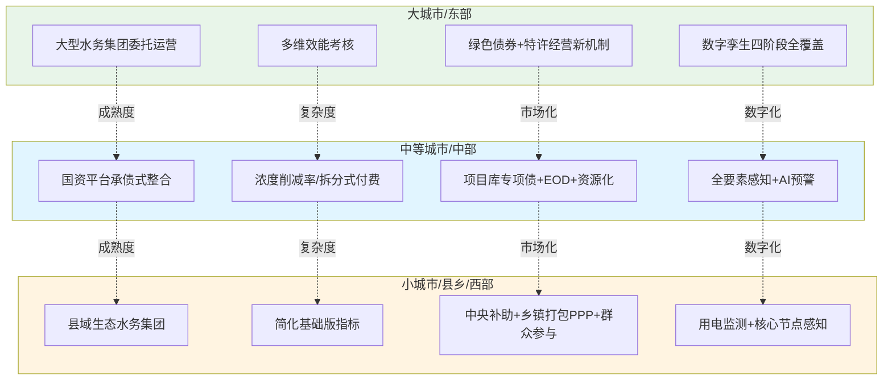

| 适配维度 | 大城市/东部 | 中等城市/中部 | 小城市/县乡/西部 |
|---|---|---|---|
| **组织重构** | 大型水务集团委托运营+片长制+特许经营新机制 | 国资平台承债式整合 | 县域生态水务集团+省级统筹 |
| **按效付费** | 南京式多维效能权重 | 湘潭式浓度削减率/长沙式拆分 | 简化基础版 |
| **指标体系** | 五维度多指标+鼓励指标 | 五维度核心指标 | 四维度核心指标 |
| **资金通道主轴** | 绿色债券+特许经营+数据资产 | 项目库专项债+EOD+资源化 | 中央补助+乡镇打包PPP+以奖代补 |
| **智慧监管** | 四阶段全覆盖、数字孪生 | 前三阶段为主、智慧水务平台 | 前两阶段、用电监测 |
| **AA+评级** | AAA—AA+ | AA+ | AA—AA+ |
| **资金规模量级** | 百亿级公开市场融资 | 区县半年级别专项债40亿元 | 县域统筹54亿元/年 |
| **典型代表** | 南京、长沙、武汉、苏州、杭州 | 湘潭、海宁、十堰中心城区 | 郧西、房县、定安、平利、界首 |
| **改革启动至完成时间** | 18—36个月 | 12—24个月 | 6—18个月 |
| **关键避坑要点** | 避免行政性垄断、平台空转 | 避免承债能力不足、人员安置阻力 | 避免设施"晒太阳"、依赖单一中央补助 |

数据来源:综合本研究第4—8章前述分析。

### 8.8.5 跨类型适配的过渡与升级路径

需要说明的是,城市的适配类型并非一成不变,而是可以随着改革深化向更高级的类型升级。**杭州市六年改革实践表明,从单区试点到十城区全覆盖、从市域整合到城乡一体,适配类型可以阶梯式跃升**[^49]。这种升级路径的关键是:

**第一,基础打牢**——先在初始适配类型下完成组织整合、按效付费、智慧监管等基础工作;
**第二,能力提升**——通过资产规模扩张、信用评级培育、市场化经验积累,向更高级类型的前置条件靠近;
**第3,机制创新**——借鉴更高级类型的制度要素,在自身适配框架内进行创新。

对应到本研究,小城市可以先按"县域生态水务集团+简化基础版指标+中央补助"起步,在条件成熟后向"国资平台承债式整合+多维指标+EOD"升级;中等城市可以从"国资平台+削减率付费"起步,向"水务集团委托运营+多维效能+特许经营新机制"升级。这种"阶梯式跃升"路径,使每一个城市都能找到与自身禀赋匹配的改革起点,避免"一刀切"导致的执行困境。

总结本章设计,**政府管理部门可操作方案与实施路径将前七章的体系化结论转化为可直接拿取使用的工具集**——五步标准化组织重构操作流程提供了组建一体化运营主体的清晰路径;新建项目BOT/BOOT与存量项目TOT/委托运营的合同范本要点为政府与运营主体之间的权责关系提供了法律载体;按效付费实施细则与绩效考核办法将激励机制转化为可执行的考核条款;雨污协同规划与建设标准为工程协同提供了技术参数;智慧监管平台搭建路径为数字化转型提供了四阶段建设方法论;应急联动预案与跨部门协同机制保障了协同运作的韧性;试点—评估—推广分阶段实施路线图明确了改革推进的时间节奏;大、中、小三类城市差异化方案选项为不同规模城市提供了"对号入座"的方案模板。

本章作为全篇研究的成果集成与落地转化层,既是前七章设计的应用呈现,也为第9章风险防控与第10章政策建议提供了操作基础。**核拨制困境的破解不能停留在原则性建议层面,必须通过精细化的合同条款、考核细则、工程标准、智慧监管、应急预案、推广路线图等可操作工具集,将"体制—激励—资金"三位一体的改革蓝图转化为政府管理部门可直接采纳的方案集**——这正是本章设计的核心价值,也是本研究面向政府管理部门"做什么、怎么做、谁来做、何时做、如何衡量"的具体回答。

# 9 风险防控与长效保障机制

前八章已经形成了核拨制困境破解的完整方案体系——从问题诊断（第1—2章）、成本定位（第3章）、机制比较（第4章），到协同机制（第5章）、激励重构（第6章）、资金统筹（第7章）、可操作方案集（第8章）的层层推进，已经为政府管理部门提供了"做什么、怎么做、谁来做、何时做、如何衡量"的具体回答。然而，任何复杂改革在落地推进过程中都不可避免地面临多类风险——价格调整可能引发社会承受力压力、国企转型可能触发人员安置矛盾、社会资本回报可能因政府支付能力不足而崩塌、绩效考核数据可能被"指标博弈"所侵蚀、雨污协同建设可能影响居民日常生活。重庆兰州审计揭示的"按保底水量付费致财政超支2.03亿元"、临颍5.78亿元索赔诉讼、昌林公寓居民"小区成了露天工地"的投诉、某地政府故意倾倒尿素致下游水质考核不达标的极端案例[^96][^97]，都警示我们：**没有系统化的风险防控与长效保障机制，再精妙的方案设计都可能在落地执行中失效**。

本章作为前八章方案的风险防控与可持续保障层，遵循"风险识别—防控对策—长效保障—迭代优化"四位一体的设计逻辑：首先系统识别价格调整、国企转型、社会资本、数据真实性、雨污协同建设五类核心风险，并提出针对性防控对策；进而构建法律法规衔接、跨部门联合监管、信息公开与公众参与、人才与技术能力建设四类长效保障机制；最终通过持续评估迭代与方案动态优化机制，确保改革方案能够在动态调整中持续优化。本章承接第8章可操作方案集的落地实施需求，为第10章政策建议提供风险底线与保障基础，是核拨制改革"行稳致远"的体系化保障层。

## 9.1 价格调整社会承受力风险与社会稳定评估机制

价格调整是核拨制改革中最直接触及用户利益、最易引发社会反响的环节。第6章设计的"污水处理费向污水收集处理费扩展""工业差别化收费""居民阶梯化"等价格机制，必然涉及收费标准的调整。如何在"长期不调价的隐性矛盾累积"与"一次性大幅调价的社会冲击"之间寻找平衡，是价格机制能否真正落地的关键考验。

### 9.1.1 价格调整风险的多维表现

价格调整的社会承受力风险呈现多维表现。**第一维度是居民承受力风险**——居民污水处理费每立方米调整幅度0.1—0.3元看似不大，但对低收入家庭、老年家庭等敏感群体可能形成显著的支出压力。许昌市的实证具有典型意义——许昌市中心城区居民污水处理收费标准从原0.65元/m³调整至0.95元/m³，**根据2024年居民生活用水及用水户数测算，居民每月户均增加用水成本约（污水处理费）3.98元**；这一调整背景是**已执行二十年的省定征收标准0.65元/m³，全省其他地市在2017年已将居民污水处理费标准调整至0.95元/m³，许昌与国家最低标准差额0.3元/m³一直由财政承担**——长期不调价的代价是财政默默承担差额，但社会公众对此并无感知，一旦调整就会形成"突如其来的涨价"心理冲击。

**第二维度是工业用户承受力风险**。新昌县2025年12月发布的工业污水处理费调价方案显示，**医药企业纳管污水处理费由现行的每2.60元/立方米调整为3.12元/立方米，化工、皮革、印染、电镀、造纸等工业企业纳管污水处理费由现行的3.00元/立方米调整为3.60元/立方米；其它企业的污水处理费由现行的1.80元/立方米调整为2.16元/立方米**[^95]——20%左右的调整幅度对水耗较高的工业企业形成显著的成本压力，可能引发企业搬迁、停产等连锁反应。

**第三维度是社会稳定风险**。价格调整若处理不当，可能从经济议题升级为社会稳定议题。阿荣旗在调整污水处理费前专门开展了社会稳定风险评估公示，**征求意见涵盖"对当前那吉镇建成区污水处理服务质量、处理效果，有无改善提升的心理期望""污水处理费标准未随经济社会发展、污水处理成本变化而浮动，城区污水排放量、化工园区建设、处理范围较以往大幅增加，是否存在产生发展性、结构性矛盾""污水处理费重新调价工作可能引发哪些方面、哪些群体的不同意见"等核心议题**[^95]——这种"调价前先评估稳定性"的程序，本身就是风险防控的重要工具。

### 9.1.2 标准化风险防控流程的五步设计

借鉴阿荣旗、新昌县等地实践，可设计"成本监审+承受力测算+公众听证+分步调整+低收入兜底"的标准化风险防控流程。

**第一步：成本监审先行**。任何价格调整都必须以独立第三方成本监审为基础。新昌县调价依据是"对那吉镇污水处理费重新核定污水处理成本"[^95]、"按照《内蒙古自治区发展和改革委员会内蒙古自治区住房和城乡建设厅关于进一步做好污水处理收费有关工作的通知》（内发改价费字〔2023〕85号）等相关文件要求"进行核定[^95]——上级文件依据+第三方成本监审是价格调整的双重合法性基础。

**第二步：承受力测算精细化**。承受力测算需覆盖三类指标：户均月支出增加额（如许昌3.98元/户/月）、占可支配收入比例（一般控制在0.5%以内）、对低收入家庭影响（按低保家庭单独测算）。许昌案例给出了精细化测算的标杆——**根据2024年居民生活用水及用水户数测算，居民每月户均增加用水成本约（污水处理费）3.98元**——这种"具体到每户每月几元"的精细化测算，比抽象的"调整0.3元/m³"更易于公众理解。

**第三步：社会稳定风险评估**。借鉴《内蒙古自治区重大决策社会稳定风险评估实施办法》《内蒙古自治区重大事项社会稳定风险评估工作操作规程（试行）》等制度依据[^95]，开展第三方独立社会稳定风险评估。阿荣旗委托呼伦贝尔安盛社会经济咨询有限公司开展评估，公示期15日[^95]；新昌县则委托宁波弘正工程咨询有限公司开展评估，公示期7日[^95]——评估机构的独立性与公示期的合理性是评估结果可信度的基础。

**第四步：公众参与听证**。听证程序应覆盖政策涉及的主要利益相关方。新昌县明确"征求公众意见范围：政策涉及的非居民污水排放单位为主"，征求内容包括"您对该方案内容是否知情""您认为该方案实施对当地建设生态文明的利弊""您认为是否有必要实施该方案""您是否支持该方案的实施""您最关心该方案中的哪一方面"五个问题[^95]——这五个问题的设计兼顾了知情度、价值判断、必要性、支持度、关注点五个维度，是听证问卷设计的标准范本。

**第五步：分步调整与低收入兜底**。对调整幅度较大的情形，建议采用"分步到位、过渡期保护、低收入兜底"组合工具。**贵州省发改委等部门《关于进一步深化污水处理收费机制改革的实施意见》明确"一步到位有困难的，可分步调整、逐步到位"**[^98]——这种"逐步到位"的政策弹性是应对调价幅度过大的关键工具。低收入兜底方面，广州的"低保家庭每人每月7m³享0.7元超低价、烈士遗属/优抚对象同享优惠"、容城的"低收入家庭享80%优惠"、云梦县"城区享受困难群众最低生活保障的用户按0.80元/吨缴纳"等做法，提供了多种可借鉴的兜底设计。

### 9.1.3 媒体宣传引导与心理预期管理

价格调整不仅是经济决策，更是预期管理过程。许昌案例的启示是——**长期不调价并不能避免成本，只是将矛盾从"用户付费"转化为"财政承担"，并损害了财政可持续性**——这一逻辑必须通过有效的媒体宣传让公众理解。建议在调价前6个月启动渐进式宣传：

第一阶段（调价前6—4个月）以"成本透明"为主题，通过媒体披露成本监审结果、财政长期补贴规模、不调价的隐性代价；第二阶段（调价前3—2个月）以"承受力对比"为主题，公布与同类城市的比较数据、户均影响测算、低收入兜底安排；第三阶段（调价前1个月—实施）以"实施安排"为主题，明确生效时间、过渡期安排、申诉渠道。这种"分阶段、有节奏、重透明"的宣传策略，能够将"突如其来的涨价"转化为"早有预期的合理调整"，显著降低社会冲击。

## 9.2 国企转型与人员安置风险及平稳过渡方案

第5章组织重构方案与第8章五步标准化整合流程涉及大量国有水务企业改制、资产划转、人员安置等敏感问题。这些环节处理不当不仅会影响改革进度，更可能引发劳动关系矛盾、社会稳定问题，甚至司法诉讼。

### 9.2.1 国企改制人员安置的法定程序与重要意义

**《关于规范国有企业改制工作的意见》（国办发[2003]96号）规定"国有企业改制应采取重组、联合、兼并、租赁、承包经营、合资、转让国有产权和股份制、股份合作制等多种形式进行"**[^95]；**《国务院办公厅转发国资委关于进一步规范国有企业改制工作实施意见的通知》（国办发[2005]60号）规定，国有企业改制一定要切实维护职工的权益，改制方案必须提交企业职工代表大会或职工大会审议，并按照有关规定和程序及时向广大职工群众公布**[^95]。**国有企业实施改制前，原企业应当与投资者就职工安置费用、劳动关系接续等问题明确相关责任，并制订职工安置方案。职工安置方案必须经职工代表大会或职工大会审议通过，企业方可实施改制**[^95]。

人员安置的重要意义可归纳为三个层面：**第一，影响改制进度**——职工安置问题为国有企业改制的重要环节，安置问题的妥善解决极大影响国企改制的进度；**第二，影响职工个人发展**——国企改制直接影响到职工个人的工作调整，工作调整会影响其职业发展、家庭收入、生活质量、身心健康等；**第三，影响社会稳定**——在职工未能充分理解认同单位的有关决定或安置达不到职工心理预期时，会引起职工心理的负面情绪，进而导致上访、散播不良舆论等负面行为的发生[^95]。

### 9.2.2 标准化人员安置方案的核心内容

借鉴**职工安置方案一般包括以下内容：企业的人员基本情况分析及分流安置意见；职工劳动合同的履行、变更、解除及重新签订等方案；解除劳动合同职工的经济补偿方案；社会保险补缴、关系转移等手续；拖欠职工的工资等债务和企业欠缴的社会保险费处理办法等**[^95]，结合郧西县"人员安置坚持'人随资产走、待遇不降低'，妥善安置涉改人员，实现改革平稳过渡"的实践经验，可设计五大类标准化安置方案：

**第一类：留用安置**。**核心业务需要的人，可以继续聘用或变更合同**[^95]。这是水务运营主体改制中的主流安置方式——管网养护、污水处理、泵站运行等专业岗位的原有人员通过变更劳动合同主体（从原事业单位/国有公司变更为新组建的运营主体）继续留用，待遇不降低，避免改革对运营连续性造成冲击。

**第二类：解除合同安置**。**无法留用的，依法协商解除或单方解除，并支付经济补偿**[^95]。经济补偿标准按《劳动合同法》执行，并可在地方财力允许范围内适度提高补偿水平以体现对老员工的关怀。

**第三类：特殊安置**。**对老、弱、病、残等符合条件的员工，可能安排内退、协议保留社保等**[^95]。这类安置在大型水务企业改制中尤为重要，因为水务行业老员工占比较高、工龄长，简单解除可能引发显著的社会问题。

**第四类：转移劳动关系**。**将员工转到新单位或关联企业**[^95]。例如，一些原住建/水务局事业编制人员可转入新组建的国资水务平台聘用，保留事业编但工作于市场化运营公司。

**第五类：特别情形处理**。**停薪留职、长期两不找、请长假，长期休病假、仅存在在企业档案中的人员等，需要针对具体情况制定相应对策逐一处理；对工伤、患病或非因工负伤人员的劳动关系，根据法律的特殊规定，结合其自身意愿和客观情况妥善处理；改制时处于"三期"（孕期、产期、哺乳期）女职工**等特殊群体，需提供更高保护标准[^95]。

### 9.2.3 改革平稳过渡的关键支撑机制

平稳过渡的关键不仅在于安置方案本身，更在于配套的支撑机制：

**第一，职工代表大会审议**。**国有企业改制前，原企业应当与投资者就职工安置费用、劳动关系接续等问题明确相关责任，并制订职工安置方案。职工安置方案必须经职工代表大会或职工大会审议通过，企业方可实施改制**[^95]——这一程序不仅是法律要求，更是化解改革阻力的关键机制。通过职代会审议，员工的关切可以系统化反映、解决方案可以集中讨论，降低个体异议演变为群体事件的风险。

**第二，第三方独立评估**。郧西县实践表明，**资产厘清：引入第三方机构开展资产评估与尽调，逐厂签订三方会商备忘录，确保资产移交合法合规**——这种"政府+原企业+第三方"的三方会商机制为人员安置中的资产权属、债务清算、补偿测算等技术问题提供了专业化支撑。

**第三，全过程信息公开**。**改制方案必须提交企业职工代表大会或职工大会审议，并按照有关规定和程序及时向广大职工群众公布**[^95]——信息公开是消除"暗箱操作"猜疑、增强职工信任的根本途径。建议建立"改制专栏"、定期通报会、申诉渠道等多元信息公开机制。

**第四，过渡期保护**。借鉴长沙模式"按纳污区自该区域首批次交接日起设置两年过渡期"的设计思路，对人员安置同样建立3—5年过渡期——过渡期内薪酬待遇不低于改革前水平、社保关系平稳接续、专业培训持续提供，避免"一次性切割"带来的冲击。

将五大类安置方式与配套支撑机制整合：

| 安置方式 | 适用对象 | 核心要点 | 法律依据 |
|---|---|---|---|
| 留用安置 | 核心业务需要人员 | 变更合同主体、待遇不降低 | 《劳动合同法》合同变更条款 |
| 解除合同 | 无法留用人员 | 经济补偿、社保结清 | 《劳动合同法》解除及补偿条款 |
| 特殊安置 | 老弱病残及临退休人员 | 内退、协议保留社保 | 国发[2015]54号、地方政策 |
| 转移劳动关系 | 部分管理岗人员 | 转入关联企业、保留编制 | 国发改经体〔2017〕2057号 |
| 特别情形处理 | "三期"女职工、工伤人员等 | 法律特殊保护+个案协商 | 《劳动合同法》特殊保护条款 |

数据来源：综合自[^95]。

## 9.3 社会资本回报与政府支付能力风险防控

第4章已系统梳理了PPP/特许经营的"分手潮"教训，第8章设计了新机制特许经营合同范本要点。本节进一步基于兰州审计案例与政府支付能力新形势，深化全生命周期风险防控方案。

### 9.3.1 兰州PPP案例的深刻教训与"按保底水量付费"陷阱

兰州市审计局在2024年度部门预算执行审计中发现的污水处理PPP项目问题极具警示意义。**兰州市4座污水处理厂均按原PPP模式运行，订立协议时未充分考虑"利益共享、风险共担"的原则，按照保底处理水量向社会资本方付费，政府方较多承担兜底风险；后续协议履行过程中，未建立能够覆盖政策导向、地方财政承载力、经济周期波动的动态调整付费机制，致使污水处理服务费用与实际服务效能脱节，部分"空转服务"未被识别**[^96]。

财务后果触目惊心——**2020年至2024年期间，相关主管部门按照原PPP协议规定的保底水量付费方式向污水处理厂支付污水处理费15.24亿元；若按照实际处理水量计算，则仅需支付13.21亿元。经测算，5年期间两种付费方式的差额高达2.03亿元，若沿用现行模式付费至特许经营期结束，则未来15年财政需多支出污水处理费约6.09亿元**[^96]。审计指出该问题后，督促有关部门核减污水处理费1710.45万元[^96]。

兰州案例揭示的核心教训可归纳为四点：**第一，"按保底水量付费"在管网完善度低、外水入侵严重的地区会导致政府方承担显著的兜底风险**——保底水量的设定脱离实际处理需求，形成"空转服务"也要付费的低效格局；**第二，"未建立动态调整机制"使政策环境变化（如管网修复带来的水量减少）无法传导到付费机制**，原合同的不合理条款持续累积财政负担；**第三，"利益共享、风险共担"原则未真正落实**——政府方承担过多风险、社会资本方"旱涝保收"，激励机制扭曲；**第四，审计监督发挥了关键作用**——若没有兰州审计的精准把脉，2.03亿元的财政超支可能持续累积。

### 9.3.2 PPP全生命周期风险图谱

参照大成研究对PPP风险的系统刻画——**前期以政策、审批风险为主；建设期突出成本、工期风险；运营期则面临市场、收益及运营效率风险。同时，风险本身会随着内外部环境变化而演变**[^95]——可构建覆盖五个阶段的全生命周期风险图谱：

| 阶段 | 主导风险类型 | 典型表现 | 防控对策 |
|---|---|---|---|
| 项目识别期 | 政策合规风险 | 不符合115号文新机制要求 | 严格合规论证、合规清单 |
| 准备期 | 政策审批风险 | 立项、用地、环评、规划等审批延迟 | 联合审查、并联审批 |
| 采购期 | 招标合规风险 | 民营股权占比、政府代表控股等 | 严格按17号令执行 |
| 建设期 | 成本工期风险 | 投资超概算、工期延误 | EPC总承包、风险共担条款 |
| 运营期 | 市场收益风险、政府支付风险 | 进水水量水质波动、财政拖欠 | 按效付费、第三方资金监管 |
| 移交期 | 资产处置风险 | 移交标准不清、设施折旧争议 | 移交标准合同前置 |

数据来源：综合自[^95][^99][^96]。

**集团公司长江大保护PPP项目付费模式主要为政府可行性缺口补助，即扣除部分使用者付费外，大部分收费来源于政府财政**[^99]——这一模式特征决定了运营期政府支付风险是PPP项目的核心风险。**地方政府履约能力和诚信水平对于PPP项目收益至关重要**[^99]。**经了解，政府履约付费风险主要体现在如下方面：地方政府财政承受能力不足；采取不公正的绩效考核、审计等方式扣减付费；社会资本方与政府合作关系不融洽；地方主管官员调换**[^99]。

地方主管官员调换风险尤其值得关注——**多数PPP项目合作周期一般为10—30年，该时间段内往往历经多届政府。由于地方主管官员更换，新任领导重点关注工程变化，加上地方财政收入较为有限，实践中时常出现新官不理旧账的现象**[^99]。这一风险在合同设计层面难以完全消除，但可通过强化第三方资金监管、上级人大政协监督、立法保障等机制加以缓释。

### 9.3.3 风险防控工具箱的精细化设计

针对全生命周期风险图谱，可设计五类精细化防控工具：

**工具一：动态调价机制**。借鉴第6章长沙式四段拆分模型，将污水处理服务费拆分为建设投资、生产运营变动部分、生产运营固定部分、绩效奖惩部分，并引入LPR浮动机制对冲利率风险、能源价格挂钩对冲变动成本风险、CPI挂钩对冲人工通胀风险。**兰州审计提出的"探索建立契合本地实际的污水处理费动态调整机制，系统梳理并完善污水处理服务协议中的相关付费条款"**[^96]，正是动态调价机制的核心要点。

**工具二：保底水量重核与动态调整**。对兰州式"保底水量过高致超付"问题的根本性解决方案，是建立"保底水量定期重核+实际处理水量浮动"的复合机制。具体设计：**第一**，按合同约定每3—5年对保底水量进行重核，依据实际管网完善度、外水入侵率、历史处理水量分布重新设定；**第二**，在保底水量基础上设置上下浮动区间，实际处理水量在区间内按实际付费、超出区间按特殊机制处理。

**工具三：第三方资金监管账户**。这是临颍5.78亿索赔教训的针对性回应，也是防范地方财政拖欠的根本性工具。具体设计：污水处理费征收后专户存储、按合同支付；政府方按合同约定金额预存保证金；监管账户由财政、住建、行业主管部门、运营主体、第三方监管机构共同监管。

**工具四：支付滞期违约金**。**政府方支付滞期超过约定期限（如90天）的，按LPR上浮一定比例（如50—100%）计收违约金**——这一机制虽名义上增加了地方财政的潜在负担，但实质上是通过"违约成本显性化"倒逼地方财政重视水务支付的优先级。

**工具五：绩效考核公正性保障**。**经参与PPP项目的律师介绍，某地方政府在PPP项目绩效考核时曾发生故意指示人员在河流上游暗中倾倒尿素致使下游河段水质绩效考核不达标的极端情形**[^99]——这种极端案例警示，绩效考核必须建立第三方独立核查、监测设备防篡改、争议处理仲裁等多重保障，详见9.4节。

**工具六:存量项目"软改造"**。对已签的传统PPP/BOT合同，按第8章设计的三步"软改造"路径（存量合同评估—补充协议签订—支付保障同步建立）逐步过渡到新机制。**兰州审计建议"加强监管，压实各方主体责任。相关行业部门切实履行监管与考核职责，强化履约考核工作，建立考核结果与费用支付的挂钩机制，兼顾政企双方利益平衡，充分保障双方合法权益，推动污水处理行业步入良性发展轨道；优化机制，提高资金使用绩效。逐步改变原PPP项目普遍存在的地方政府兜底、推高财政负债规模的经营模式，促进社会资本方加强运营管理，不再将政府承诺保底条款视为'旱涝保收'的稻草"**[^96]——正是软改造的核心要义。

### 9.3.4 结合115号文与84号文的合规新要求

PPP/特许经营领域的合规要求在2023—2025年密集更新。**2023年，国务院办公厅转发《关于规范实施政府和社会资本合作新机制的指导意见》（国办函〔2023〕115号），标志着中国PPP发展进入了以"聚焦使用者付费、全部采取特许经营模式"为核心特征的新阶段**[^95]；**2025年财政部发布《关于规范政府和社会资本合作存量项目建设和运营的指导意见》（国办函〔2025〕84号），并通报了六起地方政府隐性债务问责典型案例。这一系列政策动向，不仅是对过往实践的经验总结与问题纠偏，更是对未来PPP模式健康发展路径的重新锚定。新机制的核心逻辑，在于严格区分企业投资经营行为与政府支出责任，严防任何形式的财政风险转嫁，其政策决心在问责案例中得到了前所未有的严肃体现**[^95]。

这就要求新建项目严格按115号文+17号令+全国PPP项目信息系统等合规框架执行，存量项目按84号文要求开展规范整改。运营主体必须树立"合规优先"意识，避免因为政策合规问题导致项目"流产"——昆明43亿元第十五水质净化厂2023年定标、2025年因政策调整解约的教训不容重蹈。

## 9.4 绩效考核数据真实性风险与第三方核查制度

按效付费机制的财务激励效力建立在绩效考核数据可信度之上。一旦数据失真，整个机制就会从"激励改善"异化为"激励造假"。本节针对数据造假、指标博弈、考核腐败等关键风险，设计五道防线。

### 9.4.1 数据造假的极端案例与风险图谱

数据造假风险的极端案例在前文已有揭示——**经参与PPP项目的律师介绍，某地方政府在PPP项目绩效考核时曾发生故意指示人员在河流上游暗中倾倒尿素致使下游河段水质绩效考核不达标的极端情形。实践中，PPP合同中往往约定项目总投资额最终以政府方委托的审计机构决算审计值为准，政府委托审计机构对运营期内的电力成本、人工成本等进行专项审计。如果上述审计中，政府故意压低项目总投资额或运营成本，必将影响项目收益**[^99]。这一极端案例揭示，数据真实性风险并非仅来自运营主体一方，政府方也可能通过操纵考核数据扣减付费。

按效付费机制下的数据真实性风险图谱呈现五维表现：

**第一维：监测设备造假**——通过修改在线监测仪器参数、屏蔽异常数据、定期"调校"使监测值偏离实际；
**第二维：人工取样造假**——在取样、化验、报送环节进行人为干预，使数据呈现期望状态；
**第三维：台账造假**——通过事后修改运行记录、伪造维护工单、掩盖故障次数等方式美化运营状况；
**第四维:指标博弈**——通过选择性达标、季节性运行、关键时点冲刺等方式应付考核，但平时运行水平不达标；
**第五维:考核腐败**——通过权力寻租使考核机构、监督人员等放松监管，形成"数据造假—利益输送"链条。

### 9.4.2 五道防线的精细化设计

针对上述风险图谱，可设计"防造假—独立核查—交叉比对—异常预警—造假重罚"五道防线。

**第一道防线:在线监测设备防篡改**。所有用于按效付费考核的在线监测设备必须满足三项技术要求：第一，**数据自动上传至上级监管平台，不经过运营主体本地服务器中转**——避免在传输环节被篡改；第二，**设备参数变更需双人授权、留痕可追溯**——避免单人操控修改；第三，**关键监测设备建立"运营主体监测+生态环境部门监测+第三方监测"三套并行体系**——通过物理冗余降低单点故障风险。十堰**已在全市114个污水处理厂安装用电监控监测终端，实时收集计量监测数据，并提交十堰智慧城市大脑进行分析研判**——"以电折水"作为水质数据的辅助佐证，是低成本但极有效的反造假手段。

**第二道防线:第三方独立核查**。借鉴娄底市第三方成本审核实践，建立按效付费第三方核查制度。核查机构必须满足"具有财政部门颁发的会计师事务所执业证书""未被'信用中国'网站列入失信被执行人""具有供水、污水处理、垃圾处理行业成本审核相关工作经验"等资质要求；核查方式包括现场核查、查阅资料、设备查验、数据核对等多元手段。塔城地区生态环境局裕民县分局联合县住建局开展的"采取现场核查、查阅资料、设备查验、数据核对等方式，重点围绕排污许可制度执行、污水处理设施运行、进水与出水水质达标、在线监测设备运维、污泥规范处置、安全生产管理、管网配套运维等关键环节开展全方位检查"[^98]——为第三方核查的内容范围提供了直接参照。

**第三道防线：交叉比对**。建立"在线监测+人工取样+用电监测+台账记录+物料平衡"的多源数据交叉比对机制。**汉阴县扎实开展一季度城镇污水处理厂（站）绩效考核工作，以运营台账数据、日常巡查记录为重要依据，围绕设施运行、水质管控、日常管理等重点内容，对全县各污水处理厂（站）开展全方位、全覆盖综合考评。考核组坚持问题导向，逐项核查运行资料、实地查验现场工况，通过数据横向对比、纵向溯源，精准分析进水水质、出水指标、运行负荷等关键参数，全面掌握各厂站常态化运营实情**[^96]——"数据横向对比、纵向溯源"是交叉比对的核心方法论。

**第四道防线：异常预警**。通过AI算法对监测数据进行实时分析，识别异常模式自动触发预警。典型异常模式包括：进水浓度突然显著上升或下降、出水水质长期"卡线达标"、用电量与处理水量严重背离、污泥产量与处理水量比值异常等。预警触发后由住建/水务部门、生态环境部门联合开展专项检查。

**第五道防线：造假重罚**。借鉴上海市水务局执法总队的执法实践——**当事人某餐饮公司在开展餐饮经营活动中，将其产生的餐饮污水排入市政管网，且无法提供有效的《城镇污水排入排水管网许可证》。综合违法事实、证据及整改情况，认定当事人存在未经许可向城镇排水设施排放污水的行为，违反《城镇排水与污水处理条例》第二十一条第一款规定。依据《城镇排水与污水处理条例》第五十条第一款及《排水行业违法行为行政处罚裁量基准》（沪水务规范〔2023〕4号），依法责令当事人改正违法行为，并处罚款人民币柒万元整**[^100]——这种"严格执法+处罚与教育并重"的执法模式，对绩效考核数据造假同样具有借鉴意义。具体设计建议包括：数据造假一经查实立即停付服务费、列入行业黑名单、追究主要责任人法律责任、按情节严重程度处以经济处罚（参照《城镇排水与污水处理条例》第五十条"50万元以下罚款"标准）等。

### 9.4.3 农村污水治理领域的辅助经验

南安市在乡镇党政领导干部经济责任审计中的"三聚焦"做法可作为绩效考核的辅助参照——**一是聚焦资金安全红线，筑牢合规使用屏障。审计组全面追踪各级财政安排的农村生活污水治理专项资金流向，着力揭示虚报冒领、挤占挪用、闲置沉淀等违规问题；二是聚焦项目民生属性，把牢治污成效关口。审计人员通过走访当地村民了解污水处理设施运行实效，重点关注污水处理项目"建设-运行-管护"全周期，实地检查处理设施建设情况、运行状态、出水水质，确保污水处理惠及民生；三是聚焦绩效刚性约束，构建长效管理机制。通过比对水质改善数据、村民投诉率变化等指标，验证绩效自评报告真实性，重点追踪绩效结果在后续资金分配、管护责任落实中的应用实效，确保污水处理设施长期稳定运行**[^96]。

南安经验的核心启示是——**绩效考核不能仅依赖运营主体自评报告，必须通过实地核查、走访群众、比对客观指标（水质改善、村民投诉率变化）等多元方式验证报告真实性**。这种"多源验证"思路对城镇按效付费绩效考核同样适用。

### 9.4.4 长效保障的制度抓手

数据真实性的长效保障还需要四类制度抓手：

**第一，监测数据公开披露**。在线监测数据按规则向社会公开披露，接受公众监督。深圳水务集团**汇聚国家、地方政府以及水务企业生产运营等11家单位多源数据，覆盖流域内从源头排水小区到海湾的11类关键涉水数据、37类监测数据**——为监测数据公开披露提供了量级参照。

**第二，运营主体诚信档案**。建立水务运营主体诚信档案，对绩效考核数据真实性、违规行为、整改记录等进行长期跟踪，作为后续合同续签、新项目招标的重要依据。

**第三，行业黑名单机制**。对存在严重数据造假、违法排污等行为的运营主体列入行业黑名单，限制其参与新项目投标、限制其享受财政补贴等。

**第四，涉刑责任追究**。**从事工业、建筑、餐饮、医疗等活动的企业事业单位、个体工商户向城镇排水设施排放污水的，应当向城镇排水主管部门申请领取污水排入排水管网许可证；造成损失的，依法承担赔偿责任；构成犯罪的，依法追究刑事责任**[^100][^101]——刑事责任追究是数据造假最严厉的法律约束。建议在《城镇排水与污水处理条例》修订中明确"故意提供虚假绩效考核数据，骗取污水处理服务费"的法律责任。

## 9.5 雨污协同建设期民生影响风险与共治化解路径

第5、8章设计的雨污分流改造、城中村源头整治、调蓄池建设等大规模工程，在城市建成区推进过程中不可避免地产生扰民问题。处理不当不仅会引发居民投诉，更可能阻碍工程推进。本节通过虹口85个小区的成功案例与昌林公寓的反面案例对照，提炼共治化解路径。

### 9.5.1 民生痛点的多维识别

老旧小区雨污分流改造的民生痛点呈现五维表现。**第一维：施工噪声扰民**——昌林公寓案例中**一台小型挖掘机正紧邻居民楼作业，工人师傅操纵着吊臂，一下下重重砸向地面，发出刺耳的撞击声，令人不由得捂住耳朵。"你听听，就是这种声音！"居民刘先生指着不远处的挖掘机说，"有时候周末想睡个懒觉，一大早就会被这'轰隆隆'的声音惊醒，实在让人头疼。"按照施工约定，施工时间为早晨7时30分。"实际工人们7点就开始敲敲打打，阿拉实在是难以忍受！"**[^97]

**第二维：扬尘与堆物**——**两截粗大的管道直接堆放在绿化带旁，另一侧则是一堆半米高的土堆，这些物料露天堆放，居民直言，风一吹，扬起的沙尘让人睁不开眼。"这些物料乱摆乱放，既不美观，也影响阿拉正常通行"**[^97]。

**第三维：停车难**——**昌林公寓建于上世纪90年代末，由5栋6层居民楼组成，属于典型的老旧小区。小区原本仅有30多个公共车位，可谓是"捉襟见肘"。多年来，居民们相约采取"先到先停"的默契规则，勉强维持着小区内部的停车平衡。然而，这场大规模的雨污分流改造工程，彻底打破了这份脆弱的平衡。"现在路挖开了，原来的车位线都没了，车根本停不进去。"**[^97]

**第四维：管网更换不彻底的隐患**——**针对居民担心的施工扰民、管道更换不彻底等问题**[^96]，居民对工程质量本身的担忧。

**第五维:临时违停误判风险**——临时停车证制度可能引发执法误判：**"临时停车证是有了，但这终究不是治本之策啊。如果哪天回来晚了，或者没带'临时停车证'，很容易造成'违停'误会，到时候罚单下来，我们找谁说理去？"**[^97]

太和花苑案例进一步揭示老旧小区改造的复杂性——**该小区位于我市城区主干道工农北路65号，建成投用已二十余年。由于建成时间久远，小区原有排水系统采用雨污混接模式，加之管网老化严重，近年来频繁出现管网堵塞、排水不畅等问题，尤其降雨后易发生积水内涝现象，不仅影响居民日常出行，也降低了居住舒适度，成为亟待整治的民生痛点**[^96]。这种"二十余年老旧+雨污混接+管网老化"的"三老共存"格局，正是雨污分流改造的最大攻坚区。

### 9.5.2 虹口85个小区共治模式的成功实践

虹口区85个小区雨污分流整治的成功实践提供了"民生工程办成民心工程"的标杆样本。

**居民全程参与的深度共治**。**小区里藏着不少"能人异士"，比如排水专业的高级工程师、同行业的工程承包商等，这些专业人士从工程设计阶段就深度参与，区房管局、街道和设计方多次到小区听取意见，仅设计方案就优化了5版。施工中，专业居民从细节把控质量，小到钢筋水泥铺设时的石块垫空，大到管道更换的工艺标准，都能给出专业建议，让工程质量更有保障。居民的配合也同样暖心，铺沥青当天，小区100辆私家车全部主动开出，为施工让出工作面**[^96]——这种"专业居民深度参与+普通居民配合让路"的双层共治，是虹口模式的核心创新。

**贴心施策化解扰民痛点**。**针对居民担心的施工扰民、管道更换不彻底等问题，施工方做到施工期间每日清扫洒水，尽可能减少噪音和扬尘；原本存在争议的墙体外管道、残疾人坡道内的堵塞管道，全部完成更换并加装新井，彻底解决管道老旧问题。为避免外区出现的窨井盖凸起问题，施工方优化施工顺序和设计，有条件的尽量将窨井设置在绿化带中，让路面保持平整，真正做到"施工不添堵，整治更彻底"。整治后，小区30年的老旧管道全部换新，化粪池被取消，路面积水问题解决，还新增了景观灯、更换了休闲设施，小区环境实现全面提升**[^96]。这种"在一道工程中叠加多重改善"的设计思路，将居民的"暂时承受"转化为"长期受益"。

**精准协调化解停车难**。场中公寓案例提供了停车协调的精细化范本——**针对小区66辆受施工影响的车辆，居委会多方协调，充分盘活周边停车资源，10辆车停到附近小区，20辆车驶入附近医院，10辆车停进附近停车场，26辆车停靠在商场，彻底解决了居民的"停车难"问题**[^96]。这种"精确到每辆车去向"的协调强度，体现了基层治理的精细化水平。

**多方共治模式的制度化**。**虹口区85个小区的雨污分流整治，以多方协同的共治模式，破解了老旧小区施工的诸多难题。工程推进过程中，区房管局充分发挥统筹协调作用，推动施工方、街道、居委会、业委会、物业形成多方共治合力，鼓励居民全程参与工程监督，推动施工方不断优化施工方案和服务举措**[^96]。这种"区房管局统筹+街道居委协调+施工方贴心施策+居民全程监督"的四方共治机制，是虹口模式可复制可推广的核心制度抓手。

### 9.5.3 标准化施工管理流程的五步设计

基于虹口、太和花苑等案例的正反对照，可设计"前期摸排—方案优化—多方共治—居民参与—贴心服务"五步标准化施工管理流程：

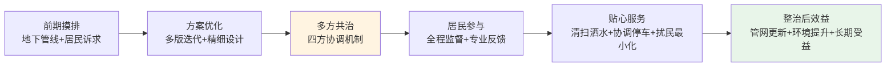

**第一步：前期摸排**。**项目开工前期，在市住建部门牵头统筹下，万特公司全面开展地下既有管线摸排工作，精准摸清管线分布、走向及埋深等关键信息，在此基础上科学制定精细化施工方案和施工期间交通疏导预案，最大限度降低施工对小区居民出行及日常生活的干扰**[^96]——前期摸排不仅是工程技术准备，也是后续居民沟通的信息基础。

**第二步：方案优化**。借鉴虹口"设计方案优化5版"的经验，方案设计阶段应预留与居民沟通的迭代时间，听取小区中"能人异士"的专业意见，避免施工后才发现方案缺陷。

**第三步:多方共治协调**。建立"区主管部门统筹+街道居委协调+施工方+物业+居民代表"的多方协调机制，定期召开协调会，及时化解矛盾。

**第四步:居民全程参与监督**。鼓励居民代表全程参与工程监督，特别是吸纳具有专业背景的居民进入监督团队。这种"民间监督"的成本极低但效果显著，是政府监管的有益补充。

**第五步:贴心服务化解扰民**。围绕噪声、扬尘、停车、出行、安全五大民生痛点，逐一设计贴心服务举措。具体包括：施工期间每日清扫洒水、限定施工时间（避免清晨与节假日早晨）、提前协调周边停车资源、多渠道发布施工进度、设立专门的居民诉求响应渠道等。

### 9.5.4 工程管理与民生关怀的内在统一

需要特别强调的是，雨污协同建设期民生关怀不是对工程进度的"妥协让步"，而是工程管理的内在组成部分。**虹口85个小区的雨污分流整治，始终把"民生为本"放在核心位置。为切实把这项民生工程办成民心工程，区水务局会同区房管局，各街道全力配合，提前开展摸底调研、整体规划，将住宅小区雨污混接改造作为提升城市排水能力、改善民生福祉的重点工作统筹推进**[^96]——这种"民生为本"的理念是工程能否顺利推进的关键。

工程管理与民生关怀的内在统一体现在三个层面：**第一**，**居民配合就是工程效率**——铺沥青当天100辆私家车主动开出让路，本身就是工程效率的极大提升；**第二**，**专业居民参与就是工程质量**——居民工程师对工艺的专业建议是质量提升的免费资源；**第三**，**整治后的环境提升就是民心工程**——化粪池取消、路面积水解决、景观灯新增等综合提升，使居民从"暂时不便"转化为"长期满意"，为下一轮改造积累社会信任。

## 9.6 法律法规衔接与"小快灵"地方立法保障

法律法规是改革持续推进的法治保障。第6章已经初步论证了法治先行的必要性，本节进一步系统梳理法律法规衔接路径与地方立法范式。

### 9.6.1 国家层面法律法规修订需求

国家层面的核心法律法规包括《城镇排水与污水处理条例》《污水处理费征收使用管理办法》（财税〔2014〕151号）、《城镇污水处理厂污染物排放标准》（GB18918—2002）等。结合本研究改革方案的落地需求，可识别出三类关键修订需求：

**第一类：污水处理费使用范围扩展**。当前《污水处理费征收使用管理办法》将使用范围限定在"建设、运行和污泥处理处置"——这一限定与第3章定位的管网运维、雨污协同等"三外"困境的破解需求存在结构性矛盾。建议修订该办法，明确将"管网运维""雨污协同设施""按效付费奖励"等纳入污水处理费使用范围。

**第二类:按效付费纳入条例**。当前《城镇排水与污水处理条例》及各地实施条例（如大同、长子、云浮等地）主要从"管理"角度规范排水许可、设施保护等内容[^100]，对按效付费、厂网一体等机制安排涉及不深。建议在条例修订中明确"鼓励实施按效付费""推行厂网一体专业化运行维护""建立污水处理服务费动态调整机制"等核心制度。

**第三类:雨污分账边界明确**。当前各地条例对雨水管理与污水管理的分账边界普遍不清晰。建议在条例修订中明确"污水处理费用于污水边界、雨水管理费用/财政专项用于雨水边界"的分账原则，为雨水费试点等创新提供法律依据。

### 9.6.2 地方"小快灵"立法的范式与价值

地方"小快灵"立法是国家层面立法相对滞后情境下的有效补充。**云浮市人大常委会自2015年获得地方立法权以来，坚持深入推进生态环保、文化传承、产业升级、民生保障等重点领域立法，以良法保善治、促发展。截至2025年底，已制定地方性法规16部**[^100]——其中**《云浮市排水与污水处理条例》明确排水许可、管网建设等责任，助力破解水污染与内涝难题，让"清水绿岸"成为现实**[^100]。**云浮市还推进《云浮市暴雨灾害防御条例》立法工作，为应对气候变化、保障人民生命财产安全提供更加坚实的法治保障**[^100]。

湖南"小快灵"立法是这一范式的标杆。**湖南省以"小快灵"立法方式，在全国率先出台《湖南省城镇污水管网建设运行管理若干规定》，自2024年3月1日起施行，推行"厂网一体"、专业化运行维护和按绩效付费管理制度**——这种"小切口、强约束、可操作"的立法路径，避免了大而全的综合性立法导致的立法周期过长，使关键制度能够快速落地。

海绵城市领域的地方立法同样具有示范意义。**佛山《海绵城市建设管理条例》（2026年1月23日省人大常委会批准通过）明确了海绵城市建设的基本原则、部门职责、规划管控、建设要求、运营维护及法律责任，特别是确立了"规、建、管"全过程管控机制**；**三明市《海绵城市规划建设管理条例》于2024年10月1日正式施行，《三明市海绵城市规划设计导则》等7项技术导则也相继实施**；**扬州《海绵城市建设管理条例》（2025年8月通过、2025年9月省人大常委会批准）将海绵城市设施界定为具有"渗、滞、蓄、净、用、排"功能的绿色雨水设施、城镇排水与污水处理设施、河湖水体设施等的统称**。

### 9.6.3 立法过程的公众参与机制

立法的合法性不仅来自法律程序，更来自公众参与的深度。三明立法过程的回顾颇具启发——**"立法的过程，本身就是一次理念普及的过程……我们召开了20多场座谈会，听取了上百位专家和市民的意见。很多人从一开始问'海绵是什么'，到最后主动为条款提建议"**。这种"立法即普法、立法即共治"的思路，使立法过程本身成为社会基础培育的工具。

云浮立法实践进一步揭示了"基层立法联系点"的价值——**云浮市人大常委会以全覆盖备案审查工作维护国家法治统一，以从"有"到"优"的基层立法联系点建设汇聚民众智慧，持续为这座幸福之城注入坚实的法治力量**[^100]。基层立法联系点是立法机关直接联系群众、收集基层意见的"桥头堡"，在水务领域立法中应充分发挥其作用。

### 9.6.4 四级法治保障体系的构建

将国家、省级、市级、县级四级立法整合为协调统一的法治保障体系：

| 层级 | 主要功能 | 立法范式 | 典型代表 |
|---|---|---|---|
| 国家层面 | 修订《城镇排水与污水处理条例》《污水处理费征收使用管理办法》 | 综合性法律法规 | 中央立法机关 |
| 省级层面 | "小快灵"专项立法 | 关键议题专项突破 | 湖南《城镇污水管网建设运行管理若干规定》 |
| 市级层面 | 实施性条例 | 落实上位法+本地特色 | 大同、长子、云浮、铜陵、佛山、三明、扬州 |
| 县级层面 | 实施细则与规范性文件 | 操作层面规则 | 各县市住建/水务局规章 |

数据来源：综合自[^100][^98]。

## 9.7 跨部门联合监管与执法体系完善

第2章揭示的"九龙治水"体制痼疾在执法监管层面表现为部门职责交叉、协同不畅、执法资源分散。本节针对这一痼疾，设计跨部门联合监管的具体方案。

### 9.7.1 六部门联合监管框架

借鉴塔城地区生态环境局裕民县分局联合县住建局开展跨部门联合执法[^98]、衢州建筑垃圾"一张图"全过程监管[^98]等实践，可设计"住建+生态环境+发改+财政+市场监管+应急"六部门联合监管框架。

**塔城裕民县联合执法的实践表明**——**为深入贯彻落实生态环境保护工作相关要求，切实加强城镇污水处理设施规范化运行管理，筑牢水环境安全防线，近日，塔城地区生态环境局裕民县分局联合裕民县住房和城乡建设局，对辖区城镇污水处理厂开展专项跨部门联合执法检查，以执法联动强化监管效能。此次联合执法聚焦城镇污水处理厂运行管理全流程，立足裕民县城镇污水治理工作实际，坚持"依法监管、精准排查、帮扶整改、务求实效"的原则，明确两部门监管职责，形成执法监管合力**[^98]。这种"两部门联合"已经体现出协同监管的价值，扩展为"六部门联合"将进一步强化监管效能。

各部门职责分工明确：

| 部门 | 监管职责 |
|---|---|
| 住建/水务部门 | 规划制定、设施监管、排水许可、按效付费考核 |
| 生态环境部门 | 排放许可、水质监管、合流制溢流处罚、排污信用评价 |
| 发改部门 | 价格监审、重大项目立项、专项债申报 |
| 财政部门 | 污水处理费征收使用监管、服务费拨付、绩效评价 |
| 市场监管部门 | 工业排水户合规监管、计量器具管理、市场竞争监管 |
| 应急部门 | 暴雨灾害防御、突发污染应急、设施故障抢修 |

数据来源：综合自[^100][^98]。

### 9.7.2 排水许可分级分类管理

排水许可制度是污水管网监管的源头工具。**住建部等5部门《关于加强城市生活污水管网建设和运行维护的通知》要求各地排水主管部门严格落实污水排入排水管网许可制度，结合当地实际情况，对排水户实行分级分类管理，确定重点排水户清单。到2025年，各城市重点排水户全面落实排水许可要求**[^1]。

铜陵市的实践提供了排水许可全覆盖的标杆——**该处以全方位宣传为载体，以政务公开为纽带，将政策解读、民生服务与社会监督深度融合，走出了一条"公开促落实、公开促规范、公开促共治"的政务服务新路径……截至目前，全市累计发放排水许可证1774份，排水行为日趋规范。配套管网建设加速推进，累计新改建污水管网554.38公里，城市生活污水集中收集率从34.1%提升至69.96%，黑砂河明暗渠水质得到历史性改善，新民污水处理厂进水浓度得到显著提升**[^98]。1774份排水许可证的发放规模背后，体现的是"以宣传促办证、以办证促规范"的协同效应——**联合执法与常态化监管并行，80余个污水排放问题全部整改到位，60余户餐饮企业加装隔油池等设施，规范排水排污行为，水环境质量持续优化**[^98]。

排水许可的法律刚性可通过具体执法案例得到强化。上海市水务局执法总队的两个案例分别体现了"严格执法"与"宽严相济"的不同处置思路：

**严格执法案例**——**当事人某餐饮公司在开展餐饮经营活动中，将其产生的餐饮污水排入市政管网，且无法提供有效的《城镇污水排入排水管网许可证》。综合违法事实、证据及整改情况，认定当事人存在未经许可向城镇排水设施排放污水的行为……依法责令当事人改正违法行为，并处罚款人民币柒万元整**[^100]。

**宽严相济案例**——**执法人员现场检查发现某地产公司内部食堂正在排水，且无法出示有效的排水许可证……当事人的日均排水量约为2.37立方米。后经执法人员普法教育，当事人考虑到自身实际办公情况与需求，停止了其内部食堂运营，改为与相关持有排水许可证的餐饮单位合作，落实了整改要求……根据《水务领域轻微违法行为依法不予行政处罚清单》，执法部门对其作出了依法不予处罚的处理。该案件既达到了法律上处罚与教育相结合的效果，又落实了优化营商环境的要求**[^101]。

两个案例的对比启示是——**严格执法是底线，宽严相济是艺术**。对违法情节严重、社会危害较大的行为坚决处罚；对违法情节轻微、积极配合整改的行为，可在法律框架内适用不予处罚等弹性工具，体现执法的人性化与营商环境保护。

### 9.7.3 全过程协同监管的"一张图"范式

衢州市建筑垃圾"一张图"提供了全过程协同监管的范式参考。**衢州市住房城乡建设局以政府投资项目为突破口，创新绘制"一张图"——《房屋市政工程政府投资项目建筑垃圾源头减量全过程监管流程节点图》，将项目从立项到决算细分为10个关键节点，推动减量工作清单化、精准化，打通6个部门间的协同堵点，初步形成"全过程监管、跨部门协同"的治理新格局**[^98]。

**衢州的关键创新是"关口前移"——以往，建筑垃圾减量往往等到施工阶段才"亡羊补牢"。衢州的做法是：把减量要求提前到项目"出生"那一刻……在项目前期阶段，市住房城乡建设局依托市发改委、市财政局的评审机制，将建筑垃圾源头减量的目标和措施作为可行性研究报告的重点审查内容，同时把减量化措施费用纳入工程概算。这意味着，一个项目在立项审批时，就要明确"减量化目标，减量化措施"，真正实现从"过程把控"向"源头定标"转变**[^98]。

将"一张图"思路应用于水务领域，可设计《城市水务项目全生命周期协同监管流程节点图》，覆盖从项目立项、设计、施工、验收到运营、按效付费、移交的全过程节点，明确住建、生态环境、发改、财政、市场监管、应急六部门在每个节点的职责与衔接方式。**用基层工作人员的话说："每个项目都有一本减量账，算得清、管得住。"**[^98]——水务领域同样可以建立"每个项目都有一本协同账"的精细化管理体系。

### 9.7.4 行政执法与刑事司法衔接

对严重违法排水、数据造假等行为，需要建立行政执法与刑事司法的衔接机制。**《城镇排水与污水处理条例》第五十条第一款规定：违反本条例规定，排水户未取得污水排入排水管网许可证向城镇排水设施排放污水的，由城镇排水主管部门责令停止违法行为，限期采取治理措施，补办污水排入排水管网许可证，可以处50万元以下罚款；造成损失的，依法承担赔偿责任；构成犯罪的，依法追究刑事责任**[^100]。这一"行政罚款—民事赔偿—刑事追究"的三层法律责任体系，为严重违法行为提供了刚性的法律约束。

具体衔接机制建议包括：**第一**，建立行政执法与刑事司法案件移送标准；**第二**，建立联合调查机制，行政执法发现涉嫌犯罪的及时移送公安机关；**第三**，建立"两法衔接"信息共享平台，避免案件流失；**第四**，对行政执法机关移送涉嫌犯罪案件实行登记备案制度，强化监督。

## 9.8 信息公开与公众参与机制建设

信息公开与公众参与是核拨制改革合法性的根本保障。**生态环境法典草案在第六条将"公众参与"作为一项基本原则加以规定，并在第九章用11个条文专章规定"信息公开与公众参与"。如此强调"公众参与"，其本质是通过环境民主重构国家与公民关系，将政府主导的生态环境保护模式转化为全民共治模式**[^98]。

### 9.8.1 公众参与的法理基础

公众参与的法理基础涵盖三个维度。**首先，生态环境问题具有复杂性和突发性。在复杂的生态系统中，任何个人对环境产生影响的活动都可能产生"蝴蝶效应"。由于政府难以全面监测和控制所有对环境可能产生影响的行为，仅仅依靠政府的力量难以完成生态环境保护的艰巨任务。而公众作为生态环境的直接接触者和生态环境问题的直接承受者，能通过日常监督发现潜在风险，填补监管空白。因此，必须广泛吸纳公众的意见，尽可能收集相关信息，通过公众参与减少因信息不对称带来的监管漏洞**[^98]。

**其次，生态环境问题涉及复杂的社会利益关系，单纯依靠行政管理模式容易引发"邻避效应"或"搭便车"心理，不仅会导致政府与公众关系紧张，还会导致公众缺乏主动性、积极性。通过公众参与，一方面，可以汇集多元利益诉求，防止决策偏向特定集团，提升政府决策的可接受度，走出"政府埋单—群众反对"的治理困局。另一方面，通过公众参与了解群众诉求，有利于动员全社会的力量，转变生产生活方式，积极履行垃圾分类、低碳消费等绿色义务，积极参与生态环境保护工作**[^98]。

**最后，生态环境保护涉及"自然生态系统"与"社会生态系统"两个巨大复杂系统之间的关系调适，必须形成"多主体参与、多层级联动、多环节协同"的治理体系。通过公众参与，既能够以"用脚投票"、抵制污染产品等方式形成市场压力，倒逼企业绿色转型；也能够以监督举报、提起诉讼等方式请求保护，监督企业生产经营活动；还能够以提出意见、表达诉求等方式参与决策，提升政府决策和监管效率，并监督政府依法行政**[^98]。

公众参与立法演进的历程进一步印证了其制度化趋势——**1973年，第一次全国环境保护会议提出了"全面规划，合理布局，综合利用，化害为利，依靠群众，大家动手，保护环境，造福人民"的环境保护工作方针，"依靠群众、大家动手"的表述是"公众参与"的雏形。1979年环境保护法（试行）第四条将该方针以立法方式加以确认。1989年环境保护法规定了公民的"检举控告权"。我国在立法中正式规定"公众参与"的是2003年施行的环境影响评价法。2014年修订的环境保护法在总结前期立法与实践的基础上，不仅在第五条明确将"公众参与"作为一项基本原则加以规定，而且专设"信息公开与公众参与"一章**[^98]。

### 9.8.2 政务公开的"公开促共治"实践

铜陵市的政务公开实践提供了"公开促共治"的标杆样本。**自2024年3月1日《铜陵市城市生活污水排放管理条例》实施以来，市公用事业处以全方位宣传为载体，以政务公开为纽带，将政策解读、民生服务与社会监督深度融合，走出了一条"公开促落实、公开促规范、公开促共治"的政务服务新路径**[^98]。

铜陵实践的三阶段路径具有直接借鉴意义：

**第一阶段：多维宣传让政策入脑入心**。**集中宣传阶段，通过新闻发布会、户外公益广告、公益短信等多元渠道，让《条例》走进千家万户。商超电子显示屏、公交站台、社区公告栏随处可见宣传海报，三大通信运营商累计发送公益短信覆盖全体市民，新闻发布会权威解读政策要点，传统媒体与新媒体开设专题专栏持续发声。在此基础上，创新推出"进企业、赴社区、上门店、奔街头"的宣传模式，针对建筑、餐饮等重点排水户开展分级分类培训，发放宣传手册3000余份、张贴海报2000余份**[^98]。

**第二阶段：精准服务促公开提质增效**。**政务公开的亮点在于"开门纳谏"与"精准服务"的深度结合，市公用事业处以"政府开放日"理念延伸政策宣讲，组织执法人员上门开展宣传检查，既发放《排水许可证办理指南》，又现场指导企业规范排水，实现"宣传+服务+监管"三位一体。并依托"世界水日"等节点开展主题宣传，邀请市民参与水环境治理讨论，让公众从政策知晓者转变为治理参与者。同时，通过政务网站、微信公众号等平台公开《条例》全文、实施细则及办事流程，发布排水许可证办理进度，让政务服务阳光透明**[^98]。

**第三阶段：共治赋能护碧水永续畅流**。**公开赋能治理，成效惠及民生。通过全面深入的政务公开，市民和企业的遵法意识显著提升……联合执法与常态化监管并行，80余个污水排放问题全部整改到位，60余户餐饮企业加装隔油池等设施，规范排水排污行为，水环境质量持续优化。政务公开凝聚了社会共治合力，"依法依规排水，爱护排水设施"的理念深入人心，形成了政府主导、企业负责、公众参与的良好治理格局**[^98]。

### 9.8.3 核拨制改革全过程信息公开体系

将铜陵实践应用于核拨制改革，可构建覆盖改革全过程的信息公开体系：

| 改革环节 | 公开内容 | 公开渠道 | 公众参与方式 |
|---|---|---|---|
| 立法环节 | 立法草案、专家论证意见 | 政府网站、媒体专栏 | 立法征询、座谈会 |
| 价格调整 | 成本监审报告、调价方案 | 价格主管部门网站 | 价格听证、社会稳定风险评估 |
| 项目立项 | PPP方案、特许经营协议 | 全国PPP项目信息系统、政务网站 | 公开招标、公示公告 |
| 规划编制 | 排水与污水处理专项规划 | 规划主管部门网站 | 规划公示、公众意见征询 |
| 绩效考核 | 按效付费考核结果、第三方核查报告 | 行业主管部门网站 | 绩效评议、公开质询 |
| 监管执法 | 行政处罚决定、典型案例 | 法治政府门户网站 | 监督举报、公益诉讼 |

数据来源：综合自[^100][^101][^98]。

### 9.8.4 公众参与的具体形式与避坑要点

公众参与的具体形式可归纳为五类：**第一**，立法征询——通过基层立法联系点、座谈会、网络征询等渠道收集立法意见；**第二**，价格听证——按《政府制定价格听证办法》组织正式听证；**第三**，规划公示——按《城乡规划法》要求公示规划草案，征询公众意见；**第4**，绩效评议——通过群众评议、媒体监督、专家评估等多元方式对政府绩效进行评议；**第5**，监督举报与公益诉讼——通过12369环保举报、检察公益诉讼等司法渠道维护公众环境权益。

公众参与中需注意的避坑要点包括：**第一**，避免"走过场"——形式化的征询不仅无效还会加重公众不信任，需保证参与质量；**第二**，避免"群体极化"——少数极端意见可能主导参与过程，需保证多元代表性；**第3**，避免"邻避效应"——重点关注项目周边居民利益保障，化解邻避矛盾；**第4**，避免"搭便车心理"——通过明确的激励机制鼓励公众积极参与；**第5**，避免"信息不对称"——加强信息公开深度，使公众参与建立在充分信息基础之上。

## 9.9 人才与技术能力建设长效机制

按效付费、智慧水务、厂网一体化、雨污协同等新机制对水务行业人才队伍提出了全新要求。当前**工业废水污泥污染现状下，减量化技术人才短缺**[^98]、运维专业能力不足等问题在全国范围普遍存在，亟需建立长效的人才与技术能力建设机制。

### 9.9.1 多维培训模式的构建

**污水处理厂人才建设秘籍可以归纳为多维培训模式来助力——室内理论教学、现场实操演练、专家讲座，三位一体全面提升员工素养**[^98]。这种"三位一体"的培训模式具有直接借鉴意义：

**室内理论教学**主要覆盖污水处理基础原理、按效付费机制原理、智慧水务平台原理等系统性知识。**标准化课程体系超实用，基础理论、专业技能、安全管理三大板块，模块化设计，由浅入深，确保知识体系完整又递进**[^98]。

**现场实操演练**针对运营管理实践中的具体问题，**岗位专业技能提升有妙招——工艺运行、化验检测、设备维护，不同岗位专项培养，师徒制、模拟考核、实操训练，让技能提升看得见**[^98]。师徒制是水务运营经验传承的有效形式，应在改革过程中得到延续。

**专家讲座**则承担前沿引领功能，定期邀请行业内外专家分享按效付费、雨污协同、数字孪生等前沿议题。

### 9.9.2 标准化课程体系与岗位技能培养

标准化课程体系应覆盖三大板块：**基础理论**（污水处理工艺、生态环境法律法规、污染物迁移转化原理等）、**专业技能**（工艺运行调控、化验检测、设备维护、智慧水务平台应用等）、**安全管理**（生产安全、污染应急、防汛抢险等）[^98]。

岗位专业技能培养可参考以下设计：**工艺运行岗**——A2/O、AAO、五段巴顿甫等典型工艺运行调控；**化验检测岗**——COD、BOD、氨氮、总氮、总磷等指标的化验方法、在线监测设备维护；**设备维护岗**——曝气风机、提升泵、污泥脱水机等关键设备的预防性维护与故障诊断；**智慧水务岗**——数字孪生、AI预警、四预功能等新兴领域的运维管理。

**安全生产专项培训不能少——三级安全培训体系，基础安全知识、消防应急技能、突发事件处置，全方位守护员工安全**[^98]。这种"三级"安全培训体系是水务行业安全生产的基础配置。

### 9.9.3 内部选拔与同业交流机制

人才发展不仅需要外部引进，更需要内部成长机制。**内部选拔技术骨干，建立专家资源库，还有区域同业技术交流，让经验共享不停歇**[^98]。

具体设计建议包括：**第一**，建立技术骨干内部选拔机制——通过考核、评议、推荐等方式选拔技术骨干，给予培训机会、薪酬倾斜、职业发展通道等激励；**第二**，建立专家资源库——汇集行业内外专家信息，作为培训、咨询、技术攻关的智力支撑；**第三**，建立跨区域同业交流平台——湖南"政府—银行—企业"合作交流平台、湖南19个污水处理"厂网一体""按效付费"试点示范等已经初步形成跨区域同业交流的雏形，可在水务领域进一步扩展。

### 9.9.4 培训实施保障机制

人才建设的可持续性依赖于稳定的实施保障。**培训实施保障机制超给力——质量监控**[^98]——质量监控是培训实施的基本保障。具体设计建议包括：**第一**，培训质量评估——通过学员评价、培训前后能力测试等方式评估培训效果；**第二**，培训资金保障——明确培训资金来源（运营主体经费、财政补贴、行业协会经费等），保证持续投入；**第三**，培训档案管理——建立员工培训档案，作为职业发展、薪酬调整、岗位调动的重要依据。

### 9.9.5 工业废水污泥处理人才队伍建设的特殊重要性

工业废水污泥处理减量化是当前人才短缺最严重的领域之一。**随着我国工业的快速发展，工业废水污泥处理问题日益凸显。为实现可持续发展，降低环境污染，推动工业废水污泥处理减量化技术人才的培养与发展势在必行**[^98]。

针对这一专门领域，建议采取四维路径：**第一**，**完善专业人才培养体系**[^98]——在高校设置相关专业方向，培养系统化的工业废水污泥处理专业人才；**第二**，**提高行业待遇**[^98]——通过薪酬激励、职业发展通道等吸引优秀人才进入这一领域；**第三**，**加强产学研合作**[^98]——通过校企合作、联合实验室、产业基地等机制推动人才与产业的深度融合；**第四**，**国际合作与交流**[^98]——通过国际合作培养具有国际视野的专业人才，引入国际先进经验。

## 9.10 持续评估迭代与方案动态优化机制

核拨制改革的复杂性与长期性决定了任何"一次设计、永久执行"的方案都难以适应动态变化的环境。本节设计多周期评估迭代机制，确保方案能够在动态调整中持续优化。

### 9.10.1 英国Ofwat监管"失灵"的深刻教训

英国2025年水务行业改革提供了重要反面教材。**英国政府21日确认，作为对"失灵"监管体系全面改革的一部分，英国水务监管机构——英国水务局（Ofwat）将被废除。这是英国自1989年水务行业私有化以来，该领域最大规模的一次改革。近年来，英国水务行业问题频出，河流、湖泊和海洋污染达到创纪录水平，水务公司基础设施投资不足、财务管理不善，水费却不断飙升，给英国家庭财务状况带来巨大压力，引发社会广泛不满**[^15]。

英国教训的核心在于——**审查结果认为，英国水务局未能有效履行职责，无法达到环境保护的要求……英国环境大臣里德表示，水务行业"千疮百孔"，在现有监管体系下，水务公司长期以公众利益为代价谋取私利，监管体系既辜负了消费者，也破坏了环境**[^15]。这一教训警示，**任何监管机制若缺乏持续评估与动态迭代，都可能从"有效监管"演变为"监管失灵"**——监管能力跟不上市场化深度时，水务公司可能利用信息不对称损害公共利益。

英国改革的方向同样具有启示意义——**英国水务局将被一个新的单一监管机构取代，其将整合四个不同监管机构的职能。英国媒体称，新机构将像金融危机后监管银行的机制一样，派专家进驻水务公司，确保公司依法运营，提升环境绩效。同时，新设立的英国水务监察员将取代英国消费者水务委员会，以帮助解决消费者与自来水公司间的纠纷**[^15]。这种"监管整合+派专家进驻+消费者保护"的改革方向，与中国按效付费机制+第三方核查+南京片长制驻厂等创新具有同构性，是值得借鉴的经验。

里德的承诺也具有深刻含义——**里德承诺，到2030年将英国污水污染减少一半，让水域恢复清洁。里德同时还表示，不排除未来水费涨幅高于通胀水平的可能，不过更倾向于"小幅、稳定地增长"**[^15]。这种"明确目标+稳定调价"的政策导向，避免了"一刀切冻结水费导致基础设施投资不足"与"突然大幅涨价引发社会反弹"两类极端，是政策稳定性的重要体现。

### 9.10.2 国务院城市更新"长效机制"导向

国务院《关于持续推进城市更新行动的意见》为持续评估迭代提供了政策依据。**实施城市更新行动，是推动城市高质量发展、不断满足人民美好生活需要的重要举措……坚持以人民为中心，全面践行人民城市理念，建设好房子、好小区、好社区、好城区；坚持系统观念，尊重城市发展规律，树立全周期管理意识，不断增强城市的系统性、整体性、协调性；坚持规划引领，发挥发展规划战略导向作用，强化国土空间规划基础作用，增强专项规划实施支撑作用；坚持统筹发展和安全，防范应对城市运行中的风险挑战，全面提高城市韧性；坚持保护第一、应保尽保、以用促保，在城市更新全过程、各环节加强城市文化遗产保护；坚持实事求是、因地制宜，尽力而为、量力而行，不搞劳民伤财的"面子工程"、"形象工程"**[^102]。

**主要目标是：到2030年，城市更新行动实施取得重要进展，城市更新体制机制不断完善，城市开发建设方式转型初见成效，安全发展基础更加牢固，服务效能不断提高，人居环境明显改善，经济业态更加丰富，文化遗产有效保护，风貌特色更加彰显，城市成为人民群众高品质生活的空间**[^102]。这一"到2030年"的目标节奏，与英国Ofwat改革"到2030年将污水污染减少一半"的目标节奏巧合一致，都体现了五年期为基本单位的中长期规划思路。

### 9.10.3 多周期评估迭代机制设计

基于英国教训与国务院政策导向，可设计"年度评估+滚动调整+三年期复核+五年期重构"多周期评估迭代机制。

**年度评估**——每年开展一次第三方独立评估，重点关注按效付费考核数据、财政支付情况、运营主体盈利状况、环境治理实效等核心指标。年度评估的产出是《年度评估报告》，公开发布并接受社会监督。借鉴**南京方案作为住建部城市更新复核重点事项，得到了部委专家的一致认可，助力南京成为全国四个评价等级为A的城市之一**的复核机制，建立"中央层面专家评审+省级层面试点评估+市级层面自评估"三级评估架构。

**滚动调整**——基于年度评估结论，对方案进行年度滚动调整。调整内容包括按效付费指标权重的微调、第三方核查机构的轮换、信息公开范围的扩展等。调整应保持必要的连续性，避免"年年大变"导致方案失稳。

**三年期复核**——每三年开展一次系统性复核，对照设计目标全面评估改革成效，识别需要重大调整的方面。**贵州省提出"对污水处理成本实行成本监审，校核周期为3年。如校核周期内投资、污水处理量、成本等发生重大变化，可以提前校核调整"**[^98]——3年校核周期是水务领域的成熟周期。

**五年期重构**——每五年开展一次方案的重大重构，对应国家"十五五""十六五"等中长期规划周期。重构应基于全球水务行业发展趋势、国内政策调整、技术革命等长期因素，对方案进行系统性升级。

### 9.10.4 评估主体、内容、方法的精细化设计

**评估主体**：建立"第三方独立机构+省级或部委专家+人大政协监督"的三层评估主体。**第三方独立机构**承担技术评估，依据数据与事实形成专业判断；**省级或部委专家**承担权威评估，从更高层面识别方向性问题；**人大政协**承担监督评估，从代表性层面反映民意诉求。

**评估内容**：覆盖财务可持续性、环境效能改善、可复制性、社会接受度四维度。**财务可持续性**包括按效付费节约规模、运营主体盈利状况、政府支付滞期情况、应收账款滚动情况等；**环境效能改善**包括进水浓度提升幅度、出水水质达标率、合流制溢流削减、内涝防治达标率等；**可复制性**包括制度要素是否可脱离特定情境直接复制、典型案例是否可在不同规模城市推广等；**社会接受度**包括用户满意度、企业满意度、公众参与度、媒体关注度等。

**评估方法**：综合运用量化指标、案例对照、趋势分析、国际对标四类方法。**量化指标**通过具体数据反映改革成效；**案例对照**通过试点与非试点的对比识别改革效应；**趋势分析**通过时间序列数据识别改革轨迹；**国际对标**通过与日本、美国、德国、英国等国际经验比较识别方向。

### 9.10.5 改革成果数据库与典型案例分享平台

为支撑持续评估迭代，需建立三类支撑性平台：

**第一，改革成果数据库**——集中收集全国各地核拨制改革的关键数据，包括按效付费考核结果、运营成本数据、财政支付数据、环境效能数据等。这一数据库为评估、研究、决策提供数据基础。

**第二，典型案例分享平台**——汇集核拨制改革的典型案例，按"成功经验+避坑教训"双向分类组织。**十堰推进城市污水收集处理"厂网一体化"的经验做法已入选住建部《推进城市生活污水管网全覆盖及厂网一体长效机制建设工作指南（第一版）》典型案例**——这种典型案例的入选与推广是经验复制的重要工具。

**第三，避坑经验汇编**——专门汇编改革推进中遇到的失败案例与教训，包括临颍5.78亿索赔、昆明43亿解约、兰州2.03亿超付等典型避坑案例。这种"反向学习"对避免重蹈覆辙具有不可替代的价值。

### 9.10.6 螺旋式上升迭代逻辑

最终，将上述设计整合为"试点—评估—修正—推广—再评估"螺旋式上升迭代逻辑：

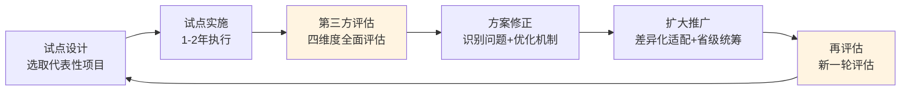

这种螺旋式逻辑的核心特征是：**第一**，每一轮迭代都有明确的起点（试点设计）与终点（再评估）；**第二**，每一轮迭代都基于前一轮的评估结论，避免"重复劳动"；**第三**，每一轮迭代都向更广覆盖、更深机制、更高效能演进，体现"螺旋式上升"。这种迭代逻辑确保改革方案在动态环境中持续优化，避免英国Ofwat式的"长期不变—突然失灵—大规模推倒重来"的极端路径。

总结本章设计，**风险防控与长效保障机制是核拨制改革"行稳致远"的体系化保障层**——价格调整社会承受力风险通过"成本监审+承受力测算+公众听证+分步调整+低收入兜底"标准化流程加以防控；国企转型与人员安置风险通过"职代会审议+劳动合同变更+经济补偿+社保接续+特殊群体保障"安置方案加以化解；社会资本回报与政府支付能力风险通过"动态调价+第三方资金监管+支付滞期违约金+保底水量重核+绩效公正性保障"工具箱加以缓释；绩效考核数据真实性风险通过"在线监测防篡改+第三方独立核查+交叉比对+异常预警+造假重罚"五道防线加以保障；雨污协同建设期民生影响风险通过"前期摸排+方案优化+多方共治+居民参与+贴心服务"五步流程化解。法律法规衔接通过"国家修法+省级立法+市级条例+县级实施细则"四级法治体系保障；跨部门联合监管通过"住建+生态环境+发改+财政+市场监管+应急"六部门协同框架完善；信息公开与公众参与通过"政策解读+精准服务+共治赋能"三阶段路径推进；人才与技术能力建设通过"专业人才培养+继续教育+产学研合作+国际交流"四维路径建立长效机制；持续评估迭代通过"年度评估+滚动调整+三年期复核+五年期重构"多周期机制确保方案在动态调整中持续优化。

本章承接第8章可操作方案集的落地实施需求，为第10章政策建议提供了完整的风险底线与保障基础。**核拨制改革要真正实现高效运作的目标，不仅需要方案设计的精妙，更需要风险防控的严密与长效保障的扎实——前者是改革启动的"加速器"，后者是改革持续的"压舱石"，二者缺一不可**。这正是本章设计的核心价值，也是政府管理部门在改革推进中必须高度重视的体系化要求。

# 10 研究结论与政策建议

经过前九章的系统研究，本研究已经完成了从问题诊断到方案设计、从机制比较到风险防控的完整逻辑闭环。第1—2章界定了核拨制的制度脉络并诊断了其在激励、协同、财务、效能四个层面的多维困境；第3章定位了10万亿元级资金缺口的结构与分布；第4章提炼了国内外创新实践的七大可复制制度要素；第5—7章分别构建了"厂网河（湖）+雨污"一体化协同运作机制、按效付费价格机制、多元化投融资体系，形成"体制—激励—资金"三位一体改革闭环；第8章将体系化方案转化为政府管理部门可直接采纳的可操作方案集；第9章构建了风险防控与长效保障机制。本章作为全篇研究的收官与升华层，承担三项核心任务：**第一，凝练核拨制困境破解的核心结论与关键制度要素，使全篇研究的体系化成果获得清晰呈现；第二，面向中央、省级、市县三级政府管理部门提出差异化、可操作的政策建议，覆盖顶层制度设计、激励政策、监管创新、试点推广四大维度；第三，展望中长期市政水务治理向资源化、低碳化、韧性化、数智化方向演进的趋势与政策延伸方向**。本章既是对前九章研究成果的最终总结，也为政府管理部门提供面向"十五五"乃至"十六五"的战略导引，实现从"破局当下困境"到"引领长远发展"的政策跃迁。

## 10.1 核拨制困境破解的核心研究结论

回顾全篇研究，可以系统凝练五项核心结论。这些结论既是对核拨制困境本质的深刻揭示，也是对改革路径正确性的实证验证，更是对政府管理部门决策框架的关键导引。

**结论一：核拨制低效困境的本质是四重结构性缺陷的耦合放大，单点改革难以破局**。第2章的多维诊断揭示，核拨制困境并非来自任何单一环节的失灵，而是"按量付费的逆向激励+厂网分离的协同断裂+雨污割裂的资金边界+全成本覆盖的财务残缺"四重结构性缺陷在体制环境下的耦合放大效应。按量付费下污水处理厂"水量越大、浓度越低、运营越受益"的逆向激励链条，与厂网分离下"厂方对管网状态无管理权"的体制割裂相互强化，使得湖北、海南两省10个市县26座污水处理厂中**约96%存在低浓度进水问题、平均CODcr仅85mg/L、最低仅17mg/L**——而居民生活源头排放的原始污水浓度高达397mg/L。这种"75%以上污染物在管网传输中被外水稀释或沉积流失"的惊人比例，正是四重缺陷耦合放大的最直观证据。这一耦合机理决定了**任何单一节点的改革（仅改激励不破体制、仅破体制不改激励、仅扩资金不重协同）都无法打破恶性循环**——只有同时重构激励机制（按效付费）、整合协同体制（厂网河湖+雨污一体化）、扩展资金通道（多元化投融资）、强化效能考核（全生命周期成本管理），才能将"低浓度—高水量—成本错配—财政承压—维护不足—效能下滑"的恶性循环转化为"高浓度—精准削减—成本可控—财政可承受—维护充分—效能提升"的正向循环。

**结论二：10万亿元级资金缺口与年5740—10460亿元管网运维需求决定了改革必须走"体制—激励—资金"三位一体路径**。第3章的全生命周期成本分析量化定位，未来五年城市水务系统的资金需求将达到10万亿元以上量级，其中"十五五"地下管网更新约4万亿元、管网运维五年累计2.87—5.23万亿元、雨污协同与海绵建设1—2万亿元、提标改造5000亿元—1万亿元、应急响应数千亿元——这一量级远超污水处理费体系（按全国年800—1000亿元规模、5年合计4000—5000亿元）的承载能力。**单是年度维护性需求5740—10460亿元就达到污水处理费收入的7—13倍**。这种量级落差从根本上决定了核拨制改革不能仅依靠"调高污水处理费"或"加大财政补贴"的单点调整，必须通过"按效付费节约资金转化为长期债务还款现金流+污水处理费向污水收集处理费扩展+雨水管理费/财政专项分账+多元化投融资工具组合"的资金通道重构，才能在量级上匹配实际需求。这一定量分析是"体制—激励—资金"三位一体改革路径不可替代的逻辑基础。

**结论三：国内外创新实践已经验证了关键制度要素的可行性**。第4章梳理的国内外创新机制比较揭示，七大关键制度要素——法治先行、主体整合、按效付费考核公式、区域统筹融资、雨污分账、智慧监管、长效专项债与稳定运维费匹配机制——已在湘潭、南京、长沙、十堰、武汉等地实践，以及日本东京"流域下水道+净化槽"、美国CWSRF循环基金、德国"上松下紧"法律体系、英国Ofwat改革等国际经验中获得多元验证。改革方向的正确性不再是理论假设，而是经过多地实证检验的现实可行路径——**关键不在于"是否要改"而在于"如何改得更好"**。

**结论四：大、中、小三类城市必须采取差异化适配方案，避免"一刀切"导致执行困境**。第4章提炼的差异化适配矩阵与第8章设计的差异化方案选项共同表明，不同规模城市在资源禀赋、管网基础、财政能力、市场化能力上的显著差异，决定了改革路径必须"对号入座"。大城市/东部以"大型水务集团委托运营+片长制+特许经营新机制+多维效能考核+绿色债券+数据资产化"为主轴；中等城市/中部以"国资平台承债式整合+浓度削减率/拆分式付费+项目库专项债+EOD+资源化反哺"为主轴；小城市/县乡/西部以"县域生态水务集团+省级统筹+乡镇打包PPP+以奖代补+中央补助+群众参与"为主轴。这种差异化适配不是改革标准的降级，而是改革路径的精细化——避免大城市方案套用到县乡导致"小马拉大车"、避免县乡方案套用到大城市导致"大马拉小车"。

**结论五：改革成效已在多地获得量化验证，证明改革方向的正确性**。从财务层面看，**湘潭4座污水处理厂全部签约按效付费协议，撇除外水和"按效付费"每年可节省资金5000多万元，原规划6万吨/日的铁牛埠污水处理厂无需建设、节省建设投资约3.5亿元、节约用地约120亩**[^103][^1]；**长沙城区15座污水处理厂按效付费预计每年可节约污水处理服务费约1.1亿元，全市每年可节约资金约1.4亿元**[^1]；**南京2025年上半年节省污水处理费支出约3500万元**。从效能层面看，**武汉盘龙污水处理厂2025年进水BOD浓度较2024年同期提升37.3%、处理水量同比增长23.03%；黄家湖厂2025年进水BOD浓度较2024年同期提升16.1%**；**长沙2025年城区污水处理厂年均进水BOD浓度达86.5mg/L，较2024年提升7.2%**[^1]。从制度层面看，**湖南"小快灵"立法《城镇污水管网建设运行管理若干规定》预计可节约20%至50%污水处理费支出，节约资金统筹用于污水管网建设改造**；**十堰推进城市污水收集处理"厂网一体化"经验做法已入选住建部《推进城市生活污水管网全覆盖及厂网一体长效机制建设工作指南（第一版）》典型案例**。这些量化成效从财务、效能、制度三个层面证明了改革方向的正确性——**核拨制困境不是不可破解的"不治之症"，而是通过精准方案完全可以化解的体制问题**。

## 10.2 实现高效运作的关键制度要素与政策抓手

将全篇研究的成果体系化整合，可以归纳实现"成本可控+服务可持续+效能可量化"三维高效运作目标的七大关键制度要素与八大核心政策抓手，并明确这些要素与抓手在政府管理部门决策框架中的优先级与组合关系。

**七大关键制度要素**承担差异化的治理功能。**法治先行**通过湖南"小快灵"立法范式将厂网一体、按效付费等改革从政策共识固化为法律约束；**主体整合**通过承债式整合、委托运营、水管家全链条等模式打破厂网分离的体制根源；**按效付费考核公式**通过单一浓度削减率、拆分式LPR浮动、多维效能权重等模型建立效能与付费的精准联动；**区域统筹融资**通过项目库+资金池+混改+AA+评级模式突破单项目专项债承载能力瓶颈；**雨污分账**借鉴日本东京"污水费150元/月+雨水费财政全担"经验建立污染者付费与公共属性兜底的清晰边界[^15];**智慧监管**通过全要素感知—数字孪生—AI预警—四预功能四阶段架构搭建协同运作的数字中枢；**长效专项债与稳定运维费匹配机制**通过按效付费节约资金转化为长期债务还款现金流支撑管网长期建设。这七大要素之间存在严格的内在依存——法治先行是制度保障基础、主体整合是体制载体前提、按效付费是激励核心、区域统筹与雨污分账是资金支撑、智慧监管是技术保障、长效匹配机制是财务可持续保障——任何一项要素的缺失都将削弱改革整体效力。

**八大核心政策抓手**是上述要素在操作层面的具体落地工具。第一，**污水处理费向"污水收集处理费"扩展**——通过修订《污水处理费征收使用管理办法》（财税〔2014〕151号），将"管网运维""雨污协同设施""按效付费奖励"等纳入污水处理费使用范围，破解管网运维长效资金通道缺失[^3]。第二，**基础服务费60%+绩效服务费40%二元结构**——基础服务费保障运营主体基本财务可持续，绩效服务费形成激励浮动空间，避免重庆水务式"一刀切压价"导致的负向循环[^104]。第三，**第三方资金监管账户**——污水处理费征收后专户存储、按合同支付，避免被地方财政挪用，针对性回应临颍5.78亿索赔教训。第四，**AA+水务集团信用评级培育**——通过资产规模门槛、现金流稳定性、治理结构规范、信息披露透明四维同步推进，为运营主体进入资本市场提供"通行证"[^15][^1]。第五,**项目库+资金池区域统筹模式**——通过项目打包、多源现金流构造、多通道资金组合，突破单一项目专项债覆盖倍数瓶颈，借鉴海宁"十五五"54亿元统筹、温州鹿城39.89亿元专项债集中获批、湖南500亿元项目库等实证经验[^15]。第六,**立体化价格信号系统**——工业差别化（诸暨多因子收费）+居民阶梯化（济南、广州、深圳）+环保信用挂钩（深圳绿黄红三色），构建"用户—政府—运营主体"完整激励相容链条。第七,**四阶段智慧监管平台**——全要素感知（武汉黄孝河409个监测点、十堰114个污水厂用电监测）+数字孪生（上海竹园四期120万m³/d）+AI预警调度（瀚蓝、临安天目智管）+四预功能（天津数字孪生水务）[^13]。第八,**五级晴雨天差异化运行模式**——晴天常规、小雨级、中雨级、暴雨级、超标降雨级响应，每级明确触发条件、核心行动、响应主体、资金来源。

将七大要素与八大抓手在政府管理部门"做什么、怎么做、谁来做"决策框架中的优先级与组合关系系统化呈现:

| 决策维度 | 核心问题 | 关键要素优先级 | 政策抓手组合 |
|---|---|---|---|
| 顶层制度（做什么） | 改革合法性与方向 | 法治先行→主体整合 | 污水收集处理费扩展+按效付费指南 |
| 体制重构（怎么做） | 协同载体建设 | 主体整合→智慧监管 | AA+评级培育+四阶段智慧平台 |
| 激励重构（怎么做） | 财务激励重塑 | 按效付费→雨污分账 | 二元结构+立体化价格信号 |
| 资金重构（怎么做） | 资金缺口破解 | 区域统筹融资→长效匹配机制 | 项目库+资金池+第三方资金监管 |
| 落地实施（谁来做） | 主体责任与协同 | 全部要素整合 | 五级运行模式+联合监管 |

数据来源：综合本研究第4—9章前述分析。

这一体系化呈现的关键启示是，**核拨制改革不是"七选一"的选项题，而是"七要素同步推进"的体系题——任何省略一个要素的改革都将形成"漏斗效应"，使改革整体效力大打折扣**。这正是本研究区别于以往单点改革建议的体系化价值。

## 10.3 中央层面顶层制度设计政策建议

中央层面的顶层制度设计直接决定地方改革的合法性边界与政策空间。基于本研究的体系化结论，面向中央层面提出五项重点政策建议与三项创新性政策建议。

**重点建议一：修订《污水处理费征收使用管理办法》（财税〔2014〕151号），破解管网运维长效资金通道缺失**。该办法自2015年3月1日起施行，确立的"非税收入—专款专用—按量付费—财政兜底"核心架构，是当前核拨制困境的国家层面制度根源。建议在保留"污染者付费"基本原则的前提下，将使用范围从"建设、运行和污泥处理处置"扩展至"建设、运行、维护、收集、应急及污泥处理处置"，明确将"管网运维""雨污协同设施投资分摊（晴雨双功能比例）""按效付费绩效奖励"等纳入合法使用范围。这一修订是第3章定位的"管网运维年缺口5740—10460亿元"的根本性解决方案，也是长沙模式"将污水管网运维费纳入污水处理成本，使管网由公益性资产转变为经营性资产"在全国层面普及推广的制度前提[^1]。

**重点建议二：出台《城镇生活污水收集处理按效付费指南》，统一全国按效付费机制设计标准**。建议由住建部、发改委、生态环境部联合制定，覆盖五维度多层级绩效指标体系、二元结构计费公式、月度初评+季度结算+年度终评评价拨付流程、第三方核查机构遴选标准等核心内容，并附大、中、小三类城市差异化考核办法模板。该指南应明确"按效付费的财务可行性依赖于管网修复、雨污分流、外水撇除等前期工作已基本完成"的前置条件，避免管网薄弱地区直接套用导致企业财务震荡。指南的发布将解决当前各地按效付费"百花齐放但缺乏统一标准"的局面，为试点扩围提供清晰指引[^3][^16]。

**重点建议三：研究修订《城镇排水与污水处理条例》，将关键改革方向上升为国家行政法规**。建议在条例修订中明确"鼓励实施按效付费""推行厂网一体专业化运行维护""建立污水处理服务费动态调整机制""建设雨季溢流污水快速净化设施""探索雨水管理费试点"等核心制度，将多地"小快灵"立法的成熟经验上升为国家行政法规。住建部等5部门《关于加强城市生活污水管网建设和运行维护的通知》已经初步明确了"推动建立厂网统筹的城市生活污水专业化运行维护管理模式"的政策导向[^1]，但行政法规层面的法律刚性约束尚未建立。这一修订是改革持续推进的法治基础。

**重点建议四：完善超长期特别国债与地方专项债对水务项目的支持机制**。**2024年中国安排超长期特别国债7000亿元用于1465个"两重"项目建设；2025年用于"两重"建设的超长期特别国债资金规模进一步增加到8000亿元；2026年直接支持"两重""两新"的国债资金达1.25万亿元**——超长期国债已成为水务领域规模最大、期限最长的中央层面建设资金通道。建议中央层面进一步明确超长期国债对水务项目的支持机制，包括：第一，明确"地下管网建设改造、长江沿线及重要流域污水管网建设、合流制溢流控制工程、海绵城市示范、再生水回用配置"等水务领域重点投向；第二，建立超长期国债与地方专项债的协同机制，避免"重复申报、重复补贴"；第三，明确区域统筹申报路径，鼓励"项目打包+稳定现金流+市场化融资"撬动模式，破解单一项目专项债承载能力不足瓶颈。

**重点建议五：将污水处理服务费支付纳入"三保"以外刚性支出保障核心层级，提升财政支付优先级**。第2章已经引述焦作市的实证——**目前污水处理费暂未纳入"三保"保障清单，但已纳入"三保"以外刚性支出保障范围**——这一定位决定了污水处理费支出的优先级低于"三保"（保基本民生、保工资、保运转），在地方财政紧平衡下其保障稳定性依赖地方政府的相机决策。建议中央层面修订《"三保"保障清单管理办法》，将"城市生活污水处理服务费支付"明确纳入"三保"以外刚性支出保障的核心层级，赋予其优先于一般性运转支出的法律地位。这一调整将从根本上破解第2章揭示的应收账款滚动放大、运营主体现金流挤压等连锁问题，避免重蹈临颍5.78亿索赔等极端案例。

**创新性政策建议一：扩容绿色金融支持目录**。建议人民银行、银保监会等金融监管部门将"管网运维项目""雨污协同设施""数据资产化与碳资产开发""再生水回用一体化项目"等明确纳入绿色金融支持目录，享受绿色信贷、绿色债券、可持续发展挂钩贷款等差别化金融工具。借鉴齐鲁银行"氢气回收量挂钩可持续发展挂钩贷款"经验，鼓励金融机构开发"再生水回用率挂钩贷款""污泥无害化率挂钩贷款""出水水质挂钩贷款"等水务领域创新产品，使金融工具与运营机制实现深度融合。

**创新性政策建议二：CWSRF式循环基金试点**。借鉴美国Clean Water State Revolving Fund运作37年累计向各社区提供1814亿美元（51000笔低息贷款）支持的成熟经验，研究建立中国版"清洁水循环基金"试点。基金以"中央资本+省级循环+地方借款"三级融资结构运作——中央每年向各省拨付资本金，省政府以此为本金向地方政府发放低息贷款，地方政府以未来污水收集处理费现金流偿还本金；偿还的本金回流省基金继续放贷，形成"循环放大"效应。这一机制对中国"超长期国债+地方专项债+污水处理费"组合具有重要的整合价值，可显著提升资金使用效率。

**创新性政策建议三：雨水费立法授权**。借鉴美国39州1417地区雨水费制度——**通过计量房屋不透水表面面积征收，月收费量中值1.68—11.70美元，按专款专用原则用于雨水管理事业**——研究在城市更新示范城市、海绵城市示范城市试点雨水费的立法授权。试点应聚焦大型工商业用户（如大型商业地产、工业企业、机场、物流园区等不透水面积巨大的主体），通过"基础雨水费+绿色基础设施减免（最高55%）"组合工具，将雨水管理从"事后处理"转向"源头减量"，破解第3章定位的雨洪协同"三外"困境。**到2030年逐步形成"污水处理费+财政雨水专项+雨水费试点"三通道资金体系**，与英国Ofwat改革"到2030年将污水污染减少一半"目标节奏[^15]、国务院《关于持续推进城市更新行动的意见》"到2030年城市更新行动取得重要进展"目标节奏形成战略协同。

## 10.4 省级层面统筹推进与试点示范政策建议

省级层面承担承上启下的关键枢纽职能，既是中央政策的执行主体，也是市县改革的统筹推动者。基于本研究的体系化结论，面向省级层面提出五项重点政策建议。

**重点建议一：加快"小快灵"地方立法进程**。借鉴湖南省以"小快灵"立法方式在全国率先出台《湖南省城镇污水管网建设运行管理若干规定》（2024年3月1日起施行）的范式，鼓励各省加快制定省级《城镇污水管网建设运行管理若干规定》或类似专项立法，**推行"厂网一体"、专业化运行维护和按绩效付费管理制度，预计可节约20%至50%污水处理费支出**。立法应聚焦"小切口、强约束、可操作"——避免大而全的综合性立法导致立法周期过长，错失改革窗口；同时配套海绵城市建设、暴雨灾害防御等专项立法，形成法治体系的多维支撑[^15]。

**重点建议二:构建"政府—银行—企业"省级合作交流平台**。借鉴湖南**着力构建"政府—银行—企业"合作交流平台，举办全省城镇污水处理质效提升现场推进会和对接活动，发布项目库，涉及资金500多亿元；抢抓"两重两新"机遇，争取超长期特别国债和中央预算内资金共138亿元，总投资达到328亿元，包括地下管网项目149个、厂网河湖一体化综合治理项目23个、污水垃圾治理项目88个**的成熟经验，建议各省建立类似省级合作交流平台。平台的关键功能包括项目库统一发布形成"集合招商"效应、"两重两新"政策抓手集中申报形成规模优势、奖补政策撬动形成示范效应、政银企对接平台化降低交易成本。

**重点建议三:设立省级奖补资金支持厂网一体与按效付费试点示范**。参照湖南**启动19个污水处理"厂网一体""按效付费"试点示范，相关部门安排2000万元奖补资金支持示范项目**模式，建议各省设立省级奖补资金，覆盖19—50个市县级试点项目，单项目奖补100—500万元规模。奖补资金应聚焦"按效付费协议补充签订或新签订""厂网一体化整合""智慧监管平台建设"等关键节点，并建立"奖补到位—试点验证—评估提炼—全省推广"的滚动激励机制。试点选择应同时覆盖"新城区+老城区""城市+县域""新建+存量"多种典型情景，确保经验代表性[^15][^1]。

**重点建议四:建立省级水务信用评级与AA+水务集团培育路径**。借鉴海宁水务集团获得AA+评级、十堰生态水务集团获评AA+主体长期信用等级、长沙水业集团成功推动与国开行融资合作等实证经验[^15][^1]，建议各省建立省级水务信用评级与AA+水务集团培育路径，统筹推动地市级国资水务平台的资产规模、现金流稳定性、治理结构规范性、信息披露透明度四维同步提升。具体操作建议包括：第一，省级层面统筹梳理各地市国资水务平台的资产规模与信用评级现状，识别评级培育的优先序；第二,通过资产评估划转、混合所有制改革、资源整合等多元工具支持地市平台的资产规模扩张；第三,建立省级水务专项基金或平台公司，为地市平台提供信用增级、低成本融资等支持；第四,鼓励地市平台进入公开市场发行绿色债券、可持续发展挂钩债券等创新性金融工具。

**重点建议五:建立跨市县流域生态补偿机制**。第2章已经引述最高人民检察院第八检察厅2022年挂牌督办的五起跨区域生态环境公益诉讼案件，揭示了"上下游不同步、左右岸不同行"治理僵局的体制痼疾。建议各省建立跨市县流域生态补偿机制，明确"流域水质好坏直接对应资金回流多少"的市场化补偿规则。补偿机制应覆盖三类情境：第一,上游对下游的水质改善补偿——上游市县通过严格治污使下游水质达标，下游应通过财政资金或经济补偿形式回报上游；第二,左右岸的协同治理分摊——同一流域的左右岸市县按汇水比例分摊治理责任与成本；第三,跨省流域的省级层面协调——通过省级"河长+检察长"协作机制等推动跨省流域的协同治理。

**省级层面的支撑性平台建设职责**也应明确。除上述五项重点建议外，省级层面还应承担三类支撑性平台的建设职责：第一,**按效付费考核数据库**——集中收集省内各市县核拨制改革的关键数据（按效付费考核结果、运营成本、财政支付、环境效能等），为评估、研究、决策提供数据基础；第二,**典型案例分享平台**——汇集省内核拨制改革的典型案例，按"成功经验+避坑教训"双向分类组织，加速经验复制；第三,**避坑经验汇编**——专门汇编改革推进中遇到的失败案例与教训，包括"分手潮"案例、价格调整社会稳定案例、人员安置劳动争议案例等，为各地避免重蹈覆辙提供"反向学习"资源。

## 10.5 市县层面差异化落地实施政策建议

市县层面是改革落地的"最后一公里"，也是政策能否真正转化为治理实效的关键环节。基于第8章设计的差异化方案选项与本研究的体系化结论，面向市县层面分类提出政策建议。

**大城市/东部以"大型水务集团委托运营+片长制+特许经营新机制+多维效能考核+绿色债券+数据资产化"为主轴**。重点突破方向包括三个层面。**第一层面：百亿级公开市场融资**——依托AA+评级水务集团进入绿色债券、可持续发展挂钩债券、数据资产证券化等公开市场，单批次融资规模可达数十亿元至百亿元。**招商证券2023年绿色投行项目数量同比增长超过30%、绿色债券承销金额196.63亿元、发行总规模1335.96亿元**——这一规模显示绿色债券市场对大型水务集团的资金供给能力。**第二层面：数字孪生超大型厂级平台建设**——借鉴上海竹园四期120万m³/d数字孪生厂的实证经验，针对超大型合流制污水处理厂的"水量大、水质稀、波动剧烈"挑战开发数字孪生解决方案[^13]。**第三层面：特许经营新机制深度落地**——按115号文+17号令要求，民营股权占比≥35%、政府代表不控股、不新增财政支出责任，借鉴南京江宁科学园五期项目（16万m³/d、9.89亿元、40年BOOT）的成熟模板。典型代表包括南京、长沙、武汉、苏州、杭州等。改革启动至完成时间约18—36个月,关键里程碑包括整合区域>1000万人、管网>4000公里、AA+评级。

**中等城市/中部以"国资平台承债式整合+浓度削减率/拆分式付费+项目库专项债+EOD+资源化反哺"为主轴**。重点突破方向同样包括三个层面。**第一层面:区县半年级别40亿元专项债集中获批**——借鉴温州鹿城**2025年上半年获批项目建设类专项债券39.89亿元，限额居温州各区县第一；争取上级转移支付资金31.5亿元、增长4.22%**[^15]的实证经验，通过"四色清单+双周调度+清单化攻坚+闭环式提效"管理体系实现专项债集中获批。**第二层面：EOD模式落地**——通过将公益性强的水务治理与收益较好的关联产业（如再生水回用、流域沿岸土地开发、水环境治理后的旅游休闲产业）打包，实现整体项目自我造血。**生态环境部对EOD首批批复36个试点项目、第二批批复58个试点项目；2021年财政部正式发布《重点生态保护修复治理资金管理办法》提出工程总投资10—20亿元补5亿、20—50亿元补10亿、50亿元以上补20亿，最高项目奖补资金比例达60%、金额达20亿；银行配合度较高，截止2021年底国开行对首批试点项目累计授信额度约520亿元**——EOD模式已经形成"政策—资金—试点"完整闭环。**第三层面:浓度削减率/拆分式付费机制落地**——借鉴湘潭市"全国首创按污染物浓度削减率付费"实证经验[^1]、长沙市"建设投资+生产运营变动+生产运营固定+LPR浮动"四段拆分模型经验，根据本地管网基础与监管能力选择适配的考核公式。典型代表包括湘潭、海宁、十堰中心城区等。改革启动至完成时间约12—24个月,关键里程碑包括整合区域百万级人口、管网>500公里、AA+评级。

**小城市/县乡/西部以"县域生态水务集团+省级统筹+乡镇打包PPP+以奖代补+中央补助+群众参与"为主轴**。重点突破方向包括两个层面。**第一层面:破解设施"晒太阳"问题**——第2章揭示的乡镇与农村污水处理设施"晒太阳""睡大觉"困境（如河口村、霍村案例、紫云县滇花县城老城区污水处理厂、山东某镇1万立方米/天厂建成一年即停运），是小城市改革必须直面的核心问题。破解路径包括城乡一体化运维（海宁水务集团统一运维模式[^15]）、长沙"以奖代补"双轨补贴、云南农村污水治理"15%专项+群众参与"机制[^15][^1]。**第二层面:三级一体化运维**——借鉴郧西县"县、乡、村三级污水处理设施一体化运营管理体系"经验，通过县域生态水务集团整合三级运维，避免"乡镇运维责任在乡镇政府、村集体、第三方企业之间互相推诿"的责任真空。沛县供水PPP项目"按照'水务城乡一体、供排一体、厂网一体'的原则，将沛县城乡供排水业务打包整体交由沛县兴蓉水务发展有限公司负责实施，特许经营期30年"提供了县域全域整合的标杆样本。雅安PPP项目"包括污水处理厂新建工程5万m³/d、姚桥再生水厂1万m³/d、大兴再生水厂0.2万m³/d、乡镇污水处理站51座、新村聚集点污水处理设施16座、新建或改建污水处理站配套管网共261.81km"提供了多类型多空间多设施的协同投资范本[^1][^94]。典型代表包括十堰下属县（郧西、房县）、定安、平利、界首等。改革启动至完成时间约6—18个月,关键里程碑包括县域三级一体化运维、群众满意度。

**三类城市的共性配套机制**亦需明确。除上述差异化主轴外，各类城市均需建立四项共性配套机制：**第一,第三方资金监管账户**——污水处理费征收后专户存储、按合同支付，避免被地方财政挪用；**第二,支付滞期违约金机制**——政府方支付滞期超过约定期限的，按LPR上浮一定比例计收违约金；**第三,第三方独立核查制度**——按娄底市"45个工作日内出具正式成本审核报告"标准建立独立核查机制；**第四,立体化价格信号系统**——按工业差别化（诸暨多因子收费）+居民阶梯化（济南、广州、深圳等）+环保信用挂钩（深圳绿黄红三色）组合工具构建价格信号。各类城市均需按本研究第8章设计的"领导小组成立→资产清查评估→主体组建与划转→人员安置过渡→信用评级培育"五步标准化组织重构操作流程稳步推进，避免"为整合而整合""信用评级培育周期过长延误融资""人员安置不当引发改革阻力"等典型陷阱。

## 10.6 监管创新与智慧化升级政策建议

监管创新是确保改革效果持续释放的关键保障。基于英国Ofwat监管"失灵"教训与国内多地创新实践，本节针对监管层面提出四项重点政策建议。

**重点建议一:建立六部门联合监管框架与"一张图"协同机制**。建议建立"住建+生态环境+发改+财政+市场监管+应急"六部门联合监管框架，明确各部门在规划、建设、运营、付费、监督等环节的职责分工与协同机制。借鉴衢州"一张图"范式——**衢州市住房城乡建设局以政府投资项目为突破口，创新绘制"一张图"——《房屋市政工程政府投资项目建筑垃圾源头减量全过程监管流程节点图》，将项目从立项到决算细分为10个关键节点，推动减量工作清单化、精准化，打通6个部门间的协同堵点，初步形成"全过程监管、跨部门协同"的治理新格局**——建议各市建立《城市水务项目全生命周期协同监管流程节点图》，覆盖从项目立项、设计、施工、验收到运营、按效付费、移交的全过程节点，明确六部门在每个节点的职责与衔接方式。这种"每个项目都有一本协同账"的精细化管理思路是破解"九龙治水"体制痼疾的有效工具。

**重点建议二:推进智慧监管平台四阶段建设**。借鉴武汉黄孝河机场河项目"实时传输126平方公里流域内409余处监测点数据"、深圳水务集团"汇聚国家、地方政府以及水务企业生产运营等11家单位多源数据，覆盖流域内从源头排水小区到海湾的11类关键涉水数据、37类监测数据，监测站点数量超过8000个"[^13]、十堰"已在全市114个污水处理厂安装用电监控监测终端"等先进实践，建议各地按"全要素感知—数字孪生—AI预警调度—四预功能"四阶段路径推进智慧监管平台建设。第一阶段：全要素感知，监测点密度达到约3点/km²、用电监测全覆盖；第二阶段：数字孪生，针对超大型合流制污水处理厂的运行控制开发数字孪生解决方案（上海竹园四期）；第三阶段：AI预警调度，通过历史数据训练模型对未来1—24小时内的进水水量水质、降雨过程、管网液位等进行预测（瀚蓝3.0、临安天目智管）；第四阶段：四预功能，构建预报、预警、预演、预案"四预"功能数字孪生水务体系（天津数字孪生水务）。建议中央层面将智慧监管平台四阶段建设纳入城市更新行动重点支持方向，配合中央财政补助资金支持地方建设。

**重点建议三:建立环保信用挂钩与排水许可分级分类管理制度**。借鉴深圳市"对环保诚信企业（绿牌）按照90%征收污水处理费；对环保警示企业（黄牌）按照110%征收污水处理费；对环保不良企业（红牌）按照130%征收污水处理费"的实证经验，以及铜陵市**累计发放排水许可证1774份，排水行为日趋规范。配套管网建设加速推进，累计新改建污水管网554.38公里，城市生活污水集中收集率从34.1%提升至69.96%**的全覆盖范本，建议各地建立环保信用挂钩与排水许可分级分类管理制度。具体操作要点包括：第一,建立企业环境信用评价体系，按"绿黄红"三色分级；第二,将信用等级与污水处理费征收标准、政府采购、绿色金融等挂钩，形成"守信激励—失信惩戒"闭环；第三,严格落实排水许可分级分类管理，对重点排水户全面落实排水许可要求；第四,将排水许可与按效付费考核挂钩，无证排放的企业不得作为合规计费基础。

**重点建议四:建立"监管整合+派专家进驻+消费者保护"现代水务监管体系**。借鉴英国Ofwat改革教训——**英国水务局将被一个新的单一监管机构取代，其将整合四个不同监管机构的职能。新机构将像金融危机后监管银行的机制一样，派专家进驻水务公司，确保公司依法运营，提升环境绩效。同时，新设立的英国水务监察员将取代英国消费者水务委员会，以帮助解决消费者与自来水公司间的纠纷**[^15]——建议中国按效付费机制下的监管创新借鉴这三大方向。监管整合方面，整合住建、水务、生态环境等部门的水务监管职能，避免多头监管导致的协同断裂；派专家进驻方面，借鉴南京"片长制"驻厂办公模式扩展为对运营主体的常态化深度监管；消费者保护方面，建立水务领域的消费者监察员制度，专门处理用户投诉与争议。这一现代监管体系的建立是避免重蹈英国Ofwat"长期不调价—基础设施投资不足—污染创纪录—大规模推倒重来"覆辙的关键保障。

**长效保障机制**还包括三项支撑性制度。**第一,运营主体诚信档案**——对绩效考核数据真实性、违规行为、整改记录等进行长期跟踪，作为后续合同续签、新项目招标的重要依据；**第二,行业黑名单机制**——对存在严重数据造假、违法排污等行为的运营主体列入行业黑名单，限制其参与新项目投标、限制其享受财政补贴；**第三,涉刑责任追究**——按《城镇排水与污水处理条例》第五十条"50万元以下罚款；造成损失的，依法承担赔偿责任；构成犯罪的，依法追究刑事责任"的法律责任体系，对故意提供虚假绩效考核数据、骗取污水处理服务费等严重违法行为追究刑事责任，强化按效付费机制的法律刚性。

## 10.7 试点推广路径与中长期改革节奏

试点推广路径的清晰设计与中长期改革节奏的精准把握，是改革"行稳致远"的关键支撑。基于本研究第8章设计的"试点—评估—推广"三阶段五步骤路线图与全篇研究的体系化结论，本节进一步明确中长期改革节奏与战略安排。

**短期(2026—2027年)聚焦试点扩围**。借鉴湖南19个省级试点示范模式，建议中央与省级层面联动推动试点扩围至全国百城规模。试点选择应同时覆盖三类典型情景：**第一,新城区+老城区——**新城区以严格执行雨污分流、智慧监管平台同步建设为重点，老城区以合流制保留+局部强化、CSO控制工程为重点；**第二,城市+县域**——城市以"大型水务集团+特许经营新机制+多维效能考核"为主轴，县域以"县域生态水务集团+乡镇打包PPP+以奖代补"为主轴；**第三,新建+存量**——新建项目按115号文+17号令规范实施新机制特许经营，存量项目通过"补充协议+按效付费机制+第三方资金监管"软改造路径过渡。短期重点突破任务包括：厂网一体化整合在百城试点全面落地、按效付费协议补充签订或新签订、智慧监管平台第一阶段（全要素感知）全面建成、AA+水务集团培育在主要试点城市完成。这一阶段的关键里程碑是住建部"到2027年城市生活污水集中收集率达到73%以上、基本消除城市建成区生活污水直排口和设施空白区"的国家目标得到全面落实[^1][^16]。

**中期(2028—2030年)全面推广雨污协同与多元化投融资方案**。这一阶段的国家级战略支撑包括两个核心目标：**国务院《关于持续推进城市更新行动的意见》"到2030年，城市更新行动实施取得重要进展，城市更新体制机制不断完善，城市开发建设方式转型初见成效"目标**[^102]、英国Ofwat改革"到2030年将英国污水污染减少一半"目标[^15]——两者节奏巧合一致，体现了五年期为基本单位的中长期规划思路。中期重点突破任务包括：**第一,雨污协同全面落地**——CSO控制工程、调蓄池晴雨双功能共用、初期雨水快速净化设施在百城试点全面建成；**第2,多元化投融资三通道资金保障体系建立**——污水处理费向"污水收集处理费"扩展全国推广、雨水管理费/财政专项试点扩围、超长期国债+地方专项债+绿色金融+数据资产化+碳资产组合工具广泛应用；**第3,智慧监管平台升级到四预功能**——大型城市完成数字孪生超大型厂级平台建设，中等城市完成AI预警调度，小城市完成全要素感知与核心节点感知。这一阶段的关键里程碑是城市水务系统的"成本可控+服务可持续+效能可量化"三维高效运作目标得到初步实现。

**长期(2031—2035年)对接"美丽中国2035"战略**。这一阶段衔接"十六五"国家级战略安排，**国务院已经明确"十五五"期间全国城市更新总投资将突破20万亿元、年均投入接近4万亿，其中地下管网更新投资约4万亿元，聚焦雨污分流、燃气改造、防汛排涝**——4万亿元地下管网投资将在"十六五"延续。长期重点突破任务包括：**第一,城市水务系统的根本性重构**——通过"体制—激励—资金"三位一体改革闭环的全面落地，城市水务系统从"末端处理达标"全面转向"全过程减污降碳"、从"晴天达标"全面转向"雨天不黑臭"；**第二,资源化、低碳化、韧性化、数智化转型**——再生水回用率、单位污水处理碳排放、应对极端降雨韧性、数字化能力等核心指标达到国际先进水平；**第三,治理现代化与法治化升级**——基于全过程评估迭代的国家《城镇水环境综合服务法》研究制定，整合排水、污水处理、雨洪管理、河湖水生态保护等城市水环境综合服务的法律框架。这一阶段的关键里程碑是"美丽中国2035"战略对水生态环境质量的根本性改善目标得到全面实现。

**常态化推进抓手**为三阶段路线图提供持续动力。第一,**年度推进会**——每年至少召开一次省级或市级推进会，借鉴湖南"举办全省城镇污水处理质效提升现场推进会和对接活动"模式；第二,**专项评估**——每年开展第三方独立专项评估，形成《年度评估报告》并公开发布；第三,**绩效披露**——按效付费节约资金、进水浓度提升、出水水质达标率等核心指标按季度向社会公开披露；第四,**滚动调整规则**——基于评估结论与披露数据，对方案进行年度滚动调整，避免"一次设计、永久执行"。这种"年度评估+滚动调整+三年期复核+五年期重构"的多周期评估迭代机制，是改革方案在动态调整中持续优化的根本保障。

将三阶段路线图与中长期国家级战略安排整合为下表：

| 阶段 | 时间窗口 | 核心目标 | 关键任务 | 国家级战略支撑 |
|---|---|---|---|---|
| 短期 | 2026—2027年 | 试点扩围至百城规模 | 厂网一体化、按效付费、智慧监管第一阶段、AA+评级 | 住建部"到2027年城市生活污水集中收集率达73%以上" |
| 中期 | 2028—2030年 | 全面推广雨污协同 | 雨污协同、三通道资金、智慧监管四预功能 | 国务院"到2030年城市更新行动取得重要进展"+英国"到2030年污水污染减半" |
| 长期 | 2031—2035年 | 城市水务系统根本性重构 | 资源化低碳化韧性化数智化 | "十六五"4万亿地下管网投资+"美丽中国2035" |

数据来源：综合本研究第8章及本节前述分析。

## 10.8 中长期市政水务治理演进趋势与政策延伸方向

立足"十五五"乃至"十六五"的中长期视角，市政水务治理将沿着资源化、低碳化、韧性化、数智化四大方向深度演进。这四大方向不是相互孤立的子领域，而是在按效付费机制激活下相互交织、相互促进的有机整体——资源化提供新型现金流支撑低碳化技术投入、低碳化降低长期运营成本支撑韧性化设施建设、韧性化保障稳定服务支撑数智化精细管理、数智化提升治理效能反过来支撑资源化潜力挖掘。本节展望这四大方向的演进趋势，并提出政策延伸方向。

**方向一:资源化方向——再生水回用率从30%—50%向70%—90%跃升**。当前我国再生水回用率呈现显著的区域差异。**北控水务银川第一再生水厂直接推动银川市再生水回用率从11%跃升至58.5%；佛山预计到2026年再生水利用率将由目前34%提高到48%**；**博兴中水回用项目每年可生产高品质再生水1825万吨**；**平湖2024年全市以1106.8万m³"超滤+反渗透"高品质再生水，优先保障了总产值约550亿元的两个重大产业项目运行**。这一区域差异在"十五五""十六五"期间将逐步收敛——水利部2026年开展典型地区再生水利用配置试点评估总结工作，**以期在再生水规划、配置、利用、产输、激励等方面形成一批效果好、能持续、可推广的先进模式和典型案例，为全国再生水利用配置提供实践参考**[^3]。预计到2035年，全国再生水回用率将从当前30%—50%向70%—90%跃升。同时，污泥能源化、水权交易、生态补水等资源化收益渠道将形成稳定现金流。借鉴日本东京"流域下水道+净化槽"双轨制度、美国CWSRF循环基金"循环放大"机制[^15]、平湖"逆阶梯惠企"创新策略，资源化收益反哺将成为水务运营主体除按效付费、政府补贴之外的第三大稳定现金流来源——再生水使用费、污泥制建材收益、水权交易收益等形成"市场化定价+长期合同+多元用户"的稳定特征。**政策延伸方向：**研究建立全国统一的再生水定价指导意见、研究将再生水利用率纳入按效付费考核硬指标、研究水权交易与流域生态补偿的市场化机制。

**方向二:低碳化方向——单位污水处理能耗较2025年下降30%以上**。水务行业碳达峰碳中和路径在"十五五"将进一步明确。**生态环境部、国家发改委、住建部联合印发的《关于推进污水处理减污降碳协同增效的实施意见》**已经明确了"减污降碳协同增效"政策导向[^3]。低碳化的核心抓手包括三个层面。**第一,曝气精细化**——通过智慧水务平台实现实时水质数据驱动的精细化曝气控制，借鉴上海竹园数字孪生厂"曝气、提升、搅拌等过程能耗巨大，化学除磷药剂投加量庞大。在'双碳'战略背景下，如何通过精细化控制实现节能降耗，是运营管理的核心命题"的实证经验，预计可降低吨水能耗30%以上。**第二,污泥能源化**——通过厌氧消化产沼气、热水解、协同焚烧发电等技术，将污泥从"处置成本"转化为"能源收益"。**第三,碳金融工具应用**——CCER、绿色债券、可持续发展挂钩贷款等碳金融工具与按效付费机制深度融合，形成"按效付费向用户/政府收取+按效融资向银行降低成本"的双向激励。借鉴齐鲁银行"氢气回收量挂钩可持续发展挂钩贷款"创新经验，水务领域可设计"再生水回用率挂钩贷款""污泥无害化率挂钩贷款""出水水质挂钩贷款"等多种产品。**政策延伸方向：**研究建立水务行业碳排放核算指南、研究将水务CCER项目纳入全国碳市场、研究建立水务行业碳达峰碳中和路线图。

**方向三:韧性化方向——应对气候变化背景下多重挑战**。极端降雨、突发污染、设施故障等多重挑战在气候变化背景下将更加频繁。**云浮市"十四五"期间因自然灾害累计造成直接经济损失超27亿元，其中暴雨及次生洪涝灾害占比极高**——这一规模在未来五至十年可能进一步放大。城市水务系统的韧性化转型要求实现从"被动应对"向"主动防控"的根本转变。借鉴四类成熟经验:**第一,日本东京20年合流制整改**——**截至2024年3月底,已基本实现了合流区域与分流制相当的污染负荷整改目标,即雨天排水时的平均BOD浓度降低至40 mg/L以下;值得注意的是,在此期间,全国范围内的合流改分流累计面积仅占合流区域的5%,可见这并非主要整改措施**[^15]——"通过增强雨天截留能力、提升简易处理水平、采用调蓄技术等措施，有效强化了对溢流污染的控制"的整改路径对我国老城区合流制治理具有直接启示。**第二,德国管网45.3年管龄管理水平**——**德国城镇排水系统纳管率97.1%（2018年调查为98.2%）；自1995年以来年均增加约9200公里；按各年龄段长度比例加权后排水管道平均管龄45.3年**[^15]——这一"长期定期调查+稳定年度更新+全成本回收"成熟范式是我国管网长效维护的方向。**第三,松原30年一遇内涝防治标准**——**依托镜湖等天然水体新增10万立方米调蓄容积，使江南片区内涝防治能力达到30年一遇、实现24小时146.1毫米降雨条件下不内涝**——这一标准应成为大中城市的普遍目标。**第四,云浮《暴雨灾害防御条例》立法**——通过地方立法将应急成本制度化纳入财政预算，是韧性化的法治保障。**政策延伸方向：**研究修订《城镇排水与污水处理条例》纳入气候变化适应内容、研究建立全国统一的城市内涝防治标准升级路径、研究推动"暴雨灾害防御"立法在全国普及。

**方向四:数智化方向——数字孪生、AI预警、四预功能成为核心竞争力**。数字化能力将从"加分项"转化为水务运营主体的"核心竞争力"。借鉴**深圳水务集团构建排水—水环境数据智能体，汇聚国家、地方政府以及水务企业生产运营等11家单位多源数据，覆盖流域内从源头排水小区到海湾的11类关键涉水数据、37类监测数据，监测站点数量超过8000个**[^13]、**天津数字孪生水务体系采取"数字孪生流域、数字孪生水网、数字孪生工程'三位一体'架构"，构建具有预报、预警、预演、预案即"四预"功能的数字孪生水务体系，逐步实现了水务治理从"经验驱动"向"数据驱动"、从"被动应对"向"主动防控"、从"分散管理"向"协同共治"的转型升级**等先进实践，预计到2035年大型水务集团将普遍具备四预功能数字孪生平台、AI预警调度成为常态化运营工具、数字资产化形成稳定收益渠道。数据资产化的制度准备应在"十五五"期间逐步完成——按数据安全法、个人信息保护法等要求建立数据分类分级、脱敏处理、权属界定等制度，通过数据交易所等合规渠道开展数据共享与交易，按会计准则将符合条件的数据资产纳入资产负债表，开发面向特定行业的数据产品形成稳定数据收入。**政策延伸方向：**研究建立水务行业数据资产化指导意见、研究推动智慧水务平台四阶段建设的国家级标准、研究水务领域数据交易的合规框架。

**整体政策延伸方向**应聚焦四大领域。**第一,立法保障升级**——从"小快灵"地方立法向《城镇排水与污水处理条例》修订与《城镇水环境综合服务法》制定的国家级立法升级。**第二,金融工具创新**——从绿色债券、可持续发展挂钩贷款向数据资产证券化、碳资产证券化、流域生态补偿基金等多元创新工具延伸。**第三,国际经验引进**——日本流域下水道协同模式、美国CWSRF循环基金、德国"上松下紧"法律体系、英国Ofwat改革整合方向[^15]——这些国际经验在适配中国国情的基础上应进一步深化引进。**第四,人才培养体系完善**——按"专业人才培养+继续教育+产学研合作+国际交流"四维路径建立长效机制，重点解决工业废水污泥处理减量化人才短缺、智慧水务复合型人才短缺等关键瓶颈。

回顾全篇研究，**核拨制困境的破解既不是不可能完成的"乌托邦"，也不是简单照搬国外经验的"拿来主义"，而是基于中国国情、立足现有制度基础、通过"体制—激励—资金"三位一体改革闭环系统化推进的可行路径**。从湘潭年节约5000多万元、长沙年节约约1.4亿元、武汉盘龙厂进水BOD浓度提升37.3%等量化成效，到湖南"小快灵"立法、十堰生态水务集团、海宁"项目库+资金池"、温州鹿城"四色清单"、上海竹园数字孪生厂、武汉黄孝河流域治理等丰富实践，再到日本东京、美国CWSRF、德国管网管理、英国Ofwat改革等国际镜鉴——本研究系统梳理的所有案例与经验都共同证明:**只要政府管理部门能够拿出系统化的改革决心、精细化的方案设计、长效化的保障机制，核拨制低效困境完全可以在2030年前后实现根本性破解,城市水务系统完全可以在2035年前后实现"高效、低碳、韧性、智慧"的现代化形态**。

这正是本研究面向政府管理部门"做什么、怎么做、谁来做、何时做、如何衡量"的最终回答——**核拨制改革不是选择题，而是必答题；不是局部题，而是系统题；不是短跑题，而是马拉松。唯有以"体制—激励—资金"三位一体的改革闭环、以"中央—省级—市县"三级联动的治理框架、以"试点—评估—推广"三阶段稳步推进的实施节奏、以"成本可控—服务可持续—效能可量化"三维高效运作的目标导向，才能真正破解核拨制困境，实现市政污水收集处理与雨水排洪排涝协同高效运作的良性循环**。这一良性循环的最终愿景，是让每一滴用过的水、每一场降下的雨、每一段地下的管，都能在"高效、低碳、韧性、智慧"的城市水务系统中找到自己的归属与价值——这既是政府管理部门的责任使命，也是全体市民的福祉所系，更是中国走向"美丽中国2035"战略目标的关键支撑。

# 参考内容如下：
[^1]:[2025年第15号](https://www.gov.cn/gongbao/2025/issue_12066/202505/content_7025479.html)
[^2]:[“九龙治水”难题如何解](http://www.cdpzjcy.gov.cn/zfxw/257650.jhtml)
[^3]:[文字解读:《自治区城镇生活污水管网综合整治攻坚行动方案》政策解读 ](https://zjt.nmg.gov.cn/zwgk/zfxxgkn/fdzdgknr/zcjd/202504/t20250422_2707807.html)
[^4]:[历史上的一月丨上海排水大事记 ](https://mp.weixin.qq.com/s?__biz=MzIzNzcxODM5Mg==&mid=2247727329&idx=1&sn=cf36311bc030de3ccd3be21b3fb27e90&chksm=e93c6c04547cbae52befd86a06f69c043878061c90501a48e5cb915984f8c71b792a23227d14&scene=27)
[^5]:[【政府购买服务知识问答】政府购买服务与 PPP 在项目内容方面有什么不同? ](https://mp.weixin.qq.com/s?__biz=MzI5OTQwNjc2MA==&mid=2247533245&idx=3&sn=501412764bc9bc91e09e5228d4d7f630&chksm=ec95067adbe28f6c45d30df3fec8cb32122e2d61f5c61d484a8c787133ff78a230b486a944e1&scene=27)
[^6]:[屡察屡现,污水处理厂长期超负荷运行问题,如何破解? ](https://mp.weixin.qq.com/s?__biz=MzA5MTM5OTE0Ng==&mid=2650080235&idx=3&sn=07f17a5dabf4f7a2f18cea976f315510&chksm=8997c0a371db9da49dda2dc0d3df66a435124e80488d966be85933307ee5e1fb5dd57b015bc0&scene=27)
[^7]:[环保企业应收账款问题仍未解](https://dy.163.com/article/KPLSESPE05199DKK.html)
[^8]:[关于上海市财政局2025年度生态环境保护职责履行情况的专题报告 ](https://czj.sh.gov.cn/zys_8908/zcfg_8983/zcfb_8985/zrzyhsthj/20260227/xxfboswf0000003608.html)
[^9]:[(发改价格[2015]119号)财政部 国家发展和改革委员会 住房和城乡建设部关于制定和调整污水处理收费标准等有关问题的通知 ](http://www.pnxzf.gov.cn/zfxxgk/fdzdgknr/flfg/t17608534.shtml)
[^10]:[污水处理从“按量付费”向“按效付费”转变,难在哪? ](https://mp.weixin.qq.com/s?__biz=MzUxODM5ODE3Nw==&mid=2247502766&idx=1&sn=4dee5f1f5085a81778f52fa06c349d67&chksm=f98b0220cefc8b36ecc6c4b10bec780d4d6ccbff90e52d50fb7cf7c7226bd6b0ea4228232651&scene=27)
[^11]:[污水处理从“按量付费” 向“按效付费”转变,难在哪?](https://www.fengkai.gov.cn/zqfkstj/gkmlpt/content/2/2955/mpost_2955012.html)
[^12]:[污水处理费能覆盖成本吗?县级以上城市缺口4000万元-6000万元/日 - 能见资讯](https://www.nengapp.com/m/zixun/d9740bc5ef425b5c00a968528576f8f5)
[^13]:[万石镇:建成污水管网“一张图管全镇”新模板](http://www.yixing.gov.cn/doc/2026/04/09/1386666.shtml)
[^14]:[《关于加强污水处理费征收使用管理工作的通知》政策解读](http://www.cqnc.gov.cn/zwgk_197/zcjd/wzjd/202601/t20260121_15340550.html)
[^15]:[关于“开展城市生活污水处理提质增效和黑臭水体治理攻坚战”相关问题的在线访谈](http://zjj.longyan.gov.cn/hdpt/zxft/202412/t20241202_2181612.htm)
[^16]:[湖州全域推进城乡污水一体化治理](https://m.163.com/dy/article/KR8U5ECN05568W0A.html)
[^17]:[许昌市中心城区居民污水处理收费标准调整政策解读](https://www.xuchang.gov.cn/openDetailDynamic.html?infoid=adfbacf4-98f0-46ac-85ea-fcf458b5a4eb)
[^18]:[全面解析EOD、PPP、BOT、TOT模式:环保产业该如何提升自我](https://baijiahao.baidu.com/s?id=1786415473375682566&wfr=spider&for=pc)
[^19]:[佛山连续10年推进海绵城市建设](http://fszj.foshan.gov.cn/gkmlpt/content/6/6956/mpost_6956930.html)
[^20]:[市水务集团:服务高质量发展 润泽潮城大地 ](https://www.haining.gov.cn/col/col1229519873/art/2025/art_f30cb6ad60b34feebe5491ca2eca8454.html)
[^21]:[污水处理厂PPP项目案例及管理经验.docx 9页](https://m.book118.com/html/2026/0107/8107016143010032.shtm)
[^22]:[元立方:中国PPP模式之TOT模式案例分析](https://guba.eastmoney.com/news,dcblog,610421994.html)
[^23]:[上海市水务局关于《崇明新城1#(西门泵站)初期雨水调蓄工程建设方案》行业意见的通知 ](https://swj.sh.gov.cn/swyw/20240808/dfd221fa7bb045ad8863370dd673edfa.html)
[^24]:[世界水日专访:服务国家水网建设 北控水务厂网河湖一体化实践](https://baijiahao.baidu.com/s?id=1860692311746164791&wfr=spider&for=pc)
[^25]:[美国9州纷纷收取“暴雨费”,居民该如何应对? ](https://www.sohu.com/a/916188963_121885028)
[^26]:[日本农村生活污水治理经验及其对中国的启示](http://journal.crnews.net/ncgztxcs/2019/djq/hq/927936_20190429104536.html)
[^27]:[【环保科普】污水处理从“按量付费” 向“按效付费”转变,难在哪? ](https://mp.weixin.qq.com/s?__biz=MzI3Njk4MzUzNQ==&mid=2247507058&idx=3&sn=c2218927bc026e8bd9b8393ff215a344&chksm=eb6fa7f2dc182ee44586f10026db5780027e72bfa99b881577db9f21c7108e021adbb89bf981&scene=27)
[^28]:[【城市更新典型案例】践行“三个同治”理念,让城市河流重焕生机与活力](https://www.cscec.com.cn/xwzx_new/zqydt_new/202510/3909837.html)
[^29]:[住房城乡建设部第一批城市更新典型案例推介Ⅶ——城市生态修复类 ](http://zfcxjst.gd.gov.cn/zwzt/pzts/ljxqgz/gzal/content/post_4433074.html)
[^30]:[湖南首个!沅江“厂网一体化+按效付费”治水新模式正式投运 ](https://sdxw.iqilu.com/w/article/YS0yMS0xNjkyNDcwMw.html)
[^31]:[唐建国总工首次在国内系统性介绍德国排水机制 ](https://www.h2o-china.com/column/1860.html)
[^32]:[水务"他山之石"特刊 ——全国水利科技前沿应用案例汇编](https://sswj.zhuhai.gov.cn/attachment/0/423/423695/3867634.pdf)
[^33]:[给水排水 |中美合流制溢流污染控制比较 ](https://www.sohu.com/a/278605448_199586)
[^34]:[德国排水管网现状情况介绍](https://cuwa.org.cn/category/guojijiaoliu/5328.html)
[^35]:[典型发达国家合流制溢流控制的分析与比较](https://www.163.com/dy/article/FIQ21QED05509P99.html)
[^36]:[长沙市首批城区存量污水管网资产成功注入 为排水一体化改革按下“加速键”](https://www.thepaper.cn/newsDetail_forward_32354574)
[^37]:[【分享】发达国家农村污水治理经验与启示 ](https://mp.weixin.qq.com/s?__biz=Mzk0NzIyMjc0MQ==&mid=2247492771&idx=3&sn=004c117dcdbd99c36e75bc177a2ce81f&chksm=c3788519f40f0c0ffc639be68e3919f957b55e21c708bec9ac4eb5ae948802d4bad23aa05c31&scene=27)
[^38]:[日本排水系统治理经验:以东京为例的深入剖析](https://baijiahao.baidu.com/s?id=1823098902522167619&wfr=spider&for=pc)
[^39]:[海宁市精准投控织就“净源畅流”锦绣水网 ](http://czt.zj.gov.cn/col/col1164173/art/2026/art_d9e89ed7bb9f4a61b05a289f5f1e09a3.html)
[^40]:[日本下水道发展 污染控制策略及相关前沿水污染控制技术](http://baijiahao.baidu.com/s?id=1671454340998750072&wfr=spider&for=pc)
[^41]:[海宁市农村生活污水治理全面实现城乡一体化](https://jst.zj.gov.cn/art/2022/3/7/art_1569972_58929039.html)
[^42]:[英国开启水务领域改革应对监管“失灵”](https://baijiahao.baidu.com/s?id=1838269629565783812&wfr=spider&for=pc)
[^43]:[痛点、分化与机会:2025中国城市污水厂提标改造观察](http://www.xjhbcy.cn/articles/show/16619)
[^44]:[海宁市农村生活污水治理全面实现城乡一体化](https://jsj.jiaxing.gov.cn/art/2022/3/21/art_1633695_58929542.html)
[^45]:[污水处理从“按量付费”向“按效付费”转变,难在哪?](https://weibo.com/ttarticle/p/show?id=2309404994364412920022)
[^46]:[污水处理从“按量付费” 向“按效付费”转变,难在哪? ](https://www.fengkai.gov.cn/fkxxxgkml/zqssthjjfkfj/content/post_2955011.html)
[^47]:[管网攻坚战中局:“十四五”再新增和改造4.5万公里,或将拉动达数十万亿元投资](https://baijiahao.baidu.com/s?id=1775656461037702661&wfr=spider&for=pc)
[^48]:[【行业研究】水务行业2025年回顾和2026年展望(2025年12月) ](https://caifuhao.eastmoney.com/news/20260112190751825810290)
[^49]:[「新·案例」中美城市雨洪管理体系与策略对比研究](https://www.163.com/dy/article/EMVJI0EO0521C7DD.html)
[^50]:[加快补短板!广东将投资约1748亿元建设城镇生活污水处理设施](https://static.nfapp.southcn.com/content/202201/17/c6141534.html)
[^51]:[2024年“数据要素×”大赛优秀项目案例集——绿色低碳案例之四 | 数据要素驱动城市污涝协同治理与智慧化管控 ](https://mp.weixin.qq.com/s?__biz=MzI5NDY4NDM3Mg==&mid=2247529693&idx=5&sn=ad4410df4d16e26a7a0959eaafa52f87&chksm=edcc28f8b45e8352447132d996b23388468c7f91982a7e3de6b676916e8731199cf5b74ecb89&scene=27)
[^52]:[长沙市住房和城乡建设局 长沙市财政局 长沙市生态环境局关于印发《长沙市乡镇污水处理设施建设和运行补助资金管理办法》的通知](http://www.changsha.gov.cn/zfxxgk/zfwjk/gdwxtwj/202410/t20241014_11619988.html)
[^53]:[优秀案例 | 平湖:破解“水困局”,育强“水经济”,打造再生水利用配置平湖样板 ](https://mp.weixin.qq.com/s?__biz=MzUxOTg5NDYyNA==&mid=2247534042&idx=1&sn=1d69d83e79cd701b2b54f041c6549086&chksm=f8db2eef04f1ee36241d83d2b750683ea2ffe60f7330bd6a22bfcd3a44e6f1af200a077cdfda&scene=27)
[^54]:[变“废水”为“活水”,齐鲁银行以创新绘就绿色金融新图景](https://baijiahao.baidu.com/s?id=1861854103807132158&wfr=spider&for=pc)
[^55]:[变“废水”为“活水”,齐鲁银行以创新绘就绿色金融新图景](https://baijiahao.baidu.com/s?id=1863343657574320851&wfr=spider&for=pc)
[^56]:[专项债申报服务典型案例分享——安徽省](https://baijiahao.baidu.com/s?id=1788844422932407750&wfr=spider&for=pc)
[^57]:[绿色PPP项目典型案例⑤ | 界首市污水处理PPP项目(第二批)](https://www.cuwa.org.cn/shuiwuyuqing6/7887.html)
[^58]:[2023粤港澳大湾区绿色金融联盟优秀案例:绿色引领,共绘新篇](https://mp.weixin.qq.com/s?__biz=Mzg2MjY4Mzg4Nw==&mid=2247579103&idx=1&sn=4af4ef2d043f6db2633a647197d993bd&chksm=ce07e25ff9706b497d530590a7e35a0d5978736331813eb4e3b0468e96b14dbc41204162085e&scene=27)
[^59]:[云环通〔2026〕35号 云南省生态环境厅 云南省财政厅 云南省农业农村厅关于农村公益事业建设财政奖补资金支持农村生活污水治理有关工作的通知 ](https://sthjt.yn.gov.cn/trgl/202604/t20260421_245174.html)
[^60]:[建设要闻 - 湖南省住房和城乡建设厅 ](https://zjt.hunan.gov.cn/zjt/gzdt/xwzx/202501/t20250108_33558175.html)
[^61]:[四川唯一典型案例!雅安市城镇污水处理设施建设PPP项目入选](http://jst.sc.gov.cn/scjst/c101452/2021/4/9/8399ed68e7a44fc69332c28f6f6c8d81.shtml)
[^62]:[PPP模式新样本:中铁水务的"政企共赢"水务密码!](http://caijing.chinadaily.com.cn/a/202508/22/WS68a80627a3104ba1353fe345.html)
[^63]:[实施“厂网一体”“按效付费”](https://www.mohurd.gov.cn/xinwen/dfxx/art/2025/art_07ea3572e06943e5a3975d8ba321c7aa.html)
[^64]:[厂网一体 按效付费 ](http://mt.sohu.com/a/843676931_162758)
[^65]:[委托运营30年!长沙市城区排水一体化项目签约,开启城市排水管理新篇章](https://m.10jqka.com.cn/20241016/c662460729.shtml)
[^66]:[厂网一体 按效付费——湖南探索城市污水治理新路 ](https://mp.weixin.qq.com/s?__biz=MzA3NDEyMDY0MQ==&mid=2649400307&idx=2&sn=3b87fba25140e346fb9e8fef9ab72f06&chksm=867ae6251fd2372ea85a44f89d4b0c14fa8b9317bc51529cc8e68bbf7307d6d60bd4ee56e951&scene=27)
[^67]:[推进污水处理提质增效 走进“厂网一体按效付费”时代](https://xingshashibao.icswb.com/newspaper_article-detail-1529670.html)
[^68]:[污水处理“厂网一体、按效付费”改革创新实践案例丨长沙市 ](https://m.sohu.com/a/1014890621_121106908)
[^69]:[关于县政协十届五次会议第26号提案的答复](http://m.csx.gov.cn/zwgk/zfxxgkml/fdzdgknr/qtfdxx/jytabl_fdzdgk/csxzxta/202506/t20250620_11891874.html)
[^70]:[全国典范!十堰“厂网一体化”改革护清水长流](https://mp.weixin.qq.com/s?__biz=MzA4ODc2MzA2MA==&mid=2651824695&idx=4&sn=2829f6cd2c7217ffa18e6f81f23dd298&chksm=8a9321862da64efff2a4c26044a82a2f14f3c02cd5e810fde04a07a57042b286e93e195cea81&scene=27)
[^71]:[十堰郧西推进污水处理“厂网一体化”运维](https://finance.sina.cn/2024-11-19/detail-incwqers9519625.d.html)
[^72]:[十堰:污水集中收集率居全省第一](https://zjt.hubei.gov.cn/bmdt/dtyw/szsm/202408/t20240815_5303982.shtml)
[^73]:[《湖南省城镇污水管网建设运行管理若干规定》3月1日实施—— 严格雨污分流 推行“按效付费” ](https://mp.weixin.qq.com/s?__biz=MzIwMDcwMTQwOA==&mid=2247554694&idx=4&sn=78ce40513bdf1f2c270c602888d952d9&chksm=96fb7209a18cfb1f4e27e4fa4daeb49bcb51c66eb042336f59b04ebccc3fc9fc18dac9dd8841&scene=27)
[^74]:[直通十堰 | 北京十堰对口协作这十年!](https://m.hbtv.com.cn/p/4486711.html)
[^75]:[生态焕新颜 治理提质效——十堰全域推进农村生活污水分类治理](https://baijiahao.baidu.com/s?id=1856071207435979265&wfr=spider&for=pc)
[^76]:[十堰“厂网一体”改革为中小城市水环境治理提供新思路](https://cenews.com.cn/news.html?aid=1760635)
[^77]:[十堰郧西推进污水处理“厂网一体化”运维 实现城乡污水治理专业化,人员管理规范化_设施](https://www.sohu.com/a/828284727_121106908)
[^78]:[看十堰“千里眼”“顺风耳”的硬核护水→](https://mp.weixin.qq.com/s?__biz=MzA4NDk3OTMyOQ==&mid=2650294146&idx=1&sn=afc597b334db82aada3d87bb7858ac73&chksm=863a5a09112d0cec33c189bb4f478f6131257c2776083ef14bb2cb9e1a237c0bb6a5baa43f2c&scene=27)
[^79]:[委托运营30年!长沙市城区排水一体化项目签约,开启城市排水管理新篇章](https://baijiahao.baidu.com/s?id=1813041419068488675&wfr=spider&for=pc)
[^80]:[转型期员工安置难破解:5 大核心问题解析 + 风险防控指南 ](https://m.sohu.com/a/972256092_801074)
[^81]:[云浮:法治护航幸福城](http://www.npc.gov.cn/c2/c30834/202602/t20260212_451570.html)
[^82]:[长沙县政协开展农村污水处理“厂站网一体化”建设专委会对口协商活动](http://www.xiangshengnet.com/info/49592.html)
[^83]:[小区雨污分流改造噪声扬尘不断、停车位也“蒸发”!物业和施工方这样解释……](https://baijiahao.baidu.com/s?id=1853430215551943918&wfr=spider&for=pc)
[^84]:[> 城市供水 ](http://www.zhangzi.gov.cn/zzxxgk/zfxxgk/bmxxgk/xzfgzbm/zfhcxjsj/zjgknr/SZ/csgsczpswscl/202201/t20220101_2449142.html)
[^85]:[污水处理厂风险应对策略及建议分析.docx 7页](https://max.book118.com/html/2024/0620/6214121133010150.shtm)
[^86]:[太和花苑居民小区雨污分流改造工程进场施工](https://view.inews.qq.com/a/20260412A02G8W00)
[^87]:[南安审计:聚焦农村生活污水治理 助力美丽乡村建设](https://www.nanan.gov.cn/zwgk/xwzx/bmdt/202511/t20251125_3234085.htm)
[^88]:[城镇污水处理PPP项目运营法律风险及相关建议](http://baijiahao.baidu.com/s?id=1705947951327205036&wfr=spider&for=pc)
[^89]:[污水处理厂专业技术人才梯队建设方案](http://word.baidu.com/noteview/ba731802610e52ea551810a6f524ccbff121ca01.html)
[^90]:[生态环境保护离不开公众参与](https://www.cqrd.gov.cn/web/article/1407666527258365952/web/content_1407666527258365952.html)
[^91]:[国务院办公厅关于推行环境污染第三方治理的意见 ](https://ggzy.fgw.henan.gov.cn/regulationsDetail/2710)
[^92]:[塔城地区生态环境局裕民县分局联合县住建局开展城镇污水处理厂跨部门联合执法检查](https://mp.weixin.qq.com/s?__biz=MzUxMjU2MTQwMQ==&mid=2247527876&idx=2&sn=02d53a5fe7ed8bfebc3cb06967a951fa&chksm=f8f2c15170cb4e7c56e6c779a83f3682159bbae56f58e08f0245439c6a1cb348d15474be4a63&scene=27)
[^93]:[水利部部署开展典型地区再生水利用配置试点评估总结](http://qgjsb.mwr.gov.cn/zwxw/jsyw/202512/t20251217_2095641.html)
[^94]:[国务院再调污水处理费!事关全国14637家污水处理厂](https://mp.weixin.qq.com/s?__biz=MjM5NDMzMDEyNg==&mid=2649959905&idx=1&sn=47f616cef50d9e1b699d89e88e96a2c0&chksm=bfe3eebaad5b79c7000b8a1e67f424409b9723786571102aef94cacdb95cae0b8009908016f1&scene=27)
[^95]:[管网攻坚战中局:“十四五”再新增和改造4.5万公里,或将拉动达数十万亿元投资 ](https://www.sohu.com/a/716311734_116062)
[^96]:[关于四川彭山经济开发区2022-2024年度污水处理成本监审报告](https://www.scps.gov.cn/info/5829/132993.htm)
[^97]:[惠东县推动农村污水治理统一建设运维有力提升农村生活污水治理水平](http://www.huidong.gov.cn/hzhdsthjj/gkmlpt/content/5/5381/mpost_5381269.html)
[^98]:[《福建省城市生活污水处理提质增效和黑臭水体治理攻坚战实施方案(2024-2025年)》政策解读](https://zjt.fj.gov.cn/jdhy/zcjd/wz/202407/t20240723_6488601.htm)
[^99]:[临沂:建管并举破解污水治理难题](https://www.mohurd.gov.cn/xinwen/dfxx/art/2026/art_43ab063ccb5d4000bec10ab2a2553bf5.html)
[^100]:[住房城乡建设部等5部门关于加强城市生活污水管网建设和运行维护的通知](https://www.mohurd.gov.cn/tsgb/wjk/art/2024/art_1827018899.html)
[^101]:[下雨排水快、积水能自我净化,南京江北新区这三个“海绵城市”典型案例你知道吗](https://baijiahao.baidu.com/s?id=1766064664625892185&wfr=spider&for=pc)
[^102]:[财政部 住房城乡建设部关于《城市管网及污水处理补助资金管理办法》的补充通知](https://jjs.mof.gov.cn/zxzyzf/csgwzxzj/202406/t20240620_3937568.htm)
[^103]:[污水处理服务费定价与付费机制改革:从按量付费到按效付费的实践探索](http://www.dayue.com/index.php/index/shows?catid=20&id=269)
[^104]:[国务院再调污水处理费!事关全国14637家污水处理厂](https://mp.weixin.qq.com/s?__biz=MjM5MzU2NjQyNQ==&mid=2687091836&idx=1&sn=f0d5f99cc81c84b8a1b194355893af1a&chksm=82bb56769dbd5f83e914ca8008ba26a77d2d8c5348301c1096db8b76af98300a7190b5d64a1e&scene=27)
