# 单件小批量离散制造自动化的难度评估：从技能依赖到智能跃迁的鸿沟解析
# 1 研究对象界定与问题提出

制造业的自动化进程在过去半个多世纪中呈现出极不均衡的图景：一端是汽车、家电、电子等大批量制造领域，机器人密度持续攀升、黑灯工厂屡见不鲜；另一端则是大量被称为"单件小批量离散制造"的车间——重型机械的厂房中行车吊运着数十吨的工件、模具车间里钳工弓着身子在刮研结合面、航天器件加工现场一名高级技师对着图纸思考装夹方案。后者构成了制造业极为庞大却长期被自动化浪潮"绕开"的一类生产形态，其产值占全球离散制造业相当比重，却仍以"人 + 通用机床 + 经验"为基本生产范式。本研究的核心任务，就是要揭示**为何在通用人工智能、协作机器人、数字孪生等前沿技术加速演进的今天，这一类制造模式的自动化进程仍举步维艰，其难度究竟体现在何处、量级几何**。本章作为全文的认知奠基，先行界定研究对象的内涵、外延与典型场景，并锚定"自动化难度"这一研究问题的衡量维度，为后续八章的深度剖析建立统一的概念坐标系。

## 1.1 单件小批量离散制造的内涵界定与产业边界

要回答"自动化难度有多大"，首先必须精确界定**研究对象是什么、不是什么**。"单件小批量离散制造"并非一个单纯按批量规模划分的概念，它实际上是"生产批量特征 + 离散加工属性 + 订单驱动模式"三者交叉所定义的复合范畴，其内涵需要从以下三个维度同时锁定。

第一个维度是**生产批量与重复性**。在制造业经典分类中，按批量规模通常划分为大批量生产、中批量生产、小批量生产与单件生产四个层级。本研究所指的"单件小批量"主要对应后两类，其典型特征是单一订单批量从1件到几十件不等，同一产品规格的重复生产频次极低甚至完全不重复。这意味着生产准备成本（编程、工装、首件试切、调试）无法在大量产品上分摊，每一次生产都近似于一次"小型新产品导入"。这与大批量制造中"一次准备、长期复用"的成本结构形成根本性差异。

第二个维度是**离散性加工属性**。所谓"离散"是相对于"流程"而言的工业分类。流程制造（如石化、钢铁、制药、食品饮料）以连续或半连续的物质转化为特征，产品形态以流体、粉体、连续物料为主，生产过程是参数受控的化学物理反应；而离散制造则是通过机械加工、装配、焊接、成形等物理工序，将分立的零件组合为最终产品，产品形态是可计数的离散实体。流程制造由于过程参数高度结构化、控制变量明确，反而较早实现了高度自动化；离散制造尤其是单件小批量离散制造，则因每件产品的几何形态、工艺路径都可能不同，呈现出强烈的"非标性"。

第三个维度是**订单驱动模式**。在生产组织理论中，按客户订单解耦点（CODP）的位置可将生产模式划分为按库存生产（MTS）、按订单装配（ATO）、按订单制造（MTO）、按订单设计（ETO）四类。本研究所聚焦的单件小批量离散制造主要对应**MTO 与 ETO 两种模式**：MTO 模式下产品设计相对固定但生产环节由订单触发，典型如非标自动化设备的部分模块化部件；ETO 模式则更为极端，每张订单都伴随一次个性化的产品设计或重大设计变更，从设计图纸、工艺路线到工装夹具几乎需要重新生成，典型如重型装备、专用模具、船舶等。ETO 模式是单件小批量离散制造中自动化难度最高的子类。

将三个维度叠加，可以得到本研究对单件小批量离散制造的工作定义：**以离散物理加工为基本工艺、以客户订单（MTO/ETO）为驱动、以小批量乃至单件为典型生产规模、以高异质性产品和高度定制化工艺为产出特征的一类制造模式**。其与相邻范畴的边界差异可概括如下表。

| 对比维度 | 单件小批量离散制造（本研究对象） | 大批量离散制造 | 流程制造 |
|---------|---------------------------------|---------------|---------|
| 典型批量 | 1件至几十件 | 数千至百万件 | 连续/半连续物料流 |
| 产品形态 | 高度异质、定制化 | 高度标准化 | 流体/粉体/连续物料 |
| 工艺路径 | 因件而异，频繁变更 | 固定工艺、长期稳定 | 参数化连续过程 |
| 订单模式 | MTO / ETO 为主 | MTS / ATO 为主 | MTS 为主 |
| 设备类型 | 通用机床、五轴加工中心、通用工装 | 专用产线、专机、刚性自动化 | 反应器、管道、DCS控制 |
| 自动化基础 | 单机自动化为主，集成自动化稀疏 | 高度集成的产线自动化 | 高度过程自动化 |
| 价值创造逻辑 | 设计能力 + 工艺能力 + 工匠技能 | 规模经济 + 效率优化 | 工艺配方 + 过程控制 |

由表可见，本研究的对象正是处于"离散+小批+订单驱动"三重特征叠加之下的一类制造形态，其自动化的逻辑前提（产品标准化、工艺重复性、规模经济性）几乎都被削弱或瓦解，这构成后续难度分析的根本起点。

## 1.2 典型行业图谱与场景谱系

单件小批量离散制造并非局限于某一两个行业，而是横跨多个工业部门，呈现出"一类共性、多种形态"的产业图谱。系统梳理代表性行业的产品形态、订单规模与车间生态，有助于将抽象定义落到可观察的实证场景上，为后续难度评估提供可对照的样本谱系。

**重型机械制造**是该类制造模式的典型代表。包括矿山设备、冶金装备、大型工程机械、电力设备等子行业，其产品体量庞大（动辄数十吨甚至上百吨），单台订单通常以一件至数件计，产品参数随客户工况差异化定制。车间形态以大型立车、龙门铣床、镗铣加工中心、大型行车为标志，加工周期长（数周至数月不等），关键工序如大型箱体的镗孔精度、焊接结构件的火工矫形高度依赖资深技师的判断。

**模具制造**是单件小批量制造中工艺最复杂、技能依赖最深的子类之一。塑料模、压铸模、冲压模、汽车覆盖件模具等几乎每副都是"独一无二"的产品，从设计、电极加工、CNC 粗精加工、电火花、线切割到最关键的钳工 FIT（试模与修配）环节，工艺链长且环环相扣。其中模具 FIT 环节几乎完全由钳工凭经验进行配合面的研磨、修配与试模调整，是公认的"技能高地"。

**非标自动化设备制造**则呈现出"自动化设备本身却以非自动化方式制造"的产业反讽。非标设备制造商根据下游客户的特定工艺需求（电子装配、新能源电池组装、医疗器械检测等）一对一设计专用产线或专机，每个项目从机械结构、电气控制到软件均需独立开发，零部件加工以单件外协与内部小批量自制为主，装配调试环节严重依赖工程师的现场调机能力。

**航天与航空精密器件**领域具有"小批量+极高精度+极高可靠性"的复合属性。火箭发动机零件、卫星结构件、飞机起落架、航空发动机叶片等产品批量极小但单件价值极高、技术门槛极高，加工普遍采用五轴联动、超精密磨削、特种加工等工艺，对人工的工艺判断、过程监控、质量控制要求达到极致水平。

**定制化高端装备**涵盖大型医疗影像设备、半导体专用设备（如部分光刻、刻蚀辅助装备）、科研专用仪器等，其产品集成度高、工程化复杂、订单量小，制造组织兼具 ETO 设计开发与 MTO 生产装配的双重特征。

**船舶与海工**是 ETO 模式最极端的代表之一。船舶以单船为产出单位，从总体设计、分段建造、舾装到下水试航涉及成千上万种零部件与数十个专业工种的协同，钢结构火工矫形、大型曲面板焊接、轮机管系装配等环节高度依赖现场工人的经验。

**广告与标识制造、定制家具、艺术品/工艺品制造**等代表了单件小批量离散制造的"轻型版本"。其产品物理体量较小、技术门槛相对较低，但同样呈现订单异质性强、批量极小、工艺多变的共同特征，常被作为柔性制造与小型协作机器人技术验证的先行场景。

不同行业虽产品形态迥异，但在生产组织上呈现出高度一致的共性规律：**订单驱动、单件流转、工艺现场化、对资深工人和工程师的强依赖**。这种共性使得它们在自动化难度议题上可以被纳入同一研究框架进行系统分析；而其差异——例如批量大小、单件价值、精度要求、工艺类型——则构成了后续难度分级评估的差异化变量，将在第 8 章的难度矩阵中得到具体展开。

## 1.3 核心特征归纳：异质性、复杂性与人工依赖

从行业图谱中抽取出的共性规律，可归纳为四个相互关联、共同构成自动化推进内在阻力的核心特征。这些特征不是孤立存在的，而是相互强化的因果链条：订单异质性引发工艺复杂性，工艺复杂性反过来要求设备通用化，而通用设备的能力上限又必须由经验工人来突破。

**特征一：订单异质性强，需求高度个性化**。每张订单对应的产品在几何尺寸、材料牌号、精度等级、表面要求、配合公差上都可能存在显著差异，许多产品甚至是"图号唯一"的一次性生产。这种异质性使得"产品族标准化"——大批量自动化的逻辑前提——在该领域基本失效。即便是同一客户的连续订单，也常因工况、安装环境的差异而要求"看似相同实则各异"的修改设计。

**特征二：工艺路径复杂多变，过程不确定性高**。由于产品异质，工艺路线必须按件重新规划：基准选择、装夹方案、刀具路径、切削参数、热处理时机、检测节点都需要工艺工程师根据具体图纸进行决策。更关键的是，加工过程中存在大量需要在线调整的不确定性——材料的实际性能波动、毛坯余量的不均匀、加工应力释放导致的变形、设备热漂移等，使得"按预定程序运行到底"的刚性自动化逻辑难以适配。

**特征三：设备以通用化机床和工装为主，专用产线难以建立**。单件小批量场景下，专门为某一产品配置的专机或刚性产线在经济上不可行，因此车间设备普遍是 CNC 加工中心、五轴加工中心、龙门铣、立车、电火花机等通用型装备，配以可重构的通用工装夹具。设备的"通用性"是应对产品多样性的必然选择，但通用性也意味着每种产品在每台设备上都需要重新编程、重新装夹、重新调试，自动化所需的"重复性环境"难以构筑。

**特征四：生产高度依赖技术工人经验，关键决策由人完成**。在前述三个特征的共同作用下，"人"成为整个生产体系中不可替代的决策节点和执行节点：工艺工程师决定如何加工，编程员根据经验选择刀路与参数，操作工根据切削声音、铁屑形态、振动反馈在线调整进给速度，钳工凭手感修配配合面，装配工凭经验判断是否到位。这些决策与执行高度依赖隐性知识、肌肉记忆与经验直觉，难以被显性化为算法或程序。

这四个特征共同构成了与传统流水线自动化前提条件的**根本性冲突**：流水线自动化的成立条件是"标准化产品 + 固定工艺 + 专用设备 + 重复性环境"，而单件小批量离散制造恰恰呈现"非标产品 + 多变工艺 + 通用设备 + 一次性环境"。这一冲突即是本研究所要解构的核心矛盾，也是后续第 2 章深入剖析"人工不可替代性"与第 4 章剖析"技术柔性瓶颈"的认知前提。

## 1.4 自动化难度的衡量维度与评估框架

仅有定性描述无法回答"难度有多大"这一量化追问，必须建立一个**可贯穿全文使用的多维评估框架**。本研究借鉴持久推理指导标准 P-2 所提示的多维度难度覆盖原则，将"自动化难度"分解为技术、经济、组织与时间四个相互独立又彼此交织的维度，构成本报告的统一评估坐标系。

第一维是**技术可行性**。技术维度衡量的是"自动化在工程上是否做得到"，主要考察两个子维度：其一是**工艺可编程性**，即能否将工艺规划、加工路径、装配动作等转化为可被机器执行的明确指令；其二是**感知与决策复杂度**，即面对不确定性时，机器视觉、力觉传感、AI 决策模型等技术能否替代人的判断。在单件小批量场景下，这一维度的核心难点在于隐性知识的显性化与算法对小样本数据的泛化能力，将在第 4 章重点剖析。

第二维是**经济可行性**。经济维度衡量的是"自动化在商业上是否划得来"，主要考察投资回报周期与单件成本敏感性。专用工装、定制软件、机器人系统的固定投入需要在足够大的产量上分摊才能形成正回报，而单件小批量场景下产量的天然有限性使得分摊基数极小，规模经济效应基本失效。这意味着即便技术上可行，经济上也可能不可行，将在第 5 章深入论证。

第三维是**组织可行性**。组织维度衡量的是"企业内部能否承接自动化变革"，涵盖人员技能转型、生产管理流程重构、跨部门协同机制重塑等。单件小批量制造企业普遍以资深工匠和工程师为核心组织资源，自动化推进必然冲击既有的权力结构、技能价值排序与工作方式，老员工抵触、流程僵化、跨部门壁垒都可能成为转型障碍；与此同时，高级技工断层又使得新一代自动化方案的设计与运维本身缺乏人才支撑，这种"双重夹击"将在第 6 章详细剖析。

第四维是**时间窗口**。时间维度衡量的是"订单节奏与自动化部署节奏是否匹配"。单件小批量订单往往交付周期紧迫（数周至数月），而自动化方案的设计、编程、工装制作、调试与验证周期常常长于订单本身的生产周期，"等自动化系统准备好，订单已经做完"成为这一领域最具特色的窘境。这一维度决定了哪些场景值得自动化、哪些场景在时间约束下只能依赖人工。

四维评估框架的运作逻辑可用下图概括，它构成了本报告所有后续章节难度判断的统一坐标系：

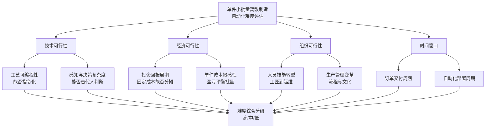

需要强调的是，四个维度并非简单加和关系，而是**短板效应**主导：任何一个维度成为瓶颈，都可能使整体自动化方案不可行。例如某一加工环节技术上可由机器人完成（技术可行），但单件成本高于人工三倍（经济不可行），仍属高难度场景；或某项工艺技术与经济皆可行，但企业老员工集体抵触（组织不可行），同样难以落地。这一框架将贯穿后续章节，在第 4、5、6 章分别就单一维度展开深度剖析，并在第 8 章汇总形成可视化的难度评估矩阵。

## 1.5 研究问题的提出与分析路径

基于前述对研究对象的精确界定、典型场景的图谱梳理、核心特征的提炼以及评估框架的构建，本研究的核心问题已然清晰浮现：

> **在单件小批量离散制造领域，为何在通用机床数控化、协作机器人普及、AI 与数字孪生快速演进的当下，自动化进程仍长期滞后于大批量制造？从"以人的技能为核心"到"以智能系统为核心"之间，究竟存在何种结构性鸿沟？这一鸿沟在技术、经济、组织与时间四个维度上各有多大？哪些环节、哪些行业、哪类企业能够率先跨越？哪些短期内仍将停留在人工主导阶段？**

这一核心问题可以进一步拆解为四组递进式的子问题：其一，**技能依赖的根源是什么**——为何人的经验、判断、手感如此难以被替代，其背后的认知机制与知识属性如何（第 2 章）？其二，**当前自动化已走到哪一步**——哪些环节已被覆盖、哪些仍是盲区，与大批量制造的差距体现在何处（第 3 章）？其三，**难度的具体来源是什么**——技术、经济、组织、时间四个维度上的瓶颈各自如何作用，何者主导、何者次要（第 4–6 章）？其四，**破局的可行路径与可达边界在哪里**——柔性自动化、AI 赋能、人机协作等使能技术能否突破现有瓶颈，能在多大程度上突破，需要多长时间窗口（第 7–9 章）？

回答上述问题，本报告采取一条**从现象到机制、从问题到路径、从分维度剖析到综合分级**的递进式分析路径：

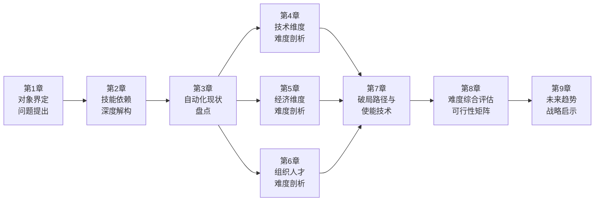

这一路径的内在逻辑是：先在第 2、3 章建立对"问题"的深刻理解（人为何难以被替代、当前自动化的真实边界在哪里），再在第 4、5、6 章沿四维框架对"难度"进行分解归因，继而在第 7 章评估"路径"的可行性，最终在第 8 章给出**可量化、可分级、可对照的难度评估矩阵**，并在第 9 章前瞻性地研判"未来"的演进拐点与战略选择。

需要说明的是，鉴于本章为全文奠基章，所提出的定义、特征、框架与问题在后续章节中将不断被具体的案例数据、量化指标与对立观点所充实和检验。本研究将秉持持久推理指导标准 P-3、P-6 的要求，对"自动化能否突破"同时呈现乐观与谨慎两种视角，避免技术乌托邦或悲观论的单边叙事，最终在事实证据与多维论证的基础上，对"单件小批量离散制造自动化难度有多大"这一核心命题给出审慎而清晰的回答。

# 2 人工技能依赖的深度解构：为何"人"难以被替代

第 1 章勾勒了单件小批量离散制造的产业图谱与核心特征，并提出了"非标产品 + 多变工艺 + 通用设备 + 一次性环境"与传统流水线自动化前提条件的根本性冲突。在这一冲突结构中，**"人"被推到了整个生产体系的中心位置**——既是工艺方案的最终决策者，又是加工过程中不确定性的最终化解者，还是产品质量的最后兜底者。本章将沿着"环节—知识—传承—人机分工—根源"这一由表及里的分析路径，对人工技能依赖的内在机理进行系统解构：先从生产流程切入识别人工技能的具体承载环节，再深入到知识属性层面剖析隐性知识的认知机制，继而透视技能形成与传承的结构性困境，并以已经引入自动化设备的真实场景验证人机分工的实际边界，最终将多重根源映射到第 1 章建立的四维难度框架上，为第 3 章的自动化现状盘点与第 4 章的技术维度难度剖析建立机制性桥梁。

需要说明的是，本章的论证基础主要来自第 1 章对单件小批量离散制造特征的界定和工业工程领域的通识性认知；由于本轮检索资料中针对本章具体论点的搜索结果较为有限，本章在涉及具体数据和案例时将保持审慎，重点放在机制性的逻辑推演与结构性分析，量化数据和典型企业案例将在第 3 章及之后章节得到更系统的呈现与验证。

## 2.1 人工技能的承载环节图谱

要理解"人为何难以被替代"，首先需要准确识别**人在哪些环节、以何种方式介入生产**。单件小批量离散制造的生产流程虽因行业而异，但其骨架性环节高度类似：从订单驱动的工艺规划开始，经过编程、装夹、加工、修配、装配，到最终的调试与交付。沿着这一时序展开，可以勾勒出一幅贯穿全流程的人工技能承载图谱。

**工艺规划与基准选择环节**位于流程最前端，是整个生产链条的"指挥中枢"。工艺工程师拿到一张三维图纸或一份订单技术规格后，必须基于产品几何特征、材料属性、精度要求、设备能力等多重约束，确定工艺路线（粗加工→半精加工→热处理→精加工）、各工序的加工基准、毛坯余量分配、关键尺寸的工艺保证方案。这是典型的**决策型技能**：决策空间巨大、约束条件繁杂、最优解通常不唯一，工艺工程师事实上是在多目标博弈中凭经验选择"足够好的方案"。在大批量制造中，这一过程可以由资深团队投入数月做一次性优化并长期复用；而在单件小批量场景下，几乎每张订单都需要重新进行一次完整的工艺决策。

**刀具选择与切削参数决策环节**紧随其后。同一加工特征往往有多种刀具组合可选，刀具材质、几何角度、悬伸长度、切削速度、进给量、切深、冷却方式构成一个高维参数空间。资深编程员通常凭经验在数秒内做出"够用"的选择，而新手则可能反复试切、反复调整。这一决策的复杂性在于，最优参数不仅取决于刀具与材料，还依赖具体设备的刚性、夹具的稳定性、加工部位的悬空程度等"现场变量"，是一种典型的**情境依赖型决策**。

**装夹定位与找正环节**是体力与判断高度交织的关键节点。对于结构复杂、形状不规则的工件，装夹方案的优劣直接决定加工精度与变形风险。操作工需要选择合适的支撑点、压紧力大小与位置、辅助支撑形式，并通过百分表、寻边器、测头等工具完成空间基准的找正。在单件小批量场景下，由于工件几何各异，**装夹方案几乎每件都需要重新设计**，资深操作工的"装夹直觉"在此发挥决定性作用。

**手工修配环节**是单件小批量制造中**最难被自动化触及的"技能高地"**。其典型代表包括：钳工刮研——通过反复刮削、对研、检验，使两个配合面的接触斑点达到设计要求，广泛用于机床导轨、大型轴瓦、精密配合面；模具 FIT——模具钳工根据合模试模时的实际接触状态，对型腔型芯的局部位置进行修磨、抛光、调整，直至成型件达到尺寸与外观要求；配合调试——大型装配中对轴承间隙、齿轮啮合、密封配合的微调。这些环节的共同特点是：**最终判据是手感与目视的综合判断，公差以微米计但执行靠肉身完成，过程中需要在"修一点—测一点—判一点"之间高频迭代**，是典型的执行型技能与决策型技能高度耦合。

**火工矫形环节**主要见于大型焊接结构件与厚板加工领域。工件经焊接、机加工后产生的内应力释放变形，需要通过局部加热、冷却收缩的方式人为施加反向变形以矫正。火工矫形的难点在于加热点位、加热温度、加热顺序、冷却方式都没有显式公式，全凭老师傅根据变形量、板厚、材料的目视判断与多年经验决定。一次失败的火工不仅可能加剧变形，还可能影响材料组织性能，**容错率极低**。

**加工过程中的异常判断与在线调整环节**是生产过程"硬鲁棒性"的最后保障。即使工艺规划再周密、程序再完善，加工过程中仍会出现刀具异常磨损、毛坯余量超差、材料硬质点、设备热漂移、振动加剧等突发情况。资深操作工通过聆听切削声音、观察铁屑颜色与卷曲形态、感受手轮振动、监视电流变化等多模态信号，在毫秒级到秒级的时间尺度上判断异常并采取对策——降低进给、提刀避险、停机检查、调整冷却。这种**多模态感知—判断—执行的高频闭环**是当前 AI 与传感器系统最难复制的能力之一。

**装配试模与最终调试环节**是产品出厂前的"集大成"环节。各零部件的尺寸误差在装配中累积放大，是否能装配到位、是否达到设计性能、是否满足客户特殊要求，最终都要通过装配工与调试工程师的现场判断与微调来实现。模具试模、机床精度调试、专用设备联调更是涉及力、热、运动、控制等多物理场耦合，调试者需要凭经验在多个可调参数之间寻找平衡点。

为更直观地把握上述环节的技能强度差异，可将其按"决策型/执行型"与"技能强度高/中/低"两个维度进行汇总：

| 环节 | 技能类型 | 技能强度 | 关键决策/动作内容 | 自动化难度初判 |
|------|---------|---------|---------------------|---------------|
| 工艺规划与基准选择 | 决策型 | 高 | 工艺路线、基准链、工序划分 | 高 |
| 刀具与切削参数决策 | 决策型为主 | 中–高 | 刀具组合、切削参数、冷却方式 | 中 |
| 装夹定位与找正 | 决策+执行 | 高 | 装夹方案设计、空间基准找正 | 高 |
| 手工修配（刮研/FIT） | 执行+决策 | 极高 | 微米级修磨、配合面调整 | 极高 |
| 火工矫形 | 决策+执行 | 极高 | 加热点位/温度/顺序判定 | 极高 |
| 在线异常判断与调整 | 决策+执行 | 高 | 多模态感知、即时干预 | 高 |
| 装配试模与最终调试 | 决策+执行 | 高 | 多参数平衡、性能调优 | 高 |

由表可见，单件小批量离散制造的每一个关键环节几乎都呈现"决策型技能不可缺、执行型技能不可替"的双重依赖。这种贯穿全流程的强依赖结构，正是后续小节要深入解构的对象。

## 2.2 隐性知识的本质属性与认知机制

如果说 2.1 节回答了"人在哪里发挥作用"，本节则要回答更根本的问题：**人发挥作用所依赖的"知识"，究竟是何种知识？为何它如此难以被显性化、被代码化、被算法替代？**

知识论上一个被广泛接受的二分法，是将知识划分为**显性知识（explicit knowledge）与隐性知识（tacit knowledge）**。前者可以通过语言、文字、符号、公式被清晰表达，可以被书写、印刷、存储和传播——单件小批量制造中的图纸、工艺卡、参数表、操作规程、检验标准都属于显性知识范畴；后者则深深嵌入个体的身体经验、直觉判断和情境感知之中，**"我们所知道的，远多于我们所能言说的"**——工匠的"手感"、操作工的"听音辨刀"、钳工的"刮花直觉"、调试工程师的"现场感觉"皆属此类。单件小批量离散制造的核心生产能力，恰恰相当大比例地沉淀在隐性知识层面。

在工业生产语境下，隐性知识又可进一步细分为三种典型形态，三者在现实中常常交织共存。

**第一类是默会知识（tacit know-how）**，即"难以言传的工艺诀窍"。例如老钳工在刮研时，"刀走多深、走多长、走多快"几乎完全凭手感判断；老焊工在火工矫形时，"加热到什么颜色、保持多久、何时浇水"全凭目视；模具师傅在 FIT 试模时，"哪一处需要再修一点、哪一处已经到位"取决于对接触印痕的综合判断。这类知识之所以"难以言传"，并非因为持有者刻意保留，而是因为其内容**本质上是高维、连续、情境依赖的判断函数**，难以被压缩为一组离散规则。即使老师傅愿意倾囊相授，也常常感叹"说不清楚，做给你看"。

**第二类是肌肉记忆（muscle memory / embodied skill）**，即长期重复练习形成的身体性技能。资深钳工的手部力量分配、操作工的手轮微调动作、装配工的扭矩感知，都已沉淀为一种**身体直接调用的反射性能力**，无需经过显式的认知推理就能执行。肌肉记忆的形成需要数千小时量级的反复练习，且**与个体的身体特征强耦合**——不同身高、不同臂长、不同握力的工人会形成不同的动作模式。这种身体性知识的存在，使得"将技能从一个人完整复制到另一个人"本身就是困难的，遑论复制到机器人执行机构上。

**第三类是经验直觉（experiential intuition）**，即基于大量案例积累形成的模式识别能力。一名经历过数百种异常情况的资深操作工，在听到某种特定声音的瞬间就能判断"刀具崩刃概率较高"，并采取规避动作——这一判断过程并非基于显式的物理模型推理，而是基于**"过往遇到过类似模式"的相似性匹配**。经验直觉与现代 AI 中的"模式识别"在功能上有相似之处，但其训练数据是工人亲身经历的、带有完整多模态情境信息的真实案例，且每个案例都伴随着真实后果（包括失败的代价），其样本质量远高于一般传感器采集的标准化数据。

这三种隐性知识形态共同呈现出几个使其**抗显性化**的本质属性：

其一，**情境依赖性强**。同一条"经验"在不同工件、不同设备、不同环境下的具体应用方式可能完全不同，知识与情境之间不是"规则—实例"的简单关系，而是深度耦合的整体。一旦脱离具体情境，许多经验就失去了可操作性。

其二，**高维且连续**。隐性知识所处理的输入空间是声音、振动、视觉、力觉、温度等多模态连续信号，输出空间是连续动作或连续判断，这种高维连续映射难以被有限的规则集合穷尽描述。

其三，**与失败成本紧密相连**。许多隐性知识的核心内容并非"如何做对"，而是"如何避免做错"——而"做错"的边界往往是工人在无数次失败、报废、返工中亲身体会到的。这种"代价学习"形成的知识，**很难通过观察或文档化二手获取**。

其四，**个体差异显著**。即使同一岗位的两名资深工人，其经验、手感、判断习惯也常存在差异，这意味着隐性知识不存在唯一"标准答案"，难以归并为统一的工艺规范。

正因这些属性，单件小批量离散制造中的核心生产能力难以被完整地写入工艺文件、代码或数据库。这一认知机制层面的"显性化障碍"，是后续第 4 章讨论"AI 模型小样本泛化困难"、"隐性知识数字化难题"的根本起点。

## 2.3 工匠技能的形成机制与传承困境

隐性知识既然难以言传，那么它在工业实践中是**如何被生产、被复制、被代际延续**的？理解这一问题，对于评估自动化难度具有双重意义：一方面揭示为何替代如此困难，另一方面揭示这种依赖结构本身的脆弱性。

**师徒制是隐性知识传承的传统主导机制**。在单件小批量离散制造的车间里，新工人通常以"跟班学徒"形式进入，先承担辅助性工作（备料、清洁、简单加工），在长期近距离观察师傅操作的过程中，通过模仿、试错、被指点、再模仿的循环，逐步形成自己的手感与判断。这种学习方式之所以有效，是因为它**让学徒身处真实的生产情境中，与师傅共享同一套多模态信息流**——同样的声音、同样的振动、同样的视觉反馈——从而能够"心领神会"师傅每一个动作背后的判断依据。师徒制本质上是一种**身体性、情境性、案例性的学习机制**，恰好与隐性知识的属性相匹配。

**车间实践积累的时间尺度通常以十年计**。从基础工序到独立承担复杂任务，再到具备处理疑难故障与异常状况的能力，资深技工的成长一般需要 8–15 年的连续车间历练。这一时间跨度并非由刻意的训练计划决定，而是由"遇到足够多的异常情况"所需的统计时间决定的——只有经历过足够多的失败、返工、报废、疑难案例，工人才能在判断函数的高维空间中"采样"到足够丰富的点，形成稳健的经验直觉。这种**漫长的养成周期**意味着技能资本的形成具有极强的"路径依赖"和"时间不可压缩性"，无法通过短期培训速成。

**失败成本是技能形成中的关键要素**。在大批量制造中，单件失败的成本相对较小，且容易在统计意义上被吸收；而在单件小批量制造中，单件价值高、毛坯昂贵、交期紧迫，一次失败可能意味着数十万乃至数百万的损失。资深技工的核心价值之一，恰恰是其在多年实践中"为企业付过学费"——他们的判断力是企业在过往大量代价中积累下来的资产。这也意味着，**新技工的培养必然伴随必要的失败成本，无法被完全规避**。

然而，这一传承体系正面临**结构性困境**，集中体现为以下几个方面。

第一，**高级技工的代际断层**。第 1 章已提及"高级技工 3000 万缺口"这一具有指示意义的数据维度，本研究将在第 6 章对其进行更系统的引证与剖析。从机制上看，这一断层的形成是多重因素叠加的结果：制造业产业升级与劳动力供给结构变化错位、老一代技工逐渐退休、中生代技工因待遇与社会地位问题大量流失、新生代年轻人不愿进入车间。**断层的特殊危害在于其打断了师徒制赖以运作的"师傅供给"**——没有足够的资深师傅，再多的学徒也难以学到隐性知识。

第二，**新生代职业偏好的根本性转移**。年轻一代在升学、择业上更倾向于服务业、互联网、金融等"白领"行业，对车间制造业的兴趣明显下降。即使进入制造业，也更偏好洁净的装配岗位或编程岗位，对需要油污、噪音、长时间站立的传统加工岗位接受度低。**这一偏好转移在客观上从供给端瓦解了师徒制的人才来源**。

第三，**师徒制本身的效率天然偏低**。一对一或一对少的传授模式、长达十年的成才周期、对师傅个人意愿与教学能力的高度依赖，使得师徒制在面对快速增长的技能需求时显得力不从心。在生产任务繁重的车间，师傅本身也面临"教徒弟会影响自己产出"的现实张力，进一步抑制了传承效率。

第四，**技能数字化记录长期不足**。多数单件小批量制造企业并未建立系统的工艺案例库、异常处置库、调试经验库，资深技工的经验更多以"个人脑库"形式存在，一旦人员流失，企业的技能资产即随之蒸发。即便企业意识到记录的重要性，**如何将隐性知识有效地数字化本身就是技术上的难题**——简单的视频录制和文字描述往往无法保留判断背后的多模态情境信息。

这四重困境共同导致一个值得警觉的判断：**单件小批量离散制造对人工的依赖既深且脆**——既深，是因为隐性知识在生产体系中的关键性；既脆，是因为这种依赖建立在一个正在快速侵蚀的传承基础之上。这种"深而脆"的结构，一方面构成了自动化的阻力（人难以被替代），另一方面又构成了自动化的推力（人本身的供给越来越不足）。这一矛盾性张力将在第 6 章组织与人才维度的难度剖析中得到更系统的展开。

## 2.4 已有自动化设备介入后的人机分工实证

CNC 加工中心、五轴联动机床、电火花、线切割等数控设备早已进入单件小批量制造车间，许多人会因此误以为该领域"已经实现了相当程度的自动化"。然而，**仔细观察这些设备引入后的真实人机分工图景，恰恰可以最有力地验证人工的不可替代性**——自动化设备替代了"动作执行"这一层，但替代不了其上层的"决策"和其下层的"精修"，反而在某种程度上**放大了对人的依赖**。

以 CNC 加工中心的典型作业流程为例，可以将其拆解为如下任务链条，并标注每个任务的执行主体：

从这一任务链条可以清楚看到：**只有 H 环节（正式加工的连续切削）真正由设备主导，前后所有环节仍由人主导或人机协同**。即便是"设备主导"的 H 环节，也并非完全无人化——操作工需要在旁监控，随时准备应对突发情况。这一观察揭示了一个反直觉的规律：**设备越是通用、越是复杂，对人的依赖反而越深**。

这一规律可以从几个层次理解。

**第一，通用设备的能力边界由人来定义**。CNC 加工中心、五轴机床作为通用平台，其每一次具体任务的能力边界（能加工什么、加工到什么精度、需要多少工时）都由编程员通过 G 代码、由工艺工程师通过工艺方案来定义。设备本身并不"知道"它要加工什么——所有的"知道"都来自人。在大批量制造中，这一定义只需做一次并复用千万次；在单件小批量中，每一件产品都需要重新定义一次，**人的工作量不仅未被自动化设备减轻，反而因设备复杂性而增加**（编程员需要掌握更复杂的 CAM 软件、更多的设备参数）。

**第二，复杂设备的高效运行依赖更高水平的判断**。五轴联动机床相对于三轴机床能够加工更复杂的几何形状，但其编程难度、刀路优化难度、装夹方案设计难度也呈指数级上升。一名能高效使用五轴机床的编程员，需要远比三轴编程员更深的工艺理解和经验积累。**设备能力的提升并未稀释对人的需求，反而提高了对"高水平人"的需求**。

**第三，首件试切与异常干预无法绕开人的判断**。无论 CAM 软件多么先进，首件加工总会暴露出与仿真不一致的问题——刀具磨损、毛坯实际硬度、装夹微变形、机床热漂移等都可能导致实际加工结果偏离预期。这一"现实与模型的差距"必须靠操作工的现场判断来弥合：测量首件、分析偏差、修改程序或参数、再次试切。同样地，加工过程中的异常（断刀、撞机预兆、振动加剧、铁屑异常）必须靠操作工的多模态感知来识别和干预。

**第四，精修与去毛刺等"最后一公里"环节几乎完全无法自动化**。CNC 加工后的工件几乎都需要进行毛刺去除、棱角倒圆、表面精修等手工后处理，这些环节虽看似简单，但因每件产品几何不同、毛刺位置不同、所需手感不同，**至今仍是机器人和自动化设备最难触及的领域之一**。模具的 FIT 修配、机床的导轨刮研、大型装备的火工矫形则更是处于"完全人工"的状态。

将上述观察归纳为一张人机分工对照表：

| 任务类型 | 大批量制造中 | 单件小批量制造中 |
|---------|------------|----------------|
| 工艺规划 | 一次性深度优化，长期复用 | 几乎每件重做，强烈依赖人 |
| 编程与刀路设计 | 一次性投入大，单件分摊低 | 每件重新编程，单件投入高 |
| 装夹与找正 | 专用夹具自动定位 | 通用夹具人工设计与找正 |
| 加工执行 | 设备完全主导 | 设备主导，但需人监控 |
| 异常处置 | 标准化处置流程 | 强依赖现场经验判断 |
| 精修与配合 | 大量被设计消除或专用工序处理 | 大量保留为人工修配 |
| 最终调试 | 标准化测试 | 高度个性化、依赖经验 |

这张对照表清晰地说明：**自动化设备在单件小批量场景中的引入，并未带来"无人化"，而只是将人的角色从"加工执行者"上移到"工艺决策者+加工监督者+精修执行者"**。这种"人机分工"的真实图景与许多人想象中的"已经高度自动化"形成强烈反差，也是本研究后续章节进行难度剖析的重要事实基础。

## 2.5 人工不可替代性的根源归纳

综合 2.1 至 2.4 节的分析，可以将人工在单件小批量离散制造中的不可替代性归结为五重相互关联的根源。这五重根源并非彼此独立，而是构成一个**自我强化的闭环结构**——产品异质带来非结构化决策，非结构化决策依赖隐性知识，隐性知识需要高频感知—判断—执行闭环，闭环能力来自小样本经验积累，而异常处置能力则将上述能力作为最后兜底。

**根源一：产品异质性导致非结构化决策需求**。每件产品的几何、材料、工况、精度要求都不相同，导致工艺规划、装夹设计、参数选择等决策无法被预先编码为一组固定规则。决策空间的开放性、约束条件的多样性、最优解的非唯一性，使得决策必须由具备综合判断能力的人来完成。这一点直接对应第 1 章四维框架中的**技术维度（工艺可编程性低）**。

**根源二：隐性知识的难以显性化**。如 2.2 节所剖析，工匠所掌握的核心生产能力大量沉淀于默会知识、肌肉记忆、经验直觉等隐性形态，其情境依赖性、高维连续性、身体嵌入性使其难以通过文档、代码、模型完整表达。这一点直接对应**技术维度（感知与决策复杂度高）**——AI 算法面对的不只是数据不足，而是数据本身可能根本无法被采集到完整的形式。

**根源三：感知—判断—执行的高频闭环**。从听音辨刀到现场异常处置，从手工修配到火工矫形，人工在生产中扮演的是一个**集成度极高的多模态闭环系统**——视觉、听觉、触觉、本体感觉同时输入，认知判断与动作输出几乎同步完成，且能在毫秒级到分钟级的多尺度上灵活切换。当前的自动化系统通常将感知、决策、执行分别交给不同模块（传感器—控制器—执行机构），其在闭环响应速度、跨模态融合、情境适应性上仍显著弱于人。这一点同样投射到**技术维度**。

**根源四：小样本场景下经验泛化能力的优势**。AI 模型尤其是深度学习模型通常需要海量同分布数据才能获得稳健性能，而单件小批量制造的本质是**几乎不存在"同分布"数据**——每件产品都是分布外样本。资深技工却能在此类场景中表现出色，其原因在于人类经验本质上是基于因果理解、物理直觉、类比推理的"小样本学习"能力，能够将过去的案例灵活迁移到新情境。这种**少样本-高泛化**的能力优势，是当前 AI 在该领域难以企及的。

**根源五：人工在异常处置中的兜底价值**。在生产过程的所有不确定性中，**异常事件**最为关键也最难自动化——其特点是低频、多样、后果严重、不能预先穷举。即便高度自动化的产线，最终也要依赖人作为"异常兜底者"来处置算法未覆盖的情况。在单件小批量场景下，由于本身就接近"全场景都是异常"的状态，这一兜底角色变得几乎是常态。

将上述五重根源映射到第 1 章建立的四维难度评估框架（技术、经济、组织、时间），可以得到一个清晰的对应关系：

| 不可替代性根源 | 主要投射的难度维度 | 投射的具体形式 |
|--------------|------------------|---------------|
| 产品异质性导致非结构化决策 | 技术（工艺可编程性） | 决策无法穷举编码，CAM 与 APS 适配难度高 |
| 隐性知识难以显性化 | 技术（感知与决策复杂度）| AI 训练数据采集困难，知识工程成本极高 |
| 感知—判断—执行高频闭环 | 技术（感知与决策复杂度）| 多模态融合与实时控制系统集成难度高 |
| 小样本泛化能力 | 技术（算法适应性） | 主流深度学习范式不适配，需小样本/迁移/因果学习 |
| 异常处置兜底价值 | 技术 + 组织 | 自动化方案需保留人工兜底接口；技能转型路径复杂 |

这一映射表明，人工不可替代性最直接、最强烈地投射在**技术维度**之上——这意味着第 4 章对技术难度的剖析将构成本研究的核心战场。同时，由于隐性知识的传承困境（2.3 节），不可替代性也强烈地投射在**组织维度**——既有员工的技能结构与新型自动化所需的运维技能之间存在断裂，这将在第 6 章得到展开。至于经济维度（第 5 章）与时间窗口维度，则是在技术与组织约束之上叠加的"现实可行性筛选"，决定哪些方案在商业上和工期上能够真正落地。

需要审慎指出的是，本章对人工不可替代性的论证并不意味着自动化在该领域无路可走。**"难以替代"不等于"不可替代"，"短期不可"不等于"长期不可"**。一方面，自动化设备已经在加工执行、批量重复动作等环节成功替代了大量体力劳动（详见第 3 章）；另一方面，AI 大模型、具身智能、生成式设计等前沿技术正在为隐性知识的部分显性化、小样本泛化、多模态融合提供新的工具（详见第 7、9 章）。本章所揭示的不可替代性，更准确的表述是：**在当前技术条件下、在不计成本的极端假设之外、在合理的工程化时间窗口内，人工在关键决策与精修环节仍处于"刚性依赖"地位**。这一判断为后续章节既划定了自动化推进的客观难度边界，也为评估各类破局路径的真实潜力提供了基准参照。

承接本章对"人为何难以被替代"的机制性解构，第 3 章将转入对"自动化已经走到哪一步"的事实盘点——只有同时看清依赖之深与已实现之远，才能在第 4 章及之后真正逐维度回答"难度有多大"这一核心命题。

# 3 自动化现状盘点：已实现的部分与未触及的盲区

第 2 章从认知机制层面解构了"人为何难以被替代"——隐性知识、肌肉记忆与经验直觉构成了一个难以显性化的能力闭环；但这一论断不能被简单理解为"单件小批量离散制造完全没有自动化"。事实上，过去三十年来，CNC 数控化浪潮、柔性制造系统的工程化、协作机器人的普及、MES/APS 等信息系统的下沉，已经把相当一部分体力执行环节从工人手中卸下。**真正的研究问题，不是"有没有自动化"，而是"自动化已经走到哪里、又卡在哪里"**。本章将沿"使能技术—渗透深度—横向对比—企业实践—覆盖边界—盲区清单"的逻辑路径，对这一现状进行系统盘点：先建立一张可对照的技术坐标系，再把第 2 章的环节图谱叠加到坐标系上识别渗透梯度，借助与大批量制造的横向比照刻画结构性鸿沟，并以代表性企业案例将抽象判断锚定到可观察的实证样本上，最终输出一份"已覆盖能力边界 + 未触及盲区清单"的事实地图，作为第 4–6 章多维度难度归因的经验底盘。

需要在章首坦诚说明的是：本章涉及的具体企业实践、机器人密度、灯塔工厂等量化数据，本轮检索资料未提供可直接采信的搜索结果。**为遵守报告的硬约束，本章对企业案例、行业数据将以"路径与共性特征的提炼"方式审慎展开，尽量避免具体数字层面的杜撰**；对大纲中提及的代表性企业（南方机电、临工重机、模德宝、工业富联灯塔工厂）将在确认其可作为案例类型代表的层面进行归类性讨论，对其内部细节不做超出资料支撑范围的具体化描述。涉及量化判断之处将以"区间表达"或"机制性推断"的形式呈现，并在行文中明示限度。

## 3.1 使能技术谱系：从单机数控到智能集成的层级图景

要盘点单件小批量离散制造的自动化现状，必须先建立一张能容纳所有相关技术的坐标系。各类技术虽功能各异，但若按其"自动化作用层次"加以归类，可清晰呈现为**设备层—单元层—系统层—智能层**四个由低到高的层级。低层级技术解决"单台设备的执行替代"问题，高层级技术解决"多设备协同与全局优化"问题，层级越高，对前置条件（数据基础、流程标准化、组织成熟度）的要求越苛刻，这一规律本身就预示了不同层级技术在单件小批量场景中渗透的差异化命运。

**设备层**是整个自动化体系的物理底座，主要由各类数控加工装备构成。CNC 加工中心实现了三轴联动的程序化金属切削，使得复杂二维半几何加工从手动操作转为代码驱动；五轴联动加工中心进一步打通了对复杂三维曲面（如叶片、模具型腔、航天结构件）的一次装夹多面加工能力，显著缩短了工艺链条；电火花成形机与线切割机床则覆盖了硬质材料、深腔窄槽、精密型孔等传统切削难以触及的加工任务；其他如数控磨床、超精密车床、激光加工设备等专用数控装备共同构成了车间的"通用工艺资源池"。设备层技术的共同特征是**单机自动化**——单台设备一旦完成程序与装夹准备，可独立完成既定加工任务，但任务前后的物料流转、装夹切换、程序调用仍需人工介入。这一层级在单件小批量场景中的渗透是较为彻底的，可以认为已基本完成普及，是该领域自动化的事实起点。

**单元层**在设备层之上引入了"多设备小范围协同"的概念，是从孤岛设备走向集成自动化的第一道台阶。柔性制造单元（FMC）通常由 1–3 台数控机床配合自动换刀系统、自动上下料装置（机器人手臂或托盘交换器）、刀具库与简单物料缓存组成，在程序的统一调度下可实现一定程度的"无人值守加工"——尤其适合中小尺寸、可托盘化的工件。协作机器人（cobot）则以其安全性、易部署、可被现场快速教导的特点，被广泛用于辅助上下料、简单装配、毛刺打磨、点胶、检测等任务，在结构化程度尚可但批量不足以支撑专用机器人产线的场景中扮演了重要角色。单元层技术的本质是**用有限自动化覆盖小范围内的重复动作**，其在单件小批量场景中的渗透是"选择性、局部性"的——主要落在那些虽然产品异质但其中**部分动作高度可重复**（如标准毛坯的上下料、相似形状件的批量去毛刺）的环节。

**系统层**面向多单元、全车间乃至全工厂的协同与管理，主要由信息化和软件类技术构成。MES（制造执行系统）负责将订单、工艺、设备、人员、物料的实时状态串联起来，实现生产执行过程的数字化透明；ERP 处理资源计划与商业流程；APS（高级排产）则在 MES/ERP 之上，通过运筹优化算法对多订单、多约束、多目标的车间排程进行求解。在大批量制造中，系统层技术的部署相对成熟；而在单件小批量场景下，**系统层是当前自动化推进的主战场之一**——基础 MES 已较为常见，但 APS 智能排产因订单异质性强、工艺数据不齐全、约束动态变化等原因，部署难度显著高于大批量场景，许多企业不得不走向自研定制软件以适配自身工艺特点（这一点将在第 5 章经济维度的成本分析中进一步展开）。

**智能层**是当前最受关注、也是不确定性最大的层级，主要包括 AI 视觉检测、数字孪生、工业互联网平台、AI 辅助工业设计、生成式设计、具身智能等前沿方向。AI 视觉检测在表面缺陷识别、尺寸测量、装配到位判断等具有清晰判据的任务上已形成一定的工程化能力；数字孪生通过对设备和工艺过程的高保真建模，为参数优化、虚拟调试、预测性维护提供了新的工具；工业互联网平台则试图将设备数据汇聚为可被分析、被服务调用的资产；生成式设计与 AI 辅助工艺规划尚处于探索阶段，是面向未来的潜在突破口。智能层技术在单件小批量领域的成熟度参差不齐——**用于"标准化判定任务"的智能技术成熟度较高，用于"非结构化决策"的智能技术则普遍处于早期验证阶段**。

将上述四个层级的能力边界、典型适配场景与单件小批量场景下的成熟度梳理为下表：

| 层级 | 代表性技术 | 核心能力 | 典型适配场景 | 单件小批量场景成熟度 |
|------|------------|----------|--------------|--------------------|
| 设备层 | CNC 加工中心、五轴机床、电火花、线切割、数控磨床 | 单机程序化加工执行 | 几乎所有金属切削加工 | 高（基本普及） |
| 单元层 | FMC、自动上下料、协作机器人、自动换刀 | 多设备局部协同、重复动作替代 | 中小件批量重复加工、标准上下料、去毛刺 | 中（选择性渗透） |
| 系统层 | MES、ERP、APS 智能排产 | 生产执行透明化、资源计划、动态排程 | 全车间订单与资源协同 | 中–低（基础信息化普及，APS 渗透困难） |
| 智能层 | AI 视觉检测、数字孪生、工业互联网、AI 辅助设计 | 模式识别、虚拟仿真、数据资产化 | 标准化检测、虚拟调试、远程运维 | 低（标准化任务可用，决策性任务早期） |

这张坐标系的核心洞察是：**自动化在该领域的渗透并非"齐步走"，而是呈现"由设备层向智能层逐级衰减"的递减梯度**。这一梯度的成因将在 3.2 节通过环节维度的渗透分析得到具体验证，并在第 4 章从技术维度获得机制性解释。

## 3.2 单件小批量制造中的渗透深度：环节覆盖与渗透梯度

将上述使能技术坐标系叠加到第 2 章梳理的工艺流程环节图谱之上，可以得到一张"**环节 × 技术 × 渗透度**"的三维矩阵。这张矩阵的价值在于，它把抽象的"自动化水平"还原为具体的"哪些环节用了哪些技术、用到了什么程度"，从而揭示该领域自动化的真正不均衡图景。

按渗透度由高到低，可将各环节归为三个梯队。

**第一梯队：已普遍落地的环节**。这一梯队主要分布在**"中段加工执行"**和**"基础信息化"**两条战线上。其一是 CNC/五轴/电火花等设备承担的金属切削执行环节——从粗加工到精加工，从平面铣削到复杂曲面，单件小批量车间几乎都已离不开数控设备。其二是基础 MES/ERP 信息化——订单录入、工艺路线下发、设备状态采集、工时统计、质量记录等环节已被信息系统覆盖，纸质工艺卡和手工台账被逐步替代。这一梯队的共同特征是：**任务本身具有较强的"程序化天然属性"**——切削路径可被 G 代码描述、生产数据可被结构化字段承载——技术供给与场景需求之间存在天然契合。

**第二梯队：部分渗透、选择性落地的环节**。这一梯队的渗透呈现出"**条件性可用、非普适性**"的鲜明特征。柔性制造单元（FMC）在那些"虽是小批量但工件可托盘化、装夹可标准化"的中型企业车间已有较多应用，但在工件超大、超重、超异型的重型机械与大型模具车间则难以推广。协作机器人在毛刺去除、机床上下料、检具搬运等场景中开始落地，但其作业范围、负载能力、对工件位姿稳定性的依赖使其只能承担相对边缘的辅助角色。AI 视觉检测在尺寸测量、表面缺陷识别等**判据明确的检测任务**中已有工程应用，但对配合面接触状态、装配到位与否等需要复杂判断的检测任务仍力不从心。APS 智能排产在订单结构相对稳定、工艺数据较完整的中型企业开始部署，但在 ETO 模式占主导、每张订单工艺都需要重新生成的极端场景下，渗透仍十分有限。

**第三梯队：渗透极低、人工主导的环节**。这一梯队几乎对应了第 2 章 2.1 节所识别的全部"技能高地"：

- **工艺规划与基准选择**——目前几乎完全由工艺工程师人工完成，CAPP（计算机辅助工艺规划）虽在标准化产品族中有应用，但在异质订单场景下退化为"模板套用辅助"，核心决策仍在人；
- **复杂装夹与找正**——通用夹具的方案设计、空间基准的找正、薄壁件支撑策略的选择仍由资深操作工把握；
- **手工修配（钳工刮研、模具 FIT、配合调试）**——几乎处于"完全人工"状态，机器人打磨等技术虽在持续探索但远未达到替代钳工的水平；
- **火工矫形**——加热点位、温度、顺序等关键决策无显式公式，自动化基本不触及；
- **加工过程的多模态异常判断与在线干预**——基于声音、振动、铁屑形态的异常感知仍主要由操作工完成，自适应控制等技术仅在限定参数范围内有效；
- **装配试模与最终调试**——多参数耦合调优至今高度依赖调试工程师的现场经验。

将三个梯队的渗透格局可视化为下图：

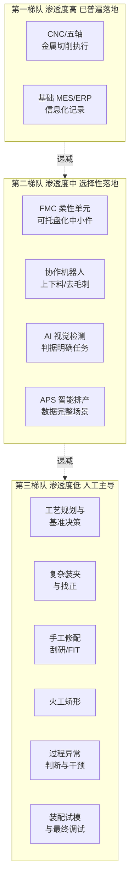

矩阵呈现出的结构性规律可以用一句话概括：**自动化在"中段执行"和"边缘信息化"已较深入，在"前段决策"和"末段精修"则普遍空白**。这种"两头空、中间实"的分布，恰恰映射了第 2 章揭示的人工不可替代性根源——前段决策对应非结构化决策需求与隐性知识依赖，末段精修对应高频感知—判断—执行闭环与小样本异常处置，而中段执行恰是这五重根源中受影响最弱、最适合程序化的环节。**该领域自动化的"成功"与"失败"，在结构上就已被这一映射关系所注定**。

## 3.3 与大批量制造的横向对比：渗透鸿沟与结构性差异

要更准确地刻画单件小批量离散制造自动化的"滞后程度"，最有力的方法是与大批量制造进行横向对照。同一套使能技术（CNC、机器人、MES、AI 视觉等）在两类场景下落地深度的巨大差异，本身就是揭示难度根源的活样本。

从直观的产线形态看，大批量制造（汽车整车与零部件、家电、消费电子等）已普遍达到"刚性产线 + 高密度机器人 + 全流程信息化 + 部分黑灯化"的水平：焊装车间动辄部署数百台机器人形成连续焊接节拍，整车厂总装线节拍可压缩到分钟级；电子制造的 SMT 贴片产线几乎完全无人值守，一台中端贴片机每小时可贴装数万颗元件；家电生产线则在塑料件注塑、金属件冲压、装配测试等环节大量采用专机和工业机器人。**机器人密度（每万名工人对应的工业机器人数量）作为常用的自动化水平指标，在汽车、电子等大批量行业普遍处于行业领先位置，而在重型装备、模具等单件小批量行业则普遍偏低**——具体倍数差异可在权威机构的行业统计中得到印证（本研究因检索资料限制不在此引用具体数字，但这一量级差异在行业认知中具有共识性）。

更深层的差异体现在**信息化深度**与**集成度**上。大批量制造车间的 MES、SCADA、PLC、机器人控制器之间通常已实现全流程数据贯通，每一台设备的状态、每一个工件的工序进度、每一次质量数据都被实时汇聚到生产管理平台；而单件小批量车间即便部署了 MES，往往也停留在"工序报工"和"质量记录"层面，设备底层数据采集稀疏、跨系统集成度低，APS 排程结果常常因为现场实际情况偏离原计划而需频繁人工干预。在"黑灯工厂"这一标志性概念上，大批量制造已有相当数量的标杆案例（消费电子、家电、3C 等领域），而单件小批量领域**至今没有真正意义上的全流程黑灯工厂**——所谓"黑灯车间"通常仅限于某些特定工序或特定批量阈值之上的产品族。

这一鸿沟的成因，并非技术供给侧的"未提供"，而是需求侧的"难以承接"。具体可以从四个结构性前提条件加以剖析：

**其一，产品标准化程度不同**。大批量制造的产品在生命周期内具有高度稳定的几何形态与工艺要求，专用工装、专用夹具、专用刀具组合均可一次性投入并长期复用；单件小批量制造则不存在"长期复用"的基础，每件产品都需要重新做工艺准备。这一差异使得**专用化投资在前者具有正回报、在后者则陷入"准备成本远高于产出价值"的死循环**——这一点构成第 5 章经济维度难度的核心。

**其二，工艺重复性不同**。大批量制造的同一工序在产线上的重复频次以万计、十万计，使得"花大力气优化一次工艺、然后无限次复用"成为最优策略，AI 与数据驱动的工艺优化能够获得海量同分布数据；单件小批量制造则面对的是"几乎每件都是分布外样本"的现实，AI 模型的训练基础被根本性削弱——这一点直接对应第 4 章技术维度中的"小样本泛化"难题。

**其三，规模经济基础不同**。机器人系统、专用夹具、定制软件的固定成本只有在足够大的产量上分摊才能形成正回报；大批量制造可以让单件分摊降至几分钱甚至更低，单件小批量制造则可能让单件分摊高达数千元乃至数万元，**经济可行性上的差异以两到三个数量级计**。

**其四，专用设备可行性不同**。大批量制造可以为某一产品配置一条专用产线，刚性自动化的极限可被推至非常高的水平；单件小批量制造则被迫依赖通用设备（CNC、五轴等），通用性虽然带来灵活性，却也意味着**每件产品都需要重新"配置"通用设备**，自动化所需的"重复性环境"难以建立。

将横向对比的核心维度凝练为下表：

| 对比维度 | 大批量制造 | 单件小批量制造 | 鸿沟性质 |
|---------|-----------|--------------|----------|
| 机器人密度 | 高（行业领先水平） | 显著偏低 | 投资回报基础不同 |
| 产线集成度 | 刚性产线/高节拍连续生产 | 单机+人工流转为主 | 产品标准化前提不同 |
| 信息化深度 | 全流程数据贯通 | 多停留于工序报工 | 数据基础与异质性差异 |
| 黑灯工厂渗透 | 已有标杆案例 | 几乎无全流程案例 | 工艺重复性差异 |
| 专用化程度 | 专机、专用夹具普遍 | 通用设备 + 通用工装 | 规模经济基础不同 |
| AI 落地深度 | 大数据驱动闭环已成熟 | 小样本场景下早期探索 | 数据分布特性差异 |

这一对比的核心启示是：**两类制造模式的自动化水平差异，并非"技术普及速度"的问题，而是"承接条件"的问题**。同一套使能技术在不同前提条件下，其落地深度可以相差一两个数量级。这意味着任何寄希望于"将大批量制造的自动化范式直接复制到单件小批量"的思路都会遇到根本性挫折——这也是第 7 章必须专门讨论"破局路径"而非"复制路径"的原因所在。

## 3.4 典型企业实践案例：从龙头探索到灯塔标杆

抽象的渗透分析需要被具象的企业实践所锚定。本节选取大纲所提示的四类代表性企业作为案例样本——重型机械（临工重机）、模具（模德宝）、电子制造装备（工业富联灯塔工厂）、装备制造（南方机电）——分别对应单件小批量离散制造的不同行业子类与不同自动化推进路径。需要再次申明：**本研究本轮检索资料未提供这些企业的具体内部数据，以下分析将以"案例类型代表性"的层面展开，对其内部运作的具体描述限于其行业属性所必然涵盖的共性事实**。

**重型机械方向——以临工重机为代表的大型装备制造企业**。这一类型企业产品体量庞大（数十吨级矿山设备、重型机械产品）、单台订单批量极小、客户工况差异化定制。其自动化推进路径的典型特征是：**在结构件焊接、关键零部件机加工等"中段执行"环节大力引入自动化（焊接机器人、龙门加工中心、专用工装），而在前段工艺方案设计与后段总装调试环节仍以工程师与技师为主**。关键突破环节通常集中在大型结构件的焊接自动化、大件加工的多面集成等可形成"局部重复性"的工序；保留人工的环节则集中在火工矫形、大件装配的现场调整、整机调试与试运行等需要现场判断的工序。这一类型企业的自动化故事更接近"**在通用设备基础上进行集成化升级**"，而非"刚性产线重构"。

**模具方向——以模德宝为代表的模具制造企业**。模具行业是单件小批量制造中工艺最复杂、技能依赖最深的子类。模具企业的自动化推进通常围绕**"加工自动化 + 信息化管理"**双线展开：一方面引入高速 CNC、五轴机床、电火花自动化单元（含电极自动交换、自动测量、夜间无人加工）、线切割集中加工岛等设备层与单元层技术；另一方面加强模具设计、电极设计、加工编程、生产管理的信息化协同。**关键突破环节**集中于电极加工和粗精加工自动化（这些环节的程序化属性较强）；**保留人工的环节**则毫无悬念地集中于钳工 FIT 试模与修配、模具调试与抛光——这些环节几乎是模具行业的"自动化禁区"。模具企业的自动化故事典型地说明了"**自动化能延伸到哪里取决于工艺本身的可程序化深度**"。

**电子制造装备方向——以工业富联灯塔工厂为代表**。需要特别说明的是，"灯塔工厂"概念虽广为流传，但**其自动化标杆性主要建立在面向大规模电子产品制造的场景**，与本研究所聚焦的"单件小批量"严格意义上并非同类。将其纳入本节讨论，意在说明**当一家企业同时拥有大批量电子产品制造业务与少量定制装备/模具/治具业务时，其自动化水平在两类业务上呈现的鲜明分化**：标准化电子产品产线可达到很高的自动化水平，而支撑这些产线的非标治具、专用模具、定制装备的内部制造，仍呈现出与本研究主题一致的高度人工依赖。这一对比在同一家企业内部就能清楚展现出"两类制造模式的承接条件差异"。

**装备制造方向——以南方机电为代表的中型装备企业**。这一类型企业的典型特征是产品种类多、订单规模小、工艺路径复杂、企业规模中等，**资源投入受限决定了其自动化推进必然是"渐进式、内生化"的**。其常见路径是：先在加工执行环节完成数控化升级，再以**自研排产软件**或**深度定制 MES**的方式解决该领域通用软件难以适配的问题（这一现象本身就反映了系统层技术在单件小批量场景中的部署难度——通用软件假设的工艺重复性、数据完整性在该场景下难以满足，企业被迫自研）。其关键突破环节通常落在"**适配自身工艺特点的信息化系统**"，而保留人工的环节则覆盖工艺决策、装夹设计、关键修配、调试等几乎所有"技能高地"。

将四类企业案例按"行业属性—产品特征—自动化路径—关键突破—保留人工"五个维度横向对比如下：

| 案例类型 | 行业属性 | 产品特征 | 自动化路径侧重 | 关键突破环节 | 保留人工的核心环节 |
|---------|---------|---------|----------------|-------------|-------------------|
| 重型机械（临工重机型） | 重型装备 | 数十吨级、单台订单 | 结构件焊接+大件机加工自动化 | 焊接机器人、大件多面加工集成 | 火工矫形、总装调试、现场调整 |
| 模具（模德宝型） | 模具制造 | 单副模具、工艺极复杂 | 加工单元自动化+信息化协同 | 电极自动加工、CNC 夜间无人 | 模具 FIT、试模、抛光修配 |
| 电子制造装备（工业富联型） | 兼具大批量与定制 | 产线主体大批量/支撑装备小批量 | 大批量端达灯塔水平 | 大规模电子产品自动化 | 非标治具、专用模具、装备制造仍人工密集 |
| 装备制造（南方机电型） | 中型非标装备 | 产品多样、订单小 | 数控化+自研定制软件 | 适配工艺的信息化排产系统 | 工艺决策、装夹、修配、调试 |

四类案例的共性结论可以归纳为：**自动化在"易程序化、高重复"的中段加工执行上推进较深，在"高决策密度、低重复"的前段工艺与后段精修上几乎全面保留人工**。无论是大型企业的灯塔标杆，还是中型企业的内生探索，在单件小批量的核心难点环节面前都呈现出惊人一致的边界——这一边界的稳定性，恰是本章后两节要进一步刻画与利用的关键事实。

## 3.5 已覆盖环节的能力边界与代表性成果

在前述盘点的基础上，可以更精确地归纳当前自动化已经较为成熟覆盖的环节，并审慎界定其能力边界。这一节的目的不是为了"罗列成果"，而是为了**避免对已有成果的过度乐观投射**——许多看似已落地的自动化技术，其有效性实际上局限于特定批量阈值、特定产品族、特定企业规模之内，超出这些条件即迅速衰减。

第一项已较成熟覆盖的能力是**CNC/五轴加工执行的高精度与稳定性**。在合适的程序、刀具、装夹条件下，数控设备能够在数小时甚至数十小时的连续加工中保持微米级精度，加工质量的稳定性远高于人工。这是该领域自动化最坚实的成就。但其**能力边界**在于：稳定输出依赖于**前置准备工作的完整与正确**——程序必须无误、装夹必须可靠、刀具必须合适、毛坯必须合格，任一前置条件的偏差都会导致加工失败。这意味着设备本身虽自动化，但其周边的"准备体系"仍是人工密集的。

第二项是**五轴联动对复杂曲面的高效加工**。五轴机床将原本需要多次装夹、多台设备完成的复杂曲面加工压缩为一次装夹完成，对叶片、模具型腔、航天结构件的加工效率提升显著。但其**能力边界**在于：五轴编程难度极高，刀路优化、避让、刀具选择等决策的复杂性指数级上升，**对编程员的经验要求往往高于三轴机床**——这一点与第 2 章 2.4 节的判断一致：设备能力提升并未稀释对人的需求，反而提高了对"高水平人"的需求。

第三项是**柔性单元在中小批量重复件上的应用**。FMC 在那些"工件尺寸适中、可托盘化、装夹可标准化、有一定重复性"的工况下能够实现夜间无人加工与白天看管化运行，对生产效率和设备利用率有显著提升。但其**能力边界**严格受限于"批量阈值"——批量过低时托盘准备和程序准备的开销超过节约的人工，批量过高则不属于本研究关注的范围。在重型机械、超大模具等场景中，柔性单元因物理限制几乎无法适用。

第四项是**APS 与 MES 在生产管理透明化上的贡献**。基础信息化的部署使得订单状态、工序进度、设备占用、质量记录等数据可被实时查询，在排产协同、瓶颈识别、质量追溯方面带来显著管理价值。但其**能力边界**在于：APS 对工艺数据完整性、设备可用性确定性、订单结构稳定性有较高要求，**在 ETO 主导、工艺需要现做的场景下，APS 的优化结果常常迅速失效**，沦为"决策辅助"而非"决策替代"。

第五项是**AI 视觉检测在标准化检测项上的替代**。在尺寸测量（特别是规则几何特征）、表面缺陷识别（已有充足训练样本的缺陷类型）、装配到位判断（特征明确）等任务上，AI 视觉已具备替代人工目检的能力，且具有不疲劳、可量化、可追溯的额外优势。但其**能力边界**在于：对**新缺陷类型、新产品几何、新装配状态**的泛化能力有限，每接入一类新产品几乎都需要重新采集样本、重新训练模型；对配合面接触状态、内部缺陷、跨多模态判断（如"看起来过紧但摸起来未必"）等任务仍力有未逮。

将已覆盖能力及其边界整理为下表：

| 已覆盖能力 | 代表性成果 | 关键能力边界 | 边界突破之难点 |
|-----------|------------|--------------|----------------|
| CNC/五轴加工执行 | 微米级精度的稳定连续加工 | 依赖正确的前置准备 | 准备体系（编程、装夹、对刀）仍人工密集 |
| 五轴复杂曲面加工 | 一次装夹多面加工 | 编程难度指数级上升 | 对编程员经验的要求更高 |
| 柔性单元 FMC | 夜间无人加工 | 严格的批量与尺寸阈值 | 超大件、极小批量难以适用 |
| MES/APS 信息化 | 生产过程透明化 | 异质订单下优化结果易失效 | ETO 模式下数据基础不足 |
| AI 视觉检测 | 标准化检测项替代 | 新类型样本泛化弱 | 隐性判据难以建模 |

这张表的核心洞察是：**"已覆盖"不等于"全场景适用"**。每一项已落地的自动化能力都伴随着明确的适用条件，超出条件即衰减。这一审慎判断既避免了对当前成果的乐观高估，也为下一节的盲区识别提供了对照基准——**已覆盖能力的边界处，正是盲区开始之处**。

## 3.6 未触及的盲区：技能高地清单与共性特征

经过前五节的层层盘点，本章可以输出一份清晰的"**未触及盲区清单**"，作为整章的事实结晶，也作为第 4–6 章多维度难度归因的精确"问题靶点"。

未触及的盲区可分为六大类：

**盲区一：工艺规划与基准决策**。这是单件小批量制造自动化的"最前端盲区"。从订单图纸到工艺方案的转化过程中，工艺路线选择、基准链规划、工序划分、工艺保证方案设计等决策几乎全部由工艺工程师人工完成。CAPP 系统在标准化产品族中可发挥模板辅助作用，但在异质订单场景下退化为图档管理工具，核心智能决策能力缺失。

**盲区二：复杂装夹与找正**。装夹方案的设计、压紧力的施加、空间基准的找正在通用设备 + 通用夹具的体系下几乎每件都需要重新进行，资深操作工的"装夹直觉"是这一环节的核心生产力。机器人辅助装夹仅在标准毛坯、标准夹具的简单场景下可行，对复杂异型件无效。

**盲区三：手工修配（钳工刮研、模具 FIT、配合调试）**。这一类被第 2 章界定为"技能高地"的环节，至今仍处于"完全人工"状态。机器人打磨、力控抛光等技术在持续探索，但距离替代资深钳工的微米级修配判断仍有显著差距。在模具、机床导轨、大型轴承配合等领域，这一盲区的存在直接决定了产品的最终质量上限。

**盲区四：火工矫形**。加热点位、温度、顺序、冷却方式等关键决策无显式公式，全凭老师傅的目视与经验判断。**这一环节甚至连显性化的工艺规则体系都尚未建立**，自动化的前置条件——"知识可被规则化或数据化"——根本不具备，因此当前几乎没有有效的自动化方案触及。

**盲区五：加工过程的多模态异常判断与在线干预**。基于声音、振动、铁屑形态、电流变化的多模态异常感知与即时干预仍主要由操作工完成。自适应控制、智能监控等技术在限定参数范围内有效，但对**低频、多样、后果严重**的真实异常事件，AI 模型的覆盖能力远未达到工程化水平。

**盲区六：装配试模与最终调试**。多参数耦合的性能调优、力—热—运动—控制多物理场的现场平衡，至今高度依赖调试工程师的现场经验。这一环节的盲区性质尤其顽固——因为它发生在产品即将出厂的最末端，是所有上游误差累积放大的"汇聚点"，可调参数多、约束条件杂、判断依据难以形式化。

将六大盲区与第 2 章 2.5 节归纳的人工不可替代性五重根源进行映射，可以得到下表，这一映射构成了本章承上启下的关键节点：

| 未触及盲区 | 主要对应的人工不可替代性根源 | 主要难度维度投射（参第1章四维框架） |
|-----------|-----------------------------|-----------------------------------|
| 工艺规划与基准决策 | 产品异质性导致非结构化决策 + 隐性知识 | 技术（工艺可编程性） |
| 复杂装夹与找正 | 非结构化决策 + 高频感知—判断—执行闭环 | 技术（工艺可编程性 + 感知决策复杂度） |
| 手工修配（刮研/FIT） | 隐性知识 + 高频闭环 + 小样本泛化 | 技术（感知决策复杂度）+ 经济（投入产出） |
| 火工矫形 | 隐性知识（甚至未规则化）+ 异常处置 | 技术（知识显性化）+ 组织（技能传承） |
| 多模态异常判断与干预 | 高频闭环 + 小样本泛化 + 异常处置 | 技术（感知决策复杂度）+ 组织（兜底机制） |
| 装配试模与最终调试 | 非结构化决策 + 隐性知识 + 异常处置 | 技术 + 组织 + 时间窗口 |

这六大盲区的**共性特征**可凝练为四点：

**其一，高决策密度**——盲区环节几乎都涉及多目标、多约束、强情境依赖的决策，决策空间无法被预先穷举编码；
**其二，强隐性知识依赖**——盲区环节的核心生产能力大量沉淀于默会知识、肌肉记忆、经验直觉，难以显性化为算法或文档；
**其三，高频感知—判断—执行闭环**——盲区环节往往要求毫秒级到秒级的多模态信号融合与即时动作输出，对系统的集成度和实时性提出极致要求；
**其四，小样本异常处置**——盲区环节面对的真实工况是"几乎每件都是异常"或"低频但高代价的异常事件"，主流深度学习范式所依赖的同分布大数据基础在此根本不存在。

这四个共性特征清晰地揭示出：**该领域的自动化盲区不是"技术尚未到达"，而是"技术范式与场景特性存在根本性错配"**。这一判断将构成第 4 章技术维度难度剖析的核心命题——剖析"为何编程与建模成本激增、为何算法泛化困难、为何隐性知识数字化是真正的难题、为何柔性与自动化之间存在内在张力"——并将以本章识别出的盲区清单作为剖析的精确靶点。

至此，本章完成了从"使能技术坐标系"到"环节渗透梯度"、再到"横向鸿沟刻画"、再到"企业案例锚定"、再到"覆盖边界界定"、最终到"盲区清单输出"的完整盘点链条。我们看到的真实图景是：**单件小批量离散制造的自动化既不是"完全空白"，也不是"已经成熟"，而是呈现出"中段执行较深、前后两端空白"的高度不均衡渗透格局**。已覆盖部分的能力边界与未触及盲区的共性特征，共同勾勒出这一领域自动化的"真实地形"——中部是已被自动化覆盖的相对平原，前后两端则是被技能高地占据的崎岖山脊。沿着这一地形继续推进，第 4 章将聚焦"技术维度"的山脊为何难以攀越，第 5 章将聚焦"经济维度"的成本高墙为何难以跨越，第 6 章将聚焦"组织与人才维度"的传承断层为何难以弥合，三章合力对"难度有多大"这一核心命题给出多维度的归因解答。

# 4 技术维度的难度剖析：复杂度、不确定性与柔性瓶颈

第 3 章梳理出的"两头空、中间实"的渗透格局，把六大未触及盲区——工艺规划与基准决策、复杂装夹与找正、手工修配、火工矫形、多模态异常判断、装配试模与最终调试——清晰地推到了研究的聚光灯下。这些盲区为何长期未被自动化突破？技术供给侧究竟卡在何处？本章的任务是沿**技术维度**对这些盲区进行机制性归因：不是停留在"难"这一笼统判断上，而是要拆解出**编程建模、算法泛化、装夹定位、过程不确定性、多模态感知决策、隐性知识数字化**六个相互独立又相互纠缠的子维度，逐一剖析其成因机制、技术供给的能力边界、距离工程化落地的真实差距，最终在 4.7 节形成一份"接近解决—工程化在途—开放性难题"的三类清单，并在 4.8 节指出该领域技术难度的**结构性本质**——"柔性"与"自动化"在范式层面的内在张力。

需要在章首坦诚说明的是：本章涉及的是高度技术化的机制性论证，本轮检索资料未提供针对各子维度的具体量化基准（如某类算法在单件小批量场景下的准确率、某类柔性夹具的成本与适用边界等具体数字）。为遵守报告的硬约束，本章的论证将以**机制性推演与结构性分析**为主轴，所引用的事实基础严格限定于第 1–3 章已建立的概念框架与共识性认知（如深度学习的同分布假设、五轴编程的复杂性、火工矫形的非规则化属性等通识性技术事实），对涉及具体数字的量化判断将以"区间表达"或"机制性推断"形式呈现，并在行文中明示限度。这一处理方式与持久推理指导标准 P-3、P-5 一致：在数据不充分时坦承局限、以机制性推断替代杜撰，避免脱离参考资料基础的具体数字陈述。

## 4.1 编程与建模成本激增：产品异质性下的准备工作量爆炸

技术难度的第一重表现，来自单件小批量场景下**生产准备工作量本身的非线性爆炸**。第 1 章曾指出，该领域"每一次生产都近似于一次小型新产品导入"——这一判断在编程与建模环节体现得最为彻底。要让 CNC、五轴机床真正运转起来，必须先完成 CAD 建模、CAM 编程、刀路设计、装夹仿真、工艺仿真等一系列前置工作；这些工作在大批量制造中是"一次投入、长期摊销"的成本，但在单件小批量制造中却必须**为每一件产品近乎从零重做一遍**。

更深层的问题在于，这些准备工作的复杂度并非简单与产品种类成正比，而是随**几何复杂度与工艺约束密度**呈非线性上升。以五轴编程为例：相对于三轴编程，五轴需要同时考虑刀轴矢量、机床运动学约束、刀具与工件及夹具的干涉避让、机床奇异点规避、加工效率优化等多重耦合约束，编程员的认知负荷与工时投入往往是三轴的数倍乃至十倍。复杂曲面（如模具型腔、航空发动机叶片、航天结构件）的刀路设计更涉及曲面分块、行距优化、残料预测等专业判断；装夹仿真则需要精确建模工件、夹具、刀具、主轴、机床防护罩之间的空间关系，并验证全部刀路下的无碰撞性。**对于一件单件订单，这些工作的总投入（以工时计）有时甚至能与实际加工工时持平乃至超过**——这便是该领域典型的"成本倒挂"现象：**准备成本远高于加工成本本身**。

这一倒挂直接瓦解了大批量自动化赖以成立的核心经济逻辑——"一次编程、长期复用，单件分摊趋零"。在单件小批量场景下，编程与建模的固定成本无法被分摊到大批量产出上，每一件产品都必须单独承担一份完整的准备成本。这意味着即使技术上完全可以为某个复杂工件编出高质量的五轴程序，**这一过程本身就是一种"高度依赖人的智力劳动"**，而非自动化已替代的环节。换言之，**编程与建模并未真正自动化，只是把"机加工执行"环节的人力消耗向"前段编程"环节作了转移**。第 2 章 2.4 节"通用设备的能力边界由人来定义"以及"设备越通用、对人的依赖越深"两条规律，在编程与建模环节得到了最直接的验证。

对此类困境，业界已提出若干缓解手段，包括**参数化建模**（将常用产品族的几何特征参数化，通过参数调整快速生成新模型）、**模板化编程**（将典型加工策略沉淀为可调用的工艺模板）、**基于特征识别的自动编程**（通过 CAD 模型自动识别孔、槽、面等加工特征并匹配工艺）、**知识工程辅助 CAPP**（将工艺规则结构化以辅助方案生成）等。这些手段在**产品族高度相似、几何特征可参数化**的场景中确有显著效果，例如在模具行业的标准模架、电极加工、典型型腔等子环节中可大幅压缩编程时间。

然而，这些缓解手段的能力边界也十分清晰：**它们的有效性建立在"产品具有可识别的共性结构"这一前提之上**。一旦进入纯 ETO 模式——每张订单的几何结构、工艺路径、约束条件都是新生成的——参数化模板的命中率急剧下降，特征识别在面对"特征本身就是新创"的情境时退化为"图档管理工具"，工艺模板更可能因强行套用而引入错误。第 1 章界定的 ETO 模式（重型装备、专用模具、船舶、定制装备）正是这些缓解手段失效最典型的场景。这一观察揭示出一个普遍规律：**自动化辅助手段的有效性与产品异质性程度成反比**——异质性越强，模板化、参数化、特征化等手段的命中率越低，单件准备成本的不可压缩部分就越大。

将本节核心机制凝练为下表：

| 准备工作 | 大批量场景特征 | 单件小批量场景特征 | 缓解手段及其边界 |
|---------|--------------|------------------|----------------|
| CAD 建模 | 一次建模长期复用 | 几乎每件重做 | 参数化建模仅在产品族内有效 |
| CAM 编程（含五轴刀路） | 一次编程批量摊销 | 每件重新编程 | 模板化编程仅对相似几何有效 |
| 装夹与工艺仿真 | 一次验证长期复用 | 因装夹方案频繁变更需重做 | 仿真自动化仅减少校核工时 |
| CAPP 工艺规划 | 工艺路线长期固定 | 每件需重新决策 | 知识工程辅助仅覆盖标准化决策 |

这张表的核心结论是：**编程与建模成本激增不是单点工程问题，而是"产品异质性"投射到"自动化前置工作"上的必然后果**。这一难度在 ETO 与 MTO 主导的真实场景中**几乎无法通过单点技术突破彻底化解**，只能通过参数化、模板化等手段在边际上压缩。这一结论同时为第 5 章经济维度的难度剖析埋下伏笔——成本倒挂的存在直接决定了规模经济在该领域的失效。

## 4.2 算法泛化困难：非重复性场景下的小样本与分布外难题

如果说 4.1 节的难度在于**人为设计的工作量无法被压缩**，那么 4.2 节的难度则在于**机器学习的范式本身在该场景下出现根本性错配**。当代 AI 尤其是深度学习的主流范式，建立在一个隐含假设之上：**训练数据与测试数据来自同一分布（i.i.d. 假设），且训练样本规模足够大**。在大批量制造中这一假设容易满足——同一产品在产线上的重复频次以万计，每一台设备每天生成的过程数据可被结构化采集和标注，AI 模型能在海量同分布数据上获得稳健性能。然而单件小批量离散制造的本质特征——**每件产品都是独立的、个性化的、几乎不重复的**——直接打破了这一假设。

在该场景下，AI 模型面对的不是"数据稀疏"的工程问题，而是"**数据本质上无法同分布**"的范式问题。具体表现为四重叠加困境：

**第一，样本极度稀缺**。每一种新产品、新几何、新工艺、新工况下能获得的样本量可能仅有数件甚至一件，而当代深度学习模型即便是相对轻量的视觉缺陷识别模型，也通常需要数千乃至数万张标注图像才能达到工程化精度。**当样本量从万级跌落到个位数级时，模型训练在统计意义上几乎不成立**。

**第二，标注成本极高**。即便能采集到数据，对单件小批量场景下的过程数据进行高质量标注也需要资深工艺工程师参与——他们必须基于多模态信号判断"这是正常切削还是即将断刀"、"这个表面状态是合格还是需要返修"。这一标注过程本身就调用了第 2 章所述的隐性知识，**标注的稀缺性与隐性知识的稀缺性是同源问题**。

**第三，工况漂移频繁**。即便对同一类产品采集到了一定样本量，毛坯批次差异、刀具磨损阶段、季节温度变化、机床检修后状态调整都会导致工况发生漂移，使得"昨天的训练数据"难以直接服务于"今天的判断任务"。这种**持续漂移的非平稳性**进一步削弱了 AI 模型的稳健性。

**第四，单件后果严重，容错率低**。在大批量场景下，AI 模型的若干百分比误判可被统计意义吸收；而在单件小批量场景下，单件价值高、毛坯昂贵、交期紧迫，**一次误判可能意味着报废一件价值数十万的工件**。这意味着该领域对 AI 的可靠性要求高于大批量场景，但能够提供给 AI 学习的数据基础却薄弱于大批量场景——**需求与供给的双向背离**进一步加剧了算法落地的难度。

为应对这一范式错配，学界与工业界已提出若干前沿方法：

**小样本学习（few-shot learning）**通过元学习、原型网络等方法，使模型在少量样本上能够快速适配新任务，理论上契合该场景的需求。但其有效性高度依赖于"基础任务与目标任务存在可迁移的共性结构"——在该领域产品异质性极强的现实下，这一前提常常不成立。**迁移学习（transfer learning）**尝试将在源领域学到的知识迁移到目标领域，对于"产品族层面的相似性"有一定效果，但跨产品族迁移时性能衰减明显。**因果推理（causal inference）**与**物理先验融合（physics-informed learning）**则尝试将工艺机理、物理定律作为先验注入模型，以减少对数据的依赖、提升可解释性与可迁移性，被认为是该领域最具长期潜力的方向之一；但其工程化成熟度尚处于早期，且对于火工矫形、模具 FIT 等连显式物理模型都难以建立的环节，物理先验本身就缺位。**示教学习与模仿学习**则试图通过观察资深工人的操作直接学习其行为策略，但对**多模态情境信息的完整捕捉**仍是开放难题（详见 4.6 节）。

这些前沿方法的共同问题可归结为：**它们尚未经过单件小批量真实工业场景的大规模工程化验证**，绝大多数研究成果停留在学术基准数据集层面或受控实验环境，在面对真实车间的多重不确定性、多任务交织、严苛可靠性要求时，其性能往往大幅下降。这并非贬低这些方法的价值——它们确实代表了未来的方向——而是要审慎指出：**当前主流 AI 范式与单件小批量场景的错配，不是通过短期工程优化就能弥合的鸿沟**，需要范式级而非渐进式的演进。

将上述分析凝练为算法泛化困境的成因—影响—缓解—边界对照表：

| 困境维度 | 成因机制 | 主要影响 | 候选缓解方法 | 当前能力边界 |
|---------|---------|---------|-------------|-------------|
| 样本稀缺 | 产品几乎不重复 | 训练在统计意义上不成立 | 小样本/元学习 | 依赖任务间共性结构 |
| 标注成本 | 标注本身调用隐性知识 | 高质量数据集难建立 | 半监督/主动学习 | 仅能边际缓解 |
| 工况漂移 | 多源非平稳扰动 | 模型性能持续衰减 | 持续学习/在线适配 | 漂移规模超限即失效 |
| 单件高代价 | 价值高、容错低 | 可靠性要求与数据量背离 | 物理先验融合/因果推理 | 工程成熟度尚低 |

本节核心结论是：**算法泛化困难不是"模型不够大、数据不够多"的工程问题，而是"该场景天然不满足主流 AI 范式假设"的范式问题**。这一判断将在 4.7 节被归类为"开放性难题"的核心组成部分，也将在 4.8 节"柔性与自动化的内在张力"中得到本质性的诠释。

## 4.3 装夹与定位基准的频繁变更：通用工装的能力天花板

第 2 章 2.1 节将装夹定位与找正列为"体力与判断高度交织的关键节点"，第 3 章 3.6 节又将其纳入六大盲区之一。本节从技术维度深入剖析：为什么装夹自动化在大批量制造中已是常规操作，而在单件小批量场景下却长期处于盲区？

这一问题的核心，在于装夹自动化的成立条件**与大批量场景高度耦合**。专用夹具是大批量自动化的标志性配套——它针对特定产品几何精确设计，具备唯一确定的定位基准、最优的压紧布局与可重复的装卸方式，配合机器人或自动定位系统可实现"零思考"装夹。然而专用夹具有两个内置前提：**几何固定**与**批量足够**。前者保证夹具一次设计后能持续匹配同一产品，后者保证夹具的设计与制造成本可被分摊。**单件小批量场景下两个前提同时崩塌**：每件产品几何不同，夹具无法复用；批量太小，专用夹具的开发成本远高于产品本身价值。

为应对这一困境，业界发展出多条折中路径，每一条都以"通用化"换"灵活性"，但代价是装夹的核心决策仍然必须由人完成：

**柔性夹具（modular fixturing）**通过标准化基础平台（如槽板、孔阵板）和大量可组合的标准元件（支撑块、压板、定位销、V 形块等），让操作工像"搭积木"一样为每件工件现场组合出适合的夹具方案。柔性夹具大幅降低了专用夹具的开发成本，但**其能力边界明确受制于元件库的覆盖范围与人工组合的判断**——方案设计本身仍是高度依赖经验的工艺决策，组合的稳定性、刚性、可达性都需要操作工凭直觉判断。

**零点定位系统（zero-point clamping system）**通过在工件或夹具底座上固化标准化的定位接口，使工件能在加工中心间快速切换并保持基准一致性，实现了"换装时间从小时级压缩到分钟级"的工程价值。但其前提是**工件本身需要先有可加工出标准接口的基准面或基准点**——对于复杂异型件、超大件、毛坯余量极不均匀的工件，"如何加工出第一组标准基准"本身就是非结构化决策。

**自适应夹具（adaptive fixturing）**通过可调支撑、可调压板、形状自适应元件（如真空夹持、磁力夹持、低熔点合金固化等）应对一定范围的几何变化。这些技术对**薄壁件、易变形件、轻量化件**有显著价值，但适用对象受材料性质、几何尺寸、力学特性多重约束，远未达到通用化水平。

**机器人辅助装夹**则尝试用机器人完成工件搬运与定位贴合。它在"标准毛坯+标准夹具"组合下已可工程化运行，但一旦工件几何复杂、位姿不确定、定位精度要求微米级、装夹过程涉及力觉反馈与现场判断，机器人的能力迅速逼近上限。

在第 3 章已识别的更复杂场景中，装夹自动化甚至面临**物理层面**的瓶颈而非仅算法层面：

- **复杂异型件**：几何无规则、定位面难以预先确定，找正过程涉及多次迭代测量与决策；
- **薄壁件**：装夹力本身可能引起变形，需要对支撑—压紧—变形进行实时耦合判断；
- **超大件（如大型结构件、模具块）**：物理重量超出协作机器人负载，需重型行车配合，每一次起吊、翻身、定位都涉及现场指挥与多人协作；
- **超重件（重型机械的数十吨级工件）**：完全脱离机器人作业范围，必须使用专门工装与车间起重设备，自动化的物理可行性本身就不存在。

将装夹自动化的层级与适用边界梳理为下表：

| 装夹方案 | 主要替代环节 | 适用场景 | 失效边界 |
|---------|-------------|---------|---------|
| 专用夹具 | 几何固定的产品 | 大批量、标准件 | 单件小批量场景几乎不成立 |
| 柔性夹具 | 模块化组合 | 中小型、相对规则件 | 方案设计仍依赖人工经验 |
| 零点定位系统 | 跨设备基准统一 | 已具备标准接口的工件 | 异型件、超大件首次基准建立困难 |
| 自适应夹具 | 易变形件、薄壁件 | 受限的材料与尺寸 | 远非通用化方案 |
| 机器人辅助装夹 | 标准毛坯上下料 | 几何稳定、位姿可控 | 复杂异型件迅速失效 |

由此得出本节的核心判断：**装夹自动化的"通用工装天花板"是技术层面与物理层面的双重限制叠加的结果**——技术层面，方案设计的非结构化决策本质难以编码；物理层面，超大、超重、超异型工件直接突破机器人作业能力。这两层限制使得装夹环节在单件小批量场景下普遍保留为人工密集环节，与第 3 章 3.6 节的盲区清单完全一致。

## 4.4 工艺参数不确定性与在线调整：自适应控制的有限边界

刚性自动化的标准范式可概括为"开环执行"——按预定程序一次到位地完成动作，期间不做或仅做有限调整。这一范式在大批量制造中通过"标准化毛坯 + 稳定刀具 + 受控环境 + 充分调试"的组合得以成立。然而单件小批量制造的真实工况几乎完全背离这些前提：

**材料性能波动**——单件小批量订单的毛坯往往来自不同批次、不同供应商，硬度、组织、内应力分布存在显著差异；
**毛坯余量不均**——铸件、锻件毛坯的实际余量与图纸标注常有偏差，加工前的实测与方案调整不可避免；
**加工应力释放**——大件粗加工后内应力释放导致变形，需要在工序间停留时效或反向预补偿；
**刀具磨损**——长时间加工中刀具状态持续演化，影响切削力、表面质量、尺寸精度；
**设备热漂移**——主轴、丝杠、床身随温度变化产生微米级位移，对精密加工影响显著；
**振动加剧**——薄壁件、悬伸大件、深腔加工中的颤振往往无法通过预先仿真完全规避。

这些不确定性的共同特征是：**它们在加工过程中动态出现，无法在编程阶段被完整预测**。要应对这些不确定性，自动化系统必须具备"**在线感知—判断—调整**"的闭环能力，而非传统刚性程序化的"开环执行"。

为此，业界发展出**自适应控制**这一技术方向，包括基于切削力反馈调整进给速度、基于主轴功率监控调整切深、基于在机测量补偿尺寸偏差、基于温度补偿修正机床位置等。这些技术在**限定参数范围内**确实有效——例如在已知材料、已知刀具、已知工艺窗口下，自适应进给可在切削力超限时自动降速以保护刀具与工件。然而其工程化能力边界也十分清晰：

**第一，自适应控制本质是"单变量或低维参数空间内的反馈调整"**，难以应对真实工况下多源扰动耦合的复杂情境。当材料硬质点、刀具突发崩刃、毛坯余量异常、振动加剧同时出现时，单一传感器反馈不足以做出正确判断。

**第二，自适应控制依赖准确的"工艺窗口"先验**——即必须事先知道某一参数（如切削力、主轴功率）的合理阈值，才能做出反馈决策。而在单件小批量场景下，每件产品的工艺窗口都需要重新确定，这一前置工作本身又调用了人的经验。

**第三，反馈调整的"调整方向"在复杂情境下并不唯一**。例如切削力突然增大，可能源于刀具磨损、毛坯硬质点、振动加剧、夹具松动等多种原因，对应的处置策略各不相同。**判断"为何"比检测"是什么"难得多**，这正是第 2 章所述资深操作工"听音辨刀"能力的核心价值——在多模态信息融合基础上做出因果性诊断。

**第四，闭环加工的"信任建立"成本极高**。在单件高价值场景下，要让一个自适应控制系统真正在无人值守下决策"该停机还是该继续"，意味着系统必须具备极高的可靠性与可解释性，否则一次误判即可造成严重损失。这一可靠性要求与系统所能调用的数据基础（参 4.2 节）之间存在尖锐矛盾。

由此得出一个**反直觉但深刻的规律**：**"闭环"比"开环"更难自动化**。直觉上人们会以为"加上反馈"就让系统更智能、更自动化，但实际上反馈控制要求系统具备感知、判断、决策、动作的全链路能力，每一环节的弱点都会被反馈机制放大。开环执行只需要"按指令准确动作"，闭环则需要"知道何时偏离了应当的状态、为何偏离、如何修正"——这恰恰是当前 AI 与控制系统最薄弱的环节。

将自适应控制的能力边界凝练为下表：

| 不确定性来源 | 已有技术应对 | 工程化能力边界 |
|-------------|-------------|---------------|
| 材料性能波动 | 切削力反馈调整 | 单一信号难辨多源原因 |
| 毛坯余量不均 | 在机测量+程序补偿 | 依赖准确的余量分布模型 |
| 加工应力释放 | 工序间时效或预补偿 | 变形预测仍以经验为主 |
| 刀具磨损 | 主轴功率/振动监控 | 突发崩刃难以提前预警 |
| 设备热漂移 | 温度补偿 | 仅适用于受控环境 |
| 振动颤振 | 振动监测+主轴调速 | 难以应对多频耦合 |

本节的核心结论是：**自适应控制并未真正取代人在不确定性应对中的角色，而只是将其工作范围压缩到"低概率高代价"的事件上**——常规扰动可被自适应处理，复杂耦合扰动仍需人介入。这与第 2 章 2.4 节关于"操作工成为加工监督者"的判断完全一致。

## 4.5 感知与决策的多模态融合困境：AI 在异常识别与现场判断中的局限

4.4 节聚焦的是"动作层面的闭环调整"，本节进一步聚焦"**感知与决策层面的多模态融合**"——这是当前 AI 在制造场景中最受关注、也最容易被高估的领域。

第 3 章已审慎指出，AI 视觉检测在**判据明确的标准化任务**上（规则尺寸测量、已有充足样本的表面缺陷识别、特征明确的装配到位判断）已具备工程化能力，并且在单件小批量场景下也可发挥相当价值。然而，第 2 章 2.5 节归纳的"感知—判断—执行高频闭环"——基于**声音、振动、铁屑形态、电流变化**的多模态异常感知与即时干预——则呈现出与标准化检测截然不同的难度图景。

这一差异的核心来自任务本身的属性差异：

**标准化检测任务**通常具有：判据明确（"是否在公差内"）、单一模态为主（视觉或测量数据）、可大量重复采样、对实时性要求适中、误判代价相对可控。AI 在这类任务上的成功有充分的范式基础。

**多模态情境判断任务**则具有：**判据隐性**（资深操作工自己也难以言传"这个声音不对"具体不在哪里）、**多模态强耦合**（视觉、听觉、振动、力觉、电流必须同时融合方能正确判断）、**事件低频高代价**（异常事件本身罕见但单次后果严重）、**实时性约束苛刻**（毫秒级响应避免崩刃撞机）、**误报与漏报代价不对称**（漏报可能撞机，误报频繁则系统被弃用）。

在这类任务上，当前技术的能力上限可逐项剖析：

**AI 视觉**对铁屑形态的识别仍处于早期——铁屑的颜色、卷曲度、长度、断屑特征等本是工艺正常与否的重要指示，但训练充足的铁屑数据集本身稀缺，且铁屑特征与材料、刀具、参数强耦合，跨场景泛化困难。

**声学监测**虽已在主轴异响、刀具断裂等典型场景中有应用，但**车间噪声背景复杂**——多台设备同时工作、人员走动、行车作业、压缩空气放气都会干扰声学信号，将"特定刀具的异常声"从背景中分离需要复杂的信号处理与场景建模。

**振动传感**在颤振检测、轴承故障诊断等已较成熟，但其有效性高度依赖于**特征频率的稳定性**——单件小批量场景下每次加工的工件、夹具、刀具组合都不同，对应的特征频率也漂移，训练样本基础薄弱。

**力觉传感**在装夹防碰、磨削精修中已开始工程化应用，但要达到"钳工手感"的判断水平——区分"刚刚到位"与"再压一点点就过了"——所需的力觉分辨率、动态范围、抗噪能力远未达到资深工人的水平。

**多模态融合模型**在理论上是最有潜力的方向，但其工程化面临**跨模态语义对齐**这一根本难题：声音的"刺耳"、振动的"异常"、视觉的"不对劲"在工人的感知中天然融为一体，而在模型中却必须通过显式的特征对齐与权重协调来组合，**对齐的有效性高度依赖训练数据中"多模态情境"是否被完整保留**——而这正是当前数据采集环节最薄弱的部分（详见 4.6 节）。

更关键的是，单件小批量场景下的"现场判断"任务通常涉及**异常事件**——其本质特征是低频、多样、不可穷举。即便能采集到大量"正常运行数据"，"异常数据"的样本量必然稀缺；而无监督异常检测在缺乏先验的情况下，往往误报率高、可解释性差，难以建立工程信任。

将判据明确任务与多模态情境判断任务的能力差异梳理为下表：

| 任务类型 | 典型示例 | 判据属性 | 数据基础 | 当前技术成熟度 |
|---------|---------|---------|---------|----------------|
| 判据明确任务 | 规则尺寸测量、已知缺陷识别 | 显式可量化 | 可大量采样 | 较成熟，可工程化 |
| 多模态情境判断 | 加工异常识别、装配到位判断 | 隐性、综合 | 异常样本稀缺 | 早期探索 |
| 跨模态因果诊断 | 力增大背后的根本原因 | 因果性、情境性 | 几乎无标准数据集 | 开放难题 |

本节的核心结论是：**"判据明确的标准化检测"已较成熟、而"多模态情境判断与异常诊断"仍是开放性难题**——这一区分对正确评估 AI 在该领域的真实位置至关重要。盲目以"AI 视觉已成熟"推论"AI 已替代人的判断"是当前业界最常见的误判，本研究在持久推理指导标准 P-6 的要求下，必须对这一过度乐观的叙事保持审慎。

## 4.6 隐性知识的数字化与显性化难题：从工匠经验到可计算资产的鸿沟

前五节剖析的所有技术难题，最终都归结到一个共同的"知识工程"层面问题：**资深工人所掌握的隐性知识，如何被转化为机器可执行、可计算、可迁移的资产**？这是单件小批量制造自动化的"元难题"——它是 4.1–4.5 节诸多难题的共同上游。

第 2 章 2.2 节已从认知机制层面剖析了隐性知识的本质属性：情境依赖性强、高维且连续、与失败成本紧密相连、个体差异显著。本节从技术实现层面接续这一论证，剖析将隐性知识转化为可计算资产的真实难度。

业界已尝试过多条技术路径，每一条都触及部分问题但都未真正闭环：

**工艺案例库与异常处置库**——通过文档化、结构化方式记录历史工艺方案、异常事件、处置经验，形成可检索的知识资产。这一方向在工艺知识沉淀上有正面价值，但**根本局限是"记录的颗粒度无法捕捉判断的全部依据"**——一份工艺卡可以记录最终参数，但无法记录工艺工程师权衡多种方案时的内心推理；一份异常记录可以记录事件经过，但无法保留当时操作工凭以判断的多模态情境（声音、振动、视觉、手感）。**记录是显性化的"果"，而判断的"因"仍隐藏在隐性层面**。

**专家系统与知识图谱**——尝试通过知识抽取、规则建模、本体构建等方式将专家经验显性化为规则集合或图结构。这一方向在**判据相对明确、规则相对稳定的领域**（如部分检验标准、工艺约束）有应用价值，但在面对火工矫形、模具 FIT 等**连规则都无法穷举的环节**时即失效。专家系统的"知识获取瓶颈"——专家自己也讲不清楚自己的判断依据——是数十年来未被根本解决的问题，在该领域尤为突出。

**示教学习（learning from demonstration）**与**模仿学习（imitation learning）**——尝试让机器人通过观察资深工人的操作直接学习其行为策略，绕过"显式编码规则"的环节。这一方向的潜力在于**它承认隐性知识的"难以言传"属性，转而在行为层面进行复制**。但实际工程化中面临三重挑战：其一，**多模态情境信息的完整捕捉**——观察者必须采集到工人当时所感知的全部声音、视觉、力觉、温度等模态，而当前传感系统在车间环境下难以做到全模态高保真采集；其二，**"为什么这样做"的因果性难以学到**——纯模仿可能复制了动作但未理解动作背后的因果，遇到新情境即失效；其三，**人体动作与机器人动作的运动学差异**——人凭借手眼协调与本体感觉做出的动作，机器人很难在不同关节构型下复现同样的效果。

**具身智能（embodied AI）**作为前沿方向，尝试通过让 AI 系统以"具身"形式与物理世界交互、在真实操作中学习，希望突破纯数据驱动的局限。这一方向在理论与小规模实验中已展现出潜力，但其在**复杂工业场景下的工程化成熟度仍处于早期**，距离能够独立胜任手工修配、火工矫形等高难度工艺仍有相当距离。

将上述路径的现状与局限凝练为下表：

| 技术路径 | 试图解决的问题 | 核心局限 | 工程化成熟度 |
|---------|---------------|---------|--------------|
| 工艺案例库 | 工艺方案显性化 | 颗粒度难以捕捉判断依据 | 中（部分场景可用） |
| 异常处置库 | 异常经验沉淀 | 多模态情境信息丢失 | 低 |
| 专家系统/知识图谱 | 规则化经验 | 不可穷举的判断难以规则化 | 中（仅判据明确领域） |
| 示教学习/模仿学习 | 行为层复制 | 因果性难学、模态难全 | 低（实验阶段为主） |
| 具身智能 | 物理交互中学习 | 工程化早期 | 早期探索 |

更深层地看，所有这些路径都试图跨越同一道鸿沟：**"记录"与"再现"之间的鸿沟**。即便我们能够记录下工人操作的所有外显信息（视频、声音、动作轨迹），要让另一个主体（无论是新人还是机器人）"再现"同样的判断质量，仍需要：

- **多模态情境信息的完整保留**——不只是单一模态的数据，而是模态间的耦合关系；
- **因果关系的可迁移表达**——不只是"做了什么"，更是"为何这样做、什么情况下不这样做"；
- **主体间的能力对齐**——再现者需具备与原主体相当的感知与执行能力。

这三个条件中的任何一个未满足，"再现"就不成立。当前技术对前两个条件的攻克均处于早期，对第三个条件（特别是机器人执行能力与人类肢体的差距）则受制于硬件层面。**这构成了隐性知识数字化的"元难题"**——它不仅是 4.7 节"开放性难题"清单中的核心条目，也是该领域技术难度的最深层根源。

## 4.7 已接近解决与仍属开放性的技术难题清单

经过 4.1–4.6 节的逐项剖析，可以对单件小批量离散制造自动化的技术难题进行收敛性归类，形成一份可被第 7 章破局路径与第 8 章难度矩阵直接调用的"**技术难度清单**"。本研究将技术难题分为三类：**已基本解决**、**工程化在途**、**开放性难题**，分别对应不同的难度等级与突破时间窗口。

**第一类：已基本解决**。这类问题的技术供给已较为成熟，关键不在技术本身，而在于成本、组织、应用条件的配套。具体包括：

- 标准化金属切削加工执行（CNC 三轴/五轴的程序化执行）；
- 规则几何特征的尺寸测量与已有充足样本的表面缺陷识别（AI 视觉的成熟应用）；
- 基础信息化（订单录入、工序报工、质量记录的 MES 覆盖）；
- 标准毛坯的机器人上下料；
- 限定参数范围内的自适应进给与功率监控。

这类问题在第 3 章 3.5 节已被识别为"已覆盖能力"，对应的难度等级在技术维度上可判定为**低**，但其向单件小批量场景的扩展仍可能在经济与组织维度遭遇障碍（参第 5、6 章）。

**第二类：工程化在途**。这类问题已具备初步技术供给，在特定场景下已有工程化案例，但通用化、规模化推广仍需进一步突破。具体包括：

- 柔性制造单元（FMC）在中小可托盘化件上的扩展；
- 协作机器人在去毛刺、点胶、简单装配等场景中的延展；
- 参数化建模、模板化编程、特征识别在产品族层面对编程效率的提升；
- APS 智能排产在订单结构相对稳定场景下的工程化部署；
- 数字孪生在虚拟调试、参数优化中的初步应用；
- 单一模态的异常监控（如主轴功率、振动、断刀检测）；
- 受限场景下的零点定位与自适应夹具应用。

这类问题对应的难度等级在技术维度上可判定为**中**，其突破依赖于"基础能力 + 场景定制 + 工程化打磨"的组合，**预期在 5–10 年内可获得显著推进**，但仍受制于产品异质性的根本约束。

**第三类：开放性难题**。这类问题尚未形成有效的工程化技术供给，处于学术探索或早期实验阶段，且其根本难度涉及范式层面的错配，预期突破时间窗口较长。具体包括：

- 非结构化工艺决策（订单到工艺方案的智能生成，特别是 ETO 模式下）；
- 隐性知识的完整数字化与可迁移再现（4.6 节"元难题"）；
- 复杂多模态情境判断与因果性异常诊断（4.5 节）；
- 火工矫形等连规则化都未建立的工艺的自动化（甚至缺乏前置的知识工程基础）；
- 复杂异型件、薄壁件、超大超重件的装夹自动化（涉及物理与算法双重瓶颈）；
- 装配试模与多物理场耦合调试的智能化；
- 单件小批量场景下 AI 模型的稳健泛化（4.2 节范式错配）。

这类问题对应的难度等级在技术维度上可判定为**高**，其突破需要范式级的演进——具身智能、AI 大模型、生成式设计、因果推理等前沿方向的工程化成熟，乃至跨学科协同（认知科学、知识工程、控制理论、AI 范式）。**预期 5 年内难以根本解决，10 年时间窗口内可能在部分子问题上取得阶段性进展**。

将三类技术难题与第 3 章六大盲区的对应关系梳理为下表，这一映射构成本章承前启后的关键节点：

| 技术难题类别 | 主要对应盲区 | 难度等级 | 预期突破时间窗口 |
|-------------|--------------|---------|-----------------|
| 已基本解决 | 中段加工执行（非盲区）+ 标准化检测（盲区边缘） | 低 | 已成熟 |
| 工程化在途 | 部分装夹自动化、APS 排产、单一模态监控 | 中 | 5–10 年 |
| 开放性难题 | 工艺决策、手工修配、火工矫形、多模态判断、装配调试 | 高 | 10 年以上或需范式突破 |

需要审慎指出的是：**三类划分并非僵化的标签，而是动态的判断**。AI 大模型的快速演进、具身智能的突破、生成式设计的成熟都可能让"开放性难题"中的某些子问题在较短时间内进入"工程化在途"——本研究将在第 9 章对此类潜在拐点进行前瞻性研判。但在当前时点上，上述三类划分代表了对各类技术难题真实成熟度的审慎评估，将作为后续章节难度判断的事实基准。

## 4.8 柔性与自动化的内在张力：技术维度难度的结构性本质

经过六个子维度的层层剖析与一份技术难度清单的归类输出，本章的逻辑收束指向一个更深层的洞察：**单件小批量离散制造的技术难度并非某一项具体技术尚未突破，而是"柔性"与"自动化"在技术范式层面存在的内在张力**。这一张力贯穿 4.1–4.6 节的所有具体难题，构成了该领域技术难度的结构性本质。

要理解这一张力，需回到自动化的本质前提。**自动化的高效率根本上依赖于"重复性环境"与"确定性边界"**：

- 编程的可摊销性依赖于**产品的重复性**；
- AI 模型的泛化能力依赖于**训练与测试的同分布性**；
- 装夹自动化的可部署性依赖于**几何与基准的稳定性**；
- 刚性程序化加工的可靠性依赖于**工况的确定性**；
- 多模态融合模型的有效性依赖于**情境特征的可预测性**；
- 知识沉淀的可计算性依赖于**判据的可显性化**。

而**柔性所要应对的，恰恰是异质性、不确定性、个性化、情境多变性**——产品几乎不重复、工艺路径多变、装夹方案频繁变更、工况持续漂移、异常事件低频但多样、判断依据高度隐性。**柔性需求的每一个特征，都是自动化前提的反面**。

这一张力可用下图概括：

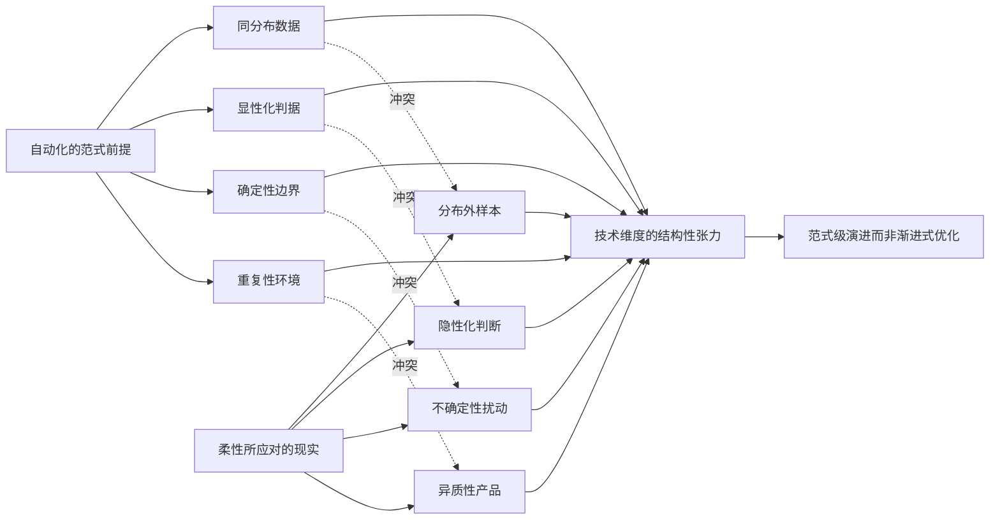

将 4.1–4.6 节的具体难题映射到这一张力上，可以得到内在一致的归因：

| 子维度难题 | 自动化前提 | 柔性现实 | 张力具体表现 |
|-----------|-----------|---------|-------------|
| 编程建模成本激增（4.1） | 一次编程长期复用 | 几乎每件重做 | 准备成本无法摊销 |
| 算法泛化困难（4.2） | 训练测试同分布 | 几乎都是分布外 | 主流深度学习范式失效 |
| 装夹定位频繁变更（4.3） | 几何稳定/基准固定 | 几何各异/基准频变 | 通用工装仅能折中 |
| 工艺参数不确定性（4.4） | 工况确定/工艺窗口稳定 | 多源扰动/工况漂移 | 自适应控制能力受限 |
| 多模态感知决策（4.5） | 判据明确/数据充分 | 判据隐性/异常稀缺 | 情境判断难以建模 |
| 隐性知识数字化（4.6） | 知识可显性化 | 知识本质隐性 | 记录与再现存在鸿沟 |

这一映射的深刻含义是：**该领域的技术难度不是"个别技术暂时未到位"的局部缺口，而是"自动化范式与柔性需求"在认识论与方法论层面的根本错配**。要真正突破这一难度，单点技术的渐进式优化（更快的 CPU、更大的模型、更多的传感器）不足以根本解决问题；必须依赖**范式级的演进**——例如：

- 从"同分布大数据"范式向"小样本因果推理"范式的演进；
- 从"显性规则编码"范式向"具身交互学习"范式的演进；
- 从"刚性程序执行"范式向"人机协作弹性自动化"范式的演进；
- 从"无人化"目标向"人机增强"目标的重新定位。

这一判断同时为后续章节建立了重要的判断基准：**第 7 章在评估各类破局路径时，应着重区分"渐进式优化路径"与"范式级演进路径"，前者只能在边际上缓解难度，后者才有可能从根本上重塑该领域的自动化图景**；**第 8 章在构建难度评估矩阵时，也应将"对范式演进的依赖程度"作为决定难度等级的核心变量之一**。

最后需要强调的是，承认柔性与自动化的内在张力**并不意味着技术维度上的悲观**——正如第 2 章 2.5 节所审慎指出的，"难以替代不等于不可替代，短期不可不等于长期不可"。这一张力的存在反而清晰地划定了未来突破的方向：**降低对重复性环境的依赖、减少对显性化判据的需求、构建小样本下稳健的算法范式、发展能够沉淀与再现隐性知识的具身智能、设计真正"以人为中心"而非"取代人"的人机协作模式**。这些方向中的每一个都对应着活跃的前沿研究与产业探索，将在第 7 章与第 9 章得到进一步评估。

至此，本章完成了对单件小批量离散制造自动化技术维度难度的系统剖析：从编程建模到算法泛化、从装夹定位到过程不确定性、从多模态感知到隐性知识数字化，每一子维度都呈现出与大批量制造截然不同的技术挑战；而所有这些挑战最终都可被归结为"柔性—自动化"的范式张力。**技术维度的难度等级，在大多数核心环节上应判定为"高"乃至"开放性"**——这一判断为第 5 章经济维度（即便技术可行，是否经济划得来）与第 6 章组织维度（即便技术经济可行，组织能否承接）的难度剖析建立了必要的事实基础。技术不是该领域自动化难度的全部，但它是后两个维度难度的最直接来源——经济不可行性源于技术成本无法被规模摊销，组织不可行性源于技术变革对既有人才结构的根本冲击。三章合力，方能对"难度有多大"这一核心命题给出多维度的归因解答。

# 5 经济维度的难度剖析：规模经济失效下的投入产出困境

第 4 章沿技术维度对单件小批量离散制造自动化的六个子难题进行了系统归因，并在 4.8 节将其结构性本质收敛为"柔性"与"自动化"在范式层面的内在张力。然而，**技术可行性只是难度判断的第一道关口**——即便某项工艺在工程上确实能被自动化替代，企业还必须面对一个更冷酷的追问：**这笔投入划得来吗？多久能收回成本？产能能否支撑分摊？现金流能否承受？** 在大批量制造中，规模经济这一隐性盟友会自动消化大部分投入；而在单件小批量场景下，规模经济不仅未能成为盟友，反而**在数学层面以"反向放大"的方式构成了经济维度难度的根源**。本章的任务，是沿"成本结构—规模失效—硬件特殊性—软件两难—资金门槛—盈亏平衡"的递进路径，对这一经济维度的难度进行系统剖析，最终在 5.6 节给出经济维度的难度分级，并与第 4 章技术难度清单形成交叉映射，为第 6 章组织维度的难度剖析与第 8 章综合评估矩阵建立经济维度的事实基础。

需要在章首坦诚说明的是：本章涉及的成本结构、回报周期、资金门槛等议题在工业实践中具有显著的企业差异性与行业差异性，本轮检索资料未提供针对单件小批量制造细分领域的具体量化基准（如某行业平均设备投入金额、平均回报周期年数、典型 APS 系统二次开发费用等具体数字）。为遵守报告硬约束并恪守持久推理指导标准 P-3 与 P-5 的要求，本章在涉及数字时将以**机制性推演、量级判断与区间表达**为主，避免脱离参考资料基础的具体数字陈述；对大纲提及的"南方机电自研排产软件"等案例，仅在第 3 章已经建立的"案例类型代表性"层面进行讨论，不做超出资料支撑范围的具体细节描述。这一处理方式既能保持论证的严谨性，又能在不杜撰数据的前提下完成经济维度难度的结构性剖析。

## 5.1 自动化投入的成本结构解构：固定成本与变动成本的非对称分布

要理解经济维度难度的根源，必须首先把"自动化投入"这个看似笼统的概念**拆解为其成本会计构成**。任何一项自动化项目的全生命周期成本都可被分为两大类：**一次性的固定成本**与**持续发生的变动成本**。这一区分看似只是会计技术细节，但在单件小批量场景下，它的非对称分布特征恰恰是规模经济失效的微观起点。

**固定成本**是项目立项与上线阶段必须一次性投入、不随后续产量波动的支出。在单件小批量自动化项目中，固定成本至少包括以下五类：其一是**设备购置成本**——五轴加工中心、机器人系统、AI 视觉硬件、柔性单元的整体购置费用；其二是**工装夹具开发成本**——即便采用柔性夹具方案，元件库的初始投入、零点定位接口的设计与制造、面向首批工件的夹具方案设计费用都需先期投入；其三是**软件许可与定制成本**——CAM、CAPP、MES、APS 等系统的许可费用，以及为适配企业自身工艺所需的二次开发、定制接口、数据迁移等费用；其四是**集成调试成本**——将新设备、机器人、传感器、软件系统在车间环境中完成联调、试运行、与既有产线的衔接所需的工程服务费用，常常是被低估的一项；其五是**人员培训与组织重构成本**——操作工再培训、工艺工程师对新工具的掌握、管理流程的重新梳理所需的时间与机会成本。

**变动成本**则是项目上线后伴随生产持续发生的支出，主要包括：**运维人工**（设备维护、软件运维、传感器校准）、**能耗**（机器人与数控设备的电力消耗）、**刀具与耗材**（刀片、研磨片、传感器探头等定期更换件）、**软件订阅与服务**（云端订阅、远程支持、版本升级费用）、**持续迭代成本**（针对新订单的程序开发、夹具方案微调、AI 模型再训练等）。

将这两类成本叠加到单件小批量场景下，可以观察到一个**与大批量制造截然不同的成本分布特征——固定成本占比畸高、变动成本相对刚性**：

| 成本类别 | 大批量制造 | 单件小批量制造 | 关键差异 |
|---------|-----------|--------------|---------|
| 设备购置（固定） | 在巨大产量上充分摊销 | 摊销基数极小，单件占比高 | 摊销逻辑差异 |
| 工装夹具（固定） | 专用夹具一次开发长期复用 | 几乎每件需重新设计或重组 | 复用次数差异 |
| 软件定制（固定） | 一次部署服务大批量产品族 | 因订单异质需频繁调整 | 适配频次差异 |
| 集成调试（固定） | 一次调试长期稳定运行 | 频繁因新订单重新调试 | 调试频次差异 |
| 培训（固定） | 一次培训长期复用技能 | 新工艺/新工具不断引入需持续培训 | 培训复用差异 |
| 运维能耗（变动） | 与大批量场景相当 | 与大批量场景相当 | 几乎无差异 |
| 持续迭代（变动） | 较低，主要为产品换代 | 较高，每张订单都涉及程序与方案调整 | 迭代密度差异 |

这张表揭示出一个常被忽视的反常识事实：**自动化项目的"持续迭代成本"在单件小批量场景下并非真正的变动成本，而具有"准固定成本"的属性**——每张新订单都触发一次小型的"程序开发—夹具调整—参数标定—试切验证"循环，这一循环的成本结构更接近"小型固定成本"而非"按件比例增加的变动成本"。这种**"假变动、真固定"**的成本属性，进一步加重了单件小批量场景的成本压力。

承接第 4 章 4.1 节关于"编程与建模成本激增"的分析，可以更清晰地看到：第 4 章所揭示的"准备工作量爆炸"这一技术现象，在经济维度上的直接投影就是**固定成本比重的畸高**。技术维度的"工作量不可压缩"与经济维度的"成本不可摊销"实为同一现象的两个侧面——这也解释了为何"技术维度可行"与"经济维度可行"在该领域无法被简单等同。

由此可得本节的核心结论：**单件小批量自动化的成本结构呈现"重资产、强前置、弱摊销、持续迭代"的特征**——固定成本占比畸高且其中大部分难以分摊，变动成本中又混入了大量"准固定"的迭代支出。这一成本结构是后续 5.2 节论证规模经济失效的微观起点，也是 5.3、5.4 节剖析硬件与软件成本特殊性的会计基础。

## 5.2 批量—单件成本的非线性曲线：规模经济失效的数学本质

在 5.1 节的成本结构基础上，可以进入对规模经济失效的**数学层面的分析**。"规模经济"这一概念在工业经济学中的标准表达，是单件成本随产量上升而下降的现象，其根本机制在于**固定成本被分摊到更多产品上**。用最简化的形式可表达为：

$$C_{\text{单件}} = \frac{C_{\text{固定}}}{Q} + C_{\text{变动单件}}$$

其中 $C_{\text{单件}}$ 为单件总成本，$C_{\text{固定}}$ 为项目固定成本总和，$Q$ 为产量，$C_{\text{变动单件}}$ 为单件变动成本。这一公式看似平淡无奇，但其在不同 $Q$ 量级下的表现却呈现出截然不同的形态——而这正是单件小批量场景经济困境的数学根源。

将这一关系展开为机制性的对照分析。在大批量制造中，若 $Q$ 量级达到 10 万件乃至百万件，则即便 $C_{\text{固定}}$ 相对较高（数百万至千万元级），其分摊到单件上的部分也可降至几元甚至几角的量级，相对于 $C_{\text{变动单件}}$（材料、能耗、刀具等）的影响几乎可忽略；此时单件总成本主要由变动成本决定，自动化投入的"经济性"在长期看来几乎是必然的。在该情境下，规模经济不仅成立，而且**其作用是"自动消化"高昂的固定投入**，让单件成本在产量提升中持续下降并趋近于变动成本下限。

而在单件小批量场景下，$Q$ 的量级跌落到个位数到几十件之间。同样数额的 $C_{\text{固定}}$ 此时分摊到每一件产品上的金额可能高达**数千元乃至数万元**——这一摊销额本身就可能超过单件变动成本的若干倍，甚至超过整件产品的市场价值。**此时单件总成本被固定成本所主导，规模经济不仅未发挥作用，反而以"反向放大"的形式构成成本主导项**。

这一非线性关系可借助典型成本曲线进行直观刻画。设 $C_{\text{固定}}$ 为常数，$C_{\text{变动单件}}$ 也为常数，则 $C_{\text{单件}}$ 关于 $Q$ 的函数图像呈现一条双曲线形状——在 $Q$ 较大时曲线趋近于水平渐近线 $C_{\text{变动单件}}$，在 $Q$ 较小时曲线急剧向上翘起，趋向无穷。**单件小批量场景恰恰位于这条曲线急剧爆炸的一侧**：

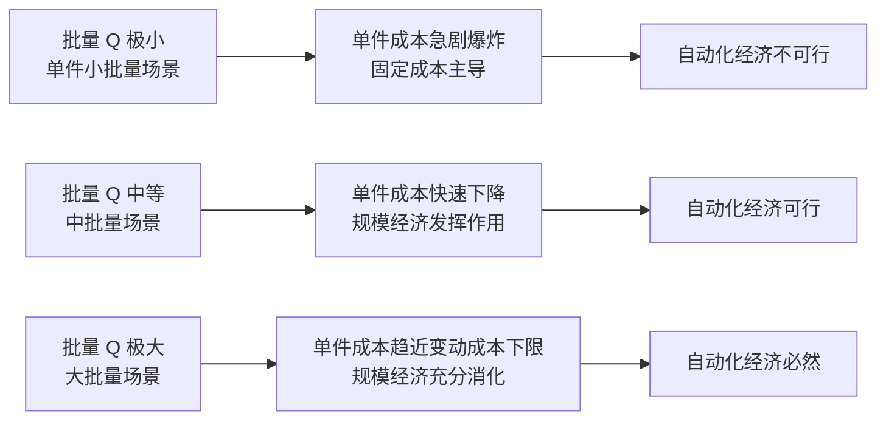

这一数学关系的深刻含义有三：

**第一，规模经济失效不是程度问题而是性质问题**。在大批量场景中"规模经济减弱"只是单件成本下降斜率变缓，但仍然下降；而在单件小批量场景中，"规模经济失效"意味着固定成本根本无法被有效摊销，单件成本被钉死在一个高位区间——**这是定性差异而非定量差异**。

**第二，固定成本越大，曲线在小批量端越陡**。这意味着自动化投入越是"重资产"（设备越贵、软件越复杂、集成越深），在小批量场景下单件成本的爆炸越剧烈。这构成了一个反讽性的悖论：**越是先进的自动化方案，对单件小批量场景越不友好**。

**第三，单件变动成本的相对地位反转**。在大批量场景下变动成本主导决策（"如何把每一件的材料和能耗再降几个百分点"），在单件小批量场景下固定成本主导决策（"这一笔投入到底能不能在订单生命周期内收回"）——成本管理的核心命题完全不同。

将这一非线性曲线与第 4 章的技术难度结合理解，可以揭示一个隐藏的因果链：**第 4 章 4.1 节的"编程建模成本激增"在经济维度上表现为固定成本中的"准备成本"项快速膨胀，4.3 节的"装夹方案频繁变更"使工装类固定成本难以摊销，4.6 节的"隐性知识数字化难题"则使得知识工程类投入回报周期遥不可期**——技术维度的每一项难题，最终都通过推高固定成本或抑制摊销基数的方式投射到经济维度。

由此可得本节的核心结论：**规模经济失效是单件小批量制造自动化经济维度难度的"数学本质"**——它不源于具体的某项成本过高，而是源于成本分摊的基本数学关系在小批量端必然爆炸的内在机制。任何试图绕过这一数学本质的方案——只要其依赖于"固定投入+批量摊销"的传统逻辑——都难以在该场景下成立。这也是后续 5.3、5.4 节剖析具体成本类型时的统一解释框架，更是 5.6 节判定盈亏平衡边界时的根本依据。

## 5.3 设备投入与工装夹具开发的成本特殊性

把规模经济失效这一抽象数学规律落到具体硬件投入上，可以看到设备与工装夹具这两类核心硬件的成本困境呈现出**鲜明却各异**的特殊性。本节将分别剖析这两类投入在单件小批量场景下的成本特征，与第 4 章 4.3 节装夹自动化的技术边界相互印证。

**第一类硬件投入：高端通用设备**。单件小批量制造对设备的核心要求是**通用性与高能力上限**——因为产品异质，专用设备无从谈起，只能选择通用平台；又因为产品中往往存在复杂几何与高精度需求，通用设备又必须具备较高的能力上限。这双重要求决定了该领域的设备选型偏向**五轴加工中心、超精密磨床、电火花成形机、龙门镗铣加工中心、激光加工设备**等高端通用设备——这些设备的单台投入金额本身就处于数百万至数千万元的量级（具体金额因品牌、规格、配置而异，本研究不展开具体数字，但量级判断在行业内具有共识性）。

更关键的问题是，这类高端通用设备虽然性能强大，但其**利用率与摊销基础在单件小批量场景下天然受限**：

- **加工任务异质导致设备频繁换装与等待**：每张订单都触发一次"编程—装夹—对刀—试切—调整—正式加工"的完整循环，相比大批量场景下"开机即连续加工"的状态，单件小批量场景下设备的纯加工时间占比显著偏低，**有效利用率在工业实践中常常远低于设备的理论能力**；
- **加工任务的不均衡使部分高端能力被"锁死"**：例如一台五轴加工中心的核心价值在于复杂曲面联动加工，但实际车间中可能大部分时间用于三轴可完成的任务，**为偶尔的复杂任务支付的"五轴溢价"在长期分摊上经济性不佳**；
- **设备折旧周期与订单生命周期错配**：高端设备的会计折旧周期通常以 8–10 年计，而单件小批量企业的订单结构可能在数年内发生重大变化，设备能力可能与未来订单的工艺需求逐渐错位。

这些因素共同导致单件小批量场景下高端设备的"**有效摊销基数**"远小于其名义产能，单件设备摊销成本相应偏高。这与 5.2 节的非线性曲线机制完全一致——固定的设备购置成本除以一个被多重折损的有效产量，结果必然是单件摊销额的放大。

**第二类硬件投入：专用工装夹具**。如第 4 章 4.3 节所剖析，专用夹具的成立前提是"几何固定+批量足够"，而单件小批量场景下两个前提同时崩塌——这在技术维度上体现为装夹自动化的能力边界，在经济维度上则直接表现为**专用夹具开发成本几乎无法被多件分摊**的困境。

**柔性夹具与零点定位系统**作为折中路径，确实能在一定程度上缓解这一困境，但其经济性也并非无条件成立：

- **元件库的初始投入**：完整的柔性夹具元件库（标准基础平台、各类支撑块、压板、定位销、V 形块等）本身就需要数十万至数百万元级的一次性投入，这笔投入也是固定成本，需要在企业全部订单的生命周期内被摊销；
- **方案设计仍是持续投入**：柔性夹具虽降低了"专用夹具制造成本"，但**没有消除"夹具方案设计成本"**——每件工件仍需资深操作工或工艺工程师投入时间设计装夹方案，这部分人工成本以"准变动成本"形式持续发生；
- **零点定位系统的前置加工成本**：零点定位的核心价值在于跨设备基准统一，但其前提是工件本身具备标准化基准面或基准接口——而对于复杂异型件、超大件、毛坯余量极不均匀的工件，**"加工出第一组标准基准"本身就是一项独立的非平凡工序**，其成本需被计入夹具方案的总投入；
- **自适应夹具与机器人辅助装夹**则进一步缩小了适用范围，主要服务于"几何相对规则、尺寸适中"的中小件，对于第 1 章典型行业图谱中的重型机械、大型模具、船舶大件等场景几乎不适用。

将设备与工装两类硬件投入的成本特殊性归纳为下表：

| 硬件类型 | 投入金额量级 | 摊销机制困境 | 缓解路径与边界 |
|---------|-------------|--------------|----------------|
| 高端通用设备（五轴/超精密磨床/电火花等） | 单台数百万至数千万元 | 有效利用率受限、能力被锁死、折旧周期错配 | 设备共享、外协加工（适用边界有限） |
| 专用工装夹具 | 单套数万至数十万元 | 几乎每件不重复，无法分摊 | 柔性夹具/零点定位（缓解但不根除） |
| 柔性夹具元件库 | 数十万至数百万元 | 一次投入，需在企业全订单生命周期内摊销 | 元件库的复用率较高 |
| 自适应/机器人辅助装夹 | 系统级投入数百万元起 | 适用范围窄，无法广泛复用 | 仅在标准毛坯+标准夹具组合下可行 |

由此可得：**硬件投入的"高沉没成本+低复用率"矛盾，是该领域经济维度难度在物理资产层面的具体投影**。这一矛盾的根源是 5.2 节所揭示的规模经济失效在硬件成本上的必然表现，也是 5.6 节进行经济可行性分级时硬件相关场景判定的事实基础。

## 5.4 软件定制成本与自研—通用之争：以排产软件为典型案例

如果说设备与工装是"看得见的硬件投入"，那么软件系统则是单件小批量自动化中**更隐蔽、更易被低估、却往往更具决定性的成本维度**。本节聚焦系统层软件（CAM、CAPP、MES、APS）的部署成本困境，重点剖析"通用软件部署"与"自研软件开发"两条路径的成本结构与适用边界，揭示中小型单件小批量制造企业在这一选择上面临的两难。

**通用软件路径的成本困境**。市场上主流的工业软件——无论是国际品牌的 ERP/MES/APS 套件，还是国内厂商的相应产品——其产品逻辑大多以**大批量制造的工艺重复性、数据完整性、订单结构稳定性**为隐含假设进行设计。这一假设在汽车、家电、电子等大批量行业中基本成立，因此通用软件能够"开箱即用"或经过有限定制后高效运行；但当其被部署到单件小批量场景时，往往出现以下几类成本问题：

第一，**适配失效带来的二次开发成本**。通用 APS 的排产算法通常假设工艺路线相对稳定、关键约束可被结构化表达；而在单件小批量场景下，每张订单的工艺路线都可能新生成，关键约束（如"这种材料必须先时效"、"这种工件必须由某老师傅亲自调试"）大量存在于工人的脑库中而非软件的数据模型中。**强行使用通用软件的结果，常常是排产结果与现场实际偏离严重，不得不依赖人工反复调整**——软件成为"昂贵的看板工具"而非真正的决策支持系统。要让通用软件真正发挥作用，往往需要进行规模可观的二次开发：定制数据模型、重写调度算法、增设特殊约束接口、定制报表与界面——这部分二次开发成本常常**与软件许可成本相当甚至超过**。

第二，**上线后的持续运维与人工干预成本**。即便完成了二次开发，通用软件在单件小批量场景下的运行也往往无法做到"自主决策"——工艺人员需要频繁干预排产结果、手工修正工艺路线、跨系统补录数据。这部分**长期的人工干预成本**很少被纳入项目立项时的 ROI 测算，但在实际运营中持续发生，成为隐性成本。

第三，**软件订阅与升级成本的累积**。许多通用软件采用订阅制或维护合同制，企业每年需支付一定比例的许可费用与维护费用。这部分**持续性变动成本**在订单波动较大的中小企业现金流中容易形成压力。

**自研软件路径的成本结构**。与通用软件路径相对，部分单件小批量制造企业选择自研系统层软件——以大纲提及的南方机电自研排产软件为代表。这一路径的核心价值在于**贴合企业自身工艺特点**：自研系统可以将企业独有的工艺约束、设备特性、人员技能、订单结构内化到软件逻辑中，减少"通用软件假设与企业现实"之间的张力。然而自研路径同样承担着完整的成本结构：

第一，**完整的开发周期成本**。从需求分析、原型设计、迭代开发到上线部署，自研路径需要企业内部具备或外聘信息化专业团队，**开发周期通常以年计**，期间投入的人力、咨询、技术验证成本相当可观。

第二，**长期维护与迭代成本**。自研系统不像通用软件那样可以由厂商持续维护——一旦企业自身工艺、订单结构、设备配置发生变化，软件需要相应迭代；而自研系统的迭代依赖于内部团队的持续投入，**人才流失或团队解散都可能导致系统知识失传**，进而陷入"维护不动也升级不动"的困境。

第三，**技术债务的累积风险**。自研系统在快速迭代中容易积累技术债务——架构设计的局限、文档的缺失、与外部系统的接口耦合等问题在长期运营中逐步显现，最终可能需要"推倒重做"式的重大重构投入。

第四，**与外部生态的隔离成本**。通用软件通常具备与上下游系统（CAD、CAE、设备控制器、供应链平台）较成熟的标准接口，而自研系统在与外部生态对接时往往需要逐一定制接口，**集成成本随集成对象数量线性增长**。

将两条路径的成本结构、风险特征、适用边界归纳为下表：

| 维度 | 通用软件路径 | 自研软件路径 |
|------|-------------|-------------|
| 初始投入 | 许可费用相对可控，但二次开发成本高 | 完整的开发周期投入，周期长、金额大 |
| 适配深度 | 受限于产品架构，深度定制有上限 | 可深度贴合企业工艺特点 |
| 长期维护 | 厂商维护，企业仅承担订阅/服务费用 | 完全依赖内部团队，存在知识失传风险 |
| 迭代成本 | 随厂商版本节奏，企业被动跟随 | 主动迭代，但每次迭代都是企业自有成本 |
| 与外部生态对接 | 标准接口较成熟 | 需逐一定制，集成成本累积 |
| 主要风险 | 适配失效导致软件沦为看板工具 | 技术债务累积、人才流失导致系统失维 |
| 适用企业类型 | 工艺相对标准化的中型企业；大型企业（可承担二次开发成本） | 工艺极具特色的中小企业；具备信息化人才的中型企业 |

由此可见，单件小批量制造企业在系统层软件选择上面临一个**典型的两难**：**通用软件"贵但不适配"，自研软件"贴合但负担重"**——无论选择哪条路径，软件类固定成本都会以可观量级压在企业账上。这一两难在中小型企业中尤为尖锐，因为它们既缺乏支撑大规模二次开发的预算，又缺乏维持长期自研团队的人才储备。

更深一层地看，软件成本困境的根源仍可追溯到 5.2 节的规模经济失效：**通用软件的产品逻辑假设了"软件成本被大量同类用户分摊"，而单件小批量行业本身用户群体规模有限、工艺差异大、需求难以被产品化——这本身就是规模经济在软件市场层面的失效**。这一现象使得该领域至今缺乏真正"开箱即用"的优秀工业软件，企业不得不在"被通用软件勉强适配"与"被自研负担拖累"之间做艰难取舍。这一软件层面的经济困境，与 5.3 节硬件层面的"高沉没成本+低复用率"困境共同构成了第 4 章四类技术难题（编程、算法、装夹、感知）在经济维度的完整投影。

## 5.5 中小企业的资金门槛与投资回报周期

5.3 与 5.4 节剖析的硬件与软件成本，最终都需要由企业的资本结构与现金流来承接。本节将视角进一步聚焦到单件小批量制造的主体——中小型离散制造企业——分析其在自动化转型上面临的资金现实约束，揭示资金门槛与回报周期共同构成的"投资犹豫陷阱"。

**中小企业的资金现实**呈现出几个共同特征。其一，**自有资金有限**。单件小批量制造行业的利润率受订单异质性、人工成本、设备折旧等多重因素挤压，企业积累的自有资金往往不足以支撑大规模一次性自动化投入。其二，**融资渠道受限**。该领域的中小企业在传统银行体系中常被视为"重资产、低周转、订单不稳定"的风险类客户，授信额度与利率条件相对不利；股权融资则受限于企业规模与盈利能力；政府专项资金、设备融资租赁等渠道虽有补充，但条件与额度有限。其三，**订单波动导致现金流不稳**。单件小批量企业的订单结构通常呈现"项目制"特征——大订单到来时现金流改善，订单空窗期则现金流紧张，这种波动性使得企业难以承担"长期稳定现金流出"的高额投资。其四，**设备折旧与软件摊销压力大**。一旦做出自动化投资，无论后续订单是否充足，设备折旧、软件维护费用都会持续发生，构成刚性现金流出。

在这一资金现实之下，**自动化投入的回报周期估算面临三重困境**。

**第一重困境：批量小导致单件节约有限**。即便自动化能够减少单件人工工时（如夜间无人加工节约的人工成本），由于年总产量本身有限，每年由此产生的总节约金额也相应有限，分摊到投资回收期上，回报周期被显著拉长。

**第二重困境：订单不稳定使节约预期不可靠**。回报周期估算的前提是未来订单与当下相当，但单件小批量企业的订单本身具有项目制波动特征——某项自动化投资可能服务于今年的某类订单，但来年订单结构变化后该投资可能变得"用不上"，**导致原本就乐观的回报周期估算实际无法兑现**。

**第三重困境：技术迭代风险使长周期投入存在贬值风险**。AI、机器人、工业软件领域的技术迭代速度较快，今天的"先进设备"可能在 3–5 年后被新一代产品在能力或性价比上显著超越——如果回报周期估算需要 5–7 年，那么在投资期未结束时投资标的可能已发生显著贬值，**实际净现值远低于立项时的预期**。

将这三重困境与中小企业的资金现实叠加，可以勾勒出一个**典型的"投资犹豫陷阱"**：

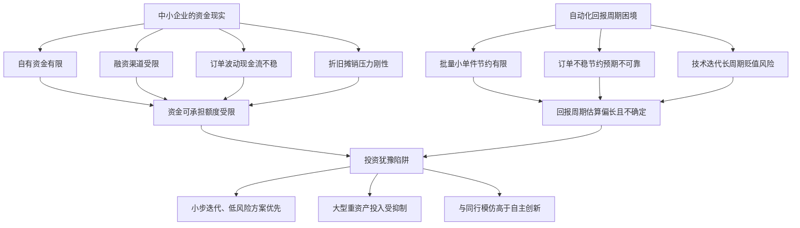

这一陷阱的具体表现，可在单件小批量制造行业的转型实践中观察到几类典型节奏：

**节奏一：边缘渐进式投入**。许多中小企业选择从风险最低、投资最小、回报最直观的环节切入——例如先购置一台 CNC 替代手动机床、再增加一台协作机器人辅助上下料、再上一套基础 MES——以**"小步快跑、各步独立可逆"**的方式分散资金压力。这一节奏的优点是可控，缺点是难以形成系统性的自动化能力。

**节奏二：跟随龙头模仿**。中小企业倾向于观察同行业龙头企业的转型实践，待龙头验证某类方案的可行性后再行跟随。这一节奏的优点是规避了"先行者风险"，缺点是错过了先发优势的窗口期。

**节奏三：政策驱动型投入**。在政府专项补贴、税收优惠、产业基金等政策支持下，部分企业会启动某些原本经济上难以独立成立的自动化项目。这一节奏的可持续性取决于政策的连续性，**政策退坡后项目的经济性是否仍成立是关键问题**。

**节奏四：被动式追赶**。部分企业由于关键技工的退休、年轻人不愿入厂等因素，被迫加速自动化进程——此时自动化的驱动逻辑不再是"经济回报"而是"用工替代"，回报周期估算的传统逻辑被部分改写。这一节奏将在第 6 章组织维度难度剖析中得到更深入展开。

将资金门槛与回报周期的相互作用归纳为一句话：**单件小批量制造的中小企业并非"看不到"自动化的价值，而是"承担不起"传统范式下自动化的成本与风险**。这一判断既不是悲观也不是乐观，而是对该领域经济现实的审慎刻画——它意味着任何破局路径若不能从根本上**降低单位投入门槛、缩短回报周期、降低技术贬值风险**，都难以在中小企业群体中获得规模化应用。这一约束在第 7 章评估各类破局路径时将作为关键的"经济现实滤镜"被反复调用。

## 5.6 经济可行性的盈亏平衡分析与难度分级

在前述五节的分析基础上，本节构建经济可行性的判断框架，按场景对经济维度的难度进行分级，并与第 4 章技术难度清单形成交叉映射，输出本章的最终结论。

**经济可行性的判断框架**可由四个核心变量定义：**批量阈值、单件价值、工艺重复度、技术成熟度**。这四个变量共同决定一个具体场景下自动化投入是否能跨越盈亏平衡线。

- **批量阈值**：在其他变量不变的情况下，存在一个使自动化投入恰好达到盈亏平衡的"最低批量"——批量低于这一阈值则经济不可行，高于则可行。批量阈值的高低取决于固定成本规模与单件节约幅度。
- **单件价值**：高单件价值产品（如航天器件、大型模具、定制装备）能够"承受"较高的单件自动化成本分摊，因此在更小批量下仍可能经济可行；低单件价值产品则盈亏平衡批量更高。
- **工艺重复度**：即便在小批量场景下，若产品族内部存在工艺层面的重复性（如类似几何特征、相同材料、相似精度要求），可使参数化建模、模板化编程、柔性夹具等手段更有效地分摊准备成本，从而降低盈亏平衡批量。
- **技术成熟度**：成熟技术（如 CNC 加工、基础 MES、判据明确的 AI 视觉）的部署成本更低、风险更小，盈亏平衡相对容易达成；前沿技术（如非结构化工艺决策、隐性知识数字化）的部署成本高昂、效果不确定，盈亏平衡难以达成。

将四个变量组合，可识别出经济可行性的三类典型场景。

**第一类：经济正回报已较明确的场景**。这类场景的共同特征是技术成熟度较高、工艺重复度较好、批量虽小但仍可形成有效摊销基础：

- **可托盘化中小件的柔性单元（FMC）应用**：这类工件具备一定的批量重复性、几何尺寸适中、可标准化装夹，FMC 能在夜间无人加工与白天看管化运行中产生显著效率提升，盈亏平衡通常可在 2–4 年内达成（量级判断）；
- **判据明确的 AI 视觉检测**：在尺寸测量、表面缺陷识别等任务上，AI 视觉的部署成本相对可控（硬件+算法许可可在数十万元量级），其替代的人工目检成本与误判返工成本明确可量化，回报周期一般较短；
- **产品族层面的参数化编程与模板化**：对于具有共性结构的产品族（如同类型模架、同系列电极、同规格结构件），参数化建模可显著压缩单件编程时间，**摊销基础来自产品族而非具体订单**，因此即便每个订单批量小，整个产品族的累积订单仍可形成有效摊销；
- **基础 MES 的部署**：基础信息化的成本相对较低（与企业规模匹配），其带来的生产透明化、质量追溯、管理协同价值具有较强的普遍性，对中型以上单件小批量企业基本属于经济可行。

**第二类：经济可行性高度敏感、需具体判断的场景**。这类场景在某些具体条件下可经济可行，超出条件即不可行：

- **协作机器人在去毛刺、点胶、简单装配的应用**：当任务在工件位姿稳定、几何相对规则、批量在产品族层面存在累积的条件下可行；超出这些条件则经济性迅速衰减；
- **APS 智能排产的部署**：在订单结构相对稳定、工艺数据较完整的中型企业可行；在 ETO 模式主导、工艺需现做的极端场景下，部署成本高、上线后频繁人工干预，经济性难以达成；
- **数字孪生在虚拟调试中的应用**：当调试成本本身较高（如复杂模具试模、大型装备联调）时，数字孪生可能产生正回报；当调试成本较低时，建立数字孪生本身的成本可能超过节约；
- **零点定位与柔性夹具系统**：当企业订单中存在足够多"可使用统一接口"的工件时，元件库的固定成本可被有效摊销；当订单结构高度异质时，元件库利用率低则难以分摊。

**第三类：可预见时间内经济可行性难以达成的场景**。这类场景对应第 4 章 4.7 节"开放性难题"清单中的多数子项，在当前技术成熟度与成本结构下经济上难以平衡：

- **纯 ETO 模式下的工艺自动化**：每张订单工艺重新生成，没有任何可分摊基础，自动化方案的开发成本几乎与一次性人工成本相当甚至更高；
- **超大件装夹自动化**：除技术与物理瓶颈外（参第 4 章 4.3 节），单台专用方案的成本极高、复用率极低；
- **手工修配（钳工刮研、模具 FIT）的机器人替代**：即便有局部技术突破，机器人系统的初始投入与持续维护成本远高于训练一名钳工的成本；
- **火工矫形的自动化**：连规则化都未建立的工艺，自动化方案的研发投入接近"从零开始的产业级研发"，单家企业无法承担；
- **复杂多模态情境判断与因果性异常诊断**：开放性技术难题对应高昂的研发投入与不确定的工程化时间窗口，单家企业难以独立承担。

将三类场景的经济维度难度分级，并与第 4 章技术难度清单形成交叉映射如下：

| 场景 | 技术难度（第4章） | 经济难度（本章） | 综合判断 | 关键变量 |
|------|------------------|----------------|---------|---------|
| 标准化 CNC 加工执行 | 低 | 低 | 已成熟可行 | 批量阈值 |
| 基础 MES 信息化 | 低 | 低 | 已普遍可行 | 企业规模 |
| 判据明确的 AI 视觉检测 | 低 | 低 | 经济正回报明确 | 任务标准化程度 |
| 可托盘化中小件 FMC | 中 | 低–中 | 多数场景可行 | 工件可托盘化、批量 |
| 参数化编程（产品族层面） | 中 | 低–中 | 有产品族共性即可行 | 工艺重复度 |
| 协作机器人辅助任务 | 中 | 中 | 高度敏感于场景 | 工件几何稳定性 |
| APS 智能排产 | 中 | 中 | 中型企业可行，ETO 困难 | 订单结构稳定性 |
| 数字孪生虚拟调试 | 中 | 中 | 仅高调试成本场景可行 | 调试成本基数 |
| 零点定位/柔性夹具系统 | 中 | 中 | 元件库利用率决定 | 订单异质性 |
| 复杂异型件装夹自动化 | 高 | 高 | 短期内难以达成 | 物理与算法瓶颈 |
| 手工修配机器人替代 | 高（开放） | 高 | 短期内难以达成 | 隐性知识依赖 |
| 火工矫形自动化 | 高（开放） | 高 | 短期内难以达成 | 规则化前置缺失 |
| 多模态情境判断与异常诊断 | 高（开放） | 高 | 短期内难以达成 | 范式错配 |
| 纯 ETO 工艺自动化生成 | 高（开放） | 高 | 短期内难以达成 | 异质性根本瓶颈 |

由此可以归纳出经济维度难度的几条**结构性规律**：

第一，**经济维度的难度与技术维度的难度高度相关但并非完全对齐**。技术成熟的方案经济上多数可行（CNC、基础 MES、判据明确的 AI 视觉），但也存在"技术成熟但经济敏感"的中间地带（协作机器人、APS、数字孪生）——这一地带的可行性高度依赖具体场景的批量、产品族结构、订单稳定性等变量。

第二，**经济可行性的"决定性变量"因场景而异**。在硬件密集型场景（FMC、机器人）中，批量与工件可托盘化是关键；在软件密集型场景（APS、数字孪生）中，订单结构稳定性与现有调试成本基数是关键；在前沿技术场景中，技术成熟度本身才是决定性变量。

第三，**经济可行性具有动态属性**。本节给出的难度分级反映的是**当前时点的判断**，而以下趋势可能在中长期改写盈亏平衡线：技术成本的持续下降（机器人、AI 算力、传感器等的价格曲线持续向下）、AI 通用化能力的提升（基础大模型可降低单一场景的训练成本）、共享自动化与服务化模式的兴起（"自动化即服务"可降低单一企业的固定投入门槛）、产业生态的协同（行业级共建的工艺数据库、共享柔性单元等）。这些趋势中的任何一个若获得实质性突破，都可能将"中等难度"场景推向"较低难度"，乃至将部分"高难度"场景推入"中等难度"。这一动态视角将在第 9 章未来趋势研判中得到更系统的展开。

第四，**短板效应仍然主导整体判断**。承接第 1 章 1.4 节关于四维框架"短板效应"的论述，经济维度的难度高低不能脱离技术维度孤立判断——技术开放性难题对应的场景，经济上几乎必然难以平衡；而技术成熟方案在经济维度上能否通过，则取决于场景的具体变量配置。这一交叉关系将成为第 8 章构建综合评估矩阵的核心逻辑。

至此，本章完成了对单件小批量离散制造自动化经济维度难度的系统剖析：从成本结构的非对称分布出发，论证了规模经济失效的数学本质；分别剖析了硬件投入与软件投入的成本特殊性；揭示了中小企业的资金门槛与投资回报周期共同构成的投资犹豫陷阱；最终通过四变量框架将经济维度难度按场景进行了分级。本章的核心发现可凝练为：**单件小批量离散制造的经济维度难度，并非源于某项具体成本过高，而是源于"固定投入+批量摊销"的传统经济逻辑在该场景下的根本失效——这一失效是数学层面的必然，而非工程层面可被简单优化的局部缺陷**。这一判断与第 4 章技术维度的"范式张力"判断形成深刻呼应：技术维度的范式错配通过推高固定成本和抑制摊销基数的方式投射到经济维度，两个维度在本质上是同一结构性矛盾的不同面相。

承接本章对"经济上是否划得来"的归因，第 6 章将转入组织与人才维度的难度剖析——即便在那些"技术可行 + 经济可行"的场景中，企业内部的组织变革阻力与人才结构断层是否仍构成新的难度天花板？老员工抵触、流程僵化、跨部门壁垒、高级技工断层、年轻人不愿入厂等组织与人才层面的现实，将以何种方式与技术、经济维度的难度交织，形成第三道关口？这一问题将成为第 6 章的核心命题。

# 6 组织与人才维度的难度剖析：隐性知识传承与人才断层的双重挑战

第 4 章沿技术维度将单件小批量离散制造自动化的难度归结为"柔性—自动化"的范式张力，第 5 章则沿经济维度将其归结为"规模经济失效"的数学必然。两章合力，回答了"技术上做不做得到"与"经济上划不划得来"两个看似已足够棘手的问题。然而，工业实践中一个反复被验证却又反复被低估的事实是：**许多在技术评估与经济测算中"绿灯通过"的自动化项目，最终仍以落地不畅或半途而废告终；其失败的真正原因，并非藏在技术参数与财务报表中，而是藏在车间里那位不愿配合的老师傅、那条没人愿意担责的跨部门接口、那位中层管理者欲言又止的沉默之中**。这便是单件小批量离散制造自动化的"第三道关口"——组织与人才维度的难度。

本章将沿"组织变革阻力—人才结构断层—传承机制困境—教育体系错配—文化与领导力—矛盾性张力—难度分级"的递进路径，对这一维度进行系统剖析。需要在章首坦诚说明的是：组织与人才维度的难度具有高度的"软性"属性，其表征往往是行为、态度、关系、文化等难以量化的现象；本轮检索资料未提供针对该维度的具体量化基准（如某行业老员工抵触自动化的比例、复合型人才缺口的精确数字、企业文化成熟度的可比较指标等）。**本章将主要以机制性论证、结构性分析、与前两章建立的事实框架的交叉印证为主轴**；对大纲提及的"高级技工 3000 万缺口"等具有指示意义的数据维度，将在第 1、2 章已经引述的层面进行延展性讨论，不做超出资料支撑范围的精确数字化陈述，以恪守持久推理指导标准 P-3 与 P-5 关于证据质量与量化判断的双重要求。

## 6.1 组织变革阻力的内在结构：从老员工抵触到流程重构

要理解组织维度难度的微观机制，必须先打开"组织变革阻力"这个常被笼统使用的概念，看清其内部三个相互叠加的层次。在单件小批量离散制造企业中，这三层阻力往往同时存在、相互强化，共同构成"技术上可行的方案在组织上未必能落地"的结构性原因。

**第一层：老员工的认知与利益抵触**。在单件小批量制造企业的既有生态中，资深工匠处于一条**隐性的技能价值链顶端**——他们的工艺判断、装夹直觉、修配手感、异常处置能力是企业生产体系的真正"决策中枢"，企业对他们的依赖既体现在生产能力上，也体现在权威结构与薪酬体系上。自动化的引入不可避免地会冲击这一价值链：当 AI 视觉接管检测、当 APS 系统接管排产、当机器人接管去毛刺、当数字化系统试图记录工艺判断时，**资深工匠所赖以立身的"技能溢价"与"话语权"正在被系统性地稀释**。

这一冲击在心理与行为层面会以多种形式呈现，且未必表现为公开反对——更常见的是**消极配合、知识保留、教学敷衍**等隐性反应：参与自动化项目讨论时不积极贡献关键经验、被要求示范操作时省略关键诀窍、培训年轻工人时只教"是什么"不教"为什么"、对自动化方案在试运行中出现的问题不主动反馈。这些行为单独看都可解释为"工作繁忙"或"沟通不畅"，但累加起来即可使一个技术上完备的方案在试运行阶段遭遇"莫名其妙的不顺"。**这种隐性阻力的特殊危害在于其难以被识别、难以被问责、难以被项目管理工具捕捉**——它发生在传统项目管理的可见层面之下，却深刻决定着项目能否真正落地。

更深一层地看，这一抵触并非简单的"不愿配合"，其底层有着合乎人性的认知逻辑。资深工匠们经历过太多"上面拍脑袋的项目最后一地鸡毛"的过往，对新一波自动化承诺持本能怀疑；他们也清楚自身的隐性知识在当下市场上仍有稀缺价值，过早、过完整地"贡献出来"在个人利益层面并非最优策略。**这一逻辑使得"动员老员工配合自动化"不能仅靠口号或培训，而必须在利益分配、身份重新定位、价值再认可上做出实质性安排**——而这恰是许多企业转型时被忽视的环节。

**第二层：生产管理流程重构的难度**。即便老员工的态度问题被妥善处理，自动化推进的下一道组织关口仍然存在——**既有的生产管理流程是围绕"人工决策+人工执行+人工兜底"逻辑设计的**，自动化引入后必然要求流程层面的根本性重构。

具体而言，至少需要重新定义以下几类关键节点的责任与权限：**工艺审批节点**——当 CAPP 系统辅助生成工艺方案时，谁有权批准或修改？工艺工程师的角色从"原创者"转为"审核者"后，其职责边界与考核标准如何调整？**质量把关节点**——当 AI 视觉承担检测时，AI 误判的责任由谁承担？是设备供应商、AI 模型提供方、检验员、还是工艺部门？**异常处置节点**——当自适应控制系统在加工中触发停机时，谁有权决定继续、调整、还是终止？现场操作工的权限边界是被收窄还是被拓宽？**设备运维节点**——传统的"机修工修机械"分工，在引入机器人、传感器、工业互联网后，运维所需的电气、控制、网络、算法多技能融合，原有维修班组的职责与考核如何重组？

每一项节点的重新定义，都涉及**部门间权力的再分配、考核体系的再设计、责任边界的再划定**——这些都是组织工程层面的高难度任务。在大型企业中，流程重构常常需要由专门的变革管理团队主导，并经过半年至数年的迭代调整；而在中小型单件小批量制造企业中，**既缺乏专门的变革管理力量，又面临日常生产任务的紧迫压力**，流程重构往往被压缩为"先把设备装上、流程边走边调"，结果是新设备与旧流程长期并存、相互别扭，未能形成系统性的效能释放。

**第三层：跨部门协同的壁垒**。单件小批量制造的自动化项目天然是跨部门项目——工艺部门提供工艺需求、生产部门承担运行执行、信息化部门负责系统集成、设备部门负责硬件运维、采购部门处理供应商管理、人力部门处理培训与岗位调整。每个部门在项目中各有诉求、各有边界、各有考核压力，**"谁主导、谁配合、谁担责"的张力**几乎是所有跨部门项目的共同症结。

在单件小批量制造企业中，这一张力呈现出几个特殊形态：其一，**工艺部门与信息化部门的语言壁垒**——工艺工程师讲"刀具补偿、装夹基准、热变形"，信息化部门讲"数据接口、字段定义、系统架构"，双方在自动化项目中常常陷入"你听不懂我、我听不懂你"的状态；其二，**生产部门的近期 KPI 压力**——自动化项目的试运行不可避免地会影响近期产出，而生产部门承担的是当下交付压力，其本能反应是抵触一切"打乱当前节奏"的尝试；其三，**设备部门的能力滞后**——传统的设备部门以机械维修为主，对机器人、视觉系统、工业网络等新型设备缺乏储备能力，对项目的支撑深度有限。这三类壁垒叠加，常常使自动化项目陷入"立项时各部门都同意、推进中各部门都掣肘"的局面。

将三层阻力凝练为下表：

| 阻力层次 | 主要表现 | 底层逻辑 | 化解难度 |
|---------|---------|---------|---------|
| 老员工认知与利益抵触 | 消极配合、知识保留、教学敷衍 | 技能价值链顶端被冲击 | 需在利益分配与身份再定位上实质安排 |
| 生产管理流程重构 | 新设备与旧流程并存别扭 | 围绕"人工兜底"设计的流程 | 需变革管理团队长周期推进 |
| 跨部门协同壁垒 | 立项同意、推进掣肘 | 部门 KPI 与边界冲突 | 需一把手协调与考核体系联动 |

这三层阻力的共同特征是：**它们并不直接表现为"反对自动化"的鲜明立场，而是以隐性、分散、低烈度的方式渗透在项目的每一个环节中**——这也是为何许多自动化项目在事后复盘时，主导者会感叹"找不到具体哪一环出了问题，但整体就是没做成"。组织变革阻力的真实形态，往往就是这种"无明确反对者却处处遇阻"的弥散性困境。这一基础认识为本章后续小节关于人才结构、传承机制、文化与领导力的剖析建立了组织生态的微观底色。

## 6.2 高级技工断层与人才结构失衡：3000 万缺口的双重含义

如果说 6.1 节描绘的是组织内部的阻力图景，本节则要把视角拉到更宏观的人才供给层面——剖析"高级技工断层"这一指示性现象对单件小批量制造自动化的双重影响。第 1 章 1.4 节、第 2 章 2.3 节均曾引用"高级技工 3000 万缺口"作为指示意义的数据维度，本节将这一现象置于自动化推进的语境中进行机制性展开。需要再次说明：本研究本轮检索资料未对该数字提供独立的权威来源验证，本节将其作为业界广为引用的"量级指示"使用，重点不在数字精确性，而在**该数字所指向的人才结构失衡的内在机制**。

**断层形成的多重机制**。高级技工断层并非单一原因导致，而是多重因素在数十年时间尺度上叠加演化的结果，其机制可分解为四股相互强化的力量：

第一股力量是**产业升级与劳动力供给结构的错位**。中国制造业在过去三十年完成了从劳动密集向技术密集的快速跃迁，对高级技工的需求规模与质量同步上升；而同期的劳动力供给结构则受人口红利转折、城镇化推进、教育结构调整等因素影响，并未形成与产业升级匹配的高技能供给增量。**需求侧上行与供给侧滞涨之间的"剪刀差"**，是断层的宏观底色。

第二股力量是**老一代技工的退休潮**。新中国工业体系的第一代、第二代资深技工——计划经济末期至改革开放初期入行、在数十年车间实践中沉淀了厚重隐性知识的群体——正在集中进入退休年龄。这一群体的退出本身是自然规律，但**他们所携带的隐性知识若未在退出前完成系统性传承，即随个体退出而蒸发**。在传承机制本身已然不畅的现实下（详见 6.3 节），这一退休潮的"知识带走效应"格外突出。

第三股力量是**中生代技工的非正常流失**。中生代技工——通常指 35–50 岁、已具备独立承担复杂任务能力的群体——本应是承上启下的传承核心。然而，受制造业普遍存在的"技工待遇与社会地位不匹配"问题影响，相当比例的中生代技工在职业生涯中段流向了其他行业（如转岗销售、转入管理、自主创业、转行服务业等），**断裂了"老带中、中带新"的链式结构**。这一流失对于单件小批量制造业格外致命——大批量制造企业可以通过提升设备自动化与产线刚性来部分替代技工经验，而单件小批量制造在依赖隐性知识的环节上几乎无法替代。

第四股力量是**新生代不愿入厂的代际偏好转移**。第 2 章 2.3 节已剖析这一现象的多重原因——升学路径偏向、对车间工作环境的接受度下降、白领行业的吸引力对照、家庭教育对"孩子读书出人头地"的期望等。**这一代际偏好的转移，从供给端瓦解了断层填补的可能性**——即便企业愿意提供更好的待遇、即便职业教育体系开始重视技工培养，年轻人不进入车间这一上游堵塞使得所有下游努力都难以见效。

四股力量叠加的结果，是一个**漏斗型的人才结构失衡**：顶端（资深老师傅）正在退出且知识未充分传承，中段（中生代核心）大量流失且未能补足，底端（新生代入口）几乎被堵死。在这一结构下，企业的人才储备不仅总量不足，而且**代际厚度严重不足**——这是与"普通劳动力短缺"性质完全不同的失衡。

**缺口对自动化的双重含义**。这一断层对单件小批量制造自动化产生了两个方向相反、却同源于同一现象的影响。

**作为推力的一面**：人才断层从"用工现实"层面强行推动企业加速自动化进程。当企业发现"招不到合适的人、留不住已有的人"时，传统"以人为核心"的生产模式不再可持续，企业不得不在"加速自动化"与"逐渐丧失生产能力"之间做出选择——而前者至少是有方向的努力。第 5 章 5.5 节所提及的"被动式追赶"节奏，其根源恰在此处。这一推力在客观上加速了部分原本经济性边界模糊的自动化项目的立项决策——**"自动化的回报不仅是节约成本，更是维持生产能力本身"**——这一逻辑的引入，使得 ROI 测算的传统逻辑被部分改写。

**作为障碍的一面**：然而同一断层在自动化方案的设计与落地层面构成了另一种障碍——**"懂工艺又懂自动化"的复合型人才同样稀缺**。一个真正落地的单件小批量自动化方案，需要至少融合三类知识：传统工艺知识（什么材料怎么加工、什么部位怎么装夹、什么异常怎么处置）、数字化与软件知识（CAM 编程、MES/APS 部署、数据建模）、机器人与 AI 知识（机器人编程、视觉系统标定、AI 模型调优）。在传统的人才结构中，这三类知识分别由不同的人承担——工艺工程师、信息化人员、自动化工程师——三类角色之间的协作即如 6.1 节所述存在显著的语言壁垒。

**而真正具备"复合型"能力的人才——能够独立或主导设计跨工艺-数字化-自动化三个领域方案的人——在当前人才市场上极度稀缺**。其形成路径本身就漫长——既需要在车间扎实积累工艺经验，又需要系统学习数字化与自动化技术，且需在多年项目实践中将三者融会贯通。这一路径的稀缺供给与单件小批量自动化项目的旺盛需求之间，形成了又一道"剪刀差"——其性质与传统技工缺口同源（都是制造业人才生态的系统性失衡），却投射在自动化层面。

将"推力"与"障碍"的矛盾性张力凝练为下表：

| 影响方向 | 具体表现 | 对企业行为的塑造 |
|---------|---------|-----------------|
| 推力：用工现实倒逼 | 招不到人、留不住人 | 加速自动化立项决策，放宽 ROI 阈值 |
| 障碍：复合型人才稀缺 | 自动化方案缺乏真正能驾驭者 | 项目落地不畅、运维能力不足 |

这一矛盾性张力的内在含义是深刻的：**人才断层既是自动化的"加速器"也是自动化的"刹车"**——加速器使企业不得不上马自动化，刹车则使上马的项目难以真正发挥效能。这一悖论是组织维度难度的核心机制之一，也是 6.6 节将要展开的"推力与障碍同源"的具体体现。它解释了为何许多企业在转型过程中呈现出"既急又拖"的奇怪节奏——急于上马是被推力驱动，拖于落地是被障碍掣肘。

## 6.3 隐性知识传承机制的失效与数字化困境

第 2 章 2.3 节已从认知机制层面剖析了师徒制赖以运作的传承基础，并指出其面临"师傅供给被切断、徒弟供给被削弱、传承效率天然偏低、技能数字化记录不足"的四重困境。本节从组织维度接续这一论证，深入剖析传承机制系统性失效的结构性影响，以及它与自动化推进之间形成的相互加速关系。

**传承机制的四重困境在组织层面的延展**。如果说第 2 章 2.3 节聚焦的是个体层面的"为何难传"，那么本节将这一问题置于组织系统层面，可以观察到几个延伸性的现象：

其一，**师徒制的运作环境本身正在消失**。师徒制的有效性高度依赖于"师徒共处于真实生产情境中、共享多模态信息流"这一前提；而当车间引入更多自动化设备、加工节奏被信息系统调度、工人之间的协作变得任务化与短促化后，**"师傅做、徒弟看"的物理与时间空间被压缩**——徒弟可能整周都没有充分机会近距离观察师傅处理疑难任务。这一现象的反讽性在于：自动化的推进本身，正在侵蚀依赖于"传统车间生态"的师徒制的运作基础。

其二，**师傅传授的激励结构存在结构性偏差**。在多数中小型单件小批量制造企业中，师傅本身仍承担着繁重的生产任务，"教徒弟"在企业激励体系中常常并未获得与其重要性相称的考核权重——师傅的考核仍以个人产出为主，徒弟成长是"额外贡献"。**这种激励错位使得师傅缺乏系统传授的动力**，更倾向于"用得上时教一点、用不上时不教"，传承的系统性、连续性、深度都受影响。

其三，**徒弟成长路径与企业用人节奏的错配**。隐性知识的形成需要十年量级的实践积累（参第 2 章 2.3 节），而企业的用人节奏——尤其在订单波动大的单件小批量制造业——往往等不起这一周期。年轻工人在尚未完成"从徒弟到师傅"的转变前，可能已经因为薪资、家庭、地域等因素流向其他企业或其他行业，**传承的"投入—产出"在企业层面常常无法闭环**——企业为培养徒弟付出的成本，常常被另一家企业（或另一个行业）所收割。

其四，**技能数字化记录的实施困境**。许多企业在意识到隐性知识流失风险后，开始尝试以视频记录、操作手册、工艺案例库等方式将师傅的经验"留存下来"。这一方向在原则上正确，但实施中遭遇深刻困境：第 2 章 2.2 节已剖析隐性知识"难以言传"的本质属性——视频可记录动作但难以传递判断、文档可记录参数但难以承载情境、案例库可索引经验但难以再现因果。**这些数字化产出在投入使用时，常常呈现出"师傅自己看着觉得记完整了、新人看了仍然学不会"的尴尬局面**——记录的形式合规，但承载的有效信息深度有限。

**企业应对路径的探索与边界**。面对上述失效，单件小批量制造企业并未坐以待毙，而是从多个方向探索应对路径：

**师傅传帮带的制度化**——通过将带徒任务纳入师傅的考核体系、设立"带徒津贴"、建立师徒对口结对机制等方式，强化师徒制的组织保障。这一路径的效果在于改善了师傅的传授激励，但**无法根本解决"师傅供给本身已不足"的源头问题**。

**技能等级与薪酬挂钩**——通过技师、高级技师、特级技师的等级评定与薪酬阶梯，提升资深技工的物质激励与社会身份，挽留中生代核心、吸引新生代入行。这一路径在国家层面已有"新八级工"等政策推动，对改善行业整体待遇有正面意义；但其见效需要数年至十数年的时间窗口，**短期内难以缓解当下的传承紧迫性**。

**外聘资深顾问与退休返聘**——通过返聘已退休的资深技师、外聘行业专家担任顾问等方式，为关键工艺环节的传承"续命"。这一路径在短期内有效，但**本质是"延缓退潮"而非"重新蓄水"**——退休群体本身规模有限，且健康、家庭等因素使返聘无法长期持续。

**工艺案例库与知识管理系统**——通过结构化的工艺案例、异常处置案例、调试经验的数字化沉淀，试图将隐性知识转化为可计算资产。这一路径与第 4 章 4.6 节"隐性知识数字化难题"直接对应——其能力边界已在该节充分论证，本节不再重复，仅强调一点：**即便数字化记录无法完整再现隐性知识，但作为"显性可索引"的辅助工具，其管理价值仍不可忽视**——尤其在新人入门、跨班次交接、跨厂区复制等场景下。

**传承失效与自动化推进的相互加速**。本节最关键的洞察，在于揭示传承机制失效与自动化推进之间形成的**双向加速关系**——这一关系恰恰是组织维度难度最具结构性意义的机制：

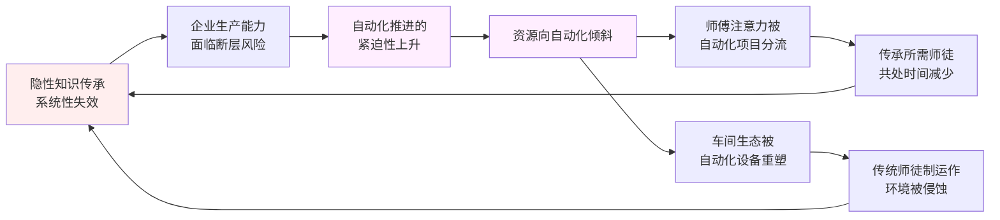

这一闭环的运作逻辑是：**传承失效 → 企业产能受威胁 → 自动化加速 → 师傅注意力分流+车间生态重塑 → 传承所需的"共处时间+物理空间"进一步被侵蚀 → 传承更失效**。其结果是一个**"传承越失效、自动化越紧迫；自动化越紧迫、传承越失效"的恶性循环**。

这一循环的危险性在于：它使得企业的转型节奏陷入一种"两头都顾不上"的状态——既无法回到传统的传承体系（已被结构性瓦解），又无法真正建立成熟的自动化体系（缺乏师傅经验支撑方案设计、缺乏复合型人才支撑落地）。**许多单件小批量制造企业当前正处于这一循环的中段——既有的人工生产体系已开始瓦解、新的自动化体系尚未稳固**——这种"过渡期"的不稳定状态，是组织维度难度最为集中的体现。

需要审慎指出的是，这一循环并非完全不可被打破——其打破依赖于**复合型路径**的探索：一方面在自动化方案设计中**主动保留资深师傅的关键参与角色**（而非将其边缘化），让传承在自动化项目中以新形态延续；另一方面在企业层面建立**专门服务于"传承"的资源投入**（如设立专职带教岗位、建设独立的实训车间、引入产教融合机制），将传承从"自然发生"变为"系统经营"。这些路径的可行性与边界将在第 7 章破局路径中进一步评估。

## 6.4 职业教育体系与产业需求的结构性错配

如果说 6.3 节聚焦的是企业内部传承机制的失效，本节则要把视角扩展到企业之外——剖析作为人才供给源头的职业教育体系与单件小批量制造自动化所需人才结构之间的结构性错配。这一错配是 6.2 节"人才断层"在更上游的成因，也是任何企业层面应对路径的天花板。

**第一重错配：培养目标与单件小批量自动化所需人才结构的错配**。传统职业教育以单一工种技能培养为主——车工、铣工、钳工、焊工、电工、数控操作工——其培养目标是为大批量制造业输出"在产线上某一岗位胜任标准化操作"的技能型人才。这一目标与大批量制造的人才需求高度匹配，因此在过去数十年中支撑了中国制造业的快速发展。

然而单件小批量制造自动化所需的核心人才——如 6.2 节所述——是**"既懂工艺又懂数字化、机器人、AI"的复合型人才**。这类人才的形成需要：在某一传统工艺领域具备扎实的实践经验、具备 CAM/CAPP/MES/APS 等数字化工具的应用能力、具备机器人编程或 AI 模型调优的基础能力、具备跨域沟通与方案整合能力。**这一组合远超传统单一工种培养的覆盖范围**——它要求职业教育体系从"工种导向"转向"领域导向"，从"操作技能"转向"复合能力"，从"标准化产线适配"转向"非标场景适配"。

近年来，部分职业院校已开始尝试设置"智能制造工程"、"工业机器人技术"、"智能装备运维"等新专业，方向上是正确的。但短期内仍面临几方面挑战：**师资缺乏**——既懂传统工艺又懂前沿技术的师资本身就稀缺，新专业的教学质量受师资限制；**实训设备投入巨大**——智能制造类专业的实训需要 CNC、机器人、视觉系统、工业软件等高昂硬件投入，普通职业院校难以承担；**课程体系尚在摸索**——如何在有限学时内同时覆盖工艺、数字化、自动化三大块，避免"什么都讲点、什么都不深"的浅化倾向，是教学体系层面的开放挑战。

**第二重错配：培养方式与隐性知识形成机制的错配**。第 2 章 2.2、2.3 节已论证，单件小批量制造的核心生产能力相当大比例沉淀于隐性知识层面，其形成需要**真实车间情境、多模态信息融合、长周期失败学习、师徒共处的代价学习**。而职业教育的培养方式——课堂讲授+标准化实训——在这些维度上均与隐性知识形成机制存在结构性差距：

- **课堂讲授**只能传递显性知识（什么材料用什么参数），无法传递判断逻辑（为什么这种情境下该这样而不是那样）；
- **标准化实训**只能模拟受控场景下的标准操作，无法复现真实车间的多模态情境与异常处置；
- **学制周期**通常以 2–4 年计，远短于隐性知识形成所需的十年量级；
- **实训资源**面向的是"全班同学共享"，难以提供"师傅手把手带徒弟"式的高密度个性化指导。

这一错配的后果是：**职业教育毕业生进入车间后，仍需多年实践才能形成隐性知识闭环**——这与企业等不起的现实形成尖锐张力。许多企业在用工实践中反映"职校毕业生上手慢、独立能力差、需要长期带教"，其根源未必是教育质量本身的问题，而是**培养方式与目标能力之间存在系统性鸿沟**。

**第三重错配：社会评价与生源质量的错配**。"技工"这一职业在社会评价体系中的地位长期偏低——薪酬待遇相对于同等学历的白领岗位仍存在差距、社会身份不被广泛认可、职业上升路径相对受限、家庭对子女选择技工路径的支持度不高。这一社会评价的低位运行，从源头削弱了职业教育的生源质量与升学吸引力——**优秀年轻人更倾向于报考普通高中以走升学路径，进入职校的多为升学竞争中的"次优选择"**——这一倾向在很多地区已成为难以扭转的社会惯性。

社会评价的低位还衍生出一个悖论：即便国家层面已经推出"职业本科"、"产教融合"、"新八级工"等改革举措试图提升职业教育地位，社会观念的滞后性使得这些改革的"信号传导"仍需时间——**政策端已开始升温，社会端仍未转暖**——这一时差使得改革效果在短期内难以兑现。

**改革路径的潜力与局限**。面对上述三重错配，业界与政策界已探索出若干改革方向：

**产教融合与现代学徒制**——通过院校与企业的深度合作，将企业真实生产场景纳入教学过程，由企业资深技师与院校教师共同担任"双师"。这一路径方向上契合了隐性知识形成所需的"真实情境+师徒共处"前提，是最具长期潜力的改革方向。但其实施面临**配套机制的复杂性**——企业接受学徒的成本与收益如何平衡、学徒在企业的劳动权益如何保护、双师如何协同、考核如何统一——每一项都是系统工程。

**职业本科的设立与扩展**——通过提升职业教育的学历层次，吸引更高质量生源、提供更长培养周期、设置更深入的课程体系。这一路径有助于扭转社会评价、扩展培养深度，但其规模化普及尚需时间，且本科化是否会偏离"实践导向"的本质需要持续校准。

**专项技工培训与社会化技能认证**——面向已就业人员的在职培训、技能等级认证（"新八级工"等）、专项工种短期培训等。这一路径对**当下就业人员的技能升级**有直接价值，但对解决"新人入口断裂"问题作用有限。

**企业新型学徒制**——由企业主导、政府补贴、院校支持的三方联合培训模式，试图绕过传统职业教育的体制约束，直接面向企业实际需求培养。这一路径的灵活性较高，但其规模与覆盖面取决于企业的参与意愿。

将三重错配与改革路径的关系归纳为下表：

| 错配维度 | 具体表现 | 主要改革路径 | 见效时间窗口 |
|---------|---------|-------------|-------------|
| 培养目标错配 | 单一工种 vs 复合型人才 | 智能制造类新专业、职业本科 | 5–10 年 |
| 培养方式错配 | 课堂实训 vs 真实车间隐性知识 | 产教融合、现代学徒制、企业新型学徒制 | 5–10 年 |
| 社会评价错配 | 技工地位低 vs 应有地位 | 政策推动、待遇改善、舆论引导 | 10 年以上 |

这张表所揭示的核心结论是：**教育体系改革的长周期属性使其难以在短期内缓解当下自动化推进的人才约束**——即便所有改革路径都顺利推进，其见效时间也在 5 年以上量级，而当下的单件小批量制造企业自动化转型已无法等待这一周期。这意味着**短期内的人才约束必须依靠企业自身的内部培养、跨界引进、外部协作**等手段来缓解，教育体系改革更多是"远水"而非"近渴的解药"。

这一时间错位本身就是组织与人才维度难度的重要组成部分——它使得企业在自动化推进中不得不在"人才不足"的现实下做出方案选择，**许多原本理论上更优的方案因为"找不到人去落地"而退而求其次**。这一约束在第 7 章评估破局路径时将作为重要的"人才现实滤镜"被反复调用。

## 6.5 企业文化与领导力对转型成败的决定性作用

在前四节已剖析的"组织阻力—人才断层—传承失效—教育错配"四个相对"硬性可观察"的层面之外，还有两个更"软性"却同样关键的变量决定着自动化转型的最终命运——**企业文化与领导力**。这两个变量具有难以量化、难以评估、难以从外部干预的特性，却往往在技术与经济条件相近的企业之间，成为转型成败的真正分水岭。

**文化层面的关键变量**。企业文化作为"组织成员共同持有的价值观、行为模式、协作方式的总和"，在自动化转型中通过若干具体维度发挥决定性作用：

**对失败的容忍度**——自动化推进必然伴随大量试错：第一次部署的 AI 视觉模型可能误判频发、第一版自研 APS 系统可能排产逻辑不合理、第一次机器人调试可能反复撞机、第一轮数字化改造可能上线后无法稳定运行。这些试错在事后看是必经过程，但在过程中考验的是组织对"短期失败"的承受力。**容错文化强的企业**会将试错视为学习成本、给予试错团队改进空间、在复盘中聚焦"如何改进"而非"谁该问责"——这类企业能够走完自动化的迭代周期。**容错文化弱的企业**则会在第一次失败后即追责问责、暂停项目、撤换团队——这类企业的自动化项目常常死于"未及成熟的中断"。

**对学习与变革的开放度**——自动化引入意味着员工必须接受新工具、新流程、新技能要求；老工人需要学习与设备交互、工艺人员需要学习数字化系统、管理层需要学习新的指标与决策方式。**开放度高的组织文化**鼓励员工持续学习、把变革视为机会而非威胁、容忍学习初期的低效率；**开放度低的组织文化**则将变革视为对既有秩序的挑战、员工倾向于保守既有工作方式、新工具的引入常常陷入"装好了没人用"的尴尬。

**内部协同与信任水平**——6.1 节已剖析跨部门协同壁垒在自动化项目中的作用。组织文化中的协同与信任水平直接影响这些壁垒的高低——**高信任组织**中部门之间倾向于"先解决问题再分功责"，跨部门冲突可在工作层面被化解；**低信任组织**中部门之间倾向于"先划清边界再考虑合作"，跨部门冲突需要被持续上升至高层才能裁决，效率与意愿都受影响。

**长期主义与短期主义的取向**——单件小批量制造自动化的回报周期普遍较长（参第 5 章 5.5 节），其投入往往需要在数年甚至五年以上的时间窗口中才能兑现。**长期主义文化**的企业能在短期业绩压力下坚持投入，将自动化视为战略资产逐步建设；**短期主义文化**的企业则倾向于将自动化与季度/年度业绩直接挂钩，一旦短期未见效即砍预算或换方向，结果是**自动化建设永远停留在"刚开始"的阶段**，每一次新启动都从头开始。

**领导力层面的关键变量**。如果说文化是"软性土壤"，领导力则是"决定走多远的引擎"。在单件小批量制造自动化转型中，三个层级的领导力均发挥着不可替代的作用：

**一把手的认知深度与战略定力**。单件小批量制造企业以中小型企业为主，一把手（创始人/总经理/董事长）的个人判断在战略层面具有决定性影响。一把手对自动化的认知深度直接决定企业转型的方向选择：**认知深刻的一把手**理解"单件小批量自动化与大批量自动化的本质差异"，不会盲目复制行业标杆的方案、能根据自身企业实际选择适合的路径、对回报周期与试错成本有合理预期；**认知浅薄的一把手**则容易被市场宣传或行业潮流影响，在尚未深入理解的情况下做出激进或保守的极端决策——前者可能导致大额浪费投入，后者可能导致长期错失窗口期。

战略定力同样关键——自动化推进过程中，外部市场波动、内部团队反弹、阶段性失败、同行案例反复等因素都会冲击决策定力。**有定力的一把手**能够在干扰中坚守战略方向，做必要的微调而不轻易颠覆；**无定力的一把手**则容易在"换方向、换团队、换路径"的频繁折腾中消耗资源与组织信心。

**中层管理者的执行力与变革领导力**。一把手的战略意图最终要靠中层去落地。中层管理者——生产副总、工艺总监、信息化负责人、车间主任等——的角色是将抽象战略翻译为具体行动，并在落地过程中处理大量具体协调与决策。**优秀的中层**具备变革领导力——能够动员下属、化解冲突、跨部门沟通、阶段性反馈调整；**平庸的中层**则倾向于"传话+汇报"，自动化项目在他们手中容易陷入流程化运行而失去推进力。

**技术领导（CTO/工艺总监）的专业判断力**。自动化项目涉及大量技术决策——选用哪类技术路线、采购哪家供应商、自研还是外购、技术方案如何架构——这些决策的质量直接影响项目的成败。**强专业判断力**的技术领导能够穿透供应商的营销话术、识别真实成熟度与风险、为企业争取合理的方案；**弱专业判断力**的技术领导则容易被供应商引导或被流行概念裹挟，做出脱离企业实际的方案选择。

**文化与领导力为何成为"真正的分水岭"**。在技术与经济条件相近的同行业、同规模企业之间，自动化转型常常呈现出显著分化的命运——一些企业走出转型曲线、一些企业陷入长期挣扎、一些企业半途而废。**这一分化在大多数案例中无法用技术或经济变量充分解释，文化与领导力的差异才是更深层的原因**。

这一现象的内在机制可以理解为：技术与经济变量提供了"必要条件"——没有适当的技术与资金，自动化无从谈起；而文化与领导力提供了"充分条件"——在必要条件相近时，谁的文化更适配、谁的领导力更强，谁就能将相同的资源转化为更好的成效。**单件小批量制造自动化由于其高复杂度、高不确定性、高异质性的内在属性，对充分条件的依赖比大批量制造更为突出**——这也是为什么这一领域的转型案例呈现出更显著的"看似条件相似、结果差异巨大"的特征。

**文化变革本身的难度与战略不连续风险**。需要审慎指出的是，文化与领导力虽然重要，但它们本身并非可以快速调整的变量：

**文化变革的长周期与高难度**——组织文化是历史沉淀的产物，其改变涉及人的认知、行为、习惯的全面重塑，通常需要数年至十数年的时间窗口；试图通过短期培训、口号、规章制度变更快速改变文化的努力，多数会停留在"表面合规、内里不改"的层面。这意味着对于文化适配度较弱的企业，"通过文化变革解决转型瓶颈"在战术层面是不现实的——更现实的路径是**在既有文化条件下选择最匹配的转型方案**，而非反过来。

**一把手更替带来的战略不连续风险**——一把手的认知与定力对转型至关重要，但企业层面无法保证一把手的稳定。家族企业的代际更替、上市公司的高管变动、被并购或重组带来的领导班子变化——任何一类一把手更替都可能带来战略方向的不连续。**许多自动化项目的失败并非因为方向错误，而是因为推进过程中一把手更替导致战略中断**。这一风险在中小型单件小批量制造企业中尤为突出——这类企业的战略往往与一把手强绑定，缺乏组织化的战略定力支撑。

将文化与领导力的关键变量及其内在风险归纳为下表：

| 维度 | 关键变量 | 对转型的作用 | 内在风险 |
|------|---------|-------------|---------|
| 文化 | 容错度、开放度、协同度、长期主义 | 决定能否走完迭代周期 | 文化变革本身长周期、高难度 |
| 一把手领导力 | 认知深度、战略定力 | 决定方向选择与持久投入 | 一把手更替带来不连续 |
| 中层领导力 | 执行力、变革领导力 | 决定战略能否被翻译为行动 | 优秀中层稀缺、易流失 |
| 技术领导力 | 专业判断力 | 决定技术方案质量 | 复合型技术领导稀缺（参 6.2 节） |

由此可得本节的核心结论：**文化与领导力在单件小批量制造自动化转型中具有决定性作用，但它们本身又是难以快速调整的"软性变量"**——这构成了组织维度难度的另一重独特性：**最关键的成功要素，恰恰是最难被外部干预或快速塑造的要素**。这一判断既解释了同行业企业转型分化的命运，也为后续 6.7 节的难度分级提供了"软性变量"的判断依据，更为第 9 章关于战略启示的论述（特别是针对不同类型企业的差异化建议）建立了理论基础。

## 6.6 推力与障碍的矛盾性张力：组织维度的独特复杂性

经过 6.1–6.5 节的层层剖析，本节将对组织与人才维度的核心矛盾进行收敛性论证，揭示这一维度所呈现的独特复杂性——**"推力与障碍同源"的矛盾性张力**。这一张力是单件小批量制造自动化在组织维度上区别于技术维度（第 4 章）与经济维度（第 5 章）的本质特征，也是理解这一维度独特难度的关键。

**三组相互纠缠的悖论**。组织维度的矛盾性张力可结构化为三组悖论，三者并非孤立存在，而是相互纠缠、相互强化：

**悖论一：人才断层既是推力又是障碍**。如 6.2 节所剖析，"高级技工 3000 万缺口"的指示性现象在两个相反方向上同时作用：作为推力，"招不到人、留不住人"使企业不得不加速自动化以维持生产能力；作为障碍，"懂工艺又懂自动化的复合型人才稀缺"使自动化方案设计与落地本身缺乏胜任者。**这一悖论的特殊困境在于：缺口越严重，推力越强，但障碍也同步加深**——推力推不动障碍，反而被障碍消解。许多企业反映的"自动化想做但做不动"，根源恰在此处。

**悖论二：老员工既是阻力又是不可绕开的资源**。如 6.1 节所剖析，资深工匠对自动化变革有着合乎人性的抵触逻辑——技能溢价被冲击、话语权被稀释——这构成自动化推进的隐性阻力。然而同时，**资深工匠所掌握的隐性知识又是自动化方案设计的关键输入**——没有他们的工艺判断作为依据，AI 模型缺乏训练标注、CAPP 系统缺乏规则来源、机器人方案缺乏动作参考。这一悖论的特殊困境在于：**企业既需要"动员老员工配合"以获取关键输入，又难以避免"自动化最终会侵蚀老员工地位"的现实**——前者要求高度信任，后者破坏信任基础，两者构成内在张力。

**悖论三：自动化变革与文化变革的因果交织**。如 6.5 节所剖析，自动化推进需要适配的文化条件——容错度、开放度、协同度、长期主义；同时自动化推进的过程**本身又会反过来重塑文化**——重新定义技能价值、调整权力结构、改变岗位身份、重构协作方式。**这意味着文化既是自动化的前提条件，又是自动化的结果**——前置条件不足时变革推不动，但变革本身又是文化条件成熟的关键路径。这一鸡生蛋蛋生鸡的循环，使得"先改文化再改业务"或"先改业务再改文化"的线性逻辑都难以成立——必须在两者之间寻找螺旋上升的迭代节奏。

将三组悖论的相互作用结构化为下图：

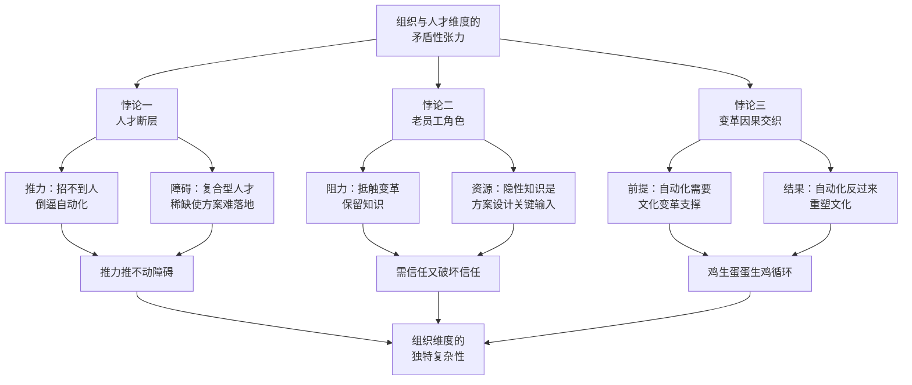

**与技术、经济维度难度的三维比较**。要把握组织维度难度的独特性，最有效的方法是将其与第 4 章技术维度、第 5 章经济维度的难度本质进行对照：

| 维度 | 难度本质 | 难度的"硬度"属性 | 化解路径的可控性 |
|------|---------|----------------|-----------------|
| 技术（第4章） | 柔性—自动化范式张力 | 硬性（可量化、可工程化攻坚） | 通过技术研发、范式演进可逐步化解 |
| 经济（第5章） | 规模经济失效（数学必然） | 硬性（可量化、可财务测算） | 通过模式创新、成本下降、政策支持可缓解 |
| 组织（第6章） | 推力与障碍同源的矛盾性张力 | 软性（难量化、嵌入人的认知/利益/身份） | 通过文化与领导力调整可改善，但本身长周期、不可控因素多 |

这张对照表揭示出组织维度难度的几个独特属性：

**其一，组织维度难度具有"软性"特征**。技术维度的难度可以通过算法精度、模型泛化能力、设备性能等指标被量化与跟踪；经济维度的难度可以通过 ROI、回报周期、盈亏平衡批量等指标被测算与监控；而组织维度的难度——员工抵触的烈度、协同壁垒的高低、文化适配的深度、领导力的强弱——则**难以建立稳定的可量化指标**，只能通过定性观察、行为表征、关键事件进行间接判断。这种"难以量化"使得组织维度难度在立项时容易被低估，在落地时却以决定性方式呈现。

**其二，组织维度难度具有"嵌入性"特征**。技术与经济维度的难度更多是"外在于人"的客观约束——算法能力的不足、市场条件的限制、资金的有限——这些约束虽然制约人，但与人本身相对解耦。而组织维度的难度则**深度嵌入于人的认知、利益、身份、关系之中**——抵触是人的抵触、协同是人的协同、文化是人的文化、领导力是人的领导力。这种嵌入性使得组织维度难度无法通过"绕过人"的方式化解，必须正面与人打交道，且每一次打交道都涉及复杂的人性逻辑。

**其三，组织维度难度具有"决定性"特征**。技术上不可行的方案在立项前即被淘汰；经济上不划算的方案在 ROI 测算中即被否决；而**组织上有阻力的方案则可能在立项时被忽视、在落地中才被发现**——这一时序性使得组织维度难度往往成为"项目真正的失败原因"。许多事后复盘中所归因的"沟通不畅"、"配合不力"、"人没做好"等表层原因，本质都是组织维度难度的具体表现。

**其四，组织维度难度具有"长周期"特征**。技术维度可以通过 3–5 年的研发周期实现突破；经济维度可以通过模式创新或政策窗口在 1–2 年内显著改善；而**组织维度的真正改善——文化变革、人才结构重塑、传承机制重建——往往需要 5–10 年以上的时间窗口**。这一长周期与企业转型的紧迫性之间存在尖锐张力——企业既等不起，又无法回避。

**对前面四章核心论断的呼应与延展**。承接第 1 章 1.4 节关于四维难度框架"短板效应"的论述，组织维度难度作为短板的具体表现可以进一步明确：**许多在技术与经济维度都"绿灯通过"的自动化方案，因组织维度的隐性短板而无法真正落地**——这是单件小批量制造自动化最容易被忽视、却最具破坏性的难度形态。

承接第 2 章 2.5 节关于"人工不可替代性"的五重根源，组织维度的矛盾性张力可视为这些根源在组织生态层面的延展：人工不可替代性使得企业生产体系深度依赖资深工匠，这种依赖在组织生态中沉淀为"以工匠为中心"的权力结构、激励体系、协作模式——而自动化推进必然冲击这些结构，从而触发本章所剖析的多层阻力。**第 2 章揭示的是"人为何难以被替代"，本章则揭示了"即便部分可替代，组织也未必愿意/能够替代"**——前者是技术认知问题，后者是组织生态问题，两者共同构成"人难以被替代"的完整图景。

承接第 4 章关于"柔性—自动化范式张力"与第 5 章关于"规模经济失效"的论断，组织维度的"推力与障碍同源"构成了第三种结构性张力——三种张力的并存恰是单件小批量制造自动化区别于其他制造形态的本质特征。**任何试图绕过其中任一张力的转型方案，都难以在该领域真正成立**。

由此本节得出的核心结论是：**组织与人才维度的难度不是技术或经济难度的简单延伸，而是一种性质不同、机制独立、影响深远的"软性"难度**——它嵌入于人的认知、利益、身份、代际关系之中，难以量化、难以快速调整、却往往是项目真正的失败原因。这一判断为 6.7 节的难度分级与三维交叉映射提供了基础认识，也为第 7 章评估破局路径时的"组织现实滤镜"建立了关键参照——任何破局路径若不考虑组织维度的软性约束，都难以从纸面方案变为真实落地。

## 6.7 组织与人才维度的难度分级与三维交叉映射

在前六节分析的基础上，本节构建组织与人才维度的难度判断框架，按场景进行难度分级，并将这一分级与第 4 章技术难度清单、第 5 章经济难度分级形成三维交叉映射，为第 8 章综合评估矩阵建立直接基础。

**判断框架的核心变量**。组织与人才维度的难度不能用单一指标衡量，而需要综合考虑五个相互关联的核心变量：

- **组织规模与变革资源**：大型企业通常具备专门的变革管理团队、信息化部门、人才发展部门等支撑力量；中型企业有限地配置这些力量；小型企业几乎完全缺乏，转型完全依赖一把手的个人推动力。
- **企业文化与领导力成熟度**：6.5 节所剖析的容错度、开放度、协同度、长期主义、各级领导力等"软性变量"的总体水平。
- **既有人才结构与代际分布**：员工的平均年龄、技能等级、教育背景、对新工具的接受度——这些指标共同决定了组织的"内生学习能力"。
- **所在区域的人才供给生态**：企业所处的地理与产业生态对人才供给的支撑力——位于产业集群核心区域的企业更易获得复合型人才与外部协作，位于偏远区域的企业则面临更严峻的人才孤岛问题。
- **所属行业的传承体系状态**：行业整体的师徒制运作状况、技师培养路径、专项技能认证体系等行业级支撑。

**三类典型场景的难度分级**。按上述框架可识别出三类典型场景：

**第一类：组织难度较低的场景**。这类场景的共同特征是组织阻力小、变革资源相对充足、文化与领导力适配度高：

- **新建工厂或绿地项目**：从零开始建设的工厂没有既有员工抵触、没有既有流程包袱、可在设计阶段即按自动化逻辑组织——这类场景的组织难度最低；
- **年轻团队主导的中型企业**：员工平均年龄较低、技能结构较新、对数字化工具接受度高，转型阻力相对小；
- **文化变革已先行完成的企业**：在自动化推进前已经历了流程改造、绩效改革、文化转型等"先期变革"的企业，组织生态对再次变革的承受力较强；
- **位于产业集群核心区域且行业传承体系相对健全的企业**：能够获得外部人才供给、行业级协作、政策支持等多重外部资源。

**第二类：组织难度中等的场景**。这类场景在某些维度有支撑、在某些维度有短板，处于"努力可改变"的状态：

- **大多数中型转型企业**：兼具一定规模与变革资源、又存在既有员工与流程包袱，是组织难度的"中位数"代表；
- **文化与领导力存在结构性短板但有改革意愿的企业**：一把手已意识到问题、愿意推动变革，但中层与文化的支撑不足，需要长周期的内部调整；
- **位于产业生态相对健全区域的小型企业**：虽然规模有限、变革资源不足，但能借助区域生态获得部分支撑。

**第三类：组织难度高的场景**。这类场景在多个维度同时存在结构性短板，转型阻力深、改善难度大：

- **老牌资深工匠主导的传统企业**：员工平均年龄偏高、技能溢价深植、对新工具接受度低，组织阻力的"老员工层"特别强烈；
- **家族管理且代际更替未完成的企业**：战略决策受家族关系影响、专业管理力量有限、变革资源稀缺；
- **所在区域人才供给极度匮乏的企业**：位于偏远地区、缺乏产业集群支撑、外部人才几乎无法引进；
- **既有产品订单结构与传统人才高度绑定的企业**：传统业务模式深度依赖资深工匠，转型即意味着冲击核心生产能力——这类企业即便有意愿，也面临"转型即风险"的困境。

**三维交叉映射**。将本章组织维度难度分级与第 4 章技术难度清单、第 5 章经济难度分级进行交叉映射，可以得到一张刻画单件小批量制造自动化真实难度的三维矩阵。下表选取若干典型场景进行对照：

| 场景 | 技术难度（第4章） | 经济难度（第5章） | 组织难度（本章） | 综合判断与关键观察 |
|------|------------------|------------------|------------------|-------------------|
| 标准化 CNC 加工执行（中型新建厂） | 低 | 低 | 低 | 三维齐绿，已成熟可行 |
| 基础 MES 信息化（中型转型企业） | 低 | 低 | 中 | 技经齐绿但组织需推动，常因协同问题延期 |
| 判据明确的 AI 视觉检测（中型转型企业） | 低 | 低 | 中 | 三维有一短板，落地节奏受组织约束 |
| 可托盘化中小件 FMC（中型转型企业） | 中 | 低–中 | 中 | 三维均处中位，需综合协调推进 |
| APS 智能排产（家族管理传统企业） | 中 | 中 | 高 | 组织短板成决定性约束，多数会陷入"装好不用" |
| 协作机器人辅助任务（年轻团队中型企业） | 中 | 中 | 低 | 组织优势缓解技经压力，可较好落地 |
| 复杂异型件装夹自动化（任意场景） | 高 | 高 | 高 | 三维齐红，短期内难以达成 |
| 手工修配机器人替代（老牌资深工匠企业） | 高 | 高 | 高 | 组织阻力叠加技经困难，最不可行场景 |
| 火工矫形自动化（任意场景） | 高（开放） | 高 | 高 | 行业性问题，单家企业层面无法突破 |
| 工艺案例库与传承数字化（中型转型企业） | 中 | 中 | 中 | 三维均处中位，关键看一把手定力与文化适配 |

**几条结构性规律的归纳**。从三维矩阵中可归纳出几条具有指示意义的结构性规律：

**规律一：组织维度难度与企业规模、年龄、文化的耦合性远强于与技术经济变量的耦合性**。同一项技术（如 APS 智能排产）在不同企业的落地命运可能完全不同——其差异并非来自技术本身，而是来自组织条件。这意味着组织维度难度的判断**必须高度场景化、企业化**，不能用行业平均水平进行简单代入。

**规律二：组织难度的化解需要长周期、系统性的变革投入，难以通过短期项目突破**。技术维度可通过单点技术突破改善、经济维度可通过模式创新或成本下降改善，而组织维度的真正改善需要文化、人才、流程、领导力的协同变革——这通常需要数年至十数年的时间窗口。**这一长周期属性意味着组织维度的难度对短期转型计划具有"硬约束"特性**——短期内难以通过加大投入或加快进度来克服。

**规律三：组织维度往往是技术经济判断中被低估、却在落地阶段成为决定性约束的维度**。立项阶段的技术评估与经济测算通常较为详尽，而组织评估则常常被简化为"加强培训、做好沟通"等表面措施；落地阶段则反过来——技术与经济因素相对稳定，组织与人才因素则持续暴露问题。**这一"前后倒置"的关注度差异，是许多自动化项目"看起来该成而实际未成"的深层原因**。

**规律四：三维短板效应在组织维度上体现得尤为突出**。承接第 1 章 1.4 节关于四维框架"短板效应"的论述，三维矩阵中的任何一个维度都可能成为决定性短板；但组织维度短板的特殊性在于——**它最难被识别、最难被监控、最难被快速改善**——一旦成为短板，其影响往往延续整个项目周期，难以被中途纠正。这一特性使得组织维度在三维短板中具有更强的"否决性"作用——技术或经济短板可被部分弥补，组织短板则常常使方案彻底失效。

**对后续章节的承接铺垫**。本章构建的三维交叉映射将成为第 8 章综合评估矩阵的直接基础——第 8 章将在本章的场景分级基础上，进一步按生产环节（设计/编程/加工/装配/检测/调试）、按行业类型（模具/重装/非标设备/精密件等）、按企业规模（大型/中型/小型）展开更细致的难度分布刻画，并识别决定难度的关键变量及其权重。

同时，本章关于"组织维度难度的软性、嵌入性、决定性、长周期"四大独特属性的判断，将为第 7 章评估各类破局路径提供关键的"组织现实滤镜"——第 7 章将看到，**单元化生产、柔性制造系统、APS、协作机器人、AI 赋能、数字孪生等破局路径在组织条件不同的场景下其可行性差异巨大**——同一路径在年轻团队中型企业可能顺利落地，在老牌传统企业则可能水土不服。这一组织条件依赖性是评估破局路径必须正视的现实。

更进一步，本章的核心发现——"推力与障碍同源"的矛盾性张力，以及人才结构、传承机制、教育体系在中长期内的结构性约束——将为第 9 章战略启示中关于人才战略与组织变革的论述建立分析起点。第 9 章将基于本章的事实基础，为不同类型企业（先行者、跟随者、观望者）、政策制定者、教育与人才培养机构提供差异化的战略建议——其中关于"如何在组织维度建立可持续转型能力"的建议，将是单件小批量制造企业能否真正跨越自动化难度天花板的关键所在。

至此，本章完成了对单件小批量离散制造自动化组织与人才维度难度的系统剖析：从组织变革阻力的内在结构到人才断层的双重含义、从隐性知识传承的失效困境到职业教育体系的结构性错配、从企业文化与领导力的决定性作用到推力与障碍同源的矛盾性张力，最终输出按场景分级的难度判断与三维交叉映射。本章的核心发现可凝练为：**组织与人才维度的难度具有独特的"软性"属性——它不是可以通过技术突破或资金投入直接化解的硬性难度，而是嵌入人的认知、利益、身份、代际关系中的软性难度，往往构成项目真正的失败原因，却最难被立项时的技术经济评估所捕捉**。这一判断与第 4 章"柔性—自动化范式张力"、第 5 章"规模经济失效"形成深刻呼应——三种结构性张力的并存，恰恰是单件小批量离散制造自动化区别于其他制造形态的本质特征，也是该领域自动化难度的真正全貌。

承接本章对"组织能否承接"的归因，第 7 章将转入破局路径与使能技术的可行性评估——在已经明确了技术、经济、组织三维难度的真实图景后，单元化生产、柔性制造系统、APS 智能排产、协作机器人、AI 视觉检测、数字孪生、工业互联网平台、AI 辅助工业设计、生成式设计等破局路径，能否在该领域真正发挥效用？在多大程度上发挥效用？需要哪些前置条件？这些路径的成熟度、适用边界、对人工依赖问题的实际成效将成为第 7 章的核心命题，最终汇聚为分阶段、分场景实现自动化的可行路线图。

# 7 破局路径与使能技术评估：从柔性自动化到AI赋能的可行性

第 4–6 章沿技术、经济、组织三维对单件小批量离散制造自动化的难度进行了系统归因——技术维度收敛为"柔性—自动化"的范式张力、经济维度收敛为"规模经济失效"的数学必然、组织维度收敛为"推力与障碍同源"的矛盾性张力。**三种结构性张力的并存，使得任何"银弹式"破局方案在该领域都难以成立**。然而，三维难度的存在并不意味着自动化推进的彻底受阻——在过去二十年的工业实践中，业界已围绕单件小批量场景的特殊性发展出若干差异化的破局路径：以柔性硬件为代表的"工艺级灵活化"、以信息化软件为代表的"管理级数字化"、以 AI 为代表的"判断级智能化"、以及以设计前置为代表的"前段杠杆化"。这些路径并未绕过第 4–6 章揭示的根本约束，但确实在不同环节、不同场景、不同程度上对"人工依赖"问题构成了实质性缓解。

本章的任务即是对这些破局路径进行**系统而审慎的评估**：每条路径的真实技术成熟度有多高？适用边界在哪里？对人工依赖的实际缓解度如何？与三维难度框架的适配关系如何？在严肃区分"技术可行""经济可行""规模化可行"三个层次的基础上（持久推理指导标准 P-6），本章将沿"分类坐标系—逐族群评估—人机协作折中—分阶段路线图—边界与拐点"的逻辑递进展开，最终输出一份**可被第 8 章综合评估矩阵直接调用、为第 9 章战略启示提供路径侧依据**的可行性评估结论。

需要在章首坦诚说明的是：本章涉及九类破局路径的成熟度判断、典型适用场景、能力边界等命题，本轮检索资料未提供针对各路径在单件小批量场景下的具体量化基准（如某类协作机器人在特定任务上的工程化精度、某类 AI 视觉系统在某行业的实际部署比例、某类生成式设计工具的设计周期压缩比例等具体数字）。**为遵守报告硬约束并恪守持久推理指导标准 P-3、P-5 关于证据质量与量化判断的要求，本章将严格基于第 1–6 章已建立的事实框架与共识性技术认知**——尤其是第 3 章 3.5 节"已覆盖能力边界"、第 4 章 4.7 节"三类技术难题清单"、第 5 章 5.6 节"经济维度难度分级"、第 6 章 6.7 节"组织维度难度分级"——以机制性论证与结构性分析为主轴，对涉及量化判断之处以"区间表达"或"机制性推断"形式呈现，并在行文中明示限度。

## 7.1 破局路径的分类坐标系与评估框架

在进入逐项评估前，必须先建立一张能容纳所有候选路径、能与三维难度框架对齐、能贯穿全章使用的**分类坐标系**。本节的目的不是简单"列举"路径，而是**通过结构化分类揭示路径之间的差异属性与组合逻辑**——这一分类本身即是后续评估的认识论基础。

**九类破局路径的分类逻辑**。本研究在大纲中识别的九类候选路径——单元化生产、柔性制造系统、协作机器人、APS 智能排产、AI 视觉检测、数字孪生、工业互联网平台、AI 辅助工业设计、生成式设计——在表层上看似各自为政，实则可按"**作用层次**"与"**技术属性**"两个维度进行有意义的归类。作用层次区分的是路径作用于生产体系的哪一层（物理执行、信息管理、智能判断、设计前置）；技术属性区分的是路径所依托的核心技术族系（机械工程、信息技术、人工智能、计算设计）。两个维度叠加，可形成四大族群：

**族群一：柔性硬件类**——单元化生产、柔性制造系统（FMC/FMS）、协作机器人。这三条路径的共同属性是**作用于物理执行层、依托机械工程与机器人技术**——它们试图在不改变"以通用设备为主"基本范式的前提下，通过更柔性的硬件组织方式（单元化）、更集成的设备协同方式（FMS）、更安全便捷的人机共融方式（cobot）来缓解第 4 章 4.3 节所剖析的装夹与执行环节的人工密集问题。

**族群二：信息化软件类**——APS 智能排产、工业互联网平台。这两条路径的共同属性是**作用于信息管理层、依托数字化与运筹优化技术**——它们不直接替代物理执行，而是通过对生产数据的汇聚、组织、调度优化，提升整个生产体系的协同效率与决策质量，对应第 3 章 3.1 节"系统层"的核心技术支撑。

**族群三：AI 智能类**——AI 视觉检测、数字孪生。这两条路径的共同属性是**作用于判断决策层、依托人工智能与高保真建模技术**——它们试图在感知判断与过程仿真层面对人的能力进行部分替代或增强，对应第 4 章 4.5 节多模态感知决策困境的部分缓解尝试。

**族群四：设计前置类**——AI 辅助工业设计、生成式设计。这两条路径的共同属性是**作用于设计与编程的最前端、依托知识工程与计算设计技术**——它们瞄准的不是中段执行或末段精修，而是第 4 章 4.1 节"编程与建模成本激增"这一前段瓶颈，试图通过 AI 与算法手段压缩固定成本中最不可摊销的部分。

将四大族群与三维难度的对应关系结构化呈现如下：

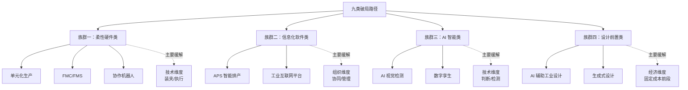

这张分类图揭示出一个被忽视但深刻的规律：**四大族群分别对应着三维难度的不同"突破口"**——柔性硬件主攻技术维度的执行难度、信息化软件主攻组织维度的协同难度、AI 智能主攻技术维度的判断难度、设计前置主攻经济维度的固定成本难度。**没有任何一条路径试图也无法同时正面突破三维难度**——这本身就证伪了"银弹式破局"的幻想，也为后续路线图的"多路径组合"逻辑奠定了基础。

**四要素评估框架**。在分类坐标系基础上，本章对每条路径的评估将采用统一的四要素框架，确保各路径之间可对照、可比较：

**要素一：技术成熟度**——基于第 4 章 4.7 节"已基本解决—工程化在途—开放性难题"三类划分，判断该路径在单件小批量场景下的真实成熟度（注意：在大批量场景成熟未必代表在单件小批量场景成熟）。

**要素二：适用边界**——明确该路径在哪些场景下有效、在哪些场景下失效，避免"通用化"假象。适用边界的判断变量包括：批量阈值、产品族共性度、工件几何稳定性、订单结构稳定性、企业规模与文化适配度等。

**要素三：人工依赖缓解度**——评估该路径对第 2 章 2.5 节"人工不可替代性五重根源"中哪一类或哪几类构成实质性缓解，缓解的程度是部分缓解、显著缓解还是接近替代。这一要素直接回应本研究的核心问题。

**要素四：三维难度适配度**——综合判断该路径在技术、经济、组织三维上的可行性，识别哪一维度是其主要支撑、哪一维度是其主要约束。这一要素与第 5 章 5.6 节、第 6 章 6.7 节的难度分级形成直接对接。

四要素框架的设计逻辑可凝练为下表：

| 评估要素 | 核心问题 | 主要参照章节 | 输出形式 |
|---------|---------|-------------|---------|
| 技术成熟度 | 在该场景下技术能力到了哪一步 | 第 4 章 4.7 节 | 三类划分（成熟/在途/开放） |
| 适用边界 | 路径有效的场景与失效的场景 | 第 1 章 1.2 节、第 3 章 3.6 节 | 边界变量与典型场景 |
| 人工依赖缓解度 | 缓解了哪一类人工不可替代性 | 第 2 章 2.5 节 | 部分/显著/接近替代 |
| 三维难度适配度 | 在三维上的可行性平衡 | 第 4–6 章总结 | 主要支撑/主要约束 |

**本章的核心立场声明**。在进入逐项评估前，需要明确本章贯穿始终的核心立场，以避免后续论述被理解为某条路径的"营销文案"或"乌托邦愿景"：

**立场一：路径评估必须以三维难度为现实滤镜**。任何脱离技术、经济、组织三维约束的"能力宣称"都将被审慎质疑——某项技术在受控实验室中的成熟不等于在真实车间的成熟，某项方案在大批量场景的成功不等于在单件小批量场景的成功，某项工具在年轻团队中型企业的可用不等于在老牌传统企业的可用。

**立场二：所有路径都是有限突破而非根本解决**。第 4 章 4.8 节已论证柔性—自动化的范式张力是结构性的，第 5 章 5.2 节已论证规模经济失效是数学必然，第 6 章 6.6 节已论证组织维度的矛盾性张力难以快速化解——**这些根本约束在 5–10 年的可预见时间窗口内不会被任何单一技术彻底破解**。本章的评估目标不是寻找"破解三维难度"的完美方案，而是识别"在三维约束下能够多大程度推进自动化"的现实路径。

**立场三：人机协作而非无人化是该领域的核心范式**。承接第 2 章 2.5 节的论证，本章将在 7.6 节专门论证"人机协作"作为单件小批量场景的现实折中范式——这是后续路线图与第 9 章战略启示的认识论基础。

**立场四：多路径组合而非单点押注是破局的真实形态**。本章不会推荐"应该选择哪一条路径"，而会归纳"在不同场景下应当如何组合多条路径"——单件小批量场景的复杂性决定了任何单一路径都无法独立支撑完整的自动化能力，组合策略是该领域的真实形态。

这四条立场将作为本章后续所有评估、判断、建议的认识论锚点，与持久推理指导标准 P-6 关于"技术可行/经济可行/规模化可行"三层区分的要求保持一致。

## 7.2 柔性硬件路径评估：单元化生产、柔性制造系统与协作机器人

柔性硬件类三条路径——单元化生产、FMC/FMS、协作机器人——是单件小批量自动化中**最早被探索、工程化最成熟、对企业最直观、也是当前应用最广泛**的破局方向。它们的共同逻辑是"在不打破通用设备格局的前提下，通过组织方式或硬件附加的柔性化提升设备效能"。本节按四要素框架对三条路径逐一评估。

### 7.2.1 单元化生产（Cell Manufacturing）

**路径机制**。单元化生产的核心思想是按工艺相似性对零件族进行聚类，将完成同一族零件加工所需的若干设备（CNC、铣床、磨床、检具等）组织为一个"加工单元"，由一个相对固定的工人小组负责该单元的运营。这一思想脱胎于精益生产中的"群组技术（Group Technology）"，本质是**通过空间与组织的重新布置，在小批量场景下创造出"局部重复性环境"**——同一单元内的零件虽然各异，但因属于同一工艺族而共享相似的工艺路径、装夹方案、刀具组合，从而使换装时间、调试时间、决策成本得以在族内分摊。

**技术成熟度**：高。单元化生产作为一种**生产组织方式而非技术装置**，其本身不依赖前沿技术突破，而依赖于工艺分析、布局设计、人员组织等工业工程能力。在大批量制造与中批量制造中已是成熟实践，在单件小批量制造中也已被广泛采用，属第 4 章 4.7 节"已基本解决"类。

**适用边界**：清晰地受制于"产品族层面的工艺共性度"。当企业的订单中存在足够多可被聚类为同一工艺族的零件时——例如模具行业的标准电极、重型机械的同类型法兰、非标设备的同系列结构件——单元化生产能显著发挥作用。然而在纯 ETO 模式下（每张订单工艺都新生成），工艺族的稳定性下降，单元化的"局部重复性"红利相应衰减。**单元化生产的有效性不在批量大小，而在族内重复度**——这一边界与第 4 章 4.1 节关于"参数化建模仅在产品族内有效"的判断一致。

**人工依赖缓解度**：部分缓解，主要作用于**第 2 章 2.5 节根源一（产品异质性导致非结构化决策）**。通过工艺族聚类，部分原本需要"每件新决策"的工艺规划被压缩为"族级模板+件级微调"，缓解了非结构化决策的密度。但单元化并未触及隐性知识、多模态判断、小样本泛化等更深层根源，这些根源仍由单元内的工人承担。

**三维难度适配度**：技术维度可行（路径成熟）、经济维度可行（投入主要是组织成本，硬件投入边际增量小）、组织维度依赖一定的工业工程能力与跨部门协同（涉及车间布局调整与人员重组）。**单元化生产的最大价值是其极低的进入门槛——任何中型以上单件小批量企业都可在不大额追加硬件投资的前提下推进**，因此被识别为"打底"路径。

### 7.2.2 柔性制造系统（FMC/FMS）

**路径机制**。柔性制造系统由若干数控机床（通常 2–6 台）+ 自动换刀系统 + 自动托盘交换系统 + 物料缓存 + 中央调度软件组成，可在一定的"零件族"范围内自动完成多工序加工。其核心价值是**在中小批量重复件场景下实现夜间无人加工与白天看管化运行**，将设备利用率从单班制下的 30–50% 量级提升至接近双班乃至三班水平（量级判断，非精确数据）。

**技术成熟度**：中。FMC/FMS 在大批量与中批量制造中已较成熟，在单件小批量场景下处于第 4 章 4.7 节"工程化在途"类——硬件供给充分，但其在该场景下的有效部署高度依赖一系列前置条件。

**适用边界**：受**工件可托盘化、批量阈值、装夹标准化程度、产品族共性度**四重物理与经济条件约束。具体而言：

- **工件物理边界**：工件需能装入托盘（通常尺寸不超过托盘工作台范围）、重量在系统承载能力内、形状不至于超出夹具兼容范围——这些条件在重型机械、大型模具、超长结构件等场景下不成立；
- **批量阈值**：托盘准备、零点定位接口加工、首件试切等前置投入需要被多件分摊，批量过小（如个位数件）时分摊不足，FMS 的经济性反不如人工；批量过大则不在本研究关注范围；
- **装夹标准化**：FMS 的核心是托盘上的装夹方案能被反复调用——若每件工件的装夹方案都需要重新设计，托盘交换的效率红利将被装夹决策的人工投入抵消；
- **产品族共性度**：FMS 内的程序库、刀具库、夹具库需服务于一组相似零件，跨族切换的开销较大。

**人工依赖缓解度**：部分缓解，主要作用于**根源三（高频感知—判断—执行闭环）的"执行"环节**——即将"夜间无人值守的连续切削"从工人手中卸下。但 FMS 并未触及前段的工艺决策、装夹方案设计，也未触及末段的精修与调试——它本质上是**将通用机床的"已自动化部分"（数控加工执行）进一步集成放大，而非向上下游扩展**。

**三维难度适配度**：技术上路径成熟（在适用边界内），经济上需具体测算批量阈值（参第 5 章 5.6 节"可托盘化中小件 FMC"被列为"经济正回报已较明确"场景，但前提是工件可托盘化），组织上需具备一定的信息化集成能力与多班次运营协同能力。**FMS 是单件小批量自动化中"边界最清晰、效用最明确、但适用范围最窄"的路径**——在适用范围内是首选，在适用范围外则完全不适用。

### 7.2.3 协作机器人（Cobot）

**路径机制**。协作机器人相对于传统工业机器人的核心差异在于**安全可与人共处、易部署、可现场示教**——这三大特性使其特别适合"批量不足以支撑专用机器人产线、但任务又具有一定重复性"的中间地带，恰是单件小批量场景的特征区间。其典型应用包括：机床上下料、毛刺打磨、点胶、简单装配、检测辅助、搬运等。

**技术成熟度**：中。协作机器人的硬件平台已较成熟（多家国内外厂商提供成熟产品），但其在单件小批量场景下的部署成熟度处于第 4 章 4.7 节"工程化在途"类——可工程化，但需场景定制。

**适用边界**：受**作业范围、负载能力、位姿稳定性要求**三重约束清晰限定。具体而言：

- **作业范围与负载**：当前主流协作机器人的负载能力多在 3–35kg 量级，作业半径多在 0.5–2m 量级——这一物理边界使其完全不能触及重型机械的大件搬运、超大模具的装夹辅助等场景；
- **位姿稳定性**：协作机器人的可靠运行依赖于工件位姿的相对稳定（每次加工前工件位置可被重复定位）——若工件位置因每件几何不同而无法预先确定，则机器人需要具备视觉引导或力觉反馈才能工作，这又叠加了 AI 视觉的能力边界（参 7.4 节）；
- **任务结构化程度**：去毛刺、点胶等任务在结构化条件下（毛刺位置可预测、点胶轨迹可规划）协作机器人可胜任，但毛刺位置高度随机、需要现场判断的复杂工件则难以处理。

**人工依赖缓解度**：部分缓解，主要作用于**根源三的"执行"环节**——将上下料、简单去毛刺等重复性体力动作从工人手中卸下。然而**协作机器人无法触及前段决策（根源一）、隐性判断（根源二）、复杂闭环（根源三的判断部分）、小样本泛化（根源四）、异常兜底（根源五）**——其能力边界与第 3 章 3.6 节"六大盲区"中的工艺规划、复杂装夹、手工修配、火工矫形、多模态判断、装配试模等环节的距离仍十分遥远。

**三维难度适配度**：技术上在适用边界内成熟，经济上单台投入相对可控（数十万至百万元量级，远低于 FMS），组织上易部署、对企业既有流程冲击较小。**协作机器人是单件小批量自动化中"进入门槛最低、应用形态最灵活、但作用环节最边缘"的路径**——它不解决核心难题，但能在边缘任务上提供边际改善，且对中小企业友好。

### 7.2.4 三条路径的对照与综合判断

将三条柔性硬件路径的核心评估结论凝练为下表：

| 路径 | 技术成熟度 | 适用边界关键变量 | 人工依赖缓解的根源 | 三维主要约束 |
|------|----------|-----------------|------------------|------------|
| 单元化生产 | 高（已成熟） | 产品族工艺共性度 | 部分缓解非结构化决策 | 组织（工业工程能力） |
| FMC/FMS | 中（工程化在途） | 可托盘化、批量阈值、装夹标准化 | 部分缓解执行环节 | 经济（批量阈值）+ 技术（物理边界） |
| 协作机器人 | 中（工程化在途） | 作业范围、负载、位姿稳定性 | 部分缓解边缘执行任务 | 技术（任务结构化程度） |

由此得出柔性硬件路径的综合判断：**三条路径都是"在通用设备基础上的柔性化集成"，其核心价值在于"在不打破现有范式的前提下提升执行环节效能"——但它们都未能触及单件小批量自动化的核心盲区（前段决策与末段精修）**。这一判断与第 3 章 3.4 节企业案例的共性结论完全一致：自动化在"中段执行"已较深入推进，柔性硬件路径正是这一推进的主要载体。

更深一层地看，柔性硬件路径的能力边界**直接来源于硬件本身的物理属性与机械工程的固有约束**——机器人能搬多重、能伸多远、能稳定多精，这些参数在工程上已逼近物理上限，进一步提升的边际成本快速上升。这意味着**柔性硬件路径在 5–10 年时间窗口内能够带来的额外突破有限**，其主要价值是被规模化部署到尚未应用的中小企业中，扩展应用广度而非深度。**真正的深度突破，必须依赖软件、AI、设计前置等其他族群路径的协同**——这正是后续 7.3–7.5 节的评估议题。

## 7.3 信息化软件路径评估：APS 智能排产与工业互联网平台

如果说柔性硬件路径作用于"物理执行层"，信息化软件路径则作用于"信息管理层"——它们不直接触及一砖一瓦的物理动作，而是通过对生产数据的汇聚、组织、调度优化，提升整个生产体系的协同效率与决策质量。本族群两条路径——APS 智能排产与工业互联网平台——的真实成效在大批量制造中已较为明确，但**在单件小批量场景下却深陷第 5 章 5.4 节软件成本两难与第 6 章 6.1 节组织协同壁垒的双重困境**。本节按四要素框架逐一评估。

### 7.3.1 APS 智能排产

**路径机制**。APS（Advanced Planning & Scheduling）的核心价值是**对多订单、多设备、多约束、多目标的车间排程进行运筹优化求解**——理论上可在订单到来后自动生成最优生产计划，分配设备、人员、物料的时序使用，实现交期、产能、成本之间的全局平衡。这一价值在大批量制造中通过工艺路线相对稳定、约束相对结构化、订单结构相对可预测等前提条件得以实现。

**技术成熟度**：在适配场景下已较成熟（工程化在途），但**在单件小批量场景下的部署成熟度显著低于在大批量场景**。这一差异不是"算法成熟度"的问题，而是"算法假设与场景现实匹配度"的问题——主流 APS 的产品逻辑大多内嵌了"工艺路线相对稳定+约束可被结构化表达"的假设，而单件小批量场景下两个假设都难以成立。

**适用边界**：高度依赖**订单结构稳定性、工艺数据完整性、关键约束可结构化程度**三重前置条件：

- **订单结构稳定性**：当企业的订单虽小批量但产品族相对稳定时（如某模具厂主要做几类典型模具），APS 可基于历史数据预先建立工艺模板与调度规则；当订单结构纯 ETO 主导时（每张订单工艺都新生成），APS 无法获得稳定的优化基础；
- **工艺数据完整性**：APS 的优化质量取决于输入数据——工时定额、设备能力、刀具寿命、装夹时间等基础数据是否完整、准确、及时更新。在单件小批量场景下，许多关键参数（如某老师傅亲自调试某工艺所需的时间）大量存在于工人脑库中而非数据库中，**APS 缺乏稳定的"数据燃料"**；
- **关键约束的结构化**：单件小批量场景下大量关键约束以隐性形式存在——"这种材料必须先时效"、"这种工件必须由某老师傅亲自调试"、"这台设备最近精度有点漂移建议避开高精度任务"——这些约束难以被结构化为 APS 可处理的字段。

**人工依赖缓解度**：在适用边界内可显著缓解**根源一（非结构化决策）的"管理决策"层面**——将复杂的多约束排程从生产调度员的脑力中部分卸下；但**在适用边界外（特别是 ETO 主导场景）则沦为"决策辅助"而非"决策替代"**——APS 给出排产建议，调度员仍需基于隐性知识手工调整，**软件成为"昂贵的看板工具"而非真正的决策支持系统**（第 5 章 5.4 节已剖析这一现象）。

**三维难度适配度**：技术上算法已成熟但场景适配性差（第 5 章 5.4 节剖析的二次开发成本高昂）；经济上面临"通用软件许可费+二次开发成本"或"自研软件长期负担"的两难（第 5 章 5.4 节的核心议题）；组织上需要工艺部门、生产部门、信息化部门的深度协同（第 6 章 6.1 节剖析的跨部门壁垒在 APS 项目中体现得最为典型）——这是一个**三维约束都比较紧的路径**。

**实践节奏的典型形态**。APS 在单件小批量企业的部署常常呈现以下几种节奏：**节奏一**——通用软件勉强部署后实际运行效果不佳，沦为看板与报表工具；**节奏二**——通用软件深度二次开发后部分功能可用，但累计投入高昂，回报周期长；**节奏三**——自研定制软件贴合企业自身工艺，但开发周期长、维护负担重、人才依赖度高（南方机电自研路径属此类）；**节奏四**——以"轻量化排程+人工调整"模式运行，APS 仅承担辅助角色而非决策主体。**这四种节奏中，节奏四在中小企业中最为常见，也最为务实**。

### 7.3.2 工业互联网平台

**路径机制**。工业互联网平台的核心价值是**将设备、工艺、订单、人员等多源数据汇聚为可被分析、可被服务调用的资产**，在此基础上提供远程运维、预测性维护、跨厂协同、数据驱动的工艺优化等增值服务。这一愿景在大批量制造的标杆企业中已有不少落地案例，但**在单件小批量场景下，其价值释放面临严重的前置条件约束**。

**技术成熟度**：在大批量场景下处于工程化在途、在单件小批量场景下处于早期探索。这一差异同样不是平台技术本身的问题，而是该场景下"数据基础"本身薄弱的问题。

**适用边界**：受**数据采集密度、跨系统集成度、数据质量**三重约束：

- **数据采集密度**：工业互联网的价值依赖于设备底层数据（电流、振动、温度、状态等）的密集采集——而单件小批量企业的设备多为通用机床，数据采集端口、传感器、通讯接口的配置普遍稀疏，**"巧妇难为无米之炊"**；
- **跨系统集成度**：要发挥平台价值，必须打通 CAD、CAM、MES、ERP、PLC 等多个系统——这本身就是第 5 章 5.4 节自研—通用之争的延伸难题，每一个集成接口都是独立的工程投入；
- **数据质量**：即便能采集到数据，单件小批量场景下数据的"代表性"也存在根本性问题——每件产品都是独立的、个性化的，**"历史数据"与"未来数据"的同分布性弱**（第 4 章 4.2 节已剖析这一范式问题），平台所能提供的"数据驱动洞察"的价值打折严重。

**人工依赖缓解度**：在适用场景下可部分缓解**根源五（异常处置兜底）**——通过预测性维护降低设备故障的兜底压力；可部分缓解**根源三的"管理协同"层面**——通过跨厂、跨班次的数据透明化降低协同成本。但平台本身不直接缓解前段决策、隐性知识、多模态判断等核心根源——**它的价值更多在"管理增强"而非"判断替代"**。

**三维难度适配度**：技术上需要大量数据采集与系统集成投入（第 4 章 4.2 节的"数据基础薄弱"问题在此重复出现）；经济上前期投入大、ROI 不确定（第 5 章经济维度难度高度敏感）；组织上需要 IT 与 OT（运营技术）的深度融合（第 6 章 6.1 节剖析的跨部门壁垒在此尤为突出）。**工业互联网平台是单件小批量场景下"愿景宏大但落地艰难"的典型路径**——其价值在中长期可能显著释放，但短期内的部署门槛对多数中小企业过高。

**与外部生态的协同潜力**。工业互联网平台的一个独特价值在于**其超越单家企业边界的潜力**——通过行业级或区域级的工业互联网平台，可实现共享的工艺数据库、共享的柔性单元租用、跨企业的协同制造等模式。这些模式有可能在中长期改写单件小批量自动化的成本结构（详见 7.8 节潜在拐点的讨论），但当前仍处于探索阶段，对一般中小企业的实际可获得价值有限。

### 7.3.3 两条路径的对照与综合判断

将两条信息化软件路径的核心评估结论凝练为下表：

| 路径 | 技术成熟度 | 适用边界关键变量 | 人工依赖缓解的根源 | 三维主要约束 |
|------|----------|-----------------|------------------|------------|
| APS 智能排产 | 在适配场景下中等（工程化在途） | 订单结构稳定性、工艺数据完整性、约束结构化程度 | 部分缓解管理决策 | 经济（软件成本）+ 组织（协同壁垒）+ 技术（数据基础） |
| 工业互联网平台 | 早期探索（在大批量场景已工程化） | 数据采集密度、系统集成度、数据质量 | 部分缓解异常兜底与管理协同 | 技术（数据基础）+ 经济（前期投入）+ 组织（IT-OT 融合） |

由此得出信息化软件路径的综合判断：**两条路径在大批量场景的成熟度都未能直接迁移到单件小批量场景——其落地难度恰恰来自第 5 章软件两难与第 6 章组织协同壁垒的深度交织**。这一判断对单件小批量企业的实际启示是：

**启示一：APS 不是"装上就能用"的标准产品，而是"持续打磨"的活体系统**——企业在引入 APS 时应将其视为长期项目而非一次性采购，预留足够的二次开发资源与持续运维投入。

**启示二：工业互联网平台不应作为"先行投资"——而应作为"水到渠成"**——企业应先在基础数字化（MES、设备联网）层面打好根基，再逐步向上叠加平台层能力，避免"愿景先行、根基不稳"的常见陷阱。

**启示三：信息化软件路径的真正价值往往体现在"数年后的累积效应"而非"上线后的即时收益"**——这与第 5 章 5.5 节"投资犹豫陷阱"形成深刻对应，解释了为何许多企业在 APS 与工业互联网投入上存在长期犹豫。

## 7.4 AI 智能路径评估：AI 视觉检测与数字孪生

AI 智能类路径是当前业界最受关注、媒体讨论最热烈、也是最容易被高估的破局方向。**任何对"AI 已能替代人"的过度乐观叙事，都需要在第 4 章 4.2 节算法泛化困境与第 4 章 4.5 节多模态融合困境的事实基础上被审慎过滤**。本节按四要素框架对 AI 视觉检测与数字孪生两条路径逐一评估，并严格区分"判据明确任务"与"非结构化决策任务"两类应用的成熟度差异。

### 7.4.1 AI 视觉检测

**路径机制**。AI 视觉检测的核心是通过深度学习模型对图像数据进行模式识别，承担尺寸测量、表面缺陷识别、装配到位判断、零件分拣、字符识别等检测任务。在判据明确的标准化任务上，AI 视觉相对于人工目检具有不疲劳、可量化、可追溯、24 小时运行等独特优势。

**技术成熟度**：呈现**鲜明的两极分化**——在判据明确的标准化任务上属第 4 章 4.7 节"已基本解决"类（即便在单件小批量场景下也基本可用），在多模态情境判断与因果性异常诊断上属"开放性难题"类。

**适用边界**：基于第 4 章 4.5 节已建立的"判据明确任务"与"多模态情境判断"的二分，AI 视觉检测的适用边界可清晰划分：

**适用场景（判据明确）**：

- **规则尺寸测量**：使用结构光、激光、3D 视觉等手段对几何特征进行测量，判据是"是否在公差内"，单件小批量场景下也可较好工作；
- **已有充足样本的表面缺陷识别**：如同类型铸件的气孔、同类型冲压件的划痕——前提是该类缺陷已有足够标注样本；
- **特征明确的装配到位判断**：如螺丝是否拧紧、接插件是否到位——判据可被结构化定义；
- **字符识别与零件分拣**：技术成熟度高，在单件小批量场景下的"零件型号识别+自动分拣"等场景已可工程化部署。

**失效场景（情境判断）**：

- **新缺陷类型识别**：每接入一类新产品几乎都需要重新采集样本、重新训练模型，受第 4 章 4.2 节"小样本泛化困境"制约；
- **配合面接触状态判断**：如模具 FIT 中的接触斑点判断、机床导轨的刮研接触判断——这些判据高度隐性，AI 视觉难以建模；
- **多模态情境异常诊断**：如基于声音+振动+视觉的加工异常判断——需要跨模态融合与因果推理，远超当前 AI 视觉能力；
- **复杂内部缺陷或主观质量判断**：如焊缝内部缺陷、抛光表面的"高级感"判断——超出视觉范畴或主观维度过强。

**人工依赖缓解度**：在适用场景下可显著缓解**根源四（小样本泛化）的"判据明确"子集**与**根源三（高频闭环）的"标准化检测"环节**——将原本由检验员承担的重复性目检卸下。但 AI 视觉**完全无法触及前段决策、隐性知识、复杂判断、异常兜底等其他根源**——其缓解作用的边界与人工目检任务的边界重合。

**三维难度适配度**：在适用场景下技术成熟、经济正回报明确（第 5 章 5.6 节已将"判据明确的 AI 视觉检测"列为"经济正回报已较明确"场景）、组织上需要 AI 模型部署与运维能力（属于工程化能力，相对易于建立）。**AI 视觉检测是 AI 智能路径中"边界最清晰、效用最确定、但作用环节最特定"的路径**。

### 7.4.2 数字孪生

**路径机制**。数字孪生通过对设备、工艺过程、车间运行的高保真建模，构建物理实体在数字空间的"镜像"，可用于虚拟调试、参数优化、工艺仿真、预测性维护、人员培训等多种用途。其核心价值在于**将"在物理世界试错的高昂成本"转移到"在数字世界仿真的相对低成本"上**。

**技术成熟度**：早期到中期（工程化在途）。数字孪生的基础技术（三维建模、物理仿真、实时数据接入）已较成熟，但其在单件小批量场景下的"高保真孪生"——即建模精度足以替代真实试错——仍是开放命题。

**适用边界**：高度依赖**调试成本基数、模型精度需求、数据完整性**三重变量：

- **调试成本基数**：数字孪生的建模本身投入高昂（建模人天、仿真软件许可、数据接入开发等），只有当原始的物理调试成本足够高时——如复杂模具试模、大型装备联调、航天器件加工虚拟验证——孪生的投入才可能产生正回报；当调试成本本身不高时（如简单零件加工），建立孪生反而得不偿失；
- **模型精度需求**：要让虚拟仿真结果能真正指导物理决策，模型必须捕捉关键的物理机理（切削力、热变形、振动、刀具磨损等）——而单件小批量场景下许多关键物理机理本身就缺乏成熟的解析模型（参第 4 章 4.6 节"火工矫形等连规则化都未建立的工艺"），孪生的精度受根本性限制；
- **数据完整性**：高保真孪生依赖于充分的设备数据、工艺数据、运行数据——而第 5 章 5.4 节、第 7.3 节已剖析的数据基础薄弱问题在此重复出现。

**人工依赖缓解度**：在适用场景下可部分缓解**根源一（非结构化决策的"调试参数选择"环节）**——通过虚拟试错降低对资深调试工程师"试错经验"的依赖；可部分缓解**根源五（异常兜底的"预测性维护"环节）**——通过设备数字镜像提前发现潜在故障。但数字孪生**不直接替代隐性知识与多模态判断**——它更多是"为人提供更好的仿真工具"，而非"替代人的判断"。

**三维难度适配度**：技术上对建模能力与数据基础要求高（属技术维度的高门槛）；经济上仅在"原始调试成本基数高+模型精度可达成+数据基础可接入"三个条件同时满足时可行（第 5 章 5.6 节将其列为"经济可行性高度敏感"场景）；组织上需要专门的建模团队与跨工艺-IT 协作能力。**数字孪生是 AI 智能路径中"潜力深远但当前门槛高"的路径**——其在航天、大型装备、复杂模具等高调试成本场景下已开始落地，但在一般中小企业层面仍属"远水"。

### 7.4.3 两条路径的对照与"AI 已成熟"叙事的审慎过滤

将两条 AI 智能路径的核心评估结论凝练为下表：

| 路径 | 技术成熟度 | 适用边界关键变量 | 人工依赖缓解的根源 | 三维主要约束 |
|------|----------|-----------------|------------------|------------|
| AI 视觉检测（判据明确） | 高（已成熟） | 任务标准化程度、缺陷类型可枚举性 | 显著缓解标准化检测 | 经济（仅特定任务正回报）+ 技术（情境判断仍受限） |
| AI 视觉检测（情境判断） | 低（开放性难题） | — | 当前几乎不缓解 | 技术（范式错配） |
| 数字孪生 | 中（工程化在途） | 调试成本基数、模型精度、数据完整性 | 部分缓解调试决策与异常预测 | 技术（建模能力）+ 经济（投入门槛）+ 组织（跨域协同） |

**对"AI 已成熟"叙事的审慎过滤**。本节得出的最重要的认识论结论是：**业界关于"AI 已能替代人"的乐观叙事，必须在严格区分任务类型的基础上被审慎过滤**。具体而言：

**判据明确的标准化任务≠非结构化决策任务**——AI 视觉在前者已基本成熟，在后者仍属开放性难题。将前者的成功简单外推到后者，是当前业界最常见的认知陷阱（持久推理指导标准 P-6 关于"技术可行/经济可行/规模化可行"三层区分的核心警示）。

**仿真增强≠决策替代**——数字孪生的核心价值是"为人提供更好的仿真工具"，而非"替代人的判断"。将"虚拟调试可以快速试错"理解为"调试可以无人化"，是另一种认知陷阱。

**单件小批量场景的 AI 应用 ≠ 大批量场景的 AI 应用**——同一项 AI 技术在两种场景下的成熟度可能差异巨大，第 4 章 4.2 节已论证这一差异不是"工程优化"问题而是"范式错配"问题。

这三层过滤共同构成了对 AI 智能路径的严肃评估底色——**承认 AI 在特定环节的真实价值（不悲观），同时承认其在核心难点上的根本局限（不乐观）**——这正是持久推理指导标准 P-6 所要求的辩证视角。

## 7.5 设计前置路径评估：AI 辅助工业设计与生成式设计

设计前置类两条路径——AI 辅助工业设计与生成式设计——在大纲所列九类路径中具有**独特的战略地位**：它们不像柔性硬件那样作用于物理执行层，也不像 AI 智能那样作用于判断决策层，而是**直接作用于第 4 章 4.1 节"编程与建模成本激增"这一前段瓶颈**——而这一瓶颈恰恰对应第 5 章 5.1 节剖析的"成本结构中固定成本的最大组成部分"。**作用于成本结构最敏感的前段，使设计前置路径具有相对独特的杠杆效应**——本节将对此展开评估。

### 7.5.1 AI 辅助工业设计

**路径机制**。AI 辅助工业设计的核心思想是通过对历史设计案例、工艺规则、性能要求的学习，在新订单到来时**自动生成或推荐设计方案**，包括产品几何设计、工艺路线规划、刀路与编程方案、工装夹具方案等。其代表性应用如汽车模具行业的 AI 辅助设计——基于历史模具案例库与冲压工艺规则，对新车型的覆盖件模具自动生成设计方案，资深工程师在此基础上审核与微调。

**技术成熟度**：早期到中期（工程化在途）。基础的参数化设计、案例推理、规则引擎在产品族层面的应用已较成熟，但向跨产品族、跨工艺类型的泛化仍处于探索阶段。

**适用边界**：受**产品族共性度、设计案例库充实度、工艺规则可形式化程度**三重变量约束：

- **产品族共性度**：当企业的产品集中在某一族（如汽车覆盖件模具、注塑模具的标准模架、某类标准结构件）时，AI 辅助设计可基于族内案例的参数化复用快速生成方案；当订单跨产品族时，跨族迁移性能显著衰减；
- **设计案例库充实度**：AI 学习需要充足的历史案例——大型企业积累的数千乃至数万套历史设计构成了 AI 训练的基础；中小企业的案例库往往不足以支撑训练；
- **工艺规则可形式化程度**：能够被显性化为规则的工艺约束（如"塑料模具的冷却水路最小间距"、"冲压模具的脱模角度"）可被 AI 直接调用；难以形式化的隐性约束（参第 4 章 4.6 节）则无法被 AI 把握。

**人工依赖缓解度**：在适用场景下可显著缓解**根源一（非结构化决策的"设计与编程"环节）**——这是九类路径中**首次出现的对前段决策的实质性缓解**。但 AI 辅助设计的输出仍需资深工程师审核与微调——它是"显著压缩工程师工时"而非"完全替代工程师"。

**三维难度适配度**：技术上需要案例库建设与算法开发（中等门槛）；**经济上具有独特的杠杆效应**——因其作用于固定成本的前段（编程与建模），单件设计工时的压缩可直接转化为单件成本的下降，与第 5 章 5.2 节"固定成本不可摊销"的核心难题形成正面对冲；组织上需要工艺工程师与算法工程师的深度协作（属第 6 章 6.2 节"复合型人才"需求）。**AI 辅助工业设计是设计前置路径中"工程化在途、产品族内已可见效、跨族泛化仍属挑战"的代表**。

**实践节奏**。AI 辅助工业设计在大型企业（特别是汽车整车厂、大型模具企业）中已有规模化部署的案例；在中型企业中处于"积极探索"阶段；在小型企业中则因案例库基础不足而难以独立推进——这一企业规模的分化与第 6 章 6.7 节关于组织难度分级的判断一致。

### 7.5.2 生成式设计

**路径机制**。生成式设计相对于 AI 辅助设计更进一步——它不仅是"基于历史案例生成方案"，而是**基于给定的功能约束、性能要求、工艺约束等通过算法在巨大设计空间中探索**，可能产生"超越人类直觉"的非常规设计。其在轻量化结构件、点阵结构、拓扑优化设计等领域已有令人瞩目的应用案例（如航空航天的轻量化部件、生物医疗的定制植入物等）。

**技术成熟度**：早期（前沿探索为主）。生成式设计的基础算法（拓扑优化、参数化生成、AI 生成模型等）已具备初步能力，但其与传统工艺约束（可加工性、可装配性、可检测性）的整合仍处于探索阶段——许多生成式设计的产物虽然在性能上优越，但因加工难度过高而难以工程化制造。

**适用边界**：受**应用领域属性、制造工艺配套、约束完整性**三重变量约束：

- **应用领域属性**：在轻量化、性能优先、单件价值高的领域（航空航天、医疗、高端定制装备）已有应用基础；在成本敏感、工艺成熟、几何相对常规的领域则杠杆效应有限；
- **制造工艺配套**：生成式设计的产物常常具有复杂几何（非规则曲面、内部点阵、有机形态等），与传统切削加工的兼容性有限——其工程化往往依赖增材制造（3D 打印）等新工艺的成熟；
- **约束完整性**：生成式设计的输出质量依赖于约束的完整定义——只考虑性能与重量而忽视工艺、装配、维修等约束，会产生"理想但不可制造"的方案。完整约束的形式化本身就是开放性挑战。

**人工依赖缓解度**：理论上可显著缓解**根源一（非结构化决策的"创新设计"环节）**与**根源四（小样本泛化的"设计探索"环节）**——前者是 AI 辅助设计的延伸，后者是生成式设计独有的能力（在算法探索的设计空间中无需依赖大量历史样本）。但其当前的工程化局限使得这一缓解作用主要停留在"高端定制+增材制造配套"的窄场景中。

**三维难度适配度**：技术上仍属前沿（开放性难题与工程化在途的边界）；经济上仅在单件价值极高的场景下投入产出可平衡（与高端定制装备、航空航天等领域天然契合）；组织上需要传统工艺工程师与设计算法工程师的深度协作。**生成式设计是设计前置路径中"潜力深远但当前应用面窄"的路径**——它代表着未来方向但当前应用范围有限。

### 7.5.3 设计前置路径的独特战略价值与综合判断

将两条设计前置路径的核心评估结论凝练为下表：

| 路径 | 技术成熟度 | 适用边界关键变量 | 人工依赖缓解的根源 | 三维主要约束 |
|------|----------|-----------------|------------------|------------|
| AI 辅助工业设计 | 中（工程化在途，产品族内可用） | 产品族共性度、案例库充实度、规则可形式化程度 | 显著缓解前段设计决策（产品族内） | 技术（跨族泛化）+ 组织（复合型人才） |
| 生成式设计 | 早期（前沿探索） | 应用领域属性、制造工艺配套、约束完整性 | 理论上显著缓解，实际场景有限 | 技术（前沿）+ 经济（窄场景）+ 工艺（增材配套） |

**设计前置路径的独特战略价值**。本节得出的最重要的战略判断是：**设计前置路径相对于其他三大族群具有独特的杠杆效应——其作用于成本结构最敏感的前段固定成本，每一份设计工时的压缩都可直接转化为单件成本的下降**。这一杠杆效应使其在单件小批量场景下具有特殊价值：

**与第 5 章 5.2 节"规模经济失效"的对冲机制**——规模经济失效的数学本质是"固定成本被分摊到极少产量上导致单件爆炸"，而设计前置路径直接降低固定成本本身（特别是其中最大的"准备成本"项），相当于**从分子端而非分母端化解爆炸**——这是其他三大族群路径所不具备的独特性质。

**与第 4 章 4.1 节"编程建模成本激增"的正面对冲**——编程建模成本激增是技术维度难度的核心表现之一，设计前置路径直接瞄准这一表现，是该领域少数能"正面冲击核心难题"的路径。

**与第 6 章 6.2 节"复合型人才稀缺"的双向作用**——设计前置路径的有效部署需要复合型人才（既懂工艺又懂 AI 与算法），这一要求加重了人才约束；但同时，AI 辅助设计的成熟也能降低对资深设计工程师"原创式工作"的依赖，部分缓解人才短缺——是一个**互为推力的复杂关系**。

综合判断：**设计前置路径在产品族稳定的中大型企业（如大型模具厂、汽车覆盖件模具厂、定制装备企业）中已可见显著效用，对单件小批量自动化的推进具有战略性价值**；但在纯 ETO 主导、案例库基础不足的中小企业中，其落地仍受多重约束。设计前置路径将作为后续 7.7 节路线图的中长期战略重点，与柔性硬件路径的"打底"功能、AI 智能路径的"判据明确任务覆盖"形成战略协同。

## 7.6 人机协作作为现实折中：从无人化目标到能力增强范式

经过 7.2–7.5 节对四大族群九类路径的逐项评估，可以归纳出一个贯穿所有评估结论的共同观察：**没有任何一条路径能够"完全替代人"——它们都是在特定环节、特定场景下对人工的部分替代或部分增强**。这一观察并非偶然，而是与第 2 章关于人工不可替代性五重根源、第 4 章关于柔性—自动化范式张力、第 5 章关于规模经济失效、第 6 章关于推力与障碍同源的判断完全自洽。本节将这一观察提升为本章的核心战略判断——**人机协作而非完全无人化，是单件小批量场景下更现实、也更可取的折中范式**。

### 7.6.1 "无人化"目标在该领域的根本不可行性

要论证人机协作的合理性，首先需要审慎论证"完全无人化"目标的根本不可行性。这一不可行性不是来自当前技术暂时未到位的工程局限，而是来自该领域特性与自动化范式之间的结构性矛盾——这一矛盾在前述章节中已被多重论证：

**论证一：技术维度的范式张力（第 4 章 4.8 节）**——自动化的范式前提（重复性环境、确定性边界、显性化判据、同分布数据）与该领域的现实特征（异质性产品、不确定性扰动、隐性化判断、分布外样本）在认识论上的根本错配，意味着"无人化"在该领域不是"技术不到位"，而是"范式不适配"。即便单点技术持续突破，只要该领域产品异质性、工艺多变性、隐性知识依赖性的本质特征不变，无人化目标就难以根本达成。

**论证二：经济维度的数学必然（第 5 章 5.2 节）**——规模经济失效是数学层面的必然，固定成本越大、产量越小，单件爆炸越剧烈。完全无人化所需的高度专用化集成系统（专用机器人、专用算法、专用集成）属于典型的"重资产、强前置、弱摊销"成本结构——批量越小，无人化的经济不可行性越强。"完全无人化"在该领域不仅技术上难以达成，**即便达成在经济上也难以成立**。

**论证三：组织维度的张力深嵌（第 6 章 6.6 节）**——人才断层既是推力又是障碍、老员工既是阻力又是不可绕开的资源、自动化变革与文化变革因果交织——这三组矛盾性张力意味着该领域的转型必然是"人与机共生"的渐进过程，而非"人退场+机登场"的瞬时切换。强行追求无人化将与组织生态的现实形成尖锐冲突。

**论证四：异常兜底的不可让渡（第 2 章 2.5 节根源五）**——单件小批量场景下"异常事件"的低频、多样、高代价特性，使得人作为"异常兜底者"具有不可替代的价值。无人化系统在面对未预先穷举的异常时缺乏兜底能力，而该领域的真实工况恰恰是"几乎每件都包含异常成分"——这意味着即便系统在 99% 的常规情境下能够无人运行，剩余 1% 的异常情境足以使整个系统在工程上不可信。

四重论证共同指向一个清晰的结论：**完全无人化目标在单件小批量场景下既无技术现实性、又无经济可行性、又无组织可承接性、又无工程可信性**——它是一个被市场宣传与媒体叙事放大、但在严肃工业实践中难以成立的目标。**追求这一目标的努力，往往以巨大的资源消耗与不切实际的项目预期收场**——这是该领域必须直面的认识论事实。

### 7.6.2 人机协作范式的四维优势

承认无人化目标的不可行性并不意味着退回到"纯人工"——更不意味着对自动化的悲观。**人机协作范式提供了一条既正视该领域现实约束、又能持续推进自动化深度的现实路径**。这一范式的合理性可从四个维度加以论证：

**维度一：能力互补**。人与机器在能力上具有天然的互补性——机器擅长重复执行（不疲劳、高精度、可量化）、高强度计算（多约束运筹、复杂仿真、模式识别）、长时间监控（不打盹、不分心）；人擅长非结构化决策（跨情境推理、创造性方案设计）、隐性知识应用（手感、直觉、综合判断）、异常兜底（识别未预期情况并采取应对）。**将两者的优势叠加而非互斥，是符合自然分工逻辑的最优策略**。

**维度二：风险分担**。在完全无人化系统中，所有风险（误判、故障、异常未识别）都集中在系统本身——一旦失败即是系统级失败。在人机协作系统中，风险被分担到人与机器之间——机器承担其擅长的高频低风险任务、人承担其擅长的低频高风险决策——**整体系统的鲁棒性显著提升**。这一鲁棒性优势在单件小批量场景下尤为关键，因为每件产品的高价值放大了任何失败的代价。

**维度三：组织接受度**。完全无人化必然意味着工人岗位的被替代，与第 6 章 6.1 节剖析的"老员工技能价值链顶端被冲击"形成最尖锐的冲突，组织阻力达到最大。人机协作则**重新定义工人的角色为"机器的协作者+决策者+监督者"——既保留了核心岗位价值，又引入了技能升级方向**——这一定位与组织生态的兼容性显著高于无人化。在第 6 章 6.5 节关于文化与领导力的论述基础上，人机协作范式更易获得组织的真心配合而非表面合规。

**维度四：迭代友好性**。人机协作系统允许"逐步增加机器的能力边界、逐步收窄人的兜底范围"——这是一个**渐进式、可逆式、可学习的演进过程**。每一阶段机器的能力都对应着人为其留出的"协作接口"——人可以观察机器的判断、纠正机器的错误、为机器贡献新的训练样本。这种"机器在人监督下学习、人在机器辅助下进化"的协同迭代，是单件小批量场景下最符合学习曲线的演进路径，避免了"无人化系统一次性上线即必须可靠"的工程奢望。

将四维优势凝练为下表：

| 维度 | 人机协作的优势机制 | 与无人化的对比 |
|------|------------------|---------------|
| 能力互补 | 机器执行+人决策、机器算力+人直觉 | 无人化要求机器一肩挑下所有任务 |
| 风险分担 | 风险分布在人机之间，整体鲁棒性高 | 无人化将所有风险集中于系统自身 |
| 组织接受度 | 重新定义工人角色，保留岗位价值 | 无人化与既有岗位结构正面冲突 |
| 迭代友好性 | 逐步演进，机器学习、人进化 | 无人化要求一次性可靠 |

### 7.6.3 人机协作的典型实现形态

人机协作不是抽象口号，而是可在具体工程中落地的实现形态。基于 7.2–7.5 节的路径评估，可识别出当前已工程化或正在探索的几类典型实现形态：

**形态一：协作机器人辅助**。如 7.2.3 节所剖析，协作机器人在去毛刺、上下料、简单装配等任务中与人共处工作单元——人负责需要判断的环节（首件检验、装夹方案选择、异常处置），机器人负责重复性体力任务。这一形态在中小企业中最易部署、组织阻力最小、回报相对明确，是人机协作的"入门级"实现。

**形态二：AI 辅助决策（人审核执行）**。如 7.5.1 节的 AI 辅助工业设计——AI 基于历史案例与规则生成设计方案或工艺方案，资深工程师审核、修改、确认后投入使用。这一形态保留了工程师的最终决策权与责任主体地位，同时显著压缩了"原创式工作"的工时——是经济维度杠杆效应最显著的形态。这一形态可推广至工艺规划、刀路编程、装夹方案设计、检测策略制定等多个环节。

**形态三：数字孪生辅助调试**。如 7.4.2 节的数字孪生——调试工程师在虚拟孪生中预先验证调试方案、试错参数组合、预测潜在问题，再将经验证的方案应用到物理调试。这一形态将"试错成本"从物理世界转移到数字世界，**让人的经验在更低成本下进行迭代**——特别适合复杂模具试模、大型装备联调等高调试成本场景。

**形态四：知识管理系统辅助传承**。基于第 4 章 4.6 节剖析的"工艺案例库、异常处置库、专家系统"等技术，构建辅助资深工人传承经验的数字化工具——记录视频、组织案例、索引经验、辅助检索。这一形态承认"完整再现隐性知识不现实"，但通过显性化的辅助工具帮助新人"更快上手、少走弯路"——其价值在中长期累积释放。

**形态五：人机共融的自适应控制**。基于 7.4 节 AI 视觉、7.2.3 节协作机器人、7.4.2 节数字孪生的综合，构建"人监督下的自适应加工系统"——系统在常规情境下自主执行（含基础异常处置），在复杂情境下提请人工干预，人工干预的结果作为训练样本反馈给系统。这一形态是当前最前沿的人机协作探索方向，与第 4 章 4.4 节"自适应控制的有限边界"形成对应——边界之内系统自主、边界之外人工介入。

将五种典型形态梳理为下表：

| 实现形态 | 主要环节 | 当前成熟度 | 对人工依赖的缓解逻辑 |
|---------|---------|----------|--------------------|
| 协作机器人辅助 | 去毛刺/上下料/简单装配 | 中（已工程化） | 卸下重复体力任务 |
| AI 辅助决策 | 设计/编程/工艺规划 | 中（产品族内可用） | 压缩原创工时，保留决策权 |
| 数字孪生辅助调试 | 复杂调试/虚拟验证 | 中（高调试成本场景已用） | 试错成本从物理转数字 |
| 知识管理辅助传承 | 隐性知识沉淀与传授 | 中（部分场景可用） | 加速新人成长 |
| 人机共融自适应控制 | 复杂加工现场 | 早期（前沿探索） | 系统自主+人工兜底协同 |

### 7.6.4 战略立场：从"无人化"到"能力增强范式"

本节得出的核心战略判断是：**单件小批量自动化的破局之道，不是替代人，而是增强人**。这一判断的内涵不是简单的"人机分工"——它是对自动化目标的根本性重新定位：

**从"以人减少程度衡量成功"转向"以系统能力提升程度衡量成功"**——传统自动化评估常以"减少多少人工"作为核心指标，这一指标在大批量场景下合理；但在单件小批量场景下，更合理的指标应是"系统整体能力的提升"——包括产能、质量、响应速度、可学习性等多维度。"减人"可能只是这一提升的副产品而非核心目标。

**从"机器替代人"转向"机器扩展人"**——机器的价值不在于"做人不做的事"，而在于"让人做更多、更好的事"。当机器承担了重复执行后，人可以将注意力转向更高价值的决策、判断、创新；当机器提供了仿真工具后，人可以在更短时间内验证更多方案；当机器记录了更多经验后，新人可以在更短时间内成长——**机器成为人能力的"放大器"而非"替代品"**。

**从"无人工厂愿景"转向"高效协作愿景"**——这一转变不是降低自动化的雄心，而是重新校准雄心的方向。无人工厂在该领域是难以达成的乌托邦，而高效协作工厂（机器深度参与+人决策主导+整体能力跃升）则是可触达的现实目标。这一目标的吸引力不亚于无人工厂——它代表着该领域的真正可能性。

这一战略立场将贯穿后续 7.7 节路线图的设计与第 8、9 章的论述。它既不是对自动化的退守，也不是对前沿技术的悲观——而是基于对该领域三维难度真实图景的深刻理解，所提出的最契合现实的战略选择。**它代表了从"乌托邦式追求"到"务实式推进"的认识论成熟**——这种成熟正是该领域真正取得自动化突破所需要的智慧。

## 7.7 分阶段分场景的可行路线图

基于 7.2–7.6 节的逐项评估与人机协作战略立场，本节归纳分阶段、分场景的可行路线图。路线图的设计逻辑是：**先做柔性硬件+基础信息化打底，再叠加 AI 视觉+数字孪生的辅助智能，最后在条件成熟环节探索生成式设计+具身智能的范式突破；同时强调每一阶段都应以人机协作为基本范式、以组织能力建设为同步主线，避免单点技术冒进**。

### 7.7.1 时间维度：三阶段演进逻辑

按时间窗口将路线图划分为短期、中期、长期三个阶段，每一阶段对应不同的技术成熟度判断与战略侧重：

**短期阶段（1–3 年）：已成熟路径的规模化部署**。这一阶段的战略侧重是**"应做未做"——将那些技术上已基本成熟、经济上正回报已较明确的路径在尚未应用的中小企业中规模化推广**。具体包括：

- 单元化生产的工艺族聚类与车间布局优化；
- CNC/五轴加工执行的进一步普及与运营优化；
- 基础 MES 信息化的全面覆盖；
- 判据明确任务的 AI 视觉检测部署；
- 协作机器人在标准辅助任务上的应用扩展；
- 在可托盘化中小件场景下的 FMC 部署。

这一阶段的关键不在"技术突破"而在"应用扩展"——技术供给已就绪，瓶颈在于中小企业的资金能力、组织能力、人才能力的同步建设。**第 5 章 5.5 节剖析的"投资犹豫陷阱"与第 6 章 6.5 节剖析的"领导力关键作用"在这一阶段是核心约束**。

**中期阶段（3–7 年）：工程化在途路径的成熟落地**。这一阶段的战略侧重是**"在途之路的渐进闭环"——推动那些处于工程化在途状态的路径在更多场景下走向工程化成熟**。具体包括：

- 全功能 APS 智能排产在更多中型企业的落地（伴随软件成本结构的优化与共建模式的探索）；
- 工业互联网平台的渐进式部署（先打数据基础再叠加分析能力）；
- 数字孪生在高调试成本场景下的工程化扩展；
- AI 辅助工业设计在产品族层面的规模化应用；
- 协作机器人结合视觉引导的复杂场景应用；
- 跨设备、跨车间的人机协作系统集成。

这一阶段的关键是**多路径协同与系统集成**——单点路径的成熟需要被组合起来才能形成系统能力，集成本身是一项非平凡的工程任务。**第 6 章 6.1 节剖析的跨部门协同壁垒在这一阶段是核心挑战**。

**长期阶段（7 年以上）：开放性难题的范式突破**。这一阶段的战略侧重是**"前沿探索的工程化兑现"——在条件成熟的环节探索那些目前仍属开放性难题的路径**。具体包括：

- AI 大模型在工业知识工程上的工程化应用（基础模型+行业微调）；
- 具身智能在物理交互学习上的成熟（机器人通过真实操作学习隐性知识）；
- 生成式设计在更广泛领域的应用（伴随增材制造的成熟）；
- 复杂多模态情境判断的工程化突破；
- 火工矫形、模具 FIT 等"技能高地"的局部自动化突破；
- 自动化即服务（AaaS）模式与行业级共享生态的成熟。

这一阶段的关键是**范式级演进而非渐进式优化**——它依赖的不是工程优化，而是 AI、机器人、设计算法、商业模式等多个领域的协同突破。**第 4 章 4.8 节论述的"柔性—自动化范式张力"是否能在某些子环节被实质性突破，是这一阶段的核心命题**。

将三阶段演进结构化呈现：

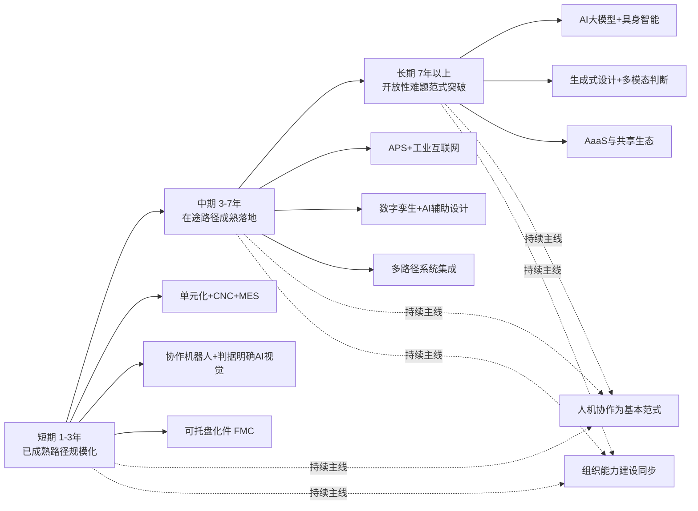

### 7.7.2 场景维度：行业、规模、环节三轴细分

时间维度的三阶段演进必须叠加场景维度的差异化适配——同一阶段的同一路径在不同场景下的优先级可能完全不同。本节按行业类型、企业规模、生产环节三个分类轴展开。

**行业维度的差异化建议**：

| 行业类型 | 短期重点 | 中期重点 | 长期重点 |
|---------|---------|---------|---------|
| 模具制造 | 电极加工自动化、CNC 夜间无人 | AI 辅助模具设计、数字孪生试模 | 生成式设计+智能 FIT 辅助 |
| 重型机械 | 焊接机器人、大件多面加工集成 | 数字孪生用于装备联调 | 大件装夹自动化的局部突破 |
| 非标自动化设备 | 单元化生产、协作机器人辅助 | AI 辅助方案设计 | 跨项目知识沉淀与复用 |
| 精密器件（航天等） | 五轴加工执行优化、判据明确AI视觉 | 数字孪生用于工艺验证 | 生成式设计+多模态质量判断 |
| 定制装备 | 基础 MES、协作机器人 | AI 辅助工艺规划 | 设计前置的深度应用 |
| 船舶与海工 | 焊接自动化、单元化分段制造 | 大件加工的数字化协同 | 复杂火工的局部辅助化 |

**企业规模维度的差异化建议**：

| 企业规模 | 短期重点 | 中期重点 | 长期重点 |
|---------|---------|---------|---------|
| 大型企业 | 标准化路径全面部署 | AI 辅助设计规模化、数字孪生扩展 | 引领行业级生态建设、参与前沿探索 |
| 中型企业 | 单元化+基础 MES+协作机器人 | APS+判据明确 AI 视觉+部分孪生 | 选择性跟随大型企业的成熟应用 |
| 小型企业 | CNC 普及+基础信息化+边缘协作机器人 | 通过共享/外协获取更高级能力 | 借助 AaaS 模式参与生态 |

**生产环节维度的差异化建议**：

| 生产环节 | 短期已可推进 | 中期有望突破 | 长期仍属难点 |
|---------|------------|-------------|------------|
| 设计 | 参数化建模+模板化 | AI 辅助设计（产品族内） | 跨族生成式设计 |
| 编程 | CAM 标准应用 | 特征识别+模板智能化 | 全自动 CAM |
| 加工 | CNC/五轴/FMC | 自适应控制扩展 | 复杂工件全无人化加工 |
| 装夹 | 柔性夹具+零点定位 | 视觉引导装夹 | 复杂异型件智能装夹 |
| 检测 | 判据明确 AI 视觉 | 多任务 AI 视觉融合 | 多模态情境判断 |
| 调试 | 数字孪生（高成本场景） | 数字孪生扩展 | 智能化全流程调试 |
| 修配/FIT | 协作机器人辅助 | 力觉机器人探索 | 智能修配范式突破 |
| 火工矫形 | 几乎无路径 | 工艺规则化探索 | 局部自动化辅助 |

### 7.7.3 路线图实施的两条持续主线

无论时间阶段或场景类型，路线图的实施都必须以两条持续主线为基础——这两条主线不是"附加要求"，而是路线图能否真正落地的根本前提：

**主线一：人机协作为基本范式**。每一项路径的部署都应在人机协作框架下进行——明确人与机器的分工边界、保留人的兜底接口、设计人的能力升级路径、避免追求"完全无人化"的乌托邦。这一主线的现实意义在 7.6 节已充分论证，此处强调的是其在具体路径部署中的可操作性——任何项目立项时都应回答"人在新系统中扮演什么角色"，而不是"项目完成后能减少多少人"。

**主线二：组织能力建设同步**。每一项技术路径的推进都必须伴随组织能力的同步建设——人才培养（特别是复合型人才）、文化变革（特别是容错与开放）、流程重构（特别是跨部门协同）、领导力提升（特别是中层执行力）。这一主线对应第 6 章关于组织维度难度的全部论述——**没有组织能力的同步建设，任何技术投入都难以兑现为真实的能力跃升**。

将两条主线与三阶段演进的关系凝练为：**短期重点不在技术能力的突破，而在组织能力的搭建——这是承接所有未来技术机会的基础**。许多企业急于上技术却忽视组织能力，结果是上线即废、投入成空——这是该领域转型最常见的失败模式。

## 7.8 路径组合的边界、风险与潜在拐点

在路线图基础上，本节作为本章的收束，审慎指出路径组合的能力边界、实施风险，以及可能在中长期改写边界的潜在拐点。这一审慎是持久推理指导标准 P-6 关于辩证视角与对立观点呈现的具体落实——**避免路线图被理解为对未来的乐观承诺，而保持对现实约束的清醒认识**。

### 7.8.1 路径组合无法绕过的能力边界

承接第 4 章 4.7 节"开放性难题清单"，必须明确指出：**即便所有四大族群九条路径在 5–10 年时间窗口内都按预期推进，仍有相当数量的核心难题在可预见时间内将处于人工主导状态**。具体包括：

**边界一：火工矫形的近乎完全人工状态**。如第 4 章 4.6 节所剖析，火工矫形连显式的工艺规则体系都尚未建立，自动化的前置条件——"知识可被规则化或数据化"——根本不具备。在 7.7 节长期阶段标注的"局部自动化辅助"中，"局部"二字需要被严肃理解——可能仅指某些参数监测、过程记录等辅助层面，而非真正替代决策。

**边界二：模具 FIT 与精密手工修配的高度人工依赖**。微米级修配判断、配合面接触状态判定、抛光的"高级感"判断等，本质上是对第 2 章 2.2 节所述隐性知识的极致依赖——这些环节即便在 AI 大模型与具身智能取得显著进展后，仍可能保持人工主导。机器人辅助打磨等局部突破不应被误读为"修配自动化已达成"。

**边界三：复杂多模态情境判断与因果性异常诊断**。第 4 章 4.5 节已明确将其归为开放性难题。即便单点感知能力（如视觉、声学、振动监测）持续突破，跨模态融合与因果推理的范式级挑战仍构成根本约束。可预见时间内，资深操作工的"听音辨刀"等综合判断能力仍将是不可替代的。

**边界四：纯 ETO 模式下工艺规划的智能化生成**。每张订单工艺都新生成的极端场景下，AI 辅助设计的"案例库支撑"基础不存在、模板化编程的"产品族共性"基础不存在、APS 排产的"约束稳定性"基础不存在——多重支撑的同时缺失使纯 ETO 场景成为自动化的"最难地带"。

**边界五：超大、超重、超异型工件的物理可行性瓶颈**。受机器人作业范围、负载能力、工件尺寸等物理约束，重型机械的数十吨级工件、船舶的大型分段、大型模具的整体加工等场景下，自动化的物理可行性本身就受限。这一瓶颈不可能通过算法或软件突破，只能通过专门的机械工程方案逐步推进。

将五重边界凝练为下表，作为对路线图的"现实滤镜"：

| 能力边界 | 主要约束机制 | 5-10 年时间窗口的预期 |
|---------|------------|--------------------|
| 火工矫形 | 知识本身未规则化 | 局部辅助监测，决策仍人工 |
| 模具 FIT 与精密修配 | 极致隐性知识依赖 | 边缘任务局部突破，核心仍人工 |
| 多模态情境判断 | 跨模态融合范式挑战 | 单点能力提升，综合判断仍人工 |
| 纯 ETO 工艺生成 | 多重支撑同时缺失 | 仍以人工为主导 |
| 超大超重工件物理边界 | 机械工程固有约束 | 渐进改善，根本突破有限 |

承认这些边界并非悲观——恰恰相反，**清晰认识哪些是"可推进"、哪些是"暂不可推进"，是合理配置资源、避免无效投入的认识论前提**。企业战略最忌讳的就是"在不可推进的边界上消耗资源、却忽视可推进的机会"——这正是边界识别的实际价值。

### 7.8.2 多路径并行的组合风险

除了能力边界，多路径组合的实施过程本身也面临一系列组合风险——这些风险在路线图的纸面设计中容易被低估，在落地阶段则可能严重影响成效：

**风险一：集成复杂度的非线性上升**。两条路径的并行集成难度远大于两条路径单独部署的难度之和——CNC 与 MES 的接口、MES 与 APS 的数据流、APS 与协作机器人的协同、AI 视觉与质量管理系统的对接——每一组接口都是独立的工程任务，且相互之间存在依赖。**集成复杂度随路径数量呈非线性上升，可能在某个临界点超出企业的工程承受力**。

**风险二：投资分散导致单点不足**。将有限资金分散到多条路径上，每条路径的投入都可能不足以达到工程化阈值——结果是**多条路径都"半成品"，整体能力未达预期**。这一风险在中小企业中尤为显著——资金本就有限，分散投入更容易导致整体失败。

**风险三：组织负担的叠加**。每一条路径都对应一定的组织变革——新流程、新岗位、新协作模式。多条路径并行意味着组织在同一时间段承受多重变革压力——员工的认知负荷、培训需求、协调成本同时上升。**组织变革的承受力是有限的，过度叠加可能导致变革疲劳与抵触加剧**——这是第 6 章 6.1 节组织阻力分析的具体应用。

**风险四：人才需求的复合化**。多路径组合需要复合型人才（参第 6 章 6.2 节），而复合型人才在市场上极度稀缺。组合路径越复杂，对复合型人才的需求越强烈，**而企业获取这类人才的能力却受限于其自身规模、文化、待遇水平**——形成"能力越缺、需求越强、获取越难"的负反馈。

**风险五：技术迭代的不同步**。不同路径的技术演进节奏不一致——某些路径快速迭代（如 AI 视觉），某些路径相对稳定（如 CNC）；快速迭代的路径可能在数年内出现"上一代刚部署、下一代已成熟"的贬值，而稳定路径则可成为长期资产。**多路径组合中各路径的折旧周期、技术贬值风险不一致**，需要差异化的财务规划与更新策略。

将五类组合风险凝练为下表：

| 组合风险 | 表现形式 | 化解策略 |
|---------|---------|---------|
| 集成复杂度非线性上升 | 接口繁多、相互依赖、超出工程承受力 | 分阶段集成，避免一次性叠加 |
| 投资分散单点不足 | 多条路径都半成品 | 聚焦优先级，单点做透再扩展 |
| 组织负担叠加 | 员工认知超载、变革疲劳 | 节奏控制，预留组织消化期 |
| 人才需求复合化 | 复合型人才稀缺、内部培养来不及 | 提前布局人才战略，外部协作补足 |
| 技术迭代不同步 | 折旧不均、贬值风险差异 | 差异化财务规划，非核心路径外购或租赁 |

由此得出实施层面的核心原则：**量力而行、循序渐进、聚焦优先级、保留迭代空间**。任何企业在制定自身的路径组合时，都应基于第 6 章 6.7 节的组织难度分级与第 5 章 5.6 节的经济维度分级，明确自身的承受力边界，避免雄心超出实力的常见陷阱。

### 7.8.3 可能改写边界的潜在拐点

最后，本节前瞻性研判可能在中长期改写难度边界的若干技术与生态变量——这些拐点的潜在影响将在第 9 章未来趋势研判中得到更系统展开，本节先行识别其方向：

**拐点一：AI 大模型在工业知识工程上的工程化突破**。当前的工业 AI 大多是"窄域模型+大量行业数据训练"的范式，受限于第 4 章 4.2 节剖析的小样本困境。若通用大模型（特别是融合工艺先验、物理机理、多模态信息的工业基础模型）在中长期取得工程化突破，可能**显著降低单一场景的训练成本与开发周期**——意味着原本因经济不可行而无法部署 AI 的中小企业也可能获得 AI 能力。这一拐点的潜在影响是深远的——它可能改写多条 AI 智能路径与设计前置路径的成本结构与适用边界。

**拐点二：具身智能在物理交互学习上的成熟**。如第 4 章 4.6 节所剖析，具身智能尝试通过让 AI 系统以"具身"形式与物理世界交互、在真实操作中学习隐性知识——这一方向若取得工程化突破，可能在**手工修配、模具 FIT、复杂装配**等当前的"技能高地"上提供前所未有的自动化可能。这一拐点的影响时间窗口可能在 7 年以上，但其潜在颠覆性使得任何前瞻性战略都不能忽视。

**拐点三：自动化即服务（AaaS）模式的成熟**。当前自动化的部署模式以"企业自购自用"为主——固定成本由单家企业完整承担，规模经济失效在单家企业层面充分体现。若 AaaS 模式（机器人租赁、共享柔性单元、按使用付费的 AI 服务等）在中长期成熟，**单家企业的固定投入门槛可被显著降低**——原本因经济不可行而被排除的中小企业可能获得参与机会。这一拐点对第 5 章 5.5 节剖析的"投资犹豫陷阱"具有正面对冲作用。

**拐点四：行业级共建生态的形成**。包括行业级共建的工艺数据库、共享的训练样本库、行业级标准的零点定位接口、跨企业的协同制造平台等。这些生态若成熟，可**将原本"单家企业成本"的部分内容转化为"行业共担成本"**——典型如某行业的工艺案例库由行业协会牵头建设，成员企业共同贡献与受益，单家企业的知识工程投入显著降低。这一拐点的影响是结构性的——它可能改写整个行业的成本结构与协作模式。

**拐点五：教育体系与人才生态的中长期改善**。第 6 章 6.4 节所剖析的职业教育改革（产教融合、现代学徒制、职业本科等）若在 5–10 年时间窗口内取得实质性进展，**复合型人才的供给约束可能得到缓解**——这将直接松弛第 6 章 6.2 节人才断层的"障碍"维度，让更多自动化方案能够找到合格的设计者与运维者。

将五个潜在拐点的影响方向、时间窗口、对路径的具体改写归纳为下表：

| 潜在拐点 | 主要影响方向 | 大致时间窗口 | 对路径的潜在改写 |
|---------|------------|------------|----------------|
| 工业 AI 大模型工程化 | 降低单一场景训练成本 | 5–10 年 | AI 智能与设计前置路径成本结构改写 |
| 具身智能成熟 | 隐性知识自动学习 | 7 年以上 | 修配/FIT 等技能高地局部突破 |
| AaaS 模式成熟 | 降低单家企业投入门槛 | 5–10 年 | 中小企业可参与多条路径 |
| 行业级共建生态 | 共享成本与知识 | 5–10 年 | 改写整体成本结构与协作模式 |
| 教育与人才生态改善 | 缓解复合型人才约束 | 5–10 年以上 | 解锁多路径的人才支撑 |

这五个潜在拐点的共同特征是：**它们的成熟单独看都难以判断时间窗口，但若同时或相继成熟，将形成对路径组合能力的系统性放大**——可能将当前"开放性难题"清单中的部分子项推入"工程化在途"，将当前"工程化在途"的部分子项推入"已基本解决"。这一可能性本身就值得严肃对待——它意味着该领域的难度图景具有相当的动态属性，不应以静态视角僵化判断。

### 7.8.4 本章核心立场的再次重申与对后续章节的承接

至此，本章完成了从"分类坐标系—逐路径评估—人机协作折中—分阶段路线图—边界与拐点"的完整闭环。在收束本章之前，需要重申本章贯穿始终的核心立场：

**单件小批量场景下不存在"银弹"式的破局方案——所有路径都是在第 4–6 章三维难度约束下的有限突破；真正的破局之道在于"多路径组合+人机协作折中+分阶段渐进"的复合策略，而非对某一前沿技术的押注**。

这一立场对单件小批量制造企业的实际启示是：

**启示一：不要追求"颠覆性变革"，而要追求"持续性进化"**——该领域的转型本质上是一场马拉松而非短跑，能够走完全程的企业不是那些押注单点技术大跃进的，而是那些扎实搭建组织能力、循序渐进引入路径、持续迭代的。

**启示二：不要被前沿叙事裹挟，而要扎根自身实际**——AI 大模型、具身智能、生成式设计等前沿叙事固然激动人心，但企业的当下决策应基于自身的三维条件（技术、经济、组织），而非追逐市场热点。"看似落后的稳健策略"往往优于"看似先进的冒进策略"。

**启示三：不要忽视"打底"路径的价值**——单元化生产、基础 MES、判据明确的 AI 视觉、协作机器人等"看似平淡"的成熟路径，是承接所有未来机会的基础。**没有打底就没有上层**——企业战略最忌讳的就是绕过基础直接追求高级能力。

**启示四：始终以人为本**——人机协作不是退而求其次的妥协，而是该领域最适配的范式。任何忽视人的因素（包括既有员工的转型路径、新员工的成长机制、跨部门协同的组织保障）的技术战略都难以真正落地。

**对后续章节的承接铺垫**。本章的评估结论将在第 8 章综合评估矩阵中以"路径侧维度"加入综合判断——按生产环节、行业类型、企业规模三个分类轴进行的难度分级，将与本章按四大族群路径的评估形成正交映射，共同构成单件小批量制造自动化难度的完整图谱。

本章关于"开放性难题清单中多数子项在可预见时间内仍将处于人工主导"的判断、关于"五个潜在拐点可能在中长期改写难度边界"的研判、关于"人机协作能力增强范式"的战略立场，将为第 9 章未来趋势研判建立直接的事实基础——第 9 章将在本章基础上进一步剖析 AI 大模型、具身智能、数字孪生、工业互联网等前沿技术对突破现有难度瓶颈的潜在影响，预测未来 5–10 年单件小批量离散制造自动化的演进路径与可能拐点，并为不同类型企业、政策制定者、教育与人才培养机构提供差异化的战略建议。

至此，本研究对单件小批量离散制造自动化难度的多维剖析已基本完成对"现状—难度—路径"的完整闭环——第 1 章界定研究对象、第 2 章解构人工依赖、第 3 章盘点自动化现状、第 4–6 章分维度归因难度、第 7 章评估破局路径。**核心问题"自动化难度有多大"的答案已经清晰浮现——它不是一个简单的"高/中/低"标签，而是一个由生产环节、行业类型、企业规模、时间窗口共同定义的多维度难度图谱**。第 8 章将把这一图谱以矩阵形式系统呈现，第 9 章将基于这一图谱给出战略启示——两章合力，对本研究核心命题给出最终的、可操作的、审慎而清晰的回答。

# 8 难度综合评估与分级判断：构建自动化可行性矩阵

第 1 章构建了四维难度评估框架，第 2 章解构了人工不可替代性的五重根源，第 3 章盘点了"两头空、中间实"的自动化渗透格局，第 4–6 章分别沿技术、经济、组织三维对难度进行了系统归因，第 7 章则评估了四大族群九条破局路径的真实可行性。**至此，"难度从何而来""难度如何分布""路径能走多远"三个层面的事实基础已经完整建立**。然而，前七章的结论分散在不同维度之中——技术维度的"开放性难题清单"、经济维度的盈亏平衡分级、组织维度的三类场景分级、路径维度的四大族群评估——这些结论需要被收敛为一张**可视化、可操作、可对照、可被战略决策直接调用的综合矩阵**，方能对本研究的核心命题"单件小批量离散制造自动化难度有多大"给出最终的、清晰的、审慎的回答。

本章的任务即是这一收束工作。沿"矩阵构建逻辑—三轴分级评估—交叉判断—关键变量识别—权重分析—综合分级输出"的逻辑路径展开，最终在 8.7 节对核心命题给出可被第 9 章战略启示直接承接的量化基准。

需要在章首坦诚说明的是：本章的难度分级是**基于前七章已建立的事实框架与机制性论证的结构性判断**，并非基于本轮检索资料新引入的量化基准——本轮搜索资料未提供针对各场景的精确难度评分，因此本章涉及的"高/中/低"三级标签代表的是机制性的相对判断而非绝对数值。这一处理方式与持久推理指导标准 P-3、P-5 关于证据质量与量化判断的要求一致：在数据不充分时坦承局限、以机制性分级替代精确赋值，避免脱离前文论证基础的伪量化陈述。

## 8.1 评估矩阵的构建逻辑与方法论

要让一张矩阵能够承担"综合判断"的功能，其构建逻辑必须**与前七章的分析框架严格对齐**——既不能脱离前文论证另起炉灶，也不能简单堆砌前文结论而失去结构性洞察。本节即明确矩阵的设计思路、赋值规则、使用方式与方法论局限。

**评估坐标系的来源与对齐**。矩阵的"评估坐标系"——即从哪些角度衡量难度——直接承接第 1 章 1.4 节构建的四维难度框架：**技术可行性、经济可行性、组织可行性、时间窗口**。其中前三维已在第 4–6 章分别得到深度剖析，时间窗口维度则在第 7 章 7.7 节的三阶段路线图中得到具体展开。本章矩阵将以技术、经济、组织三维作为核心评估角度，时间维度作为"动态演进"的辅助参照——即矩阵呈现的是**"当前时点的静态难度图谱"**，并明示哪些场景在中长期可能因第 7 章 7.8.3 节所识别的潜在拐点而发生难度等级迁移。

**评估输入的层层递进**。矩阵的"输入数据"来自前七章的不同层次：第 4 章 4.7 节的"已基本解决—工程化在途—开放性难题"三类技术清单提供技术维度输入；第 5 章 5.6 节的盈亏平衡四变量框架与三类典型场景提供经济维度输入；第 6 章 6.7 节的组织难度三类场景与五个核心变量提供组织维度输入；第 7 章 7.2–7.5 节的四大族群路径评估提供"可行性参照"——某项场景的可行性不仅取决于难度本身，还取决于是否存在适配的破局路径。这一层层递进的输入结构确保矩阵的每一个判断都可被追溯到前文的具体论证。

**分类坐标轴的选取**。矩阵的"分类坐标轴"——即沿哪些维度展开难度判断——选取三个对企业战略决策最具操作性的维度：**生产环节、行业类型、企业规模**。这一选取的依据是：生产环节维度对应第 3 章六大盲区与第 7 章环节级路径评估，能够回答"哪些工序难自动化"的问题；行业类型维度对应第 1 章 1.2 节典型行业图谱与第 3 章 3.4 节企业案例，能够回答"哪类行业难度最大"的问题；企业规模维度对应第 5 章 5.5 节资金门槛与第 6 章 6.7 节组织规模差异，能够回答"哪类企业可以做、哪类企业做不动"的问题。三轴交叉，能够定位到任何一个具体场景的综合难度。

**赋值规则与短板效应**。本章采用"高/中/低"三级赋值，每一级的具体含义如下：

- **低难度（绿）**：技术上已基本成熟、经济上正回报较明确、组织上多数企业可承接，已可规模化推进；
- **中难度（黄）**：在某一维度处于成熟、其他维度需具体条件支撑，可行性高度敏感于具体场景变量；
- **高难度（红）**：至少一个维度处于"开放性"或"结构性受限"状态，短期内难以突破。

更重要的是**短板效应原则**——承接第 1 章 1.4 节的论述，三维之间不是简单加和关系，而是**最弱维度决定整体等级**：技术上可行（低）但经济不可行（高）的场景，综合判断仍为高难度；技术经济皆可行（低）但组织不可承接（高）的场景，综合判断也仍为高难度。这一原则的根本理由在于：自动化项目的真正落地需要三维同时通过——任何一维的失败即是整体的失败。短板效应的明确化，使得矩阵的最终判断不会被某一维度的局部乐观所误导。

**矩阵使用的两层意义**。本章的矩阵在两个层面上具有使用价值：

**静态评估层**——回答"在当前时点，某一具体场景的难度等级是什么"。这一层面服务于企业的当下战略决策——选择路径、配置资源、规划节奏、评估风险。

**动态演进层**——回答"哪些场景的难度等级可能在中长期发生迁移、迁移的方向与时间窗口大致如何"。这一层面服务于企业的中长期战略规划，与第 9 章未来趋势研判直接对接。

**方法论局限的坦承**。本章矩阵存在三类无法回避的方法论局限，需在章首明示：

其一，**三级赋值的粗颗粒**——"高/中/低"的三级划分远不足以捕捉真实场景的丰富差异，许多场景实际处于"中偏高""低偏中"等过渡状态，三级标签是不得不为之的简化。

其二，**机制性判断而非数据驱动**——矩阵中的赋值基于前七章建立的机制性论证，而非基于大规模企业调研或行业普查的统计数据。这意味着矩阵的相对判断（A 比 B 难）较为可靠，绝对赋值（A 是高、B 是中）则带有判断者的认识论印记。

其三，**静态时点的快照**——矩阵反映的是当前技术条件下的难度图谱，第 7 章 7.8.3 节所识别的五个潜在拐点中任何一个的实质性突破都可能改写部分判断，矩阵需要被定期校准而非僵化使用。

明示这些局限并非削弱矩阵的价值——恰恰相反，**清晰的局限边界使矩阵的使用更加严谨**，避免被误读为一份精确量化的"标准答案"。矩阵的真正价值在于**结构化呈现复杂现实，为决策提供可对照的认知锚点**，而非取代企业基于自身具体条件的细化判断。

## 8.2 按生产环节的难度分级评估

按生产环节的分级是矩阵的第一维度。承接第 3 章 3.6 节的六大盲区清单与第 7 章 7.7.2 节的环节级差异化建议，本节对单件小批量离散制造的八个核心生产环节——**设计、编程、加工、装夹、检测、修配/FIT、装配试模、调试**——逐一进行三维难度评估，并给出综合等级。这一评估的关键不在重复前文已论证的具体内容，而在**沿环节维度对前文结论进行系统化整合**。

**第一组：相对易自动化的环节**。

**加工环节（CNC/五轴金属切削执行）**——技术维度低（第 4 章 4.7 节"已基本解决"类）、经济维度低（设备投入虽高但可在企业全订单生命周期摊销）、组织维度低（已普及，员工接受度高）。**综合等级：低**。这是单件小批量制造自动化最坚实的成就，也是所有上层路径的物理底座。

**检测环节中的"判据明确任务"**——技术维度低（AI 视觉在规则尺寸测量、已知缺陷识别上已工程化）、经济维度低（第 5 章 5.6 节"经济正回报已较明确"场景）、组织维度低–中（部署与运维需建立 AI 模型相关能力）。**综合等级：低**。

**第二组：部分可自动化的环节**。

**编程环节**——技术维度中（CAM 软件成熟，但单件编程仍是人力密集任务，第 4 章 4.1 节"编程建模成本激增"是核心约束）、经济维度中（参数化模板化在产品族内可显著压缩工时）、组织维度中（依赖具备工艺理解的编程员，复合型能力要求高）。**综合等级：中**。在产品族稳定的中大型企业可显著推进，在纯 ETO 场景下仍然困难。

**装夹环节**——技术维度中–高（第 4 章 4.3 节通用工装天花板，复杂异型件、超大件仍受物理与算法双重约束）、经济维度中（柔性夹具/零点定位投入需在订单结构相对稳定时分摊）、组织维度中（方案设计仍依赖资深操作工）。**综合等级：中**。中小标准件可较好缓解，复杂大件仍属盲区。

**检测环节中的"判据多样任务"**——技术维度中–高（多缺陷类型、跨产品视觉检测的泛化能力受限）、经济维度中（每接入新产品需重新训练）、组织维度中。**综合等级：中**。承接第 7 章 7.4.1 节"两极分化"的判断——同一"AI 视觉"在不同任务类型上的难度等级显著不同。

**调度排产环节**——技术维度中（APS 算法成熟但与单件小批量场景假设不匹配）、经济维度中（第 5 章 5.4 节软件两难）、组织维度中–高（跨部门协同壁垒突出）。**综合等级：中**。在订单结构相对稳定的中型企业可行，在纯 ETO 主导场景下沦为辅助工具。

**第三组：短期内难自动化的环节**。

**设计环节**——若指 ETO 模式下的原创设计，技术维度高（第 4 章 4.7 节"开放性难题"中的非结构化工艺决策）、经济维度高（每张订单都需要重新投入）、组织维度中–高（高度依赖资深设计工程师与工艺工程师）。**综合等级：高**。AI 辅助设计在产品族内可显著缓解，但在跨族场景下仍属难点。

**手工修配/FIT 环节**——技术维度高（第 4 章 4.7 节"开放性难题"，连规则化基础都不充分）、经济维度高（机器人系统投入远超人工成本）、组织维度高（强烈依赖资深钳工）。**综合等级：高**。是单件小批量自动化的"最难地带"之一。

**火工矫形环节**——技术维度高（连显式工艺规则都未建立）、经济维度高（行业级研发投入单家企业无法承担）、组织维度高（极度依赖老师傅）。**综合等级：高**。当前几乎完全人工。

**装配试模与最终调试环节**——技术维度高（多物理场耦合，多模态情境判断）、经济维度中–高（数字孪生在高调试成本场景可缓解）、组织维度高（依赖调试工程师的现场经验）。**综合等级：高**。

将八大环节的难度评估归纳为下表：

| 生产环节 | 技术维度 | 经济维度 | 组织维度 | 综合等级 | 主要破局路径 |
|---------|---------|---------|---------|---------|------------|
| 加工执行（CNC/五轴） | 低 | 低 | 低 | **低** | 设备层基本盘 |
| 检测（判据明确任务） | 低 | 低 | 低–中 | **低** | AI 视觉 |
| 编程 | 中 | 中 | 中 | **中** | 参数化+模板化+AI 辅助 |
| 装夹 | 中–高 | 中 | 中 | **中** | 柔性夹具+零点定位+视觉引导 |
| 检测（判据多样任务） | 中–高 | 中 | 中 | **中** | AI 视觉迭代+多模态融合 |
| 调度排产 | 中 | 中 | 中–高 | **中** | APS（订单稳定场景） |
| 设计（ETO 原创） | 高 | 高 | 中–高 | **高** | AI 辅助/生成式（产品族内） |
| 手工修配/FIT | 高 | 高 | 高 | **高** | 协作机器人辅助（局部） |
| 火工矫形 | 高 | 高 | 高 | **高** | 几乎无路径 |
| 装配试模与调试 | 高 | 中–高 | 高 | **高** | 数字孪生（高成本场景）|

这张环节级图谱印证了第 3 章 3.2 节"由设备层向智能层逐级衰减"的渗透梯度结构——**自动化在中段加工执行最为彻底，向设计前段与修配末段两个方向均呈现陡峭衰减**。这一"中段稳、两端难"的结构性特征是单件小批量制造自动化最深刻的事实——它直接来自第 2 章人工不可替代性五重根源在不同环节上的差异化分布。

## 8.3 按行业类型的难度分级评估

按行业类型的分级是矩阵的第二维度。承接第 1 章 1.2 节的典型行业图谱与第 3 章 3.4 节的代表性企业案例，本节对七类典型行业的整体自动化难度进行评估。**行业级评估的核心是识别每类行业的"难度结构特征"——即在五个变量（产品异质性、单件价值、批量规模、工艺复杂度、技能依赖深度）上的差异化组合**——这一组合决定了行业级综合难度，也决定了最适配的路径与最难突破的盲区。

**模具制造**——产品异质性极强（每副模具几乎独一无二）、单件价值中–高、批量极小（多为单副）、工艺复杂度极高（设计→电极→粗精加工→电火花→线切割→FIT）、技能依赖深度极高（特别是 FIT 环节）。**综合难度：高**。最适配路径是"加工自动化（电极、CNC、电火花单元）+ AI 辅助模具设计 + 数字孪生试模"的组合，最难突破的盲区是 FIT 修配——这一环节几乎是行业的"自动化禁区"。

**重型机械制造**——产品异质性强、单件价值极高、批量极小（单台为主）、工艺复杂度高（大件加工+焊接+总装）、技能依赖深度高（特别是火工矫形与总装调试）。**综合难度：高**。最适配路径是"焊接机器人+大件多面加工集成+数字孪生用于装备联调"，最难突破的盲区是火工矫形与超大件装夹——前者是知识规则化未建立的难题，后者是物理边界的硬约束。

**非标自动化设备制造**——产品异质性极强（每个项目独立设计）、单件价值中、批量小、工艺复杂度高（机械+电气+控制+软件多领域集成）、技能依赖深度高（现场调机能力关键）。**综合难度：高**。最适配路径是"单元化生产+协作机器人辅助+AI 辅助方案设计+跨项目知识沉淀"，最难突破的盲区是装配调试——多领域耦合的现场判断难以自动化。

**航天与航空精密器件**——产品异质性中（产品族相对稳定）、单件价值极高、批量极小、工艺复杂度极高（五轴+超精密+特种加工）、技能依赖深度极高（精度与可靠性要求达到极致）。**综合难度：中–高**。这一行业是一个有趣的特例——其单件价值极高使得**经济维度对昂贵自动化方案具有较高承受力**，因此数字孪生、AI 视觉精密检测、五轴加工自动化等高投入路径反而具备经济基础；但其极致的可靠性要求又使得"全无人化"在工程信任层面难以建立。最适配路径是"五轴执行优化+判据明确 AI 视觉精密检测+数字孪生工艺验证"，最难突破的盲区是多模态质量综合判断与异常处置兜底。

**定制化高端装备**——产品异质性强、单件价值高、批量小、工艺复杂度高、技能依赖深度高（兼具 ETO 设计与 MTO 装配的双重特征）。**综合难度：高**。最适配路径是"基础 MES+协作机器人+AI 辅助工艺规划+设计前置深度应用"。

**船舶与海工**——产品异质性极强（ETO 模式最极端代表）、单件价值极高（单船数亿乃至数十亿）、批量极小（单船为单位）、工艺复杂度极高（数十专业工种协同）、技能依赖深度极高。**综合难度：高**。最适配路径是"焊接自动化+单元化分段制造+大件加工的数字化协同"，最难突破的盲区是复杂火工矫形与大型曲面板的现场作业——其物理尺度与工艺特性使自动化的物理可行性本身就受限。

**轻型定制制造（广告/家具/工艺品）**——产品异质性强、单件价值低、批量小、工艺复杂度中、技能依赖深度中。**综合难度：中**。这是单件小批量制造中难度相对较低的子类——技能高地不像模具 FIT 那样深、工件物理尺度不像重型机械那样大、单件价值不像航天器件那样要求极致——使得**协作机器人、单元化生产、AI 视觉等中等成熟度路径在此领域有较好的应用空间**，常被作为柔性制造与小型协作机器人技术验证的先行场景。

将七类行业的难度评估归纳为下表：

| 行业类型 | 产品异质性 | 单件价值 | 批量规模 | 工艺复杂度 | 技能依赖 | 综合难度 | 主要可行路径 | 最难突破盲区 |
|---------|----------|---------|---------|----------|---------|---------|------------|------------|
| 模具制造 | 极强 | 中–高 | 单副 | 极高 | 极高 | **高** | CNC单元+AI设计+孪生 | FIT 修配 |
| 重型机械 | 强 | 极高 | 单台 | 高 | 高 | **高** | 焊接机器人+集成 | 火工矫形/超大件装夹 |
| 非标自动化设备 | 极强 | 中 | 小 | 高 | 高 | **高** | 单元化+协作机器人 | 装配调试 |
| 航天精密器件 | 中 | 极高 | 极小 | 极高 | 极高 | **中–高** | 五轴+精密视觉+孪生 | 多模态质量判断 |
| 定制高端装备 | 强 | 高 | 小 | 高 | 高 | **高** | MES+协作机器人+设计前置 | 集成化装配调试 |
| 船舶海工 | 极强 | 极高 | 单船 | 极高 | 极高 | **高** | 焊接+分段单元化 | 复杂火工/大型现场作业 |
| 轻型定制制造 | 强 | 低 | 小 | 中 | 中 | **中** | 协作机器人+单元化+视觉 | 个性化外观判断 |

由表可见一个值得关注的规律：**单件价值与综合难度并非线性关系——单件价值极高（如航天）反而通过松弛经济约束降低了部分难度，单件价值过低（如轻型定制）则通过降低技能高地深度也降低了难度，而中等单件价值且技能依赖极强的行业（模具、定制装备）反而是综合难度最为典型的代表**。这一非线性规律对企业的战略选择具有重要启示——单件价值不是判断自动化前景的唯一变量，技能依赖深度与产品异质性的组合才是核心决定因素。

## 8.4 按企业规模的难度分级评估

按企业规模的分级是矩阵的第三维度。承接第 5 章 5.5 节的资金门槛分析与第 6 章 6.7 节的组织难度三类场景，本节对大型、中型、小型三类规模企业的差异化难度进行评估。这一维度的特殊价值在于揭示**同一环节、同一行业在不同规模企业中的实际可行性差异**——这一差异常常被笼统的行业级讨论所掩盖，却恰恰是决定企业层面战略选择的关键变量。

**大型企业**——资金可承担额度高、组织变革资源充裕（专门的变革管理团队、信息化部门、人才发展部门）、人才结构相对完整（包括复合型人才储备）、外部生态可获得性强（行业话语权、政策支持、供应商配合度高）。**综合规模等级：低难度（相对而言）**。大型企业的优势在于**能够独立承担多路径并行部署的复杂集成、能够投资中长期才见效的前沿技术、能够引领行业级共建生态**。其典型路径是"标准化路径全面部署+前沿技术规模化应用+引领生态建设"，可行路径边界向第 7 章 7.7.1 节所列长期阶段拓展。

**中型企业**——资金可承担有限、组织变革资源中等（有一定信息化与人力资源支撑但深度有限）、人才结构存在缺口（特别是复合型人才稀缺）、外部生态可获得性中（依赖产业集群与区域生态）。**综合规模等级：中难度**。中型企业的关键挑战是**"想做能做未做"的多重张力**——有一定资源但不足以独立攻坚前沿、有变革意愿但组织能力不足以承接复杂集成。其典型路径是"单元化+基础 MES+协作机器人 + APS（订单稳定时） + AI 视觉判据明确任务"的组合，可行路径边界停留在第 7 章 7.7.1 节的中期阶段。中型企业是单件小批量制造的主力，也是矩阵中"黄区"的最主要落点。

**小型企业**——资金极度有限、组织变革资源稀缺（一把手即包办大部分决策）、人才结构单薄、外部生态依赖度高（必须借助区域生态或行业协作）。**综合规模等级：高难度**。小型企业的根本困境在于**单家企业的资源池根本不足以承担传统范式下的自动化投入**——其转型之路高度依赖第 7 章 7.8.3 节所识别的"AaaS 模式"与"行业级共建生态"等拐点的成熟。其典型路径是"CNC 普及+基础信息化+边缘协作机器人+借助外部协作"，可行路径边界停留在第 7 章 7.7.1 节的短期阶段。

将三类规模企业的差异凝练为下表：

| 维度 | 大型企业 | 中型企业 | 小型企业 |
|------|---------|---------|---------|
| 资金可承担额度 | 高 | 中 | 极有限 |
| 组织变革资源 | 充裕（专门团队） | 中（兼职为主） | 稀缺（一把手包办） |
| 人才结构（含复合型） | 相对完整 | 存在缺口 | 单薄 |
| 外部生态可获得性 | 强（具话语权） | 中（依赖区域） | 高度依赖外部 |
| 文化与领导力组织化程度 | 制度化运作 | 关键人依赖 | 强一把手依赖 |
| 可行路径边界 | 长期阶段 | 中期阶段 | 短期阶段+外部协作 |
| 综合规模等级 | **低**（相对） | **中** | **高** |
| 典型转型节奏 | 系统化规划+长期投入 | 渐进式+多路径组合 | 边缘渐进+依赖外部 |

需要特别指出的是，**规模因素在难度判断中具有"放大器"作用**——同一项技术在不同规模企业中的实际难度差异可能比技术本身的难度差异更大。例如，APS 智能排产作为一项"中等技术难度"的路径，在大型企业中可借助专门的信息化团队支撑而成为"中–低难度"，在中型企业中沦为"中难度"，在小型企业中则可能因为人才与流程的根本不足而成为"高难度"——同一项技术的可行性等级随规模跨越三个层级。这一放大器效应是矩阵交叉判断中最重要的规律之一。

## 8.5 三轴交叉的可行性矩阵与典型场景判定

8.2–8.4 节分别完成了三个分类轴的独立分级，本节将三轴进行交叉，构建多维可行性矩阵。**矩阵的真实价值不在于穷举所有可能场景，而在于通过若干代表性场景的交叉判定，揭示矩阵中"绿区""黄区""红区"的边界规律**。

**绿区典型场景（已成熟可行）**：

- **大型航天企业的判据明确精密视觉检测**：环节低难度+行业有经济承受力+大型企业组织能力强 → **三轴齐绿，已工程化部署**；
- **中型轻型定制制造企业的协作机器人辅助上下料**：环节中–低难度+行业难度中+中型企业可承受 → **可立即推进**；
- **任意规模的 CNC/五轴加工执行**：环节低难度+几乎所有行业适用+企业规模差异小 → **基本盘**；
- **大型模具企业的 AI 辅助模具设计（产品族内）**：环节中难度但产品族内已工程化+模具行业案例库充实+大型企业组织支撑足 → **已规模化应用**。

**黄区典型场景（部分维度受限，需具体条件支撑）**：

- **中型模具企业的电极加工与 CNC 夜间无人**：环节中难度+模具行业条件适配+中型企业资金边界 → **可行但需具体测算 ROI**；
- **中型重型机械企业的焊接机器人扩展**：环节中难度+重型机械行业部分适配+中型企业组织能力中等 → **大件焊接可行，超大件受限**；
- **大型船舶企业的分段单元化制造**：环节中难度+船舶行业 ETO 极端+大型企业可承担 → **可推进但 ROI 周期长**；
- **小型非标设备企业的协作机器人辅助**：环节中难度+非标行业难度高+小型企业资源有限 → **仅在特定任务上可行**；
- **中型定制装备企业的 APS 智能排产**：环节中难度+订单稳定性是变量+中型企业是 APS 的典型应用规模 → **取决于订单结构稳定性与企业 IT 能力**。

**红区典型场景（多维短板叠加，短期内不可行）**：

- **小型重型机械企业的火工矫形自动化**：环节高难度（开放性技术难题）+重型机械的物理边界+小型企业的资源约束 → **三轴齐红**；
- **任意规模的纯 ETO 模式工艺自动化生成**：环节高难度+异质性极强的行业+所有规模都受限 → **多重短板叠加**；
- **小型模具企业的 FIT 修配机器人替代**：环节最难地带+模具行业最深盲区+小型企业资源不足 → **典型红区**；
- **任意规模的复杂多模态情境判断与异常诊断**：环节高难度（开放性）+几乎所有行业都受影响+技术成熟度尚未到位 → **行业性挑战**。

将以上典型场景结构化呈现为可视化矩阵：

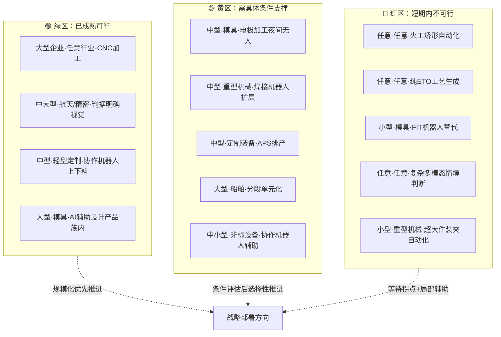

**矩阵呈现的三个结构性规律**：

**规律一：绿区主要分布在"低难度环节×成熟行业适配×大中型企业"的交叉**。这一规律意味着——**当前自动化的真正机会，集中在已成熟环节向更多行业、更多规模企业的"应用扩展"，而非未成熟环节的"技术攻坚"**。这与第 7 章 7.7.1 节短期阶段的战略侧重完全一致——"应做未做"的规模化推广，是现阶段最重要的战略主题。

**规律二：黄区的可行性高度依赖具体条件变量**。同一项中等难度环节在不同行业、不同规模企业的可行性差异巨大——批量阈值、产品族共性度、订单结构稳定性、企业组织成熟度等具体变量决定具体场景的实际命运。**黄区是企业战略决策的"主战场"**——能否正确识别自身在黄区中的位置、选择适配的路径组合、配置必要的支撑条件，直接决定转型成败。

**规律三：红区的存在不应被回避或乐观投射**。承认"短期内不可行"是清醒的战略起点——它使企业避免在不可行场景上消耗资源、转而将资源集中于绿区与黄区的可行机会。**红区的化解依赖于第 7 章 7.8.3 节所识别的潜在拐点的成熟**，这一过程将以年至十年量级展开，企业需有耐心。

## 8.6 决定难度的关键变量识别与权重分析

8.5 节的矩阵呈现的是"结果"——具体场景的难度等级；本节的任务是反向归纳"原因"——**到底是哪些变量、以何种权重、决定了一个场景最终的难度等级**。这一反向分析对企业进行自我诊断、识别关键短板、选择改进抓手具有直接的战略价值。

**九类候选关键变量**。综合前七章的分析，可识别出九类对难度判定具有显著影响的变量：

1. **产品异质性程度**（第 1 章 1.3 节核心特征）；
2. **批量规模**（第 1 章 1.1 节内涵界定）；
3. **单件价值**（第 1 章 1.2 节行业差异）；
4. **工艺重复度**（第 4 章 4.1 节准备成本摊销基础）；
5. **隐性知识依赖深度**（第 2 章 2.5 节根源二）；
6. **组织成熟度**（第 6 章 6.7 节五个核心变量综合）；
7. **企业规模**（第 5 章 5.5 节资金能力+第 6 章 6.7 节组织资源）；
8. **技术成熟度**（第 4 章 4.7 节三类清单）；
9. **订单结构稳定性**（第 7 章 7.3.1 节 APS 适用边界）。

**变量权重的相对评估**。九类变量并非等权——有些具有"主导"作用，有些是"次要"作用。基于前七章的论证，可对其权重作如下结构化判断：

**主导变量**：

- **隐性知识依赖深度**：在所有变量中具有最强的难度决定性。承接第 2 章 2.5 节五重根源的论证与第 4 章 4.6 节"元难题"的判断——隐性知识依赖深的环节几乎注定属于高难度，且短期内难以通过单点技术突破化解。这一变量直接决定一个场景是否进入红区。

- **产品异质性程度**：决定第 4 章 4.1 节"编程建模成本激增"、4.2 节"算法泛化困难"、4.3 节"装夹方案频繁变更"、5.2 节"规模经济失效"等多重核心难题的烈度。异质性越强，技术、经济维度的难度同时被推高。

- **工艺重复度**：与产品异质性相关但不完全同源——同一异质性水平下，工艺族层面的重复度仍可显著降低难度（参 8.3 节模具行业的电极加工自动化即受益于工艺重复度）。这一变量是黄区中诸多场景命运分化的关键。

**次要变量**：

- **企业规模**：对可行路径边界具有"放大器"作用（参 8.4 节），但本身不改变环节级难度的本质。规模因素更多决定"同一项技术能否被该企业承接"，而非"该项技术本身的难度等级"。

- **单件价值**：通过松弛经济维度约束影响难度——高单件价值能承担昂贵自动化方案，低单件价值不能。但其不改变技术维度本身的难度。

- **订单结构稳定性**：在特定路径（特别是 APS 智能排产）中具有决定性影响，在其他路径中影响有限。

- **批量规模**：在硬件类路径（FMC 等）中具有阈值作用，但对软件类、AI 类、设计前置类路径影响相对小。

**支撑变量**：

- **组织成熟度**：是落地阶段的关键约束，但不直接决定技术维度的难度。其作用更多是"决定一项技术能否被组织真正吸收"。

- **技术成熟度**：是动态变量——随时间推移而变化（第 7 章 7.8.3 节潜在拐点）。当前时点的技术成熟度只是一个快照。

将九类变量的权重判断结构化呈现：

| 变量类别 | 具体变量 | 主要作用机制 | 相对权重 |
|---------|---------|------------|---------|
| 主导变量 | 隐性知识依赖深度 | 决定是否进入红区 | 最高 |
| 主导变量 | 产品异质性程度 | 推高技术经济维度难度 | 极高 |
| 主导变量 | 工艺重复度 | 决定黄区场景命运分化 | 高 |
| 次要变量 | 企业规模 | 放大器作用，决定承接力 | 中 |
| 次要变量 | 单件价值 | 松弛经济约束 | 中 |
| 次要变量 | 订单结构稳定性 | 特定路径决定性 | 中 |
| 次要变量 | 批量规模 | 硬件路径阈值 | 中–低 |
| 支撑变量 | 组织成熟度 | 落地能否吸收 | 中 |
| 支撑变量 | 技术成熟度 | 时点快照（动态） | 中（动态）|

**短板效应的再次强化**。承接 8.1 节的赋值规则与第 1 章 1.4 节的论述，本节再次强调——**短板效应是难度判定的核心规律：最弱维度决定整体难度**。这意味着：

**主导变量决定基础等级**——隐性知识依赖深度极高、产品异质性极强、工艺重复度极低的场景，无论其他变量如何配置，综合难度都难以低于"中–高"。

**次要变量进行边际调整**——在主导变量给定的基础上，单件价值、企业规模、批量规模等次要变量进行向上或向下的调整——但通常不足以跨越主导变量决定的基础等级。

**支撑变量决定能否落地**——即便主导变量与次要变量综合判断为"可行"，组织成熟度不足仍可使项目实质性失败。这是第 6 章 6.7 节"组织维度往往是真正失败原因"判断的具体体现。

**对企业自我诊断的启示**。本节的关键变量与权重分析为企业自我诊断提供了一份可操作的检查清单——任何企业在评估自身某项自动化机会时，可按以下顺序逐项检查：

第一步，**主导变量诊断**：本场景中产品异质性、工艺重复度、隐性知识依赖深度处于何种水平？三者综合是否使本场景天然处于红区？

第二步，**次要变量调整**：在主导变量确定的基础等级上，本企业的规模、本行业的单件价值、本订单结构稳定性是否存在边际改善空间？

第三步，**支撑变量评估**：本企业的组织成熟度是否足以支撑落地？若不足，是否能在合理时间窗口内建设？

第四步，**短板识别**：综合三步评估，本场景的"最弱维度"是哪一个？该维度是否可被改善？改善的成本与时间窗口如何？

这四步诊断能帮助企业从"模糊的难易感受"走向"结构化的难度判断"——这正是本章矩阵的实际战略价值。

## 8.7 难度综合分级的最终输出与对核心命题的回答

经过 8.1–8.6 节的层层构建，本节作为本章及前八章论证的收束，对本研究的核心命题——**"单件小批量离散制造自动化难度有多大"**——给出审慎而清晰的最终回答。

**核心命题的拒绝简化与结构化回答**。"难度有多大"这一追问诱使一个简化答案——例如"难度很高"或"难度可控"。但本研究的全部分析共同拒绝任何简化判断——**单件小批量离散制造自动化的难度不是一个单一标量，而是一个由生产环节、行业类型、企业规模、时间窗口共同定义的多维度难度图谱**。任何脱离具体场景的笼统断言都是认识论上的不严谨。

基于前七章的论证与本章的矩阵构建，对核心命题的最终回答可以三类难度等级的场景清单形式输出：

**第一类：低难度场景——已可规模化推进的"应做未做"**：

- 任意规模企业的 **CNC/五轴加工执行环节**——已是行业基本盘；
- 中大型企业在 **航天精密、模具、定制装备** 等行业的 **判据明确 AI 视觉检测**——技术成熟、ROI 明确；
- 中大型企业的 **单元化生产组织变革**——技术门槛低、组织收益显著；
- 中大型企业的 **基础 MES 信息化部署**——管理透明化的基本工具；
- 大型模具/汽车覆盖件企业的 **AI 辅助模具设计（产品族内）**——已工程化应用；
- 中型企业在 **轻型定制制造、可托盘化中小件** 场景的 **协作机器人辅助任务**——投入门槛低、效用直观。

这一类场景的特征是**技术已成熟、经济正回报明确、组织可承接**——其推进的瓶颈不在"能不能做"，而在"做不做、做多快"。这些场景对应第 7 章 7.7.1 节的短期阶段战略，应是当前所有单件小批量制造企业的优先关注点。

**第二类：中难度场景——需具体条件支撑的"条件可行"**：

- 中型企业的 **APS 智能排产**——需订单结构相对稳定、IT 能力支撑充足；
- 中型企业的 **可托盘化件 FMC**——需工件物理可托盘化、批量阈值达到；
- 中大型企业的 **数字孪生用于高调试成本场景**——需调试成本基数足够高；
- 中型企业的 **柔性夹具与零点定位系统**——需订单中工件具备一定标准化基准；
- 大型企业的 **工业互联网平台基础部署**——需数据采集密度与系统集成能力；
- 中大型企业的 **AI 辅助工艺规划（产品族层面）**——需案例库基础充实；
- 大型重型机械与船舶企业的 **大件加工与焊接的多面集成自动化**——需具备大型集成工程能力。

这一类场景的特征是**核心技术已工程化在途、但可行性高度敏感于具体条件变量**——其推进需要企业进行细致的场景诊断与条件评估。这些场景对应第 7 章 7.7.1 节的中期阶段战略，是黄区的主要落点，也是矩阵中"主战场"。**企业在这一类场景中的战略选择质量，是决定其转型成败的最关键变量**。

**第三类：高难度场景——短期内难以突破的"现阶段不可行"**：

- 任意规模、任意行业的 **手工修配/FIT 机器人替代**——技术维度的开放性难题与隐性知识依赖深度的极致组合；
- 任意规模、重型机械与船舶行业的 **火工矫形自动化**——连知识规则化基础都不充分；
- 任意规模、ETO 主导行业的 **非结构化工艺方案智能生成**——多重支撑同时缺失；
- 任意规模、复杂工件的 **多模态情境判断与因果性异常诊断**——范式级技术难题；
- 任意规模、超大超重工件的 **装夹自动化**——物理边界硬约束；
- 任意规模、复杂装备的 **多物理场耦合调试自动化**——多重不确定性的综合挑战；
- 小型企业在 **多数中难度场景** 中的独立推进——资源约束使中难度场景对小型企业而言变为高难度。

这一类场景的特征是**至少一个维度处于"开放性"或"结构性受限"状态，且这一约束在 5 年内难以被根本化解**。承认这一类场景的"现阶段不可行"是清醒的战略起点——企业应避免在这些场景上消耗资源，转而通过保留人工兜底、依靠资深工人传承等方式维持生产能力，等待第 7 章 7.8.3 节所识别的潜在拐点成熟。

将三类难度等级的最终判断结构化为下表：

| 难度等级 | 场景特征 | 典型代表 | 战略含义 | 时间窗口 |
|---------|---------|---------|---------|---------|
| **低（绿区）** | 三维齐绿，已成熟可行 | CNC加工、判据明确AI视觉、单元化、基础MES、协作机器人辅助、AI辅助模具设计（产品族内） | 应做未做的规模化推广 | 1–3 年 |
| **中（黄区）** | 部分维度受限，需具体条件支撑 | APS、可托盘化FMC、数字孪生、柔性夹具、工业互联网、AI辅助工艺规划 | 主战场，关键在场景诊断与条件评估 | 3–7 年 |
| **高（红区）** | 多维短板叠加，开放性或结构性受限 | 手工修配/FIT、火工矫形、非结构化工艺生成、多模态情境判断、超大件装夹、复杂装备调试 | 现阶段不可行，等待拐点 | 7 年以上或需范式突破 |

**对核心命题的最终回答**。基于以上场景清单，可对核心命题给出审慎而清晰的总结性回答：

**单件小批量离散制造自动化的难度，不是均一的"高"或"低"，而是呈现出鲜明的三层分布：约三分之一的场景已可规模化推进（绿区，主要是中段加工执行与判据明确的辅助任务）、约三分之一的场景在条件支撑下可行（黄区，主要是中等成熟度路径在适配场景下的工程化落地）、约三分之一的场景在 5 年内难以突破（红区，主要是隐性知识深度依赖的技能高地与开放性技术难题）**。

更进一步，**该领域的难度本质不是"技术尚未到位"——而是"柔性—自动化"在范式层面的根本张力（第 4 章 4.8 节）、规模经济失效的数学必然（第 5 章 5.2 节）、推力与障碍同源的组织悖论（第 6 章 6.6 节）三者并存的结构性产物**。这一难度的真正化解，依赖于范式级的技术演进（具身智能、AI 大模型、生成式设计等）、商业模式的创新（AaaS、行业级共建生态）、组织与人才生态的中长期改善（产教融合、复合型人才培养、文化变革）三者的协同——任何单点突破都不足以根本改变图谱。

**难度图谱的动态属性与第 9 章的承接铺垫**。本章给出的难度分级是**当前时点的快照**，第 7 章 7.8.3 节所识别的五个潜在拐点——工业 AI 大模型工程化、具身智能成熟、AaaS 模式成熟、行业级共建生态形成、教育与人才生态改善——任何一个的实质性突破都可能改写部分场景的难度等级，将红区中的部分子项推入黄区，将黄区中的部分子项推入绿区。

特别值得期待的迁移方向包括：

- **工业 AI 大模型工程化** 可能将"AI 辅助工艺规划（跨产品族）""数字孪生扩展应用"等当前的中–高难度场景推入"中"难度区间；
- **具身智能成熟** 可能在 7 年以上时间窗口内对"手工修配""模具 FIT"等当前红区子项实现局部突破；
- **AaaS 模式成熟** 可能将小型企业从"独立资源约束下的中–高难度"提升至"可获得外部能力支撑下的中难度"——这是规模因素放大器作用的反向化解；
- **行业级共建生态** 可能将"复杂装夹自动化""非结构化工艺生成"等当前红区场景，通过共享案例库、共享柔性资源等方式部分推入黄区。

这些动态迁移的具体研判与时间窗口、具体抓手与战略选择，将构成第 9 章未来趋势研判的核心命题。本章的难度图谱将作为第 9 章的**量化起点**——基于"当前难度图谱"研判"未来难度图谱"，进而为不同类型企业（先行者、跟随者、观望者）、政策制定者、教育与人才培养机构提供差异化的战略建议，最终回答"难度可被有效降低的关键抓手与时间窗口"这一具有现实指导价值的子命题。

至此，本章完成了从"矩阵构建逻辑—三轴分级—交叉判断—关键变量—综合分级"的完整闭环，前八章对单件小批量离散制造自动化"现状—难度—路径—综合判断"的多维剖析也基本完成。**核心命题"难度有多大"的答案已清晰浮现——它是一个三层结构的多维度图谱、一个由结构性张力主导的复杂命题、一个具有动态属性的演进过程**。承接本章的量化基准，第 9 章将转入未来趋势研判与战略启示——在已经清晰认识"难度有多大"的基础上，进一步回答"难度如何降低""谁应当如何行动""时间窗口在哪里"等面向行动的核心问题，使本研究形成从"认知"到"判断"再到"行动"的完整闭环。

# 9 未来趋势研判与战略启示

第 8 章给出了一份"当前时点"的难度图谱——三分之一场景已可规模化推进、三分之一场景在条件支撑下可行、三分之一场景在 5 年内难以突破。这一图谱回答了"难度有多大"的静态部分，却尚未回答其动态部分——**这一图谱会如何演变？哪些场景的难度等级可能在中长期发生迁移？谁应当如何行动以降低难度？时间窗口在哪里？** 本章作为全研究的收束章节，将沿"前沿技术潜在影响—演进路径与拐点预测—差异化战略建议—生态支撑建议—核心命题终极回答"的递进逻辑展开，使本研究形成从"认知—判断—行动"的完整闭环。

需要在章首坦诚说明的是：本章涉及的前沿技术成熟时间窗口、拐点触发条件、难度迁移方向等命题，本质上是基于前八章已建立的事实框架与机制性论证所做出的**前瞻性研判**——其性质不同于对当下事实的描述，而是对未来演进的合理推断。本轮检索资料未提供针对各前沿技术工程化时间表的具体来源，本章的研判将严格基于前八章已建立的认识论锚点（特别是第 4 章 4.7 节技术清单、第 7 章 7.8.3 节潜在拐点、第 8 章 8.7 节难度图谱），以**机制性推演与区间表达**为主，避免精确数字层面的杜撰。同时，恪守持久推理指导标准 P-6 关于辩证视角的要求，本章对每项前沿技术的研判都将同时呈现乐观与谨慎两种视角——既不滑入"技术乌托邦"的单边叙事，也不陷入"悲观论"的过度保守，力求在乐观与谨慎之间找到审慎的平衡。

## 9.1 前沿技术对难度瓶颈的潜在影响研判

第 4 章 4.7 节将单件小批量场景的技术难题分为"已基本解决—工程化在途—开放性难题"三类，第 7 章 7.8.3 节进一步识别了五类可能改写难度边界的潜在拐点。本节聚焦其中具有"潜在突破能力"的五类前沿技术——**AI 大模型、生成式设计、具身智能、数字孪生、工业互联网**——对其作用环节、当前成熟度、预期工程化时间窗口、对难度等级迁移的具体改写方向进行系统研判。

### 9.1.1 AI 大模型：工艺知识工程的范式升级

AI 大模型——特别是融合工艺先验、物理机理、多模态信息的工业基础模型——对该领域难度瓶颈的潜在影响最为深远。其根本价值在于**从根本上改变第 4 章 4.2 节所剖析的"小样本+分布外"范式错配**——大模型通过在海量跨场景数据上的预训练形成的"基础能力"，使其在面对小样本任务时具备显著优于传统深度学习的迁移能力。

**潜在作用环节有三**：

其一，**工艺知识工程的半显性化**。第 4 章 4.6 节将"隐性知识数字化"识别为元难题——记录与再现之间存在鸿沟。AI 大模型的潜在突破在于：通过对大量工艺文档、操作记录、视频示范的预训练，模型可对"工艺判断"进行**部分语义化建模**——这并不等于完整再现隐性知识，但可显著缩短新人成长周期、辅助资深工人传授经验、为关键决策提供"类专家咨询"式的参考。其作用机制不是替代专家，而是**把专家经验从"个人脑库"半显性化为"可被组织调用的辅助资产"**——这一作用对第 6 章 6.3 节剖析的传承困境构成实质性缓解。

其二，**跨产品族泛化能力的提升**。第 7 章 7.5.1 节指出 AI 辅助工业设计的核心局限是"跨产品族迁移性能显著衰减"——其根源是传统模型对"族内案例"的强依赖。大模型通过在多领域、多产品族数据上的预训练，可能使"少样本下的跨族迁移"成为现实——例如基于一族模具案例训练的模型可在另一族模具上以少量样本快速适配。这一能力若工程化成熟，将**显著扩展第 7 章 7.7.2 节中"AI 辅助工业设计"的适用范围**——从"产品族内可用"向"跨族可用"的关键跨越。

其三，**多模态情境理解的初步能力**。第 4 章 4.5 节将"多模态情境判断与因果性异常诊断"归为开放性难题，其核心难点是跨模态语义对齐与因果推理。大模型在多模态预训练中已展现出初步的跨模态理解能力——视觉-语言模型、视频-语言模型等已可对复杂场景进行综合描述与简单推理。这一能力若被进一步定向训练到工业场景中，可能在"加工异常的初步识别+人工介入指引"层面发挥辅助作用，虽不足以完全替代资深操作工的多模态闭环判断，但可显著降低判断的人工密度。

**预期工程化时间窗口与边界的乐观与谨慎**：

**乐观视角**：基础大模型的演进速度在过去数年中超出多数预期，工业垂域大模型的初步形态已在部分企业出现。在 5–10 年时间窗口内，**AI 大模型在工艺知识辅助、跨族泛化、多模态初步理解等环节有望取得工程化成熟**，使第 4 章 4.7 节"开放性难题清单"中的多个子项推入"工程化在途"区间。

**谨慎视角**：大模型在工业场景下的工程化面临几重独特挑战——其一，**工业数据的获取与标注本身受制于第 4 章 4.2 节剖析的小样本困境**，即便是预训练数据，工业领域的可获得规模仍远小于通用领域；其二，**工业应用对可靠性、可解释性、可追溯性的要求**显著高于通用 AI 应用，大模型的"幻觉"问题在工业场景下的容忍度极低；其三，**工业垂域大模型的"训练—部署—迭代"闭环**在中小企业层面尚缺乏成熟的工程化范式与商业模式。这三重挑战意味着——**大模型的潜力是真实的，但其工程化兑现的速度可能慢于通用领域 AI 的演进节奏**。乐观与谨慎之间，更现实的判断是"5–10 年内可见显著推进，但根本性的范式替代难以在此窗口内完成"。

### 9.1.2 生成式设计：ETO 模式下设计前置的杠杆释放

生成式设计——基于功能约束与性能要求的算法化设计探索——是设计前置类路径中最具范式突破潜力的方向。承接第 7 章 7.5.2 节的评估，本节聚焦其在单件小批量场景下的潜在影响。

**潜在作用环节**：生成式设计对第 8 章 8.3 节所识别的高难度行业（特别是航天精密器件、定制高端装备、轻量化结构件场景）具有独特的杠杆效应。在这些行业，**单件价值极高且性能优先压倒成本敏感**，生成式设计所产生的"非常规但优越"的方案具备经济基础；同时，**这些行业本身就是 ETO 模式的典型代表**，第 8 章 8.7 节将"纯 ETO 工艺生成"识别为红区典型场景——生成式设计正面对冲这一红区核心。

更进一步，**生成式设计与增材制造的协同**构成另一条独特价值链。增材制造突破了传统切削加工对几何复杂度的约束，使生成式设计的"复杂几何输出"具备制造可行性——两者的成熟存在协同放大效应。这一协同在航天、医疗、定制装备等领域已有初步落地。

**预期工程化时间窗口**：

**乐观视角**：生成式设计的算法基础（拓扑优化、参数化生成、AI 生成模型）已具备初步能力，在轻量化结构件、点阵结构等领域已有成熟应用。在 5–10 年时间窗口内，**伴随增材制造的工程化成熟与设计算法的持续演进**，生成式设计有望在更广泛的高端定制装备领域形成规模化应用，将"ETO 模式下的设计前置"从红区局部推入黄区。

**谨慎视角**：生成式设计的工程化面临三重约束——其一，**约束完整性的形式化**仍是开放挑战，生成式设计的输出质量高度依赖约束的完整定义，而工艺、装配、维修等"软约束"的形式化本身就是知识工程难题；其二，**与传统切削加工的兼容性有限**，生成式设计的工程化在很大程度上"被增材制造的成熟度所牵制"；其三，**应用领域的窄边界**——成本敏感场景对生成式设计的吸引力有限，其规模化应用主要集中在性能优先的高端场景。这意味着——**生成式设计在特定行业、特定环节将取得显著推进，但难以成为单件小批量制造领域普遍可用的破局工具**。

### 9.1.3 具身智能：技能高地局部突破的关键变量

具身智能——AI 系统以"具身"形式与物理世界交互、在真实操作中学习的范式——是当前最受期待、也是最具不确定性的前沿方向。承接第 4 章 4.6 节关于"具身智能尚处早期探索"的判断，本节聚焦其对第 8 章红区核心场景（特别是手工修配、模具 FIT、复杂装夹）的潜在突破能力。

**潜在作用环节**：具身智能的根本价值在于**它承认隐性知识的"难以言传"属性，转而通过物理交互直接学习**——这正是第 4 章 4.6 节所识别的"记录与再现鸿沟"的潜在化解路径。其潜在作用集中在三个红区核心：

其一，**手工修配/FIT 的局部辅助化**。具身智能机器人若能通过观察资深钳工操作并结合自身物理交互的反馈，逐步学习刮研、修配、抛光的"手感判断"，可能在**简单修配任务上**实现初步替代，使复杂修配的人工密度有所降低。但需审慎指出——"完全替代资深钳工"在 10 年时间窗口内仍属奢望，更现实的形态是"机器人完成 70% 的常规修配，人工承担 30% 的疑难修配"的人机协作。

其二，**复杂异型件的智能装夹**。具身智能在多模态感知（视觉+力觉）与实时动作规划上的潜在能力，可能使"复杂异型件的装夹方案智能生成与执行"在中长期成为现实——这一突破将直接对第 8 章 8.7 节所列"复杂工件装夹"红区子项构成正面冲击。

其三，**装配试模的辅助化**。多物理场耦合调试至今高度依赖人的现场判断，具身智能若能在仿真训练与物理迭代之间形成有效闭环，可能在装配到位判断、力觉反馈装配、试模微调等环节提供显著辅助。

**预期工程化时间窗口与边界**：

**乐观视角**：具身智能在过去数年中取得了快速进展（包括基础模型与机器人本体的协同演进），其在工业场景的应用探索已开始。在 7–10 年时间窗口内，**具身智能有望在部分技能高地实现局部突破**，使第 8 章红区中的若干子项推入黄区。

**谨慎视角**：具身智能的工程化面临几重根本挑战——其一，**机器人本体的硬件能力**（特别是多自由度精细动作能力、力觉反馈精度、人手级灵巧性）仍存在显著差距，纯算法的进步难以弥补硬件层面的限制；其二，**真实物理交互中的"代价学习"**意味着学习过程伴随真实失败成本，与第 2 章所述资深工匠"为企业付过学费"的成长路径类似——这一过程难以加速；其三，**与人的能力对齐**——具身智能机器人即便能在某些任务上达到资深工人水平，其与人的协作接口、责任划分、信任建立仍是开放工程问题。这意味着——**具身智能在 10 年时间窗口内的现实形态更可能是"在简单任务上达到工程化、在复杂任务上仍以人机协作为主"，而非"全面替代人的修配能力"**。

### 9.1.4 数字孪生：从高调试成本场景的扩散

数字孪生在第 7 章 7.4.2 节已被评估为"中等成熟度、在高调试成本场景下已可工程化"。本节聚焦其在中长期向更广泛环节扩散的潜在路径。

**潜在扩散方向**：

其一，**从"虚拟调试"向"虚拟工艺验证"的扩展**。当前数字孪生主要应用于装备联调、复杂模具试模等高调试成本场景，未来可能向工艺方案的虚拟验证、加工过程的虚拟预演、装夹方案的虚拟测试等更广泛环节扩展——这一扩展将直接缓解第 4 章 4.1 节"编程与建模成本激增"中的"工艺仿真"环节。

其二，**与 AI 大模型的协同**。数字孪生提供"高保真虚拟环境"，AI 大模型提供"决策与判断能力"——两者协同可能形成"在虚拟环境中训练 AI、再将 AI 部署到物理环境"的强大范式，对解决第 4 章 4.2 节"小样本泛化困境"提供新路径——通过虚拟环境生成大量"接近真实"的训练数据。

其三，**预测性维护与设备健康管理的下沉**。当前预测性维护主要在大型企业的关键设备上应用，未来伴随传感器成本下降与平台化服务的成熟，可能向中型乃至小型企业的设备运维下沉。

**预期时间窗口**：在 5–10 年时间窗口内，数字孪生的扩散更可能呈现**渐进式而非跃迁式**的演进——每一项扩散都需要克服建模精度、数据基础、组织能力的具体约束，难以一蹴而就。但其综合效应在中长期累积可观——它是支撑"虚拟训练 AI、增强工艺设计、扩展精密调试"等多重战略路径的基础设施。

### 9.1.5 工业互联网：从单家企业向行业级生态的升级

工业互联网平台在第 7 章 7.3.2 节被评估为"在单件小批量场景下早期探索"。本节聚焦其向"行业级生态"升级的潜在协同价值——这一价值是工业互联网在该领域真正发挥作用的关键路径。

**升级方向**：

其一，**行业级工艺数据库的共建共享**。单家企业的案例库受限于自身订单规模，难以支撑 AI 模型的有效训练；若以行业协会为牵头、龙头企业为骨干、众多中小企业为节点共建工艺数据库，则**行业级"训练样本基础"的形成成为可能**——这是 AI 在该领域工程化的关键支撑。

其二，**共享柔性资源的市场化**。柔性单元、协作机器人、AI 视觉系统等高投入资源若能以"按使用付费"的模式被多家企业共享，可显著降低单家企业的固定投入门槛——这是第 7 章 7.8.3 节"AaaS 模式"与"行业级共建生态"两个潜在拐点的具体形态。

其三，**跨企业协同制造的网络化**。单件小批量订单往往涉及多家企业的工序协同（外协加工、专业工序外包等），工业互联网可使这一协同从"电话+图纸"的传统形态升级为"数字化平台+实时协同"的新形态，提升整体响应效率。

**预期时间窗口**：行业级生态的形成是**最具不确定性的拐点**——其依赖于行业协会、龙头企业、政策支持的多方协同，任何一方的缺位都可能导致进程停滞。乐观估计 5–10 年内可见雏形，谨慎估计这一进程可能更长。其影响一旦兑现，将是**结构性的、惠及整个行业的"共担成本"重新分布**——可能成为该领域中长期最具变革性的力量。

### 9.1.6 五类前沿技术的协同研判

将五类前沿技术对难度图谱的潜在影响汇总如下：

| 前沿技术 | 主要作用环节 | 改写方向 | 预期时间窗口 | 主要不确定性 |
|---------|------------|---------|------------|------------|
| AI 大模型 | 工艺知识半显性化、跨族泛化、多模态初步理解 | 红→黄、黄→绿（多个子项） | 5–10 年 | 工业垂域成熟度、可靠性要求 |
| 生成式设计 | ETO 设计前置、轻量化定制 | 特定行业红→黄 | 5–10 年（与增材协同） | 约束形式化、应用窄边界 |
| 具身智能 | 修配/FIT/装夹局部突破 | 部分红区局部推进 | 7–10 年 | 硬件能力、代价学习周期 |
| 数字孪生 | 虚拟工艺验证、AI 训练环境 | 黄→绿（多场景） | 5–10 年（渐进） | 建模精度、数据基础 |
| 工业互联网生态 | 共享数据库、共享资源、协同制造 | 结构性改写成本结构 | 5–10 年（不确定性大） | 多方协同、商业模式 |

**协同效应的关键观察**：五类前沿技术不是相互独立的"备选方案"，而是**相互协同、相互放大**的有机整体——AI 大模型需要数字孪生提供训练环境、需要工业互联网提供数据基础、需要具身智能完成物理执行；生成式设计需要 AI 大模型理解约束、需要增材制造完成物理实现、需要工业互联网促进案例共享。**真正的难度跃迁将来自多技术协同成熟，而非单点突破**——这一判断对企业战略具有深远启示：押注单点技术的风险显著高于布局技术协同的风险。

## 9.2 未来 5–10 年演进路径与可能拐点预测

基于 9.1 节的前沿技术研判，本节构建未来 5–10 年单件小批量离散制造自动化的演进路径图。承接第 7 章 7.7 节三阶段路线图与 7.8.3 节五个潜在拐点，本节进一步区分**"渐进式演进"**与**"拐点式跃迁"**两种路径形态，并为每个拐点给出"可观察判据"，使企业能够提前识别拐点临近的征兆。

### 9.2.1 渐进式演进：可预期的稳定推进

渐进式演进涵盖那些**不依赖前沿技术突破、仅通过已成熟路径的扩散与已工程化在途路径的成熟落地即可实现**的演进——这一部分演进具有较高的可预期性，构成未来 5–10 年自动化推进的"基本盘"。

**短期（1–3 年）渐进式演进**：

- 中段加工执行环节（CNC/五轴）在中小企业的进一步普及；
- 基础 MES 信息化在中型以上单件小批量企业的全面覆盖；
- 判据明确 AI 视觉检测向更多检测任务、更多行业的扩展；
- 单元化生产组织方式在中型企业的规模化应用；
- 协作机器人在标准辅助任务（上下料、去毛刺、点胶等）上的应用扩展。

这些演进在第 8 章 8.7 节已被识别为"绿区"——其推进瓶颈不在技术或经济本身，而在中小企业的资金能力、组织能力、人才能力的同步建设。**短期演进的关键变量是"应用扩展速度"，而非"技术突破速度"**。

**中期（3–7 年）渐进式演进**：

- APS 智能排产在订单结构稳定的中型企业中的工程化落地；
- 工业互联网平台基础部署的规模扩展；
- 数字孪生在更多高调试成本场景下的工程化应用；
- AI 辅助工业设计在产品族层面的规模化应用；
- 协作机器人结合视觉引导在更复杂场景的应用；
- 柔性夹具与零点定位系统的标准化与普及。

这些演进对应第 8 章 8.7 节的"黄区"——其推进的关键是**企业层面对自身条件的细致诊断与多路径组合的工程化整合**。中期演进的关键变量是"系统集成能力"与"组织变革能力"。

### 9.2.2 拐点式跃迁：可能改写图谱的关键变量

拐点式跃迁则是**依赖前沿技术工程化突破或商业模式根本创新**的演进形态——其时间窗口与影响幅度具有显著不确定性，但一旦兑现将对难度图谱产生结构性改写。承接 9.1 节研判，可识别五类潜在拐点：

**拐点一：工业 AI 大模型工程化（5–10 年）**

- **触发条件**：工业垂域大模型在多个行业形成可商用的成熟产品，跨企业、跨场景的可靠性达到工程化阈值，部署成本降至中型企业可承受水平。
- **拐点信号（可观察判据）**：行业内出现 2–3 家具有规模化用户的工业大模型服务提供商；判据明确任务的 AI 视觉部署门槛显著下降；龙头企业开始公开展示"AI 辅助工艺规划跨产品族应用"的工程化案例；中小企业可通过订阅服务方式获得 AI 能力。
- **改写方向**：将"AI 辅助工艺规划""跨产品族 AI 设计""多模态情境初步判断"等多个黄区子项推入绿区；将"复杂多模态情境判断"等部分红区子项推入黄区。

**拐点二：具身智能局部成熟（7–10 年）**

- **触发条件**：具身智能机器人在某一类技能高地（如简单修配、复杂装夹中的特定子任务）达到工程化精度与稳定性，单台部署成本降至中大型企业可承受水平。
- **拐点信号**：具身智能机器人在公开展示中完成"接近资深技工水平的"特定修配任务；模具行业、汽车行业的龙头企业开始试点部署；专业服务商提供具身智能的部署、训练、运维一体化服务。
- **改写方向**：将"手工修配/FIT"等部分红区子项的局部环节推入黄区；其综合改写幅度受具身智能能力边界与企业组织接受度的双重约束。

**拐点三：AaaS 模式市场化普及（5–10 年）**

- **触发条件**：机器人租赁、共享柔性单元、按使用付费 AI 服务等模式形成可持续的商业生态，覆盖单件小批量制造业的主要场景与主要区域。
- **拐点信号**：区域内出现专业的"自动化即服务"运营商；中小企业可通过短期合约获得 FMC、协作机器人等资源；保险业开始提供针对自动化服务的专业产品；按使用付费的工业 AI 平台获得规模化用户。
- **改写方向**：直接化解第 5 章 5.5 节"投资犹豫陷阱"——将原本因经济不可行而被排除的中小企业纳入可行范围，使第 8 章 8.4 节"小型企业难度被规模放大"的现象得到反向化解。这一拐点对小型企业的潜在意义最为深远。

**拐点四：行业级共建生态形成（5–10 年，不确定性大）**

- **触发条件**：行业协会、龙头企业、政策支持的协同推动下，行业级工艺数据库、共享柔性资源、协同制造平台的建设取得实质性进展。
- **拐点信号**：行业协会发布行业级工艺数据库标准与共建机制；龙头企业带头贡献核心案例库；政策支持出台具体的资金与税收激励；标志性的"行业共建平台"获得规模化用户与可持续运营。
- **改写方向**：结构性改写成本结构——将原本"单家企业完整承担"的固定成本部分转化为"行业共担"，使多个黄区与红区场景的经济维度约束得到松弛。这一拐点的影响一旦兑现，将是**该领域中长期最具变革性的力量**。

**拐点五：教育与人才生态实质改善（5–10 年以上）**

- **触发条件**：产教融合、现代学徒制、职业本科等教育改革取得实质性进展，复合型人才（工艺+数字化+AI）的供给规模显著提升。
- **拐点信号**：智能制造类专业毕业生在企业的快速胜任率显著提升；社会评价体系对技工与制造业岗位的认可度提升；薪酬待遇与同等学历白领岗位的差距缩小；"技能等级与职业上升路径"形成稳定通道。
- **改写方向**：缓解第 6 章 6.2 节"复合型人才稀缺"约束，使更多自动化方案能够找到合格的设计者与运维者；改善第 6 章 6.3 节传承困境的源头供给。

### 9.2.3 演进路径示意图与时间坐标

将渐进式演进与拐点式跃迁整合为未来 5–10 年的演进路径示意图：

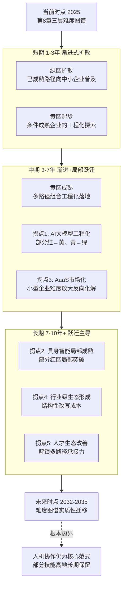

**演进路径的整体判断**：未来 5–10 年单件小批量离散制造自动化的演进，将呈现"**渐进式扩散为主、拐点式跃迁逐步显现**"的复合形态。短期内难度图谱的迁移主要靠绿区扩散与黄区起步实现，幅度有限但稳健；中期开始有 1–2 个拐点可能兑现，使部分红区子项推入黄区、部分黄区子项推入绿区；长期则可能见证多个拐点的协同兑现，对难度图谱产生结构性改写。

但即便所有拐点都按乐观预期兑现，**仍有相当比例的场景将长期保持人工主导**——这一根本边界的存在不是悲观判断，而是对该领域"人机协作而非完全无人化"核心范式的最终确认。这一判断将在 9.5 节得到更系统的展开。

## 9.3 企业层面的差异化战略建议

基于第 8 章三轴矩阵识别的企业类型差异与 9.2 节的演进路径，本节为不同类型企业提供差异化的战略建议。建议的核心逻辑是——**不同企业在三维条件、资源约束、组织能力上的差异，决定了其最适配的战略路径不同；统一的"标准答案"在该领域不存在，差异化才是务实的智慧**。本节将企业分为先行者、跟随者、观望者三类，每类建议涵盖路径选择、节奏控制、资源配置、风险防范、组织建设五个维度。

### 9.3.1 先行者：大型企业的中长期前沿布局

**类型特征**：具备资源与能力领先优势的大型企业（特别是龙头模具企业、大型重装企业、大型定制装备企业等），其特征包括：资金充裕可承担多路径并行投入；组织变革资源完善（专门的变革管理团队、信息化部门、人才发展部门）；人才结构相对完整；外部生态可获得性强（具行业话语权、政策支持深度参与）。在第 8 章 8.4 节中对应"低难度（相对）"的规模等级。

**战略建议**：

- **路径选择**：聚焦中长期前沿技术布局，特别是 9.1 节研判的五类前沿技术中**最具协同放大潜力**的组合——AI 大模型 + 数字孪生 + 工业互联网生态的协同布局。同时巩固已成熟路径在企业内部的全面部署，作为承接前沿应用的基础设施。

- **节奏控制**：采取"**三层节奏并行**"策略——短期完成已成熟路径的全面部署、中期推动工程化在途路径的工程化落地、长期布局前沿技术的探索性应用。三层节奏应有明确的资源比例分配，避免某一层节奏过度挤占其他层。

- **资源配置**：在企业整体研发投入中，应将相当比例的研发资源投入"**面向 5 年以上的前沿探索**"——这一比例需要一把手的战略定力支撑（参第 6 章 6.5 节）。同时，应建立专门的"创新中心"或"先进制造研究院"形态，承担前沿探索的组织载体。

- **风险防范**：先行者面临的最大风险是"前沿探索的不确定性"——投入与产出的时间错位、技术路线的不确定性、潜在拐点的延迟兑现。对此，应通过**多前沿同时布局**、**与外部研究机构深度合作**、**保留战略调整空间**等方式分散风险，避免单点押注。

- **组织建设**：先行者应承担**引领行业级共建生态**的责任——通过贡献核心案例库、参与标准制定、带头组建产业联盟等方式，为行业级共建生态的形成做出实质性贡献。这一角色不仅是公益责任，也是先行者锁定行业话语权与生态主导地位的战略抓手。

**关键时间节点**：

- 短期（1–3 年）：完成绿区路径全面部署，启动前沿技术的探索性投入；
- 中期（3–7 年）：推动黄区路径成熟落地，深化前沿技术的工程化探索，开始引领行业级生态建设；
- 长期（7 年以上）：在前沿技术工程化兑现时第一时间规模化部署，巩固行业生态主导地位。

### 9.3.2 跟随者：中型企业的多路径渐进推进

**类型特征**：具备一定规模与变革资源、但不足以独立攻坚前沿的中型企业，是单件小批量制造的主力。在第 8 章 8.4 节中对应"中难度"的规模等级，是矩阵"主战场"的主要落点。其特征包括：资金可承担有限规模的多路径组合；组织变革资源中等；人才结构存在缺口（特别是复合型人才）；外部生态依赖度高。

**战略建议**：

- **路径选择**：聚焦黄区场景的细致诊断与条件评估，**优先选择那些与企业自身订单结构、产品族特征、组织能力高度适配的路径**，避免追逐前沿热点。具体而言：

  - 若企业订单中有相对稳定的产品族，应优先布局**AI 辅助工业设计（产品族内）**——这一路径的杠杆效应（参第 7 章 7.5.3 节）对中型企业最为友好；
  - 若企业订单中有可托盘化的中小件比例较高，应优先部署 **FMC 柔性单元**——投入产出周期相对明确；
  - 若企业订单结构相对稳定且 IT 能力可支撑，应推进 **APS 智能排产** 的工程化部署——但需做好"持续打磨而非一次到位"的预期管理；
  - 协作机器人辅助应作为**几乎所有中型企业的"基础动作"**——投入门槛低、组织阻力小、效用直观。

- **节奏控制**：采取**"渐进式、可逆式"的多路径组合**策略——避免一次性叠加多条新路径，每一路径的部署应有明确的"试点—评估—扩展"闭环；预留充足的组织消化期；将不同路径的部署节奏错开，避免组织变革压力的叠加（参第 7 章 7.8.2 节组合风险分析）。

- **资源配置**：中型企业的资金有限决定了**聚焦优先级、单点做透再扩展**比"多点开花"更为务实。建议将自动化预算的相当比例投入"已被同类企业验证过的成熟路径"，将较小比例投入"探索性的前沿应用"——避免资金分散导致单点不足的风险。

- **风险防范**：跟随者面临的核心风险是"**适配性风险**"——盲目复制行业标杆案例而忽视自身条件差异。对此，应通过**深度的场景诊断**（参第 8 章 8.6 节四步诊断框架）、**与同行业同规模企业的交流互鉴**、**外部专业咨询**等方式，确保所选路径与自身条件适配。

- **组织建设**：跟随者最关键的组织建设任务是**复合型人才的培养与引进**（参第 6 章 6.2 节）。具体而言：

  - 内部培养：选拔具备工艺基础或数字化基础的中生代员工，通过项目实践、外部培训、跨岗位轮换等方式培养复合能力；
  - 外部引进：以核心岗位的高薪、股权激励、技术成长空间等方式吸引复合型人才加入；
  - 顾问协作：通过聘请外部资深顾问、与高校研究机构合作等方式，弥补内部人才结构的短板。

  与此同时，**文化与领导力的同步建设**至关重要——一把手的认知深度与战略定力、中层的执行力与变革领导力、整体组织的容错度与开放度都应作为长期建设议题。

**关键时间节点**：

- 短期（1–3 年）：完成绿区路径的扎实落地，启动 1–2 项黄区路径的试点；
- 中期（3–7 年）：扩展多路径组合的工程化应用，建立起企业层面的"自动化能力组合"；
- 长期（7 年以上）：选择性跟随大型企业的成熟前沿应用，借助 AaaS 模式与行业级生态扩展能力边界。

### 9.3.3 观望者：中小型企业的扎实落地与生态借力

**类型特征**：组织条件不成熟、资金极度有限的中小型企业（特别是小型传统企业、家族管理企业、位于偏远区域的企业等）。在第 8 章 8.4 节中对应"高难度"的规模等级。其特征包括：资金极度有限；组织变革资源稀缺（一把手即包办大部分决策）；人才结构单薄；外部生态依赖度高。

**战略建议**：

- **路径选择**：聚焦绿区基础路径的扎实落地，**避免在黄区与红区场景上消耗有限资源**。具体而言：

  - 优先完成 **CNC/五轴加工设备的合理配置**——这是最基础的设备层投入；
  - 部署 **基础 MES 信息化**——成本可控、管理价值显著；
  - 在条件允许时部署 **判据明确任务的 AI 视觉检测**与**协作机器人辅助上下料**——投入门槛相对低；
  - 推动**单元化生产**的组织变革——几乎不需要硬件投入，但管理收益显著。

  对于第 8 章红区场景，观望者**应坦然承认现阶段不可行，通过保留资深工人、加强师徒传承等方式维持生产能力**，等待第 7 章 7.8.3 节潜在拐点的成熟。

- **节奏控制**：采取**"边缘渐进、各步独立可逆"**的节奏——每一步投入都应是相对独立、可逆的，不应对企业整体现金流形成致命压力。避免因为追求快速见效而做出超出资金能力的激进投入。

- **资源配置**：将有限资金集中投入**最能维持生产能力、最能提升核心竞争力的环节**。同时，应**积极借助外部资源**——

  - 政府专项补贴：申请智能制造、技术改造等专项资金支持；
  - 设备融资租赁：通过租赁方式获得高端设备的使用权而无需一次性购置；
  - AaaS 服务：在 AaaS 模式成熟时，优先采用按使用付费的方式获取自动化能力；
  - 行业级共建生态：参与行业级共建项目，以"贡献+共享"的方式获得超出自身规模的能力。

- **风险防范**：观望者面临的核心风险是"**生存风险**"——人才断层带来的生产能力衰退、订单流失带来的现金流断裂、技术更替带来的核心竞争力丧失。对此，应通过**保住核心订单与核心客户**、**维持核心工匠的稳定性**、**保留产品质量优势**等基础动作维持生存空间，为未来的转型积累条件。

- **组织建设**：观望者的组织建设应聚焦于**保住核心人才与核心能力**。具体而言：

  - 通过待遇改善、技能等级评定、社会身份提升等方式挽留资深工匠；
  - 通过师徒传承制度化、技能数字化记录等方式延缓核心知识的流失；
  - 一把手应深入了解行业前沿动态，为企业的中长期方向选择保留判断力；
  - 与同区域、同行业的企业建立合作关系，为可能的协作生态做好准备。

**关键时间节点**：

- 短期（1–3 年）：完成基础设备升级与基础信息化部署，保住核心生产能力；
- 中期（3–7 年）：借助 AaaS 模式与行业级生态扩展能力边界，完成局部黄区路径的试点；
- 长期（7 年以上）：在生态成熟时实现"借力跨越"，完成从观望者向跟随者的转型。

### 9.3.4 三类企业战略建议的对照与总结

将三类企业的战略建议核心要素凝练为下表：

| 维度 | 先行者（大型） | 跟随者（中型） | 观望者（中小型） |
|------|---------------|---------------|-----------------|
| 路径选择 | 中长期前沿布局 + 已成熟路径全面部署 | 黄区适配路径 + 协作机器人基础动作 | 绿区基础路径 + 借助外部资源 |
| 节奏控制 | 三层节奏并行 | 渐进式、可逆式、错开节奏 | 边缘渐进、各步独立可逆 |
| 资源配置 | 多前沿同时布局 + 引领生态 | 聚焦优先级、单点做透 | 集中保核心 + 借力外部 |
| 风险防范 | 多技术路线分散押注 | 深度场景诊断防适配错配 | 保住生存底线 + 等待拐点 |
| 组织建设 | 创新中心 + 生态主导 | 复合型人才 + 文化领导力 | 核心人才稳定 + 知识传承 |
| 短期重点 | 绿区全面 + 前沿启动 | 绿区扎实 + 黄区试点 | 绿区基础 + 保住核心 |
| 中期重点 | 黄区落地 + 前沿深化 | 多路径组合扩展 | 借助生态扩展 |
| 长期重点 | 拐点兑现时规模化 + 生态主导 | 选择性跟随大型企业 | 借力跨越向跟随者转型 |

三类企业战略的共同原则可凝练为：**承认差异、量力而行、循序渐进、以人为本**。**承认差异**意味着拒绝"标准答案"的诱惑；**量力而行**意味着资源配置必须与自身条件匹配；**循序渐进**意味着接受这是一场马拉松而非短跑；**以人为本**意味着始终将人机协作作为核心范式。这四条原则贯穿于所有差异化建议之中，构成本研究对企业战略层面的核心智慧。

## 9.4 政策与教育人才生态的支撑建议

企业层面的战略选择不能孤立成立——它依赖于更大的生态系统的支撑。承接第 6 章关于人才断层与教育体系错配、第 7 章关于行业级共建生态与 AaaS 模式的论述，本节为政策制定者与教育人才培养机构提供生态层面的支撑建议。

### 9.4.1 政策层面的四大方向

**方向一：差异化补贴与税收激励引导中小企业自动化投入**。承接第 5 章 5.5 节"投资犹豫陷阱"分析，**单件小批量制造的中小企业并非看不到自动化价值，而是承担不起传统范式下的成本与风险**。政策的核心抓手应是降低中小企业的投入门槛与风险敞口：

- 针对绿区路径的部署提供**直接补贴**或**税收抵扣**，特别是 CNC 升级、基础 MES 部署、协作机器人引入等"打底"投入；
- 针对黄区路径的探索提供**项目专项支持**，特别是 APS 部署、AI 视觉部署、数字孪生应用等需要持续打磨的项目；
- 设立**自动化转型失败补偿机制**或**项目风险保险**，为中小企业的探索性投入提供风险缓冲——这一机制对降低组织维度的"投资犹豫"具有独特价值。

**方向二：行业级共建生态的政策推动**。第 7 章 7.8.3 节将"行业级共建生态形成"识别为最具变革性的潜在拐点之一，但这一拐点的形成依赖于多方协同——单凭市场力量难以自发达成，政策的协调推动至关重要：

- 推动**行业协会牵头组建工艺数据库共建联盟**，明确共建机制、贡献奖励、共享规则；
- 资助**行业标准建设**，特别是零点定位接口、柔性夹具元件库、工艺数据交换等基础标准；
- 通过**专项基金**资助跨企业协同制造平台、共享柔性单元等基础设施建设；
- 鼓励**龙头企业承担生态主导责任**，通过税收优惠、采购倾斜等方式给予激励。

**方向三：AaaS 与服务化模式的市场培育**。AaaS 模式（自动化即服务）的成熟将直接化解第 5 章规模经济失效的部分约束，特别是对小型企业意义深远。政策应在市场化进程的早期发挥培育作用：

- 推动**AaaS 商业模式标准化**——明确租赁合约、按使用付费、运维责任划分等关键要素的行业规范；
- 鼓励**装备制造商**从"设备销售"向"设备服务"模式转型，提供财税激励；
- 推动**金融创新**——发展支持 AaaS 模式的融资工具（如设备运营资产证券化、按使用付费的信贷产品等）；
- 培育**专业 AaaS 运营商**生态，使其在区域内形成规模化服务能力。

**方向四：专项扶持中小企业的中长期低息融资渠道**。承接第 5 章 5.5 节中小企业资金现实分析——融资渠道受限、订单波动现金流不稳是其核心约束。政策应针对这些约束设计专项工具：

- 设立**单件小批量制造专项产业基金**，提供中长期、低成本资金支持；
- 推动**银行业在该领域的特色信贷产品**——基于订单、设备、知识产权等多元抵质押的中长期贷款；
- 探索**应收账款融资创新**，缓解订单波动期的现金流压力；
- 对**自动化转型贷款给予贴息**，进一步降低融资成本。

### 9.4.2 教育人才培养层面的三大方向

**方向一：产教融合与现代学徒制的实质化推进**。承接第 6 章 6.4 节关于职业教育三重错配的剖析——**培养目标错配、培养方式错配、社会评价错配**——产教融合是最契合隐性知识形成机制的改革路径，但实质化推进面临配套机制的复杂性。政策与教育机构应共同发力：

- 建立**实质化的双师机制**——企业资深技师与院校教师真正共同承担教学，明确各自职责、考核标准、激励安排；
- 完善**学徒在企业的劳动权益保护**与**企业接收学徒的成本分担机制**，使产教融合具有可持续性；
- 推动**教学内容深度对接真实生产场景**——将企业真实的工艺案例、异常处置、调试经验等纳入教学体系；
- 在**评价体系上重视实践能力**——降低对纸面考试的依赖，强化对真实任务完成质量的评价。

**方向二：复合型人才（工艺+数字化+AI）培养体系的系统建设**。承接第 6 章 6.2 节关于复合型人才稀缺的分析——这是单件小批量自动化方案落地的关键约束。复合型人才培养是一项系统工程：

- 在**职业教育与高等教育中设置智能制造、工业互联网、工业 AI 等复合型专业**，覆盖工艺基础、数字化工具、AI 应用、机器人技术等多领域；
- 推动**师资队伍的复合化**——既懂传统工艺又懂前沿技术的教师本身就稀缺，需要通过引进、培训、企业挂职等方式建设；
- 加大**实训设备投入**——智能制造类专业需要 CNC、机器人、视觉系统、工业软件等高昂硬件配置，政府专项资金应予以支持；
- 鼓励**高校-企业联合培养**——硕博士培养中纳入企业真实问题作为研究课题，使学术研究与产业需求形成闭环；
- 推动**国际合作交流**——与制造业先进国家的教育机构、企业建立人才培养合作机制。

**方向三：在职技工的技能升级与转型培训**。承接第 6 章 6.3 节传承困境分析——既有员工的技能升级是过渡期的关键议题，避免"老员工被淘汰、新员工不到位"的双重缺位：

- 建立**面向在职技工的中长期技能升级培训体系**，覆盖数字化工具应用、协作机器人操作、AI 视觉系统运维等新技能；
- 完善**技能等级评定与薪酬挂钩机制**——"新八级工"等政策应在更多行业、更多区域得到落实，提升技工的物质激励与社会身份；
- 设立**专项培训补贴**——对企业组织的在职培训给予直接补贴，降低企业培训成本；
- 推动**技能升级的认证与互认**——使技工的技能升级具有可携带的市场价值，激励个体投入。

### 9.4.3 政策与教育举措的见效时间窗口与现实挑战

需要审慎指出的是，政策与教育层面的举措**普遍具有长见效周期与高执行复杂度**：

**见效时间窗口**：

- 政策类（补贴、税收、融资）：见效相对较快，1–3 年内可观察到对企业行为的影响；
- 生态类（行业级共建、AaaS 模式）：见效需要 3–7 年，依赖市场化主体的响应与多方协同；
- 教育类（产教融合、复合型人才、技能升级）：见效最慢，5–10 年以上才能看到对人才生态的实质性改善。

**现实挑战**：

- 政策与市场的**责任边界**——补贴过多可能扭曲市场机制，过少则无法形成有效激励；
- 多部门协同的**协调成本**——政策涉及工信、教育、人社、财税、金融等多部门，协调难度大；
- 落地执行的**因地制宜**——不同行业、不同区域的具体条件差异大，"一刀切"政策容易失效；
- 短期效果与长期效果的**平衡**——长期建设的真实价值常常在短期 KPI 中难以体现，存在被忽视的风险。

承认这些挑战不是消极态度，而是对生态层面建设复杂性的清醒认识——正因为复杂，才更需要多方主体的耐心协同与战略定力。**政策与教育的支撑作用与企业层面的战略选择应形成协同——任何一方的缺位都会使整体进程受阻**。

## 9.5 对"难度有多大"核心命题的终极回答

经过九章的层层论证，本研究终于走到对核心命题给出**终极回答**的时刻。本节作为全文收束节点，对"单件小批量离散制造自动化难度有多大"这一研究问题，从"当前难度有多大""难度可被降低多少、何时降低""难度的根本边界在哪里"三个层次给出综合性回答，并回扣全文论证主线，使本研究形成完整闭环。

### 9.5.1 当前难度有多大：三层分布的清晰图谱

基于第 8 章 8.7 节的难度图谱，**当前时点**的难度分布呈现如下结构：

**约三分之一的场景已可规模化推进（绿区）**——这些场景集中在中段加工执行（CNC/五轴）、判据明确的标准化任务（AI 视觉检测、单元化生产、基础 MES）、特定行业的辅助任务（协作机器人在轻型定制、可托盘化件场景）、产品族稳定的设计前置（AI 辅助模具设计在产品族内）。这一类场景的推进瓶颈已不在技术或经济本身，而在中小企业的资金、组织、人才能力的同步建设。

**约三分之一的场景在条件支撑下可行（黄区）**——这些场景包括 APS 智能排产（订单稳定场景）、可托盘化件 FMC、数字孪生（高调试成本场景）、柔性夹具与零点定位、工业互联网平台基础部署、AI 辅助工艺规划（产品族层面）等。这一类场景是企业战略决策的"主战场"——能否正确诊断自身条件、选择适配路径、配置必要支撑，直接决定转型成败。

**约三分之一的场景在 5 年内难以突破（红区）**——这些场景集中在隐性知识深度依赖的技能高地（手工修配/FIT、火工矫形）、ETO 模式下的非结构化工艺生成、复杂多模态情境判断与异常诊断、超大超重工件的装夹自动化、多物理场耦合的复杂调试等。这一类场景的化解依赖于范式级的技术演进、商业模式创新、组织与人才生态改善的协同。

更进一步，**当前难度的本质不是"技术尚未到位"，而是"柔性—自动化"在范式层面的根本张力（第 4 章 4.8 节）、规模经济失效的数学必然（第 5 章 5.2 节）、推力与障碍同源的组织悖论（第 6 章 6.6 节）三者并存的结构性产物**——这是本研究所揭示的最深刻的事实。

### 9.5.2 难度可被降低多少、何时降低：抓手与时间窗口

基于 9.1–9.2 节的前沿技术研判与拐点预测，未来 5–10 年难度图谱可能发生的迁移呈现如下方向：

**短期（1–3 年）**：迁移幅度有限——绿区扩散到更多中小企业、黄区在条件适配企业中起步落地。这一阶段的关键抓手是**应用扩展速度**——技术供给已就绪，瓶颈在中小企业的承接能力与组织能力。

**中期（3–7 年）**：迁移幅度显著——AI 大模型工程化（拐点一）与 AaaS 模式市场化（拐点三）有望兑现，将多个黄区子项推入绿区、部分红区子项推入黄区。这一阶段的关键抓手是**多路径协同集成**与**生态借力**——单点路径的成熟需要被组合起来形成系统能力，企业需借助 AaaS 与行业生态扩展自身能力边界。

**长期（7 年以上）**：迁移幅度可能呈现结构性改写——具身智能局部成熟（拐点二）、行业级共建生态形成（拐点四）、教育与人才生态改善（拐点五）的协同兑现，将对难度图谱产生深刻改变。部分技能高地可能实现局部自动化突破，整体成本结构可能因生态共担而改写，复合型人才约束可能得到缓解。

**难度可被有效降低的关键抓手**可凝练为以下五个层次：

- **企业层面**：扎实推进绿区路径的规模化部署、深化黄区路径的工程化落地、布局拐点兑现时的快速响应能力；
- **路径层面**：以人机协作为核心范式（参第 7 章 7.6 节）、以多路径组合为现实形态、以渐进迭代为推进节奏；
- **技术层面**：推动 AI 大模型、生成式设计、具身智能、数字孪生、工业互联网五类前沿技术的协同演进；
- **生态层面**：培育 AaaS 模式与行业级共建生态，以"成本共担、知识共享"重塑成本结构；
- **政策与人才层面**：以差异化政策支持中小企业、以产教融合改善人才生态、以系统建设培养复合型人才。

**对应的时间窗口**：短期窗口的抓手在企业与路径层面，中期窗口的抓手在技术与生态层面，长期窗口的抓手在政策与人才层面——三层抓手在不同时间窗口上叠加，构成难度降低的完整时空图谱。

### 9.5.3 难度的根本边界在哪里：人机协作的最终确认

但本研究必须审慎指出——**即便所有拐点都按预期成熟，仍有相当比例的场景将长期保持人工主导地位**。这一根本边界的存在不是悲观判断，而是对该领域核心范式的最终确认。

具体而言，以下场景在 10 年时间窗口乃至更长时间内，**预计仍将以人工或人机协作为主导**：

- **极致隐性知识依赖的技能高地**：模具 FIT 中的最终修配判断、机床导轨刮研的微米级手感、艺术性表面处理的"高级感"判断——这些环节的本质是对人类身体感知与综合判断的极致调用，具身智能在此可提供局部辅助，但难以完全替代；

- **火工矫形等"知识规则化未建立"的工艺**：连显式工艺规则都尚未建立的环节，自动化的前置条件根本不具备，其改善更可能呈现"工艺辅助监测+人工决策"的形态而非"无人化"；

- **超大超重工件的物理边界场景**：重型机械的数十吨级工件、船舶的大型分段——其物理尺度与工艺特性使自动化的物理可行性本身就受限，依赖具身智能或 AI 算法都难以突破；

- **低频高代价的异常兜底**：单件小批量场景下"几乎每件都包含异常成分"的现实，使人作为"异常兜底者"具有不可替代的价值——这一价值不会被技术演进所消除；

- **创新性工艺方案的人类主导**：真正的工艺创新、跨产品族的原创设计、面对前所未有问题的方案构思，仍然依赖人类的创造性思维与跨情境推理能力。

这一根本边界的存在确认了一个深刻判断：**单件小批量离散制造的自动化未来，不是"无人化的乌托邦"，而是"高效协作的现实"——机器深度参与、人决策主导、整体能力跃升**。这一愿景不亚于无人化的吸引力——它代表着该领域真正的可能性，也代表着对"人的价值"在工业体系中应有位置的最终确认。

### 9.5.4 全文论证主线的回扣与本研究的智识贡献

至此，本研究完成了从对象界定（第 1 章）、机制解构（第 2 章）、现状盘点（第 3 章）、多维归因（第 4–6 章）、路径评估（第 7 章）、综合判断（第 8 章）到趋势研判与战略启示（第 9 章）的完整闭环。回扣全文论证主线，可凝练出贯穿九章的核心洞察：

**洞察一：从技能依赖到智能跃迁的鸿沟，本质上是结构性的而非局部的**——它由柔性—自动化范式张力（第 4 章）、规模经济失效（第 5 章）、组织悖论（第 6 章）三重结构共同主导，任何单点突破都无法根本化解。

**洞察二：自动化在该领域呈现"中段稳、两端难"的渗透格局**——前段决策与末段精修的"两端"是技能高地的集中分布，而非偶然的工程缺口；这一格局直接来自第 2 章人工不可替代性五重根源在不同环节上的差异化分布。

**洞察三：人机协作而非完全无人化，是该领域的核心范式**——这一范式不是退而求其次的妥协，而是基于对该领域三维难度真实图景的深刻理解所提出的最契合现实的战略选择。

**洞察四：难度图谱具有动态属性，其化解依赖于技术演进、商业创新、组织变革的长期协同**——任何寄希望于单一变量突破的预期都将落空，多方协同与战略耐心是难度降低的真正密码。

**洞察五：差异化战略而非统一标准，是企业层面的务实智慧**——先行者、跟随者、观望者三类企业在路径选择、节奏控制、资源配置上必须各有侧重；统一的"标准答案"在该领域不存在。

本研究的智识贡献，在于将一个常被简化为"难"或"不难"的命题，**还原为一个由生产环节、行业类型、企业规模、时间窗口共同定义的多维度难度图谱**——这一图谱不仅回答了"难度有多大"，更指出了"难度从何而来""难度可被降低多少""难度如何被降低"等一系列后续命题。它既不滑入"AI 即将取代一切"的技术乌托邦，也不陷入"自动化无路可走"的悲观论；它以审慎的辩证视角，对该领域的真实挑战与真实可能性给出了诚实的描绘。

**最后的话**。单件小批量离散制造——那些重型机械的厂房、模具车间的钳工台、航天器件的精密加工现场、船坞中的大型分段——是制造业极为庞大却长期被自动化浪潮"绕开"的一类生产形态。它们承载着工业文明的复杂性、个性化、创造性，也承载着无数资深技工数十年沉淀的隐性智慧。本研究无意为这一领域的自动化进程描绘乐观的速胜图景——但同样无意为其涂抹悲观的色彩。**我们看到的真相是：这是一场马拉松而非短跑，是多方协同而非单点突破，是人机协作而非无人化，是渐进演进伴随拐点跃迁的复合形态**。在这一真相之上，每一类企业、每一类参与者都能找到自己的位置与抓手——这正是本研究希望为读者留下的最终洞察。难度真实存在，但路径同样真实存在；时间窗口紧迫，但选择空间仍然宽广。**对该领域的真正态度，不是焦虑，也不是放弃，而是清醒地理解、审慎地选择、耐心地推进**——这正是单件小批量离散制造自动化转型最需要的智慧。

# 参考内容如下：
