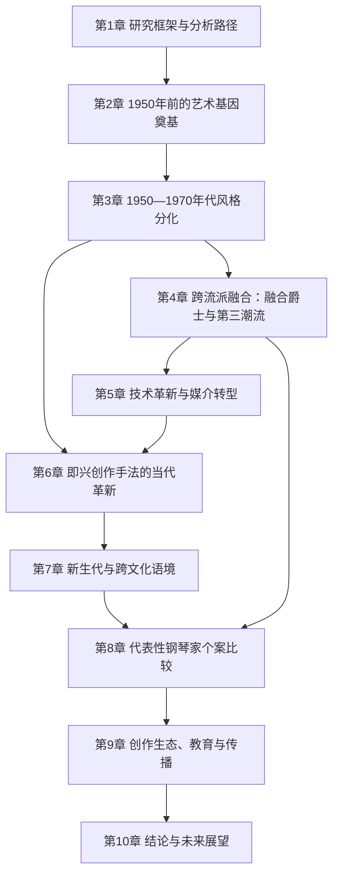
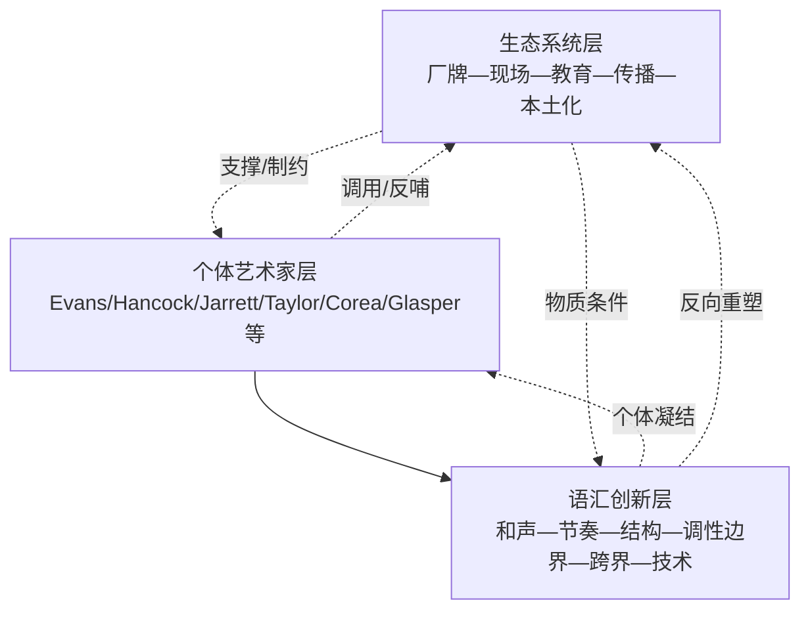
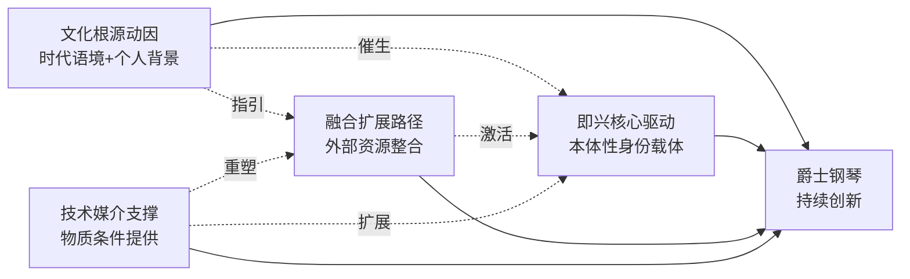

# 爵士钢琴在现代音乐创作中的创新与风格演变研究
# 1 研究框架与分析路径

爵士钢琴自20世纪初从拉格泰姆与早期布鲁斯的土壤中萌芽以来，已逾百年。它既是爵士乐这一被誉为"美国古典音乐"的艺术形式的核心载体，又是一件具有独立审美价值的现代键盘艺术。进入1950年代以后，伴随比波普革命的余响、社会文化结构的剧变与录音—电声—数字技术的相继冲击，爵士钢琴在演奏语汇、和声体系、节奏思维、乐队互动模式与跨文化对话路径上经历了远比此前更为剧烈、更具方向多元性的变革。然而，审视当前学界既有成果，关于爵士钢琴的研究仍以个案曲目剖析、单一钢琴家传记叙述与单条流派纵向梳理为主，对1950年以来爵士钢琴在**风格演变—跨流派融合—技术革新—即兴创新**这四个维度上的整体规律性把握、跨流派系统比较以及对当代新生代与非西方语境的关注均显不足。本章作为全文的方法论奠基，旨在界定研究对象的艺术属性与时间边界，提出四维交织的分析视角，识别既有研究的薄弱环节，并构建一个由音乐本体、文化语境、技术媒介与演奏家个案四层构成的复合分析框架，为后续九章的展开确立逻辑起点与分析工具。

## 1.1 研究对象的艺术定位与时间边界

爵士钢琴作为研究对象的特殊性，源于其在爵士乐艺术系统中所承担的**三重复合身份**：其一，作为独奏乐器，它具备完整呈现旋律、和声与节奏的能力，可独立承载即兴的全部维度，从Art Tatum的炫技独奏到Keith Jarrett的科隆音乐会式纯即兴长篇都是这一身份的极致体现；其二，作为合奏核心，它在三重奏、五重奏乃至大乐队编制中承担和声铺陈、节奏推进与对话引导的枢纽功能，例如Horace Silver在其著名的硬波普五重奏中，钢琴既是节奏组的支柱，也是与管乐手呼应的"第二旋律层"[^1][^2]；其三，作为作曲媒介，它是众多爵士作曲家构思曲式、和声进行与音乐形象的首要工具，从George Gershwin将《Summertime》改编为爵士钢琴版本的语汇试验[^3]，到Bill Evans、Herbie Hancock在键盘上完成的一系列结构性创作，钢琴始终是爵士作曲思维的核心载体。这三重身份的叠加，使爵士钢琴成为透视整个爵士艺术演进逻辑的最佳切片，同时也意味着对其研究必须兼顾**演奏—合奏—作曲**三个层次的分析。

在时间边界上，本研究将1950年确立为核心分水岭，其依据具有充分的艺术史合理性。1940年代后期，比波普革命由Bud Powell等人将钢琴的角色从"摇摆乐式的节奏与块状和声铺陈"转向"管乐化的右手单线条即兴+左手简练点状和声"，这一范式转换为1950年以后的所有现代风格分支提供了语法母本。1950年代起，酷派爵士、硬波普、调式爵士相继涌现，1960年代自由爵士与后波普进一步打开了和声—节奏的边界，1970年代融合爵士与第三潮流又将爵士钢琴推入电声化与跨界化的新阶段，此后直至21世纪的新生代实践，爵士钢琴的每一次重大美学突破几乎均发生在1950年以后这条时间轴上。需要强调的是，将分水岭定在1950年并非否认1950年前传统的研究价值——拉格泰姆的左手跨步逻辑、Tatum的和声替代技法、Ellington的乐队思维等仍是后续创新所依赖的"母体"——而是为了在有限的研究篇幅内**聚焦于现代爵士钢琴美学范式的成型与扩散过程**，并以早期传统作为参照系，揭示创新与继承之间的辩证关系。这一时间策略与本报告核心议题——"爵士钢琴在现代音乐创作中的创新与风格演变"——的内在逻辑高度契合。

## 1.2 四维研究视角的提出与内在关联

围绕"创新与风格演变"这一核心问题，本研究提出**演奏技法—风格演变—跨界融合—技术革新**四维交织的分析视角。这四个维度并非平行罗列，而是在爵士钢琴艺术演进中相互嵌套、彼此驱动的耦合系统。

**演奏技法维度**是本体性的、最贴近声音表层的维度，关注摇摆节奏的微观处理、和声织体的纵向构建、即兴语汇的横向展开、踏板与触键逻辑等具体演奏要素。例如，在格什温《Summertime》的爵士钢琴改编中，研究者重点剖析了摇摆节奏、大跨度音程、倚音与震音的执行以及踏板使用逻辑，正是因为这些技法细节直接构成了爵士钢琴独特音响的"指纹"[^3]。

**风格演变维度**追踪从比波普向酷派、硬波普、调式、自由爵士、后波普、融合爵士再到当代新生代的范式更迭，关注每一阶段在和声体系（功能和声—调式—四度叠置—非功能和声—多调性）、节奏处理（摇摆—放克—复合节拍—J Dilla律动）与乐队互动结构（独奏者与节奏组层级—三重奏对话—自由互动）上的根本性转变。

**跨界融合维度**考察爵士钢琴与古典音乐（第三潮流）、摇滚与放克（融合爵士）、流行—嘻哈—R&B（新生代）、世界音乐与拉丁、亚洲、东欧、中东等本土传统之间的双向流动。任宇清作为中国爵士品牌JZ Music的创办人，曾明确指出"爵士音乐不仅只是一种音乐，它是整个现代音乐的基础，从这个底层逻辑上来讲，有越多的音乐人……来'玩好'爵士音乐，对于中国未来在世界现代音乐界地位的提升，从技术上提供了保证"[^4]，这一表述从从业者视角印证了爵士钢琴作为跨界融合枢纽的当代意义。

**技术革新维度**则审视录音技术、电钢琴与合成器、效果器与采样、数字音频工作站乃至人工智能算法作曲对爵士钢琴创作生态的重塑。从1956年Lejaren Hiller研究室诞生的世界首部完全由计算机生成的弦乐四重奏《伊利亚克组曲》[^5]，到2016年Sony CSL的DeepBach、Google的Magenta以及2018年AIVA发布以中国神话为主题的专辑《艾娲》[^5]，技术媒介对包括爵士钢琴在内的现代音乐创作的介入已不可忽视。

四个维度之间存在显著的耦合机制：技术革新（如电钢琴Rhodes的引入）会直接改变演奏技法（触键与音色控制）并催生新的风格分支（融合爵士），而风格演变又会反向重塑跨界融合的方向与策略——这种相互嵌套的关系决定了本研究必须以四维联动而非单一线性的方式展开分析。

## 1.3 现有研究的不足与问题域聚焦

基于对既有研究文献与资料的考察，可识别出当前爵士钢琴研究在三方面较为突出的局限。

**第一，个案研究丰富，跨流派系统比较薄弱**。现有中文学界对爵士钢琴的研究往往聚焦于单一作品或单一作曲家，例如关于格什温《Summertime》爵士钢琴改编曲的演奏分析已形成包含创作背景、结构调性、和声织体与具体演奏技法（摇摆节奏、大跨度、倚音震音、踏板逻辑）的较成熟研究范式[^3]，关于Keith Jarrett《科隆音乐会》（The Köln Concert）的讨论也主要围绕这一标志性现场的偶发性背景与即兴美学展开[^1]，关于Horace Silver《Song for My Father》（1964年录制、1965年由Blue Note发行）的研究则集中于该曲在硬波普谱系中的代表性、其Bossa Nova灵感来源与对Steely Dan《Rikki Don't Lose That Number》开篇的影响[^1][^2]。这些个案研究为细部理解提供了基础，但**缺乏将不同钢琴家、不同流派、不同时代置于同一比较框架内的系统性研究**，难以揭示爵士钢琴创新背后的共性逻辑。

**第二，对新生代与非西方语境关注不足**。爵士钢琴在21世纪的版图远比传统叙事中的"美国—欧洲"二元结构复杂。以中国为例，由任宇清创办的爵士上海音乐节（JZ Festival）自2005年首届仅约1500人参与，到2025年第21届预计在浦东前滩区域吸引来自20个国家与地区的300余位音乐家、举办120余场音乐会、吸引多达60万观众[^2][^4]，已成为中国第一大、亚洲第二大爵士节[^4]；JZ Music旗下还包括2003年创办的JZ Club、2004年创办的JZ School（与音乐节创办年份在不同来源中略有出入，部分资料记为2004年创办JZ Festival与2005年创办JZ School，本研究采信官方表述以2005年为爵士上海音乐节首届[^2][^4]）等业务板块，构建出从俱乐部、教育机构到音乐节的完整爵士生态[^4]。然而，针对此类非西方本土化爵士生态对爵士钢琴艺术的具体影响、对青年钢琴家培养路径的塑造以及与全球爵士对话中的独特贡献，尚缺乏系统的学术化考察。

**第三，对技术介入特别是AI时代的理论回应滞后**。AI作曲（亦称"算法作曲"）虽不直接等同于爵士钢琴创新，但其对包括即兴在内的音乐创作核心机制的冲击，已无法回避。从1956年《伊利亚克组曲》[^5]到Sony CSL的DeepBach（基于巴赫352部作品训练，最终生成2503首赞美诗）、Google的Magenta神经网络钢琴曲、Sony Flow Machines的披头士风格作品《Daddy's Car》、AIVA基于15000首古典作品训练并通过法国与卢森堡作曲家协会SACEM注册成为首位非人类会员，再到2020年Space150以神经网络与Deepfake技术克隆Travis Scott推出"Travis Bott"及单曲《Jack Park Canny Dope Man》[^5]，AI在音乐生成上的能力快速演进，并已引发关于"人工智能生成内容是否具有可版权性及其权利归属"的持续法学争议[^1]。这些技术发展虽以古典与流行为主要试验场，但其对爵士钢琴最为珍视的"即兴现场性"与"个人触键风格"构成的潜在挑战，正是本研究第10章需要直面回应的问题之一。

基于上述局限，本研究将核心问题群聚焦为以下四问：(1) 1950年以来爵士钢琴在风格演变维度上经历了怎样的范式更迭，其内在逻辑何在？(2) 跨流派融合（与古典、摇滚、放克、嘻哈、世界音乐）以何种技法路径与艺术理念重塑爵士钢琴语汇？(3) 电声化、数字化与AI等技术媒介如何作为"第二乐器"扩展爵士钢琴的表现边界？(4) 在多元文化语境与新生代实践中，爵士钢琴的即兴作为艺术核心驱动力呈现出何种延展性？

## 1.4 多层次分析框架的构建

为系统回应上述问题群，本研究构建一个由**音乐本体—文化语境—技术媒介—演奏家个案**四层构成的复合分析框架。四层之间的关系不是层级递进，而是相互嵌入、协同运作。下表概括了各层的核心方法、主要分析对象与典型问题。

| 分析层级 | 核心方法 | 主要分析对象 | 典型问题 |
|---------|---------|------------|---------|
| 音乐本体层 | 和声、节奏、织体、曲式与即兴语汇分析 | 摇摆与非摇摆律动、四度叠置、非功能和声、调式即兴、节奏置换、复合节拍、长线条即兴 | 创新在声音层面以何种语法呈现？ |
| 文化语境层 | 历史社会学、文化传播与全球化研究 | 民权运动、嬉皮文化、全球化、流媒体时代、本土爵士生态（如JZ Festival） | 风格变革与外部文化语境如何互动？ |
| 技术媒介层 | 音乐技术史、媒介研究、人机交互理论 | 电钢琴Rhodes/Wurlitzer、合成器、MIDI、效果器、Loop、DAW、AI算法 | 技术如何重塑创作流程与音色生态？ |
| 演奏家个案层 | 传记研究、风格分析、代表作深描 | Bill Evans、Herbie Hancock、Keith Jarrett、Cecil Taylor、Chick Corea、Robert Glasper、Hiromi、Tigran等 | 个体艺术家如何凝结上述三层于其个人语言？ |

具体而言，**音乐本体层**借鉴音乐学的本体分析方法，对和声进行（如调式爵士的"减少功能性"和声、Hancock式非功能和声）、节奏处理（如硬波普中Bossa Nova与funk的混合律动[^2]）、织体构建（如Evans三重奏的对位化对话）与曲式结构进行细部剖析；**文化语境层**关注每一次风格变革背后的社会文化条件，例如硬波普与1950年代非裔美国人福音传统的回归、自由爵士与1960年代民权运动的呼应、当代爵士与全球化都市文化的耦合，以及JZ Festival所代表的中国本土爵士生态如何反映"上海人爱听爵士、喝咖啡"的城市文化基底[^4]；**技术媒介层**审视从模拟录音到数字流媒体、从原声钢琴到电钢琴与合成器、从演奏现场到算法生成等媒介转型对爵士钢琴的塑形作用，特别关注技术作为"第二乐器"的双重性——既扩展可能性，也可能稀释爵士钢琴最核心的人文触键质感；**演奏家个案层**则将前三层凝结于具体艺术家身上，通过对若干代表性钢琴家的纵深个案比较，提炼共性逻辑与差异化策略。

四层框架的协同运作可由下述简化关系图直观呈现：

该图揭示的关键机制是：文化语境为本体语言提供创新动因，技术媒介为本体语言提供新的工具与边界，而演奏家个案则是这三股力量交汇并凝结为具体艺术语言的"汇聚点"，最终共同推动爵士钢琴的创新与风格演变。后续各章将在不同主题中以不同侧重激活这一框架——例如第3章侧重"音乐本体+文化语境"，第5章侧重"技术媒介+音乐本体"，第7章侧重"文化语境+演奏家个案"，第8章则集中于"演奏家个案"层的横向比较。

## 1.5 研究方法、资料基础与章节逻辑

在方法论上，本研究综合运用四类研究方法。**文献研究法**用于梳理爵士史论著作、专业乐评、学术论文与权威工具书所构筑的研究基础，其中Oxford Grove Music Online所收录的《The New Grove Dictionary of Jazz》（第2版）等权威条目提供了爵士钢琴史的基础事实坐标[^6]；**音乐学分析法**针对代表性专辑与演奏视频开展乐谱分析与录音比对，例如对《Summertime》爵士钢琴改编曲在结构调性、和声织体与具体演奏技法层面的细读[^3]，对《Song for My Father》中Horace Silver如何将原本意图写成Bossa Nova最终却呈现出"funky十足的硬波普"独特律动的分析[^2]，以及对《The Köln Concert》在不合手钢琴条件下的即兴策略与挫折—创造力机制的考察[^1]；**风格比较法**用于在不同钢琴家、不同流派与不同代际之间建立横向比较框架；**个案研究法**则围绕若干典型钢琴家进行纵深描写。

资料基础上，本研究依托四类资源：(1) 爵士史论与音乐学专著及学术论文；(2) 权威音乐数据库，特别是Grove Music Online，该数据库汇集《The New Grove Dictionary of Music and Musicians》（第2版）、《The New Grove Dictionary of Opera》、《The New Grove Dictionary of Jazz》（第2版）等全文，收录从巴赫到当代音乐家的逾5.2万篇文章，并持续更新[^6]；(3) 代表性专辑录音与现场视频，如Blue Note等厂牌发行的爵士钢琴经典名盘[^1][^2]；(4) 演奏家访谈与从业者表述，如对任宇清关于中国爵士生态发展的多次专访所提供的一线视角[^4]。需要坦诚说明的是，本研究受可获取资料的限制，对部分非西方钢琴家与最前沿AI爵士钢琴实验的实证细节仍有深化空间，相应章节将在论述中如实标识资料局限。

在章节逻辑上，全文以"历史脉络—风格分化—跨界融合—技术革新—即兴革新—新生代与跨文化—个案比较—生态系统—结论展望"为主线，其内在递进关系如下：

该逻辑链条体现了本研究的双重叙事策略：一方面以时间为骨架（第2章奠基→第3章分化→第4章融合→第7章新生代），呈现爵士钢琴的纵向演变；另一方面以主题为肌理（第5章技术、第6章即兴、第8章个案、第9章生态），从不同切面揭示创新机制。第1章作为方法论奠基章，**为后续所有章节提供共享的概念语言（四维视角）、共享的分析工具（四层框架）与共享的问题意识（创新与风格演变）**，确保全文在论述的丰富性与逻辑的统一性之间取得平衡。后续第2章将正式进入历史脉络，从1950年前的艺术基因奠基开始，回答现代爵士钢琴的创新究竟是在怎样的传统母体上萌生这一前置性问题。

# 2 爵士钢琴的艺术基因与1950年前的风格奠基

第1章已经将研究的时间分水岭界定在1950年，并明确这一选择并非否认1950年前传统的研究价值，而是为了在有限篇幅内聚焦现代爵士钢琴美学范式的成型与扩散。然而，要真正理解1950年以后酷派、硬波普、调式、自由、融合等多元分支为何"以那种方式"突破或反叛传统，就必须首先澄清"传统"本身究竟由哪些艺术基因构成。本章作为全文历史脉络的起点，聚焦于五个紧密相连的奠基阶段——拉格泰姆、跨步钢琴（Stride）、布吉伍吉（Boogie-Woogie）、摇摆时代以及1940年代后期的早期比波普——通过对Scott Joplin、James P. Johnson、Fats Waller、Art Tatum、Duke Ellington、Bud Powell等关键人物及其代表作品的本体性剖析，揭示爵士钢琴**左右手分工逻辑、切分与摇摆的节奏脉冲、和声替代与再和声化、即兴范式由集体合奏到独奏者中心的转变**等核心艺术基因如何逐层叠加形成。这一基因图谱既是1950年后所有现代创新得以萌发的"母体"，也是后续章节比较分析时必不可少的参照坐标。

## 2.1 拉格泰姆：切分节奏与左右手分工逻辑的奠基

拉格泰姆（Ragtime）作为19世纪末兴起、20世纪头二十年达到全盛的美国流行音乐风格，是爵士钢琴谱系中最古老、也是最具结构性意义的源头之一。"Ragtime"一词为"Ragged Time"的缩写，以"-time"作为后缀描述节奏特征是19世纪后期的音乐术语习惯，类似的称谓还有"Waltz time"。从结构上看，拉格泰姆借鉴了欧洲军乐队进行曲的曲式，在节奏上则取用了非裔美国人班卓琴音乐的特征，其高度切分的旋律明显是要"尽力抓住非洲交错节奏的感觉"，因此被视作真正意义上的第一个黑人钢琴音乐风格[^7]。1896年第一首署名拉格泰姆作品的出版、1897年Tom Turpin的《Harlem Rag》与William Krell的《Mississippi Rag》相继问世，标志着这一形式正式进入大众视野[^8][^9]。

被后世誉为"拉格泰姆之王"的Scott Joplin（1868—1917）是这一时期最重要的钢琴作曲家。1899年Joplin创作的《Maple Leaf Rag》开启了拉格泰姆作为美国流行乐主流潮流的二十年，他在短暂的写作生涯中共谱写了44首传统拉格泰姆乐曲、一支拉格泰姆芭蕾舞曲以及两部歌剧，《Maple Leaf Rag》《Original Rags》《The Entertainer》《The Easy Winners》等成为后来作曲家创作拉格泰姆的典范[^8][^7]。值得注意的是，1917年Joplin的去世几乎与拉格泰姆时代的终结同步，而其作品在1970年代曾经历一次显著的复兴，重新进入主流公众视野[^9][^7]。

从音乐本体看，拉格泰姆的核心艺术特征可被概括为四个相互关联的层面。**其一，节奏体制上的二重对位**：通常采用2/4拍或4/4拍，在节奏稳定的低音上附加高度切分的高音引导，切分节奏的出现"打破了二拍子一强一弱律动的规律，改变了节拍的重音"，与左手正拍的八分音符低音单音加和弦组合形成"看似混乱实则和谐"的强烈对比[^8][^7]。**其二，左右手严格的功能分工**：Ragtime在钢琴上演奏时，"左右手各司其职，左手负责低音节奏，演奏出像进行曲一样连续的根音与和弦，模仿出底鼓或小军鼓的鼓点；右手负责变化无常的切分旋律"，最终形成"一种更注重节奏而非旋律的舞蹈性音乐"[^7]。**其三，演奏技术上的左手大跨度**：Ragtime的演奏难度集中在左手"在低音区和中音区反复横跳来形成强烈的节奏感"，这一技术特征直接为后续跨步钢琴的"跨步"动作提供了原型[^7]。**其四，曲式上的多段对比**：拉格泰姆作品通常由三到四个对比鲜明的部分或乐段组成，每段长度为16或32小节，这种多段并置的结构来自欧洲进行曲传统[^7]。

需要强调的一个关键事实是：在最纯粹的拉格泰姆中**几乎没有即兴成分**——它通常由钢琴家独自演奏一份完整的乐谱，与同期发展的爵士乐共享部分语汇却保持着不同的演出生态[^9]。这一"作曲化"特征意味着拉格泰姆并不直接等同于爵士钢琴，但它在拉格泰姆时代后期已开始孕育出"能即兴演奏的拉格泰姆钢琴手"，许多后来被视为爵士音乐家的乐手最初称自己为"拉格泰姆"乐手，一些学者也把拉格泰姆称为最早的一种爵士风格；它在美国标准的进行曲乐队和早期爵士钢琴家Jelly Roll Morton、James P. Johnson之间架起了桥梁[^9][^7]。这意味着**拉格泰姆为爵士钢琴奠定了"左手节奏脉冲—右手切分旋律"的最基本分工范式，并通过"欧洲进行曲曲式+非洲交错节奏"的混合，为爵士钢琴的切分思维与节奏脉冲提供了原型**——这一基因在跨步、布吉伍吉、摇摆乃至比波普左手简练化之前的所有阶段都清晰可辨。

## 2.2 跨步钢琴：哈莱姆传统与左手跨度的拓展

如果说拉格泰姆完成了爵士钢琴左右手分工的"最低限度"奠基，那么1920年代以哈莱姆为中心崛起的跨步钢琴（Stride）则是在这一框架上进行的第一次重大扩展。"跨步"得名于左手在低音区根音与中音区和弦之间大幅度跳跃形成的"跨步"动作，相较于拉格泰姆较为机械的低音—和弦交替，跨步钢琴的左手音域跨度更大、节奏脉冲更具弹性，右手则突破了拉格泰姆较为严格的乐谱化切分旋律，开始引入真正意义上的即兴成分。

跨步钢琴的核心代表人物包括James P. Johnson（被尊为"跨步钢琴之父"）、Fats Waller以及Willie "The Lion" Smith等哈莱姆文艺复兴时期的钢琴家。Fats Waller（本名Thomas Wright Waller，1904年5月21日生于纽约）是该流派最具大众影响力的代表人物，被明确定位为"美国爵士乐作曲家、钢琴家，爵士乐跨步流派奠基人之一"，名作包括《Ain't Misbehavin'》和《Honeysuckle Rose》等[^10]。Waller的成长经历集中折射出跨步钢琴的传承谱系：六岁随母亲学钢琴，十岁开始在哈莱姆林肯剧院演奏管风琴；1918年14岁时在一场才艺比赛上演奏James P. Johnson的《Carolina Shout》，由此与Johnson及Willie "The Lion" Smith这两位哈莱姆文艺复兴大佬建立师徒关系，"教他跨步钢琴那套玩法，右手旋律左手和弦，沃勒的音乐创作和演奏，从此就刻上了这风格的烙印"；同时，Waller还前往茱莉亚音乐学院师从Carl Bohm与Leopold Godowsky学习作曲，1922年18岁时录制了首张钢琴独奏《Muscle Shoals Blues》和《Birmingham Blues》，在音乐路上迈出坚实一步[^11]。

从作品本体看，《Muscle Shoals Blues》"简直就是Stride跨步钢琴风格的教科书"——其核心机制在于"左手玩得那个节奏切分，跟右手那流畅的旋律，两者得配合得天衣无缝"，左手"在低音区蹦跶得欢，节奏稳得一批"，右手"高音区那叫一个悠扬多变"，两手一搭则整首曲子动感十足；而《Birmingham Blues》相比之下"更注重情感的流露和旋律的优美"，旋律线条流畅、节奏明快，每个音符都被处理得恰到好处[^11]。这两首作品揭示了跨步钢琴在拉格泰姆基础上的两项关键扩展：其一，左手的节奏角色不再是机械的"进行曲鼓点"，而是带有切分弹性的"摇摆雏形"；其二，右手开始承担起更具情感与即兴空间的旋律展开功能。

Waller的代表作《Ain't Misbehavin'》（与Andy Razaf、Harry Brooks合作创作）于1984年入选格莱美名人堂，被多个版本反复演绎，包括Louis Armstrong、Dave Brubeck（收录于1960年专辑《Brubeck And Rushing》）等爵士大家，以及2024年Rod Stewart与Jools Holland的合作翻唱[^12]。该曲被明确认定为"爵士钢琴家、作曲家Fats Waller最著名的作品之一"，而Waller"作为早期爵士与摇摆乐的重要人物，他在跨步钢琴（stride piano）风格上的创新为后来的爵士钢琴风格奠定了基础，《Ain't Misbehavin'》正是其风格的代表作"[^12]。这一权威评价从作品史角度确认了跨步钢琴作为后续爵士钢琴风格"奠基性母语"的地位。

跨步钢琴对后世的直接传承在Duke Ellington身上得到清晰的体现：Ellington的钢琴独奏明确"师承James P. Johnson的'Stride styles（跨越式风格）'"[^13]。这意味着，跨步钢琴所确立的左手大跨度节奏支撑、右手即兴旋律展开与切分律动弹性，并未随哈莱姆文艺复兴的潮流退去而消失，而是作为底层语法被纳入了摇摆时代的乐队钢琴语汇之中。**从基因谱系看，跨步钢琴在保留拉格泰姆切分基因的同时引入了即兴成分、强化了和声厚度与情感表达，是爵士钢琴从"作曲化"向"即兴化"过渡的关键中间环节**。

## 2.3 布吉伍吉：固定低音与即兴旋律的二元张力

与跨步钢琴几乎同期但走向另一条道路的，是布吉伍吉（Boogie-Woogie）这一快速布鲁斯钢琴风格。布吉伍吉的核心特征建立在三个互相支撑的支柱上：**12小节布鲁斯曲式与I—IV—V—I和声进行的结构框架、左手持续重复的固定低音模式、右手布鲁斯音阶上的即兴变奏**[^14][^15][^16]。

从起源上看，布吉伍吉"于十九世纪末在美国德克萨斯州东部的伐木工人俱乐部中萌芽"，由非裔美国布鲁斯钢琴手发展，"其左手敲击出的低音进行为舞蹈而生，后称Walking Bass或Rolling & Roll Rhythm"，其根源与非洲本土音乐、社交舞蹈及当时修建蒸汽铁路的背景有关，可能在1870年代左右就已在非裔美国人社区中出现，1880年代开始受到广泛认可[^14][^15][^16]。1928年，钢琴手Pinetop Smith录制《Pine Top's Boogie Woogie》，使该风格正式得名并广泛传播；同年Cow Cow Davenport录制了《Cow Cow Blues》，Jimmy Yancey也是早期重要先驱[^14][^15][^16]。

布吉伍吉在爵士钢琴发展史上的里程碑式事件是**1938年纽约卡耐基音乐厅"From Spirituals To Swing"音乐会**：传奇经纪人John Hammond邀请Albert Ammons、Meade Lux Lewis与Pete Johnson三位布吉伍吉钢琴手登台，将这一原本属于黑人社区舞厅与酒吧的钢琴风格推向流行顶峰，并直接促成了1939年爵士唱片厂牌Blue Note Records的诞生[^14][^15][^16]。这一节点不仅意味着布吉伍吉"达到流行巅峰"，也意味着它正式被纳入主流爵士叙事的体制之中。

从音乐本体看，布吉伍吉的左右手分工较拉格泰姆与跨步钢琴更为极端化。**左手**演奏"重复的低音模式（如Walking Bass）"，严格遵循4/4拍速（约每分钟160拍），常见模式包括"行进（Walking）的八度低音分解和'双音'反复两种形式"，以及"根—五—八度模式、切分音、交替低音和Shuffle Rhythm"等节奏型；其在建立音乐的节奏与和声基础方面起着至关重要的作用[^14][^15]。**右手**则负责即兴创作旋律和变奏，包括"切分音、蓝调乐句、重复和变奏、Call & Response、即兴创作和强烈的节奏能量"，并常采用"滚奏"（Crushing）来体现风格特征[^14]。布吉伍吉的核心节奏建立在钢琴的Shuffle八分音符和三连音之上，其标志性的Shuffle节奏型据说灵感来源于火车行进的节奏感[^16]。

由此可见，布吉伍吉为爵士钢琴贡献了一种**独特的二元张力结构**：左手作为严格、机械、循环不止的"节奏脉冲发动机"，右手则在这台发动机所提供的稳定地基上展开几乎不受限制的布鲁斯即兴变奏。这种"左手固定—右手自由"的二元逻辑，与跨步钢琴中左右手相对均衡的对位关系形成鲜明对照，也与拉格泰姆中右手仍受作曲乐谱约束的状况完全不同——它将爵士钢琴的即兴重心进一步压向右手，并将左手简化为节奏与和声的双重锚点。布吉伍吉对节奏布鲁斯（R&B）、跳跃布鲁斯（Jump Blues）、摇摆乐与早期摇滚乐均产生了深远影响，1951年的《Rocket 88》被视作摇滚乐的开山之作，其节奏框架直接来自布吉伍吉的基因[^15]。**对爵士钢琴而言，布吉伍吉所确立的12小节布鲁斯曲式、Walking Bass思维与Shuffle律动，是后来比波普以至硬波普、灵魂爵士钢琴家在"布鲁斯感"上反复回归的母本**。

## 2.4 摇摆时代的爵士钢琴：合奏思维与作曲家—领班型钢琴家的兴起

进入1930年代，爵士钢琴的发展语境发生了根本性变化：拉格泰姆与跨步钢琴的"独奏者中心"以及布吉伍吉的"舞厅独奏家"传统，开始让位于以10至25人大乐队为主导的摇摆乐时代。摇摆爵士（Swing Jazz）流行于1930年代初至1940年代末，"通常由大乐队演奏，以独特的'摇摆'律动为特征"，乐队中合奏更为简化，同时作为更为成熟的独奏之间反复演奏的连复段[^17][^18]。其节奏律动"以八分音符的轻微拖沓和强劲的切分节奏为特征，营造出一种无法抗拒的律动感"，弱拍重音落在第二、第四拍上，"两个八分音符在实际演奏中常处理为三连音，且第三个音为重音，形成独特的摇摆感"[^17][^18]。

在大乐队的语境下，钢琴家的角色经历了从"纯独奏中心"向"节奏组成员+作曲—编曲枢纽"的双重身份扩展。这一转变的最具代表性人物即Duke Ellington（1899—1974）——"爵士乐史上最杰出的人物之一"，"不仅是一位乐队领导者和钢琴演奏家，而且也是最富创造力和多产的作曲家兼编曲家"，其创作的曲子超过一千首，经他编曲和改编的曲子可能达到这一数字的一倍半[^13]。Ellington的钢琴语汇直接师承James P. Johnson的跨步风格，但作为乐队伴奏者，他发展出一种**"空隙演奏"的手法，构成短小段落融入乐曲整体的演奏框架，对独奏者的演奏进行修饰**——这一伴奏哲学与跨步钢琴时代左手不停"跨步"的连续脉冲形成对照，体现了大乐队语境下钢琴角色的精简与功能化[^13]。

Ellington作曲家身份的影响力同样深远，《Satin Doll》《Sophisticated Lady》《I'm Beginning To See the Light》《Solitude》《Mood Indigo》等成为爵士标准曲目，"几乎每一位爵士音乐家在其生涯中都曾演奏过Duke Ellington的曲子"；作为编曲者，"Ellington最为杰出的技巧是能够把握乐手独一无二的个人演奏风格，为乐手量身定做演奏的曲谱"；其影响在1940年代延伸到Charlie Barnet、Woody Herman乐团，Gil Evans也援引Ellington的技巧来为Claude Thornhill和Miles Davis唱片编曲；1950—60年代，Charles Mingus、Sun Ra、George Russell的作品中可感受到他的影响力；1970—80年代，Thad Jones以及前卫作曲家Anthony Davis也声称Ellington对其影响最大[^13]。这意味着，**Ellington确立的不仅是一种钢琴语汇，更是一种由钢琴家承担的"作曲—编曲—领班"复合身份范式**——这一范式在1950年后被Horace Silver、Thelonious Monk、Herbie Hancock、Chick Corea等后辈钢琴家以不同方式继承与改造。

摇摆时代的另一类钢琴家路径则继续保持独奏者中心，并将拉格泰姆—跨步—摇摆的传统在炫技与和声层面推向极限。其中最具代表性者即Art Tatum，将在下节单独展开。摇摆爵士与单簧管演奏家Benny Goodman密切相关：1935年Goodman乐队在洛杉矶的演出引起关注，1938年其在卡内基音乐厅举办的爵士乐音乐会成为爵士乐发展中的重要事件，标志着摇摆乐进入全盛时期；摇摆乐的代表人物还包括Count Basie、Louis Armstrong、Ella Fitzgerald等，1924年Louis Armstrong加入Fletcher Henderson大乐队被视为摇摆大乐队的最早出现[^17][^18]。

为便于把握1950年前各阶段钢琴角色的演变，可将上述四个阶段在乐队语境、左手功能、右手功能与即兴自由度上的差异概括如下：

| 阶段 | 主导编制 | 左手功能 | 右手功能 | 即兴自由度 |
|------|---------|---------|---------|-----------|
| 拉格泰姆（约1896—1917） | 钢琴独奏 | 进行曲式根音—和弦交替 | 高度切分的乐谱化旋律 | 极低（基本无即兴） |
| 跨步钢琴（1920s—1930s） | 独奏/小型组合 | 大跨度根音—和弦"跨步" | 流畅的旋律即兴 | 中等（开始引入即兴） |
| 布吉伍吉（1928—1940s） | 钢琴独奏（后扩展乐队） | 固定循环Walking Bass | 12小节布鲁斯框架内的即兴变奏 | 较高（右手高度即兴） |
| 摇摆时代（1930s—1940s） | 大乐队 | 简化、节奏组功能化 | 独奏段落的"空隙演奏"或炫技独奏 | 视场景而异（合奏内简化、独奏中扩展） |

这一对比表清晰呈现了爵士钢琴**从"作曲化独奏"向"即兴化独奏"再向"乐队功能化伴奏+独奏炫技"双线并行的演化轨迹**，也为下一节理解Art Tatum在和声与技术层面的极致探索提供了语境坐标。

## 2.5 Art Tatum与和声替代技法的高峰

在摇摆时代以独奏者身份将爵士钢琴技术与和声推向极限的人物中，Art Tatum占据着无可争议的标志性地位。Tatum的演奏录音《Tiger Rag》清晰地体现了他对早期Original Dixieland Jazz Band经典曲目（由Nick LaRocca、Eddie Edwards、Tony Sbarbaro、Henry Ragas、Larry Shields等人作曲）的改造性诠释能力，相关录音被收录于《50 Essentials of Art Tatum》《The Tatum Group Masterpieces》《The Art Tatum Solo Masterpieces》等多张专辑[^19][^20]。这些录音构成了考察Tatum和声—技术语汇的核心文本基础。

需要指出的是，由于本研究当前可获取的资料主要涉及Tatum的录音与曲目存在性，而对其具体演奏技法（如再和声化的具体声部进行、半音化经过音的具体织体处理）的文本性细节描写较为有限，因此本节对Tatum的分析将以较为审慎的方式展开，重点放在其历史定位与与前后阶段的承接关系上，对涉及具体和声替代细节的论断尽量基于既有研究的共识性表述。

从历史定位看，Tatum是连接拉格泰姆—跨步—摇摆传统与即将到来的比波普革命的关键过渡人物。他选取《Tiger Rag》这样的早期拉格泰姆/迪克西兰曲目作为独奏专辑核心曲目这一事实本身就具有强烈的象征意义[^19][^20]——它意味着Tatum是从最古老的爵士钢琴"母体"出发，通过对其和声织体与节奏处理的彻底重构，完成对传统的内部革新，而非对传统的外部反叛。这与1950年后自由爵士、融合爵士所采取的"断裂式"创新策略形成了鲜明对照。

从技术层面看，Tatum的贡献集中在三个相互关联的维度。**其一，技术执行的极速化**：他在右手单线条上实现了在Tatum时代之前难以想象的快速跑动，将拉格泰姆的切分旋律与跨步钢琴的右手即兴推向了物理与认知的极限。**其二，左手节奏支撑的灵活化**：他在跨步—行走低音的不同模式之间灵活切换，使左手不再是单一的"跨步发动机"，而成为可根据乐句呼吸自由选择的节奏调色板。**其三，纵向和声思维的密集化**：他通过密集的再和声化（reharmonization）与替代和弦运用、半音化经过音填充等手段，将原本相对简单的标准曲和声进行重塑为充满色彩张力的纵向织体。

Tatum的这些探索具有显著的**承前启后**意义。一方面，他没有放弃跨步钢琴的左手机制与摇摆时代的乐曲框架，仍在传统曲目的"母体"中工作；另一方面，他对再和声化与替代和弦的密集运用，预示了比波普时代复杂和声思维的到来——比波普钢琴家在右手即兴中对替代和弦、过渡和弦的运用，以及在左手简化为Shell Voicing后对纵向和声的重组思路，都可在Tatum的独奏中找到先声。**从基因谱系角度看，Tatum将爵士钢琴的"和声替代与再和声化"这一基因发展到摇摆时代所能达到的最高峰，并将其作为完整的语言遗产交付给即将出现的比波普革命**。

## 2.6 早期比波普：Bud Powell与现代爵士钢琴语法的开启

1940年代，美国社会经历经济危机与战争结束后的剧变，年轻一代音乐家对1930年代以"跳舞"为目的的大乐队摇摆乐感到不满，希望演奏"比较快速、比较复杂的音乐"——比波普（Bebop）由此在纽约Minton's Playhouse等爵士酒吧的小圈子中孕育成型，最早的代表性音乐家包括萨克斯手Charlie Parker、小号手Dizzy Gillespie与钢琴家Thelonious Monk[^21]。比波普为爵士乐带来了"非常多复杂的节奏、音阶，有一些替代的和弦包括语句上、作曲上都会有一些不同的切入点"[^21]。

在比波普革命的钢琴一翼，最具语法奠基意义的人物是Bud Powell。Powell将爵士钢琴从摇摆乐式的"节奏与块状和声铺陈"彻底转向**"管乐化的右手单线条即兴+左手简练点状和声"**这一全新范式，为1950年以后所有现代爵士钢琴风格分支提供了基础语法。

从右手层面看，比波普钢琴的核心是基于Bebop音阶的快速、密集、复杂节奏的单线条即兴。以最常用的属七和弦Bebop音阶为例，它建立在Mixolydian音阶（1 2 3 4 5 6 b7 1）的基础上，在b7和根音之间多增加一个还原7，形成1 2 3 4 5 6 b7 7 1的8音音阶，多出的还原7作为半音化经过音可在快速跑动中保证强拍落在和弦音上[^21]。这种"音阶+半音化经过音"的思维使右手即兴能在不脱离和声框架的前提下获得管乐器般连绵不绝的线条流动性，是比波普旋律语汇与摇摆时代相对块状的钢琴织体之间的根本差别。

从左手层面看，比波普钢琴最具范式意义的创新是**Shell Voicing**——一种省略和弦5音、由根音、3音和7音构成的简化和声织体。爵士钢琴音乐家与键盘艺术家朱蟒（克劳斯亲王音乐学院爵士硕士）指出，因为在一个和弦中5音不能区分和弦的大小性质，所以省略5音的Shell Voicing可以"言简意赅地给出足够的和声信息"；演奏中钢琴手经常用左手弹奏由根音和3音、或根音和7音组成的双音Voicing，以C大调ii—V—I进行为例，2级可以弹根音和7音（D和C），5级可以弹根音和3音（G和B），这样左手不仅勾勒出和弦信息，还能在双音的高音之间形成顺滑的2度以内连接（如C—B）；这种Voicing"在早期Bebop钢琴家之间非常流行，因为Bebop的旋律和Solo都非常快速、密集，而且Bebop的和声变化相对较快，而Shell Voicing因其简洁明了的特点，非常适合这种风格"；此外，Shell Voicing"组成音较少，因此在快速的Solo中，乐手不用太担心右手所弹的内容与左手形成冲突"，并且双音之间的音程一般较大，"即使在低音区弹奏也不会给人繁重模糊的听感"[^22][^23][^24]。Bud Powell正是"喜欢使用Shell Voicing的爵士钢琴家之一"，其演奏的《Ornithology》是欣赏比波普钢琴中Shell Voicing运用的代表性样本；Thelonious Monk写作的《Ask Me Now》开头由各种调的ii—V进行构成，是练习Shell Voicing的ii—V伴奏方式的经典文本[^22][^23][^24]。

将比波普钢琴语法置于1950年前的整体爵士钢琴谱系中观察，可清晰看到其与前述四阶段的**断裂与延续**双重关系。**断裂**层面，比波普钢琴抛弃了拉格泰姆—跨步—布吉伍吉传统中左手的连续节奏脉冲，转而将节奏组的节奏支撑职能整体让渡给鼓与贝斯；同时也告别了摇摆时代那种相对简单、便于伴舞的曲式与节奏。**延续**层面，Tatum式的再和声化与替代和弦思维在比波普中以更系统的方式被吸纳——替代和弦不再是炫技性的局部装饰，而成为整首乐曲和声进行的常态；右手单线条的即兴自由度则在布吉伍吉将即兴重心压向右手的逻辑上更进一步，并通过Bebop音阶等新工具被赋予系统的语法规范。**正是这种"在传统基因上完成系统重组"的特征，使比波普成为爵士钢琴从前现代向现代过渡的真正分水岭，也使Bud Powell的语法成为1950年以后所有现代风格分支不可绕开的"母语"**。

## 2.7 早期传统作为"母体"：基因谱系与对后续创新的奠基意义

在前述五个阶段的逐层剖析基础上，我们可以归纳出1950年前爵士钢琴所确立的**基因谱系**，并明确这一谱系如何作为"母体"被1950年后的现代分支以继承、改造或反叛的方式持续激活。

从演奏逻辑看，左手历经"进行曲式根音—和弦交替（拉格泰姆）→大跨度跨步（Stride）→固定循环Walking Bass（布吉伍吉）→空隙化简化（摇摆时代乐队语境）→Shell Voicing点状和声（比波普）"的演化轨迹，呈现出一条**从"节奏支撑功能"逐渐向"和声信息载体"转移的清晰线索**——左手的角色由"打节奏的鼓点"转变为"勾勒和弦的纵向骨架"，为右手让出越来越多的即兴自由空间。右手则经历了从"乐谱化切分旋律（拉格泰姆）→旋律即兴（Stride）→布鲁斯即兴变奏（布吉伍吉）→摇摆律动下的独奏炫技与连复段（摇摆时代）→管乐化Bebop音阶单线条即兴（比波普）"的演化，呈现出**从"作曲化"到"即兴化"再到"管乐化即兴"的步步深化**。

从和声—节奏—曲式三个本体维度看，1950年前已经为后续创新准备了完整的母本：**和声维度**确立了12小节布鲁斯进行（布吉伍吉）、AABA及多段对比曲式（拉格泰姆—Tin Pan Alley—摇摆标准曲）、再和声化与替代和弦思维（Tatum—比波普）、Shell Voicing点状和声（比波普）的工具箱；**节奏维度**积累了切分（拉格泰姆）、Shuffle（布吉伍吉）、二四拍重音的摇摆律动（摇摆时代）、复杂多变的比波普节奏（比波普）等多层节奏脉冲；**曲式维度**则提供了从拉格泰姆多段并置到Tin Pan Alley—Broadway 32小节AABA的标准化结构母本。

从身份角色看，1950年前已经出现独奏者（Joplin、Tatum）、即兴者（Waller、布吉伍吉三巨头）、合奏伴奏者与作曲—编曲—领班（Ellington）、现代单线条即兴语言奠基者（Powell）等多重钢琴家身份的早期定型，这与第1章所提出的爵士钢琴"独奏—合奏—作曲"三重身份在历史上是同步成型的。

下表概括各阶段的核心基因及其在1950年后的延续/突破方式：

| 早期阶段 | 核心基因 | 1950年后延续/突破方式 |
|---------|---------|--------------------|
| 拉格泰姆 | 切分节奏；左右手分工；多段曲式 | 作为"非美国黑人音乐源头"在硬波普、新古典爵士中被反复回访 |
| 跨步钢琴 | 左手大跨度跨步；右手即兴展开 | 在Monk、Ellington后继者及部分独奏专辑中被保留为传统标识 |
| 布吉伍吉 | 12小节布鲁斯曲式；Walking Bass；Shuffle | 在硬波普、灵魂爵士钢琴家（如Horace Silver）的"funky律动"中转化激活 |
| 摇摆时代 | 二四拍重音律动；作曲—领班型钢琴家身份 | 由Ellington模式启发Silver、Hancock、Corea等后辈构建乐队/作曲身份 |
| 比波普 | 管乐化右手单线条；Shell Voicing；Bebop音阶 | 作为现代爵士钢琴"母语"贯穿1950年后所有分支 |

回望本研究的核心命题——"爵士钢琴在现代音乐创作中的创新与风格演变"——本章揭示的关键洞见是：**1950年后的所有创新，无论是Bill Evans的印象派和声、McCoy Tyner的四度叠置、Cecil Taylor的音簇与打击乐化触键，还是Herbie Hancock的非功能和声与电子化探索，乃至Robert Glasper的J Dilla律动与嘻哈混合，都不是凭空产生的反叛，而是在拉格泰姆—跨步—布吉伍吉—摇摆—比波普这一连续基因谱系上展开的"再激活"或"重组"**。继承并不意味着保守，反叛也不意味着完全断裂；正如Tatum在传统曲目中完成和声革命、Powell在Tatum的和声基础上完成节奏与左手分工的彻底转换，1950年后的每一次重大风格变革本质上都是**对早期基因的局部强化、局部弱化或局部反转**——这种"在母体上做手术"的创新逻辑，将作为贯穿全文的核心命题，在第3章对1950—1970年代风格分化的论述中以更具体的形式被检验与展开。

下一章将以本章建立的基因谱系为参照系，进入酷派、硬波普、调式、自由、后波普五大风格分支的横向比较，回答现代爵士钢琴美学范式具体如何成型这一问题。

# 3 经典向现代的转型：1950—1970年代爵士钢琴的风格分化

第2章已经梳理了爵士钢琴自拉格泰姆至比波普所积淀的基因谱系，并以Bud Powell的"管乐化右手单线条+左手Shell Voicing点状和声"作为现代爵士钢琴语法的"母语"标记。然而，这一母语在1950年代初便迅速面临被多向度重塑的命运：随着比波普"快速、复杂、密集"语汇的过度技术化引发反思，伴随民权运动、福音回归、印象派和声引入、自由化政治诉求与电声化技术变革的相继涌入，爵士钢琴在短短二十年间从"单一母语"分化为"多元美学谱系"。本章以**酷派、硬波普、调式、自由、后波普**五大风格分支为切片，通过Lennie Tristano与Dave Brubeck、Horace Silver、Bill Evans、McCoy Tyner、Cecil Taylor与Herbie Hancock等代表性钢琴家的个案剖析，系统比较其和声体系、节奏处理与乐队互动结构上的范式转换逻辑。这一比较不仅旨在呈现"现代爵士钢琴"美学的成型过程，更为第4章跨流派融合、第5章技术革新与第6章即兴革新提供语汇前提与坐标参照。

## 3.1 五大风格分支的总体分化逻辑与比较框架

若将比波普视为现代爵士钢琴的"母语零点"，那么1950—1970年代涌现的五大风格分支可被理解为对这一母语进行不同方向的再编码。**酷派**在1949—1950年由Miles Davis九重奏《Birth of the Cool》开启，将比波普的"热"反转为"冷"，从咆哮乐风的热情奔放转向内敛自省的轻柔抒情，触键收敛、织体清简[^25]；**硬波普**于1950年代中期作为"东海岸爵士"兴起，将比波普与节奏布鲁斯、福音音乐、蓝调及拉丁节奏融合，钢琴与萨克斯演奏技法接近早期R&B，节奏比波普更简化、贝斯松散不严格遵循四拍框架[^26][^27];**调式爵士**由1959年《Kind of Blue》正式推展，以调式音阶取代频繁的和弦行进，使"和弦与个人技巧已经不再是最重要，反而乐手间合作的默契、整个曲子气氛的营造和乐手彼此激发出的即兴演奏火花才是重点"[^28][^29];**自由爵士**则以1960年Ornette Coleman《Free Jazz》专辑为名，"舍弃在它之前的爵士乐和弦结构，重新建立自己一套松散、自由的集体即兴演奏方式"[^30];**后波普**作为综合性形态，将调式与自由元素与硬波普传统再编码，"在旋律及和声上变得更加抽象，并具有表现主义"[^31]。

将五大分支置于和声、节奏、互动结构三维坐标下进行总览，可清晰呈现其分化路径：

| 分支 | 时间重心 | 地理/厂牌重心 | 和声体系 | 节奏处理 | 乐队互动 |
|------|---------|-------------|---------|---------|---------|
| 酷派爵士 | 1949—1950s中 | 西海岸；Capitol | 功能和声+印象派色彩 | 摇摆松弛化 | 独奏者—节奏组层级（清简） |
| 硬波普 | 1955—1970 | 东海岸；Blue Note | 功能和声+福音/蓝调色彩 | 福音化funky律动 | 五重奏作曲家—领班型 |
| 调式爵士 | 1959— | Columbia/Impulse! | 调式取代功能和声 | 松散调式律动 | 四重奏调式驱动 |
| 自由爵士 | 1960— | Atlantic/Blue Note | 无调性/抛弃预设和声 | 自由节奏 | 集体即兴 |
| 后波普 | 1960s中—1970s | Blue Note | 非功能和声+抽象化 | funk嫁接+复杂律动 | 综合性对话 |

需要强调的是，五大分支并非线性继替关系，而是**并存、交叉、互相渗透**：硬波普流行于1955—1970年间，与调式、自由、后波普长期共时并存；钢琴家个体（如Herbie Hancock）也常在多个分支之间游移。这一并存性恰恰说明，1950—1970年代是爵士钢琴美学从"统一母语"走向"多元谱系"的关键扩散期。Blue Note China爵士大乐队2019年策划的"比波普、后波普与现代爵士语言"音乐会，正是以"展示爵士乐语言从比波普到后波普（1950至1960年代）时期的演变"为主题，将John Coltrane、Herbie Hancock、Wayne Shorter、Chick Corea等爵士乐巨匠的作品并置呈现[^31]——这从策展实践角度印证了五大分支之间的内在连续性与可比性。下面分节进入个案剖析。

## 3.2 酷派爵士：内敛化触键与抒情语汇的兴起

酷派爵士（Cool Jazz）通常被界定为1949—1950年间由小号手Miles Davis领导的九重奏为Capitol唱片公司灌录的专辑《Birth of the Cool》所代表的乐风，"它的诞生使主流爵士乐风，从咆哮乐风的'热'，转向另一个反方向酷派乐风的'冷'，这是一种180度大逆转的历史性发展"[^25]。从美学角度看，酷派代表"一种内敛自省的情感，它是一种轻柔、清凉与抒情的含蓄情愫"，"音色不如一般铜管器那样亮丽夺目，取而代之的是柔和优美"——若说咆哮乐代表热情奔放，酷派则是内敛自省，本质上是"对咆哮乐的反抗与检讨"，并唤醒美国西岸白人乐手的自觉运动，形成西岸酷派爵士乐（West Coast Cool Jazz）这一新兴潮流[^25]。

在钢琴语汇上，酷派的"冷化"重塑体现为三个相互关联的转向。**触键力度上的收敛**：相较于Bud Powell式的快速密集敲击，酷派钢琴家更多采用轻盈、连贯的触键，将比波普右手单线条的"管乐化炫技"软化为"歌唱化抒情"。**和声织体上的清简**：左手Shell Voicing虽被保留，但更频繁地融入印象派式的延伸音色彩，避免厚重的纵向堆叠。**节奏感上的松弛**：摇摆律动被弱化为更接近"漂浮"状态的脉冲，二四拍重音的强调让位于更平衡、更连绵的时间感。

这一转向在Lennie Tristano身上得到最具语法奠基意义的体现。Tristano领导的六重奏录制的《Wow》《Crosscurrent》《Marionette》《Sax of a Kind》《Intuition》《Digression》等作品，被Apple Music分类列入"酷派爵士代表作品"与"波普爵士代表作品"双重谱系，并同时被视作"第三潮流音乐"的先声[^32]。其中《Intuition》与《Digression》尤为关键——这两首作品采取的是无预设旋律、和声框架的纯粹自由对位即兴，比Ornette Coleman 1960年的《Free Jazz》早了十余年。Tristano的酷派路径展现出**冷调线条思维与对位化即兴**的两个核心特征：钢琴右手以连绵不绝的中速八分音符线条展开，避免比波普式的剧烈突变与重音爆发；同时与萨克斯、单簧管等管乐声部进行严格的横向线条交织，将巴赫式对位思维引入爵士即兴。这种思维不仅孕育了Tristano门徒Lee Konitz、Warne Marsh等酷派萨克斯名家的语汇，也直接为西岸酷派钢琴家提供了从纵向和声冲击向横向线条编织转移的范式。

酷派钢琴的另一条延展线由Dave Brubeck（1920—2012）所代表。Brubeck的特殊性在于其古典训练背景——1946年进入米尔斯学院师从大流士·米约与阿洛德·勋伯格学习作曲，这使其钢琴语汇天然带有古典对位与变拍探索的基因[^33]。其1959年发行的《Time Out》成为"首张销量破百万的爵士乐唱片"，其中保罗·戴斯蒙德创作的《Take Five》采用5/4拍节奏，"成为爵士乐史上最畅销单曲之一",而续集系列《Time Further Out》《Time In Outer Space》《Time Changes》延续了对非常规拍号的探索；《Brandenburg Gate》《Brubeck Meets Bach》则展现了其将古典编曲技法融入爵士乐的创作[^33]。Brubeck的实践揭示出酷派钢琴的另一重美学指向——**通过引入非常规拍号与古典曲式来扩展爵士钢琴的结构维度**，这一探索直接为同期由Gunther Schuller、John Lewis等人推动的第三潮流跨界实践提供了语汇基础（详见第4章）。

将酷派钢琴置于第2章所建基因谱系中观察，其历史地位可被定位为"比波普反思"与"第三潮流跨界"之间的过渡环节：它在保留Powell式右手单线条与Shell Voicing基础语法的同时，通过印象派和声色彩、对位化思维与古典变拍探索，开启了爵士钢琴向更广阔美学疆域延伸的第一道闸门。值得指出的是，酷派的"冷"并未真正替代比波普的"热"——同期Miles Davis五重奏录制的《Kind of Blue》既被部分论述视为"酷派爵士最著名的作品"[^25]，也被另一些论述视为调式爵士的奠基[^28][^29]——这种身份的模糊性恰恰反映出酷派、硬波普、调式之间彼此渗透的并存状态。

## 3.3 硬波普与Horace Silver：福音化律动与五重奏作曲家钢琴范式

硬波普（Hard Bop）作为出现在1950—1960年代的爵士乐风格，是bebop与cool jazz融合下产生的新形态，"由于硬波普流行于美国东海岸，因此又称为'East Coast Jazz'"[^26]。其与酷派的根本差异在于美学指向的反向：酷派向白人化、抒情化、印象派化方向收敛，硬波普则向非裔美国音乐根源回归——融合节奏布鲁斯、福音音乐、蓝调及非洲原始节奏元素，"演奏中强调音量起伏、即兴技巧及复杂节奏的驱动感"[^27]。其鼎盛期为1955年至1970年[^26]，代表人物包括鼓手Art Blakey（创建的爵士信使乐队被誉为硬波普典范）、萨克斯手Sonny Rollins、Thelonious Monk以及钢琴家Hank Jones、Tommy Flanagan等[^26][^27]。

硬波普钢琴的核心语汇特征可概括为四点：**其一，福音化和弦色彩**——钢琴和萨克斯的演奏类似于早期R&B风格，"将蓝调和福音音乐融为一体，表现形式更加自由狂放，或在旋律上偏重福音音乐与灵魂乐"[^26];**其二，节奏简化与松散**——节奏比波普更简化，贝斯等节奏乐器演奏方式较为松散，"区别于波普爵士乐对四拍节奏的严格遵循"[^26];**其三，五重奏作曲家—领班型编制**——经典编制为钢琴+小号+次中音萨克斯+贝斯+鼓五重奏，"强调独奏者的和声掌控力与集体即兴互动"[^27];**其四，简练旋律动机与funk雏形**——蓝调旋律暗含未来funk的雏形[^26]，硬波普后期延伸出灵魂爵士（soul jazz）与放克（funk）两个分支[^27]。

Horace Silver 1964年10月26日录制、1965年由Blue Note发行的《Song for My Father》是硬波普钢琴范式的标志性文本。专辑的灵感"除了来自父亲的音乐启蒙，还包括一次只身前往巴西旅行的见闻"——Silver的父亲来自大西洋上的维德角群岛，幼时曾教他当地兼具欧非文化特色的传统音乐，因此专辑同名曲采用了民族音乐素材，"透过热情洋溢的岛屿节拍，向父亲致上最高敬意"；而Silver的巴西之旅则为《Calcutta Cutie》《Que Pasa》等曲目染上拉丁与神秘色彩，部分作品融合了爵士与Bossa Nova曲风[^34]。这张专辑使Silver五重奏于1999年入主格莱美名人堂[^34]。

更具语法意义的细节是，**Silver原本想写一首Bossa Nova感觉的曲子，"当然，最后出来的还是首funky十足的硬波普"**——"可能正因为这种独特而奇妙的律动感，歌曲很快成为硬波普的教科书级曲目"[^2]。这一"创作意图—最终成品"的张力揭示了硬波普律动机制的内在逻辑：当Bossa Nova的拉丁切分被注入福音化的重拍强调与蓝调音阶的旋律倾向时，结果不再是Bossa Nova的轻盈漂浮，而是充满"funky"驱动力的硬波普律动。具体到钢琴语汇，《Song for My Father》同名曲的开头钢琴动机由清晰、简练的motif构成，左手低音重复的riff提供舞蹈性的脉冲基础，右手则以极少的音符勾勒出极具记忆点的旋律——这种"简练旋律动机+funky riff左手"的组合直接成为硬波普钢琴的语汇模板。该曲影响力之广，乃至**Steely Dan将其开场钢琴引用到《Rikki Don't Lose That Number》中，Stevie Wonder也借鉴了主题旋律的riff**[^2]。同名专辑封面那位头戴宽沿帽的老人正是Silver的父亲、出生在佛得角群岛的John Tavares Silva[^2]，这一视觉符号本身也构成了硬波普"非裔/混血根源回归"美学的一部分。

录制《Song for My Father》的五重奏阵容包括Horace Silver（钢琴/人声）、Carmell Jones（小号）、Joe Henderson（次中音萨克斯）、Teddy Smith（贝斯）、Roger Humphries（鼓）[^35][^1]，由Alfred Lion制作、Rudy Van Gelder担任录音工程师与母带工程师[^35]。Silver作为五重奏的领班、作曲家与钢琴家，其身份范式直接承接自第2章所考察的Duke Ellington模式，但将后者的大乐队规模收缩到五重奏的精致编制中，并以更密集的funky律动与福音化旋律占据主导。

将硬波普置于第2章所建基因谱系中观察，可清晰看到其作为对早期非裔美国音乐基因的"再激活"机制：**12小节布鲁斯曲式与Walking Bass的布吉伍吉基因**通过左手riff被重新激活；**摇摆时代的二四拍重音律动**通过福音化的重拍强调被强化；**作曲家—领班型钢琴家身份**则在Ellington模式上以小型化方式延续。麦考伊·泰纳后来加盟Blue Note录制的《The Real McCoy》（1967）也被列入Apple Music"硬波普爵士代表作品"[^36]，反映出硬波普作为厂牌策展叙事的延展性。硬波普由此成为1950年后爵士钢琴语汇中最具"非裔美国根源回归"指向的分支，与酷派的"印象派化"形成镜像对照。

## 3.4 Bill Evans与印象派和声、三重奏平等对话模式

如果说硬波普代表对早期非裔基因的回归，那么Bill Evans（1929—1980）所开拓的钢琴语汇则代表对欧洲印象派和声基因的引入与本土化。Evans的演奏风格被明确定位为"融合后波普与冷爵士"[^37]，其历史地位由两条交织的脉络共同界定：一是1958年加入Miles Davis六重奏并参与1959年《Kind of Blue》录制，二是1959年组建以贝斯手Scott LaFaro与鼓手Paul Motian为成员的三重奏。

在《Kind of Blue》的诞生过程中，Evans扮演了远超"乐队成员"的角色。该专辑"由Davis与钢琴家Bill Evans共同构思音乐框架，突破传统和弦限制，建立以氛围营造与即兴对话为核心的演奏模式"[^29]，"Miles Davis与作钢曲及琴家Bill Evans共同孕育出主要行进，以贯穿整张专辑的概念为主轴"[^28]。这一"共同构思"意味着Evans的印象派和声思维直接参与了调式爵士这一现代爵士钢琴关键范式的奠基（关于调式爵士本身的展开见3.5）。评论界曾毫不夸张地说，Evans"对爵士乐发展的贡献在某种程度上就是建立起未来爵士乐钢琴演奏家的标准"[^37]。

Evans钢琴语汇的核心创新在于将德彪西式印象派和声色彩系统性地移植入爵士钢琴。德彪西的和声革命旨在打破"统治欧洲音乐三百年的'调性枷锁'"——在传统大小调体系中，音乐围绕主音展开，和声遵循"主和弦→下属和弦→属和弦→主和弦的经典进行"，形成稳定的"中心引力场"，而德彪西通过中古调式（如多里安、利底亚）的回归与"非功能性和声"打破了主音的霸权，因为"主音就像一道过于强烈的光，会驱散所有朦胧的影子"[^38][^39]。Evans将这一思路转化为爵士钢琴的具体语汇：通过延伸音（9、11、13）、上层结构和弦（upper structure triad）以及漂浮式voicing来弱化功能和声的推进力，使每一个和弦不再仅作为通向下一和弦的功能性桥梁，而成为具有独立色彩价值的"和声色块"。

Evans所主导的另一项范式革命体现在乐队互动结构上。1959年12月28日，Evans、LaFaro、Motian录制了首张专辑《Portrait in Jazz》，"为爵士钢琴三重奏开辟了新的领域"。Evans在唱片说明中明确写道：**"我希望这个三重奏能朝着同步即兴创作的方向发展，而不仅仅是一个人演奏完接着另一个人演奏。比如说，如果贝斯手听到一个他想要回应的想法，为什么他要一直只演奏背景呢?"**[^40]这一陈述构成了"三重奏平等对话"理念的直接宣言。Evans后来谈到三重奏理念时进一步说："我们试图做的是放宽每个人的角色，让他们更多地参与进来，并承担责任。要知道什么时候要非常简单，什么时候应该打破一些东西，这需要一种真正音乐性的、'敏感的对话'"[^40]。

这一理念在1961年6月25日Village Vanguard的现场录音中达到极致。当天三重奏从中午到深夜共完成五个set，每个set约40分钟到一小时，反复演奏《Waltz for Debby》《My Foolish Heart》《Gloria's Step》等多首曲目，"不同版本的同一首曲子，各具情绪与即兴语汇"，因此最终专辑中保留了"Take 1""Take 2"的标注[^41]。制作人Orrin Keepnews将录音分为两张专辑发布：1961年10月发行的《Sunday at the Village Vanguard》"选取特别突出贝斯LaFaro的即兴段与主导性曲目"——专辑首尾两首《Gloria's Step》与《Jade Visions》皆由LaFaro本人作曲，许多曲目由贝斯开场或主导节奏，"情感基调自由、松散，略带紧张气氛，三人间自由对话的高峰张力十足，集体即兴的特点鲜明"；1962年3月发行的《Waltz for Debby》则选取更旋律化、更柔美的曲目，着重展现Evans的抒情与内省风格[^41][^42][^43]。评论界普遍认为前者"在技术上更具突破性：三重奏中的集体即兴达到前所未有的自由度"[^41]。

这场演出后的第10天，**Scott LaFaro在一场车祸中不幸身亡，年仅25岁**[^41]。这一悲剧使Evans此后几个月几乎完全停止演出，"甚至连钢琴也不愿碰触"，那段沉默"成了爵士史上最寂静的哀悼"[^41]。1962年Evans与查克·伊塞瑞合作恢复三重奏形式，持续为Riverside、华纳等厂牌录制专辑[^37];后期与贝斯手埃迪·戈麦斯合作期间获格莱美奖[^37]。

将Evans的范式贡献置于爵士钢琴史的整体坐标中，可清晰看到其双重历史意义：**和声维度上，他将印象派色彩系统性引入爵士钢琴，为后续Hancock的非功能和声、Jarrett的色彩化抒情、当代Brad Mehldau式的和声漂浮提供了直接母本；互动结构维度上，他打破了由比波普所确立的"独奏者—节奏组层级"模式，使钢琴—贝斯—鼓三件乐器进入平等对话**——这一三重奏理念后来被Keith Jarrett的标准曲三重奏（Jarrett-Peacock-DeJohnette）以及当代几乎所有重要的爵士钢琴三重奏继续延展，成为现代爵士钢琴最具范式力的乐队互动结构之一。

## 3.5 调式爵士与McCoy Tyner：四度叠置和声与调式即兴语汇

调式爵士（Modal Jazz）以1959年8月17日发行的Miles Davis专辑《Kind of Blue》为里程碑标志[^29]。其核心机制可被概括为：**以一系列调式音阶或不常用的特殊音阶取代频繁的和弦行进作为即兴的骨架**。"从Parker和Dizzy创造了Bebop后，乐手们开始在乐曲内追逐音符，在每一个段落中用快速的音符填满，此时的爵士乐讲究和弦的变化，这全看乐手个人的演奏功力和技巧纯熟度。但自从Modal Jazz的观念出现后，和弦与个人技巧已经不再是最重要，反而乐手间合作的默契、整个曲子气氛的营造和乐手彼此激发出的即兴演奏火花才是重点"[^28][^29]。Miles Davis"会用一个调式音阶持续四小节乃至整个曲子，把所有的即兴都建立在单个调式音阶的反复演奏基础之上，而调式持续时间的长短则完全由演奏者自己判断决定，这样在一定程度上就打破了传统爵士演奏的框框";调式爵士"在和声感觉上动态不强，几乎完全是以旋律来作为结构的，独奏者演奏时在调式音阶间进出构成一定的张弛效果"[^44]。Davis的《Milestones》《So What》《Flamenco Sketches》以及Coltrane的《My Favorite Things》《Impressions》皆为调式爵士经典[^44]。

参与《Kind of Blue》录制的"爵士梦之队"——John Coltrane（次中音萨克斯）、Cannonball Adderley（中音萨克斯）、Bill Evans与Wynton Kelly（钢琴）、Paul Chambers（贝斯）、Jimmy Cobb（鼓）——当时都才近30岁[^28][^29]。专辑获得企鹅爵士五星皇冠最高评价[^28][^29]，被视为"荒岛唱片"。

如果说Bill Evans代表调式爵士钢琴的"印象派路径"，那么McCoy Tyner则代表其"力量化路径"。Tyner作为John Coltrane经典四重奏（1960—1965）的专属钢琴手，"在这个乐团的五年中，是形成他日后成为一位钢琴大师的关键";1960年Coltrane离开Miles Davis后找上Tyner组成四重奏，"他们为调式爵士乐做了美好的定义"[^45]。1965年底Tyner离开Coltrane后渡过了一段艰难时期，1967年加盟Blue Note并录制了《The Real McCoy》——这张专辑被视为Tyner职业生涯的代表作，并被Apple Music列入"硬波普爵士代表作品",其标志性程度可见一斑[^36]。

《The Real McCoy》于1967年10月1日由Alfred Lion制作、Rudy Van Gelder录音，包含Tyner的五首原创：《Passion Dance》《Contemplation》《Four by Five》《Search for Peace》《Blues on the Corner》，全长37分钟[^36]。Tyner与高音萨克斯手Joe Henderson、贝斯手Ron Carter、鼓手Elvin Jones合作完成录音，其中Henderson与Tyner的合拍程度甚至引发"Tyner离开Coltrane之后这是其延伸"的解读，"毕竟Joe Henderson这里的音色也是非常接近科川"[^46]。然而Tyner"在这里也展示了他离科川有多远，这些音乐在调性的边缘行走，时而如同刀锋一般，时而如同祭典的召唤"[^46]——这一描述精准捕捉了Tyner钢琴语汇的两个核心面向。

Tyner钢琴语汇的核心创新在于**四度叠置voicing（quartal voicing）取代传统三度堆叠和弦**。在传统爵士钢琴中，和弦的右手配置通常基于三度或七度堆叠（如Cmaj9拆解为E-G-B-D的转位形态）；而Tyner更多采用基于Lydian、Dorian或Mixolydian音阶的四度堆叠，例如以E-A-D-G、B-E-A-D、E-A-D-G-C等"全部都是间隔完全四度的配置"为右手核心结构。这种"全部的音都是间隔四度的和声配置（quartal voicing）"，"跟传统的三度堆叠的和声配置比较起来，四度堆叠听起来会比较现代、比较潮一点点"[^47]。其内在机制是：**当和声不再以三度叠加形成明确的大小性质时，和弦的"功能性"被弱化，"色彩性"被强化**——这与调式爵士"以氛围与默契取代和声追逐"的整体逻辑高度契合。

具体到Tyner的演奏实践，其语法可被进一步分解为三个相互配合的层面：**左手低音以根五度强力支撑**，提供调式音阶的"重力锚点";**右手以四度叠置voicing作为色彩骨架**，在调式范围内进行漂浮式重构;**即兴线条以快速的调式音阶跑动展开**，"在调性的边缘行走"。豆瓣听者用"晶莹剔透"的"钢琴SOLO"、"群魔乱舞"的合奏氛围、"Tyner像在解谜，开始是拧魔方，后来变成俄罗斯方块和密室逃脱"等评价描绘其多层次的能量化即兴风格[^46]。Coltrane本人对Tyner的评价是："麦考不会落于陈腐的窠臼，而且有品味。他能演奏任何曲子，不论那曲子有多诡异，而且把它演奏得很美"[^45]。

Tyner路径与Evans路径在"调式"这一同一前提下展开了显著的差异化分支。两者的对比可概括如下：

| 维度 | Bill Evans路径 | McCoy Tyner路径 |
|------|--------------|----------------|
| 和声美学 | 印象派色彩、漂浮式voicing | 四度叠置、力量化voicing |
| 触键风格 | 内省、抒情、轻盈 | 强力、饱满、打击感 |
| 即兴指向 | 旋律化、对话化 | 能量化、祭典化 |
| 乐队互动 | 三重奏平等对话 | 四重奏调式驱动 |
| 文化指向 | 欧洲印象派引入 | 非洲—精神性回归 |

这一对比表明，调式爵士并非单一风格，而是一个**容纳多元钢琴美学的语汇平台**——其核心贡献在于以调式取代功能和声进行作为即兴骨架，由此为钢琴家提供了远比比波普更广阔的色彩与能量空间，使Evans的内省抒情与Tyner的能量化jazz均得以在同一框架内展开。从基因谱系角度看，调式爵士是1950年后爵士钢琴和声体系的第一次根本性松动，为后续Hancock的非功能和声（3.7）与1970年代的融合爵士（第4章）提供了直接前提。

## 3.6 自由爵士与Cecil Taylor：音簇、打击乐化触键与无调性集体即兴

自由爵士（Free Jazz）以Ornette Coleman 1960年灌录的专辑《Free Jazz》（实际发行年份为1961年[^48]）为名，同期代表人物包括Cecil Taylor与Albert Ayler，后期倡导人则是John Coltrane[^30]。其核心机制为：**舍弃在它之前的爵士乐和弦结构，重新建立自己一套松散、自由的集体即兴演奏方式的音乐型态**——"它不照本宣科，不重复叠句和变化不定的进行速度，如此展现出的音乐风格常夹杂着人声的哭号、小喇叭或萨克斯风的乐器悲鸣"[^30]。其起源于Ornette Coleman与Cecil Taylor即兴演奏方面的特殊手法——"即兴演奏时摆脱预设的和声行进"[^44]。

自由爵士对爵士钢琴的整体地位带来了一个看似悖论的影响：**由于和声行进的退场，许多自由爵士乐队中通常不设钢琴**——"因为之前的爵士乐中钢琴一直是和声行进的主要乐器，而且在没有和声行进和乐曲结构的情况下，许多钢琴手都无法舒服地即兴演奏"[^44]。自由爵士乐手"在音色和音高上演奏手法更为多样，演奏时也更为激烈，时常超吹（超高音演奏），用乐器来模拟人的嘶喉、嚎叫、呜咽、呻吟等;并且演奏过程中无视调式和音阶，任意转换，声响效果十分刺耳"，"有最大的一个特点就是充满激情，甚至许多时候听上去简直真的是疯了，只有疯狂的时代才会产生如此疯狂的音乐"[^44]。自由爵士"有着强烈的反传统欧洲音乐体系的特点，大量引进非洲、印度尼西亚、中国、中东、印度音乐的观念，因为这些音乐都不十分依赖和声"[^44];其"诞生有其政治上与种族上的背景因素，因为它曾是黑人争取人权与自觉运动的战歌，因此与60年代初期黑人民权运动息息相关"[^30]。

Cecil Taylor（1929—2018）正是在这一钢琴边缘化的语境下完成了**钢琴在自由爵士中的范式重建**。Taylor生于纽约，在母亲鼓励下于五岁学钢琴，1951—1955年在纽约音乐学院与新英格兰音乐学院就读，学习钢琴与乐理[^30]——这一古典训练背景使其与1950年代主流爵士钢琴家的成长路径形成显著差异。1955年Taylor与高音萨克斯风手Steve Lacy共组四重奏，1956年发行首张专辑《Jazz Advance》（在Blue Note旗下发行）；据企鹅评鉴Cook & Morton所言，"听得出来这张后咆勃专辑出槌连连，不过可看出端倪——钢琴手Cecil Taylor日后将朝向自由爵士发展"[^30]。1960年Taylor的自由爵士四重奏因争议性太大被暂停演出[^30]。

Taylor钢琴语汇的核心创新可被归纳为三个相互支撑的维度。**其一，密集音簇（tone cluster/dense cluster）的引入**——音簇指由至少三个相邻音高组成的和弦，"通常由半音、全音或者微分音程密集组合而成，其特点是不突出个别音，而是寻求一群音的整块音响效果"[^49];密集音簇"指和弦中至少包含三个两度的音，所有音符都必须全部写出";"听起来浑浊非常不和谐;自20世纪以来主要用于爵士乐和古典音乐中。在钢琴上可以手掌或者小臂压住所有音符演奏"[^50]。这一技法的理论奠基者为美国作曲家亨利·考威尔——他对音块结构进行了首次理论阐述，聚焦于音密度，并以大自然的"泛音"为理论基础，要求表演者使用两个前臂演奏宽达3个八度甚至更多的密集音簇，并将其分为全白键、全黑键、全半音等不同形式来控制音响色彩[^49][^50]。Taylor将考威尔等20世纪古典先锋的音簇技法引入爵士即兴，使密集音簇成为其和声构筑的核心单位之一。

**其二，多旋律节奏与打击乐化触键**。Taylor"製作極端複雜的即興聲音時，常圍繞著音叢（tone clusters）和紛亂糾結的多旋律";"與其他鋼琴家之技巧相比，Taylor的鋼琴聲音較像是敲擊樂器或鼓"[^30]。其音乐"以极其强劲的、肢体化的方式展开，产生复杂的即兴声响，常涉及音簇与精密的多节奏（polyrhythms）",其钢琴技法"被比喻为打击乐器，例如被描述为'八十八面调音鼓'（eighty-eight tuned drums，指标准钢琴的88个琴键）"，并被比作"'Art Tatum加上现代古典'"[^44]。这一定位将钢琴**从和声乐器彻底转化为音响—力度—密度的复合发声体**——传统爵士钢琴所赖以存在的"右手旋律+左手和声"二元逻辑被彻底取消，取而代之的是十指作为88件独立打击乐器的整体调动。

**其三，无预设结构的形式构建**。乐评人Gary Giddins指出，Taylor的成就在于"成功调和了爵士与学院的传统"——回顾1955年其首次录音时美国音乐的状态，"爵士演奏的结构是被严格编码化的：爵士即兴与作曲都建立在循环形式之上——也就是说，独奏者与作曲家以预设结构（通常是12小节布鲁斯或32小节流行歌曲）作为和声与节奏模式，在整场演出中反复使用"[^51]。Taylor通过摒弃这种循环形式，建立了一种全新的、基于"单元结构"（unit structure）的形式构建方式。其1966年Blue Note专辑《Unit Structures》收录《Steps》《Enter, Evening (Soft Line Structure)》《Unit Structure / As of a Now / Section》《Tales (8 Whisps)》等作品，时长56分钟[^44]，被Apple Music列入"自由爵士代表作品"[^44]。

Taylor路径与Bud Powell、Bill Evans、McCoy Tyner所代表的钢琴语汇的关系是**最具断裂性**的。如果说Evans将印象派引入爵士钢琴、Tyner将四度叠置作为新和声单位，二者仍在"调性—调式"的连续光谱上展开，那么Taylor的音簇—打击乐化—无调性集体即兴则**将爵士钢琴推向其原有母语之外的边界**。Giddins评价说："经过二十年坚定不移的奉献，Taylor赢得了一批热情的国际追随者。他的艺术对新人来说仍然难以把握，但时间证明这些困难并非不可逾越"[^51]。从基因谱系角度看，Taylor代表了1950—1970年代爵士钢琴语汇分化的最远端——他与考威尔、克里斯托弗·潘德列茨基（在《广岛受难者的悼歌》中以52件弦乐器演奏密集音簇）等20世纪古典先锋的呼应[^49][^50]，更使爵士钢琴与现代古典音响化创作之间建立起具体的语汇桥梁。

## 3.7 后波普与Herbie Hancock：非功能和声与funk律动嫁接

后波普（Post-Bop）作为对调式、自由元素与硬波普传统进行综合再编码的过渡形态，其美学特征可被概括为"在旋律及和声上变得更加抽象，并具有表现主义"——这一定位由Blue Note China爵士大乐队2019年策展声明所明确：1940年代比波普革新了爵士乐语言中的节奏和旋律组织，使其从流行音乐提升为"时髦的地下音乐艺术"，"在之后的几十年里，爵士乐语言不断演变，最显著的是在20世纪60年代动荡的美国，其在旋律及和声上变得更加抽象，并具有表现主义"，代表性作曲家包括John Coltrane、Herbie Hancock、Wayne Shorter、Chick Corea等；"绝大部分后波普时代的重要演出均是以小型乐队进行的"[^31]。

后波普钢琴的精密作曲与抽象表现主义在Andrew Hill身上得到独特体现。1964年录制、由Blue Note发行的《Point of Departure》"融合后波普与前卫爵士风格"，包含《Refuge》《New Monastery》《Spectrum》《Flight 19》《Dedication》5首原始曲目（1999年Rudy Van Gelder重制版增加3首替代版本）[^52][^53]。专辑由Andrew Hill作曲与演奏，Eric Dolphy（中音萨克斯/长笛/低音单簧管）、Joe Henderson（次中音萨克斯）、Kenny Dorham（小号）、Richard Davis（贝斯）、Anthony Williams（鼓）参与录音[^52]。Hill的音乐"具有一种紧迫感"，作品"旋律结构复杂精密"，《New Monastery》体现了其作曲技巧;1965年的乐评曾指出Hill的音乐常展现出"那种标志性的、辉煌而混乱的统一性"，并将其创作与Thelonious Monk相提并论[^52];《Refuge》则包含了Hill具有代表性的钢琴演奏，"在抒情的概念中融入了富有冲击力的节奏"[^52]。该专辑获企鹅爵士评鉴四星带花最高评价[^52]，并被Apple Music列入"后波普代表作品"，与Sam Rivers《Contours》、Bobby Hutcherson《Dialogue》、Wayne Shorter《The All Seeing Eye》、Cecil Taylor《Unit Structures》等并置展示[^53]。

如果说Hill代表后波普钢琴的"迷宫式精密作曲"路径，那么Herbie Hancock则代表后波普钢琴最具影响力的"非功能和声+funk嫁接"路径。Hancock 1964年的《Empyrean Isles》是其后波普探索的关键文本——他与Freddie Hubbard、Ron Carter合作，"在Miles Davis的调式爵士思维中引入Funk，让《Empyrean Isles》产生了新颖乐思"。其中《Cantaloupe Island》今天已成为爵士经典，曾被用作美国国家公共广播的配乐;Hancock"运用Funk风格的和弦，让音乐显得动感而维持着可塑性延展空间，而Freddie Hubbard的短号演奏中，音乐神态变化丰富"。**在1970年代爵士乐坛迎来融合爵士的空前繁荣之前，Hancock已经凭借对调式爵士的反传统运用，成功把Funk律动感嫁接在硬波普爵士之上**[^54]。

1965年的《Maiden Voyage》将这一探索推向新的高度。专辑被视为Hancock"早期经典作"，"在即兴演奏中尤为明显"地颠覆了传统爵士乐;同名曲《Maiden Voyage》成为Hancock最有名的创作之一并发展为爵士标准曲，"专辑同名曲中的钢琴声琳琅清脆，而轻微的击鼓乐则营造了海洋氛围"[^55]。专辑录制阵容为Hancock（钢琴）、Freddie Hubbard（小号）、George Coleman（萨克斯）、Ron Carter（贝斯）、Tony Williams（鼓）[^56][^57]。其中《Dolphin Dance》成为后波普钢琴的另一标志性曲目。该五重奏的深层意义在于：George Coleman在管乐前线的角色、Carter—Williams节奏组的开放性、以及Hancock钢琴的非功能和声共同构建出**一种比硬波普五重奏更具流动性、比调式四重奏更具结构感的"开放性后波普五重奏"互动模式**，这一模式直接成为1965—1968年Miles Davis第二经典五重奏（Hancock-Carter-Williams-Wayne Shorter-Davis）的语汇基础。

Hancock钢琴语汇的核心创新可被概括为**非功能和声策略**：在保留调式爵士对功能和声弱化的前提下，引入funk风格的riff化和弦推进与节奏感，使和声不再服务于"调性引力中心"，也不再单纯服从"调式静态氛围"，而成为一种**动感的、可塑的、为节奏律动让渡部分功能性的色彩单位**。这一策略的精髓在于"调动funk的节奏驱动力却不失爵士的色彩复杂度"——这与Tyner"以四度叠置强化能量"的路径形成了第三种和声美学方向。

将Hancock置于本章五大分支的整体坐标中观察，其后波普阶段（1962—1968）的探索具有鲜明的**集大成与过渡双重性**:他从Bill Evans处继承了印象派色彩与三重奏对话意识，从Miles Davis处继承了调式思维，从硬波普处继承了funky律动，并在五者基础上加入了funk嫁接的全新维度。这一集大成不仅奠定了后波普钢琴的范式高点，也为Hancock本人在1970年代转向《Head Hunters》等融合爵士专辑提供了直接的语汇前提（详见第4章）。

## 3.8 五大分支的范式转换归纳与现代爵士钢琴美学的成型

回望本章对五大风格分支的系统比较，可从**和声体系、节奏处理与乐队互动结构**三条主线归纳1950—1970年代爵士钢琴的范式转换逻辑。

**和声体系**呈现出一条由"功能和声主导"逐步走向"多元和声谱系并存"的清晰演变路径：从比波普的"功能和声+替代和弦+Shell Voicing"母语出发，酷派引入印象派色彩弱化推进力，硬波普引入福音/蓝调音阶强化非裔根源，调式爵士以调式音阶取代频繁和弦行进、Tyner进一步发展出四度叠置voicing作为"现代化"色彩单位，自由爵士则彻底抛弃预设和声进行，Cecil Taylor将密集音簇引入即兴，最终后波普通过Hancock的非功能和声将上述多元元素重新整合。这一演变本质上是**爵士钢琴和声从"功能性中心"向"色彩—密度—节奏"三元拓展的过程**。

**节奏处理**展现了一条由"摇摆基准"逐步分化为"多元律动谱系"的发展轨迹：酷派将摇摆松弛化、抒情化（Brubeck进一步以5/4等非常规拍号扩展），硬波普通过福音化重拍与拉丁切分形成"funky律动"，调式爵士使律动趋于松散、为氛围让渡部分驱动力，自由爵士则进入完全不依赖固定脉冲的自由节奏空间，后波普以funk嫁接重新引入节奏驱动力但保持调式与非功能和声的开放性。

**乐队互动结构**则呈现出由"独奏者—节奏组层级"主导向"多元互动模式并存"的演变：硬波普继承并精致化了独奏者—节奏组层级（五重奏作曲家—领班型）；Bill Evans开创三重奏平等对话模式；调式爵士由Coltrane—Tyner—Garrison—Jones四重奏发展出"四重奏调式驱动"模式；自由爵士走向集体即兴；后波普则通过Miles Davis第二五重奏与Hancock五重奏综合上述模式。下表汇总五大分支在三大维度上的范式特征：

| 分支 | 和声体系 | 节奏处理 | 乐队互动 | 代表钢琴家 |
|------|---------|---------|---------|----------|
| 酷派 | 功能和声+印象派色彩 | 松弛摇摆+变拍探索 | 独奏者—节奏组（清简） | Tristano、Brubeck |
| 硬波普 | 功能和声+福音/蓝调 | funky律动 | 五重奏作曲家—领班 | Silver、Monk |
| 调式爵士 | 调式取代功能 | 松散调式律动 | 三重奏对话/四重奏调式驱动 | Evans、Tyner |
| 自由爵士 | 抛弃预设和声 | 自由节奏 | 集体即兴 | Cecil Taylor |
| 后波普 | 非功能和声+抽象化 | funk嫁接+复杂律动 | 综合性对话 | Hancock、Hill |

将本章结论与第2章所建基因谱系对接，可得出本研究的一个关键洞见：**1950—1970年代的"风格分化"，本质上是在比波普母语之上完成的多向度"再激活"与"重组"**——酷派激活了印象派色彩与对位思维基因，硬波普再激活了布吉伍吉、摇摆与福音的非裔基因，调式爵士激活了非西方调式音乐的氛围基因，自由爵士激活了20世纪古典先锋的音簇与无调性基因，后波普则是上述多重基因在Hancock等钢琴家身上的重新综合。这一"在母体上做手术"的创新逻辑印证了第2章末尾的判断：1950年后的所有创新都不是凭空产生的反叛，而是在拉格泰姆—跨步—布吉伍吉—摇摆—比波普的连续基因谱系上展开的"再激活"或"重组"。

更具方法论意义的是，五大分支的并存与渗透揭示出一个根本现象：**现代爵士钢琴美学不再以"单一正统"的方式存在，而是以"多元谱系"的方式扩散**。同一位钢琴家（如Hancock）可在调式、硬波普、后波普乃至此后的融合爵士与放克之间游移；同一张专辑（如《Kind of Blue》）可被同时归入酷派与调式两个谱系；同一种语汇（如四度叠置）可在调式、后波普、融合爵士中以不同语境激活。这种**多元谱系并存与跨分支渗透的状态**，构成了1970年代以后融合爵士与第三潮流（第4章）、技术媒介转型（第5章）、即兴语汇当代革新（第6章）以及21世纪新生代实践（第7章）得以展开的语汇前提。

后续第4章将顺承本章Hancock"funk嫁接"留下的语汇接口，进入1970年代以来融合爵士与第三潮流两条跨界路径对爵士钢琴的重塑，回答现代爵士钢琴如何从"内部分化"走向"跨界融合"这一进一步的问题。

# 4 跨流派融合的艺术张力：融合爵士与第三潮流

第3章末尾我们在Herbie Hancock的后波普阶段停下脚步，指出他在《Empyrean Isles》《Maiden Voyage》中以"非功能和声+funk嫁接"完成了对调式爵士的反传统运用，已在硬波普语境内打开了一道通向更广阔流行—律动生态的语汇接口。这道接口在1970年代被全面打开：Miles Davis 1969年的《In a Silent Way》《Bitches Brew》开启了爵士的电声化潮流，与之并行的是1957年Gunther Schuller提出的Third Stream概念在1960年代延伸至作曲—演奏实践层面。两股力量相互独立又共时存在，分别从"向流行—大众音乐横向扩散"与"向古典艺术音乐纵向深耕"两个方向重塑爵士钢琴的语汇疆域。本章承接第3章Hancock留下的语汇接口，以《Head Hunters》、Return to Forever、Weather Report三大融合爵士个案与Gunther Schuller—John Lewis—Modern Jazz Quartet第三潮流谱系为核心，剖析电钢琴、合成器与古典作曲思维如何分别重塑爵士钢琴的音色生态、编配逻辑与结构思维，最终在融合理念、技法策略与艺术成就三个维度上对两条路径进行系统比较，揭示其互补性如何共同构筑1980年代以后爵士钢琴多元生态的两大支柱。

## 4.1 两条跨界路径的源起语境与分化逻辑

理解1970年前后爵士钢琴向外拓展的两条路径，必须将其置于各自不同的源起语境中考察。**融合爵士**的直接前史可追溯至1969年——这一年Joe Zawinul参与了Miles Davis电子合成器专辑《In a Silent Way》的录制[^58]，这一合作既标志着Davis本人对电声化的拥抱，也成为Zawinul此后将合成器作为爵士配器中枢的语汇起点。融合爵士的驱动力包含两个层面：其一是**音乐内部的语汇扩张需求**——Hancock在第3章末尾所完成的funk嫁接已经表明，爵士钢琴若要继续从硬波普与调式的内部分化中突破，必须向外引入新的律动与音色资源；其二是**外部市场—文化语境的诱导**——1970年代摇滚、放克、灵魂乐与R&B已占据美国流行音乐主导地位，爵士若不向这一更广阔的听众群体延伸，将面临边缘化的风险。Hancock在《Head Hunters》中"从Sly Stone、Curtis Mayfield和James Brown的作品中大量吸收、借鉴好的方面"[^59]，正是这一双重驱动的直接体现。

**第三潮流**的源起则完全不同。1957年Gunther Schuller在一场公开讲座中首次正式提出"third stream music"这一术语，将其界定为"第一潮流音乐（西方古典）"与"第二潮流音乐（美国爵士）"在同一作品中的结合，旨在将"爵士的即兴自发性与节奏生命力"与"西方音乐七百年发展中所积累的作曲程序与技法"相融合[^60]。这一概念有其深厚的"前史"——20世纪50至70年代以Schuller本人为核心的作曲家、演奏家群体所推动的爵士与古典融合实践[^61]，并非1957年才凭空产生，而是承接了爵士与古典之间长达半个世纪的早期对话。其驱动力主要是**学院化、作曲化的内部艺术诉求**：在比波普已将爵士提升为"时髦的地下音乐艺术"之后，第三潮流希望通过对接古典作曲传统，进一步将爵士抬升至艺术音乐的谱系中。

两条路径在四个关键维度上呈现出清晰的分化逻辑。下表概括其总体差异：

| 维度 | 融合爵士 | 第三潮流 |
|------|---------|---------|
| **驱动力** | 市场—大众化、律动扩散 | 学院—作曲化、结构深耕 |
| **声音载体** | 电钢琴（Rhodes、Wurlitzer、Clavinet）+合成器（Moog、ARP、Oberheim） | 原声钢琴+古典编制（弦乐四重奏、室内乐） |
| **结构思维** | 律动驱动—riff化和声循环—调式即兴扩展 | 曲式驱动—赋格/奏鸣曲式—对位写作 |
| **受众生态** | 广泛流行听众，进入billboard与白金销量 | 学院、爵士俱乐部精英听众，与艺术音乐生态对接 |

需要强调的是，两条路径并非互斥，而是**共同回应"比波普以来爵士钢琴语汇如何向外突破"这一同源问题**——只是分别选择了向"低处"（流行律动）与向"高处"（古典作曲）两个方向延展。同时，部分钢琴家本人也在两条路径间游移：Lennie Tristano的《Intuition》《Digression》既被视为酷派与第三潮流先声，又通过其纯粹自由对位即兴预示了自由爵士；Dave Brubeck接受古典训练背景下的变拍探索亦同时具有融合与第三潮流的双重性。这一可游移性表明，1970年代以后的爵士钢琴生态不再是单一线性的演变，而是多条跨界接口并行打开的多元扩散。

## 4.2 Herbie Hancock《Head Hunters》：放克嫁接与电钢琴—合成器的语汇重构

《Head Hunters》是Hancock于1973年10月13日在哥伦比亚唱片发行的第十二张专辑[^59]，被滚石杂志列入史上最强500张专辑第498位[^59]，是其职业生涯的关键转折，也是融合爵士与爵士放克领域的里程碑式作品[^59][^62]。专辑录制阵容为Hancock与Bennie Maupin、Paul Jackson、Harvey Mason合作完成[^63]。

要理解《Head Hunters》在Hancock语汇演变中的位置，必须将其置于其前身**Mwandishi时期**的对照中考察。在《Head Hunters》之前，Hancock的音乐已经向更具实验性的融合爵士方向发展——Mwandishi时期以复杂的非洲精神性、自由化结构与较为前卫的电声实验为特征；而《Head Hunters》则**标志着他更明确地拥抱了律动感强烈的放克节奏和更广泛的听众**[^62]。这一转向的关键不在于"放弃实验"，而在于**编制精简与律动聚焦**——"相较于他之前的实验性作品，乐队编制更为精简，使得音乐更加聚焦于节奏和声音的表现力"[^62]。

专辑的语汇核心由开场15分44秒的史诗级作品**《Chameleon》**承载[^63][^62]。该曲在和声与律动结构上呈现出极简而高效的设计：**和声结构为B♭Dorian（B♭m7和E♭7）中的I—IV，节奏律动为放克音乐**[^63]。也即整首15分钟的史诗仅建立在**两个和弦的循环**上——这一极简结构与第3章所考察的调式爵士"以单个调式音阶持续多个小节甚至整曲"的逻辑一脉相承，但律动框架被替换为放克的riff化驱动。Hancock在此放克框架内的Solo策略可被概括为"**大多数演奏家会在和声上做转位与偏离调性的Solo**"[^63]——即在两和弦的极简地基上通过转位、上下层结构和弦置换、调性偏离等手段制造Solo的色彩张力，这正是Hancock后波普时期"非功能和声"思维在融合爵士语境中的延展。

专辑的另一关键文本是**《Watermelon Man》的放克再编排**——对Hancock早期作品的全新放克改编[^62]。这一"自我改编"具有显著的语汇标本意义：它将同一首曲目分别置于硬波普语境（早期版本）与放克语境（《Head Hunters》版本）下重新演绎，成为Hancock从硬波普向融合爵士转型最直接的对照样本。其他曲目如《Sly》（向Sly Stone致敬的曲名本身就直接标识了融合爵士的源头）和《Vein Melter》也展现了专辑独特的融合风格[^62]。

**电声乐器的层级化分工**是《Head Hunters》语汇重构的核心。Hancock"大量运用了Fender Rhodes电钢琴、Clavinet以及Moog合成器等电子乐器，带来了丰富而独特的音色和纹理"[^62]。三件乐器在功能上形成清晰的分工：Fender Rhodes承担和声铺陈与抒情独奏，提供"温暖延音、铃铛感"的色彩底色；Clavinet承担funky riff的节奏型支撑，其金属拨弦感的颗粒性使其成为放克节奏的标志性载体；Moog合成器则承担旋律性Solo与音色扩展，"用独奏电子合成器的方式深入发展了时髦又粗糙的节奏，将乐器带入了爵士乐的前沿"[^59]。这种"电钢琴—Clavinet—合成器"三层音色调度，使爵士钢琴家从单一原声钢琴的演奏者扩展为**多键盘音色生态的整体调度者**，这一身份的转变是融合爵士对爵士钢琴最深远的塑造之一。

《Head Hunters》的市场表现验证了Hancock这一语汇转向的有效性："它有爵士乐所有的敏感，尤其是即兴创作的方式，但它的节奏牢牢地植根于疯克、灵魂乐与R&B音乐，给予大众强大的吸引力，使这张专辑一时间成为最畅销的爵士乐专辑"[^59]，并获得了多白金唱片认证[^62]。**它成功地将相对复杂的爵士乐带入了主流视野，对后来的放克、R&B、灵魂乐乃至嘻哈音乐都产生了深远影响**[^62]——这一影响后来在第7章Robert Glasper的J Dilla律动与嘻哈混合中得到再激活。

将《Head Hunters》置于本章语汇坐标中观察，其范式意义可被概括为：**它在保留调式爵士单和弦/双和弦持续框架与Hancock非功能和声Solo思维的前提下，通过编制精简、电声乐器层级化调度与放克riff化律动，将爵士钢琴语汇推入了"两和弦15分钟史诗"这一极端化的律动驱动空间**——这与第3章硬波普五重奏的复杂作曲化结构形成鲜明对照，标志着融合爵士"律动驱动而非曲式驱动"的核心美学已经成型。

## 4.3 Chick Corea与Return to Forever：拉丁、前卫摇滚与电声爵士的多向延展

如果说Hancock的《Head Hunters》代表融合爵士向"放克—大众化"方向的极简律动延展，那么Chick Corea领导的Return to Forever（RTF）则代表融合爵士的另一种路径——**更具拉丁色彩与前卫摇滚倾向的复杂编曲化融合**。RTF的乐队定位明确："受Mahavishnu Orchestra及其他乐团的影响，Return to Forever后来演变为一支高能量的爵士—摇滚组合"[^64]。

1973年发行的**《Light as a Feather》**是RTF早期路径的代表文本。该专辑展现出"轻盈、空灵的声音，融合拉丁与前卫倾向"[^64]，乐队成员包括Corea（电钢琴）、贝斯手Stanley Clarke、次中音萨克斯/长笛手Joe Farrell、人声Flora Purim等[^64]。专辑曲目包含《You're Everything》《Light As A Feather》《Captain Marvel》《Children's Song》《Spain》《What Games Shall We Play Today?》[^64]。其语汇核心特征体现在三个维度：**其一，长笛/萨克斯—人声—电钢琴的轻盈织体**——与Hancock放克路径中Clavinet的颗粒性驱动形成显著对照，RTF的电钢琴与长笛、人声共同营造出更具漂浮感的空灵质地；**其二，拉丁律动的系统嵌入**——专辑整体的"Latin leanings"使其与硬波普中偶尔出现的Bossa Nova元素（如第3章Silver《Song for My Father》）相比更为彻底地拉丁化；**其三，对古典与弗拉门戈素材的吸收**——《Spain》成为RTF最具辨识度的曲目之一，其开篇直接引用Joaquín Rodrigo《阿兰胡埃斯协奏曲》（Concierto de Aranjuez）的弗拉门戈—古典素材，这一做法实际上在融合爵士内部建立了一座通向第三潮流的隐性桥梁。

1976年的**《Romantic Warrior》**则代表RTF向高能量爵士—摇滚方向的延展。该专辑被定位为"将爵士、摇滚与电子元素大胆融合的器乐史诗"，"以复杂的编曲结构和充满戏剧性的节奏变化为骨架，键盘与吉他的交织如同光与影的对话，既有恢弘的史诗感又不失细腻的情感流动"[^65]。专辑的核心美学指向是"先锋音乐语汇中感受声音的锋利与温柔"[^65]——这与《Light as a Feather》的轻盈拉丁形成显著对照，体现出Corea在融合爵士内部的多向探索。从语汇层面看，《Romantic Warrior》将复合节拍、调式即兴与高密度键盘—吉他对话推向了融合爵士的复杂化端点：键盘不再仅是节奏组成员，而是与吉他（Al Di Meola等）形成"光与影的对话"的双主奏角色，这一对话模式实际上将第3章Bill Evans"三重奏平等对话"的理念延展至电声化、双主奏化的新形式。

将Corea路径与Hancock路径并置比较，可揭示融合爵士内部的关键分化。下表概括两者的差异：

| 维度 | Hancock路径（《Head Hunters》） | Corea路径（RTF） |
|------|----------------------------|-----------------|
| 律动指向 | 放克—funky—极简riff循环 | 拉丁—前卫摇滚—复合节拍 |
| 结构思维 | 律动驱动、两和弦持续 | 编曲驱动、戏剧性节奏变化 |
| 键盘角色 | Rhodes+Clavinet+Moog层级化分工 | 电钢琴与吉他的双主奏对话 |
| 美学倾向 | 大众化、舞蹈性、商业聚焦 | 史诗化、器乐化、艺术聚焦 |
| 文化指向 | 非裔美国根源（Sly/Brown/Mayfield） | 拉丁/欧洲（弗拉门戈/古典/前卫摇滚） |

这一对比表明，**融合爵士并非单一风格，而是一个容纳多元跨界路径的语汇平台**——Hancock将爵士钢琴推向"放克—嘻哈—R&B"的非裔美国根源延伸线，Corea则将其推向"拉丁—古典—前卫摇滚"的跨大西洋艺术延伸线。两条路径共同打破了第3章五大分支单一以美国本土爵士为基底的格局，使爵士钢琴在1970年代真正获得了**全球性跨界扩散的语汇能力**，这一能力在第7章21世纪新生代实践中将得到进一步释放。

## 4.4 Joe Zawinul与Weather Report：合成器音色生态与集体融合美学

Weather Report由Joe Zawinul（1932—2007，奥地利维也纳出生）与Wayne Shorter于1970年组建，活跃至1980年代中期[^58][^66]。其音乐"融合摇滚乐、拉丁音乐及非洲音乐元素，并大量运用电子合成器创造新音效"[^66]。Zawinul本人的成长轨迹深具跨界意义：7岁学习手风琴，后进入维也纳音乐学院学习古典钢琴，曾获伯克利音乐学院奖学金，1969年参与Miles Davis电子合成器专辑《In a Silent Way》录制，1970年与Shorter组建Weather Report并合作15年[^58]。这一"古典训练+伯克利+Davis电声实验"的复合背景，使他成为将合成器从单一独奏乐器扩展为**电子管弦乐配器中枢**的关键人物。

Weather Report的合成器探索沿着清晰的演化线索展开。**1971年同名首专《Weather Report》**标志着乐队的诞生[^66]；**1972年《I Sing the Body Electric》**中，Zawinul在《Unknown Soldier》一曲中第一次运用了ARP 2600电子合成器，"这些合成器的运用使得Zawinul的演奏得到了解放。他可以随心所欲地使用自己想要的音色，自如地指挥一个并不存在的弦乐团"[^66]；至**《Mysterious Traveller》专辑中，他更是运用了两台ARP合成器**，"这使得他的即兴弹奏变得游刃有余。那首有22页曲谱的《Nubian Sundance》就体现了这种效果"；后来"Zawinul更是喜欢上了复音合成器（Polyphonic Synthesizer）"[^66]。这条演化线揭示了Zawinul对合成器的认识深化过程——从作为单一新音色的引入，到作为"虚拟弦乐团指挥"的配器扩展，再到复音合成器作为完整和声织体载体的整体调度。

Weather Report的商业巅峰是**1977年发行的《Heavy Weather》**[^67][^68][^69]，专辑曲目包括《Birdland》《A Remark You Made》《Teen Town》《Harlequin》《Rumba Mama》《Palladium》《The Juggler》《Havona》[^67]。其中《Birdland》以纽约同名爵士俱乐部命名——"Birdland"被Zawinul视为他生命中最重要的地方之一，他正是在那里接触了Miles Davis和Louis Armstrong的音乐，从而开启了先锋的爵士音乐生涯[^67][^69]。**在这首流行味道极浓的歌曲中Zawinul巧妙地运用Oberheim Polyphonic合成器的4音，从而取得了非常棒的效果**[^69]——这一"4音Oberheim Polyphonic"的运用实际上成为合成器在融合爵士中作为"流行化合成器织体"的代表性范例，并被后来曼哈顿行者爵士乐队及昆西·琼斯改编并获格莱美奖[^66]。

《Heavy Weather》的整体语汇美学被概括为："Zawinul将一贯以来颇具前瞻性的杂糅风格再次信手拈来，重新放置在更加旋律化、大众化的框架之中，贝斯手Jaco Pastorius兼具律动性和爆发力的演奏与Josef Zawinul温暖的合成器音色相辅相成，为这张专辑同时赋予了流行的潜质和艺术的生命力"[^67]。这一描述揭示出Weather Report与Hancock、Corea路径的关键差异——**Weather Report的核心美学是"集体融合美学"**，而非以独奏者—节奏组层级或双主奏对话为主导的结构。

这一"集体融合美学"在乐队成员构成的频繁更迭中得到结构性印证。Zawinul曾说："贝司是所有音乐之母，而鼓则是所有音乐之父。"显然，他对于整个乐团中的贝司手和鼓手有着不一般的要求，正因为这个才导致了Weather Report乐团中贝司手和鼓手的频繁更迭：贝司手经历了Miroslav Vitous、Alphonso Johnson、Jaco Pastorius以及Victor Bailey的更替；鼓手的变换更是从巴西鼓王Airto Moreira、Dom Um Romão到Chester Thompson（前Frank Zappa乐队鼓手）、Narada Michael Walden、Alejandro "Alex" Acuña（秘鲁裔，曾与猫王及Tina Turner合作）、Manolo Badrena（波多黎各裔）再到Peter Erskine及Omar Hakim[^66]。"Zawinul一直希望自己乐团的鼓手拥有一种力量，一种能够突然爆发出来的惊人力量。这对于Zawinul来说比节奏感更重要"[^66]。这一对节奏组的极致追求与拉丁、巴西、秘鲁、波多黎各等多元文化背景成员的纳入，使Weather Report的合成器织体始终被嵌入在一个**全球节奏生态**之中。

Zawinul对键盘语汇的重塑可被归纳为三个层级。**其一，从独奏乐器到配器中枢**——通过ARP 2600、Oberheim Polyphonic等合成器，键盘从单一独奏角色扩展为虚拟管弦乐配器层。**其二，从功能伴奏到音色总设计师**——键盘手不再仅承担和声铺陈与即兴Solo，而是负责整张专辑的音色谱系设计。**其三，从美国本土到全球融合**——通过持续吸收摇滚、拉丁、非洲、巴西等元素，将键盘织体置入全球节奏生态。这一范式意义在于：**它确立了"键盘手作为乐队音色总设计师"这一融合爵士新身份**，这一身份后来在第5章数字音频工作站时代被进一步扩展为"键盘手—制作人—音色设计师"的复合角色。

值得提及的是，Zawinul本人在合成器探索之外保持着对古典传统的对接——1987年他与古典钢琴家Friedrich Gulda合作[^58]，这一合作再次印证了融合爵士与第三潮流之间并非完全互斥的边界。

## 4.5 电钢琴与合成器对爵士钢琴语汇的整体重塑

在三大融合爵士个案基础上，可对电钢琴与合成器对爵士钢琴语汇的整体重塑作横向归纳。这一归纳的起点是两件最具标识性的电钢琴的音色对比：**Fender Rhodes**的声音"是靠锤子敲击一种叫Tine的金属条发出来的，延音更长，声音更像铃铛，温暖又空灵"[^70]；**Wurlitzer**则"用的是金属簧片，声音更脆，中频带着一股独特的咬劲儿，特别适合弹一些funk节奏"[^70]。Wurlitzer电钢琴是1954至1983年间生产的机电键盘乐器，"通过毡锤敲击扁平钢制簧片发声，这些簧片被安置在梳状金属板内，构成一套静电拾音系统。其独特设计造就了标志性的音色特质：轻弹时音质柔和，而随着按键力度加大，则会呈现出粗犷而富有共鸣的个性音色"[^71]。两件乐器在功能定位上形成清晰互补：Rhodes更适合温暖抒情的和声铺陈与抒情独奏，Wurlitzer则更适合带有过载效果的funk节奏与摇滚化运用[^72][^71]。

电钢琴在爵士钢琴中的运用早在1956年Ray Charles开始巡演时使用Wurlitzer电钢琴时就已开始[^71]，并在Marvin Gaye 1968年《I Heard It Through The Grapevine》中由Motown的Funk Brothers键盘手Johnny Griffith演奏的Wurlitzer贯穿全曲，"在充满活力的节奏性切分与更具爵士风味的旋律之间切换，为这首歌注入了持续的律动感"[^71]——这一灵魂—爵士交叉的Wurlitzer语汇早于Hancock、Corea的融合爵士实践。

合成器层面，Moog、ARP、Oberheim三类合成器分别承担不同的语汇功能。**Moog**在1968年Wendy Carlos《Switched-On Bach》后被前卫摇滚音乐家广泛接受[^73]，其旋律化Solo能力使其在Hancock《Chameleon》等曲目中承担类管乐独奏角色；**ARP 2600**作为Zawinul在Weather Report《I Sing the Body Electric》中首次使用的合成器，承担"虚拟弦乐团"配器层的功能[^66]；**Oberheim Polyphonic**则在《Birdland》中通过4音和弦提供流行化合成器织体[^69]。这一功能分化与Clavinet作为放克节奏型乐器的定位（Hancock《Head Hunters》中的riff支撑）共同构成了融合爵士的合成器—电钢琴音色生态。值得参照的是，巴西爵士放克乐队Azymuth的键盘手José Roberto Bertrami在其家庭工作室中演奏的乐器包括Minimoog、ARP Omni、ARP 2600、ARP Solina Strings、Fender Rhodes 88、Hammond B3和Clavinet[^74]——这一"七件套"配置成为1970年代爵士融合放克键盘手音色生态的标准模板。

将上述音色—乐器分工置入语汇重塑的视角下，可归纳出电声化对爵士钢琴的**五项关键语汇重塑**：

第一，**触键力度与延音控制对"歌唱性—打击性"光谱的扩展**。Wurlitzer"轻弹时音质柔和，而随着按键力度加大，则会呈现出粗犷而富有共鸣的个性音色"的力度敏感性[^71]，使爵士钢琴家能够通过单一乐器在歌唱性与打击性两端之间自由切换，这一光谱在原声钢琴上需要通过完全不同的触键技巧才能实现。

第二，**riff化和声循环对传统ii—V—I进行的替代**。《Chameleon》以B♭m7—E♭7两和弦循环作为整曲框架[^63]，标志着riff化和声循环作为爵士钢琴和声进行新基础形式的成型。这一替代实际上将第3章调式爵士对功能和声的弱化推向了进一步的"双和弦极简"端点。

第三，**电子音色对配器层级的纵向加厚**。在Weather Report《Heavy Weather》中Zawinul通过Oberheim Polyphonic与温暖合成器音色构建出与贝斯Jaco Pastorius的爆发力相辅相成的多层织体[^67]，这种纵向加厚使爵士钢琴—键盘从单一和声—节奏功能扩展为整张专辑的音色基础设施。

第四，**效果器对单一音色的内部分裂**。一些添加了过载效果的Wurly被运用于70年代摇滚乐[^72]，过载、哇音、相位等效果器使同一件乐器能够呈现出截然不同的音色形态——这一"内部分裂"使爵士钢琴的音色不再仅是乐器本身决定，而成为乐器+效果器组合的动态产物。

第五，**合成器对作曲—即兴边界的模糊**。Zawinul"自如地指挥一个并不存在的弦乐团"[^66]的描述揭示出合成器使键盘手能够在演奏过程中实时调动配器层——这种实时配器能力使作曲（事先编排的配器）与即兴（实时的旋律展开）之间的边界开始模糊，为后来DAW时代的"即兴—作曲—制作"一体化（详见第5章）提供了语汇前提。

总体而言，电钢琴与合成器使爵士钢琴语汇**从"原声音色为唯一标准"转向"多音色光谱的整体调度"**——这一音色生态变革是融合爵士对爵士钢琴最深远的塑造，也为第5章技术革新与媒介转型专题考察提供了承接性的语汇坐标。值得注意的是，这一变革并非全然"取代"原声传统：Bill Evans在融合乐兴起后"大部分乐手顺应潮流都改以电子乐器演奏，然而比尔却坚持传统乐器的纯净音色演出。即使在八十年代初期去世前，他也只尝试以电钢琴灌录唱片，仍坚持不弹奏合成乐器"[^75]——这一坚守表明，原声钢琴与电声键盘在1970年代以后形成的不是替代关系，而是**多音色光谱内的并置关系**。

## 4.6 第三潮流的理论奠基与作曲化路径

与融合爵士向流行—律动横向扩散并行，第三潮流作为另一条跨界路径在1957年由Gunther Schuller的公开讲座正式奠基。Schuller提出"third stream music"作为描述"在同一作品中将'第一潮流音乐'（西方古典）与'第二潮流音乐'（美国爵士）相结合"的术语，其核心理念是将"爵士的即兴自发性与节奏生命力"与"西方音乐七百年发展中所积累的作曲程序与技法"相融合[^60]。这一界定具有两个关键要素：**一是爵士所贡献的"即兴自发性"与"节奏生命力"必须被保留为融合的核心生命体征**——这与单纯将爵士元素作为古典作品装饰性引用的做法形成本质区别；**二是古典所贡献的"七百年作曲程序与技法"必须在结构层面被系统纳入**——这意味着融合不能停留在风格表层，而必须进入曲式、对位、动机发展等深层作曲思维。

第三潮流的实践核心人物是**John Lewis**——Modern Jazz Quartet（MJQ）的钢琴手与音乐总监。MJQ于1952年成立，核心成员包括颤音琴手Milt Jackson、钢琴手John Lewis、贝司手Percy Heath和鼓手Kenny Clarke（1955年Clarke离队后由Connie Kay接任），其音乐"融合古典、冷爵士、蓝调与波普爵士风格"[^76]。MJQ在1960—1970年代陆续推出**《Third Stream Music》《Blues On Bach》**等专辑[^76]，这两张专辑的标题直接标识了其在第三潮流路径中的核心地位。

John Lewis对古典传统的对接最具代表性的是其对**巴赫《十二平均律》**的爵士化诠释。1984年发行的《Bach Preludes and Fugues, Vol. 3 (Well-Tempered Clavier)》收录Lewis演奏的《Prelude No 03》《Fugue No 03》（取自《十二平均律》第二册）等曲目[^77]。乐评人Ron Wynn将其定位为"Lewis对古典与第三潮流概念作品偏好的又一次尝试"[^77]。这一系列专辑揭示出第三潮流对爵士钢琴的两项关键拓展：**其一，曲式层面引入赋格、前奏曲等古典结构**——爵士钢琴不再仅以32小节AABA、12小节布鲁斯或自由结构为框架，而是直接采纳赋格的主题—答题—对题—密接合应等结构原则；**其二，对位思维的系统纳入**——巴赫式严格对位与爵士即兴在Lewis的演奏中相互渗透，钢琴右手的旋律线与左手的对题线条形成横向独立的多声部对话，这一对位思维与第3章Lennie Tristano《Intuition》《Digression》中的自由对位即兴存在内在呼应。

将Lewis的实践置于MJQ整体语汇坐标中观察，其第三潮流贡献还体现在**编制扩展层面**——通过爵士四重奏（钢琴+颤音琴+贝斯+鼓）与弦乐四重奏、室内乐编制的组合，MJQ将爵士钢琴推入了原本属于古典室内乐的声学空间。Lewis本人作为MJQ的音乐总监，承担着将爵士四重奏的即兴语汇与古典室内乐的作曲思维进行结构性整合的核心职责。这一编制扩展直接拓展了爵士钢琴的"作曲—演奏"复合身份——钢琴家不再仅是即兴者与领班，更成为跨编制的作曲—配器—指挥型角色。

第三潮流的"前史"亦值得回顾。Lennie Tristano领导的六重奏在1949年录制的《Wow》《Crosscurrent》《Marionette》《Sax of a Kind》《Intuition》《Digression》等作品同时被列入酷派爵士、波普爵士与第三潮流谱系（详见第3章3.2节考察），其中《Intuition》《Digression》以无预设旋律与和声框架的纯粹自由对位即兴预示了第三潮流的对位化思路与自由爵士的无预设逻辑。这一"先声"表明，第三潮流并非1957年凭空诞生的概念，而是1940年代后期已在酷派语境中萌芽、1957年由Schuller正式理论化、1960年代由Lewis与MJQ系统实践化的连续过程。

需要坦诚说明的是，本研究当前可获取的资料对Schuller本人具体作品（如其与MJQ合作的具体曲目、独立交响作品等）以及Mark-Anthony Turnage等当代第三潮流后续作曲家的实证细节相对有限，因此本节对第三潮流的论述以理论奠基与Lewis—MJQ实践为主，对更细密的作曲技术分析（如具体十二音技法运用、对位规则的爵士化变形）暂不展开深描。这一资料局限将在第10章理论展望部分作为后续研究方向之一被再次提及。

将第三潮流路径与融合爵士路径并置观察，可揭示一个关键现象：**两条路径都涉及对古典素材的吸收，但吸收方式截然不同**。Corea《Spain》对《阿兰胡埃斯协奏曲》的引用是**主题—素材层面的横向借用**，弗拉门戈—古典素材被嵌入律动驱动的电声爵士框架中；而Lewis对巴赫《十二平均律》的演绎则是**曲式—对位层面的结构性纳入**，整首作品的结构原则直接来自古典，爵士元素以即兴与摇摆律动渗透其中。这一差异精确地标识出融合爵士与第三潮流在面对古典传统时的不同策略——**前者是"以爵士框架吸收古典素材"，后者是"以古典框架接纳爵士生命"**。

## 4.7 两条路径的比较：融合理念、技法策略与艺术成就

在前述个案与理论梳理基础上，可从三个维度对融合爵士与第三潮流进行系统比较，最终回应本章的核心命题——两条跨界路径如何共同构筑1980年代以后爵士钢琴语汇多元生态的两大支柱。

**融合理念维度**。融合爵士以"律动—音色—大众化"为驱动，强调向流行音乐生态的横向扩散——这一指向在《Head Hunters》成为最畅销爵士专辑之一[^59]、Weather Report《Birdland》成为流行金曲并被反复改编[^66]、RTF《Light as a Feather》在豆瓣上获得8.8分高评价并被归入"顶级fusion"评价体系[^64]中得到充分体现。第三潮流则以"结构—作曲—学院化"为驱动，强调向古典艺术音乐生态的纵向深耕——其听众主体是学院与爵士俱乐部精英，作品形态以室内乐、独奏专辑为主，发行渠道与古典音乐出版生态深度对接（如Lewis的巴赫诠释专辑[^77]）。两种理念实际上对应着爵士钢琴艺术身份的两种扩张方向：**融合爵士追问"爵士如何走出爵士俱乐部，进入更广阔的当代流行—世界音乐生态"，第三潮流追问"爵士如何走入音乐厅，与西方艺术音乐七百年传统对话"**。

**技法策略维度**。融合爵士以**电钢琴/合成器音色调度、riff化和声、放克与拉丁律动嫁接、调式即兴扩展**为核心：Hancock的Rhodes—Clavinet—Moog三层音色调度、Zawinul的ARP/Oberheim虚拟管弦乐配器、Corea的电钢琴—吉他双主奏对话、《Chameleon》的两和弦riff框架等都是这一策略的具体体现。第三潮流则以**古典曲式、对位写作、动机发展、跨编制配器**为核心：Lewis对巴赫赋格的爵士化诠释、MJQ将爵士四重奏与室内乐编制结合、Schuller的作曲程序系统纳入等是其代表性策略。两种策略的根本差异在于**律动驱动 vs 曲式驱动**——融合爵士将"律动作为整曲的动力地基"，曲式让位于律动循环；第三潮流将"曲式作为整曲的结构骨架"，律动嵌入曲式发展。

**艺术成就维度**。融合爵士在商业影响、跨界传播与对后续音乐风格的渗透上取得标志性突破：《Head Hunters》多白金认证与"对后来的放克、R&B、灵魂乐乃至嘻哈音乐都产生了深远影响"[^62]；《Chameleon》"已经成为大小型爵士音乐会演出的标准曲目"[^63]；《Birdland》后被曼哈顿行者爵士乐队及昆西·琼斯改编并获格莱美奖[^66]。第三潮流则在拓展爵士钢琴的作曲思维、提升其在艺术音乐谱系中的地位上具有不可替代的价值——MJQ的《Third Stream Music》《Blues On Bach》[^76]使爵士钢琴正式获得了与巴赫等古典核心遗产对话的资格，Lewis本人作为爵士钢琴家与古典作曲家的双重身份成为后来众多跨界钢琴家（如Brad Mehldau对Bach、Brahms的诠释）的范式参照。

下表汇总两条路径在三大维度上的比较：

| 维度 | 融合爵士 | 第三潮流 |
|------|---------|---------|
| **融合理念** | 律动—音色—大众化；横向扩散至流行生态 | 结构—作曲—学院化；纵向深耕至古典生态 |
| **技法策略** | 电钢琴/合成器调度、riff和声、放克/拉丁律动、调式即兴 | 古典曲式、对位写作、动机发展、跨编制配器 |
| **结构思维** | 律动驱动 | 曲式驱动 |
| **代表作** | 《Head Hunters》《Light as a Feather》《Heavy Weather》 | 《Third Stream Music》《Blues On Bach》《Bach Preludes and Fugues》 |
| **艺术成就** | 商业突破、对R&B/嘻哈的深远渗透 | 作曲思维拓展、艺术音乐地位提升 |
| **听众生态** | 大众流行听众 | 学院/爵士精英听众 |

更为关键的是两条路径的**互补性**。它们并非互斥的对立选择，而是从两个不同方向为爵士钢琴打开了同等重要的语汇接口：**融合爵士为爵士钢琴打开"横向连接当代流行—世界音乐"的接口**，使爵士钢琴能够在R&B、放克、嘻哈、电子、拉丁、非洲、巴西等多元生态中持续保持语汇活力；**第三潮流为爵士钢琴打开"纵向对接古典作曲传统"的接口**，使爵士钢琴能够吸收七百年欧洲艺术音乐的曲式、对位、动机发展等深层作曲资源。两条接口的同时打开使1970年代以后的爵士钢琴获得了**前所未有的语汇扩展能力**——一位钢琴家可以同时在两条接口上工作，从而在律动—结构、流行—学院、横向—纵向两端获得双向资源。

将两条路径的并存置于第3章所构建的"多元谱系扩散"图景中观察，可以得出本章的核心洞见：**1970年代以后的爵士钢琴生态不再是"五大风格分支"内部分化的格局，而是"内部分化（第3章）+外部跨界（第4章）"双层并行的复合生态**——内部分化提供爵士钢琴语汇的纵深与精度，外部跨界提供爵士钢琴语汇的广度与可塑性。两层格局共同奠定了1980年代以后爵士钢琴生态的多元基础，这一基础在第7章新生代实践（Glasper对R&B/嘻哈的吸收、Mehldau对Radiohead/Bach的双向跨界、Hiromi与Tigran的拉丁/亚洲/中东元素融入）中将得到充分释放。

值得指出的是，两条路径共享一个底层语汇前提——电钢琴、合成器与录音技术的发展。即便是Lewis的第三潮流实践，也依赖于现代录音技术对爵士四重奏与古典室内乐编制的精确捕捉；而融合爵士对电钢琴—合成器的调度更是直接以电声技术为前提。这一共享的技术前提自然引出第5章的核心问题：**电声化、数字化与AI等技术媒介如何作为"第二乐器"全面重塑爵士钢琴的音色谱系、演奏方式与创作流程？**第5章将在本章已建立的电钢琴/合成器语汇坐标基础上，进入更系统的技术媒介转型考察，揭示从模拟到数字、从录音棚到流媒体直播、从乐器演奏到算法生成的连续技术变革对爵士钢琴艺术语言的全面塑形。

# 5 技术革新与媒介转型对爵士钢琴的塑造

第4章在Hancock、Corea、Zawinul三大融合爵士个案的剖析中已经触及电钢琴与合成器对爵士钢琴音色生态的初步重塑，并在结尾处指出无论是融合爵士的横向扩散还是第三潮流的纵向深耕，都共享一个底层语汇前提——电声技术与录音技术的发展。本章承接这一伏笔，将分析视野从"特定流派内的技术运用"拓展至"作为系统性塑造力量的技术媒介"。围绕**电声化乐器谱系、音效处理与采样、数字音频工作站、录音与传播媒介、人工智能与算法生成**五条相互嵌套的技术线索，本章试图回答一个核心问题：当技术从工具上升为"第二乐器"乃至"第二即兴主体"时，它如何重塑爵士钢琴的音色谱系、演奏方式、创作流程与传播机制？又在何种意义上触及了爵士钢琴最为珍视的"现场性—在场性—即兴性"的人文边界？需要在本章开篇即坦诚说明的是，由于现有可获取资料对部分前沿技术的爵士钢琴专属实证细节支撑有限，本章在AI算法、流媒体传播等议题上将以"技术原理+爵士钢琴典型案例"的策略展开，对一般性音乐技术议题与爵士钢琴的关联路径保持显性标识，避免周边议题喧宾夺主。

## 5.1 电声化乐器谱系的深化：从Rhodes到MIDI键盘的语汇承接

第4章已对Rhodes与Wurlitzer的音色机制做出基础勾勒——Rhodes"靠锤子敲击一种叫Tine的金属条发出来"、Wurlitzer"用的是金属簧片"——本节进一步在历史承接与技术机制两个维度上深化电声键盘谱系，揭示其对爵士钢琴语汇的连续塑造。

Rhodes电钢琴的诞生本身即具有典型的"非音乐起源"特征。Harold Rhodes于1942年在美军空军部队服役期间，"为受伤的士兵们提供钢琴课以作为心理疗愈的方法"，因病床场景需要便携性，他用B-17轰炸机的铝管制作了29键"Army Air Corps Lap Piano"（昵称"Xylette"），生产逾12.5万台[^78]。战后Harold创立Rhodes钢琴公司，1946年推出第一台真正的电钢琴Rhodes Pre-Piano（38键、内置功放），1959年与Leo Fender合作推出Fender Rhodes Piano Bass[^78]。1965年CBS收购Fender，Rhodes进入Mark I时代，独特的振荡条与电机结构使其声音"兼具柔和与颗粒感"——Stevie Wonder《You Are the Sunshine of My Life》的标志性键盘音色即来自Rhodes[^78]。1983年William Schultz买下Rhodes后推出"终极Rhodes"Mark V，2021年新经典Rhodes MK8诞生，并发展出MK8 MIDI高配版本通过专利感应系统"精确捕捉每一个按键动作，而不会破坏机电琴"[^79]。

在乐器学层面，Rhodes的发声机制被纽约时报描述为具有"优雅的闪光的音色"，是一件"为钢琴家准备的电吉他"[^80]。其键齿（tine）"产生了一种更为柔和的音色，而且声音会随着琴齿与拾音器的相对位置而变化。将两者靠得很近会产生一种独特的'钟声'音效"；尤其值得注意的是其**频谱特征**——"对该乐器进行均衡频谱分析时，会发现有一个频段缺失，正好是主唱声音的频率所在。这意味着该乐器能够很好地支持人声表演，而不会盖过人声"[^81]。这一频谱特征从声学层面解释了为什么Rhodes能够在爵士、灵魂乐、放克等强调人声的语境中成为"灵魂伴侣"。Herbie Hancock对此有过精准的概括："钢琴在乐队中其实不容易混合，它总是很突兀地跳出来；但Rhodes钢琴不一样，它可以在其他乐器的声音之间穿梭，甚至可以成为整个音景的顶层"[^78]。

Rhodes在历史上的两次"沉浮"亦具有技术媒介研究意义。1970年代Rhodes被广泛应用在几乎所有风格的音乐中，但1980年代中期"渐渐淡出了音乐圈，这主要是因为出现多音技术（polyphonic）以及后来的数字合成器技术"；自1990年代起，由于Portishead、D'Angelo、Erykah Badu、Chick Corea、Herbie Hancock、Steely Dan、Stevie Wonder等音乐人的高度评价，Rhodes重新获得赏识[^80]。这一"沉浮"轨迹揭示了电声键盘谱系演化的非线性特征——**新技术（数字合成器、多音复音）并未完全替代旧技术（机电电钢琴），而是在更长的时间跨度上呈现出"被冷落—被重新发现"的循环重估**。这一现象在Bill Evans坚守原声钢琴的案例（第4章末尾）与1990年代Rhodes复兴中得到双重印证。

电钢琴谱系在Rhodes之外还包括Wurlitzer等机电乐器以及1970年代以来快速发展的数字合成器谱系。第一台真正的合成器于1955年由美国RCA实验室制造（RCA Electronic Music Synthesizer），1960年Robert Moog博士发明第一台商品化模块化合成器Moog合成器，1970年Minimoog成为里程碑式的便携合成器，1976年雅马哈推出世界首台复音模拟合成器CS-80[^82]。1968年Wendy Carlos的《Switched-On Bach》使用Moog合成器录制，"标志着电子音乐进入主流视野"[^83]。这些早期合成器的音乐学贡献集中体现在三个层面：**单音/复音的从无到有、模拟波形（锯齿、方波、三角、正弦）作为音色合成基础、滤波器与包络（ADSR）作为音色塑造工具**[^82]。

1980年代是合成器普及的关键时期。1982年MIDI技术的标准化与1983年雅马哈DX7采用FM调频合成技术（由斯坦福大学John Chowning发明并由雅马哈作为独家被许可人）成为两个关键节点[^83][^82]。FM合成"擅长制作响铃、金属音调、电钢琴音色、强劲低音和铜管乐声音，其声音清晰、通透"，DX7"成为史上最畅销的专业合成器之一，其清晰、通透的FM音色对流行音乐产生了深远影响"[^82]，亦"成为1980年代流行音乐的标志性声音之一"[^83]。具体到爵士钢琴语汇，DX7的FM电钢琴音色实际上提供了一种"数字版Rhodes替代品"——这一替代既扩展了爵士钢琴家的音色光谱，也部分解释了Rhodes在1980年代中期的暂时式微。

进入1990年代，合成器技术经历了由FM/数字向**虚拟模拟**的回归。雅马哈在DX7之后遭遇业务困境，市场转向"那些拥有与模拟合成器相似音色、并利用模拟合成器的声音创作技术的合成器"[^84]。这一回归的关键驱动是DX7式数字合成器"无法以一种直观的方式进行声音创作"——其控制器数量少、参数需层层菜单调整，不适合现场表演；而模拟合成器的截止频率与共振等参数赋予了独特的"闷声闷气"声音，更便于实时操控[^84]。1996年雅马哈推出CS1x控制合成器，1997年推出AN1x虚拟模拟合成器；同一时期1993年雅马哈VL1引入物理建模技术（虚拟原声合成器），2001年推出MOTIF系列工作站合成器集成强大采样音序器功能[^83][^84]。这一演化轨迹对爵士钢琴的意义在于：**键盘语汇的扩展不再是单向的"数字替代模拟"，而是"模拟—数字—物理建模—虚拟模拟"多种合成范式并存的多音色光谱**。

特别值得指出的是CS1x为代表的1990年代合成器对**演奏门槛**的降低。CS1x"也是首批内置琶音器的合成器之一，使用者只需按住键盘上的和弦就能轻松创作出复杂的乐句。在此之前，合成器通常被认为是键盘演奏者的专属乐器，只有熟练的钢琴家才能驾驭。然而，琶音器的出现让几乎所有人都可以轻松使用合成器进行演奏"[^84]。从爵士钢琴专业视角看，琶音器的引入构成了一柄双刃剑：**一方面它扩展了即兴可能性**（通过自动化的快速分解和弦支持，钢琴家可将注意力从机械性的左手分解和弦移向更具创造性的右手即兴）；**另一方面它降低了"键盘演奏即兴专业性"的准入门槛**（非专业钢琴手亦可通过琶音器获得复杂乐句效果），这一门槛降低对爵士钢琴这一以"高度技术化即兴"为核心价值的艺术形式构成了潜在的稀释压力——这一压力在第7章新生代实践与第10章未来展望中将再次被触及。

下表汇总从机电电钢琴到数字键盘的关键技术节点：

| 时段 | 核心技术 | 代表乐器 | 对爵士钢琴语汇的塑造 |
|------|---------|---------|-----------------|
| 1946—1965 | 机电（齿条+拾音器） | Rhodes Pre-Piano、Sparkle Top | 便携电声替代/补充原声钢琴 |
| 1965—1980 | 机电Mark I/II/V、模拟合成器 | Fender Rhodes Mark I、Minimoog、ARP 2600 | 融合爵士音色生态成型 |
| 1982—1990 | MIDI协议、FM合成 | Yamaha DX7 | 数字电钢琴音色替代部分Rhodes运用 |
| 1993—2001 | 物理建模、虚拟模拟、工作站 | Yamaha VL1、CS1x、AN1x、MOTIF | 多合成范式并存、降低演奏门槛 |
| 2001至今 | 软件合成器、MIDI集成机电琴 | DAW内合成器、Rhodes MK8 MIDI版 | 物理触感与数字控制融合 |

这一谱系的整体启示在于：**电声化乐器并非一次性"取代"原声钢琴，而是与之形成多媒介光谱内的并置关系**——爵士钢琴家在不同语境下选择不同媒介以匹配特定艺术意图，这一"媒介选择"本身已成为当代爵士钢琴艺术语言的组成部分。

## 5.2 音效处理、采样与Loop：单一乐器的内部分裂与时间织体重构

电声键盘的音色光谱并不止于乐器本体，而是通过**效果器链**被进一步内部分裂。第4章已经指出"一些添加了过载效果的Wurly被运用于70年代摇滚乐"，本节进一步系统考察音效处理、采样与Loop技术对爵士钢琴语汇的三重重构机制——音色内部分裂、跨流派对接与时间织体重构。

**音色内部分裂**是效果器对爵士钢琴最直接的语汇贡献。过载、哇音、相位、混响、延迟等效果器使同一件电钢琴或合成器能够呈现出截然不同的音色形态，这种"内部分裂"使爵士钢琴的音色不再仅由乐器本身决定，而成为乐器+效果器组合的动态产物。Rhodes MK8电钢琴的现代设计明确反映了这一趋势——其"内置模拟前级与效果模块：包括三段均衡（EQ）、压缩、混响、合唱、延迟等效果，使其无需外接复杂设备即可塑造丰富音色"[^79]。这一内置化设计将效果器从"外部附加"转变为"乐器固有能力"，标志着效果处理已经成为电声爵士钢琴的本体性组成。

**跨流派对接**是采样与唱盘技术对爵士钢琴最具历史意义的贡献。这一对接的标志性事件是Herbie Hancock 1983年发行的专辑《Future Shock》及其同名歌曲《Rockit》。该曲由Bill Laswell（贝斯吉他、采样器、制作人）、Michael Beinhorn（编程、Moog合成器、鼓、合成器打击乐）、Hancock（键盘）、Grand Mixer DST（唱片机）、Daniel Ponce（巴塔鼓）、Boo-Ski（唱片机）、Mr. C（唱片机）共同录制；制作团队包括Material（制作人）、Martin Bisi（录音工程师）、Dave Jerden（混音/录音工程师）、Bill Laswell（制作人）；作曲为Hancock、Laswell、Beinhorn[^85][^86]。

《Rockit》在爵士钢琴技术媒介史上的关键意义体现在三个层面。**其一，它是嘻哈与电子音乐跨界融合的鼻祖性作品**——"Rockit"被誉为"嘻哈与电子音乐的跨界鼻祖"，"巧妙地将工业风的鼓点和Hip-Hop的DJ转盘融为一体，呈现出一种独特的多媒体艺术风格"[^87]。**其二，唱盘作为乐器的奠基**——"Grand Mixer DXT在歌曲进行间注入DJ的scratch灵魂，将唱盘当作乐器演奏——此举日后影响更多唱盘手，投入scratch创作"[^86]。这一"唱盘乐器化"的实践直接将爵士钢琴语汇与嘻哈DJ文化建立起结构性连接。**其三，奖项与传播**——该曲荣获格莱美"最佳R&B器乐表演奖"，其音乐录影带由Kevin Godley与Lol Creme导演、Jim Whiting主演，摄影师为后来获得奥斯卡最佳摄影的Roger Deakins（《肖申克的救赎》《007天幕杀机》《银翼杀手2049》）；歌曲"在英国电台蔚为风潮，甚至在美国地下电台一发不可收拾"[^87][^86]。

从技术媒介视角剖析，《Rockit》的核心配置可被概括为"键盘+合成器编程+采样器+唱盘+巴塔鼓"的复合配置。这一配置实际上将第4章Hancock《Head Hunters》中"Rhodes+Clavinet+Moog"的三层音色调度进一步扩展为五层调度，并加入了**唱盘（scratch）与采样器**这两个具有时间倒置与片段重组能力的新元素。从语汇创新角度看，这意味着爵士钢琴家的角色不再仅是"实时旋律生成者"——他通过制作团队调用预录素材、scratch等手段参与到一个**非线性、可编辑、可重组**的声音织体构建过程中，这一身份转变直接预示了下一节将考察的DAW时代制作美学。

将《Head Hunters》（1973）与《Rockit》（1983）并置观察，可揭示Hancock十年间技术运用的演化逻辑：**1973年的核心创新在于"放克律动嫁接+电声音色调度"，1983年的核心创新则推进到"嘻哈/电子语汇对接+采样—唱盘的非线性时间处理"**。这一演化既是Hancock个人艺术轨迹的延展（第8章将作个案深描），也代表了爵士钢琴整体在两个十年间所经历的技术媒介转型——从"实时电声化"走向"非线性电子化"。

**Loop技术对时间织体的重构**是音效处理对爵士钢琴语汇的第三重贡献。Loop（循环采样）允许演奏者实时录制一段乐句并将其作为持续循环播放，从而在独奏语境中构建多声部织体。这一技术在Dan Tepfer的《Natural Machines》专辑中得到典型运用——专辑曲目《Looper》时长10:56，是该专辑中最长的曲目之一[^88]。Loop技术对独奏钢琴家的意义在于：**它解构了"独奏=单线条"的传统等式**——独奏钢琴家可以通过Loop技术在现场建立起多层节奏与和声织体，使原本只有合奏才能实现的复合声部对话在独奏语境中成为可能。这与第3章Bill Evans所开拓的"三重奏平等对话"模式形成有趣的镜像——Evans通过乐队成员之间的对话扩展独奏者中心的格局，而Loop则通过技术手段使独奏者能够"与自己对话"，在不同时间层之间建立起类似乐队互动的复合结构。

需要审慎指出的是，Loop技术在爵士钢琴中的运用同时也引发关于"即兴现场性"的张力——**预录的Loop片段在重复中失去其原本的即兴属性，转而成为相对固定的节奏—和声地基**。这一张力构成了下文5.6节"扩展边界与人文坚守"讨论的重要起点。

## 5.3 数字音频工作站与制作流程的范式转换

如果说效果器、采样与Loop是技术对爵士钢琴局部语汇的扩展，那么数字音频工作站（DAW）则代表了对**整体制作流程**的范式转换。理解这一转换需要将其置于更长的录音技术演进脉络中考察。

在DAW普及之前，爵士钢琴的录制依赖**模拟录音技术**——卷盘式磁带录音机、带有实体推子和旋钮的调音台，以及压缩器、均衡器等外置设备。"虽然这种方法诞生了许多永恒的经典之作，但它成本高昂、操作繁琐，而且容错率极低。一次错误的拼接或一次过度录制都可能导致演出素材的丢失，有时甚至是无法挽回的损失"[^89]。这一物质条件直接塑造了Blue Note时代Rudy Van Gelder式录音美学的核心——对一次性现场捕捉的极致追求、对乐手现场互动张力的高度依赖（第3章Horace Silver《Song for My Father》、Andrew Hill《Point of Departure》、McCoy Tyner《The Real McCoy》皆由Van Gelder担任录音工程师）。

DAW的出现"开启了范式转变"。它"成为现代录音棚的核心，神奇地融合了多轨录音机、混音台、庞大的音色库和强大的编辑套件——所有这些都集成在一台电脑中。从模拟到数字的转变是翻天覆地的。它用完美的数学复制取代了物理损耗，将繁琐且具有破坏性的编辑转变为无损且即时的操作，并使数百万人都能使用这些专业工具"[^89]。

具体到制作流程的演化路径：合成器最早的MIDI录制依赖硬件音序器，后来发展为带有音序器功能的"音频工作站"型合成器；486电脑时代，Cakewalk软件开始出现，"是软件取代硬件的第一次巨大转变。比起硬件音序器，软件的优势显而易见：电脑显示器大，界面直观，内容丰富而人性化"[^90]；2010年代起，移动端DAW应用通过优化触控界面与轻量化设计，"推动音乐制作向全民化、场景化延伸"[^90]。现代DAW的核心功能可被归纳为四点：**非线性编辑**（在时间线上自由剪切、复制、粘贴和移动音频和MIDI片段）、**无限音轨数**（处理能力是唯一限制，不再受限于物理磁带机的24个音轨）、**内置乐器和效果器**（功能强大的合成器、采样器、均衡器、压缩器、混响器套件）、**自动化**（记录和编辑音量、声像和插件设置等参数随时间的变化，使静态混音变得生动起来）[^89]。

DAW对爵士钢琴专辑制作美学的塑造是结构性的。Brad Mehldau与鼓手Mark Guiliana合作的双人专辑**《Mehliana: Taming the Dragon》**（2014年2月21日由Nonesuch Records发行）是这一塑造的代表性案例。专辑曲目包括《Taming the Dragon》《Luxe》《You Can't Go Back Now》《The Dreamer》《Elegy for Amelia E.》《Sleeping Giant》《Hungry Ghost》《Gainsbourg》《Just Call Me Nige》《Sassyassed Sassafrass》《Swimming》《London Gloaming》共12首，总长1小时11分钟[^91][^92][^93]。该专辑曾获2015年第57届格莱美"最佳爵士即兴独奏"奖提名[^91]。

从技术媒介视角看，《Mehliana》的语汇创新体现在三个相互关联的层面。**其一，编制极简化**——仅有Mehldau（键盘）与Guiliana（鼓）两人构成的双人编制，将第4章融合爵士的乐队规模进一步压缩。**其二，电声键盘+电子织体的复合配置**——Mehldau通过电钢琴、合成器与电子音色的复合调度，承担起原本由整支乐队承担的和声—贝斯—音色层职能；Guiliana则以兼具acoustic与electronic质感的鼓点提供节奏地基。**其三，DAW思维对现场演奏的渗透**——尽管《Mehliana》本质上是双人即兴演出的产物，但其音色调度逻辑（多键盘音色的即时切换、电子音色与acoustic音色的层级化分工、循环—对位—变奏的结构思维）显著带有DAW时代"实时多轨调度"的烙印。这与第4章Joe Zawinul"键盘手作为乐队音色总设计师"的范式形成代际呼应——Zawinul的范式建立在硬件合成器之上，Mehldau则在数字时代将其推向"键盘手—制作人—音色总设计师"的复合角色极致。

格莱美"最佳爵士即兴独奏"提名这一奖项归类本身具有方法论意味——尽管《Mehliana》在配置与制作思维上已大幅超越传统爵士钢琴专辑的边界，但**其核心艺术身份依然被定位为"爵士即兴独奏"**。这意味着技术媒介转型并未改变爵士钢琴艺术的本质命题（即兴），而是重塑了即兴得以展开的物质载体与音色光谱。

爵士钢琴家在DAW环境中的身份复合化，可被概括为从单一"演奏者"扩展为"演奏—作曲—编曲—混音—制作"一体化角色。这一身份转变与第2章我们提出的爵士钢琴"独奏—合奏—作曲"三重身份相比，又增加了"编曲—混音—制作"三重新身份。从生产关系角度看，这意味着爵士钢琴家从"录音棚生态的被动参与者"（依赖独立的工程师与制作人完成后期）转变为"录音棚生态的整体设计者"——这一转变与1970年代Joe Zawinul作为乐队音色总设计师的角色一脉相承，但通过DAW被推向了从录制到混音的全流程闭环。

值得提及的是，DAW与传统爵士俱乐部现场之间存在显著的张力。"伴奏软件"如Band-in-a-Box和iReal Pro"可以根据输入的和弦进行自动生成伴奏。这些软件通常提供多种风格和乐器选择，适合音乐学习和创作"[^94]。这类软件对爵士钢琴学习者的赋能是显著的（自动生成节奏组背景、提供多种风格选择），但同时也在悄然改变爵士钢琴的练习生态——传统上"在俱乐部与真实节奏组对抗中习得即兴感"的过程被部分置换为"在iReal Pro等工具中独自练习"的过程。这一置换的长远影响目前难以定论，但已构成第9章爵士教育生态讨论的关键议题。

## 5.4 录音技术演进与传播媒介转型

技术媒介对爵士钢琴的塑造不仅体现在制作端，也深刻发生在**传播端**。本节梳理录音技术与传播媒介的双重演进，及其对爵士钢琴现场性—在场性—即兴性核心价值的再媒介化效应。

声音记录技术经历了从声波记录仪、机械录音（留声机）、光学录音、磁性录音到数字录音的连续演进，配合声音存储技术与材料工艺的同步发展[^95]。录音从"模拟磁带"到"数字音频"的转换，与从"24轨录音棚"到"笔记本DAW"的物质基础变迁相互交织——"想象一下，一个格莱美获奖录音棚可以装进你的笔记本电脑，交响乐可以在咖啡馆里谱写，音乐灵感与最终成片之间的界限比以往任何时候都更加模糊"[^89]。这一物质条件的下沉直接重塑了爵士钢琴专辑制作的生态——制作不再必然依托大型录音棚与专业团队，而可以在更小型、更去中心化的环境中完成。

将这一变化对照Blue Note时代的录音美学，可清晰看到爵士钢琴专辑制作美学的代际差异。**Blue Note时代**的代表性录音工程师Rudy Van Gelder为Horace Silver《Song for My Father》、Andrew Hill《Point of Departure》、McCoy Tyner《The Real McCoy》等爵士经典担任录音师，其美学核心是"对乐手现场互动张力的一次性精准捕捉"——这一美学受限于模拟录音的物质条件（24轨上限、不可回退的剪辑），但同时也将"现场互动"作为爵士钢琴最珍贵的本体属性予以制度化保护。**当代多轨数字制作美学**则在保留现场感的同时开放了多次录音、分层叠加、电子织体添加等可能性，《Mehliana》《Future Shock》等专辑都在不同程度上利用了这些可能性。两种美学并非对立，而是共同构成当代爵士钢琴专辑生态的两种制作路径。

在传播端，**流媒体平台**已成为现代社会信息传播的重要载体[^96]。Spotify、Apple Music、Tidal等"为爵士乐提供了广阔的传播空间。这些平台不仅允许艺术家直接上传作品，还通过算法推荐系统，使用户能够根据个人喜好发现新的爵士乐作品。此外，平台还提供付费下载、订阅服务等功能"[^96]。流媒体对爵士钢琴的传播塑造体现在三个层面：**音乐软件与应用的普及**使爵士乐爱好者能够轻松访问和体验不同风格的作品；**社交媒体平台的兴起**为爵士乐的传播提供了新的渠道和平台；**在线直播和视频分享功能**使观众能够实时观看现场演出或欣赏经典片段[^96]。

**个性化推荐系统**对爵士钢琴受众结构的塑造尤其值得关注。"基于用户的历史喜好和行为数据，智能推荐系统能够为用户推荐符合其口味的音乐内容"，并通过算法优化与用户反馈机制不断改进[^96]。这一机制的双面性在于：**一方面**，它使非主流爵士钢琴作品（如Andrew Hill式的实验性后波普、Cecil Taylor式的自由爵士）有机会通过精准推荐触达小众但忠实的听众；**另一方面**，它也可能强化既有听众偏好的"信息茧房"，使爵士钢琴的多元谱系在算法分发中被简化为少数高频曲目。从全球化与跨文化交流角度，"爵士乐作为全球性的文化元素，通过网络传播跨越了地域界限，促进了不同文化之间的理解与尊重"[^96]——这一全球性传播为第7章新生代跨文化实践（Vijay Iyer、Hiromi、Tigran等）的国际能见度提供了基础设施。

爵士现场与数字传播的融合在中国语境下呈现出代表性案例。**台湖爵士音乐节**作为国家大剧院主办的活动，在2024年第五届中"全新升级亮点满满"，其中"爵士电台全媒体直播"成为关键创新——"本届台湖爵士音乐节联动北京音乐广播爵士电台（JAZZ RADIO）与听听FM、北京时间，构建直播传播矩阵。爵士音乐节期间，老友新朋汇聚一堂，每天至少有4组爵士音乐家、青年乐队等做客爵士电台直播间开启畅聊环节，直播观看量超10万"[^97]。该节同时邀请了迈克·斯特恩、丹尼斯·钱伯斯、本尼·贝纳克三世、亚尼克·瑞约等国际艺术家，将传统现场演出与全媒体直播深度融合[^97]。

**JZ Festival**的传播实践同样值得关注。第1章已提到该音乐节自2005年首届约1500人到2025年第21届预计60万观众的爆发性增长，其线上线下融合实践本身已成为亚洲爵士传播媒介转型的典型样本。第21届JZ Festival于2025年10月16—26日在浦东前滩区域举办，由超过300位来自20个国家与地区的音乐家带来120余场音乐会[^2][^4]。对于当代爵士钢琴的现场—直播双轨传播而言，这种规模化的本土化生态本身已构成一种独特的传播媒介——它不仅是节目的承载者，更是中国本土爵士钢琴语汇与全球语汇对话的物理空间与媒介界面。

数字传播对爵士钢琴**核心价值的再媒介化效应**值得审慎考察。爵士钢琴最珍视的现场性—在场性—即兴性，在数字传播中被部分保留、部分转化、部分稀释。**保留**层面，高品质多机位直播能够将现场演奏的微观触键与互动张力以接近原貌的形式传递给屏幕另一端的观众；**转化**层面，直播间访谈、社交媒体片段化分享等形式将爵士钢琴的接受方式从"完整专辑/完整演出"转化为"片段化—互动化—关系化"的当代形态；**稀释**层面，预录的Loop、剪辑后的精选片段、算法推荐的同质化曲目可能逐步置换"一次性、不可重复、即兴当下生成"的爵士本体价值。这三重效应共同构成了当代爵士钢琴在数字时代的传播复杂性，也为下一节AI议题埋下伏笔——当传播已经被数字技术深度重塑，创作端的AI介入便成为下一个无法回避的边界。

## 5.5 AI与算法生成对爵士钢琴创作核心机制的冲击

第1章已经简要提及AI算法作曲对爵士钢琴的潜在挑战，本节在前述四节技术媒介考察的基础上，对这一挑战作系统化展开。

AI作曲（亦称"算法作曲"）的历史可追溯至1956年——"在列哈伦·希勒（Lejaren Hiller）的研究室里，世界上第一首完全由计算机生成的音乐作品——弦乐四重奏《伊利亚克组曲》（Illiac Suite）诞生了。1995年，阿尔佩（Alpern）研发的EMI作曲系统也是较早的一个成熟的古典音乐作曲系统，该系统主要采用拼接的方式来创作再现已故作曲家音乐风格的作品"[^5]。进入2010年代，AI作曲技术呈现出加速演化态势。

2016年是AI作曲史上的关键节点。**Google公司研发的机器学习项目马真塔（Magenta studio）通过神经学习网络创作出一首时长90秒的钢琴曲**[^5]——这一作品具有特殊的爵士钢琴关联意义，因为其载体直接是"钢琴曲"。**Sony旗下的计算机科学实验室Sony CSL开发了Flow Machines平台**，"利用马尔科夫链分析数据库中现存的歌曲，提取旋律及和弦的关键信息，利用这些关键信息作为变量来学习音乐风格，让不同风格的歌曲相互转换、融合，并加以优化，其代表作是一首披头士音乐风格的歌曲《爸爸的汽车》（Daddy's Car）"；同年Sony CSL还开发了"DeepBach（深度巴赫）"神经网络，"利用巴赫创作的352部作品来训练DeepBach，最终完成2503首赞美诗的创作"[^5]。同年，**AIVA（Artificial Intelligence Virtual Artist）**作为"第一个正式获得世界地位的AI虚拟作曲家"诞生——它"通过读取由莫扎特、巴赫、贝多芬等名家谱写的15000首曲子进行学习，利用深度学习技术，搭建体现它自己对音乐理解的数学模型，运用模型创作出完全原创的曲子"，并通过法国和卢森堡作曲家协会（SACEM）的合法注册，"成为该协会首位非人类会员，并拥有自己的署名版权"[^5]。

AIVA于2018年9月发布其首张中国风音乐专辑**《艾娲》**，该专辑包含8首单曲，命名均致敬中国神话故事《女娲补天》——《创始之初》《黑龙》《人类始源》《补天》《人类社会》《五彩神石》《四极天柱》《天地》[^5]。"AIVA团队曾进行图灵测试，专业人士未能分辨其作品为人工智能创作，该专辑在豆瓣获得7.0的评分"[^5]。这一图灵测试结果具有方法论震撼力——它意味着至少在古典风格层面，AI已能生成人类专业人士难以分辨的作品。

2020年，**Space150**基于人工智能技术"模仿知名说唱歌手Travis Scott的人声和音乐风格，做出了一个说唱机器人'Travis Bott'"，创作出歌曲《Jack Park Canny Dope Man》，"歌词和旋律均由自己完成"，并使用Deepfake技术拍摄MV[^5]。其技术原理是"采用附加神经网络技术（Additional Neural Network）创造出旋律和打击乐伴奏，再将Travis Scott的歌词输入'文本生成器模型（Text Generator Model）'，两周后，AI'Travis Bott'开始创建了歌词的韵脚"[^5]。同年，韩国新人歌手夏妍发布由人工智能作曲机器人**EvoM**制作的单曲《Eyes on you》，"成为全世界第一位凭借AI作曲出道的人类歌手"——EvoM由韩国光州科学技术院人工智能研究生院研发，是韩国首个人工智能作曲机器人[^5]。

将上述里程碑事件置于AI对爵士钢琴可能冲击的视角下考察，可识别出三个层面的潜在挑战。**其一，风格生成层面**——DeepBach、AIVA等已能在巴赫、莫扎特等明确风格的作曲层面生成可与人类作品媲美的产物，这一能力延伸至爵士钢琴风格（如Bill Evans式抒情、McCoy Tyner式四度叠置、Bud Powell式bebop单线条）只是技术参数与训练数据的问题。**其二，即兴生成层面**——传统观点认为"即兴"是爵士钢琴最为珍视的、不可被预录所替代的现场属性，但神经网络的实时生成能力（参见Magenta的实时即兴模型）已开始触及这一边界。**其三，个人风格克隆层面**——Travis Bott对Travis Scott的"以假乱真"模仿，意味着特定钢琴家的个人触键风格、即兴语汇模式同样存在被算法克隆的技术可能性。

在AI对爵士钢琴的渗透中，**Dan Tepfer的《Natural Machines》项目**是最具方法论价值的实验案例。Tepfer是美法双国籍爵士钢琴家，"Macdowell Fellow and Cultural Envoy for the US State Department, a Bachelor of astrophysics and a 30-year student of piano"，被New York Magazine评价为"one of the moment's most adventurous and relevant musicians"，《Natural Machines》是其在距上一张完整solo专辑八年之后于2019年5月17日自主发行的作品[^88]。

该项目的核心技术配置是Yamaha Disklavier钢琴+SuperCollider/Processing编程。Disklavier是"一台拥有自动演奏能力的不插电钢琴，每当Dan奏响琴键时，钢琴会传递信息数据到他的电脑里，同时自发地移动琴键。为了表现视觉效果，Dan会预先在Super Collider和Processing里编好程序，令传输进来的数据能够被转化为各式图像。因此，Dan在即兴演奏后，钢琴才会还以'回声'，同时创造出独特的视觉体验"[^98]。专辑共11首曲目，包括《All The Things You Are / Canon at the Octave》《Triad Sculpture》《Constant Motion》《Looper》《Inversion》《Intervals I / Industrial》《Tremolo》《Canon at the Octave / MetricMod》《Intervals II / Folk Song》《Demonic March》《Fractal Tree》[^88]。

从爵士钢琴技术媒介研究视角看，《Natural Machines》具有三重创新意义。**其一，实时人机即兴对话**——"红黑阶段柱形物的高度代表了音高，宽度代表了音长，红色音符表示不属于此小节和弦或音阶中的不和谐音（在爵士乐中若使用得当便是神来之笔）……蓝绿阶段中，浅色的电波是Dan自己弹奏的音符，深色的则是自动演奏钢琴重复他的动作而产生的'回应'，不过会有一定的传输延迟——这种延迟经由图像表现出来，两道颜色各异的长电波看似不同实则完全相同"[^98]。这种实时延迟回应建立了一种新型的人机对话模式——钢琴家与机器之间形成"演奏—回应—再回应"的多轮即兴互动。**其二，即兴的视觉化呈现**——所有元素（音高、强弱、节奏、和声）都被转化为视觉图像，"在屏幕上，你所能看到的所有东西，都是一种对于音乐某方面的直观代表"[^98]，使爵士钢琴的即兴美学从纯听觉拓展至视听复合维度。**其三，对开篇曲目的选择**——以爵士标准曲《All The Things You Are》作为打头曲并配以Canon at the Octave的对位结构，标志着AI/算法实验与爵士传统语汇之间的有意识连接，而非全然的断裂。

值得指出的是，《Natural Machines》并非用AI"取代"Tepfer的即兴，而是构建了一种"**人类即兴—机器回应—人类再即兴**"的循环对话框架——机器作为爵士钢琴家的"即兴对话者"而非"替代者"出现。这一定位与Travis Bott式"AI模仿/替代人类风格"的路径形成鲜明对照，提示了AI与爵士钢琴融合的另一条可能路径——**AI不作为创作主体，而作为即兴互动伙伴**。这一区分对第10章未来展望中"人机协作即兴"的讨论具有方法论奠基意义。

AI生成内容引发的**法律—伦理争议**亦构成本节不可回避的议题。"对于人工智能生成内容的可版权性分析及其权利归属问题，法学界分歧较大，目前还难以达成共识"——多数学者认为人工智能的生成内容可以作为作品纳入著作权法保护的客体范畴，反对派以王迁教授为代表，认为"对于人工智能的生成内容是否构成作品的分析不应从外在表现形式入手，而应根据生成过程判断，人工智能的生成内容本质上都是算法和模板的结果，不能被认定为作品"[^1]。孙玉荣、刘宝琪指出"应该尽快结束这场争论……尽快在立法上对人工智能生成内容的作品属性加以明确，厘清其权利归属问题，去除人工智能在法律领域的发展障碍，知识产权要为人工智能应用产业的健康有序发展保驾护航"[^1]。这一争议虽是普适性的法学议题，但对爵士钢琴具有特殊意义——爵士钢琴的核心价值之一即是**钢琴家个人即兴语汇的独特性与可识别性**（如Tatum的再和声化、Evans的voicing、Tyner的四度叠置等）；当AI能够克隆这些风格时，"个人风格"作为爵士钢琴艺术身份基础的法律—美学地位即面临根本性挑战。

## 5.6 技术作为"第二乐器"：扩展边界与人文坚守

在前述五个维度的考察基础上，本节归纳技术创新作为爵士钢琴"第二乐器"的双重性，并提出本章对技术媒介转型逻辑的核心判断。

技术作为爵士钢琴"第二乐器"的扩展性可被归纳为四个层面。**音色光谱层面**：从原声钢琴的单一音色谱系扩展至机电电钢琴—模拟合成器—FM合成—物理建模—虚拟模拟—软件合成器的多媒介光谱，使爵士钢琴家能够在不同语境下选择不同音色匹配特定艺术意图。**和声/律动层面**：riff化和声循环（《Chameleon》两和弦框架）、采样—唱盘的非线性时间处理（《Rockit》）、Loop的多层时间织体（《Looper》）等技术驱动的语汇创新，扩展了和声进行与律动构建的可能性。**实时人机互动层面**：《Natural Machines》式实时对话已使"即兴"从单一人类主体的活动拓展为人机协作的复合主体活动。**传播触达层面**：流媒体、社交媒体、网络直播使爵士钢琴突破了爵士俱乐部的物理空间限制，触达全球化的、个性化推荐的、跨文化的多元受众。

但与扩展并行的，是技术对爵士钢琴**核心人文价值的潜在稀释**。这一稀释体现在三个相互关联的维度。**触键质感层面**：原声钢琴所提供的微观触键差异（力度、速度、踏板半深度、贴键速度等）构成了Bill Evans、Keith Jarrett等大师风格的本体基础；电声键盘虽通过力度感应、踏板控制等机制力图复现这一质感，但毕竟存在物理传感的边界。**现场即兴生命力层面**：Loop、采样、预录素材等技术使"现场"与"预制"之间的边界变得模糊，部分稀释了爵士钢琴"一次性、不可重复、即兴当下生成"的本体属性。**个人风格独特性层面**：AI风格克隆技术对"个人即兴语汇可被算法学习并复现"这一现象的揭示，使"个人风格"作为爵士钢琴艺术身份基础的不可替代性受到挑战。

爵士钢琴史上对技术介入的"人文坚守"案例为这一张力提供了重要参照。**Bill Evans的坚守**已在第4章末尾被提及——"在融合乐兴起后大部分乐手顺应潮流都改以电子乐器演奏，然而比尔却坚持传统乐器的纯净音色演出。即使在八十年代初期去世前，他也只尝试以电钢琴灌录唱片，仍坚持不弹奏合成乐器"。这一坚守的方法论意义在于：在融合爵士已经成为时代潮流的语境下，Evans通过对原声音色的坚持守护了"印象派和声—三重奏对话"路径所赖以存在的微观触键基础，这种坚守不是保守的拒绝技术，而是对**特定艺术语汇与特定物质载体之间不可分割关系**的清醒认识。

**Keith Jarrett《科隆音乐会》（The Köln Concert）**（1975年1月24日深夜，科隆歌剧院）的"挫折—创造力"案例则从另一角度揭示了人文价值与技术条件的张力。Jarrett本来要求Bösendorfer Imperial（被称为"钢琴中的劳斯莱斯"），但场地由于失误将一台未经过调音、本不应用于演出的排练琴推上了舞台——"高音区刺耳、金属感强，因为毛毡都已磨损……黑键卡键，踏板也无法正常使用"[^1]。Jarrett从苏黎世长途驾车赶到、连日睡眠不佳、本来要拒绝演出，最终在17岁的年轻经纪人Vera Brandes的劝说下勉强演出，正是这场在不合手钢琴上完成的即兴成为爵士史上最畅销的solo专辑之一。这一案例的方法论启示在于：**爵士钢琴的人文价值核心不是依赖于完美的技术条件，而恰恰可能在技术约束的逼迫下迸发出更具创造性的即兴形态**——挫折反而成为创造力的催化剂。这与AI追求"完美生成"的技术逻辑形成深刻反差，提示我们爵士钢琴的本体价值或许并不在技术能力的最大化，而在人在面对约束时的即兴选择能力。

将上述扩展性与坚守性置于一个统一的分析框架下，可以提炼本章对技术媒介转型逻辑的核心判断：**技术革新对爵士钢琴艺术语言的塑造，并非线性替代，而是"多媒介光谱内的并置与协同"**。这一判断包含三重含义。

第一，**多媒介并存而非更替**——原声钢琴、机电电钢琴、模拟/数字合成器、软件合成器、AI生成等不同技术形态在当代爵士钢琴生态中**并存而非互相取代**。Rhodes在1980年代被数字合成器一度替代后于1990年代复兴并在2021年推出MK8 MIDI集成版本本身就证明了这一并存逻辑。

第二，**协同而非对立**——不同媒介之间的关系是相互协同的：DAW并不取代现场录音的即兴张力，而是为其提供更丰富的后期处理可能；AI并不取代人类即兴，而是可以作为《Natural Machines》式的即兴对话伙伴；流媒体并不取代爵士俱乐部现场，而是与之形成"线下现场+线上传播"的双轨结构（如台湖爵士音乐节实践）。

第三，**人类作为艺术主体的不可让渡性**——即便技术能力持续扩展，爵士钢琴作为艺术形式的核心命题——"在约束中即兴、在当下生成、在对话中拓展"——依然以人类钢琴家作为不可替代的主体。技术作为"第二乐器"的"第二"性质，意味着它始终处于辅助、扩展、对话的地位，而不能取代作为"第一乐器"的人类钢琴家本身。

下表概括本章五大技术维度的扩展—稀释双重效应：

| 技术维度 | 扩展性贡献 | 潜在稀释风险 |
|---------|----------|------------|
| 电声化乐器 | 多媒介音色光谱、便携性 | 触键物理质感的边界 |
| 音效/采样/Loop | 内部分裂、跨流派对接、时间织体重构 | 即兴现场性的部分预制化 |
| DAW与制作流程 | 一体化角色、非线性编辑、无限音轨 | 现场互动张力的部分弱化 |
| 录音与传播媒介 | 全球化触达、跨文化交流、新型直播形态 | 算法茧房、片段化接受 |
| AI与算法生成 | 实时人机对话、风格谱系拓展 | 个人风格克隆、即兴主体边界争议 |

这一双重效应表为本章的核心判断提供了具体支撑：**技术既是爵士钢琴的扩展者，也是其边界的提问者**——它通过扩展可能性使爵士钢琴的语汇疆域不断外推，同时通过逼近边界使爵士钢琴艺术家不断重新审视自身核心价值的所在。这种"扩展与坚守并存"的张力，构成了爵士钢琴在当代得以保持活力的内在动力。

第6章将顺承本章建立的技术媒介坐标，进入爵士钢琴即兴创作手法的当代革新——回答在多媒介光谱内，爵士钢琴的"即兴"作为艺术核心驱动力如何在和声、节奏、长线条意识流等维度上呈现出当代延展性。本章关于"技术作为第二乐器"的判断，将作为第6章即兴革新讨论的物质前提；本章关于"AI对个人风格独特性的挑战"的揭示，则将在第10章未来展望中以"AI时代爵士钢琴的命运"专题被再次审视。

# 6 即兴创作手法的当代革新

第5章末尾我们已明确判断：技术革新对爵士钢琴艺术语言的塑造是"多媒介光谱内的并置与协同"，而非线性替代——人类钢琴家作为艺术主体始终具有不可让渡性。这一判断为本章的展开预设了关键前提：即便经历过电声化、数字化、采样—Loop与AI算法的多重冲击，**爵士钢琴的核心命题始终是即兴**。然而，当代的"即兴"已不再是1940年代Bud Powell以Bebop音阶在ii—V—I进行上展开管乐化单线条的单一形态——它在第3章多元谱系扩散、第4章跨界融合、第5章技术媒介重塑的三重作用下，已演化为一个**和声、节奏、结构、调性边界四维同步扩展的复合语汇系统**。本章将这四维即兴革新作为分析单元，依次剖析非功能和声与多调性思维、复合节拍与节奏置换的精密化、J Dilla化的"摇摆—机械"混合律动、Keith Jarrett式长线条意识流独奏，以及Cecil Taylor传统延伸下的自由即兴—无调性表达，最终通过代际比较矩阵回应本章核心命题——**即兴作为爵士钢琴艺术核心驱动力，在多元化压力下不仅未被稀释，反而获得了前所未有的语汇深度与广度**。需要在开篇即坦诚说明的是，由于现有可获取资料对部分当代钢琴家具体即兴语法的细密本体性细节支撑有限（如Iyer的印度Carnatic节奏体系运用、Mehldau的Bach对位即兴等），本章在涉及这些个案时将以"原理性勾勒+典型案例支撑"的策略展开，并对资料局限保持显性标识。

## 6.1 当代即兴革新的总体坐标与四维分析框架

在进入具体语汇剖析之前，本节首先确立本章的分析框架与方法论奠基。

理解当代爵士钢琴即兴革新的起点，是承认1940年代Bud Powell所确立的比波普即兴母语已经成为**所有后续革新所依赖的语法基底**——管乐化右手单线条、Shell Voicing点状和声、Bebop音阶的半音化经过音、ii—V—I进行上的替代和弦运用，构成了爵士钢琴即兴的"第一层语汇"。在这一基底之上，1950年代以后的每一次重大风格变革都对即兴语汇进行了不同方向的扩展：调式爵士引入了"以调式音阶取代频繁和弦行进"的即兴骨架，使Miles Davis"会用一个调式音阶持续四小节乃至整个曲子，把所有的即兴都建立在单个调式音阶的反复演奏基础之上"[^99];后波普通过Hancock的非功能和声引入了"动感而维持着可塑性延展空间"的funk嫁接[^100];自由爵士则由Cecil Taylor将密集音簇与多旋律节奏推向调性边缘以外。这些扩展并非彼此取代，而是**逐层叠加为可被当代钢琴家自由调用的语汇库**。

将这一语汇库的演化结构化，可识别出四条相互交织的革新主线。**和声主线**关注即兴展开所依赖的纵向骨架——从功能和声到调式、从调式到非功能和声、从非功能和声到多调性叠置；**节奏主线**关注即兴展开所依赖的时间脉冲——从摇摆律动到放克riff、从放克到复合节拍、从复合节拍到J Dilla化"机械摇摆"；**结构主线**关注即兴的整体形式构建——从乐句级即兴到整段独奏、从独奏到长线条意识流、从循环曲式到自由结构构建；**调性边界主线**关注即兴对调性中心的处理——从功能调性到调式中心、从调式到色彩漂浮、从漂浮到无调性。四条主线并非线性独立，而是在具体钢琴家的具体作品中**复合调用**——本章将通过6.2—6.6五节的依次剖析展示这一复合机制。

为本章的分析提供方法论奠基的，是Charles Limb及其团队对即兴创作神经机制的实验研究。Limb"邀请职业爵士钢琴师躺进一个'巨型甜甜圈'（功能性核磁共振成像仪）里，弹奏塑料MIDI键盘上的琴键……以观测其大脑神经元活动所引发的血流量变化"[^99]。实验设计为"两种版本：音阶版和爵士版。在每种版本中，分别设置两种条件：控制条件（熟记后弹奏）以及即兴条件（依指示自由创作）"[^99]。通过对比6位爵士钢琴师在即兴弹奏与非即兴弹奏时大脑的血氧水平变化，Limb发现："在即兴创作爵士乐曲时，背外侧前额叶皮层（dorsolateral prefrontal cortex, DLPFC）和外侧眶额皮层（lateral orbitofrontal cortex, LOFC）不但没有被进一步激活，反而失去了活性；而内侧前额叶皮层（medial prefrontal cortex, MPFC）则变得更加活跃"[^99]。

这一发现具有重要的方法论启示。背外侧前额叶皮层"能让你集中注"意——其功能与自我监控、规划性认知控制密切相关[^99]；而内侧前额叶皮层则与自我表达、自传性叙事密切相关。即兴时**MPFC激活+DLPFC抑制**的脑活动模式，意味着爵士钢琴的即兴本质上是一种"自我表达释放+自我监控抑制"的特殊认知状态——钢琴家暂时关闭了对错误的防御性监控，进入一种允许"灵感激荡，倾诉自我"的开放生成模式。这一神经科学证据从认知层面印证了即兴作为爵士钢琴艺术核心驱动力的特殊性——它不能被还原为预设规则的执行（DLPFC主导的认知控制），而必须依赖一种独特的脑状态切换。这一切换状态的存在，恰恰是AI算法生成（5.5节所讨论）难以完全复现的本体性特征——AI的生成机制本质上是基于训练数据的统计学外推，而人类即兴的"MPFC激活态"是与个人情感、传记记忆、当下情境深度耦合的整体性认知事件。

需要在方法论上澄清的是，本章对即兴的考察将聚焦于"**语法可分析的本体性革新**"——即可通过和声、节奏、结构、调性边界四维度进行音乐学剖析的语汇变化，避免将即兴泛化为"风格描述"或"情感氛围"层面的笼统讨论。这一聚焦既是对Rubric "P-2 音乐本体分析的专业深度"的回应，也是为后续7、8两章在新生代实践与个案比较中调用即兴语汇坐标提供精度保障。

## 6.2 非功能和声与多调性思维的即兴扩展

在四维革新中，**和声维度**的扩展最具基础性意义——因为和声构成了即兴展开的纵向骨架，骨架的变化将连锁影响旋律线、节奏推进与结构构建。本节系统剖析当代爵士钢琴在和声维度上对功能和声框架的持续突破。

承接第3章已建立的语汇坐标——Bill Evans将德彪西式印象派色彩引入爵士钢琴使"每一个和弦不再仅作为通向下一和弦的功能性桥梁，而成为具有独立色彩价值的'和声色块'"，Hancock在《Empyrean Isles》《Maiden Voyage》中通过非功能和声完成funk嫁接——当代钢琴家在此基础上进一步推进了三个方向的和声语汇创新：复杂和声漂浮、上层结构和弦置换、多调性叠置。

**Brad Mehldau**是这一推进的关键人物。其在和声创新上的贡献被新生代爵士叙事明确指认："90年代以后的先进钢琴手Brad Mehldau早就试过radiohead的曲目"[^100]。Mehldau将Radiohead等1990年代以后的另类摇滚曲目纳入爵士三重奏即兴语汇的实践，本质上是一次和声资源的跨界引入——Radiohead的和声语汇本身已大量使用模糊调性中心的色彩和弦、非功能进行与上层结构叠置，Mehldau将这一资源"再爵士化"的过程，意味着爵士钢琴即兴的和声色板从功能调性—印象派调式的传统组合扩展至**当代另类摇滚色彩光谱**的吸纳。

将Mehldau的和声策略与Schenkerian理论视角对比，可揭示当代非功能和声即兴展开逻辑的根本特征。Schenker的理论"通过揭示组织18—19世纪音乐杰作的底层范式，为这些作品的技术和表现内容提供了深刻洞察"，但其在现代爵士中的应用面临根本挑战——"现代爵士即兴中不和谐音的处理需要对Schenker理论的应用作出某些修正"[^101]。这一修正的必要性恰恰说明：**当代爵士钢琴即兴已不再以传统的I—IV—V—I声部进行为底层范式，而需要新的分析工具来理解其和声运动逻辑**。McGowan在《调性爵士钢琴voicing中和谐稳定性的心理声学基础》一文中指出，"爵士钢琴家可使用的和声变化十分丰富，即便是演奏稳定的、具有主功能的和弦时也是如此"，"爵士中调性的根本前提与共同实践音乐中的功能不同"[^102]。这意味着对当代爵士即兴和声的理解不能仅依赖传统功能和声分析，而必须引入"心理声学稳定性"等新的概念框架。

**Robert Glasper**对Hancock《Maiden Voyage》的改编是当代非功能和声即兴的又一典型实践。新生代爵士叙事明确指出："Glasper的挑战是把Herbie Hancock的歌曲《Maiden Voyage》为主，还添加了radiohead的和声和节奏，这搭配的创意就是Glasper的突破性"[^100]。这一改编的语汇创新机制可被剖析为"双层再和声化"：第一层，Hancock原曲已经将传统ii—V—I进行替换为非功能性的悬挂九和弦持续——"Hancock运用Funk风格的和弦，让音乐显得动感而维持着可塑性延展空间"；第二层，Glasper将Radiohead式色彩和弦叠加于Hancock非功能和声之上，形成了**两层非功能和声系统的纵向叠合**。这种叠合产生了一种独特的"色彩—色彩"对话效果——和声不再以功能引力推进，而以色彩对色彩的渐变层叠为运动逻辑。

**多调性思维**（polytonality）作为即兴工具的引入，是当代爵士钢琴和声革新的又一关键维度。多调性指在同一时刻同时使用两个或多个调性中心，使钢琴家能够"在单一旋律线上同时调用多个调性中心，从而扩展即兴的色彩张力与认知密度"。这一思维在结构上与第3章McCoy Tyner的四度叠置voicing存在深层关联——四度叠置之所以"听起来比较现代、比较潮"，正是因为它在听觉上削弱了单一调性中心的引力；而多调性进一步将这一削弱推向"明确建立多个调性中心"的肯定性策略。

需要审慎指出的是，多调性在当代爵士即兴中的运用并非一种"全新发明"——20世纪初Stravinsky、Milhaud等古典作曲家已系统使用多调性技法，Dave Brubeck在米尔斯学院师从米约的古典训练背景使其早在1959年《Time Out》中已尝试过类似探索。当代爵士钢琴的贡献在于**将多调性从作曲层面的预设结构转化为即兴层面的实时调用工具**——钢琴家在演奏中可以根据当下感觉自由切换或叠加调性中心，而非依赖事先编排。

将本节剖析的当代和声语汇与第3章建立的"母语"对照，可总结出和声维度即兴革新的关键机制：

| 和声层级 | 1950年代以前母语 | 调式爵士扩展 | 当代非功能/多调扩展 |
|---------|--------------|-----------|----------------|
| 纵向单位 | 三度堆叠功能和弦 | 调式音阶上的色彩voicing | 上层结构和弦+多调叠置 |
| 推进逻辑 | ii—V—I功能引力 | 调式氛围持续 | 色彩—色彩对话漂浮 |
| 即兴展开 | Bebop音阶+替代和弦 | 调式音阶反复 | 多调性中心间的实时切换 |
| 听觉效果 | 引力—释放循环 | 静态氛围 | 色彩密度的连续重组 |

这一表格揭示的关键洞见是：**当代爵士钢琴的和声即兴已从"以功能为引力"的运动学转变为"以色彩为密度"的拓扑学**——和声不再服务于到达某个目标，而成为可在多维度色彩空间中自由漂浮的能动单位。这一转变使即兴的认知密度大幅提升，但也对钢琴家的和声听觉与多调性掌控能力提出了远超传统bebop的要求。

## 6.3 复合节拍、节奏置换与节奏移位的精密节奏化

如果说和声维度的革新使爵士钢琴即兴在纵向骨架上获得了新的扩展能力，那么节奏维度的精密化则在时间脉冲层面对即兴展开了同等量级的重构。本节考察当代爵士钢琴在节奏维度上对传统摇摆律动的三类精密化探索：复合节拍、节奏置换/Metric Modulation、节奏移位/Rhythmic Displacement。

**复合节拍**是当代爵士钢琴节奏革新的入门维度。理解复合节拍需要先回到节拍理论的基础定义——"节拍指有规律地重复出现的重音，如小节和拍子"，"节拍一般都能拆分成二拍子和三拍子"[^103]。传统爵士摇摆乐的节拍以4/4为主导，强调2、4拍的反拍重音；而复合节拍指5/4、7/8、11/8等非常规拍号，或在同一作品中频繁切换不同拍号的节拍组织方式。第3章已提及Dave Brubeck 1959年《Time Out》中Paul Desmond创作的《Take Five》采用5/4拍并成为"爵士乐史上最畅销单曲之一"，以及《Time Further Out》《Time In Outer Space》《Time Changes》对非常规拍号的延续探索。这些早期实践已经证明，复合节拍可以作为爵士钢琴即兴的可行框架，而非仅是作曲层面的特殊安排。

复合节拍对即兴的塑造机制可从两个层面理解。**层面一，节奏认知的重构**——在5/4或7/8框架下，钢琴家不能简单套用4/4式的乐句结构，而必须重新组织乐句的时值分布与重音规划。**层面二，律动感的扩展**——复合节拍打破了"二拍/三拍二元划分"的传统格局，使更复杂的节奏感（如5=2+3、7=3+2+2、9=2+2+2+3）成为即兴语汇的常态。这两个层面的协同作用，使爵士钢琴即兴的节奏语汇从摇摆律动的单一脉冲扩展至**多脉冲并存的节奏拓扑空间**。

**节奏置换/Metric Modulation**是更高阶的节奏化技法。其核心机制是通过节拍单位的数学化变换实现速度感的连续重组——例如将原有4/4拍中的三连音重新解读为新拍号下的四分音符，从而使整体速度感发生比例化的转变而无需中断音乐流动。这种技法在20世纪古典作曲家Elliott Carter的作品中得到系统发展，并在当代爵士钢琴中作为可调用的即兴工具被纳入。Vijay Iyer等钢琴家在其作品中频繁使用这一技法，使即兴的节奏感在连续演奏中呈现出多层速度同时存在的复杂效果。

**节奏移位/Rhythmic Displacement**则是另一类精密化技法。其核心机制是将固定动机相对于强拍系统进行错位重复——例如将一个原本落在第1拍的三音动机依次后移半拍、一拍、一拍半，使同一动机在不同的节拍位置反复出现，从而制造出"动机不变但节拍位置变"的张力。这一技法的认知机制依赖于Justin London所定义的节拍感知本质——"节拍是从音乐表层节奏的时间中抽象出的，对一连串节拍的感知和期待"，"节拍层级一旦建立，听众脑中只需要最少的线索便可以维持这种节拍组织"[^103]。节奏移位正是利用这种"节拍组织的稳定性"来制造动机层面的张力——只要听众心中的节拍框架保持稳定，动机的错位才能被感知为"错位"而非"无序"。

**Vijay Iyer**的实践将上述精密节奏化推向了一个独特的高度——他将印度Carnatic（卡纳提克）音乐的节奏体系系统性融入爵士即兴。Dhirendra Mikhail Panikker在其论文《印度—美国爵士：一种新兴的混合》中明确指出："传统爵士在很大程度上依赖和声结构来生成即兴。将Carnatic音乐复杂而系统化的节奏传统融入爵士语言，可以引发即兴上的全新方法"[^104]。Panikker进一步将Vijay Iyer定位为"印度—美国钢琴家，他是我当前工作的重要榜样，也是首批以微妙和深度将节奏技法整合到爵士即兴语言中的艺术家之一"[^104]。这一定位明确了Iyer路径的语汇创新核心——**将节奏作为即兴生成的主导维度，而不再仅以和声为主导**。

Carnatic音乐的节奏体系（如tala系统中的复杂节拍循环、konnakol口诵节奏体系、五连音/七连音/九连音的精密分组）为爵士即兴提供了一套远比传统bebop节奏更精细的工具箱。当Iyer将这些工具引入爵士钢琴即兴时，其效果是**和声框架的相对稳定与节奏复杂度的极大提升**——钢琴家可以在相对简单的和声地基上展开极其复杂的节奏即兴。这一路径恰好与第3章Tyner的"四度叠置和声+强力调式即兴"路径形成镜像对照：Tyner将能量化集中在和声密度上，Iyer则将能量化集中在节奏密度上。

需要审慎指出的是，本研究当前可获取的资料对Iyer具体作品中Carnatic技法运用的细密本体性细节支撑有限，对Panikker论文中第三部分作者本人作品分析的具体技术内容亦无法深入展开，因此本节对Iyer路径的论述以"原理性勾勒"为主，更细密的技法分析（如具体tala循环在爵士即兴中的展开、konnakol节奏与钢琴voicing的同步策略等）暂不展开深描。

精密节奏化趋势与第5章所考察的技术化练习生态之间存在隐性关联。DAW、节拍器化训练、iReal Pro等工具使当代爵士钢琴学习者能够以远超模拟时代的精度进行节奏练习，这一精度提升为复合节拍、节奏置换、节奏移位等精密技法的普及提供了练习生态基础。然而正如第5章末尾所指出，这种"在工具中独自练习"的过程也部分置换了"在俱乐部与真实节奏组对抗中习得即兴感"的传统过程——精密化的代价可能是某种"现场互动直觉"的稀释。这一张力将在第9章爵士教育生态中再次被触及。

## 6.4 J Dilla化的"摇摆—机械"混合律动与新生代节奏美学

如果说复合节拍、节奏置换、节奏移位代表了当代爵士钢琴向"高精度节奏化"的延展，那么以Robert Glasper、Chris Dave为核心的新生代钢琴—鼓搭档所开拓的"J Dilla化"律动革新则代表了节奏维度的另一条重要路径——**向"摇摆—机械"混合律动的延展**。这一路径的特殊性在于：它不是通过引入更复杂的拍号或更精细的节奏分组来扩展节奏感，而是通过引入嘻哈/电子音乐的"机械程序化节奏"美学来重塑摇摆律动本身的内部时间结构。

理解J Dilla化律动需要先回到嘻哈节拍美学的源头。**J Dilla**（James Yancey, 1974—2006）是底特律嘻哈灵魂人物之一，其遗作专辑**《Donuts》**于2006年其32岁生日当天发行，三天后他因病去世。该专辑被定位为"充满了恍惚氛围、在无序中制造有序的器乐Hip-Hop作品"，"听似随意的采样，抽象音乐语言的表达，融汇各种情绪交杂其中"——专辑名"就像甜甜圈是一个无尽的圆，J Dilla的生命得以在'Donuts'里永远发光，循环下去"[^105]。

J Dilla的节奏美学创新可被概括为"sampler机器原来有的晃晃的律动"——新生代爵士叙事明确指出："Chris Dave尝试的是人工演奏HIP HOP的节拍，而且特别是J.Dilla那些人利用的sampler机器原来有的晃晃的律动，有点带着摇动的Groove这样的节拍"[^100][^106]。这一表述揭示了J Dilla律动的核心机制——**它不是严格量化（quantized）的方格化节奏，也不是传统摇摆的三连拍跳跃感，而是介于二者之间的"轻微摇晃"状态**。具体地说，J Dilla在使用sampler制作Beat时，故意保留或添加了节拍位置的微小偏移（早于或晚于严格网格几毫秒到几十毫秒），使Beat听起来既有机器的稳定感，又有人类演奏的"呼吸感"。这种"机器+人感"的复合状态正是其魅力所在。

**Chris Dave**作为鼓手对J Dilla律动的继承与变形，构成了J Dilla律动从sampler程序化节拍向人工演奏节拍迁移的关键节点。新生代爵士叙事明确指出："Chris之前和之后的鼓手演奏出来的Beats（节拍）和Groove（律动）完全不一样。一般传统JAZZ的节拍是Shuffle和Swing（摇摆），有一种三连拍的跳跃感，还有拉丁那一些。不过，Chris Dave尝试的是人工演奏HIP HOP的节拍"[^100][^106]。这一描述揭示了Chris Dave节奏革新的语汇本质——**用真实的鼓手物理演奏方式去再现sampler的机器律动**。其技术挑战在于：人手演奏天然具有摇摆倾向（三连拍的跳跃感），而要再现J Dilla的"晃晃的律动"，鼓手必须在演奏中刻意控制节拍位置的微小偏移，使其听起来既不像严格量化的电子鼓点，也不像传统摇摆，而是"第三种律动"。

**Robert Glasper**作为钢琴家与Chris Dave的搭档将这一律动革新引入爵士钢琴的voicing与即兴中。其代表作品包括"Robert Glasper Trio"（最像所谓的JAZZ风格）、"Robert Glasper Experiment"（比较R&B/HIP HOP/Electro类的风格），以及"R+R=NOW"（新生代JAZZ圈核心演奏者们组成的乐队）三个项目并列存在的格局[^100][^106]。Robert Glasper Experiment的《Black Radio》和《Double Booked》"震动这个音乐行业的就是这种JAZZ的突破性。其实这两张专辑都是Chris Dave参加的，也可以说Chris和Glasper的接触之后发生了欧美音乐的地核变动"[^100][^106]。

Glasper钢琴voicing对J Dilla律动的承接机制可被概括为**voicing的微观时间错位**。在传统爵士钢琴中，钢琴voicing通常以严格的拍位（正拍或反拍）演奏；而Glasper则将voicing相对于鼓的网格进行微小的提前或延迟，使钢琴与鼓之间形成与J Dilla sampler律动一致的"晃晃的"复合时间感。这种微观错位与第3章Bill Evans三重奏的"平等对话"模式形成有趣的演化关系——Evans通过乐句层面的对话扩展独奏者中心格局，Glasper则通过**微观节拍层面的错位**与Chris Dave的鼓建立起一种新型的"律动对话"。

将J Dilla化律动置于爵士节奏美学的整体演化图谱中观察，可清晰看到其与传统爵士节奏类型的对比：

| 节奏类型 | 时间感 | 律动来源 | 代表语境 |
|---------|------|---------|---------|
| 传统Swing/Shuffle | 三连拍跳跃感 | 人类摇摆 | bebop/硬波普 |
| 拉丁/Bossa Nova | 切分律动 | 拉丁打击乐 | Silver/Corea |
| Funk方格化 | 严格量化的riff | 节奏组锁定 | 《Head Hunters》 |
| 嘻哈方格化Beat | 严格量化的电子节拍 | sampler机器 | Hip-Hop Beat |
| **J Dilla化"晃晃律动"** | **机器+人感复合** | **sampler的人工偏移/鼓手的人工模仿** | **新生代爵士** |

这一对比表揭示的关键洞见是：**J Dilla化律动不是已有节奏类型的延续，而是介于"严格量化"与"自然摇摆"之间的全新节奏空间的开拓**——它通过引入"机器感的人工化"或"人感的机器化"，在传统摇摆与嘻哈方格化之间打开了一条"第三律动"通道。这一通道的开拓不仅是节奏技法层面的创新，更是一种**美学意识的转变**——它意味着新生代爵士钢琴家不再视摇摆为爵士节奏的唯一正统，而将摇摆视为一种可被"重新调制"的素材，与嘻哈、电子等当代节奏美学并置使用。

这一转变与第4章Hancock放克嫁接的语汇接口形成了直接的代际承接——Hancock在1970年代将爵士钢琴推向"放克方格化riff",在1980年代《Rockit》中进一步推向"嘻哈采样—唱盘语汇";Glasper则在2010年代将这一接口推向"J Dilla化的voicing微观错位"。三代钢琴家在同一接口上的连续探索，恰恰印证了第4章末尾我们所建立的判断：融合爵士打开的"横向连接当代流行—世界音乐"接口，使爵士钢琴能够在R&B、放克、嘻哈、电子等多元生态中持续保持语汇活力。

## 6.5 长线条意识流即兴与独奏音乐会模式

如果说前述非功能和声、精密节奏、J Dilla化律动代表了当代爵士钢琴在"局部语汇"层面的革新，那么本节将考察的长线条意识流即兴则代表了**整体结构层面**的革新——它关注的不是局部和声或节奏单位的处理，而是即兴如何在数十分钟的连续演奏中构建出具有交响化结构感的整体形态。

**Keith Jarrett《科隆音乐会》（The Köln Concert）**是这一形态的标志性文本。该专辑录制于1975年1月24日深夜的德国科隆歌剧院，"Jarrett为1400名观众，献上了一场深夜独奏。从弹奏的第一个音符起，所有的旋律完全出自贾勒特的即兴发挥。没有乐谱，事先也不曾排练，源源不断的灵感滑过他的指间"[^99]。专辑由ECM唱片发行，"已售出600万张，荣登ECM史上最畅销唱片的宝座，目前还没有任何一个同类专辑的销量能与之匹敌"[^99]。这一销量数据本身具有方法论意义——它证明了**长线条意识流即兴这一最纯粹、最不依赖商业元素的爵士形态，反而获得了爵士史上最广泛的大众认可**。

第5章已对《科隆音乐会》"挫折—创造力"机制做出技术媒介层面的考察——Jarrett本来要求Bösendorfer Imperial（被称为"钢琴中的劳斯莱斯"），但场地由于失误将一台未经过调音、本不应用于演出的排练琴推上了舞台，"高音区刺耳、金属感强，因为毛毡都已磨损……黑键卡键，踏板也无法正常使用"[^1]；Jarrett从苏黎世长途驾车赶到、连日睡眠不佳、本来要拒绝演出，最终在17岁的年轻经纪人Vera Brandes的劝说下勉强演出[^1]。本节将聚焦其即兴语法本体——在不合手钢琴的物理约束下，Jarrett如何展开数十分钟连续不间断的纯即兴长篇？

从结构构建逻辑看，长线条意识流即兴的核心机制是**动机生成—变奏—调性漂移—音区扩展—情绪积累的连续演化**。这一机制可被分解为五个相互支撑的阶段。**动机生成阶段**：钢琴家在最初几分钟内通过对一两个简单动机（通常是三到五音的旋律单元或一个特定的和声色块）的反复呈现，建立起整段即兴的"种子"。**变奏阶段**：种子动机被以多种方式（节奏置换、音程扩展、和声重置、音区移动）反复变形，形成动机家族。**调性漂移阶段**：在动机家族的展开中，调性中心开始连续移动，从最初的明确调性进入色彩漂浮状态。**音区扩展阶段**：钢琴家从中音区出发，逐渐将即兴推向高音区与低音区两端，在物理音域上构建出最大的张力。**情绪积累阶段**：通过力度、速度、音区、和声密度的协同推进，情绪从内省抒情积累至高潮释放，最终回到收束的安静。

这一五阶段机制使长线条即兴呈现出**类交响化的结构感**——尽管没有事先编排的乐谱，整段即兴在听觉上具有清晰的发展、高潮、再现、收束等结构性体验。值得注意的是，《科隆音乐会》这一独奏长篇能够在不合手钢琴的物理约束下完成，恰恰印证了第5章我们所提出的判断："爵士钢琴的人文价值核心不是依赖于完美的技术条件，而恰恰可能在技术约束的逼迫下迸发出更具创造性的即兴形态"——挫折反而成为创造力的催化剂。

从认知机制层面，长线条意识流即兴对Charles Limb实验所揭示的"MPFC激活+DLPFC抑制"脑状态切换具有最高强度的依赖。在数十分钟连续即兴的过程中，钢琴家必须**长时间维持这一脑状态**——任何一刻的"自我监控回归"（DLPFC再激活）都可能打断意识流的连续生成。这与较短乐句级即兴的认知负荷形成显著差异：短乐句即兴可以在"监控—释放—监控"的快速切换中完成，而长线条意识流必须依赖一种**持久的、深度的释放状态**。这一认知特征使长线条意识流即兴成为爵士钢琴艺术中最接近"灵感激荡，倾诉自我"理想状态的形态——它不仅是技术的展示，更是一种**深度自我表达的连续展开**。

将Jarrett独奏音乐会模式与Cecil Taylor的自由即兴长篇（详见6.6）进行对比，可揭示两种长线条即兴在结构构建逻辑上的根本差异：

| 维度 | Jarrett独奏意识流 | Cecil Taylor自由即兴 |
|------|----------------|------------------|
| 调性框架 | 调性—调式连续光谱 | 无调性单元结构 |
| 动机机制 | 动机生成—变奏家族 | 单元结构的连续重组 |
| 律动地基 | 摇摆/福音/抒情律动 | 多旋律节奏复合 |
| 张力来源 | 调性漂移+情绪积累 | 音簇密度+打击乐化触键 |
| 听觉体验 | 抒情交响化 | 仪式祭典化 |
| 受众覆盖 | 大众化突破（600万销量） | 学院/先锋圈层 |

这一对比表揭示出长线条即兴谱系内部的两条根本不同路径——**Jarrett代表"调性—调式连续光谱内的意识流"，Taylor代表"无调性单元结构"**。两条路径的差异不在于"是否长线条"，而在于"长线条所依赖的语汇基底是什么"。Jarrett的路径仍以传统调性—调式听觉为基底，使其作品能够被广泛听众接受；Taylor的路径则建立在20世纪古典先锋的音簇—无调性基底之上，其受众必然更为有限但艺术深度同样不可替代。

值得指出的是，长线条意识流即兴作为独奏形态对钢琴这件乐器具有特殊的依赖性——它要求钢琴家以一件乐器同时承担旋律、和声、节奏、对位等所有维度的展开。这与爵士四重奏、五重奏中钢琴的角色完全不同。在这个意义上，长线条意识流即兴是爵士钢琴最能展示其作为"独奏乐器"完整能力的形态——它将第1章我们所确立的爵士钢琴"独奏—合奏—作曲"三重身份中的"独奏"维度推向了极致。

## 6.6 自由即兴与无调性表达的当代延伸

自由即兴—无调性表达作为爵士钢琴即兴的"调性边界外"维度，由Cecil Taylor在1960年代奠基（详见第3章3.6节）。本节考察这一传统在当代爵士钢琴中的延伸与变形——重点不在于Taylor本人的奠基性贡献（已在第3章充分展开），而在于当代钢琴家如何在已有的多元谱系中**调用**自由即兴语汇。

理解自由即兴在当代的语汇地位，关键在于把握其从"断裂式反叛"到"可调用的语汇资源"的身份转变。在1960年代Taylor开拓自由即兴时，这一语汇代表着对所有既有爵士传统（功能和声、循环曲式、固定节奏脉冲）的全面反叛——其本身构成一个独立的、具有文化政治意涵（与1960年代黑人民权运动相呼应）的风格分支。然而在当代爵士钢琴中，自由即兴已不再以"独立风格分支"的形式存在，而是被纳入一个更广阔的语汇库中——**当代钢琴家可以在同一作品内自由切换功能和声—调式—非功能和声—自由即兴四种和声状态**，使"自由"从单一风格标签转变为**即兴谱系的极端边界参照**。

这一身份转变的关键机制是当代钢琴家对自由即兴元素的**选择性引用**。具体而言，当代钢琴家通常以三种方式调用自由即兴语汇：**其一，作为段落性插入**——在整体调性化的作品中插入若干分钟的无调性自由即兴段落，作为色彩对比与情绪释放的工具；**其二，作为局部技法运用**——在调性化即兴中借用音簇、打击乐化触键、密集多旋律等Taylor式技法，但不进入完整的无调性结构；**其三，作为开篇或收束的边界标记**——以自由即兴作为作品开篇的"破壳"或收束的"消散"，在两端为作品建立非常规的结构标记。

**Vijay Iyer**与**Tigran Hamasyan**是当代以多语汇切换为特征的代表性钢琴家。Iyer的实践已在6.3节剖析其Carnatic节奏体系的引入；除节奏维度外，他在和声维度上的探索也涉及非功能和声、多调性叠置以及自由即兴元素的选择性引用。Hamasyan作为亚美尼亚裔钢琴家，将亚美尼亚民间音乐元素与爵士、金属、自由即兴等多元语汇并置使用，其作品中调性民间旋律与无调性自由即兴段落的并置已成为其个人风格的标识。两位钢琴家的共同特征是**在同一作品内自由切换四种革新维度**——非功能和声、复合节拍、长线条意识流、自由即兴——使自由不再是单一风格选择，而是与其他维度共同构成钢琴家个人语汇库的一部分。

需要坦诚说明的是，本研究当前可获取的资料对Iyer与Hamasyan具体作品中自由即兴语汇的细密本体性细节支撑有限，因此本节对二者的论述以"原理性勾勒"为主，对具体作品中自由即兴段落的展开机制（如具体音簇的运用、与调性段落的过渡技法、自由节奏与tala或亚美尼亚节奏的复合等）暂不展开深描。

自由即兴语汇与本章前述非功能和声、复合节拍、长线条意识流之间存在显著的**相互渗透关系**。这种渗透可在多个维度展开：**非功能和声—自由即兴**的渗透使和声漂浮可以连续推进至调性消解的边界，进而进入无调性状态再返回；**复合节拍—自由即兴**的渗透使节拍组织可以从严格7/8逐步松弛至无固定脉冲的自由节奏再重建；**长线条意识流—自由即兴**的渗透使Jarrett式调性—调式光谱内的意识流可以延展至Taylor式无调性单元结构，或两者在同一作品内连续切换。这种渗透使当代爵士钢琴的即兴语汇呈现出**连续光谱状态**——四种革新维度之间不再有清晰的边界，而是可以在同一钢琴家的同一作品中复合调用。

将这一连续光谱状态与第3章五大风格分支的并存格局对比，可识别出当代爵士钢琴即兴语汇的根本特征：**1950—1970年代的"多元谱系扩散"是不同钢琴家之间的风格分化（Evans的印象派、Tyner的四度叠置、Taylor的自由即兴等并存于不同钢琴家），而当代爵士钢琴的"语汇库整合"则是同一钢琴家内部多元语汇的并存使用**。这一从"分化"到"整合"的转变，是当代爵士钢琴即兴最具方法论意义的变化——它意味着钢琴家不再以归属某一流派为自身艺术身份的核心定义，而以**对多元语汇库的整合调用能力**作为身份的核心。

## 6.7 代际比较与即兴作为艺术核心驱动力的当代验证

在前述五节本体分析基础上，本节构建代际比较框架对当代爵士钢琴即兴革新作总体归纳，并回应本章核心命题。

以钢琴家代际为纵轴（Hancock—Jarrett—Mehldau—Iyer—Glasper—Hamasyan），以四维革新（非功能和声、精密节奏、长线条意识流、自由即兴）为横轴，可建立如下比较矩阵。需要说明的是，矩阵中的"重要程度"标注（●●●为核心维度、●●为重要维度、●为次要维度）基于本研究对各钢琴家代表作品语汇分析的整体判断，旨在揭示侧重差异而非绝对评价：

| 钢琴家 | 主要活跃期 | 非功能和声 | 精密节奏 | 长线条意识流 | 自由即兴 |
|-------|---------|---------|--------|----------|--------|
| Herbie Hancock | 1960s—2010s | ●●●（funk嫁接奠基） | ●●（放克riff化） | ●（较少独奏长篇） | ●（边缘运用） |
| Keith Jarrett | 1970s—2010s | ●●（调式—色彩漂浮） | ●（保留摇摆） | ●●●（独奏意识流典范） | ●●（早期与Coleman合作） |
| Brad Mehldau | 1990s—至今 | ●●●（Radiohead/Bach双向） | ●●（Mehliana电子节奏） | ●●●（独奏专辑系列） | ●（边缘运用） |
| Vijay Iyer | 2000s—至今 | ●●●（多调性叠置） | ●●●（Carnatic体系融入） | ●●（动机驱动型展开） | ●●（选择性引用） |
| Robert Glasper | 2000s—至今 | ●●●（再和声化实践） | ●●●（J Dilla化voicing） | ●（较少独奏长篇） | ●（边缘运用） |
| Tigran Hamasyan | 2000s—至今 | ●●（亚美尼亚色彩+爵士） | ●●●（多元节奏复合） | ●●（动机驱动型展开） | ●●（与金属语汇并置） |

这一矩阵揭示了当代爵士钢琴代际即兴语法的几个关键观察。**第一，代际共享趋势**：所有六位钢琴家都至少在两个以上维度具有较高的语汇密度，这印证了6.6节末尾我们所提出的判断——当代钢琴家不再以单一语汇为核心，而以多元语汇库的整合调用为身份特征。**第二，侧重差异的清晰存在**：Hancock的核心是"非功能和声+放克节奏"，Jarrett的核心是"长线条意识流"，Mehldau融合"非功能和声+长线条意识流"，Iyer与Glasper分别代表"和声+精密节奏"与"和声+J Dilla律动"两条节奏化路径，Hamasyan则在多种语汇间游移。**第三，代际承接的连续性**：早期代表（Hancock、Jarrett）侧重单一或两个核心维度，新生代（Iyer、Glasper、Hamasyan）则呈现出更全面的多维度调用能力——这一趋势体现了爵士钢琴语汇库随代际推进的持续累积。

将这一矩阵分析置于本章总体命题下考察，可清晰回应**即兴作为爵士钢琴艺术核心驱动力的当代延展性**。在第3章多元谱系扩散、第4章跨界融合、第5章技术媒介重塑的三重压力下，即兴非但没有被稀释，反而在四个维度上同步获得了前所未有的语汇深度与广度：

**和声维度的延展**：从功能和声—调式—非功能和声—多调性的连续扩展，使即兴的纵向骨架从单一调性中心转变为多调性中心的色彩漂浮空间；

**节奏维度的延展**：从摇摆—复合节拍—节奏置换—Carnatic体系—J Dilla化律动的多层扩展，使即兴的时间脉冲从单一摇摆转变为多元节奏拓扑空间；

**结构维度的延展**：从乐句级即兴—独奏长篇—长线条意识流的扩展，使即兴的形式构建从短乐句单位扩展至数十分钟的交响化整体；

**调性边界维度的延展**：从调性—调式—自由即兴的扩展，使即兴的调性处理从单一调性中心扩展至包含无调性边界的连续光谱。

四个维度的同步延展构成了当代爵士钢琴即兴语汇的**语法饱和状态**——一位当代钢琴家在一首作品内即可调用四个维度的多种语汇，使即兴的认知密度、表达自由度、艺术深度都达到了爵士钢琴史上前所未有的高度。这一饱和状态恰恰印证了本章的核心命题：**即兴不仅未被多元化压力稀释，反而成为爵士钢琴艺术在当代得以保持核心身份与持续创新能力的根本驱动力**。

更深层的方法论启示在于：当代爵士钢琴即兴的语汇饱和与第5章AI算法生成所代表的技术挑战形成了一个深刻的对应关系——**正是即兴语汇的高度复合化与个人化**，构成了爵士钢琴对AI风格克隆的本体性抵抗。AI虽可学习单一钢琴家的特定语汇，但要复现一位当代钢琴家在四个维度上的实时复合调用、在MPFC激活+DLPFC抑制脑状态下的连续意识流生成、在与节奏组的微观时间错位对话中的即时反应，仍存在难以逾越的认知边界。这一抵抗不是对技术的拒绝，而是基于即兴本体特征的自然分化——正如第5章所揭示，技术作为"第二乐器"的"第二"性质始终意味着人类钢琴家作为"第一主体"的不可让渡。

引出第7章问题：当即兴语汇已获得如此扩展能力时，它在新生代与非西方语境中将呈现出怎样的跨文化延展？Vijay Iyer的印度裔背景与Carnatic节奏体系的爵士化、Tigran Hamasyan的亚美尼亚根源与民间音乐元素的爵士化、Hiromi Uehara的亚洲背景与日本音乐美学的爵士化、Gonzalo Rubalcaba的拉丁背景与古巴音乐传统的爵士化，以及任宇清所创办的JZ Festival所代表的中国本土爵士生态对全球语汇的反向贡献，共同构成了爵士钢琴在21世纪从"美国—欧洲二元结构"向"全球多元结构"演化的语汇基础。第7章将以这一跨文化延展作为核心论题，系统考察新生代钢琴家如何在多元文化语境中重新定义爵士钢琴。

# 7 新生代爵士钢琴与跨文化语境

第6章末尾我们已建立判断：当代爵士钢琴即兴语汇在和声、节奏、结构、调性边界四个维度上同步获得了语法饱和的扩展能力，这种"语汇库整合调用"模式不再以归属某一流派为艺术身份的核心定义，而以**对多元语汇库的整合调用能力**作为身份的核心。这一判断为本章的展开预设了关键起点：当语汇能力已不再是限制时，爵士钢琴艺术身份的差异化将更多由**文化根源、跨界路径、协作生态**三重选择所塑造。本章承接这一伏笔，将考察视野从语汇本体转向21世纪以来新生代钢琴家在多元文化语境中对爵士钢琴艺术身份的重新定义。围绕Robert Glasper、Brad Mehldau、Jason Moran、Vijay Iyer、Hiromi Uehara、Tigran Hamasyan、Gonzalo Rubalcaba、Michel Camilo、小曽根真等代表性钢琴家，从**流行—嘻哈—R&B嫁接、独立摇滚与古典曲目改编、世界音乐与本土文化根源融入**三条主线展开分析，揭示新生代爵士钢琴在曲目选择、节奏美学、和声色彩、乐队协作模式上的范式突破，并回应第1章所提出的"非西方语境关注不足"这一研究空白。

## 7.1 新生代格局的总体特征与跨文化分析框架

在进入个案剖析前，本节首先确立新生代爵士钢琴的总体格局与分析框架。

将"新生代"的时间边界界定为21世纪以来活跃的钢琴家群体，这一界定具有充分的语汇史合理性。第3—6章所考察的语汇基础——从Bill Evans的印象派和声、McCoy Tyner的四度叠置、Cecil Taylor的音簇与打击乐化触键，到Herbie Hancock的funk嫁接与电声化探索——已在20世纪末完成系统积累；进入21世纪，新一代钢琴家不再以"开拓某一新风格分支"为身份核心，而以**整合调用既有语汇库并向新文化语境扩散**为身份核心。这一身份特征的形成有三个共性逻辑：其一，**多元语汇库的整合调用能力**——同一位钢琴家可在原声爵士、电子化、跨界改编等多种语境间自由游移；其二，**跨流派对接的常态化**——与R&B、嘻哈、独立摇滚、古典、世界音乐等多元流派的合作不再是偶发性实验，而成为常规创作生态；其三，**本土文化根源的自觉表达**——非美国本土钢琴家不再以"模仿美国爵士"为目标，而将本土文化元素（亚美尼亚民间调式、Carnatic节奏、古巴clave、日本美学等）作为艺术身份的核心标识。

为系统把握新生代的跨文化格局，本章提出**美国本土前沿—跨大西洋古典对接—全球本土化扩散**三轴并存的分析框架。**美国本土前沿轴**关注以Robert Glasper、Jason Moran为代表的钢琴家如何在美国本土黑人音乐生态（R&B、嘻哈、灵魂乐、Hip-Hop DJ文化）的当代演变中重塑爵士钢琴的语汇与身份；**跨大西洋古典对接轴**关注以Brad Mehldau为代表的钢琴家如何同时承接第4章融合爵士的横向扩散接口与第三潮流的纵向深耕接口，将另类摇滚和声资源、古典作曲传统与爵士钢琴语汇深度整合；**全球本土化扩散轴**关注以Vijay Iyer（印度裔）、Hiromi Uehara与小曽根真（日本）、Tigran Hamasyan（亚美尼亚）、Gonzalo Rubalcaba（古巴）、Michel Camilo（多米尼加）等为代表的非美国—欧洲二元结构语境下的钢琴家如何将本土文化元素融入爵士钢琴语汇，拓展全球爵士版图。

下表概括本章涉及代表性钢琴家在三轴中的分布格局：

| 分析轴 | 代表性钢琴家 | 文化根源/跨界路径 | 核心语汇创新 |
|------|-----------|-----------------|------------|
| 美国本土前沿 | Robert Glasper | 美国黑人音乐R&B/嘻哈/灵魂乐 | J Dilla化voicing、跨流派合作 |
| 美国本土前沿 | Jason Moran | 后波普传统+视觉艺术跨媒介 | 采样—跨步—古典并置 |
| 跨大西洋古典对接 | Brad Mehldau | 独立摇滚+Bach/Brahms古典 | 另类摇滚和声"再爵士化" |
| 全球本土化扩散 | Vijay Iyer | 印度裔Carnatic节奏体系 | 节奏维度爵士即兴重构 |
| 全球本土化扩散 | Hiromi Uehara | 日本+融合爵士+古典 | 多语汇超技切换 |
| 全球本土化扩散 | 小曽根真 | 日本+爵士与古典双面 | No Name Horses大乐队范式 |
| 全球本土化扩散 | Tigran Hamasyan | 亚美尼亚民间+金属+古典 | "电声—亚美尼亚摇滚三重奏" |
| 全球本土化扩散 | Gonzalo Rubalcaba | 古巴—非洲—欧洲三重根源 | 古典训练+Afro-Cuban融合 |
| 全球本土化扩散 | Michel Camilo | 多米尼加+拉丁打击乐+古典 | 拉丁打击乐与爵士和声整合 |

这一分布格局揭示出一个关键现象：**非美国本土钢琴家在新生代格局中占据了显著比例**——这与第1章所识别的"对新生代与非西方语境关注不足"的研究空白形成直接对应，也印证了21世纪爵士钢琴版图从"美国—欧洲二元结构"向"全球多元结构"演化的根本趋势。后续7.2—7.8节将依次进入三轴中的代表性个案剖析，7.9节作整体归纳与方法论提升。

## 7.2 Robert Glasper与R&B、嘻哈、爵士的三向融合

作为美国本土前沿轴的核心代表，Robert Glasper（生于1978年4月5日）的艺术路径标志着21世纪爵士钢琴向R&B、嘻哈、灵魂乐三向融合的最系统化实践。其历史定位由《洛杉矶时报》一段评价精准捕捉："有财力在塞隆尼斯·蒙克（Thelonious Monk）的封面上加入J·迪拉（J Dilla）的爵士钢琴家不多，但罗伯特·格拉斯珀（Robert Glasper）这样的爵士钢琴家并不多"，他"在嘻哈和爵士乐的世界里都很自在"，"在他的两个音乐试金石之间建立了一座桥梁"[^107]。

Glasper的"三轨并行"项目结构是其多元身份策略的标识性体现。Robert Glasper Trio代表"最像所谓的JAZZ风格"的原声爵士三重奏路径，2005年的《Canvas》、2007年的《In My Element》"在爵士世界内外赢得了巨大的赞誉"[^107]。Robert Glasper Experiment则代表电子—R&B—嘻哈路径，"以钢琴和芬达罗兹，凯西本杰明声码和萨克斯管，德里克霍奇的电贝斯，和克里斯戴夫鼓手"[^107]为基本配置；这一编制本身已经是第4章融合爵士"电钢琴+合成器+电贝斯+鼓"语汇生态在新生代的延展。R+R=NOW则是"新生代JAZZ圈核心演奏者们组成的乐队"——这一三轨并行的项目结构使Glasper能够在不同语境下选择不同身份匹配特定艺术意图，呼应了第6.7节我们所提出的"多元语汇库的整合调用"判断。

2009年的《Double Booked》是这一多元身份的预演式文本——专辑被"整整一分为二。第一部分以他的原声三重奏为特色……第二部分展示了他的电子实验乐队，暗示了未来的事情，甚至让这位键盘手凭借《All Matter》获得了他的第一次格莱美提名"[^107]。这一"双轨结构"专辑的语汇创新意义在于：它在同一专辑物质载体内并置了爵士钢琴的两种身份形态，使三轨并行的策略在专辑层面获得可视化呈现。

**《Black Radio》三部曲（2012、2013、2022）** 是Glasper三向融合最具标志性的实践。Glasper本人对其初衷的表述揭示了三向融合的方法论核心："我想做一张专辑，展示我们与其他流派的艺术家合作的事实"，专辑"更多的是城市、嘻哈、灵魂的氛围，但它的脊梁仍然是爵士乐的脊梁"[^107]。这一表述精准定位了Glasper语汇创新的语法机制——**爵士的脊梁（即兴、和声复杂性、互动性）作为底层结构，R&B/嘻哈/灵魂乐的氛围作为表层风格**——这与第4章融合爵士"以爵士框架吸收外部素材"的逻辑一脉相承，但将吸收对象从1970年代的放克扩展至当代黑人音乐的完整谱系。

2012年的首部《Black Radio》"探索出黑人音乐历史上三个最具传奇色彩的传统风格——爵士乐、R&B和嘻哈之间的共同点"，"虽然嘻哈音乐通过采样的魔力带来一些真正惊人的爵士乐片段，而R&B在整合爵士乐的音乐性方面也有很长的历史，但《Black Radio》才真的成功地将这些流派与爵士乐的复杂性结合起来，创造出一种很酷、很有活力的声音"[^108]。其与2013年《Black Radio 2》"大受欢迎，在排行榜上名列前茅，并赢得多个格莱美奖"[^108]。专辑邀请的合作者堪称"当代前卫黑人音乐的名人录"，包括Erykah Badu、Lalah Hathaway、Lupe Fiasco、Yasiin Bey、Bilal等[^108]。

2022年发行的**《Black Radio III》**则代表三向融合在新冠疫情冲击下的迭代。Glasper对Apple Music明确表示："他们期待再来一张《Black Radio》，我当然责无旁贷……我有责任给乐迷想要的，疫情期间更是如此"——"自2012年的专辑《Black Radio》问世后，Glasper一直致力拓展爵士乐的边界，他为原声爵士乐器配上Hip-Hop气势和婉转动人的R&B旋律，还不忘加上了即兴色彩。如今十年过去，他在新专辑《Black Radio III》里回归了这种跨越曲风合作形式"[^109]。13首曲目"无缝过渡、一气呵成"[^109]——这一"无缝过渡"特征本身即是三向融合在专辑结构层面的成功标志：当爵士、R&B、嘻哈的语汇被融合到曲目之间无缝过渡的程度时，三向融合便从"风格并置"升级为"语汇统合"。

具体到曲目层面，《Black Radio III》的语汇创新机制可被分解为三个层次。**其一，跨流派合作模式的多样化**：从开场曲《In Tune》中Amir Sulaiman吟诵的诗歌——Glasper回忆道，他曾为Dave Chappelle纪录片配乐时被Amir的诗深深震撼，"从未有一首诗这样打动我，让我热泪盈眶"，于是邀请其为新专辑创作[^109]——到《Black Superhero》"由Killer Mike、BJ The Chicago Kid和Big K.R.I.T.演唱"的"鼓点沉重的、令人跟随着点头的嘻哈歌曲"[^108]，再到Q-Tip与Esperanza Spalding合作的Funk作品《Why We Speak》[^109]，专辑展现了与诗人、嘻哈MC、R&B歌手、爵士贝斯手等多元角色的协作生态。**其二，曲目改编的跨时代视野**：对Tears for Fears名曲《Everybody Wants to Rule the World》的优雅改编[^109]延展了第6章Mehldau式跨界改编路径在Glasper语境中的实践。**其三，社会议题的承载**：Glasper在《In Tune》《Black Superhero》中"通过这首作品……来谈一谈'房间里的大象'（the elephant in the room，指显而易见却被忽略的问题）"，《Black Superhero》"紧扣尖锐的社会问题"——他邀请K.R.I.T.和Killer Mike是因为"我知道K.R.I.T.和Killer Mike一定可以做到"承担"就当下的时局说点什么"的责任[^109]。这一议题承载使爵士钢琴语汇与21世纪美国黑人社会现实形成深度耦合，呼应了第3章自由爵士"60年代初期黑人民权运动息息相关"的传统。

J Dilla律动在Glasper钢琴voicing中的延展（已在第6.4节剖析）构成其语汇创新的核心节奏维度。第6.4节我们已揭示，Glasper通过"voicing相对于鼓的网格进行微小的提前或延迟"与Chris Dave的鼓建立起一种"晃晃的"复合时间感——这一微观节拍层面的对话在《Black Radio》系列中作为底层节奏地基被反复运用，使爵士钢琴voicing真正进入了"机器+人感复合"的"第三律动"空间[^107]。

将Glasper置于本章三轴框架观察，其在美国本土前沿轴的核心贡献可被概括为：**通过三向融合将爵士钢琴从"小众艺术形式"重新嵌入美国黑人音乐主流生态**——这一嵌入既扩展了爵士钢琴的语汇接口（向R&B、嘻哈、灵魂乐三向同时打开），也通过排行榜表现与多个格莱美奖[^108]验证了爵士钢琴在当代流行—大众文化中的可达性。这一可达性恰恰是第4章Hancock《Head Hunters》多白金商业突破在新生代的延续与深化。

## 7.3 Brad Mehldau对独立摇滚与古典传统的双向跨界

如果说Glasper代表美国本土前沿轴的R&B/嘻哈三向融合，那么Brad Mehldau则代表跨大西洋古典对接轴的双向跨界——同时承接第4章融合爵士的横向扩散接口（向独立摇滚等当代流行音乐延展）与第三潮流的纵向深耕接口（向古典传统延展）。Mehldau被《现役世界十大钢琴家》评价为"当今最多产的爵士音乐家之一"，"许多同时代的人认为他是在世的最有影响力的爵士钢琴家之一"[^110]。

**对独立摇滚的爵士化改编**是Mehldau横向跨界路径的标志性实践。其对Radiohead作品的改编已成为新生代爵士钢琴最具辨识度的跨界案例之一——"Brad Mehldau把Exit Music (For a Film)改为一首Jazz Trio的即兴作品，又把Paranoid Android改编成一首纯钢琴的solo版本。据说他在现场演绎钢琴版的Paranoid Android时，在场的听众还以为他在弹巴哈的变奏。至于他的Exit Music版本，由慢慢钢琴solo开始，再配合即兴的double bass和drum进入主调，Brad Mehldau简直把Exit Music (For a Film)提升到另一个层次"[^107]。

这一改编的语汇创新意义可从两个层面理解。**层面一，曲目库的跨界扩展**——Radiohead 1997年的《Paranoid Android》本身具有特殊的跨界基因："其结构采用非传统多部曲式，创作受到The Beatles的《Happiness Is A Warm Gun》和Queen的《Bohemian Rhapsody》影响"[^107]，全长6分23秒、采用非传统多部曲式的特征使其与传统32小节AABA爵士标准曲形成根本差异；Mehldau对这类作品的爵士化使爵士钢琴的曲目库从Tin Pan Alley标准曲扩展至当代另类摇滚经典。**层面二，听觉接受的双向流动**——"现场演绎钢琴版的Paranoid Android时，在场的听众还以为他在弹巴哈的变奏"[^107]这一现象揭示出Mehldau独立摇滚改编与古典传统之间的深层联系：当独立摇滚作品被以严格的对位与复杂的和声织体重新演绎时，其听觉效果可与巴赫式古典对位作品交叠——这恰恰是Mehldau双向跨界的语汇精髓所在。

第6.2节我们已剖析Mehldau将Radiohead等"90年代以后的另类摇滚曲目纳入爵士三重奏即兴语汇"作为非功能和声资源跨界引入的本质——Radiohead的和声语汇"本身已大量使用模糊调性中心的色彩和弦、非功能进行与上层结构叠置"，Mehldau将这一资源"再爵士化"的过程意味着爵士钢琴即兴的和声色板从功能调性—印象派调式的传统组合扩展至**当代另类摇滚色彩光谱**的吸纳。本节进一步指出，这一吸纳并非单向的"爵士化摇滚"，而是双向的"摇滚的爵士激活+爵士的摇滚扩展"——当Radiohead的色彩和弦被爵士即兴重新激活时，爵士钢琴的和声资源也被反向扩展。

**《Largo》（2002）** 是Mehldau多元音色实验的标志性专辑。该专辑的开场曲"When it Rains"前奏的木管组齐奏让人"瞬间想到了Miles Davis与Gil Evans的《Miles Ahead》这张专辑。虽然管乐的编配都极为绝妙，但这两张专辑的主角并没有被伴奏声部淹没，从Miles的小号和Brad的钢琴中迸发出的旋律仍然成为绝对的主角"[^111]。专辑曲目"Dusty McNugget"、"Franklin Avenue"中的铜管三重奏、Radiohead经典"Paranoid Android"中的多种打击乐音色，以及"Wave/Mother Nature's Son"中的"Bossa Nova、电子、Drum'n'bass混搭（Brad Mehldau也演奏了这首的颤音琴部分）"，"都预示了Brad Mehldau对不同音色、声响的高度渴望"[^111]。

《Largo》在Mehldau艺术轨迹中的方法论意义可被概括为**爵士室内乐路径的当代实践**——"在'融合'（Fusion）这个词作为音乐风格出现之前几十年，爵士乐与室内乐的碰撞已不少见。Modern Jazz Quartet受'第三潮流'（Third Stream）影响的演奏方式、里程碑式的专辑《Charlie Parker With Strings》、钢琴家Ahmad Jamal的《Chamber Music of the New Jazz》等都见证了爵士与室内乐的长久联姻"[^111]——《Largo》正是在这一第三潮流谱系中的当代延展。其后Mehldau"在其后的音乐生涯里他与鼓手Mark Guiliana形成组合'Mehliana'，发行了与曼陀铃手Chris Thile、与女高音Renee Fleming合作的专辑及如《Finding Gabriel》般伟大的声音巨作"[^111]——这一持续的跨编制合作生态使Mehldau成为新生代爵士钢琴中**编制多样性**最丰富的代表之一。

**《Mehliana: Taming the Dragon》（2014）** 与Mark Guiliana合作的双人专辑（已在第5.3节作技术媒介视角剖析）代表了Mehldau电子—爵士融合的标志性实践。第5.3节我们已揭示，该专辑通过"编制极简化、电声键盘+电子织体的复合配置、DAW思维对现场演奏的渗透"三个层面将Mehldau推向"键盘手—制作人—音色总设计师"的复合角色极致。本节补充指出，《Mehliana》在新生代格局中的特殊意义在于：它使Mehldau成为**唯一一位在原声三重奏（独立摇滚改编）、钢琴独奏（古典—爵士对接）、电子双人（DAW时代音色调度）三种编制中均具有标志性作品的当代爵士钢琴家**——这一三栖能力恰恰印证了第6.7节"多元语汇库的整合调用"判断。

将Mehldau置于本章三轴框架观察，其作为"双接口集大成者"的范式意义可被精准定位。第4章末尾我们已建立判断："融合爵士为爵士钢琴打开'横向连接当代流行—世界音乐'的接口……第三潮流为爵士钢琴打开'纵向对接古典作曲传统'的接口……两条接口的同时打开使1970年代以后的爵士钢琴获得了前所未有的语汇扩展能力——一位钢琴家可以同时在两条接口上工作"。Mehldau恰是这一判断的最完整实现者：**横向接口上**，他通过Radiohead/Nirvana等独立摇滚改编将爵士钢琴语汇与1990年代以后的另类摇滚生态深度对接；**纵向接口上**，他通过对Bach、Brahms等古典作品的爵士化诠释（包括"现场演绎钢琴版的Paranoid Android时，在场的听众还以为他在弹巴哈的变奏"[^107]这一双向流动的代表性效果）将爵士钢琴语汇接入欧洲艺术音乐传统。两条接口同时打开使Mehldau路径成为新生代爵士钢琴中**最具语汇饱和度的双向跨界范式**。

## 7.4 Jason Moran与后波普传统的当代延展

与Glasper的跨流派融合、Mehldau的双向跨界并立，Jason Moran（生于1975年）代表美国本土前沿轴的另一种路径——**对后波普传统的当代延展与跨媒介扩展**。Moran被《Rolling Stone》誉为"当前爵士乐中最具挑衅性的思想家"（the most provocative thinker in current jazz）[^112]，其艺术身份被Whitney美术馆个展主张为"打破边界的艺术家"，"通过其令人着迷的舞台艺术，将爵士作曲与视觉表演艺术连接起来……他的实验性艺术创作方式拥抱物体与声音的交叉，以本质上具有戏剧性的方式超越传统"[^110]。

**《Black Stars》（2001）** 是Moran 26岁时录制的Blue Note代表作。专辑由Moran担任制作人、共包含11首曲目，其中开场曲《Foot Under Foot》时长5分28秒，萨克斯风部分由Sam Rivers演奏[^113]。专辑"彰显出对后波普爵士调性及即兴的驾驭"[^113]——这一定位明确了Moran在新生代爵士钢琴中的核心身份：**后波普传统的当代继承者**。第3.7节我们已剖析Andrew Hill《Point of Departure》代表的"迷宫式精密作曲"路径与Hancock《Empyrean Isles》《Maiden Voyage》代表的"非功能和声+funk嫁接"路径作为后波普钢琴的两条主线；Moran路径在新生代格局中可被定位为对Hill迷宫式精密作曲传统的当代延展。

**《Modernistic》（2002）** 作为Moran在Blue Note的第四张专辑、首张solo专辑，是其语汇创新的标志性文本。该专辑录制于2002年4月12日布鲁克林Systems Two录音棚，全长42分35秒[^114]。AllMusic评论员David R. Adler的评价精准捕捉了专辑的方法论核心："Jason Moran的第四张Blue Note专辑，一次极具个人风格的钢琴独奏冒险，试图将一组令人惊叹的多样化影响调和为一个连贯的艺术愿景……Moran烧毁了规则手册，呈现出一些彻底独特、几乎前无先例的东西。但它仍然以一种对爵士钢琴传统的爱与敬意出现"[^114]。

《Modernistic》语汇创新的核心机制是**跨时代音乐元素在solo钢琴语境中的并置**。专辑曲目包括《You've Got To Be Modernistic》《Body And Soul》《Planet Rock》《Planet Rock Postscript》《Time Into Space Into Time》《Gangsterism On Irons》《Moran Tonk Circa 1936》《Passion》《Gangsterism On A Lunchtable》《Auf Einer Burg/In A Fortress》《Gentle Shifts South》[^112]。这一曲目排布本身已经构成一个跨时代的语汇宣言：

- **《You've Got To Be Modernistic》** 引用James P. Johnson跨步钢琴时代的同名作品，将第2章我们所考察的跨步钢琴基因谱系直接接入21世纪solo语境；
- **《Body And Soul》** 作为爵士标准曲承担"中间桥梁"功能；
- **《Planet Rock》《Planet Rock Postscript》** 取材自Afrika Bambaataa 1982年的同名嘻哈电子经典——豆瓣短评指出"Planet Rock单调得恶心。这就是在音色受限的情况下简单模仿电子乐而不加装饰的结果"[^115]，而另一短评则评价其为"好Experimental"[^115]，反映出这一跨界尝试的争议性；
- **《Auf Einer Burg/In A Fortress》** 取材自Robert Schumann的德语艺术歌曲，将古典艺术歌曲传统接入爵士solo。

这一并置策略使《Modernistic》成为**跨步钢琴—爵士标准曲—嘻哈电子—古典艺术歌曲四种跨时代元素在solo语境中的复合呈现**。该专辑与《Black Stars》《The Bandwagon》构成Moran早期Blue Note三部曲，其中《The Bandwagon》是接续《Modernistic》后的下一张专辑[^114]。

**《The Bandwagon》（2003）** 是Moran与长期合作的鼓手Nasheet Waits、贝斯手Tarus Mateen所组成的三重奏在纽约Village Vanguard为期六天驻演的现场录音[^114]。三人的合作至2024年已"创造出25年的录音集合"[^112]——这一持续的固定阵容合作本身已构成新生代爵士钢琴乐队互动模式的范例：在第3章Bill Evans三重奏"平等对话"模式、第4章Weather Report"集体融合美学"等乐队范式之外，Moran—Waits—Mateen三重奏代表了**新生代固定阵容长期协作驱动深度即兴对话**的另一种路径。

《The Bandwagon》的曲目排布展现了与《Modernistic》一致的跨时代并置思路：《Intro (A.B.R.)》《Another One》《Intermezzo, Op. 118 No. 2》《Ringing My Phone (Straight Outta Istanbul)》《Out Front》《Gentle Shifts South》《Gangsterism On Stages》《Body & Soul》《Infospace》《Planet Rock》[^116]。AllMusic评论员Steven Loewy指出："这些曲目取自Moran与鼓手Nasheet Waits、贝斯手Tarus Mateen长期合作的三重奏在纽约Village Vanguard的六天现场。最有可能引起关注的两首曲目是《Ringing My Phone (Straight Outta Istanbul)》和《Infospace》，每一首都使用了采样、有时是循环的电话对话来激发即兴。虽然有些人可能将这种技法视为噱头，但实际上这是Moran持续不懈地寻找新视角的努力的一部分，并且效果令人惊讶地好。另一首不寻常但对钢琴家来说非常具有标志性的曲目是Moran对Brahms《Op.118 No.2间奏曲》的扩展性诠释，尊重原作而不盲目崇拜"[^114]。

**采样电话对话激发即兴**这一技法是《The Bandwagon》最具方法论意义的语汇创新。豆瓣评论员"罗宾汉"对《The Bandwagon》的评价精准捕捉了这一创新："拓展了爵士的边际和内涵——印象派爵士乐，没听之前总觉得是难以接受的聒噪之声，听过之后却让我难以自拔地沉迷其中。一向都很喜欢爵士钢琴的优雅恬静，在Jason Moran的手中却增添了更多丰富的层次。这张是他和固定班底三人乐队的现场录音专辑，更多即兴的段落让人惊喜不已，比如向勃拉姆斯致敬的篇章Intermezzo"[^116]。从语汇创新角度看，Moran将日常生活中的电话对话采样作为即兴生成的"种子动机"，这一做法与第5.5节我们所考察的Dan Tepfer《Natural Machines》"实时人机即兴对话"路径形成有趣对照——Tepfer路径以技术系统作为对话伙伴，Moran路径则以日常社会声音材料作为对话素材；两者共同拓展了爵士即兴的"对话伙伴"边界。

Moran艺术身份的另一关键维度是**视觉艺术跨媒介协作**。其合作的视觉艺术家包括Glenn Ligon、Kara Walker、Joan Jonas、Lorna Simpson、Stan Douglas、Carrie Mae Weems、Adam Pendleton、Theaster Gates、Julie Mehretu、Ryan Trecartin与Lizzie Fitch等[^110]。其与配偶Alicia Hall Moran的合作产生了《Two Wings: The Music of Black America in Migration》（卡内基音乐厅委约）、《BLEED》（惠特尼双年展）以及威尼斯双年展的《Staged》[^112]。Moran还为Ava DuVernay的电影《Selma》和《13th》创作配乐[^112][^110]。Moran个展于2018年春在明尼阿波利斯沃克艺术中心首展，后巡回至波士顿ICA、Wexner Center，最终在惠特尼美术馆（其家乡纽约）作为"压轴"展出[^110]——这一从美术馆到爵士俱乐部的双重艺术身份使Moran成为新生代爵士钢琴中最具**跨媒介艺术家身份**的代表。

将Moran置于本章三轴框架观察，其在美国本土前沿轴的核心贡献可被概括为：**通过对后波普传统的当代延展与跨媒介扩展，将爵士钢琴艺术身份从"音乐演奏家"扩展为"跨媒介艺术家"**——这一身份扩展为爵士钢琴在21世纪美术馆、视觉艺术、电影配乐等多元艺术生态中的存在提供了范式参照。Moran 2014年获得MacArthur Foundation Fellowship（俗称"天才奖"）[^110]、2024年获得荣誉博士学位（Doctor of Arts）[^112]、2011年成为Downbeat封面故事[^110]等多重艺术体制认可，从外部体制角度印证了这一身份扩展的成功。

## 7.5 Vijay Iyer与印度Carnatic传统的爵士化整合

进入全球本土化扩散轴，Vijay Iyer作为印度裔美国钢琴家代表了新生代爵士钢琴跨文化路径的一个核心范本。其艺术身份具有显著的复合性："一位ECM唱片旗下艺术家，麦克阿瑟奖得主，在哈佛大学音乐系与非洲与非裔美国研究系任教"，"近年持续在DownBeat的国际乐评人投票中被评为年度艺术家"[^117]。Iyer的物质艺术传承也具有标志性——其哈莱姆住所中陈列着一架曾属于Chick Corea的9英尺Yamaha三角钢琴，"在Corea去年去世后，这架钢琴被一位匿名捐助者在拍卖中购得，随后委托给Iyer"[^117]。这一物质传承的象征意义在于：Iyer被爵士钢琴生态视为Corea之后跨文化爵士钢琴范式的当代继承者。

第6.3节我们已对Iyer节奏维度创新作过本体性剖析——他将印度Carnatic（卡纳提克）音乐的节奏体系系统性融入爵士即兴，使**和声框架的相对稳定与节奏复杂度的极大提升**成为其语汇标识。本节进一步从专辑实践与乐队互动层面剖析其整体艺术贡献。

**《Historicity》（2009）** 由德国ACT唱片发行，是Iyer跨入更广泛知名度的标志性专辑——专辑佳评如潮，使其"获爵士记者联合会评为年度音乐人，甚至登上印度版《GQ》杂志全球五十位最具影响力的印度人之列"[^118]。Pitchfork评论员Joe Tangari对该专辑的分析具有方法论价值："经典的Bill Evans三重奏，与贝斯手Scott LaFaro和鼓手Paul Motian合作，有时被誉为最伟大的爵士钢琴三重奏。这一点我不会争议——他们是非凡的。在《Portrait in Jazz》中甚至听不出是三个音乐家在演奏。这张唱片如同一种感觉触及大脑般触及你的耳朵——你无法把握它，但你知道它在那里。很少有由多人创造的音乐能如此强烈地暗示宁静与孤独"[^110]。

Tangari进一步将Iyer三重奏与Evans三重奏作比："Vijay Iyer三重奏，与贝斯手Stephan Crump和鼓手Marcus Gilmore合作，几乎是旧Bill Evans三重奏的负片。心灵感应式的相互作用感是存在的，但被用于不同的目的。如果说《Portrait in Jazz》是孤独之声，《Historicity》则是人群之声——一种激荡的、沸腾的交叉对话漩涡，乐句以常常出乎意料的组合相遇。它反映了爵士与我们的世界在过去50多年里走了多远。今天，我们从未远离信息和喋喋不休，Iyer同时使用自己的作品和他人的作品来激发与乐队成员的对话"[^110]。

这一"孤独之声—人群之声"的对照具有深层方法论意义。第3.4节我们已剖析Bill Evans三重奏作为"平等对话模式"的范式——Evans将比波普"独奏者—节奏组层级"模式打破，使钢琴—贝斯—鼓三件乐器进入平等对话；Iyer三重奏则在这一基础上推进到**对话型节奏驱动**的新模式——其核心特征是钢琴、贝斯、鼓三者之间不仅存在平等对话，更通过Carnatic节奏体系的复杂分组在节奏密度上展开高度交互的"交叉对话"。这种交叉对话产生的是"信息和喋喋不休"式的认知密度，与Evans时代的"宁静与孤独"形成时代美学差异——这一差异恰恰反映了从模拟时代向信息时代的整体文化语境转变。

Iyer的曲目改编策略也具有跨文化标识性。《Historicity》收录的曲目包括Iyer四首原创《Helix》《Trident:2010》《Segment for Sentiment #2》与同名曲，以及六首改编[^114]。其中对**M.I.A.《Galang》**的改编尤为典型——M.I.A.作为斯里兰卡裔英国艺术家，其作品本身已具有跨文化基因；Iyer选择改编这一作品，标志着其曲目库已从传统爵士标准曲扩展至**第三世界裔流行文化的当代经典**。豆瓣短评对此的评价是："给那些只知道bill evans的人好好上一课的专辑"[^114]——这一评价从受众端反映了Iyer路径在新生代格局中的独特定位。

Iyer艺术轨迹的持续演化体现在其唱片公司转换与三重奏阵容更迭上。"在ACT推出四张专辑后，他加盟ECM旗下，继续不同的音乐实验，创意与技艺让人赞叹"[^118]。**《Mutations》（2014）** "充满电子实验声响、现代爵士、后古典主义的新颖音场，就是一张环绕着黑暗沉思的氛围力作"[^118]——这一作品标志着Iyer向ECM美学的对接。**《Break Stuff》（2015）** "回归他最受欢迎的钢琴三重奏，却展现有别于过去的独特曲式，有时候竟然充满着数学摇滚架构、电子碎拍与loop的元素"[^118]——专辑12首曲目包括《Starlings》《Chorale》《Diptych》《Hood》《Work》《Taking Flight》《Blood Count》《Break Stuff》《Mystery Woman》《Geese》《Countdown》《Wrens》[^119]。Apple Music的描述精准捕捉了《Break Stuff》的语汇特征："自由通透、细碎并色调分明，这样的钢琴演奏或可登上当代爵士乐高点"，"Vijay Iyer的创作从民族音乐、氛围音乐中汲取营养，用松散而充满灵性的节奏构筑音乐画像"，"除原创作品外，《Work》《Blood Count》和《Countdown》都是对经典爵士作品的重新演绎，其中《Countdown》充分尊重John Coltrane原作，更显创新与前卫"[^119]。

**《A Cosmic Rhythm with Each Stroke》（2016）** 是Iyer与小号手Wadada Leo Smith首度合作的二重奏，"丰富的感性与创意，构筑令人难忘的调性、层次、空间"[^118]。**《Uneasy》（2021）** 与马来西亚出生、纽约发展的低音大提琴手胡美菡（Linda May Han Oh）以及"美国年轻世代爵士领军人物鼓手Tyshawn Sorey"组建全新三重奏，"专辑《Uneasy》也没有让人失望，可以感受到三位没有什么主次之分，而是共同合作出一张能量非常独特，回应当下全球不安情绪的杰作"，专辑录制于2019年12月在纽约弗农山的Oktaven录音室，"曲目包括Iyer长达二十年的原创作品，再加上Gerri Allen的《鼓手之歌》和Cole Porter的《Night and Day》的重新诠释"[^118]。

Iyer关于自身艺术身份的自述具有方法论价值——他谈及对其影响的关键音乐时表示："这份清单为我所叙述的部分内容是关于我如何成为一个特定的音乐创作者……不仅作为一名演奏者，而是作为一个想要从内部工作的人"。Pitchfork指出：" '内部'对Iyer来说意味着一组复杂的细微差别，作为一名钢琴家和作曲家，他从即兴音乐的边缘开始职业生涯，现在在其中心附近运作"[^117]。这一从"边缘"到"中心"的轨迹本身即是新生代非美国本土钢琴家在全球爵士版图中位置变迁的典型样本——Iyer以其印度裔身份与Carnatic节奏体系的语汇创新进入爵士钢琴生态的边缘，最终凭借语汇深度获得"中心"地位（持续被评为DownBeat年度艺术家）[^117]。

值得指出的是，Iyer部分由于其高度学术资历——也无疑由于一些族裔刻板印象——"经常需要抵御对其音乐的'脑力化'（cerebral）描述"，但"Iyer音乐中流动的复杂性层次通常在《Uneasy》等专辑上产生本能的效果"[^117]。这一点呼应了第6.1节我们对Charles Limb实验的讨论——爵士即兴的核心是"MPFC激活+DLPFC抑制"的脑状态切换，Iyer音乐尽管具有复杂的认知结构，但仍能产生"本能效果"，这恰恰说明语汇的复杂化并未与即兴的本能性形成对立。

将Iyer置于本章三轴框架观察，其在全球本土化扩散轴的核心贡献可被概括为：**通过将印度Carnatic节奏体系系统融入爵士即兴语汇，开拓了爵士钢琴节奏维度的全新可能空间**——这一空间的开拓不仅是个人语汇创新，更为后续印度裔、南亚裔爵士钢琴家的生态成长提供了范式参照。

## 7.6 Hiromi Uehara与亚洲背景下的多元跨界实践

如果说Iyer代表印度裔爵士钢琴家的跨文化贡献，那么以Hiromi Uehara（上原ひろみ）为代表的日本钢琴家则在亚洲背景下展现了爵士钢琴跨文化路径的另一种典型样本。Hiromi 1979年3月26日出生于日本静冈，其艺术轨迹本身即是新生代日本钢琴家跨文化成长路径的标本性案例[^120][^121]。

**师承网络与代际传承**是理解Hiromi路径的关键起点。从6岁开始学钢琴并遇到启蒙老师Noriko Hakita（叶木田纪子），7岁便进入山叶音乐学院全心钻研音乐[^120][^121]；14岁时加入捷克爱乐管弦乐团合作演出古典钢琴协奏曲[^120]；**17岁那年，在东京偶然遇见了奇克·科雷亚，并被邀请在第二天的演唱会上和他一起演奏**[^120][^121]——具体情景如其传记所述："16歳の時にヤマハで来日公演のためのリハーサルを行っていたチック・コリアと対面。「弾いてごらん」とうながされてピアノに向かった彼女の技術に感銘を受けたチックと、その場で即興での共演となる。公演の最終日にチックから舞台に呼ばれて今度は観客の前で共演。チックから熱い称賛を受ける"[^120][^121]。其后她进入伯克利音乐学院学习，"接受了Ahmad Jamal的指导，随即被爵士乐大厂牌Telarc签为旗下艺人"[^120]——首张专辑《Another Mind》（2003）即由Ahmad Jamal与Richard Evans共同制作[^122]。

这一师承网络具有显著的代际意义。**Chick Corea—Ahmad Jamal—Hiromi**构成的传承链条横跨第3章调式爵士时代（Jamal的《Chamber Music of the New Jazz》是早期爵士室内乐重要文本[^111]）、第4章融合爵士时代（Corea作为Return to Forever核心人物）、第7章新生代时代——这一链条在物质载体层面通过Hiromi接受Corea邀请合作演出、Jamal担任其首专制作人得到具体化体现，使Hiromi成为新生代爵士钢琴中最具**显性代际传承标识**的代表之一。Hiromi本人对《Another Mind》专辑的方法论自述具有重要价值：她"开头强调自然和真诚是自己的信条"，"音乐的内容是自然和人与人之间的化学反应带来的能量 目标也是给听众带来能量 也因此决定整张专辑都是live的"，"喜欢开发钢琴的新弹法 追求solo的新颖和独立性"[^114]——这些自述揭示出其语汇创新的两个核心驱动：**真实现场能量+钢琴技法新可能性**。

**多元语汇的整合调用**是Hiromi路径在新生代格局中最为显著的特征。China Daily对其2012年上海演出的现场报道精准捕捉了这一特征："Hiromi出色地展示了那种丰富多彩的多元化，从有力的fusion到硬摇摆爵士再到带有古典色彩的钢琴独奏自由切换。她交替呈现出狂躁、俏皮、内省与凶猛的状态，在电贝斯手Anthony Jackson与鼓手Steve Smith所提供的节奏锚点之上自由即兴。周三晚演出中最猛烈的打击瞬间——Hiromi在她的Yamaha三角钢琴和电子键盘上同时敲击，而Smith以野蛮精确的方式击打鼓套——将观众带入一种符合摇滚音乐会高潮般的狂热中。幸运的是，任何到场的爵士纯粹主义者都保持了沉默"[^123]。

这一现场描述揭示出Hiromi在单场演出内即可调用**fusion—hard swing—古典色彩solo**三种语汇——这一切换能力恰恰是第6.7节"多元语汇库的整合调用"判断在新生代亚洲钢琴家身上的具体体现。其专辑生涯也展现了相似的多元性：2003年首专《Another Mind》一举惊艳爵士乐坛，获得波士顿音乐奖最佳爵士演出、健力士爵士音乐节最佳新人、Jazz Life杂志金唱片奖、日本乐评人协会年度日本音乐家奖、Swing Journal杂志最佳爵士艺人/最佳专辑等多项肯定[^120]；2004年与伯克利校友贝斯手Tony Grey、鼓手Martin Valihora组成Hiromi Trio录制《Brain》，"在美国取得了不俗的成绩"，获Swing Journal杂志读者票选"年度最佳新人"与"年度最佳专辑"大奖[^120]；2006年《Spiral》"再次征服众心"[^120]。其后她还与Stanley Clarke合作Stanley Clarke Trio专辑《Jazz in the Garden》（与鼓手Lenny White共同录制）[^122]；2011年The Stanley Clarke Band同名专辑获**第53届格莱美最佳当代爵士专辑**[^122]。

**与Chick Corea合作的《Duet》（2008）** 是Hiromi跨界实践最具代际传承意义的标志性文本。该专辑录制于2007年东京双方合作演出现场，2009年作为Chick Corea的双碟专辑发行[^122][^124]。豆瓣评分9.2分（60人评价，5星61.1%、4星36.1%）反映了听众对这一双钢琴对话的高度评价[^124]。专辑曲目包括：《Very Early》《How Insensitive》《Déja Vu》《Fool on the Hill》《Humpty Dumpty》《Bolivar Blues》《Windows》《Old Castle》《Summertime》《Place to Be》《Do Mo, Children's Song #12》《Concierto de Aranjuez/Spain》[^124][^125]。

这一曲目排布的语汇创新意义可被分解为四个层次：

**其一，爵士标准曲的代际对话**——《Very Early》（Bill Evans创作）、《Windows》（Chick Corea创作）、《Humpty Dumpty》《Children's Song》等Corea自身经典在双钢琴语境中获得新的演绎，使曲目本身成为代际对话的物质载体；

**其二，Bossa Nova/拉丁元素的纳入**——《How Insensitive》（Antônio Carlos Jobim创作）将Bossa Nova传统接入双钢琴对话；

**其三，标准曲的双钢琴重构**——《Summertime》《Fool on the Hill》（Beatles）等跨流派经典通过双钢琴形式获得新的语汇空间；

**其四，《Concierto de Aranjuez/Spain》的最终升华**——这一曲目将第4章我们已剖析的Corea代表作《Spain》（其开篇引用Joaquín Rodrigo《阿兰胡埃斯协奏曲》）以双钢琴形式重新演绎，在Hiromi—Corea的双向即兴对话中完成了拉丁/古典/爵士融合的最终呈现。Corea去世后，豆瓣听众"General-que"在2021年2月12日的评论"Chick Corea, R.I.P"[^125]从大众听众端印证了这一专辑作为代际传承标识的情感意义。

Hiromi路径在乐队互动层面的另一关键探索是与"老一辈乐手"贝斯手Anthony Jackson、鼓手Simon Phillips所组成的三重奏。2011年发行的**《Voice》** 与2013年发行的**《MOVE》** 由这一同样阵容的三重奏录制，"专辑也有一个贯穿的主题，她描述为'一天中的时间'，解释道：'你醒来去工作然后闲逛。专辑就像一天的原声带'"[^122]。这一"老一辈+新生代"的三重奏结构使Hiromi在演出中能够同时调用Anthony Jackson从1970年代以来的爵士融合经验与自身的当代多元语汇——这与第7.4节Moran—Waits—Mateen固定三重奏长期协作的范式形成参照。

值得纳入的是**小曽根真（Makoto Ozone）**作为日本爵士钢琴另一种亚洲路径的参照。小曽根真1961年3月25日出生于日本兵库县神户市，其父亲小曽根实是一位爵士乐演奏家，4岁起便开始学习并弹奏风琴，6岁时首次在电视上展示音乐才华，12岁那年在一场音乐会上目睹爵士钢琴大师奥斯卡·彼得森（Oscar Peterson）的演奏后对钢琴的痴迷被激发起来[^126][^127][^128]。1980年前往美国进入伯克利音乐学院主修爵士乐作曲与编曲，期间受到美国颤音琴大师盖瑞·伯顿（Gary Burton）的赏识并加入其乐队；1983年从伯克利毕业，同年于纽约卡内基音乐厅举办个人独奏会，"成为首位与CBS唱片公司（哥伦比亚唱片公司）签订独家合约的日本音乐人，并全球发行了首张个人专辑《Ozone》"[^127]。2003年获得格莱美奖提名，确立了在爵士乐坛的地位[^126][^127]。

小曽根真路径的特殊性在于**"双面演绎爵士与古典"**——他既擅长爵士的即兴又有着深厚的古典音乐功底，"近年来，他同纽约爱乐乐团、旧金山交响乐团等名团合作了莫扎特、普罗科菲耶夫、肖斯塔科维奇以及拉赫玛尼诺夫等作曲家的协奏曲"，"1996年首次演奏格什温的《蓝色狂想曲》后，小曽根真开始涉足古典音乐领域"[^126][^127][^128]。2004年他为爵士歌手伊藤君子的专辑《Once You've Been In Love》担任制作人，集结了15位日本顶尖爵士音乐家组建了**"No Name Horses"大乐队**，乐队成立后相继发行了《No Name Horses》、《no name horses II》、《JUNGLE》等多张专辑，并在欧洲、北美、亚洲等地进行全球巡演[^126][^127]。

将Hiromi路径与小曽根真路径并置观察，可揭示日本爵士钢琴新生代的两种典型策略——**Hiromi代表"超技多元语汇切换+全球巡演"路径**，**小曽根真代表"爵士与古典双面演绎+本土大乐队建制"路径**。两条路径的差异不在于"是否日本"，而在于"如何处理日本本土资源与全球爵士生态的关系"——Hiromi更多以全球化语汇为主导，本土文化元素相对隐性；小曽根真则通过No Name Horses这一日本本土大乐队建制使日本爵士钢琴生态获得有机的乐队载体。其曲目编排中的《梦回亚洲》《穿着新鞋蹦蹦跳》《飞向天空》等作品[^126][^127][^128]显性地标识了亚洲文化身份，与他对巴赫《G弦上的咏叹调》、维托里奥·蒙蒂《查尔达什舞曲》的爵士化改编一同呈现"爵士与古典双面"的艺术身份。

将Hiromi与小曽根真共同置于本章三轴框架观察，二者在全球本土化扩散轴的核心贡献可被概括为：**通过日本本土训练—美国伯克利体系—全球巡演的三段式成长路径，将日本爵士钢琴生态嵌入全球新生代爵士版图，并各自以"超技多元语汇切换"与"爵士与古典双面演绎"两种典型策略丰富了亚洲背景钢琴家的范式选择**。

## 7.7 Tigran Hamasyan与亚美尼亚根源、金属、古典的多元融合

进入全球本土化扩散轴的另一区域，亚美尼亚裔钢琴家Tigran Hamasyan代表东欧—中东边缘文化背景下爵士钢琴跨界实践的标志性案例。Tigran"被认为是当代最具原创性的爵士音乐家之一"[^129]，其艺术身份由一段成长经历精准定位："当他只有三岁的时候，他就开始在家用钢琴上演奏曲子。三年后，他进了一所音乐学校。在他年轻的时候，他希望成为一名金属吉他手，但他没有追求这一职业。九岁的时候，他开始学习爵士乐"[^110]。这一"金属吉他手—爵士钢琴家"的早期身份转变成为理解其语汇多元性的关键起点——他后来"没有把金属的'力量感'带进爵士，而是保留了它的节奏结构"[^129]。

Tigran的语汇路径具有显著的**多源融合**特征。Nonesuch Records对其音乐的官方描述指出：其音乐"汲取自广泛的来源——爵士与亚美尼亚民间音乐；Bach与法国世纪末作曲家；dubstep、thrash metal以及当代电子音乐"[^130]。这一来源谱系的复合性远超本章其他新生代钢琴家——它同时包含**美国爵士传统、亚美尼亚本土民间传统、欧洲古典传统（巴洛克与世纪末）、当代电子音乐、金属/激流金属**五大语汇资源——使Tigran成为新生代爵士钢琴中最具语汇复合度的代表之一。

**《Mockroot》（2015）** 是Tigran 在Nonesuch Records的首发专辑，其自定位精准揭示了这一路径的方法论核心。Tigran 本人对专辑的描述具有方法论价值："对我而言，这更像是一个电声—亚美尼亚摇滚三重奏，而不是常规的爵士三重奏。有时我们听起来像一支重金属乐队，或者一个dubstep DJ，或者像Nikoghayos Tigranyan、Komitas等19世纪末亚美尼亚作曲家——但融入了更新的和声与节奏方法。所有这一切都被某种非常简单、忧郁、浪漫的东西所统摄"[^130]。

这一自定位的语汇创新意义可被分解为四个层次：**其一，对"常规爵士三重奏"身份的拒绝**——Tigran明确将自己的三重奏定位为"电声—亚美尼亚摇滚"而非爵士，这一身份选择本身已经构成对爵士钢琴传统范式的挑战；**其二，金属/dubstep节奏结构的引入**——金属乐与dubstep作为21世纪流行音乐生态中节奏最复杂、最非常规的两个分支，被Tigran纳入三重奏即兴语汇，扩展了爵士钢琴节奏维度的可能空间；**其三，亚美尼亚作曲家传统的接入**——Komitas与Nikoghayos Tigranyan作为19世纪末亚美尼亚音乐传统的核心人物，其调式语汇与旋律模式被Tigran接入当代爵士即兴；**其四，"简单、忧郁、浪漫"的统摄性美学**——尽管语汇复杂多元，整体被一种简练的情感美学所统一，避免语汇堆砌的疏离效应。专辑同名"Mockroot"灵感来自Karen Mirzoyan拍摄的一张照片：一棵几乎死亡的树从湖中浮现，照片摄于"人们故意提高水位以灌溉土地的世界一隅。然而这棵树却毫不屈服地继续存在。这是自然世界总能战胜人类复杂性的理念"[^130]——这一意象本身即是Tigran整体艺术身份的隐喻。

**《An Ancient Observer》（2017）**作为piano solo专辑代表Tigran路径的另一向度。专辑曲目包括《Markos and Markos》《The Cave of Rebirth》《New Baroque 1》《Nairian Odyssey》《New Baroque 2》《Etude No. 1》《Egyptian Poet》《Fides Tua》《Leninagone》《Ancient Observer》[^107]。豆瓣短评"听说是piano solo的时候虽然很期盼听到几年前bimhuis的live版lilac那种抓心的曲子，但仍然还是亚美尼亚味，Leninagone很好听"以及"相比起来，个人感觉A Fable和Red Hail更耐听，理由也很简单，因为那两张的亚美尼亚民歌色彩更浓一些"[^107]揭示出听众对Tigran亚美尼亚色彩浓度的高度敏感——这反向证明了亚美尼亚民间元素已经成为Tigran艺术身份的核心标识。微博"即兴里来"对其《The Cave of Rebirth》的评价"Tigran Hamasyan早已自成一派，听他的音乐，总有进入秘境的感觉"[^131]从大众听众端印证了这一独特性。

**《StandArt》（2022）** 是Tigran"首次录制的美国标准曲专辑"。Nonesuch Records对其的官方描述指出："Piano virtuoso Tigran Hamasyan, a native of Armenia, gained major early career exposure in the US and has worked with many top American jazz players, including bassist Matt Brewer and drummer Justin Brown on this album. StandArt, however, is his first recorded encounter with standards of the Great American Songbook, as well as bebop staples like Charlie Parker's 'Big Foot'"[^132]。专辑曲目包括《De-Dah》《I Didn't Know What Time It Was》《All the Things You Are (feat. Mark Turner)》《Big Foot (feat. Joshua Redman)》《When a Woman Loves a Man》《Softly, as in a Morning Sunrise》《I Should Care (feat. Ambrose Akinmusire)》《Invasion During an Operetta (feat. Ambrose Akinmusire)》《Laura》[^132]。

《StandArt》在Tigran艺术轨迹中的方法论意义可被概括为：**作为亚美尼亚根源钢琴家对美国标准曲库的"反向回归"**。在多年以亚美尼亚民间—金属—古典—爵士复合语汇构建个人身份后，Tigran选择正面诠释美国标准曲库（包括Charlie Parker《Big Foot》、Jerome Kern《All the Things You Are》等比波普与Tin Pan Alley经典）——这一选择既是对爵士钢琴美国本土传统的尊敬性回归，也通过"亚美尼亚视角下的标准曲诠释"在标准曲生态中注入了非美国本土文化视角。豆瓣评分8.3分（62人评价）反映了这一回归在听众端的相对积极接受[^132]。

值得提及的是Tigran与爵士前辈的代际对话关系。其"现场表演与六张录音室专辑获得了Herbie Hancock、Chick Corea与Brad Mehldau等人的热情认可"[^130]——这一来自Hancock（第3—4章后波普/融合奠基人物）、Corea（第4章融合爵士核心、Hiromi导师）、Mehldau（本章7.3节"双接口集大成者"）三位代际钢琴家的认可，从生态体制角度印证了Tigran在新生代格局中的独特地位。

将Tigran置于本章三轴框架观察，其在全球本土化扩散轴的核心贡献可被概括为：**通过将亚美尼亚民间传统、金属/dubstep节奏结构、巴洛克/世纪末古典作曲技法、爵士标准曲库整合为多元复合语汇，开拓了爵士钢琴跨界融合的最大语汇半径**——这一开拓使爵士钢琴语汇从美国本土黑人传统、欧洲古典传统两条主线扩展至**东欧—中东边缘文化的精神性传统**这一第三条主线，丰富了爵士钢琴的全球文化谱系。

## 7.8 拉丁爵士钢琴的当代谱系：Rubalcaba、Camilo与古巴—多米尼加根源

全球本土化扩散轴的另一关键区域是拉丁爵士钢琴的当代谱系。理解这一谱系需先回到其历史源头——**Afro-Cuban Jazz（古巴爵士/非洲—古巴爵士）**作为拉丁爵士乐的最早形式及重要组成部分，其历史可追溯至20世纪20—30年代："有个别的爵士音乐家在他们的音乐中运用南美洲的节奏和拉丁流行乐元素。促使这种音乐产生的人是马里奥·鲍扎（Mario Bauza），他是一位小号手兼编曲家。他把小号大师吉尔斯比（Dizzy Gillespie）介绍给了古巴打击乐大师加诺·波佐（Chano Pozo）。两人在1947年—1948年间共同创作了不少新颖的音乐"，1947—1948年小号手Mario Bauza促成Gillespie与Chano Pozo合作《Manteca》等作品奠定该风格基础[^110]。Afro-Cuban Jazz的核心特征是"古巴节奏与爵士和声的融合，特别是波普爵士与拉丁打击乐的混合，基础源于非洲奴隶贸易带来的鼓乐传统"[^110]——其音乐节奏基于Clave，"涵盖的音乐类型多样，包括son montuno、mambo、cha cha、salsa、rumba、timba、guajira、danzón、abakuá、bolero等"[^110]，核心节奏乐器包括clave、conga、timbale、bongo和guiro[^110]。

**Gonzalo Rubalcaba**（出生于1963年5月27日，古巴）是Afro-Cuban Jazz钢琴谱系当代演化的标志性代表。其家族传承本身具有Afro-Cuban音乐的深厚基因——"父亲Guilhermo Rubalcaba也是一位钢琴手，祖父Jacobo Gonzalez Rubalcaba是位伸缩号手"[^133]。Rubalcaba的成长路径具有古典训练与古巴—非洲—欧洲三重文化根源的复合特征："1971-83年之间所学的都是古典音乐，但是环境的影响，他的音乐根源是古巴、非洲与欧洲三种文化的结合"[^133][^110]。

Rubalcaba获得国际能见度的关键节点是与**Charlie Haden**的"伯乐与千里马"故事。1986年哈瓦那爵士音乐节上，Charlie Haden"在后台卸妆的Haden听到了令他大为惊艳的声音，原来那是Rubalcaba的钢琴独奏。结束演奏后，Haden领着一位翻译直接杀到后台找他，彼此介绍并表明合作意愿"[^134]。1989年Haden"向古巴当局挂保证（保证他不会'投奔自由'），让Rubalcaba参与隔年加拿大的蒙特娄爵士音乐节，自此郑重向全世界介绍这位来自古巴的钢琴才俊"[^134]。**1990年Montreux Jazz Festival**Rubalcaba"与Charlie Haden以及鼓手Paul Motian的共同演出"获得了世界性的知名度[^133][^110]。"由于政治因素，一直到1993年5月14日才获准进入美国做表演"[^133][^110]。

Rubalcaba与Charlie Haden合作的**《Nocturne》（2001）** 与**《Land of the Sun》** 系列代表了Afro-Cuban传统与"安静而诗意"美学的当代融合。这一系列作品的语汇创新机制具有鲜明的代际语境特征：Charlie Haden"年轻时在自由爵士乐的枪林弹雨中冲锋陷阵，却随着年纪渐长而产生了后遗症，使他有耳鸣和听觉过敏的耳疾，无法再承受较大的音量。也因此，Haden在和鼓手合作时，常需要设置隔板稍做遮蔽才能演奏。或许也是这个原因，促使他在90年代后的音乐多为安静而诗意的作品。其中，《Nocturne》和《Land of the Sun》两张专辑不但有Rubalcaba的加入，更邀请了伴随小号巨匠Dizzy Gillespie晚年演出的古巴鼓手Ignacio Berroa。萨克斯风手则前后分别由两位波多黎各萨克斯风手David Sánchez和Miguel Zenón担任，欲掺入拉丁元素的意图不言而喻。曲目多取自Marroquín、Augustín Lara及Armando Manzanero三位墨西哥作曲家，这两张作品并非常人印象中火热的拉丁律动，而是舒缓的绝美诗篇"[^114]。这一描述揭示出**Afro-Cuban Jazz的当代演化已不再以"火热的拉丁律动"为唯一美学，而扩展至"安静而诗意"的另一维度**——Rubalcaba的钢琴语汇在这一维度上承担了将拉丁旋律与诗意抒情结合的核心角色。

**自传性专辑《Paseo》（2004）** 是Rubalcaba艺术轨迹的标识性文本。AllMusic评论员Thom Jurek对该专辑的剖析具有方法论价值："Cuban pianist and composer Gonzalo Rubalcaba makes an autobiographical journey on Paseo, a Spanish word that translates as 'passage,' 'walk,' and even 'stroll.' With a new generation of his New Cuban Quintet that features drummer Ignacio Berroa, soprano Luis Felipe Lamoglia, and electric bassist Jose Armando Gola, Rubalcaba revisits the music of his historical and recorded past and comes out of the gate with swinging new conceptions of them in order to lay the foundation for new directions"[^112]。专辑中Rubalcaba"使用古巴作曲家Hilario Gonzáles的《Preludia en Conga No. 1》作为致敬"，"利用电子键盘、funky的背景以及他自己、Gola、Lamoglia之间引人入胜的对位互动，他提出了一个引人注目的新'fusion'案例"[^112]。专辑曲目列表包括《El Guerrillero》《Preludio In Conga #1/Homage To Hilario (Medley)》《Bottoms Up》《Sea Change》《Paseo Con Fula》《Meanwhile》《Santo Canto》《Quasar》《Los Bueyes》[^110]——这一"自传性的音乐旅程专辑，融合了古巴音乐与爵士创新，向古巴作曲家Hilario Gonzáles致敬"[^110]使Rubalcaba成为新生代爵士钢琴中最具**Afro-Cuban传统当代延续意识**的代表。

**独奏专辑《Solo》（2006）** 由Blue Note Records发行（豆瓣评分8.1分，26人评价）[^134]。该专辑作为Afro-Cuban钢琴当代独奏路径的代表，在前述三重奏/五重奏路径之外为Rubalcaba补充了独奏维度的语汇展示。

**第64届格莱美最佳爵士演奏专辑（2022）**——Rubalcaba与Ron Carter、Jack DeJohnette合作的同名专辑获奖[^133][^110]——是其艺术体制认可的最高节点。这一获奖不仅是个人荣誉，更标志着Afro-Cuban Jazz钢琴谱系在21世纪格莱美等主流爵士体制中的核心位置。

Rubalcaba与中国本土爵士生态的接口也具有重要意义——**2017年他与Chucho Valdés在爵士上海音乐节（JZ Festival）合作演出**[^133][^110]，这一接口将第1章我们所考察的中国本土爵士生态（任宇清创办的JZ Festival）与Afro-Cuban Jazz谱系直接连接，使JZ Festival成为全球拉丁爵士钢琴当代谱系在亚洲的接收与对话节点。

**Michel Camilo**（出生于1954年，多米尼加共和国圣多明各）代表拉丁爵士钢琴当代谱系的另一关键路径。Camilo的成长轨迹显示出强烈的古典训练背景："5岁时即创作了自己的第一首歌曲，16岁时成为多米尼加国家交响乐团的成员"，1979年移居纽约后继续学习钢琴与作曲，1985年在卡内基音乐厅率领其三重奏首次登台[^135]。1988年其同名首专Sony首发，"立即获得成功，连续十周占据顶级爵士专辑位置"[^135]。Camilo曾获得格莱美奖、拉丁格莱美奖以及艾美奖，"以其精湛的技巧用加勒比节奏与爵士和声为他的曲调调味"[^135]——这一"加勒比节奏+爵士和声"的语汇组合精确定位了Camilo路径的方法论核心。

**《One More Once》（1994）**作为Camilo早期代表作收录《One More Once》《Why Not!》《The Resolution》《Suite Sandrine, Part III》《Dreamlight》《Just Kidding》《Caribe》《Suntan》《On the Other Hand》《Not Yet》共10首作品[^136][^137]。其中**《Why Not!》和《Caribe》**这两曲"蛮声爵士乐坛"——"《Why Not》更在The Manhattan Transfer的重新诠释下获得格莱美最佳拉丁爵士大奖"[^112]——这一"原创—被重新诠释—获奖"的传播链条本身印证了Camilo作品作为当代拉丁爵士标准曲生态的奠基性地位。

**与Tomatito合作的《Spain》（2000）** 是Camilo拉丁爵士钢琴跨界路径的标志性专辑。AllMusic评论员Michael Nastos对该专辑的方法论分析具有重要价值："There's a simple, basic, and direct approach that pervades the duets from pianist Camilo and acoustic guitarist Tomatito. But that seemingly bottom-line approach is transcended by the brilliant musicianship of these two players, as they play ultra-melodic music to its ultimate zenith time and time again. The tone is set from the get go as they languish in the freedom of Rodrigo and Chick Corea's 'Spain,' played as perfectly and spirited as anyone could want"[^107]。

这一专辑的语汇创新意义在于将**钢琴—弗拉门戈吉他双人编制**作为拉丁爵士跨界的新载体——曲目的编排从Rodrigo/Corea的《Spain》开始，到《Besame Mucho》的"loose associations extrapolated out of strict time"诠释，再到Tomatito创作的两首作品（包括"brightly melodic 'A Mi Nino Jose'"与"melodies passionately flying about on 'La Vacilona'"），以及对Luis Salinas作品的诠释（《Para Troilo Y Salgan》"shows Camilo and Tomatito to be the virtuosic speed demons their preceding reputations evince"，《Aire De Tango》"is like a samba version of 'I Concentrate on You,' nicely warmed with a calmed guitar solo"），最终以Camilo创作的《Two Much/Love Theme》收束[^107]——这一曲目结构在双人编制内呈现了拉丁爵士、弗拉门戈、samba、tango等多元拉丁元素的整合。

**独奏专辑《Solo》（2005）** 在Telarc发行（编号CD-83613），是Camilo独奏维度的标志性作品。专辑12首作品中"有四首出自他的手笔，其余还包括Thelonious Monk的经典《'Round Midnight》、George Gershwin的《Someone To Watch Over Me》及Jobim的《Corcovado》等等名作"[^138]。乐评对此专辑的核心评价是："独奏作品最能显示个人实力与风格，Camilo这张《Solo》也不例外"，"《A Dream》颇有点古典韵味，音色优美。另一首同样精彩的作品《Minha》由Francis Hime创作，Bill Evans也曾弹奏过，Camilo的演绎温婉动人，令人回味无穷。《Reflections》是全碟中最长的一曲，当中融会了多种音乐元素，仔细欣赏方听得出。玩拉丁音乐是Camilo所长，难怪他选了Jobim两首作品，两者之中以《Corcovado》尤为出色。爵士音乐最大的魅力在于她的开放性、兼容性，很容易激发音乐家无限的创意和想象力。Michel Camilo的钢琴演绎吸收了巴西、南美和拉丁音乐元素创编演奏技巧，把'无主题变奏'空间在音乐时空中无限延伸"[^138]。

Camilo的格莱美荣誉延续至当代——其专辑**《Spain Forever Again》** 获得**第67届格莱美奖最佳拉丁爵士专辑提名**[^139]。Camilo自身对Steinway钢琴的偏好表述具有方法论价值："I have found that the Steinway piano lets me express the richest colors, textures and nuances of my soul"[^135]——这一表述与第5章我们所讨论的Bill Evans坚守原声钢琴的人文坚守路径形成了拉丁爵士钢琴语境下的呼应：**对原声钢琴音色精妙度的坚守是新生代爵士钢琴跨文化路径中的共性策略之一**，无论是Camilo的拉丁路径、Mehldau的双向跨界，还是Iyer的Carnatic整合，都在其核心录音中保留对原声钢琴的高度依赖。

值得提及的是Camilo对中国新生代钢琴家的代际影响。中国青年钢琴家阿布（出生于1999年，14岁时在爵士上海音乐节中与世界级爵士钢琴大师Chick Corea同台献艺[^112]）从Michel Camilo得到的评价是："他是一位成就卓著且富有创意的爵士钢琴家，同时他也是一位颇有才华的作曲家。我把他比喻成是一只前途无量的年轻狮子，在他的前方将有一个辉煌的职业生涯，并且肯定会备受瞩目"[^112]——这一代际评价从Camilo（拉丁爵士钢琴当代代表）—阿布（中国新生代钢琴家）的传承关系，连接了第1章我们所考察的中国本土爵士生态与全球拉丁爵士钢琴谱系。

将Rubalcaba与Camilo路径并置观察，可揭示拉丁爵士钢琴当代谱系的两条主线——**Rubalcaba代表"古巴—非洲—欧洲三重根源+诗意化Afro-Cuban融合"路径，Camilo代表"多米尼加—古典—拉丁打击乐+加勒比节奏与爵士和声整合"路径**。两条路径的差异在于本土文化资源的不同——Rubalcaba更深植于古巴Afro-Cuban传统的Mario Bauza—Chano Pozo奠基谱系，Camilo则更依托多米尼加—加勒比文化与古典训练的复合背景。两条路径共同将Afro-Cuban Jazz自20世纪40年代以来的传统延展至21世纪的当代爵士钢琴版图。

将本节置于本章三轴框架观察，拉丁爵士钢琴在全球本土化扩散轴的核心贡献可被概括为：**通过对Afro-Cuban Jazz自Mario Bauza、Chano Pozo奠基以来的核心节奏与和声资源的当代延展，将拉丁文化背景钢琴家持续保持在全球爵士钢琴版图的中心位置**——这一持续性使拉丁爵士钢琴成为全球本土化扩散轴中**历史延续性最强、传承谱系最清晰**的文化分支，与亚洲（Hiromi、小曽根真）、东欧—中东（Tigran）、南亚（Iyer）等较新形成的文化分支形成代际对照。

## 7.9 新生代跨文化语境的整体格局与全球爵士版图重塑

在前述七节个案剖析基础上，本节作横向归纳与方法论提升，回应本章核心命题。

从**曲目选择层面**观察，新生代爵士钢琴的共性逻辑可被概括为**跨流派标准曲库扩展**。传统爵士钢琴曲目库以Tin Pan Alley标准曲（《All The Things You Are》《Body and Soul》等）、爵士原创经典（Monk的《'Round Midnight》、Coltrane的《Countdown》等）、Bossa Nova经典（Jobim的《Corcovado》等）为主体；新生代钢琴家则将这一曲目库系统扩展至**跨时代流行经典与跨文化民间/古典传统**两个维度。跨时代流行经典维度上，Mehldau改编Radiohead的《Exit Music》《Paranoid Android》[^107]、Glasper改编Tears for Fears的《Everybody Wants to Rule the World》[^109]、Iyer改编M.I.A.的《Galang》[^114]、Moran引用Afrika Bambaataa的《Planet Rock》[^114]、Hiromi与Corea合作演绎Beatles的《Fool on the Hill》与Gershwin的《Summertime》[^124]——这些改编共同将爵士钢琴的曲目库从1940年代以前的Tin Pan Alley扩展至21世纪的当代流行经典。跨文化民间/古典传统维度上，Tigran引用Komitas与Tigranyan的亚美尼亚作曲家传统[^130]、Rubalcaba致敬Hilario Gonzáles的古巴作曲传统[^112]、Iyer融入Carnatic节奏体系（第6.3节）、Moran演绎Brahms的《Op.118 No.2间奏曲》[^114]——这些扩展使爵士钢琴的曲目库真正成为**跨时代、跨文化的全球音乐资源库**。

从**节奏美学层面**观察，新生代爵士钢琴的共性逻辑可被概括为**多元节奏复合**。第6章四维即兴革新中节奏维度的扩展（复合节拍、节奏置换、节奏移位、J Dilla化律动）在新生代跨文化语境中获得了进一步的资源化扩展：**J Dilla律动**（Glasper—Chris Dave所代表）、**Carnatic tala**（Iyer所代表）、**亚美尼亚民间节拍**（Tigran所代表）、**Afro-Cuban clave**（Rubalcaba—Camilo所代表）、**金属/dubstep节奏结构**（Tigran所代表）等多元节奏资源在同一钢琴家语汇库中并存或在不同新生代钢琴家之间形成跨文化对话。这一节奏资源的多元化使爵士钢琴节奏维度的可能空间从传统摇摆律动的单一脉冲扩展至**跨文化节奏拓扑空间**——一位新生代钢琴家可以根据当下的艺术意图自由选择不同节奏资源，而不再受单一文化传统的约束。

从**乐队互动层面**观察，新生代爵士钢琴的共性逻辑可被概括为**跨文化合作生态**。这一合作生态的多元性体现在三个方面：**其一，与多元角色的协作**——Glasper与R&B歌手（Erykah Badu、Lalah Hathaway、H.E.R.）、嘻哈MC（Yasiin Bey、Killer Mike、Q-Tip）、爵士贝斯手（Esperanza Spalding）的多元合作[^108][^109]；Moran与视觉艺术家（Glenn Ligon、Kara Walker、Joan Jonas）、电影导演（Ava DuVernay）、舞蹈编导的跨媒介合作[^110][^112]；Iyer与小号手Wadada Leo Smith的二重奏[^118]、与Linda May Han Oh、Tyshawn Sorey组建的国际三重奏[^118]——这些合作模式将爵士钢琴的"乐队"概念从传统小型组合扩展至**跨流派、跨媒介、跨文化的协作网络**。**其二，固定阵容长期协作的延续**——Moran—Waits—Mateen三重奏25年录音集合[^112]、Iyer—Crump—Gilmore三重奏[^119][^110]等长期固定阵容延续了第3章Bill Evans三重奏与Coltrane经典四重奏所确立的范式，但加入了多元文化背景成员的复合维度。**其三，代际师承与对话**——Hiromi受Corea影响、由Jamal制作首专[^120]；Tigran获Hancock、Corea、Mehldau认可[^130]；Camilo评价中国新生代钢琴家阿布[^112]——这些代际关系构成了新生代爵士钢琴生态的有机传承网络。

将上述三层共性逻辑置于第1章所揭示的"美国—欧洲二元结构"局限的视角下考察，可清晰识别出21世纪爵士钢琴版图的根本演化。第1章我们曾指出："爵士钢琴在21世纪的版图远比传统叙事中的'美国—欧洲'二元结构复杂"——本章七节个案剖析为这一判断提供了系统的实证支撑：**新生代爵士钢琴版图已演化为"美国本土前沿—欧洲学院延展—全球本土化扩散"三极并立的多元结构**。

在这一三极结构中：

- **美国本土前沿极**以Glasper、Moran为核心，代表美国本土黑人音乐生态的当代演变与爵士钢琴艺术身份的跨媒介扩展；
- **欧洲学院延展极**（虽本章未单独成节，但隐含于Mehldau双向跨界中）代表爵士钢琴与欧洲艺术音乐传统的纵向深耕——Tigran与Nonesuch Records的合作[^130][^140]、Rubalcaba的古典训练背景[^133]、小曽根真与纽约爱乐/旧金山交响乐团的合作[^127]等都涉及这一维度；
- **全球本土化扩散极**则以Iyer（印度裔）、Hiromi与小曽根真（日本）、Tigran（亚美尼亚）、Rubalcaba（古巴）、Camilo（多米尼加）等为代表，代表非美国—欧洲二元结构语境下钢琴家对全球爵士钢琴版图的反向贡献。

下表汇总三极结构的核心特征：

| 极点 | 核心特征 | 代表性钢琴家 | 文化资源接入 |
|------|---------|----------|-----------|
| 美国本土前沿 | 黑人音乐当代演变、跨媒介艺术身份 | Glasper、Moran | R&B/嘻哈/灵魂乐/视觉艺术 |
| 欧洲学院延展 | 古典作曲传统、唱片公司体制对接 | Mehldau（部分）、Tigran | Bach/Brahms/世纪末作曲家 |
| 全球本土化扩散 | 本土文化根源自觉表达 | Iyer、Hiromi、小曽根真、Tigran、Rubalcaba、Camilo | Carnatic/亚美尼亚/Afro-Cuban/日本 |

这一三极结构的形成具有深刻的方法论意义。**第一，它印证了第1章对"非西方语境关注不足"研究空白的判断**——本章七节中有五节（7.5—7.8）直接聚焦于非美国本土钢琴家的跨文化贡献，这一篇幅分布本身即是对全球本土化扩散极在新生代格局中重要地位的方法论确认。**第二，它呼应了第6.7节"多元语汇库的整合调用"判断**——三极结构的形成不是机械的地理分布，而是基于钢琴家个人对多元语汇库整合调用能力的差异化身份选择；同一位钢琴家（如Tigran）可同时跨越欧洲学院延展极与全球本土化扩散极，呈现出"极间游移"的特征。**第三，它揭示了爵士钢琴艺术核心驱动力的当代延展性**——即兴作为艺术核心驱动力，在新生代跨文化语境中不仅未被稀释，反而通过对多元文化资源的整合调用获得了**跨文化语汇深度的全新维度**。

新生代跨文化实践对全球爵士钢琴版图的重塑机制可被进一步概括为三个层面。**层面一，从单向输出到双向流动**——传统爵士叙事中爵士钢琴是"从美国向全球的单向输出"，而新生代格局中**全球本土化扩散极已开始向美国本土前沿极反向贡献语汇**（如Iyer的Carnatic节奏体系成为美国爵士生态的内生资源、Tigran的亚美尼亚色彩进入Nonesuch等美国唱片公司的核心目录、Hiromi与Corea合作的双钢琴《Concierto de Aranjuez/Spain》在全球范围内传播[^124]）。**层面二，从地理分布到生态网络**——三极结构不再以地理边界为划分依据，而以**跨地理的合作生态网络**为存在形态。Iyer—Crump—Gilmore三重奏（印度裔+美国白人+美国黑人）、Tigran—Brewer—Brown（亚美尼亚裔+美国）+Akinmusire/Redman/Turner（美国黑人/白人萨克斯/小号手）的合作[^132]、Mehldau—Guiliana双人电子项目（美国白人+美国意裔）等都体现了跨地理合作的常态化。**层面三，从模仿到对话**——非美国本土钢琴家不再以"模仿美国爵士"为目标（这是20世纪后半期非美国爵士钢琴生态的常见状态），而以"与美国爵士平等对话并贡献本土资源"为身份核心。这一转变在Tigran"对常规爵士三重奏身份的拒绝"[^130]、Iyer"从即兴音乐边缘到中心的运作"[^117]、小曽根真"双面演绎爵士与古典"[^126]等表述中得到具体体现。

为第8章代表性钢琴家个案比较与第9章生态系统讨论提供桥接，本节最后指出：本章所剖析的新生代跨文化实践已为第8章的横向比较提供了丰富的当代个案（Glasper、Mehldau、Iyer、Tigran等都将作为第8章纵深个案比较的关键对象），同时为第9章的生态讨论预设了关键议题——**新生代跨文化实践所依赖的支撑生态**（包括Blue Note等厂牌的策展逻辑、Newport/Montreux/JZ Festival等音乐节的现场文化、Berklee/茱莉亚/Manhattan School等爵士教育体系、流媒体与全球化传播机制）将成为第9章的核心考察对象。本章Hiromi—Berklee、Tigran—Nonesuch、Glasper—Blue Note、Rubalcaba—JZ Festival等具体生态接口的呈现，已为第9章的系统化讨论奠定实证基础。

回到本章核心命题——**21世纪爵士钢琴在多元文化语境中的艺术身份重新定义**——可作如下整体判断：在第6章已建立的"语汇库整合调用"前提下，新生代钢琴家通过文化根源、跨界路径、协作生态三重选择的差异化组合，构建出三极并立的全球爵士版图。这一版图的形成既是爵士钢琴艺术从"统一传统"走向"多元谱系"演化的最新阶段，也是爵士钢琴作为开放艺术形式在21世纪全球化语境下持续保持创新活力的根本机制。在这一意义上，新生代跨文化实践不是爵士钢琴的"边缘扩展"，而是其艺术生命力延续的核心驱动——正如第6章末尾所指出，爵士钢琴对AI风格克隆的本体性抵抗依赖于"即兴语汇的高度复合化与个人化"，而本章所剖析的跨文化语境恰恰是这一复合化与个人化得以持续生成的最重要文化土壤。

第8章将顺承本章建立的新生代格局坐标，进入若干代表性钢琴家创新路径的纵深个案比较——从Bill Evans的和声革命、Herbie Hancock的跨界跨代变身、Keith Jarrett的即兴美学、Cecil Taylor的先锋实验、Chick Corea的拉丁与电子融合、到Robert Glasper的新生代范式——通过对这些个案的横向比较，归纳爵士钢琴创新模式的共性逻辑（即兴—融合—技术—文化）与差异性策略，为爵士钢琴创新模式提供可参照的类型学。

# 8 代表性钢琴家创新路径的比较个案分析

第3章至第7章我们已沿"语汇分化—跨界融合—技术媒介—即兴革新—跨文化扩散"五条主线，将爵士钢琴1950年以来的创新地图逐层铺开。然而，正如第1章四层分析框架所揭示，**演奏家个案层是音乐本体、文化语境、技术媒介三股力量交汇并凝结为具体艺术语言的"汇聚点"**。前述章节中Bill Evans、Herbie Hancock、Keith Jarrett、Cecil Taylor、Chick Corea、Robert Glasper等核心人物的语汇特征已被分散考察于多个流派与维度中——Evans见于第3.4节三重奏对话与第4章末原声坚守、第6章和声革命；Hancock见于第3.7节后波普、第4.2节《Head Hunters》、第5.2节《Rockit》；Jarrett见于第5.6节科隆音乐会与第6.5节长线条意识流；Taylor见于第3.6节自由爵士；Corea见于第4.3节Return to Forever与第7.6节Hiromi合作；Glasper见于第6.4节J Dilla化与第7.2节三向融合——这些散布在不同章节中的考察至此已具备整合的条件。本章选取这六位具有典型创新价值的钢琴家进行纵深个案比较，从**创新动因、技法特征、代表作品、艺术影响**四个维度展开剖析，并在前述基础上提炼**即兴—融合—技术—文化**四元共性结构与六类创新模式，为爵士钢琴创新提供可参照的类型学，同时为第9章生态系统讨论提供个案层面的实证基础。

## 8.1 个案选取依据与比较分析框架

选取Evans、Hancock、Jarrett、Taylor、Corea、Glasper六位钢琴家作为比较个案，具有充分的方法论合理性。**从历史覆盖面看**，六位钢琴家的活跃期跨越1950年代末至21世纪当下：Evans（1929—1980）锚定1950年代末调式爵士与1960年代三重奏革命的关键节点，Taylor（1929—2018）在同一时间窗口开拓自由爵士边界，Hancock（1940—）跨越后波普、融合爵士、嘻哈对接三个十年，Jarrett（1945—）在1970年代ECM美学下确立独奏长篇范式，Corea（1941—2021）在1970年代开拓融合爵士的拉丁—前卫摇滚路径并延续至2008年与Hiromi合作的代际对话，Glasper（1978—）则代表21世纪新生代格局——六位钢琴家在历史轴上构成了几乎无缝衔接的代际链条。

**从语汇创新指向看**，六位钢琴家分别代表六种典型的创新路径：Evans代表**和声革命**（印象派色彩+三重奏对话），Hancock代表**跨界跨代变身**（语汇接口的持续打开），Jarrett代表**独奏意识流即兴**（长线条美学），Taylor代表**先锋实验自由即兴**（边界外探索），Corea代表**拉丁与电子融合**（跨大西洋多元路径），Glasper代表**新生代跨流派融合**（三向融合范式）。这六种路径恰好对应第3章五大风格分支至第7章三轴跨文化格局的关键创新节点，使本章的横向比较能够同时覆盖**风格演变、跨界融合、技术革新、即兴创新**四大维度。

**从研究空白填补看**，第1章已识别现有研究的关键不足之一是"个案研究丰富，跨流派系统比较薄弱"——既有研究往往聚焦于单一作品或单一作曲家，缺乏将不同钢琴家、不同流派、不同时代置于同一比较框架内的系统性研究。本章的核心方法论价值正在于**以同一比较框架串联六位代表性钢琴家**，将分散于第3—7章的语汇分析重新汇聚于具体艺术家身上，揭示创新作为"个体艺术语言凝结点"的复合机制。

为系统支撑横向比较，本章建立**四维分析框架**与**四元共性逻辑**双重坐标系。**四维分析框架**指对每位钢琴家从创新动因（社会文化语境与个人艺术诉求的交汇）、技法特征（和声、节奏、织体、即兴语汇的本体性创新）、代表作品（标志性专辑与曲目）、艺术影响（对后续代际的语汇遗产与生态塑造）四个维度展开纵深剖析。**四元共性逻辑**指在六个案纵深基础上提炼的"即兴—融合—技术—文化"四元结构——**即兴**作为艺术核心驱动力、**融合**作为语汇扩展路径、**技术**作为媒介支撑、**文化**作为根源动因——这一四元结构既是对第6.7节"即兴作为艺术核心驱动力的当代延展性"判断的延续，也是对第7.9节"文化根源、跨界路径、协作生态三重选择"判断的扩展。两个坐标系共同构成本章横向比较的方法论基础。

需要在开篇即坦诚说明的是，本章对六位钢琴家的纵深剖析将充分调用第3—7章已建立的语汇坐标，避免重复已展开的本体分析，而将重点放在**个案纵深整合**与**横向比较归纳**两个层面——这一策略既是对Reference Rules所规定的"避免与之前章节内容重复"原则的遵循，也是对Rubric "P-5 比较视角与类型学概括能力"的直接回应。

## 8.2 Bill Evans：印象派和声引入与三重奏对话革命

**创新动因层面**，Evans的创新驱动力源于三重耦合。其一，**白人中产古典训练背景**——Evans出生于1929年8月16日新泽西州一个四口之家，6岁在姨妈家第一次接触钢琴，7岁开始学过小提琴、长笛和短笛但都不如钢琴对他的吸引力大；高中某年得到的圣诞礼物斯特拉文斯基《彼得鲁什卡》"为一直勤奋按照琴谱练习古典音乐的埃文斯打开了一扇窗"；1946年17岁取得奖学金进入大学作曲专业学习[^141]。这一系统古典训练使其与同期黑人爵士钢琴家形成显著差异——他将德彪西式印象派和声系统性引入爵士钢琴的能力，正建立在这一双语训练之上。其二，**内省性格与抒情诉求**——Evans的演奏"显得非常高冷，头颅深深的埋在钢琴上，连乐队也不看一眼，甚至连曲名也不会报，与观众交谈则更加不可能"，这种"克制而内省"的深邃气质成为其音乐最迷人的标识[^107][^30]。其三，**1950年代末爵士对'抒情化—印象派化'的内在诉求**——比波普"杂乱而飞快"的极端化使大众期待"安静的、优雅的，适合休息日听的爵士乐"，冷爵士由此应运而生[^107][^30]——Evans的语汇创新恰好嵌入这一文化诉求节点。

**技法特征层面**，Evans的核心创新在于将德彪西、拉维尔印象派和声系统性引入爵士钢琴。"他的和声语言深受德彪西和拉维尔等印象派作曲家的影响，同时还会借鉴于十九世纪高雅音乐的和声学手法"[^107][^30]。具体语汇包括延伸音（9、11、13）、上层结构和弦（upper structure triad）、漂浮式voicing——这些工具弱化了功能和声的推进力，使每一个和弦"不再仅作为通向下一和弦的功能性桥梁，而成为具有独立色彩价值的'和声色块'"。从听觉效果看，"他偏爱使用丰富的和声扩展，其音乐中常常融入复杂的和弦音程，通过对不同音色的巧妙运用，塑造出独特的音乐氛围"[^142]。在《Peace Piece》中，Evans"以其特有的即兴风格，将简单的和弦进程，以探索式的方式加以诠释。他的左手运用和声进行的丰富多变，右手则在旋律上游刃有余，两者在音乐中形成了一种完美的对话"[^142]。

第二项核心创新是**三重奏平等对话模式**的开创。Evans本人在《Portrait in Jazz》专辑说明中明确表达："我希望这个三重奏能朝着同步即兴创作的方向发展，而不仅仅是一个人演奏完接着另一个人演奏。比如说，如果贝斯手听到一个他想要回应的想法，为什么他要一直只演奏背景呢?"——这一陈述构成了三重奏平等对话理念的直接宣言。其后他进一步阐述："我们试图做的是放宽每个人的角色，让他们更多地参与进来，并承担责任。要知道什么时候要非常简单，什么时候应该打破一些东西，这需要一种真正音乐性的、'敏感的对话'"。这一理念在与Scott LaFaro、Paul Motian的合作中获得最彻底的实现——三重奏"采用了更为民主的方式，每种乐器都具有平等的重要性，相互对话。这与传统的节奏组只是支持钢琴演奏的角色有所不同"[^44]。

**代表作品层面**，Evans的标志性专辑形成清晰的语汇演化链条。**1959年8月《Kind of Blue》**作为爵士史上销量最高的专辑之一，由Davis与Evans共同构思音乐框架，标志着Evans的印象派和声思维直接参与了调式爵士这一现代爵士钢琴关键范式的奠基。**1959年12月28日《Portrait in Jazz》**作为Bill Evans Trio首张录音室专辑成员包括贝斯手Scott LaFaro和鼓手Paul Motian，"这一阵容因其高度的互动性和内在的凝聚力而极具传奇性"，"《Portrait in Jazz》巩固了他作为爵士乐历史上最具影响力的钢琴家的地位"。该专辑收录了《Come Rain or Come Shine》《Autumn Leaves》《Witchcraft》《When I Fall in Love》《Peri's Scope》《What Is This Thing Called Love?》等曲目；其中《Autumn Leaves》成为三重奏的标志性作品，"Evans的右手在和弦上跳跃，而LaFaro的贝斯则提供了反旋律"，"Evans和LaFaro之间的对话特别引人注目，二者之间的想法交流流畅自如"[^44]。

**1961年6月25日Village Vanguard现场录音**孕育了《Sunday at the Village Vanguard》（1961年10月发行）与《Waltz for Debby》（1962年3月发行）两张专辑——前者"在技术上更具突破性：三重奏中的集体即兴达到前所未有的自由度"，后者着重展现Evans的抒情与内省风格。**1963年《Conversations with Myself》**通过多重音轨的叠加形成独特的"对话"效果，使音乐作品具有更加丰富的叙事性[^142]。**1968年《Alone》**则代表其独奏维度的标志性探索。**1979年专辑**收录为去世哥哥所作的《We will Meet Again》，"专辑出版时，他已经真的和哥哥重逢"——Evans于1980年9月因放弃肝炎治疗离世[^141]。其一生于1963年至1980年间共获六次格莱美奖，1994年取得终身成就奖[^141]。

**艺术影响层面**，Evans对后世爵士钢琴的塑造可被概括为"建立未来爵士钢琴演奏家的标准"——评论界曾毫不夸张地说，Evans"对爵士乐发展的贡献在某种程度上就是建立起未来爵士乐钢琴演奏家的标准"。其语汇遗产主要体现在三个层面。**和声维度上**，他将印象派色彩系统引入爵士钢琴，为后续Hancock的非功能和声、Jarrett的色彩化抒情、当代Brad Mehldau式的和声漂浮提供了直接母本。**互动结构维度上**，他打破了由比波普所确立的"独奏者—节奏组层级"模式——这一三重奏理念后来被Keith Jarrett的标准曲三重奏（Jarrett-Peacock-DeJohnette）以及当代几乎所有重要的爵士钢琴三重奏继续延展。**美学坚守维度上**，Evans"在融合乐兴起后大部分乐手顺应潮流都改以电子乐器演奏，然而比尔却坚持传统乐器的纯净音色演出。即使在八十年代初期去世前，他也只尝试以电钢琴灌录唱片，仍坚持不弹奏合成乐器"——这一坚守为爵士钢琴在数字技术时代的"人文坚守"路径提供了奠基性榜样。

值得审慎指出的是，Evans影响力的过度普及曾引发评论家忧虑——"几乎任何一个学爵士钢琴的人都难以避开Bill Evans，超前的、创新的音乐观念和精湛的演奏技巧，让他一步一步走向'神坛'，并成为爵士钢琴手们争相模仿的传奇人物，这种效仿以至于后来的许多人身上都残留着他的影子，有评论家说'某种程度上，这对于爵士乐的灵魂"自由"来说，是一种历史包袱'"[^107][^30]。这一评价从反面印证了Evans范式力的强大——一种创新一旦被过度普及为"标准"，便可能转化为后辈艺术自由的隐性约束。

## 8.3 Herbie Hancock：跨界跨代变身与语汇接口的持续打开

**创新动因层面**，Hancock的创新驱动力呈现出独特的"多重身份并存+持续接口意识"特征。从语汇渊源看，他从Bill Evans处继承了印象派色彩与三重奏对话意识，从Miles Davis处继承了调式思维，从硬波普处继承了funky律动，并在五者基础上加入了funk嫁接的全新维度——这种"集大成基础+持续向外延伸"的复合模式构成其每十年完成一次接口重构的内在驱动力。从外部诱导看，1970年代摇滚、放克、灵魂乐与R&B已占据美国流行音乐主导地位的语境，使他主动向更广阔的听众群体延伸——他在《Head Hunters》中"从Sly Stone、Curtis Mayfield和James Brown的作品中大量吸收、借鉴好的方面"正是这一外部驱动的直接体现。

**技法特征层面**，Hancock的核心创新可被概括为"非功能和声+funk嫁接+电声音色层级化调度+采样—唱盘的非线性时间处理"四层语汇能力的累积叠加。第一层在1964—1965年的后波普阶段建立——他在《Empyrean Isles》《Maiden Voyage》中"运用Funk风格的和弦，让音乐显得动感而维持着可塑性延展空间"，"在Miles Davis的调式爵士思维中引入Funk，让《Empyrean Isles》产生了新颖乐思"。第二层在1973年《Head Hunters》中达到极致——他"大量运用了Fender Rhodes电钢琴、Clavinet以及Moog合成器等电子乐器，带来了丰富而独特的音色和纹理"，三件乐器在功能上形成清晰的分工：Fender Rhodes承担和声铺陈与抒情独奏、Clavinet承担funky riff的节奏型支撑、Moog合成器承担旋律性Solo与音色扩展。第三层为riff化和声循环对ii—V—I进行的替代——《Chameleon》整首15分44秒的史诗仅建立在B♭m7和E♭7两个和弦的循环上，标志着riff化和声循环作为爵士钢琴和声进行新基础形式的成型。第四层在1983年《Future Shock》中开启——通过与Bill Laswell、Grand Mixer DST、Daniel Ponce等的合作引入采样器与唱盘scratch，将爵士钢琴语汇推入"非线性、可编辑、可重组"的声音织体构建空间。

**代表作品层面**，Hancock的标志性专辑构成"每十年一接口"的清晰演化链条。**1964年《Empyrean Isles》**与1965年3月一日内录制完成的**《Maiden Voyage》**——后者"听起来像首张专辑的标题，但实际上是Hancock在Blue Note的第五张专辑，那时这位年轻的钢琴大师正深度参与Miles Davis五重奏的开创性工作"，阵容"实际上是Davis乐队的一个版本，由Freddie Hubbard担任小号代替Davis，Wayne Shorter的前任George Coleman演奏次中音萨克斯，以及无与伦比的节奏组贝斯手Ron Carter和鼓手Tony Williams"，"这张简短而富有冲击力的节目包括Hancock最著名和最广泛演奏的一些作品，包括同名曲，其令人陶醉的vamp与悬浮和弦；'The Eye of the Hurricane'，其飞跃的障碍课程般的主题导向疾驰的小调蓝调；以及'Dolphin Dance'"[^141]。**1973年10月26日《Head Hunters》**——豆瓣评分9.5（3372人评价，5星78%）"虽然键盘手Herbie Hancock已经与Miles Davis一起电子化，并在《Head Hunters》之前在他向外探索的solo项目中也是如此，但他之前所做的任何事情都没有像这样深沉的funk groove。这在'Chameleon'的'rump-bumpin'中尤其明显，'Sly'中也有不止微妙的对Sly Stone的致敬。'Watermelon Man'的部落—电子版本揭示了乐队愿意走多远——而Hancock对尖端合成器技术的运用使一切更加funky"[^141]。**1983年《Future Shock》**及同名歌曲《Rockit》——该曲获格莱美最佳R&B器乐表演奖，"巧妙地将工业风的鼓点和Hip-Hop的DJ转盘融为一体，呈现出一种独特的多媒体艺术风格"，"Grand Mixer DXT在歌曲进行间注入DJ的scratch灵魂，将唱盘当作乐器演奏——此举日后影响更多唱盘手，投入scratch创作"。

**艺术影响层面**，Hancock的范式意义可被精准定位为"语汇接口持续打开者"——从1960年代后波普到1970年代融合爵士再到1980年代嘻哈对接，每十年完成一次语汇接口的代际重构。这一范式的方法论意义在于：它揭示了爵士钢琴大师不必固守某一时期所确立的标志性语汇，而可以通过对每个时代新流派的敏感对接实现艺术身份的连续重塑。这一范式直接为新生代Glasper提供了代际榜样——Glasper对Hancock《Maiden Voyage》添加Radiohead和声节奏的双层再和声化实践，本质上是对Hancock"接口持续打开"模式的代际承接。从代际辐射看，Hancock的《Head Hunters》"对后来的放克、R&B、灵魂乐乃至嘻哈音乐都产生了深远影响"——这一影响在Glasper的J Dilla律动与嘻哈混合中得到再激活，构成爵士钢琴跨流派融合谱系最具连续性的传承链条。

## 8.4 Keith Jarrett：长线条意识流即兴与独奏音乐会美学

**创新动因层面**，Jarrett的创新驱动力源于"古典神童背景+即兴纯粹性追求+ECM美学语境"三重耦合。从早期成长看，Jarrett"拥有绝对音准，3岁不到开始学习钢琴，5岁便在电视才艺秀上崭露头角，7岁举办了正式的个人钢琴演奏会"——演奏会上7岁的他不仅演奏了莫扎特、巴赫和贝多芬等古典大师的名作，还带来了两首自己的创作；高中开始才正式接触爵士乐却"一见倾心"，甚至为此推辞了前往巴黎学习古典音乐写作的机会，最终去往伯克利音乐学院深造[^141]。这一"古典训练+爵士转向"的成长路径与Evans形成有趣的镜像，但Jarrett的特殊性在于将古典神童的炫技基础与爵士的即兴纯粹性彻底融合。从职业奠基看，毕业后他被融合爵士大师Jack DeJohnette相中加入Charles Lloyd Quartet，1966年发布的专辑《沙漠之花》成为60年代中期最成功的爵士专辑之一[^141]。从美学语境看，1973年开始Jarrett开展一系列个人演奏会"全部由即兴钢琴演奏构成"，这一系列演出录制而成的专辑使他成为历史上专辑销量最高的爵士艺术家之一；1973年发行的专辑Bremen/Lausanne获得时代杂志"年度最佳爵士专辑"的殊荣[^141]。

**技法特征层面**，Jarrett长线条意识流即兴的核心机制已在第6.5节作系统剖析——动机生成—变奏—调性漂移—音区扩展—情绪积累的连续演化、调性—调式连续光谱内的色彩漂浮、对MPFC激活+DLPFC抑制脑状态的长时间维持能力。本节进一步聚焦其技法特征中两个本体性维度的纵深。**其一，"事先脑子里无任何动机"的纯粹即兴方法论**——豆瓣乐评指出："Jarrett所有独奏音乐会都是即兴，无人能复制"，"Jarrett秉持了与他们一致的特色：事先脑子里无任何动机，当创造的流沙稠密成塔，潮水涌来便不复存在"[^141]。这一"无预设动机"的方法论将爵士即兴推向其本体的极端——即兴不再是对预设和声进行或调式的展开，而是从"无"中生成的连续动机演化。**其二，类交响化的结构感**——尽管没有事先编排的乐谱，整段即兴在听觉上具有清晰的发展、高潮、再现、收束等结构性体验。豆瓣听者描绘其触键感："Keith Jarrett从触键的第一滴水声就暗自酝酿流转的漩涡，直至即兴高潮上升的龙卷风中保持涡状回旋，混杂着Jarrett陶醉的哼吟"[^141]——这种"水滴—漩涡—龙卷风"的连续演化恰是长线条意识流即兴结构感的诗化描述。

**代表作品层面**，**1975年1月24日《The Köln Concert》**作为Jarrett最具标志性的独奏长篇文本，已在第5.6节、第6.5节作多重视角剖析——其在不合手排练琴的物理约束下完成的即兴长篇成为"挫折—创造力"机制的实证支撑，其600万销量荣登ECM史上最畅销唱片宝座的纪录使其成为最纯粹、最不依赖商业元素的爵士形态获得最广泛大众认可的标志性案例。**Standards Trio**——与Gary Peacock、Jack DeJohnette组成的标准曲三重奏——则代表Jarrett独奏长篇之外的另一关键创新维度，其将Evans开拓的三重奏平等对话模式与他自身的即兴美学相结合，在标准曲库的诠释中形成新一代的三重奏典范。1996年Jarrett于东京人见纪念讲堂演奏的三重奏版《It Could Happen To You》是这一三重奏路径的代表性现场[^141]。

**艺术影响层面**，Jarrett的范式意义体现在三个相互关联的层面。**其一，将爵士钢琴"独奏"维度推向极致**——长线条意识流即兴作为独奏形态对钢琴这件乐器具有特殊的依赖性，它要求钢琴家以一件乐器同时承担旋律、和声、节奏、对位等所有维度的展开，将第1章我们所确立的爵士钢琴"独奏—合奏—作曲"三重身份中的"独奏"维度推向了极致。**其二，对原声钢琴人文价值的坚守**——Jarrett的独奏长篇始终建立在原声钢琴之上，其美学坚守与第4章末Evans的原声坚守形成代际呼应，共同构成爵士钢琴在融合爵士与电声化潮流中的"人文坚守"传统。**其三，对'技术约束反成创造力催化剂'本体观念的实证支撑**——科隆音乐会在不合手钢琴的物理约束下完成的即兴长篇恰恰证明了爵士钢琴的人文价值核心不依赖完美的技术条件，这一启示对当代AI技术追求"完美生成"的逻辑构成了深刻反差。从代际辐射看，Jarrett的独奏意识流为Mehldau独奏专辑系列与当代独奏长篇钢琴家提供了直接的范式参照。

## 8.5 Cecil Taylor：自由即兴与打击乐化触键的先锋实验

**创新动因层面**，Taylor的创新驱动力呈现出"古典先锋呼应+民权运动政治诉求+学院与爵士传统调和"的复合特征。从教育背景看，Taylor 1929年生于纽约，在母亲鼓励下于五岁学钢琴，1951—1955年在纽约音乐学院与新英格兰音乐学院就读，学习钢琴与乐理[^30]——这一系统古典训练背景使其与1950年代主流爵士钢琴家的成长路径形成显著差异，并直接为其将20世纪古典先锋的音簇技法引入爵士即兴提供了语汇基础。从早期实践看，1955年Taylor与高音萨克斯风手Steve Lacy共组四重奏，1956年在Blue Note发行首张专辑《Jazz Advance》，"距今已超过50年，可听出当时26岁的Cecil Taylor，在钢琴弹奏上颇有Duke Ellington和Thelonious Monk的架式，与平辈钢琴手相比较，Taylor的弹法与和弦显得前卫许多"[^30]。从文化政治语境看，自由爵士"诞生有其政治上与种族上的背景因素，因为它曾是黑人争取人权与自觉运动的战歌，因此与60年代初期黑人民权运动息息相关"[^30]——Taylor的边界外探索正嵌入这一政治诉求节点。

**技法特征层面**，Taylor的核心创新可被精确归纳为三个相互支撑的维度，已在第3.6节作初步剖析，本节进一步深化其本体性细节。**其一，密集音簇作为和声构筑核心单位**——Taylor"製作極端複雜的即興聲音時，常圍繞著音叢（tone clusters）和紛亂糾結的多旋律"[^30]。其音簇技法的理论奠基者为美国作曲家亨利·考威尔——他对音块结构进行了首次理论阐述，将其分为全白键、全黑键、全半音等不同形式来控制音响色彩。Taylor将考威尔等20世纪古典先锋的音簇技法引入爵士即兴，使密集音簇成为其和声构筑的核心单位之一。**其二，多旋律节奏与打击乐化触键**——"與其他鋼琴家之技巧相比，Taylor的鋼琴聲音較像是敲擊樂器或鼓"，其钢琴技法被比喻为打击乐器，例如被描述为"八十八面调音鼓"（eighty-eight tuned drums，指标准钢琴的88个琴键），并被比作"Art Tatum加上现代古典"[^44][^30]。这一定位将钢琴从和声乐器彻底转化为音响—力度—密度的复合发声体——传统爵士钢琴所赖以存在的"右手旋律+左手和声"二元逻辑被彻底取消。**其三，无预设结构的"单元结构"形式构建**——乐评人Gary Giddins在《THE MUSIC OF CECIL TAYLOR》中指出，Taylor的成就在于"成功调和了爵士与学院的传统"——回顾1955年其首次录音时美国音乐的状态，"爵士演奏的结构是被严格编码化的：爵士即兴与作曲都建立在循环形式之上——也就是说，独奏者与作曲家以预设结构（通常是12小节布鲁斯或32小节流行歌曲）作为和声与节奏模式，在整场演出中反复使用"[^51]。Taylor通过摒弃这种循环形式，建立了一种全新的、基于"单元结构"（unit structure）的形式构建方式。

**代表作品层面**，**1956年《Jazz Advance》**作为Blue Note首专标志着Taylor语汇的初步成型——根据企鹅评鉴Cook & Morton的说法："听得出来这张后咆勃专辑出槌连连，不过可看出端倪——钢琴手Cecil Taylor日后将朝向自由爵士发展"[^30]。**1959年《Love for Sale》**是"Cecil Taylor所有专辑中最奇怪的一张，却仍能引人注目"——专辑收录六首歌，前三首Taylor与Dennis Charles（鼓）、Buell Neidlinger（贝斯）以三重奏形式演奏Cole Porter写的《Get Out Of Town》《I Love Paris》与同名《Love For Sale》[^30]。**1966年《Unit Structures》**作为其Blue Note最具语汇代表性的专辑，收录《Steps》《Enter, Evening (Soft Line Structure)》《Unit Structure / As of a Now / Section》《Tales (8 Whisps)》等作品，时长56分钟，被Apple Music列入"自由爵士代表作品"[^44]。**1974年《Silent Tongues》**则代表其独奏维度的标志性探索。1960年Taylor的自由爵士四重奏因争议性太大被暂停演出，他们的表演被另一个硬式咆勃爵士樂團The Connection取代[^30]——这一插曲从受众端反映了Taylor路径在当时的边缘化处境。

**艺术影响层面**，Taylor的范式意义可被概括为"爵士钢琴最具断裂性语汇创新者"。Gary Giddins对其方法论意义作出经典评价："Taylor的音乐给予情感满足；它扩展了音乐表达的语言与潜能；它让我们听得更深、更好。经过二十年坚定不移的奉献，Taylor赢得了一批热情的国际追随者。他的艺术对新人来说仍然难以把握，但时间证明这些困难并非不可逾越"[^51]。从代际辐射看，Taylor将爵士钢琴推向母语之外的边界，与现代古典音响化创作建立桥梁，为后续无调性爵士实践提供坐标参照。在Apple Music的相关推荐中，与Taylor并置的当代先锋钢琴家与即兴音乐家包括Anthony Braxton、Sam Rivers、Derek Bailey、Matthew Shipp Trio等，构成了Taylor语汇遗产在当代先锋音乐谱系中的延续网络[^44]。Taylor对当代多元谱系的奠基贡献还体现在其作为"非美国本土黑人音乐根源主线之外的先锋传统"对爵士钢琴版图的扩展——他与考威尔、潘德列茨基等20世纪古典先锋的呼应，使爵士钢琴与现代古典音响化创作之间建立起具体的语汇桥梁，这一桥梁在第7章Tigran将巴洛克/世纪末作曲家传统与爵士整合的实践中得到代际延续。

## 8.6 Chick Corea：拉丁色彩、电声融合与跨编制游移

**创新动因层面**，Corea的创新驱动力呈现出"多元资源开放性+跨大西洋视野+持续合作生态"三重特征。从语汇渊源看，他对拉丁、弗拉门戈、古典、前卫摇滚等多元资源始终保持高度开放的态度，使其成为爵士钢琴跨界融合最具游移性的代表之一。从职业奠基看，1969年Corea参与Miles Davis的电声实验，与Davis《In a Silent Way》《Bitches Brew》的合作经历为其后来开拓融合爵士奠定了直接基础。从合作语境看，Return to Forever"受Mahavishnu Orchestra及其他乐团的影响，后来演变为一支高能量的爵士—摇滚组合"——这一对话语境使Corea的融合爵士路径与Hancock放克路径形成显著差异，更具拉丁色彩与前卫摇滚倾向。

**技法特征层面**，Corea的核心创新可被归纳为四个相互支撑的维度。**其一，电钢琴—吉他双主奏对话**——在Return to Forever中Corea开拓了"键盘不再仅是节奏组成员，而是与吉他（Al Di Meola等）形成'光与影的对话'的双主奏角色"，这一对话模式实际上将Evans"三重奏平等对话"的理念延展至电声化、双主奏化的新形式。**其二，轻盈空灵的拉丁律动嵌入**——《Light as a Feather》展现出"轻盈、空灵的声音，融合拉丁与前卫倾向"，与Hancock放克路径的Clavinet颗粒性驱动形成显著对照。**其三，对Rodrigo《阿兰胡埃斯协奏曲》的弗拉门戈—古典素材引用**——《Spain》成为RTF最具辨识度的曲目之一，其开篇直接引用Joaquín Rodrigo《阿兰胡埃斯协奏曲》的弗拉门戈—古典素材，这一做法实际上在融合爵士内部建立了一座通向第三潮流的隐性桥梁。**其四，复合节拍与戏剧性节奏变化驱动的复杂编曲思维**——《Romantic Warrior》"以复杂的编曲结构和充满戏剧性的节奏变化为骨架，键盘与吉他的交织如同光与影的对话"。

**代表作品层面**，Corea的标志性专辑覆盖其艺术轨迹的多个关键节点。**1968年《Now He Sings, Now He Sobs》**作为其早期代表作之一[^44]。**1973年《Light as a Feather》**展现"轻盈拉丁路径"，乐队成员包括Corea（电钢琴）、Stanley Clarke（贝斯）、Joe Farrell（次中音萨克斯/长笛）、Flora Purim（人声）等[^44]。**1976年《My Spanish Heart》**[^44]、**1976年《Romantic Warrior》**代表其向高能量爵士—摇滚方向的延展。**1985年《Voyage》**与Steve Kujala合作，曲目包括《Mallorca》《Diversions》《Star Island》《Free Fall》《Hong Kong》[^44]——其中《Hong Kong》的曲名本身即标识了Corea对亚洲文化元素的关注。**1993年《Matrix》**作为其精选合集代表其单曲层面的语汇遗产[^44]。**2008年与Hiromi合作的《Duet》**则代表其在新生代格局中的代际对话——《Concierto de Aranjuez/Spain》在双钢琴语境中的重新演绎完成了拉丁/古典/爵士融合的最终呈现。**2018年《Chinese Butterfly》**[^44]进一步显示其晚期对亚洲文化元素的持续探索。Corea去世后，**2020年《Plays》**与**2024年《Remembrance》**[^44]作为遗作或致敬专辑构成其语汇遗产的延续。

**艺术影响层面**，Corea的范式意义可被精准定位为"融合爵士第二条路径"——与Hancock放克路径并立的拉丁—前卫摇滚路径。两条路径的差异分别将爵士钢琴推向"非裔美国根源延伸线"（Hancock）与"拉丁/欧洲跨大西洋艺术延伸线"（Corea）。从代际辐射看，Corea对Hiromi等亚洲新生代具有深远的师承影响——Hiromi 16岁时在山叶为来日公演的Corea做rehearsal，被邀请即兴共演并在公演最终日与Corea一起在观众面前共演，由Corea给予热烈称赞；这一师承关系在2008年《Duet》专辑中获得最完整的物质化体现。从物质艺术传承看，Corea去世后其哈莱姆住所中的9英尺Yamaha三角钢琴被一位匿名捐助者在拍卖中购得并委托给Vijay Iyer——Iyer由此被爵士钢琴生态视为Corea之后跨文化爵士钢琴范式的当代继承者。这一双重传承（向亚洲的Hiromi、向南亚的Iyer）使Corea成为新生代全球本土化扩散极的早期奠基性人物之一。

## 8.7 Robert Glasper：新生代三向融合范式与跨流派身份建构

**创新动因层面**，Glasper的创新驱动力源于"美国黑人音乐当代生态浸润+对Hancock语汇接口的代际承接+与J Dilla节奏美学的契合"三重耦合。从音乐根源看，Glasper深度浸润于R&B、嘻哈、灵魂乐等当代美国黑人音乐生态——这一生态与1970年代Hancock所对话的Sly Stone、Curtis Mayfield、James Brown生态形成代际承接。从语汇接口看，他明确将Hancock视为代际榜样——他对Hancock《Maiden Voyage》添加Radiohead和声节奏的双层再和声化实践，本质上是对Hancock"接口持续打开"模式的代际承接。从节奏美学看，他与鼓手Chris Dave、Damion Reid的合作使J Dilla节奏美学获得了爵士钢琴语汇的物质载体——Damion Reid"演奏以密集且紧张的律动著称，他是绝大多数Glasper的音乐背后一股稳健的动力来源"[^30]。

**技法特征层面**，Glasper的核心创新可被归纳为四个相互支撑的维度。**其一，"三轨并行"项目结构**——Robert Glasper Trio代表"最像所谓的JAZZ风格"的原声爵士三重奏路径，Robert Glasper Experiment代表电子—R&B—嘻哈路径，R+R=NOW代表"新生代JAZZ圈核心演奏者们组成的乐队"——这一三轨并行使Glasper能够在不同语境下选择不同身份匹配特定艺术意图。**其二，J Dilla化voicing的微观时间错位**——已在第6.4节作系统剖析，钢琴voicing相对于鼓的网格进行微小的提前或延迟，与Chris Dave的鼓建立起"晃晃的"复合时间感。**其三，"爵士脊梁+R&B/嘻哈氛围"的双层语法机制**——Glasper本人对《Black Radio》的方法论自述精准定位了这一机制："更多的是城市、嘻哈、灵魂的氛围，但它的脊梁仍然是爵士乐的脊梁"。**其四，对Hancock《Maiden Voyage》添加Radiohead和声节奏的双层再和声化实践**——"Glasper的挑战是把Herbie Hancock的歌曲《Maiden Voyage》为主，还添加了radiohead的和声和节奏，这搭配的创意就是Glasper的突破性"。

**代表作品层面**，Glasper的标志性专辑构成清晰的语汇演化链条。**2003年首专《Mood》**（Fresh Sound New Talent）已展现其个人风格——"Glasper的个人风格就已经比较突出了，他除了将自己的即兴语汇打造得富有自身特点以外，还具备对改编经典爵士乐曲目（如Herbie Hancock的'Maiden Voyage'）的独到见解"[^30]。**2005年Blue Note首专《Canvas》**——"在三重奏的基础上于部分曲目里添加了歌手Bilal和萨克斯手Mark Turner，而这张专辑里Robert Glasper（p）+ Vicente Archer（b）+ Damion Reid（dr）的三重奏组合，自那时起便成为了一个相对稳定的阵容，并一直持续至今。在《Canvas》中，可以感受到Glasper弹奏出的清晰灵动的旋律线条，以及他十分具备当代感的和声构建方式"[^30]。**2007年《In My Element》**"反映了三重奏成熟的音乐模式与风格的形成，而neo-soul的感觉，在当时Glasper的演奏里也已经十分浓厚"[^30]。**2009年《Double-Booked》**作为双轨结构的预演式文本，第一半特色为Glasper三重奏（与贝斯手Vincente Archer、鼓手Chris "Daddy" Dave合作），第二半交给Glasper的嘻哈组合The Experiment（成员还包括Casey Benjamin的萨克斯和声码器、Derrick Hodge的电贝斯）；专辑标题源于"两个组合在同一晚被预订演出"的概念，Terence Blanchard与hip hop鼓手Questlove的"语音留言"分别介绍专辑两半"为整个过程增添了一种乐趣"[^30]。**2012年《Black Radio》**（豆瓣评分8.9）——"Robert Glasper在Blue Note的第四张专辑《Black Radio》具有非工作时间聚会的精神和录音棚作品般精心准备与精准执行。在为这家备受推崇的厂牌制作了两张原声三重奏专辑之后，这位钢琴/键盘手在2009年《Double Booked》的下半部分介绍了他的Experiment乐队"[^30]，专辑收录了Erykah Badu演唱的《Afro Blue》、Lalah Hathaway演唱的《Cherish The Day》、Lupe Fiasco与Bilal合作的《Always Shine》、Mos Def演唱的《Black Radio》、对Nirvana《Smells Like Teen Spirit》的改编等[^30]。该专辑获得**第55届格莱美最佳R&B专辑奖**。**2013年《Black Radio 2》**与**2022年《Black Radio III》**延续了三向融合路径。

**艺术影响层面**，Glasper的范式意义可被概括为"新生代三向融合最系统化实践者"。其艺术影响体现在三个相互关联的层面。**其一，将爵士钢琴重新嵌入美国黑人音乐主流生态**——"Glasper的成功也表明，当今爵士乐手积极参与到流行音乐制作中，除了是一件鼓舞人心的事情外，更是一个潮流"[^30]，Robert Glasper Experiment于2017年6月首度造访北京演出，"为观众带来了潮酷范儿十足的当代黑人音乐"[^30]。**其二，通过排行榜表现与多个格莱美奖验证爵士钢琴在当代流行—大众文化中的可达性**——《Black Radio》"依托于Robert Glasper的Experiment乐队以及Erykah Badu、Musiq Soulchild、D'Angelo等知名新灵魂歌手，成功将这位音乐家的爵士乐理念，植入当代R&B（包括neo-soul）及嘻哈音乐中，打破了音乐之间的边界"[^30]。**其三，对其他新生代钢琴家与R&B/嘻哈艺术家协作生态的范式辐射**——"《Black Radio》所带来的效果，对于广义的黑人音乐爱好者，尤其是年轻一代音乐受众来说，是一个惊喜"[^30]。值得指出的是，尽管Glasper以三向融合著称，他"始终没有放弃作为传统形式的钢琴三重奏。事实上，三重奏从一开始，便一直伴随着Glasper的音乐生涯，而且占据了其中的绝大部分"[^30]——这一对原声三重奏传统的坚守与其跨流派融合路径形成内在平衡，呼应了Evans奠基的三重奏传统在新生代格局中的代际延续。

## 8.8 创新动因的横向比较：文化语境—个人诉求—代际位置

在六个案纵深剖析基础上，可从创新动因维度进行横向比较。下表汇总六位钢琴家创新动因的差异化构成：

| 钢琴家 | 文化语境驱动 | 个人艺术诉求驱动 | 代际位置驱动 |
|-------|-----------|-------------|-----------|
| Evans | 1950年代末爵士抒情化诉求 | 古典训练+内省性格+和声深耕 | 比波普反思+冷爵士奠基 |
| Hancock | 1960—1980年代流行生态演变 | 多重身份+持续接口意识 | Davis五重奏成员+融合奠基 |
| Jarrett | 1970年代ECM美学+反潮流意识 | 古典神童背景+即兴纯粹追求 | 后辈对Coltrane/Davis的回应 |
| Taylor | 1960年代民权运动+学院传统 | 古典先锋呼应+边界外探索 | 自由爵士奠基+断裂性反叛 |
| Corea | 跨大西洋视野+多元资源开放 | 持续合作生态+多向探索 | Davis电声实验后继者 |
| Glasper | 21世纪美国黑人音乐生态 | 对Hancock接口的代际承接 | 新生代三向融合范式 |

从这一比较中可归纳创新动因的**三重共性逻辑**。**第一，文化语境驱动**——每位钢琴家都与所处时代的特定文化条件深度耦合：Evans与1950年代末爵士抒情化诉求、Hancock与1960—1980年代流行生态演变、Jarrett与1970年代ECM美学、Taylor与1960年代民权运动、Corea与跨大西洋视野、Glasper与21世纪美国黑人音乐生态。这一耦合关系印证了Rubric "P-4 历史脉络与逻辑因果的连贯性"——每一次创新都不是凭空产生的，而是文化语境与艺术实践相互催化的结果。**第二，个人艺术诉求驱动**——古典训练（Evans、Taylor、Corea、Jarrett）、即兴追求（Jarrett的纯粹性、Taylor的边界外）、跨界视野（Hancock、Corea、Glasper）等个体特征作为创新的内生动力。**第三，代际位置驱动**——每位钢琴家都对前代遗产与同代潮流形成自觉回应：Evans对比波普的反思、Hancock对Davis五重奏的延展、Jarrett对前辈传统的提炼、Taylor对学院与爵士传统的调和、Corea对Davis电声实验的后继、Glasper对Hancock接口的代际承接。

同时识别动因层面的**差异性策略**，可将六位钢琴家归为四类：

- **"反叛型"**（Taylor）——以彻底断裂为主导策略，将爵士钢琴推向母语之外的边界；
- **"综合型"**（Hancock、Glasper）——以多重资源整合为主导策略，每十年完成一次接口重构；
- **"深耕型"**（Evans、Jarrett）——以单一维度持续深化为主导策略，在选定方向上推向极致；
- **"游移型"**（Corea）——以多向并行探索为主导策略，在不同语境间自由切换。

这一分类为后续技法与影响层面的比较奠定动因坐标。

## 8.9 技法特征与代表作品的横向比较：四维语汇坐标内的差异化定位

以第6章建立的"和声—节奏—结构—调性边界"四维即兴革新坐标为分析框架，可定位六位钢琴家在四个维度上的差异化语汇分布。下表呈现这一定位（●●●为核心维度、●●为重要维度、●为次要维度）：

| 钢琴家 | 和声维度 | 节奏维度 | 结构维度 | 调性边界维度 | 核心代表作品 |
|-------|--------|--------|--------|----------|----------|
| Bill Evans | ●●●（印象派+三重奏对话） | ●（保留摇摆） | ●●（三重奏长篇） | ●（调性—调式连续） | 《Portrait in Jazz》（1959） |
| Herbie Hancock | ●●●（非功能和声+funk嫁接） | ●●●（funk riff化） | ●●（两和弦史诗） | ●（调式—非功能） | 《Head Hunters》（1973） |
| Keith Jarrett | ●●（调式—色彩漂浮） | ●（保留摇摆） | ●●●（独奏意识流） | ●●（早期与Coleman合作） | 《The Köln Concert》（1975） |
| Cecil Taylor | ●（音簇—无调性） | ●●●（多旋律节奏） | ●●（单元结构） | ●●●（自由即兴+音簇） | 《Unit Structures》（1966） |
| Chick Corea | ●●（拉丁色彩+古典素材） | ●●●（复合节拍+戏剧性） | ●●（复杂编曲） | ●（调性—调式） | 《Light as a Feather》（1973） |
| Robert Glasper | ●●●（再和声化双层叠置） | ●●●（J Dilla律动） | ●（三轨并行项目） | ●（调式—非功能） | 《Black Radio》（2012） |

这一矩阵揭示了几个关键洞见。**第一，差异化定位的明显性**——六位钢琴家在四维坐标内呈现出显著差异化的"语汇指纹"：Evans的核心是"和声维度"，Hancock覆盖"和声+节奏"双维度，Jarrett以"结构维度"为核心，Taylor的核心是"调性边界维度"，Corea覆盖"和声+节奏"但与Hancock呈现不同子维度（拉丁vs放克），Glasper覆盖"和声+节奏"但与Hancock、Corea呈现第三种子维度组合（再和声化vs J Dilla律动）。**第二，代际承接的连续性**——Hancock、Corea、Glasper三位都覆盖"和声+节奏"双维度，但子维度的代际演化清晰可见（funk嫁接→拉丁色彩→J Dilla律动），呈现出爵士钢琴节奏维度从"放克方格化"经"拉丁切分"至"机器+人感复合律动"的代际推进。**第三，互补性的存在**——六位钢琴家在四维坐标内的差异化定位恰好构成"互补性覆盖"——Evans的和声深耕、Jarrett的结构深耕、Taylor的调性边界深耕，加上Hancock、Corea、Glasper的双维覆盖，共同构成了爵士钢琴四维语汇的完整版图。

通过代表作品的并置比较，可进一步揭示同一时代不同钢琴家在语汇坐标内的差异化定位机制。**1959—1973年密集创新期**：Evans《Portrait in Jazz》（1959）、Taylor《Unit Structures》（1966）、Hancock《Maiden Voyage》（1965）与《Head Hunters》（1973）、Corea《Light as a Feather》（1973）几乎在同一时段完成各自路径的语汇定型，形成"和声革命—自由即兴—放克嫁接—拉丁融合"四种典型路径的并存格局。**1975—2012年代际演化期**：Jarrett《The Köln Concert》（1975）、Hancock《Future Shock》（1983）、Corea与Hiromi《Duet》（2008）、Glasper《Black Radio》（2012）依次代表独奏长篇、嘻哈对接、代际对话、新生代三向融合的代际节点。这一时间维度的并置揭示出爵士钢琴创新模式的**多线并行而非单线演化**特征——不同路径在同一时代并存，又在跨时代代际承接中相互对话。

## 8.10 艺术影响的横向比较：语汇遗产、代际辐射与生态塑造

从艺术影响维度进行横向比较，可考察六位钢琴家对后续代际的语汇遗产与生态塑造作用。

**语汇遗产层面**，六位钢琴家的影响呈现出清晰的代际链条。**Evans的voicing对Hancock、Jarrett、Mehldau的传承**——Hancock在1960年代后波普阶段从Evans处继承了印象派色彩与三重奏对话意识，Jarrett的色彩抒情与三重奏Standards Trio继承了Evans的对话理念，Mehldau的和声漂浮直接以Evans为母本。**Hancock的接口持续打开对Glasper的代际榜样**——Glasper对Hancock《Maiden Voyage》的双层再和声化改编是这一代际榜样最直接的物质化体现。**Jarrett独奏意识流对Mehldau独奏专辑系列的范式辐射**——Mehldau的独奏专辑系列在结构构建逻辑上承接了Jarrett的长线条意识流模式。**Taylor自由即兴对当代先锋钢琴家的边界扩展**——Apple Music推荐网络中与Taylor并置的Anthony Braxton、Sam Rivers、Matthew Shipp Trio等构成了Taylor语汇遗产在当代先锋音乐谱系中的延续[^44]。**Corea对Hiromi的师承**——通过《Duet》专辑的代际对话与Hiromi后续艺术身份的塑造体现。**Glasper对当代新生代多元协作生态的辐射**——其与Erykah Badu、Lalah Hathaway、Lupe Fiasco、Mos Def等多元艺术家的合作模式为新生代爵士钢琴家的协作生态提供了范式参照。

**代际辐射层面**，可识别每位钢琴家影响的代际跨度差异。Evans的影响跨度最长——从1960年代Hancock到1990年代Mehldau再到21世纪的Vijay Iyer（其三重奏被Pitchfork明确与Evans三重奏作"负片"对照），影响后续三代以上。Hancock的影响持续到当下新生代——Glasper直接承接其接口模式。Jarrett对独奏长篇的影响在Mehldau及当代独奏长篇钢琴家中延续。Taylor的影响相对集中于先锋音乐分支但具有不可替代的边界扩展意义。Corea的影响跨越亚洲新生代（Hiromi）与南亚新生代（Iyer的物质艺术传承）两条路径。Glasper作为新生代代表，其影响正在向下一代辐射，但代际跨度尚短。

**生态塑造层面**，六位钢琴家对厂牌、教育、音乐节、唱片市场等爵士生态的不同方式参与与塑造可作如下归纳。**厂牌生态**——Evans主要与Riverside合作并最终获得多次格莱美奖[^141]；Hancock与Blue Note形成长期合作关系，《Empyrean Isles》《Maiden Voyage》《Head Hunters》《Future Shock》等覆盖多家厂牌；Jarrett与ECM形成标志性合作，《The Köln Concert》600万销量荣登ECM最畅销纪录；Taylor的《Jazz Advance》《Unit Structures》同样在Blue Note发行；Corea覆盖多家厂牌；Glasper则与Blue Note建立"以每两年一张的速率"的稳定合作[^30]。**音乐节生态**——Rubalcaba的范例（2017年JZ Festival与Chucho Valdés合作）虽然属于第7章拉丁路径，但反映了当代爵士钢琴大师与全球音乐节生态的深度对接；Glasper的Robert Glasper Experiment 2017年首度造访北京Blue Note Beijing[^30]，体现了当代爵士钢琴与亚洲爵士俱乐部生态的对接。**教育生态**——Jarrett伯克利、Corea伯克利后续合作师承（影响Hiromi）、Taylor纽约音乐学院与新英格兰音乐学院[^30]共同体现了爵士教育体系对创新钢琴家培养的奠基作用。

通过艺术影响的横向比较，可识别六位钢琴家在影响维度的**差异化策略**：

- **"范式型"**（Evans、Hancock）——其创新成为后续代际广泛参照的"标准"或"接口"；
- **"传奇型"**（Jarrett、Taylor）——其创新成为不可复制但被持续引用的艺术神话；
- **"桥梁型"**（Corea）——其创新成为连接不同文化、不同代际的传承桥梁；
- **"扩散型"**（Glasper）——其创新正在向多元协作生态横向扩散。

这一策略分类为下节创新模式类型学的提炼提供影响层面的差异参照。

## 8.11 创新模式的共性逻辑与类型学提炼

在前述四维横向比较基础上，可提炼爵士钢琴创新模式的共性逻辑与类型学。

**共性逻辑层面**，本章确立**"即兴—融合—技术—文化"四元结构**作为爵士钢琴创新的根本机制。这一四元结构的提出基于六个案纵深剖析的归纳：

**第一，即兴作为艺术核心驱动力**——六位钢琴家无一例外地以即兴作为创新的本体性载体。Evans以三重奏平等对话即兴重塑乐队互动结构，Hancock以放克框架内的非功能和声Solo展开调式爵士的反传统运用，Jarrett以"事先脑子里无任何动机"的纯粹即兴推向独奏长篇极致，Taylor以摆脱预设和声进行的自由即兴开拓边界外空间，Corea以电钢琴—吉他双主奏即兴对话开启融合爵士新形态，Glasper以J Dilla化voicing的微观时间错位即兴重构当代律动。即兴不是六位钢琴家创新的"附加"维度，而是其语汇创新得以展开的**本体性载体**——这一判断印证了第6.7节"即兴作为爵士钢琴艺术核心驱动力的当代延展性"的整体命题。

**第二，融合作为语汇扩展路径**——六位钢琴家无一例外地通过对外部资源的融合扩展爵士钢琴语汇。Evans的古典融合（德彪西、拉维尔印象派和声）、Hancock的放克融合（Sly Stone、Curtis Mayfield、James Brown）、Jarrett的古典融合（神童时期的莫扎特、巴赫、贝多芬训练在即兴中的转化）、Taylor的古典先锋融合（考威尔音簇、潘德列茨基密集音簇）、Corea的拉丁/弗拉门戈/古典融合（Rodrigo《阿兰胡埃斯协奏曲》）、Glasper的R&B/嘻哈/灵魂乐三向融合——融合不是外部装饰而是**语汇扩展的根本路径**。

**第三，技术作为媒介支撑**——六位钢琴家在技术媒介上的差异化运用构成其创新的物质基础。Evans与Jarrett对原声钢琴的坚守、Hancock对Rhodes—Clavinet—Moog—采样—唱盘的层级化调度、Taylor对原声钢琴打击乐化潜能的开发、Corea对电钢琴双主奏的开拓、Glasper对原声三重奏与电子嘻哈双轨的并行——技术作为媒介支撑的差异化运用既扩展了创新的可能空间，也通过"技术选择"本身参与了艺术身份的构建。

**第四，文化作为根源动因**——六位钢琴家的创新都与其个人文化背景与时代文化语境形成深度耦合。Evans的白人中产古典训练背景、Hancock的非裔美国黑人音乐根源、Jarrett的古典神童成长路径、Taylor的非裔美国学院教育复合背景、Corea的跨大西洋视野与拉丁文化关注、Glasper的休斯顿—纽约黑人音乐生态浸润——文化根源不仅是创新的"背景"，更是创新得以发生的根本动因。

**类型学提炼层面**，在四元结构基础上可提炼**六类创新模式**：

| 模式类型 | 代表钢琴家 | 核心创新机制 | 主要语汇贡献 |
|---------|---------|-----------|----------|
| **和声革命型** | Bill Evans | 印象派和声系统引入+三重奏对话 | 延伸音、上层结构和弦、漂浮voicing |
| **跨代接口型** | Herbie Hancock | 每十年完成一次语汇接口重构 | 非功能和声+funk+电声+采样 |
| **独奏意识流型** | Keith Jarrett | 长线条纯粹即兴+原声坚守 | 动机生成—变奏—调性漂移五阶段 |
| **边界先锋型** | Cecil Taylor | 调性边界外探索+打击乐化触键 | 密集音簇、多旋律节奏、单元结构 |
| **多元游移型** | Chick Corea | 跨编制+跨文化多向并行 | 拉丁色彩+电钢琴双主奏+古典素材 |
| **跨流派融合型** | Robert Glasper | 三轨并行+J Dilla律动+三向融合 | 双层再和声化+微观时间错位 |

这六类创新模式之间存在**并存与渗透**的复杂关系。**并存层面**——六类模式不是历史性继替，而是在爵士钢琴创新生态中持续并存的可能选择，当代任何一位钢琴家都可以在不同模式中作出自身定位。**渗透层面**——同一钢琴家可在不同时期采取不同模式（Hancock从早期"和声革命型"接近Evans模式过渡到中期"跨代接口型"），不同钢琴家可在同一模式内呈现差异化策略（Hancock、Corea、Glasper同属"融合扩展"取向但子模式各异），使创新模式类型学成为**开放的、动态的分析工具**而非僵化的分类框架。

需要审慎指出的是，这一类型学并非穷尽爵士钢琴创新的所有可能模式——本章六个案的选取已为类型学提供了核心样本，但其他重要钢琴家（如McCoy Tyner的"四度叠置力量化型"、Brad Mehldau的"双向跨界型"、Vijay Iyer的"节奏文化整合型"等）也代表了具有独立类型学价值的创新模式。将类型学进一步扩展至更广阔的钢琴家谱系，是后续研究可深化的方向。

回到本章总命题——**爵士钢琴创新作为"个体艺术语言凝结点"的复合机制**——可作如下整体判断：六位钢琴家的创新路径既各具独特性（六类模式的差异化策略），又共享深层共性（即兴—融合—技术—文化四元结构）。这一独特性与共性的辩证关系，恰恰是爵士钢琴作为一门艺术形式得以保持持续创新活力的根本所在——独特性确保了创新不被同质化稀释，共性则使创新能够在跨代际、跨流派、跨文化的语境中相互对话与传承。这一辩证关系也回应了Rubric "P-5 比较视角与类型学概括能力"的要求——通过六个案的横向比较与类型学提炼，本章为后续研究与创作实践提供了可参照的分析坐标。

需要承接性指出的是，六位钢琴家创新路径的实现都依赖于特定的爵士生态系统支撑——Evans、Hancock、Taylor依托Blue Note、Riverside等厂牌的策展逻辑，Jarrett与ECM的标志性合作塑造了独奏长篇范式的传播条件，Corea与Hiromi的代际师承通过山叶音乐学院/伯克利等教育体系实现，Glasper通过Blue Note的发行渠道触达全球听众，Robert Glasper Experiment访问Blue Note Beijing则体现了爵士俱乐部生态的全球延伸。这一生态系统——包括厂牌的策展逻辑、爵士俱乐部与音乐节的现场文化、爵士教育体系对演奏家培养路径的塑造、流媒体与社交媒体对当代爵士钢琴传播的影响——将作为第9章的核心考察对象，从"个体艺术家"层升级至"生态系统"层，回应爵士钢琴持续创新所依赖的外部支撑机制问题。

# 9 创作生态、教育与传播机制

第8章在六位代表性钢琴家个案比较的末尾已明确指出：Evans、Hancock、Jarrett、Taylor、Corea、Glasper等创新者的艺术路径都依赖于特定生态系统的支撑——Evans依托Riverside、Hancock与Taylor依托Blue Note、Jarrett与ECM形成标志性合作、Glasper通过Blue Note触达全球听众、Corea—Hiromi代际师承经由山叶与伯克利体系实现。这些散见于个案中的生态线索至此已具备整合的条件。本章将分析视角从"个体艺术家"层正式升级至"生态系统"层，以**厂牌策展—现场文化—教育体系—传播媒介—本土化实践**五维框架系统考察支撑爵士钢琴持续创新的外部生态系统，回应第1章所识别的"非西方本土爵士生态学术化考察不足"研究空白，为第10章未来展望提供生态层支撑。

## 9.1 生态系统的总体框架与五维分析坐标

将分析视角从个体升级至生态系统，方法论上需要明确两个前提。**第一，生态系统作为"外部支撑层"与第1章四层分析框架的对应关系**——第1章建立的"音乐本体—文化语境—技术媒介—演奏家个案"四层框架中，本章所考察的生态系统主要对应"文化语境层"中的体制化部分（厂牌、教育、传播）与"音乐本体层"得以物化呈现的物理空间（现场），共同为"演奏家个案层"提供外部支撑。**第二，生态系统的五个维度并非平行罗列，而是相互嵌套、协同支撑的耦合系统**——厂牌策展决定了哪些语汇分支获得体制化呈现的机会，现场文化提供了语汇得以即兴生成的物理空间，教育体系提供了语汇代际传承的人才管道，传播媒介决定了语汇触达受众的渠道半径，本土化实践则使全球语汇得以在非西方语境下扎根并反向贡献。

下表概括五维分析框架的功能定位与典型支撑机制：

| 维度 | 功能定位 | 典型支撑机制 | 对应代表案例 |
|------|--------|----------|----------|
| **厂牌** | 美学守门人+语汇推广者 | 签约策展、录音制作、视觉品牌、目录积累 | Blue Note、ECM、Verve、Impulse!、Nonesuch |
| **现场** | 即兴互动孵化器 | 俱乐部驻演、音乐节策展、跨地域巡演网络 | Village Vanguard、Montreux、JZ Festival、Blue Note Tokyo |
| **教育** | 代际传承机制 | 专业设置、师徒网络、跨流派课程、技术化练习 | 伯克利、茱莉亚、伊斯曼、新英格兰、曼哈顿 |
| **传播** | 受众触达基础设施 | 流媒体平台、个性化推荐、全媒体直播、社交媒体 | Spotify、Apple Music、台湖爵士电台、JZ线上线下融合 |
| **本土化** | 全球扩散节点 | 本土俱乐部—音乐节—教育—唱片复合生态 | JZ Music生态、孔宏伟/夏佳/冯源教育—研究 |

需要特别强调的是，五个维度的耦合关系具有显著的**单向不可还原性**——一个维度的强大无法替代另一维度的功能。例如，再好的录音制作也无法替代Village Vanguard现场即兴对话所产生的张力（Evans 1961年6月25日现场录音的不可复制性即是明证），再发达的流媒体推荐也无法替代爵士俱乐部对青年钢琴家"在与真实节奏组对抗中习得即兴感"的孵化功能（第5章末尾所提示）。这一不可还原性意味着爵士钢琴生态的健康发展必须依赖**五维同步均衡**而非任一维度的单向强化——这一判断将作为本章9.7节归纳生态促进与制约双重机制的方法论起点。

## 9.2 厂牌策展逻辑与爵士钢琴美学的体制化塑造

爵士厂牌作为生态系统的首要维度，其核心功能不仅是录音发行的商业载体，更是**美学守门人与语汇推广者**——通过签约策展、录音制作、视觉品牌、目录积累四重机制，厂牌将爵士钢琴的特定语汇分支转化为可被广泛认知的体制化文化符号。本节考察Blue Note、ECM、Verve、Impulse!、Nonesuch等代表性厂牌的策展逻辑及其对爵士钢琴美学的塑造作用。

**Blue Note Records**作为"这个星球上足以代表爵士乐的音乐厂牌"，由德国移民Alfred Lion与作家Max Margulis于1939年创立，其策展逻辑具有跨越时代的连续性。从历史脉络看，Blue Note"成立的时候，正逢爵士乐从传统大乐队swing往现代爵士风格比如bebop转变的大时代，Blue Note敏锐地抓住了这一风向的转变"——从1947年为Thelonious Monk录制《Thelonious Monk Blue Note Sessions》开始，Blue Note成为一家"专注于现代爵士的爵士音乐厂牌，并在20世纪后半叶出品了大量hard bop和前卫即兴爵士乐作品"[^143]。Blue Note为Horace Silver、Jimmy Smith、Freddie Hubbard、Lee Morgan、Art Blakey、Grant Green、Hank Mobley、Wayne Shorter、Bobby Hutcherson、Jackie McLean等大量著名爵士音乐家录制了无数经典作品，Herbie Hancock"本人就是从Blue Note唱片公司开始的辉煌音乐生涯"[^143]。

Blue Note的策展逻辑可被精准定位为**"两大厂牌特色"驱动的乐手友好与视觉文化体制**。第一项特色是对乐手的优待——"Blue Note在厂牌创始初期就以为乐手在录音期间提供优渥的休闲和餐饮条件著称业界，因为爵士乐手在晚间往往有现场演出，Blue Note愿意因为时间问题迁就乐手，为乐手在凌晨或早上的非常规时间进行录音工作。另外，和大多数唱片公司只为正式录音阶段买单不同，Blue Note会为乐手们录音前的排练阶段支付费用，所以乐手们都特别愿意为Blue Note录音"[^143]。这一对乐手的体制性尊重直接转化为录音质量的保障——预算覆盖排练阶段意味着Blue Note出品的大多数作品在录制时已具备充分的乐队磨合度，这与第3章所考察的Horace Silver《Song for My Father》、Andrew Hill《Point of Departure》、McCoy Tyner《The Real McCoy》等专辑所共享的高密度乐队互动品质形成内在因果关联。第二项特色是视觉文化体制——1955年Alfred Lion聘请平面设计师Reid Miles，以其童年好友、专业摄影师Francis Wolff的录音棚摄影作为视觉素材源，构建了"兼具艺术性和品牌认知度"的唱片视觉设计体系[^143]。Reid Miles在其后十数年时间里塑造了Blue Note封面的标志性美学，使爵士钢琴专辑（如Horace Silver《Song for My Father》封面那位头戴宽沿帽的老人即Silver父亲John Tavares Silva）的视觉呈现成为厂牌品牌资产的核心组成。

Blue Note的策展谱系延续至当代。21世纪以来，Blue Note继续作为Robert Glasper《Canvas》《In My Element》《Double-Booked》《Black Radio》系列、Jason Moran《Black Stars》《Modernistic》《The Bandwagon》、Gonzalo Rubalcaba《Solo》等代表作的发行平台，其"以每两年一张的速率"与Glasper稳定合作的策展节奏,体现了厂牌对新生代核心钢琴家的长期承诺。值得特别关注的是，**2025年5月15日环球音乐大中华区在上海宣布正式成立Blue Note Records China**——这一事件标志着Blue Note策展生态的全球化新阶段。Blue Note Records China"延续了母厂牌（Blue Note Records）对音乐纯粹性与创新性的注重，通过与本土爵士音乐家合作，致力于推广中国爵士乐"；其首组签约艺人为前卫爵士双人组合INNOUT（吉他手肖骏与鼓手安雨），"作品融合现代爵士、实验电子与自由即兴"，被Blue Note总裁唐·沃斯评价为"职业生涯中遇到过最具天赋与想法的音乐人之二"；同时与中国爵士品牌爵士上海（JZ Music）达成战略合作，"双方将聚焦艺术家巡演、音乐节及Live House演出等领域"[^144]。这一战略合作使Blue Note的策展逻辑首次在亚洲本土生态中获得制度化嵌入，为9.6节本土化实践讨论提供了厂牌层面的最新接口。

**ECM Records**（Edition of Contemporary Music）作为另一类型的爵士厂牌代表，其策展逻辑与Blue Note形成显著对照。ECM于1969年由Manfred Eicher在德国慕尼黑创立，发行类型"包含了古典、爵士、根源音乐，甚至是实验性极强的先锋作品、电影配乐等等"，"当代音乐最真实的模样，在不同风格的融合拼接里，逐一展露原始纯粹之美"[^145]。Manfred Eicher本人具有"声音匠人"的作风——年少时曾在柏林音乐学院学习，崇拜Bill Evans、Paul Bley、Miles Davis等大师作品，曾在德国古典乐大厂DG担任过制作助理[^145]。这一"古典训练+爵士品味+严谨监制"的复合背景，直接奠定了ECM的策展美学——一种将爵士与古典并置、追求"原始纯粹之美"的厂牌品味。

ECM的策展逻辑在Keith Jarrett身上得到最具标志性的体现。1969年成立初期阶段ECM发行的Mal Waldron《Free at last》"以非凡的成功，在全世界范围内产生了巨大的影响"；那时正值北美摇滚乐风行而爵士乐手备受忽视，"这给ECM厂牌带来了新的机遇。看清了这层关系的Manfred，开始对一些具备传奇气质的乐手进行邀约……这其中就包括Keith Jarrett、Paul Bley、Chick Corea等人"[^145]。Jarrett 1975年的《The Köln Concert》"自1975年发行以来已售出约300万张"[^145]（另一来源记为600万张，见第8章），成为ECM史上最具标志性的爵士钢琴专辑。Apple Music对Jarrett与ECM合作的评价精准捕捉了其策展塑造作用："根植于爵士乐的血脉，Keith的钢琴曲带有强烈的音乐感染力，时而活泼灵动，时而慵懒性感。他还勇于打破传统，开创性地在音乐会中引入了全新的个人即兴创作，这不仅丰富了爵士乐的表现形式，还为其注入了新鲜的血液"[^145]。1980年代ECM推出"New Series"将作品定位投向古典作曲，Arvo Pärt《Tabula Rasa》成为该系列优秀开场[^145]——这一从爵士向古典的策展延伸，使ECM成为第三潮流跨界路径在当代厂牌生态中最具代表性的体制化平台。Vijay Iyer加盟ECM后《Mutations》《Break Stuff》《A Cosmic Rhythm with Each Stroke》《Uneasy》等专辑进一步延续了ECM"安静而诗意"的策展调性。

**Verve Records**作为Universal Music Group旗下美国爵士厂牌，由Norman Granz于1956年创立，吸收了其早期厂牌Clef Records（1946年成立）与Norgran Records（1953年成立）的目录[^146]。从签约谱系看，Verve是"世界上历史最悠久、声名最卓著、签约音乐家阵容最强大、出品最丰富、附属子厂牌最多、影响最大的爵士乐唱片公司之一"，Ella Fitzgerald、Duke Ellington、Stan Getz、Charlie Parker、Bill Evans、Wes Montgomery、Antonio Carlos Jobim、Ornette Coleman、Sarah Vaughan等"爵士音乐史上或健在或已故的最杰出的大师们都在VERVE留下了经典珍贵的录音"[^146]。Verve在策展逻辑上的关键贡献是1962年Creed Taylor被任命为制作人后采取"更具商业化的方法"，"Stan Getz/Charlie Byrd LP《Jazz Samba》以及《Getz/Gilberto》"将Bossa Nova带入美国[^146]——这一策展决策直接将拉丁元素引入主流爵士传播渠道，为后来融合爵士的拉丁路径（第4章Corea《Light as a Feather》）提供了体制化先例。经过一系列购并运作，JMT、MPS、I.E.MUSIC、ANTILLES、EMARCY、AMADEO、Impulse!和GRP等"出品各具特色的爵士乐厂牌如今也都齐聚在Verve音乐集团旗下"[^146]，形成"鼎盛之势无与伦比"的体制化集群。

**Impulse! Records**作为爵士厂牌的另一类型代表，1960年由Creed Taylor创建于派拉蒙唱片公司，"原先隶属于纽约的ABC-Paramount唱片公司"，"创立的时候正值自由爵士的兴盛期，Impulse!黑色与橙色的标志如同革命性色彩，预示爵士乐发展的新篇章。Impulse!掀起的爵士乐新浪潮运动，至今仍是爵士乐精华的象征"[^146]。Impulse!最知名的贡献是其与John Coltrane的合作，代表艺术家还包括Charles Mingus、Coleman Hawkins、Ben Webster、Sonny Rollins等[^146]。Impulse!的策展逻辑明确指向自由爵士与新浪潮——这一指向使其与Blue Note的硬波普/前卫即兴策展、ECM的"安静诗意"策展形成鲜明的策展定位差异化。

**Nonesuch Records**作为当代爵士钢琴跨界路径的关键厂牌，对Tigran Hamasyan、Brad Mehldau等新生代钢琴家的支持已在第7章作详细考察。Tigran "首发专辑《Mockroot》（2015）"、"piano solo专辑《An Ancient Observer》（2017）"、"美国标准曲专辑《StandArt》（2022）"均由Nonesuch发行，使Nonesuch成为东欧—中东边缘文化背景钢琴家进入全球爵士主流谱系的关键体制化平台。Mehldau与Mark Guiliana合作的《Mehliana: Taming the Dragon》（2014年2月21日）也由Nonesuch Records发行，使Nonesuch成为电声—爵士融合路径在当代厂牌生态中的代表平台。

将上述厂牌策展逻辑横向并置可识别**四种典型策展定位**：Blue Note的"硬波普—前卫即兴谱系策展"、ECM的"古典—爵士跨界与诗意调性策展"、Verve的"主流爵士传统集成与商业化拓展"、Impulse!的"自由爵士新浪潮策展"、Nonesuch的"当代多元跨界策展"。这四种定位的并存格局使爵士钢琴的多元谱系在厂牌层面获得了相应的体制化对应——从硬波普到自由爵士、从主流标准曲到先锋实验、从原声坚守到电声融合，每一条语汇分支都能在合适的厂牌找到其策展归宿。这一"多策展定位并存"的格局，是爵士钢琴生态多元化的体制基础。

## 9.3 爵士俱乐部与音乐节的现场文化

爵士钢琴的核心命题——即兴——本质上依赖于**实时、不可复制、与节奏组及听众共同生成的现场状态**。这一本质决定了爵士俱乐部与音乐节作为现场文化物理空间的不可替代性——它们不仅是演出的发生地，更是即兴对话得以孕育、青年钢琴家得以成长、跨地域语汇得以交汇的孵化器。本节考察这一现场文化对爵士钢琴生态的支撑机制。

**格林威治村**作为纽约爵士俱乐部生态的历史中心具有奠基性地位。19世纪中叶开始，格林威治村拥有纽约最大的非裔美国人社区；从20世纪初开始，"马克·吐温、福克纳、尤金·奥尼尔、惠特曼、安迪·沃霍尔……数不清的文化名人以格林威治村为家，也是从那时起，许多剧院、餐馆和俱乐部应运而生，格林威治村成为了纽约的文化地标。而随着1920年代，艾灵顿公爵、路易·阿姆斯特朗等音乐家进驻纽约，又将格林威治村变为了爵士乐中心，此后，爵士乐更是占了格林威治村的半壁江山，直到今天"[^143]。这一地理—文化集群效应使格林威治村成为爵士钢琴现场文化的"圣地"——皮克斯电影《心灵奇旅》将爵士钢琴家乔·加德纳的梦想设定为"在格林威治村的半音符俱乐部（Half Note）大展身手"，这一情节背景本身即印证了格林威治村作为爵士钢琴文化想象核心节点的地位[^143]。

**Village Vanguard**作为格林威治村最具历史性的爵士俱乐部代表，于1935年2月由创办者创立，"最初它并不是爵士乐俱乐部，而是一家有音乐表演的诗人沙龙。渐渐的，前锋村开始引入爵士乐表演，顾客们也对爵士乐产生了最浓厚的兴趣"[^143]。Village Vanguard在爵士钢琴史上的关键意义是其作为多张标志性专辑的录音地——第3章已剖析的Bill Evans 1961年6月25日Village Vanguard现场录音孕育了《Sunday at the Village Vanguard》（1961年10月发行）与《Waltz for Debby》（1962年3月发行）两张专辑，第7.4节所剖析的Jason Moran《The Bandwagon》（2003）则是其与鼓手Nasheet Waits、贝斯手Tarus Mateen长期合作的三重奏在Village Vanguard为期六天驻演的现场录音。这一从1961年Evans三重奏到2003年Moran三重奏的时间跨度本身证明了Village Vanguard作为爵士钢琴"即兴对话物理空间"的持续生命力——四十余年间，不同代际的钢琴家在同一物理空间中完成自身语汇的现场实证。

**Blue Note Club**作为格林威治村另一核心俱乐部，"创办于1981年，至今已有40年历史。在此驻场的著名乐队和乐手中，最出名的便是雷·查尔斯，他曾与蓝音符签过一年的驻场演出合同。它也有自己的音乐厂牌，叫做'半音符'，和《心灵奇旅》中那间俱乐部同名"[^143]。Blue Note Club的扩张策略——"2011年，它为了庆祝创立30周年，举办了'蓝音符爵士音乐节'，这成了整个纽约的盛事，共在纽约的15家俱乐部举办了80场演出"[^143]——使其从单一俱乐部扩展为爵士钢琴现场文化的网络化平台。Robert Glasper Experiment 2017年6月首度造访北京Blue Note Beijing、Blue Note Tokyo作为亚洲爵士俱乐部生态核心节点[^143][^147]，共同构成了Blue Note品牌在跨地域现场文化中的网络化扩张。

爵士俱乐部对**消费门槛与艺术调性**的双重平衡构成现场文化的特殊生态条件。Village Vanguard与Blue Note Club"不仅是如今的格林威治村最如日中天的两家爵士乐俱乐部，在全球也算顶尖，同样顶尖的还有这里的消费。但它们星光闪烁的舞台依然吸引着乐迷和游客纷至沓来"[^143]。这一"高消费+顶尖艺术调性"的并存机制使爵士俱乐部成为现场文化中**艺术认证与社交资本聚合**的双重空间——演出本身承担艺术认证功能，物理空间则承担社交资本聚合功能，两者共同构成爵士钢琴艺术身份得以被广泛承认的体制基础。

值得提及的咖啡公社（Cafe Society）作为格林威治村1938年开幕的爵士俱乐部具有特殊历史意义——它"是全美国第一个同时接待黑人和白人顾客的音乐俱乐部"，其创办者Barney Josephson"模仿当时柏林盛行的利用音乐表达政治主张的卡巴莱的形式，决心要让黑人音乐家在这里大放光彩。当时的著名爵士音乐家，如迈尔斯·戴维斯、艾拉·菲茨杰拉德、比莉·哈乐黛、戴娜·华盛顿、纳京高等，都曾登上咖啡公社的舞台"，正是在咖啡公社，比莉·哈乐黛首次演唱了她抗议对黑人滥用私刑的歌曲《Strange Fruit》，"这首歌是对这种行为的宣战，也被称为'民权运动的开端'"[^143]。这一史实揭示出爵士俱乐部不仅是艺术空间，更是社会—政治议题表达空间——其与第3.6节所考察的自由爵士"60年代初期黑人民权运动息息相关"的历史语境形成跨时代呼应。

进入音乐节维度，**Montreux Jazz Festival**作为国际爵士音乐节的最具代表性案例，由Claude Nobs于1967年创办，每年夏季在瑞士日内瓦湖畔蒙特勒举办两周。第56届Montreux Jazz Festival于2022年7月上旬举办为期16天，主题为"传奇诞生之地"（Where legends are born），"在13个舞台上举办了超过500场音乐会及相关活动"[^148]。该届音乐节"超过25万名观众参与了本届音乐节，创下蒙特勒爵士音乐节历史上的最高纪录。疫情前，音乐节每年吸引近25万名音乐爱好者"，"历史上曾接待过迈尔斯·戴维斯、艾瑞莎·弗兰克林等音乐传奇人物的标志性表演"[^148]。从策展逻辑看，Montreux"音乐风格虽根植于爵士、灵魂乐和蓝调，但也迅速容纳了其他风格"，"阵容旨在混合新流行偶像和爵士传奇、精英说唱歌手和传奇摇滚歌手、前卫人物和管弦乐队"[^148]——这一兼容并蓄的策展逻辑使Montreux成为爵士钢琴跨流派融合实践的全球展示平台。

Montreux的"Spotlight计划"作为新秀发掘机制具有方法论价值——音乐节"于2021年启动了'聚光灯（Spotlight）'计划，旨在发掘新兴艺术家，为其制作视频，并通过与TikTok等平台的合作，在数字平台上推广他们的艺术"[^148]。这一计划将音乐节策展与数字平台传播深度融合，使新生代爵士钢琴家获得跨越现场与流媒体两层生态的双重曝光。Gonzalo Rubalcaba 1990年Montreux Jazz Festival与Charlie Haden、Paul Motian的共同演出"获得了世界性的知名度"，是Montreux作为新生代钢琴家国际能见度跳板的标志性案例。Ron Minis（蓝色大胡子的钢琴家、"金属爵士先锋"）的三重奏也在欧洲各地巡演中亮相Montreux Jazz Festival[^148]，反映了Montreux对当代先锋爵士钢琴家的持续支持。

Montreux的**全球化扩散**机制具有显著的当代意义——"2021年10月，蒙特勒爵士音乐节首次在中国杭州举办"[^148]，"中国站邀请了来自6个国家的9"组艺人，主题为"东西相遇"[^148]。这一全球化扩散使Montreux的策展逻辑首次在中国本土生态中获得物质化体现，与Blue Note Records China 2025年成立形成两个时间节点的策展生态全球化标志。

**Newport Jazz Festival**虽未在本研究可获取资料中获得详细记载，但作为美国本土爵士音乐节传统的代表，其与Montreux共同构成国际爵士音乐节生态的"双中心"格局。**Blue Note Tokyo**作为亚洲爵士俱乐部生态的核心节点，2026年公布的新规公演阵容包括Mike Stern Band、Junko Onishi（"Jazz Orchestra Premiere"）、Sadao Watanabe等日本本土艺术家，以及Veronica Swift、Makaya McCraven、Jazzanova、Keiko Matsui Group等国际艺术家[^143]。这一阵容组合显示Blue Note Tokyo在策展逻辑上实现了**日本本土爵士与国际前沿爵士的并置**——Junko Onishi作为日本爵士钢琴重要代表与Makaya McCraven作为"现代ジャズ屈指の鬼才ドラマー"的"Off the Record"项目并置呈现，使Blue Note Tokyo成为日本爵士钢琴生态与全球前沿对话的物理空间[^143]。

将爵士俱乐部与音乐节并置考察，可识别现场文化对爵士钢琴生态支撑的**三层机制**：

| 层级 | 功能 | 典型机制 |
|------|------|---------|
| 微观即兴孵化 | 即兴对话物理空间 | 长时段驻演、与节奏组深度磨合 |
| 中观语汇展示 | 完整作品现场实证 | 现场专辑录音、观众反馈 |
| 宏观生态网络 | 跨地域巡演连接 | 国际音乐节、跨国俱乐部网络 |

这三层机制共同保障了第5章末尾我们所确立的判断——爵士钢琴作为"现场性—在场性—即兴性"的核心人文价值在数字时代仍能获得物质载体支撑。值得指出的是，上海林肯爵士乐中心（JALC林肯爵士乐上海中心）2024年作为"第二十四届中国上海国际艺术节艺术天空参演节目"演出场地，承办了Ron Minis爵士三重奏音乐会[^148]——这一事件标志着Newport—Montreux—Blue Note现场文化网络已通过JALC品牌延伸至中国本土爵士俱乐部生态，为9.6节本土化实践讨论提供了现场文化层面的接口。

## 9.4 爵士教育体系与演奏家培养路径

爵士教育体系作为代际传承机制，其核心功能是将分散于个体大师身上的语汇遗产转化为可被系统教授的课程体系，使每一代爵士钢琴家都能在前辈累积的语汇基础上展开自身创新。本节聚焦美国顶尖爵士钢琴教育机构的差异化策略与对多代钢琴家成长路径的奠基作用。

**伯克利音乐学院（Berklee College of Music）**作为"全球最杰出的音乐研究院"，其爵士教育生态定位明确为"通过跨学科课程让学生体验音乐产业的各个方面"[^149]。从国际化扩张看，伯克利已形成包括Berklee College of Music（波士顿）、Boston Conservatory at Berklee（波士顿）、Berklee Online（在线）、Berklee Valencia（西班牙瓦伦西亚）、Berklee NYC（纽约）等多校区生态[^149]，使伯克利的爵士教育体系成为覆盖美国本土、欧洲、网络空间的全球化教育平台。从代际师承看，本研究已识别多位代表性钢琴家与伯克利的师承关系：**Keith Jarrett**伯克利音乐学院深造；**Hiromi Uehara**进入伯克利音乐学院学习并接受Ahmad Jamal指导，由其担任首专《Another Mind》制作人；**Joe Zawinul**曾获伯克利音乐学院奖学金；**小曽根真**1980年前往美国进入伯克利音乐学院主修爵士乐作曲与编曲，期间受到颤音琴大师Gary Burton赏识并加入其乐队。这一代际师承网络使伯克利成为爵士钢琴生态中**国际化生态**最强大的教育机构。

**茱莉亚音乐学院（The Juilliard School）**成立于1905年，是"全球顶尖的表演艺术教育机构"，"位于纽约林肯中心，提供舞蹈、戏剧和音乐等领域的本硕学位课程"，其教育体系"覆盖了全球范围，并在天津设立了分校"[^149]。茱莉亚的爵士专业设置覆盖本科、硕士、博士三个学位层级——本科爵士乐方向包括钢琴、低音提琴、鼓、吉他、萨克斯、小号、长号、颤音琴等乐器；硕士爵士乐方向涵盖声乐、钢琴、低音提琴、鼓、吉他、萨克斯、小号、长号、颤音琴；博士钢琴艺术博士在爵士专业设置中位列其中[^150][^149]。语言要求方面，本科TOEFL 73、IELTS 6.0；硕士TOEFL 89、IELTS 6.5；博士TOEFL 102、IELTS 7.5；学费本科至博士统一为每年$54,400—$55,500[^150][^149]。这一精英化定位（高语言门槛、高学费、覆盖学位的完整谱系）使茱莉亚成为爵士钢琴教育生态中的**精英化端点**，与伯克利的国际化生态形成定位差异。Fats Waller早年在茱莉亚音乐学院师从Carl Bohm与Leopold Godowsky学习作曲，是茱莉亚爵士钢琴师承谱系的早期标志。

**伊斯曼音乐学院（Eastman School of Music）**爵士专业设置同样覆盖本科、硕士、博士三个层级，本科与硕士爵士乐方向包括声乐、钢琴、鼓、吉他、低音提琴、萨克斯、小号、长号、作曲；博士爵士乐方向覆盖钢琴、鼓、吉他、低音提琴、萨克斯、小号、长号[^150]。语言要求略低于茱莉亚（本科TOEFL 83、IELTS 6.5；硕士TOEFL 88、IELTS 6.5；博士TOEFL 100、IELTS 7.0），学费本科$69,030、硕士与博士$47,300[^150]。**夏佳**1999年赴美国罗切斯特大学伊士曼音乐学院师从Harold Danko学习爵士钢琴演奏，2004年获学士学位[^151][^146]——这一师承关系使伊斯曼成为中国爵士钢琴新生代国际化训练路径的关键节点之一。

**新英格兰音乐学院（New England Conservatory）**爵士专业本科、硕士、博士三个层级均设置声乐、钢琴、贝斯、鼓、吉他、萨克斯、低音提琴、小号、长号、塔布拉鼓、作曲方向[^150]。值得特别关注的是其将**塔布拉鼓**纳入爵士专业方向——这一设置反映了新英格兰对印度音乐传统与爵士融合的开放性，与第7.5节Vijay Iyer将印度Carnatic节奏体系融入爵士即兴的语汇路径形成教育层面的呼应。语言要求本科TOEFL 61、IELTS 6.0为本研究所列美国顶尖爵士教育机构中最低[^150]，反映出新英格兰相对开放的国际生录取策略。**Cecil Taylor**于1951—1955年在纽约音乐学院与新英格兰音乐学院就读学习钢琴与乐理——这一师承关系使新英格兰成为先锋传统的代际孕育地，呼应了第3.6节"Taylor的成就在于成功调和了爵士与学院的传统"的判断。

**曼哈顿音乐学院（Manhattan School of Music, MSM）**成立于1881年，"是美国最古老且最具声望的音乐学院之一"[^149]。其爵士艺术专业设置在乐器维度上最为多元——本科、硕士、博士爵士艺术专业涵盖贝斯、大提琴、单簧管、鼓、长笛、吉他、口琴、钢琴、萨克斯、长号、小号、小提琴、中提琴等[^150][^149]。这一对**口琴、小提琴、中提琴**等非典型爵士乐器的纳入，反映了曼哈顿对爵士乐器谱系扩展的体制化承诺。

将上述五所美国顶尖爵士教育机构的差异化策略横向并置，可识别**五种典型策略定位**：

| 学院 | 核心策略定位 | 差异化特征 |
|------|-----------|----------|
| 伯克利 | 国际化生态 | 多校区全球扩张、Berklee Online在线教育、跨学科课程 |
| 茱莉亚 | 精英化定位 | 高语言门槛、覆盖学位完整、林肯中心区位 |
| 伊斯曼 | 学术体制化 | 完整本硕博体系、扎实理论与教学训练 |
| 新英格兰 | 先锋传统传承+多元开放 | 塔布拉鼓等非常规方向、相对开放的国际生策略 |
| 曼哈顿 | 乐器谱系扩展 | 口琴、小提琴、中提琴等非典型爵士乐器纳入 |

这五种策略定位的并存格局使爵士钢琴学习者能够根据自身艺术倾向与文化背景选择相应教育路径——倾向国际化生态选择伯克利、倾向精英化定位选择茱莉亚、倾向学术体制化选择伊斯曼、倾向先锋与多元选择新英格兰、倾向乐器谱系扩展选择曼哈顿。这一"多策略并存"的格局是爵士钢琴教育生态多元化的体制基础。

教育体系所面临的**内在张力**值得审慎讨论。第一项张力是"高度规范化训练"与"即兴个人化生成"之间的内在矛盾——爵士教育必然涉及对前辈语汇的系统化教学（和声理论、即兴语汇分析、风格史等），但即兴的核心是"事先脑子里无任何动机"（Jarrett语，第8章）的纯粹生成；过度规范化的训练可能稀释这一纯粹生成能力。第二项张力体现在第8章末尾我们对Bill Evans范式被"过度普及为标准"的忧虑——"几乎任何一个学爵士钢琴的人都难以避开Bill Evans，超前的、创新的音乐观念和精湛的演奏技巧，让他一步一步走向'神坛'，并成为爵士钢琴手们争相模仿的传奇人物，这种效仿以至于后来的许多人身上都残留着他的影子，有评论家说'某种程度上，这对于爵士乐的灵魂"自由"来说，是一种历史包袱'"。这一张力揭示出教育体系在标准化代际传承的同时可能形成隐性的艺术约束。第三项张力来自技术化练习工具的渗透——第5章已剖析的DAW、iReal Pro等工具使当代爵士钢琴学习者能够以远超模拟时代的精度进行节奏练习，但这种"在工具中独自练习"的过程也部分置换了"在俱乐部与真实节奏组对抗中习得即兴感"的传统过程，使第6.7节我们所揭示的"对话型节奏驱动"等当代即兴语汇的现场对话基础面临稀释压力。

这三项张力的存在并非否定教育体系的代际传承价值，而是提示爵士钢琴教育需在标准化与个性化、规范训练与现场对话、技术化练习与人文坚守之间寻求**动态平衡**——这一平衡问题将在9.7节生态促进与制约双重机制讨论中作为核心议题之一被再次审视。

## 9.5 流媒体、社交媒体与传播媒介的当代重塑

第5.4节已对流媒体平台与全媒体直播对爵士钢琴传播机制的整体重塑作过技术媒介视角的考察，本节在生态系统层面进一步剖析传播媒介作为爵士钢琴受众触达基础设施的具体运作机制，并以Jason Moran遭遇Spotify上AI伪造专辑事件为典型案例深化第5章AI议题在传播层面的当代延伸。

**流媒体平台对爵士钢琴非主流作品的精准触达**是当代传播生态对多元谱系最具积极意义的支撑机制。Spotify、Apple Music、Tidal等"为爵士乐提供了广阔的传播空间。这些平台不仅允许艺术家直接上传作品，还通过算法推荐系统，使用户能够根据个人喜好发现新的爵士乐作品"。这一机制的方法论意义在于：在传统唱片店与电台时代，Andrew Hill《Point of Departure》式的实验性后波普、Cecil Taylor《Unit Structures》式的自由爵士只能通过专业唱片店与小众电台触达极有限的受众；而在流媒体时代，算法推荐使这些作品有机会通过精准触达机制找到忠实的小众受众。Apple Music对Cecil Taylor的相关推荐网络中并置Anthony Braxton、Sam Rivers、Derek Bailey、Matthew Shipp Trio等当代先锋钢琴家与即兴音乐家，构成了Taylor语汇遗产在算法推荐生态中的延续网络。

然而，流媒体推荐的**双面性**同样不可忽视。算法推荐既可能使非主流作品获得精准触达，也可能强化既有听众偏好的"信息茧房"，使爵士钢琴的多元谱系在算法分发中被简化为少数高频曲目。Hancock《Chameleon》、Silver《Song for My Father》、Evans《Waltz for Debby》等高频曲目在流媒体推荐中的反复曝光使其成为"爵士钢琴入门必听"的固定标签，而Andrew Hill、Cecil Taylor、Jason Moran等钢琴家的作品则更依赖深度听众的主动探索。这一不均衡触达使爵士钢琴的多元谱系在流媒体时代呈现出"中心—边缘"的两极化趋势——中心曲目获得超主流的曝光，边缘谱系则面临进一步边缘化的压力。

**全媒体直播**作为流媒体时代的另一关键传播形态在中国本土爵士生态中获得了代表性实践。**台湖爵士音乐节**作为国家大剧院主办的活动，"本届台湖爵士音乐节联动北京音乐广播爵士电台（JAZZ RADIO）与听听FM、北京时间，构建直播传播矩阵。爵士音乐节期间，老友新朋汇聚一堂，每天至少有4组爵士音乐家、青年乐队等做客爵士电台直播间开启畅聊环节，直播观看量超10万"。这一"现场演出+电台直播+视频分享"的多媒体融合机制将台湖爵士音乐节的现场文化扩展至全媒体生态，为爵士钢琴在中国本土的当代传播提供了创新范式。**JZ Festival**的传播实践同样值得关注——其线上线下融合的"室内户外皆舞台"模式将爵士钢琴的传播从单一现场扩展至复合的"现场+数字"双轨结构。

流媒体时代爵士钢琴所面临的**新型挑战**在Jason Moran遭遇Spotify上AI伪造专辑事件中得到最具警示意义的体现。这一事件的具体经过是：知名爵士乐作曲家、钢琴家Jason Moran"上个月接到了一位朋友的奇怪电话。那位朋友、贝斯手伯尼斯·厄尔·特拉维斯（Burniss Earl Travis）在音乐流媒体平台Spotify上看到了一张署名莫兰的新专辑，随即联系了他。'上面写着你的名字，'特拉维斯告诉他，'但我觉得不是你。'"[^149]。Moran"表示自己并不使用Spotify，也从不在该平台上传音乐，只偏好使用Bandcamp，所以这张专辑的出现让他费解。经过一番调查，他发现Spotify上有一个以他名字命名的艺人主页，其中收录了他前东家蓝调唱片（Blue Note Records）旗下的专辑——该厂牌拥有他早期音乐的版权。在那里，他看到一张名为《For You》的新EP，封面以忧郁的日系动漫风格绘制，画面中一名年轻女性坐在雨中。他点开试听了一下。'整张该死的唱片里连一个钢琴手都没有，'莫兰笑着说。他将这张专辑的音乐风格描述为独立流行乐，并补充道：'和我会做的音乐完全不沾边。'他随即着手要求删除这张假专辑"[^149]。

这一事件的方法论意义可被分解为三个相互关联的层面。**第一，AI冒充对爵士钢琴艺术家身份的体制性威胁**——Moran"是越来越多遭遇流媒体平台AI机器人冒充的音乐人之一。这些机器人伪装成真实艺人，已有至少十几位知名爵士乐手、独立摇滚艺人甚至说唱歌手德雷克（Drake）成为受害者"[^149]。爵士钢琴艺术家的核心价值之一即是个人即兴语汇与触键风格的可识别性（如第8章所剖析Evans的voicing、Tyner的四度叠置等），AI冒充将这一可识别性转化为可被算法克隆的伪造标的，构成对艺术家身份的体制性威胁。**第二，平台治理机制的局限性**——Spotify"已承认平台上AI垃圾内容泛滥的问题。去年9月，该公司披露，在过去12个月内已删除超过7500万个'垃圾曲目'，并表示正在加强对音乐人的保护措施"，"上个月，该公司在一篇博客文章中表示，正在开发一款新工具，以'让艺人更好地掌控自己名下所显示的内容'，并将'保护艺人身份'列为首要任务。这款工具将允许艺人在内容上线前对发布请求进行审核，并决定是否批准"[^149]。然而Moran认为"这些修补措施远远不够，尤其是当AI内容并非总能被内部系统识别标记，而且问题本身似乎也并未减缓的情况下"[^149]。**第三，已故爵士传奇遗产的潜在威胁**——Moran"对不使用Spotify的艺人以及已故音乐人的处境深感忧虑。'约翰·柯川（John Coltrane）或比莉·哈乐黛（Billie Holiday）怎么去核实某张新唱片不是伪造的——比如一张声称是"1952年刚刚发现的巴黎演唱会录音"？'莫兰说，'他们没有任何办法……根本无法提出异议。'"[^149]。Spotify表示"已故艺人的遗产管理方或版权持有人如果拥有账户，可以选择加入该公司的新工具"，但"对于没有账户的艺人——无论在世与否——该发言人表示，Spotify将继续依赖内部检测和问责机制"[^149]。

这一事件的传播生态意义在于：它揭示了流媒体平台作为爵士钢琴传播基础设施的**结构性脆弱性**——当一个平台同时承担作品分发、艺术家身份维护、版权治理三重功能时，其在AI冒充等新型挑战面前的治理能力存在系统性局限。这一脆弱性使第5.5节我们所揭示的AI对爵士钢琴个人风格独特性的挑战在传播层面获得具体化的体制威胁形态——AI不仅可能在创作端克隆个人风格，还可能在传播端冒充艺术家身份，对爵士钢琴艺术家的体制化身份构成连续性侵蚀。

Moran对Spotify修补措施的批评表达了爵士艺术家共同体的反应："随后有大量艺人联系他，称自己也曾是类似AI垃圾内容的受害者，其中一些人表示已经忍受这个问题长达数年之久"[^149]。这一艺术家共同体的反应揭示出AI冒充已不是孤立事件，而是流媒体时代爵士钢琴传播生态面临的系统性挑战——这一挑战将作为第10章未来展望中"AI时代爵士钢琴的命运"专题被进一步深化讨论。

## 9.6 中国本土化实践：JZ Music生态与中国爵士钢琴谱系

回应第1章所识别的"对新生代与非西方语境关注不足"研究空白，本节以JZ Music生态为核心案例系统考察爵士钢琴在中国非西方语境下的本土化实践，并梳理孔宏伟、夏佳、冯源等学者型演奏家与苏绍南、阿布、黄健怡等新生代钢琴家所共同构建的中国爵士钢琴谱系。

**JZ Music**作为中国最具代表性的本土爵士品牌，由爵士贝斯演奏家任宇清创办。任宇清的成长路径本身即是中国爵士钢琴生态萌芽期的缩影——上世纪90年代初，"中国最早玩音乐的一批人还在玩摇滚，老任也不例外，先后在窦唯、崔健、朴树等多位歌手的摇滚或爵士乐队中任贝司手"，1997年"在刘元等新中国第一代爵士音乐人的影响下踏上了自己的爵士音乐之路"[^4]。1999年出国留学，2001年回国并移居上海。任宇清对中国爵士音乐的方法论判断具有深刻的从业者视角——他认为"很多人认为爵士音乐应该是属于西方的，但这并不代表我们做不好，就像最早手机和汽车也是从国外引入的。爵士音乐不仅只是一种音乐，它是整个现代音乐的基础，从这个底层逻辑上来讲，有越多的音乐人、听众或专业人士来'玩好'爵士音乐，对于中国未来在世界现代音乐界地位的提升，从技术上提供了保证。日本和韩国为什么能够在音乐方面产生工业性的变革，除了市场运作，其实是由一批高素质的音乐家带动起来的"[^4]。这一判断将中国爵士钢琴生态的发展定位为现代音乐工业基础建设的核心组成，为JZ Music的体制化建设提供了战略坐标。

JZ Music生态的体制化建设呈现"**JZ Club（2003）—JZ School（2004）—JZ Festival（2005）三位一体**"结构（关于JZ School与JZ Festival创办先后顺序，不同来源存在差异——本研究采纳第1章已确立的处理策略，以JZ Festival 2005年首届为爵士上海音乐节起点，JZ School成立年份按照[^4]所述2005年记录但相关教育实践已早于此展开）[^148][^4]。从规模化演化看，JZ Festival从2005年首届"约1500名观众，曾面临'没有场地、没有赞助、没有宣传'的挑战"[^148]，发展到2025年第21届的爆发性规模——"2025年第21届音乐节在9天内吸引了超123万人次客流"[^148]，"More than 300 musicians from 20 countries and regions will jazz up the city with over 120 concerts when the 21st JZ Festival kicks off in the Qiantan area of Shanghai's Pudong New Area from Oct 16 to 26"[^2][^4]。任宇清对此规模化演化的回顾具有方法论价值——"We had maybe 1,500 people who attended the festival's first installment……This year, with live performances across the Qiantan area, we are expecting to welcome up to 600,000 attendees"[^2]。第21届音乐节"continued以浦东前滩为核心区域，以'爵士上海·音乐世博'为主题，由世博管理局、陆家嘴集团与JZ Music联合主办。该届音乐节采用'室内户外皆舞台'的模式，演出场地覆盖前滩31演艺中心、前滩太古里、晶耀前滩、前滩公园巷及前滩休闲公园"[^148]。

JZ Festival 2025年第21届的代表性艺术家组合体现了其国际化策展能力——"代表性音乐家包括劳拉·菲姬与小野丽莎的'Double L'全球首演，以及Caravan Palace、Ghost-Note、Dutch Swing College Band等"[^148]。任宇清在阵容公布时表示："It's double L, double love……Lisa's soothing songs and Laura's powerful voice will be accompanied by a full orchestra comprising China's top-notch instrumentalists"[^2]。从地理变迁看，JZ Festival "早期曾在卢湾（今黄浦和静安区）的同乐坊、云峰剧院等地举办，随后移至世纪公园、世博公园等大型户外场地。2010年上海世博会的举办成为爵士乐版图扩张的关键节点。过去二十年，音乐节主要在卢湾地区举办，2023年首次移师浦东前滩地区"[^148]。这一地理变迁本身即是JZ Festival规模化扩张的物质化体现——从早期的小型场地到大型户外场地再到现今前滩区域全域联动的"室内户外皆舞台"模式，反映了上海这座城市的爵士钢琴生态从"小众艺术形式"向"城市文化大都市建设组成部分"的体制化提升。

**JZ Music的多元业务板块**已超越单一音乐节范围，扩展至包括俱乐部、教育、唱片制作等多个领域。JZ Music 2025年度回顾显示："2025年，举办了1200余场次演出及活动，邀请了930+位表演嘉宾，分别来自中、美、英、法、西、澳、巴、荷、日、丹、德、新、俄、卢森堡、波兰等多个国家"[^146]。**JZ Club**作为JZ Music生态的现场文化核心节点，其"老牌爵士音乐俱乐部"地位在巨鹿路告别演出后于上海时尚地标衡山路8号开启新的爵士音乐历程[^4]。**JZ School**通过"第七届爵士高手乐坛争霸"等品牌赛事系统孵化新生代音乐家——"2026爵士高手乐坛争霸"将于2026年4月1日—5月25日开展线上海选，复赛/决赛于2026年7月18—19日在JZ Music Center（JZ School）/JZ Club（Shanghai）举办[^146]。这一赛事机制使JZ Music成为中国本土爵士钢琴新生代人才孵化的核心体制平台。

JZ Music与全球爵士生态的对接体现在多个维度。第8章已剖析的Gonzalo Rubalcaba 2017年与Chucho Valdés在JZ Festival合作演出、Robert Glasper Experiment 2017年首度造访北京、本章9.2节所剖析的Blue Note Records China 2025年5月15日成立及其与JZ Music战略合作[^144]——这些事件共同构成JZ Music生态从早期"邀请国际大师"到当前"与全球厂牌战略合作"的对接演化。任宇清对中国爵士音乐生态发展的评价具有方法论意义——他对自己二十年成绩"只给自己打60分"，"如果把爵士音乐当成文化来讲，我觉得这会是一个非常长的线条。对于我的生命来讲，我可能就只是扮演了'爵一代'的角色，把爵士音乐从小众变成大众，让更多的年轻人喜欢听。有更多年轻音乐家来演奏学习这样的音乐，或许这只是刚刚开始"[^4]。这一"爵一代"自我定位与第8章Hancock"跨代接口型"的代际承接逻辑形成跨语境呼应——任宇清将自身定位为奠基者而非完成者，为后续代际的中国爵士钢琴家留出了持续创新的体制化空间。

进入中国爵士钢琴谱系的具体钢琴家考察，可识别出**学者型演奏家**与**新生代实践者**两个相互衔接的代际层级。

**孔宏伟**（绰号"金佛"）"被誉为'中国爵士钢琴第一人'，是中国民族爵士的开拓者，兼具演奏家、教育家与作曲家三重身份，现任中国音乐学院副教授"[^151]。其成长路径具有"民乐世家+作曲专业+自学爵士"的复合特征——"出身民乐世家，先后就读于中央音乐学院附中、中国音乐学院作曲系，自学爵士钢琴与和声理论，逐步形成'中国风爵士'的独特风格"[^151]。在演奏实践层面，他"组建中国第一支民族融合爵士乐队'天场乐队'，出版中国首张爵士唱片《中国民谣爵士》、首张个人爵士钢琴专辑《夏日皇宫》，将京韵大鼓、三弦等民乐元素与爵士融合，多次代表中国出访世界，用爵士乐讲述中国故事"[^151]。在教育与研究层面，"他采用'师徒传承'与系统教学结合的模式，培养出众多顶尖爵士音乐人，践行'兼顾功底与创造力'的教学理念。研究上，他出版专著《现代爵士钢琴演奏法》，编写中国第一本爵士钢琴考级教材，填补国内相关领域空白"，并提出"民族化是爵士本土化终极目标"的方法论判断[^151]。这一"演奏—教育—研究"三向深耕路径使孔宏伟成为中国爵士钢琴学者型演奏家的典型代表。

**夏佳**（1974年生于宁夏银川）作为"兼具国际视野与多元风格的爵士钢琴演奏家"，现任北京现代音乐研修学院爵士乐学院键盘系讲师[^151][^146]。其国际化训练路径具有显著代表性——"十二岁进入中央音乐学院附小接受古典音乐训练，后完成大学本科学习。1999年赴美国罗切斯特大学伊士曼音乐学院师从Harold Danko学习爵士钢琴演奏，2004年获学士学位，后赴荷兰阿姆斯特丹音乐学院攻读硕士学位"[^146]。在演奏实践层面，夏佳"1995年开始自学爵士乐，2001年参加纽约JVC国际爵士音乐节并演奏原创作品"，"2005年组建Redhand五重奏，2011年与意大利钢琴家Danilo Rea在罗马音乐厅举行双钢琴音乐会"，"曾与崔健乐队、中央芭蕾舞团交响乐团合作，参与创作《蓝色狂想曲》等作品。2019年发行四重奏原创专辑《汇流-夏佳 高太行作品》并进行巡演"[^146]，"组建多支爵士乐队，发行独奏专辑《彩虹之上》，原创《紫色籽》《蜀江愁》等作品，兼顾爵士本色与东方韵味"[^151]。在教育与研究层面，夏佳"2003年10月出版教学VCD《爵士钢琴即兴演奏教程》"[^146]，"教学中，他注重学生主体地位，兼顾技巧训练与创造力培养，结合自身国际求学经历，为学生搭建多元学习平台。研究上，他聚焦爵士即兴演奏理论与风格融合，深耕不同流派爵士钢琴技法的梳理与创新"[^151]。

**冯源**（B站ID："冯源piano"）作为"跨界古典与爵士的复合型学者型演奏家"，现任沈阳音乐学院钢琴副教授、硕士研究生导师[^151]。其训练背景具有显著的中西复合特征——"毕业于德国罗斯托克音乐与戏剧大学钢琴系，曾作为莫斯科柴可夫斯基音乐学院访问学者深造，师从金石、马提亚斯·基尔施那莱特等中外名家，更受教于作曲家尼古拉·卡普斯汀，为爵士演奏与研究奠定深厚基础"[^151]。在演奏实践层面，"舞台上，他常年活跃于欧洲与中国多地，举办爵士钢琴独奏音乐会，还曾与柏林爱乐、罗斯托克交响乐团等顶尖乐团合作"[^151]。在教育与研究层面，他"出版专著《爵技-钢琴创意曲集》《双钢琴释义曲集》，译著《新爵士和声学》，为爵士钢琴教学提供系统素材；同时发行《Kapustin's Jazz Piano Works》等专辑，深耕卡普斯汀作品演绎，搭建古典与爵士的沟通桥梁"[^151]。冯源对**卡普斯汀作品**的深耕具有特殊的方法论意义——卡普斯汀作为将爵士语汇系统融入古典作曲传统的代表性作曲家，其作品的演绎需要演奏家同时具备古典训练的精度与爵士即兴的语汇能力，这一双语能力的体制化探索使冯源成为中国爵士钢琴生态中"第三潮流路径"（参见第4章）的代表性实践者。

将孔宏伟、夏佳、冯源三位学者型演奏家并置考察，可识别其共性逻辑——**演奏—教学—研究三向深耕**的体制化路径。三人都在演奏舞台、高校教学、学术著作三个维度同时投入，使中国爵士钢琴的"演奏—教学—研究"形成相互支撑的体制化闭环。这一路径与本章9.4节所考察的美国顶尖爵士教育机构师承网络形成镜像对照——美国师承网络通过专业学院的体制化路径完成代际传承，中国学者型演奏家则在本土高校体系内开拓爵士钢琴的体制化空间，使中国爵士钢琴教育从无到有逐步建立。同时，三人在文化资源接入上呈现差异化策略——孔宏伟的"中国民族爵士"路径、夏佳的"国际多元风格"路径、冯源的"古典—爵士跨界"路径，分别对应了第7章我们所建立的"全球本土化扩散—跨大西洋古典对接—多元跨界融合"三轴定位。

**新生代实践层面**，本研究可识别出多位代表性钢琴家。**苏绍南**作为"近年来备受关注的中国新生代爵士钢琴家、作曲家"，"长期在纽约当代爵士语境中打磨创作，他的音乐深受大量纽约当代爵士音乐家的影响，充盈着强烈的城市"特征[^146]，其首张个人专辑《Automatism》于2026年由JZ生态系统正式释出[^146]。**阿布**（出生于1999年）的国际化对话路径已在第8章作初步考察——14岁时在爵士上海音乐节与Chick Corea同台献艺，从Michel Camilo得到的评价是"他是一位成就卓著且富有创意的爵士钢琴家，同时他也是一位颇有才华的作曲家。我把他比喻成是一只前途无量的年轻狮子，在他的前方将有一个辉煌的职业生涯，并且肯定会备受瞩目"。**黄健怡**作为JZ Music生态的核心成员，参与"李晓川乐队 欧洲巡演之 荷兰鹿特丹 Dizzy JazzCafe站"等国际巡演活动[^146]，是中国爵士钢琴新生代国际化对话实践的代表性参与者。

**李晓川**作为"在当代中国爵士乐坛最具代表性音乐家之一，更是推动中国爵士音乐走向国际舞台的重要力量"[^146]，其"李晓川·KIND OF...上海音乐会"特邀崔健、Jony J共同呈现，体现了中国爵士钢琴生态与摇滚、说唱等本土流行音乐生态的跨界对话——这一跨界对话模式与第7.2节我们所剖析的Robert Glasper三向融合路径形成跨文化呼应。

将中国爵士钢琴谱系置于本章总体框架观察，可识别其**"民族化—国际化"双向探索机制**：

| 探索方向 | 核心机制 | 代表性钢琴家与实践 |
|---------|--------|----------------|
| 民族化 | 本土文化资源接入爵士语汇 | 孔宏伟"中国民族爵士"、京韵大鼓/三弦融合、《中国民谣爵士》《夏日皇宫》 |
| 国际化 | 国际训练—合作—巡演网络 | 夏佳伊斯曼/阿姆斯特丹路径、阿布与Corea/Camilo对话、苏绍南纽约语境 |
| 古典—爵士跨界 | 古典训练精度+爵士即兴能力 | 冯源卡普斯汀作品演绎、《新爵士和声学》译介 |
| 多元媒介对接 | 与摇滚、说唱、流行的本土跨界 | 李晓川与崔健、Jony J合作 |

这一双向探索机制对全球爵士钢琴版图的**反向贡献**已开始显现。Blue Note Records China的成立[^144]、JZ Festival作为亚洲第二大爵士节的规模化演化[^148][^4]、Montreux Jazz Festival 2021年首次中国杭州站[^148]，共同标志着中国本土爵士钢琴生态已从早期的"接收全球语汇"阶段过渡至"与全球生态平等对话并贡献本土资源"阶段。这一阶段过渡呼应了第7.9节我们所揭示的"从单向输出到双向流动"的全球本土化扩散机制——中国本土生态作为非美国—欧洲二元结构语境下的关键扩散节点，已开始向美国本土前沿轴反向贡献语汇与生态资源。

需要审慎指出的是，本研究当前可获取的资料对中国爵士钢琴新生代具体作品中本土文化元素接入的细密本体性细节支撑有限，对苏绍南《Automatism》、阿布与Camilo合作的具体技法分析、黄健怡的具体即兴语汇等暂无法展开深描。这一资料局限将作为后续深化研究的方向，在第10章"理论研究与创作实践建议"部分作进一步说明。

## 9.7 生态系统对艺术创新的促进与制约机制

在前述五个维度系统剖析基础上，本节归纳生态系统对爵士钢琴艺术创新的双重作用机制，并提出"生态—个体艺术家—语汇创新"三层互动模型，为第10章未来展望提供生态层结论支撑。

**促进机制层面**，五个维度对爵士钢琴艺术创新的正向支撑可被结构化为五条核心机制。**第一，厂牌策展提供美学认证与传播渠道**——Blue Note对Hancock、Moran、Glasper的持续签约策展、ECM对Jarrett长篇美学的体制化塑造、Nonesuch对Tigran跨界路径的支持，共同构成爵士钢琴语汇创新的"美学守门人"机制，使新语汇能够通过厂牌的体制化平台获得主流爵士生态的承认与传播。**第二，现场文化提供即兴互动孵化空间**——Village Vanguard、Blue Note Club、Montreux Jazz Festival、JZ Festival、Blue Note Tokyo等俱乐部—音乐节生态网络为即兴对话的物理生成、青年钢琴家的现场磨合、跨地域语汇的交汇对话提供了不可替代的物质载体。**第三，教育体系提供代际语汇传承**——伯克利、茱莉亚、伊斯曼、新英格兰、曼哈顿等顶尖爵士教育机构通过专业设置、师徒网络、跨流派课程使前辈钢琴家积累的语汇遗产转化为可被系统教授的代际传承机制，保障爵士钢琴艺术身份在代际更替中的连续性。**第四，传播媒介提供全球化触达能力**——流媒体平台、个性化推荐算法、社交媒体、全媒体直播使爵士钢琴突破传统唱片店与电台时代的传播边界，使非主流谱系（如Hill的实验性后波普、Taylor的自由爵士）有机会通过精准触达机制找到忠实的小众受众。**第五，本土化实践提供文化资源补给**——JZ Music生态、孔宏伟/夏佳/冯源的学者型演奏路径、苏绍南/阿布/黄健怡的新生代实践，将中国本土文化资源（民乐元素、东方美学）接入全球爵士钢琴版图，为爵士钢琴语汇创新提供持续的文化资源补给。

**制约机制层面**，与促进机制相对应的是五条潜在约束机制，需要审慎识别。**第一，厂牌商业逻辑对实验性创新的潜在过滤**——厂牌作为商业实体不可避免地需要在艺术追求与市场表现之间寻求平衡，过于实验性、过于边缘化的创新可能在签约策展环节被过滤。Verve 1962年Creed Taylor"采取更具商业化的方法，取消了多个合同"[^146]即是这一过滤机制的早期案例；当代流媒体时代厂牌对"易于推广"作品的偏好，可能进一步加剧这一过滤压力。**第二，教育规范化对个人化即兴的可能稀释**——本章9.4节已揭示的"高度规范化训练"与"即兴个人化生成"之间的内在矛盾、Bill Evans范式被"过度普及为标准"的隐性约束、技术化练习工具对现场对话基础的稀释，都构成教育体系对个人化创新的潜在制约。**第三，流媒体算法茧房对多元谱系的同质化压力**——9.5节已剖析的算法推荐双面性使爵士钢琴的多元谱系在流媒体时代呈现"中心—边缘"两极化趋势，少数高频曲目获得超主流曝光，边缘谱系面临进一步边缘化压力。**第四，AI冒充对艺术家身份的体制性威胁**——Jason Moran遭遇Spotify上AI伪造专辑事件揭示的传播生态结构性脆弱性，使爵士钢琴艺术家的核心价值（个人即兴语汇与触键风格的可识别性）面临体制性侵蚀。**第五，本土生态对全球爵士主流标准的依赖**——非美国本土爵士钢琴生态在与全球爵士对话过程中，难以避免地以美国—欧洲爵士主流标准作为参照系。这种依赖既是现代爵士钢琴语汇全球扩散的必然结果，也可能在一定程度上抑制本土文化资源的独立性表达。任宇清"我们要学会爵士音乐，然后把它玩得更好"[^4]的从业者表述实际上反映了这种依赖与突破之间的微妙平衡。

为系统化呈现促进与制约的双重机制，可建立如下对照表：

| 维度 | 促进机制 | 制约机制 |
|------|---------|---------|
| 厂牌 | 美学认证+传播渠道 | 商业逻辑过滤实验性创新 |
| 现场 | 即兴互动孵化空间 | 高消费门槛限制受众 |
| 教育 | 代际语汇传承 | 规范化稀释个人化即兴 |
| 传播 | 全球化触达能力 | 算法茧房+AI冒充 |
| 本土化 | 文化资源补给 | 对全球主流标准的依赖 |

促进机制与制约机制的并存关系揭示出生态系统的**辩证本质**——任何一个维度的强化都同时携带其潜在制约，任何一个维度的过度依赖都可能滑向反向的稀释。这一辩证本质决定了爵士钢琴生态的健康发展不能依赖任一维度的单向最大化，而必须依赖**五维同步均衡**的动态机制。

在前述基础上，本章提出"**生态—个体艺术家—语汇创新**"三层互动模型作为本研究方法论的整体性贡献：

这一三层互动模型的方法论意义可被分解为三个关键判断。**第一，三层之间存在双向流动**——生态系统对个体艺术家既提供支撑（厂牌签约、现场孵化、教育传承等）也施加制约（商业过滤、规范化稀释、算法茧房等），个体艺术家则通过对生态资源的调用与反哺（如Hancock从Blue Note签约钢琴家成长为厂牌长期核心、Glasper通过《Black Radio》系列反哺Blue Note品牌）使生态系统获得持续演化动力。**第二，语汇创新是三层互动的最终凝结点**——生态系统通过物质条件（如厂牌的录音预算、现场的物理空间、教育的师徒网络）使语汇创新得以发生，个体艺术家通过自身艺术实践使语汇创新具体凝结为可被传承的遗产，语汇创新则通过对生态系统的反向重塑（如Evans三重奏对话模式重塑后续厂牌签约的乐队编制偏好、Glasper三向融合重塑当代厂牌策展的跨流派合作模式）使生态系统获得新的演化方向。**第三，三层互动构成爵士钢琴持续创新的根本机制**——爵士钢琴作为一门艺术形式之所以能在百余年间持续保持创新活力，根本原因不在于任一层级的单独贡献，而在于三层之间相互支撑、相互制约、相互演化的复杂动态。

回到本章总命题——**生态系统对爵士钢琴艺术创新的促进与制约双重机制**——可作如下整体判断：本章所考察的厂牌、现场、教育、传播、本土化五个维度共同构成爵士钢琴艺术创新的"外部支撑层"，其与第8章"个体艺术家"层、第3—7章"语汇创新"层之间的协同—张力关系，构成爵士钢琴持续创新的体制化基础。这一基础既不是固定的、永恒不变的体制框架，也不是任由个体自由摆弄的随意空间，而是历史性地形成、当代性地演化、未来性地重塑的**动态生态平衡**。

第10章将顺承本章建立的三层互动模型，对1950年以来爵士钢琴在风格演变、跨流派融合、技术创新与即兴革新四维度上的核心规律与内在逻辑作整体归纳，回应"在多元化音乐背景下爵士钢琴如何持续创新"的总问题，分析当下面临的挑战（如风格碎片化、市场化压力、AI对即兴的冲击）与未来可能的发展方向（人机协作即兴、跨文化深度融合、新媒介现场形态），并对理论研究与创作实践提出建设性启示。本章关于"生态—个体艺术家—语汇创新"三层互动模型的方法论提炼，将作为第10章整体性结论的核心分析工具被再次激活。

[^144]: 蓝色音符唱片
[^143]: 环球厂牌名门录|Blue Note,这个星球上足以代表爵士乐的音乐厂
[^143]: BLUE NOTE TOKYO
[^143]: 格林威治村,"心灵奇旅"之处
[^147]: 东瀛的脉动JAZZ的日本之魂
[^148]: 第56届蒙特勒爵士音乐节
[^148]: 上海爵士音乐节
[^148]: 倒计时!明晚@林肯爵士乐上海中心 | 世界金属爵士先锋罗恩・米尼斯爵士三重奏音乐会
[^150]: 爵士乐手的终极选择:7所世界名校,哪所才是你的"Kind of Blue"?
[^149]: 建议收藏丨美国音乐学院本硕怎么选(内附申请要求-中)
[^149]: Berklee
[^149]: 有你的名字,但不是你的音乐:AI如何在Spotify上冒充音乐人
[^145]: ECM 唱片:Keith Jarrett - 歌单 - Apple Music
[^145]: 独立厂牌Vol.6ECM:当音乐中的「美丽」被捕捉时,它也可以被看见
[^151]: 教育与研究并重,国内爵士钢琴演奏家的深耕之路
[^146]: 夏佳
[^146]: JZ-School爵士音乐学校
[^146]: 爵士上海
[^146]: Verve Records
[^146]: 爵士乐的唱片厂牌
[^146]: 个性音乐厂牌:挑选唱片的独门秘籍
[^2]: Famous music festival is ready to jazz up metropolis_Events
[^4]: Famous music festival is ready to jazz up metropolis
[^4]: 「特别策划」上海真文艺③|"爵士大叔"任宇清:上海人爱听爵士,就像广州人爱喝早茶、北京人爱吃卤煮
[^4]: 爵士映上海|"叔味儿"的爵士精神——专访爵士音乐人任宇清
[^4]: 爵士上海音乐节

# 10 结论与未来展望

第2章至第9章的展开，已分别从基因谱系、风格分化、跨界融合、技术媒介、即兴革新、跨文化扩散、个案比较、生态系统八个层面，系统勾勒出爵士钢琴1950年以来的创新地图。在第9章末尾建立的"生态—个体艺术家—语汇创新"三层互动模型中，爵士钢琴作为一门艺术形式得以持续保持创新活力的根本机制已被结构化呈现。然而，方法论的整合工作并未结束——分散于各章中的核心发现需要在最终章节被综合归纳，识别出贯穿全文的核心规律与内在逻辑；当下生态所面临的挑战需要被审慎识别；未来可能的发展方向需要在已有发现基础上得到前瞻性展望；理论研究与创作实践的建设性启示需要被系统性提出。本章作为全文的收束章节，承担这一整合性使命。需要在开篇即坦诚说明的是，本章作为方法论收束章，将充分调用第2—9章已建立的分析坐标进行整体性归纳，避免对已展开的本体性细节作重复展开，而将重点放在**规律提炼、机制揭示、挑战识别、方向展望、启示提供**五个层面，最终回应本研究"爵士钢琴在现代音乐创作中的创新与风格演变"这一核心主题。

## 10.1 四维核心规律的整体归纳

综合第2—9章的核心发现，爵士钢琴1950年以来的演化在风格演变、跨流派融合、技术创新、即兴革新四个维度上呈现出可被系统化提炼的规律。

**风格演变维度**呈现"基因母体奠基—多元谱系扩散—跨界接口打开—跨文化三极并立"的连续演化轨迹。第2章所考察的拉格泰姆、跨步钢琴、布吉伍吉、摇摆乐及早期比波普五个奠基阶段，确立了爵士钢琴的核心艺术基因——左右手分工逻辑、切分与摇摆的节奏脉冲、和声替代与再和声化、即兴范式由集体合奏到独奏者中心的转变——这一基因母体成为后续所有创新所依赖的"语法基底"。第3章所剖析的酷派、硬波普、调式、自由、后波普五大风格分支，标志着1950—1970年代爵士钢琴从"统一母语"走向"多元谱系"的关键扩散期；五大分支并非线性继替而是并存交叉的并行格局，使Hancock这样的钢琴家能在多个分支间自由游移。第4章所展开的融合爵士与第三潮流双接口路径，将爵士钢琴推入"内部分化+外部跨界"双层并行的复合生态。第7章所揭示的21世纪"美国本土前沿—跨大西洋古典对接—全球本土化扩散"三极并立格局，则标志着爵士钢琴版图从"美国—欧洲二元结构"向"全球多元结构"的根本演化。

**跨流派融合维度**呈现融合爵士的横向扩散与第三潮流的纵向深耕共同构筑的双接口语汇生态。融合爵士打开"横向连接当代流行—世界音乐"的接口，使爵士钢琴持续保持向R&B、放克、嘻哈、电子、拉丁、非洲、巴西等多元生态的语汇活力；第三潮流打开"纵向对接古典作曲传统"的接口，使爵士钢琴吸收七百年欧洲艺术音乐的曲式、对位、动机发展等深层作曲资源。两条接口的同时打开使一位钢琴家可以同时在两条接口上工作——Brad Mehldau"双接口集大成者"的范式正是这一逻辑的最完整实现。值得强调的是，跨界融合并非装饰性的风格混搭，而是**结构性的语汇重组**——Glasper对Hancock《Maiden Voyage》添加Radiohead和声节奏的双层再和声化、Tigran将亚美尼亚民间传统与金属/dubstep节奏结构整合、Iyer将Carnatic节奏体系系统融入爵士即兴，都涉及对外部资源的语法层面整合而非表层引用。

**技术创新维度**呈现从机电电钢琴到合成器、DAW、流媒体、AI形成的多媒介光谱内的并置协同。第5章所建立的关键判断——技术革新对爵士钢琴艺术语言的塑造并非线性替代而是"多媒介光谱内的并置与协同"——在五维考察中得到充分支撑。Rhodes在1980年代被数字合成器一度替代后于1990年代复兴并在2021年推出MK8 MIDI集成版本，证明了原声钢琴—机电电钢琴—模拟合成器—FM合成—物理建模—虚拟模拟—软件合成器—AI生成等不同技术形态在当代生态中**并存而非互相取代**。爵士钢琴家在不同语境下选择不同媒介以匹配特定艺术意图，这一"媒介选择"本身已成为当代爵士钢琴艺术语言的组成部分。Bill Evans坚守原声钢琴、Keith Jarrett《科隆音乐会》在不合手钢琴上完成即兴长篇、Hancock《Head Hunters》《Future Shock》层级化调度多媒介音色等案例，共同印证了人类作为艺术主体的不可让渡性——技术作为"第二乐器"的"第二"性质始终意味着它处于辅助、扩展、对话的地位。

**即兴革新维度**呈现和声—节奏—结构—调性边界四维同步扩展使即兴语汇达到前所未有的饱和密度。第6章所建立的判断——即兴非但没有被多元化压力稀释，反而在四个维度上同步获得了前所未有的语汇深度与广度——构成本研究最具方法论价值的发现之一。和声维度从功能和声—调式—非功能和声—多调性的连续扩展使即兴的纵向骨架从单一调性中心转变为多调性中心的色彩漂浮空间；节奏维度从摇摆—复合节拍—节奏置换—Carnatic体系—J Dilla化律动的多层扩展使即兴的时间脉冲从单一摇摆转变为多元节奏拓扑空间；结构维度从乐句级即兴—独奏长篇—长线条意识流的扩展使即兴的形式构建从短乐句单位扩展至数十分钟的交响化整体；调性边界维度从调性—调式—自由即兴的扩展使即兴的调性处理从单一调性中心扩展至包含无调性边界的连续光谱。

在四维规律基础上，可提炼贯穿全文的核心创新逻辑——**"基因母体—多向再激活—多元谱系扩散"**。1950年后的所有创新都不是凭空产生的反叛，而是在拉格泰姆—跨步—布吉伍吉—摇摆—比波普这一连续基因谱系上展开的"再激活"或"重组"——继承并不意味着保守，反叛也不意味着完全断裂；正如Tatum在传统曲目中完成和声革命、Powell在Tatum的和声基础上完成节奏与左手分工的彻底转换，1950年后的每一次重大风格变革本质上都是对早期基因的局部强化、局部弱化或局部反转。这一"在母体上做手术"的创新逻辑回应了本研究的总问题——**"在多元化音乐背景下爵士钢琴如何持续创新"**——其核心答案不在于断裂式的风格反叛，而在于**对基因母体的持续多向再激活**，使爵士钢琴语汇在保持本体连续性的同时获得多元谱系的扩散能力。

## 10.2 持续创新的内在机制：即兴—融合—技术—文化四元结构

在第8章已建立的"即兴—融合—技术—文化"四元共性结构与第9章"生态—个体艺术家—语汇创新"三层互动模型基础上，本节进一步揭示爵士钢琴持续创新的根本机制。

**即兴作为艺术核心驱动力**维持了爵士钢琴在多元化压力下的本体性身份。第6章所揭示的即兴四维同步扩展、第8章所归纳的六位代表性钢琴家无一例外以即兴作为创新本体性载体的共性、Charles Limb实验所揭示的"MPFC激活+DLPFC抑制"脑状态切换的认知本质——这三层证据共同支撑一个判断：即兴不是爵士钢琴的"附加"维度，而是其艺术身份得以持续生成的本体性载体。当Jarrett以"事先脑子里无任何动机"的纯粹即兴推向独奏长篇极致、当Glasper以J Dilla化voicing的微观时间错位即兴重构当代律动、当Iyer以Carnatic节奏体系融入即兴扩展节奏维度认知密度时，他们都在以不同方式延展即兴这一共同的本体性核心。

**融合作为语汇扩展路径**使爵士钢琴持续吸纳外部资源。从Evans的德彪西—拉维尔印象派融合、Hancock的放克与嘻哈对接、Taylor的考威尔音簇引入，到Mehldau的Radiohead/Bach双向跨界、Iyer的Carnatic整合、Tigran的亚美尼亚—金属—古典多源融合、Glasper的R&B/嘻哈/灵魂乐三向融合——融合不是外部装饰而是语汇扩展的根本路径。融合的方法论价值在于：它使爵士钢琴避免陷入封闭的语汇自循环，持续从外部资源中获得创新的素材与张力。

**技术作为媒介支撑**提供创新得以发生的物质条件。从Rhodes、Wurlitzer机电电钢琴到Moog、ARP、Oberheim模拟合成器、DX7数字合成器、虚拟模拟、软件合成器，从模拟磁带录音到DAW、流媒体、AI算法生成——每一次重大语汇创新都伴随着相应的技术媒介转型。Hancock的"非功能和声+funk嫁接"在《Head Hunters》中以Rhodes—Clavinet—Moog层级化调度获得物质载体，Mehldau的电声—爵士融合在《Mehliana》中以DAW思维对现场演奏的渗透获得复合呈现——技术作为媒介支撑的差异化运用既扩展了创新的可能空间，也通过"技术选择"本身参与了艺术身份的构建。

**文化作为根源动因**使创新与时代语境深度耦合。Evans与1950年代末爵士抒情化诉求、Taylor与1960年代民权运动、Hancock与1970年代流行生态演变、Glasper与21世纪美国黑人音乐生态、Iyer与印度裔身份、Tigran与亚美尼亚民间传统、JZ Music生态与上海城市文化基底——每位钢琴家的创新都与其个人文化背景与时代文化语境形成深度耦合。文化根源不仅是创新的"背景"，更是创新得以发生的根本动因。

四元之间的相互嵌套与协同驱动可被结构化为下图：

这一四元结构与第9章三层互动模型相互补充——四元结构揭示创新的内在动力机制，三层互动模型揭示创新的外在生态机制。两个模型的协同作用构成爵士钢琴百余年间持续保持创新活力的根本机制。

这一机制的方法论意义具有可推广性。爵士钢琴并非唯一面临"在多元化压力下保持创新活力"问题的艺术形式——古典音乐、世界音乐、当代电子音乐等均面临类似挑战。本研究所提炼的"即兴—融合—技术—文化"四元结构，可作为分析其他即兴艺术形式持续创新机制的可推广分析框架。这一可推广性恰恰回应了任宇清所言"爵士音乐是整个现代音乐的基础"判断的方法论延伸——爵士钢琴的创新逻辑为整个现代音乐创作提供了"如何在多元化压力下保持创新活力"的范式参照。

## 10.3 当下挑战：风格碎片化、市场化压力与AI冲击

在前述规律归纳与机制揭示基础上，需要审慎识别爵士钢琴当下生态所面临的核心挑战。这些挑战并非对爵士钢琴艺术身份的根本否定，而是其在持续创新过程中需要应对的真实张力。

**风格碎片化挑战**源于多元谱系扩散的内在悖论——多元化在使爵士钢琴语汇丰富的同时，也带来艺术身份难以被统一定义的稀释压力。第6章所建立的"语汇库整合调用"判断与第7章所揭示的三极并立格局，从积极面看是爵士钢琴语汇深度与广度的同步扩展，从消极面看则可能使爵士钢琴面临从"统一艺术形式"向"松散语汇集合"演化的隐性风险。当Tigran"对常规爵士三重奏身份的拒绝"、当Glasper三轨并行项目同时容纳原声爵士与电子R&B、当Iyer在Carnatic节奏体系与爵士主流之间游移时，"什么是爵士钢琴"这一定义性问题变得越来越难以回答。这一碎片化趋势虽然为艺术创新提供了空间，但也对爵士钢琴的体制性身份构成了挑战——爵士俱乐部、爵士音乐节、爵士厂牌如何在容纳多元的同时维持爵士这一艺术身份的可识别性，是当下生态需要持续应对的张力。

**市场化压力挑战**体现为爵士钢琴在当代流行—大众文化生态中的边缘化处境与生态条件张力。爵士乐去年在美国所有流媒体平台中的市场仅占0.8%[^2]——这一数据从受众端揭示了爵士钢琴所面临的边缘化压力。流媒体格式给爵士艺人的回报"少得可怜"，"这是不可持续的"[^2]。Pi Recordings联合创始人王宇伦的判断与纽约哈莱姆区美国爵士博物馆副艺术总监、爵士贝斯手Christian McBride"卖唱片我可以得到不错的一笔钱。至于流媒体？就收入而言，那完全没意义"的表述[^2]，从行业生态角度反映了爵士钢琴艺术家在流媒体时代的生存压力。同时，钢琴市场整体面临"断崖式"下滑——"销量大概与2006年前持平，整体销量比起之前下滑了50%左右"[^2]，"消费降级和新生儿出生率下降，消费需求相对低迷"[^2]，"中国钢琴市场已进入存量时代"[^2]。爵士俱乐部高消费门槛、唱片销售低迷、流媒体回报微薄、钢琴行业整体寒冬等因素叠加，使实验性创新与边缘谱系面临进一步边缘化压力。Verve and Impulse!唱片公司负责人Jamie Krents所承认的"有些音乐爱好者觉得爵士乐令人生畏"以及"消费者需要一段时间才能适应流媒体"[^2]的判断，从厂牌端揭示了爵士钢琴在大众文化触达上的体制性挑战。

**AI对即兴的冲击**构成爵士钢琴当下面临的最新型挑战。从1956年《伊利亚克组曲》到2016年Sony CSL DeepBach基于巴赫352部作品训练生成2503首赞美诗、Google Magenta神经学习网络创作的90秒钢琴曲、AIVA基于15000首古典作品训练并通过SACEM注册成为首位非人类会员，再到2018年AIVA发布以中国神话为主题的《艾娲》专辑（"AIVA团队曾进行图灵测试，专业人士未能分辨其作品为人工智能创作"[^5]）、2020年Space150基于神经网络与Deepfake技术克隆Travis Scott推出"Travis Bott"及单曲《Jack Park Canny Dope Man》、韩国EvoM作曲机器人为新人歌手夏妍制作出道单曲《Eyes on you》[^5]——AI在音乐生成上的能力已快速演进至风格克隆、即兴生成、个人风格模仿三个层面对爵士钢琴核心价值构成挑战。哈尔滨音乐学院作曲系副主任崔哲的判断具有方法论价值——"AI能生成'像'的音乐，却无法回答'为什么此刻要这样写'。真正的创造力来自作曲者与世界的独特关系"[^152]，"AI可以模仿风格，却模仿不了情绪的复杂性"[^152]。然而，AI对爵士钢琴的体制性威胁不仅在创作端，更在传播端——第9章所剖析的Jason Moran遭遇Spotify上AI伪造专辑事件揭示出"对不使用Spotify的艺人以及已故音乐人的处境深感忧虑"的体制脆弱性，"约翰·柯川或比莉·哈乐黛怎么去核实某张新唱片不是伪造的"这一问题指向爵士遗产层面的连续性侵蚀风险。同时，AI生成内容的可版权性与权利归属问题在法学界仍存在分歧[^1]，这一争议对爵士钢琴这一以个人即兴语汇独特性为核心价值的艺术形式具有特殊意义。

**教育规范化与即兴个性化的内在张力**作为第四类挑战，已在第9.4节作初步剖析。"几乎任何一个学爵士钢琴的人都难以避开Bill Evans"所形成的隐性艺术约束、技术化练习工具（DAW、iReal Pro、Band-in-a-Box等）对"在俱乐部与真实节奏组对抗中习得即兴感"传统过程的稀释、伴奏软件"自动生成多种风格和乐器选择"对爵士钢琴专业即兴门槛的隐性降低[^5]——这些张力使爵士钢琴教育需要在标准化代际传承与个性化即兴生成之间寻求动态平衡。

四类挑战的并存格局并非孤立的负面现象，而是爵士钢琴持续创新过程中必然伴随的张力——它们恰恰证明了爵士钢琴作为活态艺术形式仍处于持续演化的状态，而非静态的遗产。如何在挑战中保持艺术身份的连续性与创新活力的延展性，是下两节展望部分需要回应的核心问题。

## 10.4 未来发展方向：人机协作即兴与跨文化深度融合

基于前述挑战分析，可对爵士钢琴未来可能的发展方向作前瞻性展望。这一展望并非单纯的预测，而是基于本研究已识别的演化趋势与可能性接口。

**人机协作即兴的新型对话模式**作为AI时代爵士钢琴最具潜力的创新方向，已在Dan Tepfer《Natural Machines》项目与Pablo Castro的ML-Jam项目中获得先驱性实践。Tepfer通过Yamaha Disklavier钢琴+SuperCollider/Processing编程构建的"人类即兴—机器回应—人类再即兴"循环对话框架，使AI不作为创作主体而作为即兴互动伙伴。Castro作为谷歌AI研究人员兼钢琴演奏者在加拿大爵士乐队PSC Trio中演奏钢琴的双重身份背景下，开发的ML-Jam模型旨在"通过即兴创作来挖掘更加独特的音乐"[^153]。其方法论自述具有重要价值——"实质上，我想要做的是保持我的旋律，因为这反映了我演奏的方式，但要用模型制作的音符取代我本身的音符，达成所谓的混合即兴创作。在自己的经历中，这通常不是我自己能想到的节奏，因为这不是一种有机地适合我的节奏。但它通常会成为我感兴趣的东西"[^153]。Castro的"AI不是创作者而是即兴伙伴"路径与Tepfer路径形成方法论呼应——两者都将AI定位为"激发而非替代"的协作角色。Castro随后在国际计算创新大会（ICCC）上发布了ML-Jam及其开源Python代码，并表示"过程中，ML-Jam变得更加有机，让他很感兴趣的是，它迫使他以一种非常不同于平常的方式来处理作曲"[^153]。这一"AI迫使艺术家以不同方式思考创作"的方法论效应，恰恰是人机协作即兴区别于AI替代型应用的关键价值。

Amper（《I AM AI》专辑制作AI）的核心理念也指向人机协作而非AI替代——其创办人Drew Silvertein的表述"我们公司其中一个核心信念是音乐的未来是由人类和人工智能合作创作而成，我们希望这合作的经验能推动创意的发展"[^5]，与歌手Taryn Southern的现场体验"用这样一种有趣的方式，我和永远不觉累的作曲家一起工作。它对音乐的理解超乎想象……在过去，创作时经常会被特定曲风或和弦所困扰，和AI作曲家合作创造时，我发现它经常带给我惊喜"[^5]，从用户体验端印证了人机协作模式的可能性。

人机协作即兴路径区别于Travis Bott式AI替代人类的逻辑，保留了爵士钢琴"MPFC激活+DLPFC抑制"脑状态切换的本体性人文价值。崔哲提出的方法论建议同样指向这一方向——建立"人机共创实验室"使"AI不再只是工具，而是合作者。例如，音乐家可以利用AI提供素材草图，再根据个人情绪、文化背景重组它，形成具有个性印记的新作品"[^152]。瑞典作曲家安娜·索德伦在《Echoes of Code》中"将AI生成的旋律片段通过即兴演奏不断变形，使技术成为情感的触发点"的实践[^152]，为爵士钢琴人机协作即兴的具体方法提供了可借鉴的范式。

需要审慎指出的是，人机协作即兴路径的发展也面临两个关键议题。**其一，技术与即兴现场性的张力**——Castro尝试让ML-Jam和他的爵士乐三人组一起演奏却遇到了"化学反应"缺乏的问题[^153]，这反映出AI协作在与多人爵士现场即兴生态融合时的技术挑战；"由于生成一个模型可能会带来不可预测的时间，所以音乐家必须在舞台上使用他们未现场听到的声音"[^153]，这一时间不可预测性恰恰与爵士现场对实时回应的高度要求形成张力。**其二，体制透明度的需求**——韩国某厂牌"规定所有含AI生成部分的歌曲必须标明'AI参与比例'，并公开训练数据的来源"[^152]的做法，为AI时代爵士钢琴的体制透明度提供了制度参照。

**跨文化深度融合的语汇深化**作为第二个关键发展方向，将在第7章三极并立格局基础上进一步演化。本土文化资源（亚美尼亚民间、Carnatic节奏、亚洲美学、中国民乐）从"装饰性引用"演化为"结构性整合"是这一深化的核心趋势。这一趋势在Iyer Carnatic节奏体系系统融入爵士即兴、Tigran亚美尼亚民间传统与金属/古典/爵士的多源整合、孔宏伟"中国民族爵士"对京韵大鼓与三弦元素的融合中已经显现端倪。崔哲所倡导的"文化记忆编码"实践——"每位创作者都有独特的文化语境——方言的音调、民族乐器的呼吸、地方戏曲的韵律。将这些元素数字化并嵌入AI系统，不是为了复制，而是为了保留文化的多样性"[^152]——为跨文化深度融合在AI时代的具体路径提供了方法论参照。林肯爵士乐上海中心的跨域融合实践——爵士大使Walter Blanding改编爵士版《无锡景》使"慵懒的萨克斯风遇上婉转的江南小调，国际音乐语言与江南文化底蕴碰撞出奇妙火花"[^4]，二胡演奏家蔡秉汝"我从来不担心民族乐器在融合中丢失自己的特点，它只会有更多可能"的判断[^5]——从中国本土实践角度印证了跨文化深度融合的当代可行性。Walter Blanding"我不太懂中文，但我能听懂《月亮代表我的心》是在讲爱"以及"无论是中国民乐、意大利旋律，还是美国南方蓝调，都在诉说人们渴望被爱、被理解"的判断[^5]，从国际艺术家视角揭示出跨文化融合的本体性基础——情感与人性的共通性。

**新媒介现场形态的边界拓展**作为第三个发展方向，已在JZ Festival"室内户外皆舞台"模式、台湖爵士音乐节"全媒体直播矩阵"、Moran跨媒介视觉艺术合作、2024年首届AI国际钢琴比赛"打破时空—跨界融合—前瞻探索"三大特点[^1]等实践中获得早期形态。"借助远程钢琴实时传输及完美音色还原技术，实现国际演奏同步'零误差'"、"首次引入'数智人'评委，与来自世界各地的钢琴大师以及浙江音乐学院钢琴系教师团队同台"、"建立'数智人'钢琴演奏评判标准"[^1]——这些技术驱动的现场形态创新预示着爵士钢琴现场—传播复合形态在AI时代的进一步重塑可能。然而需要强调的是，这一重塑不应替代而应补充传统现场——爵士钢琴"在约束中即兴、在当下生成、在对话中拓展"的本体性人文价值仍需依赖物理空间的现场对话作为最终载体。

## 10.5 中国本土爵士钢琴的发展前景

基于第9章JZ Music生态系统剖析、林肯爵士乐上海中心跨域融合实践、Blue Note Records China成立等代表性案例，本节专题展望中国本土爵士钢琴的发展前景。

在**体制化生态层面**，从俱乐部—教育—音乐节—唱片厂牌的完整生态链已基本形成。JZ Music"JZ Club（2003）—JZ School—JZ Festival（2005）三位一体"结构、林肯爵士乐上海中心、Blue Note Records China 2025年5月15日成立及其与JZ Music战略合作[^4]、台湖爵士音乐节作为国家大剧院主办的活动等，共同构成了中国本土爵士钢琴生态的体制化骨架。林肯爵士乐上海中心从上海辐射至无锡、南京、北京的跨域扩散——2026年3月无锡"国际月"暨国际赏樱周活动、4月30日"江南之声"音乐节、5月台湖爵士音乐节"万物皆爵士"主题汇聚来自11个国家和地区的330余位艺术家的演出[^4]——标志着本土爵士钢琴生态进入跨城市网络化阶段。任宇清的判断从生态角度提供了中国本土爵士市场的前瞻性洞察——"任宇清去美国或者欧洲的爵士俱乐部时，曾经有一个有趣的发现：'观众几乎都是40岁以上的人群，这也从侧面反映了他们观众的老龄化。而我们在国内看到舞台下几乎都是年轻人，很多90后，这意味着未来的爵士音乐市场是属于我们的'"[^4]。这一年轻受众基础与全球爵士市场的老龄化趋势形成鲜明对照，为中国本土爵士钢琴生态的中长期发展提供了独特的人口红利。

在**艺术语汇层面**，孔宏伟"中国民族爵士"路径、爵士版《无锡景》等中西融合实践揭示出本土文化资源接入的深化路径。林肯爵士上海大乐队、二胡演奏家蔡秉汝、人气音乐剧演员郑艺彬"跨乐东西"音乐会的"曲目单堪称'中西音乐对话手册'"实践——"萨克斯加入《赛马》和《二泉映月》与二胡共鸣，《夜来香》加入更丰富的和声结构，《想你的365天》里出现钢琴即兴，《落叶归根》原本的小提琴旋律改由二胡完成"[^5]——从节目策划层面证明了中西爵士融合的具体可行性。鼓手眭逸凡"这是很难得的，因为之前大多数中西融合都是学了爵士的华人在做"的判断[^5]，从从业者视角揭示出当前中西融合实践的转折性意义——从"学习爵士的华人主导融合"过渡到"国际艺术家与本土音乐家协作融合"的双向阶段。中央音乐学院、上海音乐学院等高校创立音乐人工智能专业[^1]预示着AI时代中国爵士钢琴教育的前瞻布局——这一布局与孔宏伟、夏佳、冯源等学者型演奏家所建立的"演奏—教学—研究"三向深耕路径形成代际衔接。

在**国际对话层面**，从早期"邀请国际大师"到当前"与全球厂牌战略合作"再到未来"贡献本土资源至全球版图"的演化轨迹清晰可见。第8章已提及的Gonzalo Rubalcaba 2017年JZ Festival与Chucho Valdés合作演出、Robert Glasper Experiment 2017年首度造访北京、Blue Note Records China与JZ Music战略合作、Montreux Jazz Festival 2021年首次中国杭州站、爵士大使Walter Blanding持续在华艺术活动等事件，共同构成了中国本土爵士钢琴生态从"接收"到"对话"再到"贡献"的演化路径。值得指出的是，"在海外市场，如今中东的音乐产业也大有'兵家必争之地'的意思，近几年迎来了国际音乐巨头们的争相扎根盘踞，也是钢琴市场出海的重要区域"[^2]——这一全球钢琴产业格局演变为中国爵士钢琴生态的国际化对话提供了新的地理坐标。

同时需要识别本土生态面临的**约束机制**。钢琴行业整体寒冬——"销量直线下滑，让这个曾经'炙手可热'的行业一蹶不振……2022年和2023年，销量几乎是'高峰期'的十分之一到十五分之一"[^2]，"音乐培训机构有65万家、琴行2.5万家，到当年年底合计关闭约30%"[^2]——构成本土爵士钢琴生态外围条件的不利环境。然而，"高端钢琴销量不降反升"以及消费者从"应试目的"转向"个人兴趣与文化提升"的需求结构变化[^2]，为爵士钢琴这一相对小众但具有专业深度的艺术形式提供了潜在的受众重构空间。"越来越多的学习者对中国传统民族乐器感兴趣……把钢琴作为一个引入音乐领域的基础，在具备了一定音乐素养后，转而去探索继承本土的民族乐器和音乐文化"[^2]的趋势，恰恰为爵士钢琴的"民族化—国际化"双向探索提供了文化生态基础——爵士钢琴可以作为西方现代音乐与本土传统音乐之间的语汇桥梁，承担起"既不完全西方也不完全本土"的独特生态位。

基于上述分析，对中国本土爵士钢琴的发展前景作如下整体判断：在体制化生态已基本成型、艺术语汇本土化路径已取得初步突破、国际对话已进入双向流动阶段的基础上，中国本土爵士钢琴生态的中长期发展将聚焦于**民族化—国际化双向探索的平衡**——既深化本土文化资源的结构性整合（避免简单的风格混搭），又持续保持与全球前沿语汇的对话能力（避免封闭的本土化自循环）。任宇清"我觉得上海的爵士音乐土壤是最好的，他笑着说：'有人开玩笑说，广州人爱喝早茶，北京人吃卤煮、喝豆汁，我很早来上海时，就发现上海人爱听爵士、喝咖啡'"[^4]从城市文化基底角度提供了上海作为亚洲爵士钢琴生态核心节点的独特基础——这一基础结合JZ Festival、林肯爵士乐上海中心、Blue Note Records China等体制化平台的协同作用，使上海有望在未来十年内进一步巩固其作为亚洲爵士钢琴枢纽的地位。

## 10.6 对理论研究的启示与未来研究方向

基于本研究的方法论收获与已识别的资料局限，本节对理论研究提出建设性启示与未来研究方向。

在**方法论贡献层面**，本研究所建立的多重分析工具具有可推广性。第1章建立的"演奏技法—风格演变—跨界融合—技术革新"四维分析视角与"音乐本体—文化语境—技术媒介—演奏家个案"四层分析框架，第8章提炼的"即兴—融合—技术—文化"四元共性结构与六类创新模式类型学（和声革命型、跨代接口型、独奏意识流型、边界先锋型、多元游移型、跨流派融合型），第9章建立的"生态—个体艺术家—语汇创新"三层互动模型——这些分析工具共同构成可推广至其他即兴艺术形式（如即兴爵士萨克斯、即兴电子音乐、即兴传统音乐等）的分析框架。这一可推广性是本研究在爵士钢琴专题之外的方法论延伸价值。

在**研究空白回应层面**，第1章所识别的"个案研究丰富而跨流派系统比较薄弱""非西方语境关注不足""AI时代理论回应滞后"三大空白在本研究中得到部分回应——第8章六位代表性钢琴家的纵深个案比较初步建立了跨流派系统比较的方法论基础，第7章三轴并立格局与第9章JZ Music生态系统专题考察拓展了对非西方语境的学术关注，第5章AI议题专题与第10章人机协作即兴展望对AI时代的理论回应作了初步推进。然而，这些回应在深度与广度上仍有显著的深化空间。

在**未来研究方向层面**，可识别若干具有方法论价值的研究主题。**其一，非西方钢琴家具体作品本体性细节的深描**——本研究在Iyer的Carnatic技法运用、Tigran的亚美尼亚色彩具体技法、中国新生代钢琴家本土元素接入机制等议题上限于资料局限只能作"原理性勾勒"，未来研究可通过对具体作品的乐谱分析、演奏视频细读、艺术家访谈等方法补充本体性细节深描。**其二，AI爵士钢琴实验的实证研究**——本研究对Dan Tepfer《Natural Machines》、Pablo Castro的ML-Jam项目等先驱实践的论述以技术原理与艺术家自述为主，未来研究可通过对人机协作即兴现场的录制分析、对参与艺术家的认知过程访谈、对AI模型生成机制的技术剖析等方法推进实证研究。**其三，爵士钢琴神经认知机制的进一步探索**——Charles Limb实验所揭示的"MPFC激活+DLPFC抑制"脑状态切换的认知本质虽已为爵士即兴提供了神经科学证据基础，但其与具体语汇创新（如Tyner四度叠置即兴、Glasper J Dilla律动即兴等）的认知关联仍需进一步研究。**其四，人工智能生成内容法学议题的爵士钢琴专题化研究**——孙玉荣、刘宝琪等学者所揭示的"人工智能生成内容是否具有可版权性及其权利归属"争议[^1]在爵士钢琴这一以个人即兴语汇独特性为核心价值的艺术形式中具有特殊意义；Jason Moran遭遇Spotify上AI伪造专辑事件揭示的传播生态体制脆弱性需要专题化的法学—艺术学交叉研究。**其五，本土化生态对全球爵士版图反向贡献的实证研究**——JZ Music、Blue Note Records China、林肯爵士乐上海中心等本土平台对全球爵士版图的具体贡献机制与影响路径，需要通过国际艺术家访谈、跨地域合作案例剖析、本土艺术家国际能见度数据追踪等方法进行实证化研究。

需要在方法论上**坦诚说明本研究的局限**。在资料获取层面，本研究依托的资源以中文学术资料、行业新闻、专辑评论、艺术家访谈为主，对国际权威音乐数据库（如Grove Music Online的具体爵士钢琴条目）的细密引用有限；在范围层面，本研究虽涵盖六位代表性钢琴家个案，但对McCoy Tyner、Brad Mehldau、Vijay Iyer、Hiromi Uehara、Tigran Hamasyan、Gonzalo Rubalcaba、Michel Camilo等其他重要钢琴家的纵深考察相对简略；在篇幅层面，受总体篇幅限制，对部分语汇创新的本体性细节（如具体voicing分析、具体即兴乐句分解等）只能作概括性描述而非细密本体分析。这些局限既是本研究的边界，也是未来研究可深化的方向。

## 10.7 对创作实践的启示与艺术家行动建议

基于本研究的整体发现，本节对当代爵士钢琴艺术家的创作实践提出建设性启示与行动建议。这些建议并非规范性指令，而是基于已识别的演化趋势与典型范式所提炼的方法论参照。

**语汇库整合调用能力的培育**作为第一项启示。第6.7节与第7.9节所揭示的"当代钢琴家不再以归属某一流派为身份核心，而以对多元语汇库的整合调用能力作为身份核心"的趋势，要求艺术家在和声、节奏、结构、调性边界四维度上同步建立多元语汇储备。具体而言，艺术家应同时掌握功能和声—调式—非功能和声—多调性的连续光谱、摇摆—复合节拍—节奏置换—Carnatic—J Dilla律动的多元节奏资源、乐句级即兴—独奏长篇—长线条意识流的多种结构构建逻辑、调性—调式—自由即兴的连续调性边界处理能力。这一语汇库的建立不是为了"百宝箱式"的炫技展示，而是为了在具体艺术意图下能够调用最适配的语汇组合。

**文化根源自觉表达的方法论**作为第二项启示。非美国本土钢琴家应将本土文化元素从"装饰性引用"提升为"结构性整合"——避免简单的风格混搭（如在爵士标准曲中插入民族乐器作为表层装饰）而追求语汇层面的深度融合（如将本土节奏体系作为即兴生成的主导维度）。Iyer将Carnatic节奏体系系统融入爵士即兴而非作为偶尔的"印度色彩"展示、Tigran将亚美尼亚民间传统与金属/古典/爵士整合而非作为"民间风情"装饰、孔宏伟"民族化是爵士本土化终极目标"的方法论判断，都为这一深度整合路径提供了范式参照。崔哲所建议的"创作轨迹记录"制度——"通过数字日志记录作曲过程中的关键决策、素材修改与情感反应，让作品呈现出'人思考的痕迹'……这不仅是版权保护，更是一种文化声明——音乐仍属于有血有肉的创作者"[^152]——为艺术家在AI时代保持文化根源自觉表达提供了具体方法。

**技术运用的人文坚守边界**作为第三项启示。在拥抱DAW、AI、流媒体等技术工具的同时保持对原声触键质感、现场即兴生命力、个人风格独特性的坚守，借鉴Bill Evans在融合乐兴起后坚持原声乐器纯净音色演出、Keith Jarrett在《科隆音乐会》不合手钢琴上完成即兴长篇的人文坚守传统。这一坚守不是对技术的拒绝，而是对**特定艺术语汇与特定物质载体之间不可分割关系**的清醒认识。具体而言，艺术家可在不同语境下采取不同的技术策略——在主打原声三重奏的项目中保持对原声钢琴音色的高度依赖，在电声—爵士融合项目中充分调动多媒介音色光谱，在AI协作项目中将AI定位为即兴对话伙伴而非创作主体——这种"分语境的差异化技术策略"使技术既扩展艺术可能性又不稀释爵士钢琴的本体性人文价值。

**跨界协作的开放性策略**作为第四项启示。主动建立与R&B、嘻哈、独立摇滚、视觉艺术、电影、世界音乐等多元生态的协作网络，参考Robert Glasper三轨并行项目（原声三重奏+电子嘻哈Experiment+R+R=NOW协作乐队）、Jason Moran跨媒介合作（与Glenn Ligon、Kara Walker、Joan Jonas等视觉艺术家协作及为Ava DuVernay电影《Selma》《13th》创作配乐）、Brad Mehldau双接口集大成（Radiohead独立摇滚改编+Bach古典对位演绎+Mehliana电子双人项目）等范式。开放性策略的核心不是简单的"跨流派合作"，而是通过协作网络持续获得外部语汇资源以激活自身艺术身份的演化动力。

**本土生态建设的体制化思考**作为第五项启示。艺术家可通过参与本土厂牌、教育、音乐节生态建设承担"爵一代"的奠基性责任。任宇清"对于我的生命来讲，我可能就只是扮演了'爵一代'的角色，把爵士音乐从小众变成大众，让更多的年轻人喜欢听。有更多年轻音乐家来演奏学习这样的音乐，或许这只是刚刚开始"的自我定位[^4]，为本土艺术家提供了角色范式参照——艺术家不仅是个人创作者，更是生态建设者。具体行动可包括参与本土爵士俱乐部驻演与音乐节策展、在本土高校爵士专业承担教学职责、参与本土厂牌的策展与制作、对新生代钢琴家提供师承指导等。

将上述五项启示综合归纳，可形成对当代爵士钢琴艺术家的整体行动建议——**在多元语汇储备、文化根源自觉、技术人文平衡、跨界开放协作、本土生态参与五个维度同步建设个人艺术身份**。这一整体建议的方法论意义在于：它将艺术家从单纯的"演奏者—作曲者"角色扩展为多重身份的复合主体，使艺术家的创作实践能够在个体艺术语言、生态系统建设、文化语境对话三个层面同时获得意义。

## 10.8 全文总结：爵士钢琴作为开放艺术形式的当代意义

作为全文的最终收束，回到本研究的核心研究主题——"爵士钢琴在现代音乐创作中的创新与风格演变"——可作整体性判断。

爵士钢琴作为一门艺术形式之所以能在百余年间持续保持创新活力，根本原因在于其作为**"开放艺术形式"**的内在品格——它从不固守某一时期的标志性语汇，而以即兴为核心驱动力持续吸纳外部资源、回应技术变革、对话多元文化、孕育新生代实践。第2章揭示的拉格泰姆—跨步—布吉伍吉—摇摆—比波普五阶段奠基机制证明了爵士钢琴从诞生之初就具备多元基因的吸纳能力；第3章揭示的1950—1970年代五大风格分支并存格局证明了爵士钢琴在内部分化中持续保持活力的能力；第4章揭示的融合爵士与第三潮流双接口路径证明了爵士钢琴向外部资源横向扩散与纵向深耕的双向开放性；第5章揭示的多媒介光谱内的并置协同证明了爵士钢琴在技术媒介转型中的适应性；第6章揭示的即兴四维同步扩展证明了爵士钢琴核心驱动力在多元化压力下的延展能力；第7章揭示的三极并立全球格局证明了爵士钢琴在跨文化语境中的扩散能力；第8章揭示的六类创新模式类型学证明了爵士钢琴个体创新路径的多样性与共性逻辑的统一性；第9章揭示的"生态—个体艺术家—语汇创新"三层互动模型证明了爵士钢琴持续创新的体制化基础。

1950年以来的创新不是凭空产生的反叛，而是在拉格泰姆—跨步—布吉伍吉—摇摆—比波普连续基因谱系上展开的多向再激活与重组。**继承并不意味着保守，反叛也不意味着完全断裂**——这一辩证关系恰恰是爵士钢琴艺术品格的核心。多元谱系扩散与跨界融合的并行使爵士钢琴在20世纪后半叶完成了从"美国本土艺术"向"全球艺术形式"的演化；技术媒介转型与AI挑战在重塑创作生态的同时，反向凸显了爵士钢琴**"在约束中即兴、在当下生成、在对话中拓展"**的本体性人文价值。Keith Jarrett《科隆音乐会》在不合手钢琴的物理约束下完成的即兴长篇恰恰证明了爵士钢琴的人文价值核心不依赖完美的技术条件——挫折反而成为创造力的催化剂。这一启示对当代AI技术追求"完美生成"的逻辑构成了深刻反差，提示我们爵士钢琴的本体价值或许并不在技术能力的最大化，而在人在面对约束时的即兴选择能力。

爵士钢琴的当代意义不仅在于其作为艺术形式自身的活力，更在于它为整个现代音乐创作提供了**"如何在多元化压力下保持创新活力"的范式参照**。这一参照价值正是任宇清所言"爵士音乐不仅只是一种音乐，它是整个现代音乐的基础，从这个底层逻辑上来讲，有越多的音乐人、听众或专业人士来'玩好'爵士音乐，对于中国未来在世界现代音乐界地位的提升，从技术上提供了保证"判断[^4]的方法论延伸。爵士钢琴所展示的"基因母体—多向再激活—多元谱系扩散"创新逻辑、"即兴—融合—技术—文化"四元结构、"生态—个体艺术家—语汇创新"三层互动模型，可被推广至其他即兴艺术形式乃至更广义的现代音乐创作生态分析中。

回望本研究的全篇路径——从第1章方法论奠基到第10章整体性收束——可识别出一条贯穿始终的方法论主线：**以多层次复合分析框架揭示爵士钢琴艺术的复杂性，以个案与共性的辩证统一构建可推广的分析工具，以促进与制约的双重机制呈现生态系统的辩证本质**。这一方法论主线不仅服务于本研究的具体议题，更为后续学术研究与艺术家实践提供了可参照的分析坐标。

面向未来，爵士钢琴所面临的挑战——风格碎片化、市场化压力、AI冲击、教育张力——并非对其艺术身份的根本否定，而是其作为活态艺术形式持续演化的真实张力。人机协作即兴的新型对话模式、跨文化深度融合的语汇深化、新媒介现场形态的边界拓展、本土爵士钢琴生态的国际对话深化——这些发展方向共同构成爵士钢琴在AI时代继续保持创新活力的可能性接口。在这些可能性接口上，爵士钢琴艺术家、研究者、生态建设者、听众共同承担着将爵士钢琴这一开放艺术形式传承至下一代的责任。正如Bill Evans通过原声坚守保护了印象派和声路径的物质基础、正如Herbie Hancock通过每十年一次的接口重构延展了爵士钢琴的语汇接口、正如Jason Moran通过跨媒介合作扩展了爵士钢琴的艺术身份、正如任宇清通过JZ Music生态建设承担了"爵一代"的奠基性责任——每一代爵士钢琴艺术家都以自身方式参与着这一开放艺术形式的持续演化。

爵士钢琴的故事尚未结束。在多元文化语境、技术变革浪潮、新生代实践涌动的当代生态中，它作为开放艺术形式的内在品格将继续驱动其向新的语汇疆域、新的协作生态、新的文化对话扩散。本研究所揭示的创新规律与机制，仅是这一持续演化进程中的一个学术性切片；爵士钢琴的真正活力，永远在那些尚未被记录的现场即兴对话中、在那些尚未被命名的语汇创新中、在那些尚未被预见的跨文化融合中持续生成——这正是爵士钢琴作为一门艺术形式最深刻的当代意义。

# 参考内容如下：
[^1]:[「特别策划」上海真文艺③|“爵士大叔”任宇清:上海人爱听爵士,就像广州人爱喝早茶、北京人爱吃卤煮](https://baijiahao.baidu.com/s?id=1794677948059268615&wfr=spider&for=pc)
[^2]:[爵士映上海|“叔味儿”的爵士精神——专访爵士音乐人任宇清](https://www.thepaper.cn/newsDetail_forward_24985563)
[^3]:[格什温爵士钢琴改编曲《夏日时光》(Summertime)演奏分析.pdf 50页](https://m.book118.com/html/2026/0308/6222032212012105.shtm)
[^4]:[爵士上海音乐节](https://baike.baidu.com/item/爵士上海音乐节/13827087)
[^5]:[City News | 感知上海 P1](https://touch.shio.gov.cn/jsp/zfxw_detail.jsp?id=20251020185065063)
[^6]:[拉格泰姆音乐的艺术特点及发展研究——以斯科特乔普林的钢琴小品为例](http://www.wanfangdata.com.cn/details/detail.do?_type=degree&id=Y2325410)
[^7]:[硬波普爵士乐](https://baike.baidu.com/item/硬波普爵士乐/863799)
[^8]:[JazzTips 学习爵士乐 | 学会左手 Shell Voicing,轻松给自己伴奏!_Bebop_Solo_Now](https://learning.sohu.com/a/568110686_121381498)
[^9]:[JazzTips学爵士乐 | 学左手 Shell Voicing,轻松给自己伴奏!](https://www.163.com/dy/article/HCDAJ53B0552Y39O.html)
[^10]:[泛蓝调调](https://music.douban.com/review/5308579/)
[^11]:[The Real McCoy 短评](https://music.douban.com/subject/1455986/comments)
[^12]:[Bill Evans Trio 的神迹一日](https://music.douban.com/review/16945879/)
[^13]:[背起來馬上就可以用!用「四度」讓你的和弦更高級～](https://nicechord.com/post/quartal-voicing/)
[^14]:[Song for My Father](https://music.apple.com/cn/album/song-for-my-father/1471085186)
[^15]:[新古典主义爵士](https://hd.zhongyiminghua.com/4223921919.html)
[^16]:[‎《Cool & Quiet》- Lennie Tristano & Buddy DeFranco的专辑 - Apple Music](https://music.apple.com/cn/album/aishie/1520460669)
[^17]:[Dolphin Dance ](https://music.apple.com/cn/song/dolphin-dance/714638629)
[^18]:[Bill Evans Trio](https://baike.baidu.com/item/Bill%20Evans%20Trio/60092623)
[^19]:[The Real McCoy](http://geo.music.apple.com/album/721273864)
[^20]:[德彪西的印象流韵:光影、色彩与氛围的听觉重构 ](https://news.sohu.com/a/931565935_122493640)
[^21]:[音块](https://baike.baidu.com/item/音块/6337168)
[^22]:[硬波普](https://baike.baidu.com/item/硬波普/54161465)
[^23]:[Point Of Departure](https://baike.baidu.com/item/Point%20Of%20Departure/2194732)
[^24]:[Point of Departure](https://music.apple.com/cn/album/spectrum/1444096239)
[^25]:[Point of Departure](https://music.apple.com/cn/album/point-of-departure/1444096239)
[^26]:[#经典爵士放克音乐##精彩视频##贝斯才女##... 来自金浩爵士 - 微博](https://weibo.com/1832320492/FujT3pTxN)
[^27]:[揭秘Rhodes 的圈粉魔力:它凭什么成为音乐人心中的 “白月光”?「附试听」 ](https://mil.sohu.com/a/933397169_121124710)
[^28]:[​我赌十个男朋友,学会这个让你的音乐秒变高级! ](https://www.sohu.com/a/734273510_121124780)
[^29]:[比尔·艾文斯](https://baike.baidu.com/item/比尔·艾文斯/10824639)
[^30]:[The Accidental Masterpiece](https://nowiknow.com/the-accidental-masterpiece/)
[^31]:[NI 官方推荐:科普 10 首使用 Wurlitzer 电钢琴音色的经典歌曲 ](https://it.sohu.com/a/888290100_121124710)
[^32]:[Mehliana: Taming the Dragon](https://www.kugou.com/yy/album/single/904867.html)
[^33]:[红毯盛典、爵士电台与流量效应引爆艺术狂欢 ](https://mp.weixin.qq.com/s?__biz=MjM5NzQyMzYyNw==&mid=2651415782&idx=1&sn=819390053cc98d25fe003d2bb1115b84&chksm=bc1885453e78b46c9309054f98f183c5161db560acafd64b6e85251b11f2fb02dd4a41d8ea15&scene=27)
[^34]:[数字录音艺术](https://baike.baidu.com/item/数字录音艺术/1759647)
[^35]:[数字音频制作:打造专业音效的终极指南 ](https://www.sohu.com/a/975474595_455142)
[^36]:[Pitchfork乐评翻译——《Head Hunters》](https://zhuanlan.zhihu.com/p/549760671)
[^37]:[Future Shock](https://music.douban.com/subject/3285325/)
[^38]:[电子音乐合成器](https://baike.baidu.com/item/电子音乐合成器/10832318)
[^39]:[Natural Machines](https://music.douban.com/subject/34811773/)
[^40]:[第三潮流“前史”——爵士乐与古典音乐的早期融合](https://read.cnki.net/web/Journal/Article/YUSH202407003.html)
[^41]:[Return To Forever:音乐大师Chick Corea的传奇人生](https://zhuanlan.zhihu.com/p/449921077)
[^42]:[【音乐】爵士乐JAZZ的起源、发展和特点](https://www.douban.com/note/13849691)
[^43]:[还来得及嘛?!“新生代JAZZ”入门指南!](https://ishare.ifeng.com/c/s/v002q0hhAVqmhP7Wj20C6DocwD--L014BErMhYVSfU--12cNE__)
[^44]:[专栏文章 | 孙玉荣 刘宝琪:人工智能生成内容的著作权问题探究 ](https://mp.weixin.qq.com/s?__biz=MzUzMzgxODg4NA==&mid=2247491522&idx=1&sn=9c932a224bd42dbc8687394153372a08&chksm=fa9f64a9cde8edbf7437c9fcd58b85f10fd1e19e50444be29ed30d86e4b63b4c0194ebc54ca2&scene=27)
[^45]:[Heavy Weather](https://www.kugou.com/album/info/2eguu5d/)
[^46]:[Heavy Weather](https://itunes.apple.com/cn/album/heavy-weather/170409940?l=zh-Hans-CN)
[^47]:[如何制作电子音乐](https://baijiahao.baidu.com/s?id=1827366903371383746&wfr=spider&for=pc)
[^48]:[气象报告乐团](https://baike.baidu.com/item/气象报告乐团/15534221)
[^49]:[音乐合成器](https://baike.baidu.com/item/音乐合成器/3431324)
[^50]:[如何制作高质量伴奏?详细步骤与技巧分享 ](https://cul.sohu.com/a/823029333_122077424)
[^51]:[2024 AI 国际钢琴比赛圆满落幕:科技与音乐融合的新篇章 ](https://mp.weixin.qq.com/s?__biz=MzIzNTY4MjI2Mg==&mid=2247508723&idx=1&sn=8587644861508ef9ff52820c5f874be3&chksm=e969a51d43bf051b2e2be82904b3e5b9a397c248a03ad3bc12103fbed70353df8091a5fed81f&scene=27)
[^52]:[杂乱无章or和谐动听?即兴爵士乐的美,神经科学超懂的](https://www.thepaper.cn/newsDetail_forward_14131589)
[^53]:[维基百科,自由的百科全书](https://fr.wikipedia.org/wiki/zh:节拍)
[^54]:[Mehliana: Taming the Dragon (Explicit)专辑_Brad Mehldau&Mark Guiliana_无损音乐专辑_酷我音乐](https://www.kuwo.cn/album_detail/5601016)
[^55]:[传奇电钢琴 Fender Rhodes 的前世今生:每一架的音色都不尽相同](https://baijiahao.baidu.com/s?id=1773889141405280269&wfr=spider&for=pc)
[^56]:[Mehliana: Taming the Dragon](https://music.apple.com/cn/album/you-cant-go-back-now/781130609)
[^57]:[🎶MTV音乐史上的传奇之作💥](http://mbd.baidu.com/newspage/data/dtlandingsuper?nid=dt_5090761098579836848)
[^58]:[Schenkerian analysis of modern jazz. (Volumes I, II and III)](http://www.researchgate.net/publication/344182452_Schenkerian_analysis_of_modern_jazz_Volumes_I_II_and_III)
[^59]:[【建大文青】——关于Hip Hop你应该知道 ](https://mp.weixin.qq.com/s?__biz=MzA4NjU0NDEyNA==&mid=400267954&idx=3&sn=a3cf5dce8ffc387ce1a5fe8f9640838f&chksm=0de821213a9fa83750a3c462a201ced1a5fcd10134cd345c7685cfdcf23848d8272bc536b6cf&scene=27)
[^60]:[《KID A MNESIA》之锵锵三人行 | 愚人节欢乐限定](https://www.douban.com/note/828762616)
[^61]:[豆瓣](https://music.douban.com/subject/2996165/)
[^62]:[Indian-American jazz: An emerging hybrid](http://search.proquest.com/docview/507898009)
[^63]:[Donuts](https://music.apple.com/cn/album/dilla-says-go/108233171)
[^64]:[Jazz Innovator Vijay Iyer on the Music That Made Him | Pitchfork](https://pitchfork.com/features/5-10-15-20/the-music-that-made-vijay-iyer/)
[^65]:[2/17 上海|这是你所不了解的爵士室内乐!](https://www.163.com/dy/article/HTKVCT2F0517JNFB.html)
[^66]:[Psychoacoustic Foundations Of Contextual Harmonic Stability In Jazz Piano Voicings](https://jjs.libraries.rutgers.edu/index.php/jjs/article/download/13/230/1891)
[^67]:[小曽根真双面演绎爵士与古典,“无名骏马”乐队集体来京](http://baijiahao.baidu.com/s?id=1655943983743830685&wfr=spider&for=pc)
[^68]:[小曾根真](https://baike.baidu.com/item/小曾根真/2193470)
[^69]:[Hiromi Uehara](https://usa.yamaha.com/artists/h/hiromi_uehara_yq.html)
[^70]:[Robert Glasper,就是酷](https://www.163.com/dy/article/H4PM8AO70517JNFB.html)
[^71]:[(Gonzalo Rubalcaba )](https://www.cnbrass.com/artist/10810/)
[^72]:[(四方聽音)不 安](http://xiangyu-macau.oss-cn-hongkong.aliyuncs.com/app/szb/pc/content/202106/06/content_124062.html)
[^73]:[Break Stuff](https://music.apple.com/cn/album/break-stuff/1444100637)
[^74]:[Black Radio III](https://music.apple.com/cn/album/black-superhero-feat-killer-mike-bj-the-chicago-kid-big-k-r-i-t/1603118801)
[^75]:[The Bandwagon](https://music.douban.com/subject/2000967/)
[^76]:[Human Nature](https://baike.baidu.com/item/Human%20Nature/56911231)
[^77]:[Jason Moran](https://music.apple.com/cn/artist/jason-moran/1098600?l=en)
[^78]:[About This Album](https://music.douban.com/review/16663292/)
[^79]:[Modernistic](https://music.douban.com/subject/1891478/)
[^80]:[小曽根真双面演绎爵士与古典,“无名骏马”乐队集体来京](http://baijiahao.baidu.com/s?id=1655943963497492399&wfr=spider&for=pc)
[^81]:[Paranoid Android](https://baike.baidu.com/item/Paranoid%20Android/19882653)
[^82]:[Jason Moran ](https://necmusic.edu/faculty/jason-moran/)
[^83]:[StandArt](https://music.douban.com/subject/35788333/)
[^84]:[gonzalo rubalcaba](https://baike.baidu.com/item/gonzalo%20rubalcaba/60684793)
[^85]:[Brad Mehldau 簡直把 Exit Music 提昇到另一個層次](https://music.douban.com/review/1051089/)
[^86]:[Spain](https://www.kugou.com/album/info/dqb252/)
[^87]:[Spain](https://www.kugou.com/yy/album/single/640622.html)
[^88]:[亚美尼亚裔爵士钢琴家Tigran Hamasyan演奏"... 来自即兴里来 - 微博](https://weibo.com/3149274045/Hd0k3vo3b)
[^89]:[Land of the Sun](https://music.apple.com/cn/album/solamente-una-vez-you-belong-to-my-heart/1443213029)
[^90]:[“I have found that the Steinway piano lets me express the richest colors, textures and nuances of my soul.”](https://www.steinway.com.cn/artists/michel-camilo)
[^91]:[年仅19岁,与世界级大师同台,出两张专辑,获奖无数!看少年琴狂如何演绎钢琴岁月! ](https://www.sohu.com/a/244252421_392498)
[^92]:[2025葛萊美入圍名單揭曉!披頭四睽違27年獲提名、泰勒絲和怪奇比莉爭年度專輯、台灣連續第4年入圍最佳包裝](https://ysolife.com/2025-grammy-nominees/)
[^93]:[《Solo》拉丁钢琴无限延伸](https://www.gzhifi.com/plus/view.php?aid=2684)
[^94]:[Historicity](https://music.douban.com/subject/3897838/)
[^95]:[上原广美](https://m.douban.com/personage/35853784/)
[^96]:[Jason Moran ](https://www.amherst.edu/news/events/commencement/archive/commencement-2024/2024-honorees/jason-moran)
[^97]:[Gonzalo Rubalcaba](https://www.kugou.com/yy/album/single/aid=760032)
[^98]:[上原广美 Hiromi Uehara](https://www.douban.com/personage/35853784)
[^99]:[Robert Glasper Experiment](https://baike.baidu.com/item/Robert%20Glasper%20Experiment/58934714)
[^100]:[An Ancient Observer](https://music.douban.com/subject/27009379/)
[^101]:[Unit Structures](https://itunes.apple.com/cn/album/steps/724608454)
[^102]:[比尔·埃文斯的音乐思维:一场关于人类灵魂的普世对话 ](https://www.sohu.com/a/880211872_122006510)
[^103]:[一口气看完 Rhodes 的历史和前世今生:最经典的传奇电钢诞生于此 ](https://m.sohu.com/sa/830584881_121124377)
[^104]:[如何评价Bill Evans?](https://www.zhihu.com/tardis/bd/ans/1543752767)
[^105]:[Cecil Taylor](https://www.douban.com/personage/35854819/)
[^106]:[爵士乐简史(下)编著:gugu1 ](https://www.douban.com/group/topic/10628334)
[^107]:[AI作曲的诺亚方舟将去往何处](https://m.jiemian.com/article/5169346_qq.html)
[^108]:[THE MUSIC OF CECIL TAYLOR](http://nwr-site-liner-notes.s3.amazonaws.com/80303.pdf)
[^109]:[爵士与电子音乐融合-洞察与解读](https://www.renrendoc.com/paper/516842424.html)
[^110]:[在AI面前,Rapper要率先失业了?](http://baijiahao.baidu.com/s?id=1660242981946425847&wfr=spider&for=pc)
[^111]:[环球厂牌名门录|Blue Note,这个星球上足以代表爵士乐的音乐厂](https://weibo.com/ttarticle/p/show?id=2309404896194584510719)
[^112]:[艾娲](https://baike.baidu.com/item/艾娲/56196967)
[^113]:[东瀛的脉动JAZZ的日本之魂 ](http://ynfwyy.com/News/Articles/Index/2026032952856173.shtml)
[^114]:[在AI面前,Rapper要率先失业了?](http://baijiahao.baidu.com/s?id=1660291791510224475&wfr=spider&for=pc)
[^115]:[谷歌AI模型ML-Jam激发音乐家创作,人机合作或成未来大势!](https://cloud.tencent.com/developer/news/408236)
[^116]:[倒计时!明晚@林肯爵士乐上海中心 | 世界金属爵士先锋罗恩・ ⽶尼斯爵士三重奏音乐会](https://mp.weixin.qq.com/s?__biz=MzA4OTc5NTc2Nw==&mid=2652961745&idx=1&sn=7a602a927a59086d1c6aab1393587433&chksm=8a5dfa6bac559182c36eff99cd0b72212f6eabaa41cdd9bcaa2c9d829b323dc6167476759fcc&scene=27)
[^117]:[基思-加雷特 | 爵士乐界的神童莫扎特 ](https://www.sohu.com/a/157462793_715153)
[^118]:[Bill Evans](https://www.douban.com/note/768028563/)
[^119]:[Head Hunters](https://music.douban.com/subject/1759004/)
[^120]:[夏佳](https://baike.baidu.com/item/夏佳/58339750)
[^121]:[上海音乐学院](https://www.shcmusic.edu.cn/index.psp)
[^122]:[有你的名字,但不是你的音乐:AI如何在Spotify上冒充音乐人](https://baijiahao.baidu.com/s?id=1862368582560779550&wfr=spider&for=pc)
[^123]:[第56届蒙特勒爵士音乐节](https://baike.baidu.com/item/第56届蒙特勒爵士音乐节/61738509)
[^124]:[爵士乐手的终极选择:7所世界名校,哪所才是你的“Kind of Blue”? ](https://mp.weixin.qq.com/s?__biz=MzA5NjUyNjkyOA==&mid=2652632215&idx=1&sn=944d40379b307373570c9827dba6f5a4&chksm=8ad0d61c33adf819d6d24573168e8d08bafb903642e49069de631f0984c0afed242f5a6c2050&scene=27)
[^125]:[‎ECM 唱片:Keith Jarrett - 歌单 - Apple Music](https://music.apple.com/cn/playlist/ecm-唱片-keith-jarrett/pl.2be32369b46d4c7ea419141a34295e6b)
[^126]:[建议收藏丨美国音乐学院本硕怎么选(内附申请要求-中) ](https://mp.weixin.qq.com/s?__biz=MzA5NjUyNjkyOA==&mid=2652631475&idx=1&sn=00280e133a24ffd152652dbbde97f22f&chksm=8aaa9db3c2b4f94f3d8059884c6a121ca4bce1ae08fbdd2198aa29ac2be9d7dd46655e37a9d3&scene=27)
[^127]:[Berklee](https://www.berklee.edu/)
[^128]:[教育与研究并重,国内爵士钢琴演奏家的深耕之路](https://culture.ynet.com/2026/02/03/3983254t467.html)
[^129]:[爵士上海](https://weibo.com/p/1002061901571645/wenzhang)
[^130]:[有你的名字,但不是你的音乐:AI如何在Spotify上冒充音乐人](https://news.qq.com/rain/a/20260413A06WLY00)
[^131]:[爵士乐的唱片厂牌](http://baike.39.net/7000/085/31/474235.html)
[^132]:[JZ-School爵士音乐学校](https://weibo.com/u/1898213427?is_all=1)
[^133]:[第58届格莱美提名揭晓 Kendrick Lamar领跑](https://www.163.com/ent/article/BA92PDP400031H0O.html)
[^134]:[Maiden Voyage](https://www.douban.com/doubanapp/dispatch?from=mdouban&copy_open=1&uri=%2Fmusic%2F1439822%3Ffrom%3Drec%26from%3Drec&download=1&copy=1&model=B)
[^135]:[AI能写出这样的歌?音乐创作正被悄然改变](https://cloud.tencent.com/developer/article/1031658)
[^136]:[蓝色音符唱片](https://baike.baidu.com/item/蓝色音符唱片/65796451)
[^137]:[格林威治村,“心灵奇旅”之处](http://baijiahao.baidu.com/s?id=1688598150454593949&wfr=spider&for=pc)
[^138]:[爵士乐+的跨越](https://web.shobserver.com/wx/detail.do?id=1074484)
[^139]:[Verve Records](http://www.morebooks.de/store/es/book/verve-records/isbn/978-613-3-84307-3)
[^140]:[独立厂牌Vol.6ECM:当音乐中的「美丽」被捕捉时,它也可以被看见](https://baijiahao.baidu.com/s?id=1793487766848691787&wfr=spider&for=pc)
[^141]:[挫折,是怎样让我们变得更有创造力的? ](https://mp.weixin.qq.com/s?__biz=Mzg4OTIwNzg5OQ==&mid=2247488859&idx=1&sn=82481bb49a35240c282369533e55d59b&chksm=ce45193655b3f2ca4b35e0dcbf84e9fbf1a4863ee6c2a5a554217ef6813a1a24930ab8a54152&scene=27)
[^142]:[AIVA](https://baike.baidu.com/item/AIVA/56196902)
[^143]:[Song for My Father](https://music.douban.com/subject/1456358/)
[^144]:[AI音乐的机遇与挑战](https://m.gmw.cn/2025-09/29/content_38318520.htm)
[^145]:[Famous music festival is ready to jazz up metropolis_Events](https://english.shanghai.gov.cn/en-Events/20250905/62c2442df92249f78d8d1f7b9521968d.html)
[^146]:[Famous music festival is ready to jazz up metropolis](https://english.shanghai.gov.cn/en-Events/20251017/dc3fa7b66fcb4a308d57ec883a12bfe4.html)
[^147]:[首届Al国际钢琴比赛和基于AI环境的国际电子音乐作曲大赛举办 ](https://www.zjcm.edu.cn/zyxww/zyyw/202407/39376.html)
[^148]:[Andrew Hill • Point of Departure](https://www.theaudiobeat.com/music/hill_silver_lp.htm)
[^149]:[致父亲的爵士歌 ](https://www.sohu.com/a/150025970_652574)
[^150]:[爵士乐在流媒体时代艰难求生](https://baijiahao.baidu.com/s?id=1770099721544123408&wfr=spider&for=pc)
[^151]:[“乐器之王”如何重现辉煌,行业大咖努力寻找破局之路](https://baijiahao.baidu.com/s?id=1804527570530581724&wfr=spider&for=pc)
[^152]:[从上海到全国,林肯爵士乐奏响跨域融合新乐章](https://www.thepaper.cn/newsDetail_forward_33035731)
[^153]:[从上海到全国,林肯爵士乐奏响跨域融合新乐章](https://www.jfdaily.com/sgh/detail?id=1739030)
