# 流光焕彩：近三年高奢品牌与高定拍卖珠宝设计流行趋势研究
# 1 研究背景与近三年珠宝行业格局演变

2023—2025年的全球奢侈品行业正经历一场深刻的"冷热分化"：一方面，箱包皮具与软奢品类在历经疫情后短暂反弹后迅速进入存量博弈，艺术品拍卖市场连续三年下滑创下近十年新低；另一方面，高级珠宝却以独特的避险属性与情绪价值，成为奢侈品集团业绩的"压舱石"与拍卖行新客获取的核心入口。这一反差不仅重塑了奢侈品行业的版图，也深度改写着珠宝设计的语言、主题与工艺取向。本章作为全篇研究的起点，旨在搭建近三年高奢品牌珠宝与高定拍卖珠宝设计趋势研究的宏观坐标系——从市场分化、拍卖结构、买家变迁、财富基础到品牌竞争格局，逐层揭示珠宝设计趋势演变所依托的产业土壤与消费语境，为后续章节关于设计语言、流行符号、工艺创新与文化叙事的深入剖析奠定时代背景。

## 1.1 全球奢侈品市场分化下的珠宝逆势崛起

近三年全球奢侈品行业的整体走势，可以用"高位调整、品类分化"八字概括。贝恩公司与意大利奢侈品制造商协会Altagamma基金会联合发布的《全球奢侈品市场研究报告》显示，2023年全球奢侈品销售额一度突破1.5万亿欧元，创下历史新高，但进入2024年后市场迅速降温[^1]。按当前汇率计算，2025年全球个人奢侈品市场规模同比下滑约2%，其中作为核心增长区域的中国大陆市场全年销售额跌幅达18%—20%，市场规模直接回到2020年水平[^2]。报告进一步揭示，2025年约有2000万消费者退出奢侈品市场，全球活跃客户数从2022年峰值的4亿人降至约3.3亿人，几乎回到2013年的水平[^1]。

在这一普遍承压的格局中，全球奢侈品供给的"3+2"结构（三大集团LVMH、开云、历峰，加爱马仕与CHANEL）业绩出现了显著分化。LVMH 2024年营收846.8亿欧元，同比下降1.7%，净利润同比下滑17%，其中占比近半的时装与皮具板块全年下滑超过8%，成为拖累集团业绩的主因[^2][^3]。开云集团情况更为严峻，2025年营收同比下滑13%，净利润暴跌94%；其代表品牌Gucci 2025年营收下降22%，营业利润大跌40%[^2]。在这一片"红海"中，唯独历峰集团逆势增长，2025年营收同比增长6%，其中由卡地亚、梵克雅宝、布契拉提等组成的珠宝板块增长约9%，成为暗淡行业中难得的亮色[^2][^4]。

历峰集团珠宝板块的强势更体现在结构占比与持续动能上。截至2024年9月30日的2025财年上半年，历峰珠宝部门销售额同比增长2%（按固定汇率计算增幅为4%），对集团销售额的贡献率升至70%，而腕表部门按实际汇率同比下滑17%[^5][^6]。进入2025财年第一财季（截至2025年6月30日），珠宝板块销售额同比增长11%达到39.1亿欧元，贡献集团整体营收逾七成，且为该部门连续第三个季度实现双位数增长；卡地亚一家品牌即贡献集团超过一半的销售收入与超过七成的利润[^7]。**这一组数据清晰表明，在软奢全面放缓的产业语境下，珠宝已成为奢侈品集团业绩的核心引擎与避险护城河**。

更具战略意义的是，贝恩报告指出，自2023年以来，珠宝与小型奢侈品（含眼镜、美妆等）已成为个人奢侈品市场**唯一的正向贡献品类**；而软奢虽在2019—2023年间贡献了超过50%的整体增长，但自2023年以来已占据市场萎缩的110%以上[^1]。皮具品类2025年下滑5%—7%，市场规模约740亿欧元，标志性手袋价格从2019年到2025年累计上涨50%—70%却未能换来相应的产品创新，导致价值感失衡[^1]。在这一对照之下，珠宝逆势崛起的底层逻辑得以浮现：当通胀高企、地缘动荡持续抑制大额非必需消费时，黄金及珠宝作为"硬资产"的避险属性被重新激活，欧美持续通胀强化了其作为高端客户避险标的的吸引力；汇丰银行全球消费品和零售研究负责人Erwan Rambourg亦明确指出，**高端珠宝买家的抗压能力远远超过普通奢侈品消费者**[^7]。

下表对2023—2025年三大奢侈品集团的核心业绩与品类结构进行了横向对照，可清晰看出珠宝业务对集团韧性的关键支撑作用。

| 集团 | 代表品类 | 2024—2025年营收变动 | 珠宝/腕表板块表现 | 关键洞察 |
|------|---------|---------------------|---------------------|---------|
| LVMH | 时装与皮具（LV、Dior） | 2024年营收-1.7%；2025年-5% | 2024年手表与珠宝业务收入105.77亿欧元，同比-3%、有机-2% | 时装皮具下滑8%拖累集团；珠宝业务相对稳健但占比有限[^2][^3] |
| 开云 | 时装皮具（Gucci） | 2025年营收-13%；净利润-94% | 美妆业务贡献1.01亿欧元净利润 | Gucci下滑22%引发集团翻船；2025年入股珠宝制造商加码硬奢[^2][^3] |
| 历峰 | 珠宝（Cartier、VCA、Buccellati） | 2025年营收+6% | 珠宝板块+9%—11%（连续三季双位数增长），贡献集团70%以上营收与70%以上利润 | 珠宝护城河成行业最稳引擎；卡地亚单一品牌贡献集团一半以上销售[^2][^5][^7] |

这一分化格局背后所传递的核心信号是：**珠宝凭借其兼具审美价值、情绪价值与投资属性的"三重属性"，在奢侈品寒冬中扮演了避险与增长的双重角色**。这也意味着，珠宝设计创新不再是边缘性的产品迭代，而是直接关系到奢侈品集团整体生存力的核心战略议题，由此为高奢品牌投入更大资源进行高级珠宝系列开发提供了产业逻辑——这正是后续章节中卡地亚Nature Sauvage、蒂芙尼Celeste苍穹万象、宝格丽140周年等系列密集发布得以发生的产业基础。

## 1.2 艺术品拍卖遇冷与高级珠宝拍卖的结构性繁荣

如果说一级市场的分化是品牌端的"冰火两重天"，那么二级拍卖市场则呈现出更为戏剧性的"艺术冷、珠宝热"反差。Artnet发布的《2025年中回顾》数据显示，2025年上半年全球艺术品拍卖成交总额为47亿美元，同比下降8.8%，单件拍品平均成交价下跌6.5%至24,224美元，创下近十年来同期最低水平[^8]。ArtTactic报告则进一步指出，2025年上半年，三大拍卖行苏富比、佳士得及富艺斯的艺术品成交总额同比下滑6%，跌至39.8亿美元，创下十年来新低（不计入2020年疫情特殊年份）[^8][^9]。

高价段艺术品的"塌陷"尤为明显。Artnet统计显示，2024年全球艺术品拍卖市场仅有3件作品成交价超过5000万美元，而前两年这一数字分别为6件和10余件；2025年上半年更是未出现任何超过5000万美元的成交，最高成交价止步于4000万美元区间[^8]。《2025年巴塞尔艺术展与瑞银集团环球艺术市场报告》指出，2024年售价超过1000万美元的艺术品成交额下降了45%，原因在于该区间的拍品数量同比减少39%[^8]。佳士得2024年全球成交总额预计为57亿美元，同比下滑6%，其中拍卖成交总额下滑16%至42亿美元；苏富比2024年上半年收入下降22%为5.585亿美元，拍卖业务下滑25%，核心收益（EBITDA）暴跌88%[^10][^6][^11]。

然而，在这一片寒意之中，高级珠宝拍卖却走出了截然相反的曲线。富艺斯2024年上半年珠宝业务拍卖总成交额同比大幅增长191%，全年珠宝部门在日内瓦、香港、纽约三地拍场的总成交额较上年增长逾50%[^12][^13]。其中，2024年日内瓦春拍诞生的6.21克拉艳彩粉红色VS1净度Type IIa型钻石戒指，以超过1086万瑞郎（约合9127.89万元人民币）成交，成为该季度日内瓦所有门类拍卖中的成交价之最[^14][^6]。佳士得方面，2024年10月29日香港"瑰丽珠宝及翡翠首饰"专场单日成交4.67亿港元（约合4.27亿元人民币），现场成交比率以件数计高达92%，落槌总额为拍前低估价的106%，其中彩钻、无色钻石及翡翠拍品100%成交[^15][^5]。苏富比香港2024年春拍中，一条卡地亚"India Tutti Frutti"宝石项链以6800万港元成交，远超2800万至3800万港元的拍前估价；同年瑞士日内瓦5月"瑰丽珠宝"专场实现成交比率97%[^14]。

更具结构性意义的是，奢侈品类在拍卖行的占比正持续扩大。ArtTactic数据显示，奢侈品在拍卖行的占比（按价值计算）2024年上半年达到十年来的最高水平18.8%，2025年这一数字进一步攀升至20.2%[^8][^9]。**这一上升不仅反映珠宝、腕表、包袋等奢侈品类对拍卖行业绩的"维稳"作用，更标志着拍卖行业从单一艺术品交易平台向综合奢侈品流转平台的结构性转型**。下表整理了三大拍卖行近三年关键珠宝场表现，可见高级珠宝市场的活跃程度。

| 拍卖行 | 时间/专场 | 成交亮点 | 设计趋势信号 |
|--------|----------|---------|------------|
| 富艺斯 | 2024日内瓦春拍 | 6.21克拉艳彩粉红钻石戒指以超1086万瑞郎成交，为季度全门类之最；2024上半年珠宝业务+191% | 顶级彩钻供需两旺，稀缺性溢价显著[^14][^6] |
| 佳士得 | 2024香港秋拍珠宝场 | 单日成交4.67亿港元；"The Oriental Sunrise"艳彩橘黄色钻石耳环以6202.5万港元问鼎；卡地亚孤品"DRAGON"龙形高珠首次亮相 | 彩钻、品牌古董与生肖叙事并行追捧[^15] |
| 苏富比 | 2024香港春拍/2024瑞士5月 | 卡地亚"India Tutti Frutti"项链6800万港元（超估价1倍以上）；2024瑞士5月"瑰丽珠宝"成交率97%，202克拉黄钻以600万瑞郎成交 | 品牌古董珠宝与稀有产地彩宝双线突破[^14] |
| 苏富比 | 2024香港10月"瑰丽珠宝I" | 总成交8624万港元，相对春拍2.86亿港元缩水；千万级珍宝多件撤拍/流拍 | 高端珠宝藏家对溢价更为审慎，价值锚定收紧[^16] |
| 富艺斯 | 2024年终总结 | 全球总成交8.43亿美元，130余项世界拍卖纪录；珠宝部门同比+50%以上 | 珠宝成为拍卖行新增长极[^13] |

值得注意的是，珠宝拍卖热潮中也暗含分化信号。苏富比2024年10月香港"瑰丽珠宝I"专场总成交仅8624万港元，相比同年春拍2.86亿港元大幅缩水，多件千万级珍品流拍或撤拍，反映出顶级藏家对克拉数普通、设计平庸的"中段"拍品议价能力下降[^16]。佳士得亚太区珠宝部专家陈历琪指出，"现在的藏家对价格的敏感度极高，相较前些年，藏品的起拍价普遍调整"，拍卖行正主动通过下调起拍价以吸引更多竞投者参与[^15]。这意味着：**珠宝拍卖的繁荣具有清晰的结构性，集中体现在稀有产地彩宝、稀缺彩钻、品牌古董与具有故事叙事的孤品上，而非全品类普涨**——这一格局将在后续第3章关于"产地+品质+品牌+故事"四重溢价机制中得到更深入的展开。

二级拍卖市场对一级品牌设计的反馈机制同样值得关注。当卡地亚"India Tutti Frutti"古董项链在二级市场创出高溢价、当卡地亚专为龙年设计的孤品"DRAGON"高珠在二级市场首度试水、当时装品牌Gucci的蝴蝶胸针被佳士得纳入秋拍以"测试市场对此类作品的接受度"[^15]，拍卖行正在为品牌端的设计创新提供市场化的"价值校验"——经典符号、生肖叙事、跨界尝试的二级市场反馈，会反向引导品牌端的高级珠宝创作方向。

## 1.3 拍卖买家结构变迁：年轻化、线上化与全球化

支撑高级珠宝拍卖结构性繁荣的，是买家结构正在发生的代际更迭与渠道迁移。三大拍卖行公布的买家画像数据揭示出一个明确趋势：**千禧世代与Z世代藏家已稳定占据全球拍卖参与者的三成左右，新客占比保持在30%—45%，线上竞投成为主要参与方式**。

富艺斯2024年终总结显示，全年所有拍卖买家中31%为新客户，千禧世代与Z世代年轻藏家占全球拍卖参与者30%，且70%的拍品由买家透过线上竞投渠道投得[^13]。这一比例在2023年上半年已显雏形（千禧及Z世代占30%，新客占42%，香港春拍较去年增长23%[^17]），并在2024上半年延续（41%买家为新客户，年轻藏家占26%，亚洲市场新买家占比达45%[^12][^18]）。佳士得方面，2023年秋拍买家数量同比增长近10%，20%为首次参与的新客户，千禧新世代买家增长近30%；东西方艺术晚间拍卖中67%的新买家为千禧新世代[^8]。佳士得2023年秋拍的高档手袋及配饰类目，更吸引28%的新增买家入场，其中超过七成是千禧一代，超过四成藏家热衷于网上竞拍[^19]。

线上化的趋势具有结构性的意义。富艺斯2024上半年报告指出，约七成拍品由买家透过线上竞投成功投得，2024年终统计同样显示线上竞投占比70%[^12][^13]。这种数字化竞拍习惯不仅降低了珠宝拍卖参与门槛，使全球分散的高净值买家可以同步竞拍，更深度改变了珠宝设计的传播与决策逻辑——**买家越来越多地通过线上图像、视频、虚拟试戴接触珠宝，对设计的视觉冲击力、独特造型识别度与社交媒体传播性的要求显著提升**，这一传导效应将在第6章消费驱动力中进一步剖析。

地理维度的迁移同样深刻。2024年亚洲奢侈品拍卖市场遭遇滑铁卢，佳士得奢侈品类目销售额全年同比大跌31%[^19]。富艺斯钟表业务的地区结构变化最具代表性：2024年钟表前十大成交额拍品中，仅有一座（1929年卡地亚水磁浮座钟，成交价约1497万港元）来自富艺斯香港，且仅排第8位；其余9件均在富艺斯纽约和日内瓦拍出，与往年香港藏家大手笔抢购钟表拍品的盛况"不可同日而语"[^19][^20]。瑞士钟表工业联合会数据印证了这一趋势：2024年前11个月，美国已成为瑞士钟表最大出口国（同比+5.6%），阿联酋同比+0.6%，而中国内地和香港特区的瑞表出口同比分别下滑26.3%和19.7%[^19]。

但值得关注的是，亚洲市场的整体回落并未全面波及高级珠宝二级市场。佳士得中国区主席杨媛草表示，"2024年中国内地市场表现十分强劲，全球拍卖成交总额中，中国内地为亚太区贡献最多的买家地区"；尤其是中国内地千禧新世代买家贡献的成交总额领跑亚太区[^11]。这意味着：**亚洲藏家并未完全退场，而是从软奢品类（钟表、手袋）向高级珠宝、艺术品等更具收藏与资产属性的品类迁移**。与此同时，欧美、中东市场买家正成为顶级珠宝的有力承接方——历峰集团2025财年第一财季，美洲、中东、非洲市场实现17%的高增长，欧洲、美洲、中东及非洲均录得双位数增长，反映欧美高净值客户在通胀环境下"疯狂买珠宝首饰"的避险行为[^7]。富艺斯2024年中东地区拍卖成交总额同比大幅增长50%[^19]。

下图概括了拍卖买家结构演变的三重维度，及其对珠宝设计的传导效应。

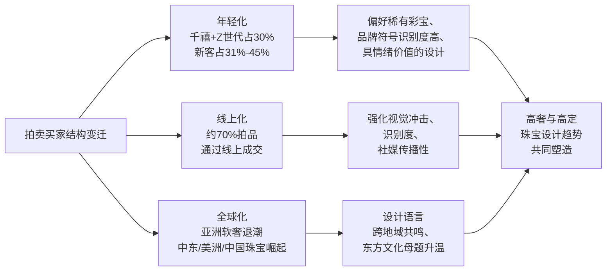

这一传导链条揭示出一个核心逻辑：**二级市场买家结构变迁正在反向塑造一级市场的设计审美——年轻化驱动着设计的故事性与佩戴场景多样化，线上化推动着造型的高识别度与视觉张力，全球化则促使品牌在文化叙事上寻求跨区域共鸣**。这正是后续章节中卡地亚动物主题、蒂芙尼Celeste系列、华裔设计师东方文化表达等趋势得以集中涌现的市场基础。

## 1.4 高净值人群扩容与消费心智重构

支撑高级珠宝设计创新的需求侧动力，最终落脚于全球高净值人群的持续扩容与消费心智的深层重构。莱坊《2024年财富报告》显示，截至2023年底，全球超高净值人士（资产净值≥3000万美元）数量较一年前增长4.2%，由601,300人增至626,619人，逆转了2022年的下降趋势；增长最快的是北美（+7.2%）和中东（+6.2%）[^4][^21]。莱坊预测，截至2028年的五年内，全球富人人数将增长28.1%，其中印度（+50%）和中国大陆（+47%）增长最为迅猛[^21]。从代际视角看，女性超高净值人士在过去10年里增长了38%，财富管理人士对Z世代客户在2024年积累更多财富的乐观程度最高（75%）[^4][^21]。

中国财富基础同样厚实。胡润研究院《2024胡润财富报告》显示，截至2024年1月1日，中国600万资产富裕家庭数量为512.8万户，千万资产高净值家庭206.6万户，亿元资产超高净值家庭13万户，3000万美元国际超高净值家庭8.6万户；高净值家庭中企业主占54%，超高净值家庭中企业主占比达80%[^22]。报告预测未来10年将有20万亿元财富传给下一代，30年内增至79万亿元——**这一规模庞大的代际财富传承，将成为高级珠宝作为可佩戴硬资产的重要承接载体**[^22]。

然而，财富基础的扩容并未直接转化为奢侈品消费的增长，反而催生了消费心智的深层重构。贝恩公司《2025年中国个人奢侈品报告》指出，2025年中国奢侈品消费正从"情绪消费"转向"理性资产配置"，消费者更注重投资价值和性价比；2025年中国内地个人奢侈品市场收缩3%—5%，但相比2024年的大幅下降已有明显缓和，第三季度开始显现复苏迹象[^23][^24]。具体到品类，珠宝品类2025年降幅缩小至0%—5%，"得益于价值保留的考虑和黄金价格上涨"[^24]；而皮具箱包品类下降8%—11%，腕表品类预计下降14%—17%[^24]。科尔尼2025年8月针对3000名中国奢侈品消费者的调研同样显示，未来12个月人均奢侈品支出将从14.68万元降至14.15万元（-4%），其中大型皮具(-7%)、腕表(-6%)承压最明显，珠宝仅微降2%[^25][^26]。

在心智重构维度，几个核心信号尤为关键。**其一，VIC（高价值客户）成为奢侈品市场绝对核心**。贝恩与Altagamma报告指出，目前全球奢侈品消费者有4亿，其中VIC客户占比不到1%，却贡献了高达30%的奢侈品牌收入[^7]。BVLGARI首席执行官Jean-Christophe Babin透露，过去一年中品牌高级珠宝平均价格高于前两年，价格超过100万美元的产品售出数量较上年翻了一番，客户转向"更昂贵、更非凡的作品"，追求"可靠、品质和保值"[^6]。

**其二，"悦己自戴"取代婚庆赠礼成为珠宝核心动机**。世界黄金协会数据显示，2025年金饰消费核心逻辑正在从"功能送礼"转向"情绪自用"，"轻克重、重设计""为情绪买单"成为主流趋势，24至30岁女性已成为黄金消费主力[^27]。中宝协2025年消费数据显示，彩宝消费中悦己佩戴占比高达42%，远超婚庆嫁娶的28%和收藏投资的17%[^27]。京东消费及产业发展研究院调研显示，近四成女性买珠宝首饰看重设计及寓意[^28]。这一情绪价值的崛起背后是2.3万亿元的情绪经济市场——预计未来几年将突破4.5万亿元[^27]。

**其三，Z世代女性成为高级珠宝潜力人群，且呈现"理性买黄金、悦己买设计"的双轨偏好**。艺恩《2024女性珠宝配饰行业趋势白皮书》指出，Z世代女性对高级珠宝的关注度和消费潜力日益凸显，倾向于通过珠宝彰显个人风格；高级珠宝品类中，项链、手链和戒指声量占比达82%，其中手链声量同比增长186%[^29]。但与此同时，部分年轻消费者对顶奢珠宝持理性态度："很多顶奢珠宝的品牌溢价太高，不如直接买黄金实在"[^23]。这一矛盾心态折射出**年轻一代对珠宝"资产属性+情绪价值"的双重诉求——黄金承载资产保值预期，设计师款与高级珠宝承担情绪表达职能**。

**其四，年轻一代呈现从"商品消费"向"体验消费"转移的代际特征**。科尔尼调研显示，Z世代（18—28岁）中41%—44%表示将"从商品消费转向体验型消费"，远超年长群体的31%；千禧一代中38%有同样意向[^25][^26]。但珠宝作为"可佩戴的体验"，恰好契合这一趋势——它既是商品又是穿戴场景的延伸，世界黄金协会中国区CEO王立新指出"自由消费、悦己消费的增长是未来的最大增量"[^27]。这也解释了为何在普遍的奢侈品理性化中，珠宝品类反而能保持相对韧性。

下表汇总了高净值客群与年轻消费者两端的核心心智信号，揭示需求侧的双重驱动结构：

| 客群层级 | 核心特征与数据 | 消费驱动逻辑 | 对珠宝设计的需求传导 |
|---------|--------------|------------|---------------------|
| VIC高价值客户 | 占比<1%，贡献品牌30%收入；BVLGARI百万美元级产品销量翻倍 | 资产配置 + 稀缺性 + 工艺保值 | 大克拉稀有宝石、孤品高定、品牌历史叙事 |
| 中年高收入主力 | 一线城市、X世代及婴儿潮、家庭可支配收入>200万元；33%计划增加奢侈品支出 | 品质 + 经典 + 长期主义 | 极简风、品牌经典系列、可传承设计 |
| 千禧一代 | 29—44岁，14%计划增加支出；38%向体验消费转移；珠宝悦己佩戴占42% | 悦己 + 投资 + 跨界共鸣 | 时装珠宝、可日常佩戴、设计感强 |
| Z世代女性 | 18—28岁，珠宝消费核心潜力人群；手链声量同比+186% | 情绪价值 + 个性表达 + 社交属性 | 轻量化、叠戴、新中式、彩宝设计 |

这一双重需求结构构成了近三年高奢与高定珠宝设计创新的真正动力源：**头部VIC客户为高级珠宝的稀有材质、克拉数与孤品工艺提供了金字塔尖的承接，年轻一代则为时装珠宝、轻量化设计、彩色宝石与情绪叙事开辟了广阔腰部市场**。这种双轨并行的需求结构，将在后续章节关于设计语言演变（第2章）、材质工艺创新（第4章）与消费驱动（第6章）中得到具体展开。

## 1.5 时装巨头入局与品牌珠宝市场扩张

需求端的旺盛与品类的避险属性，吸引了越来越多的供给端力量进入珠宝赛道。麦肯锡的行业展望预测，从2019年到2025年，品牌珠宝预计将以8%—12%的复合年增长率（CAGR）增长，价格比无品牌珠宝高出约6倍；目前全球仅有18%的高级珠宝拥有品牌（中国市场更低，仅15%），到2025年品牌珠宝将占据25%—30%的市场份额，相当于800亿—1000亿美元规模[^30][^31]。这一巨大的"未品牌化空间"，叠加珠宝品类的逆势属性，催生了近三年时装奢侈品牌密集进入高级珠宝赛道的现象。

百年珠宝世家曾长期垄断高级珠宝顶端——卡地亚、梵克雅宝、宝格丽、伯爵、宝诗龙、尚美巴黎等机构以传世工艺与品牌历史构筑壁垒。但近三年，时装品牌正以"稀有宝石+独特设计语言"的双重投名状切入这一赛道。先行者迪奥与香奈儿早已以自成一派的美学在高级珠宝领域闯出名堂——迪奥Les Jardins de la Couture高级珠宝系列、香奈儿Tweed de Chanel高级珠宝系列均已成为品牌核心资产[^32]。

更具变革意义的是路易威登的发力。LV在高级珠宝领域已有15年历史，但近年加大宝石采购与市场营销投入，推出多款刷新高级珠宝纪录的重磅作品。其Aster高级珠宝项链采用23颗已经绝矿的珍罕克什米尔蓝宝石，主石重量达17.88克拉[^32]。在Fine Jewelry层面，LV瞄准品牌珠宝的"空白领域"，推出以简约造型为主、融入品牌经典Logo与棋盘格元素的Volt系列与Le Damier de Louis Vuitton系列[^32]。

近三年加速入局的品牌名单还在不断扩容：古驰推出Labirinti Gucci高级珠宝系列；芬迪推出首个高级珠宝系列；巴黎世家与Jacob & Co.合作推出高级珠宝；普拉达、巴尔曼、圣罗兰、罗意威等也陆续推出区别于人造材质时装珠宝、以贵金属和宝石打造的Fine Jewelry系列[^32]。开云集团2025年入股珠宝制造商，硬奢赛道再下一城；欧莱雅完成对开云美妆的收购；爱马仕也加码北京三里屯门店、强化珠宝展示空间[^3]。

这一趋势背后是清晰的商业逻辑。一方面，时装品牌占据着年轻消费者心智的入口——艺恩《2024女性珠宝配饰行业趋势白皮书》数据显示，CHANEL、HERMES及LV等品牌"凭借其在服饰领域的影响力，成功引领高奢时尚品牌声量"[^29]，这一品牌势能为其切入珠宝市场提供了流量基础。另一方面，时装巨头正用"独特的设计和想象力"作为武器，**用大克拉数的珍稀石头作为"加入这个顶级牌局的'投名状'"**——在Bulgari、Piaget分别迎来140周年、150周年华诞、传统珠宝世家凭借工艺传承维持二级市场溢价的同时，时装公司试图在那些被珠宝世家和专业腕表品牌垄断的行业中开辟新境[^6]。

**这一新旧势力的角力，深刻塑造了近三年的珠宝设计趋势走向**：传统珠宝世家被迫在保持工艺壁垒的同时寻求设计语言的当代化（如卡地亚Nature Sauvage的几何重构、蒂芙尼Celeste对让·史隆伯杰典藏的当代演绎[^5]），时装品牌则用强烈的服装基因与跨界视觉语汇（棋盘格、菱格、Logo元素）重新定义高级珠宝的视觉边界。这一供给侧的竞争重塑，将在第2章关于品牌设计语言演变与第7章关于趋势共通点与差异化亮点中得到详细展开。

## 1.6 研究坐标的确立与章节脉络衔接

综合上述四重背景，2023—2025年作为珠宝设计趋势研究关键观察窗口的合理性已清晰呈现。从市场维度看，奢侈品行业经历了2023年高位、2024年深度调整、2025年审慎复苏的完整周期，珠宝品类成为唯一持续正向贡献的细分市场，验证了其作为"硬通货"的避险与增长双重属性[^1]。从拍卖维度看，三大拍卖行业绩在艺术品与软奢板块普遍下行的背景下，依靠高级珠宝实现结构性维稳，奢侈品占比从18.8%升至20.2%，二级市场对一级品牌设计的反馈机制趋于强化[^8][^9]。从买家维度看，千禧与Z世代占拍卖参与者30%、线上竞投占比70%、亚洲软奢退潮与中东美洲珠宝崛起的全球化迁移，重塑了设计审美的代际偏好与传播逻辑[^12][^13][^19]。从产业维度看，时装巨头用稀有宝石作为"投名状"密集切入高级珠宝赛道，与百年珠宝世家形成正面博弈，使设计语言、工艺创新、材质拓展进入前所未有的活跃期[^32][^6]。

这四重背景共同构成本研究的时代坐标，可概括为以下三组核心反差：

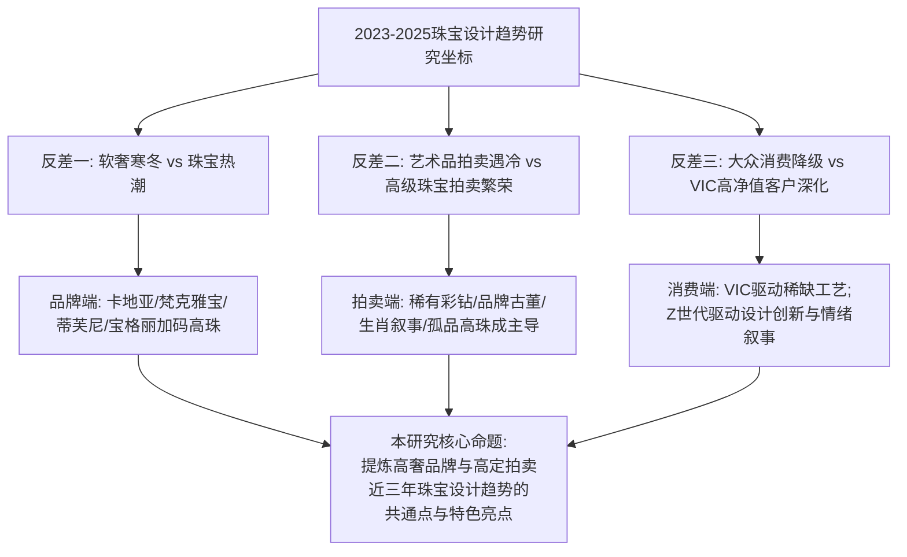

基于这一坐标，本研究后续章节将沿如下脉络展开：第2章聚焦高奢品牌珠宝的设计语言演变，剖析卡地亚、梵克雅宝、宝格丽、宝诗龙、蒂芙尼、伯爵、尚美巴黎等头部品牌近三年高级珠宝系列的设计主题与美学路径；第3章对比佳士得、苏富比、富艺斯等拍卖行的高定拍卖品类热点与价值演变，解析"产地+品质+品牌+故事"四重溢价机制；第4章探查材质与工艺创新趋势，包括天然矿物宝石、钛金属轻量化、传统手工艺复兴与隐密镶嵌等技术壁垒；第5章归纳主题灵感与文化叙事的共通取向，重点关注自然生灵、城市建筑、装饰艺术复兴与东方文化跨界；第6章分析消费驱动力与买家结构变化对设计趋势的反向塑造；第7章提炼高奢品牌与高定拍卖的趋势共通点与差异化亮点；第8章基于全篇分析归纳趋势矩阵并展望未来3—5年方向。

需要说明的是，本章在描绘宏观坐标时主要依托市场研究报告、拍卖行财报与咨询公司调研数据，部分单一来源的预测性数据（如麦肯锡品牌珠宝CAGR预测、贝恩中国市场降幅区间）已尽量保留多版本表述并保守解读。**整体而言，2023—2025年是高奢与高定珠宝设计趋势研究最具张力的三年**——它既是一个产业分化的时代，也是一个设计创新被系统性激活的时代；既是消费理性化的时代，也是情绪价值与资产属性深度交融的时代。在这一独特的时代坐标之下，珠宝设计的每一次符号选择、每一次工艺探索、每一次主题叙事，都不再是孤立的美学事件，而是产业、资本、文化与消费共同塑造的时代产物。后续章节将循此线索展开具体剖析。

# 2 高奢品牌珠宝设计语言的演变趋势

承接第1章所揭示的产业坐标——珠宝逆势崛起、拍卖结构性繁荣、买家年轻化与全球化迁移、时装巨头跨界入局——头部高奢品牌2023—2025年的高级珠宝创作呈现出前所未有的密集与活跃。从卡地亚一年三季度的高珠新作，到宝格丽140周年与伯爵150周年的纪念巨献，从宝诗龙Carte Blanche的极致材质实验，到蒂芙尼Blue Book对Schlumberger典藏的连续致敬，头部品牌在保持各自DNA的同时，对设计语言进行了一次系统性的重构与刷新。本章将以卡地亚、梵克雅宝、宝格丽、宝诗龙、蒂芙尼、伯爵、尚美巴黎、海瑞温斯顿、路易威登等品牌为核心样本，从五个维度横向比较其代表系列与作品，提炼出近三年高奢珠宝设计语言演变的核心美学路径与共通走向，为后续章节关于工艺创新、文化叙事与趋势共通点的剖析提供品牌端的实证基础。

## 2.1 自然主题的抽象重构与超写实并行

自然主义无疑是近三年高奢珠宝最普遍、也最具张力的灵感母题。但与上一代品牌单纯"再现自然"的拟物化处理不同，2023—2025年头部品牌的自然主题呈现出**抽象重构与超写实拟真两条平行路径**——前者通过几何构型、色块编码与镂空结构对自然元素进行风格化提炼，后者则借助颤动镶嵌、铰接结构与雕塑工艺再现生灵的动态姿态。

卡地亚是这一双轨路径的集大成者。其Beautés du Monde系列以"目之所及，万物皆美"为题，明确指出"通过设计创意、线条张力、几何造型及抽象图案，进一步升华物象美感"[^33]。系列中的Nouchali项链以风格化手法呈现睡莲灵感，珠宝结构如雕塑般富有层次，中央10.61克拉红碧玺由层叠的钻石花瓣环绕，边缘以缟玛瑙勾勒立体几何造型，并采用颤动式镶嵌使花瓣随佩戴者动作摇曳——一朵睡莲悬浮绽放于项链之上，淡紫色玉髓圆珠串联出晶莹剔透的水珠[^33]。Récif项链则以珊瑚礁为灵感，祖母绿与珊瑚棱纹珠呈螺旋形排列盘绕在钻石环礁之上，棱纹宝石圆珠分别缀以凸圆型切割祖母绿或紫水晶，构成卡地亚标志性橙绿对比色彩组合[^33]。Apatura项链则以欧泊变彩特性诠释蝴蝶翅膀，三颗总重22.08克拉的澳大利亚欧泊由条形镶嵌钻石与蓝宝石串珠环绕，"以抽象构图营造对蝴蝶的想象"，并延续可转换设计——坠饰可拆下作为胸针佩戴[^33]。

而在超写实路径上，卡地亚同样毫不逊色。Le Voyage Recommencé系列的Panthère Confiante项链以"超写实主义、风格化手法和抽象风格演绎经典猎豹主题"——中央生动塑造一只黑色点斑的雪豹，豹眼镶嵌祖母绿、斑纹镶嵌缟玛瑙，前爪守护一颗26.52克拉弧面切割橄榄石，豹身延伸为抽象风格的钻石和缟玛瑙圆珠[^34]。Beautés du Monde中的Water Aspis项链则"融汇写实、意象以及抽象化的创作手法"诠释蛇这一神秘生物——五颗产自斯里兰卡、总重43.49克拉的凸圆型切割蓝宝石点缀整条项链，铰接结构使蛇身活动自如，鳞纹图案以三角形钻石与青金石间镂空缝隙的几何形状接续呈现[^33]。**这种"在同一系列内并置写实与抽象"的处理方式，标志着卡地亚自然主题语汇从单一拟物向多维表达的当代化升级**。

蒂芙尼则将自然主题推向了海洋叙事的极致。其Blue Book 2023 Out of the Blue系列在艺术总监Nathalie Verdeille主持下，回溯传奇设计师Jean Schlumberger半个世纪前对海洋的非凡创想，围绕瀚海星螺、珊瑚溢彩、鱼跃光影、深海星芒、海岩星韵五大主题展开，并新增花舞海葵章节[^35][^36]。其中海葵主题"看似冷冻在永久绽放的状态之下"，以总重超过6克拉的蓝色铜锂碧玺、订制切割鑽石包覆，并采用倒置镶嵌使尖底朝外以诠释海葵触角[^35][^36]。水母胸针则"以长达900小时手工制作"，曲线柔美明亮闪烁，呼应水母的迷人色调与缥缈形状[^35]。海星主题搭载超过22克拉的未经优化处理铜锂碧玺，鱼跃光影主题镶嵌总重逾23克拉的稀世橙色蓝宝石，珊瑚溢彩主题更呈现总重超过37克拉的未经优化处理紫色蓝宝石[^36]。2025年Blue Book延续这一脉络推出"Sea of Wonder瑰海奇珍"，包括Urchin海胆、Seahorse海马、Sea Turtle海龟、Ocean Flora海洋花卉、Starfish海星、Wave海浪等六大章节[^37][^38]。其中Urchin篇章"在自然主义與超現實主義元素之間取得和諧的平衡"，灵感来自Schlumberger 1961年设计的标志性海胆风格台钟，戒指由18K黄金"绳链"扭饰镶嵌一颗超过12克拉的浓彩黄钻及14颗白钻，工匠耗时约200小时打造[^37]。**蒂芙尼用两届Blue Book在海洋这一母题上完成了从"幻海秘境"到"瑰海奇珍"的递进式叙事，确立了"自然主题—Schlumberger典藏—当代演绎"的三位一体创作模型**。

梵克雅宝则在自然主题上走的是诗意化的"主题系列"路径——以"大自然、高级订製时装、舞蹈、文学或愛情故事等為題，創作出充滿詩意的作品"[^39][^40][^41]。其Treasure Island、Le Grand Tour、Sous les Étoiles、L'Arche de Noé（诺亚方舟）、花卉、蝴蝶等系列长期作为品牌签名语汇延续；Émeraude en Majesté以祖母绿为题、Treasure of Rubies以红宝石为题，皆体现"每顆寶石均以其卓越品質和所承載的情感而獲得世家青睞"的策展逻辑[^41]。这种以叙事框架统摄自然意象的方式，使梵克雅宝的自然表达呈现出比同业更强的"故事性"特征。

伯爵则以Metaphoria系列另辟蹊径。该系列的命名逻辑明确指出"既非比喻，亦非写实……大自然受到崇敬，而非临摹；启迪灵感，而非效仿"[^42]。第1章Azureia以"水"为灵感，从湍急溪流到结冰湖泊、从微小漩涡到清澈深水，以白钻、黑欧泊、海蓝宝石呈现水的不同色调；第2章Beautanica则赞颂森林与矿物的绿色和棕色，从坚硬化石到纤薄昆虫翅膀、从黑檀木到石英水晶[^42]。**伯爵的"非比喻非写实"立场，恰恰提供了自然主义抽象化路径的最佳注脚**。

下表对近三年头部品牌自然主题代表作进行横向对照，可清晰呈现两条路径并存的设计走向：

| 品牌 | 系列/作品 | 自然母题 | 处理路径 | 关键工艺/材质 |
|------|----------|---------|---------|--------------|
| 卡地亚 | Beautés du Monde · Nouchali | 睡莲 | 抽象几何 + 颤动镶嵌 | 10.61ct红碧玺、玉髓圆珠 |
| 卡地亚 | Beautés du Monde · Récif | 珊瑚礁 | 螺旋抽象 | 祖母绿/珊瑚棱纹珠 |
| 卡地亚 | Beautés du Monde · Water Aspis | 蛇 | 写实+抽象混合 | 43.49ct斯里兰卡蓝宝石、铰接结构 |
| 卡地亚 | Beautés du Monde · Apatura | 蝴蝶 | 抽象重构 | 22.08ct澳洲欧泊、可转换 |
| 卡地亚 | Le Voyage · Panthère Confiante | 雪豹 | 超写实雕塑 | 26.52ct橄榄石、缟玛瑙 |
| 蒂芙尼 | Blue Book 2023 · Sea Anemone | 海葵 | 倒置镶嵌+颤动 | 蓝色铜锂碧玺 |
| 蒂芙尼 | Blue Book 2023 · 水母胸针 | 水母 | 超写实+曲线 | 900小时手工制作 |
| 蒂芙尼 | Blue Book 2025 · Urchin | 海胆 | Schlumberger典藏再演绎 | 12ct浓彩黄钻、约200小时工时 |
| 梵克雅宝 | Treasure Island/L'Arche de Noé等 | 海岛、动物群 | 诗意叙事化 | Mystery Set隐密镶嵌 |
| 伯爵 | Metaphoria · Azureia | 水 | 抽象隐喻 | 黑欧泊、海蓝宝石 |
| 伯爵 | Metaphoria · Beautanica | 森林/矿物 | 材质转译 | 化石、石英水晶 |

上表所揭示的核心规律是：**头部品牌不再满足于"画一朵花"或"塑一只豹"，而是用同一系列内的多种处理路径（写实/抽象/隐喻）展现品牌对自然主题的全光谱诠释能力**。这种"全光谱表达"既回应了VIC客户对工艺极致的期待，也为线上传播提供了更具识别度与故事张力的视觉素材。

## 2.2 几何结构与建筑性语言的强化回归

如果说自然主题是2023—2025年高奢珠宝的"软性"灵感来源，那么几何结构与建筑性语言则构成了"硬性"骨架的回归。这一回归既是对Art Deco装饰艺术风格的当代化呼应，也契合线上传播对"高识别度视觉张力"的需求——**清晰的几何线条比柔软的有机曲线更易在小屏幕呈现强烈的设计辨识度**。

卡地亚的Spina项链是这一趋势的典型代表。它"突出Cartier最擅长的几何风格设计"——由钻石和蓝宝石镶嵌交织构成镂空多层的几何构型，中央纵向延伸至重达29.16克拉的斯里兰卡蓝宝石主石，且可转换为头冠佩戴[^34]。Lerro项链则"强调宝石光影的精确交错"——颈链部分采用回纹层叠结构，让视线自然延伸至总重5.62克拉的3颗阶梯型切割哥伦比亚祖母绿，设计师以不同角度镶嵌3颗主石，"既有打破秩序的新鲜感，又完美符合视觉的平衡性"[^34]。Pileo戒指则将"海胆"主题以立体几何方式呈现——5.12克拉六边形切割钻石外延展玫瑰式切割与圆形明亮式切割钻石构成钻石球体，白金锥形饰钉镶点其间[^34]。**卡地亚以"几何"作为品牌视觉签名的延续，与1920年代Art Deco鼎盛期的设计逻辑形成跨百年呼应**。

宝格丽则将几何语言与罗马城市建筑叙事深度绑定。2024年品牌推出的Aeterna华彩永续系列正是为庆祝品牌140周年而生，"共展示了超过140件独一无二的作品"，珠宝创意总监Lucia Silvestri"再次回到品牌的经典设计元素和创作主题，用瑰丽的彩色宝石和复杂的镶嵌工艺向罗马这座永恒之城致敬"[^43]。系列中的Augustus Aeternus Emerald Monete古罗马钱币项链中央镶嵌一枚奥古斯都肖像铜币，"这枚铜币的铸造时期可以追溯至公元14至37年的提比略皇帝时期，纪念古罗马的恢弘气势与永恒不衰的影响"[^43]。Aurea Chandra黄金项链则"巧用隐形铰接设计将空心金球轻盈连缀，交替饰以镜面抛光和钻石镶嵌营造出光影变幻之美"，灵感源自品牌1990年代的Chandra典藏[^43]。在Eden The Garden of Wonders系列中，Tribute to Paris项链则"是对光之城的华丽致敬，中央点缀一颗瞩目的35.53克拉祖母绿，搭配灵感源自埃菲尔铁塔的别致图案"[^44]。Mediterranean Queen项链虽以海浪为灵感，但其"蜿蜒曲折的设计元素"承袭自1969年问世的宝格丽项链，"采用黄金与钻石相结合的复杂结构，犹如汹涌起伏的海浪"，耗时2400个工时打造[^45]。**宝格丽以"罗马—巴黎—地中海"的城市建筑叙事，将几何性赋予了清晰的文化锚点**。

宝诗龙的Histoire de Style系列则展现了几何语言与新装饰艺术风格（neo-Art Deco）的当代融合。Aiguillette主题中的白金项链即被明确称为"新装饰艺术风格"，独特的水晶切割方式塑造出绳纹造型，搭配钻石纽扣和水晶坠饰，并可拆卸为2枚胸针和一件磨砂水晶手镯[^46][^47]。Médailles项链由15块盾形水晶演绎勋带，表面雕琢罗缎丝带般的细腻刻纹，几何盾形的秩序排列充满装饰艺术意趣[^46][^47]。Col项链造型灵感源自世家20世纪打造的一顶冠冕，运用白金细丝塑造出蕾丝面料般的精美装饰图腾，"镂空结构显得轻盈而空灵"[^46][^47]。

海瑞温斯顿则以纽约都市为建筑叙事母题。其New York Collection明确指出"纽约的丰富历史底蕴与都市魅力源源不断地为海瑞温斯顿提供无尽创意，打造出一件件美轮美奂的珠宝臻品"[^48][^49]。同时品牌的Royal Adornments系列从过往非凡的皇室珠寶作品中汲取灵感，"以现代的风格重现王室历史的重要元素"，其Princess藍寶石、海水藍寶石和鑽石項鍊"在藍寶石和海水藍寶石之間，錦簇鑲嵌馬眼型切工鑽石，致敬年輕公主'Sweet 16'項鍊的蝴蝶形設計，擁有強烈的視覺效果"——这种"锦簇镶嵌+对称几何"正是Art Deco语汇在当代的延续[^50][^48]。

下表对比了头部品牌"几何—建筑—城市"的差异化叙事路径：

| 品牌 | 城市/建筑锚点 | 代表作品 | 几何语汇 |
|------|--------------|---------|---------|
| 卡地亚 | 经典几何DNA | Spina、Lerro、Pileo | 镂空多层、回纹层叠、立体六边形 |
| 宝格丽 | 罗马（永恒之城） | Augustus Aeternus、Aurea Chandra | 古罗马钱币、隐形铰接金球 |
| 宝格丽 | 巴黎（埃菲尔铁塔） | Tribute to Paris | 铁塔图案+35.53ct祖母绿 |
| 宝诗龙 | Place Vendôme巴黎 | Aiguillette、Médailles、Col | 新Art Deco绳纹、盾形勋带、蕾丝镂空 |
| 海瑞温斯顿 | 纽约 | New York Collection | 摩登都市+皇室对称 |
| 蒂芙尼 | 纽约 | 第五大道传奇黄钻 | 经典圆形与"石上鸟"标志 |

**几何与建筑性语言的回归，本质上是品牌在追求"高视觉识别度"与"档案延续性"双重诉求下的策略性选择**——它一方面契合社交媒体时代对清晰视觉符号的需求，另一方面通过城市与建筑的文化锚点强化品牌叙事壁垒，使每一件高珠都成为可识别的"品牌名片"。

## 2.3 高定时装基因与跨界材质的融合

近三年高奢珠宝设计语言演变中最具突破性的方向，莫过于高定时装基因的深度嫁接与跨界材质的实验性探索。这一趋势背后既有传统珠宝世家寻求"形态创新空间"的内生动力，也是时装巨头跨界入局所带来的视觉边界拓展。

宝诗龙的Histoire de Style, The Power of Couture系列堪称这一趋势的典范。系列由创意总监Claire Choisne亲自设计，"运用白金、水晶和钻石的简洁搭配塑造出丰富的时装装饰元素，展现出浑然天成的纯粹之美"，共呈现24件独一款作品，重温品牌创始人Frédéric Boucheron先生与高定时装的深厚渊源[^46][^47]。系列共设八大主题——Aiguillette垂饰、Médailles勋章、Col高领、Tricot针织、Boutons纽扣、Epaulettes肩章、Noeud蝴蝶结、Iboot——每一主题都直接来自高定时装的服饰元素。其中Tricot五圈式结构白金颈链"仿佛由水晶编织而成，水晶经过喷砂工艺，并经由镍钛合金线巧妙相连"，圆钻镶点其间有如织物中闪烁的银丝[^47]。Noeud主题白金项链由435颗长阶梯形切割磨砂水晶组成蝴蝶结领带造型，蝴蝶结垂落一颗4.05克拉F色VVS1净度水滴形钻石，提供6种不同佩戴方式[^46][^47]。Epaulettes主题撷取肩章为灵感，包含白金肩章、白金头饰和白金耳环，运用钻石塑造优美蜿蜒的螺旋结构，灵感源自宝诗龙1902年为威尔士公主玛丽王后打造的螺旋形钻石冠冕，肩章可转换为手镯佩戴[^47]。**这种"将整个高定衣橱搬上珠宝盒"的系统性探索，使宝诗龙在2024年高珠赛季中确立了"时装珠宝化"的引领者地位**。

宝诗龙的另一大创新发生在材质维度。其Carte Blanche, Or Bleu系列以冰岛"水"为灵感，呈现26件独一款作品，将"水"的不同天然特性——色彩、纹理、流动性、反射性以及透明度——融入珠宝创作[^51]。系列的材质实验令人瞩目：Cascade长项链采用白金打造长逾148cm的链身，镶嵌1816颗不同切割方式的钻石，是宝诗龙工坊有史以来制作的最长项链作品，耗时3000小时，可转换为短项链和耳坠佩戴[^51]。Eau d'Encr手镯采用钛金属和白金制作，镶嵌2枚雕刻立体波浪的天然黑曜石，镯臂两侧饰以雪花镶嵌钻石[^51]。Sable Noir主题更是用3D打印技术将黑沙压制成型，"打造出格外耐磨且折射出沙粒虹彩纹理的独特材质"[^51]。Eau Forte则通过传统蚀刻工艺在白金上塑造波浪纹理，"喷涂白色瓷漆，凸显浪花的形态，最后涂覆透明清漆"[^51]。Vague主题致敬日本画家葛饰北斋名作《神奈川巨浪》，运用失蜡铸造法以白金打造海浪造型，镶嵌总重20克拉、共851颗圆钻，可转为胸针佩戴，耗时650小时[^51]。**钛金属、黑曜石、3D打印黑沙、瓷漆涂覆、失蜡铸造、镍钛合金线——宝诗龙以"非传统材质矩阵"重新定义了高级珠宝的物质边界**，这一倾向将在第4章关于材质创新的章节中得到更系统的展开。

香奈儿则将其标志性的高定时装基因——斜纹软呢——直接转译为珠宝工艺。在2025年钟表与奇迹展会上，香奈儿腕表作品以嘉柏丽尔·香奈儿形象演绎，"她走出表盘，身着饰以黑色滚边的白色斜纹软呢套装"，并以"斜纹软呢式镶嵌"工艺铺镶钻石，"还原出斜纹软呢织物般的质感"，香奈儿女士的轮廓从表盘中跃然而出，以白K金精心雕琢而成[^52]。这种**将服装面料肌理转译为珠宝镶嵌工艺**的尝试，与宝诗龙的Tricot针织主题形成跨品牌呼应。

跨界入局的时装巨头则在融合上走得更远。第1章已述及，路易威登以Aster高级珠宝项链采用23颗已绝矿的克什米尔蓝宝石（主石17.88克拉）切入高珠赛道，并以Volt系列与Le Damier de Louis Vuitton系列将品牌经典Logo与棋盘格元素融入Fine Jewelry。古驰、芬迪、巴黎世家、普拉达、巴尔曼、圣罗兰、罗意威等品牌也陆续推出贵金属与宝石打造的珠宝系列。**时装巨头跨界的核心逻辑，是用"服装基因+大克拉宝石"的双重投名状切入此前由珠宝世家垄断的高端市场**——这一新势力的进入，反向迫使珠宝世家在保持工艺壁垒的同时寻求设计语言的当代化与时装化。

## 2.4 品牌经典符号的当代再演绎

近三年高奢品牌设计语言演变中最稳健、也最具商业意义的策略，是对品牌经典符号的"档案再生"（archive revival）。这一策略不仅强化了品牌DNA的视觉资产积累，更为二级市场的品牌古董溢价提供了持续的"故事供给"——使每一件新品都成为对品牌历史的当代演绎，反之又为历史古董提供新的市场关注度。

卡地亚的猎豹（Panthère）符号是这一策略的标杆。从Beautés du Monde系列的Water Aspis蛇主题，到Le Voyage Recommencé系列的Panthère Confiante雪豹项链——后者通过"超写实主义、风格化手法和抽象风格演绎经典猎豹主题"，并"巧妙融入Cartier标志性的红、绿、黑色彩元素"——卡地亚持续在其动物王国中刷新猎豹形象的当代表达[^34][^33]。同时品牌的几何DNA也在2025年钟表与奇迹展会上得到延续：Baignoire腕表以巴黎饰钉（Clous de Paris）元素全新演绎，"巴黎饰钉以单色金质打造，凸显立体构型，同时使得手镯式表链与表盘连贯统一"；Myst de Cartier腕表则以"交替排布的曲线、表镜的弧形造型与铺镶表盘的几何轮廓共同营造鲜明对比"[^52]。**Le Voyage Recommencé项目本身的命名"重新起航"即明确指出"品牌珠宝创意总监Jacqueline Karachi从Cartier典藏作品中汲取灵感，通过复杂的几何元素、瑰丽的宝石和高超的珠宝工艺致敬品牌历史上最标志性的创作风格"**[^34]——这一"档案再生"逻辑被写入系列命名本身。

宝格丽的Serpenti灵蛇是另一标志性符号。Aeterna系列中"灵蛇主题的项链中最引人注目的莫过于Terra Mater Serpenti祖母绿项链，其灵感源自古罗马神话中的大地女神"，"大胆地塑造出一条盘绕颈部的钻石和祖母绿灵蛇，蛇首和蛇尾蜿蜒交织，托起一颗重达63.86克拉的哥伦比亚产地的弧面切割祖母绿主石"[^43]。Serpenti Sapphire Echo蓝宝石项链则"巧妙地塑造出双首蛇，衔起两颗分别重达37.34克拉的斯里兰卡水滴形切割蓝宝石"，并采用可转换式设计，蓝宝石水滴坠饰可转换为一对耳环佩戴，"象征灵蛇永不停歇的蜕变"[^43]。Eden The Garden of Wonders系列中的Serpenti Ocean Treasure项链也镶嵌一颗令人惊叹的61.31克拉矢车菊蓝色蓝宝石"演绎迷人蜕变"[^44][^53]。**宝格丽以Serpenti一个符号承载了"罗马神话+蜕变叙事+大克拉彩宝"的三重价值**。

梵克雅宝的"档案再生"则呈现为更系统的Signature系列矩阵。品牌将Zip、Flowers、Ludo™、Liane™、Feminine figures、Butterflies、Perles d'été™等列为"Signature collections"，并明确定位为"标志系列作品彰显世家精湛工艺，秉承梵克雅宝隽永非凡的风格"[^39][^40][^41]。Mystery Set隐密镶嵌则作为品牌核心工艺壁垒持续演绎——Legend of Diamonds系列25 Mystery Set Jewels即由一颗名为Lesotho Legend的非凡原钻切割而成的67颗钻石组成，串联25件独一无二的作品[^54]。同时品牌将Héritage系列分为"1920年代至1930年代、1940年代至1950年代、1960年代至1970年代、1980年代及其後的作品"四个历史时段，使品牌档案本身成为可持续展览的IP[^41]。在2025年钟表与奇迹展会上，梵克雅宝的Ludo Secret腕表新作"重新演繹了1949年問世的Ludo手镯的經典款式"，镜面抛光黄K金如砖块般拼凑成巧若灵蛇的结构，黄K金与蓝宝石交相辉映，并通过秘密设计藏入玑镂雕花白色珍珠母贝表盘；Perlée系列则以标志性金质圆珠环绕白K金腕表新作，"砂金石玻璃表盘呈现午夜蓝色调"[^52]。**梵克雅宝几乎将每一款经典符号都做成了"系列+主题+秘密腕表+档案展览"的多层次资产运营**。

蒂芙尼的"档案再生"则集中在Jean Schlumberger典藏。这位"传奇设计师"自1956年起与蒂芙尼合作，"开辟了珠寶設計的全新篇章"，"凭借独特才华来平衡悦动奢华与优雅含蓄，呈现卓然的珠宝艺术杰作，其中包括该品牌最具代表性的作品：石上鸟"[^38][^55]。Blue Book 2023 Out of the Blue即明确"延續並重塑他夢想中的海洋世界"[^35]；Blue Book 2025 Sea of Wonder的Urchin篇章则直接复刻"他在1961年設計的標誌性海膽風格枱鐘"[^37]。同时品牌将传奇的128.54克拉蒂芙尼黄钻"灵感源自经典的石上鸟胸针，可作为可调节胸针佩戴，亦可作为吊坠佩戴"[^38][^55]。蒂芙尼更在2025年首届摩纳哥高级珠宝大奖赛中"榮獲兩項殊榮：評審特別獎及傳承大獎。傳承大獎用於嘉許卓越非凡的Butterflies項圈，此作品由Jean Schlumberger在1956年創作，現在珍藏於維珍尼亞美術博物館"[^55]。**这一获奖事实表明，蒂芙尼的"档案"不仅是商业IP，更已被业界确认为珠宝艺术史的传承资产**。

宝诗龙则通过历史档案的提取深化其"芳登广场"叙事。Power of Couture的Epaulettes主题肩章"灵感源自Boucheron 1902年为威尔士公主玛丽王后（Mary De Teck）打造的一顶螺旋形钻石冠冕"[^47]；Col主题项链造型灵感源自世家20世纪打造的一顶冠冕[^46][^47]。尚美巴黎则以"皇室风范、珍贵自然、情感连结"为三大标志性系列主轴，"在巴黎芳登广场立柱的身影之下，坐落着尚美顶级珠宝工作坊……魔法悄然展开——品牌的非凡之作于此诞生"，并以Envol、Jewels by Nature、Chaumet en Scène等主题系列年度更新[^56][^57]。**尚美的"冠冕传承"作为品牌核心档案，使其在皇室珠宝赛道上保持独特定位**。

海瑞温斯顿的Royal Adornments系列则更直白地将"档案再生"作为系列命名逻辑。该系列"從過往非凡的皇室珠寶作品中汲取靈感，並融入現代風尚"，重现品牌历史上的Duchess（致敬温莎公爵夫人对黄钻的钟爱）、Princess（致敬1977年品牌为一位年轻公主"Sweet 16"生日订制的钻石项链）、Viscountess（沿用20世纪50—60年代王室订制珠宝的蓝宝石主题）等子系列[^50]。Princess蓝宝石、海水蓝宝石和钻石项链中"在藍寶石和海水藍寶石之間，錦簇鑲嵌馬眼型切工鑽石，致敬年輕公主'Sweet 16'項鍊的蝴蝶形設計"[^50]。**这种"将品牌历史订制档案系统化为高珠系列"的策略，为海瑞温斯顿提供了独特的"皇室叙事+大克拉钻石"双重护城河**。

下表系统对照了头部品牌的"档案再生"策略：

| 品牌 | 核心经典符号 | 近三年再演绎案例 | 档案运营层级 |
|------|------------|----------------|------------|
| 卡地亚 | 猎豹/巴黎饰钉/几何 | Panthère Confiante、Le Voyage Recommencé（典藏致敬）、Baignoire腕表 | 系列命名级 |
| 宝格丽 | Serpenti/Monete/Chandra | Terra Mater Serpenti、Augustus Aeternus钱币、Aurea Chandra | 系列命名级 |
| 梵克雅宝 | Zip/Ludo/Alhambra/Mystery Set | Ludo Secret腕表、Legend of Diamonds 25件 | 系列矩阵+档案展级 |
| 蒂芙尼 | Schlumberger海洋/石上鸟/Tiffany Diamond | Blue Book 2023+2025、128.54ct黄钻可换形佩戴 | 设计师IP级 |
| 宝诗龙 | 1902螺旋冠冕/芳登广场 | Epaulettes、Col、Aiguillette | 单件溯源级 |
| 尚美巴黎 | 冠冕/皇室 | Envol、Jewels by Nature | 系列年度级 |
| 海瑞温斯顿 | 皇室订制/温莎公爵夫人/Sweet 16 | Royal Adornments三套子系列 | 历史订制档案级 |

**"档案再生"已成为头部品牌共通的设计方法论**——它不仅是设计灵感来源，更是品牌资产管理与跨周期叙事的核心机制。这一策略与第3章拍卖端的"品牌古董溢价"形成共振：当品牌持续在新作中演绎历史符号，二级市场的历史古董也获得新的关注度与价值锚定，从而形成"一级新作—二级古董"的价值闭环（前文已述及苏富比2024年春拍卡地亚"India Tutti Frutti"古董项链以6800万港元成交即为典型例证）。

## 2.5 东方意蕴与跨文化叙事表达

在第1章揭示的"亚洲藏家从软奢向高级珠宝迁移、中国千禧与Z世代成为珠宝消费核心潜力人群、新中式审美崛起"等趋势驱动下，近三年高奢品牌的跨文化叙事呈现出比以往更深入的东方意蕴探索。但与早期单纯"中国元素拼贴"的浅层化处理不同，2023—2025年的跨文化叙事更强调**地域文化母题与品牌设计语汇的有机融合**。

卡地亚是这一方向最积极的探索者。Le Voyage Recommencé系列中的Yfalos绿松石珊瑚项链以海天相接的自然景色为灵感，"以1颗罕见的大尺寸弧面切割绿松石为主石"，链身钻石塑造蜿蜒线条，红色珊瑚棱纹珠交错相连，"呈现出典型的印度莫卧儿时期珠宝风格"[^34]。Beautés du Monde系列的Rituel高级珠宝项链则"礼赞装饰之美，尤其向中美洲的传统珠宝致敬"，"由双排天蓝色玉髓圆珠组成，当中由红宝石镶嵌出宛如星群的图案"，"锥形镶嵌钻石与多切面红宝石交错相间，勾勒出精致细腻"的纹样[^33]。**通过Yfalos致敬印度莫卧儿、Rituel致敬中美洲传统，卡地亚将"风格旅程"扩展为一场跨地域文化对话**——这与第1章所述"全球化迁移促使品牌在文化叙事上寻求跨区域共鸣"的趋势高度吻合。

宝格丽的跨文化表达则集中在Lotus Cabochon玫瑰金项链。Aeterna系列中"色彩最缤纷的一件是Lotus Cabochon玫瑰金项链，灵感源于象征永恒与重生的莲花（Lotus）。这件项链采用高级定制时装中的衣领造型，彩色宝石均采用立体饱满的弧面切割琢形——紫水晶、祖母绿和红碧玺构成花园般的图腾"[^43]。莲花作为东方文化中的核心符号，被宝格丽以"罗马城市建筑+高定衣领+弧面切割彩宝"的方式重新解读，呈现"东方母题—地中海色彩—罗马工艺"的三重文化叠合。

宝诗龙的Vague主题虽属Carte Blanche, Or Bleu系列，但其"致敬日本画家葛饰北斋（Hokusai）的名作《神奈川巨浪》（The Great Wave off Kanagawa）"这一明确指向，使其成为近三年高奢品牌中罕有的对东亚艺术经典的直接致敬[^51]。这件作品运用失蜡铸造法以白金打造海浪造型，镶嵌总重20克拉共计851颗圆钻——**以法式失蜡铸造工艺承载日本浮世绘母题**，构成了一次精彩的东西方工艺对话。

更具结构性意义的是头部品牌对中国市场叙事的本土化运营。第1章已述及2024年10月29日佳士得香港"瑰丽珠宝及翡翠首饰"专场单日成交4.67亿港元，其中卡地亚专为龙年设计的孤品高珠"DRAGON"首次亮相。蒂芙尼则于2023年10月13日在上海首次全球揭幕Blue Book 2023 Out of the Blue秋季作品[^36]，将上海作为其全球高级珠宝首发地——这一选择本身即是对中国高净值客群战略地位的明确表态。

**值得指出的是，近三年东方意蕴的表达仍呈现"品牌主导、文化母题嫁接"的特征**——即使涉及东方主题，主导设计语言仍来自西方品牌的几何/宝石/工艺语汇。这与华裔设计师（如ANNA HU）所代表的"东方文化主体性表达"路径形成对比。考虑到本节所涉及搜索资料中并未呈现充分的华裔设计师案例细节，本研究将ANNA HU等华裔设计师的国际化表达留待第5章"主题灵感与文化叙事的共通取向"中结合更充分的资料展开，此处仅指出一个方向性的观察：**在高奢品牌主导的东方叙事之外，华裔设计师所代表的"东方主体性表达"正在成为另一条重要的跨文化路径，二者形成互补**。

## 2.6 头部品牌设计路径的横向对照与共通走向

综合上述五个维度的分析，2023—2025年头部高奢品牌的高级珠宝设计语言呈现出**"五维并行、品牌差异化定位"的格局**。下表系统对照了主要品牌近三年的设计主题、灵感来源、视觉语言与代表作品：

| 品牌 | 近三年代表系列 | 灵感锚点 | 视觉语言关键词 | 核心代表作 |
|------|--------------|---------|--------------|-----------|
| 卡地亚 | Beautés du Monde、Le Voyage Recommencé、Nature Sauvage | 自然+几何+品牌典藏+跨地域文化 | 几何重构、抽象与写实并行、红绿黑配色 | Spina（29.16ct斯里兰卡蓝宝石）、Panthère Confiante、Yfalos、Rituel |
| 宝格丽 | Aeterna（140周年）、Eden The Garden of Wonders、Mediterranean Queen | 罗马城市+灵蛇+古钱币+地中海 | 蜿蜒曲线、大克拉彩宝、隐形铰接 | Terra Mater Serpenti（63.86ct祖母绿）、Mediterranean Queen（500ct帕拉伊巴）、Augustus Aeternus钱币 |
| 蒂芙尼 | Blue Book 2023 Out of the Blue、Blue Book 2025 Sea of Wonder | Schlumberger海洋典藏 | 海洋生灵、倒置镶嵌、长工时手工 | Sea Anemone、Star Urchin、Pisces、Urchin戒指（约200工时） |
| 梵克雅宝 | Treasure Island、Le Grand Tour、Legend of Diamonds、Émeraude en Majesté | 主题诗意叙事+Signature符号 | Mystery Set、Ludo、Zip、Alhambra | 25件Mystery Set Jewels、Ludo Secret腕表 |
| 宝诗龙 | Histoire de Style The Power of Couture、Carte Blanche Or Bleu | 高定时装+冰岛水形态 | 钛金属、3D打印黑沙、可拆卸多戴、新Art Deco | Cascade（148cm/3000工时）、Noeud（6种佩戴）、Vague（致敬北斋） |
| 伯爵 | Metaphoria（Azureia/Beautanica） | 自然隐喻 | 抽象转译、矿物色调 | Azureia水主题、Beautanica矿物章节 |
| 尚美巴黎 | Envol、Jewels by Nature、Chaumet en Scène | 皇室冠冕+自然+情感 | 冠冕造型、巴黎工艺 | Envol系列 |
| 海瑞温斯顿 | Royal Adornments、Talk to Me、New York | 皇室订制+大克拉钻石+纽约 | 锦簇镶嵌、对称几何 | Duchess黄钻、Princess蝴蝶形、Viscountess（25.02ct蓝宝石） |
| 路易威登 | Aster、Volt、Le Damier de Louis Vuitton | 时装跨界+棋盘格+花卉Logo | 花卉Logo+大克拉宝石 | Aster（17.88ct克什米尔蓝宝石） |

基于上表的横向对照，可提炼出近三年高奢品牌设计语言演变的**四组核心共通走向**：

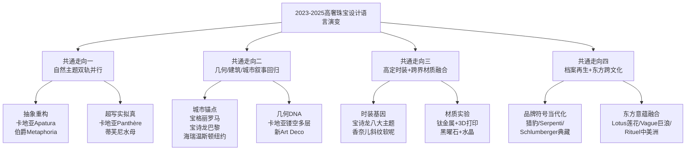

**走向一：自然主题双轨并行**——头部品牌不再单选"写实"或"抽象"，而是在同一系列内并置两种处理方式（如卡地亚Beautés du Monde中Water Aspis蛇的写实与Apatura蝴蝶的抽象），以全光谱表达回应VIC客户对工艺极致与年轻客户对视觉张力的双重诉求。

**走向二：几何/建筑/城市叙事回归**——宝格丽锚定罗马、宝诗龙锚定巴黎芳登广场、海瑞温斯顿锚定纽约、蒂芙尼锚定第五大道，城市建筑成为品牌差异化叙事的硬核底盘；同时卡地亚的几何DNA与新Art Deco风格的复兴，为线上传播提供了高识别度的视觉骨架。

**走向三：高定时装+跨界材质融合**——宝诗龙以八大时装主题与钛金属/3D打印材质矩阵，香奈儿以斜纹软呢镶嵌工艺，路易威登以棋盘格Logo元素，共同推动高级珠宝从"宝石+贵金属"的传统范式向"时装基因+实验材质"的新范式拓展。

**走向四：档案再生+东方跨文化**——卡地亚猎豹、宝格丽Serpenti、梵克雅宝Mystery Set、蒂芙尼Schlumberger、宝诗龙1902冠冕、海瑞温斯顿皇室订制——头部品牌以"档案再生"作为共通方法论，并在此基础上叠加跨文化叙事（莫卧儿、中美洲、莲花、北斋巨浪），呼应全球化买家结构与亚洲市场战略地位的提升。

需要指出的是，**这四组走向并非孤立存在，而是相互交织共同塑造单一作品**。例如卡地亚Spina项链同时体现了"几何回归（多层镂空）+档案再生（卡地亚几何DNA）+大克拉彩宝（29.16ct斯里兰卡蓝宝石）+可转换设计（项链/头冠）"四重特征；宝格丽Aeterna系列同时承载了"城市叙事（罗马140周年）+档案再生（Serpenti/Chandra/Monete）+东方意蕴（Lotus莲花）+大克拉宝石（63.86ct祖母绿）"多重维度。这种"多走向叠加"正是头部品牌区别于二线珠宝品牌的核心壁垒所在——**它们不是在单一维度上做加法，而是在多维度上做有机融合，从而形成不可复制的设计资产**。

承接本章对品牌端设计语言演变的剖析，第3章将转向二级市场，对佳士得、苏富比、富艺斯、保利等拍卖行近三年高定珠宝拍品的品类热点与价值演变进行系统比较，剖析"产地+品质+品牌+故事"四重溢价机制如何与本章所揭示的品牌端设计创新形成共振——尤其是品牌端"档案再生"如何为拍卖端"品牌古董溢价"提供持续的故事供给，以及拍卖端"产地+大克拉彩宝"的偏好如何反向驱动品牌端对稀有产地宝石的争夺。两条主线的交汇，将为后续章节关于工艺创新、文化叙事、消费驱动与趋势共通点的分析提供完整的产业视角。

# 3 高定拍卖珠宝的品类热点与价值演变

承接第2章对高奢品牌端设计语言演变的剖析，本章将研究视角从一级市场转向二级拍卖市场。如果说品牌端的高级珠宝创作展现的是"设计师以何种语汇诠释这个时代的奢华"，那么拍卖端的高定珠宝成交则揭示的是"市场以何种价值标准为奢华定价"。两者构成一级—二级市场的双向闭环：品牌端的"档案再生"为拍卖端的古董溢价持续提供故事供给，而拍卖端对"产地+大克拉彩宝"的偏好则反向驱动品牌端对稀有矿源的争夺。本章将系统比较佳士得、苏富比、富艺斯、保利香港等头部拍卖行2023—2025年的成交结构与价值演变，逐一剖析喀什米尔蓝宝石、缅甸鸽血红、哥伦比亚祖母绿、稀有彩钻、帝王绿翡翠、帕拉伊巴碧玺与帕帕拉恰蓝宝石等核心品类的稀缺逻辑与价格走势，并通过卡地亚Tutti Frutti、法贝热帝国冬季彩蛋、JAR古董设计等典型案例，验证"产地+品质+品牌+故事"四重溢价机制如何主导高定拍卖市场的价值锚定。

## 3.1 近三年三大拍卖行珠宝成交结构总览

如第1章所述，2023—2025年全球艺术品拍卖整体进入十年来低谷，但高级珠宝板块走出截然相反的曲线，成为各大拍卖行业绩的"压舱石"。从体量与同比增速看，富艺斯2024上半年珠宝业务总成交额同比大幅增长191%[^58]，全年珠宝部门在日内瓦、香港、纽约三地拍场总成交较上年增长逾50%；佳士得亚洲雅逸精品2025年成交总额达2.5亿美元，同比增长9%[^59][^60]。而进入2026年春拍季，苏富比香港"瑰丽珠宝(High Jewelry)"专场以178件拍品斩获2.569亿港币[^61]，香港苏富比整体总成交额21.84亿港币，同比增长84.6%[^62]，反映出在内地经济承压、香港市场艺术品板块普遍承压的语境下，顶级珠宝场次仍保持高度活跃的"避险硬通货"属性。

更具结构性意义的是，2025—2026年的拍卖结构呈现出**"顶级精品集中化、中段拍品分化"**的特征。中宝协与拍卖行业的统计显示，2025年春拍全国13家文物艺术品拍卖公司总成交额达到59.54亿元，其中顶级红宝石成交价较2023、2024年上涨50%以上，苏富比香港珠宝专场成交率高达92%[^62]；与此同时，苏富比2024年10月香港"瑰丽珠宝I"专场总成交仅8624万港元，相比同年春拍2.86亿港元大幅缩水，多件千万级珍宝撤拍或流拍[^63]——这一反差清晰说明，在宏观经济不确定性加剧的背景下，**资金正向"真、精、稀"集中**[^62]，而克拉数普通、品质中段、缺乏故事支撑的"标准型"珠宝则面临议价能力下降。

从品类侧重看，四大拍卖行已形成清晰的差异化定位。下表整合了近三年关键场次的代表性表现：

| 拍卖行 | 时段/场次 | 成交亮点与年度TOP拍品 | 品类侧重 |
|--------|----------|---------------------|---------|
| 佳士得 | 2025香港11月"瑰丽珠宝及翡翠首饰" | "The Royal Blue"104.61克拉喀什米尔蓝宝石项链以1.2545亿港币刷新世界纪录[^59][^60]；"Red Butterflies"鸽血红耳环2551万港币[^59] | 稀有彩钻、产地彩宝、品牌古董 |
| 佳士得 | 2025香港5月"瑰丽珠宝及翡翠首饰" | "The Regent Kashmir"35.09克拉戒指7467.5万港币（每克拉27.3万美元，刷新蓝宝石每克拉拍卖纪录）[^59][^60]；4.08克拉艳彩紫粉色IF钻石戒指4151.5万港币[^59] | 单颗顶级宝石 |
| 佳士得 | 2025伦敦12月法贝热专场 | "帝国冬季彩蛋"以约2.14亿元人民币（合2289.5万英镑）成交，登顶2025全球珠宝拍卖榜首[^64] | 皇室传承、艺术史孤品 |
| 苏富比 | 2026香港4月"瑰丽珠宝" | 卡地亚Tutti Frutti项链以2164万港币爆冷夺冠（高出估价近2倍）[^61]；戴比尔斯"Jwaneng 28.88"D色IF白钻2103万港币[^61] | 品牌古董、设计师款、皇室专场 |
| 苏富比 | 2025日内瓦春拍 | "Mediterranean Blue"10.03克拉艳彩蓝钻起拍价900万瑞郎；该场总成交4210万瑞郎[^65] | 大克拉彩钻 |
| 富艺斯 | 2024日内瓦5月 | 6.21克拉艳彩粉色VS1/Type IIa钻石戒指1086.95万瑞郎，刷新粉钻每克拉纪录[^58][^66] | 日内瓦彩钻新高地 |
| 富艺斯 | 2025日内瓦11月秋拍 | "Mellon Blue"9.51克拉艳彩蓝钻成交2052.5万瑞郎（每克拉269万美元）；JAR紫粉钻戒指250万瑞郎[^67] | 古董珠宝+顶级蓝钻 |
| 保利香港 | 2025春拍5月"璀璨珠宝" | 43颗"帝王绿"翡翠珠配红宝石及钻石项链3600万港币（创近五年翡翠珠链新高，贡献全场近80%成交额）[^68][^69] | 翡翠+亚洲叙事 |
| 邦瀚斯 | 2025香港 | 181.61克拉"Kat Florence Lumina"帕拉伊巴碧玺381.4万港币[^70] | 新兴稀缺彩宝 |

四大拍卖行的差异化定位由此清晰：**佳士得凭借遍及香港、日内瓦、伦敦、纽约的全球网络，在稀有彩钻、品牌古董、产地彩宝三大品类全面领跑**，2025年全球十大最贵珠宝拍品中佳士得占据六席[^71]；**苏富比强化设计师款（卡地亚水果锦囊、Cartier Écho、Schlumberger典藏）与皇室专场叙事**，2025年11月日内瓦"皇室和贵族珠宝"专场成交率高达100%、总成交达1430万美元，创下苏富比皇家珠宝专场最佳成绩[^67]；**富艺斯发力日内瓦珠宝新场，连续刷新粉钻、红钻每克拉纪录，定位"高端彩钻第三极"**[^58]；**保利香港聚焦翡翠这一亚洲母题，凭借同矿脉珠链、玻璃种"帝王绿"等顶级东方瑰宝在亚洲拍卖体系中占据独特生态位**[^72][^69]。这种差异化格局，为后续各品类专项分析提供了拍卖行端的结构基底。

## 3.2 喀什米尔蓝宝石：'矢车菊蓝'的产地神话与天花板效应

喀什米尔蓝宝石是2025年高定拍卖市场最具标志性的现象级品类。在该年度香港拍卖最高价珠宝榜单上，前两位均为喀什米尔蓝宝石——这一事实本身即标志着该品类已重新登上彩宝拍卖的最高殿堂。

这一神话的核心载体是"The Royal Blue"项链。在2025年11月佳士得香港"瑰丽珠宝及翡翠首饰"专场上，该项链以1.2545亿港币瞩目成交，**刷新佳士得于2018年为喀什米尔蓝宝石项链所录得的世界拍卖纪录**[^59][^60]。项链共镶嵌16颗枕形喀什米尔天然蓝宝石，重量介乎13.37至3.43克拉，总重104.61克拉，全部经鉴定为最高级别的"皇家蓝"[^59][^73][^60]。同年5月，"The Regent Kashmir"35.09克拉枕形喀什米尔皇家蓝蓝宝石及钻石戒指以7467.5万港币成交，每克拉成交价高达27.3万美元，**刷新蓝宝石每克拉拍卖纪录**，并成为春季亚洲珠宝拍卖最贵彩宝及春季全球珠宝拍卖最贵蓝宝石[^59][^60]。同月秋拍中另一对7.90、6.86、3.07及2.28克拉喀什米尔皇家蓝耳环亦以2490万港币成交[^73]。这一组数据使喀什米尔蓝宝石在单一年度内同时刷新了**世界纪录、每克拉纪录与亚洲拍卖最高价彩宝纪录**三大标杆。

理解这一现象级表现，需要追溯产地稀缺性的地质学根源。喀什米尔蓝宝石的原生矿床位于喜马拉雅山脉西北部藏斯卡地区（Zanskar），1881年的一次大规模山泥倾泻意外暴露出这片埋藏极深的稀世矿床[^73]。当时统治喀什米尔地区的王公独揽开采权，由于矿脉地处高原、气候严苛，**每年仅有夏季三个月适合开采**[^73]。1882—1887年间矿工日夜不息开采出尺寸三至五英寸的瑰丽藍寶石，此即业界所称的"老矿黄金时代"或"黄金六年"[^73]。1888年后老矿基本采尽，工人转移至谷底继续开采但品质大幅下滑；**1927年后再无寶石等級的喀什米爾藍寶石出產，礦區正式關閉**[^73]。换言之，全部市场上拥有明确传承的顶级喀什米尔蓝宝石，都来自一个多世纪前那短暂的"黄金六年"——这种**"已彻底关闭的供给"与"不可逆的存量"**，构成了该品类天花板效应的物理基础。

在物理稀缺之上，喀什米尔蓝宝石的"丝绒蓝"质感进一步构成了不可复制的美学锚点。其独特色泽接近孔雀颈部的"矢车菊蓝"，**天鵝絨般的柔光质感源自寶石内部平行排列的微细絲状内含物对光线的漫散射作用**[^73]——这一物理特性是同样产自缅甸或斯里兰卡的蓝宝石所无法复刻的"产地指纹"。在分级标准上，"皇家蓝（Royal Blue）"被业界用作描述顏色濃艷深邃但不反黑、正藍色或帶有極輕微紫色調的藍寶石；要达到SSEF瑞士珠宝研究院与Gübelin古宝琳寶石鑑定所认证的"皇家蓝"标准，**除了顏色外，蓝宝石还需符合最高品质要求，且未經任何顏色或淨度優化以及人工處理**[^73]。

这一双重稀缺性也解释了一级品牌端对喀什米尔蓝宝石的"不计成本"争夺。如第2章所述，路易威登Aster高级珠宝项链采用23颗已绝矿的克什米尔蓝宝石（主石17.88克拉），保利香港2024年春拍呈献的5.02克拉克什米尔蓝宝石戒指即附Gübelin及SSEF双证书[^74]，2025年保利春拍则将海瑞·温斯顿设计、共重80克拉的喀什米尔/缅甸/斯里兰卡蓝宝石套装作为顶级征集对象[^72]。但在二级市场，**真正未经处理且达到"皇家蓝"分级的喀什米尔蓝宝石仍属"传说中的宝石"**[^73]——这种"品牌端难寻、拍卖端封顶"的现状，是2025年喀什米尔蓝宝石全面登顶的产业逻辑。

值得注意的是，"无烧"作为价值锚定的另一关键属性，在2025年市场上面临真伪验证的挑战。行业抽样调查显示，市面上宣称"无烧"的蓝宝石中近三成缺乏可验证的国际权威证书支撑，部分甚至使用伪造或模糊表述的检测报告；**在斯里兰卡矿区，千分之一原石呈蓝色，亿分之一才具备高品质无烧潜力**，无烧蓝宝石价格通常是有烧的2—5倍，克什米尔或缅甸顶级产地叠加"无烧"属性者更是拍卖行常客[^75]。这意味着在喀什米尔蓝宝石的拍卖语境下，**"产地+无烧+皇家蓝"三重认证缺一不可**——苏富比2026年Ronald Abram设计的15.33克拉克什米尔无烧蓝宝石戒指即是这三重叠加的典型案例[^61]。

## 3.3 缅甸鸽血红与莫桑比克红宝石：颜色定级与产地新旧迭代

红宝石板块在近三年呈现出与喀什米尔蓝宝石不同的演化路径——**缅甸传统霸主与莫桑比克新兴产地的迭代竞合**，构成了红宝石市场最具结构性的变化。

缅甸抹谷仍然是顶级红宝石的精神原乡。2025年11月佳士得香港"瑰丽珠宝及翡翠首饰"专场上，由James W. Currens设计的"Red Butterflies"耳环以2551万港币成交，主石为5.05、5.01、2.11及2.03克拉的椭圆形缅甸天然鸽血红红宝石[^59][^60]。佳士得在拍后专文中指出："**除彩色钻石外，红宝石是每克拉单位价最为昂贵的宝石**，多年来产自缅甸的鸽血红色红宝石在佳士得全球拍卖中心大放异彩……缅甸矿区内富含铬元素，因而产自缅甸的红宝石色泽鲜艳，浓烈饱和……缅甸红宝石闪耀天然荧光，宝石彷佛从内而外散发出栩栩如生的光芒"[^59][^60]。这段产地阐释揭示了缅甸红宝石稀缺性的两大物理基础：**铬元素含量造就的浓烈正红色调，与天然荧光带来的"内发光"效应**。保利香港2024年春拍呈献的5.03克拉缅甸鸽血红戒指（附SSEF证书，估价1200万—1800万港币）、共重32.99克拉的32颗缅甸抹谷鸽血红项链（估价350万—550万港币），均印证缅甸红宝石作为"宝石鉴赏家及收藏家最值得收藏和投资的宝石品种之一"的稳固地位[^76]。

但真正改写红宝石拍卖纪录的，却是来自莫桑比克的"福荣之星"。2023年6月苏富比纽约春拍中，"Estrela de FURA 福荣之星"以3480.45万美元（约2.39亿元人民币）的成交价**打破了2015年"The Sunrise Ruby"红宝石钻石戒指创下的世界纪录，成为红宝石界的新霸主**[^77]。这枚红宝石2022年7月在莫桑比克蒙特佩兹红宝石矿中被发现，原石重量达101克拉，是迄今为止世界上发现的最大宝石级红宝石；切割后蜕变为55.22克拉古垫形切割成品，未经任何加热处理，色调浓厚饱和、净度极高，**GRS评定其为"稀世·世界纪录·鸽血红级·红宝石"，并获"白金稀有奖"以表明其罕见度**[^77]，每克拉成交价约63万美元。

"福荣之星"的纪录性意义在于：**它正式宣告了"鸽血红"这一颜色分级在产地维度上的去缅甸化**——只要颜色分级达到鸽血红标准、且品质综合卓越，莫桑比克产地同样可以登顶世界纪录。这一变化背后是1996年瑞士珠宝研究院（SSEF）确立颜色分级体系的深远影响：**SSEF的颜色分级标准成为全球鉴定"鸽血红"红宝石的权威**[^78]，从此"鸽血红"作为一种颜色描述（GRS分级体系中的"鲜红色"级别），不再专属于缅甸地理产区。寶石需有至少51%的紅色才可稱為紅寶石，"鸽血红"則蕴含一抹深邃的紫色調，其铬含量通常在0.3%—0.5%（重量百分比）或更高[^78]。

保利香港2024年春拍呈献的两件莫桑比克红宝石可视为产地新旧迭代的微观切片：**11.04克拉莫桑比克椭圆形红宝石未经加热**（附Gübelin证书，估价480万—680万港币），"颜色深邃而亮丽，如同熊熊烈火，同时纯粹干净"；**7.27克拉莫桑比克鸽血红红宝石**（附SSEF及GRS双证书，估价240万—350万港币），尤为难得地是"莫桑比克产地中少有的带强荧光的红宝石"[^76]。这两件拍品的并置说明：**莫桑比克红宝石正在以"未经加热+强荧光+大克拉"的组合，逐步逼近缅甸顶级红宝石的传统价值领域**。

从市场总量看，红宝石板块的活跃度与价格水平在2025年延续上升态势。中宝协数据显示，**2025年顶级红宝石成交价较2023、2024年上涨50%以上**[^62]；以2025年单年统计，全球最贵红宝石TOP榜单上"福荣之星"以约2.39亿元人民币的成交价稳坐第一[^77]。鸽血红的色泽源自一个古老的缅甸传说："被殺死的鴿子，其最初滴落的兩滴鮮血，便是這般濃豔的紅色"[^78]——在拍卖语境下，这一传说叙事亦构成红宝石"故事溢价"的文化原料。

## 3.4 哥伦比亚祖母绿与无油认证的极致追求

哥伦比亚祖母绿在传统三大彩宝（红宝石、蓝宝石、祖母绿）中保持着稳健的核心地位，但近三年最显著的市场演化在于**"未经注油（No Oil/No Clarity Modification）"作为继"未经加热"之后又一关键品质指标的崛起**。

祖母绿因其形成过程中天然产生的内含物与微细裂隙，传统上业界普遍接受"注油"作为净度优化手段——通过雪松木油等媒介渗入裂隙，可显著提升宝石透明度与外观。但与此同时，**完全未经任何注油处理的天然哥伦比亚祖母绿**，因其原生品质必须达到极高净度才不需要任何后期优化，从而构成顶级稀缺品。苏富比2026年春拍呈献的32.86克拉枕形哥伦比亚无油祖母绿戒指即典型案例：附SSEF与Gübelin双证书，**SSEF报告明确指出"经鉴定时未发现裂隙处有任何净度优化迹象（with no indications of clarity modification in fissures at the time of testing）"，并附"附录信函（appendix letter）"声明"哥伦比亚产地具备此尺寸与品质的天然祖母绿可被视为稀有非凡（rare and exceptional）"**[^79]；Gübelin报告则确认"未发现净度优化迹象（no indications of clarity enhancement）"，估价1500万—2500万港币[^79]。

这一拍品的证书结构深刻揭示了无油认证的市场逻辑——**"无油"已不再是简单的属性标注，而是由SSEF与Gübelin两大权威实验室通过"裂隙观察+附录信函"双重背书的稀缺性证明**。正如富艺斯珠宝部全球主管Benoît Repellin所言："在珠宝拍卖市场，我们倾向于选择未经任何加热处理并优化净度等级的天然优质彩色宝石，这意味着宝石的色泽是自然形成的，外观未经任何人工干预处理，而这样优质且尺寸适中的宝石越来越稀有，因此更具收藏价值，备受藏家追捧"[^58]。

近三年代表性祖母绿拍品的层级化定价进一步印证了这一逻辑。富艺斯280.84克拉哥伦比亚祖母绿"亚马逊女王（Amazon Queen）"吊坠以278.25万瑞郎成交[^58]，此件拍品以巨大克拉数与历史命名构筑双重价值。保利香港2025春拍则同时呈献多件代表性哥伦比亚祖母绿：**10.64克拉哥伦比亚祖母绿戒指未经注油（附Gübelin及AGL证书，估价300万—500万港币）、7.61克拉哥伦比亚祖母绿挂坠项链（附Gübelin证书，估价160万—250万港币）**[^74]。两件拍品在价格上的层级差异，清晰反映**"未经注油"作为额外品质属性所带来的显著溢价**——同等克拉、同等产地下，未注油版本的估价可较常规版本高出50%—100%。

哥伦比亚祖母绿的产地稀缺性同样植根于地质学。哥伦比亚的穆佐（Muzo）与契沃尔（Chivor）矿区出产具有独特"哥伦比亚绿"色调的祖母绿——其铬元素含量略高、铁元素含量略低，造就了较巴西、赞比亚祖母绿更为纯正的绿色与较少的蓝色调。这一地理优势使哥伦比亚祖母绿在拍卖市场上享有稳固的产地溢价，**SSEF与Gübelin的产地认证成为定价的前置条件**。结合第2章所述卡地亚Lerro项链（5.62克拉3颗阶梯型切割哥伦比亚祖母绿）、宝格丽Eden系列Tribute to Paris（35.53克拉哥伦比亚祖母绿）等一级品牌争夺案例，可以清晰看到：**哥伦比亚祖母绿构成了一级品牌端与二级拍卖端共同争夺的稀缺资源——而"未经注油"则是这场争夺中最具决定性的细分指标**。

## 3.5 稀有彩钻的天花板：粉钻、蓝钻、红钻与黄钻的价格阶梯

如果说彩色宝石承担了2023—2025年高定拍卖的"产地叙事"，那么稀有彩钻则是这一时期的"价格天花板"——几乎在所有顶级珠宝榜单上，蓝钻、粉钻、红钻与艳彩黄钻都占据着金字塔尖的位置。

**粉钻是阿盖尔矿2020年闭矿后供给端结构性收紧的最大受益者**。2024年纽约佳士得春拍中，"伊甸园玫瑰（Eden Rose）"10.20克拉浓彩粉钻以约1.04亿港币（合1330万美元）震撼成交，成为当年度全球钻石拍卖榜首[^66]。这枚Type IIa型粉钻"以无瑕纯净的粉红色调独步天下，完全摒弃了常见的棕、橘或紫色副色"，被佳士得盛赞为"大自然最纯净的粉色奇迹"，远超900万—1200万美元预估价，"印证了顶级彩钻在稀缺矿源（如阿盖尔矿闭矿）推动下的强劲升值潜力"[^66]。同年5月，富艺斯日内瓦春拍中6.21克拉艳彩粉色VS1/Type IIa钻石戒指以1086.95万瑞郎成交，**单克拉价创粉钻历史新高**[^58][^66]，并荣登该季度日内瓦全门类拍卖成交冠军。

**红钻则是稀有度极致的极小众品类**。绝大多数红钻尺寸低于一克拉，2024年5月富艺斯日内瓦呈献的"阿盖尔凤凰（The Argyle Phoenix）"1.56克拉红钻以381.1万瑞郎成交——**这是目前已知最大圆形明亮式切割红钻，缔造圆形红钻拍卖纪录及红钻每克拉拍卖价格的新纪录，由格拉夫品牌创办人劳伦斯·格拉夫亲自投得**[^58]。"阿盖尔凤凰"的命名直接呼应阿盖尔矿（澳大利亚已于2020年闭矿的著名彩钻矿源），这一产地标签使其在矿源关闭背景下成为"凤凰涅槃"式的传奇拍品。

**蓝钻则在2025年迎来连续高潮**。2025年苏富比日内瓦春拍中，"The Mediterranean Blue"10.03克拉枕形改良明亮式切割艳彩蓝钻被私人买家以高于估价的价格拍走——这枚蓝钻于2023年发现于南非Cullinan矿，切割前原石重31.94克拉，"为获得完美净度和切割比例，经切割抛光后的钻石重达10.03克拉……呈现出如海水般梦幻的蓝色调"，起拍价900万瑞郎[^65]。同年11月佳士得日内瓦"Magnificent Jewels"专场则上演蓝钻巅峰之作——美国白宫玫瑰园设计者Bunny Mellon私人收藏的9.51克拉水滴形艳彩蓝钻"The Mellon Blue"以2052.5万瑞郎（约2560万美元）成交，**平均单克拉价格高达269万美元**，色级Fancy Vivid Blue、净度IF[^67][^71]。

**艳彩黄钻则在亚洲市场表现尤为耀眼**。2024年香港富艺斯春拍中15.51克拉圆形明亮式切割艳彩黄色钻石配钻石戒指以890万港币成交[^58]；同年苏富比纽约2024秋拍16.36克拉艳彩黄色钻石戒指（VS1净度）以504万港币成交[^63]；2024年5月日内瓦佳士得拍出"THE YELLOW ROSE"梨形202.18克拉Fancy Intense Yellow黄钻成交价609.5万瑞郎[^66]；2024年10月香港佳士得12.20及11.96克拉椭圆明亮式切割艳彩橙黄钻耳坠以6202.5万港币成交[^66]。富艺斯专家明确指出："**黄色一直是财富与尊贵的象征，因此黄钻也成为彩钻中最受亚洲市场喜爱的颜色之一**"[^58]——这一文化偏好为艳彩黄钻在亚洲市场提供了稳健的承接。

进入2025年，彩钻市场的"金字塔尖效应"进一步固化。2025秋拍数据显示，**佳士得日内瓦"The Mellon Blue"、苏富比"The Mediterranean Blue"、佳士得"Sotheby's Desert Rose"31.68克拉粉橙钻（阿布扎比拍场880万美元成交）、Boucheron 6.24克拉艳彩深蓝钻戒指（CHF 10.6M）等彩钻拍品占据2025全球十大最贵珠宝拍品中的多席**[^71]。下表系统对照了近三年顶级彩钻成交：

| 彩钻品类 | 代表拍品 | 克拉数 | 成交价 | 关键纪录 | 拍卖时点 |
|---------|---------|-------|-------|---------|---------|
| 粉钻 | "Eden Rose"浓彩粉钻 | 10.20ct | 约1330万美元 | 2024年度钻石拍卖榜首 | 2024春纽约佳士得[^66] |
| 粉钻 | 艳彩粉色VS1 Type IIa戒指 | 6.21ct | 1086.95万瑞郎 | 单克拉价创粉钻历史新高 | 2024.5日内瓦富艺斯[^58] |
| 红钻 | "阿盖尔凤凰" | 1.56ct | 381.1万瑞郎 | 最大圆形明亮式红钻、红钻每克拉新纪录 | 2024.5日内瓦富艺斯[^58] |
| 蓝钻 | "The Mellon Blue" | 9.51ct | 2052.5万瑞郎（每克拉269万美元） | 2025年度顶级蓝钻 | 2025.11日内瓦佳士得[^67][^71] |
| 蓝钻 | "The Mediterranean Blue" | 10.03ct | CHF 17.9M | 苏富比日内瓦顶级蓝钻 | 2025春日内瓦苏富比[^65][^71] |
| 蓝钻 | 枕形蓝钻戒指Fancy Intense Blue | 5.72ct | 880.5万美元 | 2024彩钻TOP3 | 2024.12纽约佳士得[^66] |
| 黄钻 | 艳彩橙黄钻耳坠 | 12.20+11.96ct | 6202.5万港币 | 亚洲艳彩黄钻新高 | 2024.10香港佳士得[^66] |
| 黄绿钻 | Fancy Greenish Yellow VS2 | 61.47ct | 1086.7万港币 | 苏富比香港春拍第二高 | 2025春香港苏富比[^65] |
| 粉橙钻 | "Sotheby's Desert Rose" | 31.68ct | 880万美元 | 阿布扎比顶级粉橙钻 | 2025阿布扎比苏富比[^71] |
| 紫粉钻 | "倾城"浓彩紫粉色IF Type IIa戒指 | 7.00ct | 估价4200万—5500万港币 | 苏富比香港春拍领衔 | 2026春香港苏富比[^80] |
| 白钻 | "Jwaneng 28.88" D色IF Type IIa | 28.88ct | 2103万港币 | 顶级白钻硬通货 | 2026春香港苏富比[^61] |

从上表可清晰提炼出彩钻拍卖的**三重溢价乘数**：
- **品类溢价**：蓝钻>红钻>粉钻>橙钻>艳彩黄钻>白钻，颜色越罕见、矿源越枯竭，单克拉价越高；
- **品质溢价**：Type IIa（化学纯度，仅占全部钻石1%—2%）>Type Ia；IF/VVS净度>VS净度；艳彩级（Fancy Vivid）>浓彩级（Fancy Intense）>普通级；
- **故事溢价**：阿盖尔凤凰、伊甸园玫瑰、Mellon Blue等命名性故事，将单纯的物理参数转化为可叙事的文化资产。

值得关注的是，2025年一项新现象是**古董彩钻珠宝的大幅升值**。佳士得2025年11月日内瓦秋拍中，由JAR制作的紫粉钻戒指（8.68克拉Fancy Purplish Pink、VVS1净度）以250万瑞郎成交，戒托与戒壁密镶圆形切割蓝宝石和天然钻石[^67]；同场"彩钻之父"Eddy Elzas汇集超过300颗未经镶嵌的天然彩钻"Rainbow Collection"以176.8万瑞郎成交，**色系覆盖红、蓝、绿、黄、橙、粉、灰等完整色谱，成为古董彩钻系统化收藏的代表性事件**[^67]。这一现象将在3.8节品牌古董溢价中获得进一步阐述。

## 3.6 帝王绿翡翠：东方美学硬通货与亚洲藏家定价权

如果说彩钻代表了西方珠宝拍卖体系的金字塔尖，那么帝王绿翡翠则承载着完全不同的价值叙事——它是**根植于东方美学的硬通货，是亚洲藏家在全球拍卖体系中拥有独立定价权的核心品类**。

2025年5月1日，保利香港春季拍卖会"璀璨珠宝专场"上演了近年翡翠拍卖最具戏剧性的一幕。一条由43颗天然"帝王绿"翡翠珠串联而成的项链以3600万港币（约合460万美元）落槌成交，**每颗翡翠珠直径约12.5毫米，大小均匀如一**[^68][^69]。整场拍卖总成交额4575万港币，仅这一件拍品就贡献了约3600万港币——**贡献全场近80%成交额，并创下近五年翡翠珠链拍卖新高**[^69]。预展期间，赌王千金何超琼频频驻足并多次举牌竞拍，最终惜败给翡翠圈"无聊子"[^68][^69]。这场拍卖的产业意义在于："这场拍卖简直就是高端翡翠市场的一剂强心针……它印证了翡翠珠链在亚洲顶级珠宝圈'不可撼动'的地位"[^68]。

理解帝王绿翡翠的硬通货地位，需要从其极端的稀缺性条件入手。"帝王绿"代表着翡翠颜色的巅峰境界，**其标准极为苛刻：颜色必须浓、阳、正、匀，内部纯净度极高，质地需达到玻璃种级别**[^69]。这种翡翠形成条件极为苛刻——"需要铬离子在212℃左右环境中持续进入晶格，地质运动的瞬息万变，使玻璃种'帝王绿'翡翠历经亿万年方能呈现在世人眼前，是大自然最慷慨又最吝啬的馈赠"[^69]。

而**珠链作为翡翠珠宝中的极致之作，其稀缺性又远超单颗蛋面或手镯**——"相较于手镯或蛋面，珠链制作最耗时废料，对原石要求最为苛刻——必须来自同一矿脉，确保每颗珠子的色泽质地完美统一。超过12毫米直径的翡翠珠已十分稀有，而本次拍出的珠链直径达12.5毫米，43颗大小均匀如一，其稀缺性不言而喻"[^69]。这一"同矿脉一致性"的极端要求，使顶级翡翠珠链成为市场上最罕见的品类之一。

将3.36亿港币的"帝王绿"珠链置于近三年翡翠拍卖纪录中，可看到稳健的高位维持。2023年保利香港春拍中"翠蕴琛宝 灵瑞玉环"天然帝王绿翡翠手镯以6000万港币惊艳成交，**雄踞当季成交榜首，刷新拍卖史上翡翠手镯的最高成交记录**[^72]。2025年保利春拍除头牌珠链外，五件翡翠珍品同步成交：天然翡翠蛋面配钻石戒指45.6万港币、翡翠蛋面配钻石耳环及戒指套装31.2万港币、冰种翡翠蛋面配海螺珠耳环及戒指套装30万港币、翡翠配钻石耳环25.2万港币、翡翠蛋面配钻石耳环及戒指套装21.6万港币[^69]——这一序列展现了"翡翠从顶级收藏到高级佩饰的多层次市场结构"[^69]。

翡翠的抗跌韧性在2025年宏观环境承压背景下尤为突出。业内人士指出，保利春拍的成交"体现了'种、色、工、形'兼备的翡翠依然具备强劲抗跌力。在大环境不确定性持续的情况下，真正顶级翡翠的市场需求依然稳健"[^68]。这一韧性背后还有重要的供给端冲击——**2025年缅甸收紧翡翠原石出口**[^62]，使本已稀缺的玻璃种帝王绿原料面临进一步收紧，构成中长期的价格支撑。

值得指出的是，帝王绿翡翠在全球拍卖体系中呈现出与西方彩宝彩钻完全不同的**地理定价权结构**——保利香港等亚洲拍行而非佳士得、苏富比的日内瓦或纽约场次，构成了顶级翡翠的核心成交枢纽。这种"亚洲文化母题、亚洲拍行主导、亚洲藏家主导"的三位一体格局，使翡翠成为高定拍卖中最具区域文化特色的品类。在2025年全球十大最贵珠宝拍品榜单上，保利香港的43颗翡翠项链以约460万美元位列第九[^71]——尽管绝对价位不及顶级彩钻，但其作为亚洲叙事代表的象征意义不可忽视。

## 3.7 帕拉伊巴碧玺与帕帕拉恰：新兴稀缺彩宝的崛起

在传统三大彩宝（红、蓝、祖母绿）之外，2023—2025年最具突破性的市场表现来自**两类新兴稀缺彩宝——帕拉伊巴碧玺与帕帕拉恰蓝宝石**。它们凭借独特色谱与极致地质禀赋，在传统体系之外开辟了"第二价值曲线"。

**帕拉伊巴碧玺**的稀缺性源自一个传奇的发现故事。1981年，巴西宝石开采者Heitor Dimas Barbosa从一个废弃矿场开始挖洞，坚持五年终在1989年发现这种罕见明艳色调的碧玺；1989年首次亮相图桑珠宝展时售价每克拉100—200美元，**一周内价格飙升近10倍至每克拉2000美元**[^81]。其极端稀缺性在于含铜与锰元素的独特组合——"高浓度的铜元素是造就十分罕见耀眼的霓虹蓝绿色调、土耳其蓝和绿色的主因"[^81]——这一物理特性使帕拉伊巴呈现出"电光蓝"或"霓虹蓝"般的独特火彩，"鲜明及充满活力的特质让帕拉依巴变得非常好认……有人形容初见它时的感觉就像被闪电击到一样"[^81]。

巴西原矿的迅速枯竭使帕拉伊巴成为"挖一颗少一颗"的极致稀缺品。"帕拉伊巴碧玺的产量非常有限，全球每月数十克拉的产出还不得不面临支离破碎，被找到的碧玺原石几乎没有完整的，那些原石的小小碎片往往只有几克……市面上真正的帕拉伊巴碧玺通常只有0.1到0.5克拉"[^81]——大克拉帕拉伊巴尤为稀有。优质蓝色或蓝绿色帕拉伊巴的每克拉单价约在2万美元左右[^81]。

近三年顶级帕拉伊巴拍卖的代表性纪录可观：**蒂芙尼帕拉伊巴项链以420万美元成交，刷新碧玺拍卖纪录**[^71]；2025年香港邦瀚斯"香港珠宝及翡翠"专场上，"Kat Florence Lumina"181.61克拉帕拉伊巴碧玺以381.4万港币成交，霸气夺得彩宝类拍品榜首[^70]。市场总量层面，恒州诚思报告显示**2024年全球碧玺石市场规模已达约108.5亿元，到2031年将接近180.9亿元**[^70]。而2024年9月纽约邦瀚斯"杰出藏品中的非凡珠宝"拍卖会上，5.44克拉垫形帕拉伊巴戒指更以53.39万美元成交，远超4万—6万美元的预估价[^70]——这一"远超估价数倍"的现象，是帕拉伊巴市场结构性短缺的直接反映。

帕拉伊巴的市场表现与一级品牌端密集运用形成强烈共振。如第2章所述，宝格丽Mediterranean Queen等500克拉级帕拉伊巴在品牌端的密集使用，路易威登、卡地亚、宝诗龙等品牌均在近三年高珠系列中加大对帕拉伊巴的采购——这一品牌端集中争夺，进一步推高了帕拉伊巴的二级市场价格。

**帕帕拉恰蓝宝石**则是另一类正进入"结构性短缺"阶段的新兴彩宝。帕帕拉恰以独特的橙粉色调著称，权威产地为斯里兰卡，新兴产地为马达加斯加，但**真正达到理想橙粉色且未经处理、颜色稳定的大克拉宝石"百里挑一，其稀缺性已超越克拉权重"**[^82][^61]。

近三年拍卖纪录揭示了帕帕拉恰的特殊定价逻辑——**小克拉高单价**与**品质决定价格**。佳士得2024年11月拍卖记录显示，1.80克拉橙粉色帕帕拉恰戒指以**52,000元/克拉**的克拉单价成交[^82][^61]——这一单价远高于同等级别的常规蓝宝石。苏富比拍卖的三颗帕帕拉恰则展现了品质对价格的决定性影响：6.52克拉橙粉色戒指3.76万元/克拉、10.08克拉粉色戒指3.75万元/克拉、11.14克拉橙粉色戒指1.8万元/克拉[^82][^61]——大克拉价低源于颜色饱和度与净度的折扣。菲利普斯拍卖的4.47克拉橙粉色帕帕拉恰戒指克拉单价为2.97万元/克拉[^82][^61]。

帕拉伊巴与帕帕拉恰的崛起背后，体现的是**全球彩色宝石收藏体系的成熟化**——藏家不再只追逐传统三大彩宝，而是越来越愿意为独特色谱与稀缺地质禀赋买单。下表对比了两类新兴稀缺彩宝的市场结构：

| 维度 | 帕拉伊巴碧玺 | 帕帕拉恰蓝宝石 |
|------|------------|--------------|
| 核心稀缺色 | 电光蓝/霓虹蓝（铜+锰元素） | 橙粉色（斯里兰卡称"莲花")|
| 主要产地 | 巴西帕拉伊巴州（原矿枯竭）、莫桑比克、尼日利亚 | 斯里兰卡（权威产地）、马达加斯加（新兴）[^82] |
| 价格水平 | 优质单克拉约2万美元[^81] | 优质单克拉3.76—5.2万元人民币[^82][^61] |
| 拍卖纪录 | 蒂芙尼项链420万美元（碧玺纪录）；181.61克拉Lumina 381.4万港币[^70][^71] | 1.80克拉佳士得5.2万元/克拉[^82][^61] |
| 一级品牌运用 | 宝格丽Mediterranean Queen、蒂芙尼项链 | 蒂芙尼Blue Book海洋系列等 |
| 市场阶段 | 价格已显著推升、藏家入场 | 进入"结构性短缺"阶段 |

新兴稀缺彩宝的崛起，与第2章所述品牌端材质实验（宝诗龙黑曜石、钛金属、3D打印黑沙等）形成同频共振——**当传统贵宝石资源被锁定在头部争夺中，新兴稀缺彩宝与跨界材质共同构成了高级珠宝创作的"边缘创新"空间**。

## 3.8 品牌古董溢价：卡地亚、JAR、梵克雅宝、法贝热的故事价值

在产地稀缺、品质认证、克拉规模之外，品牌古董珠宝构成了2023—2026年高定拍卖最具张力的价值维度——**当一件珠宝同时承载品牌历史档案、设计师IP、皇室传承叙事时，其拍卖价值可远远超越材质本身**。

最戏剧性的案例当属2026年4月苏富比香港"瑰丽珠宝"专场上**卡地亚"Tutti Frutti"水果锦囊项链以2164万港币爆冷夺冠**——这一价格高出650万—1150万港币最高估价近2倍[^61]。这件项链的视觉构造典型呈现了卡地亚水果锦囊系列的莫卧儿风格：以鹦鹉为造型主体，鹦鹉眼睛为圆形切割祖母绿、喙部采用珍珠母贝点缀，周身装饰雕花红宝石、祖母绿、蓝宝石及明亮式切割钻石，垂坠一颗水滴形切磨钻石；项链主体为三串祖母绿珠链，珠链搭扣同样镶嵌雕花红宝石、祖母绿、蓝宝石与明亮式切割钻石[^61]。"水果锦囊"系列是卡地亚的招牌——"它将红宝石（红）、祖母绿（绿）、蓝宝石（蓝/紫）雕刻成树叶和果实"——"在收藏界，它是装饰艺术与印度莫卧儿风格的完美结合……苏富比、佳士得每年的图录封面常客，保值能力不用多说"[^61]。这一爆冷夺冠的事实表明：**当代藏家愿意为"装饰艺术风格×印度莫卧儿×卡地亚百年档案"的三重叠加溢价支付远超估价的金额**。这与2024年苏富比香港春拍中卡地亚"India Tutti Frutti"项链以6800万港币成交远超2800万—3800万港币估价的现象一脉相承。

2025年12月**法贝热"帝国冬季彩蛋"以2.14亿元人民币（合2289.5万英镑）登顶2025全球珠宝拍卖榜首**[^64]，则将"故事溢价"推向了极致。这枚彩蛋是沙皇尼古拉二世1913年花24600卢布从法贝热定制、赠予母亲玛丽亚·费奥多罗夫娜皇太后的复活节礼物，由阿尔玛·皮尔设计、阿尔伯特·霍尔姆斯特伦制作；从莫斯科严冬窗棂的冰晶奇景汲取灵感，由整块白水晶雕琢而成，**外壁以约4500颗微型钻石构成晶莹闪烁的雪花图案**[^64]。彩蛋的传承轨迹本身即是故事溢价的核心——1917年俄国革命爆发、罗曼诺夫王朝覆灭，彩蛋被临时政府送往克里姆林宫军械库；1922年被国家珍宝基金（Gokhran）列为可出售藏品；1929—1933年间由伦敦Wartski公司购得；1994年首度上拍佳士得日内瓦以560万美元成交；2002年再上拍卖以约960万美元成交（涨1.7倍）；**2025年第三度上拍以2.14亿元人民币创下纪录**[^64]——三次拍卖间的价格阶梯，本身已构成一段独立的金融叙事。

JAR的拍卖表现是另一种"设计师IP溢价"。2025年11月佳士得日内瓦秋拍中，**由"珠宝艺术家"JAR设计的紫粉钻古董戒指以250万瑞郎成交**——主石为8.68克拉水滴形改良明亮式切割紫粉钻（Fancy Purplish Pink、VVS1净度），戒托和戒壁密镶圆形切割蓝宝石和天然钻石，"呈现出色彩的微妙变化"[^67]。在更早的2025年榜单上，**JAR设计的"Marie-Antoinette"系列粉钻戒指以1400万美元成交**[^71]——这件作品"被认为与法国王后玛丽-安托瓦内特有关"，其溢价来自"设计师传奇+皇室传承"的双重叠加。

梵克雅宝古董珠宝的拍卖表现同样亮眼。2024年5月日内瓦佳士得呈献的"THE MAHARAJA NECKLACE"以549万瑞郎成交——**项链上三颗梨形明亮切割钻石分别为25.50克拉、11.24克拉、11.13克拉**[^66]，"Maharaja（大君）"命名直接呼应印度皇室传承叙事。2025年4月苏富比香港春拍中卡地亚的Écho钻石耳环以2233.5万港币位居全场成交榜首，"主石为两枚水滴形切割钻石，镶嵌圆形切割粉钻、无色钻石和阶梯型切割无色钻石，耳坠采用可拆卸设计"——粉钻6.23ct（Fancy Intense Pink、SI2）、无色钻石6.03ct（D色、IF）的搭配，加上"两只耳饰巧妙的颜色配搭"创意[^65]，使其在2025春拍场上成为天然钻石高端镶嵌的代表。

更令人印象深刻的是**古董珠宝中即使中等克拉的宝石也能录得显著溢价**。2025年11月富艺斯日内瓦秋拍中，**百合花造型古董珠宝钻石胸针（Cartier出品，圆形和玫瑰式切割钻石、E色SI2净度）虽仅重4.55克拉，却以45.15万瑞郎成交，远超初期预估价**[^67]。这一现象有力印证了"古董溢价"的核心逻辑——**当一件作品同时承载卡地亚品牌、Art Deco百合花造型、玫瑰式切割古老工艺时，4.55克拉的中等克拉钻石依然可以录得显著溢价**。

下表系统呈现了近三年品牌古董与设计师珠宝的溢价表现：

| 类别 | 代表拍品 | 关键档案/故事 | 成交价 | 拍卖时点 |
|------|---------|------------|-------|---------|
| 卡地亚百年档案 | "Tutti Frutti"水果锦囊项链 | 装饰艺术×印度莫卧儿，估价650—1150万港币 | 2164万港币（爆冷夺冠） | 2026.4香港苏富比[^61] |
| 卡地亚百年档案 | "India Tutti Frutti"项链 | 同款系列，估价2800—3800万港币 | 6800万港币 | 2024春香港苏富比 |
| 卡地亚百年档案 | Écho钻石耳环 | 6.23ct粉钻+6.03ct白钻，可拆卸 | 2233.5万港币 | 2025春香港苏富比[^65] |
| 卡地亚百年档案 | 百合花古董钻石胸针 | 仅4.55ct E色SI2，圆形+玫瑰式切割 | 45.15万瑞郎 | 2025.11日内瓦富艺斯[^67] |
| 法贝热皇室档案 | 帝国冬季彩蛋（1913年） | 沙皇尼古拉二世为母后定制；2289.5万英镑 | 2.14亿元人民币 | 2025.12伦敦佳士得[^64] |
| JAR设计师IP | "Marie-Antoinette"粉钻戒指 | 与法国王后传奇相关 | 1400万美元 | 2025年[^71] |
| JAR设计师IP | 紫粉钻戒指（8.68ct） | 戒托密镶蓝宝石与钻石 | 250万瑞郎 | 2025.11日内瓦佳士得[^67] |
| 梵克雅宝皇室档案 | "THE MAHARAJA NECKLACE" | 印度大君叙事，三颗梨形钻共47.87克拉 | 549万瑞郎 | 2024.5日内瓦佳士得[^66] |
| 戴比尔斯品牌 | "Jwaneng 28.88"白钻 | D色IF Type IIa+"八八大发"亚洲文化叠加 | 2103万港币 | 2026春香港苏富比[^61] |
| 苏富比钻石 | "倾城"7.00ct浓彩紫粉色IF Type IIa | 2026春香港苏富比领衔 | 估价4200—5500万港币 | 2026春苏富比[^80] |

苏富比钻石部门近年的活动则进一步印证了**"品牌IP+定制设计师IP"的双层运作**：2026春香港苏富比"瑰麗珠寶"领衔拍品即"苏富比钻石"由设计师Joseph Ramsay设计的"倾城"7.00克拉浓彩紫粉色IF Type IIa钻石戒指，估价高达4200—5500万港币[^80]。"苏富比钻石"传承"近三百年来苏富比在艺术和珠宝市场积累的专业知识和视野"，并与"具前瞻性的才华设计师"开拓合作，最新与Joseph Ramsay推出的"华光绮错"系列灵感来自文艺复兴时期服饰与古雕塑衣袭飘逸之美[^80]。这一案例展现了拍卖行从"二级市场分销者"向"一级原创设计平台"延伸的产业化路径。

**品牌古董溢价的存在，正是第2章所述头部品牌"档案再生"设计策略在二级市场的价值校验**——当苏富比、佳士得不断为卡地亚水果锦囊、Schlumberger海洋典藏、JAR设计、法贝热彩蛋等历史符号录得高溢价，品牌端"档案再生"就获得了持续的市场反馈，从而强化对历史档案的挖掘力度，形成"档案演绎—拍卖溢价—档案再演绎"的良性循环。

## 3.9 '产地+品质+品牌+故事'四重溢价机制的整合分析

基于前述各品类拍卖证据，本研究可清晰提炼并验证一个核心命题：**近三年高定拍卖珠宝的价值锚定遵循"产地+品质+品牌+故事"四重溢价机制，且四者不可分割**——单一维度难以支撑顶级估价，唯有四重叠加方能形成不可替代的价值锚定。

下表系统梳理四重溢价机制的具体内涵：

| 溢价维度 | 核心内涵 | 关键证据 |
|---------|---------|---------|
| **产地溢价** | 不可复制的地质禀赋作为价值底层 | 喀什米尔（1927关闭）、缅甸抹谷、莫桑比克、哥伦比亚穆佐/契沃尔、巴西帕拉伊巴（已枯竭）、斯里兰卡、阿盖尔（2020关闭）、南非Cullinan、博茨瓦纳Jwaneng |
| **品质溢价** | 权威实验室认证的物理品质参数 | SSEF/Gübelin的Royal Blue/鸽血红颜色分级；未经加热（No Heat）；未经注油（No Oil）；Type IIa化学纯度；IF/VVS净度；Fancy Vivid艳彩级饱和度；天然荧光强度 |
| **品牌溢价** | 品牌历史档案与设计师IP的签名加成 | 卡地亚水果锦囊/猎豹/几何DNA、JAR设计师IP、法贝热皇室订制、梵克雅宝Mystery Set、戴比尔斯钻石、苏富比钻石与Joseph Ramsay合作、海瑞温斯顿皇室订制 |
| **故事溢价** | 皇室传承、设计师传奇、特殊历史事件、生肖与文化叙事 | 罗曼诺夫王朝、玛丽·安托瓦内特、温莎公爵夫人、印度大君、Bunny Mellon收藏；命名性故事（Eden Rose、Mediterranean Blue、阿盖尔凤凰、福荣之星）；生肖叙事（卡地亚DRAGON）；中国"八八大发"等数字文化 |

**四重叠加的典型范本**首推"The Royal Blue"项链——产地（喀什米尔老矿）×品质（16颗皇家蓝级别+未经处理）×品牌（佳士得权威拍行）×故事（私人珍藏+1881年发现历史）四重共振，最终铸就1.2545亿港币世界纪录[^59][^73]。"福荣之星"55.22克拉莫桑比克鸽血红同样具备四重叠加——产地（莫桑比克蒙特佩兹新兴矿区）×品质（未经加热+GRS"白金稀有奖"）×品牌（苏富比纽约）×故事（迄今最大宝石级红宝石原石、葡萄牙语"FURA之星"命名）——最终3480万美元刷新世界纪录[^77]。法贝热"帝国冬季彩蛋"则将故事维度推向极致——以**罗曼诺夫王朝覆灭、跨百年传承、三度上拍价格阶梯**的史诗叙事，使一颗白水晶+4500颗微钻的彩蛋升至2.14亿元人民币[^64]。

**反向验证则可通过苏富比2024秋拍"瑰丽珠宝I"专场的滑铁卢现象观察**。这场专场总成交仅8624万港币，相比同年春拍2.86亿港币大幅缩水，"几款能够代表苏富比拍卖水准的千万级珍宝均撤拍或流拍"[^63]。深入分析撤拍/流拍拍品可发现，它们多属于**"四重溢价不齐"的中段拍品**——例如10.19克拉淡粉色钻石戒指虽具备一定颜色稀缺度，但SI1净度、缺乏品牌签名、缺乏故事叙事，最终仅以336万港币成交；7.19及7.07克拉梨形H色钻石耳环（VVS2净度、H色非D色顶级、缺乏故事）以264万港币成交[^63]。这些案例反向验证了核心命题：**任何单一维度的优秀都无法独立支撑顶级估价，唯有四重叠加方能形成不可替代的价值锚定**。

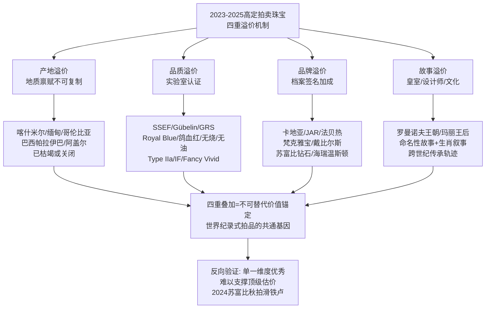

四重溢价机制的产业意义还在于其**抗周期性**。如第1章所述，在艺术品拍卖整体下行、奢侈品市场承压的2024—2025年，四重叠加的顶级拍品依然能够刷新世界纪录、远超估价成交；而四重不齐的中段拍品则面临议价困境。**这一机制使顶级珠宝成为宏观周期下的"避险硬通货"**——这正是中宝协所观察到的"市场资金向'真、精、稀'集中"现象的深层逻辑[^62]。

## 3.10 拍卖端价值偏好对一级品牌设计的反向驱动

承接第2章关于品牌端设计语言演变的分析，本节将系统剖析二级拍卖市场对一级高奢品牌设计的反向驱动机制。这一反向驱动并非单向反馈，而是构成了**"品牌设计创新—拍卖价值校验—稀缺资源争夺—档案叙事强化"的产业闭环**，将一级与二级市场紧密绑定为统一价值生态。

**第一层反向驱动：拍卖端"产地+大克拉彩宝"偏好驱动一级品牌端的稀缺资源争夺**。当2025年喀什米尔蓝宝石以"The Royal Blue"项链与"The Regent Kashmir"戒指连续刷新世界纪录与每克拉纪录，路易威登Aster高级珠宝项链便采用23颗已绝矿的克什米尔蓝宝石（主石17.88克拉）作为切入高珠的"投名状"；当哥伦比亚祖母绿"未经注油"成为继"未经加热"之后的关键品质指标，宝格丽Eden系列Tribute to Paris项链便镶嵌一颗瞩目的35.53克拉哥伦比亚祖母绿、Aeterna系列Terra Mater Serpenti项链则托起63.86克拉哥伦比亚弧面切割祖母绿主石。当帕拉伊巴碧玺凭借电光蓝色调进入"结构性短缺"阶段，宝格丽Mediterranean Queen等500克拉级帕拉伊巴在品牌端的密集运用便顺理成章。**拍卖端的价值标杆，直接转化为品牌端的采购清单**——这一传导极为高效，往往以"季度"而非"年度"为单位反应。

**第二层反向驱动：拍卖端"品牌古董"高溢价强化品牌端档案再生策略**。2024年苏富比香港卡地亚"India Tutti Frutti"项链以6800万港币远超估价、2026年苏富比再次以2164万港币爆冷夺冠卡地亚水果锦囊项链，向卡地亚集团清晰传递了一个市场信号——**水果锦囊作为品牌符号的二级市场价值远未饱和**。这一信号反过来强化了卡地亚在Beautés du Monde、Le Voyage Recommencé等系列中对"红绿黑"色彩组合、雕花宝石、莫卧儿风格的延续。同理，蒂芙尼Schlumberger典藏在2025年首届摩纳哥高级珠宝大奖赛中"凭借Butterflies项圈荣获传承大奖"——市场对Schlumberger作品的认可，反向强化了蒂芙尼Blue Book 2023与2025连续以海洋典藏为主题的系列规划。**品牌端的"档案再生"已不再是怀旧情怀，而是基于二级市场反馈的精确商业决策**。

**第三层反向驱动：拍卖端"故事叙事"偏好促使品牌端在生肖、皇室、城市文化等母题上加大投入**。当法贝热帝国冬季彩蛋以皇室传承叙事登顶2025年度拍卖榜首，海瑞温斯顿Royal Adornments"從過往非凡的皇室珠寶作品中汲取靈感"的策略获得市场背书。当卡地亚专为龙年设计的孤品高珠"DRAGON"在2024年10月佳士得香港首次亮相，便测试了生肖叙事的市场承接力——这种"一级品牌孤品试水二级市场"的运作，是品牌设计与拍卖反馈深度协同的新范式。当苏富比"皇室和贵族珠宝"专场在2025年11月以100%成交率创下苏富比开办皇家珠宝专场以来的最好成绩[^67]，品牌端在皇室、贵族母题上的叙事投入将进一步加大。

**第四层反向驱动：拍卖端"设计师IP"溢价为品牌端引入独立设计师与跨界合作提供激励**。JAR紫粉钻戒指250万瑞郎、Joseph Ramsay为苏富比钻石设计"倾城"戒指估价4200—5500万港币——这些案例显示，**当代设计师在二级市场已能录得不亚于历史品牌的高溢价**。这一现实反过来激励品牌端引入独立设计力量与跨界合作，同时也为时装巨头（路易威登、古驰、芬迪、巴黎世家、普拉达等）跨界进入高级珠宝赛道提供了市场背书——**他们的设计签名在未来二级市场上同样具备溢价空间**。

下图系统呈现了一级—二级市场的产业闭环：

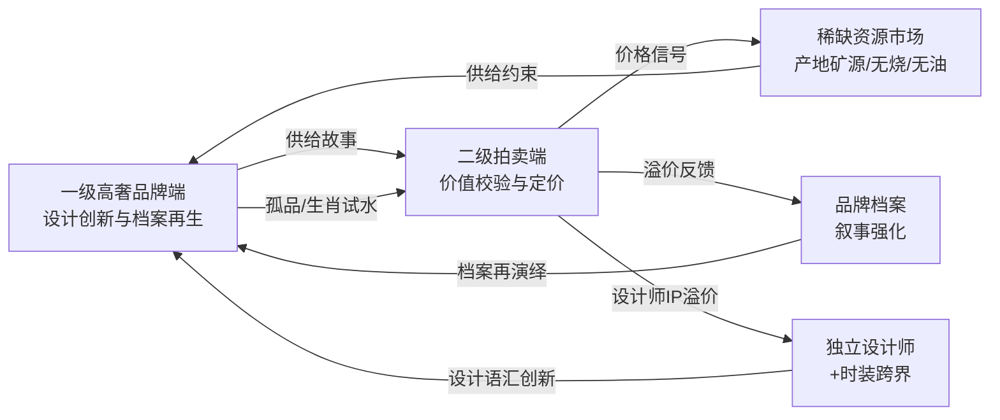

这一产业闭环的存在，使得**单纯讨论"品牌端设计趋势"或"拍卖端价格走势"都是不完整的**——两者构成同一价值生态的两面，**任何品牌设计创新都需经过拍卖市场的价值校验，任何拍卖纪录都源自一级品牌或独立设计师的设计供给**。这正是本研究将"高奢品牌"与"高定拍卖"并置作为双轨研究主题的根本原因。

具体到设计趋势层面，本章所揭示的拍卖端价值偏好与第2章所述品牌端设计语言演变形成多重共振：
- **产地稀缺性**驱动品牌端对克什米尔、哥伦比亚、莫桑比克、巴西帕拉伊巴等核心矿源的争夺，转化为系列中的标志性单品（如LV Aster、宝格丽Mediterranean Queen）；
- **大克拉彩宝**偏好推动品牌端追求63.86ct祖母绿、43.49ct斯里兰卡蓝宝石、500ct帕拉伊巴等"标杆克拉数"，作为系列叙事的核心；
- **品牌古董溢价**强化品牌端的"档案再生"方法论（卡地亚猎豹、宝格丽Serpenti、梵克雅宝Mystery Set、蒂芙尼Schlumberger）；
- **故事叙事溢价**驱动品牌端在城市建筑（罗马140周年、巴黎芳登广场、纽约第五大道）、皇室传承（海瑞温斯顿Royal Adornments）、跨文化母题（莫卧儿、莲花、北斋巨浪）上的密集投入；
- **设计师IP溢价**为时装巨头跨界与独立设计师合作提供市场背书。

承接本章对二级拍卖市场的剖析，第4章将转向材质与工艺创新维度，探查近三年高奢与高定珠宝在天然矿物宝石（虎眼石、孔雀石、青金石等）、钛金属轻量化、3D打印实验材质、隐密镶嵌与可转换结构等方向上的具体突破。本章所揭示的"产地+品质"溢价机制为材质创新提供了价值定价的底层逻辑，而第2章所揭示的品牌端设计语汇演变则为工艺创新提供了美学需求。两条主线的交汇，将使第4章的工艺创新分析获得贯通的产业逻辑。

# 4 材质与工艺创新：从传统贵宝石到多元化探索

承接第2章对品牌端设计语言演变的剖析与第3章对拍卖端"产地+品质+品牌+故事"四重溢价机制的揭示，本章将研究视角下沉至最为底层、却又最具决定性的维度——**材质与工艺**。如果说设计语言是高级珠宝的"灵魂"、价值锚定是"标尺"，那么材质与工艺则是"血肉骨骼"——它既是设计语汇得以实现的物质载体，也是拍卖端"品质溢价"在SSEF/Gübelin/GRS等实验室认证之外的"隐性溢价指标"。2023—2025年的高奢与高定珠宝在材质与工艺层面呈现出前所未有的活跃格局：传统三大贵宝石之外，矿物宝石借势"能量石"叙事重返舞台；钛金属、铝、镁、纳米陶瓷等"非传统金属"从陈世英、Cindy Chao、Anna Hu等艺术家的先锋实验扩展为戴比尔斯、宝诗龙、萧邦等大牌的主流应用；珐琅、金雕、Mystery Set等千年古艺在头部品牌持续复兴并革新；3D打印、植物基树脂、镍钛合金线等前沿技术则重新定义了高级珠宝的物质边界。本章将沿"材质拓展—工艺复兴—结构革新—竞争壁垒"的四重逻辑展开剖析，揭示工艺创新如何成为品牌差异化竞争的核心抓手。

## 4.1 矿物宝石的"能量石"风潮与色彩革命

2023—2025年的高奢珠宝与珠宝腕表领域，最具文化叙事张力的材质演化莫过于天然矿物宝石的密集回归。虎眼石、孔雀石、青金石、绿松石、牛眼石、铬云母、彼得石、欧泊等"装饰宝石"——业界亦称"硬质宝石"或"玉石"，地质学上统称**矿物宝石**——在传统三大彩宝（红、蓝、祖母绿）之外开辟了独立的"第二色彩宇宙"[^83]。

伯爵无疑是这一趋势的标杆品牌。早在1963年，伯爵就开始将青金石、绿松石、虎眼石等引入表盘，与贵金属金工工艺融合，吸引一众社会名流成为Piaget Society的座上宾[^83]。伯爵首席营销官Cynthia Tabet在采访中明确指出："矿物宝石表盘本来就是伯爵的标志性特色之一"——这种历史延续在近三年被推向新的高峰[^83]。2025年伯爵以"**Art of Colour色彩之艺**"为主题，将矿物宝石贯穿所有年度新品，从安迪·沃霍尔系列到POLO 79，从Altiplano至臻超薄系列到Sixtie鎏金悦影系列，再到高级珠宝腕表，形成系统性矩阵[^83]。安迪·沃霍尔系列以艺术家收藏的一枚枕形表款为原型，推出搭载金色古铜辉石、蓝色石英、棕红色牛眼石等矿物宝石表盘的同名作品；甚至在仅2毫米厚的Altiplano至臻超薄Ultimate Concept陀飞轮腕表上，伯爵也以棕色虎眼石镶嵌装饰[^83]。

更具结构性意义的是伯爵对佩戴方式的拓展。**坠饰时计Swinging Pebbles**作为全新作品，鹅卵石外形灵感来自伯爵档案中的一枚怀表，以吊坠表形式再现，运用了虎眼石、铬云母和彼得石三种矿物宝石[^83][^84]。此外，伯爵Hidden Treasures系列与坠饰时计上的红宝石、绿松石和虎眼石等彩色宝石"或点缀于坠饰时计之上，或镶嵌于经典的手工编织黄金链条之间"，手镯腕表新作"大胆采用部分隐藏的欧泊表盘"[^84]。最为震撼的是"**Shapes of Extraleganza奢雅之形**"高级珠宝系列Kaleidoscope Lights缤纷虹彩主题腕表——使用了**28种矿物宝石拼镶表盘**，如同太阳射出万道光芒[^83]。Cynthia Tabet强调，伯爵的色彩"不是低调含蓄，而是鲜明有活力"，大量运用色彩对比，并选用富有生命力、天然纹理的宝石；以蓝色石英表盘的18K黄金Polo腕表为例，"伯爵运用的蓝不是单调的蓝，从中你能看到天然纹理"——**矿物宝石的核心审美价值正是其天然纹理所承载的"非工业化、非标准化"的独特性**[^83]。

矿物宝石回归背后的文化驱动力，不仅是色彩美学的回潮，更是**"能量石玄学"作为情绪价值载体**的兴起。"矿石能量玄学也席卷至制表领域，'生命力与保护之石''智慧与专注之石''幸运机遇与能量疗愈之石'……就像星座命理一样，'能量石'概念也可以增加腕表与人的互动，加强腕表与人的关系"[^83]。这一文化叙事在2025秋冬时装周上同样获得呼应——Bottega Veneta的粗粒水晶戒指、Dries Van Noten的鞋带项链、未雕琢水晶原石与天然矿石被转化为珠宝，"模糊'精致'与'粗糙'的边界，传递对工业化美学的反抗"[^72]。爱娱小妹在2025秋冬八大流行趋势解读中明确将"**古老能量石：原始灵性回归**"列为核心趋势之一，"未经雕琢的水晶原石、天然矿石珠宝持续升温，传递对自然能量的崇拜"[^72]。

矿物宝石与"能量石"叙事的耦合具有产业级意义。它在第3章所述"产地+品质+品牌+故事"四重溢价机制之外，**为珠宝增加了一个独立的"情绪叙事"价值维度**——佩戴者不仅消费色彩与稀缺性，更消费"虎眼石带来专注""绿松石守护安宁"等符号化的能量叙事。这种情绪价值的崛起，恰好契合第1章所揭示的"年轻一代Z世代女性追求悦己自戴、为情绪买单"的消费心智重构——当中宝协2025年消费数据显示彩宝消费中悦己佩戴占比高达42%、远超婚庆嫁娶28%和收藏投资17%时，矿物宝石便成为承接情绪价值的最佳物质载体。

## 4.2 钛金属与轻量化合金的工艺突破

如果说矿物宝石是色彩维度的回归，那么钛金属及其衍生轻量化合金（铝、镁、纳米陶瓷）的崛起，则代表了**贵金属维度上最具革命性的范式突破**。2023—2025年最显著的趋势之一，是钛金属从早年仅有先锋珠宝设计师和艺术家使用的"边缘材质"，扩散为戴比尔斯、宝诗龙、萧邦、卡地亚等主流大牌的核心创作材料[^73][^62]。

### 4.2.1 陈世英：钛金属珠宝的先驱者与"世英陶瓷"的发明

任何关于高级珠宝钛金属应用的叙事，都绕不开**陈世英（Wallace Chan）**这位国际珠宝设计雕刻大师的开创性贡献。陈世英1956年生于福建福州，5岁随家人移居香港，16岁开始在宝石雕刻工坊当学徒，1987年发明了以自己名字命名的"**世英切割（Wallace Cut）**"幻象雕刻法——一种融合浮雕、阴雕及宝石切割技巧、可呈现立体多面倒影的技法，灵感源于多重曝光摄影[^85][^86]。1992年成为首位在德国宝石博物馆举办个展的亚洲人，被德国媒体誉为"亚洲雕刻天才"[^85]。

钛金属的应用是陈世英艺术生涯的另一里程碑。"陈世英为了掌握钛金属制作珠宝的技艺，足足用了**8年时间**研究，2007年，他第一次展示了以钛金打造的蝴蝶胸针作品，让大家看到了真正轻盈的蝴蝶珠宝"[^62][^87]。这种"太空金属"的加工困难极大——"钛金属比想象中要'固执'得多"，因为钛具有"高熔点和金属记忆"带来的重重困难[^73][^87]。陈世英2007年在巴塞尔钟表珠宝展首次展出钛金属珠宝作品《蝴蝶》，标志着钛金属正式被引入高级珠宝领域[^85][^86]。

陈世英的技术创新远不止于钛金属。其完整的发明谱系包括："2002年发明的翡翠切割润光专利技术；2000年代研发的石镶石工艺；2007年将钛金属广泛应用于高级珠宝创作的技术；以及2014年的'真空妙有'、2018年发明的**比钢更坚硬的'世英陶瓷'**"[^86]。其作品《宇宙新生》戒指于2019年被大英博物馆永久馆藏，**成为首位作品获该馆永久馆藏的当代华人珠宝艺术家**[^85][^86]。2024年7月3日至10月7日，陈世英全球最大型个人艺术展"**千年万念：陈世英半世纪珠宝艺术**"在上海博物馆东馆举办，展出逾200件作品，系统回顾其半世纪艺术生涯[^85][^86]。2025年，其设计的《**裕世钻芳华（A Heritage in Bloom）**》项链以**约2亿美元估值**被称为"世界上最贵的项链"[^86]——这一估值本身即标志着钛金属珠宝在价值体系中已跻身顶级行列。

### 4.2.2 Cindy Chao与Anna Hu：华裔艺术家的钛金属诠释路径

紧随陈世英之后，**Cindy Chao与Anna Hu**两位华裔女性珠宝艺术家以各自独特的创作语汇，将钛金属推向了更广阔的艺术维度。

Cindy Chao艺术珠宝以"**建筑感、雕塑性、生命力**"三大创作精髓著称[^88][^89]。其2023年Black Label Masterpiece大师系列推出的"**帕米尔胸针**"，以**钛金属为基底，通过精密铸造与手工打磨**，呈现出建筑美感；**5786颗各式宝石**镶嵌其上——白钻的清冷、黄钻的华贵、棕钻的深邃、蓝宝石的幽远，以及粉色蓝宝石、灰绿色蓝宝石、紫色石榴石、沙弗莱石与翠榴石的交织，其中最大一颗钻石重达5.26ct[^88]。"帕米尔"之名源自中国西部高原，寓意珠宝设计对自然形态的敬畏与再现——**钛金属基底为大量、密集、立体化的宝石镶嵌提供了重量上的解决方案**[^88]。2024年Cindy Chao品牌诞生20周年，作品被美国史密森尼国家自然历史博物馆、法国巴黎装饰艺术博物馆、英国国立维多利亚与艾尔伯特博物馆三大国际权威博物馆永久典藏；2021年法国文化部为其颁发"**法兰西共和国艺术与文学骑士勋章**"，她也成为首位获此殊荣的华人珠宝艺术家[^89]。欧洲传媒以"继Art Nouveau、Contemporary Art后，Cindy Chao开启全新Nouveau Art Nouveau新新艺术时代"来赞誉其艺术地位[^89]。

Anna Hu则以"**钛、铝、纳米陶瓷搭配阳极氧化上色**"诠释花鸟主题。其2024年在巴黎主场展出的《莳花珠韵·芳华绝代》以蝴蝶与花卉为灵感——"花鸟本是'自然主义'的主角，而Anna的作品以钛和铝，乃至纳米陶瓷来表现，工匠们巧妙拿捏力度、控制角度，手工锤炼金属基底，展现出花瓣复杂的蜷曲形态。作品背面以手工拉丝，带来栩栩如生的细腻纹理。**阳极氧化上色技术**，赋予作品充满现代感的电光色彩"[^90]。其2025年新作"**秋分望月蝴蝶胸针**"则进一步深化了这一工艺路径——"作品采用**奈米钛金属上色工艺**，在蝶翼上层层叠染橙、绿、淡粉等色调，展现出秋日之鲜活气息与蝴蝶的灵动姿态"，中央镶嵌一颗紫色蓝宝石象征夜空中升起的圆月[^91]。SSEF瑞士珠宝研究院院长麦可·钦尼斯基博士评价Anna Hu的作品是"细致、复杂和精微的"[^90]。

### 4.2.3 主流大牌的钛金属规模化应用

近三年最具产业意义的变化，是钛金属从艺术家个人实验**规模化扩散为头部品牌的主流应用**。**戴比尔斯（De Beers Jewellers）**The Alchemist of Light高级珠宝系列Ascending Shadows钻石项链便创新性地用到了**阳极氧化钛**，呈现"鲜艳粉色、蓝色和绿色金属"，"跳脱出金银两色，取而代之的是高饱和度的色彩，令珠宝变得相当亮眼"[^73]。**萧邦（Chopard）**Red Carpet系列高级珠宝则将钛金"用得游刃有余"——打造玫瑰花瓣时使用与宝石同色系的粉色钛金；南瓜创意戒指将橙色钛金作为主体、绿色钛金演绎藤蔓——"设计师极为巧妙地利用钛金丰富的色彩，高度还原了自然万物的原本样貌"，材质为"18K白金、钛金、铝、钻石、红宝石、蓝宝石"的复合组合[^73][^87]。**宝诗龙**Carte Blanche, Or Bleu系列的Eau d'Encre手镯采用钛金属及白金材质，镶嵌黑曜石、铺镶钻石，耗时355小时打造[^92]。**卡地亚**Tressage腕表与Panthère de Cartier猎豹系列腕表则在保持品牌经典金属语汇的同时，通过表链铺镶宝石的层叠错落效果探索轻量化的新平衡[^84]。

钛金属为何能在近三年成为大牌争相应用的主流材质？综合多方资料，可归纳为**四大核心优势**：

| 优势维度 | 具体内涵 | 应用场景 |
|---------|---------|---------|
| **轻量化** | 钛密度4.51g/cm³，仅为黄金的1/5 | 大Piece珠宝（项链、胸针、肩饰）"可以服帖地'漂浮'在胸前"[^73][^87] |
| **高硬度** | 硬度高于传统贵金属，不易变形、表面不易刮花 | 长期佩戴与传家场景[^62] |
| **斑斓色彩** | **阳极氧化处理**后金属表面呈现不同颜色（电光蓝、粉、绿、橙等） | 跳出金银双色限制，呈现高饱和电光色彩[^73][^90] |
| **价值倍增** | 原料价格不高，但加工难度极高（高熔点+金属记忆），赋予作品高艺术价值 | "繁复工艺本身就价值很高，钛金属珠宝的价值远超其材料本身的价格"[^73] |

这一组优势矩阵清晰说明，钛金属的产业意义远不止于"替代金银"——它**为高级珠宝创作开辟了一个全新的物质—色彩—结构空间**：当大Piece珠宝不再受重量限制，设计师可以创作此前不可能实现的造型；当金属本身可呈现宝石般的色彩，整件作品的色彩层次得到指数级丰富。这与第2章所述宝诗龙Carte Blanche, Or Bleu以"钛金属+白金+黑曜石+3D打印黑沙"等多元材质矩阵重新定义高级珠宝物质边界的趋势高度吻合，**也呼应了第3章所述拍卖端"设计师IP溢价"——钛金属珠宝以工艺复杂度而非纯材料价值锚定价值，正是设计师IP溢价的物质基础**。

## 4.3 珐琅工艺的当代复兴与技术革新

在材质拓展的同一时期，传统手工艺也迎来了系统性的复兴与革新。其中最具代表性的，便是**珐琅（Enamel）**这一千年古艺在头部品牌的密集运用。珐琅技术起源于公元前的古埃及和美索不达米亚文明，约13世纪末通过阿拉伯地区传入中国，并在明代景泰年间达到工艺高峰，诞生了著名的"景泰蓝"[^78]。其制作涉及"将硅、铅丹、硼砂、长石、石英等矿物质按特定比例混合，并添加各类金属氧化物以呈现不同的色彩。经过高温焙烧和细致研磨，这些混合物转变成粉末状的彩料，再通过不同的工艺手段……附着在金属胎体上，形成独特的装饰图案"——**这一工艺的核心壁垒在于"高温窑炉的不可控性"，需要工匠"凭借经验和技艺，预见并控制这些变化"**[^78][^93]。

近三年高奢珠宝与珠宝腕表中的珐琅工艺呈现出清晰的**八大谱系并行复兴**格局：

| 工艺谱系 | 核心特征 | 代表案例 |
|---------|---------|---------|
| **掐丝珐琅** | 以金属丝围成图案轮廓，填入珐琅烧制 | 卡地亚Ronde Louis Cartier龙装饰高珠腕表[^94] |
| **内填珐琅（Champlevé）** | 在金属胎体雕琢凹槽，填入珐琅 | 积家Precious Flowers系列、梵克雅宝Lady Arpels Ballerine Enchantée腕表[^78][^93] |
| **微绘珐琅** | 以多彩珐琅釉如绘画般描绘 | 梵克雅宝Lady Arpels Brise d'Été腕表、路易威登Escale à Asnières怀表[^78] |
| **大明火珐琅（Grand Feu）** | 高温烧制，色彩温润细腻 | 宝珀经典系列中华年历腕表龙年限量版（绿色大明火珐琅）[^95] |
| **Grisaille墨彩珐琅** | 通过两种珐琅色相互作用产生明暗对比 | 梵克雅宝Lady Arpels Pont des Amoureux腕表[^96][^93][^97] |
| **Plique-à-jour彩色玻璃珐琅** | 镂空结构填充薄层珐琅，光线可穿透 | 梵克雅宝Lady Féerie腕表、Lady Retrouvailles Célestes腕表[^96][^93][^97] |
| **丘陵状珐琅** | 在凹痕中创建丘陵浮雕，增加深度与色彩微妙 | 梵克雅宝Lady Arpels Brise d'Été腕表花冠[^93][^97] |
| **Façonné立体珐琅** | 烧制珐琅粉后逐片修削塑形再釉烧（梵克雅宝专利） | 梵克雅宝Perlée Extraordinaire Fruits Enchantés Framboise腕表[^96][^93] |

### 4.3.1 卡地亚：龙装饰腕表与25次烧制的极致

2023年12月，卡地亚为2024年农历新年特别呈献"**卡地亚大师工艺系列Ronde Louis Cartier龙装饰高级珠宝腕表**"，编号并限量30枚发售[^94]。该腕表使用珐琅和雕刻工艺，源自中国灵感的"龙腾出海"画面跃然于表盘之上——"澎湃的波涛以卡地亚标志性蓝绿配色经由**掐丝珐琅工艺**呈现，浪花则由虹彩珍珠母贝嵌片勾勒。龙的形象以黄金手工雕刻出栩栩如生的细节，'眼睛'同样采用珐琅烧制"[^94]。最为震撼的工艺数据是：**这款腕表上的珐琅工序需反复进行25次烧制，每一轮烧制都是对工匠技艺的考验**[^94]。

卡地亚对龙元素的运用并非偶然——"卡地亚档案中记载有关中国灵感的设计可追溯到19世纪70年代末。1920年代装饰艺术风格盛行之际，多件使用龙元素的珠宝、珍贵器物更是卡地亚典藏中的亮眼藏品"[^94]。这与第2章所述卡地亚"档案再生"方法论形成完美闭环——**Ronde Louis Cartier龙装饰腕表既是珐琅工艺的当代演绎，也是卡地亚百年东方设计档案的当代再生**。

### 4.3.2 梵克雅宝：16个月研发与Façonné立体珐琅专利

梵克雅宝在珐琅工艺上的探索堪称头部品牌中最为系统的代表。其位于日内瓦的制表工坊"通过珐琅工坊和培训学校，精进并传承这些匠心工艺"，并"革新了彩色玻璃珐琅和Grisaille墨彩珐琅等传统工艺"[^96][^93][^97]。

最具突破性的当属**Façonné立体珐琅**工艺。"梵克雅宝不断推动珐琅工艺的创新发展……世家**历经16个月潜心研发**，创制出façonné立体珐琅工艺，并**为其申请专利**。这项工艺首先烧制珐琅粉，然后通过逐片修削，塑造三维形态。雕刻珐琅随后再经高温釉烧，令表面光滑细腻，闪耀亮泽光感。整个工艺流程营造出兼具立体感与通透度的惊艳视觉效果"[^96][^93][^97]。Perlée Extraordinaire Fruits Enchantés Framboise腕表上，浆果饱满圆润的立体轮廓与明亮光泽，正得益于2023年专为腕表系列研发的façonné立体珐琅工艺——"工匠将珐琅粉末缓缓注入模具，随后依照严格控制的温度进行两次烧制"[^96]。

更令人瞩目的是梵克雅宝**多种珐琅工艺的有机组合应用**。在Lady Arpels Brise d'Été腕表上，"花冠采用丘陵状珐琅匠心制成，呈现蔚蓝色泽，与锰铝榴石花蕊相得益彰"[^93][^97]；同时表盘上的彩绘玻璃珐琅蝴蝶则需"工艺师们戴上放大镜，用细长的貂毛笔为表盘上的珐琅花瓣涂色……他们精心描绘出渐变的色彩层次，从浅到深，**每一种颜色都需要经过单独的窑烧过程**"[^78]。Lady Arpels Pont des Amoureux腕表则采用Grisaille墨彩珐琅工艺描绘夜景，"工匠大师利用一种名为'利摩日白釉'的白色珐琅粉末在非常深色的珐琅背景下细致勾绘风景"[^93][^97]。Lady Rencontre Céleste腕表则展现了**珐琅镶嵌技术**——"在彩色玻璃珐琅之中**直接镶嵌珍贵宝石，无需额外金属构件辅助**……需将宝石精准嵌入巧妙凿刻于珐琅层的凹槽之中。再以严格掌控的温度进行釉烧，以固定宝石位置，造就优美的'悬浮'效果"[^93][^97]。

从市场价格看，梵克雅宝珐琅腕表已构成清晰的价值梯度：Lady Féerie Or Rose腕表91万元、Lady Arpels Ballerine Enchantée与Pont des Amoureux系列116万—146万元、Lady Arpels Papillon Automate腕表285万元、Lady Arpels Pont des Amoureux Matinée腕表340万元[^96]——**单纯的珐琅工艺即可支撑百万级以上的价格锚定**，这一价格层级正是工艺壁垒构成"隐性溢价"的直接证据。

### 4.3.3 积家、路易威登与宝珀：珐琅工艺的差异化实践

积家**Precious Flowers系列**腕表中，内填珐琅工艺被赋予了新的创意——"工艺师们采用精细雕刻的24K金箔，根据凹槽的形状和尺寸进行定制。在覆盖上一层透明珐琅后，这些金箔被精确地嵌入预定位置，随后进行彩色珐琅的施加"[^78]。这款腕表"需要经历**十多次的重复烧制**，每一次烧制都增强了珐琅的色泽和质感。大明火珐琅工艺的挑战在于，它要求工艺大师具备深厚的功力和敏锐的直觉，因为在高温烧制过程中，颜料可能发生不可预知的化学变化"[^78]。更具复杂性的是其镶钻背景设计——"宝石镶嵌工序必须在所有珐琅工艺完成后进行，这要求在坚硬的金属表面上进行精细的镶嵌工作，寻找刚与柔之间的平衡点"[^78]。

路易威登的"**Escale à Asnières怀表**"亦采用了高难度的微绘珐琅工艺，"为此，品牌特别邀请了珐琅大师Anita Porchet"——这位独立珐琅大师代表了顶级珐琅手艺人作为"珠宝品牌外部稀缺资源"的运作模式[^78]。

宝珀**经典系列中华年历腕表龙年限量版**则在2024年龙年生肖表大战中以"漂亮的绿色大明火珐琅表盘脱颖而出，相当抢眼。在背后的自动摆陀上，宝珀也雕刻了一条非常漂亮的四爪龙"[^95]——大明火珐琅在生肖表叙事中的运用，进一步拓展了珐琅工艺的应用语境。

珐琅工艺复兴的深层意义在于：**"高温窑炉的不可控性+大师手工经验+长工时"三重壁垒共同构成了品牌的工艺差异化护城河**。当卡地亚需要25次烧制、积家需要十多次烧制、梵克雅宝需要16个月研发专利工艺时，**这些数字不是产品参数，而是品牌叙事中无法被复制的核心资产**——它们既无法通过工业化量产降低成本，也无法通过资本投入快速复制工匠经验，从而构成了与第2章"档案再生"和第3章"四重溢价"机制深度共振的工艺壁垒。

## 4.4 金雕拉丝与传统镶嵌工艺的传承

金雕作为另一项古老的珠宝工艺，在近三年同样获得了显著复兴。"几个世纪以来，金匠大师们一直在使用刻刀将设计刻在贵金属之上，这种技艺可以赋予贵金属新的故事性和美感，增加了它们的深度和维度"[^98]。但与珐琅的色彩属性不同，金雕的核心价值在于**赋予金属本身以肌理感与雕塑性**——"大师们可以从视觉上改变金属材质的特性，赋予金属另一种美丽"[^98]。

### 4.4.1 布契拉提：Rigato与Modellato的肌理派传承

意大利百年世家**布契拉提（Buccellati）**是金雕"肌理派"的当代旗手。其标志性的"**Rigato**"工艺——细腻的平行线条雕刻——"让金属呈现出柔软的缎子光泽，让闪耀的黄金变得细腻温柔起来"[^98]。这种"通过视觉转译改变金属物理属性"的能力，使布契拉提的金雕珠宝呈现出区别于其他品牌的独特光泽。

2024年2月，布契拉提在迪拜Skooni艺术基金会举办的活动中展示了其高级珠宝系列，"展览主要聚焦两大系列：**Macri Color和Il Giardino di Buccellati**。珠宝和银器陈列于现代极简空间之内，并以自然元素装饰，完美体现了品牌将锐意创新与自然灵感相结合的设计理念"[^63][^81]。Opera Tulle Enamel系列则进一步呈现了金雕与珐琅的有机融合——"黄金和白金Opera Blu手镯，饰有蓝色珐琅元素和**放射状网眼图案**"，售价12.5万美元；"在Opera系列中，这种精致风格与彩色石头和珐琅相结合，赋予物体标志性的触感"，其中"**薄纱**部分的成品质量完全仰赖工匠的技艺及所付出的耐心与热情，先是制作出精致的放射状图案，而后斟酌细节，最终打造出一件精美的饰品"[^99]。**布契拉提的工艺哲学体现了"文艺复兴时期"的精神底色——"该时期涌现出的思想及成果一直是永恒物品的持续灵感来源"**[^99]。

### 4.4.2 1960年代英国金雕大师的开拓贡献

理解2023—2025年金雕复兴的趋势，需要追溯1960年代英国金雕大师群体的开拓性贡献。彼时一批"**新锐革新派**"珠宝大师"比起传统珠宝的具象精致，他们更欣赏现代的无序感，尤其喜欢追求黄金无规则的肌理感"[^98]。

**John Donald**虽是皇家艺术学院出身的标准学院派，"却叛逆地喜欢创造抽象作品，摆脱了早期珠宝的形状和风格惯例。他的作品像现代雕塑那样不受约束，利用凹凸不平的金属的光芒与高度抛光的光泽和耀眼的宝石形成对比，来形成独特的运动感和立体表达"[^98]。**Andrew Grima**作为机械工程专业跨界进入珠宝行业的大师，"在1960年代中期成为了英国王室珠宝商。Andrew Grima作品最大的特点就是特别突出的视觉冲击力，他的每一件作品都独一无二。他抛弃传统设计规则，在金属的肌理和宝石的使用上有独特的想法，尤其是黄金的肌理效果创造上，总是能带来让人眼前一亮的'雕塑感'。他签名风格中的那些有纹理的金属丝和金属棒，看似随机无规律，实际上都是工匠通过手工雕刻和镶嵌将它们融合在一起的"[^98]。**Leslie Durbin**则"从13岁开始跟随银匠大师Omar Ramsden学习银匠工艺……在整个1950年代和1960年代初期，他是英国最著名的银匠，被女王授予CBE和MVO勋章"，因其传统训练而尤其擅长金属雕刻[^98]。

这批1960年代金雕大师的历史价值，在近三年随着古董珠宝市场的回暖被重新发现——他们的作品在拍卖市场获得了显著重估，与第3章所述JAR、法贝热等"设计师IP溢价"逻辑形成共振。

### 4.4.3 金雕与宝石雕刻并用：David Webb的双重艺术性

**David Webb**最近推出的"**森林漫步**"主题珠宝展中，最引人注目的展品是大师的最后遗作——**Monkey胸针**："完美地展现了他擅长的雕刻珠宝风格，**以黄金雕刻生动描述了小猴子的毛茸茸质感，以珊瑚雕刻了小猴子可爱的面容和蜷缩的身体，综合展示了金雕和宝石雕刻工艺**"[^98]。这件作品的双重艺术性体现在——**金雕和宝石雕刻并用**，"完全就是双重的艺术之美，对我们来说岂不是花一份钱，得到两倍的享受"[^98]。

### 4.4.4 头部品牌的镶嵌工艺签名

金雕之外，**头部品牌的镶嵌工艺签名**构成了另一条传承脉络。卡地亚**Panthère de Cartier猎豹系列腕表**上"表盘上**雪花式镶嵌**的145颗明亮式切割圆钻，均于卡地亚大师工艺工作坊完成。表链铺镶宝石，包括314颗明亮式切割圆钻和86颗锰铝榴石，链节亦经过逐一抛光和镶嵌，呈现层叠错落的效果。**制作工序耗费超过110小时**"[^84]。Tressage腕表则"汲取卡地亚经典风格元素中的黄金材质、独特造型、材质对比，成就极富雕塑美感的制表杰作。在这款腕表上，金和钻石巧妙交织，优雅簇拥于长方形表盘两侧，**表盘雪花式铺镶钻石**"[^84]。海瑞温斯顿则以**锦簇镶嵌（Cluster Setting）**作为品牌签名，这一传统皇室订制工艺在第2章所述Royal Adornments系列中持续呈现。**伯爵Limelight Aura高级珠宝腕表**则"几乎通体铺镶熠熠美钻，每颗钻石皆精心排布，**达到几乎隐匿缝隙的视觉效果**，同时绽放出一如其名的闪耀光彩"——这种"密镶到极致以隐藏金属"的工艺与梵克雅宝Mystery Set隐密镶嵌形成异曲同工之妙[^84]。

金雕与传统镶嵌工艺的产业意义，正如行业评论所言："这种技艺不是每位珠宝设计师都能掌握的，不过，**这才证明了金雕的奢侈性和稀缺性**"[^98]。这一"非每位设计师可掌握"的稀缺性，使金雕拉丝工艺**与大克拉宝石形成了并列的价值锚定维度**——当顶级宝石资源被头部品牌锁定，工艺签名就成为差异化竞争的另一核心维度。

## 4.5 Mystery Set隐密镶嵌与可转换结构的革新延续

如果说珐琅与金雕代表了千年古艺的复兴，那么**Mystery Set隐密镶嵌**与**可转换结构（Transformable Design）**则代表了20世纪以来高级珠宝最具品牌专属性的工艺发明。前者是梵克雅宝1933年专利的核心壁垒，后者则是近三年以宝诗龙、卡地亚、宝格丽为代表的头部品牌系统化革新的设计语汇。

### 4.5.1 梵克雅宝Mystery Set：1933年专利的当代演化

梵克雅宝**Mystery Set隐密镶嵌**于**1933年获得专利**，"introduced a new way of setting precious stones that was designed to preserve their beauty"——这项工艺"反映了世家自创立之初便驱动其前行的创新勇气与技术革新"[^100][^75][^101]。

工艺核心机制极为精巧——**金质轨道+逐一切割宝石+无金属底座可见**："Its secret lies in its gold rails, into which stones – expressly and meticulously cut – are individually inserted, for the most part rubies, but also sapphires, emeralds, and diamonds. Once in place, these gemstones completely cover the set surface, giving the piece a velvety sheen"[^100][^75][^101]。这种工艺的核心美学价值在于——**金属"消失"，让宝石占据全部视觉空间，呈现"丝绒般光泽"**。

技术门槛之高令人震撼。"Such a high degree of expertise is required to produce a Mystery Set piece that **only very few artisans master its secrets**. The technique is so intricate that **it can take up to eight hours of work to cut each stone**. For instance, a clip requires **an average of 300 hours** in the hands of the jeweler and Mystery Set lapidary"[^100][^75][^101]——**单颗宝石切割需8小时，单件作品需逾300小时工时，全球仅极少数工匠掌握**。

近三年Mystery Set的演化路径呈现出清晰的"经典+衍生"双轨结构。在经典工艺之上，梵克雅宝持续开发了多项衍生技术：

| 衍生技术 | 视觉效果 | 代表作品 |
|---------|---------|---------|
| **Navette Mystery Set** | 立体浮雕（striking relief effect）| Pomme de Pin clip 2018松果胸针[^100][^75][^101] |
| **Vitrail Mystery Set** | 透光彩色蓝宝石（lets light pass through colored sapphires glowing with pastel nuances）| Panache Mystérieux clip 2018[^75] |
| **Buff-topped Mystery Set** | 弧面顶部Mystery Set祖母绿 | Pomme de Pin clip 2018[^100] |

第2章所述梵克雅宝**Legend of Diamonds系列25 Mystery Set Jewels**——由一颗名为Lesotho Legend的非凡原钻切割而成的67颗钻石组成、串联25件独一无二作品——正是Mystery Set工艺当代叙事的代表性事件。Pavot Mystérieux高级珠宝腕表上"匹配的红宝石"则展现了Mystery Set工艺与腕表领域的跨界延伸[^100]。**这种"自然题材+Mystery Set"的稳定关系**——花朵、羽毛、叶片等自然题材中"the Mystery Set technique imbues nature-inspired creations with three-dimensional dynamism, like the double Peony clip created in 1937"[^101]——也使梵克雅宝在第2章自然主题双轨路径中占据独特生态位。

### 4.5.2 可转换结构：Z世代消费心智驱动的"一饰多戴"革命

如果说Mystery Set是单一品牌的工艺壁垒，那么**可转换结构（Transformable Design）**则是近三年高奢珠宝跨品牌共通的设计语汇。这一趋势的核心驱动力，是第1章所揭示的**Z世代女性"轻量化、叠戴、场景多样化"消费心智**与"悦己自戴"取代婚庆赠礼的核心动机。

**宝诗龙**是可转换设计的当代集大成者。其Carte Blanche, Or Bleu系列**Cascade项链**白金镶钻长逾148厘米，"是宝诗龙工坊有史以来制作过最长的项链"——"耗费3000小时精心打造而成"，"该作品秉承Boucheron宝诗龙**一饰多戴的理念，亦可转换为吊坠耳环佩戴**"，"当变为短款项链佩戴时，两段可拆卸部分便可巧妙转换为吊坠耳环，提供趣致搭配"，共1816颗大小不一的钻石以单排铰接式结构精心镶嵌[^92]。Histoire de Style The Power of Couture系列则将可转换设计推向系统化——**Noeud主题白金项链由435颗长阶梯形切割磨砂水晶组成蝴蝶结领带造型，蝴蝶结垂落一颗4.05克拉F色VVS1净度水滴形钻石，提供6种不同佩戴方式**；**Epaulettes主题肩章可转换为手镯佩戴**；**Aiguillette白金项链可拆卸为2枚胸针和一件磨砂水晶手镯**（如第2章所述）。

**卡地亚**则在Beautés du Monde与Le Voyage Recommencé系列中将可转换设计与品牌几何DNA深度结合——**Spina项链可转换为头冠**、**Apatura项链坠饰可拆下作为胸针佩戴**（如第2章所述）。**宝格丽**则在Aeterna 140周年系列中以**Serpenti Sapphire Echo蓝宝石项链**呈现可转换设计——"巧妙地塑造出双首蛇，衔起两颗分别重达37.34克拉的斯里兰卡水滴形切割蓝宝石"，"采用可转换式设计，蓝宝石水滴坠饰可转换为一对耳环佩戴"。

第3章所述**苏富比2025春香港苏富比卡地亚Écho钻石耳环**——"主石为两枚水滴形切割钻石……耳坠采用可拆卸设计"——则将可转换结构延伸至二级拍卖市场，与一级品牌的设计创新形成共振。

可转换结构的产业意义体现在三个层面：**其一，回应Z世代"叠戴+场景多样化"消费需求**——一件珠宝可呈现多种形态，使购买者获得"一物多用"的实用价值；**其二，强化"悦己自戴"心智下的日常使用频率**——可转换为短链或胸针的设计，使顶级珠宝从"特殊场合道具"转变为"日常陪伴对象"；**其三，与第3章所述拍卖端"一物多用"的工艺亮点形成共振**——可转换设计本身即是工艺复杂度的视觉证明，构成拍卖端的隐性溢价指标。

## 4.6 3D打印与新材质实验的边界拓展

近三年高级珠宝最具突破性的前沿实验，集中在**3D打印、植物基树脂、硼硅酸玻璃、镍钛合金线**等"非传统物质"的密集应用。这一趋势的代表者，正是**宝诗龙Carte Blanche系列**——它构成了2023—2025年高奢珠宝物质边界拓展的最前沿样本。

### 4.6.1 Carte Blanche, Or Bleu：水的多元材质矩阵

宝诗龙2024年发布的**Carte Blanche, Or Bleu高级珠宝系列**，由创意总监Claire Choisne以冰岛"水"为灵感打造26件高级珠宝佳作，"将水的自然特征——色彩、纹理、流动性、反射性以及透明度融入珠宝创作"[^92]。整个系列呈现出"前所未有的多元材质矩阵"：

| 主题作品 | 材质组合 | 工艺手法 | 工时 |
|---------|---------|---------|-----|
| **Cascade瀑布** | 白金、1816颗钻石 | 单排铰接式结构、可转换 | 3000小时 |
| **Ondes波纹** | 白金、水晶、钻石 | 3D软件模拟+水晶雕琢、4542颗圆钻镶嵌于水晶下 | 5050小时（项链）+305小时（戒指） |
| **Eau d'Encre水墨** | **钛金属+白金+黑曜石+钻石** | 雪花镶嵌、立体波浪雕刻 | 355小时 |
| **Sable Noir黑沙** | **3D打印黑沙+** 复合材料 | 3D打印压制成型，呈现耐磨虹彩纹理 | — |
| **Eau Forte强水** | 白金+瓷漆+透明清漆 | 传统蚀刻工艺塑造波浪纹理 | — |
| **Vague巨浪** | 白金+851颗圆钻（共20克拉） | **失蜡铸造法**致敬北斋《神奈川巨浪》、可转为胸针 | 650小时 |

**Ondes波纹项链**的材质选择尤具突破性——"使用何种材料能够极尽真实地再现波纹？透明陶瓷？亦或蓝宝石玻璃？品牌创意总监Claire Choisne最终选用了**水晶**，经过精雕细琢与抛光打磨，打造出既纤薄轻盈，又具细腻涟漪纹理的珠宝作品"[^92]。"为使项链能如第二层肌肤般与肩颈贴合，金属的用量被缩减至极致……基于世家对通透性的极致追求，项链中的4542颗圆钻皆**镶嵌于水晶之下**，带来宛若隐形的视觉效果"[^92]——这一"宝石镶嵌于水晶之下"的工艺设计，是高级珠宝物质叠层关系的全新探索。

### 4.6.2 Carte Blanche, Impermanence：花道、侘寂与3D打印植物基树脂

宝诗龙紧随其后于2024年7月发布的**Carte Blanche, Impermanence高级珠宝系列**，则将材质实验推向了哲学层面。该系列受日本花道（Ikebana）及其侘寂（Wabi-sabi）哲学的启发，"创意总监Claire Choisne创作了六组灵感源于植物的艺术构境，将其瞬息之美永恒封存"，包含28件凝炼于身的臻作，**凝聚着世家工坊逾18,000小时的至臻匠艺**[^102]。

最具突破性的是**Composition n°5奶蓟草**作品的工艺创新——"**植物基树脂结合3D打印技术**，复刻奶蓟草尖刺状花冠的细致纹理。世家工匠开创'**couture'全新高级定制镶嵌工艺**，**将逾800颗钻石如针线般缝入奶蓟草的叶片脉络中**，精雕细琢，巧夺天工"[^69]。这一突破的产业意义在于——**它将"高定时装"的针线缝制概念转译为珠宝镶嵌工艺**，与第2章所述宝诗龙"高定时装基因深度嫁接"路径形成完美呼应。

**Composition n°6郁金香、桉叶与蜻蜓**作品则进一步拓展了材质边界——"采用**硼硅酸玻璃、蓝宝石玻璃、珍珠母贝及白金材质**，铺镶钻石。**硼硅酸玻璃花樽搭配黑色复合材料底座**，该作品秉承一饰多戴理念，耗时1860小时精心打造而成"[^102]。"承载这一生态组合的花樽部分由硼硅酸玻璃（borosilicate glass）手工打造，工匠巧妙运用该材质的美学特性，在花樽两端施以**喷砂工艺**，呈现哑光"质感[^102]——硼硅酸玻璃这一原本属于实验室器皿与工业领域的材质，被转化为高级珠宝的载体，本身就是物质边界的极致拓展。

### 4.6.3 镍钛合金线、喷砂、雪花镶嵌等辅助技术

宝诗龙Histoire de Style The Power of Couture系列的**Tricot针织主题**——"五圈式结构白金颈链"，"仿佛由水晶编织而成，水晶经过**喷砂工艺**，并经由**镍钛合金线**巧妙相连"——展示了镍钛合金线在水晶串联中的关键支撑作用。这种"工业级合金材质用于高级珠宝结构性连接"的应用，与第3章拍卖端对工艺复杂度的高溢价形成共振。

新材质实验的产业价值，在于它们**为高级珠宝开辟了超越"宝石+贵金属"传统范式的"第二价值曲线"**——当传统贵宝石的稀缺性已被头部品牌瓜分殆尽，新材质实验为创作提供了无穷无尽的可能性。**当宝诗龙Carte Blanche, Or Bleu系列单件作品平均工时超过1000小时、Carte Blanche, Impermanence系列总工时超过18,000小时时，"工时本身"即构成了与大克拉宝石并列的价值锚定维度**——这与第3章所述"四重溢价"中的"品质溢价"机制形成深度共振。

值得指出的是，**3D技术在高级珠宝中的应用并不局限于材质层面**。三维建模和设计技术为珠宝设计师提供了前所未有的创造力和便利性——"三维模型提供了高度精确的珠宝设计，允许设计师以极高的精度捕捉细节和复杂性""三维打印可以生成具有复杂几何形状的珠宝，这以前通过传统制造技术是不可行的"[^103]。这意味着3D打印正从"原型快速制作"工具升级为"最终产品制造"手段，这一升级在宝诗龙Sable Noir主题与Composition n°5奶蓟草作品中已经得到验证——它将在未来3—5年内成为高级珠宝制造的核心技术之一。

## 4.7 工艺创新作为品牌差异化竞争壁垒的整合分析

基于前述六个维度的实证，本节将系统提炼近三年高奢珠宝工艺创新的核心规律，并通过对照分析揭示其作为品牌差异化竞争壁垒的产业逻辑。

### 4.7.1 四组核心规律的提炼

**规律一：'传统手工艺+现代材质'的双轨融合**。这一规律体现在多个标杆案例中：宝诗龙Carte Blanche, Or Bleu以钛金属、3D打印黑沙、硼硅酸玻璃等现代材质承载失蜡铸造、传统蚀刻、雪花镶嵌等传统工艺；卡地亚Ronde Louis Cartier龙装饰腕表以掐丝珐琅、黄金雕刻等百年古艺呈现现代东方美学叙事；Cindy Chao帕米尔胸针以钛金属基底承载5786颗传统宝石的手工镶嵌；Anna Hu以纳米陶瓷、阳极氧化上色重新诠释古典花鸟主题。**双轨融合的产业意义在于——它打破了"传统vs现代"的二元对立，使高级珠宝在保持工艺壁垒的同时获得视觉创新空间**。

**规律二：'专利级核心工艺'作为品牌核心资产**。下表系统呈现了头部品牌的工艺签名：

| 品牌/艺术家 | 核心专利/签名工艺 | 时间锚点 | 壁垒属性 |
|------------|----------------|---------|---------|
| **梵克雅宝** | Mystery Set隐密镶嵌（含Navette/Vitrail/Buff-topped衍生）；Façonné立体珐琅 | 1933年专利；2023年研发 | 全球极少数工匠掌握 |
| **陈世英** | 世英切割（Wallace Cut）；钛金属珠宝技术；世英陶瓷（比钢更坚硬） | 1987/2007/2018年发明 | 个人化技术发明谱系 |
| **宝诗龙** | "couture"高定镶嵌工艺；钛金属+3D打印+硼硅酸玻璃材质矩阵 | 2024年开创 | 创意总监+工坊协同壁垒 |
| **Anna Hu** | 纳米钛金属上色工艺；阳极氧化电光色彩 | 持续发展 | 华裔艺术家工艺签名 |
| **Cindy Chao** | 钛金属雕塑性铸造；超大规模宝石镶嵌（5786颗） | 持续发展 | 建筑感+雕塑性+生命力工艺哲学 |
| **布契拉提** | Rigato平行线条雕刻；Modellato肌理派金雕；薄纱（Tulle）工艺 | 跨世纪传承 | 文艺复兴金匠传承 |
| **卡地亚** | 雪花式镶嵌；25次烧制掐丝珐琅；几何DNA | 跨世纪传承 | 大师工艺工作坊 |
| **海瑞温斯顿** | 锦簇镶嵌（Cluster Setting） | 跨世纪传承 | 皇室订制传承 |

这些工艺签名构成了**品牌不可被复制的核心资产**——它们既是设计资产（视觉识别度），也是商业资产（专利与技术壁垒），更是文化资产（百年档案传承）。

**规律三：'长工时与稀缺工匠'构成不可复制的人力壁垒**。下表系统对照了近三年代表作品的工时数据：

| 作品 | 工时 | 工艺特征 |
|------|------|---------|
| 宝诗龙Carte Blanche, Impermanence系列总工时 | **逾18,000小时** | 28件作品平均645小时/件 |
| 宝诗龙Ondes波纹项链 | 5050小时 | 水晶+4542颗圆钻 |
| 宝诗龙Cascade瀑布项链 | 3000小时 | 1816颗钻石+148cm长度 |
| 宝诗龙Composition n°6 | 1860小时 | 硼硅酸玻璃+多材质 |
| 蒂芙尼水母胸针 | 900小时 | 海洋生灵超写实 |
| 宝诗龙Vague巨浪 | 650小时 | 失蜡铸造+851颗圆钻 |
| 宝诗龙Eau d'Encre手镯 | 355小时 | 钛金+黑曜石 |
| 宝诗龙Ondes戒指 | 305小时 | 水晶+钻石 |
| 梵克雅宝Mystery Set胸针 | **逾300小时** | 单颗宝石切割需8小时 |
| 蒂芙尼Urchin戒指 | 约200小时 | Schlumberger典藏致敬 |
| 卡地亚Panthère猎豹腕表 | 超过110小时 | 雪花镶嵌+漆艺 |

**工时本身已成为高级珠宝价值锚定的"硬指标"**——当宝诗龙Impermanence系列以18,000小时总工时定义高定边界，当梵克雅宝Mystery Set 300小时单件工时构成全球极少数工匠的稀缺禀赋，工时数据便成为工艺溢价的可量化证明。

**规律四：工艺创新与拍卖端'品质溢价'的深度共振**。第3章所揭示的"产地+品质+品牌+故事"四重溢价机制中，"品质溢价"主要由SSEF/Gübelin/GRS等实验室认证支撑。但近三年的趋势是——**工艺签名（卡地亚雪花镶嵌、布契拉提Rigato、JAR密镶蓝宝石戒托、Schlumberger倒置镶嵌）已成为二级市场的隐性溢价指标**。第3章所述2025年JAR紫粉钻戒指250万瑞郎成交（戒托与戒壁密镶圆形切割蓝宝石和天然钻石）、2025年百合花造型古董珠宝钻石胸针（Cartier出品，仅4.55克拉E色SI2）以45.15万瑞郎远超估价——这些案例均证明，**工艺签名作为隐性溢价指标，已在二级市场中获得明确的价值锚定**。

### 4.7.2 头部品牌工艺差异化定位对照

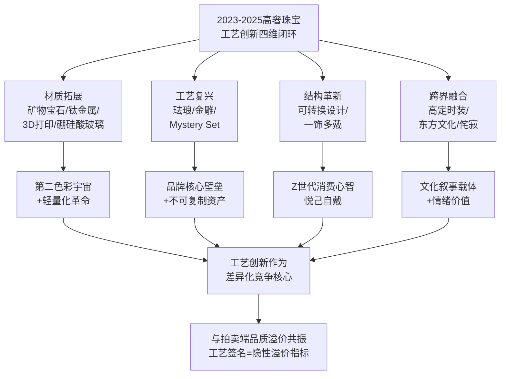

下表系统呈现了头部品牌的工艺差异化定位：

| 品牌 | 核心工艺签名 | 近三年代表创新 | 战略定位 |
|------|-------------|--------------|---------|
| **梵克雅宝** | Mystery Set+八大珐琅工艺谱系 | Façonné立体珐琅16个月研发申请专利；Legend of Diamonds 25 Mystery Set Jewels | 工艺壁垒最系统、最深厚 |
| **卡地亚** | 雪花镶嵌+25次烧制掐丝珐琅+几何DNA | Ronde Louis Cartier龙装饰腕表；Beautés du Monde颤动镶嵌 | 工艺与档案再生深度融合 |
| **宝诗龙** | "couture"高定镶嵌+钛金属/3D打印多元材质 | Carte Blanche Or Bleu/Impermanence双系列18,000+小时工时；800颗钻石"针线缝入"叶脉 | 物质边界最前沿拓展者 |
| **伯爵** | 矿物宝石+金工工艺+超薄技艺 | Art of Colour 28种矿物宝石拼镶；2毫米厚Altiplano虎眼石装饰 | 矿物宝石+色彩之艺标杆 |
| **布契拉提** | Rigato+Modellato金雕"肌理派" | Macri Color/Il Giardino di Buccellati/Opera Tulle持续演绎 | 金雕传承+文艺复兴底色 |
| **海瑞温斯顿** | 锦簇镶嵌+大克拉钻石 | Royal Adornments锦簇对称几何 | 皇室订制叙事+稀缺彩钻 |
| **蒂芙尼** | Schlumberger倒置镶嵌+长工时手工 | Blue Book海葵倒置镶嵌；水母胸针900小时；Urchin约200小时 | Schlumberger典藏IP系统化运营 |
| **陈世英** | 世英切割+钛金属+世英陶瓷 | 千年万念上海博物馆个展；裕世钻芳华2亿美元估值 | 华人珠宝艺术家技术发明集大成 |
| **Cindy Chao** | 钛金属雕塑性铸造+大规模宝石镶嵌 | 帕米尔胸针5786颗宝石；20周年系列 | 建筑感+雕塑性+生命力 |
| **Anna Hu** | 纳米钛金属+阳极氧化上色 | 秋分望月蝴蝶胸针；伊甸圆系列 | 东方韵味+古典音乐通感 |
| **戴比尔斯** | 阳极氧化钛+高饱和色彩 | The Alchemist of Light Ascending Shadows | 钻石巨头工艺创新转型 |
| **萧邦** | 钛金+18K白金+铝多金属复合 | Red Carpet系列玫瑰花瓣/南瓜创意戒指 | 高珠红毯系列工艺多元 |

### 4.7.3 工艺为文化叙事提供物质载体

承接本章对工艺创新的系统剖析，可清晰提炼出一个核心命题：**工艺为文化叙事提供物质载体，材质为情感表达提供视觉肌理，二者共同构成高级珠宝从"物"到"艺术"升维的核心机制**。

当卡地亚以25次烧制的掐丝珐琅承载"龙腾出海"的中国新年叙事，珐琅工艺便成为东方文化叙事的物质载体；当宝诗龙以失蜡铸造的白金海浪致敬葛饰北斋《神奈川巨浪》，失蜡铸造工艺便成为东西方艺术对话的物质媒介；当宝诗龙以植物基树脂+3D打印复刻奶蓟草尖刺花冠、以800颗钻石"针线缝入"叶片脉络承载侘寂哲学，"couture"镶嵌工艺便成为日本花道与无常之美的物质转译；当陈世英以钛金属雕琢蝴蝶承载"千年万念"的东方哲思，钛金属便成为华人艺术家文化表达的物质骨骼；当Anna Hu以纳米钛金属上色诠释秋分气节与蝴蝶蜕变，材质本身便成为东方时令文化的视觉载体。

**工艺与材质，从来不是孤立的技术问题，而是文化叙事的物质基础**。这一命题为第5章主题灵感与文化叙事的论述提供了底层逻辑支撑——只有当工艺与材质创新足够丰富时，文化叙事才能在高级珠宝中获得充分的物质表达空间；反过来，只有当文化叙事足够深刻时，工艺与材质创新才能跳出"技术炫技"的浅层维度，升华为"艺术创造"。

承接本章对材质与工艺创新的剖析，第5章将转向**主题灵感与文化叙事的共通取向**——系统归纳近三年高奢与高定珠宝在自然生灵（动植物、海洋、宇宙）意象、城市与建筑文化遗产、复古与装饰艺术风格复兴、东西方文化跨界融合（特别是华裔设计师如ANNA HU、Cindy Chao、陈世英所代表的东方主体性表达）、生肖与节庆叙事等维度的创作母题，分析叙事性如何强化珠宝的情感与收藏价值。本章所揭示的工艺与材质创新，正是这些文化叙事得以充分展开的物质前提——两条主线的交汇，将使第5章的文化叙事分析获得贯通的产业逻辑。

# 5 主题灵感与文化叙事的共通取向

承接第2章对品牌端设计语言演变的剖析、第3章对拍卖端"产地+品质+品牌+故事"四重溢价机制的揭示、第4章对材质与工艺创新的系统梳理，本章将研究视角聚焦于近三年高奢品牌与高定拍卖珠宝在**主题灵感与文化叙事层面的共通取向**。如果说设计语言是珠宝的"形式语法"、价值机制是"市场标尺"、工艺材质是"物质骨骼"，那么主题灵感与文化叙事则是珠宝跨越商品维度、升华为艺术品与文化资产的"灵魂内核"。当卡地亚以猎豹与莫卧儿风格穿越百年、宝格丽以罗马城140周年承载永恒之美、蒂芙尼以Schlumberger海洋典藏跨界两届Blue Book、宝诗龙以冰岛水形态与日本侘寂哲学双向探索、华裔艺术家以东方主体性表达跻身大英博物馆永久典藏——这些看似分散的创作母题背后，正涌动着五条清晰的共通脉络。本章将沿"自然生灵—城市建筑—复古复兴—东西方融合—生肖节庆"五大母题展开横向归纳，并以"叙事性作为情感与收藏价值的核心载体"作为收束，揭示2023—2025年高级珠宝跨品牌、跨地域、跨市场层级的叙事共振机制，为第6章消费驱动力分析提供文化叙事的需求侧背景。

## 5.1 自然生灵意象：写实、抽象与超现实的多元演绎

自然生灵无疑是近三年高奢与高定珠宝中最普遍、也最具张力的创作母题。但与上一代品牌单一拟物化处理不同，2023—2025年的自然主题呈现出**写实、抽象、超现实三条路径并行**的成熟格局——它不仅是视觉灵感来源，更是珠宝叙事承载"生命力+情感价值"的核心载体。

### 5.1.1 动物王国：从超写实雕塑到品牌符号的当代演绎

动物主题在近三年高奢珠宝中呈现出"品牌核心符号+跨品牌共通母题"的双层结构。**品牌核心符号**层面，卡地亚的猎豹、宝格丽的灵蛇、梵克雅宝的蝴蝶构成了三大百年品牌的"动物图腾"——它们既是设计语汇，也是品牌资产管理的核心。如第2章所述，卡地亚Le Voyage Recommencé系列Panthère Confiante项链通过"超写实主义、风格化手法和抽象风格演绎经典猎豹主题"——中央生动塑造一只黑色点斑雪豹，豹眼镶嵌祖母绿、斑纹镶嵌缟玛瑙，前爪守护26.52克拉弧面切割橄榄石，并巧妙融入卡地亚标志性的红、绿、黑色彩元素[^34]。宝格丽Aeterna 140周年系列Terra Mater Serpenti祖母绿项链则"大胆地塑造出一条盘绕颈部的钻石和祖母绿灵蛇，蛇首和蛇尾蜿蜒交织，托起一颗重达63.86ct的哥伦比亚产地的弧面切割祖母绿主石"，灵感源自古罗马神话中的大地女神[^43]。

**跨品牌共通母题**层面，蝴蝶、海洋生灵、鸟类、蛇类等成为多个品牌共同探索的领域。卡地亚Beautés du Monde系列以欧泊变彩特性诠释蝴蝶——Apatura项链镶嵌三颗总重22.08克拉的澳大利亚欧泊，"以抽象构图营造对蝴蝶的想象"，"斑斓绚丽的色彩令自然界这一最让人着迷的生灵呼之欲出"[^33]。卡地亚2024年Nature Sauvage系列亦推出蝴蝶主题项链，运用钻石和缟玛瑙再现蝶翼斑纹，正中镶嵌一枚63.76克拉红碧玺[^98]。Qeelin 2025高级珠宝系列Bamboo Butterfly作品则以东方语境下的蝴蝶为主角："蝴蝶在东方故事中常以浪漫与灵动的形象出现，以轻巧之身，引人翩然入梦"——榄尖形切割的祖母绿构出蝴蝶的身体，渐变的绿石榴石和蓝宝石化作翅膀[^82][^97]。Anna Hu 2025巴黎高定周新作《秋分望月蝴蝶胸针》则"采用奈米钛金属上色工艺，在蝶翼上层层叠染橙、绿、淡粉等色调，展现出秋日之鲜活气息与蝴蝶的灵动姿态"[^95]。**蝴蝶作为跨文化共通母题，被东西方品牌以截然不同的语汇演绎，恰好成为东西方美学对话的最佳样本**。

蛇类主题同样呈现跨品牌活跃格局。卡地亚Beautés du Monde系列Water Aspis项链"融汇写实、意象以及抽象化的创作手法"诠释蛇——五颗产自斯里兰卡、总重43.49克拉的凸圆型切割蓝宝石点缀整条项链，铰接结构使蛇身活动自如，鳞纹图案以三角形钻石与青金石间镂空缝隙的几何形状接续呈现[^33]。宝格丽除经典的Serpenti系列外，更通过Serpenti Sapphire Echo蓝宝石项链（双首蛇衔起两颗37.34克拉斯里兰卡水滴形蓝宝石、可转换为耳环佩戴）持续刷新灵蛇叙事[^43]，并以2024年Serpenti Dragoni系列将"蛇—龙"意象融合迎接中国龙年[^70]。

### 5.1.2 海洋生灵：蒂芙尼Schlumberger典藏的两届Blue Book叙事

海洋生灵作为近三年自然主题中最具系统性的子母题，被蒂芙尼推向了极致。Blue Book 2023 Out of the Blue幻海秘境围绕**瀚海星螺（Shell）、珊瑚溢彩（Coral）、鱼跃光影（Pisces）、深海星芒（Star Urchin）、海岩星韵（Starfish）**五大主题展开，并以**花舞海葵（Sea Anemone）**作为秋季新增主题——海葵主题"看似冷凍在永久綻放的狀態之下"，以蓝色铜锂碧玺、订制切割钻石包覆，并采用倒置镶嵌使尖底朝外以诠释海葵触角[^35][^36]。水母胸针"以长达900小时手工制作"，"曲线柔美明亮闪烁，与水母的迷人色调和缥缈形状互相呼应"[^35]。

Blue Book 2025 Sea of Wonder瑰海奇珍则进一步拓展为**Anemone海葵、Anchor船锚、Shell贝壳、Mermaid美人鱼、Seahorse海马、Sea Turtle海龟、Ocean Flora海洋花卉、Starfish海星、Urchin海胆、Wave海浪**十大篇章[^83]。其中Urchin篇章"在自然主义與超現實主義元素之間取得和諧的平衡"，灵感来自Schlumberger 1961年设计的标志性海胆风格台钟，戒指由18K黄金"绳链"扭饰镶嵌一颗超过12克拉的浓彩黄钻及14颗白钻，工匠耗时约200小时打造[^37]。海龙幻舞（Seahorse）主题则从让·史隆伯杰1968年创作的标志性胸针中汲取灵感，"以当代视角重新诠释这一海洋精灵的灵动之姿"——带有凹槽刻纹的月光石与精心排列镶嵌的风信子石、蓝宝石等彩色宝石彼此映衬[^86]。深海星芒（Urchin）主题则巧妙融入金属薄片嵌饰珐琅工艺，"这一由让·史隆伯杰复兴的19世纪古老工艺在刻画海胆多刺质感的同时，生动捕捉海洋的纷繁色彩"[^86]。**蒂芙尼以两届Blue Book在海洋这一母题上完成了从"幻海秘境"到"瑰海奇珍"的递进式叙事，确立了'自然主题—Schlumberger典藏—当代演绎'的三位一体创作模型**。

蒂芙尼珠宝与高级珠宝艺术总监Nathalie Verdeille的总结颇具代表性："2025 Blue Book高级珠宝系列Sea of Wonder瑰海奇珍中的每一件作品都承载着丰富的叙事，引领我们沉浸其中，踏上一段穿越深海未知之境的旅程。在诉说海洋传奇故事的同时，这些杰作也共同诠释着蒂芙尼自1837年创立以来，对突破界限的热爱、对开拓创新的追求，以及对匠心工艺的传承"[^86]。这段总结清晰揭示了海洋主题作为"品牌精神图腾"的深层意义。

### 5.1.3 植物花卉：东西方花语的共通诠释

花卉作为高级珠宝创作中最常见的自然母题之一，"因其绽放、纯净、坚韧等多重寓意，在不同文化体系中都被赋予深远象征"[^81]。近三年植物花卉主题呈现出**东西方花语共通诠释**的明显趋势：

**西方品牌的花卉演绎**集中在睡莲、玫瑰、百合等经典母题。卡地亚Beautés du Monde系列Nouchali高级珠宝项链"捕捉睡莲之美，展现其神奇魅力"——这条项链使用风格化手法呈现睡莲灵感，珠宝结构正如雕塑般富有层次，中央10.61克拉红碧玺由层叠的钻石花瓣环绕展开[^33]。Anna Hu《格蕾丝王妃玫瑰胸针》以钛金属手工打造，"层层堆叠的花瓣，边缘微翘、姿态飞扬"，"花心镶嵌的一颗艳黄钻石，犹如晨曦中第一道光洒落于花瓣"[^95]。

**东方文化母题**则集中在莲花、竹叶等具有深厚文化象征的植物。宝格丽Aeterna 140周年系列Lotus Cabochon玫瑰金项链"灵感源于象征永恒与重生的莲花（Lotus）"，采用高级定制时装中的衣领造型，紫水晶、祖母绿和红碧玺构成花园般的图腾[^43]。Qeelin 2025高级珠宝系列Bamboo Butterfly与Bamboo Bo Bo则以竹子象征高洁坚韧——"竹子象征高洁坚韧，自古便是文人墨客的精神寄托。受庭院中翠竹的启发，Qeelin Bamboo高级珠宝系列以2组全新作品典雅诠释竹子的不同风貌，展现人与自然的和谐联结"[^82][^97]。周大福"和美东方Timeless Harmony"高级珠宝系列则推出"莲华清韵"主题，体现东方静谧之美[^81]。

**最具突破性的植物表达**当属宝诗龙Carte Blanche, Impermanence高级珠宝系列。如第4章所述，该系列受日本花道（Ikebana）及其侘寂（Wabi-sabi）哲学启发，包含28件凝炼于身的臻作，凝聚着世家工坊逾18,000小时的至臻匠艺；其Composition n°5以植物基树脂结合3D打印技术复刻奶蓟草尖刺状花冠的细致纹理，"将逾800颗钻石如针线般缝入奶蓟草的叶片脉络中"。**宝诗龙以"植物—花道—侘寂"的东方哲学链条，将花卉主题升华为关于"生命无常之美"的哲学叙事**。

### 5.1.4 宇宙星象：从Schlumberger典藏到天文诗意

宇宙星象作为自然主题的"宏观尺度"延伸，在近三年呈现出与海洋主题平行的叙事路径——同样以Schlumberger典藏为锚点，同样形成系列化的品牌资产。蒂芙尼Blue Book 2024 Tiffany Céleste苍穹万象正是这一脉络的代表："最新的高級珠寶系列是一趟迷人的宇宙之旅，靈感來自傳奇的Tiffany & Co.設計師Jean Schlumberger。每件作品都重新詮釋他的經典天體圖案，結合訂製切割鑽石和彩色寶石"[^74]。系列包含Owl on a Rock、Phoenix、Star Burst、Unicorn、Peacock、Shooting Star、Arrow、Wings、Constellation、Iconic Star、Apollo、Ray of Light、Flames等13个主题章节，构成"外太空之旅，向Jean Schlumberger最偉大的傑作致敬"[^74][^67]。

梵克雅宝则以Sous les étoiles系列演绎"天文与珠宝的诗意对话"。"自1906年创立以来，始终沉醉于浩瀚苍穹之美。星际芭蕾、行星轨迹、星座符号……天文星象不断为世家的幻想天地点亮瑰丽色彩"[^104]。2021年Sous les étoiles heavenly dreams高级珠宝系列面世，2024年品牌延续对天空的诗意礼赞推出戒指及耳环套组——"经锤锻的黄K金以手工细意打磨抛光……拱形戒面上以星形镶嵌钻石点缀，使戒指于光影流转间熠熠生辉，其珍贵材质令人联想到遥远的浩瀚宇宙"[^104]。

下表系统对照了近三年自然主题三条演绎路径的代表案例，揭示其多元化格局：

| 演绎路径 | 子母题 | 代表案例 | 叙事内核 |
|---------|-------|---------|---------|
| **超写实拟真** | 雪豹 | 卡地亚Panthère Confiante（26.52ct橄榄石） | 动物王国的生命张力 |
| **超写实拟真** | 海洋生灵 | 蒂芙尼水母胸针（900小时手工） | 海底世界的超现实生灵 |
| **超写实拟真** | 玫瑰 | Anna Hu格蕾丝王妃玫瑰胸针 | 王妃外柔内刚的精神 |
| **风格化抽象** | 蝴蝶 | 卡地亚Apatura（22.08ct澳洲欧泊） | 蝶翼五彩的几何意象 |
| **风格化抽象** | 睡莲 | 卡地亚Nouchali（10.61ct红碧玺） | 睡莲悬浮的雕塑层次 |
| **风格化抽象** | 蛇 | 卡地亚Water Aspis（43.49ct斯里兰卡蓝宝石）| 灵动写实+鳞纹几何 |
| **超现实诗意** | 海洋世界 | 蒂芙尼Blue Book 2023+2025（10章节） | Schlumberger夢幻海洋 |
| **超现实诗意** | 宇宙星象 | 蒂芙尼Tiffany Céleste（13章节）| Schlumberger外太空之旅 |
| **超现实诗意** | 星空 | 梵克雅宝Sous les étoiles | 天文与珠宝诗意对话 |
| **东方植物哲学** | 莲花 | 宝格丽Lotus Cabochon | 永恒与重生 |
| **东方植物哲学** | 竹叶 | Qeelin Bamboo Butterfly | 高洁坚韧 |
| **东方植物哲学** | 奶蓟草+花道 | 宝诗龙Composition n°5（800颗钻石"针线缝入"叶脉）| 侘寂哲学的物质转译 |

**自然主题的产业意义在于其作为"普世共通母题"的强大叙事承载力**——它跨越文化边界、跨越年龄代际、跨越市场层级，使每一件珠宝都能与佩戴者建立"生命力共鸣"。这正是为什么近三年几乎每一个头部品牌都将自然主题作为高珠系列的核心母题之一。

## 5.2 城市与建筑文化遗产的当代回溯

如果说自然生灵是高级珠宝的"软性"叙事母题，那么城市与建筑文化遗产则构成了"硬性"叙事锚点的回归。**城市建筑作为不可复制的"文化IP"**，为品牌提供了独特的差异化叙事壁垒——每一座城市的建筑遗产都对应一段独特的文明记忆，这种"地理—文明—品牌"的三位一体关系，使城市叙事成为品牌资产管理的核心策略之一。

### 5.2.1 罗马：宝格丽140周年的"永恒之城"巅峰叙事

宝格丽是城市叙事最具系统性的代表品牌。2024年品牌迎来140周年华诞，其Aeterna华彩永续高级珠宝系列正是"为了庆祝品牌诞生140周年而特别设计的，共展示了超过140件独一无二的作品"，珠宝创意总监Lucia Silvestri"再次回到品牌的经典设计元素和创作主题，用瑰丽的彩色宝石和复杂的镶嵌工艺向罗马这座永恒之城致敬"[^43]。系列中的Augustus Aeternus Emerald Monete古罗马钱币项链中央镶嵌一枚奥古斯都肖像铜币，"这枚铜币的铸造时期可以追溯至公元14至37年的提比略皇帝时期，纪念古罗马的恢弘气势与永恒不衰的影响"[^43]。

更具结构性意义的是宝格丽2025年5月在西西里岛陶尔米纳古希腊剧场发布的**Polychroma瑰彩罗马高级珠宝与高级腕表系列**——"通过绮丽华美的作品深情礼赞色彩的丰盈之美与触动心灵的多元文化"，"倾心呈献约250款全新力作，囊括高级珠宝与高级腕表两大品类，其中包括五款传世之作以及60款'千万级'臻作，开创品牌史上此类展出作品总量新高"[^62]。活动核心场景的选择本身即是城市叙事的极致演绎——古希腊剧场"隶属于西西里大区文化遗产与西西里身份认同部门管辖的纳克索斯与陶尔米纳考古公园"，"作为本次活动的艺术升华，一场灵感源自希腊戏剧的三幕式当代表演在这里缓缓拉开帷幕"，由屡获殊荣的皇家芭蕾舞团驻团编舞韦恩·麦格雷戈爵士（Sir Wayne McGregor）精心编排[^62]。**宝格丽以"罗马—西西里—地中海"的城市建筑链条，将品牌叙事从单一城市拓展为整个意大利文明的当代演绎**。

宝格丽的Aeterna华彩永续高级珠宝腕表系列同样植根于"永恒之城"罗马——"在古希腊和古埃及的传说中，有一种名为凤凰的神鸟，羽色绚烂，华光溢彩，寓意着重生与永生。在罗马帝国时期，凤凰更是被尊为权力与王权的象征，其形象被镌刻于钱币之上，头顶烈日光环，光华四射"[^104]。焰彩流光（Fuochi D'Artificio）高级珠宝腕表系列则"令人联想到在迷人的意大利夏夜，绚丽烟花与璀璨星光交相辉映的愉悦景象"[^104]。

### 5.2.2 巴黎：芳登广场12号的世家朝圣之地

巴黎芳登广场（Place Vendôme）是另一座承载顶级珠宝叙事的"圣城"。宝诗龙的Histoire de Style系列即根植于此——创意总监Claire Choisne以创始人Frédéric Boucheron先生与高定时装的深厚渊源为出发点，重温品牌芳登广场源起[^46][^47]。尚美巴黎更直接地将工坊地址作为品牌核心叙事——"在巴黎芳登广场立柱的身影之下，坐落著chaumet頂級珠寶工作坊。正是在這片秘境中，魔法悄然展開——品牌的非凡之作於此誕生"[^56][^57]。芳登广场12号工坊的存在，使尚美的冠冕传承获得了物理上的"圣地"加持——"chaumet的珠寶工匠，鑲嵌師和打磨師凝聚品牌非凡的匠藝精髓，於巴黎芳登廣場12號的工作坊中手工打造量身訂製的珠寶臻品"[^56]。

Anna Hu则以华裔身份在芳登广场建立了独特的叙事据点。其2025巴黎高定周首度在位于巴黎芳登广场上"传承百年神秘贵族后裔的隐世私寓——如今ANNA HU创作灵感之源的Maison艺术之家进行发布"——"芳登广场，作为巴黎最具历史与声望的地标之一，自路易十四时期以来即承载皇权荣耀与建筑美学，时至今日，已成为汇聚全球顶尖珠宝世家与高奢珠宝钟表艺术品牌的至高舞台，亦是藏家心目中永恒的圣地"[^95]。**Anna Hu身为150年来法高定联合会首位也是唯一邀请入会的华裔女性高定珠宝艺术家，立足于此，彰显其以不竭的创作激情与非凡胆识，不断颠覆自我、拓展珠宝艺术疆界的决心**[^95]。

巴黎作为城市叙事母题，还呈现在多个品牌的代表作品中。宝格丽Eden The Garden of Wonders系列Tribute to Paris项链"是对光之城的华丽致敬，中央点缀一颗瞩目的35.53克拉祖母绿，搭配灵感源自埃菲尔铁塔的别致图案"[^44][^53]。"巴黎，这座艺术之城，不仅赋予了这些珠宝以生命，也让它们承载了浓厚的艺术气息和深邃的文化内涵"[^105]——这一城市精神驱动着Lydia Courteille、Louis Vuitton、Cartier等多个品牌持续以巴黎为母题创作。

### 5.2.3 纽约：海瑞温斯顿与蒂芙尼的双品牌都市叙事

纽约作为美国奢侈品的精神原乡，承载着海瑞温斯顿与蒂芙尼两大美国品牌的都市叙事。海瑞温斯顿New York Collection明确指出"纽约的丰富历史底蕴与都市魅力源源不断地为海瑞温斯顿提供无尽创意，打造出一件件美轮美奂的珠宝臻品"[^48][^49]。同时品牌的Royal Adornments系列以现代风格重现王室历史的重要元素——Duchess黄钻和钻石项链"呼应了溫莎公爵夫人對黃鑽的熱愛，雷德恩型切工的無瑕豔彩黃鑽閃耀無與倫比的璀璨光芒，無愧為稀世之寶"，Princess藍寶石、海水藍寶石和鑽石項鍊"在藍寶石和海水藍寶石之間，錦簇鑲嵌馬眼型切工鑽石，致敬年輕公主'Sweet 16'項鍊的蝴蝶形設計"[^50]。

### 5.2.4 卡地亚的跨城市叙事：从巴黎到罗马的神话对话

卡地亚的城市叙事呈现出独特的"跨城市对话"特征。2025年11月14日至2026年3月15日，"在永恒之城罗马的卡比托利欧博物馆新宫内"，**Cartier & Myths at the Capitoline Museums珠宝艺术展**正在上演——"将现代珠宝艺术的巅峰之作与古希腊罗马的神话世界巧妙融合……共呈现约300件展品，通过Cartier典藏珠宝、新宫馆藏及来自全球多家收藏机构的古罗马时代文物，追溯古希腊罗马文明对Cartier珠宝设计的影响与启发"[^65]。新宫（Palazzo Nuovo）"是卡比托利欧博物馆4个主馆之一，于1734年向公众开放，核心馆藏为枢机主教Cardinal Alessandro Albani旧藏的418件古代大理石雕塑。本次展览是新宫自18世纪以来举办的首个特展"[^65]。

展览中的代表性卡地亚典藏作品包括：1920年吊坠灵感来自古罗马"碗中啄水的鸽子"马赛克壁画；1922年胸针吊坠灵感来自古希腊双耳陶罐；1906年Head of Medusa吊坠以粉色珊瑚雕塑出古希腊神话中的蛇发女妖"美杜莎"；1970年Golden Fleece黄金吊坠灵感来自古希腊神话中伊阿宋寻找金羊毛的故事；卡地亚的经典"猎豹"图腾"也与酒神狄俄尼索斯有着密切关联"[^65]。**这一展览将卡地亚自19世纪中叶以来对古希腊与古罗马艺术的研究与汲取系统化呈现，使品牌叙事跨越了"巴黎—罗马"两座城市的文明对话**——这正是城市建筑作为"文化IP"为品牌提供不可复制叙事壁垒的最佳证明。

### 5.2.5 杜嘉班纳：圣天使堡的浪漫之夜与大理石粉末工艺

时装品牌跨界进入高级珠宝赛道的代表者杜嘉班纳，则以更具戏剧性的方式演绎城市叙事。其2025高级珠宝系列"Alta Gioielleria"在罗马台伯河畔的圣天使堡发布——"这座始建于公元139年的宏伟建筑，最初是哈德良皇帝为自己和后代建造的家族陵墓，见证了罗马帝国的兴衰变迁，如今已成为古罗马文明最重要的象征之一"[^92]。

更具突破性的是杜嘉班纳将城市建筑材质直接转译为珠宝创作的尝试——"为了重现古罗马雕塑那独特的质感与韵味，设计师们别出心裁地将大理石研磨成细腻粉末，再融入树脂之中，制成一件件典雅坠饰。这些手工精心塑形的古典人物、英雄与神祇形象，凭借大理石粉末的独特材质，仿佛凝结了千年石雕的灵魂"[^92]。同时品牌将古罗马两大传统工艺——微型马赛克与手绘彩绘——巧妙融入珠宝创作。这些作品"借鉴了许多古罗马建筑的典型元素，如圆拱、柱廊、三角楣饰和科林斯式柱头"[^92]。**杜嘉班纳以"建筑材质本身入珠"的创新，将城市叙事从"视觉灵感"推进为"物质载体"——这与第4章宝诗龙以钛金属、3D打印承载文化叙事的路径形成共振**。

下表系统对照了近三年高奢品牌的城市叙事矩阵：

| 城市/建筑锚点 | 代表品牌与系列 | 核心创作母题 | 叙事壁垒 |
|--------------|--------------|------------|---------|
| **罗马（永恒之城）** | 宝格丽Aeterna 140周年、Polychroma瑰彩罗马 | 古罗马钱币、神话凤凰、Serpenti灵蛇 | 品牌140周年+古希腊剧场发布 |
| **罗马（卡比托利欧）** | 卡地亚2025艺术神话展 | 古希腊罗马神话、美杜莎、金羊毛 | 19世纪中叶以来的研究系谱 |
| **罗马（圣天使堡）** | 杜嘉班纳2025 Alta Gioielleria | 大理石粉末、古罗马建筑、马赛克 | 时装品牌跨界叙事 |
| **巴黎（芳登广场）** | 宝诗龙Histoire de Style、尚美芳登12号、Anna Hu Maison艺术之家 | 高定时装基因、皇室冠冕、华裔东西方对话 | 工坊物理圣地+150年法高定联合会 |
| **巴黎（光之城）** | 宝格丽Tribute to Paris（35.53ct祖母绿）| 埃菲尔铁塔意象 | 跨城市叙事 |
| **纽约（都市）** | 海瑞温斯顿New York Collection、蒂芙尼第五大道 | 都市魅力+皇室订制传承 | 美国品牌精神原乡 |
| **西西里（陶尔米纳）** | 宝格丽Polychroma陶尔米纳古希腊剧场发布 | 西西里风情+古希腊戏剧 | 跨城市艺术对话 |

**城市与建筑作为'文化IP'的叙事壁垒在于其不可被复制——任何品牌都可以学习几何造型、采购大克拉宝石、研发钛金属工艺，但无法复制罗马140年的建筑文明、巴黎芳登广场的圣地感、纽约的都市精神**。这正是为什么近三年头部品牌密集投入城市叙事——它构成了品牌资产管理中最稳固的护城河之一。

## 5.3 复古风格与装饰艺术的百年复兴

2025年，恰逢**Art Deco装饰艺术诞生百年**——1925年4月至10月在巴黎塞纳河畔举办的"巴黎国际现代装饰与工业艺术博览会"被视为Art Deco的集大成之地[^84]。这一具有里程碑意义的文化节点，与近三年高奢珠宝、时装与建筑领域对Art Deco的密集复兴形成了深度共振。2025年10月22日至2026年4月26日，巴黎装饰艺术博物馆（MAD）推出"1925-2025：装饰艺术百年"特展，"以近千件雕塑、家具、珠宝、海报、时尚单品，回顾Art Deco的优雅奢华、驳杂来源与丰富样貌交织出的魅力"[^84]。

### 5.3.1 Art Deco百年节点：从巴黎博览会到上海摩登

理解Art Deco百年复兴的文化深度，需要追溯其历史源流与全球扩散。1925年的巴黎博览会上，"卡地亚、宝诗龙、乔治·富凯等珠宝商大量开发矩形、三角形、梯形等以直线构成的设计图案，这种硬朗干练的珠宝风格反映出精英阶层对独特性的追求"[^84]。"在装饰艺术风格中，珠宝的设计以硬朗的直线和几何图案的规则排布与对称排布为主，材质上大胆使用鲜明颜色的撞色反差，白与黑、白与蓝、红和绿，吸人眼球"[^100]。

Art Deco的全球扩散尤为深远。"百年之后的人们，将之称为'Art Deco'（装饰艺术）……倏忽百年，从孟买到迈阿密、从悉尼到里约热内卢，Art Deco蔓延在全球的影响力至今未歇，它如同一个精灵，一直在全世界游荡，带着对新奇、速度与自由的渴望"[^84]。其在中国的代表性遗产正是上海——1932年15岁的少年贝聿铭骑着自行车去看由匈牙利建筑师邬达克设计、正在施工中的上海国际饭店，"启发了日后现代主义大师的邬达克，更因芝加哥论坛报大厦的竖直线条、竖向长窗而构筑了自己的摩天大楼梦"[^84]。2025年6月10日，"摩登篇章——近代上海的装饰艺术"展在上海图书馆东馆开展，并于2025年7月12日邀请毛文女士分享"Art Deco珠宝风格的百年荣耀"[^100]。

### 5.3.2 高奢品牌的Art Deco当代演绎

近三年高奢品牌的Art Deco复兴呈现多元化路径。**宝诗龙Aiguillette主题**白金项链被明确称为"新装饰艺术风格（neo-Art Deco）"，独特的水晶切割方式塑造出绳纹造型，搭配钻石纽扣和水晶坠饰，可拆卸为2枚胸针和一件磨砂水晶手镯[^46][^47]。**卡地亚的几何DNA**与1920年代Art Deco鼎盛期形成跨百年呼应——其Spina项链"突出Cartier最擅长的几何风格设计"，由钻石和蓝宝石镶嵌交织构成镂空多层的几何构型[^34]；同时品牌的莫卧儿东方设计档案"可追溯到19世纪70年代末。1920年代装饰艺术风格盛行之际，多件使用龙元素的珠宝、珍贵器物更是卡地亚典藏中的亮眼藏品"[^85]。

**海瑞温斯顿Royal Adornments**则以锦簇镶嵌（Cluster Setting）的对称几何美学延续Art Deco的对称传统[^50]。**宝曼兰朵（Pomellato）COLLEZIONE 1967**则更具结构性意义——"溯源品牌三大美学纪元，从上世纪70年代链饰艺术的革命性创想、80年代雕塑设计的结构美学到90年代色彩语言的极致探索，共75件珠宝臻作以当代美学语汇重新诠释品牌的经典风格"[^81]。**格拉夫"1963"高级珠宝**则向品牌诞生的"摇摆年代"——上世纪60年代致敬，"立体轮廓和利落线条共同作用下的迷幻美感，将这一年代的未来主义精神和澎湃活力淋漓尽显"[^81]。

时装领域的Art Deco复兴同样显著。**香奈儿2024/25高级手工坊系列**与**香奈儿2026早春度假系列**中，"那些金银丝线刺绣、细长悬垂的层状裙身结构、珠片镶拼的几何图案等装饰艺术特征也反复出现"[^89]。**Lanvin首秀2025秋冬成衣系列**由Peter Copping奉上，"大量致敬了创始人在20世纪30年代前后留下的丰富遗产，从遍布系列的对称式几何图"[^89]——20世纪20年代的Gabrielle Chanel"彻底推动了'假小子'风格的流行……那些宽松的针织水手衫和夹克、像福特汽车一样著名的经典小黑裙以及她本人标志性的鲍勃短发、层叠佩戴的人造珍珠项链和金属链腰带早已成为时代标志"[^89]。

### 5.3.3 装饰艺术之外：多元复古母题的并行复兴

除Art Deco外，**Art Nouveau新艺术运动、文艺复兴风格、印度莫卧儿风格**等多元复古母题在近三年同样获得显著复兴。布契拉提的金雕传承"该时期涌现出的思想及成果一直是永恒物品的持续灵感来源"——其文艺复兴时期的精神底色构成了金雕"肌理派"的当代演绎基础（如第4章所述）。卡地亚的莫卧儿风格档案则在Le Voyage Recommencé系列Yfalos绿松石珊瑚项链中获得当代呈现——"链身运用钻石塑造出蜿蜒线条，红色珊瑚棱纹珠交错相连，优美的曲线充满生命力，呈现出典型的印度莫卧儿时期珠宝风格"[^34]。

**印度王公定制珠宝传统**作为高级珠宝的另一深远文化源流，在近三年的拍卖市场与品牌叙事中持续呈现。1907年印度纳瓦讷格尔邦王公（Maharaja of Nawanagar）在卡地亚定制的美好年代风格钻石羽冠（Belle Époque Diamond Jigha）以白金和钻石为材质，作长方形或梨形切割[^80]。1925年印度伯蒂亚拉邦王公以10亿印度卢比购入的伯蒂亚拉项链（Patiala Necklace）"包括5层钻石链和一条颈链，囊括2930颗钻石和缅甸红宝石"[^80]。这些传奇定制珠宝构成了第3章所述"四重溢价"中故事溢价的核心源泉，其在卡塔尔王室、卡地亚典藏中的归属，使印度王公传统持续获得当代品牌的致敬。

**复古复兴与拍卖端品牌古董溢价的市场共振**构成近三年高级珠宝最具结构性的现象之一。如第3章所述，2026年苏富比香港卡地亚"Tutti Frutti"水果锦囊项链以2164万港币爆冷夺冠（高出估价近2倍）——这一爆冷夺冠的本质是市场愿意为"装饰艺术风格×印度莫卧儿×卡地亚百年档案"的三重叠加溢价支付。同样，2025年JAR紫粉钻戒指250万瑞郎、JAR"Marie-Antoinette"系列粉钻戒指1400万美元等案例，均印证了**复古风格的复兴并非简单的怀旧情绪，而是当代藏家对"百年文化档案"作为价值锚定的理性认可**。

## 5.4 东西方文化跨界融合与华裔设计师的国际化表达

近三年高级珠宝最具产业突破性的趋势，莫过于东西方文化跨界融合的深度推进。这一趋势呈现出**两条清晰的平行路径**——其一为西方品牌主导的"东方母题嫁接"，其二为华裔设计师所代表的"东方文化主体性表达"。两条路径既相互独立，又彼此呼应，共同构成了2023—2025年高级珠宝领域最为活跃的文化对话场域。

### 5.4.1 西方品牌的东方母题嫁接

西方品牌对东方母题的嫁接，已从早期单纯的"中国元素拼贴"演化为深度的文化诠释。如第2章所述，卡地亚Le Voyage Recommencé系列Yfalos项链"以1颗罕见的大尺寸弧面切割绿松石为主石"，链身钻石塑造蜿蜒线条，红色珊瑚棱纹珠交错相连，"呈现出典型的印度莫卧儿时期珠宝风格"[^34]。Beautés du Monde系列Rituel高级珠宝项链则"礼赞装饰之美，尤其向中美洲的传统珠宝致敬"——"由双排天蓝色玉髓圆珠组成，当中由红宝石镶嵌出宛如星群的图案"[^33]。

**宝格丽Lotus Cabochon玫瑰金项链**将莲花这一东方核心符号以"罗马城市建筑+高定衣领+弧面切割彩宝"的方式重新解读，紫水晶、祖母绿和红碧玺构成花园般的图腾——呈现"东方母题—地中海色彩—罗马工艺"的三重文化叠合[^43]。**宝诗龙Vague主题**则致敬日本画家葛饰北斋名作《神奈川巨浪》——"运用失蜡铸造法以白金打造出海浪造型，并镶嵌总重20ct共计851颗圆钻，充分展现翻涌波涛的动态与美感"[^51]——以法式失蜡铸造工艺承载日本浮世绘母题，构成精彩的东西方工艺对话。

**卡地亚DRAGON龙年孤品高珠**则展现了西方品牌针对中国市场的本土化叙事策略。如第3章所述，2024年10月29日佳士得香港"瑰丽珠宝及翡翠首饰"专场上，卡地亚专为龙年设计的孤品高珠"DRAGON"首次亮相。**这一"一级品牌孤品试水二级市场"的运作，是西方品牌深化东方叙事的标志性事件**——它表明西方品牌不仅将中国市场视为营销目标，更将其视为创作灵感的核心来源。

### 5.4.2 ANNA HU：首位获大英博物馆永久典藏的华裔女性珠宝艺术家

ANNA HU无疑是近三年华裔设计师国际化表达最具代表性的艺术家。其经典之作**《ANNA HU印象白百合红宝碧玺手镯（Enchanted White Lily Bangle I）》荣获英国伦敦大英博物馆永久典藏**——"于2024年7月起已在大英博物馆33号展厅'何鸿卿爵士中国及南亚馆（Sir Joseph Hotung Gallery of China and South Asia）'荣耀展出，肩负当代东方珠宝艺术先行者之重任，**成为首位受到大英博物馆邀请入馆的当代女性华裔珠宝艺术家**"[^91]。

继2024年5月《ANNA HU安兰气韵胸针》被美国波士顿美术博物馆列入永久馆藏后，同年7月再度获得大英博物馆纳馆典藏——**Anna Hu女士同时跃居为史上首位作品荣获大英博物馆永久收藏的当代华裔女性珠宝艺术家**[^91]。在此之前，Anna Hu高定珠宝作品业已荣获俄罗斯国家历史博物馆、法国卢浮宫西翼装饰艺术博物馆及美国波士顿美术博物馆等世界顶级博物馆永久馆藏[^91]。

《印象白百合红宝碧玺手镯》的创作背景深刻体现了东西方文化的对话——"创作灵感合源自现存台北故宫博物院，清代名家恽寿平（1633—1690）的《百合轴》及德国作曲家舒曼Robert Schumann声乐套曲《诗人之恋Op48-3.玫瑰百合鸽子太阳》"[^91]。手镯主石为30.48克拉椭圆形明亮式切割天然无烧红宝碧玺，配黄色、绿色珐琅，以18K黄金、纯银、黄铜、银合金镶嵌——"Anna Hu精微观察百合花卉的自然习性，将纯净内敛、娇柔贵气的百合花朵盛放瞬间，女性特质的绝美刹那，凝聚成永恒的祝福与传世艺术之作，犹如大自然与古典音乐相融合的咏叹调"[^91]。**Anna以"恽寿平百合轴+舒曼诗人之恋"的中西文化双重溯源，将东方艺术史与西方音乐史融为一体**——这正是"东方主体性表达"区别于"东方母题嫁接"的本质所在：前者是华裔艺术家以东方文化为主体、与西方艺术展开平等对话；后者是西方品牌以本品牌为主体、将东方元素作为灵感素材。

2025巴黎高定周，ANNA HU首度在位于巴黎芳登广场上传承百年神秘贵族后裔的隐世私寓——Maison艺术之家进行发布[^95]。**Anna身为150年来法高定联合会首位也是唯一邀请入会的华裔女性高定珠宝艺术家**，立足芳登广场圣地，"彰显Anna以其不竭的创作激情与非凡胆识，不断颠覆自我、拓展珠宝艺术疆界的决心"[^95]。如第4章所述，其代表作《格蕾丝王妃玫瑰胸针》以钛金属手工打造、《秋分望月蝴蝶胸针》采用奈米钛金属上色工艺，以技术创新承载东方时令文化与王室浪漫叙事。

### 5.4.3 陈世英：华人珠宝艺术家的技术发明集大成者

陈世英（Wallace Chan）作为21世纪最重要的中国当代珠宝艺术家之一，是华裔艺术家国际化表达的另一标杆。其2024年7月3日至10月7日在**上海博物馆东馆**举办的"**千年万念：陈世英半世纪珠宝艺术**"展，是上海博物馆"拾慧古今"现当代艺术大师系列首展，也是陈世英在全球最大型的个人艺术展[^90][^66][^101][^76]。展览展出逾200件艺术杰作，"还有来自英国国立维多利亚与艾尔伯特博物馆、美国大都会艺术博物馆、德国普福尔茨海姆珠宝博物馆、故宫博物院等海内外多家博物馆特选馆藏共同展出"[^90]。

展览呈现三个主题——**"雕刻与载体""混沌与魔法"和"智慧与力量"**[^90]。其代表作品深刻体现了东方文化的当代表达：

- **《悟禅知翠》**——蝉抱一颗帝王翡翠，背面镶一颗温润的紫罗兰翠玉。"'蝉'与'禅'同音。两颗鸽血红宝石象征滚滚红尘，世间尘俗事需经过智慧沉淀。蝉抱的稀有翡翠，除了是天地孕育的奇珍，亦是'修行'的结晶"[^90][^101]。
- **《王者归来》**——以羊脂白玉雕刻出战国时期的瑞兽造型，环绕的钛金属形成一圈一圈的流动纹[^63]。
- **《化蝶》**（可变形珠宝—雕塑、胸针）——运用祖母绿、钻石、红宝石、紫水晶、黄水晶、蓝色拓帕石、水晶、蝴蝶标本、贝母、翠榴石、蓝宝石、黄钻、18K白金、钛金属[^94]。
- **《赫拉女神》**中的孔雀、《降凡》（祖母绿、黄钻、水晶、蛋白石、钛金属胸针）、《飞天》、**《时间之眼》**作为"世英切割"技术的代表作[^94]。

陈世英的技术发明谱系如第4章所述，包括1987年世英切割（Wallace Cut）幻象雕刻法、2002年翡翠切割润光专利技术、钛金属在珠宝创作的应用、石镶石工艺、真空妙有，以及2018年"比钢坚硬五倍的世英陶瓷"[^68][^96]。**2019年其作品《宇宙新生》戒指成为大英博物馆永久馆藏，成为首位作品获永久收藏的当代华人珠宝艺术家**[^68]。2025年陈世英设计的《**裕世钻芳华（A Heritage in Bloom）**》项链以约2亿美元估值被称为"世界上最贵的项链"——这一估值标志着华裔珠宝艺术家的作品已跻身价值体系的顶级行列。

陈世英的创作哲学深刻体现了东方智慧——"半世纪的创作，半世纪的福气。人生如白驹过隙，在千年万念之间，我只是时间的过客，时间却又成就了我"[^93]。他认为创作有三见——"可见、未见与不见"——这正是东方禅宗思想的当代表达[^93]。

### 5.4.4 Cindy Chao：建筑感、雕塑性、生命力的工艺哲学

Cindy Chao是另一位在国际舞台获得广泛认可的华裔珠宝艺术家。其品牌核心理念为"建筑感、雕塑性、生命力"，"传承18世纪欧洲皇室手工蜡雕技术，打造兼具建筑结构与雕塑形态的珠宝作品"[^102]。**Cindy Chao是全球唯一被美国史密森尼国家自然历史博物馆、法国巴黎罗浮宫装饰艺术博物馆及英国维多利亚与艾尔伯特博物馆三大权威机构永久典藏的华人珠宝品牌**[^102]。

品牌发展的关键节点——2007年凭借四季系列作品首登纽约佳士得拍卖会、2010年"皇家蝴蝶胸针"成为史密森尼馆藏首件华人当代珠宝、2016年受邀参展巴黎古董双年展（成为该展首个华人珠宝品牌）、**2021年赵心绮获颁法兰西共和国艺术与文学骑士勋章**、同年于上海复星艺术中心举办中国首次大型艺术珠宝展[^102]。

Cindy Chao上海"心邸"作为其在中国内地与藏家沟通的唯一线下实体管道，构成了独特的"博物馆典藏级鉴赏体验"[^103]。"心邸"贵宾鉴赏室的大门与壁面由法国当代雕塑家Ingrid Donat特别创作；客厅中摆放的一对珍宝柜由法国跨界家具设计师Hervé Van der Straeten在巴黎打造，"耗时近八个月、共花费1200个工时，结合青铜、木"等多元材质[^103]。**Cindy Chao以"艺术品的思维经营顶级珠宝"——"它每年产量极为有限，而且从来没有公开过产品的价格。它不在商场开店，消费者没什么机会摸到品牌珠宝"**[^103]——这种独特的运营模式，本身即构成了对西欧中心主义高级珠宝业的挑战。

### 5.4.5 丰吉FENG.J：浮镶专利与拍卖纪录

丰吉（FENG.J）作为更年轻一代的华裔珠宝设计师，在国际拍卖市场创造了显著突破。"她的珠宝作品在国际珠宝圈刮起了一阵'东方旋风'。除了被佳士得、苏富比等顶级拍行追捧并拍出破纪录的高价，她的很多优秀作品还被巴黎装饰艺术博物馆、波士顿艺术博物馆永久收藏"[^99]。

丰吉创造的"**浮镶/Floating Set**"专利工艺在高级珠宝行业被视为"某种不可能的奇迹"——"为了达到宝石'悬浮'的效果，她使用极少量的金属将手工切割的玫瑰切宝石镶嵌到她的大量作品中。这使得珠宝更轻，并确保宝石吸收和反射更多的光，有效地保证她们更亮"[^99]。**2020年全球奢侈品品牌评论机构Robb Report Greater China将丰吉评为"年度设计师"。她创作的Jardin de Giverny项链，在拍卖行Phillips举办的珠宝和翡翠秋季拍卖会上，以逾2021万港币的落槌价成为全场最高价拍品，同时缔创了中国珠宝设计师的"全球最高拍卖价"**[^99]。Le Galerie Coeur Rouge袖口镯则成为蕾哈娜（Rihanna）为情人节举办的FENTY活动的一部分[^99]。

### 5.4.6 Edmond Chin：东南亚文化珠宝的研究者与拍卖封面常客

新加坡设计师**Edmond Chin（陈智安）**作为珠宝品牌Etcetera创始人，"深谙东方美学气质，钟情高级珠宝工艺，擅于创新并摒弃传统的设计和镶嵌手法"[^106]。其匠心创作"已数次被收录为珠宝拍场的封面拍品"。如第3章所述，2025年佳士得香港秋拍封面拍品即由Edmond Chin设计的天然翡翠蛋面、钻石及蓝宝石项链——"套链上的22颗翡翠蛋面及44个翡翠镶爪，全部都是于同一颗原石开采而来，难得一见"，原石2011年4月于缅甸克钦邦开采，"获缅甸矿业部评为帝皇绿翡翠原石的典范，现于首都奈比多的宝石博物馆展出，业界普遍称之为'缅甸之宝'"，估价HK$20,000,000—30,000,000[^75]。

Edmond Chin二十多年来收藏了"差不多有1500年的历史，直到100年前的，一共有400多件"东南亚古董珠宝[^106]——这种系统性的东南亚珠宝研究，使其设计兼具东方美学深度与全球化视野。

### 5.4.7 中国本土品牌的崛起：周大福"和美东方"与Qeelin麒麟

近三年最具结构性意义的现象之一，是中国本土品牌开始进入高级珠宝领域。**周大福**于2025年6月在杭州首发**"和美东方Timeless Harmony"高级珠宝系列**——"这是首个完全以中华文化为灵感的高级珠宝系列，既强调了周大福珠宝始终秉持'用珠宝让世界看到中国之美'的品牌精髓"[^81]。系列以"华夏美学，当代创绎"为核心定位，灵感源自华夏哲学的深邃睿思与东方建筑的瑰丽意象，"涵盖莲花、天地、喜乐、宫殿、门钉、古瓦、长城等灵感元素，并采用中西合璧的创作手法，织就出包括'莲华清韵''天圆地方''传喜'等不同主题共百余件高级珠宝臻作"[^81]。周大福珠宝集团副主席郑志雯所言："让世界领略中国品牌的创意、设计、实力与工艺之美"[^81]——这一愿景标志着中国本土品牌已开始系统性挑战西欧中心主义的高级珠宝格局。

**Qeelin麒麟2025高级珠宝系列**则以"锦绣荟萃，'麒'趣满园"为题，赋予粉蝶、舞狮、游鱼、龙凤、熊猫及葫芦等珍贵东方元素以灵动的生命力[^82][^97][^61]。系列包含五大子主题：

- **Bamboo Butterfly乘蝶游心**——以榄尖形切割的祖母绿构出蝴蝶身体，渐变的绿石榴石和蓝宝石化作翅膀；
- **Bamboo Bo Bo憨态可掬**——再度将经典熊猫形象与竹子结合；
- **Qin Qin金玉满堂**——金鱼"因其发音与'金余'相近，被认为是财富和盈余的象征"，所有作品皆镶嵌一颗特别定制的蛋面切割红碧玺主石作为金鱼头部，"借助巧夺天工的3D设计和铰接技术，使得Qin Qin的尾部能够优雅摆动"，尾巴镂空结构的灵感"则来源于中国传统剪纸艺术"；
- **Xi Xi舞狮纳福**——"代表无畏的舞狮因发音近似'无事'，寓意平安顺遂"；
- 龙凤、葫芦等其他东方元素[^82][^97][^61]。

**Qeelin的设计哲学体现了"东方哲理，贵在和合"——"自秦汉以来的中式园林，承袭平衡与和谐的守恒之道，不仅甄取四时佳景之缩影，更幻化为乾坤万象的心灵栖所"**[^97]。这种深植于中国传统文化的设计语汇，与西方品牌的东方母题嫁接形成了清晰的差异化定位。

下表系统对照了两条东西方文化跨界路径的代表案例：

| 路径 | 代表艺术家/品牌 | 代表作品/事件 | 文化锚点 | 国际认可 |
|------|---------------|------------|---------|---------|
| **西方品牌东方母题嫁接** | 卡地亚 | Yfalos绿松石珊瑚项链（莫卧儿）、Rituel（中美洲）、DRAGON龙年孤品 | 莫卧儿、中美洲、中国生肖 | — |
| **西方品牌东方母题嫁接** | 宝格丽 | Lotus Cabochon莲花玫瑰金项链 | 东方莲花+罗马高定+地中海色彩 | — |
| **西方品牌东方母题嫁接** | 宝诗龙 | Vague巨浪致敬北斋《神奈川巨浪》 | 日本浮世绘+法式失蜡铸造 | — |
| **西方品牌东方母题嫁接** | 宝诗龙Carte Blanche, Impermanence | 日本花道+侘寂哲学+800颗钻石"针线缝入"奶蓟草叶脉 | 日本侘寂+couture高定镶嵌 | — |
| **华裔东方主体性表达** | ANNA HU | 印象白百合手镯 | 恽寿平百合轴+舒曼诗人之恋 | 大英博物馆/卢浮宫装饰艺术博物馆/波士顿美术博物馆/俄罗斯国家历史博物馆永久典藏；首位华裔女性受邀入大英博物馆；150年法高定联合会唯一华裔女性 |
| **华裔东方主体性表达** | 陈世英 | 悟禅知翠/王者归来/化蝶/裕世钻芳华 | 蝉禅一体+东方哲思+钛金属 | 上海博物馆个展/大英博物馆永久馆藏（首位华人）；裕世钻芳华2亿美元估值 |
| **华裔东方主体性表达** | Cindy Chao | 帕米尔胸针（5786颗宝石+钛金属）| 建筑感+雕塑性+生命力 | 史密森尼/卢浮宫装饰艺术/V&A三大博物馆永久典藏；法兰西艺术与文学骑士勋章 |
| **华裔东方主体性表达** | 丰吉FENG.J | Jardin de Giverny项链（2021万港币破纪录）| 杭州童年+西湖记忆 | 巴黎装饰艺术博物馆/波士顿艺术博物馆永久收藏 |
| **华裔东方主体性表达** | Edmond Chin | 翡翠蛋面项链（同矿脉22颗）| 东南亚古董珠宝研究 | 佳士得苏富比拍场封面拍品 |
| **中国本土品牌崛起** | 周大福 | "和美东方Timeless Harmony"百余件 | 莲花/天地/喜乐/宫殿/古瓦/长城 | 首个完全以中华文化为灵感的高级珠宝系列 |
| **中国本土品牌崛起** | Qeelin麒麟 | Bamboo/Bo Bo/Qin Qin/Xi Xi 2025系列 | 中式园林+东方瑞兽+剪纸艺术 | 中西合璧设计语汇 |

**两条平行路径的产业意义在于其互补性**——西方品牌的东方母题嫁接为东方文化在全球高级珠宝市场提供了广泛的传播渠道；华裔设计师的东方主体性表达则为东方文化建立了独立的艺术话语权。两者共同推动东方文化从"灵感素材"升级为高级珠宝创作的"主导范式"之一——这正是2023—2025年最具结构性意义的文化叙事变迁。

## 5.5 生肖与节庆叙事的文化锚定

承接上节东西方文化融合的论述，本节聚焦近三年高奢品牌围绕**中国农历生肖与节庆周期**展开的密集叙事。这一叙事路径既是品牌深耕中国市场的本土化战略，也是文化叙事强化珠宝在亚洲市场情感锚定的核心机制。

### 5.5.1 龙年生肖叙事：跨品牌的密集献礼

2024年甲辰龙年构成了近三年生肖叙事的高潮。卡地亚、宝格丽、肖邦、宝珀、浪琴等品牌密集推出龙年主题作品，呈现出"工艺+档案+限量"三位一体的本土化叙事策略。

**卡地亚Ronde Louis Cartier龙装饰高级珠宝腕表**作为龙年献礼的代表作，**编号并限量30枚发售**[^85]。如第4章所述，该腕表使用珐琅和雕刻工艺，源自中国灵感的"龙腾出海"画面跃然于表盘之上——"澎湃的波涛以卡地亚标志性蓝绿配色经由掐丝珐琅工艺呈现，浪花则由虹彩珍珠母贝嵌片勾勒。龙的形象以黄金手工雕刻出栩栩如生的细节"——**这款腕表上的珐琅工序需反复进行25次烧制**[^85]。这一作品深刻体现了卡地亚"档案再生"方法论与生肖叙事的有机融合——其东方设计档案"可追溯到19世纪70年代末。1920年代装饰艺术风格盛行之际，多件使用龙元素的珠宝、珍贵器物更是卡地亚典藏中的亮眼藏品"[^85]。

**宝格丽Serpenti Dragoni龙年系列**则以"蛇—龙"意象的巧妙融合迎接龙年——"蛇在中国文化又被称为小龙，设计师将灵蛇图腾结合金龙意象，红宝石点亮双眼，契合喜庆的春节气氛"[^70]。系列以黄金制作蜿蜒蛇身，金雕的蛇鳞镶点钻石和红宝石；蛇头雪花镶嵌钻石，"顶部以榄尖形钻石簇构成莲花般的图腾"，蛇眼镶嵌2颗水滴形红宝石成为魅惑点睛[^70]。同时品牌特别推出**Serpenti Viper新年限定版项链**——"首尾相衔的设计表达对新年伊始的祝福。玫瑰金镶嵌钻石塑造出蛇鳞自然衔接的灵动结构，蛇头镶嵌2颗定制切割红碧玺成为焦点，通透饱和的红色调象征新年红运"[^70]。**这一融合既保留了宝格丽Serpenti品牌核心符号，又巧妙嫁接了中国"小龙"文化叙事**。

**肖邦L.U.C XP Urushi龙年莳绘腕表**则具有特殊的"周期闭合"意义——"Chopard萧邦于2013年推出首款L.U.C XP蛇年莳绘腕表，而今年问世的龙年主题腕表，则恰好为这一以十二年为周期的中国生肖纪年方式画上圆满句点"[^85]。腕表"全球限量发行88枚"，"表盘皆出自具有百年历史的山田平安堂工坊，并由漆艺大师小泉三教绘制……漆艺大师遵循莳绘工艺的特点，在采用产自日本漆树（Toxicodendron vernicifluum）的生漆原料制作的漆层之间洒入金箔"[^85]。同时，"Chopard萧邦还计划于2024年发布精美木质礼盒腕表套装，内含Chopard萧邦迄今为止推出的12款L.U.C XP莳绘生肖主题腕表，让收藏家们有机会一次集齐全套生肖腕表作品"[^85]。**12年生肖周期闭合的叙事，使肖邦的生肖系列从单件作品升级为完整的文化资产体系**。

**宝珀经典系列中华年历腕表龙年限量版**以"漂亮的绿色大明火珐琅表盘脱颖而出，相当抢眼。在背后的自动摆陀上，宝珀也雕刻了一条非常漂亮的四爪龙"。**浪琴军旗复刻系列月相腕表龙年生肖特别款**则是品牌"首度推出生肖特别款时计，全球限量发售888支"——"邀请中国艺术家林子楠，在星象概念和甲骨文'龙'的基础上，创作出龙头图腾……甲辰年的木属性与苍龙星象的绿色相呼应，代表万物生长的源头"[^85]。

### 5.5.2 蛇年生肖叙事的延续

2025乙巳蛇年延续了高奢品牌对生肖周期的密集献礼。周大福"周大福韩美林·传承"系列推出"圆盘生肖蛇999足金吊坠"[^88]。"龙年生肖999足金工艺精品串饰""蛇年生肖生肖蛇999足金工艺精品串饰"等本土品牌产品同样反映了生肖叙事在大众市场的延续[^77]。生肖主题的持续活跃，本质上是中国传统文化在全球高级珠宝创作中的常态化呈现。

### 5.5.3 跨文化节庆叙事：戛纳红毯、母亲节、520

除中国生肖外，西方与跨文化节庆叙事同样构成近三年品牌珠宝营销的重要场景。**戛纳红毯**作为珠宝品牌的"竞技场"——"久未露面的美国女星Anne Hathaway（安妮·海瑟薇）出席戛纳电影节的照片在社交媒体上疯狂流转。人们赞叹女明星保持良好状态的同时，眼光也无法从她脖子上的那条蓝宝石大吊坠上挪开。这条高级珠宝项链来自意大利高级珠宝品牌BVLGARI宝格丽，那颗蓝色大吊坠是一块超过107克拉的斯里兰卡蓝宝石，被名为'伊甸园的漫游（Eden The Garden of Wonders）'，华丽而典雅"[^107]。这一107.15克拉的Mediterranean Reverie项链[^44][^53]，正是戛纳红毯叙事与品牌高珠系列深度协同的代表性事件。

宝格丽随后官宣安妮·海瑟薇成为最新品牌代言人[^107]。卡地亚则在戛纳期间官宣美国男星Austin Butler为新的品牌大使，并宣布韩国女团BLACKPINK成员金智秀（Kim Jisoo）成为又一位品牌大使——"加上此前合作过的中国歌手王嘉尔等艺人，不难看出品牌大使年轻化是卡地亚最近几年的策略"[^107]。**戛纳红毯叙事的核心价值在于将高级珠宝从"商品"升华为"文化事件"——它通过明星佩戴的视觉传播，将珠宝作品嵌入流行文化的集体记忆**。

母亲节、520等节庆同样成为品牌珠宝营销的重要时机。本土品牌如周大生、嘉华珠宝围绕母亲节推出系列活动，"借助'母亲节'这一事件，以'珠宝'名义传播'母亲节'概念"[^71][^64]。小红书发布的《奢品行业520&母亲节》营销攻略[^71]亦反映了节庆营销作为品牌触达年轻消费者核心入口的战略地位。

### 5.5.4 生肖与节庆叙事的"仪式感+情感价值+收藏限量性"三重机制

综合上述案例，可清晰提炼出生肖与节庆叙事强化珠宝文化锚定的**三重机制**：

| 机制 | 核心内涵 | 代表案例 |
|------|---------|---------|
| **仪式感** | 通过节庆周期强化珠宝佩戴的特殊场合属性 | 卡地亚龙年腕表春节"龙腾出海"叙事；宝格丽Serpenti Viper新年限定红运色调 |
| **情感价值** | 通过文化符号承载佩戴者的情感寄托与身份认同 | 浪琴龙年特别款星象+甲骨文+万物生长寓意；周大福国家宝藏IP传统文化情怀 |
| **收藏限量性** | 通过"限量+编号+周期闭合"创造稀缺性溢价 | 卡地亚龙年腕表限量30枚；肖邦12年生肖周期闭合限量88枚；浪琴生肖特别款限量888支 |

**这三重机制构成了生肖与节庆叙事的核心产业逻辑**——它使品牌能够在每一个节庆周期内创造新的"叙事事件"，强化与中国市场的情感连接，并通过限量性获得拍卖端的故事溢价（呼应第3章四重溢价机制）。值得指出的是，生肖叙事在中国市场的成功，也印证了第1章所述"亚洲藏家从软奢向高级珠宝迁移、中国千禧与Z世代成为珠宝消费核心潜力人群"的需求侧变迁——当年轻一代寻求"既有文化深度又有时尚感"的珠宝表达时，生肖叙事便成为最具承接力的母题。

## 5.6 叙事性作为情感与收藏价值的核心载体

承接前五节对自然生灵、城市建筑、复古复兴、东西方融合、生肖节庆五大共通母题的剖析，本节作为本章总结性分析，将系统提炼**"叙事性"作为近三年高奢与高定珠宝跨越产品维度的核心价值机制**。这一总结既是对本章内容的整合，也为后续章节关于消费驱动力（第6章）与趋势共通点（第7章）的分析提供文化叙事维度的完整图景。

### 5.6.1 叙事赋能情感价值：悦己自戴的精神寄托

如第1章所揭示，"中宝协2025年消费数据显示，彩宝消费中悦己佩戴占比高达42%，远超婚庆嫁娶的28%和收藏投资的17%"，年轻一代Z世代女性对珠宝的诉求已从"功能送礼"转向"情绪自用"。在这一消费心智重构下，**珠宝故事成为佩戴者自我表达与情感寄托的核心载体**。

蒂芙尼Blue Book海洋系列每件作品所承载的"丰富叙事"、Anna Hu百合花作品中"东西方文化中代表爱、柔美及崇敬"的双重意象、Qeelin金鱼Qin Qin"金玉满堂、浮游天地"的吉祥寓意——这些叙事内核为佩戴者提供了远超物质本身的情感价值。陈世英在上海博物馆个展上的总结尤为精辟："半世纪的创作，半世纪的福气。人生如白驹过隙，在千年万念之间，我只是时间的过客，时间却又成就了我"[^93]——**当佩戴者购买的不再是"宝石+贵金属"，而是一段穿越千年万念的精神旅程时，珠宝便从消费品升华为情感寄托的载体**。

### 5.6.2 叙事赋能收藏价值：四重溢价机制中的故事溢价

第3章所述"产地+品质+品牌+故事"四重溢价机制中，"故事溢价"在近三年的拍卖市场获得了空前强化。本章所剖析的多个文化叙事维度——皇室传承、设计师IP、命名性故事、跨文化母题——都构成了故事溢价的具体内涵：

- **皇室传承叙事**：法贝热帝国冬季彩蛋（2025年12月以2.14亿元人民币登顶全球珠宝拍卖榜首）作为沙皇尼古拉二世1913年为母后定制的复活节礼物，其跨百年传承轨迹本身即是金融叙事；海瑞温斯顿Royal Adornments系列以现代风格重现温莎公爵夫人对黄钻的钟爱、年轻公主"Sweet 16"项链等皇室订制档案[^50]；伯蒂亚拉项链、Maharaja大君项链等印度王公定制传奇[^80]。

- **设计师IP叙事**：JAR紫粉钻戒指250万瑞郎、JAR"Marie-Antoinette"系列粉钻戒指1400万美元、Schlumberger Butterflies项圈获摩纳哥高级珠宝大奖赛传承大奖；陈世英作品被大英博物馆永久馆藏（首位华人）；Anna Hu获大英博物馆/卢浮宫装饰艺术博物馆/波士顿美术博物馆永久典藏（首位华裔女性受邀入大英博物馆）；Cindy Chao作品被史密森尼/卢浮宫装饰艺术/V&A三大博物馆永久典藏；丰吉Jardin de Giverny项链以2021万港币创中国珠宝设计师全球最高拍卖价。

- **命名性故事**：Eden Rose伊甸园玫瑰、Mediterranean Blue地中海蓝、阿盖尔凤凰、福荣之星、The Royal Blue、The Mellon Blue、裕世钻芳华——这些命名将单纯的物理参数转化为可叙事的文化资产。

- **跨文化母题**：卡地亚水果锦囊（装饰艺术×印度莫卧儿×卡地亚百年档案三重叠加，2026年苏富比香港爆冷夺冠2164万港币）；宝诗龙Vague致敬北斋巨浪；宝格丽Lotus Cabochon莲花。

**故事溢价的产业意义在于其"非物理性"——它无法被通过开采更多宝石、研发更先进工艺所复制，唯一的来源是真实的历史档案、独特的设计师创作、深刻的文化叙事**。这正是为什么近三年品牌端密集投入"档案再生"、设计师IP运营与跨文化母题创作的根本原因。

### 5.6.3 叙事赋能品牌资产：档案再生的跨周期叙事壁垒

如第2章所揭示的"档案再生"方法论，是近三年头部品牌设计语言演变的核心策略之一。本章剖析的多个母题维度——卡地亚的猎豹/莫卧儿/罗马神话/巴黎饰钉、宝格丽的Serpenti/古罗马钱币/凤凰/地中海色彩、梵克雅宝的Zip/Mystery Set/Ludo/Sous les étoiles、蒂芙尼的Schlumberger海洋/星象/石上鸟、宝诗龙的1902螺旋冠冕/芳登广场高定时装基因——都构成了品牌资产的跨周期叙事壁垒。

**这一壁垒的核心价值在于其"档案再生"逻辑形成的"一级新作—二级古董"价值闭环**——品牌持续在新作中演绎历史符号，二级市场的历史古董也获得新的关注度与价值锚定，从而形成正向循环。第3章已揭示这一闭环的完整运作机制：当2024年苏富比香港卡地亚"India Tutti Frutti"项链以6800万港币远超估价、当2026年再次以2164万港币爆冷夺冠卡地亚水果锦囊项链时，市场对卡地亚水果锦囊符号的认可便反向强化了品牌在Beautés du Monde、Le Voyage Recommencé等系列中对"红绿黑"色彩组合、雕花宝石、莫卧儿风格的延续。**叙事壁垒的存在，使头部品牌的高级珠宝创作具备了远超工艺与材质本身的资产价值**。

### 5.6.4 叙事赋能跨文化共鸣：东方意蕴与西方语汇的对话

最后，叙事性赋能珠宝跨文化共鸣的能力，构成了2023—2025年最具结构性意义的趋势之一。当全球化买家结构在亚洲软奢退潮、中东美洲珠宝崛起、中国千禧与Z世代成为核心潜力人群（如第1章所述）的背景下重塑，**品牌在文化叙事上寻求跨区域共鸣的需求空前强烈**。本章所剖析的两条东西方文化跨界路径——西方品牌主导的东方母题嫁接（莫卧儿、莲花、北斋巨浪、龙年生肖）与华裔设计师的东方主体性表达（Anna Hu百合手镯、陈世英悟禅知翠、Cindy Chao建筑感雕塑、丰吉浮镶专利）——共同推动了东方文化从"灵感素材"升级为高级珠宝创作的"主导范式"之一。

值得注意的是，**两条路径的共同存在创造了独特的文化对话场域**——西方品牌为东方文化提供了全球高级珠宝市场的传播渠道，华裔设计师则为东方文化建立了独立的艺术话语权。当宝格丽在罗马以Lotus Cabochon莲花致敬东方意象，Anna Hu在巴黎芳登广场以《印象白百合手镯》登入大英博物馆时，东西方文化的对话不再是单向的"西方观察东方"，而成为双向的"东西方平等共鸣"。这种共鸣正是高级珠宝在当代全球化语境下持续焕发活力的核心动力。

### 5.6.5 五大共通母题与四类叙事策略的整合矩阵

综合本章所呈现的五大共通母题与四类叙事策略，可整合为以下完整矩阵图谱：

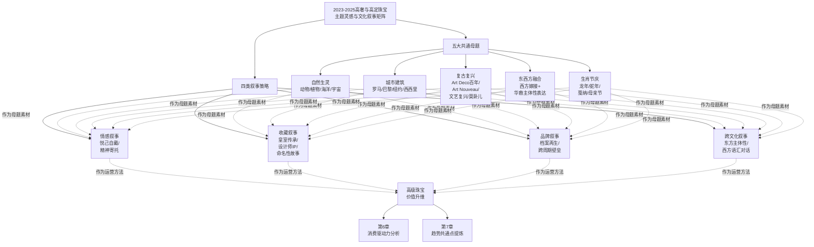

下表系统呈现了五大共通母题与四类叙事策略的代表案例对照：

| 共通母题 | 情感叙事代表 | 收藏叙事代表 | 品牌叙事代表 | 跨文化叙事代表 |
|---------|------------|------------|------------|--------------|
| **自然生灵** | 蒂芙尼水母胸针900小时 | 蒂芙尼Schlumberger典藏（摩纳哥传承大奖）| 卡地亚猎豹Panthère百年符号 | Qeelin竹蝶+西方珠宝语汇 |
| **城市建筑** | Anna Hu芳登广场Maison艺术之家发布 | 法贝热帝国冬季彩蛋（罗曼诺夫王朝） | 宝格丽Aeterna罗马140周年 | 卡地亚罗马新宫艺术神话展 |
| **复古复兴** | 宝曼兰朵COLLEZIONE 1967三大美学纪元 | 卡地亚水果锦囊2164万港币爆冷夺冠 | 宝诗龙neo-Art Deco新装饰艺术 | 香奈儿2025/26早春度假Art Deco回潮 |
| **东西方融合** | Anna Hu百合花东西方文化共通 | Cindy Chao三大博物馆永久典藏 | 卡地亚Le Voyage Recommencé档案再生 | ANNA HU恽寿平+舒曼跨文化对话 |
| **生肖节庆** | 浪琴龙年甲骨文+万物生长寓意 | 卡地亚DRAGON孤品+龙腾出海 | 肖邦12年生肖周期闭合限量88枚 | 宝格丽Serpenti Dragoni"蛇—龙"融合 |

**这一矩阵揭示了2023—2025年高级珠宝叙事性的产业全貌——五大共通母题作为创作的灵感素材池，四类叙事策略作为价值升维的运营方法**。两者的交叉网格构成了品牌可调度的完整叙事工具箱：当宝格丽以城市建筑母题（罗马140周年）+ 品牌叙事策略（Aeterna档案再生）+ 跨文化叙事策略（Lotus Cabochon莲花）创作时，单件作品便同时承载了三重叙事维度；当Anna Hu以东西方融合母题（恽寿平百合轴+舒曼诗人之恋）+ 收藏叙事策略（大英博物馆永久典藏）+ 情感叙事策略（女性特质的绝美刹那）创作时，作品便完成了从设计到艺术再到博物馆资产的全维度升华。

承接本章对主题灵感与文化叙事的系统剖析，第6章将转向消费驱动力与买家结构变化对设计趋势的反向塑造。本章所揭示的叙事性作为情感与收藏价值核心载体的逻辑，正是第6章"审美消费+情绪价值+资产属性"三重消费逻辑的文化叙事基础。当年轻一代Z世代女性追求"悦己自戴"时，她们消费的正是本章所述的自然生灵情感寄托、华裔设计师的东方主体表达；当VIC高净值客户追求"工艺保值"时，她们消费的正是本章所述的皇室传承叙事、设计师IP溢价、命名性故事；当亚洲藏家从软奢向高级珠宝迁移时，她们消费的正是本章所述的东西方文化跨界对话与生肖节庆的情感锚定。**叙事性作为高级珠宝跨越产品维度的核心价值机制，最终落脚于消费端对情感、收藏与文化共鸣的多重诉求**——这一逻辑链条将在第6章获得需求侧的完整展开。

# 6 消费驱动力与买家结构变化

承接前五章对产业格局、设计语言、价值机制、工艺创新与文化叙事的系统剖析，本章将研究视角从供给端下沉至需求端，系统探查2023—2025年消费端变量如何反向塑造高奢与高定珠宝的设计趋势。如果说第2—5章揭示的是"品牌与拍卖行如何创作并定价珠宝"，那么本章则要回答"是谁在购买、为什么购买、如何购买"——这一需求侧的回答构成了设计趋势得以涌现与延续的根本动力。第1章已搭建宏观背景：全球高净值人群持续扩容（莱坊《2024年财富报告》数据显示截至2023年底全球超高净值人士达626,619人[^21]）、奢侈品市场结构性分化、千禧一代与Z世代占据拍卖参与者三成、亚洲藏家从软奢向高级珠宝迁移、女性超高净值人士10年增长38%[^21]——这些宏观变量在2023—2025年集中释放，重塑了珠宝消费的代际结构、性别叙事、资产逻辑、渠道路径与场景边界。本章将沿"代际更迭—性别觉醒—资产避险—线上迁移—场景扩展—本土崛起"六条主线展开剖析，并以"**审美消费+情绪价值+资产属性**"三重逻辑的传导验证作为收束，为第7章趋势共通点与差异化亮点的提炼提供需求侧的完整逻辑支撑。

## 6.1 千禧一代与Z世代的代际更迭与消费心智

近三年珠宝消费市场最具结构性意义的变迁，莫过于**千禧一代（约29—44岁）与Z世代（约18—28岁）作为珠宝消费核心潜力人群的快速崛起**。这一代际更迭不仅改变了拍卖行的客户名册，更通过其独特的消费心智反向塑造了品牌端的设计创新方向。

从拍卖参与度看，年轻一代已稳定占据全球拍卖人群的约三成。富艺斯2024年终总结显示，**全年所有拍卖买家中31%为新客户，千禧世代与Z世代年轻藏家占全球拍卖参与者30%**[^1]；佳士得2024上半年报告同样显示**千禧世代和Z世代藏家比例为29%**[^11]，这一比例在2023年同期已为29%[^11]，呈现出稳定且持续的代际渗透。佳士得行政总裁施俊安在年度业绩交流中特别指出，"中国内地千禧新世代买家贡献的成交总额领跑亚太区"[^11][^108]。这意味着年轻一代不仅是参与者，更是亚太市场的"贡献增量"主力。

从消费心智看，年轻一代呈现出**"理性买黄金、悦己买设计"的双轨偏好**。一方面，年轻消费者展现出超越其年龄的资产理性。第一财经在《中国奢侈品市场现回暖迹象》中报道，多位年轻消费者明确表示"以钻石为代表的珠宝体现更多的是'情绪价值'，要真正当作资产配置来投资，还得买黄金"，"很多顶奢珠宝的品牌溢价太高，不如直接买黄金实在"[^23]。一位名为杰瑞的受访者表示，他"最近用三枚金戒指换了一枚黄金吊坠"[^23]——这种"灵活配置黄金存量"的行为模式，构成了世界黄金协会数据中**中国市场金条和金币需求达336吨、较2023年增加20%、实现自2013年以来最强劲年度表现**[^109][^110]的微观基础。另一方面，年轻一代对设计师款珠宝与高级珠宝展现出强烈的"悦己"动机。艺恩《2024女性珠宝配饰行业趋势白皮书》明确指出，"Z世代女性作为新兴的消费群体，对高级珠宝的关注度和消费潜力日益凸显……他们倾向于通过珠宝来彰显个人风格和审美"[^29]；高级珠宝品类中"项链、手链和戒指是最受欢迎的品类，声量占比达到82%，**其中手链的声量增速最快，同比增长186%**"[^29]。

更具结构性意义的是年轻一代呈现的**"体验消费替代商品消费"代际特征**。科尔尼2025年8月针对3000名中国奢侈品消费者的调研显示，**Z世代（18—28岁）中41%—44%表示将"从商品消费转向体验型消费"**，远超年长群体的31%[^26]；千禧一代中38%有同样意向[^26]。在贝恩与Altagamma的全球研究中，体验式奢侈品的表现持续优于实体奢侈品，"得益于旅游业的复苏和对沉浸式奢侈体验日益增长的需求"[^1]。但值得指出的是，**珠宝作为"可佩戴的体验"，恰好契合这一代际趋势**——它既是商品又是穿戴场景的延伸，世界黄金协会中国区CEO王立新指出"自由消费、悦己消费的增长是未来的最大增量"[^27]。这也解释了为何在普遍的奢侈品理性化中，珠宝品类反而能保持相对韧性。

从消费支出预期看，年轻一代呈现出"谨慎中有亮点"的复杂格局。科尔尼调研显示，**Z世代中仅4%计划增加奢侈品支出，千禧一代中14%有增长意愿**[^26]，远低于X世代及婴儿潮一代（45岁以上）的20%[^26]。但贝恩报告同时观察到："2025年是中国奢侈品市场重新调整的一年……VIC（高价值客户）群体依然是奢侈品市场的核心驱动力，而年轻的潜力消费群体在进入奢侈品市场方面则呈现出更为谨慎、延后的节奏"[^24]。这意味着**年轻一代并非退场，而是以更挑剔的眼光、更长的决策周期、更谨慎的支出节奏进入高级珠宝市场**——他们在意的不再是"是否拥有奢侈品"，而是"这件作品是否值得"。

下表系统对照了年轻一代消费心智与品牌端设计响应的传导关系：

| 年轻一代消费心智 | 关键数据 | 品牌端设计响应 |
|---------------|---------|--------------|
| **理性买黄金（资产理性）** | 中国金条金币需求+20%（2024年）；年轻人"用三戒指换黄金吊坠"[^23][^109] | 老铺黄金古法金镶嵌钻石+足金珐琅工艺创新 |
| **悦己买设计（情绪价值）** | 高级珠宝手链声量+186%；Z世代购珠宝彰显个人风格[^29] | 卡地亚Beautés du Monde小型时装珠宝、可日常佩戴系列 |
| **体验消费替代商品消费** | Z世代41%—44%向体验消费转移[^26] | 珠宝化为"可佩戴体验"——梵克雅宝Lady Arpels珐琅腕表叙事 |
| **谨慎延后入场** | Z世代仅4%计划增加奢侈品支出[^26] | 品牌强化"档案叙事+工艺壁垒"以延长决策吸引力 |
| **设计感+个性表达** | 项链/手链/戒指占82%声量[^29] | 宝诗龙Histoire de Style可转换八大主题、Cindy Chao雕塑性单品 |

**这种代际心智对设计风向的反向塑造效应是深刻而具体的**：当年轻一代追求"轻量化"，宝诗龙Cascade项链以钛金属工艺将148cm长项链做到佩戴不显沉重；当年轻一代追求"叠戴"，卡地亚Spina项链可转换为头冠、Apatura坠饰可拆为胸针；当年轻一代追求"独特设计感"，宝诗龙将800颗钻石"针线缝入"奶蓟草叶脉、Anna Hu以纳米钛金属诠释蝴蝶蜕变；当年轻一代追求"故事承载力"，卡地亚DRAGON龙年孤品与肖邦12年生肖周期闭合应运而生。**年轻一代不只是"在购买现有的珠宝"，他们正在通过自己的偏好信号"重塑珠宝应该被如何创作"**——这一反向塑造效应，是理解2023—2025年品牌端高级珠宝创新方向的核心需求侧背景。

## 6.2 女性独立意识与"悦己自戴"核心动机

近三年珠宝消费心智重构中最具变革性的力量，来自女性经济地位提升与"她经济"崛起所驱动的"悦己自戴"动机。这一动机已从年轻一代的小众偏好，演化为**贯穿Z世代到婴儿潮一代的跨代际共识**——女性消费者从"被赠礼对象"全面转向"自我表达主体"，根本性地改写了珠宝消费的逻辑底层。

**财富基础的女性化进程**为这一变迁提供了物质前提。莱坊《2024年财富报告》明确指出："女性超高净值人士在过去10年里增长了38%"[^21]，财富管理人士对Z世代客户在2024年积累更多财富的乐观程度最高（75%）[^21]。这一财富代际转移与性别再分配的过程，使女性首次在高级珠宝市场获得了独立的购买决策权——她们不再依赖配偶或家族的赠礼，而是以自身的经济能力主导消费。

**消费动机的根本性反转**则由黄金与彩宝两大主力品类的数据所共同验证。世界黄金协会数据显示，"2025年金饰消费核心逻辑正在从'功能送礼'转向'情绪自用'，'轻克重、重设计'、'为情绪买单'成为主流趋势。**24至30岁女性已成为黄金消费主力**，'自戴悦己'取代婚庆赠礼成为核心动机"[^27]。中宝协2025年消费数据则指出："**彩宝消费中悦己佩戴占比高达42%，远超婚庆嫁娶的28%和收藏投资的17%**"[^27]——这一数字反差直观说明，珠宝消费的核心动机已不再是"婚嫁仪式必需品"，而是"为自己而买"的情感诉求。京东消费及产业发展研究院的调研同样印证："**近四成女性买珠宝首饰看重设计及寓意**"[^28]；同时"超五成女性主张理性消费，大牌小样产品受追捧"[^28]——理性与悦己并非对立，而是当代女性消费的双重底色。

这一动机重构的文化语境，是被业界称为"**2万亿情绪经济**"的崛起。"2025年，中国情绪经济市场规模已达2.3万亿元，预计未来几年将突破4.5万亿元。而珠宝首饰，正是这万亿情绪蓝海中增长最强劲的赛道之一"[^27]。一位小红书用户的笔记被点赞2万多次："买那条不起眼的手链那天，是我人生最灰暗的一周。后来每次看到它，都像是提醒自己：我配得上让自己开心"[^27]——**这种"珠宝作为随身携带的慰藉"的叙事，与第5章所述自然生灵情感寄托、华裔设计师东方主体表达形成深度共振**。

值得关注的是，"悦己"消费心智在不同代际女性中呈现出**风格化的细分偏好**。天猫淘宝珠宝饰品行业与智篆GI联合发布的《2024淘系珠宝饰品行业趋势白皮书》总结了2024年秋冬珠宝饰品**四大代表风格**[^110]，每一风格背后都对应着特定的女性身份认同：

| 风格 | 核心人群 | 偏好元素 | 对应高奢/高定设计响应 |
|------|---------|---------|--------------------|
| **融合新中式** | 35岁以上精致白领（女性占七成）"汉服爱好者+养生达人"[^110] | 柿蒂纹、木兰、玛瑙、菩提、和田玉、翡翠[^110] | 周大福"和美东方"百余件、Qeelin Bamboo Butterfly、保利香港帝王绿翡翠珠链 |
| **野心大女主** | 18—29岁精致女性（六成中高购买力）[^110] | 大面积金属与珍珠叠戴、水滴形/黑色几何/双层O型项链[^110] | Cindy Chao帕米尔胸针建筑感、宝格丽Mediterranean Queen 500ct帕拉伊巴 |
| **静奢轻珠宝** | 30岁以上中高端女性（注重生活品质）[^110] | 简约线条、精致工艺、低调奢华[^110] | 蒂芙尼Tiffany T、卡地亚Tressage、伯爵Altiplano至臻超薄 |
| **复古少女风** | 潮流达人[^110] | 蝴蝶结、花朵、珍珠、复古元素[^110] | 宝诗龙Histoire de Style时装珠宝、宝曼兰朵COLLEZIONE 1967 |

**这一风格细分矩阵深刻揭示了女性消费者从"单一审美客体"向"多元身份主体"的角色变迁**。当35岁以上女性在新中式风格中寻求文化认同，30岁以上女性在静奢轻珠宝中寻求生活品质，18—29岁女性在野心大女主风格中宣示独立身份，年轻潮流达人在复古少女风中表达个性——女性消费者已不再是任何单一品牌叙事可以概括的群体，**她们的多元化身份诉求反向驱动品牌端必须提供多元化的设计语汇**。

这一代际身份多元化的趋势，也催生了女性消费者对"内核稳定"的精神追求。京东消费及产业发展研究院调研显示，**58.1%的女性将"内核稳定"作为2025年自我突破关键词**，"独立自信、不内耗、爱自己是核心达成标准"[^28]；女性消费者"更加关注商品的情绪疗愈价值"[^28]。在这一价值取向下，珠宝首饰的"情绪疗愈"功能被空前强化——它不再仅是物质消费品，更成为"提醒自己配得上让自己开心"的精神锚点。这与第5章所述蒂芙尼海洋系列"丰富叙事"、Anna Hu百合花"女性特质的绝美刹那"等情感叙事形成完美对接。

**艺恩《2024女性珠宝配饰行业趋势白皮书》对女性珠宝消费的核心结论**为本节提供了精炼概括："Z世代女性作为新兴的消费群体，对高级珠宝的关注度和消费潜力日益凸显，倾向于通过珠宝彰显个人风格"，同时"高知丽人和品质中产人群作为高级珠宝消费的稳固力量，他们对珠宝的品质、设计和保值性有着更高的要求，这反映了消费者对高级珠宝的多元化需求"[^29]。**当女性消费者同时承担"个人风格表达者+品质保值需求者"的双重角色时，品牌端不仅要在设计上回应风格诉求，更要在工艺与材质上回应保值诉求**——这一双重诉求的耦合，正是第3章四重溢价机制与第4章工艺创新得以系统化展开的需求侧驱动。

## 6.3 资产配置需求与"硬通货"避险逻辑

如果说"悦己自戴"是女性消费心智的情感底色，那么"资产配置"则构成了所有高净值客群的共通理性。在2023—2025年通胀高企、地缘动荡、艺术品拍卖遇冷的宏观语境下，**珠宝作为"硬资产"承载资产配置与避险需求的核心逻辑被空前强化**——这一逻辑不仅驱动VIC高价值客户继续追逐稀缺彩宝彩钻，也使年轻消费者在"理性买黄金"中找到了与年长一代的共识基础。

**消费理性化的全面回归**是2025年中国奢侈品市场最具标志性的趋势。贝恩公司发布的《2025年中国个人奢侈品报告》明确指出："奢侈品消费正从'情绪消费'转向'理性资产配置'，消费者更注重奢侈品的投资价值和性价比"[^23]。这一转变在不同品类上呈现差异化结果：**珠宝品类2025年降幅缩小至0%—5%，"得益于价值保留的考虑和黄金价格上涨"**[^24]；而皮具箱包品类下降8%—11%，腕表品类预计下降14%—17%[^24]。腕表品类的剧烈下滑尤其值得关注——贝恩指出腕表面临严重压力的原因是"消费者在购买时变得更加理性，转向其他投资资产、二手替代品和运动或智能设备选项"[^24]。**这一品类间的分化清晰说明：当消费者以"理性资产配置"重新评估奢侈品价值时，能够通过材质本身保值、通过工艺壁垒抗周期、通过故事叙事承载文化资产的珠宝品类，成为这一筛选机制的最大赢家**。

**黄金需求的爆发式增长**为珠宝资产属性提供了最直接的市场验证。世界黄金协会2024年《全球黄金需求趋势报告》显示，**2024年全球黄金需求总量（包含场外交易）达4974吨，需求总额达3820亿美元，均创历史新高**[^109][^110]。其中央行购金"连续第三年超过1000吨"[^109][^110]，第四季度大幅加速至333吨[^110]——央行作为最理性的市场参与者，其连续三年的大规模购金行为本身即是黄金作为终极避险资产的最佳背书。在中国市场，2024年金条和金币的需求达336吨，**较2023年增加20%，实现自2013年以来最强劲的年度表现**[^109]；同期伦敦现货黄金价格年内上涨25.83%，40次创出新高[^109]。

值得指出的是，黄金需求的结构变化呈现出"**金条金币上行、金饰承压**"的分化格局——全球金饰消费量同比下降11%至1877吨，但**金饰消费额同比增长9%达1440亿美元**[^109][^110]。这一"量减额增"的反差揭示出关键信号：**消费者并未放弃金饰，而是以更高单价、更高设计含量的方式重新进入金饰市场**——这正是老铺黄金"古法手工金器"路径得以爆发的市场基础。

**财富代际传承的庞大基数**为珠宝资产配置提供了长期支撑。胡润研究院《2024胡润财富报告》指出，**截至2024年1月1日，中国600万资产富裕家庭达512.8万户、千万资产高净值家庭206.6万户、亿元资产超高净值家庭13万户**[^22]；高净值家庭中**企业主占54%**[^22]，超高净值家庭中**企业主占比80%**[^22]；报告进一步预测**未来10年将有20万亿元财富传给下一代，30年内增至79万亿元**[^22]。这一规模庞大的代际财富传承，将成为高级珠宝作为可佩戴硬资产的重要承接载体。报告还指出："中国高净值人群未来一年的投资对象包括黄金，其境外资产占可投资资产的16%"[^22]——黄金已被高净值人群明确列入投资对象清单。

**VIC高价值客户的"宁缺毋滥"策略**则是资产配置逻辑在金字塔尖的极致体现。如第1章所述，BVLGARI首席执行官Jean-Christophe Babin透露过去一年品牌"价格超过100万美元的产品售出数量较上年翻了一番"，客户转向"更昂贵、更非凡的作品"，追求"可靠、品质和保值"。这与第3章所揭示的拍卖端格局完全一致——2025年顶级喀什米尔蓝宝石、缅甸鸽血红、哥伦比亚祖母绿、稀有彩钻、帝王绿翡翠等"四重溢价齐备"的拍品持续刷新世界纪录，而中段品质拍品议价能力下降。**当高净值客户以"资产配置"的视角审视珠宝时，他们追求的不再是"很多件好作品"，而是"少而精的传世之作"**——这一价值锚定逻辑，正是品牌端在大克拉稀有宝石、传世工艺、保值设计上密集投入的根本驱动。

**年轻一代的"理性硬通货"偏好**则从腰部承接了资产配置逻辑。如本章6.1节所述，年轻消费者明确表示"很多顶奢珠宝的品牌溢价太高，不如直接买黄金实在"[^23]——这种看似"反对高奢"的态度，本质上是同一资产配置逻辑在不同价位段的不同表达。"轻克重、重设计"的金饰偏好[^27]、"小而精"的设计风格[^27]、**18—24岁消费者中足金饰品拥有比例已达62%**[^27]——这些数据都说明年轻一代并非放弃硬通货，而是以更灵活、更日常、更具设计感的方式持有硬通货。

下表系统对照了不同客群的资产配置需求与对应的设计响应：

| 客群层级 | 资产配置逻辑 | 关键数据 | 品牌端/设计端响应 |
|---------|------------|---------|-----------------|
| **VIC高价值客户** | 稀缺彩宝彩钻+传世工艺+品牌古董 | BVLGARI百万美元级产品销量翻倍；2025顶级红宝石较前两年涨50%以上 | 卡地亚Beautés du Monde、宝格丽Aeterna 140周年、宝诗龙Carte Blanche Impermanence |
| **中年高净值** | 品牌经典+保值传家+档案延续 | 一线城市X世代+婴儿潮一代33%计划增加奢侈品支出[^26] | 海瑞温斯顿Royal Adornments、蒂芙尼Schlumberger典藏 |
| **千禧一代** | 设计师IP+悦己自戴+轻量化保值 | 千禧一代14%计划增加支出；珠宝悦己佩戴占42%[^27][^26] | 时装珠宝Fine Jewelry、可转换设计、彩宝小件 |
| **Z世代女性** | 黄金硬通货+设计情绪价值双轨 | 18—24岁足金拥有比例62%；高级珠宝手链声量+186%[^29][^27] | 老铺黄金古法金、轻量化新中式、Anna Hu纳米钛金属创作 |
| **央行/机构** | 战略储备+对冲风险 | 2024央行购金1045吨、连续三年超千吨[^109][^110] | 间接抬升金价，强化珠宝资产属性预期 |

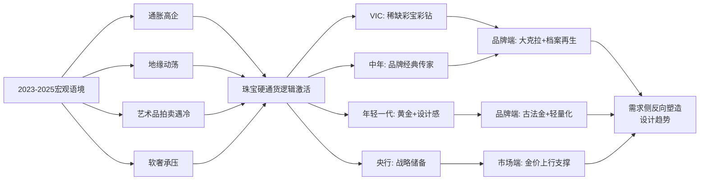

资产配置需求作为珠宝设计趋势的需求侧驱动，**其深层影响在于它使得珠宝创作从"美学创新"延伸为"价值创造"**——品牌端必须同时回应消费者的审美需求与保值需求，这一双重诉求驱动了第3章"产地+品质+品牌+故事"四重溢价机制的成熟，也驱动了第4章工艺创新（专利工艺、长工时、稀缺工匠）作为"工艺保值"指标的崛起。换言之，**资产属性逻辑使珠宝设计的每一个细节决策——从矿源选择到工艺投入再到叙事打造——都获得了直接的市场反馈机制**。

## 6.4 线上化购藏路径与数字传播的设计反塑

近三年珠宝消费渠道最具结构性的变迁，是**线上化购藏路径从"边缘渠道"上升为"主流方式"**，这一渠道迁移不仅改变了消费决策的物理路径，更通过数字传播的特性反向塑造了珠宝设计的视觉逻辑与传播逻辑。

**拍卖端的线上化已成为绝对主流**。富艺斯2024年终统计显示，**全年70%的拍品由买家透过线上竞投渠道投得**[^1]。佳士得2024上半年报告同样显示**网上竞投占比82%**（去年同期为79%）[^11]——这一数字意味着十件拍品中已有八件以上以线上方式参与竞投。富艺斯进一步透露，2024年其平均每件拍品有五个意向竞投，**较2023年增长25%**[^1]——这种竞投活跃度的提升，与线上化降低参与门槛、扩大全球买家池的效应直接相关。

**电商直播端的爆发式增长**则是大众与中端市场的核心叙事。中国珠宝玉石首饰行业协会发布的《2024年中国珠宝行业发展报告》援引商务部数据显示，**2024年我国珠宝电商零售额约为2982.6亿元，在商务部监测的18类商品中，金银珠宝类商品增幅位居第三位**[^111]。第三方电商数据服务网站蝉妈妈2024年12月发布的《2024抖音电商珠宝饰品行业分析报告》显示，**4年来抖音电商平台珠宝饰品行业整体呈上升趋势，年均增速达到54%**[^111]。其中**24—30岁女性是黄金饰品消费主力，30—40岁女性主导珍珠消费，银制品消费者集中在24—30岁**[^111]——直播这一渠道恰好与年轻女性消费主力高度契合。

直播形态本身正在经历"**从叫卖型到内容型**"的进化。鞭牛士的报道明确指出："自2021年起，直播电商赛道迈入下半场，流量竞争日渐加剧。传统的叫卖型直播模式难以充分满足现阶段消费者的需求，与此同时，能够同时提供'货品+内容'的内容型直播开始兴起"[^111]。抖音电商珠宝潮奢行业的"藏宝图"活动以"美学馆"专场为代表，"借助场景、内容、互动体验等维度的改造，构建出一种文化型、审美型的直播内容新形态"[^111]——这一形态进化使珠宝直播从单纯的交易场景升级为文化体验场景。**今年7月珠宝潮奢行业新增用户高达22%，当前行业已经有将近1/4的生意是在抖音商城完成的**[^111]。

**小红书种草路径**则构建了奢侈品高端珠宝的核心传播阵地。**2024年珠宝行业流量同比去年上涨33%**[^112]，**珠宝二奢兴趣用户增速近四成**（从2022年22%升至2023年33%）[^29]，**23年6月小红书珠宝创作者新发布笔记量较22年6月增速190%**[^29]——这些数据显示了小红书作为珠宝种草平台的爆发力。在用户结构上，"小红书最新数据显示，其中女性占比72%，18—24岁用户超43%，25—34岁用户超36%，一线、新一线城市用户合计占比超66%"[^22]——**这一用户画像与高级珠宝目标客群高度契合**。

线上化对品牌端的反向塑造，最具代表性的事件是**奢侈品品牌的小红书全球直播首秀**。中欧时尚研究院的分析指出："2024年，卡地亚、梵克雅宝和古驰等奢侈品牌纷纷拥抱小红书，举办线上展览和直播活动。例如，**梵克雅宝在小红书上推出了其有史以来的首次全球直播**，古驰则将2025年春夏系列时装秀搬到该平台。结果，'GUCCI Show'搜索量激增47倍，品牌粉丝量增长超过日常平均值的22倍"[^22]。这一系列动作清晰说明：**奢侈品品牌已不再将小红书视为大众营销渠道，而是将其升级为顶级品牌叙事的核心舞台**。

线上化路径对珠宝设计语言的反向塑造作用，集中体现在**视觉张力、识别度、社媒传播性**三大维度的强化。如第1章所揭示的逻辑：**"买家越来越多地通过线上图像、视频、虚拟试戴接触珠宝，对设计的视觉冲击力、独特造型识别度与社交媒体传播性的要求显著提升"**——这一传导效应通过近三年品牌端的多个具体动作得到验证：

- **视觉张力强化**：卡地亚Spina项链的多层镂空几何、Cindy Chao帕米尔胸针5786颗宝石的密集镶嵌、宝诗龙Cascade项链148cm的极致长度——这些设计选择本质上都在追求"在小屏幕呈现强烈视觉冲击"的能力；
- **识别度强化**：宝格丽Serpenti、卡地亚Panthère猎豹、梵克雅宝Alhambra四叶草等经典符号在近三年的密集再演绎，正是为了在社媒传播的碎片化注意力中保持清晰的品牌识别度；
- **传播性强化**：宝诗龙Noeud主题项链"提供6种不同佩戴方式"、卡地亚Apatura项链坠饰可拆为胸针——可转换设计本身即为"一件作品多种传播形态"提供了天然素材，使得每件珠宝在小红书/抖音上都可以衍生出多张不同造型的传播图。

**线上化也正在重塑珠宝消费的决策路径**。小红书珠宝二奢用户的搜索行为显示："大批'抄作业党'在节前涌现爆发式搜索、用户从2个月前开始浏览七夕相关内容，决策周期较长"[^112]——这种"长决策周期+多平台交叉验证"的消费习惯，使得品牌必须在不同平台提供一致而丰富的内容生态。**珠宝直播+小红书种草+电商转化的"三场协同"，已成为近三年珠宝品牌的标准营销组合**。

下图概括了线上化对设计趋势的反向塑造路径：

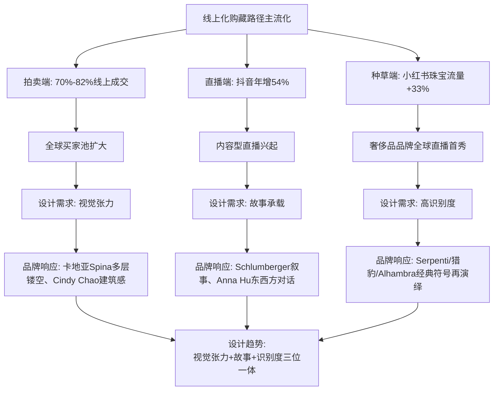

线上化路径作为消费驱动力，**其最深远的影响在于它彻底改变了"珠宝作为身份符号"的传统逻辑**——在传统线下场景中，珠宝是被佩戴者"亲身展示"的；而在线上场景中，珠宝首先是被"图像/视频展示"的。这一介质变迁迫使珠宝设计在保持触感工艺的同时，必须同时优化"视觉语言"——这正是为什么近三年品牌端在几何造型、色彩对比、可转换结构上的投入空前密集。

## 6.5 社交化佩戴场景：运动化、日常化与混搭风

承接渠道线上化的论述，本节聚焦珠宝**佩戴场景的深层重构**——从"特殊仪式专属"向"日常陪伴+社交表达"的全面延伸。这一场景边界的扩展不仅改变了珠宝的使用频率，更通过对设计逻辑的反向重构，催生了运动化、轻量化、可转换、跨界联名等系列设计创新。

**场景多元化的核心驱动力**是消费动机的根本转变。情绪经济报告深刻指出："珠宝的消费场景正在变得极其丰富。它不再只是生日、结婚、纪念日的专属仪式品，而是**日常通勤的提气之物、加班后的自我奖励、闺蜜聚会的社交话题，甚至是心情低落时给自己的一个温暖拥抱**"[^27]。这一场景革命使得每一种日常场景都成为新的设计需求来源。

**City Walk作为新型生活方式趋势**则提供了最具时代特征的场景代表。"近年来，citywalk在小红书上成为一种主要的生活方式趋势。**与citywalk相关的笔记获得了超过210亿次浏览，搜索量同比增长140倍，超过37万篇帖子详细记录了citywalk体验**"[^22]——这一搜索量的几何级数增长，反映出年轻一代对"真实、沉浸式社交体验"的新追求。"周末不再以居家为主——人们现在寻求citywalk出行，探索展览、音乐节和城市冒险"[^22]。

奢侈品品牌敏锐捕捉到这一趋势并以高级珠宝相关营销作出回应。"路易威登在上海举办的'侬好·上海'快闪活动就是一个典型例子，该活动鼓励用户探索苏州河。这一举措引发了**小红书相关搜索激增16倍，笔记数量比活动前增加了35%**"[^22]。"在Longines浪琴表与小红书联手发起的'春日放空计划'中活动进一步突出了citywalk……浪琴实现了**品牌相关帖子增长111%，活动期间新增笔记超过3.5万篇**"[^22]。**这些营销实践共同塑造了"城市漫步+佩戴珠宝"的新型场景叙事——珠宝不再是博物馆橱窗里的展品，而是成为陪伴年轻一代探索城市的伙伴**。

**珠宝品牌跨界运动潮牌的破圈合作**则将场景边界推向了最具突破性的方向。**蒂芙尼与耐克的Air Force 1 1837联名鞋款**作为这一趋势的标志性事件——"全新联名鞋款是纪念耐克空军一号运动鞋（Air Force 1）诞生四十周年的又一力作，亦标志着蒂芙尼与耐克两大传奇品牌的首次合作"[^21]。鞋款"采用优质黑色绒面革精心制作而成，鞋侧点缀醒目的蒂芙尼蓝（Tiffany Blue®）Swoosh标识，鞋跟上方均饰有联名纯银元素"[^21]，蒂芙尼同时推出**以全新鞋款为灵感的限量款纯银系列单品，包括纯银口哨、纯银鞋拔、纯银鞋刷以及专为全新鞋款打造的鞋带配饰，售价在250美元至475美元之间**[^21][^25]。

蒂芙尼此前已与多个跨界对象合作——"曾与在潮流时尚界很有影响力的纽约当代艺术家Daniel Arsham、纽约潮牌Supreme、瑞士高级制表品牌百达翡丽Patek Philippe等分别合作推出限量联名商品，更与知名NFT项目CryptoPunks合作推出实体和NFT作品"[^25]。"就在不久前的1月初，Tiffany携手集团旗下意大利奢侈品牌Fendi（芬迪）打造的'The Tiffany Baguette'联名系列正式发售，后者经典的Baguette手袋被抹上了一抹Tiffany蓝"[^25]。**这一系列跨界联名清晰勾勒出蒂芙尼的核心策略——以"运动化、潮流化、艺术化"的多元跨界，将高级珠宝品牌从"特殊场合"语境扩展至"日常潮流"语境**。

**男士珠宝市场的扩容**是场景多元化的另一重要体现。蒂芙尼"男士珠宝作品"产品线包括"印章戒指、链式珠宝、I.D.珠宝首饰、引人注目的链墜和手链"[^28]，并明确定位为"工作升迁到婚礼，再到成为新手父母，通通都值得庆祝"的多场景配饰[^9]。Tiffany HardWear系列的"中号扣环项链¥120,000"、"大号扣环手链¥85,000"[^9]、Tiffany T系列的"T1宽版钻石铰链手镯¥342,000"[^9]——这些价位段的产品共同构成了男性高端珠宝消费的产品矩阵。**男性珠宝市场的崛起反映出珠宝佩戴场景从单一性别向跨性别的扩展**——它不再被视为"女性专属饰品"，而是成为跨性别的身份与情感表达载体。

**戛纳红毯叙事**则代表了珠宝社交化场景的金字塔尖。如第5章所述，安妮·海瑟薇在戛纳电影节佩戴**宝格丽Mediterranean Reverie项链（107克拉斯里兰卡蓝宝石）**引发的话题潮，正是这一场景叙事的代表性事件。这种"明星红毯+品牌大使官宣+社交媒体传播"的协同效应，使得高级珠宝在最公共化的舞台上完成了对其情感价值与文化资产价值的双重展示。

**叠戴混搭与一饰多戴**则是日常场景对设计逻辑的具体反塑。如《2024淘系珠宝饰品行业趋势白皮书》所揭示的"野心大女主"风格中，"'大面积'、'高存在感'的饰品成为不少年轻女性饰品选择的新风。这群消费者所佩戴的首饰，随着日常穿搭变化万千……她们倾向于挑选强调线条流畅和造型大胆的首饰，例如大面积使用金属和珍珠，**通过叠戴的方式，展现出女性的独立和自信**"[^110]。**这一叠戴需求恰好与第4章所揭示的可转换结构（Transformable Design）形成完美对接**——宝诗龙Cascade项链可转换为吊坠耳环、Noeud项链提供6种佩戴方式、卡地亚Spina项链可转换为头冠、宝格丽Serpenti Sapphire Echo蓝宝石坠饰可转换为耳环——**这些设计创新本质上都是品牌端对"叠戴+多场景"消费需求的直接响应**。

下表系统对照了佩戴场景多元化与品牌端设计响应的传导关系：

| 场景类型 | 消费需求 | 品牌端设计响应 |
|---------|---------|--------------|
| **City Walk城市漫步** | 轻量+佩戴自如+社媒传播 | 钛金属轻量化、宝诗龙Cascade可转吊坠、伯爵矿物宝石腕表 |
| **运动+潮流跨界** | 突破"庄重"语境、年轻化破圈 | 蒂芙尼x Nike Air Force 1 1837、Tiffany x Supreme、Tiffany Blue美学 |
| **日常通勤** | 静奢风、低调奢华 | 蒂芙尼Tiffany T、卡地亚Tressage、伯爵Altiplano至臻超薄 |
| **闺蜜社交** | 高识别度、易话题、可分享 | 卡地亚Panthère、宝格丽Serpenti、梵克雅宝Alhambra |
| **戛纳红毯** | 大克拉+品牌大使叙事 | 宝格丽Mediterranean Reverie 107ct、卡地亚高珠 |
| **叠戴混搭** | 一饰多戴、可转换 | 宝诗龙Noeud 6种佩戴、卡地亚Apatura可拆胸针 |
| **男士场合** | 跨性别身份表达 | Tiffany HardWear、Tiffany T1男士铰链手镯 |

**场景多元化对设计趋势的反向塑造效应**，集中体现为"四重去化"——**去仪式化（不再仅服务于特殊仪式）、去性别化（不再仅服务于女性）、去年龄化（不再仅服务于年长群体）、去厚重化（不再仅追求重型奢华）**。这四重去化共同推动了近三年品牌端在轻量化、可转换、跨界联名、低调奢华等设计方向上的密集创新。**当珠宝从"压箱底珍藏"走向"日常陪伴+社交表达"，它的每一次设计选择都必须同时回应"是否易于日常佩戴""是否便于社交分享""是否能跨场景使用"等新维度的诉求**——这正是2023—2025年高级珠宝设计语言演变的需求侧根本驱动。

## 6.6 本土品牌崛起与中国消费者偏好重塑

近三年中国珠宝消费市场最具结构性意义的变迁之一，是**中国本土品牌的爆发式崛起对全球珠宝设计趋势产生的反向影响**。这一变迁不仅改变了消费市场的品牌格局，更通过中国消费者偏好的重塑，驱动国际品牌深化本地化叙事，最终形成"需求侧本土化与供给侧国际化的双向共振"。

**老铺黄金的现象级业绩**是本土品牌崛起最具代表性的案例。其发布的首份年报显示，**2024年实现销售业绩98.0亿元（含税），同比增长166%；实现净利润14.7亿元，同比增长254%**[^112]。截至2024年末，老铺黄金共拥有线下门店36家，主要位于一线或新一线城市的头部商业中心，**门店平均业绩超3亿元**[^112]——这一坪效已显著超越多个国际奢侈品牌。

更具颠覆性的对比数据是：**2024年老铺单个商场收入约3亿元，梵克雅宝约2.4亿元，海瑞温斯顿约2亿元；坪效方面，老铺约200，格拉夫约130，梵克雅宝约80**[^112]。"在中国许多头部商圈，老铺在店效、增速上已经超越了LV、香奈儿、爱马仕等国际一线奢侈品牌"[^112]。"2025年部分头部商圈今年前两个月的第三方调研数据显示，老铺的平均店效和爱马仕相当，达到了1.7。而香奈儿和LV的店效分别为1.2和0.7。其中，**老铺在北京和西安店效分别达到了7.4和2.5，增速达到了331%和206%**。相比之下，爱马仕和LV在这两个城市的增速均出现了负数"[^112]。这一组数据**首次实现了中国本土珠宝品牌对国际一线奢侈品牌的全面超越**——这在中国奢侈品市场历史上是前所未有的。

老铺黄金2025年的业绩预告进一步印证了这一趋势的延续。"老铺黄金预计2025年度收入约为人民币270亿元至280亿元，**较2024年增长约217%至229%**。同期净利润预计约为人民币48亿元至49亿元，较2024年增长约226%至233%"[^23]——这一连续两年200%以上的爆发式增长，标志着古法黄金赛道已从小众工艺概念升级为高端珠宝市场的核心增长极。

**古法黄金行业的整体崛起**则提供了更广阔的产业背景。"中国古法黄金市场规模从2018年的130亿元增长至2023年的1573亿元，复合年增长率"惊人[^112]。老铺黄金作为该行业创新者，"在2019年首创以足金黄金为底材、手工镶嵌钻石，颠覆了钻石饰品行业以K金为底材的传统标准"[^112]——这一工艺创新本身即体现了中国本土品牌对传统设计逻辑的颠覆能力。**"花丝镶嵌、错金"技艺均为国家非物质文化遗产**[^112]，"足金镶嵌钻石"和"足金珐琅"实现了传统工艺上的重大突破[^112]——这些工艺创新为本土品牌建立了与国际品牌差异化竞争的核心壁垒。

**本土品牌消费占比的全面提升**则反映出更广泛的市场趋势。科尔尼《2025年中国奢侈品市场》调研显示，**中国本土奢侈品牌消费占比从39%提升至44%**[^26]，"珠宝类是主要推动力量，周大福、老铺黄金等跻身热门品牌；仅香水与美妆品类消费者仍更青睐国际品牌"[^26]。"中美关税影响显著，**77%受访者表示关税将改变消费行为，50%可能转向本土品牌**"[^26]——这一关税因素的叠加，进一步强化了本土品牌的市场地位。

**消费回流国内**则是另一关键变量。贝恩报告指出："2025年海外奢侈品消费份额显著减少。贝恩估计，**中国奢侈品消费中有65%发生在中国内地，35%在境外**，反映出消费回流的程度有所增加"[^24]。"内地消费者对出境游体验的热衷，并未削弱其在内地购买奢侈品的意愿"[^24]——消费回流为国际品牌深化中国本土化叙事提供了直接的市场基础。

**中国消费者偏好的深层重塑**是本土品牌崛起背后更具结构性的力量。小红书《2024奢品趋势白皮书&人群灵感图鉴》提炼出"**真实的'全球本地化'**"营销趋势："如今，奢侈品品牌重视中国本土文化元素与其品牌文化理念的结合已成为大势所趋"，"通过'四两拨千斤'的巧妙营销思路，让中华文化有效赋能品牌的本土文化叙事能力"[^23]。报告列举的代表案例包括："路易威登从品牌忠诚到文化权威，打造文化事件，发布新版《路易威登上海城市指南》"；"江诗丹顿展现其文化野心，在百年上海张园打造Maison 1755时间艺术'家'"；"**Bottega Veneta深挖中国古典文化色彩美学，于北京时装大秀推出中国限定色手袋，引发'全新BV美学'热议**"[^23]。

**国际品牌对中国市场的深化叙事**因此呈现出与以往截然不同的"文化深度"。如第5章所述，卡地亚专为龙年设计的孤品高珠"DRAGON"在2024年10月佳士得香港首次亮相、宝格丽Serpenti Dragoni系列以"蛇—龙"意象的巧妙融合迎接龙年、肖邦L.U.C XP Urushi龙年莳绘腕表完成12年生肖周期闭合限量88枚——**这些动作本质上都是国际品牌对中国消费者偏好升级的直接响应**。当中国消费者从"单纯消费西方奢侈品"升级为"消费具有中国文化深度的奢侈品"时，国际品牌必须从"翻译式本地化"升级为"创作式本地化"——这一升级正是Bottega Veneta"全新BV美学"、宝格丽Serpenti Dragoni、卡地亚DRAGON孤品等创新得以发生的逻辑根源。

**华裔设计师与本土品牌的国际化突破**则构成了双向共振的另一极。如第5章所述，Anna Hu以华裔身份获得**首位华裔女性受邀入大英博物馆永久典藏、150年法高定联合会唯一华裔女性**的殊荣[^23]；陈世英《宇宙新生》戒指成为大英博物馆永久馆藏（首位华人）；Cindy Chao获史密森尼/卢浮宫装饰艺术/V&A三大博物馆永久典藏；周大福"和美东方Timeless Harmony"作为"首个完全以中华文化为灵感的高级珠宝系列"在杭州首发；Qeelin麒麟2025高级珠宝系列以东方语境完整诠释"锦绣荟萃"。**这些华裔设计师与本土品牌的国际化突破，与中国消费者偏好的本土化升级形成了完美的双向共振——本土消费者的文化自信驱动本土品牌走向国际，本土品牌的国际突破又反向强化了本土消费者的文化认同**。

下表系统呈现了本土品牌崛起对全球珠宝设计趋势的反向影响：

| 反向影响维度 | 关键证据 | 全球设计趋势响应 |
|------------|---------|----------------|
| **古法黄金工艺崛起** | 老铺黄金2024营收+166%、单商场超梵克雅宝海瑞温斯顿[^112] | 国际品牌加大对中国非遗工艺的研究与跨界 |
| **新中式美学** | 融合新中式风格成35岁以上精致白领挚爱[^110] | 周大福"和美东方"百余件高珠系列、Qeelin竹蝶系列、宝诗龙日本花道 |
| **生肖叙事深化** | 中国消费者期待"创作式本地化" | 卡地亚DRAGON龙年孤品、宝格丽Serpenti Dragoni、肖邦12年生肖周期闭合 |
| **消费回流** | 65%消费发生在中国内地[^24] | 国际品牌强化内地旗舰店与本土发布（蒂芙尼上海首发Blue Book） |
| **本土文化深度叙事** | 路易威登《上海城市指南》、Bottega Veneta北京时装秀中国限定色[^23] | 全球本地化（Glocalization）成为奢侈品营销核心战略 |
| **本土品牌占比提升** | 中国本土奢侈品牌占比从39%升至44%（珠宝主推）[^26] | 国际品牌强化与中国设计师/IP合作 |
| **华裔设计师突破** | Anna Hu大英博物馆典藏、陈世英2亿美元估值《裕世钻芳华》 | 东方主体性表达成为高级珠宝创作的"主导范式之一" |

**本土品牌崛起的产业意义远超中国市场本身**——它标志着全球高级珠宝市场长期由西欧主导的单极格局开始向多极格局演变。当老铺黄金的古法手工金器与卡地亚的猎豹符号在中国消费者眼中具有同等的奢侈品身份感，当Anna Hu的钛金属东方艺术与梵克雅宝的Mystery Set在博物馆殿堂获得同等的艺术认可，当周大福的"和美东方"与宝格丽的Aeterna在高珠创作上展开同台对话——**全球高级珠宝市场正在迎来"东西方平等共鸣"的新时代**。这一时代变迁，是2023—2025年珠宝设计趋势研究中最具长期意义的需求侧背景之一。

## 6.7 "审美消费+情绪价值+资产属性"三重逻辑的传导验证

承接前六节对消费驱动力的逐一剖析，本节作为本章总结性分析，将系统整合所揭示的需求侧变量，验证**"审美消费+情绪价值+资产属性"三重逻辑**对珠宝设计风向的完整传导效应，构建"消费心智—设计需求—产业供给—市场反馈"的完整传导矩阵，为第7章趋势共通点与差异化亮点的提炼提供需求侧的完整逻辑支撑。

### 6.7.1 三重逻辑的内涵界定与代际差异

**"审美消费+情绪价值+资产属性"三重逻辑**并非孤立存在，而是相互交织、共同主导2023—2025年珠宝消费决策。但在不同客群、不同代际、不同场景中，三者的权重呈现出显著差异：

| 三重逻辑 | 核心内涵 | 主导客群 | 对应设计需求 |
|---------|---------|---------|------------|
| **审美消费** | 设计语言、视觉张力、风格识别度 | 年轻一代、女性独立消费者、社交分享主力 | 时装珠宝、可转换结构、轻量化、新中式 |
| **情绪价值** | 情感寄托、悦己自戴、文化认同、精神疗愈 | 跨代际女性、Z世代、文化深度需求者 | 自然生灵叙事、皇室传承、设计师IP、生肖节庆 |
| **资产属性** | 保值增值、品牌古董、传世传家、避险硬通货 | VIC头部客户、中年高净值、央行/机构 | 大克拉稀有宝石、产地溢价、专利工艺、长工时 |

**代际差异方面**，三重逻辑的权重呈现出清晰的代际梯度：
- **VIC高价值客户**：资产属性 ＞ 情绪价值 ＞ 审美消费——他们以保值传家为核心目标，倾向于稀缺彩宝彩钻+品牌古董+传世工艺；
- **中年高净值（X世代/婴儿潮）**：资产属性 ≈ 情绪价值 ＞ 审美消费——他们追求"品质+经典+长期主义"，倾向于品牌经典系列与皇室传承；
- **千禧一代**：情绪价值 ＞ 审美消费 ＞ 资产属性——他们追求"悦己+投资+跨界共鸣"，倾向于时装珠宝、可日常佩戴的设计感单品；
- **Z世代女性**：审美消费 ≈ 情绪价值 ＞ 资产属性——她们追求"个性表达+社交属性+情绪共鸣"，倾向于轻量化、叠戴、新中式、彩宝设计；
- **男性消费者**：审美消费 ＞ 情绪价值 ≈ 资产属性——他们偏好简约设计、I.D.链墜、印章戒指等[^28]。

### 6.7.2 三重逻辑对设计趋势的传导矩阵

下表整合本章前六节所揭示的消费驱动力，与前五章所剖析的设计供给响应，构建完整的传导矩阵：

| 消费驱动力 | 三重逻辑对应 | 设计需求传导 | 品牌端响应（第2-5章证据） |
|----------|------------|-------------|------------------------|
| **VIC头部客户资产配置** | 资产属性 | 大克拉稀缺宝石+专利工艺+长工时 | 卡地亚Beautés du Monde 26.52ct橄榄石；宝格丽Aeterna 63.86ct祖母绿；BVLGARI百万美元级产品销量翻倍 |
| **Z世代体验消费偏好** | 审美消费+情绪价值 | 轻量化+设计感+社交属性 | 老铺黄金古法金"轻克重重设计"；Tiffany x Nike跨界破圈 |
| **女性悦己自戴动机** | 情绪价值 | 情感寄托+寓意叙事 | 蒂芙尼Blue Book海洋系列叙事；Anna Hu百合花女性特质 |
| **黄金硬通货避险** | 资产属性 | 古法金工艺+保值设计 | 老铺黄金2024+166%营收；中国金条金币需求+20% |
| **线上化购藏路径** | 审美消费 | 视觉张力+识别度+传播性 | 卡地亚Spina多层镂空；Cindy Chao帕米尔胸针5786颗宝石 |
| **City Walk日常场景** | 审美消费+情绪价值 | 轻量+叠戴+一饰多戴 | 宝诗龙Cascade可转吊坠；卡地亚Apatura坠饰可拆为胸针 |
| **本土品牌崛起** | 情绪价值（文化认同） | 新中式美学+东方叙事 | 周大福"和美东方"；Qeelin竹蝶；卡地亚DRAGON孤品 |
| **戛纳红毯叙事** | 审美消费+情绪价值 | 大克拉+品牌大使+话题性 | 宝格丽Mediterranean Reverie 107ct蓝宝石 |
| **代际财富传承** | 资产属性 | 传世工艺+档案延续+品牌古董 | 海瑞温斯顿Royal Adornments；蒂芙尼Schlumberger典藏 |
| **跨文化共鸣** | 情绪价值（文化对话） | 东西方融合+主体性表达 | Anna Hu恽寿平+舒曼；陈世英悟禅知翠；宝诗龙北斋巨浪致敬 |

### 6.7.3 三重逻辑的协同效应与高定拍卖的价值闭环

**三重逻辑并非简单相加，而是产生显著的协同放大效应**——当一件珠宝同时承载审美消费、情绪价值与资产属性三重诉求时，其市场价值将呈几何级数放大。这一协同效应在第3章所揭示的拍卖端"四重溢价机制"中获得最直接的市场验证：

- **法贝热"帝国冬季彩蛋"以2.14亿元人民币登顶2025年度榜首**——白水晶+4500颗微钻的物理参数（资产属性）+罗曼诺夫王朝跨百年传承（情绪价值）+1925年Art Deco鼎盛期工艺典藏（审美消费）的三重叠加；
- **卡地亚水果锦囊2026年苏富比香港爆冷夺冠2164万港币（高出估价近2倍）**——莫卧儿+装饰艺术风格（审美消费）+卡地亚百年档案（情绪价值）+雕花红宝祖母绿蓝宝石（资产属性）的三重协同；
- **"The Royal Blue"104.61克拉喀什米尔蓝宝石项链以1.2545亿港币刷新世界纪录**——皇家蓝级别（审美消费）+1881年发现传奇（情绪价值）+喀什米尔1927关闭老矿（资产属性）的三重叠加。

**反向验证则可通过苏富比2024秋拍"瑰丽珠宝I"专场的滑铁卢现象观察**——多件千万级珍宝因"四重溢价不齐"而撤拍/流拍，本质上是三重逻辑无法协同放大的市场惩罚。这种正反两方面的市场反馈，使得三重逻辑成为品牌端进行设计决策的"理性指南针"——任何脱离三重逻辑协同的设计创新，都将面临市场的价值打折。

### 6.7.4 完整传导链条的可视化整合

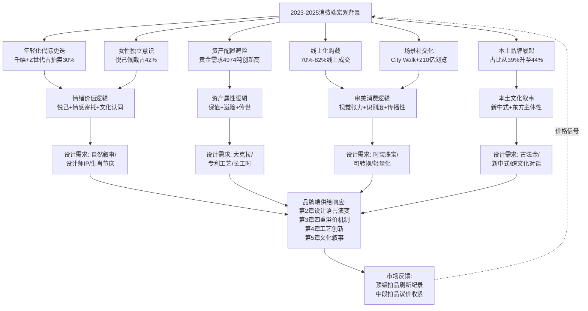

**这一传导链条揭示了一个核心命题：2023—2025年珠宝设计趋势的演变，本质上是消费端"审美+情绪+资产"三重诉求与供给端"设计+工艺+叙事"三重创新的双向耦合产物**。供给侧不再是单向地"教育消费者审美"，需求侧也不再是被动地"接受品牌叙事"——两者构成动态共创的产业生态。

### 6.7.5 三重逻辑对第7章趋势提炼的支撑作用

本章所揭示的三重逻辑，为第7章高奢品牌与高定拍卖趋势共通点与差异化亮点的提炼提供了清晰的需求侧框架：
- **趋势共通点的需求侧根源**：稀缺性溢价（资产属性）、复古回潮（情绪价值+审美消费）、彩色宝石主导（审美消费+情绪价值）、故事化叙事（情绪价值）、可转换设计（审美消费+场景多元化）——这五大共通点都可以在三重逻辑中找到清晰的需求侧来源；
- **品牌端差异化亮点**：系列叙事（情绪价值）、工艺创新（资产属性）——对应VIC头部客户与情感深度需求者；
- **拍卖端差异化亮点**：产地（资产属性）、克拉数（资产属性）、历史出处（情绪价值）——对应硬通货避险需求与文化资产收藏需求。

**三重逻辑的存在，使得近三年珠宝设计趋势的每一个具体特征——从大克拉稀有彩宝的密集运用，到可转换结构的成熟化，再到东西方文化跨界叙事的繁荣——都获得了完整的需求侧解释**。它不是孤立的美学事件，而是消费心智、产业供给、市场反馈共同塑造的时代产物。

承接本章对消费驱动力与买家结构变化的系统剖析，第7章将基于全篇前六章的分析积累，系统比较高奢品牌新品发布与高定拍卖市场两大维度的趋势异同，归纳共通点（稀缺性溢价、复古回潮、彩色宝石主导、故事化叙事、可转换设计等）并提炼各自的特色亮点（品牌端强调系列叙事与工艺创新、拍卖端强调产地、克拉与历史出处），剖析二者的互动循环与彼此塑造关系。本章所揭示的三重消费逻辑——审美消费+情绪价值+资产属性——将作为第7章趋势对照的需求侧基线，使品牌端与拍卖端的趋势异同能够在统一的消费逻辑框架下获得贯通的解读。

# 7 高奢品牌与高定拍卖的趋势共通点与差异化亮点

承接前六章对2023—2025年珠宝设计趋势的多维剖析——从第1章的产业格局背景，到第2章的品牌端设计语言演变，再到第3章的拍卖端价值机制，第4章的工艺创新，第5章的文化叙事，直至第6章的消费驱动力变迁——本章将作为整篇研究的**整合性章节**，回归用户最核心的研究诉求：横向比较高奢品牌新品发布端与高定拍卖二级市场端的趋势异同，系统提炼共通点与特色亮点。前六章的纵向剖析已为本章准备了充分的实证基础——产业坐标、设计语汇、价值标尺、工艺密码、叙事母题、消费心智——这些维度在本章将被重新组织为"双端对照"的结构化视角。本章首先归纳五大共通趋势，揭示双端在审美取向与价值锚定上的深层共振；继而剖析品牌端与拍卖端各自的差异化亮点，揭示二者在"创造价值"与"校验价值"上的产业分工；最后系统论证一级与二级市场构成的"设计供给—价值校验—稀缺争夺—档案再生"互动闭环，并提炼共通与差异背后的深层产业逻辑。本章将为第8章趋势矩阵归纳与未来3—5年展望奠定结构化对照基础。

## 7.1 五大共通趋势的横向归纳

2023—2025年高奢品牌端与高定拍卖端虽运作于不同的市场层级与价值机制中，但在多个核心维度上呈现出高度的趋势共振。这种共振并非偶然，而是由共同的稀缺资源约束、相似的目标客群、平行的文化母题与同一时代的消费心智共同塑造的产业现象。基于前六章证据，本节系统归纳五大跨双端共通趋势。

### 7.1.1 共通趋势一：稀缺性溢价主导双端价值底层

**稀缺性已成为驱动双端价值的最底层逻辑**。这一逻辑在品牌端表现为对绝矿与限量产地资源的密集争夺，在拍卖端表现为顶级稀缺品类持续刷新世界纪录。

品牌端的稀缺资源争夺案例俯拾皆是。如第2章所述，路易威登Aster高级珠宝项链以**23颗已绝矿的克什米尔蓝宝石**（主石17.88克拉）作为切入高珠赛道的"投名状"；宝格丽Aeterna 140周年系列Terra Mater Serpenti项链托起一颗**63.86克拉哥伦比亚弧面切割祖母绿主石**；卡地亚Beautés du Monde系列Water Aspis项链以**总重43.49克拉的斯里兰卡凸圆型切割蓝宝石**点缀蛇身；卡地亚Spina项链中央延伸至**29.16克拉斯里兰卡蓝宝石主石**；宝格丽Mediterranean Reverie项链以**107克拉斯里兰卡蓝宝石**承载戛纳红毯叙事[^59][^73][^76]。这些克拉数与产地标签共同标志着品牌端在稀缺资源竞赛中的极致投入。

拍卖端的纪录性表现则提供了同源的价值验证。如第3章所述，**"The Royal Blue"104.61克拉喀什米尔蓝宝石项链以1.2545亿港币刷新世界纪录、"The Regent Kashmir"35.09克拉戒指以每克拉27.3万美元刷新蓝宝石每克拉拍卖纪录、"福荣之星"55.22克拉莫桑比克鸽血红以约2.39亿元人民币登顶红宝石世界纪录、"The Mellon Blue"9.51克拉艳彩蓝钻以平均单克拉269万美元成交、保利香港43颗"帝王绿"翡翠珠链以3600万港币创近五年翡翠珠链新高**[^59][^73][^60][^77][^69][^67]。所有这些纪录性拍品的共通基因都是产地稀缺性——喀什米尔1927年关闭、缅甸抹谷供给收紧、阿盖尔矿2020年闭矿、巴西帕拉伊巴原矿枯竭——构成了不可逆的价值底层[^73][^81]。

**双端稀缺性溢价的共振机制在于"同一资源池被两端共同争夺"**。当品牌端为高珠系列采购喀什米尔蓝宝石时，与拍卖端拍卖行征集顶级喀什米尔蓝宝石拍品的本质是同一资源争夺；当苏富比2026年春拍领衔拍品"倾城"7.00克拉浓彩紫粉色IF Type IIa钻石戒指估价高达4200—5500万港币时[^80]，它与品牌端高珠系列对Type IIa稀有钻石的偏好属于同一价值逻辑。这一共振，使得稀缺性溢价成为双端最具底层共识的趋势。

### 7.1.2 共通趋势二：复古与档案回潮的双端共振

**Art Deco百年节点构成了2023—2025年最具时代意义的文化背景**。如第5章所述，2025年恰逢1925年巴黎国际现代装饰与工业艺术博览会百年，巴黎装饰艺术博物馆推出"1925-2025：装饰艺术百年"特展[^84][^89]。这一文化节点与近三年高奢珠宝、时装、建筑领域对Art Deco的密集复兴形成深度共振，并通过双端的同步回应得以充分展开。

品牌端的复古回潮表现为新装饰艺术语汇的系统性复兴。如第2章所述，宝诗龙Histoire de Style系列Aiguillette主题白金项链被明确称为"**新装饰艺术风格（neo-Art Deco）**"[^102]；卡地亚的几何DNA与1920年代Art Deco鼎盛期形成跨百年呼应——其Spina项链"突出Cartier最擅长的几何风格设计"，由钻石和蓝宝石镶嵌交织构成镂空多层的几何构型；海瑞温斯顿Royal Adornments系列以锦簇镶嵌（Cluster Setting）的对称几何美学延续Art Deco的对称传统；宝曼兰朵COLLEZIONE 1967"溯源品牌三大美学纪元，从上世纪70年代链饰艺术的革命性创想、80年代雕塑设计的结构美学到90年代色彩语言的极致探索"[^81]；格拉夫"1963"高级珠宝向品牌诞生的"摇摆年代"——上世纪60年代致敬，"立体轮廓和利落线条共同作用下的迷幻美感，将这一年代的未来主义精神和澎湃活力淋漓尽显"[^81]。时装领域的Art Deco复兴同样显著——香奈儿2024/25高级手工坊系列与2026早春度假系列、Lanvin 2025秋冬成衣系列均大量呈现"对称式几何图、金银丝线刺绣、细长悬垂的层状裙身结构、珠片镶拼的几何图案等装饰艺术特征"[^89]。

拍卖端的复古回潮则呈现为品牌古董与设计师IP的爆冷夺冠。如第3章所述，**2026年4月苏富比香港"瑰丽珠宝"专场卡地亚"Tutti Frutti"水果锦囊项链以2164万港币爆冷夺冠**——这一价格高出650—1150万港币最高估价近2倍——市场愿意为"装饰艺术风格×印度莫卧儿×卡地亚百年档案"的三重叠加溢价支付远超估价的金额[^61]。**2024年苏富比香港春拍卡地亚"India Tutti Frutti"项链以6800万港币成交远超2800—3800万港币估价**[^58]。**2025年JAR紫粉钻戒指250万瑞郎、JAR"Marie-Antoinette"系列粉钻戒指1400万美元、Schlumberger Butterflies项圈获2025年首届摩纳哥高级珠宝大奖赛传承大奖**[^67]。**百合花造型古董珠宝钻石胸针（Cartier出品，圆形和玫瑰式切割钻石、E色SI2净度）虽仅重4.55克拉，却以45.15万瑞郎成交，远超初期预估价**[^67]——这一案例尤为典型地证明：当一件作品同时承载卡地亚品牌、Art Deco百合花造型、玫瑰式切割古老工艺时，中等克拉的钻石依然可以录得显著溢价。

**双端复古回潮的共振机制在于"百年文化档案作为价值锚定"的市场认可**。当品牌端持续在新作中演绎Art Deco几何DNA、莫卧儿风格、Belle Époque美好年代等历史符号，拍卖端的市场反馈便为这一档案再生策略提供了清晰的价值校验——市场不仅愿意为新作溢价，更愿意为百年档案本身溢价。这一共振是2023—2025年"档案即资产"产业逻辑的最直接体现。

### 7.1.3 共通趋势三：彩色宝石占据双端C位

**彩色宝石在2023—2025年全面占据双端高级珠宝的视觉中心与价值核心**。这一趋势既是消费心智从"白钻独大"向"色彩多元"迁移的产物，也是产地稀缺性约束下品牌与藏家共同寻求差异化的结果。

品牌端的彩色宝石主导格局在多个头部品牌新品系列中获得集中呈现。如第2章所述，卡地亚Beautés du Monde系列Nouchali项链以10.61克拉红碧玺为中央主石，Apatura项链镶嵌22.08克拉澳洲欧泊，Water Aspis项链以43.49克拉斯里兰卡蓝宝石点缀；宝格丽Aeterna 140周年系列Lotus Cabochon玫瑰金项链采用紫水晶、祖母绿和红碧玺构成花园般图腾，Tribute to Paris项链中央点缀35.53克拉哥伦比亚祖母绿，Mediterranean Queen项链以500克拉级帕拉伊巴展现彩宝威力；卡地亚2024 Nature Sauvage系列项链正中镶嵌63.76克拉红碧玺；蒂芙尼Blue Book 2023 Out of the Blue镶嵌总重逾37克拉的紫色蓝宝石（珊瑚溢彩主题）、超过22克拉的铜锂碧玺（海岩星韵主题）、逾23克拉的橙色蓝宝石（鱼跃光影主题）；蒂芙尼Blue Book 2025 Sea of Wonder海韵叠浪主题镶嵌总重逾17克拉的蓝绿色铜锂碧玺[^86][^98][^81]。

拍卖端的彩色宝石活跃度则达到历史高位。如第3章所述，**喀什米尔蓝宝石、缅甸抹谷与莫桑比克鸽血红、哥伦比亚祖母绿、艳彩粉钻/蓝钻/红钻/黄钻、帝王绿翡翠、帕拉伊巴碧玺、帕帕拉恰蓝宝石**构成了2023—2025年最活跃的彩色宝石拍卖品类。"伊甸园玫瑰"10.20克拉浓彩粉钻约1330万美元、"阿盖尔凤凰"1.56克拉红钻381.1万瑞郎、"The Mediterranean Blue"10.03克拉艳彩蓝钻、"福荣之星"55.22克拉莫桑比克鸽血红约3480万美元、保利香港43颗"帝王绿"翡翠珠链3600万港币、邦瀚斯181.61克拉"Kat Florence Lumina"帕拉伊巴381.4万港币——这一系列纪录性拍品共同构成了彩色宝石主导拍卖市场的清晰图景[^77][^66][^69][^70]。

**双端彩色宝石主导的共振机制在于"色彩=情绪=资产"三重价值的统一**。当年轻消费者追求"为情绪买单"时，彩色宝石的鲜明色彩比白钻提供了更丰富的情绪表达；当VIC高净值客户追求"稀缺性资产"时，特定产地彩色宝石的稀缺性远超普通无色钻石；当线上化传播追求"高识别度"时，彩色宝石比白钻在小屏幕上具备更强的视觉冲击力。三重价值的协同，使彩色宝石在双端共同获得了主导地位。

### 7.1.4 共通趋势四：故事化叙事的双向呼应

**故事化叙事在2023—2025年从"附加营销手段"升级为"核心价值机制"**。这一升级既是消费心智从"消费物质"向"消费意义"迁移的产物，也是品牌与拍卖行寻求差异化壁垒的共同选择。

品牌端的故事化叙事呈现为系列化的文化叙事框架。如第2章与第5章所述，蒂芙尼Blue Book以**"Out of the Blue—Tiffany Céleste—Sea of Wonder"三届递进式海洋宇宙叙事**[^83][^86][^74][^67]，构建了"自然主题—Schlumberger典藏—当代演绎"的三位一体创作模型；宝格丽以**Aeterna 140周年与Polychroma陶尔米纳古希腊剧场发布**构建跨年度系列史诗，将品牌叙事从单一城市拓展为整个意大利文明的当代演绎[^62]；宝诗龙以**Carte Blanche, Or Bleu与Carte Blanche, Impermanence**双系列实现哲学层面递进，从冰岛"水"形态到日本花道侘寂哲学[^92][^102]；卡地亚以Le Voyage Recommencé"重新起航"项目通过复杂的几何元素、瑰丽的宝石和高超的珠宝工艺致敬品牌历史上最标志性的创作风格；Anna Hu以**《格蕾丝王妃玫瑰胸针》致敬玫瑰之魂**——长居蔚蓝海岸边梦幻国度摩纳哥的Anna，"经由周边皇室友人深入了解格蕾丝王妃生平后，更惊喜发现王妃所爱的花卉竟与自己一般也是玫瑰与蝴蝶兰"——以钛金属手工打造、阳极氧化处理呈现炽烈的火红，"重现如烈焰般在胸前绽放的瞬间"，花心镶嵌一颗1.18克拉天然艳彩黄钻"犹如晨曦中第一道光洒落于花瓣"[^95]。

拍卖端的故事化叙事则集中在皇室传承、设计师IP与命名性故事三大维度。如第3章所述，**法贝热"帝国冬季彩蛋"以约2.14亿元人民币（合2289.5万英镑）登顶2025年度全球珠宝拍卖榜首**，其作为沙皇尼古拉二世1913年为母后定制的复活节礼物、跨百年传承轨迹本身即构成跨世纪金融叙事；**JAR紫粉钻戒指250万瑞郎、JAR"Marie-Antoinette"系列粉钻戒指1400万美元**展现"设计师传奇+皇室传承"双重溢价；**佳士得2025年11月日内瓦秋拍9.51克拉"The Mellon Blue"以2052.5万瑞郎成交**，源自美国白宫玫瑰园设计者Bunny Mellon私人收藏；**"Eden Rose伊甸园玫瑰"、"Mediterranean Blue地中海蓝"、"阿盖尔凤凰"、"福荣之星"、"裕世钻芳华"**等命名性故事将单纯的物理参数转化为可叙事的文化资产[^86][^67]。

**双端故事化叙事的共振机制在于"叙事既是品牌资产、也是拍卖溢价"的双重价值兑现**。当蒂芙尼Schlumberger Butterflies项圈"由Jean Schlumberger在1956年创作、现珍藏于维珍尼亚美术博物馆"获摩纳哥高级珠宝大奖赛传承大奖时[^83]，这一二级市场的认可便反向强化了蒂芙尼连续三届Blue Book以Schlumberger典藏为锚点的创作策略——故事在两端获得了价值闭环的兑现。

### 7.1.5 共通趋势五：可转换与多戴设计崛起

**可转换设计（Transformable Design）在2023—2025年从"小众工艺亮点"上升为"跨品牌共通设计语汇"**。这一崛起的根本驱动力是第6章所述Z世代消费心智——"叠戴+多场景+悦己自戴+体验消费"——对设计逻辑的全面重塑。

品牌端的可转换设计已成为头部品牌的标准配置。如第2章与第4章所述，宝诗龙Carte Blanche, Or Bleu系列**Cascade项链白金镶钻长逾148厘米**，"是宝诗龙工坊有史以来制作过最长的项链"——耗费3000小时精心打造，"亦可转换为吊坠耳环佩戴"——共1816颗大小不一的钻石以单排铰接式结构精心镶嵌；Histoire de Style The Power of Couture系列将可转换设计推向系统化——**Noeud主题白金项链由435颗长阶梯形切割磨砂水晶组成蝴蝶结领带造型，提供6种不同佩戴方式**；**Epaulettes主题肩章可转换为手镯佩戴**；**Aiguillette白金项链可拆卸为2枚胸针和一件磨砂水晶手镯**[^92][^102]。卡地亚Beautés du Monde与Le Voyage Recommencé系列将可转换设计与品牌几何DNA深度结合——**Spina项链可转换为头冠**、**Apatura项链坠饰可拆下作为胸针佩戴**。宝格丽Aeterna 140周年系列以**Serpenti Sapphire Echo蓝宝石项链**呈现可转换设计——"采用可转换式设计，蓝宝石水滴坠饰可转换为一对耳环佩戴"。蒂芙尼Blue Book 2025 Sea of Wonder的鎏金玄武（Sea Turtle）主题海龟吊坠"内置隐藏的机械结构使其可在吊坠与胸针两种佩戴方式间转换，如同海龟在陆地与海洋间的自由穿梭"[^86]。

拍卖端的可转换设计同样在顶级成交拍品中频繁出现。如第3章所述，**苏富比2025春香港"瑰丽珠宝"卡地亚Écho钻石耳环以2233.5万港币位居全场成交榜首**，"主石为两枚水滴形切割钻石……耳坠采用可拆卸设计"[^65]。佳士得2025香港秋拍Boghossian设计的5.10及5.07克拉缅甸天然红宝石及钻石耳环——"打开方式与跑车开门的方式一样，非常特别"[^75]——展示了可转换结构的另一种创新形态。

**双端可转换设计的共振机制在于"消费场景多元化+工艺复杂度溢价"的双重价值兑现**。可转换结构既回应了Z世代"叠戴+多场景"的实用需求，也以工艺复杂度构成了双端的隐性溢价指标——一件可六种佩戴方式的Noeud项链在传播性上即获得六种独立的视觉素材，这种"一件作品多种形态"的优势在线上化传播时代尤为关键。

### 7.1.6 五大共通趋势的整合视图

下表系统整合本节所揭示的五大共通趋势，呈现双端共振的全景图：

| 共通趋势 | 品牌端核心案例 | 拍卖端核心案例 | 共振机制 |
|---------|--------------|--------------|---------|
| **稀缺性溢价主导** | 路易威登Aster 23颗绝矿克什米尔蓝宝石；宝格丽63.86ct哥伦比亚祖母绿；卡地亚29.16ct斯里兰卡蓝宝石 | The Royal Blue 1.25亿港币；福荣之星2.39亿元；The Mellon Blue每克拉269万美元 | 同一资源池双端共同争夺 |
| **复古与档案回潮** | 宝诗龙neo-Art Deco；卡地亚几何DNA；海瑞温斯顿锦簇镶嵌；宝曼兰朵COLLEZIONE 1967 | Tutti Frutti 2164万港币爆冷夺冠；JAR古董250万瑞郎；Cartier百合花胸针4.55ct录得45.15万瑞郎 | 百年档案作为价值锚定 |
| **彩色宝石主导** | 卡地亚Apatura 22.08ct欧泊；宝格丽Mediterranean Queen 500ct帕拉伊巴；蒂芙尼37ct紫色蓝宝石 | 喀什米尔/缅甸/哥伦比亚/帕拉伊巴/帕帕拉恰全品类活跃；181.61ct帕拉伊巴381.4万港币 | 色彩=情绪=资产三重价值统一 |
| **故事化叙事强化** | 蒂芙尼三届Blue Book海洋宇宙叙事；宝格丽140周年罗马；Anna Hu致敬格蕾丝王妃 | 法贝热帝国冬季彩蛋2.14亿元；JAR Marie-Antoinette 1400万美元；Mellon Blue白宫玫瑰园传承 | 叙事即资产+叙事即溢价双重兑现 |
| **可转换与多戴设计** | 宝诗龙Cascade 148cm可转吊坠；Noeud 6种佩戴；卡地亚Spina可转头冠 | Cartier Écho可拆卸耳环2233.5万港币；Boghossian跑车式开合耳环 | 消费场景多元化+工艺复杂度溢价 |

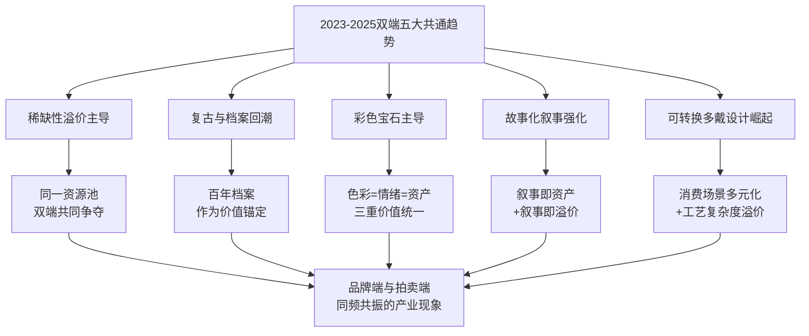

## 7.2 品牌端的差异化亮点：系列叙事与工艺创新

在五大共通趋势之外，高奢品牌端凭借其作为"创作主体"的独特身份，发展出了拍卖端难以复制的差异化策略。这些差异化亮点不仅是品牌端的竞争壁垒，更是其在双端价值生态中的独特价值贡献——**品牌端不只是在销售珠宝，更是在为整个产业生态创造新的设计语汇、工艺标杆与文化叙事**。

### 7.2.1 系列化叙事：品牌端的独有方法论

**系列化叙事是品牌端区别于拍卖端的最核心差异化策略**。拍卖端的叙事永远是"单件作品的故事"——某颗宝石的产地传奇、某位皇室成员的传承轨迹、某位设计师的传奇人生；而品牌端能够通过跨年度、跨主题的系列规划，构建拍卖端无法复制的"系列即资产"运营逻辑。

蒂芙尼Blue Book是这一方法论的最佳样本。**三届递进式叙事**——2023年Out of the Blue幻海秘境（瀚海星螺、珊瑚溢彩、鱼跃光影、深海星芒、海岩星韵、花舞海葵）、2024年Tiffany Céleste苍穹万象（13章节宇宙之旅）、2025年Sea of Wonder瑰海奇珍（10大篇章）——构成了"传奇设计师Jean Schlumberger典藏×当代艺术总监Nathalie Verdeille再演绎"的完整叙事弧光[^83][^86][^74][^67]。这种递进式叙事的产业意义在于：**它使每一届新作不再是孤立的产品发布，而是品牌叙事弧线中的"章节"——前章为后章奠基，后章为前章升华**。Blue Book 2025 Urchin戒指由18K黄金"绳链"扭饰镶嵌一颗超过12克拉的浓彩黄钻及14颗白钻、工匠耗时约200小时打造，明确呼应"Schlumberger 1961年设计的标志性海胆风格台钟"[^83]——单件作品的价值因系列叙事框架而获得历史纵深的增强。

宝格丽则以**跨年度纪念性系列与城市叙事深度绑定**构筑差异化壁垒。Aeterna华彩永续高级珠宝系列"为了庆祝品牌140周年华诞"展示超过140件独一无二作品，"用瑰丽的彩色宝石和复杂的镶嵌工艺向罗马这座永恒之城致敬"；2025年5月在西西里岛陶尔米纳古希腊剧场发布的Polychroma瑰彩罗马高级珠宝与高级腕表系列"倾心呈献约250款全新力作，囊括高级珠宝与高级腕表两大品类，其中包括五款传世之作以及60款'千万级'臻作，开创品牌史上此类展出作品总量新高"——活动特邀皇家芭蕾舞团驻团编舞韦恩·麦格雷戈爵士精心编排灵感源自希腊戏剧的三幕式当代表演[^62]。**这种"周年纪念+城市文化锚点+大型表演艺术发布"的系列运营，使每一次发布事件本身即成为品牌资产的组成部分**——拍卖端永远无法复制这种"以城市文化IP为底盘的跨年度系列史诗"。

宝诗龙Carte Blanche则以**双系列实现哲学层面递进**。Carte Blanche, Or Bleu以冰岛"水"形态为灵感打造26件高级珠宝作品；Carte Blanche, Impermanence则受日本花道（Ikebana）及侘寂（Wabi-sabi）哲学启发，包含28件凝炼于身的臻作，凝聚着世家工坊逾18,000小时的至臻匠艺[^92][^102]。"Wabi-sabi侘寂是一种深植于日本文化的美学与哲学理念，颂扬无常、缺憾与时光自然流淌之美。它邀人驻足关注质朴、风化与存缺之物，既拥抱生命的脆弱本质，又欣然接受世间万物永恒流动的真谛"[^102]。**从"水的物理形态"到"花朵的生命无常"的哲学跃升，标志着品牌端系列叙事已超越单纯的视觉灵感层面，进入哲学命题层面**——这是拍卖端单件作品叙事所无法企及的思想深度。

梵克雅宝则以**Signature系列矩阵+Héritage档案分时段策展**形成最系统的品牌叙事运营。品牌将Zip、Flowers、Ludo™、Liane™、Feminine figures、Butterflies、Perles d'été™等列为"Signature collections"；同时将Héritage系列按"1920年代至1930年代、1940年代至1950年代、1960年代至1970年代、1980年代及其後的作品"四个历史时段策展，使品牌档案本身成为可持续展览的IP。Mystery Set隐密镶嵌作为品牌核心工艺壁垒持续演绎——Legend of Diamonds系列由一颗名为Lesotho Legend的非凡原钻切割而成的67颗钻石组成，串联25件独一无二的作品[^100][^96][^75][^101]。

### 7.2.2 工艺创新：构筑不可复制的护城河

**工艺创新构筑了品牌端最深的护城河**。这些工艺壁垒不仅是技术能力的体现，更是品牌资产管理的核心机制——它们以"专利+长工时+稀缺工匠"三重门槛阻挡竞争者的复制。

梵克雅宝**Mystery Set隐密镶嵌1933年专利**至今仍是品牌端工艺壁垒的标杆。"Patented by Van Cleef & Arpels in 1933, this setting technique allows the metal to disappear in favor of precious stones"[^75]——金质轨道+逐一切割宝石+无金属底座可见的极简美学，"only very few artisans master its secrets. The technique is so intricate that it can take up to eight hours of work to cut each stone. For instance, a clip requires an average of 300 hours in the hands of the jeweler and Mystery Set lapidary"[^100][^101]——单颗宝石切割8小时、单件作品逾300小时工时、全球仅极少数工匠掌握。在此基础上的衍生工艺——Navette Mystery Set、Vitrail Mystery Set、Buff-topped Mystery Set——进一步深化了这一护城河[^101]。更具突破性的**Façonné立体珐琅工艺历经16个月潜心研发并申请专利**——"工匠将珐琅粉末缓缓注入模具，随后依照严格控制的温度进行两次烧制"，营造出"兼具立体感与通透度的惊艳视觉效果"[^96][^97]。

卡地亚的**25次烧制掐丝珐琅**则展现了头部品牌对极致工艺的耐心。Ronde Louis Cartier龙装饰高级珠宝腕表"使用珐琅和雕刻工艺，源自中国灵感的'龙腾出海'画面在卡地亚工匠大师的精湛技艺下，跃然于表盘之上……澎湃的波涛以卡地亚标志性蓝绿配色经由掐丝珐琅工艺呈现，浪花则由虹彩珍珠母贝嵌片勾勒。龙的形象以黄金手工雕刻出栩栩如生的细节，'眼睛'同样采用珐琅烧制——**运用在此款腕表上的珐琅工序需反复进行25次烧制**"，"编号并限量30枚发售"[^85]。Panthère de Cartier猎豹系列腕表则"制作工序耗费超过110小时"——表盘上雪花式镶嵌的145颗明亮式切割圆钻，表链铺镶314颗明亮式切割圆钻和86颗锰铝榴石[^84]。

宝诗龙的**"couture"高定镶嵌工艺**展现了工艺创新的当代突破。Carte Blanche, Impermanence系列Composition n°5以"植物基树脂结合3D打印技术，复刻奶蓟草尖刺状花冠的细致纹理。世家工匠开创'couture'全新高级定制镶嵌工艺，**将逾800颗钻石如针线般缝入奶蓟草的叶片脉络中**"[^69]——这一工艺将"高定时装"的针线缝制概念转译为珠宝镶嵌工艺，开创了高级珠宝工艺创新的全新维度。

陈世英的技术发明谱系则代表了华人珠宝艺术家在工艺创新维度的开拓性贡献。**1987年发明"世英切割（Wallace Cut）"幻象雕刻法、2002年翡翠切割润光专利技术、2007年钛金属在珠宝创作的应用（耗时8年研发）、2014年"真空妙有"、2018年"比钢更坚硬的世英陶瓷"**——其作品《宇宙新生》戒指于2019年被大英博物馆永久馆藏，成为首位作品获该馆永久馆藏的当代华人珠宝艺术家[^85][^86][^68]。陈世英对工艺创新的深刻理解：**"创造的过程会产生无限的热爱与追求，我们拥有的创造力就是最大的超能力，这个超能力让一个目不识丁的孩子看到生命的曙光"**[^93]——展现了工艺创新作为品牌资产之外的更深层精神维度。

### 7.2.3 跨界材质与文化母题的深度融合

**跨界材质与文化母题的深度融合**构成了品牌端第三个差异化亮点。如第4章所述，钛金属、3D打印植物基树脂、硼硅酸玻璃、矿物宝石等非传统材质的运用，与日本侘寂、东方花鸟、罗马神话等文化母题的有机结合，形成品牌端独特的"物质—文化"叙事矩阵。

宝诗龙Carte Blanche系列将这种融合推向极致。Or Bleu系列的多元材质矩阵涵盖**钛金属（Eau d'Encre手镯）、水晶（Ondes波纹）、3D打印黑沙（Sable Noir）、白金+瓷漆+透明清漆（Eau Forte）、失蜡铸造法白金（Vague致敬北斋《神奈川巨浪》）**[^92]；Impermanence系列的Composition n°6郁金香、桉叶与蜻蜓更采用**硼硅酸玻璃、蓝宝石玻璃、珍珠母贝及白金材质，硼硅酸玻璃花樽搭配黑色复合材料底座**[^102]。"承载这一生态组合的花樽部分由硼硅酸玻璃（borosilicate glass）手工打造，工匠巧妙运用该材质的美学特性，在花樽两端施以喷砂工艺，呈现哑光"质感——硼硅酸玻璃这一原本属于实验室器皿与工业领域的材质，被转化为高级珠宝的载体，本身就是物质边界的极致拓展。

伯爵则在矿物宝石与色彩之艺方向深度耕耘。2025年伯爵以"Art of Colour色彩之艺"为主题，将矿物宝石贯穿所有年度新品；"**Shapes of Extraleganza奢雅之形**"高级珠宝系列Kaleidoscope Lights缤纷虹彩主题腕表使用了**28种矿物宝石拼镶表盘**[^84][^98]。Hidden Treasures系列与坠饰时计上的红宝石、绿松石和虎眼石等彩色宝石"或点缀于坠饰时计之上，或镶嵌于经典的手工编织黄金链条之间"；**坠饰时计Swinging Pebbles**作为全新作品，鹅卵石外形灵感来自伯爵档案中的一枚怀表，运用了虎眼石、铬云母和彼得石三种矿物宝石。

华裔艺术家则在"东方文化母题×非传统材质"维度提供了独特路径。Anna Hu以"**钛、铝、纳米陶瓷搭配阳极氧化上色**"诠释花鸟主题——其2024年《莳花珠韵·芳华绝代》以蝴蝶与花卉为灵感，"工匠们巧妙拿捏力度、控制角度，手工锤炼金属基底，展现出花瓣复杂的蜷曲形态。作品背面以手工拉丝，带来栩栩如生的细腻纹理。阳极氧化上色技术，赋予作品充满现代感的电光色彩"[^90]。其2025年新作"秋分望月蝴蝶胸针"则进一步深化这一工艺路径——"作品采用奈米钛金属上色工艺，在蝶翼上层层叠染橙、绿、淡粉等色调，展现出秋日之鲜活气息与蝴蝶的灵动姿态"[^91]。Cindy Chao则以"**钛金属雕塑性铸造+大规模宝石镶嵌（5786颗）**"诠释建筑感、雕塑性与生命力哲学——其2023年帕米尔胸针"以钛金属为基底，通过精密铸造与手工打磨，呈现出一种既现代又充满力量的建筑美感"[^88][^102]。

### 7.2.4 品牌端差异化亮点的整合视图

下表系统整合品牌端的三大差异化亮点：

| 差异化维度 | 核心代表 | 关键证据 | 拍卖端难以复制的原因 |
|----------|---------|---------|-------------------|
| **系列化叙事** | 蒂芙尼三届Blue Book海洋宇宙；宝格丽Aeterna 140周年+Polychroma陶尔米纳；宝诗龙Or Bleu+Impermanence双系列 | 跨年度递进式叙事；城市文化IP锚定；哲学命题升华 | 拍卖端只能讲单件故事，无法构建跨年度系列弧光 |
| **工艺创新护城河** | 梵克雅宝Mystery Set 1933专利+Façonné立体珐琅16月研发；卡地亚25次烧制掐丝珐琅；宝诗龙"couture"800颗钻石针线缝入；陈世英世英陶瓷+钛金属8年研发 | 专利级工艺；长工时（300—5050小时）；稀缺工匠（全球少数掌握） | 拍卖端只能拍卖既成作品，无法主导工艺研发 |
| **跨界材质×文化母题** | 宝诗龙钛金+3D打印+硼硅酸玻璃+失蜡铸造致敬北斋；伯爵28种矿物宝石；Anna Hu纳米钛金属+东方花鸟；Cindy Chao钛金+帕米尔高原 | 物质边界拓展；文化母题深度融合；工艺—材质—叙事三位一体 | 拍卖端依赖既有作品的材质参数，无法主动开拓物质边界 |

**品牌端差异化亮点的产业意义在于其"创造性"**——它不仅是商业策略，更是高级珠宝作为艺术形式持续焕发活力的根本动力。当蒂芙尼以三届Blue Book构建海洋宇宙叙事、当宝诗龙以双系列实现哲学跃升、当陈世英以8年研发钛金属工艺时，他们都在为整个高级珠宝行业贡献新的叙事范式、工艺标杆与文化命题——**品牌端的差异化亮点最终转化为整个行业可共享的创新资产**。

## 7.3 拍卖端的差异化亮点：产地、克拉与历史出处

如果说品牌端凭借"创造价值"的能力构筑差异化，那么高定拍卖端则凭借"校验价值"的机制构筑独有的差异化亮点。拍卖端的核心价值在于通过权威实验室、量化参数与历史出处，将主观的设计美学转化为客观的市场定价——这一"价值校验"职能是品牌端无法承担的，它构成了高定拍卖端不可替代的产业贡献。

### 7.3.1 产地认证：拍卖端的硬性价值标尺

**产地认证是拍卖端区别于品牌端的最核心差异化机制**。SSEF瑞士珠宝研究院、Gübelin古宝琳寶石鑑定所、GRS等权威实验室对喀什米尔、缅甸抹谷、哥伦比亚穆佐/契沃尔、莫桑比克蒙特佩兹等核心产地的鉴定，构成了品牌端无法替代的客观定价基础。

第3章已系统揭示这一机制的具体运作。**"未经加热（No Heat）"**作为蓝宝石与红宝石的核心品质指标，"市面上宣称'无烧'的蓝宝石中，近三成缺乏可验证的国际权威证书支撑……低温热处理（700—1000℃）难以通过传统显微镜识别，需依赖高光谱等先进设备，普通消费者无法自行判断"[^75]——这意味着无烧认证必须由权威实验室通过包裹体显微观察、光谱分析及矿物学证据（如一水硬铝石、针铁矿）多重验证。**"未经注油（No Oil/No Clarity Modification）"**作为哥伦比亚祖母绿的关键指标，苏富比2026年春拍呈献的32.86克拉枕形哥伦比亚无油祖母绿戒指即附SSEF与Gübelin双证书——SSEF报告明确指出"经鉴定时未发现裂隙处有任何净度优化迹象（with no indications of clarity modification in fissures at the time of testing）"，并附"附录信函"声明"哥伦比亚产地具备此尺寸与品质的天然祖母绿可被视为稀有非凡（rare and exceptional）"，估价1500万—2500万港币[^79]。

**"Royal Blue皇家蓝"与"鸽血红Pigeon Blood"**作为颜色分级的核心指标，体现了产地认证的精细化程度。要达到SSEF与Gübelin认证的"皇家蓝"标准，"除了顏色外，藍寶石還要符合最高品質要求，且未經任何顏色或淨度優化，以及任何形式的人工處理"[^73]。**"Type IIa"**作为钻石化学纯度的顶级指标——仅占全部钻石1%—2%——是Mediterranean Blue 10.03ct、Mellon Blue 9.51ct等顶级蓝钻共通的硬性属性[^65][^67]。

**保利香港2025春拍精选拍品**为产地认证机制提供了清晰的案例集合：18.39克拉艳彩黄色钻石戒指附GIA证书、10.64克拉哥伦比亚祖母绿戒指附Gübelin及AGL证书、13.29克拉马达加斯加皇家蓝蓝宝石戒指附SSEF/Gübelin/GRS/GIA四重证书、5.02克拉克什米尔蓝宝石戒指附Gübelin及SSEF证书、7.61克拉哥伦比亚祖母绿挂坠项链附Gübelin证书[^74]。**这种"权威实验室证书+多重交叉验证"的产地认证体系，使得拍卖端的每一颗顶级宝石都能获得明确的客观定价基础**——这是品牌端高珠系列虽然采购同等品质宝石，但难以系统化呈现的差异化机制。

### 7.3.2 克拉规模：拍卖端的量化天花板

**克拉规模与品质参数构筑了拍卖端的物理标杆**。这些超越品牌端日常作品的"重型"拍品，通过其不可替代的克拉数字成为高定珠宝市场的"价值天花板"。

回顾第3章所揭示的近三年顶级拍品克拉数：

| 拍品类别 | 代表拍品 | 克拉数 | 拍卖纪录 |
|---------|---------|-------|---------|
| **喀什米尔蓝宝石** | The Royal Blue项链 | 104.61ct（16颗主石） | 1.2545亿港币（世界纪录） |
| **喀什米尔蓝宝石** | The Regent Kashmir戒指 | 35.09ct | 7467.5万港币（每克拉27.3万美元纪录） |
| **莫桑比克鸽血红** | 福荣之星 | 55.22ct | 约2.39亿元人民币（红宝石世界纪录） |
| **哥伦比亚无油祖母绿** | 苏富比32.86ct戒指 | 32.86ct | 估价1500-2500万港币 |
| **哥伦比亚祖母绿吊坠** | 亚马逊女王 | 280.84ct | 278.25万瑞郎 |
| **艳彩蓝钻** | Mediterranean Blue | 10.03ct | CHF 17.9M |
| **艳彩蓝钻** | The Mellon Blue | 9.51ct | 2052.5万瑞郎（每克拉269万美元） |
| **艳彩黄钻** | The Yellow Rose | 202.18ct | 609.5万瑞郎 |
| **艳彩黄钻** | 香港艳彩橙黄钻耳坠 | 12.20+11.96ct | 6202.5万港币 |
| **浓彩粉钻** | Eden Rose伊甸园玫瑰 | 10.20ct | 约1330万美元 |
| **完美无瑕白钻** | Jwaneng 28.88 | 28.88ct（D色IF Type IIa） | 2103万港币 |
| **顶级帕拉伊巴碧玺** | Kat Florence Lumina | 181.61ct | 381.4万港币 |
| **帝王绿翡翠珠链** | 保利43颗珠链 | 直径12.5mm/43颗同矿脉 | 3600万港币 |

**这些克拉数字构筑了品牌端日常作品难以企及的物理标杆**。需要指出，品牌端高珠系列虽然偶尔运用极大克拉宝石（如宝格丽Mediterranean Reverie 107克拉斯里兰卡蓝宝石、Mediterranean Queen 500克拉级帕拉伊巴），但这些极致案例本身即体现了品牌端在与拍卖端价值天花板对标的努力——它们是少数的、为戛纳红毯或品牌纪念性发布而打造的特殊单品，而非品牌端日常创作的常态。**拍卖端则通过持续的纪录性成交，使顶级克拉数始终保持在市场关注的中心**。

帝王绿翡翠珠链的案例尤为典型地体现了拍卖端克拉规模差异化亮点。"超过12毫米直径的翡翠珠已十分稀有，而本次拍出的珠链直径达12.5毫米，43颗大小均匀如一，其稀缺性不言而喻"——更关键的是，珠链"必须来自同一矿脉，确保每颗珠子的色泽质地完美统一"[^69]。这种**"同矿脉一致性"的极端要求**，使顶级翡翠珠链成为市场上最罕见的品类之一，而这种系统性配套恰恰是品牌端难以系统呈现的——品牌端的翡翠运用通常以单颗主石为主，而非43颗同矿脉珠子的统一配套。

### 7.3.3 历史出处：拍卖端的独特溢价源

**历史出处与传承轨迹构成了拍卖端最独特的差异化溢价源**。"物的传记"——即一件珠宝从制作、流转到收藏的完整历史叙事——是拍卖端能够将单件作品升华为跨世纪金融叙事的核心机制，这是新品发布端无法承载的时间维度价值。

**法贝热"帝国冬季彩蛋"的传承轨迹**是这一机制的极致体现。沙皇尼古拉二世1913年花24600卢布从法贝热定制、赠予母亲玛丽亚·费奥多罗夫娜皇太后的复活节礼物；1917年俄国革命爆发、罗曼诺夫王朝覆灭，彩蛋被临时政府送往克里姆林宫军械库；1922年被国家珍宝基金（Gokhran）列为可出售藏品；1929—1933年间由伦敦Wartski公司购得；**1994年首度上拍佳士得日内瓦以560万美元成交；2002年再上拍卖以约960万美元成交（涨1.7倍）；2025年第三度上拍以约2.14亿元人民币（合2289.5万英镑）创下纪录**[^67]——三次拍卖间的价格阶梯本身已构成一段独立的金融叙事。

**Bunny Mellon私人收藏的"The Mellon Blue"9.51克拉艳彩蓝钻**则展现了名人收藏的传承溢价。Bunny Mellon作为美国白宫玫瑰园设计者，其收藏经佳士得2025年11月日内瓦秋拍流转——成交价2052.5万瑞郎、平均单克拉价格高达269万美元[^67]。这种"皇家、政商名流私人收藏"的传承背景，为拍品提供了远超物理参数的故事溢价。

**温莎公爵夫人对黄钻的钟爱、印度阿迦汗王子定制的卡地亚阿迦汗祖母绿胸针、印度王公定制的伯蒂亚拉项链、纳瓦讷格尔王公的美好年代风格钻石羽冠**等历史订制珠宝，构成了拍卖端皇室订制叙事的核心源泉[^93][^80]。海瑞温斯顿Royal Adornments系列虽然在品牌端致敬这一历史档案，但拍卖端在二级市场对这些原版历史订制珠宝的拍卖，提供了品牌端致敬作品所无法提供的"原典权威性"。

更值得指出的是**拍卖端古董珠宝市场对中等克拉拍品的"故事溢价"显著**。如第3章所述，2025年11月富艺斯日内瓦秋拍中，**百合花造型古董珠宝钻石胸针（Cartier出品，圆形和玫瑰式切割钻石、E色SI2净度）虽仅重4.55克拉，却以45.15万瑞郎成交，远超初期预估价**[^67]。这一案例清晰证明：**当一件作品同时承载卡地亚品牌、Art Deco百合花造型、玫瑰式切割古老工艺时，4.55克拉的中等克拉钻石依然可以录得显著溢价**——这种"小克拉高溢价"的现象，本质上正是历史出处差异化机制的直接体现，它是品牌端日常新品创作所无法对标的独有价值维度。

### 7.3.4 拍卖端差异化亮点的整合视图

下表系统整合拍卖端的三大差异化亮点：

| 差异化维度 | 核心机制 | 关键证据 | 品牌端难以复制的原因 |
|----------|---------|---------|-------------------|
| **产地认证** | SSEF/Gübelin/GRS权威实验室+多重交叉验证 | "无烧""无油""Royal Blue""鸽血红""Type IIa"技术性指标直接定价 | 品牌端不主导认证体系；权威实验室独立性是认证公信力的基础 |
| **克拉规模标杆** | 顶级克拉数+品质参数+同矿脉一致性 | 104.61ct喀什米尔蓝宝石、55.22ct福荣之星、202.18ct黄钻、43颗同矿脉翡翠珠链 | 品牌端日常作品规模难以匹敌；只有少数纪念性单品对标 |
| **历史出处溢价** | 跨世纪传承轨迹+皇室名人收藏+物的传记 | 法贝热帝国冬季彩蛋三度上拍价格阶梯；Bunny Mellon收藏；JAR Marie-Antoinette传奇；Cartier 4.55ct百合花胸针45.15万瑞郎 | 品牌端新品无时间维度积累；致敬作品无原典权威性 |

**拍卖端差异化亮点的产业意义在于其"客观性"**——产地认证、克拉规模、历史出处这三大维度，构成了高级珠宝从"主观美学"向"客观资产"转化的必要桥梁。**没有拍卖端的价值校验机制，品牌端的设计创新便无法获得持续的市场反馈；没有拍卖端的克拉规模标杆，品牌端便无法建立持续提升的品质追求；没有拍卖端的历史出处叙事，品牌端的档案再生策略便缺少最权威的故事供给来源**。

## 7.4 一级与二级市场的互动循环与彼此塑造

承接前两节对双端共通点与差异化亮点的剖析，本节系统论证品牌端与拍卖端构成的"**设计供给—价值校验—稀缺争夺—档案再生**"四重互动闭环。这一闭环不仅是双端业务关系的描述，更是2023—2025年高级珠宝产业最具结构性意义的运行机制——它使一级与二级市场不再是简单的"创造与流转"线性关系，而成为彼此塑造、共同演化的统一价值生态。

### 7.4.1 价值校验机制：拍卖端为品牌端提供市场反馈

**价值校验机制是双端互动循环的第一层**。拍卖端为品牌端的设计创新提供市场化定价反馈，这一反馈机制在近三年呈现出空前的高频与精确。

最具代表性的案例是**卡地亚水果锦囊（Tutti Frutti）系列的双重市场反馈**。如第3章所述，2024年4月苏富比香港拍卖中，卡地亚水果锦囊项链以**6775.5万港元成交，远超其拍前预估价范围2800万至3800万港元**——若以最高预估价为基准，该款项链的溢价率为78.3%[^58][^93]。仅两年后的2026年4月苏富比香港"瑰丽珠宝"专场，**另一件卡地亚"Tutti Frutti"水果锦囊项链以2164万港币爆冷夺冠，高出650—1150万港币最高估价近2倍**[^61]。这两次连续的爆冷夺冠，向卡地亚集团传递了清晰的市场信号——**水果锦囊作为品牌符号的二级市场价值远未饱和**。

这一信号反过来强化了品牌端的"档案再生"策略。如第2章所述，卡地亚Beautés du Monde系列的Rituel高级珠宝项链"礼赞装饰之美"以中美洲传统珠宝为致敬对象，由"双排天蓝色玉髓圆珠组成，当中由红宝石镶嵌出宛如星群的图案"，"锥形镶嵌钻石与多切面红宝石交错相间"——其雕花宝石+多色彩宝的语汇与水果锦囊一脉相承；Le Voyage Recommencé系列Yfalos项链"以1颗罕见的大尺寸弧面切割绿松石为主石"，链身钻石塑造蜿蜒线条，红色珊瑚棱纹珠交错相连，"呈现出典型的印度莫卧儿时期珠宝风格"[^84]——莫卧儿风格的当代演绎正是水果锦囊核心母题的延续。**品牌端在Beautés du Monde与Le Voyage Recommencé系列对"红绿黑+雕花宝石+莫卧儿风格"的延续，正是对拍卖端市场反馈的直接响应**。

类似的价值校验机制也体现在其他品牌的设计延续中。蒂芙尼Schlumberger Butterflies项圈"由Jean Schlumberger在1956年创作，现珍藏于维珍尼亚美术博物馆"获**2025年首届摩纳哥高级珠宝大奖赛传承大奖**[^83]——这一二级市场的认可便反向强化了蒂芙尼连续三届Blue Book以Schlumberger典藏为锚点的创作策略；JAR紫粉钻戒指250万瑞郎、JAR"Marie-Antoinette"系列粉钻戒指1400万美元的溢价表现，强化了独立设计师IP在高级珠宝市场的价值地位，反向激励品牌端引入独立设计力量与跨界合作。

### 7.4.2 稀缺资源争夺：拍卖端价格信号驱动品牌端采购

**稀缺资源争夺是双端互动循环的第二层**。拍卖端的纪录性成交直接转化为品牌端的资源采购信号——拍卖纪录的产地、品质、克拉数标杆，往往以"季度"而非"年度"为单位反应到品牌端的高珠系列设计中。

**喀什米尔蓝宝石资源争夺的案例链条**最具结构性意义。2025年5月佳士得香港"The Regent Kashmir"35.09克拉戒指以每克拉27.3万美元刷新蓝宝石每克拉拍卖纪录；2025年11月"The Royal Blue"104.61克拉项链以1.2545亿港币刷新喀什米尔蓝宝石项链世界纪录[^59][^73]。**这一连续两次刷新的纪录，向所有头部品牌传递了清晰的产地价值信号——喀什米尔蓝宝石作为1927年关闭老矿的绝迹资源，其价值仍处于持续上升通道**。

品牌端的快速响应同样具有结构性意义。**路易威登Aster高级珠宝项链采用23颗已绝矿的克什米尔蓝宝石（主石17.88克拉）作为切入高珠的"投名状"**——这一选择本身即是对拍卖端价值信号的直接响应。保利香港2025春拍则将海瑞·温斯顿设计、共重80克拉的喀什米尔/缅甸/斯里兰卡蓝宝石套装作为顶级征集对象，2024年春拍呈献的5.02克拉克什米尔蓝宝石戒指（附Gübelin及SSEF证书，估价280—380万港币）[^72][^74]。**这种"拍卖端创纪录—品牌端加大采购—拍卖端再创纪录"的螺旋式资源争夺，成为顶级稀缺产地价值持续上升的核心驱动**。

类似的资源争夺也发生在其他核心产地。**哥伦比亚祖母绿"未经注油"作为继"未经加热"之后的关键品质指标**，反向驱动品牌端在哥伦比亚祖母绿的运用上更加注重未经处理的原生品质——宝格丽Eden系列Tribute to Paris项链的35.53克拉哥伦比亚祖母绿、Aeterna系列Terra Mater Serpenti项链的63.86克拉哥伦比亚弧面切割祖母绿主石，均代表了品牌端对顶级哥伦比亚祖母绿的持续追逐。**帕拉伊巴碧玺凭借电光蓝色调进入"结构性短缺"阶段**，宝格丽Mediterranean Queen等500克拉级帕拉伊巴在品牌端的密集运用便顺理成章。

### 7.4.3 档案再生循环：双端共同演绎品牌历史符号

**档案再生循环是双端互动循环的第三层**。品牌端持续在新作中演绎历史符号，二级市场的历史古董也获得新的关注度，形成"一级新作—二级古董—一级再演绎"的良性循环。

这一循环在卡地亚、宝格丽、梵克雅宝、蒂芙尼四大品牌中均有清晰体现。**卡地亚的"猎豹—几何—莫卧儿—龙"档案矩阵**——Beautés du Monde Water Aspis蛇与Apatura蝴蝶、Le Voyage Recommencé Panthère Confiante雪豹与Yfalos莫卧儿、Spina几何镂空、Ronde Louis Cartier龙装饰腕表——构成对品牌历史档案的全面再演绎，每一次再演绎都强化二级市场对原典作品的关注度，反过来为下一轮再演绎积累价值势能[^85][^98]。

**宝格丽的"Serpenti—Monete—Chandra"档案矩阵**——Aeterna 140周年系列Terra Mater Serpenti祖母绿项链、Augustus Aeternus古罗马钱币项链、Aurea Chandra黄金项链——使品牌的1990年代Chandra典藏、罗马帝国时期钱币图腾、灵蛇蜕变母题在当代重新获得叙事生命力。**Aurea Chandra黄金项链"巧用隐形铰接设计将空心金球轻盈连缀，交替饰以镜面抛光和钻石镶嵌营造出光影变幻之美"，灵感源自品牌1990年代的Chandra典藏**——这一典藏档案的再演绎，使原典作品获得新的市场关注。

**梵克雅宝的Signature系列矩阵**——Mystery Set隐密镶嵌的当代演化、Ludo Secret腕表的1949年Ludo手镯再演绎、Sous les étoiles天文星象的诗意延续——以"系统性档案运营"完成"一级新作—二级古董"的价值闭环。在2025年钟表与奇迹展会上，梵克雅宝的Ludo Secret腕表新作"重新演繹了1949年問世的Ludo手镯的經典款式"——这种"七十多年前的经典款式被当代腕表新作再演绎"的方式，正是档案再生循环的完整呈现。

**蒂芙尼的Schlumberger典藏**则代表了"设计师IP档案再生"的极致。**蒂芙尼传奇黄钻"灵感源自经典的石上鸟胸针，可作为可调节胸针佩戴，亦可作为吊坠佩戴"**——这件128.54克拉黄钻不仅是品牌的物理资产，更通过石上鸟胸针的可换形佩戴方式，将Jean Schlumberger 1956年开始的合作传奇延续至当代。Blue Book三届递进式叙事则使Schlumberger的海洋（2023+2025）与宇宙（2024）创作典藏获得跨年度的当代演绎，**使品牌历史档案本身成为持续创作的灵感源泉**。

### 7.4.4 孤品试水机制：拍卖行向一级原创延伸

**孤品试水机制是双端互动循环的第四层、也是最具突破性的层次**。这一机制标志着拍卖行从"二级市场分销者"向"一级原创设计平台"延伸，进一步深化双端融合。

**卡地亚DRAGON龙年孤品高珠**作为这一机制的代表性事件，2024年10月29日佳士得香港"瑰丽珠宝及翡翠首饰"专场上首次亮相，单日成交4.67亿港元——"现场成交比率以件数计高达92%，落槌总额为拍前低估价的106%，其中彩钻、无色钻石及翡翠拍品100%成交"[^98]。这种"一级品牌孤品试水二级市场"的运作，是品牌设计与拍卖反馈深度协同的新范式——它让卡地亚能够在生肖叙事的市场承接力上获得最直接的反馈，同时为DRAGON系列的后续创作提供了清晰的市场依据。

更具结构性意义的是**苏富比钻石（Sotheby's Diamonds）部门与独立设计师的合作**。苏富比2026春香港"瑰麗珠寶"领衔拍品即"苏富比钻石"由设计师**Joseph Ramsay**设计的"倾城"7.00克拉浓彩紫粉色IF Type IIa钻石戒指，估价高达4200—5500万港币[^80]。"苏富比钻石"传承"近三百年来苏富比在艺术和珠宝市场积累的专业知识和视野"，并与"具前瞻性的才华设计师"开拓合作——最新与Joseph Ramsay推出的"华光绮错"系列灵感来自"文艺复兴时期服饰，以及古雕塑衣襲飄逸之美"。**"苏富比钻石"的运营模式标志着拍卖行从单纯的二级分销者，向"一级原创设计+二级权威拍卖"双重身份的转型**。

类似的双端融合趋势也体现在独立设计师与时装跨界品牌的崛起中。如第3章所述，**JAR紫粉钻戒指250万瑞郎、Joseph Ramsay为苏富比钻石设计"倾城"戒指估价4200—5500万港币、丰吉Jardin de Giverny项链以2021万港币创中国珠宝设计师全球最高拍卖价**——这些案例显示当代设计师在二级市场已能录得不亚于历史品牌的高溢价。这一现实激励品牌端引入独立设计力量与跨界合作，同时也为时装巨头（路易威登、古驰、芬迪、巴黎世家、普拉达等）跨界进入高级珠宝赛道提供了市场背书——**他们的设计签名在未来二级市场上同样具备溢价空间**。

### 7.4.5 四重互动闭环的整合视图

下图系统呈现了品牌端与拍卖端构成的完整互动闭环：

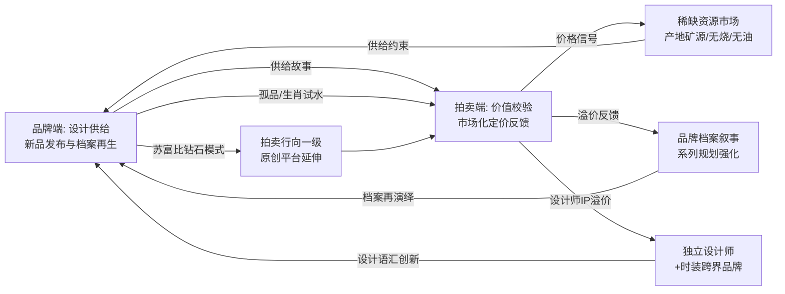

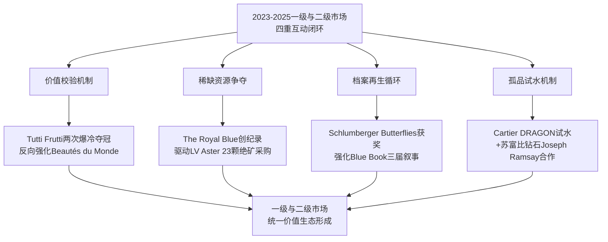

**四重互动闭环的产业意义在于其"双向塑造"的本质**——它使得单纯讨论"品牌端设计趋势"或"拍卖端价格走势"都是不完整的。两者构成同一价值生态的两面：**任何品牌设计创新都需经过拍卖市场的价值校验，任何拍卖纪录都源自一级品牌或独立设计师的设计供给**。这正是本研究将"高奢品牌"与"高定拍卖"并置作为双轨研究主题的根本原因。

## 7.5 共通与差异背后的深层逻辑：统一价值生态的形成

承接前四节对共通趋势、差异化亮点与互动闭环的论述，本节作为本章总结性分析，将提炼双端共通与差异背后的**深层产业逻辑**——这些逻辑不仅解释了2023—2025年所观察到的现象，更预示了未来3—5年高级珠宝产业的演进方向。

### 7.5.1 三重消费逻辑作为统一需求侧基线

**第一层深层逻辑：'审美消费+情绪价值+资产属性'三重消费逻辑作为统一需求侧基线，同时驱动品牌端设计创新与拍卖端价值锚定**。

如第6章所揭示，2023—2025年珠宝消费市场已进入"审美+情绪+资产"三重逻辑共同主导的时代。这一三重逻辑不是抽象的概念框架，而是具体作用于双端的消费驱动机制：

- **VIC高价值客户的资产配置需求支撑双端的稀缺性溢价共通**。BVLGARI首席执行官Jean-Christophe Babin透露过去一年品牌"价格超过100万美元的产品售出数量较上年翻了一番"——这一品牌端的VIC消费现象，与拍卖端2025年顶级红宝石较前两年涨50%以上、顶级喀什米尔蓝宝石与缅甸鸽血红连续创纪录，是同一资产配置需求在双端的双重表达。

- **Z世代女性的悦己情绪驱动双端的故事化叙事共通**。中宝协2025年消费数据显示彩宝消费中悦己佩戴占比高达42%——这一情绪价值需求，既驱动品牌端在Schlumberger海洋叙事、Anna Hu百合花叙事等情感故事上的密集投入，也驱动拍卖端对皇室传承、命名性故事拍品的持续追捧。

- **年轻一代的体验消费偏好驱动双端的可转换设计共通**。科尔尼调研显示Z世代41%—44%向体验消费转移——这一代际偏好既驱动品牌端在Cascade可转吊坠、Noeud六种佩戴等可转换设计上的创新，也驱动拍卖端对Cartier Écho可拆卸耳环等"一物多用"工艺亮点的高溢价。

**三重消费逻辑的统一性，使得品牌端与拍卖端在不同的市场层级上呈现出高度同步的趋势特征**——这是双端五大共通趋势能够形成的最根本需求侧基础。

### 7.5.2 差异化分工的产业合理性

**第二层深层逻辑：差异化分工的产业合理性——品牌端承担'创造价值'职能，拍卖端承担'校验价值'职能，二者构成完整的价值闭环而非竞争关系**。

这一分工逻辑解释了为什么品牌端与拍卖端虽然都在销售"高级珠宝"这一相同商品类别，却在差异化亮点上呈现出截然不同的运营模式。**品牌端的核心能力在于"创造"**——通过设计、工艺、叙事、材质实验等手段，将原材料转化为承载美学与文化意义的作品；**拍卖端的核心能力在于"校验"**——通过权威实验室认证、克拉规模标杆、历史出处考证等手段，将主观的设计美学转化为客观的市场定价。

这种分工的产业合理性，体现在以下三个层面：

**其一，品牌端无法独立完成价值校验**。如果没有SSEF/Gübelin/GRS等权威实验室的认证，品牌端高珠系列虽然采购顶级宝石，但难以系统化呈现产地认证的客观价值——品牌端是认证体系的"使用者"而非"主导者"，权威实验室的独立性是认证公信力的基础。

**其二，拍卖端无法独立完成价值创造**。拍卖端只能拍卖既成作品，无法主导工艺研发与设计创新——梵克雅宝Mystery Set 1933专利、宝诗龙"couture"高定镶嵌、陈世英世英陶瓷等工艺壁垒，都是品牌端长年研发投入的产物，拍卖端只能在二级市场对这些已成型的工艺作品进行流转。

**其三，双端通过分工实现产业整体效率最大化**。品牌端将研发投入聚焦在工艺创新与系列叙事上，拍卖端将专业能力聚焦在价值校验与流转效率上——这种分工使得整个产业能够在创造端与校验端同时保持高效率，避免了"既要创造又要校验"导致的资源分散。

### 7.5.3 全球化与本土化的双轨共振

**第三层深层逻辑：全球化与本土化的双轨共振——双端共同响应亚洲藏家迁移、华裔设计师突破、中国本土品牌崛起等结构性变迁，使东方文化母题在双端获得平行表达**。

如第1章与第6章所揭示，2023—2025年珠宝市场最具结构性意义的变迁之一，是亚洲藏家从软奢向高级珠宝迁移、华裔设计师国际化突破、中国本土品牌崛起。这一变迁在双端获得了平行的表达：

**品牌端的本土化深化**呈现为国际品牌从"翻译式本地化"升级为"创作式本地化"。卡地亚DRAGON龙年孤品高珠、宝格丽Serpenti Dragoni"蛇—龙"意象融合、肖邦12年生肖周期闭合限量88枚、Bottega Veneta北京时装秀中国限定色——这些动作清晰说明国际品牌已不再将中国市场视为单纯的销售目标，而是将其视为创作灵感的核心来源[^85][^95][^70]。**Anna Hu以华裔身份在巴黎芳登广场的Maison艺术之家发布2025高定周新作、Cindy Chao获法兰西共和国艺术与文学骑士勋章、陈世英在上海博物馆东馆举办全球最大型个人艺术展、丰吉Jardin de Giverny项链以2021万港币创中国珠宝设计师全球最高拍卖价**[^90][^91][^103][^95][^99]——这些华裔设计师的国际突破，标志着东方主体性表达已成为高级珠宝创作的"主导范式之一"。

**拍卖端的本土化深化**则呈现为亚洲拍场对东方文化母题拍品的持续追捧。**保利香港43颗"帝王绿"翡翠珠链以3600万港元贡献全场近80%成交额**——这一现象揭示了"亚洲文化母题、亚洲拍行主导、亚洲藏家主导"的三位一体格局[^68][^69]。佳士得香港2025年5月"瑰丽珠宝及翡翠首饰"专场Edmond Chin设计的天然翡翠蛋面、钻石及蓝宝石项链作为封面拍品（套链22颗翡翠蛋面及44个翡翠镶爪全部于同一颗原石开采，估价HK$20,000,000—30,000,000）[^75]——华裔设计师在拍场封面位置的出现，进一步标志着东方文化母题在拍卖端的话语权提升。

**双端在东方文化母题表达上的共振，预示着全球高级珠宝市场长期由西欧主导的单极格局正在向多极格局演变**。这是2023—2025年最具长期意义的结构性变迁。

### 7.5.4 双端融合的未来趋势

**第四层深层逻辑：双端融合的未来趋势——拍卖行向一级原创设计延伸、品牌通过孤品试水二级市场、独立设计师与时装跨界品牌通过双端协同建立价值，预示2023—2025年所形成的双端互动闭环将在未来3—5年进一步深化为'设计—拍卖—档案—消费'四位一体的统一价值生态**。

具体而言，未来3—5年双端融合可能呈现以下三个方向：

**其一，拍卖行的一级原创化进一步深化**。"苏富比钻石"与Joseph Ramsay合作的"华光绮错"系列、未来可能出现的"佳士得珠宝设计部"等创新模式，将使拍卖行从单纯的二级分销者，向"一级原创设计+二级权威拍卖"双重身份转型。这种转型不仅扩大了拍卖行的业务边界，也为独立设计师提供了更多的创作平台。

**其二，品牌端的孤品试水机制常态化**。卡地亚DRAGON龙年孤品的成功试水，可能驱动更多头部品牌将"专为重要节庆/纪念日打造的孤品高珠"作为标准的市场策略。这种孤品试水不仅为品牌提供了直接的市场反馈，也为拍卖行带来了更多的高价值新品资源。

**其三，独立设计师与时装跨界品牌通过双端协同建立价值**。第1章已述及的时装巨头跨界（路易威登Aster、古驰Labirinti Gucci、芬迪首个高珠系列、巴黎世家与Jacob & Co.合作、普拉达、巴尔曼、圣罗兰、罗意威等）——这些品牌虽然在一级市场上构筑了新的设计语汇，但其作为高级珠宝品牌的"长期价值"仍需通过二级市场的持续表现来验证。未来3—5年，时装跨界品牌的高级珠宝作品在拍卖端的表现，将成为决定其能否真正进入高级珠宝顶级阵营的关键。

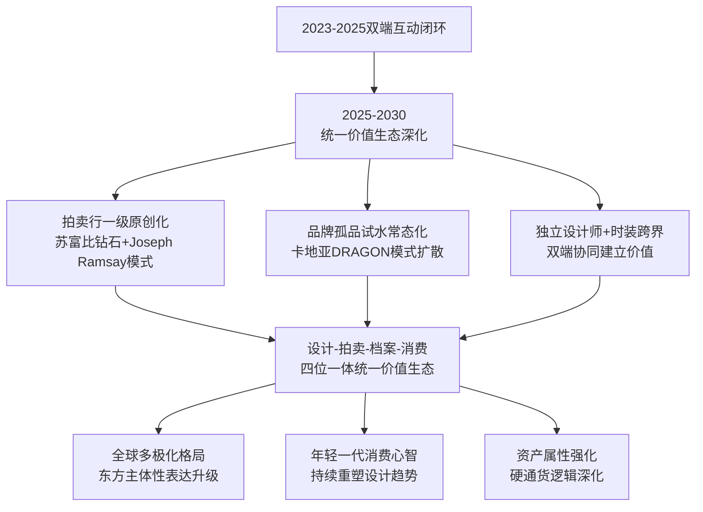

### 7.5.5 本章核心结论与对第8章的承接

综合本章前四节对共通趋势、差异化亮点、互动闭环与深层逻辑的剖析，可凝练出以下三个本章核心结论：

**结论一：双端共通呈现五大趋势——稀缺性溢价主导、复古与档案回潮、彩色宝石主导、故事化叙事强化、可转换与多戴设计崛起**。这五大共通趋势本质上是"审美消费+情绪价值+资产属性"三重消费逻辑在双端的同步表达，是2023—2025年高级珠宝市场最具结构性意义的趋势特征。

**结论二：双端各自的差异化亮点构成产业分工的合理基础——品牌端以系列叙事、工艺创新、跨界材质×文化母题构筑设计护城河，拍卖端以产地认证、克拉规模、历史出处构筑价值天花板**。两者并非竞争关系，而是构成完整价值闭环的差异化分工——品牌端"创造价值"，拍卖端"校验价值"。

**结论三：双端构成'设计供给—价值校验—稀缺争夺—档案再生'四重互动闭环，并预示未来3—5年将进一步演化为'设计—拍卖—档案—消费'四位一体的统一价值生态**。这一统一价值生态的形成，是2023—2025年高级珠宝产业最具长期意义的结构性成就。

承接本章对双端趋势共通点与差异化亮点的整合性分析，**第8章将基于全篇研究的累积证据，归纳近三年珠宝设计流行趋势的核心特征矩阵**——以关键词体系、主题维度、工艺语汇、文化叙事的多重视角凝练全篇发现；**研判未来3—5年可能延续与新兴的趋势方向**——包括可持续与负责任珠宝、数字化体验、跨文化IP合作、个性化定制深化、运动与日常场景渗透等；并**为品牌、设计师、藏家与投资者四类受众提供差异化的策略性洞察与前瞻性建议**。本章所揭示的双端互动闭环与统一价值生态逻辑，将作为第8章趋势归纳与未来展望的核心结构基础——确保第8章的趋势矩阵不再是孤立特征的简单罗列，而是建立在双端互动机制之上的有机系统；确保未来展望不再是抽象的预测，而是基于2023—2025年所形成的产业生态逻辑的延伸推演。

# 8 趋势洞察与未来展望

承接前七章对2023—2025年珠宝设计趋势的系统剖析——从第1章的产业坐标，到第2章的品牌端设计语言，第3章的拍卖端价值机制，第4章的工艺创新，第5章的文化叙事，第6章的消费驱动，直至第7章的双端互动闭环——本章作为整篇研究的**收束性章节**，承担三重核心使命：其一，凝练近三年珠宝设计流行趋势的核心特征矩阵，将零散观察提升为结构化图谱；其二，研判未来3—5年延续性趋势与新兴趋势的演进方向，剖析产业生态的长期演化逻辑；其三，针对品牌、设计师、藏家与投资者四类受众，提供差异化的策略性洞察与前瞻性建议。本章不是孤立特征的简单罗列，而是建立在第7章所揭示的"设计供给—价值校验—稀缺争夺—档案再生"四重互动闭环与统一价值生态逻辑之上的**有机系统总结**——它以前七章累积的实证证据为基础，以双端互动机制为分析骨架，以受众视角的策略化为输出导向，旨在为整篇研究画上既高瞻远瞩又落地可行的句点。

## 8.1 近三年珠宝设计流行趋势的核心特征矩阵

系统归纳2023—2025年高奢品牌与高定拍卖珠宝设计流行趋势的核心特征，需要超越单一维度的描述性归纳，而以"**五维矩阵+关键词体系**"的结构化方式呈现。这一矩阵从设计语言、材质工艺、文化叙事、价值机制、消费驱动五大维度入手，每一维度提炼3—5个核心关键词，最终形成可指导后续展望与策略建议的趋势图谱。

### 8.1.1 五大维度的关键词凝练

基于前七章所累积的实证证据，本研究将2023—2025年珠宝设计趋势凝练为以下五大维度、二十余项关键词的特征矩阵：

| 维度 | 核心关键词 | 关键证据锚点 |
|------|----------|------------|
| **设计语言** | 自然主题双轨并行、几何与建筑性回归、高定时装基因嫁接、可转换多戴结构、品牌符号当代再演绎 | 卡地亚Beautés du Monde写实+抽象并置；宝诗龙Histoire de Style八大时装主题；Cascade项链148cm可转吊坠；Spina镂空多层几何 |
| **材质工艺** | 矿物宝石"能量石"风潮、钛金属轻量化革命、珐琅与金雕传统复兴、Mystery Set+couture专利级工艺、3D打印+硼硅酸玻璃前沿实验 | 伯爵28种矿物宝石拼镶；陈世英8年研发钛金属；卡地亚25次烧制掐丝珐琅；宝诗龙800颗钻石"针线缝入"奶蓟草叶脉 |
| **文化叙事** | 自然生灵情感寄托、城市建筑文化IP、Art Deco百年复兴、东西方平等共鸣、生肖节庆周期叙事 | 蒂芙尼三届Blue Book海洋叙事；宝格丽罗马140周年；Anna Hu大英博物馆典藏；卡地亚DRAGON龙年孤品 |
| **价值机制** | 产地+品质+品牌+故事四重溢价、"真精稀"集中化、品牌古董溢价化、设计师IP化、克拉规模标杆化 | The Royal Blue 1.25亿港币世界纪录；Tutti Frutti两次爆冷夺冠；JAR 1400万美元；福荣之星55.22ct约2.39亿元 |
| **消费驱动** | 千禧Z世代代际更迭、女性悦己自戴、资产配置避险、线上化购藏、本土品牌崛起 | 拍卖年轻藏家占30%；彩宝悦己佩戴42%；老铺黄金2024营收+166%；线上竞投70%—82%占比 |

### 8.1.2 双端共振与差异化的整合视图

五大维度的关键词体系并非孤立呈现，而是通过双端共振与差异化的相互作用形成有机整体。下图系统呈现五维矩阵在双端的分布与互动：

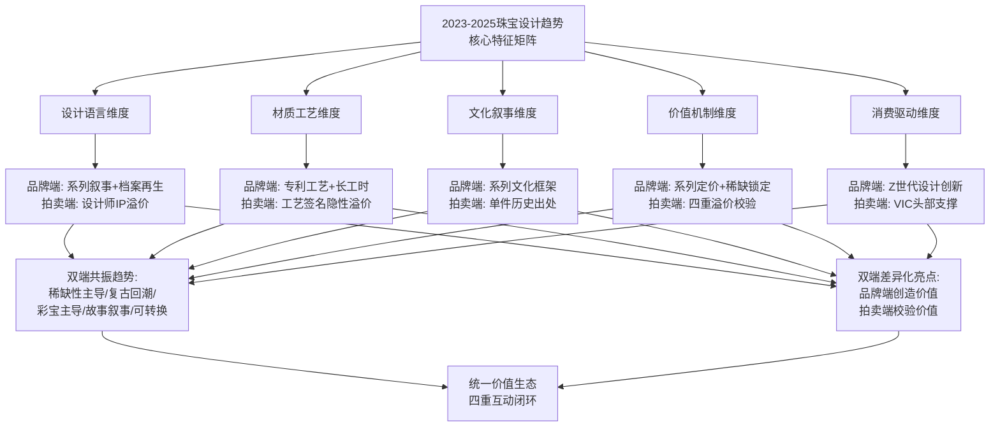

### 8.1.3 矩阵作为后续展望的现状基准

这一五维矩阵作为整篇研究的核心成果之一，承担两重功能：**其一，作为对2023—2025年趋势特征的精炼总结**——它使本研究所揭示的所有具体观察（从卡地亚猎豹到法贝热彩蛋、从老铺黄金到Anna Hu百合、从宝诗龙Cascade到The Royal Blue）都获得了清晰的归类与定位；**其二，作为未来3—5年趋势展望的现状基准**——它使后续8.2至8.7节所论述的延续性趋势与新兴趋势能够锚定在2023—2025年所形成的具体特征基础上，避免抽象预测。

需要特别指出的是，**矩阵的五大维度并非彼此独立，而是相互耦合**——设计语言的可转换结构对应消费驱动的Z世代偏好，材质工艺的钛金属革命对应文化叙事的华裔设计师崛起，价值机制的四重溢价对应消费驱动的资产属性逻辑。这种耦合性正是2023—2025年趋势演变的核心特征——它不是单维度的局部创新，而是多维度协同演化的整体性变迁。

## 8.2 延续性趋势：稀缺性溢价、档案再生与彩宝主导的长期化

未来3—5年高级珠宝产业的演进，首先呈现为2023—2025年所形成的核心趋势的**长期化延续**。这些延续性趋势的内在逻辑根植于不可逆的产业基础——矿源关闭、品牌档案积累、消费心智重构——因此其韧性远超短期波动，将构成未来3—5年高级珠宝产业的稳定底盘。

### 8.2.1 稀缺产地资源的长期化稀缺逻辑

**稀缺产地资源的物理供给约束是不可逆的**，这一约束将在未来3—5年持续强化高级珠宝市场的稀缺性溢价逻辑。如第3章所述，喀什米尔老矿1927年正式关闭、阿盖尔矿2020年闭矿、巴西帕拉伊巴原矿迅速枯竭、缅甸2025年收紧翡翠原石出口——这些供给端的结构性变化，意味着顶级稀缺产地资源的存量是有限且持续减少的。

这一不可逆的供给约束，将在未来3—5年驱动以下三个具体趋势：**其一，顶级稀缺产地拍卖纪录的持续刷新**——继The Royal Blue 1.25亿港币、福荣之星约2.39亿元人民币、The Mellon Blue每克拉269万美元等2023—2025年纪录之后，未来3—5年顶级喀什米尔蓝宝石、缅甸鸽血红、哥伦比亚祖母绿、稀有彩钻等品类的拍卖天花板有望进一步抬升；**其二，品牌端对绝矿资源的提前锁定加速**——路易威登Aster以23颗已绝矿克什米尔蓝宝石作为高珠"投名状"的策略，将被更多头部品牌效仿，矿源稀缺性将转化为品牌端的"原料储备战略"竞争；**其三，权威实验室认证体系的进一步精细化**——SSEF、Gübelin、GRS等机构在"Royal Blue""鸽血红""无烧""无油""Type IIa"等基础认证之上，可能发展出更细分的品质等级与产地溯源标准，使认证本身成为持续增值的产业资产。

### 8.2.2 品牌档案再生方法论的常态化运营

**档案再生作为头部品牌的方法论已从'设计灵感'升级为'品牌资产管理核心机制'**。如第2章与第7章所述，卡地亚以猎豹/几何/莫卧儿/罗马神话/巴黎饰钉构筑跨百年档案、宝格丽以Serpenti/Monete/Chandra/Aeterna完成140周年系列史诗、梵克雅宝以Signature系列矩阵+Héritage档案分时段策展、蒂芙尼以Schlumberger典藏完成三届Blue Book叙事、宝诗龙以1902螺旋冠冕承载芳登广场圣地——这些方法论已从单一品牌的特殊策略，扩散为头部品牌的共通运营框架。

未来3—5年档案再生的常态化将呈现以下三个深化方向：**其一，档案运营的频率从'年度系列'升级为'季度叙事'**——头部品牌可能将档案再生从大型周年纪念性事件，下沉为更高频次的小型主题发布，使档案叙事成为持续的品牌内容供给；**其二，档案与博物馆典藏化深度结合**——继蒂芙尼Schlumberger Butterflies项圈"现珍藏于维珍尼亚美术博物馆"、Anna Hu/陈世英/Cindy Chao入大英博物馆/卢浮宫装饰艺术博物馆/V&A永久典藏之后，更多品牌可能将"博物馆典藏化"作为档案运营的长期目标；**其三，档案资产的金融化探索**——拍卖端对品牌古董的持续高溢价（如Tutti Frutti连续两次爆冷夺冠），可能驱动品牌端将历史档案视为可计入资产负债表的"无形资产"，并探索基于档案的金融产品创新。

### 8.2.3 彩色宝石作为情绪与资产双重价值载体的持续主导

**彩色宝石主导地位的持续性根植于'色彩=情绪=资产'三重价值统一的产业逻辑**。如第7章所述，彩色宝石既回应Z世代"为情绪买单"的悦己心智、又承载VIC高净值客户的资产配置需求、还在线上化传播中提供超越白钻的视觉冲击力——三重价值的协同使彩宝在未来3—5年难以被白钻所取代。

具体而言，未来3—5年彩宝主导格局的延续将呈现以下三个特征：**其一，传统三大彩宝（红、蓝、祖母绿）的产地溢价进一步巩固**——克什米尔、缅甸抹谷、哥伦比亚穆佐/契沃尔等核心产地的稀缺性将持续支撑顶级彩宝的纪录性表现；**其二，新兴稀缺彩宝（帕拉伊巴、帕帕拉恰）的市场份额扩大**——帕拉伊巴碧玺凭借电光蓝色调进入"结构性短缺"阶段、帕帕拉恰蓝宝石的小克拉高单价定价逻辑确立，将驱动更多藏家将这些品类纳入收藏组合；**其三，彩钻金字塔尖效应的固化**——粉钻（阿盖尔闭矿）、蓝钻（南非Cullinan/博茨瓦纳Jwaneng）、红钻（极小众）、艳彩黄钻（亚洲市场偏爱）将继续占据彩钻拍卖的金字塔尖，构成"白钻—艳彩黄钻—粉钻—橙钻—蓝钻—红钻"的清晰价格阶梯。

### 8.2.4 四重溢价机制作为价值锚定标准的深化

**"产地+品质+品牌+故事"四重溢价机制将在未来3—5年成为高级珠宝价值评估的标准化框架**。这一机制的标准化意义在于：当全球高净值藏家与机构投资者越来越多地将高级珠宝纳入资产配置组合时，他们需要一套客观、可量化、可比较的价值评估标准——四重溢价机制恰好提供了这一标准。

未来3—5年四重溢价机制的深化将呈现以下三个方向：**其一，机制本身的精细化**——四重溢价的每一维度可能发展出更细分的子维度（产地内部分级、品质内部分级、品牌IP分级、故事溢价分级），使评估更加精确；**其二，机制的跨品类适用性扩展**——除传统三大彩宝、彩钻、翡翠外，矿物宝石、新兴稀缺彩宝、设计师款珠宝、跨界联名珠宝等品类也将逐步纳入四重溢价框架；**其三，机制与新兴趋势的融合**——可持续溢价、数字化溢价、跨文化溢价等新兴维度可能在四重基础之上扩展为"五重""六重"溢价机制，使评估框架与产业演变同步升级。

## 8.3 新兴趋势一：可持续与负责任珠宝的崛起

未来3—5年高级珠宝产业最具结构性意义的新兴趋势之一，是**可持续与负责任珠宝从'品牌责任声明'升级为'核心价值评估维度'**。这一升级不仅是消费心智变迁的必然结果，更是产业生态自身演化的内在需求。

### 8.3.1 可持续叙事的产业基础

可持续叙事在高级珠宝产业的崛起，建立在多重产业基础之上。如第1章所述，蒂芙尼"一直致力于负责任地发展自身事业，保护自然环境、倡导多元与包容的文化"，并将这一承诺写入品牌核心叙事。莱坊《2024年财富报告》指出"近2/3的超高净值人士正在努力减少他们的碳足迹"——高净值客群对可持续价值的认同度已显著提升。"行业正积极拥抱可持续理念，通过使用再生材料及采用负责任开采的宝石（如红宝石、蓝宝石等）"——可持续实践已成为珠宝行业的共识方向。

技术层面，3D打印技术的应用为可持续生产提供了直接路径——如第4章所述，"三维打印可以生成具有复杂几何形状的珠宝，这以前通过传统制造技术是不可行的"，同时3D打印相对于传统失蜡铸造可显著减少材料浪费。宝诗龙Carte Blanche Or Bleu系列的Sable Noir主题以"3D打印技术将黑沙压制成型"、Carte Blanche Impermanence系列Composition n°5以"植物基树脂结合3D打印技术复刻奶蓟草尖刺状花冠"——这些前沿实验本身即体现了可持续技术与高级珠宝创作的有机结合。

### 8.3.2 可持续与四重溢价机制的融合

未来3—5年可持续叙事的深化，将与第3章所揭示的"产地+品质+品牌+故事"四重溢价机制深度融合，形成"**第五重溢价：可持续溢价**"。这一融合可能呈现以下三个具体方向：

**其一，宝石溯源认证的标准化**——SSEF、Gübelin等权威实验室在产地认证之外，可能发展出更系统的"伦理供应链认证"，覆盖从矿区开采到加工切割的全流程负责任实践。这种认证将与传统的"无烧""无油"认证并列，成为顶级宝石的标配。

**其二，再生材料与实验室培育钻石的高端化探索**——再生黄金、再生铂金等再生材料的运用可能从工业级珠宝下沉为高级珠宝的常态化材质选择；实验室培育钻石虽然在2023—2025年仍主要定位于中端市场，但其"可持续+完美品质+无伦理负担"的三重优势，可能在未来3—5年驱动其在高级珠宝领域的渐进式渗透——尽管这一渗透不会完全替代天然宝石的稀缺性溢价地位。

**其三，可持续叙事作为品牌差异化的核心维度**——继蒂芙尼负责任发展承诺之后，更多头部品牌可能将可持续实践写入核心品牌叙事，使其与档案再生、文化叙事、工艺创新并列成为品牌资产的组成部分。

### 8.3.3 Z世代消费心智对可持续价值的偏好

**Z世代消费心智对可持续价值的高度偏好**，将成为可持续趋势加速的核心驱动力。如第6章所揭示，Z世代女性追求"悦己自戴+情绪价值+文化认同"的三重诉求——可持续实践恰好为这一诉求提供了"良知消费"的精神附加值。当年轻一代消费者愿意为"会讲故事的珠宝"溢价支付时，可持续故事将成为最具情感共鸣力的故事类型之一——它不仅承载消费者对地球与社区的责任感，也强化珠宝作为"有温度的奢侈品"的身份认同。

未来3—5年品牌端对可持续Z世代心智的回应，可能呈现为以下具体动作：可持续主题高珠系列的发布（参考宝诗龙Carte Blanche Or Bleu以冰岛"水"为生态意象的创作路径）、品牌联合NGO开展矿区保护与社区赋能项目、再生材料系列的高端化探索、可持续工艺工坊的透明化展示等。**可持续叙事将不再是孤立的"企业社会责任"动作，而是与品牌设计创新、文化叙事、消费体验深度融合的整体性战略**。

## 8.4 新兴趋势二：数字化体验、AI与虚拟珠宝的深化渗透

未来3—5年高级珠宝产业的另一核心新兴趋势，是**数字化技术从'营销渠道'升级为'产业基础设施'**。如第6章所述，2023—2025年线上化购藏路径已从边缘渠道上升为主流方式（拍卖端线上竞投70%—82%、抖音电商珠宝年增速54%、小红书珠宝流量+33%），这一渠道迁移在未来3—5年将进一步深化为对设计、生产、传播、消费全链条的系统性渗透。

### 8.4.1 虚拟试戴与AI个性化推荐重塑消费决策

**虚拟试戴技术与AI个性化推荐**将在未来3—5年深度重塑高级珠宝的消费决策路径。如第1章所引述，"虚拟现实（VR）、增强现实（AR）以及智能穿戴设备等前沿技术的应用，为消费者营造出前所未有的沉浸式购物体验，极大地增强了购买珠宝的趣味性和互动性"。AI技术在奢侈品行业的渗透同样加速——贝恩报告指出"整个品类的AI应用加速，推动了超个性化的推荐系统"。

这一渗透对高级珠宝消费决策的影响将体现在三个层面：**其一，决策门槛的降低**——通过AR虚拟试戴，消费者无需亲临门店即可体验高级珠宝的实际佩戴效果，使线上购藏的"视觉确认"环节获得突破性改善；**其二,决策路径的延长与精准化**——AI基于消费者的浏览历史、风格偏好、社交圈层数据，可提供高度个性化的珠宝推荐，使年轻一代的"长决策周期"得到精准内容供给；**其三，决策场景的全域化**——从小红书内容种草、到抖音直播互动、再到拍卖行线上竞投，消费决策将贯穿多个数字平台，要求品牌构建跨平台的数字资产体系。

### 8.4.2 NFT数字珠宝与元宇宙展厅的探索

**NFT数字珠宝与元宇宙展厅**作为数字化趋势的前沿探索，在未来3—5年可能从小众实验转向更广泛的产业实践。如第6章所述，蒂芙尼"曾与知名NFT项目CryptoPunks合作推出实体和NFT作品"——这一探索为高级珠宝品牌进入数字资产领域提供了先行者样本。

未来3—5年这一方向的深化可能呈现为：**实体珠宝+NFT数字孪生的标配化**——头部品牌可能为每件高级珠宝配套NFT身份证书，使数字孪生成为传承与流转的辅助载体；**元宇宙展厅作为奢侈体验场景**——继奢侈品品牌小红书全球直播首秀（梵克雅宝有史以来首次全球直播、古驰2025春夏系列时装秀）之后，元宇宙展厅可能成为高级珠宝品牌的高端体验场景；**虚拟珠宝作为数字身份饰品**——年轻一代对元宇宙、虚拟形象的兴趣，可能驱动品牌端推出"仅数字"的虚拟珠宝产品线，作为实体珠宝的延伸。

### 8.4.3 3D建模与3D打印对生产环节的重塑

**3D建模与3D打印技术对生产环节的重塑**已在2023—2025年初现端倪，未来3—5年可能进入更系统化的应用阶段。如第4章所述，"三维模型提供了高度精确的珠宝设计，允许设计师以极高的精度捕捉细节和复杂性"，宝诗龙Composition n°5以"植物基树脂结合3D打印技术复刻奶蓟草尖刺状花冠"——这种"从原型工具升级为最终产品制造手段"的升级，将在未来3—5年加速。

具体而言，3D技术对生产环节的重塑可能呈现以下三个方向：**其一，设计-原型-制造的全链条数字化**——CAD设计、3D打印原型、CNC精密加工的一体化流程，将使高级珠宝的设计迭代速度大幅提升；**其二，复杂几何形态的可实现性扩展**——3D打印为传统工艺难以实现的复杂几何形态提供了制造可能性，使设计师的创意空间显著拓展；**其三，定制化生产的成本降低**——3D技术使"一对一定制"的成本与时间显著降低，为后文将论及的"高级珠宝民主化"提供了技术基础。

### 8.4.4 数字化对设计语言的反向重塑

**数字化技术不仅是营销与生产工具，更将反向重塑高级珠宝的设计语言本身**。如第6章所述，"线上化对品牌端的反向塑造……视觉张力、识别度、社媒传播性三大维度的强化"——这一反塑作用在未来3—5年将进一步深化。

可能的具体方向包括：**为AR试戴优化的设计**——某些设计可能专门为AR虚拟试戴的视觉呈现而优化，强化镜头下的视觉识别度；**为社交媒体传播优化的可转换结构**——可转换设计的"一件多种佩戴方式"，可能进一步被强化为"一件多种社媒传播形态"；**为AI推荐算法优化的风格标签化**——品牌端可能将设计语汇按AI可识别的标签体系进行系统化分类，使产品更易被算法精准推荐。**这种数字化反塑虽然带有一定的"算法适应性"风险，但也为高级珠宝设计创新提供了新的方向维度**。

## 8.5 新兴趋势三：跨文化IP合作与东方主体性表达升级

未来3—5年高级珠宝产业最具结构性意义的文化趋势，是**全球高级珠宝市场从西欧单极格局走向东西方平等共鸣的多极格局**。这一变迁的核心驱动力是2023—2025年所形成的两条平行路径——西方品牌的东方母题嫁接与华裔设计师的东方主体性表达——的进一步深化与升级。

### 8.5.1 跨界IP合作的常态化与深度化

**跨界IP合作将从'营销破圈手段'升级为'文化叙事核心方式'**。如第6章与第7章所述，蒂芙尼x Nike Air Force 1 1837联名、Tiffany x Fendi The Tiffany Baguette联名、Tiffany x Supreme跨界、卡地亚罗马新宫艺术神话展（2025.11.14—2026.3.15呈现约300件展品）、宝格丽与皇家芭蕾舞团驻团编舞韦恩·麦格雷戈爵士在陶尔米纳古希腊剧场的合作——这些跨界IP合作本身已构成2023—2025年高级珠宝叙事的重要组成。

未来3—5年跨界IP合作的深化方向可能包括：**与博物馆深度合作的展览常态化**——继卡地亚罗马新宫展、陈世英上海博物馆东馆"千年万念"展之后，更多品牌可能将与世界顶级博物馆的合作展览作为档案运营的常规动作；**与文学/电影/音乐/舞蹈等高雅艺术的深度联动**——参考Anna Hu以"恽寿平百合轴+舒曼诗人之恋"创作《印象白百合手镯》的双文化双艺术形式融合路径，更多设计创作可能从纯粹的视觉艺术拓展至跨艺术形式的综合叙事；**与运动潮流品牌的破圈合作扩展**——蒂芙尼x Nike的成功可能驱动更多高级珠宝品牌探索与运动、潮流、街头文化等"非奢侈品语境"的合作，加速珠宝消费场景的去仪式化。

### 8.5.2 华裔设计师国际化的深化与博物馆典藏化

**华裔设计师的国际化突破将在未来3—5年从'个体先锋'升级为'群体崛起'**。如第5章所揭示，2023—2025年华裔设计师已在国际舞台获得多项突破——Anna Hu首位华裔女性受邀入大英博物馆永久典藏、150年法高定联合会唯一华裔女性；陈世英《宇宙新生》戒指成大英博物馆永久馆藏（首位华人）、上海博物馆东馆"千年万念"个展、《裕世钻芳华》约2亿美元估值；Cindy Chao获史密森尼/卢浮宫装饰艺术/V&A三大博物馆永久典藏、法兰西艺术与文学骑士勋章；丰吉Jardin de Giverny项链以2021万港币创中国珠宝设计师全球最高拍卖价；Edmond Chin多次担任佳士得苏富比拍场封面拍品设计师。

未来3—5年这一群体崛起将呈现以下三个方向：**其一，新生代华裔设计师的批量涌现**——继Anna Hu、陈世英、Cindy Chao、丰吉、Edmond Chin之后，更多新生代华裔设计师可能借助博物馆典藏化、国际拍卖、社交媒体等多重路径登上国际舞台；**其二，华裔设计师品牌化的深化**——从单一作品的国际认可，向品牌化运营、海外分店开设、系列叙事构建等多维度深化；**其三，与西方品牌的合作创作**——华裔设计师作为独立创作主体与西方品牌的跨界合作，可能为东西方文化对话提供新的形式。

### 8.5.3 中国本土品牌的国际化突破

**中国本土品牌的国际化突破**将是未来3—5年最具结构性意义的产业变迁之一。如第6章所述，老铺黄金2024年营收98亿元（+166%）、2025年预计270—280亿元（+217%—229%），单商场收入超越梵克雅宝与海瑞温斯顿、坪效全面超越国际一线奢侈品牌——这一爆发式业绩为中国本土品牌走向国际提供了坚实的内地市场基础。

未来3—5年中国本土品牌的国际化突破可能呈现以下三个方向：**其一，老铺黄金等本土头部品牌的海外开店**——古法手工金器作为中国独特的高端工艺，具备走向国际的文化与工艺优势；**其二，周大福"和美东方Timeless Harmony"等系列的国际化**——"首个完全以中华文化为灵感的高级珠宝系列"在杭州首发后，未来可能拓展至香港、新加坡、东京、巴黎、纽约等国际市场；**其三，Qeelin麒麟等已具备国际化基础的品牌的进一步深化**——Qeelin的Bamboo Butterfly、Bo Bo熊猫、Qin Qin金鱼、Xi Xi舞狮等中国文化元素的当代设计语汇，已具备与西方品牌平等对话的实力。

### 8.5.4 全球多极文化共鸣格局的形成

**未来3—5年全球高级珠宝市场将从西欧单极向东西方平等共鸣的多极格局演变**。这一格局变迁的产业意义远超中国市场本身——它标志着高级珠宝作为"普世奢侈品"的文化定义正在被重新书写。

具体而言，多极格局的形成将呈现以下特征：**亚洲拍卖中心的话语权进一步提升**——香港、上海等亚洲拍卖中心将不再是"西方拍卖体系的亚洲分支"，而是发展出独立的拍品定位、定价体系与藏家偏好；**东方文化母题成为高级珠宝主流叙事**——莲花、竹叶、生肖、东方山水、东方哲学等母题不再被视为"中国限定"或"亚洲特色"，而成为全球品牌的共通创作语汇；**东西方设计师的对等合作**——华裔设计师与西方品牌的合作，将从"东方元素提供者"升级为"对等创作伙伴"，使设计成果真正体现东西方文化的有机融合。

## 8.6 新兴趋势四：个性化定制深化与高级珠宝民主化

未来3—5年高级珠宝产业的另一新兴趋势，是**个性化定制服务从'金字塔尖VIC专属'向'多层级用户共享'的延伸**。这一延伸并非高级珠宝顶级地位的降低，而是个性化定制能力的全面释放——它使高级珠宝产业在保持金字塔尖极致性的同时，扩展出更广阔的"轻定制"中间市场。

### 8.6.1 高定订制服务的下沉路径

**高定订制服务的下沉**将通过技术、渠道与品牌策略的多重路径实现。技术层面，3D打印、AI设计辅助等数字化工具显著降低了定制化生产的成本与时间；渠道层面，线上化购藏路径使消费者可以更便捷地参与定制流程；品牌策略层面，头部品牌可能将"轻定制"作为高级珠宝与商业珠宝之间的中间产品线。

**蒂芙尼男士珠宝产品线**已为这一趋势提供了具体样本。如第6章所述，蒂芙尼男士珠宝系列明确指出"精选男士珠宝设计可制个人化雕刻，包括字母、重要日期或客制化设计，增添独特感"——这种基于标准化产品的个人化雕刻服务，正是"轻定制"的典型形态。Tiffany HardWear系列的"中号扣环项链¥120,000、大号扣环手链¥85,000"、Tiffany T1宽版钻石铰链手镯¥342,000等产品，价位段恰好处于高级珠宝与商业珠宝之间的中间区间，为轻定制服务提供了商品基础。

### 8.6.2 设计师IP溢价的扩散与孤品试水机制常态化

**设计师IP溢价的扩散**将在未来3—5年从顶级设计师（JAR、Schlumberger、Anna Hu、陈世英）向更广泛的独立设计师群体扩散。这一扩散建立在第7章所揭示的双端融合趋势基础上——苏富比钻石与Joseph Ramsay合作的"华光绮错"系列、丰吉Jardin de Giverny项链以2021万港币创纪录、Edmond Chin多次担任拍场封面设计师——表明拍卖端对独立设计师IP的认可正在系统化。

**孤品试水机制的常态化**将进一步加深双端融合。卡地亚DRAGON龙年孤品高珠在2024年10月佳士得香港的成功试水，可能驱动更多头部品牌将"专为重要节庆/纪念日打造的孤品高珠"作为标准的市场策略。这种孤品试水的常态化，本质上是品牌端的高定订制能力与拍卖端的市场反馈机制的深度协同——它使品牌端的"为单一藏家定制"扩展为"为公开拍卖定制"，从而获得更广泛的市场曝光与价值发现。

### 8.6.3 个性化镌刻与可转换设计的标配化

**个性化镌刻与可转换设计的标配化**将是高级珠宝民主化在产品维度的具体体现。如第4章与第7章所述，2023—2025年宝诗龙Cascade可转吊坠、Noeud六种佩戴、卡地亚Spina可转头冠、Apatura坠饰可拆为胸针、Serpenti Sapphire Echo蓝宝石坠饰可转为耳环——可转换设计已成为头部品牌的共通语汇。

未来3—5年这一标配化将进一步深化：**可转换结构从顶级高珠延伸至中端Fine Jewelry**——使年轻消费者也能享受"一件多戴"的工艺亮点；**个性化镌刻服务从男士珠宝延伸至女士珠宝**——字母、纪念日期、特别讯息的镌刻成为更广泛产品的标配选项；**模块化设计的探索**——使消费者可以根据场景与心情，对同一件珠宝进行不同模块的搭配组合。

### 8.6.4 民主化与极致化的双轨格局

**未来3—5年高级珠宝产业将形成'民主化'与'极致化'的双轨并行格局**。这一双轨格局的产业意义在于：它使高级珠宝既能扩展中间市场以应对消费理性化趋势，又能保持金字塔尖的极致稀缺性以维持品牌身份。

具体而言：**金字塔尖的极致化**——VIC高净值客户对稀缺彩宝彩钻、传世工艺、品牌古董的追逐将持续强化（参考BVLGARI百万美元级产品销量翻倍），驱动品牌端在大克拉稀有宝石、专利工艺、长工时创作上的持续投入；**腰部市场的民主化**——通过"轻定制""孤品试水""个性化镌刻"等机制，使更多年轻一代消费者能够进入高级珠宝市场，扩展品牌的客群基础。**双轨格局的协同，将使高级珠宝产业在2025—2030年保持比2020—2025年更加多元的市场结构**。

## 8.7 新兴趋势五：运动与日常场景的全面渗透

未来3—5年高级珠宝产业的最后一个核心新兴趋势，是**佩戴场景边界的彻底重构——从'特殊仪式专属'向'运动+日常+社交+跨性别'全场景的全面渗透**。如第6章所揭示的"四重去化"（去仪式化、去性别化、去年龄化、去厚重化）趋势，将在未来3—5年进一步深化与扩散。

### 8.7.1 运动潮流跨界的深化

**蒂芙尼x Nike Air Force 1 1837联名**作为2023—2025年最具突破性的运动潮流跨界事件，标志着高级珠宝品牌进入运动潮流语境的可能性。如第6章所述，"蒂芙尼宣布与世界领先运动品牌耐克携手合作，将于3月7日发布Nike x Tiffany & Co. Air Force 1 1837联名鞋款及以此为灵感的蒂芙尼限量款纯银配饰系列"——这一合作不仅涉及联名鞋款，更包括"纯银口哨、纯银鞋拔、纯银鞋刷以及专为全新鞋款打造的鞋带配饰，售价在250美元至475美元之间"的纯银配饰系列。

未来3—5年运动潮流跨界的深化方向可能包括：**与更多运动品牌的合作扩展**——从蒂芙尼x Nike扩展至更多高级珠宝品牌与运动品牌的合作，覆盖网球、高尔夫、篮球、滑雪、骑行等运动场景；**运动型可穿戴珠宝的研发**——参考伯爵Hidden Treasures系列与坠饰时计的设计逻辑，研发更适合运动场景佩戴的轻量化、抗冲击、易清洁的高级珠宝产品；**运动赛事的品牌赞助深化**——继奢侈品品牌赞助巴黎奥运会、戛纳电影节等大型赛事/活动之后，未来可能扩展至更多运动赛事的赞助。

### 8.7.2 男士珠宝市场的扩容

**男士珠宝市场的扩容**将是未来3—5年高级珠宝产业的重要增量来源。蒂芙尼男士珠宝产品线已展现这一市场的产品广度——"印章戒指、链式珠宝、I.D.珠宝首饰、引人注目的链墜和手链"等产品类型，覆盖从工作升迁到婚礼、再到成为新手父母的多场景配饰需求。

未来3—5年男士珠宝市场扩容的具体方向可能包括：**男士珠宝产品矩阵的丰富**——头部品牌可能将男士珠宝从单一产品线升级为完整的子品牌，提供从入门级到高级珠宝的全价位段产品；**男士珠宝设计语汇的多元化**——从蒂芙尼"简约设计和传统工艺传承"的经典路径，向更多元的设计风格扩展，包括运动型、商务型、艺术型等不同风格定位；**男士珠宝营销的去性别化突破**——将男士珠宝与女士珠宝的消费场景边界进一步模糊化，使珠宝佩戴真正成为跨性别的身份与情感表达。

### 8.7.3 City Walk生活方式与日常场景的深度融合

**City Walk生活方式**作为2023—2025年最具时代特征的场景代表，在未来3—5年将进一步驱动高级珠宝向日常通勤、社交分享等场景的渗透。如第6章所引述，"与citywalk相关的笔记获得了超过210亿次浏览，搜索量同比增长140倍"——这一搜索量的几何级数增长将持续驱动品牌端的场景创新。

具体方向包括：**轻量化设计的常态化**——钛金属、铝、镁、纳米陶瓷等轻量化合金的运用将进一步扩散，使大Piece高级珠宝具备日常佩戴的舒适性；**与城市文化体验的深度结合**——参考路易威登"侬好·上海"快闪活动、浪琴"春日放空计划"等案例，更多品牌可能将City Walk式的城市文化体验作为珠宝营销的核心场景；**日常通勤珠宝的高级化**——使消费者可以将高级珠宝从"特殊场合专属"转变为"日常通勤的提气之物"。

### 8.7.4 跨性别叙事与场景边界的彻底重构

**跨性别叙事**作为高级珠宝场景重构的最深层维度，将在未来3—5年推动产业的根本性变革。这一变革的核心是：**珠宝作为身份与情感表达载体的普世性**——它不再被任何性别、年龄、场合的传统边界所限制，而成为所有消费者表达自我、寄托情感、彰显身份的共通语言。

未来3—5年跨性别叙事的深化方向可能包括：**中性款珠宝设计的扩展**——将"中性款"从蒂芙尼Tiffany HardWear等少数系列，扩展为更多品牌的常规产品线；**LGBTQ+群体的精准营销**——使高级珠宝品牌成为多元身份认同的支持者与表达载体；**性别流动叙事的深度融合**——使珠宝设计、广告传播、品牌大使选择等环节都体现性别流动的当代价值观。

**场景边界的彻底重构**将驱动设计逻辑的根本性创新——从"为特定场合设计"转向"为多元生活方式设计"，从"为单一性别设计"转向"为跨性别消费者设计"，从"为重型奢华设计"转向"为轻量舒适设计"。这一根本性创新，将是2025—2030年高级珠宝设计趋势演变的最深层动力。

## 8.8 对品牌的策略建议：档案运营与多维叙事并举

基于前述趋势分析，本节针对头部高奢品牌、时装跨界品牌与本土崛起品牌三类主体，提供差异化的策略建议。这些建议建立在2023—2025年所观察到的成功案例之上，旨在为未来3—5年品牌端的产业实践提供前瞻性参考。

### 8.8.1 对头部高奢品牌：档案系统化运营+稀缺资源提前锁定

针对卡地亚、宝格丽、梵克雅宝、蒂芙尼、宝诗龙、伯爵、海瑞温斯顿等头部高奢品牌，核心策略建议为**"档案系统化运营+稀缺资源提前锁定+多维叙事并举"**。

**其一，档案再生方法论的系统化运营**。建议头部品牌将档案再生从"年度系列灵感来源"升级为"季度持续叙事供给"，并将档案数字化、博物馆典藏化、跨媒介运营作为长期战略。具体可参考蒂芙尼Schlumberger典藏的三届Blue Book递进式叙事、宝格丽Aeterna 140周年的城市文化IP绑定、梵克雅宝Signature系列+Héritage档案分时段策展等成功路径。

**其二，稀缺产地资源的提前锁定**。鉴于喀什米尔、阿盖尔、巴西帕拉伊巴等矿源的不可逆稀缺性，建议头部品牌将"原料储备战略"作为核心竞争优势——参考路易威登Aster以23颗已绝矿克什米尔蓝宝石作为高珠"投名状"的策略，建立长期的稀缺资源采购与储备体系。

**其三，专利级工艺壁垒的持续投入**。建议头部品牌将专利工艺研发作为长期资产积累——参考梵克雅宝Mystery Set 1933专利+Façonné立体珐琅16个月研发申请专利、宝诗龙"couture"高定镶嵌工艺、卡地亚25次烧制掐丝珐琅等案例，使工艺创新成为品牌不可复制的护城河。

**其四，东西方文化跨界叙事的本土化深化**。鉴于全球多极文化共鸣格局的形成，建议头部品牌从"翻译式本地化"升级为"创作式本地化"——参考卡地亚DRAGON龙年孤品、宝格丽Serpenti Dragoni、肖邦12年生肖周期闭合等案例，将中国市场视为创作灵感的核心来源而非单纯的销售目标。

**其五，Z世代消费心智的精准触达**。建议头部品牌通过小红书全球直播、抖音电商内容型直播、AR虚拟试戴等数字化手段，精准触达Z世代消费者的"悦己自戴+情绪价值+体验消费"三重心智。

### 8.8.2 对时装跨界品牌：宝石"投名状"+服装基因深度嫁接

针对路易威登、古驰、芬迪、巴黎世家、普拉达、巴尔曼、圣罗兰、罗意威等近年密集进入高级珠宝赛道的时装跨界品牌，核心策略建议为**"以稀有宝石作为投名状+以服装基因作为差异化语汇+以年轻客群作为主战场"**。

**其一，以大克拉稀有宝石作为切入投名状**。如第1章所述，时装巨头跨界进入高级珠宝赛道的核心逻辑是"用大克拉数的珍稀石头作为'加入这个顶级牌局的投名状'"——路易威登Aster以23颗已绝矿克什米尔蓝宝石的策略具有标杆意义。建议时装跨界品牌持续投入大克拉稀有宝石的采购，建立与百年珠宝世家平等对话的资源基础。

**其二，以服装基因作为差异化设计语汇**。建议时装跨界品牌充分挖掘自身服装基因的差异化优势——路易威登的棋盘格Logo元素、古驰的双G符号、芬迪的FF Logo、巴黎世家的解构主义美学等，将这些服装基因有机融入高级珠宝创作，形成区别于传统珠宝世家的独特视觉语言。

**其三，以年轻客群作为主战场**。鉴于时装巨头在年轻消费者心智中的强大势能（如艺恩白皮书所述CHANEL、HERMES、LV"凭借其在服饰领域的影响力，成功引领高奢时尚品牌声量"），建议时装跨界品牌将年轻一代Z世代女性作为高级珠宝的核心客群，通过时装珠宝、可日常佩戴的Fine Jewelry等中间产品线，实现客群的渐进式培育。

### 8.8.3 对本土崛起品牌：古法工艺+文化主体性表达+国际化路径

针对老铺黄金、周大福（"和美东方"系列）、Qeelin麒麟等中国本土崛起品牌，核心策略建议为**"以古法工艺构筑差异化壁垒+以文化主体性表达建立独立话语权+以国际化路径走向全球市场"**。

**其一，以古法工艺构筑差异化壁垒**。如第6章所述，老铺黄金"采用的是中国宫廷古法制金的纯正工艺，'花丝镶嵌、错金'技艺均为国家非物质文化遗产"，"首创的'足金镶嵌钻石'和'足金珐琅'实现了传统工艺上的重大突破"。建议本土崛起品牌将古法工艺作为不可复制的核心竞争优势，持续深化非遗工艺的当代化运营。

**其二，以文化主体性表达建立独立话语权**。建议本土品牌从"借鉴西方设计语汇"升级为"以中华文化为创作主体"——参考周大福"和美东方Timeless Harmony"作为"首个完全以中华文化为灵感的高级珠宝系列"的定位、Qeelin麒麟Bamboo Butterfly/Bo Bo熊猫/Qin Qin金鱼/Xi Xi舞狮等系列的文化深度，建立独立的设计话语权。

**其三，以国际化路径走向全球市场**。建议本土品牌通过博物馆典藏化（参考Anna Hu/陈世英/Cindy Chao的博物馆路径）、国际拍卖（参考丰吉创纪录2021万港币）、海外开店、社交媒体国际化营销等多重路径，将本土崛起势能转化为国际化突破。

## 8.9 对设计师的策略建议：工艺创新与文化主体性表达

针对独立珠宝设计师与新生代设计力量，本节提供创作方向与职业路径的策略建议，以期为新一代设计师的职业发展提供参考路径。

### 8.9.1 核心工艺签名的差异化建立

**核心工艺签名是设计师立身之本**。如第7章所述，陈世英的世英切割（Wallace Cut）幻象雕刻法、世英陶瓷、钛金属8年研发，Cindy Chao的钛金属雕塑性铸造+大规模宝石镶嵌，Anna Hu的纳米钛金属上色+阳极氧化电光色彩，丰吉的"浮镶/Floating Set"专利工艺——这些工艺签名构成了设计师不可复制的核心资产。

建议新生代设计师在职业初期即明确选择1—2项核心工艺作为长期深耕方向，通过持续多年的研发投入建立专利级工艺壁垒。这种工艺签名既是商业资产（专利与技术壁垒），也是文化资产（百年档案传承），更是个人艺术身份的物质载体。

### 8.9.2 跨界材质的实验性探索

**跨界材质的实验性探索**为设计师创新提供了广阔空间。建议新生代设计师在传统贵金属与宝石之外，积极探索钛金属、铝、镁、纳米陶瓷、3D打印植物基树脂、硼硅酸玻璃、矿物宝石等"非传统物质"——参考第4章所述宝诗龙Carte Blanche系列的多元材质矩阵、Anna Hu的纳米钛金属、Cindy Chao的钛金属基底、伯爵的28种矿物宝石等先行者实践。

材质创新的产业意义在于：当传统贵宝石资源被头部品牌锁定，跨界材质为设计师提供了独立创作空间；同时材质本身的稀缺性与工艺复杂度，可成为价值锚定的重要维度——参考宝诗龙Carte Blanche Impermanence系列总工时18,000小时定义的高定边界。

### 8.9.3 东方主体性表达的国际化路径

**东方主体性表达的国际化路径**为华裔设计师及关注东方文化的国际设计师提供了独特机会。建议新生代设计师参考Anna Hu以"恽寿平百合轴+舒曼诗人之恋"的双文化双艺术形式融合、陈世英以"千年万念"的东方哲思承载钛金属雕塑、Cindy Chao以"建筑感、雕塑性、生命力"的工艺哲学诠释帕米尔高原等成功路径，将东方文化作为创作主体而非元素素材。

具体路径可包括：**深度文化研究**——对东方艺术史、哲学、文学、音乐进行系统化研究，建立深厚的文化底蕴；**博物馆典藏化目标**——以入选大英博物馆、卢浮宫装饰艺术博物馆、史密森尼、V&A等世界顶级博物馆为长期职业目标；**与拍卖行合作的孤品创作**——参考苏富比钻石与Joseph Ramsay合作的"华光绮错"系列模式，通过与拍卖行的合作创作进入二级市场的核心舞台；**跨文化母题的深度挖掘**——将东方文化与西方艺术形式（如Anna Hu的舒曼音乐通感）、东西方哲学（如宝诗龙的日本花道侘寂）、跨文明对话（如卡地亚的莫卧儿+中美洲）作为创作的深度方向。

### 8.9.4 借助小红书等内容平台建立个人品牌IP

**借助小红书等内容平台建立个人品牌IP**为新生代设计师提供了新的职业起点。如第6章所述，小红书珠宝兴趣用户增速近四成、奢侈品品牌纷纷拥抱小红书举办全球直播——这一平台对独立设计师同样具有重要价值。

建议新生代设计师通过持续输出高质量内容，建立个人品牌IP——内容可涵盖工艺过程展示、宝石鉴赏、设计灵感分享、文化深度解读等多元维度。借助内容平台积累的粉丝基础，设计师可逐步建立独立的客户基础与商业模式，为后续的拍卖合作、国际展览、博物馆典藏等长期目标奠定基础。

## 8.10 对藏家与投资者的策略建议：四重溢价校验与资产配置

本节针对VIC高净值藏家、中年高净值客群、年轻一代潜力藏家与机构投资者四类主体，提供差异化的收藏与投资策略建议。这些建议建立在第3章四重溢价机制与第6章三重消费逻辑的基础上，旨在为珠宝资产配置提供清晰的决策框架。

### 8.10.1 对VIC高净值藏家：四重溢价齐备+真精稀集中化

针对VIC高净值藏家（资产配置规模千万级以上），核心策略建议为**"四重溢价齐备的拍品筛选+真精稀集中化的避险逻辑"**。

**其一，严格按照四重溢价机制筛选拍品**。建议VIC藏家在选购顶级珠宝时，确保拍品同时具备产地认证（SSEF/Gübelin/GRS权威实验室）、品质指标（无烧/无油/Type IIa/Fancy Vivid）、品牌溢价（卡地亚/宝格丽/梵克雅宝/蒂芙尼/JAR/法贝热等）、故事溢价（皇室传承/设计师IP/命名性故事）四重维度——任何单一维度的优秀都难以支撑顶级估价，唯有四重叠加方能形成不可替代的价值锚定（参考"The Royal Blue""福荣之星""帝国冬季彩蛋"等纪录性拍品案例）。

**其二，关注稀缺产地资源的长期价值**。建议VIC藏家重点关注喀什米尔（1927年关闭）、缅甸抹谷（出口收紧）、哥伦比亚穆佐/契沃尔、巴西帕拉伊巴（已枯竭）、阿盖尔（2020年闭矿）等核心产地的顶级单品，将其作为长期价值锚定的核心配置。

**其三，"真精稀"集中化的避险逻辑**。在宏观经济不确定性持续的背景下，建议VIC藏家遵循"宁缺毋滥"原则，将资金集中在少数顶级单品而非分散于中段品质——参考2024年苏富比"瑰丽珠宝I"专场千万级珍宝撤拍/流拍现象，"四重溢价不齐"的中段拍品议价能力下降是确定性趋势。

### 8.10.2 对中年高净值客群：品牌古董+设计师IP+传世传家

针对中年高净值客群（资产规模百万至千万级），核心策略建议为**"品牌古董溢价识别+设计师IP价值发现+传世传家的长期视角"**。

**其一，品牌古董的溢价识别能力**。建议中年高净值藏家系统学习头部品牌的核心档案——卡地亚的水果锦囊/Tutti Frutti、Panthère猎豹、Belle Époque美好年代风格等；宝格丽的Serpenti、Monete古罗马钱币；梵克雅宝的Zip、Ludo、Mystery Set；蒂芙尼的Schlumberger海洋/宇宙/石上鸟；法贝热的帝国彩蛋系列——使自身具备识别品牌古董溢价潜力的能力。

**其二，设计师IP的价值发现机会**。建议中年藏家关注独立设计师IP的价值发现——JAR、Schlumberger、Anna Hu、陈世英、Cindy Chao、丰吉、Edmond Chin等设计师作品的拍卖表现，已显示出与历史品牌相当的溢价能力，且未来3—5年仍有显著的价值发现空间。

**其三，传世传家的长期视角**。鉴于代际财富传承（中国未来30年79万亿元财富传给下一代）的庞大基数，建议中年藏家以"传世传家"的长期视角配置高级珠宝——优先选择具备工艺保值、品牌延续、设计经典三重特征的拍品，确保资产在代际传承中的价值稳定性。

### 8.10.3 对年轻一代潜力藏家：新兴稀缺彩宝+东方文化母题+渐进入场

针对年轻一代潜力藏家（资产规模百万级以下，代际财富潜力显著），核心策略建议为**"新兴稀缺彩宝的入场时机+东方文化母题的资产配置价值+渐进入场的长期布局"**。

**其一，新兴稀缺彩宝的入场时机**。帕拉伊巴碧玺凭借电光蓝色调进入"结构性短缺"阶段、帕帕拉恰蓝宝石的小克拉高单价定价逻辑确立——建议年轻藏家在这些新兴稀缺彩宝的早期上升通道入场，相比传统三大彩宝拥有更高的价值发现空间。

**其二，东方文化母题的资产配置价值**。建议年轻藏家关注帝王绿翡翠（保利香港43颗珠链以3600万港币创近五年新高）、华裔设计师作品（Anna Hu/陈世英/Cindy Chao/丰吉/Edmond Chin）等东方文化母题——鉴于全球多极文化共鸣格局的形成，这些品类在未来3—5年具备显著的价值上升潜力。

**其三，渐进入场的长期布局**。建议年轻藏家通过老铺黄金等本土品牌、设计师款珠宝、新兴彩宝小件等"轻定制+轻投入"产品作为入场起点，逐步积累收藏经验与决策能力，为后续向VIC藏家的演进奠定基础。

### 8.10.4 对机构投资者：拍卖端硬通货+四重溢价标准化+全球多极配置

针对机构投资者（家族办公室、私人银行、资产管理机构等），核心策略建议为**"拍卖端硬通货的标准化配置+四重溢价标准化的评估框架+全球多极配置的避险逻辑"**。

**其一，拍卖端硬通货的标准化配置**。建议机构投资者将顶级稀缺产地资源（喀什米尔蓝宝石、缅甸鸽血红、哥伦比亚祖母绿、稀有彩钻、帝王绿翡翠）作为珠宝资产配置的核心，借助拍卖端的客观定价机制实现标准化配置。

**其二，四重溢价标准化的评估框架**。建议机构投资者将四重溢价机制（产地+品质+品牌+故事）作为内部评估框架，建立可量化、可比较、可跨品类适用的珠宝资产评估标准。

**其三，全球多极配置的避险逻辑**。鉴于全球多极文化共鸣格局的形成，建议机构投资者在西欧主导品牌（卡地亚/宝格丽/梵克雅宝/蒂芙尼）之外，配置一定比例的东方主体性资产（华裔设计师作品/中国本土崛起品牌/翡翠等东方文化母题），形成跨文化、跨地域的多极化配置组合。

## 8.11 研究结论与产业生态的长期演进图景

作为整篇研究的最终收束，本节凝练核心研究结论，并展望2025—2030年高级珠宝产业生态的长期演进图景。

### 8.11.1 核心研究结论

**核心结论一：2023—2025年高奢品牌与高定拍卖珠宝设计趋势演变本质上是'审美消费+情绪价值+资产属性'三重消费逻辑与'设计+工艺+叙事'三重创新供给的双向耦合产物**。需求侧的三重消费逻辑（如第6章所揭示）为供给侧的设计创新提供了清晰的方向指引；供给侧的三重创新供给（如第2、4、5章所揭示）为需求侧的消费心智提供了多元化的物质与文化载体。两侧的双向耦合，是2023—2025年高级珠宝市场逆势增长的深层产业逻辑。

**核心结论二：双端共通呈现五大趋势——稀缺性溢价主导、复古与档案回潮、彩色宝石主导、故事化叙事强化、可转换与多戴设计崛起；双端各自的差异化亮点构成产业分工的合理基础——品牌端以系列叙事、工艺创新、跨界材质×文化母题构筑设计护城河，拍卖端以产地认证、克拉规模、历史出处构筑价值天花板**。两者并非竞争关系，而是构成完整价值闭环的差异化分工——品牌端"创造价值"，拍卖端"校验价值"。

**核心结论三：双端构成'设计供给—价值校验—稀缺争夺—档案再生'四重互动闭环，形成高级珠宝产业的统一价值生态**。这一统一价值生态的形成，是2023—2025年高级珠宝产业最具长期意义的结构性成就——它使一级市场与二级市场不再是简单的"创造与流转"线性关系，而成为彼此塑造、共同演化的产业生命体。

**核心结论四：未来3—5年这一统一价值生态将在五大新兴趋势驱动下进一步深化**——可持续与负责任珠宝的崛起、数字化体验与AI虚拟珠宝的深化渗透、跨文化IP合作与东方主体性表达升级、个性化定制深化与高级珠宝民主化、运动与日常场景的全面渗透。这五大新兴趋势既是2023—2025年延续性趋势的自然延伸，也将驱动产业生态进入更加多元、深邃、富有文化张力的新时代。

### 8.11.2 产业生态的长期演进图景

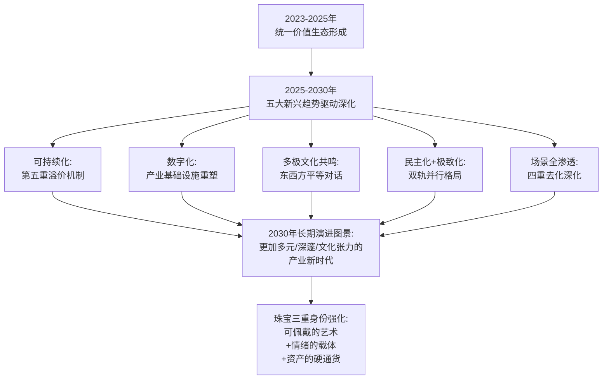

展望2025—2030年，高级珠宝产业生态的长期演进将呈现以下三个核心特征：

**特征一：全球多极化格局的形成**。全球高级珠宝市场将从西欧单极格局走向东西方平等共鸣的多极格局——亚洲拍卖中心（香港、上海等）将获得独立的话语权，东方文化母题将成为全球品牌的共通创作语汇，华裔设计师与中国本土品牌将在国际舞台获得与西欧百年世家平等对话的地位。这一多极化格局的形成，是2025—2030年最具结构性意义的产业变迁。

**特征二：年轻一代消费心智持续重塑设计趋势**。Z世代女性、千禧一代、新生代男士等年轻客群的消费心智——悦己自戴、情绪价值、体验消费、跨性别叙事、可持续偏好——将持续重塑高级珠宝的设计语言、工艺创新、文化叙事、品牌运营全链条。设计师与品牌端必须以前所未有的敏锐度回应年轻一代的偏好变迁，否则将在新一轮代际更迭中失去市场地位。

**特征三：珠宝作为'可佩戴的艺术、情绪的载体、资产的硬通货'三重身份的空前强化**。在通胀高企、地缘动荡、艺术品拍卖遇冷等宏观背景下，珠宝凭借其独特的"三重身份"成为奢侈品市场的最强韧性品类——它既是审美创新的艺术形式，也是情感寄托的精神载体，更是资产配置的避险硬通货。这一三重身份的协同，使珠宝在未来3—5年仍将保持比其他奢侈品品类更强的逆势增长能力。

### 8.11.3 收束:从趋势观察到时代洞察

回望2023—2025年的高级珠宝产业图景，我们看到的不仅是设计趋势的具体演变，更是一个时代的精神缩影——**当宏观经济进入不确定性时代，珠宝以其物质永恒性承接了人们对"确定性"的渴望；当文化消费进入多元化时代，珠宝以其叙事丰富性承接了人们对"意义"的追求；当代际更迭进入加速期，珠宝以其工艺传承性承接了文明的接力**。

从卡地亚百年猎豹的当代再演绎，到法贝热帝国冬季彩蛋跨百年的金融叙事；从陈世英《宇宙新生》戒指入大英博物馆的文化突破，到老铺黄金单商场超越国际一线奢侈品的商业奇迹；从蒂芙尼海洋宇宙叙事的诗意之旅，到Z世代女性"为情绪买单"的悦己消费——每一个具体的趋势观察背后，都映射着人类对美、对意义、对永恒的恒久追求。

**2025—2030年的高级珠宝产业，将在2023—2025年所形成的产业生态基础上，迈向一个更加多元、深邃、富有文化张力的新时代**。这一新时代的塑造者不仅是头部品牌、独立设计师与权威拍卖行，更是每一位以审美、情感、资产三重诉求参与其中的消费者与藏家。当珠宝从"压箱底珍藏"走向"日常陪伴+社交表达+艺术对话+资产配置"的全场景生活时，它便真正完成了从"物"到"艺术"再到"文化"的升维——这正是高级珠宝产业作为人类文明珍宝的永恒魅力，也是本研究所揭示的2023—2025年趋势演变的最深层意义所在。

# 参考内容如下：
[^1]:[2025年中国奢侈品市场:迈向审慎复苏之路报告-科尔尼](https://baijiahao.baidu.com/s?id=1855740635463202780&wfr=spider&for=pc)
[^2]:[奢侈品行业分化:箱包疲软,珠宝逆势增长](https://news.cfw.cn/v390003-1.htm)
[^3]:[BV华彩永续:致敬罗马美](http://mbd.baidu.com/newspage/data/dtlandingsuper?nid=dt_4894151226459246942)
[^4]:[国际铂金协会(PGI)积极引领铂金首饰行业,践行品牌化战略](https://www.chinajeweler.com/zbss/zbds/js/69706.html)
[^5]:[头条战报 | 佳士得香港2023秋拍总成交30亿港元,买家数量增长10%,见证市场澎湃活力](https://m-news.artron.net/news/20260423/n2025925.html)
[^6]:[戛纳红毯,珠宝品牌的战场](http://k.sina.com.cn/article_7857201856_1d45362c001904oosm.html)
[^7]:[BVLGARI宝格丽Mediterranean Queen-宝格丽官方线上精品店](https://www.bulgari.cn/zh-cn/page/267933-e)
[^8]:[Urchin 篇章——2025 年高級珠寶系列| Tiffany & Co.](https://www.zh.tiffany.com/high-jewelry/blue-book/urchin-jewelry/)
[^9]:[中国奢侈品市场2025年呈现复苏迹象:美妆个护类领跑,消费者更趋理性](https://www.bain.cn/news_info.php?id=2102)
[^10]:[亚洲藏家对奢侈品拍卖热情不再](https://www.jiemian.com/article/12144407.html)
[^11]:[一季度全球奢侈品市场销售下滑 消费者偏好变化蕴藏新机遇](https://tech.huanqiu.com/article/4IOwwZM0ycX)
[^12]:[奢侈品行业翻身在望?顶住经济环境影响,LVMH 2024年意外有机增长丨财报见闻](https://baijiahao.baidu.com/s?id=1822525483700804069&wfr=spider&for=pc)
[^13]:[BEAUTÉS DU MONDE](https://www.cartier.cn/stories-events/2206-str-news-beautes-du-monde-hj)
[^14]:[纽约苏富比「瑰丽珠宝」拍卖结果:成交总额逾7.5亿港币,Estrela de FURA红宝石创新记录落槌](http://2ly4hg.smartapps.cn/pages/article/article?articleId=683646681_121124712)
[^15]:[富艺斯](https://baike.baidu.com/item/富艺斯/67596811)
[^16]:[新消费趋势下 从义乌市场看饰品行业发展](https://baijiahao.baidu.com/s?id=1862333770900141151&wfr=spider&for=pc)
[^17]:[High Jewelry ](https://www.vancleefarpels.com/tw/en/collections/high-jewelry.html)
[^18]:[香港苏富比「瑰丽珠宝」拍卖结果:成交总额逾2.8亿港币,高品质彩宝拍品人气十足](http://2ly4hg.smartapps.cn/pages/article/article?articleId=770824385&authorId=121124712)
[^19]:[『珠宝』Cartier 推出 Le Voyage Recommencé 高级珠宝系列新作:风格旅程再起航](http://igem.ly/e/53415/0f0nMm)
[^20]:[High Jewelry ](https://www.vancleefarpels.com/en/collections/high-jewelry.html)
[^21]:[2024胡润财富报告](https://baike.baidu.com/item/2024胡润财富报告/65446695)
[^22]:[珠宝直播走俏,年轻人热衷“云鉴宝”](https://business.cctv.com/2025/06/18/ARTIdx7LTTGwGiPJ9fA9xSVY250618.shtml)
[^23]:[Knight Frank:2024年财富报告](https://www.199it.com/archives/1681559.html)
[^24]:[New Arrivals Sotheby's](https://www.sothebys.com/en/buy/new-arrivals?locale=zh-Hant)
[^25]:[小红书时尚营销新范式 ](https://mp.weixin.qq.com/s?__biz=MzA3MDAzMjAxMw==&mid=2657721239&idx=1&sn=3db93cdc6148dbd95dcc9ea4d7f584a6&chksm=846aa2ccfbcbfd5d0a058aea5683df1994588940ef0c5a78ed15ca33abddbbea5481d97e53a0&scene=27)
[^26]:[直播进化论:从“叫卖型”到“内容型”,解构抖音电商珠宝潮奢行业的内容新生态](https://baijiahao.baidu.com/s?id=1745016315858320814&wfr=spider&for=pc)
[^27]:[NikexTiffany&Co.AirForce11837联名鞋及蒂芙尼限量纯银配饰系列 ](http://mt.sohu.com/a/636581723_116152)
[^28]:[微信公众平台](https://mp.weixin.qq.com/s?__biz=MzIyMTAyNjU1NQ==&mid=2728496538&idx=3&sn=e652d52f4991738c51a362f4fec55c28&chksm=b19c6f5706dd70179ac1fd9856fc04ff26fe4c6f9a20bd61dbcceaf234983c747e8ee8b3e534&scene=27)
[^29]:[2025奢侈品全球市场:软奢普遍放缓,客户继续流失](https://baijiahao.baidu.com/s?id=1853551633841128380&wfr=spider&for=pc)
[^30]:[佳士得2024年上半年全球成交总额21亿美元](https://baijiahao.baidu.com/s?id=1805288698100369411&wfr=spider&for=pc)
[^31]:[流拍!撤拍!苏富比2024珠宝秋拍惨遭滑铁卢!消费真的降级了?](https://baijiahao.baidu.com/s?id=1812494144072233280&wfr=spider&for=pc)
[^32]:[直击佳士得2024秋拍丨璀璨珠宝一天卖出4.27亿元 谁才是幕后推手?](https://baijiahao.baidu.com/s?id=1814799007189619499&wfr=spider&for=pc)
[^33]:[又是“神仙打架”!5大王炸级顶流高定珠宝新作,每一款都杀疯了](https://baijiahao.baidu.com/s?id=1799824551759960916&wfr=spider&for=pc)
[^34]:[富艺斯2024珠宝拍卖同期增长191%!回顾拍卖结果看三大收藏趋势](https://amma.artron.net/observation_shownews.php?newid=1133396)
[^35]:[雅昌专稿 | 陈世英:用入世的语言 讲出世的故事](https://m-news.artron.net/news/20260331/n1984990.html)
[^36]:[#宝诗龙高级珠宝# #自由创艺# Carte Blanch... 来自Boucheron宝诗龙 - 微博](https://weibo.com/2823454334/PASkuas11)
[^37]:[技术在珠宝设计中的创新应用](https://www.renrendoc.com/paper/330304090.html)
[^38]:[你知道吗,除了大宝石,大师们的这个工艺更能让珠宝又贵又艺术!](https://www.163.com/dy/article/HK3D3DLK0518D83H.html)
[^39]:[秋分时节当佩戴缤纷彩宝蝴蝶胸针!Anna Hu打造秋分望月蝴蝶胸针](https://baijiahao.baidu.com/s?id=1845726314155382715&wfr=spider&for=pc)
[^40]:[雅昌现场 | “千年万念:陈世英半世纪珠宝艺术”在上海博物馆东馆开幕](https://m-news.artron.net/news/20260212/n2041173.html)
[^41]:[以花为形,以情为意——2025高级珠宝里的花卉叙事](https://cj.sina.com.cn/articles/view/5617041192/14ecd3f2802001l69w)
[^42]:[与罗马谈一场2000年恋爱!2025最具创意高珠,杜嘉班纳新品赢麻了](https://baijiahao.baidu.com/s?id=1842212961312777874&wfr=spider&for=pc)
[^43]:[上海博物馆将于2024年呈现“千年万念:陈世英半世纪珠宝艺术展”](https://m-news.artron.net/news/20260405/n2030289.html)
[^44]:[悬着的心终于放下了!2024年度表圈话题热度,全靠它们续命了](https://weibo.com/ttarticle/p/show?id=2309404994121906651588)
[^45]:[CINDY CHAO如何用艺术品的思维经营顶级珠宝?](https://m.jiemian.com/article/12725830.html)
[^46]:[陈世英:出世入世 千年万念 ](https://mp.weixin.qq.com/s?__biz=MjM5MTI0NjkyMA==&mid=2657980121&idx=1&sn=9cb9125cf27ee29c8c51320729d380e3&chksm=bc4e0397671d5f803e722fffed81c8b31af94a10ca1c9b1ba69e559d3d318689f9ecc4824d63&scene=27)
[^47]:[https://www.sothebys.com/buy/294ecfc6-0da6-44f1-98d3-24d88a163ac5/lots/24432c08-2bd3-4ed9-8340-93f4c1dda8c3](https://www.sothebys.com/buy/294ecfc6-0da6-44f1-98d3-24d88a163ac5/lots/24432c08-2bd3-4ed9-8340-93f4c1dda8c3)
[^48]:[OPERA TULLE ENAMEL 黃金和藍色琺瑯手鐲](https://www.buccellati.com/cn_tw/opera-tulle-bracelet-jaubra018237.html)
[^49]:[一件也订制 收藏佳品这位中国小姐姐的珠宝,被顶级拍卖会追捧!](https://baijiahao.baidu.com/s?id=1837327105620927967&wfr=spider&for=pc)
[^50]:[把艺术之城浓缩在指端,巴黎2024奥运开幕式后的珠宝美学之旅](https://www.163.com/dy/article/J89SQGU40538A8OZ.html)
[^51]:[欧美百年珠宝商拍卖神话](https://www.gold.org.cn/zb1227/fs/202504/t20250411_199186.html)
[^52]:[保利香港拍賣|現當代藝術、中國古董珍玩、中國書畫、珠寶、鐘錶及手袋尚品、名酒佳釀拍賣會及線上拍賣](https://www.polyauction.com.hk/tc/department/jwl)
[^53]:[💎帝王绿翡翠珠链3600万...@宇宙间翱翔的鹰的动态](http://mbd.baidu.com/newspage/data/dtlandingsuper?nid=dt_3779329921354793379)
[^54]:[碧玺之王,帕拉伊巴的魅力](https://mp.weixin.qq.com/s?__biz=MjM5NjU5MDA3NA==&mid=2651583041&idx=1&sn=4595f4c7dfb9a61de39a40416a66404b&chksm=bccad06955d4f613ec492a24b2d02db59261b971795ac2ce3c597c082e57f462b36680f14bbb&scene=27)
[^55]:[Métiers d'art大师工艺,匠造迷人韶光 ](https://www.vancleefarpels.cn/cn/zh/events/metiers-d-art.html)
[^56]:[杜拜高級珠寶盛會](https://www.buccellati.com/cn_hk/dubai-high-jewellery-event)
[^57]:[流拍!撤拍!苏富比2024珠宝秋拍惨遭滑铁卢!消费真的降级了?](https://3g.163.com/news/article/JE4PQNBU0518JH1H.html)
[^58]:[锦绣荟萃 「麒」趣满园 Qeelin臻献2025高级珠宝系列 ](https://news.sohu.com/a/884644809_122075264)
[^59]:[Glenn Spiro](https://glennspiro.com/)
[^60]:[BVLGARI宝格丽于陶尔米纳古希腊剧场 发布POLYCHROMA瑰彩罗马高级珠宝与高级腕表系列](https://baijiahao.baidu.com/s?id=1832790362686337940&wfr=spider&for=pc)
[^61]:[2024珠宝消费新趋势,情绪价值凸显下如何把握市场变化?](https://baijiahao.baidu.com/s?id=1813481984637820655&wfr=spider&for=pc)
[^62]:[中国奢侈品市场现回暖迹象,年轻人称买顶奢珠宝不如买黄金](https://baijiahao.baidu.com/s?id=1855742486068982894&wfr=spider&for=pc)
[^63]:[全球总成交额预计下滑6%、拍卖市场或已触底反弹 佳士得2024年业绩报告透露出哪些信号?](https://baijiahao.baidu.com/s?id=1818781559518946359&wfr=spider&for=pc)
[^64]:[世界黄金协会:2024年黄金需求创新高达4974吨](https://baijiahao.baidu.com/s?id=1823209964415965318&wfr=spider&for=pc)
[^65]:[老铺黄金发布首份年报:2024年营收实润同比大增166%和254%,全面超越国际珠宝品牌](https://baijiahao.baidu.com/s?id=1828121286094567594&wfr=spider&for=pc)
[^66]:[锦绣荟萃 「麒」趣满园 Qeelin臻献2025高级珠宝系列 ](https://news.sohu.com/a/884644907_121962553)
[^67]:[老铺黄金预告2025年收入最高增逾两倍,净利润料超48亿元|财报见闻](https://baijiahao.baidu.com/s?id=1859344116954895140&wfr=spider&for=pc)
[^68]:[2025 珠宝拍卖年度亮点回顾:全球十大最贵拍品盘点](https://baijiahao.baidu.com/s?id=1852898033302940605&wfr=spider&for=pc)
[^69]:[母亲节来临,周大生珠宝高质量续写爱与美](https://baijiahao.baidu.com/s?id=1798743690439448950&wfr=spider&for=pc)
[^70]:[男士珠寶作品](https://www.zh.tiffany.com/jewelry/shop/mens-jewelry/tiffany-hardwear/)
[^71]:[饰品下个一个风口在哪里?《2024淘系珠宝饰品行业趋势白皮书》发布,盘点预测饰品风格趋势](https://baijiahao.baidu.com/s?id=1817043265827414525&wfr=spider&for=pc)
[^72]:[瑰麗珠寶](https://www.sothebys.com/zh-hant/digital-catalogues/magnificent-jewels-hk1096?locale=fr)
[^73]:[Tiffany & Co. 全新2024 Blue Book高级珠宝... 来自跳跃的catwalk - 微博](https://weibo.com/1262702714/Odh2Y9d8C)
[^74]:[小红书「2024珠宝行业七夕营销指南」浪漫抵达](https://fashion.ynet.com/2024/08/06/3794031t3228.html)
[^75]:[女性代际消费差异:00后关注悦己和情绪价值、80后注重家庭和健康、60后追求品质和体验](https://baijiahao.baidu.com/s?id=1825811726752735779&wfr=spider&for=pc)
[^76]:[拍卖行收益创新低,艺术遇冷、奢侈品成为维稳支撑?](https://baijiahao.baidu.com/s?id=1849219683258011091&wfr=spider&for=pc)
[^77]:[帕帕拉恰蓝宝石:克拉单价暴涨到5...@墨岫烟岚的动态](http://mbd.baidu.com/newspage/data/dtlandingsuper?nid=dt_5112043760652675112)
[^78]:[未来金属 炫彩钛金](http://www.trendsgroup.com.cn/2023/0420/227639.shtml)
[^79]:[The state of fashion: Trends that matter in 2025](https://www.mckinsey.com/featured-insights/mckinsey-live/webinars/the-state-of-fashion-trends-that-matter-in-2025)
[^80]:[世界黄金协会:2024年全球黄金需求创新高](https://baijiahao.baidu.com/s?id=1823261826123076344&wfr=spider&for=pc)
[^81]:[深度洞察|《2024女性珠宝配饰行业趋势白皮书》透露了哪些行业信息? ](https://mp.weixin.qq.com/s?__biz=MzIyMTAyNjU1NQ==&mid=2728492401&idx=1&sn=af3d31c18773ddb18ed69dada225ad8a&chksm=b17a41dcc79084b3a49bb6e52f4bb3bab4e15b828975b5cf9f29289eafede18fc3e16df09371&scene=27)
[^82]:[2万亿情绪经济浪潮下:珠宝从“家中压箱底”变成年轻人的“情绪解药”](http://www.gaf.org.cn/index.php/article/view?id=106690)
[^83]:[BVLGARI宝格丽耀目发布 2024 Aeterna华彩永续高级珠宝腕表系列](https://www.vogue.com.cn/fashion/brand_news/news_13319e98aba55e04.html)
[^84]:[经济下行背景下珠宝古玩拍卖市场逆势上涨分析](https://post.smzdm.com/p/a95mepwp/)
[^85]:[彩钻稳C、古董封神:2025拍卖场释放的钻石投资「双重信号」](https://dy.163.com/article/KFUQP5L90556BNNU.html)
[^86]:[挑战传统金银,设计大咖用钛铝镁打造个性珠宝竟越来越红? ](https://www.sohu.com/a/712059817_121119313)
[^87]:[行业报告|贝恩《2024年中国奢侈品市场报告》全文 ](https://mp.weixin.qq.com/s?__biz=MjM5NzU5MDk0Mg==&mid=2650948268&idx=1&sn=2161a14a1208d081774205d15dcde58d&chksm=bccce3604c863b6f89a3c08e1112b0307c7602ee91d6c23061878804c597c30cfc55db8ba608&scene=27)
[^88]:[尚美巴黎 Chaumet 推出 Chaumet en Scène ... 来自悠然米拉 - 微博](https://weibo.com/1303913170/OlEHKdiCG)
[^89]:[锦绣荟萃「麒」趣满园 Qeelin臻献2025高级珠宝系列](https://baijiahao.baidu.com/s?id=1829455924057637193&wfr=spider&for=pc)
[^90]:[珐琅工艺](https://www.vancleefarpels.com/au/zh/events/the-art-of-enamel.html)
[^91]:[帕帕拉恰稀缺蓝宝石💎1克拉≈5万...@乐游翼客的动态](http://mbd.baidu.com/newspage/data/dtlandingsuper?nid=dt_4989532052122319075)
[^92]:[佳士得2024上半年全球总成交21亿美元,总体成交率达87%](https://m-news.artron.net/20240717/n1133279.html)
[^93]:[佳士得预计2024年全球总成交额57亿美元 杨媛草透露“中国内地市场表现十分强劲”](https://baijiahao.baidu.com/s?id=1818742238171369711&wfr=spider&for=pc)
[^94]:[宝石上的王权:印度王公与定制珠宝艺术](https://baijiahao.baidu.com/s?id=1786212574329999925&wfr=spider&for=pc)
[^95]:[珠宝店母亲节活动方案](https://www.diyifanwen.com/fanwen/cehuashu/20253712.html)
[^96]:[顶级富豪严选!2025全球最贵珠宝拍卖TOP10,4300万只能排第10?](https://www.163.com/dy/article/KK9M7M0F0518JH1H.html)
[^97]:[世界黄金协会:2024年全球黄金需求创新高](https://baijiahao.baidu.com/s?id=1823263745567187929&wfr=spider&for=pc)
[^98]:[小红书2024节点营销:「奢品行业520&母亲节」营销攻略(附下载)](https://www.sohu.com/a/777127965_121124366)
[^99]:[2024小红书珠宝二奢行业营销通案](https://www.renrendoc.com/paper/426879360.html)
[^100]:[Chaumet en scène ](https://www.chaumet.com/hk_cht/chaumet-en-scene-chapter-2)
[^101]:[男士禮物:男士禮物靈感| Tiffany & Co.](https://zh.tiffany.com/gifts/gifts-for-him/titanium)
[^102]:[18k白金 Chain Bracelets| Tiffany & Co.](https://www.zh.tiffany.com/jewelry/shop/chain-bracelets/white-gold/)
[^103]:[香港苏富比「瑰丽珠宝」拍卖落槌总成交额逾2.56亿港币,水果锦囊项链黑马夺冠_克拉_蓝宝石_钻石](https://www.sohu.com/a/1014174163_121124712)
[^104]:[小红书 2024《奢品趋势白皮书&人群灵感图鉴》重磅发布,点亮奢侈品行业营销新灵感](http://ex.chinadaily.com.cn/exchange/partners/82/rss/channel/cn/columns/sz8srm/stories/WS65c1f839a31026469ab17bdd.html)
[^105]:[Bringing the sparkle back: Six seismic shifts are shaping the fine jewellery and watches industries in the next five years.](https://www.mckinsey.com/industries/retail/our-insights/state-of-fashion-watches-and-jewellery)
[^106]:[State of Fashion report archive (2017-2024)](https://www.mckinsey.com/industries/retail/our-insights/state-of-fashion-archive)
[^107]:[蝶韵芳菲,灼灼以华 Anna Hu以花为名,奏响自然与珠宝艺术新篇章,华丽绽放2025巴黎高定周](https://baijiahao.baidu.com/s?id=1837791945469119958&wfr=spider&for=pc)
[^108]:[​富艺斯2024年终总结出炉,总成交8.43亿美元,缔造130余项世界拍卖纪录](https://m-news.artron.net/20250114/n1138461.html)
[^109]:[Chanel、LV 、Cartier、Tiffany&Co、周大福!2025 中国奢侈品市场报告:中年高收入群体扛旗,年轻一代爱体验胜过买包](https://www.shopex.cn/news/archives/30895.html)
[^110]:[Tiffany与Nike联名正式官宣,再拓“跨界矩阵”](https://baijiahao.baidu.com/s?id=1756535375606624139&wfr=spider&for=pc)
[^111]:[百万级遇冷,万元小件真香!2025嘉德珠宝春拍,藏家新手淘金指南](https://www.163.com/dy/article/K19M0FCJ0518JH1H.html)
[^112]:[历峰集团最新财报:四大珠宝品牌上季度销售额同比增长17%,中国市场重回增长 ](https://news.sohu.com/a/954425224_121119316)
