# 不同类型游戏的用户群体画像研究：面向游戏开发者的洞察指南
# 1 研究背景、分析框架与游戏类型分类体系

游戏行业正在经历一场从"流量驱动"到"用户驱动"的深刻转向。2025年中国游戏市场实际销售收入达到3507.89亿元，同比增长7.68%，但这一增长曲线背后的产业逻辑已与三年前截然不同：新品供给数量明显收缩，头部长青产品分割了越来越多的玩家时间，长尾与细分赛道则以远高于行业均速的姿态崛起[^1][^2]。对于游戏开发者而言，过去依靠"题材选品+大规模买量"即可撬动市场的粗放打法正在快速失效，取而代之的是对目标用户群体精细化、结构化、可验证的画像认知能力。本章作为整篇报告的奠基性章节，将首先论证开发者构建用户画像的战略价值与现实痛点，随后系统化提出本报告采用的五维画像分析框架，并梳理游戏类型的多维分类逻辑，最终确立以"玩法品类"为主线、辅以"题材"与"重度"维度交叉分析的整体结构，为后续各类型用户画像章节提供统一的方法论坐标。

## 1.1 游戏开发者用户画像研究的战略价值与现实痛点

要理解为什么用户画像研究在2025年成为游戏开发者的核心命题，必须先回到当下市场结构本身的变化。根据中国音数协游戏工委《2025年中国游戏产业报告》，2025年国内游戏市场实际销售收入3507.89亿元，同比增长7.68%，用户规模达6.83亿人，同比增长1.35%[^2]。从总量上看，行业仍处于稳步增长通道，但增长的来源结构与五年前已完全不同：移动游戏市场规模2570.76亿元同比增长7.92%，客户端游戏781.6亿元同比增长14.97%，小程序游戏达到535.35亿元、占整体收入比重15.3%[^1][^2]。这意味着开发者面对的不再是单一的移动APP战场，而是一个由多端、多重度、多商业模型并行交织的复杂市场。

**新品供给"降温"与头部集中是2025年最显著的市场信号。** 据《中国经营报》采访数据，2025年上线当月或次月进入中国App Store手游收入排行榜前20名的手游数量较2024年减少将近一半；2025年的市场增长主要来自《王者荣耀》《和平精英》《梦幻西游》等长青老游戏，以及《恋与深空》《地下城与勇士:起源》《无尽冬日》《三角洲行动》等2024年上线的次新品[^1]。Newzoo针对西方PC市场的研究则从另一个侧面印证了这一结构性变化：2025年排名21位及以下的非头部游戏贡献了PC游戏总收入的56%，而2022年这一比例仅为48%；非头部游戏游玩时长占比从33%升至42%，长尾游戏总游玩时长录得44%的显著增长[^3][^4]。中国市场头部集中、西方PC市场长尾扩张，看似方向相反，但背后揭示的是同一个事实——**玩家时间与付费意愿正在被高度细分的产品组合所瓜分，"广撒网"式的产品策略难以再获得高ROI**。

**获客成本攀升与买量素材匹配度低，是开发者在执行层最直接的痛点。** DataEye《2025年度小游戏买量数据报告》显示，2025年国内小游戏市场规模约610亿元，三大媒体平台小游戏直投买量日耗达1.44亿元，2025年小游戏（抖小+微小）在投游戏数约5.1万款、同比增幅超54%，投放素材总量超5012万、同比增长超97%[^5]。在投放规模急速膨胀的同时，单用户成本水涨船高——2025年轻度休闲类小程序单用户成本约98元，SLG头部产品最高可达4000元[^2]。当一个SLG用户的获取成本逼近4000元时，开发者必须确保从素材到玩法、从付费节点到社交闭环的每一环都精准命中目标人群的心理动机，否则任何环节的偏差都会被放大为难以承受的获客亏损。游戏买量行业的实践经验也清晰地揭示了画像与素材的强耦合：仙侠类素材的核心受众是男女较均衡且重视社交情缘的玩家，传奇类用户以中年男性为主、偏爱怀旧爆率，SLG主力为25岁以上男性、侧重社交陪伴与地图扩张成就感，而二次元卡牌女性占比高、三国卡牌男性占比高——同一种"卡牌"标签下的素材策略需要完全不同的产出路径[^6]。

**品类细分加速与跨品类破圈难度同步上升，构成第三重痛点。** 一方面，女性向、小程序、放置RPG、合成休闲等细分赛道在过去两年录得远超行业均速的增长：2024年中国女性向游戏市场规模已达80亿元、同比激增124.1%，2025年延续高增长[^7][^8]；小程序游戏2022—2025年增速分别为51.35%、144.47%、93.19%、38.56%，长期高于整体行业[^2]。另一方面，二次元移动游戏在经历长期高增长后，其市场规模在2024年上半年同比小幅收缩约0.65%，"核心用户增量触顶"成为该赛道公开的难题[^9]。**这意味着即便选对了赛道，若不能精准识别该赛道用户的细分诉求与边界扩展空间，也极易陷入存量竞争的红海**。叠纸《恋与深空》进入第二年依然保持月流水5亿+水平，《以闪亮之名》在第三年实现DAU创新高，《无尽冬日》全球累计收入超过40亿美元——这些长青产品的共性，是对目标用户群体的画像理解已经穿透"年龄/性别"这种粗颗粒度，下沉到具体的情感诉求、社交模式与付费触发机制[^2][^8]。

综合上述三组结构性变化，可以将用户画像在游戏开发链条中的支撑价值清晰地映射到立项、研发、买量、运营与出海五大环节：在**立项**阶段，画像决定了赛道选择与目标人群规模评估，避免"伪需求"与"红海过度拥挤"双重风险；在**研发**阶段，画像驱动玩法机制、美术风格、剧情题材与目标群体心理动机的对齐；在**买量**阶段，画像决定素材关键词、视觉刺激点与投放渠道的精准匹配，直接影响CPI与ROI；在**运营**阶段，画像支撑分层激励、留存策略与付费节点设计；在**出海**阶段，画像是跨文化适应性改造的起点——例如海外二次元市场中，日韩玩家接受"角色塑造、情感羁绊"为核心、玩法为辅的设计哲学，但欧美玩家更看重玩法和游戏性的创新[^9]。在新品供给降温、获客成本攀升、品类高度细分的当下，**用户画像不再是营销部门的内部工具，而是贯穿产品生命周期的战略资产**。

## 1.2 用户画像五维分析框架的构建

为了使后续章节的不同游戏品类用户分析具备横向可比性与纵向深度，本报告采用一套统一的五维画像分析框架，覆盖人口属性、行为特征、心理动机、消费行为与社交属性，这五个维度分别对应"用户是谁—用户怎么玩—用户为何玩—用户为何付费—用户与谁玩"五个根本问题。

**第一维：人口属性。** 涵盖年龄、性别、地域、职业、收入与受教育程度等基础变量。该维度提供画像的"骨架"，但单独使用极易导致刻板化标签——例如笼统的"95后女性"无法解释为何同样年龄段的女性玩家会同时构成《恋与深空》与《我的花园世界》两个截然不同产品的核心用户。日本XTrend《2025年上半年热门推し活产品画像图》数据显示，《荒野乱斗》用户平均年龄仅18岁，米哈游《原神》《崩坏:星穹铁道》用户集中在20—29岁、男女比约6:4，而《最终幻想》等老牌IP用户平均年龄超过40岁，这种巨大跨度说明人口属性必须与行为、动机维度联合解读才有意义[^10][^11]。

**第二维：行为特征。** 包括日均游戏时长、启动频次、单局时长、平台与设备偏好、留存曲线等。Newzoo《2023全球移动游戏市场报告》指出，超过68%的活跃手游用户日均游戏时长低于30分钟，仅12%能稳定投入单次60分钟以上[^12]；艾瑞咨询《2023中国移动游戏用户行为年度报告》进一步细化为：超过68.3%的活跃用户日均启动游戏次数达5.2次，但单次平均停留时长仅为4.8分钟，通勤地铁（31.7%）、午休间隙（28.4%）和睡前（22.1%）构成三大高频启动时段，73.6%的用户在单局结束界面停留超12秒以查看成就、好友动态或活动倒计时[^13]。这种"高频次、短时长、微沉浸"的行为模式已经深度重塑头部产品的设计逻辑，米哈游在《崩坏:星穹铁道》中将主线剧情拆解为平均6分17秒的独立章节，正是对该行为特征的直接回应[^13]。同时，重度RPG首周流失率高达57%、显著高于中度策略类的39%，提示行为维度还必须涵盖留存曲线[^12]。

**第三维：心理动机。** 这是画像分析中最具解释力但最易被忽视的维度。本报告将引入三套互补的心理动机模型：一是Richard Bartle于1996年提出的玩家四分类模型，将玩家划分为杀手（Killer）、探险者（Explorer）、社交者（Socialiser）、成就者（Achiever）四类，分别对应胜利感、发现欲、社交联结与目标达成四种核心驱动力[^14][^15]；二是Quantic Foundry基于超过175万玩家、4000+游戏的实证数据构建的12项玩家动机模型，提供更细颗粒度的心理画像测量工具[^16]；三是在Bartle基础上扩展的Hexad六类玩家框架（玩家、慈善家、破坏者、自由精神者、成就者、社交者），更适合解释当代游戏化产品的用户分层。**三套模型层层递进，Bartle模型适合品类层面的整体定位，Quantic Foundry模型适合具体玩法机制的设计权衡，Hexad模型则适合运营激励体系的差异化设计**。

**第四维：消费行为。** 包括付费率、ARPU/ARPPU、付费触发场景、抽卡偏好与买断偏好等。Sensor Tower《2025年移动游戏市场报告》指出，全球移动游戏下载量从2020年的576亿次降至2024年的493亿次，但内购却逆势攀升至820亿美元、创近三年新高，这意味着行业增长的核心驱动力已从用户增量转向付费用户的消费力提升[^17]。DataEye《2024手游消费心理白皮书》进一步揭示了消费决策的社交化属性：仅12.9%的付费行为发生在首次接触商品后24小时内，而63.2%的充值动作发生于好友聊天提及该道具后3小时内；当抽卡结果页面增加粒子特效+音效+角色语音三重强化并同步推送出货率信息时，首充转化率较基础版本高出17.6个百分点[^13]。**消费行为维度还需区分付费模型差异**：Newzoo数据显示PC长尾市场73%的游玩时长流向买断制游戏，而头部市场被免费游戏主导[^3][^4]，这种差异在RPG与休闲品类的对比中尤为关键。

**第五维：社交属性。** Data.ai《2024手游社交行为白皮书》将玩家社交场景划分为独处型、协作型与对抗型三大类，三者呈现截然不同的留存与付费表现：纯单机向游戏用户月均互动频次不足1.2次但7日留存率达61%；强协作型游戏核心玩家中63%每日参与至少1次语音协作，团队稳定性与成员技能互补性成为留存关键；对抗型游戏30日留存率虽仅29%，却贡献了全品类41%的付费流水[^12]。这一维度与心理动机维度高度耦合——社交者型玩家在协作场景中能获得最强心流，而杀手型玩家则在对抗场景中找到归属。

为提升各维度的可操作性，本报告对其内涵、关键指标与主要数据源进行如下汇总：

| 维度 | 内涵 | 关键指标 | 主要数据来源 |
|------|------|---------|------------|
| 人口属性 | 玩家身份的基础画像 | 年龄、性别、地域、职业、收入 | 伽马数据、QuestMobile、XTrend、米哈游公开披露 |
| 行为特征 | 玩家如何与游戏互动 | 日均时长、启动频次、单局时长、留存曲线、设备分布 | Newzoo、艾瑞咨询、Sensor Tower、Counterpoint Research |
| 心理动机 | 玩家为何玩游戏 | Bartle四类、Hexad六类、Quantic Foundry 12项动机 | 学术模型、Quantic Foundry实证数据 |
| 消费行为 | 玩家如何付费 | 付费率、ARPU/ARPPU、付费触发、抽卡vs买断 | Sensor Tower、DataEye、点点数据、伽马数据 |
| 社交属性 | 玩家的社交模式 | 独处/协作/对抗、社交频次、关系链强度 | Data.ai、QuestMobile、各厂商公开数据 |

需要特别说明的是该框架的**方法边界**：第一，公开数据多以"游戏品类"或"具体产品"为单位，跨产品的画像数据存在口径不一（不同口径的"付费率"可能差异显著），本报告在引用时会尽量标注数据源与年份；第二，心理动机维度依赖玩家自陈数据，存在测量偏差，因此本报告将其作为定性框架而非定量结论使用；第三，人口属性维度在小游戏与下沉市场存在数据稀疏问题，部分品类（如下沉传奇与女性向小游戏）的画像将采用"已知样本+合理推断"的方式呈现，并在行文中明确标注推断性质。

## 1.3 游戏类型的多维分类逻辑与比较

要谈论"不同类型游戏"的用户画像，首先必须厘清"类型"本身的边界——游戏分类并非存在唯一标准答案，而是一个多维度交织的复合体系。当前主流的分类方式主要有四种：按玩法机制、按题材内容、按平台载体、按重度程度。

**按玩法机制划分** 是最经典也最常用的分类逻辑，主流框架可归纳为12类核心品类：RPG（角色扮演）、MOBA（多人在线战术竞技）、乙女向/女性向、ACT（动作）、STG（射击，含FPS与TPS）、AVG（冒险）、模拟经营、SLG（策略）、Roguelike/Roguelite、CAG（卡牌收集与策略卡牌）、生存建造、MUG（音游）[^18]。RPG作为最经典的品类，自1974年《龙与地下城》商业化以来，从桌面RPG发展到MUD文字游戏再到MMORPG，又衍生出ARPG、JRPG、SRPG等多个子类[^19]。这一分类的优势在于直接对应玩家的核心操作体验与心理诉求，但缺陷在于当代头部产品几乎全部呈现混合化趋势——《原神》同时包含ARPG、开放世界与抽卡养成元素，《无尽冬日》是"SLG+末日生存叙事+冰雪建造"的混合体，《明日方舟:终末地》在RPG中创新地引入基建玩法[^18][^20]。Roguelike的泛化更是这种混合趋势的典型，其早已"从一种游戏类型，逐渐泛化成为了一种设计思路"，从地牢探险延展到牌库构筑、动作射击、模拟经营，几乎成为一张可贴在任何核心玩法之上的标签[^21]。

**按题材内容划分** 包括魔幻、科幻、现代、玄幻、二次元、历史武侠、末日生存、奇幻冒险等。题材分类的优势在于直接关联用户的审美与文化偏好，例如二次元产业在2016—2023年间游戏市场规模从79亿元上升至803亿元、占内容产业规模67.2%，复合年均增长率达39.3%，构成一个独立于玩法之外的强势用户群[^22]。题材维度对买量素材策略尤其关键——传奇类的"复古情怀"、SLG的"宏大叙事"、仙侠类的"唯美国风"分别对应截然不同的用户心理触点[^6]。但题材分类的局限是无法独立解释玩法机制差异，例如同样是"玄幻"题材，可以是放置RPG（《杖剑传说》）、ARPG（鸣潮）或MMO，对应的用户画像差异巨大。

**按平台载体划分** 涵盖PC、主机、移动APP、小程序游戏、云游戏等。2024年中国移动游戏市场规模2382.17亿元、占比73.12%，客户端游戏679.81亿元、占比20.87%，主机游戏达到44.88亿元（同比增长55.13%）[^23][^24]。2025年小程序游戏535.35亿元的规模与2022—2025年远高于整体行业的复合增速，构成第五个独立平台维度[^2][^25]。平台维度对画像分析具有决定性意义——同一玩法在不同平台的用户特征差异巨大，例如iOS用户在模拟经营与文字冒险品类中的7日留存率达61.4%、显著高于安卓同品类均值42.9%；搭载骁龙8 Gen2及以上芯片的安卓机型用户PvP类游戏周均时长比中端机用户高出2.3倍[^13]。Newzoo针对PC市场长尾化、主机市场IP驱动、移动市场下载量见顶的差异化趋势分析，进一步强化了"平台即画像"的判断[^3][^17]。

**按重度程度划分** 通常分为重度、中度、轻度三档：重度产品如《原神》《PUBG Mobile》要求连续操作能力与长期资源规划，周均在线超8小时的用户占比达23%，但重度RPG首周流失率高达57%；中度产品如《明日方舟》《崩坏:星穹铁道》采用"章节推进+体力系统"，单次有效体验15—25分钟；轻度产品如《羊了个羊》《合成大西瓜》依赖碎片化机制，单局耗时通常控制在90秒内[^12]。重度维度直接对应用户的时间与注意力投入，是判断产品商业模型与运营策略的关键。

这四种分类逻辑各有优劣，本报告将其优劣对比汇总如下：

| 分类维度 | 优势 | 局限 | 对开发者的主要价值 |
|---------|------|------|------------------|
| 玩法机制 | 直接对应核心操作与心理诉求，行业共识度最高 | 当代产品高度混合化，单一标签易失真 | 立项与玩法循环设计的主线 |
| 题材内容 | 关联用户审美与文化偏好，买量素材直接受用维 | 无法独立解释玩法差异，需与玩法维度叠加 | 美术定位、买量素材、IP选择 |
| 平台载体 | 决定用户行为模式与商业模型，差异巨大 | 同一产品多端发行下边界模糊 | 发行策略、跨端互通、变现模式 |
| 重度程度 | 直接对应用户投入门槛与生命周期 | 重度划分主观性较强，缺乏统一量化标准 | 运营节奏、付费深度、留存策略 |

进一步审视当前热门产品，可以观察到分类体系的混合化已成为常态。2024—2025年的代表性新品几乎全部跨越多个维度——《无尽冬日》是"SLG+末日生存+轻量化建造"的混合体，2025年海外收入显著上涨32%、超过16.5亿美元、蝉联出海手游收入榜冠军；《Kingshot》结合中世纪背景与塔防玩法，2025年2月推出后位居中国手游海外收入榜第3；《菇勇者传说》《杖剑传说》等放置RPG突破了传统"重肝重氪"模式；《明日方舟:终末地》将基建玩法与世界观自然融合，开服两周全球流水破12亿元[^20]。**这一系列融合产品的成功，意味着开发者越来越难以仅依靠单一维度判断目标用户，必须在玩法×题材×平台×重度的四维空间中精确定位画像坐标**。

为兼顾分析的清晰性与现实的复杂性，本报告确立**以"玩法品类"为主线、辅以"题材"与"重度"维度交叉分析**的总体结构。选择玩法品类作为主线，是因为它最直接对应用户的核心心理动机与操作体验，也是行业共识度最高的分类锚点；同时引入题材与重度作为交叉维度，则可以在每个品类章节内部进一步识别细分人群（如二次元RPG vs 武侠RPG，重度SLG vs 轻量SLG）的差异化特征。平台维度则作为贯穿全文的横向视角，在每一品类章节中讨论PC/主机/移动/小程序的画像差异。

## 1.4 本报告的总体分析结构与章节路径

基于上述方法论框架，本报告的整体行文将沿着"奠基—分品类深耕—跨品类对比—战略启示"的路径展开。第1章奠定方法论与分类锚点；第2—6章按玩法品类逐一深耕用户画像，依次覆盖角色扮演类（RPG/ARPG/MMORPG/JRPG）、射击与MOBA等竞技对战类、策略与模拟经营类、叙事驱动与情感导向类（冒险/二次元/女性向）、休闲益智竞速体育与Roguelike独立等细分品类；第7章基于Bartle与Hexad心理模型对各品类用户进行跨类型心理动机归类，并叠加重度分层视角；第8章横向对比各类型用户的核心画像差异并剖析品类融合趋势下的画像重塑；第9章作为收束章节，向开发者提供从立项到出海的策略建议与未来展望。

为保证横向可比性，第2—6章的各品类小节将统一按以下六段式结构展开：

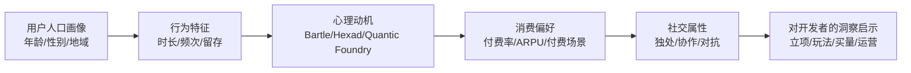

在这套统一模板之外，本报告还设置三类补充分析路径：第一，**平台差异路径**——在每个品类章节中区分PC/主机/移动APP/小程序游戏的画像差异，特别关注小程序游戏（2025年535亿元规模）作为新兴平台对传统画像的重塑[^2][^25]；第二，**出海视角路径**——结合Sensor Tower、点点数据等出海研究，识别中国玩家与海外（美日韩、欧美）玩家在同品类下的差异，2024年中国自研游戏海外销售收入185.57亿美元、海外收入前100位的自研移动游戏中策略类占比41.38%、射击类10.40%、角色扮演类10.37%，三类合计占据出海主力[^23]；第三，**品类融合路径**——在第8章集中分析"SLG+X"、"Roguelike+卡牌"、"开放世界+RPG"等融合趋势对用户画像的扩展作用。

通过这套"主线清晰、维度交叉、模板统一、路径多元"的章节架构，本报告希望为游戏开发者提供一份既可纵向深耕单一品类、又可横向对比组合决策的用户画像参考体系。在2025年新品供给降温、长尾市场扩张、获客成本攀升、品类高度细分的市场环境下，**对用户画像的精细化认知能力本身就是开发者最重要的竞争壁垒之一**。后续章节将沿着这一方法论框架，逐一拆解各类型游戏用户群体的真实面貌。

# 2 角色扮演类游戏（RPG/ARPG/MMORPG/JRPG）用户画像

承接第1章确立的五维画像分析框架与"玩法品类为主线"的总体结构，本章作为分品类深耕的开篇，聚焦全球最大的移动游戏品类——角色扮演类游戏。选择RPG作为首个深耕对象，源于其在产业中的特殊地位：一方面，RPG是头部移动游戏中流水占比最高的玩法品类，2023年全球头部移动游戏中RPG产品流水占比达32.0%，其市场规模预计达2079.8亿元[^26]；另一方面，RPG又是子类型分化最剧烈、用户结构变化最显著的品类——MMORPG从主流位置加速退潮、ARPG与开放世界RPG五年翻倍增长、放置RPG数量四连增、JRPG与二次元RPG持续构成长尾稳态市场[^26][^27]。这种"品类总规模庞大但内部结构剧烈洗牌"的格局，使得RPG成为开发者理解"用户需求迁移"最具代表性的样本。

本章将按第1章确立的统一模板，依次拆解RPG大品类的整体基本盘、传统回合制与SRPG、ARPG、MMORPG、JRPG与二次元RPG、开放世界RPG六类用户画像，最后归纳跨子类型的核心心理诉求并向开发者输出战略洞察。

## 2.1 RPG大品类的用户基本盘与子类型分化逻辑

理解RPG用户的子类型差异之前，必须先勾勒该大品类的整体用户基本盘——这一基本盘构成了所有子类型用户的"公共底色"。根据伽马数据与TikTok for Business联合发布的《2023 RPG游戏全球营销白皮书》，2023年全球RPG游戏市场规模预计达2079.8亿元，在全球头部移动游戏中流水占比达32.0%，仍是全球最大的移动游戏玩法品类[^26][^28]。但需要警惕的是，这一占比相比2019年累计减少了9个百分点，连续4年下降，这意味着RPG虽仍占据王座，但其内部正经历着深刻的结构调整[^26]。

从用户共性特征看，RPG大品类用户呈现五大显著标签：**高IP依赖**——伽马数据显示IP改编移动游戏始终占据移动游戏市场规模六成以上份额，2020年上半年IP改编移动游戏市场收入达654.4亿元、同比增长35.9%，其中客户端IP改编产品收入超360亿元、占比达34.5%、位居所有品类之首[^29]；**高二次元偏好**——超六成RPG用户偏好二次元文化[^26][^28]；**高本土化敏感**——78.9%的RPG用户在意本土化，反映其对剧情、配音、文化适配的强需求；**高短视频依赖**——89.3%的RPG用户每天都看短视频[^26][^28]；**高游戏外平台粘性**——四成左右RPG用户认为游戏外平台能提供更多附加价值，意味着社区、攻略、UGC内容已成为RPG用户体验的重要外延[^26][^28]。

在子类型层面，伽马数据《2023中国移动游戏品类发展研究报告》清晰刻画了内部分化的方向：流水TOP150产品中，**MMORPG与回合制RPG市场份额均出现明显缩减**，其中MMORPG份额已缩减至7.9%（部分口径下为18.2%，差异源于统计样本范围）；与此同时，**射击类、SLG、ARPG与开放世界RPG市场份额呈现增长态势**[^27]。开放世界RPG从2020年推出以来，市场份额快速提升至4.9%（TOP150口径），全球RPG中流水占比已超10%[^26][^27]。放置类RPG数量占比4连增，背后是用户对"游戏减负"的强烈需求——通过离线收益、自动战斗等元素让玩家运用更多碎片化时间游玩[^26]。

伽马数据将上述分化背后的用户需求迁移归纳为三条主线：**第一，开放世界RPG兴起，背后是用户的玩法创新需求；第二，放置类RPG数量占比4连增，背后是用户的"游戏减负"需求；第三，经典MMORPG流水快速下滑，背后是用户对"重肝重氪"的游戏疲劳**[^26][^28]。这三条主线共同指向一个底层趋势——RPG用户正从"重肝重氪、长在线、高战力比拼"的传统游戏行为模式，向"减负化、自由化、剧情化、跨端化"迁移。

为便于后续逐一拆解，本节先对RPG六类子类型的市场份额与用户结构性特征进行横向汇总：

| 子类型 | 市场份额趋势 | 用户核心驱动 | 主力人群特征 | 代表产品 |
|--------|------------|------------|------------|---------|
| 传统回合制RPG | 缩减 | 情怀+策略 | 30岁以上、IP老粉 | 《梦幻西游》《最终幻想》系列 |
| SRPG策略RPG | 长尾稳态 | 策略推演+成就 | 30—45岁、硬核玩家 | 《火焰纹章:风花雪月》《幽浮2》[^30] |
| ARPG | 五年连增 | 操作爽感+养成 | 20—29岁占比超60% | 《地下城与勇士:起源》《鸣潮》[^27] |
| MMORPG | 持续下滑 | 战力+社交 | 25岁以上男性、下沉市场 | 传奇类、《最终幻想14》 |
| JRPG/二次元RPG | 稳态高粘性 | 剧情+角色羁绊 | 18—30岁、男女均衡化 | 《崩坏:星穹铁道》《原神》 |
| 开放世界RPG | 快速增长 | 自由探索+涌现 | 全年龄段、跨端 | 《原神》《塞尔达传说:旷野之息》 |

这一分化格局意味着，对开发者而言，再将"RPG"作为单一画像分析单元已经失效——必须穿透到子类型层面才能精确定位目标用户。后续2.2—2.6节将逐一拆解，2.7节再回归横向归纳。

## 2.2 传统回合制RPG与策略RPG（SRPG）用户画像

传统回合制RPG（《梦幻西游》《最终幻想》系列、《勇者斗恶龙》系列等）与策略RPG/SRPG（《火焰纹章》《幽浮2》《神界:原罪2》等）虽在玩法机制上有所差异，但两者用户画像存在高度同构性——都以**年龄偏大、IP情怀深厚、策略思维突出、对内容更新依赖度高**为典型标签，因此本节合并讨论。

**人口属性维度，回合制RPG与SRPG用户呈现RPG大品类中年龄最高的特征**。日本权威数据平台XTrend发布的《2025年上半年热门推し活产品画像图》显示，《最终幻想》等老牌IP核心粉丝普遍年过35岁，《最终幻想》用户平均年龄甚至超过40岁[^31]。这与米哈游《原神》《崩坏:星穹铁道》系列玩家年龄集中在20—29岁、《荒野乱斗》平均用户仅18岁形成强烈代际对比[^31]。这一年龄结构源于该子类型典型的"代际传承"路径——核心粉丝从少年时代便与IP结缘，至今仍持续支持和参与，构成该品类强大的黄金消费力，但也意味着**新用户增量有限、用户老化是该子类型最大的结构性风险**[^31]。性别比例上，传统回合制RPG与SRPG偏男性化，但因JRPG的角色塑造文化吸引部分女性核心向用户，比例较MMORPG更为均衡。

**行为特征维度，该子类型用户呈现"低频次、长单局、超长留存"的典型特征**。回合制玩法本身需要充足的连续时间投入完成战斗推演，与休闲产品的"高频次、短时长"模式形成鲜明对比。该群体的留存表现极为突出——《梦幻西游》作为运营超过20年的产品，仍是2025年中国市场长青老游戏的代表，持续贡献头部流水。但这种长留存高度依赖内容更新质量，《最终幻想14》的剧烈波动揭示了风险的另一面：粉丝Lucky Bancho基于The Lodestone平台的非官方普查显示，在7.0资料片《金曦之遗辉》生命周期中，活跃玩家从两个月前的93万峰值锐减约16万至约77万，相较《晓月之终焉》时期峰值已流失三分之二[^32][^33]。这一案例清晰说明，**回合制与SRPG用户对内容更新的耐受度极低，资料片质量直接决定活跃曲线**。

**心理动机维度，Bartle四类模型中"成就者"占比最为突出**。SRPG的"战棋机制+战斗阵型+资源管理"决策深度与回合制RPG的"队伍搭配+技能配置+战斗推演"策略深度，共同满足了该群体对策略性玩法与系统精通感的诉求[^30]。同时，"探险者"型动机也十分显著——日式回合制RPG如《最终幻想X》采用线性叙事框架下的情感锚点设计，通过固定场景（如"水之祭坛"）、重复旋律（《Suteki da ne》主题变奏）与角色台词节奏控制，强化记忆烙印，其剧情结构严格遵循三幕剧模型，但每幕内部嵌套3—5层"微型角色成长闭环"，使玩家在推进主线的同时完成对同伴动机、文化背景与价值观冲突的渐进式理解[^34]。这种叙事-成长共生系统对成就型与探险型玩家具有强吸引力。

**消费行为维度，该子类型呈现"买断+资料片+订阅"为主的稳定付费结构**。MMORPG-RPG领域的《最终幻想14》以月卡订阅+资料片付费为核心模型；主机端的回合制与SRPG则以买断制为主、配合DLC扩展。GameAnalytics《全球手游基数分析报告》显示，付费用户最高的品类分别是棋牌、RPG和策略游戏[^35]，回合制RPG与SRPG用户付费稳定但ARPU爬坡较慢，这与抽卡型RPG的"高峰值ARPPU+短爆发周期"形成对照。

**社交属性维度，该子类型偏向独处或弱社交协作**。SRPG多为单人战棋体验，传统JRPG式回合制RPG也以单机叙事为主；即使是《最终幻想14》这类MMO化的JRPG，其社交也多围绕固定团队（"固定队"）展开，弱于传统中国MMORPG的帮派化阵营对抗。

综上，**该子类型构成RPG用户金字塔最稳固的"老核心层"——情怀护城河深厚、付费稳定、对策略与叙事深度有最高诉求，但增长依赖内容更新质量、用户老化压力突出**。对开发者而言，进入这一赛道意味着必须具备深度内容研发能力与长线运营定力，是典型的"高门槛、长周期、稳收益"赛道。

## 2.3 动作角色扮演（ARPG）用户画像

ARPG是过去五年RPG大品类中增长最稳健、用户画像最清晰的子类型。伽马数据《2023中国移动游戏品类发展研究报告》明确指出，**ARPG品类市场与用户规模连续五年保持增长，2022年市场规模达109.6亿元，用户规模达8670万人**；流水TOP10中有5款产品运营时间超3年，其中3款运营时间达5年以上，显示出该品类的长生命周期特征[^27]。

**人口属性维度，ARPG拥有RPG大品类中最年轻、最学生化的用户结构**。伽马数据明确指出，**ARPG品类用户中20岁至29岁用户占比超过六成，其中近半数为在校学生**[^36][^27]。这一结构使ARPG成为高校用户密度最大的RPG子类型，与回合制RPG的中年化结构形成鲜明对比。性别比例上，ARPG整体偏男性化，但与MMORPG相比因二次元元素的渗透显得更为均衡。该群体亦是QuestMobile口径下25—34岁手游用户主力（占比32.6%、月均时长28.4小时、ARPPU达297元）的核心组成部分[^37]——20—29岁的ARPG学生用户群随着毕业进入社会，将自然过渡到该年龄段的高ARPPU区间。

**行为特征维度，ARPG用户呈现高粘性与较强的中重度时间投入意愿**。该群体一般具备更多时间精力投入到中重度游戏中，并且具备更稳定的消费习惯——伽马数据显示**ARPG用户群体消费率接近95%，四成以上用户月均消费处于100元至500元区间**[^27]。这一付费率水平在所有移动游戏品类中均属顶尖。GameAnalytics数据从全球视角佐证：策略游戏（SLG）的ARPPU超过40美元，RPG紧随其后，日活跃用户的平均收入贡献（ARPDAU）方面，SLG（0.4美元）和RPG（0.37美元）位居所有品类前列[^35]。ARPG首周流失率虽较高（前文提及重度RPG首周流失率57%），但完成新手期留存的用户长期价值极高。

**心理动机维度，ARPG用户呈现"杀手+成就者+探险者"的复合驱动**。其核心爽点来自即时战斗的操作反馈、角色成长的数值正循环与世界探索的视觉冲击三重叠加[^30]。Bartle模型中的"成就者"驱动主要由角色养成、装备强化、技能解锁满足；"杀手"驱动则在副本Boss战、PVP竞技场中得以释放；"探险者"驱动则被开放或半开放地图、隐藏剧情、世界观挖掘所满足。值得注意的是，**ARPG用户对二次元文化关注度极高**[^36]，这一特征解释了为何近年米哈游《崩坏3》、库洛《鸣潮》等二次元ARPG能在该赛道脱颖而出。

**消费行为维度，ARPG用户的95%群体消费率与四成用户月均100—500元的中高消费区间，构成极具商业价值的画像底色**[^27]。其消费场景集中于角色抽取、武器/装备养成、皮肤外观、月卡战令体系。运营时间超过3—5年的TOP10产品反映出该品类用户对长期内容更新的耐受度高于MMORPG，但也对"重氪"边界极为敏感——一旦数值膨胀失控，用户流失同样剧烈。

**ARPG子类内部分化**进一步揭示用户需求张力。可将其大致分为三个细分方向：

- **传统ARPG**（如《暗黑破坏神:不朽》《地下城与勇士:起源》）——以战斗操作爽感与装备Build深度为核心，用户偏男性、年龄略高，对刷怪打宝、装备词缀有强烈成就驱动；
- **二次元ARPG**（如《鸣潮》《崩坏3》）——以角色塑造+战斗操作双轮驱动，性别比例更均衡，对画风、CV、剧情敏感度高；
- **放置ARPG**（如《菇勇者传说》《杖剑传说》）——直接回应"用户减负"诉求[^26]，通过离线收益、自动战斗大幅降低操作门槛，用户年龄分布更广、女性占比提升，付费模式向"轻氪+长线"迁移。

这三个细分方向恰好映射了"操作爽感"与"用户减负"两股张力的不同平衡点。**对开发者而言，ARPG赛道的画像洞察清晰指向"20—29岁学生与年轻白领、95%消费率、二次元友好、长生命周期"的目标人群，但需在传统操作派、二次元角色派、放置减负派三条路径中明确产品定位**。

## 2.4 大型多人在线RPG（MMORPG）用户画像

MMORPG曾是中国移动游戏市场最重要的玩法品类之一，但近年其在头部市场份额持续下滑——伽马数据显示，**TOP150产品中MMORPG品类市场份额已缩减至7.9%**，《2023 RPG游戏全球营销白皮书》中另一口径数据显示MMORPG占比降至18.2%[^26][^27]。两个数据口径的差异主要源于统计范围（前者限定流水TOP150的中国市场移动产品，后者涵盖全球RPG），但共同方向都是显著下滑。这一下滑背后是该子类型用户群体长期固化、新用户难以渗透、老用户疲劳流失的结构性问题。

**人口属性维度，MMORPG构成RPG子类型中"最男性化、最下沉化、最中年化"的用户结构**。其用户与传奇IP用户高度重叠——伽马数据《传奇IP影响力报告》指出，传奇IP累计注册用户超过6亿，58.1%的用户表示曾玩过传奇类游戏，端游类产品注册账户超1.5亿个、累计流水约300亿元，2020年上半年传奇IP移动游戏流水占整个传奇IP产品的比例接近80%[^29]。这一群体的典型画像是25—50岁男性、三四线及以下城市为主、对怀旧情怀与战力比拼有强烈诉求，与第33条搜索结果中电竞用户"四线及以下城市占比35.9%、一线仅13.6%"的下沉趋势[^38]，以及买量行业实践中"传奇类用户以中年男性为主、偏爱怀旧爆率"的认知一致。性别上，MMORPG用户中男性占绝对主导，与开放世界RPG的男女6:4结构形成强烈对比。

**行为特征维度，MMORPG用户呈现"长在线时长+战力数值耦合"的典型特征**。该子类型注重战力比拼，而多付费、多参与活动是提升战力的核心来源，进而对用户的付费能力、在线时长提出较高要求[^26][^28]。但这一行为模式正是流失的核心诱因——伽马数据明确指出，**经典MMORPG流水快速下滑背后是用户对"重肝重氪"的游戏疲劳**[^26][^28]。同时，**RPG用户更易流失，且因战力追赶难度大等原因，用户回流难度较大**[^26]——一旦老玩家因生活节奏变化离开服务器，重新回归时面对的战力鸿沟使其几乎无法重返核心圈层。

**心理动机维度，MMORPG用户呈现"杀手+成就者+社交者"三重驱动**。Bartle四类模型中的"杀手"型在跨服战、攻城战、PVP排行榜中找到归属；"成就者"型通过装备升阶、等级竞速、稀有坐骑收集获得满足感；"社交者"型则深度依赖帮派/公会的归属感与协作关系。游戏的社交属性在MMORPG中表现得最为充分——聊天系统、公会/公会战、组队协作、动态社交圈共同构成强归属感的"虚拟家园"[^39]。然而正是这种深度社交绑定，使得离开成本极高、回归成本更高——一旦战友散去，再次进入便失去了曾经的社交锚点。

**消费行为维度，MMORPG用户的ARPPU在所有RPG子类型中位居顶端**。GameAnalytics数据显示RPG位列付费用户最高的三大品类之一，与SLG共同构成ARPDAU最高的两大重度品类[^35]。但这种高ARPPU高度依赖小部分鲸鱼用户——Newzoo联合Tebex的最新报告指出，**全球20%的玩家贡献了近一半的游戏支出**，"少数玩家驱动多数消费"的格局在MMORPG中表现尤为典型[^40]。北美玩家年人均消费高达325美元，欧洲玩家为125美元，远高于全球其它地区，这一消费分布意味着MMORPG的全球商业化成功高度依赖成熟市场的高消费力鲸鱼[^40]。

**社交属性维度，MMORPG是所有RPG子类型中社交依赖度最高的**——强协作型公会与对抗型阵营构成两大典型场景，玩家个体的游戏行为深度嵌入集体行动节奏中。这种特征既是其用户粘性的来源，也是其难以适应"减负化、碎片化"新趋势的根本原因。

**国际MMORPG困境的对照案例进一步强化这一判断**。《最终幻想14》在《金曦之遗辉》后活跃玩家较《晓月之终焉》峰值流失三分之二，77万的当前活跃用户量已大幅低于资料片初期的93万峰值[^32][^33]。Reddit玩家的讨论焦点是"游戏已经承受不起又一个失败的资料片"，揭示**MMORPG用户的内容容忍阈值正在快速降低**——即便是顶级IP+长线运营的标杆产品，也无法在内容质量下滑面前留住核心用户。

综合而言，**MMORPG用户结构呈现"老龄化+下沉化+男性化+鲸鱼依赖"四重叠加，破局难点在于如何在保留战力比拼与社交粘性的同时，回应"减负化"与"剧情化"的时代趋势**。对开发者而言，纯粹的传统MMORPG立项已属高风险赛道；而"传奇IP+小程序+轻肝"、"MMORPG+开放世界化"、"MMORPG+剧情化体验"等融合路径，反而是该赛道的可能性所在。

## 2.5 日式RPG（JRPG）与二次元RPG用户画像

广义的"日式风格RPG"在当代已经分化为两个相互交织但又有差异的群体：传统JRPG（《最终幻想》《勇者斗恶龙》《女神异闻录5》等线性叙事+回合制[^30]）与广义二次元RPG（米哈游《原神》《崩坏:星穹铁道》、二次元卡牌RPG等）。前者以情怀-叙事为核心，后者以角色-情感投射为核心，但两者共享"剧情驱动+角色塑造+审美沉浸"的底层基因。本节将两者并置分析，以呈现日系审美在RPG赛道的整体图景。

**人口属性维度，二次元RPG的用户画像在过去三年发生了显著重塑**。米哈游官方公布的《原神》全球用户画像数据显示：**全球玩家破3亿，国内外各占比50%，男女用户比例为6:4，18—30岁年轻用户群体约占总体比例70%，用户群体覆盖一线至五线城市**[^41]。这一数据揭示了《原神》对传统二次元"小众、男性主导、一二线城市集中"画像的全面突破。

但同源于米哈游的《崩坏:星穹铁道》却呈现截然不同的画像。日本Gameage的研究报告显示，**《崩坏:星穹铁道》男性用户占比72.0%，女性用户占比28.0%，十多岁到二十多岁的青少年男性占据用户主流，占总用户数的50%以上**；相比之下《原神》在日本的男性比例为55.2%、女性44.8%，更为平衡[^42]。这一对比说明，即使在同一厂商的同类产品组合下，**不同产品的核心玩法侧重（开放世界探索 vs 回合制+剧情）会显著影响用户的性别结构**——回合制+男性向角色塑造主导的星铁，明显比开放世界+全龄向叙事的原神更偏男性化。

XTrend数据进一步揭示日本市场的细节：米哈游旗下《原神》《绝区零》《崩坏:星穹铁道》系列在日本的玩家年龄集中在20—29岁，男女比例大约6比4；日本核心二次元手游产品在用户画像上依旧维持"年轻+男性为主"的典型特征，整体集中在20—35岁；相比主流大众游戏，二次元手游更强调角色塑造、美术风格和世界观构建，天然更容易吸引对虚拟角色有情感投射需求的年轻男性用户[^31]。

**行为特征维度，二次元RPG用户呈现极高的产品忠诚度与跨产品互通性**。Gameage研究指出：自2023年4月26日开服以来，《崩坏:星穹铁道》在日本市场的手游版DAU保持在50万人水平，同期《原神》日本版DAU约40万左右；**《崩坏:星穹铁道》玩家中超3成（31.2%）同时游玩《原神》，而《原神》玩家中33.6%同时游玩《崩坏:星穹铁道》**——双方共同游玩率排名前五的游戏完全相同，仅顺位略有差异[^42]。这一数据是二次元RPG用户"高IP连带性、强厂牌信任度"的最佳证明——一旦用户认同某厂商的内容风格与角色塑造，就会自然延伸到该厂商的其他产品矩阵。

**心理动机维度，JRPG与二次元RPG用户呈现"探险者+社交者"主导的复合画像**。日式RPG的剧情设计以"角色弧光"为核心驱动力，强调主角从平凡到非凡的蜕变过程与世界观演进同步发生[^34]。这种深度叙事满足了"探险者"对世界观挖掘与"成就者"对角色成长的双重需求；而推し活、同人创作、角色生日庆祝等行为则满足了"社交者"对情感共鸣与社区归属的需求。日本娱乐社会学者中山淳雄主导的XTrend研究指出，**老牌IP如《高达》《七龙珠》《假面骑士》等拥有一批忠实且稳定的中年粉丝群，体现出浓厚的情怀消费和代际传承力量**，而《荒野乱斗》凭借即时对战和社交互动的玩法精准击中年轻玩家需求[^31]——这一对比说明日系RPG用户的心理动机存在明显代际差异，老牌JRPG偏情怀-传承，新世代二次元RPG偏角色-情感投射。

**消费行为维度，二次元RPG构建了游戏行业最成功的"情感商业化"模型**。其核心是抽卡机制+月卡战令+限定皮肤+角色周年庆的多层组合。第33条搜索结果对电竞用户的发现高度类似——**中国电竞用户为电竞付费的动机是情感连接式，与饭圈粉丝为自己支持的偶像应援类似，电竞用户同样更乐于为自己喜欢的电竞IP、战队、选手等付费支持**[^38]——这一"应援式付费"逻辑在二次元RPG中表现得更为典型：玩家为自己"推"的角色一掷千金，付费动机超越了单纯的战力提升。同时，2024年「二次元潮流消费」趋势报告显示，**中国泛二次元用户近5亿，二次元消费市场规模超千亿**，谷子（动漫/游戏周边）已经从"二次元亚文化"延伸为大众潮流消费品，原价10—30元的小徽章甚至有被炒出万元天价的情况[^43]——这意味着二次元RPG的商业化已经突破游戏内购的边界，向IP衍生品、线下展会、联名商品的"全产业链情感消费"延伸。

**社交属性维度，二次元RPG用户呈现"独处沉浸+社区共创"的双重场景**。游戏内体验偏单人沉浸（《原神》《崩坏:星穹铁道》主线均为单机化设计），但游戏外的社区参与极为活跃——同人创作、角色二创、Cosplay、漫展、应援活动构成强大的社区共创生态。这种"游戏内单机+游戏外强社交"的特殊结构，与MMORPG"游戏内强社交+游戏外弱延伸"形成有趣对照。

**海外市场差异**：第1章已提及"日韩玩家接受'角色塑造、情感羁绊'为核心、玩法为辅的设计哲学，但欧美玩家更看重玩法和游戏性的创新"。XTrend对老牌JRPG的研究印证了日本市场对情怀IP的特殊容忍度——《最终幻想》用户平均年龄超40岁仍能保持核心粉丝忠诚[^31][^32]。这一差异直接决定了二次元RPG出海的本地化路径：日韩市场可以"轻玩法、重剧情角色"，欧美市场则必须"玩法创新+角色塑造"双轮驱动，否则面临文化折扣风险。

对开发者而言，**JRPG/二次元RPG赛道的画像洞察指向"18—30岁、男女均衡化、跨地域全覆盖、情感投射型付费、强社区共创"的目标人群**。该赛道的产品成功高度依赖角色塑造能力、剧情张力与厂牌信任度的长期积累，开发门槛与运营成本都极高，但一旦建立用户认同，可形成跨产品矩阵的强用户互通性。

## 2.6 开放世界RPG对用户结构的重塑

如果说ARPG代表了RPG赛道的"稳健增长"，二次元RPG代表了"情感商业化突破"，那么开放世界RPG则是该大品类近五年最显著的"用户结构重塑器"。伽马数据显示，**开放世界RPG从2020年推出以来，市场份额快速提升至4.9%（TOP150口径），2023年全球RPG中流水占比超10%**[^26][^27]。这一品类的崛起不仅在于市场份额的扩张，更在于其对传统RPG用户画像的全方位改写。

**人口属性维度，开放世界RPG带来了RPG赛道历史上最显著的"性别均衡化、地域全覆盖、跨年龄段渗透"重塑**。米哈游官方公布的《原神》全球画像数据是这一重塑的最佳缩影：全球玩家破3亿，男女用户比例为6:4，18—30岁年轻用户群体约占总体比例70%，用户群体覆盖一线至五线城市[^41]。**男女6:4的结构在传统RPG中近乎不可想象**——MMORPG的男性主导、传统ARPG的男性偏向、传奇类的极度男性化，都被开放世界RPG的低门槛探索体验与角色塑造美学所打破。同时，"覆盖一线至五线"的地域分布意味着开放世界RPG成功穿透了传统二次元一二线城市集中的边界，走向真正的大众化。

**行为特征维度，开放世界RPG的"跨端跨平台"属性是其与传统RPG最本质的差异**。Niko Partners《2024东亚玩家行为与市场洞察报告》指出，**39%的日本玩家和58%的韩国玩家至少在两个平台上玩游戏，超过70%的日本移动端游戏玩家和90%的韩国PC端游戏玩家有过跨平台游戏经历**[^44]。开放世界RPG天然适配这一跨端化趋势——《原神》登陆PC、PS、移动多端互通，《崩坏:星穹铁道》同样支持PC/移动跨端。Niko Partners首席执行官Lisa Hanson明确指出："**东亚市场的表现证明，跨平台游戏可以吸引更多玩家**"[^44]。这意味着开放世界RPG用户的"设备分布"维度已经从单端用户演化为多端用户，对应的硬件、网络、画面预期都更高。

**心理动机维度，开放世界RPG用户的核心驱动是"探险者"型，且在Bartle模型四类中具有压倒性优势**。开放世界RPG的核心玩法是开放性探索与环境交互，给予玩家更高自由度，与传统线性RPG的固定路径形成本质差异[^26][^28]。《塞尔达传说:旷野之息》的"物理化学引擎驱动叙事"成为这一心理诉求的设计标杆——火焰蔓延路径、金属导电特性、风向变化等底层规则直接触发NPC行为改变（如村民逃离火场、雷雨天停止冶炼），形成13类基础事件模板与217种组合变体；任天堂公开数据显示，**玩家平均每小时触发3.2次非脚本化叙事事件，其中89%符合现实逻辑推演**[^34]。《荒野大镖客:救赎2》采用"社会关系熵值模型"，每位NPC拥有独立日程表、情绪阈值与记忆权重，玩家行为对NPC态度的影响持续累积并跨章节生效，导致同一城镇在游戏后期出现17种差异化社会生态；这种设计使主线剧情完成度仅占玩家总游戏时长的22%，但世界可信度评分达Metacritic历史最高98分[^34]。这种"涌现叙事"机制满足了"探险者"型玩家对发现欲与意外性的极致诉求。

**消费行为维度，开放世界RPG结合了"剧情订阅式付费+角色抽取+月卡战令"的复合模型**。其用户付费场景比传统ARPG更柔和——并非依赖战力比拼制造焦虑，而是依赖角色情感投射与剧情期待驱动消费。这种"非焦虑型付费"模式更适合广覆盖年龄段的用户接受度，是其能突破传统RPG鲸鱼依赖结构的关键。

**社交属性维度，开放世界RPG呈现"游戏内单机化+游戏外强社区"的典型二次元RPG社交结构**，但其大众化程度使社区延伸更广——从同人创作扩展到旅游打卡（《原神》璃月场景与张家界、稻妻与日本元素的现实映射）、官方音乐会、角色周年庆全球同步活动等。

**对传统RPG用户的虹吸效应**也是开放世界RPG重塑用户结构的重要侧面。前文已述MMORPG下滑背后是"重肝重氪疲劳"，而开放世界RPG提供的"自由探索+剧情沉浸+轻肝"组合，恰好成为流失MMORPG用户的承接器。同样地，传统回合制RPG的"线性叙事疲劳"也被开放世界RPG的"涌现叙事"所替代——前文提及的《最终幻想14》16万活跃用户流失[^32][^33]背后，部分流向恰是更具自由度的开放世界产品。

值得关注的是，**Niko Partners的预测也支持这一虹吸判断**——日本未来五年PC游戏市场和主机游戏市场规模将显著增长，5年复合年均增长率分别为8.8%和2.5%；韩国未来五年主机游戏市场规模也将持续增长（5年CAGR为3.4%）[^44]。这意味着开放世界RPG所擅长的"跨端、PC/主机优先"正契合东亚市场的增长方向。同时，《原神》在欧美市场的成功也使Niko Partners预测，"未来中国将会出现更多的3A游戏"[^45]。

综上，**开放世界RPG用户结构的四大新特征——更年轻化、更均衡化、更下沉化、更跨端化——共同构成对传统RPG用户画像的系统性重塑**。对开发者而言，开放世界RPG赛道的画像洞察指向"全年龄段18—30岁主力、男女6:4、覆盖一线至五线、跨端使用、探险者驱动、情感型付费"的目标人群。但需清醒认识到，这一赛道的研发门槛极高——开放世界对底层引擎、动态事件链、跨端工程的要求远超传统RPG，是典型的"高投入、长周期、品牌护城河型"赛道。

## 2.7 RPG用户核心心理诉求归纳与对开发者的洞察启示

在前述六类子类型画像基础上，本节进行横向归纳与战略转译，回答"RPG用户究竟为什么玩RPG"以及"开发者应如何匹配"的两个根本问题。

**首先，归纳RPG用户的三大核心心理诉求**：

**第一，成长系统诉求**——数值反馈、技能解锁、装备养成共同构成RPG区别于其他品类的"成长闭环"基因。这一诉求在ARPG（操作型成长）、MMORPG（战力型成长）、SRPG（策略型成长）中表现形式不同但底层一致，对应Bartle模型中的"成就者"。**第二，叙事沉浸诉求**——剧情张力、角色弧光、世界观完整性。无论是日式RPG的三幕剧线性叙事[^34]、开放世界RPG的涌现叙事[^34]，还是二次元RPG的角色羁绊塑造，都指向"探险者"型对世界发现与故事推进的渴望。**第三，角色塑造与情感投射诉求**——这一诉求在二次元RPG中达到顶峰，但在所有RPG子类型中均存在。其商业化体现是"应援式付费"——与电竞用户为IP战队应援[^38]、二次元用户为推し角色买单[^43]逻辑一致。

这三大诉求在不同子类型中的权重组合差异显著，下表呈现核心映射：

| 子类型 | 成长系统权重 | 叙事沉浸权重 | 角色塑造权重 | Bartle主导类型 |
|--------|------------|------------|------------|--------------|
| 传统回合制RPG | 中 | 高 | 中 | 成就者+探险者 |
| SRPG | 高（策略型） | 中 | 中 | 成就者 |
| ARPG | 高（操作型） | 中 | 中 | 成就者+杀手 |
| MMORPG | 极高（战力型） | 低 | 低 | 杀手+成就者+社交者 |
| JRPG/二次元RPG | 中 | 高 | 极高 | 探险者+社交者 |
| 开放世界RPG | 中 | 高（涌现型） | 高 | 探险者+成就者 |

**其次，归纳RPG赛道的关键运营与买量启示**。基于伽马数据"四成RPG用户认为游戏外平台能提供更多附加价值、89.3%每天看短视频、78.9%在意本土化、超六成偏好二次元"的数据[^26][^28]，可提炼三条具体启示：

第一，**短视频是RPG赛道买量的"必争之地"**——89.3%的每日观看率意味着抖音、TikTok、YouTube Shorts是RPG用户最高频接触的内容渠道，买量素材必须深度匹配短视频的快节奏、强视觉、强情绪属性。Niko Partners数据进一步指出，**视频直播成为日韩游戏营销最重要的工具之一——超过31%的日本玩家和40%的韩国玩家均有观看，YouTube是最受欢迎的平台**[^44]，这意味着出海RPG的视频营销必须覆盖直播与短视频双场景。第二，**社区与游戏外平台是用户体验的延伸**——四成用户对游戏外平台的附加价值认知，意味着开发者必须在官方社区、Wiki、攻略、UGC平台上系统投入，而非仅停留在游戏内体验。第三，**本土化是出海RPG的生死线**——78.9%的本土化敏感度，要求剧情翻译、配音、文化梗、角色调整必须达到母语级别的精度。

**最后，针对开发者的立项—研发—买量—运营—出海五大环节**，按子类型给出差异化建议：

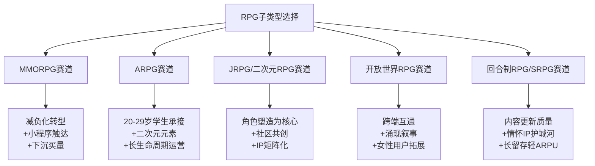

具体而言：**MMORPG赛道**面对"重肝重氪疲劳"必须考虑减负化转型，结合小程序触达与下沉买量延续传奇类用户的怀旧消费；**ARPG赛道**应紧密把握20—29岁学生群体的中重度承接窗口，95%的群体消费率与四成用户100—500元月均消费区间是该赛道最坚实的画像底盘[^27]，叠加二次元元素是当前最优解；**JRPG/二次元RPG赛道**强化角色塑造与情感羁绊是核心，IP矩阵化（《原神》-《崩坏:星穹铁道》-《绝区零》的米哈游矩阵证明）+社区共创是构建用户互通性的关键路径；**开放世界RPG赛道**需把握跨端互通与女性用户拓展，《原神》男女6:4结构是该赛道最重要的"画像红利"[^41]；**回合制RPG/SRPG赛道**应坚守内容更新质量与情怀IP护城河，《最终幻想14》16万用户流失的教训说明该赛道用户对内容的容忍阈值正在快速降低[^32][^33]。

**子类型融合作为下一阶段产品创新的方向**也值得开发者高度关注。伽马数据明确指出，**当前仍有较多贴合用户需求的"RPG+"细分品类尚未开发，在已有头部游戏的新兴品类中，消除类、射击类、塔防类、Roguelike类RPG用户需求的满足程度仍然较低**[^26][^28]。这意味着"RPG+消除"、"RPG+Roguelike"、"RPG+塔防"等融合方向构成蓝海机会，配合放置化减负、二次元化美学、跨端化分发的三重浪潮，有可能在未来三年涌现新一轮的爆款产品。

至此，本章完成了对RPG大品类六个子类型用户画像的系统拆解。**RPG用户既是全球移动游戏付费力最强的群体之一，也是子类型分化最剧烈、用户需求迁移最显著的群体**——成长系统、叙事沉浸、角色塑造的三大核心诉求在不同子类型中以不同权重组合，对应不同的Bartle心理类型与商业化模型。下一章将转向射击与MOBA等竞技对战类游戏用户画像，继续在"玩法品类为主线"的框架下展开分析。

# 3 射击与MOBA等竞技对战类游戏用户画像

承接第2章对RPG大品类六类子类型的系统拆解，本章作为分品类深耕的第二章，将焦点转向另一个用户规模庞大、画像特征鲜明且产业生态最为成熟的赛道——**竞技对战类游戏**。如果说RPG用户的核心驱动是"成长—叙事—角色塑造"的内向沉浸，那么竞技对战类用户则呈现完全不同的"对抗—协作—荣誉"的外向爆发——他们追求的不是世界观完整性与角色弧光，而是即时反馈的胜负刺激、与队友的协作默契以及在排位与段位体系中的相对位序。这种心理诉求的根本性差异，使得竞技对战类游戏在产品设计、商业化模型、社交机制与电竞生态构建上都形成了独特的范式。

竞技对战类是2025年中国游戏市场增长最显著的两大引擎之一。根据伽马数据《2025年中国游戏产业报告》及QuestMobile相关数据，**射击类游戏贡献了2025年中国游戏市场超百亿元增量、已成为国内第二大游戏品类**[^46]，而MOBA与飞行射击在手机游戏APP用户总使用时长上分别占比22.9%与24.3%，**形成"双峰并立"的格局**[^47][^48]。同时，电竞产业从单一赛事经济向"产业生态经济"演变，2025年中国电竞用户规模已突破4.95亿人[^49]，构成竞技对战用户研究的重要外延。

本章将依次展开五节内容：首先勾勒竞技对战大品类的市场基本盘与用户结构性变迁（3.1）；随后深耕射击品类内部细分图谱（3.2）；接着系统比较MOBA品类硬核与轻量双轨分化（3.3）；进而拆解电竞用户画像与社交-付费闭环（3.4）；最后归纳"巴图杀手型+社交型"的复合心理画像并向开发者输出战略洞察（3.5）。

## 3.1 竞技对战大品类的市场基本盘与用户结构性变迁

理解射击与MOBA用户的细分差异之前，必须先把握该大品类在2025年所处的整体市场坐标与用户基本盘——这构成所有竞技对战用户子类型的"公共底色"。

**从市场规模看，竞技对战类已成为2025年中国游戏市场最重要的增长引擎之一**。腾讯高级副总裁马晓轶在媒体交流会上明确指出："射击游戏占了全球35%的市场，但中国这个数字只有大约20%"[^46]，揭示该品类在国内仍存在显著增长空间。Fortune Business Insights发布的《Shooter Games Market Size, Share & Trends》报告显示，2024年全球FPS游戏市场规模已达约**726.8亿美元**，预计未来10年将飙升至近2000亿美元，增速位列游戏市场前列[^46]。在国内市场，伽马数据显示射击类游戏是2025年中国游戏市场增长的主要动力，**贡献了超百亿元增量、已成为国内第二大游戏品类**[^46]。海外市场的画像同样佐证这一品类的战略地位——2024年中国自主研发移动游戏出海收入前100产品中，**射击类占比10.40%、位居第二**，仅次于策略类的41.38%[^50]。

MOBA品类则继续保持其"国民级品类"地位。QuestMobile数据显示，截至2025年8月底，**国内手机游戏APP行业MAU达6.98亿、同比增长7.9%，人均单日使用次数和时长分别达到23次、114.4分钟**；细分领域中，**飞行射击与MOBA在用户总使用时长占比上形成双峰并立格局，分别达到24.3%、22.9%**，其中飞行射击同比增长8.3%[^47][^48]。从头部产品看，飞行射击领域的《三角洲行动》《和平精英》《穿越火线:枪战王者》位居前三，MOBA领域的《王者荣耀》《英雄联盟手游》《决战!平安京》位居前三[^47]，呈现"一超多强"的明显头部集中格局。

伽马数据《2025年中国电子竞技产业报告》进一步揭示了竞技对战的产业生态规模：**2025年中国电竞用户规模超4.95亿人、增长率1.06%；产业收入293.31亿元、同比增长6.40%**[^49]。从游戏类型分布看，**移动电竞游戏流水TOP10榜单中，射击类与MOBA占据主导——射击类3款、MOBA 2款；客户端电竞游戏热度TOP10中，射击类产品达6款；中国电竞游戏主要产品的玩法类型中，射击类占比最高，为28.3%，MOBA和体育类次之，占比均为14.1%**[^49]。这一数据清晰说明，射击与MOBA共同构成了中国电竞产业的核心玩法基础。

**从用户结构性变迁看，竞技对战用户群体正经历"女性化、下沉化、银发化、跨端化"四重重塑**，这是2020—2025年间最深刻的画像变化。

第一，**女性化**——前瞻产业研究院数据显示，2022年中国电子竞技用户中男性占比56.40%、女性占比43.60%[^51]；伽马数据进一步指出**2025年中国电竞女性用户占比已升至42%，较2020年的35%大幅提升，其中18—30岁女性用户占比超六成，成为女性电竞群体的核心力量**[^49]。这一比例已与RPG大品类的男女均衡化趋势相呼应，意味着"电竞=男性专属"的传统认知已被彻底打破。

第二，**下沉化**——2022年中国电子竞技用户分布在四线及以下城市的占比达到35.9%，分布在一线城市的占比仅为13.6%[^51]，呈现明显的下沉趋势。这与第1章中传奇IP用户、买量行业实践中所揭示的"下沉市场是竞技对战类用户增长重要源泉"的判断一致。

第三，**银发化**——伽马数据指出，**2025年中国老年电竞用户规模已突破2000万，预计年底将达到3000万**，主要以退休人士为主，参与方式以《王者荣耀》娱乐模式、轻度竞技类小程序游戏为主，操作难度低、节奏舒缓的产品更受青睐[^49]。陕西省体育局调研显示，**该省31岁以上电竞用户占比达44.7%，显著高于全国平均水平**[^49]。银发电竞群体的崛起，正在推动产品的"适老化"转型——语音控制、简化操作、护眼模式等功能需求持续增长。

第四，**跨端化**——2025年中国小程序游戏市场收入达535.35亿元、同比增长34.39%，其中**轻度电竞类小程序凭借低门槛、强社交的特点，成为下沉市场与中老年用户的首选，内购收入占比达68.11%**；主机电竞市场迎来爆发式增长，**2025年实销收入83.62亿元、同比增长86.33%、连续三年高速增长**[^49]。多端互通成为竞技对战赛道的标配。

**消费动因层面，应援式付费已成为电竞用户最显著的付费行为标签**。前瞻产业研究院数据显示，**2022年77.7%的中国电竞用户围绕电竞有金钱投入，投入占比在所有亚洲调研国家中排在首位**，主要用于购买虚拟道具、实体周边等[^51]。其驱动逻辑被明确归纳为"**情感连接式付费**"——支持自己喜欢的电竞IP、电竞战队等应援式付费是中国电竞用户的最主要驱动因素，尤其是电竞IP对中国电竞用户的消费吸引力最大；**与饭圈粉丝为自己支持的偶像应援类似，电竞用户同样更乐于为自己喜欢的电竞IP、战队、选手等付费支持**[^51]。这一逻辑构成竞技对战类商业化与电竞生态建设的底层心智，将贯穿后续所有子品类分析。

为便于后续逐一拆解，本节先对竞技对战大品类下射击与MOBA两类核心子品类的用户画像底色进行横向汇总：

| 维度 | 射击品类（FPS/TPS/战术射击） | MOBA品类 |
|------|-------------------------|---------|
| 市场地位 | 国内第二大品类、贡献超百亿增量 | 手游时长占比22.9%、双峰之一 |
| 用户性别 | 男性主导（FPS全球85%以上） | 显著均衡化（王者荣耀男女约6:4） |
| 用户年龄 | 跨度大（18—40岁） | 王者偏年轻化、Dota2偏中年化 |
| 地域分布 | 一二线为主（手游APP）+下沉延伸 | 下沉化突出（四线以下35.9%） |
| 核心驱动 | 杀手+成就（操作精度+段位） | 杀手+社交（团队协作+熟人开黑） |
| 付费模式 | 武器皮肤+战令+赛季通行证 | 皮肤经济+战令+应援式付费 |
| 社交模式 | 协作+对抗为主（语音队） | 熟人开黑+战队+陌生人匹配 |
| 单局时长 | 8—25分钟（依细分品类） | 王者10—15分钟 vs Dota2 30—50分钟 |

后续3.2、3.3节将分别深耕射击与MOBA两大子品类的用户画像，3.4节聚焦电竞用户共同特征，3.5节归纳跨子品类的复合心理画像。

## 3.2 射击品类用户画像：从硬核竞技到战术撤离的细分图谱

射击品类是竞技对战类下用户分化最剧烈、产品形态最丰富的子品类，其内部存在明显的细分方向差异。本节将射击品类划分为五大方向并进行用户画像差异化拆解：硬核FPS（CS2/瓦罗兰特）、英雄射击（守望先锋/Apex英雄）、大逃杀（PUBG/和平精英）、战术撤离（三角洲行动/逃离塔科夫）、IP射击（使命召唤/穿越火线）。这五个方向对应不同的玩法机制重心，也对应显著差异的用户群体特征。

### 3.2.1 射击品类的人口属性与行为特征底色

**人口属性维度，射击品类呈现RPG之外用户性别最不均衡、男性主导最显著的画像结构**。第三方画像分析显示，**《使命召唤》手游男性占比82.25%、女性占比17.75%；《马里奥赛车》男性占比78.39%、女性占比21.61%**[^52]——尽管这两个数据来源于2019年百度指数口径，可能存在样本偏差，但仍可印证射击品类的强男性化倾向。这一画像与RPG大品类相比形成鲜明对比，与MOBA轻量化产品（王者荣耀男女约6:4）的均衡化趋势更是天差地别。

但需要指出的是，**ESA《游戏的力量2025》全球调研提供了一个更为均衡的全球画像**：全球玩家平均年龄41岁，男性占51%、女性占48%；男性更爱动作（53%）、射击（38%）类游戏；女性则对益智解谜（62%）、休闲模拟（33%）类游戏情有独钟[^53]。这意味着即使在全球射击品类中，**男性用户仍占据主导地位但并非绝对垄断，女性用户的中度参与度被显著低估**——尤其是英雄射击与大逃杀两个细分方向，女性玩家比例显著高于硬核FPS。伽马数据2025电竞报告明确指出，**《枪战王者》等游戏的女性占比已超45%**[^49]，进一步佐证细分方向的画像差异。

**年龄维度，射击品类用户跨度大但整体偏年轻化**。QuestMobile数据显示，**手机游戏APP用户年轻化特征明显，30岁以下用户占比达到50.4%**[^47][^48]，而飞行射击作为时长占比最高的细分领域，其用户结构与整体APP用户高度吻合。但相比MOBA，射击品类对核心向中年用户的吸引力更强——《CS2》《彩虹六号》等硬核FPS的核心粉丝群体跨度可达18—40岁，对IP的情怀依赖与对枪法操作的执着是该群体的共同标签。

**行为特征维度，射击品类用户呈现"高频次、长时长、高度沉浸"的极强粘性特征**。东京国际工科专门职大学小野憲史团队对5305名电竞FPS玩家的调查报告揭示，**48.9%的受访玩家每周游戏时长超过6天**，几乎达到"每天打"的程度；最受欢迎的游戏是《Apex英雄》《无畏契约》[^54][^55]。这种"几乎每天都打"的活跃度，是射击品类区别于其他竞技品类的最显著行为特征——其用户的游戏行为已经深度嵌入日常生活节奏。

**操作精度的极端敏感性是射击品类另一个核心行为标签**。值得买社区与知乎玩家分析显示，硬核FPS玩家"极度依赖高性能外设以提升操作精度"——**职业选手普遍追求高帧率，电竞鼠标需"低DPI保精准爆头"，HKC UG25HF显示器（500Hz+0.5ms）被用户描述为"职业选手体验"，240Hz为"分水岭"，360Hz以上属职业玩家专属**[^56]。这种对帧率与延迟毫秒级的敏感性，意味着射击品类用户在硬件投入上的意愿远超其他品类——这一特征直接映射到画像层面，即**该群体的可支配收入与消费意愿显著高于游戏均值**。

### 3.2.2 硬核竞技vs休闲娱乐的核心需求张力

射击品类内部最重要的画像分化，是"**硬核竞技vs休闲娱乐**"的核心需求张力。基于328位FPS玩家真实体验的整合调研显示，**65%支持硬核竞技、35%支持休闲娱乐**[^56]。这一接近2:1的支持率分布，揭示了射击品类用户群体的内部张力。

**硬核竞技派（约65%）的核心诉求**包括：强调纯粹枪法、地图理解与经济博弈，拒绝技能系统干扰核心射击体验；重视高惩罚机制带来的战术纪律与信息价值，一枪爆头可逆转局势；依赖专业外设（高刷显示器、低DPI鼠标）与肌肉记忆，追求毫秒级操作精度；偏好小队深度协作与长期成长曲线，享受克服困难后的成就感；高度关注反外挂强度，认为公平环境是硬核竞技的底线[^56]。这一群体的代表产品是《CS2》《彩虹六号》《无畏契约》《逃离塔科夫》，对应Bartle模型中典型的"成就者+杀手"复合驱动。

**休闲娱乐派（约35%）的核心诉求**则恰好相反：倾向英雄技能系统降低纯枪法门槛，提供战术多样性与容错空间；追求快节奏、强反馈与碎片化娱乐，拒绝冗长学习与高压对局；接受手柄辅助瞄准等优化设计，注重舒适性与轻松上手体验；偏好丰富模式（PVE、乱斗、Roguelite）与社交轻量化，避免排位焦虑；重视视听沉浸与美术风格亲和力，弱化操作精度要求[^56]。这一群体的代表产品是《守望先锋》《Apex英雄》《使命召唤手游》，对应"社交者+成就者"驱动。

下表呈现射击品类五大细分方向的用户画像差异：

| 细分方向 | 代表产品 | 核心用户画像 | Bartle主导类型 | 关键体验 |
|---------|---------|------------|--------------|---------|
| 硬核FPS | CS2、瓦罗兰特、彩虹六号 | 18—35岁男性核心向、高硬件投入 | 成就者+杀手 | 枪法精度、经济博弈、战术纪律 |
| 英雄射击 | 守望先锋、Apex英雄 | 18—30岁、性别均衡度提升、容错偏好 | 社交者+成就者 | 技能组合、团队配合、英雄收集 |
| 大逃杀 | PUBG Mobile、和平精英 | 跨年龄段、移动端为主、社交开黑 | 杀手+社交者 | 单局完整性、随机刺激、吃鸡爽点 |
| 战术撤离 | 三角洲行动、逃离塔科夫 | 18—40岁中重度玩家、跨端 | 成就者+探险者+杀手 | 物资搜索、撤离决策、装备养成 |
| IP射击 | 使命召唤、穿越火线 | 中年情怀玩家+赛事观众 | 成就者+杀手 | IP情感、赛事荣誉、武器情怀 |

值得注意的是，**英雄射击品类的设计哲学正面临反思**。《守望先锋》前总监Jeff Kaplan在游戏十周年时反思：**"如果今天让他重新设计一款英雄射击游戏，他会降低团队协作的比重，更多关注玩家的个人贡献"**——他指出"这就是人们玩游戏的方式，他们是'自私'的"，《守望先锋》对五六个完全陌生玩家之间的协同要求过高，整场比赛胜负往往取决于队伍中最薄弱的一环；**这与《CS2》或《无畏契约》等游戏形成鲜明对比——在那类游戏中，只要出现一个能撕裂对手防线的大佬，就足以carry全场**[^57]。这一反思直接揭示了英雄射击品类面临的画像困境——其设计预期玩家是"团队协作型社交者"，但实际玩家心智更多是"个人成就型杀手"，二者的错位构成产品长期运营的潜在风险。

### 3.2.3 玩家情绪管理与团队协作的认知偏差

射击品类用户在心理动机层面还呈现一个独特特征——**情绪波动剧烈与对自我愤怒的认知偏差**。东京国际工科专门职大学的5305名电竞FPS玩家调查揭示了这一现象：**71.3%的玩家选择"明显感受到自己会暴怒"**[^54][^58][^55]，超过七成玩家在激烈对局中会出现愤怒、懊恼甚至爆发式情绪。

更关键的是，研究通过Friedman测定与统计分析发现，**玩家普遍认为"自己的愤怒会对队友造成不良影响远大于队友的愤怒对自己造成的影响"**——当玩家自身情绪失控时往往会反思自己的行为并试图调整策略，但当队友表现出愤怒情绪时，玩家更容易采取忽视或淡化的态度[^58][^55]。研究者总结："**自己生气是'合理发泄'，队友生气则是'情绪化'**"——这种心理双标在一定程度上削弱了团队合作的默契，也让电竞竞技场上频频上演"口角风波"和"键盘大战"。

这一发现对射击品类的产品设计具有直接启示：**情绪管理与共情意识的缺乏是射击用户群体的普遍特征**，开发者可以在游戏内设计更友好的沟通机制（如标记系统、情绪反馈、AI辅助沟通），帮助玩家更好地表达情绪和进行团队协作；同时，关注玩家的心理健康也变得越来越重要，电竞FPS游戏的高强度和竞争性可能导致玩家产生焦虑、愤怒等负面情绪[^54]。

### 3.2.4 消费行为：武器皮肤+战令+赛季通行证的三段式付费

射击品类的付费结构呈现高度同构化的"三段式"模型，以《逆战未来》为典型样本：**核心付费维度之一为武器系统**——传火行动箱保底设计（每10次抽取必得稀有道具），加上商城同步上架多款外观精良、属性强化的直购型武器；**皮肤系统构成另一大付费重心**——重制后的皮肤支持商城直接购买，但多数稀有款仅通过概率抽取或限定活动达成条件后解锁，由于皮肤不仅影响视觉表现，部分还关联特殊特效与元素加成，其稀缺性直接推动了中高预算玩家的持续投入；**赛季通行证（战令）为周期性付费内容**，提供分阶奖励体系，付费档位对应额外任务线与专属道具[^59]。

战令的实际付费驱动力可以从《王者荣耀》战令系统的细节数据得到佐证：**S26赛季80级战令限定皮肤兑换需要3125个战令币、按上限125个宝箱保底获得；一级战令限定皮肤需要1275个战令币、85个宝箱保底**；不购买战令的免费玩家每个赛季通过升级仅能获得180—230个战令币，**积攒到100%免费兑换战令限定皮肤需要约13—14个赛季**[^60]。这种设计在射击品类的逆战、和平精英等产品中同样适用——战令构成了"付费即加速、免费可获取但周期极长"的双轨付费体系，既保留了免费玩家的留存动力，又为付费玩家提供了清晰的价值锚点。

从充值流水看，2024年手游充值TOP10中射击品类占据多席：**和平精英240.4亿、英雄联盟手游70.4亿（含射击元素）、穿越火线手游59.84亿**[^61]。和平精英的"军需套装+战备物资双重变现路径"是射击品类商业化的典型代表——既满足实用主义玩家对装备升级的需求，又满足收藏向玩家对外观稀缺的追求。

### 3.2.5 《三角洲行动》：硬核与休闲融合的破局标杆

如果要从2024—2025年射击品类中选择一个最具标志性的破局案例，**《三角洲行动》无疑是最具代表性的样本**。腾讯财报显示，**三角洲国服日活已经突破5000万**——2025年4月公布日活突破1200万，9月达到3000万，2026年1月达到4100万，到2026年Q1已突破5000万[^62]。**不到一年时间从1200万跃升至5000万的用户增速，向行业证明了"射击是增长死局"是一个伪命题**。

三角洲的破局路径对开发者具有三重启示：

**第一，硬核与休闲融合的产品定位**。三角洲尝试把简易上手与硬核体验两种特性深度融合——在搜索撤离玩法中做了许多易于新玩家上手、简化认知和操作的设计（精简生存状态管理、强化道具价值的视觉辨识度、免去物资搜索的连续确认过程），同时强化玩家在对抗中的可能性和操作上的高光时刻，将拉长玩家的平均TTK与多种玩法特色关联，**既能削弱玩家遇敌和战损的压力、让玩家能放开手脚"战斗爽"，又保证了充分的合作与对抗博弈维度和深度**[^62]。这一设计哲学完美回应了3.2.2节中"65%硬核派+35%休闲派"的画像张力——通过单一产品同时承接两类用户。

**第二，多端互通与玩家迁移设计**。三角洲一开始就以双模式、多端的形态上线，覆盖了玩家的多元生活场景和游戏偏好，且实现了账号资源的互通——**早期的PC品质为三角洲圈定了初期的核心用户，随后移动端的不断进化成功让游戏从垂直走向了大众**[^62]。这一跨端策略恰好契合了3.1节所述的"跨端化"用户结构性变迁。

**第三，B站核心用户蓄水的发行策略**。腾讯天美市场中心总监刘星伦透露，**当产品决定重点转向PC端时，B站就被定为核心战略阵地之一**——原因在于B站聚集了大量FPS品类专家和重度硬核用户，团队会花大量时间看弹幕和评论；**《三角洲行动》在测试期就让制作人和核心策划在B站与用户直接对话**[^63]。这种策略不是大力出奇迹式的盲目拉新，而是先赢得核心用户的理解与支持，根据他们的反馈调优游戏，再由金字塔尖向外扩散。B站约**1600万核心用户中66%集中在18—30岁、62%—64%居住在高线城市、平均每天在B站消耗180分钟**[^63]——这一画像与FPS核心用户高度吻合，构成了射击品类发行的核心心智阵地。

NAAVIK研究报告进一步佐证了中国厂商在射击赛道的崛起——**2024年以来上线的免费PvP射击游戏中，Steam同时在线人数前五名均由中国开发商包揽，其中腾讯系产品更占据两席**[^46]。国产射击游戏正从"追赶者"逐步转向全球FPS"领跑者"，这背后是对硬核与休闲张力、跨端用户、核心阵地蓄水三大画像维度的精准把握。

## 3.3 MOBA品类用户画像：硬核与轻量双轨分化

MOBA品类是中国市场最具代表性的国民级竞技对战品类，但其内部存在硬核MOBA（LOL端游、Dota2）与轻量化MOBA（王者荣耀、英雄联盟手游）的根本性分化。这种分化不仅体现在玩法机制层面，更深刻地体现在用户人口属性、行为特征、心理动机、消费行为与社交属性的全维度差异上。

### 3.3.1 代际差异：Dota2中年精英vs LOL年轻大众vs王者荣耀全民下沉

MOBA品类用户最显著的画像分化是**代际差异**。基于Dota2与LOL长期对照分析的玩家画像显示：**Dota2玩家平均年龄28岁、从DOTA1玩过来的老炮、有工作有收入、把DOTA当信仰；LOL玩家平均年龄20岁、学生党居多、时间多钱少、把LOL当社交**[^64]。这一8岁的平均年龄差距背后是两款游戏所代表的"中年精英vs年轻大众"两种完全不同的用户心智。

数据对比进一步佐证：**Dota2月活700万、LOL月活1.5亿，LOL玩家是DOTA的21倍；但DOTA玩家年均消费200美元、LOL玩家年均消费30美元，DOTA玩家少但真有钱**[^64]。Dota2 TI国际邀请赛冠军奖金高达2000万美元（折合人民币1.4亿），同年LOL S13世界赛冠军奖金44万美元（约300万人民币），DOTA奖金是LOL的45倍，但月活仅为LOL的1/21——典型的"高ARPU+低用户基数"格局。

而**《王者荣耀》则代表了MOBA品类的第三种画像——下沉化、大众化、性别均衡化的国民级产品**。其用户结构呈现极为独特的"双重重塑"特征：

**在性别维度**，《王者荣耀》最新数据披露注册用户达2亿、女性玩家超一半[^65]；产品分析中提到男女比例约6:4[^66]，与传统MOBA的强男性化形成根本差异。这一性别均衡化结构使王者荣耀超越了"游戏产品"的传统边界，成为社交平台的延伸——"得女性玩家者的天下，每个女性玩家会带来大量的男性玩家"[^66]，这种"女性反向引流男性"的社交动力学，是王者荣耀大众化扩张的核心引擎之一。

**在职业维度**，王者荣耀玩家分布的大数据统计显示：**上班族占比近70%、女大学生11.6%、小学生其用户占比不足3%**[^67]。这一数据彻底打破了"王者荣耀=小学生游戏"的网络刻板印象——上班族才是真正的"坑王"。**用户活跃时间段分布上**，整体上中午以及晚间的17—22时是用户比较活跃的时间段，年轻白领和大学生在上午时段相对活跃，中小学生则在中午以及晚间时段较为活跃[^67]。这一时段分布与上班族、学生群体的工作学习节奏高度吻合。

**在地域维度**，王者荣耀在一线城市、二线城市、三线及以下城市的渗透率分别达到6.18%、8.76%和13.85%；从不同人群城市分布TGI看，一线城市和二线城市中大学生的指数较高，三线及以下城市中"老顽童"、中小学生和中年人士的指数较高[^67]。这一渗透率梯度（三线及以下>二线>一线）与第1章传奇IP用户、电竞用户的下沉趋势一致，意味着**MOBA品类轻量化产品的根本扩张路径是下沉化**。

值得注意的是，移动MOBA的性别边界模糊化具有更普遍的意义。**《闪耀暖暖》作为典型女性向手游，其用户结构却呈现男生占比41.6%、女性占比58.4%的接近1:1结构**[^52]——这种"女性向产品被大量男性接受"的现象与"男性向竞技产品被大量女性接受"的现象互为镜像，共同指向2025年游戏用户性别边界的整体模糊化趋势。这一趋势对MOBA开发者意味着，**性别画像不再是产品定位的硬性约束，玩法体验与社交场景的设计才是决定用户结构的核心变量**。

### 3.3.2 行为特征：单局时长、门槛与"时间黑洞"机制

硬核MOBA与轻量化MOBA的行为特征差异，根源于二者在玩法门槛与单局节奏上的根本性分歧。

**门槛维度**，硬核MOBA构成了"珠穆朗玛峰式"的入门壁垒：**DOTA入门要学反补（自己杀自己兵）、拉野（把野怪拉到线上）、卡兵（控制兵线位置）、绕树林（利用视野阴影），100+英雄×4个技能，200+物品active效果**[^64]——新手第一把DOTA往往遭遇"被反补0经济、被gank 0-10-0、被喷nmsl、然后卸载"的劝退体验。**LOL入门相对友好但仍属中等门槛**——没反补、没拉野，技能有指示器，物品简单，有新手保护机制。**《王者荣耀》则是"小土坡式"的零门槛**——上手难度低、每局平均10—15分钟、新用户只需要拥有一部智能手机并下载游戏即可[^68]。

**单局时长维度**，王者荣耀刻意压缩了对局时长以适应碎片化场景。从"膀胱局"演变史可以看出王者荣耀的设计哲学——**2017年民间最长对局达6小时20分钟（380分钟），2019年职业赛最长记录是CW vs KZ的64分40秒，但2023年至今平均对局时长压进15分钟，民间局超1小时即被系统强制结算**[^69]。这一刻意的"快节奏化"设计，使王者荣耀的单局时长（10—15分钟）与硬核MOBA（30—50分钟）形成根本差异，也直接决定了其用户行为模式的碎片化属性。

**"时间黑洞"机制是王者荣耀最独特的行为特征**。QuestMobile后台数据显示，**《王者荣耀》人均单日使用时长超过140分钟，是目前国内DAU超过1000万的APP中人均单日使用时间最长的产品，超越其他视频、资讯类APP**[^48][^70]。2020年11月，王者荣耀宣布DAU突破1亿，成为世界上首个日活用户超过1亿的手游，峰值甚至达到1.4亿[^68]。这意味着王者荣耀已经不仅是一款MOBA手游，更是社交新场域、国创新符号、甚至时间黑洞——根据HOOK上瘾模型，其触发机制来源于玩家的无聊和娱乐需求、游戏内的好友邀请，也包括腾讯互娱矩阵内的微信、QQ推送和邀请、游戏弹窗、虎牙斗鱼直播、王者营地及TT语音等次级产品的外部触发[^68]。

**ELO匹配机制是王者荣耀留住低水平玩家的关键设计**。在2017年底吃鸡上线、王者荣耀月活连月下滑后，天美主动求变加入ELO匹配机制，**一改MOBA游戏"强者就该赢、弱者就该输"的铁律，留住了大量低水平玩家**[^67]。这一机制虽在硬核玩家群体中饱受争议，但从画像运营角度看是不可或缺的——它确保了不同水平的用户都能获得相对公平的对局体验，是大众化产品的必备工具。

### 3.3.3 心理动机：硬核MOBA成就+杀手vs轻量MOBA社交+娱乐

MOBA品类用户的心理动机分化与代际差异、门槛差异紧密耦合。**硬核MOBA用户的核心驱动是"成就+杀手"**——其爽点来自精准的反补操作、深度的英雄理解、复杂的物品组合与团战中的极限操作。Dota2玩家"打了15年DOTA，这是我的青春。TI本子2000美元?小意思"的心态[^64]，是典型的成就型驱动表达——他们购买TI本子并非为了战力提升，而是为了"信仰投入"与电竞IP情感连接。

**轻量MOBA用户的核心驱动则是"社交+娱乐"**。MOBA手机游戏中社交行为研究显示，《王者荣耀》的社交属性是其异军突起的核心原因——研究者通过文献研究和深度访谈相结合的方法，结合成就需要理论、社交需求理论、顾客感知价值理论等理论，分析了**合作行为、特殊关系构建、情感交流行为、货币行为、产品交易行为五大社交场景**[^71]。一个18岁的LOL玩家会说"88块的皮肤好贵啊，但同学都玩，我也得玩"——这种"同学都玩、我也得玩"的从众心理与社交压力，是轻量MOBA用户与硬核MOBA用户最根本的心理动机差异[^64]。

**腾讯游戏用户心理研究**进一步系统归纳了竞技对战类用户的四类心理特点：**社交需求心理**（在游戏中希望通过社交互动结识新朋友，分享游戏经验）、**成就感心理**（追求在游戏中取得成就，以满足自尊心和荣誉感）、**娱乐休闲心理**（寻求放松和娱乐，以缓解日常生活压力）、**探索冒险心理**（喜欢探索未知领域，追求冒险刺激）[^72]。这四类心理在硬核MOBA与轻量MOBA中的权重分布完全不同——硬核MOBA以成就感+探索为主，轻量MOBA以社交+娱乐休闲为主。

### 3.3.4 消费行为：信仰众筹vs皮肤经济与"良心ARPU悖论"

硬核MOBA与轻量MOBA的消费行为差异同样剧烈。

**Dota2的TI本子构成"信仰众筹"模式**——TI奖金主要来自玩家充值，每年TI本子基础价10美元、满级2000美元+，本子收入的25%进奖金池；2019年TI9奖金池3400万美元，意味着玩家充了1.36亿美元；只有"DOTA死忠粉"才会花2000美元玩游戏，他们不是买本子，是供养信仰[^64]。这种"少数鲸鱼用户高额信仰投入"的模式与第2章MMORPG的鲸鱼依赖结构相似，但其情感色彩更为浓厚。

**王者荣耀则构建了"皮肤经济+应援式付费"的高频次低门槛付费模型**。2024年手游充值TOP10中，**王者荣耀以551亿元位居榜首，远超第二名和平精英的240.4亿元**[^61]——其付费驱动力是"国战MOBA标杆，皮肤+道具双重驱动，ARPU持续领跑全行业"。从一季度新上架29款皮肤+返场21款、二季度上架23款+返场17款的运营节奏看[^73]，王者荣耀的皮肤经济已经进入工业化产出阶段。

最令人关注的反差是"**良心ARPU悖论**"。Sensor Tower、data.ai及Udonis/GachaRevenue等第三方平台2025年1—8月数据揭示了一个反直觉的事实：**以竞技对抗为核心的王者荣耀，其玩家人均年消费额竟显著高于米哈游旗下全部产品的综合水平——包括原神、崩坏:星穹铁道、绝区零等**[^73]。

这一悖论的背后逻辑值得开发者深思：**米哈游极少采用行业常见的刺激型运营手段**——没有限时特惠礼包、不设阶梯式充值返利、不频繁弹出强引导广告、亦少有错过即无的稀缺营造，定价体系整体偏高，多数付费内容实用性有限，导致玩家普遍产生"充了也难见效""花了也不爽"的迟疑感；**王者荣耀依托腾讯成熟的社交生态与精细化运营能力，构建起一张立体化消费网络**——节日主题活动、战队专属福利、段位冲刺奖励、皮肤返场机制、碎片兑换系统、好友助力活动等，**各类入口分散却不突兀，频次适中却持续渗透**；大量玩家并非因强制需求付费，而是反复经历"这个特效很酷""队友都在用""再加一点就能凑齐""这次返场真难得"等微小决策点，最终在低门槛、高频次、强认同的组合影响下，**自然累积起可观支出**[^73]。

这一逻辑对开发者的核心启示是：**在竞技对战类商业化设计中，"高频次低门槛+强社交认同+稀缺性运营"的组合，比"高ARPPU+强抽卡"的传统模型可能产生更高的整体ARPU**。腾讯财报数据进一步佐证——**腾讯二季度财报显示端游和手游的ARPU分别达到555—565元和285—295元，全部创下单季度新高**[^73]。

### 3.3.5 社交属性：熟人开黑vs陌生人组队的范式差异

MOBA品类的社交属性差异是其最具研究价值的画像维度之一。

**王者荣耀依托微信、QQ熟人社交的"线下关系反哺游戏"模型**是移动MOBA最独特的社交范式。MMO生态构建研究中明确指出，**竞技类游戏玩法本身的社交行为是产生在单局战斗内部，当战斗结束即结束了社交场景，外部系统是聚合已有社交关系的平台；王者荣耀凭借微信、QQ带来的优势，将原本应该从游戏期间构建的社交生态，转化为基于熟人社交而体验游戏的一种方式，这体现了社交工具对游戏本身的强大影响力**[^74]。

王者荣耀的社交体系按照蜂巢模型理论可分为身份、状态、分享、会话、关系、声誉、群组六大要素[^66]：**身份要素**通过基本资料、改名限制（一次免费、再次需购买改名卡）建立身份认证；**状态要素**通过好友天梯排行榜、组队页面状态显示，并刻意限制"隐身"功能（每周最多使用三次）以强化"一起开黑"游戏属性；**关系要素**包含QQ好友、微信好友的熟人关系、游戏平台的陌生人关系、战队队友的弱关系，并通过游戏好友等级制度激励玩家提升关系等级。

**这一熟人社交反哺模型解决了陌生人社交的两大难题**：**陌生人破冰的鸿沟难以跨越，建立关系初期只能"尬聊"；陌生人信用为0，兴趣标签、个性爱好也显得苍白无力**——而王者荣耀游戏平台让这两个难题迎刃而解，建立好友的陌生人可以通过共同打游戏、聊游戏来制造话题、熟络感情，从而发展进一步的社交关系[^66]。这种"游戏作为社交破冰工具"的功能定位，是轻量MOBA与硬核MOBA的根本性差异。

**硬核MOBA则以陌生人组队+核心圈层社交为主**。Dota2、LOL端游的玩家社交多依赖游戏内组队、战队体系、Discord群组等渠道，缺乏微信、QQ这种"国民级熟人社交工具"的反哺。这一差异直接决定了硬核MOBA用户的社交粘性来源——更多依赖对游戏本身的热爱与对核心玩家圈层的归属感，而非熟人关系链。

### 3.3.6 Dota2"地区特供化"困境：MOBA电竞生态的全球化警示

最后必须关注Dota2在2025—2026年的"地区特供化"困境，这一案例对MOBA电竞生态建设具有警示意义。Esports Charts 2026年Q1全球电竞赛事媒体价值排行榜显示，**CS2在TOP10里占了4席、英雄联盟LCK Cup以2579万美元登顶，DOTA2则查无此游、TOP10门槛都没摸到**[^75]。更扎心的是，**DOTA2的观众群体里，俄罗斯用户占比高达72%；CS2虽然也有47%—50%的俄罗斯观众，但好歹还有半壁江山在外面**——DOTA2这72%几乎是把命脉全系在了一个地区身上[^75]。

分析师警示："**这种极度单一的观众结构会直接冲击欧洲电竞产业，甚至让DOTA2在全球范围内的发展陷入停滞**"——一旦俄罗斯断网，ESL、BLAST、PGL三大赛事主办方在Twitch平台的观众量最高将损失50%；**当一个电竞项目的观众比游戏玩家还集中，它的商业价值就注定要被品牌方重新评估，没有多元化的观众基础，赞助商凭什么投你**[^75]。

Dota2案例的深层教训不仅在于V社的运营失策（Dota2对V社"就是个充值超爽的副业"），更在于**MOBA电竞生态对"全球化观众基础"的根本依赖**——当游戏用户与电竞观众的地域结构高度重合于单一地区时，整个电竞商业闭环将面临系统性风险。中国市场的代理也存在类似问题——**Dota2在中国由完美世界代理，服务器卡顿、外挂治理不力、活动质量低、客服缺位等问题，使得中国队TI9主场被淘汰、门票炒到5000一张但魔咒难破**[^64]，这也是中国Dota2用户群体逐渐萎缩的重要原因。

对开发者的核心启示是：**MOBA品类的全球化发行必须从立项之初就规划多元化观众基础与跨地区电竞生态，避免出现"游戏受欢迎但电竞观众单一"的结构性风险**。

## 3.4 电竞用户画像与竞技对战的社交-付费闭环

竞技对战类游戏与电竞产业是高度耦合的两个生态——头部射击与MOBA产品几乎都构建了完整的电竞赛事体系，而电竞用户的画像新趋势又反向重塑游戏产品本身的运营策略。本节聚焦电竞用户的画像新特征与竞技对战类的社交-付费闭环机制。

### 3.4.1 电竞用户的产业基本盘与"女性化、银发化、下沉化"三重重塑

伽马数据《2025年中国电子竞技产业报告》披露了电竞产业的最新基本盘：**2025年中国电竞用户规模超4.95亿人、增长率1.06%；产业收入293.31亿元、同比增长6.40%；2025年中国省级及以上有职业选手参与的非表演类电竞赛事共计举办142项，较去年增加18项；其中54%的赛事采用全程线下模式、37%采用线上线下结合模式、9%为纯线上模式**[^49]。从产业收入结构看，**直播收入占比80.81%、为收入构成最大头，其次分别为赛事收入、俱乐部收入及其他收入**[^49]。直播作为电竞产业的核心收入来源，意味着电竞用户的主要消费形态是"观看而非参与"，这一特征与游戏内付费形成互补。

**女性化趋势**是电竞用户画像最显著的变迁。2020年中国电竞女性用户占比仅35%，2022年升至43.60%[^51]，**2025年进一步升至42%（与2022年口径基本一致），其中18—30岁女性用户占比超六成，成为女性电竞群体的核心力量**[^49]。这一群体的游戏偏好呈现鲜明特征：既热衷《英雄联盟》《永劫无间》等角色扮演类游戏，也青睐操作相对简便的休闲竞技类产品，《枪战王者》等游戏的女性占比已超45%[^49]。

女性电竞用户与男性的核心差异在于"**对游戏文化内涵与社交属性的高度敏感**"——伽马数据明确指出，**与男性用户更注重竞技对抗不同，女性用户更看重游戏的社交属性与文化内涵，对赛事周边、虚拟偶像、同人创作等衍生内容的消费意愿强烈**，带动了电竞IP的多元化开发，从周边产品到跨界联名都展现出巨大的消费潜力[^49]。**2025年电竞社区中女性用户的内容创作产量同比增长48%，覆盖攻略解说、选手应援到同人漫画、短视频等赛道；女性主播群体也快速壮大，2024年女性电竞主播数量同比增长58%**[^49]。这意味着女性电竞用户已经从"被动观众"转型为"主动创作者"，构成电竞内容生态的重要生产力。

**银发化趋势**则是更具想象空间的新增量。**2025年中国老年电竞用户规模已突破2000万，预计年底将达到3000万**——这一群体的电竞参与方式极具特色：**以《王者荣耀》娱乐模式、轻度竞技类小程序游戏为主，操作难度低、节奏舒缓的产品更受青睐，参与目的集中在社交互动与怀旧娱乐**[^49]。地域分布上，中西部地区的老年电竞用户占比相对更高，陕西省31岁以上电竞用户占比达44.7%、显著高于全国平均水平[^49]。

银发电竞用户的最大特征是"**社交连接需求**"——他们通常通过子女引导或社区活动接触电竞，将其作为维系亲情、拓展社交的新途径，部分老年玩家还组建了专属游戏社群，定期线上组队、线下聚会[^49]。这一群体推动了电竞产品的"适老化"转型——语音控制、简化操作、护眼模式等功能需求持续增长，游戏厂商开始针对性优化产品设计，例如降低操作门槛、延长匹配等待时间、提供更清晰的教程指引[^49]。

**下沉化趋势**则与第1章已揭示的电竞用户城市分布一致——四线及以下城市占比35.9%、一线仅13.6%[^51]。这一下沉趋势叠加银发化趋势，共同推动了**轻度电竞类小程序游戏的崛起**——2025年中国小程序游戏市场收入达535.35亿元，其中**轻度电竞类小程序凭借低门槛、强社交的特点，成为下沉市场与中老年用户的首选，内购收入占比达68.11%**[^49]。

### 3.4.2 应援式付费与"饭圈化"消费心智

电竞用户的核心付费心智是"**应援式付费**"。前瞻产业研究院数据显示，**2022年77.7%的中国电竞用户围绕电竞有金钱投入，投入占比在所有亚洲调研国家中排在首位**——主要用于购买虚拟道具、实体周边等[^51]。

应援式付费的逻辑被明确归纳为"**情感连接式**"——支持自己喜欢的电竞IP、电竞战队等应援式付费是中国电竞用户的最主要驱动因素，尤其是电竞IP对中国电竞用户的消费吸引力最大；**整体来看，中国电竞用户为电竞付费的动机是情感连接式，与饭圈粉丝为自己支持的偶像应援类似，电竞用户同样更乐于为自己喜欢的电竞IP、战队、选手等付费支持**[^51]。

横向对比亚洲各国电竞用户付费动因，差异显著：**为获得更好的观赛体验而付费在菲律宾和印度电竞用户中表现突出，日本电竞用户在各项电竞消费动机中的占比均不突出**[^51]——这一对比说明中国电竞用户的"饭圈化"消费心智具有较强的地域特异性，与中国大众文化中"偶像经济"的传统紧密相关。这一画像特征对开发者的核心启示是：**电竞IP建设、战队故事塑造、明星选手人设、玩家社区情感连接，是电竞商业化的核心抓手**——而非单纯的赛事观赏体验或装备数值升级。

### 3.4.3 蜂巢模型下的社交体系建设

竞技对战类的社交闭环可以借助蜂巢模型理论进行结构化分析。蜂巢模型源于温哥华西蒙弗雷泽大学2011年发表的论文《Social media? Get serious! Understanding the functional building blocks of social media》，指出**一款社交产品是由身份为核心，由状态、分享、会话、关系、声誉、群组六大要素组成**[^66]。

将王者荣耀的社交体系按蜂巢模型拆解：

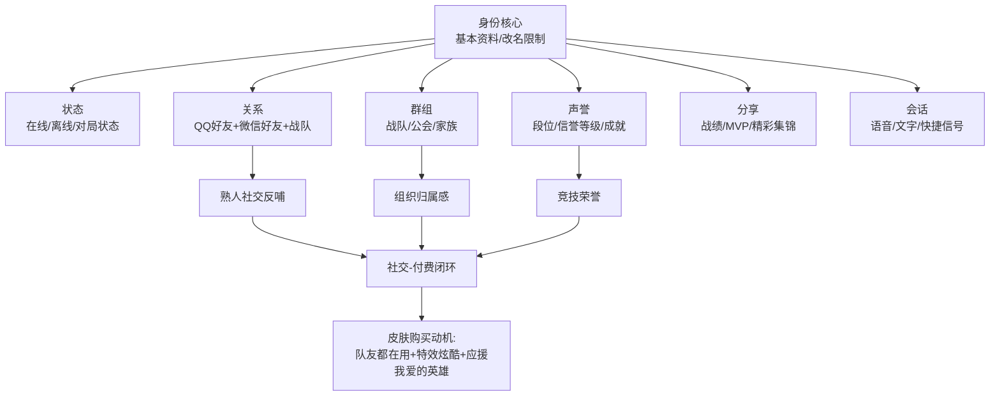

**身份要素的强化设计**——王者荣耀对改名采取限制姿态，仅有一次更改名字的机会、再次更改需要购买改名卡，这一设计的核心目的是"**身份认证**"——在熟人社交和陌生人社交并存的好友体系中，过于频繁地更改名字会让游戏好友不清楚对方的身份，从而不利于陌生人社交的开展[^66]。**关系要素的等级化**——通过游戏互动可以提升关系等级（闺蜜、死党、恋人、师徒等），并在游戏大厅进行展示，这一制度大大激励了想要获得更高好友等级的玩家的游戏热情[^66]。**声誉要素的治理化**——3月违规率≤3%的玩家占比均值在84.5%、信誉等级5级及以上的玩家占比均值在78.2%[^76]，信誉系统通过对恶意挂机、送人头、消极比赛、言语辱骂等违规行为的处罚，构建了游戏内的声誉机制。

这一全方位的社交体系建设，最终形成"**社交-付费闭环**"——身份认证—关系沉淀—声誉积累—群组归属共同强化玩家的社交粘性，进而通过"队友都在用""段位冲刺""战队应援"等场景驱动皮肤、战令、礼包的消费决策。

### 3.4.4 视频直播：电竞营销的核心工具

视频直播作为电竞用户最重要的内容消费场景，已成为电竞营销的核心工具。Niko Partners《2024东亚玩家行为与市场洞察报告》指出，**视频直播成为日韩游戏营销最重要的工具之一——超过31%的日本玩家和40%的韩国玩家均有观看，YouTube是最受欢迎的平台**（基于第2章引用数据）。

直播在电竞产业收入占比达80.81%[^49]，远超赛事收入与俱乐部收入。这一收入结构意味着，**电竞用户的主要消费形态是观看，而观看本身就是电竞商业化的核心载体**——直播平台通过广告、礼物打赏、付费订阅等多元化变现，构建了独立于游戏内付费的电竞经济生态。

对开发者的启示是：**电竞产品的发行策略必须将"观赛体验"作为与"游戏体验"同等重要的设计目标**——包括赛事机位、解说语言适配、直播平台合作、明星主播培育等多维度建设。LOL S13、TI12等顶级赛事的差异化命运（LOL覆盖全球vs DOTA2俄区集中）已经清晰证明，观众基础多元化是电竞产品长期生存的核心壁垒。

## 3.5 竞技对战用户的"巴图杀手+社交"复合心理画像与开发者洞察

在前述子品类拆解基础上，本节进行横向归纳与战略转译，回答"竞技对战类用户的核心心理动机是什么"以及"开发者应如何匹配"两个根本问题。

### 3.5.1 跨子品类的复合心理画像归纳

**基于Bartle四类玩家模型（杀手/成就者/社交者/探险者），竞技对战类用户呈现"杀手型+社交型"双核驱动的复合画像**。

**杀手型驱动**主要在PVP对抗、段位竞争、击杀反馈中获得核心爽点——射击品类的爆头反馈、MOBA品类的击杀连招、团战中的carry时刻，都是杀手型动机的典型场景。该驱动的强度在硬核FPS（CS2、瓦罗兰特）与硬核MOBA（Dota2、LOL）中达到最高，在轻量化产品中相对柔和但仍是核心驱动。

**社交型驱动**则在熟人组队、公会战队、语音协作中沉淀关系链——王者荣耀的微信QQ熟人社交反哺、和平精英的"四排开黑"、电竞用户的战队应援，都是社交型动机的典型表达。该驱动的强度在轻量化MOBA（王者荣耀）与英雄射击（守望先锋、Apex）中达到最高，在硬核竞技产品中相对较弱但仍不可或缺。

叠加Quantic Foundry的12项玩家动机模型，可识别出竞技对战类用户的高权重动机组合是"**竞争（Competition）—毁灭（Destruction）—社群（Community）—策略（Strategy）**"四项。竞争对应排位段位的相对位序追求；毁灭对应击杀爆头的即时反馈快感；社群对应熟人组队与战队归属；策略对应英雄克制、地图理解、经济博弈的深度推演。这四项动机的组合权重在不同子品类中差异显著——硬核FPS偏"竞争+策略+毁灭"，轻量MOBA偏"竞争+社群+毁灭"，英雄射击偏"竞争+社群+策略"。

下表归纳竞技对战类用户在五大维度的核心需求：

| 需求维度 | 核心特征 | 设计要点 |
|---------|---------|---------|
| 战斗节奏 | 短局15—20分钟、快速反馈 | 王者荣耀的15分钟单局、三角洲行动的撤离玩法 |
| 社交依赖 | 熟人优先+弱社交压力 | 微信QQ导入、组队系统、隐身限制 |
| 装备外观 | 皮肤经济+应援式付费 | 高频次低门槛、限定返场、特效强化、英雄通行证 |
| 段位荣誉 | 排位+信誉等级+成就系统 | 巅峰赛、段位冲刺、信誉分、违规治理 |
| 团队协作 | 标记系统+语音+情绪管理 | 标记沟通、AI辅助、情绪冷静机制、举报系统 |

### 3.5.2 对开发者的差异化战略建议

基于前述画像分析，针对竞技对战类游戏开发者输出立项-研发-买量-运营-出海五环节的差异化建议：

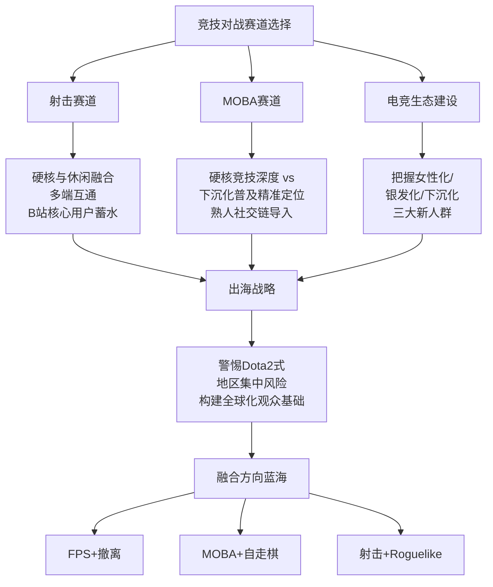

**射击赛道**的核心战略是平衡硬核与休闲张力。三角洲行动DAU从1200万跃升至5000万的标杆案例已经清晰证明，**单一产品同时承接65%硬核派与35%休闲派的"融合定位"是当前射击赛道最高效的破局路径**。具体而言：在玩法层面通过简化生存状态管理、强化道具视觉辨识度等设计降低新手上手门槛，同时保留撤离决策、装备深度等硬核内容；在分发层面采用多端同步上线+账号互通策略，覆盖PC核心用户与移动端大众用户；在发行层面优先在B站等核心硬核用户阵地建立心智，通过制作人深度对话与玩家共创建立金字塔尖用户认同，再向外扩散。

**MOBA赛道**的核心战略是在硬核竞技深度与下沉化普及之间精准定位，并强化熟人社交链导入。新进入MOBA赛道的产品几乎不可能在硬核维度上超越LOL/Dota2、在大众维度上超越王者荣耀，因此**寻找垂直细分定位（如《决战!平安京》的二次元化、《永劫无间》的冷兵器+大逃杀融合）是更现实的路径**。同时，移动MOBA产品必须深度集成微信、QQ等熟人社交工具的导入机制——王者荣耀的成功证明，**社交工具对游戏本身的强大影响力是大众化MOBA的核心壁垒**。在轻量化MOBA的运营层面，应学习王者荣耀的"高频次低门槛+应援式付费"商业化设计，避免米哈游式的"高门槛低频次"在竞技品类中可能产生的留存阻力。

**电竞生态建设**层面，必须把握女性化、下沉化、银发化三大新人群的画像红利：**针对女性用户**强化游戏内文化内涵、社交属性、虚拟偶像与同人创作生态，鼓励女性创作者与女性主播培育；**针对下沉用户**优化轻度电竞类小程序游戏，通过低门槛、强社交、低硬件要求的产品形态触达四线及以下城市；**针对银发用户**推出"适老化"功能（语音控制、操作简化、教程清晰、护眼模式），并通过子女引导、社区活动等场景促进银发用户首次接触。

**出海层面**需警惕Dota2式地区集中风险——在产品立项之初就规划多元化观众基础与跨地区电竞生态，避免单一地区贡献超过50%的电竞观众；本地化设计需充分考虑日韩"角色塑造、情感羁绊"为主的偏好与欧美"玩法创新、个人英雄主义"为主的偏好差异。值得注意的是，《守望先锋》前总监Jeff Kaplan的反思——"**人们玩游戏的方式是'自私'的，应淡化团队因素、把更多焦点放在个人贡献上**"[^57]——对欧美市场的射击产品定位具有重要启示。

**融合方向的蓝海机会**值得开发者高度关注：**"FPS+撤离"**的融合已被三角洲行动验证为可行路径，未来可能有更细分的撤离玩法变体（如开放世界撤离、Roguelike撤离）涌现；**"MOBA+自走棋"**已有金铲铲之战（2024年充值99.6亿，位居充值榜第4）的成功验证[^61]，证明MOBA品类可以衍生出策略向的自走棋分支；**"射击+Roguelike"**则是当前热门的玩法融合方向，《使命召唤:战区》《Apex英雄》等已经在尝试加入Roguelike元素以增加单局变化性。

至此，本章完成了对射击与MOBA等竞技对战类用户画像的系统拆解。**竞技对战类用户的核心心理画像是"杀手型+社交型"双核驱动，叠加竞争-毁灭-社群-策略四项高权重动机**——这一画像与第2章RPG用户的"成就-探险-情感投射"复合画像形成鲜明对比，对应着完全不同的产品设计哲学与商业化路径。同时，竞技对战类用户正经历"女性化、银发化、下沉化、跨端化"四重重塑，开发者必须动态调整画像认知以应对新人群红利。下一章将转向策略与模拟经营类游戏用户画像，继续在"玩法品类为主线"的框架下展开分析。

# 4 策略与模拟经营类游戏用户画像

承接第2章对RPG大品类的内向沉浸式画像、第3章对竞技对战类的外向爆发式画像的系统拆解，本章作为分品类深耕的第三章，将焦点转向另一组在用户结构上呈现戏剧性反差、却共享"系统掌控+长期反馈+决策深度"底层基因的相邻品类——**策略类游戏与模拟经营类游戏**。这两个品类乍看之下分属对立两极：策略类（尤其是移动端战争SLG）以31—40岁男性为主、男性占比可达80%—90%、ARPPU超40美元位居全品类之首[^77];模拟经营类则以女性占比超七成、消费率超90%、题材偏好多样化为典型标签[^78]。但这种表层差异之下，两类用户共享着对"自己掌握节奏、自己规划成长、自己见证系统从无到有"的深层心理诉求——前者通过攻城略地实现，后者通过田园建造实现，本质上都是一种**"在虚拟世界中行使主权"的体验诉求**。

将这两个品类合并为一章的另一个理由是商业实践层面的现实——它们恰好构成中国厂商在全球市场最具差异化优势的两条赛道：SLG以海外46亿美元收入同比增长20%稳居出海细分品类榜首[^79];模拟经营则以《Family Farm Adventure》月活1500万、《Township》全球下载2.48亿、《Kingshot》2025年中国手游海外收入榜第3的成绩单走出全球化新路径[^78]。理解这两个品类的用户画像，对志在出海或深耕国内女性主力市场的开发者具有不可替代的战略价值。

本章将依次展开六节内容：先勾勒大品类基本盘与用户结构反差（4.1）、深耕移动战争SLG的联盟社交-鲸鱼付费闭环（4.2）、拆解4X/RTS/SRPG等其他策略子类型（4.3）、系统呈现模拟经营的女性主导结构与情感体验闭环（4.4）、比较硬核与轻度模拟经营的用户分层（4.5）、横向呈现两大品类的全球出海用户画像差异（4.6），最后归纳复合心理画像并向开发者输出战略洞察（4.7）。

## 4.1 策略与模拟经营大品类的市场基本盘与用户结构反差

理解两个品类的用户差异之前，必须先把握它们各自的整体市场坐标。

**策略品类层面，移动端战争SLG已成为中国厂商全球化竞争中最稳固的护城河之一**。截至2025年，4X策略手游海外收入同比增长20%突破46亿美元，稳居出海细分品类收入榜首[^79];Sensor Tower数据显示SLG已以175亿美元的总收入占据全球手游市场10%的份额，成为收入最高的游戏类型[^80]。从全球市场分布看，美国是SLG游戏下载量最高的市场、年度下载量超过8100万、用户支出预计达28.6亿美元远超日本与韩国;印度、巴西、俄罗斯、印度尼西亚紧随其后，其中印度与俄罗斯分别录得72.2%、106.3%的强劲增长[^81]。**全球Top 20 SLG游戏用户支出占总额的66.5%**，这一头部集中度在日本、韩国市场表现更为明显[^81]——揭示出SLG赛道"少数头部产品瓜分多数支出"的强马太效应。

第1章已揭示的另一关键数据是中国自研出海前100产品中策略类占比41.38%[^82]，结合上述数据可清晰勾勒出**策略品类的产业战略地位——它是中国游戏厂商在全球市场最具核心竞争力的"出海王牌"**。

**模拟经营品类层面，则呈现出与策略品类完全不同的增长曲线与用户基础**。伽马数据《2023中国移动游戏品类发展研究报告》显示，截至2022年年底中国移动游戏市场中模拟经营品类规模已增至66亿元，而在2018年该品类规模仅为18.5亿元，**四年间规模增长超过2.5倍**[^83]。2022年该品类移动端用户超9000万人，**女性用户占比超七成、女性消费率超过90%**[^78]——这是所有移动游戏品类中女性主导特征最为鲜明的赛道。截至2022年年末，已有7款模拟经营类产品登上当年移动游戏流水榜前150名[^83]，相比五年前的边缘地位发生了根本性跃迁。

**两大品类的用户结构反差构成本章最核心的画像观察点**。下表系统呈现这一反差：

| 维度 | 移动战争SLG | 模拟经营 |
|------|-----------|---------|
| 性别结构 | 男性主导（《三国志·战略版》男性近90%）[^84] | 女性主导（女性占比超七成）[^78] |
| 年龄主力 | 31—40岁中青年男性（其次24—30岁）[^82] | 18—35岁女性为主，跨度更广 |
| 消费特征 | 高ARPPU（>40美元）+鲸鱼依赖[^77] | 高消费率（>90%）+广覆盖低客单 |
| 留存周期 | 长（运营3年以上老牌主导66.5%支出）[^81] | 长（剧情驱动+情感锚点） |
| 单局节奏 | 跨时区在线、低DAU高ARPPU | 高频次、中等时长、碎片化 |
| 社交模式 | 联盟深度绑定（生存壁垒） | 独处沉浸+轻社交展示 |
| 题材偏好 | 历史/末日丧尸/多文明/魔幻 | 古风/田园/商道/家园 |
| 心理动机 | 杀手+成就+社交（权力与控制） | 探索+成就+自由精神（创造与陪伴） |

**子类型谱系层面**，策略品类下可再分为RTS（即时战略，《星际争霸》《魔兽争霸》等）、TBS（回合制策略，《文明》系列等4X作品）、4X策略（探索-扩张-开发-征服）、移动战争SLG（率土类/COK类/末日生存类，是出海主力）、SRPG战棋（《火焰纹章》系列等）五大子类[^85][^79];模拟经营品类下则可分为商道经营（《叫我大掌柜》《我是大东家》《这城有良田》）、城市建造（《都市天际线》《Township》）、农场模拟（《Hay Day》《Family Farm Adventure》《星露谷物语》）、生活模拟（《动物森友会》《摩尔庄园》）、女性向养成（《我的花园世界》、花园修复类）、沙盒（《星露谷物语》兼具）六大子类[^86][^78][^87]。

**之所以将这两个看似差异巨大的品类合并为一章，源于三重深层共性**：第一，**底层基因共性**——两者都构建在"资源管理+系统规划+长期反馈"的核心循环之上，玩家从零起步、逐步积累、见证系统从混沌到有序，这是一种本质相同的"造物主体验"[^78][^88];第二，**心流机制共性**——契克森米哈伊提出的心流概念在两个品类中都得到典型实现，《星露谷物语》的"锄头落下、土地变色、种子入土、8天必定收获"与SLG的"建造资源—军队扩张—跨服征伐"，都是"挑战与技能完美平衡的那个点"上的精准设计[^88];第三，**长期陪伴属性共性**——两者都是用户生命周期最长的品类之一，《Township》全球累计下载2.48亿、《梦幻西游》运营20年仍在头部，都印证了这种"长期陪伴"的特殊吸引力。

下文4.2—4.5将分别深耕策略与模拟经营两大品类的内部子类型画像，4.6进行出海视角的横向对比，4.7完成跨品类的心理画像归纳与开发者洞察。

## 4.2 移动端战争SLG用户画像与联盟社交-鲸鱼付费闭环

移动端战争SLG（典型代表如《三国志·战略版》《率土之滨》《万国觉醒》《重返帝国》《无尽冬日》《State of Survival》）是中国厂商最具全球化优势的品类，也是用户画像最为鲜明、商业化机制最为极致的赛道。本节按五维框架系统拆解。

### 4.2.1 人口属性：31—40岁中青年男性主导，鲸鱼用户的四类分层

**移动战争SLG的人口属性画像在中国市场极为清晰且集中**。DataEye研究院基于巨量算数与百度指数的实测数据显示，《重返帝国》（腾讯天美与微软Xbox Game Studios合作产品）的关注用户**主要为31—40岁群体，其次为24—30岁;男性占比超过80%;兴趣爱好集中于运动、汽车、科技、文化、体育、军事、旅行、创意——典型的SLG核心用户群体**[^82]。海外市场的画像高度同构：data.ai数据显示《三国志·战略版》日服用户中**男性占比接近90%，26—45岁用户占比超过50%，但16—24岁年轻玩家也超过25%**[^84]，呈现"中青年男性主导+年轻化潜力"的复合结构。

**鲸鱼用户（大R、超R）的群体画像是SLG赛道最具研究价值的细分**。基于SLG氪金研究的系统归纳，可将SLG鲸鱼用户分为四类：

**第一类：企业主与高管（主力军）**——通常是40岁以上的中年男性，拥有自己的企业或在公司担任高层。他们在现实生活中习惯了发号施令、掌控局势、通过资源投入快速获得优势;**SLG提供的"用金钱换取时间"和"用金钱建立绝对优势"的逻辑，与他们在商业世界中的成功经验高度吻合**;游戏里的联盟盟主、国王角色，是他们现实社会地位的延伸[^89]。

**第二类：富二代与投资新贵**——更年轻、可支配财富与时间都极为充裕，对金钱价值感知模糊，更追求刺激、炫耀和即时满足;他们热衷于在游戏中成为焦点，享受被崇拜与追随的感觉，**花费几十万就像普通人买一件奢侈品，是为了获得身份标签和社交货币**[^89]。

**第三类：高收入专业人士**——金融、IT、法律等行业顶尖从业者，收入高、压力大，游戏是解压与寻求成就感的重要途径;他们理解游戏规则但缺乏长时间"肝"的精力，**因此选择最直接的氪金方式来保持竞争力，享受游戏的顶层战略乐趣**[^89]。

**第四类：少数特殊群体**——某些地区的"包工头"、拆迁户、意外财富获得者，消费行为更情绪化，有时是为了在虚拟世界中找到现实中缺失的尊重和存在感[^89]。

四类鲸鱼的核心共性是：**他们的每一笔大额投入都不是随意花钱，而是为了实现某个明确目标——赢得某场关键的服务器战争、巩固联盟统治地位、或纯粹地碾压某个宿敌**[^89]。这一画像特征对开发者的启示极为重要：**SLG的鲸鱼运营本质上是为这些"目标导向型"的高净值用户提供清晰的、可投入的目标场景**——服务器战争、联盟争霸、跨服跨服攻城等大型对抗事件正是为此设计的"鲸鱼舞台"。

### 4.2.2 行为特征：低DAU高ARPPU、长留存与跨时区在线

**移动战争SLG的行为特征呈现"低DAU、高ARPPU、长留存、跨时区"的鲜明特点**。GameAnalytics报告显示，**策略游戏（SLG）的ARPPU（每付费用户平均收入贡献）超过40美元，是所有手游品类中最高的;ARPDAU方面SLG（0.4美元）与RPG（0.37美元）位居所有品类前列**[^77]。这一极高的付费深度与其用户基础的相对集中形成鲜明对比——4X游戏长期被业界归纳为"高ARPPU、低DAU"的市场特点[^90]。

**长留存特征是SLG用户最显著的行为标签**。App Annie数据显示，2023年全球Top 20 SLG游戏用户支出达到总额的66.5%，**主要用户支出仍然由运营超过3年以上的老牌游戏主导**[^81]。腾讯财报显示《三角洲行动》之外的"老树新花"也印证了这一规律——SLG头部产品一旦形成稳定服务器生态与联盟关系，用户离开成本极高、回归更难，构成了天然的"用户锁定"机制。**这种长留存与第3章MMORPG的"关系链锁定"机制相似，但SLG的锁定来源是更具实质性利益的"资源积累+联盟资产+战力位序"三位一体**。

**跨时区在线**则是SLG用户的另一典型特征。SLG的核心玩法围绕实时建造、行军、战斗展开，玩家"哪怕你离线，主城仍在沙盘上真实存在，随时可能被盟友支援或敌人袭击"[^80]——这一特性使得用户必须以"准异步"方式参与游戏，跨服战中常常需要在凌晨发起突袭。这种行为特征对应到画像层面，意味着**SLG用户的"游戏时间投入"虽然单次可能不长，但全天候在线的总时长极高，对推送通知、即时反馈机制极为敏感**。

### 4.2.3 心理动机：马斯洛需求金字塔与权力-控制-面子三重氪金动因

**移动战争SLG用户的心理动机可以借助马斯洛需求层次理论进行结构化分析**。基于SLG玩家行为研究，可将SLG玩家的需求分为基础层与高阶层：

**基础需求（生存与安全）**——白嫖与月卡党玩家最迫切的需求是"生存"，需要游戏机制的保护（如新手护盾），更需要加入一个强大的联盟寻求庇护，避免辛辛苦苦积累的资源一夜之间被掠夺殆尽;**在这个阶段，谈归属与尊重是奢侈的**[^80]。

**高阶需求（归属、尊重与自我实现）**——中R、大R玩家凭借付费带来的实力，生来便无生存压力，核心需求直接跃升至归属感、尊重，乃至自我实现;**他们渴望在组织中发挥作用，获得成员的肯定，带领联盟走向胜利，实现自己的战略抱负**[^80]。

**关键洞察是：所有这些需求的满足，都高度依赖于"组织社交"——即联盟/公会**[^80]。一个健康的联盟生态是SLG长留与付费的基石;而一个失衡的联盟则会成为玩家流失的元凶——传统联盟的困境在于大R掌握绝对权力和话语权，而中小R玩家常常感觉自己只是"高级炮灰"或"数据工人"，缺乏价值感[^80]。

**叠加SLG氪金研究的"三重氪金动因"分析**，可清晰还原SLG鲸鱼用户的付费心理逻辑：

**第一，追求极致的权力和控制感**——SLG游戏的核心就是"权力斗争"，通过氪金可以迅速建立无与伦比的军事和经济优势，成为服务器中的"帝王";**这种一呼百应、掌控他人"生杀大权"的体验，在现实世界中是极难获得的**[^89]。

**第二，社交地位与虚拟世界的"面子"**——一个高战力账号本身就是一张名片;**为了一场联盟战役的胜利而豪掷千金，不仅仅是为了赢，更是为了维护整个联盟的荣誉和自己作为核心的"面子"**[^89]。

**第三，"花钱买时间"的效率至上主义**——他们的时间成本非常高，与其花费数百小时进行重复性资源采集和等待建筑升级，**宁愿直接支付数千乃至数万元来瞬间完成，这在他们看来是"合理消费"**[^89]。

对应到Bartle模型，**SLG用户呈现"成就者+杀手+社交者"三重驱动的复合画像**——成就者驱动通过战力位序、城市规模、装备等级满足;杀手驱动通过PVP掠夺、跨服攻城、宿敌碾压释放;社交者驱动通过联盟管理、盟主威望、跨联盟外交沉淀。这一三重驱动的强度组合，使SLG成为所有游戏品类中**心理满足维度最为完整的赛道**——既有目标达成感、又有竞争胜利感、还有社交归属感。

### 4.2.4 消费行为：单用户成本4000元的极致商业化

**移动战争SLG的消费行为呈现游戏行业最极致的商业化特征**。从买量成本看，第1章已引用DataEye数据——**2025年SLG头部产品单用户成本最高可达4000元**，这一数字意味着只有那些能够实现单用户LTV远超4000元的产品才能盈亏平衡，进一步反向筛选出该赛道只能服务于高付费深度用户的产品定位。

**SLG的付费结构呈现"金字塔式高度集中"**——少数大R贡献绝大多数流水。Newzoo联合Tebex的报告指出全球20%玩家贡献近一半游戏支出（第2章已引用），而在SLG赛道这一比例更为极端，鲸鱼用户的贡献占比通常超过70%—80%。这种结构与第3章MOBA品类"高频次低门槛广覆盖"的商业化哲学截然不同，是**典型的"鲸鱼经济"**。

**SLG的付费场景也具有强烈的对抗性**——付费节点几乎全部围绕"对抗时刻"设计：跨服开战前的全民囤兵、联盟战前的紧急装备升级、敌方主力来袭时的紧急防御加成。这些场景的共同特征是**"时间敏感+群体性+不可逆"**，触发用户在情绪高峰时做出大额付费决策。这一付费触发机制与模拟经营品类的"长期慢节奏温和付费"形成镜像对比。

### 4.2.5 社交属性：从"重氪数值"到"社交生态模拟器"的范式跃迁

**移动战争SLG的社交属性是其用户粘性最核心的来源**。中金公司研报将国产SLG出海划分为三个阶段[^80]：

**1.0 重氪数值时代**——以早期COK类产品为代表，核心是数值碾压与单纯的战争策略对抗;
**2.0 玩法融合时代**——以《万国觉醒》《文明与征服》《无尽冬日》等为代表，引入即时战斗、无限制行军、副玩法等机制;
**3.0 副玩法融合+题材细分时代**——当前阶段，"SLG+X"成为主流，玩法融合给到玩家与厂商更多叙事空间，轻量化玩法改造吸引泛用户入局[^80]。

**这一演进背后是SLG核心体验的本质跃迁——从单纯的"战争策略对抗"升级为"社交生态模拟器"**[^80]。当前SLG玩家的核心体验中，"实时性"与"社交性"已经超越"4X玩法"成为最关键属性——大多数SLG手游难以完美兼容Explore、Expand、Exploit、Exterminate四大体验，往往简化为玩家间的"扩张+消灭"交互;但**"实时性是SLG游戏赋予的特性，哪怕你离线，主城仍在沙盘上真实存在;没有联盟的庇护和兄弟的配合，再强的战力也难撑过新手期"**[^80]。

**联盟生态的运作逻辑构成SLG最深层的画像维度**——它不仅是一个游戏内系统，更是一个"准社会组织"，包含明确的等级结构（盟主-副盟-精英-成员）、资源分配机制（联盟仓库、互助加速）、决策流程（联盟战投票、外交谈判）、声誉评价（贡献排行、活跃度）。这种"准社会组织"特性使SLG用户的社交体验远超普通游戏的"匹配-语音-散场"三段式，深度接近现实社团运作。

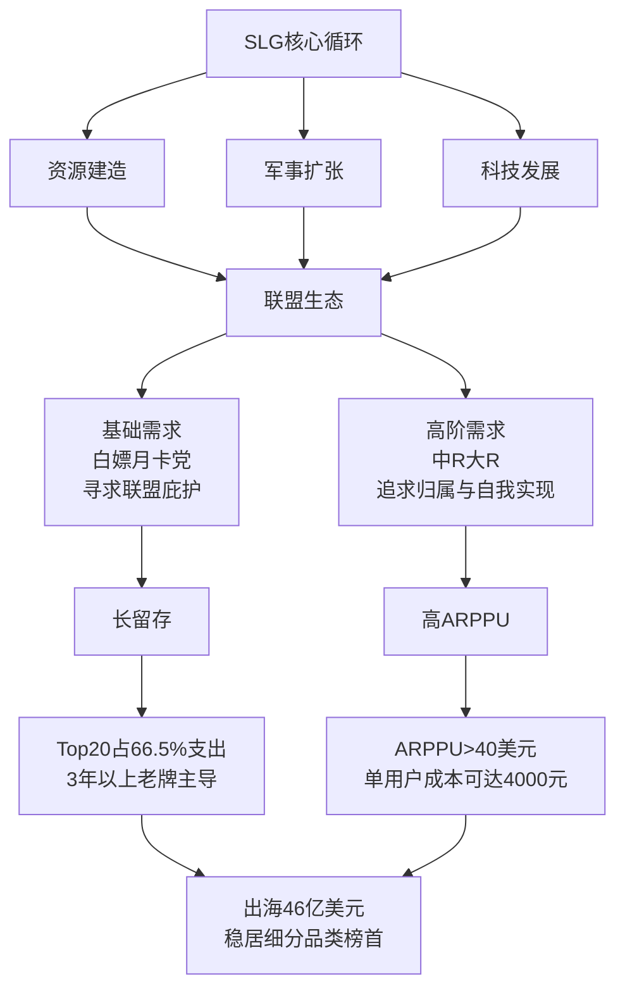

对开发者的关键启示是：**SLG产品立项之初就必须将"联盟生态设计"作为核心而非附属系统**——联盟匹配机制、内部权力分配、跨联盟外交规则、联盟战的频率与节奏，每一项都直接决定用户能否在游戏中找到归属感与价值感。同时，**面对"中小R炮灰化"的传统困境，新一代SLG产品应探索更精细的中小R价值释放机制**——例如3.0时代部分产品引入的"贡献分级展示""非战力维度排行""个性化任务系统"等设计，让免费与中小付费用户也能在联盟中找到不可替代的位置。

## 4.3 4X、RTS与SRPG等其他策略子类型用户画像

除了4.2节聚焦的移动战争SLG之外，策略品类下还存在4X策略、RTS（即时战略）、SRPG（战棋策略）等三类重要子品类，它们在用户画像上与移动战争SLG既有共通性也有显著差异。

### 4.3.1 4X策略用户：深度策略偏好与"快餐化"诉求的矛盾平衡

**4X策略以《文明》系列为定义性作品，移动端则有《重返帝国》《Kingshot》等代表产品**。该品类的核心定义是"探索（eXplore）、扩张（eXpand）、开发（eXploit）、征服（eXterminate）"四步循环，由游戏设计师艾伦·埃姆里奇于1993年首次提出[^79][^90]。

**4X用户的画像底色是"深度策略偏好"**——传统4X游戏通常具有系统复杂、策略深度高的特点，单局游戏时间平均可达4—10小时，部分游戏甚至更长[^79]。这一时间投入门槛意味着4X用户群体天然偏向**愿意投入连续长时间、追求决策深度、享受系统精通感的硬核策略玩家**。但近年来4X品类正在面对"碎片化用户时代"的根本性挑战——为适应玩家碎片化时间，部分新作通过简化系统、压缩单局时长、优化新手引导等方式使节奏更快，例如**《文明7》将流程拆分为三个时代，《罗马陨落》也以快速节奏为特点**[^79]。

**《文明VII》的范式革新值得开发者深度研究**，它清晰回应了"深度策略与快餐化体验"的矛盾平衡[^91]：

**第一，城市/城镇双轨制**——首都作为初始城市，开拓者建立基础功能的城镇，城镇可通过金币投资升级为完全体城市;**城镇专精系统让玩家从9种专精方向中做出时代锁定的选择**（农业、矿业、贸易前哨等），这种类似《十字军之王》封臣管理的机制让每个次级据点都成为帝国机器中不可替代的齿轮[^91]。

**第二，人口驱动建设的取消建造者机制**——地块改良不再依赖工人单位的机械操作，而是与人口增长深度绑定;**当"增长桶"蓄满时，玩家可将新增人口直接转化为地块专家或基建劳工**，三层递进机制（基础层、专家层、战略层）彻底解决了前作"工人海"带来的操作疲劳[^91]。

**第三，跨时代衰退机制**——除了"无时代限制"建筑外，其他建筑与改良设施会随时代更替逐渐失效，仅保留基础产出，**促使玩家推陈出新，使帝国布局与策略契合新时代需求**[^91]。

**第四，区域系统的解构与重生**——区域随建筑放置自动生成，每城市地块设两个建筑槽位，赋予玩家定制区域的自由，避免了《文明6》"选择假象"带来的决策伪复杂性[^91]。

这一系列革新的共同方向是**"保留策略深度的同时降低操作疲劳"**——直接回应了4X用户群体内部"硬核策略玩家"与"快餐化新生代"的张力。对应到画像层面，4X品类已从纯粹的硬核策略玩家市场，扩展为**"硬核成就者+轻量探索者"的双层用户结构**。

**4X手游市场则呈现高ARPPU、低DAU的市场特点**[^90]，2025年海外收入同比增长20%突破46亿美元，主要厂商包括FunPlus、莉莉丝等[^90]。值得注意的是，**4X游戏出现"快餐化"趋势的同时，也呈现与其他类型融合的趋势——例如《Liegecraft》将深度回合制策略与沉浸式角色扮演融合，《帝国的夙愿》是聚焦历史时期的4X游戏并引入了复杂的资源与劳动力管理系统**[^90]。这种融合化趋势对4X用户结构产生进一步重塑——RPG玩家、模拟经营玩家通过融合产品被引流到4X赛道。

### 4.3.2 RTS用户：从黄金时代到"边缘化"的画像逻辑

**RTS（即时战略）曾是PC游戏的门面担当**——红警、帝国、星际、魔兽都曾是定义性作品[^85]。但RTS在过去十年逐渐"边缘化"已是行业共识，其没落背后的画像逻辑值得开发者深度研究。

**Quantic Foundry基于数百万玩家的长期追踪数据揭示了RTS没落的根本原因**——**截至2024年，玩家在"策略思考"动力上的平均得分已从2015年的第50百分位大幅降至第33百分位;换言之，如今有67%的玩家在游戏中不那么热衷烧脑的战略规划，更倾向于短时直接的反馈**[^85]。这一数据是过去十年游戏用户心理动机变迁的最有力证据——**"深度策略思考"作为一种心理诉求，正在游戏用户群体中持续衰退**。

RTS没落的具体画像逻辑包括三层[^85]：

**第一，游戏种类丰富化的"分流效应"**——在RTS辉煌的年代PC上流行的类型相对有限，但2007年前后欧美游戏业迅速崛起，动作冒险、体育竞技、赛车、生存恐怖以及后来爆火的MOBA等各种类型百花齐放，**大量曾经"不得不玩RTS"的用户被其他类型吸引走了**[^85]。

**第二，玩家偏好节奏加快**——许多新一代玩家更青睐"快速、有趣、简单"的游戏，**传统RTS动辄数十分钟一局，前期采集资源、屯兵发育的过程在一些人看来节奏偏慢、门槛偏高**[^85]。

**第三，MOBA与FPS的替代效应**——MOBA保留了RTS的许多优点（战略深度、瞬息万变的战局、激烈的竞技对抗），同时**降低了操作门槛——玩家只需控制单个英雄单位，不用像RTS那样同时管理庞大的基地和军队**;5v5的团队对抗比起RTS常见的1v1决战更具社交和观赏性，**MOBA因此在竞技性和大众化之间取得了绝佳平衡**[^85]。

对应到当前RTS用户画像，可归纳为：**残存的RTS核心用户呈现"中年化、男性化、硬核化、怀旧化"四重叠加**——他们对操作密度有极高耐受度（多线操作、APM追求），对战略深度有深度审美，对MOBA的"简化"持批评态度，认为其牺牲了RTS的"运筹帷幄、决胜千里"浪漫。这一群体规模相对有限，但忠诚度极高，类似于第2章中SRPG/JRPG的"老核心层"。

对开发者的核心启示是：**纯粹的传统RTS赛道已属高风险立项**，但RTS的核心元素（资源管理+多线操作+战略对抗）仍可融入其他品类形成新的产品形态——例如《重返帝国》将RTS战斗融入SLG框架、部分塔防与生存建造游戏借鉴RTS的资源链设计。

### 4.3.3 SRPG战棋用户：硬核策略+恋爱养成的融合化扩张

**SRPG（策略角色扮演）以《火焰纹章》系列、《幽浮2》《神界:原罪2》等为代表**，这一品类与第2章中的传统回合制RPG有所重叠（已在2.2节合并讨论了SRPG用户画像底色——年龄偏大、IP情怀深厚、策略思维突出）。本节聚焦其作为"策略品类一员"的独特画像。

**SRPG用户的核心画像底色是30—45岁硬核策略玩家**——他们对战棋机制、阵型搭配、地形利用有专业级的鉴赏力，对单位平衡、技能体系、推演深度有最高诉求。这一画像与第3章硬核MOBA的"中年精英Dota2玩家"群体存在一定重叠——都是对策略深度有审美追求的中年男性核心向用户。

**值得关注的是SRPG的"融合化扩张"趋势**。《火焰纹章:风花雪月》作为该系列登陆Switch平台的首部作品，2019年发售首发3天横扫全球销量榜单，IGN给出9.5分、Fami通37分白金殿堂评价[^92]。其成功的关键正是**对传统SRPG画像的扩张性突破**——**新加入的学院养成系统类似《女神异闻录P5》玩法，需要计划每天要进行的内容**;光荣特库摩的加入让本作"改变为三国争霸大混战的设定"，"庞大的世界观与丰富的人物设计，更是让本作成为了全系列有史以来剧情最优秀的一部作品"[^92]。

这种"战棋+恋爱+养成+剧情"的复合化设计，正是有评论将其描述为"你以为这是SRPG?其实是恋爱游戏"的原因[^92]——**SRPG传统的"硬核策略玩家"用户结构通过融合机制扩展到了二次元、恋爱养成、剧情党等新的画像群体**。这种扩张路径对SRPG赛道的核心启示是：**纯粹硬核SRPG的用户基础有限，但通过与RPG、二次元、恋爱养成的融合，可以显著扩大用户覆盖面，触达原本不会接触SRPG的女性玩家与剧情党**。

### 4.3.4 三类策略子品类与移动战争SLG的差异化定位

将4.3节三类子品类与4.2节移动战争SLG进行横向比较，可清晰呈现其差异化定位：

| 维度 | 移动战争SLG | 4X策略 | RTS | SRPG战棋 |
|------|-----------|--------|-----|---------|
| 主流平台 | 移动 | PC+移动 | PC | 主机+PC |
| 用户主力 | 31—40岁男性 | 30—45岁男性 | 中年男性硬核 | 30—45岁硬核+融合化女性 |
| 单局时长 | 跨时区准异步 | 4—10小时（PC）/碎片化（移动） | 30—60分钟 | 30分钟—数小时 |
| 核心驱动 | 杀手+成就+社交 | 探索+成就 | 成就+杀手 | 成就+探险者 |
| 商业化 | 高ARPPU+鲸鱼+联盟 | 买断+DLC（PC）/F2P（移动） | 买断 | 买断+DLC |
| 社交属性 | 联盟深度绑定 | 单机/有限多人 | 1v1/多人对抗 | 单机为主 |
| 出海地位 | 出海王牌（46亿美元） | 中等（融合机会） | 衰退 | 长尾稳态 |

对开发者的核心战略判断是：**移动战争SLG是"高ROI、长周期、强护城河"的成熟赛道，但门槛极高;4X策略是融合化创新的蓝海机会;RTS已属高风险赛道，但其元素可融入其他品类;SRPG则适合通过"战棋+恋爱+剧情"融合化路径触达新人群**。

## 4.4 模拟经营品类的女性主导用户结构与情感体验闭环

模拟经营品类是2025年中国游戏市场最具特色的赛道之一——它构成"女性玩家最大基本盘之一"，与策略品类形成强烈的画像反差。本节按五维框架系统拆解。

### 4.4.1 人口属性：女性占比超七成的"反传统"画像底色

**模拟经营品类的人口属性画像极为鲜明**。伽马数据明确指出：**2022年中国移动游戏市场模拟经营品类用户超过9000万人，女性用户占比超过七成，且女性消费率超过90%**[^78]。这一数据是中国游戏行业所有大品类中**女性主导特征最为突出的画像**——其女性占比甚至超过传统女性向赛道的部分细分领域。

进一步聚焦女性向养成手游（与女性向模拟经营高度交叉），艾瑞咨询《2023年中国女性向游戏用户行为报告》显示：**该群体中76.4%日均游戏时长超45分钟，且63.2%将"角色情感联结"列为持续付费首要动因**[^93]。**核心用户以18—35岁女性为主**[^93]——这一年龄结构与第2章中ARPG的"20—29岁占六成"存在交集，但模拟经营的女性主力年龄跨度更广（18—40岁），覆盖学生、职场女性、年轻已婚女性等多元身份。

值得关注的是模拟经营内部的细分画像差异。基于《星露谷物语》大学生玩家的调研问卷设计可见，该产品在中国大学生群体中存在显著的女性玩家集中现象——问卷设置了大一至研究生及以上的年级选项、文史哲/理工科/经管法/艺体/农医等专业类别、城镇/农村成长背景等细分维度[^94]，反映出该产品已经成为高校女性用户群体重要的游戏选择。这一画像底色对应到产品设计层面，意味着**模拟经营赛道的开发者必须以"理解年轻女性用户的情感需求与审美偏好"为核心能力**——这与移动战争SLG"理解中青年男性鲸鱼的权力诉求"的核心能力构成根本性差异。

### 4.4.2 行为特征：碎片化与深度沉浸并存的双重模式

**模拟经营用户呈现"高频次中等时长+长留存"的典型特征，且在碎片化与深度沉浸之间呈现独特的双重模式**。

一方面，移动端模拟经营产品已经深度适配碎片化时间。2026年模拟经营手游评测明确指出，**优秀产品"不要求玩家长时间连续在线，而是能在碎片时间里完成一段清晰进度，同时给愿意深玩的人留下更多探索空间"**;**清晰的"下一步要做什么"目标设计、合理的资源曲线、不强制的轻社交内容**，构成了长期体验的关键基础[^87]。这种设计哲学完美适配现代女性用户在工作、学习、家庭之间的碎片化时间分配。

另一方面，**深度沉浸的"心流体验"是模拟经营用户的另一典型行为**。《星露谷物语》全球销量突破3000万份、平均游戏时长超过80小时;《动物森友会》2020年疫情期间累计卖了4000万份[^88]。心理学家契克森米哈伊提出的"心流"概念在该品类得到典型实现——**"心流发生在挑战和技能完美平衡的那个点上";《星露谷物语》的设计师Eric Barone把这个点拿捏得极准——锄头落下去，土地变色，种子入土，8天后必定收获，没有'再看看''再改改'**[^88]。

**这种"安全的失控"机制是模拟经营用户行为的核心特征**——足够复杂能维持注意力，足够简单不会引发焦虑;**作物枯萎了可以读档重来，搞砸一个项目可能面临裁员，但搞砸一季草莓只需要重新播种**[^88]。这种行为特征解释了为什么模拟经营用户能够在数百小时游戏时长中保持持续动力——其留存机制不是依赖竞争压力（如SLG），而是依赖**"可控的成长曲线+确定性的反馈预期"**。

**高频反馈循环是模拟经营行为模式的另一关键**——现实世界的成就感是严重延迟的（减肥10斤要3个月、升职加薪要两年），**模拟游戏把反馈周期压缩到了分钟级别——浇水第二天作物长高、第8天收获、卖钱、立刻买种子扩建**[^88]。东卡罗莱纳大学研究显示，**玩休闲类游戏20分钟就能降低左前额α脑波、显著提升心情，效果甚至优于单纯上网**[^88]——从神经科学层面验证了模拟经营品类的"治愈"功能。

### 4.4.3 心理动机：心流体验、安全失控与"心理睡眠"

**模拟经营用户的心理动机可以借助三大解释框架进行结构化分析**：

**第一，心流理论（契克森米哈伊）**——挑战与技能完美平衡的那个点，是模拟经营品类心流体验的核心来源。模拟经营产品通过"清晰目标+即时反馈+可控难度"三要素，构建出比RPG/SLG更纯粹的心流环境[^88]。

**第二，"安全的失控"机制**——足够复杂能维持注意力，足够简单不会引发焦虑;这种机制让用户在数百小时游戏中获得稳定的心理回报，对应Bartle模型中的"探险者"驱动（通过未知的探索获得乐趣）[^88]。

**第三，"认知逃避作为心理睡眠"**——伦敦帝国理工学院和格拉茨大学的联合研究提出**"认知逃避不是软弱的退缩，是心理恢复的必要空间;就像睡眠不是浪费时间而是身体修复的必要过程，模拟游戏提供的是一种'心理睡眠'——在虚拟的安全环境里重建被现实消耗掉的心理能量"**[^88]。这一框架对理解模拟经营用户的核心心理诉求具有决定性意义——**该品类用户玩游戏的根本动机不是"娱乐"或"成就"，而是"心理修复"**。

**对应到Bartle与Hexad模型，模拟经营用户的复合心理画像呈现"探索者+成就者"的Bartle主导，叠加"自由精神者+慈善家"的Hexad扩展**——

- **探索者驱动**：通过题材发现（古风/田园/海岛/星际）、剧情解谜、隐藏内容收集获得探索乐趣;
- **成就者驱动**：通过系统精通、收集完成、关卡推进获得目标达成感;
- **自由精神者**（Hexad框架）：对应模拟经营的开放式自定义、家园装饰、玩家创造空间;
- **慈善家型**（Hexad框架）：对应模拟经营中NPC关怀、动物饲养、邻里互助的利他动机。

这一复合驱动结构与4.2节SLG用户的"杀手+成就+社交"形成镜像差异——**SLG用户从竞争与征服中获得满足，模拟经营用户从创造与陪伴中获得满足**。

**值得特别关注的是女性向养成手游所代表的"情感价值需求"**——艾瑞咨询数据明确指出，**63.2%的女性向用户将"角色情感联结"列为持续付费首要动因;用户并非单纯追求数值成长，而是期待在虚拟关系中获得被理解、被珍视、被回应的沉浸式情绪价值**[^93]。这种"情感价值需求"是模拟经营尤其是女性向养成手游的最深层心理动机，将在4.4.4节的消费行为分析中进一步展开。

### 4.4.4 消费行为：非对称反馈、情感锚点与陪伴型服务

**模拟经营尤其是女性向养成手游的消费行为，呈现完全不同于SLG"权力-控制-面子"的付费触发机制**。

**第一，非对称反馈机制**——以《恋与制作人》的"羁绊系统"为例，玩家通过赠送契合角色偏好的礼物、完成专属事件、参与限时互动小游戏积累"心动值"，**该数值直接影响角色后续剧情分支与语音解锁内容**;关键在于设计**"非对称反馈"——同一行为在不同角色身上触发差异化反应**：送咖啡给冷静系角色可能获得一句简短致谢，而送给活泼系角色则触发即兴舞蹈彩蛋[^93]。这种不确定性强化探索欲，**使用户留存率提升至行业平均值的1.7倍**（Sensor Tower 2023年Q2数据）[^93]。

**第二，时间沉淀感设计**——重要剧情节点需累计7日登录或完成3次深度互动才可开启，**避免信息过载，让情感积累具备可感知的仪式重量**[^93]。这种设计构建了与SLG"即时付费即时变强"完全相反的"延迟满足"商业化逻辑。

**第三，抽卡机制与角色塑造的强绑定**——DataEye《2024女性向游戏变现白皮书》数据显示，**当限定卡池角色拥有完整前史、独立配音及专属Live2D演出时，单次抽取ARPU值提升52%**[^93];拒绝通用皮肤泛滥，所有外观变更需配套新增语音、动作及剧情片段——**《时空中的绘旅人》叶塞大陆限定礼服同步追加12段环境互动语音与雨天共撑伞动画，使付费行为成为情感深化的自然延伸**[^93]。

**第四，陪伴型服务的高付费用户偏好**——值得开发者高度警觉的反传统画像数据是：**高付费用户中68%更倾向购买"陪伴型服务"（如定制生日提醒、节日专属剧情），而非单纯外观道具**——印证情感附加值才是长效付费的核心驱动力[^93]。这一数据彻底颠覆了传统游戏商业化"鲸鱼用户为外观炫耀付费"的认知，表明**女性向模拟经营的高付费用户是为"被陪伴的体验"付费，而非为"被看见的炫耀"付费**。

**第五，月卡设计的情感锚点功能**——月卡需超越资源供给：**《浮生为卿歌》"卿心月卡"每月附赠1封手写体角色信笺与1段专属晨间问候语音，将周期性消费转化为稳定的情感锚点**[^93]。

下表对照SLG与女性向模拟经营的商业化范式差异：

| 维度 | SLG商业化 | 女性向模拟经营商业化 |
|------|---------|------------------|
| 付费触发 | 对抗时刻、危机感 | 情感共鸣、陪伴时刻 |
| 反馈机制 | 即时变强 | 延迟满足+非对称反馈 |
| 商品设计 | 资源加速、战力提升 | 角色专属内容、陪伴型服务 |
| 鲸鱼动机 | 权力控制、面子炫耀 | 情感投射、被陪伴的体验 |
| 月卡定位 | 资源供给 | 情感锚点+周期问候 |
| 留存逻辑 | 联盟绑定+战力沉没成本 | 情感积累+仪式感 |

### 4.4.5 社交属性：独处沉浸+轻社交展示的双重场景

**模拟经营的社交属性呈现"独处沉浸+轻社交展示"的双重结构**，与SLG"联盟深度绑定"形成鲜明对比。

游戏内体验偏单机沉浸——种植、装饰、剧情推进多为玩家独处完成;但游戏外的轻社交展示极为活跃——好友访问、空间装饰展示、公会互助、社区分享构成轻量化社交生态。**优秀产品的社交设计原则是"不制造强制压力"**——好友访问、公会互助、空间展示等轻社交内容，可以让模拟经营从个人养成扩展到玩家之间的互动，**但这类系统最好不制造强制压力**[^87]。这一原则与SLG"联盟成员必须全天候参战"的强压力社交形成根本差异。

**乙女类手游用户的社交特征提供了进一步的画像佐证**——日本Visual Works调查显示，**56%的用户表示"会和身边的朋友谈及自己玩乙女类手游的事情";57%的用户玩过1—5款乙女类手游，30%的用户玩过10款以上**[^95]。这一画像表明，**情感导向的模拟经营/女性向用户具有强口碑分享倾向，但其分享是"主动表达情感共鸣"而非"被动接受联盟召唤"**——社交动力来自情感分享而非义务履行。

**对开发者的启示**：模拟经营产品的社交设计应聚焦"展示我的成果""分享我的情感""轻松互助"三大场景，而非SLG式的"组织化战争协作"。具体而言，家园拍照分享、装饰评分系统、好友互访点赞、公会送礼等机制能够有效满足模拟经营用户的轻社交诉求。

## 4.5 硬核与轻度模拟经营的用户分层比较

在4.4节整体画像基础上，本节进一步细化模拟经营品类内部"硬核与轻度"两层用户的差异化画像。这一分层对开发者的产品定位选择具有直接指导价值。

### 4.5.1 硬核方向：飞行/工业/城市建造/沙盒类的男性化偏移

**硬核模拟经营方向以飞行模拟、工业模拟、城市建造（《都市天际线》系列）、沙盒（《星露谷物语》兼具）等PC/主机为主的产品为代表**。这一方向的用户画像与4.4节整体画像存在显著偏移——**用户偏男性化、年龄跨度更广（25—45岁居多）、追求高拟真度与系统深度、单次游戏时长可达数小时**。

**这一画像偏移的根本原因是"系统深度+拟真度"的核心诉求**——百度百科对模拟经营游戏的归纳明确指出，**高拟真度模拟游戏注重真实职业或生活场景还原**[^78];硬核方向的代表产品如《都市天际线》要求玩家深度理解城市规划、交通流量、税收平衡等专业系统，这种深度系统的核心吸引力对应的是男性玩家中较高比例存在的"系统精通+拟真还原"诉求。这一画像与4.3节SRPG的"30—45岁硬核策略玩家"群体存在显著重叠，构成模拟经营品类与策略品类在硬核用户层面的画像交集。

**沙盒类（《星露谷物语》《我的世界》）的画像呈现独特的双重性**——一方面其系统深度与硬核模拟经营接近（采矿、战斗、社区中心修复、姜岛开发等长线目标），另一方面其温馨田园画风与丰富剧情又吸引大量女性用户。《星露谷物语》大学生玩家调研问卷的设计反映出该产品玩家行为的多元性——可选的"主要游玩目标"包括完成全成就/全收集、经营农场达到完美状态、与NPC建立高好感度/结婚、社区中心修复/姜岛开发、放松心情、治愈自我、赚够多少钱（如千万资产）、参与模组制作/修改游戏等[^94]，呈现出**从硬核成就追求到治愈自我的完整光谱**。

### 4.5.2 轻度方向：女性主力+碎片化+情感陪伴+装饰美学

**轻度模拟经营方向以《Hay Day》《梦幻花园》《摩尔庄园》《我的花园世界》《叫我大掌柜》《餐厅养成记》等移动端商道经营、农场休闲、家园装饰为代表**。这一方向是4.4节整体画像的典型代表——**用户女性占比极高、单次时长压缩至碎片化、注重情感陪伴与装饰美学**。

2026年模拟经营手游观察榜单清晰呈现了这一方向的代表性产品[^87]：

- **《餐厅养成记》**——"以模拟经营、合成消除和剧情解谜为核心，将花田餐厅修复、订单合成、悬疑主线、角色羁绊、服饰图鉴、家具收集和公会社交融合在一起;适合希望在轻量节奏中获得长期成长目标的玩家";
- **《Hay Day》**——"以经典农场经营为主要体验，玩家通过种植、养殖、加工、订单和农场扩建逐渐建立属于自己的田园生产体系";
- **《摩尔庄园》**——"依托高认知IP与生活化社区氛围，提供家园建设、社交互动、角色装扮和休闲活动等内容;适合看重情怀、身份表达和朋友互动的玩家";
- **《梦幻花园》**——"以花园修复和关卡推进为核心，玩家通过完成关卡获取资源，再逐步改造庭院空间";
- **《江南百景图》**——"围绕国风城建、人物派遣、资源调配和文化氛围展开，玩家可以在古风场景中规划城市空间，感受传统建筑与市井生活交织的经营体验"。

### 4.5.3 商道经营：中年男性在模拟经营品类中的稀有画像锚点

**商道经营是轻度模拟经营方向中一个独特的细分**——它构成"中年男性在模拟经营品类中的稀有画像锚点"。伽马数据指出，**近年来模拟经营品类增量中有超过20%来自商道经营，2021年商道经营增量占比更是超过30%**[^83]。

**商道经营的核心吸引力在于"切实贴合期望财务自由的大众心理"**——相比于一般的模拟经营模式，商道经营品类**为用户设立了更为直观且跨度更大的成长路径**[^83]。代表产品如《金币大富翁》《商道高手》《我是大东家》《这城有良田》《叫我大掌柜》等，益世界等厂商围绕商道经营品类进行了横向拓展——**一方面基于现代商道类产品的经验结合古代商贸文化推出古风商道产品《我是大东家》;另一方面对更多基于中国文化的细分品类进行探索，推出古风模拟经营产品《这城有良田》**[^83]。

**商道经营用户的画像与典型轻度模拟经营存在显著差异**——年龄偏向30—45岁、男性占比较高（与SLG用户存在交集）、对"财富积累+资源管理"主题敏感、付费习惯介于SLG与女性向模拟经营之间。这一画像群体很可能是从SLG/MMORPG赛道分流而来的"减负化"用户——他们仍保留对系统化决策与积累成就的诉求，但厌倦了SLG的对抗压力与重氪节奏，转向更平和的"经营致富"叙事。

### 4.5.4 融合化方向：模拟经营+三消/RPG/剧情解谜的画像扩张

**模拟经营品类的融合化方向是当前最具创新空间的子类**。三种主流融合路径对用户画像产生显著的扩张效应：

**第一，模拟经营+三消**——以世纪华通旗下点点互动《Family Farm Adventure》（《菲菲大冒险》）为代表。这款脱胎于点点互动成名IP Family Farm的模拟经营游戏曾创造过月活过1500万的成绩;**和初代产品Family Farm较为单纯的模拟经营玩法相比，《菲菲大冒险》在海岛农场经营的基础之上还融入了RPG冒险与三消玩法，体验上更为丰富**[^83]。三消玩法的加入大幅降低了上手门槛，将模拟经营的女性主力进一步扩展到"消除游戏老用户"的更大画像盘。

**第二，模拟经营+RPG**——三七互娱旗下《叫我大掌柜》在最近的更新中推出了《叫我大掌柜》南海丝路版本，**通过故事线的方式让玩家可以重走海上丝绸之路，甚至包含文物修复、触发修复动画，展现"清洗、拼接、补配、打磨、上色、做旧"等专业的文物修复过程**[^83]。这种"模拟经营+RPG剧情线"的融合不仅丰富了游戏内容，更将历史文化爱好者、剧情党等新用户群体引入模拟经营赛道。

**第三，模拟经营+剧情解谜**——《餐厅养成记》代表的"模拟经营+合成消除+悬疑剧情"复合化产品，进一步将悬疑剧情爱好者引入模拟经营赛道[^87]。点点互动CEO陈琦明确指出，**"剧情一定是要精心去做的，《菲菲大冒险》这类产品对剧情的要求非常高，因为所有地图都是跟着剧情展开，我们要让玩家有更多时间和机会去看剧情"**[^83]——清晰说明融合化产品中剧情已成为核心驱动力。

**融合化对用户画像的核心启示**：纯粹的"种田卖菜"已经难以持续吸引新用户，**模拟经营产品要在保留女性主力的同时显著提升男性用户占比与跨年龄段渗透，必须通过融合机制突破单一品类的画像边界**。下表归纳硬核、轻度、融合化三条路径的画像差异：

| 子方向 | 代表产品 | 用户主力 | 性别结构 | 核心驱动 | 单次时长 |
|--------|---------|---------|---------|---------|---------|
| 硬核模拟经营 | 都市天际线、工业模拟器 | 25—45岁中重度玩家 | 男性偏多 | 系统精通+拟真 | 1—4小时 |
| 沙盒类 | 星露谷物语、动物森友会 | 18—35岁 | 性别均衡 | 探险+治愈 | 弹性 |
| 农场休闲 | Hay Day、梦幻花园 | 18—40岁女性 | 女性主导 | 治愈+装饰 | 15—30分钟 |
| 家园装饰 | 摩尔庄园、闪耀暖暖 | 18—30岁女性 | 女性主导 | 自由精神+社交 | 15—30分钟 |
| 商道经营 | 叫我大掌柜、这城有良田 | 30—45岁男性 | 男性偏多 | 成就+财富叙事 | 15—30分钟 |
| 模拟经营+三消 | Family Farm Adventure | 25—40岁女性为主 | 女性主导 | 探索+治愈 | 15—30分钟 |
| 模拟经营+剧情 | 餐厅养成记、菲菲大冒险 | 18—35岁 | 女性偏多+男性扩展 | 探险+成就+情感 | 30—60分钟 |

## 4.6 SLG出海与模拟经营出海的全球用户画像差异

策略与模拟经营两大品类都是中国厂商出海的核心赛道，但它们在不同区域市场的用户画像与本地化路径存在显著差异。本节横向呈现这一全球差异。

### 4.6.1 SLG出海的四大典型市场画像

基于App Annie《2023年SLG游戏市场洞察报告》数据[^81]，可勾勒SLG出海的四大典型市场画像：

**美国市场**——年下载量预计超过8100万为全球第一，用户支出预计28.6亿美元一马当先;**SLG头部集中度在美国市场表现明显——Top 20游戏用户支出达到总额的66.5%，这一现象在日本、韩国市场表现更加明显**[^81]。美国SLG用户偏好末日丧尸、多文明、魔幻题材，对国产SLG的接受度较高（《Last Shelter: Survival》《State of Survival》《无尽冬日》等都在美国市场取得显著成功）。

**日本市场**——是SLG出海最具战略价值的市场之一。《2021中国移动游戏出海年度报告》显示，**日本Google Play Store Top 500产品中，国产游戏在策略类型中占比最高，约70%左右**[^84]。日本SLG市场呈现"题材竞争更多元、买量成本持续上涨、投放内卷没'到头'"的极致竞争状态——**2021年4月至2022年1月日本地区SLG品类投放成本持续上涨，最高接近22美元**[^84]。日本SLG用户的画像特征是男性近90%、26—45岁占比超过50%、16—24岁年轻玩家超过25%，对历史题材尤其是三国与战国（信长之野望系列）有特殊偏好[^84]。

**韩国市场**——在2023年全球用户支出回落的背景下，韩国逆势增长17.4%[^81]。这一逆势增长的背后是韩国SLG用户的高消费能力与强IP情感连接。Niko Partners数据（第2章已引用）显示韩国玩家具有跨平台游戏特征——58%韩国玩家至少在两个平台上玩游戏，90%PC端游戏玩家有过跨平台体验，这意味着SLG产品的多端布局在韩国市场尤为重要。

**印度与俄罗斯市场**——下载量增速分别高达72.2%与106.3%，是新兴增长市场[^81];但ARPPU水平相对较低，**新兴市场（印度、阿联酋、印度尼西亚）发行时长不到1年的手游下载量份额高于全球平均，是值得发行商尝试破冰的不错选择**[^81]。

**题材偏好图谱方面**，SLG出海日本市场可分为四大题材阵营[^84]——历史题材主流（《三国志·战略版》《新信长之野望》）、多文明题材、末日丧尸题材（更注重买量投入）、魔幻题材;**整体来看历史题材为日本SLG主流题材**，与第1章提到的"现代题材市场份额由6.4%增长至17.6%"的国内增长趋势形成跨市场对比。

### 4.6.2 SLG出海买量素材的本地化逻辑

DataEye研究院对SLG出海买量素材的拆解揭示了用户画像与素材策略的强耦合[^84]：

**历史题材素材**——《三国志·战略版》侧重对"经典战役"的展示，以耳熟能详的经典战役贴近对三国历史感兴趣的用户兴趣，不仅展现产品宏大的世界观也暗示优质的画面;**两款历史题材游戏的创意素材会优先突出游戏IP内容，包括游戏角色的人物原画**[^84]——精准对应日本市场16—24岁年轻玩家与26—45岁中年男性玩家对历史IP的双重情感诉求。

**末日丧尸题材素材**——更注重买量市场投入，强调"绝境求生+联盟救援"的情感钩子，对应美国市场用户对末日叙事的偏好。

**多文明题材素材**——以"史诗感+多文明对抗"为核心，匹配欧美用户对宏大叙事与文化多元性的偏好;《重返帝国》虽然在国内市场取得不俗成绩，但据DataEye分析其总体投放量较少（与《文明》《三国志·战略版》等"买量大户"相比仅"洒洒水"），TapTap评分一度从内测8分降至公测5.7分，呈现"高开低走"之势[^82]——这一案例提醒开发者，即使是大厂背景的SLG新品，缺乏精准的画像匹配与持续的买量投入，仍可能在激烈竞争中失利。

### 4.6.3 模拟经营出海的"女性化+剧情化+融合化"三大趋势

**模拟经营出海的代表性成功案例呈现出"女性化+剧情化+融合化"的三大趋势**：

**点点互动《Family Farm Adventure》月活1500万**——脱胎于Family Farm IP，融入RPG冒险与三消玩法，是典型的"模拟经营+三消+剧情"融合化产品[^83]。

**Playrix《Township》全球下载量超2.48亿**——经典"城市建造+农场经营"双线模式，是模拟经营出海最具规模的成功案例之一[^78]。

**世纪华通旗下Century Games《Kingshot》**——2025年2月推出的4X策略手游，结合中世纪背景与塔防玩法，**位居中国手游海外收入榜第3**（第1章已引用）。

这些案例的共同特征是：**通过玩法融合突破单一品类的画像边界，同时坚持女性友好的美术风格与剧情叙事**——这一组合精准回应了海外女性用户对治愈系内容的需求。

### 4.6.4 东西方手游用户的根本差异

Mistplay《东西方手游市场对比报告》提供了东西方手游用户行为的系统对比，对策略与模拟经营出海具有直接指导价值[^96]：

**第一，深度绑定vs广度尝试的根本差异**——**日本有49%的玩家每月仅关注2—3款核心游戏，韩国这一比例更是达到了58%;美国有36%的玩家、英国有40%的玩家每周会玩4款以上游戏**[^96]。这一差异意味着，**SLG/模拟经营产品在日韩市场的竞争策略应聚焦"深度绑定"——打造能让用户长期沉浸的核心体验;在美英市场则应聚焦"广度触达"——通过多元素材与高频曝光争夺用户的有限注意力**。

**第二，动机偏好差异**——"放松"是全球市场玩家的共通点，但**美英玩家对"竞技"的偏好达到了14%—16%，而日韩玩家则倾向于"探索""满足幻想"，呈现"西方玩家将现实投射到游戏中，东方玩家在游戏中尝试另一种生活"的对比**[^96]。这一差异对策略与模拟经营出海的题材选择极为关键——**SLG产品在美英市场可强化竞技对抗维度，在日韩市场则应强化历史/奇幻探索叙事;模拟经营产品在日韩市场的"治愈+探索"叙事天然契合，但在美英市场可能需要叠加"经营成就+竞争排行"机制**。

**第三，广告投放渠道差异**——**东方市场的玩家更重视应用商店探索，日本有53%、韩国有46%的玩家会选择在应用商店中寻找想要的游戏;西方市场玩家更倾向推荐机制**;高效触达依赖本地化平台——**东方是LINE（70%）、KakaoTalk（43%）和Naver（39%）的天下;西方则由Facebook和Instagram主导;X（Twitter）在日本市场有独特的影响力**[^96]。

**第四，AI广告接受度差异**——西方市场有52%的玩家对AI生成的广告格外不满，**东方市场玩家则对AI更为宽容，尤其是日本玩家有43%的人会更关注广告中的角色设计和美术风格**[^96]。这一差异对当前AI生成素材的应用边界具有直接指导意义。

**第五，日本玩家的"决策严谨度"特别值得关注**——**日本玩家在决定加入游戏之前会通过查阅评论（65%）、浏览商店页面信息（52%）和网络搜索（25%）去全方位深入了解游戏，主要是因为日本市场盛行RPG等长线重度类型游戏以及扭蛋机制等等，让玩家们更加"厌"被欺骗**[^96]。这意味着SLG/模拟经营产品在日本市场的口碑建设极为关键——**虚假广告导致的口碑反噬在日本市场代价远超其他地区**。

下表系统归纳东西方差异对策略与模拟经营出海的本地化启示：

| 维度 | 美英市场 | 日韩市场 |
|------|---------|---------|
| 用户行为 | 广度尝试（每周4款以上） | 深度绑定（每月2—3款） |
| 动机偏好 | 竞技+现实投射 | 探索+满足幻想 |
| SLG策略 | 强化对抗+多元素材广撒网 | 历史IP深耕+长期沉浸 |
| 模拟经营策略 | 经营成就+竞争排行 | 治愈+探索+情感叙事 |
| 推广渠道 | Facebook/Instagram | LINE/KakaoTalk/Naver、日本X |
| AI素材接受度 | 52%反感 | 较宽容、日本43%关注角色与美术 |
| 口碑风险 | 中等 | 极高（日本市场尤甚） |

## 4.7 策略与模拟经营用户的复合心理画像与开发者洞察

在前述子品类拆解基础上，本节进行横向归纳与战略转译。

### 4.7.1 心理画像归纳：探索+成就+自由精神+慈善家的复合驱动

**横跨策略与模拟经营两大品类，可识别出该大类用户共有的"探索型+成就型+自由精神者+慈善家型"复合心理画像**。但需要强调的是，**这一复合画像在两个品类中的权重组合存在根本差异**：

- **策略品类（尤其是SLG）**：杀手+成就+社交主导，探索为辅;
- **模拟经营品类**：探索+成就+自由精神+慈善家主导，杀手维度极弱。

下表系统对比两大品类的Bartle模型与Hexad模型主导驱动：

| 心理类型 | 移动战争SLG | 4X策略 | 硬核模拟经营 | 轻度模拟经营 | 女性向养成 |
|---------|-----------|--------|-----------|-----------|-----------|
| 杀手（Bartle） | 极高 | 中 | 极低 | 极低 | 极低 |
| 成就者（Bartle） | 极高 | 极高 | 高 | 中 | 低 |
| 社交者（Bartle） | 极高 | 低 | 低 | 中 | 中 |
| 探索者（Bartle） | 中 | 极高 | 极高 | 高 | 高 |
| 自由精神者（Hexad） | 低 | 中 | 极高 | 极高 | 中 |
| 慈善家（Hexad） | 低 | 低 | 中 | 高 | 极高 |

**横向比较SLG与模拟经营的两种截然不同的商业化范式**：

- **SLG："高ARPPU+鲸鱼依赖+联盟强社交"** —— 单用户成本可达4000元、ARPPU超40美元、Top20占66.5%支出、运营3年以上老牌主导;付费触发依赖对抗时刻与权力诉求;
- **模拟经营："高消费率+长留存+轻社交+情感锚点"** —— 女性消费率超90%、单次付费金额相对柔和但用户基数大、付费触发依赖情感共鸣与陪伴体验;

这两种范式在底层逻辑上的根本差异是：**SLG变现的是"对抗的紧迫感"，模拟经营变现的是"陪伴的累积感"**——前者依赖少数高净值用户的高频大额冲动消费，后者依赖广泛用户的持续小额情感投入。

### 4.7.2 对开发者的差异化战略建议

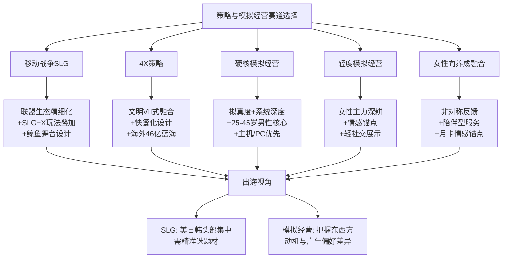

**针对策略赛道的具体建议**：

**第一，SLG赛道应紧扣三大方向**——**联盟生态精细化运营**（解决中小R炮灰化困境，让免费与中小付费用户也能在联盟中找到不可替代位置）;**SLG+X玩法叠加**（参考3.0时代的副玩法融合趋势，将SLG与放置、生存、剧情、Roguelike等品类融合扩大用户覆盖面）;**鲸鱼舞台设计**（围绕企业主、富二代、高收入专业人士四类鲸鱼用户的核心需求设计大型对抗事件、跨服争霸、联盟外交等高价值场景）。

**第二，4X策略赛道应学习《文明VII》的范式革新**——通过城市/城镇双轨制、人口驱动建设、跨时代衰退、区域系统简化等机制，**保留策略深度的同时降低操作疲劳**;手游4X可探索"碎片化适配+深度策略保留"的平衡点;海外46亿美元市场是值得开发者深耕的蓝海。

**第三，RTS赛道应警惕高风险**——纯粹的传统RTS立项已不建议，但RTS核心元素（资源管理、多线操作）可融入其他品类形成新形态。

**针对模拟经营赛道的具体建议**：

**第一，深耕女性主力人群与情感体验闭环**——**女性占比超七成、消费率超90%、63.2%以情感联结为首要付费动因、68%高付费用户偏好陪伴型服务**——这一画像底色决定了模拟经营产品的核心能力是"理解女性用户情感诉求与审美偏好";具体设计应贯彻"非对称反馈+情感锚点+陪伴型服务"三大原则。

**第二，把握题材多样化红利**——古风、国风、田园、商道、海岛、星际等题材都有相应的细分市场;**特别值得关注的是商道经营（占模拟经营增量20%—30%）作为中年男性在该品类的稀有画像锚点**，是承接SLG/MMORPG分流用户的重要机会。

**第三，探索融合化破局路径**——模拟经营+三消（《Family Farm Adventure》月活1500万验证）、模拟经营+RPG（《叫我大掌柜》南海丝路验证）、模拟经营+剧情解谜（《餐厅养成记》验证）三条路径都已被市场验证;融合化产品在保留女性主力的同时显著提升男性用户占比与跨年龄段渗透。

**第四，重视剧情建设的核心地位**——点点互动陈琦"剧情一定是要精心去做的"的判断已经成为该赛道的共识，**剧情驱动的模拟经营是该品类下一阶段产品创新的核心方向**。

**出海层面的差异化建议**：

**SLG出海**——美日韩三大市场Top20占66.5%支出的极致头部集中，意味着新品入局必须精准选题材（历史题材主攻日本、末日丧尸主攻美国、多文明主攻欧美）;买量成本极高（日本最高22美元、单用户成本国内可达4000元），要求开发者从立项之初就规划清晰的鲸鱼运营模型;Niko Partners指出的跨平台特征（90%韩国PC玩家有跨平台体验）要求多端布局成为标配。

**模拟经营出海**——把握东西方动机偏好差异（东方探索/满足幻想vs西方竞技），美英市场可叠加竞争排行机制，日韩市场强化治愈+探索叙事;广告投放渠道本地化（东方LINE/KakaoTalk/Naver、日本X特殊地位 vs 西方Facebook/Instagram）;日本市场口碑建设极为关键，避免虚假广告;融合化产品（《Family Farm Adventure》《Township》《Kingshot》）已证明是出海的有效路径。

### 4.7.3 与下一章的衔接

至此，本章完成了对策略与模拟经营两大品类的系统拆解。**本章揭示的核心洞察是——这两个品类构成中国游戏市场最具差异化优势的两条"高ARPPU男性鲸鱼"与"高消费率女性主力"赛道，分别对应'权力-控制-面子'与'探索-陪伴-情感'两种根本不同的商业化哲学**。

值得特别注意的是，**4.4节所揭示的女性向养成手游的"情感联结+非对称反馈+陪伴型服务+陪伴型月卡"商业化逻辑，将在第5章叙事驱动与情感导向类游戏用户画像中得到进一步深化展开**。第5章将聚焦冒险类、二次元、女性向（恋爱模拟、换装、乙女）三大叙事-情感导向品类，深入剖析"剧情驱动+角色塑造+情感投射"的更纯粹形态——可以预见，第5章将与本章4.4节形成内容上的承接与深化关系，共同呈现游戏行业最具增长潜力的女性用户与情感经济版图。

# 5 叙事驱动与情感导向类游戏（冒险/二次元/女性向）用户画像

承接第4章对策略与模拟经营两大品类的拆解，特别是4.4节对女性向养成手游"非对称反馈+情感锚点+陪伴型服务+月卡情感锚点"四要素商业化逻辑的初步揭示，本章将焦点拓展至更广义的**叙事驱动与情感导向类游戏**赛道——这是过去两年中国游戏市场增长最快、画像变迁最深刻、商业化范式最具颠覆性的细分领域。如果说RPG用户的核心驱动是"成长闭环"、竞技对战类是"对抗反馈"、SLG是"权力控制"、模拟经营是"系统创造与陪伴"，那么叙事-情感导向类用户的根本驱动则是一种四位一体的复合诉求——**剧情共鸣+角色情感投射+审美沉浸+社区共创**。这一独特驱动结构催生了游戏行业最具突破性的"情感商业化"范式：用户不为战力、不为胜负、不为效率付费，而为"被理解、被陪伴、被回应"的情绪价值买单。

将冒险类（视觉小说VN、解谜冒险、电影化叙事、动作冒险AAG）、二次元、女性向（恋爱模拟、换装、乙女）三大子品类合并为一章的方法论依据在于：尽管它们在玩法机制、用户性别结构、付费形态上存在显著差异，但都共享同一条心理底层逻辑——**玩家与虚拟角色/世界建立深度情感连接，并通过游戏外的社区共创、IP衍生消费、跨次元文化实践延展这种连接**。从2024年女性向市场规模80亿元同比激增124.1%，到2024年中国二次元手游市场358亿元同比增长16.7%、用户规模突破3亿人，再到2024年中国谷子经济市场规模1689亿元同比增长40.63%，这一系列数据共同勾勒出"情感经济"作为游戏产业新增长极的清晰图景[^78][^14][^97]。

本章将依次展开五节内容：先勾勒大品类基本盘与用户结构演化（5.1）、深耕冒险类四类细分方向用户画像（5.2）、系统拆解二次元用户从核心圈层到泛大众化的结构重塑（5.3）、专题分析狭义女性向游戏的情感商业化深度（5.4），最后归纳跨次元文化、情感商业化与用户生命周期模型并向开发者输出战略洞察（5.5）。

## 5.1 叙事驱动与情感导向大品类的市场基本盘与用户结构演化

理解叙事-情感导向品类用户画像的内部差异之前，必须先把握该大品类整体所处的市场坐标与用户结构演化趋势——这构成所有子品类用户分析的"公共底色"。

**从市场规模看，叙事-情感导向类已成为全球与中国游戏市场增长最稳健的赛道之一**。QYResearch《2025—2031年叙事游戏市场报告》数据显示，**2024年全球叙事游戏市场销售额达70.29亿美元，预计2031年将达到126.1亿美元，年复合增长率（CAGR）达8.3%**[^98]。细分品类中，剧情向角色扮演类（RPG）是主流并占全球叙事游戏市场份额41.3%；互动电影类增长最快、年增速达22.6%，《隐形守护者》《底特律：变人》等代表作成功打开市场；文字冒险类则凭借低开发成本优势占据18.7%的市场份额，成为中小厂商的重要切入点[^98]。

中国市场层面的三组关键数据进一步勾勒出该大品类的爆发态势：**第一组，二次元手游2024年市场规模358亿元、同比增长16.7%，用户规模突破3亿人，女性玩家占比提升至40%以上**[^14]。**第二组，女性向游戏市场2024年规模达到80亿元、同比增长124.1%**——增速远超行业平均水平，被业界视为"下一个百亿市场"，《2025年度中国游戏产业年会》发布的《女性向游戏调研报告》明确将其列为"近年来游戏产业增长最快的细分赛道之一"[^99]。**第三组，跨次元的谷子经济2024年市场规模达1689亿元、同比增长40.63%、预计2029年突破3000亿元**——尽管这一数据已超出游戏内购的传统边界，但它所映射的正是叙事-情感导向用户的"消费力外溢"[^97][^100]。

**从用户结构演化看，"女性化、年轻化、跨次元化"三重重塑构成2024—2025年最显著的画像变迁**。中国互联网络信息中心（CNNIC）发布的《第56次中国互联网络发展状况统计报告》明确指出："**截至2025年6月，女性在网络游戏用户中的占比为48.0%，较2024年底提升3.1个百分点，上升趋势明显；尤其在手机游戏领域，女性玩家已成为主力军之一**"[^101][^102]。这一3.1个百分点的半年涨幅意味着女性用户已经从"细分蓝海"演变为"市场主流力量"，而叙事-情感导向类游戏正是承接这一结构性变迁的核心赛道。点点数据进一步指出，除了《恋与深空》《光与夜之恋》《世界之外》等女性向游戏外，**移动游戏玩法轻度化的发展趋势也是女性玩家崛起的重要驱动力之一**[^101]。

QYResearch的全球数据为这一年轻化与女性化双重特征提供了横向佐证：**2025年全球叙事游戏用户中，25—35岁群体占比52.8%，是核心消费层；18—24岁群体占比27.3%，增速达19.2%，成为增长最快的用户群体；中国市场则呈现"年轻化"特征，18—30岁用户占比高达78.5%，其中学生群体贡献31.2%的消费额**[^98]。**性别分布上，市场报告打破"游戏用户以男性为主"的传统认知，2025年全球女性用户占比达48.3%，中国女性用户占比更高达51.7%**——《光・遇》《恋与制作人》等女性向叙事游戏的成功，印证了女性市场的巨大潜力[^98]。

**消费力层面，叙事-情感导向类用户呈现"高情感价值ARPU+剧情解锁主导"的独特结构**。QYResearch市场报告显示，**全球叙事游戏用户月均消费额为68美元，中国用户月均消费450元人民币，其中"付费解锁剧情"是主要消费形式占比63.8%，"皮肤、道具购买"占比28.5%**[^98]。这一付费结构与第4章SLG的"资源加速+战力提升"截然不同，与第3章MOBA的"皮肤+战令"也存在根本差异——**该大品类用户的付费驱动力是"看到下一段故事+拥有更深的角色羁绊"**，而非"变得更强+赢得更多"。

**用户偏好层面，市场报告进一步明确叙事-情感导向用户的核心关注点**：**"情感共鸣强的剧情"是用户最关注的因素占比76.2%；"高质量美术设计"次之占比68.5%；"多结局选择""配音质量"分别占比59.3%、52.7%**[^98]。这四项偏好按"情感>美术>多结局>CV"的权重排序，是该大品类区别于其他所有品类的最鲜明的画像特征——它清晰地表明，**情感共鸣不是叙事-情感导向类游戏的"加分项"，而是用户决策的"否决项"**。

为便于后续逐一拆解，本节先对该大品类下三个子品类的画像底色进行横向汇总：

| 维度 | 冒险类（VN/解谜/电影化/AAG） | 二次元 | 女性向（乙女/恋爱模拟/换装） |
|------|--------------------------|--------|--------------------------|
| 市场地位 | 全球70亿美元、中小厂商切入点 | 中国358亿元、用户3亿+ | 中国80亿元、增速124.1%最快 |
| 性别结构 | VN偏女性、AAG跨性别、恋爱影游男性 | 男女比从男主导走向40%+女性 | 女性主导（80%+） |
| 年龄主力 | 18—35岁跨度大 | 15—35岁、20—25岁核心 | 18—35岁 |
| 单次时长 | 长沉浸、多周目 | 中长沉浸、跨端 | 高频中等时长 |
| 核心驱动 | 探索者+成就者+情感共鸣 | 探索者+社交者+收集 | 慈善家+社交者+情感投射 |
| 付费形式 | 付费解锁剧情（63.8%） | 抽卡+皮肤+战令 | 卡池+陪伴型服务+月卡 |
| 社交模式 | 独处沉浸+游戏外社区 | 游戏内单机+游戏外强社区 | 口碑分享+同好社群 |
| 跨次元延伸 | 互动影游+真人IP | 谷子+漫展+cos+同人 | 谷子+实体礼包+cos委托 |

**与RPG、模拟经营、女性向养成的画像交集**也需要特别澄清。第2章已将广义"二次元RPG"（《原神》《崩坏：星穹铁道》）作为RPG子类型加以分析；本章则在二次元品类层面进一步拆解其作为"叙事-情感载体"的独特画像维度，重点不在玩法机制而在角色塑造、剧情共鸣与社区共创。第4章4.4节已建立女性向养成手游的情感商业化四要素逻辑（非对称反馈+情感锚点+陪伴型服务+月卡情感锚点），本章5.4节将进一步深化展开狭义女性向（恋爱模拟、乙女、换装）的画像差异与全球化突破。简言之，**第2章关注RPG玩法骨架下的二次元元素，本章关注叙事-情感共鸣本身作为驱动力的赛道**——两者形成内容上的承接与深化，而非重复。

下文5.2—5.4将分别深耕三大子品类的内部画像，5.5归纳跨次元文化与开发者洞察。

## 5.2 冒险类游戏（VN/解谜/电影化叙事/AAG）用户画像

冒险类游戏是叙事-情感导向大品类下用户群体最为多元、玩法形态最为分散的子品类，其内部存在明显的细分方向差异。本节将冒险类划分为四大方向并进行用户画像差异化拆解：视觉小说VN（《隐形守护者》《完蛋！我被美女包围了！》）、解谜冒险（《纸嫁衣》系列等）、电影化叙事互动（《底特律：变人》及衍生互动影游）、动作冒险AAG（《燕云十六声》《黑神话：悟空》）。

### 5.2.1 视觉小说VN：从《隐形守护者》女性向叙事到《完蛋》男性情感代餐的画像突破

视觉小说品类在国产互动式游戏史上的两个标志性产品——**《隐形守护者》（2019）与《完蛋！我被美女包围了！》（2023）**——共同勾勒出该子品类用户画像演化的完整图谱。

**《隐形守护者》构建了VN品类"宏大叙事+女性向叙事吸引力"的开山之作画像**。这款以谍战为题材的真人互动影游，玩家扮演两年前在上海街头奔走疾呼"抗日救亡"的爱国学生肖途，被组织安排打入敌人内部成为"谍中谍"，**"面对一个个艰难的选择是顾全大局还是心慈手软？你的每一个选择都将影响结局的走向，上百种分支剧情等你解锁"**[^103]。其用户评论中频繁出现"凌晨两点对着屏幕哭到不能自已""这是一款无法忘记的作品""你愿意为理想而活吗"等高情感共鸣表达[^103]——这种深度叙事与情感投射的结合，使其用户群体呈现"对宏大历史叙事敏感、对角色塑造细节挑剔、女性占比相对突出"的画像底色，与QYResearch所揭示的"情感共鸣强的剧情76.2%占比"的核心需求高度吻合[^98][^103]。

**《完蛋！我被美女包围了！》（2023）则完成了VN品类用户画像的另一项突破——精准触达此前被忽视的男性情感代餐需求**。**"6年来，《隐形守护者》处于一直被模仿从未被超越的地位。直到2023年一部真人恋爱影游《完蛋！我被美女包围了！》的横空出世——虽然从艺术角度仍差距尚远，却在商业角度超过了老大哥"**[^104]。其评论区呈现的玩家心声极具研究价值：**"在国内有很大一部分的普通男生，他们其实长这么大从未感受过被爱，以他们为目标群体的也往往都只有一些自以为是的擦边内容，连资本都从未重视过他们的情感需求——直到这款游戏的出现"；"原来也有重视男孩子感受的游戏"**[^104]。

这一系列玩家自陈表达揭示了一个被传统游戏行业长期忽视的画像盲区——**普通男性玩家的情感需求**。该群体的核心画像特征是：**18—35岁男性、可能并非传统二次元用户、在恋爱关系中处于弱势或缺位、渴望"被主动爱"的体验、对真人形象（区别于虚拟立绘）有特殊接受度**。这一画像与第4章女性向养成手游"被理解、被珍视、被回应"的女性用户情感诉求形成镜像对应——**两性玩家在情感代餐这一根本需求上是高度同构的，差异仅在于呈现形式（女性偏好2D/3D虚拟立绘+CV，男性偏好真人形象+实景拍摄）**。

VN品类用户的核心画像可归纳为：**"对剧情质量极致敏感+对角色塑造细节挑剔+对情感共鸣阈值高+社区分享意愿强+多周目重玩偏好"**五重叠加。该品类对中小开发者具有特殊战略价值——QYResearch指出**文字冒险类凭借低开发成本优势占据全球叙事游戏18.7%的市场份额、成为中小厂商的重要切入点**[^98]。

### 5.2.2 解谜冒险与电影化叙事：剧情驱动+多结局选择的硬核画像

解谜冒险（如《纸嫁衣》系列等国风悬疑解谜）与电影化叙事互动（《底特律：变人》及衍生互动影游）共享"剧情驱动+多结局分支+审美沉浸"的核心画像，但在情感色彩上各有侧重——解谜冒险偏向"悬疑探索+谜题攻克"，电影化叙事偏向"伦理抉择+人物命运"。

**电影化叙事品类是QYResearch报告中"年增速达22.6%"的最快增长细分**，《底特律：变人》《暴雨》等海外作品打开了市场，国内则有《隐形守护者》开创真人影游赛道[^98]。该品类用户的核心画像特征是：**对"多结局选择"敏感（占叙事用户偏好59.3%）、对配音质量敏感（占52.7%）、对高品质美术敏感（占68.5%）**[^98]——三项偏好构成对该品类制作品质的硬性门槛。

**电影化叙事的另一关键画像维度是"伦理抉择带来的情感冲击"**。这一维度对开发者的核心启示是：**该品类的商业化高度依赖剧情质量与道德困境设计的深度**——一旦剧情塑造不力，无论美术与CV多么精良都难以挽回用户口碑。这与第4章SLG"鲸鱼用户为对抗付费"的简单逻辑形成根本差异，意味着电影化叙事赛道是典型的"内容驱动型"赛道，对编剧、导演、演员（真人影游）等创作能力的要求远超技术与运营能力。

### 5.2.3 动作冒险AAG：《燕云十六声》武侠题材的全球化突破与画像张力

动作冒险（AAG）方向以**《燕云十六声》《黑神话：悟空》**等武侠/玄幻题材开放世界产品为代表，是冒险大品类下用户基础最广、画面表现最强、文化输出意义最深的细分。

**《燕云十六声》的全球化突破构成2025年武侠题材最具代表性的画像扩展案例**。其市场表现数据极为亮眼：**2025年11月15日全球上线后，40分钟玩家破50万、24小时超200万、首月海外玩家突破1500万、Steam好评率从初期58%飙升至88%、登顶全球畅销榜TOP4**[^105]。"8000万人集体上瘾"的中外用户合计规模背后，呈现出几个关键的画像突破：**"一群不懂中文的老外，居然为了卖草编小乌龟为生的龟奶奶哭得稀里哗啦"**——证明武侠题材的情感叙事可以跨越语言与文化壁垒触达欧美用户[^106][^105]。

《燕云十六声》用户画像的核心特征可归纳为四点：**第一，跨性别用户结构**——其早期宣传"女侠很酷""不做擦边设计"，吸引了相当比例的女性用户基础[^105]；**第二，跨年龄段18—35岁主力**——核心吸引点是"喜欢历史和武侠的人"和"中国风审美爱好者"，与传统武侠用户的中年化结构相比更年轻化[^105]；**第三，对"自由探索"的极致诉求**——"游戏把所有的选择权还给了你。没有强制推图，没有令人焦虑的'红点强迫症'。你想做主线？请便。你想在街边发呆，或者观察来往的路人？也没人管你"[^106]，这种自由度满足Bartle模型中"探索者"型的核心心理诉求；**第四，对"中式美学深度"的强审美敏感**——"游戏不是那种廉价的中国风贴图，而是深入骨髓的中式美学。桃红柳绿的配色、丝绸流动的质感"[^106]。

但《燕云十六声》也暴露了AAG赛道一个值得开发者警惕的**画像张力——"文化初心vs商业擦边"的运营两难**。其国服周年庆推出的"飞白成诗"皮肤被指对16岁未成年角色进行性暗示而引发大规模抗议，**官方紧急下架并道歉**[^105]。玩家的批评极为尖锐：**"武侠游戏的核心是'侠'，是家国情怀，是快意恩仇，而不是靠露肉博眼球"；"说真的，这款游戏早期宣传'女侠很酷''不做擦边设计'，多少玩家是冲着这份初心来的？现在为了商业利益，把承诺抛在脑后……"；"依靠'擦边'设计与物化形象的营销路径，终究与武侠文化的内核及该游戏最初吸引的女性用户期待相悖"**[^105]。更具警示意义的是"双标运营"问题——**国服整改而海外服保留原版，引发玩家对"双标"操作的强烈不满**，加剧了玩家与游戏之间的信任危机[^105]。

这一案例对AAG乃至整个叙事-情感导向类赛道的开发者具有三重警示：**第一，初心承诺一旦被商业化破坏将引发系统性信任反噬**——该品类用户对"叙事真诚度"的容忍阈值远低于其他品类；**第二，文化题材产品的女性用户群体对物化设计极为敏感**——失去女性用户基础将直接影响产品的题材定位与口碑传播；**第三，国服与海外服的双标运营在全球化时代将被放大为公关危机**——开发者必须建立全球一致的内容标准。

值得注意的是，《燕云十六声》的良心付费模式（"只做外观付费，拒绝数值付费"）原本构成该品类用户的强吸引力——**"《燕云十六声》的温和氪金策略，在当下环境中堪称一种商业上的自信"，"我们一定只会做外观这一个路线。一旦做了（数值付费），很多东西都是会被破坏掉的"**[^105]。这一商业化哲学与第3章MOBA品类"高频次低门槛+应援式付费"逻辑相通，但飞白成诗事件证明，即使坚持非数值付费，外观设计本身的内容立场也是用户判断"叙事真诚度"的关键标尺。

### 5.2.4 冒险类用户的复合心理画像归纳

综合VN、解谜冒险、电影化叙事、AAG四类细分画像，可归纳冒险大品类用户的Bartle与Hexad复合心理画像：

| 心理类型 | VN | 解谜冒险 | 电影化叙事 | AAG（武侠/玄幻） |
|---------|-----|---------|-----------|---------------|
| 探索者（Bartle） | 高 | 极高 | 高 | 极高 |
| 成就者（Bartle） | 中 | 高 | 中 | 高 |
| 杀手（Bartle） | 低 | 低 | 低 | 中 |
| 社交者（Bartle） | 中（社区分享） | 中 | 中 | 中 |
| 自由精神者（Hexad） | 中 | 中 | 高 | 极高 |
| 慈善家（Hexad） | 高（情感投入） | 中 | 极高（伦理抉择） | 中 |

**对开发者的核心启示**：冒险类赛道是中小开发者最具突破机会的细分——**文字冒险18.7%全球份额+互动电影22.6%最快增速+AAG武侠题材全球化突破**，构成三条不同体量与门槛的入局路径。但所有路径都共享一个铁律——**叙事真诚度是该赛道的生命线**，无论是《隐形守护者》的"潜伏——背负黑暗，向往光明"的精神共振[^103]，还是《燕云十六声》的飞白成诗争议，都印证了用户对"内容初心"的极致敏感。

## 5.3 二次元游戏用户画像：从核心圈层到泛大众化的结构重塑

二次元游戏是叙事-情感导向大品类下用户基数最大、生态延伸最完整、产品形态最成熟的赛道。本节按五维框架系统拆解其用户画像演化与差异化结构。

### 5.3.1 人口属性：3亿用户与从男性主导到性别均衡化的根本性重塑

**中研普华《2025—2030年二次元游戏行业市场深度分析及发展规划咨询综合研究报告》明确披露**：**2024年中国二次元手游市场规模达到358亿元、同比增长16.7%，用户规模突破3亿人，其中女性玩家占比提升至40%以上**[^14]。这一系列数据构成理解二次元品类用户画像的核心锚点。年龄结构上，**15—35岁用户占比超80%，其中20—25岁为核心消费群体**——这一群体对游戏品质、剧情深度及社交互动的追求，推动了开放世界RPG与策略类游戏的崛起[^14]。性别比例上，**女性玩家占比达40%直接带动"乙女向""换装类"细分市场的爆发**[^14]。付费意愿上，**Z世代用户年均ARPU值超200元，对角色皮肤、剧情DLC等虚拟商品的付费率达65%**——这一付费率水平在所有移动游戏品类中均属顶尖[^14]。

**从男性主导核心圈层向性别均衡化、跨年龄段渗透的根本性重塑，是二次元品类2020—2025年最深刻的画像变迁**。结合第2章已揭示的米哈游产品矩阵差异（《原神》全球男女6:4、《崩坏：星穹铁道》在日本男性占比72%/女性28%、《绝区零》都市动作差异化定位）[^107]，可以清晰看出**即使在同一厂商的同类二次元产品组合下，不同产品的核心玩法侧重会显著影响用户的性别结构**——回合制+男性向角色塑造主导的星铁，明显比开放世界+全龄向叙事的原神更偏男性化。这一现象指向二次元品类内部的画像分层逻辑——**玩法机制是性别结构的根本决定变量，而非题材本身**。

**进一步聚焦二次元品类内部的四类画像分层**：

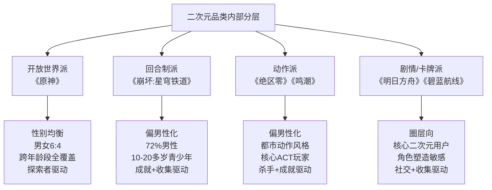

四类分层对应着不同的产品定位策略，开发者无法以"二次元"作为单一画像分析单元，必须穿透到玩法机制层面才能精确定位目标用户。

### 5.3.2 行为特征：高粘性、跨产品互通性与跨端化三大典型标签

**第一，高粘性**——二次元用户的产品忠诚度在所有移动游戏品类中位居前列。《2024二次元手游男性玩家洞察报告》将二次元手游男性玩家划分为三类典型群体：**"二游生活家是典型的重度用户，年均游戏投入高达1.2万元，偏好沉浸式剧情与养成玩法，将游戏视为逃离现实、获得情感慰藉的'赛博家园'；硬核社交党则更看重游戏中的合作与策略，年均消费约5300元，倾向于通过游戏拓展社交圈、增强同好互动；放松乐子人则以轻度体验为主，年均消费约3500元，游戏动机主要为消遣娱乐"**[^108]。这三类用户的年均消费数据（1.2万、5300、3500元）均显著高于游戏行业整体水平，验证了二次元用户的高粘性与高消费深度。

**第二，跨产品互通性**——这是二次元品类区别于其他所有品类的独特行为标签。第2章已引用Gameage数据：**"《崩坏：星穹铁道》玩家中超3成（31.2%）同时游玩《原神》，而《原神》玩家中33.6%同时游玩《崩坏：星穹铁道》"**——这一双向互玩率33%以上的水平，是二次元用户"高IP连带性、强厂牌信任度"的最佳证明。一旦用户认同某厂商的内容风格与角色塑造，就会自然延伸到该厂商的其他产品矩阵——这一现象推动米哈游、库洛、鹰角等头部二次元厂商的"产品矩阵化"战略成为标配。

**第三，跨端化**——二次元品类天然适配跨端发行。《原神》登陆PC、PS、移动多端互通，《崩坏：星穹铁道》同样支持PC/移动跨端，《明日方舟：终末地》"上线两周全球全平台流水破12亿元，PC端用户占比近60%，海外PC+PS渠道占比达70%"[^109]——这一PC占比近60%的数据揭示了二次元品类用户对"高性能、大屏幕、深度沉浸"体验的强烈偏好，跨端互通已经从产品功能演化为该品类的画像必备属性。

### 5.3.3 心理动机：角色塑造+剧情参与度+情感投射的三重核心诉求

**《2024二次元手游男性玩家洞察报告》系统揭示了二次元用户的三重核心心理诉求**：

**第一，角色塑造诉求**——**"角色、美术与剧情构成三大核心决策因素。超过七成玩家将'二次元画风+美少女元素'视为二游的必备特征"**[^108]。这一"超过七成"的占比意味着，**二次元品类的产品立项必须以"画风+角色塑造"为绝对前置门槛**——没有这两项基础就不存在二次元用户的入门机会。玩家对角色塑造尤为敏感——颜值、人设类型与剧情参与度成为最受关注的维度，**其中"御姐型"角色最受欢迎**，而**人设同质化、立绘质量下降及角色行为逻辑矛盾则被广泛诟病**[^108]。

**值得开发者高度警惕的是"摄像头"反感心理**——**"玩家普遍反感角色被设计为'摄像头'，期待与角色建立独特且深度的情感连接"**[^108]。所谓"摄像头化人设"，是指角色仅作为剧情推进的工具而缺乏独立性格与情感反馈的设计——这种设计在传统线性RPG中相当普遍，但在二次元品类中将引发强烈反感。这一画像特征对开发者的核心启示是：**二次元角色不是"叙事工具"而是"独立人格"，每一个可抽取角色都应具备完整的前史、独立的性格、专属的剧情线索与可触发的情感反馈机制**——这与第4章女性向养成"非对称反馈"逻辑形成跨品类的共通设计哲学。

**第二，剧情参与度诉求**——**"六成玩家将剧情视为游戏体验的核心，偏好宏大世界观、沉浸式叙事与逻辑严密的故事情节。题材方面，'自我成长''热血冒险''责任担当'类内容最能引起共鸣"**[^108]。"自我成长"作为最受共鸣的题材，揭示了二次元男性用户的深层心理动机——**通过角色的成长弧光投射自己的人生命题**。这与第2章JRPG/二次元RPG用户的"探险者+社交者"复合驱动一脉相承。

**第三，情感投射诉求**——**"玩家不仅追求情节的吸引力，更希望在游戏中完成情感投射与心理成长，反映出二游作为'情感容器'的深层功能"**[^108]。这一"情感容器"功能与第4章模拟经营的"心理睡眠"功能、5.2节冒险类的"情感代餐"功能形成跨品类的共通诉求——**叙事-情感导向类游戏的根本心理价值是为用户提供现实生活中难以获得的情感修复与心理成长空间**。

### 5.3.4 消费行为：抽卡机制、皮肤、解锁剧情与全球IP经济

**二次元用户的消费行为高度情感化**。**"为'角色'付费成为主流，购买皮肤、抽卡与解锁剧情是主要消费场景。不少玩家表示，氪金不仅是获取内容的方式，更是对角色情感的寄托与对开发团队的支持"**[^108]——这一表达精准对应第2章已揭示的"应援式付费"逻辑：**用户消费的本质是对自己"推"的角色与开发团队的情感支持，而非单纯的功能获取**。

**抽卡机制的双刃剑效应**也是开发者必须正视的画像特征——**"抽卡机制因'逼氪感强''体验不平衡'受到批评，折射出玩家对公平性与内容价值的双重期待"**[^108]。二次元用户对抽卡的态度是矛盾的——既享受抽卡带来的期待感与稀缺性，又厌恶过度逼氪带来的体验失衡。这一矛盾要求开发者在抽卡设计上达到精妙平衡：**保底机制要够友好（避免逼氪反感），但稀有度要够极致（保留期待感）；卡池更新要够频繁（维持新鲜感），但内容质量要够稳定（避免疲劳）**。

**全球IP经济为二次元商业化提供了更宏观的画像坐标**。SensorTower数据显示：**2025年全球授权IP手游内购收入达184亿美元，与2022年、2023年基本齐平。IP手游已从高速增长期进入成熟波动期，未来增长更依赖IP质量、玩法创新与长线运营，而非单纯的用户数量扩张**[^110]。**全球IP手游平均单次下载收入则逆势上涨，2025年同比提升12%**——证明全球IP手游市场已从"以量取胜"转向"以质提效"——不再依赖新增用户规模，而是通过长线运营、深度付费设计来提升存量用户价值[^110]。

**腾讯王者荣耀、英雄联盟与任天堂宝可梦三足鼎立**：**超过一半的IP手游收入来自视频游戏原生IP，腾讯王者荣耀、英雄联盟与任天堂宝可梦IP合计贡献了该类IP游戏51%的收入**；**动漫/漫画IP占总收入的14%，其中龙珠Z、赛马娘和高达三大动漫IP占据近半数份额**[^110]。这一IP经济格局对二次元开发者的核心启示是：**单一爆款产品的IP化潜力有限，必须通过IP矩阵化（多产品+衍生品+跨媒介）才能在全球184亿美元的IP经济中占据稳定份额**。

### 5.3.5 社交属性：游戏内单机化+游戏外强社区共创双重场景

**二次元品类的社交属性呈现极为独特的"游戏内单机化+游戏外强社区共创"双重结构**。游戏内体验偏单人沉浸（《原神》《崩坏：星穹铁道》主线均为单机化设计），但游戏外的社区参与极为活跃。

《2024二次元手游男性玩家洞察报告》明确指出：**"游戏之外的社交与衍生行为同样值得关注。尽管游戏内以'单机体验'为主，游戏外玩家却积极参与社区讨论，话题涵盖剧情解读、美术评价与技术交流。买谷（购买周边）和参与线下活动成为延伸情感体验的重要方式，尤其是二游生活家，超过六成有购买谷子习惯，追求'破次元壁'的快乐与情感满足"**[^108]。"超过六成购买谷子"这一数据是二次元用户跨次元消费力的直接证据，也是5.5节谷子经济1689亿元规模的微观基础。

这一双重结构与第3章MMORPG"游戏内强社交+游戏外弱延伸"形成鲜明对照——**MMORPG用户在游戏内深度组队作战、在游戏外较少延伸；二次元用户在游戏内多为单机体验、却在游戏外构建出极其活跃的同人创作、漫展、cos、谷子消费等完整生态**。这种独特结构对开发者的核心启示是：**二次元产品的运营必须同时建设"游戏内独立沉浸体验"与"游戏外社区共创生态"两个体系**——前者保证核心游戏体验质量，后者承接用户的情感外溢与衍生消费。

**跨平台互通进一步强化二次元社交生态的全球化属性**。《明日方舟：终末地》"支持PC、移动端、PS5全球同步公测且数据互通"[^109]，《崩坏：星穹铁道》"全球多地区发行，支持PC、移动端、主机数据互通"[^109]——这种多端无缝切换的能力，使二次元社区可以在Discord、B站、X（Twitter）、reddit等多平台同步运转，形成真正意义上的全球同人生态。

## 5.4 女性向游戏（恋爱模拟/换装/乙女）用户画像与情感商业化深度

**作为对第4章4.4节女性向养成手游情感商业化逻辑的深度延伸**，本节聚焦狭义女性向游戏（恋爱模拟、换装、乙女）的用户画像与情感商业化深度。如果说4.4节侧重于女性向养成手游与模拟经营品类的交集，那么本节将聚焦更纯粹的恋爱模拟与乙女游戏赛道，剖析其作为独立品类的画像特征。

### 5.4.1 人口属性：18—35岁女性主导与全球化突破

**狭义女性向游戏的核心用户画像极为清晰**——**核心用户以18—35岁女性为主**[^93]。这一年龄结构与5.1节QYResearch数据中"中国18—30岁用户占比78.5%"高度吻合[^98]，但女性向赛道更偏向"轻成熟"年龄段（25—35岁占比显著），与二次元品类"20—25岁核心"略有差异。

**叠纸《恋与深空》构成2024—2025年女性向赛道最具标志性的全球化突破案例**。其市场表现数据极为亮眼：**"叠纸2024年凭借《恋与深空》实现全球收入同比660%的暴涨，全年流水突破60亿元，多次将常年霸榜的《王者荣耀》拉下首位"**[^111][^112]；**"截至2025年6月8日，《恋与深空》的全球累计收入已达到6.5亿美元（约合46.7亿人民币）。游戏的用户基础同样坚实，已于2025年1月宣布全球玩家数突破5000万"**[^113]。该数据由游戏项目组在2025年8月科隆游戏展期间确认全球玩家7000万规模[^111]，进一步证明女性向产品的用户基数扩张速度。

**全球化层面的关键画像数据**：**"2025年5月，其海外市场收入份额首次超过中国iOS市场，达到了52%"，"美国市场已取代日本，成为《恋与深空》海外收入最高的市场。到2025年5月，美国市场贡献的收入已占到全球总收入的19%"**[^113]。这一从日本反超到美国占比19%的演化路径，**证明中国女性向产品已具备全球化输出能力**——**"《恋与深空》已从一款在中国和东亚文化圈备受欢迎的游戏，成长为一款真正在全球范围内取得商业成功的现象级产品"**[^113]。

**2025年女性向游戏市场格局**呈现"叠纸腾讯稳健、网易触底反弹"的新态势。眸娱基于游戏日报统计的女性向游戏内地iOS端预估总收入榜单显示：**《恋与深空》仍然稳居女性向市场头部；腾讯《光与夜之恋》连续多月稳居女性向市场TOP2，11月整体收入甚至反超《恋与深空》来到了TOP1，依然表现出了相当可观的市场竞争力；网易《世界之外》12月更新的温泉副本表现强劲，一度拉动游戏杀回iOS畅销榜TOP10**[^99]。**叠纸、腾讯（《光与夜之恋》）、网易（《世界之外》）、灵犀互娱（《如鸢》）形成了2025年女性向市场的四强格局**[^99]。

### 5.4.2 行为特征：高频次中等时长+深度情感沉浸的双重模式

**艾瑞咨询《2023年中国女性向游戏用户行为报告》数据显示**：**"该群体中76.4%日均游戏时长超45分钟，且63.2%将'角色情感联结'列为持续付费首要动因"**[^93]。这一数据已在第4章4.4节引用，本节进一步深化展开其行为机制设计。

**剧情节奏与3D微表情系统是女性向用户行为模式的两大设计支柱**。**"剧情节奏须匹配女性用户对'细腻感'的天然偏好：平均每3—5分钟设置一次微小情绪反馈（如角色主动发来天气提醒、手写便签式语音），而非依赖长线任务驱动"**[^93]。**"美术风格上，采用低饱和度柔光渲染+高精度面部微表情系统，使角色眨眼频率、嘴角牵动幅度符合真实人类情感节律，实测可提升玩家共情强度达41%（腾讯互娱用户体验实验室2022年A/B测试数据）"**[^93]。

**3D建模技术对女性向产品的画像突破具有决定性意义**。《恋与深空》核心玩家Koi的体验描述极具代表性：**"以前的2D角色就像静态海报，而3D男主的眼神会追随你，肢体动作自然流畅，连微笑时的嘴角弧度都很真实。这种前所未有的沉浸感，成为她留存至今的关键"**[^111]。"1秒镜头包含3个微表情"的细腻情感演绎，**大幅拉近了玩家与虚拟角色的心理距离**[^111]——这是从2D乙女游戏向3D恋爱模拟跃迁的核心技术支撑。

**互动设计上，除了常规的剧情对话，更加入录音反馈、陪伴学习、入眠引导等生活化功能**——让虚拟角色深度渗透到玩家的日常场景中[^111]。这种设计哲学使虚拟角色从"游戏内NPC"演化为"日常陪伴者"，是女性向品类区别于其他所有品类的最独特行为机制。

### 5.4.3 心理动机：四不青年情感代餐+情感乌托邦+被爱实感的疗愈功能

**女性向用户的心理动机被多重视角揭示**。

**第一视角：玩家自陈的情感代餐**。25岁的核心玩家Koi的笃定表达极具代表性：**"每个月会收到生理期提醒，失落时会有专属语音安抚，新年还能收到男主的拜年动画，这不是现实中的恋爱，却比很多亲密关系更懂我的需求"**[^111]。这种"比现实关系更懂我"的情感体验，是女性向用户留存至今的根本心理动机——**虚拟陪伴正成为刚需**[^111]。

**第二视角：日媒ANN的"四不青年"社会学解读**。日本ANN电视台制作的视频报道**"将中国恋爱模拟游戏的盛行与'四不青年'现象深度绑定，并将热衷于虚拟恋爱的中国女性玩家描绘为一种'新型中国年轻人'"**——一位女性玩家坦言**"她在现实中感到疲惫，通过与《恋与深空》中的虚拟角色互动获得了'被爱'的实感"**[^113]。视频进而介绍了应运而生的"Cosplay委托"服务——**用户可以花费约2万日元，聘请cosplayer在现实中扮演游戏角色进行一日约会**[^113]。报道将这一系列现象归结为"四不青年（不恋爱、不结婚、不生子、不买房）群体的扩大，认为虚拟世界为他们提供了逃避现实压力的完美出口"[^113]。

**第三视角：作为"安全的情感实践空间"的疗愈功能**。**"乙游不仅是消遣娱乐，还是一种文化现象。从体验出发，乙游的设计充分考虑了女性心理需求，融合了浪漫、梦幻与感性元素，为玩家提供了自由、安全、浪漫的情感体验空间"**——玩家可以深入体验爱情、友情、家庭等丰富的场景，从游戏中获得情感上的满足，**感受到被关注、被包容、被接纳**[^114]。**"调查研究证实，乙游能对女性的恋爱观产生一定影响。游戏提供了一种安全的情感实践空间，玩家通过面对种种情感难题、处理复杂的人际关系，学习如何与异性相处、表达自己的情感，从而助力玩家的人格成"**[^114]——这种"心理实验室"功能赋予女性向游戏超越娱乐的社会价值。

需要客观指出的是，日媒"四不青年"的解读存在一定简化——**直到2024年上半年，日本依然是全球最大的乙女游戏市场，只是随着《恋与深空》的强势崛起，中国市场在全球乙女游戏收入中的占比已从极低水平提升至40%**[^113]。日本本身的乙女游戏发展史揭示这是一个全球性的女性情感需求现象，而非"四不青年"特有的社会问题——**日本乙女游戏市场在2006至2013年间经历黄金发展期，2015年市场规模达到约163亿日元的巅峰**[^113]。

**对应到Bartle与Hexad模型**，女性向用户呈现独特的"慈善家+社交者+探险者"复合画像——其中"慈善家型"驱动尤为突出，对应玩家对虚拟角色的关爱、付出与陪伴诉求，这与SLG鲸鱼用户的"杀手+成就+社交"驱动形成根本性差异。

### 5.4.4 消费行为：四要素商业化逻辑的深度展开与实体礼包载体

**深化第4章4.4节已建立的四要素商业化逻辑**——非对称反馈+情感锚点+陪伴型服务+月卡情感锚点——本节结合《恋与深空》的实际付费数据进一步展开。

**核心玩家的氪金账单极具研究价值**。Koi作为中氪玩家**"为集齐全图鉴投入近2万元，而据她了解，头部玩家的氪金金额可达几十万元"**——**"单个男主的全图鉴需要几千元，想把卡片满花还要再抽4—5张重复卡，又是一笔不小的开支"**[^111]。中氪近2万、头部几十万的付费区间，揭示了女性向品类的消费深度——**与SLG鲸鱼用户的几十万元至百万元级别的付费数据高度可比，但触发机制完全不同**：SLG为"权力对抗"付费，女性向为"情感陪伴"付费。

**实体礼包构成女性向消费的独特载体**。**"吸引她持续付费的，除了骨子里的收集癖，还有氪金达标后的实体礼包，手写信、亚克力摆件、限定玩偶等周边，成为情感消费的实体载体"**[^111]——**"2024年该游戏推出的高端礼包，需氪金近1.5万元才"**得以解锁[^111]。这一实体礼包机制是女性向品类区别于其他所有品类的独特商业化设计——**它将虚拟付费与实体周边深度绑定，使付费行为本身具备实物象征意义**，与5.5节谷子经济的1689亿元规模形成微观基础。

**"产品革新的背后，是行业对女性情感需求的精准捕捉与技术赋能"**——**"《恋与深空》最突出的突破，是跳出了'总裁、年下、上司'的固化人设模板，将神话元素融入角色塑造（比如祁煜对应的利莫里亚海神设定），打破了身份标签对角色魅力的束缚"**[^111]。这种人设差异化是该赛道的核心竞争力——**"如今的乙女游戏正在告别'翻PPT'式的单一体验，转而走向'恋爱核心+多元玩法'的混搭模式，既保留情感连接的核心，又通过玩法创新提升用户留存"**[^111]。

**商业化案例进一步佐证四要素逻辑**：**"DataEye《2024女性向游戏变现白皮书》数据显示，当限定卡池角色拥有完整前史、独立配音及专属Live2D演出时，单次抽取ARPU值提升52%"**[^93]；**"高付费用户中68%更倾向购买'陪伴型服务'（如定制生日提醒、节日专属剧情），而非单纯外观道具，印证情感附加值才是长效付费的核心驱动力"**[^93]。

**Visual Works乙女游戏付费率34%的高位水平**也是该赛道商业化深度的强力证据——**"日本的乙女类手游的付费率达到34%，并且有67%的用户希望那些还没有推出手游版的乙女游戏也能够尽快登陆手游平台"**[^95]——这一付费率水平远超移动游戏整体平均，意味着女性向赛道的"高付费率+广覆盖"商业化模型本质上不同于SLG的"低付费率+鲸鱼集中"模型。

### 5.4.5 社交属性：口碑分享、同好社群与女性向小游戏新增长曲线

**女性向用户的社交属性突出口碑分享与同好社群**。Visual Works数据揭示了关键画像特征：**"57%的用户玩过'1～5款'乙女类手游，'11～15款'占比16%、'15～20款'占比4%、'21款以上'占比10%，由此得出，30%的用户玩过10款以上乙女类手游"**[^95]——这意味着女性向用户具有**强烈的多产品并行游玩偏好**，与第4章日韩玩家"每月仅关注2—3款核心游戏"的画像形成对比。

**口碑分享层面，"56%的用户表示'会和身边的朋友谈及自己玩乙女类手游的事情'"**[^95]——这一过半的口碑分享率，使女性向用户成为游戏行业最具自传播力的群体之一。**用户之间的口碑营销成为了乙女类手游的重要宣传渠道**[^95]。

**专题分析女性向小游戏新增长曲线**——这是2025年该赛道最具突破意义的现象级变化。**友谊时光2025年扭亏为盈即是这一趋势的标志性注脚**：**"这家长期深耕古风女性向游戏的老牌厂商，在连续亏损两年后，依靠《杜拉拉升职记》《凌云诺》等产品在小游戏端的表现，交出了一份营收12.48亿元、净利润同比增长290.7%的财报"**[^115]。**"友谊时光在财报中明确指出，2025年收益的增长，主要是《杜拉拉升职记》《凌云诺》《熹妃传》为主的小游戏带来的增量"**[^115]——小游戏业务从边缘试验品成长为支撑营收的新引擎。

**多个女性向小游戏黑马案例进一步证明这一新增长曲线的真实性**：**"《我的花园世界》登顶微信小游戏畅销榜并霸榜整个春节假期"，"DataEye估算《时尚百货城》扣除平台分成后单月收入千万"**[^115]。这些出圈产品**"并非简单地对手游App内容做轻量化处理，而是在玩法设计、情感共鸣等维度形成了独立的产品逻辑"**[^115]。

**小游戏业务对友谊时光毛利率的改善**：**"2025年毛利率约为73.0%，较上年提升3个百分点，这一变化直接受益于高毛利渠道收入占比的提升。与传统App联运渠道高达50%左右的综合抽成相比，微信小游戏内购抽成比例为40%"**——意味着同样的产品在小游戏端的利润空间相对更高[^115]。

**对中尾部厂商的破局意义极为重大**——**"从友谊时光的业绩反转，到中小厂商的密集入局，女性向小游戏正从边缘走向舞台中央。其发展现状、产品逻辑与厂商布局，共同勾勒出一个清晰的判断：这条赛道具备独立于手游端的商业价值，为中尾部厂商在'修罗场'之外开辟了新的生存空间"**[^115]。两年前，微信小游戏畅销榜依然很少见女性向游戏，许多IAA休闲小游戏面向女性用户但因缺乏情感共鸣未能得到泛化女性受众认可，反而是许多男性向IAP游戏收割了这部分女性玩家[^115]——这一格局在2025年被根本性扭转。

**女性向小游戏用户画像的独特性**值得开发者特别关注。微信小游戏整体的用户特征是：**"女性用户占比高、三线城市用户占比一半、用户年龄以24—40岁为主"**[^116]——这一画像与App端女性向用户（18—35岁、覆盖一线至五线）形成有趣的延伸——**女性向小游戏正在触达此前被App端女性向产品忽视的"24—40岁、三线及以下城市、轻度泛化女性用户"群体**，这是友谊时光等老牌厂商通过快节奏玩法+IP化策略实现下沉市场增量红利的画像基础。

## 5.5 跨次元文化、情感商业化与用户生命周期归纳

在前述子品类拆解基础上，本节进行横向归纳与战略转译，回答三个根本问题：跨次元文化如何延伸游戏内行为？叙事-情感驱动型玩家的差异化需求是什么？开发者应如何匹配？

### 5.5.1 跨次元文化对游戏内行为的延伸：谷子经济与文旅融合

**谷子经济1689亿元规模构成叙事-情感导向类用户消费力外溢的最直接证据**。**"2024年我国'谷子经济'市场规模达1689亿元，同比增长40.63%，预计2029年将突破3000亿元"**[^97][^100]。这一规模已经超越了游戏产业的传统边界——它表明**叙事-情感导向类游戏的用户消费力正在以"游戏内购+IP衍生品+线下体验"的三维形态外溢，构成游戏产业的新增长极**。

**国产IP正改变谷子市场格局**。**"近年来，各类国产动漫和游戏周边产品销量持续上涨，越来越多的国产'谷子'被放在门店'C位'"**[^97]。**"国内某二手平台数据显示，2025年第一季度，国产IP'谷子'的交易额已达到日本IP'谷子'的1.2倍，'国谷'正式超越'日谷'，成为交易最活跃的'谷子'市场"**[^117]——这一数据是国产二次元IP崛起的标志性节点，意味着中国二次元产业已经具备了全球竞争力。

**"日益增强的文化自信是'谷子'热销的大背景"**——**"'谷子'消费具有情感驱动与角色投射特点。有让人持续追捧的国产IP角色和原创故事，是'国谷'崛起的重要条件"**[^97]。这一表述与第2章二次元RPG"应援式付费"逻辑、5.4节女性向"实体礼包载体"逻辑、5.3节二次元用户"超过六成购买谷子"数据形成完整的因果链——**用户的情感投射通过游戏内付费、谷子收藏、cos实践、漫展参与、文旅打卡等多维度形态得到全方位释放**。

**文旅融合构成跨次元延伸的另一重要场域**。**"四川成都'东郊记忆'园区举办《一人之下》10周年漫画原画展，通过沉浸式场景拉动'谷子'消费。上海杨浦区复兴岛与小红书合作举办'冒险岛'活动，汇聚原神、王者荣耀等IP，激发城市文化消费活力"**[^97]。文旅行业承接谷子经济的核心逻辑是：**"把分散的购买行为组织成完整的在地体验，把圈层消费转化为面向更广人群的城市吸引力"**[^100]——这一转化机制对游戏开发者的核心启示是：**优秀的IP不应止步于游戏内变现，而应主动延伸到城市文旅、线下展陈、沉浸式剧场等场景，构建"游戏内+游戏外"的IP长效生命周期**。

**线下二手谷子店主蔡一涵的观察具体印证了这一趋势**：**"如今'国谷'起来了，IP多、出新快，年轻顾客的接受度出乎意料地高"**[^117]。线下谷子店、二手谷子转让、cosplay委托等新型服务形态，进一步**模糊虚拟与现实的边界**——这一边界模糊本身正是叙事-情感导向类用户体验的核心吸引力。

需要客观指出的是，**谷子经济也面临"乱纪元"挑战**——**"前两年的'吃谷'热潮趋于平静，许多消费者购物回归理性，二手'谷子'均价普遍下跌，此前快速扩张的线下店铺也陆续关闭"**[^97]。**"行业'冷热交替'的深层原因在于IP运营的短视——部分国产IP的'谷子'产品销量和价值大起大落，根本原因在于缺乏持续的内容供给和沉浸式生态，IP没有被当成长期资产运营，而是作为一次性流量变现工具"**[^97]。这一警示提醒开发者：**IP衍生消费的可持续性根植于核心游戏内容的持续质量供给，缺乏内容更新的IP将快速透支用户情感**。

### 5.5.2 叙事-情感驱动型玩家的五大差异化需求

综合前述子品类画像，叙事-情感驱动型玩家在五大维度的差异化需求可归纳如下：

| 需求维度 | 核心特征 | 设计要点 |
|---------|---------|---------|
| 互动深度 | 多结局/分支选择/选项后果可感知 | 多结局占用户偏好59.3%；非对称反馈机制 |
| 沉浸需求 | 高品质美术+CV+剧情节奏匹配 | 美术68.5%、CV 52.7%；3—5分钟微情绪反馈 |
| 收集养成 | 图鉴/卡池/角色完整度/IP矩阵 | 角色独立前史+专属Live2D+ARPU提升52% |
| 社区共鸣 | 同好分享+二创+谷子+漫展 | 56%乙女用户口碑分享；超60%二游用户买谷 |
| 情感投射 | 角色羁绊+陪伴感+身份认同 | 68%高付费用户偏好陪伴型服务；情感容器功能 |

**五大需求的共同特征是"情感共鸣阈值高、内容质量敏感、社区延展强"**——这三个特征共同决定了叙事-情感导向类赛道的成功逻辑根本不同于其他游戏品类。开发者必须以"内容+情感+社区"三位一体的能力模型替代传统的"玩法+数值+买量"三位一体能力模型，才能在该赛道建立持续竞争力。

### 5.5.3 用户生命周期模型：从首次接触到风险节点

**基于前述子品类拆解，可构建叙事-情感导向类用户的完整生命周期模型**：

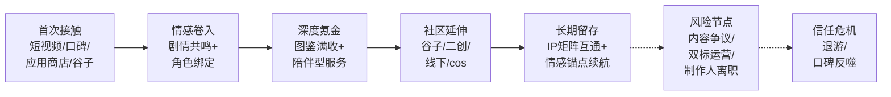

**首次接触环节**——Visual Works数据显示乙女类手游用户的接触渠道为：**"WEB信息以及广告以42%的比例成为用户知晓一款乙女类手游的最大契机，其次是应用商店的榜单（21%）。此外，因为'喜欢游戏中的插画而下载'的用户占34%，该比例甚至超过了'喜欢游戏中的剧情'（29%）和'喜欢游戏中的声优'（23%）"**[^95]——意味着**插画立绘是首次接触决策的最关键单一因素**。

**情感卷入环节**——核心是剧情质量+角色塑造细节，二次元报告"超过六成将剧情视为核心"+女性向报告"63.2%以情感联结为首要付费动因"共同支撑这一节点的关键性[^108][^93]。

**深度氪金环节**——以图鉴满收（《恋与深空》单男主全图鉴需几千元）+陪伴型服务（68%高付费用户偏好）为核心驱动[^111][^93]。

**社区延伸环节**——谷子（超60%二游用户购买）+二创+漫展+cos委托共同构成延伸场域[^108][^113]。

**长期留存环节**——通过IP矩阵互通（《原神》-《崩坏：星穹铁道》-《绝区零》33%互玩率）+月卡情感锚点（《浮生为卿歌》"卿心月卡"每月手写信）维持粘性。

**风险节点环节**是该生命周期模型最值得开发者警惕的部分——**叙事-情感导向类用户的信任阈值远低于其他品类**。2025年女性向赛道密集出现的多起信任危机事件构成系统性警示样本：

- **《恋与深空》"飞白成诗"擦边争议**——男主角沈星回日卡2.0实装内容与PV演示效果不符，玩家组成"深空停氪受益者联盟"维权；夏以昼新卡池"卖肉"争议[^99]；
- **《世界之外》卡池涨价公关危机**——**"由卡池涨价引发的公关危机，一句'想赚钱'成为了游戏市场人人吐槽的热梗，紧接着制作人璇子的离职让《世界之外》的处境雪上加霜"**[^99]；
- **《如鸢》台词低俗争议**——**"《代号鸢》台词低俗争议的爆发导致开启公测没多久的国服版《如鸢》受到'牵连'，以'女本位'为内容核心的产品陷入不尊重女性的舆论之中，无疑是颠覆了游戏的立足之本，致使大量玩家退游"**[^99]；
- **《燕云十六声》"飞白成诗"皮肤争议**（5.2节已详述）。

**这些信任危机事件的共同特征是"内容立场偏离初心承诺"**——在以"女本位""女侠很酷""不擦边"等为初心承诺的产品中突然出现违背承诺的内容设计，将引发用户群体的系统性反噬。其商业化代价极为惨重——**《世界之外》"在游戏畅销榜上的排名一落千丈，逐渐淡出女性向市场第一梯队"**[^99]。

### 5.5.4 对开发者的差异化战略建议

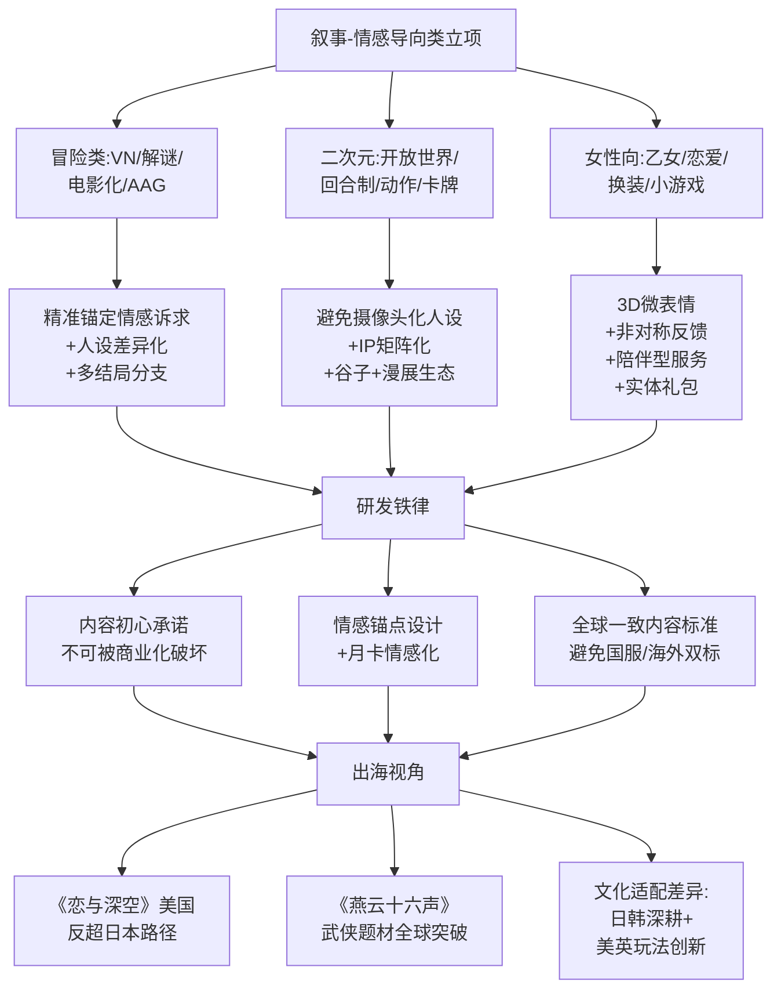

**针对立项阶段的具体建议**：**精准锚定情感诉求与人设差异化**——女性向赛道应突破"总裁、年下、上司"的固化模板（《恋与深空》将神话元素融入角色塑造的成功证明）；二次元赛道避免人设同质化与"摄像头化"（玩家普遍反感角色被设计为摄像头）；冒险类应在"情感真诚"与"商业可持续"之间找到平衡点。同时，**重视女性向小游戏作为中尾部厂商的破局机会**——友谊时光从亏损到290.7%净利润增长的扭转路径已经验证这是一条独立于App端"修罗场"的可行赛道[^115]。

**针对研发阶段的具体建议**：**重视3D微表情、非对称反馈、情感锚点三项核心技术**——3D微表情系统使共情强度提升41%（腾讯互娱A/B测试）、非对称反馈使留存率提升至行业均值1.7倍（Sensor Tower 2023 Q2）、单角色完整前史+独立配音+专属Live2D演出使ARPU提升52%（DataEye《2024女性向游戏变现白皮书》）[^93]。剧情节奏严格匹配3—5分钟微情绪反馈，而非传统长线任务驱动[^93]。**冒险类AAG赛道则应学习《燕云十六声》的"中式美学+自由探索"双轮驱动**——但必须警惕"飞白成诗"式的初心背离风险[^106][^105]。

**针对买量阶段的具体建议**：**把握短视频与社区双场景**——叙事-情感导向类用户的首次接触渠道高度集中于短视频（与第2章RPG用户89.3%每日观看短视频的画像一致）与社区口碑（56%乙女用户主动分享）[^95]。买量素材应突出**插画立绘+CV片段+剧情高光**，而非SLG式的"对抗冲突+权力炫耀"。**针对女性向小游戏赛道，则应充分利用微信社交关系链与抖音内容生态**——快节奏玩法+IP化策略已被友谊时光验证为下沉市场的有效路径。

**针对运营阶段的核心警告**：**警惕《恋与深空》"飞白成诗"、《世界之外》卡池涨价、《如鸢》台词低俗、《燕云十六声》初心争议等公关危机的玩家信任反噬**。这些事件的共同教训是——**叙事-情感导向类用户对"内容立场"的容忍阈值远低于其他品类，初心承诺一旦被破坏将引发系统性退游与口碑反噬**。具体运营建议包括：**第一，建立内容审核的多层把关机制，避免出现明显违背产品定位的内容设计；第二，制作人/核心策划的稳定性是核心资产**（《世界之外》制作人璇子的离职直接加剧了产品危机）[^99]；**第三，公关危机出现时优先选择真诚道歉与快速整改，而非"国服整改海外保留"的双标操作**（《燕云十六声》案例已警示这种做法的代价）[^105]。

**针对出海阶段的具体建议**：把握**《恋与深空》美国市场反超日本的全球化路径**——证明中国女性向产品已具备全球化输出能力，海外占比52%意味着该品类的天花板已经从"中国市场"扩展到"全球市场"[^113]；**《燕云十六声》武侠题材首月海外1500万玩家、Steam好评率从58%飙升至88%**则证明武侠题材的全球文化吸引力[^105]。**文化适配的核心差异**——结合第2章已揭示的"日韩玩家接受角色塑造、情感羁绊为核心、玩法为辅；欧美玩家更看重玩法和游戏性创新"原则，叙事-情感导向类产品在日韩市场可深度沉浸于角色塑造与剧情共鸣，在欧美市场则需在保留情感内核的同时强化玩法创新与个人能动性体验。

### 5.5.5 与第6章的衔接

至此，本章完成了对叙事-情感导向类游戏三大子品类（冒险类、二次元、女性向）用户画像的系统拆解。**本章揭示的核心洞察是——这一赛道的用户根本驱动是"剧情共鸣+角色情感投射+审美沉浸+社区共创"四位一体，催生了独特的"情感商业化"范式：用户为情感价值付费、为角色应援付费、为陪伴体验付费、为IP延伸付费**。叠加2024—2025年女性向124.1%与谷子经济40.63%的同比增长，该赛道已经从"小众细分"演化为"游戏产业新增长极"。

**与本章形成对比的是，第6章将转向休闲益智、竞速体育与Roguelike独立等细分品类用户画像**——这些品类的用户驱动力将呈现完全不同的图景：休闲益智类用户追求"碎片化轻反馈+时间利用"、竞速体育类用户追求"真实操控感+IP情感"、Roguelike独立用户追求"机制创新+重玩深度"。第6章将在"玩法品类为主线"的统一框架下继续展开分析，特别关注小游戏崛起对休闲用户结构的重塑、竞速体育品类的男性主导特征、Roguelike独立赛道作为中小开发者立项蓝海的战略价值。

# 6 休闲益智、竞速体育与Roguelike独立等细分品类用户画像

承接前五章对RPG、竞技对战、策略与模拟经营、叙事-情感导向类用户画像的系统深耕，本章作为分品类深耕的收束章节，将焦点转向三类在用户结构、付费模型与产品形态上各具鲜明特色的细分品类——**休闲益智、竞速体育、Roguelike独立**。这三类品类在主流游戏行业讨论中常被边缘化或简单归类为"长尾",但若从开发者视角进行深度审视，它们恰恰共同构成移动游戏与PC/主机市场的"长尾基本盘",在用户基数、画像独特性、对中小开发者的入局价值三个维度都具有不可替代的战略意义。

休闲益智凭借**女性主导+下沉化+碎片化**特征构成最广覆盖的用户基数——微信小游戏MAU突破5亿、女性占比超40%、24—40岁主力用户群与三线及以下城市用户深度渗透，使其成为整个游戏行业触达"非传统玩家"最有效的入口[^118][^119]。竞速体育以**男性主导+真实感诉求+IP情感**为典型画像，《NBA 2K26》《EA SPORTS FC26》《马里奥赛车》等长青IP产品构建了独特的"年货+硬件+赛事"三位一体生态[^120][^121][^122]。Roguelike独立则以**核心玩家+机制创新敏感+口碑传播**为标志——《杀戮尖塔》定义了一个全新设计范式、《魔法工艺》以全球70万销量近半数来自海外验证了国产独立的全球化突破能力、《杀戮尖塔2》97%好评率印证了"几乎没变"的设计哲学反而成为口碑护城河[^123][^124][^110]。

将这三个看似异质的品类合并为一章的方法论依据在于：它们都呈现出与前五章主流大品类截然不同的"**轻基本盘+长尾繁荣+中小开发者友好**"特征——休闲益智的低开发门槛与小游戏入口、竞速体育的拟真-娱乐双轨分化、Roguelike独立的原创机制与文化题材共同构成中小团队最具可行性的入局路径。本章在统一五维画像框架下逐一拆解三类用户特征（6.1—6.3），最后横向归纳跨品类心理画像并向中小开发者输出立项-研发-发行-社区运营的差异化战略建议（6.4），为第7章基于Bartle/Hexad/Quantic Foundry模型的跨类型心理归纳奠定品类素材基础。

## 6.1 休闲益智品类用户画像与小游戏崛起对用户结构的根本性重塑

休闲益智品类是2024—2025年中国游戏市场用户结构变迁最剧烈、生态形态最具创新性的赛道。本节按五维框架系统拆解，并专题深化小游戏崛起对该品类用户画像的根本性重塑。

### 6.1.1 市场基本盘：从344亿元规模到小游戏535亿元的范式跃迁

理解休闲益智用户画像之前，必须先勾勒该品类整体的市场坐标。华经产业研究院数据显示，**2022年中国移动休闲游戏市场规模约为344.4亿元，相较2021年的346.5亿元略有缩减；2021年中国移动休闲游戏用户规模约为5.3亿人，2022年约为5.2亿人**[^123]。这一规模与用户基数已经构成中国移动游戏市场最大的"基本盘"之一。但更值得关注的是**2024—2025年小游戏崛起对该品类整体范式的跃迁性重塑**——第1章已引用的数据显示，2025年中国小程序游戏市场规模达535.35亿元、占整体游戏市场15.3%，其中绝大部分由休闲与轻度品类贡献。极光月狐数据进一步揭示：**2024年中国小游戏市场实际销售收入达到398.36亿元，同比增长99.18%；其中内购（IAP）收入占比68.7%、广告变现（IAA）收入占比31.3%；相较2022年，IAP占比增长了近30个百分点**[^119]。

这组数据揭示了休闲益智品类正在经历的根本性范式转换：**从"低ARPPU+IAA为主"的传统休闲游戏模型，向"IAA与IAP并重+混合变现"的新模型迁移**。华经产业研究院明确指出，传统休闲游戏"具有高下载量、低ARPPU的特征，因此IAA（内置广告）是目前休闲游戏实现流量变现的主要来源，2021年收入占比甚至达到八成"[^123];但小游戏的崛起正在打破这一固化结构——内购占比突破68.7%、用户付费意愿显著抬升，意味着小游戏用户已经从"纯被动看广告者"演化为"愿意主动付费购买道具与皮肤"的活跃消费群体。

**子类型谱系层面**，休闲益智品类涵盖了消除类、策略塔防类、吞噬类、益智解谜类、动作/射击类、合成类、休闲模拟类、竞速跑酷类、音乐节奏类等众多细分，**消除类在休闲游戏中占据绝对优势地位**[^123]。结合微信小游戏与抖音小游戏2024年Q2榜单的实际产品分布看，当前休闲益智品类的头部已经发生了显著演化——MMORPG与放置（含开箱）成为占比第一的玩法、卡牌玩法位居第三，三者合计占小游戏畅销榜TOP40的61%;模拟经营约13%排名第四，传统消除类反而退居榜单边缘仅1款进入TOP40[^116]。这意味着**休闲益智品类的内涵已经远超传统的"消除+合成+IO"三件套，正在向"轻量化中重度玩法+休闲外壳"的复合形态演化**。

### 6.1.2 人口属性：女性主导+下沉化+24—40岁主力的鲜明画像

**休闲益智品类的人口属性画像在所有游戏品类中具有最为鲜明的"女性主导+下沉化+广年龄段"三重叠加特征**。

**性别结构维度**，QuestMobile相关数据显示**微信小游戏团队认为微信小游戏用户与传统游戏有较大不同——女性用户占比高、三线城市用户占比一半、用户年龄以24—40岁为主**[^116]。极光月狐数据进一步细化：**小游戏中女性用户比例超40%，在部分休闲、塔防品类产品中该比例超过50%**[^119]。这一画像与第3章竞技对战类的男性主导、第4章SLG的男性近90%形成鲜明对比，也与第4章模拟经营的女性占比超七成形成内部交集——**休闲益智品类的女性主导特征虽不及狭义模拟经营那么极端，但已经构成游戏行业触达女性用户的最广覆盖渠道**。极光月狐对此机制的解释是：**"App游戏因自身特征局限无法充分覆盖并满足女性玩家的游戏需求，相较之下小游戏能够触达到更广泛的玩家群体，拓宽行业规模"**[^119]——小游戏的轻量化、即点即玩、社交分享属性恰好契合女性用户的游戏偏好，构成对App端女性用户的有效补充。

**抖音小游戏的画像数据**进一步强化这一女性主导趋势——一份抖音小游戏掘金指南显示**18—35岁用户占比68%，女性玩家达55%**[^125]。需要指出的是，该数据来源于2024年小游戏开发者社区的运营指南，权威性低于官方平台数据，但其揭示的"女性占比过半"趋势与极光月狐口径基本一致，可作为辅助佐证。QuestMobile发布的2024年中国移动互联网年度大报告也明确指出：**"按用户类型来看，微信小游戏用户中女性用户、90后用户的占比正在上升"**[^118]。

**地域分布维度**，第1章已揭示的电竞用户下沉特征（四线及以下35.9%、一线13.6%）在休闲益智品类同样适用，且程度更深。微信小游戏的"三线城市用户占比一半"是这一下沉化最直接的画像数据[^116]。这一地域结构与传统APP游戏"一二线城市集中"的画像形成根本性差异——**小游戏正在触达此前被游戏行业系统性忽视的下沉市场用户**。

**年龄结构维度**，微信小游戏的"用户年龄以24—40岁为主"勾勒出该品类的年龄主力——**比传统APP游戏的"18—30岁年轻化"更偏成熟、比电竞用户的"85后核心"更广覆盖**[^116]。微信小游戏团队2025年披露的进一步数据显示：**"24—50岁以上用户占比65%，50岁以上20%"**[^122]——这一"50岁以上占20%"的银发用户渗透率在所有游戏品类中位居前列，意味着休闲益智品类已经成为银发用户首次接触游戏的最主要入口。结合第3章已揭示的"2025年中国老年电竞用户规模突破2000万、参与方式以《王者荣耀》娱乐模式与轻度竞技小程序为主"的数据，可清晰看出**银发化已成为休闲益智品类不可忽视的用户结构性变量**。

### 6.1.3 行为特征：碎片化高频次+私域启动+14日留存超50%

**休闲益智品类用户呈现"碎片化高频次+短单局+高留存"的典型行为特征**。微信小游戏团队披露的关键数据揭示了这一行为模式的极端形态：**"小游戏用户每天在线时长有一个小时左右，大盘的14日留存超过50%，其中超过一半是通过微信下拉、会话分享等私域场景启动小游戏"**[^116]。这组数据是理解休闲益智用户行为机制的核心锚点——**14日留存超50%已经达到甚至超越了部分中重度RPG的留存水平，挑战了"休闲游戏=低留存"的传统认知**。

**"用户是在主动去发现自己喜欢的小游戏，去享受游戏的乐趣，闲暇时刻'玩一款小游戏'，正在成为用户的习惯"**[^116]——这一表述揭示了休闲益智品类用户已经从"被动等待推荐"演化为"主动发现、主动启动、主动分享"的活跃形态。私域启动占比超过50%的数据，意味着**微信社交关系链已经成为该品类的核心分发渠道与启动入口**——用户通过好友分享、群聊推荐发现小游戏，又通过群内排行榜、好友比拼回归启动。这种"社交关系链驱动启动"的行为模式与第3章MOBA"熟人社交反哺游戏"的逻辑相通，但休闲益智品类的社交压力远低于MOBA——它属于**轻量级的"熟人推荐+独立游玩"模式**，而非MOBA的"熟人组队+协作竞技"模式。

**单局时长方面**，第1章已引用的数据显示：**"轻度产品如《羊了个羊》《合成大西瓜》依赖碎片化机制，单局耗时通常控制在90秒内"**。这种短单局设计完美适配通勤地铁、午休间隙、睡前等碎片化场景，与艾瑞咨询揭示的"超过68.3%的活跃用户日均启动游戏次数达5.2次，但单次平均停留时长仅为4.8分钟"的整体行为画像高度吻合（第1章引用）。

**抖音小游戏的复访行为模式**呈现独特特征。抖音小游戏团队披露的数据显示：**"用户复访并不依赖单一入口，而是有更多适合个人习惯的入口选择——包括侧边栏、综合搜索、信息流直玩、抖音小游戏中心等，也有短视频、直播等更多主动触达的信息触点，便捷用户复访"**[^122]。**"抖音小游戏与常规App目前重合度仅1%"**[^122]——这一极低的用户重合度证明，抖音小游戏触达的是一个几乎完全独立于App游戏的全新用户群体，其用户基础来源于抖音内容生态本身。

### 6.1.4 心理动机：轻量反馈+时间利用+爽点轰炸+心理睡眠

休闲益智用户的心理动机可以借助多重解释框架进行结构化分析，呈现"轻量反馈+时间利用+爽点轰炸+心理睡眠"的复合驱动结构。

**第一，轻量反馈与心流体验**——休闲益智品类的核心心理价值是构建"低门槛+即时反馈+可控难度"的心流环境，这与第4章模拟经营的心流逻辑一脉相承，但休闲益智的心流周期更短（90秒级单局vs 模拟经营的15—30分钟单次）。第4章已揭示的"心流发生在挑战和技能完美平衡的那个点上"原理在《合成大西瓜》《羊了个羊》《抓大鹅》等爆款产品中得到典型实现。

**第二，爽点轰炸与挂机+泛三消的双轨设计**。基于行业观察的归纳极具研究价值：**"除了传统棋牌游戏，可以将榜单上的多数游戏分为'挂机养成'和'泛三消'两种类型。挂机游戏以《咸鱼之王》为例，游戏过程中看着伤害数字乱飞，听着各种击杀音效，是对视觉和听觉的双重刺激。搭配挂机玩法，最大程度地减少用户操作，玩家只需要看着战斗力不断地飙升，偶尔升级一下角色，抽一下卡，各种爽点就会持续不断地袭来"**[^126]。**"再适时地推出6元首冲活动，打破玩家不氪金的心理防线。玩到后期还有排行榜，比战力，迎合重度氪金用户喜欢'赛博斗蛐蛐'的心理需求"**[^126]。

至于"三消"游戏则是"玩法简单、快捷、易上手"的典型代表——**"《开心消消乐》能一直火到现在，就足以证明'三消'类型游戏的含金量了。同时通过难度调整，让用户多看广告"**[^126]。**这两种类型的小游戏都做到了持续且高频的爽点轰炸，刺激着用户一直玩下去**[^126]。这一"爽点持续轰炸"的心理设计逻辑，是休闲益智品类与模拟经营品类的根本差异——**模拟经营依赖延迟满足与长期反馈，休闲益智依赖即时高频的爽点刺激**。

**第三，时间利用与"20分钟效应"心理**——**"不少玩家的初衷可能是体验一下'20分钟'效应，想着就摸一小会鱼。回过神来的时候老板就已经站在身后了"**[^126]——这一调侃式描述精准捕捉了休闲益智用户的核心使用场景：**碎片化时间填充+逃避现实压力的短暂窗口**。

**第四，心理睡眠功能的延伸**——第4章4.4节已建立的"认知逃避作为心理睡眠"框架（伦敦帝国理工学院和格拉茨大学联合研究）在休闲益智品类同样适用，但其表现形式从模拟经营的"长时段沉浸式逃避"演化为休闲益智的"短时段密集型逃避"——用户通过90秒一局的爽点反馈，快速实现情绪调节与心理修复。

**第五，难度调控与广告变现的耦合机制**值得开发者警惕。**"《抓大鹅》在游戏关卡难度上致敬了《羊了个羊》——第一关负责玩法教学，第二关难度暴涨。虽然失败后可以观看广告复活和解锁各种道具，但有不少网友反馈，游戏有些刻意提高难度'迫使'用户去观看广告"**[^126]。这种"刻意提高难度迫使看广告"的设计虽然在短期内可以提升广告变现效率，但长期会损害用户体验与品牌口碑，是休闲益智品类商业化设计需要警惕的"短视红线"。

### 6.1.5 消费行为：IAA为主向混合变现迁移、低ARPPU高基数

**休闲益智品类的消费行为正在经历从"纯IAA"到"IAA+IAP混合变现"的根本性范式跃迁**。极光月狐数据揭示的"内购占比从2022年的不足40%抬升至2024年的68.7%"是这一跃迁的最直接证据[^119]。这意味着**休闲益智用户的消费意愿被显著激发，从"纯被动看广告者"演化为"愿意主动付费购买道具与皮肤"的活跃消费群体**。

**抖音平台头部小游戏中超9成为混合变现**[^119]——**"复合的变现模式为产品大规模广告投放提供了流水基础"**[^119]。混合变现的核心逻辑是：**"前3关纯广告，第4关开启内购；非付费用户增加20%广告频次"**[^125]——这种分层设计同时承接了广告变现的广覆盖收入与内购变现的高ARPPU收入。**实战案例《成语小状元》进阶版的关键数据**进一步揭示了这种混合变现模型的实际效果：**"开发成本：6.8万（含3万买量）；变现组合：广告40%+内购35%+导流25%；关键数据：次留45%、人均广告展示8.7次、30日ROI 1:5.3"**[^125]。这一案例数据虽然来源于小游戏开发者社区的运营指南而非权威机构数据，需谨慎采信，但其揭示的"广告+内购+跨平台导流"三段式变现模型已成为小游戏赛道的主流范式。

**女性用户的广告ARPU提升**是2024—2025年最值得关注的画像变化。微信小游戏团队披露：**"女性用户广告ARPU值同比提升70%"**[^122]——这一70%的同比涨幅是女性用户在小游戏赛道商业化深度跃迁的最直接证据，意味着**女性用户已经从"看广告意愿低"演化为"愿意持续观看广告并接受其商业价值"的活跃群体**。这一画像变化为女性向小游戏的商业化突破奠定了基础——第5章已引用的友谊时光通过《杜拉拉升职记》《凌云诺》等女性向小游戏实现扭亏为盈、《我的花园世界》登顶微信小游戏畅销榜的案例，正是建立在女性用户付费意愿系统性抬升这一画像基础之上。

**低ARPPU高基数的整体特征仍然成立**——休闲益智品类的整体ARPPU水平仍远低于RPG、SLG等中重度品类，但其用户基数（5亿+）的乘数效应使其总收入规模可观。从单款产品看，QuestMobile数据显示：**"《寻道大千》12月MAU有3508万，是微信小程序用户规模榜单TOP50中唯一上榜的游戏"**[^118];抖音小游戏付费用户规模2024年同比增长300%[^122]，证明小游戏赛道的付费用户基础正在快速扩张。

### 6.1.6 社交属性：私域分享+排行榜+轻社交的独特生态

休闲益智品类的社交属性呈现"私域分享+排行榜+轻社交"的独特结构，与第3章MOBA的强社交、第5章二次元的社区共创形成鲜明对比。

**私域分享构成微信小游戏的核心社交场景**——微信下拉、会话分享、群聊推荐等私域入口贡献了超过50%的启动量[^116]。这种社交模式的特点是**"被动接受分享+主动独立游玩"**——用户通过好友分享发现游戏，但游戏内体验本身仍偏单机化，没有MOBA式的"必须组队作战"压力。**社交"轻量化"是其核心设计原则**——好友PK排行榜、邀请好友助力、分享获得奖励等机制提供了社交动力，但不构成强制压力。

**排行榜机制满足"赛博斗蛐蛐"心理**——**"玩到后期还有排行榜，比战力，迎合重度氪金用户喜欢'赛博斗蛐蛐'的心理需求"**[^126]——这种排行榜攀比机制即使在挂机类休闲产品中也是高ARPPU用户的核心付费驱动力。

**小游戏社交的演化方向**值得开发者关注。一篇业内分析指出：**"过去微信小游戏的社交更多是基于单机化体验之后，通过排名以及社交分享带来的交互性。现在，单机和社交玩法并行，成为这一批小游戏能够长期维持生命力的关键"**[^122]。**对厂商而言，社交化能够带来延长产品寿命、减轻买量循环的依赖度，而在天平的另一端，流量平台们也在鼓励小游戏社交化发展，带动自己旗下流量的内部流转**[^122]。这意味着小游戏赛道下一阶段的竞争焦点将从"单机爽点设计"演化到"社交化生态构建"。

### 6.1.7 微信vs抖音双平台格局与用户结构差异

**微信小游戏与抖音小游戏构成休闲益智品类的双平台格局，但其用户结构与运营逻辑存在显著差异**。

**微信小游戏MAU突破5亿、日活1亿、IAA同比增长30%、IAA年流水破百万游戏超过900款**[^122]，构成绝对的规模优势。其核心用户特征是**"24—50岁以上占65%、50岁以上20%、女性广告ARPU同比+70%、三线城市占比一半"**[^122]，呈现**多元、成熟、地域分布广**的特点。

**抖音小游戏则呈现"内容驱动+大龄男性与年轻女性比例提升"的独特画像**。抖音平台公开数据显示：**"抖音小游戏在过去一年内活跃天数为4.78天，提升了31%；流水全年提升240%、付费用户规模增长300%"**[^122]。**"抖音小游戏大龄男性和年轻女性的比例有明显提升"**[^122]——这一与微信小游戏不完全相同的用户结构，源于抖音内容生态的独特调性。**"50%首次感受到游戏乐趣，也就是非游戏用户实现了转化"**[^122]——这一数据表明抖音小游戏触达的是大量非传统游戏用户。

下表系统对比微信与抖音双平台的用户画像差异：

| 维度 | 微信小游戏 | 抖音小游戏 |
|------|----------|----------|
| 用户规模 | MAU 5亿+ | 活跃用户1亿+ |
| 启动入口 | 私域分享+下拉+会话 | 短视频+直播+信息流 |
| 用户结构 | 24—50岁占65%、50+占20%、三线占半 | 大龄男性+年轻女性比例提升 |
| 核心驱动 | 社交关系链推荐 | 内容生态驱动 |
| 付费模式 | IAA占31.3%、IAP占68.7%（2024） | 头部超9成混合变现 |
| 与App重合 | 部分重合（约70% App用户用微信小游戏） | 仅1%重合 |
| 头部产品 | 寻道大千、无尽冬日、咸鱼之王 | 头部消耗小游戏90%混变 |
| 增长动力 | 老用户深耕+下沉延伸 | 非游戏用户大规模转化 |

**两个平台呈现"互补而非替代"的关系**——微信小游戏深耕熟人关系链与下沉市场，抖音小游戏聚焦内容生态与非游戏用户转化，共同构成中国小游戏市场的完整版图。极光月狐报告对此明确判断：**"我们认为小游戏当下正处在发展的中、前期，行业仍存在大量机遇和可供开发的赛道。微信、抖音小游戏各自为战，分别立足不同的自身优势，吸引开发者布局"**[^119]。

### 6.1.8 爆款案例与女性向小游戏新增长曲线

**典型爆款产品的爽点设计逻辑值得开发者深度研究**。

**《寻道大千》**——长期占据微信小游戏畅销榜TOP1，是开箱like品类的标杆，QuestMobile显示其12月MAU达3508万[^118]。其成功的核心是"开箱抽卡+战力数值+排行榜+裂变社交"的复合化设计。

**《无尽冬日》**——4月上线后畅销榜排名一路飙升至前二、与《寻道大千》交替登顶[^116]，第1章已引用其全球累计收入超过40亿美元的数据。这是SLG轻量化与小游戏渠道融合的标志性案例。

**《向僵尸开炮》**——MAU超过2000万，证明轻度射击+生存玩法在小游戏赛道的可行性[^118]。

**《咸鱼之王》**——卡牌挂机like品类标杆，依靠**"看着战斗力不断地飙升+6元首冲活动+排行榜赛博斗蛐蛐"**的爽点轰炸模式实现长期留存[^126]。

**《抓大鹅》**——传统三消玩法+《羊了个羊》式难度暴涨，**第一关教学、第二关难度暴涨、失败可看广告复活**[^126]——这种设计虽存在"刻意逼迫看广告"的争议，但商业化效率极高。

**女性向小游戏新增长曲线**——第5章5.4节已系统分析了友谊时光从亏损到290.7%净利润增长的扭转路径，本章进一步从休闲益智品类视角强调其战略意义。**《我的花园世界》登顶微信小游戏畅销榜并霸榜整个春节假期、《时尚百货城》单月收入千万**[^115]——这些女性向小游戏的成功，建立在女性用户广告ARPU同比+70%与微信小游戏女性用户占比持续提升的画像基础之上。**女性向小游戏与传统休闲益智游戏的核心差异**在于：**前者引入剧情驱动+IP化策略+情感共鸣机制**，弥补了传统IAA休闲小游戏"缺乏情感共鸣、未能得到泛化女性受众认可"的短板[^115]。

**对中尾部厂商的破局意义重大**——**"两年前，微信小游戏畅销榜依然很少见女性向游戏，许多IAA休闲小游戏都面向女性用户，但因缺乏情感共鸣，这些产品多数未能得到泛化女性受众的认可，反而是许多男性向IAP游戏收割了这部分女性玩家。在此背景下，友谊时光选择以快节奏玩法和IP化策略进军女性向小游戏赛道，成功吃到了下沉市场的增量红利"**[^115]。这一案例对开发者的核心启示是：**休闲益智+女性向题材+小游戏渠道**的三重叠加，是当前对中尾部厂商最具确定性的破局赛道之一。

## 6.2 竞速与体育品类用户画像：拟真-娱乐双轨与IP情感依赖

竞速与体育品类是叙事-情感导向类之外另一个高度依赖**真实感+IP情感**双重驱动的赛道。本节按五维框架系统拆解，并重点呈现拟真-娱乐双轨分化与IP驱动的体育游戏画像。

### 6.2.1 竞速品类的拟真-娱乐双轨分化

竞速品类的根本画像分化是**"拟真度"维度上的拟真-娱乐双轨**。网易游戏内部知识管理平台一篇业内分析将竞速游戏的核心体验归纳为三大类：**"真实视听、爽快飙车、磨炼车技"**[^97]。这三大体验在不同产品中的权重组合，决定了用户画像的根本差异。

**拟真型竞速代表（拟真度★★★★★）**——《神力科莎》《iRacing》构成赛车模拟的硬核标杆。模拟赛车的定义本身就是**"以精确模拟真实赛车竞速为核心的虚拟驾驶体验体系，通过燃料使用、损坏模拟、轮胎磨损等物理变量实现高仿真驾驶，需配合方向盘、踏板等专业外设进行操控"**[^118]。**"《神力科莎》系列因方向盘反馈精度达0.0002°被国际汽联指定为官方赛事平台。该系列全球销量已突破2000万份"**[^118]。**"模拟赛车的硬件设备包含力反馈方向盘、伺服底座及碳纤维踏板等。部分方向盘的力矩反馈效果较为接近真实赛车，其反馈速度与动作精度可达较高水平"**[^118]——这种对硬件外设的极致依赖构成拟真型竞速用户的最显著行为标签。

**半拟真半娱乐代表（拟真度★★★—★★★★）**——《极限竞速:地平线》《极品飞车》构成开放世界探索+改装收集的代表。**"极限竞速:地平线3由Turn 10制作微软发行，开放式的世界和多样的比赛模式让人沉浸其中，游戏内收录的车型更是多达400多款，并且还在持续更新"**[^127]——丰富的车型与开放世界场景满足"探险者+收集者"双重驱动。

**纯娱乐代表（拟真度★）**——《马里奥赛车》《QQ飞车》构成合家欢竞速的代表。**"任天堂《马里奥赛车》就好似一个游离于三界之外、超脱于五行之中的存在，几乎从未有人质疑这一系列的品质"**[^122];**"《马里奥赛车8豪华版》依旧是NS主机畅销榜名列前茅的常客，多数NS玩家的主机当中或许没有《大乱斗》、没有《塞尔达》这些声名远扬的作品，但却有极大的概率拥有一份'装机必备'的《马车8》"**[^122]。其核心吸引力是**"在竞速的过程当中能够使用各种道具对其他车手造成阻碍，亦或是能够对自己的驾驶提供辅助，道具系统的加入极大程度地加强了游戏过程当中的不确定性"**[^122]——这种"道具+随机性"的设计让《马里奥赛车》成为合家欢游戏的标杆。

下表系统呈现竞速品类的三层用户画像差异：

| 拟真度层级 | 代表产品 | 用户画像 | 核心驱动 | 硬件投入 |
|----------|---------|---------|---------|---------|
| 硬核拟真★★★★★ | 神力科莎、iRacing | 25—45岁男性硬核、车迷 | 真实视听+磨炼车技 | 万元级专业外设 |
| 半拟真★★★—★★★★ | 极限竞速:地平线、极品飞车 | 18—40岁男性、跨度广 | 真实+爽快+收集 | 中端方向盘可选 |
| 纯娱乐★ | 马里奥赛车、QQ飞车 | 全年龄段、性别均衡、合家欢 | 爽快飙车+社交 | 手柄即可 |

### 6.2.2 拟真竞速用户：硬件投入与车技磨炼的硬核画像

**拟真竞速用户的画像极具差异化特征**——他们构成游戏行业中"硬件投入意愿最高、对真实感诉求最极致"的细分群体。

**硬件投入特征**极为显著。一位赛车游戏发烧友的体验描述具有典型性：**"第一次把GT ONE装在我的游戏椅上时，方向盘沉甸甸的金属质感就让我惊喜。900度转向范围完全模拟真车，玩《极限竞速:地平线5》时，我能清晰感受到轮胎压过砂石路的震动，甚至能通过方向盘阻力变化预判车辆即将打滑。最惊艳的是它的直驱电机技术，没有传统齿轮传动的'空洞感'。急转弯时方向盘会和我较劲，就像在真实赛道和离心力对抗"**[^116]。**"有次玩《神力科莎》连续过S弯，手心出汗的紧张感和真实驾驶一模一样"**[^116]。

**模块化设计与定制化诉求**——拟真竞速用户对外设的可定制性有极高要求：**"作为DIY爱好者，我超爱它的可拆卸盘面设计。周末跑GT赛事就用标配的330mm圆盘，手感厚实；想体验F1竞速时换上朋友送的方程式盘面（需另购），拇指位置的换挡拨片简直是为《F1 23》量身定做的"**[^116]。这种"按比赛类型切换不同盘面"的细节诉求，是该群体硬核度的最直接体现。

**专业方向盘选购指南**进一步揭示该用户群体的画像特征：**"力反馈与转动角度——入门款如V3PRO多为270°—360°固定角度，适合街机风格竞速；而高端款如PXNV999则支持900°甚至1080°无级调节，能还原真实车辆转向手感，更适合硬核模拟玩家。力反馈电机方面，双电机比单电机响应更快、震动更细腻，过弯时的路感和轮胎抓地反馈也更真实"**[^126]。这种从入门款到旗舰款的清晰分层，对应着用户从"街机风格爱好者"到"硬核模拟玩家"的画像递进。

**职业与业余的边界模糊**——拟真竞速最独特的画像特征是其与现实赛车的深度连接。**"虚拟赛车对真实赛车具有高还原度，使其不仅是虚拟体育赛事，也是业余与职业赛车手用于熟悉赛道、培养肌肉记忆的训练工具。《神力科莎:争锋》被国际汽联（FIA）指定为官方电竞赛事的软件，同时虚拟赛车运动也作为虚拟体育赛事的一部分出现在奥林匹克虚拟系列赛（OVS）中"**[^118]。**"中国首个数字虚拟赛车国家级赛事'2024中国数字虚拟赛车场地锦标赛（R1）北京站'举办"**[^118]——这种职业与业余的边界模糊化，是拟真竞速品类最独特的生态标志。

**Bartle心理类型映射**——拟真竞速用户呈现"成就者+探索者"复合驱动，对应"磨炼车技获得认可"与"探索不同赛道与车型的真实体验"两重核心动机;社交者驱动相对较弱，杀手驱动几乎不存在。

### 6.2.3 体育品类用户：年货IP情感+真实球员动作捕捉敏感

**体育品类用户的核心画像驱动力是"IP情感+真实感"**。其代表产品《NBA 2K26》《EA SPORTS FC26》等年货IP构成全球数百亿规模的稳定生态。

**《NBA 2K26》的画像分析**揭示了体育游戏用户的核心需求。其核心吸引力是**"作为每年都会推出的篮球模拟系列新作，《NBA 2K26》致力于在画面表现、球员动作捕捉和战术系统上实现进一步的优化和真实化。游戏提供了多种核心模式，包括让玩家从零开始打造超级巨星的'辉煌生涯'模式、管理整个球队王朝的'梦幻球队'模式以及紧张刺激的线上多人对战。游戏收录了最新的NBA球队、球员数据和球衣，力求还原最真实的篮球竞技体验"**[^120]。**"游戏在动作捕捉和球员AI方面持续精进，旨在让玩家感受到如同观看真实NBA比赛一般的视觉和操作体验"**[^120]。

**核心模式构成体育游戏的双驱动**：**"辉煌生涯模式为玩家提供了深入的角色扮演体验，不仅能体验场上的竞技，还能参与场外的社交和商业活动；梦幻球队模式则以其卡牌收集和阵容搭配的深度，吸引了大量策略型玩家"**[^120]。这种"RPG式生涯+卡牌式收集"的双驱动设计，恰好对应**"成就者+收集者+IP情感投射"**三重心理动机。

**《EA SPORTS FC26》的画像数据**进一步佐证体育游戏的IP情感依赖：**"EA SPORTS FC26 2026足球游戏卡带适合广泛的游戏人群，无论是足球迷、竞技游戏爱好者，还是家庭娱乐的玩家，都能在这款游戏中找到乐趣"**[^121]。**"FC26在AI系统上也进行了升级，敌方AI更加智能，能够根据玩家的操作做出灵活反应，让每一场比赛都充满变数。而在游戏内容上，FC26还增加了更多的球队和球员选择，满足了球迷们对足球文化的热爱"**[^121]。

**体育游戏用户画像的关键特征**可归纳为五点：**第一，年龄跨度大（18—45岁主力）但偏男性主导**，第三方画像数据可参照《使命召唤》同类男性82.25%的水平[^2];**第二，强IP情感依赖**——非纯粹的游戏玩家，而是NBA/英超/F1等真实赛事的粉丝群体延伸;**第三，对真实球员动作捕捉敏感**——动作捕捉、球员AI、战术系统的真实度直接决定购买决策;**第四，跨年龄家庭娱乐属性**——在朋友聚餐、家庭聚会场景具备强社交价值;**第五，年货IP的赛季粘性**——每年新作发售前积累期待，新作发售后2—3个月集中消费。

**Bartle心理类型映射**——体育游戏用户呈现"成就者+杀手+社交者"三重驱动:辉煌生涯模式满足成就者诉求、线上对战满足杀手诉求、家庭聚会与梦幻球队卡牌交易满足社交者诉求。

### 6.2.4 娱乐竞速代表《马里奥赛车》：合家欢与社交对抗

**《马里奥赛车》代表娱乐竞速的极致**。其28年历史与持续畅销证明这一画像分支的独特价值。**"作为《超级马里奥》系列的衍生作品，《马里奥赛车》诞生至今已经有整整28年的历史，期间已经推出过数款作品，为玩家群体当中津津乐道的合家欢游戏代表之作"**[^122]。

**核心设计哲学是降低拟真度、强化娱乐性与社交对抗**——**"《马里奥赛车》在'娱乐'方面的表现可谓是到了一个极致的水准。与其他竞速游戏相同的是，《马里奥赛车》的核心玩法依然还是比其他车手率先冲过终点，而其不同之处也是其最大的亮点，则是在竞速的过程当中能够使用各种道具对其他车手造成阻碍，亦或是能够对自己的驾驶提供辅助"**[^122]。**"道具系统的加入极大程度地加强了游戏过程当中的不确定性，从而让竞速的过程变得更加具有娱乐效果，但同时也极大程度提升了游戏当中的竞技成分。游戏当中，排名靠前的玩家能够拾取的道具大多为在赛道上布设陷阱，例如香蕉皮、陷阱道具方块等等，亦或是能够提供短暂加速的道具以拉开与其他玩家之间的距离，而排名越靠后的玩家，则拾取的道具更多为强力的攻击性道具"**[^122]——这种"排名靠后获得更强道具"的反向平衡机制，是合家欢娱乐竞速的核心设计智慧，**让弱者也能逆袭，避免对局过早失去悬念**。

**用户画像的根本扩展**——娱乐竞速用户呈现**"全年龄段+性别均衡+合家欢社交+轻硬件投入"**的鲜明特征，与拟真竞速的"25—45岁男性硬核+万元级硬件投入"形成根本对比。这一画像差异决定了娱乐竞速产品的核心战略——**降低操作门槛、强化社交对抗、依赖手柄即可游玩**，而非追求方向盘外设的硬件生态。

### 6.2.5 体育游戏的硬件外设生态与"小游戏化"机会

**竞速与体育品类的独特商业生态——硬件外设**——是该品类区别于其他游戏赛道的最显著生态特征。模拟赛车产业链**"在中国发展，多地设有体验馆或俱乐部"**[^118]，构成"游戏软件+硬件外设+线下体验馆+电竞赛事"的完整闭环。这一生态对开发者的启示是：**竞速品类的产品定位需要考虑与硬件生态的匹配——拟真型产品需要深度合作硬件厂商（罗技、图马思特、莱仕达等），娱乐型产品则可以走"手柄+触屏"的轻量化路径**。

**手游端的小游戏化机会**也值得开发者关注。第6.1节已揭示的小游戏赛道并未充分覆盖竞速与体育品类，目前微信小游戏畅销榜TOP40中竞速跑酷类与体育类产品占比极低[^116]。这意味着**休闲化竞速+小游戏渠道**可能是该赛道的新机会——参考《QQ飞车》在端手游时代的成功路径，开发轻量化、强社交、低硬件门槛的休闲竞速小游戏，承接女性用户与下沉用户的入门级竞速需求，是中小开发者值得探索的细分蓝海。

## 6.3 Roguelike与独立游戏用户画像：核心玩家+机制创新+口碑传播

Roguelike与独立游戏赛道是中小开发者实现全球化突破最具可行性的赛道。本节先厘清Roguelike从"类型"演化为"设计思路"的画像扩展逻辑，再按五维框架系统拆解用户画像，最后归纳独立游戏的精神内核与中小开发者立项启示。

### 6.3.1 Roguelike从类型到设计思路的演化

**Roguelike作为"类型"的起源可追溯至1980年的《Rogue》游戏**——**"Roguelike本身的理念源自于二十世纪七十年代的游戏，包括Adventure（1975）、Dungeon（1975）、DND/Telengard（1976）、Beneath Apple Manor（1978），并利用了一些PLATO系统（即第一代网络游戏），完成了基础建设。目的是在电脑上再现'DND'游戏体验，并且严格遵循'DND'游戏规则的单人回合扮演游戏"**[^128]。**"由于Rogue本身的大受欢迎，Roguelike类游戏自此平地崛起，如雨后春笋一般大量出现了很多Roguelike类游戏"**[^128]。

**Roguelite作为轻度化分支于2008年前后兴起**——**"Roguelite的概念可追溯至2008年左右的独立游戏浪潮，其初衷是创造一种比传统Roguelike更易于被大众接受的游戏类型。2009年发售的《洞穴探险》被视为Roguelite革命的开端。2013年，《盗贼遗产》在宣发时首次引入了'Roguelite'这一术语，用以明确其与传统Roguelike游戏的区别"**[^129]。**"'Roguelite'与'Roguelike'仅一字之差，体现了二者的关联；而'lite'则表明了此类游戏轻度化的特点"**[^129]。

**2010年代是Roguelite爆发式发展的黄金期**——**"《以撒的结合》《杀戮尖塔》《死亡细胞》《哈迪斯》等作品的出现和成功，进一步推动了Roguelite类型的发展。同期，其他作品如《挺进地牢》《邪恶冥刻》《雨中冒险2》《循环勇者》等也展示了Roguelite模式与弹幕射击、卡牌构筑、生存、RPG等多种游戏类型的融合"**[^129]。

**2017年起Roguelite演化为"设计思路"实现品类泛化**——这是该赛道用户画像最关键的演化节点。**"约自2017年起，Roguelite在作品数量和影响力上逐渐超越传统Roguelike，成为主流游戏品类之一。同时，该模式在手游领域得到广泛应用，并成为独立游戏及中小型开发团队偏爱的热门方向"**[^129]。**"作为一种设计思路，Roguelike的设计方法可以从'设计侧'与'决策侧'两个方向展开。设计侧聚焦程序化内容生成（PCG），致力于构建永不重复的外部挑战环境；决策侧则强调玩家通过随机生成的选项进行构筑和规划"**[^129]。

第1章已引用的判断**"Roguelike早已从一种游戏类型，逐渐泛化成为了一种设计思路"**在本节获得完整支撑。这种泛化对用户画像的根本影响是——**Roguelike用户已经不再是单一的"地牢爬塔爱好者"群体，而是分化为多个交叉于其他主流品类的细分群体**：Roguelike+卡牌（《杀戮尖塔》《月圆之夜》《邪恶冥刻》）、Roguelike+射击（《雨中冒险2》《挺进地牢》）、Roguelike+动作（《死亡细胞》《哈迪斯》《魔法工艺》）、Roguelike+塔防（《诺森德塔防》）、Roguelike+模拟经营（《循环勇者》）、Roguelike+战棋（《陷阵之志》）等。

### 6.3.2 人口属性与行为特征：核心玩家+18—35岁+PC/主机为主

**Roguelike与独立游戏用户的画像底色是"核心玩家居多+18—35岁+PC/主机为主+跨性别但男性偏多"**。

**作为参照系，可对比PC独立游戏用户与移动端中重度用户的差异**。第2章已引用《明日方舟:终末地》"PC端用户占比近60%、海外PC+PS渠道占比达70%"的数据，揭示PC平台仍是核心玩家群体的主战场。Roguelike独立游戏用户的PC属性更为突出——《杀戮尖塔》《死亡细胞》《哈迪斯》等代表作的主战场都在Steam与主机平台，移动端虽有跟进但收入占比远低于PC/主机。

**核心玩家特征**体现在三方面：**第一，对游戏机制深度有极高鉴赏力**——能够欣赏卡牌构筑的化学反应、Build搭配的策略深度、Roguelike随机性带来的局间差异;**第二，对重玩性有极强的耐受度**——单款产品玩数百小时是常态，《杀戮尖塔》"高塔的随机性设计保证了游戏拥有无限的重玩价值"[^124];**第三，对原创性与艺术性有相对较高的容忍度**——可以接受相对简朴的美术风格（如《杀戮尖塔》的卡牌风格）以换取机制深度。

**18—35岁年龄主力**与第2章ARPG用户的"20—29岁占六成"高度重叠，但Roguelike独立用户的年龄结构略偏成熟（25—35岁中坚力量更显著），原因是该品类对游戏阅历有较高要求，新手玩家较难直接接受Roguelike的高难度与重玩机制。

**性别结构上跨性别但男性偏多**——这一特征与第3章硬核MOBA、第6.2节硬核拟真竞速类似，但Roguelike独立赛道的女性用户占比明显高于这两者，特别是Roguelike+卡牌（《月圆之夜》以"童话暗黑风的卡牌冒险"吸引大量女性玩家）、Roguelike+剧情（《哈迪斯》以希腊神话剧情吸引情感导向用户）等子方向的女性渗透率较高。

**行为特征层面**，Roguelike独立用户呈现**"重玩意愿极强+单次时长弹性大+对随机性高耐受"**三重特征。重玩意愿——单局游戏失败后立即开始下一局是该品类的核心行为模式;**"游戏的卡牌、遗物和药水系统相互作用，能催生出无数令人惊喜的'化学反应'，策略深度惊人。同时，高塔的随机性设计保证了游戏拥有无限的重玩价值"**[^124]。单次时长弹性——既可碎片化（10—20分钟一局《杀戮尖塔》），也可深度沉浸（连续数小时刷《以撒的结合》）。对随机性高耐受——欣赏"程序化内容生成"带来的不可预知性，将"随机性"作为乐趣本身而非bug。

### 6.3.3 心理动机：探险者+成就者+破坏者复合驱动

**Roguelike独立用户的心理动机呈现"探险者+成就者+破坏者"复合驱动的Bartle画像**——这一组合在所有游戏品类中独具特色。

**探险者驱动**对应Roguelike的核心机制——程序化内容生成与永不重复的外部挑战环境。每一局游戏都是新的探险，玩家通过探索发现新的卡牌组合、新的Build套路、新的Boss战策略。**"保留随机性是Roguelite的核心乐趣所在，游戏通过程序生成随机关卡、敌人、道具和事件，用随机内容和BD构筑作为游戏的最大特征，确保每次游戏流程和冒险都有新鲜感"**[^129]——这种"每局新鲜感"是探险者驱动的极致实现。

**成就者驱动**对应Roguelike的进阶难度系统与Build构筑深度。**《杀戮尖塔》通过进阶难度解锁带来的持续挑战，让它无论对于新手还是资深玩家，都能提供持久且纯粹的策略乐趣**[^124]。Roguelite的"局外成长"机制更是直接服务于成就者——**"Roguelite增加了局外养成线和保值属性，提供永久升级和资源继承系统，例如玩家在探险过程中收集到的武器图纸可以用于解锁更多的强力装备，使得即使玩家在局内失败，在局外也能积累成长因素，变相降低游戏难度并提高长线追求"**[^129]。

**破坏者驱动**——这是Roguelike用户区别于其他叙事-情感导向类用户的独特心理标签。Roguelike的核心爽感之一是**"打出夸张的Combo、用极致的Build碾压敌人、看着伤害数字飙升"**——这种"碾压式输出"快感与第3章射击品类的"爆头反馈"、第4章SLG的"权力征服"在心理底层是相通的，但Roguelike的破坏对象是程序化生成的敌人而非真实玩家，因此爽感更纯粹、社交压力更低。

**对机制创新与策略深度极致敏感**是Roguelike独立用户最独特的心理特征。该群体对玩法机制的鉴赏力近乎专业级——他们会反复讨论卡牌平衡、Build克制、随机种子、保底机制等深度话题。**"作为将Roguelike、地牢探索和卡牌构筑完美融合的先驱，《杀戮尖塔》最大的亮点在于其极高的设计完成度与精妙的数值平衡。游戏的卡牌、遗物和药水系统相互作用，能催生出无数令人惊喜的'化学反应'，策略深度惊人"**[^124]——"设计完成度与精妙数值平衡"这种近乎学术化的鉴赏维度，是Roguelike独立用户群体的典型话语体系。

**对叙事与艺术性的相对高容忍度**是另一独特心理特征。该群体可以接受相对简朴的美术风格（《杀戮尖塔》的卡牌风格、《以撒的结合》的简笔画风），但对核心玩法机制的深度要求极高;同时也能欣赏富有艺术性的独立作品（如《邪恶冥刻》的诡异叙事、《哈迪斯》的希腊神话剧情）。这种"机制为本+艺术为辅"的审美取向，构成Roguelike独立赛道的核心鉴赏标准。

### 6.3.4 消费行为：买断为主+Steam特别好评驱动+单次下载收入逆势上涨

**Roguelike独立用户的消费行为呈现"买断为主+Steam特别好评驱动+单次下载收入逆势上涨"的特征**。

**买断模式主导**——与移动端F2P+IAP/IAA模式不同，Roguelike独立游戏的主流商业化是Steam/主机平台的买断制，售价通常在68—128元区间，部分高端作品可达248元。这种买断模式与该群体的核心玩家属性高度匹配——他们愿意为高质量内容一次性付费，反感F2P+逼氪的商业化设计。

**Steam特别好评驱动**——Roguelike独立赛道的口碑机制极为重要。第1章已揭示**《杀戮尖塔2》97%好评、40万在线**[^123]——尽管该搜索结果详情有限但标题信息清晰指向"几乎没变"的设计哲学反而获得用户认可，这是Roguelike独立赛道用户对"延续性+精进性"的核心诉求体现。**《魔法工艺》在Steam平台的特别好评率长期保持在90%以上**[^110]，证明90%+好评率是该赛道头部产品的普遍门槛。

**SensorTower数据揭示的整体趋势**也佐证了这一画像——**"全球IP手游平均单次下载收入则逆势上涨，2025年同比提升12%"**[^110]，第5章已引用这一数据;Roguelike独立赛道虽非IP手游，但其"用户基数稳定、用户付费深度持续提升"的趋势与之相通——核心玩家群体虽然规模有限，但其付费意愿与单用户价值持续抬升，构成中小开发者可持续运营的商业基础。

**Roguelike独立赛道的成本-回报模型**对中小开发者极具吸引力。第5章已引用QYResearch数据指出"文字冒险类凭借低开发成本优势占据全球叙事游戏18.7%的市场份额、成为中小厂商的重要切入点"，这一逻辑同样适用于Roguelike独立赛道——**"独立游戏开发者面对的是一个很大的市场，他们需要在竞争中脱颖而出"**[^109];**"成本低，你的制作预算只有大发行商的十分之一甚至更低；聪明，你能运用很少的预算、小规模的团队去实现一些'大'的梦想"**[^109]——独立游戏的核心精神之一就是低成本+高创意的组合。

### 6.3.5 社交属性：B站/Steam社区+UGC二创+口碑裂变

**Roguelike独立用户的社交属性呈现"B站/Steam社区+UGC二创+口碑裂变"的独特生态**。

**B站作为中文核心用户阵地**——第3章已引用三角洲行动以B站为发行核心阵地的策略，**"B站约1600万核心用户中66%集中在18—30岁、62%—64%居住在高线城市、平均每天在B站消耗180分钟"**——这一画像与Roguelike独立用户的核心玩家属性高度吻合。Roguelike独立游戏的中文宣发主战场就是B站——通过UP主直播、攻略视频、机制解析、Build分享等内容形式实现口碑裂变。

**Steam社区+评论生态**——海外的核心阵地是Steam，**"游戏在Steam平台的特别好评率长期保持在90%以上"**[^110]构成Roguelike独立赛道的口碑护城河。Steam社区的玩家深度评论、攻略指南、Mod创作共同构成产品的长尾生命力。

**UGC二创+Mod生态**——部分Roguelike独立产品高度依赖玩家二创内容延长生命周期。**《魔法工艺》"在PC版中广受好评的IP联动内容，如与《暖雪》《黄老饼》《背包乱斗》等热门IP合作推出的专属套装、法术和皮肤，也将同步移植至移动端"**[^110]——独立游戏之间的IP联动构成独特的社区共创现象。

**口碑裂变机制**——Roguelike独立游戏的发行高度依赖玩家自发口碑传播，而非传统的大规模买量。这种"反买量"的发行逻辑与第3章MOBA、第4章SLG的高买量成本形成根本性差异——**对中小开发者而言，Roguelike独立赛道的发行成本相对可控，但需要扎实的核心玩家口碑积累作为前提**。

### 6.3.6 案例研究：尖塔Like赛道的多元突破与《魔法工艺》全球化突破

**《杀戮尖塔》定义的"尖塔Like"赛道呈现多元化突破**[^124]：

- **《杀戮尖塔》（鼻祖，2019）**——卡牌肉鸽奠基者，"Roguelike+地牢探索+卡牌构筑"的完美融合;
- **《月圆之夜》（轻量化+剧情，2019）**——"以童话'小红帽'的故事为背景，单局流程更短，卡牌和遗物的数量相对克制，减少了学习成本，非常适合碎片时间游玩;通过丰富的随机事件、剧情分支和多结局设计，巧妙地将策略卡牌与童话暗黑风格的叙事深度结合起来"——这是国产独立游戏在尖塔Like赛道的成功代表;
- **《怪物火车》（垂直三层战场，2020）**——"游戏最核心的机制是垂直三层战场，敌人会从底层进攻，逐步向上移动;游戏允许玩家从五大怪物氏族中选择两个进行组合，形成双氏族"——通过双氏族搭配带来策略维度的新突破;
- 以及《邪恶冥刻》《循环勇者》等更多创新方向。

**《魔法工艺》（Magicraft）的全球化突破**是国产Roguelike独立的标志性成功案例[^110]：

**"由波浪科技研发，bilibili游戏独家代理发行的'魔法编程'动作Roguelike游戏《魔法工艺》正式宣布游戏全球累计销量突破70万份"**[^110]。**"《魔法工艺》于2023年11月登陆Steam平台开启抢先体验（EA），两年来凭借创新的'魔法编程'玩法、爽快刺激的肉鸽战斗体验、融合克苏鲁元素的魔性画风备受海内外玩家好评"**[^110]。

**全球化层面的关键画像数据**——**"截至2025年10月，《魔法工艺》全球销量正式突破70万份，其中，游戏近半数销量来自海外市场，欧美地区表现尤为亮眼"**[^110]——海外占比近50%是国产Roguelike独立全球化突破的标志性成绩，**"游戏低门槛高上限的玩法机制设计、兼容多语言及文化元素的设定，为其全球化渗透提供了重要支撑"**[^110]。**"《魔法工艺》不仅突破了国产单机游戏在海外市场的常规表现，也证明了其玩法设计与文化输出的普适性"**[^110]。

**长期打磨与玩家反馈驱动迭代**是该案例最值得开发者学习的运营哲学——**"自EA阶段上线至今，《魔法工艺》已历经近两年的开发与维护，在此期间，游戏进行多次更新，新增了数十种法术、怪物与关卡，不断为玩家提供更新鲜的游戏体验。《魔法工艺》始终将玩家反馈作为重要迭代方向"**[^110]。这种"玩家共创+持续打磨"的模式，与Roguelike独立用户群体的高鉴赏力、强口碑传播特征高度匹配。

### 6.3.7 独立游戏的精神内核与中小开发者立项启示

**独立游戏的精神内核**是该赛道吸引中小开发者的根本原因。触乐《问20人:什么是独立游戏?》栏目收集的多位行业人士定义勾勒出独立游戏的精神图景[^109]：

- **不拿主要发行商融资+不做主流游戏类型**——专栏作家Necromanov的国外习惯定义;
- **诚意+坚定+疯狂**——"诚意，有野心给市场带来一款伟大的产品；坚定，需要坚持不懈的努力；疯狂，相信自己的产品能在竞争激烈的市场里脱颖而出";
- **独一无二+成本低+聪明**——"独一无二，你唯一的机会就是去创造一些独特的东西，而不是抄袭现有的概念;成本低，你的制作预算只有大发行商的十分之一甚至更低;聪明，你能运用很少的预算、小规模的团队去实现一些'大'的梦想";
- **爱+决心+有趣**——"独立游戏人都是在爱的驱使下去开发游戏，他们想尽可能地打造最好的游戏";
- **个性和私心+好奇心+自信**——"最好独立游戏总是能反映创作者的个性，就像美术作品会反映画家的思考、梦想、缺点甚至恐惧"。

这些定义共享的核心精神是——**原创性+创作者表达+低成本智慧+核心玩家口碑**。这一精神内核与Roguelike独立用户群体的"机制创新敏感+口碑传播+鉴赏力高+对叙事与艺术性高容忍度"画像形成完美契合，构成中小开发者在该赛道立项的根本逻辑。

**Roguelike+融合方向的开发者立项蓝海**值得高度关注：

- **Roguelike+卡牌**——尖塔Like赛道已被验证，但仍有细分空间（叙事化、本土文化题材化）;
- **Roguelike+射击**——《雨中冒险2》《贪婪大地》《深空幸存者》等吸血鬼幸存者类的爆发证明这是一个高潜力融合方向[^113];
- **Roguelike+塔防**——《诺森德塔防》以二战为背景的"肉鸽塔防"展示了该融合的可行性[^113];
- **Roguelike+战棋**——《陷阵之志》以"英雄主义"叙事获得广泛好评[^113];
- **Roguelike+模拟经营+生存**——《暗星铁律》计划于2026年2月发售，是"融合殖民模拟+抓宠（帕鲁like）的Roguelite FPS游戏"[^128]，展示了融合方向的进一步扩展。

## 6.4 三类品类用户对比与对中小开发者的差异化战略洞察

在前述三大子品类拆解基础上，本节进行横向归纳与战略转译，回答两个根本问题：三类用户的画像差异核心是什么？中小开发者应如何匹配？

### 6.4.1 跨品类心理画像图谱：三类用户的根本差异

**横跨休闲益智、竞速体育、Roguelike独立三大品类，可识别出三类完全不同的复合心理画像**：

| 心理类型 | 休闲益智 | 竞速（拟真） | 竞速（娱乐） | 体育游戏 | Roguelike独立 |
|---------|---------|-----------|-----------|---------|--------------|
| 探险者（Bartle） | 中 | 高 | 中 | 中 | 极高 |
| 成就者（Bartle） | 中 | 极高 | 中 | 极高 | 极高 |
| 杀手（Bartle） | 低 | 低 | 中 | 高 | 中（破坏者） |
| 社交者（Bartle） | 中（轻社交） | 中 | 高 | 高 | 中（口碑传播） |
| 自由精神者（Hexad） | 高 | 中 | 中 | 低 | 极高 |
| 慈善家（Hexad） | 中 | 低 | 中 | 中 | 低 |
| IP情感投射 | 低 | 中 | 中 | 极高 | 低 |

**休闲益智用户偏"自由精神者+慈善家+轻量探索者"**——核心驱动是碎片化轻反馈+心理睡眠，对深度挑战与社交压力都低耐受;**竞速体育用户偏"成就者+杀手+IP情感投射"**——核心驱动是真实感+IP情怀+赛季粘性，硬件外设投入意愿强;**Roguelike独立用户偏"探险者+成就者+破坏者"**——核心驱动是机制创新+随机性+重玩深度，对原创性敏感、口碑传播力强。

**这三类心理画像图谱与第2—5章已揭示的画像形成完整闭环**：第2章RPG"成就+探险+情感投射"、第3章竞技对战"杀手+社交"、第4章SLG"杀手+成就+社交"vs模拟经营"探索+成就+自由+慈善"、第5章叙事-情感导向"探索+社交+情感"——加上本章三类的画像，构成游戏行业用户心理画像的完整全景。第7章将进一步基于Bartle/Hexad/Quantic Foundry模型对所有品类进行系统化归纳，本章的三类画像构成第7章重要的素材基础。

### 6.4.2 三类品类对中小开发者的战略价值排序

**休闲益智、竞速体育、Roguelike独立三类品类对中小开发者的战略价值各有侧重**，需要差异化判断：

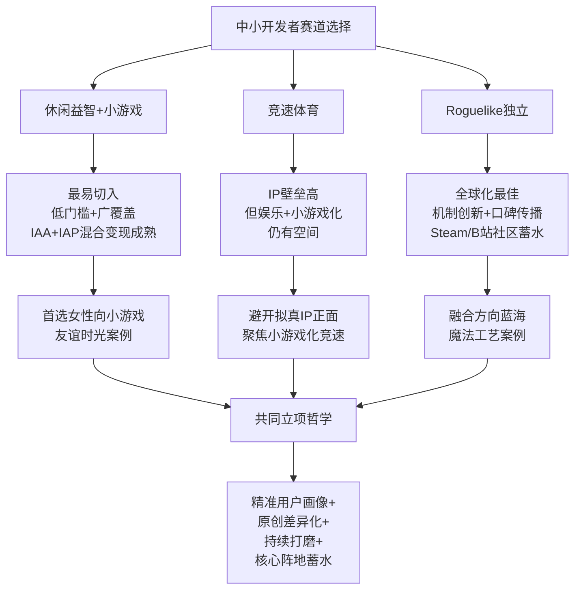

**休闲益智赛道——中小开发者最易切入的赛道**。其战略价值体现在三方面：**第一，开发门槛最低**——单款轻度休闲小游戏开发成本可控制在5—10万元，远低于RPG/SLG/二次元的千万级开发成本;**第二，用户基数最广**——女性主导+下沉化+24—40岁主力构成中国移动游戏市场最广的用户覆盖面;**第三，变现路径最成熟**——IAA+IAP混合变现模型已被市场充分验证，30日ROI 1:5.3的实战案例数据虽来源于运营指南需谨慎采信，但混合变现的整体可行性已被极光月狐等权威数据印证。**优先聚焦女性向小游戏赛道**——友谊时光案例验证的"快节奏玩法+IP化策略+下沉市场增量红利"路径，是当前对中尾部厂商最具确定性的破局方向。

**竞速体育赛道——IP壁垒高但娱乐+小游戏化仍有空间**。其战略价值体现在两方面：**第一，避开拟真IP正面**——《NBA 2K》《EA SPORTS FC》《神力科莎》等长青IP构成的护城河极高，中小开发者难以正面竞争;**第二，娱乐竞速+小游戏化**——参考《马里奥赛车》合家欢娱乐设计哲学与《QQ飞车》端手游成功路径，开发轻量化、强社交、低硬件门槛的休闲竞速小游戏仍有可行空间。**硬件外设生态合作**也是值得探索的方向——通过与莱仕达等国产外设厂商合作，覆盖入门级拟真竞速用户的"轻硬件+轻软件"组合需求。

**Roguelike独立赛道——中小团队全球化突破的最佳赛道**。其战略价值体现在四方面：**第一，开发门槛与品类壁垒平衡**——开发成本可控（"独立游戏制作预算只有大发行商的十分之一甚至更低"），但需要扎实的机制创新能力;**第二，用户口碑驱动发行**——Steam特别好评率90%+、B站UGC生态、社区共创形成相对低成本的发行渠道;**第三，全球化输出可行性高**——《魔法工艺》海外销量近50%、《杀戮尖塔》《月圆之夜》等案例验证文化普适性强;**第四，融合方向蓝海广**——Roguelike+卡牌/射击/塔防/战棋/模拟经营的融合空间仍未饱和。

### 6.4.3 立项-研发-发行-社区运营四环节差异化建议

**针对立项阶段的差异化建议**：

- **休闲益智**：精准锚定女性主力+下沉用户+银发用户三大画像红利;微信小游戏与抖音小游戏双平台差异化定位（微信侧重私域社交+下沉，抖音侧重内容生态+非游戏用户转化）;女性向小游戏是当前最具确定性的细分赛道。
- **竞速体育**：避开《NBA 2K》《EA SPORTS FC》等长青IP正面;聚焦娱乐竞速+小游戏化路径;考虑硬件外设生态合作的差异化定位。
- **Roguelike独立**：选择具有原创机制的融合方向（Roguelike+卡牌/射击/塔防/战棋等);本土文化题材+Roguelike机制是国产独立的差异化机会（如《月圆之夜》中国风童话);从EA抢先体验阶段开始就规划长期玩家共创路径。

**针对研发阶段的差异化建议**：

- **休闲益智**：核心是"爽点持续轰炸+难度调控+混合变现"三位一体设计;警惕"刻意提高难度迫使看广告"的短视红线;社交化设计需融入私域分享+排行榜+轻社交压力。
- **竞速体育**：拟真度选择决定研发投入级别——硬核拟真需要深度物理引擎与硬件适配能力;娱乐竞速则可聚焦道具系统与反向平衡机制（如马里奥赛车的"排名靠后获得更强道具");体育游戏IP合作是产品立项的前置条件。
- **Roguelike独立**：核心是"机制深度+数值平衡+程序化内容生成";美术风格可相对简朴但机制深度必须达到鉴赏阈值;持续打磨与玩家反馈驱动迭代是该赛道的运营哲学（《魔法工艺》两年EA持续迭代验证)。

**针对发行阶段的差异化建议**：

- **休闲益智**：双平台差异化发行——微信侧重私域社交关系链分发，抖音侧重短视频内容种草;混合变现产品的素材数量同比+97%意味着买量竞争激烈，差异化素材策略至关重要[^119]。
- **竞速体育**：年货IP的赛季节奏发行——新作发售前期积累期待，发售后2—3个月集中收割;娱乐竞速则可走"合家欢+多人对战"的口碑发行路径。
- **Roguelike独立**：B站+Steam双核心阵地蓄水——B站负责中文用户口碑积累，Steam负责全球玩家承接;EA抢先体验+特别好评率维护构成长期发行引擎;《魔法工艺》"由bilibili游戏独家代理发行"[^110]验证了B站作为独立游戏发行枢纽的战略地位。

**针对社区运营阶段的差异化建议**：

- **休闲益智**：私域社群+排行榜运营+赛季活动构成核心运营场景;女性向小游戏需注入剧情驱动与情感共鸣机制（参考第5章女性向商业化逻辑);老用户深耕优于新用户拉新（微信小游戏14日留存超50%的画像基础)。
- **竞速体育**：电竞赛事生态+硬件厂商联动+线下体验馆构成完整生态;关注虚拟赛车被FIA官方电竞赛事采用、奥林匹克虚拟系列赛（OVS）等趋势带来的新机会[^118]。
- **Roguelike独立**：玩家共创+UGC二创+IP联动构成独特运营生态;**《魔法工艺》与《暖雪》《黄老饼》《背包乱斗》等热门IP合作推出专属套装、法术和皮肤**[^110]——独立游戏间的IP联动是该赛道独特的社区运营创新。

### 6.4.4 共同战略哲学与与第7章的衔接

**三类品类共同指向中小开发者的核心战略哲学**可归纳为四个关键词：**精准用户画像+原创差异化+持续打磨+核心阵地蓄水**。

**精准用户画像**——避免泛泛的"年轻人、女性、休闲玩家"标签，深入到"24—40岁三线城市女性+碎片化时段+私域分享启动"这种具体场景化画像;

**原创差异化**——避免直接复制头部产品的玩法机制，通过融合创新（Roguelike+X、休闲+IP化、竞速+小游戏化）实现差异化定位;

**持续打磨**——独立游戏EA抢先体验+长期迭代、休闲小游戏A/B测试+爽点优化、竞速产品季度赛季更新都共享"长期主义"哲学;

**核心阵地蓄水**——B站之于Roguelike独立、私域社交链之于休闲益智、电竞赛事+硬件厂商之于竞速体育，每个赛道都有其核心用户阵地，发行策略必须围绕阵地展开。

至此，本章完成了对休闲益智、竞速体育、Roguelike独立三类细分品类用户画像的系统拆解。**本章揭示的核心洞察是——这三类品类构成了中国游戏市场最具"中小开发者友好度"的三条赛道，其用户画像在女性化、下沉化、IP情怀、机制创新、口碑传播等维度呈现出与RPG、竞技对战、SLG等主流大品类截然不同的特征**。叠加2024—2025年小游戏市场535亿元规模、女性用户广告ARPU+70%、国产独立游戏全球化突破等结构性变迁，该赛道已经从"长尾配角"演化为"产业新增长极的重要组成部分"。

至此，第2—6章完成了对全部主要游戏品类的用户画像深耕。**第7章将转向跨类型的横向归纳——基于Bartle/Hexad/Quantic Foundry心理模型对前述各品类用户进行系统化心理动机归类，并叠加重度/中度/轻度的分层视角，比较不同类型游戏中三类玩家的占比结构与商业化贡献，归纳用户生命周期不同阶段的画像迁移规律**。可以预见，第7章将通过模型化的归纳，将本章及前五章的丰富品类素材抽象为开发者可直接应用的心理动机-机制设计映射框架，为第8章跨类型对比与品类融合趋势分析、第9章对开发者的战略洞察启示提供方法论桥梁。

# 7 基于玩家心理模型与重度分层的跨类型画像归纳

第2—6章沿"玩法品类为主线"的纵深路径，已经完成对RPG、竞技对战、策略与模拟经营、叙事-情感导向、休闲益智竞速体育与Roguelike独立六大类游戏用户画像的系统拆解。读者此刻应已建立起一份相对完整的"品类×画像"二维地图——但这份地图仍是分散的：每一个品类都自成体系，跨品类的横向比较需要读者自行拼接。本章作为整篇报告的方法论收束章节，目标正是将前六章丰富的品类素材抽象为统一的分析坐标系——通过Bartle四类、Hexad六类、Quantic Foundry 12项动机三套心理模型完成"用户为何玩"维度的归类，通过轻度-中度-重度三层分层完成"用户怎么投入"维度的归类，通过新用户-活跃-付费-流失四阶段完成"用户如何演化"维度的归类。三套框架交织成一个三维立方体，每一个具体的游戏用户群体都可以在其中找到精确坐标。

本章的写作哲学是**"少描述、多映射"**——尽量避免重复前六章已陈述的品类细节，而是将这些细节作为已知素材在三套框架下重新组织，使开发者能够从单一品类的局部洞察跃升到跨品类的设计规律认知。本章共分六节展开:7.1奠定三套心理模型的方法论基础与边界;7.2建立各品类用户在Bartle与Hexad坐标系中的权重映射图谱;7.3从五大维度系统比较轻/中/重度玩家差异;7.4叠加付费金字塔模型剖析三类玩家在不同品类的商业化贡献;7.5拆解用户生命周期四阶段的画像迁移规律;7.6将三套框架整合为开发者可直接应用的决策工具。

## 7.1 Bartle四类与Hexad六类模型的方法论基础与适用边界

要建立统一的心理坐标系，必须先厘清三套主流模型各自的方法论根基、差异化定位与共同的解释力边界——这是本章所有跨品类映射工作的方法论前提。

### 7.1.1 Bartle四类模型:从MUD时代延续至今的品类定位工具

**Bartle模型是全部游戏玩家分类研究的奠基性框架**。理查德·巴特尔(Richard Bartle)是英国埃塞克斯大学电脑游戏设计专业荣誉教授,1978年作为人类历史上第一款MUD(Multi User Domain,多用户虚拟空间游戏)的开发者之一花了16年时间观察玩家在多人游戏下的行为,并在1996年的《红心、梅花、方块、黑桃:MUD游戏玩家分类》一文中第一次系统化提出玩家分类理论[^130][^131]。该理论通过两条轴线——"玩家-世界"轴与"作用于-交互于"轴——将玩家划分为四类:**杀手型(Killer,作用于玩家)、成就型(Achiever,作用于世界)、社交型(Socialiser,交互于玩家)、探索型(Explorer,交互于世界)**[^132]。

四类玩家的核心驱动力可归纳如下:**杀手型**追求"对其他玩家展开行动"的胜利感与碾压感,其代表行为是PVP对战、排行榜冲榜与压制对手[^14][^133];**成就型**关注游戏内的目标与成就,聚焦稀有物品、等级阶梯与完成度,典型表达是"我想变强"的欲望[^130][^133];**探索型**通过不断发现新事物获得喜悦,既包括地图与剧情的探索,也包括对游戏机制本身的研究——巴特尔进一步将其细分为以感性思维为主的"审美型"与以理性思维为主的"学习型"[^130];**社交型**将游戏视为社交工具,游戏本身只是背景,公会管理、聊天系统与人际关系比战斗机制更重要[^130][^131][^133]。

Bartle模型的核心优势是**简洁性与品类层面的高解释力**——对于创作多元化、吸引不同玩家的游戏内容提供了非常有价值的框架,适合在产品立项阶段判断"我的玩法对应哪类核心玩家"[^132]。但其局限性也十分明确:**第一,模型起源于MUD这种纯文字网游,不应该简单推广到所有游戏类型,也不应该直接用于游戏化设计**[^134];**第二,玩家类型可能发生重叠**,例如"轰炸公屏"行为同时具备杀手型与社交型特征,实际玩家在不同情境下可能展现出不同的行为模式[^132];**第三,巴特尔分类很大程度上取决于玩家的交互和作用方式,但当代游戏的艺术性远高于1979年的MUD游戏,在感官层面可以增加'情感型'(喜欢体验剧情)、'观赏型'(喜欢场景与人文要素)等扩展类型**[^132]。

### 7.1.2 Hexad六类模型:游戏化激励体系的扩展工具

**Hexad模型是Marczewski在Bartle基础上专为游戏化(Gamification)场景开发的扩展框架**——这一区别对开发者理解两套模型的应用分工至关重要。Tondello、Wehbe、Diamond、Busch等研究者在《游戏化用户模型:Hexad Scale》一文中明确指出:Bartle的玩家类型是专门为MUDs创建的,不应该推广到其他游戏类型中,也不应该用于游戏化设计;为了解决这个问题,Marczewski基于对人类动机、玩家类型和实际设计经验的研究,开发了游戏化用户模型Hexad框架,并提出了支持不同用户类型的不同游戏设计元素[^134]。

Hexad在Bartle四类的基础上扩展为六类:除保留**成就者(Achiever)、社交者(Socialiser)**之外,新增了**玩家(Player,被外在奖励驱动的功利型用户)、慈善家(Philanthropist,被使命感与利他动机驱动)、自由精神者(Free Spirit,追求自主性与创造性)、破坏者(Disruptor,被改变现状的需求驱动)**四类。研究者通过24项调查响应量表验证了该模型的内部信度与重测信度,并通过因子分析与大五人格特征(BFI-10)的相关性证实了Hexad用户类型的结构效度[^134][^135]。

Hexad的核心价值在于:**它直接将用户类型与游戏化设计元素建立量化映射关系**。研究者要求参与者为游戏化设计中经常用到的32个设计元素打分,并分析它们与每个Hexad用户类型的相关性,从而提供了"这类用户最偏好哪些设计元素"的实证依据[^134]。这意味着Hexad更适合在**游戏化激励体系层面**——例如运营活动、任务系统、徽章体系、社区互动机制——指导差异化设计,而Bartle更适合在**游戏品类层面**——例如玩法核心循环、整体玩家定位——指导产品立项。

### 7.1.3 Quantic Foundry 12项动机:细颗粒度的实证补充工具

第三套模型来自专门从事玩家动机科学研究的Quantic Foundry。其Gamer Motivation Model**基于来自4000+游戏标题的175万玩家实证数据,使用严格的心理测量方法构建**[^16]。该模型将玩家动机细分为12项,覆盖动作-社交-掌控-成就-沉浸-创意六大维度下更精细的子维度,例如"竞争(Competition)"、"毁灭(Destruction)"、"挑战(Challenge)"、"完成度(Completion)"、"幻想(Fantasy)"、"故事(Story)"、"设计(Design)"、"发现(Discovery)"、"社群(Community)"、"竞技(Competition)"等。第3章已引用其关键发现——截至2024年玩家在"策略思考"动力上的平均得分已从2015年的第50百分位大幅降至第33百分位,67%的玩家在游戏中不那么热衷烧脑的战略规划——这是过去十年游戏用户心理动机变迁的最有力实证证据。

学术研究层面,Murray(1938)从基础人类需求出发将心理需求分为物质、权力、归属、成就、信息、感官六大类的"心理需求理论"也对玩家动机研究提供了基础理论支撑——研究者认为在RPG等虚拟环境中,每一种心理需求都可以匹配到具体的游戏情境[^136]。对3000名MMORPG玩家的在线调查则实证地将玩家动机划分为成就(提升、机制、竞争)、社交(社交、关系、团队合作)、沉浸(发现等)三大成分[^137]。

### 7.1.4 三套模型的层层递进关系与本章使用边界

三套模型并非相互替代,而是构成层层递进的应用关系:

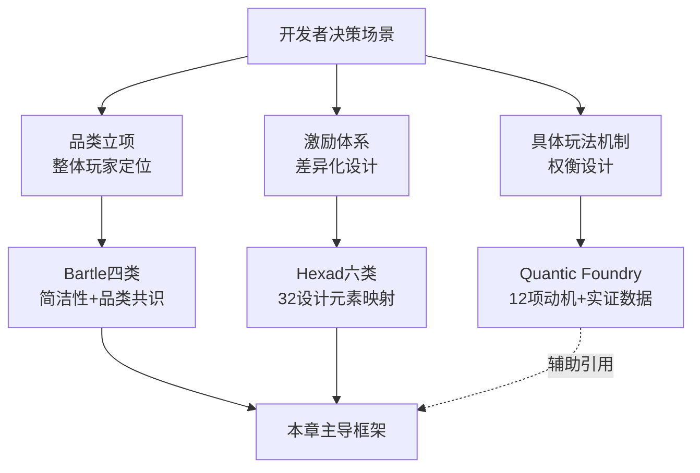

本章后续以**Bartle与Hexad为主导分析工具**——前者用于品类层面的整体心理画像归类(7.2节核心),后者用于激励体系层面的差异化设计映射(7.6节核心),Quantic Foundry的12项动机模型作为细颗粒度的辅助补充工具,在涉及具体动机权重(如"竞争""社群""幻想"等)时引用其实证数据。

更重要的是,本章在使用三套模型时严格遵守四条**方法论边界**:

**第一,模型重叠性**——玩家心理类型可能同时存在多重特征(如"社交型+杀手型"的轰炸公屏行为),实际玩家在不同情形下可能展现出不同的行为模式,所以在复用巴特尔模型时不应只局限于这四种模式[^132];

**第二,情境依赖性**——同一玩家在不同游戏中、不同生命周期阶段中可能呈现不同的主导驱动力,例如同一用户在《原神》中表现为探索者、在《王者荣耀》中表现为社交者、在《杀戮尖塔》中表现为成就者;

**第三,定性框架定位**——本章使用的心理类型权重映射(如"高/中/低"分级)是定性归纳而非定量结论,旨在提供分析坐标系而非分类教条;

**第四,文化与代际差异**——三套模型主要基于欧美玩家与MMORPG样本构建,其在中国市场、东亚二次元文化、银发玩家、Z世代等细分群体中的适用性存在边界,本章在归纳时尽量结合中国市场的实证数据修正。

明确了这四条边界后,下文7.2节将开始系统建立各品类的Bartle与Hexad权重映射。

## 7.2 主流游戏品类的Bartle与Hexad心理画像映射

本节是本章方法论收束的核心——将第2—6章涉及的全部游戏品类用户系统映射到Bartle四类与Hexad六类的统一坐标系中,并归纳"心理类型→玩法机制/激励系统/社交结构/付费触发"的四层映射规律。

### 7.2.1 跨品类Bartle与Hexad权重映射总表

为便于横向对比,本节先整合前六章已陈述的各品类心理画像数据,呈现统一的权重映射总表。表中权重采用"极高/高/中/低/极低"五级定性分级,综合考虑该心理类型在该品类用户中的**驱动强度与覆盖广度**:

| 品类/子类 | 杀手 | 成就者 | 社交者 | 探索者 | 玩家(P) | 慈善家 | 自由精神 | 破坏者 |
|---------|------|------|------|------|------|------|------|------|
| 传统回合制RPG/SRPG | 低 | 高 | 低 | 高 | 中 | 中 | 中 | 低 |
| ARPG | 中 | 极高 | 中 | 中 | 中 | 低 | 中 | 低 |
| MMORPG | 极高 | 极高 | 极高 | 中 | 高 | 中 | 低 | 低 |
| JRPG/二次元RPG | 低 | 中 | 高 | 高 | 中 | 高 | 中 | 低 |
| 开放世界RPG | 中 | 高 | 中 | 极高 | 中 | 中 | 高 | 低 |
| 硬核FPS | 极高 | 极高 | 中 | 中 | 高 | 低 | 低 | 中 |
| 英雄射击 | 高 | 高 | 高 | 中 | 中 | 中 | 中 | 低 |
| 大逃杀 | 极高 | 中 | 高 | 中 | 中 | 低 | 中 | 低 |
| 战术撤离(三角洲类) | 高 | 高 | 中 | 高 | 中 | 低 | 中 | 中 |
| 硬核MOBA(Dota2/LOL端) | 极高 | 极高 | 中 | 中 | 中 | 低 | 低 | 中 |
| 轻量MOBA(王者荣耀) | 高 | 中 | 极高 | 低 | 高 | 中 | 中 | 低 |
| 移动战争SLG | 极高 | 极高 | 极高 | 中 | 极高 | 低 | 低 | 中 |
| 4X策略 | 中 | 极高 | 低 | 极高 | 中 | 低 | 高 | 低 |
| RTS | 高 | 极高 | 中 | 中 | 中 | 低 | 中 | 低 |
| 模拟经营(硬核) | 低 | 极高 | 低 | 极高 | 中 | 中 | 极高 | 低 |
| 模拟经营(轻度/女性向) | 极低 | 中 | 中 | 高 | 高 | 高 | 极高 | 低 |
| 商道经营 | 低 | 高 | 中 | 中 | 高 | 中 | 高 | 低 |
| 视觉小说VN/解谜冒险 | 极低 | 中 | 中 | 极高 | 中 | 高 | 中 | 低 |
| 电影化叙事 | 低 | 中 | 中 | 高 | 中 | 极高 | 高 | 低 |
| 动作冒险AAG(武侠/玄幻) | 中 | 高 | 中 | 极高 | 中 | 中 | 极高 | 低 |
| 二次元抽卡(广义) | 低 | 中 | 高 | 高 | 中 | 高 | 高 | 低 |
| 女性向(乙女/恋爱模拟) | 极低 | 中 | 高 | 中 | 高 | 极高 | 中 | 低 |
| 换装养成 | 极低 | 中 | 高 | 中 | 高 | 高 | 极高 | 低 |
| 休闲益智(消除/合成/IO) | 低 | 中 | 中 | 中 | 极高 | 中 | 高 | 低 |
| 挂机放置类 | 低 | 高 | 中 | 低 | 极高 | 低 | 中 | 低 |
| 拟真竞速 | 低 | 极高 | 中 | 高 | 中 | 低 | 中 | 低 |
| 娱乐竞速(马里奥赛车) | 中 | 中 | 高 | 中 | 中 | 中 | 高 | 中 |
| 体育游戏(NBA 2K/FC) | 高 | 极高 | 高 | 中 | 中 | 中 | 中 | 低 |
| Roguelike独立 | 中 | 极高 | 低 | 极高 | 中 | 低 | 高 | 高 |

这张总表是本章后续所有分析的核心基础,值得开发者反复对照。从表中可以提炼出**六组典型驱动力组合**:

**组合一:杀手+成就+社交三高的"竞技对抗+组织绑定"型**——MMORPG、移动战争SLG、硬核FPS、硬核MOBA共同呈现这一组合,对应"长期沉浸+战力位序+组织归属"三位一体的心理需求。

**组合二:成就+探索为主的"内向沉浸"型**——ARPG、4X策略、Roguelike独立、拟真竞速、传统回合制RPG共同呈现这一组合,核心是"系统精通+发现欲"的内向驱动。

**组合三:探索+社交+慈善家的"叙事-情感导向"型**——JRPG/二次元RPG、二次元抽卡、电影化叙事、女性向乙女共同呈现这一组合,核心是"情感投射+社区共创"的外向延伸。

**组合四:自由精神+成就+探索的"创造-陪伴"型**——硬核与轻度模拟经营、商道经营、动作冒险AAG共同呈现这一组合,核心是"在虚拟世界中行使主权"的造物主体验。

**组合五:玩家(P)+社交+轻量探索的"碎片化娱乐"型**——休闲益智、轻量MOBA、挂机放置类共同呈现这一组合,核心是"轻量反馈+爽点轰炸+轻社交"的碎片化享受。

**组合六:破坏者+探险+成就的"机制颠覆"型**——Roguelike独立、战术撤离类共同呈现这一组合,核心是"对既定规则的突破与重组"的创造性破坏快感。

这六组组合构成游戏行业用户心理画像的"核心光谱",任何具体产品的目标用户都可以在这六组组合中找到主导定位与次要补充。

### 7.2.2 心理类型与玩法机制的映射规律

将上述权重映射进一步抽象,可以归纳出**心理类型→玩法机制**的清晰映射规律。这一映射是开发者在玩法循环设计阶段最直接可用的决策工具:

**杀手型→PVP排位机制+碾压性反馈**。杀手型玩家的核心驱动是"打败别人证明自己的强大"[^14]。激励这类玩家需要创造一个健全的能产生优势的PVP玩法,MOBA类、FPS类、策略生存游戏都拥有这样的核心主题;守尸行为(蹲在死亡角色出生点对其进行打击)也是一种为此存在的机制[^130]。常见设计策略包括设计排行榜、竞技模式让他们有目标去冲刺,提供荣誉勋章或特殊身份标识,以及给他们一个可以碾压别人的机会例如VIP专属特权、独占道具[^14][^15]。

**成就型→数值养成+完成度收集系统**。成就型玩家关注游戏内的目标与成就,聚焦稀有物品、成就、游戏等级[^132]。激励这类玩家需要创造比一般预期玩家能达成的目标还要更高的目标,如100%完成度、二周目或多周目流程,无处不在的成就系统也是吸引这类玩家的廉价方式[^130]。从《杀戮尖塔》的进阶难度到《文明》系列的胜利条件,从ARPG的装备词缀到MMORPG的等级阶梯,成就型机制都是产品长线生命力的核心支柱。

**社交型→公会协作+熟人组队系统**。社交型玩家把游戏当作社交工具来玩,游戏本身只是一个背景[^130]。常见设计策略包括设计用户互动机制如评论区、群聊、匹配系统,让用户可以展示自己的社交关系如好友列表、师徒系统[^14][^15]。第3章已揭示,《王者荣耀》依托微信、QQ熟人社交将原本应该从游戏期间构建的社交生态,转化为基于熟人社交而体验游戏的方式;蜂巢模型的身份-状态-分享-会话-关系-声誉-群组六要素是社交体系建设的标准框架。

**探索型→隐藏内容+开放世界涌现机制**。激励探索型玩家可以增加彩蛋、隐藏地点、逐层探索或者大量的自定义组合,尤其是那种看似开发者不会放进游戏里但最后发现还是有放进去的内容,这些奖励聪明玩家尝试不同玩法的内容会特别吸引他们[^132]。第2章已论述,开放世界RPG所擅长的"涌现叙事"正是面向探索者驱动的极致设计——玩家平均每小时触发3.2次非脚本化叙事事件,89%符合现实逻辑推演。

**自由精神型(Hexad)→自定义+沙盒创造**。自由精神者追求自主性与创造性,《模拟人生4》的高度个性化定制——玩家可通过点击身躯任意位置并拖拽来修改体型,角色拥有多种性格特征如傻瓜、创意、天才、好动等以及人生抱负如偏差行为、创意、家庭、幸运、爱情、知识、美食、声望、自然、运动风等[^138]——是自由精神型机制的标杆。模拟经营品类、女性向换装养成、《我的世界》等沙盒类游戏都将自由精神驱动作为核心。

**慈善家型(Hexad)→陪伴+利他+情感纽带机制**。慈善家型玩家被使命感与利他动机驱动,这一类型在女性向乙女游戏中体现得最为充分。第5章已揭示,女性向赛道68%的高付费用户更倾向购买"陪伴型服务"如定制生日提醒、节日专属剧情,而非单纯外观道具——印证情感附加值才是长效付费的核心驱动力。

**破坏者型(Hexad)→反规则+机制颠覆+挑战权威**。破坏者型在Roguelike独立、战术撤离类中表现最为突出——他们享受对既定规则的突破。在《杀戮尖塔》中找出"OP Build"碾压敌人、在《逃离塔科夫》中通过精心策划的撤离路线打破服务器经济平衡,都是破坏者驱动的典型表达。

### 7.2.3 心理类型与社交结构、付费触发的映射规律

除玩法机制之外,**心理类型→社交结构**与**心理类型→付费触发**两条映射同样关键。

社交结构层面,六大心理类型对应不同的社交压力梯度:**杀手型偏好对抗性社交**(PVP匹配、跨服战、世仇系统);**成就型偏好成就展示型社交**(战力榜、装备炫耀、段位标识);**社交型偏好关系沉淀型社交**(公会、师徒、好友等级);**探索型偏好同好分享型社交**(攻略社区、Wiki共建、UGC二创);**自由精神型偏好展示型社交**(家园拍照、装饰评分、空间参观);**慈善家型偏好情感共鸣型社交**(同人创作、应援活动、跨次元延伸)。

付费触发层面,六大心理类型对应五大典型范式:**杀手型→对抗性付费**(SLG战前囤兵、MOBA段位皮肤);**成就型→深度养成付费**(ARPG装备强化、JRPG资料片);**社交型→应援式付费**(电竞IP、二次元角色周年);**探索型→内容解锁付费**(VN章节、付费DLC);**慈善家型→陪伴型付费**(女性向月卡情感锚点、限定生日剧情);**自由精神型→自定义付费**(皮肤外观、装饰道具)。

将四层映射(心理类型→玩法机制→激励系统→社交结构→付费触发)串联起来,就构成了开发者从"目标用户心理定位"出发反向推导"产品全要素设计"的完整决策链。这一决策链将在7.6节作为开发者决策工具进一步整合。

## 7.3 重度、中度、轻度玩家的多维度差异比较

如果说Bartle与Hexad模型回答的是"用户为何玩"的心理动机问题,那么重度分层视角回答的则是"用户怎么投入"的行为投入问题。本节基于行业通行的轻/中/重度三层分类标准,从五大维度系统比较三类玩家差异,并归纳其在用户基数、留存曲线、付费深度、社区贡献四方面的对比。

### 7.3.1 行业通行分类标准与五大核心维度

行业通行分类标准明确区分轻/中/重度三档,涵盖时间投入、金钱投入、操作难度、所需脑力四方面[^139]:

**时间投入**:轻度10—60分钟、中度60—120分钟、重度120分钟以上[^139];

**金钱投入**:轻度0—500元、中度500—1000元、重度1000元以上[^139];

**操作难度**:轻度不怎么需要操作就能玩、中度需要点操作、重度非常吃操作不一直操作就玩不了[^139];

**所需脑力**:轻度无脑就能玩(部分挂机产品根本不需要付出什么脑力,无脑升级即可)、中度需要一定脑力、重度要实时投入脑力[^139]。

需要特别说明的是,该标准对"金钱投入"的具体数值在国内不同时期、不同品类下并非绝对统一(例如重度SLG的鲸鱼用户金钱投入远超1000元,休闲益智多数用户金钱投入接近0元),应将其视为相对参考而非绝对边界。本报告在前述章节已结合各品类实际数据进行了更精细的呈现——例如第4章SLG单用户成本可达4000元、第5章《恋与深空》中氪玩家近2万元、第6章休闲益智低ARPPU高基数特征,都是对通用标准的细化。

在通用标准基础上,本节进一步引入**内容深度、情感体验、IP代入感**三个维度,与时间、金钱、操作、脑力共同构成五大核心维度的比较框架。下表系统呈现三类玩家在五大维度的差异:

| 维度 | 轻度玩家 | 中度玩家 | 重度玩家 |
|------|---------|---------|---------|
| 时间投入 | 10—60分钟/次,日均≤30分钟 | 60—120分钟/次,日均30—120分钟 | 120分钟以上/次,日均≥2小时 |
| 金钱投入 | 0—500元/年,以IAA为主 | 500—5000元/年,中度付费深度 | 5000元以上/年,鲸鱼可达数十万 |
| 操作难度 | 挂机型/单击型 | 反应型+组合操作 | 深度操作+多线协调+毫秒级精度 |
| 内容深度 | 单一爽点循环+90秒单局 | 多层养成线+15—30分钟单局 | 剧情/世界观深度沉浸+多周目 |
| 情感体验 | 碎片化轻反馈+爽点轰炸 | 中度成就感+社交认同 | 深度情感投射+IP情怀+应援式付费 |
| IP代入感 | 无IP依赖+爽点驱动 | IP情怀加成+品牌忠诚 | IP情感投射主导+全产业链消费 |

### 7.3.2 三类玩家的横向对比数据

将上述定性差异叠加横向数据,可以进一步勾勒三类玩家在用户基数、留存曲线、付费深度、社区贡献四方面的分化结构。

**用户基数层面**,轻度玩家是绝对基本盘——Data.ai 2024年Q1报告显示全球手游用户中单次游戏时长≤8分钟的占比达61.3%,其中超半数集中在通勤、午休、排队等场景;ESA《游戏的力量2025》全球调研指出全球玩家平均年龄41岁,移动设备使用率达55%[^137]。中度玩家是行业主体——QuestMobile与艾瑞咨询数据已揭示日均启动5.2次但单次4.8分钟的"高频次微沉浸"用户构成行业主流,2024年中国手机游戏APP MAU达6.59亿,其中绝大部分是中度玩家。**重度玩家虽是少数,但贡献远超其用户占比**——Newzoo《2023全球游戏市场报告》指出全球月均活跃手游用户中约18%被定义为"核心玩家",其特征为日均游戏时长超90分钟、年均付费金额达427美元(约合人民币3070元),且连续3个月以上保持高频率登录[^140];QuestMobile《2024中国移动游戏用户分层报告》进一步显示,Z世代玩家中"核心玩家"群体(周均游戏时长≥14小时,付费意愿强,主动参与社区内容创作)规模已达1.27亿,较2021年增长89%[^141]。

**留存曲线层面**,三类玩家呈现完全不同的形态。Sensor Tower数据显示**轻度玩家7日留存率虽仅19.7%,但DAU峰值出现在每日12:00—13:30与18:00—19:00两个时段,与国内主流通勤节奏完全吻合**,构成手游买量生态的核心支撑[^140];中度玩家7日留存率落在30%—45%区间,30日留存率约15%—25%;**重度玩家的留存曲线最为陡峭但稳定**——一旦完成新手期沉淀,30日留存率可达40%以上,部分头部产品如《梦幻西游》的核心用户运营20年仍在头部。

**付费深度层面**,Newzoo数据显示**核心玩家LTV是休闲玩家的6.3倍**[^140];GameAnalytics报告显示策略游戏(SLG)的ARPPU超过40美元,RPG紧随其后,日活跃用户的平均收入贡献(ARPDAU)方面SLG(0.4美元)和RPG(0.37美元)位居所有品类前列(第2、4章已引用)。重度玩家的付费深度在SLG赛道达到极致——单用户成本最高可达4000元、Top20游戏占66.5%支出的高度集中(第4章已引用)。

**社区贡献层面**,SteamDB与Sensor Tower联合分析显示**核心玩家贡献了72%的游戏内UGC内容**(含攻略视频、MOD开发、角色配装分享)[^140];第5章已揭示二次元用户超过六成有购买谷子习惯,B站《原神》二创视频播放量TOP100中76%由非专业UP主创作但单条平均播放达382万次。这些数据共同表明,重度玩家不仅是付费金字塔的顶端,也是社区生态的核心生产者。

### 7.3.3 重度分层与心理画像的交叉关系

需要强调的是,**重度分层是一条连续光谱而非离散分类**——同一玩家在不同生命周期阶段、不同时间窗口可能在三层间迁移。更重要的是,重度分层与心理画像存在显著的交叉关系而非简单对应:**重度玩家中存在偏成就型(MMORPG战力党)、偏杀手型(SLG鲸鱼)、偏探索型(开放世界RPG多周目玩家)、偏慈善家型(女性向重氪玩家)等多种心理画像**;轻度玩家中也存在偏社交型(王者荣耀偶尔上线开黑党)、偏自由精神型(休闲消除装饰党)、偏玩家型(广告变现挂机党)等多种心理画像。

这一交叉关系意味着,开发者在分层运营时不能简单地将"重度=高ARPPU=核心运营对象、轻度=低价值=广告变现对象"机械对应,而应**在重度分层的基础上叠加心理画像的细分,识别"轻度社交型"(可能转化为轻量MOBA核心用户)、"中度慈善家型"(可能转化为女性向月卡用户)、"重度破坏者型"(可能转化为Roguelike口碑传播者)等具体的细分群体**,并设计差异化运营策略。这是7.6节将进一步整合的方向。

## 7.4 三类玩家在不同品类中的占比结构与商业化贡献

将重度分层进一步叠加付费金字塔模型,可以系统分析三类玩家在不同品类中的占比结构与商业化贡献,揭示重度玩家高单值贡献、中度玩家广覆盖支撑、轻度玩家流量基本盘的产业生态分工。

### 7.4.1 付费金字塔模型:鲸鱼-海豚-小鱼的能量定律

付费金字塔模型源于Nicholas Lovell提出的"模式化免费增值能量定律"——将玩家分为三大类:每月投入极少资金的小鱼(通常1美元)、花费"中等"数额的海豚(平均每月5美元)、投入大量资金的鲸鱼(平均每月20美元),免费体验者属于第四类;三类用户的分布比例约为小鱼50%、海豚40%、鲸鱼10%[^142][^143]。这一比例并非绝对,可以根据不同游戏调整分布比例和ARPPU数值,但其揭示的"少数玩家驱动多数消费"格局已在大量实证研究中得到验证。

来自更宏观的实证数据进一步强化这一图景:**一项基于1.75亿用户数据的研究发现,玩家分四层——非付费玩家占97.91%、付费玩家仅2.09%,其中大R仅0.2%,但金字塔顶端的大R贡献了大部分收入**[^142]。这意味着付费用户内部的金字塔比"小鱼-海豚-鲸鱼"50:40:10的比例还要更陡峭——大R用户虽不到付费用户的10%,却是商业化的绝对核心。

### 7.4.2 不同品类中的金字塔形态差异

将付费金字塔模型与品类分层叠加,可以识别出**五大商业化范式**及其差异化的金字塔形态:

**范式一:鲸鱼经济(SLG赛道)**——金字塔最为陡峭。第4章已系统揭示,SLG赛道Top 20游戏用户支出占总额的66.5%,主要用户支出由运营3年以上老牌游戏主导;鲸鱼用户分四类(企业主与高管、富二代与投资新贵、高收入专业人士、特殊群体),其每一笔大额投入都不是随意花钱而是为了实现某个明确目标——赢得某场关键的服务器战争、巩固联盟统治地位或纯粹地碾压某个宿敌。SLG的"高ARPPU+鲸鱼依赖+联盟强社交"商业化哲学使其单用户成本最高可达4000元,对鲸鱼用户的精准识别与维护是该赛道的命脉。

**范式二:高ARPPU+鲸鱼+IP情感(MMORPG赛道)**——金字塔较SLG稍缓但仍偏陡峭。第2章已揭示,Newzoo联合Tebex的报告指出全球20%玩家贡献近一半游戏支出,北美玩家年人均消费高达325美元、欧洲玩家为125美元。MMORPG的鲸鱼依赖与SLG有所差异——更多依赖战力数值与IP情怀而非组织对抗。

**范式三:应援式付费(电竞与二次元/女性向)**——金字塔顶端依赖中重度用户的"情感连接式"付费。第3章已引用前瞻产业研究院数据指出2022年77.7%的中国电竞用户围绕电竞有金钱投入,投入占比在所有亚洲调研国家中排在首位,主要用于购买虚拟道具、实体周边等;中国电竞用户为电竞付费的动机是情感连接式,与饭圈粉丝为自己支持的偶像应援类似。第5章进一步揭示《恋与深空》中氪玩家近2万元、头部玩家可达几十万元,但其触发机制与SLG的"权力对抗"完全不同——是为"情感陪伴+实体礼包+陪伴型服务"付费。**应援式付费的金字塔顶端虽与SLG相似,但中下层基础更广,呈现"陡峭顶端+宽厚底盘"的复合形态**。

**范式四:皮肤经济+良心ARPU悖论(MOBA轻量化)**——金字塔最为扁平,但总体ARPU反而最高。第3章揭示了**反直觉的"良心ARPU悖论"**——以竞技对抗为核心的王者荣耀,其玩家人均年消费额竟显著高于米哈游旗下全部产品的综合水平。其逻辑在于"高频次低门槛+强社交认同+稀缺性运营"的组合,通过节日主题活动、战队专属福利、段位冲刺奖励、皮肤返场机制、碎片兑换系统、好友助力活动等多入口分散却不突兀,频次适中却持续渗透,最终在低门槛、高频次、强认同的组合影响下自然累积起可观支出。这一范式对应付费金字塔的"广基础海豚化"——中度玩家的人均贡献被显著抬升,使整体ARPU超过依赖鲸鱼的二次元RPG模型。

**范式五:混合变现(休闲益智+小游戏)**——金字塔最扁平,且IAA与IAP并存。第6章已揭示极光月狐数据——2024年小游戏IAP占比抬升至68.7%、女性用户广告ARPU同比+70%。混合变现模型的金字塔结构是"广覆盖低单值+IAA铺底+IAP拉升"的复合形态,鲸鱼用户绝对数量少但单值不及SLG鲸鱼。

**范式六:买断+核心玩家口碑驱动(Roguelike独立)**——付费金字塔被买断模式"压平"。买断制下用户付费几乎是均等的(售价68—128元统一付费),没有传统意义上的"鲸鱼-海豚-小鱼"分层;但核心玩家通过Steam特别好评、B站UGC、社区共创贡献了远超其付费金额的口碑价值,成为该赛道的"非付费金字塔顶端"。

### 7.4.3 三类玩家的产业生态分工

综合上述五大范式,可清晰看出**三类玩家在产业生态中的分工**:

**重度玩家(鲸鱼+海豚顶端)**——高单值贡献,是SLG、MMORPG、二次元/女性向、二游生活家(年均1.2万元投入)等高ARPPU赛道的商业核心,也是电竞产业应援式付费、谷子经济(2024年1689亿元规模)、跨次元IP消费的主要驱动者。

**中度玩家(海豚中层+小鱼顶端)**——广覆盖支撑,是MOBA轻量化、ARPG、二次元抽卡、模拟经营、混合变现小游戏等赛道的主体用户,贡献了行业大部分用户活跃量与中等付费额。中度玩家的核心特征是"愿意为情感价值与社交认同付费,但单次付费门槛较低",是"良心ARPU悖论"赛道的关键群体。

**轻度玩家(小鱼底层+免费玩家)**——流量基本盘,是休闲益智、超休闲游戏、IAA小游戏的主要用户,虽然单值贡献低但DAU峰值贡献了行业流量基础;同时,轻度玩家也是中度与重度玩家的"潜在转化池"——通过新手期引导、首充转化、社交绑定等机制,部分轻度玩家会向上迁移为中度甚至重度。

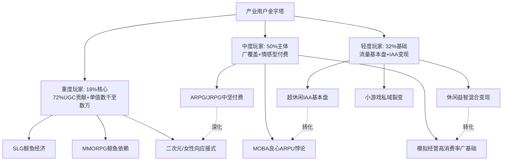

这一产业生态分工对开发者的启示是清晰的:**没有任何一个游戏可以同时服务于三类玩家——产品定位必须明确选择主要服务对象**。SLG赛道选择服务重度鲸鱼,因此玩法必须支持"长期沉浸+组织对抗+权力释放"的核心循环;王者荣耀选择服务中度社交型玩家,因此玩法必须保证"15分钟单局+熟人开黑+轻度学习曲线";休闲益智选择服务轻度碎片化玩家,因此必须做到"90秒单局+即时反馈+广告承接"。任何试图"重度玩法+轻度入口"或"轻度爽点+重度付费"的"既要又要"产品定位,在实践中都极难成功。

## 7.5 用户生命周期四阶段的画像迁移规律

如果说Bartle/Hexad模型回答了"用户为何玩"、重度分层回答了"用户怎么投入",那么用户生命周期模型回答的是**"用户如何随时间演化"**——这是开发者在留存运营、付费引导、流失召回等环节最直接需要的分析框架。

### 7.5.1 LTV模型与生命周期理论的方法论基础

**LTV(Life Time Value,生命周期价值)指的是某个用户在生命周期内为该游戏应用创造的收入总计,可以看成是一个长期累计的ARPU值;用户生命周期是指一个用户从第一次启动游戏应用到最后一次启动游戏应用之间的周期**[^136][^144]。LTV的核心价值在于:衡量用户的质量(付费能力);计算投资回报率ROI=LTV/CAC,业内一般追求ROI≥3;基于上述两点延展开渠道用户质量对比、不同用户群质量对比,以此再进行投放计划调整或者产品内容推送优化等[^144]。LTV预测模型则进一步衍生出RFM模型(最近一次消费/消费频率/消费金额)、BG/NBD概率模型、随机森林与深度神经网络等机器学习方法,用于精准预测用户长期价值[^144]。

将LTV模型与玩家生命周期理论结合,可将用户生命周期划分为**新用户、活跃用户、付费用户、流失用户**四阶段,每一阶段都有清晰的画像特征与关键节点。

### 7.5.2 第一阶段:新用户(0—7日新手期)的关键节点

**新用户阶段的核心命题是"如何活下来"**。CDA数据洞察分析揭示了三个关键流失风险:**教程劝退**——超过10分钟的强制引导会导致35%用户流失,某休闲游戏将新手教程从12步精简至5步后次日留存提升28%;**难度陡增**——新手任务失败3次以上的用户7日流失率达67%,而设置"失败提示+难度自适应"机制可使该比例降至29%;**目标模糊**——未明确告知"下一个乐趣点"的用户42%会在首次登录后放弃,需通过进度条、成就体系强化目标感[^145][^146]。Game Analytics 2024年行业报告进一步显示,移动游戏平均次日留存率仅38%、月流失率高达65%,而头部产品通过精细化运营可将月流失率控制在30%以内[^145][^146]。

起源游戏制作人提出的玩家状态五阶段模型为新用户阶段提供了重要的心理动机补充——**第一阶段游离状态是玩家的最初始状态,面对你做的游戏一脸的茫然,什么数值什么设计都不重要,玩家根本还没有玩到那么深入,当然了这个阶段也不会充钱;这个阶段玩家完全的遵循自己的内心,这个游戏是否让自己喜欢,而在这个状态下玩家流失率最高的,时间大概只5分钟左右,在这5分钟玩家可能会因为任何理由而放弃你的游戏**[^147]。这意味着新用户阶段的关键不是炫酷画面或大型CG,而是**让玩家在5分钟内体验到游戏核心玩法的乐趣**——而游戏的乐趣就是在于成长感[^147]。

新用户阶段的关键转化节点是次日留存(行业均值38%)与7日留存(18%),开发者应在这两个节点设置明确的干预机制——首日教学的极致简化、首日小成就的明确反馈、次日登录的专属奖励、首周任务的成就阶梯等。

### 7.5.3 第二阶段:活跃用户(8—30日中期)的双重博弈

**活跃用户阶段的核心命题是"内容消耗与社交绑定的双重博弈"**。该阶段的三大关键风险点是:**玩法枯竭**——重复副本次数超过15次后用户活跃度下降40%,需设计"随机事件+隐藏关卡"维持探索欲;**社交断裂**——好友列表活跃度低于20%的用户月流失率比社交活跃用户高53%,公会任务、组队奖励可有效提升社交粘性;**付费失衡**——首次付费后未获得预期反馈的用户30天流失率达71%,需优化"付费-反馈"即时性如首充礼包10秒内到账[^145][^146]。

对应起源游戏制作人模型的第二阶段游玩状态——**这个阶段的玩家开始对你的游戏产生了兴趣,知道了一个大概,但是依然不会充钱,他会被游戏里的某个点所吸引,这个时候才是他乐趣产生的关键;一些游戏的亮点,你的设计可以在这个环节展示**[^147]。这一阶段是用户从"游离"向"游玩"跃迁的关键窗口,开发者应在7—30日窗口内安排足够的"乐趣爆点"——新角色解锁、新地图开放、新玩法首次接触等,让玩家持续发现"游戏还有更多值得玩的内容"。

第二阶段的另一关键是**首充转化**。腾讯互娱的实战经验已揭示,《和平精英》将战令系统设为纯外观向、首期定价60元,但通过"免费档可得50%核心外观"降低决策门槛,首月付费渗透率达12.8%,远高于同期竞品平均8.1%。首充设计的核心是"低门槛高回报"——既要降低用户决策成本,又要让用户在首次付费后立即感受到付费价值。

### 7.5.4 第三阶段:付费用户(30日以上)的金字塔深化

**付费用户阶段的核心命题是"如何从小鱼成长为海豚再成长为鲸鱼"**。这一阶段对应起源游戏制作人模型的第三阶段研究状态、第四阶段消费状态、第五阶段沉迷状态——**第三阶段是玩家根据你的设计开始有了自己的目标,为了达成这个目标游戏里提供了多种途径,当然也包含了我们最核心的消费行为,所以一切消费点在这个阶段出现是最好的;第四阶段消费阶段玩家已经认可游戏了,打算认真玩一段时间了,而游戏本体大部分的收入都会源于这个阶段;最后一个阶段是沉迷状态,我们所说的鲸鱼玩家、大R就是出现在这个阶段,消费可以达到上万元甚至更多**[^147]。

付费触发机制在不同品类间存在显著差异,开发者必须根据目标用户的Bartle主导类型选择合适的付费触发设计——SLG对应"对抗时刻+联盟战前+敌方袭击"、女性向对应"情感共鸣+陪伴时刻+生日纪念"、MOBA对应"段位冲刺+战队荣誉+社交认同"、二次元对应"角色周年+剧情解锁+应援活动"、休闲益智对应"难度卡点+碎片兑换+连续登录"。

鲸鱼用户的目标导向型消费心理是付费深化阶段最值得开发者重点研究的画像。第4章已揭示SLG鲸鱼用户的四类画像(企业主高管、富二代投资新贵、高收入专业人士、特殊群体),其共性是"目标导向"——他们的每一笔大额投入都是为了实现明确目标。识别这些目标场景并设计对应的"鲸鱼舞台",是付费阶段深化运营的核心。

### 7.5.5 第四阶段:流失用户的预警与召回

**流失用户阶段的核心命题是"如何识别预警信号并实施精准召回"**。CDA数据揭示了三个关键流失节点:**版本空窗期**——超过45天无重大更新的游戏老用户流失率上升38%,需建立"小更新+季度大版本"的节奏;**竞争产品冲击**——同类新游上线后老用户流失率会短期上升20—30%,需提前布局差异化内容防御;**成就感衰减**——满级用户中未开启新成长线的群体流失速度是有新目标用户的2.3倍[^145][^146]。第2章已引用《最终幻想14》在《金曦之遗辉》后活跃玩家较《晓月之终焉》峰值流失三分之二、77万的当前活跃用户量已大幅低于资料片初期的93万峰值——这一案例正是版本质量下滑触发核心用户流失的典型样本。

流失用户的回流难度极高——MMORPG等强战力依赖品类的回流尤其困难,因为离开服务器后战力鸿沟使其几乎无法重返核心圈层(第3章已论述)。但精准召回仍可挽回部分高价值流失用户——**带专属角色皮肤的召回邮件,点击率比通用文案高217%**(DataEye数据,第3章已引用)。

不同品类的流失定义也应有所差异——超休闲/轻度游戏可设定为"连续3—7天未登录",中度游戏设定为"连续7—14天未登录",重度游戏设定为"连续14—30天未登录"[^146]。明确流失定义是搭建监控体系的前提。

```mermaid
flowchart LR
    A[第一阶段<br/>新用户0-7日] --> B[第二阶段<br/>活跃用户8-30日]
    B --> C[第三阶段<br/>付费用户30日+]
    C --> D[第四阶段<br/>流失/沉睡]
    
    A1[次日留存38%<br/>7日18%<br/>5分钟生死线] -.-> A
    B1[15次副本疲劳<br/>好友活跃<20%<br/>首充转化关键] -.-> B
    C1[小鱼-海豚-鲸鱼<br/>四类鲸鱼画像<br/>目标导向消费] -.-> C
    D1[版本空窗45日<br/>新游冲击<br/>专属皮肤召回+217%] -.-> D
    
    D -.精准召回.-> B
    D -.x.-> C
```

需要强调的是,**生命周期阶段并非单向不可逆**——流失用户可通过精准召回回到活跃阶段,活跃用户也可能因外部冲击直接跳过付费阶段进入流失。开发者应将四阶段视为分析坐标系而非线性流水线,在每个阶段都建立独立的监控指标与干预机制。

## 7.6 心理模型、重度分层与生命周期对开发者的整合启示

将前述三套框架——Bartle/Hexad心理模型(回答"为何玩")、轻/中/重度分层(回答"怎么投入")、四阶段生命周期(回答"如何演化")——整合为可操作的开发者决策工具,是本章的最终目标。本节从五大环节系统输出整合后的框架性指导。

### 7.6.1 玩法循环设计:基于主导心理类型与重度选择的核心循环

**玩法循环是产品立项最根本的设计决策**——它决定了"用户每天来这个游戏做什么"的核心体验。整合心理模型与重度分层视角,玩法循环的设计应遵循两步法:

**第一步,基于目标用户的Bartle主导类型选择核心循环模式**:杀手型对应PVP排位循环(段位竞争+赛季重置+排行榜激励),成就型对应养成数值循环(装备强化+技能解锁+完成度收集),社交型对应公会协作循环(组队副本+联盟战+师徒系统),探索型对应开放世界探索循环(地图发现+剧情推进+涌现叙事),自由精神型对应自定义沙盒循环(家园建造+装饰展示+UGC共创),慈善家型对应陪伴叙事循环(角色羁绊+剧情解锁+情感锚点);

**第二步,叠加重度选择决定循环深度**——重度产品的循环可能跨越多日(如SLG的赛季周期、MMORPG的版本资料片),中度产品的循环以单次15—30分钟为基础(如MOBA对局、二次元角色养成),轻度产品的循环压缩至90秒—5分钟(如休闲消除、超休闲游戏)。

需要警惕的设计陷阱是**"既要又要"的循环混乱**——例如试图同时服务杀手型与社交型用户的产品,可能在排位竞技与熟人协作之间形成内在矛盾;试图同时服务重度与轻度用户的产品,可能在循环深度上无法两全。第3章已引用的《守望先锋》前总监Jeff Kaplan反思——"如果今天让他重新设计一款英雄射击游戏,他会降低团队协作的比重,更多关注玩家的个人贡献"——正是循环设计在协作性与个人英雄主义之间错位的典型案例。

### 7.6.2 激励系统配置:Hexad六类的差异化设计

**激励系统是用户长期留存的核心驱动力**。基于Hexad六类模型,激励系统应针对不同用户类型差异化设计:

| Hexad类型 | 推荐激励要素 | 设计示例 |
|-----------|------------|---------|
| 玩家(P) | 积分/勋章/可见奖励 | 任务积分、成就徽章、签到奖励 |
| 慈善家 | 利他/公益/情感纽带 | 公会捐献、师徒互助、角色生日提醒 |
| 自由精神 | 自定义/解锁/沙盒 | 角色装扮、家园DIY、配置组合 |
| 成就者 | 排行榜/进阶/勋章 | 段位系统、世界首杀、完成度排行 |
| 社交者 | 组队/公会/师徒 | 公会战、组队副本、好友等级 |
| 破坏者 | 反规则/挑战/异端 | OP Build、隐藏路线、专家难度 |

实证研究层面,Tondello等人的Hexad量表已证实**32个游戏化设计元素与每个Hexad用户类型存在显著相关性**[^134][^135],这意味着激励系统的设计可以基于实证数据进行精确匹配,而非凭直觉判断。

特别值得开发者关注的是**"摄像头化人设"的反面教训**——第5章已揭示二次元用户"普遍反感角色被设计为摄像头,期待与角色建立独特且深度的情感连接"。这一发现对应到激励系统层面意味着:**激励要素必须具备独立性与差异化,不能成为干篇一律的"积分弹窗+奖励飘字"**。每一个奖励、每一个徽章、每一个任务都应承载独立的情感意义与心理映射。

### 7.6.3 社交机制构建:压力梯度的精准匹配

**社交机制的核心命题是匹配目标用户的社交压力耐受度**。第1章已建立Data.ai《2024手游社交行为白皮书》对社交场景的三分类——独处型、协作型、对抗型——三者呈现截然不同的留存与付费表现。整合心理模型与重度分层,可以归纳出社交压力梯度的精准匹配规则:

**杀手型+重度玩家**——可承受最高强度的对抗型社交(SLG跨服战、MOBA硬核排位),压力本身就是乐趣的来源;

**成就型+重度玩家**——偏好成就展示型社交,接受公会战压力但厌恶强制对抗;

**社交型+中度玩家**——偏好关系沉淀型协作社交(熟人开黑、公会日常),拒绝强制竞争;

**探索型+中度玩家**——偏好同好分享型社交(攻略社区、UGC平台),不愿被绑定到固定团队;

**慈善家型+中度玩家**——偏好情感共鸣型社交(角色应援、二创分享),反对任何形式的对抗压力;

**自由精神型+轻度玩家**——偏好展示型轻社交(家园拍照、装饰评分),拒绝任何强制压力;

**玩家型(P)+轻度玩家**——偏好被动接受型轻社交(私域分享、好友邀请),不主动参与社区共建。

将这一梯度图谱与具体产品对照,可清晰看出每个产品的社交设计是否合理。例如休闲益智小游戏的私域分享+排行榜+好友邀请构成对"玩家型(P)+轻度玩家"的精准匹配;王者荣耀的微信熟人社交反哺+组队系统+战队体系构成对"社交型+中度玩家"的精准匹配;SLG的联盟深度绑定+跨服攻城+鲸鱼舞台构成对"杀手+成就+社交三高型重度玩家"的精准匹配。

### 7.6.4 分层运营策略:鲸鱼-海豚-小鱼-零充活跃-流失五分层

**分层运营是付费阶段的核心运营动作**。基于付费金字塔模型,可将用户分为五层进行差异化运营:

**鲸鱼用户(顶端0.2%—10%)**——VIP专属服务、定制化礼包、优先体验权、专属客服、线下活动邀请。SLG鲸鱼用户的"目标导向消费"特性意味着运营动作应围绕"为他们提供清晰的、可投入的目标场景"展开,而非简单的礼包返利。

**海豚用户(中层40%)**——成长基金、月卡战令、限时折扣、累充返利。海豚用户是中度玩家的主体,运营动作应聚焦"性价比+情感锚点"双轮驱动,既给到付费回报又增强情感粘性。

**小鱼用户(底层50%)**——首充奖励、新手成长包、低门槛礼包、社交分享激励。小鱼用户的关键是"完成首次付费转化"——通过6元首充等极低门槛打破不付费的心理防线。

**零充活跃用户**——签到奖励、任务成就、社交激励、活动参与。这部分用户虽然不付费,但其活跃度是社区生态的基础,且部分会逐步转化为付费用户。

**流失用户**——回归专属福利、个性化召回邮件、跨平台触达。带专属角色皮肤的召回邮件点击率高出通用文案217%,证明"个性化+情感唤起"是召回的核心抓手。

需要强调的是,分层运营应**叠加心理画像维度**而非仅基于付费金额。同样是海豚用户,SLG鲸鱼后备的海豚与女性向中氪的海豚需要完全不同的运营动作——前者应推送"鲸鱼舞台"预热、后者应推送"陪伴型服务"试用。

### 7.6.5 留存与付费引导:四阶段干预动作

**留存与付费引导应基于生命周期四阶段设计差异化干预动作**:

**新手期(0—7日)**:**关键动作是"5分钟核心玩法体验+次日强引导奖励+7日内首充礼包"**。教程必须严格控制在10分钟内,失败次数超过3次自动降低难度;次日登录设置不可错过的高价值奖励;7日内推出"新手限定"低门槛首充礼包(6—30元区间)。

**中期(8—30日)**:**关键动作是"社交绑定+首充转化+内容爆点"**。强制性进入公会/师徒/组队系统但保留"低压力"选项;首充设计必须保证10秒内反馈到位,避免"付费失衡71%流失"风险;每7—10天安排一次新内容爆点(新角色/新地图/新玩法)。

**付费期(30日以上)**:**关键动作是"分层礼包+鲸鱼舞台+情感锚点"**。按鲸鱼/海豚/小鱼分层推送差异化礼包;为重度付费用户设计专属的"目标场景"(SLG跨服战、女性向角色周年、二次元限定卡池);通过月卡情感锚点(《浮生为卿歌》"卿心月卡"模式)维持长期粘性。

**流失期(沉默期)**:**关键动作是"分级监控+精准召回+召回成本控制"**。建立基于行为序列的流失预警(如"连续3天未登录+好友活跃下降+任务完成率下降"复合信号);对高价值流失用户优先发起精准召回(专属皮肤+回归礼包+剧情补全);避免对低价值流失用户进行高成本召回。

### 7.6.6 三套框架整合应用的核心警示

最后必须强调,本章三套框架(心理模型/重度分层/生命周期)的整合应用应**避免机械套用**。具体警示有三:

**第一,心理类型存在重叠性**——巴特尔本人的研究表明,玩家类型可能会发生重叠,比如说有些玩家可能会同时存在"社交型"和"杀手型",包括但不限于轰炸公屏,模型的划分是很清晰的,但实际上玩家在不同的情形下可能展现出不同的行为模式,所以在复用巴特尔模型时不应只局限于这四种模式[^132]。开发者应将六类心理类型视为权重图谱而非互斥分类。

**第二,重度分层是连续光谱**——不存在绝对的"轻度玩家"或"重度玩家"边界,同一玩家在不同生命周期阶段、不同时间窗口可能在三层间迁移。第6章已揭示的《明日方舟:终末地》"PC端用户占比近60%"提示我们,即便是重度品类用户也可能在不同设备上呈现轻度行为模式。

**第三,生命周期阶段可逆**——流失用户可通过精准召回回到活跃阶段,活跃用户也可能因外部冲击直接跳过付费阶段进入流失。开发者应将四阶段视为分析坐标系而非线性流水线。

更深层的警示是,**三套框架共同构成的是"分析坐标系"而非"分类教条"**。在2025年的产品环境下,品类融合加速、用户身份多元化、跨次元消费扩散——任何一个具体用户都可能横跨多个心理类型、多个重度档位、多个生命周期阶段。开发者应使用三套框架定位"主导特征+次要补充",而非追求"非此即彼的精确归类"。

至此,本章完成了对Bartle/Hexad心理模型、轻/中/重度分层、用户生命周期四阶段三套框架的系统化归纳与整合应用。**本章揭示的核心洞察是——三套框架共同构成游戏开发者理解用户的完整三维坐标系:Bartle/Hexad回答"为何玩"、重度分层回答"怎么投入"、生命周期回答"如何演化",三者交织成一个立方体,每一个具体用户群体都可以在其中找到精确坐标,每一项产品决策(玩法循环/激励系统/社交机制/分层运营/留存付费)也都可以在三维坐标中找到对应的设计指引**。

值得反复强调的是,本章的方法论收束并非要替代第2—6章的品类深耕——相反,本章是为第2—6章的品类素材提供更高维度的整合视角。读者在使用本章框架时,应始终回到第2—6章的具体品类数据中验证与修正。心理模型的力量在于其简洁性,但其局限也在于简洁性可能掩盖品类细节的丰富性——三套框架的最大价值是为开发者提供一个**反思与对照的工具**,而非取代基于具体品类、具体产品、具体市场的细颗粒度判断。

下一章将基于本章建立的三维坐标系,横向比较各主要游戏类型用户在五大画像维度上的差异,并探查近年来"品类融合"趋势下用户群体的交叉与扩展现象。可以预见,第8章将通过本章建立的统一坐标系,系统呈现"开放世界+RPG"、"Roguelike+卡牌"、"SLG+休闲"、"FPS+撤离"、"模拟经营+三消"等融合产品对传统画像的重塑作用,识别开发者可切入的画像蓝海,并为第9章的战略洞察启示提供横向素材积累。

# 8 跨类型用户画像对比与品类融合趋势分析

第2—6章沿"玩法品类为主线"完成了对六大类游戏用户画像的纵向深耕，第7章则建立了Bartle/Hexad心理模型、轻/中/重度分层、用户生命周期四阶段三套框架交织的三维心理坐标系。读者此刻应已具备两种能力——纵向审视任意单一品类的用户画像、跨品类调用统一的心理坐标系定位用户群体。但仍有一项关键工作尚未完成：**横向比较各品类用户画像的差异谱系，并探查2023—2025年最具结构性意义的"品类融合、平台融合、文化题材融合"三重趋势对传统画像边界的重塑作用**。本章正是承担这一横向规律提炼任务的过渡章节——它将前六章的丰富品类素材与第7章的统一坐标系结合，凝练贯穿全行业的核心张力，识别开发者可切入的画像蓝海，为第9章面向开发者的战略建议与未来展望提供横向素材积累。

本章共分六节展开：8.1建立五大画像维度的跨类型横向对比谱系；8.2从对比中凝练四组核心画像张力；8.3拆解玩法品类融合趋势对画像的扩展与重塑；8.4聚焦平台融合与跨端化对用户结构的重塑；8.5分析文化题材创新对画像结构的再造作用；8.6系统识别开发者可切入的画像蓝海地图。本章在写作上严格避免重复前六章已陈述的品类细节，转而以**对比表格、矩阵图谱、融合案例**三种结构化方式呈现跨类型规律。

## 8.1 五大画像维度的跨类型横向对比谱系

第1章建立的"人口属性—行为特征—心理动机—消费偏好—社交属性"五维框架在第2—6章被分别应用于各品类用户画像分析，但读者尚未获得一份将所有品类放在同一张地图上的横向对比谱系。本节正是补足这一关键工具——通过五张维度对比表，将前六章的丰富素材重新组织为可一目了然的跨品类参照系。

### 8.1.1 人口属性维度的性别×年龄×地域三维对比

人口属性维度是开发者最直观感知用户群体差异的入口，但单一维度（如仅看性别或仅看年龄）极易导致刻板化标签。下表系统汇总各主要品类在性别、年龄、地域三个子维度上的画像坐标：

| 品类 | 性别结构 | 年龄主力 | 地域分布 | 画像关键特征 |
|------|---------|---------|---------|------------|
| 传统回合制RPG/SRPG | 偏男性 | 30岁以上、中年情怀 | 一二线为主 | IP代际传承+老核心层 |
| ARPG | 偏男性 | 20—29岁占六成、近半学生 | 一二线为主 | 学生与年轻白领高密度 |
| MMORPG | 男性主导 | 25—50岁中年男性 | 三四线及以下为主 | 下沉化+鲸鱼依赖 |
| JRPG/二次元RPG | 男女6:4(原神)至72:28(星铁) | 18—30岁、占70% | 一线至五线全覆盖 | 玩法决定性别结构 |
| 开放世界RPG | 男女6:4均衡 | 18—30岁、跨度更广 | 一线至五线全覆盖 | 性别与地域双重均衡化 |
| 硬核FPS | 男性主导（85%+） | 18—40岁跨度大 | 一二线为主+下沉延伸 | 高硬件投入+核心向 |
| 英雄射击 | 男性偏多但女性渗透 | 18—30岁 | 一二线为主 | 容错偏好+性别均衡度提升 |
| 大逃杀 | 男性偏多+女性近半 | 跨年龄段 | 移动端下沉广 | 移动友好+开黑社交 |
| 战术撤离 | 男性主导 | 18—40岁中重度玩家 | 一二线+B站核心 | 跨端硬核+大众化破局 |
| 硬核MOBA(Dota2) | 男性主导 | 平均28岁、中年精英 | 一二线为主 | 信仰众筹+老炮 |
| 轻量MOBA(王者荣耀) | 男女约6:4 | 上班族近70%+学生 | 三线及以下渗透率最高 | 下沉化+性别均衡化国民化 |
| 移动战争SLG | 男性近80%—90% | 31—40岁中青年男性 | 一二线为主 | 鲸鱼集中+目标导向消费 |
| 4X策略 | 男性主导 | 30—45岁硬核 | 一二线为主 | 深度策略+融合机会 |
| 模拟经营(硬核) | 偏男性 | 25—45岁 | 一二线为主 | 拟真度+系统精通 |
| 模拟经营(轻度/女性向) | 女性占比超七成 | 18—40岁女性 | 跨地域全覆盖 | 女性主力+情感陪伴 |
| 商道经营 | 偏男性 | 30—45岁 | 全覆盖 | 中年男性在模拟经营的稀有锚点 |
| 视觉小说VN | 跨性别 | 18—35岁跨度大 | 一二线为主 | 情感代餐+男女镜像需求 |
| 二次元抽卡(广义) | 男女比从男主导走向40%+女性 | 15—35岁、20—25核心 | 一线至五线 | 跨性别均衡化+代际扩散 |
| 女性向(乙女/恋爱) | 女性主导(80%+) | 18—35岁女性 | 一线至五线 | 高ARPU+情感投射 |
| 休闲益智(消除/合成) | 女性占比超40%(部分品类>50%) | 24—40岁主力+50+占20% | 三线占半 | 下沉化+银发化+广年龄 |
| 拟真竞速 | 男性主导 | 25—45岁车迷 | 一二线为主 | 硬件外设投入意愿高 |
| 体育游戏 | 男性主导 | 18—45岁球迷 | 一二线为主 | IP情感+赛季粘性 |
| Roguelike独立 | 男性偏多+部分子方向跨性别 | 18—35岁、25—35中坚 | 一二线为主 | 核心玩家+口碑驱动 |

这张总表揭示出几个值得开发者高度警觉的横向规律：

第一，**"性别主导特征极化"与"性别边界整体模糊化"并存**——一方面，SLG（80%—90%男性）、女性向（80%+女性）、模拟经营轻度方向（女性占比超七成）等品类仍呈现极化特征；另一方面，开放世界RPG男女6:4、王者荣耀男女约6:4、二次元手游女性占比提升至40%以上、休闲益智女性占比超40%等数据共同指向一个根本趋势——**第5章已引用的CNNIC数据"截至2025年6月女性在网络游戏用户中的占比为48.0%"在品类层面正持续渗透，"游戏=男性专属"或"女性=只玩消除"的传统认知正被全面打破**。

第二，**"年龄主力代际差异显著"**——ARPG的"20—29岁近半学生"与传统回合制RPG的"30岁以上中年情怀"、《最终幻想》40+用户与《荒野乱斗》18岁平均年龄构成游戏行业最大的代际跨度。这种代际跨度对开发者的核心启示是——**"年轻人玩什么游戏"不能作为单一画像锚点**，必须按品类差异化判断目标年龄段。

第三，**"下沉化与高线化的品类分工"**——MMORPG/传奇类（三四线及以下为主）、王者荣耀（三线渗透率13.85%最高）、休闲益智（三线占半）共同构成下沉市场主战场；而ARPG（一二线为主）、Roguelike独立（PC核心）、拟真竞速（硬核外设）则坚守一二线核心。这一分工指向不同的买量渠道、社区阵地与运营策略。

### 8.1.2 行为特征维度的时长×留存×跨端三重对比

行为特征维度从"用户怎么玩"角度建立横向对比。下表呈现各品类在单局时长、留存表现、跨端化程度三个子维度上的画像差异：

| 品类 | 单局时长 | 启动频次 | 7日/14日留存特征 | 跨端化程度 | 设备偏好 |
|------|---------|---------|-----------------|----------|---------|
| 传统回合制RPG/SRPG | 30分钟—数小时 | 中等 | 低频次但超长留存（运营20年+） | 主机+PC为主 | 主机/PC |
| ARPG | 中长沉浸 | 中高 | 首周流失57%但完成新手期长LTV | 移动+PC+主机 | 多端 |
| MMORPG | 长在线时长+战力耦合 | 高 | 长留存但回流困难 | PC+移动 | PC核心 |
| JRPG/二次元RPG | 中长沉浸+多周目 | 中高 | 强IP互通性（33%双向互玩） | 多端互通 | PC占比近60% |
| 开放世界RPG | 跨端弹性 | 中高 | 跨端跨设备活跃 | 多端互通领跑 | PC/PS/移动 |
| 硬核FPS | 30—50分钟单局 | 极高(48.9%每周6天+) | 高粘性近"日常化" | PC+主机 | PC+高刷外设 |
| 大逃杀 | 15—25分钟单局 | 高 | 移动友好碎片化 | 多端 | 移动主导 |
| 战术撤离 | 弹性单局 | 高 | 跨端用户高粘性 | PC+移动+主机 | 多端 |
| 硬核MOBA | 30—50分钟单局 | 中高 | 长留存+核心圈层 | PC | PC核心 |
| 轻量MOBA(王者) | 10—15分钟（压缩设计） | 极高(140分钟/日) | DAU超1亿+时间黑洞 | 移动主导 | 移动 |
| 移动战争SLG | 跨时区准异步 | 极高(全天候) | 长留存但战力锁定 | 移动+PC | 移动主导 |
| 4X策略 | 4—10小时(PC)/碎片(移动) | 中等 | 硬核长留存 | PC+移动 | PC核心 |
| 模拟经营 | 15—30分钟单次+心流深度沉浸 | 高 | 长留存+心理睡眠功能 | 移动主导 | 移动 |
| VN/电影化叙事 | 长沉浸+多周目 | 中等 | 内容驱动+多周目重玩 | PC+主机+移动 | 多端 |
| 二次元 | 中长沉浸+跨端 | 高 | 高粘性+33%互玩率 | 多端互通 | PC占比近60% |
| 女性向 | 高频次中等时长 | 高(76.4%>45分钟) | 长留存+情感锚点 | 移动主导 | 移动 |
| 休闲益智(微信小游戏) | 90秒—5分钟 | 高(私域分享) | 14日留存超50% | 小程序 | 移动 |
| 拟真竞速 | 1—4小时 | 中等 | 硬件锁定+长留存 | PC+主机 | PC+硬件外设 |
| 体育游戏 | 弹性 | 赛季粘性 | 年货IP+赛季节奏 | 主机+PC | 主机 |
| Roguelike独立 | 10—20分钟一局或长沉浸 | 中等 | 重玩意愿极强 | PC+主机 | PC核心 |

行为特征维度的核心横向规律可归纳为四点：

第一，**单局时长呈现从90秒到跨时区的极端跨度**——同一行业内，休闲小游戏90秒内一局与SLG跨时区准异步在线在单局结构上属于完全不同的产品形态，对应着完全不同的用户使用场景。开发者在立项之初就必须明确目标用户的"可投入连续时间"。

第二，**留存表现呈现"高门槛+高留存"vs"低门槛+高流失"两极分化**——重度RPG首周流失57%但完成新手期后长LTV，与休闲益智小游戏14日留存超50%但单值低，是两种完全不同的留存哲学。前者依赖"沉没成本+战力锁定+组织绑定"机制保障长留存，后者依赖"碎片化便捷+爽点持续轰炸+私域裂变"机制保障广覆盖。

第三，**跨端化已成为头部产品的标配能力**——开放世界RPG、二次元、战术撤离三类品类都呈现"PC+移动+主机"多端互通特征，而MMORPG、SLG、女性向、休闲益智仍以单端为主。**跨端化能力本身正成为新一代头部产品的画像红利**，将在8.4节专题深化。

第四，**设备偏好与品类高度耦合**——硬核FPS用户对500Hz显示器+低DPI鼠标的极致追求、拟真竞速用户对万元方向盘的硬件投入、二次元用户的PC占比近60%——这些设备偏好不仅是"硬件投入数据"，更是用户群体可支配收入与游戏价值认同的间接画像信号。

### 8.1.3 心理动机维度的六类核心驱动凝练

心理动机维度可直接调用第7章建立的Bartle/Hexad坐标系。基于第7.2.1节已建立的跨品类权重映射总表，本节进一步抽象为**六类核心驱动**的横向凝练，便于开发者快速对照：

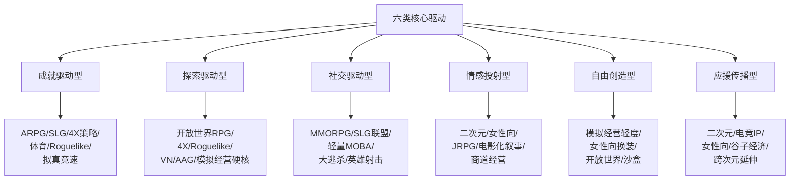

这六类驱动并非互斥分类，而是**权重组合**——任何具体品类都呈现多类驱动的复合权重。例如MMORPG是"成就+社交+杀手"三高复合，二次元RPG是"探索+社交+情感投射"三轮驱动，开放世界RPG是"探索+成就+自由"三角组合。开发者在产品定位阶段应明确"主导驱动+次要补充"的组合权重，避免追求"全维度满足"的画像混乱。

### 8.1.4 消费偏好维度的五大商业化范式

消费偏好维度的横向对比已在第7.4.2节建立了五大商业化范式。本节进一步明确各范式的画像坐标，便于开发者反向匹配：

| 商业化范式 | 代表品类 | 金字塔形态 | 单值贡献 | 用户基数 | 关键画像锚点 |
|----------|---------|---------|---------|---------|------------|
| 鲸鱼经济 | SLG/MMORPG | 极陡峭顶端 | 数千至数十万 | 窄 | 31—40岁男性、目标导向消费 |
| 应援式付费 | 二次元/女性向/电竞 | 陡峭顶端+宽厚底盘 | 中氪近2万、头部数十万 | 中等 | 18—35岁、情感连接式 |
| 良心ARPU悖论 | 轻量MOBA(王者) | 扁平但总值高 | 285—295元季度ARPU | 极广 | 跨性别中度玩家+熟人社交 |
| 混合变现 | 休闲益智+小游戏 | 扁平+IAA铺底 | 低ARPPU+广覆盖 | 极广 | 24—40岁三线+50+银发 |
| 买断+口碑 | Roguelike独立/AAG | 被压平 | 单次68—128元 | 窄但高质 | 核心玩家+口碑传播 |

横向规律层面值得开发者关注的是——**任何品类都不可能同时实现五大范式**。SLG选择鲸鱼经济就必然牺牲广覆盖；女性向选择应援式付费就必然依赖情感投射而非战力对抗；休闲益智选择混合变现就必须承受低ARPPU但通过用户基数放大总值。开发者在产品立项阶段必须**明确选择主商业化范式**而非追求"既要又要"。

### 8.1.5 社交属性维度的五种社交结构

社交属性维度的横向对比可凝练为五种典型社交结构：

**第一种：联盟深度绑定型**（SLG为代表）——"准社会组织"特性，离开成本极高、战力锁定、跨服攻城构成强约束力；**第二种：熟人开黑反哺型**（轻量MOBA为代表）——依托微信/QQ熟人社交将线下关系反哺到游戏内，蜂巢模型六要素完整建设；**第三种：单机+社区共创型**（二次元/Roguelike独立为代表）——"游戏内单机+游戏外强社区"的独特结构，同人创作、谷子消费、UGC二创共同延伸；**第四种：私域分享轻社交型**（休闲益智小游戏为代表）——"被动接受分享+主动独立游玩"，社交压力极低；**第五种：独处沉浸型**（VN/模拟经营硬核为代表）——纯个人体验，社交延伸主要通过口碑分享。

这五种社交结构与第7.6.3节建立的社交压力梯度精准对应——开发者应根据目标用户的Bartle主导类型选择合适的社交结构，避免错配。

## 8.2 四组核心画像张力的结构化凝练

从8.1节的五维横向对比中，可以进一步凝练出贯穿游戏行业的**四组结构性画像张力**——这些张力不是"二选一"的简单对立，而是开发者在产品定位时必须主动选择立场的核心战略命题。

### 8.2.1 张力一：男性主导vs女性主导——边界模糊化中的极化与均衡共存

第一组张力是性别结构的两极。一极是男性主导极致——SLG（《三国志·战略版》男性近90%）、硬核FPS（《使命召唤》手游男性82.25%）、MMORPG（传奇类下沉中年男性主导）、硬核MOBA（Dota2/LOL端游男性主导）共同构成"男性占比80%—90%"的极化阵营；另一极是女性主导极致——模拟经营（女性占比超七成）、女性向（80%+女性）、女性向养成手游（核心用户18—35岁女性）共同构成"女性占比超七成"的极化阵营。

但2025年最深刻的画像变迁是——**这两极之间的中间地带正在快速扩张**。CNNIC明确指出截至2025年6月女性在网络游戏用户中的占比为48.0%、较2024年底提升3.1个百分点上升趋势明显。这一3.1个百分点的半年涨幅不仅仅是统计数字的变化，更映射出三个层面的结构性突破：

第一层是**经典男性向品类的女性渗透**——王者荣耀注册用户女性玩家超一半、《无尽冬日》女性玩家近半、SLG赛道在中重度玩法中迎来女性涌入；第二层是**经典女性向品类的男性渗透**——《闪耀暖暖》男生占比41.6%、女性向手游男性玩家成为重要研究对象（《2024二次元手游男性玩家洞察报告》）；第三层是**开放世界、二次元等"先天均衡化"品类的崛起**——《原神》男女6:4、二次元手游女性占比提升至40%以上，从产品立项之初就放弃单一性别画像。

对开发者的核心启示是——**性别画像不再是产品定位的硬性约束，玩法体验与社交场景的设计才是决定用户结构的核心变量**。第3章已揭示的王者荣耀"得女性玩家者得天下，每个女性玩家会带来大量的男性玩家"的反向引流动力学，正在更多品类中得到验证。**单一性别画像的产品定位极易在2025年陷入"自我设限"的增长陷阱**——主动设计"性别友好"的玩法循环、视觉风格与社交结构，才是把握女性化均衡化趋势红利的核心路径。

### 8.2.2 张力二：鲸鱼经济vs广覆盖低客单——两种商业化哲学的根本对立

第二组张力是商业化哲学的根本对立。一极是**鲸鱼经济**——SLG单用户成本最高可达4000元、Top20游戏占66.5%支出、20%玩家贡献近一半游戏支出；另一极是**广覆盖低客单**——休闲益智小游戏低ARPPU高基数、王者荣耀"良心ARPU悖论"通过广基础海豚化反而ARPU超过依赖鲸鱼的二次元RPG。

这两种哲学在底层逻辑上呈现根本性对立：

| 对比维度 | 鲸鱼经济 | 广覆盖低客单 |
|---------|---------|------------|
| 核心收入来源 | <10%顶端用户 | >90%中下层用户 |
| 单用户获取成本 | 极高（SLG可达4000元） | 极低（小游戏个位数元） |
| 付费触发 | 对抗时刻+目标场景 | 高频次低门槛+爽点轰炸 |
| 社交结构 | 联盟深度绑定 | 私域分享/熟人开黑/独处 |
| 用户心智 | 权力-控制-面子 | 娱乐-放松-轻反馈 |
| 内容更新依赖 | 高（鲸鱼舞台需持续供给） | 中（爽点持续轰炸） |
| 退出成本 | 极高（战力+联盟双重锁定） | 极低（卸载即走） |
| 增长天花板 | 鲸鱼供给与运营能力 | 用户基数与付费转化率 |

值得特别关注的是**第三种中间路径——应援式付费**。第3章电竞用户、第5章二次元/女性向用户共享的"情感连接式"付费逻辑，呈现"陡峭顶端+宽厚底盘"的复合形态——既有鲸鱼级的几十万应援投入，又有广基础的中度玩家月卡战令付费。这种复合形态对开发者具有特殊战略价值——它部分规避了纯鲸鱼经济的"鲸鱼依赖风险"与纯广覆盖的"商业化天花板"两个极端。

对开发者的核心启示是——**商业化哲学的选择必须在产品立项之初就明确，并贯穿玩法循环、社交结构、付费节点、运营节奏全要素设计**。试图"用鲸鱼经济的付费模型卖广覆盖产品"或"用广覆盖的玩法循环承载鲸鱼期待"的"既要又要"产品定位，在实践中都极难成功。

### 8.2.3 张力三：强社交绑定vs独处沉浸——压力梯度与心理类型的精准匹配

第三组张力是社交压力梯度的两极。一极是**强社交绑定**——MMORPG/SLG的联盟生存壁垒构成"准社会组织"，玩家个体的游戏行为深度嵌入集体行动节奏；另一极是**独处沉浸**——二次元"游戏内单机+游戏外强社区"、模拟经营轻社交展示、Roguelike独立的PC核心圈层口碑传播，都属于"低社交压力+高个人体验"的范式。

这一张力的核心规律是——**社交压力梯度必须与目标用户的心理类型精准匹配**。第7.6.3节已建立"杀手型+重度玩家承受最高对抗社交"到"自由精神型+轻度玩家偏好展示型轻社交"的完整梯度图谱。任何错配都会导致严重后果：

**第一种错配是"高压力强社交+低耐受用户"**——例如要求轻度休闲玩家接受SLG式联盟战、要求二次元单机偏好用户接受MMORPG式公会强制日常，必然导致大规模流失；**第二种错配是"低压力独处+高耐受用户"**——例如硬核MOBA核心玩家在纯单机产品中难以获得对抗满足感、SLG鲸鱼用户在缺乏联盟生态的产品中无处释放权力诉求。

第3章揭示的《守望先锋》前总监Jeff Kaplan反思——"如果今天让他重新设计一款英雄射击游戏，他会降低团队协作的比重，更多关注玩家的个人贡献"——正是社交压力梯度与用户心理类型错配的典型案例。预期玩家是"团队协作型社交者"但实际玩家心智更多是"个人成就型杀手"，二者错位构成产品长期运营的根本风险。

对开发者的核心启示是——**社交机制设计的核心不是"做多少社交功能"，而是"匹配多大的社交压力"**。SLG的成功之处不在于联盟功能多丰富，而在于联盟生态精准对应了31—40岁中青年男性鲸鱼用户对"组织归属+权力释放"的高耐受需求；王者荣耀的成功之处不在于社交功能多复杂，而在于熟人开黑反哺机制精准对应了中度社交型玩家"轻度学习曲线+熟人陪伴"的低压力需求。

### 8.2.4 张力四：重肝重氪vs碎片减负——玩家时间预算结构性紧缩

第四组张力是产品形态的演化路径。一极是**重肝重氪**——传统MMORPG的"长在线+战力比拼+重氪深氪"模型；另一极是**碎片减负**——放置RPG（《菇勇者传说》《杖剑传说》）、小游戏（90秒单局）、休闲化产品（《无尽冬日》"披皮SLG"）共同构成的减负浪潮。

第2章已揭示伽马数据将RPG用户需求迁移归纳为三条主线：**开放世界RPG兴起背后是用户的玩法创新需求；放置类RPG数量占比4连增背后是用户的"游戏减负"需求；经典MMORPG流水快速下滑背后是用户对"重肝重氪"的游戏疲劳**。这三条主线共同指向一个底层趋势——**玩家时间预算正在结构性紧缩**。

第7.1.3节已引用Quantic Foundry的实证数据——**截至2024年玩家在"策略思考"动力上的平均得分已从2015年的第50百分位大幅降至第33百分位，67%的玩家在游戏中不那么热衷烧脑的战略规划，更倾向于短时直接的反馈**。这一数据是过去十年游戏用户心理动机变迁最具说服力的实证证据——玩家集体性的"耐心阈值"在持续下降。

但需要强调的是，"碎片减负"绝不等于"低质量"。**心理减负与体验深度可以兼容**——《无尽冬日》在SLG硬核框架内通过90分钟模拟经营前置体验降低警惕、《菇勇者传说》通过放置机制大幅降低操作门槛但保留RPG的成长深度、《明日方舟:终末地》将主线剧情拆解为平均6分17秒的独立章节。这些产品的共性是——**保留核心体验深度的同时通过机制创新降低时间投入门槛**。

对开发者的核心启示是——**"重肝重氪"赛道并非消失，但其存量竞争已极为残酷；"碎片减负"赛道则正在快速扩张，是新进入者的主要机会窗口**。具体而言：MMORPG赛道必须考虑减负化转型（缩短养成线、降低操作门槛、引入放置元素）；新立项产品则应在立项之初就将"玩家时间预算紧缩"作为基础约束，避免设计需要"每天上线2小时才能维持竞争力"的产品形态。

## 8.3 玩法品类融合趋势对用户画像的扩展与重塑

如果说8.1—8.2节梳理的是相对稳态的画像谱系与张力，那么本节聚焦的则是**正在快速变化的画像扩展过程**——2023—2025年最具代表性的五大玩法融合方向，每一个都在重塑传统品类的用户边界。

### 8.3.1 开放世界+RPG：性别均衡化与跨地域全覆盖的双重突破

第一类融合是"开放世界+RPG"，以《原神》《燕云十六声》《黑神话:悟空》等为代表。这一融合方向的画像扩展作用已在第2章2.6节系统论述：

**画像扩展核心**——男女6:4均衡、覆盖一线至五线、跨端跨平台、18—30岁主力但全年龄渗透。第2章已揭示《原神》全球玩家破3亿、男女比例6:4、18—30岁占70%、覆盖一线至五线，构成对传统RPG"男性主导/二次元小众/一二线集中"画像的系统性重塑。

**画像红利的双重来源**——一是"自由探索"的低门槛吸引非传统RPG用户，避免了MMORPG的战力门槛与回合制RPG的策略门槛；二是"涌现叙事"的高上限留住硬核探险者，《塞尔达传说:旷野之息》"玩家平均每小时触发3.2次非脚本化叙事事件"是这一上限的标杆案例。

**对开发者的核心启示**——开放世界+RPG赛道是高投入高门槛的"工业能力赛道"，对底层引擎、动态事件链、跨端工程的要求远超传统RPG，但一旦突破，画像扩展的红利极为可观。中小开发者难以正面进入，但可借鉴其"自由度+涌现性+跨端性"的设计哲学应用于其他品类。

### 8.3.2 Roguelike+卡牌/射击/塔防/RPG：作为"设计思路"的全品类扩展

第二类融合是Roguelike作为"设计思路"对各品类用户基数的扩展能力。第6.3.1节已系统揭示Roguelike从"类型"演化为"设计思路"的演化过程——2017年起Roguelite在作品数量和影响力上逐渐超越传统Roguelike成为主流品类。

**画像扩展的多元路径**：

- **Roguelike+卡牌**——《杀戮尖塔》定义尖塔Like赛道，《月圆之夜》以童话暗黑风吸引大量女性玩家，《邪恶冥刻》通过诡异叙事吸引剧情党；
- **Roguelike+射击**——《雨中冒险2》《挺进地牢》以及"吸血鬼幸存者类"将射击品类核心玩家与Roguelike重玩深度结合；
- **Roguelike+塔防**——《诺森德塔防》以二战为背景的"肉鸽塔防"展示融合可行性；
- **Roguelike+RPG剧情**——《哈迪斯》以希腊神话剧情吸引情感导向用户；
- **Roguelike+模拟经营+生存**——《暗星铁律》"融合殖民模拟+抓宠+Roguelite FPS"展示进一步扩展。

**画像扩展的核心机制**——Roguelike的程序化内容生成与重玩深度天然兼容多种核心玩法，在保留原品类核心用户的同时，**新增"探索者+破坏者+成就者"三重驱动复合的核心玩家群体**。第6章已揭示《魔法工艺》全球70万销量近半数来自海外、欧美地区表现亮眼——证明Roguelike融合机制的全球文化普适性。

**对开发者的核心启示**——Roguelike作为"设计思路"是中小开发者最具可行性的差异化武器之一。在RPG/射击/塔防/模拟经营等已被巨头占据的赛道，通过引入Roguelike机制可以创造细分蓝海，避免与巨头正面竞争。

### 8.3.3 SLG+末日生存/模拟经营/休闲：从"中年男性鲸鱼"到"现充与女性"的根本突破

第三类融合是SLG赛道的画像扩展。第4章已系统揭示SLG传统画像是"31—40岁男性近90%、鲸鱼经济、联盟深度绑定"，但2024—2025年的爆款产品《无尽冬日》《Whiteout Survival》正在系统性突破这一传统画像。

**《无尽冬日》的画像突破极具代表性**——根据搜索结果披露的"非典型玩家画像"分析：**"传统SLG玩家刻板印象往往是中年男性土豪。但《无尽冬日》的玩家构成截然不同，大量被末日生存广告吸引而来的'现充'和女性玩家成为了主力。她们平时很少打游戏，误以为《无尽冬日》是像《星露谷物语》一样的轻度模拟经营，结果却在不知不觉中被带入了一个全新的世界"**[^81]。

**"披皮SLG"的画像扩展机制**清晰可见——**前90分钟的模拟经营体验玩家通过建造、升级获得成就感，对营地产生感情；此时游戏才缓缓揭开SLG的真面目——大地图、联盟与战争**[^81]。这种设计精妙之处在于**用模拟经营的轻量化外壳吸引非传统SLG用户进入，再通过联盟社交逐步将他们沉淀为长期付费用户**。其全球收入已超40亿美元（第1章已引用），证明这一画像扩展路径的商业价值。

**联盟机制的"社交枷锁"重新设计**——**"一旦加入联盟，玩家便踏上了一条'命运共同体'的船。联盟如同一个小型社会，成员间的互助、共同抵御外敌的压力，催生了强烈的情感羁绊"**[^81]——非传统SLG用户因为情感羁绊而持续投入，甚至超越了传统鲸鱼用户的金钱投入意愿。这一机制对开发者的核心启示是——**社交沉没成本远比金钱沉没成本更难割舍，是承接非传统重度玩家的关键设计**。

### 8.3.4 FPS+撤离/PVE/英雄射击：硬核与休闲融合的破局路径

第四类融合是射击品类的画像扩展。第3章已系统揭示《三角洲行动》通过"硬核与休闲融合"实现DAU从1200万跃升至5000万的破局路径。本节进一步从行业战略视角横向归纳。

**腾讯射击产品矩阵的差异化突围**清晰呈现了FPS+融合的全光谱布局[^148]：

| 融合方向 | 代表产品 | 画像扩展 |
|---------|---------|---------|
| FPS+撤离玩法 | 《三角洲行动》《暗区突围》 | 硬核+休闲双承接 |
| FPS+RPG养成 | 《全境封锁:曙光》 | 战术协作+复合养成 |
| FPS+卡通幻想 | 《王牌战士2》 | 去军事化+扩展年轻女性 |
| FPS+微恐氛围 | 《穿越火线:虹》 | 经典IP的差异化区隔 |
| FPS+英雄技能融合 | 《命运扳机》 | MOBA元素引入 |
| FPS+PVE合作 | 《逆战:未来》 | 写实幻想+合作体验 |

这种全光谱布局背后的战略逻辑是——**腾讯对"军事写实赛道天花板"的清醒认知**[^148]。一方面搜打撤品类已形成完整梯队，另一方面《Deadlock》《命运:群星》等产品的市场验证使PVE射击、英雄射击等新兴赛道展现出可观潜力。

**网易、米哈游、莉莉丝的差异化突破**[^148]——**《漫威争锋》凭借IP包装与海外发行实现错位竞争；《界外狂潮》通过二次元美术风格与卡牌构筑系统深化娱乐化定位；米哈游欧美卡通风格英雄射击在研项目凭借顶级美术水准与叙事能力开辟新战场；莉莉丝《远光84》通过"射击+吃鸡+捉宠"融合验证轻量化竞技市场接受度**。

**对开发者的核心启示**——射击赛道并非如外界所认为的"赢家通吃高门槛红海"，而是正在经历"军事写实主导→题材与玩法多元化"的结构性变迁。中小开发者通过差异化题材（卡通幻想、二次元、玄幻）与差异化玩法（PVE合作、英雄射击、Roguelike射击）仍有可行入局空间。

### 8.3.5 模拟经营+三消/RPG剧情/合成：女性主力之外的画像扩展

第五类融合是模拟经营赛道的画像扩展。第4章4.5.4节已系统揭示三种主流融合路径——模拟经营+三消（《Family Farm Adventure》月活1500万）、模拟经营+RPG（《叫我大掌柜》南海丝路）、模拟经营+剧情解谜（《餐厅养成记》）。

这三种融合路径的共同特点是——**保留女性主力的同时显著提升男性用户占比与跨年龄段渗透**。模拟经营+三消引入"消除游戏老用户"的更大画像盘；模拟经营+RPG引入"历史文化爱好者+剧情党"；模拟经营+剧情解谜引入"悬疑剧情爱好者"。

**点点互动CEO陈琦的判断极具代表性**——**"剧情一定是要精心去做的"**[^96]。融合化产品中剧情已成为核心驱动力，使模拟经营从"种菜卖菜的纯系统循环"扩展为"系统循环+剧情情感+IP共鸣"的复合体验。

**对开发者的核心启示**——模拟经营赛道的"女性主力深耕"与"融合化扩展"并非二选一，而是可以协同推进。具体而言：核心循环保留模拟经营的心流体验与情感陪伴特征以维持女性主力，融合机制（三消/RPG/剧情）作为扩展层吸引边界用户，剧情驱动作为情感粘合剂连接两层用户——这是2025年模拟经营赛道最具确定性的产品设计哲学。

### 8.3.6 五大融合方向的"双重画像红利"共性规律

将上述五大融合方向横向比较，可凝练出一个深层共性——**每一个融合方向都呈现"核心用户保留+边界用户扩展"的双重画像红利**。

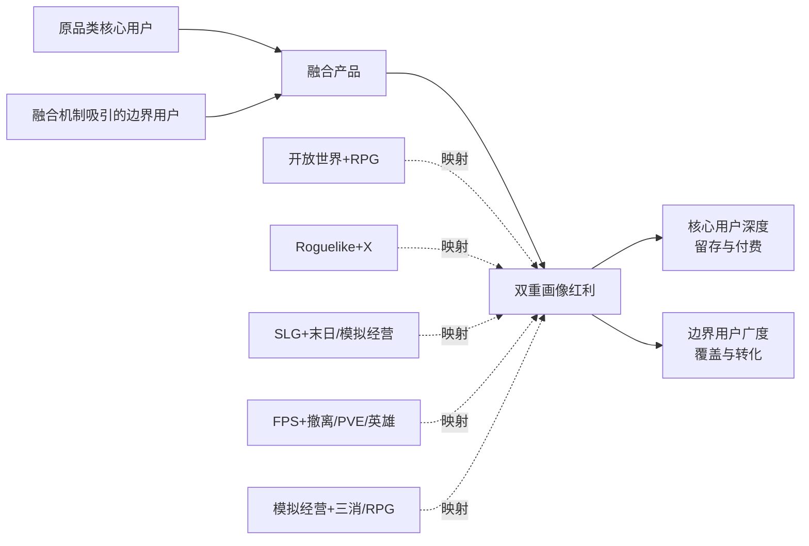

这一双重画像红利的实现需要三个共同条件：第一，**主品类核心循环不被牺牲**——融合机制是叠加而非替代；第二，**融合机制本身具备独立吸引力**——能够独立吸引非传统玩家而非仅作为辅助；第三，**两类用户的运营路径有所差异**——核心用户深度运营、边界用户广度承接，避免一刀切。

对开发者的核心启示是——**2025年的产品立项不能再依赖"单一品类的存量市场"，而应主动设计"主品类+融合机制"的复合定位**。但需要警惕"融合滥用"——如果融合机制并未带来独立的画像红利，仅是"为融合而融合"，反而会稀释核心体验、损害用户认知清晰度。

## 8.4 平台融合与跨端化对用户结构的重塑

如果说8.3节聚焦的是玩法层面的融合，那么本节聚焦的则是**平台层面的融合**——这一维度对用户画像的重塑作用同样深刻，但常被开发者低估。

### 8.4.1 小程序游戏崛起：触达非传统玩家的核心入口

平台融合的第一重突破是小程序游戏对传统画像的根本性重塑。第6章已系统揭示小程序游戏的核心数据：

**规模层面**——2025年中国小程序游戏市场收入535.35亿元、占整体游戏市场15.3%，2024年396.36亿元同比增长99.18%。**用户结构层面**——微信小游戏MAU突破5亿、女性用户占比超40%（部分品类>50%）、24—40岁主力占65%、50岁以上占20%、三线城市用户占比一半。**与App端用户重合度极低**——QuestMobile与抖音方面共同披露的关键数据是**微信小游戏与APP手游用户重合度仅10%、抖音小游戏与APP游戏用户重叠度仅14%**[^85][^91]。

这一极低的用户重合度是理解小程序游戏画像价值的关键——**小程序游戏正在触达此前被App端游戏系统性忽视的用户群体**[^85]。具体而言：

**第一类被忽视用户：女性轻度泛化用户**——传统APP游戏因复杂的下载注册流程、较高的学习门槛、缺乏情感共鸣的设计哲学，难以触达"偶尔想玩但又不愿投入太多"的女性轻度用户；小程序游戏的即点即玩+私域分享+情感化设计精准承接这一群体。**第二类被忽视用户：50岁以上银发用户**——APP端游戏对该群体的操作适配度极低，小程序游戏的简化操作+怀旧IP+轻量化玩法成为银发用户首次接触游戏的主要入口。**第三类被忽视用户：下沉市场用户**——APP端游戏的买量成本与一二线广告渠道偏好使下沉市场覆盖不足，微信小游戏依托微信社交关系链的下沉化分发能力天然适配该市场。

**两个平台的差异化定位**进一步丰富了小程序游戏的画像价值。微信小游戏MAU达5.5亿、月人均使用时长1.7小时、月人均使用次数近70次、月人均使用天数20天、女性占比53%、46岁以上用户占比突出[^91]；抖音小游戏则呈现"内容驱动+大龄男性与年轻女性比例提升+50%首次感受到游戏乐趣的非游戏用户实现转化"的独特画像。

**值得开发者高度关注的反向博弈**——小游戏与APP手游的关系并非零和。**微信小游戏与APP手游的用户重合度仅10%且二者ARPPU基本持平**[^85]，意味着小游戏在挖掘行业新增市场而非抢夺独立APP游戏的存量用户——这为开发者同时布局两个平台提供了理论可行性。

**爆款小游戏的"打破APP边界"现象**[^85]进一步验证了小游戏的独立画像价值。从2022年的《羊了个羊》、2023年的《咸鱼之王》、2024年的《寻道大千》《抓大鹅》、2025年的《三国冰河时代》《英雄没有闪》，多款出圈爆款进一步巩固了微信的寡头地位。**社交玩法成熟的小游戏中社交渠道带来的用户占比可达30%—50%、棋牌类游戏这一比例更是高达70%—80%；社交渠道用户的留存率比行业大盘高出20%；部分IAA小游戏超80%收入由社交用户贡献**[^85]——证明社交关系链分发能力是微信小游戏的独特生态壁垒。

### 8.4.2 跨端互通：头部产品的标配能力

平台融合的第二重突破是跨端互通成为头部产品标配。第2章2.6节、第6章已分别揭示开放世界RPG、二次元、战术撤离三大品类的跨端化领先态势。本节进一步从横向视角归纳跨端化的画像重塑机制。

**跨端用户与单端用户的画像差异**呈现三个层面：

**第一层：硬件预期差异**——跨端用户在PC/主机端体验过高画质、高帧率、大屏沉浸后，对移动端的画质优化、操作适配、跨端数据互通的预期显著高于纯移动端用户。这一预期差异要求开发者投入更多资源进行多端适配。

**第二层：游戏时间分配差异**——跨端用户呈现"碎片化移动端+深度沉浸PC/主机端"的复合时间分配。第3章已引用《三角洲行动》"PC端用户初期核心圈定+移动端不断进化让游戏从垂直走向大众"的案例[^62]——多端布局可以承接同一用户在不同时间场景的不同需求。

**第三层：社交场景差异**——跨端用户的社交活动可能跨越Discord、B站、X、reddit等多平台。这要求开发者建立更分布式的社区运营能力。

**Niko Partners的关键数据已在第2章引用**——39%的日本玩家和58%的韩国玩家至少在两个平台上玩游戏，超过70%的日本移动端游戏玩家和90%的韩国PC端游戏玩家有过跨平台游戏经历。这一数据表明**跨端化已成为东亚市场的主流用户行为模式**，而非少数核心玩家的特殊偏好。

### 8.4.3 主机市场IP驱动复苏：高ARPU核心玩家的战略价值

平台融合的第三重突破是主机市场的IP驱动复苏。2024年中国主机游戏44.88亿元同比+55.13%，2025年继续高速增长（第1章已引用）。

**《燕云十六声》的主机端表现极具代表性**[^82]——**"在平台结构方面，《燕云十六声》展现出明显的主机端驱动特征。早期数据显示，PlayStation用户占比达到64%，Steam为36%。而在最新销量估算中，两个平台的销量规模几乎持平，这表明该作在两个平台均展现出强劲的持续吸引力。这一主机端的领先优势不仅体现了手柄在武侠动作体验中的天然契合度，也反映出发行团队在PlayStation平台的推广策略取得了显著效果"**。

**主机用户的画像核心特征**——**"《燕云十六声》成功吸引了对深度叙事、复杂系统与开放世界体验有强烈偏好的核心玩家群体。这类用户通常具有更高的留存价值与更强的长期内容消费能力"**[^82]。这一画像与第6章Roguelike独立用户的"核心玩家+口碑驱动"画像存在交集——主机用户构成了游戏行业最具长期价值的高ARPU核心玩家群体。

**对开发者的核心启示**——主机端不仅是产品发行的"额外渠道"，更是**承接深度内容消费、长期留存、口碑驱动型核心玩家的战略阵地**。在2025年长尾市场扩张、核心玩家价值提升的市场环境下，主机端布局的战略意义被持续放大。

### 8.4.4 平台融合的本质：同一玩法的不同画像

将小程序、跨端、主机三重平台融合的画像重塑作用横向比较，可以归纳出一个深层规律——**平台融合的本质是"同一玩法在不同平台呈现完全不同的用户画像"**。

例如同样是SLG玩法，在传统APP端是"31—40岁男性鲸鱼+ARPPU 40+美元"画像，在微信小程序端是"24—40岁三线男性+广覆盖+轻氪转中氪"画像，在主机端则可能进入"硬核策略4X玩家+买断制深度内容消费"画像。

这意味着开发者在产品立项阶段必须**将平台维度作为与玩法品类同等重要的画像变量**——同一款产品在不同平台需要差异化的内容设计、付费模型、社区运营、用户期待管理。试图"一套内容打通所有平台"的产品策略在2025年已被证明效率低下，多端互通+多端差异化运营才是头部产品的核心能力。

## 8.5 文化题材创新对画像结构的再造作用

题材内容维度是8.3节玩法融合、8.4节平台融合之外的第三重画像重塑维度。本节聚焦五个最具代表性的文化题材趋势及其画像再造作用。

### 8.5.1 国风/武侠题材的全球化突破

第一类题材趋势是国风/武侠题材的全球化突破。《燕云十六声》构成2025年最具代表性的标杆案例。

**全球化数据极为亮眼**[^82]——**"《燕云十六声》在国际市场上实现了文化破圈，尤其是其武侠题材的吸引力更是让人瞩目。美国玩家占比高达37%，成为最大的海外市场，同时香港、英国、法国与德国等地的表现同样不俗。这种跨文化的广泛渗透，说明武侠世界观与东方奇幻美学正在突破传统文化壁垒，逐渐成为全球玩家共同感兴趣的表达方式"**。

**画像再造的核心机制**——传统国风/武侠题材的目标用户是"中文圈+一二线高线市场+30+男性怀旧"群体，但《燕云十六声》通过开放世界+涌现叙事+中式美学深度+不擦边的初心承诺，成功扩展为"全球用户+跨文化+18—35岁主力"的全新画像。**美国玩家占比37%意味着武侠题材已经不再是"中文圈专属"，国风审美的全球画像渗透力被严重低估**。

**用户重叠度的关键数据**[^82]——**"《燕云十六声》在核心开放世界RPG玩家中表现尤为突出。根据VGI用户重叠指数，该作与PlayStation平台的热门RPG《Blades of Fire》之间的玩家重叠度达79.3%。这一高度重叠的用户结构显示，《燕云十六声》成功吸引了对深度叙事、复杂系统与开放世界体验有强烈偏好的核心玩家群体"**——证明国风武侠题材已经成功跻身全球开放世界RPG核心玩家的主流选择。

**对开发者的核心启示**——国风/武侠题材的全球化潜力此前被显著低估。**通过开放世界+RPG+主机端+不擦边的组合，国风题材可以触达全球高ARPU核心玩家**。这为中国厂商在全球化竞争中提供了一条独特的差异化路径——不需要模仿欧美玄幻或日韩二次元，本土文化IP本身就具备全球吸引力。

### 8.5.2 玄幻/修仙题材的跨性别扩展

第二类题材趋势是玄幻/修仙题材的跨性别扩展。传统玄幻/修仙题材以"男性中年+下沉市场+传奇情怀"为主，但2025年出现了显著的画像扩展。

**《灵画师》案例极具代表性**[^79]——**"国风修仙休闲小游戏《灵画师》以中国传统文化为内核，在美术设计融入经典水墨画风，以及音乐创作嵌入传统韵律元素，将东方美学的独特韵味深度渗透到游戏体验的各个维度，打造出具有沉浸感的国风意境世界，不仅精准契合了当下市场对优质内容的核心需求，更与荣耀用户中追求文化质感、热爱国风潮流的群体高度契合"**——上架荣耀小游戏后**累计收获百万级的热爱国风美学的玩家，上架平台后游戏收入规模维持每个月30%的稳定增长**。

**画像扩展的关键发现**——通过水墨画风+传统韵律+国风美学的设计，传统玄幻/修仙题材成功触达了"追求文化质感的女性用户+年轻用户+国风潮流爱好者"这一新画像群体。**国风修仙×女性向×小游戏的三重叠加构成新画像组合**，是2025年中小开发者值得深入探索的细分蓝海。

### 8.5.3 二次元题材：从亚文化到大众潮流的跃迁

第三类题材趋势是二次元题材的从亚文化到大众潮流跃迁。2024年中国二次元手游市场358亿元、用户规模3亿、女性占比40%以上（第5章已引用），叠加谷子经济2024年1689亿元规模、同比+40.63%（第5章已引用）。

**国谷超越日谷的标志性节点**已在第5章引用——2025年第一季度国产IP"谷子"交易额已达到日本IP"谷子"的1.2倍。这一数据是国产二次元IP产业崛起的标志，意味着中国二次元产业已经具备全球竞争力。

**跨次元延伸的多场景外溢**进一步丰富了二次元题材的画像价值。第5章已系统论述谷子经济、漫展cosplay、文旅融合（成都"东郊记忆"《一人之下》原画展、上海杨浦复兴岛"冒险岛"活动）、cos委托等延伸场景。**二次元题材已突破游戏边界向IP衍生品、文旅融合、cos委托等多场景外溢，构成游戏产业新增长极的重要载体**。

### 8.5.4 末日生存/冰雪题材：跨地域无文化壁垒

第四类题材趋势是末日生存/冰雪题材的跨地域无文化壁垒。点点互动的两款冰川末日题材产品构成代表性案例[^96]：

**市场表现层面**——**"《寒霜启示录》自上线以来全球市场双端收入超4.2亿元，《Frozen City》自上线以来全球市场双端收入超2.1亿元"**。下载分布层面——**"美国、韩国、土耳其是《寒霜启示录》下载前三的市场。《Frozen City》的美国市场下载量与其他市场拉开极大差距，除此之外德国、英国两地有较多的用户下载"**。

**关键画像洞察**[^96]——**"两款产品在欧洲、东亚等地有着不俗的反响，这从侧面反映了这一题材的不受地域隔阂的优势。同时这些用户也是具有高付费价值的潜力，这也为两款产品的长线运营奠定了基础。从用户画像来看，两款产品的用户虽然都集中在18—30岁区间，但仍吸引了不少31—50岁的用户，这表明点点互动的后启示录生存题材受众用户面广，并没有用户年龄的限制"**。

**美术风格的"低多边形抽象表达"机制**[^96]——**"游戏采用的Low-poly风格是一种具有抽象表达与极简主义的艺术风格。由于画面失去细节，玩家的目光会主要集中到画面的构图上，能够更为直接的感受到画面的整体意境，玩家会更加沉浸游戏所带来的体验独特性"**——揭示了末日题材如何通过特定美术风格降低文化适配阻力，实现跨地域画像普适性。

**对开发者的核心启示**——末日生存/冰雪题材的跨文化普适性远超预期。在SLG/模拟经营出海的题材选择上，末日生存是相对低风险的选择，比历史/玄幻/武侠题材的本地化适配难度更低。

### 8.5.5 文化IP情感的代际传承力

第五类题材趋势是文化IP情感的代际传承力。第2章已揭示《最终幻想》用户平均年龄超40岁、传奇IP累计6亿用户，这两个案例共同指向一个深层规律——**经典IP的情感连接力可以跨越数十年延续**。

**老牌IP的"情怀消费和代际传承力量"**[^82]——日本娱乐社会学者中山淳雄主导的XTrend研究指出，老牌IP如《高达》《七龙珠》《假面骑士》等拥有一批忠实且稳定的中年粉丝群，体现出浓厚的情怀消费和代际传承力量。**这些用户从少年时代便与IP结缘至今仍持续支持，构成黄金消费力**。

**与年轻化新IP形成的代际并存格局**——一边是《最终幻想》40+核心用户、传奇IP 6亿累计用户的中年情怀消费力，另一边是《荒野乱斗》18岁平均年龄、王者荣耀全民下沉、《原神》18—30岁70%占比的年轻化新IP——共同构成游戏行业最广的代际谱系。**对开发者的核心启示**——立项之初必须明确目标代际，老IP承接情怀代际、新IP承接年轻代际，二者无法兼容。

**国产IP的代际持续性**——伽马数据《2024中国游戏产业IP发展报告》[^149]指出，**"超90%的受访用户近一年中使用过IP相关产品"，"2024年1—9月主要文娱领域流水TOP10产品中TOP10游戏产品占据超七成份额"，"2024年1—9月中国游戏IP市场实际销售收入达1960.6亿元，预计全年收入高于上一年水平"，"2024年1—9月中国游戏IP市场实际销售收入中82%由IP产品贡献"，"2024年1—9月中国原创游戏IP的游戏市场规模达945.8亿元，占国内整体游戏市场48.2%的份额"**。这些数据共同表明——**IP化运营已成为游戏产业的核心战略，超90%用户的IP偏好是开发者必须正视的画像底色**。

## 8.6 用户需求空缺领域识别与画像蓝海地图

基于8.1—8.5节的横向对比、张力凝练、融合趋势分析、平台与题材重塑，本节系统识别开发者可切入的画像蓝海。每一蓝海方向给出**目标人群画像、市场规模信号、入局门槛、参考案例**四要素分析，为第9章战略建议提供具体着力点。

### 8.6.1 蓝海一：射击+玄幻/武侠/科幻融合

**目标人群画像**——18—35岁射击核心玩家+对差异化题材敏感+对军事写实疲劳。**市场规模信号**——伽马数据指出射击赛道头部由军事写实垄断（腾讯六占其五iOS畅销榜TOP100），但用户对题材多元化诉求强烈[^148]。**入局门槛**——中等偏高，需要射击工业管线+差异化美术能力。**参考案例**——腾讯《王牌战士2》卡通幻想、《命运扳机》英雄射击+技能融合、《穿越火线:虹》微恐氛围、米哈游欧美卡通英雄射击在研项目。

这一蓝海的核心机会在于——**腾讯自身的"全品类覆盖"战略已经验证了军事写实赛道的天花板**[^148]，并通过自研产品矩阵主动探索差异化方向。中小开发者借助这一战略风口，通过更灵活的题材选择（玄幻、武侠、科幻、卡通）切入射击细分赛道，是相对可行的入局路径。

### 8.6.2 蓝海二：女性向+SLG/竞技/中重度玩法

**目标人群画像**——18—35岁女性+对中重度玩法接受度提升+被《无尽冬日》女性近半画像验证。**市场规模信号**——女性向赛道目前以乙女恋爱/换装/养成为主，女性用户对SLG策略、MOBA竞技、二次元RPG的渗透意愿被《无尽冬日》女性近半、王者荣耀女性玩家超一半等案例证明。**入局门槛**——中等，需要女性友好美学+中重度玩法工业能力。**参考案例**——《无尽冬日》"披皮SLG"路径、网易《界外狂潮》二次元美术风格的英雄射击。

这一蓝海的核心机会是——**"女性向硬核化"是下一阶段重要机会**。第7章已揭示女性玩家的Bartle画像并非全部偏"慈善家+社交者"——部分女性玩家的杀手型与成就型驱动同样强烈，但传统女性向产品的乙女/换装/恋爱定位无法承接这一需求。通过中重度玩法+女性友好美学+情感叙事的组合，可以触达此前被忽视的"女性中度核心玩家"群体。

### 8.6.3 蓝海三：银发玩家适老化产品

**目标人群画像**——50岁以上银发用户+怀旧IP偏好+操作适配需求。**市场规模信号**——2025年中国老年电竞用户规模突破2000万、预计年底达到3000万；微信小游戏50岁以上占20%，对应规模1亿+用户。**入局门槛**——中等，技术门槛不高但用户研究门槛极高，需要深度理解银发用户的认知模式与情感需求。**参考案例**——目前市场上仍属空白，王者荣耀娱乐模式与轻度竞技小程序游戏作为银发用户首次接触渠道但并非专属产品。

这一蓝海的核心机会是——**针对该群体的专属产品设计（语音控制、超大字体、慢节奏、怀旧IP、亲情连接）仍属空白**。在中国老龄化进程加速的人口背景下，银发玩家适老化产品的市场天花板远未触及。陕西省31岁以上电竞用户占比44.7%、显著高于全国平均水平（第3章已引用）的数据进一步揭示——**中西部地区银发与中年用户的电竞参与度更高，是值得开发者重点布局的细分地域市场**。

### 8.6.4 蓝海四：下沉市场+情感共鸣的女性向小游戏

**目标人群画像**——24—40岁三线及以下女性+碎片化游戏时间+情感共鸣需求。**市场规模信号**——友谊时光2025年通过《杜拉拉升职记》《凌云诺》《熹妃传》等女性向小游戏实现营收12.48亿元、净利润同比+290.7%（第5章已引用）；女性用户广告ARPU同比+70%；微信小游戏三线占比一半的下沉化结构。**入局门槛**——较低，是中尾部厂商最具确定性的破局赛道。**参考案例**——友谊时光案例、《我的花园世界》登顶微信小游戏畅销榜、《时尚百货城》单月收入千万。

这一蓝海的核心机会是——**两年前微信小游戏畅销榜很少见女性向游戏**[^85]，许多IAA休闲小游戏面向女性用户但因缺乏情感共鸣未能得到泛化女性受众认可，反而被许多男性向IAP游戏收割了部分女性玩家。**这一格局在2025年被根本性扭转，证明女性向小游戏赛道仍处于早期红利期**。微信小游戏团队披露的女性向产品案例——**"2025年下半年女性向模拟经营游戏《我的花园世界》、综艺类、剧情向产品已开始崭露头角"**[^85]——进一步验证这一红利的真实性。

### 8.6.5 蓝海五：独立游戏+本土文化题材

**目标人群画像**——核心玩家+对原创机制敏感+对本土文化有审美认同+全球化分发潜力。**市场规模信号**——《魔法工艺》全球70万销量近半海外、《月圆之夜》中国风童话、《物华弥新》国风文物拟人战棋等案例验证国产独立通过本土文化题材实现全球化突破的可行路径。**入局门槛**——技术门槛不高（"独立游戏制作预算只有大发行商的十分之一甚至更低"），但创意门槛与文化挖掘门槛极高。**参考案例**——《月圆之夜》《物华弥新》《魔法工艺》《暗黑地牢》等。

这一蓝海的核心机会是——**供给仍远小于需求**。中国拥有极为丰富的传统文化资源（神话、武侠、诗词、戏曲、民俗、节气、地理风物等），但目前游戏行业对这些资源的挖掘仍处于早期阶段。**《物华弥新》虽然累计流水仅破亿但仍实现了哔哩哔哩游戏自FGO之后发的最好的产品之一**[^90]——这一相对"小成功"恰好揭示了赛道的低门槛与高潜力并存特征。

### 8.6.6 蓝海六：跨次元IP矩阵+谷子+文旅的全产业链画像

**目标人群画像**——跨年龄段IP情感投射用户+谷子消费用户+文旅打卡用户+同人创作用户。**市场规模信号**——谷子经济2024年1689亿元、+40.63%；2024年1—9月中国游戏IP市场实际销售收入1960.6亿元、IP产品贡献82%[^149]；超90%受访用户近一年使用过IP相关产品；50%以上用户有看到IP产品的意愿。**入局门槛**——极高，需要IP矩阵化运营能力+跨产业链协同能力+长期主义运营。**参考案例**——米哈游IP矩阵（《原神》-《崩坏:星穹铁道》-《绝区零》）、腾讯王者荣耀IP延伸、《一人之下》《原神》文旅融合活动、谷子经济线下店铺。

这一蓝海的核心机会是——**单一爆款已难以独立支撑，IP矩阵化运营是唯一可持续路径**。伽马数据明确指出，**"头部产品中均有50%及以上布局'线下活动''实体联名''衍生品''音乐'4种IP运营形式"**[^149]——这意味着IP矩阵化已成为头部产品的标配能力。同时也需要清醒认知，**谷子经济也面临"乱纪元"挑战**——前两年的"吃谷"热潮趋于平静、IP没有被当成长期资产运营而是作为一次性流量变现工具的短视问题（第5章已引用）。开发者的核心战略选择是——**坚持IP长期主义而非短视变现**，通过持续的核心内容供给维持IP生命力。

### 8.6.7 六大蓝海的横向比较与战略建议矩阵

将六大蓝海方向横向比较，可建立面向不同规模开发者的战略建议矩阵：

| 蓝海方向 | 入局门槛 | 市场规模信号 | 适合开发者类型 | 关键能力要求 |
|---------|---------|------------|------------|------------|
| 射击+玄幻/武侠/科幻 | 中高 | 二次大品类增量+军事写实疲劳 | 中大型工作室 | 射击工业管线+差异化美术 |
| 女性向+中重度玩法 | 中等 | 女性向124.1%增速+中重度渗透 | 中型工作室 | 女性美学+中重度策划 |
| 银发玩家适老化 | 中等 | 2000万+老年电竞用户+1亿+小游戏银发 | 中小型工作室 | 用户研究+UX适配 |
| 下沉女性向小游戏 | 低 | 友谊时光验证+女性广告ARPU+70% | 中尾部厂商 | 情感共鸣+IP化策略 |
| 独立+本土文化 | 中等（创意） | 全球化潜力+供给不足 | 独立工作室 | 原创机制+文化挖掘 |
| IP矩阵+谷子+文旅 | 极高 | 1689亿谷子+IP经济1960亿 | 头部厂商 | 长期主义+跨产业链 |

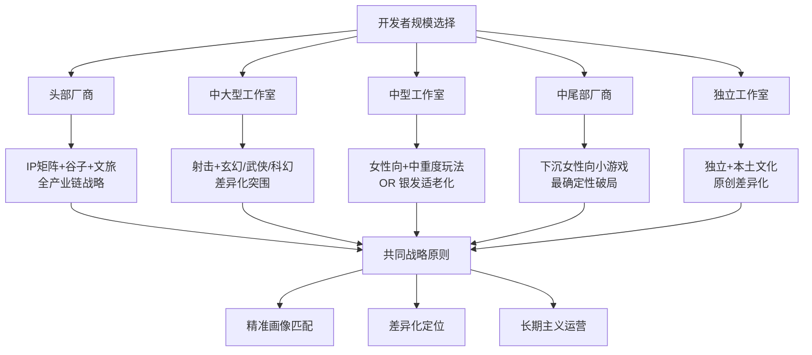

至此，本章完成了从五维横向对比、四组核心张力、玩法/平台/题材三重融合到六大画像蓝海的完整跨类型分析。**本章揭示的核心洞察是——2025年的游戏行业已经从"单品类深耕的存量博弈"演化为"融合化扩展的画像红利争夺"**：玩法品类融合带来"核心用户保留+边界用户扩展"的双重红利，平台融合带来"同一玩法不同画像"的多元承接，文化题材融合带来全球化破圈与跨次元延伸——三重融合共同重塑了游戏行业的用户版图，为不同规模的开发者提供了差异化的入局路径。

下一章作为整篇报告的收束，将基于第2—8章建立的完整素材，向开发者输出从产品立项、玩法设计、美术题材、商业化设计、社交运营、推广发行六大环节的具体策略建议，并结合版号、出海、AI技术、平台变迁等行业背景，展望Z世代与银发玩家崛起、全球化与本地化深化、AI生成内容渗透、跨平台融合加速等未来趋势对游戏用户画像演变的影响，为开发者在长期产品规划中应持续关注的用户研究方向与方法论升级提供前瞻性指引。

# 9 对游戏开发者的洞察启示、策略建议与未来展望

历经前八章对方法论框架的奠定、六大类游戏品类用户画像的纵深拆解、跨类型心理坐标系的统一构建以及画像谱系与融合趋势的横向归纳，整篇报告已经为开发者搭建起一套相对完整的"用户画像知识地图"。但一份研究报告的最终价值，不在于知识本身的厚度，而在于知识能否被开发者直接调用——能否在产品立项的关键时刻提供清晰的赛道选择指引、能否在玩法设计的纠结时刻提供心理动机匹配的参照、能否在商业化与社交运营的抉择中提供差异化范式的判断、能否在面对AI技术、平台变迁、版号政策、全球化竞争的行业变局时提供动态调整的方法论。本章作为整篇报告的收束章节，承担的正是这一**"知识到决策"的最后一公里**转译任务——将前八章丰富的画像素材、心理坐标与融合规律凝练为开发者可直接调用的战略决策手册。

本章在写作上严格遵循"不重复、只整合、出建议、看未来"的原则——在六大开发环节系统输出策略建议（9.1—9.6）、结合四大行业背景剖析动态调整方法论（9.7）、凝练十大关键洞察（9.8）、展望四大未来趋势（9.9）、最后为开发者长期规划的用户研究方向与方法论升级提供前瞻性指引（9.10）。本章的目标读者是站在产品决策十字路口的游戏开发者——无论是头部厂商的战略规划者、中型工作室的产品负责人、独立工作室的创始团队，还是中尾部厂商的转型探索者，都应能在本章中找到可对照的赛道选择、可执行的设计原则与可借鉴的运营方法。

## 9.1 产品立项阶段的类型选择与目标用户匹配策略

产品立项是开发者所有决策中影响最深远、纠错成本最高的环节——一旦类型选择与目标用户匹配出现偏差，后续的玩法设计、美术投入、商业化模型、社交运营都将沿着错误轨道延伸，到中后期再纠偏几乎不可能。本节基于第8章六大画像蓝海地图与第7章三维心理坐标系，系统输出产品立项阶段的核心决策框架。

### 9.1.1 四维定位法:玩法品类×题材×平台×重度的精确锚定

第1章已确立"以玩法品类为主线、辅以题材与重度交叉分析、平台维度横向贯穿"的总体方法论结构;第8章则进一步揭示**当代头部产品几乎全部跨越多个维度**——《无尽冬日》是"SLG+末日生存+轻量化建造+移动+小程序"的五维混合体、《燕云十六声》是"开放世界+RPG+武侠题材+主机/PC/移动+中重度"的复合定位。这意味着开发者在立项之初必须使用**四维定位法**确定产品坐标——任何单一维度的判断都将导致目标用户识别失真。

四维定位法的具体执行流程可归纳为：**第一步，玩法品类锚定核心心理动机**——基于第7章Bartle/Hexad坐标系判断目标用户的主导驱动（杀手/成就/社交/探索/慈善家/自由精神/玩家/破坏者）；**第二步，题材选择锚定审美与文化偏好**——根据目标人群的代际、性别、地域选择适配的题材（武侠/玄幻/二次元/末日/科幻/现代/历史等）；**第三步，平台选择锚定使用场景与商业化模型**——PC核心用户、移动端碎片化用户、小程序非传统用户、主机端深度内容消费用户的画像差异决定了平台分发优先级；**第四步，重度选择锚定时间投入与生命周期**——重度产品的赛季周期、中度产品的15—30分钟单次循环、轻度产品的90秒爽点单局对应完全不同的目标用户。

四维之间不是相互独立而是**强耦合关系**。例如选定"开放世界RPG玩法+武侠题材"组合后，平台必然倾向PC/主机/移动多端互通而非纯小程序，重度必然倾向中重度而非轻度——这是由玩法本身的工业能力与用户期待决定的。开发者需要避免的是"自由组合任意维度"的立项陷阱——例如试图打造"硬核SLG玩法+二次元美术+小程序平台+轻度入口"的产品，四维彼此之间缺乏内在一致性，必然在执行中陷入战略混乱。

### 9.1.2 避免双重风险:伪需求与红海过度拥挤

第1章已揭示2025年最显著的市场信号——**新品供给"降温"与头部集中**：上线当月或次月进入中国App Store手游收入排行榜前20名的手游数量较2024年减少将近一半；非头部游戏在西方PC市场贡献56%总收入但中国市场长尾扩张相对有限。这一市场结构意味着新品立项面临**伪需求**与**红海过度拥挤**两重风险。

**伪需求风险**指的是开发者基于自身偏好或行业热点判断目标用户存在某项需求，但实际目标用户群体并不存在或规模远低于预估。典型案例如盲目跟随"二次元小众破圈"概念立项纯小众二次元产品，却忽视该赛道核心用户增量已触顶（2024年上半年二次元手游市场规模同比小幅收缩约0.65%）；或盲目跟随"女性向蓝海"概念立项乙女游戏，却低估《恋与深空》《光与夜之恋》《世界之外》《如鸢》四强格局对新进入者的挤压。规避伪需求的核心方法是——**用第三方数据机构的多源交叉验证替代主观直觉**，伽马数据、Sensor Tower、点点数据、QuestMobile、艾瑞咨询等多源数据相互印证后才能形成可信结论。

**红海过度拥挤风险**指的是赛道虽然存在真实需求但已被巨头深度占据，新进入者难以建立差异化壁垒。典型案例如直接进入大DAU MOBA、传统军事写实FPS、头部SLG等赛道与腾讯、网易、点点互动正面竞争——即便产品质量优秀，在买量成本、IP积累、用户心智先入优势面前也难以突围。规避红海风险的核心方法是——**通过四维定位法在主流赛道找到差异化坐标**，例如FPS赛道避开军事写实进入"FPS+玄幻"或"FPS+卡通幻想"细分、SLG赛道避开纯硬核进入"SLG+末日生存"或"SLG+模拟经营"细分、MOBA赛道避开大DAU竞技进入"MOBA+二次元"或"MOBA+自走棋"细分。

### 9.1.3 按开发者规模匹配差异化赛道:六大蓝海的能力对应

第8章已建立六大画像蓝海地图。本节进一步将六大蓝海与开发者规模建立精确匹配关系，输出**按规模选赛道**的战略建议矩阵：

| 开发者规模 | 推荐主赛道 | 备选赛道 | 关键能力要求 | 规避赛道 |
|-----------|----------|---------|------------|---------|
| 头部厂商 | IP矩阵+谷子+文旅全产业链 | 开放世界RPG、跨端3A | 长期主义+跨产业链协同 | 无明显规避 |
| 中大型工作室 | 射击+差异化题材 | SLG+融合机制、开放世界 | 工业管线+差异化美术 | 纯军事写实FPS红海 |
| 中型工作室 | 女性向+中重度玩法 | 银发玩家适老化、二次元RPG | 女性美学+中重度策划 | 直接对标米哈游/叠纸 |
| 中尾部厂商 | 下沉女性向小游戏 | 商道经营+小程序、轻量化MOBA | 情感共鸣+IP化策略 | 纯硬核SLG/MMORPG |
| 独立工作室 | 独立+本土文化题材 | Roguelike+融合、VN | 原创机制+文化挖掘 | 跟随式同质化产品 |

这一矩阵的核心战略逻辑是——**不同规模的开发者具备完全不同的能力禀赋，因此应选择与其能力禀赋匹配的赛道而非"向上对标"**。头部厂商的核心能力是长期主义+跨产业链协同+工业能力规模化，因此IP矩阵与全产业链运营是其独特优势；独立工作室的核心能力是创意密度+文化挖掘+原创机制，因此本土文化+独立游戏是其差异化空间。中尾部厂商最容易陷入的战略误区是**"向上对标头部厂商立项重投入产品"**——例如想做"轻量级《原神》"或"小成本SLG"——这种立项几乎必然失败，因为重投入赛道的成功不仅依赖产品质量更依赖工业能力规模与品牌信任度积累。

第6章已揭示友谊时光通过《杜拉拉升职记》《凌云诺》等女性向小游戏实现营收12.48亿元、净利润同比增长290.7%的扭转路径，是中尾部厂商按规模匹配赛道的典型成功案例[^79]。这一案例揭示的深层规律是——**在自己能力可驾驭的赛道找到差异化坐标，远比在巨头主导的红海赛道勉强求生更具可持续性**。

### 9.1.4 心理类型组合权重:主导驱动+次要补充的避免"既要又要"

第7章已系统揭示Bartle/Hexad坐标系下的六组典型驱动力组合。立项阶段开发者必须**明确选择"主导驱动+次要补充"的心理类型组合权重**，避免追求"全维度满足"的画像混乱。

具体执行原则是——**主导驱动应当极致明确**，例如SLG主导杀手+成就+社交三高、女性向主导慈善家+社交者+情感投射、Roguelike独立主导探索者+成就者+破坏者；**次要补充应当克制添加**，仅添加与主导驱动协同而非冲突的心理类型，例如SLG可补充玩家(P)型驱动通过签到任务等机制提升日活，但不应试图同时承接慈善家型与自由精神型驱动，因为这些心理类型的运营需求与SLG核心循环冲突。

第8.2.3节已揭示的《守望先锋》案例正是"既要又要"陷阱的典型——预期玩家是"团队协作型社交者"但实际玩家心智更多是"个人成就型杀手"，二者错位构成产品长期运营的根本风险。这一案例提示开发者：**心理类型组合权重的选择必须基于真实的用户研究而非设计者的主观期待**——通过原型测试、A/B测试、玩家访谈等方法验证目标用户的实际心理画像，而非基于设计者认为的"理想玩家行为"立项。

立项阶段的最后一项关键工作是**目标用户画像文档化**——将四维定位、心理类型组合、规避风险等关键决策固化为可验证的产品定位文档，作为后续玩法设计、美术风格、商业化模型、运营策略的参考锚点。任何后续设计决策都应回到这一文档进行一致性检查，避免在执行过程中出现画像漂移。

## 9.2 玩法设计与机制创新:心理动机契合与减负化平衡

玩法设计是产品立项之后第一个需要细化的核心环节——它直接决定了用户每天来这个游戏做什么、用户的核心爽点是什么、用户的留存机制如何运作。本节基于第7.6.1节玩法循环设计两步法与第8.2.4节"重肝重氪vs碎片减负"张力分析，输出玩法机制设计的核心建议。

### 9.2.1 核心循环模式选择:Bartle主导类型的精准对应

第7.6.1节已建立**心理类型→核心循环模式**的精确映射规律。本节将这一映射转化为开发者可直接调用的决策清单：

**杀手型主导→PVP排位循环**——核心要素包括段位竞争（青铜到王者的位序梯度）、赛季重置（避免长期玩家固化优势）、排行榜激励（区服/全国/世界多层排名）、宿敌系统（个人恩怨记录）。SLG的跨服攻城、MOBA的巅峰赛、FPS的天梯排位都是这一循环的典型实现。设计的关键警示是——**ELO匹配机制是大众化MOBA的必备工具**，第3章已揭示王者荣耀加入ELO匹配机制留住大量低水平玩家的关键作用[^85]，纯硬核排位虽然契合杀手型核心驱动但会过滤掉大量中度玩家。

**成就型主导→养成数值循环**——核心要素包括装备强化（词缀属性+品质阶梯）、技能解锁（树状或环状成长树）、完成度收集（图鉴/成就/称号系统）、稀有物品获取（限定卡池/稀有掉落）。ARPG装备词缀、JRPG资料片、二次元抽卡角色、模拟经营图鉴都是这一循环的典型实现。设计的关键警示是——**成就系统必须设置长短不一的目标层次**，让新手玩家能快速完成短目标获得即时成就感、中度玩家能够规划中目标维持持续动力、重度玩家能够追求长目标实现长期沉浸。

**社交型主导→公会协作循环**——核心要素包括组队副本（强制4—8人配合）、公会战（联盟级对抗事件）、师徒系统（新老玩家纽带）、好友等级（关系沉淀机制）。MMORPG帮派系统、SLG联盟、王者荣耀战队都是这一循环的典型实现。设计的关键警示是——**社交压力梯度必须与目标用户耐受度精准匹配**，第8.2.3节已系统论述社交压力错配的严重后果。

**探索型主导→开放探索循环**——核心要素包括地图发现（战争迷雾揭开机制）、剧情推进（主线+支线+隐藏线）、涌现叙事（NPC关系网+物理化学引擎）、隐藏内容（秘宝/谜题/支线）。开放世界RPG、4X策略、Roguelike独立、VN/解谜冒险都是这一循环的典型实现。设计的关键警示是——**探索深度与玩家投入时间必须形成正反馈**，避免出现"探索一小时无任何发现"的挫败体验。

**自由精神型主导→沙盒自定义循环**——核心要素包括家园建造（《摩尔庄园》案例）、装饰展示（《我的花园世界》登顶微信小游戏畅销榜案例）、UGC共创（Mod工坊+地图编辑器）、配置组合（角色定制+装备搭配）。模拟经营轻度方向、女性向换装、《我的世界》沙盒都是这一循环的典型实现。

**慈善家型主导→陪伴叙事循环**——核心要素包括角色羁绊（《恋与深空》"心动值"系统）、剧情解锁（按好感度逐步开启）、情感锚点（生日提醒/节日剧情/月卡问候）、非对称反馈（不同角色对同一行为的差异化反应）。女性向乙女、二次元抽卡、互动影游都是这一循环的典型实现。

### 9.2.2 循环深度的重度选择:跨日/中度/碎片化三种节奏

选定核心循环模式后，下一步是**叠加重度选择决定循环深度**。三种典型节奏对应完全不同的玩法设计哲学：

**跨日赛季节奏（重度）**——单局时长可达30分钟以上甚至跨时区准异步，赛季周期通常为2—3个月，要求玩家高频次长时长投入。SLG的赛季制（3个月一个轮回）、MMORPG的资料片（半年到一年一个版本）、二次元手游的版本节奏（6周一个大版本）都是典型案例。这一节奏适合服务重度核心玩家但天花板有限——第8.2.4节已揭示Quantic Foundry的实证数据，玩家在"策略思考"动力上的得分已从2015年第50百分位降至2024年第33百分位，意味着接受跨日赛季节奏的用户基础正在持续萎缩。

**中度循环节奏（中度）**——单局时长15—30分钟，每日3—5次启动，要求玩家有相对固定的游戏习惯。MOBA对局（王者荣耀10—15分钟、Dota2/LOL端 30—50分钟）、二次元角色养成的日常（半小时清完体力）、模拟经营单次游玩都是典型案例。这一节奏是当前移动游戏的主流形态，第1章已引用艾瑞咨询数据"68.3%活跃用户日均启动游戏次数达5.2次但单次平均停留时长仅为4.8分钟"——但需要注意"5.2次启动+4.8分钟单次"实际上更接近碎片化而非中度节奏。

**碎片化节奏（轻度）**——单局时长90秒—5分钟，启动场景集中于通勤/午休/睡前，要求即点即玩+即时反馈。休闲益智小游戏、超休闲游戏、放置类产品的核心循环都是典型案例。这一节奏的设计关键是——**单局必须有明确的开始与结束、必须有清晰的爽点反馈、必须有引导次次启动的钩子**（连续登录奖励、好友比拼、排行榜更新等）。

### 9.2.3 减负化平衡:保留深度的同时降低门槛

第8.2.4节已揭示**"重肝重氪vs碎片减负"是2025年最深刻的画像张力之一**——玩家集体性的"耐心阈值"在持续下降，但核心心理需求（成长感、剧情沉浸、社交归属、对抗胜利）并未消失。这一张力对玩法设计的启示是——**保留核心体验深度的同时通过机制创新降低时间投入门槛**。

**第一种平衡机制:章节化拆解**——第1章已引用米哈游在《崩坏:星穹铁道》中将主线剧情拆解为平均6分17秒的独立章节的案例。这种章节化使重度叙事内容可以适配碎片化时间，玩家在地铁通勤、午休间隙完成一个完整章节，避免"必须连续2小时才能玩完一段剧情"的时间门槛。

**第二种平衡机制:放置离线收益**——第2章已揭示放置类RPG数量四连增、《菇勇者传说》《杖剑传说》等放置RPG突破传统重肝重氪模式的趋势。放置机制使玩家在不上线时仍能获得资源积累，上线时只需30分钟即可完成核心规划与决策，大幅降低"必须每天上线刷副本"的肝度。

**第三种平衡机制:模拟经营前置**——第8.3.3节已揭示《无尽冬日》"披皮SLG"路径——前90分钟模拟经营体验降低玩家警惕、对营地产生情感投入后再缓缓揭开SLG真面目[^81]。这种前置机制将SLG的中重度对抗体验承接到非传统SLG用户，扩展了画像红利。

**第四种平衡机制:自动战斗+手动精操作的双轨设计**——日常副本支持一键扫荡或自动战斗，新版本/挑战副本/PVP保留手动精操作。这种双轨使玩家在日常时段以"管理者"身份运营游戏，在精彩时刻以"操作者"身份获得手感反馈，平衡了时间投入与操作快感。

需要警惕的是**"减负化等于轻量化"的误解**——减负化的本质是降低时间投入门槛而非降低体验深度。第6章已揭示《无尽冬日》虽然玩法轻量化但联盟生态、跨服战争、长线运营的深度并未削弱[^81]，《菇勇者传说》虽然采用放置机制但角色养成、装备词缀、关卡推进的成长感丝毫不减。**真正成功的减负化设计是"降低门槛+保留深度"的双重平衡，而非"降低门槛+削减深度"的单纯简化**。

### 9.2.4 融合机制的双重红利:警惕"为融合而融合"

第8.3节已系统揭示玩法品类融合的五大方向及其"核心用户保留+边界用户扩展"的双重画像红利。本节进一步对开发者输出**融合机制设计的核心原则与陷阱警示**。

**核心原则**包括三条：**主品类核心循环不被牺牲**——融合机制是叠加而非替代；**融合机制本身具备独立吸引力**——能够独立吸引非传统玩家而非仅作为辅助；**两类用户的运营路径有所差异**——核心用户深度运营、边界用户广度承接，避免一刀切。

**陷阱警示**主要有三类。**第一类是"为融合而融合"的伪创新**——例如在核心射击玩法中强行加入抽卡机制但抽卡本身缺乏独立吸引力，结果是核心射击用户反感抽卡的存在、抽卡爱好者又难以接受射击玩法的高门槛，两类用户都被疏远。**第二类是"融合机制冲淡核心体验"**——例如在硬核RPG中加入过多模拟经营元素，导致核心战斗节奏被频繁打断；或在轻度休闲中加入过多养成线，导致用户感受到"被肝度绑架"的压力。**第三类是"融合机制与核心循环节奏冲突"**——例如在跨日赛季节奏的SLG中加入碎片化90秒爽点机制但二者节奏完全不匹配。

判断融合机制是否合理的检验标准是——**融合机制能否在保留核心体验的前提下独立扩展用户基数**。如果融合机制仅作为"附加属性"存在但无法扩展用户基数，那么它就是"为融合而融合"的伪创新，应当果断舍弃；如果融合机制能够独立吸引新用户群体，那么它就是真正的双重画像红利来源，值得深度投入。

## 9.3 美术与题材定位:适配目标群体审美与文化输出

美术与题材是用户首次接触产品时的第一印象，也是后续口碑传播的核心载体。本节基于第8.5节文化题材创新章节与各品类美术风格分析，输出美术与题材定位建议。

### 9.3.1 题材选择的全球化路径:国风武侠的破圈样本

国风/武侠题材在2025年完成了跨文化破圈的标志性突破。第5章与第8.5.1节已揭示《燕云十六声》的核心数据——**美国玩家占比高达37%，成为最大的海外市场，同时香港、英国、法国与德国等地的表现同样不俗**[^82]。这一数据彻底颠覆了"武侠题材=中文圈专属"的传统认知。

这一全球化破圈对开发者的启示包括三层：**第一层:本土文化IP的全球吸引力被严重低估**——中国厂商在选择全球化题材时不必盲目模仿欧美玄幻或日韩二次元，本土武侠/玄幻/历史题材本身就具备全球差异化吸引力；**第二层:深度美学+开放世界+主机端组合是文化输出的高效路径**——《燕云十六声》通过开封主城的精细还原、樊楼设计的实地考察、北宋盛世的文化氛围塑造，使外国玩家也能感受"穿越回千年前的开封"的文化冲击[^82]；**第三层:武侠的核心价值是"侠"而非视觉符号**——开发者应深入挖掘家国情怀、快意恩仇等武侠精神内核而非停留在轻功绝技、华丽服饰等视觉表层。

但需要警惕**"飞白成诗"式的初心承诺被商业化破坏**。第5.2.3节已系统论述《燕云十六声》国服周年庆推出的"飞白成诗"皮肤被指对16岁未成年角色进行性暗示而引发大规模抗议、官方紧急下架并道歉的事件。**叙事-情感导向类用户对"叙事真诚度"的容忍阈值远低于其他品类**——一旦初心承诺被商业化破坏，将引发系统性信任反噬。这一案例对开发者的核心启示是——**美术与题材定位必须建立全球一致的内容标准，避免"国服整改海外保留"的双标运营**。

### 9.3.2 题材跨性别扩展:玄幻修仙与女性用户的桥梁

传统玄幻/修仙题材以"男性中年+下沉市场+传奇情怀"为主，但《灵画师》案例展示了通过水墨画风+传统韵律+国风美学设计触达女性用户的可行路径——**"国风修仙休闲小游戏《灵画师》以中国传统文化为内核，在美术设计融入经典水墨画风，以及音乐创作嵌入传统韵律元素，将东方美学的独特韵味深度渗透到游戏体验的各个维度，打造出具有沉浸感的国风意境世界，不仅精准契合了当下市场对优质内容的核心需求，更与荣耀用户中追求文化质感、热爱国风潮流的群体高度契合"**[^79]。

这一案例对开发者的核心启示是——**题材本身并不必然限定性别画像，美术风格与音乐设计才是决定性别用户结构的核心变量**。同样的玄幻修仙世界观，配合传统硬派国风画面与战斗感音乐则吸引中年男性、配合水墨画风与传统韵律则吸引女性与年轻用户。开发者在题材选择后必须进一步明确美术风格的细分定位——**水墨/工笔/写实/卡通/像素/Low-poly等不同风格对应完全不同的目标人群**。

### 9.3.3 二次元美学的跨次元延伸与代际跃迁

第5.3节与第8.5.3节已系统揭示二次元从亚文化到大众潮流的跃迁——**2024年中国二次元手游市场规模358亿元、用户规模3亿、女性占比40%以上、谷子经济1689亿元、+40.63%、国产IP谷子交易额超过日本IP谷子1.2倍**。这一系列数据共同表明二次元美学已经从"小众亚文化"演化为"大众潮流"。

这一跃迁对开发者的核心启示是——**二次元美学不再是"小众标签"，而是覆盖全年龄段的大众化设计语言**。即便不立项纯二次元产品，在其他品类（SLG、休闲、模拟经营）中合理引入二次元美学元素也能扩展用户基数。但需要警惕**"摄像头化人设"的反感心理**——第5.3.3节已揭示二次元用户普遍反感角色被设计为仅作为剧情推进工具而缺乏独立性格的"摄像头"。这意味着即便采用二次元美学，每一个角色仍必须具备完整的前史、独立的性格、专属的剧情线索与可触发的情感反馈机制。

### 9.3.4 末日生存美学的跨地域无文化壁垒优势

第8.5.4节已揭示末日生存/冰雪题材的跨地域无文化壁垒——点点互动两款冰川末日题材产品在欧洲、东亚等地都有不俗反响，证明这一题材不受地域隔阂的优势[^96]。Low-poly风格的"抽象表达与极简主义艺术风格"通过让画面失去细节、让玩家目光集中到画面构图上，能够更直接感受画面整体意境，玩家会更加沉浸于游戏所带来的体验独特性[^96]。

这一案例对开发者的核心启示是——**在SLG/模拟经营出海的题材选择上，末日生存是相对低风险的选择**。比历史/玄幻/武侠题材的本地化适配难度更低、比现代都市题材的文化敏感度更小、比科幻题材的技术门槛更友好。对中型工作室或刚开始全球化布局的厂商而言，末日生存题材是性价比较高的入门赛道。

### 9.3.5 美术风格与重度选择的耦合关系

最后必须强调美术风格选择与重度选择的耦合关系——**重度产品需要更高规格的美术工业能力**。开放世界RPG、3A单机、二次元RPG等重度品类对美术品质有极高要求，第2章已揭示"二次元手游男性玩家超过七成将'二次元画风+美少女元素'视为二游的必备特征"，意味着画风+角色塑造是该品类的绝对前置门槛。**轻度产品则可以选择更具差异化的美术风格**——Low-poly的极简、像素风的怀旧、水墨的国风、扁平化的可爱，都是中小开发者用相对较低成本实现差异化美术定位的可行路径。

开发者在美术与题材定位的最后一项关键工作是**视觉风格手册化**——将美术风格基调、色彩体系、角色设计规范、场景设计规范、UI设计规范等关键决策固化为可执行的视觉风格手册，作为美术团队全产品周期的统一参考。任何后续视觉决策都应回到这一手册进行一致性检查，避免出现"前期高品质后期降规格"或"主美换人后画风漂移"的常见问题。

## 9.4 商业化设计:付费模式与用户消费能力的精准匹配

商业化设计是产品从"用户喜爱"走向"商业成功"的关键桥梁。本节基于第7.4节五大商业化范式与第8.1.4节横向对比，输出商业化设计建议。

### 9.4.1 五大商业化范式的差异化适用场景

第7.4.2节已建立五大商业化范式的完整谱系——鲸鱼经济、应援式付费、良心ARPU悖论、混合变现、买断+口碑驱动。本节将这五大范式与具体品类的对应关系再次明确，输出**范式选择决策清单**：

**鲸鱼经济范式适用场景**——目标用户为31—40岁中青年男性鲸鱼、玩法支持"长期沉浸+组织对抗+权力释放"核心循环、社交结构具备联盟深度绑定能力。SLG、MMORPG是该范式的典型品类。设计要点是为鲸鱼用户提供"清晰的、可投入的目标场景"——服务器战争、联盟争霸、跨服攻城等大型对抗事件就是为此设计的"鲸鱼舞台"[^89]。第4.2.1节已系统拆解SLG鲸鱼用户的四类画像——企业主与高管、富二代与投资新贵、高收入专业人士、特殊群体——四类鲸鱼的共性是"目标导向消费"。

**应援式付费范式适用场景**——目标用户对IP/角色/战队有情感连接、付费动机以情感支持而非功能获取为主、社区生态具备应援文化基础。二次元、女性向、电竞IP是该范式的典型品类。设计要点是建立"非对称反馈+情感锚点+陪伴型服务+月卡情感锚点"四要素商业化逻辑（第4.4.4节、第5.4.4节）。**深化展开女性向四要素逻辑的具体落地**：非对称反馈通过同一行为在不同角色身上触发差异化反应使用户留存率提升至行业平均值的1.7倍；情感锚点通过完整前史+独立配音+专属Live2D演出使单次抽取ARPU值提升52%；陪伴型服务通过定制生日提醒、节日专属剧情吸引68%高付费用户购买；月卡情感锚点通过手写体角色信笺+晨间问候语音将周期性消费转化为稳定情感投入。

**良心ARPU悖论范式适用场景**——目标用户为中度社交型玩家、玩法支持高频次低门槛参与、社交结构具备熟人开黑反哺能力。轻量化MOBA、王者荣耀级国民产品是该范式的典型品类。设计要点是构建"高频次低门槛+强社交认同+稀缺性运营"组合——节日主题活动、战队专属福利、段位冲刺奖励、皮肤返场机制、碎片兑换系统、好友助力活动等多入口分散却不突兀，频次适中却持续渗透。

**混合变现范式适用场景**——目标用户为轻度泛化用户、玩法支持碎片化爽点循环、平台分发以小程序或休闲超休闲为主。休闲益智小游戏是该范式的典型品类。设计要点是"广告铺底+内购拉升"的分层设计——前3关纯广告铺底维持启动门槛，第4关开启内购转化付费意愿，非付费用户增加广告频次但避免"刻意提高难度迫使看广告"的短视红线（第6.1.4节）。第6.1.5节已揭示女性用户广告ARPU同比+70%的关键数据，证明混合变现模型的天花板正在持续抬升。

**买断+口碑驱动范式适用场景**——目标用户为核心玩家、玩法具备机制创新与重玩深度、平台以PC/主机为主。Roguelike独立、AAG单机是该范式的典型品类。设计要点是"高品质核心内容+Steam特别好评+B站UGC生态+EA抢先体验+持续打磨"——第6.3.6节已揭示《魔法工艺》全球70万销量近半数来自海外市场的成功路径，证明买断+口碑驱动范式对中小独立工作室的全球化突破价值。

### 9.4.2 商业化哲学的全要素一致性

商业化设计最常见的战略误区是**商业化哲学与产品全要素不一致**——例如选择应援式付费范式但角色塑造缺乏深度（无完整前史、无独立配音、无专属剧情），或选择鲸鱼经济范式但社交结构无法承接联盟深度绑定（无跨服战、无联盟仓库、无外交系统）。

第8.2.2节已揭示**商业化哲学必须在立项之初就明确并贯穿玩法循环、社交结构、付费节点、运营节奏全要素设计**。具体执行清单包括：

| 设计要素 | 鲸鱼经济一致性要求 | 应援式付费一致性要求 | 良心ARPU悖论一致性要求 |
|---------|------------------|------------------|------------------|
| 玩法循环 | 长期沉浸+战力对抗 | 角色养成+剧情解锁 | 短局15—20分钟+段位竞争 |
| 社交结构 | 联盟深度绑定 | 社区共创+口碑分享 | 熟人开黑反哺 |
| 付费节点 | 对抗时刻+鲸鱼舞台 | 情感共鸣+陪伴时刻 | 段位冲刺+碎片兑换 |
| 运营节奏 | 赛季制+跨服联动 | 角色周年+限定卡池 | 节日活动+战队福利 |
| 美术风格 | 写实/史诗+IP强势 | 高品质二次元+CV+Live2D | 多元角色+皮肤生态 |

任何一个要素与商业化哲学的不一致都会削弱整体商业化效率——例如鲸鱼经济范式下采用碎片化爽点玩法会降低鲸鱼用户的沉浸深度，应援式付费范式下采用纯PVP对抗社交会削弱情感共鸣氛围。开发者在商业化设计阶段应建立**全要素一致性检查机制**，确保每一项产品决策都与选定的商业化范式协同。

### 9.4.3 首充转化的"低门槛高回报"设计原则

无论选择哪种商业化范式，**首充转化都是付费阶段的关键节点**。第7.5.3节已引用《和平精英》战令系统的成功案例——纯外观向、首期定价60元、免费档可得50%核心外观、首月付费渗透率达12.8%远高于同期竞品平均8.1%。这一案例揭示首充设计的核心是**"低门槛高回报"**——既要降低用户决策成本，又要让用户在首次付费后立即感受到付费价值。

具体执行原则包括四点：**第一,首充价格控制在6—30元区间**——这一价格段已成为行业共识，6元首冲是打破"不付费心理防线"的最低门槛；**第二,首充奖励价值显著高于价格**——通常应达到价格的5—10倍价值感，避免"付了钱没什么用"的失望；**第三,首充奖励即时到账**——10秒内反馈到位，避免"付费失衡71%流失"风险；**第四,首充奖励与核心玩法强相关**——例如SLG首充给加速道具、二次元首充给抽卡道具、休闲首充给广告免除——确保用户能立即在核心玩法中感受到付费价值。

### 9.4.4 警惕过度商业化的口碑反噬

最后必须警示开发者——**过度商业化会引发用户口碑系统性反噬**。第5章已系统列举2025年女性向赛道密集出现的多起信任危机事件——《恋与深空》"飞白成诗"擦边争议、《世界之外》卡池涨价公关危机（"想赚钱"成为人人吐槽的热梗、制作人璇子离职让产品处境雪上加霜）、《如鸢》台词低俗争议致使大量玩家退游、《燕云十六声》初心背离争议[^82]。

这些事件的共同教训是——**叙事-情感导向类用户对"内容立场"的容忍阈值远低于其他品类**。商业化设计的边界不仅是经济效率最大化，还包括用户情感容忍度、产品初心承诺、品牌长期价值等多维度考量。具体执行原则包括：**第一,建立内容审核的多层把关机制**——避免出现明显违背产品定位的内容设计；**第二,制作人/核心策划的稳定性是核心资产**——《世界之外》制作人离职直接加剧产品危机的案例已经警示这一点；**第三,公关危机出现时优先选择真诚道歉与快速整改**——而非"国服整改海外保留"的双标操作；**第四,IP衍生消费的可持续性根植于核心游戏内容的持续质量供给**——第5.5.1节已警示谷子经济"乱纪元"挑战，IP没有被当成长期资产运营而是作为一次性流量变现工具的短视问题终将透支用户情感。

## 9.5 社交与运营策略:基于Hexad模型的差异化激励体系

社交与运营策略是产品上线后维持长期生命力的核心引擎。本节基于第7.6.2—7.6.4节激励系统、社交机制、分层运营三层框架，输出运营策略建议。

### 9.5.1 Hexad六类用户的差异化激励要素配置

第7.1.2节已揭示Hexad框架的核心价值——**它直接将用户类型与游戏化设计元素建立量化映射关系**。研究者通过实证数据证实了32个游戏化设计元素与每个Hexad用户类型存在显著相关性。本节将这一映射转化为开发者可直接调用的激励配置清单：

**玩家型(P)激励**——核心是积分/勋章/可见奖励/签到/任务积分。这一类型用户的核心驱动是"外在奖励驱动的功利型",激励要素必须明确可见、立即可获得、可累积兑换。

**慈善家型激励**——核心是利他/公益/情感纽带/角色生日提醒/师徒互助/公会捐献。这一类型用户的核心驱动是"使命感与利他动机",激励要素必须强化"我能帮助他人"的情感反馈。

**自由精神型激励**——核心是自定义/解锁/沙盒/家园DIY/角色装扮/配置组合。这一类型用户的核心驱动是"自主性与创造性",激励要素必须提供丰富的自定义选项与展示场景。

**成就者型激励**——核心是排行榜/进阶/勋章/段位系统/世界首杀/完成度排行。这一类型用户的核心驱动是"目标达成感",激励要素必须建立清晰的层次梯度与位序展示。

**社交者型激励**——核心是组队/公会/师徒/公会战/组队副本/好友等级。这一类型用户的核心驱动是"社交联结",激励要素必须建立稳定的关系沉淀机制。

**破坏者型激励**——核心是反规则/挑战/异端/OP Build/隐藏路线/专家难度。这一类型用户的核心驱动是"对既定规则的突破",激励要素必须留出"打破常规"的设计空间。

需要特别强调的是——**任何具体产品的用户群体都呈现Hexad六类的复合权重**。例如SLG用户主要是"成就者+社交者+杀手型(Bartle)"复合，但也包含小部分"玩家型(P)"（签到党）与"破坏者型"（探索极限战术）；女性向用户主要是"慈善家+社交者+自由精神型"复合，但也包含小部分"成就者型"（追求图鉴满收）。**激励要素配置应基于主导类型权重而非追求"全要素覆盖"**——为非主导类型添加大量激励要素只会稀释主导类型用户的体验。

### 9.5.2 社交压力梯度与心理类型的精准匹配

第7.6.3节已建立社交压力梯度的六层精准匹配规则——从"杀手型+重度玩家可承受最高对抗社交"到"玩家型+轻度玩家偏好被动接受型轻社交"。本节进一步将这一梯度落地为五种典型社交结构的设计要点：

**联盟深度绑定型社交**（SLG为代表）——设计要点包括联盟匹配机制（避免大R独占带来的中小R炮灰化）、内部权力分配（盟主-副盟-精英-成员等级体系）、跨联盟外交规则（结盟/中立/宣战机制）、联盟战频率与节奏（每周一次小型对抗+每月一次大型联盟战）。第4.2.5节已警示"中小R炮灰化"的传统困境，新一代SLG产品应探索更精细的中小R价值释放机制——例如3.0时代部分产品引入的"贡献分级展示""非战力维度排行""个性化任务系统"等设计，让免费与中小付费用户也能在联盟中找到不可替代的位置。

**熟人开黑反哺型社交**（轻量MOBA为代表）——设计要点包括微信/QQ熟人导入（账号一键关联）、组队系统（4—5人语音队）、隐身限制（每周最多使用三次）、好友等级激励（闺蜜/死党/恋人/师徒等关系等级）、信誉等级治理（违规率监控+处罚机制）。蜂巢模型的身份-状态-分享-会话-关系-声誉-群组六要素是社交体系建设的标准框架（第3.4.3节）。

**单机+社区共创型社交**（二次元为代表）——设计要点包括游戏内单机化体验（避免强制组队压力）、游戏外社区运营（B站/Discord/X多平台同步）、UGC二创激励（同人创作奖励、官方转发认可）、谷子经济联动（实体周边设计）、漫展/cos/文旅延伸（线下场景拓展）。第5.5.1节已揭示二次元用户超过六成有购买谷子习惯，社区共创已成为二次元品类的核心生态壁垒。

**私域分享轻社交型**（休闲益智小游戏为代表）——设计要点包括微信下拉启动（即点即玩入口）、好友PK排行榜（轻度攀比但不强制）、邀请好友助力（轻度社交激励）、群聊分享获得奖励（私域裂变机制）、游戏过程偏单机（社交压力极低）。第6.1.6节已揭示微信小游戏私域启动占比超过50%——社交关系链已成为该品类的核心分发渠道与启动入口。

**独处沉浸型社交**（VN/模拟经营硬核为代表）——设计要点包括纯个人体验为主（无强制社交压力）、游戏外口碑分享（社区评论、攻略分享）、玩家自发同好社群（粉丝俱乐部、Discord群组）、Mod/UGC共创空间（沙盒类产品的延伸）。

### 9.5.3 鲸鱼-海豚-小鱼-零充活跃-流失五分层运营

第7.6.4节已建立五分层运营的完整框架。本节进一步将分层运营与心理画像维度叠加，输出**精细化分层运营动作清单**：

**鲸鱼用户层运营**（顶端0.2%—10%）——核心运营动作是VIP专属服务、定制化礼包、优先体验权、专属客服、线下活动邀请。需要叠加心理画像维度——SLG鲸鱼用户的"目标导向消费"特性意味着应围绕"为他们提供清晰的、可投入的目标场景"展开运营动作（鲸鱼舞台预热、跨服争霸预告、联盟战策划），而非简单的礼包返利；女性向鲸鱼用户的"陪伴型服务"偏好意味着应推送限定剧情、专属生日活动、定制化情感反馈，而非堆砌外观道具。

**海豚用户层运营**（中层40%）——核心运营动作是成长基金、月卡战令、限时折扣、累充返利。需要叠加心理画像维度——SLG鲸鱼后备的海豚应推送"鲸鱼舞台"预热信息引导深度参与，女性向中氪海豚应推送"陪伴型服务"试用激励向高付费转化。

**小鱼用户层运营**（底层50%）——核心运营动作是首充奖励、新手成长包、低门槛礼包、社交分享激励。小鱼用户的关键是"完成首次付费转化"——通过6元首充等极低门槛打破不付费的心理防线。

**零充活跃用户运营**——核心运营动作是签到奖励、任务成就、社交激励、活动参与。这部分用户虽然不付费但其活跃度是社区生态的基础，且部分会逐步转化为付费用户。**绝不应将零充用户视为"无价值用户"** ——他们贡献了社区氛围、流量基础、UGC内容生产等多维度价值。

**流失用户运营**——核心运营动作是回归专属福利、个性化召回邮件、跨平台触达。第3章已引用DataEye数据显示"带专属角色皮肤的召回邮件，点击率比通用文案高217%"——证明"个性化+情感唤起"是召回的核心抓手。但需要避免对低价值流失用户进行高成本召回，应建立分级召回成本控制机制。

### 9.5.4 用户生命周期四阶段的差异化干预动作

第7.5节已建立用户生命周期四阶段（新手/活跃/付费/流失）的完整框架。本节再次强调四阶段的关键干预动作与生死线指标：

**新手期（0—7日）的关键干预动作**——教程严格控制10分钟内、失败3次自动降低难度、次日登录设置不可错过的高价值奖励、7日内推出"新手限定"低门槛首充礼包。**关键生死线**:5分钟核心玩法体验（玩家完全可能在5分钟内因任何理由放弃）、次日留存38%行业均值、7日留存18%。

**活跃期（8—30日）的关键干预动作**——强制性进入公会/师徒/组队系统但保留"低压力"选项、首充设计保证10秒内反馈到位、每7—10天安排一次新内容爆点（新角色/新地图/新玩法）。**关键风险点**:玩法枯竭（重复副本超过15次活跃度下降40%）、社交断裂（好友列表活跃度低于20%月流失率上升53%）、付费失衡（首次付费后未获得预期反馈30天流失率达71%）。

**付费期（30日以上）的关键干预动作**——按鲸鱼/海豚/小鱼分层推送差异化礼包、为重度付费用户设计专属"目标场景"、通过月卡情感锚点维持长期粘性。**关键策略**:不同心理画像的付费触发设计差异化、SLG对应"对抗时刻+联盟战前+敌方袭击"、女性向对应"情感共鸣+陪伴时刻+生日纪念"。

**流失期的关键干预动作**——建立基于行为序列的流失预警（"连续3天未登录+好友活跃下降+任务完成率下降"复合信号）、对高价值流失用户优先发起精准召回、避免对低价值流失用户进行高成本召回。**关键警示**:版本质量下滑可触发核心用户流失（《最终幻想14》《金曦之遗辉》后活跃玩家从93万峰值减至77万、流失三分之二的案例）。

## 9.6 推广与发行:精准买量、核心阵地蓄水与本地化路径

推广与发行是产品从"好产品"走向"用户感知"的关键环节。本节基于第3章三角洲行动B站发行案例、第5章女性向口碑分享、第6章小游戏双平台格局等素材，输出推广与发行建议。

### 9.6.1 核心阵地蓄水:差异化品类的核心用户聚集地

不同品类的核心用户聚集在不同的内容平台。开发者必须基于品类特征精准识别核心阵地并进行长期蓄水。本节归纳五大品类的核心阵地差异：

**FPS核心阵地是B站**——第3.2.5节已系统揭示《三角洲行动》以B站为核心战略阵地的成功路径——B站约1600万核心用户中66%集中在18—30岁、62%—64%居住在高线城市、平均每天在B站消耗180分钟，这一画像与FPS核心用户高度吻合。腾讯天美市场中心总监刘星伦透露当产品决定重点转向PC端时B站就被定为核心战略阵地之一，原因在于B站聚集了大量FPS品类专家和重度硬核用户。**关键策略是让制作人和核心策划在B站与用户直接对话**，先赢得核心用户理解再向外扩散。

**Roguelike独立核心阵地是B站+Steam双核心**——B站负责中文用户口碑积累、Steam负责全球玩家承接。第6.3.6节已引用《魔法工艺》"由bilibili游戏独家代理发行"验证B站作为独立游戏发行枢纽的战略地位。**关键策略是EA抢先体验+特别好评率维护构成长期发行引擎**，通过持续打磨与玩家共创建立口碑护城河。

**休闲益智小游戏核心阵地是私域社交链**——微信小游戏依托微信下拉/会话分享/群聊推荐的私域社交链分发，私域启动占比超过50%。**关键策略是设计裂变机制**——好友PK排行榜、邀请好友助力、群内分享奖励等。

**女性向核心阵地是小红书+B站+微博**——女性向用户的口碑分享渠道与FPS用户存在本质差异。第5.4.5节已揭示**56%乙女类手游用户表示"会和身边的朋友谈及自己玩乙女类手游的事情"**，意味着女性向产品具有强口碑分享倾向[^96]。**关键策略是激励UGC同人创作、人设差异化营销、跨次元延伸（cos委托、谷子周边、文旅活动）**。

**电竞产品核心阵地是赛事直播+硬件厂商联动**——电竞产业收入80.81%来自直播。**关键策略是直播平台合作（YouTube/Twitch/虎牙/斗鱼）+明星主播培育+赛事机位+解说语言适配多维度建设**。

### 9.6.2 短视频与社区双场景买量

第2章已引用伽马数据"89.3%的RPG用户每天都看短视频"的关键画像数据，这一比例对应到买量层面意味着——**短视频是绝大多数游戏品类买量的"必争之地"**。但不同品类对短视频素材的关键画像差异显著：

**RPG/二次元素材**应突出**插画立绘+CV片段+剧情高光**——第5章已揭示二次元用户对画风/CV/世界观/角色塑造高度敏感、76.4%女性向用户日均游戏时长超45分钟、63.2%以情感联结为首要付费动因。这意味着RPG/二次元素材的核心是建立"角色情感共鸣+剧情期待"而非战力炫耀。

**SLG素材**应突出**经典战役+联盟史诗感+多文明对抗**——第4.6.2节已揭示《三国志·战略版》侧重对"经典战役"的展示，以耳熟能详的经典战役贴近对三国历史感兴趣的用户兴趣[^84]；末日丧尸题材强调"绝境求生+联盟救援"的情感钩子；多文明题材以"史诗感+多文明对抗"为核心。

**休闲益智素材**应突出**爽点反馈+难度卡点+排行榜攀比**——第6.1.4节已揭示休闲益智品类的"爽点持续轰炸"心理设计逻辑，素材应直接展示游戏内的高光时刻而非抽象描述。

**FPS/MOBA素材**应突出**操作高光+段位荣誉+团队协作**——竞技对战类用户对"个人贡献+集体胜利"双重诉求的画像决定了素材必须同时呈现两类内容。

需要警惕的是**"虚假广告"导致的用户反噬**。第4.6.4节已引用Mistplay数据指出80%的玩家会因为货不对板而选择离开游戏；不同市场用户对"虚假广告"理解有差异——西方市场52%玩家对AI生成广告格外不满、东方市场玩家则对AI更为宽容尤其是日本玩家43%会更关注广告中的角色设计和美术风格[^96]。**这意味着AI生成素材的应用必须区分东西方市场**——东方市场尤其日本可适度使用AI生成但角色设计与美术风格必须达到高水准，西方市场应谨慎使用AI生成或明确标注。

### 9.6.3 东西方市场差异化推广路径

第4.6.4节已系统揭示东西方手游用户的根本差异。本节将这一差异落地为推广路径的具体建议：

**东方市场（日韩）推广路径**——**深度绑定+应用商店探索+本地化平台**。日本53%、韩国46%玩家选择在应用商店中寻找想要的游戏；东方本地化平台是LINE（70%）、KakaoTalk（43%）、Naver（39%），日本X（Twitter）有独特影响力[^96]。**关键策略是应用商店权威性建设（评分>4.5、好评数充足）、LINE/KakaoTalk官方账号运营、日本市场重点投放X平台、长期主义品牌沉淀**。日本市场口碑建设极为关键——65%日本玩家会通过查阅评论决定加入游戏[^96]，虚假广告导致的口碑反噬代价远超其他地区。

**西方市场（美英）推广路径**——**广度尝试+推荐机制+主流社交平台**。美国36%、英国40%玩家每周会玩4款以上游戏；西方主流社交平台是Facebook和Instagram[^96]。**关键策略是高频曝光争夺有限注意力、多元化素材测试、KOL/网红推广、A/B测试快速迭代**。

**新兴市场（印度、东南亚、中东）推广路径**——**下载量爆发+轻量化适配+本地支付渠道**。第4.6.1节已引用App Annie数据指出印度SLG下载量增速72.2%、俄罗斯106.3%、新兴市场（印度、阿联酋、印度尼西亚）发行时长不到1年的手游下载量份额高于全球平均[^81]。**关键策略是低端机适配、本地支付方式接入、低买量成本快速起量、文化敏感度审慎处理**。

### 9.6.4 女性向小游戏的微信vs抖音差异化运营

最后专题强调女性向小游戏赛道的双平台差异化运营。第6.1.7节已系统揭示微信vs抖音双平台的画像差异：

**微信小游戏运营要点**——侧重私域社交关系链分发、24—50岁占65%/50+占20%/三线占半的下沉化结构、私域启动占比超50%。**女性向小游戏在微信端的关键策略是熟人推荐裂变（女性用户口碑分享率高）、IP化老内容承接（友谊时光案例）、节奏化运营保持长留存**。

**抖音小游戏运营要点**——侧重内容生态驱动、大龄男性与年轻女性比例提升、与App游戏用户重合度仅14%。**女性向小游戏在抖音端的关键策略是短视频内容种草（剧情高光+情感共鸣）、信息流直玩（即点即玩降低决策门槛）、达人合作（女性向UP主或主播）**。

**两个平台呈现"互补而非替代"的关系**——开发者可同时布局两个平台触达不同用户群体，但内容运营策略应差异化设计而非一套素材通投。

## 9.7 行业背景下的动态画像策略:版号、出海、AI技术与平台变迁

开发者的用户画像策略必须随行业背景动态调整——任何静态化的画像认知都将在快速变化的市场中迅速失效。本节分析四大行业背景对开发者用户画像策略的动态影响。

### 9.7.1 版号政策:合规优先与扶持机会

2023—2024年版号政策呈现两个清晰特征——**版号发放大幅增长**（2023年全年978个国产版号超过2022年的512个和2021年的755个、98个进口版号超过2020—2022年水平）与**扶持政策落地**（2023年9月国家新闻出版署宣布实施"网络游戏精品出版工程"并在11月正式下发通知，参与并入选作品获得扶持）[^92]。

**对开发者的核心启示是合规优先与扶持机会并重**——一方面建立合规优先的内容审核机制，避免因内容违规导致版号风险；另一方面主动关注精品出版工程等扶持政策，争取入选获得官方背书与资源支持。同时，2023年颁布的各种新规章进一步规范游戏的收费模式与内容导向[^92]，开发者需在商业化设计阶段就考虑监管要求，避免事后被迫调整。

### 9.7.2 出海格局:从1.0买量换皮到2.0模式与文化叙事出海

**第8章已引用关键数据**——2025年中国自研游戏在海外市场的实际销售收入达204.55亿美元、同比增长10.23%、规模已连续六年超过千亿元人民币[^89]。**游戏出海正从"买量换皮"的1.0时代升级为"模式出海"与"文化叙事出海"的2.0时代**[^89]。

**1.0买量换皮时代的核心逻辑是**——同一套玩法换不同的美术皮，今天三国、明天武侠、后天魔幻，靠大规模广告投放获取用户，ROI绝大部分取决于买量效率[^89]。**2.0模式与文化叙事出海时代的核心逻辑是**——研发、发行与运营能力的系统性再造。具体路径包括点点互动深耕SLG品类（《Whiteout Survival》累计收入突破45亿美元、连续24个月蝉联出海手游收入冠军）、米哈游全球同步发行+统一运营节奏（将全球化内化为产品研发的一部分）、腾讯2025年国际市场游戏收入达到774亿元同比增长33%远超本土市场18%的同比增速、世纪华通《Whiteout Survival 无尽冬日》全球累计收入突破17.5亿美元[^89][^77]。

**对开发者的核心启示是建立全球同步发行能力与本地化深耕能力**。具体而言：从立项之初就以全球发行为目标而非"先做国内版再考虑海外"；产品支持多语言文字界面与字幕（《黑神话:悟空》支持14种语言）；公布版本PV时同步发布中国/英国/日本/韩国4种语言版本（米哈游、库洛、叠纸等头部厂商已成为标准实践）[^80]。

### 9.7.3 AI技术应用:从效率工具到智能体生态

**AI在游戏行业的应用已突破概念验证阶段**——截至2025年底全球AI驱动游戏市场规模达到850亿美元、年复合增长率超25%、智能NPC渗透率38%、AIGC内容占比45%、用户留存率平均提升25%、开发周期平均缩短40%[^150]。

**AI技术对开发者用户画像策略的核心影响包括三层**：

**第一层:开发效率层面**——AI正重构从美术资源到玩法逻辑的全流程开发体系[^150]。生成式AI（GAN、Transformer、扩散模型）使美术资源生成、动态剧情设计、程序生成玩法的成本与周期大幅下降，中小开发者获得了与大厂在内容产出量级上接近的能力。

**第二层:游戏体验层面**——多模态大模型的成熟使NPC从对话机器人演化为具备情感记忆与自主决策能力的"智能体"[^150]，这一变革极大地提升了用户的付费意愿和游戏时长。智能NPC、自适应难度、动态剧情等AI驱动的实时交互系统将成为RPG/MMO等沉浸式品类的标配。

**第三层:用户研究层面**——玩家对AI生成内容的接受度从2023年的30%提升至75%，用户接受度的快速抬升使AI生成内容的应用空间大幅扩展[^150]。但东西方接受度差异显著（第4.6.4节已揭示）——西方52%玩家对AI生成广告格外不满、东方对AI更为宽容尤其是日本，开发者必须区分市场使用AI生成内容。

**对开发者的核心启示是积极拥抱AI技术但谨慎对待应用边界**。具体而言：在美术资源、对话生成、关卡设计等内部生产环节积极使用AI提升效率；在面向用户的最终内容（剧情主线、角色立绘、配音）保持人工创作主导；在AI生成营销素材时区分市场审慎使用。同时，垂直领域的SaaS工具开发（专门为中小型游戏工作室提供低成本、标准化的AI生成解决方案）目前仍存在巨大供需缺口[^150]，这是中型工作室值得关注的细分赛道机会。

### 9.7.4 平台变迁:小程序、跨端互通与主机复苏

**第8.4节已系统论述平台融合三重突破**——小程序游戏535亿元规模、跨端互通成头部标配、主机IP驱动复苏。本节进一步强调开发者必须**将平台维度作为与玩法品类同等重要的画像变量**。

具体执行原则包括：**第一,小程序游戏不再是"App游戏的轻量化版本"而是独立赛道**——10%—14%的用户重合度证明小程序触达的是几乎完全独立的用户群体，立项之初就应明确"做App游戏还是小程序游戏"的根本决策；**第二,跨端互通成为重度产品的标配能力**——开放世界RPG、二次元、战术撤离三大品类的跨端化领先态势已经形成行业共识，纯单端定位的重度产品在2025年面临根本性竞争劣势；**第三,主机端是高ARPU核心玩家的战略阵地**——2024年中国主机游戏44.88亿元同比+55.13%、2025年继续高速增长，主机用户的"对深度叙事/复杂系统/开放世界体验有强烈偏好的核心玩家"画像（第8.4.3节）使主机端布局对叙事-情感导向类产品具有特殊战略价值。

## 9.8 跨类型用户画像核心差异与共性规律的十大关键洞察

在前述六大开发环节策略建议与四大行业背景动态分析基础上，本节凝练对游戏开发实践最具价值的**十大关键洞察**——这是整篇报告知识体系的最高度抽象，也是开发者在长期产品规划中应反复对照的核心判断。

### 洞察一:用户画像精细化是开发者最重要的竞争壁垒

在新品供给降温、获客成本攀升、品类高度细分的2025年市场环境下，**对用户画像的精细化认知能力本身就是开发者最重要的竞争壁垒之一**。粗颗粒度的"年轻人/女性/休闲玩家"标签已经无法支撑产品决策——只有深入到"24—40岁三线城市女性+碎片化时段+私域分享启动+情感共鸣需求"这种具体场景化画像，才能在精细化竞争中找到差异化定位。这一洞察对应到组织能力层面意味着——开发者必须建立**贯穿产品全生命周期的用户研究体系**，而非将用户研究外包给营销部门或仅依赖第三方数据机构。

### 洞察二:性别边界整体模糊化与极化品类并存的双重格局

第8.2.1节已系统揭示2025年最深刻的画像变迁——**性别边界整体模糊化**（CNNIC数据女性占比48%、半年提升3.1个百分点）与**极化品类并存**（SLG男性近90%、女性向女性80%+）。这一双重格局意味着——**任何品类的性别画像都不应假设为静态稳定，而应作为动态变量持续追踪**。开发者在产品定位阶段应主动设计"性别友好"的玩法循环、视觉风格与社交结构，避免单一性别画像的"自我设限"陷阱。

### 洞察三:时间预算结构性紧缩驱动"减负化"成为不可逆趋势

Quantic Foundry实证数据显示玩家"策略思考"动力得分从2015年第50百分位降至2024年第33百分位、67%玩家不再热衷烧脑战略规划[^85]——这是过去十年游戏用户心理动机变迁最具说服力的实证证据。**这一趋势对所有品类都具有结构性影响**——纯重肝重氪赛道存量竞争极为残酷，"减负化"是新进入者的主要机会窗口。但减负化≠轻量化，**真正成功的减负化设计是"降低门槛+保留深度"的双重平衡**而非"降低门槛+削减深度"的单纯简化。

### 洞察四:玩法品类×题材×平台×重度四维交叉定位取代单一画像锚点

第8章已系统揭示**当代头部产品几乎全部跨越多个维度**。这意味着开发者再依赖"做一款MOBA""做一款乙女""做一款消除"这种单一维度的产品定位已经不够——必须通过四维定位法（玩法品类×题材×平台×重度）在四维空间中精确锚定产品坐标。同一玩法在不同维度组合下对应完全不同的用户画像（同样SLG玩法在传统APP端是"31—40岁男性鲸鱼"、在微信小程序端是"24—40岁三线男性广覆盖"、在主机端可能进入"硬核策略4X玩家深度内容消费"）。

### 洞察五:情感商业化范式作为产业新增长极

2024年女性向赛道124.1%同比增速、2024年谷子经济1689亿元同比+40.63%、2024年中国二次元手游358亿元用户3亿+——这一系列数据共同揭示**"情感商业化"已经成为游戏产业新增长极**。其核心范式是用户为情感价值付费、为角色应援付费、为陪伴体验付费、为IP延伸付费，根本不同于传统游戏行业"为战力提升+功能获取付费"的逻辑。**这一范式的核心能力要求是内容+情感+社区三位一体的运营能力**，而非传统的"玩法+数值+买量"三位一体能力。任何希望进入叙事-情感导向类赛道的开发者都必须重新构建组织能力。

### 洞察六:联盟/熟人/社区三种社交结构的精准匹配是粘性核心

第8.1.5节已凝练五种典型社交结构——**联盟深度绑定型、熟人开黑反哺型、单机+社区共创型、私域分享轻社交型、独处沉浸型**。这五种结构对应完全不同的社交压力梯度与心理类型耐受度。**社交机制设计的核心不是"做多少社交功能"，而是"匹配多大的社交压力"**——SLG联盟深度绑定的成功在于精准匹配中青年男性鲸鱼用户对"组织归属+权力释放"的高耐受需求；王者荣耀熟人开黑反哺的成功在于精准匹配中度社交型玩家"轻度学习曲线+熟人陪伴"的低压力需求；二次元单机+社区共创的成功在于精准匹配年轻用户"游戏内独立沉浸+游戏外情感共鸣"的双重诉求。

### 洞察七:IP矩阵化运营是单一爆款的必然进化

伽马数据《2024中国游戏产业IP发展报告》指出超90%的受访用户近一年中使用过IP相关产品、2024年1—9月中国游戏IP市场实际销售收入达1960.6亿元、IP产品贡献82%。米哈游《原神》-《崩坏:星穹铁道》-《绝区零》矩阵中33%以上玩家双向互玩率（第5.3.2节）证明**IP矩阵化运营带来的用户互通性是单产品商业化的几倍倍数**。**单一爆款已难以独立支撑长期生命力，IP矩阵化运营是必然进化方向**。但IP矩阵化对开发者能力的要求极高——长期主义+跨产业链协同+持续核心内容供给+应对"乱纪元"挑战——是头部厂商的专属赛道。

### 洞察八:女性化、银发化、下沉化、跨端化四重重塑构成最大画像红利

整篇报告反复揭示的四重画像红利——女性化（CNNIC 48%、女性向124.1%增速）、银发化（2025年老年电竞2000万、年底3000万）、下沉化（电竞四线及以下35.9%、微信小游戏三线占半）、跨端化（39%日本玩家与58%韩国玩家跨平台）——共同构成2025年最大的画像红利来源。**任何一个开发者都应在产品立项与运营策略中明确回答"我的产品如何承接四重重塑红利"**——女性向产品如何避免被巨头挤压、银发玩家适老化产品如何填补市场空白、下沉市场如何匹配本地审美与价格敏感度、跨端互通如何实现多平台用户的无缝切换。

### 洞察九:融合化扩展带来"核心用户保留+边界用户扩展"双重红利

第8.3.6节已凝练五大融合方向的共性规律——**"核心用户保留+边界用户扩展"双重红利**。这一规律对开发者的核心启示是——**2025年的产品立项不能再依赖"单一品类的存量市场"**，而应主动设计"主品类+融合机制"的复合定位。但融合化必须遵循三条原则：主品类核心循环不被牺牲、融合机制本身具备独立吸引力、两类用户的运营路径有所差异。**警惕"为融合而融合"的伪创新**——如果融合机制并未带来独立的画像红利，仅是"为融合而融合"，反而会稀释核心体验、损害用户认知清晰度。

### 洞察十:"内容初心承诺"与全球一致内容标准是叙事-情感导向类赛道的生命线

2025年女性向赛道密集出现的多起信任危机事件——《恋与深空》"飞白成诗"擦边争议、《世界之外》卡池涨价公关危机、《如鸢》台词低俗争议、《燕云十六声》初心背离争议[^82]——共同教训是**叙事-情感导向类用户对"内容立场"的容忍阈值远低于其他品类**。**内容初心承诺一旦被商业化破坏将引发系统性退游与口碑反噬**。开发者必须建立内容审核的多层把关机制、保持制作人/核心策划的稳定性（核心资产）、公关危机出现时优先选择真诚道歉与快速整改（避免双标运营）、坚持IP长期主义而非短视变现（核心内容持续供给是衍生消费可持续性的根本）。

## 9.9 未来趋势展望:AI、跨平台、代际更替与全球化对画像演变的深层影响

基于前述十大关键洞察，本节展望2025—2030年四大趋势对未来游戏用户画像演变的深层影响。

### 9.9.1 AI生成内容趋势:从工具到智能体

**AI生成内容趋势的核心演化方向是从"开发效率工具"向"游戏内容主体"演化**。多模态大模型成熟使NPC从简单对话机器人演化为具备情感记忆与自主决策能力的"智能体"[^150]——玩家与NPC的互动不再是预设对话树的有限选择，而是基于上下文与角色性格的开放式生成。这一变革将根本性重塑RPG/MMO等沉浸式品类的游戏体验。

**对用户画像演变的深层影响**包括三个方向：**第一,玩家对个性化体验的预期持续抬升**——AI驱动的动态剧情、自适应难度、个性化NPC将成为头部产品标配，玩家对"为我个人定制的游戏体验"的预期将持续抬升；**第二,核心玩家与轻度玩家的内容消费分化加剧**——AI生成内容大幅降低了内容供给成本但也降低了内容稀缺性，核心玩家对"人工精雕细琢的高品质内容"的偏好将进一步强化，轻度玩家则更接受AI生成的"够用就好"内容；**第三,东西方接受度差异持续显著**——西方52%玩家反感AI生成广告、日本43%玩家关注AI广告角色美术[^96]——东西方对AI生成内容的接受度差异将在产品设计与营销策略层面持续要求差异化处理。

### 9.9.2 跨平台融合趋势:多端协同重塑产品形态

**跨平台融合趋势的核心演化方向是从"多端发行"向"多端原生"演化**。第8.4节已揭示39%日本玩家与58%韩国玩家至少在两个平台上玩游戏[^96]，这一趋势在中国市场也持续深化。

**对用户画像演变的深层影响**包括三个方向：**第一,跨端用户的硬件预期、时间分配、社交场景将持续重塑产品形态**——同一用户在PC上获得高画质沉浸体验后，对移动端的画质优化、操作适配、跨端数据互通的预期将显著抬升；**第二,主机市场的高ARPU核心玩家价值持续放大**——2024年中国主机游戏44.88亿元同比+55.13%的高速增长揭示主机端正成为承接深度内容消费的重要阵地；**第三,小程序游戏与App游戏的"互补而非替代"关系长期持续**——10%—14%的用户重合度证明两个赛道触达的是不同用户群体，并行布局将成为常态而非二选一。

### 9.9.3 Z世代与银发玩家代际更替趋势:适年化+适老化双轨发展

**Z世代核心玩家1.27亿规模继续扩张，银发玩家从2000万向3000万演进**——两端代际共同推动游戏产品的"适年化+适老化"双轨发展。

**对用户画像演变的深层影响**包括三个方向：**第一,Z世代成为内容消费与商业化的核心驱动**——Z世代用户对"角色情感联结+剧情共鸣+社区共创+谷子衍生"的全产业链情感消费偏好将持续重塑游戏商业化范式；**第二,银发玩家成为下一轮用户增长的关键来源**——50岁以上用户在微信小游戏占20%、老年电竞用户突破2000万、陕西31岁以上用户占44.7%等数据共同揭示银发市场的真实规模。针对该群体的专属适老化产品（语音控制、超大字体、慢节奏、怀旧IP、亲情连接）目前仍属空白，是值得开发者重点布局的细分蓝海；**第三,中年玩家不应被忽视**——24—40岁主力用户群在微信小游戏占65%、商道经营在模拟经营品类的稀有男性锚点（30—45岁占主流）等数据揭示中年玩家虽不像Z世代或银发玩家那样具有"代际更替"标签，但其消费力与稳定性是产品长期商业化的中坚力量。

### 9.9.4 全球化与本地化深化趋势:从参与者到主导者

**中国游戏从"全球参与者"向"全球品牌主导者"跃迁**——2025年中国自研游戏海外销售收入204.55亿美元、2025年4月33家中国厂商入围全球手游发行商收入榜TOP100合计吸金20亿美元占全球TOP100手游发行商收入的38.4%[^89][^80]。**文化输出从"买量换皮"升级为"叙事出海"**——《燕云十六声》美国玩家37%、武侠题材跨文化破圈[^82]、《恋与深空》海外占比52%超越中国市场——共同证明中国厂商的文化输出能力已达到新高度。

**对用户画像演变的深层影响**包括三个方向：**第一,本地化从"语言翻译"升级为"文化深度适配"**——日韩市场可深度沉浸于角色塑造与剧情共鸣、欧美市场需在保留情感内核的同时强化玩法创新与个人能动性体验，本地化深度成为出海产品的核心竞争力；**第二,本土文化IP的全球价值被重新评估**——国产IP谷子交易额超过日本IP谷子1.2倍、武侠题材跨文化破圈、修仙国风全球渗透——本土文化IP的全球吸引力远超传统认知；**第三,头部厂商的全球同步发行能力成为标配**——立项之初就以全球发行为目标、同步发布多语言版本、全球同步运营节奏将成为头部产品的核心能力，而非"先做国内再考虑海外"的旧路径。

## 9.10 开发者长期规划的用户研究方向与方法论升级

作为整篇报告的最终收束，本节为开发者在长期产品规划中应持续关注的用户研究方向与方法论升级提供前瞻性指引。

### 9.10.1 用户研究方向:四大持续追踪与三大新兴场域

**四大持续追踪方向**：第一，**Z世代/银发玩家/女性玩家三大新兴主力的画像演化**——这三类群体的画像不是静态的而是持续演化的，需要建立长期追踪机制；第二，**下沉市场用户的消费力与偏好成熟过程**——下沉市场用户从"低ARPU基本盘"向"中度付费成熟用户"的演化路径；第三，**跨平台用户的多端使用习惯**——跨端用户的设备分配、时间分配、社交场景如何随技术与产品演化而变化；第四，**全球各区域市场的本地化需求差异**——东亚/欧美/新兴市场的玩家偏好如何随中国厂商深耕而进一步细分。

**三大新兴场域**：第一，**跨次元消费场域**——谷子经济、漫展cosplay、文旅融合、cos委托等跨次元消费场景对游戏用户行为的延伸影响；第二，**AI驱动的动态画像与个性化体验场域**——AI技术使"千人千面"的个性化游戏体验成为可能，开发者需研究如何基于动态画像生成个性化内容；第三，**银发玩家与亲情连接场域**——银发玩家通过子女引导接触游戏，"亲情连接"成为新的用户研究场景，需深入挖掘代际游戏行为差异。

### 9.10.2 方法论升级:六大核心方向

**第一升级:从静态画像标签向动态行为序列升级**——传统"年龄/性别/地域"三维标签已无法支撑精细化产品决策，开发者应建立基于完整用户行为日志的动态画像系统，追踪用户从首次接触到流失全生命周期的行为序列。

**第二升级:从单一品类分析向品类融合视角升级**——纯单一品类的用户研究在融合化时代已经过时，开发者应建立跨品类用户研究能力，理解"同一用户在不同品类间的画像差异"。

**第三升级:从国内市场为主向全球市场对比升级**——中国市场的画像规律不能直接外推到海外市场，开发者应建立全球多区域用户研究能力，理解日韩"深度绑定+应用商店探索"、美英"广度尝试+推荐机制"等市场差异。

**第四升级:从定量数据为主向定量+定性+心理模型三位一体升级**——纯定量数据无法解释"用户为何这样行为"的深层动因，开发者应将定量数据（DAU、留存、ARPU）与定性研究（用户访谈、焦点小组）以及心理模型（Bartle/Hexad/Quantic Foundry）整合应用。

**第五升级:建立产品全生命周期的用户研究反馈闭环**——用户研究不应仅在立项前与上线后两个时点进行，而应贯穿产品全生命周期——从原型测试、Alpha/Beta测试、上线初期、稳定运营、版本更新、生命周期末期每个阶段都应有对应的用户研究动作。

**第六升级:强化与学术研究、第三方数据机构、玩家社区的协同共创**——开发者内部的用户研究能力始终有限，应主动与学术界、第三方数据机构、玩家社区建立协同共创关系，借助外部力量提升研究深度与广度。

### 9.10.3 终极判断:精细化用户画像认知作为核心竞争力

至此，整篇报告已经完成了从方法论奠基到品类深耕、从心理坐标系建立到融合趋势分析、从战略建议输出到未来趋势展望的完整闭环。**本报告希望传递给开发者的终极判断是——在2025年新品供给降温、长尾市场扩张、获客成本攀升、品类高度细分的市场环境下，对用户画像的精细化认知能力本身就是开发者最重要的核心竞争力**。

这一核心竞争力不是一次性建立的，而是需要在产品立项、玩法设计、美术题材、商业化模型、社交运营、推广发行的每一个环节持续投入、持续迭代、持续深化。它不是某个部门的内部工具，而是贯穿组织全员的战略能力——从高管的赛道选择、到策划的玩法设计、到美术的视觉风格、到运营的活动策划、到市场的素材投放，每一项决策都应基于对目标用户画像的精细认知。

游戏行业过去二十年走过了从"内容驱动"到"流量驱动"的演化，未来十年将走向"用户驱动"的新时代——**谁能更深刻地理解用户、更精确地匹配用户、更长期地陪伴用户，谁就能在用户驱动的时代赢得真正的核心竞争力**。这一判断既是对开发者的鼓舞，也是对开发者的鞭策。希望本报告所建立的画像知识地图、心理坐标系、融合趋势框架、战略建议手册能够成为开发者长期产品规划中可反复调用的参考资产，在面对市场变化与产品决策的关键时刻提供持续的支撑。

整篇报告至此完结。所有的分析、归纳、对比、展望都最终汇聚为一个核心信念——**用户画像不是冰冷的标签，而是开发者与玩家建立深度连接的桥梁；理解用户的过程，本身就是创造好游戏的过程**。愿每一位致力于打造精品游戏的开发者，都能在这一信念的指引下，找到自己的差异化定位、建立独特的核心能力、最终为玩家创造出真正打动人心的游戏体验。

# 参考内容如下：
[^1]:[Newzoo报告2025年游戏市场格局重塑,56%收入流向非头部游戏](https://www.163.com/dy/article/KQI6CVCC0511B8LM.html)
[^2]:[Newzoo 报告:过去 6 月全球近 50% 游戏消费由 20% 玩家贡献](https://www.163.com/dy/article/K6RCAHJ50511B8LM.html)
[^3]:[《全球二次元移动游戏市场研究报告》:核心用户增量触顶](https://www.thepaper.cn/newsDetail_forward_29353965)
[^4]:[小游戏2025年度回顾:平台重视、政策扶持,竞争激烈但仍有机会](https://www.163.com/dy/article/KKFBVLUT052681DU.html)
[^5]:[全球各品类手游数据报告:留存、ARPU、付费率指标](https://www.18183.com/zqnews/201905/2160202.html)
[^6]:[游戏运营必须知道的知识(一),入行必备!!](https://blog.csdn.net/weixin_44243187/article/details/108113798)
[^7]:[【原神】全球用户画像公布,超3亿玩家! - 原神综合讨论 - TapTap 原神论坛|上海|群体|比例|数据|数量_新浪新闻](http://k.sina.com.cn/article_7879848900_1d5acf3c401902x7k4.html)
[^8]:[锐减16万! 《最终幻想14》在8.0版本前玩家流失严重](https://www.163.com/dy/article/KR6IERPB0526D8LR.html)
[^9]:[数据研究机构Niko Partners最近发布了... 来自STEAM打折情报 - 微博](https://weibo.com/1668782455/KpNjVaXxf)
[^10]:[和“纸片人”付费恋爱的女孩们,决定离开乌托邦 | 界面 · 财经号](https://m.jiemian.com/article/12706881.html)
[^11]:[【CDA干货】破解游戏用户流失困局:从数据洞察到留存策略](https://www.cda.cn/bigdata/206678.html)
[^12]:[关注游戏/短剧/社交等“出海+AI”双重受益赛道](https://baijiahao.baidu.com/s?id=1858700165466976411&wfr=spider&for=pc)
[^13]:[手游市场细分,你真的了解不同玩家群体的需求吗?](https://www.jianshu.com/p/7b4abdea8f89)
[^14]:[37、利用游戏化减少生产环境中的操作损坏](https://blog.csdn.net/rum55/article/details/149366264)
[^15]:[电竞FPS玩家情绪调查:自我愤怒影响远超队友,心理学视角解读 ](https://www.sohu.com/a/945194187_122362510)
[^16]:[我觉得,SLG三分天下的格局要被终结了](https://baijiahao.baidu.com/s?id=1863354984030296003&wfr=spider&for=pc)
[^17]:[从玩家角度浅谈:Roguelike为何令人着迷](https://baijiahao.baidu.com/s?id=1762482152816413610&wfr=spider&for=pc)
[^18]:[游戏市场增长逻辑生变:跨端互通、长线运营成关键](https://baijiahao.baidu.com/s?id=1853235204063983541&wfr=spider&for=pc)
[^19]:[一张图搞懂12种游戏类型|二次元入坑必备](https://post.smzdm.com/p/az8wzgm0/)
[^20]:[2024年中国二次元产业细分市场发展现状分析 内容市场趋于成熟,周边衍生市场是未来关键增长点【组图】](https://www.163.com/dy/article/J8EM3DLP0519811T.html)
[^21]:[你知道手游玩家的年龄分布是怎样的吗?](https://www.jianshu.com/p/368534073d02)
[^22]:[【资讯】NOVA海外独立游戏见闻( Vol.42)](https://new.qq.com/rain/a/20240809A00X7W00)
[^23]:[百奥家庭互动(2100.HK):以女性向+潮流卡牌双新游蓄力,长线IP稳基本盘](https://baijiahao.baidu.com/s?id=1860999899963792777&wfr=spider&for=pc)
[^24]:[女性游戏](https://baike.baidu.com/item/女性游戏/15428579)
[^25]:[《星穹铁道》高达3成玩家来自《原神》,日本DAU成功破50万](https://view.inews.qq.com/k/20230529A0ACRD00?no-redirect=1&web_channel=wap&openApp=false)
[^26]:[2023年,TI12(DOTA2国...@布洛氛的动态](http://mbd.baidu.com/newspage/data/dtlandingsuper?nid=dt_3961998565623250346)
[^27]:[王者荣耀持续霸占游戏榜单,其社交体系功不可没](https://baijiahao.baidu.com/s?id=1611368384381781283&wfr=spider&for=pc)
[^28]:[「DOTA2」曾经的TI神话沦落至此,电竞TOP10不见DOTA2!危险了俄区观众占比72%,断网就得凉凉!](https://baijiahao.baidu.com/s?id=1861955514588220935&wfr=spider&for=pc)
[^29]:[2024年「二次元潮流消费」趋势报告](https://36kr.com/p/2764171868519429)
[^30]:[2023年中国电子竞技用户画像与偏好特征分析 消费表现一枝独秀【组图】](https://www.163.com/dy/article/I4PNI4BV0519811T.html)
[^31]:[2023年全球RPG游戏市场规模预计达2079.8亿元 品类流水占比连续4年下降](https://baijiahao.baidu.com/s?id=1785968137287461034&wfr=spider&for=pc)
[^32]:[《王者荣耀》最新数据披露:注册用户达2亿,女性玩家超一半!](https://zhuanlan.zhihu.com/p/27422504)
[^33]:[英雄联盟2025年用户付费行为与用户画像研究报告.docx 22页](https://max.book118.com/html/2025/0719/5223313040012300.shtm)
[^34]:[伽马数据:2024年国内游戏市场实际销售收入3257.83亿元 同比增长7.53%](https://baijiahao.baidu.com/s?id=1818330884253035356&wfr=spider&for=pc)
[^35]:[品类报告:模拟经营、ARPG五年翻倍增长,用户需求待满足](https://weibo.com/ttarticle/p/show?id=2309404929597639622962)
[^36]:[探索MMO生态构建——社交系统](https://gameinstitute.qq.com/knowledge/100137)
[^37]:[不同类型游戏的剧情设计有哪些独特之处?](https://www.jianshu.com/p/0b4ab49f0424)
[^38]:[RPG 游戏分类](https://blog.csdn.net/u013768914/article/details/144036416)
[^39]:[狄某有话说 | 3月峡谷盘点,你不知道的对局数据大公开2022-04-07](https://pvp.qq.com/m/m201606/newCont.shtml?newCont.shtml?G_Biz=18&tid=559975)
[^40]:[游戏玩家群体白描:压力舒缓、情感共鸣与为爱买单](https://www.thepaper.cn/newsDetail_forward_29853212)
[^41]:[游戏社交属性与玩家互动研究.docx 5页VIP](https://m.book118.com/html/2025/0613/7102033033010120.shtm)
[^42]:[角色扮演游戏(RPG)开发行业的消费者群体特征分析.docx 36页](https://m.book118.com/html/2024/1116/6205011054011000.shtm)
[^43]:[2024手游充值TOP,谁...@雨醉风痴月未眠的动态](http://mbd.baidu.com/newspage/data/dtlandingsuper?nid=dt_4912596586598082381)
[^44]:[2023年全球RPG游戏市场规模预计达2079.8亿元 品类流水占比连续4年下降](https://baijiahao.baidu.com/s?id=1785971516738059054&wfr=spider&for=pc)
[^45]:[游戏品类报告:这个类型20~29岁用户占比超六成,偏爱二次元](http://ex.chinadaily.com.cn/exchange/partners/82/rss/channel/cn/columns/snl9a7/stories/WS64ca095da3109d7585e479f3.html)
[^46]:[重构帝国管理的艺术——《文明VII》如何革新4X游戏体验](https://mob.iyingdi.com/post/5525924)
[^47]:[Visual Works:数据显示日本的乙女类手机游戏付费率达34%](https://www.199it.com/archives/260934.html)
[^48]:[模拟器游戏为什么会让人上头,我们在虚拟世界里到底在寻找什么?](https://baijiahao.baidu.com/s?id=1858723839586011196&wfr=spider&for=pc)
[^49]:[她不一样!盘点那些钟晨瑶和玩家走过的甜美之旅](https://www.gcores.com/articles/201398)
[^50]:[作者:乘风破浪会有时666](https://xueqiu.com/7390405421/259095422)
[^51]:[王者荣耀:玩家年龄、性别、地域、活跃时间段详细数据,避开坑群](https://baijiahao.baidu.com/s?id=1584188287762110947&wfr=spider&for=pc)
[^52]:[DAU破5000万,腾讯用“最年轻”的长青游戏重塑了行业认知?](https://weibo.com/ttarticle/p/show?id=2309405278126350925950)
[^53]:[2024游戏IP报告:1~9月规模1960亿 68%用户愿为之付费](https://news.iresearch.cn/yx/2024/11/512035.shtml)
[^54]:[陷入爆款焦虑的游戏厂商,该算算另一笔账了](https://www.163.com/dy/article/KKUV957G05268BP2.html)
[^55]:[热点速递丨成功征服全球玩家!这款杭产游戏,为何海外首发即爆火? ](https://www.sohu.com/a/961152245_122001004)
[^56]:[《小丑牌》冲榜不值得?新手胜率不足3%的真相](https://post.smzdm.com/p/ad75zd5d/)
[^57]:[2023 年 SLG 游戏市场洞察报告(附下载) ](https://business.sohu.com/a/749121719_121649707)
[^58]:[再战SLG,腾讯天美攒了4年的“大招”,对比阿里、网易、莉莉丝数据如何?](https://baijiahao.baidu.com/s?id=1728872314481018344&wfr=spider&for=pc)
[^59]:[现充为主、女性占半、误认《星露谷》,揭秘“反SLG”的《无尽冬日》玩家群 ](https://post.smzdm.com/p/adogqkqk)
[^60]:[一个隐秘风口,微信成寡头了](https://mp.weixin.qq.com/s?__biz=MjM5NjAyNjA4MA==&mid=2652573274&idx=1&sn=4643f6b57c49ba2c3424adfc3a6f78f4&chksm=bc797fe6756df9c45ac1b4ab1e9e5e5f69900cc5e1379bf2ee73cd08171090c38ab45434ef91&scene=27)
[^61]:[抖音小游戏发力月活用户达1.71亿 游戏APP与微信小游戏差异化态势明显](https://102790110.b2b.11467.com/news/13712996.asp)
[^62]:[4X](https://baike.baidu.com/item/4X/66824342)
[^63]:[墨韵国风 聚力生长:荣耀小游戏与《灵画师》双向赋能助增长](http://caijing.chinadaily.com.cn/a/202601/08/WS695f4d57a310942cc499a8d5.html)
[^64]:[《王者荣耀》日均使用时长超2小时,腾讯一季度游戏收入增长12%](http://cn.chinadaily.com.cn/a/202108/25/WS6125b20fa3101e7ce97603b4.html)
[^65]:[2025年手游市场深度洞察:从用户行为到行业趋势的全景解析 ](https://news.sohu.com/a/951284577_122393136)
[^66]:[《王者荣耀》成瘾的心理机制、匹配算法和社会影响(上)](https://zhuanlan.zhihu.com/p/711654258)
[^67]:[叙事游戏市场报告:2025-2031 年行业增长潜力与用户需求洞察](https://maimai.cn/article/detail?fid=1888779980&efid=i5oLscLaYe_9bnbL0fclnA)
[^68]:[模拟经营游戏](https://baike.baidu.com/item/模拟经营游戏/10668586)
[^69]:[品类报告:模拟经营、ARPG五年翻倍增长,用户需求待满足](https://www.163.com/dy/article/IB03PT34051489O2.html)
[^70]:[隐形守护者](https://yxshz.qq.com/index.shtml)
[^71]:[模拟经营游戏异军突起 市场规模快速扩张](https://baijiahao.baidu.com/s?id=1780299926312099493&wfr=spider&for=pc)
[^72]:[一条视频爆单10w+,揭秘可复制的短视频爆款创作核心点](https://3g.163.com/dy/article/H61PQD5M05198R91.html)
[^73]:[中国市场收入规模达2859亿元,女性玩家数量迅速增长;海外市场双平台下载量显著迁移](https://www.bjnews.com.cn/detail/1770102258129685.html)
[^74]:[越来越多银发玩家爱上这个“年轻人娱乐”产业(2)](https://ep.ycwb.com/epaper/xkb/html/2025-12/22/content_1513_735945.htm)
[^75]:[中国女性对游戏需求增长 2025年国内游戏市场收入逾3500亿元](https://finance.eastmoney.com/a/202512193597045872.html)
[^76]:[如何打造一款成功的女性向养成手游?](https://www.jianshu.com/p/5fecb4a05809)
[^77]:[AI在游戏行业的智能NPC与内容生成应用_2025年12月.docx 33页VIP](https://m.book118.com/html/2026/0130/5311101111013114.shtm)
[^78]:[2026年二次元游戏测评报告](https://www.jiemian.com/article/14138359.html)
[^79]:[从沙盘到社交:我眼中的 SLG 手游进化与困局](https://news.17173.com/c/tg/content/11252025/174858051.shtml)
[^80]:[生成式AI如何改变游戏开发?探索AIGC在游戏行业的应用](https://blog.csdn.net/2501_91473346/article/details/147378647)
[^81]:[展望2024:政策扶持与版号风向](https://baijiahao.baidu.com/s?id=1793321667543310649&wfr=spider&for=pc)
[^82]:[4X游戏](https://baike.baidu.com/item/4X游戏/66824348)
[^83]:[97%好评、40万在线,“几乎没变”的《杀戮尖塔2》,大赢特赢](http://zhuanlan.zhihu.com/p/2014318948972275296)
[^84]:[B站游戏的二次元手游孤品!《物华弥新》累积流水才破亿?国风战棋的文化逆袭?一周年数据深度剖析~](https://news.17173.com/content/04122025/000601853.shtml)
[^85]:[SLG游戏氪金研究](https://xueqiu.com/4156342760/353342638)
[^86]:[深度调研:《原神》流水能超80亿?“内容相似”争议影响几何? ](https://www.sohu.com/a/421400871_120840)
[^87]:[问20人:什么是独立游戏?](https://www.jiemian.com/article/539686.html)
[^88]:[成立两年,2025年全球收入比肩米哈游,何方神圣?](https://m.36kr.com/p/3646445796298372)
[^89]:[Sensor Tower:2024年TOP30中国手游发行商全球吸金234亿美元 达全球TOP100发行商收入的36%](https://baijiahao.baidu.com/s?id=1822100676586290792&wfr=spider&for=pc)
[^90]:[中国游戏:从本土爆款到全球品牌](https://baijiahao.baidu.com/s?id=1832946516074395026&wfr=spider&for=pc)
[^91]:[拿下全球近四成市场,中国游戏在海外「杀疯了」](https://baijiahao.baidu.com/s?id=1862148854344582111&wfr=spider&for=pc)
[^92]:[各品类手游数据报告:留存、ARPU、付费率指标](https://www.gameres.com/844468.html)
[^93]:[《绝区零》游戏分析报告](https://www.taptap.cn/moment/652734977498156607)
[^94]:[开年黑马背后,2025小游戏发展的源动力](https://m.jiemian.com/article/12331679.html)
[^95]:[起源游戏制作人启示录:玩家的心理体系](https://www.163.com/dy/article/F7TLHLT20526DPBA.html)
[^96]:[《火焰纹章:风花雪月》评测:你以为这是SRPG?其实是恋爱游戏](http://baijiahao.baidu.com/s?id=1640924336872691580&wfr=spider&for=pc)
[^97]:[Quantic Foundry - The Science of Gamer Motivation](https://quanticfoundry.com/?utm_source=website&utm_medium=blog&utm_campaign=brand-24&utm_content=mastering-player-profiles)
[^98]:[7000万玩家的情感乌托邦,乙游已至Next Level?](https://weibo.com/ttarticle/p/show?id=2309405246707276841247)
[^99]:[手游重度化是未来趋势吗?你怎么看?](https://www.jianshu.com/p/186a758d10ba)
[^100]:[DataEye研究院:2024年小游戏数据观察报告 ](https://m.sohu.com/sa/840763166_121834073)
[^101]:[2024二次元手游男性玩家洞察报告 ](https://www.sohu.com/a/954841861_121823490)
[^102]:[国产IP改变“谷子”市场格局](https://baijiahao.baidu.com/s?id=1861310004126933207&wfr=spider&for=pc)
[^103]:[SensorTower:2025年全球授权IP手游内购收入达184亿美元](https://dy.163.com/article/KP1HQ6LB05198UNI.html)
[^104]:[全球销量突破70万!Steam特别好评roguelike游戏《魔法工艺》海外表现突出](https://www.163.com/dy/article/KCSS2PT00526D8LR.html)
[^105]:[steam roguelike游戏大全 steam roguelike游戏有哪些 ](http://v5.360game.360.cn/gknow_article/content?id=6412a39e2aa69a9234a25b21)
[^106]:[《恋与深空》风靡日本,日媒:女性向游戏玩家是“新型中国年轻人”!](http://www.gamelook.com.cn/?p=576574)
[^107]:[一年收入超50亿!女性向游戏成黑马,网易又蹭上](https://baijiahao.baidu.com/s?id=1821487899465476860&wfr=spider&for=pc)
[^108]:[QuestMobile发布2024手机游戏行业与重点人群洞察:9.4亿人玩游戏](https://www.163.com/dy/article/IVT0FM3M0511D2LM.html)
[^109]:[手游用户报告揭示了哪些你不知道的玩家习惯?](https://www.jianshu.com/p/68df300a5b0f)
[^110]:[全球游戏用户行为研究框架.docx](https://m.book118.com/html/2026/0405/8114067105010060.shtm)
[^111]:[3DMMORPG网游市场解析](https://news.17173.com/da/004/)
[^112]:[DataEye研究院:2024年小游戏数据观察报告_用户_微信_规模](https://www.sohu.com/a/840698095_121649907)
[^113]:[游戏买量丨常见的各品类产品卖点是什](https://post.smzdm.com/p/anvw43x7/)
[^114]:[游戏出海实战:如何用数据分析指导游戏商业化](https://www.meetgames.com/academy/article/1000048584)
[^115]:[顶级IP用户画像“全家福”:米哈游玩家平均26岁,荒野乱斗仅18岁,最终幻想高达超40](https://new.qq.com/rain/a/20250716A0A6DU00)
[^116]:[“00后”女生靠二手“谷子”,在千亿市场里站稳脚跟](https://baijiahao.baidu.com/s?id=1863162491307279035&wfr=spider&for=pc)
[^117]:[三个AI博士,做了一款“中二病”游戏《乌托》](https://baijiahao.baidu.com/s?id=1863003328870483730&wfr=spider&for=pc)
[^118]:[Z世代驱动下,中国二次元游戏行业2025-2030年全产业链升级路径研究](https://www.chinairn.com/news/20250513/161324501.shtml)
[^119]:[轻中重度手游付费点和方式有多大的差异化](https://www.gamedog.cn/n/1563521.html)
[^120]:[竞速(赛车)游戏体验设计、赛道设计、商业化设计](https://www.163.com/dy/article/K52I9TPQ0526DPBA.html)
[^121]:[巴图玩家模型](https://blog.csdn.net/weixin_44903299/article/details/119453342)
[^122]:[米游用户画像:绝平均年龄最大? 原用户超过3亿? 冰红茶变红酒,塞纳河畔开提瓦特..._什么值得买](https://post.m.smzdm.com/zz/p/aprd2840/)
[^123]:[# 2025全球AI游戏市场研究报告:行业洞察与未来趋势](https://blog.csdn.net/bvip911/article/details/150393068)
[^124]:[游戏设计原理迁移(三)](https://www.gcores.com/articles/202499)
[^125]:[轻度中度重度游戏有什么区别](https://www.nbegame.com/post/8032.html)
[^126]:[游戏化设计的核心框架](https://baijiahao.baidu.com/s?id=1827546233917861102&wfr=spider&for=pc)
[^127]:[The Sims 4](https://baike.baidu.com/item/The%20Sims%204/67684701)
[^128]:[他们将玩家分成四大类,你属于哪一类?](https://m.jiemian.com/article/1247565.html)
[^129]:[Sensor Torwer:2025年移动游戏市场报告](https://www.199it.com/archives/1748944.html)
[^130]:[深度丨模拟经营:赛博打工与心理疗愈 ](https://mp.weixin.qq.com/s?__biz=MjM5NDA3NDEwMQ==&mid=2652533323&idx=1&sn=7f361ecaca3c530a5c320950ff996e80&chksm=bc61f31cb094c26d9600ad2c6afa6e9739182f66ac6be606532cb78ffc0ab18f752e12f93427&scene=27)
[^131]:[Roguelike——从游戏类型到设计方法](https://www.163.com/dy/article/K935OQTH0526DPBA.html)
[^132]:[手游用户属性大揭秘:你是哪种类型的玩家?](https://www.jianshu.com/p/19fca82ca27f)
[^133]:[华东解析|闲聊移动电竞之王者荣耀 ](https://www.sohu.com/a/154651751_485245)
[^134]:[LTV](https://baike.baidu.com/item/LTV/22361710)
[^135]:[《瓦罗兰特》国外大火,国内玩家却比较陌生的游戏有哪些特点?](https://baijiahao.baidu.com/s?id=1767651850034182936&wfr=spider&for=pc)
[^136]:[硬核竞技 vs 休闲娱乐?328位FPS玩家真实体验告诉你答案 ](https://post.smzdm.com/p/a2qden57/)
[^137]:[14 亿人中国人 6.7 亿在玩游戏,政府争相出台扶持政策 ](http://www.myzaker.com/article/683fb5b41bc8e0bb23000002)
[^138]:[【CDA干货】精准防控,长效留存——玩家用户流失监控体系搭建与落地实践](https://www.cda.cn/view/207456.html)
[^139]:[手游运营策略有哪些关键点需要注意?](https://www.jianshu.com/p/cf10028b165b)
[^140]:[《电竞FPS玩家愤怒调查:自己生气比队友生气更“有杀伤力”](https://3g.china.com/act/game/444/20251020/48919391.html)
[^141]:[游戏用户付费行为研究:鲸鱼玩家识别与运营策略分析](http://word.baidu.com/noteview/1baa09d6320cba1aa8114431b90d6c85ec3a888e.html)
[^142]:[《守望先锋》:团队合作与多样英雄的射击盛宴 ](https://www.sohu.com/a/852418344_121994326)
[^143]:[《守望先锋》前总监:如果重来,会更关注玩家个人表现_网络游戏新闻_17173.com中国游戏门户站](https://news.17173.com/content/03142026/000146457.shtml)
[^144]:[守望先锋](https://baike.baidu.com/item/守望先锋/16025868)
[^145]:[每个赛季购买战令和不购买战令,战令币的获得差距有多大,看数据](https://baijiahao.baidu.com/s?id=1726544313492660648&wfr=spider&for=pc)
[^146]:[曾被欧美垄断的FPS赛道,正在被中国厂商悄悄改写](https://www.163.com/dy/article/KHVTO5130519DDQ2.html)
[^147]:[Flat Ads的精细化运营之道:解密单机消除游戏的全球制胜法则](https://baijiahao.baidu.com/s?id=1832608571382907284&wfr=spider&for=pc)
[^148]:[全球射击赛道创新观察:从品类固化到融合爆发,下一代爆款如何诞生? ](https://www.hxsd.com/content/58935/)
[^149]:[微信小游戏MAU达5.5亿,TOP10小游戏月活用户1800万起步](https://weibo.com/ttarticle/p/show?id=23093505110314415816754)
[^150]:[六大品类盘点,留给未来手游行业的想象空间不多了](https://baijiahao.baidu.com/s?id=1827075984876752904&wfr=spider&for=pc)
