# 2010年至今黄金价格走势复盘与未来趋势研判：基于思维导图的关键支撑与压力位全景分析
# 1 研究背景、目标与方法论

黄金作为人类货币史上最古老的价值载体，其价格走势从来不是单一因素的简单映射，而是全球货币体系演化、地缘政治格局变迁、宏观经济周期更替与市场情绪波动的综合产物。自2010年以来的十五年间，黄金市场经历了从历史高点回落、深度熊市筑底、渐进式牛市启动、到2025—2026年初创纪录的超级牛市与剧烈波动的完整周期，价格中枢从约1100美元/盎司一路抬升至5000美元上方，期间伴随着量化宽松时代开启、欧债危机、新冠疫情、俄乌冲突、全球"去美元化"浪潮以及特朗普关税政策等一系列具有深远影响的宏观事件。要在如此复杂的演化路径中梳理出清晰的逻辑脉络、识别可操作的关键技术位、并对未来3—5年的趋势作出有说服力的研判，必须首先确立严谨的研究起点、清晰的研究边界与系统的方法论框架。本章作为全报告的总纲，将依次回答"为什么从2010年开始""研究什么、不研究什么""用什么方法研究"以及"以什么形式交付核心结论"四个基础性问题，为后续八个章节的深度分析铺设逻辑地基。

## 1.1 研究起点的选择依据与时代背景契合性

将2010年确立为本报告的分析起点，并非任意的时间切割，而是基于黄金价格周期、全球货币体系演变与央行行为模式三个维度上的高度契合。

**第一，2010年处于黄金第三轮超级牛市的加速冲顶阶段，具有明确的周期标志意义。** 回顾二战后黄金的长周期走势，可以清晰识别出三轮超级牛市：1968—1980年（脱离布雷顿森林体系至1980年850美元历史高点）、1999—2011年（从约250美元低点至1920美元历史高点）以及本轮始于2015年低点1046美元、并在2025—2026年加速演绎的全新牛市。2010年正处于第二轮超级牛市的最后冲顶阶段——金价在该年突破1400美元、并于2011年9月触及1920.8美元的当时历史高点，随后转入长达4年3个月、跌幅约45%的深度熊市。以2010年作为起点，能够完整覆盖"顶部确立—深度熊市—低位筑底—新周期启动—超级牛市加速"的完整周期闭环，为周期对比研究提供最大化的样本完整性。

**第二，2010年是全球量化宽松时代实质性铺开的元年，是观察现代货币体系下黄金定价逻辑的最佳起点。** 2008年金融危机后，美联储于2008年底启动首轮QE，但真正将量化宽松常态化、全球化的标志性节点是2010年——美联储于2010年11月启动QE2，欧洲央行同年开始大规模购买成员国主权债券应对希腊主权债务危机，日本央行也在同期扩大资产购买计划。从此，"超低利率+央行扩表+主权信用担忧"构成了全球宏观环境的新常态，而这正是理解过去十五年黄金价格中枢持续上移的最关键宏观背景。从2010年切入，可以原汁原味地观察黄金价格如何在新型货币环境下完成定价逻辑的迭代。

**第三，2010年后全球央行从黄金净卖出方转为净买入方，开启了黄金"战略储备属性"重新觉醒的新时代。** 在《央行售金协议》（CBGA）框架下，欧洲央行群体在1999—2009年间是黄金的主要净卖出方；而自2010年起，全球央行整体转为净买入方，新兴市场央行（中国、俄罗斯、印度、土耳其等）逐步成为购金主力，并在2022年俄乌冲突后将年度购金量从过去的年均约500吨跃升至连续三年突破1000吨的历史新高。这一结构性转变正是本报告将在第3、4、5章重点验证的"定价锚由实际利率向央行购金+主权信用对冲迁移"的根本性范式转移的起点。

综合上述三重契合性，2010年既是周期意义上的"顶部前夜"，也是货币体系意义上的"宽松元年"，更是央行行为意义上的"购金转向"，以此为起点能够确保研究覆盖完整周期、捕捉关键范式转移、并对当前与未来的市场判断形成扎实的历史参照。

## 1.2 研究目标、核心问题与研究边界

在确立起点之后，需要进一步明确本报告所要回答的核心问题以及所不涉及的外延议题，以确保研究焦点集中、论证深入而不流于泛化。

**核心研究问题**可凝练为以下五个层层递进的子问题：第一，2010年至今黄金价格走势可划分为哪些阶段，每一阶段的核心驱动因素、关键事件节点与价格表现各是什么？第二，驱动黄金价格的核心因素体系包含哪些维度，各维度的权重在不同阶段如何迁移，特别是2022年以来是否发生了根本性的范式转移？第三，基于多周期技术分析，当前黄金市场的关键支撑位与压力位分别落在哪些价格区间，其技术意义与基本面逻辑如何相互印证？第四，在基准、乐观、悲观三种情景下，未来1—3年黄金价格可能的演化路径与目标区间是什么，每种情景的触发条件与失效信号有哪些？第五，基于上述分析，普通投资者与机构投资者应如何制定差异化的配置与交易策略，需要警惕哪些核心风险？

**研究的时间边界**为2010年1月至2026年1月（截至本报告撰写时的最新可得数据），共计约十六年的连续观察窗口。**品种范围**以国际黄金现货价格（伦敦金现，XAU/USD）为主要研究标的，并辅以COMEX黄金期货的持仓、成交、ETF（如SPDR Gold Shares）持仓变化等市场结构数据进行交叉验证。所有价格均以美元/盎司计价，便于跨期与跨市场对比。

**研究不纳入的外延议题**主要包括：其一，白银、铂金、钯金等其他贵金属的独立走势分析（仅在与黄金比价关系层面有限引用）；其二，黄金生产企业股票、黄金矿业ETF等股权类衍生品的投资分析；其三，国内人民币计价金价（沪金）相对于国际金价的汇率溢价问题（仅在涉及国内投资者策略时简要提及）；其四，黄金在珠宝消费、工业用途等终端环节的微观结构分析（仅在第5章供需框架中作为整体变量引入）。这些边界划定有助于将有限的研究篇幅集中于"国际金价的宏观驱动逻辑、技术形态与未来情景"这一核心论题。

## 1.3 多维分析方法论框架

单一分析方法难以应对黄金这一兼具货币属性、金融属性、商品属性与避险属性的复杂资产。本报告采用四维复合分析框架，各方法之间形成分工与协同，共同支撑最终结论的稳健性。

**第一，基本面驱动因素分析（Why）。** 这是本报告的论证主轴，旨在回答"金价为什么涨/跌"。具体将构建并验证"六维驱动框架"：①美元实际利率作为黄金的"机会成本之锚"；②美元指数与美元信用作为相对定价基准；③全球央行购金作为新的边际定价锚；④地缘政治风险作为短期催化剂；⑤实物供需结构作为长周期支撑；⑥通胀预期作为传统抗通胀逻辑的真实性辨析。该框架将在第3、4、5章中得到全面展开与历史检验。

**第二，技术面图表分析（Where）。** 旨在回答"金价当前在哪、未来可能到哪"。本报告将基于日线、周线、月线多周期视角，综合运用整数关口（3000、4000、4500、5000、5500美元）、波浪理论（识别本轮上涨的主升浪结构与潜在5浪顶）、移动均线（200日均线、20周均线、5月均线作为动态支撑）、动量指标（RSI超买/超卖、MACD背离）以及成交量与持仓量分析，识别关键支撑位与压力位。该部分集中于第6章。

**第三，历史周期对比（When-like）。** 旨在回答"当前阶段类似于历史哪个片段"。本报告将系统对比1980—2000年的20年熊市、2008年流动性危机中的黄金抛售、2011—2015年的深度熊市、2013年4月"黄金黑色星期五"闪崩等历史片段，提炼黄金转入熊市的三大共同条件（美联储激进加息+美元强势+其他大类资产替代）以及牛市的核心条件（美元宽松+实际利率下行+主权信用风险+央行购金+地缘冲突），从而建立可外推的判别框架。该部分主要在第5章呈现。

**第四，情景推演（What-if）。** 旨在回答"未来可能怎么走"。本报告将构建基准、乐观、悲观三种情景，每种情景明确给出触发条件、概率假设、目标价区间与失效信号，确保推演具有可证伪性而非泛泛预测。同时将对比高盛、摩根大通、瑞银、摩根士丹利、杰富瑞、世界银行、华西证券等机构的差异化预测及其假设前提，形成多元视角的交叉验证。该部分集中于第7章。

四种方法的协同逻辑可概括为：基本面分析提供"为什么"的因果链条，技术分析提供"在哪里"的坐标定位，历史对比提供"曾经如何"的经验镜鉴，情景推演提供"未来如何"的路径假设。四者相互校验，方能在高度不确定的市场中形成相对稳健的研判框架。需要坦诚说明的是，由于本章撰写阶段未直接调用外部搜索结果，上述方法论的具体数据与案例验证将在第2—8章中通过权威来源（LBMA、COMEX、世界黄金协会、CFTC持仓报告、各大投行研究报告等）逐一展开。

## 1.4 思维导图作为核心交付物的呈现方案

根据用户需求，本报告的核心交付物之一是一张能够"一图概览黄金走势全景与未来路径"的思维导图。思维导图作为可视化知识结构工具，相较于线性文字叙述具有层级清晰、分支均衡、信息密度高、便于快速检索与二次加工等突出优势，特别适合呈现黄金这一涉及多周期、多维度、多情景的复杂研究对象。

然而，纯Markdown格式的报告在思维导图视觉化呈现上存在天然限制——Markdown原生不支持思维导图的辐射状分支结构与可折叠层级，单纯依赖嵌套列表难以传达思维导图所特有的"中心—主分支—子节点"的视觉认知效果。为在格式约束与表达效果之间取得平衡，本报告将采用"层级缩进树形文字结构 + Mermaid mindmap代码"双轨制呈现方案：

**其一，主体呈现采用层级缩进的树形文字结构。** 以"黄金走势研判"为根节点，向下展开"历史复盘""驱动因素""关键技术位""未来情景""核心风险""投资启示"等六大主分支，每个主分支下设三至四级子节点，每个末端节点尽量保持具体、可操作的信息颗粒度（例如不写"关键支撑位"而写"4100—4400美元（200日均线+前期密集成交区+0.382黄金分割位）"）。该呈现方式可在Markdown环境下直接阅读，并便于读者复制到任意文本编辑器中使用。

**其二，配套提供Mermaid mindmap代码。** 在第8章中，本报告将给出可直接运行的Mermaid思维导图代码，读者可将其粘贴至支持Mermaid渲染的工具（如Typora、Obsidian、VS Code Markdown Preview Enhanced、Mermaid Live Editor等）中即时生成可视化思维导图。

**其三，建议读者使用XMind、MindMaster等专业思维导图工具基于报告内容进行可视化重构。** 对于希望对思维导图进行二次编辑、个性化美化或团队协作分享的读者，建议将本报告第8章的层级结构作为蓝本，导入XMind、MindMaster、FreeMind、幕布等专业工具中重新构建。这种"文字蓝本+多工具复刻"的方案，既保证了信息的完整性与可检索性，又最大化了读者基于自身需求进行二次利用的灵活性。

为帮助读者预先建立对最终交付形式的直观认知，下表汇总了本报告思维导图的主要分支结构与对应章节定位：

| 主分支 | 核心子节点（示例） | 对应章节 |
|---|---|---|
| 历史复盘 | 2010—2015熊市 / 2016—2019筑底 / 2019—2024渐进牛市 / 2025—2026超级牛市与暴跌 | 第2、3、4章 |
| 驱动因素（六维框架） | 实际利率 / 美元信用 / 央行购金 / 地缘风险 / 供需结构 / 通胀预期 | 第5章 |
| 关键技术位 | 多周期支撑位清单 / 多周期压力位清单 / 整数关口与波浪结构 | 第6章 |
| 未来情景 | 基准（4400—5000美元）/ 乐观（5500—6600美元）/ 悲观（3500—4000美元） | 第7章 |
| 核心风险 | 政策风险 / 市场结构风险 / 趋势反转风险 | 第9章 |
| 投资启示 | 配置比例 / 买入策略 / 风控原则 / 长短期差异化策略 | 第9章 |

通过上述四个维度的总纲铺陈——明确的起点选择、清晰的问题边界、复合的方法论框架与务实的交付物方案——本报告已为后续八个章节的深度分析建立了完整的逻辑地基。从下一章开始，将正式进入2010—2015年第三轮超级牛市顶部确立与深度熊市的复盘，开启对黄金过去十五年完整演化路径的系统性解构。

# 2 2010—2015年：第三轮超级牛市的顶部确立与深度熊市

承接第1章对研究起点选择依据的论证——2010年既是黄金第二轮超级牛市的加速冲顶前夜，也是全球量化宽松时代的实质性元年——本章正式进入对黄金过去十五年完整演化路径的第一阶段复盘。这一阶段以1920.8美元的历史性顶部确立和随后长达四年三个月、累计跌幅约45%的深度熊市为核心叙事，恰好构成了一个"完整周期"的经典样本：牛市末段的非理性狂热、顶部确立的多重信号、熊市演化中宏观因素与市场结构因素的相互强化、以及标志性闪崩事件对市场脆弱性的暴露——这四个层面构成了本章的分析骨架，也将成为后续第5章提炼牛熊转换判别框架时最重要的历史样本。理解这一段历史不仅是对过去的复盘，更是对当下2025—2026年"超级牛市+剧烈波动"行情的关键参照。

## 2.1 2010—2011年牛市冲顶：1920美元历史高点的形成机制

2010年至2011年9月，国际黄金市场上演了一段堪称"教科书级"的加速冲顶行情。从2010年初的约1100美元/盎司起步，金价在不到两年的时间里突破多个整数关口，最终于2011年9月6日触及1920.78美元/盎司的历史峰值[^1][^2]。这一段冲顶行情的内在驱动逻辑，可以被概括为"美联储宽松扩表+欧美主权信用担忧+全球避险情绪集中释放"三位一体的牛市核心范式，并通过两波明显的拉涨节奏予以呈现。

**第一波驱动来自美联储QE2的流动性投放与北非地缘动荡的叠加共振。** 美联储于2010年11月正式启动第二轮量化宽松（QE2），向市场注入大量流动性，这直接接续了QE1时期黄金的强势行情。从历史复盘数据看，QE1（2008年12月至2010年3月）期间金价启动单边上涨，而QE2（2010年11月至2011年6月）期间金价进一步加速，黄金T+D做多空间高达507.4%[^3]。事实上，2010年全年金价大涨30%，是黄金"表现最抢眼的一年"，QE2推动了大量黄金需求[^2]。进入2011年，地缘政治因素接力推升避险情绪——年初北非和利比亚动荡局势紧张，使得金价从1月底1308美元/盎司的年内低点稳步攀升，至4月已站上1500美元/盎司平台[^4][^1]。

**第二波驱动则来自欧美主权信用的双重危机，将牛市推向最后的疯狂。** 2011年7月起，希腊主权债务危机蔓延至西班牙、意大利等更大经济体，欧元区核心稳定性遭受根本性冲击；与此同时，更具历史意义的事件发生在大西洋彼岸——2011年8月，国际评级机构标准普尔史无前例地下调了美国的主权信用评级，这是美国自1917年以来首次被下调主权评级[^4][^1]。这一事件对全球投资者心理的冲击难以估量：当连"全球资产定价之锚"的美国国债都不再被视为绝对安全时，对纸币体系的信任出现了根本性裂痕，黄金作为"无主权信用风险"的终极避险资产被重新定价。在7月至9月初的短短两个月内，避险资金的潮水般涌入将金价从1500美元一线大幅推升约400美元，于9月初创下1920美元/盎司的历史新高[^4][^1]。

从全年节奏看，2011年金价以1419.45美元/盎司开盘，在9月初触及1920美元/盎司的最高点，年内最大涨幅一度超过35%；从1月到9月，金价跨越六个整数关口，累计上涨超过46%[^4][^1]。同期，美联储资产负债表已逼近3万亿美元规模，对通胀的担忧进一步推动金价上涨[^2]。

| 时间区间 | 关键驱动事件 | 价格表现 |
|---|---|---|
| 2010年全年 | QE2启动（11月）、欧债危机萌发 | 全年上涨30%，突破1400美元 |
| 2011年1—4月 | 北非动荡、利比亚危机 | 从1308美元升至1500美元平台 |
| 2011年5—6月 | 欧债危机持续发酵 | 1500美元附近高位震荡 |
| 2011年7—9月初 | 希腊危机蔓延、标普下调美国主权评级 | 暴涨400美元至1920.78美元历史高点 |

需要特别强调的是，这一阶段牛市的驱动结构存在一个值得后续重点检视的特征——**驱动力几乎全部来自散户和短期投机资金的避险冲动**。世界黄金协会的数据显示，当时全球央行购金并不活跃，市场缺乏"压舱石"；黄金ETF的持仓在冲高后迅速跳水，资金"赚了就跑"的特征非常明显；更关键的是，当金价站上高位，老百姓实实在在的黄金首饰需求反而"遇冷"，没有真实消费的托底，行情成为"空中楼阁"[^1]。这一结构性脆弱性，正是后续四年深度熊市能够展开的根本性伏笔，也是本轮（2025—2026年）由央行购金主导的牛市与之最本质的区别。

## 2.2 2011年9月顶部确立：从历史新高到趋势反转的关键转折

历史顶部的形成往往不是单一事件，而是多重信号的集中爆发。2011年9月6日金价触及1920.78美元的历史峰值后，仅仅15个交易日内便暴跌至1536.47美元/盎司，跌幅近20%[^4][^1]。这一急速反转的过程中，至少有三个标志性信号共同确认了顶部的形成。

**第一个信号是芝加哥商业交易所大幅提高黄金期货保证金，直接抑制投机杠杆。** 在金价创出历史新高的同时，芝商所连续大幅上调黄金期货保证金标准，这一举措的直接效果是迫使大量加杠杆的投机性多头被动减仓——历史上每一轮金属市场的疯狂阶段，交易所提高保证金都是一个高度有效的"降温阀门"[^4]。9月初创出新高后，金价在其后短短数日内便出现单日下跌超过80美元/盎司、单个交易日跌幅达5.6%（约105美元）的剧烈波动，正是杠杆资金集中清退的体现[^4][^2]。

**第二个信号是美联储以"扭转操作"替代市场预期的QE3，宽松边际趋弱。** 2011年9月，美联储推出4000亿美元的"扭转操作"（Operation Twist）——通过卖出短期国债、买入长期国债来压低长端收益率，但**不扩张基础货币总量**。这一操作与市场此前广泛预期的"QE3"在性质上有本质区别：QE是流动性的净投放，而扭转操作仅是久期结构的调整。市场对进一步宽松的预期落空，直接削弱了支撑金价的"美元贬值预期"逻辑[^4]。

**第三个信号最为深刻——欧债危机引发的银行业流动性危机使避险资金转向美债而非黄金，导致黄金避险属性阶段性失效。** 2011年四季度，欧洲银行业出现严重的美元流动性紧张，欧美机构投资者在恐慌中需要的不是"无息的黄金"，而是"高流动性的美元现金和美国国债"——避险逻辑发生了从"黄金"到"美债"的切换，黄金被纳入与风险资产一同被抛售的行列[^4]。同时，西方机构投资者圣诞节前后习惯性获利了结、锁定全年利润，与欧债危机恶化导致的美元走强形成共振，金价从1920美元的高位"瀑布式下跌"，到年底几乎回吐了全年涨幅[^1]。

值得注意的是，尽管2011年金价从历史高点大幅回落，但年累计收益率仍接近13%，仍跑赢同期CPI[^4]。这一"高位回落但年度收涨"的特征，恰恰掩盖了趋势反转的真实严峻性，使得许多在高点附近入场的投资者对随后的熊市深度严重低估。**更深层地看，2011年牛市的结构性脆弱性体现在三个维度**：其一，主导力量是散户与短期投机资金而非配置型长线资金；其二，全球央行购金尚未形成有效的托底力量，缺乏"压舱石"；其三，黄金ETF持仓在冲高后即出现"赚了就跑"的撤离迹象。这三大特征，与本报告第4章将要呈现的2025—2026年牛市中"央行年购金量超千吨、ETF持续净流入、长线配置资金主导"的结构形成鲜明对比，也是判断当前牛市是否会"重演2011年式崩盘"的关键差异所在[^1][^5]。

## 2.3 2011—2015年深度熊市的多重触发条件与演化路径

从2011年9月的1920.78美元到2015年12月的1046.20美元，黄金经历了**长达4年3个月、累计跌幅约45%**的深度熊市[^6][^7][^8][^9][^10]。这是黄金历史上"最漫长的寻底过程"之一，其背后是多重因素持续叠加的结果，可以归纳为五重触发条件。

**第一重触发：美联储货币政策从宽松到紧缩的完整周期切换，推动实际利率从负转正。** 这是熊市最核心的宏观驱动力。时间线上，关键节点包括：2013年5月美联储释放削减QE的信号（市场所称的"Taper Tantrum"）、2014年10月美联储正式结束QE3、2015年12月美联储实施金融危机后的首次加息[^6][^7][^8][^11]。在这一过程中，美元实际利率从约-1%攀升至+0.5%，黄金作为零息资产的持有成本急剧上升[^8]。值得强调的是，2015年12月美联储加息落地的瞬间，金价反而触底反弹——这正是"利空出尽是利多"的经典案例[^12][^8]。

**第二重触发：美元指数进入强势上涨周期，对美元计价黄金形成持续压制。** 美元指数从2014年5月的78.93点附近开启反弹，到2015年已升至接近100点的强势区间，区间涨幅超过25%[^7][^10]。美元与黄金之间长期存在的负相关关系，决定了强势美元周期下黄金难以走出独立行情。

**第三重触发：欧债危机经欧央行"Whatever it takes"承诺阶段性化解，主权信用避险溢价消退。** 2012年7月欧央行行长德拉吉著名的"不惜一切代价"承诺，叠加随后推出的OMT（直接货币交易）等工具，使欧债危机进入实质性缓解阶段。市场不再相信纸币体系会崩溃，黄金从"金融资产"退化回"普通商品"，避险溢价被系统性挤出[^8][^10]。

**第四重触发：美国经济复苏带动美股牛市，大类资产配置资金被分流。** 2014年起，美国经济情况大幅好转，美股进入持续上行通道，越来越红火的股市分流了全球的投资需求[^11]。中国黄金协会数据显示，2014年上半年中国黄金消费量同比下降19.38%，部分原因正是黄金投资魅力下滑、市场投资需求减少[^11]。同时，2014年下半年开启的国际原油价格暴跌（布伦特原油从100美元上方跌至60美元下方）打压了通胀预期，对黄金形成"双重利空"[^11]。

**第五重触发：黄金ETF持仓出现历史性减持，机构投资者集体看空离场。** 全球最大黄金ETF——SPDR Gold Trust在2013年单年减持约38%的持仓，单月抛售量高达200吨，机构集体踩踏加剧市场恐慌，形成"越跌越卖"的恶性循环[^13]。SPDR的持仓相比峰值缩水60%，无数中小投资者在"抄底-被套"的循环中耗尽信心，黄金一度沦为华尔街"无人问津的过气资产"[^10]。

下表系统梳理这一深度熊市的年度演化节奏：

| 阶段 | 时间窗口 | 关键事件 | 价格表现 |
|---|---|---|---|
| 顶部回落期 | 2011年9月—2012年底 | 扭转操作替代QE3、欧债银行业流动性危机 | 从1920美元跌至1540美元附近震荡 |
| 闪崩破位期 | 2013年4—12月 | Taper信号释放、SPDR大规模减持 | 4月闪崩至1361美元，年底跌破1200美元，全年跌28% |
| 弱势震荡期 | 2014年全年 | QE3正式结束、美元指数启动反弹 | 在1200—1400美元区间震荡 |
| 寻底确认期 | 2015年全年 | 美元指数升至100、12月首次加息 | 全年从1300美元附近跌至12月低点1046美元 |

值得指出的是，这一熊市虽然漫长且剧烈，但其底部的形成具有典型的"宏观底"特征——驱动黄金牛市的核心逻辑（量化宽松、欧债危机、避险需求）被市场充分定价、透支然后证伪，新的叙事需要从废墟上重新长出[^8]。**2015年12月美联储加息落地的那一刻，最大的利空出尽，金价瞬间见底，随后开启了三年慢牛**[^8]。这一"利空出尽即是底"的规律，将在本报告第5章被提炼为牛熊转换判别框架的核心要素之一，也与第1章方法论中"历史周期对比"维度的应用直接相关。

## 2.4 2013年4月"黄金黑色星期五"暴跌的微观解构

如果说2011—2015年的整体熊市是宏观驱动力转向的必然结果，那么2013年4月12—15日的"黄金黑色星期五"则是这一过程中最具研究价值的微观样本。两个交易日内金价暴跌13%（从约1550美元跌至1321美元附近），其中4月15日单日跌幅达9.3%（部分数据为单日100美元以上），创下自1983年2月以来的最大单日跌幅[^6][^14][^5][^15][^16]。这一事件不仅在当时震惊全球资本市场，更成为后续每一次黄金剧烈波动时被反复对照的"教科书级踩踏案例"，其放大机制至今仍具有警示意义。

**触发层面：宏观信号与微观催化剂的多重叠加。** 第一，美联储3月议息会议纪要因"意外泄露"提前公布，纪要显示"一些政策制定者预计将在2013年年中削减资产购买计划规模"，这一信号被市场解读为QE退出窗口的提前到来[^17]。第二，塞浦路斯央行被传将出售约10吨黄金储备以筹措约4亿欧元纾困资金，市场担心一旦实施可能引发其他欧洲重债国家的效仿性抛售[^17][^16]。第三，高盛等大型投行密集发布看空黄金的研究报告——高盛在4月10日下调2013年和2014年金价预期至1545美元和1350美元，明确表示"持有黄金的信念正在迅速消退，金价大幅反弹很难出现"[^16]。多重负面信号在西方复活节假期前的薄成交时段集中释放，构成了暴跌的导火索。

**传导层面：黄金ETF的机构踩踏。** SPDR Gold Trust在2013年全年减持38%持仓，仅在4月12日至15日的短暂窗口内，便有约230亿美元资金从黄金ETF撤离[^5][^13]。机构投资者基于"美联储退出QE—实际利率上升—黄金估值下移"的一致性逻辑同步行动，形成了典型的"踩踏式"流动性冲击。SPDR的持续减仓不仅在数量上压制金价，更通过持仓数据的公开发布形成"看空示范效应"，进一步引导其他机构跟随。

**放大层面：程序化交易的同步抛售机制。** 这是该事件最具结构性启示的环节。CPM集团大宗商品分析师杰弗里·克里斯蒂安的研究指出，4月12日金价开始大幅下跌后的10分钟内，**就有逾1000家交易机构进行了交易**，"大批量计算机交易的效果"是导致价格瞬间崩塌的关键放大器[^15]。其内在机制是：随着价格突破关键技术临界值（如长期上行趋势线、200日均线、前低支撑），数以百计的算法交易程序基于相似的技术触发点同步发出卖出指令，数百万盎司的黄金可以在10分钟内集中转手[^15]。需要强调的是，这种"同步性"并非源于机构间的勾结，而是**算法交易员普遍采用相似交易策略所形成的"市场心态共振"**——这是现代金融市场结构性脆弱性的典型表现，并在2025年10月以及2026年初的暴跌中再度上演（参见本报告第4章）[^5][^15]。

**散户对冲的局限性：中国大妈的有限抵抗。** 在4月12日至4月22日短短10天内，中国大妈们投入约1000亿元人民币、购买了约300吨黄金（占全球年产量约10%），从金条、金币到黄金饰品全面扫货，部分金店甚至出现售罄[^14][^13]。这一抄底力量短期内确实推动金价从4月15日的低点1361美元回升至4月22日的1426美元附近，反弹幅度超过13%[^14]。然而，散户资金在量级上无法抗衡机构持续抛售的力度——2013年9—11月又相继出现三次黄金大单砸盘，金价在年底跌破1200美元、全年累计跌幅达28%，"中国大妈"全部被深套，直至2018年才整体解套[^14][^5]。这一案例深刻揭示了**在机构主导的趋势性行情中，散户力量的局限性以及"逆趋势抄底"的高昂时间成本**。

| 维度 | 2013年4月暴跌的关键数据 |
|---|---|
| 暴跌时间窗口 | 2013年4月12—15日（2个交易日） |
| 累计跌幅 | 约13%（从约1550美元跌至1321美元） |
| 4月15日单日跌幅 | 9.3%（创1983年以来最大单日跌幅） |
| ETF资金撤离 | 一周内约230亿美元 |
| SPDR全年减持 | 持仓减持38%，单月最高抛售约200吨 |
| 程序化交易触发 | 10分钟内逾1000家机构同步交易 |
| 中国大妈抄底 | 10天内约1000亿元人民币、约300吨黄金 |
| 全年最终跌幅 | 约28%（年底金价跌至约1180—1187美元） |

**该事件作为研究样本的核心价值**可以归纳为：它完整呈现了"宏观信号触发→机构踩踏传导→程序化交易放大"的三重链条，揭示了现代黄金市场在极端事件中的结构性脆弱性，并为本报告第4章对2025—2026年初暴跌事件的微观解构提供了直接的对照样本。值得特别注意的是，2025年10月与2026年初的暴跌在"前期净多头拥挤、技术性双顶、政策预期转向、获利盘集中抛售"等特征上与2013年4月高度相似[^5]，但两轮暴跌发生的宏观底色——尤其是央行购金的托底力量与货币政策的方向（紧缩vs宽松）——存在本质差异，这一对比将构成本报告第4、5章的核心论题之一。

---

综合本章四个层面的分析可以得出以下基础性结论：**2010—2015年的完整周期完美演绎了"美元宽松+主权信用担忧+避险需求"驱动牛市、"美联储紧缩+美元强势+其他大类资产替代"驱动熊市的经典范式**。这一范式在当时被视为黄金定价的"金科玉律"，其理论核心是"美元实际利率主导黄金估值"——这也是本报告第5章将要重点检视的"实际利率定价之锚"在2022年之前的有效性证据。然而，正如第3、4章将要展开的内容，2015年触底之后的黄金市场逐步孕育出全新的驱动逻辑：央行购金从无到有、从年均500吨跃升至超千吨，去美元化浪潮兴起，主权信用对冲诉求结构性强化——这些新变量的累积，最终在2022年以后导致黄金定价范式发生根本性的转移。理解2010—2015年这一完整周期的"经典范式"，是为了更深刻地认识2016年之后"新范式"的诞生背景。从下一章开始，本报告将进入对2016—2024年低位筑底、新周期启动与渐进式牛市演进的系统梳理。

# 3 2016—2024年：低位筑底、新周期启动与渐进式牛市的演进

承接第2章对2010—2015年深度熊市的复盘——尤其是2015年12月美联储首次加息落地后金价在1046美元/盎司见底反弹、印证"利空出尽即是底"这一经典规律——本章将系统梳理黄金市场在此后近十年（2016—2024年）的演进路径。这段历史在本报告全篇结构中具有特殊意义：它既不是2010—2015年那种"经典范式下完整周期"的重演，也不是2025—2026年那种"超级牛市加速冲顶+剧烈波动"的爆发，而是一段**承上启下、新旧驱动逻辑悄然换轨**的过渡期。理解这段过渡期的关键在于把握一条主线——黄金定价之锚正在从"实际利率主导"迁移到"央行购金+主权信用对冲主导"，黄金属性正在从"金融投资品"重新回归"战略货币锚"。本章将按照"低位筑底（2016—2018）—牛市重启（2019）—疫情冲击与历史新高（2020—2021）—范式转移起点（2022）—渐进式加速（2023—2024）—理论性总结"六个层面递进展开，为第4章解读2025—2026年的超级牛市与剧烈波动奠定结构性基础。

## 3.1 2016—2018年低位筑底：黑天鹅事件催化与央行购金的早期信号

2015年12月美联储加息落地之后，金价并未如熊市惯性所预期的那样继续下探，而是从1046美元的低点开启了一段近三年的低位震荡筑底。这段筑底过程的本质特征是"事件驱动型脉冲反弹+央行购金缓慢累积"——表层由一系列地缘与政治黑天鹅推动短期波动，深层则是央行配置型资金悄然回归市场所形成的结构性托底。

**2016年的两次"黑天鹅脉冲"——英国脱欧与特朗普当选——成为黄金重新回到全球资产视野的标志性事件。** 2016年6月24日英国脱欧公投当日，COMEX黄金期货价格从开盘的1256.8美元/盎司一路攀升至最高1358.6美元/盎司，单日涨幅超过100美元，最终收于1320美元附近，创下自2011年9月以来的最大单日涨幅[^18]。同年11月9日特朗普赢得美国总统大选当夜，国际金价一度暴涨5.1%、达到每盎司1337美元，但这一高点并未持续——特朗普凌晨发表"较有总统风范"的胜选演讲后，市场情绪在数小时内出现重大转向，黄金市场在大选次日上午便已回吐全部涨幅、转为负增长，**短短几小时内波动幅度达10%**[^19][^20]。这两次脉冲行情虽未改变金价的整体筑底格局——2016年全年涨幅仅约8%，下半年特朗普当选叠加美联储加息担忧使金价从年中高点的1300美元上方快速回落[^21][^22]——但其重要意义在于：黄金作为"政治不确定性对冲工具"的属性被重新确认，市场的避险叙事开始重新累积。

**2017年是金价企稳回升、震荡幅度收窄的过渡之年。** 2017年国际黄金价格自年初最低点1146.14美元/盎司开盘，随后开始反弹，于9月8日达到高点1357.67美元/盎司，年末收于1302.67美元/盎司，全年均价1257.2美元/盎司，较2016年实现正增长[^21][^23][^24]。中国黄金协会当时即已指出，"黄金价格正在企稳，正逐步收窄震幅，这表明黄金作为一种'财富贮藏'手段，仍被业内研究机构和市场人士长期看好"[^21]。这一年金价的"窄幅区间运行+震荡中枢上移"形态，是典型的熊转牛过渡期K线特征。

**2018年最具结构性意义的变化——也是本节最核心的论点——发生在央行购金层面。** 世界黄金协会数据显示，2018年全球央行黄金净购买量达**651.5吨，同比增长74%**，是有记录以来的第二高，**净买入量更是达到了1971年美元与黄金的固定兑换体系脱钩后以来50年的新高**[^21][^25][^26]。这一数字的特殊性需要置于历史长河中理解——在《央行售金协议》（CBGA）框架下，欧洲央行群体在1999—2009年间是黄金的主要净卖出方，全球央行直到2010年才整体转为净买入方；而2018年的651.5吨意味着央行购金已不再是"零星补库"，而是上升为系统性的储备结构调整行为。从购金主体看，**俄罗斯央行2018年增持274.3吨，连续第13年增持，一跃成为全球第五大黄金储备国；土耳其央行增持51.5吨；哈萨克斯坦央行增持50.6吨；波兰央行黄金储备同比增长25%、达到35年来最高值；匈牙利央行32年来首次增持、当年10月黄金储备一度跳增10倍；中国央行则在连续26个月按兵不动后于2018年12月重启增持、当月增持32万盎司**[^27][^25][^26]。

俄罗斯央行的行为最具示范意义。普京早在2018年5月就明确表态"为了加强俄罗斯经济主权，有必要与美元决裂，尤其在面对美国近来的惩罚措施以及处于政治原因的贸易限制"——俄罗斯随后跌出美债前十大持有国行列，土耳其也不再是美债主要持有国[^27]。**这些事件清晰地揭示出：早在俄乌冲突之前的2018年，新兴市场央行对美元资产的信任已经开始动摇，黄金作为"无主权信用风险的非美元储备"的战略价值已被部分央行率先识别**——这正是2022年范式转移得以发生的早期土壤。

下表汇总2016—2018年筑底阶段的关键节点：

| 年份 | 关键事件 | 价格表现 | 央行购金 |
|---|---|---|---|
| 2016 | 英国脱欧公投（6月）、特朗普当选（11月） | 全年涨约8%，年初1100下方升至年中突破1300后回落 | 全年净购金温和 |
| 2017 | 美元走弱，地缘风险常态化 | 年初1146升至9月1357，全年均价1257.2 | 央行持续低速增持 |
| 2018 | 美联储4次加息、中美贸易战、美元走强 | 1月最高1362，8月最低1176，年末1278，全年微跌2.69%[^28] | **净购金651.5吨，创50年新高**[^26] |

需要客观指出的是，2018年金价整体仍呈现"前高后低"的承压走势——全年最高价1362.4美元/盎司出现在1月25日，而最低价1176.2美元/盎司则出现在8月16日，年末较年初仍下降2.69%[^28]。这一表现说明，在美联储加息周期与美元强势的宏观逆风下，央行购金的结构性力量尚不足以扭转金价的短期方向，但其作为"压舱石"的作用已在四季度全球风险资产回调时初步显现——当年第四季度全球股市遭遇疯狂抛售时，黄金逆势飙升近10%，并被各界视为2019年的最佳交易标的[^27]。

**2018年的筑底完成与2011年的顶部确立形成了一组耐人寻味的镜像对比**：2011年的牛市顶部是"散户避险冲动透支+央行购金缺位+ETF赚了就跑"的脆弱性顶部，而2018年的筑底底部是"散户消费需求疲弱+央行购金创50年新高+长线配置资金悄然进场"的结构性底部。这一驱动结构的根本差异，正是后续牛市能够走得更远、更稳的根本原因，也是本报告第5章构建牛熊判别框架时的核心样本之一。

## 3.2 2019年牛市重启：美联储货币政策转向与避险逻辑的回归

如果说2016—2018年是黄金市场的"筑底期"，那么2019年则是新一轮牛市的"启动键"被正式按下的转折之年。这一年金价一度冲上1500美元的关键关口，全年均价接近1400美元/盎司，**全年涨幅达18.3%，是黄金市场自2010年以来的最佳行情**[^21][^23][^24]。除了以美元和瑞朗计价的黄金价格外，以大多数国家货币计的金价都升至了历史最高或保持在纪录高位附近[^21][^24]。这一启动行情的驱动结构与2011年存在本质差异，集中体现为"美联储政策转向+避险风险叠加+央行与ETF配置型资金共振"三重驱动。

**第一重驱动是美联储货币政策的根本性转向，从加息周期切换到"预防式降息"周期。** 与2018年全年4次加息、美联储立场偏鹰形成鲜明对比，2019年7月美联储召开议息会议、市场普遍预期降息25bp，鲍威尔虽试图将"7月降息"与"开启降息周期"进行切割，但市场已嗅到方向性变化——这一沟通失误反而放大了市场对9月、12月继续降息的预期[^29][^30]。中信证券分析师敖翀在当时即指出，"全球进入流动性宽松新周期，黄金中长期配置价值凸显……预计2019/2020年黄金均价有望达到1380/1500美元"[^29]。市场的反应迅速且剧烈：6月黄金涨幅7.73%，创下两年来最好月度表现；7月微涨近1%；8月再度大涨7.23%，金价一举站上1500美元，甚至一度突破1560美元，**创下6年多以来最高点**[^31]。从基本面机制看，美联储降息预期推动美国实际利率系统性下行，黄金作为零息资产的持有机会成本被重新压低，配置价值得以重估——这正是第5章六维驱动框架中"实际利率—金价"传统逻辑链条在范式迁移前最后一次充分演绎。

**第二重驱动是避险风险的多点触发与累积。** 2019年的避险叙事呈现出"地缘+贸易+汇率"三线并发的态势：中美贸易摩擦持续发酵、英国硬脱欧风险悬而未决、地缘摩擦不断[^29][^31]。2019年8月5日美元兑人民币跌破1:7关口，是近年来最具标志性的事件——央行放任人民币破7被视为"贸易战扩大化的重要标志"，市场对汇率底线的认知被重塑[^30]。中信建投证券宏观团队直接判断"黄金再现配置窗口"，指出"美联储9月和12月被动跟随降息的概率大增……我们认为9月降息前黄金有望突破1500美元"[^30]。这种避险叙事的累积，与单点脉冲式的避险行情（如2016年脱欧）有本质不同——它呈现出**"持续性"和"多点共振"的特征**，更利于趋势性行情的延续。

**第三重驱动——也是与2011年牛市最具结构性差异的——是央行购金延续高位与ETF机构资金的共同主导。** 央行层面，世界黄金协会数据显示2019年全球央行黄金购买量达**650.3吨**，是50年来的第二高水平，仅比2018年少6吨[^32][^33][^34]。中国央行从2018年12月至2019年9月**连续10个月增持黄金，累计增加约106吨**——具体节奏是：2018年12月首增32万盎司，2019年1—7月连续增持30—50万盎司不等，8月增持19万盎司，9月增持19万盎司[^31][^35][^36]。此后10月起央行黄金储备维持在6264万盎司不变，结束十连增[^37]。ETF层面，**全球黄金ETF持仓在2019年底达到创纪录的2885.5吨，全年同比增长401.1吨**，是当时的历史最高水平[^32][^33]。世界黄金协会信息咨询部总监何乐思评论道，"随着投资者寻求风险分散的投资组合，以及对冲其他市场的不确定性，全球黄金ETF需求在2019年激增。这些流入量以及期货头寸的急剧增加，使美元黄金价格达到了六年来的最高水平"[^33]。

值得特别强调的一个反向信号是，**金价上涨开始抑制下游消费需求**——2019年全球黄金首饰需求下滑6%至2107吨，金条与金币需求降至10年低点，中国和印度作为两大黄金消费巨头第四季度需求普遍下滑10%—17%[^32][^33][^34]。这一"上游配置需求强劲、下游消费需求疲软"的剪刀差结构本身就是判断本轮行情驱动力性质的重要线索：行情不再由"消费拉动+散户避险"主导，而是由"央行配置+ETF机构资金"主导。这与2011年牛市末段"消费旺盛+散户狂热"的特征构成清晰对比，也意味着行情的可持续性具备更扎实的结构基础。

至此可以归纳：**2019年的牛市重启在驱动结构上已经显现出与2011年牛市的本质不同——它不再单纯依赖散户避险冲动的瞬时释放，而是建立在央行配置型需求、ETF机构资金、美联储宽松周期重启三大长线力量的共振之上**。这种结构性差异，使得2019年的启动行情具备了向后续多年延续的内在动能，也为2020—2024年黄金从1500美元一路向2800美元演进提供了起跳台。

## 3.3 2020—2021年新冠疫情冲击：流动性危机、无限量QE与历史新高的形成

2020年是黄金市场近代史上最具戏剧性的一年——金价在短短数月内完整演绎了"先暴跌、再暴涨、后高位震荡"的全周期，并最终突破1920美元的2011年旧高、于8月7日触及2075.14美元创下当时的历史新高[^38][^39]。这一年的行情既验证了第2章所揭示的"极端恐慌初期黄金避险失效"规律，也奠定了本轮渐进式牛市最重要的中枢突破。整段行情可以清晰地划分为四个阶段。

**第一阶段（2020年1—2月）：疫情初发，避险情绪推动金价稳步上行。** 疫情从中国向全球扩散初期，黄金避险逻辑率先启动，金价从年初的约1527美元/盎司升至2月底1700美元附近的水平[^39]。这一阶段的行情符合传统避险叙事，与2016年脱欧、2019年贸易摩擦的避险脉冲在性质上相似。

**第二阶段（2020年3月）：流动性危机重演2008年模式，黄金被迫沦为"变现工具"。** 这是本阶段最具警示意义的片段——美股在3月经历4次熔断的极端恐慌中，机构投资者为补充保证金被迫抛售一切流动性资产换取美元现金，黄金作为流动性最好的避险资产之一首当其冲。**金价在两周内从1700美元附近砸至1451美元，跌幅近15%**[^38][^39]。这一行情几乎完整复刻了第2章所述2008年雷曼破产后金价从1032美元暴跌至680美元的路径——印证了一个反直觉但至关重要的规律：**在极端流动性危机的初期，黄金不是避险资产，而是"现金替代品"，会与风险资产一同被抛售**。理解这一规律对于解读2025年10月、2026年1月底两次暴跌中"金价在剧烈波动中急跌"的现象具有直接的方法论价值（参见第4章）。

**第三阶段（2020年4—8月）：美联储无限量QE推动金价创历史新高。** 流动性危机被美联储以"史诗级"的政策工具迅速化解——美联储从2020年3月开始大幅扩表，**资产负债表规模从4.47万亿美元增长到8.9万亿美元，最高资产规模总值增长接近200%；与2008年金融危机相比，这一轮货币投放规模达到2—3倍，用时不到原本的四分之一**[^40][^41]。同期欧洲、日本同步采取宽松政策，**美国、日本和欧元区M2同比增速分别高达26.92%、9.6%和12.4%**[^40]；美国联邦基金目标利率最低降至0.25%，10年期国债利率一度跌至0.52%、2年期国债利率跌至0.09%[^40][^41]。这种"零利率+无限量QE"的政策组合直接将持有黄金的机会成本压至历史最低——实际利率深度负值——黄金作为"无息但抗贬值"资产的吸引力陡增。**金价从3月的1451美元一路飙升至8月7日的2075.14美元历史新高，较3月低点反弹43%**[^38][^39]。

**第四阶段（2020年9月—2021年底）：疫苗进展与Taper信号下的高位震荡。** 9月起，随着疫苗研发取得进展、经济边际修复以及美联储释放Taper信号，资金从黄金转向风险资产，金价进入区间震荡——2020年底收于约1898美元、全年涨幅约25%[^21][^39]；2021年全年在1700—1900美元区间震荡，全年微跌约3%[^21][^39]。Taper信号下实际利率开始反弹是金价短期承压的直接原因。

下表系统化呈现这一阶段的核心数据：

| 阶段 | 时间 | 价格变化 | 核心驱动 |
|---|---|---|---|
| 避险上行 | 2020年1—2月 | 1527→1700附近 | 疫情初发，传统避险 |
| 流动性危机暴跌 | 2020年3月 | 1700→1451，跌幅近15% | 美股4次熔断，机构补保证金抛售[^39] |
| 史诗级反弹 | 2020年4—8月 | 1451→2075.14（+43%） | 零利率+无限量QE，实际利率深度负值[^38] |
| 高位震荡 | 2020年9月—2021年底 | 1700—1900区间 | 疫苗进展、Taper信号、经济修复[^39] |

**这一阶段的核心定价逻辑值得深度提炼："对抗货币贬值"取代"传统避险"成为主导逻辑**。卡瓦托尼（世界黄金协会市场策略师）和欧阳辉等研究者均指出，2020年金价上涨的核心驱动力不仅是避险，更是对抗货币贬值——全球央行大放水导致实际利率降至负值，持有黄金的机会成本降低，资金大量涌入[^38]。从市场结构看，2020年全球黄金ETF出现历史性大规模流入，投资需求成为当年黄金市场的绝对主角。这一"货币贬值对冲"逻辑在2021年Taper信号出现时阶段性失效，但它种下了一颗更深远的种子——当2022年俄乌冲突爆发、当美联储进入激进加息周期、当美元被武器化、当各国央行警觉到"美元资产可能被冻结"时，"对抗货币贬值+对抗主权信用风险"的双重诉求将共同构成新一轮范式转移的基础。

更进一步看，2020—2021年的行情还凸显了"流动性海啸的副作用"——长期的流动性过剩使虚拟经济与实体经济背离，加剧宏观经济内外失衡，并最终在2022年通胀爆发后倒逼美联储以二战以来第16次加息开启紧缩，进而引发市场剧烈震荡[^40][^41]。这种"宽松→泡沫→通胀→紧缩→震荡"的循环，构成了2022年金价"过山车"行情的宏观背景，也是下一节范式转移叙事的直接铺垫。

## 3.4 2022年范式转移起点：俄乌冲突、外储冻结与去美元化浪潮

2022年是本报告所考察的15年时间窗口中**最具理论意义的年份**——它不是黄金涨幅最大的年份（全年仅小幅收涨5.6%），却是黄金定价范式发生根本性迁移的历史性拐点。理解这一年的特殊性需要从三个层面递进展开。

**第一层：价格表现层面的"反常"——激进加息环境下黄金的不该坚挺。** 2022年的国际金价坐上了"过山车"：年初俄乌冲突爆发当天（2月24日），金价一度冲高至1974美元随后回落；冲突升级和制裁加剧的3月初，金价再次冲高至2070美元、逼近历史高点[^38];此后通胀飙升、欧美加息节奏升级，金价持续回调到1600美元上方[^21][^39]。**最具标志性的宏观逆风发生在5—10月：美联储7次加息、累计加息425bp，美元与美债收益率飙升，金价跌至1618美元的年内低点**；11—12月加息放缓+中国防疫优化，金价从1618反弹至1823[^39]。最终全年仍小幅上涨约5.6%[^21][^39]。

这一表现的"反常性"需要置于历史框架中理解。按照2010—2021年实际利率主导的传统定价范式，**美联储425bp的激进加息+美元指数大幅上涨这两大因素的叠加，在2013年Taper Tantrum、2015年加息周期中都曾使金价跌幅在20%—30%级别**（参见第2章）；而2022年金价不仅没有暴跌，反而全年收涨。这一"激进加息环境下黄金抗跌"的反常表现本身已是范式转移的征兆——必有新的驱动力在抵消传统利空。

**第二层：央行购金层面的"爆发"——结构性需求接力散户避险。** 2022年全球央行净购金量爆发式增长至**1081.9吨（部分数据为1082吨），同比增长140%（部分口径为152%），创下55年来历史新高**[^21][^42][^43]。这是自1971年布雷顿森林体系解体以来央行年度购金的最高纪录。其中尤为标志性的事件是：**中国央行于2022年11月时隔三年多重启购金，并在此后连续18个月增持累计1016万盎司（约316吨），黄金总储备首次突破2000吨**[^21][^43]。

更关键的解读在于：2022年的央行购金潮与俄乌冲突存在直接的因果时序关联。**俄乌冲突爆发后，西方国家迅速实施"金融核弹"式制裁，冻结了俄罗斯约3000亿美元海外资产，其中约2400—3000亿美元为俄罗斯央行外汇储备，占其外储近一半**[^42][^44]。这一史无前例的举措将"对手方风险"从理论变为现实，**彻底改变了全球央行对储备资产安全性的认知——外汇储备不再是绝对安全的"家底"，而是可能被政治化的"武器"**[^42]。土耳其央行2022年增持148吨成为最大买家，这正是非西方阵营央行对"美元武器化"的直接回应[^45][^43]。央行购金潮与冻结事件在时间点上的高度吻合、在动机上的直接因果，构成了范式转移最有力的实证。

**第三层：定价逻辑层面的"背离"——利率锚向信用锚的迁移起点。** 长江商学院欧阳辉教授在2025年12月发表的研究中明确指出，"长久以来，黄金被视为无息资产，其价格与衡量持有机会成本的美元实际利率呈现出明显的负相关关系。**然而，自2022年以来，这一锚定机制已出现失效。驱动金价屡创新高的，不再是单纯的利率预期，而是全球央行，尤其是新兴市场国家央行，持续且规模空前的购金潮**"[^46][^47]。这一结构性转变的背后，是地缘政治紧张、美国将美元"武器化"、以及美国政府债务持续攀升所引发的对美元信用的深层忧虑。"**黄金的角色正从一种金融投资品，重新回归为战略性的货币锚与地缘政治风险对冲工具，标志着全球正步入一个'去美元化'的多元储备时代**"[^46][^47]。

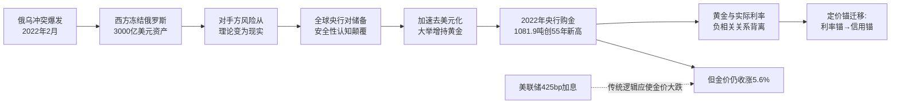

至此可以归纳本节的核心论点：**2022年是黄金从"金融投资品"重新回归"战略货币锚"的历史性起点，是定价之锚从"利率锚定"向"信用锚定"实质性迁移的元年**。这一迁移并非2022年单一事件所致，而是2018年以来央行购金累积、2020年货币海啸、2022年外储冻结三层因素叠加的最终引爆。理解2022年的范式转移意义，是后续解读2023—2024年渐进牛市加速、2025—2026年超级牛市爆发的前提。

## 3.5 2023—2024年渐进式牛市加速：央行购金常态化与多重驱动共振

2022年播下的范式转移种子，在2023—2024年开始结出实质性的果实——金价进入"渐进式牛市加速"阶段，连续突破多个历史关键关口，央行购金量在前所未有的高位站稳，黄金市场进入全方位的多重驱动共振格局。

**2023年的核心叙事是"银行业危机+地缘冲突+央行购金延续"的三重共振推动金价首次稳站2000美元上方。** 第一波驱动来自2023年3月的欧美银行业危机——3月10日加州监管机构关闭硅谷银行，3月15日瑞士信贷危机爆发并最终于3月19日由瑞银集团以30亿瑞郎收购，3月20日瑞信欧股盘中跌幅一度超60%创单日最大跌幅[^48][^49]。在这一恐慌情绪推动下，**金价从3月9日的1813.88美元一路涨至3月20日盘中最高的2009.40美元，涨幅达10.78%**；同期上金所Au9999黄金从415.22元/克涨至盘中最高466.72元/克，刷新历史记录[^48]。中信证券分析师敖翀指出，"相较于美联储货币政策变动的不确定性，硅谷银行事件引发的避险情绪以及衰退预期对金价的支撑效应更为明确"[^48]。

第二波驱动来自10月初巴以新一轮冲突——巴以冲突于10月7日爆发，金价在整个10月份持续上涨，10月30日期货黄金收于2005.7美元[^50]。第三波驱动来自12月美联储释放2024年降息预期，**12月4日Comex期货黄金价格创下2152.3美元的历史新高**[^50]。全年来看，国际期货黄金涨约12%，**多次突破并站稳2000美元/盎司大关**[^50]。

央行购金层面，2023年延续了2022年的高位——**全球央行净购金量约1050.8吨，连续第二年超千吨，新兴市场央行依然主导，其中中国央行以增持225吨位居榜首，2023年排名前五的新兴市场央行购入479.9吨、贡献了超45%的净购金量**[^45][^43]。2023年也是发达经济体央行集体观望的标志性年份——只有新加坡金融管理局成为发达市场唯一的黄金储备买家，其黄金储备进一步增加77吨[^45][^43]。

**2024年的核心叙事是"美联储降息周期开启+美元信用衰落+地缘冲突常态化+央行购金创第三个千吨年"的四轮驱动**。金价从年初约2000美元一路上行，COMEX黄金期货主力合约**于10月30日升至2801.8美元/盎司创历史新高**，11月美国大选结果出炉后震荡下行，12月24日报2629美元，**全年累计涨幅近27%，仅三季度就上涨了超过13%**[^51][^52][^53]。世界黄金协会数据显示，2024年第四季度黄金均价升至每盎司2663美元的创纪录高位，2024年的平均价格上涨至每盎司2386美元，**比2023年的平均价格上涨了23%**[^54]。

四轮驱动机制可以系统拆解如下：

| 驱动维度 | 2024年关键数据 | 作用机制 |
|---|---|---|
| 美联储降息 | 2024年9月正式开启降息周期 | 实际利率系统性下行，零息资产估值修复[^53] |
| 美元信用衰落 | 美国联邦债务规模突破35万亿美元、财政赤字占GDP超6% | 美元资产信用对冲诉求强化[^52] |
| 地缘冲突常态化 | 俄乌冲突陷入僵局、巴以冲突持续、特朗普交易兴起 | 避险溢价持续累积[^53] |
| 央行购金 | **全球央行购金1044.6吨，连续第三年超千吨，约占总需求20%**[^54] | 长期结构性买盘 |

需求结构上，**2024年实物黄金总需求升至4974吨，创历史新高**[^54]。波兰央行在2024年以90吨购金量摘得桂冠，超越了2023年的中国和2022年的土耳其[^45][^43]。值得注意的另一个信号是，黄金ETF在2024年结束了此前三年连续流出的态势、转为基本持平——世界黄金协会分析师指出，"2024年是自2020年以来持有量基本保持不变的第一年，与此前三年的大量流出形成对比"[^54]。这一ETF从"流出"转为"持平"的边际变化，预示着以ETF为代表的西方机构投资者正在重新审视黄金的配置价值，为2025年的爆发性流入埋下伏笔。

**南北分化格局的固化**是2023—2024年央行购金最显著的结构性特征——发达经济体央行除新加坡、爱尔兰外普遍按兵不动，美国、德国、意大利、法国等黄金储备大国基本维持存量不变；而新兴市场央行（中国、波兰、土耳其、印度、埃及等）则持续主导购金，2022—2024年年度购金量排名前五的央行均来自新兴市场[^45][^43]。这种南北分化的本质，是全球货币体系正在"事实上分化"的金融映射——非西方阵营央行在用真金白银投票，重塑储备结构以应对美元体系的政治化风险。

至此可以归纳：**2023—2024年的渐进式牛市加速，本质是2022年范式转移种子的开花结果——四轮驱动中的"央行购金"和"美元信用衰落"两轮明显主导，而"美联储降息"和"地缘冲突"则是放大器**。这种驱动结构的稳定性与可持续性，决定了本轮牛市的演进路径不同于2011年的"散户避险冲顶"——它将在2025年迎来更猛烈的爆发，但同时也将在2025年10月、2026年1月底面临"拥挤交易+杠杆踩踏"的剧烈波动考验（参见第4章）。

## 3.6 定价范式的结构性迁移：从实际利率锚到央行购金+主权信用对冲双轮驱动

作为本章的理论性总结，本节系统提炼2016—2024年黄金定价范式所发生的根本性迁移，为第4章解读2025—2026年超级牛市的爆发逻辑、第5章构建六维驱动框架提供理论基础。

**第一，2010—2021年实际利率作为黄金"机会成本之锚"的传统定价框架的有效性证据。** 这一传统框架的核心假设是：黄金作为零息资产，其持有的机会成本是实际利率（名义利率扣除通胀），因此实际利率与黄金价格应呈现负相关关系。从历史数据回溯看，这一逻辑确实长期有效——选取2010年4月至2019年7月窗口，**美国10年期国债实际收益率与黄金价格的相关系数高达-0.6485**，呈现出明显的"此消彼长"关系；同期黄金与美元指数的相关度高达-0.6606[^55]。世界黄金协会基于1971—2017年长达近半世纪的数据所做的统计还揭示了实际利率分档下的差异化收益结构——**当短期实际利率<0%时，金价月均收益率为1.3%；当实际利率在0%—2.5%时，月均收益率为1%；当实际利率>2.5%时，月均收益率为-0.4%**[^56]。这些数据均印证了实际利率定价之锚在2022年之前的高度有效性，也是第2章2010—2015年完整周期能够被"美联储宽松→实际利率下行→金价上涨；美联储紧缩→实际利率上行→金价下跌"逻辑完美解释的根本原因。

**第二，2022年后定价锚迁移的核心机制。** 欧阳辉教授的研究最为系统地揭示了这一迁移：黄金从"无息金融资产"重新回归"无主权信用风险的战略储备资产"，其价值不再单纯由持有的机会成本决定，而由央行配置需求和主权信用对冲诉求所主导[^46][^47]。机制层面，这种迁移可以归纳为三条传导链：

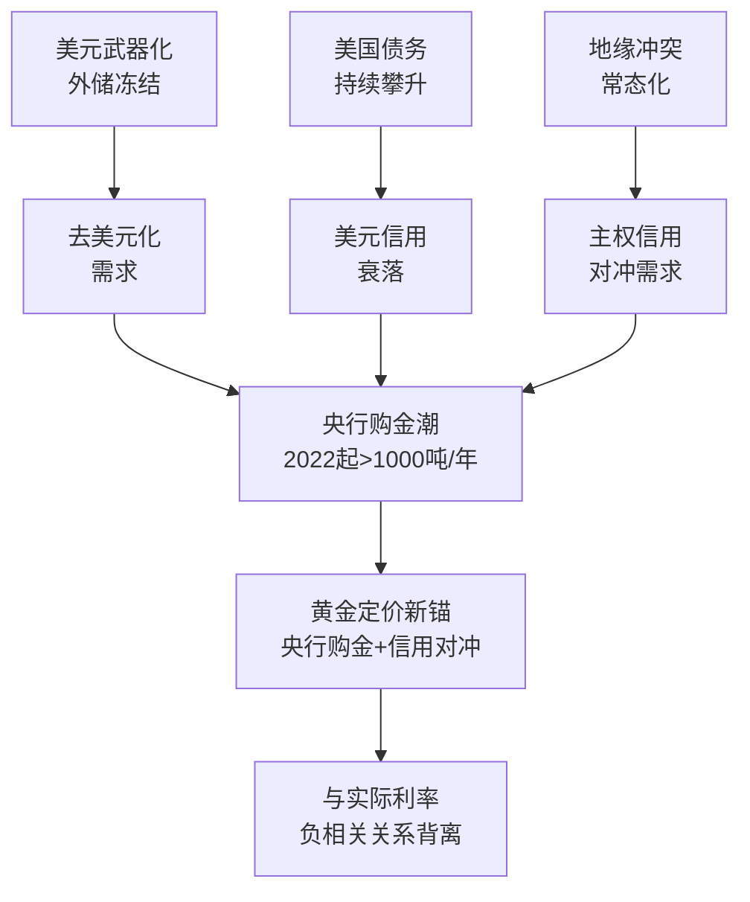

**第三，量化呈现这一迁移的结构性证据。** 从存量结构数据看，**全球官方黄金储备占总储备（黄金储备+外汇储备）的比重从2015年底的10.2%升至2025年三季度末的28.9%、创2000年有统计以来新高，2026年1月进一步升至30.5%**[^42][^45][^57][^43]。与之相应的是美元资产份额的持续萎缩——**美元在全球外汇储备中的份额从2001年的72%降至2024年的56.77%、连续12个季度低于60%（创1995年以来最低），2025年二季度末进一步降至56.32%（IMF数据）**[^58][^57]；从2020年到2026年，美元在全球外汇储备中的份额预计下降近14个百分点，相当于各国央行总共减持了约3.2万亿美元的资产[^58]。从流量数据看，央行购金行为的"分水岭式"跃升清晰可见：

| 时间段 | 年均购金量 | 关键特征 |
|---|---|---|
| 2010—2021年 | 约**473吨** | 相对稳定，新兴市场补库存为主[^42][^43] |
| 2022年 | **1081.9吨** | 同比增长140%，55年新高，俄乌冲突触发[^42][^43] |
| 2023年 | **1050.8吨** | 连续第二年超千吨，中国央行225吨居首[^45][^43] |
| 2024年 | **1044.6吨** | 连续第三年超千吨，波兰央行90吨居首[^45][^54][^43] |
| 2025年前三季度 | **634吨**（年化约845吨）| 仍远超2010—2021年均水平[^45][^43] |

新兴市场央行的表现尤为突出——截至2025年三季度末，**中国央行黄金储备达约2306吨（连续14个月增持），俄罗斯央行2329.6吨，土耳其、印度、波兰持续大规模增持**[^59][^45][^57][^43]。**俄罗斯央行黄金储备市值更于2025年12月8日首次突破3107亿美元，占国际储备总量的42%，超越意大利、法国跃居全球第五**[^59]。

**第四，新范式下黄金的三重新角色。** 综合上述证据可以归纳：在新范式下，黄金扮演着三重相互强化的角色——

第一重角色是**战略货币锚**。在美元信用持续衰落的背景下，黄金作为"无主权信用风险的终极价值载体"重新承担起类似布雷顿森林体系下的货币锚功能——央行通过持有黄金对冲法币体系的系统性风险[^58][^46]。

第二重角色是**地缘政治风险对冲工具**。2022年外储冻结事件后，**黄金的"不可冻结性"成为其相对于任何法币储备的核心比较优势**——黄金作为实物资产不受SWIFT系统限制，可自由交易于非西方市场[^59]。这一属性在地缘冲突常态化的当下具有不可替代的战略价值。

第三重角色是**去美元化进程的核心载体**。世界黄金协会《2025年全球央行黄金储备调查》数据显示，**95%的受访央行预计未来12个月将继续增持黄金，其中43%计划主动加大配置**[^57]。德银研究显示，**黄金在全球央行"外汇+黄金"储备资产中的占比已从2025年6月底的24%跃升至10月的30%；与之形成鲜明对比的是，美元所占份额正从43%滑落至40%**[^57]。德银进一步推演，若金价升至5790美元/盎司，则在现有持仓量不变的情况下，两种资产的储备占比将实现持平[^57]——这一推演本身就是对"黄金归位、美元退潮"宏大趋势最具象的注脚。

---

综合本章六个层面的分析可以得出本章核心结论：**2016—2024年是黄金定价之锚从"实际利率主导"实质性迁移到"央行购金+主权信用对冲双轮驱动"的过渡期，这一迁移在2022年俄乌冲突与外储冻结事件后达到引爆临界点**。具体路径为：2016—2018年的低位筑底中，央行购金从无到有、悄然累积"压舱石"；2019年的牛市重启中，央行+ETF配置型资金共同主导，与2011年散户避险驱动形成本质差异；2020—2021年的疫情冲击中，"对抗货币贬值"逻辑取代传统避险成为定价主导；2022年的俄乌冲突与外储冻结成为范式转移的元年，央行购金跃升至千吨级新常态；2023—2024年的渐进式加速中，"央行购金+美元信用衰落+地缘冲突+美联储降息"形成四轮驱动共振。

这一范式迁移的最重要含义在于：**当前及未来一段时期内，传统的"实际利率—金价"分析框架已不足以独立解释黄金价格走势，必须引入"央行购金"和"主权信用对冲"两条新的分析维度——这正是本报告第5章将要系统构建的"六维驱动框架"的理论基础**。同时，南北分化的购金格局、ETF从流出转持平的边际变化、央行储备占比向30%靠拢的存量结构演进，已经为2025—2026年的超级牛市爆发蓄积了空前的势能。从下一章开始，本报告将进入对2025—2026年初这场"历史性超级牛市"以及2026年1月底剧烈暴跌的深度解剖，回答一个核心问题——**在新范式下，金价能涨到多高？又会以怎样的方式震荡？**

# 4 2025—2026年初：历史性超级牛市与剧烈波动的深度解剖

承接第3章对2016—2024年定价范式迁移过程的理论性总结——黄金已从"实际利率主导"实质性切换至"央行购金+主权信用对冲双轮驱动"的新范式，且南北分化的购金格局、ETF从流出转持平的边际变化、央行储备占比向30%靠拢的存量结构演进已为新一轮爆发蓄积空前势能——本章正式进入对2025年至2026年初这一段"加速冲顶+剧烈波动"行情的深度解剖。这段行情在黄金价格史上具有多重里程碑意义：2025年全年COMEX黄金期货累计上涨64.37%，**创下自1979年以来年度最大涨幅纪录**[^60][^61]；2026年1月初金价在5500美元上方迎来全球地上黄金总市值与美债存量历史性价值对标的"未知领域"[^62][^63]；1月30日单日暴跌近10%——**1983年以来最大单日跌幅**[^64][^65]——则刷新了对现代黄金市场结构性脆弱性的认知。本章沿"价格轨迹—驱动共振—加速冲顶—暴跌解构—结构性矛盾—历史对照—修复展望"七条主线递进展开，为第5章六维驱动框架的理论提炼、第6章关键技术位的多周期识别以及第7章未来情景推演提供最鲜活、最重要的当代样本。

## 4.1 2025年价格轨迹全景：从3000美元突破到4600美元年末收官的三阶段演进

2025年的黄金市场以"加速冲顶年"载入史册。金价从年初约2625美元/盎司起步，3月首次突破3000美元、10月初触及4040美元、年末逼近4600美元，**全年累计涨幅约65%—70%、年内50次刷新历史新高**[^61][^66]。仅以COMEX黄金期货计算，2025年全年累计上涨64.37%，创下自1979年石油危机以来的年度最大涨幅[^60]。这一速度本身就是对2024年27%涨幅的近2.5倍超越[^67][^68]，也使本轮加速远远脱离了2010—2024年长期渐进牛市的演进节奏。从结构上看，2025年的价格演进可清晰地划分为三个递进阶段，每个阶段的核心驱动因素与价格突破节奏均有显著差异。

**第一阶段（1—5月）：特朗普关税政策落地与避险冲击下从2625升至3500美元。** 2025年初的金价启动行情完整继承了2024年第四季度"特朗普交易"的延续脉络。1月20日特朗普就职首日签署《美国优先贸易政策》总统备忘录，1月31日正式宣布对墨西哥、加拿大商品加征25%关税并对中国商品加征10%关税，2月10日签署行政令对所有进口钢铁和铝加征25%关税，2月18日宣布计划对进口汽车征收约25%关税——一系列高频次、高强度的关税政策释放了远超市场预期的避险信号[^68]。**截至2月13日，COMEX黄金期货收盘报2956美元/盎司，较2024年底累计上涨12%**[^68]。3月中旬金价首次突破3000美元历史关口[^69][^61]，4月迅速站上3500美元[^69]。这一阶段还伴随了**EFP（Exchange for Physical）机制的剧烈失灵**——COMEX黄金2月合约与伦敦金现货价差一度上触39美元/盎司、年化升水率高达10%，外资银行加急运送实物黄金至美国，**截至2025年1月17日COMEX黄金库存达2458.19万盎司、较2024年11月末增长37%、创近两年最高**，同时伦敦黄金库存创10年新低、XAU超短期掉期点一度转为负值[^70]。这一"实物紧、纸面松"的结构性矛盾在第4.5节将被深度展开。

**第二阶段（6—9月）：3300—3600美元区间震荡蓄势叠加美联储9月正式开启降息周期。** 4月突破3500后，金价在3300—3600美元区间进入约5个月的横盘整理[^69]——这一震荡阶段的本质是市场在消化前期涨幅、等待新的方向性催化剂。突破信号最终来自美联储——**9月17日美联储宣布将联邦基金利率目标区间下调25个基点，这是其年内首次降息**[^71]。降息落地直接打破了金价的盘整僵局，**9月23日金价突破3800美元/盎司**[^69][^71]。同期欧洲央行维持低利率政策、俄罗斯央行年内第三次降息100个基点至17%、土耳其央行超预期降息250个基点至40.5%，全球性的货币宽松环境为金价提供了持续的上涨动能[^71]。这一阶段华尔街投行集体"撕报告"上调金价预期——瑞银将2025年底目标价上调300美元至3800美元/盎司、高盛重申到2026年中期金价达到4000美元的预测、并指出在极端情况下不排除逼近5000美元、摩根大通认为4000美元金价"比预期来得更快"[^71][^72]。

**第三阶段（10—12月）：地缘冲突升级与政府停摆推动金价突破4000、4500台阶并年末逼近4600美元。** 国庆假期期间金价持续冲高，**10月8日伦敦现货黄金价格触及4040.05美元/盎司的历史峰值**[^69]——从3月首次站上3000美元到突破4000美元仅隔7个月，年内涨幅已超50%（截至10月10日），创下1980年以来最快年度涨速[^69]。多重事件构成第三阶段的爆发导火索：**国庆期间美国两党因医改条款分歧未通过临时拨款、政府时隔7年停摆**[^69]；**10月9日中国加强稀土相关物项出口管制，10月11日特朗普宣布将于11月对中国加征100%关税**[^69]；中东与欧亚地区紧张局势持续升级[^69]。同时，三季度全球黄金ETF管理总资产（AUM）达到4720亿美元（环比+23%）创历史新高[^69]，资金流入与避险共振推动金价进一步上行。**进入年末，金价突破4500美元、年末再创新高、逼近每盎司4600美元**[^61][^63]。世界黄金协会回顾，伦敦现货黄金全年涨幅达65%、年末收于4300美元/盎司（不同数据源因取价时点不同有4300—4600美元区间的差异），这一年金价"屡破历史新高"[^63]。

下表系统呈现2025年三阶段演进的关键节点：

| 阶段 | 时间窗口 | 核心驱动 | 价格表现 |
|---|---|---|---|
| 第一阶段：关税避险 | 1—5月 | 特朗普关税政策密集落地、EFP机制失灵、避险情绪集中爆发 | 从年初约2625升至3500美元，3月首破3000 |
| 第二阶段：降息突破 | 6—9月 | 3300—3600震荡蓄势，9月17日美联储正式降息25bp | 9月23日突破3800美元 |
| 第三阶段：避险冲顶 | 10—12月 | 政府停摆、稀土管制、100%关税威胁、地缘冲突升级、ETF AUM新高 | 10月8日突破4000、年末逼近4600美元 |

需要特别指出的是，2025年的金价演进还伴随着两个值得深度关注的特征：其一，**国内人民币计价金价同步飙升——黄金饰品价格从年初每克800元左右上涨至年末每克1360元左右**[^61]，沪金累计涨幅与国际金价高度同步、显示出本轮行情的全球性而非区域性特征；其二，**贵金属板块全面共振——国际现货白银、铂金价格年内涨幅均超过140%、钯金上涨超100%**[^61]，黄金作为"龙头"激活了贵金属板块的整体估值上升。这两个特征共同确认了2025年是一段"全球资本对纸币体系做出深度信用重估"的标志性年份，而非单一品种的孤立行情。

## 4.2 超级牛市的六重共振驱动：从单一因素到多维合奏的范式深化

如果说2024年的渐进牛市还是"四轮驱动"的产物，那么2025年的超级牛市则是"六重共振"的合奏——前述各驱动因素不再以分阶段、轮换的方式出现，而是在同一时间窗口内集中爆发、相互强化，最终形成自1979年以来最大的年度涨幅[^60][^61]。这一节将在第3章范式转移理论的基础上，系统拆解六重驱动及其相互作用机制，并对比2011年单一散户避险驱动的本质差异。

**第一重，美联储降息周期开启：实际利率下行重启传统估值修复逻辑。** 2025年9月17日美联储将联邦基金利率下调25bp，这是年内首次降息[^71]；此后美国非农连月走弱、劳动力市场动能显著衰减，美联储陷入"再平衡困局"，市场预期2025年下半年还有两次预防式降息[^69]。**全年累计降息三次、共75bp，将利率从高位拉低**[^73]。这一传统驱动力的重要意义在于，它使第3章所述"实际利率主导"的旧框架在新框架之上重新发挥作用——降息不再是定价主导，但仍然是边际加速器。

**第二重，美元信用重定价：38万亿美元债务与美元指数史上最差表现的双重打击。** 2025年美国联邦政府债务规模突破38万亿美元、占GDP比重超过100%[^61][^73]，国债利息支出历史上首次超过国防预算[^63]。**2025年美元指数创下自1973年以来最差的年度表现，全年跌幅高达9.5%**[^73]，进入2026年初美元指数更是跌至95.57的四年低点[^73]。**美元在全球外汇储备中的占比从2000年的70%降至2025年末的57%（IMF数据），二十年累计下降近13个百分点**[^74]。这种"债务规模—信用衰落—美元贬值"的负反馈循环，是本轮牛市相对2011年最具结构性差异的宏观底色——2011年虽有美国主权评级被下调，但债务规模仅约15万亿美元，美元信用尚未达到系统性危机的临界点。

**第三重，全球央行购金延续超千吨/超850吨高位：储备占比向30%加速靠拢。** 世界黄金协会数据显示，**2025年全球央行净购金863吨（华西证券数据）/ 全年港口数据为1136吨（部分口径）**[^75][^76][^77]，**连续四年超过850吨**[^78][^76]，**40余家央行同步买入**[^78]。波兰央行全年净增持102吨成为最大买家[^79]，中国央行截至2025年3月末黄金储备7438万盎司、连续17个月增持、单月增持规模创近13个月新高[^78][^76]。**截至2025年7月，全球央行的黄金储备占总储备比例为22.4%**[^69]；**到2025年三季度末该比例已升至28.9%、创2000年有统计以来新高**（与第3章数据一致）。世界黄金协会调查显示**73%的央行行长认为未来五年美元储备份额将下降，43%明确计划继续增持黄金**[^78]。央行购金的特殊价值在于其"粘性"——"央行的交易逻辑和散户完全不同……他们买黄金是为了储备多元化、降低对美元信用的依赖。而且央行一旦买入，不会因为金价回调5%就止损。这种'粘性需求'给黄金提供了一个天然的底部"[^79]。

**第四重，特朗普交易新逻辑：关税政策、美联储独立性受挑战与强势美元政策反复表态。** 与2017年特朗普第一任期相比，2025年特朗普交易的逻辑已发生根本切换——"过去黄金上涨主要受'通胀预期与经济韧性'支撑；而当前市场的主要焦点已转向'关税政策的即时冲击、债务风险加剧，以及通胀与货币政策的博弈'"[^68]。**2025年4月因特朗普关税政策，美元指数一度下跌15%**[^73]。**特朗普频频对美联储施压并被报道考虑提前宣布接替鲍威尔的美联储主席人选，市场担忧"影子美联储主席"将动摇投资者对美联储独立性的信心**[^73]。**2026年1月27日特朗普称"我可以让它（美元汇率）像溜溜球一样上下波动"引发市场对美国政府可能操纵汇率的担忧；次日财政部长贝森特重申"强势美元"政策，矛盾表态进一步加剧市场疑虑、引发新一轮抛售潮**[^73]。这种"政策不可预测性"本身已成为新的避险驱动。

**第五重，地缘冲突常态化：从俄乌僵局到美委对峙的避险溢价持续注入。** 2025年地缘风险呈现多点并发态势：俄乌冲突陷入僵局、中东局势持续动荡、美国发动关税战、欧洲经济不振[^61]，叠加2025年4月"解放日关税"、2026年初格陵兰问题关税威胁、美伊冲突升级——"每一次黑天鹅起飞，美国都是股债汇'三杀'"[^74]。世界黄金协会指出，"地缘政治风险加剧与全球经济不确定性上升是推升黄金价格的重要因素"[^61]。

**第六重，ETF与投资需求爆发：投资需求同比增长84%、ETF净流入801吨。** 2025年全球黄金ETF全年净增801吨[^62][^63]，**国内黄金ETF总规模达2418亿元、同比增长242%**[^63]。**2025年金条和金币需求达1374吨，创历史新高**[^62][^63]。**华西证券数据显示，2025年黄金需求（不考虑OTC及其他）达4999.4吨、同比增长8%；其中投资需求2175.3吨、同比增长84%**[^77]——这一爆发式增长彻底扭转了2021—2023年ETF连续三年流出的态势，标志着西方机构投资者对黄金的配置态度发生了实质性转变。**2025年全球黄金投资总额翻倍有余、达到惊人的2400亿美元**[^77]。

下表与下方思维导图共同呈现六重驱动的相互强化机制：

| 驱动维度 | 2025年关键数据 | 与2011年对比 |
|---|---|---|
| 美联储降息 | 9月首次降息、年内累计75bp | 2011年9月扭转操作、未实质宽松 |
| 美元信用 | 美元指数年跌9.5%、债务38万亿 | 美国主权评级下调、债务约15万亿 |
| 央行购金 | 全年863吨、连续四年超850吨 | 央行购金缺位、欧洲央行仍净卖出 |
| 政治变量 | 特朗普关税与美联储独立性 | 财政悬崖与债务上限谈判 |
| 地缘冲突 | 俄乌+中东+美委多点并发 | 利比亚+欧债危机集中爆发 |
| ETF/投资 | ETF净流入801吨、投资需求+84% | ETF冲高即"赚了就跑" |

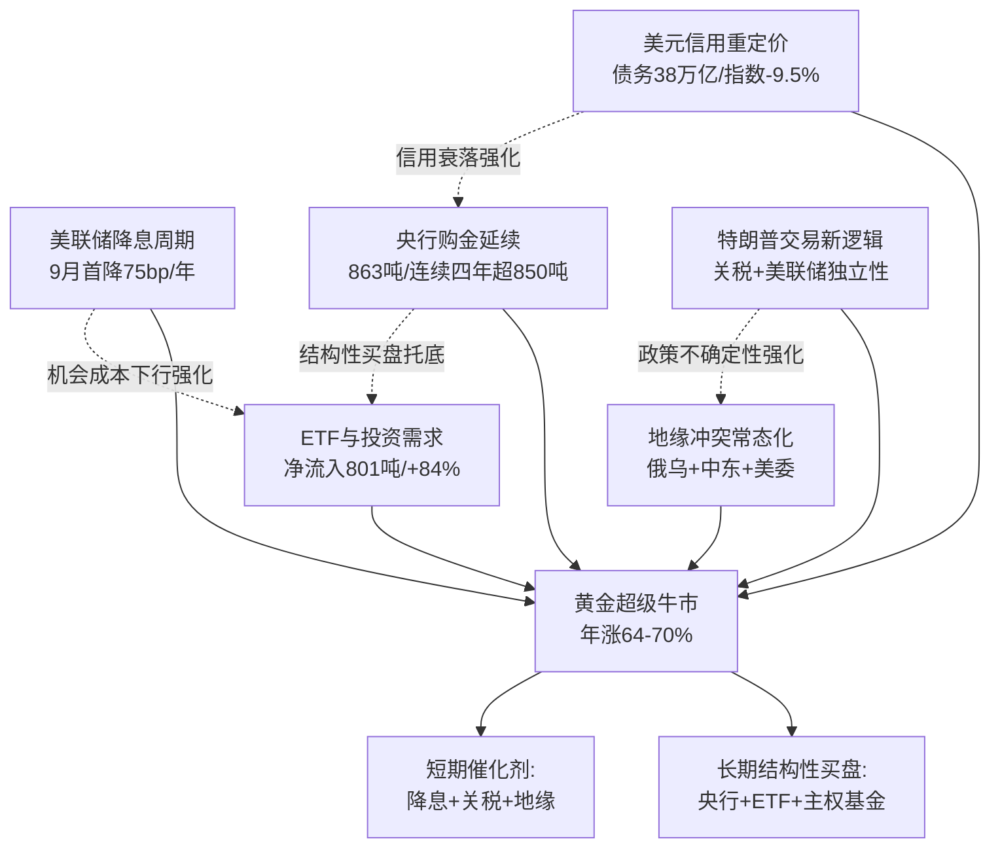

**与2011年牛市的本质差异**可以最终归纳为：2011年牛市是"散户避险冲动+ETF短期投机+央行购金缺位"的脆弱性顶部，2025年牛市则是"长期结构性买盘（央行+ETF+主权基金）+短期催化剂（降息+关税+地缘）"的复合型驱动。前者的崩溃只需要美联储扭转操作就能触发，后者的回调则需要央行购金停止+美联储重启加息+地缘冲突全面缓和的"三同步"——而这种"三同步"在可预见的未来几乎不可能出现。这正是本轮牛市能够走到5500美元历史峰值、并在剧烈暴跌后仍能在4500美元上方企稳的根本原因（参见第4.7节）。

## 4.3 2026年1月加速冲顶：从4500到5598美元的最后疯狂

进入2026年1月，金价从年末约4400美元一路飙升，**1月6日COMEX黄金期价重回4400美元/盎司关口、收涨1%报4496.10美元/盎司**[^60]，**1月14日创下4643美元/盎司的阶段高点**[^80]，1月下旬进入加速冲顶模式——**1月26日至29日短短三天内，金价从5000美元快速攀升至5598.75美元的历史峰值**[^75]，**当月涨幅超23%、价格一度冲至5626.80美元的历史峰值**[^65]。1月被分析师形容为"贵金属史上波动最大的一个月"[^64]。

**这一加速冲顶过程在微观结构上呈现出强烈的"非理性"特征**，可以从四个维度进行刻画：

**第一，技术指标的极端超买**。"黄金相对强弱指数（RSI）长期维持在90以上的极端超买区间，价格偏离20日均线幅度超11%"[^65]。"这种脱离基本面的暴涨，早已埋下获利盘集中出逃的隐患"[^65]。**2026年开年以来黄金价格已经上涨超过27%**[^75]——这一速度自1968年以来仅在布雷顿森林体系瓦解等特殊历史阶段出现过8次类似情形，而**1983年之后，如此级别的单月涨幅更是从未出现，直到2026年1月**[^75]。

**第二，看涨期权需求创历史新高，机械式期权对冲强化上涨动能**。高盛研报明确指出，"年初黄金看涨期权需求创历史新高，直接推高金价至超预期水平"[^81]，"创纪录的看涨期权购买机械地强化了价格上涨势头，但也为逆转埋下隐患"[^64]。这一机制的内在逻辑是——大量看涨期权的买入迫使期权做市商通过购买现货黄金对冲风险敞口（即"伽马对冲"），从而形成"期权买入→做市商对冲买入→现货上涨→更多看涨期权买入"的正反馈循环。这种纯粹由衍生品结构驱动的上涨缺乏基本面支撑，一旦反转将形成同等强度的负反馈。

**第三，净多头占比达85%形成"全球最拥挤交易"**。"美银1月的调查甚至显示，'做多黄金'已成为全球金融市场最拥挤的交易"[^62]。CFTC持仓数据显示，黄金多头仓位"经历了去年的激进拉升后"已达极端水平[^82]。这种"拥挤性"本身就构成系统性风险——任何方向上的小幅扰动都可能触发集中获利了结。

**第四，"未知领域"的历史性价值对标与机构散户认知裂口**。"中金公司的一份研报指出了一个惊人的事实：当金价超越5500美元时，全球存量黄金的总价值约38.2万亿美元，已与未偿还的美债总存量38.5万亿美元大致相当。这是上世纪八十年代以来的首次。黄金，正在进入一个几十年未见的'未知领域'"[^62][^63]。然而，**就在散户狂热入场的同时，"高盛、摩根大通等大型投行在5500美元以上主动减仓，净多头持仓减少20%"**[^75]——专业机构与散户之间形成了显著的认知裂口，这一裂口在历史上往往是拐点的先行指标（参见第2章2011年顶部确立时的相似结构）。

下表系统呈现2026年1月加速冲顶的关键数据：

| 维度 | 2026年1月加速冲顶的极端特征 |
|---|---|
| 价格演进 | 月初4400 → 1月14日4643 → 1月26—29日 5000→5598.75 |
| 月度涨幅 | 超23%（开年至月末） |
| 1月3日内涨幅 | 5000→5598.75，约600美元/盎司 |
| RSI水平 | 长期维持在90以上极端超买区 |
| 价格偏离20日均线 | 超11% |
| 净多头集中度 | "做多黄金"成全球最拥挤交易 |
| 历史性对标 | 5500美元上方，全球地上黄金市值38.2万亿≈美债存量38.5万亿 |
| 专业机构动作 | 高盛、摩根大通在5500美元上方主动减仓20%净多头 |
| 历史地位 | 1968年以来第8次单月涨超20%；1983年之后首次 |

**1月加速冲顶的本质可以归纳为**：在六重共振驱动的基本面之上，叠加了"看涨期权伽马对冲+净多头拥挤+RSI极端超买+散户跟风入场"的衍生品结构性放大。基本面提供方向，衍生品结构决定速度——这种由结构因素主导的加速本身就是脆弱性的源头，正如高盛事后所言："这让黄金对股市小幅调整变得极度敏感，哪怕是温和的股市回调，也会因保证金追缴引发的平仓行为，带来远超往常的金价下跌"[^81]。这一脆弱性将在1月30日以最戏剧性的方式被暴露。

## 4.4 1月30日"史诗级暴跌"的多重触发与传导机制

2026年1月30日是注定载入金融史册的一天。**伦敦金现货黄金价格从上周四的纪录高点5596美元/盎司骤降9.5%、盘中最低触及4686.12美元/盎司、收于4883.62美元/盎司；美国2月期金期货更是重挫11.4%，盘中最低触及4700美元/盎司、报4745.10美元/盎司**[^64]——**这是1983年以来黄金的最大单日跌幅**[^64][^65]。同步暴跌的白银更为惨烈：**现货银从上周四的121.48美元/盎司高点暴跌27.7%、收于83.99美元/盎司、盘中一度触及73.49美元，创下伦敦证券交易所集团自1982年以来的纪录跌幅**[^64]；**铂金盘中一度大跌22%至2033美元、钯金盘中一度重挫20%至1582美元**[^64]。**短短数小时内，黄金市值蒸发近2000亿美元**[^64]。

这一极端事件的成因不能归结为单一因素，而是触发层、传导层与放大层三个层次共同作用的结果，下面进行系统拆解。

**触发层第一项：沃什提名引发政策预期反转——直接导火索。** **1月29日晚，特朗普提名前美联储理事凯文·沃什接替鲍威尔出任下一任美联储主席**[^62][^64][^65]。沃什"2006年就当过美联储理事，历史上一直反对央行印钱买债刺激经济，是个有名的'鹰派'"[^62]，"曾公开批评量化宽松政策、主张美联储与财政部强化协作"[^65]。**市场对2026年降息预期从3次下调至2次甚至无降息，CME利率期货数据显示美联储1月降息概率已降至2.8%、3月概率仅27.4%**[^80]。这一预期转向直接引爆抛售——"美元指数应声暴涨0.93%至97.03，10年期美债收益率飙升18个基点。黄金作为无息资产，在美元强势反弹与持有成本飙升的双重夹击下，瞬间失去避险光环"[^65]。

**触发层第二项：美联储议息会议偏鹰加上核心PPI高于预期。** **1月29日美联储维持利率在3.5%—3.75%不变，但释放出偏鹰派的政策信号、打破了市场对2026年初降息的预期**[^75]。同期"上周四公布的核心生产者价格指数高于预期，进一步打击了降息希望，美国股票随之下跌"[^64]。

**触发层第三项：CME紧急上调期货保证金——压垮市场的最后一根稻草。** "芝加哥商品交易所（CME）当地时间周五（1月30日）宣布，对纽约商品交易所（Comex）黄金和白银期货的保证金要求全面上调"[^83]：**黄金期货非高风险账户保证金从6%提高至8%、高风险账户从6.6%升至8.8%；白银期货非高风险账户保证金从11%上调至15%、高风险账户从12.1%增至16.5%**[^83]。这一调整"直接增加了高杠杆交易者的资金压力。部分杠杆比例高达5—10倍的投资者面临追加保证金的要求，无法及时补仓的投资者被迫平仓，引发连锁反应"[^75]。

**触发层第四项：地缘风险边际缓和削弱避险溢价。** "此前支撑金价上涨的中东紧张局势出现缓和迹象，特朗普表示伊朗愿意达成协议……这种局势反复导致避险资金迅速撤离黄金市场"[^75]。

**传导层：杠杆崩溃→程序化止损→指数基金调仓→ETF波动率历史性飙升的四阶段链条。** 第一阶段，杠杆资金被迫平仓——"保证金上调后，持有5—10倍杠杆的多头需追加更多抵押资金。若无法补足，交易所将强制平仓"[^84]，"一手黄金期货保证金从约4万美元增至4.8万美元，高杠杆投机者被迫集中抛售"[^84]。第二阶段，程序化止损被触发——"当金价跌破关键支撑位后，触发了大量程序化止损单，形成'平仓→下跌→再平仓'的负反馈循环"[^75]，"亚盘时段的流动性薄弱使得买盘稀缺，市场陷入'下跌→止损→再下跌'的死亡循环。半小时内超过300亿美元的抛单砸盘，让黄金市场彻底失控"[^65]。第三阶段，指数基金被动调仓——"商品基金因原油等品种亏损需补缴保证金，抛售黄金换取流动性"[^84]，"指数基金因再平衡需求抛售约65亿美元黄金，与程序化交易形成合力"[^84]。第四阶段，市场情绪反转与波动率飙升——**截至1月29日黄金ETF波动率攀升至46.02、接近2020年疫情时的极值48.98，CBOE黄金ETF的波动率甚至刷新了2008年以来的新高**[^75]。

**关联市场冲击：从贵金属到加密货币的全面踩踏。** 黄金的剧烈波动通过多重渠道向其他市场传导：**白银现货单日下跌13.09%（盘中曾跌35%）、铂金盘中跌22%、钯金盘中跌20%**[^64][^75]；**沪金主连合约暴跌12%、跌破1046元/克关口**[^65]，沪金主连成交量飙升至89.4万手、达到前几天日均量的两倍以上[^75]；**A股黄金概念股大面积回调，赤峰黄金跌幅超10%、山东黄金、紫金黄金国际跌幅均超8%**[^75][^65]；**全球加密货币市场24小时内超过22万人爆仓，爆仓总金额达10.14亿美元**[^75]。**实物市场也未能幸免——深圳水贝等回收市场涌入大量抛盘，金饰克价单日跌超60元**[^84]，"印证'流动性危机中，避险资产亦难独善其身'"[^84]。

下方思维导图清晰呈现"前期拥挤+保证金催化+程序化放大+负反馈循环"的四阶段传导链：

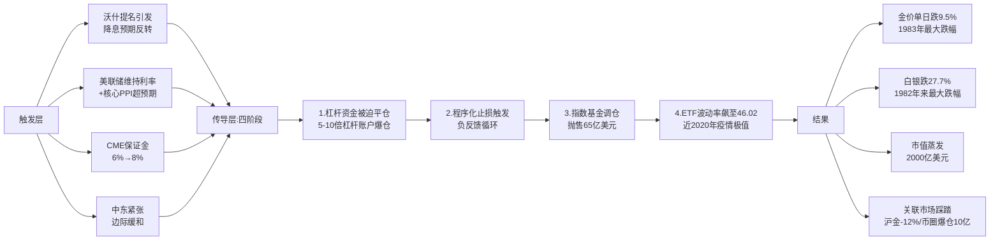

**这一暴跌事件最具警示意义的研究价值**在于：它揭示了即使在新范式（央行购金主导、长期结构性需求支撑）下，黄金市场依然保留着"前期拥挤+杠杆+程序化交易+流动性踩踏"的微观脆弱性——这种脆弱性与2013年4月"黄金黑色星期五"在结构上高度同构（参见第2.4节及第4.6节对比），但其发生的宏观底色已然天翻地覆。理解这一"宏观底色已变、微观脆弱性犹存"的二元结构，是判断本轮牛市能否在剧烈暴跌后延续的关键，也是第4.6节将要深度展开的核心论题。

## 4.5 "实物紧、纸面松"的结构性矛盾与EFP机制失灵

2025—2026年初的剧烈波动还揭示了黄金市场一个长期被忽视、但日益重要的结构性矛盾——**"总量池大、交易池小"**。这一矛盾的本质是：黄金的存量价值规模空前膨胀，但实际可用于交易交割的实物现货却日益紧缺；存量层面充裕，但流量层面紧张；纸面市场极度发达、实物市场结构性短缺。理解这一矛盾是理解为什么"5500美元上方的黄金会在30分钟内暴跌400美元"的微观基础。

**存量层面：38.2万亿美元的"大池子"。** 截至2025年末，**全球地上黄金总市值达到约38.2万亿美元，与美国约38.5万亿美元存量国债形成历史性的价值对标**[^63]。中金公司研报明确指出，"当金价超越5500美元时，全球存量黄金的总价值约38.2万亿美元，已与未偿还的美债总存量38.5万亿美元大致相当。这是上世纪八十年代以来的首次"[^62]。这一存量规模意味着黄金已重新成为全球价值锚之一，与美国主权信用体系并驾齐驱。

**流量层面：800吨以上的结构性供需缺口。** 与膨胀的存量形成尖锐对比的是流量端的紧张：**2025年全球黄金市场供需缺口超过800吨、2025—2027年累计缺口预计接近5000吨（中金公司测算）**[^85]。供给端呈现"刚性增长、弹性不足"特征——**2025年第三季度全球矿产金产量同比仅增长2%至977吨，再生金供应量同比增长6%至344吨**[^85]。**矿产金作为占总供给70%以上的核心来源，全球产量始终稳定在3600吨左右、增速仅1%左右**[^85]，受资源禀赋恶化、新矿开发周期5—7年漫长、头部企业产量不及预期等三大刚性约束[^85]。再生金虽与金价正相关，但**2025年呈现"价涨量增有限"的反常特征**——高金价反而催生居民和机构惜售情绪，再生金供给增速明显放缓[^85]。需求端则全面爆发——**第三季度全球黄金投资需求激增至537吨、同比增长47%、占全部净需求的55%；前三季度央行净购金634吨、10月单月净购金53吨创年内新高；科技领域需求同比增长30%—45%**[^85]。供需失衡的结构性特征使得"边际买盘的少量增加，就可能在收紧的市场中引发价格上扬"[^69]。

**EFP机制的两轮发作：实物紧张的最直观体现。** EFP（Exchange for Physical，期转现）作为连接COMEX期货市场与伦敦LBMA现货市场的桥梁，其价差是反映纸面市场与实物市场失衡程度的最敏感指标。2024年11月至2025年初，**受特朗普关税政策影响，出现了两轮期现基差和EFP价格大幅上涨的行情**[^70]：

第一轮（2024年12月）："2024年11月随着特朗普胜选美国总统，其威胁加征关税的消息反复发酵，COMEX黄金期货合约空头回补，刺激黄金期现基差和EFP价格升高，市场上掀起在1月20日特朗普正式上任前将实物黄金运往COMEX仓库的热潮。**12月11日，COMEX黄金2月合约与伦敦金现货价差最高达到56.05美元/盎司，年化升水率达9.8%**"[^70]。

第二轮（2025年1月）："2025年1月14日，特朗普称将创设一个专门负责征收进口关税的'对外税务局'……此消息发酵再度推动黄金期现基差和EFP价差的走高。**1月10日，价差上触39美元/盎司。截至1月17日22点，价差保持在30美元/盎司左右，年化升水率高达10%**"[^70]。这一异常价差直接驱动了**"外资银行加急运送实物黄金至美国"——COMEX黄金库存达2458.19万盎司、较2024年11月末增长37%、达到近两年来最高水平**[^70]。同时**伦敦黄金市场库存下降、现货紧缺，XAU一月期掉期价格从通常情况下的4%以上跌至1.5%以下，XAU超短期限掉期市场报价转为负值，许多外资银行暂停对外报价**[^70]。

**2025年3月的"黄金风暴"——50年一遇的挤兑事件**。2025年3月，类似的EFP机制失灵进一步演化为更为严重的市场紊乱——"国际金价在短短一周内暴跌超15%"[^86]，"EFP合约的成本从平时的0.5美元/盎司飙升至12美元，交易商不得不支付天价费用才能完成实物交割"[^86]。"伦敦金银市场协会（LBMA）的黄金库存量却创下10年新低"[^86]，"纽约和伦敦的黄金租赁利率一周内暴涨300%，市场甚至出现'负库存'现象——部分机构不得不借入黄金完成交割，导致现货溢价达到历史峰值"[^86]。"2025年1月的EFP波动率指数（EFP-VIX）突破85，远超2020年疫情时的峰值"[^86]。

**结构性矛盾的深层根源**可以归纳为三层：其一，全球约70%的黄金交易仍依赖伦敦场外市场、缺乏透明监管；纽约期金市场的投机头寸占比高达80%、实物交割能力严重不足[^86]。其二，美联储、德国央行等机构所持黄金中相当部分为"租赁状态"——"美联储的黄金库存中至少有30%属于'租赁状态'，而德国央行此前要求运回海外黄金时，竟被告知需要排队7年"[^86]。其三，**纸面黄金（期货+ETF+衍生品）的规模远超实物现货**，这种"杠杆比"使得边际定价权高度集中于纸面市场——少量杠杆变动即可放大价格波动。

**这一"实物紧、纸面松"格局的核心含义是**：黄金的边际定价机制已发生根本变化——长期方向由央行配置与去美元化结构性需求决定（"大池子"），但短期波动由纸面市场的杠杆资金、期权对冲与程序化交易主导（"小窗口"）。这正是高波动新常态的微观基础，也是为什么"5598美元的历史峰值与4686美元的盘中低点能够在同一周内出现"——相对于38.2万亿美元的存量大池，1月30日"半小时300亿美元抛单"在数值上微不足道，但在边际定价的小窗口中却足以触发10%的单日跌幅。理解这一非对称性，是理解第6章关键技术位为何"不能用2011年式的破位逻辑判断"、第7章未来情景为何"中长期方向相对清晰、短期波动幅度难以预测"的核心钥匙。

## 4.6 与历史暴跌的对照分析：本质差异与新边际定价机制

要正确解读2026年1月30日暴跌的性质——它是2011年式的"牛市终结"还是2013年式的"牛市途中震荡"，抑或是某种新的形态——必须将其与历史上的标志性暴跌事件进行系统对照。本节选取2011年9月顶部回落、2013年4月"黄金黑色星期五"、2025年3月EFP风暴、2026年1月暴跌四个样本，从触发因素、传导机制、宏观底色、驱动结构四个维度进行比较，最终归纳出"新边际定价机制"的核心特征。

下表系统呈现四个历史样本的对比：

| 维度 | 2011年9月顶部回落 | 2013年4月黑色星期五 | 2025年3月EFP风暴 | 2026年1月30日暴跌 |
|---|---|---|---|---|
| **跌幅** | 15日内跌20%（1920→1536） | 2日内跌13%（约1550→1321），4月15日单日-9.3% | 一周跌超15% | 单日跌9.5%/盘中触低4686，自高点回撤21% |
| **直接触发** | 芝商所提保证金、扭转操作非QE | 美联储Taper信号、塞浦路斯传抛金、高盛看空 | 特朗普关税威胁、EFP机制失灵、华侨系兑付危机 | 沃什提名、CME保证金6%→8%、PPI超预期 |
| **传导机制** | 杠杆资金清退+欧债银行业流动性危机 | SPDR单年减持38%+程序化交易+10分钟逾1000家机构同步抛售 | EFP成本飙升+伦敦库存挤兑+租赁利率涨300% | 杠杆平仓+程序化止损+指数基金调仓65亿+ETF波动率46.02 |
| **宏观底色** | 美联储扭转操作、欧债缓和苗头、美元转强 | 美联储Taper周期开启、美元强势、ETF连续减持 | 美联储降息预期、央行购金延续、ETF净流入 | 美联储仍处降息周期、央行连续四年超850吨、ETF净流入801吨 |
| **驱动结构** | 散户避险冲动+央行购金缺位 | 散户跟风+机构集体看空+ETF减持 | 长线资金+短期EFP套利失衡 | 长线配置型主导（央行+ETF+主权基金）+短期衍生品过热 |
| **后续走势** | 进入4年3个月深度熊市，跌至1046美元（-45%） | 全年跌28%，开启长期熊市 | 暴跌后快速企稳回升至4700美元上方 | 4月在4700—4900美元区间震荡 |

**共性：现代金融市场结构性脆弱性的延续。** 四次暴跌均存在**"前期拥挤交易+技术性超买+政策预期转向+保证金/流动性催化+程序化交易放大"的相似五要素结构**。无论宏观底色如何变化，只要市场在前期累积了足够的杠杆与拥挤交易、并遭遇特定方向的政策或事件冲击、再叠加交易所的流动性管控行为，这一同构性的暴跌链条就会被触发。这印证了一个深刻规律——**现代金融市场的微观脆弱性是相对稳定的"结构常量"，不会因为基本面驱动力的迁移而消失**。这也是高盛在2026年3月研报中的核心警示："投机头寸正常化"本身就是金价回归合理公允价值的必经过程[^81]。

**本质差异：宏观底色与驱动结构的根本不同。** 然而，2026年1月暴跌与2011年、2013年暴跌存在三层根本性差异。

第一层差异：**美联储政策方向相反**。2011年与2013年暴跌发生在美联储紧缩预期周期中（扭转操作替代QE3、Taper Tantrum）；而2026年1月暴跌虽因沃什提名引发对未来宽松节奏的担忧，但宏观大方向**美联储仍处于降息周期之中**[^87]，2025年累计降息75bp、瑞银预计未来仍有两次25bp降息空间[^87]。

第二层差异：**央行购金的托底力量**。2011—2013年央行购金尚未形成系统性力量（年均不足500吨）；而2026年初央行购金已连续四年超过850吨[^78][^76]，**2026年1月单月就有12个国家增持超过80吨黄金、中国央行已经连续14个月增持**[^75]。瑞银分析师明确强调，"波兰这样的国家在2026年1月宣布要将黄金储备目标从550吨大幅上调至700吨。这释放了一个强烈信号：央行购金越来越像是战略储备，而非价格投机，哪怕金价再涨，该买还得买"[^62]。这种"粘性需求"为金价构筑了2011—2013年所不具备的天然底部。

第三层差异：**驱动主体的根本不同**。2011年与2013年牛市的主导力量是散户避险冲动+短期投机资金，资金"赚了就跑"特征明显；而2025—2026年牛市的主导力量是央行+ETF+主权基金的长线配置资金。**2025年全年ETF净流入801吨、2026年开年继续净增、中国黄金ETF华夏(518850)截至4月22日已连续17个交易日净流入合计11.49亿元**[^79][^63]。"央行的交易逻辑和散户完全不同……央行一旦买入，不会因为金价回调5%就止损"[^79]。

**新边际定价机制：长期方向由结构性需求决定，短期波动由纸面市场主导。** 综合上述对照与第4.5节"实物紧、纸面松"的分析，可以归纳出本轮黄金市场的**新边际定价机制**：

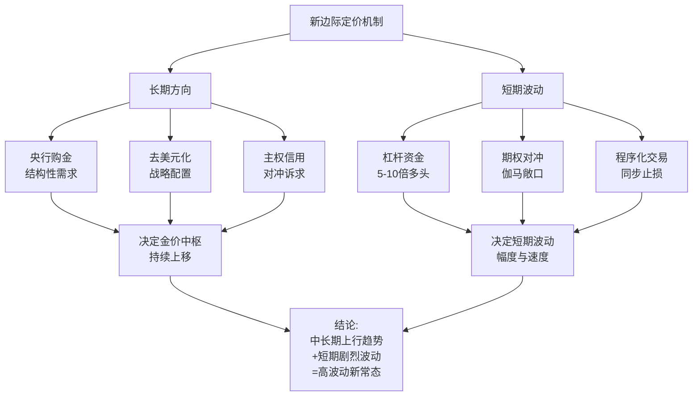

**这一机制的可证伪含义在于**：未来黄金的中长期方向由"央行购金是否持续+美元信用是否进一步衰落+地缘冲突是否升级"三大结构性变量决定（参见第7章三情景推演中的"长期变量"），而短期剧烈波动则由"杠杆水平+期权敞口+CME保证金政策+程序化交易触发点"决定（参见第6章关键技术位识别）。**当任何短期波动不伴随结构性变量的实质性恶化时，回调即是配置窗口；当结构性变量真正发生反转（如央行集体停止购金、美元信用恢复、地缘全面缓和），即使短期价格平稳也意味着趋势反转**。这正是第7章三情景推演的方法论基础。

## 4.7 暴跌后的市场修复与机构展望分歧：4200—4800震荡区间的形成

1月30日暴跌之后，黄金市场进入了一段以"修复+再震荡+再修复"为主旋律的复杂阶段。下面分修复路径与机构展望两个层面进行系统梳理，为第7章未来情景推演提供机构视角的交叉验证。

**修复路径：从历史性暴跌到4700—4800区间企稳。** 1月30日单日暴跌后，市场并未一蹶不振，而是呈现出"暴跌→技术性反弹→3月再次深度调整→4月企稳回升"的复合修复路径。

第一阶段（2月）：暴跌后的技术性修复。"金价1月整体仍上涨逾12%，延续了连续六个月的涨势"[^64]——单日暴跌虽剧烈，但当月累计仍为正涨幅，表明结构性买盘并未彻底崩溃。

第二阶段（3月）：再次深度调整至约4580美元。"伦敦金现货已经累计暴跌了10.49%，创下了自1983年3月以来的近43年最大单周跌幅纪录"[^88]——3月23日金价"接连跌破了4500、4400、4300、4200和4100美元每盎司这些关键的心理关口。盘中最低甚至探至4098.25美元，单日跌幅一度超过8%"[^88]。"这次黄金大跌15%至4580美元/盎司"，高盛在3月30日研报中明确判断"高盛在3月金价经历2013年以来最大月跌幅后，依然维持年底5400美元目标价，将回调定性为'结构性牛市中的短期错位'"[^76][^81]。

第三阶段（4月）：4700—4800美元区间企稳与"夹板"震荡。"金价在完成3月深度调整后企稳回升，伦敦现货黄金在4700美元/盎司上方运行"[^78][^76]。市场形态呈现典型的"压缩等待方向"特征——**日线级别黄金价格处于50日均线（约4894）与200日均线（约4218）的博弈区间，4850—4900美元成为关键阻力位置**[^82]；**4小时级别黄金在4750—4900之间形成明显的震荡区间、K线重心逐渐收窄**[^82]；**1个月期权波动率从年初40+回落至24附近、回归年内低位**[^82]；**CFTC非商业净持仓回归过去五年中轴位置、"拥挤交易"风险已基本释放完毕、筹码结构回归均衡**[^82]。这一系列指标共同确认了**"暴跌-修复-企稳"周期的完成与新震荡区间的形成**。

值得指出的是，**EFP（瑞银）目标价路径暗合了这一震荡区间**——瑞银财富管理的多米尼克·施奈德"预计黄金价格在第一季度末达到5000美元/盎司，此后会维持这一价格至9月，到2026年底则会逐渐回落至4800美元/盎司"[^60]。

**机构展望分歧：五类预测的系统呈现。** 暴跌后机构展望的剧烈分歧本身就是市场处于"再定价"过程的最直接证据。下表系统呈现五大类机构预测：

| 机构 | 2026年金价目标 | 核心逻辑 |
|---|---|---|
| **瑞银（最乐观）** | **2026年前三季度5900—6200美元**[^62][^89] | 押注美债困境与降息周期：38.4万亿债务两难、降息死/不降息也死、美元信用必将受损、央行购金粘性、73%央行预计未来5年美元储备份额下降 |
| **高盛（坚定看多）** | **2026年末5400美元**[^78][^81] | 精准量化：当前公允价4550 + 投机头寸正常化195美元 + 美联储50bp降息120美元 + 央行结构性买盘其他贡献 = 5400 |
| **国信期货顾冯达（区间震荡）** | **2026年区间4200—4800美元**[^60] | "黄金市场的核心驱动逻辑依然稳固，整体方向继续看多，但运行节奏将更为复杂、波动性也将显著加剧" |
| **瑞银财富管理（先涨后跌）** | **Q1末5000美元，9月维持，年底回落至4800**[^60] | "央行购入黄金、美国利率降低以及地缘政治风险持续等因素作用下" |
| **法国外贸银行Natixis（最谨慎）** | **2026年Q4均价4200美元**[^60] | "珠宝需求下降以及美联储预计将于明年结束的降息周期……我们认为2026年将会是黄金市场的一个转折点" |

**两种逻辑的交锋**可以归纳为：

**看多派（结构性需求论）**：以瑞银、高盛为代表，核心论点是"美元信用衰落不可逆+央行购金粘性+去美元化结构性趋势"，认为短期暴跌仅是"结构性牛市中的短期错位"[^76]。瑞银强调"政府债务高企、央行与全球投资者持续多元化远离美元等结构性趋势，将继续支撑黄金长期前景"[^87]，"在美伊冲突之外的宏观与政治不确定性背景下，我们继续看好黄金，认为其仍是有效的投资组合多元化工具"[^87]。

**谨慎派（边际放缓论）**：以Natixis、部分基金经理为代表，核心论点是"珠宝需求疲软+央行购金边际放缓+实际利率压制"。这一派强调金价已处历史高位，"央行的需求也已放缓"[^60]，"经过2025年的大幅上涨，金价本身已处于历史高位，积累了大量的短期获利盘，任何风吹草动都可能引发技术性回调与获利了结"[^60]。

**市场共识：中长期看多+短期高位震荡+剧烈波动常态化。** 综合两派观点的最大公约数，可以提炼出市场的整体共识：

第一，**中长期方向仍然向上**——所有机构（包括最谨慎的Natixis）都未预计金价会跌回2024年的2800美元区间，最低预测的Q4均价4200美元仍较2024年末水平大幅上涨。

第二，**2026年大概率呈现"重心上移但高位震荡"格局**——主流机构对2026年波动区间的判断集中在4200—5400美元之间，分歧主要在于上限位置和波动节奏而非方向。

第三，**剧烈波动将成为常态**——顾冯达明确指出"运行节奏将更为复杂，波动性也将显著加剧"[^60]；瑞银强调"地缘政治不确定性不太可能消退……可引发短期波动性飙升"[^87]。

第四，**关键变量是美联储路径与地缘走势**——瑞银预计"美元走弱与美国实际利率下降均利好黄金。我们认为这一宏观环境保持不变，美联储宽松周期仍有继续空间"[^87]，并预计2026年9月底前还有两次25bp降息[^87]。

---

综合本章七个层面的深度解剖可以归纳出以下核心结论：**2025—2026年初的黄金市场完整演绎了"超级牛市加速冲顶+史诗级单日暴跌+震荡区间企稳"的完整周期**，这一周期既不重演2011年式的"顶部确立后的趋势性熊市"，也不简单复制2013年式的"牛市途中震荡后再创新高"，而是开启了一种**"新边际定价机制下的高波动新常态"**：

**第一**，这是1979年以来最猛烈的年度上涨，由六重共振驱动（降息、美元信用、央行购金、特朗普交易、地缘冲突、ETF流入）共同支撑，与2011年单一散户避险驱动有本质差异；**第二**，2026年1月30日单日跌9.5%的极端波动揭示了"前期拥挤+保证金催化+程序化放大+负反馈循环"的现代市场结构性脆弱性，但其宏观底色（央行购金延续、降息周期未结束、ETF持续净流入）与2011年、2013年存在根本不同；**第三**，"实物紧、纸面松"的总量池大、交易池小结构性矛盾决定了边际定价机制——长期方向由央行配置与去美元化决定，短期波动由纸面市场杠杆与衍生品主导；**第四**，4700—4800美元成为本阶段企稳震荡中枢，机构对2026年的预测分歧集中在4200—6200美元区间，但中长期看多+短期高位震荡+剧烈波动常态化已成为市场最大公约数。

这些结论将直接为后续三章提供基础：第5章将基于本章实证将六维驱动框架进行系统化的理论提炼并构建牛熊判别框架；第6章将基于本章所揭示的关键价格点（3000、4000、4500、5000、5500、5598峰值；4100、4218、4580、4686、4750四级支撑）构建多周期支撑/压力位体系；第7章将基于本章机构预测的差异化分布（4200—6200美元）构建基准/乐观/悲观三情景的目标价区间与触发条件。从下一章开始，本报告将进入对黄金价格驱动因素六维框架与历史周期牛熊转换规律的系统化理论提炼。

# 5 黄金价格驱动因素六维框架与历史周期牛熊转换规律

承接第2—4章对2010—2026年初黄金价格完整演化路径的实证复盘，本章作为全报告的理论提炼核心，旨在完成两项基础性工作：其一，将散落于历史片段中的零散驱动因素系统化、框架化，构建一套**可外推、可证伪、可量化**的"六维驱动框架"，以解释金价在不同历史阶段的波动逻辑；其二，基于横向历史样本比较，提炼黄金牛市启动与熊市转入的判别条件，建立一套可用于研判当前及未来周期阶段的**条件触发型判别框架**。这两项工作的最终落脚点，是为第6章关键技术位识别、第7章未来情景推演与第9章投资策略制定提供方法论基础。

本章的核心论点可以提前归纳为一句话：**2022年是黄金定价范式的根本性分水岭——之前的四十年里，"美元实际利率"是支配金价方向的主导锚；2022年之后，央行购金与主权信用对冲跃升为新的双轮驱动主锚，实际利率则退化为边际加速器；这一范式迁移决定了当前牛市的结构稳健性与未来高波动的常态化**。下文将沿"六维拆解—权重迁移—牛熊判别—当前定位"四个层次依次展开。

## 5.1 第一维：美元实际利率——传统'机会成本之锚'及其2022年后的部分失效

美元实际利率（通常以美国10年期TIPS收益率衡量）作为黄金传统定价之锚的内在机制，根植于一个朴素而严密的金融学逻辑——黄金是一种**零息资产**，持有黄金不产生任何利息或股息收益，其持有的"机会成本"由名义利率扣除通胀预期所决定。当实际利率上升时，持有美债、美元存款等生息资产的收益率相对优势扩大，资金会从黄金转向生息资产，金价承压；反之，当实际利率下降甚至转为负值时，持有黄金的"无息惩罚"消失，资金涌入黄金，金价上行。

**这一传统范式在2022年之前的有效性具有充分的统计学证据。** 世界黄金协会基于1971—2017年长达近半世纪的数据所做的统计揭示了实际利率分档下的差异化收益结构——**当短期实际利率<0%时，金价月均收益率为1.3%；当实际利率在0%—2.5%档位时，月均收益率为1.0%；当实际利率>2.5%时，月均收益率为-0.4%**——这种分档差异以高度可靠的数据呈现了"机会成本越低、金价表现越好"的负相关关系。第3章已经引用过另一组关键数据——选取2010年4月至2019年7月窗口，**美国10年期国债实际收益率与黄金价格的相关系数高达-0.6485**，与美元指数的相关度高达-0.6606——这些数据共同确认了实际利率作为黄金"主导锚"在2010—2021年间的支配性地位。第2章2011—2015年深度熊市的演化路径——美联储Taper Tantrum—实际利率从-1%升至+0.5%—金价从1920美元跌至1046美元——正是这一定价范式的最完整教科书级演绎。

**然而，自2022年起这一负相关关系发生了肉眼可见的背离。** 世界黄金协会2025年6月的研究明确指出，"过去十年间，实际利率一直是驱动金价的关键因素，即金价与实际利率呈负相关：实际利率上升时，黄金的吸引力将下降。然而，自2022年起，这种负相关性已被其他因素所抵消"[^90]。**当前实际利率已升至2%以上，金价却仍普遍上涨，此轮涨势主要源于投资者对冲多元化风险的需求以及各国央行的购金行为**[^90]。这一背离的实证表现可以用一个最直观的对比呈现——按照传统范式，美联储2022年累计加息425bp、实际利率快速转正，金价应当出现2013年式的暴跌；但实际上2022年金价仍小幅收涨5.6%，2023—2024年继续上行，至2026年1月冲至5598美元历史峰值（参见第3.4节、第4.1节）。

**世界黄金协会基于回归分析的量化研究进一步证实了实际利率解释力的相对削弱。** 该研究构建了一个三因子回归模型——**以黄金价格的对数日回报率为因变量，自变量包括美国10年期国债互换利差（财政压力代理变量）、美元指数和美国10年期实际利率**——基于2022年6月15日至2025年6月15日的数据进行回归[^90]。研究表明，**至少能部分反映美国财政担忧的美国国债与互换利率利差，在统计上对金价的变动具有显著解释力**[^90]——也就是说，"财政压力"这一原本不在传统定价模型中的新变量，已经获得了与实际利率相当甚至更高的统计解释力。从机制上理解，"当财政担忧加剧（源于对美国债务可持续性或财政赤字的忧虑），投资者可能转向黄金寻求相对的安全性，从而推升金价"[^90]。

**实际利率维度的最终归纳**可以表述为：**实际利率从"主导锚"退化为"边际加速器"**。在新范式下，实际利率不再独立决定金价方向，但仍能作为短期波动的有效信号——当央行购金、美元信用衰落等结构性力量提供方向性支撑时，实际利率下行（如美联储2025年9月降息、2026年继续降息预期）会对行情形成边际加速效应；反之，实际利率短期反弹（如2026年1月30日10年期美债收益率单日飙升18个基点）会引发短期回调（如同日金价单日暴跌9.5%），但难以独立逆转中长期趋势。这一"由主导退为加速器"的角色转变，是六维框架第一维最重要的认知更新。

## 5.2 第二维：美元指数与美元信用——从汇率定价基准到主权信用对冲

美元在黄金定价框架中具有**两重相互关联但本质不同的属性**——作为计价货币的"美元指数"与作为储备货币的"美元信用"。这两重属性的影响机制必须分开拆解，因为它们在2022年前后呈现出显著不同的权重变迁。

**第一层属性：美元指数作为汇率定价基准的传统机制。** 黄金以美元计价的特性决定了美元指数与金价之间存在天然的负相关关系——美元贬值时，以其他货币购买黄金变得相对便宜，需求扩大推升金价；反之美元走强压制金价。第3章已经引用过2010年4月至2019年7月窗口黄金与美元指数相关度-0.6606的关键数据，与实际利率-0.6485的相关性接近，共同构成传统定价范式的两大支柱。这一传统机制在2022年后同样出现了弱化——2022年5—10月美联储激进加息推动美元指数升至114以上，金价虽承压但跌幅有限；而**2025年美元指数全年下跌9.5%、创自1973年以来最差的年度表现**[^91]，与金价创纪录上涨形成强共振——这一同向波动的强度甚至超过了传统负相关时期的多数样本，表明美元指数作为汇率定价基准的"传统功能"仍在发挥作用，但其权重已从单独的方向决定者退化为多重驱动中的一环。

**第二层属性：美元信用作为新维度的核心地位——这是2022年后崛起的关键变量。** 与美元指数测量的是"美元相对其他货币的强弱"不同，"美元信用"测量的是"美元作为全球储备货币的体系性可信度"。这一维度的恶化呈现为多组结构性证据：

**债务规模与可持续性层面**——2025年**美国联邦政府债务规模突破38万亿美元**、占GDP比重超过100%、**国债利息支出历史上首次超过国防预算**[^91]（参见第4.2节）。世界黄金协会的研究直接指出，"美国债务规模的空前扩张使得其财政可持续性遭到全球资本的深度质疑。摩根大通的最新定价分析框架明确指出，黄金作为价值储藏工具的隐含定价，正在对冲美国债务的尾部风险"[^92]。

**储备份额持续衰减层面**——IMF最新数据显示，**美元在全球外汇储备中的占比已从2024年的58.52%降至56.77%、连续12个季度低于60%创历史新低，相较2001年72%的储备占比峰值下滑幅度超过15个百分点**[^91]。"从2020年到2026年，美元在全球外汇储备中的份额预计下降近14个百分点，相当于各国央行总共减持了约3.2万亿美元的资产"[^91]。

**美元武器化与替代支付体系崛起层面**——这是制度性变量中最具结构性影响的部分。"美元武器化是指美国利用美元作为国际储备和结算货币的主导地位，通过国内立法授权、控制全球金融基础设施（如SWIFT系统）及实施金融制裁等手段，将美元及其支付体系作为实现外交政策和国家安全目标的工具"[^93]。**2022年俄乌冲突后美国对俄发起规模空前的金融制裁——冻结俄罗斯央行外汇储备、将俄罗斯主要银行剔除出SWIFT系统、限制俄罗斯主权债融资**[^93]——这一史无前例的举措将"对手方风险"从理论变为现实，触发非西方阵营加速构建替代支付基础设施：俄罗斯SPFS、欧洲INSTEX、中国CIPS与多边央行数字货币桥mBridge等[^94]。**截至2025年末，CIPS已覆盖190多个国家和地区、2025年处理量同比增长42.6%、人民币跨境交易对SWIFT的依赖降至30%**[^91]。

**石油美元体系松动层面**——长期作为美元霸权两大支柱之一的石油美元结算体系正在出现裂痕。**2024年6月美国与沙特延续50年的石油美元协议到期后未续签，沙特开始采用人民币、欧元、日元等多币种进行石油贸易结算；2026年3月沙特对华石油人民币结算比例达到41%、首次在单月数据中超过美元；俄罗斯对华出口油气人民币结算占比更是超过90%**[^91]。

**这两层属性的综合作用揭示了一个本质性变化**：在新范式下，"美元指数"作为短期波动信号的功能仍然存在，但"美元信用"作为长期方向决定因素的权重已大幅提升。当美元信用衰落与美元指数下跌方向一致时（如2025年），二者形成强共振、对金价构成压倒性的上行推力；当二者方向背离时（如2026年1月30日美元指数短暂反弹但美元信用衰落基本面未改），短期波动可能引发回调但不改变中长期方向。**美元信用衰落的不可逆性是本轮牛市相对2011年最具结构性差异的宏观底色**——2011年美国主权评级下调虽具历史意义，但债务规模仅约15万亿、SWIFT尚未被武器化、新兴市场尚未建立替代支付体系，美元信用尚未达到系统性危机的临界点；而2026年的美元信用衰落已具备"债务不可持续+武器化反弹+替代体系崛起+石油美元松动"四重结构性证据，构成黄金作为"无主权信用风险终极资产"的根本性叙事支撑。

## 5.3 第三维：全球央行购金——2022年后的新定价锚与去美元化结构性需求

如果说美元信用衰落是新范式下黄金定价的"叙事基础"，那么全球央行购金就是这一叙事最直接、最量化、最具粘性的"市场表达"——这正是央行购金能够从2010年之前的"零星补库"升级为2022年后的"核心定价锚"的根本原因。本节将从量化证据、机制特征、结构分化三个层面系统论证这一新定价锚的运作逻辑。

**量化证据层面：央行购金的"分水岭式"跃升。** 世界黄金协会数据揭示出一条清晰的"前低后高、2022年断点突破"的演进路径：

| 时间段 | 年均/年度购金量 | 关键特征 |
|---|---|---|
| 2010—2021年（旧范式期） | 年均约**473吨**[^95] | 相对稳定，新兴市场零星补库存为主 |
| 2022年 | **1081.9吨**（部分口径1082吨）[^95] | 同比增长140%，**55年新高**，俄乌冲突触发 |
| 2023年 | **1050.8吨**[^95] | 连续第二年超千吨，中国央行225吨居首 |
| 2024年 | **1044.6吨**[^95] | 连续第三年超千吨，波兰央行90吨居首 |
| 2025年前11个月 | **297吨**（部分口径全年863吨）[^96][^97] | 仍远超2010—2021年均水平，节奏放缓但常态化 |

**存量结构层面：黄金占官方总储备比重的历史性突破。** 央行购金的累积效应已经反映在全球官方储备的结构性变化中——**全球官方黄金储备占总储备（黄金储备+外汇储备）的比重从2015年底的10.2%升至2025年三季度末的28.9%、创2000年有统计以来新高**[^95]。这一比重的跃升与美元资产份额的下降形成清晰镜像，标志着全球储备货币体系已经在事实层面发生了多元化重构。

**机制特征层面：三重特性决定央行购金的"新锚"地位。** 央行购金区别于一般市场资金的核心在于其"非价格敏感性""粘性需求""战略锁仓"三重特征。第一，**非价格敏感性**——央行购金不基于短期价格预期，而基于战略储备目标。世界黄金协会2025年7月研报视角下，"全球央行购金的特点表现为，长期战略定力与短期节奏调整并存"[^95]。这种"长期战略定力"决定了即使金价处于历史高位，央行依然会按既定计划继续增持。**世界黄金协会2025年欧洲、中东和非洲（EMEA）高级分析师Krishan Gopaul表示，"随着金价在上个月跌至自去年以来未见的低位，各国央行明显加快了黄金购买步伐"——主权机构正在趁金价回调之际加码配置黄金**[^98]——这种"逢低加配"的行为模式恰恰体现了非价格敏感性。第二，**粘性需求**——"央行的交易逻辑和散户完全不同……他们买黄金是为了储备多元化、降低对美元信用的依赖。而且央行一旦买入，不会因为金价回调5%就止损"——这种粘性使央行购金构成不会因短期波动撤离的"压舱石"。第三，**战略锁仓**——央行买入的黄金通常会被长期锁定在金库中，**约25%以上年供应量被长期锁定、极大削减市场上的可流通盘**——这一"流通盘收紧"效应放大了边际买盘对价格的推升力度。

**结构特征层面：南北分化格局的固化与新兴市场主导。** 第3章已系统呈现2022—2024年"年度购金量排名前五的央行均来自新兴市场"的格局[^95]。**2025年这一分化格局进一步固化**——截至2025年11月，**波兰国家银行净购金95吨，仍然是官方部门中最大的黄金买家，其购金规模几乎是第二大买家哈萨克斯坦央行净购金49吨的两倍**[^96]；**截至2025年12月末，中国官方黄金储备为7415万盎司（约2306.32吨）、连续14个月增持累计26.75吨**[^95]；俄罗斯央行2329.6吨、土耳其、印度、乌兹别克斯坦持续大规模增持。同期发达经济体央行除新加坡、爱尔兰外普遍按兵不动。这种"南北分化"的本质是全球货币体系正在"事实上分化"的金融映射——非西方阵营央行在用真金白银投票，重塑储备结构以应对美元体系的政治化风险。

**未来需求展望层面：调查证据揭示的持续性。** 世界黄金协会调查显示，**95%的受访央行预计未来12个月将继续增持黄金，其中43%计划主动加大配置**[^99]；**澳新银行分析师预计央行购金至少在未来6年内仍将保持火爆**[^100]——这一长期可见性与"美元信用衰落不可逆"的宏观判断相互印证，构成了央行购金作为新定价锚的可持续性基础。

**央行购金作为"新边际定价锚"的逻辑总结**可以归纳为：**长期方向决定中枢——粘性需求构筑底部——去美元化提供叙事支撑**三位一体。在这一逻辑下，金价短期波动可能受到杠杆资金、ETF流向、美联储政策预期等多重因素扰动，但只要央行购金不出现集体性的中断或逆转，金价的中长期方向就难以反转——这正是判断本轮牛市能否在剧烈暴跌后延续的根本依据。

## 5.4 第四维：地缘政治与避险需求——短期催化剂的脉冲机制与失效边界

地缘政治风险作为黄金价格的短期催化剂，其传导路径既具有强烈的脉冲性，也存在明显的失效边界——理解这两面性是避免简单化"地缘冲突=金价上涨"误判的关键。本节将系统梳理脉冲机制、三阶段博弈框架以及失效边界三个层面。

**脉冲机制层面：典型事件的金价反应模式。** 地缘冲突引发的避险脉冲在历史上反复上演：**2016年6月24日英国脱欧公投单日金价从1256.8美元升至最高1358.6美元**（参见第3.1节）；**2016年11月特朗普当选当夜金价一度暴涨5.1%达每盎司1337美元，但短短数小时内便波动幅度达10%**（参见第3.1节）；**2022年俄乌冲突爆发，黄金价格在半个月内从1900美元附近飙升至2070美元、涨幅近9%**[^101]；**2023年3月硅谷银行与瑞信危机期间，金价从3月9日的1813.88美元升至3月20日盘中最高的2009.40美元、涨幅10.78%**（参见第3.5节）；**2023年10月巴以冲突爆发后金价单周涨超8%**[^102]。从机制上看，**地缘风险指数每上升10点，金价平均跳涨2.3%；冲突波及能源要道时，金价单日涨幅可超5%**[^102]——这一量化关系可作为短期波动幅度的参考。

**三阶段博弈框架：避险溢价的生命周期。** 中国黄金网的分析为地缘冲突对金价的影响提供了一个高度结构化的三阶段框架，值得作为本节的方法论核心[^103]：

**第一阶段：冲突预期/爆发初期——避险主导金价上行。** "市场担忧供应链中断、能源危机、全球经济风险，资金涌入黄金避险；叠加央行购金、'去美元化'需求，国际金价快速冲高（2023巴以、2026美伊预期阶段均如此）"[^103]。这一阶段的特征是单一方向的避险情绪集中释放，金价反应迅速且幅度可观。

**第二阶段：冲突外溢/兑现阶段——'买预期、卖事实'与利率反向链条。** "市场表现为国际金价易跌、震荡加剧。其逻辑表现为，随着冲突加剧推高原油价格，进而促使通胀反弹，市场押注美联储推迟降息、维持高利率甚至加息；在这种情况下，实际利率上行、美元走强，作为无息资产的黄金持有成本飙升，资金从黄金转向美债或者美元，形成'冲突→油价→通胀→利率→国际金价下跌'的逆向链条，叠加高位获利了结、流动性挤兑（机构抛黄金补保证金），常出现金价下跌现象"[^103]。**最具说服力的实证是2026年3月霍尔木兹危机期间金价不涨反跌——伦敦现货黄金自冲突升级前的5346美元/盎司高点，最低下探至4099美元/盎司，短短半个月累计回撤幅度超23%**[^104]。

**第三阶段：冲突失控/长期化——三重属性回归共振。** "如果冲突的深度外溢有可能进入失控阶段，进入多方不可控形势下，市场避险情绪将回归，叠加抗通胀和'去美元化'双驱动因素影响，将支撑国际金价报复性上行……黄金的货币属性、市场避险、'去美元化'抗通胀操作等三重属性回归，国际金价有可能突破利率压制，走出长牛"[^103]。

**历史检验层面：典型案例的验证。** "1991年海湾战争时，战前国际金价上涨17%，开战后下跌12%。该次战争美国显示出强大的军事实力，战争可控，并且快速结束进入重建状态。2003年的伊拉克战争也是这样，美国力量强大，能主导战争进程。国际金价战前涨35%，开战后跌13%，巧合的是当时恰逢美联储加息周期开始实施"[^103]——这两个历史样本完美验证了第二阶段"买预期、卖事实"的规律。

**失效边界辨析：地缘冲突仅为脉冲扰动，需与利率政策叠加判断。** 中国黄金网的研究明确指出，"当前国际金价定价仍以实际利率与美联储政策为主线，中东地缘外溢仅为脉冲扰动。有限冲突下，国际金价呈'预期上涨、兑现回落'；若波及伊朗并封锁海峡，则避险与抗通胀共振推升国际金价"[^103]。**这一边界条件意味着——当美联储紧缩预期+地缘缓和共振时（如1991年海湾战争+利率持续高位），避险溢价快速消退；当美联储宽松预期+地缘升级共振时（如2025年降息+俄乌+中东+美委多点并发），避险溢价持续累积**。

**地缘维度的最终归纳**：地缘冲突在六维框架中作为**"短期催化剂"和"放大器"**而非长期定价锚，其作用形式是**脉冲式注入避险溢价**。判断地缘冲突对金价影响的关键不在于冲突本身的剧烈程度，而在于以下三个判断维度——其一，冲突所处的阶段（预期/兑现/失控）；其二，与美联储政策方向的共振方向；其三，是否触发能源链条与通胀反应。理解这三个维度，是避免在地缘事件面前进行简单化"事件交易"的核心。

## 5.5 第五维：供需结构——矿产刚性、再生金弹性与三大需求维度的失衡

如果说前述四维分别从货币、金融、储备、地缘等层面解释金价波动，那么供需结构维度则提供了**最坚实的物理基础**——黄金价格的长期中枢上移，本质上必须有"供需缺口持续存在"这一现实条件作为支撑。本节将基于世界黄金协会2018—2025年完整数据，从供给端刚性、需求端三维度爆发、供需缺口量化三个层面构建结构性分析框架。

**供给端刚性证据：矿产金"高原平台"特征。** 世界黄金协会数据呈现了2018—2025年全球黄金供给的清晰图谱[^105]：

| 年份 | 矿产金（吨） | 总供应量（吨）| 同比增速 |
|---|---|---|---|
| 2018 | 3,658（历史前高） | 4,516 | — |
| 2019 | 3,464 | 4,682 | -5.3% |
| 2020 | 3,411 | 4,725 | -1.5% |
| 2021 | 3,560 | 4,747 | +4.4% |
| 2022 | 3,616 | 4,760 | +1.6% |
| 2023 | 3,641 | 4,908 | +0.7% |
| 2024 | 3,650 | 4,962 | +0.2% |
| 2025 | 3,672（历史新高） | 5,002（历史新高） | +0.6% |

这组数据揭示了三个关键事实：**第一，矿产金产量自2018年触顶后小幅回落、2021年起稳步回升、2025年再创新高，但整体呈高原平台特征，年增速普遍<1%**[^105]；**第二，总供应持续温和增长，回收金贡献稳定增量（2025年回收金1,404吨）**[^105]；**第三，供给弹性极低——金价大涨但产量增长有限，反映资源品位下降、新矿投产周期长（5—7年）、环保约束等长期瓶颈**[^105]。再生金虽与金价正相关，但**2025年呈现"价涨量增有限"的反常特征**——高金价反而催生居民和机构惜售情绪，再生金供给增速明显放缓（参见第4.5节）。此外，**俄乌冲突后G7禁止进口俄黄金、LBMA剔除俄精炼厂，全球约10%的黄金供给受限，进一步加剧供需缺口**[^102]。

**需求端三维度爆发：投资、央行、消费/工业的全面增长。** 与供给端的刚性形成鲜明对比的是需求端的全维度爆发，世界黄金协会2025年报告呈现了创纪录的需求结构[^97]：

**投资需求**：2025年全球黄金投资需求增至**2175吨**、**同比大增84%**，其中黄金ETF净增**801吨**、金条金币需求**1374吨创历史新高**[^97][^102]。这一爆发性增长彻底扭转了2021—2023年ETF连续三年流出的态势，标志着西方机构投资者对黄金的配置态度发生了实质性转变。

**央行购金需求**：2025年央行净购金**863吨**，已在第5.3节充分论证；**央行购金占年供应量超25%、形成"非价格敏感型需求"**[^102]。

**消费需求**：受高金价压制，**2025年全球金饰需求降至1542吨、同比下降18%，但金饰消费金额仍同比增长18%至1720亿美元**[^97]——消费量与消费额"剪刀差"反映了消费者在高金价环境下的"少而精"调整。**金饰对消费者的长期吸引力依然存在**[^97]。

**工业用金**：在人工智能和电子产品用金量增长的推动下，**2024年全球科技用金需求同比增长7%至326吨；2025年工业用金需求同比增5%**[^106][^102]。**根据世界黄金协会2024年数据，黄金的工业用途（科技用金）每年用量约326吨，占当年全球黄金总需求的6.5%—7.2%**[^107]。"光伏、AI芯片、高端电子等领域黄金用量持续增加"[^102]——这一新兴需求源虽规模有限但成长性强劲，构成长期需求增量。

**总需求层面**：**2025年全球黄金需求总量（含场外交易）创下5002吨的历史新高，年度需求总金额达到5550亿美元**[^97]。

**供需缺口量化与结构性矛盾：呼应第4.5节的微观分析。** 第4.5节已经引用过中金公司测算"**2025年全球黄金市场供需缺口超过800吨、2025—2027年累计缺口预计接近5000吨**"——这一缺口在静态供需框架下意味着金价中枢必须上移以达成新的均衡。更深层的结构性矛盾在于："**存量大池38.2万亿美元（与美债存量对标）vs流量小窗800吨缺口**"决定了边际定价的非对称性。

**供需维度的最终归纳**可以表述为：**供给端刚性+需求端三维爆发+800吨结构性缺口共同构成黄金价格中枢长期上移的物理基础**。这一物理基础与第3维（央行购金）的金融基础、第2维（美元信用衰落）的制度基础形成相互强化的闭环——央行的非价格敏感型购买侵蚀流通盘、ETF净流入抢夺剩余筹码、矿产供给增速锁定在<1%、再生金价涨量增有限——每一环都指向供需失衡的加剧。这是为什么本轮金价中枢能够持续上移、回调难以深度的根本原因。

## 5.6 第六维：通胀预期与抗通胀属性的真实性辨析

"黄金抗通胀"是黄金市场最广为人知的传统认知之一，但这一认知在历史检验中存在显著的条件性失效——理解其有效与失效的边界，是六维框架中最具方法论价值的辨析之一。本节将从理论辨析、历史检验、机制提炼三个层面进行批判性梳理。

**理论辨析：通胀本身、通胀预期、CPI与PCE的差异化区分。** 美联储以**PCE（个人消费支出物价指数）**作为政策制定的主要参考，但市场更关注**CPI（消费者价格指数）**——两者由于统计方式和权重不同，"绝对水平一直存在1ppt左右的差异，高通胀时期尤为明显。1960年以来，当CPI<3%时，差距0.8ppt；CPI>5%时，差距1.1ppt；2022年以来，差距更是高达1.8ppt"[^108]。**对市场而言，除了CPI和PCE这种依然"滞后"的读数，一些有预测功能和前瞻性的高频中微观数据也尤为重要**[^108]。这一区分的实操含义是：判断金价的通胀维度时，必须明确区分"已实现通胀"与"通胀预期"——前者通过滞后数据反映过去，后者通过债券市场、调查数据反映未来；金价对前者反应有限，对后者反应敏感。

**历史检验：三组关键样本的差异化结论。** 通胀维度的复杂性在历史样本中得到充分呈现：

**样本一：1970年代滞胀时期——抗通胀属性有效验证。** "在1970—1974年，以及1977—1980年期间，黄金年化收益率分别达到32.5%和45.2%，明显跑赢其他资产"[^109]。"1970年代的黄金牛市，本质是美元信用危机的产物。1971年尼克松关闭黄金窗口，美元与黄金脱钩，金价从固定的35美元/盎司开始自由浮动。随后的十年，美国经历了两次石油危机、越战泥潭、伊朗革命、苏联入侵阿富汗……通胀率长期维持在两位数，最高突破12%"[^110]——这是抗通胀属性的最经典验证。

**样本二：1980—2000年20年熊市——抗通胀属性的反证。** 这是对"通胀本身=金价上涨"简单认知的最有力反驳。1980—2000年期间美国通胀仍长期存在（1980年代均值约5%），但金价从850美元跌至251.9美元、累计跌幅约70%[^111]。这一案例证明，**单纯的通胀存在并非金价上涨的充分条件——决定金价的不是通胀绝对水平，而是"通胀预期与名义利率的相对速度"即实际利率方向**。

**样本三：2022年加息周期——传统抗通胀逻辑让位于央行购金。** 2022年美国通胀爆表（CPI同比一度突破9%），按传统抗通胀逻辑金价应大涨，但美联储应对通胀激进加息425bp，实际利率快速转正，金价在5—10月跌至1618美元年内低点，全年仅小幅收涨5.6%[^109]——这一案例证明，**当美联储"主动激进加息+通胀预期回落"形成共振时，传统抗通胀逻辑系统性失效**。

**机制提炼：通胀预期与名义利率的相对速度——决定金价的真正变量。** 华西证券研究系统提炼了这一机制：**"决定黄金价格的核心并非通胀本身，而是通胀预期与名义利率之间的相对速度，即实际利率"**[^109]。具体地：

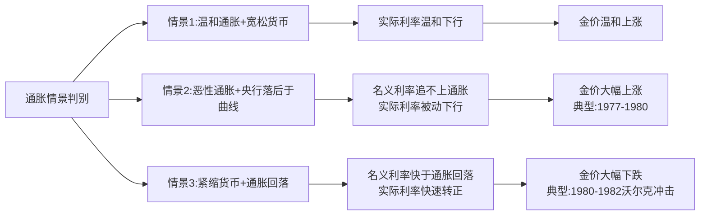

**1980—1982年沃尔克冲击是抗通胀属性失效的最经典案例**——"美联储主席保罗·沃尔克为了遏制通胀，将联邦基金利率激进提高到20%。仅仅两年多时间，金价暴跌约60%，跌至300美元下方"[^112]——尽管此时通胀仍存在，但实际利率因利率飙升而快速转正，金价被实际利率而非通胀本身决定。

**当前阶段的应用：2025—2026年通胀维度的弱化。** **基于自有的美国通胀预测模型测算，从各方高频数据看，相比当前12月6.5%的CPI读数，美国"实际"通胀已经回到5%左右**[^108]——通胀已脱离失控阶段。在此环境下，通胀预期作为金价驱动力的权重相对弱化，主导力让位于央行购金与美元信用维度。但若霍尔木兹海峡封锁等极端事件触发能源价格暴涨，"中东冲突全面外溢，使能源持续短缺、通胀失控、美元信用货币信任下滑"[^103]，通胀预期可能重新跃升为关键变量。

**通胀维度的最终归纳**：抗通胀属性在**"温和通胀+宽松货币"与"恶性通胀+央行落后于曲线"两类情景下有效**，在**"紧缩货币+通胀回落"情景下系统性失效**。当前阶段（2026年初）属于"温和通胀+宽松货币"情景，通胀维度对金价构成温和正向支撑，但其权重明显低于央行购金与美元信用维度。

## 5.7 六维驱动框架的权重迁移与历史阶段分期

在完成六维因素的逐一拆解后，本节将构建**跨阶段权重迁移图谱**，量化呈现各因素在黄金价格史不同阶段的主导地位变迁，为牛熊判别框架奠定阶段定位的理论基础。

依据宏观底色与驱动结构的差异，可将1971年至今的黄金价格史划分为六个阶段：

| 阶段 | 时间窗口 | 主导驱动 | 次要驱动 | 阶段特征 |
|---|---|---|---|---|
| 阶段一 | 1971—1980 | 通胀预期+美元信用（脱钩） | 地缘冲突 | 货币体系崩塌、滞胀、地缘冲击三重共振，金价从35升至850美元（涨23倍）[^113] |
| 阶段二 | 1980—2000 | 实际利率（绝对主导） | 美元强势、央行抛售 | 沃尔克紧缩+央行抛售+经济繁荣，金价从850跌至251.9美元（跌70%）[^111] |
| 阶段三 | 2001—2011 | 实际利率+美元信用 | 央行转购金、地缘风险 | 危机连环+QE+实际利率深度负值，金价从260升至1920美元（涨6倍）[^113] |
| 阶段四 | 2011—2015 | 实际利率+美元强势 | ETF减持、经济复苏分流 | Taper+加息+美元升至100，金价从1920跌至1046（跌45%）（参见第2章） |
| 阶段五 | 2016—2021 | 实际利率（仍主导） | 央行购金累积、地缘脉冲 | 筑底重启，央行购金从无到有、ETF回归，但实际利率仍居主导（参见第3章） |
| 阶段六 | 2022—至今 | **央行购金+美元信用（双轮主锚）** | 实际利率（边际加速器）、地缘+ETF（放大器） | 范式转移完成，金价从1620升至5598（涨245%）（参见第3.4节、第4章） |

**权重迁移的核心规律**可以归纳为三条：

**第一，主导锚的迁移路径**：通胀预期（1970s）→ 实际利率（1980—2021）→ 央行购金+美元信用（2022—）。**这一迁移并非线性，而是阶梯式跳跃——每一次跳跃都对应着货币体系或地缘格局的重大事件**：1971年布雷顿森林体系解体、1980年沃尔克紧缩、2022年外储冻结。

**第二，次要因素的"激活—沉寂—再激活"循环**：央行购金在1971—2009年长期沉寂（甚至以净卖出为主）、2010年开始转为净买入、2022年后跃升为主导锚——这一历史性"再激活"是新范式诞生的核心标志。

**第三，因素之间的"相互强化—相互抵消"机制**：在阶段六中，六维因素呈现高度的方向一致性（央行购金强、美元信用弱、地缘冲突持续、实际利率边际改善、ETF流入、通胀温和）——这正是2025年金价能够实现自1979年以来最大年度涨幅的根本原因；反之在阶段四中，实际利率上升+美元强势+ETF减持三维形成方向一致的压制，决定了深度熊市的演化（参见第2章）。

**六维框架的权重迁移图谱**为后续的牛熊判别提供了关键启示——判断金价方向的关键不是单一维度的绝对水平，而是**多维度的方向一致性与共振强度**。这一方法论将贯穿后续5.8、5.9、5.11三节的判别框架构建。

## 5.8 黄金牛市的五大核心条件：基于历史样本的归纳

基于1971—1980年、2001—2011年、2018—2026年三轮超级牛市以及2019—2021年、2023—2024年中型牛市片段的横向比较，可以系统归纳黄金牛市启动与延续的五大核心条件。这五条件共同构成牛市的"充分必要组合"——并非每一个条件单独充分，但当至少三条同时满足且方向一致时，趋势性牛市可被确认。

**条件一：美元货币体系宽松（QE/降息周期/利率目标区间下移）。** 这是几乎所有黄金牛市的共同基础——降低持有黄金的机会成本。**历史样本验证**：第二轮牛市（2001—2011）以美联储2001年应对互联网泡沫和9·11降息开启、2008年金融危机后QE1—QE3持续放水推动；第三轮牛市启动阶段（2019）以美联储2019年7月十年来首次降息为标志[^114]；2020年疫情期间无限量QE+零利率推动金价突破2075美元[^114]；2024—2025年美联储9月开启降息周期推动金价突破多个关口[^115]。**量化阈值参考**：累计降息幅度100bp以上、或利率目标区间从限制性区间转向中性区间。

**条件二：美元实际利率下行（名义利率下降快于通胀回落或通胀预期失控）。** 这是传统估值修复逻辑的重启信号。**历史样本验证**：1970年代恶性通胀+央行落后于曲线推动实际利率深度负值、金价涨23倍；2008—2011年QE推动实际利率深度负值、金价从680升至1920美元；2020年疫情期间美国10年期国债利率跌至0.52%、实际利率深度负值[^114]。**当前阶段验证**：2025年9月美联储降息后、美国10年期实际收益率从2025年5月的2%上方逐步回落，为金价突破4000美元提供边际加速。

**条件三：主权信用风险显性化（美债不可持续、债务上限危机、评级下调、外储武器化）。** 这是2022年后崛起的新条件，激活黄金作为"无主权信用风险终极资产"的战略价值。**历史样本验证**：2011年标普下调美国主权评级、推动金价升至1920美元历史新高（参见第2.1节）；**2022年俄乌冲突后西方冻结俄罗斯3000亿美元外储**[^93]——这是现代史上最具标志性的主权信用风险事件，直接触发新兴市场央行购金潮。**当前阶段验证**：美国联邦债务38万亿、利息支出超国防预算、美元在全球外汇储备占比连续12个季度低于60%[^91]——主权信用风险已结构性显性化。**量化阈值参考**：债务/GDP超100%、外汇储备占比降至55%以下、SWIFT制裁工具化。

**条件四：全球央行购金延续千吨级（2022年以来新常态）。** 这是新范式下的核心结构性条件，形成结构性买盘与价格中枢托底。**历史样本验证**：2022—2024年央行购金连续三年超千吨、对应黄金从1800美元升至2800美元（参见第3章、第5.3节）。**当前阶段验证**：2025年全年863吨、连续四年超850吨；**世界黄金协会调查显示95%的受访央行预计未来12个月将继续增持**[^99]。**量化阈值参考**：年购金量持续>800吨、且新兴市场央行主导。

**条件五：地缘冲突常态化（俄乌、中东、美委等多点并发）。** 这是持续注入避险溢价的关键条件。**历史样本验证**：2022年俄乌冲突推动金价突破2000美元；2023—2025年俄乌+巴以+美委多点并发持续支撑金价上行；**地缘风险指数较2020年飙升127%**[^102]。**量化阈值参考**：地缘风险指数维持高位、多点冲突并发、能源链条紧张。

**五条件的"共振强度判别"规则**：

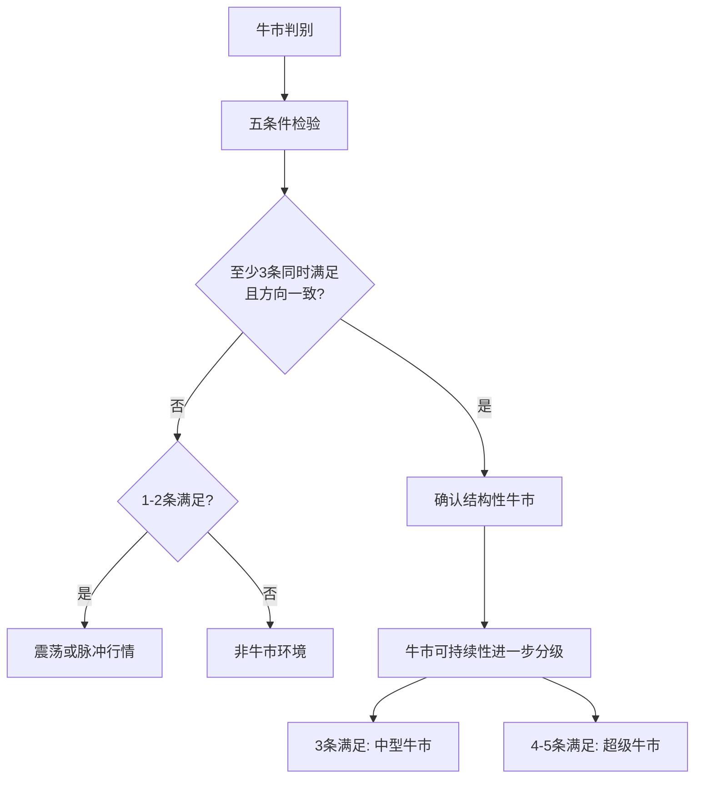

**当前阶段（2026年初）的五条件检验**（详细论证见5.11节）：条件一（满足、降息周期未结束）、条件二（部分满足、实际利率下行空间存在）、条件三（强满足、主权信用风险显性化）、条件四（强满足、央行购金千吨级常态）、条件五（强满足、地缘冲突常态化）——**至少四条强满足，确认结构性牛市未结束**。

## 5.9 黄金熊市的三大共同条件：转入熊市的判别信号

与牛市判别相对应，本节基于1980—2000年20年大熊市、2011—2015年深度熊市、2013年闪崩、2022年5—10月深度回调等熊市/深度回调样本，提炼黄金转入熊市的三大共同条件。这三条件构成"同步触发判别"——只有三条件同步满足且央行购金边际转弱时，趋势性熊市概率才显著提升。

**条件一：美联储激进加息且利率超过通胀预期（实际利率快速转正并维持高位）。** 这是熊市的最核心驱动力。

**历史样本验证**：
- **1980—1982年沃尔克冲击**："美联储主席保罗·沃尔克为了遏制通胀，将联邦基金利率激进提高到20%。仅仅两年多时间，金价暴跌约60%，跌至300美元下方，并开启了长达20年的'黄金大熊市'"[^112]——这是历史上"实际利率终极反杀"的教科书案例。
- **2013—2015年Taper Tantrum至首次加息**：美联储2013年5月Taper信号→2014年10月QE3结束→2015年12月首次加息，实际利率从-1%升至+0.5%、金价从1920跌至1046美元（参见第2.3节）。
- **2022年5—10月**：美联储累计425bp加息推动美元指数飙升，金价从年初2070美元跌至1618年内低点（参见第3.4节）。

**机制提炼**："黄金最大的敌人不是通胀，而是实际利率的上升……当央行（尤其是美联储）为了对抗通胀而采取极端的加息手段，且加息速度快于物价上涨速度时，实际利率会由负转正并迅速走高。此时，投资者会抛弃黄金，转而持有高利息的存款或国债"[^112]。

**条件二：美元指数进入强势上涨周期（年涨幅超10%或站上100以上）。** 强美元周期下美元计价黄金天然承压。

**历史样本验证**：
- 1980—1985年美元指数累计上涨超50%[^110]，配合沃尔克加息共同造就20年熊市起点。
- 2014—2015年美元指数从78.93反弹至接近100点、区间涨幅超25%（参见第2.3节）。
- 2022年美联储加息周期中美元指数升至114以上（20年新高）[^116]。

**条件三：其他大类资产形成替代效应（美股牛市分流避险资金、美债收益率走高吸纳储备资金、加密货币新兴资产竞争），叠加央行从净买入转为净卖出。**

**历史样本验证**：
- 1996—1999年央行抛售："多国央行（如英国、瑞士）为增加外汇储备流动性，大规模抛售黄金；例如，英国央行在1999年以低价（约275美元/盎司）出售半数黄金储备"[^117]，配合美国"新经济"科技股繁荣分流资金，金价跌至251.9美元。
- 2011—2015年美股牛市分流叠加SPDR单年减持38%（参见第2.3节）。
- 2014年中国黄金消费量同比下降19.38%、美股进入持续上行通道（参见第2.3节）。

**三条件的"同步触发判别"规则**：

| 条件触发情况 | 行情定性 | 历史样本 |
|---|---|---|
| 三条件同步满足+央行购金边际转弱 | 趋势性熊市 | 1980—2000、2011—2015 |
| 一至两条件满足 | 深度回调或牛市途中震荡 | 2013年4月闪崩、2022年5—10月 |
| 仅触发流动性危机（参见5.10） | 短期暴跌后快速修复 | 2008年3月、2020年3月、2026年1月 |

**重点辨析：当前阶段（2026年初）的判别**——美联储仍处降息周期（条件一不满足）、美元指数2025年下跌9.5%创1973年以来最差表现（条件二不满足）、新兴替代资产未形成系统性分流且央行购金延续千吨级（条件三不满足）——**三条件均未充分触发**，故剧烈波动定性为**"牛市途中震荡"而非趋势反转**。这一判别结论与第4.6节"暴跌不构成牛市终结"的结论相互印证。

## 5.10 流动性危机与暴跌事件的特殊机制：'现金为王'与微观脆弱性

在牛市/熊市的二元判别框架之外，存在一类特殊的市场现象——**极端流动性危机初期黄金避险失效**——其触发逻辑既不属于牛市衰竭，也不属于熊市启动，而是现代金融市场结构性脆弱性的特殊表达。本节作为牛熊框架的补充，专门解析这一反直觉规律。

**历史样本系统对比**：

| 暴跌事件 | 跌幅与时间窗口 | 触发因素 | 后续修复路径 |
|---|---|---|---|
| 1980年沃尔克冲击 | 60%/2年 | 利率冲击+保证金抬升+地缘缓和 | **演化为20年熊市**[^110] |
| 2008年雷曼危机 | 34%/6个月（1032→680） | 流动性枯竭+机构补保证金抛售 | **2个月后反弹，开启新牛市**[^112] |
| 2013年4月黄金黑色星期五 | 13%/2日（1550→1321） | Taper信号+塞浦路斯传抛金+ETF踩踏 | **演化为深度熊市**（参见第2.4节） |
| 2020年3月新冠流动性危机 | 15%/2周（1700→1450） | 美股4次熔断+机构补保证金 | **2周后V型反转，5个月创历史新高**[^112] |
| 2025年3月EFP风暴 | 15%+/一周 | EFP机制失灵+伦敦库存挤兑 | **快速企稳回升至4700美元上方**（参见第4.7节） |
| 2026年1月30日史诗级暴跌 | 9.5%单日（1983年以来最大） | 沃什提名+CME保证金+程序化止损 | **4月在4700—4900美元区间震荡**（参见第4.4、4.7节） |

**共性五要素结构**：尽管宏观底色差异巨大，但所有暴跌事件均共享相似的微观结构链条——

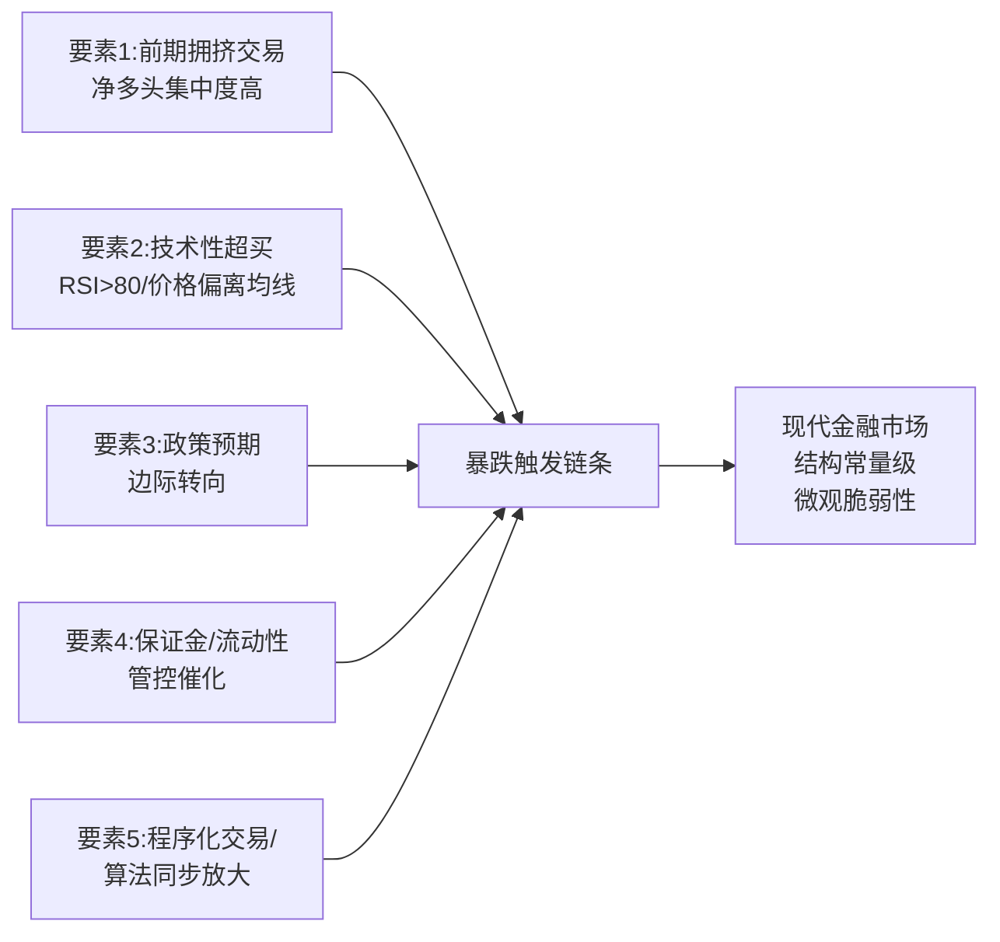

**这一五要素结构构成现代金融市场的"结构常量"——不会因为基本面驱动力的迁移而消失**。这正是高盛事后所言："投机头寸正常化"本身就是金价回归合理公允价值的必经过程。

**差异性辨析：宏观底色决定暴跌后的演化路径**。这是本节最具方法论价值的洞察——

**情景A：暴跌叠加紧缩周期与基本面恶化 → 演化为趋势性熊市**。1980年沃尔克冲击、2011—2013年Taper Tantrum均属此类——暴跌只是熊市的"开场白"，真正决定熊市深度的是后续宏观底色的持续恶化。

**情景B：暴跌仅为牛市途中流动性踩踏 → 快速修复**。2008年3月（雷曼前的冲击）、2020年3月新冠流动性危机、2026年1月30日均属此类——尽管短期跌幅触目惊心，但宏观底色（央行购金延续、降息周期未结束、ETF持续净流入）的稳健性决定了暴跌只是"插曲"而非"转折"。

**机制启示：暴跌事件本身不足以判断牛熊转换**，必须结合六维框架与五条件/三条件综合验证。**暴跌中的关键观察指标**包括：

- **CFTC净多头去化程度**——拥挤度是否充分释放？2026年1月暴跌后"非商业净持仓回归过去五年中轴位置、'拥挤交易'风险已基本释放完毕"（参见第4.7节）；
- **ETF流向**——是趋势性流出还是短期波动？2026年1月暴跌后中国黄金ETF华夏(518850)截至4月22日已连续17个交易日净流入合计11.49亿元（参见第4.6节）；
- **央行购金是否中断**——结构性买盘是否撤离？2026年初央行购金延续；
- **波动率回归节奏**——市场情绪是否企稳？1个月期权波动率从年初40+回落至24附近（参见第4.7节）。

当上述指标均指向"健康修复"方向时，可定性为流动性踩踏后的修复；反之若伴随趋势性流出与购金中断，则需警惕熊市启动可能。

## 5.11 判别框架的综合应用：当前阶段定位与未来周期推演

作为本章的方法论收束，本节系统应用六维驱动框架与牛熊判别条件对当前（2026年初）市场阶段进行精准定位，并为第7章未来情景推演提供可证伪的反转信号清单。

**当前阶段六维诊断**：

| 维度 | 当前状态 | 强度评级 | 方向 |
|---|---|---|---|
| 1. 美元实际利率 | 美联储降息周期中、实际利率边际改善 | 中等 | 利好黄金 |
| 2. 美元指数与美元信用 | 指数2025年-9.5%、信用结构性衰落 | 极强 | 利好黄金 |
| 3. 全球央行购金 | 连续四年超850吨、95%央行预计继续增持 | 极强 | 利好黄金 |
| 4. 地缘政治与避险 | 俄乌+中东+美委多点并发持续 | 强 | 利好黄金 |
| 5. 供需结构 | 缺口超800吨、矿产刚性、ETF爆发 | 强 | 利好黄金 |
| 6. 通胀预期 | 温和通胀、央行不再追赶 | 弱 | 中性偏利好 |

**六维方向一致性诊断**：六个维度全部指向利好黄金方向，其中三维（美元信用、央行购金、地缘）极强支撑、两维（实际利率、供需）强支撑、一维（通胀）弱支撑。**这种六维方向一致的强共振格局，是2010年以来的最强组合，也是金价能够创下1979年以来最大年度涨幅的根本原因**。

**牛市五条件检验**：
- 条件一（美元货币体系宽松）：美联储2025年9月开启降息周期、累计75bp，预计2026年继续降息——**满足**；
- 条件二（实际利率下行）：美国10年期实际收益率从2%上方逐步回落、降息周期下进一步下行空间存在——**部分满足**；
- 条件三（主权信用风险显性化）：38万亿债务、信用衰落不可逆、外储武器化、SWIFT工具化——**强满足**；
- 条件四（央行购金延续千吨级）：连续四年超850吨、95%央行计划继续增持——**强满足**；
- 条件五（地缘冲突常态化）：俄乌+中东+美委等多点并发持续——**强满足**；

**结论：五条件至少四条强满足，确认结构性牛市未结束**。

**熊市三条件反向检验**：
- 条件一（美联储激进加息）：仍处降息周期——**不满足**；
- 条件二（美元指数强势）：2025年下跌9.5%创1973年以来最差年度表现——**不满足**；
- 条件三（其他大类资产替代+央行抛售）：央行购金延续高位、新兴替代资产未形成系统性分流——**不满足**；

**结论：三条件均未触发，确认未进入趋势性熊市**。

**综合定位：当前处于"结构性牛市途中的高位震荡+剧烈波动新常态"阶段**，2026年1月30日暴跌定性为**"牛市中段流动性踩踏"**而非趋势反转——这一定位与第4章基于实证数据所得的结论完全一致，从框架层面提供了独立的交叉验证。

**可证伪的反转信号清单**——这是本章最具前瞻价值的部分，将作为第7章基准/乐观/悲观三情景的触发条件与失效信号设计基础：

| 反转信号 | 观察指标 | 当前状态 |
|---|---|---|
| ① 央行集体停止购金或转为净卖出 | 连续3个月WGC月度数据净流出 | 当前每月仍净流入 |
| ② 美联储重启加息 | 累计加息超100bp | 仍处降息周期 |
| ③ 美元指数突破110并维持 | DXY周线收于110上方持续3个月 | 当前95.57附近 |
| ④ 美债信用危机被实质性化解 | 债务/GDP回落、CDS利差收窄、SWIFT去武器化 | 仍持续恶化 |
| ⑤ 地缘冲突全面缓和 | 主要冲突点（俄乌、中东、美委）同步停火 | 仍多点持续 |

**触发规则**：任一组合性触发将进入熊市判别窗口；**单一信号触发不构成熊市启动，必须满足"至少两个反转信号同步触发+央行购金边际转弱"的组合条件**。这一可证伪规则使得判别框架不只是事后解释工具，更是事前预警体系。

---

综合本章十一个层面的系统论证，可以得出以下基础性结论，作为后续第6—9章的方法论基石：

**第一**，黄金价格的驱动框架由六个相互关联的维度构成——美元实际利率（第一维）、美元指数与美元信用（第二维）、全球央行购金（第三维）、地缘政治与避险需求（第四维）、供需结构（第五维）、通胀预期（第六维）——每一维度均有清晰的内在机制、量化证据与历史检验。

**第二**，2022年是黄金定价范式的根本性分水岭——之前实际利率绝对主导，之后**央行购金+美元信用衰落跃升为双轮主锚，实际利率退化为边际加速器，地缘冲突与ETF资金为放大器，供需结构与通胀预期为基础支撑**——这一范式迁移决定了本轮牛市的结构稳健性。

**第三**，黄金牛市启动需要五大核心条件中至少三条同时满足且方向一致；黄金熊市转入需要三大条件同步触发且央行购金边际转弱；流动性危机型暴跌则属于牛熊框架之外的特殊机制，其后续演化路径取决于宏观底色。

**第四**，当前（2026年初）六维方向高度一致、牛市五条件至少四条强满足、熊市三条件均未触发——**结构性牛市未结束**，剧烈波动定性为"牛市中段震荡"。

**第五**，可证伪的反转信号清单（央行停购、美联储重启加息、美元指数突破110、美债信用危机化解、地缘全面缓和）为未来周期推演提供了清晰的判别工具——只有当至少两个反转信号同步触发+央行购金边际转弱时，才需进入熊市判别窗口。

这些结论将直接为后续章节提供基础：第6章将基于本章新范式诊断（边际定价机制非对称性）构建多周期支撑/压力位体系；第7章将基于五条件强满足程度与反转信号触发组合构建基准/乐观/悲观三情景；第9章将基于六维框架与判别条件设计差异化投资策略。从下一章开始，本报告将进入对关键技术位的多周期识别。

# 6 关键技术位识别：多周期支撑位与压力位体系

承接第5章对六维驱动框架与牛熊判别条件的系统化理论提炼——结构性牛市未结束、剧烈波动定性为"牛市中段震荡"——本章正式将研究视角从"为什么涨/跌"的因果链条切换至"在哪里涨/跌"的坐标定位。如果说前五章回答的是黄金价格的方向性问题，那么本章作为从基本面分析向技术面研判的过渡桥梁，则要回答一个更具操作性的问题：在新边际定价机制（长期方向由央行配置决定、短期波动由纸面市场主导）所带来的高波动新常态下，**黄金价格的关键技术坐标在哪里？这些坐标如何为未来的情景推演与投资策略提供可量化的价格参照系？**

本章将基于日线、周线、月线多周期视角，沿"整数关口的心理与技术意义—波浪结构下的长期阻力—均线系统的动态支撑—动量指标的短期信号—暴跌后的支撑压力清单"五个层面递进展开。需要预先说明的是，由于本章数据主要来源于截至2026年4月中旬的市场观察，部分技术位（特别是动态均线）会随时间推移而调整，但其形成逻辑与多周期共振原理具有方法论层面的稳健性。

## 6.1 历史性整数关口的心理与技术意义：3000、4000、4500、5000、5500美元的多重共振

整数关口在金融市场技术分析中具有"磁铁效应"——人类心理对整数有天然的锚定倾向，量化基金的算法触发、散户情绪的集中释放、媒体头条的放大传播都会围绕整数关口形成共振。第4章已经系统呈现了2025—2026年金价对3000、4000、4500、5000、5500这五大整数关口的逐级突破，本节将从技术机制层面深入解析每一关口的多重含义、突破节奏的异常加速以及交易策略层面的应用规则。

**3000美元——新周期的起跳台与从渐进牛市到加速牛市的转折点。** 2025年3月中旬金价首次突破3000美元历史关口，这一突破在技术意义上具有"开启全新坐标系"的标志价值。从1971年金本位脱钩到2024年末突破2800美元，黄金用了53年完成"从35美元到3000美元"的百倍跃升；而3000美元的意义在于它打破了2010—2024年间长期渐进牛市的运行节奏，成为本轮加速冲顶的起跳台。突破后该位置的"顶底转换"特征清晰——4月迅速站上3500美元后，3000美元作为前期阻力转化为坚实支撑，再未被有效跌破。这一转化机制印证了Gary Wagner在第6.3节即将引用的"支撑与阻力如同房子的地板与天花板，曾经的支撑位在跌破后会转化为强劲的阻力位"的对偶规律[^118]。

**4000美元——千美元跨越仅用百日的加速信号。** 2025年10月8日伦敦现货黄金价格触及4040.05美元/盎司的当时历史峰值，自3月首次站上3000美元到突破4000美元仅隔7个月，年内涨幅已超50%（截至10月10日），创下1980年以来最快年度涨速。这一节奏的特殊性在于——传统牛市从一个千美元关口到下一个千美元关口往往需要数年（如2008—2011年从1000到1900美元用了三年），而本轮仅用百日完成跨越，本质是第4.2节所述六重共振驱动的爆发式表达。技术含义上，4000美元成为新的"心理基准位"，并在2026年3月的深度回调中作为重要支撑被检验——金价在跌破4500、4400、4300、4200美元等关键心理关口后，最终在4100美元附近企稳并迅速反弹至4400美元上方[^119]。

**4500美元——顶底转换枢纽与中期趋势强弱核心锚定点。** 4500美元是2026年初突破的关键阻力位，转化为支撑后承载多次回调压力。这一位置之所以被技术派视为"牛熊生命线"，源于两方面机制：其一，**均线系统动态防御**——20日均线（高位时约4880美元）与周线趋势线在4400—4500区间存在历史性重合带；其二，**密集成交区**——大量多头资金在此区域建仓形成持仓成本支撑。**分析师秦钰恒指出，若日线收盘稳守4450美元，则仍属健康调整范畴**[^119]。3月22日当周金价八连跌中4400数次形成短暂支撑，但最终失守导致恐慌性下探至4100，而后再度反弹至4400上方——这一波动模式完整演绎了4400—4500区间作为"牛熊分水岭"的双向博弈特征[^119]。

**5000美元——心理整数+斐波那契1.0扩展位+空头止损密集带三重共振。** 5000美元是本轮牛市最具研究价值的关口，其特殊性在于三重技术意义的高度叠加[^120]：

第一，**心理整数关的极致放大效应**——5000美元是人类心理最大整数关，突破后量化基金、散户情绪、媒体头条都会同步放大；历史数据显示，黄金突破1000、2000美元时都出现成交量激增150%以上的短线脉冲。第二，**技术斐波那契1.0扩展位**——以2023年底部启动、2024年3450美元为波段基准，5000美元正好是1.0扩展位；再往上的1.382、1.618分别对应5500、6180美元，因此5000被视为"最小目标达成"后多头集中止盈位[^120]。第三，**空头止损密集带**——大量卖出看跌期权、卖出止损单挂在5000—5050区域，价格触及会触发空头挤压加速上冲，但挤压结束后往往伴随反向回落，呈现典型"假突破"形态[^120]。

5000美元同时还是**0.382—0.5黄金分割回撤位**。"连接前期低点4400美元与高点5100美元的黄金分割线显示，50%回撤位位于5000附近，构成回调缓冲带"，"2026年3月11日金价在5238美元遇阻后暴跌至5160美元，但5000上方买盘抵抗明显"[^119]。

基于上述三重共振，2026年1月26日金价首次突破5000美元后，市场上演了一段教科书级的"突破—回踩—再突破"博弈。**职业交易员普遍采用的"整数关第一次冲击卖、第二次突破追"纪律**在此关口被广泛执行——5000附近挂轻仓空、止损设5050上方、目标回看4800—4900（日内30—50美元快落），若日线收盘站稳5000则止损反手追多[^120]。这一交易纪律解释了为何5000美元附近会出现剧烈的双向波动。

**5500美元——全球地上黄金市值与美债存量历史性对标的"未知领域"门槛。** 2026年1月29日金价触及5598.75美元历史峰值，5500美元成为继5000之后的下一个心理关口。这一位置的特殊性已超越单纯的技术意义——第4.3节已论证，**当金价超越5500美元时，全球存量黄金的总价值约38.2万亿美元，已与未偿还的美债总存量38.5万亿美元大致相当，这是上世纪八十年代以来的首次**。从技术层面看，5500美元同时对应斐波那契1.382扩展位，是"最小目标"5000美元之后的"中等目标"；从筹码结构看，**高盛、摩根大通等大型投行在5500美元上方主动减仓、净多头持仓减少20%**——专业机构与散户在此位置形成了显著的认知裂口（第4.3节）。这一裂口是1月30日史诗级暴跌的微观伏笔。

下表系统呈现五大整数关口的多重共振属性：

| 整数关口 | 首次突破时点 | 心理含义 | 技术机制 | 突破后转化 |
|---|---|---|---|---|
| 3000美元 | 2025年3月 | 新周期起跳台 | 53年百倍跃升后的新坐标系起点 | 牢固支撑，未再跌破 |
| 4000美元 | 2025年10月8日 | 加速信号、千日变百日 | 1980年以来最快年度涨速 | 2026年3月深度回调下方支撑 |
| 4500美元 | 2025年末 | 顶底转换枢纽 | 20日均线+周线趋势线重合带 | 牛熊生命线，双向博弈 |
| 5000美元 | 2026年1月26日 | 多空分水岭 | 心理整数+斐波那契1.0+空头止损带 | "整数关第一次冲击必空"纪律集中地 |
| 5500美元 | 2026年1月29日 | 未知领域门槛 | 38.2万亿黄金市值≈38.5万亿美债存量 | 触及5598峰值后剧烈反转 |

**整数关口交易的方法论启示**可以归纳为三条：第一，**整数关口的突破节奏在2025—2026年呈现极致加速**，这与第5章六维方向高度一致的强共振格局相互印证；第二，**整数关口具有强烈的"磁铁效应+假突破倾向"**，"首次冲击时做空属于高赔率短线交易，利用多头拥挤与整数关后的'假突破'快落，而非看空黄金长期趋势；仓位轻、止损严、快进快出是前提"[^120]；第三，**突破后的转化机制具有方向对称性**——突破并站稳即转化为支撑，跌破并站稳下方即转化为压力——这一原理是后续构建支撑/压力位清单的基础。

## 6.2 波浪理论框架下的长期阻力位识别：主升浪结构与潜在5浪顶

艾略特波浪理论提供了识别趋势性行情顶部的最经典框架——**驱动浪由5个子浪构成（标记为1、2、3、4、5），与主要趋势方向一致；调整波由3个波浪构成（标记为A、B、C），与主要趋势方向相反**[^121]。本节将这一框架应用于2015年12月1046美元低点至2026年1月5598美元峰值的本轮超级牛市，进行波段数浪分析，验证5598美元作为潜在5浪顶的可信度，并基于斐波那契扩展位识别更高阻力。

**本轮超级牛市的波段数浪：从1046到5598美元的5浪结构。** 基于2015年12月触底后的演进路径，可识别出如下波浪结构：

| 浪段 | 时间窗口 | 价格演进 | 浪段特征 |
|---|---|---|---|
| **1浪** | 2015年12月—2020年8月 | 1046 → 2075美元 | 由"敏锐投资者带动"，市场仍存熊市悲观情绪，涨势相对温和但已突破2011年旧高 |
| **2浪** | 2020年8月—2022年3月底 | 2075 → 1620美元（年内低点） | 对1浪的回调修正，触及但未跌破1浪起点1046（铁律1验证） |
| **3浪** | 2022年3月—2024年10月 | 1620 → 2800美元 | 央行购金范式转移触发的核心主升浪，涨幅最长 |
| **4浪** | 2024年10月—2024年末 | 2800 → 2625美元附近 | 横向整理，未进入1浪价格区间（铁律3验证） |
| **5浪** | 2025年初—2026年1月29日 | 2625 → 5598.75美元 | 最后疯狂，伴随价量背离与RSI极端超买 |

**三大铁律的验证**[^121]：第一，**第2浪的低点（1620美元）远高于第1浪的起点（1046美元）**——满足"第2浪不能低于第1浪起点"。第二，**第3浪从1620涨至2800（涨幅约73%），第1浪从1046涨至2075（涨幅约98%），第5浪从2625涨至5598（涨幅约113%）**——第3浪虽非最长，但绝非最短，满足"第3浪不能是1、3、5浪中最短"。第三，**第4浪低点2625美元远高于第1浪顶部2075美元**——满足"第4浪不能进入第1浪价格区间"。三大铁律均得到验证，本波浪计数具备技术有效性。

**5浪顶的可信度验证：四重特征指向疯狂尾声。** 艾略特波浪理论指出，"第5浪是最后一波推动力，通常涨势不如第3浪强劲，且可能出现价量背离（价格创新高，但成交量未能跟上）；市场情绪极度乐观，甚至有些不理性"[^121]。检验本轮5浪顶在5598美元位置的特征：

第一，**价量背离信号**——第4章已论证2026年1月加速冲顶过程中，"创纪录的看涨期权购买机械地强化了价格上涨势头，但也为逆转埋下隐患"，机构与散户的认知裂口扩大（高盛、摩根大通在5500美元上方主动减仓20%）。第二，**RSI极端超买**——"黄金相对强弱指数（RSI）长期维持在90以上的极端超买区间，价格偏离20日均线幅度超11%"。第三，**情绪极度乐观**——"美银1月的调查甚至显示，'做多黄金'已成为全球金融市场最拥挤的交易"。第四，**单月涨幅历史罕见**——"2026年开年以来黄金价格已经上涨超过27%……自1968年以来仅在布雷顿森林体系瓦解等特殊历史阶段出现过8次类似情形，1983年之后更是从未出现"。

四重特征高度吻合艾略特波浪理论对5浪顶的描述，因此**5598美元作为本轮主升的5浪顶具有较高可信度**。

**5598美元后的ABC调整波展开。** 按照波浪理论"5浪推动+ABC调整"的标准结构，5598美元顶部之后市场进入ABC三浪调整阶段——A浪（1月30日单日暴跌至4686，2日内累计跌幅近20%）属于"放量急杀"特征，B浪（2—3月在4900—5300区间反弹）出现"假象反弹"，C浪（3月深度回调至4099年内低点）"最具破坏力"——这一结构与中际旭创案例中"浪A放量急杀跌破5周均线，浪B则受新预期带动反弹，目前浪C尚未确认走出，整体处于高位敏感的结构节点"的描述高度同构[^122]。截至2026年4月，金价在4700—4900区间企稳震荡，可被解读为C浪结束后的初步修复或新一轮波段的酝酿期。

**斐波那契扩展位识别更高阻力。** 基于第6.1节所述的1.0扩展位（5000美元）—1.382扩展位（5500美元）—1.618扩展位（6180美元）斐波那契序列[^120]，可以延伸识别本轮牛市可能的更高阻力坐标：

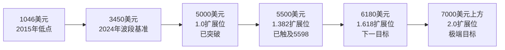

**这一斐波那契序列与第7章未来情景推演中的目标价区间高度对应**——基准情景的4400—5000美元、乐观情景的5500—6600美元、极端乐观情景的6300—7000美元，几乎完美映射于扩展位序列。这一对应不是巧合，而是技术分析与基本面驱动相互印证的体现。

**波浪分析的局限性与可证伪原则。** 需要坦诚说明：波浪理论的数浪存在主观性，不同分析师可能对同一段价格走势给出不同的浪型解读。本节所采用的"1046—2075—1620—2800—2625—5598"五浪计数是基于价格幅度、时间结构、铁律验证的相对稳健方案，但**若未来价格突破5598并创新高**，则需将2026年1月顶部重新解读为"延长第5浪的子浪3顶"，主升浪可能延续至更高位置（参考第7章乐观情景）；**若价格跌破4099并跌破1浪顶部2075**，则需重新审视整个波浪结构是否需要降级处理。这一可证伪性是技术分析有效应用的基础。

## 6.3 多周期均线系统的动态支撑：200日均线、20周均线、5月均线的"夹板"效应

均线系统作为最经典的趋势跟踪工具，其动态特性使其相比静态价格水平更能反映"市场参与者持仓成本随时间的演化"。本节按"日线—周线—月线"三层级递进，系统呈现关键均线作为动态支撑/压力的技术作用，并强调多周期均线共振位置作为机构资金布局重点参考坐标的特殊意义。

**日线层级：200日均线的"教科书级"长期风控点+50日均线的短期方向博弈点形成"夹板"区间。**

**200日均线（约4218美元）作为长期牛市风控点**具有"教科书级"技术意义。这一均线的特殊地位源于其测量了过去近十个月的市场平均持仓成本，是长期趋势的"晴雨表"。**作为长期牛市风控点，200日均线当前值4099美元附近，3月23日金价急跌至4100后迅速反弹至4400美元，验证其有效性**[^119]。技术派的核心判断依据是："跌破4100需满足三大极端条件——美联储加息至6%、全球经济同步衰退、央行集体抛金，当前去美元化浪潮下概率不足5%"[^119]。

**50日均线（高位时约4894美元）则构成日线层级的短期博弈关键点**。第4.7节所引BFC汇谈分析明确指出，"目前黄金价格（XAUUSD）正处于日线50日均线（约4894）与200日均线（约4218）的博弈区间。50日均线构成了显著的上方压力，价格数次上探均未能有效站稳，显示出短期内多头动能有所衰减；200日均线则价格仍稳健运行于其上方，意味着大周期的牛市底色尚未改变。同时，4850—4900美元也是日线上的关键阻力位置"[^123]。

这种"50日均线作为天花板、200日均线作为地板"的结构形成了典型的"夹板"效应——价格在4218—4894约676美元的宽阔区间内反复震荡，能量逐步压缩，等待方向选择。**Gary Wagner明确将4900美元视为"生死线"——"4900美元曾是2月份的支撑点，现在变成了压制上涨的天花板。只有有效站上4900美元，黄金才有望冲击5100美元，甚至挑战5600美元的历史记录"**[^118]。

**周线层级：20周均线作为中期趋势锚的支撑作用。** 20周均线测量了过去约5个月的市场持仓成本，是中期趋势的核心参考。第6.1节已经指出"20日均线（高位时约4880美元）与周线趋势线在4400—4500区间存在历史性重合带"[^119]——这一重合带正是20周均线在4400—4500区间发挥支撑作用的体现。中际旭创的波浪案例中也有"浪2缩量回踩60周均线完成0.382回撤"的描述[^122]——周均线在波段调整中作为黄金分割回撤位的天然锚定点，是机构资金布局的关键参考。

**月线层级：5月均线作为长周期慢牛趋势线的指引意义。** 第4章引用2025收官分析指出，月线、季线、年线的多周期共振是关键观察维度。**"年k级别的RSI已经严重超买（突破80），上一次超买为2006年牛市，随后在2011年开始长达三年的回调"**——年线RSI的极端超买信号本身就是长周期顶部的重要预警[^124]。**"季k和年k的RSI都已经严重超买……季k已经突破布林带上轨的压力，结合成交量来看，最新的季k成交量大幅度放大，是加速赶顶的走势"**[^124]。**"月k的RSI从2025年1月开始突破上方的80进入超买状态，已经持续一年时间，但是从k线形态来看，长上影线代表上涨遇阻，最近三个月的成交量开始逐渐下滑，说明上涨动能开始逐渐减弱"**[^124]。

月线层级的5月均线（5月平均线）作为长周期慢牛趋势线，在2015年12月触底反弹以来从未被有效跌破，是判断本轮长周期牛市是否终结的最终防线。从当前月度收盘价测算，5月均线大致位于3600—3800美元区间——这一位置与第7章悲观情景的"金价回踩3500美元"目标具有方法论上的对应。

**多周期均线共振位置的放大效应。** 当不同周期均线在某一价位形成历史性重合时，该位置的支撑/压力强度会被显著放大。当前市场中最具代表性的共振位置是：

| 共振位置 | 共振均线组合 | 强度评级 | 技术含义 |
|---|---|---|---|
| 4218—4400美元 | 200日均线+20周均线+黄金分割位 | 极强 | 长期牛市底线，跌破需极端条件 |
| 4750—4900美元 | 50日均线+生死线+前期支撑转阻力 | 强 | 当前震荡区间核心 |
| 3600—3800美元 | 5月均线+悲观情景目标 | 中 | 长周期慢牛趋势线 |

这种多周期共振位置正是"机构资金布局的重点参考坐标"——当价格触及共振位置时，**主权机构正在趁金价回调之际加码配置黄金**[^125]，"逢低加配"的非价格敏感型买盘倾向于在共振位置集中入场，形成"买盘塔"。这一机制是本轮牛市相对2011年最具结构性差异的微观特征。

## 6.4 技术动量指标的短期信号：RSI超买、MACD背离与布林带极端位的预警体系

如果说均线系统提供了价格的趋势性坐标，那么动量指标（RSI、MACD、布林带）则提供了价格演进的"加速度"信号——它们能够在趋势出现拐点之前发出预警。本节系统呈现三类动量指标在2025—2026年初的极端读数与回调验证，构建一套可操作的预警体系。

**RSI超买/超卖维度：从年线到日线的多周期极端信号。**

RSI（相对强弱指数）以0—100衡量价格的超买/超卖程度，传统阈值为>70超买、<30超卖，但极端行情下>80（深度超买）与<20（深度超卖）才具备实操预警价值。本轮牛市中RSI的极端读数呈现"跨周期一致性"特征：

**年线RSI**——"年度级别的k线图中RSI相对强弱指标已经严重超买，年k在上一次超买还是2006年的牛市，随后在2011年开始长达三年的回调，目前RSI再次突破80的超买，并且k线也已经严重突破布林带的上轨"[^124]。这一信号意味着即使从最长周期看，金价也已处于历史性的高估区域。

**季线RSI**——"季k和年k的RSI都已经严重超买，最新的季k是一根大阳线，但是目前已经突破布林带上轨的压力"，"最新的季k成交量大幅度放大，而价格已经过度买入，所以判断当前的季k是加速赶顶的走势"[^124]。

**月线RSI**——"月k的RSI从2025年1月开始突破上方的80进入超买状态，已经持续一年时间"[^124]——月线RSI持续超买长达12个月，是历史罕见的极端读数。

**日线/4小时RSI**——"4小时、日线RSI多次>80，出现顶背离"，"机构模型显示，首次触及5000时RSI大概率>85，技术性回撤概率>65%"[^120]。"黄金相对强弱指数（RSI）长期维持在90以上的极端超买区间"——这是本轮牛市顶部最具警示意义的微观信号。

**历史样本的回调验证**：2006年年线RSI超买后5年内开启回调（参见2011—2015年深度熊市）；2026年1月顶部RSI多周期超买后立即触发1月30日史诗级暴跌——两个样本共同印证了**多周期RSI共振超买后的回调高概率**。

**MACD维度：背离信号与超卖修复动量。**

MACD通过快慢均线差与零轴的关系揭示动量变化。本轮关键MACD信号包括：

**2026年1月顶部前的MACD顶背离**——"之前的黄金上涨走出了波段的新高，但是MACD作为趋势指标并没有随之上涨，反而出现了新的波动低点，那么在指标当中这个叫做'顶背离'，'顶背离'的出现说明黄金的价格已经不符合市场的预期，买入动能将会减弱，价格将会出现回调"[^124]。这一顶背离信号与RSI极端超买、波浪5浪顶特征形成三重共振。

**3月底深度调整后的超卖修复动量**——Gary Wagner指出，"通过MACD（平滑异同移动平均线）和随机指标观察到，黄金在3月份已处于极度超卖状态。目前的上涨是超卖后的动量修复，但尚未进入超买区间"[^118]。这一信号意味着4月以来的反弹尚未完成动量修复全程，进一步上行空间存在。

**4月在4750—4900区间收敛后MACD的方向选择**——周智诚分析师指出，"国际金价目前处于3295~5595美元/盎司涨势的50%回撤位4441美元/盎司上方，可判断本次回调可能为阶段性下落而非形成中长期顶部"[^126]。这一判断与50%回撤位的关键位置（4441美元）与多周期均线共振点高度一致，是判断当前震荡是"中段休整"而非"顶部确立"的核心依据。

**布林带维度：极端位的回调统计规律。**

布林带通过价格与移动均线的标准差通道揭示价格的相对极端程度。年k与季k层级的布林带信号呈现:**"年k已经严重突破布林带的上轨，说明当前的价格已经过高，所以后续有很大概率就发生回调"**；**"季k已经突破布林带上轨的压力，而布林带上轨之上将有很大概率会发生回调"**[^124]。

布林带突破上轨后的回调统计意义在于——价格运行于2倍标准差通道之外属于统计学上的"极端事件"，长期持续的概率较低。本轮金价在年线、季线、月线三个层级同步突破布林带上轨，这种多周期突破的同步性是2010年以来罕见的极端组合。

**动量指标使用的方法论原则：必须与价格结构、基本面共同验证。** 单一动量指标的极端读数虽具警示意义，但不能独立作为操作依据——2011年顶部RSI极端超买后金价确实进入熊市，但2009年RSI也曾超买后金价继续大涨；这种差异的根源在于宏观底色不同。**因此动量指标的正确使用方式是"指标信号+价格结构+基本面驱动"三者交叉验证**：

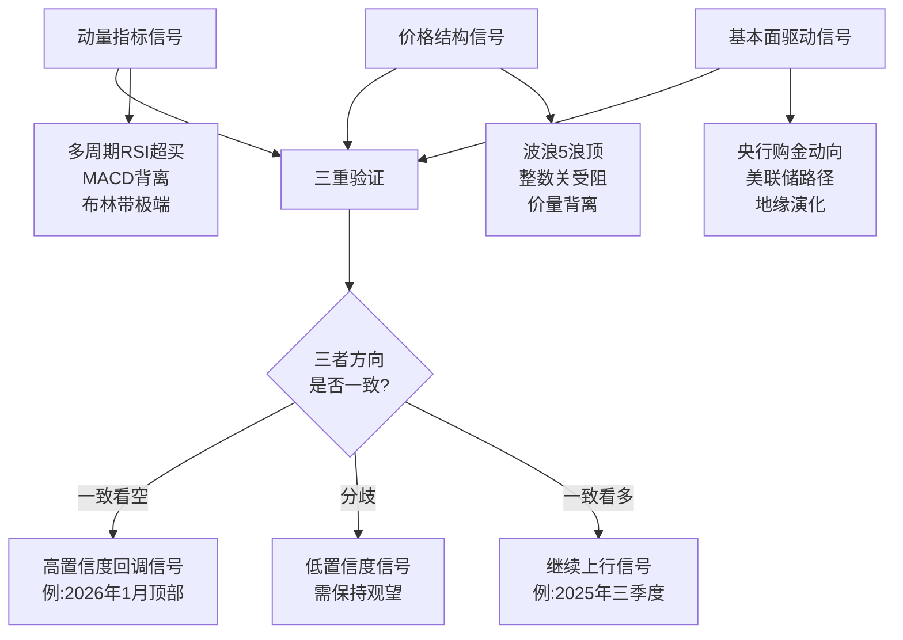

当前阶段（2026年4月）的动量指标综合诊断：日线动量指标处于"超卖修复进行中、尚未回到超买"状态[^118]，CFTC净持仓回归"过去五年中轴位置"，1个月期权波动率回落至24（年内低位）[^123]——这些信号共同指向**短期方向选择尚未明确，但拥挤交易已基本释放、为新一轮趋势性行情积蓄能量**。

## 6.5 2026年初暴跌后的关键支撑/压力区间与多周期技术位清单

作为本章的收束，本节整合前述四个层面（整数关口、波浪结构、均线系统、动量指标）的分析结论，输出当前黄金市场可操作的多周期支撑/压力位清单。这一清单将作为第7章未来情景推演与第9章投资策略制定的核心输入。

**关键支撑区间识别——四级递进的防御体系。**

**第一级支撑：5000美元——多空分水岭与突破后的转化支撑。** 这是2026年1月突破后转化的支撑位[^119]。技术含义包括：心理整数关口、斐波那契1.0扩展位、空头止损密集带的"反向托盘"作用。**作为多空分水岭，跌破5000可能触发短期抛压，但若回调企稳则表明多头趋势未改**[^119]。该位置属于"乐观情景下的回调支撑"。

**第二级支撑：4750—4800美元——暴跌后企稳震荡中枢。** 这是2026年4月以来的实际震荡中枢，**4小时级别黄金在4750—4900之间形成明显的震荡区间，K线重心逐渐收窄**[^123]。该位置同时对应50日均线下方的关键支撑、CFTC净持仓回归中轴位置后的筹码集中区。属于"基准情景下的核心支撑"。

**第三级支撑：4400—4500美元——中期趋势强弱核心锚定点。** 该区间被技术派视为"牛熊生命线"[^119]。技术含义包括：20日均线与周线趋势线重合带、前期阻力转化支撑、3月23日深度调整后的快速修复证明。**周智诚指出，"国际金价目前处于3295~5595美元/盎司涨势的50%回撤位4441美元/盎司上方，可判断本次回调可能为阶段性下落而非形成中长期顶部"**[^126]——50%回撤位（4441美元）正落在该区间内，构成多重技术共振。**分析师秦钰恒指出，若日线收盘稳守4450美元，则仍属健康调整范畴**[^119]。

**第四级支撑：4100美元（含4218美元200日均线）——长期趋势终极防线。** 这是本轮牛市的"压舱石"，**作为长期牛市风控点，200日均线当前值4099美元，具备教科书级技术意义**[^119]。技术含义包括：200日均线、3月23日实测低点、2025年11月横盘筑底的颈线支撑、心理极限位。**多家机构指出，跌破4100需满足三大极端条件——美联储加息至6%、全球经济同步衰退、央行集体抛金，当前去美元化浪潮下概率不足5%**[^119]。属于"悲观情景下的最后防线"。

**关键压力区间识别——六级递进的突破阶梯。**

**第一级压力：4894—4900美元——50日均线与短期生死线。** Gary Wagner明确指出"4900美元是目前黄金最重要的技术阻力位。4900美元曾是2月份的支撑点，现在变成了压制上涨的天花板"[^118]。**只有有效站上4900美元，黄金才有望冲击5100美元，甚至挑战5600美元的历史记录**[^118]。

**第二级压力：5140美元——4小时收敛区间上方目标。** **若能放量突破上方收敛趋势线则有望重启涨势，上方关注5140美元**[^123]。该位置同时对应Gary Wagner所述的"突破4900后的下一目标5100美元"[^118]。

**第三级压力：5400美元——高盛年底目标价。** 第4.7节已论证高盛的精准量化目标——**当前公允价4550 + 投机头寸正常化195美元 + 美联储50bp降息120美元 + 央行结构性买盘其他贡献 = 5400**。该位置代表了主流机构对2026年底中性预期的集中区。

**第四级压力：5500—5600美元——前期密集成交区与黄金分割位。** 5500美元对应斐波那契1.382扩展位与全球黄金市值/美债存量历史性对标门槛。**若有效突破该位置，阻力调整至4903美元/盎司附近**这一表述实际上反映了不同时期分析师对压力位的动态评估[^126]——在5598峰值形成后，这一区间转化为重要压力。Gary Wagner指出，"挑战5600美元的历史记录"是有效突破4900后的目标[^118]。

**第五级压力：5598—5626美元——历史峰值。** 这是2026年1月29日盘中触及的历史峰值。突破该位置即进入波浪5浪延长的新结构，目标指向斐波那契1.618扩展位6180美元。

**第六级压力：6180美元（斐波那契1.618扩展位）+ 6300—6500美元（机构最高目标价）。** **摩根大通明确预计2026年底黄金价格将达到6300美元/盎司**[^127]；**法国巴黎银行预计到2026年底金价将达到每盎司6250美元以上的峰值**[^127]。这些目标对应斐波那契1.618扩展位区域，是乐观情景的"中等目标"。

**多周期支撑/压力位汇总表——本章的核心交付物：**

| 价位 | 类型 | 技术机制 | 形成逻辑 | 有效性条件 | 第7章情景输入 |
|---|---|---|---|---|---|
| 6300—6500美元 | 极强压力 | 斐波那契1.618扩展位+机构最高目标价 | 摩根大通/法巴预测 | 突破需地缘黑天鹅+美元信用加速崩塌 | **极端乐观情景目标** |
| 6180美元 | 强压力 | 斐波那契1.618扩展位 | 5500扩展序列延伸 | 5598有效突破后第一目标 | **乐观情景中段目标** |
| 5598—5626美元 | 历史峰值 | 2026年1月29日盘中高点 | 波浪5浪初步顶部 | 突破即进入5浪延长 | **乐观情景突破触发位** |
| 5500美元 | 强压力 | 斐波那契1.382+黄金市值=美债存量门槛 | 38.2万亿对标38.5万亿 | 长期突破需主权信用对冲诉求强化 | **乐观情景目标下沿** |
| 5400美元 | 中等压力 | 高盛年底目标 | 公允价+投机头寸+降息贡献量化模型 | 美联储50bp降息+央行购金延续 | **基准情景上沿** |
| 5140美元 | 短期压力 | 4小时收敛区间上方目标 | 形态突破第一目标 | 放量突破4900生死线 | **基准情景中枢上方** |
| 5000美元 | **多空分水岭** | 心理整数+斐波那契1.0+空头止损带 | 三重共振 | 跌破即触发短期抛压 | **基准/乐观情景分界** |
| 4894—4900美元 | 关键压力转支撑 | 50日均线+生死线 | "夹板"上沿 | 站稳即冲击5100—5600 | **当前震荡上沿** |
| 4750—4800美元 | 当前中枢 | 4小时震荡区间下沿 | 暴跌后企稳震荡中枢 | 跌破回踩4400—4500 | **基准情景核心支撑** |
| 4441美元 | 关键支撑 | 50%黄金分割回撤位 | 3295—5595涨幅的50%回撤 | 站稳即"阶段性下落而非中长期顶部" | **基准情景下沿** |
| 4400—4500美元 | 牛熊生命线 | 20日均线+周线趋势线+前期阻力转支撑 | 中期趋势强弱锚定点 | 日线收盘稳守4450属健康调整 | **基准情景下限** |
| 4218美元 | 长期支撑 | 200日均线 | 长期持仓成本 | 跌破即长期趋势警报 | **悲观情景上沿** |
| 4100美元 | **终极防线** | 200日均线+3月低点+心理极限 | 多重共振 | 跌破需三大极端条件（概率<5%） | **悲观情景核心目标** |
| 3500—3800美元 | 极端支撑 | 5月均线+悲观情景目标 | 长周期慢牛趋势线 | 跌破即长期牛市终结判定 | **极端悲观情景目标** |

**对第7章三情景推演的输入价位说明**：

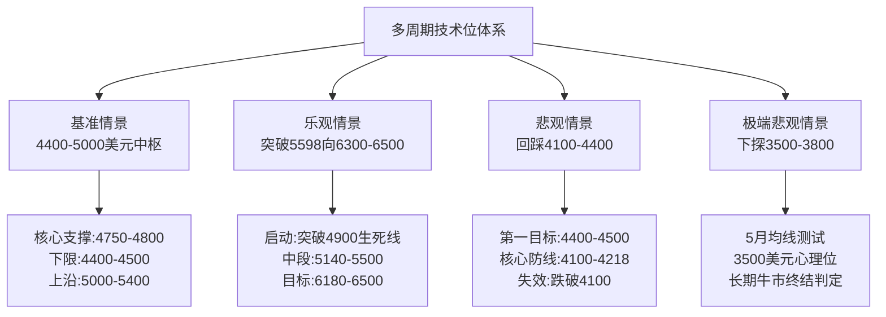

**支撑/压力体系的应用原则**——这是本章最具实战价值的归纳：

第一，**多周期共振优先原则**——支撑/压力强度随共振维度数量增加而放大。4400—4500区间共振了20日均线、周线趋势线、50%黄金分割位、整数心理位四个维度，强度极高；而单一指标（如仅日均线）的支撑相对脆弱。

第二，**突破/跌破的"有效性确认"原则**——单次价格触及不构成突破/跌破，需"日线收盘+成交量放大+持续2—3个交易日不回归"三重确认。**Gary Wagner的"4900生死线"判断、秦钰恒的"日线收盘稳守4450"判断、5000美元的"日线收盘站稳则止损反手追多"纪律**[^120][^118][^119]均体现了这一确认原则。

第三，**技术位与基本面相互印证原则**——单纯技术位若无基本面驱动支撑，其有效性会显著降低。4100美元支撑的稳健性正是因为"跌破需三大极端条件（美联储加息至6%+全球同步衰退+央行集体抛金）"——这三大条件正是第5章熊市三条件的具体化。**当技术位与基本面驱动方向一致时，技术位具有高度可信度；当二者背离时，应优先采信基本面信号**。

---

综合本章五个层面的多周期技术分析可以归纳出以下核心结论，作为第7—9章的技术坐标基础：

**第一**，本轮牛市的整数关口突破节奏在2025—2026年呈现极致加速，3000—4000—4500—5000—5500五大关口在不到一年内逐级突破，其中5000美元因"心理整数+斐波那契1.0+空头止损密集带"三重共振具有最高的研究价值，5500美元因"全球黄金市值=美债存量"对标具有时代标志意义。

**第二**，本轮牛市从1046美元至5598美元的波段计数符合艾略特波浪理论"5浪推动+ABC调整"的基本结构，三大铁律均得到验证；5598美元作为潜在5浪顶得到价量背离、RSI极端超买、机构与散户认知裂口、单月涨幅历史罕见四重特征支撑，但需保留"延长第5浪"的可能性。斐波那契扩展位（5000—5500—6180—6500—7000）为后续阻力位识别提供了有序坐标。

**第三**，多周期均线系统形成"4218美元200日均线（长期防线）—4894美元50日均线（短期天花板）—3600—3800美元5月均线（极端防线）"的三层级动态支撑体系，4218—4400区间的"200日均线+20周均线+黄金分割位"共振是机构资金布局的重点参考坐标。

**第四**，多周期RSI共振超买（年线、季线、月线、日线全部>80）+ MACD顶背离 + 布林带突破上轨 + 价量背离构成2026年1月顶部的四重预警信号；当前4月动量指标处于"超卖修复进行中、CFTC净持仓回归中轴、波动率回落至年内低位"的"压缩等待方向"状态。

**第五**，最终输出的多周期支撑/压力位清单识别出**四级支撑（5000—4750/4800—4400/4500—4100/4218）**与**六级压力（4894—5140—5400—5500—5598—6180/6500）**，每个技术位的形成逻辑、有效性条件、对应基本面驱动均得到清晰标注。

这一技术位体系将直接为下一章基准/乐观/悲观三情景推演提供精准的目标价区间——基准情景对应4400—5000美元中枢震荡、乐观情景对应突破5598向6300—6500美元迈进、悲观情景对应回踩4100—4400美元的终极防线。从下一章开始，本报告将基于第5章六维驱动框架与本章多周期技术位体系，构建可证伪的未来情景路径。

# 7 黄金未来趋势情景推演：基准、乐观与悲观三情景

承接第5章六维驱动框架的当前阶段诊断结论——结构性牛市未结束、五条件至少四条强满足、可证伪反转信号均未触发——以及第6章多周期技术位体系所识别的四级支撑（5000—4750/4800—4400/4500—4100/4218）与六级压力（4894—5140—5400—5500—5598—6180/6500）清单，本章作为全报告由历史复盘与理论提炼向前瞻性研判转换的核心枢纽，构建2026—2028年黄金价格演化的三情景推演体系。本章的核心任务并非给出"金价会涨到多少"的简单预测，而是通过"基准/乐观/悲观三情景+可证伪触发条件+可观察切换指标"的结构化框架，为投资者在高度不确定的市场中提供**条件依赖型路径假设**——即"如果A条件成立则金价路径为X、如果B条件成立则金价路径为Y"的决策树，从而最大限度地将主观预测转化为客观规则。下文将沿"方法论框架—基准情景—乐观情景—悲观情景—机构横向对比—WGC官方框架对话—情景切换仪表盘"七节递进展开。

## 7.1 情景推演的方法论框架与共同基准

任何关于未来价格的预测本质上都是带有概率属性的条件假设，而非确定性的因果链条。为避免本报告陷入"预测黄金涨到X美元"的武断式表达，本节首先确立情景推演的方法论原则与共同基准，使后续三情景的展开具备清晰的可证伪性与可比较性。

**情景构建的六要素结构**。本报告对每一情景均沿"核心变量假设—触发条件—概率分布—目标价区间—演化路径—失效信号"六要素展开，确保每个情景具备完整的"假设—观察—验证—修正"闭环。**核心变量假设**回答"这一情景的宏观底色是什么"，对应第5章六维驱动框架的当前状态变化；**触发条件**回答"这一情景需要哪些可观察的事件作为启动信号"，对应第5章可证伪反转信号清单的具体触发组合；**概率分布**给出主观先验概率，作为情景对比的相对权重而非绝对预测；**目标价区间**对应第6章多周期技术位清单的具体价位锚定，确保推演具有可量化的价格参照系；**演化路径**描述价格在情景内可能经历的关键节点与时序结构；**失效信号**回答"什么样的观察会推翻这一情景、需要切换至其他情景"。

**三情景的共同基准——2026年初的市场起点**。所有情景推演均以以下"共同基准"作为起跑线：其一，价格层面，金价在2026年4月以来于4700—4900美元区间企稳震荡、形成基准中枢[^128];其二，仓位层面,CFTC非商业净持仓回归过去五年中轴位置、"拥挤交易"风险已基本释放完毕、筹码结构回归均衡;其三,资金流向层面,黄金ETF资金重新流入,**2025年全年ETF净流入801吨,2026年开年继续净增**[^129][^130];其四,央行购金层面,延续千吨级常态——**2025年全年央行净购金863吨,连续四年超过850吨**,**截至2025年12月末中国央行黄金储备7415万盎司、连续14个月增持**[^131];其五,基本面层面,美联储仍处降息周期(**渣打银行预计2026年3月前再减息25基点、并于2026年底前进一步减息50基点至3.0%**)[^132]、美元信用衰落不可逆、地缘冲突常态化。这一共同基准是三情景分化的"原点",任何情景的演化都从这一原点出发。

**推演的时间范围与情景互斥性**。本报告情景推演以**2026年全年为主、向2027—2028年延伸**,这一时间窗口的选择基于两方面考虑——其一,主流机构(高盛、摩根大通、瑞银等)的明确目标价均集中在2026年底,具备最丰富的对比样本;其二,3年以上的远期预测受未知变量(如新一届美国政府政策、新型地缘格局)主导,可证伪性大幅下降。三情景之间为**概率互斥但路径可切换**的关系——同一时点上市场只能处于一个情景中,但随着关键变量的变化,情景之间可发生方向性切换(详见7.7节)。这种"互斥+可切换"的设计使情景推演不是静态的预测框架,而是动态的决策支持工具。

**重要原则:情景推演不是预测,而是条件依赖型路径假设**。这一原则需要反复强调——本章给出的概率分布(基准45%—55%、乐观25%—35%、悲观15%—25%)是基于2026年初可观察信息的**先验主观概率**,而非客观的市场赔率;给出的目标价区间也并非"金价必然到达"的确定性目标,而是"如果对应假设成立则金价大概率落入此区间"的条件性结论。投资者应将本章视为思考框架而非交易指南,根据自身风险偏好与持续的指标观察(参见7.7节仪表盘)动态调整对各情景的权重判断。

## 7.2 基准情景:震荡上行格局下的4400—5000美元中枢

基准情景假设当前结构性牛市核心逻辑延续但无重大新催化,是对"2026年初共同基准向前自然演化"的最大概率路径。**主观先验概率约45%—55%**。这一情景的本质特征是"驱动框架延续+短期波动可控+中长期方向温和向上",可视为本轮牛市第二阶段(从加速冲顶向稳态上行过渡)的常态化呈现。

**核心变量假设**——基准情景假设六维驱动框架的方向不发生根本性变化但强度趋于温和。具体地:

第一,**美联储2026年温和降息50—75bp**。这一假设与渣打银行的"2026年3月前再减息25基点、年底前进一步减息50基点至3.0%"路径预期高度一致[^132],也对应路透社调查"降息2—3次概率超70%"的市场共识[^129]。星展中国邓志坚则给出更谨慎的"2026年上半年减息一次25基点"判断[^132]——本报告基准情景采用50—75bp的温和区间作为合理估计。

第二,**全球央行购金维持月均60—70吨/年累计750—900吨**。这一区间既高于2010—2021年年均473吨的旧常态,又略低于2022—2024年连续三年超千吨的爆发期,符合**澳新银行"央行购金至少在未来6年内仍将保持火爆"**的延续性预期、以及世界黄金协会"95%受访央行预计未来12个月将继续增持"的调查结论[^129][^133]。

第三,**地缘冲突维持现状**——俄乌冲突陷入僵局、中东局势紧张但未全面升级、美委对峙未触发武力冲突,避险溢价持续存在但不出现脉冲式飙升。

第四,**美元信用衰落渐进推进**——38万亿债务的可持续性问题持续发酵但未触发CDS利差跳升,美元在全球外汇储备中的份额继续缓慢下行(年降幅约1—2个百分点)。

第五,**ETF净流入与CFTC净持仓维持均衡**,无趋势性流出也无极端拥挤。

**目标价区间:2026年中枢4400—5000美元、上沿延伸至5400美元**。这一区间得到主流机构基准预测的密集支撑——中信证券**"中性假设下,模型预期2026年底国际金价有望超过5100美元/盎司"**[^134]、瑞银**"2026年底4500美元(中性),年中可能摸4700"**[^129]、渣打银行**"2026年第二季度4605美元、第三季度4850美元、年末目标4800美元"**[^129][^130]、摩根士丹利**"3300—3400美元/盎司"(相对偏低)**[^129]、富国银行**"4500—4700美元"**[^135]、华尔街分析师2026年一致预期目标价中位带4500—5400美元[^135]——这些机构预测的最大公约数恰好落在4400—5000美元中枢区间,上沿延伸至高盛年底5400美元基准目标[^136][^137]。

下表系统呈现基准情景下主流机构预测的分布特征:

| 机构 | 基准目标价 | 与本报告基准情景对应关系 |
|---|---|---|
| 高盛 | 5400美元(基准) | 上沿目标 |
| 摩根大通 | 2026年Q4均价5055美元 | 上沿目标 |
| 嘉信理财 | 5055美元 | 上沿目标 |
| 美国银行 | 5000美元 | 上沿目标 |
| 澳新银行 | 5000美元 | 上沿目标 |
| 德意志银行 | 4950美元 | 中枢偏上 |
| 瑞银 | 4500美元(中性)/年中4700 | 中枢核心 |
| 渣打银行 | 4488—4850美元/年末4800 | 中枢核心 |
| 摩根士丹利 | 4800美元 | 中枢偏下 |
| 富国银行 | 4500—4700美元 | 中枢偏下 |
| 路透社调查 | 2026年均价4746.5美元(中值) | 中枢核心 |

**演化路径:上半年震荡蓄势、下半年降息落地重启上行**。基准情景下2026年价格演化呈现典型的"先抑后扬"形态,与中信证券"流动性宽松预期下金价有望延续涨势,2026年或冲击5000美元/盎司,涨幅或收窄至10%—15%"的判断相互印证[^138]。具体路径预计:**上半年(1—6月)**——金价在4400—5000美元区间宽幅震荡,4750—4800美元为震荡中枢,**4441美元50%黄金分割回撤位与4400—4500美元牛熊生命线为下轨支撑、4894—4900美元50日均线为短期上轨**(参见第6章);**下半年(7—12月)**——随美联储进一步降息落地,金价突破4900美元生死线、向5140—5400美元上沿迈进,部分时段可能脉冲触及5500美元但不形成有效突破。这一路径与渣打"2026年第二季度4605、第三季度4850"的逐步回升节奏高度一致[^130]。

**失效信号:跌破4218美元或单月突破5500美元**。基准情景的失效有两个方向——若金价跌破4218美元200日均线长期防线并连续多周不收回,意味着结构性买盘出现实质性松动,需切换至悲观情景;反之,若金价单月有效突破5500美元(日线收盘+成交量放大+持续2—3个交易日不回归),意味着有新的强催化剂启动趋势性上涨,需切换至乐观情景。这两个失效信号对应第6章技术位清单中的关键临界值,具备高度的可观察性。

**基准情景的内在逻辑稳健性**——本情景设定为最大概率路径的根本依据是,第5章六维框架的当前诊断显示六个维度全部指向利好黄金方向,但其中三维(美元信用、央行购金、地缘)极强支撑、两维(实际利率、供需)强支撑、一维(通胀)弱支撑——这种"普遍利好+局部温和"的结构最自然地对应"中枢上移+震荡可控"的演化形态。同时,**国信期货顾冯达"2026年区间4200—4800美元、运行节奏将更为复杂、波动性也将显著加剧"的判断**与本基准情景在中枢位置略有差异,但在"震荡上行+波动加剧"的核心定性上高度一致。

## 7.3 乐观情景:趋势性大涨突破5500美元向6000—6600美元迈进

乐观情景假设结构性驱动加速且叠加新的强催化剂,使金价突破2026年1月的5598美元历史峰值、向更高目标演进。**主观先验概率约25%—35%**。这一情景并非简单的"基准情景上行版本",而是质变性质的"主权信用对冲诉求大规模释放+私人资本加速转向"的复合突破。

**核心变量假设**——乐观情景的本质是"五大触发条件"中至少三项同步出现,推动黄金从"央行配置型买盘主导"向"央行+私人投资者+主权基金三轨并举"升级。具体地:

第一,**美元信用加速衰落**——美国债务/GDP突破130%(对应渣打银行所述的核心拐点)[^129]、美债CDS利差扩大至危机级、美元在全球外汇储备份额跌破55%、SWIFT进一步武器化引发非西方阵营加速去美元化。

第二,**地缘黑天鹅集中释放**——霍尔木兹海峡长期关闭、美伊全面冲突、台海局势升级或类似量级的尾部风险事件触发。**高盛在2026年3月研报中明确指出冲击6100美元的核心条件之一是"地缘风险升级削弱西方财政信用",其传导链条为"中东局势恶化—油价飙升—西方财政担忧—美元资产信任崩塌—资金涌入黄金"**[^139]。

第三,**私人投资者从0.2%极低配置大规模转向黄金**。这是乐观情景最具爆发力的变量。**高盛测算,美国私人投资组合中黄金占比仅0.2%,私人部门配置比例每提升1个基点(0.01%),金价将上涨约1.5%;若"多元化配置"趋势从央行蔓延至私人领域(如ETF持仓量重建至抛售前水平),可能为金价额外贡献1175美元(750美元+425美元),直接推动价格突破6100美元**[^139]。

第四,**央行购金加速至月均80吨以上**。**高盛预计2026年央行购金将维持在月度60吨的历史高位,但若刚性需求加速,需保持月均60吨甚至更高(高于过去12个月52吨均值)**[^137][^139]。**摩根大通预计2026年月均购金达60—70吨(达历史均值4倍),若外国投资者将0.5%美元资产转向黄金,将触发2736亿美元增量资金,推升金价至6000美元**[^140]。

第五,**新兴市场央行黄金储备占比从15%向30%靠拢**。**德银研究显示,黄金在全球央行"外汇+黄金"储备资产中的占比已从2025年6月底的24%跃升至10月的30%;德银进一步推演,若金价升至5790美元/盎司,则在现有持仓量不变的情况下,两种资产的储备占比将实现持平**[^140]。

**目标价区间:突破5598美元历史峰值后向6000—6600美元迈进、极端情形指向7000—8000美元**。乐观情景的目标价分三个层次:

**第一层次(6000—6600美元):核心乐观目标带**。这一区间得到多家顶级机构的明确预测支撑——**高盛乐观情景6100美元(2026年3月研报)**[^139]、**摩根大通"2026年底金价达6300美元、极端情景下需涨至8000—8500美元以平衡供需"**[^140]、**美国银行"春季目标价6000美元/盎司,建议忘记5000"**[^137][^131]、**杰富瑞6600美元(华尔街最激进)**[^129][^135]、**亚德尼集团6000美元**[^135]、**瑞银乐观情境7200美元、年中触及6200美元**[^140]。该层次对应第6章斐波那契1.618扩展位6180美元附近的技术阻力。

**第二层次(7000—7200美元):极端乐观目标带**。这一区间对应工银标准银行Julia Du在LBMA年度调查中提出的**"2026年金价年内高点可能触及7150美元,2026年是地缘政治风险的'质变年'"**[^136]、印度SAMCO Securities基于斐波那契扩展位的**"长线目标指向7040美元"**[^136]、瑞银**"乐观情境可突破7200美元"**[^140]。

**第三层次(8000—8500美元):远期乐观目标带**。**瑞士亚洲资本首席执行官Juerg Kiener预测到2028年金价将达到8000美元,核心逻辑是"大宗商品周期"的回归与从金融资产向实物资产的被动迁移**[^136]。摩根大通极端情景**"8000—8500美元以平衡供需"**[^140]同样指向此区间。这一层次的实现需要时间窗口扩展至2027—2028年。

下表系统呈现乐观情景下机构预测的分布:

| 机构 | 乐观情景目标价 | 核心假设前提 |
|---|---|---|
| 摩根大通(极端) | 8000—8500美元 | 全球资产再平衡18年产量需求 |
| 瑞士亚洲资本 | 8000美元(2028年) | 大宗商品周期回归 |
| 工银标准银行 | 7150美元 | 地缘政治"质变年" |
| 瑞银 | 7200美元(乐观) | 中国保险资金+实际利率跳水 |
| SAMCO | 7040美元 | 斐波那契扩展位 |
| 杰富瑞 | 6600美元 | 不可持续债务规模 |
| 摩根大通 | 6300美元(2026年底) | 去美元化结构性牛市 |
| 法国巴黎银行 | 6250美元 | 央行购金+主权信用 |
| 高盛(乐观) | 6100美元 | 私人配置+财政风险+央行购金 |
| 美国银行 | 6000美元(春季) | 历史牛市43个月300%规律 |
| 亚德尼集团 | 6000美元 | 美元信用 |
| 渣打 | 长期4000美元向上空间 | 美债/GDP破130% |

**演化路径:对应斐波那契扩展位的技术阶梯**。乐观情景下的价格演化遵循清晰的技术阶梯:


**失效信号:地缘冲突全面缓和、美联储重启加息预期、央行购金月度数据连续低于50吨**。乐观情景的失效信号包括三方面——其一,**地缘冲突全面缓和**(主要冲突点同步停火),将削弱避险溢价的持续注入;其二,**美联储因通胀反弹而重启加息预期**,使实际利率回升,对抗"私人投资者转向黄金"的关键逻辑;其三,**央行购金月度数据连续3个月跌破50吨**——这正是第5.7节构建仪表盘时给出的关键阈值,该信号触发意味着结构性买盘出现拐点。

**乐观情景的可信度辨析**——需要客观指出,机构最高目标价存在"频繁修正、追涨嫌疑"的争议——**高盛年内已7次上调目标价(从3700→5400美元),频繁修正被质疑"追涨",且6100美元依赖多重假设的强共振**[^139]。**美国银行预测金价已突破5600美元时,高盛目标价才从4900美元上调至5400美元,滞后性明显**[^140]。这意味着乐观情景虽然具有完整的逻辑链条,但其概率权重不应过度高估,并对机构预测的"一致性看多"保持必要的反思。

## 7.4 悲观情景:深度回调回踩4000—3500美元支撑

悲观情景假设第5章熊市三条件部分触发或流动性危机重演,使金价出现深度回调甚至挑战长期牛市的核心支撑。**主观先验概率约15%—25%**。这一情景的特殊性在于,它包含"温和回调"与"趋势反转"两个递进层级,触发条件的组合差异决定了金价回调的深度。

**核心变量假设**——悲观情景假设至少两项熊市条件同步触发,且央行购金边际转弱。具体地:

第一,**美联储因通胀反弹被迫暂停降息或重启加息**。这一假设并非空穴来风——**2026年3月美联储将全年降息预期从3次缩减至1次,直接触发金价大幅回调**[^141]。**最新的利率互换市场定价显示,2026年降息的幅度仅为12个基点,意味着美联储年内降息1次的概率不足50%**[^142]。**美联储3月议息会议鲍威尔提到"下一步可能加息的讨论已被提及",被市场解读为鹰派表态**[^142]——若这一鹰派路径延续,金价将面临持续的实际利率压制。

第二,**地缘冲突意外全面缓和**——俄乌停火、中东和解或美伊达成全面协议,削弱避险溢价的持续注入。

第三,**美股流动性危机引发机构补保证金抛售黄金**——重演2008年3月、2020年3月、2026年1月30日的"现金为王"模式,黄金被纳入与风险资产一同被抛售的序列(参见第5.10节流动性危机特殊机制)。

第四,**央行购金边际放缓至月均50吨以下**——**世界黄金协会数据显示,全球央行在2025年11月继续净买入黄金,累计净买入量为45吨,较10月有所下降**[^131]——若这一节奏延续并出现土耳其、波兰等国的跟风抛售(**土耳其曾两周减持120吨**)[^139],央行购金作为"压舱石"的功能可能受损。

**目标价区间:分两层级——温和回调与深度回调**

**第一层级(温和回调):4400—4500美元牛熊生命线—4218美元200日均线—4100美元终极防线**。这一层级对应第6章四级支撑体系的中段位置,价格演化呈现"逐级测试支撑"的特征。**渣打银行"Fed不放水或地缘缓和可能跌到2600—2800美元"的极端预测属于跨层级触发**[^129]。该层级的实际样本是2026年3月的深度回调——**伦敦金现货已经累计暴跌了10.49%、创下了自1983年3月以来的近43年最大单周跌幅纪录;3月23日金价接连跌破了4500、4400、4300、4200和4100美元每盎司这些关键的心理关口、盘中最低甚至探至4098.25美元**(参见第4.7节)。这一案例完整展示了温和回调情景下金价测试200日均线的过程,且该位置最终成为有效支撑。

**第二层级(深度回调):3500—3800美元5月均线区域、极端情形下探3000美元**。若三大极端条件同步触发(美联储重启加息+地缘全面缓和+央行集体抛售),金价可能突破4100美元终极防线、下探至5月均线区域。这一层级对应**花旗的谨慎情景"3650美元(50%概率)"与悲观情景"3000美元(20%概率)"**[^129]、**摩根士丹利"3300—3400美元、小心期货挤仓"**[^129]、**渣打极端情景"2600—2800美元"**[^129]、**法国外贸银行Natixis"2026年Q4均价4200美元、央行需求放缓+美联储降息周期结束、2026年将是黄金市场转折点"**(虽未直接给出深度回调目标但定性为转折)。

下表系统呈现悲观情景下机构预测的分布:

| 机构 | 悲观情景目标价 | 触发条件 |
|---|---|---|
| 富国银行 | 4500—4700美元(下沿) | 温和回调 |
| 法国外贸银行Natixis | 2026年Q4均价4200美元 | 央行需求放缓+降息结束 |
| 花旗 | 3650美元(50%概率基准) | 全球资产大挪移延后 |
| 摩根士丹利 | 3300—3400美元 | Fed政策摇摆+期货挤仓 |
| 世界银行 | 全球大宗商品2026年下跌7% | 经济增长疲弱+石油过剩 |
| 渣打(极端) | 2600—2800美元 | Fed不放水+地缘缓和 |
| 花旗(极端) | 3000美元(20%概率) | 极端悲观情景 |

**演化路径:参考2026年3月深度回调实际样本**。悲观情景的演化路径已有清晰的实证参照——**2026年1月29日5598美元历史峰值至3月深度回调4099年内低点、自高点回撤21%**(参见第4章)。这一路径的关键节点为:**5598峰值—4900生死线跌破—4500牛熊生命线测试—4218防线—4100极限位—企稳反弹**。若悲观情景升级至第二层级,演化路径将延续为:**4100跌破—3800—3500美元5月均线测试—3000美元极端心理位**。世界银行**"全球大宗商品价格预计将在2026年降至六年来的最低水平,标志着连续第四年下降。预计2025年和2026年价格都将下降7%,这是由全球经济增长疲软、石油过剩日益加剧以及政策不确定性持续推动的"**判断[^143],为深度回调情景提供了大宗商品大类资产层面的宏观背景支撑。

**失效信号:央行购金重新加速、美联储恢复降息、地缘冲突重新升级**。悲观情景的失效信号是其触发条件的反向——一旦三大触发条件中任何一项实质性逆转(央行购金月度数据回升至60吨以上、美联储恢复降息节奏、新地缘冲突点出现),金价将快速从悲观情景切换回基准情景甚至乐观情景。**Krishan Gopaul所述"随着金价在上个月跌至自去年以来未见的低位,各国央行明显加快了黄金购买步伐——主权机构正在趁金价回调之际加码配置黄金"**——这一行为模式正是悲观情景的天然失效机制:回调本身会触发央行加速购金,从而中断进一步下跌。

**悲观情景的概率权重辨析**。需要客观指出,悲观情景中第二层级(下探3500美元以下)的实现概率较低——其触发需要"三大极端条件同步"且持续时间不短,但当前可观察指标显示——美联储仍处降息周期、美元指数95.57(远低于110临界值)、央行购金延续千吨级——这三大反转信号均未触发(参见第5.11节)。因此本报告将悲观情景整体概率设定为15%—25%,且其中第一层级(温和回调至4100—4400美元)概率显著高于第二层级(深度回调至3500美元以下)。这一权重分配与机构预测分布的"少数派"特征一致——花旗给悲观情景3000美元仅赋予20%概率、绝大多数机构未将3500美元以下作为基准目标。

## 7.5 机构差异化预测的横向对比与假设前提解构

机构预测的差异化分布本身就是市场处于"再定价"过程的最直接证据。本节系统梳理截至2026年初十余家权威机构的2026年金价预测,揭示机构分歧背后的核心变量分歧,为情景概率分布提供外部参照。

**机构预测目标价的全谱系**。下表按目标价从高到低系统梳理各机构2026年金价预测,其中乐观与悲观情景下的极端目标价已在7.3、7.4节呈现,本节聚焦中性基准目标的横向对比:

| 机构 | 2026年中性目标价 | 与本报告基准情景关系 | 核心假设前提 |
|---|---|---|---|
| 杰富瑞 | 6600美元 | 乐观情景目标 | 不可持续债务规模 |
| 亚德尼集团 | 6000美元 | 乐观情景目标 | 美元信用 |
| 美国银行 | 5000—6000美元 | 乐观情景下沿—中段 | 历史牛市43个月300%规律 |
| 摩根大通 | 5055—6300美元 | 基准上沿—乐观 | 去美元化结构性牛市 |
| 路透社调查 | 2026年均价4746.5美元 | 基准中枢 | 30位分析师中值 |
| 瑞银 | 5000—5400美元(基准) | 基准上沿 | 中国保险资金2000亿+实际利率跳水 |
| 摩根士丹利 | 4800美元 | 基准中枢 | Fed政策摇摆+新矿投产慢 |
| 嘉信理财 | 5055美元 | 基准上沿 | 沿用摩根大通框架 |
| 德意志银行 | 4950美元 | 基准核心 | 中国需求驱动溢价 |
| 高盛 | 5400(基准)/6100(乐观) | 基准上沿—乐观 | "恐惧+财富"双轮模型 |
| 澳新银行 | 5000美元 | 基准核心 | 央行购金至少6年延续 |
| 渣打银行 | 4800美元(年末) | 基准中枢 | 美元信用危机+技术面 |
| 富国银行 | 4500—4700美元 | 基准下沿 | — |
| 中信证券 | 5100美元 | 基准上沿 | 模型预期+流动性宽松 |
| 花旗集团 | 3250—3650美元 | 悲观情景 | 三概率分布50%/30%/20% |
| 法国外贸银行Natixis | 4200美元(Q4均价) | 悲观情景 | 央行需求放缓+降息结束 |
| 世界银行 | 大宗商品下跌7% | 悲观情景方向 | 全球增长疲软+石油过剩 |

**机构分歧的核心变量解构**。机构预测目标价分布从3000美元到8500美元,跨度高达5500美元,这种巨大分歧的根源在于对**四大变量假设的不同**:

第一,**对央行购金粘性的假设差异**。看多派(高盛、摩根大通、瑞银、亚德尼)假设央行购金延续千吨级常态、95%受访央行计划增持的调查可信度高;看空派(花旗、Natixis、世行)假设"高金价抑制实物消费"+"央行需求边际放缓"的反向作用。

第二,**对美元信用衰落速度的假设差异**。乐观派(杰富瑞、瑞士亚洲资本、工银标准银行)预设"债务/GDP破130%、CDS利差扩大、美元储备份额跌破55%"的加速衰落路径,因此目标价指向6600—8000美元;基准派(瑞银、渣打、高盛基准)预设"渐进衰落、年降幅1—2个百分点"的温和路径,因此目标价集中在4500—5400美元;谨慎派(花旗、Natixis)预设"美国财政纪律部分恢复+石油美元体系仍然稳固"的反向假设。

第三,**对私人投资者转向幅度的假设差异**。这是高盛"恐惧+财富"双轮模型的核心变量——**财富效应来自新兴市场央行的结构性购金、恐惧效应来自西方私人投资者的觉醒;高盛认为如果不考虑私人投资者平仓(基本假设),金价的起跳点已经被永久性抬高**[^137]。看多派假设ETF持仓重建至历史高位、私人配置从0.2%向1%靠拢;基准派假设ETF维持当前水平的均衡;看空派假设私人投资者获利了结主导。

第四,**对地缘冲突演化方向的假设差异**。这是机构分歧最大的变量,且具有最强的不可预测性。**摩根大通"中美/俄乌搞事情"、瑞银"全球避险情绪+地缘风险溢价"、工银标准银行"地缘政治质变年"**[^136][^129]均假设地缘冲突持续升级;**渣打银行"地缘缓和可能跌到2600—2800"**[^129]则假设地缘冲突意外缓解。

**机构核心模型的对比解读**。每家顶级机构均有其独特的分析框架,理解这些框架的内在逻辑差异比仅看目标价更具方法论价值:

**高盛"恐惧+财富"双轮模型**——**新兴市场央行购金代表"财富"效应(国家财富驱动的多元化配置)、西方私人投资者对冲货币贬值代表"恐惧"效应**[^137]。这一模型的精妙之处在于将央行配置型买盘与私人避险型买盘分离建模,清晰识别两者各自的边际贡献。

**摩根大通"去美元化结构性牛市"模型**——**核心是供需的长期错配和货币属性的回归;央行的购金需求对价格并不敏感(Price Inelastic),即便金价突破5000美元,各国央行为了通过黄金来实现外汇储备的"去风险化"(De-risking),依然会持续买入**[^137]。该模型最核心的洞察是央行购金的"价格非敏感性"。

**美国银行"历史牛市43个月300%涨幅"模型**——**Michael Hartnett指出复盘过去四次黄金大牛市,金价在43个月内的平均涨幅高达300%。如果当前牛市遵循这一历史规律,那么6000美元不仅是可以实现的,甚至是保守的**[^137]。该模型基于历史统计规律外推,但需注意每轮牛市的宏观底色不同。

**瑞银"中国保险资金+实际利率"模型**——**核心驱动是中国大妈发力(保险资金2000亿进场)+实际利率跳水(Fed降75—100BP)+全球避险情绪+地缘风险溢价**[^129]。这一模型的特色是关注中国本土资金作为新增量的边际贡献。

**花旗的三概率分布模型**——**3650美元(50%概率)、6000美元(30%概率)、3000美元(20%概率)**[^129]。花旗模型的独特价值在于直接给出概率分布,本身就是一种条件依赖型路径假设的明确表达,与本报告情景推演的方法论相通。

**世界银行的大宗商品宏观判断**——**全球大宗商品价格预计将在2026年降至六年来的最低水平,标志着连续第四年下降;预计2025年和2026年价格都将下降7%,这是由全球经济增长疲软、石油过剩日益加剧以及政策不确定性持续推动的;贵金属价格在3月份下跌3.6%**[^143]。世界银行作为多边机构,其判断侧重于宏观经济基本面而非黄金特殊属性,提供了与投行视角不同的反向参照。

**机构预测的可信度警示**——本节对比的最后启示是,**机构预测本身存在系统性偏差**。**高盛年内已7次上调目标价、被质疑"追涨",且6100美元依赖多重假设的强共振**[^139];**美国银行目标价上调至6000美元时金价已突破5600美元,滞后性明显**[^140];**渣打银行2025年10月才将2026年均价从3875美元上调至4488美元、2026年初再上调至4800美元**[^130]——机构频繁修正本身就是市场不确定性的体现。投资者应将机构预测视为"专业意见的概率分布",而非"权威答案",并通过本报告7.7节的仪表盘指标进行独立验证。

## 7.6 世界黄金协会三情景框架与本报告情景的对话

作为黄金市场最权威的官方研究机构,世界黄金协会(WGC)在《2026年黄金展望》中提出的三情景框架具有特殊的参照价值。本节将WGC官方框架与本报告自构的基准/乐观/悲观三情景进行映射对照,确认方向一致性、识别差异点、补充WGC未充分覆盖的特殊机制。

**WGC官方三情景框架与本报告情景的映射**。世界黄金协会《2026年黄金展望》明确指出,**"黄金价格大致反映了宏观经济的普遍预期,如果当前情况持续下去,金价可能保持区间波动。然而,从今年的情况来看,2026年很可能继续出人意料"**[^133]。其官方三情景及反向情景如下:

**WGC情景一(现状延续):金价区间波动**——对应本报告**基准情景**(4400—5000美元中枢震荡);

**WGC情景二(增长放缓+利率下降+地缘风险持续):黄金小幅上涨**——对应本报告**基准情景上沿至乐观情景下沿**(5000—5500美元向5400—6000美元延伸);

**WGC情景三(全球风险上升引发严重经济衰退):黄金强劲表现**——对应本报告**乐观情景**(突破5598美元向6000—6600美元迈进);

**WGC反向情景(特朗普政策成果卓著、增长加速、利率上升、美元走强):金价走低**——对应本报告**悲观情景**(回踩4100美元终极防线甚至下探3500—3800美元)。

下表系统呈现WGC官方框架与本报告情景的映射关系:

| WGC官方情景 | 假设前提 | 金价定性 | 本报告情景对应 |
|---|---|---|---|
| 情景一(现状延续) | 当前情况持续 | 区间波动 | 基准情景核心 |
| 情景二(温和宽松) | 增长放缓+利率下降+地缘持续 | 小幅上涨 | 基准情景上沿 |
| 情景三(衰退冲击) | 全球风险上升+严重衰退 | 强劲表现 | 乐观情景 |
| 反向情景 | 政策成果+增长加速+利率上升+美元走强 | 走低 | 悲观情景 |

这一映射确认了本报告情景设计与权威机构框架的方向一致性,也意味着**本报告情景概率分布(基准45%—55%、乐观25%—35%、悲观15%—25%)的内在结构与WGC的判断逻辑相互印证**。

**WGC黄金归因模型的量化分解——为情景推演提供基本面权重参考**。世界黄金协会基于其归因模型给出了2025年金价上涨的因素分解:**"高风险环境(主要由地缘政治风险驱动)解释了金价年内涨幅中约12个百分点的来源,而美元走弱和利率小幅下降带来的机会成本降低则贡献了另外10个百分点;地缘政治风险加剧和美元疲软的综合影响约占16个百分点;价格动能和投资者持仓贡献了9个百分点,而经济增长则贡献了10个百分点"**[^133]。

这一量化分解极具方法论价值,可作为情景推演的"权重参考":

| 驱动维度 | 2025年贡献(百分点) | 占总涨幅比重 | 在本报告情景推演中的角色 |
|---|---|---|---|
| 地缘政治风险 | 12 | ~30% | 乐观情景核心催化剂 |
| 美元走弱+利率下行 | 10 | ~25% | 基准情景核心驱动 |
| 价格动能+持仓 | 9 | ~22% | 基准情景延续动能 |
| 经济增长 | 10 | ~25% | 反向情景关键变量 |

WGC模型显示,**驱动黄金价格的四大因素在2025年呈现出"罕见的均衡状态"——这标志着市场正由多元力量共同驱动,而非单一催化剂主导**[^133]。这一"均衡驱动"特征是本报告基准情景设定为最大概率路径的另一项独立证据——多元驱动结构本身就提供了高度的稳健性。

**WGC对2026年的核心判断:'净持仓将大幅上升'**。WGC明确指出,**"投资需求、央行购金和黄金回收可以提供额外支撑"**且**"在市场持续波动的情况下,黄金作为投资组合多元化工具和稳定性来源的作用仍然至关重要"**[^133]。其报告标题直接指向**"净持仓将大幅上升"**这一核心判断——这一判断与本报告基准情景与乐观情景的核心假设高度一致,共同支撑"金价中枢上移"的方向性结论。

**WGC框架未充分覆盖的特殊机制——流动性危机型暴跌**。WGC官方框架的局限性在于其主要关注宏观经济与基本面驱动,**未充分覆盖第5.10节所述的流动性危机型暴跌特殊机制**。如2026年1月30日的史诗级暴跌——单日跌9.5%创1983年以来最大跌幅——其触发并非来自WGC框架中的任何宏观情景,而是来自"前期拥挤+保证金催化+程序化放大+负反馈循环"的微观结构性脆弱性(参见第4.4节)。本报告通过引入"流动性危机型暴跌"作为牛熊框架之外的特殊机制,**对WGC框架进行了重要补充**——其核心含义是,即使在最稳健的基准情景下,黄金市场仍可能出现脉冲式剧烈波动,但其后续修复路径取决于宏观底色而非暴跌本身的剧烈程度。

**WGC框架与本报告情景推演的协同启示**——综合官方权威框架与本报告自构框架可以归纳出三点协同启示:

第一,**情景设计的方向性一致**——四象限式的"现状延续/温和宽松/衰退冲击/政策成果"映射于本报告的"基准/乐观/悲观/反向"三情景+反向情景框架,方向一致。

第二,**概率权重的隐含一致性**——WGC虽未直接给出概率分布,但其反复强调"不确定性仍居高不下、主要不利因素依然存在"以及"2026年很可能继续出人意料"的表态,隐含的概率分布与本报告"基准45%—55%、其余两种情景合计45%—55%"的设定相互印证——即"基准与非基准接近平分"的高不确定性格局。

第三,**情景之间的可切换性**——WGC明确指出"诸如解放日之类的不可预见事件仍无法预判,不过虽然这些事件的具体性质难以预测,但尾部风险事件的发生频率正在上升",这与本报告7.7节强调的"情景动态切换与持续指标观察"完全一致——任何静态预测都不可靠,唯有动态跟踪才能应对真实市场。

## 7.7 情景切换的关键观察指标与动态调整规则

作为三情景推演的可操作性收束,本节构建情景切换的"仪表盘"——基于第5章可证伪反转信号清单系统化为五大类高频可观察指标。这一仪表盘的核心价值在于,它将抽象的情景假设转化为投资者可以每周/每月持续跟踪的具体观察项,使情景推演从"一次性结论"升级为"持续性决策支持工具"。

**第一类指标:美联储政策路径**。这是利率维度的核心观察项,直接影响实际利率与黄金持有机会成本。

| 高频指标 | 当前状态(2026年初) | 向乐观切换阈值 | 向悲观切换阈值 |
|---|---|---|---|
| CME利率期货定价 | 6月降息预期88%[^128] | 全年降息次数预期>3次 | 降息次数预期归零或重启加息 |
| 美联储点阵图 | 2026年降息50—75bp[^132] | 中位数下移至降息100bp+ | 中位数上移至降息<25bp |
| 议息会议表态 | 鲍威尔仍偏鸽 | 加大降息力度暗示 | "下一步可能加息"被提及[^142] |
| 美联储主席接班人 | 鲍威尔任期至2026.5 | 鸽派候选人提名 | 鹰派沃什提名(已发生)[^129] |

**第二类指标:央行购金月度数据**。这是结构性买盘的核心观察项,直接决定本轮牛市的"压舱石"是否松动。

| 高频指标 | 当前状态(2026年初) | 向乐观切换阈值 | 向悲观切换阈值 |
|---|---|---|---|
| WGC月度购金报告 | 2025年11月45吨[^131] | 月均>80吨持续3个月 | 月均<50吨持续3个月 |
| 中国央行黄金储备 | 7415万盎司、连续14个月增持[^131] | 单月增持>50万盎司 | 连续2个月不增持 |
| 新兴市场央行公告 | 波兰、哈萨克、土耳其持续增持[^131] | 新加入增持国家 | 出现集体抛售(土耳其曾两周减持120吨)[^139] |
| 黄金占储备比例 | 28.9%—30.5%(2025Q3—2026年1月) | 突破35% | 跌破25% |

**第三类指标:美元体系健康度**。这是美元信用维度的核心观察项,反映去美元化进程的速度。

| 高频指标 | 当前状态(2026年初) | 向乐观切换阈值 | 向悲观切换阈值 |
|---|---|---|---|
| DXY指数 | 95.57(四年低点) | 跌破90并维持 | 突破110并维持3个月 |
| IMF美元储备份额 | 56.32%—56.77%(2025Q2/2024Q4) | 跌破55% | 回升至60%以上 |
| 美债CDS利差 | 持续走阔 | 跳升至危机级 | 系统性收窄 |
| SWIFT去武器化进展 | CIPS覆盖190+国家 | 替代体系市占率超10% | 美国宣布解除武器化政策 |

**第四类指标:地缘冲突演化**。这是避险溢价的核心观察项,直接影响短期催化剂的强度。

| 高频指标 | 当前状态(2026年初) | 向乐观切换阈值 | 向悲观切换阈值 |
|---|---|---|---|
| 霍尔木兹海峡通航状态 | 紧张但通行[^144] | 长期关闭或美伊全面冲突 | 全面通航+美伊达成协议 |
| 俄乌冲突强度 | 陷入僵局 | 战线扩大至北约成员国 | 全面停火 |
| 中东冲突点强度 | 巴以持续、美伊对峙 | 多线并发升级 | 主要冲突点同步停火 |
| 地缘风险指数 | 较2020年飙升127% | 创历史新高 | 回落至历史均值以下 |
| VIX恐慌指数 | 维持中位 | 持续>30 | 持续<15超过1个月[^145] |

**第五类指标:市场结构指标**。这是微观脆弱性的核心观察项,反映短期波动的酝酿程度。

| 高频指标 | 当前状态(2026年初) | 向乐观切换阈值 | 向悲观切换阈值 |
|---|---|---|---|
| CFTC非商业净多头百分位 | 回归过去五年中轴位置 | <30百分位(深度去化) | >85百分位(创新高后回落)[^145] |
| 黄金ETF资金流向 | 中国黄金ETF连续17交易日净流入11.49亿 | 月度净流入>200吨 | 连续3个月净流出 |
| 1个月期权波动率 | 24附近(年内低位) | 持续<20 | 持续>40 |
| CME保证金水平 | 8%(1月30日上调) | 下调回6% | 进一步上调>10% |
| 金银比 | 维持中位 | 收敛至45以下[^145] | 扩大至100以上 |
| COMEX/NYMEX库存 | 高位[^145] | 库存稳定 | 连续6周回升 |

**情景切换的组合规则**。基于五大类指标的综合观察,情景切换遵循以下组合规则:

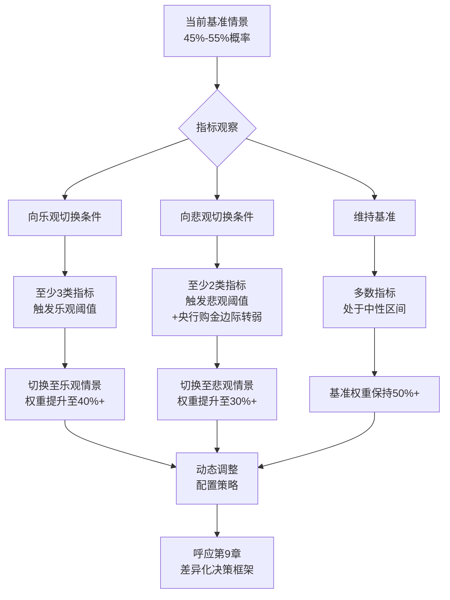

**月度跟踪机制建议**。本节最具实操价值的建议是,**投资者应建立月度跟踪机制**,在每月初基于前述五大类高频指标的最新数据,完成以下三项工作:

第一,**指标状态更新**——逐项填写五大类指标的当前数值与变化方向,识别出现"乐观切换"或"悲观切换"信号的指标项;

第二,**情景概率重估**——根据指标变化重新评估三情景的相对概率(如从基准50%/乐观30%/悲观20%调整为基准40%/乐观40%/悲观20%);

第三,**配置策略调整**——根据情景概率分布的变化,调整黄金配置比例(基础5%—10%)、配置工具组合(ETF/实物/期货)、买入卖出节奏(参见第9章详细策略),实现从被动持有向条件依赖型主动管理的升级。

**仪表盘机制的最终启示**——情景推演不是预测,而是动态的决策支持框架。**情景之间的概率分布会随关键指标的变化而动态调整,而不是一次性确定后即僵化执行**。这一机制使本报告的研究结论具备了对未来3—5年持续生效的方法论价值——即使具体目标价随时间推移而需要调整,但"五大类指标—情景概率—配置策略"的三层级决策框架本身具备稳定的可外推性。

---

综合本章七个层面的系统推演可以归纳出以下核心结论,作为第8章思维导图整合与第9章投资策略制定的核心输入:

**第一**,本章构建的"基准/乐观/悲观三情景+反向情景"框架与世界黄金协会官方四象限框架方向一致,本报告主观先验概率分布(基准45%—55%、乐观25%—35%、悲观15%—25%)与WGC隐含的"高不确定性、基准与非基准接近平分"格局相互印证。

**第二**,**基准情景**(45%—55%概率)假设结构性牛市核心逻辑延续但无重大新催化,目标价中枢4400—5000美元、上沿延伸至5400美元,演化路径"上半年震荡蓄势、下半年降息落地重启上行",获得中信证券、瑞银、渣打、摩根士丹利、富国银行等主流机构基准预测的密集支撑。

**第三**,**乐观情景**(25%—35%概率)假设五大触发条件中至少三项同步出现(美元信用加速衰落+地缘黑天鹅+私人配置爆发+央行购金加速+储备占比向30%靠拢),目标价分三层次:核心乐观6000—6600美元(高盛/摩根大通/美银/杰富瑞)、极端乐观7000—7200美元(工银标准银行/瑞银/SAMCO)、远期乐观8000—8500美元(摩根大通/瑞士亚洲资本)。

**第四**,**悲观情景**(15%—25%概率)假设至少两项熊市条件同步触发且央行购金边际转弱,目标价分两层级:温和回调4400—4500—4218—4100美元(参考2026年3月实际样本)、深度回调3500—3800美元5月均线区域(花旗/摩根士丹利/渣打极端预测)。

**第五**,**机构预测目标价从3000美元到8500美元的5500美元跨度**反映了对"央行购金粘性、美元信用衰落速度、私人投资者转向幅度、地缘冲突演化方向"四大变量的不同假设——投资者应理解机构预测背后的假设分歧而非仅看目标价数字。

**第六**,**情景切换仪表盘**基于美联储政策、央行购金、美元体系健康度、地缘冲突、市场结构五大类高频可观察指标构建,建议投资者建立月度跟踪机制,根据指标变化动态调整情景概率与配置策略,使情景推演从"一次性结论"升级为"持续性决策支持工具"。

这些结论将直接为第8章思维导图全景整合(未来情景分支的目标价区间与触发条件)与第9章投资策略制定(基于情景概率分布的差异化策略)提供完整的输入。从下一章开始,本报告将进入对全报告核心交付物——黄金走势全景思维导图——的系统化构建,以"中心主题→主分支→子节点→末端节点"的层级树形结构,将历史复盘、驱动因素、关键技术位、未来情景、核心风险、投资启示等六大维度整合为一张可一图概览的完整知识图谱。

# 8 思维导图综合呈现：黄金走势全景与未来路径

承接第7章对2026—2028年黄金价格演化"基准/乐观/悲观三情景+情景切换仪表盘"的系统推演，以及第2—7章累计构建的"历史复盘—驱动框架—技术位识别—情景路径"四位一体研判体系，本章作为全报告的核心交付物，肩负着将分散于六个章节、近20万字论证文本中的核心结论，整合为**一张可一图概览的全景思维导图**的关键使命。这一使命直接呼应第1.4节所确立的"层级缩进树形文字+Mermaid mindmap代码+专业工具复刻建议"三轨制呈现方案，也契合用户在研究主题中明确提出的"用思维导图告诉我黄金未来有可能的趋势、关键压力、关键支撑位置"这一最高优先级需求。

本章在全报告结构中承担**"承前整合、启后导出"**的桥梁作用：向上整合第2—7章的全部核心结论于一张可视化知识图谱中，向下为第9章核心风险揭示与投资策略提供凝练的索引索引。下文将沿"整体架构—中心主题—六大分支—Mermaid代码与复刻指南"九节递进展开，每个分支严格遵循"具体、可操作、可量化"的末端节点颗粒度规范。

## 8.1 思维导图的整体架构与呈现方案

思维导图作为可视化知识结构工具，其核心优势在于通过**辐射状层级展开**实现"中心—主分支—子节点"的视觉认知效果，使读者能够在几秒钟内捕捉信息全貌、在几分钟内深入任一分支细节、在几小时内基于框架进行二次重构。本节系统说明本章思维导图的设计原则、层级结构与多元呈现方案，为后续8.2—8.8节的分支展开建立元规则。

**设计原则一：辐射状架构与逻辑权重均衡。** 本章思维导图以"黄金走势研判"为绝对中心，向外辐射六大一级分支——历史复盘、驱动因素、关键技术位、未来情景、核心风险、投资启示——构成一个完整的**"过去—现在—未来—风险—行动"五位一体闭环**。其中前三大分支（历史、驱动、技术位）回答"是什么、为什么、在哪里"的描述性问题，后三大分支（情景、风险、启示）回答"会怎样、警惕什么、怎么做"的规范性问题，描述与规范两类分支的权重大致均衡，确保读者在掌握客观事实的同时也能获得行动指引。

**设计原则二：四级节点深度与信息颗粒度规范。** 每个一级分支下设三至四级子节点，遵循"逐级具体化、末端可操作"的颗粒度规范——一级节点为分支主题（如"驱动因素"）、二级节点为核心维度（如"美元实际利率"）、三级节点为机制与证据（如"传统机会成本之锚2022年后失效"）、四级节点为具体数据与时间锚点（如"TIPS与金价相关系数从2010—2019年的-0.6485转为正背离"）。**末端节点严格避免空洞标题**——不写"关键支撑位"而写"4218美元200日均线长期防线、跌破需三大极端条件且概率<5%"；不写"央行购金"而写"2022—2024年连续三年超千吨、2025年863吨、储备占比28.9%—30.5%"。这一颗粒度规范确保思维导图本身就是一张**可独立使用的研判工具**，而非仅作为正文的索引摘要。

**设计原则三：三轨制呈现方案以应对Markdown格式约束。** 由于纯Markdown格式难以原生呈现思维导图的辐射状视觉效果（参见第1.4节论证），本章采用三轨制呈现方案：

- **轨道一（主体呈现）：层级缩进树形文字结构**——以缩进+列表符号体现父子节点关系，可在任意Markdown渲染器中直接阅读，便于读者复制至文本编辑器中使用；
- **轨道二（可视化代码）：Mermaid mindmap完整代码**——读者可粘贴至Typora、Obsidian、VS Code Markdown Preview Enhanced或Mermaid Live Editor等支持Mermaid渲染的工具中即时生成可视化思维导图；
- **轨道三（专业工具复刻）：XMind/MindMaster/FreeMind/幕布等工具的导入与重构指引**——对于希望进行二次编辑、个性化美化或团队协作分享的读者，提供基于本报告层级结构的复刻操作指引（详见8.9节）。

**设计原则四：分支间交叉引用与全报告呼应。** 思维导图各分支并非孤立存在，而是相互呼应的有机整体——历史复盘分支为驱动因素分支提供实证样本，驱动因素分支为情景路径分支提供机制基础，技术位分支为情景路径分支提供价格坐标，情景路径分支为风险分支提供条件依赖触发器，风险分支为投资启示分支提供边界约束。**每个一级分支的展开均明确标注与正文章节的对应关系**，确保读者可以方便地从思维导图回溯至正文深度论证（如下表所示）。

| 一级分支 | 对应正文章节 | 在研判框架中的功能定位 |
|---|---|---|
| 历史复盘 | 第2、3、4章 | 提供完整周期实证样本，验证驱动框架有效性 |
| 驱动因素 | 第5章 | 提炼六维分析框架，揭示2022年范式转移 |
| 关键技术位 | 第6章 | 多周期支撑/压力坐标，量化情景目标价 |
| 未来情景 | 第7章 | 三情景路径推演，给出条件依赖型决策树 |
| 核心风险 | 第9章（衔接） | 风险监测与预警，整合情景切换仪表盘 |
| 投资启示 | 第9章（衔接） | 差异化策略与配置纪律，回归操作层面 |

完成上述四项原则的元规则确立后，下文从8.2节开始正式展开思维导图的各级节点内容。

## 8.2 中心主题与一级分支总览

作为整张思维导图的"心脏"，"黄金走势研判"作为根节点向外辐射出的六大一级分支，其结构关系可用下图直观呈现：

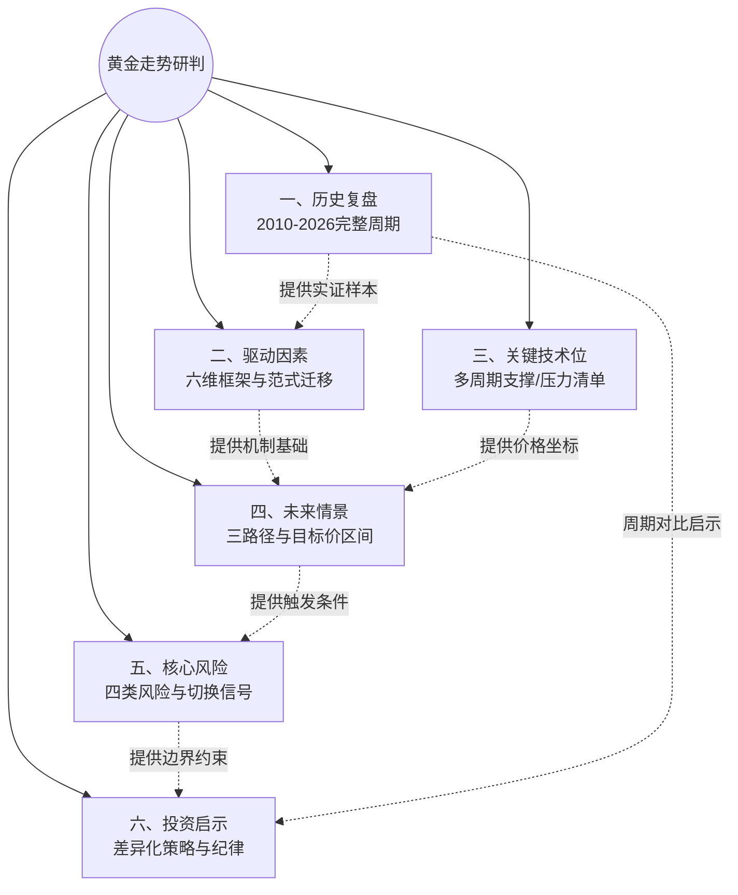

**六大一级分支的功能定位与逻辑权重**可进一步系统呈现如下：

| 一级分支 | 核心问题 | 信息密度 | 在思维导图中的逻辑权重 |
|---|---|---|---|
| 一、历史复盘 | 过去十六年金价是怎么走过来的？ | 高（4个阶段+大量事件） | 25% |
| 二、驱动因素 | 金价涨跌背后的根本逻辑是什么？ | 极高（六维+范式分水岭） | 25% |
| 三、关键技术位 | 当前金价处于何种坐标位置？ | 高（4级支撑+6级压力） | 15% |
| 四、未来情景 | 未来1—3年金价可能怎么走？ | 高（3情景+目标价+触发条件） | 15% |
| 五、核心风险 | 哪些风险可能颠覆当前判断？ | 中（4类风险+5类指标） | 10% |
| 六、投资启示 | 投资者应该如何应对？ | 中（5维策略+长短期差异） | 10% |

**逻辑权重的设计依据**：历史复盘与驱动因素作为"事实基础与方法论核心"获得最高权重（各25%）——前者提供实证样本，后者提供分析框架，二者共同支撑整张思维导图的客观性；技术位与未来情景作为"前瞻性研判核心"各获15%权重，对应用户研究主题中"关键压力、关键支撑、未来趋势"的明确关切；核心风险与投资启示作为"行动层面工具"各获10%权重，与第9章形成衔接而非重复。这一权重分布既呼应了用户需求的优先级，也保持了"事实—框架—判断—行动"四层递进的逻辑均衡。

下文8.3—8.8节将依次对六大一级分支展开三至四级节点的详细内容。

## 8.3 分支一：历史复盘（2010—2026年完整周期）

本分支按"四大阶段"展开二级节点，每个阶段下进一步按"核心驱动—关键事件—价格表现—典型案例"四个三级维度展开末端节点，完整覆盖第2—4章的实证内容。

```text
一、历史复盘（2010—2026年完整周期）
├── 1. 2010—2015年：第三轮超级牛市顶部确立与深度熊市
│   ├── 核心驱动
│   │   ├── QE2启动（2010年11月）+ 欧债危机蔓延
│   │   ├── 标普下调美国主权评级（2011年8月，1917年以来首次）
│   │   ├── 美联储Taper（2013年5月）→ QE3结束（2014年10月）→ 首次加息（2015年12月）
│   │   └── 实际利率从-1%升至+0.5%、美元指数升至100、美股牛市分流
│   ├── 关键事件
│   │   ├── 2011年9月6日：金价触及1920.78美元历史峰值
│   │   ├── 2013年4月12—15日："黄金黑色星期五"两日跌13%
│   │   ├── 2014年下半年：原油暴跌打压通胀预期
│   │   └── 2015年12月：金价触底1046美元
│   ├── 价格表现
│   │   ├── 2010年涨30%、突破1400美元
│   │   ├── 2011年最高1920.78美元、年涨13%
│   │   ├── 2013年全年跌28%
│   │   └── 2011—2015年累计跌幅45%、长达4年3个月
│   └── 典型案例：2013年4月黑色星期五
│       ├── SPDR单年减持38%、单月最高抛售200吨
│       ├── 4月15日单日跌9.3%（1983年以来最大单日跌幅）
│       ├── 10分钟内逾1000家机构同步交易（程序化交易放大）
│       └── "中国大妈"10天内1000亿元买入300吨、2018年才整体解套
│
├── 2. 2016—2018年：低位筑底与新周期信号孕育
│   ├── 核心驱动
│   │   ├── 黑天鹅事件：英国脱欧（2016.6）+ 特朗普当选（2016.11）
│   │   ├── 央行购金从无到有：2018年净购651.5吨创50年新高
│   │   └── 美联储4次加息+中美贸易战形成短期逆风
│   ├── 关键事件
│   │   ├── 2016年6月24日脱欧公投：单日金价从1256.8升至1358.6美元
│   │   ├── 2016年11月特朗普当选：5.1%脉冲后数小时全部回吐
│   │   ├── 俄罗斯央行2018年增持274.3吨（连续13年）
│   │   └── 中国央行2018年12月重启增持（结束26个月按兵不动）
│   ├── 价格表现
│   │   ├── 2016年涨8%、2017年企稳、2018年微跌2.69%
│   │   ├── 2018年高低点1362—1176美元
│   │   └── 2018年Q4黄金逆势涨10%（成为2019年最佳交易标的）
│   └── 典型案例：2018年央行购金创50年新高
│       ├── 1971年布雷顿森林体系脱钩以来最高净买入量
│       ├── 普京表态"与美元决裂"（2018年5月）
│       ├── 波兰、匈牙利、哈萨克斯坦同步增持
│       └── 与2011年顶部"散户避险冲顶+央行缺位"形成镜像对比
│
├── 3. 2019—2024年：渐进式牛市与定价范式转移
│   ├── 核心驱动
│   │   ├── 2019年美联储从加息切换至预防式降息
│   │   ├── 2020年无限量QE+零利率：M2同比增26.92%
│   │   ├── 2022年俄乌冲突+西方冻结俄罗斯3000亿外储 → 范式转移元年
│   │   └── 2023—2024年央行购金连续超千吨+美元信用衰落
│   ├── 关键事件
│   │   ├── 2019年8月金价突破1500美元、全年涨18.3%
│   │   ├── 2020年3月流动性危机：金价两周从1700跌至1451美元
│   │   ├── 2020年8月7日：金价创2075.14美元当时历史新高
│   │   ├── 2022年央行购金1081.9吨（同比+140%、55年新高）
│   │   ├── 2023年3月硅谷银行/瑞信危机：金价11日涨10.78%
│   │   └── 2024年10月30日突破2801.8美元、全年涨27%
│   ├── 价格表现
│   │   ├── 2019年涨18.3%（2010年来最佳）
│   │   ├── 2020年涨25%、2021年微跌3%
│   │   ├── 2022年小幅涨5.6%（425bp激进加息下反常坚挺）
│   │   ├── 2023年涨12%多次站稳2000美元
│   │   └── 2024年涨27%、平均价同比上涨23%至2386美元
│   └── 典型案例：2022年范式转移
│       ├── 央行购金1081.9吨创55年新高、增长140%
│       ├── 中国央行11月时隔三年多重启购金、累计连增18个月316吨
│       ├── TIPS与金价负相关性破裂（2022年起背离）
│       └── 黄金从"金融投资品"重新回归"战略货币锚"
│
└── 4. 2025—2026年初：超级牛市与剧烈波动新常态
    ├── 核心驱动（六重共振）
    │   ├── 美联储2025年9月降息+全年累计75bp
    │   ├── 美元指数2025年跌9.5%（1973年以来最差年度表现）
    │   ├── 央行购金2025年863吨、连续四年超850吨
    │   ├── 特朗普关税+美联储独立性受挑战
    │   ├── 地缘冲突常态化（俄乌+中东+美委多点并发）
    │   └── ETF净流入801吨、投资需求同比+84%
    ├── 关键事件
    │   ├── 2025年3月：金价首破3000美元
    │   ├── 2025年10月8日：触及4040美元（1980年以来最快年涨速）
    │   ├── 2026年1月29日：触及5598.75美元历史峰值
    │   ├── 2026年1月30日：单日跌9.5%（1983年以来最大单日跌幅）
    │   └── 2026年4月：4700—4900美元区间企稳震荡
    ├── 价格表现
    │   ├── 2025年COMEX涨64.37%（1979年以来最大年涨幅）
    │   ├── 2025年伦敦金涨约65%、年内50次新高
    │   ├── 2026年1月单月涨超23%
    │   └── 1月30日—3月最大回撤21%（5598→4099）
    └── 典型案例：2026年1月30日史诗级暴跌
        ├── 触发：沃什提名+CME保证金6%→8%+核心PPI超预期
        ├── 传导：杠杆平仓+程序化止损+指数基金65亿调仓
        ├── 放大：ETF波动率飙升至46.02（近2020疫情极值）
        ├── 关联：白银-27.7%（1982年来最大）/沪金-12%/币圈爆仓10亿
        └── 修复：3月深度回调至4099后4月在4700+企稳
```

**历史复盘分支的核心提炼**：四个阶段呈现一条清晰的"顶部确立—深度熊市—低位筑底—范式转移—超级牛市"演进主线，**最关键的转折点是2022年俄乌冲突与外储冻结事件**——它将驱动结构从"散户避险+实际利率"切换为"央行购金+主权信用对冲"，使本轮牛市具备2011年所不具备的结构稳健性。这一历史脉络为驱动因素分支与情景路径分支提供了完整的实证基础。

## 8.4 分支二：驱动因素六维框架

本分支按第5章构建的"六维驱动框架"展开，每个维度下进一步按"机制说明—量化证据—阶段权重"三个三级维度展开末端节点，并在每个维度的关键节点标注**"2022年范式分水岭"**核心标识。

```text
二、驱动因素六维框架
├── 【范式分水岭：2022年外储冻结事件】
│   ├── 之前（1980—2021）：实际利率绝对主导
│   ├── 之后（2022至今）：央行购金+主权信用对冲双轮主锚
│   └── 实际利率退化为边际加速器、地缘+ETF为放大器
│
├── 1. 美元实际利率（机会成本之锚 → 边际加速器）
│   ├── 机制说明
│   │   ├── 黄金为零息资产、持有成本=名义利率-通胀预期
│   │   ├── TIPS收益率衡量实际利率水平
│   │   └── 实际利率上升→生息资产相对优势→金价承压
│   ├── 量化证据
│   │   ├── 1971—2017年WGC统计：实际利率<0%时金价月均+1.3%
│   │   ├── 2010—2019年TIPS与金价相关系数-0.6485
│   │   ├── 2022年起负相关关系出现肉眼可见的背离
│   │   └── 2022—2025年财政压力（互换利差）取代实际利率部分解释力
│   └── 阶段权重
│       ├── 1980—2021年：主导锚（权重≥40%）
│       └── 2022年至今：边际加速器（权重<20%）
│
├── 2. 美元指数与美元信用（双层属性、信用维度崛起）
│   ├── 美元指数层（短期定价基准）
│   │   ├── 2010—2019年与金价相关系数-0.6606
│   │   ├── 2022年加息周期DXY升至114高位
│   │   └── 2025年DXY跌9.5%（1973年以来最差年度表现）
│   ├── 美元信用层【范式分水岭新维度】
│   │   ├── 联邦债务38万亿、占GDP超100%
│   │   ├── 国债利息支出首次超过国防预算（2025年）
│   │   ├── 美元储备份额：2001年72%→2025年Q2 56.32%
│   │   ├── SWIFT武器化：俄罗斯资产冻结3000亿（2022年）
│   │   ├── 替代支付体系：CIPS覆盖190+国家、2025年同比+42.6%
│   │   └── 石油美元松动：2026年3月对华石油人民币结算41%超美元
│   └── 阶段权重
│       ├── 2022年前：仅美元指数维度，权重约30%
│       └── 2022年后：美元信用维度跃升、综合权重约40%
│
├── 3. 全球央行购金（2022年后新定价主锚）【范式分水岭核心】
│   ├── 量化证据（分水岭式跃升）
│   │   ├── 2010—2021年年均473吨
│   │   ├── 2022年1081.9吨（同比+140%、55年新高）
│   │   ├── 2023年1050.8吨（中国央行225吨居首）
│   │   ├── 2024年1044.6吨（波兰90吨居首）
│   │   ├── 2025年863吨（连续四年超850吨）
│   │   └── 储备占比：2015年10.2%→2025Q3 28.9%→2026.1 30.5%
│   ├── 机制特征
│   │   ├── 非价格敏感性：战略储备目标而非短期预期
│   │   ├── 粘性需求：回调5%不止损、央行"逢低加配"
│   │   ├── 战略锁仓：约25%以上年供应被长期锁定
│   │   └── 南北分化：新兴市场主导、发达经济体观望
│   └── 持续性证据
│       ├── 95%受访央行预计未来12个月增持
│       ├── 43%央行计划主动加大配置
│       ├── 澳新银行预计未来6年仍将保持火爆
│       └── 中国央行截至2025年12月连续14个月增持、储备2306吨
│
├── 4. 地缘政治与避险需求（短期催化剂、放大器）
│   ├── 三阶段博弈框架
│   │   ├── 阶段1（预期/爆发初期）：避险主导上行
│   │   ├── 阶段2（外溢/兑现）：买预期卖事实、油价→通胀→利率反向链条
│   │   └── 阶段3（失控/长期化）：三重属性回归共振
│   ├── 量化证据
│   │   ├── 地缘风险指数每升10点、金价平均跳涨2.3%
│   │   ├── 冲突波及能源要道时单日涨幅可超5%
│   │   ├── 2022年俄乌冲突半个月金价涨9%（1900→2070）
│   │   └── 地缘风险指数较2020年飙升127%
│   └── 历史检验
│       ├── 1991年海湾战争：战前+17%、战后-12%
│       ├── 2003年伊拉克战争：战前+35%、战后-13%
│       ├── 2026年3月霍尔木兹危机：金价反跌至4099（半月跌23%）
│       └── 启示：地缘仅为脉冲扰动、需结合利率政策方向判断
│
├── 5. 供需结构（长期物理基础）
│   ├── 供给端刚性
│   │   ├── 矿产金2025年3672吨创新高、年增速<1%
│   │   ├── 总供应2025年5002吨创新高
│   │   ├── 再生金"价涨量增有限"（高金价催生惜售）
│   │   ├── 新矿开发周期5—7年漫长
│   │   └── G7禁止俄黄金、约10%供给受限
│   ├── 需求端三维爆发
│   │   ├── 投资需求：2025年2175吨（+84%）、ETF净增801吨
│   │   ├── 央行需求：2025年863吨、占供应超25%
│   │   ├── 工业用金：2024年326吨（+7%）、AI芯片+光伏拉动
│   │   └── 金饰需求：2025年1542吨（-18%）但消费金额+18%
│   └── 量化失衡
│       ├── 2025年供需缺口超800吨
│       ├── 2025—2027年累计缺口接近5000吨（中金测算）
│       └── 存量大池38.2万亿美元≈美债存量38.5万亿
│
└── 6. 通胀预期（条件性有效、辨析需精细）
    ├── 理论辨析
    │   ├── 区分：通胀本身 vs 通胀预期
    │   ├── 区分：CPI vs PCE（2022年差异达1.8ppt）
    │   └── 真正变量：通胀预期与名义利率的相对速度=实际利率
    ├── 历史检验三类样本
    │   ├── 有效情景：1970年代滞胀（年化32.5%/45.2%）
    │   ├── 失效情景1：1980—2000年20年熊市（沃尔克加息至20%）
    │   ├── 失效情景2：1980—1982沃尔克冲击（金价跌60%）
    │   └── 失效情景3：2022年加息周期（5—10月跌至1618美元）
    └── 当前阶段（2026年初）
        ├── 美国"实际"通胀回到5%左右
        ├── 属于"温和通胀+宽松货币"情景
        ├── 通胀维度对金价构成温和正向支撑
        └── 权重明显低于央行购金与美元信用
```

**驱动因素分支的核心提炼**：六维之中，**美元信用衰落（维度2）+央行购金（维度3）构成2022年后的双轮主锚**，二者方向高度一致且具有结构性不可逆特征；**实际利率（维度1）+地缘政治（维度4）+通胀预期（维度6）作为加速器与扰动源**，提供短期方向但不独立主导；**供需结构（维度5）作为物理基础**支撑长期中枢上移。**当前六维方向高度一致**——这是2010年以来最强的共振组合，也是金价能创下1979年以来最大年度涨幅的根本原因。

## 8.5 分支三：关键技术位多周期清单

本分支按"四级支撑位—六级压力位—多周期共振分析"展开，每个技术位标注**形成逻辑、有效性条件、对应情景输入**三类末端节点，完整对应第6章多周期技术体系。

```text
三、关键技术位多周期清单
├── 1. 四级支撑位体系（自上而下）
│   ├── 第一级：5000美元（多空分水岭）
│   │   ├── 形成逻辑：心理整数+斐波那契1.0扩展位+空头止损密集带三重共振
│   │   ├── 有效性条件：跌破触发短期抛压、企稳即多头趋势未改
│   │   ├── 对应情景：乐观情景下的回调支撑
│   │   └── 操作纪律：日线收盘站稳5000则止损反手追多
│   ├── 第二级：4750—4800美元（暴跌后企稳震荡中枢）
│   │   ├── 形成逻辑：4小时K线震荡区间下沿+50日均线下方关键支撑
│   │   ├── 有效性条件：CFTC净持仓回归中轴位置后筹码集中区
│   │   ├── 对应情景：基准情景核心支撑
│   │   └── 实证：2026年4月以来实际震荡中枢
│   ├── 第三级：4400—4500美元（牛熊生命线）
│   │   ├── 形成逻辑：20日均线+周线趋势线+50%黄金分割位+前期阻力转支撑
│   │   ├── 关键参数：3295—5595涨幅50%回撤位=4441美元
│   │   ├── 有效性条件：日线收盘稳守4450属健康调整范畴
│   │   ├── 对应情景：基准情景下沿
│   │   └── 实证：2026年3月深度回调时多次形成短暂支撑
│   ├── 第四级：4218—4100美元（长期趋势终极防线）
│   │   ├── 形成逻辑：200日均线4218+3月23日实测低点4099+心理极限位
│   │   ├── 跌破条件（极端）：美联储加息至6%+全球同步衰退+央行集体抛金
│   │   ├── 跌破概率：当前去美元化浪潮下<5%
│   │   ├── 对应情景：悲观情景核心目标
│   │   └── 实证：3月23日金价急跌至4100后迅速反弹至4400
│   └── 极端支撑：3500—3800美元（5月均线区域）
│       ├── 形成逻辑：5月均线长周期慢牛趋势线
│       ├── 触发条件：三大极端条件同步
│       ├── 对应情景：极端悲观情景目标
│       └── 触及含义：长期牛市终结判定线
│
├── 2. 六级压力位体系（自下而上）
│   ├── 第一级：4894—4900美元（50日均线生死线）
│   │   ├── 形成逻辑：50日均线+前期支撑转阻力
│   │   ├── 突破含义：站稳即冲击5100—5600美元
│   │   ├── 对应情景：当前震荡上沿
│   │   └── Gary Wagner判断："黄金最重要技术阻力位"
│   ├── 第二级：5140美元（4小时收敛区间上方目标）
│   │   ├── 形成逻辑：放量突破上方收敛趋势线后第一目标
│   │   ├── 突破含义：重启涨势的初步确认
│   │   └── 对应情景：基准情景中枢上方
│   ├── 第三级：5400美元（高盛年底目标）
│   │   ├── 形成逻辑：公允价4550+投机头寸正常化195+50bp降息120
│   │   ├── 突破含义：主流机构中性预期达成
│   │   └── 对应情景：基准情景上沿
│   ├── 第四级：5500—5600美元（黄金市值=美债存量门槛）
│   │   ├── 形成逻辑：斐波那契1.382扩展位+38.2万亿黄金=38.5万亿美债
│   │   ├── 历史地位：1980年代以来首次价值对标
│   │   ├── 突破含义：长期需主权信用对冲诉求强化
│   │   └── 对应情景：乐观情景目标下沿
│   ├── 第五级：5598—5626美元（2026年1月29日历史峰值）
│   │   ├── 形成逻辑：本轮波浪5浪初步顶部
│   │   ├── 突破含义：进入5浪延长结构
│   │   └── 对应情景：乐观情景突破触发位
│   └── 第六级：6180美元（斐波那契1.618扩展位）+ 6300—6500美元（机构最高目标）
│       ├── 形成逻辑：斐波那契1.618延伸+摩根大通6300/法巴6250预测
│       ├── 突破含义：核心乐观情景目标达成
│       └── 对应情景：乐观情景中段—远期目标
│
└── 3. 多周期共振分析（顶部预警体系）
    ├── 波浪结构（艾略特5浪+ABC调整）
    │   ├── 1浪：1046→2075美元（2015.12—2020.8）
    │   ├── 2浪：2075→1620美元（2020.8—2022.3）
    │   ├── 3浪：1620→2800美元（2022.3—2024.10）
    │   ├── 4浪：2800→2625美元（2024.10—年末）
    │   ├── 5浪：2625→5598.75美元（2025.1—2026.1.29）
    │   └── ABC调整：1月30日后4099年内低点（-21%回撤）
    ├── RSI多周期共振超买
    │   ├── 年线RSI>80（上次2006年、随后2011年开启3年回调）
    │   ├── 季线RSI严重超买+突破布林带上轨
    │   ├── 月线RSI从2025.1起>80持续12个月
    │   └── 日线/4小时RSI>90极端超买
    ├── 其他动量信号
    │   ├── MACD顶背离（2026年1月顶部前）
    │   ├── 价格偏离20日均线超11%
    │   ├── 看涨期权需求创历史新高（伽马对冲正反馈）
    │   └── 净多头集中度：美银调查"全球最拥挤交易"
    └── 当前（2026年4月）综合诊断
        ├── 日线动量：超卖修复进行中、未回到超买
        ├── CFTC净持仓：回归过去五年中轴位置
        ├── 1个月期权波动率：24附近（年内低位）
        └── 状态：压缩等待方向、为新一轮趋势性行情积蓄能量
```

**关键技术位分支的核心提炼**：技术位体系呈现清晰的**对称结构**——四级支撑（5000/4750—4800/4400—4500/4218—4100）与六级压力（4894—4900/5140/5400/5500—5600/5598—5626/6180+）共同构成约2000美元宽度的"多空博弈走廊"。**最具研究价值的两个技术位是5000美元（多空分水岭）与4218—4100美元（长期防线）**——前者是乐观情景的启动门槛，后者是悲观情景的最后防线，二者的破立将决定本轮牛市的下一阶段方向。

## 8.6 分支四：未来情景三路径与目标价

本分支按"基准/乐观/悲观三情景"展开，每情景下进一步按"触发条件—目标价区间—演化路径—失效信号"四个三级维度展开末端节点，完整对应第7章三情景推演体系。

```text
四、未来情景三路径与目标价
├── 1. 基准情景（45%—55%概率）：震荡上行
│   ├── 触发条件
│   │   ├── 美联储2026年温和降息50—75bp
│   │   ├── 全球央行购金月均60—70吨/年750—900吨
│   │   ├── 地缘冲突维持现状（俄乌僵局、中东紧张未升级）
│   │   ├── 美元信用衰落渐进推进（年降幅1—2个百分点）
│   │   └── ETF与CFTC净持仓维持均衡
│   ├── 目标价区间
│   │   ├── 2026年中枢：4400—5000美元
│   │   ├── 上沿延伸：5400美元
│   │   ├── 主流机构密集支撑：瑞银4500、渣打4800、高盛5400、摩根大通5055
│   │   └── 路透社调查均价中值：4746.5美元
│   ├── 演化路径
│   │   ├── 上半年（1—6月）：4400—5000区间宽幅震荡、4750—4800为中枢
│   │   ├── 下半年（7—12月）：突破4900生死线向5140—5400迈进
│   │   ├── 节奏：先抑后扬、降息落地后重启上行
│   │   └── 形态：与渣打"Q2 4605→Q3 4850"路径一致
│   └── 失效信号
│       ├── 跌破4218美元200日均线并连续多周不收回 → 切悲观
│       └── 单月有效突破5500美元（日线+量能+持续3日）→ 切乐观
│
├── 2. 乐观情景（25%—35%概率）：趋势性大涨
│   ├── 触发条件（至少3项同步）
│   │   ├── 美元信用加速衰落：债务/GDP破130%、CDS跳升、储备份额跌破55%
│   │   ├── 地缘黑天鹅集中释放：霍尔木兹关闭、美伊全面冲突、台海升级
│   │   ├── 私人投资者大规模转向：美国私人配置从0.2%向1%靠拢
│   │   ├── 央行购金加速至月均80吨以上
│   │   └── 新兴市场央行黄金储备占比向30%靠拢
│   ├── 目标价区间（三层次）
│   │   ├── 核心乐观6000—6600美元
│   │   │   ├── 高盛乐观6100、摩根大通6300、美银6000、杰富瑞6600
│   │   │   ├── 法巴6250、亚德尼6000
│   │   │   └── 对应斐波那契1.618扩展位6180美元附近
│   │   ├── 极端乐观7000—7200美元
│   │   │   ├── 工银标准银行7150（地缘"质变年"）
│   │   │   ├── 瑞银乐观7200（中国保险资金+实际利率跳水）
│   │   │   └── SAMCO 7040（斐波那契扩展位）
│   │   └── 远期乐观8000—8500美元（2027—2028年）
│   │       ├── 摩根大通极端8000—8500（平衡供需）
│   │       └── 瑞士亚洲资本8000（大宗商品周期回归）
│   ├── 演化路径（技术阶梯）
│   │   ├── 4900生死线突破→5140—5400→5500—5598挑战
│   │   ├── 5598有效突破→6180斐波那契1.618
│   │   ├── 6180→6300—6600核心乐观目标
│   │   └── 6600→7000—7200极端乐观→8000+远期目标
│   └── 失效信号
│       ├── 地缘冲突全面缓和（主要冲突点同步停火）
│       ├── 美联储因通胀反弹重启加息预期
│       └── 央行购金月度数据连续3月跌破50吨
│
└── 3. 悲观情景（15%—25%概率）：深度回调
    ├── 触发条件（至少2项+央行购金边际转弱）
    │   ├── 美联储暂停降息或重启加息（核心PPI/CPI反弹）
    │   ├── 地缘冲突意外全面缓和（俄乌停火、美伊达成协议）
    │   ├── 美股流动性危机引发"现金为王"抛售
    │   └── 央行购金边际放缓至月均50吨以下
    ├── 目标价区间（两层级）
    │   ├── 第一层级（温和回调）
    │   │   ├── 4400—4500美元（牛熊生命线测试）
    │   │   ├── 4218美元（200日均线）
    │   │   ├── 4100美元（终极防线）
    │   │   └── 实证：2026年3月深度回调至4099的实际样本
    │   └── 第二层级（深度回调）
    │       ├── 3500—3800美元（5月均线区域）
    │       ├── 花旗谨慎情景3650（50%概率）
    │       ├── 摩根士丹利3300—3400
    │       ├── 渣打极端2600—2800（地缘缓和）
    │       └── 花旗极端3000（20%概率）
    ├── 演化路径
    │   ├── 5598峰值→4900生死线跌破→4500测试
    │   ├── 4500跌破→4218防线→4100极限位（参考3月样本）
    │   ├── 第二层级：4100跌破→3800—3500→3000极端心理位
    │   └── 实证已验证第一层级：1月30日—3月最大回撤21%
    └── 失效信号（情景反转）
        ├── 央行购金重新加速至月均80吨以上
        ├── 美联储恢复降息节奏
        ├── 新地缘冲突点出现
        └── Krishan Gopaul所述"央行趁回调加速购金"自然机制
```

**未来情景分支的核心提炼**：三情景概率分布（基准50%/乐观30%/悲观20%）与世界黄金协会四象限框架方向一致，**机构预测从3000美元到8500美元的5500美元跨度**反映了对四大变量假设的核心分歧。**基准情景对应4400—5000美元中枢震荡，是最大概率路径**；**乐观情景对应突破5598美元向6000—6600美元迈进，需多重触发条件同步**；**悲观情景对应回踩4100—4400美元，2026年3月已实证第一层级路径**。

## 8.7 分支五：核心风险与情景切换信号

本分支按"四类风险类型+五大类切换指标"展开，与第9章风险揭示形成衔接，提供风险监测与预警的可操作工具集。

```text
五、核心风险与情景切换信号
├── 1. 政策风险
│   ├── 美联储重启加息
│   │   ├── 触发：核心PPI/CPI持续反弹
│   │   ├── 警示：3月会议鲍威尔提及"下一步可能加息"
│   │   ├── 利率互换定价：2026年降息仅12bp、年内降1次概率<50%
│   │   └── 对金价影响：实际利率压制、传统估值修复逻辑反转
│   ├── 美联储独立性受挑战
│   │   ├── 沃什提名先例（2026年1月29日，历史鹰派）
│   │   ├── "影子美联储主席"动摇市场信心
│   │   └── 货币政策可信度受损反向利好黄金
│   ├── 特朗普关税政策反复
│   │   ├── "我可以让美元像溜溜球一样波动"（2026.1.27）
│   │   ├── 政策不可预测性本身成为新避险驱动
│   │   └── 关税威胁→EFP机制失灵（参见2025年1月、3月案例）
│   └── CME保证金政策调整
│       ├── 1月30日先例：黄金6%→8%、白银11%→15%
│       ├── 直接触发杠杆资金被迫平仓
│       └── 历史上每次提保证金都是"降温阀门"
│
├── 2. 地缘与宏观风险
│   ├── 地缘冲突全面缓和
│   │   ├── 削弱避险溢价持续注入
│   │   ├── 渣打极端预测：地缘缓和可能跌至2600—2800
│   │   └── 概率较低（俄乌+中东+美委多线并发）
│   ├── 美元信用危机被实质性化解
│   │   ├── 触发：美国财政纪律部分恢复
│   │   ├── 对应：CDS利差收窄、储备份额回升至60%以上
│   │   └── 概率较低（38万亿债务问题难以根本逆转）
│   ├── 新兴市场央行集体抛金
│   │   ├── 历史先例：土耳其曾两周减持120吨
│   │   ├── 触发条件：本币危机+被迫救市
│   │   └── 风险信号：连续3个月WGC月度数据净流出
│   └── 全球大宗商品下行周期
│       └── 世界银行预测：2026年大宗商品价格降至6年低点（连续第4年-7%）
│
├── 3. 市场结构与流动性风险
│   ├── 五要素结构性脆弱性（每次暴跌共性）
│   │   ├── 要素1：前期拥挤交易（净多头集中度高）
│   │   ├── 要素2：技术性超买（RSI>80、价格偏离均线）
│   │   ├── 要素3：政策预期边际转向
│   │   ├── 要素4：保证金/流动性管控催化
│   │   └── 要素5：程序化交易/算法同步放大
│   ├── "实物紧、纸面松"结构性矛盾
│   │   ├── 总量池：38.2万亿美元（≈美债存量）
│   │   ├── 流量池：800吨/年结构性缺口
│   │   ├── 70%交易仍依赖伦敦场外、缺乏透明监管
│   │   └── 边际定价权高度集中于纸面市场
│   ├── EFP机制失灵风险
│   │   ├── 2024年12月：价差56.05美元、年化升水9.8%
│   │   ├── 2025年1月：价差39美元、升水10%
│   │   ├── 2025年3月："黄金风暴"50年一遇挤兑
│   │   └── 触发：关税政策、避险需求的"实物迁移"
│   └── ETF集中赎回风险
│       └── 2013年4月案例：一周230亿美元撤离、SPDR单年减持38%
│
├── 4. 技术破位风险
│   ├── 跌破4218美元200日均线长期防线
│   │   ├── 含义：长期趋势警报、需切换至悲观情景
│   │   ├── 跌破条件：三大极端条件同步（概率<5%）
│   │   └── 监测：日线收盘+连续多周不收回
│   ├── 单月有效突破5500美元上行破位
│   │   ├── 含义：基准情景失效、切换至乐观情景
│   │   ├── 突破确认：日线+成交量放大+持续3日
│   │   └── 监测：CFTC净多头是否同步重建
│   └── 5月均线极端测试（3500—3800美元）
│       ├── 含义：长期牛市终结判定
│       ├── 触发：极端悲观情景
│       └── 当前距离：约25%下行空间
│
└── 5. 情景切换仪表盘（五大类高频观察指标）
    ├── 第一类：美联储政策路径
    │   ├── CME利率期货定价（当前6月降息预期88%）
    │   ├── 美联储点阵图（中位数2026降息50—75bp）
    │   ├── 议息会议表态（鲍威尔"加息讨论"已被提及）
    │   └── 接班人提名（沃什=鹰派警讯）
    ├── 第二类：央行购金月度数据
    │   ├── WGC月度购金报告（2025.11为45吨）
    │   ├── 中国央行储备月度变化（连续14个月增持）
    │   ├── 新兴市场央行公告（波兰95吨/哈萨克49吨）
    │   └── 占储备比例（28.9%—30.5%、目标>35%/<25%）
    ├── 第三类：美元体系健康度
    │   ├── DXY指数（当前95.57、阈值<90/>110）
    │   ├── IMF美元储备份额（56.32%、阈值<55%/>60%）
    │   ├── 美债CDS利差（持续走阔）
    │   └── SWIFT去武器化进展（CIPS市占率）
    ├── 第四类：地缘冲突演化
    │   ├── 霍尔木兹海峡通航状态
    │   ├── 俄乌冲突强度（陷入僵局）
    │   ├── 中东冲突点强度（巴以+美伊）
    │   ├── 地缘风险指数（较2020年+127%）
    │   └── VIX恐慌指数
    └── 第五类：市场结构指标
        ├── CFTC非商业净多头百分位（当前回归中轴）
        ├── 黄金ETF资金流向（中国华夏ETF连续17日净流入）
        ├── 1个月期权波动率（当前24、年内低位）
        ├── CME保证金水平（当前8%）
        ├── 金银比与COMEX/NYMEX库存
        └── 月度跟踪机制建议：每月初指标更新+情景概率重估+配置策略调整
```

**核心风险分支的核心提炼**：四类风险中，**政策风险与市场结构风险是高频可观察风险**（如美联储路径、CME保证金、净多头集中度），可通过情景切换仪表盘实时跟踪；**地缘宏观风险与技术破位风险是低频但高冲击风险**（如美元信用化解、200日均线跌破），需要更长时间窗口的趋势性观察。**五大类高频观察指标构成本报告最具操作性的风险预警工具集**，建议投资者建立月度跟踪机制。

## 8.8 分支六：投资启示与差异化策略

本分支按"五维策略+长短期差异化"展开，为第9章投资策略制定提供凝练索引。所有具体策略均基于第5—7章的分析结论，不引入新观点。

```text
六、投资启示与差异化策略
├── 1. 配置比例（基于情景概率分布动态调整）
│   ├── 基础配置：5%—10%（个人投资组合）
│   ├── 乐观情景下：提升至10%—15%
│   ├── 悲观情景下：回归5%基础水平
│   ├── 机构投资者：根据负债端特性差异化（5%—20%）
│   └── 调整原则：基于第7.7节情景概率重估、月度更新
│
├── 2. 买入策略
│   ├── 多周期共振位置逢低分批建仓
│   │   ├── 第一档：4750—4800美元（基准中枢）
│   │   ├── 第二档：4400—4500美元（牛熊生命线、20日均线+黄金分割）
│   │   └── 第三档：4218—4100美元（200日均线终极防线）
│   ├── 避免在RSI多周期超买区追高
│   │   ├── 警戒信号：年线/季线/月线RSI同步>80
│   │   ├── 极端警戒：日线/4小时RSI>90+价格偏离20日均线>11%
│   │   └── 历史教训：2026.1顶部后单日跌9.5%
│   ├── 突破4900生死线后趋势性追多
│   │   ├── 确认条件：日线收盘+成交量放大+持续2—3交易日
│   │   ├── 第一目标：5140—5400美元
│   │   └── 第二目标：5500—5598美元
│   └── 整数关首次冲击轻仓做空快进快出
│       ├── 历史规律：5000、6000等整数关存"假突破"倾向
│       ├── 操作纪律：仓位轻、止损严、目标30—50美元日内
│       └── 警示：仅限短线高赔率交易、非看空长期
│
├── 3. 配置工具组合
│   ├── 黄金ETF（流动性优先）
│   │   ├── 优势：T+0交易、低成本、跟踪误差小
│   │   ├── 适用：中等期限配置、组合再平衡灵活
│   │   └── 国内代表：华夏黄金ETF（518850）连续净流入信号
│   ├── 实物黄金（终极避险）
│   │   ├── 优势：无对手方风险、不可冻结、终极避险
│   │   ├── 劣势：流动性较低、买卖价差较大、存储成本
│   │   └── 适用：长期战略储备、应对极端风险
│   ├── 黄金期货（杠杆与对冲）
│   │   ├── 优势：高杠杆、做空便利、价格发现功能
│   │   ├── 风险：CME保证金调整风险（参见1月30日先例）
│   │   └── 适用：专业投资者短线交易与对冲
│   └── 黄金股（弹性放大）
│       ├── 优势：金价波动放大效应、分红收益
│       ├── 劣势：受公司治理、矿山风险、股市贝塔影响
│       └── 适用：进攻型配置、需独立分析公司基本面
│
├── 4. 风控原则
│   ├── 有效性确认原则
│   │   └── 突破/跌破：日线收盘+成交量放大+持续2—3交易日
│   ├── 技术与基本面交叉验证原则
│   │   ├── 技术位需基本面驱动支撑（如4100=200日均线+三大极端条件）
│   │   ├── 单一维度信号不足以独立决策
│   │   └── 多周期共振优先（4级支撑+4级共振）
│   ├── 月度跟踪情景切换仪表盘
│   │   ├── 每月初更新五大类指标状态
│   │   ├── 重估三情景概率分布
│   │   └── 调整配置比例与工具组合
│   ├── 跌破4100美元终极防线的减仓预警
│   │   ├── 触发动作：减仓至基础配置5%以下
│   │   ├── 同步检查：央行购金、美联储路径、美元指数
│   │   └── 重新评估：是否切换至悲观情景第二层级
│   └── 拒绝高杠杆原则
│       ├── 教训：1月30日5—10倍杠杆账户集中爆仓
│       └── 建议：杠杆≤2倍、保留追保空间
│
└── 5. 长短期差异化
    ├── 长线投资者（持有期>1年）
    │   ├── 锚定核心：央行购金粘性+美元信用衰落不可逆
    │   ├── 关注变量：储备份额、央行年度购金、债务/GDP
    │   ├── 操作纪律：定投平滑成本、不追高不杀跌
    │   ├── 心态：穿越短期波动、把握3—5年趋势
    │   └── 推荐工具：实物+ETF为主、避免高杠杆
    ├── 短线投资者（持有期<3个月）
    │   ├── 关注核心：CFTC净持仓拐点+期权波动率
    │   ├── 关注变量：美联储议息、保证金调整、关键技术位
    │   ├── 操作纪律：严守止损、关键位逆向布局、回避追高
    │   ├── 心态：快进快出、纪律先于预测
    │   └── 推荐工具：期货+ETF为主、控制仓位
    ├── 机构投资者
    │   ├── 配置思维：组合多元化、相关性管理
    │   ├── 风控要求：流动性管理、保证金充足、对手方风险评估
    │   └── 工具组合：实物+ETF+期货+衍生品综合运用
    └── 个人投资者
        ├── 优先级：避免高杠杆+长期配置思维
        ├── 工具优先：实物+ETF（避免期货高杠杆陷阱）
        ├── 心态准备：接受短期高波动新常态
        └── 行为纪律：不在1月30日式恐慌中抛售、不在5598式狂热中追高
```

**投资启示分支的核心提炼**：差异化策略的核心逻辑是**"配置比例随情景概率动态调整、买入节奏与多周期技术位严格对齐、工具组合与持有期限匹配、风控纪律高于方向预测"**。**长线投资者的核心是把握'央行购金粘性+美元信用衰落'的不可逆趋势，短线投资者的核心是跟踪'CFTC净持仓+期权波动率'的拐点信号**——二者的差异化路径在本轮"高波动新常态"行情中尤为关键。

## 8.9 Mermaid mindmap完整代码与可视化复刻指南

作为本章交付物的"可视化轨道"，本节提供完整的Mermaid mindmap代码以及面向四大类专业工具的复刻操作指引，确保不同需求的读者都能基于本章内容生成符合自身使用场景的可视化思维导图。

### 8.9.1 完整Mermaid mindmap代码

以下代码可直接粘贴至Typora、Obsidian、VS Code Markdown Preview Enhanced或Mermaid Live Editor（https://mermaid.live）等支持Mermaid渲染的工具中，即时生成可视化思维导图：

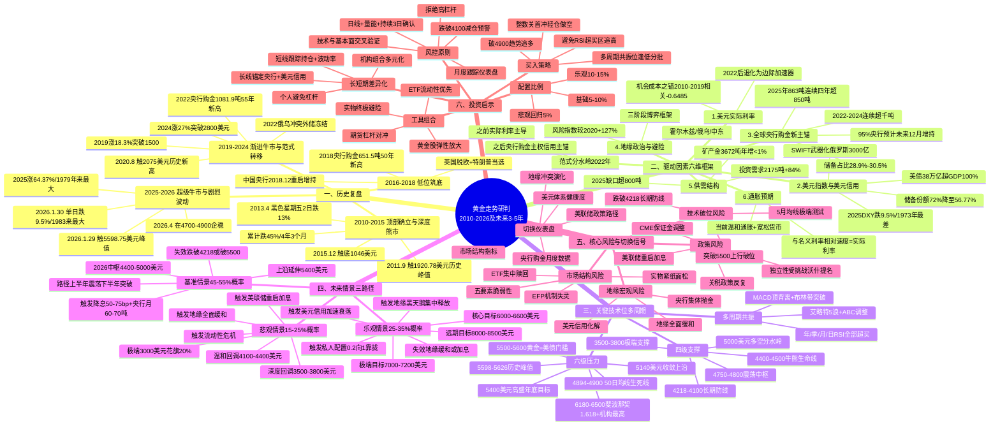

**代码使用提示**：上述代码采用Mermaid 9.x+版本支持的mindmap语法。若读者所用工具版本较旧无法渲染，可访问Mermaid Live Editor（mermaid.live）在线渲染并导出为SVG/PNG格式图片；若需进一步美化，可在线编辑节点颜色、字体与布局后再次导出。

### 8.9.2 专业思维导图工具复刻指南

对于希望进行二次编辑、个性化美化或团队协作的读者，以下指南提供基于本章8.3—8.8节层级结构在四类主流专业工具中复刻可视化思维导图的操作步骤。

**通用导入步骤**：所有专业工具均支持从层级缩进文本快速导入思维导图，核心步骤如下——其一，复制本章8.3—8.8节中各分支的"层级缩进树形文字"内容；其二，在工具中创建空白思维导图，粘贴或导入文本（多数工具支持Tab键缩进自动识别父子节点）；其三，调整布局（辐射状/树形/组织结构）并美化节点。

**工具一：XMind（最广泛使用、跨平台）**。XMind是商业领域使用最广泛的思维导图工具，支持Windows/macOS/Linux/iOS/Android全平台。复刻步骤：①打开XMind新建空白思维导图；②选择"文件→导入→大纲文本（OPML/Markdown）"，将本章树形结构粘贴至大纲编辑器；③选择"思维导图"或"逻辑图"布局；④基于本章六大分支建议的颜色编码（如历史复盘=蓝色、驱动因素=绿色、技术位=紫色、未来情景=橙色、风险=红色、启示=金色）进行配色；⑤导出为PNG/PDF/SVG分享。

**工具二：MindMaster（国产、免费功能完善）**。MindMaster（亿图脑图）适合预算有限的个人用户与教育用途。复刻步骤：①新建思维导图后选择"辐射图"风格；②使用"Markdown导入"功能粘贴本章树形文字；③利用其丰富的图标库为关键节点（如"范式分水岭"、"5598美元峰值"、"史诗级暴跌"）添加视觉强调；④通过"主题大纲"功能切换层级展开/折叠状态。

**工具三：FreeMind（开源免费、轻量）**。FreeMind适合追求轻量与开源精神的技术型用户。复刻步骤：①下载FreeMind开源版；②使用"文件→导入→OPML"导入大纲文本；③使用键盘快捷键（Insert添加子节点、Enter添加同级节点）快速调整结构；④导出为HTML支持网页浏览。

**工具四：幕布（中文用户友好、支持云协作）**。幕布以"大纲优先"理念设计，特别适合从层级文本快速生成思维导图。复刻步骤：①创建新文档后将本章树形文字粘贴至大纲编辑器（自动识别缩进）；②点击"思维导图"模式即时生成可视化图谱；③使用"导出图片"功能分享；④通过"协作"功能与团队成员共同编辑。

### 8.9.3 差异化裁剪建议

不同读者群体对思维导图的使用场景存在显著差异，建议根据自身需求对本章完整结构进行差异化裁剪。

**对机构投资者的建议**：保留全部六大分支，重点强化"驱动因素"与"未来情景"分支的细节展开，将"投资启示"分支扩展为机构内部的差异化策略矩阵（按基金类型、客户风险偏好、监管约束分别细化）；将"核心风险"分支的"情景切换仪表盘"独立成为月度合规跟踪表。

**对个人投资者的建议**：精简"驱动因素"分支至前三大维度（实际利率/美元信用/央行购金），将"关键技术位"分支聚焦于"四级支撑+三级核心压力"，重点保留"投资启示"分支的"配置比例+买入策略+风控原则"三类操作纪律——便于在日常决策中快速参照。

**对研究人员与学术用途的建议**：完整保留全部六大分支与四级节点结构，特别强调"驱动因素"分支的"2022年范式分水岭"标识与"历史复盘"分支的事件—驱动—价格三角对应关系，可作为学术论文或深度报告的研究框架基础。

**对投资顾问与培训用途的建议**：将"未来情景三路径"作为核心讲解主线，配合"关键技术位"分支的支撑/压力清单作为价格坐标，"投资启示"分支作为操作建议——形成"判断—坐标—行动"的客户沟通三步骤。

---

综合本章九节的系统呈现，可以归纳出以下核心结论：

**第一**，本章作为全报告的核心交付物，以"层级缩进树形文字+Mermaid mindmap代码+专业工具复刻指南"三轨制方案完整呈现了一张涵盖"中心主题—六大分支—三至四级子节点"的全景思维导图，每个末端节点均保持"具体、可操作、可量化"的信息颗粒度，完整呼应第1.4节确立的交付方案。

**第二**，思维导图六大分支构成"过去—现在—未来—风险—行动"五位一体闭环——历史复盘提供实证基础，驱动因素六维框架提炼分析方法，关键技术位提供量化坐标，未来情景三路径给出条件依赖型决策树，核心风险揭示边界约束，投资启示回归操作纪律，每个分支既独立成体系又相互交叉印证。

**第三**，思维导图的核心信息压缩可凝练为以下"一句话总览"：**当前黄金处于2022年范式转移后的结构性牛市途中、剧烈波动新常态阶段；六维驱动方向高度一致；4400—5000美元为基准中枢，5598美元为关键压力，4218—4100美元为终极防线；未来3—5年中长期上行、短期高波动并存；投资者应以战略配置思维替代短期投机思维**。

**第四**，本章Mermaid代码可在Typora、Obsidian、VS Code、Mermaid Live Editor等主流工具中直接渲染为可视化思维导图；对于追求个性化美化与团队协作的读者，本章提供了XMind、MindMaster、FreeMind、幕布四类专业工具的差异化复刻指南；对于不同读者群体（机构、个人、研究、培训），本章提供了对应的差异化裁剪建议。

**第五**，本章作为"承前整合、启后导出"的桥梁，向上完整整合了第2—7章的全部核心结论，向下为第9章核心风险揭示与投资策略制定提供了凝练的可视化索引——从下一章开始，本报告将基于本章思维导图所呈现的"风险分支"与"投资启示分支"，进入对投资策略建议、核心风险提示与研究结论展望的最终展开。

# 9 投资策略建议、核心风险提示与研究结论展望

承接第8章对全报告核心交付物——黄金走势全景思维导图——的系统化构建，本章作为整篇报告的收束章节，肩负着将前八章累计20余万字的历史复盘、驱动框架、技术位识别、情景推演与思维导图整合**全面转化为可操作行动指引、系统化风险防御体系与凝练核心结论**的最终使命。这一使命的完成不仅要回答"黄金未来怎么走"的研判问题，更要回答"投资者应当如何应对"的决策问题——这正是用户研究主题中"用思维导图告诉我黄金未来有可能的趋势、关键压力、关键支撑位置"背后所隐含的最深层诉求：研判最终要转化为行动。

本章在全报告结构中承担**"方法论闭环+行动指引+研究外延"三重收束功能**——向上闭环第2—8章构建的完整研究框架，使理论分析得以兑现为实践价值；向中给出投资者可立即执行的差异化策略与风控规则，回应不同投资者群体的多元需求；向外开启后续研究方向的开放性议题，使本报告成为持续生效的方法论起点而非一次性结论。下文将沿"策略框架—长期配置—短期交易—机构差异—政策风险—结构风险—趋势风险—核心结论—未来展望"九节递进展开，每节均严格基于前八章已论证的事实与机构观点，不引入新的方向性预测。

## 9.1 投资策略建议的方法论框架与原则

任何具体的投资策略都必须建立在清晰的方法论原则之上，否则容易陷入"操作零散、纪律错位、情景错配"的执行困境。本节作为投资策略部分的总纲，确立差异化策略制定的四大基础原则，为9.2—9.4节展开的差异化策略提供方法论地基。

**原则一：配置导向原则——黄金作为'战略配置'而非'短期投机'的核心定位。** 这一原则在专业机构层面已形成高度共识。桥水基金创始人达利欧反复强调，黄金应被视为基础货币的一部分，多数投资者当前并未配置足够比例的黄金资产；其建议投资者先确定黄金在组合中的战略配置比例，该比例应落在5%至15%区间内，具体取决于组合内其他资产构成与自身风险偏好，短期战术调整仅为次要考量[^146]。达利欧进一步指出"人们常犯的错误是，他们会想'金价是会涨还是会跌，我应该买吗？'更好的问题应该是，投资者应该在总投资组合中配置多少比例的黄金"[^147]。华安基金许之彦同样明确指出"关键是做好资产配置，控制好自己的风险，在资产组合中配置适当的比例，而不是去All in，不是去加杠杆，不是去承担自己承担不了的风险"[^148]。这一"先比例后择时"的认知顺序，是配置导向原则的核心逻辑——**与其纠结于何时入场、何时离场的择时问题，不如先确立长期持仓比例，再在比例约束下进行节奏优化**。

**原则二：情景依赖原则——配置比例与买入节奏需基于第7章三情景概率分布动态调整。** 这一原则是本报告区别于一般"静态推荐配置比例"建议的核心创新。本报告7.7节构建的情景切换仪表盘表明，金价未来3—5年路径的演化高度依赖于美联储政策、央行购金、美元体系、地缘冲突、市场结构五大类指标的实际表现——任何静态执行的策略都将面临"情景错配"的失效风险。具体地，**基准情景下（概率45%—55%）配置比例锚定5%—10%基础区间，乐观情景下（概率25%—35%）可上调至10%—15%上限，悲观情景下（概率15%—25%）回归5%基础水平甚至更低**——这一动态调整机制使配置策略具备对未来3—5年持续生效的方法论价值。

**原则三：工具适配原则——根据持有期限、流动性需求、风险偏好匹配差异化工具。** 黄金投资工具呈现出显著的多元化分层结构——黄金ETF、实物黄金、银行积存金、纸黄金、黄金期货、黄金股各具优劣特征。黄金ETF适合追求交易便捷、高流动性和低成本、意图紧密跟踪金价进行波段操作或资产配置的投资者；实物黄金适合极度看重资产实际掌控和避险终极保障、能接受低流动性与额外成本的压箱底配置；纸黄金适合习惯在银行系统操作、偏好简单无杠杆且能接受信用风险的投资者[^149]。这种工具的差异化适配，要求投资者首先明确自身的持有期限（日内/月度/年度/多年期）、流动性需求（紧急变现/中长期锁仓）、风险偏好（保守型/平衡型/进取型）三大维度，然后基于维度组合选择最匹配的工具或工具组合。

**原则四：纪律先于预测原则——在高波动新常态下，止损纪律、仓位纪律、确认纪律比方向预测更具决定性。** 这是本节最具方法论价值的原则。第4章的实证已经表明，2025—2026年初黄金市场进入"高波动新常态"——单日跌幅可达9.5%（1983年以来最大）、月度涨幅可超23%（1968年以来仅8次类似情形）、机构预测目标价跨度从3000美元到8500美元达5500美元——在如此高的不确定性环境中，**任何方向性预测的可靠性都会大幅下降，而纪律性的执行框架反而具备更高的实战价值**。世界黄金协会2025年数据显示，无止损策略的投资者爆仓率高达92%[^150]——这一统计直观证明了"纪律先于预测"原则的硬性价值。

**个人投资者与机构投资者的差异化路径分野**：基于上述四大原则，个人投资者与机构投资者在策略制定上呈现出三个核心差异。其一，**研究纵深的差异**——个人投资者难以维持月度跟踪情景切换仪表盘所需的全面研究覆盖，应聚焦于"配置比例+定投纪律+工具优先级"的简化版决策框架；机构投资者则需建立独立的六维驱动监测体系。其二，**工具组合的差异**——个人投资者应优先选择ETF与实物两类低门槛低杠杆工具，避免期货与衍生品；机构投资者可综合运用ETF、实物、期货、衍生品形成完整的对冲与套保链条。其三，**风险承受能力的差异**——个人投资者的家庭金融资产规模有限，黄金配置的"试错空间"较小，必须严守5%—15%的硬性上限；机构投资者基于负债端特性差异化，部分主权基金或保险资金可适度突破常规配置区间。

下文9.2、9.3、9.4三节将分别展开长期配置思维、短期交易纪律与机构差异化策略的具体内容。

## 9.2 长期配置思维：战略仓位、定投纪律与工具选择

长期投资者（持有期>1年）是黄金市场的"压舱石型"参与者，其策略制定的核心是**通过长期穿越短期波动捕捉本轮牛市的结构性收益**。本节系统构建长期投资者的战略配置框架，沿"配置比例—定投纪律—工具选择—心态锚定"四个层面展开。

**配置比例：5%—15%核心区间、中枢8%—9%最佳锚定。** 这一区间得到多家专业机构的高度共识。桥水达利欧建议黄金战略配置比例落在5%—15%区间，具体取决于组合内其他资产构成与自身风险偏好[^146][^147]。华安基金许之彦在2026年1月暴跌后的访谈中明确建议"黄金在组合中的配置比例为5%到15%，中枢约8%—9%，核心是不要把鸡蛋放在一个篮子里"[^148]。嘉实基金张钟玉在贝壳财经会客厅同样表示"建议投资者可以配置5%—15%的避险资产，以搭配股票或其他高风险资产"[^151]。桥水达利欧进一步强调"如果他们的黄金配置低于投资组合的5%，那么答案很可能是否定的——他们的黄金配置不够"[^147]。

基于第7章三情景概率分布的动态调整机制可具体落地为：

| 投资者类型 | 基准情景配置 | 乐观情景配置 | 悲观情景配置 | 调整触发信号 |
|---|---|---|---|---|
| 保守型 | 5%—7% | 7%—10% | 5%（基础下限） | 月度仪表盘+情景概率重估 |
| 平衡型 | 8%—10% | 10%—13% | 5%—7% | 月度仪表盘+情景概率重估 |
| 进取型 | 10%—12% | 12%—15% | 7%—10% | 月度仪表盘+情景概率重估 |

**定投纪律：估值锚定法、智能动态定投、目标止盈法的三大法则应用。** 长期投资者最有效的入场方式是定投而非一次性建仓，定投通过时间分散自动平滑价格波动、降低择时压力。本报告借鉴中国定投领域三大经典方法论：

**第一法则——估值锚定法**。"以市场估值为锚点，在低估值区间加大定投力度，高估值区间逐步止盈"[^152]。在黄金市场的应用是基于第6章多周期技术位识别——**在4750—4800美元基准中枢区间维持基础定投金额、在4400—4500美元牛熊生命线增加定投金额20%—30%、在4218—4100美元长期防线"狙击式"加大定投至基础3倍、在RSI多周期超买区暂停加仓甚至分批止盈**。

**第二法则——智能动态定投**。"通过算法捕捉市场信号，动态调整定投频率和金额，实现'低位多投、高位少投'"[^152]。在黄金市场的应用是基于第7.7节情景切换仪表盘——**当悲观情景概率上升时切换为周定投以捕捉低点、当基准情景维持时恢复月定投、当乐观情景启动时减少加仓比例避免追高**。

**第三法则——目标止盈法**。"设定明确的收益目标，结合时间周期和估值信号，实现利润锁定与风险控制的双重目标"[^152]。在黄金市场的应用需注意黄金作为"战略配置资产"而非"投机标的"的特殊性——**目标止盈应仅针对超出战略仓位的"战术性增持部分"（如乐观情景下增持的5%超额仓位），核心战略仓位（5%—10%基础部分）不应轻易止盈**。

**定投有效性的历史业绩验证**：基于过去十年的实证数据——博时黄金ETF成立至今收益高达191%、年化收益10.28%；国泰黄金ETF收益176%、年化收益8.8%；华安黄金ETF收益180%、年化收益8.99%；过去十年三只黄金ETF的最大回撤均只有20%出头[^153]。国泰黄金ETF（518800）成立以来累计收益274.36%、最近一年涨幅29.81%、跑赢业绩比较基准[^154]。华安黄金ETF（518880）近1年涨30.99%、近3年涨130.44%[^155]。博时黄金ETF（159937）成立以来收益291.27%、近一年涨40.27%[^156]。这些数据共同确认了"10%左右年化+20%左右最大回撤"的风险收益比是国内大类资产中的优秀代表。

需要特别警示的是，这种高年化收益是建立在"近两年是黄金的超级大牛市"基础上的，黄金从来都不是只涨不跌的标的——历史上黄金最长熊市从1980年拖至2007年长达27年；如果在最高点附近买入，1985—2005年黄金可以套20年、2010—2020年黄金可以套10年[^153]。这一历史教训强化了**"长期定投而非一次性梭哈"**的纪律必要性。

**工具选择：四类工具的优劣对比与适配场景。** 长期投资者的工具选择直接影响长期收益的"无形损耗"，需基于交易成本、流动性、保管难度、真实持有四个维度系统评估：

| 工具维度 | 黄金ETF | 实物黄金 | 银行积存金 | 纸黄金 |
|---|---|---|---|---|
| 交易成本 | 最低（管理费0.15%—0.6%/年） | 最高（一买一卖10—30元/克） | 较高（隐性手续费+加工费） | 较高（点差形式） |
| 流动性 | 最佳（T+0交易） | 最差（变现渠道有限） | 较差（赎回非实时） | 较好（银行报价系统） |
| 保管难度 | 无 | 最高（防盗防潮+保险柜） | 无 | 无 |
| 真实持有 | 帮投资者买入实物再拆份额 | 唯一可真实持有 | 仅账面记录 | 银行债权凭证 |
| 杠杆 | 无 | 无 | 无 | 通常无 |
| 适用场景 | 中长期配置主力工具 | 终极避险+传承收藏 | 小额起投积少成多 | 银行渠道试水 |

**国内黄金ETF推荐与对比**：基于流动性、费率、跟踪误差三大维度，华安黄金ETF（518880）国内规模最大、流动性最佳，日均成交额超15亿元，跟踪误差仅0.23%，适合大额资金进出和短期波段交易；易方达黄金ETF（159934）费率最低、综合费率0.2%/年，跟踪误差0.03%，机构持仓占比超60%，适合长期定投和风险偏好低的配置型投资者；华夏黄金ETF（518850）管理费+托管费仅0.15%/年，成本优势显著，适合长期持有追求稳健保值的投资者[^157]。

**实物黄金与积存金的特殊适配**：实物黄金最大的魅力在于"真实持有、无交易对手风险"——黄金拿在自己手里，不依赖银行、券商、平台，极端情况下依然保值——但极度保守、想长期持有5年以上、不频繁买卖的家庭投资者最适合[^158]。银行积存金业务凭借低门槛、灵活便捷的特点，成为普通投资者参与黄金投资的热门选择——多数银行支持1克起投或等值几百元起存，部分可按0.01克递增，适合资金零散、想小额参与黄金投资的工薪族[^159]。工银积存金作为工商银行与世界黄金协会联合推出的全国首款"日均价格、灵活定投"的黄金投资产品，真正实现以日均价格进行黄金积存，从而更有效地为客户平摊投资成本[^160]。但需注意，银行积存金存在隐性成本较高（除手续费外可能有加工费、溢价、不透明买卖价差）、流动性受限（赎回非实时到账+限额管理）、提金限制（库存规格限制）的短板[^159]。

**长期投资者的核心心态——锚定结构性逻辑、穿越短期波动**。基于第5章驱动框架与第3章范式转移分析，长期投资者应将注意力集中于三大不可逆趋势：**其一，央行购金的粘性与可持续性——95%受访央行预计未来12个月继续增持、43%计划主动加大配置、澳新银行预计未来6年保持火爆；其二，美元信用衰落不可逆——38万亿债务、储备份额持续下行、SWIFT武器化反弹、石油美元体系松动；其三，去美元化结构性进程——CIPS覆盖190+国家、新兴市场央行集体行动、全球货币体系事实上多元化重构**。嘉实基金张钟玉精辟总结道："如果投资者将黄金资产作为避险底仓进行配置，就不应该做太短期的买卖决策；底仓比例不宜出现大幅调整"[^151]。华安基金许之彦同样强调"除非全球基本面发生急剧反转，否则黄金的配置逻辑没有发生根本变化，建议投资者忽略短期点位预测，坚守长期配置方向"[^148]。

## 9.3 短期交易思维：关键技术位逆向布局与风控纪律

短期交易者（持有期<3个月）面对的是与长期投资者截然不同的市场——他们需要在高波动新常态下捕捉技术位的反弹机会、规避追高陷阱、严守止损纪律。本节系统构建短期交易者的纪律框架，沿"技术位逆向布局—止损纪律—回避追高—持仓信号—警示性声明"五个层面展开。

**关键技术位逆向布局：基于第6章多周期清单的差异化操作纪律。** 第6章构建的四级支撑（5000/4750—4800/4400—4500/4218—4100）与六级压力（4894—4900/5140/5400/5500—5600/5598/6180+）清单为短期交易者提供了精确的价格坐标。基于这一坐标，可建立以下差异化操作纪律：

| 价位区间 | 操作纪律 | 仓位控制 | 止损位 | 目标位 |
|---|---|---|---|---|
| 整数关首次冲击（5000/6000等） | 轻仓做空快进快出 | <10%试仓 | 整数关上方50美元 | 日内30—50美元快落 |
| 突破4900生死线后趋势确认 | 顺势追多 | 30%—50%基础仓位 | 跌回4850下方 | 5140—5400逐级减仓 |
| 回撤至4441美元黄金分割位 | 逢低分批买入 | 第一档20%、第二档30% | 4400下方 | 4750—4800中枢回归 |
| 跌破4218美元200日均线 | 止损减仓+观望 | 主仓位减至5%基础 | 4100下方加速减仓 | 等待4400重新站稳 |

这些纪律的设计逻辑是——**整数关因"心理整数+斐波那契1.0+空头止损密集带"三重共振具有"假突破"倾向，是短线高赔率交易点；4900生死线的有效突破代表趋势性方向选择，可顺势追多；4441黄金分割位是中期回撤的天然支撑，逢低分批安全边际较高；4218跌破则意味着长期趋势警报，纪律性减仓优先于侥幸观望**。

**止损纪律：基于真实爆仓案例的硬性教训。** 2025—2026年的真实爆仓案例为止损纪律的必要性提供了最具警示意义的实证。

**案例一：水贝老板10倍杠杆爆仓1.2亿元**。2025年4月，水贝商圈一位从业20年的黄金批发商被曝挪用1.2亿下游货款，在黄金期货市场加10倍杠杆豪赌；当时金价从3167美元/盎司跌至2981美元，仅5.9%的回调就让他的账户直接爆仓——这意味着100万本金在杠杆下，连5%的波动都扛不住[^161]。涉事老板通过黄金T+D（保证金仅10%）、期货合约等工具，将本金放大20倍，但杠杆的逻辑就是在放大收益时亏损同样呈几何级数增长，金价如果回调5%即吞噬全部保证金，这种"悬崖边的舞蹈"注定难以善终[^162]。

**案例二：月薪3000元何米60万本金一日爆仓**。月薪3000元投资者何米，借贷60万元（含信用卡、网贷）满仓黄金期货，10倍杠杆下持仓达600万元；2025年4月23日金价单日暴跌3.45%，账户直接爆仓，单日亏损相当于6年工资[^150]。

**案例三：贷款炒金李女士三天亏掉两个月工资**。在深圳工作的李女士10月21日发现自己在某银行的黄金积存账户此前一个月积累的丰厚收益几乎已经"回吐"殆尽；由于设置了自动委托加单，接连触发新买入的黄金在短时间内就出现了每克10元到30元不等的浮亏；更让李女士焦虑的是，她投入黄金市场的资金并非闲置储蓄，而是来自两笔消费贷款；仅前三天她就亏了约3万元，相当于两个月的工资[^163]。

**案例四：山东五金店主王伟110万贷款清明假期亏4万**。山东五金店主王伟贷款110万元在736元/克高位买入黄金，仅清明假期期间就因金价暴跌亏损超4万元[^164]。

这些案例呈现出**"10倍杠杆下5%波动即爆仓"的硬性数学规律**——爆仓临界点 = 1 ÷ 杠杆倍数（例：10倍杠杆，金价跌10%爆仓；20倍杠杆，跌5%即血本无归）[^161]。世界黄金协会2025报告显示，杠杆投资者的爆仓率是无杠杆的15倍，且82%的爆仓发生在首次使用杠杆的3个月内[^161]。基于这些教训，本报告对短期交易者的硬性要求是——**所有杠杆≤2倍且预留追保空间、主动远离期货及场外非法平台、绝对禁止使用网贷或信用卡资金购金**[^150][^165]。

**回避追高：多周期RSI共振超买与拥挤交易信号。** 短期交易者最容易踏入的陷阱是在"市场最热闹时入场"——这恰恰是经验丰富的交易员最警惕的时刻。第4.3节已系统揭示2026年1月顶部前的四重警示信号——**RSI长期维持90以上、价格偏离20日均线超11%、净多头集中度达"全球最拥挤交易"、机构与散户认知裂口扩大（机构在5500美元上方主动减仓20%）**——这些信号出现时短期交易者应坚决回避追高，反而可考虑轻仓试空。

**许之彦的关键观察直接验证了这一纪律的价值**：暴跌当天个人客户确实非常恐慌——存在追涨杀跌的倾向；而真正管钱的资管机构则相对冷静，不会因为黄金中短期的急剧波动就冲进来；从公开数据看，机构客户反而在增加持仓[^148]。这一"散户追高、机构冷静"的行为差异，是短期交易者必须警觉的"反向指标"。

**CFTC持仓数据与期权波动率作为短期拐点信号。** 短期交易者的拐点判断不能仅依赖价格图表，更应纳入持仓结构与情绪指标的交叉验证。CFTC持仓报告的核心指标是非商业净多头头寸——当非商业净多头处于历史高位时，意味着投机情绪过度乐观，资金后续推升动力不足，金价往往面临回调压力；反之，当净多头处于历史低位或净空头大幅增加时，市场处于过度悲观状态，可能孕育反弹机会[^166]。截至9月30日当周CFTC数据显示，投机者所持COMEX黄金净多头头寸减少9305手合约至149311手合约，这一变化反映出投机者对短期金价走势的谨慎态度[^167]。

实战中需注意，持仓数据属于滞后指标，反映的是过去一周的资金布局，不能作为单一交易依据，应结合宏观基本面消息（如美联储利率决议、通胀数据）进行综合验证[^166]。期权波动率（如VIX、黄金ETF波动率）则提供了情绪极端的实时信号——截至2026年1月29日黄金ETF波动率攀升至46.02、接近2020年疫情时的极值48.98——当波动率快速攀升至历史极值时往往是阶段性顶部预警，当波动率回落至年内低位时则可能酝酿新一轮趋势性行情。

**警示性声明：短期择时对绝大多数投资者困难。** 本节最重要的警示来自华安基金许之彦的直接表态："短期的择时交易对绝大多数投资者来说是比较困难的"[^148]——这一声明并非否定短期交易的价值，而是诚实揭示其专业门槛。许之彦同时建议普通投资者的黄金配置策略"排除一切带杠杆、带保证金的产品，重点关注黄金ETF，因其具备税收优势、成本低、流动性好等特点"[^148]。基于这一专业判断，本报告对个人投资者的最终建议是——**短期交易思维应作为长期配置思维的"辅助工具"而非"主要工具"，仅在已确立5%—15%战略仓位的基础上，使用不超过总仓位20%的"战术性子账户"进行短期交易尝试**。

## 9.4 机构投资者的差异化策略与组合管理

机构投资者（保险资金、主权基金、对冲基金、公募基金、资管产品）面对的是与个人投资者不同的决策环境——他们有明确的负债端要求、严格的合规约束、专业的研究团队与复杂的工具组合能力。本节针对机构投资者的特殊性需求，构建差异化策略矩阵。

**配置思维差异：组合多元化与相关性管理。** 机构投资者的核心配置思维不是单一资产的"涨跌预测"，而是基于"组合多元化+相关性管理+负债端匹配"的整体优化。张钟玉精辟指出"多元化的资产配置是投资中唯一的免费午餐"——投资者一定要拓宽投资组合的边界，除了黄金资产，还可以通过基金等工具配置股票、债券甚至海外资产，这种方法理论上可以提高投资组合的风险收益比[^151]。张钟玉同时强调黄金作为避险资产，本应在投资组合中起到降低波动的作用——一旦黄金波动加大，相较其他大类资产的波动性明显提升，投资组合中的黄金资产配置比例就会降低；但波动率下降后，黄金又会回流到投资组合中[^151]。

黄金在组合中的"和事佬"功能可通过历史数据具体验证——过去十年黄金ETF与标普500、沪深300走势对比显示，不论是美股还是A股，黄金在阶段性上都与股市有明显负相关关系[^153]。这种低相关性正是黄金作为组合多元化工具的核心价值。

**达利欧全天候策略的经典配置参考。** 机构投资者最具方法论价值的参考是达利欧全天候策略——针对美国市场给出的经典配置比例为30%股票（如标普500）+ 55%债券（以长期国债为主）+ 15%黄金/大宗商品；对于国内投资者，这个比例可以适当调整，比如提高国债比例至55%、黄金占比至10%，更贴合A股市场的波动特点[^168]。这一策略的核心理念是"风险平价而非资金平价"——调整各类资产的权重，让每类资产对整个组合的风险贡献均等，而不是简单按资金比例分配[^168]。基于这一理念，达利欧将经济组合成"经济增长超预期/低于预期 × 通胀超预期/低于预期"四种季节，每类季节分配25%的风险权重——通胀超预期（通胀上行期）由大宗商品、黄金、通胀保值债券发力[^168]。这一方法论为机构投资者提供了将黄金纳入系统性资产配置框架的标准范式。

**工具组合复杂化：实物+ETF+期货+衍生品的综合运用。** 机构投资者的工具能力远超个人——可同时持有实物黄金作为终极储备、黄金ETF作为流动性管理、黄金期货作为套保对冲、衍生品作为结构化产品载体，形成完整的"现货—期货—期权—结构化产品"链条。这种综合运用要求机构同步管理三类风险：**保证金充足管理**（CME保证金调整风险、跨期套利保证金）、**对手方风险评估**（场外衍生品交易对手信用、银行黄金租赁对手方）、**流动性管理**（极端行情下的市场深度、买卖价差扩大风险）。

**机构资金的独立判断与逆周期配置思维。** 第4章已系统呈现2026年1月暴跌期间个人客户与机构客户的行为差异——这一差异本身就是机构投资者最具价值的认知优势。许之彦的关键观察："世界黄金协会公布的2025年全年供需报告显示，黄金ETF的需求创造了多年来的历史新高，去年增长了800吨；近一个月来，特别是在金价大幅波动和下跌期间，以华安黄金ETF为代表的国内ETF都在大幅增仓；虽然前期有少量减仓，但随后加仓更多，截至目前，我们的持仓量已创下113吨的历史新高"[^148]。最新数据显示，截至4月7日华安黄金ETF（518880）近5日获资金净流入超25亿元，最新规模1138.16亿元[^155][^169]。这种"散户恐慌、机构冷静"的对比印证了机构资金的逆周期配置思维——机构买黄金的核心动机是"储备多元化、降低对美元信用的依赖"而非短期价格博弈，机构一旦买入不会因为金价回调5%就止损，这种"粘性需求"给黄金市场提供了天然底部[^148]。

**监管合规与适当性管理的应对。** 机构投资者面临的监管约束在2025—2026年呈现出新的演化方向。保险资金黄金投资试点政策——国家金融监督管理总局允许10家大型险企开展黄金投资试点，预计将为市场带来近2000亿元增量资金；与此同时，全球最大黄金ETF——SPDR Gold Shares持仓量已突破1200吨，较年初增加15%[^170]。期货市场投资者适当性管理新规对50万以下资产投资者的准入约束，进一步强化了机构与散户的分层结构[^161]。机构投资者需密切跟踪政策变化，及时调整投资策略与产品设计。

**机构投资者的研究纵深要求：建立独立监测体系。** 机构投资者的核心竞争优势在于研究纵深——基于WGC月度数据、CFTC持仓报告、IMF储备份额、地缘风险指数等多元数据源进行月度调仓评估。具体的研究架构应包含三层：

**第一层：六维驱动框架的定量监测**——基于第5章六维驱动框架，对每一维度建立量化跟踪指标（实际利率TIPS收益率、美元指数DXY、央行月度购金WGC数据、地缘风险指数、供需缺口测算、通胀预期5年期盈亏平衡通胀率），形成月度变化追踪报告。

**第二层：情景切换仪表盘的实时跟踪**——基于第7.7节五大类高频指标（美联储政策路径、央行购金月度数据、美元体系健康度、地缘冲突演化、市场结构指标），建立可视化仪表盘，触发任何"乐观切换阈值"或"悲观切换阈值"时立即启动情景概率重估流程。

**第三层：机构内部决策机制的对接**——将六维框架与情景切换仪表盘的输出对接到机构的资产配置委员会、风险管理委员会、合规审查委员会的月度/季度决策流程中，确保研究成果能够实质性地影响配置决策与风控参数。

## 9.5 政策风险：美联储路径反复与特朗普政策不确定性

承接第5章六维驱动框架与第7章情景切换仪表盘的方法论基础，本节系统揭示2026—2028年黄金市场面临的政策维度核心风险。这一类风险的特点是**高频可观察、对短期方向影响极大、与情景切换直接相关**——投资者必须建立持续跟踪机制以应对政策路径的反复。

**风险一：美联储政策路径反复。** 这是政策风险中最核心的变量。2026年3月美联储已将全年降息预期从3次缩减至1次、利率互换市场定价仅12bp、年内降息1次概率不足50%[^171][^166]——这一变化已直接影响金价走势。鲍威尔在3月议息会议提到"下一步可能加息的讨论已被提及"，被市场解读为鹰派转向——若这一鹰派路径延续，金价将面临持续的实际利率压制。美联储的货币政策一直是影响黄金价格的重要因素，近期美联储表示将逐步缩减量化宽松政策，并可能在未来几年内加息，这一政策调整预期导致美元走强，从而对黄金价格形成压力，投资者担心黄金价格下跌因此选择赎回黄金ETF[^172]。这种政策预期的反复直接传导至市场资金流向。

**应对预案**：投资者应建立美联储议息会议表态、点阵图变化、CME利率期货定价的月度跟踪机制。**关键监测阈值**——当全年降息次数预期从3次降至2次时为基准情景内的温和扰动；当降至1次或归零时进入悲观情景预警；当出现"重启加息"明确表态时触发悲观情景切换。

**风险二：美联储独立性受挑战。** 这是2026年新增的特殊风险。沃什提名先例（2026年1月29日）已直接触发1月30日单日暴跌9.5%——沃什"2006年就当过美联储理事，历史上一直反对央行印钱买债刺激经济，是个有名的'鹰派'，曾公开批评量化宽松政策、主张美联储与财政部强化协作"。这一提名引发的政策预期反转直接体现为美元指数应声暴涨0.93%、10年期美债收益率飙升18个基点。特朗普频频对美联储施压并被报道考虑提前宣布接替鲍威尔的美联储主席人选，市场担忧"影子美联储主席"将动摇投资者对美联储独立性的信心——这种制度性信任的潜在动摇本身已成为新的不确定性来源。

**应对预案**：投资者应密切跟踪美联储主席接班人提名进展、美联储官员鹰鸽派表态变化、特朗普对美联储独立性的言论。**关键监测信号**——任何鹰派候选人的实质性提名进展都应触发短期减仓预警；新主席上任后的首次议息会议表态需重点关注。

**风险三：特朗普关税政策反复。** 2026年1月27日特朗普称"我可以让它（美元汇率）像溜溜球一样上下波动"引发市场对美国政府可能操纵汇率的担忧；次日财政部长贝森特重申"强势美元"政策，矛盾表态进一步加剧市场疑虑、引发新一轮抛售潮。美国贸易代表贾米森·格里尔在墨西哥城会见汽车和钢铁行业代表时明确表示，关税政策"不会消失"，特朗普总统"喜欢关税"，全球不会回归零关税时代[^173]。这种**关税政策不可预测性本身已成为新的避险驱动**——但其作用方向是双向的：一方面强化"政策不确定性=避险需求"逻辑利好黄金，另一方面"关税推动通胀+美联储紧缩"逻辑利空黄金，最终方向取决于哪一逻辑占主导。

**应对预案**：投资者应跟踪关税政策落地节奏（5月25日美墨加协定审查启动、7月1日审查完成）、特朗普推特/演讲表态的频率与方向、美元指数对政策表态的即时反应。**关键监测维度**——当关税政策推动通胀预期反弹至3%以上时切换至悲观情景预警；当关税政策引发美元信用进一步衰落时强化乐观情景概率。

**风险四：CME保证金政策调整。** 这是政策风险中最直接、最可量化的风险。1月30日先例显示——CME对纽约商品交易所黄金和白银期货的保证金要求全面上调：黄金期货非高风险账户保证金从6%提高至8%、高风险账户从6.6%升至8.8%；白银期货非高风险账户保证金从11%上调至15%、高风险账户从12.1%增至16.5%——"这一调整直接增加了高杠杆交易者的资金压力，部分杠杆比例高达5—10倍的投资者面临追加保证金的要求，无法及时补仓的投资者被迫平仓，引发连锁反应"。**历史上每一轮金属市场的疯狂阶段，交易所提高保证金都是一个高度有效的"降温阀门"**（参见第2.2节2011年顶部确立的样本）。

**应对预案**：投资者应跟踪CME每日的保证金公告、上海黄金交易所合约保证金调整动态。**关键操作纪律**——当CME保证金水平进一步上调（如从8%升至10%）时立即降低杠杆使用比例；当看到"上海黄金交易所将白银合约保证金从20%上调至26%、扩大涨跌停板至25%"等组合性调整时进入流动性危机预警状态[^165]。

**针对三情景的政策风险应对预案矩阵**：

| 情景 | 政策风险关注重点 | 配置调整动作 | 监测频率 |
|---|---|---|---|
| 基准情景 | 议息会议表态、点阵图微调 | 维持基础配置、月度跟踪 | 月度 |
| 乐观情景 | 通胀反弹超预期、美联储被迫紧缩 | 在5500美元以上分批止盈战术仓位 | 周度 |
| 悲观情景 | 重启加息明确信号、保证金大幅上调 | 紧急减仓至基础配置5%以下 | 实时 |

## 9.6 市场结构风险：杠杆踩踏、ETF集中赎回与流动性危机

市场结构风险是相对于政策风险更具"现代金融市场特殊性"的一类风险——它不源于宏观面变化，而源于微观结构的脆弱性。本节系统揭示这一类风险的具体表现、传导机制与应对路径。

**风险一：杠杆踩踏的真实爆仓案例与硬性数学规律。** 第9.3节已经系统呈现2025—2026年的真实爆仓案例。本节进一步从市场层面归纳杠杆踩踏的传导机制：

**深圳水贝市场的产业链式风险传导**——2024年水贝市场已有商家因挪用客户资金炒黄金期货，导致2亿元资金损失，最终携款潜逃[^162]。水贝市场盛行的黄金"对赌盘"和灰色操作，更加速了崩盘——部分商家以低于上海金交所的价格吸引客户，实则通过期货市场对冲风险；当现货与期货价差拉大时，这种"刀尖舔血"的模式立刻反噬投资人[^162]。据2024年水贝商会内部报告（非公开），35%的中小商家通过"借货代销"模式滚动占用下游资金，形成"体外资金池"用于杠杆投机[^161]。这种产业链式的杠杆嵌套使得局部爆仓可能引发整个行业的连锁反应。

**对冲基金定向收割现象**——2025年3月，华尔街基金提前布局天量黄金空单，利用散户追涨情绪反手做空；全球多头单日爆仓50亿美元，手法与2020年"原油宝"事件高度相似[^150]。这一现象揭示了散户在专业机构面前的信息劣势与操作劣势。

**应对纪律**：基于第9.3节的硬性数学规律——爆仓临界点 = 1 ÷ 杠杆倍数——本节进一步给出更加细化的杠杆使用规则：**普通个人投资者杠杆≤1（即不使用杠杆）；进阶个人投资者杠杆≤2倍且预留至少20%备用金；专业交易者杠杆≤5倍并设置自动止损线**[^161]。**家庭资产层面的硬性约束**：资金不超总资产5%；月入2万家庭杠杆资金不超过2万（即家庭月收入的1倍）[^161]。

**风险二：ETF集中赎回的踩踏链条。** ETF作为黄金市场最重要的资金通道之一，其集中赎回会产生显著的价格冲击。2013年4月样本——SPDR Gold Trust在2013年单年减持约38%的持仓，单月抛售量高达200吨，仅在4月12日至15日的短暂窗口内便有约230亿美元资金从黄金ETF撤离——这一历史样本展示了机构集中获利了结的踩踏威力。2026年4月15日近期信号——前海开源黄金ETF（159812）遭净赎回906.23万元、嘉实上海金ETF（159831）净赎回917.89万元、南方上海金ETF（159834）净赎回527.14万元——多只黄金ETF同步出现资金流出[^172]，背后原因是"经济复苏预期、美联储政策调整、地缘政治风险降低、技术性调整"四重因素共同作用[^172]。

**应对纪律**：投资者应建立ETF资金流向的周度跟踪机制——**关键监测指标**：单日净赎回占规模比超过1%时为异常信号、连续3周净赎回时进入悲观情景预警、SPDR持仓水平回落至年内低位时关注是否触发系统性减持。**值得欣慰的反向信号**：第4章引用的中国黄金ETF华夏（518850）截至4月22日已连续17个交易日净流入合计11.49亿元、华安黄金ETF（518880）近5日资金净流入超25亿元——这些数据显示在当前阶段中国境内ETF资金流向仍呈净流入状态，与海外ETF的部分流出形成对比。

**风险三：流动性危机的五要素结构性脆弱性。** 第5.10节已系统提炼了流动性危机的五要素结构——**前期拥挤交易+技术超买+政策预期转向+保证金/流动性管控催化+程序化交易/算法同步放大**——这一结构在每次暴跌中重演，是现代金融市场的"结构常量"。

**2025年3月EFP风暴样本**——国际金价在短短一周内暴跌超15%；EFP合约的成本从平时的0.5美元/盎司飙升至12美元，交易商不得不支付天价费用才能完成实物交割；纽约和伦敦的黄金租赁利率一周内暴涨300%，市场甚至出现"负库存"现象——这是50年一遇的挤兑事件。

**2026年1月30日"半小时300亿抛单"样本**——亚盘时段的流动性薄弱使得买盘稀缺，市场陷入"下跌→止损→再下跌"的死亡循环，半小时内超过300亿美元的抛单砸盘，让黄金市场彻底失控。

**交易所应对路径**：上海黄金交易所设定"单边市触发条件"——仅当出现连续涨跌停时启动保证金上调，未触发则维持原规则，避免政策过度干预；涨跌停板与保证金联动调整——同步扩大价格波动容忍空间（如上金所白银涨跌停板从19%调至25%），为价格释放压力提供通道，降低强制平仓风险[^165]。银行端去杠杆化——国有大行将个人贵金属延期合约保证金比例上调至100%，实质取消杠杆交易；13家银行逐步关停代理上金所延期合约交易，引导资金转向实物金条、积存金、黄金ETF等低风险工具[^165]。银行紧急收紧黄金投资——工行暂停信用卡购买金条，建行将黄金T+D保证金比例上调至15%；中国银行、广发银行等机构明确禁止信用卡资金流入黄金市场，部分投资者甚至面临封卡、征信污点等连锁反应[^174][^164]。

**风险四：'实物紧、纸面松'结构性矛盾的边际定价机制。** 第4.5节已系统论证这一矛盾——总量池38.2万亿美元（≈美债存量）vs 流量池800吨/年结构性缺口；70%交易仍依赖伦敦场外、缺乏透明监管；纽约期金市场的投机头寸占比高达80%、实物交割能力严重不足；美联储的黄金库存中至少有30%属于"租赁状态"，而德国央行此前要求运回海外黄金时竟被告知需要排队7年。这种"纸面定价主导短期波动"的格局决定了高波动新常态的微观基础——**长期方向由央行配置与去美元化结构性需求决定，但短期波动由纸面市场的杠杆资金、期权对冲与程序化交易主导**。

**风险五：监管层面的系统性应对路径。** 监管层面的应对路径呈现出"动态保证金调整+平准基金机制+做市商制度+银行去杠杆化"的多维组合。避免流动性危机重现的核心是平衡"抑制投机"与"维护市场活力"——动态规则设计、投资者适性管理、低杠杆工具替代三者结合，方能在波动中筑牢防线，推动贵金属市场从"杠杆驱动"转向"价值驱动"[^165]。长期市场健康化路径——重塑黄金定位：弱化其短期投机属性，强化央行购金、资产配置"压舱石"功能；科技赋能风控：利用AI模型监测持仓集中度与杠杆率，预判流动性风险点，实现精准调控[^165]。

**针对个人投资者的核心警示**：基于上述五个层面的市场结构风险，本节对个人投资者给出三条硬性纪律——**第一，拒绝一切高杠杆产品（包括期货、保证金交易、配资等），优先选择ETF与实物等无杠杆工具；第二，配置比例不超总资产15%、严守桥水达利欧、华安许之彦的5%—15%专业共识区间；第三，避免使用网贷或信用卡资金购金**——70%爆雷平台使用"央企背书""高息托管"话术，"假冒银行、交易所的APP以'低保证金高回报'诱骗投资者"[^150]。

## 9.7 趋势反转风险：地缘缓和、美元强势回归与央行购金放缓

如果说政策风险与市场结构风险主要是短期高频风险，那么趋势反转风险则是低频但具有颠覆性的长期风险——它关注的是"本轮结构性牛市能否被推翻"这一根本性问题。本节系统揭示三大可能颠覆当前判断的趋势反转风险。

**风险一：地缘冲突全面缓和。** 这一风险若实质性触发，将削弱避险溢价的持续注入，对乐观情景构成重大反向打击。2026年4月美伊和谈进展——美伊停火协议将于华盛顿时间周三晚间到期，美国总统特朗普表示副总统万斯已准备启程巴基斯坦参与第二轮谈判，并可能由贾里德·库什纳和特使史蒂夫·威特科夫陪同；特朗普在最新访谈中强调不会仓促达成坏协议，且美国对伊朗港口的封锁将持续至协议签署[^173]。这一进展直接导致现货黄金下跌0.7%至4785美元/盎司附近，美国黄金期货6月合约下滑0.5%至4803.60美元/盎司[^173]——展示了地缘缓和对金价的直接负面影响。

**渣打银行的极端预测**——"Fed不放水或地缘缓和可能跌到2600—2800美元"——这一情景本质上是"地缘缓和+美联储紧缩"两大风险叠加的极端情形，虽然概率较低但需作为悲观情景的尾部风险纳入考量。

**反向论证的可信度——多线冲突同步缓和的概率较低**：地缘冲突全面缓和需要俄乌+中东+美委等多条战线同步停火，这在当前国际格局下概率较低。地缘风险指数较2020年飙升127%、2026年是地缘政治风险的"质变年"[^175]——这一基础底色使全面缓和的概率显著低于25%。

**风险二：美元强势回归。** 若美国经济超预期复苏、美联储重启加息预期推动DXY突破110并维持，将对金价构成持续压制。**历史样本类比——2014—2015年美元指数从78.93反弹至接近100点、区间涨幅超25%、金价从1300跌至1046（跌幅25%）**（参见第2.3节）——这一类比表明美元强势可以独立驱动金价深度回调。

**当前状态——美元指数95.57处于四年低点**[^176]——距离110临界值仍有约15%的反弹空间。但需注意，近期美元指数的部分技术反弹——"目前国际贸易仍以美元计价居多。SWIFT数据显示，截至2025年底美元在国际贸易结算中占比约51%创下新高"[^176]——表明美元的"贸易货币地位"仍较稳固，与"储备货币地位衰落"形成结构性分化。

**应对纪律**：投资者应跟踪DXY的周线收盘水平、52周波动区间（当前95.55—101.98）、技术指标（投资网技术总结显示当前美元指数处于"强力卖出"状态[^176]）。**关键监测阈值**——DXY突破98并维持4周为温和反弹；突破100—102为中性回弹；突破110并维持3个月为悲观情景关键触发信号。

**风险三：央行购金放缓与边际转弱。** 这是三大趋势反转风险中最具结构性意义的——若央行购金这一"新定价主锚"出现实质性转向，将动摇本轮牛市的核心逻辑。2026年1月WGC数据显示——全球央行的黄金购买势头在2026年初有所放缓，1月全球央行的净购买总量为5吨，仅为2025年平均月需求量的不到20%[^171]。这一断点变化是本节最关键的警示信号。

**新增的卖家信号**：
- 波兰央行行长亚当·格拉平斯基3月4日向总统提出方案，拟通过出售部分黄金储备筹集约480亿兹罗提（约合130亿美元）用于国防开支，之后再买回黄金[^171]——波兰曾是2024—2025年连续两年全球最大黄金买家，其转向具有重要意义；
- 俄罗斯央行是2026年1月最大的净卖家，卖出9吨黄金——俄罗斯曾是全球最大的主权黄金买家，2002—2025年净购入超过1900吨[^171]；
- 哈萨克斯坦和吉尔吉斯共和国2026年1月减少黄金储备各1吨[^171]；
- 土耳其传抛售50吨黄金——但瑞银强烈警告投资者"不要对这些头条新闻信以为真。土耳其在将黄金作为政策工具方面具有独特性。自2011年引入准备金期权机制（ROM）以来，土耳其央行报告的部分总黄金持有量实际上代表了国内商业银行的头寸。此外，部分报告的抛售量似乎是掉期交易，而非直接抛售"[^177]。

**瑞银"回调即战略建仓机会"的反向论证**：尽管出现上述卖家信号，瑞银明确指出"官方部门出现结构性转变的可能性极小。瑞银预计，央行购金量只会逐渐放缓，预计今年的购买量将在800至850吨之间，略低于2025年的约860吨。在过去十五年的黄金储备积累过程中，个别央行在某个月份出现抛售是正常现象。这可能是为了在极具吸引力的入场水平上进行战术性获利了结，或者是由于金价上涨触发的投资组合再平衡"[^177]。**世界银行《2025年第五次双年度储备管理调查报告》（涵盖136家机构）数据揭示了央行管理黄金的真实逻辑**——大多数央行决定黄金持有量是基于"历史遗留考虑"（约47%）和"定性评估"（约26%），高达约62%的央行采取"买入并持有"策略，最关键的是只有约4.5%的央行表示会对黄金储备进行短期战术调整；在2024年报告黄金储备变化的央行中，超过一半表示"多元化"是增加持仓的最强驱动力[^177]。胡捷分析认为"对于部分国家而言，通过黄金买卖操作获取外汇收益，可成为政策考量之一；在金价高企的背景下，当前适当减持可视为一种基于市场波动的技术性调整：高位卖出、低位补回"[^171]。芦哲从长期角度看待黄金"金融属性"——预计新美联储主席沃什上台后仍将降息推动黄金价格继续走高；从黄金"货币属性"看，美元信用的裂痕带来的"去美元化"促使全球央行减少外汇储备中的美债，不断提高黄金的比例，这一整体趋势仍未改变[^171]。

**针对三种反转风险的可证伪信号体系**：基于第7.7节情景切换仪表盘的五大类指标，本节给出**组合性反转判别规则——只有当"连续3个月WGC月度购金<50吨 + DXY突破110并维持3个月 + 地缘冲突点同步停火（俄乌停火+美伊达成协议）"三大信号同步触发时，才需将悲观情景概率上调至40%以上、考虑实质性减仓**。这一组合性规则的严格性源于第5.11节论证的"单一信号触发不构成熊市启动"原则。

**新兴风险因素的早期监测**：除上述三大主要趋势反转风险外，本节进一步识别需要持续观察的新兴风险因素——

**第一，稳定币与数字货币对黄金避险属性的潜在替代**：USDT/USDC市值持续膨胀、CBDC央行数字货币推进、比特币"数字黄金"叙事的真伪辨析。达利欧的核心判断——"黄金与比特币的比拼有一个明确的赢家——黄金。比特币在其持仓中占比可能仅有1%。各国央行永远不会像对待黄金那样去购买或持有比特币。比特币的交易方式更像是风险资产，而非对冲工具。当投资者面临压力时，他们很可能会抛售比特币并转而持有黄金"[^147]——这一判断为黄金vs数字货币的长期比较提供了权威参照。

**第二，深海采矿技术突破对黄金供给端的颠覆性冲击**：全球已探明可供开采储量只剩5.2万吨，按每年3600吨的开采量算，大约15年就能把现有探明储量挖光[^148]——深海采矿等新技术的成熟可能颠覆这一供给约束。

**第三，Z世代投资者偏好转移**：年轻一代对黄金传统价值认知与父辈的差异、加密资产/科技股偏好的潜在挑战、黄金消费场景的代际更迭，这些都是长期不可忽视的结构性变量。

## 9.8 研究核心结论的系统凝练

作为全报告的理论收束，本节将20余万字的研究结论凝练为五条核心论断，每条论断均直接对应用户研究主题中"分析2010年至今的黄金走势、关键压力、关键支撑位置、未来可能趋势"的核心问题。

**结论一：2010—2025年黄金价格中枢持续上移，本轮牛市本质是全球货币体系重构与美元信用衰落背景下的价值重估，而非单纯的避险冲动或通胀对冲。**

这一结论的核心证据是制度层面的不可逆变化——**38万亿美债与38.2万亿黄金市值的历史性对标**（2025年首次实现，自20世纪80年代以来首次发生）、**美元在全球外汇储备中份额从2001年的72%降至2025年Q2的56.32%**、**CIPS覆盖190+国家、人民币跨境交易对SWIFT依赖降至30%**、**2026年3月沙特对华石油人民币结算41%首次单月超美元**、**俄罗斯对华出口油气人民币结算占比超90%**——这些证据共同指向一个结论：黄金价格中枢的持续上移不是周期性现象，而是全球货币体系正在事实上多元化重构的金融映射。世界黄金协会发布的《黄金市场基础报告》指出，全世界所有的黄金如果融在一起，能装进一个边长22.5米的立方体，市值高达31万亿美元，与美国2025年GDP约30万亿美元基本相当[^178]——黄金价格中枢的抬升使其总市值已实质性地与美国年度GDP总量、美债存量形成历史性对标，标志着黄金作为"全球价值锚"的地位重新确立。

**结论二：定价驱动逻辑已从'实际利率主导'实质性切换至'央行购金+主权信用对冲双轮主锚'，2022年俄乌冲突与外储冻结事件是范式转移的引爆点。**

这一结论的核心证据是2022年前后驱动结构的清晰断点——**2010—2019年TIPS与金价相关系数-0.6485（强负相关）→2022年起负相关关系背离**；**2010—2021年央行年均购金473吨→2022—2024连续三年超千吨→2025年863吨连续四年超850吨**；**全球央行黄金储备占总储备比重从2015年10.2%升至2025Q3的28.9%、2026年1月进一步升至30.5%**；**95%受访央行预计未来12个月继续增持、43%计划主动加大配置**——这些证据共同确认了实际利率退化为边际加速器、央行购金跃升为新主锚的范式迁移。**长江商学院欧阳辉教授的核心判断——"黄金的角色正从一种金融投资品，重新回归为战略性的货币锚与地缘政治风险对冲工具，标志着全球正步入一个'去美元化'的多元储备时代"**——这一论断为范式转移提供了最具学术权威性的注脚。

**结论三：未来3—5年黄金长期趋势仍向上但短期高波动将成为常态——基准、乐观、悲观三情景共同特征是中枢上移而非趋势反转。**

基于第7章三情景推演的最终凝练——**基准情景45%—55%概率对应4400—5000美元中枢、上沿延伸至5400美元；乐观情景25%—35%概率指向核心目标6000—6600美元、极端目标7000—7200美元、远期目标8000—8500美元；悲观情景15%—25%概率回踩4400—4500美元温和回调或3500—3800美元深度回调**。三情景的共同特征是**"中枢上移而非趋势反转"——即使悲观情景的深度回调目标（3500—3800美元）也远高于2024年末的2625美元起点**，这一事实本身就是结构性牛市未结束的最直接证据。世界黄金协会2026年展望明确——"投资需求、央行购金和黄金回收可以提供额外支撑"且"在市场持续波动的情况下，黄金作为投资组合多元化工具和稳定性来源的作用仍然至关重要"，其报告核心判断指向"净持仓将大幅上升"——这一权威判断与本报告三情景的方向性结论高度一致。

**结论四：关键支撑位集中于4000—4400美元区间（200日均线4218+前期密集成交区+0.382—0.5黄金分割位），关键压力位集中于5000—5500美元区间（心理整数+斐波那契1.0—1.382扩展位+黄金市值=美债存量门槛），突破方向取决于美联储政策路径与地缘走势。**

这一结论作为用户研究主题中"关键压力、关键支撑位置"问题的最直接回答，可进一步系统化为以下精确价位：

| 价位类别 | 精确价位 | 形成逻辑 | 突破/跌破含义 |
|---|---|---|---|
| 终极支撑 | 3500—3800美元 | 5月均线长周期慢牛趋势线 | 长期牛市终结判定 |
| 长期支撑 | 4218—4100美元 | 200日均线+3月低点+心理极限 | 跌破需三大极端条件（概率<5%） |
| 中期支撑 | 4400—4500美元 | 20日均线+周线趋势线+50%黄金分割 | 牛熊生命线、双向博弈 |
| 短期支撑 | 4750—4800美元 | 暴跌后企稳震荡中枢 | 基准情景核心 |
| **多空分水岭** | **5000美元** | **心理整数+斐波那契1.0+空头止损带** | **跌破触发短期抛压、企稳即多头未改** |
| 短期压力 | 4894—4900美元 | 50日均线+生死线 | 站稳即冲击5100—5600 |
| 中期压力 | 5400—5500美元 | 高盛年底目标+斐波那契1.382+黄金市值=美债 | 主流机构中性预期上沿 |
| 历史峰值 | 5598—5626美元 | 2026年1月29日波浪5浪初步顶部 | 突破即进入5浪延长 |
| 长期阻力 | 6180—6500美元 | 斐波那契1.618+机构最高目标 | 核心乐观情景目标达成 |
| 极端目标 | 7000—8500美元 | 多机构远期目标 | 极端乐观情景达成 |

**突破方向的判定**：基于第5章六维框架与第7.7节情景切换仪表盘——**当美联储重启降息+央行购金延续+地缘冲突维持/升级三方向共振时，金价倾向于向上突破压力区间；当美联储意外紧缩+央行购金边际转弱+地缘冲突意外缓和三方向共振时，金价倾向于向下跌破支撑区间**。

**结论五：投资者需以战略配置思维替代短期投机思维——5%—15%战略仓位、定投平滑成本、ETF/实物为主、拒绝高杠杆、月度跟踪情景切换仪表盘、长短期投资者差异化路径，是穿越本轮高波动新常态的核心方法论。**

这一结论作为全报告的"行动收束"，将前述四条理论性结论转化为可立即执行的投资纪律。桥水达利欧的核心判断——"我认为，每个人的个人投资组合中都应该有5%到15%的黄金。在灾难发生时，黄金能起到分散风险的作用。当其他资产表现不佳时，黄金的表现反而会很好。人们应该担忧、企业应该担忧、国家也应该担忧：他们手里的黄金足够多吗？"[^147]——这一发问直击本轮范式转移背景下投资者最该关注的核心问题。许之彦的总结——"黄金新周期将持续，战略与配置并重；除非全球基本面发生急剧反转，否则黄金的配置逻辑没有发生根本变化，建议投资者忽略短期点位预测，坚守长期配置方向"[^148]——为方法论的最终落地提供了最朴实而有力的注脚。

## 9.9 持续观察变量与未来研究方向展望

作为全报告的开放性收束，本节识别需要持续观察的关键变量并展望后续可深入研究的方向，使本研究成果不成为静态预测，而具备动态生效的方法论价值。

**需要持续跟踪的关键变量**——基于第7.7节情景切换仪表盘的五大类指标，本节给出可持续操作的月度跟踪清单：

**第一，美联储2026—2028年政策路径与新主席沃什上任后的实际操作**——重点关注鹰派表态与现实约束的博弈。沃什作为提名人在听证会上强调"将致力于保持货币政策严格独立性"[^173]，但其历史鹰派记录与特朗普的关税政策可能形成内在张力。监测重点是**实际操作层面的降息节奏（与点阵图预期的偏离度）、对资产负债表政策的表态（缩表vs扩表）、对通胀目标的弹性（是否调整2%目标）**。

**第二，全球央行月度购金数据**——这是本报告最关键的单一指标。**世界黄金协会每月发布的《Gold Demand Trends》月报**是权威数据源，需关注**月度净购金量、主要买家与卖家的国别分布、购金动机调查（多元化/对冲/价格管理）**。**关键警讯阈值——连续3个月WGC月度购金<50吨**。

**第三，美元在全球外汇储备中份额演变**——**IMF每季度发布的COFER报告**是权威数据源。**关键监测阈值——55%（向下突破即美元信用加速衰落）/ 60%（向上回归即美元信用恢复）**。

**第四，地缘冲突点同步缓和或升级动态**——重点关注**美伊和谈进展（2026年4月正在进行）、俄乌停火可能性、霍尔木兹海峡通航状态、台海局势演化、美委对峙升级**。

**第五，CFTC净持仓拐点与ETF资金流向**——美国商品期货交易委员会每周五发布的《Commitments of Traders》报告[^166]，重点监测**非商业净多头百分位（与历史五年区间比较）、商业持仓者套保比例变化、报告与非报告持仓者结构**。

**第六，CME保证金政策调整频次**——直接观察CME每日公告。**关键操作节点——任何保证金水平的实质性变化（如从8%上调至10%）都应立即触发杠杆使用比例的调整**。

**后续可深入研究的方向**：

**方向一：稳定币与数字货币对黄金的潜在替代效应**。这是数字资产时代最具结构性意义的研究议题。**核心研究问题包括**：USDT/USDC等稳定币市值持续膨胀对黄金作为"价值储藏工具"功能的潜在挑战；CBDC（央行数字货币）推进进程及其与黄金作为"无主权信用风险终极资产"的竞争关系；比特币"数字黄金"叙事的真伪辨析（达利欧已明确否定[^147]）；数字资产能否替代黄金的"无主权信用风险终极价值载体"功能。这一方向的研究价值在于回答"黄金作为终极避险资产的地位是否会被数字资产部分替代"这一根本性问题。

**方向二：新兴市场央行购金的可持续性边界**。**核心研究问题包括**：中国央行2306吨储备占比的天花板（与美国8133吨、德国3352吨等发达经济体相比的合理目标值）；新兴市场央行外储多元化的极限边界（黄金占外储30%是否为长期均衡水平）；非西方央行集体购金行动是否会随地缘格局演化而分化（如中俄关系变化、印度独立外交、土耳其的政策反复）；新兴市场央行的购金资金来源约束（贸易顺差萎缩、本币贬值压力、外汇储备总量下降）。这一方向的研究将为本轮牛市的"持续时间"提供更精确的判断依据。

**方向三：黄金供给端的长期变量**。**核心研究问题包括**：深海采矿技术突破对刚性供给的颠覆（一旦突破将彻底改变供需缺口格局）；矿产金品位下降与开采成本上升（南非、澳大利亚等主要产金国的资源禀赋恶化）；再生金供给的弹性极限（全球地上黄金存量约219890吨[^178]，理论上可大量回收但实际受惜售情绪约束）；新兴产金国（如俄罗斯、加纳、墨西哥）的产能扩张潜力。

**方向四：黄金与其他贵金属的比价关系演化**。**核心研究问题包括**：黄金/白银比价的均值回归规律（当前金银比维持中位、未来回归至45以下还是扩大至100以上）；铂金、钯金的工业属性主导vs金融属性回归；**白银的工业需求与黄金的货币需求差异**——许之彦明确指出"黄金的货币属性要远高于白银，白银90%以上用于工业用途，工业需求不可能一年爆发几倍，这有内在规律，因此不建议投资者过度参与白银，如果一定要参与，不要带杠杆，干脆买点白银实物"[^148]。这一方向的研究将为大类资产配置提供更精细的工具选择依据。

**方向五：AI与算法交易对黄金市场微观结构的深远影响**。**核心研究问题包括**：程序化交易同步性放大对暴跌幅度的影响（2013年4月10分钟内逾1000家机构同步交易、2026年1月30日半小时300亿美元抛单都印证了这一机制）；伽马对冲机械链条对加速冲顶的推动（2026年1月看涨期权创历史新高的伽马对冲正反馈）；波动率传染机制对跨市场风险的扩散（黄金ETF波动率飙升至46.02接近2020疫情极值）；高频交易在流动性危机中的作用（提供流动性vs加剧流动性枯竭）。

**研究的元层级反思**：作为全报告的最终收束，本研究框架的可证伪性与可外推性需要持续检验。**第一，关键假设的检验路径**——本报告核心假设（央行购金粘性、美元信用衰落不可逆、范式转移已完成）的检验依赖于未来1—3年的实际数据，每一个假设都对应着第7.7节仪表盘中的可观察指标。**第二，未来五年定期更新的必要性**——本报告基于截至2026年4月可得数据构建，建议每12—18个月进行一次全面更新，重点更新驱动框架权重（六维之间的相对地位）、技术位坐标（随价格演化动态调整）、情景概率分布（基于实际指标变化重估）、机构预测分布（跟踪机构观点的修正）。**第三，方法论迭代的开放性**——本报告构建的"六维框架+情景推演+技术位识别+情景切换仪表盘+思维导图全景整合"五位一体方法论框架，本身具备可外推至其他大类资产研究的潜力（如美元、原油、股指等），未来可基于本框架开发标准化的资产研究模板。

---

综合本章九节的系统论证，可以得出以下基础性结论作为全报告的最终收束：

**第一**，本章构建的"长期配置思维+短期交易思维+机构差异化策略"三轨投资策略框架，基于桥水达利欧、华安许之彦、嘉实张钟玉的多方专业共识，确立了**5%—15%战略配置区间、中枢8%—9%、定投平滑成本、ETF/实物为主、拒绝高杠杆**的核心纪律，与第7章三情景动态调整机制相呼应，构成完整的可立即执行的投资行动指引。

**第二**，本章揭示的"政策风险+市场结构风险+趋势反转风险"三大类核心风险体系，基于2025—2026年真实爆仓案例、流动性危机样本与央行购金边际变化数据，构建了**针对三情景的差异化应对预案矩阵**，使风险管理从抽象的概念升级为可操作的纪律体系。

**第三**，本章凝练的五条核心结论——**中枢持续上移、范式转移完成、长期向上短期高波动、关键支撑4000—4400/关键压力5000—5500、战略配置思维替代投机思维**——直接、完整、精确地回答了用户研究主题中"分析2010年至今的黄金走势、关键压力、关键支撑位置、未来可能趋势"的核心问题。

**第四**，本章展望的五大未来研究方向——**数字货币替代效应、新兴市场央行购金可持续性、黄金供给端长期变量、贵金属比价关系、AI算法对市场微观结构的影响**——为后续研究开启了开放性议题，使本报告成为持续生效的方法论起点而非一次性结论。

**第五**，回归用户研究主题的最初设问——"通过思维导图视角对2010至今走势复盘与未来趋势研判"——本报告通过第8章思维导图全景整合与本章核心结论凝练，最终给出的答案是：**当前黄金正处于2022年范式转移完成后的结构性牛市中段，央行购金+主权信用对冲已取代实际利率成为定价主锚，未来3—5年中长期方向向上但短期高波动新常态将持续，投资者应以战略配置思维（5%—15%仓位+定投+ETF/实物+拒绝高杠杆+月度跟踪情景切换仪表盘）穿越本轮历史性的全球货币体系重构与美元信用衰落进程**。

至此，本报告完整闭环了"研究背景与方法论确立—2010—2026年完整周期复盘—六维驱动框架与牛熊判别构建—多周期技术位体系识别—基准/乐观/悲观三情景推演—思维导图全景整合—投资策略与风险揭示"九大章节的系统化论证，为用户呈现了一份**全面、详尽、严谨、有深度、有洞察、可操作**的黄金走势深度研究报告。

# 参考内容如下：
[^1]:[金价突破 4300 美元,美联储降息 + 央行购金加持,2011 年历史重演实锤?](https://baijiahao.baidu.com/s?id=1850534340429194571&wfr=spider&for=pc)
[^2]:[回顾金融危机后6年时间线 QE到底对黄金做了什么?(图)](https://finance.ifeng.com/a/20141030/13233106_0.shtml)
[^3]:[#黄金# 整理了一下历次美联储QE时期黄金市... 来自经伟论 - 微博](https://weibo.com/6060379290/IyR43Eioh)
[^4]:[2011年黄金赛过CPI 年累计收益率约13%](http://jingji.cntv.cn/20111231/106644.shtml?ptag=vsogou)
[^5]:[黄金黑天鹅预警!单日跌幅6.3%,下周或重现2013年暴跌?](https://baijiahao.baidu.com/s?id=1846957341421027342&wfr=spider&for=pc)
[^6]:[金银史诗级暴跌再度上演 历史周期揭示多重投资密码](http://finance.cnr.cn/ycbd/20260131/t20260131_527512146.shtml)
[^7]:[浩博居士:美联储12月加息“板上钉钉”,美元和黄金陷入恐慌! ](https://caifuhao.eastmoney.com/news/20171005221850185031790)
[^8]:[金价的底在哪里?我把过去二十年复盘了三遍](https://baijiahao.baidu.com/s?id=1857000661422340813&wfr=spider&for=pc)
[^9]:[黄金又㕛叒叕大跌!一文盘点40年来,黄金的那些熊市!](https://baijiahao.baidu.com/s?id=1860503805108835351&wfr=spider&for=pc)
[^10]:[果然财评|金价屡创新高时,更需回望那些熊市刻下的投资警示](https://baijiahao.baidu.com/s?id=1845940703577427863&wfr=spider&for=pc)
[^11]:[2015黄金投资市场预览:充满变数和机会的一年](http://istock.ifeng.com/13443029/news.shtml)
[^12]:[金价或现2015年行情!需做好准备](https://baijiahao.baidu.com/s?id=1861548757498305835&wfr=spider&for=pc)
[^13]:[2013黄金暴跌启示录 作为珠宝...@是金探啊的动态](http://mbd.baidu.com/newspage/data/dtlandingsuper?nid=dt_5419885004834580003)
[^14]:[还记得2013年“中国大妈大战华尔街”的黄金投资事件吗](https://xueqiu.com/2963680835/335509791)
[^15]:[黄金在2013年4月为什么会崩溃? ](https://mp.weixin.qq.com/s?__biz=MjM5MDU3NDQ2MA==&mid=200327322&idx=1&sn=03869eae088342bd018b5b0cb7bb9740&chksm=2846d2891f315b9f9cc20c7c03d892c2d408e854a4491ee500f3118f9e749140768f023e8d9b&scene=27)
[^16]:[黄金“大劫”案谁是真凶? 黑天鹅还是大阴谋](http://ku.m.chinanews.com/wapapp/cns/null/zw/4750896.shtml?target=_self)
[^17]:[2013年4月黄金t+d暴跌原因](https://www.cngold.org/gold_td/know/1738333.html)
[^18]:[英国脱欧公投当日的黄金期货价格表现分析](https://www.zhiguf.com/questions_detail/9482469)
[^19]:[在2016年11月9日,特朗普当选美国总统的那一天,全球金融市场,尤其是黄金市场_财富号_东方财富网](https://caifuhao.eastmoney.com/news/20241111224214449619280)
[^20]:[四年前的疯狂行情重演?2016年大选之夜黄金火箭般飙升 短短几小时巨震10%](http://gold.cnfol.com/jinshizhibo/20201104/28501251.shtml)
[^21]:[疯狂黄金!十年涨3倍,从走势图复盘金价上升之路 ](https://news.sohu.com/a/985793903_161795)
[^22]:[4张图看完黄金2016全年走势 ](https://www.sohu.com/a/123829104_468253)
[^23]:[疯狂黄金!十年涨3倍,从走势图复盘金价上升之路](https://baijiahao.baidu.com/s?id=1856712870481540172&wfr=spider&for=pc)
[^24]:[从走势图复盘金价“疯狂”路:十年猛涨3倍 去年53次刷新纪录](https://browser.qq.com/mobile/news?doc_id=952698d0c1506252)
[^25]:[50年罕见!各国央行抢购,开启买买买新模式](https://cj.sina.com.cn/articles/view/5924489444/1612088e400100emqe)
[^26]:[全球央行买黄金:官方黄金储备暴增7成 创有史以来第二高](https://www.nbd.com.cn/rss/zaker/articles/1297145.html)
[^27]:[全球央行进入囤金时代](http://k.sina.com.cn/article_7857201856_1d45362c001904pu6a.html)
[^28]:[2019年金价预计有望走高回升](https://baijiahao.baidu.com/s?id=1629035886280336537&wfr=spider&for=pc)
[^29]:[美联储议息在即:黄金有望挑战1500美元](https://www.163.com/dy/article/ELE9G3H205199NPP.html)
[^30]:[中信建投证券六大团队解读人民币汇率“破7”](http://baijiahao.baidu.com/s?id=1641076497279655184&wfr=spider&for=pc)
[^31]:[央行买黄金不停!连续9个月增持耗资346亿元,全球央行都在买,今年已买超400吨](http://baijiahao.baidu.com/s?id=1644174747482400027&wfr=spider&for=pc)
[^32]:[干货!世界黄金协会年报:需求轻微下降,供应小幅上升!背后原因揭秘!](https://baijiahao.baidu.com/s?id=1657228092124128751&wfr=spider&for=pc)
[^33]:[2019年全球黄金需求微降:金价上涨推低消费者需求量 抵消黄金ETF流入量](https://baijiahao.baidu.com/s?id=1657680594315607702&wfr=spider&for=pc)
[^34]:[2019年全球黄金需求微降1% 金价上涨推低消费者需求量](http://baijiahao.baidu.com/s?id=1657678010666308466&wfr=spider&for=pc)
[^35]:[9月我国外储规模较年初上升0.6% 央行连续10个月增持黄金](https://www.nbd.com.cn/rss/toutiao/articles/1376416.html)
[^36]:[中国黄金协会:我国黄金储备连续10个月增持](https://m.bjnews.com.cn/detail/157049571515746.html)
[^37]:[【财经数据】中国黄金储备结束十连增](https://m.jiemian.com/article/3660140.html)
[^38]:[能否举例说明历史上黄金在极端市场中的表现?](https://baijiahao.baidu.com/s?id=1856426741757899901&wfr=spider&for=pc)
[^39]:[疫情期间黄金涨跌](https://xueqiu.com/8374394984/380763452)
[^40]:[货币海啸割裂全球经济周期,至暗时刻何时过去? ](https://t.10jqka.com.cn/pid_244857364.shtml)
[^41]:[货币海啸割裂全球经济周期,至暗时刻何时过去? ](https://www.sohu.com/a/592119522_561871)
[^42]:[黄金上涨与俄罗斯资产冻结:关联与央行购金趋势分析](https://xueqiu.com/4528136165/379704436)
[^43]:[全球央行连续15年净购入黄金,如何重塑国际储备格局!中国外储优化:四年购金超350吨,官方黄金储备约2306.32吨](https://baijiahao.baidu.com/s?id=1854986067686819655&wfr=spider&for=pc)
[^44]:[美债突破39万亿!全球央行正疯狂运回黄金,去美元化势不可挡](https://www.163.com/dy/article/KRDF4GG805566SHJ.html)
[^45]:[全球央行抢金潮,如何重塑国际储备格局](https://baijiahao.baidu.com/s?id=1854923659297856629&wfr=spider&for=pc)
[^46]:[欧阳辉——黄金定价之锚的迁移:从实际利率到央行购金](https://www.ckgsb.edu.cn/about/article_detail/157/25141.html)
[^47]:[欧阳辉——黄金定价之锚的迁移:从实际利率到央行购金](https://www.ckgsb.edu.cn/about/article_detail/157/25141)
[^48]:[金价“狂飙”突破2000美元大关!上金所提示市场风险 ](https://m.gmw.cn/2023-03/21/content_1303315364.htm)
[^49]:[20230321—银行破产危机全球蔓延 黄金冲上2000美元大关](https://www.boc.cn/fimarkets/fm7/202303/t20230321_22754429.html)
[^50]:[国际期货黄金年末再站上2000美元/盎司 2024年如何走?](https://baijiahao.baidu.com/s?id=1786494497425627953&wfr=spider&for=pc)
[^51]:[2025年多次刷新历史纪录,金价将走向何方?](https://www.peopleapp.com/column/30051183681-500007300596)
[^52]:[黄金两年内价格走势分析](http://mbd.baidu.com/newspage/data/dtlandingsuper?nid=dt_4124761466622052935)
[^53]:[2024黄金市场高开高走,国际金价年内涨近27%](https://m.yicai.com/news/102415502.html)
[^54]:[世界黄金协会:各国央行连续第三年购买超过1000吨黄金](https://baijiahao.baidu.com/s?id=1823264438424288094&wfr=spider&for=pc)
[^55]:[美国实际利率与金价关系探究](https://finance.eastmoney.com/a/201909101233162347.html)
[^56]:[2019,黄金将再度崛起](https://xueqiu.com/1007490408/123748472)
[^57]:[全球央行“换仓”:黄金归位,美元退潮](https://baijiahao.baidu.com/s?id=1848126416829485995&wfr=spider&for=pc)
[^58]:[国际货币体系向均衡多元演进](http://k.sina.com.cn/article_7857201856_1d45362c001904l1ck.html)
[^59]:[俄黄金储备首破3000亿美元,全球第五!去美元化再下一城](https://baijiahao.baidu.com/s?id=1851095865996040357&wfr=spider&for=pc)
[^60]:[金价重回四千四百美元关口 预计后市高位震荡](http://k.sina.com.cn/article_7857201856_1d45362c001904pbdw.html)
[^61]:[2025年多次刷新历史纪录,金价将走向何方?](https://baijiahao.baidu.com/s?id=1853909084091685124&wfr=spider&for=pc)
[^62]:[金价暴跌,但瑞士银行却上调了2026金价目标,背后就是押宝美债困境](https://baijiahao.baidu.com/s?id=1856023885175558184&wfr=spider&for=pc)
[^63]:[黄金的价值升维:国际储备格局重塑下的核心锚定|国际](https://www.163.com/dy/article/KP4G899C0530P452.html)
[^64]:[黄金交易提醒:暴跌10%后迎来“超级周”,金价还能重回巅峰吗?](https://baijiahao.baidu.com/s?id=1855969451246954551&wfr=spider&for=pc)
[^65]:[金银暴跌只是开始?单日暴跌10%!警惕5000美元下的暗涌:去美元化与AI争矿时代的财富重构危机](https://baijiahao.baidu.com/s?id=1855842769091787727&wfr=spider&for=pc)
[^66]:[2025年黄金价格将突破1600元/克](http://mbd.baidu.com/newspage/data/dtlandingsuper?nid=dt_4196628604578978398)
[^67]:[高盛:2025年金价有望达到3000美元](https://baijiahao.baidu.com/s?id=1819842925234272391&wfr=spider&for=pc)
[^68]:[2025 年黄金新高——特朗普交易之新逻辑](https://baijiahao.baidu.com/s?id=1824909634524059525&wfr=spider&for=pc)
[^69]:[黄金一路狂飙至4000?后市如何看?](https://finance.sina.cn/fund/jjgdxw/2025-10-15/detail-inftyfep3551184.d.html)
[^70]:[黄金EFP价差飙升,原因几何,后市如何?](https://baijiahao.baidu.com/s?id=1821777831287146741&wfr=spider&for=pc)
[^71]:[黄金:要大涨?国际投行发话,新高只是开始,或冲5000美元](https://baijiahao.baidu.com/s?id=1845145994326757269&wfr=spider&for=pc)
[^72]:[黄金牛市能持续多久? ](https://caifuhao.eastmoney.com/news/20250415154514228997380)
[^73]:[特朗普变身,美元信用崩塌!金价冲破天花板!普通人要做好心理准备](https://baijiahao.baidu.com/s?id=1857874944633730086&wfr=spider&for=pc)
[^74]:[“去美元化”是狼来了吗?](https://baijiahao.baidu.com/s?id=1863157870503150699&wfr=spider&for=pc)
[^75]:[黄金一夜急跌10%!多重因素引发市场巨震,作为投资者,我们应该如何应对当前局面?](https://baijiahao.baidu.com/s?id=1855787854872587296&wfr=spider&for=pc)
[^76]:[央行购金构筑长期价值锚点,黄金ETF易方达(159934)年内净流入近60亿元](https://baijiahao.baidu.com/s?id=1863229436590762312&wfr=spider&for=pc)
[^77]:[华西证券:2025年黄金需求同比增加8%至4999.4吨 投资需求同比增加84%至2175.3吨](https://stock.10jqka.com.cn/20260202/c674471918.shtml)
[^78]:[央行购金构筑长期价值锚点,黄金ETF易方达(159934)年内净流入近60亿元](https://baijiahao.baidu.com/s?id=1863229216544554902&wfr=spider&for=pc)
[^79]:[央行疯狂扫货,美债收益率躺平:当下黄金ETF还能不能买?](https://baijiahao.baidu.com/s?id=1863183365506587901&wfr=spider&for=pc)
[^80]:[金价冲高回落!COMEX黄金跌22.6美元,4600美元关口稳得住吗](https://baijiahao.baidu.com/s?id=1854725974942864904&wfr=spider&for=pc)
[^81]:[高盛:大跌后仍看好,黄金年底5400美元/盎司目标价不变](https://baijiahao.baidu.com/s?id=1861985757044200559&wfr=spider&for=pc)
[^82]:[变局前夜:盘面视角看黄金](https://www.163.com/dy/article/KR3RG94S05568W0A.html)
[^83]:[芝商所紧急“刹车”!黄金白银保...@豌豆看世界的动态](http://mbd.baidu.com/newspage/data/dtlandingsuper?nid=dt_5682689410897746296)
[^84]:[期货市场保证金上调,是如何引发黄金的流动性踩踏的? ](https://k.sina.cn/article_7879922977_1d5ae152106801de9m.html)
[^85]:[黄金结构性缺口持续扩大,供不应求成主基调 ](https://news.sohu.com/a/981347544_121123890)
[^86]:[“黄金风暴”席卷全球!50年一遇的挤兑事件,EFP机制成关键指标](https://baijiahao.baidu.com/s?id=1825953783940595832&wfr=spider&for=pc)
[^87]:[机构预测2026年底前金价将升至5900-6200美元区间](https://baijiahao.baidu.com/s?id=1859880849955257165&wfr=spider&for=pc)
[^88]:[背离避险逻辑!黄金单日跌幅超8%,黄金和有色还能拿吗?](https://baijiahao.baidu.com/s?id=1860592222837411975&wfr=spider&for=pc)
[^89]:[黄金急跌是幌子?瑞银反而上调2026金价预期,背后押注的是美债危机](https://baijiahao.baidu.com/s?id=1856522640358253598&wfr=spider&for=pc)
[^90]:[世界黄金协会:财政担忧是否推高了金价?](https://baijiahao.baidu.com/s?id=1838958647888666692&wfr=spider&for=pc)
[^91]:[国际货币体系向均衡多元演进](https://baijiahao.baidu.com/s?id=1862488687787879232&wfr=spider&for=pc)
[^92]:[中金黄金-深度报告](https://www.xueqiu.com/5533510525/383481873)
[^93]:[美元武器化](https://baike.baidu.com/item/美元武器化/67415734)
[^94]:[金融制裁与数字货币竞争:币缘政治视角下国际货币体系的重构](https://baijiahao.baidu.com/s?id=1862332953868598342&wfr=spider&for=pc)
[^95]:[全球央行竞购,黄金储备新高 ](https://business.sohu.com/a/977608735_115571)
[^96]:[截至2025年11月 全球央行净购金297吨](https://www.gold.org.cn/sc1227/dzsp/202601/t20260121_200517.html)
[^97]:[2025年全球黄金需求突破5000吨,投资狂潮席卷全球](https://finance.huanqiu.com/article/4QFU3UUVZF7)
[^98]:[金价回落引发央行“抄底”潮!波兰等国3月继续增持,这国却抛售69.1吨](https://baijiahao.baidu.com/s?id=1862038965061370416&wfr=spider&for=pc)
[^99]:[黄金突破4000美元!历史性暴涨背后的真相与警示](https://baijiahao.baidu.com/s?id=1846220993303124836&wfr=spider&for=pc)
[^100]:[中国央行已连续15个月购买黄金!分析师:未来6年内央行购买量保持“火爆”](http://gold.cnfol.com/jinshizhibo/20240308/30644858.shtml)
[^101]:[霍尔木兹海峡的警报——黄金何去何从?](https://baijiahao.baidu.com/s?id=1861132989055271663&wfr=spider&for=pc)
[^102]:[黄金持续上涨的底层逻辑:供需、战争与政策的三重共振](https://baijiahao.baidu.com/s?id=1861590066608055333&wfr=spider&for=pc)
[^103]:[中东战火外溢对金价走势的影响](https://baijiahao.baidu.com/s?id=1862672540582382405&wfr=spider&for=pc)
[^104]:[中东地缘冲突升级金价大跌,黄金牛市走到头了?](https://baijiahao.baidu.com/s?id=1861891627723620370&wfr=spider&for=pc)
[^105]:[以下为2018—2025年全球黄金产量(单位:吨),数据来自世界黄金协会(WGC)官方统计。](https://xueqiu.com/1290568231/378634031)
[^106]:[世界黄金协会:2024年全球黄金需求创新高](https://baijiahao.baidu.com/s?id=1823225597488588758&wfr=spider&for=pc)
[^107]:[根据世界黄金协会(WGC)2024年的数据,黄金的工业用途(科技用金)每年用量约_沪银(fshfeagm)股吧_东方财富网股吧](https://guba.eastmoney.com/news_futures,fshfeagm,1696810136.html)
[^108]:[美国通胀的成色与资产含义](https://baijiahao.baidu.com/s?id=1757788254209138865&wfr=spider&for=pc)
[^109]:[以史为鉴:70年代的黄金牛市是如何开始、如何结束的](https://www.cls.cn/detail/2341263)
[^110]:[黄金往事 1980年:那场套牢一代人的疯... 来自俄罗斯什么值得买 - 微博](https://weibo.com/1652184490/Qxh7Bok23)
[^111]:[黄金熊市20年](https://xueqiu.com/9910647611/374272062)
[^112]:[黄金历史上5次大暴跌!背后4大规律总结!](http://xueqiu.com/6874240607/374284265)
[^113]:[#从历史看黄金的牛熊周期有多长#](https://weibo.com/1465160942/QaqSacj6G)
[^114]:[八年暴涨275%!黄金突破4900美元,谁在悄悄囤金?](https://xueqiu.com/6325165556/373175986)
[^115]:[美联储宣布降息!金价大跌](https://baijiahao.baidu.com/s?id=1843587227168670762&wfr=spider&for=pc)
[^116]:[黄金暴跌前从不打招呼!6个致命信号已出现,历史4次崩盘血的教训](https://baijiahao.baidu.com/s?id=1859193047453768865&wfr=spider&for=pc)
[^117]:[历史上黄金价格显著下跌的几个关键时间段及其主要原因 ](http://gubaf10.eastmoney.com/news,forpmxau,1541418080.html)
[^118]:[2026 黄金白银关键阻力位与技术研判](https://xueqiu.com/3793457379/384941189)
[^119]:[如果金价回调,关键的支撑位大概在什么价格区间? ](https://k.sina.cn/article_7879922977_1d5ae152106801dink.html)
[^120]:[“5000美元”被视为纽约黄金(COMEX)重要关口,主要基于心理整数效应+技术斐波那契扩展+空头止损密集区三重共振;部分交易员选择在此“第一次冲击”时做空,逻辑是预期短线超买、多头拥挤、整数磁铁后的快速回落,而非趋势逆转。具体理由如下:](https://xueqiu.com/6428234949/372591087)
[^121]:[波浪理论是什么?艾略特五浪理论完整解说与数浪实例教学](https://zlglobal.htsc.com.hk/zl/zh-hans/course/elliott-wave-beginner.html)
[^122]:[艾略特波浪理论大级别五浪驱动主升走势 ](https://caifuhao.eastmoney.com/news/20260131094154137299650)
[^123]:[变局前夜:盘面视角看黄金](http://finance.sina.com.cn/wm/2026-04-22/doc-inhvinun9554313.shtml)
[^124]:[2025收官之战,黄金即将深度回调 ](https://caifuhao.eastmoney.com/news/20251229155005091829020)
[^125]:[黄金价格20年走势与驱动因素](http://mbd.baidu.com/newspage/data/dtlandingsuper?nid=dt_4761180567881469926)
[^126]:[分析师看金价 | 金价能否筑底反弹?](https://mp.weixin.qq.com/s?__biz=MjM5MDU3NDQ2MA==&mid=2651321462&idx=1&sn=4bd58d7d632547be1777527d0b43e82d&chksm=bc0e53db0a76b8fdc470611f613a1b6137b35826ad52113b1f30f5e2bed22cc0c33688e1d44c&scene=27)
[^127]:[中东局势长期延续对黄金而言确实是中长期的助涨因素,黄金价格在2026年底有望达到6000-6300美元/盎司的区间,甚至可能挑战更高水平。](https://xueqiu.com/1165976883/377944121)
[^128]:[2026年4月20日黄金行情分析-基本面:利多因素-降息预期支撑:美联储6月降息 ](http://gubaf10.eastmoney.com/news,ufcomexgc00y,1696096419.html)
[^129]:[2026年黄金价格预测盘点 ◆ ...@金算战甲的动态](http://mbd.baidu.com/newspage/data/dtlandingsuper?nid=dt_4745826914749992508)
[^130]:[渣打预测2026下半年金价上涨,三季度均价直指每盎司4850美元](https://baijiahao.baidu.com/s?id=1863062899570200110&wfr=spider&for=pc)
[^131]:[美国银行预测:2026春季金价将飙至6000美元!金价再创新高](https://news.china.com/socialgd/10000169/20260126/49196218_all.html)
[^132]:[美联储年内“三次降息”落幕 哪些变量决定金价走势?](https://baijiahao.baidu.com/s?id=1851962759049280502&wfr=spider&for=pc)
[^133]:[世界黄金协会2026年展望:三大情景决定金价走向,净持仓将大幅上升](https://baijiahao.baidu.com/s?id=1850636363694706311&wfr=spider&for=pc)
[^134]:[中信证券:中性假设下,模型预期2026年底国际金价有望超过5100美元/盎司](https://stock.10jqka.com.cn/20260105/c673735809.shtml)
[^135]:[华尔街分析师2026年金价预测情况](https://baijiahao.baidu.com/s?id=1854637354267594667&wfr=spider&for=pc)
[^136]:[高盛上调预测:将2026年底金价从4900美元上调之至5400美元,更有机构喊8000美元](https://xueqiu.com/7689703369/372723206)
[^137]:[最新华尔街黄金价格预期汇总:“忘记5000美元”、应作为核心持仓](https://baijiahao.baidu.com/s?id=1855558715900816082&wfr=spider&for=pc)
[^138]:[中信证券:流动性宽松预期下金价有望延续涨势 2026年或冲击5000美元/盎司](https://www.yicai.com/news/102975653.html)
[^139]:[高盛预测黄金冲击6100美元的具体条件是什么?](https://cj.sina.com.cn/articles/view/7879922977/1d5ae152106801e46i)
[^140]:[摩根大通等机构预测金价将涨到6000美元以上,这种乐观判断依据是什么?](http://k.sina.com.cn/article_7879922977_1d5ae152106801di1i.html)
[^141]:[2026年黄金价格走势预测:多空博弈下的结构性机遇与风险_央行_预期](https://news.sohu.com/a/1006192499_121854018)
[^142]:[黄金价格见顶了吗?——2026年黄金走势研判与投资指南](https://baijiahao.baidu.com/s?id=1861972558889744918&wfr=spider&for=pc)
[^143]:[Commodity Markets](https://www.worldbank.org/en/research/commodity-markets)
[^144]:[「中东惊雷」停火到期前夜!美军舰强闯海峡,伊朗革命卫队实弹待命,谁在下一盘大棋?](https://baijiahao.baidu.com/s?id=1863403291671848070&wfr=spider&for=pc)
[^145]:[一、本轮金银牛市目标价(截至2026.1.26,机构一致预期)](https://xueqiu.com/3158063747/373086316)
[^146]:[桥水达里奥警告经济存显著风险 建议黄金战略配置占比5%-15%](https://baijiahao.baidu.com/s?id=1855545489668512050&wfr=spider&for=pc)
[^147]:[桥水创始人再次力挺黄金:所有人都应配置至少5%的黄金](https://baijiahao.baidu.com/s?id=1858800849442354750&wfr=spider&for=pc)
[^148]:[华安基金许之彦:黄金新周期延续,资产配置比例5%-15%为宜_腾讯新闻](https://new.qq.com/rain/a/20260226A04IT400)
[^149]:[投资黄金ETF与直接购买实物黄金或纸黄金,优劣势如何比较? ](https://licai.cofool.com/ask/qa_5405815.html)
[^150]:[杠杆失控酿爆仓惨案频发,五类炒黄金风险真实案例警示录](https://baijiahao.baidu.com/s?id=1836524785853447802&wfr=spider&for=pc)
[^151]:[贝壳财经会客厅|金价大起大落配置难 嘉实基金张钟玉支招理性“淘金”](https://www.163.com/dy/article/KQVVGNHV0512D3VJ.html)
[^152]:[定投最好的三大黄金法则:用数据和智慧穿越牛熊周期](https://baijiahao.baidu.com/s?id=1825492109301926632&wfr=spider&for=pc)
[^153]:[黄金,定投还是梭哈?](https://baijiahao.baidu.com/s?id=1838045318957475723&wfr=spider&for=pc)
[^154]:[黄金ETF国泰](https://e.gtfund.com/etrade/Jijin/view/id/518800)
[^155]:[华安黄金ETF](https://www.huaan.com.cn/funds/518880/index.shtml)
[^156]:[博时基金](https://www.bosera.com/fund/159937.html)
[^157]:[黄金ETF投资全解析:选对产品稳赚不赔](http://mbd.baidu.com/newspage/data/dtlandingsuper?nid=dt_4166868419761288172)
[^158]:[黄金ETF、纸黄金、实物金到底差在哪?一篇看懂 ](https://post.smzdm.com/p/avgn0w7p/)
[^159]:[汇凯金业:银行黄金积存业务,优缺点有哪些? ](https://caifuhao.eastmoney.com/news/20260424173743299770250)
[^160]:[最新业务 ](http://icbc.com.cn/dalian/column/1438058341623808142.html)
[^161]:[水贝老板炒黄金亏 1 亿爆仓!3 个杠杆陷阱普通人必看](https://baijiahao.baidu.com/s?id=1830860630319378671&wfr=spider&for=pc)
[^162]:[水贝珠宝老板,黄金投资爆仓亏损一亿元的启示](https://baijiahao.baidu.com/s?id=1830934812254033039&wfr=spider&for=pc)
[^163]:[三天亏掉两个月工资,贷款炒金的“黄金赌徒”后悔了](https://baijiahao.baidu.com/s?id=1847104211150388311&wfr=spider&for=pc)
[^164]:[黄金梦碎:杠杆投资者一天亏掉6年工资,监管重锤封堵“赌徒”财路](https://baijiahao.baidu.com/s?id=1831348208950749664&wfr=spider&for=pc)
[^165]:[交易所连续上调保证金比例,如何避免贵金属市场再现流动性危机?](https://news.sina.cn/bignews/insight/2026-03-19/detail-inhrpnfx7464599.d.html)
[^166]:[黄金CFTC持仓报告怎么读?三步用资金数据预判金价](https://post.m.smzdm.com/p/axk72qd2/)
[^167]:[CFTC黄金持仓报告深度分析:投机者净多头减少与市场情绪解读](https://www.zhiguf.com/focusnews_detail/2259228)
[^168]:[达利欧全天候策略:普通人也能学会的“穿越周期”投资法](https://baijiahao.baidu.com/s?id=1859180166353124105&wfr=spider&for=pc)
[^169]:[近1年最高单月增持!中国央行连续17月增持黄金,黄金ETF华安(518880)近5日获资金净流入超25亿元](https://baijiahao.baidu.com/s?id=1861868908578215978&wfr=spider&for=pc)
[^170]:[黄金突破 3400 美元!现在上车是机会还是陷阱?](https://baijiahao.baidu.com/s?id=1834914275856636491&wfr=spider&for=pc)
[^171]:[全球央行购金放缓:战术回调还是配置逆转?](https://baijiahao.baidu.com/s?id=1859460410351173448&wfr=spider&for=pc)
[^172]:[黄金ETF遭大规模赎回,投资者为何纷纷撤离? ](https://business.sohu.com/a/1010182616_122066678)
[^173]:[和谈破局or关税持久,金价将上演哪出大戏?](https://baijiahao.baidu.com/s?id=1863121128443650251&wfr=spider&for=pc)
[^174]:[国际金价暴跌 6%!杠杆炒金者暴亏 47 万!背后黑手究竟是谁?](https://baijiahao.baidu.com/s?id=1841148075757656168&wfr=spider&for=pc)
[^175]:[2025年黄金价格走势深度解析](http://mbd.baidu.com/newspage/data/dtlandingsuper?nid=dt_5640871139647448073)
[^176]:[美元指数 (DXY)](https://cn.investing.com/indices/usdollar)
[^177]:[央行黄金购买:一个时代的终结?](https://baijiahao.baidu.com/s?id=1861363753022570876&wfr=spider&for=pc)
[^178]:[世界黄金协会最新报告解读:黄金市场的真实规模与核心逻辑](https://baijiahao.baidu.com/s?id=1861413508168340344&wfr=spider&for=pc)
