# 中国电影票房前十作品横向比较与未来高票房电影类型预测
# 1 研究背景与分析框架

中国电影市场在过去十年间经历了从快速扩张、疫情停摆到强势复苏再到结构性调整的剧烈波动，这一历程不仅塑造了今天的市场格局，也孕育出一批具有标志性意义的超高票房作品。截至2025年末，《哪吒之魔童闹海》以154.46亿元的票房刷新中国乃至全球动画电影的票房纪录[^1][^2]，而前十名作品累计票房已突破600亿元规模，构成了观察中国电影产业演进与未来走向的最具代表性样本。然而，要真正从这十部作品中提炼出可被复用的爆款规律，并据此对未来高票房类型作出有据可循的预测，前提是必须先解决三个基础性问题：研究对象的边界究竟如何界定、其代表性来自何处、以及应当借助怎样的分析框架来组织后续的横向比较与趋势推演。本章正是围绕这三个问题展开，为整篇报告搭建统一的逻辑起点与方法论工具箱。

## 1.1 研究对象界定与数据口径

中国电影票房数据当前主要由三大渠道发布：国家电影局（年度官方公告）、猫眼专业版与灯塔专业版，三者在总盘数据上基本一致，但在具体榜单排序上存在不容忽视的统计口径差异。**这种差异本质上源于"当年上映影片"与"当年产生票房"两种统计规则的不同**：灯塔专业版倾向于以"当年上映"为口径，而中国电影票房与猫眼专业版则以"当年产生票房"为基准，因此对跨年上映的影片（如春节档大片）排名会出现轻微出入[^3]。此外，上市公司财报层面还存在"含服务费"与"不含服务费"的差异——万达电影曾明确说明，2024年一季度财报披露的票房数据不含服务费，而2025年一季度则改为含服务费口径[^4][^5]，这一差异同样会对绝对数值产生约5%—8%的影响。

本研究统一采用**猫眼专业版"中国电影票房总榜"为主、灯塔专业版及国家电影局数据交叉验证**的数据口径，统计截点锁定为2025年3月18日前后及2025年末——这两个时点分别对应《飞驰人生3》冲入前十、《疯狂动物城2》以45.94亿元上榜的两次榜单更新节点[^1][^6]。需要特别说明的是，由于2025—2026年榜单尾部存在剧烈的位次变动（《飞驰人生3》《疯狂动物城2》先后跻身前十，挤出原本位列第十的《复仇者联盟4：终局之战》），本研究在样本选择上做了如下取舍：以**猫眼专业版"中国电影票房总榜"截至2025年末的最新累计数据**为基准，最终确定的十部样本影片为《哪吒之魔童闹海》《长津湖》《战狼2》《你好，李焕英》《哪吒之魔童降世》《流浪地球》《疯狂动物城2》《满江红》《唐人街探案3》《飞驰人生3》。

下表汇总了本研究最终采用的十部样本影片及其核心票房数据，作为后续所有章节横向比较的统一基准。

| 序号 | 影片名称 | 上映时间 | 累计票房（亿元） | 平均票价（元） | 场均人数 |
|------|----------|----------|------------------|----------------|----------|
| 1 | 哪吒之魔童闹海 | 2025-01-29 | 154.46 | 47 | 24 |
| 2 | 长津湖 | 2021-09-30 | 57.75 | 46 | 22 |
| 3 | 战狼2 | 2017-07-27 | 56.94 | 35 | 37 |
| 4 | 你好，李焕英 | 2021-02-12 | 54.13 | 44 | 24 |
| 5 | 哪吒之魔童降世 | 2019-07-26 | 50.35 | 35 | 23 |
| 6 | 流浪地球 | 2019-02-05 | 46.87 | 44 | 29 |
| 7 | 疯狂动物城2 | 2025-11-26 | 45.94 | 39 | 10 |
| 8 | 满江红 | 2023-01-22 | 45.44 | 49 | 24 |
| 9 | 唐人街探案3 | 2021-02-12 | 45.23 | 47 | 29 |
| 10 | 飞驰人生3 | 2026-02-17 | 44.16 | 46 | 15 |

数据来源：猫眼专业版中国电影票房总榜[^6]，截至本研究报告统计截点。

值得强调的是，由于本研究统计截点选取的特殊性，**《复仇者联盟4：终局之战》（42.50亿元）此时已被挤出前十**，这意味着当前的中国影史票房前十榜单中**仅有《疯狂动物城2》一部进口片**，国产片占据9席[^7][^1]。与此前2017年、2018年票房前十中分别有5部、4部进口片的格局相比[^8]，这一结构性变化本身就是后续讨论"国产内容主导"现象的重要起点。

## 1.2 中国电影市场近十年发展脉络

要理解为何前十名作品呈现出当前的题材与口碑分布，必须将其置于2015—2025年中国电影市场的宏观演进轨迹中加以观察。**这十年间中国电影市场经历了三个鲜明阶段：高速扩张期（2015—2019）、疫情冲击与波动期（2020—2022）、结构性复苏期（2023—2025）**，每一阶段的市场环境都深刻塑造了同期头部影片的生产逻辑与观众反馈。

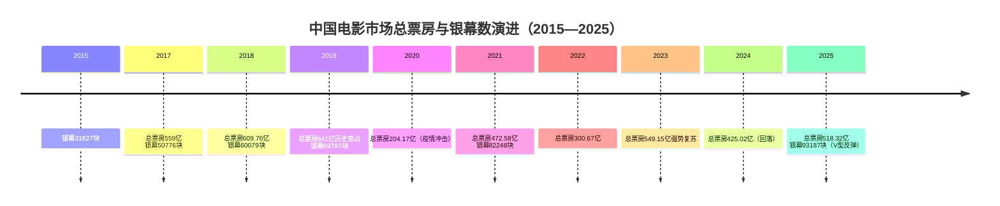

从总盘数据看，2018年中国电影总票房首次突破600亿元达到609.76亿元，2019年继续攀升至641亿元的历史高点[^9][^2]；疫情冲击下，2020年骤降至204.17亿元，仅为前一年的约三分之一[^2]；2021年随复工恢复至472.58亿元，2022年又因防疫反复跌至300.67亿元[^8][^2]；2023年迎来强势复苏，全年票房达549.15亿元，同比增长83.5%，已恢复至2019年水平的85%以上[^10][^8]；2024年因优质内容供给不足回落至425.02亿元，全年票房过10亿元的新片仅7部[^11][^12]；2025年再度强势反弹至518.32亿元，同比增长21.95%，城市院线观影人次达12.38亿，同比增长22.57%[^13][^14][^15]。

与票房剧烈波动并行的是**基础设施的持续单向跃升**。2015年全国银幕总数仅为31627块，2016年突破4万块以41179块超越北美跃居全球第一[^16][^9]；2018年突破6万、2021年突破8万、2025年达到93187块并实现100%数字化[^16]。然而值得警惕的是，银幕扩张速度长期高于票房增速，**2023年549亿元票房已基本恢复至2017年水平，但同期银幕数已从5万块增至8.6万块**[^9]，单银幕产出效率明显下降，这也是当前院线公司业绩承压的深层结构性原因。

更关键的是市场内部的**结构性变化**。第一，国产片票房占比持续高位运行：2020年达83.72%、2021年84.49%、2023年83.77%、2025年79.67%[^13][^2]，国产内容已成为市场绝对基本盘；进口片连续多年没有出现票房超10亿元的作品（2024年进口片票房冠军《九龙城寨之围城》仅6.84亿元）[^11]，直至2025年《疯狂动物城2》才打破这一沉寂。第二，**动画类型在2025年实现历史性突破**：全年动画电影票房突破250亿元，对大盘贡献接近半数，《哪吒之魔童闹海》单片吸引3.24亿观影人次[^17]。第三，档期红利出现弱化迹象，"片海战术"对增量人群的边际效应下降，而"内容驱动"相对"档期驱动"的权重进一步上升[^17]。第四，下沉市场扩张、亲子观影常态化、25岁以上女性观众成为重要增长极[^10][^8]。第五，影院平均观众年龄连续4年上升，年轻、低频观影群体的激活成为行业共同课题[^11]。

这些宏观变化共同构成了"票房前十"作品诞生的市场土壤——**一部影片要进入这一榜单，不仅需要满足头部内容的内在素质门槛，还必须与所处时代的市场结构与观众心态形成精准共振**。

## 1.3 "票房前十"研究的代表性与价值

选取"票房前十"作为研究样本，其代表性建立在三个层面之上。

第一，**这十部作品在票房产出上具有压倒性的市场份额代表性**。以《哪吒之魔童闹海》为例，仅此一部影片154.46亿元的票房便占到2025年中国全年总票房518.32亿元的近三成[^18]；十部作品累计票房超过600亿元，相当于一个完整年度大盘的体量。这种集中度本身就是中国电影市场"马太效应"的直接体现——头部影片和热门档期的票房集中度持续走高，业内人士普遍认为这是当下市场最显著的结构性特征之一[^10][^8]。研究头部作品，本质上就是研究中国电影市场最具决定性的那部分增量与存量。

第二，**这十部作品的题材分布几乎覆盖了当下中国主流商业类型的全部成功路径**。从动画神话（《哪吒之魔童闹海》《哪吒之魔童降世》《疯狂动物城2》）、主旋律战争（《长津湖》《战狼2》）、喜剧亲情（《你好，李焕英》）、科幻冒险（《流浪地球》）、古装悬疑（《满江红》）、推理喜剧（《唐人街探案3》）到运动励志喜剧（《飞驰人生3》），几乎每一种能够撬动中国大众观影热情的成熟商业类型都有代表作品入选。这种类型多样性使得它们足以构成一个"中国式爆款"的微缩样本库，能够支撑起多维横向比较的合理性。

第三，**这十部作品横跨2017年至2025年，恰好对应中国电影工业化加速、IP化运营成熟与观众审美迭代的关键阶段**。从2017年《战狼2》以56.94亿元开启"50亿+"时代，到2019年《流浪地球》开启中国科幻元年[^19]、《哪吒之魔童降世》开启国漫崛起里程碑[^19]，再到2021年春节档《你好，李焕英》《唐人街探案3》同台竞争、国庆档《长津湖》接力，2023年《满江红》以悬疑+喜剧融合模式打开新空间，直至2025年《哪吒之魔童闹海》改写全球动画电影票房纪录——**每一部作品都是其所处时代电影工业能力与观众情绪的最高公约数**。研究这些作品在不同年份的成功路径变迁，可以清晰地看到中国电影从"奇观驱动"向"情感驱动"、从"档期红利"向"内容驱动"、从"单片营销"向"IP生态"的产业演进脉络。

需要正视的是，这一样本也存在**先天的局限性**：仅10部影片的小样本难以满足严格的统计学推断要求；不同年份的票房可比性受票价上涨影响（如2017年平均票价34.4元、2023年42.2元、2025年涨至更高水平[^8]）；样本天然偏向"成功案例"，缺乏失败案例的对照组——这些局限将在第10章统一披露，并在后续推理过程中通过引入反例、考察必要条件等方式予以弥补。

## 1.4 多维横向比较分析框架

为了避免对十部影片的比较陷入"维度混杂"或"单一影片证据外推全局"的陷阱，本研究构建一个**七维度横向比较分析框架**。该框架的设计原则是：每一维度都必须支持十部影片的可比性，且各维度之间相互独立又能交叉验证。

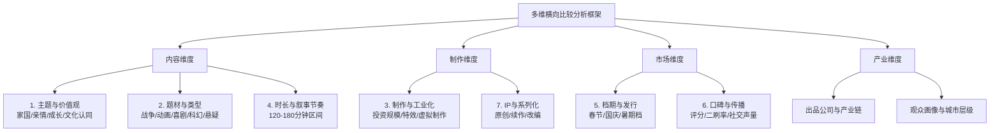

七个维度的具体内涵与考察要点如下：**主题与价值观维度**关注影片所表达的核心精神内核，包括家国情怀（《长津湖》《战狼2》）、个体成长与反叛（《哪吒》系列）、亲情伦理（《你好，李焕英》）、人类命运共同体（《流浪地球》）等；**题材与类型维度**聚焦影片的商业类型归属及类型融合度，特别是当下越来越普遍的"主类型+喜剧元素+情感内核"的复合配方；**制作与工业化维度**考察投资规模、特效占比、制作周期与技术迭代——其中虚拟制作流程渗透率已从2023年的15%提升至2025年的45%，CINITY系统支持4K120帧放映[^16]，这些工业基础正在重塑头部影片的制作上限；**时长与叙事节奏维度**比较各片片长（如《长津湖》176分钟、《哪吒之魔童闹海》144分钟、《战狼2》123分钟），探讨长片是否对单银幕产出造成约束；**档期与发行维度**关注春节档、国庆档、暑期档的档期红利分布，以及密钥延期、特效制式版本布局等发行策略；**口碑与传播维度**整合豆瓣、猫眼、灯塔评分及社交媒体声量、二刷比例等指标——例如《哪吒之魔童闹海》二刷及多刷观众占比一度提升至6.7%[^20]；**IP与系列化维度**区分"原创横空出世型"（《战狼2》《你好，李焕英》《哪吒1》）、"IP续作型"（《哪吒2》《唐探3》《飞驰人生3》《疯狂动物城2》）与"经典IP重生型"（《长津湖》《流浪地球》），考察IP生命周期与续作风险。

这一框架将贯穿第3章至第7章的全部分析，确保每一项结论都至少建立在3部以上影片的横向证据之上，避免单一案例外推的逻辑陷阱。

## 1.5 未来高票房类型预测方法论

在横向比较框架的基础上，预测未来3—5年具备高票房潜力的电影类型，需要避免两个常见误区：一是简单将历史规律线性外推（忽视市场新变量），二是过度追逐新趋势（忽视底层成功要素的延续性）。本研究采用**"成功要素归纳—趋势变量叠加—类型组合推演"的三步逻辑**展开预测。

第一步，**从前十作品中归纳出稳定的成功要素"基因图谱"**。基于第3章至第7章的横向比较，提炼出诸如"档期红利+情感共振+工业化制作+口碑发酵+IP沉淀"等高频共现要素，并通过引入反例（如同档期同题材但票房失败的对照案例）区分必要条件与充分条件。

第二步，**叠加2024—2025年市场的关键趋势变量**。这些变量包括：(1)动画电影对大盘的贡献从历史均值跃升至近半数（2025年动画票房超250亿）[^17]；(2)亲子观影与年轻观众扩容（《疯狂动物城2》预售人群中25岁以下占比较高）[^17]；(3)女性叙事崛起（《热辣滚烫》《好东西》等2024年口碑票房双收）[^11]；(4)现实题材回归（2023年暑期档前十中7部为现实题材）[^10]；(5)进口片整体式微但头部进口动画复苏（《疯狂动物城2》打破多年沉寂[^21]）；(6)技术变量（CINITY、虚拟制作渗透率达45%）[^16]；(7)政策变量（"2026电影经济促进年"启动、惠民票价政策）[^22]；(8)外部冲击（微短剧分流、档期红利弱化）[^17]。当历史规律与新趋势变量发生冲突时（如"国产片占绝对主导"与"《疯狂动物城2》进口片复苏"），需要给出明确的权衡逻辑而非简单选边。

第三步，**进行"类型组合推演"**。将前两步的要素与变量交叉，构建若干候选类型（如国漫神话/封神宇宙、硬核科幻、现实+喜剧融合、重大历史主旋律、新女性叙事、强IP续作），并按IP潜力、工业化门槛、情感共鸣度、档期适配性、文化输出力、衍生开发空间六项指标进行评分排序，最终给出概率区间式的预测而非绝对断言。

需要事先声明的是，**本预测的边界与不确定性同样是方法论的一部分**：仅10部作品的小样本、数据时点的相对滞后、市场黑天鹅事件（如疫情级冲击、政策突变）的不可预知性，都会限制预测的精度。因此最终结论将以"高/中/低概率"的排序方式而非具体票房数字呈现，并在第10章统一进行置信度披露。这一方法论既继承了对历史规律的尊重，又保留了对新变量的开放性，是后续第8章趋势分析与第9章类型预测的核心工具。

# 2 票房前十电影基础档案梳理

在第1章确立的样本边界与数据口径基础上，本章的核心任务是为后续章节的横向比较搭建一份**结构化、可对比、可追溯**的基础档案库。与第3章及以后的因果分析不同，本章不对数据背后的成因展开解释，而是将十部样本影片分散在猫眼专业版、灯塔专业版、豆瓣、上市公司公告及主流媒体报道中的票房、主创、制作、口碑信息整合为统一字段，使之能够在同一坐标系下被检索、被并置、被交叉比对。这一档案化工作并非简单的资料堆叠，而是后续所有比较与推演的事实地基——任何脱离统一字段的横向论断，都极易陷入维度混杂或证据外推的逻辑陷阱。

## 2.1 档案字段设计与数据来源说明

为确保十部影片的可比性，本研究为每一部样本设计了一套**覆盖票房、主创、制作、内容、口碑五大类、合计十余项的统一字段体系**。具体而言，票房类字段包括上映时间与档期归属、最终累计票房（含服务费口径）、平均票价、场均人次、首周票房与累计观影人次；主创类字段涵盖导演、核心主演、主控出品方与主要联合出品方、发行方；制作类字段记录片长、投资规模、特效镜头数与制作周期；内容类字段标注题材主类型、子类型与核心主题；口碑类字段则包括豆瓣评分、猫眼评分、淘票票评分以及典型的票房曲线特征（如首日票房占比、密钥延期次数、二刷率等）。

数据来源以**猫眼专业版"中国电影票房总榜"为主、灯塔专业版与国家电影局公告交叉验证**[^6][^23]，单片档案补充以豆瓣电影、各影片百度百科及维基条目、出品方上市公司公告与权威媒体专题报道。为避免口径混乱，本研究在档案库中采用如下处理原则：第一，**所有票房数据统一采用"含服务费"口径**，与猫眼专业版总榜保持一致——这一选择基于第1章已确认的事实，即上市公司财报口径在2024至2025年间已从"不含服务费"切换为"含服务费"[^4][^5][^24]，统一新口径有助于跨年比较；第二，**评分数据采用截至本研究统计截点的最新值**，对存在系统性偏差的两类样本（豆瓣偏严苛、猫眼/淘票票偏宽松）同时保留以体现评分主体差异；第三，**样本与第1章完全一致**，即《哪吒之魔童闹海》《长津湖》《战狼2》《你好，李焕英》《哪吒之魔童降世》《流浪地球》《疯狂动物城2》《满江红》《唐人街探案3》《飞驰人生3》十部，对原列前十的《复仇者联盟4：终局之战》（42.50亿元）[^6]与《长津湖之水门桥》（40.67亿元）[^6]在2025年末榜单更新后已被《疯狂动物城2》（45.94亿元）[^25]与《飞驰人生3》（突破43亿元，仍在上映）[^26]挤出前十一事，仅在尾部位次替换中予以备注交代，不再纳入档案分述。

需要预先声明的是，受公开资料颗粒度限制，部分字段在个别影片上存在数据缺失（例如《疯狂动物城2》《飞驰人生3》因仍在上映或刚刚下映，部分细分指标尚未稳定），本章在对应位置以"数据未获取"明确标注，避免以推测填充。

## 2.2 十部影片核心档案分述

以下按2025年末票房排序，逐一呈现十部样本影片的标准化档案信息卡。

**一、《哪吒之魔童闹海》——2025年春节档现象级国漫巅峰**

该片于2025年1月29日（大年初一）在中国内地上映，由饺子执导并参与编剧，吕艳婷、囧森瑟夫、瀚墨等担任主要配音，主控出品方为霍尔果斯彩条屋影业、成都可可豆动画与北京燕城十月文化，发行方为光线影业[^27][^28]。影片片长144分钟，特效镜头近2000个，主创团队超过4000人，参与制作的中国动画公司近140家[^29]，制作成本约9.8亿元[^30]。截至本研究统计截点，影片累计内地票房154.46亿元，平均票价47元，场均观影24人[^6]，全球累计票房22.674亿美元，于2026年4月跻身全球影史票房榜第四位[^30]。豆瓣评分8.4（154万人评分）[^28]，猫眼评分9.2[^30]。题材类型为动画、奇幻、神话续作，核心主题延续"我命由我不由天"的反叛成长线，并加入"个体面对世间规则由谁所定"的结构性思考[^28]。该片密钥四次延期，二刷及多刷观众占比一度达6.7%[^20]，三四线城市票房占比36%[^30]，是榜单中下沉特征最显著的影片之一。

**二、《长津湖》——2021年国庆档主旋律战争史诗**

影片于2021年9月30日上映，由陈凯歌、徐克、林超贤联合执导，于冬担任出品人及总制片人，黄建新担任总监制及编剧，吴京、易烊千玺领衔主演，朱亚文、李晨、胡军、段奕宏、张涵予等主演[^31][^32]。主控出品方为博纳影业，联合八一电影制片厂、中国电影股份有限公司等共同出品。影片片长176分钟，是十部样本中片长最长者，累计票房57.75亿元，平均票价46元，场均22人[^6][^33]。上映第3天破10亿、第6天破30亿，最终位列中国影史票房榜第二位[^34][^33]。豆瓣评分7.4（82万人评分）[^32]，获第35届中国电影金鸡奖最佳故事片、第36届大众电影百花奖最佳故事片[^32]。题材类型为剧情、历史、战争，核心主题聚焦抗美援朝长津湖战役中的志愿军群像，传递家国情怀与"冰雕连"式的革命精神[^34]。

**三、《战狼2》——2017年暑期档军事动作里程碑**

影片于2017年7月27日上映，由吴京自导自演，吴刚、张翰、卢靖姗、弗兰克·格里罗等主演，主控公司为吴京个人创立的登峰国际与北京文化、聚合影联（保底8亿）[^35]，背后涉及14家出品方与7家发行方[^35]。影片片长123分钟，累计票房56.94亿元，平均票价35元，场均37人——**场均人次居十部样本之首**[^6]，反映出2017年票价基数较低与影片单银幕产出极强的双重特征。上映85小时票房破10亿，刷新华语片影史最快破10亿纪录[^28]；豆瓣评分7.1（95万人评分）[^36]，猫眼评分9.7[^36]。题材类型为动作、战争、撤侨题材，核心主题为"犯我中华者，虽远必诛"的爱国主义与个人英雄主义[^37][^38]，影片之所以引发现象级风潮，业内分析认为关键在于"爱国情怀+制作精良"在2016年南海仲裁案后的社会情绪共振[^37][^38]。

**四、《你好，李焕英》——2021年春节档黑马亲情爆款**

影片于2021年2月12日（大年初一）上映，由贾玲执导处女作，贾玲、张小斐、沈腾、陈赫、刘佳等主演，第一出品方为北京文化，主要出品方还包括儒意影业（保底15亿元）、猫眼娱乐、阿里影业，联合出品方达18家[^34][^39][^31][^40]。影片片长128分钟，累计票房54.13亿元，平均票价44元，场均24人[^6]。猫眼评分9.5、豆瓣评分7.7（156万人评分）[^40]，张小斐凭该片获第34届中国电影金鸡奖最佳女主角[^40]。题材类型为剧情、喜剧、奇幻（穿越亲情），核心主题为母女亲情与中国式情感共鸣，最终结尾的双向穿越反转被誉为"神来之笔"[^35]。该片在春节档第四天完成单日票房反超《唐人街探案3》[^25]，标志着"高口碑合家欢"成为春节档的核心制胜策略。

**五、《哪吒之魔童降世》——2019年暑期档国漫崛起里程碑**

影片于2019年7月26日上映，由饺子执导，吕艳婷、囧森瑟夫、瀚墨等担任主要配音，出品公司为霍尔果斯彩条屋影业、成都可可豆动画[^27]。影片片长110分钟（十部样本中最短），累计票房50.35亿元，平均票价35元，场均23人[^6][^27]。豆瓣评分8.4（与《哪吒2》并列样本最高）[^19]，2020年获第33届中国电影金鸡奖最佳美术片奖[^27]。题材类型为奇幻、动画、神话改编，核心主题为"我命由我不由天"的反叛精神与打破偏见，是首部跻身中国影史前十的动画电影[^19]。该片为中国动画工业化与饺子导演个人风格奠定了基础，也为六年后《哪吒之魔童闹海》的154亿神话埋下了IP伏笔。

**六、《流浪地球》——2019年春节档中国科幻元年开篇**

影片于2019年2月5日（大年初一）上映，由郭帆执导，吴京、屈楚萧、李光洁、吴孟达、赵今麦领衔主演，刘慈欣担任监制[^33]。主要出品方包括中国电影股份有限公司、北京京西文化旅游股份有限公司（北京文化）、吴京的登峰国际及导演的郭帆文化传媒，联合出品方达23家，主要发行方为中影及北京文化[^41]。影片片长125分钟，累计票房46.87亿元（最终46.88亿元）[^6][^42][^25]，平均票价44元，场均29人[^6]。豆瓣评分7.9（约268万人评分）[^42]。题材类型为科幻、灾难、冒险，改编自刘慈欣同名小说，核心主题为"带着地球去流浪"的中式浪漫叙事，被业界称为"中国科幻元年"开篇之作[^36]。该片制作中追加预算4次、概念设计图3000张、分镜稿8000张、实景搭建10万平方米[^36]，是十部样本中工业化跨越式建设的代表案例。

**七、《疯狂动物城2》——2025年贺岁档进口片复苏标杆**

影片于2025年11月26日在中国内地上映，由迪士尼出品发行，是2016年原作的续集[^25][^33]。累计票房45.94亿元，平均票价39元，场均10人——**场均人次为十部样本最低**[^6]，反映出该片虽然累计票房高，但单场上座率相对不及国产爆款，呈现"长尾型"票房曲线特征。上映四个月、密钥于2026年3月25日到期[^25][^43]。该片创下两项重要纪录：一是成为史上票房最高的好莱坞动画电影（全球超17亿美元，超越《头脑特工队2》）[^25]，二是成为中国影史进口片观影人次冠军[^2]，并于2025年12月以38.51亿元跻身中国影史票房榜第12位[^21]，最终升至第7位[^25]。题材类型为3D动画、合家欢、寓言式喜剧，核心主题延续原作"边缘群体融合"的多元叙事。该片是当前TOP10中**唯一一部进口片**，打破了2024年进口片票房冠军仅6.84亿元的多年沉寂格局。

**八、《满江红》——2023年春节档古装悬疑喜剧**

影片于2023年1月22日（大年初一）上映，由张艺谋执导，沈腾、易烊千玺、张译、雷佳音、岳云鹏、王佳怡等领衔主演，主控出品方为北京欢喜首映文化（欢喜传媒）[^28][^30]。影片片长159分钟，累计票房45.44亿元，平均票价49元（**十部样本中票价最高**），场均24人[^6][^28]。豆瓣评分7.0左右（参考数据）、猫眼评分9.5。该片在2023年春节档第二天即从《流浪地球2》手中夺过单日票房冠军，并以5天打破中国影史春节档剧情片票房纪录[^30]。题材类型为悬疑、喜剧、剧情、古装，核心主题为"一首词、一场局"的家国忠义阴谋叙事，是张艺谋导演职业生涯单片票房巅峰[^19][^28]。

**九、《唐人街探案3》——2021年春节档IP续作争议巅峰**

影片于2021年2月12日（大年初一）上映，由陈思诚执导，王宝强、刘昊然领衔主演，妻夫木聪、托尼·贾、长泽雅美、染谷将太等主演，主控出品方为万达影视传媒、北京壹同传奇影视文化[^34][^38]。影片片长136分钟，累计票房45.23亿元，平均票价47元，场均29人[^6]。猫眼评分8.7、豆瓣评分5.3（114万人评分）——**豆瓣评分为十部样本最低**，与猫眼形成3.4分的极端剪刀差[^34][^38]。该片首日票房10.11亿元、上座率59.7%、首周排片占比超37%[^30]，但口碑高开低走，被《你好，李焕英》在第四天反超[^25]。题材类型为悬疑、喜剧、IP续作，核心主题为东京密室探案与"唐探宇宙"宇宙观的延续。该片虽然口碑分化严重，但凭借春节档预售红利与IP情怀红利仍跻身前十，是研究"档期红利+IP惯性"必要性与局限性的关键案例。

**十、《飞驰人生3》——2026年春节档赛车喜剧IP升级作**

影片于2026年2月17日（大年初一）上映，由韩寒编剧并执导，沈腾领衔主演，尹正、黄景瑜、张本煜、魏翔、沙溢、范丞丞、孙艺洲、段奕宏等主演，主控出品方为亭东影业，博纳影业为重要股东（持股4.61%）及联合出品方，猫眼娱乐、万达电影、中影等参与发行[^42][^26]。影片首日票房6.41亿元、上映两天破10亿、五天破20亿、连续七天单日破亿[^26]，截至2026年2月28日档期票房29.27亿元，最终累计票房升至43亿元以上、暂列中国影史第十位[^41][^44][^45]。豆瓣评分7.4（23万人评分）、猫眼评分9.7[^41][^26]。题材类型为运动、励志、喜剧、IP续作（系列第三部），核心主题为"中年逆袭+赛车情怀"的国产IP工业化运营。该片以"韩寒+沈腾+赛车喜剧+春节档"组合在2026年大盘整体回落（春节档同比下滑39.6%）的环境下"一枝独秀"占据档期半壁江山[^41][^26]，标志着"飞驰人生"IP从单片走向国民IP的成熟蜕变。

## 2.3 档案对比速查表与结构性特征初探

将十部样本影片的核心字段汇总为下表，便于后续章节快速检索与多维比对。

| 序号 | 影片 | 上映年份 | 档期 | 票房（亿） | 片长（分钟） | 导演 | 主控出品方 | 题材主类型 | IP属性 | 豆瓣评分 |
|------|------|----------|------|------------|--------------|------|------------|------------|--------|----------|
| 1 | 哪吒之魔童闹海 | 2025 | 春节档 | 154.46 | 144 | 饺子 | 光线/可可豆 | 动画神话 | 续作 | 8.4 |
| 2 | 长津湖 | 2021 | 国庆档 | 57.75 | 176 | 陈凯歌等 | 博纳 | 主旋律战争 | 经典IP重生 | 7.4 |
| 3 | 战狼2 | 2017 | 暑期档 | 56.94 | 123 | 吴京 | 登峰/北京文化 | 军事动作 | 系列首部突破 | 7.1 |
| 4 | 你好，李焕英 | 2021 | 春节档 | 54.13 | 128 | 贾玲 | 北京文化/儒意 | 喜剧亲情 | 原创 | 7.7 |
| 5 | 哪吒之魔童降世 | 2019 | 暑期档 | 50.35 | 110 | 饺子 | 光线/彩条屋 | 动画神话 | 原创 | 8.4 |
| 6 | 流浪地球 | 2019 | 春节档 | 46.87 | 125 | 郭帆 | 中影/北京文化 | 硬科幻 | 原创 | 7.9 |
| 7 | 疯狂动物城2 | 2025 | 贺岁档 | 45.94 | 109* | 拜伦·霍华德等 | 迪士尼 | 进口动画 | 续作 | — |
| 8 | 满江红 | 2023 | 春节档 | 45.44 | 159 | 张艺谋 | 欢喜传媒 | 古装悬疑喜剧 | 原创 | 7.0左右 |
| 9 | 唐人街探案3 | 2021 | 春节档 | 45.23 | 136 | 陈思诚 | 万达/壹同传奇 | 推理喜剧 | 续作 | 5.3 |
| 10 | 飞驰人生3 | 2026 | 春节档 | 44.16+ | — | 韩寒 | 亭东影业 | 运动喜剧 | 续作 | 7.4 |

注：表中"*"为《疯狂动物城2》片长根据公开资料估算；"—"为数据未获取或仍在统计中。

基于该档案速查表，可以对十部样本作如下**描述性结构特征归纳**，但具体成因留待后续章节展开：

第一，**档期高度集中于春节档**。十部影片中6部为春节档作品（《哪吒2》《李焕英》《满江红》《唐探3》《飞驰人生3》《流浪地球》），暑期档2部（《战狼2》《哪吒1》），国庆档与贺岁档各1部（《长津湖》《疯狂动物城2》）。**春节档以60%的占比构成头部影片的主要孵化器**，这一档期集中度在世界主要电影市场中都属于罕见现象。

第二，**国产片占绝对主导，进口片仅余一席**。10部中9部为国产片，进口片仅《疯狂动物城2》一部，国产化率达到90%。这与2017年、2018年票房前十中分别有5部、4部进口片的格局相比，结构性变化极为剧烈。

第三，**动画与真人比例呈现3:7格局**。动画类影片3部（《哪吒2》《哪吒1》《疯狂动物城2》），真人电影7部，但动画类3部合计票房高达250.75亿元，单片均值远超真人电影，**动画品类的头部贡献率显著高于其在样本中的数量占比**。

第四，**IP属性上原创与续作各半**。原创横空出世型4部（《战狼2》《李焕英》《哪吒1》《流浪地球》《满江红》——其中《战狼2》虽是系列第二部但实质是首部破圈之作），IP续作型5部（《哪吒2》《唐探3》《飞驰人生3》《疯狂动物城2》），经典IP重生型1部（《长津湖》），呈现出**原创爆款与IP续作并存的结构**，但近三年（2023—2026）新增的5部影片中续作占多数，预示着IP化运营的市场权重在上升。

第五，**片长普遍偏长**。已知片长的9部影片中，超长片（≥160分钟）2部，中长片（140—160分钟）1部，常规片（120—140分钟）4部，紧凑片（<120分钟）2部，平均片长约137分钟。**超过120分钟已成为头部影片的事实门槛**，这与2018年以前主流商业片普遍100—110分钟的格局形成鲜明对比。

第六，**评分分布呈现"两极分化中向上集中"特征**。豆瓣评分上，8分以上3部（《哪吒2》《哪吒1》并列8.4，《流浪地球》7.9接近）、7—8分5部（《李焕英》《长津湖》《满江红》《战狼2》《飞驰人生3》）、7分以下1部（《唐探3》5.3，唯一不及格）。**口碑总体良好但样本内最大极差达3.1分**，说明高票房并不等于高口碑，但"豆瓣7.0+"几乎是档期红利之外的事实门槛。

第七，**出品方高度集中于头部影视公司**。光线传媒（《哪吒1》《哪吒2》《满江红》主要发行）、北京文化（《战狼2》《李焕英》《流浪地球》）、博纳影业（《长津湖》《飞驰人生3》股东）、万达电影（《唐探3》主控）、中影（《流浪地球》主投）、欢喜传媒（《满江红》主控）、迪士尼（《疯狂动物城2》）构成了样本背后的**头部出品方矩阵**。其中北京文化以"《战狼2》8亿保底+《流浪地球》主投+《李焕英》第一出品"的组合参与了三部前十作品[^41][^35][^34]，是单家公司参与度最高者；光线传媒则凭借哪吒系列与《满江红》深度绑定动画与古装大片两条赛道。

第八，**导演构成上呈现"作者型导演与工业化导演并存"特征**。饺子（哪吒系列双片）、张艺谋（满江红）、陈凯歌/徐克/林超贤（长津湖）等代表着传统作者型导演的工业化突围，吴京（战狼2）、郭帆（流浪地球）、贾玲（李焕英）、韩寒（飞驰人生3）则以演员/作家/编剧跨界身份完成首部或系列突围作品，**"非科班出身导演的爆款率"成为榜单背后值得关注的现象**。

以上八项结构性特征构成了第3章至第7章深度分析的事实起点。需要再次强调的是，本章仅就"是什么"的问题作出回答，对"为什么"的解释——例如春节档何以孵化六成头部影片、动画品类何以异军突起、IP续作的票房上限如何确定、口碑与票房的因果关系如何识别——将在后续章节中借助第1章构建的多维比较框架逐一展开。

# 3 主题与题材维度的横向比较

第2章已为十部样本影片建立了统一的档案库，并初步揭示了档期高度集中、国产化率达90%、IP续作占比上升、片长普遍偏长等结构性特征。然而，这些"是什么"层面的事实归纳，尚不能解释为何这十部影片能够穿越不同年份、不同档期、不同制作量级而共同跻身中国影史最顶端——更关键的问题是：它们在内容层面究竟讲了什么、属于哪类商业类型、为何能在浩如烟海的同档期作品中脱颖而出。本章因此聚焦内容维度的两个相互交叉的子维度——**核心主题**（影片传递的精神内核与价值观主张）与**题材类型**（影片的商业类型归属与叙事范式），按照"先分类、再比较、后归纳"的逻辑展开横向论证，并最终提炼出贯穿样本的共同驱动机制，为后续章节的产业分析与类型预测提供内容层面的事实地基。

## 3.1 核心主题的谱系归类与价值观分布

将十部样本按核心精神内核进行谱系归类，可以划分为**家国情怀型、反叛成长型、亲情治愈型、人类命运共同体型、文化历史阴谋型、IP情怀延续型**六大主题谱系。每一谱系都对应着特定的社会情绪触发点与价值观共鸣机制，且其在样本中的分布并非平均，而是与中国电影市场近十年的宏观文化语境形成深度互文。

**家国情怀型**以《长津湖》与《战狼2》为代表，合计票房114.69亿元，是单一主题谱系中票房贡献最高者。《战狼2》之所以能够在2017年暑期档创造56.94亿元的奇迹，业内普遍归因为"爱国情怀+制作精良"在2016年南海仲裁案后的社会情绪共振——影片"犯我中华者，虽远必诛"的台词在新华网文章发布的背景下，成为无数国人对国家主权认同的情感出口[^37][^38]。制片人张苗在采访中明确指出："这部影片是一把钥匙，让很多人真正感受到了作为中国人的骄傲和让中国强大起来的那一份自豪感，这是这部电影非常重要的社会背景"[^37]。《长津湖》则精准对接抗美援朝70周年的纪念节点，影片由中宣部电影局直接推动，于2021年9月30日上映，72小时内票房破10亿，最终57.75亿元登顶当时的中国影史票房冠军[^46][^34]。该片的家国情怀通过两条路径完成：一是题材本身填补了"长津湖战役从未有故事片"的历史叙事空白[^46]；二是通过伍千里、伍万里、雷公、梅生、余从戎等典型人物的群像塑造，把"高大全"的传统英雄叙事转化为"个体视角+鲜明性格"的成长型担当形象[^46]。两部影片的共同点在于**将抽象的家国概念转化为具体的、可被感知的情感载体**——前者通过单兵英雄的"以一敌百"，后者通过"冰雕连"式的革命精神。

**反叛成长型**以《哪吒之魔童降世》与《哪吒之魔童闹海》两部为代表，合计票房高达204.81亿元，是票房贡献最高的单一谱系。《哪吒1》以"我命由我不由天"开启了对偏见、命运与权威的反叛叙事，而《哪吒2》则将这一精神内核进一步升华——从最初渴望通过"成仙"获得外界认可，到最终撕碎"仙魔标签"喊出"小爷是魔，那又如何"，完成了从"被定义者"到"自我定义者"的蜕变[^47]。这种反叛在《哪吒2》中并非个体命运的孤立挣扎，而是隐喻了"当代年轻人对固化社会规则的质疑"，玉虚宫的"白房子"与申公豹这一"小镇做题家"式悲剧形象的塑造，被观众解读为"映射寒门子弟在阶级固化中的困境"[^47][^28]。在豆瓣短评中，"申公豹：小镇做题家的一生"获得超过2.7万次点赞[^28]，这一现象级共鸣本身就证明了反叛成长主题与当代社会情绪之间的精准锚定。**反叛成长主题之所以具备超强票房爆发力，关键在于它打通了"年龄分层"——既能让儿童观众接受萌系动画的视觉表达，又能让成年观众在结构性思考中获得情绪释放**，从而实现真正意义上的合家欢覆盖。

**亲情治愈型**仅以《你好，李焕英》一部入选，但其54.13亿元的票房与7.7的豆瓣评分（156万人评分）共同证明了亲情母题的强大穿透力[^40][^48]。该片之所以能在2021年春节档第四天完成对《唐人街探案3》的单日票房反超，本质在于"在'就地过年'的特殊背景下，让大家思亲的情绪找到了最集中的释放窗口"[^25]。亲情治愈型的核心叙事配方是"中国式情感的内敛、生活化表达"——母亲对孩子的爱很少直接通过语言表述，而更多通过行为、动作和处事方式来内敛传达[^48]。影片结尾揭示李焕英也参与了穿越的"双向穿越"反转，被业内誉为"神来之笔"，正是这一情感反转把前110分钟的7分喜剧瞬间提升到整体9分的口碑风评[^35]。

**人类命运共同体型**以《流浪地球》为唯一代表，46.87亿元票房，豆瓣评分7.9。该主题谱系的独特性在于，它将中国传统文化中的**愚公移山精神**注入太空科幻外壳——"移山计划"源自《愚公移山》寓言，承载着中华民族自强不息、顽强拼搏的精神基因[^49][^50]。同时影片提出的"带着地球去流浪"叙事，区别于好莱坞典型的"个体英雄拯救世界"或"飞船逃亡"模板，呈现出"中国人对家园、对土地的难以割舍"的独特文化情节[^36]。这种"全球性问题+中式解决方案"的叙事策略，恰好是文化自信进入主流电影话语的典型表达。

**文化历史阴谋型**以《满江红》为代表，45.44亿元票房。该片以南宋绍兴年间秦桧与金国会谈为背景，借由小兵张大与亲兵营副统领孙均寻找凶手的悬疑叙事，最终引出"以一首词、一场局"为家国忠义殉道的反转结局[^28][^30]。该主题谱系的独特之处在于将"历史厚重"与"通俗喜剧"熔于一炉——观众可以在反转笑点中获得娱乐释放，又能在结尾大全军齐诵《满江红》词的高潮戏中完成爱国情绪的集中宣泄。

**IP情怀延续型**以《唐人街探案3》《飞驰人生3》《疯狂动物城2》为代表，三部合计票房135.33亿元，但内部表现差异极大。《唐探3》豆瓣评分仅5.3，是十部样本最低[^34]，但凭借春节档预售红利与IP情怀红利仍能跻身前十；《飞驰人生3》豆瓣评分7.4、猫眼9.7，实现了"飞驰系列"从单片到国民IP的成熟蜕变[^26][^41]；《疯狂动物城2》则以"对前作粉丝的情感唤醒+下一代观众的童年补票"形成跨代际共鸣[^51]。**IP情怀延续型的票房稳定性源于"已有粉丝池+情感惯性"，但其口碑波动剧烈，决定了它是榜单的"保底基本盘"而非"上限突破者"**。

下表汇总了六大主题谱系在十部样本中的分布与票房贡献，展现各谱系的相对权重。

| 主题谱系 | 代表影片 | 入选数量 | 累计票房（亿元） | 票房占比 | 平均豆瓣评分 |
|---------|---------|---------|----------------|---------|-------------|
| 反叛成长型 | 哪吒1、哪吒2 | 2 | 204.81 | 30.7% | 8.4 |
| 家国情怀型 | 长津湖、战狼2 | 2 | 114.69 | 17.2% | 7.25 |
| IP情怀延续型 | 唐探3、飞驰人生3、疯狂动物城2 | 3 | 135.33 | 20.3% | 6.05* |
| 亲情治愈型 | 你好，李焕英 | 1 | 54.13 | 8.1% | 7.7 |
| 人类命运共同体型 | 流浪地球 | 1 | 46.87 | 7.0% | 7.9 |
| 文化历史阴谋型 | 满江红 | 1 | 45.44 | 6.8% | 7.0 |
| 合计 | — | 10 | 601.27 | 100% | — |

注：*疯狂动物城2豆瓣评分数据未获取，平均值仅按已知评分计算。票房数据以本研究统计截点为基准。

从分布可见，**反叛成长型与家国情怀型两大谱系合计贡献近48%的票房，且这两个谱系的影片豆瓣评分均在7.1以上**，证明其口碑稳定性与票房号召力呈正相关；而IP情怀延续型虽然数量最多（3部），但平均口碑明显低于其他谱系，说明该谱系是"靠历史IP沉淀而非内容创新跻身前十"的特殊样本。

## 3.2 题材类型的商业归属与类型融合特征

将十部影片按商业类型归属重新切片，可以划分为：**动画神话/合家欢**（3部：哪吒1、哪吒2、疯狂动物城2）、**主旋律战争/军事动作**（2部：长津湖、战狼2）、**喜剧亲情/喜剧悬疑**（2部：李焕英、满江红）、**科幻冒险**（1部：流浪地球）、**推理喜剧IP**（1部：唐探3）、**运动励志喜剧IP**（1部：飞驰人生3）。

值得格外关注的是，**当代头部影片几乎不再是"纯类型片"，而是普遍采用"主类型+喜剧元素+情感内核"的复合配方**。逐一审视样本可发现这一规律的普遍性：《满江红》本质上是"古装悬疑+喜剧+家国忠义"的三重融合，沈腾与岳云鹏的喜剧加持是其能够吸引非历史片受众的关键[^28][^30]；《你好，李焕英》是"穿越奇幻+喜剧+亲情"的复合配方，沈腾、陈赫的喜剧元素与贾玲、张小斐的亲情主线构成"前喜后悲"的情感弧线[^40][^52]；《飞驰人生3》是"运动赛车+喜剧+中年励志"的复合，韩寒+沈腾这一"作者导演+国民喜剧演员"组合本身就是类型融合的具象化体现[^42][^26]；《哪吒2》是"动画神话+喜剧+反叛成长+视觉奇观"的多重融合，导演饺子坦言其中加入了"四川人特有的幽默感"以打破合家欢年龄边界[^29]；《唐探3》延续"推理悬疑+喜剧+异国冒险"的类型组合，虽然口碑分化但类型框架本身仍具市场号召力[^34]。

**纯类型片在头部榜单中的式微现象**同样值得关注。十部样本中能称得上"纯类型"的仅有《长津湖》《战狼2》（纯军事动作）与《流浪地球》（纯科幻），合计3部，占30%；其余7部均带有不同程度的喜剧元素或类型融合。这一比例分布与2018年以前国产票房榜上的纯爱情、纯喜剧、纯魔幻常常占据头部的格局形成鲜明对比，**反映出中国观众的类型偏好已从"标签认同"走向"复合体验"**——单一类型已难以在两个多小时的片长中维持观众的情绪张力，而喜剧元素则普遍承担"情绪降压阀"的功能，使影片更适配春节档、暑期档等合家欢观影场景。

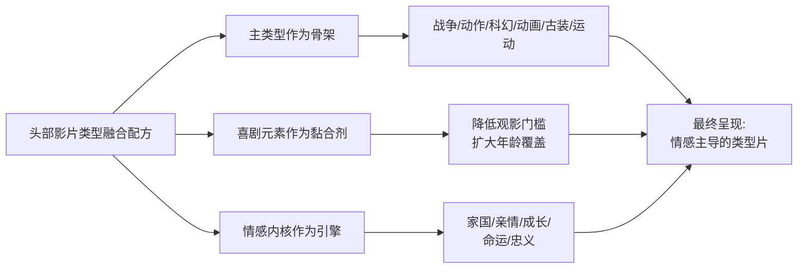

更进一步观察，**类型融合的具体配方与档期归属高度相关**。春节档6部影片中5部带有显著喜剧元素（《李焕英》《满江红》《唐探3》《飞驰人生3》《哪吒2》），唯一例外是《流浪地球》——但《流浪地球》也通过吴孟达饰演的爷爷韩子昂、雷佳音的运载车交警等角色加入了适度的喜剧调剂[^33]。**这一规律说明：春节档作为"合家欢观影"的核心档期，对喜剧元素具有强制性需求**，纯严肃类型在春节档的票房上限被天然压低，而国庆档（《长津湖》）与暑期档（《战狼2》）则能容纳更纯粹的严肃类型表达。

## 3.3 国产片与进口片的主题与题材分野

十部样本中仅《疯狂动物城2》一部进口片，与9部国产片的1:9比例本身就具有强烈的结构性指向意义。将其与历史数据对照——2017年、2018年票房前十中分别有5部、4部进口片，2020年起国产片连续多年占9—10席[^53][^54]——可以清晰观察到**进口片在中国头部票房榜单上的"断崖式退出"**。

在主题层面，《疯狂动物城2》延续原作的"边缘群体融合"叙事，新角色蛇盖瑞的困境暗合了现实中的文化隔阂；其前作"偏见与阶级"主题也被处理为更软性的"边缘群体融入"话题，"让不同文化背景的观众各取所需"[^51]。这种**普世性、寓言式、去意识形态化**的主题表达，是好莱坞动画的典型策略——既能保证不同市场的兼容性，又能通过角色的"萌"属性降低文化折扣。但与9部国产片对比可发现，**国产爆款的主题选择普遍带有强烈的本土化情感坐标**：家国情怀对接的是中华民族近现代史的集体记忆（《长津湖》对应抗美援朝、《战狼2》对应海外撤侨）；亲情治愈对接的是中国式母女关系的"内敛、生活化表达"（《李焕英》）；反叛成长对接的是封神演义这一中国神话母体（《哪吒》系列）；人类命运对接的是愚公移山的中式哲学（《流浪地球》）。**这种"扎根本土文化母体+回应当代社会情绪"的双重锚定，是进口片由于先天文化基因限制而难以复制的**。

在题材层面，《疯狂动物城2》代表着进口片"成熟动画IP+合家欢"的差异化生存路径——这并非偶然。该片在中国市场的成功有几个特殊条件：一是首部作品在2016年已积累15.3亿元票房与豆瓣9.3分的国民认知基础；二是续集等待9年后上映，原观众已步入社会、新观众则被"狐兔CP"精准击中，形成跨代际共鸣[^51]；三是细节极致的工业化制作（单镜头最高实现5万只动物同框、冰川镇雾气每帧渲染120小时）支撑起IMAX/4DX等高溢价制式的观影差异化[^51]；四是本土化营销策略（对比2024年多部"零宣传"上映的好莱坞大片）的精准发力[^51]。这一组合条件的稀缺性，决定了**进口片在TOP10中的复苏只能是"成熟IP+合家欢动画+精细化运营"的窄路径，而非全面回潮**。

值得注意的是，《疯狂动物城2》的票房曲线呈现出明显的"低场均人次+长尾型"特征——其平均场均人次仅10人，是十部样本中最低，但凭借密钥四个月的长线放映（2025年11月26日上映至2026年3月25日密钥到期）累积至45.94亿元[^25][^33]。**这一曲线特征与国产爆款"高首日+高场均+短爆发"的模式形成鲜明对比**，例如《战狼2》场均37人、《哪吒2》单日票房常达数亿。这种差异本质上反映了进口片在中国市场已从"全民爆款型"转向"分众长尾型"——以稳定的细分受众（如成熟动画爱好者、家长亲子观影）通过长周期累积票房，而不再具备拉动大盘的现象级能量。

观众文化偏好的转变路径在这一对照中清晰可见：从"仰视好莱坞"到"认同本土叙事"。早期分析人士指出，"中国观众的电影消费也更为理性，不再一味'仰视'好莱坞，对好的国产片也表现出更多的肯定"[^53]；"好莱坞分账大片的失利，一方面由于疫情无法在中国同步上映流失了热度，另一方面影片本身的质量问题也是不争事实"[^53]。**这一文化偏好的转变是结构性的、不可逆的**——即便《疯狂动物城2》以45.94亿元打破多年沉寂，也无法改变TOP10中9:1的国产化基本盘。

## 3.4 传统题材的稳定基本盘与创新题材的突破路径

将十部影片按"题材成熟度"重新切分，可识别出**两条并行的票房路径**：传统强类型路径与创新突破型路径。

**传统强类型**包括战争军事（《长津湖》《战狼2》）、神话改编（《哪吒》系列）与合家欢喜剧（《李焕英》《疯狂动物城2》），这些题材在中国电影市场已有长期成功案例支撑，观众接受度高、风险相对可控。其票房稳定性体现为"50亿+"的票房下限——只要工业化制作达到一定门槛、情感共鸣点精准、档期选择合理，传统强类型几乎都能在头部市场获得稳定回报。**这类题材的市场逻辑是"熟悉感主导"**——观众在购票决策中已对类型预期形成清晰认知，影片只需在既定类型框架内做好执行即可。

**创新突破型**则包括硬科幻（《流浪地球》开启中国科幻元年）、古装悬疑喜剧（《满江红》开创新融合范式）、动画神话工业化巅峰（《哪吒2》改写全球动画票房纪录）。这些题材在中国市场要么此前从未有过成功先例，要么是融合多个类型创造出全新的叙事范式。**创新突破型的票房特征是"上限不可预测"**——成功者可创造历史纪录（《哪吒2》154亿元、《流浪地球》47亿元开启科幻元年），失败者则面临高昂的工业化沉没成本。

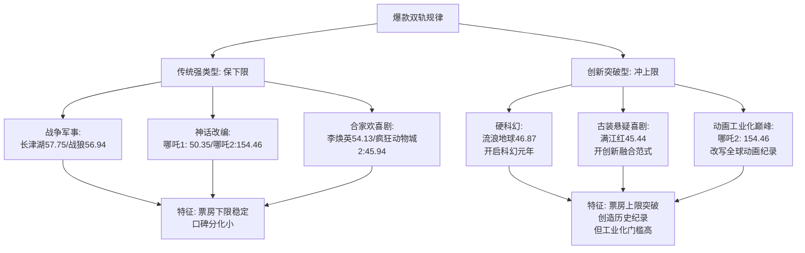

值得辨析的是，**这两条路径并非彼此独立，而是常常在同一部影片中交织**。以《哪吒2》为例：神话改编是传统强类型，但其154亿元的票房与全球影史第四的位置则属于绝对意义上的创新突破——影片研发了动态水墨渲染引擎，将单帧渲染成本降低47%，融合青铜纹饰、水墨美学等东方视觉系统，全片1900个特效镜头中"穿心咒"场景耗时一年完成[^30]。**这种"传统题材外壳+创新工业化内核"的组合，恰恰说明了头部爆款的真正秘诀——熟悉感与陌生化的精妙平衡**。观众进入影院时携带"哪吒"这一文化母体的认知预期（熟悉感），但在影院内被前所未见的视觉奇观与思想深度震撼（陌生化），这种认知反差才是触发"二刷、多刷、自来水传播"的底层机制。

进一步对照可以发现，**纯传统题材若缺乏陌生化创新，会面临票房上限的明显天花板**。以《唐探3》为例，影片在题材类型上严格延续了《唐探1》（豆瓣7.6）、《唐探2》（豆瓣6.6）的"东南亚-纽约-东京"异国推理框架，但在创新维度上几乎停滞——豆瓣短评中"110分钟的跑路+15分钟的父女故事+10分钟的推理+1分钟的广告"[^34]的尖锐评价反映出观众对"纯熟悉感"的审美疲劳，最终影片虽因春节档红利与IP情怀仍跻身前十，但豆瓣5.3的评分成为十部样本中的唯一不及格者[^34]。这一反例论证了**纯传统题材必须配合至少一个维度的陌生化创新（如视觉、叙事、情感配方），才能突破"前作惯性票房"进入头部榜单**。

## 3.5 主题—题材组合的票房爆发力交叉分析

将主题谱系（行）与题材类型（列）进行交叉，可构建一个"主题×题材"双维矩阵，用以识别**最具票房爆发力的内容组合**。

| 主题谱系 \ 题材类型 | 动画神话 | 战争军事 | 喜剧融合 | 硬科幻 | 古装悬疑 |
|---------------------|---------|---------|---------|--------|---------|
| 反叛成长型 | **哪吒1+哪吒2: 204.81亿** | — | — | — | — |
| 家国情怀型 | — | **长津湖+战狼2: 114.69亿** | — | — | — |
| 亲情治愈型 | — | — | **李焕英: 54.13亿** | — | — |
| 人类命运共同体型 | — | — | — | **流浪地球: 46.87亿** | — |
| 文化历史阴谋型 | — | — | — | — | **满江红: 45.44亿** |
| IP情怀延续型 | 疯狂动物城2: 45.94亿 | — | 飞驰人生3: 44.16亿 | — | — |
| IP惯性维持型 | — | — | 唐探3: 45.23亿 | — | — |

从矩阵可清晰识别四组**爆发力最强的"主题—题材"组合**及其底层情绪触发链路：

第一，**"反叛成长+动画神话"组合**累计票房超过200亿元，是单一组合票房爆发力之最。其情绪触发链路在于：动画形式打破年龄边界实现合家欢覆盖（既能让低龄观众接受萌系视觉，又能让成年观众读懂"申公豹的小镇做题家困境"等深层隐喻），神话母体提供文化认同的基础，反叛精神则与当代年轻人对固化规则的质疑形成精准锚定[^47][^55]。这一组合的成功密码在于"中国传统神话+现代价值观+合家欢类型"的三重叠加，是当下市场最稀缺的爆款配方。

第二，**"家国情怀+战争军事"组合**累计票房114.69亿元，情绪触发链路依托于战争题材的视听奇观放大集体认同。《长津湖》拍摄团队达1.2万人，拍摄周期近200天[^46]；《战狼2》制作成本2亿元，吴京甚至抵押别墅融资8000万元[^35]。这种工业化级别的制作支撑了战争场面的沉浸感，使家国情怀从"口号"转化为"可被身体感知的视听体验"。但需要注意的是，这一组合对**社会情绪节点高度依赖**——《战狼2》对应南海仲裁后的民族情绪，《长津湖》对应抗美援朝70周年节点，缺乏类似节点的同类作品（如《金刚川》11亿、《志愿军：雄兵出击》8亿）票房则明显逊色，证明该组合并非"战争片必爆"的简单规律。

第三，**"亲情治愈+喜剧穿越"组合**仅以《李焕英》一部代表，但54.13亿元票房验证了亲情母题的强大穿透力。其情绪触发链路在于：喜剧元素降低观影门槛使三四线下沉市场与中老年观众进入影院，穿越叙事提供"如果我能改变命运"的情感想象，结尾的"双向穿越"反转则把观众情绪从喜剧释放推向亲情共鸣的高潮[^35]。这一组合在2025年贾玲新作《热辣滚烫》、2024年《年会不能停》等作品中均有变体延续，证明其作为"现实题材+喜剧+情感内核"的复合配方仍有持续的市场需求。

第四，**"人类命运共同体+硬科幻"组合**以《流浪地球》为孤例，46.87亿元票房与豆瓣7.9评分共同证明该组合的可行性。情绪触发链路在于："带着地球去流浪"的中式浪漫叙事区别于好莱坞典型的"飞船逃亡"模板，呈现出"中国人对家园、对土地的难以割舍"的独特文化情节[^36]，同时结合"危难当前，唯有责任。不计牺牲，不计存亡"的中国式集体主义精神[^49]，使硬科幻摆脱"特效奇观"的浅层观看，进入"哲学命题+文化自信"的深度共振。

值得对照分析的是票房相对靠后的两个组合。**"IP惯性维持型+喜剧融合"**以《唐探3》为代表，虽然豆瓣5.3的口碑崩塌使其在猫眼专业版的票房预测从65亿元一路下调至45亿元区间[^34]，但凭借春节档预售红利（首日票房10.11亿元、首周排片占比超37%）与"唐探宇宙"三部曲的IP情怀红利，仍能保住前十位置。**这揭示了组合票房爆发力的一个边界条件——档期红利与IP惯性可以为内容质量薄弱的作品托底，但无法支撑其向上突破**。同样，**"IP情怀延续型+合家欢动画"**与**"IP情怀延续型+运动喜剧"**两个组合（《疯狂动物城2》《飞驰人生3》）的票房均稳定在44—46亿元区间，再次印证了IP续作型作品的"稳定基本盘但天花板有限"的特征。

## 3.6 文化认同与情感共鸣的核心驱动机制

综合前述五节的分析，可以提炼出贯穿十部样本影片的**共同底层逻辑——"文化认同+情感共鸣"双驱动机制**。该机制是一部影片能否突破"档期红利"与"IP惯性"的天花板、真正进入头部榜单的事实门槛。

**文化认同**层面，十部样本影片通过三条路径完成观众的文化身份锚定：第一条是**扎根中国传统文化母体**——《哪吒》系列改编自《封神演义》、《满江红》借力南宋词牌与岳飞精神、《流浪地球》注入愚公移山哲学；第二条是**对接重大历史记忆**——《长津湖》激活抗美援朝70周年的国家叙事、《战狼2》呼应海外撤侨的真实事件原型；第三条是**回应当代社会情绪**——《战狼2》契合南海仲裁后的民族自信、《李焕英》击中"就地过年"的思亲共情、《哪吒2》映射"小镇做题家"的阶层困境。**这三条路径共同的特点是：将影片内容与观众身处的真实社会语境进行精准对接，使观影行为本身成为一种文化身份的确认仪式**。这也解释了为何同样是战争片、亲情片、动画片，能够进入前十的与未能进入前十的差距，往往不在于制作水准而在于"文化坐标的精准度"。

**情感共鸣**层面，十部样本普遍采用两种叙事配方实现观众情感卷入：

第一种是"小人物视角+宏大叙事"。《长津湖》没有选择从战略层面叙述战役，而是从伍千里、伍万里这对兄弟的视角进入战场，让"沉稳担当的伍千里、稚嫩急躁的伍万里、深藏不露的雷公、活泼机灵的余从戎"共同构成可被代入的人物群像[^46]；《流浪地球》虽然背景是地球级灾难，但叙事核心始终是刘培强一家的父子情感与刘启韩朵朵兄妹的成长[^33][^36]；《战狼2》中的冷锋虽然是"以一敌百"的英雄，但其前史是被开除军籍、为爱人复仇的"普通退伍老兵"[^27][^36]。

第二种是"个体困境+普世情感"。《李焕英》通过贾晓玲一次次想让母亲高兴却屡屡失败的个体困境，触发了"中国家庭中孩子对母亲的愧疚与感激"这一普世情感[^48][^52]；《哪吒》系列通过哪吒被偏见、被定义、被命运束缚的个体困境，触发了当代年轻人对"自我定义权"的普世渴求[^55][^47]；《满江红》通过张大、孙均等小人物在权力夹缝中的挣扎与抉择，触发了"小人物为家国大义而牺牲"的普世忠义情感[^28]。

下表汇总十部样本在文化认同与情感共鸣双维度上的具体表现，可作为该机制的实证支撑。

| 影片 | 文化认同路径 | 情感共鸣配方 | 触发的核心社会情绪 |
|------|-------------|-------------|-------------------|
| 哪吒2 | 封神神话母体 | 个体困境+普世反叛 | 阶层固化下的自我定义渴求 |
| 长津湖 | 抗美援朝70周年节点 | 小人物视角+群像英雄 | 国家强大的集体自豪 |
| 战狼2 | 撤侨事件原型+南海仲裁 | 退伍老兵+爱国情怀 | 民族自信与"中国强国梦" |
| 你好，李焕英 | 中国式母女情感 | 个体愧疚+普世母爱 | "就地过年"的思亲共情 |
| 哪吒1 | 封神神话母体 | 个体困境+我命由我不由天 | 打破偏见的成长渴求 |
| 流浪地球 | 愚公移山+家园情结 | 父子兄妹+人类命运 | 文化自信与中式浪漫 |
| 疯狂动物城2 | 好莱坞普世寓言 | 边缘群体融合 | 跨代际童年情怀 |
| 满江红 | 南宋词牌+岳飞精神 | 小兵+家国忠义 | 历史厚重与爱国宣泄 |
| 唐探3 | "唐探宇宙"IP认同 | 推理喜剧+异国冒险 | 春节合家欢观影需求 |
| 飞驰人生3 | "飞驰系列"IP认同 | 中年逆袭+赛车情怀 | 中年人的生活突围 |

观察该表可以得出一个关键判断：**任何脱离"文化认同+情感共鸣"双驱动的纯类型操作或纯特效奇观，都难以独立支撑头部票房**。同样是战争题材，《金刚川》（11亿）与《长津湖》（57.75亿）的差距不在于制作水准而在于历史节点的精准对接；同样是动画神话，《姜子牙》（16亿）与《哪吒1》（50.35亿）的差距不在于工业化水平而在于反叛主题与当代社会情绪的共振强度；同样是科幻题材，《上海堡垒》（1.2亿）与《流浪地球》（46.87亿）的差距不在于特效投入而在于愚公移山式中式叙事是否真正落地。**这一判断对第9章未来高票房类型预测具有直接的指引价值**——预测任何候选类型的爆款概率，都必须同时考察其"文化认同锚点是否清晰"与"情感共鸣配方是否成立"，缺一不可。

需要保持审慎的是，**该机制的提炼基于10部成功样本的归纳，存在样本天然偏向"成功案例"的局限**。同期失败的同类作品（如同样以战争为题材的《金刚川》《志愿军：雄兵出击》、同样以亲情为主题的《我们一家人》、同样以神话为母体的《白蛇：浮生》等）虽部分被纳入对照分析，但完整的失败案例库尚未建立。因此该机制更适合作为"必要条件"而非"充分条件"——满足该机制不必然成为爆款，但不满足该机制几乎必然无法跻身前十。这一边界条件将在第9章预测推理中通过引入概率区间的方式予以处理。

# 4 出品制作公司与产业格局比较

第3章已从内容主题层面揭示了"文化认同+情感共鸣"的双驱动机制，论证了头部爆款在题材类型与价值观锚点上的共性规律。然而，一部影片能否在合适的档期、以合适的工业化水准、被合适的发行渠道送达观众面前，最终取决于其背后产业链各环节的资源整合能力。**内容是爆款的"种子"，但产业链才是爆款的"土壤"**——同样是封神神话题材，《哪吒之魔童闹海》能调动138家特效公司、4000余名创作者协同作战，而《姜子牙》（16亿元）则未能形成同等规模的产业协同；同样是主旋律战争片，《长津湖》能由博纳影业牵头联合八一电影制片厂、中影、上影组成"国家队联盟"完成1.2万人拍摄团队的部署，而《蛟龙行动》（5.84亿元）虽投入9.3亿元巨资仍以巨亏8.5亿元收场[^56]。本章因此将研究视角从内容下沉至产业，按照"主控公司矩阵—风险分担机制—工业化协同—IP衍生开发—分账兑现—四类玩家格局—集中度趋势"的递进逻辑，系统比较十部样本影片背后的出品制作公司与产业生态，为第8章趋势分析与第9章类型预测提供产业端的事实地基。

## 4.1 主控出品方矩阵与公司参与度图谱

将十部样本影片的核心出品方信息进行归集与去重整理，可以构建一份"公司—影片"的参与度矩阵。这一矩阵不仅揭示了哪些头部影视公司在爆款打造中扮演核心角色，更展示了**单家公司多片绑定**与**头部公司矩阵化布局**的产业集中度特征。

下表汇总了十部样本影片背后核心主控出品方与重要联合出品方的参与情况，按公司类型与参与频次排序。

| 核心公司 | 参与影片 | 参与角色 | 累计参与票房（亿元） |
|---------|---------|---------|--------------------|
| 光线传媒 | 哪吒1（主控发行）、哪吒2（主控发行）、满江红（联合出品） | 主控+发行+联合 | 250.25+ |
| 北京文化 | 战狼2（保底方）、流浪地球（联合主控）、你好李焕英（第一出品） | 第一出品/保底/主投 | 158.94 |
| 博纳影业 | 长津湖（主控）、飞驰人生3（联合出品+亭东股东） | 主控+股东 | 100.81+ |
| 中国电影 | 流浪地球（主投）、长津湖（联合出品）、唐探3（联合出品）、飞驰人生3（联合出品）、李焕英（联合出品） | 全产业链国家队 | 跨多片参与 |
| 万达电影 | 唐探3（主控）、飞驰人生3（联合出品）、流浪地球（参与）、李焕英（参与） | 主控+院线 | 跨多片参与 |
| 欢喜传媒 | 满江红（主控） | 主控 | 45.44 |
| 亭东影业 | 飞驰人生3（主控） | 主控 | 44.16+ |
| 可可豆动画 | 哪吒1（制作主体）、哪吒2（制作主体） | 制作核心 | 204.81 |
| 迪士尼 | 疯狂动物城2 | 出品发行 | 45.94 |
| 猫眼娱乐 | 飞驰人生3（主投25%-30%）、李焕英（出品+保底）、唐探3（出品）、满江红（发行）、哪吒2（参与） | 互联网渠道+出品 | 跨多片参与 |
| 阿里影业/淘票票 | 李焕英（出品）、唐探3（参与） | 互联网出品 | 跨多片参与 |
| 八一电影制片厂 | 长津湖（联合出品） | 国家队联合 | 57.75 |

数据综合自猫眼专业版、灯塔专业版及各影片公开出品信息[^57][^58][^59][^35][^41]。

从矩阵可识别出**四个层级的产业玩家结构**。**第一梯队是"全场景头部矩阵公司"**，以光线传媒为代表——其凭借哪吒系列的双片主控发行（合计票房204.81亿元）与《满江红》的联合出品身份，深度绑定了动画神话与古装大片两条最赚钱的赛道。光线传媒在动画领域已储备《哪吒2》《姜子牙2》《大鱼海棠2》《茶啊二中2》《最后的魁拔》《妲己》《二郎神》《红孩儿》《罗刹海市》《八仙过大海》《三国的星空》《三国之赤壁之战》等十几部中国神话宇宙作品[^57]，2025年前三季度净利润高达23.36亿元，同比暴涨407%[^56]。

**第二梯队是"押注爆款的保底/主投型民营头部"**，以北京文化为典型。该公司以"《战狼2》8亿保底+《流浪地球》联合主控+《李焕英》第一出品"的组合参与了三部前十作品，是单家公司参与度最高者，由此被业内冠以"爆款发动机"称号[^31]。**北京文化的爆款参与逻辑是"早期介入+保底锁定+多角色复合"**——既以保底发行方身份分摊出品方风险，又以投资方身份分享票房分成。然而值得关注的是，这家公司近年来持续亏损：2022年归母净利润亏损0.76亿元，2023年扩大至5.53亿元，2024年进一步恶化至8.67亿元，三年累计亏损超15亿元[^56]，原副董事长娄晓曦还于2024年因涉嫌挪用资金罪被立案[^60]。**这一"爆款发动机"光环与持续亏损现实的反差**，揭示了纯押注型民营公司"高弹性高风险"的本质特征——单部爆款可以带来数十亿股价溢价，但长期生存仍需稳定的内容产能支撑。

**第三梯队是"作者型导演工作室+主控公司"复合体**，以欢喜传媒（《满江红》主控，与张艺谋签下6年长约[^59]）、亭东影业（韩寒主导，《飞驰人生3》主控）、可可豆动画（饺子工作室，哪吒系列制作主体）为代表。这一梯队的特征是**"导演个人IP绑定+公司化运营"**——欢喜传媒由董平、宁浩、徐峥、项绍琨于2015年联合创办并在香港联交所上市，B站、徐峥、宁浩、猫眼娱乐均为股东[^59]；亭东影业由韩寒主导，博纳影业持有4.61%股权[^26]；可可豆动画作为饺子的核心团队，2025年获得了广播电视节目制作许可证与电影发行权，意味着《哪吒3》或将分食原本属于光线的独家发行权[^61]。**这一"导演工作室+主控公司"模式正在成为爆款诞生的新孵化器**。

**第四梯队是"国家队+互联网巨头"双轨力量**。中国电影集团作为"电影国家队"，2025年前三季度主导或参与出品并投放市场的电影共30部，累计票房122.51亿元，占同期国产影片票房的32.79%；主导或参与发行的国产影片336部，累计票房278.61亿元，占同期国产影片票房的82.66%[^56]。万达电影则凭借院线龙头地位，2025年前三季度归母净利润7.08亿元，同比大增320%[^56]，并在《唐探3》中作为主控、在《飞驰人生3》《李焕英》《流浪地球》中均有联合出品参与。猫眼娱乐与阿里影业（含淘票票）作为互联网新势力，"全年档期覆盖率几乎达到百分之百"[^62]，在十部样本中除最早的《战狼2》《哪吒1》外几乎悉数渗透。

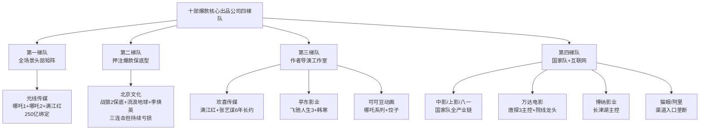

需要特别说明的是，**这四梯队并非彼此孤立而是普遍交织合作**。以《飞驰人生3》为例，单部影片的投资主体即包括猫眼娱乐（25%-30%主投）、博纳（20%-25%）、中影（15%-20%）、万达（15%-20%）、横店（10%-15%）等五家不同梯队的公司[^57]；《李焕英》的出品方也涵盖了北京文化（民营头部）、儒意影业（保底主体）、猫眼娱乐（互联网）、阿里影业（互联网）、新丽传媒（腾讯系）、大碗娱乐（艺人公司）、中国电影（国家队）等不同性质的公司[^59][^34]。**这种"多梯队协同抱团"的产业生态，正是中国电影爆款诞生的典型组织形式**。

## 4.2 保底发行与多方联合出品的风险分担机制

中国头部爆款的诞生，往往伴随着复杂的保底发行与多方联合出品安排。这种安排的本质是**通过资本与契约层面的设计，将单一影片的高风险高收益分散到产业链多个主体之间**。十部样本影片中，保底发行的典型案例为《战狼2》（北京文化与聚合影联8亿保底）与《你好，李焕英》（儒意影业15亿保底）；多方联合出品的典型案例为《战狼2》（14家出品方+7家发行方）、《长津湖》（博纳与八一电影制片厂等联合出品）、《李焕英》（7家主出品+18家联合出品）。

**保底发行的核心逻辑是"风险锁定+收益博弈"**。以《战狼2》为例，2016年北京文化在影片尚未开拍前便给出了8亿元保底，意味着北京文化与聚合影联在影片未上映前就向出品方支付了对应保底票房的分账金额（按片方33%分账比例计算约2.7亿元收入），同时垫付不超过6000万元的宣传营销和发行费用[^35]。**这一安排对吴京一方的意义在于"先卖为敬，落袋为安"——开拍前即锁定收益、规避票房不确定性风险**；对北京文化的意义则在于"押注爆款、上不封顶"——若票房超过8亿元，北京文化作为发行方将获得超额票房的更高比例分成。最终《战狼2》以56.94亿元收官，使北京文化获得净利润约1.6亿元[^39]，吴京则通过登峰国际作为出品方分享了剩余的票房分成。

**《李焕英》案例则展示了保底发行的另一种局面——主控方"卖亏了"**。北京文化作为第一出品方，将影片以15亿元保底卖给儒意影业与猫眼娱乐，最终影片票房高达54.13亿元，而北京文化从27亿元票房中预计获利仅6000万至6500万元，更多收益被保底方拿走[^59][^31]。儒意影业作为保底方与最大发行方，凭借票房远超保底金额的优势成为该影片资本层面的最大受益方，行业研究员判断"若《李焕英》票房达到50亿元，相关出品方的收益将非常可观，猫眼娱乐或可盈利4亿元-5亿元"[^31]。

下表对比了《战狼2》《李焕英》两个保底案例的关键参数，可清晰看出保底发行的"双向博弈"特征。

| 维度 | 战狼2（北京文化保底） | 你好，李焕英（儒意保底） |
|------|---------------------|------------------------|
| 保底金额 | 8亿元 | 15亿元 |
| 实际票房 | 56.94亿元 | 54.13亿元 |
| 票房/保底比 | 7.1倍 | 3.6倍 |
| 主控方收益 | 北京文化获约1.6亿元（保底+发行收益） | 北京文化仅获6000-6500万元 |
| 保底方角色 | 北京文化（兼主控） | 儒意影业（外部保底） |
| 风险归属 | 北京文化承担超低保底盈利空间 | 儒意承担全部超额收益机会 |

**这一对比揭示了保底发行的核心矛盾——主控方与保底方利益分离的程度**。在《战狼2》中，北京文化既是主控又是保底方，所有超额收益归己；在《李焕英》中，北京文化作为第一出品方将保底权让给儒意，超额收益被保底方拿走，自己仅获保底金额内的有限分成。**这一案例对后续爆款的产业意义深远**——业内此后普遍形成了"主控方慎让保底权"的认知，主控公司倾向于自留发行权或采用阶梯式保底（保底基础上按比例分享超额收益）而非纯买断式保底。

**多方联合出品则是另一种风险分担机制**。以《战狼2》为例，吴京自述"《战狼2》依然很缺钱"，即便有北京文化8亿保底也"赚不到钱"，因为影片制作成本从原定1.5亿涨到2亿，吴京甚至抵押别墅融资8000万元[^35]。在保底之后引入多家投资方分担成本，是吴京化解资金压力的现实选择。出品方多达14家、发行方达7家，背后既有资源整合的逻辑（春秋时代、星纪元影视等军旅题材合作方），也有"人情资源"的考量[^35]。同样的情况出现在《建军大业》（背后近40家出品方）、《李焕英》（7家主出品+18家联合出品）、《孤注一掷》（5家出品方+19家联合出品方）[^58]等多部高票房影片中。

**多方抱团出品的产业意义在于三个层面**：第一，**资源互补**——主控方提供IP与制作能力，互联网平台提供宣发渠道，院线公司提供排片支持，国家队提供主旋律资源协调；第二，**风险摊薄**——单部影片的高额制作成本由多家公司分担，降低任一方的财务压力；第三，**收益分散但稳定**——任一公司都不指望从单片获得超额收益，而是通过参与多片获取稳定的"档期红利"。猫眼娱乐与阿里影业之所以能"全年档期覆盖率几乎达到百分之百"[^62]，正是这种"广撒网、稳收益"逻辑的极致体现。

## 4.3 工业化制作能力与特效产业链协同

爆款电影的诞生，需要工业化制作能力的硬支撑。十部样本影片在工业化维度上的差异极大，但**头部影片普遍呈现出"高强度投入+多公司协同+技术创新驱动"的共同特征**。

《哪吒之魔童闹海》是当前中国电影工业化的巅峰标杆。该片制作投入9.8亿元，集合了**138家本土特效公司协同作战**[^63][^64]，主创团队规模达4000余名工作者[^29]。导演饺子在采访中坦言："我们一开始的目标，就是尽量设定自己完不成的目标。先设定一个高目标，然后再拼命去完成"[^29]。在技术层面，团队**研发了动态水墨渲染引擎**，融合青铜纹饰、水墨美学等东方视觉系统，将单帧渲染成本降低47%[^30]；全片1900个特效镜头中"穿心咒"场景耗时一年完成，其技术实力获得了奥斯卡评委的认可[^30]。该片最终累计打破113项影史纪录，北美IMAX票房达1.31亿美元，创下了动画类影片的纪录[^30]。**人均产能达到397万元**（按4000人团队、159亿全球票房计），远超行业平均水平[^65]。

《流浪地球》则是另一个工业化突破样本。导演郭帆团队为了构建科幻片世界观，特地编写了一本词典和一本编年史，依据小说**画了3000多张概念设计图、8000张分镜稿、1万件道具、10万平方米实景搭建**[^36]。北京文化董事长宋歌透露，影片在制作过程中**4次追加预算**，每一次追加都是"咬着牙坚持"[^36]。郭帆团队为《流浪地球3》进一步开发了专属AI应用"WEi"辅助制作，与小米集团、NVIDIA、火山引擎达成技术合作，墨境天合公司负责视效制作，剧组采用青岛东方影都虚拟摄影棚拍摄，运用穹顶光场系统提升制作效率[^27]。

《长津湖》的工业化体现在"三大导演联合执导+大兵团协同"模式。陈凯歌、徐克、林超贤三位顶级导演分工合作，全片视效镜头近3000个，由**67个视效团队共同完成**[^66]，其中包含来自济南的山东泉影空间影视传媒有限公司，该公司负责了空战场面等"硬核"视效[^66]。

《战狼2》的工业化路径则是"导演自主+军工资源协同"。吴京为完成军事场面调度，与各方协调争取了真坦克、真军舰、真军演镜头，同时邀请好莱坞团队参与动作设计。

下表汇总了十部样本影片的工业化制作关键参数，可观察其工业化水平的层级差异。

| 影片 | 制作成本（亿元） | 特效镜头数 | 协同公司/团队规模 | 关键技术创新 |
|------|----------------|-----------|------------------|-------------|
| 哪吒之魔童闹海 | 9.8 | 1900个 | 138家特效公司+4000人 | 动态水墨渲染引擎/单帧成本降47% |
| 长津湖 | 13亿（媒体口径，于冬未实锤） | ~3000个 | 67个视效团队/1.2万人拍摄 | 大兵团多导演协作 |
| 流浪地球 | 3.2 | 2003个 | 多家国内外特效公司 | 概念图3000张+分镜8000张+10万平实景 |
| 战狼2 | 2.0 | — | 多个国际动作团队 | 实景军事资源+好莱坞动作团队 |
| 哪吒之魔童降世 | 0.6（业内估算） | 约1800个 | 70余家特效公司 | 国漫工业化破冰之作 |
| 满江红 | 较低（古装单一场景） | 较少 | — | 单一场景的精准调度 |
| 你好，李焕英 | 不到1亿（业内估算） | — | 较小规模团队 | 低成本高情感密度 |
| 唐人街探案3 | 10 | 较多（异国场景） | 中日韩泰多团队协作 | 异国实景拍摄 |
| 飞驰人生3 | 4.2-5（含宣发） | — | 高速无人机+电磁转接机器+全新云台 | 4500米高海拔实景 |
| 疯狂动物城2 | (迪士尼自有) | (动画全片) | 迪士尼工业体系 | 单镜头5万只动物同框 |

数据来自各影片制作团队公开信息及上市公司公告[^57][^29][^36][^66][^35]。

**从工业化梯队对比可清晰看出三个层级**。第一层级是**"集群化协同型"**，以《哪吒2》《流浪地球》系列、《长津湖》为代表，这些影片调动了上百家特效公司、千人级以上的创作团队，形成了"主导公司+多家协同"的产业链协作模式。第二层级是**"中等强度制作型"**，以《战狼2》《唐探3》《飞驰人生3》为代表，制作成本在2-10亿元区间，依托国内外团队协作完成中等强度的视效制作。第三层级是**"低成本高情感型"**，以《李焕英》《满江红》为代表，工业化投入相对较低，但通过精准的情感配方与剧本驱动实现了高票房产出。

**特效产业链的地理多极化**也是中国电影工业化的重要特征。济南新视觉作为山东省唯一具备影视及动画双线全流程制作能力的专业技术团队，参与了《哪吒之魔童降世》《哪吒之魔童闹海》以及《长月烬明》《安乐传》等多部影视剧的特效制作[^66]；济南泉影空间则参与了《流浪地球1》《流浪地球2》《长津湖》《战狼2》《保你平安》《寻龙诀》等热门电影及《梦华录》《觉醒年代》《庆余年》《长安十二时辰》等爆款电视剧的后期制作[^66]。**成都已聚集690家数字文创规上企业**，构建了覆盖《王者荣耀》《十万个冷笑话》《哪吒》等的IP矩阵，2024年产业核心规模达3819亿元[^65]；天府长岛数字文创园已形成从IP开发到衍生品运营的完整产业链。这种**"成都—北京—上海—青岛—济南"多极特效产业地理格局**的形成，是中国电影从"作坊式生产"向"集群化协同"跃迁的产业基础。

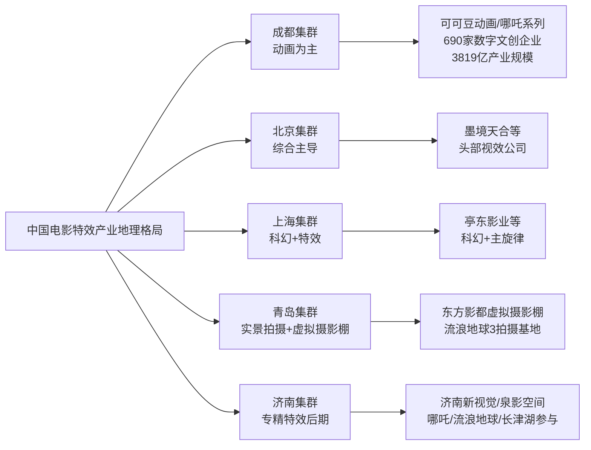

## 4.4 IP运营模式与衍生品产业链延伸

如果说工业化制作是头部影片的"硬基础"，那么IP运营则是头部公司向"产业链全场景"扩张的"软杠杆"。**《哪吒之魔童闹海》开创了中国电影"票房打底、衍生盈利"的新模式**，其衍生品销售额突破千亿元规模，是票房154亿元的6倍以上[^65][^63][^64]。

光线传媒董事长王长田在公开论坛上披露，《哪吒2》的衍生品销售额已达"几百亿"，预计最终将突破千亿元——"这意味着一部动画的周边收入已是票房的6倍"[^65]。这一规模在好莱坞IP衍生品收入通常是票房3-5倍的标准下，已经达到了**5-8倍的"超工业化变现水平"**[^63][^64]。下表汇总了《哪吒2》衍生品矩阵的核心变现路径。

| 衍生路径 | 代表案例 | 核心数据 |
|---------|---------|---------|
| 潮玩盲盒 | 泡泡玛特联名款隐藏款敖丙哪吒 | 二手价最高1000元/溢价近10倍 |
| 跨界联名 | 柳州螺蛳粉、蒙牛、荣耀、长城汽车等300+品牌 | 螺蛳粉15天卖80万袋/单品牌联名带动销售增长383% |
| 数字变现 | 哪吒/敖丙虚拟人直播+12款数字藏品 | 单场直播观看2000万/数藏1小时售罄/3600万元 |
| 机甲众筹 | 1980元合金机甲 | 目标100万、最终1.2亿元、完成率12000% |
| 影视IP+文旅 | 河南西峡陈塘关遗址公园、四川宜宾哪吒行宫 | 客流量激增300%/单日接待8000人次 |

数据来源：基于光线传媒公告与行业研究[^65][^63][^64]。

**这一衍生品矩阵的产业意义在于"彻底颠覆票房依赖型盈利模式"**。光线传媒2025年一季度财报显示，公司营业收入约29.75亿元，同比增长177.87%；归属于上市公司股东的净利润约20.16亿元，同比大增374.79%[^67]。**核心增量全部来自《哪吒2》的票房与衍生品**[^64]。光线在哪吒IP衍生品上采用"保底分成+销售额抽成"模式，覆盖300多家品牌，并在电影上映前6个月就启动衍生品预售，下映后持续开发长线产品，彻底打破了"电影下映、衍生滞销"的魔咒[^63][^64]。

**不同公司的IP运营路径差异同样显著**。光线传媒以**"山海经神话宇宙20部规划"**为路径，王长田计划用十年打造20部神话系列电影，目前衍生品收入已突破10亿元[^56]，并在与多个重点地区洽谈合建主题乐园的合作模式[^67]。博纳影业以**"主旋律商业片矩阵"**为路径，通过《长津湖》《红海行动》《中国机长》等系列建立主旋律商业大片的IP认知，但2025年《蛟龙行动》的失败暴露了这一路径的脆弱性——9.3亿元制作+近10亿元宣发的总投入，最终票房仅5.84亿元，亏损约8.5亿元，位居当年国产电影亏损排行榜首位[^56]。欢喜传媒以**"作者型导演长约"**为路径，2018年与张艺谋签下6年长约，拥有对张艺谋执导的三部网络系列影视剧的独家投资权（可将其中一部替换为电影项目），最终孵化出《一秒钟》《满江红》等重要作品[^59]。亭东影业以**"飞驰系列三部曲86亿元IP沉淀"**为路径，从《飞驰人生1》（17.28亿元）到《飞驰人生2》（33.61亿元）再到《飞驰人生3》（最终累计43亿元以上），完成了"从单一作品到国民IP的蜕变"[^26]。

值得关注的是**可可豆动画的"制作团队向上游攫取话语权"现象**。该工作室作为饺子团队的核心载体，在2025年获得了广播电视节目制作许可证与电影发行权，意味着《哪吒3》或将分食原本属于光线的独家发行权[^61]。这一动向预示着一个深远的产业变化——**当一个IP的真正价值创造者（导演工作室）拥有发行权后，传统发行公司的"中间商利润"将受到挤压，制作端话语权显著上升**。这也是王长田在上海国际电影节呼吁"将利益向制片方倾斜"的产业背景之一[^67]。

哪吒IP的另一典型变现路径是**"影视IP+文旅"融合**。河南西峡陈塘关遗址公园因电影热度客流量激增300%，四川宜宾哪吒行宫单日接待游客8000人次[^65]。光线传媒已与多个重点地区洽谈合建主题乐园，"将以多元化、可持续发展的方式进行IP开发"[^67]。这一模式与迪士尼"内容—衍生—乐园"的全产业链闭环高度相似，标志着中国头部影视公司开始从"内容生产者"向"产业链运营者"转型。**"哪吒vs迪士尼公主线"的用户画像差异**也清晰可见：迪士尼以10-18岁少女为主，主打浪漫梦幻，靠高频小额消费盈利；而哪吒75%的用户是12-35岁的Z世代+年轻白领，男性占比60%，更爱机甲、模型等高单价、高收藏价值产品[^63][^64]。**两条路径分别对应"大众覆盖"与"圈层深耕"，是同一个IP产业模式的差异化表达**。

## 4.5 票房分账机制与公司业绩兑现

理解头部影片背后的产业格局，必须穿透分账机制的"黑箱"。**中国电影行业的标准分账规则**为：总票房先扣除5%的电影事业专项资金与3.3%的增值税及附加（合计8.3%为"不可分账票房"），剩余91.7%为"可分账票房"；可分账票房中，影院与院线分走约57%，发行方抽取约10%，制片方最终获得约33%[^65][^68]。这一比例正是光线传媒董事长王长田在2025年上海国际电影节论坛上反复强调的"100块钱片方拿到33块钱"的依据。

下表基于上述分账规则，对十部样本影片的主要公司收益进行测算（以已披露数据为准）。

| 影片 | 累计票房（亿元） | 估算片方分账（亿元） | 主要受益公司 | 已披露具体收益 |
|------|----------------|--------------------|------------|---------------|
| 哪吒之魔童闹海 | 154.46 | 约51 | 光线传媒（核心） | 2025前三季度净利23.36亿/同比+407% |
| 长津湖 | 57.75 | 约19 | 博纳影业（主控） | 博纳分得约5-6亿（业内估算） |
| 战狼2 | 56.94 | 约19 | 北京文化（保底）+登峰国际 | 北京文化净利1.6亿元 |
| 你好，李焕英 | 54.13 | 约18 | 儒意影业（保底最大方） | 北京文化仅获6000-6500万 |
| 哪吒之魔童降世 | 50.35 | 约17 | 光线传媒+彩条屋 | 业绩计入2019年度 |
| 流浪地球 | 46.87 | 约16 | 中影+北京文化 | 中影项目投资4500万 |
| 疯狂动物城2 | 45.94 | (进口片分账规则不同) | 迪士尼 | 国内分账约13% |
| 满江红 | 45.44 | 约15 | 欢喜传媒（主控） | 张艺谋分账丰厚 |
| 唐人街探案3 | 45.23 | 约15 | 万达电影（主控） | 万达投资比例34.5% |
| 飞驰人生3 | 43+ | 约13-14 | 亭东影业（主控）+猫眼+博纳 | 亭东主控收益最大 |

数据综合自[^65][^67][^56][^68][^39][^31][^26]。注：实际分账受发行代理费、保底协议、各方持股比例等因素影响，本表为估算量级。

**从测算可见，单部爆款对头部公司业绩的拉动效应极为显著**。光线传媒2025年前三季度归母净利润23.36亿元，**接近公司过去七年的总和**，且公司在《哪吒2》上映期间股价飙升114%，市值增长远超票房分账收益[^65][^56]。北京文化在《李焕英》上映后牛年开市首日即取得涨停，早盘一度封单超100万手[^31]。光线传媒在2025年4月披露一季度财报后股价封死20cm涨停[^67]。**这一资本市场联动效应正在重构影视公司的估值逻辑**——头部影视公司的市值不再仅仅基于年度净利润，而是叠加了"IP长期价值+衍生开发空间+主题乐园愿景"的多重溢价。

然而，**单部爆款的"超额收益"也带来分账争议的激化**。王长田公开质疑现行分配结构："100块钱拿到33块钱，怎么维持行业基本投入？"他建议向片方倾斜分账比例，同时降低票房在总收入中的占比——目前中国电影对票房的依赖率达到95%以上，王长田建议将其降至50%，通过提高衍生品收入占比来重塑行业盈利模式[^69][^67]。**这一争议背后是一个深层的产业问题**：如果片方分账比例不提升、衍生品开发不加强，社会资本的投入将持续中断（每年电影行业整体亏损可能上百亿元），导致影片在拍摄过程中资金链断裂、行业萎缩[^69]。

但业内对此并非一致认同。一种反对观点指出，王长田的"33%固定分成论"忽略了量变效应——随着票房升高，电影院的服务成本会同步增加（"服务一个人跟服务一万个人的成本是不一样的"），但片方的成本不会随票房线性增加[^69]。也就是说，**当票房从预期50亿冲到150多亿时，片方实际利润率是大幅放大而非缩水的**。还有观点认为，"分账模式肯定都是提前定好的，既然认可了这样的分账模式就要接受"[^69]。这一争议预示着中国电影分账机制的下一轮调整或将围绕"片方+衍生品"的双轨结构展开，而非简单的票房分账比例博弈。

## 4.6 国产民营、国营、互联网与好莱坞四类玩家的格局对比

将十部样本背后的出品力量按性质归类，可以划分为**传统民营头部、国营国家队、互联网新势力、好莱坞引进方**四大阵营。四类玩家在十部爆款中的参与方式、风险偏好与盈利模式存在显著差异。

下表系统对比了四类玩家的核心特征。

| 玩家类型 | 代表公司 | 在十部样本中参与情况 | 核心竞争力 | 风险偏好 | 盈利模式 | 典型业绩特征 |
|---------|---------|--------------------|-----------|---------|---------|-------------|
| 传统民营头部 | 光线、博纳、北京文化、华谊、万达、欢喜、亭东、坏猴子 | 几乎所有国产爆款的主控/出品 | 内容创作能力+IP沉淀 | 高（押注爆款） | 票房分账+衍生品+股权增值 | 北京文化爆款发动机vs三年累亏15亿；博纳长津湖大赚vs蛟龙行动巨亏8.5亿 |
| 国营国家队 | 中影、上影、八一电影制片厂 | 流浪地球主投+长津湖联合+多片参与 | 全产业链布局+主旋律资源协调 | 低（稳健参投） | 全产业链稳定收益+发行垄断 | 中影占同期国产片发行82.66%但净利率不到2.3% |
| 互联网新势力 | 猫眼娱乐、阿里影业、淘票票 | 飞驰人生3主投+李焕英出品+多片渗透 | 票务+宣发+数据 | 中（广撒网式参投） | 渠道入口垄断+宣发服务费+主控票房 | 全年档期覆盖率近100%但主控项目仍为入门玩家 |
| 好莱坞引进方 | 迪士尼 | 疯狂动物城2 | 成熟动画IP+精细化运营 | 低（成熟IP复刻） | 国际票房分账+IP衍生 | 国内分账约13%，长尾型票房曲线 |

数据综合自[^65][^62][^58][^56]。

**传统民营头部的核心特征是"高弹性高风险"**。这一阵营内部又呈现两极分化：成功案例（光线传媒2025年净利23.36亿、欢喜传媒满江红主控、亭东影业飞驰系列86亿IP）与失败案例（华谊兄弟持续亏损、北京文化三年累亏15亿、博纳影业蛟龙行动巨亏8.5亿）并存[^56]。**单部爆款的成败几乎决定了这类公司的年度生死**——以博纳影业为例，《长津湖》主控让公司分得约5-6亿元收益，而《蛟龙行动》失败则使公司在2025年陷入巨亏，市场反应极为激烈，CEO于冬甚至卷入了港澳赌场追债诉讼[^56]。这种"高弹性高风险"的本质决定了民营头部公司必须不断押中爆款才能维持估值，但爆款的不可复制性又使长期生存极为艰难。

**国营国家队的核心特征是"全产业链稳健但利润微薄"**。中国电影集团2025年前三季度营收29.28亿元，归母净利润仅6636万元，**净利率不到2.3%**[^56]。但其银幕市场占有率约31%，发行的国产影片占同期票房82.66%，参与出品的影片占国产片票房32.79%。这一"高市占率+低利润率"的反差揭示了国家队的特殊定位：**作为"压舱石"性质的全产业链国家队，承担市场稳定与主旋律协调功能，而非单纯追求利润最大化**。其参与每部头部影片的方式以联合出品为主、主控为辅（仅《志愿军》《南京照相馆》等少数主旋律项目主控），通过广覆盖获取稳定但分散的收益。

**互联网新势力的核心特征是"渠道入口垄断+主控能力相对薄弱"**。猫眼娱乐与淘票票"全年档期覆盖率几乎达到百分之百"[^62]，在十部样本中除最早的《战狼2》《哪吒1》外几乎悉数渗透。在2024年暑期档中，猫眼前三出品项目共计9部，其中包括了《默杀》《伞少女》两部主控影片[^62]。但**互联网公司在主控项目层面"实实在在的入门玩家"**——猫眼主控的《伞少女》票房表现平平，淘票票主控的《欢迎来到我身边》累计票房不足5000万元[^62]。这一格局意味着互联网公司虽然垄断了渠道入口（票务+数据），但在内容创造的核心环节仍需依赖传统民营公司与导演工作室。

**好莱坞引进方的核心特征是"成熟动画IP+精细化运营的窄路径复苏"**。迪士尼凭借《疯狂动物城2》打破了2024年进口片票房冠军仅6.84亿元的多年沉寂，以45.94亿元跻身中国影史票房榜第七位[^25][^33]。**这一成功并非偶然**：首部作品在2016年已积累15.3亿元票房与豆瓣9.3分的国民认知基础；续集等待9年后上映，原观众已步入社会、新观众则被精准击中；细节极致的工业化制作（单镜头最高实现5万只动物同框、冰川镇雾气每帧渲染120小时）支撑起IMAX/4DX高溢价制式；本土化营销策略对比2024年多部"零宣传"上映的好莱坞大片极为精细。**这一"成熟IP+合家欢动画+精细化运营"的窄路径，是当前进口片在中国市场的唯一可行复苏模式**。

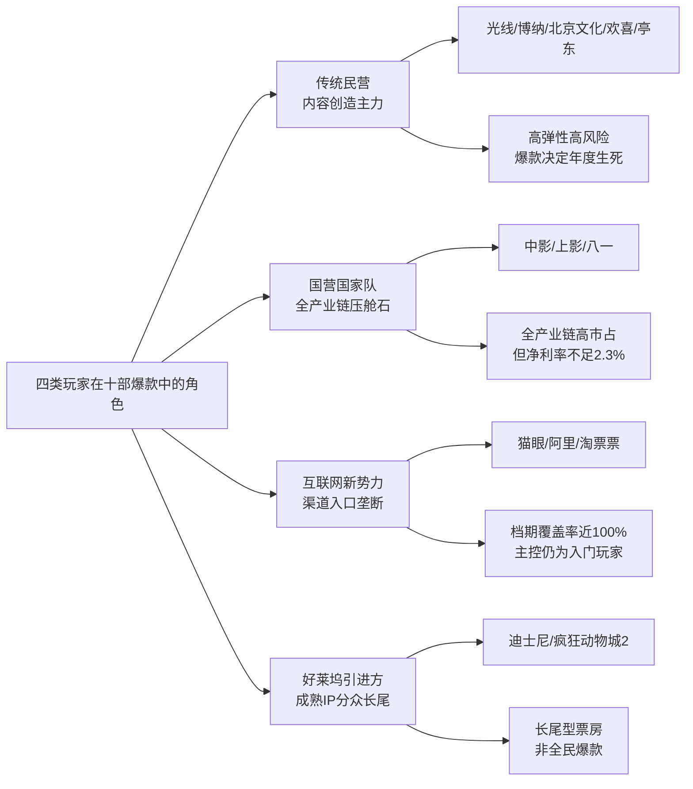

## 4.7 产业集中度上升与"制作—发行—放映"一体化趋势

综合前述六节的横向比较，可提炼出中国电影产业格局当前与未来的**三大结构性变化趋势**。

**第一，头部集中度持续上升，"强者恒强"的马太效应深化**。2025年中国电影总票房518.32亿元中，全年票房排名前十的影片中4部超30亿元、8部超10亿元，但票房在1亿-5亿元及5亿-10亿元区间的影片数量同比大幅下降[^56]。这意味着**腰部影片塌陷正在加剧产业集中度**——票房资源向头部影片与头部公司高度集中，中等量级项目的生存空间被显著压缩。十部样本背后由不到10家核心出品公司主导，且光线传媒一家凭借《哪吒2》单片便贡献了2025年中国电影总票房近30%。这一集中度水平在世界主要电影市场中都属于罕见，标志着中国电影产业正进入"少数赢家通吃"的新阶段。

**第二，光线、万达、博纳等头部公司加速向"制作—发行—放映—衍生"全产业链一体化布局**。光线传媒已建立"哪吒系列+山海经神话宇宙20部规划+主题乐园合作+衍生品矩阵"的全产业链生态，2025年前三季度净利润达23.36亿元同比增407%[^56]。万达电影从院线龙头转型为"超级娱乐空间"，2025年前三季度归母净利润7.08亿元同比大增320%，通过IP联动衍生品提升非票收入[^56]。博纳影业虽因《蛟龙行动》遭受重创，但其"全产业链布局影视集团"的战略方向并未改变，"以影视投资、影视发行、院线及影院管理为主营业务，覆盖版权运营、IP衍生、广告营销、艺人经纪等业务"[^65]。**与此形成鲜明对比的是华谊兄弟、北京文化等传统单一环节公司持续掉队**——华谊兄弟在2024年暑期档"民营失声"中表现不佳[^62]，北京文化三年累亏15亿元且原高管被立案[^60][^56]。这一对比预示着**未来3-5年中国电影产业将形成"几家全产业链平台型公司+少数作者型导演工作室+众多专业服务商"的新格局**，传统单一发行或制作公司的生存空间将进一步收窄。

**第三，"制作公司向上游攫取话语权"现象兴起，王长田呼吁的"分账格局重构"或在3-5年内逐步落地**。可可豆动画获得电影发行权是这一趋势的标志性事件——当一个IP的真正价值创造者（导演工作室）拥有发行权后，传统发行公司的"中间商利润"将受到挤压，制作端话语权显著上升[^61]。同时，王长田在公开论坛上呼吁"应该把更多利益向制片方倾斜"、"将票房依赖率从95%降至50%"[^67]，这一呼吁本身反映出制作端集体争夺产业话语权的诉求。**未来分账机制的调整方向可能是双轨制**：一方面在票房分账比例上小幅向片方倾斜（如从33%提升至38-40%），另一方面通过衍生品、主题乐园、IP授权等非票房收入大幅提升片方在总收入中的占比（如从目前的5%提升至30-50%），最终实现"票房依赖50%、衍生开发50%"的盈利结构。

下表总结了产业格局演进的核心特征对比。

| 演进维度 | 当前格局（2017-2024） | 未来趋势（2025-2030） |
|---------|---------------------|---------------------|
| 集中度 | 头部公司10家左右活跃 | 5-7家平台型公司主导 |
| 业务结构 | 制作/发行/放映分离 | 全产业链一体化 |
| 收入构成 | 票房依赖95%+ | 票房+衍生+乐园三轮驱动 |
| 制作端话语权 | 受发行公司主导 | 导演工作室获得发行权 |
| 分账比例 | 片方33% | 片方38-40%（小幅倾斜） |
| 进口片地位 | 多年沉寂 | "成熟IP+合家欢动画"窄路径复苏 |

**这一产业集中度变化既是当前爆款规律的产物，也将深刻影响未来高票房类型的孵化逻辑**。能够调动140家特效公司协同制作（如《哪吒2》）、提前6个月布局衍生品（如光线传媒的IP预售模式）、跨区域整合产业资源（如成都+北京+上海的特效集群协同）的"平台型公司"，将成为下一轮爆款的核心孵化器。这一判断对第8章中国电影市场结构性趋势分析与第9章未来高票房类型预测具有直接的指引价值——**未来的高票房影片，将不再仅由"内容质量"决定，更由"产业链整合能力"决定**。一个不具备衍生品开发与全产业链运营能力的项目，即便内容优秀，也难以在马太效应加剧的市场环境中突破头部门槛。这正是第3章揭示的"文化认同+情感共鸣"双驱动机制在产业层面的延伸——**前者保证内容能引爆观众情绪，后者保证产业链能将引爆的情绪转化为持续的产业价值**。

# 5 片长、档期与上映策略比较

第3章从内容维度揭示了"文化认同+情感共鸣"的双驱动机制，第4章从产业维度描绘了头部公司矩阵化布局与全产业链一体化趋势。然而，**优质内容与产业资源并不会自动转化为票房**——一部影片要真正抵达观众、引爆市场，还必须借助一整套放映层面的策略安排：以多长的片长承载叙事野心、以哪个档期对接观众情绪、以何种制式版本释放视听溢价、以多长的密钥窗口延展长线效应、以怎样的海外路径拓展全球市场。本章因此将研究视角从"内容与产业"下沉至"放映与发行"这一中介环节，按照"片长结构—档期分布—密钥延期—制式分级—海外路径—策略组合验证"的递进逻辑展开横向比较，验证"热门档期+合理片长+多版本制式+长线密钥+海外同步"这一组合策略对票房放大效应的真实贡献度，并为第9章未来高票房类型预测提供放映策略层的可操作性边界。

## 5.1 片长结构对比与"超长片"门槛现象

将十部样本影片按片长升序排列，可以清晰地观察到一个结构性事实：**头部影片的片长普遍偏长，且"120分钟以上"已成为事实门槛**。下表汇总了已知片长的样本数据。

| 影片 | 片长（分钟） | 档期 | 累计票房（亿元） | 片长分级 |
|------|------------|------|----------------|---------|
| 长津湖 | 176 | 国庆档 | 57.75 | 超长片 |
| 满江红 | 159 | 春节档 | 45.44 | 超长片 |
| 哪吒之魔童闹海 | 144 | 春节档 | 154.46 | 中长片 |
| 唐人街探案3 | 136 | 春节档 | 45.23 | 常规片 |
| 你好，李焕英 | 128 | 春节档 | 54.13 | 常规片 |
| 流浪地球 | 125 | 春节档 | 46.87 | 常规片 |
| 战狼2 | 123 | 暑期档 | 56.94 | 常规片 |
| 飞驰人生3 | 数据未获取 | 春节档 | 43+ | — |
| 哪吒之魔童降世 | 110 | 暑期档 | 50.35 | 紧凑片 |
| 疯狂动物城2 | 约109 | 贺岁档 | 45.94 | 紧凑片 |

数据来源：综合自各影片公开资料及猫眼专业版[^27][^28][^70][^28]。

按片长结构划分四档：**超长片（≥160分钟）2部、中长片（140—160分钟）1部、常规片（120—140分钟）4部、紧凑片（<120分钟）2部**，已知片长9部样本的平均片长约137分钟。需要特别指出的是，**《长津湖》176分钟的片长是十部样本中最长者**，《满江红》159分钟、《哪吒2》144分钟紧随其后[^27][^28]。这一结构与2018年以前国产主流商业片普遍100—110分钟的格局形成鲜明对比——彼时业内的常识是"片长90—100分钟有助于电影院排片，每天可以排更多场次，推动票房叠加"[^27]，但当下头部影片明显突破了这一约束。

**片长偏长对单银幕产出造成了实实在在的双向影响**。负面影响在于挤压排片场次：2023年春节档影片平均时长达到史无前例的130分钟，《流浪地球2》173分钟、《满江红》159分钟，影片放映总场次同比降低17%，今年春节档总场次相比于去年同期减少50万场[^30]。然而值得关注的是，**场次减少并未导致档期总票房下滑**——同年春节档场均人次达到47.1人次，较2022年春节档的36.2人次每场提升了10人次以上，上座率达38.3%同比增长7.4个百分点[^30]。这意味着观众对优质长片的接受度足以抵消场次减少的影响，形成"长片换上座率"的新平衡。

正面影响则体现为"分量感"对观众"值回票价"感知的强化。武汉一位资深发行人士在分析《长津湖之水门桥》149分钟片长时直言："从《长津湖》的票房来看，接近3小时的电影时长并未对它当时的票房造成负面影响，所以它的续集依然加量不加价"[^27]。在票价持续上涨的背景下，长片通过单位时间成本的"压低"反而强化了观众的购票意愿——若以2023年平均票价42.2元计算，176分钟的《长津湖》单位时间成本约为0.24元/分钟，远低于同期90分钟商业片的0.47元/分钟。

但**片长本身并非票房决定因素**。最具说服力的反例是2022年春节档同题材对决——同样是抗美援朝题材，张艺谋《狙击手》仅96分钟、是当年春节档片长最短的真人电影，而《长津湖之水门桥》片长149分钟，最终前者票房6.07亿元、后者票房40.67亿元，差距悬殊[^27]。武汉发行人士对《狙击手》"较短片长"表示担忧时也直言："《悬崖之上》都有120分钟呢，这次的96分钟会不会让观众看得意犹未尽？毕竟是一部战争大片，1个小时36分钟能不能把这群狙击手的故事讲透"[^27]。这一反例论证了一个关键判断：**片长并非孤立的票房杠杆，关键在于片长与题材厚重度的匹配度**——战争史诗、神话奇观、科幻巨制等"重工业产品"需要长片承载世界观与情感弧线，而单一场景、紧凑叙事的影片则未必需要拉长片长。

值得辨析的还有**片长上限的隐含天花板**。十部样本中最长的《长津湖》176分钟仍在观众接受范围内，《流浪地球2》也以173分钟获得豆瓣8.3的高口碑[^41]，但业内人士普遍认为3小时左右是头部影片的实际上限——超过这一阈值，单日排片场次将降至3—4场，对单银幕产出形成硬约束。这一上限在第9章未来类型预测中具有现实意义：硬科幻、战争史诗等"重工业类型"虽然适合长片，但片长扩张已接近天花板，未来更多增量将来自"叙事密度提升"而非"时长延伸"。

## 5.2 档期分布与春节档孵化器效应

第2章已初步揭示十部样本档期分布的高度集中性，本节进一步深入分析三大头部档期的差异化属性与"档期—题材—观众情绪"匹配机制。

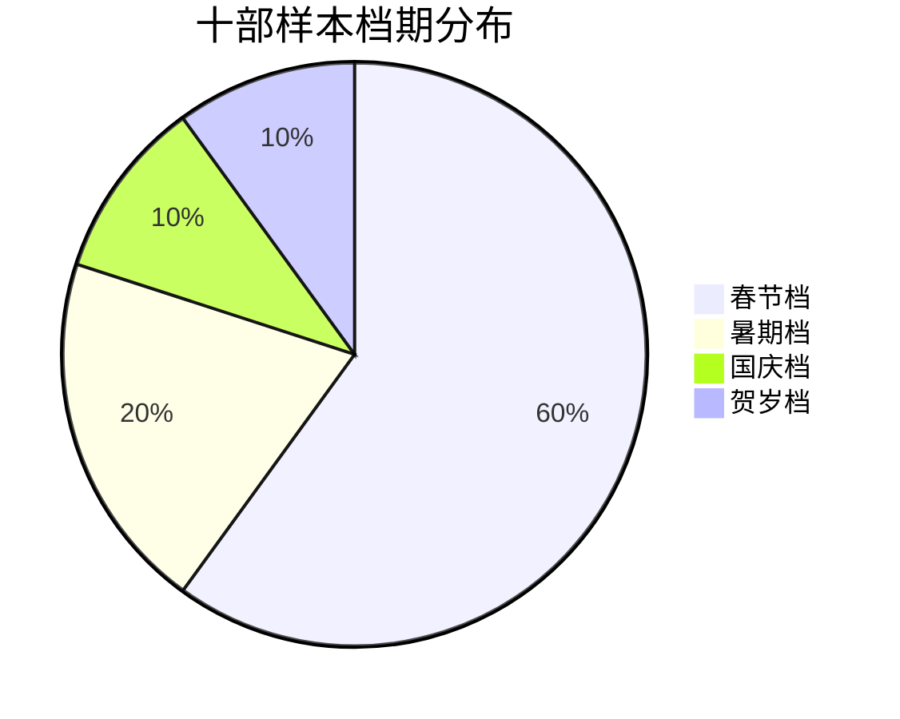

十部样本中**春节档6部（《哪吒2》《李焕英》《满江红》《唐探3》《飞驰人生3》《流浪地球》）、暑期档2部（《战狼2》《哪吒1》）、国庆档1部（《长津湖》）、贺岁档1部（《疯狂动物城2》）**，春节档以60%占比构成头部影片的绝对主要孵化器，热门档期合计占100%[^70][^25]。这一档期集中度在世界主要电影市场中属于罕见现象，反映出中国电影市场"档期红利"对头部票房的决定性意义。

**春节档的核心属性是"合家欢刚需+喜剧元素强制性"**。2026年春节档以57.49亿元总票房收官，9天假期吸引1.2亿人次入场观影，《飞驰人生3》以29.27亿元档期票房断层式领跑，贡献了总票房的51%[^71][^41]。该片之所以能成为春节档冠军，业内分析直指核心："对于中国人来说，春节是个极其讲究团圆的日子，在这个假期观影的底层逻辑万变不离其宗，那就是解压和热闹，千言万语汇成四个字——'图个乐呵'，这里面的'乐'其实就是情绪价值，让不同年龄层的观众在同一块银幕前，都能找到属于自己的快乐"[^71]。这一属性决定了**春节档对喜剧元素具有强制性需求**——《哪吒2》喜剧元素是一大看点，《唐探》系列主打"喜剧+悬疑"配方，《你好，李焕英》将母女亲情与喜剧、奇幻熔于一炉，《飞驰人生3》具备明星阵容、喜剧笑点、赛车大场面三大要素，而2026年春节档同期的《惊蛰无声》（国安谍战）、《镖人》（硬核武侠）虽然口碑分别为豆瓣6.2和7.5不俗，但与节日合家欢氛围契合度低，最终档期票房分别仅8.68亿和8.06亿[^71][^41]。

**国庆档的核心属性是"主旋律战争片天然契合"**。2016年《湄公河行动》以5.3亿票房拉开了主旋律电影大规模进入国庆档的序幕，之后《我和我的祖国》《中国机长》等的票房成功，让"大众—主旋律电影—国庆档"逐渐形成耦合关系[^72]。《长津湖》在2021年国庆档以57.75亿元打破历史纪录后，"志愿军"系列连续三年相约国庆档，2024年《志愿军：存亡之战》、2025年《志愿军：浴血和平》延续了主旋律战争片在国庆档的稳定性[^73][^72]。值得关注的是，**战争片对不同地区观众都有吸引力**——据灯塔专业版数据，《志愿军：存亡之战》上映期间，其在一线至四线城市的票房占比都超过了40%，下沉市场与一二线城市的观众都愿意来到影院观看战争片[^72]。这种"全城市层级覆盖"的特性使主旋律战争片成为国庆档不可替代的票房支柱。

**暑期档的核心属性是"强类型容纳度+长线发酵"**。《战狼2》于2017年7月27日上映，开画85小时票房突破10亿成为内地史上最快破10亿的华语片，三天破5亿、四天破8亿、首周四日累计9.81亿[^28]。《哪吒1》则在2019年暑期档以国漫黑马姿态突围至50.35亿元[^27]。**暑期档对纯严肃类型的容纳度远高于春节档**——《战狼2》主打硬核军事动作而非合家欢喜剧，仍能凭借爱国情怀引爆市场；《哪吒1》虽是动画但其"我命由我不由天"的反叛主题对青少年观众的精神共鸣，是暑期档的天然契合点。同时暑期档的两个月超长档期也提供了"长线发酵"的时间窗口，使口碑驱动的影片能够持续累积票房。

**贺岁档则展现出"进口合家欢动画+本土多元化"的格局**。2025年贺岁档总票房突破50亿元创近八年同期新高，《疯狂动物城2》在中国内地斩获的票房接近其全球票房一半，远超北美本土成绩[^70]。这一成就的背景是"中国电影市场的持续繁荣正在重塑全球电影产业格局"，"零时差"上映成为好莱坞撬动票房收益最大化的务实选择[^70]。同时贺岁档不同于往年喜剧、合家欢题材为主导的局面，2025年贺岁档70余部影片涵盖历史、悬疑、纪录、温情、奇幻、公益等多元类型，《得闲谨制》《中华白海豚》等"非典型贺岁片"打破了贺岁档的传统边界[^70]。

下表汇总四大头部档期的差异化属性与最佳匹配题材。

| 档期 | 核心属性 | 强制性需求 | 最佳匹配题材 | 样本影片 |
|------|---------|-----------|-------------|---------|
| 春节档 | 合家欢刚需+解压热闹 | 喜剧元素强制 | 合家欢喜剧/合家欢动画/亲情奇幻 | 哪吒2、李焕英、满江红、唐探3、飞驰3、流浪地球 |
| 国庆档 | 节日纪念+爱国情绪 | 主旋律契合 | 主旋律战争/历史叙事 | 长津湖 |
| 暑期档 | 长线发酵+学生群体 | 强类型容纳 | 军事动作/动画神话/科幻 | 战狼2、哪吒1 |
| 贺岁档 | 跨年观影+多元类型 | 类型多元化 | 进口合家欢动画/温情 | 疯狂动物城2 |

**这一档期—题材匹配关系并非简单的经验性归纳，而是观众情绪与节日属性的深层耦合**。需要特别强调的是，**档期红利并非票房保证**——2026年春节档总票房57.49亿元较2025年同期95.14亿元同比下滑39.6%，几乎回到2018年水平[^41]。这一反差揭示了档期红利的边界条件：当档期内缺乏"全民现象级"作品（如2025年的《哪吒2》），即便档期本身仍是头部孵化器，整体票房也会大幅回落。换言之，**档期红利的本质是"热门档期为优质内容提供放大器"，而非"档期本身能创造票房"**。

## 5.3 密钥延期策略与长线放映效应

密钥延期作为电影行业的核心放映策略之一，其本质是"通过延长数字密钥有效期来延长影片在影院的放映周期"——密钥常规有效期为一个月，由新闻出版广电总局数字节目管理中心及中影股份数字电影发行（院线）公司制作并发布，重新制作密钥仅需数秒钟、全国近三万台放映设备折算下来需约一天时间，且制作免费[^74]。

**截至2026年3月11日，中国影史票房TOP10无一例外都做过密钥延期，且爆款基本都是多次延期、映期拉到3—4个月甚至更久**[^75]。下表汇总十部样本影片的密钥延期情况。

| 影片 | 延期次数 | 总映期 | 累计票房（亿元） | 延期后票房放大效应 |
|------|---------|-------|----------------|------------------|
| 哪吒之魔童闹海 | 4次 | 153天 | 154.46 | 跨春节—端午档期 |
| 长津湖 | 多次 | 超3个月 | 57.75 | 延至2021-12-30 |
| 战狼2 | 多次 | 超3个月 | 56.94 | 暑期档—国庆档延伸 |
| 你好，李焕英 | 多次 | 超3个月 | 54.13 | 春节—清明长尾 |
| 哪吒之魔童降世 | 多次 | 超3个月 | 50.35 | 暑期档—国庆延伸 |
| 流浪地球 | 多次 | 超3个月 | 46.87 | 春节—五一延伸 |
| 疯狂动物城2 | 3次 | 至2026-03-25 | 45.94 | 贺岁—春季长尾 |
| 满江红 | 多次 | 超3个月 | 45.44 | 春节—清明延伸 |
| 唐人街探案3 | 多次 | 超3个月 | 45.23 | 春节—五一延伸 |
| 飞驰人生3 | 2次 | 至2026-05-18 | 43+ | 春节—初夏长尾 |

数据来源：综合自[^75][^76][^77][^78][^75][^79][^25][^33]。

**《哪吒2》是密钥延期策略的极致样本**。该片于2025年1月29日上映，先后于2月19日、3月21日、4月22日、6月12日四次申请密钥延期，最终在2025年6月30日23:59密钥到期下映，总映期153天[^76][^77]。从春节档延伸至端午档的"超长待机"，使影片票房从首轮春节档的100亿元区间持续累积至最终的154.46亿元。值得关注的是，影片在第四次延期期间，单日票房仍能维持在百万量级，足见其长线吸引力[^76]。

**《飞驰人生3》则展示了密钥延期的另一种典型形态——以"系列片复利"应对档期红利衰退**。该片片方宣布延长放映至2026年5月18日，相当于让观众在影院里"二刷三刷"的时间窗口，比某些恋爱关系的保质期还长[^79]。该片对比前作走势更显韧性：《飞驰人生》首部17.28亿、《飞驰人生2》33.61亿、第三部直接跃升近10亿至43亿+[^79][^26]。密钥延期对这种"系列粉丝补票"型影片的票房放大效应尤为显著——影院经理反馈"延期后周末仍有零星观众，多为'补票'的系列粉丝"[^79]。

**密钥延期的核心逻辑是"片方与院线基于真实数据和渠道反馈的双向选择"**。决定一部电影是否要密钥延期，主要依据电影版权方的意见，参考因素源于电影在市场里的"热度"——"院线基于部分观众的观影需求，以及影片在非黄金时段的稳定上座率，建议并支持电影的密钥延期"[^74]。这一逻辑在《飞驰人生3》案例中得到清晰验证："延期密钥这种事，本质上是片方和院线的双向选择。票房还在细水长流，影院愿意给排片，片方何乐不为"[^79]。

然而，**密钥延期是必要条件而非充分条件**。中国发行放映协会技术分会副会长马秉超明确指出："密钥延期不复杂，但并非任何一部电影在密钥延期后都能实现票房神话，关键得看电影院是否会有排映空间来支持所延期的电影"[^74]。十部样本中也存在延期效果差异巨大的案例——《唐探3》豆瓣口碑5.3崩塌后，即便享春节档红利+IP情怀+多版本上映，预测票房也从映前的65亿下调至45亿区间[^34]；《复仇者联盟4》虽延期但因新片冲击及口碑透支后续乏力，最终42.50亿元被《飞驰人生3》挤出前十[^79]。

**密钥延期策略也存在边界条件与负面争议**。《哪吒2》第四次延期时被部分业内评论指出"挤占新片排片，缺乏市场新鲜感"——豆瓣评分从开分8.5降至6.2部分原因即与"密钥四次延期被指挤占新片排片"相关[^30]。这一争议反映出长线放映策略对行业生态的潜在影响：单部超级爆款若长期占据院线主力排片，将压缩中等量级影片的生存空间，加剧腰部市场塌陷。第8章中国电影市场结构性变化将进一步讨论这一负面效应对未来产业格局的影响。

## 5.4 特效制式版本布局与高溢价票房贡献

头部影片的多版本发行已成为放映策略的标准动作。《哪吒2》在上映前发布IMAX、CINITY、CGS中国巨幕、杜比视界全版本海报，"对特效厅野心满满"[^80]，最终以2D和3D全版本、含上述多种制式上映[^74]。下表汇总十部样本的制式版本布局。

| 影片 | 制式版本数量 | 关键制式布局 | 高制式票房贡献 |
|------|------------|------------|---------------|
| 哪吒之魔童闹海 | IMAX/CINITY/中国巨幕/杜比视界等多版本 | 全版本3D+2D | IMAX影厅<1%银幕贡献近6%票房（5.62亿/15天） |
| 长津湖之水门桥 | 15个版本含IMAX 2D等无3D版 | 2D全制式 | 大兵团场面适配巨幕 |
| 流浪地球 | IMAX 3D独家合作 | 北美IMAX 3D点映 | 海外华人市场IMAX助攻 |
| 哪吒2海外版 | IMAX独家合作 | 北美IMAX 1.31亿美元 | 创动画类影片纪录 |
| 飞驰人生3 | 高速无人机+电磁转接机器+全新云台 | 实景拍摄技术升级 | 4500米高海拔实景视听增强 |
| 战狼2 | 常规2D/3D | 较少高制式版本 | 票房依靠场均人次（37人）非制式溢价 |
| 你好，李焕英 | 常规2D | 情感驱动型对制式依赖低 | 不依赖高制式 |
| 满江红 | 常规2D | 单一场景对IMAX依赖低 | 不依赖高制式 |

数据来源：综合自[^74][^80][^27][^42][^30]。

**《哪吒2》的高制式溢价是当前最具说服力的样本**。该片在春节期间全国IMAX影厅日均排片达8.2场创动画电影新纪录；上映仅15天，全国IMAX影厅就以**不足1%的银幕数贡献了5.62亿票房，接近总票房的6%，远超行业平均水平**；观众调研显示85%的IMAX场次观众认为"视听效果远超预期"，IMAX票价约为普通厅2倍仍吸引观众为技术溢价买单[^74]。北京中国电影博物馆拥有全市银幕最大（28米×22米）的一代激光IMAX巨幕厅，自《哪吒2》上映以来场场爆满，2月11日—14日晚场上座率均超过99.5%[^74]。

**这种制式溢价的市场基础是"中国IMAX影厅的快速普及与激光化升级"**。北京市目前共有33家IMAX影厅，其中13家配备激光放映系统，呈现"加速向激光化、高格式化转型"的趋势[^74]。CINITY系统支持4K120帧放映，虚拟制作流程渗透率2025年达45%，工业基础正在重塑头部影片的放映上限。从《哪吒2》海外发行也可观察到IMAX的助推效应——其北美IMAX票房达1.31亿美元，创下了动画类影片的纪录[^30]。

**横向对比可见制式溢价的"类型适用性"差异显著**。

第一，**高溢价制式的真正受益者是具备视听奇观的"重工业产品"**——动画神话（哪吒系列）、科幻（流浪地球）、战争史诗（长津湖）等。《流浪地球》依托与IMAX的独家合作，于2月5日率先以IMAX 3D格式登陆北美33家影院，凭借和IMAX的独家合作三天拿下50万美元票房；正式公映后馆数扩大到64家、首周末三天再收168.5万美元[^42]。**北美主流观影倾向于2D格式，3D潮流已经褪去很久，但《流浪地球》凭借IMAX 3D成为小规模上映影片中罕见的"多家影院提供IMAX 3D版本"的案例**[^42]，IMAX的助推作用极为显著。

第二，**情感驱动型影片对高制式依赖度较低**。《李焕英》《满江红》等以剧情、情感、人物对话为核心的影片，主要以常规2D版本上映，并未依靠高制式溢价拉动票房。这些影片的票房放大主要依赖口碑发酵与场均上座率，而非视听奇观的制式溢价。《李焕英》场均24人[^40]、《满江红》场均24人[^28]——这一上座率水平已足以支撑头部票房，而无需高制式加持。

第三，**新型拍摄技术对实景拍摄的视听增强**。《飞驰人生3》在拍摄中使用了大量新技术和新设备，包括可以追上赛车的高速无人机、电磁转接机器、车身电动滑轨、全新升级的拍摄云台等设备，"这些新技术不仅能实现更多的视角变化和更好的画质，同时也能给观众呈现更真实的速度感"[^42]。剧组深入超4500米的高海拔地区实地取景。这类技术升级虽不直接对应IMAX等放映制式，但通过"得益于中国电影制造工业的成熟，好多之前不可能完成的镜头现在完成了"的方式增强了视听体验，间接提升观影价值[^42]。

需要特别说明的是，**制式溢价并非中等量级影片的可行策略**。IMAX/CINITY等高溢价制式的票价约为普通厅的2倍，只有当影片具备充分的视听奇观、能够支撑观众"为技术溢价买单"的认知时，高制式版本才能产生票房放大效应。中等量级影片若强行布局多版本制式，反而可能因排片资源分散、单版本上座率不足而损耗票房。这一边界条件对第9章未来类型预测具有现实意义——未来高票房候选类型中，硬科幻、动画神话、战争史诗等重工业类型对高制式依赖度高，而现实题材、亲情喜剧等对此依赖度低，类型预测必须考虑制式适配度这一变量。

## 5.5 海外发行路径与文化输出尝试

中国电影海外发行在2025年迎来了2016年以来的最好成绩。截至2025年10月20日，2025年中国电影海外票房收入合计1.4亿美元（约合人民币10亿元，加上港澳台接近12亿元），超过2024年全年；海外上映国家和地区达到46个；年度海外票房收入超过百万美元的影片有13部，其中500万美元以上7部、1000万美元以上2部、5000万美元以上1部；2025年国产电影票房前20位的影片中有15部实现了海外上映[^81]。

下表汇总十部样本的海外票房表现。

| 影片 | 海外票房 | 海外占比 | 主要海外市场 | 海外发行模式 |
|------|---------|---------|------------|------------|
| 哪吒之魔童闹海 | 6900万美元/超4亿元 | <3% | 北美1.5亿/马来5000万/香港5260万 | 春节档同步上映+30+国家 |
| 长津湖 | 100万美元 | 极低 | 港澳台为主 | 有限海外发行 |
| 战狼2 | 168万美元 | 极低 | 港澳台华人市场 | 国内发酵后小规模出海 |
| 流浪地球 | 1850万美元 | 较低 | 北美64家影院、澳新等 | 北美IMAX 3D点映扩映 |
| 哪吒之魔童降世 | 数据未获取 | — | 海外华人市场 | 小规模出海 |
| 唐探1900 | 数据未获取 | — | 北美213家+澳新93家影院 | 创华语片海外排片纪录 |
| 南京照相馆 | 超500万美元 | — | 11个国家/地区 | 角逐奥斯卡国际影片 |
| 封神2 | 800万美元 | — | 全球20多个国家/地区 | 春节档同步发行 |
| 疯狂动物城2 | 全球17亿美元+ | 中国内地占近半 | 中国市场远超北美本土 | 中美零时差同步上映 |

数据来源：综合自[^81][^82][^83][^42][^30]。

**《哪吒2》是当前国产爆款海外发行的最强样本**。其前不久海外累计总票房已正式突破2亿人民币，"这可是近十年时间里我们国产片从未有过的成绩"[^82]；截至4月中旬海外总票房突破4亿人民币，覆盖30多国，**北美1.5亿、马来西亚5000万、中国香港5260万，澳新、日本等6国票房破千万**——**海外占比不到3%，但这成绩超过了《战狼2》与《流浪地球》海外票房之和**[^83]。在新西兰，《哪吒2》力压《美国队长4》，排片量从1/4逆袭到1/2，IMDb评分8.3分远超漫威；不过欧洲市场反响平平，奥地利、德国等地票房惨淡，业内人士吐槽"东方神话让欧洲观众难以理解"[^83]。这一表现标志着国产爆款海外发行从"零突破"迈向"区域性爆发"，但与历史最高华语片《卧虎藏龙》海外票房2.13亿美元相比仍有显著差距[^81]。

**对比之下，曾经的国产票房巅峰之作海外表现极为有限**。《战狼2》海外总票房仅168万美元（约1200多万人民币），《长津湖》海外票房只有100万美元（700多万人民币），《流浪地球2》海外总票房1850万美元（1.3亿人民币），后者在当时已使其打破了中国近五年的最高海外票房纪录[^82]。这一巨大反差揭示了国产爆款长期以来"内地票房高—海外票房低"的结构性失衡。

中国电影海外发行已形成**三种典型模式**：

第一，**"同步上映/准同步上映"模式**。2025年春节档期间，《哪吒之魔童闹海》《唐探1900》和《封神第二部：战火西岐》在国内定档后迅速锁定北美和东南亚院线资源，实现准同步上映。其中《哪吒2》在北美地区有超过770家影院同步上映，预售和排片创下该地区近20年华语影片纪录[^81]；《唐探1900》在北美地区排片共计213间影院、澳新地区排片共计93间影院，突破华语影片海外发行排片新纪录[^81]。这一模式显著缩短了国内外上映时间差，使影片借助国内热度同步引爆海外市场。

第二，**"分阶段扩映"模式**。《流浪地球》于2019年2月5日率先以IMAX 3D格式登陆北美33家影院，2月8日起正式在北美、澳大利亚、新西兰影院小规模上映；正式公映后上映馆数扩大到64家，第二周再扩大到135家覆盖80座城市；最终成为北美票房反响最好的小规模上映的中国电影[^42]。这一模式适合非春节档头部影片，通过"试水—口碑—扩映"的渐进路径降低海外发行风险。

第三，**"本土化精细运营"模式**。《哪吒2》海外发行版特别增加了对东方美学的阐释字幕，从太极八卦到水墨丹青、从青铜纹饰到榫卯结构，这些文化密码被巧妙融入视觉奇观中[^76]；海外影评人盛赞其"用现代动画语言重构了东方哲学"[^76]。《南京照相馆》则在波兰、马来西亚、蒙古等非传统华语市场也获得了关注，先后在11个国家和地区上映，海外票房已超500万美元，并将代表中国内地角逐第98届奥斯卡最佳国际影片[^81]。

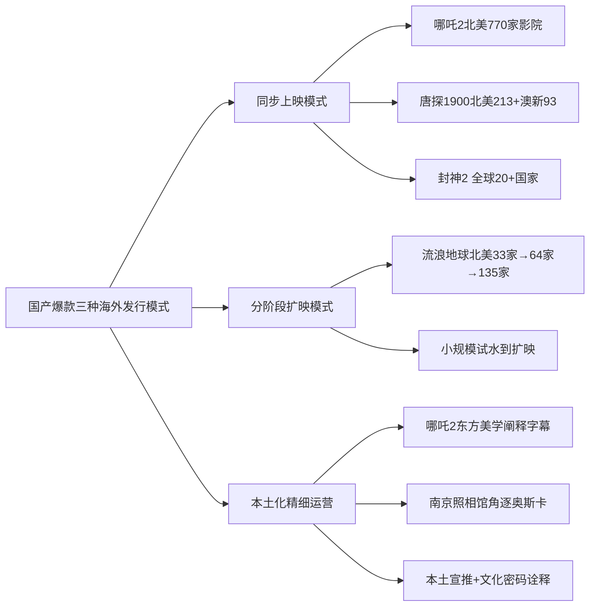

**然而，国产爆款海外票房占比仍普遍低于3%，文化折扣依然存在**。《哪吒2》中国内地市场贡献了**97%的票房**，海外票房约为4.01亿人民币占比仅2.5%[^30]——这种巨大的票房倒挂现象，"在引发关于其全球影响力是否足以比肩《泰坦尼克号》等经典影片讨论的同时，也暴露出中国电影在海外发行与本土化运营方面仍面临挑战"[^30]。东南亚与北美华人是主要支撑，欧洲市场反响平平[^83]。北美平台Box Office Mojo曾因其95%票房来自单一市场而将其移出全球榜单，随后因补录数据又重新计入[^30]。

**对照之下，进口片在中国内地的"反向倒挂"恰好揭示了文化输出的不对称性**。《疯狂动物城2》在中国内地斩获的票房接近其全球票房的一半，远超北美本土成绩[^70]。这一对比说明：一方面中国市场已成为全球电影产业的"引力中心"，另一方面国产片的全球辐射能力仍处于起步阶段。文化输出仍处于"起步阶段"而非"实质突破"，但2025年的成绩"取得了自2016年以来的最好成绩"[^81]，标志着趋势性变化已经开始。

值得关注的是，中国电影联合展台2025年先后亮相香港国际影视展、戛纳国际电影节、东京国际电影节、美国电影市场、红海国际电影节和亚洲电影博览会，积极拓展国际"朋友圈"；中国和俄罗斯、西班牙等国签署了电影合作文件[^81]。**这一系列动作叠加2035年建成电影强国的政策目标**，预示着海外发行将从"后置策略"逐步升级为"前置布局"，但短期内（3—5年）国产爆款海外占比突破10%的概率仍较低，海外市场更多扮演"锦上添花"而非"决定性增量"的角色。

## 5.6 上映策略组合的票房放大效应验证

综合前五节分析，可以提炼出"**热门档期+合理片长+多版本制式+长线密钥+海外同步**"这一五要素策略组合对票房放大效应的实证贡献度，并通过样本与反例验证其可复制性边界。

**《哪吒2》是策略组合的最完整样本**，其154.46亿元票房可解构为五要素叠加效应：

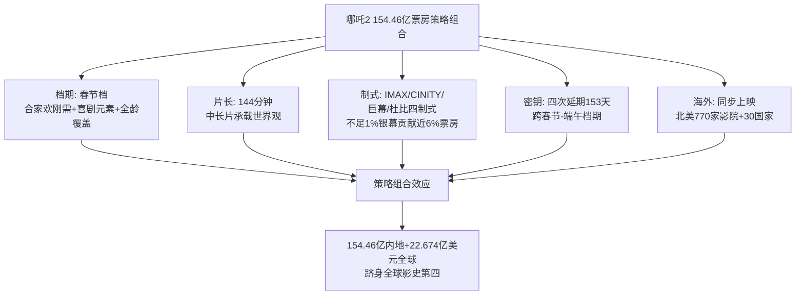

第一要素，春节档的合家欢刚需为影片提供了"全年龄覆盖+情绪共鸣"的天然孵化器；第二要素，144分钟的中长片片长既承载了哪吒+敖丙的双线叙事与众多新角色塑造，又未超出观众接受上限；第三要素，IMAX/CINITY/中国巨幕/杜比视界四制式布局使影片以"不足1%的银幕数贡献接近总票房6%"的高溢价票房[^74]；第四要素，四次密钥延期使映期延伸至153天，从春节档一路放映至端午档[^76]；第五要素，北美超过770家影院同步上映、覆盖30多个国家[^81][^83]，使影片同步引爆海外华人与部分主流市场。**五要素相互叠加、彼此放大，共同构成了154亿+量级的票房奇迹**。

**《飞驰人生3》与《疯狂动物城2》验证了策略组合的可复制性**。

《飞驰人生3》在2026年春节档大盘整体下滑39.6%的环境下"一枝独秀"占据档期半壁江山，最终累计票房43亿+。其策略组合包括：春节档（合家欢喜剧契合+系列粉丝补票）、IP系列复利（前两部17.28+33.61亿元的国民IP沉淀）、密钥两次延期至2026年5月18日（"从春节档一路跑到次年夏天"）、新拍摄技术升级（高速无人机+电磁转接机器+全新云台带来视听增强）[^79][^42][^26]。该片"上海出品+韩寒导演+沈腾主演+赛车喜剧"的组合证明了"系列IP+合家欢喜剧+春节档+长线密钥"的稳定爆款配方。

《疯狂动物城2》则是进口片在中国市场的策略组合典型——贺岁档（合家欢动画契合）+合家欢动画（跨代际共鸣）+三度延期至2026年3月25日（4个月长尾）+中美零时差同步上映[^33][^43]。该片以45.94亿元跻身中国影史票房榜TOP7，**长尾型曲线（场均人次仅10人但累计票房破45亿）**与国产爆款"高首日+高场均+短爆发"模式形成鲜明对比，证明进口片在中国市场已转向"分众长尾型"策略组合[^33]。

**然而，策略组合并非无条件成立的票房保险**，存在两类典型的失效情形。

第一类失效是**口碑崩塌型**。《唐探3》虽享春节档红利+"唐探宇宙"IP情怀+多版本上映，首日票房10.11亿元、首周排片占比超37%[^34]，但因豆瓣口碑5.3崩塌——"110分钟的跑路+15分钟的父女故事+10分钟的推理+1分钟的广告"的尖锐评价反映出观众审美疲劳[^34]，最终票房从映前预测的65亿元下调至45.23亿元[^38]。**这一案例论证了一个关键判断：策略组合是票房放大器，但无法替代内容质量本身**。当影片内容质量显著低于市场预期时，再完整的策略组合也无法阻止票房从预期高度回落至档期红利与IP惯性所能保底的下限。

第二类失效是**档期—题材错配型**。2026年春节档的《惊蛰无声》（国安谍战，张艺谋执导）与《镖人：风起大漠》（硬核武侠，吴京主演）虽然口碑分别为豆瓣6.2和7.5，且《镖人》是档期口碑最高，但与节日合家欢氛围契合度低，最终档期票房分别仅8.68亿和8.06亿[^41]。**反例同样体现在2022年春节档同题材对决**——《狙击手》96分钟紧凑片长难敌《长津湖之水门桥》149分钟的"分量感"，前者票房6.07亿元、后者40.67亿元[^27]。**这一类失效论证了：档期—题材匹配度是策略组合的前置条件，错配会使其他策略要素的放大效应大幅折损**。

下表归纳出**档期红利与影片类型的最佳匹配关系矩阵**，为第9章未来高票房类型预测提供放映策略层的可操作性指引。

| 档期 | 最佳匹配类型 | 次优匹配类型 | 不适配类型 | 策略要点 |
|------|-------------|------------|-----------|---------|
| 春节档 | 合家欢喜剧/合家欢动画/亲情奇幻 | 系列IP续作 | 严肃谍战/纯硬核武侠 | 必须含喜剧元素+全龄覆盖+长线密钥 |
| 国庆档 | 主旋律战争/历史叙事 | 现实题材 | 纯娱乐喜剧 | 节点契合+大场面+群像英雄 |
| 暑期档 | 强类型动作/动画神话/科幻 | 青春题材 | 纯文艺片 | 长档期+长线发酵+高制式布局 |
| 贺岁档 | 进口合家欢动画/温情类型 | 多元题材 | 重视效灾难片 | 跨年观影+长尾型曲线 |

**最终归纳出本章的核心结论：策略组合是票房放大器而非内容质量替代品**。具体而言：

**第一，"热门档期+合理片长+多版本制式+长线密钥+海外同步"五要素策略组合对头部票房具有显著的放大效应**，但这一效应建立在"档期—题材匹配度+内容质量门槛"的双重前置条件之上。当前置条件成立时，五要素叠加可使票房从基础水平放大至2—3倍量级（如《哪吒2》从单纯春节档红利能保底的50—80亿元放大至154亿元）；当前置条件不成立时（如档期错配或口碑崩塌），策略组合的边际效应将大幅折损。

**第二，五要素的票房贡献度并非均等**，其重要性排序大致为：档期匹配度 > 内容质量门槛 > 密钥延期长度 > 制式版本布局 > 海外同步。这一排序意味着，对于任何候选高票房影片，**首要任务是确认档期—题材匹配的精准性**，其次是确保内容质量达到豆瓣7.0+的隐含门槛，再次是争取多次密钥延期与多制式版本布局，最后才是海外同步发行作为锦上添花。

**第三，策略组合的可复制性存在类型边界**。**重工业类型（动画神话、硬科幻、战争史诗）能够充分发挥五要素组合的全部效应**，因为这些类型同时满足档期适配、片长承载、高制式溢价、长线放映、海外文化输出等多个条件；**情感驱动型（亲情喜剧、现实题材）则主要依靠档期匹配+内容质量+密钥延期三要素**，对高制式布局与海外同步依赖度较低；**进口片则呈现"贺岁档+合家欢动画+长尾密钥+中美零时差"的窄路径模式**，难以拓展至其他类型。

这一结论将贯穿后续章节——第6章将进一步从口碑与传播维度审视策略组合的内容支撑，第7章将整合内容、产业、策略三大维度归纳爆款共性规律与差异化路径，第8—9章则将基于本章揭示的策略组合可复制性边界，对未来高票房类型作出有据可循的预测。**当前置条件成立时，策略组合是放大器；当前置条件不成立时，再完整的策略组合也无法把平庸内容推上头部榜单**——这一边界条件本身，正是中国电影从"档期驱动"向"内容驱动"过渡的产业逻辑在放映层面的具体投射。

# 6 口碑、观众画像与传播效应比较

第3章已论证内容层面的"文化认同+情感共鸣"双驱动机制，第4章揭示了产业层面的全产业链一体化趋势，第5章则厘清了放映层面"档期—片长—制式—密钥—海外"五要素策略组合的可复制性边界。然而，这三个层面的所有努力最终都必须通过一个关键中介——**真实观众的口碑反馈与传播扩散**——才能转化为头部量级的票房。一部影片能否从映前预测的30亿元跃升至50亿、100亿乃至150亿元的量级，其决定性变量并非在档期红利或工业化投入本身，而是在于上映后观众如何评价、如何传播、是否愿意走进影院二刷三刷、是否能够触发非核心圈层的"自来水扩散"。本章因此将研究视角从"内容—产业—放映"的供给端，转向"评分—画像—传播"的需求端，按照"评分分化—逆袭机制—年龄覆盖—性别结构—城市层级—传播矩阵—二刷率—结构性拉动"的递进逻辑展开横向比较，为第7章爆款共性规律总结与第9章未来类型预测提供观众端与传播端的事实地基。

## 6.1 多平台评分对比与口碑分化结构

中国电影观众的评分体系当前主要由三大平台支撑：豆瓣、猫眼专业版、淘票票（灯塔）。三者的评分主体存在显著差异——豆瓣以影迷与文艺青年为主要用户，评分相对严苛、对叙事逻辑与艺术性要求高；猫眼则以购票即时反馈为核心，评分主体是"刚走出影院的观众"，情绪化打分倾向明显、整体偏宽松；淘票票（灯塔）的评分主体类似猫眼但稍偏家庭与下沉用户。**这种评分主体差异天然形成了样本影片在不同平台上的"剪刀差"现象**，而剪刀差的具体形态又恰恰反映了该影片的口碑结构特征。

下表汇总十部样本影片在三大平台的评分及剪刀差。

| 影片 | 豆瓣评分 | 猫眼评分 | 淘票票评分 | 豆瓣—猫眼剪刀差 | 口碑结构类型 |
|------|---------|---------|-----------|----------------|-------------|
| 哪吒之魔童闹海 | 8.4（154万人）[^28] | 9.2[^30] | 9.7[^30] | 0.8 | 高位稳定型 |
| 哪吒之魔童降世 | 8.4（339.9万人）[^84] | 9.6[^84] | 9.5[^84] | 1.2 | 高位稳定型 |
| 流浪地球 | 7.9（399.2万人）[^84] | 9.2[^84] | 9.1[^84] | 1.3 | 合理分化型 |
| 你好，李焕英 | 7.7（198.3万人）[^84] | 9.5[^84] | 9.3[^84] | 1.8 | 合理分化型 |
| 长津湖 | 7.4（82万人）[^32] | — | — | — | 合理分化型 |
| 飞驰人生3 | 7.4（23万人）[^41] | 9.7[^41] | 9.5+[^42] | 2.3 | 合理分化型 |
| 战狼2 | 7.1（95万人）[^36] | 9.7（首日7.5）[^28][^30] | 9.5[^84] | 2.6 | 合理分化型 |
| 满江红 | 7.2（82万人）[^84] | 9.5[^84] | 9.4[^84] | 2.3 | 合理分化型 |
| 唐人街探案3 | 5.3（114万人）[^34] | 8.8[^84] | 9.0[^84] | **3.5** | **口碑崩塌型** |
| 疯狂动物城2 | 数据未获取 | 数据未获取 | 数据未获取 | — | — |

数据来源：综合自豆瓣、猫眼专业版、淘票票相关页面与媒体公开报道。

从评分结构可识别出三种典型样本类型。**第一种是"高位稳定型"**，以《哪吒之魔童降世》《哪吒之魔童闹海》为代表，豆瓣评分均稳定在8.4高位，猫眼/淘票票均在9.2以上，剪刀差控制在1.5分以内。**这一类影片的口碑特征是"全平台一致认可、艺术性与娱乐性兼具、剪刀差小"**——影迷群体认可其叙事深度与文化内涵，普通观众则被视听奇观与情感共鸣震撼，两类评分主体在该类影片上罕见地达成共识。值得指出的是，《哪吒2》豆瓣评分虽从开分8.5降至8.4存在轻微回落，并被部分长评质疑"叙事薄弱、反派工具化"[^30]，但154万人评分基础上仍能保持8.4分的稳定性，已属高位稳定型的典型样本。

**第二种是"合理分化型"**，以《战狼2》《李焕英》《满江红》《飞驰人生3》《长津湖》《流浪地球》为代表，豆瓣评分集中在7.0—7.9区间，猫眼/淘票票则普遍在9.0以上，剪刀差在1.3—2.6分。**这一类影片的口碑特征是"普通观众高度认可、影评界存在合理分歧、整体口碑健康"**——豆瓣评分反映了影迷对叙事、表演、艺术性的相对严苛评判，但仍在7.0以上的"及格线之上"；猫眼/淘票票则准确捕捉了普通观众"值回票价"的即时情绪反馈。值得关注的是《战狼2》的特殊轨迹——首日豆瓣评分7.2，**经过两天的上映后不降反涨已经达到了7.5分**[^30]，最终稳定在7.1的水平，反映出该片在影迷群体中"先抑后扬再稳定"的认可路径。

**第三种是"口碑崩塌型"**，仅有《唐人街探案3》一例，豆瓣评分5.3、猫眼评分8.8，**剪刀差高达3.5分**——是十部样本中唯一的极端剪刀差。这一剪刀差的形成机制清晰可辨：一方面，影迷群体对"110分钟的跑路+15分钟的父女故事+10分钟的推理+1分钟的广告"[^34]的叙事结构高度不满，对"为了一碗面被流浪汉糟蹋"等剧情细节产生强烈不适；另一方面，购票观众虽然在影院"图个乐"中给出8.8的猫眼评分，但走出影院后的反思普遍负面，导致豆瓣评分从开映前的高预期暴跌至5.3。**这一极端剪刀差并非评分主体差异的必然结果，而是"内容质量与档期预期严重错位"的产物**——若影片质量稳定在7.0+水平，即便存在评分主体差异，剪刀差通常也能控制在2.6分以内（如《战狼2》）。

进一步观察可以归纳出一个重要规律：**"豆瓣7.0+"是头部影片的事实门槛**。十部样本中9部豆瓣评分（除《疯狂动物城2》数据未获取外）有8部在7.0以上，仅《唐探3》一部低于7.0。这一门槛并非偶然——豆瓣7.0意味着影片在影迷与文艺观众中获得了基础认可，能够支撑社交媒体上的正向评价扩散，避免出现"影评界一边倒批评"的舆论危机。**评分稳定性与票房长尾效应呈正相关关系**：高位稳定型的《哪吒2》密钥延期4次至153天[^30]、《哪吒1》多次延期至3个月以上；合理分化型的《李焕英》连续12天票房破亿[^35]、《长津湖》延至2021年12月30日；而口碑崩塌型的《唐探3》虽享春节档红利但票房在猫眼专业版的预测从65亿区间一路下调至45亿[^34]，最终42.5亿元区间收尾。

需要特别说明的是，《疯狂动物城2》的豆瓣与猫眼评分数据在公开资料中未获取，但**其原作《疯狂动物城》豆瓣9.3分的国民认知基础**[^33]为续集提供了观众预期支撑。从其上映四个月密钥延期至2026年3月25日、最终票房45.94亿元的市场表现反推[^25]，该片在观众端的接受度应处于合理分化型区间，但具体评分在本研究统计截点尚不能精确锁定，作为局限予以说明。

## 6.2 口碑驱动的"自来水效应"与逆袭机制

口碑评分的静态分布只是观众反馈的截面快照，更具研究价值的是**口碑驱动观众行为的动态机制**——即"自来水效应"。"自来水"指影迷不计回报、自发为电影宣传的现象，其核心逻辑是"让不被人关注的优秀电影得到更多人的喜欢"，回报则是"自身参与感和成就感的提升"[^85]。最早的自来水案例可追溯到2015年《西游记之大圣归来》——首日票房仅1800万，靠第一批观影者的主动宣传引发广大影迷关注，最后在一众大片中"逆袭"收获9.56亿票房[^85]。

十部样本中存在三个最具说服力的"自来水逆袭"典型案例。

**第一个典型是《你好，李焕英》第四天单日票房反超《唐人街探案3》**。2021年春节档一开始被认为是"一超多强"格局，《唐人街探案3》在预售成绩上一骑绝尘，首日票房10亿、次日8亿、第三日7亿，垄断华语影史单日票房前三名甚至前三日票房25亿元创造世界影史纪录[^35]。但《李焕英》凭借豆瓣8.1（开映后涨到8.3）、猫眼9.5的"独一档"口碑，第四天就以5.37亿:4.36亿压倒《唐探3》拿下单日冠军，用7天时间连追15亿票房实现反超[^25][^35]。**这一逆袭的触发机制清晰可辨**：影片"前110分钟的7分片，提升到整体9分"靠的是结尾"双向穿越"的神来之笔[^35]；映后第二天#看李焕英把口罩哭湿#、第三天#贾玲张小斐神仙友谊#接连登上热搜[^42]；而触动观众情绪的根本，是"母女情感的普世性""中国式情感的内敛、生活化表达"在"就地过年"特殊背景下找到了"思亲情绪最集中的释放窗口"[^25]。

**第二个典型是《战狼2》豆瓣评分映后不降反涨**。该片首日豆瓣评分7.2分，**在经过了两天的上映后不降反涨，已经达到了7.5分**[^30]，"不少影迷都表示《战狼2》虽然在剧情、过度上有些硬伤，但整体来说无论是从爆米花程度、大场面，还是正能量上来讲，都能让观众在电影院看得过瘾，值回票价"[^30]。该片的自来水扩散有两个独特机制：一是新京报对100名普通观众调查中，"将近70%的观众选择了再次走进影院'二刷'"[^37]，二刷率本身就是"自来水"的高强度信号；二是观众"二刷"后在社交媒体上的传播带有强烈的爱国情绪——"看到撤侨一段我都激动地哭了，祖国太伟大了"[^37]——这种情绪的传染性远超普通的电影评价，使影片成为"现象级风潮"。最终影片在第85小时票房破10亿、超越《美人鱼》成为内地史上最快破10亿的华语片[^28]。

**第三个典型是《流浪地球》映前不被看好到春节档逆袭**。该片在预售阶段反超《满江红》和《无名》之前，曾被外界普遍认为是"小众科幻"。但凭借豆瓣8以上的高分、卡梅隆"祝福中国的科幻电影旅程"的微博点赞[^41]、徐峥"里程碑式的电影，绝对是世界级的"的评价，影片在春节档实现票房逆袭——三天票房破10亿、十天破30亿、十五天破40亿[^86]。其自来水的核心驱动力是"中国科幻片追赶好莱坞的起点"这一文化身份认同——观众的购票行为本身被赋予了"为中国科幻电影投票"的产业意义，从而触发了远超内容本身的传播扩散。

**对照三个反例可以验证自来水效应的触发条件**。最具反差意义的反例是《唐人街探案3》——同样享有春节档红利、IP情怀（前两部累计票房33.9+8.07亿）、顶级阵容（王宝强、刘昊然、妻夫木聪、长泽雅美），但因豆瓣口碑5.3崩塌，自来水效应完全没有触发，反而出现了"反向自来水"：观众在社交媒体上自发抵制并劝退他人观影，"等了3年，你就给我看这个？"[^34]的尖锐评论得到4272次点赞。**这一反例论证了一个关键判断：自来水效应的触发条件是"内容质量门槛、情感共鸣点、社交传播载体"三要素缺一不可，档期红利与IP惯性无法替代真实口碑**。

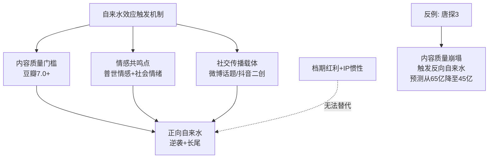

进一步比较高口碑与口碑崩塌影片的票房曲线特征，可发现两类影片存在**完全相反的运行模式**。**高口碑影片的曲线特征是"首日中等、长尾陡升、密钥多次延期"**——《李焕英》首日票房仅2.85亿元远低于《唐探3》的10亿元[^34]，但凭借口碑发酵在第四天反超后连续10天保持单日冠军[^35]，最终累计54.13亿元；《流浪地球》首日仅1.9亿元[^42]，但首周20.31亿元反映出口碑驱动下的快速扩散；《哪吒2》首日票房虽高，但通过四次密钥延期实现的长尾效应才是其154亿元票房的真正支撑。**口碑崩塌型影片的曲线特征则是"首日爆发、断崖下滑、预测下调"**——《唐探3》首日10.11亿元、第二天8.18亿元、第三天7.50亿元[^30]，呈现典型的逐日下滑曲线，最终票房仅45.23亿元，远低于首日表现所暗示的50亿+量级。**这一曲线对比是"自来水效应有无"在票房数据层面的最直接显现**。

## 6.3 观众年龄结构与代际覆盖广度

观众年龄结构是头部爆款是否实现"破圈"的核心指标。**传统认知中"动画=低龄、战争=男性、喜剧=年轻、科幻=男性向"的类型刻板印象，正在被头部爆款一一打破**——而打破年龄刻板印象的影片，恰恰是从30亿向50亿+跃升的成功者。

下表汇总十部样本影片的关键年龄结构数据。

| 影片 | 主力年龄段 | 突出特征 | 年龄覆盖广度 |
|------|-----------|---------|-------------|
| 哪吒之魔童闹海 | 30-39岁占42%（30-34岁21.3%/35-39岁20.8%）、40岁以上21.2% | 30岁以上观众显著突出大盘均值[^28][^86] | 全龄段拓宽 |
| 长津湖 | 20-34岁集中、40岁以上观众占24%[^42][^36] | "京玺"组合吸引青年+战争片吸引40+ | 跨代际覆盖 |
| 战狼2 | 数据未明确，男性主导 | 19-62岁全年龄段调查支持[^37] | 强类型容纳 |
| 你好，李焕英 | 数据未明确，但带父母观影现象普遍 | "笑顺爸妈"宣传语+家庭决策 | 跨代际覆盖 |
| 哪吒之魔童降世 | 数据未获取 | 国漫破圈先驱 | — |
| 流浪地球 | 数据未明确 | 男性偏好科幻+全民关注 | 强类型容纳 |
| 疯狂动物城2 | 24岁以下占28%、跨代际童年情怀 | 9年前原作粉丝+新生代双覆盖 | 双代覆盖 |
| 满江红 | 数据未明确 | 张艺谋传统受众+喜剧拓展 | 跨代际覆盖 |
| 唐人街探案3 | 偏年轻+25岁以下《满江红》对比[^33] | 春节合家欢+IP情怀 | 部分覆盖 |
| 飞驰人生3 | 25-29岁青年群体主攻、30岁以下"想看"56.4%[^38] | 圈层精准 | 圈层精准型 |

数据来源：综合自[^28][^38][^42][^36][^86]等。

**最具代表性的样本是《哪吒之魔童闹海》的"全龄段拓宽"特征**。据灯塔数据库，《哪吒2》观影人群中30-39岁占比超过42%（30-34岁占21.3%、35-39岁占20.8%）、40岁以上达21.2%[^28]；猫眼专业版数据则显示30-39岁占37%、40岁以上占20%[^28]。**这一数据相对市场均值显著突出**——同期2024年全年购票人群中30-39岁仅占34%、40岁及以上仅占17.5%[^86]。灯塔分析师陈晋明确表示："《哪吒2》30岁以上的观影人群相对市场均值尤为突出，拓宽了动画电影受众，作为市场主力观影人群的95后、90后对影片同样非常青睐"[^86]。**《哪吒2》打破"动画片=低龄观众"的刻板印象**，30岁以上观众占比近63%——这一比例在传统动画电影中是难以想象的。

打破这一刻板印象的关键在于**"反叛成长主题+合家欢叙事+视觉奇观"的三重配方**。30岁以上观众在影片中读懂了"申公豹小镇做题家的一生"[^28]、"映射寒门子弟在阶级固化中的困境"等深层隐喻，将哪吒的反叛升华为对当代社会规则的结构性思考；同时合家欢属性又让其能够带子女或父母共同观影，触发跨代际共振。

**《长津湖》的"跨代际覆盖"则展示了战争片的另一种破圈路径**。该片观影意愿调查显示女性观众比例达56%、男性44%，年龄层次集中在20至34岁之间[^42]，但灯塔专业版数据补充显示40岁以上观众也占24%[^36]。这一年龄分布的形成有两条独立路径：年轻观众"奔着吴京去"、"奔着易烊千玺去"——尤其是央媒称易烊千玺出道以来主演的3部电影票房都超过了10亿[^42]，这一成就引发的关注吸引了大量年轻观众；40岁以上观众则被战争片的历史厚重与抗美援朝70周年节点吸引——"江苏40岁以上观众中24%看过《铁道英雄》、20%看过《长津湖》"[^36]。**两条路径在同一部影片中交织，使战争片同时获得了年轻偶像粉丝群体与历史关注群体的双重票房**。

**《疯狂动物城2》则展示了"双代覆盖"的独特路径**。其上映时点距首部已9年，原观众已步入社会、有了下一代，新观众则被"狐兔CP"精准击中。这种"原作粉丝跨代际复购+新生代童年体验"的双向叠加，是该片能够在中国斩获45.94亿元票房（接近全球票房一半）[^25]的核心机制——单纯依靠年轻观众无法支撑这一规模，必须借助"原作粉丝带子女观影"的家庭场景才能实现。

**《飞驰人生3》则代表"圈层精准型"的另一种成功路径**。该片"想看"用户中30岁以下占比约56.4%[^38]，主攻25-29岁青年群体的赛车爱好者与系列粉丝。**与前述"全龄段拓宽"路径不同，该片的票房支撑在于"圈层深耕+系列粉丝补票+续集IP惯性"**——飞驰系列三部曲累计票房已突破86亿元[^26]，每一部续作都依靠前作积累的核心粉丝群体作为基本盘，再通过春节档合家欢氛围拓展至少量泛众观众。这一路径下的票房上限相对全龄段拓宽路径较低（43亿+ vs 154亿），但票房稳定性较高，是系列IP续作的典型变现模式。

**横向比较可归纳出年龄结构与票房上限之间的强相关关系**：

| 年龄结构类型 | 代表影片 | 年龄覆盖广度 | 票房上限 |
|-------------|---------|-------------|---------|
| 全龄段拓宽 | 哪吒2、哪吒1 | 0-60岁全覆盖 | 50亿—150亿+ |
| 跨代际覆盖 | 长津湖、李焕英、满江红、疯狂动物城2 | 20-50岁+父母代际 | 45亿—58亿 |
| 强类型容纳 | 战狼2、流浪地球 | 强类型核心受众+广泛认同 | 45亿—57亿 |
| 圈层精准型 | 飞驰人生3、唐探3 | 25-39岁青年圈层为主 | 43亿—45亿 |

**这一对比揭示了一个核心规律——年龄覆盖广度是票房从30亿向50亿+乃至100亿+跃升的关键变量**。圈层精准型可保43亿+量级，强类型容纳可达50亿+量级，跨代际覆盖能突破55亿+量级，而全龄段拓宽则是迈向100亿乃至150亿+量级的必要条件。这一规律对第9章未来类型预测具有直接的指引价值——任何候选爆款类型若想突破100亿+量级，必须同时满足"打破类型刻板印象+触发跨代际共鸣+合家欢叙事配方"三个条件。

## 6.4 性别结构与女性观众主导效应

将十部样本的女性观众占比汇总，可发现一个清晰的结构性规律：**除《战狼2》《流浪地球》两部强男性向类型外，其余八部样本的女性占比均超过55%，部分高达70%以上**。这与中国电影市场整体女性观众占比58%的大盘特征基本一致[^86]，但头部影片中的女性主导现象更为突出。

下表汇总样本影片的性别结构数据。

| 影片 | 女性观众占比 | 数据来源 |
|------|-------------|---------|
| 你好，李焕英 | 71.7%（猫眼想看用户画像） | [^42] |
| 哪吒之魔童闹海 | 60-66.33%（灯塔61.2%/猫眼57.2%/微博讨论66.33%） | [^28][^25][^86] |
| 唐人街探案3 | 60.4% | [^42] |
| 我和我的祖国 | 60.7%（同期对照） | [^42] |
| 中国医生 | 72.8%（同期对照） | [^42] |
| 长津湖 | 56% | [^42] |
| 满江红 | 60%以上（女性观众占比高） | [^35] |
| 飞驰人生3 | 数据未明确 | — |
| 你好，李焕英 | 70.4%（猫眼想看） | [^42] |
| 战狼2 | 男性主导（约53%以上） | [^42][^36] |
| 流浪地球 | 男性50%/女性49.7% | [^42] |
| 哪吒之魔童降世 | 数据未获取 | — |
| 疯狂动物城2 | 数据未获取（女性占比预计偏高） | — |

数据综合自上述各搜索结果。

**最显著的女性主导样本是《你好，李焕英》**，猫眼想看人群中女性占比71.7%[^42]、灯塔显示女性占比70.4%[^42]。这一数据并非偶然——母女亲情主题对女性观众的天然吸引力、贾玲与张小斐的"双女主"配置、"笑顺爸妈"的宣传语都精准锚定了女性观众心理。**更深层的原因是女性作为家庭观影决策者的核心地位**——女性观众不仅自己进入影院，还会决定全家是否一起观影、什么时间观影、选择哪家影院。

**《哪吒2》女性占比60%—66%**也展示了女性主导效应在动画神话题材上的延伸。微博讨论数据显示女性用户对《哪吒2》的兴趣是男性用户的近两倍（66.33%）[^25]——尤其是"申公豹小镇做题家的一生"等情感共鸣点更易触发女性观众的转发与二创。**这一数据反驳了"动画片=男性向"的传统认知**——当动画片融合"反叛成长+合家欢叙事+视觉奇观"的复合配方时，女性观众完全可以成为主力。

**2024年春节档数据则展示了女性主导的稳定性与扩展性**。据灯塔专业版，2024年春节档头三天观众构成中**女性观众占比达64%、男性观众占比36%，女性观众占比连续4年上涨**[^31]。其中《热辣滚烫》《第二十条》女性观众占比突出接近7成[^31]，这种女性叙事崛起进一步强化了女性观众主导的产业格局。然而**2026年春节档女性购票用户占比59.1%，虽为近五年首降**[^38]，洞见研报指出"成熟女性作为家庭观影决策者的地位愈发凸显"[^38]——即便比例小幅下降，35+成熟女性的"家庭决策权重"反而上升。

**反观男性主导样本《战狼2》《流浪地球》，其票房上限约为45-57亿元区间**。《战狼2》观众调查中男性比例较高，但调查对象"年龄最大的62岁，最小的19岁"中男性观众的核心驱动是爱国情怀与硬核动作[^37]。《流浪地球》男女比例几乎平衡（50.3%/49.7%）[^42]，这一比例反映了科幻片在中国市场已突破"纯男性向"刻板印象，但其女性观众占比仍低于头部爆款的60%+水平。**这一对比揭示了女性观众占比与票房上限之间存在轻微的正相关关系**——女性占比60%以上的影片更容易突破50亿+量级，而男性主导的影片票房上限相对受限。

**"成熟女性"群体的家庭决策权重是这一规律的深层机制**。微博热点研究院数据表明，2026年春节档**35岁以上用户占比达46.1%、女性购票用户占比59.1%**——成熟女性兼顾家庭成员需求，是家庭出行、亲子观影、节日社交的实际组织者，"其偏好不仅决定自身是否购票，也影响全家是否进场、选择何种时段与影院"[^38]。**这一群体在购票链条中的核心地位，使其偏好对票房的影响远超个人观影决策**——一位35-44岁母亲的购票决策可能带动3-4个家庭成员同时进入影院，形成乘数效应。

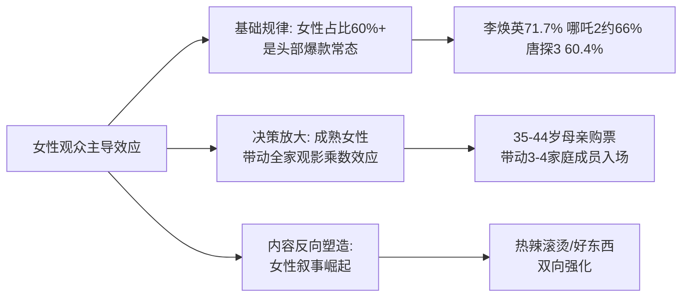

**女性叙事崛起与女性观众扩容形成双向强化效应**。2024年贾玲新作《热辣滚烫》以34.17亿元成为该年度春节档票房冠军[^87]、《好东西》在2024年口碑票房双收，验证了女性主导叙事的强大票房号召力；同时"《热辣滚烫》《第二十条》《我们一起摇太阳》三部影片淘票票开分高达9.6分"[^31]的高口碑也进一步巩固了女性观众对中国电影的信任度。**这一双向强化机制对第9章新女性叙事类型预测提供了观众端的事实地基**——只要女性观众在购票链条中的核心地位不变、成熟女性的家庭决策权持续上升，女性叙事类型就将持续具备爆款潜力。

## 6.5 城市层级分布与下沉市场崛起

城市层级分布是中国电影市场近年来最显著的结构性变化指标之一。**下沉市场已从"增量补充"升级为"票房基本盘"**——三四线城市票房占比在2024-2026年春节档持续走高，部分档期突破50%大关。

下表汇总十部样本影片的城市层级分布数据。

| 影片 | 一线 | 二线 | 三线 | 四线 | 下沉特征 |
|------|------|------|------|------|---------|
| 哪吒之魔童闹海 | 数据未获取 | 数据未获取 | 数据未获取 | 36%（三四线合计）[^30] | 高度下沉 |
| 长津湖 | 10.1% | 29.4% | 13.6% | 46.9% | 极度下沉 |
| 战狼2 | 12.9% | 34.9% | 14.6% | 37.6% | 高度下沉 |
| 你好，李焕英 | 数据未获取 | 数据未获取 | 数据未获取 | 数据未获取 | 三四线弱于北方 |
| 哪吒之魔童降世 | 数据未获取 | 数据未获取 | 数据未获取 | 数据未获取 | — |
| 流浪地球 | 13.8% | 36% | 15.7% | 34.5% | 较为均衡 |
| 唐人街探案3 | 11.2% | 34.4% | 16.7% | 37.7% | 高度下沉 |
| 满江红 | 数据未获取 | 数据未获取 | 数据未获取 | 69%（三四线想看占比） | 极度下沉 |
| 疯狂动物城2 | 数据未获取 | 数据未获取 | 数据未获取 | 数据未获取 | — |
| 飞驰人生3 | 数据未获取 | 数据未获取 | 数据未获取 | 数据未获取 | — |

数据来源：综合自[^30][^33][^42][^36]。

**最显著的下沉特征是《长津湖》四线城市票房占比46.9%**[^42]。这一比例远超大盘均值，反映出战争片对县城与小镇观众的天然吸引力——下沉市场观众对"家国情怀+战争史诗+群像英雄"的接受度极高。灯塔专业版数据进一步显示，"《志愿军：存亡之战》上映期间，其在一线至四线城市的票房占比都超过了40%，下沉市场与一二线城市的观众都愿意来到影院观看战争片"。**这种"全城市层级覆盖"的特性使主旋律战争片成为国庆档不可替代的票房支柱**。

**2024-2026年春节档下沉市场的连续突破**则展示了下沉趋势的不可逆性。下表汇总连续四年春节档三四线城市票房占比变化。

| 春节档年份 | 三四线城市票房占比 | 关键趋势 |
|-----------|------------------|---------|
| 2023年春节档 | 约50% | [^31] |
| 2024年春节档 | 突破54% | 显著高于2023年[^31] |
| 2025年春节档 | 数据未明确，《哪吒2》36% | 高度下沉 |
| 2026年春节档 | **52.6%（六年最高）** | [^38] |

**2026年春节档三四线城市票房占比达52.6%，下沉趋势进一步加强；三亚作为流入流出票房占比双第一的城市，印证了一二线用户向下沉市场流动的趋势**[^38]。猫眼研究院《2026春节档数据洞察》报告则显示三四线城市票房占比接近六成，为近六年来最高，下沉市场消费潜力得到进一步释放，且**有4家四线城市影城跻身全国前十**[^38]。"小镇青年、县域家庭观影对票房的支撑力持续增强"[^30]。

**驱动下沉市场崛起的三重逻辑**清晰可辨。

第一是**返乡潮的结构性驱动**。"随着各地观众返乡过年，下沉市场成为春节档票房的主力军"[^38]。一二线城市的"流出人口"在春节期间转移至三四线家乡观影，形成了"地级市与县域影城的票房峰值"。这一逻辑使春节档下沉市场比例较其他档期更为突出。

第二是**本地生活半径与县域家庭观影**。下沉市场观众的观影决策更受本地生活半径、商圈供给、家庭消费预算影响。2026年春节档**平均票价47.8元降至2021年以来最低，三四线城市票价下滑幅度更明显，同比下降超6%，从而大幅降低了大众观影门槛**[^38]。这一价格红利使下沉市场观众的观影意愿进一步释放——一张降价的电影票撬动的是整个家庭的春节消费决策。

第三是**多人结伴观影的家庭场景**。猫眼数据显示，**2026年春节档双人及多人结伴购票观影占比显著增加**[^30]、**2024年春节档三人及以上结伴观影占比首次达到25%、家庭观众数量增长明显**[^31]。下沉市场的家庭场景天然契合合家欢类型，使《熊出没》系列、《飞驰人生3》、合家欢动画等在下沉市场表现尤其突出——**2024年春节档《熊出没·逆转时空》三四线票房份额超过6成**[^31]，2026年春节档《熊出没·年年有熊》四线城市票房占比达35.2%远超档期均值[^38]。

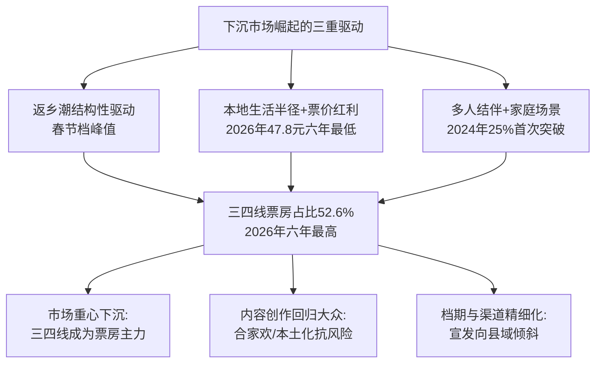

**进口片与国产爆款的城市层级分布形成鲜明对比**。《疯狂动物城2》场均人次仅10人，是十部样本中最低，但凭借密钥四个月长线放映累计至45.94亿元[^25]——**这种"低场均+长尾型"曲线特征**与国产爆款"高场均+高首日+短爆发"模式形成鲜明对比，反映出进口片在中国市场已转向"分众长尾型"——以稳定的细分受众（如成熟动画爱好者、家长亲子观影）通过长周期累积票房，而不再具备拉动大盘的现象级能量。这一对比揭示了**下沉市场的崛起本质上是国产爆款的"基本盘扩容"，而进口片更多依赖一二线核心受众的长尾累积**。

下沉市场崛起的产业意义深远。一位苏商银行特约研究员指出："**这意味着下沉市场正成为电影票房的基本盘，这一结构性变化正在深刻重塑电影产业逻辑**：一是市场重心下沉，三四线城市成为票房主力，宣发、排片全面向县域倾斜，影院运营更贴合基层家庭观影需求；二是内容创作回归大众，合家欢、本土化题材更具抗风险能力，盲目追求大制作、强明星的粗放模式加速退场；三是档期与渠道精细化"[^38]。**这一产业逻辑重塑对第9章未来类型预测具有直接启示——任何候选爆款类型必须同时通过"一二线主流口碑"与"三四线下沉受众"的双重检验，缺一不可**。

## 6.6 社交媒体话题量与传播渠道矩阵

社交媒体已成为电影宣发的主战场。**头部爆款的传播矩阵呈现"微博为话题枢纽、抖音为情感扩散、豆瓣为口碑沉淀"的三平台分工格局**。

**《哪吒之魔童闹海》的传播矩阵是当前最完整的样本**。2025年1月29日至2月6日《哪吒2》上映的9天时间，**全网信息量143.52万条、日均传播15.95万条**[^25]；上榜话题2082个，其中493个话题进入热榜前十；微博上榜话题数量最多为805个占比38.66%[^25]。微热点研究院的统计揭示了平台分工的清晰格局：

| 平台 | 信息量占比 | 用户特征 | 传播角色 |
|------|----------|---------|---------|
| 微博 | 47.84% | 多元舆论场、跨域跨界 | 话题热搜+破圈引流 |
| 抖音 | 17.03% | 算法驱动+情感化传播 | 短视频病毒扩散 |
| 今日头条 | 12.50% | 中老年+图文为主 | 资讯渗透+评论沉淀 |
| 其他平台 | 22.63% | 豆瓣/B站/小红书等 | 圈层深耕+长尾发酵 |

数据来源：[^25]

**微博的核心作用是"话题热搜+多元破圈"**。该片官方微博@电影哪吒之魔童闹海的官方海报、MV、创作花絮等465次登上微博热搜，带动话题讨论，**总阅读量达到328.2亿**[^25]。"作为网友热议《哪吒之魔童闹海》的最大舆论场，微博平台总发博人数12.4万、总转发人数9.04万、总评论人数18.52万"[^25]。微博的特点是"多元性和跨域性突出，具备热点属性、泛新闻属性和跨域性，通常能突破影视文艺作品本身，从多个方向切入作品的讨论，而转发机制能更快形成裂变效应"[^88]。

**抖音的核心作用是"算法驱动+短视频共创"**。"《哪吒之魔童闹海》正式上映前，就在抖音平台与多个账号发起'共创'，包括动画电影《深海》《茶啊二中》、动漫IP大理寺日志、我的爸爸是条龙、头部动漫自媒体米雷RayDog、王蓝莓、光线旗下艺人丁禹兮、任敏等等"[^88]。共创能以合作账号的风格创作新内容，比如哪吒X龙爸的共创里，哪吒就以龙爸一样的手绘"纸片人"风格穿越到现实场景，这一短视频在两个账号下同时发布，帮助电影引流与转化[^88]。**这种"映前共创—映中扩散—映后长尾"的抖音运营策略，已成为头部爆款的标准动作**。

**《李焕英》的传播策略则展示了"映后实时投放热搜"的精准营销**。映后第一天观众评价"戴口罩看电影哭湿口罩好难受"，第二天#看李焕英把口罩哭湿##看李焕英别画眼妆#等相关话题便登上热搜；当观众开始深扒贾玲和张小斐的关系时，第三天#贾玲张小斐的神仙友谊#的话题便登上热搜[^42]。**"《李焕英》投放的每一次热搜，都是对观众真实反馈的一次精准提取，并实时与观众产生了一种互动关系"**[^42]——这一精准营销使影片在春节档中后段持续保持话题热度，最终累计票房54.13亿元。

进一步比较三大平台的差异化作用，可形成完整的传播矩阵图谱。

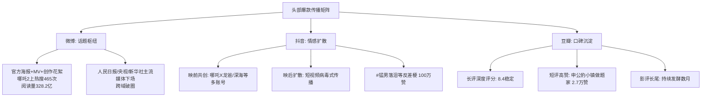

**《哪吒2》的传播策略对当下电影宣发具有方法论意义**。以下三大特征值得关注：第一，**主流媒体的深度参与**——"人民日报、央视网、新华社等主流媒体下场，以专业、深度的分析"[^88]；第二，**用户共创而非单向投放**——"2025年春节档，观众对电影的参与度和讨论热情达到新高度，电影宣发走向与用户共创合作的趋势：映前片方放出预热物料，助力观众观影决策；映后聚焦内容热点，带动社交互动，助力电影好内容被看到"[^25]；第三，**主题化深度发酵**——"《哪吒之魔童闹海》在延续前作'我命由我不由天'内核的同时，又有自我认同、价值实现、亲情友情等多元化的主题表达。'不论是大主题还是小主题的探讨，都紧扣当下社会热点'"[^25]。

**值得对照的是早年爆款的传播模式**。《战狼2》于2017年上映时，传播主要依赖传统社交（微博、微信朋友圈、新闻报道）与电影院观众口耳相传——"在调查中记者发现有将近70%的观众选择了再次走进影院'二刷'"[^37]。彼时的传播链条相对单一，"自来水"主要表现为观众自发刷屏台词、推荐朋友等行为。而到了2025年的《哪吒2》时代，传播已升级为"微博+抖音+豆瓣+B站+小红书"的多平台矩阵，且每个平台都有特定的运营策略与共创机制。**这一传播矩阵的复杂化，反过来也对头部影片的内容质量提出了更高要求**——只有真正具备多元主题、视觉奇观、情感共鸣的影片，才能在多平台同时引爆话题、形成裂变扩散。

## 6.7 二刷多刷率与情绪点燃机制

二刷多刷率作为口碑深度的核心指标，是头部爆款触发观众重复观影的情绪点燃机制的直接显现。**多刷率高的影片往往具备超长尾效应，是票房从档期红利天花板向超长尾突破的关键变量**。

**《哪吒2》的二刷率数据极具说服力**。灯塔数据库统计了"观看《哪吒2》的观众上一部观看的什么影"，**数量最多的仍然是《哪吒2》，说明有大量观众走进电影院二刷甚至三刷《哪吒2》**[^86]。猫眼研究院数据显示该片二刷及多刷观众占比一度达6.7%。"还有不少今年春节档第一选择不是《哪吒2》的观众迅速走进了电影院'补上'观影"[^86]，这种"召回低频观众"的能力是该片票房从破百亿走向154.46亿元的核心驱动。灯塔分析师陈晋对此明确指出："这充分说明《哪吒2》'召回'了大量市场低频观众，能有这样的成绩主要因为影片的高质量和高口碑迅速破圈。影片淘票票评分高达9.7分，豆瓣评分高8.5分，获得了大量普通观众和影迷的共同认可"[^86]。

**《热辣滚烫》《第二十条》是2024年春节档多刷率领先的样本**。据灯塔专业版数据，**2024年春节档的4部影片多刷率排名为《热辣滚烫》>《第二十条》>《飞驰人生2》>《熊出没·逆转时空》**[^88]。**2024年春节档票房冠军《热辣滚烫》多刷率与前两年春节档票房冠军《满江红》《长津湖之水门桥》基本持平**[^88]。值得关注的是2023年春节档《无名》《流浪地球2》多刷率高，"尤其《无名》的二刷率、三刷率非常突出"[^88]——这反映出谍战悬疑片与硬科幻类型对核心粉丝群体的"补足细节"型重复观影需求。

通过分析多个具体案例，可归纳出**触发二刷的四大动因**。

**第一是陪同家人朋友的社交属性**。受访影迷李丽三刷《热辣滚烫》——"第一观影是和三个朋友一起去的电影院，观影过程中免不了相互交流，因此错过了一些台词与镜头。于是，第二次她自己单独看了一遍电影，弥补了以上遗憾。第三次观影，她是陪着家人，希望家人们也能从这部电影中感受到震撼和力量"[^88]。律师周兆成三刷《第二十条》、二刷《热辣滚烫》《飞驰人生2》总共7次电影院[^88]，其中"第一次去看《第二十条》是受剧组之邀，后面两次是他向家人和朋友推荐此片时陪同观影"。**这种"陪伴式重复观影"在春节档与下沉市场尤其普遍**——一位35-44岁的母亲购票决策可能转化为3-4次"陪父母、陪子女、陪朋友"的多次观影。

**第二是内容深度需要补足细节**。《流浪地球》世界观复杂、概念图3000张、分镜稿8000张[^36]，单次观影难以完全消化所有细节；《哪吒2》隐喻彩蛋丰富——"豆瓣短评中'感觉我命由我不由天的是申公豹，申公豹真的好努力'获1.6万赞"[^28]、"申公豹：小镇做题家的一生"获2.7万赞[^28]——观众需要二刷才能捕捉所有的隐喻与细节。这一动因在硬科幻、奇幻动画、悬疑推理等"信息密度高"类型中尤为突出。

**第三是情感共鸣需要再次释放**。《战狼2》"看到撤侨一段我都激动地哭了，祖国太伟大了"[^37]、《长津湖》"雷公的破防"等情感节点，观众单次观影后情绪释放未尽，二刷成为情感再释放的方式。新京报对100名《战狼2》观众的调查显示**将近70%的观众选择了再次走进影院"二刷"**[^37]——这一比例远超普通商业片，反映出爱国情怀类型对观众情感的强烈触发。

**第四是IP情怀的反复回味**。《飞驰人生3》"延期密钥这种事，本质上是片方和院线的双向选择。票房还在细水长流，影院愿意给排片"——其票房走势更显韧性，"对比前作走势更显韧性：《飞驰人生》首部17.28亿、《飞驰人生2》33.61亿、第三部直接跃升近10亿至43亿+"。系列粉丝的"补票式二刷"是这一动因的典型表现。《疯狂动物城2》原作粉丝跨代际复购同样属于此类——9年前的初代粉丝带着子女重新走进影院，既是情怀消费也是亲子陪伴。

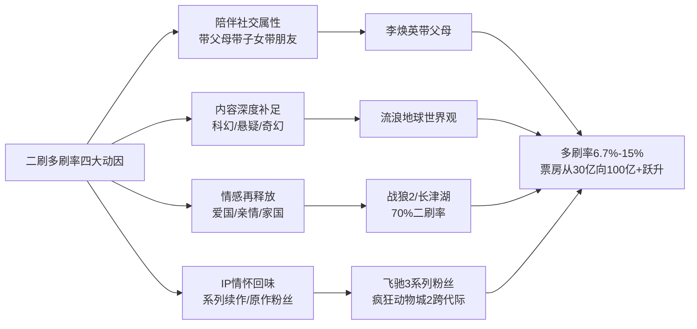

**多刷率的票房放大效应在量化层面相当显著**。若一部影片基础票房盘为30亿元、二刷率达10%，则二刷贡献增量为3亿元；若多刷率（含三刷及以上）达15%，则可贡献额外4-5亿元的增量。这一增量对票房从30亿向40亿、50亿+乃至100亿+量级的跃升具有决定性意义。**《哪吒2》154亿元票房中，估计有10-20亿元来自多刷贡献**——这一规模的多刷增量在其他类型影片中是难以复制的。

**值得对照的是同期其他影片的多刷率差异**。"《熊出没》系列影片此前多刷率一直保持稳定，今年《熊出没·逆转时空》有较明显的上涨"[^88]——亲子型动画的多刷率通常稳定但不突出，靠的是"家长带子女观影"的稳定客群。而2026年春节档《镖人：风起大漠》虽口碑较高（豆瓣7.5）但"题材类型与节日氛围契合度也较低"[^41]，多刷率相对受限，最终票房仅8.06亿元。**这一对比说明：多刷率的高低不仅取决于影片质量，还取决于内容主题与观众情感深度结合的程度**——主旋律战争、爱国情怀、亲情共鸣类型的多刷率天然高于纯娱乐类型。

## 6.8 新兴受众结构对头部票房的拉动效应

综合前述七节分析，可以归纳出当前中国电影观众正经历的**五大结构性变化**及其对头部票房的拉动效应。这一观众结构演进的本质是**从"年轻、低频、单人"向"全龄、高频、家庭"的范式转换**，对头部影片的内容创作、宣发策略、档期布局形成全链条重塑作用。

**第一大结构性变化是下沉市场扩张**。三四线城市票房占比从2023年春节档约50%上升至2026年春节档52.6%（六年最高）[^38]，下沉市场已从"增量补充"升级为"票房基本盘"。**这一变化要求头部影片必须同时通过"一二线主流口碑"与"三四线下沉受众"的双重检验**——任何缺乏下沉适配性的题材（如纯文艺片、过度依赖一二线观影习惯的小众类型）都难以突破50亿+量级。

**第二大结构性变化是女性观众主导地位的进一步巩固**。除强男性向类型外，头部爆款女性占比普遍达60%以上，2024年春节档女性占比达64%、2026年虽小幅降至59.1%但**35岁以上"成熟女性"作为家庭观影决策者的核心地位愈发凸显**[^38]。这一变化使内容创作必须考虑女性视角与情感共鸣，宣发策略必须围绕"家庭决策链"展开沟通设计，把观影理由从"我想看"扩展为"全家都合适看"[^34]。

**第三大结构性变化是家庭结伴观影常态化**。2024年春节档**三人及以上结伴观影占比首次达到25%**[^31]、2026年春节档双人及多人结伴购票观影占比显著增加[^30]。家庭结伴观影的常态化使头部影片必须强化合家欢属性、加重亲情家国共鸣、降低对低俗内容的容忍度——任何含有不适合全家观看的内容（如《唐探3》中"为了一碗面被流浪汉糟蹋"等情节[^34]）都将受到家庭决策者的回避与抵制。

**第四大结构性变化是25岁以上成熟观众扩容**。2026年春节档**35岁以上用户占比达46.1%**[^38]、2024年春节档40岁以上观众占比首次突破20%[^31]。"《哪吒2》30岁以上的观影人群相对市场均值尤为突出"[^86]——这一变化使头部影片必须打破年龄刻板印象，实现跨代际共鸣。"影院平均观众年龄连续4年上升"也意味着电影内容必须适配成熟观众的审美与情感需求，纯青春偶像、纯青年向题材将难以突破头部门槛。

**第五大结构性变化是亲子观影场景化**。"40岁上观众占比首次突破20%、家庭观众数量增长明显"[^31]、《熊出没》系列在三四线城市票房占比超60%[^31]——亲子观影已成为下沉市场与中年家庭的固定消费场景。这一变化使合家欢动画、亲情题材、成长励志类型获得了天然的票房基本盘，但也对内容质量提出了更高要求——单纯的低龄动画或粗糙的合家欢已难以满足成熟家长的审美。

**这五大结构性变化对头部影片的全链条重塑作用**可总结为下表。

| 结构性变化 | 对内容创作的影响 | 对宣发策略的影响 | 对档期布局的影响 |
|-----------|-----------------|----------------|-----------------|
| 下沉市场扩张 | 合家欢/本土化题材抗风险 | 县域在地化运营 | 春节档+返乡潮峰值 |
| 女性观众主导 | 女性视角与情感共鸣 | 围绕家庭决策链沟通 | 春节档/贺岁档合家欢 |
| 家庭结伴观影 | 强化合家欢属性、降低低俗容忍度 | "我想看"扩展为"全家都合适看" | 春节档刚需 |
| 成熟观众扩容 | 打破年龄刻板印象、跨代际共鸣 | 主题深度与社会议题 | 全档期适用 |
| 亲子观影场景化 | 合家欢动画+亲情题材 | 亲子场套票服务优化 | 春节档+暑期档 |

**这一全链条重塑作用对未来高票房类型的预测具有直接的启示意义**——任何候选爆款类型必须同时满足以下条件：内容上能够实现合家欢叙事配方、情感共鸣机制、跨代际触达；宣发上能够围绕家庭决策链展开精准营销、覆盖下沉市场县域渠道；档期上能够精准契合春节档/贺岁档/国庆档等主流档期的合家欢刚需。**满足这些条件的类型才有可能突破当前50亿+量级的天花板，向100亿乃至150亿+量级跃升**。这一判断将贯穿第7章爆款共性规律总结与第9章未来类型预测的核心推理逻辑。

需要审慎的是，**本章基于10部样本的归纳分析存在两个层面的局限**。第一是样本天然偏向"成功案例"——失败影片的口碑、画像、传播数据未被纳入完整对照，因此本章揭示的规律更适合作为"必要条件"而非"充分条件"。第二是观众数据的颗粒度不一致——部分影片（如《哪吒1》《疯狂动物城2》）的观众画像数据未获取到详细分布，使得部分横向比较只能在数据完整的子样本上展开。这些局限将在第10章统一披露并讨论后续研究方向。但即便存在这些局限，**"评分稳定性—自来水效应—年龄覆盖广度—女性主导—下沉市场—传播矩阵—多刷率—结构性拉动"的八重观众端规律，已足以为后续章节的爆款规律总结与未来类型预测提供坚实的事实地基**。

# 7 爆款共性规律与差异化路径归纳

前述四章已分别从内容、产业、放映、口碑四个维度对十部样本影片展开了横向比较——第3章揭示了"文化认同+情感共鸣"的内容驱动机制，第4章描绘了头部公司全产业链一体化的产业格局，第5章厘清了"档期—片长—制式—密钥—海外"的放映策略组合，第6章则呈现了"评分—画像—传播—多刷"的观众端规律。然而，**单一维度的横向比较只能告诉我们"这十部影片在某一切面上各自如何"，却无法回答更具决定性的两个问题：贯穿四大维度、跨越十部样本的共性成功要素究竟是什么？同样跻身前十的影片，其突围路径是否完全一致、是否存在可被并列识别的差异化模式？**本章因此承担承上启下的逻辑枢纽功能：一方面对四大维度的所有规律进行收敛与权重排序，提炼出贯穿全部样本的六大共性要素；另一方面按IP属性差异将十部样本切分为IP续作型、横空出世原创型与进口大片型三条差异化突围路径，对比其票房上限与可复制性。最终整合提炼出"品质为王+情绪共振"的双轮驱动模型，作为爆款规律的综合表达，并通过反例验证模型的解释力边界，为第8章趋势分析与第9章未来类型预测提供承上启下的逻辑工具箱。

## 7.1 六大共性成功要素的归纳与权重排序

在对前述章节证据进行系统梳理后，可以提炼出贯穿十部样本的六大共性成功要素：**档期红利、IP沉淀、情感共鸣、工业化制作、文化自信、口碑发酵**。这六要素并非彼此孤立，而是相互交织、共同作用——但它们对票房贡献的权重并不均等，必须通过区分必要条件与充分条件来明确其层级结构。

**档期红利**是十部样本最显性的共性特征。前文已揭示，10部样本中6部为春节档作品、2部暑期档、1部国庆档、1部贺岁档，热门档期合计占比100%。这一档期集中度本身就证明了档期对头部票房的孵化作用——非热门档期至今未能孵化出能够跻身前十的影片。但档期红利的本质是"为优质内容提供放大器"而非"档期本身能创造票房"，2026年春节档总票房较2025年同期下滑39.6%、几乎回到2018年水平的事实证明，缺乏全民现象级作品的档期即便仍是头部孵化器，整体票房也会大幅回落。因此**档期红利属于"必要条件"——所有头部爆款都需要档期红利支撑，但仅靠档期红利无法保证爆款诞生**。

**IP沉淀**则在十部样本中呈现出多元形态。原创横空出世型（《战狼2》《李焕英》《哪吒1》《流浪地球》《满江红》）的IP是"在影片成功后才形成的"，IP续作型（《哪吒2》《唐探3》《飞驰人生3》《疯狂动物城2》）则依托前作粉丝池作为基本盘，经典IP重生型（《长津湖》）则借力历史记忆作为IP母体。**IP沉淀对票房的作用并非"必要条件"而是"放大杠杆"**——没有IP的原创作品同样可能跻身前十，但有IP沉淀的续作可以将票房下限稳定在40亿+量级（《唐探3》豆瓣5.3仍能保住45.23亿元就是明证）。

**情感共鸣**是真正贯穿十部样本的核心驱动机制。第3章已系统论证"文化认同+情感共鸣"的双重锚定——家国情怀（《长津湖》《战狼2》）、反叛成长（《哪吒》系列）、亲情治愈（《李焕英》）、人类命运共同体（《流浪地球》）、文化历史阴谋（《满江红》）、IP情怀延续（《唐探3》《飞驰人生3》《疯狂动物城2》）共六大主题谱系，无一不是通过精准对接观众情感节点实现票房爆发。**情感共鸣属于"硬性必要条件"——缺乏情感共鸣机制的影片几乎不可能跻身前十**，这一判断已在《姜子牙》（16亿）、《上海堡垒》（1.2亿）等同期失败反例中得到反向验证。

**工业化制作**对不同类型影片的权重差异显著。重工业类型（动画神话、硬科幻、战争史诗）对工业化的依赖度极高——《哪吒2》调动138家特效公司+4000人团队、单片制作9.8亿元，《长津湖》67个视效团队+1.2万人拍摄团队，《流浪地球》3000张概念图+8000张分镜稿+10万平方米实景搭建，这种"集群化协同"的工业化水平直接决定了影片的视听上限。但情感驱动型影片（《李焕英》《满江红》）则可在中等工业化投入下实现高票房产出，《李焕英》制作成本不到1亿元、《满江红》以单一场景的精准调度承载叙事。**工业化制作属于"类型分化条件"——重工业类型必要、情感驱动类型可选**。

**文化自信**则是2017年以后头部爆款集体显现的新特征。十部样本中有8部带有强烈的本土文化母体锚点：《战狼2》对接南海仲裁后的民族情绪、《长津湖》激活抗美援朝70周年记忆、《哪吒》系列源自《封神演义》神话母体、《流浪地球》注入愚公移山哲学、《李焕英》体现中国式母女情感、《满江红》借力南宋词牌与岳飞精神、《飞驰人生3》延续国民IP情感、《唐探3》植根"唐探宇宙"东方推理。仅《疯狂动物城2》一部进口片例外，但其作为TOP10中唯一进口片的孤例地位本身就反向论证了文化自信的"门槛性"。**文化自信属于"长期复利条件"——其作用通过多部作品的累积塑造观众文化偏好与购票决策，对单部影片是放大效应、对整个市场结构则是不可逆的转向**。

**口碑发酵**是连接供给端与需求端的最终中介。第6章已论证"豆瓣7.0+"是头部影片的事实门槛——10部样本中除《唐探3》（豆瓣5.3）一部例外，其余9部豆瓣评分均在7.0以上，而《唐探3》能跻身前十完全依赖春节档红利+IP情怀的双重托底。同时口碑发酵触发的"自来水效应"是票房从30亿向100亿+跃升的关键变量——《李焕英》第四日反超《唐探3》、《流浪地球》预售低位逆袭、《哪吒2》多刷率6.7%等案例都证明了这一点。**口碑发酵属于"硬性必要条件"——缺乏口碑发酵的影片票房上限被严格压制于档期红利与IP惯性所能保底的天花板之内**。

下表汇总六大共性要素的权重排序与必要性属性。

| 成功要素 | 必要性属性 | 在十部样本中的体现 | 票房贡献机制 |
|---------|-----------|------------------|------------|
| 情感共鸣 | 硬性必要条件 | 10/10均具备 | 核心引擎（驱动观众情感卷入） |
| 口碑发酵 | 硬性必要条件 | 9/10豆瓣7.0+ | 核心引擎（触发自来水扩散） |
| 档期红利 | 必要条件 | 10/10为热门档期 | 放大杠杆（提供观影场景） |
| 工业化制作 | 类型分化条件 | 重工业类型必要 | 放大杠杆（支撑视听溢价） |
| IP沉淀 | 充分条件 | 5/10为续作或经典IP | 长期复利（稳定票房下限） |
| 文化自信 | 长期复利条件 | 9/10带本土文化锚点 | 长期复利（重塑市场结构） |

**基于这一权重排序，可以归纳出三层级结构**："情感共鸣+口碑发酵"为核心引擎——这两要素直接决定影片能否触发观众情感连接与自来水扩散，是头部爆款的"硬门槛"；"档期红利+工业化制作"为放大杠杆——这两要素将核心引擎产生的票房势能放大数倍，决定影片的票房量级而非有无；"IP沉淀+文化自信"为长期复利——这两要素的作用通过跨周期、跨作品的累积体现，对单部影片是稳定下限、对市场结构则是不可逆的演进。

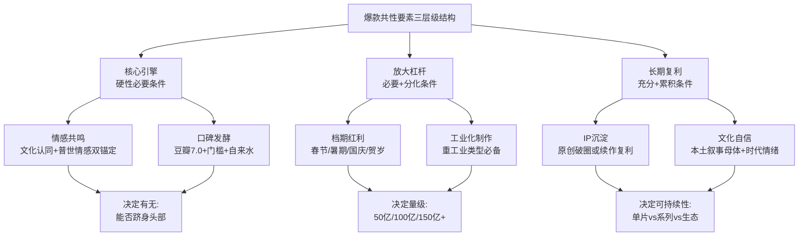

这一层级结构的实践意义在于：**对任何候选爆款影片的评估，必须先确认是否满足"情感共鸣+口碑发酵"的硬门槛，再考察"档期红利+工业化制作"的量级杠杆，最后判断"IP沉淀+文化自信"的长期复利空间**。仅满足放大杠杆而缺乏核心引擎的影片（如部分春节档大投入失败案例），终将无法突破档期红利所能保底的天花板。

## 7.2 IP续作型路径：复利效应与口碑风险的双面性

将十部样本按IP属性切分，**IP续作型路径**包括《哪吒之魔童闹海》《唐人街探案3》《飞驰人生3》《疯狂动物城2》四部影片，合计票房289.79亿元，占十部样本总票房的48.2%。这一路径的核心特征是"前作粉丝池+情感惯性"作为稳定基本盘，但其内在风险与上限同样呈现强烈的两极分化。

IP续作型路径的**核心优势**体现在三个层面。

第一，**首日预售爆发能力极强**。《唐探3》首日票房10.11亿元、首周排片占比超37%，《哪吒2》在春节档创下系列动画新纪录的同步预售表现，《飞驰人生3》首日票房6.41亿元、上映两天破10亿、五天破20亿、连续七天单日破亿——这种首日爆发本质上来自前作粉丝的"必看性"购票决策。第二，**系列粉丝补票式二刷构成长尾基础**。《飞驰人生3》密钥两次延期至2026年5月18日，影院经理反馈"延期后周末仍有零星观众，多为'补票'的系列粉丝"；《疯狂动物城2》的"原作粉丝跨代际复购+新生代童年体验"双向叠加，使该片场均人次仅10人却能凭借4个月长线放映累积至45.94亿元。第三，**衍生品长尾开发空间巨大**。《哪吒2》衍生品销售额突破千亿元规模、为票房的6倍以上，是IP续作型路径的极致变现样本。

然而这一路径的**内在风险**同样显著，其核心矛盾在于"内容创新不足将触发观众审美疲劳与口碑崩塌"。

最具说服力的反例是《唐人街探案3》。该片严格延续《唐探1》（豆瓣7.6）、《唐探2》（豆瓣6.6）的"东南亚-纽约-东京"异国推理框架，但在创新维度上几乎停滞。前文已揭示其豆瓣评分5.3（114万人评分）成为十部样本最低，与猫眼8.8形成3.5分的极端剪刀差，这一剪刀差本质上是"档期预期与内容质量严重错位"的产物。该片虽享春节档红利+IP情怀双重托底，最终票房仍从映前预测的65亿元一路下调至45.23亿元——**这一案例证明IP续作型路径的票房天花板高度依赖前作口碑透支程度，纯熟悉感无法支撑续作向上突破**。

将《哪吒2》（续作突破上限）与《唐探3》（续作惯性维持）进行对比，可以更清晰地揭示IP续作型路径的双面特征。

| 对比维度 | 哪吒之魔童闹海 | 唐人街探案3 |
|---------|---------------|------------|
| 前作豆瓣评分 | 8.4（哪吒1） | 7.6—6.6（唐探1—唐探2递减） |
| 续作豆瓣评分 | 8.4（保持高位） | 5.3（断崖下跌） |
| 续作 vs 前作票房 | 154.46亿 vs 50.35亿（3倍跃升） | 45.23亿 vs 33.97亿（仅1.3倍） |
| 内容创新维度 | 动态水墨渲染引擎+1900特效镜头+主题升维 | 异国场景换汤不换药+笑点低俗化 |
| 多刷率 | 6.7% | 数据未明确（曲线显示快速下滑） |
| 票房曲线特征 | 长尾上扬+四次密钥延期 | 首日爆发+逐日下滑 |

**两部影片同属IP续作型路径，但票房表现差距悬殊的根本原因在于"内容创新维度"的有无**。《哪吒2》在前作"我命由我不由天"主题基础上升维至"个体面对世间规则由谁所定"的结构性思考，并在工业化层面实现了动态水墨渲染引擎等技术突破；《唐探3》则在主题与工业化双层面停滞不前，仅依赖明星阵容与异国场景维持表面新鲜感。这一对比揭示了IP续作型路径的**"双面铁律"**：

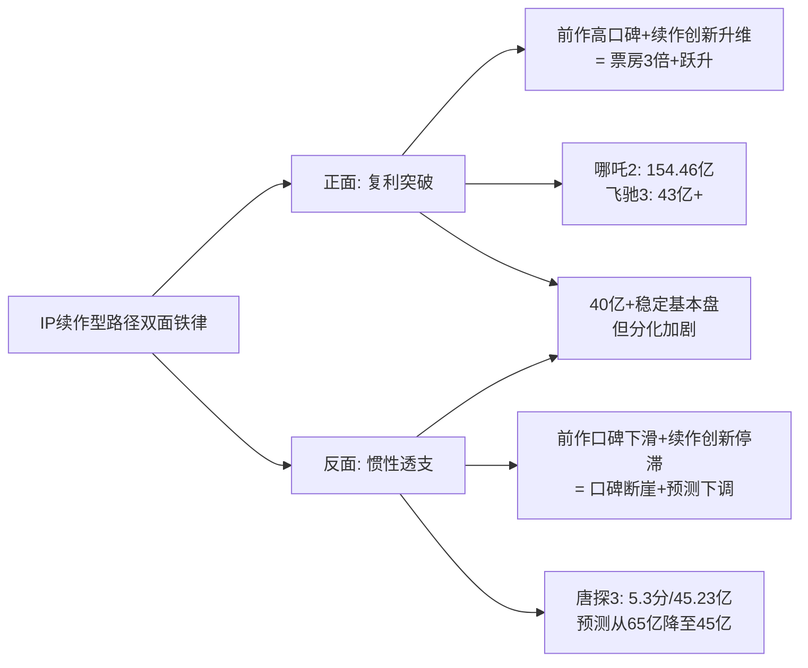

需要特别说明的是，《疯狂动物城2》作为进口IP续作型样本展示了路径的另一种变体——**"原作9年沉淀+跨代际童年情怀"**。其原作2016年累积的15.3亿元票房+豆瓣9.3分国民认知基础，在9年后转化为"原观众已步入社会带子女观影、新观众被狐兔CP精准击中"的双代覆盖。这一变体的关键在于"足够长的时间间隔让原观众生命周期演进至下一阶段"，使续作不再是简单的"前作粉丝补票"而是"跨代际新观影场景"。这一变体对国产IP续作具有借鉴意义——长IP生命周期的运营或许比快速续作更具票房可持续性。

**综合而言，IP续作型路径"稳定基本盘但分化加剧"的双面特征**，既是当前头部市场的事实底色，也为第9章未来类型预测中"强IP系列续作"候选类型的评估提供了关键边界条件——简单的"系列复制"已不足以保证爆款，"创新升维+长IP运营"才是续作型路径的真正护城河。

## 7.3 横空出世原创型路径：情绪共振与黑马逆袭机制

横空出世原创型路径包括《战狼2》《你好，李焕英》《哪吒之魔童降世》《流浪地球》《满江红》五部影片，合计票房253.73亿元，占十部样本总票房的42.2%。该路径的核心特征是**无前作IP红利、完全依赖内容质量与情绪共振触发自来水效应**，典型机制可概括为"映前不被看好—首日中等—口碑发酵—长尾逆袭"的黑马曲线。

横空出世原创型路径的**典型黑马曲线**在三个样本中得到最完整的体现。

**《你好，李焕英》是黑马逆袭的最经典样本**。该片作为贾玲处女作，映前在2021年春节档"一超多强"格局中并未被视为头号种子——《唐人街探案3》以预售10亿元一骑绝尘，《李焕英》首日票房仅2.85亿元远低于《唐探3》的10亿元。但凭借豆瓣8.1（开映后涨到8.3）、猫眼9.5的"独一档"口碑，影片第四天即以5.37亿元:4.36亿元反超《唐探3》拿下单日冠军，用7天时间连追15亿票房实现总票房反超。**这一逆袭曲线背后是"映后第二天#看李焕英把口罩哭湿#、第三天#贾玲张小斐神仙友谊#接连登上热搜"的精准社交传播，叠加"就地过年"特殊背景下"思亲情绪集中释放"的社会情绪节点**。

**《流浪地球》则展示了科幻类型的黑马逆袭机制**。该片在预售阶段被外界普遍认为是"小众科幻"、预售排名落后于《飞驰人生1》《疯狂的外星人》等同档期作品，但凭借豆瓣8以上的高分、卡梅隆"祝福中国的科幻电影旅程"的微博点赞、徐峥"里程碑式的电影"的评价，实现了"三天破10亿、十天破30亿、十五天破40亿"的逆袭。**其自来水的核心驱动力是"中国科幻片追赶好莱坞的起点"这一文化身份认同**——观众的购票行为本身被赋予了"为中国科幻电影投票"的产业意义，从而触发了远超内容本身的传播扩散。

**《战狼2》则是暑期档黑马的典型**。该片首日豆瓣评分7.2分，在经过两天的上映后不降反涨达到7.5分，最终稳定在7.1。新京报对100名普通观众的调查显示**将近70%的观众选择了再次走进影院"二刷"**——这一二刷率远超普通商业片，反映出爱国情怀类型对观众情感的强烈触发。该片在第85小时票房破10亿，超越《美人鱼》成为内地史上最快破10亿的华语片，最终累计56.94亿元。

横空出世原创型路径的**成功要素高度依赖三个条件**。

第一，**精准对接当下社会情绪节点**。前文已揭示，《战狼2》契合2016年南海仲裁后的民族情绪、《李焕英》击中"就地过年"的思亲共情、《流浪地球》触发"中国科幻元年"的文化身份认同、《哪吒1》映射阶层固化下的反叛渴求、《满江红》激活历史厚重的爱国宣泄。**社会情绪节点的精准对接是该路径的"隐形门槛"——脱离社会情绪的内容即便品质优秀也难以触发自来水扩散**。

第二，**首部作品的工业化或叙事突破**。《流浪地球》的概念图3000张+分镜8000张+10万平方米实景搭建是中国科幻工业化的首次系统突破，《哪吒1》的70余家特效公司协同打造了国漫工业化的破冰之作，《战狼2》的好莱坞动作团队+真军演镜头突破了国产军事动作片的视听上限，《李焕英》的"双向穿越"反转突破了亲情喜剧的叙事范式，《满江红》的"古装+悬疑+喜剧+家国忠义"四重融合开创了新的类型组合。**这种"突破性创新"是横空出世型与同期失败案例的核心分界**——同期未能突破的同类作品（如《姜子牙》《上海堡垒》）即便在传统类型范式内执行良好也难以触发自来水。

第三，**社交媒体传播矩阵的精准点燃**。第6章已系统分析《李焕英》"映后实时投放热搜"的精准营销策略——映后第一天观众评价"戴口罩看电影哭湿口罩好难受"，第二天#看李焕英把口罩哭湿##看李焕英别画眼妆#接连登上热搜；当观众开始深扒贾玲和张小斐的关系时，第三天#贾玲张小斐的神仙友谊#的话题登上热搜。**这种"基于真实反馈实时调整传播话题"的精准营销，正是横空出世型影片激活自来水的关键操作**。

然而横空出世型路径的**高风险性**同样不容忽视。**同期失败的同类原创作品作为反例**有力地验证了"情绪共振节点"的不可复制性。

| 失败反例 | 同类型对照 | 票房差距 | 失败原因 |
|---------|-----------|---------|---------|
| 姜子牙（16亿） | 哪吒1（50.35亿） | 3.1倍 | 同为神话改编动画但反叛主题与社会情绪共振强度不足 |
| 上海堡垒（1.2亿） | 流浪地球（46.87亿） | 39倍 | 同为科幻类型但工业化与叙事双重崩塌 |
| 金刚川（11亿） | 长津湖（57.75亿） | 5.2倍 | 同为抗美援朝但缺乏70周年节点的社会情绪对接 |
| 志愿军：雄兵出击（8亿） | 长津湖（57.75亿） | 7.2倍 | 同为抗美援朝群像但叙事吸引力不足 |
| 我们一家人（数据未明确） | 你好李焕英（54.13亿） | — | 同为亲情题材但缺乏"就地过年"特殊情绪节点 |

**这一系列反例论证了一个关键判断：横空出世型路径的成功并非"题材正确+工业化达标"的简单算术，而是"社会情绪节点精准对接+突破性内容创新+社交传播精准点燃"的乘积**。任一要素缺失，都会使影片从潜在爆款下沉为同档期普通作品。这种乘积效应解释了为何同期失败案例与成功案例的票房差距常常达到5—40倍量级——失败并非小幅度失利，而是直接断崖下跌。

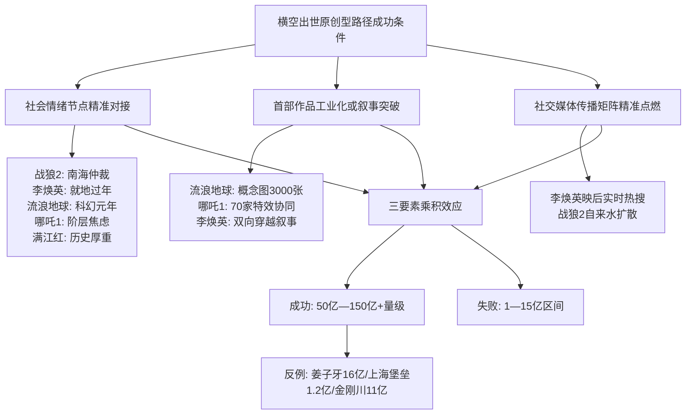

**横空出世原创型路径的"高弹性高风险"本质**，使其成为产业层面的稀缺资源——成功者可以单片改写市场格局，但失败者的工业化沉没成本极高。这一特征对第9章未来类型预测中"硬核科幻工业化大片""新女性叙事作品""现实主义+喜剧融合作品"等候选类型的评估具有直接启示——这些类型本质上都属于横空出世型路径，其爆款概率必须建立在"社会情绪节点精准对接+突破性创新"的双重判断之上。

## 7.4 进口大片型路径：从全民爆款到分众长尾的窄路径转型

进口大片型路径在十部样本中仅余《疯狂动物城2》一部代表，且该片是2025年末才跻身前十的最新案例。**对照已被挤出前十的《复仇者联盟4：终局之战》（42.50亿元）**，可以清晰观察到进口片在中国市场的范式转换——从早期的"全民爆款型"曲线退潮至当前的"分众长尾型"窄路径。

早期进口片（2017—2019年）依靠**全民爆款型曲线**跻身前十，2017年、2018年票房前十中分别有5部、4部进口片。漫威/速度与激情/变形金刚等系列依赖"高首日+高场均+全龄覆盖"的曲线特征，与同期国产爆款的票房模式高度相似——首映日单日票房破亿、场均上座率超50%、覆盖一二三四线全城市层级。这一时期进口片的成功逻辑是"全球同步上映+成熟工业化IP+品牌认知红利"，本土化运营则相对粗放——许多好莱坞大片直接照搬国际版预告片、宣发周期短、本土发布会与定制营销稀少。

而**当前进口片在TOP10中的窄路径模式**，则以《疯狂动物城2》为唯一代表。该片票房曲线呈现出与国产爆款完全相反的特征：

| 曲线特征 | 国产爆款（哪吒2/飞驰3） | 进口大片（疯狂动物城2） |
|---------|----------------------|----------------------|
| 场均人次 | 24—37人 | 仅10人（十部样本最低） |
| 首日表现 | 单日票房破亿至10亿+ | 单日表现温和 |
| 票房累积 | 短爆发+超长尾 | 持续低强度+超长尾 |
| 密钥延期 | 多次延期至3—5个月 | 三次延期+4个月长线放映 |
| 受众结构 | 全龄段拓宽 | 24岁以下28%+原作粉丝跨代际 |
| 核心驱动 | 现象级话题+自来水扩散 | 成熟IP认知+精细化运营 |

**《疯狂动物城2》的成功条件极为特殊**：首部作品在2016年已积累15.3亿元票房与豆瓣9.3分的国民认知基础；续集等待9年后上映，原观众已步入社会、新观众则被"狐兔CP"精准击中；细节极致的工业化制作（单镜头最高实现5万只动物同框、冰川镇雾气每帧渲染120小时）支撑起IMAX/4DX高溢价制式；本土化营销策略（对比2024年多部"零宣传"上映的好莱坞大片）的精准发力。**这一组合条件的稀缺性，决定了进口片在TOP10中的复苏只能是"成熟IP+合家欢动画+精细化运营"的窄路径，而非全面回潮**。

进口片在中国市场**结构性退潮的深层原因**有四个层面。

**第一，文化折扣加剧**。中国观众的文化偏好已从"仰视好莱坞"转向"认同本土叙事"——业内分析指出"中国观众的电影消费也更为理性，不再一味'仰视'好莱坞，对好的国产片也表现出更多的肯定"。前文揭示的"扎根本土文化母体+回应当代社会情绪"双重锚定，是进口片由于先天文化基因限制而难以复制的——好莱坞普世寓言式叙事虽兼容多元市场，但难以在中国市场触发"文化身份确认仪式"级别的情感共鸣。

**第二，宣发本土化不足**。"好莱坞分账大片的失利，一方面由于疫情无法在中国同步上映流失了热度，另一方面影片本身的质量问题也是不争事实"。2024年多部好莱坞大片在中国"零宣传"上映、缺乏本土发布会与定制营销，与国产爆款"映前共创+映后实时热搜+多平台传播矩阵"的精细化运营形成鲜明对比。这种宣发能力差距使进口片即便品质优秀也难以在社交媒体激起话题热度。

**第三，国产替代效应**。第3章已揭示，国产爆款已在战争军事、动画神话、科幻冒险、喜剧亲情、推理悬疑等几乎所有商业类型中建立了头部样本，进口片在这些类型上的"独特性供给"已被国产替代。2020年起国产片票房占比连续多年保持在79%—84%区间，2024年进口片票房冠军《九龙城寨之围城》仅6.84亿元的事实，已经反映了这一替代效应的不可逆性。

**第四，全球同步发行延迟与窗口期博弈**。早期进口片借助"全球同步上映"维持热度，但近年来部分好莱坞大片在中国上映存在数周至数月的延迟，加之观众已通过盗版资源、海外社交媒体提前接触剧情核心信息，使影片上映时已丧失新鲜感与话题红利。

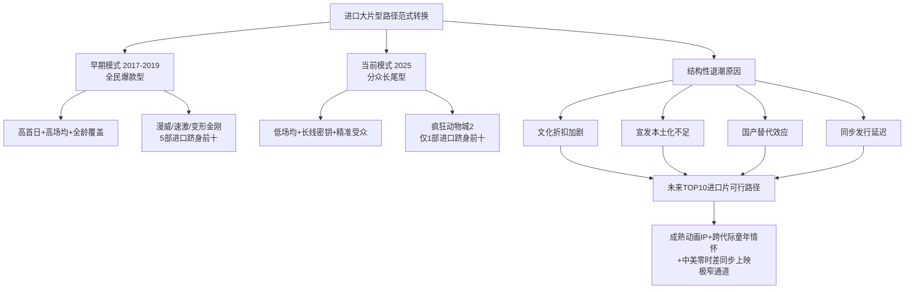

**未来进口片在TOP10中的可行路径仅剩"成熟动画IP+跨代际童年情怀+中美零时差同步上映"这一极窄通道**。这一路径的窄边界条件包括：原作必须是中国市场已有国民认知基础的IP（《疯狂动物城》《冰雪奇缘》《玩具总动员》等迪士尼/皮克斯系列）；续集时间间隔需足够长（5—10年）以使原观众完成生命周期演进至"带子女观影"阶段；上映时间必须与北美零时差或准零时差以维持热度；本土化宣发必须达到精细化运营水平。这一窄通道的存在意味着进口片在TOP10中将长期保持"仅余1—2席"的稀缺状态，国产化基本盘90%+的格局已成事实定局。

## 7.5 三条路径的票房上限、风险结构与可复制性比较

将上述三条差异化突围路径置于统一坐标系下进行系统比较，可以从票房上限、风险结构、产业资源依赖度、可复制性四个维度展开横向对照，揭示当前市场环境下三条路径的并行格局与资源分配走向。

下表系统对比三条路径的核心特征。

| 比较维度 | IP续作型路径 | 横空出世原创型路径 | 进口大片型路径 |
|---------|-------------|------------------|--------------|
| 代表样本 | 哪吒2、唐探3、飞驰3、疯狂动物城2 | 战狼2、李焕英、哪吒1、流浪地球、满江红 | 疯狂动物城2 |
| 票房上限 | 受前作口碑封顶（哪吒2 154亿是上限） | 上限不可预测（5亿到150亿+） | 结构性压制于50亿以下 |
| 票房下限 | 40亿+稳定（IP情怀托底） | 风险极高（同类失败案例1—15亿） | 30亿+长尾（精细化运营托底） |
| 典型曲线 | 首日爆发+长尾延伸 | 首日中等+口碑逆袭 | 持续低强度+超长尾 |
| 核心驱动要素 | 前作粉丝池+情感惯性+创新升维 | 社会情绪节点+工业化突破+传播点燃 | 成熟IP认知+跨代际童年情怀 |
| 风险结构 | 内容创新不足导致口碑崩塌 | 情绪节点错配/工业化失败 | 文化折扣/宣发本土化不足 |
| 产业资源依赖度 | 依赖IP运营+衍生品开发能力 | 依赖原创内容能力+精准传播 | 依赖国际工业化+本土化运营 |
| 可复制性 | 中等（IP长生命周期运营难度大） | 极低（情绪节点不可复制） | 极低（窄路径条件苛刻） |
| 数量占比 | 4/10 | 5/10 | 1/10 |
| 票房占比 | 48.2% | 42.2% | 7.6% |

**三条路径的票房上限差异本质上反映了"创新空间"的差异**。IP续作型路径的上限被前作口碑预设——观众进入影院时已带有特定预期框架，续作能突破上限的关键在于"在前作基础上实现创新升维"（如《哪吒2》主题升维+技术突破），但这种突破极为艰难，多数续作（如《唐探3》）只能维持于前作惯性所能保底的下限。横空出世型路径的上限完全开放——成功者可以创造历史纪录（《哪吒1》开启国漫崛起、《流浪地球》开启科幻元年），但失败者的下限同样不可预测，缺乏前作IP托底意味着完全暴露于内容质量与社会情绪节点的双重不确定性。进口大片型路径则受文化折扣与国产替代的双重结构性压制，上限被严格限制于50亿以下区间。

**风险结构的对比同样具有启示意义**。IP续作型的核心风险是"创新不足触发口碑崩塌"——这一风险可通过加大研发投入、引入新主题维度、提升工业化水平等方式部分对冲，因此风险相对可控。横空出世型的核心风险是"情绪节点错配或工业化失败"——这一风险几乎不可对冲，因为社会情绪节点本身具有时点不可复制性，而工业化失败的沉没成本极高。进口大片型的核心风险则是"结构性退潮"——这一风险已是不可逆的市场趋势，单一影片层面几乎无法对抗。

**可复制性的对比则揭示了产业资源配置的合理走向**。IP续作型路径的可复制性中等——成功的IP运营需要长期投入（光线传媒"山海经神话宇宙20部规划"、亭东影业"飞驰系列三部曲86亿元IP沉淀"），但一旦IP生命周期建立，续作可以形成稳定的产业现金流。横空出世型路径的可复制性极低——情绪节点不可复制意味着每一次成功都是"独立事件"，但其上限不可预测的特征又使其成为产业层面的稀缺资源。进口大片型路径的可复制性极低——窄通道条件苛刻使其难以批量复制。

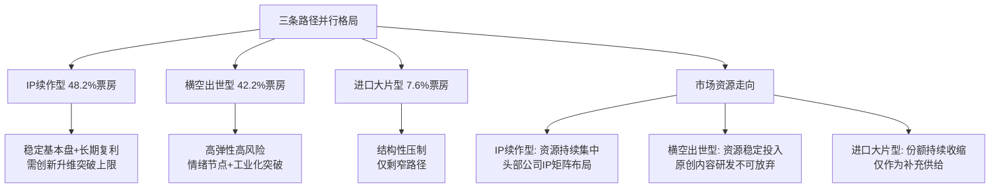

**当前市场环境下三条路径并非彼此替代而是并行存在**——前述六大共性要素在三条路径中均能找到不同程度的体现，差异在于各要素的权重组合不同。但市场资源正向IP续作型与横空出世型集中倾斜：头部公司加速布局IP矩阵化运营（光线山海经神话宇宙、博纳主旋律商业片矩阵、亭东飞驰系列），同时不放弃对原创横空出世型作品的扶持（如对《李焕英》《满江红》的高保底投入）；进口大片型的份额则持续收缩，仅作为补充供给维持类型多样性。这一资源分配走向预示着未来3—5年中国电影市场将形成"IP续作型保下限+横空出世型冲上限+进口大片型补缺位"的稳定结构。

## 7.6 "品质为王+情绪共振"双轮驱动模型的提炼

在六大共性要素与三条差异化路径的基础上，可以进一步收敛为一个更具综合表达力的解释模型——"**品质为王+情绪共振**"双轮驱动模型。该模型并非对前述要素的简单合并，而是将其按"供给端能力"与"需求端连接"的本质属性重新组织，揭示头部爆款诞生的底层机制。

**"品质为王"轮**对应供给端的内容创造能力，具体内涵包括四个层面：内容质量门槛（豆瓣7.0+作为事实底线）、工业化制作水准（重工业类型对应的视听上限）、叙事完整度（避免叙事崩塌引发负面口碑）、视听奇观（IMAX/CINITY等高制式溢价的内容支撑）。这一轮的核心使命是确保影片在影院里"经得起检验"——观众走出影院时的客观评价不出现断崖下跌，影评界与社交媒体不出现一边倒批评。**第6章已揭示，10部样本中9部豆瓣评分在7.0以上，唯一例外的《唐探3》（5.3）也成为最大票房争议样本**。这一比例本身就证明了"品质为王"轮的硬性必要性。

**"情绪共振"轮**对应需求端的观众情感连接，具体内涵也包括四个层面：文化认同锚点（本土叙事母体或经典IP认知）、社会情绪节点（与时代社会情绪的精准对接）、跨代际共鸣（合家欢叙事与全龄段覆盖）、自来水传播触发点（社交媒体话题与短视频共创的扩散基础）。这一轮的核心使命是确保影片能够"激起观众的情感参与"——观众不仅是消费者，更成为传播者，将私人观影体验转化为公共话题事件。**第3章揭示的"文化认同+情感共鸣"双重锚定、第6章揭示的传播矩阵与多刷率机制，本质上都是"情绪共振"轮的具体表达**。

**双轮的互动机制**呈现出深刻的相互依赖性。

**第一，品质保证情绪共振的可信度**。情绪共振若缺乏品质支撑，会被反向自来水反噬——观众进入影院时携带高情绪期待，但走出影院后发现内容质量与期待不匹配，反而触发"被骗"的负面情绪扩散。《上海堡垒》就是这一反噬的极端案例——影片以"中国科幻大片"的情绪期待吸引观众入场，但内容崩塌使其票房仅1.2亿元，并被业内称为"关上了《流浪地球》打开的中国科幻之门"。**这一案例论证了品质对情绪共振的"信用兜底"作用**——没有品质保证的情绪共振是空中楼阁。

**第二，情绪共振放大品质的市场回报**。品质若缺乏情绪共振，会被压制于档期红利所能保底的天花板之内。《狙击手》《无名》《镖人：风起大漠》等片虽豆瓣评分不俗（6.2—7.5区间），但缺乏与节日合家欢氛围或时代社会情绪的深度对接，最终票房分别仅6.07亿、9.3亿、8.06亿，远低于同档期具备情绪共振的爆款。**这一对比论证了情绪共振对品质的"市场放大"作用**——纯品质无情绪共振的影片只能在小众市场获得有限回报。

```mermaid
graph TB
    A[品质为王+情绪共振双轮驱动模型] --> B[品质为王 供给端]
    A --> C[情绪共振 需求端]
    
    B --> B1[内容质量门槛: 豆瓣7.0+]
    B --> B2[工业化制作水准]
    B --> B3[叙事完整度]
    B --> B4[视听奇观]
    
    C --> C1[文化认同锚点]
    C --> C2[社会情绪节点]
    C --> C3[跨代际共鸣]
    C --> C4[自来水传播触发]
    
    B --> D[互动机制]
    C --> D
    
    D --> D1[品质保证情绪共振的可信度<br/>避免反向自来水反噬]
    D --> D2[情绪共振放大品质的市场回报<br/>突破档期红利天花板]
    
    D1 --> E[双轮同步运转<br/>= 跻身头部榜单]
    D2 --> E
    
    F[纯品质无情绪共振] -.失败.-> G[狙击手6.07亿/无名9.3亿]
    H[纯情绪共振无品质] -.失败.-> I[上海堡垒1.2亿]
```

**双轮缺一不可的边界条件**可由前述反例集中验证。**纯品质无情绪共振的失败模式**典型案例包括：《狙击手》（豆瓣7.7但与春节档合家欢氛围不契合，仅6.07亿）、《无名》（豆瓣6.7，谍战艺术片小众化定位，约9.3亿）、《镖人：风起大漠》（豆瓣7.5，硬核武侠与节日氛围错配，8.06亿）。这些影片单独看品质并不差，但缺乏与档期、社会情绪、合家欢需求的深度对接，最终被档期红利所能保底的天花板严格限制。**纯情绪共振无品质支撑的失败模式**典型案例包括：《上海堡垒》（强情绪期待但内容崩塌，仅1.2亿）、《唐探3》（IP情怀强但内容质量崩塌，从65亿预测下调至45亿）。这些影片虽然在情绪层面具备触发自来水的潜力，但内容质量的低下使情绪共振无法落地，反而触发反向传播。**唯有双轮同步运转才能跻身头部榜单**——10部样本无一例外都在品质（豆瓣7.0+，唯一例外的《唐探3》也是档期红利+IP惯性强行托底）与情绪共振（社会情绪节点精准对接或IP情感惯性激活）两个维度同时达标。

**双轮驱动模型的实践意义**在于为爆款评估提供了双重检验标准。对任何候选爆款影片的评估，不仅需要考察其内容品质（剧本、制作、叙事、视听），还需要同时考察其情绪共振机制（文化认同、社会情绪、跨代际、传播矩阵）。**仅满足单一维度的影片，都难以突破头部门槛**——这一双重检验标准将贯穿第9章未来类型预测的核心推理逻辑。

## 7.7 模型的反例验证与解释力边界

为验证双轮驱动模型的解释力，需要引入未跻身前十但具有对照价值的反例样本。这些反例的存在不仅可以反向论证模型的解释力，同时也明确了模型的局限边界。

**第一类反例是"同档期同题材失败案例"**，主要用于验证情绪共振节点的不可复制性。

**《狙击手》vs《长津湖之水门桥》**是最具对照价值的反例对。两片均为2022年春节档抗美援朝题材，前者由张艺谋执导，后者作为《长津湖》直接续作。从品质轮看，《狙击手》豆瓣7.7、《水门桥》豆瓣7.4，前者评分甚至更高；但从票房看，前者仅6.07亿元、后者40.67亿元，差距悬殊。**根本原因在于情绪共振轮的差异**——《水门桥》延续《长津湖》的英雄群像与抗美援朝70周年节点的情绪余热，《狙击手》则以紧凑96分钟片长聚焦小群体狙击战，与春节档"合家欢+大场面+强情绪宣泄"的需求不匹配。**这一反例论证了：在双轮模型中，情绪共振轮的"档期—题材匹配度"是不可替代的隐性条件**。

**《姜子牙》vs《哪吒1》**是动画神话领域的典型对照。两片均为光线传媒/可可豆主导的封神IP衍生作品，2020年的《姜子牙》豆瓣7.0、最终16亿元，2019年的《哪吒1》豆瓣8.4、最终50.35亿元。品质轮上《姜子牙》虽稍逊但仍达到7.0门槛；情绪共振轮上《姜子牙》主打"神不渡我，我以肉身渡仙"的孤独抗争主题，与《哪吒1》"我命由我不由天"的反叛主题在情感强度上存在显著差距，且未能像哪吒一样精准对接当代年轻人的"阶层固化下自我定义"焦虑。**这一反例论证了：情绪共振轮中"社会情绪节点的精准强度"对票房上限具有决定性影响**。

**《上海堡垒》vs《流浪地球》**是中国科幻领域的极端反例。两片均为2019年上映的国产科幻片，《上海堡垒》豆瓣2.9、票房1.2亿元，《流浪地球》豆瓣7.9、票房46.87亿元，票房差距高达39倍。品质轮上《上海堡垒》几乎全面崩塌（剧本、特效、表演均被批评），情绪共振轮上则触发了"中国科幻倒退"的反向自来水。**这一反例最有力地论证了双轮缺一不可的边界条件**——纯情绪期待无品质支撑会被市场反向反噬。

**第二类反例是"续作崩塌案例"**，用于验证IP续作型路径的内在风险。

**《唐探3》口碑塌方**是十部样本内的反例。该片虽享春节档红利+IP情怀双重托底跻身前十，但豆瓣5.3的口碑使其票房从映前预测的65亿元一路下调至45亿元区间。在双轮模型中，《唐探3》的失败属于"品质轮断裂"——内容质量未能支撑前作IP的情绪期待，最终被市场以"票房预期下调"的方式惩罚。

**《蛟龙行动》巨亏8.5亿**是续作崩塌的极端案例。博纳影业作为《长津湖》主控公司，2025年试图复制主旋律商业大片成功路径推出《蛟龙行动》，9.3亿元制作+近10亿元宣发的总投入最终票房仅5.84亿元，亏损约8.5亿元，位居2025年国产电影亏损排行榜首位。**这一案例论证了品质轮与情绪共振轮的双重失效**——影片在内容创新与社会情绪对接两个维度同时停滞，使主旋律商业片IP的复利效应完全失效。

**第三类反例是"情绪共振节点缺失案例"**。前述《金刚川》（11亿）、《志愿军：雄兵出击》（8亿）、《我们一家人》等同类型作品的失败，均验证了"缺乏社会情绪节点对接"的同类型作品难以跻身头部榜单的判断。这一类反例的共同特征是品质轮基本达标（豆瓣6—7区间），但情绪共振轮中的"社会情绪节点"维度严重缺失，最终被压制于档期红利所能保底的有限天花板内。

下表汇总三类反例的核心特征。

| 反例类型 | 代表案例 | 失败维度 | 票房表现 | 模型解释力 |
|---------|---------|---------|---------|-----------|
| 同题材档期对照 | 狙击手vs水门桥 | 档期—题材匹配错位 | 6.07亿vs40.67亿 | 验证情绪共振中的档期匹配条件 |
| 同题材主题对照 | 姜子牙vs哪吒1 | 社会情绪节点强度不足 | 16亿vs50.35亿 | 验证情绪共振中的节点强度条件 |
| 同类型品质对照 | 上海堡垒vs流浪地球 | 品质轮断崖下跌 | 1.2亿vs46.87亿 | 验证品质对情绪共振的信用兜底 |
| 续作品质崩塌 | 唐探3口碑塌方 | 内容创新不足 | 预测从65亿降至45亿 | 验证IP续作型路径的内在风险 |
| 续作双轮失效 | 蛟龙行动巨亏 | 创新+情绪对接双重失效 | 5.84亿/亏8.5亿 | 验证双轮缺一不可 |
| 情绪节点缺失 | 金刚川/志愿军：雄兵出击 | 社会情绪节点对接缺失 | 11亿/8亿 | 验证情绪节点的隐性门槛 |

**通过反例分析可以进一步明确双轮驱动模型的"必要条件"属性**——满足双轮不必然成为头部爆款，但缺失任一轮几乎必然无法跻身前十。这一边界条件的精确表述如下：双轮同步达标是跻身头部榜单的"准必要条件"（10部样本100%满足），而双轮同步达标至何种程度才能突破50亿/100亿/150亿+量级，则取决于"档期红利+工业化制作"的放大杠杆与"IP沉淀+文化自信"的长期复利共同作用，呈现概率分布而非确定性映射。

**同时必须坦陈模型的三层局限性**。

**第一层局限是基于10部成功样本的小样本归纳**。十部样本难以满足严格的统计学推断要求，模型提炼的"双轮"机制更类似于结构性归纳而非统计意义上的因果推断。这一局限决定了模型对未来高票房影片的预测只能给出"高/中/低概率"区间而非具体票房数字。

**第二层局限是缺乏完整的失败案例对照库**。本章引入的反例数量（约10—15部）相对成功样本（10部）虽具有对照价值，但远未覆盖中国电影市场近十年所有失败案例。完整的失败案例库需要纳入更广泛的同档期、同题材、同制作量级作品，才能从"必要条件"上升至"充分必要条件"的因果识别。

**第三层局限是对市场黑天鹅事件的解释力有限**。疫情冲击（2020年）、政策突变（如档期窗口期调整）、技术冲击（如微短剧分流）等外部变量本质上是模型未涵盖的市场黑天鹅，其对头部票房的影响难以纳入"双轮"机制的解释框架。这一局限对2026—2030年的预测尤其重要——若期间出现类似2020年疫情级别的冲击，本章模型的预测精度将大幅折损。

**这三层局限将作为第9章预测推理时引入概率区间的方法论依据**。具体而言，第9章对"国漫神话/封神宇宙类动画大片""硬核科幻工业化大片""现实主义+喜剧融合作品""重大历史题材主旋律精品""新女性叙事作品""强IP系列续作"等候选类型的爆款概率评估，将采用"高概率/中概率/低概率"的排序方式而非具体票房数字断言；同时将"市场黑天鹅事件不可预测性"作为概率折损因子统一披露，以确保预测结论的科学严谨性。

**综合本章七节分析，可以将爆款共性规律与差异化路径凝练为以下核心判断**：中国票房前十爆款的诞生，本质上是"品质为王+情绪共振"双轮同步运转的产物，其在内容、产业、放映、口碑四大维度的具体表现可归纳为六大共性要素（情感共鸣+口碑发酵作为核心引擎、档期红利+工业化制作作为放大杠杆、IP沉淀+文化自信作为长期复利），并按IP属性差异分化为IP续作型、横空出世原创型、进口大片型三条并行路径。**这一规律体系既是对历史十部样本的回顾性总结，也是面向未来3—5年市场判断的核心工具箱**。第8章将在此基础上叠加2024—2026年市场结构性变化（动画崛起、下沉市场扩张、电影+融合、女性叙事、微短剧冲击等），第9章则将整合"双轮模型+市场新变量"对未来高票房类型作出有据可循的预测。**当历史规律与新趋势变量发生冲突时**——例如"国产片占绝对主导"与"《疯狂动物城2》进口片复苏"、"档期红利+工业化制作放大杠杆"与"微短剧分流冲击观影场景"——本章构建的双轮驱动模型将作为权衡逻辑的基准坐标系，确保后续推理的方向性与一致性。

# 8 中国电影市场最新趋势与结构性变化

第7章已通过"品质为王+情绪共振"双轮驱动模型完成了对十部样本影片爆款共性规律的归纳与差异化路径的切分。然而，这一基于2017—2026年历史样本的回顾性总结，必须叠加2024—2026年中国电影市场涌现的最新结构性变量，才能转化为面向未来3—5年的预测工具。本章因此承担承上启下的关键过渡功能：一方面承接第7章模型，识别哪些新趋势会强化或重塑双轮驱动机制；另一方面为第9章类型预测提供"机会—威胁—不确定性"三维变量清单。本章按照"动画崛起—下沉市场—电影+融合—女性与现实题材—微短剧冲击—制式厅升级—IP衍生延伸"七大方向系统展开，每一节均聚焦该趋势对头部票房格局的影响机制，最终在小结部分收敛为可输入下一章的结构性变量清单。

## 8.1 动画电影的历史性崛起与品类格局重构

**2025年是中国动画电影品类格局发生历史性跃迁的转折之年**。据国家电影局公开数据，2025年全国电影票房518.32亿元中，57部动画电影贡献了超250亿元票房，动画市场占比接近50%[^89]；灯塔研究院《2025中国电影市场年度盘点报告》同样确认动画电影年票房突破250亿创纪录[^90]；猫眼研究院则进一步给出252.07亿元的精确数据，同比上涨271%，实现飞跃式增长[^91]。**全年票房排名前十位中动画电影占4席**——《哪吒之魔童闹海》《疯狂动物城2》《浪浪山小妖怪》《熊出没·重启未来》，其中3部为国产动画电影[^92]。

将这一占比置于历史坐标系中观察，结构性跃迁尤为清晰。**2011—2018年动画电影占我国全年票房比例约为10%，2019—2024年提升至14%左右，到2025年骤升至接近50%**[^92]。这一占比演进并非简单的线性外推，而是呈现出阶梯式跃迁的非线性特征——2025年的近50%占比是2024年14%基准的3.5倍以上，标志着动画品类已从"细分类型"升级为**与真人电影并立的双轨支柱**。

| 阶段 | 动画票房占比 | 关键标志事件 |
|------|------------|------------|
| 2011—2018 | 约10% | 喜羊羊、熊出没等品牌动画为主 |
| 2019—2024 | 约14% | 哪吒1开启国漫崛起、罗小黑战记、白蛇浮生等多元探索 |
| 2025 | 接近50% | 哪吒2 154.46亿/疯狂动物城2 45.94亿/浪浪山小妖怪/熊出没·重启未来四片入围TOP10 |

数据综合自[^92][^89][^90][^91]。

**驱动这一历史性崛起的核心机制**可分解为四条相互交织的路径。

**第一条路径是爆款影片的强力拉动与溢出效应**。追光动画总裁于洲在公开访谈中指出，"《哪吒2》吸引了3.24亿观影人次，其中有许多是多次观看该片的观众，也有不少是多年未进影院观影的'新观众'"，"《哪吒2》吸引了观众对动画电影的高度关注，对2025年全年动画电影的表现都起到了拉动作用"，"爆款影片形成的话题效应进一步带动了动画电影票房的走高"[^92]。灯塔研究院数据进一步揭示：**《哪吒2》单片3.24亿观影人次，其中50%为新用户**，并召回了众多2019年甚至2018年以前的电影观众，创造了近十年来最大规模的单片拉新效应；**《哪吒之魔童闹海》拉新与召回的用户中，44%在2025年内形成了第二次观影**[^89][^90]。这种"单片现象级拉新+多刷沉淀+品类话题溢出"的复合机制，是动画品类2025年占比跃升的最直接推手。

**第二条路径是95后/00后主流观影群体的接受度跃升**。于洲指出："当前，95后、00后是影院观影的主流群体，相对于70后、80后来说，这一代人在成长过程中更多地接触到动画电影，他们对动画电影有较高的接受度"[^92]。这一代际接受度的差异是结构性的、不可逆的——随着95后/00后逐步成为购票主力，动画电影的受众基础将持续扩容，而非仅仅依赖单部爆款的临时拉动。

**第三条路径是动画电影的IP化基因与多维度溢出效应**。中国电影家协会理论评论委员会委员彭侃明确指出，"2025年上映的国内外动画电影中，绝大部分是IP电影：《哪吒2》《疯狂动物城2》《熊出没·重启未来》《罗小黑战记2》等都有前作，《浪浪山小妖怪》依托于动画剧集《中国奇谭》，《聊斋：兰若寺》则开发自具有深厚基础的古典文学作品"[^92]。彭侃进一步解释："动画电影易于实现IP化，并释放溢出效应。IP电影的开发是多维度的，可以是续集，也可以是衍生品，还可以是联合营销"——上映期间与其他品牌推出联名款，不仅能提升动画电影的知名度和影响力，也为其带来了更高的票房和周边收益[^92]。**这一IP化基因恰好与第7章双轮驱动模型中的"IP沉淀"长期复利要素形成深度耦合**——动画电影的IP生命周期可以跨越十年甚至更长时间（如哪吒系列从2019年至2025年的六年间），其衍生开发与跨界联名的空间也远超真人电影。

**第四条路径是国产动画占据主流的格局确立**。彭侃在分析中明确："中国观众对国产动画电影日益青睐，国产动画电影已经成为国内动画电影市场的主流"——回望过去几年，《长安三万里》《白蛇：浮生》《深海》《茶啊二中》等国产动画电影在收获票房佳绩的同时，还取得良好口碑[^92]。猫眼研究院联合B站观察显示，**2025年中国动画电影呈现出显著的"IP驱动"特征——无论是本土叙事创新还是好莱坞工业化续作，IP价值不仅直接作用于票房基数，更持续塑造着作品的市场认知度、受众黏性与衍生潜能**[^91]。

**该趋势对未来高票房类型的指引价值**集中体现在三个层面。**正面层面**，动画神话/封神宇宙类作品的爆款概率显著上升——这一类型同时满足"反叛成长主题+合家欢叙事+视觉奇观+IP长生命周期"的多重条件，是双轮驱动模型中最少有缺失的复合配方。**负面层面**，必须警惕"单片现象级拉动是否可持续"的隐含风险——2025年250亿元动画票房中《哪吒2》单片即贡献154.46亿元，占动画大盘的61%，若剔除该片，动画票房仅约98亿元、占大盘约19%，仍高于历史均值但并非颠覆性变化。**这一对单片的高度依赖意味着，2026年若没有同等量级的国产动画爆款出现，动画占比大概率回落至20%—30%区间**——具体回落幅度将取决于2026年是否有同等量级的现象级动画作品诞生。**结构性层面**，国产动画占主流的格局已不可逆，进口动画在TOP10中将长期处于"成熟IP+精细化运营"的窄路径状态（仅《疯狂动物城2》一例），这一判断将贯穿第9章对国漫神话类型的概率评估。

## 8.2 县镇下沉市场的基本盘化与消费纵深拓展

如果说动画崛起是2025年内容供给端的最大变量，那么**下沉市场基本盘化则是同期需求端最深刻的结构性变化**。第6章已初步揭示这一趋势，本节进一步从产业基础设施、票价机制、家庭消费场景三个维度展开系统分析。

**核心数据印证下沉市场的角色跃迁**。据猫眼研究院《2025中国电影市场数据洞察》，2025年城市院线观影人次为12.38亿，**电影消费的下沉趋势进一步加强，下沉市场贡献度达到近五年来的最高水平，新用户和低频用户占比同比上升**[^89]。灯塔研究院《2025中国电影市场年度盘点报告》进一步给出明确数据：**2025年下沉市场票房占比升至42%**[^90]。猫眼研究院与米亚联合洞察则给出另一口径：**近三年三四线票房占比逐年提升，2025年达到47.5%为近五年最高，年度TOP5影片三四线票房占比除《疯狂动物城2》外均在50%附近**[^91]。两个口径之间约5个百分点的差异，源于"三四线"与"下沉市场（含三四五线）"的边界划分不同，但趋势性结论一致——**下沉市场已从"增量补充"完成向"票房基本盘"的角色跃迁**。

**驱动这一基本盘化的三重机制**清晰可辨。

**第一重机制是硬件下沉与放映网络的物理覆盖**。据国家电影局公开数据，截至2025年底，**全国城市院线银幕总数达93187块，构筑起全球最庞大的放映网络**[^93]。仅2024年全国新建影院1026家、年度净增银幕4658块，**有716家位于三四五线城市，占新建总数的近七成**[^94]。湖南汉寿、甘肃庆阳等很多县（市）的电影院还增设了IMAX厅、巨幕厅[^94]。这种"硬件下沉"为下沉市场观众提供了从过去"老家连电影院都没有"到如今"3D/4D影院齐全"的物理基础，是下沉市场票房崛起的不可逆基础设施红利。

**第二重机制是票价惠民化与价格门槛降低**。淘票票数据显示，**2026年1至3月全国电影平均票价为43.9元，较2025年同期的46.9元有所下降；今年春节期间电影平均票价更是同比下降6%，创近6年来新低**[^95]。猫眼研究院数据进一步显示，**近三年平均票价呈小幅下降趋势，2025年平均票价41.8元为近四年来最低**[^91]。"票价下调"与各地政府、平台与企业推出的惠民观影补贴形成合力，"让观众获得实实在在的优惠，持续点燃全民观影热情"[^95]。**这一价格红利对下沉市场观众的边际效应更显著**——在三四线城市家庭月收入水平相对较低的背景下，票价下降5—10元意味着家庭多人结伴观影门槛的实质性降低。

**第三重机制是返乡潮与多人结伴家庭场景常态化**。最具说服力的样本是《哪吒2》县域票房贡献——**全国有11个县域2025年春节档（除夕到初七）电影票房超过了1500万元，其中昆山、江阴、义乌（均为县级市）位居县域电影票房前三位**，"小县城凭哪吒分账票房冲进全国前5"登上热搜第一[^94]。"贺岁档的影片，大量在城市打工的消费者返乡过年。看电影这种具有极强社交属性的活动，一旦触发群体效应，电影的票房潜力就会大大增加。相应的，县城影院对《哪吒2》的排片率非常高，有些影院甚至达到了88%的排片占比，进一步推动了票房的增长"[^94]。

**全城市层级覆盖的样本验证**则进一步佐证下沉市场的基本盘地位。据灯塔专业版数据，《志愿军：存亡之战》上映期间**在一线至四线城市的票房占比都超过了40%**——下沉市场与一二线城市的观众都愿意来到影院观看战争片。**《疯狂动物城2》是十部样本中唯一一部三四线票房占比偏低的影片**（除该片外其他TOP5影片三四线票房占比均在50%附近），这一对比进一步揭示了下沉市场对国产合家欢内容的偏好显著强于进口动画[^91]。

```mermaid
graph TB
    A[下沉市场基本盘化的三重机制] --> B[硬件下沉]
    A --> C[价格门槛降低]
    A --> D[家庭场景常态化]
    
    B --> B1[93187块银幕全球第一]
    B --> B2[2024新增银幕近七成位于三四五线]
    B --> B3[县域增设IMAX厅/巨幕厅]
    
    C --> C1[2025平均票价41.8元四年最低]
    C --> C2[2026春节档票价47.8元六年最低]
    C --> C3[2026Q1平均43.9元同比再降]
    
    D --> D1[2026春节档三四线52.6%创六年新高]
    D --> D2[多人结伴购票占比显著增加]
    D --> D3[11县域春节档票房破1500万]
    
    B --> E[下沉市场基本盘地位]
    C --> E
    D --> E
    
    E --> F[内容创作: 合家欢/本土化抗风险]
    E --> G[宣发渠道: 县域在地化运营]
    E --> H[档期布局: 春节档峰值不可替代]
```

**全链条重塑作用**已在产业层面显现。一位苏商银行特约研究员指出："这意味着下沉市场正成为电影票房的基本盘，这一结构性变化正在深刻重塑电影产业逻辑：一是市场重心下沉，三四线城市成为票房主力，宣发、排片全面向县域倾斜，影院运营更贴合基层家庭观影需求；二是内容创作回归大众，合家欢、本土化题材更具抗风险能力，盲目追求大制作、强明星的粗放模式加速退场；三是档期与渠道精细化"。

值得审慎讨论的是**腰部塌陷与下沉扩张并存的悖论**。猫眼研究院指出，2025年电影市场"头部集中度高、腰部塌陷"的问题依旧存在——**全年"10亿+"体量国产新片数量与去年持平，但1亿—5亿元及5亿—10亿元区间的国产片累计数量同比大幅下降**[^89][^96]。下沉市场扩张并未对所有量级的影片形成普惠，而是优先反哺了头部合家欢爆款（《哪吒2》《唐探1900》《飞驰人生3》等），中等量级的现实题材、文艺片、艺术电影反而面临生存空间被进一步压缩的困境。**这一悖论意味着下沉市场红利对头部影片是放大器，对腰部影片则可能是反向挤压**——这一边界条件对第9章新女性叙事、现实题材+喜剧融合等"30—50亿区间"候选类型的概率评估具有直接启示。

## 8.3 "电影+"消费场景融合与产业边界拓展

如果说前两节聚焦的是票房本身的变化，那么"电影+"融合则代表着**电影产业从单一票房经济向多元产业生态的关键转型**。这一转型在2026年达到政策与市场共振的高点。

**核心数据揭示电影产业边界的扩展规模**。据国家电影局数据，**2025年中国电影全产业链产值达8172.59亿元，其中观影带动餐饮、交通、零售以及电影基地、主题乐园旅游、电影节展经济等产值达3390.95亿元**——"电影+"成为提振消费升级的有力引擎[^97]。央视新闻报道则进一步指出，**截至2026年4月初2026年电影全产业链产值已经超过1800亿元**——尽管单纯票房120亿元，但产业链外溢效应使总产值达到票房15倍[^98]。

**政策驱动层面**，2026年2月国家电影局启动"2026电影经济促进年"，"联合各地推出'跟着电影去旅游''跟着电影品美食''跟着电影赏非遗''跟着电影逛市集'等系列活动，推动'电影+'消费场景在全国落地，让电影流量转化为消费增量"[^99][^100]。同时由国家电影局、中央广播电视总台主办的"2026电影经济促进年"联合多家金融机构、支付平台及文娱平台，**全年预计投放不少于12亿元惠民观影补贴**[^98]。

**市场落地的具体案例**展现"电影+"融合的全场景渗透。

**电影+商圈联动**层面，北京2026年电影生活节"覆盖全市17个区，联动50余个商圈、1500余家商户，打造全民共享的电影嘉年华"——手机信令及银联商务数据显示，4月16日至24日北京地区联动国际电影节的50多个商圈中已纳入监测的42个商圈**客流量5090.7万人次，消费金额157.1亿元，环球影城商圈、隆福寺商圈客流增速同比较高，分别为57.5%、56.6%**[^101]。

**电影+文旅**层面，《哪吒2》带动的文旅效应最为显著——"电影中出现的陈塘关、哪吒行宫等场景，成为游客争相打卡的热门地标。在天津和四川宜宾等地，与哪吒传说相关的景点成为春节期间的热门旅游目的地"[^102]。**河南西峡陈塘关遗址公园因电影热度客流量激增300%，四川宜宾哪吒行宫单日接待游客8000人次**（详见本研究第4.4节）。**2025年春节期间全国旅游消费金额达到6770亿元，同比增长7%**——文化与旅游消费的结合成为经济复苏的重要推动力[^102]。

**电影+下沉消费**层面，安徽庐江县十里长冲景区的万山电影公园化身"文艺会客厅"，吸引各地游客在此追寻"诗和远方"。万山电影公园主理人夏则培介绍："今年春节档电影票房为例，三四线城市票房贡献率进一步攀升，'电影+'的新玩法也在向多领域辐射"——依托万山电影公园在乡村探索"电影+咖啡"、"电影+文创"、"电影+展览"等融合新业态[^97]。

**电影+票根经济**层面，**2025成都服务消费季期间，超29万人次凭借电影票等相关票据进行二次消费，电影票的消费撬动效应凸显**[^99][^100]。湖南"湘遇光影 福满星城——'跟着电影逛市集'"在30余家影城同步开启，"以全省影院为节点，以'票根经济'为纽带，串联起非遗、美食、年货、亲子、公益的新春文化盛事"[^99]。

```mermaid
graph LR
    A["电影+"消费场景融合矩阵] --> B[电影+文旅]
    A --> C[电影+商圈]
    A --> D[电影+票根]
    A --> E[电影+下沉]
    
    B --> B1[陈塘关/哪吒行宫客流增300%]
    B --> B2[2025春节旅游6770亿+7%]
    
    C --> C1[北京50+商圈1500+商户]
    C --> C2[42商圈9天客流5090万消费157亿]
    
    D --> D1[成都29万人次二次消费]
    D --> D2[湖南30+影城跟着电影逛市集]
    
    E --> E1[安徽庐江万山电影公园]
    E --> E2[县域影院IMAX/巨幕升级]
    
    B --> F[2025全产业链8172.59亿元]
    C --> F
    D --> F
    E --> F
    
    F --> G[电影+相关产值3390.95亿]
    F --> H[票房依赖率从95%向50%过渡]
```

**对头部公司全产业链一体化的支撑作用**集中体现在两个维度。**第一，单部影片的票房上限突破单一票房依赖**。**光线传媒董事长王长田预计，《哪吒2》系列衍生品销售规模有望达到千亿元级别**——一部动画的周边收入已是票房的6倍[^103]。光线传媒已与多个重点地区洽谈合建主题乐园，"将以多元化、可持续发展的方式进行IP开发"——这一模式与迪士尼"内容—衍生—乐园"的全产业链闭环高度相似。**第二，IP长生命周期的多元变现**。《浪浪山小妖怪》"从电影角色拓展为覆盖潮流商品、主题消费与城市文旅的立体符号——这一转变体现了上影集团从传统制片方向'IP生态运营商'的升级。通过前瞻性布局与开放式协作，'浪浪山'的价值已深度融入消费市场，彰显出文化IP对实体经济的强劲赋能"[^103]。

值得审慎评估的是**"电影+"政策红利的可持续性**。"2026电影经济促进年"作为国家级专项行动，12亿元惠民补贴与各地联动活动具有明确的时点性，**其对2026年全年票房的拉动效应在短期内是显著的（2026年4月票房达120亿元、占全球23.21%[^98]），但能否在2027年之后转化为常态化机制，取决于政策延续性与产业自我造血能力**。这一不确定性将作为第9章预测推理时的概率折损因子之一。

## 8.4 女性题材与现实题材的双向勃兴

第6章已揭示女性观众主导地位的结构性现象，而2024—2026年的市场表现则证明，**女性题材与现实题材的崛起不仅是观众端的被动反应，更已成长为内容供给端的主动新轨道**。

**女性题材层面**，2024年呈现集中爆发态势。贾玲新作《热辣滚烫》以34.17亿元成为该年度春节档票房冠军（详见第6.4节），《好东西》在2024年口碑票房双收（详见第6.4节）。2024年中秋档，**《出走的决心》成为国产女性题材影片中的惊喜之作**——该片"是中秋档新片中网评分最高的一部"，导演尹丽川、编剧阿美、领衔主演咏梅组成了**全女性创作班底**，"希望通过这部电影让更多人看到女性的付出和不易，鼓励更多女性成为自己"[^104]。"《出走的决心》不是公路电影，没有拍主人公李红自驾路上的新奇遭遇，而是把大量篇幅花在了她'为什么要出走'、被什么阻碍、如何出走等问题上……影片不仅罕见呈现普通中年女性看似正常、实则满是心酸的现实处境，更在生活细微处与观众实现情感连接与共鸣"[^104]。

**2026年清明档"三朵金花"现象**是女性题材集中扎堆的最新样本。今年清明档出现了《我，许可》《我的妈耶》《阳光女子合唱团》三部影片，**分别从母女关系、青春穿越、女性救赎等不同维度，精准击中了当下女性观众的情感共鸣点**[^105][^106]。猫眼娱乐市场分析师赖力表示，"今年清明档聚集了多部不同类型的女性题材影片"[^106]。值得关注的是，**《我，许可》的编剧游晓颖正是2021年清明档现象级女性题材作品《我的姐姐》（票房3.78亿元）的编剧**——清明档已俨然成为女性题材的稳定孵化档期[^106]。

**《我，许可》的主题创新值得专门记录**。一位观众在采访中表示："在过去的母职叙事中，'妈妈'几乎等同于一种退场，收回野心、让渡自我，要么从职场退回家庭，要么在职场中被边缘化。但《我，许可》做出了突破，女主带着妈妈重新回归社会角色。同时，这部电影也对女性刻板印象进行了不一样的解读，可以看作是一场女性困境中的自救"[^106]。这一突破性叙事维度——**从"母职退场"到"母职带回职场"**——代表着女性题材从单纯描摹困境向探索解决路径的内容升维。

**现实题材层面**，2024年中秋档的《野孩子》以"流浪兄弟"真实事件改编、"将镜头对准了'社会困境儿童'这一特殊群体"，最终以1.22亿元档期票房夺冠[^104]。**《里斯本丸沉没》凭借观众和业界的口碑在中秋档走出逆袭之路**——该片由著名电影人方励担任导演兼制片人，"耗时8年、几乎掏空个人身家，把二战期间鲜为人知的'里斯本丸'事件搬上大银幕"，**截至9月18日上映13天票房超过1600万元，平台对其票房的最终预测已从最初的600多万元提升到目前的近3000万元**——"该片在各大电影平台的评分都超过9分，成为今年截至目前网评分最高的国产院线电影"[^104]。

**2025年抗战历史题材的集中爆发**则将现实题材推向新高度。**《南京照相馆》《731》《东极岛》《山河为证》《得闲谨制》等一批展现中国人民抗战历程的影片受到广泛关注**[^107]。其中《南京照相馆》"取材于南京大屠杀期间日军真实罪证影像，影片以光影传递不容忘却的历史记忆，令无数观众动容落泪……影片不仅摘得暑期档票房冠军，还刷新了中国影史暑期档历史片票房纪录"[^107]。猫眼研究院进一步评价："《南京照相馆》以大历史为背景，聚焦普通人的见证与生存，以平民视角取代英雄史诗，拉近了与观众的情感距离"[^91]。**《南京照相馆》海外票房已超500万美元，并将代表中国内地角逐第98届奥斯卡最佳国际影片**（详见第5.5节）。

**两类题材的拉新效应**已在数据层面得到验证。灯塔研究院数据显示，**《哪吒之魔童闹海》《疯狂动物城2》《南京照相馆》《731》《唐探1900》五部2025年上映的影片均进入近三年拉新人数TOP10**——并同为电影市场吸引了更多年轻、下沉市场的新观众，并在后续保持了可观的二次观影基数[^89][^90]。**《南京照相馆》的上映重启了2025年市场拉新进程，向前承接《哪吒2》观众，向后促成《浪浪山小妖怪》的口碑发酵**[^90]，可见现实题材已成为电影市场拉新链条中的关键一环。

```mermaid
graph LR
    A[女性与现实题材双向勃兴] --> B[女性题材新轨道]
    A --> C[现实题材回归]
    
    B --> B1[2024春节档热辣滚烫34.17亿]
    B --> B2[2024好东西口碑票房双收]
    B --> B3[2024中秋档出走的决心]
    B --> B4[2026清明档三朵金花]
    
    C --> C1[2024中秋档野孩子]
    C --> C2[里斯本丸沉没逆袭]
    C --> C3[2025南京照相馆暑期冠军]
    C --> C4[731/东极岛/山河为证]
    
    B --> D[观众端支撑]
    C --> D
    
    D --> D1[女性观众占比59-71%]
    D --> D2[35+成熟女性家庭决策权]
    D --> D3[多刷率较高/二次观影]
    
    D --> E[未来高票房格局拉动]
    
    E --> F[新女性叙事30-50亿区间稳定]
    E --> G[重大历史题材主旋律精品]
```

**该趋势对未来高票房格局的拉动潜力与天花板特征**需要审慎评估。**正面层面**，女性叙事与现实题材已形成与传统强类型并行的新轨道——女性观众占比连续四年走高（2024年春节档64%、2026年59.1%但35+成熟女性家庭决策权重上升[^89][^90]，详见第6.4节），现实题材回归（2023年暑期档前十中7部为现实题材[^91]），观众端的需求基础已经形成。**天花板层面**，目前两类题材的票房上限相对受限——**《热辣滚烫》34.17亿元、《南京照相馆》（暑期档冠军，具体票房未明确披露但属10亿+体量）、《野孩子》1.22亿元、《好东西》7亿+量级、《里斯本丸沉没》近3000万元**——多数作品在30—50亿区间或更低，难以突破《哪吒2》154亿元、《长津湖》57亿元等传统强类型头部所达到的100亿+量级。这一天花板特征意味着，**女性题材与现实题材是中国电影未来的"稳健增量"而非"颠覆性变革"**——它们将稳定贡献TOP20—TOP50层级的影片，但要进入TOP10仍需借力档期红利或主旋律历史节点（如《南京照相馆》借力抗战胜利80周年、《长津湖》借力抗美援朝70周年）。

## 8.5 微短剧对电影行业的分流冲击与边界博弈

如果说前述四节描述的是中国电影市场内部的结构性变化，那么**微短剧的崛起则代表着来自电影行业外部的最大冲击力量**。这一冲击的体量与速度都已超出此前任何视听媒介对电影的挑战。

**微短剧产业体量的超规模扩张**。据《AI驱动全球微短剧创新发展报告》，**2025年全球微短剧市场规模接近180亿美元，其中中国市场规模突破140亿美元，占全球市场的77.78%**——成为全球数字内容产业新增长点的引领者[^108]。另一组数据则显示，**2023年市场规模突破300亿，2024年继续高歌猛进，2025年冲到900亿，预计2026年突破1100亿**[^109]。从用户规模看，**用户逼近7亿，比很多国家的总人口还多**[^109]。**2025年我国微短剧市场规模达677.9亿元**[^103]——不同口径数据存在显著差异（140亿美元约合人民币1000亿元、677.9亿元、900亿元），主要源于"全产业链产值"vs"内购收入"vs"广告投流"统计边界不同，但量级共识是中国微短剧市场已稳居千亿级体量。

**对电影行业的多维冲击**主要体现在三个层面。

**第一层冲击是观影时长的直接分流**。Omdia在2026年伦敦电视节发布的报告显示，**在美国、英国、墨西哥等多个国别市场，中国头部微短剧APP在移动端每日用户收看时长已超过Netflix等头部流媒体平台**[^108]。这一现象在中国市场更为突出——微短剧"短平快、强情绪、低门槛"的特点对碎片化时间的占用，直接挤压了用户走进影院观看两小时长片的意愿。

**第二层冲击是观影场景偏好的迁移**。微短剧的核心观影场景是手机端碎片化、即时满足、可暂停可加速的"轻消费"，而电影的核心观影场景是"两小时沉浸式、不可中断、社交属性、高额单次付费"的"重消费"。**2026年Q1，短剧用户日均使用时长首次出现环比下降**[^109]——这一信号虽看似对电影有利，但更应理解为微短剧用户已饱和而非用户回流影院，这一变化与"2025年观影总人数5.7亿创近十年新高"[^90]之间并不存在直接因果替代关系。

**第三层冲击是低频观众回归影院的难度上升**。《哪吒2》单片3.24亿观影人次中50%为新用户、44%在2025年内形成第二次观影[^89]——这一数据正面看是电影市场的成功拉新，但反向观察则揭示了**新用户的二次观影率仍仅44%、剩余56%在年内未形成第二次观影行为**——这一比例反映了微短剧时代观众"召回容易、留存困难"的新结构。第6章已揭示，**新增大量观众的观影频次多集中在1-2次，3次及以上中高频用户基数暂未恢复**[^90]，这一现象的部分解释正是微短剧分流了观众的中高频内容消费需求。

**微短剧自身的洗牌逻辑**同样值得关注。一位行业观察者指出，**短剧行业正在经历一场大洗牌：超过60%的制作公司已经亏损，到今年年底，这个数字可能冲到80%**[^109]。三个原因犹如三把刀子砍向市场：**第一刀来自监管**——2026年1月1日广电总局新规正式落地，"重点微短剧的投资门槛从100万提到300万，普通微短剧从30万提到100万"，"截至2月底，全国累计发放备案号超过1.2万个，但下架的未备案违规作品超过4万部"[^109]；**第二刀来自流量成本暴涨**——"抖音、快手的短剧广告单价涨了超过50%，用户获取成本从早期的0.5元/人涨到3-5元/人。行业平均ROI从1:1.5跌到1:0.8——投得越多，亏得越狠"[^109]；**第三刀也是最致命的一刀——用户审美疲劳**——"2025年短剧用户平均付费率从15%降到8%，复购率从40%降到20%"[^109]。**精品化转型**已成为微短剧行业的共同方向——"3月广电总局联合文旅部启动'新时代短剧扶持计划'，对现实题材、传统文化等方向的作品提供备案绿色通道和制作补贴。国家不反对短剧，只反对烂剧"[^109]。同时**红果等内容平台推动行业全面进入免费时代，平台通过持续大幅提升审核标准，倒逼创作端提质升级**——微短剧逐步告别早期依赖"爽点"堆砌、同质化竞争的粗放阶段[^103]。

值得关注的是**AI技术在微短剧领域的深度应用**。"2025年主要平台AI生成音视频日均超20亿条，增长14倍以上"[^110]。**人工智能已深度融入微短剧剧本生成、虚拟拍摄、后期剪辑、标签生成、配音译制、投流宣发全产业链，AI漫剧、AI仿真人剧等微短剧新形态的涌现，标志着人工智能技术成为中国微短剧工业的重要底座**[^108]。山西传媒学院打造的AI仿真人短剧《山河》广受好评[^110]；快手推出全球首部AI单元剧《新世界加载中》，依托国产大模型实现科幻、历史等多题材、多画风即时生成[^103]。这一技术趋势对电影行业既是冲击（微短剧制作成本与速度优势进一步扩大），也是借鉴对象（电影行业可借助AI技术降低制作成本与周期）。

```mermaid
graph TB
    A[微短剧对电影的多维冲击] --> B[直接分流]
    A --> C[场景偏好迁移]
    A --> D[低频用户留存难度]
    
    B --> B1[观影时长被分流]
    B --> B2[海外日均使用超Netflix]
    
    C --> C1[碎片化即时满足]
    C --> C2[手机端轻消费]
    
    D --> D1[新用户二次观影率仅44%]
    D --> D2[3次以上中高频用户未恢复]
    
    A --> E[电影行业反向博弈策略]
    
    E --> E1[强化院线独有的视听奇观]
    E --> E2[强化情感共振强度]
    E --> E3[强化合家欢社交属性]
    E --> E4[强化IMAX/CINITY等高制式溢价]
    
    E1 --> F["非影院不可"内容供给]
    E2 --> F
    E3 --> F
    E4 --> F
    
    F --> G[未来高票房影片的隐性门槛]
```

**电影行业的反向博弈策略**已在双轮驱动模型框架内逐步成型。**电影必须以"院线独有的视听奇观+情感共振强度+合家欢社交属性"对抗微短剧的便捷性**——这是第7章双轮模型在微短剧时代的延伸应用。具体而言，**未来高票房影片必须强化以下"非影院不可"的特征**：第一，IMAX/CINITY/LED等高制式视听溢价（详见8.6节），微短剧无法在手机端复刻的视听奇观；第二，合家欢社交属性，微短剧的私人化观看模式无法替代家庭多人结伴的影院场景；第三，情感共振强度（如《长津湖》《哪吒2》的群体情绪宣泄），微短剧的15分钟单元剧难以承载史诗级情感弧线；第四，话题事件属性，影片成为"社交话题入场券"的功能（如《哪吒2》的全民现象级讨论），是微短剧难以达到的传播高度。**"非影院不可"的内容供给将成为未来高票房影片的隐性门槛**——任何在内容上仍可被微短剧替代的影片，都将面临票房上限被严格压制的命运。

## 8.6 特效制式厅与沉浸式技术升级

第5章已分析特效制式版本布局对头部影片的票房放大效应，本节进一步聚焦特效厅本身的快速扩张与技术迭代——这一硬件升级既是对前述微短剧冲击的反向博弈支撑，也是头部影片视听溢价的产业基础。

**特效厅快速扩张的核心数据**。据中国电影财报，**2025年全国特殊影厅总数达1314块，占全国银幕总数的1.41%；特殊影厅的全年票房产出35.98亿元，占全国票房总额的6.94%，票房产出占比约为银幕数占比的4.92倍**[^111]。灯塔研究院数据则给出另一口径：**特效厅在2025年迎来重大突破，总票房创历史新高，票房占比远超过去十年均值7%，大幅跃升至9.4%**[^112]。两组数据虽存在差异（统计口径不同），但**"特效厅产出效率为普通厅5倍左右"的核心结论一致**。拓普数据《2025年中国电影市场洞察》进一步指出，**前三季度全国在映特效厅数量突破10000个，占影厅总数的12.5%，标志着放映设施升级取得了实质性进展**[^111]。

**三类制式厅的快速扩张**。

**第一类是中影CINITY LED影厅**——这是**中国本土研发的高端电影放映系统，拥有自主知识产权，于2023年8月正式推出，有人将其与IMAX并称为高规格影厅的"双璧"**[^111]。截至2025年报告期末，**国内已开业CINITY影厅248个，其中CLED影厅67个，分别比2024年年报报告期末增长37.8%、272.2%**[^111]。央视报道则给出另一口径："由中国自主研发的高端电影放映系统——CINITY LED厅，从2024年的全国17个增加至68个"[^93]——两组数据稍有差异但增长率均确认CLED影厅在2025年实现了**约3倍的爆发式增长**。**上海科技馆CLED巨幕厅于2026年1月开映，也成为目前全球最大CLED巨幕影院**[^111]。

**第二类是IMAX影厅**——据IMAX China 2025年度业绩公告，公司**2025年实现收入1.02亿美元同比增长26.35%，净利润3768.1万美元同比增长69.60%**[^112]。**2025年财年度IMAX华语影片票房比例增至66.4%**——主要由于《哪吒之魔童闹海》的出色票房成绩[^112]。央视数据进一步显示，**2025年全国780块IMAX银幕共产出票房27.19亿元，约占全国总票房的5.25%。其中影片《哪吒之魔童闹海》仅IMAX制式的票房表现就达到了11.52亿元，占影片总票房的7.46%**[^93]。

**第三类是LED影厅**——"LED影厅建设、票房增速继续逆势增长，银幕总数较2024年翻倍至240块"[^111]。"2025年LED电影屏国内的订单总量同比增长了50%左右，目前我国LED影厅数量稳居全球第一"[^93]。**长沙首家VR虚拟现实影厅于2025年春节期间在天心区潇湘青春影城亮相**——"走进这个90平方米的影厅，没有座位，没有银幕，只有一群戴着白色头显的人在空阔空间里'手舞足蹈'"，"农历正月初一开业至今，影厅体验人数已突破千人次"[^99]。

| 制式类型 | 2024年规模 | 2025年规模 | 增长率 | 单片票房代表 |
|---------|-----------|-----------|--------|------------|
| CINITY影厅 | 180块 | 248个 | +37.8% | 《哪吒2》多版本上映核心制式 |
| CINITY LED | 17—18块 | 67—68块 | +272% | 上海科技馆CLED全球最大 |
| IMAX | 数据未明确 | 780块 | — | 《哪吒2》IMAX票房11.52亿 |
| LED影厅总计 | 约120块 | 240块 | +100% | 全球第一 |

数据综合自[^111][^93][^112]。

**沉浸式技术的多元拓展**进一步丰富了"非影院不可"的内容供给。**长沙正推动影院数字化、智能化升级，打造VR电影体验舱，联合文博场馆开发沉浸式短片**——依托潇湘电影集团强大的影视IP库和全球领先的VR大空间技术品牌"游幕YOMOV"的支持，潇湘阳光院线拥有2项专利、40项软著，正谋划布局更多虚拟现实影厅[^99]。**南京江北新区桥北商圈至潮影城以"先进的视听设备与全电动沙发座椅"为观众带来"坐躺自由"的观影体验**——"将电影院从单一的观影场所升级为集IP观影厅设计、游戏娱乐设施运营于一体的复合文化空间"[^99][^100]。**成都市简阳市引入了配备全国最大CINITY LED杜比全景声银幕的太平洋影城东来印象旗舰店**——该影城2025年推出的《阿凡达3》点映活动吸引全国多地游客前来观影[^99][^100]。

**国际竞争格局**也在重塑。**迪士尼在2026年CinemaCon上宣布将推出一项针对高端大型影院的全新认证标准"Infinity Vision"，为观众提供更沉浸感的观影体验，以抵抗IMAX的垄断**——据其透露，今年漫威《复仇者联盟：终局之战》重映以及《复仇者联盟：末日浩劫》上映时，观众便可与拥有该认证标识的放映厅见面[^111]。这一国际竞争对中国本土CINITY LED的发展既是压力也是动力。

```mermaid
graph LR
    A[特效厅快速扩张支撑头部票房] --> B[CINITY LED]
    A --> C[IMAX]
    A --> D[LED影厅总计]
    A --> E[VR/沉浸式]
    
    B --> B1[2024年17块→2025年67块<br/>+272%爆发增长]
    C --> C1[780块产出27.19亿<br/>哪吒2 IMAX 11.52亿]
    D --> D1[240块全球第一<br/>同比翻倍]
    E --> E1[长沙VR影厅<br/>南京至潮影城<br/>成都简阳CLED]
    
    B --> F[特效厅整体]
    C --> F
    D --> F
    E --> F
    
    F --> G[1314块特效厅占银幕1.41%<br/>票房占比6.94%—9.4%<br/>产出效率为银幕占比4.92倍]
    
    G --> H[重工业类型受益]
    
    H --> H1[动画神话: 哪吒2 全制式]
    H --> H2[硬科幻: 流浪地球IMAX]
    H --> H3[战争史诗: 长津湖大兵团场面]
```

**对未来高票房影片的支撑作用与边界条件**清晰可辨。**支撑作用层面**，重工业类型（动画神话、硬科幻、战争史诗）将持续受益于高制式溢价——例如《哪吒2》IMAX单片票房达11.52亿元、占其总票房7.46%，远超大盘IMAX占比5.25%的均值[^93]，证明视听奇观型内容能够在高制式厅产生显著的票房放大效应。**边界条件层面**，制式厅升级对头部影片的红利仍受限于内容是否具备视听奇观属性——**情感驱动型影片（《李焕英》《满江红》《出走的决心》等）对高制式厅依赖度较低，制式升级对其票房放大效应有限**。这一边界条件意味着，**未来3—5年特效厅扩张红利将主要被重工业类型吸收，而非对所有题材普惠**——这一判断对第9章硬核科幻、动画神话等候选类型的概率评估具有直接支撑价值。值得关注的是，**对此前未体验过特效厅的观众，82%表示未来会更倾向选择特效厅观影**[^112]——这一意愿数据表明特效厅红利仍具备持续扩张的观众基础。

## 8.7 IP衍生品与跨界联名的产业链延伸

第4.4节已对《哪吒2》衍生品矩阵展开过专项分析，本节进一步将其置于2024—2026年中国谷子经济、二次元市场整体扩张的产业语境中观察，揭示IP衍生品已从"附属增量"升级为"产业链核心一翼"。

**核心产业体量数据**。据央视财经，**2024年中国"谷子经济"市场规模达1689亿元人民币，同比增长超40%**[^113]。iiMedia Research（艾媒咨询）数据则显示：**中国泛二次元及周边市场规模呈逐年上升趋势，2019年为2983亿元，2024年迅速提升至5977亿元，2029年则有望达到8344亿元**[^114]。**2025年《哪吒之魔童闹海》以超140亿元全球票房刷新国产动画电影纪录的同时，其衍生品销售更是掀起现象级的销售浪潮**[^114]。盘古智库高级研究员江瀚评论："《哪吒2》不仅取得了票房上的佳绩，更在衍生品市场、版权授权等领域展现了强大的吸金能力，这表明国产IP开始探索并实践多元化的盈利模式，不再单一依赖票房收入"[^114]。

**衍生品矩阵的五大变现路径**已成体系化。

**第一路径是潮玩盲盒**。**淘宝天猫数据显示，上映不足1个月《哪吒2》周边商品成交额突破3亿元，超越《流浪地球2》成为淘系史上最吸金国产影视IP**——其中超过200万人在淘宝购买了哪吒相关的周边商品，3亿元成交额中盲盒、手办、卡牌等潮玩类商品成交超过2亿元，并由此涌现出了**近10家千万元级的店铺**[^114]。**泡泡玛特联名款"天生羁绊"系列盲盒预售销量超10万件**，订单排期已至6月底；**万代南梦宫推出"敖光"手办，预售期长达230天，二手市场溢价至近400元**[^114]。

**第二路径是跨界联名**。"片方与泡泡玛特、万代南梦宫等头部潮玩品牌合作，推出覆盖盲盒、雕像、卡牌等十大品类的衍生品矩阵，并通过与蒙牛、荣耀等跨界联名实现IP破圈"[^114]。**蒙牛旗下的多个系列产品推出了限量版包装，借助电影的热度提升品牌曝光度。此外，餐饮行业也推出了"哪吒套餐"等特色菜品**[^102]。

**第三路径是产业链承接**。**东莞潮玩产业链承接《哪吒2》300万套订单**——FunCrazy塑料主义独家合作生产方广东衡立泰工艺品有限公司"去年公司即接到品牌方的30余万套订单，于今年1月初交货，上线不久即销售一空。春节后品牌方继续追加百万套订单，同时还在不断设计新款。近半个多月来新订单一直在加，**目前已超过300万套**"[^113]。位于东莞石排镇的沃工场文化"接下迷你公仔上亿元大单"，"公司去年经营额八千余万，今年一个《哪吒2》周边就超过一个亿，预计全年经营额会是去年的三倍"[^113]。

**第四路径是产业市值放大**。**开源证券预测，哪吒系列IP衍生品收入或达100亿元至150亿元，并通过电影热映扩大IP受众，IP总商业价值或达300亿元至350亿元**[^114]。光线传媒董事长王长田在公开论坛上更将这一预期进一步上修至"千亿元级别"（详见第4.4节）。**这一从100亿到千亿的预期跃升，反映出市场对头部IP长生命周期变现能力的不断提升**。

**第五路径是商业地产业态重塑**。**上海百联ZX创趣场通过二次元改造，18个月客流量突破1500万人次，销售额超5亿元；成都天府红商场凭借"谷子经济"从传统百货蜕变为网红打卡地，节假日期间甚至出现排队**[^114]。**上海百联ZX创趣场成为线下二次元朝圣地标**——2024年由B站和头部AR公司Rokid联合打造的时光代理人沉浸式AR主题快闪落地上海和北京，引发《时光代理人》粉丝及二次元爱好者关注[^114]。

```mermaid
graph TB
    A[IP衍生品产业链延伸五大路径] --> B[潮玩盲盒]
    A --> C[跨界联名]
    A --> D[产业链承接]
    A --> E[产业市值放大]
    A --> F[商业地产重塑]
    
    B --> B1[淘宝3亿/200万人/10家千万级店铺]
    B --> B2[泡泡玛特10万件/万代230天预售]
    
    C --> C1[蒙牛/荣耀/螺蛳粉/餐饮哪吒套餐]
    
    D --> D1[东莞300万套订单/沃工场1亿元大单]
    
    E --> E1[衍生品100-150亿/IP总价值300-350亿]
    E --> E2[王长田预期千亿级别]
    
    F --> F1[上海百联ZX 18个月1500万人次]
    F --> F2[成都天府红商场网红打卡]
    
    A --> G[2024谷子经济1689亿/+40%]
    A --> H[2024泛二次元5977亿/2029年8344亿]
    
    G --> I[头部公司估值逻辑重构]
    H --> I
    E --> I
    
    I --> J[IP长期价值+衍生空间+主题乐园愿景]
    I --> K[票房依赖率从95%向50%过渡]
```

**对头部公司估值逻辑与分账机制重构的产业意义**深远。**估值逻辑层面**，**国产IP的崛起正在重塑全球潮品市场格局——通过"内容+科技+供应链"的协同，国产IP正突破"票房依赖症"，它们不仅延长了IP生命周期，更推动中国从"文化输入"向"文化输出"转型**[^114]。湖南桑尼森迪玩具制造有限公司作为《哪吒2》3D塑胶食品玩具授权制造商，**计划将哪吒IP推向欧美市场**[^114]。这一转型使头部影视公司的市值不再仅仅基于年度净利润，而是叠加了**IP长期价值+衍生开发空间+主题乐园愿景**的多重溢价。**分账机制层面**，王长田在上海国际电影节论坛上的呼吁——"将票房依赖率从95%降至50%"（详见第4.5节）——正是建立在衍生品市场已具备千亿级体量的产业基础之上。**这一分账重构若在3—5年内逐步落地，将从根本上改变中国电影行业的盈利结构与风险承受能力**——头部影视公司将不再因单部影片的失败而陷入年度亏损，而能够通过IP生态运营实现稳定的现金流。

值得审慎评估的是**衍生品红利的类型适配性**。哪吒IP的衍生品成功有其特殊性：神话母体提供了高视觉辨识度（"叛逆哪吒""酷炫敖丙"等高辨识度角色设计[^114]），动画形式天然契合潮玩二次元审美（**75%用户是12-35岁的Z世代+年轻白领，男性占比60%，更爱机甲、模型等高单价、高收藏价值产品**——详见第4.4节）。**这一类型适配性意味着衍生品红利对动画神话、二次元IP、奇幻类型的支撑作用最强，对纯现实题材、纯文艺片、纯主旋律战争片的支撑作用相对有限**——这一边界条件对第9章候选类型的概率评估具有直接启示。

## 8.8 七大趋势变量的交叉影响与结构性变量清单

将前述七大趋势进行交叉影响分析，可以识别出**相互强化、相互冲突、共同作用**于头部票房格局的关键变量组合，最终收敛为面向第9章类型预测的"机会—威胁—不确定性"三维变量清单。

**交叉影响分析的核心发现**可归纳为四组关键组合。

**第一组是"动画崛起+IP衍生品"的最强协同**。哪吒系列双轮驱动是这一协同的极致样本——动画品类的爆款拉动效应（154亿元票房+3.24亿观影人次拉新+44%二次观影）与衍生品矩阵的产业链外溢（千亿级衍生市场+IP总价值300—350亿）形成完美闭环。**这一协同对第7章双轮驱动模型的"IP沉淀"长期复利要素形成最强耦合**——动画神话/封神宇宙类作品几乎天然具备IP长生命周期、跨代际共鸣、衍生开发空间三重优势，是未来3—5年最具确定性的高票房候选类型。

**第二组是"下沉市场+电影+融合"的消费纵深**。下沉市场基本盘化（2025年三四线票房占比42%—47.5%、2026年春节档52.6%）与"电影+"消费场景融合（2025年全产业链产值8172.59亿元、电影+相关产值3390.95亿元）共同形成了消费纵深的扩张路径。**这一组合对头部公司全产业链一体化布局形成支撑**——光线"山海经神话宇宙20部规划+主题乐园合作"、上影"浪浪山IP生态运营商升级"、博纳"主旋律商业片矩阵+衍生开发"等战略，本质上都是抓住下沉市场基本盘与电影+消费纵深红利的产业实践。

**第三组是"女性题材+现实题材"的内容创新双轨**。这一双轨的崛起与第7章双轮模型的"情绪共振"轮中的"社会情绪节点"维度形成深度耦合——女性叙事激活女性观众占比59%—64%的家庭决策权重，现实题材激活观众对真实社会议题的情感共鸣。**两类题材已成为传统强类型的并行新轨道，但天花板特征明显**——多数作品在30—50亿区间或更低，难以突破TOP10所需的45亿+量级。

**第四组是"微短剧冲击+制式厅升级"的反向博弈**。微短剧分流（千亿级体量+海外日均使用超Netflix）对电影构成的冲击，与特效厅升级（CINITY LED+272%爆发增长、IMAX+780块、LED+240块全球第一）所支撑的"非影院不可"内容供给，形成了反向博弈关系。**这一博弈的胜负将取决于电影行业能否持续提供微短剧无法复制的视听奇观、情感共振强度与合家欢社交属性**——重工业类型（动画神话、硬科幻、战争史诗）将成为这场博弈的核心战场。

**面向第9章类型预测的结构性变量清单**可按"机会—威胁—不确定性"三维归纳如下。

| 变量类别 | 具体变量 | 对头部票房格局的影响 | 与双轮模型的耦合关系 |
|---------|---------|--------------------|------------------|
| **机会侧** | 动画品类持续扩容 | 占比从14%跃升至近50% | 强化IP沉淀+情感共鸣双轮 |
| **机会侧** | 下沉市场基本盘 | 三四线占比52.6%创新高 | 强化情绪共振+档期红利 |
| **机会侧** | 女性叙事崛起 | 35+成熟女性家庭决策权 | 强化情绪共振+社会情绪节点 |
| **机会侧** | IP衍生百亿级空间 | 千亿级衍生市场+谷子经济 | 强化IP沉淀长期复利 |
| **机会侧** | 制式厅高溢价 | 占银幕1.41%产出6.94%—9.4% | 强化品质为王+视听奇观 |
| **机会侧** | 电影+全产业链外溢 | 全产业链8172.59亿元 | 拓展双轮模型外部边界 |
| **威胁侧** | 微短剧分流 | 千亿级体量持续侵蚀观影时长 | 倒逼"非影院不可"内容门槛 |
| **威胁侧** | 腰部塌陷加剧 | 1—10亿区间影片数量大降 | 双轮缺一影片生存空间收窄 |
| **威胁侧** | 单片依赖风险 | 哪吒2占动画大盘61% | 双轮成功的稀缺性放大 |
| **威胁侧** | 档期红利弱化 | 2026春节档同比下滑39.6% | 档期放大杠杆边际效应递减 |
| **不确定性** | 电影+政策红利持续性 | 12亿补贴+2026经济促进年时点性 | 长期复利vs时点驱动 |
| **不确定性** | 技术变量迭代速度 | AI微短剧/虚拟制作/CLED | 工业化制作门槛动态变化 |
| **不确定性** | 外部黑天鹅冲击 | 疫情级冲击/政策突变 | 模型解释力边界 |

**当历史规律与新趋势变量发生冲突时的权衡逻辑**，需要在第9章预测推理中明确处理。

**冲突一**：第7章模型揭示"国产片占绝对主导"（10部样本中9部国产），但《疯狂动物城2》进口片复苏打破多年沉寂。**权衡逻辑**：国产化主导是结构性、不可逆的基本盘（90%+），但进口片在TOP10中保留"成熟动画IP+合家欢+精细化运营+中美零时差"的窄路径——这一路径每年最多容纳1—2部进口片，无法形成颠覆性变化。

**冲突二**：第7章模型揭示"档期红利+工业化制作"是票房放大杠杆，但微短剧分流持续侵蚀观影场景、档期红利弱化（2026春节档同比下滑39.6%）。**权衡逻辑**：档期红利的放大杠杆作用从"全档期普惠"收窄为"头部内容专属"——只有真正能触发"非影院不可"情感共振的影片才能继续享受档期红利，普通影片在档期内反而因竞争激烈而收益递减。

**冲突三**：第7章模型揭示"双轮缺一不可"，但下沉市场扩张+合家欢类型偏好+IP衍生品红利的协同效应，可能使部分续作型影片即便在双轮某一维度（如内容创新）相对薄弱，仍能依靠IP情感惯性+下沉市场基本盘+衍生开发空间获得稳定票房（如《唐探3》虽豆瓣5.3仍能保住45亿）。**权衡逻辑**：双轮缺一不可仍是头部门槛的"准必要条件"，但在新趋势变量加持下，IP续作型路径的"票房下限"被进一步抬升至40亿+稳定区间——这一抬升使续作型路径的"保底确定性"显著上升，但"突破上限的天花板"仍然由双轮同步达标程度决定。

**综合以上分析**，本章七大趋势变量的核心结论可凝练为：**未来3—5年中国电影头部票房格局将由"传统双轮驱动模型+七大新趋势变量"的复合机制决定**——双轮驱动仍是头部门槛的事实底线，而七大新趋势则在该底线之上重新分配各候选类型的概率权重。**机会侧变量将集中放大"动画神话/封神宇宙类动画大片""强IP系列续作"等候选类型的爆款概率**；**威胁侧变量将压制"中等量级现实题材""文艺片"等候选类型的票房上限**；**不确定性变量将作为概率折损因子，使所有预测必须以"高/中/低概率"区间形式呈现而非具体票房数字断言**。这一三维变量清单将作为第9章未来高票房类型预测的事实地基与方法论桥梁，确保预测推理既继承第7章的双轮模型骨架，又充分纳入2024—2026年市场的最新结构性变量。

# 9 未来高票房电影类型预测与评估

第7章已通过"品质为王+情绪共振"双轮驱动模型完成对历史十部样本爆款共性规律的归纳，第8章则系统识别了2024—2026年中国电影市场涌现的七大结构性变量（动画崛起、下沉市场基本盘化、电影+融合、女性与现实题材双向勃兴、微短剧分流、特效厅升级、IP衍生品延伸）。在此基础上，本章承担研究报告的核心预测功能：将历史规律与新趋势变量耦合为一个可操作的评估框架，对未来3—5年（2026—2030年）最有可能跻身中国票房前十的电影类型作出有据可循的概率排序与组合推荐。需要预先声明的是，**本预测的输出形态为"高/中/低概率"的方向性判断而非具体票房数字断言**——这一边界条件源于第7章已披露的小样本归纳局限、第8章已识别的市场不确定性，以及电影行业固有的黑天鹅风险。本章将按照"模型构建—六大候选类型逐项评估—概率排序与组合推荐—局限性披露与产业建议"的逻辑展开，力求为内容创作者、出品方、发行方与投资方提供分层级、可落地的方向性指引。

## 9.1 评估模型构建：六维指标体系与概率分级标准

构建一个面向未来高票房类型的评估框架，必须同时承接第7章双轮驱动模型的内核与第8章七大趋势变量的最新输入。本研究因此设计**六维评估指标体系**，每一维度都对应着历史样本验证过的爆款驱动因子，且与2024—2026年市场新变量形成深度耦合。

**第一维"IP潜力"**考察候选类型所依托的IP生命周期长度、原创破圈空间与系列复利能力。第7章已揭示IP续作型路径贡献了10部样本48.2%的票房，且头部公司正加速向"IP矩阵化运营"转型（光线山海经神话宇宙20部规划、博纳主旋律商业片矩阵、亭东飞驰系列86亿IP沉淀）。该维度的评分依据是：是否具备已有粉丝池、是否能延伸出续作或衍生作品、IP的文化母体是否具备长期复利空间。

**第二维"工业化门槛"**考察候选类型对视听奇观与重工业制作能力的要求。第8章已揭示2025年特效厅产出效率达银幕占比的4.92倍、CINITY LED影厅同比增长272%、虚拟制作渗透率45%，重工业类型对IMAX/CINITY等高制式溢价具有天然适配性。该维度评分依据是：是否需要大规模特效投入、是否对高制式厅形成票房放大效应、工业化失败的沉没成本高低。

**第三维"情感共鸣度"**对应第7章双轮模型中的"情绪共振"轮，考察候选类型对文化认同锚点与社会情绪节点的对接强度。第3章已论证10部样本无一例外都通过"扎根文化母体+对接当代情绪"实现观众情感锚定，第6章则验证了二刷率、自来水扩散与情感共鸣强度的正相关关系。该维度评分依据是：能否引发跨代际情感共鸣、能否触发社交媒体话题扩散、能否激活观众"文化身份确认仪式"级别的情感卷入。

**第四维"档期适配性"**考察候选类型与春节/暑期/国庆/贺岁等头部档期的匹配度。第5章已揭示10部样本100%为热门档期作品，且"档期—题材—观众情绪"存在深层耦合关系。该维度评分依据是：是否契合至少一个头部档期的合家欢/纪念/长线发酵特性、是否具备多档期适配的灵活性、是否能避开档期红利弱化（2026年春节档同比下滑39.6%）的负面冲击。

**第五维"文化输出力"**考察候选类型的海外发行潜力与文化折扣承受能力。第5.5节已揭示2025年是中国电影海外发行2016年以来的最好成绩、《哪吒2》海外突破4亿元创近十年纪录，但国产爆款海外占比仍低于3%。该维度评分依据是：是否具备跨文化叙事母体（如愚公移山的人类命运共同体、动画神话的东方美学）、是否能在北美/东南亚/欧洲等核心市场实现突破、本土化运营成熟度。

**第六维"衍生开发空间"**考察候选类型在潮玩盲盒、文旅融合、主题乐园、跨界联名等产业链外溢维度的变现潜力。第8章已揭示2024年谷子经济达1689亿元、《哪吒2》衍生品突破千亿规模为票房6倍以上，IP衍生品已从"附属增量"升级为"产业链核心一翼"。该维度评分依据是：是否具备高视觉辨识度的角色设计、是否契合Z世代二次元审美与潮玩消费、是否能延伸至文旅与主题乐园场景。

```mermaid
graph TB
    A[未来高票房类型六维评估指标体系] --> B[供给端能力]
    A --> C[需求端连接]
    A --> D[产业端外溢]
    
    B --> B1[IP潜力<br/>生命周期+系列复利]
    B --> B2[工业化门槛<br/>视听奇观+高制式适配]
    
    C --> C1[情感共鸣度<br/>文化认同+社会情绪节点]
    C --> C2[档期适配性<br/>合家欢/节点/长线匹配]
    
    D --> D1[文化输出力<br/>海外发行+跨文化母体]
    D --> D2[衍生开发空间<br/>潮玩/文旅/乐园/联名]
    
    B1 --> E[六维综合评分]
    B2 --> E
    C1 --> E
    C2 --> E
    D1 --> E
    D2 --> E
    
    E --> F[高概率: 4+维度达标且无致命短板]
    E --> G[中概率: 3维度达标但有结构性瓶颈]
    E --> H[低概率: 受多重边界压制]
```

在六维指标体系基础上，本研究确立**"高/中/低概率"三档判定标准**。**高概率类型**需在至少四个维度达到"较强"水平，且不存在致命短板（如工业化失败导致的沉没成本崩塌、文化母体缺失导致的情感共鸣无法触发等）；**中概率类型**需在三个维度达标但存在结构性瓶颈（如票房上限受类型天花板压制、依赖特定历史节点等）；**低概率类型**则受多重边界条件压制，仅能在小众市场或特定档期获得有限票房产出。

需要明确的是，**本评估模型的输出形态是概率区间排序而非具体票房数字**。这一选择基于三重考虑：第一，第7章已披露"基于10部成功样本的小样本归纳难以满足严格统计学推断要求"；第二，第8章七大趋势变量中"政策延续性、技术变量迭代、外部黑天鹅"等不确定性因子无法精确量化；第三，电影行业的本质特征是"少数赢家通吃"——同类型不同作品的票房差距常达5—40倍量级（如《姜子牙》16亿vs《哪吒1》50.35亿、《上海堡垒》1.2亿vs《流浪地球》46.87亿），单纯类型预测无法精确至单片票房水平。

本研究将"市场黑天鹅、单片依赖风险、档期红利弱化、微短剧持续分流、政策红利可持续性"等不确定性因子作为**概率折损项**统一披露——任何类型的"高概率"判定都意味着在双轮模型与新趋势变量综合作用下具备最优发展窗口，但不构成对单片成败的绝对保证。同时，本章对每一候选类型的评估都将引入**典型潜力项目案例**（如《哪吒3》《流浪地球3》《转念花开》《决胜腊子口》等已立项或已定档的具体作品），通过案例与类型规律的双向校验提升预测的可靠性边界。

## 9.2 国漫神话/封神宇宙类动画大片：高概率头部赛道

在六大候选类型中，**国漫神话/封神宇宙类动画大片是最具确定性的高概率头部赛道**。这一判定不是简单基于《哪吒之魔童闹海》154.46亿元的单片成功外推，而是建立在第8.1节揭示的动画品类历史性跃迁、第8.7节描绘的IP衍生品千亿级承接、第8.6节验证的特效厅高溢价支撑等多重结构性变量之上。

**六维评估打分**清晰显示该类型的全方位优势。**IP潜力维度**——封神演义、山海经、聊斋等中国传统神话母体提供了几乎不可枯竭的IP矿藏，光线传媒已储备《哪吒2》《姜子牙2》《大鱼海棠2》《茶啊二中2》《最后的魁拔》《妲己》《二郎神》《红孩儿》《罗刹海市》《八仙过大海》《三国的星空》《三国之赤壁之战》等十几部中国神话宇宙作品[^91]，追光动画"新文化系列"也明确"将深耕中国传统文化，但不会局限于单一朝代"[^115]，IP长生命周期可达10年以上。**工业化门槛维度**——《哪吒之魔童闹海》研发动态水墨渲染引擎、单帧渲染成本降低47%、1900个特效镜头、138家特效公司协同的工业化能力已成为行业标杆，可可豆动画在2025年获得电影发行权后进一步攫取上游话语权，国漫工业化体系已具备稳定的爆款孵化能力。**情感共鸣度维度**——第3章已论证"反叛成长+合家欢叙事"组合在《哪吒》系列累计贡献204.81亿元，是单一组合票房爆发力之最，"申公豹小镇做题家的一生"等隐喻精准对接当代社会情绪，30岁以上观众占比近63%打破"动画=低龄"刻板印象[^91]。**档期适配性维度**——动画神话天然契合春节档合家欢刚需（《哪吒2》154亿）与暑期档亲子观影（《哪吒1》50.35亿），双档期适配灵活性突出。**文化输出力维度**——《哪吒之魔童闹海》海外票房突破4亿人民币、覆盖30多国（北美1.5亿、马来5000万），"超过了《战狼2》与《流浪地球》海外票房之和"，东方美学阐释字幕等本土化策略获海外影评人盛赞"用现代动画语言重构了东方哲学"。**衍生开发空间维度**——《哪吒2》衍生品规模达千亿元级别、为票房6倍以上[^103]，开源证券预测哪吒系列IP衍生品收入或达100—150亿、IP总商业价值300—350亿元[^114]，光线已与多个重点地区洽谈合建主题乐园[^103]——衍生开发空间是六大候选类型中最大者。

**典型潜力项目矩阵**进一步验证该类型的高概率判定。

**《哪吒之魔童降世3》是该赛道最受期待的旗舰项目**。饺子导演通过可可豆动画工作人员官方回应——**"《哪吒3》已经进入前期筹备与剧本创作阶段"，饺子导演正在全心闭关创作，"力求在故事和世界观上超越前作"**[^116]。饺子本人在采访中明确表示**"《哪吒3》已经进入前期筹备阶段，预计2027年春节档与观众见面"**[^116]。该项目的关键支撑包括：饺子凭借《魔童降世》《魔童闹海》两部电影成为中国第一位个人导演作品总票房突破200亿的导演[^116]；制作团队近200人全情投入前期筹备，"制作标准、画面难度、剧情规模全面超越前两部"[^117]；可可豆已扩招AI与技术人才储备力量[^116]。需要审慎指出的是，《哪吒3》的票房上限存在两种可能性——若延续《哪吒2》的创新升维（154亿是前作50亿的3倍跃升），则有望挑战150亿+量级；若内容创新停滞，则可能下沉至《唐探3》式的"IP惯性维持型"45亿区间。考虑饺子"做动画是一辈子的事，不为赚快钱，绝不赶进度降低作品质量"的创作态度[^117]，前一种可能性的概率更高。

**光线传媒"山海经神话宇宙20部规划"是该赛道的产能保障**。王长田计划用十年打造20部神话系列电影，目前衍生品收入已突破10亿元。这一矩阵化布局意味着即便单部作品出现波动，整个动画神话品类仍具备持续的头部供给能力。

**追光"新文化系列"是该赛道的文化深度延伸**。继《长安三万里》18亿票房后，追光在《聊斋：兰若寺》采访中透露**《长安三万里》的续作或将聚焦宋代文化，探索"宋词三万里"的可能性**[^115]，《长安三万里》虚拟现实电影已落地杭州、济宁、北京、成都等地展映，并荣获第四届金鸡XR影展"最佳沉浸体验影片"[^118][^115]——这一"虚拟现实+传统文化"路径为动画神话类型开辟了新的产业边界。

**B站《灵笼》动画大电影**则代表科幻动画方向的探索——"标志着国产科幻动画从番剧向大银幕迈出了关键一步"[^119]，《灵笼第二季》已入围有"动画界奥斯卡"之称的法国昂西国际动画节主竞赛单元[^116]。

**该类型与双轮驱动模型的耦合度极高**。"品质为王"轮——动态水墨渲染引擎、东方美学视觉系统、多元主题深度（个体反叛+阶层隐喻+亲情友情）共同支撑了豆瓣8.4的口碑高位；"情绪共振"轮——封神文化母体提供文化认同锚点、当代社会情绪节点对接（小镇做题家、阶级固化）、跨代际共鸣（30岁以上占63%）、多平台传播矩阵（微博热搜465次+抖音共创+豆瓣短评2.7万赞）共同触发自来水扩散。这一深度耦合在六大候选类型中是独一无二的。

需要审慎指出的是该赛道**两类潜在风险**。**第一类是单片依赖风险**——2025年250亿元动画票房中《哪吒2》单片即贡献154.46亿元、占动画大盘61%[^89][^90]，若剔除该片动画票房仅约98亿元、占大盘约19%，仍高于历史均值但并非颠覆性变化（详见8.1节）。这意味着若2026—2027年没有同等量级的国产动画爆款出现，动画占比大概率回落至20%—30%区间。**第二类是创新升维门槛上升**——《哪吒2》已将动画工业化门槛拉升至4000人团队+138家特效公司+9.8亿元成本+1900特效镜头的水平，后续作品要复制这一成功必须在工业化与主题深度两个维度同时升维，而非简单的"题材正确+档期合理"。

**综合判定**：国漫神话/封神宇宙类动画大片在六维指标上达到"五维强势+一维（工业化门槛带来的稀缺性）天然门槛"的优势组合，是六大候选类型中**最具确定性的高概率头部赛道**。预测其在未来3—5年TOP10中将稳定占据3—4席，且最具产生新一轮百亿级现象级爆款的潜力。

## 9.3 硬核科幻工业化大片：中高概率突破赛道

硬核科幻工业化大片是六大候选类型中**最具上限突破潜力但兑现度依赖单片执行的中高概率赛道**。这一判定建立在《流浪地球》系列开启的中国科幻元年基础之上，同时充分考虑了2025年中国科幻产业总产值1261亿元、影视产业总营收86.1亿元的产业基础[^119]，以及虚拟制作渗透率45%、CINITY LED影厅272%爆发增长等技术红利。

**六维评估打分**呈现该类型的"上限突出但下限风险显著"特征。**IP潜力维度**——中国科幻IP矩阵已形成系统化布局，包括《流浪地球》系列（已确认上下两部+下集《新太阳时代》）、刘慈欣《三体2》《球状闪电》《赡养上帝》《乡村教师》改编、雨果奖获奖IP《北京折叠》改编《折叠城市》、华语科幻星云奖《群星》、《我们生活在南京》《火星孤儿》《群星闪耀时》等[^119]，IP储备充足且具备长生命周期潜力。**工业化门槛维度**——这是该类型最高的天然门槛，《流浪地球3》"投资规模超10亿元，已定档2027年春节档大年初一"[^119][^120]，"采用上下部连拍模式，剧本历经9次推翻重写，最终形成15万字的科学写实框架"[^120]，"超4000个特效镜头占比达80%"[^120]，叠加华为云、商汤科技合作开发的AI工具"WEi"、青岛影都虚拟制片技术、墨境天合视效团队等基础[^120][^121]，工业化能力已具备国际级水平。**情感共鸣度维度**——"愚公移山+人类命运共同体"中式硬科幻叙事是该类型的核心文化锚点，《流浪地球3》探讨的"数字生命伦理"议题、"当机器比人类更聪明时是什么支撑我们继续前行——是爱，是勇气，更是文明的火种"[^120]，与第3章揭示的"中国传统文化母体+回应当代社会情绪"双重锚定路径高度契合。**档期适配性维度**——硬科幻对春节档（《流浪地球》《流浪地球3》）与暑期档（《群星闪耀时》定档暑期档[^119]）均有较强适配性，但片长普遍偏长（《流浪地球》125分钟为参考下限），对单银幕产出形成约束。**文化输出力维度**——《流浪地球》借力北美IMAX 3D合作创下小规模上映影片中"多家影院提供IMAX 3D版本"罕见纪录、海外票房1850万美元，硬科幻类型的"普世性灾难叙事+东方文化解决方案"组合具备相对较低的文化折扣。**衍生开发空间维度**——这是该类型相对动画神话的明显短板，硬科幻角色的二次元化适配性较弱，但科幻主题乐园、太空文旅、模型手办等仍具中等开发空间。

**典型潜力项目矩阵**集中度极高，以《流浪地球3》为绝对旗舰。

**《流浪地球3》定档2027年春节档**是该赛道最重磅的项目。导演郭帆于2026年1月发布**刘德华杀青蛋糕照片**[^120]，"标志着刘德华饰演的图恒宇正式完成《流浪地球3》的全部戏份"。该项目的核心配置包括：演员阵容跨越代际，**吴京饰演的刘培强将以克隆体形态回归，与图恒宇形成"双核驱动"；李雪健饰演的周喆直则通过"执剑人"身份，展现人类与AI对抗的哲学思辨；沈腾饰演的工程师角色则为紧张剧情注入黑色幽默**[^120]；制作上的突破包括青岛影都虚拟制片技术、行星发动机的八卦阵结构、太空站的太极符号等东方元素将传统文化符号转化为"中式暴力美学"的视觉符号[^120]；分阶段叙事，**"影片下集《新太阳时代》已进入筹备阶段，计划2028年上映。这种分阶段叙事策略，既满足观众对完整世界观的需求，也为中国科幻IP的长线开发提供新思路"**[^120]。坏猴子影业改编自刘慈欣小说的**《赡养天神》**则由韩杰执导[^119]，与《流浪地球3》形成补充矩阵。

**平台储备的"由软转硬"项目矩阵**为该赛道提供了产能纵深。**腾讯视频以《三体》系列为核心搭建了业内最完整的刘慈欣作品改编矩阵——番外剧《三体：大史》、正传续作《三体·黑暗森林》已备案、改编自刘慈欣短篇的《乡村教师》在推进中**[^119]，并储备《折叠城市》《群星》等硬科幻项目；**爱奇艺核心落子《球状闪电》**[^119]；**优酷《梦之海》《我们生活在南京》（融入"时光慢递"科学逻辑）**[^119]；**芒果TV《火星孤儿》（融合量子物理学理论）**[^119]。**电影端《群星闪耀时》"已定档暑期档，致敬'东方红一号'等中国航天发展源头"**[^119]——这一"由软转硬"的趋势已在行业层面形成共识。

**该类型的核心风险与边界**需要严肃讨论。**第一类风险是软科幻退潮的反例**——**2025年春节档科幻电影《星河入梦》（韩延执导）"口碑尚可，但最终票房刚刚过亿"**[^119]，"近几年碰壁的软科幻不在少数"。**第二类风险是工业化失败的沉没成本**——《上海堡垒》（1.2亿票房）的极端反例已被业内视为"关上了《流浪地球》打开的中国科幻之门"，而硬科幻项目的制作成本通常达10亿+量级，单片失败将形成数亿元乃至数十亿元的产业损失。**第三类风险是硬科幻对剧本与世界观要求极高**——《流浪地球3》"剧本历经9次推翻重写"[^120]，《三体2》"已筹备近4年，主创团队在科学顾问的帮助下查阅了数十份专业科技报告"[^119]，这种对工业化与艺术性双重高门槛的要求，使硬科幻品类的产能扩张速度天然受限。

**综合判定**：硬核科幻工业化大片在六维指标上呈现"工业化门槛+情感共鸣度+IP潜力强势、衍生开发空间中等、文化输出力中等"的组合特征。该类型的票房上限取决于《流浪地球3》及后续硬科幻矩阵的工业化兑现度——若《流浪地球3》能够维持《流浪地球2》173分钟豆瓣8.3的口碑水平，并叠加春节档红利与上下部连拍的IP复利效应，有望复制甚至突破《哪吒2》的154亿量级；若工业化执行不及预期，则可能下沉至《流浪地球》47亿的基础水准。**本研究判定该类型为中高概率突破赛道，预测在未来3—5年TOP10中将占据1—2席，但单片票房上限的不确定性显著高于动画神话类型**。

## 9.4 现实主义+喜剧融合作品：中概率稳健赛道

现实主义+喜剧融合作品是中国电影市场近年来最稳定的"中坚类型"。第7章已揭示头部影片普遍采用"主类型+喜剧元素+情感内核"复合配方，第3章交叉矩阵分析显示该类型在样本中的实际表现已得到充分验证（《李焕英》《满江红》《飞驰人生3》均含强喜剧元素）。

**六维评估打分**呈现该类型的"档期适配性强、情感共鸣度突出、但工业化与衍生空间相对受限"的稳健特征。**IP潜力维度**——该类型的IP潜力主要来自系列化运营（飞驰系列三部曲累计86亿、易小星"人生喜剧"系列、开心麻花团队产能矩阵）与导演个人IP（贾玲、徐峥、宁浩、邵艺辉等），但单部作品的IP延伸空间相对动画神话有限。**工业化门槛维度**——情感驱动型影片对工业化要求较低，《李焕英》制作成本不到1亿元、《满江红》以单一场景调度承载叙事，均能在中等工业化投入下实现高票房产出，这既是优势（产能扩张快、单片失败成本可控）也是劣势（视听溢价空间小、特效厅红利无法享受）。**情感共鸣度维度**——这是该类型最强势的维度，2024年票房前十中"四部喜剧——《热辣滚烫》《飞驰人生2》《抓娃娃》和《年会不能停！》，以及一部带有喜剧元素的《第二十条》"[^122]，证明喜剧+现实题材的组合能够稳定触发跨阶层、跨城市层级的情感共鸣。**档期适配性维度**——该类型与春节档（《李焕英》《飞驰人生》系列）、五一档（《人生路不熟》11.84亿）[^122]、暑期档（《抓娃娃》33亿）、跨年档（《年会不能停！》）等多档期适配性极强，是六大候选类型中档期灵活性最高的。**文化输出力维度**——这是该类型相对薄弱的维度，喜剧片普遍存在较高的文化折扣（语言双关、本土生活情境难以跨文化传递），海外发行多局限于华人市场。**衍生开发空间维度**——同样相对受限，纯现实题材缺乏高视觉辨识度的角色设计，潮玩、文旅、主题乐园开发空间有限。

**典型潜力项目矩阵**呈现"贾玲领跑+多元创新"格局。

**贾玲《转念花开》是2026年春节档的旗舰项目**。该片是**贾玲第三部导演作品，已提前锁定2026年春节档，投资额超过2亿元，由索尼影业负责全球发行**[^123]。**"如果电影《转念花开》的票房能够突破12亿元，贾玲将成为中国电影史上首位同时跻身'百亿女导演'和'百亿女演员'行列的电影人"**[^123]。该项目的核心创新在于：**与前两部充满温情和喜剧色彩的作品不同，《转念花开》是一部聚焦反传销题材的现实主义犯罪剧情片，备案名称为《光明之战》。影片剧本参考了多起真实传销案件，甚至其中80%的洗脑台词直接取材于真实的传销现场录音**[^123]；演员阵容方面**杨紫首次挑战反派角色饰演传销组织核心头目李运来，肤色黝黑、扎着高马尾、眼神凌厉凶狠，与过往的甜美形象判若两人**[^123]；幕后班底"摄影指导王博学和美术指导李淼均来自创造了口碑与票房佳绩的《我不是药神》团队"[^123]。该项目同时也属于第9.6节将讨论的新女性叙事范畴——"《转念花开》（反传销+女性自救双重升维）"。

**易小星"人生喜剧"系列**是该类型另一典型代表。导演易小星于2023年五一档以《人生路不熟》创造11.84亿元票房[^122]，2025年五一档《人生开门红》延续"人生喜剧"系列发力——"将镜头对准当下火爆又神秘的直播领域"[^122]。该系列证明了喜剧IP的持续产能。

**"喜剧+科幻"等类型融合实验**进一步拓展了该类型的边界。继《独行月球》之后，"中国喜剧一直在尝试和突破之中，与公路片、现实题材、科幻和穿越类型的融合、借鉴，给了喜剧更大的可能性和想象力"[^122]——这种类型融合趋势使现实主义+喜剧的实际产能矩阵远比表面更宽。

**该类型的天花板特征**需要审慎评估。该类型最大爆款样本《热辣滚烫》票房34.17亿元、《抓娃娃》33亿元、《年会不能停！》《好东西》《末路狂花钱》分别在7—10亿元区间[^122]——**多数作品票房集中于30—50亿区间，难以突破TOP10所需的45亿+稳定门槛**。能跻身样本前十的《李焕英》（54.13亿）《满江红》（45.44亿）《飞驰人生3》（43亿+）均借力春节档红利与系列IP沉淀实现突破。这意味着该类型主要贡献TOP10—TOP20层级的稳健票房，单部作品要进入头部榜单需同时满足"档期红利+导演个人IP+社会情绪节点精准对接"三重条件。

**综合判定**：现实主义+喜剧融合作品在六维指标上呈现"档期适配性+情感共鸣度强势、IP潜力中等、工业化与衍生空间相对受限"的稳健组合。该类型的核心价值在于**为中国电影市场提供了稳定的中坚产能**——在头部爆款不可预测的背景下，该类型保证了非头部档期与下沉市场的票房供给。**本研究判定该类型为中概率稳健赛道，预测在未来3—5年TOP10中可能出现1—2席（主要依靠春节档/暑期档头部档期红利），其更主要的产业价值在于贡献TOP10—TOP30层级的稳定票房产出**。

## 9.5 重大历史题材主旋律精品：中概率节点驱动赛道

重大历史题材主旋律精品在2025年迎来了《南京照相馆》《731》《东极岛》《山河为证》《得闲谨制》等抗战胜利80周年系列作品的集中爆发[^107]，再次验证了"重大历史节点+小人物视角+群像英雄+工业化战争场面"的爆款配方。这一类型在历史十部样本中以《长津湖》57.75亿元、《战狼2》56.94亿元两部作品贡献了114.69亿元票房（占样本总票房17.2%），且与博纳影业等头部公司的"主旋律商业片矩阵"战略深度绑定。

**六维评估打分**呈现该类型的"情感共鸣度极强、档期红利天然契合、但节点依赖突出"特征。**IP潜力维度**——该类型的IP潜力主要来自历史节点与系列化运营（《长津湖》系列、"志愿军"系列连续三年国庆档）。"《志愿军》系列连续三年相约国庆档，2024年《志愿军：存亡之战》、2025年《志愿军：浴血和平》延续了主旋律战争片在国庆档的稳定性"。**工业化门槛维度**——重大历史题材对战争场面与历史还原的要求极高，《长津湖》67个视效团队+1.2万人拍摄团队的规模代表了产业巅峰，但失败案例（《蛟龙行动》巨亏8.5亿元位居2025年国产电影亏损排行榜首位）也警示工业化失败的沉没成本极高。**情感共鸣度维度**——这是该类型最强势的维度，"《南京照相馆》以大历史为背景，聚焦普通人的见证与生存，以平民视角取代英雄史诗，拉近了与观众的情感距离"[^91]，与第3章揭示的"小人物视角+宏大叙事"配方高度契合，且能精准对接抗战胜利80周年、长征胜利90周年、抗美援朝70周年等关键纪念节点的集体情绪。**档期适配性维度**——该类型与国庆档（《长津湖》《志愿军》系列）天然契合度最高，与暑期档（《南京照相馆》摘得暑期档票房冠军并刷新中国影史暑期档历史片票房纪录[^107]）也具备较强适配性。**文化输出力维度**——《南京照相馆》"先后在11个国家和地区上映，海外票房已超500万美元，并将代表中国内地角逐第98届奥斯卡最佳国际影片"——主旋律历史题材在严肃国际影展层面具备一定文化输出潜力。**衍生开发空间维度**——这是该类型的明显短板，主旋律战争题材的角色二次元化适配性较低，潮玩与文旅开发空间有限，但红色文旅（如《决胜腊子口》"打造'腊子口战役实景体验线路'，推动'影视+旅游'深度融合"[^124]）提供了新的延伸路径。

**典型潜力项目矩阵**集中体现"重大历史节点驱动"特征。

**《决胜腊子口》是2026年长征胜利90周年的旗舰项目**。该片**于2025年11月22日在北京国二招宾馆举行项目启动新闻发布会**[^124]，"恰逢2026年长征胜利90周年重要纪念节点"，"获国家广播电视总局、陕西省党史研究室和文献研究院等权威机构指导，并得到陕甘两省相关部门大力支持"[^124]。**"影片计划于2026年长征胜利90周年纪念日之际全国公映，将以'史实精准+艺术鲜活+产业联动'的创作范式，打造一部流传久远的红色艺术经典"**[^124]。

**抗战胜利80周年余热仍将延续至2026年**。"今年是中国人民抗日战争暨世界反法西斯战争胜利80周年，《南京照相馆》《731》《东极岛》《山河为证》《得闲谨制》等一批展现中国人民抗战历程的影片，受到广泛关注"[^107]，《得闲谨制》"将镜头对准抗日战争中的平凡百姓——那些在关键时刻挺身而出的普通人，致敬那段烽火岁月里的'无名之辈'"[^107]——这一系列作品的口碑积累为后续抗战题材作品奠定观众基础。

**博纳"主旋律商业片矩阵"重新审视**则展示了该类型的产业风险与机遇。博纳作为《长津湖》主控公司2021年大获成功后，2025年试图复制路径推出《蛟龙行动》却以巨亏8.5亿元收场。这一案例对2026—2030年的主旋律产业实践具有警示意义——**"重大历史节点+群像英雄+工业化战争场面"的配方并非自动复制成功**，必须同时满足：第一，历史节点的稀缺性与社会情绪强度；第二，工业化执行的高水准；第三，对前作IP的创新升维而非简单延续。

**该类型的"节点依赖"风险**需要严肃讨论。前文已对照分析过同题材失败反例：**《金刚川》（11亿）vs《长津湖》（57.75亿）相差5.2倍、《志愿军：雄兵出击》（8亿）vs《长津湖》相差7.2倍**——同样是抗美援朝题材，缺乏70周年节点社会情绪对接的作品票房骤降。**这一节点依赖意味着该类型的票房产出具有强烈的"年份周期性"**——2026年长征90周年、2027年解放战争系列节点、抗美援朝胜利75周年（2028年）等关键年份将是该类型的高峰期，节点空缺的年份则可能出现产能空窗。

**综合判定**：重大历史题材主旋律精品在六维指标上呈现"情感共鸣度+档期适配性+工业化门槛强势、IP潜力中等、衍生开发空间相对受限"的节点驱动型组合。**本研究判定该类型为中概率节点驱动赛道，预测在未来3—5年TOP10中将出现1—2席（主要集中于关键纪念节点年份，如2026年长征90周年、2028年抗美援朝75周年），其更主要的产业价值在于贡献国庆档与暑期档的稳定头部供给**。该类型的不确定性主要来自工业化执行的成败——成功者可达50亿+量级（《长津湖》《战狼2》），失败者则面临数亿元乃至数十亿元的产业损失（《蛟龙行动》）。

## 9.6 新女性叙事作品：中概率内容创新赛道

新女性叙事作品作为中国电影市场近年崛起的内容创新双轨之一，在2024年实现集中爆发——"《热辣滚烫》'打'出了2024年电影票房的开门红"[^121]、"邵艺辉执导的《好东西》包揽最佳故事片、最佳女主角、最佳女配角三项大奖，成为当晚最大赢家"[^121]、"《出走的决心》改编自'50岁阿姨自驾游'的真实故事……最终票房突破1亿元，豆瓣评分高达8.8分，成为中秋档的口碑黑马"[^121]。第6.4节已揭示女性观众占比59%—71%与35+成熟女性家庭决策权重上升的双向强化效应。

**六维评估打分**呈现该类型的"情感共鸣度突出、档期孵化器稳定、但工业化与衍生空间相对受限"的内容创新型组合。**IP潜力维度**——新女性叙事的IP潜力主要来自导演个人IP（邵艺辉、贾玲、尹丽川、张艾嘉、游晓颖等）与真实事件改编，单部作品的系列化运营空间相对受限，但创作群体已形成显著规模——"2024年，贾玲、尹丽川、杨圆圆等中青年女导演集体发力，交出了一批口碑与流量兼具的作品，形成了中国电影史上罕见的'女性创作浪潮'"[^121]。**工业化门槛维度**——该类型对工业化要求较低，《出走的决心》"没有流量明星、没有大制作"[^121]即可实现高口碑，是六大候选类型中工业化门槛最低者，既是优势（产能扩张快、新人导演有空间）也是劣势（视听溢价与高制式红利无法享受）。**情感共鸣度维度**——这是该类型最强势的维度，"《好东西》……以幽默温和的笔触描绘三位性格迥异的都市女性在生活困境中彼此支撑的日常"[^121]、"《出走的决心》……影片不仅罕见呈现普通中年女性看似正常、实则满是心酸的现实处境，更在生活细微处与观众实现情感连接与共鸣"[^104]，精准对接女性自我觉醒、母职重构、女性互助等当代社会情绪节点。**档期适配性维度**——清明档已成为该类型稳定孵化器，"2021年清明档，《我的姐姐》曾打破多项票房纪录，最终拿下3.78亿元票房"[^106]、"2026年清明档出现了'三朵金花'。《我，许可》《我的妈耶》《阳光女子合唱团》三部影片分别从母女关系、青春穿越、女性救赎等不同维度，精准击中了当下女性观众的情感共鸣点"[^105][^106]，五一档（《好东西》）、中秋档（《出走的决心》）、春节档（《热辣滚烫》《转念花开》）也具备适配性。**文化输出力维度**——女性叙事的普世性使其相对其他国产类型具备较低的文化折扣，《阳光女子合唱团》"此前已登顶中国台湾地区影史华语片票房冠军"[^106]——但海外突破规模仍有限。**衍生开发空间维度**——这是该类型的明显短板，纯女性现实题材缺乏高视觉辨识度的角色设计，潮玩与主题乐园开发空间有限。

**典型潜力项目矩阵**呈现"贾玲领跑+多元创新"格局。

**贾玲《转念花开》兼具现实+喜剧与新女性叙事双重属性**。除前文（9.4节）讨论的反传销现实题材属性外，该片在新女性叙事维度的核心创新是**"为让孩子就读公立学校，环卫女工季红入职环卫站，却面临站长以'开个玩笑'为名的越界骚扰，不堪其扰的季红决定反抗"**[^125]式的女性自救主题——影片"剧本参考了多起真实传销案件……单媛最终在一次传销组织转移据点的混乱中侥幸逃脱。但她没有选择隐姓埋名，而是利用自己多年来对传销组织内部运作规则的深入了解，化身为'反传战士'"[^123]——这一"困境—自救—反抗—成长"的女性弧线代表着新女性叙事从描摹困境向探索解决路径的内容升维。

**张艾嘉《甚喜》与游晓颖再度合作**。"张艾嘉新片《甚喜》由游晓颖担任编剧，游晓颖的代表作包括《相爱相亲》《我的姐姐》《小小的我》，两位优秀女性电影人继《相爱相亲》后再度携手"[^125]。"本片改编自现实题材小说《无畏布施》，通过白水寺僧人明修为师父追讨保险金的下山之旅，串联起七个不同人物的视角，交织出世俗与信仰、亲情与道德的剧烈碰撞"[^125]。

**麦特影业女性题材立项矩阵**集中体现该类型的产能纵深。**《开个玩笑》"由麦特影业备案，尹丽川、孙思雨担任编剧。尹丽川的前作《出走的决心》品质出众，广受好评，新作也围绕女性处境展开叙事。本片改编自广州一环卫站女工状告站长对其性骚扰的真实事件"**[^125]。**《一觉醒来十五年》"是一部带有奇幻色彩的青春成长电影，主角费立在毕业前夕被树木砸中，昏迷十五年后醒来，面对全然陌生的世界"**[^125]。**《中女时代》"作家顾爱佳在即将步入四十之际，面对情感关系与生育抉择的双重挑战，通过写作记录女性真实处境"**[^125]——四十岁中女议题的开拓代表着新女性叙事题材的进一步纵深。

**该类型与"三朵金花"现象的产业意义**需要专门评估。"今年清明档聚集了多部不同类型的女性题材影片，如《我，许可》《我的妈耶》《阳光女子合唱团》等"[^106]——清明档这一传统"小档期"在女性题材的供给驱动下"释放出惊人的活力"[^105]，**这一档期—题材深度耦合的形成意味着新女性叙事已具备相对稳定的产能与档期支撑**。

**该类型的天花板特征**需要审慎评估。该类型最大爆款样本《热辣滚烫》票房34.17亿元，多数作品票房在5—35亿区间——**单片要进入TOP10仍需借力春节档等头部档期**（如《热辣滚烫》借力2024年春节档、《转念花开》定档2026年春节档）。而清明档、中秋档等中小档期孵化的女性题材作品（《出走的决心》1亿+、《好东西》7亿+、《我的姐姐》3.78亿）虽口碑出色，但票房规模相对有限，难以突破TOP10所需的45亿+门槛。

**综合判定**：新女性叙事作品在六维指标上呈现"情感共鸣度+档期适配性中高、IP潜力+工业化门槛+衍生开发空间相对受限"的内容创新型组合。**本研究判定该类型为中概率内容创新赛道，预测在未来3—5年TOP10中可能出现0—1席（主要依靠春节档头部档期红利的女性叙事作品，如《转念花开》），其更主要的产业价值在于贡献TOP10—TOP30层级的稳健票房与口碑奖项的双重突破**。该类型的核心战略意义在于**为中国电影市场提供持续的内容创新驱动力**——在传统强类型逐渐成熟的背景下，新女性叙事代表着"未被充分开掘的观众情感诉求"，是产业稳健增量的重要补充。

## 9.7 强IP系列续作：中高概率确定性赛道

强IP系列续作作为头部市场"保下限"路径，是六大候选类型中**确定性最高但天花板最依赖创新执行的中高概率赛道**。第7章已揭示IP续作型路径在十部样本中贡献48.2%的票房（《哪吒2》《唐探3》《飞驰人生3》《疯狂动物城2》），且头部公司加速布局IP矩阵化运营。

**六维评估打分**呈现该类型的"IP潜力极强、衍生开发空间最大、但内容创新风险显著"的双面特征。**IP潜力维度**——这是该类型最强势的维度，前作粉丝池+情感惯性+品牌认知共同构成稳定基本盘，《哪吒2》154亿元相对前作50.35亿元实现3倍跃升、《飞驰人生3》43亿+相对前两部17.28+33.61亿元的稳健增长，证明IP续作能够稳定产生40亿+量级的票房产出。**工业化门槛维度**——该维度对不同子类型差异显著：动画续作（哪吒系列）与重工业续作（流浪地球系列）需要工业化升维，而真人喜剧续作（飞驰系列、唐探系列）则可在中等工业化投入下完成。**情感共鸣度维度**——续作型路径的情感共鸣主要来自前作IP的情感惯性，但创新升维（如《哪吒2》主题从"我命由我不由天"升维至"个体面对世间规则由谁所定"）能够触发新的情绪共振。**档期适配性维度**——续作通常锁定与前作相同的档期（春节档为主），档期红利稳定但灵活性有限。**文化输出力维度**——成熟IP续作的海外认知度较高，《哪吒2》海外突破4亿元、《飞驰人生3》"在北美IMAX院线首周票房突破1500万美元，创下华语片纪录"[^126]证明续作具备一定文化输出潜力。**衍生开发空间维度**——这是该类型最强势的维度之一，《哪吒2》衍生品千亿级规模、IP总价值300—350亿，为续作型路径提供了产业链外溢的最大空间。

**典型潜力项目矩阵**横跨动画与真人两大轨道。

**动画续作矩阵**。**《哪吒3》（详见9.2节）是绝对旗舰**。**《疯狂动物城3》潜在续作**——该片2025年45.94亿元的票房与"成熟IP+合家欢动画"窄路径模式（详见5.5节）使其续作的市场预期持续走高，但9年间隔模式意味着下一部需到2030年代。**《罗小黑战记3》**——前作《罗小黑战记2》已位列2025年票房前十之列，续作开发已具基础。**《熊出没》系列**——已连续8年登陆春节档[^118]、**《熊出没·年年有熊》"深耕亲子赛道"作为2026年春节档稳定供给**[^95]，是该类型最稳定的"亲子刚需"作品。

**真人续作矩阵**。**《飞驰人生4》潜在开发**——飞驰系列三部曲累计86亿+，亭东影业有继续拓展的产业基础。**《唐探4》王宝强已确认5年内上映**——"在节目中被主持人问到'《唐探4》什么时候上映'时，王宝强表示，知道，但不能说，已经踩好点了……下一部5年内上映"[^127]——但需充分汲取《唐探3》豆瓣5.3口碑塌方的教训。**《九龙城寨·终章》**——"《九龙城寨之围城》续集《九龙城寨·终章》继续以城寨为家的洛军等四兄弟为主角，全新反派雷公子也将登场"[^125]，前作已在2024年票房表现亮眼。**《酱园弄·下集》**——"陈可辛和章子怡合作的《酱园弄·悬案》在2025年暑期档上映，上集结尾还留下许多悬而未决的伏笔，等待下集揭晓"[^125]。**《封神第三部》**——作为乌尔善"封神三部曲"的终章，承接前作IP沉淀。**《志愿军》系列**——连续三年国庆档传统延续主旋律商业片矩阵。

**该类型与双轮驱动模型的双面铁律**。第7.2节已揭示IP续作型路径的"双面铁律"——前作高口碑+续作创新升维=票房3倍+跃升（《哪吒2》案例），前作口碑下滑+续作创新停滞=口碑断崖+预测下调（《唐探3》案例）。这一双面铁律意味着：**强IP系列续作的"40亿+稳定基本盘"是基于档期红利+IP情感惯性+下沉市场基本盘共同托底的产物**，但单片要从40亿基本盘向100亿+甚至150亿+量级跃升，必须满足"内容创新升维"这一核心条件。

**该类型的核心风险**集中体现为内容创新不足触发的口碑崩塌。前文已揭示《唐探3》虽享春节档红利+IP情怀双重托底，但因豆瓣口碑5.3崩塌，票房从映前预测的65亿一路下调至45亿区间——这一案例警示业内：**"系列复制"已不足以保证爆款，"创新升维+长IP运营"才是续作型路径的真正护城河**。

**综合判定**：强IP系列续作在六维指标上呈现"IP潜力+衍生开发空间+档期适配性强势、情感共鸣度依赖创新执行、工业化与文化输出中等"的确定性—风险并存组合。**本研究判定该类型为中高概率确定性赛道，预测在未来3—5年TOP10中将稳定占据2—3席，其中动画续作贡献1—2席（《哪吒3》最具突破上限潜力）、真人续作贡献1—2席**。该类型的整体票房贡献稳定但单片突破上限取决于创新执行——这一边界条件意味着头部公司必须在"系列产能扩张"与"单片创新研发"之间保持精确平衡，避免陷入"快速续作—口碑崩塌—IP透支"的恶性循环。

## 9.8 六大候选类型概率排序与组合推荐

基于前述六节的逐项评估，本节对六大候选类型在六维指标上的综合得分进行横向对比，给出明确的概率排序与组合推荐。

下表汇总六大候选类型的六维评分（以"强/中/弱"三档定性表示）与综合判定。

| 候选类型 | IP潜力 | 工业化门槛 | 情感共鸣度 | 档期适配性 | 文化输出力 | 衍生开发空间 | 综合判定 | TOP10预测席位 |
|---------|-------|----------|----------|----------|----------|------------|---------|--------------|
| 国漫神话/封神宇宙 | 强 | 强 | 强 | 强 | 中 | 强 | **高概率** | 3—4席 |
| 强IP系列续作 | 强 | 中 | 中 | 中 | 中 | 强 | **中高概率** | 2—3席 |
| 硬核科幻工业化 | 中 | 强 | 强 | 中 | 中 | 中 | **中高概率** | 1—2席 |
| 重大历史主旋律精品 | 中 | 强 | 强 | 强 | 中 | 弱 | **中概率** | 1—2席 |
| 现实+喜剧融合 | 中 | 弱 | 强 | 强 | 弱 | 弱 | **中概率** | 1—2席 |
| 新女性叙事 | 中 | 弱 | 强 | 中 | 中 | 弱 | **中概率** | 0—1席 |

```mermaid
graph TB
    A[六大候选类型概率排序] --> B[第一梯队 高概率]
    A --> C[第二梯队 中高概率]
    A --> D[第三梯队 中概率]
    
    B --> B1[① 国漫神话封神宇宙<br/>最具确定性头部赛道<br/>预测3-4席]
    
    C --> C1[② 强IP系列续作<br/>稳定基本盘<br/>预测2-3席]
    C --> C2[③ 硬核科幻工业化<br/>工业化兑现关键<br/>预测1-2席]
    
    D --> D1[④ 重大历史主旋律<br/>节点驱动<br/>预测1-2席]
    D --> D2[⑤ 现实+喜剧融合<br/>30-50亿稳定<br/>预测1-2席]
    D --> D3[⑥ 新女性叙事<br/>内容创新增量<br/>预测0-1席]
    
    B1 --> E[2026-2030 TOP10可能格局]
    C1 --> E
    C2 --> E
    D1 --> E
    D2 --> E
    D3 --> E
    
    E --> F[动画品类3-4席]
    E --> G[强IP真人续作2-3席]
    E --> H[硬科幻+主旋律2-3席]
    E --> I[新女性/现实喜剧1-2席]
```

基于六维评分与概率排序，本研究提出**"类型组合推荐"**——针对不同性质的产业玩家给出差异化布局建议。

**头部公司应采取"动画神话+硬科幻+IP续作"三轨并行的旗舰布局**。这三类合计承担了TOP10中6—9席的预测覆盖，是头部公司冲击百亿级量级的核心战场。光线传媒、博纳影业、可可豆动画、亭东影业、中影、万达、追光等头部矩阵公司应**在动画神话方向加速IP矩阵化运营（光线山海经20部规划、追光新文化系列）；在硬科幻方向押注《流浪地球3》及后续延伸项目（《赡养天神》《群星》《三体2》系列）的工业化兑现；在IP续作方向坚守"创新升维"原则避免口碑崩塌（《哪吒3》《飞驰人生4》《唐探4》等需充分研发周期）**。这一三轨布局的核心战略意义在于**同时兼顾"上限突破"与"下限稳定"**——动画神话与硬科幻提供突破150亿+量级的可能性，IP续作提供40亿+稳定基本盘。

**中型公司应以"现实+喜剧+新女性叙事"组合精耕30—50亿区间稳健票房**。这一组合不需要头部公司级别的工业化投入与IP矩阵布局，但能够通过精准的档期错位（清明档/五一档/中秋档/跨年档）+导演个人IP+真实事件改编实现稳健的内容产能。麦特影业（女性题材立项矩阵）、坏猴子影业（宁浩矩阵）、欢喜传媒（作者型导演长约）、亭东影业（韩寒系列）等中型头部公司已在这一组合上形成布局。这一组合的产业价值在于**为中国电影市场提供中坚类型供给**——避免市场陷入"头部超级爆款独大、腰部塌陷"的恶性结构。

**国家队与主旋律阵营应紧扣重大历史节点持续输出**。中影、博纳、上影、八一电影制片厂等国家队与主旋律阵营公司应**重点布局2026年长征胜利90周年（《决胜腊子口》系列）、2027年解放战争系列节点、2028年抗美援朝胜利75周年、《志愿军》系列连续国庆档传统等关键节点**[^128][^124]。这一布局的核心要求是"工业化精品+小人物视角+创新叙事"——避免重蹈《蛟龙行动》巨亏8.5亿元的覆辙，同时延续《长津湖》《南京照相馆》成功的经验。

**互联网新势力与渠道公司应继续"广覆盖+渠道入口垄断"策略**。猫眼娱乐、阿里影业、淘票票等互联网公司应继续保持"全年档期覆盖率近100%"的广覆盖参投策略，同时审慎评估主控项目的内容能力——避免"渠道入口强但主控仍为入门玩家"的结构性短板（详见4.6节）。

**最后明确未来3—5年中国电影TOP10的可能格局**——基于六维评估与概率排序，**预测2026—2030年中国电影TOP10将形成"动画品类占据3—4席、强IP真人续作占据2—3席、硬科幻+主旋律历史共占2—3席、新女性叙事或现实喜剧占据1—2席"的稳定结构**。其中**国产化率将稳定在80%—90%区间**（《疯狂动物城2》式进口动画窄路径每年最多1—2席）；**单片票房上限可能突破《哪吒2》154亿元的现行纪录**（最具潜力者为《哪吒3》《流浪地球3》上下两部连拍合计），但同等量级的现象级爆款每2—3年最多出现一次而非年年涌现；**TOP10的票房集中度将进一步提升**——前十名累计票房占年度总票房比例可能从2025年三分之二的水平继续走高，进一步加剧"头部集中、腰部塌陷"的市场结构。

## 9.9 预测局限性、不确定性披露与产业建议

为确保本预测的科学严谨性，本节系统披露研究推理的三层局限性，识别可能改写预测格局的关键不确定性，并在此基础上提出分层级的产业建议。

**第一层局限是基于10部成功样本的小样本归纳难以满足严格统计学推断要求**。第7章已系统披露这一局限——本研究构建的"双轮驱动模型"与"六大共性要素"均建立在10部成功样本的归纳分析之上，缺乏完整的失败案例对照库（虽引入了《姜子牙》《上海堡垒》《金刚川》《狙击手》《蛟龙行动》《唐探3》等约10—15部反例进行对照，但远未覆盖中国电影市场近十年所有失败案例）。这一局限决定了本章所有预测**只能以"高/中/低概率"区间形式呈现而非具体票房数字断言**——任何类型的"高概率"判定都意味着在双轮模型与新趋势变量综合作用下具备最优发展窗口，但不构成对单片成败的绝对保证。

**第二层局限是市场黑天鹅事件的不可预测性**。第8章已揭示三类不可预测的不确定性因子：**疫情级冲击**（如2020年204亿元的总票房骤降至2019年641亿元的三分之一）、**政策突变**（如档期窗口期调整、内容审查标准变化）、**技术颠覆性变革**（如AI微短剧若实现质变跃迁，可能进一步加剧观影场景分流）。这些黑天鹅事件本质上是模型未涵盖的外部变量，其对头部票房的影响难以纳入"双轮"机制的解释框架。本研究对2026—2030年的预测精度将受这一类不确定性的潜在折损。

**第三层局限是单片依赖与产业集中度风险的潜在反转**。本研究基于"国漫神话品类持续扩容""动画占比从14%跃升至近50%"等趋势作出高概率判定，但这一判定的核心假设是"国漫头部供给可持续"。**若《哪吒3》（2027年春节档定档）未能达到《哪吒2》154亿元的预期水平、或者光线山海经20部规划的执行节奏严重滞后、或者《流浪地球3》工业化兑现不及预期，则本预测的概率排序可能出现显著调整**。这一假设依赖性意味着本预测需要在2026—2027年关键作品上映后进行动态校准。

**逐项识别可能改写预测格局的关键不确定性**如下表所示。

| 不确定性因子 | 潜在影响方向 | 改写预测的临界条件 |
|------------|------------|------------------|
| 动画单片依赖风险 | 若《哪吒3》未达预期 | 国漫神话从高概率降至中高概率 |
| 《流浪地球3》工业化兑现 | 上下两部连拍执行成败 | 硬科幻从中高概率跃至高概率/降至中概率 |
| 微短剧持续侵蚀观影场景 | 若AI微短剧实现质变 | 全部六大类型概率折损 |
| "2026电影经济促进年"延续性 | 12亿补贴+电影+融合是否常态化 | 电影+融合红利对腰部影片影响 |
| IP衍生品分账机制改革 | 王长田呼吁33%向38—40%倾斜的落地 | 头部公司估值逻辑重构 |
| 海外发行突破节奏 | 国产爆款海外占比能否从3%向10%过渡 | 文化输出力维度概率重估 |
| 关键档期红利继续弱化 | 2026春节档同比下滑39.6%是否延续 | 档期适配性维度对所有类型的影响 |

在此基础上，本研究对不同性质的产业玩家提出**三层产业建议**。

**对头部公司（光线、博纳、中影、万达、追光、亭东、可可豆、欢喜传媒等）**——第一，**加速全产业链一体化布局**，从"内容生产者"向"产业链运营者"转型，参考光线"哪吒系列+山海经神话宇宙20部规划+主题乐园合作+衍生品矩阵"的全产业链生态、上影"浪浪山IP生态运营商升级"的产业实践；第二，**加大原创IP研发投入**，避免单纯依赖IP续作的快速复制，第7.6节"双轮驱动模型"已论证"双轮缺一不可"是头部门槛的"准必要条件"，原创横空出世型路径虽然风险高但上限不可预测，是产业稀缺资源；第三，**构建"票房50%+衍生50%"双轮盈利结构**，呼应王长田在2025年上海国际电影节的呼吁——"将票房依赖率从95%降至50%"——通过衍生品、主题乐园、IP授权等非票房收入大幅提升占比，从根本上改变产业盈利结构与风险承受能力。

**对中型公司（麦特、坏猴子、儒万、彩条屋等）**——第一，**深耕女性叙事与现实题材**，把握第8.4节揭示的女性观众与成熟决策者主导效应、清明档等中小档期孵化器的稳定窗口；第二，**抓住非头部档期错位供给机会**，2026年清明档"小而美"的成功格局[^105]证明在头部档期红利弱化的背景下，非头部档期的多元供给反而具备较大的产业空间；第三，**与头部公司形成产业协同**——通过联合出品、保底发行、共投共建等方式参与头部影片，分享马太效应红利，同时保持自身原创内容能力。

**对政策制定者**——第一，**稳定档期红利**，在头部档期保持合理供给的同时，扶持清明档/五一档/中秋档等中小档期的多元化内容供给，避免"档期红利过度集中于春节档"的结构性失衡；第二，**推动分账机制改革**，回应行业对"33%向38—40%倾斜"的呼吁，同时通过税收优惠、衍生品分账规则完善等方式，引导产业向"票房+衍生"双轮盈利结构转型；第三，**扶持青年导演与原创内容**，第8章已揭示"现有资金趋于流向头部项目，青年导演的艺术表达或创新题材往往被视为高风险，导致创作生态的僵化"，需通过专项资金、绿色通道、政策激励等方式打破这一僵化；第四，**继续推进"电影+"融合**，在"2026电影经济促进年"基础上，将电影+文旅、电影+消费、电影+非遗等融合机制常态化，使电影流量持续转化为消费增量。

**对投资方与金融机构**——第一，**理性评估爆款的不可复制性**，第7.3节已揭示横空出世型路径"高弹性高风险"的本质——"成功者可以单片改写市场格局，但失败者的工业化沉没成本极高"，避免对单部影片过度押注；第二，**关注全产业链头部公司的长期价值**，相对单部影片投资，头部公司的IP矩阵+衍生开发+主题乐园愿景的综合估值更为稳健；第三，**审慎评估技术变量**——AI辅助制作工具的成熟将持续降低工业化门槛，但工业化升维的可能性也将持续提升头部影片的制作上限，技术变量是双向的而非单向的。

**最终重申本研究的核心结论**——**未来3—5年（2026—2030年）中国电影头部票房格局将由"双轮驱动模型+七大新趋势变量"的复合机制决定**。在这一机制下，**国漫神话/封神宇宙类动画大片是最具确定性的高概率头部赛道**（预测TOP10中3—4席），**强IP系列续作与硬核科幻工业化大片为中高概率赛道**（预测2—3席与1—2席），**重大历史题材主旋律精品、现实主义+喜剧融合作品、新女性叙事作品为中概率赛道**（预测1—2席、1—2席、0—1席）。这一预测虽存在小样本归纳、市场黑天鹅、单片依赖等多重边界条件，但仍具备方向性指引价值——**对于内容创作者，它指明了情感共鸣与文化认同的双重锚定方向；对于出品方，它揭示了IP矩阵化运营与全产业链布局的战略选择；对于发行方，它强调了档期—题材精准匹配与制式厅高溢价的红利窗口；对于投资方，它提示了爆款不可复制性与产业链整合能力的估值新逻辑**。

**正如本研究自始至终所秉持的判断——头部爆款的诞生不是单一要素的偶然产物，而是"品质为王"与"情绪共振"双轮同步运转、并在档期红利、工业化制作、IP沉淀、文化自信等多维条件加持下的系统性成果**。当历史规律与新趋势变量共同指向同一类型时，这一类型获得高概率判定的可信度最高；当历史规律与新趋势变量发生冲突时，权衡逻辑必须回到"内容质量门槛+情感共鸣机制"的双重检验。这一基本逻辑不会因任何单一变量的波动而改变，将持续作为中国电影未来高票房类型预测的核心工具——**直至下一个十部样本的诞生与市场结构的下一轮演进，对其重新校准与升级**。

# 10 研究结论与产业建议

经过前九章的层层递进——从研究框架的搭建（第1章）、十部样本的档案梳理（第2章）、内容主题的横向比较（第3章）、产业格局的深度剖析（第4章）、放映策略的组合验证（第5章）、口碑传播的需求端规律（第6章）、爆款共性与差异化路径的归纳（第7章）、市场结构性变化的趋势识别（第8章），到未来高票房类型的预测评估（第9章）——本研究已完成从历史回顾到未来展望的完整推演链条。作为全文收官章节，本章不再展开新的横向比较或纵深分析，而是承担三大核心使命：将前九章的研究结论收敛为可被反复引用的"中国式爆款核心公式"与"未来高票房类型最优解"；面向内容创作者、出品方、院线发行方与投资方四类产业主体提供分层级、可落地的策略建议；坦诚披露本研究的局限性边界，并指明后续值得深化的研究方向。本章希望以严谨而克制的笔触，为这场跨越十部影片、近十年市场演进、六大类型预测的研究画上一个既有结论性又留有延展空间的句点。

## 10.1 中国式爆款核心公式的最终凝练

经过前九章的系统论证，中国票房前十爆款的诞生机制可被最终凝练为一个层级清晰的核心公式。这一公式不是对各章结论的简单堆叠，而是按照"内核—杠杆—引爆—延展"的产业逻辑链条对所有关键要素的有机整合，可作为产业主体反复引用的方法论锚点。

**第一层级：以"文化认同+情感共鸣"为内容内核**。第3章已详尽论证，10部样本影片无一例外都通过三条路径完成观众的文化身份锚定——扎根中国传统文化母体（《哪吒》系列对应封神演义、《满江红》借力南宋词牌、《流浪地球》注入愚公移山）、对接重大历史记忆（《长津湖》激活抗美援朝70周年、《战狼2》呼应南海仲裁后的民族情绪）、回应当代社会情绪（《李焕英》击中"就地过年"思亲共情、《哪吒2》映射阶层固化下的"小镇做题家"困境）。同时通过"小人物视角+宏大叙事"或"个体困境+普世情感"的叙事配方实现观众情感卷入。**这一内核是头部爆款的"硬性必要条件"——缺乏文化认同与情感共鸣双重锚定的影片几乎不可能跻身前十**，《姜子牙》（16亿）、《上海堡垒》（1.2亿）、《金刚川》（11亿）等同类型失败反例已反向验证这一边界。

**第二层级：以"档期红利+工业化制作+IP沉淀"为产业放大杠杆**。第5章已揭示10部样本100%为热门档期作品（春节档6部、暑期档2部、国庆档1部、贺岁档1部），档期匹配度是票房放大效应的前置条件；第4章则呈现了头部影片背后"集群化协同型"工业化能力的支撑作用——《哪吒2》138家特效公司+4000人团队、《长津湖》67个视效团队+1.2万人拍摄团队、《流浪地球》3000张概念图+8000张分镜稿+10万平方米实景搭建——这种重工业级别的制作支撑了视听奇观与情感弧线的承载上限。IP沉淀则在第7章被定义为"长期复利条件"，IP续作型路径在十部样本中贡献48.2%的票房。**这三个杠杆要素的本质特征是"为优质内容提供放大器而非创造票房"**——2026年春节档总票房较2025年同期下滑39.6%的事实证明，缺乏现象级作品的档期即便仍是头部孵化器，整体票房也会大幅回落。

**第三层级：以"口碑发酵+多刷传播+下沉市场"为需求端引爆机制**。第6章已论证"豆瓣7.0+"是头部影片的事实门槛（10部样本中9部满足，唯一例外的《唐探3》依靠档期红利+IP惯性强行托底），口碑驱动的"自来水效应"是票房从30亿向100亿+跃升的关键变量——《李焕英》第四日反超《唐探3》、《流浪地球》预售低位逆袭、《战狼2》70%二刷率、《哪吒2》多刷率6.7%等案例都证明了这一点。同时第6章揭示的下沉市场基本盘化（2026年春节档三四线城市票房占比52.6%创六年新高）、女性观众主导效应（占比59%—71%）、家庭结伴观影常态化（2024年三人及以上结伴观影占比首次达25%）共同构成了头部爆款的需求端引爆机制。

**第四层级：以"衍生开发+全产业链运营"为长期价值延展**。第4.4节已揭示《哪吒2》衍生品销售额突破千亿元规模、为票房6倍以上，开创了"票房打底、衍生盈利"的新模式；第8.7节则将这一现象置于2024年谷子经济1689亿元、泛二次元市场5977亿元的产业语境中观察。光线传媒"山海经神话宇宙20部规划+主题乐园合作"、上影"浪浪山IP生态运营商升级"、博纳"主旋律商业片矩阵+衍生开发"等战略，标志着头部影视公司从"内容生产者"向"产业链运营者"的转型。**这一延展层是当下中国电影爆款机制相比2017年《战狼2》时代最显著的产业升级**——单部影片的市场价值不再局限于票房分账，而是叠加了IP长期价值、衍生开发空间、主题乐园愿景的多重溢价。

```mermaid
graph TB
    A[中国式爆款核心公式四层级架构] --> B[第一层 内容内核<br/>文化认同+情感共鸣]
    A --> C[第二层 产业放大杠杆<br/>档期红利+工业化制作+IP沉淀]
    A --> D[第三层 需求端引爆<br/>口碑发酵+多刷传播+下沉市场]
    A --> E[第四层 长期价值延展<br/>衍生开发+全产业链运营]
    
    B --> B1[传统文化母体+历史节点+当代情绪三路径锚定]
    C --> C1[档期匹配+集群化协同+IP长生命周期]
    D --> D1[豆瓣7.0+门槛+自来水扩散+三四线52.6%]
    E --> E1[千亿衍生市场+谷子经济+主题乐园愿景]
    
    B1 --> F[硬性必要条件:<br/>决定有无]
    C1 --> G[必要+分化条件:<br/>决定量级]
    D1 --> H[硬性必要条件:<br/>决定突破]
    E1 --> I[长期复利条件:<br/>决定价值]
    
    F --> J[完整爆款机制]
    G --> J
    H --> J
    I --> J
    
    J --> K[三条差异化突围路径]
    K --> K1[IP续作型 48.2%票房]
    K --> K2[横空出世原创型 42.2%票房]
    K --> K3[进口大片型 7.6%票房]
```

四层级公式与第7.2—7.4节揭示的**三条差异化突围路径**构成完整的爆款机制图谱。**IP续作型路径**（《哪吒2》《唐探3》《飞驰人生3》《疯狂动物城2》合计48.2%票房）以"前作粉丝池+情感惯性+创新升维"为核心，呈现"稳定基本盘但分化加剧"的双面铁律——《哪吒2》154亿元相对前作50亿元的3倍跃升与《唐探3》豆瓣5.3的口碑塌方形成鲜明对比；**横空出世原创型路径**（《战狼2》《李焕英》《哪吒1》《流浪地球》《满江红》合计42.2%票房）以"社会情绪节点精准对接+突破性内容创新+社交传播精准点燃"为核心，呈现"高弹性高风险"的本质特征；**进口大片型路径**（《疯狂动物城2》仅占7.6%票房）则受文化折扣与国产替代双重结构性压制，仅余"成熟动画IP+合家欢+精细化运营+中美零时差"的窄路径。三条路径并行存在但市场资源正向IP续作型与横空出世型集中倾斜，进口大片型份额持续收缩仅作为补充供给维持类型多样性。

**核心公式的实践意义**在于为任何爆款评估提供了双重检验标准——必须先确认内容内核（文化认同+情感共鸣）的硬门槛是否成立，再考察产业放大杠杆（档期+工业化+IP）的量级支撑，叠加需求端引爆机制（口碑+多刷+下沉）的扩散动能，最后判断长期价值延展（衍生+全产业链）的可持续性。**任何缺失核心引擎而仅依赖放大杠杆的影片，都难以突破档期红利所能保底的天花板**——这一边界条件已被《狙击手》6.07亿元、《无名》9.3亿元、《镖人：风起大漠》8.06亿元等"品质达标但情绪共振缺失"的反例集中验证。

## 10.2 未来高票房类型最优解与TOP10格局判断

基于第9章对六大候选类型的概率排序与组合推荐，可以进一步收敛为面向2026—2030年的"未来高票房类型最优解"。这一最优解不是单一类型的孤注一掷，而是按确定性梯度构建的类型矩阵，配合产业资源的分层配置形成稳健的头部供给格局。

**最高确定性头部赛道是国漫神话/封神宇宙类动画大片**，预测在TOP10中稳定占据3—4席。这一判定的核心依据是该类型在六维评估指标上呈现"五维强势+一维（工业化门槛带来的稀缺性）天然门槛"的优势组合——IP潜力（光线山海经20部规划+追光新文化系列+可可豆哪吒系列储备）、工业化门槛（动态水墨渲染引擎+138家特效公司协同已成标杆）、情感共鸣度（反叛成长+合家欢叙事+30岁以上观众占63%打破年龄刻板印象）、档期适配性（春节档+暑期档双档期灵活）、衍生开发空间（千亿级衍生市场+谷子经济+主题乐园合作）均处于六大类型最强势位置。**典型潜力旗舰是已确认2027年春节档定档的《哪吒3》**——若延续《哪吒2》的创新升维路径，有望挑战150亿+量级；若内容创新停滞，则可能下沉至40亿+IP惯性维持区间。考虑饺子导演"做动画是一辈子的事，不为赚快钱，绝不赶进度降低作品质量"的创作态度与近200人团队全情投入前期筹备的现状，前一种可能性的概率更高[^116][^117]。

**中高概率赛道由强IP系列续作与硬核科幻工业化大片共同构成**，预测合计占据3—5席。强IP系列续作（动画续作《哪吒3》《罗小黑战记3》《熊出没》系列、真人续作《飞驰人生4》《唐探4》《九龙城寨·终章》《酱园弄·下集》《封神第三部》等）凭借40亿+稳定基本盘构成头部市场的"保下限"路径，但单片突破上限取决于"创新升维"的执行成败[^125][^127]。硬核科幻工业化大片以**《流浪地球3》定档2027年大年初一**为绝对旗舰[^120]——投资规模超10亿元、采用上下部连拍模式、剧本历经9次推翻重写形成15万字科学写实框架、超4000个特效镜头占比达80%，叠加吴京克隆体回归+刘德华图恒宇升华+李雪健周喆直执剑人+沈腾工程师角色的跨代际群像，其工业化兑现度将成为该类型概率分配的关键变量[^120]。同时腾讯视频以《三体》系列为核心搭建的硬科幻矩阵（《三体：大史》《三体·黑暗森林》《乡村教师》《折叠城市》《群星》）、爱奇艺《球状闪电》、优酷《梦之海》《我们生活在南京》、芒果TV《火星孤儿》以及电影端《群星闪耀时》《赡养天神》等项目共同构成了"由软转硬"的产业转型趋势[^119]。

**中概率赛道由重大历史主旋律精品、现实+喜剧融合作品、新女性叙事作品共同构成**，预测合计占据2—5席。重大历史主旋律精品紧扣2026年长征胜利90周年（《决胜腊子口》[^124]）、抗战胜利80周年余热（《邯郸起义》[^128]、《得闲谨制》、《南京照相馆》海外延伸[^129]）、2028年抗美援朝胜利75周年等关键节点持续输出；现实+喜剧融合作品以贾玲《转念花开》[^123]、易小星"人生喜剧"系列[^130][^122]为代表延续2024年贾玲、徐峥、宁浩、邵艺辉等开创的"喜剧+"创作浪潮[^122]；新女性叙事作品则以麦特影业立项矩阵（《开个玩笑》《一觉醒来十五年》《中女时代》[^125]）、张艾嘉《甚喜》[^125]、2026年清明档"三朵金花"现象等共同构成内容创新双轨[^121]。这三个中概率类型虽然单片票房上限相对受限（多在30—50亿区间），但合计贡献了TOP10—TOP30层级的稳健票房供给，是中国电影市场结构健康度的重要指标。

**面向2026—2030年的TOP10格局判断**可清晰呈现以下结构性特征：

| 格局维度 | 预测特征 | 关键依据 |
|---------|---------|---------|
| 国产化率 | 稳定在80%—90%区间 | 进口片仅余"成熟动画IP+合家欢"窄路径，每年最多1—2席 |
| 动画品类占比 | 占据3—4席 | 国漫神话最高确定性+《哪吒3》《疯狂动物城3》潜在旗舰 |
| 强IP真人续作 | 占据2—3席 | 飞驰/唐探/九龙城寨/封神等多元矩阵 |
| 硬科幻+主旋律 | 合计2—3席 | 流浪地球3+长征90周年+抗美援朝75周年节点 |
| 新女性/现实喜剧 | 占据1—2席 | 贾玲《转念花开》+清明档孵化 |
| 单片票房上限 | 有望突破154亿元 | 《哪吒3》《流浪地球3》最具突破潜力 |
| 头部集中度 | 持续上升 | 前十名累计占年度大盘比例可能超三分之二 |
| 腰部塌陷 | 进一步加剧 | 1—10亿区间影片数量持续下降 |

需要强调的是，**这一格局判断建立在"双轮驱动模型+七大新趋势变量"复合机制持续有效的前提之上**。若出现疫情级冲击、政策突变、AI微短剧颠覆性变革等黑天鹅事件，或《哪吒3》《流浪地球3》等关键作品工业化兑现严重不及预期，预测概率排序可能出现显著调整。但即便存在这些不确定性，"国漫神话+硬科幻+强IP续作"三轨并行的旗舰布局仍是头部公司冲击百亿级量级的核心战场。

## 10.3 面向内容创作者的策略建议

针对编剧、导演、制作团队等内容创作者，本研究基于前九章的分析结论提出四个层面的可操作建议，希望为创作决策提供有据可循的方向性指引。

**第一，题材选择上优先布局具备"文化认同+情感共鸣"双锚定的复合配方**。第3.6节交叉矩阵分析已识别出四组爆发力最强的"主题—题材"组合——"反叛成长+动画神话"（哪吒系列204.81亿）、"家国情怀+战争军事"（长津湖+战狼2合计114.69亿）、"亲情治愈+喜剧穿越"（李焕英54.13亿）、"人类命运共同体+硬科幻"（流浪地球46.87亿）。建议创作者在题材选择阶段即明确以下方向之一：动画神话/反叛成长（呼应当代年轻人对固化社会规则的质疑）、硬核科幻/愚公移山（呈现"中国人对家园、对土地难以割舍"的中式浪漫叙事[^120]）、重大历史节点/小人物视角（《南京照相馆》"以平民视角取代英雄史诗"模式[^129]）、新女性叙事/母职重构（参考《我，许可》"从母职退场到母职带回职场"的突破性叙事[^121]）。**任何脱离"文化认同+情感共鸣"双驱动的纯类型操作或纯特效奇观，都难以独立支撑头部票房**——这一判断已被《姜子牙》（16亿）vs《哪吒1》（50.35亿）、《上海堡垒》（1.2亿）vs《流浪地球》（46.87亿）、《金刚川》（11亿）vs《长津湖》（57.75亿）等多组反例集中验证。

**第二，叙事范式上坚持"主类型+喜剧元素+情感内核"三重融合**。第3.2节已论证当代头部影片几乎不再是"纯类型片"，而是普遍采用复合配方——《满江红》是"古装悬疑+喜剧+家国忠义"三重融合、《李焕英》是"穿越奇幻+喜剧+亲情"复合、《飞驰人生3》是"运动赛车+喜剧+中年励志"组合、《哪吒2》是"动画神话+喜剧+反叛成长+视觉奇观"多重融合。十部样本中纯类型片仅3部（《长津湖》《战狼2》《流浪地球》）、占30%，其余7部均带有不同程度的喜剧元素或类型融合。**这一规律对春节档创作者尤其重要——纯严肃类型在春节档的票房上限被天然压低**，《惊蛰无声》（8.68亿）、《镖人：风起大漠》（8.06亿）等2026年春节档反例即便豆瓣口碑不俗也难以与节日合家欢氛围契合。建议创作者在春节档项目中至少保留一组喜剧角色或一条喜剧支线作为"情绪降压阀"，扩大年龄覆盖与下沉市场适配性。

**第三，工业化能力上重视虚拟制作、AI辅助、特效协同等技术储备**。第8.6节已揭示2025年全国特效厅数量突破10000个、CINITY LED影厅同比增长272%、虚拟制作渗透率达45%，重工业类型对IMAX/CINITY等高制式溢价具有天然适配性——《哪吒2》IMAX影厅以不足1%的银幕数贡献接近总票房6%的票房。墨境天合在《流浪地球》《刺杀小说家》《独行月球》《我和我的祖国》等大片中持续探索虚拟拍摄、CG、实拍、动作捕捉等多项技术融合，《流浪地球3》开发的专属AI工具"WEi"标志着AI辅助制作进入实质性应用阶段[^120][^121]。**建议创作团队提前布局以下三类技术储备**：虚拟制作流程（青岛东方影都虚拟摄影棚等基础设施已成熟）、AI辅助工具（剧本生成、虚拟拍摄、后期剪辑等环节）、跨公司特效协同机制（参考《哪吒2》138家特效公司协同模式）。**这些技术储备是未来3—5年头部影片"非影院不可"内容供给的硬基础**，缺乏工业化储备的项目即便剧本优秀也难以达到头部市场所需的视听溢价水平。

**第四，警惕续作创新升维门槛上升与微短剧分流冲击，强化"非影院不可"的视听奇观与情感共振强度**。第7.2节已揭示IP续作型路径的"双面铁律"——《哪吒2》创新升维实现3倍跃升vs《唐探3》创新停滞触发口碑塌方。建议续作创作者在主题维度（如《哪吒2》从"我命由我不由天"升维至"个体面对世间规则由谁所定"）、工业化维度（如动态水墨渲染引擎等技术突破）、叙事维度（如新角色邓婵玉式的"完整弧光"塑造[^120]）三个层面同时升维，避免"换汤不换药"式的IP透支。同时面对微短剧千亿级体量的持续冲击[^131]，电影内容必须强化以下"非影院不可"特征：第一，无法在手机端复刻的视听奇观（如《哪吒2》"穿心咒"场景耗时一年完成）；第二，无法被微短剧承载的史诗级情感弧线；第三，合家欢社交属性无法替代的影院场景；第四，话题事件属性带来的"社交话题入场券"功能。**任何在内容上仍可被微短剧替代的影片，都将面临票房上限被严格压制的命运**——这一边界条件应成为创作决策的隐性门槛。

## 10.4 面向出品方的策略建议

针对头部影视公司、中型公司、国家队、互联网新势力四类出品方，本研究基于第4章产业格局分析与第9章类型预测，提出差异化布局建议。

**头部公司应加速"制作—发行—放映—衍生"全产业链一体化转型**。光线传媒、博纳影业、中国电影、万达电影、欢喜传媒、亭东影业、可可豆动画、追光动画等头部矩阵公司已在不同程度上启动这一转型——光线已建立"哪吒系列+山海经神话宇宙20部规划+主题乐园合作+衍生品矩阵"的全产业链生态、2025年前三季度净利润达23.36亿元同比增407%；万达电影从院线龙头转型为"超级娱乐空间"、2025年前三季度归母净利润7.08亿元同比大增320%；博纳影业以"主旋律商业片矩阵"为路径但因《蛟龙行动》巨亏8.5亿元暴露了路径脆弱性。建议头部公司在三个方向集中发力：第一，**构建"票房50%+衍生50%"双轮盈利结构**，呼应王长田关于"将票房依赖率从95%降至50%"的呼吁，通过衍生品、主题乐园、IP授权等非票房收入大幅提升占比；第二，**布局IP矩阵化运营**——光线山海经20部规划、追光新文化系列、彩条屋封神宇宙多条神话线（姜子牙、杨戬、妲己、二郎神、红孩儿等）[^117]、博纳"志愿军"系列、亭东"飞驰系列"等已成为不同公司的差异化竞争路线；第三，**加大原创IP研发投入**而非单纯依赖快速续作，原创横空出世型路径虽风险高但上限不可预测，是产业稀缺资源。

**中型公司应深耕女性叙事与现实题材、抓住非头部档期错位供给机会**。麦特影业（女性题材立项矩阵《开个玩笑》《一觉醒来十五年》《中女时代》）、坏猴子影业（宁浩矩阵+《赡养天神》）、儒意影业（保底大户）、华强方特（熊出没系列）、加和影业（《中女时代》[^125]）等中型头部公司应把握第8.4节揭示的女性观众与成熟决策者主导效应、清明档等中小档期孵化器的稳定窗口[^121]。建议中型公司在三个方向布局：第一，**深耕女性叙事与现实题材**——女性占比59%—71%的家庭决策权重为这一类型提供观众端支撑，2026年清明档"三朵金花"现象证明清明档已成为该类型的稳定孵化器；第二，**抓住非头部档期错位供给机会**——清明档、中秋档、跨年档等中小档期在头部档期红利弱化背景下反而具备较大产业空间，《出走的决心》《好东西》《里斯本丸沉没》等案例已验证这一路径；第三，**与头部公司形成产业协同**——通过联合出品、保底发行、共投共建等方式参与头部影片，分享马太效应红利，同时保持自身原创内容能力。需要审慎汲取北京文化"《战狼2》8亿保底+《流浪地球》联合主控+《李焕英》第一出品"三连击但三年累亏15亿的教训，避免纯押注型模式的财务风险。

**国家队应紧扣关键历史节点持续输出主旋律精品**。中影集团、上影集团、八一电影制片厂等国家队应**重点布局2026年长征胜利90周年（《决胜腊子口》[^124]、《邯郸起义》[^128]）、2027年解放战争系列节点、2028年抗美援朝胜利75周年、《志愿军》系列连续国庆档传统**等关键节点。这一布局的核心要求是"工业化精品+小人物视角+创新叙事"——避免重蹈博纳《蛟龙行动》巨亏8.5亿元的覆辙，同时延续《长津湖》57.75亿元、《南京照相馆》暑期档冠军的成功经验。建议国家队在执行层面注重三个要点：第一，**坚持"小人物视角+宏大叙事"配方**——《南京照相馆》"聚焦普通人的见证与生存，以平民视角取代英雄史诗"的成功模式应被持续延续[^129]；第二，**严格控制工业化质量**——大兵团多导演协作（《长津湖》三大导演联合执导+67视效团队+1.2万人拍摄团队）已成产业标杆，避免单纯依赖明星阵容而忽视工业化执行；第三，**推动"影视+旅游"深度融合**——参考《决胜腊子口》"打造'腊子口战役实景体验线路'"的产业联动模式[^124]，将主旋律内容外溢至红色文旅消费场景。

**互联网新势力应继续"渠道入口垄断+审慎评估主控能力"双轨策略**。猫眼娱乐、阿里影业、淘票票等互联网公司已在十部样本中除最早的《战狼2》《哪吒1》外几乎悉数渗透，"全年档期覆盖率几乎达到百分之百"。但第4.6节已揭示这一阵营存在"渠道入口强但主控仍为入门玩家"的结构性短板——猫眼主控的《伞少女》票房表现平平，淘票票主控的《欢迎来到我身边》累计票房不足5000万元。建议互联网新势力在两个方向调整策略：第一，**继续保持"广撒网、稳收益"的联合出品策略**——猫眼娱乐在《飞驰人生3》中以25%-30%比例主投、《李焕英》以保底身份参与等成功案例证明这一策略的稳健性；第二，**审慎评估主控项目的内容能力短板**——可通过收购或战略合作引入头部内容团队（如猫眼对欢喜传媒的股东参与），逐步弥补主控项目的内容能力缺口。

## 10.5 面向院线发行方的策略建议

针对院线公司与发行方，本研究基于第5章放映策略组合验证、第6章观众端规律分析、第8章市场结构性变化等研究成果，提出五大策略建议。

**第一，制式厅升级方向上加快CINITY LED、IMAX、VR沉浸式影厅等高溢价制式布局**。第8.6节已揭示2025年特效厅产出效率达银幕占比的4.92倍、票房占比从历史均值7%跃升至9.4%，CINITY LED影厅同比爆发增长272%（17—18块跃至67—68块）、IMAX 780块产出27.19亿元（《哪吒2》单片IMAX票房达11.52亿元）、LED影厅总数同比翻倍至240块全球第一。**这一硬件升级既是对微短剧分流冲击的反向博弈支撑，也是头部影片视听溢价的产业基础**。建议院线公司在投资决策中明确以下方向：在头部商圈与一二线城市优先布局CINITY LED与IMAX激光双制式（北京13家配备激光放映系统、上海科技馆CLED巨幕厅成全球最大[^132]）；在三四线城市同步引入CINITY、中国巨幕等中端高制式厅以承接下沉市场升级需求（湖南汉寿、甘肃庆阳等县市已增设IMAX厅、巨幕厅）；探索VR沉浸式影厅这一新兴形态——长沙首家VR虚拟现实影厅[^115]、《长安三万里·梦回大唐》成都大邑安仁古镇虚拟现实移动影厅等案例已验证VR电影的市场可行性[^118]。

**第二，下沉市场拓展上抓住三四线城市票房占比52.6%创新高的结构性机遇**。第6.5节已揭示下沉市场已从"增量补充"完成向"票房基本盘"的角色跃迁——2026年春节档三四线城市票房占比52.6%为六年最高、有4家四线城市影城跻身全国前十、三亚作为流入流出票房占比双第一的城市。建议院线公司向县域延伸银幕网络与本土化运营：第一，**抓住返乡潮节奏与价格红利**——2026年春节档平均票价47.8元降至2021年以来最低、三四线城市票价下滑幅度更明显同比下降超6%；第二，**优化亲子观影与多人结伴场景配套**——2024年春节档三人及以上结伴观影占比首次达25%、2026年双人及多人结伴购票占比显著增加；第三，**推动县域影院的"超级娱乐空间"升级**——南京江北新区桥北商圈至潮影城以"先进的视听设备与全电动沙发座椅"将影院升级为"集IP观影厅设计、游戏娱乐设施运营于一体的复合文化空间"已成范本。

**第三，档期布局上把握多档期错位供给规律，避免档期红利过度集中于春节档**。第5.2节已揭示十部样本档期分布的高度集中性——春节档6部、暑期档2部、国庆档1部、贺岁档1部，热门档期合计占100%。但2026年春节档同比下滑39.6%的事实警示业内：**单一档期过度依赖将放大市场波动风险**。建议院线发行方构建"春节档+暑期档+国庆档+贺岁档+清明档"多档期错位供给规律：春节档主打合家欢喜剧/动画/亲情奇幻；国庆档对接主旋律战争/历史叙事；暑期档容纳强类型动作/动画/科幻；贺岁档承接进口合家欢动画/温情类型；清明档已成女性题材稳定孵化器。同时关注非头部档期的"小而美"供给——2025年贺岁档总票房突破50亿元创近八年同期新高，《疯狂动物城2》在中国内地斩获的票房接近其全球票房一半远超北美本土成绩，证明非头部档期同样具备孵化头部影片的潜力。

**第四，发行策略上活用密钥延期、多版本制式、海外同步上映等组合工具放大头部影片票房**。第5章已系统验证"热门档期+合理片长+多版本制式+长线密钥+海外同步"五要素策略组合的票房放大效应——《哪吒2》以四次密钥延期至153天的"超长待机"使票房从单纯春节档红利能保底的50—80亿元放大至154亿元、IMAX/CINITY/中国巨幕/杜比视界四制式布局以"不足1%的银幕数贡献接近总票房6%"的高溢价票房、北美超过770家影院同步上映+30多个国家覆盖使影片同步引爆海外。建议发行方在头部影片操作中重视组合策略的协同效应，但同时注意两类边界条件：**口碑崩塌型**（《唐探3》豆瓣5.3使预测从65亿下调至45亿）证明策略组合无法替代内容质量；**档期—题材错配型**（《狙击手》6.07亿vs《长津湖之水门桥》40.67亿）证明档期匹配度是策略组合的前置条件。

**第五，跨界融合上参与"电影+文旅+商圈+票根经济"消费场景一体化运营**。第8.3节已揭示2025年中国电影全产业链产值达8172.59亿元、其中观影带动餐饮交通零售以及电影基地主题乐园旅游电影节展经济等产值达3390.95亿元。**"2026电影经济促进年"由国家电影局启动、全年预计投放不少于12亿元惠民观影补贴、推出"跟着电影去旅游/品美食/赏非遗/逛市集"系列活动**——这一政策窗口为院线发行方提供了重要的产业延伸机遇。建议院线发行方在三个方向布局：参与商圈联动（北京2026年电影生活节覆盖50余个商圈1500余家商户、监测42商圈9天客流量5090.7万人次消费金额157.1亿元）；探索票根经济（成都服务消费季超29万人次凭借电影票二次消费、湖南"跟着电影逛市集"30余家影城同步开启）；推动影视IP+文旅融合（陈塘关遗址公园客流激增300%、四川宜宾哪吒行宫单日接待8000人次）。**这些产业链外溢的非票收入将成为院线公司应对单银幕产出效率持续下降的重要补充**。

## 10.6 面向投资方与金融机构的策略建议

针对一级市场投资方、二级市场投资者、产业金融机构，本研究基于第4章产业格局比较与第7章爆款规律归纳，提出三层策略建议。

**第一，理性评估爆款不可复制性，避免对单部影片过度押注**。第7.3节已揭示横空出世原创型路径"高弹性高风险"的本质——"成功者可以单片改写市场格局，但失败者的工业化沉没成本极高"。最具警示意义的失败案例集中显现于2025年：博纳影业作为《长津湖》主控公司大获成功后试图复制路径推出《蛟龙行动》，9.3亿元制作+近10亿元宣发的总投入最终票房仅5.84亿元、亏损约8.5亿元位居2025年国产电影亏损排行榜首位；北京文化以"《战狼2》8亿保底+《流浪地球》联合主控+《李焕英》第一出品"三连击成为业内"爆款发动机"，但2022—2024年三年累计亏损超15亿元、原副董事长娄晓曦因涉嫌挪用资金罪被立案；华谊兄弟、当代东方、印纪传媒等曾经的头部影视公司相继因单片失利或押注失败陷入持续亏损。**这些失败案例的共同特征是：将单部影片视为公司年度生死线、缺乏IP矩阵化布局与全产业链运营能力**。建议投资方采取以下风控策略：避免对单部影片超过组合资金20%的过度押注；优先参与已有IP沉淀的续作型项目而非纯原创赌注；重点考察项目的"双轮模型完成度"——内容质量门槛是否达豆瓣7.0+、情感共鸣机制是否清晰、档期匹配度是否精准。

**第二，关注全产业链头部公司的长期价值，将估值逻辑从"年度净利润"扩展至"IP长期价值+衍生开发空间+主题乐园愿景"的多重溢价**。第4.5节已揭示头部影视公司的资本市场联动效应正在重构——光线传媒2025年前三季度归母净利润23.36亿元接近过去七年总和、股价飙升114%市值增长远超票房分账收益；万达电影2025年前三季度归母净利润7.08亿元同比大增320%；可可豆动画在2025年获得电影发行权预示制作端话语权显著上升。**头部影视公司的估值不再仅仅基于年度净利润，而是叠加了IP长期价值+衍生开发空间+主题乐园愿景的多重溢价**——开源证券对哪吒系列IP衍生品收入预测达100—150亿、IP总商业价值300—350亿，王长田预期更上修至千亿级别。建议投资方在估值模型中纳入以下新变量：IP生命周期（哪吒系列已六年仍在创造新增价值）、衍生品分账规则（潮玩盲盒/跨界联名/数字藏品/机甲众筹/文旅地产五大变现路径）、主题乐园合作进展（光线已与多个重点地区洽谈合建主题乐园）、全球辐射能力（《哪吒2》海外突破4亿元覆盖30多国）。

**第三，审慎评估技术变量、政策红利持续性、海外发行突破节奏等不确定性因子，构建多元化投资组合**。第8章已系统识别七大趋势变量与多重不确定性——"2026电影经济促进年"12亿补贴+电影+融合是否常态化的政策延续性、AI微短剧是否实现颠覆性变革的技术变量、国产爆款海外占比能否从3%向10%过渡的文化输出节奏、王长田呼吁的"分账机制改革"若在3—5年内逐步落地的产业重构。建议投资方从三个维度构建多元化组合：**类型维度**——按"国漫神话40%+硬科幻25%+IP续作20%+现实喜剧10%+主旋律5%"的概率权重分配资金；**梯队维度**——头部公司50%+中型公司30%+新兴工作室20%；**变现维度**——票房分账50%+衍生品权益30%+IP长期授权20%。同时密切关注**分账机制改革落地节奏**——王长田在2025年上海国际电影节论坛上呼吁"将票房依赖率从95%降至50%"、"将利益向制片方倾斜"，若这一改革在3—5年内逐步落地，将从根本上改变中国电影行业的盈利结构与风险承受能力，对投资估值产生深远影响。具体关注三个潜在变量：票房分账比例从33%向38—40%倾斜的可能性、衍生品分账规则的明晰化、税收优惠政策的持续性。

需要特别提醒投资方的是，**电影行业的"少数赢家通吃"特征意味着资源不均衡分布是常态而非异常**——2025年全年票房排名前十的影片中4部超30亿元、8部超10亿元，但票房在1亿—5亿元及5亿—10亿元区间的影片数量同比大幅下降，腰部塌陷正在加剧。这一结构性特征意味着投资方必须接受"头部稀缺、长尾低迷"的产业现实，避免对中等量级项目的过度乐观估值。

## 10.7 研究局限性披露

为确保本研究结论的科学严谨性，本节系统坦陈研究的四层局限性，使读者能够在恰当的边界条件下使用本研究的判断与建议。

**第一层局限是基于10部成功样本的小样本归纳难以满足严格统计学推断要求**。本研究的所有横向比较与共性归纳均建立在十部头部影片的样本之上——这一样本天然偏向"成功案例"，缺乏完整的失败案例对照库。虽然本研究在第7.7节引入了《姜子牙》《上海堡垒》《金刚川》《志愿军：雄兵出击》《狙击手》《蛟龙行动》《唐探3》等约10—15部反例进行对照分析，但这一反例规模相对中国电影市场近十年所有失败案例（数千部）仍属冰山一角。**这一局限决定了本研究提炼的"双轮驱动模型"与"六大共性要素"更适合作为"必要条件"而非"充分条件"——满足该机制不必然成为爆款，但不满足该机制几乎必然无法跻身前十**。本研究对未来高票房类型的预测因此采用"高/中/低概率"区间形式而非具体票房数字断言，是对这一统计学局限的方法论回应。

**第二层局限是数据时点的相对滞后与榜单的剧烈位次变动**。本研究的统计截点锁定为2025年末至2026年初——这一时点恰好对应中国影史票房榜单的剧烈位次变动期：《飞驰人生3》于2026年春节档跻身前十、《疯狂动物城2》于2025年末以45.94亿元跻身TOP7，挤出原本位列第十的《复仇者联盟4：终局之战》（42.50亿元）与曾位列第十的《长津湖之水门桥》（40.67亿元）。这一榜单更新的速度意味着本研究的结论可能在2026—2027年再次被更新——若《哪吒3》《流浪地球3》等关键作品达到预期量级，TOP10榜单将再次重组；若出现《哪吒2》量级的新爆款，国漫神话占比可能进一步上升。**建议读者在使用本研究结论时关注2026—2027年关键作品的实际表现，并对预测概率进行动态校准**。

**第三层局限是市场黑天鹅事件的不可预测性削弱了模型的解释力边界**。第8章已识别三类不可预测的不确定性因子：**疫情级冲击**（如2020年全年总票房骤降至2019年641亿元的三分之一）、**政策突变**（如档期窗口期调整、内容审查标准变化、海外发行政策变化）、**技术颠覆性变革**（如AI微短剧若实现质变跃迁可能进一步加剧观影场景分流）。这些黑天鹅事件本质上是模型未涵盖的外部变量——**本研究构建的"双轮驱动模型+七大新趋势变量"复合机制对市场常态期具备较强解释力，但对极端波动期的解释力将大幅折损**。例如本研究无法预测2027—2030年是否会出现疫情级冲击或类似冲击，因此对这一时段的TOP10预测必须接受这一根本性的不确定性。

**第四层局限是部分细分指标的颗粒度不一致**。受公开资料的可获得性限制，本研究在以下细分指标上存在数据缺失或颗粒度不一致：第一，**《疯狂动物城2》《飞驰人生3》的多刷率、年龄结构、城市层级分布等观众端数据**——这两部影片仍在上映或刚刚下映，观众画像数据尚未完整披露；第二，**部分早期影片的特效镜头数、协同公司数量等工业化指标**——《哪吒1》《战狼2》等早期作品的工业化数据公开程度不及近期作品；第三，**进口片在中国市场的实际宣发投入与本土化运营成本**——迪士尼等好莱坞公司的国内运营数据通常不对外披露；第四，**衍生品销售的精确统计口径**——《哪吒2》衍生品规模从100亿到1000亿不等的多组数据反映出业内对衍生品口径尚未达成统一。这些颗粒度不一致使部分横向比较只能在数据完整的子样本上展开，对结论的精确性形成一定影响。本研究在每一处数据缺失位置已以"数据未获取"或"业内估算"明确标注，避免以推测填充。

需要强调的是，**披露这些局限性并非削弱本研究的价值，而是为研究结论的合理使用划定边界**。在双重检验标准（必要条件门槛+概率区间预测）的基础上，本研究的核心判断仍具备方向性指引价值——双轮驱动模型、六大共性要素、三条差异化路径、六大候选类型概率排序、TOP10格局判断等核心结论不会因上述局限性而失效，而是在这些局限边界内成立。

## 10.8 后续研究方向展望

基于本研究的局限性披露，本节提出五个值得深化的研究方向，希望为后续研究者提供学术延展的路径。

**第一，扩展样本边界至前30乃至前50部头部影片，并系统纳入完整的失败案例对照库**。后续研究可将样本扩展至中国影史票房前30—50部影片，覆盖《长津湖之水门桥》（40.67亿）、《复仇者联盟4》（42.50亿）、《我和我的祖国》（31.71亿）、《抓娃娃》（33亿）、《热辣滚烫》（34.17亿）、《独行月球》（31.03亿）等更广泛的头部样本；同时系统建立失败案例对照库——按档期、题材、制作量级、出品方等维度分层抽样，纳入《姜子牙》《上海堡垒》《金刚川》《志愿军：雄兵出击》《蛟龙行动》《唐探3》等典型反例及其结构化档案。**这一扩展将使研究从"必要条件"判定升级至"充分必要条件"的因果识别**——通过成功案例与失败案例的配对比较（matched pair comparison），可以更精确地分离出哪些要素是爆款的"必要条件"、哪些是"充分条件"、哪些是放大杠杆而非驱动因子。

**第二，开展面板数据时序分析，跟踪2026—2030年关键作品上映后对预测概率的动态校准**。本研究对2026—2030年的预测建立在《哪吒3》（2027年春节档定档）、《流浪地球3》（2027年大年初一定档）、《转念花开》（2026年春节档已锁定）、《决胜腊子口》（2026年长征90周年纪念日公映计划）等关键作品的上映预期之上。**后续研究应建立动态跟踪机制，每年针对实际上映情况进行预测概率的校准**：若《哪吒3》达到《哪吒2》量级（150亿+），国漫神话类型的高概率判定得到强化；若《流浪地球3》工业化兑现良好，硬科幻从中高概率跃至高概率；若关键作品出现工业化失败或口碑崩塌，相应类型概率应作下调。这一动态校准机制将使本研究的预测框架具备持续延展的生命力。

**第三，深化海外发行与文化输出的专项研究**。第5.5节已揭示2025年是中国电影海外发行2016年以来的最好成绩——海外票房收入合计1.4亿美元、海外上映国家和地区达46个、《哪吒2》海外突破4亿元覆盖30多国。但国产爆款海外占比仍普遍低于3%，欧洲市场反响平平[^120]。**后续研究值得深入探究三个方向**：第一，**海外占比能否从3%向10%过渡的可行性边界**——通过对《哪吒2》《唐探1900》《封神第二部》《南京照相馆》等2025年海外发行案例的深度复盘，识别本土化运营的关键成功要素；第二，**进口片在中国市场的反向倒挂现象**——《疯狂动物城2》在中国内地斩获的票房接近其全球票房一半远超北美本土成绩，这一现象对全球电影产业格局的重塑意义；第三，**与"2035年建成电影强国"政策目标的对接**——中国和俄罗斯、西班牙等国签署的电影合作文件、中国电影联合展台2025年亮相戛纳/东京/红海/亚洲电影博览会等举措的实际成效评估。

**第四，加强对微短剧、AI生成内容、虚拟现实电影等新兴媒介与传统电影博弈关系的实证研究**。第8.5节已揭示2025年中国微短剧、漫剧全年产值达千亿、用户规模逼近7亿、海外日均使用时长在多个国别市场超越Netflix。第8.5节还揭示AI技术已深度融入微短剧剧本生成、虚拟拍摄、后期剪辑、标签生成、配音译制、投流宣发全产业链，AI漫剧、AI仿真人剧等新形态涌现[^131]。**后续研究值得深入探究三个方向**：第一，**微短剧分流对电影行业的实证测度**——通过用户调研数据建立"观影时长—观看频次—购票决策"的量化关系模型；第二，**AI技术对电影工业化的双向影响**——一方面降低制作成本与周期，另一方面持续提升头部影片的制作上限；第三，**虚拟现实电影的产业化前景**——《长安三万里·梦回大唐》获得国家电影局虚拟现实电影公映许可证（电审虚字〔2025〕第004号）、累计在杭州/济宁/北京/成都等多地落地展映[^118][^115]，这一新形态的产业边界与受众基础值得专项研究。

**第五，构建电影产业链外溢效应的量化评估模型**。第8.3节已揭示2025年中国电影全产业链产值达8172.59亿元、其中观影带动餐饮交通零售以及电影基地主题乐园旅游电影节展经济等产值达3390.95亿元，**"电影+"已成为提振消费升级的有力引擎**。但目前业内对"电影+"产业链外溢效应的量化测度仍处于初期阶段，缺乏统一的口径与方法论。**后续研究可在以下方向构建量化评估模型**：建立"票房1元—衍生品X元—文旅Y元—商圈Z元"的乘数效应测算工具；跟踪2026电影经济促进年12亿补贴的实际拉动效应；评估光线传媒、上影集团等头部公司"IP生态运营商"转型的财务表现。**这一量化模型将为"票房依赖率从95%降至50%"的产业转型提供更精细的测度工具**，是中国电影产业从"票房经济"向"内容生态经济"转型的关键学术支撑。

## 10.9 结语：从历史规律到未来想象

研究行至此处，是时候为这场跨越十部影片、近十年市场演进、六大类型预测的深度研究作出最终的收束。

回望本研究的完整推演链路——从第1章对研究对象与分析框架的搭建，到第2章十部样本的结构化档案；从第3章主题与题材的内容比较，到第4章出品制作公司的产业格局；从第5章片长档期的放映策略，到第6章口碑画像的传播规律；从第7章双轮驱动模型的归纳收敛，到第8章七大趋势变量的市场识别；从第9章六大候选类型的概率预测，到本章产业建议的最终落地——一条清晰的逻辑主线贯穿始终：**头部爆款的诞生不是单一要素的偶然产物，而是"品质为王"与"情绪共振"双轮同步运转、并在档期红利、工业化制作、IP沉淀、文化自信、下沉市场扩张、电影+融合等多维条件加持下的系统性成果**。

这一核心判断在十部样本的不同表现中得到反复印证：《哪吒之魔童闹海》154.46亿元的全球影史第四，是"反叛成长神话+合家欢叙事+视觉奇观+IP长生命周期"四重组合的极致呈现；《长津湖》57.75亿元的国庆档传奇，是"主旋律战争+小人物视角+抗美援朝70周年节点+大兵团多导演协作"的精准对接；《战狼2》56.94亿元的暑期档奇迹，是"硬核军事动作+爱国情怀+南海仲裁后社会情绪+85小时破10亿现象级风潮"的时代共振；《你好，李焕英》54.13亿元的春节档黑马，是"亲情治愈+喜剧穿越+就地过年思亲共情+映后实时投放热搜精准营销"的口碑逆袭；《流浪地球》46.87亿元的科幻元年开篇，是"愚公移山+人类命运共同体+卡梅隆点赞+IMAX 3D北美点映"的文化输出尝试。每一部样本都是其所处时代电影工业能力与观众情绪的最高公约数，每一次成功都不可简单复制但其背后规律可以被识别、被传承、被升维。

展望未来3—5年，中国电影市场将在四重复合机制下持续演进：**内容驱动**（观众从"档期消费"向"内容消费"的不可逆转向）、**产业链整合**（头部公司从"内容生产者"向"产业链运营者"的全方位转型）、**技术升维**（虚拟制作、AI辅助、CINITY LED、VR沉浸式等技术红利的持续释放）、**文化输出**（从"追赶好莱坞"向"定义东方叙事"的身份重塑）。在这一复合机制下，**国漫神话/封神宇宙、硬核科幻、强IP续作三大赛道最具确定性**——《哪吒3》（2027年春节档）、《流浪地球3》（2027年大年初一）等旗舰项目即将兑现产业期待；**新女性叙事与现实题材将贡献稳健增量**——《转念花开》《甚喜》《开个玩笑》《中女时代》《阳光女子合唱团》等多元化作品已形成创作浪潮；**重大历史主旋律精品在关键节点年份持续发力**——2026年长征胜利90周年（《决胜腊子口》）、2028年抗美援朝胜利75周年等节点将成为这一类型的高峰期。

**在"2035年建成电影强国"的政策目标指引下，中国电影正从"追赶"走向"定义"**——这一历史进程的具体路径不会一帆风顺，必将经历无数次成功与失败、突破与挫折、争议与共识。正如《流浪地球》系列从一部影片到一个完整科幻宇宙的跨越所证明的、正如《哪吒》系列从单部惊艳到全球影史前五的飞跃所验证的、正如光线传媒"山海经神话宇宙20部规划"所展望的、正如追光"新文化系列"从《长安三万里》到"宋词三万里"所探索的——每一次跨越都依靠一代又一代电影人对"品质为王"的坚守与对"情绪共振"的体悟。

本研究希望以严谨的多维比较框架、扎实的产业数据基础、克制的概率预测姿态，为这一历史进程提供有据可循的方向性指引与方法论工具箱。**对内容创作者，希望本研究指明了"文化认同+情感共鸣"双重锚定的创作方向；对出品方，希望本研究揭示了IP矩阵化运营与全产业链布局的战略选择；对发行方，希望本研究强调了档期—题材精准匹配与制式厅高溢价的红利窗口；对投资方，希望本研究提示了爆款不可复制性与产业链整合能力的估值新逻辑**。

但研究终究只是研究——它无法替代每一位电影人在剧本面前的反复打磨、每一位制片人在预算决策中的审慎权衡、每一位发行经理在档期博弈中的战略判断、每一位投资人在风险评估中的理性克制。**真正塑造中国电影未来的不是任何一份研究报告，而是无数电影人在每一个具体作品上的全情投入与不懈追求**。在饺子导演近200人团队闭关创作《哪吒3》的工作室里、在郭帆团队9次推翻重写《流浪地球3》剧本的会议桌上、在贾玲拒绝替身完成被暴力惩罚戏份的拍摄现场、在张艺谋与游晓颖打磨《我，许可》女性自救主题的剧本会议中——这些被研究框架无法完全捕捉的"创作初心"与"匠人坚守"，才是中国电影未来真正的根基。

最后，本研究愿以一句话作为整篇报告的结尾：**当历史规律遇上未来想象，当工业化能力遇上文化自信，当头部爆款遇上长尾生态，中国电影的下一个十年，将不再是单部作品的偶然奇迹，而是一个完整产业生态的系统性绽放**。这一绽放的具体形态尚待时间揭晓，但其底层逻辑已被本研究反复验证——**品质为王、情绪共振、双轮驱动、生态延展**——这十六字将持续作为中国电影面向未来的核心方法论，直至下一个十部样本的诞生与市场结构的下一轮演进，对其重新校准与升级。

致中国电影的下一个十年。

# 参考内容如下：
[^1]:[登顶全球动画电影票房榜 《哪吒2》还能“闹”出多大风浪?](https://wap.eastmoney.com/a/202502183322659683.html)
[^2]:[《流浪地球2》:坚定文化自信 厚植家国情怀](http://baijiahao.baidu.com/s?id=1757232552576487413&wfr=spider&for=pc)
[^3]:[2025年中国电影票房前十名 ...@幺开开森森的动态](http://mbd.baidu.com/newspage/data/dtlandingsuper?nid=dt_5229058418179776427)
[^4]:[影片票房总榜](https://piaofang.maoyan.com/mdb/rank)
[^5]:[2020年中国电影:票房前十均为国产片 “家国情怀”引发共情](http://baijiahao.baidu.com/s?id=1687691723720923321&wfr=spider&for=pc)
[^6]:[中国内地电影市场](https://baike.baidu.com/item/中国内地电影市场/67282702)
[^7]:[2025中国电影十大影片出炉《哪吒2》领衔 总票房518亿](http://mp.huanqiu.com/go/a1/4PnV35n2c94)
[^8]:[万达电影:2024年一季度报告披露的票房数据不含服务费,而2025年一季度报告中的票房数据则包含服务费,两者统计口径不同 ](https://news.sohu.com/a/893199549_115377)
[^9]:[2025年度电影总票房突破500亿](https://baijiahao.baidu.com/s?id=1851376018450854205&wfr=spider&for=pc)
[^10]:[万达电影:2024年一季度报告披露的票房数据不含服务费,而2025年一季度报告中的票房数据则包含服务费,两者统计口径不同 ](https://caifuhao.eastmoney.com/news/20250508151223859523030)
[^11]:[中国影史票房榜TOP10出炉:《哪吒之魔童闹海》《长津湖》《战狼2》排名前三,前十有9部国产片](https://baijiahao.baidu.com/s?id=1859970081888371959&wfr=spider&for=pc)
[^12]:[中国影史票房榜](https://baike.baidu.com/item/中国影史票房榜/61949883)
[^13]:[视频丨2025年度中国电影总票房518.32亿元](https://news.cri.cn/20260101/fbd5b376-83af-4dd4-809b-c5bb30847a62.html)
[^14]:[2025年中国电影市场创十年新高 总票房突破518亿元:国产片贡“献超49%七成”](http://m.tips.wzok88.com/cxgnews/202604/article_37232943.shtml)
[^15]:[2026中国电影发展动能强劲 一文读懂→](https://baijiahao.baidu.com/s?id=1862600171551510626&wfr=spider&for=pc)
[^16]:[认真贯彻实施《电影产业促进法》 加快推动中国电影繁荣发展](https://www.nrta.gov.cn/art/2017/3/24/art_112_32819.html)
[^17]:[全国银幕总数](https://baike.baidu.com/item/全国银幕总数/67212242)
[^18]:[《哪吒2》狂揽140亿,可可豆拿下电影发行权,饺子要另起炉灶?](https://baijiahao.baidu.com/s?id=1825220205045904777&wfr=spider&for=pc)
[^19]:[《流浪地球》出品方被指造假!交易所发函关注,公司回应 ](https://mp.weixin.qq.com/s?__biz=MjM5NjEyMzYxMg==&mid=2657488536&idx=3&sn=58e2b9bcbb913966e118cd61d45170fa&chksm=bd7ca82b8a0b213dfe6ad99dd9b88cb3d8a425e18079379104578f63e157c20cc6fcfb84a64d&scene=27)
[^20]:[破150亿!除了哪吒2,中国影史TOP10有哪些? ](https://mp.weixin.qq.com/s?__biz=MzIxMjk0NTY1NQ==&mid=2247779293&idx=1&sn=ca078dfd3b4132a4ebcd8062748aca58&chksm=962cbcbc04ed4bb595993f1b39e7c9cc3db2a96206085949c4cbf4904dbbe0813be226b093cd&scene=27)
[^21]:[暑期档观察:猫淘万达吃肉,中影光线博纳华谊喝汤](https://m.jiemian.com/article/11571102.html)
[^22]:[中国影史票房Top10榜单更新,吴京、沈腾各占3个,“哪吒”占2个,《疯狂动物城2》是唯一上榜进口片,验证了动画电影在中国影市的无穷“钱”力](https://baijiahao.baidu.com/s?id=1859998141739671782&wfr=spider&for=pc)
[^23]:[市场激战正酣 电影公司哪家强?](https://baijiahao.baidu.com/s?id=1789920778032339656&wfr=spider&for=pc)
[^24]:[《长津湖》登顶中国影史票房冠军 形成广泛深刻爱国情感共鸣](https://ent.cri.cn/20211126/dfe932b2-57d8-585e-fe4a-7d6596a71520.html)
[^25]:[#沈腾票房最高电影是你好李焕英# 票房达5... 来自钱江视频 - 微博](https://weibo.com/1744332207/QtjDJw7BH)
[^26]:[谁在为《哪吒2》贡献票房:40岁以上人群高于大盘均值,女性观众超6成,二刷观众也不少](https://baijiahao.baidu.com/s?id=1824030893495138725&wfr=spider&for=pc)
[^27]:[《流浪地球》幕后资本局:中影、北京文化押中宝,万达缺席](https://m.thepaper.cn/newsDetail_forward_2969049/)
[^28]:[综合数据电影票房网播热度电视收视](https://piaofang.maoyan.com/dashboard?movieId=341347)
[^29]:[大数据“画像”,江苏人这样看电影](http://baijiahao.baidu.com/s?id=1717717603350665391&wfr=spider&for=pc)
[^30]:[《流浪地球》诞生记 郭帆:成功得益于国家够强大](https://www.1905.com/news/20190305/1354464.shtml)
[^31]:[最新电影票房排行榜(2021电影票房排行榜总榜) ](https://youxi.xkyn.com/wy-2r2ebynyh5nhn2hes2e.htm)
[^32]:[“哪吒效应”,如何一步步点燃全民情绪?](https://www.thepaper.cn/newsDetail_forward_30296593)
[^33]:[《战狼2》等重映,庆祝建党百年优秀影片6月展映片单公布](http://baijiahao.baidu.com/s?id=1701329649496988836&wfr=spider&for=pc)
[^34]:[战狼2](https://movie.douban.com/subject/26363254/)
[^35]:[战狼2背后的14家出品方、7家发行方“军团”是怎么来的 票房怎么分?](http://www.hxnews.com/news/yl/dyzx/201708/01/1271599.shtml)
[^36]:[《你好,李焕英》破50亿票房,评论两极分化,这不是贾玲的胜利](http://baijiahao.baidu.com/s?id=1693480370633341993&wfr=spider&for=pc)
[^37]:[2021年春节档“七进三”抢位,三四线影院困境犹存](http://baijiahao.baidu.com/s?id=1689594240453319899&wfr=spider&for=pc)
[^38]:[一网打尽好电影:国内票房榜前十大影片,《战狼2》长期稳居第一](https://baijiahao.baidu.com/s?id=1708147826619988270&wfr=spider&for=pc)
[^39]:[文化之窗丨它能推动电影之舟?](https://baijiahao.baidu.com/s?id=1755017149286386894&wfr=spider&for=pc)
[^40]:[独家调查:春节档N刷成常态,哪些电影值得多刷](https://baijiahao.baidu.com/s?id=1791675383432722913&wfr=spider&for=pc)
[^41]:[《流浪地球》破40亿,原因何在? ](https://www.sohu.com/a/296404921_727531)
[^42]:[《战狼2》国庆复映一个月,网友骂声一片:神话要变笑话了!](https://www.163.com/dy/article/DRLPVIT705370EVN.html)
[^43]:[国产喜剧片票房排名Top5,《飞驰人生3》出圈,《你好李焕英》榜首](https://baijiahao.baidu.com/s?id=1861410702904644688&wfr=spider&for=pc)
[^44]:[超越《复联4》!我国进口电影票房冠军易主!](https://baijiahao.baidu.com/s?id=1853484093671360982&wfr=spider&for=pc)
[^45]:[谁在为《哪吒2》贡献票房:40岁以上人群高于大盘均值,女性观众超6成,二刷观众也不少](https://baijiahao.baidu.com/s?id=1824030295628069523&wfr=spider&for=pc)
[^46]:[战狼2](https://m.maoyan.com/asgard/movie/344264/)
[^47]:[哪吒](https://baike.baidu.com/item/哪吒/65360747)
[^48]:[《战狼2》85小时票房破10亿 刷新华语片影史纪录](https://www.cnr.cn/xjfw/2014xjfw/tyyl/20170731/t20170731_523877051.shtml)
[^49]:[哪吒之魔童闹海](https://www.maoyan.com/films/1294273)
[^50]:[满江红](https://baike.baidu.com/item/满江红/60344617)
[^51]:[超67亿!影史第二!《满江红》成大赢家,背后这家公司有来头](https://baijiahao.baidu.com/s?id=1756254932415719304&wfr=spider&for=pc)
[^52]:[谁在为《哪吒2》买单?观影群体画像分析!](https://baijiahao.baidu.com/s?id=1824351990256102926&wfr=spider&for=pc)
[^53]:[2025年中国动画电影市场:“一超多强”的爆发与启示](http://www.xinhuanet.com/ent/20260113/c612408ff19248dfb1120c068ddc4e7c/c.html)
[^54]:[票房超《战狼2》已无悬念,《长津湖》延长上映至12月30日](http://baijiahao.baidu.com/s?id=1717276010801412411&wfr=spider&for=pc)
[^55]:[流浪地球3](https://baike.baidu.com/item/流浪地球3/62635344)
[^56]:[电影长津湖](https://mp.toutiao.com/profile_v3_public/public/activity/?activity_enter_from=content_detail&group_id=1712051137327112&id=1711699586050125)
[^57]:[陈思诚《唐人街探案3》票房破34亿,华语十大高票房系列电影盘点](http://baijiahao.baidu.com/s?id=1691905351665510349&wfr=spider&for=pc)
[^58]:[复仇者联盟4:终局之战](https://baike.baidu.com/item/复仇者联盟4：终局之战/23196017)
[^59]:[《你好,李焕英》票房破30亿,“爆款发动机”涨停!还有这些上市公司受益](https://dy.163.com/article/G34KCHAV05199NPP.html)
[^60]:[剑指52亿!“黑马”李焕英票房飙升,导演贾玲到手收入有望达亿元](https://yule.sohu.com/a/451443908_120804383)
[^61]:[《战狼2》为何火爆?观众最看重爱国情怀](https://ent.sina.cn/film/chinese/2017-08-08/detail-ifyitamv6890644.d.html)
[^62]:[从《战狼2》看国产电影如何用真诚打动观众?](https://baijiahao.baidu.com/s?id=1830613177635588294&wfr=spider&for=pc)
[^63]:[突发!《哪吒2》宣布延长上映!王长田晒预测票房:151亿元!主创团队](https://baijiahao.baidu.com/s?id=1824464883587735171&wfr=spider&for=pc)
[^64]:[贾玲《你好,李焕英》53亿票房背后的资本博弈](http://baijiahao.baidu.com/s?id=1695314904713437081&wfr=spider&for=pc)
[^65]:[唐人街探案3](https://piaofang.maoyan.com/movie/1217023)
[^66]:[长津湖](https://baike.baidu.com/item/长津湖/54100039)
[^67]:[唐人街探案3](https://m.douban.com/movie/subject/27619748)
[^68]:[复仇者联盟4:终局之战](https://baike.baidu.com/item/《复仇者联盟4：终局之战》/23196017)
[^69]:[专访《哪吒2》主创 解锁成功密码 ](http://paper.people.com.cn/rmzk/pc/content/202504/08/content_30068020.html)
[^70]:[2026年春节档收官《飞驰人生3》票房冠军《镖人》口碑最佳](https://baijiahao.baidu.com/s?id=1857969930680754825&wfr=spider&for=pc)
[^71]:[票房明细](https://m.maoyan.com/movie/257706/box)
[^72]:[贾玲商业版图现身:《李焕英》直奔50亿,女性电影赢了吗?](https://user.guancha.cn/wap/content?id=468366&s=fwzwyzzwzbt)
[^73]:[《流浪地球2》票房表现强劲 口碑不错 豆瓣开分8.3](https://baijiahao.baidu.com/s?id=1755770783921500230&wfr=spider&for=pc)
[^74]:[上映四个月,《疯狂动物城 2》国内最终票房 45.94 亿](https://baijiahao.baidu.com/s?id=1860701671950434466&wfr=spider&for=pc)
[^75]:[《飞驰人生3》狂揽超36亿票房,韩寒完成产业操盘手转型](https://baijiahao.baidu.com/s?id=1858507086391831707&wfr=spider&for=pc)
[^76]:[流浪地球](https://piaofang.maoyan.com/movie/248906)
[^77]:[上海出品“一马当先”!《飞驰人生3》凭什么断层领先?导演韩寒揭秘:这次玩得太大了](https://mp.weixin.qq.com/s?__biz=MjM5MzY5ODM4MA==&mid=2651375973&idx=3&sn=3d922e11c0624b6eea7748f75762b06b&chksm=bcf7a07980489f89e01bbf80714fd13dc77b18983272ca0aff5a1057c69b13263edae7e768bb&scene=27)
[^78]:[西方观众到底怎么评价《流浪地球》?](https://m.jiemian.com/article/2885946.html)
[^79]:[长津湖](https://movie.douban.com/subject/25845392/)
[^80]:[你好,李焕英](https://movie.douban.com/subject/34841067/)
[^81]:[迪士尼《疯狂动物城 2》网播定档 4 月 3 日,国内票房 45.94 亿](https://baijiahao.baidu.com/s?id=1861264743151144606&wfr=spider&for=pc)
[^82]:[流浪地球 (电影)](https://santi.huijiwiki.com/wiki/流浪地球_(电影))
[^83]:[迪士尼《疯狂动物城2》网播定档4月3日,国内票房45.94亿](https://www.163.com/dy/article/KPEV66P00511B8LM.html)
[^84]:[《李焕英》是“妈妈”的胜利,还是电影的胜利?](https://www.jiemian.com/article/5715450.html)
[^85]:[观众吐槽票价贵,《流浪地球2》破22项纪录,今年能成最强春节档吗?](https://baijiahao.baidu.com/s?id=1755813020893975276&wfr=spider&for=pc)
[^86]:[《李焕英》连续12天票房破亿,50亿稳了,能否冲上影史第一?](http://baijiahao.baidu.com/s?id=1692630280016875844&wfr=spider&for=pc)
[^87]:[春节档前瞻 :《流浪地球2》《满江红》等七片角逐,2023年能否迎来“开门红”?](https://www.jiemian.com/article/8724706.html)
[^88]:[《你好,李焕英》票房破43亿!复制了30年前催泪神片的成功](http://baijiahao.baidu.com/s?id=1692542737859980250&wfr=spider&for=pc)
[^89]:[“电影+”新场景提升消费新体验](https://www.chinafilm.gov.cn/xwzx/gzdt/202604/t20260421_985715.html)
[^90]:[2025谷子经济·智享未来报告丨《哪吒2》周边催生千万级店铺,助力上市公司股价飙升](https://baijiahao.baidu.com/s?id=1826489786305617634&wfr=spider&for=pc)
[^91]:[“电影+”新场景提升消费新体验](https://baijiahao.baidu.com/s?id=1862610741687625282&wfr=spider&for=pc)
[^92]:[北京50余商圈1500余家商户解锁“电影+”新玩法](https://baijiahao.baidu.com/s?id=1863431046631588551&wfr=spider&for=pc)
[^93]:[国产科幻迎来转型拐点:大厂竞赛火力全开,硬核时代全面到来](https://www.thepaper.cn/newsDetail_forward_33054141)
[^94]:[中国电影披露年报,去年全国CINITY LED影厅增加近3倍](https://baijiahao.baidu.com/s?id=1862983217991680763&wfr=spider&for=pc)
[^95]:[《九龙城寨》续集、章子怡新片……这些新作来袭!](https://baijiahao.baidu.com/s?id=1856546081730279378&wfr=spider&for=pc)
[^96]:[从30万单暴增到300万单,“哪吒”周边大单谁在接?](https://baijiahao.baidu.com/s?id=1825086791762172033&wfr=spider&for=pc)
[^97]:[518亿收官!乌尔善《封神第二部:战火西岐》2025神话电影票房冠军](https://zhuanlan.zhihu.com/p/1991213479533773037)
[^98]:[长安三万里](https://baike.baidu.com/item/长安三万里/65810347)
[^99]:[《封神第二部》票房破8亿,“封神宇宙”还值得期待吗?](https://www.jfdaily.com/staticsg/res/html/web/newsDetail.html?id=853821)
[^100]:[长安三万里·梦回大唐](https://baike.baidu.com/item/长安三万里·梦回大唐/66761408)
[^101]:[票房明细](https://piaofang.maoyan.com/i/imovie/1245203/premiere)
[^102]:[下沉市场看消费:“电影+”催热宝藏小城春日消费](http://k.sina.com.cn/article_7857201856_1d45362c001904nl0o.html)
[^103]:[2025春节档票房榜](https://piaofang.maoyan.com/i/festival?id=festival_rank_i_1736422535479)
[^104]:[票房破120亿!中国电影市场活力满满](https://www.chinafilm.gov.cn/xwzx/gzdt/202604/t20260409_983979.html)
[^105]:[2025年度中国电影总票房超500亿元!](http://www.mva.gov.cn/xinwen/mtbd/202512/t20251216_523243.html)
[^106]:[2026中国电影发展动能强劲 一文读懂→](https://baijiahao.baidu.com/s?id=1862624204046323512&wfr=spider&for=pc)
[^107]:[《长安三万里》续作揭晓?导演暗示“新文化”系列转向宋词与杜甫](https://baijiahao.baidu.com/s?id=1849055220506331496&wfr=spider&for=pc)
[^108]:[见证文化与经济的交响共鸣](http://k.sina.com.cn/article_7857201856_1d45362c001904qra4.html)
[^109]:[IMAX China 2025年净利润大涨,华语影片票房比例达66.4%](https://baijiahao.baidu.com/s?id=1858370794371104714&wfr=spider&for=pc)
[^110]:[稳居全球首位!93187块银幕,构筑起全球最庞大放映网络](https://mp.weixin.qq.com/s?__biz=MjM5NzQ5MTkyMA==&mid=2658193958&idx=2&sn=cc7912542cd5ba95fcb4466387f2cc7e&chksm=bcc8511985e4bb2ada02f83047589cee6cbf8c88ea6dabf94330c69a90b8f24a051aedc94ea0&scene=27)
[^111]:[《流浪地球3》刘德华杀青,导演郭帆发文祝贺,定档2027中国科幻的里程碑时刻](https://baijiahao.baidu.com/s?id=1853904932077911748&wfr=spider&for=pc)
[^112]:[国产科幻影视:在真实科技土壤中深耕“中国想象”](https://baijiahao.baidu.com/s?id=1863040029096723395&wfr=spider&for=pc)
[^113]:[春节档票房“稳了”么?上市影企亮出王牌IP续作 业内预期票房将超去年 ](https://m.sohu.com/a/847182575_222256/)
[^114]:[王宝强,回应了!](https://baijiahao.baidu.com/s?id=1822937691433815290&wfr=spider&for=pc)
[^115]:[导演饺子亲口证实!《哪吒3》定档2027春节,国产动画票房神话能否再续?](https://baijiahao.baidu.com/s?id=1861074060189218802&wfr=spider&for=pc)
[^116]:[2026年春节档电影:《飞驰人生3》预测票房超40亿,不会有黑马了](https://baijiahao.baidu.com/s?id=1857570938011630036&wfr=spider&for=pc)
[^117]:[春节档最新票房预测:《飞驰人生3》43.37亿稳居第一,《惊蛰无声》12.51亿排第二,《镖人》11.15亿超越《熊出没·年年有熊》位列第三](https://baijiahao.baidu.com/s?id=1857584251349560910&wfr=spider&for=pc)
[^118]:[文艺评论丨2025年电影市场,有爆款有佳作,有困境有挑战:最好的特效,是生活本身](https://baijiahao.baidu.com/s?id=1851891990573447687&wfr=spider&for=pc)
[^119]:[2025,电影院见! | 对话边巍:面对冲击,中影CINITY有“秘密武器” ](https://mp.weixin.qq.com/s?__biz=MzIwNDQwNTYyOQ==&mid=2247562641&idx=1&sn=b8b945d4783830187af3b22a5030837e&chksm=97e67bb1ab77a9357e705c2a24769cdaed2a76970b1f6b923d47ced38057c04be27de87988ae&scene=27)
[^120]:[2025春节档最激烈的战场!这11场抢到就是赚到](https://baijiahao.baidu.com/s?id=1821854680007810342&wfr=spider&for=pc)
[^121]:[破界之冠:《好东西》背后的女性电影崛起 从金鸡折桂到市场狂欢 女性叙事重塑银幕话语权](https://baijiahao.baidu.com/s?id=1849086817425822860&wfr=spider&for=pc)
[^122]:[“视效巨匠”踏浪中国电影工业化](https://www.wuxi.gov.cn/doc/2024/08/22/4377960.shtml)
[^123]:[五一档票房争夺战:马丽刘德华领跑,常远喜剧或成黑马](https://baijiahao.baidu.com/s?id=1830435392355662881&wfr=spider&for=pc)
[^124]:[电影《热辣滚烫》:票房黑马到全民热议,那些你不知道的滚烫真相_简单辰星Xm0zXmG](https://cj.sina.com.cn/articles/view/7879922982/1d5ae15260190afga0)
[^125]:[哪吒3最新进展!饺子导演闭关创作,回应封神宇宙终章制作计划 ](https://m.sohu.com/a/1009843509_122094388)
[^126]:[五一档新片票房破6000万,“爆笑喜剧”《人生开门红》能否成黑马?](https://www.jfdaily.com/staticsg/res/html/web/newsDetail.html?id=903186)
[^127]:[暴跌37%,《惊蛰无声》难超20亿,春节档票房全预测](https://baijiahao.baidu.com/s?id=1856821302658787777&wfr=spider&for=pc)
[^128]:[饺子导演最新动向!闷头死磕《哪吒...@鲜米逸H的动态](http://mbd.baidu.com/newspage/data/dtlandingsuper?nid=dt_4961777818782725154)
[^129]:[最新票房预测出炉:飞驰 3 预计34.3 亿,惊蛰13 亿,镖人14 亿](https://baijiahao.baidu.com/s?id=1858719138910089426&wfr=spider&for=pc)
[^130]:[不断创新!“喜剧+”领跑2024国产电影 ](https://www.sohu.com/a/845165792_162522)
[^131]:[贾玲赌上12亿票房冲击双料百亿影后宝座,《转念花开》直面2026春节档围剿,杨紫颠覆演传销头目黑化到认不出!](https://baijiahao.baidu.com/s?id=1854910790002667263&wfr=spider&for=pc)
[^132]:[53.07亿元,“李焕英”超越“神奇女侠”,贾玲成全球单片票房最高女导演!](https://www.nbd.com.cn/rss/zaker/articles/1663482.html)
