# 中小学生每天综合体育活动2小时计划：现状测量、影响因素与政策保障路径研究
# 1 研究背景与政策定位

教育强国建设的核心要义之一在于培养德智体美劳全面发展的时代新人，而学生体质健康作为全面发展的物质基础和立德树人的重要载体，长期以来既是国家战略关切的焦点，也是学校教育的薄弱环节。2025年初，中共中央、国务院印发《教育强国建设规划纲要（2024—2035年）》（以下简称《纲要》），首次以国家纲领性文件的形式将"中小学生每天综合体育活动时间不低于2小时"（以下简称"2小时"）写入教育强国建设的顶层制度安排[^1][^2]；同年11月，教育部、国家发展改革委、财政部、人力资源社会保障部和国家体育总局联合印发《关于实施学生体质强健计划的意见》（以下简称《意见》），以"八方面、二十条"举措对"2小时"目标进行系统化、操作化的政策落地设计[^3][^4]。这一政策组合标志着我国学校体育治理由"倡导式"向"刚性化"、由"碎片化"向"系统化"的根本转型，也为本研究划定了基本的政策语境与分析坐标。本章的任务是：在教育强国建设的战略视域下系统梳理"2小时"政策出台的宏观背景与制度逻辑，回溯政策演进脉络，阐释其与"健康第一""立德树人"等基本理念的内在关联，明确"2小时"硬指标在政策体系中的杠杆功能与边界，并据此确立本研究"现状测量—影响因素—政策保障"三位一体的分析框架，为后续九章的实证分析与政策设计奠定逻辑起点。

## 1.1 教育强国建设视域下学生体质强健的战略背景

《纲要》是新中国成立以来首个以教育强国为主题、以全面服务中国式现代化建设为核心任务的国家行动计划，是面向2035年建成教育强国目标"分两步走"的顶层制度安排[^2]。《纲要》明确提出，到2027年教育强国建设取得重要阶段性成效、高质量教育体系初步形成；到2035年建成教育强国，基础教育普及水平和质量稳居世界前列[^1][^5]。在这一总体部署中，培养"德智体美劳全面发展的社会主义建设者和接班人"被反复强调为根本任务，而落实"健康第一"教育理念、实施学生体质强健计划、保障"中小学生每天综合体育活动时间不低于2小时"则被作为塑造立德树人新格局的具体抓手写入纲要[^4]。这意味着，"2小时"已经不再仅仅是体育卫生条线的内部要求，而是上升为关涉教育强国建设全局的国家战略指标。

将"2小时"嵌入教育强国战略框架的现实背景，是当前中小学生体质健康问题的严峻性与复杂性。教育部相关负责人在解读《意见》出台背景时坦承，从国家学生体质健康监测情况看，**我国学生体质健康状况总体有所改善并取得重要阶段性进展，但"小胖墩""小眼镜"等突出问题依然没有得到根本扭转**[^4]。早在2007年中发7号文中，中央就已警示"青少年耐力、力量、速度等体能指标持续下降，视力不良率居高不下，城市超重和肥胖青少年的比例明显增加"[^6]；近二十年过去，这些结构性问题在升学压力、电子屏幕普及、户外活动萎缩等多重作用下不仅未被根除，反而在部分指标上呈现新的下行风险，已成为家长关切、社会关注、中央关心的重大民生议题[^7][^4]。习近平总书记多次强调要"强健学生身体"，并在2024年全国教育大会上明确指出"要正确处理知识学习和全面发展的关系，促进学生身心健康、全面发展"[^4]，这为将体质强健计划纳入《纲要》提供了根本遵循。

更深层次地看，强健学生体质对服务中国式现代化建设具有不可替代的战略意义。一方面，青少年时期是身心健康和各项身体素质发展的关键时期，体质健康水平不仅关系个人成长与家庭幸福，更"关系整个民族健康素质，关系我国人才培养的质量"[^6]；另一方面，体育锻炼作为加强爱国主义和集体主义教育、磨炼坚强意志、培养良好品德的重要途径，对青少年思想品德、智力发育、审美素养的形成具有不可替代的作用[^6][^8]。理论与实践都一致表明，**解决学生身心健康问题，体育是最简便、最有效的途径**[^4]。在这一意义上，"2小时"既是回应"办好人民满意教育"民生关切的具体行动，也是支撑教育强国"民生保障力""人才竞争力"等核心特质的基础工程，其战略定位远超学校体育自身范畴。

## 1.2 "2小时"政策的演进脉络与制度逻辑

"2小时"并非一个孤立的新提法，而是过去近二十年我国学校体育政策迭代演进的最新成果。北京体育大学教育学院副院长刘昕在解读《意见》时清晰勾勒了这一演进轨迹："之前2007年《中共中央国务院关于加强青少年体育增强青少年体质的意见》提出每天体育活动时间不少于一小时，到后来提出校内校外加起来不少于两小时，现在提出到2027年落实综合活动时间不少于两小时，是逐步的层层递进，对于解决目前学生在校时间运动不足的问题，有了更加精准的干预"[^3]。从政策文本的纵向演进看，这一过程大致可划分为四个阶段。

第一阶段以2007年《中共中央 国务院关于加强青少年体育 增强青少年体质的意见》（中发〔2007〕7号）为标志，提出"确保学生每天锻炼一小时"的最初底线，并要求"通过5年左右的时间，使我国青少年普遍达到国家体质健康的基本要求"[^6]。第二阶段以2016年《国务院办公厅关于强化学校体育促进学生身心健康全面发展的意见》（国办发〔2016〕27号）为代表，强调"坚持课堂教学与课外活动相衔接……确保学生每天锻炼一小时"，并将办学条件、课时锻炼时间、教学训练竞赛体系等纳入到2020年的目标体系[^9]。第三阶段以2020年中共中央办公厅、国务院办公厅《关于全面加强和改进新时代学校体育工作的意见》为节点，明确"开齐开足上好体育课"的刚性要求，鼓励基础教育阶段学校每天开设1节体育课，并提出到2035年基本形成"多样化、现代化、高质量的学校体育体系"的远期目标[^8]。第四阶段则是2024—2025年《纲要》和《意见》的相继出台，将"每天综合体育活动时间不低于2小时"以国家纲要的形式确立为硬性要求，并通过"二十条"举措对其进行系统化制度安排[^3][^4]。

为更清晰地呈现这一演进逻辑，下表对四个阶段的核心政策文件进行结构化对比：

| 时间 | 政策文件 | 时间要求 | 制度定位 |
|------|----------|----------|----------|
| 2007年 | 中发〔2007〕7号《关于加强青少年体育增强青少年体质的意见》 | 每天锻炼**不少于1小时** | 中央层面首次系统部署，以"阳光体育"为载体[^6] |
| 2016年 | 国办发〔2016〕27号《关于强化学校体育促进学生身心健康全面发展的意见》 | 课堂教学与课外活动相衔接，**每天锻炼一小时** | 国务院层面明确办学条件与教学改革要求[^9] |
| 2020年 | 中办、国办《关于全面加强和改进新时代学校体育工作的意见》 | 开齐开足体育课，鼓励基础教育阶段**每天1节体育课** | 立德树人导向下补齐师资场馆短板，启动"一校一品"[^8] |
| 2024年 | 中共中央、国务院《教育强国建设规划纲要（2024—2035年）》 | 实施学生体质强健计划，**每天综合体育活动时间不低于2小时** | 上升为教育强国纲领性文件中的硬指标[^1][^4] |
| 2025年 | 教育部等五部门《关于实施学生体质强健计划的意见》 | 到2027年**"2小时"全面高质量落实** | 八方面、二十条系统化落地举措[^3][^4] |

这一演进脉络背后蕴含着清晰的制度逻辑：**首先是问题导向不断深化**。从2007年关注"耐力、力量、速度等体能指标持续下降"，到2025年聚焦"长期以来学校体育存在的时长不保、质效不高、师资不强、场地不足、评价不尽科学等重难点问题"[^4]，政策对结构性矛盾的把握日益精准。**其次是覆盖范围由窄变宽、由弱变强**。从最初的"1小时"校内底线，到"校内校外2小时"的复合时间结构，再到"综合体育活动时间不低于2小时"涵盖体育课、课间、课后服务、家庭锻炼等多场景的整体性要求，政策对学生在校时间运动不足问题形成了更加系统的干预[^3]。**再次是约束强度由倡导转向刚性**。早期文件多以"鼓励""推动"等柔性表述为主，而《意见》明确以"2小时"为切口，对体育教学改革、师资场地、监测评价、督导问责进行系统性重构，标志着学校体育治理从"软引导"走向"硬约束"[^4]。**最后是体系由碎片化迈向一体化**。如教育部相关负责人所述，《意见》"全面梳理近年来党中央、国务院关于学校体育工作的政策文件及要求……以保证中小学生每天体育综合活动不低于2小时为切口……对学校体育进行系统性重构"[^4]，体现了从单项突破到系统集成的制度跃升。

## 1.3 健康第一理念与立德树人任务的内在关联

"2小时"政策的提出并非孤立的体质指标设计，而是植根于"健康第一"教育理念与"立德树人"根本任务的有机统一。"健康第一"作为党的教育方针的重要组成部分，其内涵在政策文本中持续深化：2007年中发7号文要求"认真落实健康第一的指导思想，把增强学生体质作为学校教育的基本目标之一"[^6]；2020年中办、国办文件进一步将其升华为"帮助学生在体育锻炼中享受乐趣、增强体质、健全人格、锤炼意志"的"四位一体"育人目标[^8]；《纲要》在塑造立德树人新格局的总体部署下，再次明确"落实健康第一教育理念，实施学生体质强健计划"[^4]。这一理念演进表明，**体育在教育体系中的功能定位已从"身体训练"转向"全人培养"**，体育锻炼不仅是体质增强的手段，更是塑造健全人格、磨砺意志品质、培育核心价值观的重要载体。

从立德树人的视角进一步审视，体育锻炼在"以体育智、以体育心、以体育人"中具有不可替代的独特功能。中办、国办2020年文件明确指出，学校体育"对于弘扬社会主义核心价值观，培养学生爱国主义、集体主义、社会主义精神和奋发向上、顽强拼搏的意志品质，实现以体育智、以体育心具有独特功能"[^8]。北京体育大学教育学院副院长刘昕在解读"人人有项目、班班有活动、校校有特色、周周有比赛"的校内竞赛体系时也强调，竞赛对青少年最具吸引力，"具有丰富的教育元素"，学生可在复杂竞赛场景中运用运动技能、发现运动乐趣，并在过程中实现品德和意志的养成[^3]。换言之，"2小时"不仅仅是身体活动的时间堆叠，其背后承载着完整的育人价值——只有当学生有足够的时间走向操场、参与运动、体验竞赛，立德树人在体育维度的育人功能才能真正落地。

更进一步看，"2小时"硬指标也是破解"知识学习与全面发展"矛盾的关键抓手。习近平总书记在2024年全国教育大会上明确提出"要正确处理知识学习和全面发展的关系，促进学生身心健康、全面发展"[^4]；《纲要》也将"正确处理……知识学习和全面发展……的关系"列为推进教育强国建设的"五个重大关系"之一[^1][^2]。长期以来，片面追求升学率导致"重智育、轻体育"倾向严重，学生课业负担过重、休息和锻炼时间严重不足[^6]，这一结构性矛盾即便在2020年代仍未根本扭转。在此背景下，"2小时"以**刚性时间约束**的形式重塑学校时间分配格局，倒逼课表结构调整、作业减负、课间归还学生，实质上是对"知识学习挤压全面发展"这一长期失衡的制度性纠偏。正如长沙高新区虹桥小学校长周琳在一线实践中所感受到的，"体育时间无刚性保障，'以体育人'就是空中楼阁"[^3]——这一来自办学一线的判断，深刻揭示了"2小时"硬指标对落实立德树人的基础性作用。

## 1.4 "2小时"硬指标在政策体系中的功能定位

在《意见》的政策架构中，"2小时"被赋予了**基础性时间保障**与**全局性改革牵引**的双重功能。教育部体育卫生与艺术教育司负责人在政策解读中明确指出，《意见》"以保证中小学生每天体育综合活动不低于2小时为切口，从深化体育教学改革、健全训练竞赛与人才培养体系、壮大体育骨干力量、改进体育监测评价、加强师资队伍建设、强化条件保障、培育体育文化、推进社会协同等八个方面提出20项工作举措，对学校体育进行系统性重构"[^4]。这一表述清晰揭示了"2小时"在政策体系中的杠杆价值：它既是一个具体可量化的时间指标，也是撬动学校体育全要素改革的总抓手。

从《意见》的政策设计逻辑看，"2小时"的功能定位至少体现在以下几个层次。**第一，它是"时间+质量"协同提升的起点**。《意见》坚持守正创新、破立并举，"科学构建'时间+质量''普及+提高'"的政策框架[^4]——只有先以"2小时"将时间底线刚性锁定，质量提升、走班制和俱乐部制等灵活教学方式才有制度空间。北京师范大学体育与运动学院教授张瑞林在解读时指出，"'时间'是落实学生体质强健计划的重要保障"，"2小时"为"以体育人"理念的落地"提供时间上的保障"[^10]。**第二，它是构建竞赛体系和人才通道的基础**。"人人有项目、班班有活动、校校有特色、周周有比赛"的校内竞赛体系建设，以及大单元教学、课内学练赛评一体化等改革举措，均需以充足的体育活动时间为前提；只有"2小时"得到保障，竞赛体系才能真正"如同经纬线，把课内教学、课外活动和体育文化环境串联"[^3]。**第三，它是师资、场地、监测等配套保障的需求源**。《意见》对师资队伍建设作出新部署，"明确提出构建新型体育师资队伍，落实在学校设置教练员岗位"，正是"以适应学校体育时长增加、锻炼质效提升的需要"[^10]——可见师资、场地、数字赋能等配套改革，本质上都是为了支撑"2小时"的高质量落地。**第四，它是评价改革与督导问责的核心抓手**。安徽等省份已将"每天开设1节课、保障2小时"纳入学校质量监测评价体系，监测结果作为申报各类特色校、示范校的重要参考，并在省市县三级联动公布体育课监督举报电话[^11]；这一做法表明"2小时"正在成为衡量学校体育工作成效的核心标尺。

从国家执行进度看，"2小时"的落地推进已经初见雏形。教育部体育卫生与艺术教育司相关负责人介绍，一年来教育部通过开展学校体育高质量发展改革试点，各地正在迅速推进落实两小时要求，**截至2025年秋季学期，全国已全面推开落实**[^10]。《意见》正是凝聚了各地试点推进"2小时"要求的实践经验，"通过增加体育课时、实施课间体育活动、丰富体育课后服务等措施，为各地各校勾画出了清晰可行的实践路径"[^10]。同时，《意见》进一步将"2小时"作为阶段性目标明确下来——到2027年，学生体质健康合格率、优良率、毕业生运动习惯养成率显著提升[^3][^10]，这与《纲要》"到2027年教育强国建设取得重要阶段性成效"的总目标形成呼应，使"2小时"成为衡量阶段性目标达成度的关键观测指标。

需要特别说明的是，"2小时"作为"综合体育活动时间"的口径与既往"每天锻炼一小时"存在本质区别。其涵盖范围包括体育课、大课间、课间活动、课后服务、早操、课外锻炼以及家庭和校外锻炼等多场景[^7][^12]，是"统筹课内外、校内外"的整体性时间安排。安徽以"1+2+N"思路（每天1节体育课、综合锻炼2小时、创新N项课程教学项目）落实"2小时"[^11]，甘肃则以"义务教育阶段每天一节体育课，高中每周三节体育课，确保中小学生每天体育活动不低于2小时"加以细化[^13]，均体现了"综合"二字的多场景、多模块特点。这一口径的复杂性与多场景叠加属性，也为后续章节的现状测量、影响因素分析与保障路径设计带来了独特的方法论挑战，需要在测量标准统一与口径一致性上加以专门讨论。

## 1.5 研究切入点、边界与分析框架

基于上述政策背景和制度逻辑，本研究的切入点可以提炼为：**在《纲要》和《意见》构筑的"2小时"政策框架下，系统回答"现状如何—因素何在—保障怎样"三大核心问题**。这一切入点直接对应用户提出的三大研究关切——目前中小学生每天综合体育活动时间是多少？什么因素影响了体育活动时间？如何制定相关政策来保证该计划的实施？也契合政策落实链条中"目标—执行—保障—评价"的内在逻辑。

研究的对象边界主要聚焦于**基础教育阶段（小学、初中、高中）中小学生综合体育活动时间的落实状况**，与《意见》"以中小学生为重点"的总体定位保持一致[^10]；同时关注高等教育阶段相关延伸要求作为参照对比，但不作为主要分析对象。研究的内容边界涵盖**校内体育课、大课间、课间活动、课后服务、早操等校内场景，以及周末、节假日的家庭与校外锻炼场景**，对应"综合体育活动时间"的完整口径；不包括竞技体育人才培养、体育产业发展等与"2小时"主题不直接相关的议题。在数据使用上，本研究将优先采纳中央文件、国务院文件、教育部及五部门正式文件、国家级监测公报等权威来源，对地方抽测、第三方调研等数据严格标注口径与可靠性等级，避免不同口径数据混用。

为系统回应用户三大核心关切，本研究构建"现状测量—影响因素—政策保障"三位一体的分析框架。下图展示了本研究的整体逻辑结构：

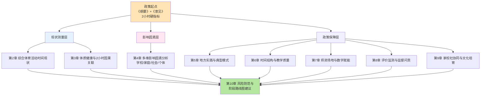

如图所示，本研究在第2、3章完成现状测量层的实证刻画，回答"是什么"的问题；第4章完成影响因素层的多维分析，回答"为什么"的问题；第5至9章在地方实践经验比较的基础上，分别从时间结构、师资场地、评价监测、家校社协同四个维度构建政策保障路径，回答"怎么办"的问题；第10章则在前九章基础上识别实施风险、提出分阶段路线图与综合保障建议，形成政策建议清单与监测评估指标体系。

本研究在国家政策落地评估与地方实践经验提炼中的定位与贡献主要体现在三个方面：**第一，政策语境对齐**——全程紧扣《纲要》和《意见》的最新政策框架，避免偏离主题至无关的体育产业或竞技体育议题；**第二，证据严谨性**——通过分级使用权威数据并显化口径差异，避免不同标准（如校园2小时活动达标 vs WHO中高强度身体活动达标）的简单混用；**第三，可操作性闭环**——参考天津"进晒查罚改"等闭环治理样本，使政策建议具备"目标—措施—主体—资源—监督—评估"的完整链条，避免空泛的口号式表达。

需要坦诚说明的是，受当前可获取资料的限制，本章对"2小时"政策的定位主要基于《纲要》《意见》及其官方解读、历史政策文本等权威来源，对部分地方实践（如天津、平城区、北京"体育八条"、云南"壮苗行动"等）目前仅能引述其名称与部分要点[^7]，详细机制将在后续相关章节结合补充资料展开深入分析。同时，由于"2小时"政策在2025年秋季学期才全面推开[^10]，全国层面的系统性落地数据尚处于积累阶段，本研究的现状测量将以已公开的国家及地方监测数据、第三方调研为主，并对数据的时效性与代表性保持审慎判断。这些研究边界和方法论考量，将在后续章节中进一步具体化和精细化。

# 2 中小学生每天综合体育活动时间现状测量

第1章已经从战略视域和制度逻辑层面阐明，"2小时"硬指标既是教育强国建设的关键观测变量，也是撬动学校体育全要素改革的政策杠杆。然而，杠杆能否真正发挥作用，首先取决于一个看似简单却极易被混淆的事实判断——目前中小学生每天综合体育活动时间究竟是多少？这一问题的回答远比表面复杂：不同的口径界定（校园活动 vs 中高强度活动）、不同的统计场景（课内 vs 课内外校内外综合）、不同的测量主体（国家监测 vs 地方抽测 vs 第三方调研）会给出差异显著甚至相互矛盾的答案。本章的任务是在《纲要》和《意见》确立的"综合体育活动时间不低于2小时"这一统一坐标下，先厘清测量框架和数据可比性，再分学段、分区域、分学校类型刻画现状分布，最终量化与目标的差距规模并锁定结构性短板，为第3章的因果关联分析、第4章的影响因素拆解和第5—9章的政策保障设计提供可靠的实证基底。

## 2.1 综合体育活动时间的构成口径与测量框架

要准确测量"2小时"的落实状况，首先必须厘清"综合体育活动时间"的概念边界。如第1章所述，这一口径与2007年中发7号文以来的"每天锻炼一小时"存在本质区别：后者仅指向校内集中性体育锻炼，而前者是统筹课内外、校内外多场景的整体性时间安排。结合《纲要》《意见》以及广东、广州、北京、上海等地的实施细则，"综合体育活动时间"在政策文本中通常涵盖**体育课、大课间、课间"微运动"、眼保健操、早锻炼、午锻炼、课后体育服务**等多个校内场景，并延伸至**家庭体育作业、校外锻炼**等校外场景[^14][^15][^16][^17]。广州在《广州市教育局关于保障中小学生每天综合体育活动时间不低于2小时的通知》中明确要求"全市义务教育阶段学校100%落实每天1节体育课，小学15分钟课间（初中下午15分钟课间）、30分钟大课间，课后'430'均常态规范落实，校内每天综合体育活动时间不低于2小时"[^16]，体现了校内多模块叠加的典型时间结构。

为更直观呈现"2小时"的构成口径，下表对当前主流地方实施方案中的时间模块进行结构化拆解：

| 时间模块 | 时长参考 | 政策依据 | 备注 |
|----------|----------|----------|------|
| 体育课 | 小学/初中每天1节（约40分钟）；高中每周3-5节 | 广东、广州、北京、上海等省市统一要求 | 编入课表，刚性安排[^16][^14][^17] |
| 大课间 | 30分钟（部分学校延长至40分钟，或上下午各1次） | 广州、武汉、广东等 | 集体活动为主[^16][^17][^14] |
| 课间"微运动" | 小学全日15分钟；初中下午15分钟 | 教育部、广东、广州 | 严禁拖堂挤占[^18][^19][^16] |
| 课后服务体育 | 课后"430"等 | 广州、广东 | 鼓励球类、跳绳等多样项目[^16][^14] |
| 早/午锻炼 | 10—15分钟 | 广东 | 季节灵活安排[^14] |
| 家庭/校外锻炼 | 体育家庭作业、周末户外 | 区域督导调研所涉 | 高中阶段重点督查校外资料[^20] |

**需要特别强调的是，"校园2小时综合活动达标"与世界卫生组织（WHO）"中高强度身体活动（MVPA）每天≥60分钟"是两套截然不同的测量标准，二者不可简单混用**。前者是"时间累加口径"，统计的是学生在体育相关情境下的总停留时长，其中包括广播操、眼保健操、走班通勤、低强度游戏等环节；后者是"强度口径"，要求活动达到中等及以上强度并持续60分钟以上。北京市《关于进一步加强新时代中小学体育工作的若干措施》要求"每天综合体育活动时间不低于2小时。其中至少要有1小时中等及以上强度体育锻炼"[^17]，正是对两套标准在政策设计中的有意衔接——以"2小时"作为时间底线，以"1小时MVPA"作为质量底线。这一区分对本章后续的数据解读至关重要：当我们看到"中国青少年身体活动不足率84.3%"[^21][^22]这类数据时，对应的是WHO的MVPA标准，而非校园综合活动时间口径，二者不能直接相加或相减。

基于上述辨析，本章测量框架确立三条核心规则：**第一，时间核算以"综合活动时间"为主口径**，覆盖体育课、大课间、课间、课后服务、早/午锻炼以及家庭/校外锻炼六大场景；**第二，质量评估以"1小时MVPA"为辅助标尺**，在数据可得时显化区分；**第三，数据使用严格分级**——国家级监测公报和教育部正式数据为最高等级，省级教育部门发布的区域抽测次之，第三方学术研究和媒体报道再次，凡口径不一致或不可追溯的数据均予标注或回避。这一框架将贯穿2.2—2.7各小节的实证分析。

## 2.2 多源数据来源比较与可比性分析

中小学生体育活动时间数据来源众多，但其抽样设计、指标口径与发布主体各异，必须先建立"证据矩阵"才能避免数据混用风险。

在**国家级数据**方面，首先是教育部主导的全国学生体质健康抽测。教育部公布的最新数据显示，2024年全国学生体质健康抽测结果反映"大中小学生体质健康总体优良率较2016年提升9.3个百分点"，学生身高、肺活量等指标实现增长，全国学生总体近视率2021—2024年实现"四连降"、2024年降至50.3%[^18][^19][^23][^24]。其次是国家体育总局每5年开展一次的全国国民体质监测——《第六次全国国民体质监测公报》于2025年发布，覆盖全国31个省（区、市）108个市（区、县）、有效样本24.36万人，**首次发布"国民体质优良率"这一核心综合指标**[^25][^26]；与之配套的《2025年全民健身活动状况调查公报》覆盖31个省500个县6500个村居、有效样本141145人，将7—18岁儿童青少年单列为四大调查群体之一[^27][^25][^28]。这两份2025年新发布的国家级公报为现状测量提供了最新、最权威的数据底盘。

在**省市级数据**方面，多地教育部门已经形成年度抽测机制。**天津**2024年中小学生体质健康监测覆盖全市16个区共计19200名学生（小学四年级、初中二年级、高中二年级各取样），按《国家学生体质健康标准》（2014年修订）测试，发布了分学段优良率、合格率、肥胖率等完整数据[^29]。**广州**2024年省抽测体质健康优良率达86.11%（全省第一），2025年市监测全市普测学生体质健康总体优良率达61.02%，并跟踪了近视率从2023年的55.44%降至2025年的54.90%的变化[^16]。**上海**2023年中小学生体质健康监测数据显示"全市中小学生日均体育活动时间为1.2小时，达标率不足40%"[^30]——这一数据虽时点稍早，但因其直接报告了"日均活动时间"，在时间维度的现状测量中具有不可替代的参考价值。**青海**和**杭州**则提供了纵向对比：青海一项覆盖5039名中小学生的研究显示，小学男生日均运动时间从2019年的34.2分钟增至2023年的57.2分钟[^21][^22]；杭州2018—2022年间立定跳远增加1.9厘米、引体向上增加1.2个、一分钟仰卧起坐增加1.8次[^21][^22]。

在**区域督导调研与第三方数据**方面，2025年2—5月某区域对29个中小学责任点位（义务教育学段占96.55%）开展的"每天综合体育活动不低于两小时"专项调研，涵盖体育课程模式、师资队伍、场地设施、安全等16个方面，采用文献研究、深度访谈、多元督导相结合的方法[^20]，是当前已公开的较系统的区域执行情况调研。此外，中国教育科学研究院的内部调研、《中国国民心理健康发展报告（2021—2022）》、《全球身体活动状况报告（2022）》等也提供了若干维度的参照数据[^31][^21][^22]。

**对上述多源数据进行可比性分析后可识别四类显著的口径差异**：

| 数据来源 | 测量对象 | 主要口径 | 权威等级 | 可比性提示 |
|----------|----------|----------|----------|------------|
| 教育部全国体质健康抽测 | 大中小学生体质指标 | 《国家学生体质健康标准》合格率/优良率 | ★★★★★ | 不直接报告活动时间[^18] |
| 第六次全国国民体质监测公报 | 3-6岁、20-79岁国民体质 | 国民体质合格率/优良率 | ★★★★★ | 主样本未涵盖7-18岁，本主题需借用其他公报[^25][^26] |
| 2025年全民健身活动状况调查公报 | 全人群锻炼参与 | 经常参加体育锻炼人口比例 | ★★★★★ | 7-18岁单列，但报告活动时间细节有限[^27] |
| 省市教育部门抽测 | 区域中小学生体质 | 《国标》或本地修订版 | ★★★★ | 各地学段抽样不一，需标注[^29][^16] |
| 上海市2023年监测 | 中小学生日均活动时间 | "日均活动时间+达标率" | ★★★★ | 直接报告时间，但为2023年数据[^30] |
| 青海/杭州学术研究 | 区域学生纵向变化 | MVPA及体测项目 | ★★★ | 抽样规模有限，不可全国外推[^21][^22] |
| 区域督导调研报告 | 29个责任点位执行情况 | 16维度过程性指标 | ★★★ | 区域代表性有限[^20] |
| WHO《全球身体活动状况报告（2022）》 | 11-17岁青少年MVPA | 每天≥60分钟MVPA达标率 | ★★★★ | 与"校园2小时"为不同口径，不可混用[^21] |

由此可见，**关于"中小学生每天综合体育活动时间是多少"这一基础问题，目前尚不存在一个时点统一、口径一致、覆盖全国的权威数据点**。研究只能通过多源数据的交叉印证与显化口径区分，对总体水平和结构特征作出审慎刻画。这一数据可比性的现实约束，是本章后续分析必须始终铭记的方法论前提。

## 2.3 全国总体活动时间分布与达标率特征

在多源数据交叉印证下，可以从两个维度大致勾勒全国总体的活动时间分布特征——**校园综合活动时间口径下的"政策落地推进度"**与**MVPA口径下的"健康活动达标率"**——两者共同构成现状画像。

从校园综合活动时间口径看，**2025年是"2小时"政策从局部试点走向全国推开的关键节点**。教育部相关负责人在2026年2月25日"健康第一"工作部署会上明确表示：**"全国所有省份已经部署推开中小学生每天体育2小时、课间15分钟"**[^18][^19][^23][^24]。广州的实施进度可作为先行地区的代表样本——自2025年秋季学期开学起，广州全市义务教育阶段学校已100%落实每天1节体育课、15分钟课间、30分钟大课间和课后"430"，2026年春季学期进一步通过《广州市中小学生阳光成长计划》将"每天1节体育课""每天综合体育活动2小时"纳入体育素养提升行动[^16]。北京则要求"小学和初中每天1节体育课；高中每周3—5节体育课，没有体育课的当天要安排不少于45分钟的体育锻炼"，并在2025年2月通过《关于进一步加强新时代中小学体育工作的若干措施》确立了"2小时含1小时MVPA"的双重底线[^17]。武汉、上海等地也通过课时调整（每节课从45分钟压缩到40分钟）、大课间延长（30—45分钟）等方式向"2小时"目标聚拢[^17][^30]。

然而，**"全面部署推开"并不等同于"全面达标落地"**。一方面，教育部已经明确意识到执行层面的隐性流失风险，2026年明确将"严防'阴阳课表'，严查挤占体育课、课间不准学生出教室等行为"作为重点督查内容[^32][^19][^23][^24]，这从侧面印证了实际执行中仍存在政策悬空的现象。另一方面，上海2023年中小学生体质健康监测数据显示"全市中小学生日均体育活动时间为1.2小时，达标率不足40%"[^30]——以这一发达地区的数据为基准，推开"2小时"政策时全国整体起点距离目标仍有相当差距。即便2025年起多地开始全面落实，从"日均1.2小时"跃升到"日均2小时"意味着活动时间需要增加约67%，这一跨度的实际达成度需要后续监测数据进一步验证。

从MVPA口径看，**全球与中国青少年身体活动不足问题依然严峻**。《全球身体活动状况报告（2022）》显示，全球81%的11—17岁青少年每天进行中等至高等强度身体活动的时间不足1小时，而**中国青少年的身体活动不足率为84.3%**[^21][^22]，略高于全球平均水平。这意味着在"每天MVPA≥60分钟"这一更高质量的标准下，全国仅约15.7%的青少年达标。需要审慎指出的是，校园"2小时综合活动"和"60分钟MVPA"是两套不同评价体系，因此84.3%的不足率并不直接等同于"2小时"目标的不达标率，但二者共同揭示了**当前活动时间在"量"和"质"两个维度上均存在显著缺口**。

在与活动时间高度相关的体质健康总指标上，全国数据呈现"稳步改善但绝对水平不高"的特征：

- **总体优良率提升**：教育部2024年抽测显示，大中小学生体质健康总体优良率较2016年提升9.3个百分点[^18][^19][^23][^24]；
- **国民体质持续向好**：《第六次全国国民体质监测公报》显示2025年全国总体体质合格率84.9%（较2020年提升0.8个百分点）、优良率30.9%（提升1.5个百分点），呈现2000年以来稳步上升态势[^27][^26]；
- **近视率"四连降"**：2021—2024年全国学生总体近视率连续下降，2024年降至50.3%，达成每年下降0.5个百分点的防控目标[^18][^32][^19][^24]；
- **肥胖率仍存隐忧**：6—17岁儿童青少年肥胖率达7.9%，较1982年的0.2%飙升近40倍，已成为重要公共卫生问题[^33][^34]；国家体育总局科研所对1.5万名小学生的运动干预数据显示，干预组超重肥胖增长率低2.73个百分点、近视增长率低1.45个百分点、脊柱侧弯风险比例明显下降[^27]；
- **经常锻炼人口比例提升**：2025年7岁及以上居民经常参加体育锻炼人数比例为38.52%，较2015年和2020年分别提高4.6个和1.3个百分点[^27]。

综合以上证据可以判断，**全国中小学生体育活动时间正处于"政策刚性化推进"与"实际效果待验证"的交汇阶段**。"2小时"在制度层面已实现全国部署推开，但在落实质量、达标比例和结构均衡性上仍面临系统性挑战，这一全局性判断为后续分学段、分区域、分学校类型的精细化分析定下基调。

## 2.4 分学段差异：小学—初中—高中梯度失衡

在总体特征之下，**学段梯度失衡是中小学生体育活动时间最突出的结构性矛盾**——随着学段升高、升学压力增强，体育活动时间和体质健康水平呈现明显的递减趋势，"小学高、初中降、高中塌"已成为多地监测数据共同验证的规律。

天津2024年中小学生体质健康监测报告提供了最具说服力的学段梯度证据。该监测覆盖全市16个区共19200名学生，按统一标准测试后呈现出鲜明的学段下滑曲线[^29]：

| 学段 | 优良率 | 合格率 | 总分均值 | 不及格率 |
|------|--------|--------|----------|----------|
| 小学（四年级） | 77.19% | 99.72% | 87.03分 | 0.28% |
| 初中（二年级） | 56.32% | 98.56% | — | — |
| 高中（二年级） | 39.59% | 96.31% | 77.56分 | 3.69% |

**从小学到高中，体质健康优良率从77.19%骤降至39.59%，下滑幅度高达37.6个百分点**[^29]；总分均值从87.03分降至77.56分；不及格率从0.28%上升至3.69%，扩大13.2倍。更值得警惕的是，2024年与2023年相比，天津小学优良率提升6.17个百分点、初中优良率提升3.14个百分点，**而高中优良率不升反降3.07个百分点**[^29]——这表明在政策推进过程中，高中学段的改善阻力显著强于义务教育阶段，是整个体质强健链条上最薄弱也最脆弱的环节。

体质指标的学段梯度直接对应活动时间的学段梯度。从政策文本看，**义务教育阶段已普遍要求"每天1节体育课"，而高中阶段普遍仅要求"每周3—5节体育课"**——这意味着高中生在制度层面就被赋予了更少的体育课时配额。北京《关于进一步加强新时代中小学体育工作的若干措施》明确"小学和初中每天1节体育课；高中每周3—5节体育课，没有体育课的当天要安排不少于45分钟的体育锻炼"[^17]；广州虽然推动"高中（中职）学校每周3—5节体育课，有条件的试点每天1节"[^16]，但全面落实"每天1节"在高中阶段仍属"试点"性质。广东《通知》也是先要求珠三角地区2025年秋季学期、粤东西北地区2026年秋季学期实现"每天1节体育课"，但同样以中小学义务教育阶段为主要适用对象[^14][^15]。

学段梯度失衡的形成机制可从三个层次理解。**第一是升学压力随学段递增的不断加码**——朱鹏校长在接受人民网采访时坦言："运动时间增加了，很多面临升学考试的学生、家长、教师都会担心文化课时间缩短"[^35]；中国教育科学研究院吴键所长也指出，"片面追求文化课成绩和升学率的各种做法，已经影响到青少年的身心健康"[^31][^36]。**第二是高中课表结构的刚性约束**——高中阶段课程总课时量大、晚自习常态化，体育课时常被压缩为政策最低要求的下限。**第三是高中阶段体测项目难度跃升**——天津监测中高中阶段测试包含1000米跑（男）/800米跑（女）、引体向上等高强度项目，对学生日常训练量提出更高要求，但实际投入时间却最少，由此形成"要求最高、投入最少"的剪刀差。

由此可以判断，**高中阶段是"2小时"政策落实的最薄弱环节，也是结构性失衡最严峻的学段**。如不针对高中学段的特殊性设计差异化政策（如打破"每周3—5节"的下限、强化高中生综合体育活动时间的硬约束、在高考综合素质评价中赋予体育权重等），则即便义务教育阶段达标，全国整体的体质健康水平和"2035年建成教育强国"的远期目标仍将受到拖累。

## 2.5 分区域差异：城乡与东中西部不平衡

学段梯度之外，**城乡与东中西部的区域不平衡是另一条结构性矛盾的主线**。《第六次全国国民体质监测公报》明确指出，国民体质发展呈现"积极变化"的同时，**"区域不平衡特征明显，成年人群东西部体质合格率和优良率仍存在一定差异"**[^26]；《2025年全民健身活动状况调查公报》也反映出"城乡和区域发展不均衡问题依然存在"[^27][^25][^28]。这些全国性结论虽然主要针对成年人群，但同样在中小学层面有所映射。

从**省域横向对比**看，发达地区的中小学生体质健康水平显著领先：

- **广东（广州为代表）**：2024年广东省抽测中广州体质健康优良率高达86.11%，居全省第一；2025年广州市监测全市普测学生体质健康总体优良率达61.02%，**提前撞线国家2030年达标目标**，超过广东省当年54%的要求[^16]。
- **天津**：2024年市级抽测中小学生体质健康优良率61.97%、合格率98.65%，全市16个区合格率均超过95%，但**宝坻区（48.66%）、东丽区（48.57%）、红桥区（42.86%）三个区优良率未达标**[^29]——即便在直辖市内部，区域间的优良率最高与最低差距也接近30个百分点。
- **杭州**：2018—2022年间多项体测数据稳步改善，立定跳远增加1.9厘米、引体向上增加1.2个、一分钟仰卧起坐增加1.8次[^21][^22]。
- **青海**：2019—2023年小学男生日均运动时间从34.2分钟增至57.2分钟，1分钟跳绳从86.7次增至107.2次[^21][^22]，西部省份在政策干预下实现快速追赶。

值得注意的是，**广东在政策推进上采取了显性的"分区差异化"策略**——《关于保障中小学生每天综合体育活动时间不低于两小时的通知》规定"珠三角地区中小学校于2025年秋季学期开始全面实施每天1节体育课；粤东西北地区于2025年秋季学期落实每天1节体育课的学校比例不少于50%，2026年秋季学期开始全面实施"[^14][^15]——这一"先珠三角、后粤东西北"的时间表本身就是对区域不平衡的政策承认和制度回应。

从**城乡纵向对比**看，《第六次全国国民体质监测公报》同时也传递了一个相对积极的信号：**"城乡居民体质差距逐步缩小"**[^25][^28][^26]。这一变化与全民健身基础设施投入向西部和薄弱地区倾斜、农村学校体育条件改善、双减政策释放青少年课余时间等多重因素相关[^21][^22]。但城乡差距缩小不等于消除——**农村儿童青少年肥胖率增长迅速**，且农村学校在体育教师、场地设施、专业指导等关键要素上仍存在系统性短板[^33]。区域督导调研也反映，乡村学校在场地不足、师资短缺、安全风险防控等方面普遍面临更严峻的挑战[^20]。

更深层的结构性证据来自**家庭社会经济条件对运动时间的塑造作用**。《中国国民心理健康发展报告（2021—2022）》在调研"双减"后小学生群体时特别指出，**"家庭经济条件越好，感受到（体育与兴趣发展时间增加）的孩子占比越高"**[^21][^22]——这一发现揭示了即便在同一城市、同一学校，家庭背景的差异也会导致运动时间的不平等分配。区域不平衡因此不仅是"省与省"或"城与乡"的宏观差距，更深入到家庭微观层面，形成多层嵌套的结构性矛盾。

综合以上证据可以判断，**当前中小学生体育活动时间的区域分布呈现"东高西低、城高乡低、富高贫低"的多维不平衡格局**，且这种不平衡在政策干预下虽有缩小迹象但远未消除。要避免"2小时"在政策落地中演变为"发达地区超额完成、欠发达地区凑数应付"的新型不平衡，区域差异化推进与分类施策是后续政策设计的必然要求。

## 2.6 分学校类型差异：寄宿/走读与城区/乡村对比

在学段和区域差异之外，**学校类型差异同样深刻塑造着"2小时"的落地能力**。区域督导调研对29个中小学责任点位的实证分析显示，各学校虽普遍积极探索时间保障路径，但**"增加的体育课和体育活动时长、学生活动密度，仍然面临体育师资短缺、场地不足及安全风险等问题"**——而这三大约束在不同类型学校之间呈现出显著的差异化分布[^20]。

**城区学校面临的核心约束是"场地紧张"**。中心城区学校通常用地紧张、生均运动场地不足，"金边银角""上天入地"成为常见破题路径。上海普陀区洵阳路小学通过打造"攀岩墙"和"地下活动场馆"，为学生提供多元立体的运动场所[^30]；广东《通知》明确要求"充分利用天台、走廊、楼道、架空层、墙壁、地面等校内空间，在满足安全的前提下，打造人人、处处、时时可及的校内'微运动场'"[^14][^15]；重庆珊瑚鲁能小学将"操场、屋顶、走廊、步道等空间进行了大规模改造，打造十大体育主题公园"[^35]。中国教育科学研究院吴键所长把此类策略概括为"既要加大资金投入补足硬件缺口，更需通过分时段共享、错峰使用等科学管理手段'盘活存量'"[^31][^36]。城区学校的优势在于师资相对充足、教研活力较强，但场地天然瓶颈使其活动时间往往依赖于精细化的时空管理。

**乡村学校面临的核心约束是"师资短缺"**。教育部统计显示，义务教育阶段体育教师总量较2012年增长71.6%[^18][^19][^24]——增量可观，但增量在城乡和区域间的分布并不均衡。区域督导调研明确将体育师资短缺列为29个点位学校的共性问题之一[^20]；吴键也指出"破解师资短缺难题不能仅靠短期招聘，还需通过购买社会服务、培养兼职教师等多元渠道进行'开源'"[^31][^36]。广东《通知》提出"采取公开招聘、县（区）管校聘、本校教师转岗、辖区内'走教'、聘用优秀退役运动员及优秀退伍军人、返聘优秀退休体育教师等方式"[^14][^15]，这些政策工具虽多元，但其在乡村学校的可及性与吸引力仍待观察。

**寄宿制学校的相对优势在于时间统筹**。寄宿学生从早到晚的全时段在校生活为体育活动提供了天然的时间空间——早操、午锻炼、晚自习前的运动时段都可以系统组织，2小时综合活动时间相对容易拼齐。但寄宿学校的安全责任也更重，运动伤害事件一旦发生，对学校的舆情和法律压力更大。

**走读学校则面临家校时间衔接挑战**。走读学生的体育活动时间高度依赖校内时段的密集安排，课后服务和家庭体育作业成为衔接关键。广东《通知》"综合统筹好体育课、大课间、课间活动、眼保健操、早午锻炼等时间安排"[^14][^15]的要求，对走读学校的课表精细化管理提出了更高要求。

跨类型学校共享的一个重大挑战是**"安全顾虑导致'不敢让孩子动'"**。吴键引用的最新数据令人警觉："与2023年相比，学生体育运动伤害事故增加了50%以上，校方责任险中体育运动伤害赔偿的比例不断增加，接近60%"——"学生体育运动意外伤害保险制度不完善，不能给每天2小时体育活动保驾护航，学校开展体育活动有后顾之忧"[^31][^36]。**家长怕受伤、学校怕出事**，是跨越所有学校类型的"不敢让孩子动"的根源。北师大天津静海实验学校朱鹏校长也表示："学生运动时间增加，受伤风险也随之提高。但我们不能一味呵护，更不能因噎废食"[^35]。这一普遍性约束意味着即便时间和场地问题解决，安全风险防控不到位也会从隐性层面侵蚀活动时间的实际落地。

由此可以判断，**不同类型学校在"2小时"落实中的瓶颈各异——城区学校卡在"场地"、乡村学校卡在"师资"、所有学校共同卡在"安全"——这构成了多重约束的复合矩阵**。任何"一刀切"的政策推进方案都难以适配学校类型的多样性，分类施策、精准滴灌成为政策保障设计的必然选择。

## 2.7 结构性短板识别与差距规模评估

综合2.3至2.6小节的多维度刻画，可以识别当前中小学生综合体育活动时间与"2小时"目标之间存在的**五类结构性短板**，并对其差距规模作出评估。

**第一类短板：高中学段的时间严重不足**。如2.4节所论，天津2024年监测显示从小学到高中体质优良率从77.19%骤降至39.59%、下滑37.6个百分点[^29]，而政策制度层面高中阶段普遍仅要求"每周3—5节体育课"[^17][^16]，与义务教育阶段"每天1节"形成明显落差。**高中学段是"2小时"目标差距规模最大、改善阻力最强的环节**——以天津2024年高中优良率较2023年下降3.07个百分点为例[^29]，即便在政策推进过程中，高中阶段也呈现"逆向下行"风险。这是后续政策设计必须优先攻克的第一靶点。

**第二类短板：中西部及乡村地区的资源短板**。虽然《第六次全国国民体质监测公报》传递"城乡差距缩小"的积极信号[^26]，但区域不平衡和家庭经济条件分化的现实仍然显著[^21][^22][^25][^28]。乡村学校在师资、场地和专业指导上的系统性短板[^20][^14][^15]，决定了即便相同政策文本下推进的"2小时"落地质量也存在显著差距。差距规模可从天津同一直辖市内宝坻、东丽、红桥三区优良率（42.86%—48.66%）与全市平均（61.97%）的近20个百分点差距得到管窥[^29]。

**第三类短板："凑数式2小时"背后的质量空洞**。这是上海市教育界自我反思中点出的核心隐患：**"当'达标'成为第一要务时，一些学校在具体操作中，也难免会出现拼凑运动时间的'凑数式'做法。比如，有些学校会把大课间和少数人参与的运动或校外运动竞赛活动也纳入'2小时'范围，甚至将一些非运动时间，比如学生的放松休息时间，也生硬地计入运动时间总量……学生的运动时间'账户'看似充实，实则却没有达成运动2小时的效果，与政策期待达成的目标相去甚远"**[^30]。机械拼凑的120分钟若缺失"强度适宜的心肺锻炼、针对性肌力训练与协调性开发"，其效果必然大打折扣[^30]。在MVPA口径下中国青少年达标率仅约15.7%[^21]，与时间口径下"全国部署推开"形成鲜明对照，表明**质量空洞的差距规模可能远大于时间口径下的表面差距**。

**第四类短板：家庭与校外锻炼场景的薄弱环节**。中国教育科学研究院调研数据显示"学生放学后以及居家期间，其体育锻炼时间很难保证"[^31][^36]，导致吴键所长强调"落实每天2小时，重点还是在学校内"。但这同时意味着**校外场景在"综合体育活动时间"口径中长期处于失能状态**——家长担忧体育"挤占学习时间"[^30]、电子产品使用难以管控、社区和公共体育场馆开放度有限等共同导致校外体育活动时间薄弱。差距规模虽难精确量化，但从"放学后基本不动"的描述可知校外场景贡献远低于政策口径预期。

**第五类短板："阴阳课表"、挤占体育课、课间限制活动等隐性流失**。教育部已经将"严防'阴阳课表'，严查挤占体育课、课间不准学生出教室等行为"明确列为2026年的督查重点[^32][^19][^23][^24]——**这一表述本身即是对隐性流失现象在全国范围内仍然存在的官方确认**。广东《通知》也专门强调"严禁'拖堂'或以其他方式挤占学生课间时间，不得以任何借口限制学生课间活动自由"[^14][^15][^16]。隐性流失的差距规模难以从公开数据精确测算，但从政策文件对此问题的反复强调可推断其在多地仍是普遍现象。

综合上述五类短板，可以构建以下差距规模评估框架：

| 短板类别 | 差距规模指标 | 关键证据 | 政策对接 |
|----------|--------------|----------|----------|
| 高中学段 | 优良率从小学到高中下滑37.6个百分点 | 天津2024监测[^29] | 高中阶段"每天1节"试点扩面 |
| 区域不平衡 | 同一直辖市内区际优良率差距近20个百分点 | 天津16区数据[^29] | 差异化推进时间表[^14] |
| 质量空洞 | MVPA达标率仅约15.7%（中国青少年） | WHO报告[^21] | "时间+质量"双指标考核[^17] |
| 校外场景薄弱 | 放学后及居家期间锻炼时间难保证 | 中国教科院调研[^31] | 家校社协同与体育家庭作业[^20] |
| 隐性流失 | "阴阳课表"等现象仍需严查 | 教育部2026督查重点[^32] | "进晒查罚改"等闭环监督 |

这一差距规模评估框架揭示出，**"2小时"目标的真正达成不是单一时间维度的简单达标，而是要在五个维度上同步攻坚**：补齐高中学段的时间下限、缩小区域和学校间的资源鸿沟、夯实活动质量的强度底线、激活家庭和校外场景的功能、严防隐性挤占的政策悬空。这五大短板与第1章所描绘的"现状测量—影响因素—政策保障"分析框架形成精准对接——**短板的"是什么"为第3章体质健康因果关联和第4章影响因素分析提供问题靶点；短板的"为什么"将在第4章被系统拆解；短板的"怎么办"将在第5至9章通过地方实践比较和保障机制设计逐一回应**。

需要坦诚说明的是，本章受当前可获取数据的限制，全国层面的中小学生综合体育活动时间均值尚无统一权威数据点，分析主要依靠多源数据交叉印证与上海2023年"日均1.2小时"等代表性参考值。随着教育部统一指引性试点办法和评价方法的研制推进[^31][^36]，以及2025年秋季学期"2小时"全面推开后的监测数据陆续发布，对现状的精确刻画将会日趋完整。本章对结构性短板的识别和差距规模的评估，将作为后续章节实证研究和政策设计的稳定起点。

# 3 学生体质健康现状与"2小时"目标的因果关联

第2章已经勾勒出中小学生综合体育活动时间在量与质两个维度上的现状画像与结构性短板，但仅有"现状测量"还不足以回答一个更深层的政策追问：**为什么必须是"2小时"？为什么不是1小时、1.5小时或3小时？这一硬指标在科学上能否被严格支撑？**回答这一问题，需要从两个互补的方向同时展开论证：一方面，要从中国学生体质健康关键指标的长期演变中识别"问题侧"压力——即不"加码"会产生何种代价；另一方面，要从体育活动促进健康的多维因果机制和剂量—效应证据中识别"效益侧"支撑——即"加码"到何种程度才能产生何种效益。本章将沿着"长期趋势—相关性证据—因果机制—剂量阈值—结构优化—证据局限"的逻辑链条，系统验证"2小时"硬指标作为政策硬约束的科学依据，识别活动时间与体质健康之间相关性与因果性的边界，并归纳最优活动结构对政策保障设计的指引价值。这既是对第2章"是什么"问题的因果性追问，也是为第4章影响因素分析、第5—9章政策保障设计奠定科学起点。

## 3.1 中国学生体质健康关键指标的长期演变与近期拐点

理解"2小时"政策的紧迫性，必须先回到近四十年中国学生体质健康关键指标演变的长时段视野。**自1985年首次全国学生体质健康调研以来，中国中小学生在形态发育水平改善的同时，体能素质却经历了长达数十年的下降通道**。教育部组织的1985年至2014年历次全国学生体质和健康调研显示，跑1000米越来越慢、能做引体向上的个数越来越少、肺活量持续下降等现象在中小学生群体中普遍出现[^37]。深入分析显示，"自1985年以来，学生耐力、力量、速度等体能素质水平持续下降趋势没有得到根本性扭转。如学生耐力素质水平，尽管有阶段性改善，但近35年来始终处于下降通道"[^38]。同期肺功能、视力等机能性指标也呈现持续走低，城市超重和肥胖青少年的比例明显增加[^37]。

阶段性的反弹信号最早出现在2010年。教育部2010年全国学生体质与健康调研结果显示，"反映人体生理机能水平的重要指标——肺活量，在连续20年下降的情况下，出现上升拐点"，与2005年相比7—18岁城乡男女各组肺活量平均提高80—94毫升不等[^39]。形态发育、营养状况和乡村小学生健康状况也持续改善[^39]。但这一阶段性改善是"局部反弹"而非"系统逆转"——耐力、力量、爆发力等核心体能素质的下降通道在此后十余年仍未根本走出。

进入2020年代，学生体质健康问题的"老问题持续、新问题集中"特征更加突出，集中表现为**"小眼镜""小胖墩""小豆芽""小焦虑"四大典型症候群**[^38]。具体而言：一是**视力不良居高不下**——国家疾控局监测数据显示，2022年我国儿童青少年总体近视率为51.9%，其中小学生为36.7%、初中生为71.4%、高中生为81.2%，呈现明显的学段递增态势[^38];二是**肥胖率快速攀升**——2013年我国18岁以下肥胖人群已达1.2亿，五岁以下城市儿童超重肥胖率从2005年的5.3%上升到2010年的8.5%[^37];三是**身体素质全面下滑**——13—18岁儿童体质连续二十余年下降，力量、速度、爆发力与耐力等身体素质全面下滑，2012年北京高中生体检合格率仅为一成[^37];四是**心理健康问题低龄化**——《中国国民心理健康发展报告（2021—2022）》显示，14.8%的青少年可能有一定程度的抑郁表现，其中约4%为重度抑郁风险群体[^38];五是**慢性病低龄化**——《中国心血管健康与疾病报告2021》显示，高血压、糖尿病等慢性病低龄化现象呈现明显增长趋势[^38]。

值得关注的是，**2021—2024年间出现了多项积极信号，初步显现"下行通道收窄、关键拐点临近"的迹象**。如第2章所述，教育部2024年抽测显示大中小学生体质健康总体优良率较2016年提升9.3个百分点，学生身高、肺活量等指标实现增长，城乡差异逐步缩小[^40]。近视防控方面，2021年至2024年全国学生总体近视率实现"四连降"，2024年降至50.3%，较2018年下降3.3个百分点，达到每年下降0.5个百分点的防控目标[^40]。澎湃美数课基于多地体测数据的梳理也认为"中小学生体质持续下滑的趋势，或许正迎来一个拐点"[^41][^42]。

为更清晰呈现这一长期演变与近期拐点，下表对四十年关键指标变化进行结构化梳理：

| 时段 | 核心趋势 | 代表性证据 |
|------|----------|------------|
| 1985—2010 | 形态发育持续改善、体能素质持续下降 | 学生身高、体重、胸围增长；肺活量连续20年下降；耐力素质下降通道[^38][^39] |
| 2010—2020 | 局部指标反弹、整体短板加剧 | 2010年肺活量出现"上升拐点"[^39];肥胖率、近视率持续攀升；13—18岁体质连续下滑[^37] |
| 2020—2024 | "四小问题"集中、改善信号显现 | 近视率51.9%（2022）但实现"四连降"至50.3%（2024）;14.8%青少年存在抑郁表现[^40][^38] |
| 2024至今 | 拐点初现、目标尚远 | 总体优良率较2016年提升9.3个百分点；多省体测数据改善[^40][^41] |

需要特别警示的是，**改善信号的出现并不等于结构性问题的根本解决**。教育部相关负责人在政策解读中坦承，"小胖墩""小眼镜"等突出问题依然没有得到根本扭转；6—17岁儿童青少年肥胖率达7.9%，较1982年的0.2%飙升近40倍。此外，从国际比较看，《中日儿童青少年体质健康比较研究结果公报》显示2014年和2016年中国儿童青少年在心肺耐力、柔韧性和灵敏协调性等方面均显著低于日本同龄人[^37]。这意味着即便近期出现拐点信号，距离"建成教育强国"对青少年体质健康水平的远期要求仍有相当差距，"2小时"硬指标正是在这一"老问题持续、新问题涌现、改善初显但远未达标"的复杂背景下作为政策"猛药"被开出的[^38]。

## 3.2 地方监测数据对"活动时间—体质改善"关联的验证

如果说3.1节的长期趋势从问题侧验证了"2小时"政策的紧迫性，那么近年来天津、青岛、青海、杭州等地的地方监测数据则从效益侧提供了"活动时间增加—体质指标改善"的相关性证据链。这些地方实证案例虽然方法学上属于相关性观察而非严格因果识别，但其时点连续、口径稳定、规模可观，足以构成支撑政策科学性的重要经验基础。

**天津的"两升一降"是最具代表性的近期实证案例**。《2025年天津市中小学生体质健康监测报告》数据显示，2025年全市中小学生体质健康抽测总样本合格率达99.40%，优良率为68.80%，优秀率为21.77%，整体平均得分83.94分；与2024年相比，**优良率提升6.83个百分点，合格率提升0.75个百分点，不及格率下降0.75个百分点**，呈现"两升一降"的良好态势[^43][^44][^45][^46]。结合第2章已援引的天津2024年监测数据（优良率61.97%），可以清晰看出**天津市优良率在一年内从61.97%跃升至68.80%，提升近7个百分点**——这一改善幅度在传统体质健康监测中相当罕见。与此同步推进的是天津"进晒查罚改"闭环机制下"2小时"的硬性落实——2025年起全市小学、初中每天1节体育课、高中每周至少3节体育课全部编入课表，每天上下午各安排不少于30分钟大课间活动；2025年市教委专项抽查了825节体育课及课间活动，对挤占、挪用体育课时行为"零容忍"，共约谈33名违规学校负责人；最终**全市义务教育阶段每天1节体育课开课率达100%，96.8%的中小学能严格落实每天2小时体育活动时间**[^43][^44][^45][^46]。"96.8%学校落实2小时"与"优良率提升6.83个百分点"在同一年度同步发生，构成了"活动时间—体质改善"关联的强相关性证据。

**青海的纵向追踪研究提供了"运动时间—体测成绩"剂量响应的微观证据**。一项覆盖青海省5039名中小学生的研究指出，与2019年相比，2023年青海学生进行中等及以上强度身体活动的时间明显增加：**小学男生的日均运动时间从2019年的34.2分钟，增长至2023年的57.2分钟**[^41][^42]。与运动时间增加同步，2023年青海中小学生在多项体测项目上取得明显进步，**一分钟跳绳次数从2019年的86.7次增至2023年的107.2次**，50×8往返跑、立定跳远等项目也均有改善[^41][^42]。研究指出这一变化"可能是受政策干预、学校活动项目和公众健康意识增强的推动"[^41][^42]。值得注意的是，2025年青海省进一步启动《学生体质强健计划三年行动方案（2026—2028年）》，全面落实义务教育阶段学生每天1节、高中阶段每周至少3节体育课的刚性标准，构建"监测—评估—反馈—干预—保障"闭环体系[^47][^48][^49]——这表明青海的"活动时间—体测改善"实证关联正在被进一步制度化。

**杭州的多年体测对比则补充了发达地区的证据**。从2018年到2022年，杭州中小学生的多项体测数据明显改善：**立定跳远增加1.9厘米，引体向上增加1.2个，一分钟仰卧起坐增加1.8次**[^41][^42]。与此同时，杭州师范大学第一附属小学等学校通过"无结构运动"、按10分钟/15分钟/20分钟/35分钟不同时长设计差异化课间功能、推行宋韵游艺体育等创新举措，将"每天2小时"落到具体场景[^50]。浙江全省层面构建"体育课+大小课间+特色课外活动"的"1+N"多元体育活动机制，11个设区市共3284所学校开展"每天1节体育课"试点，4043所学校开展"课间15分钟"试点[^50]。

**青岛的三年行动计划提供了"刚性课时落地+体质优良率连续提升"的典型样本**。青岛市政府办公厅2022年印发《全面加强和改进新时代学校体育工作三年行动计划（2022—2024年）》，明确提出基础教育阶段学校每天开设1节体育课、学生每天校内中等以上强度体育锻炼不少于1小时的目标；通过课表备案公示制度和市、区两级"督查—通报—整改—反馈"机制将"一天一节体育课"刚性落地[^51]。结果是**青岛中小学生体质健康抽测合格率、优良率2023年和2024年连续两年位居山东省首位；2025年学生体质健康优良率较上年度又提高了8.73个百分点**;"一项体育技能"落实率达到100%，每位中小学生至少参加1个体育社团、掌握2项运动技能[^51]。

为更直观比较各地"活动时间—体质改善"的关联强度，下表对四个典型样本进行结构化对比：

| 地区 | 活动时间投入举措 | 体质指标改善 | 关联时段 |
|------|------------------|--------------|----------|
| 天津 | 2025年起小初每天1节体育课、上下午各30分钟大课间；96.8%学校落实2小时 | 2025年优良率68.80%（较2024年+6.83pp）、合格率99.40% | 2024—2025 |
| 青岛 | 2022年起每天1节体育课刚性落地、校内中等以上强度锻炼≥1小时 | 体质优良率2023—2024连续两年居全省首位；2025年较上年再提升8.73pp | 2022—2025 |
| 青海 | 中小学生中等及以上强度活动时间显著增加 | 小学男生日均运动34.2→57.2分钟；跳绳86.7→107.2次 | 2019—2023 |
| 杭州 | "1+N"多元体育活动机制；3284所学校"每天1节体育课"试点 | 立定跳远+1.9cm；引体向上+1.2个；仰卧起坐+1.8次 | 2018—2022 |

**心理健康维度的关联证据同样不可忽视**。《中国国民心理健康发展报告（2021—2022）》在"双减"后的小学初中阶段调研中发现，超过半数学生投入了更多时间到体育中，而**运动时间更充足的学生抑郁风险检出率最低，仅为18.4%；运动时间变少的学生抑郁风险检出率高达38.9%**——两组之间相差超过20个百分点[^41][^42]。这一对比与第2章提到的"运动时间不平等分配"现象（家庭经济条件越好，感受到体育时间增加的孩子占比越高）共同说明：**活动时间不仅与体测成绩改善正相关，也与心理健康改善高度相关**——"2小时"对青少年的健康收益是多维度的。

需要审慎指出，上述地方监测数据均属相关性证据，**严格意义上无法独立证明"是因为活动时间增加，所以体质改善"的因果方向**。同期发生的"双减"政策、家庭经济条件改善、公众健康意识增强、监测技术进步等都构成潜在混杂因素[^41][^42]。但当多个地区在不同时期、不同制度推进路径下都呈现出"活动时间增加+体质指标改善"的同向变化时，其经验信号已经足够强以支撑"2小时"政策的合理性预期——这一相关性证据链将在3.3节通过多维因果机制得到进一步加固。

## 3.3 体育活动促进体质健康的多维因果机制

地方监测数据呈现的相关性需要回到运动生理学、运动心理学、认知神经科学的经典研究中寻找因果机制支撑。从**生理、心理、认知**三个维度系统理解体育活动如何作用于青少年体质健康，是论证"2小时"政策科学性的关键一环。

**第一维度：生理机制——运动负荷塑造身体形态、机能与素质**。运动生理学理论指出，"适宜的运动负荷能够有效促进心肺功能、肌肉力量和骨骼密度的提升"，这为体育活动改善体质指标提供了基本的生物学依据[^52]。具体到青少年群体，"青少年时期正处于人体发育的黄金期，身体的各个器官与系统日趋成熟，有助于青少年获得最佳的锻炼效果"[^37]。早期综合体能训练能有效提高青少年的健康水平、预防伤病、帮助掌握多项运动技能，为长期参与运动打下牢固基础[^37]。从干预效应规模看，国家体育总局相关研究对1.5万名小学生开展的运动干预（在第2章已援引）显示，**干预组超重肥胖增长率比对照组低2.73个百分点、近视增长率低1.45个百分点、脊柱侧弯风险比例明显下降**——这一规模化样本提供了运动干预改善青少年生理指标的"量化效应证据"。

**第二维度：心理机制——有氧运动通过神经化学物质调节情绪与心理健康**。这一机制有较为完整的神经生物学解释：**有氧运动能促进大脑分泌血清素（"快乐激素"，水平升高时情绪更稳定）、内啡肽（带来"跑者愉悦"的放松感）、脑源性神经营养因子BDNF（帮助神经细胞成长、修复，被称为大脑的"肥料"）等神经递质**，从而对抑郁、焦虑等情绪问题产生积极调节作用[^53]。从神经结构层面看，"当你坚持运动一段时间，大脑中那些和焦虑、抑郁相关的区域——比如杏仁核、前额叶皮层——会开始'重新连线'……你的情绪调节系统也变得更灵活、更稳定"[^53]。多项研究证明：每周3次、每次约40—50分钟的有氧运动坚持12周，就能明显改善青少年的抑郁情绪；有氧运动不仅能缓解轻度抑郁，对中度抑郁也有明显帮助；团体运动（如篮球、足球、羽毛球）比单人运动更有效，因为陪伴和社交互动本身也是治愈的力量[^53]。一项针对儿童青少年久坐行为、身体活动与抑郁关系的系统综述与剂量—效应Meta分析（纳入16项观察性研究、26109名参与者）也显示，**与活动量最少组相比，活动量最大组的抑郁OR值降至0.73（95% CI: 0.58—0.89），中等至高强度活动、高强度活动均与抑郁风险显著下降相关**[^54]。这些机制证据从生物学、神经学、行为学多层面支撑了"运动是抗抑郁良药"的临床判断[^53]。

**第三维度：认知机制——长期体力活动促进大脑发育与学业成绩**。这一机制对破解"体育挤占学习"的认知误区至关重要。华东师范大学课题组对13篇中高质量文献、共2379名被试的Meta分析显示：**"长期体力活动对儿童青少年学业成绩具有积极影响（SMD=0.29; 95% CI: 0.16, 0.41; P<0.0001），对不同科目学业成绩的影响效果存在差异，相较于阅读、写作等学科成绩，对数学成绩的影响效果最大（SMD=0.48; 95% CI: 0.26, 0.69）"**[^55][^56]。同一研究进一步揭示了不同体育活动形式的认知效应差异：**有氧运动的促进效应最大（SMD=0.59），综合性学校体育活动计划次之（SMD=0.51），专业体育课的效应规模为SMD=0.25**——三者均达到统计学显著水平[^55][^56]。这一发现有力地驳斥了"体育耽误学习"的传统观念，为"体质健康和学业成绩双赢"提供了直接证据[^55][^56]。研究结论明确建议"通过实施综合性学校体育活动计划，为学生提供更多的体力活动机会，从而实现体质健康和学业成绩'双赢'"[^55][^56]。

**三大维度机制的整合形成对"2小时"政策科学性的完整论证链**：

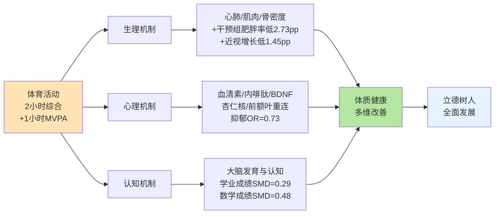

如图所示，**生理、心理、认知三大机制并非彼此独立，而是相互交织、互为支撑——心理改善有助于学业表现，生理强健支撑长时间专注学习，认知提升又强化运动技能学习的效率**。这一多维因果机制说明，"2小时"政策不是简单的"用时间换体质"的线性逻辑，而是通过运动这一"全方位育人载体"同时作用于身、心、脑三个维度，从而产生复合性的发展效应。这与第1章所阐述的"健康第一"理念与"立德树人"任务的内在关联形成机制层面的呼应——**体育的多维育人功能正是通过这些可观测的生物—心理—认知机制实现的**。

## 3.4 "2小时"硬指标的剂量—效应科学依据

明确了"为什么运动有效"之后，下一个关键问题是"运动需要多少才有效、多少最优、多少过量"——这是"2小时"硬指标合理性论证的核心环节，也是回应"为什么不是1小时"和"为什么不是3小时"两个对称质疑的关键。

**剂量—效应Meta分析为"2小时"提供了较精确的活动剂量阈值参考**。华东师范大学课题组的Meta分析揭示了一个重要发现：**"就提高儿童青少年学业成绩而言，体力活动干预剂量为5周（SMD=0.47）、3次/周（SMD=0.47）、30 min/次（SMD=0.29）的中大强度（SMD=0.29）有氧运动可能产生的促进效果更好"**[^55][^56]。换言之，**"持续5周以上、每周3次、每次30分钟、中大强度的有氧运动"是当前文献支持的有效"基础剂量"**。如果将这一剂量按周折算，约为每周90—150分钟的中大强度有氧运动；按日均折算约为每日13—22分钟。然而需要指出，这一剂量是Meta分析所确认的"最低有效剂量"，其设计目的是验证体育活动对学业成绩的促进作用，而非定义"最优健康剂量"。

**WHO推荐的"60分钟MVPA"标准则更接近健康改善的"较优剂量"**。世界卫生组织建议"青少年每天至少进行60分钟中等到高强度的运动"[^53]，这一标准在全球被广泛采用作为青少年身体活动的国际基准。然而第2章已援引《全球身体活动状况报告（2022）》的数据：全球81%的11—17岁青少年每天MVPA不足1小时，**中国青少年身体活动不足率为84.3%**——意味着按WHO标准仅约15.7%的青少年达标[^41][^42]。这表明仅以"每天1小时"为目标，已经在实践中暴露了刚性不足、达成度有限的局限。

**"2小时综合活动+1小时MVPA"的双重底线设计是中国政策的创新合理选择**。第2章已述北京市《关于进一步加强新时代中小学体育工作的若干措施》明确要求"每天综合体育活动时间不低于2小时。其中至少要有1小时中等及以上强度体育锻炼"——这一**"时间累加+强度阈值"**的复合指标设计具有三重科学合理性：

| 维度 | 单一"1小时MVPA"的不足 | "2小时+1小时MVPA"的合理性 |
|------|----------------------|--------------------------|
| 时间总量 | 仅60分钟难以涵盖大课间、课后服务等多场景 | 2小时为多模块组合提供时间空间 |
| 强度保障 | 缺乏总量约束易导致MVPA被各类"低强度时段"稀释 | 1小时MVPA作为强度底线、2小时为时间载体 |
| 制度刚性 | 隐性指标难以监督和考核 | 双重指标可分别核查、防止"凑数式" |

**为何"每天1小时"已不足以支撑当前的体质改善目标？**关键在于：第一，1小时若全部为MVPA，对中小学生而言强度过高难以持续；若放宽强度，则边际效应不足以扭转"小胖墩、小眼镜、小豆芽、小焦虑"的累积压力。第二，1小时缺乏多场景叠加的制度空间——体育课、大课间、课间微运动、课后服务任何一项被挤占就直接突破底线。第三，国际经验和Meta分析共同显示，活动总量在120—180分钟/天范围内，体质和心理健康收益仍呈正向递增。北京体育大学刘昕在解读中明确指出，从2007年"每天1小时"到现在的"综合活动时间不低于2小时"，是"逐步的层层递进，对于解决目前学生在校时间运动不足的问题，有了更加精准的干预"[^38]。

**为何不是3小时或更高？这涉及边际贡献递减与运动伤害风险的权衡**。从效益侧看，体育活动对体质和心理健康的促进效应存在边际递减规律——超过一定阈值后，每增加单位时间活动所带来的健康增量趋缓。从风险侧看，**学生体育运动伤害已经成为不可忽视的现实约束**。第2章已援引数据显示，与2023年相比学生体育运动伤害事故增加了50%以上，校方责任险中体育运动伤害赔偿的比例接近60%。如果时间设定过高，运动伤害风险将快速上升，反而可能挤占政策的合法性空间。国家体育总局发布的《儿童青少年科学健身20条》也明确指出"儿童青少年要打破久坐状态，每间隔40分钟起身活动10分钟""一堂儿童青少年运动课通常分为热身、主体以及放松部分""建议儿童青少年每次运动前热身5—10分钟"[^57]——这些操作性指南本质上都是在控制运动伤害风险的同时优化运动效益。**"2小时"作为时间底线，1小时作为MVPA强度底线，构成了兼顾效益最大化与风险可控的政策合理选择**。

需要补充的是，**"2小时"政策的剂量设计还体现在分场景、分模块的精细化安排上**，而非简单的时间堆叠。青海《学生体质强健计划三年行动方案（2026—2028年）》明确"每节体育课达到中高强度"，确保强度阈值在最核心的体育课时段被锁定[^47][^48][^49];天津要求"每节体育课固定不少于10分钟体能训练，全市1424所小学开设专项体能训练课"[^43][^45];这些做法将剂量—效应规律转化为可操作的教学安排，使"2小时"在落地中保持强度密度。

## 3.5 最优活动结构：强度、项目与场景的组合优化

如果说3.4节回答的是"多少时间最合适"，那么本节回答的则是"这些时间如何分配最有效"——即在"2小时"总量确定后，如何在强度结构、项目结构、场景结构三个维度上实现最优组合。这一问题对避免第2章识别的"凑数式2小时"质量空洞具有直接政策意义。

**强度结构的最优配置：中高强度心肺锻炼+针对性肌力训练+协调性开发的有机组合**。第2章上海教育界的反思已经点出："机械拼凑的120分钟若缺失'强度适宜的心肺锻炼、针对性肌力训练与协调性开发'，其效果必然大打折扣"。运动生理学的"体能"概念明确指出，"体能的综合水平由我们的身体形态、身体机能和运动素质三者决定。其中身体形态指的是人体内外部的形状，身体机能指的是身体各系统的功能，而运动素质则指的是身体在运动时所展现的，包括力量、耐力、速度、柔韧、灵敏等在内的综合素质"[^37]。这意味着任何单一强度或单一类型的运动都难以全面促进体能发展——"2小时"必须在结构上覆盖**心肺耐力（中高强度有氧）、肌肉力量、速度、柔韧、灵敏协调**等多元素质。天津的实践提供了具体范本：**每节体育课固定不少于10分钟体能训练，全市1424所小学开设专项体能训练课，1357所中小学开设体育活动"超市"**[^43][^45]，这一"体能+专项+超市"的三层结构正是对最优强度结构的实践化表达。

**项目结构的协同效应：有氧运动+专项技能+综合性学校体育活动计划**。3.3节援引的Meta分析已经揭示三类项目的差异化效应——有氧运动SMD=0.59、综合性学校体育活动计划SMD=0.51、专业体育课SMD=0.25[^55][^56]。**这一证据有两重重要含义**：第一，单一的"专业体育课"（SMD=0.25）虽然有效，但其效应规模显著低于综合性学校体育活动计划（SMD=0.51），这意味着仅靠每天1节体育课难以达成最优效益，必须辅以大课间、课间微运动、课后服务、家庭锻炼等综合性安排;第二，**综合性学校体育活动计划**的提法与"2小时综合体育活动时间"的政策语义高度契合——它强调的不是单点干预而是体系化干预，这与中国政策设计的整体逻辑形成呼应。

地方实践中已经涌现出多种综合性结构的探索：

- **青海"双四级"赛事体系**：构建"省、市、县、校四级"和"小学、初中、高中、大学各学段衔接"的赛事体系，以足球、篮球、排球三大球为重点，确保"人人有项目、班班有活动、校校有特色、周周有比赛"[^47][^48][^49]——通过赛事牵引激发持续性运动参与;
- **天津"足篮排+体能+超市"组合**：以足篮排三大球为重点开展班级赛、校际赛，配合每节课10分钟体能训练和1357所学校的体育活动"超市"，要求每位学生每学期至少参加5项（次）班级体育项目比赛、1项（次）校级以上比赛[^43][^45][^46];
- **杭州"3+5"模式与多元课程**：丁信中学实施"3+5"模式落实每天一节体育课（体育活动课），天长观潮小学创新开设足球、跑酷等多元体育课程，打造长短课结合的自选体育活动课程，探索"基础体育能力+专项运动技能"范式[^50];
- **青岛"一校一品"+体育社团**：每位中小学生至少参加1个体育社团、掌握2项运动技能[^51]。

**场景结构的功能定位与时间配比**。综合各地实践，"2小时"在校内校外的场景配比大致呈现以下结构：

| 场景模块 | 时长占比参考 | 核心功能 | 强度定位 |
|----------|--------------|----------|----------|
| 体育课 | 约40分钟 | 系统性技能学习+体能训练 | 中高强度（每节≥10分钟体能） |
| 大课间 | 30—40分钟 | 集体活动+全员参与 | 中等强度 |
| 课间"微运动" | 15分钟×多次 | 微观活动+久坐打破 | 低中强度 |
| 课后服务体育 | 30—45分钟 | 兴趣专项+俱乐部 | 中等强度 |
| 早/午锻炼 | 10—15分钟 | 唤醒/放松 | 低中强度 |
| 家庭/校外锻炼 | 周末户外/家庭作业 | 家校衔接+习惯养成 | 灵活 |

这一场景结构具有清晰的功能分工——**体育课负责"系统教学+强度核心"，大课间负责"全员普及+集体活动"，课间微运动负责"打破久坐+游戏化激发"，课后服务负责"兴趣分层+技能提升"，家庭锻炼负责"习惯延伸+家校衔接"**。各场景在时间和强度上互补，构成立体化的活动结构。

**团体运动相对单人运动的独特心理价值**也值得在结构优化中专门考量。3.3节援引的研究已经指出"团体运动比单人运动更有效，因为陪伴和社交互动本身也是治愈的力量"[^53];中国篮协《中国篮球运动发展报告》显示对96.6%的青少年来说，打篮球是他们发自内心的自主选择，篮球还成为家庭的黏合剂，近半数家长曾带孩子打篮球[^41][^42]。这意味着在项目结构设计上，**应当为团体运动（足篮排为代表）保留充足的时间空间和组织载体**——这与各地"以足篮排三大球为重点"的实践方向高度一致。

更进一步，杭师大附小校长俞富根提出的**"无结构运动"理念**也为最优结构设计提供了独特视角："你给他一个场域，让他自然地去玩、去探索，这才是运动的初心"[^50]。该校将课间按10分钟、15分钟、20分钟、35分钟等不同时长安排不同功能——20分钟用于体能训练，15分钟针对体质测试项目练习，也可以用10分钟"发呆"——体现了"张弛有度，调节身心"的设计哲学[^50]。浙江师范大学体育与健康科学学院院长李启迪从"愿动—会动—乐动—主动"四个维度提出协同施策思路："优化体育活动环境，激发学生'愿动'；强化体育课程教学，保障学生'会动'；丰富体育活动体验，引导学生'乐动'；健全长效保障机制，实现学生'主动'"[^50]。这些理念对避免"2小时"沦为机械性时间堆叠、推动其向"有质量、有兴趣、可持续"演化具有重要启发。

综合以上分析可以判断，**"2小时"的最优结构不是单一维度的时间填充，而是强度、项目、场景三个维度的协同优化**——强度上要求心肺、力量、柔韧协调多素质覆盖；项目上要求有氧运动+专项技能+综合性活动计划的多层组合；场景上要求体育课、大课间、课间、课后服务、家庭锻炼五大模块的功能互补。这一最优结构为第6章"时间结构与教学质量"、第7章"师资场地与数字赋能"、第9章"家校社协同与文化培育"提供了直接的科学参照系。

## 3.6 因果证据的局限性与政策推论

虽然3.1—3.5节构建了从问题趋势、相关性证据、多维机制到剂量—效应、最优结构的完整证据链，但作为一份严谨的政策研究，必须坦诚说明现有因果证据的方法学局限，并据此提出审慎而稳健的政策推论。

**第一类局限：地方监测数据多为相关性证据而非严格因果识别**。3.2节援引的天津、青岛、青海、杭州等地数据均属同一时期"政策推进+体质改善"的同向变化，但**严格意义上无法独立证明"是因为活动时间增加导致体质改善"的因果方向**。同期发生的多个潜在混杂因素都可能驱动这一关联：一是**"双减"政策的影响**——"双减"后超过半数小学初中学生投入更多时间到体育中，但其本身就是独立的政策变量，难以与"2小时"的影响精确分离[^41][^42];二是**家庭经济条件分化**——"小学生群体里，家庭经济条件越好，感受到这类时间增加的孩子占比越高"[^41][^42];三是**监测技术与抽样方法的演变**——不同年份监测口径、抽样设计的微调可能造成数据可比性问题；四是**公众健康意识增强**——青海研究本身就将其作为运动时间增加的解释因素之一[^41][^42]。这意味着地方数据呈现的"6.83个百分点优良率提升"或"小学男生日均运动时间34.2→57.2分钟"的变化幅度中，有多大比例归因于"2小时"政策本身，目前仍难以严格识别。

**第二类局限：MVPA达标率与校园2小时综合活动口径不可简单换算**。第2章已经详细辨析过这一问题，本章在3.4节援引"中国青少年身体活动不足率84.3%"和"全国96.8%学校落实2小时"两组数据时也始终保持口径区分。但需要进一步指出，**当政策推论从"时间累加口径"切换到"健康产出"时，口径混用风险依然存在**。例如，简单声称"2小时落实将使84.3%的不足率快速下降"是不严谨的——因为校园2小时综合活动中只有部分时间属于MVPA，另有相当比例为低中强度活动；MVPA达标率的改善需要专门的强度结构设计。这一口径分离意味着政策评估必须建立**双指标考核体系**——既测量时间口径达标率（"是否2小时"），也测量强度口径达标率（"其中是否1小时MVPA"）。

**第三类局限：高质量随机对照实验在中国本土仍较少**。3.4节援引的剂量—效应Meta分析（华东师大课题组）虽方法学严谨，但其纳入的13篇中高质量文献多为国际研究，"该领域高质量的研究文献占比较低"，纳入文献共仅2379名被试[^55][^56]。3.3节援引的青少年抑郁与身体活动的剂量—效应Meta分析也是基于国际多国研究的合并分析[^54]。这些证据可作为政策科学性的重要参考，但**针对中国中小学生群体在中国教育情境下的本土化随机对照实验尚处于积累阶段**——例如不同学段、不同强度、不同场景组合下的具体效应规模，目前难以从公开文献中得到精确数据。这意味着"2小时"政策的具体剂量设定，在科学依据上具备方向性支撑，但精细化阈值仍有待本土化研究的进一步验证。

**第四类局限：体质指标改善的"可逆性"问题尚未充分讨论**。3.1节呈现的"近视率四连降""优良率提升9.3pp"等积极信号可能存在"反弹风险"——即一旦政策松懈，指标可能回落。运动干预的长期持续性（运动习惯养成）与短期突击性（应付监测）之间的差异，对政策长效机制设计具有实质影响。"民小编"评论文章指出："近视、肥胖、抑郁等许多健康问题往往不可逆转。牺牲孩子的今天，未必能换来美好的明天"[^58]——这从侧面提醒我们，体质改善虽可观察到正向信号，但对长期健康轨迹的影响是否稳健，仍需更长时段的追踪验证。

**基于上述四类局限，本章可以提出以下审慎的政策推论**：

第一，**"2小时"硬指标在科学依据上具备充分支撑**。从问题侧（体质健康关键指标长期承压、四小问题集中）、相关性侧（多地实证案例呈现同向改善）、机制侧（生理-心理-认知三维因果机制）、剂量侧（Meta分析与WHO标准的复合论证）共同构成的证据基础，足以支撑"2小时"作为政策硬约束的合理性。即便存在因果识别的方法学局限，证据链的多源汇聚也已超过了政策决策所需的合理证据门槛。

第二，**"时间+质量"双指标考核是避免形式化达标的必要保障**。由于校园2小时综合活动与MVPA达标率口径分离，单一时间口径的达标可能掩盖强度结构的空洞——这正是上海教育界反思的"凑数式2小时"风险，也是教育部明确将"严防阴阳课表"列为督查重点的原因。政策落地中必须同时追踪时间总量与强度密度，**形成"达2小时、含1小时MVPA、覆盖多元素质"的复合考核框架**。

第三，**需要在后续监测中持续积累分学段、分强度的剂量—效应本土化数据**。当前可援引的Meta分析多为国际证据，地方监测多为相关性数据，二者之间需要本土化随机对照实验或自然实验来填补。建议在"2小时"全面推开过程中同步构建国家层面的纵向追踪研究，以中国基础教育情境下的剂量阈值、效应规模、风险拐点为目标产出，为"2小时"政策的精细化迭代提供本土证据基础。

第四，**第3章因果关联的判断为后续章节提供科学起点**。在第4章影响因素分析中，"2小时"的科学合理性已经确立，问题转向"为什么落实困难"——学校、家庭、社会、个体多层次因素如何阻碍科学剂量的落地;在第5—9章政策保障设计中，"2小时"的最优结构（强度+项目+场景三维优化）为各章保障机制提供参照——时间结构改革要服务于MVPA强度密度，师资配置要适配多元项目要求，评价监督要建立双指标考核，家校社协同要激活校外场景。**第3章因此成为本研究从"现状描述"向"政策设计"过渡的科学桥梁**——其确立的因果证据虽有局限，但已足以支撑后续政策建议的核心立论，并为政策建议的精细化提供了清晰的可改进方向。

需要最后指出的是，**因果证据的局限性本身就是政策研究的常态而非例外**。教育政策从来不可能等待"完美的随机对照实验"才行动——在2025年学生体质健康问题已经成为"中国现代化建设巨大短板""绊脚石"的时代紧迫性下[^38]，基于现有最佳证据的"2小时"政策决策已经具备充分合理性。后续监测与研究的任务不是质疑这一决策的方向，而是优化其落地的精度和精细化程度。这一态度也正是《纲要》"边推进、边评估、边优化"政策迭代逻辑的科学基础。

# 4 影响体育活动时间的多维因素分析

第2章已经从测量维度刻画出"2小时"政策落地中的五大结构性短板——高中学段时间下塌、城乡区域不均、质量空洞与"凑数式达标"、家庭与校外场景薄弱以及"阴阳课表"等隐性流失;第3章则从科学维度论证了"2小时"硬指标在剂量阈值与最优结构上的合理性。然而**仅有"是什么"的现状判断和"应是多少"的科学依据，仍不足以解释为何在政策密集出台、地方试点已显成效的背景下，"2小时"的全面、高质量落实依然困难重重**。问题的关键转向了一个深层追问：**究竟是哪些层次、哪些因素、以何种作用机制制约了"2小时"的落实？这些因素之间是否存在相互强化的耦合关系？不同学段瓶颈是否呈现不同的因素结构？**回答这一问题，正是第4章的核心使命。本章将构建"学校—家庭—社会—个体"四层次嵌套式影响因素分析框架，逐层拆解各层次的核心子因素与作用路径，并通过因素相对权重评估、跨学段差异比较和跨层次耦合机制识别，提炼制约"2小时"落实的核心瓶颈清单，为第5—9章政策保障设计提供精准的问题靶点。

## 4.1 四层次影响因素分析框架的构建

任何有意义的影响因素分析都必须建立在清晰的层次结构之上，否则单一因素的列举容易陷入"什么都重要、什么都说不清"的散乱状态。基于第2章现状测量所识别的结构性短板，并参考国务院教育督导委员会在"五项管理"督导中对"政府、学校、家庭"三方责任的协同框架[^59][^60]，本研究将影响"2小时"落实的因素划分为**学校、家庭、社会、个体**四个嵌套式层次。这一框架不是对因素的简单分类，而是对"2小时"作为一项复合性政策实践的内在结构再现——它既是制度执行问题（学校层面），也是家庭支持问题（家庭层面），还是公共资源问题（社会层面），最终归宿于学生个体的运动行为与习惯（个体层面）。

四层次的内在逻辑可从**供给侧—需求侧**的角色分工进一步刻画。**学校与社会构成"2小时"的供给侧**——学校通过课表编排、体育课开足、场地配备、师资配置直接组织校内活动时间，社会通过公共体育设施、社区开放空间、校外培训市场为校外锻炼场景提供资源底盘;**家庭与个体则构成"2小时"的需求侧**——家庭通过观念引导、时间规划、亲子陪伴塑造校外锻炼的实际发生条件，个体通过兴趣偏好、技能掌握、心理状态决定活动是否被持续选择和坚持。供给侧的资源若不能匹配需求侧的意愿，"2小时"就会出现"政策已开足、学生不愿动"或"学生想动却无场可去"的执行落差。

四层次因素之间存在明显的**嵌套与传导关系**。**学校处于最核心的执行枢纽位置**——它一方面直接组织校内2小时活动的具体落地，另一方面通过作业量、应试导向、安全管理等渠道间接塑造家庭和个体的行为空间;**家庭则是连接学校与社会的中介**——家长的体育素养、教育焦虑、电子产品管理直接影响校外2小时延伸的实际质量;**社会作为外部环境**——其公共体育资源供给水平、培训市场理性程度、公共安全氛围共同决定了家庭与学校能调动的外部支持;**个体处于最终落点**——前三层因素最终通过个体的兴趣、技能、心理状态被吸收转化为实际的运动行为。这一嵌套结构在3.3节心理机制分析中已有暗示——团体运动相对单人运动的心理增益本质上就是"学校组织+同伴互动+个体参与"多层因素耦合的结果。

下图呈现了本章影响因素分析的整体框架：

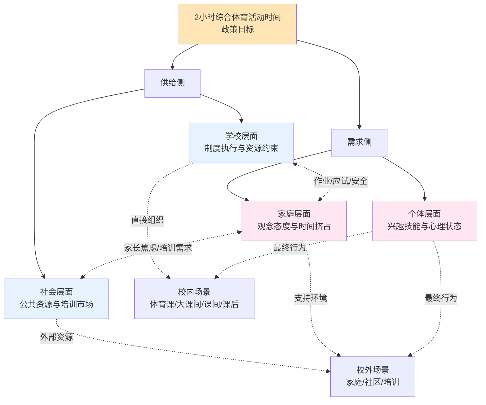

如图所示，**学校、家庭、社会、个体不是孤立的并列因素，而是相互嵌套、相互传导的有机系统**。本章后续4.2—4.5节将逐层拆解各层因素的内部子结构，4.6节则在此基础上识别跨层耦合机制和核心瓶颈。需要预先说明的是，由于本章的目的是诊断问题而非论证政策有效性，分析将以"约束侧"和"风险侧"的因素为主，对各因素已有的政策应对措施仅作必要指认，深入的政策保障设计留待第5—9章展开。

## 4.2 学校层面：制度执行与资源约束的多重瓶颈

学校处于"2小时"政策落实链条的最前沿，是直接组织校内体育活动时间的核心主体，也是各类制度约束、资源约束、应试压力、安全顾虑相互交织的"瓶颈密集地带"。结合多源证据，可识别学校层面影响"2小时"落实的七类核心因素，它们共同构成校内时间供给侧的多重瓶颈。

**第一类瓶颈：课表设置与体育课开齐开足的制度执行偏差**。这是最基础的制度执行问题，集中表现为"阴阳课表"现象——按"规定"在课表上排好每天一节体育课，但实际上课时变为语数外课[^61]。21世纪教育研究院院长熊丙奇指出，"阴阳课表"的出现既反映了部分学校对升学政绩的优先排序，也反映了教育督导部门"放水"的纵容机制——"出于追求升学率等教育政绩的考量，对违规挤占体育课上其他学科的课视而不见"，或"担心查出'阴阳课表'问题，影响当地教育形象，因此即便有这一问题，也加以粉饰"[^61]。这一问题在毕业班尤为突出，国务院教育督导办的官方数据显示，**22%的中小学生反映体育与健康课程开设时数不达标，体育课时被挤占问题突出，初三、高三年级尤为严重**[^59][^60]。教育部已将"严防'阴阳课表'，严查挤占体育课、课间不准学生出教室等行为"明确列为2026年的督查重点[^61][^62]，从侧面印证了制度执行偏差仍是"2小时"落实的首要障碍。

**第二类瓶颈：课间活动被挤占与"课间圈养"现象**。这是制度执行偏差的延伸，但其深层动因转向了安全顾虑。新京报网络调查显示**44.62%的受访者表示学校的体育课会被其他学科占用**，被占用的原因中"天气原因无法正常开课"占比最高（46.15%），其次是"学校对体育课重视程度不够";有家长直接反映"学校出于安全考虑，不允许孩子随便使用校内体育设施，课间也没办法出教室玩耍"——一名小学老师坦言"确实很多学校的体育锻炼设施非常先进，但是很少允许孩子们用，因为没有那么多体育老师盯着，怕出危险"[^63]。这种"课间圈养"的代价是直接的——它使第3章场景结构表中"课间微运动"模块（建议时长15分钟×多次）几乎完全失能，从而把"2小时"的实际承担压力全部集中到体育课和大课间两个有限模块上，进一步加剧了制度执行的脆弱性。

**第三类瓶颈：体育师资配备的"紧平衡"与结构性矛盾**。师资问题不是简单的"缺人"，而是**"高需求背景下形成的'超负荷运行与低配置并存'的结构性问题"**。北京姚基金公益基金会的调研显示，当前不少学校体育教师整体处于"紧平衡"状态——**超过六成体育教师处于中高强度教学区间，不少教师每周承担16节以上课程，同时还需承担课后服务、专项训练、体质监测和赛事组织等多项职责，长期处于高负荷运行状态;近半数学校认为体育教师数量明显不足**[^64]。结构性矛盾的另一面是**"城乡之间、区域之间配置不均，农村和薄弱地区师资短缺问题更加突出"**[^64]。招远市的年度报告坦承"各学校的师资力量（特别是足球、武术专业）差异明显……部分农村学校还存在非专业教师任教体育课程等现象"[^65];颍州区的师生比数据则显示——小学师生比371∶1、初中230∶1、高中250∶1[^66]，与发达地区差距明显，反映出区域间师资配置的实质性鸿沟。师资问题的复杂性还体现在结构升级压力上——"体教融合背景下，体能训练、专项技术、运动康复等专业能力需求持续上升，但相关专业人才储备不足，专业结构与课程升级之间仍存在差距"[^64]。

**第四类瓶颈：场地设施约束的城乡差异化表现**。第2章已经识别"城区学校卡在场地、乡村学校卡在师资"的差异格局，本节进一步从制度细节加以印证。颍州区2024年报告提到"体育器材和运动场地基本满足学校发展要求"[^66]，反映出基础保障已大致达标;但招远市坦承"城区学校生均场地受限"[^65]，这与中心城区用地紧张的城市化背景一致。南雄市2025年报告显示其全市投入5000多万元用于学校体育场地设施建设及体育器材配备，体育器材达标率94.4%[^67]，呈现出场地建设的高强度投入态势——但这种投入水平在欠发达地区难以普遍复制。值得注意的是，**当政策硬约束推动"2小时"落实后，原本"基本满足"的场地资源被加倍使用，新的瓶颈会迅速浮现**——这一动态约束在第2章已得到呼应。

**第五类瓶颈：应试压力下的"初中应试化、高中走形式"异化**。这是学校层面最具中国特色的结构性扭曲。半月谈调研发现，**"初中体育课完全围绕中考项目开设，以至于学生在体测结束后，再也不想运动;到了高中，体育课流于'放羊'，学业水平测试走过场，学生体质下滑严重"**[^68]。一位中部省份初中体育老师直言："在初一初二时，学校还会开展一些别的体育项目，但到了初三，就完全进入中考体育项目的训练日程"[^68];一位体育培训机构负责人甚至坦言"中考体育是刚需，没有兴趣可言"[^68]。北京师范大学毛振明教授的研究证实了这一异化的剂量响应特征——**"中考体育开始实行后，初三学生的体质是初中各个年级中最好的，高一学生的体质也是高中各个年级中最好的"**——但代价是"虽起到一定作用，但弊端也明显:沦为应试教育的体育课，不仅扼杀了部分学生体育运动的兴趣，对学生体质提升也'只能管用一阵子，不能管用一辈子'"[^68]。中国儿童青少年体育健身指数评估报告也指出"健身效果随年级提高明显'逆减'"[^68][^69]。**这一异化的本质是体育教学被工具化为考试得分手段，从而丧失了培养终身运动习惯的本体功能**——其后果不仅限于"2小时"的总量塌陷，更深层地侵蚀了"2小时"对个体兴趣形成的养成功能。

**第六类瓶颈：学校安全顾虑导致的"因噎废食"**。这是近年来快速恶化的隐性约束。第2章已援引数据"与2023年相比，学生体育运动伤害事故增加了50%以上，校方责任险中体育运动伤害赔偿的比例不断增加，接近60%"。在司法实践层面，多起"学生在体育课上受伤起诉学校"的案件结果一致：**只要学校尽到了教育、管理职责，法院均判学校"无责"**——但这一"自甘风险""尽职免责"的法律边界在基层学校的具体感知中仍未充分内化[^70]。一位体育老师坦言："以后这课真不敢上了!"——其在课上发生学生跳高骨折事件后被"折腾得身心俱疲"[^71]。"因为怕担责、怕索赔、怕纠缠，老师越来越'胆小'，跳高、跳箱、足球对抗全不敢教;学校越来越'谨慎'——单杠双杠拆除、长跑取消、课间禁止奔跑，甚至连体育课都变成了原地拉伸的'安静课'"[^71]。这种**"防御性体育教学"**虽规避了短期风险，但实质上是将"2小时"政策中"中高强度MVPA"的核心要求自我阉割——按第3章的剂量论证，缺乏强度的活动时间无法转化为体质改善的实际效益。湖南省2026年审议的《湖南省促进中小学生体育锻炼若干规定（草案）》明确写入"学生在学校参加体育活动受到人身损害，学校尽到教育、管理职责的，可以免责"[^70][^72]，正是从立法层面对此瓶颈的制度化回应。

**第七类瓶颈：评价导向偏差与"体育被工具化"**。这一因素超越了具体执行层面，触及更根本的学校办学价值取向。在升学率主导的评价体系下，"重智轻体"虽屡被批评但难以根除，体育课要么被挤占（小学高年级、初中、高中毕业班尤甚），要么被异化为"为考而练"（初中阶段）或"放养式形式主义"（高中阶段）[^68][^73]。**这种评价导向不仅影响课时分配，更深层地塑造了学校管理层、教师、家长乃至学生本人对体育价值的整体认知**——当所有人都在"分数至上"的隐形指挥棒下行动，"2小时"政策的善意目标就可能被消解为"凑数式达标"或"应试化训练"。

综合以上七类因素，可以判断**学校层面是"2小时"落实的最直接瓶颈**——它既包含制度执行偏差（阴阳课表、课间挤占）、又包含资源刚性约束（师资、场地）、还包含价值导向扭曲（应试化、安全过度防御）。这些因素的相对权重在不同学段呈现差异化分布——小学阶段以课间圈养、安全顾虑为主，初中阶段以应试化训练为主，高中阶段以课时萎缩、走形式为主——这一学段差异将在4.6节进一步综合分析。

## 4.3 家庭层面：观念态度与时间挤占的双重制约

如果说学校层面是供给侧的直接瓶颈，那么家庭层面则是需求侧的关键支持环境——它既影响校外2小时延伸的实际质量，也通过作业增量、电子产品管理、应试焦虑等渠道间接挤占校内活动时间的有效性。结合多源证据，可识别家庭层面四类核心因素。

**第一类因素：家长体育素养与态度的"三重焦虑"分化**。这是家庭因素中最复杂也最具争议的部分。当前中国家长对体育的态度呈现明显的分化结构：一端是日益重视体育、主动报培训班、与孩子共同运动的"积极家长";另一端是仍然"重智轻体"、视体育为"锻炼项目而非考试科目"的"消极家长"——而中间最大群体则是被**"怕受伤、怕掉队、怕影响成绩"三重焦虑**所裹挟的"摇摆家长"。新京报调查显示**85%的受访家长会给孩子报课外体育拓展班**，但报班动机已经从"兴趣培养"转向"应试拉分"——"随着中考体育改革的推进，体育成绩与各项评奖评优、升学挂钩，部分家长在选择体育培训班时也出现应试化倾向"[^63]。在司法实践中"谁受伤谁有理"的旧观念也仍未根本消除，"过去，部分学校为了息事宁人，即便无过错也愿意'赔点钱了事'。这导致了极个别家长'校闹'行为的滋生"[^70]。北京体育大学姚明在2025年全国两会建议中也指出"在中学生引导体育运动时一定不能以强硬的态度去要求"，强调家长心态对孩子运动参与的塑造作用[^74][^64]。

**第二类因素：亲子陪伴质量与家庭体育氛围的不平等分化**。武汉体育学院柳鸣毅教授指出，**"家长是孩子的第一任老师，在培养体育习惯过程中，家长要首先提高体育素养，带动孩子从小养成体育运动的习惯"**——他尤其强调对幼儿园和小学低年级孩子，"体育游戏更容易激发这个年龄段孩子对体育的喜欢和关注"，"在家庭生活中，可以学习掌握一些体育游戏，培养孩子的兴趣习惯"[^74]。然而家庭体育氛围的**质量分化高度依赖家庭社会经济条件**——第2章已援引"家庭经济条件越好，感受到（体育与兴趣发展时间增加）的孩子占比越高"的发现，揭示了家庭支持的不平等结构。湖南省2026年立法草案明确"鼓励家长学习并掌握基本的体育知识和技能，督促、陪伴、指导学生开展课后体育锻炼;鼓励家长与学生共同运动，形成良好的家庭体育氛围"[^72]，正是对家庭体育氛围薄弱这一现实约束的政策回应。

**第三类因素：电子产品使用与久坐行为的此消彼长**。这是数字时代家庭层面最棘手的新生因素。武汉体育学院柳鸣毅教授指出，"假期长时间使用电子产品也容易让自控力不足的学生产生沉迷，对视力、体质、心态造成不良影响"——他建议"加强假期青少年儿童体育习惯的培养，主动培养孩子假期的体育习惯、体育爱好，帮助他们'主动放弃'电子产品，'自觉选择'更有意义的事情"[^74]。姚明在两会建议中将这一问题升级为治理层面——他指出**"我国未成年人屏幕治理具有明显的国情复杂性"**，"留守儿童和流动儿童规模较大，手机与网络在维系亲子沟通和情感支持方面具有现实功能";"区域发展仍不均衡，数字技术在一定程度上发挥了弥补教育资源差距的作用"——因此"简单复制以刚性限制为主的管控模式并不可行"，必须坚持"规范引导、合理使用"，**"想青少年息屏要提供替代场景"**[^64]。从行为层面看，《中国儿童青少年身体活动指南》明确建议"每日屏幕时间限制在2小时内，并减少持续久坐行为"——但实际达标率远不乐观，**全球80%的青少年活动量不达标**[^75]。电子产品的吸引力与体育活动的努力成本形成显著不对称——前者即时奖励且无需付出，后者需要长期坚持才显效，这使家庭层面的引导难度大大增加。

**第四类因素：学业辅导与作业挤占睡眠和锻炼时间**。这是家庭因素中最直接的"2小时挤压源"，其作用机制呈现典型的"老师减负—家长增负"悖论。国务院教育督导办的官方数据令人警觉——**38%的中小学生就寝时间晚于规定要求，67%的中小学生睡眠时间不达标;22%的小学一二年级学生反映有书面家庭作业，17%的中小学生书面作业总量超标**[^59][^60]。新华视点的调研进一步揭示了缺觉的代际传递特征——**77.19%的受访小学生家长反映孩子每天睡眠不足9小时;72.34%的受访初中生家长称孩子每天睡眠不足8小时;62.5%的受访高中生家长表示孩子每天睡眠不足7小时**——且"缺觉程度随年级增长'水涨船高'，越临近中考、高考，睡眠时间越被挤压"[^76]。背后的家庭机制清晰可见——"评价'指挥棒'之下，隐性负担依旧存在……升学选拔仍以分数为主，学校担心质量排名，家长害怕孩子'掉队'，校外培训时不时放大焦虑，最终使作业、刷题、补课以更隐蔽的方式回流"[^76]。一位北方某市中学负责人直言："有的家长希望老师多布置作业，有的家长甚至向学校施压，要求晚自习'必须上到九点半，不然会被其他学校超过'"[^76]。这种**"囚徒困境"式的家长行为**——"怕别人学而我未学"——在客观上把"2小时"和"睡眠"双双挤入了"剩余时间"的边角，使政策意图被家庭支持环节系统性削弱。

为更直观呈现家庭层面对"2小时"的多渠道侵蚀机制，下表整合关键数据：

| 家庭因素 | 关键证据 | 对2小时的影响渠道 |
|----------|----------|-------------------|
| 家长焦虑分化 | 85%受访家长报课外体育班但应试化倾向明显[^63] | 校外锻炼被异化为"考试得分"导向 |
| 体育氛围不平等 | 家庭经济条件越好、运动时间增加越显著 | 校外2小时延伸的家庭资源差距 |
| 电子产品使用 | 全球80%青少年活动量不达标[^75] | 屏幕时间挤占户外活动时间 |
| 作业与睡眠挤压 | 67%中小学生睡眠不达标、17%作业总量超标[^59][^60] | 锻炼和睡眠被双重挤入"剩余时间" |

可以判断，**家庭层面是"2小时"政策最容易被忽视但实际影响深远的"软性瓶颈"**——它不像学校"阴阳课表"那样直观可查，但通过观念、氛围、屏幕、作业四条渠道持续侵蚀政策落地效果。家庭因素的特殊性还在于**其与学校层面形成显著的耦合作用**——学校减负后家长加码、学校怕担责则家长追责更甚——这一耦合机制将在4.6节专门讨论。

## 4.4 社会层面：公共资源供给与培训市场失序

社会层面的影响因素超越了学校与家庭的可控范围，构成"2小时"落实的外部环境约束。它既包括公共体育资源供给的结构性短板，也包括校外体育培训市场对校内时间的挤压与异化。

**第一类因素：公共体育资源供给不足的结构性偏差**。媒体评论员陈长指出，**"青少年免费运动空间的缺失，反映出公共体育设施配置未能充分满足青少年需求的问题"**——其结构性偏差主要体现为三个层面[^77]。一是规划层面的**"重大型场馆建设、轻基层便民设施布局""重新城开发、轻老旧城区配套"**倾向——"规划设计多以成人使用需求和城市建设形象为导向，而对学校周边、居民社区等青少年集中区域的免费运动设施供给重视不足"[^77]。二是开放管理层面的**"作息错位"**——"部分公共体育设施的开放管理与学生作息规律脱节，免费时段多集中在工作日白天，与学生上学时间高度重合";"在课后、周末等关键体育锻炼时段设置收费门槛，让公共体育设施的公益属性与普惠价值未能充分彰显"[^77]。三是城市空间层面的**"碎片化空间未盘活"**——"在城市建设改造中，街角空地、桥下空间、老旧小区闲置地块等碎片化空间，具备改造为便民运动场地的良好条件。但部分地区在城市规划建设中，未充分兼顾青少年就近锻炼需求，对小型化、嵌入式、便民化体育设施投入不足"[^77]。这一结构性偏差直接导致"课后与周末就近找不到免费运动场地打球健身，已成为许多青少年的困扰"——一位中学生甚至在人民网"领导留言板"留言称"普通孩子想免费打球非常困难"[^77]。

**第二类因素：社区与学校场地开放度有限**。这是公共体育资源供给问题的延伸。一方面，公共场馆向青少年免费开放的时段和力度都不足;另一方面，**学校体育场地向社会开放推进缓慢**。上海青浦区人大常委会在2025年4月启动的《上海市体育发展条例》执法检查中，将"学校体育场地有没有开放"列为九大重点之一，反映出这一问题在地方治理层面已被高度关注[^78]。陈长建议"探索校园体育设施有序开放，缓解运动空间供需矛盾……首先要从政府层面加强引导，通过健全安全隔离、责任划分、保险保障、专业运维、评价激励等长效机制"[^77];南雄市2025年报告也提到"我市结合实际，进一步推动有条件的学校体育场馆设施在课后和节假日对师生和公众有序开放"[^67]，是地方层面的初步尝试。但从全国整体看，**学校场地开放仍面临安全责任、运维成本、产权关系等多重制约**，难以在短期内全面铺开。这一约束的现实后果是——校内2小时若无法全面达标，校外延伸又缺乏免费可及的场地支撑，"综合体育活动时间"的多场景叠加结构就难以真正构建。

**第三类因素：校外体育培训市场对校内时间的挤压与异化**。这是社会层面最具张力也最具中国特色的因素。从规模看，**2025年中国青少年体育培训市场规模达到2531亿元，课消规模1675亿元**，**2026年体育培训市场规模预计达到5000亿元，同比增长15%，其中青少年体育培训占比超过60%**[^79][^80][^81]。从动力看，**全国98%以上的地市将体育纳入中考计分科目，分值从30分到100分不等，部分省份甚至启动"体育与语数外同分值"试点;2026年全国中考体育平均分值已突破80分**[^73][^79]——中考体育改革成为驱动校外培训市场爆发的最直接力量。

然而培训市场的快速扩张并未真正服务于"2小时"目标，反而呈现出三类失序倾向。**一是应试化倾向**——"为求短期提分，超负荷、高强度的训练成为常态。孩子们放学后奔波于训练场，回家后还要完成课业，身心俱疲已成普遍现象。当运动不再带来快乐，而是与痛苦、压力联系在一起，又如何能培养出终身的运动习惯?"[^82]**二是焦虑营销与价格异化**——"一对一课时费动辄收费数百元、上千元，有的'保分冲刺班'甚至收费过万元;有的跳绳、篮球等普通体育器材被商家贴上'中考专用'标签，价格翻了几倍";"在社交平台上，'体育差1分，错失重点高中'之类的营销文案铺天盖地，不断刺激着家长脆弱的神经"[^82]。**三是行业自身的师资短板**——《2025年青少年体育培训行业报告》毫不避讳地指出，"虽然七成以上教练持有专项技能证书，但过半数教练坦言在低龄段课程适配、儿童心理认知及教学创新能力上存在缺口"[^80][^81]。教育评论作者顾怡警示——**"体育中考的应试化风险，本质上是'唯分数论'思维在非学科领域的延伸……当体育被纳入升学考核体系后，其强身健体、锤炼意志的本质属性很容易被异化为'得分工具'"**[^73]。

**校外培训市场失序对"2小时"政策的深层挤压**体现在三个维度——**第一，时间挤压**：放学后奔波训练场使家庭2小时延伸的时间空间被进一步压缩;**第二，质量异化**：考试项目反复训练替代了第3章所强调的多元素质综合开发，违背最优活动结构;**第三，兴趣摧毁**：第2章上海教育界反思的"凑数式2小时"在校外维度的对偶版——"为考而练"的功利化训练摧毁了运动兴趣，反过来削弱了学生参与校内2小时的内在动力。济南日报评论尖锐指出："我们不能让昂贵的'专用绳'束缚了孩子们奔跑的脚步，也不应让功利的'冲刺班'消磨了他们对运动的热爱"[^82]。

需要指出，**校外培训市场也呈现出从"野蛮生长"向"高质量发展"跨越的积极信号**。"2025年体培机构的续费收入占比从2024年的48%飙升至57.07%……44.67%的家长明确表示愿意为高品质课程支付更高费用"[^79][^80][^81];"参与赛事的学员周出勤频率是未参与者的两倍，'教学—赛事—出勤—续费'这一闭环效应的凸显"[^80][^81];上海体育大学唐炎教授指出"做培训机构不要光想赚简单的钱，而是要把这些价值观通过培训、渠道、活动传递出去，要去改变家长对于体育的认知"[^80][^81]。这表明社会层面的因素并非单向负向影响——若能引导得当，校外培训市场也可成为"2小时"政策落地的协同力量;但前提是必须破解当前的应试化倾向与焦虑营销失序。

可以判断，**社会层面构成"2小时"落实的"底层约束"**——它通过公共资源短板限制了校外2小时延伸的可达性，通过培训市场失序异化了校外锻炼的实际效果。社会层面与家庭层面形成显著耦合——家长的应试焦虑驱动培训需求，培训市场的应试化营销又反过来强化家长焦虑——这一耦合循环将在4.6节进一步分析。

## 4.5 学生个体层面：兴趣、技能与心理状态

四层次因素的最终落点是学生个体——前三层因素无论多复杂，最终都要通过个体的运动行为得以实现。学生个体层面的因素既是结果变量（受前三层影响），也是中介变量（决定政策落地的最终质量），在长期习惯养成中具有决定性作用。

**第一类因素：运动兴趣与项目偏好的"枯燥化困境"**。这是个体层面最直观也最普遍的瓶颈。新京报调查显示**60%的家长称孩子不爱上校内体育课，主要是课程内容让孩子觉得枯燥、无聊**——"课程内容太单一，每天就是跳绳、仰卧起坐、跑步，没意思"[^63]。半月谈调研中一位太原初二学生道出心声："要让我们觉得运动是件快乐的事，而不是完成一项任务";"还有一些学生说，他们其实很喜欢一些运动项目，比如篮球、排球，但是考试不会考，学校开课就少了"[^68]。这一兴趣枯燥化与4.2节"应试化训练"和4.4节"培训市场失序"形成共振——当体育课内容被中考项目反复占据，学生的项目选择空间和趣味体验都被严重压缩。专家明确指出**"当前我国中小学的体育课程教学内容存在'蜻蜓点水''低级重复''浅尝辄止''半途而废'等不良现象，这些现象与应试体育结合起来，导致体育课异化"**[^68]。学生需求的另一面则是清晰的——他们期待"有趣可选"的体育课，"希望体育课上可以提供跳绳、跳马、踢毽子等丰富的运动课程，希望体育老师可以用赛事、游戏调动孩子参与体育运动的兴趣"[^63]。

**第二类因素：运动技能掌握与自信心的正反馈循环**。这是个体层面最具长期效应的因素。山西省晋中市榆次区东长凝小学的实践提供了清晰的微观证据——该山区寄宿制学校提出"每个学生都要掌握一项体育技能"，一年级学呼啦圈、二年级学篮球操、三四五六年级主攻跳绳和霸王鞭。**该校六年级学生小杰原本比较自卑，接触花样跳绳后变得不一样了**——"老师发现小杰跳得特别好，于是鼓励他好好练……经常一下课，同学们就围着小杰请教个不停。'现在我每天都很开心，交了很多朋友，学习成绩也提高了'"[^68]。**这一案例完整呈现了"技能掌握—自信心提升—社交吸引—正反馈循环"的个体激励路径**——它与第3章心理机制中"运动改善心理"的因果链条相互印证，揭示了"一校一品"特色项目在个体兴趣激发上的独特价值。颍州区已构建多项特色品牌——"搬井小学、东清小学、二十二中手球项目，清河小学、北城小学轮滑项目，北城小学祥源分校击剑项目，九龙明珠双语学校射箭项目、六中中国跤项目"[^66]，反映出个体技能特色化培养的实践探索。然而在尚未实现"一校一品"覆盖的学校中，**无技能掌握的学生容易在体育活动中边缘化**——这种"边缘化—不愿参与—进一步技能不足"的负反馈循环也同样普遍存在，构成"2小时"落地中沉默但实质的个体障碍。

**第三类因素：同伴互动与团体运动的社交粘性**。这是个体因素中最易被低估的维度。第3章已援引"团体运动比单人运动更有效，因为陪伴和社交互动本身也是治愈的力量"的研究结论。从行为层面看，团体运动通过同伴激励、群体认同、共同目标三个机制对个体形成强吸引——这与小杰案例中"经常一下课，同学们就围着小杰请教个不停"的社交粘性高度一致[^68]。新京报调查中有家长坦言"除了有些篮球爱好者还坚持运动外，很多同学都不锻炼了"[^68]——反过来印证了运动同伴对个体坚持的关键作用。班级联赛、校级联赛、"周周有比赛"等竞赛体系的本质功能就是**通过制度化的同伴互动放大个体参与的社交粘性**——颍州区2023年开展"区级校园足球比赛56场、队数25支、260人/次数;校级联赛132场、队数32支、342人/次数;班级联赛564场、队数146支、1286人"[^66]，正是这一思路的实践化表达。

**第四类因素：心理状态与身心循环的双向制约**。这是个体层面最深层也最系统性的因素。第3章已经从神经生物学层面论证了运动对心理健康的促进效应，本节进一步揭示其反向制约——**心理状态不佳本身就会成为运动参与的障碍**。新华视点关于睡眠的调研显示，"上课熊猫眼，课间趴桌板"已成为缺觉学生的普遍状态——"学生熬夜睡不够，第二天上课昏昏沉沉，学习效率低，晚上再加班加点补救，容易陷入恶性循环"[^76]。山西省儿童医院燕美琴教授警示——"睡眠不足会直接导致注意力下降、记忆力减弱、情绪波动，既降低学习效率，也影响身体发育"[^76]。这种**"睡眠不足—精力下降—难以参与运动—压力难释—睡眠更差"的负向螺旋**与第3章描绘的"运动—心理—学业"良性闭环形成镜像对称——前者是恶性循环，后者是良性闭环。**两个循环的关键转折点正是足够的运动时间**——只有当"2小时"被刚性保障，良性闭环才能启动;一旦运动时间被持续挤压，恶性螺旋就会自我强化。

为综合呈现个体层面四类因素的相互关系，下图刻画其内在循环：

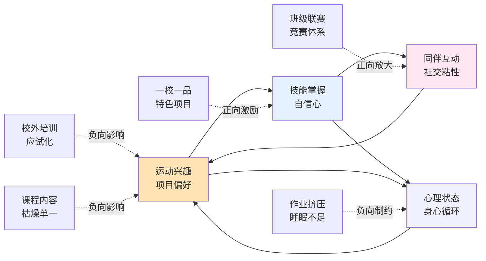

如图所示，**个体层面的四类因素彼此强化，形成兴趣—技能—社交—心理的内在循环**——这一循环既可被良性激发（一校一品+班级联赛+足够睡眠+多元课程），也可被恶性反转（枯燥课程+应试训练+缺觉焦虑+无技能边缘化）。**正是这一双向性使个体层面成为"2小时"政策落地的"最终落点"和"长期习惯养成的关键环节"**——它不像学校瓶颈那样可通过制度直接干预，但其状态决定了一切上层政策的最终效果。

## 4.6 因素的相对权重、跨学段差异与核心瓶颈识别

在四层次因素分析的基础上，本节进行综合权重评估、跨学段差异比较、跨层次耦合机制识别，最终提炼制约"2小时"落实的核心瓶颈清单。

**第一，各层次因素的相对影响权重评估**。基于多源证据可初步判断各层次因素的角色定位：

| 层次 | 角色定位 | 主导作用 | 干预可控性 |
|------|----------|----------|------------|
| 学校层面 | **直接主导因素** | 课表、师资、场地、安全、应试导向 | 高（可通过政策刚性约束） |
| 家庭层面 | **关键调节因素** | 观念、作业、电子产品、亲子陪伴 | 中（需家校协同与文化引导） |
| 社会层面 | **底层约束因素** | 公共资源、培训市场、文化氛围 | 中（需多部门协同治理） |
| 个体层面 | **最终落点因素** | 兴趣、技能、社交、心理 | 低（需长期习惯养成） |

需要强调的是，权重评估并不意味着学校因素绝对优先于其他因素——而是指**学校层面是"2小时"政策最直接、最可控的干预点**，因此其执行偏差对政策落地的影响最为显性和即时;家庭、社会、个体因素则更多通过长周期、隐性渠道影响政策效果，但累积效应同样深远。这一权重分布为第5—9章政策保障设计的优先级排序提供了基本参照——保障机制建设宜以学校层面为核心、以家庭和社会层面为协同、以个体层面为最终落点。

**第二，跨学段瓶颈结构差异**。不同学段的因素结构呈现明显差异，与第2章学段梯度失衡形成精准对应：

| 学段 | 主要瓶颈 | 关键因素 | 证据印证 |
|------|----------|----------|----------|
| 小学阶段 | **兴趣激发与场地安全** | 课程内容枯燥、课间圈养、安全顾虑 | 60%家长称孩子不爱体育课[^63]、44.62%课程被占用[^63] |
| 初中阶段 | **应试化倾向与课业挤占** | 中考体育"为考而练"、作业增多、睡眠不足 | "等中考结束再也不运动"[^68]、67%睡眠不达标[^59][^60] |
| 高中阶段 | **课表松动与体育被边缘化** | 每周3—5节课、走形式放羊、高三体测走过场 | 高中阶段优良率从小学77.19%降至39.59%、毕业班体育课被严重挤占[^59][^60] |

这一学段差异具有重要政策含义——**单一的"2小时"标准在不同学段必然遭遇不同形态的瓶颈**，因此政策设计必须分学段精细化：小学阶段重点在丰富课程、放开课间、消除安全过度防御;初中阶段重点在破解中考应试化异化、减负与睡眠保障;高中阶段重点在打破"每周3—5节"的下限、重塑体育课在高中课表中的地位。

**第三，跨层次因素耦合机制**。本章分析揭示的最深层洞察在于——**四层次因素并非孤立作用，而是通过三类典型的耦合循环相互强化**，形成"系统性瓶颈"。

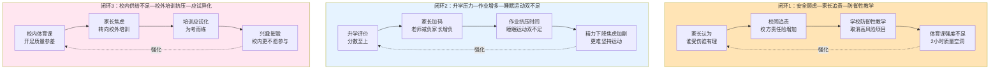

**闭环1：安全顾虑—家长追责—防御性教学的恶性循环**。这一闭环的起点是家长"谁受伤谁有理"的旧观念和"校闹"行为——它推高了校方责任险中体育运动伤害赔偿比例（接近60%），进而触发学校的防御性教学反应（取消跳高、跳箱、足球对抗），最终导致"2小时"在强度维度上的实质性空洞[^70][^71]。湖南2026年立法草案明确"尽职免责"条款是从制度层面打破这一闭环的关键尝试[^70][^72]。

**闭环2：升学压力—作业增多—睡眠运动双不足的剪刀差**。这一闭环以分数至上的评价指挥棒为核心，通过家长加码作业、培训机构焦虑营销、学校晚自习延长等多渠道挤压学生时间——最终形成67%睡眠不达标、运动时间被挤入"剩余时间"的累积后果。"民小编"评论指出"近视、肥胖、抑郁等许多健康问题往往不可逆转。牺牲孩子的今天，未必能换来美好的明天"——一针见血地点出了这一闭环的代价不可逆性。

**闭环3：校内供给不足—校外培训挤压—应试异化的扭曲传导**。这一闭环是社会层面与学校层面耦合的典型——校内体育课开足但质量参差→家长焦虑驱动校外培训→培训应试化"为考而练"→学生兴趣被摧毁→更不愿参与校内体育课，形成恶性循环。打破这一闭环的关键在于**校内体育课的质量提升**——只有当校内活动真正"开足上好"，校外培训的应试化挤压力量才会减弱。

**第四，制约"2小时"落实的核心瓶颈清单**。综合上述权重评估、学段差异和耦合机制分析，可以提炼出制约"2小时"落实的**七大核心瓶颈**：

| 瓶颈编号 | 核心瓶颈 | 主导层次 | 跨层耦合 | 政策对接章节 |
|----------|----------|----------|----------|--------------|
| 瓶颈1 | "阴阳课表"与体育课挤占 | 学校 | 学校×社会（评价导向） | 第6、8章 |
| 瓶颈2 | 师资紧平衡与城乡结构性短缺 | 学校 | 学校×社会（公共资源） | 第7章 |
| 瓶颈3 | 应试化训练与"为考而练"异化 | 学校×社会 | 学校×家庭×社会×个体 | 第6、8、9章 |
| 瓶颈4 | 安全过度防御与防御性教学 | 学校×家庭 | 闭环1：安全顾虑—追责—防御 | 第6、8章 |
| 瓶颈5 | 作业挤压与睡眠运动双不足 | 家庭×学校 | 闭环2：升学—作业—双不足 | 第6、9章 |
| 瓶颈6 | 校外资源短缺与培训市场失序 | 社会×家庭 | 闭环3：校内—校外—异化 | 第7、9章 |
| 瓶颈7 | 兴趣枯燥与技能/心理负反馈 | 个体×学校 | 个体×学校×社会 | 第6、9章 |

这一核心瓶颈清单具有三重政策意义：**第一，它从问题诊断维度精准对应了第5—9章政策保障设计的目标体系**——第6章时间结构与教学质量回应瓶颈1、3、4、5、7;第7章师资场地与数字赋能回应瓶颈2、6;第8章评价监测与监督问责回应瓶颈1、3、4;第9章家校社协同与文化培育回应瓶颈3、5、6、7。**第二，它揭示了政策保障设计必须采用"系统性突破"而非"单点干预"路径**——七大瓶颈中至少有四个涉及跨层耦合，单纯改革某一层面难以根本破解;只有学校、家庭、社会、个体四层因素同步优化，才能打破恶性闭环并启动良性循环。**第三，它为政策建议的优先级排序提供了证据基础**——瓶颈1、4、5具有较高的紧迫性（涉及当前最直接的执行偏差），瓶颈2、6具有较高的资源依赖性（需要长期投入），瓶颈3、7具有较高的根本性（涉及评价导向与个体习惯的深层重塑）。

需要坦诚说明的是，本章四层次因素分析受当前可获取证据的限制，**部分因素的相对权重和耦合强度仅能基于现有多源证据作出方向性判断，尚未形成精确的量化权重测算**。例如"学校瓶颈对'2小时'落实的影响占比"难以从现有数据中精确估计;不同瓶颈在不同学段的权重差异也只能基于体测数据和媒体调研作大致刻画。后续研究在条件允许时，可通过结构方程模型、回归分析等方法对各因素权重进行更精细化的实证估计。但这一方法学局限不影响本章的核心结论——**"2小时"政策的落实瓶颈是多层次、跨耦合、分学段的系统性问题，必须通过系统性政策设计才能根本破解**。这一判断为第5章地方实践经验比较与第6—9章保障机制设计奠定了清晰的问题导向，也回应了第1章所确立的"现状测量—影响因素—政策保障"分析框架的因果递进逻辑。

# 5 地方实践经验与典型模式比较

第2章已经识别出"2小时"目标在量与质两端的五大结构性短板，第3章论证了"2小时"硬指标的科学合理性，第4章则系统拆解了制约其落实的七大跨层耦合瓶颈。问题诊断至此基本清晰，但**"诊断"距离"对症下药"还隔着关键的一步——必须在中国教育治理的真实情境中考察哪些政策工具已经被尝试、哪些做法已经被证明有效、哪些经验可以被复制推广**。本章的任务，正是在前四章问题诊断的基础上，转入政策保障路径研究的实证比较层面。2025年是"2小时"政策从国家层面全面部署推开的元年，也是各省市以《纲要》和《意见》为指引、密集出台地方实施方案的"政策试验大年"——北京"体育八条"、天津"进晒查罚改"、广东"校园阳光体育活动"、云南"壮苗行动"、河北"体质强健计划"、甘肃"校校有特色、人人有技能"、山西大同平城区"加长版课间"等典型样本，为本研究提供了难得的横向比较窗口。本章将构建统一的比较框架，分维度剖析七大典型模式的制度设计逻辑与实施成效，并在最后提炼可复制的共性经验与差异化的适配条件，为第6—9章保障机制设计提供本土化实证参照。

## 5.1 地方实践模式的整体图谱与比较框架

梳理近两年各省市落实"2小时"政策的整体格局可以发现，**地方实践已经从过去单点突破、局部试点的零散状态，迈入"省级全域部署+市县精细落地+学校特色创新"三级联动的系统化推进格局**。从政策出台时序看，北京、广东、天津在2025年初率先出台市级实施方案，云南、河北、甘肃等地随后跟进，山西大同平城区、东莞、肇庆等地市则进一步形成区域化实施细则，构成了从国家纲要到省级方案再到市县校落地的完整传导链条。从政策定位看，各地虽然都以《纲要》和《意见》"2小时"硬指标为共同坐标，但因地制宜形成了各具特色的本土化路径——既反映了共同的政策语境，也呈现了差异化的资源禀赋与治理偏好。

为系统比较这些地方实践，本章构建**"刚性约束—资源挖潜—质量提升—协同治理"四维比较框架**。这一框架的逻辑基础来自第4章七大瓶颈的政策对接需求：**刚性约束**对应瓶颈1（"阴阳课表"）、瓶颈4（防御性教学）等执行偏差类问题，需要通过课表入表、监督问责等硬性制度突破;**资源挖潜**对应瓶颈2（师资紧平衡）、瓶颈6（场地不足）等资源短缺类问题，需要通过师资多元补充、场地"金边银角"等创新工具弥补;**质量提升**对应瓶颈3（应试化训练）、瓶颈7（兴趣枯燥）等内容质量类问题，需要通过课程改革、班级赛、"一校一品"等内容创新提升;**协同治理**对应瓶颈5（作业挤压）、跨层耦合等系统性问题，需要通过家校社协同、数据赋能、评价改革等多方合力破解。

下表对七大典型样本的整体定位、推进时序与制度特色作初步比较：

| 地区/模式 | 政策定位 | 出台时间 | 制度特色 | 主导维度 |
|-----------|----------|----------|----------|----------|
| 北京"体育八条" | 课程质量+班级赛+大数据 | 2025年2月 | "能出汗的体育课"、四级联赛、970万人次"班超" | 质量提升 |
| 天津"进晒查罚改" | 闭环监督问责 | 2025年起 | 五环节闭环、"四不两直"、违规校长免职 | 刚性约束 |
| 广东"校园阳光体育活动" | 分区差异化推进 | 2025年2月 | 珠三角—粤东西北分时间表、"4+1"课程编排 | 刚性约束+资源挖潜 |
| 云南"壮苗行动" | 寄宿制与民族地区适配 | 2025年2月 | 15分钟课间+20分钟晨跑+保障睡眠 | 协同治理 |
| 河北"体质强健计划" | 大课间倍增+赛事体系 | 2025年 | 上下午各30分钟大课间+"校县市省"四级赛事 | 质量提升 |
| 甘肃"校校有特色、人人有技能" | 师资补齐+体教融合 | 2025年4月 | 班师比标准+"6+3+1"足球贯通+"省队校办" | 资源挖潜 |
| 平城区"加长版课间" | 微观场景精细化创新 | 2025年 | 课间10→15分钟+全时段运动体系+"金边银角" | 质量提升+资源挖潜 |

如表所示，**七大模式在四维框架下呈现出"主导维度突出、其他维度互补"的复合特征**——任何单一模式都不可能仅依靠一个维度达成"2小时"目标，但每个模式都在某一维度形成了显著的制度创新。本章后续5.2—5.7节将逐一剖析各模式的具体制度设计与实施成效，5.8节则在横向比较基础上提炼共性经验与差异化适配条件。

## 5.2 北京"体育八条"：以课程质量与"班级赛"重塑育人闭环

北京市教委、市体育局2025年2月11日联合印发的《关于进一步加强新时代中小学体育工作的若干措施》（俗称"体育八条"），是2025年初最早出台的省级实施方案之一，也是**质量提升维度上最具系统性的政策样本**。"体育八条"以"打造能出汗的体育课、大力开展学生班级赛、促进体教融合等8条举措"构筑了"课程质量+赛事牵引+数据画像"三位一体的育人闭环[^83][^84]。

**第一层制度设计：以"能出汗的体育课"重塑课程质量**。"体育八条"在时间安排上明确"小学和初中每天1节体育课，高中每周3—5节体育课，没有体育课的当天要安排不少于45分钟的体育锻炼"，并要求"确保中小学生每天综合体育活动时间不低于2小时，其中至少要有1小时中等及以上强度体育锻炼"[^83]——这一表述正是第3章所强调的"2小时综合活动+1小时MVPA"双重底线在地方政策中的精准转化。质量底线的具体抓手有三：一是**杜绝"说教课"和"不出汗"的体育课**，每节体育课安排不少于10分钟体能练习，防止教学内容碎片化、随意性[^83][^84];二是**严防"阴阳课表"**——"学校要开齐开足体育课，不得以任何形式挤占体育课，杜绝'阴阳课表'"[^83];三是**强制三大球与冰雪项目纳入必修内容**——小学、初中要将"三大球"至少一项纳入体育课必修内容，高中要开设"三大球"模块教学，冰雪运动特色学校应将冰雪内容列入体育课开展教学[^83]。这三项设计直接对接了第4章瓶颈1（阴阳课表）、瓶颈3（应试化训练）和瓶颈7（兴趣枯燥）。

值得特别关注的是"体育八条"的**全员跑步制度**——"组织开展教师、学生全员参与的跑步活动，针对不同场地条件、不同年级，制定不同的跑步距离，建议：小学1—2年级每次200—500米，3—4年级600—800米，5—6年级800—1000米，初中1500米以上，高中2000米"[^83]。这一阶梯化设计将第3章所论证的"剂量—效应"科学规律具体化为可操作的年级标准，使运动强度的递进性在制度层面被锁定。

**第二层制度设计：以"班级赛"构建全员参与的赛事体系**。"体育八条"的最大亮点在于"首次在北京中小学全面部署全员参与、全过程参与的'班级赛'"[^84]。北京市教委明确要求"学校每学期要以班级为单位，组织学生开展形式多样、内容丰富的班级联赛，**小学每班不少于5场，初中不少于4场，高中不少于3场**，比赛项目可由学校因地制宜设计安排;校园足球、篮球、排球特色学校则组织学生开展相应'三大球'班级联赛，每班每学期不少于5场"[^84]。这一制度设计的深层逻辑被市教委相关负责人明确道破——**"学校体育最重要的属性就是面向人人、惠及人人，让每一名学生都能享受体育带来的乐趣……'班级赛'是学生参与并感受体育乐趣最好的形式。它不仅普及面大，而且能很好地调动学生参与锻炼的积极性和热情，还可以教会学生敬畏规则，尊重裁判，尊重对手，养成良好的锻炼习惯"**[^84]。这一表述精准对应了第4章个体层面"同伴互动与团体运动的社交粘性"机制——班级赛的本质就是通过制度化的同伴互动放大个体参与的内在动力。

**第三层制度设计：以大数据、人工智能赋能科学锻炼**。"体育八条"建立了"市、区、校、班四级校园体育联赛机制"[^84]，并强调通过大数据、人工智能等技术为学生科学开展体育锻炼提供支撑[^84]。

**这三层制度设计的实施成效已经在2025年实证数据中显现**。北京市教委副主任吴洁2026年2月在教育部发布会上公布的数据令人振奋：**"2025年全市中小学生体质健康优良率首次突破80%，6年稳步提升，实现历史性突破"**[^85]。同期"2025年北京共举办'班超'联赛37.6万场次，参与人次约970万"[^85]——这一数字相对于北京中小学生总规模的覆盖度极高，几乎实现了"班班有比赛、人人都参与"的政策初衷。更值得关注的是心理健康维度的同步改善——**"2025年学生抑郁、焦虑倾向的检出率同比分别下降6.2%和3.4%"**[^85]，这与第3章所论证的"运动促进心理健康"因果机制形成了精准的实证印证。

北京模式的另一深层贡献在于**将"2小时"政策与心理健康保障深度融合**——吴洁介绍北京已经"以优化同伴、师生、亲子关系为抓手，搭建同伴互助平台，目前已经有96%的学生至少参加了1个兴趣小组或者社团";同时"建成市—区—校三级的心理服务体系"[^85]。这一"体育—心理"协同机制揭示了"2小时"政策超越体质指标的更深层价值——它不仅是身体健康的硬约束，也是心理健康的软支撑。

可以判断，**北京"体育八条"代表了发达地区"质量提升+数据赋能"路径的成熟样本**——它在制度上不依赖单纯的硬性时间约束，而是通过课程质量、班级赛体系、数据画像三大支柱，形成了课内、课间、课后服务一体化的育人闭环。这一模式的可复制性较高，但其有效落地依赖于充足的财政投入、较高的师资水平和较强的信息化基础——对欠发达地区直接复制有相当门槛。

## 5.3 天津"进晒查罚改"：以闭环治理破解执行偏差

如果说北京模式的核心是"质量驱动"，那么天津2025年实施的"**进晒查罚改**"五环节闭环机制则是**刚性约束维度上最具突破性的政策样本**——它直击第4章瓶颈1（阴阳课表与体育课挤占）的执行偏差痛点，以"硬核"监督问责将"2小时"从政策要求转为校园常态[^86]。

**第一环节"进"——刚性进课表**。"2025年起，天津全市小学、初中每天开设1节体育课且全部编入课程计划，高中每周开设3—5节体育课且至少3节编入课程计划，中小学每天上下午各安排不少于30分钟大课间体育活动并纳入教学计划，硬性保障学生运动时长"[^86][^87]——这一环节在制度层面将"2小时"的时间结构从软性倡导转化为刚性课表事实，杜绝了"看上去开了体育课实际却不上"的隐性流失空间。

**第二环节"晒"——公开晒课表**。"全市16个区教育局及全市中小学每学期初在官网公开所有班级体育课课表和举报电话，全面接受社会监督"[^86]——这一环节通过透明化机制引入社会监督力量，将原本封闭的校内课表暴露在公众视野下，从根本上压缩了"阴阳课表"的操作空间。

**第三环节"查"——常态查落实**。"市区两级教育部门采取'四不两直'方式——不发通知、不打招呼、不听汇报、不陪同接待，直奔基层、直插现场，每年组织不少于6次体育课及课间活动抽查检查，发现问题，当场记录，全市通报"[^86]。"四不两直"的工作方法直接来自纪检监察领域的成熟实践，确保了抽查的真实性和震慑性——这是对第2章所识别"隐性流失"现象的制度化反制。

**第四环节"罚"——从严罚违规**。"对挤占、挪用体育课时等行为'零容忍'，在全市教育系统通报所有违规学校。**一所学校因为体育课被占用，第一次被通报后，校长被约谈;第二次再犯，校长直接被免职**。据统计，2025年共约谈了40余名学校负责人并给予批评教育、书面检查、暂停评优等处分"[^86][^87]。"第二次违规直接免职"的硬性处罚条款是这一环节最具震慑力的设计——它将体育工作直接挂钩校长职业风险，从根本上扭转了"重智轻体"的办学惯性。

**第五环节"改"——紧盯改问题**。"市区两级教育督导部门将体育课开课和学生体质健康提升情况全面纳入督导，实行整改验收销号。整改方案要报市教委，整改结果要公开，不达标继续查，直到问题解决"[^86]。这一环节构建了"问题—整改—销号"的闭环管理机制，确保了执行偏差不被简单一罚了之，而是真正得到根本解决。

**五环节闭环的实施成效极为显著**。"这套'组合拳'一出，全市中小学再无随意挤占体育课情况，体育工作真正成为学校的'一把手工程'。**2025年抽查结果显示，全市义务教育阶段学校每天一节体育课开课率达到100%，实现校内每日综合体育活动时间不低于2小时**"[^86][^87]。结合第3章已援引的天津2025年体测数据——优良率68.80%（较2024年提升6.83个百分点）、合格率99.40%——可以清晰看出"进晒查罚改"机制在数据上的强相关支撑。

**配套机制："一生一案"靶向干预**。除了五环节闭环，天津还为"每名学生建立了体质健康档案，每年开展大中小学生体质健康抽测，精准反映学生体质状况。针对体质健康测试'良好'以下的大中小学生，建立'一生一案'促进机制，靶向提升学生体质健康水平"[^86]。一个生动案例展示了这一机制的微观运作——"初二男生小吴体测成绩不理想，特别是引体向上一个都做不起来。体育教师专门为他制定了训练计划，每天练习静力悬垂、斜身引体，班主任每周检查进度，各科教师也会在课间督促他练习。3个月后，小吴能做5个标准的引体向上，整个人都自信多了"[^86]。这一案例完整呈现了"靶向干预+多教师协同"的微观激励路径，与第4章个体层面"技能掌握—自信心—正反馈"循环形成了精准印证。

可以判断，**天津"进晒查罚改"代表了刚性约束维度上最完整、最具操作性的闭环样本**——它的核心创新不在于政策内容本身（许多省份都有类似的体育课时要求），而在于将"目标—措施—监督—处罚—整改"五环节制度化为不可绕过的闭环。这一模式的可复制性极高，且对师资、场地、财政的依赖度相对较低——其核心成本在于政府治理决心和督导能力，因此对各类资源禀赋的省市都具有重要的借鉴价值。

## 5.4 广东"校园阳光体育活动"：分区差异化推进与课程编排创新

广东省教育厅2025年发布的《关于保障中小学生每天综合体育活动时间不低于两小时的通知》（粤教体函〔2025〕8号）确立了"全省各中小学校普遍开展'校园阳光体育活动'，全面落实每天校园体育2小时，推进落实中小学校每天1节体育课"的政策架构[^88]，是**刚性约束与资源挖潜双维度协同推进的典型样本**——尤其在分区差异化推进与课程编排创新两个方面具有突出特色。

**核心创新一："珠三角—粤东西北"分区时间表设计**。广东《通知》明确"**珠三角地区中小学校于2025年秋季学期开始全面实施每天1节体育课;粤东西北地区于2025年秋季学期落实每天1节体育课的学校比例不少于50%，2026年秋季学期开始全面实施**"[^88]——这一"先珠三角、后粤东西北"的差异化时间表是对省内区域不平衡现实的政策化承认。如第2章所论，区域不平衡是"2小时"目标差距规模评估的关键短板之一;广东作为省内经济发展梯度极为明显的省份，避免一刀切、采用阶梯化推进，本质上是在政策设计中显化了对资源禀赋差异的尊重。这一思路对其他省域内部呈现明显发达—欠发达梯度的省份（如江苏、山东、福建等）具有直接的借鉴价值。

**核心创新二："4+1"或"3+2"体育课程编排**。肇庆"校园体育30条"将广东《通知》的总体要求细化为可操作的课程编排——"体育课授课可采用'体育与健康课+体育活动课'模式。**一二年级可采用'4节体育与健康课+1节体育活动课'模式，三至九年级、高中阶段可采用'3节体育与健康课+2节体育活动课'模式，鼓励三至九年级按照'4+1'的模式设置体育课**"[^89]。这一设计的深层逻辑在于**区分"体育与健康课"与"体育活动课"的功能定位**——前者承担系统性技能学习与体能训练职能，后者承担兴趣发展与同伴互动职能，二者组合既保证课程总量又拓展课程灵活性。东莞市教育局也明确"2025年秋季学期一开学，全市小学、初中学段将全面推行每天至少1节体育课，并编入课表，**体育活动课以班级或年级等单位进行**"[^90]——这一"班级或年级单位"的灵活组织方式为大班化教学条件下的活动课实施提供了可行路径。

**核心创新三："金边银角""上天入地"场地挖潜**。广东《通知》明确"**充分利用天台、走廊、楼道、架空层、墙壁、地面等校内空间，在满足安全的前提下，打造人人、处处、时时可及的校内'微运动场'**"[^88]。这一思路在地市层面形成多种创新实践——长安镇厦岗小学"活动地点涵盖操场、教室、走廊及校园空旷区域，确保每位学生都能参与其中"，并按"柔韧拉伸游戏"（教室及走廊）、"视觉追踪游戏"（教室）、"特色课间活动"（年级特点设计）、"手眼协调体育活动"（两人抛接乒乓球）、"跳长短绳体育活动"（操场及附近场地）等不同场景设计差异化项目[^91];南城阳光中心小学"上午大课间40分钟，下午大课间35分钟，每节课时长变为35分钟，一天下来每个孩子都有2个小时的体育活动时间"[^90][^91]。这一"场景—项目—时长"三维匹配的精细化设计，是对第4章瓶颈6（场地不足）的有效政策响应。

**核心创新四：课间15分钟制度的全面铺开**。"东莞所有义务教育学校至少安排1个课间休息时间不少于15分钟……目前东莞全市超三成学校设置了两个或以上的15分钟课间，部分学校所有课间均达到15分钟"[^90][^91]。东莞市南城中心小学"自2025年春季学期起……孩子们的课间休息时间由原先的10分钟延长至15分钟，每天上午与下午各安排一次大课间活动，其中上午时段长达40分钟，下午则为35分钟，而每节常规课程的时长则调整为35分钟"[^90]——这一精细化作息设计直接对接了第4章瓶颈1（课间被挤占）和瓶颈4（防御性教学），通过制度刚性消解了"课间圈养"的合法性空间。

**核心创新五：大学生"阳光体育"延伸至高校**。值得关注的是，广东不仅在中小学层面推进2小时，还于2025年4月召开"广东省高校深入落实'健康第一'工作推进会"，**针对大学生出台《广东省大学生每天阳光体育活动不少于一小时试点工作指引》**[^92][^93]。该《指引》明确"从2026年春季学期开始，'一校一策'试点大学生每天阳光体育活动不少于一小时"，提出十项试点工作要点——"上好每一节体育课、每周一个'校园运动日'、每个二级学院配备一名兼职体育辅导员、健康跑不少于3000米、加入一个体育社团、每周一次球类运动、每年一次体育比赛、颁发一张体质健康证书、每生一个体育档案、建立一个体育宣传站"[^92][^93]。这一向高等教育阶段的延伸是对"大中小学一体化"育人理念的实践化表达——"拯救'脆皮大学生'，广东省教育厅喊你起来运动啦"[^93]的媒体表述生动刻画了这一政策延伸的紧迫性。

可以判断，**广东模式代表了发达—欠发达梯度省份"分区差异化推进+课程编排创新"路径的典范**——它通过分时间表、分课程类型、分场景空间的多维度精细化设计，回应了第2章所识别的城乡区域不平衡现实和第4章所识别的资源约束瓶颈。其可复制性较高，特别是"4+1"或"3+2"课程编排、"金边银角"场地挖潜、15分钟课间制度等具体工具，对各类资源条件的省市都具有借鉴价值。

## 5.5 云南"壮苗行动"与河北"阳光体育"：欠发达地区与中部省份的本土化路径

云南省2025年2月12日印发的《云南省中小学生壮苗行动实施方案（2025—2027年）》和河北省2025年印发的《河北省学生体质强健计划实施方案》代表了**中西部省份在资源相对受限条件下推进"2小时"落地的两条差异化本土路径**[^94][^95][^96]。

**云南"壮苗行动"的本土化特征突出表现在三个方面**。第一，**寄宿制学校与民族地区适配**。云南方案明确要求"严格落实中小学校15分钟课间休息和每天至少1次30分钟'大课间'体育活动，确保中小学生每天综合体育活动时间不低于2小时，**寄宿制学校每天安排不少于20分钟晨跑（早操）**"[^95]。这一"15分钟课间+30分钟大课间+20分钟晨跑"的时间结构特别关注了云南山区寄宿制学校占比高的省情特征——寄宿学生从早到晚的全时段在校生活为体育活动提供了天然时间空间，"早操"制度的强化是对这一资源优势的政策化利用。

第二，**民族地区课程创新**。云南怒江州贡山县捧当乡中心学校的实践提供了民族地区适配的微观样本——"除了两套统一的课间操，**学校结合本地民族文化，创新推出独龙族、怒族、藏族、傈僳族四套具有浓郁民族风情的校园民族课间操**，在强健学生体魄的同时，增强了他们对本土文化的认同感和自豪感"[^97]。该校校长丰六康表示："学校将坚持'健康第一'理念，认真落实好壮苗行动十项任务，利用好有限的场地，开发更多的特色体育课程，帮助孩子们在体育锻炼中享受乐趣，增强体质，健全人格，锤炼意志，让学生身上有汗，手脚有力，眼里有光，脸有笑容"[^97]。这一**"传统课间操+民族文化课间操"双轨设计**是对第4章瓶颈7（兴趣枯燥）在民族地区情境下的创造性回应，也是对第3章最优活动结构理论的本土化丰富。

第三，**与睡眠保障的深度衔接**。云南方案罕见地将体育活动时间保障与睡眠时间保障同步设计——"充分保障学生睡眠时间。各地各校要严格控制学生在校时间，**为保证小学生每天有10小时以上、初中生每天有9小时以上、高中生每天有8小时以上的睡眠时间创设条件**。禁止学校利用中午休息时间组织学生开展任何形式的集体上课、补课和做作业，保障学生有充足的午休时间。寄宿制学校应严格控制学生晚自习时间"[^95]。这一设计精准对接了第4章瓶颈5（作业挤压与睡眠运动双不足），从制度层面打破"运动—睡眠"被双重挤压的恶性循环。云南方案的明确目标是"到2027年，全省中小学生体质健康水平将实现显著提升：**小学、初中、高中阶段学生体质健康优良率将分别达到65%、60%和50%以上**;同时，学生的耐力、力量、速度、柔韧等体能素质将得到全面提升，脊柱侧弯、营养不良、肥胖和近视等健康问题将得到有效控制"[^97]。

**河北方案则在三个方面形成了独特路径**。第一，**大课间倍增机制**。河北方案"鼓励有条件的中小学校上下午各安排一次不少于30分钟有质量的大课间体育活动"[^96]——上下午各30分钟即每天60分钟大课间，与上下午15分钟课间和体育课叠加后能够稳健支撑2小时综合活动时间的实现。这一倍增设计的可推广性较强，对场地条件相对受限的中部省份具有直接借鉴价值。

第二，**"校—县—市—省"四级赛事体系**。河北方案明确"基础教育阶段，构建'校—县—市—省'分层分级赛事体系，完善分学段、跨区域、分等级的学生体育赛事体系"[^96]，并要求"**每年举办包含三大球在内的不少于10项省级体育竞赛**"[^96]。秦皇岛市海港区的实践进一步细化了这一思路——"目前我们构建了**区级引领+校级普及+班级扎根三级竞赛体系**，分层分类开展体育赛事活动……区级年均举办20余项大型赛事，参与超2万人次;校级推行全员运动会，覆盖12.9万人次;班级每月开展足球、篮球等联赛，全年超7000场，参与学生2.5万人次以上"[^98]。**2025年全区学生体质健康优良率达69.9%，较2023年提高了49.8%**[^98]——这一改善幅度极其惊人，反映出赛事牵引在中部地区的强大政策效应。

第三，**AI体育测试与社团带动**。沧州市迎宾路第二小学在操场设置"**AI体育测试区**"——"大屏幕上实时滚动着运动排行榜，激励着孩子们你追我赶"[^98];沧州市第十中学则以社团为载体，"**学校共设各类社团50多个，所有学生全部免费参加，所有社团均实行选课走班模式，学生可凭兴趣自由选择**……经过一年多的体育社团创建，该校中考体育测试成绩由此前的全市倒数第一跃升至全市第二"[^98]。这一从"全市倒数第一"到"全市第二"的逆袭案例，生动印证了第4章个体层面"兴趣—技能—社交"循环在政策干预下的良性激发机制。河北的高校阶段配套也值得关注——方案明确"各高校要积极实施'阳光体育一小时'计划，**采用'运动打卡''体育积分'等方式**，引导学生每天参与不少于1小时的中高强度体育锻炼"[^96]。

可以判断，**云南"壮苗行动"和河北"阳光体育"代表了中西部及中部省份在资源相对受限条件下推进"2小时"落地的两条本土化路径**——云南突出寄宿制和民族地区适配，河北突出大课间倍增与赛事体系。两者的共同特征是**不依赖高强度财政投入和高水平信息化基础，而是通过制度创新、文化适配、赛事牵引等"低成本高效益"工具实现政策落地**——这对资源条件类似的中西部省份具有重要的可借鉴价值。

## 5.6 甘肃"校校有特色、人人有技能"：师资场地短板补齐与体教融合

甘肃省教育厅等五部门2025年4月印发的《甘肃省学生体质强健计划实施方案》是**资源挖潜维度上最具系统性的政策样本**——它针对欠发达省份的师资紧平衡、场地不足、人才培养断层等结构性短板，构建了"师资补齐+场地共享+体教融合+数字赋能"四位一体的政策工具组合，为同类型省份提供了破解资源困境的本土化思路[^99][^100][^101]。

**核心创新一：班师比标准与师资多元补充**。甘肃方案明确"**按照小学5比1、初中6比1、高中8比1的班师比标准配齐专职体育教师**，鼓励引进优秀退役运动员、退役军人充实师资队伍，强化体育教师专业培训与教学实践能力提升，将大课间、赛事指导等纳入教师工作量，保障体育教师职称评聘、待遇福利等合法权益"[^100]。这一班师比标准是当前已公开的省级方案中最具操作性的师资配备硬指标——5∶1（小学）、6∶1（初中）、8∶1（高中）的递减序列既反映了不同学段体育课时密度的差异，也为各地教育行政部门提供了可量化的考核标尺。师资多元补充的"**退役运动员+退役军人+培训提升+权益保障**"组合工具，直接对接了第4章瓶颈2（师资紧平衡与城乡结构性短缺）。

**核心创新二："6+3+1"足球人才贯通培养与"省队校办"模式**。甘肃方案推进"**'6+3+1'（6所小学、3所初中、1所高中）足球人才贯通培养，兰州、金昌、武威重点建设'足球特长班'**，面向全省规范招生。探索高校'省队校办'模式，完善体育人才培养与激励机制，夯实青少年体育后备人才基础"[^100]。"6+3+1"模式的本质是**学段衔接的体教融合人才通道**——它解决了过去体育人才培养中"小学有特色—初中无传承—高中再断档"的链条断裂问题;"省队校办"则是高等教育阶段的体教融合创新，将专业体育队伍嵌入高校校园，构建竞技体育与学校体育互哺共生的新型生态。这一思路对同样面临体育人才培养断层的中西部省份具有直接借鉴价值。

**核心创新三：省市县三级体质健康抽测与督导挂钩**。甘肃方案"**建立省、市、县三级体质健康抽测制度，抽测结果与教育质量、校长履职考核挂钩**，对体质健康持续下滑的地区和学校严肃督导整改，建立学生体质健康档案与数字画像，实施精准预警干预"[^100]。三级抽测制度的核心创新在于**将体质健康直接挂钩政府履职评价和校长考核**——这与天津"进晒查罚改"的违规罚则形成思路上的呼应，但更突出"数据画像+精准干预"的技术化色彩。

**核心创新四：场馆共建共享与数字赋能**。甘肃方案"**将体育场地设施纳入学校改造规划，推进校内外体育场馆共建共享，公共体育场馆、学校体育场馆分时段免费或低收费向学生开放**;健全体育安全管理与应急处置机制，借助大数据、人工智能等数字技术，赋能体育教学与体质监测工作"[^100]，并明确"鼓励有条件的地方和学校将**传感技术、大数据、人工智能、虚拟现实**等现代信息技术与学校体育深度融合"[^101]。这一"场馆共建共享+传感/AI/VR赋能"的组合工具，是欠发达省份借助数字技术弥补场地资源不足的政策化探索。

**核心创新五：校园足球特色学校足球课时占比硬指标**。甘肃方案明确"**校园足球特色学校足球课时占比不低于体育课总课时的1/3**"[^100]——这一硬指标将"校校有特色"从倡导性表述转化为可考核的课程占比，为特色项目培育提供了制度刚性。

**目标体系的明确性**也是甘肃方案的特色。方案明确"到2027年，**全省学校体育工作机制更加健全，教学、训练、竞赛体系全面建立，教学质量显著提升;显著提高《国家学生体质健康标准》达标率与优良率，遏制学生近视率、肥胖率上升趋势;补齐体育师资、场地设施等短板，常态化体育竞赛广泛开展，'校校有特色、人人有技能'的格局基本形成。到2035年，建成现代化高质量的学校体育体系**"[^99][^100][^101]。这一2027年阶段性目标和2035年远期目标的双时间锚定，与《纲要》"分两步走"的总体部署形成了精准对接。

可以判断，**甘肃模式代表了欠发达省份"师资场地短板补齐+体教融合"路径的系统性样本**——它的最大价值在于**对资源约束的政策化承认与制度化破解**——不回避师资紧平衡和场地不足的结构性短板，而是通过班师比硬指标、退役运动员转岗、"6+3+1"贯通培养、场馆共建共享、数字赋能等工具组合，逐项化解约束。这一思路对资源条件类似的西部和中部省份具有直接的可复制性，但其全面落地仍依赖于持续的财政投入和跨部门协同。

## 5.7 平城区"加长版课间"与基层学校样本：微观场景的精细化创新

如果说5.2—5.6节的省市级模式聚焦于宏观制度设计，那么山西大同平城区"加长版课间"与北京、天津、东莞等地的基层学校样本则提供了**微观场景下"2小时"精细化落地的实践智慧**——它们揭示了在统一的省级方案框架下，基层学校如何通过空间激活、特色项目、班主任协同等微观创新实现政策的有效落地。

**平城区"加长版课间"的整体设计**。平城区"将课间时间从10分钟延长至15分钟，构建起覆盖全时段的体育活动体系，让学生们真正走出教室，动起来、跑起来"[^102]。具体而言：

- **平城区8校**：在开齐开足体育课的基础上，将每日体育活动拆解为"**体育课堂40分钟+上午大课间30分钟+下午大课间30分钟+课间自由活动15分钟×3次**，合计不少于120分钟"[^102]——这一"40+30+30+15×3"的时间结构是对"2小时"政策最精确的微观分解，确保运动时间覆盖学生在校全时段。
- **平城区45校**：将课间统一延长至15分钟，上下午各安排40分钟阳光大课间，构建起"体育课+大课间+阳光小课间"的全时段运动体系。学校还利用校园**"金边银角"**设计11款地面彩绘，划分运动与游戏专属区域，设置器械借还处[^102]。
- **平城区46校**：从制度层面保障课间时长"不缩水、不走样"，确保每节课间15分钟完整落实。校园操场、空场地域全面开放，**教师全程参与活动组织与安全看护**[^102]。

**特色项目的差异化布局**。平城区不同学校根据自身条件形成了差异化特色项目——"**平城区18校文瀛分校在大课间安排上精心设计。上午以基础体能训练为主，包含800米跑、广播体操等;下午更注重趣味性，组织开展篮球年级联赛、踢毽子、韵律操等活动**……平城区机车1校依托体育社团，开设篮球、足球、乒乓球等特色项目，每年举办春季运动会、秋季体育文化节、校园足球联赛……平城区10校则构建'传统体育类、竞技体育类、趣味体育类'三大社团格局，新增舞龙、舞狮、武术、趣味田径等社团，**学生参与率达100%**"[^102]。这种**"上午体能+下午趣味"或"传统+竞技+趣味"三类社团**的差异化设计，是对第3章最优活动结构理论的微观实践。

**实施成效的微观印证**。平城区18校文瀛分校近期体质测试显示，"**五年级学生肺活量优秀率从35**"——虽然原文截断未能呈现完整数据[^102]，但已足以说明微观场景下"加长版课间"对体质指标的正向贡献。教师层面的反馈也提供了重要证据——"平城区49校班主任杨张茹观察发现，'**以前下午第一节课，学生走神、疲劳、烦躁的情况时有发生。现在大课间充分活动后，学生们坐得住、听得进，课堂效率明显提高**'"[^102]。这一反馈从"知识学习与全面发展"关系层面印证了第3章认知机制——长期体力活动促进大脑发育与学业成绩并非空洞理论，而是基层教师可观察的真实变化。御河小学校长赵志宏的观察更直接——"**充足的户外运动对学生益处良多。学生动起来、跑起来，身体素质明显提高，因换季感冒请假的人数也少了。长期坚持运动的孩子，抗挫、抗压能力大幅提升，心肺耐力、协调性、反应速度都在不知不觉中进步了**"[^102]。

**北京二实小平谷分校的"零点体育"创新**。北京第二实验小学平谷分校2021年率先在平谷区进行"零点体育"改革——"**学生到校后先进行40分钟的体育活动**。这项改革的背后有着坚实的科学依据：从运动生理学角度看，适度的晨间锻炼能促进血液循环，为大脑提供充足的氧气和营养，显著提升学生的注意力、记忆力和思维反应速度;从认知心理学视角看，早晨的体育活动能有效缓解学生的学习焦虑，帮助他们快速进入积极的学习状态"[^103]。"零点体育"的项目设计采用"抓两头，促中间"策略——"设置三个基础训练区，即'大力水手'——上肢力量训练区（突出棒球特色），'功夫足球'——下肢力量训练区（突出校园足球特色），'运动健将'——体能综合训练区……设置两个特殊训练区，即'**熊猫宝宝'训练营，对肥胖和特异体质学生进行重点训练**;'校园吉尼斯挑战'区则为学生培养运动特长，搭建展示平台"[^103]。

**"环湖微马"长跑节的生态育人创新**。北京第二实验小学平谷分校自2022年起组织"环湖微马"长跑节——"学生们走出校园，走进学校周边的湿地公园开展长跑活动，实现场景化育人……三校近5000名师生、家长志愿者齐聚马坊小龙河湿地公园、王辛庄城北湿地公园，以奔跑之姿践行北京市'体育八条'和平谷区阳光·乐跑'5公里计划'"[^103]。这一活动的育人理念清晰——"共同的体育活动能增强团队凝聚力和归属感;在自然环境中锻炼能促进身心健康与环境的和谐统一;更重要的是，**通过亲子共同参与，在家庭中播下了终身体育的种子**"[^103]。这一思路精准对接了第4章瓶颈5（亲子陪伴质量）和家校协同治理需求。

**北师大天津静海实验学校的"大课间游戏化"创新**。北师大天津静海实验学校将大课间设计为多元游戏组合——"**跳绳接力、小推车竞速、多向投篮……数十个游戏项目轮番登场，学生们投入其中，玩得不亦乐乎**……除了丰富多彩的游戏活动，还有更加精彩的课间操环节"[^86]。津南区何庄子联合小学则在小课间利用空间巧思——"小课间，**一年级学生一走出教室，就可以在楼道里铺着人工草皮的活动区进行纵跳摸高练习。学校将每层教学楼的尾端设计为课间活动区，地面铺设人工运动草坪，为每个年级设计具有针对性的活动内容**，学生只要踏出教室就可以完成课间15分钟的锻炼"[^86]。这一"楼道末端+人工草皮+针对性内容"的微观设计是对第4章瓶颈6（场地不足）在城区学校情境下的创造性应对。

**东莞基层学校的多样化探索**。东莞茶山新华学校"推行落实'**1—3年级每天1节体育课，各年级每天2小时的体育活动**'，每天开展1次以'跳绳'为主题的大课间活动，每次活动时间不少于30分钟;利用每节课间10分钟（15分钟）开展球类运动、跳绳、体操、趣味游戏、阅读等丰富多彩的'微运动';统筹安排小学30分钟午锻炼和初中30分钟晚锻炼"[^91];常平镇板石小学则"围绕'让阅读成为习惯''让健康伴随一生''让科学点燃梦想'三个主题，在'课间15分钟'开展了丰富多彩的特色活动"[^91]。

**基层创新的五类共同特征**可以从微观样本中提炼出来：第一，**空间精细化激活**——"金边银角"、楼道末端、湿地公园等非传统体育场所被纳入活动空间;第二，**项目差异化布局**——按学段、性别、兴趣、季节、时段进行项目细分;第三，**班主任和全体教师协同看护**——突破"体育教师独立承担"的传统模式;第四，**家长志愿者深度参与**——亲子共跑、家庭志愿成为家校协同的具体载体;第五，**特色品牌持续培育**——"零点体育""环湖微马""校长杯"等品牌活动形成长效粘性。这些微观智慧是对第4章七大瓶颈在基层场景下的创造性破解。

可以判断，**基层学校样本提供了"省级方案+市级方案+区县细则"传导链条的最终落点**——任何宏观制度设计若不能转化为基层学校的微观实践，都难以真正实现政策初衷。平城区、北京二实小平谷分校、北师大天津静海实验学校、东莞多所小学等基层样本的共同价值在于**证明了"2小时"政策在不同资源条件、不同区域背景的学校都可以通过精细化创新实现高质量落地**——这为政策的全国推广提供了重要信心基础。

## 5.8 跨模式共性经验与差异化适配条件提炼

在5.2—5.7节七大典型模式横向比较的基础上，可以提炼出**六类可复制的共性经验**和**五类差异化的适配条件**——前者回答"什么经验可以推广"，后者回答"在什么条件下推广何种模式更有效"。

**第一类共性经验：课表刚性化是所有模式的共同基础**。无论是北京"每天1节体育课"、天津"全部编入课程计划"、广东"每天1节体育课编入课表"、云南"每天1节体育课"、河北"每天1节体育课"、甘肃"每天一节体育课"、平城区"40+30+30+15×3"——**所有省市的实施方案都将"刚性进课表"作为首要制度安排**[^83][^94][^95][^96][^100][^86][^102][^88][^90][^91][^89]。这一共性经验的可复制性极强，对各类资源条件的省市都具有普适性意义。

**第二类共性经验：监督闭环化是政策落实的硬保障**。天津"进晒查罚改"五环节闭环、甘肃"省市县三级抽测+校长考核挂钩"、广东"严禁'拖堂'或以其他方式挤占学生课间时间"、安徽"省市县三级联动公布体育课监督举报电话"等做法的共同逻辑是**将监督机制制度化、透明化、闭环化**[^100][^86][^88][^89][^87]。天津模式提供了最完整的闭环样本，但其核心思路（公开化—抽查—罚则—销号）可被各类资源条件的省市灵活借鉴。

**第三类共性经验：课间时空扩容是低成本高效益的关键工具**。课间10分钟延长至15分钟、上下午各30分钟大课间、楼道彩绘"金边银角"、人工草皮活动区等做法成为各地共同的低成本高效益工具——平城区、东莞、北京、天津、云南、河北、广东等地都有类似实践[^94][^95][^96][^86][^102][^88][^90][^91][^89]。这一共性经验的可复制性极高，对场地资源紧张的城区学校尤其重要。

**第四类共性经验："一校一品"特色化是激发兴趣的有效路径**。北京"班级赛"、天津"足篮排+体能+超市"、广东"特色活动课程"、云南"民族课间操"、河北"50多个社团选课走班"、甘肃"校校有特色、人人有技能"、平城区"传统+竞技+趣味"三类社团、北京二实小平谷分校"零点体育+环湖微马"——各地共同的逻辑是**通过特色项目培育激发学生内在兴趣**[^83][^96][^99][^100][^102][^84][^103][^97][^98]。这一共性经验直接对接了第4章瓶颈7（兴趣枯燥与个体负反馈）和第3章项目结构最优配置原则。

**第五类共性经验：家校社协同化是延伸"2小时"的必要支撑**。云南"15小时课间+寄宿制晨跑+保障睡眠"、北京"健康课程+运动场景+心理支持+营养保障"一体化、北京二实小平谷分校"亲子共跑+家长志愿者"、甘肃"政府、学校、家庭、社会四方合力"、河北"体教融合"——各地共同强调家校社三方协同的重要性[^83][^95][^100][^103][^85][^98]。这一共性经验对应了第4章对跨层耦合机制的诊断，也将在第9章重点展开。

**第六类共性经验：数字赋能精准化是质量监测的技术支柱**。北京"大数据、人工智能赋能科学锻炼"、北京"一生一档"健康监测、天津"一生一案"靶向干预、河北"AI体育测试区"、甘肃"传感、大数据、AI、VR深度融合"——各地共同将数字技术作为提升监测精度和干预精准度的重要工具[^96][^100][^86][^84][^85][^98]。这一共性经验的可复制性受制于地方信息化水平，但已成为各类省份的共同努力方向。

为更直观呈现六类共性经验的覆盖度，下表对七大典型模式作横向匹配分析：

| 共性经验 | 北京 | 天津 | 广东 | 云南 | 河北 | 甘肃 | 平城区 |
|----------|------|------|------|------|------|------|--------|
| 课表刚性化 | ✓✓ | ✓✓✓ | ✓✓ | ✓✓ | ✓✓ | ✓✓ | ✓✓ |
| 监督闭环化 | ✓ | ✓✓✓ | ✓✓ | ✓ | ✓ | ✓✓ | ✓ |
| 课间时空扩容 | ✓✓ | ✓✓ | ✓✓✓ | ✓✓ | ✓✓ | ✓ | ✓✓✓ |
| "一校一品"特色化 | ✓✓✓ | ✓✓ | ✓✓ | ✓✓✓ | ✓✓ | ✓✓✓ | ✓✓✓ |
| 家校社协同化 | ✓✓✓ | ✓✓ | ✓✓ | ✓✓ | ✓✓ | ✓✓ | ✓✓ |
| 数字赋能精准化 | ✓✓✓ | ✓✓ | ✓ | ✓ | ✓✓ | ✓✓ | ✓ |

注：✓表示一般、✓✓表示突出、✓✓✓表示标杆。

如表所示，**七大模式在六类共性经验上呈现"普遍覆盖、各有所长"的格局**——课表刚性化和"一校一品"几乎被所有模式共同强调，而数字赋能、监督闭环则呈现明显的强弱分化，这一分化与各地资源禀赋密切相关。

**差异化适配条件方面**，可以从五个维度识别影响模式选择的关键变量：

**第一，财政能力**——决定数字赋能、场地建设、师资引进的投入强度。北京、广东、天津等发达地区可重点投入大数据画像、AI辅助等高投入工具;云南、甘肃等欠发达地区则需更多依赖低成本制度创新。

**第二，城乡结构**——决定场地挖潜与师资多元补充的路径选择。城区学校重点采用"金边银角""楼道末端"等空间挖潜策略;乡村学校则更依赖退役运动员、教师转岗、走教等师资多元补充工具。

**第三，师资基础**——决定课程质量提升的可行节奏。师资水平较高地区可重点推动课程质量改革（北京"能出汗的体育课"），师资紧平衡地区则需先解决"有没有"再解决"好不好"。

**第四，家长素养**——决定家校协同的难度系数。一线城市家长体育素养较高地区，亲子共跑、家庭体育作业等协同工具更易推开;欠发达地区或家长焦虑高度集中的地区则需更多文化引导和制度刚性。

**第五，地理气候**——决定室外活动与项目选择的限制条件。北方冬季严寒地区需更多依赖室内场馆与冰雪项目（如北京冰雪运动特色学校）;南方湿热地区则需考虑场地遮阳、防中暑等具体安排;民族地区需要文化适配（如云南民族课间操）。

**基于五类适配条件，可以归纳出三类典型推广路径**：

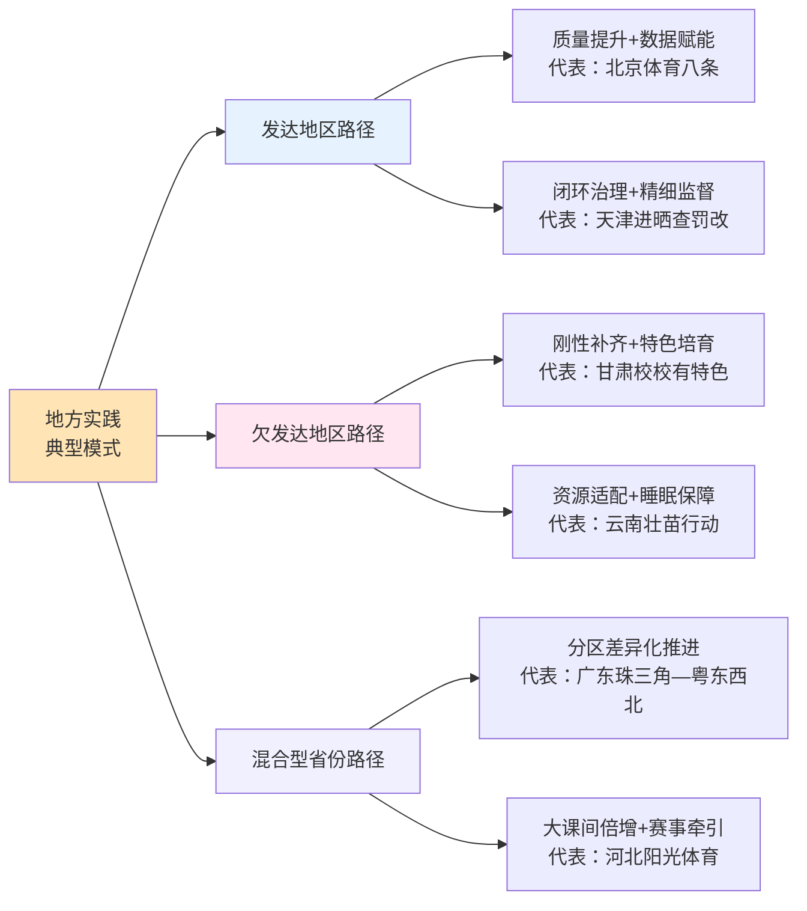

如图所示，**发达地区适用"质量提升+数据赋能"路径**——以北京"体育八条"为代表，重点投入课程质量改革、数据画像、班级赛体系，2025年北京中小学生体质健康优良率突破80%、抑郁焦虑检出率下降6.2%和3.4%的实证成效印证了这一路径的有效性[^85]。**欠发达地区适用"刚性补齐+特色培育"路径**——以甘肃"校校有特色、人人有技能"和云南"壮苗行动"为代表，先以班师比硬指标、寄宿制晨跑、民族课间操等工具补齐资源短板，再以特色项目培育实现兴趣激发[^99][^100][^97]。**混合型省份适用"分区差异化推进"路径**——以广东"珠三角—粤东西北"和河北"校县市省"四级赛事为代表，承认省内梯度差异，避免一刀切，分阶段、分区域推进[^96][^88][^98]。

需要坦诚说明的是，**七大模式横向比较的实证基础尚有局限**。一方面，2025年是"2小时"政策全面推开的元年，多地数据仍处于积累阶段，本章对实施成效的判断主要基于已公开的阶段性数据（如北京优良率突破80%、天津优良率提升6.83个百分点、青岛优良率连续两年居山东省首位等），全国系统性比较数据仍待积累。另一方面，各地数据口径、抽样设计、监测时点存在差异，跨模式实施成效的精确比较受到方法学限制——本章因此重点比较制度设计逻辑而非简单数据排名。这一方法学审慎是对第2章数据可比性约束的延续。

但即便存在上述局限，**七大典型模式的横向比较仍为后续章节政策保障机制设计提供了坚实的本土化实证参照**——第6章时间结构与教学质量将重点借鉴北京"能出汗的体育课"、广东"4+1课程编排"、平城区"40+30+30+15×3"等做法;第7章师资场地与数字赋能将重点借鉴甘肃"班师比标准+'6+3+1'贯通"、广东"金边银角"、北京"大数据画像"等做法;第8章评价监测与监督问责将重点借鉴天津"进晒查罚改"、甘肃"省市县三级抽测+校长考核"等做法;第9章家校社协同与文化培育将重点借鉴北京二实小平谷分校"亲子共跑"、云南"民族课间操"、河北"50多个社团"等做法。这些本土化经验将作为第6—9章具体保障路径的实证基础，使政策建议既具有理论严谨性又具有实践可操作性，确保整体研究最终能够形成"目标—措施—主体—资源—监督—评估"的完整闭环。

# 6 政策保障机制设计：时间结构与教学质量

第5章通过对北京、天津、广东、云南、河北、甘肃、平城区等七大典型模式的横向比较，已经将"2小时"政策落地的本土化经验图谱清晰呈现，提炼出课表刚性化、监督闭环化、课间时空扩容、"一校一品"特色化、家校社协同化、数字赋能精准化六类共性经验。然而**经验提炼仅是政策保障路径研究的起点，真正的挑战在于如何将散见于各地的实践智慧系统化、机制化、制度化为可被全国各级教育行政部门和学校直接借鉴的政策保障设计**。本章作为政策保障路径研究的首个专题章节，聚焦"2小时"落地最核心的两个支柱——**时间结构刚性化**与**教学质量精细化**。在前述章节的逻辑链条上，第3章已经论证"2小时综合活动+1小时MVPA"双重底线的科学合理性以及强度、项目、场景三维优化的最优结构;第4章已经诊断出制约政策落实的七大跨层耦合瓶颈;第5章已经梳理出地方实践的共性经验与差异化适配条件。本章的使命是将这三条逻辑链汇流为一套**"课时刚性+结构优化+质量提升+风险防控"四位一体的协同提升路径**——既守住时间底线、又夯实质量底线，既破解执行偏差、又化解防御性顾虑，最终为第7章师资场地保障、第8章评价监督、第9章家校社协同的延伸设计奠定坚实基础。

## 6.1 时间结构刚性化：课时入表与多模块叠加的制度锁定

时间是"2小时"政策的第一性问题——没有刚性的时间保障，所有质量提升、教学创新、文化培育都将沦为无本之木。第4章瓶颈1（"阴阳课表"与体育课挤占）的诊断揭示，**"22%的中小学生反映体育与健康课程开设时数不达标，体育课时被挤占问题突出"**这一现象的根源不在于政策文本不清晰，而在于制度刚性不足——课表是软的、监督是远的、处罚是轻的，使"应开课"与"实开课"之间始终存在博弈空间。本节基于地方典型样本的横向比较，提炼**时间结构刚性化的三层机制**——课表入表机制、双大课间倍增机制、15分钟课间法定化机制——并讨论防止隐性流失的制度刚性条款。

**第一层机制：体育课"刚性进课表"**。这是所有时间结构的基础。陕西省教育厅、陕西省体育局联合发布的"中小学体育工作'十个一'要求"中明确将"一节体育课：明确规定义务教育阶段每天一节体育课"列为十项核心要求之一[^104][^105];包头市昆区"义务教育阶段全面推行'每天1节体育课+2小时综合活动'，高中阶段严格执行每周不少于2节体育课的要求"[^106];成都市青羊区则形成"严格按照标准开齐开足体育课，义务教育阶段学校每天1节体育与健康课，高中阶段每周3节"的明确要求[^107]。这一"小学初中每天1节、高中每周3—5节（部分省市试点每天1节）"的标准已经成为全国共识，但其落地的关键不在标准本身，而在于"**编入课表+全部入表**"的制度刚性——天津"全市小学、初中每天开设1节体育课且全部编入课程计划，高中每周开设3—5节体育课且至少3节编入课程计划"的表述精准点出了刚性化的核心密码：**只有当所有体育课时都被强制编入官方课程计划，"应开未开"的灰色空间才能被根本压缩**。

**第二层机制：双大课间"倍增"机制**。这是2小时时间结构的中坚支柱。包头昆区推行"上下午各'30分钟大课间+15分钟微课间'的'301530'模式，通过'一校一案'精细化管理，确保每一位学生走出教室、沐浴阳光、挥洒汗水，让课程表真正变成学生的'流汗表'"[^106];文山市构建"45分钟体育课+30分钟大课间+15分钟小课间+寄宿制20分钟晨练"的固定节奏[^108];宜春市金湖学校构建了"大课间+体育课+课后延时服务"一体化锻炼模式，宜丰县新昌一小构建"1节体育课+上下午各30分钟大课间+15分钟小课间活动+30—60分钟课后服务"的立体时段体系[^109];成都市青羊区"已有40所学校推行课间15分钟，30余所学校实行上下午双大课间"[^107]。这些样本共同揭示，**单一大课间（30分钟）已经无法承担2小时时间结构的中坚责任，"上下午各30分钟"的双大课间倍增机制已经成为各地的主流选择**。其制度逻辑在于：双大课间使学生上下午都有一个集中的中等强度活动时段，既符合人体生理节律的"晨动—午动"自然节奏，也为多场景叠加提供了稳健的时间锚点。

**第三层机制：15分钟课间"微运动"法定化**。这是化解第4章"课间圈养"瓶颈的关键工具。陕西"十个一"明确"每天至少安排一个不少于30分钟的大课间"[^104]，包头"15分钟微课间"已经在内蒙古科技大学实验小学等学校落地——"下课!随着铃声响起，内蒙古科技大学实验小学的校园瞬间热闹起来，15分钟的微课间里，篮球场上传来投篮后的欢呼，操场边的打沙包、跳格子游戏玩得热火朝天"[^106];佛山三水区2025年春季学期以来"中小学课间时间延长至15分钟，各学校通过合理策划和编排'体育特色小课间'内容，将课间15分钟变成提升学生体质健康、培养运动习惯的有效实践"[^110]。15分钟课间制度的法定化具有双重意义——一方面将课间时长从过去的10分钟延长至15分钟，从制度层面拓展了"打破久坐"的时间空间;另一方面将课间从"安静等待"重塑为"微运动场域"，恢复了课间的运动属性。

为更直观呈现各地时间结构的精细化设计，下表对七大典型样本作横向比较：

| 地区/学校 | 体育课 | 大课间 | 小课间 | 课后/晨练 | 总时长 |
|-----------|--------|--------|--------|----------|--------|
| 包头昆区"301530" | 每天1节 | 上下午各30分钟 | 上下午各15分钟 | — | ≥2小时 |
| 平城区8校 | 40分钟 | 上下午各30分钟 | 15分钟×3次 | — | ≥120分钟 |
| 文山市第一中学 | 45分钟 | 30分钟 | 15分钟 | 寄宿20分钟晨练 | ≥110分钟 |
| 宜丰县新昌一小 | 1节 | 上下午各30分钟 | 15分钟 | 30—60分钟课后服务 | ≥150分钟 |
| 靖安县清华小学 | 1节 | 上午30分钟 | 15分钟×4次 | 晨60分钟+下午30分钟 | ≥160分钟 |
| 宜春金湖学校 | 1节 | 五位一体活动 | — | 课后延时多元项目 | ≥120分钟 |
| 重庆田家炳中学 | 开齐开足 | 规范大课间 | — | 3公里龙形跑+体能操 | ≥120分钟 |

如表所示，**各地时间结构虽然在具体时长配比上存在差异，但都遵循"体育课+大课间+小课间+课后/晨练"的多模块叠加逻辑，总时长均稳定在120分钟以上，部分寄宿制和九年一贯制学校甚至达到150—160分钟**。这一稳健的时长冗余为政策推进过程中的"质量空洞"和"凑数式达标"留出了缓冲空间——即便有部分模块在实际执行中存在折扣，多模块叠加仍能保障2小时底线不被突破。

**制度刚性化的三类配套条款**对于防止隐性流失同样关键。第一类是**严防"阴阳课表"条款**。文山市以"刚性举措重构课程安排，实现'每天一节体育课或体育活动课'全覆盖，严禁挤占挪用"[^108];这一"严禁挤占挪用"的明确禁令是对第4章瓶颈1的直接回应。第二类是**严禁拖堂挤占课间条款**。课间被挤占的根源往往不在课表层面，而在课堂层面——教师拖堂、提前到岗等行为蚕食了课间运动空间。第三类是**杜绝"课间圈养"条款**。三水区西南街道金本中学采用"周一、周三鼓励学生积极开展跳绳、踢毽子、下棋等基础项目;周二、周四开展'项目自选'……周五为田径项目和国标项目"，并"充分利用走廊、小空地、操场边缘等空间，划分不同项目区域"[^110]——这种"全员走出教室、不留学生在座位"的制度安排是从空间维度对"课间圈养"的物理化破解。

可以判断，**时间结构刚性化的核心是"三层机制+三类条款"的制度组合拳**——通过课表入表锁定体育课时间、通过双大课间倍增锁定中坚时段、通过15分钟课间法定化激活碎片时间，再通过严防"阴阳课表"、严禁拖堂挤占、杜绝课间圈养的禁止性条款堵住制度漏洞。这一组合拳的可复制性极高，对各类资源条件的省市都具有普适性意义，但其全面落地仍依赖第8章监督问责机制的硬约束支撑——本节因此构成第8章的政策起点，二者共同形成"课时入表—监督闭环"的协同链条。

## 6.2 多场景模块的功能定位与组合优化

时间结构的刚性化解决了"有没有"的问题，多场景模块的功能定位则要回答"怎么用"的问题——即在2小时综合活动时间中，体育课、大课间、课间微运动、课后服务、早午锻炼、家庭锻炼六大模块各自承担什么功能、如何分工协作、如何避免简单堆叠的"凑数式空洞"。第3章已经从场景结构理论上提出"体育课筑基—大课间普及—课间微运动激活—课后服务拓展—早操/家庭锻炼延伸"的五位一体设想，本节将基于地方实践经验进一步深化这一组合方案。

**模块一：体育课作为"筑基模块"**。体育课承担系统性技能学习与体能训练职能，是2小时时间结构中最具刚性、最可控、最具教学深度的模块。陕西"十个一"明确要求"合理安排课程教学内容，体现连续性、进阶性，增强体育课质效，让学生立足学校熟练掌握至少一项运动技能"[^105];这一表述精准点出了体育课"筑基"功能的两个核心特征——**连续性**（系统化学习而非碎片化体验）与**进阶性**（递进式技能掌握而非低级重复）。重庆市田家炳中学校的实践提供了具体范本——"严格落实国家课程标准，开齐开足体育课，规范大课间活动，确保学生每天校内体育活动不少于2小时，常态化开展3公里龙形跑、传统武术操、校本体能操等特色项目，持续增强学生体质"[^111]。

**模块二：大课间作为"普及模块"**。大课间承担全员普及、集体参与、增进同伴互动的职能，是2小时时间结构中覆盖面最广、参与度最高的模块。文山市的实践揭示了大课间创新的丰富可能——"文山市第三小学新增乒乓球桌，实行错峰训练，低年级练基础、高年级学技巧，搭配韵律操、广播操，让大课间成为活力加油站;文山实验小学教育集团将葫芦笙舞、舞龙舞狮等民族文化融入课间操，让传统体育焕发新生"[^108]。靖安一小"抓实课间体育活动，常态化开展15分钟微运动+30分钟大课间，优化微运动区域、分年级设计大课间内容，让全体学生课间动起来"[^109];宜春立德实验学校大课间设计为"上午30分钟大课间开展集体跑操、广播体操"[^109]——这些实践共同体现了大课间"集体跑操+广播操+特色项目"的复合内容结构。

**模块三：小课间微运动作为"激活模块"**。小课间承担打破久坐、激活神经、缓解疲劳的职能，是2小时时间结构中最碎片化但累积效应可观的模块。佛山三水区的"分级特色活动"提供了精细化设计的代表样本——河口小学"针对不同学段学生，设计差异化的课间活动内容:低年级以'趣味启蒙'为主……中年级聚焦'技能提升'，结合体育课程开展'足球射门比赛''篮球运球接力'等活动;高年级侧重'技术巩固与体能强化'，设计'运球接力赛''欢快跳绳游戏'及班级'体能PK赛'"[^110];南岸小学聚焦"资源优化配置"与"分级精准实施"，推出"1—2年级趣味足球、3—4年级技能篮球、5—6年级竞技跳绳+跨项选修"的课间分级特色活动[^110]。**这种"差异化分级+趣味性主导+小空间激活"的设计逻辑使15分钟课间不再是"凑时长"的鸡肋时段，而是嵌入运动习惯养成的高频微干预**。三水御江南小学更将小课间纳入校本课程体系——"遵循'基础型—进阶型—融合型'三级体育模块体系……将小课间活动纳入校本课程体系，每个项目均具备完整的教学目标、活动流程、评价量规与反馈机制，实现'课程化+游戏化'深度融合"[^110]。

**模块四：课后服务体育作为"拓展模块"**。课后服务承担兴趣分层、专项提升、社团培育的职能，是2小时时间结构中最具个性化空间的模块。成都市青羊区的实践展示了课后服务的多元可能——草堂小学西区分校"在3—6年级推行体育选课走班制，篮球、足球、排球、武术等课程由学生自主选择"[^107];泡桐树中学"基础体育课可以选择喜欢的老师，分类选项课更是花样百出——足球、篮球、羽毛球、乒乓球、游泳、排球，全凭兴趣'自主点单'"[^107]。文山市的课后服务则突出本土特色——"将传统体育与课后服务深度融合，开设打陀螺、踢蹴球等非遗课程，以及篮球、中华射艺等20余门特色课程，助力学生掌握1至2项运动技能"[^108]。宜春一中"创新推行'1+2'体育课程模式，即在保留每班1节传统体育课的基础上，每周新增2节体育选修课"[^109]。**课后服务的核心价值在于通过兴趣分层与项目自主选择，破解第4章瓶颈7（兴趣枯燥与个体负反馈）**——它使"2小时"不仅是一个时间数字，更是一个让每个孩子都能找到自己运动方向的成长平台。

**模块五：早操作为"延伸模块"——寄宿制学校的特殊价值**。早操对寄宿制学校具有不可替代的特殊价值——寄宿学生从早到晚的全时段在校生活为体育活动提供了天然的时间空间，而早操是这一空间的最佳激活点。文山市第一中学高二学生吴安婷的描述生动呈现了早操的育人效果——"晨光熹微，文山市第一中学的操场上……吴安婷正与同学们一起晨练。她舒展双臂，迎着微风奔跑。'以前总觉得运动是额外任务，现在每天的体育课、大课间和课后社团活动，让运动成了生活的一部分'"[^108]。靖安县清华小学的"晨间60分钟足球专项训练"将早操升级为高质量专项训练，"每日体育活动总时长达到160分钟以上"[^109]。宜春立德实验学校则将早操设计为"早晨15分钟激情跑操开启活力一天"[^109]。从组织模式看，早操制度需要"舍务教师和体育教师组织，以跑步为主，也可适时的开展丰富一些多彩的体育活动"，并通过晨练考勤"对寄宿学生早操出勤情况进行考勤……学生早操无故迟到、缺勤累计超过应晨练次数的1/10者，本学年《学生体质健康标准》测试成绩按不及格处理"[^112]——这种考勤挂钩体测的制度安排为早操的高质量落地提供了刚性约束。

**模块六：家庭/校外锻炼作为"协同模块"**。家庭锻炼承担习惯延伸、家校衔接的职能，是2小时时间结构中最依赖家校协同的模块。这一模块将在第9章详细展开，本节仅强调其在多场景组合中的延伸定位。

为综合呈现六大模块的功能定位与组合优化，下表对各模块作系统化梳理：

| 模块 | 时长占比 | 功能定位 | 强度定位 | 典型创新 |
|------|----------|----------|----------|----------|
| 体育课 | 约40分钟 | 筑基：系统教学+体能训练 | 中高强度（含≥10分钟体能） | 田家炳3公里龙形跑[^111] |
| 大课间 | 30—40分钟×1—2次 | 普及：集体活动+全员参与 | 中等强度 | 文山民族课间操[^108] |
| 课间微运动 | 15分钟×多次 | 激活：打破久坐+游戏化 | 低中强度 | 三水分级特色活动[^110] |
| 课后服务 | 30—60分钟 | 拓展：兴趣分层+技能提升 | 中等强度 | 青羊区选课走班[^107] |
| 早/午锻炼 | 10—20分钟 | 延伸：晨间唤醒+午间激活 | 中等强度 | 文山20分钟晨练[^108] |
| 家庭锻炼 | 周末/家庭作业 | 协同：习惯延伸+家校衔接 | 灵活 | 详见第9章 |

如表所示，**六大模块在时长、功能、强度三个维度形成精确的功能化分工，相互之间既不重叠又不留白**——体育课负责"系统+强度"，大课间负责"普及+集体"，课间负责"激活+碎片"，课后服务负责"个性+专项"，早操负责"寄宿延伸"，家庭锻炼负责"校外延伸"。**这一五位一体（含家庭锻炼为六位一体）的场景组合方案是避免"凑数式2小时"的最佳制度安排**——它使每一分钟的时间都有清晰的功能归属，每一个模块的活动都有明确的强度要求，从根本上杜绝了"将放松休息时间生硬计入运动时间"或"把少数人参与的活动算入全员2小时"等异化做法。

## 6.3 科学运动负荷设计与中高强度活动密度保障

时间结构的多模块叠加解决了"覆盖度"问题，科学运动负荷设计则要回答"含金量"问题——即如何在2小时综合活动时间中确保至少1小时的中高强度活动（MVPA），避免"时间够、强度低"的质量空洞。这一问题的紧迫性在第3章已经得到充分论证——**WHO标准下中国青少年MVPA达标率仅约15.7%，与"时间口径下全国部署推开"形成鲜明对照**。本节基于教育部新课标的核心指标和地方实践，系统讨论运动负荷的科学设计原则与落地路径。

**核心指标一：体育课心率每分钟140—160次**。教育部《义务教育体育与健康课程标准（2022年版）》对体育课的心率提出了明确量化要求——这一标准既是教学质量评估的核心指标，也是中高强度活动密度保障的科学锚点。包头昆区"科学设计运动负荷，确保班级学生平均心率达140—160次/分，让孩子们在运动中强体魄、养习惯"[^106]——这一表述精准对应了新课标的核心要求，也是各地落实MVPA强度底线的可量化抓手。从运动生理学角度看，140—160次/分的心率对应中等到高等强度的有氧运动区间，既能产生显著的心肺功能训练效应，又不会因强度过高造成运动伤害——这一区间因此成为"效益与风险平衡"的最优阈值。

**核心指标二：每节体育课不少于10分钟体能练习**。这一指标的政策意义在于**为体育课的强度密度建立"地板要求"——即便整节课强度难以全程保持高位，至少要有10分钟的高密度体能训练时段**。第3章已援引天津"每节体育课固定不少于10分钟体能训练，全市1424所小学开设专项体能训练课，1357所中小学开设体育活动'超市'"的实践;北京"体育八条"也明确"杜绝'说教课'和'不出汗'的体育课，每节体育课安排不少于10分钟体能练习，防止教学内容碎片化、随意性"。这一"10分钟体能"的硬约束直接对接了第4章瓶颈3（应试化训练）和瓶颈7（兴趣枯燥）——它将体育课从"放羊式形式主义"和"应试性单调训练"两个极端拉回到"科学负荷+多元发展"的中间地带。

**核心指标三：分学段强度分级——小学游戏化、初中多样化、高中专项化**。这是新课标对运动负荷设计的另一项重要指引。光明日报记者周世祥援引首都体育学院刘海元教授的分析——"小学要'游戏化'，初中要'多样化'，高中要'专项化'，即使对于同一运动大项，不同学段的训练方式、侧重也应不同，应当遵循从易到难、从简单到复杂原则，将复杂动作先拆分后组合，挑战度逐渐提高"[^113]。**这一分学段强度分级原则不是简单地"小学低强度、高中高强度"，而是基于运动学习规律的差异化负荷设计**——小学侧重通过游戏化情境激发兴趣并发展基础协调性、灵敏性;初中通过多样化项目奠定多元运动素质;高中通过专项化训练深化某一项运动的技能掌握和体能强化。深圳罗湖区高凯的判断也呼应了这一思路——"针对球类项目，先要练柔韧、灵敏，之后才能培养速度、耐力、空间感"[^113]。

**核心要素一：心率监测与练习密度控制**。心率监测是运动负荷科学化的技术抓手。大渡口区义务教育阶段体育与健康新卓越课堂优质课比赛中明确要求"运动负荷与练习密度均符合新课标标准，有效支撑技能学习"[^114]，这一表述揭示了**心率监测与练习密度控制是评价课堂质量的两个并列维度**——心率监测确保"强度够"，密度控制确保"练得多"。北京等地推广的AI体育屏、AI拍摄技术、可穿戴设备（如包头"AI体育检测"[^106]、内蒙古科技大学实验小学幼儿园"为幼儿配备定制AI手环，实时监测心率与活动量"[^107]）正是这一技术化趋势的体现，将在第7章数字赋能部分进一步展开。

**核心要素二：热身—主体—放松三段式课堂结构**。这是运动伤害防控与负荷优化的基础结构。三水区西南街道健力宝中学采用"三段式"时间结构——"将15分钟小课间划分为快速整队、核心运动、放松整理三个阶段，确保活动紧凑有序"[^110];大渡口区赛课明确要求"所有课堂均落实课前场地器材检查、学生安全排查，课中强调练习间距、规范运动行为，课后充分放松拉伸，组织严谨、调度科学，确保课堂活而不乱、安全高效"[^114]。**三段式结构的科学价值在于：热身阶段防止运动损伤、唤醒神经肌肉系统;主体阶段进入140—160次/分的中高强度区间；放松阶段降低心率、防止延迟性肌肉酸痛**——这一结构是任何高质量体育课堂都必须遵循的基本骨架。

**核心要素三：补偿性体能练习的针对性**。补偿性体能练习是体育课内嵌的"短时高密度"训练单元，通常约10分钟，"聚焦核心力量、灵敏、协调等素质"[^114]。其设计逻辑是**针对当节课主项目所未充分发展的体能维度进行靶向补偿**——例如以技能学习为主的篮球课，可在末段安排核心稳定性和下肢力量的补偿训练;以耐力跑为主的田径课，可补偿上肢力量和柔韧性。这种"主项+补偿"的双层结构使每节体育课都能实现多维体能均衡发展，避免单一项目导致的体能片面化。

**典型实践：上海西郊学校"进阶式体能大单元"的精准化设计**。上海市西郊学校体育教师黄山的实践提供了运动负荷科学化的标杆样本。**黄山团队首先通过FMS功能性动作筛查与AI拍摄/SPSS数据分析"发现学生普遍存在矢状面屈髋不足、冠状面平衡能力薄弱、水平面旋转稳定性不足等问题"，进而设计'基础平面巩固—复合平面强化—复合平面进阶迁移'的发展体系**[^115][^116]。这一实践有三层深刻意义：**第一，诊断先行**——运动负荷设计必须以学生身体状况的精准诊断为前提，避免"一刀切"的训练方案;**第二，进阶递进**——"基础—复合—进阶"三级递进体现了第3章因果机制对"剂量—效应"递增规律的尊重;**第三，因人而异**——黄山针对引体向上的"全员零突破"采用了"根据学生的身体成分进行分组。体重过大、体脂率过高的同学，优先安排有氧减脂课程;体型正常的同学，则将引体向上分解为'握杠稳定性—启动爆发力—全程控制力'三个维度，为每个维度设计多种针对性训练方法"[^115][^116]——**这种分层精准训练打破了传统体能课"强的吃不饱、弱的跟不上"的困境，是科学运动负荷设计的典范**。

**典型实践：游戏化情境激发高强度参与**。黄山设计的"勇士挑战赛"游戏化情境——"将体能训练转化为团队比赛——波比跳抛药球过杆、重物拉绳挑战、攀爬战绳引体、急速过箱……四个关卡环环相扣，学生们不仅要拼体能，还要在速度与稳定性之间寻求平衡，在团队中展现决策能力"[^115][^116]——揭示了**游戏化情境是高强度运动负荷的最佳载体**。学生在游戏氛围中自主选择高强度参与，比教师强制要求的"达到心率140—160次/分"更具持续性和愉悦感。重庆市大渡口区义务教育阶段体育与健康新卓越课堂赛课的实践也强调"创设沉浸式教学情境:'义渡小信使''捉妖记''螃蟹军团训练营''国球少年''羽毛球小先锋'等主题贯穿全课，技能学习融入闯关、探险、送信、争霸等趣味任务，充分激发学习内驱力，真正实现'玩中学、乐中练、赛中提升'"[^114]。这种**"高强度+游戏化+情境化"的三重融合**是中高强度活动密度落地的优雅解决方案。

可以判断，**科学运动负荷设计的核心是"双底线+三要素+精准化"的协同机制**——心率140—160次/分和每节10分钟体能构成双底线，三段式结构、心率密度监测、补偿性体能构成三要素，进阶式体能大单元和游戏化情境构成精准化路径。这一机制的全面落地一方面需要第7章师资能力（教师具备运动负荷设计能力）和数字赋能（AI拍摄、心率监测设备）的支撑，另一方面也需要第8章评价监督机制（如大渡口赛课制度）的牵引——本节因此成为连接时间结构与教学创新的科学枢纽。

## 6.4 教学方式创新：走班制、俱乐部制与选课走班

如果说时间结构和运动负荷解决了"教什么、教多久、教多强"的问题，那么教学方式则要回答"以什么方式教"的问题。**《教育部等五部门关于实施学生体质强健计划的意见》明确提出"积极探索走班制、俱乐部制等实施方式，让学生立足学校即可熟练掌握至少一项运动技能，养成体育锻炼习惯"[^117]**——走班制和俱乐部制因此成为"2小时"政策中教学方式创新的关键工具。本节基于地方典型案例的横向比较，提炼走班制/俱乐部制的核心要素，并论证其对破解第4章瓶颈3（应试化训练）和瓶颈7（兴趣枯燥）的关键作用。

**典型样本一：滁州市第二小学的体育课"走班制"改革**。滁州二小2023年开始试点、2024年3月正式在二三年级实施体育课"走班制"改革——其核心做法是"打破传统的班级授课制，让孩子们根据兴趣爱好选择自己喜欢的体育课，每周三次由专业老师带领上课"[^117]。该校通过深入调研学生兴趣与家长诉求，"综合考量场地适配性、技能实用性与终身性，确定花样跳绳、足球、篮球、羽毛球、趣味田径、轮滑、街舞、武术、八段锦、网球等11门课程";为打破班级壁垒，"学校重新规划课程时序，每周设置3节专项走班课，学生依兴趣自主选课，构建起'固定班+体育课程班'的创新教学模式"[^117]。**滁州二小的走班制创新有四层深意**：

第一，**阶梯式教学目标**——"低年级侧重兴趣启蒙与基础技能夯实，中高年级强化技能进阶与赛事参与，不同年级错峰开课，确保'教会、勤练、常赛'的教学闭环无缝衔接"[^117]，这一阶梯化设计与本节6.3节强度分级原则形成精准对接。第二，**小班化精准教学**——"三年级根据学生人数较多的实际情况，将10个自然班拆分为22个'体育课程班'，实行每个'体育课程班'25人至28人的小班化教学，让每个学生都能得指导"[^117]——小班化是走班制保证教学质量的关键。第三，**校内骨干+校外专业教练的双师模式**——"采取'校内骨干教师+校外专业教练'方式，特别是针对武术、网球、轮滑、八段锦等特色项目，引入校外专业教练，形成'校内教师上常规体育课程、校外专业教练上特色体育课程'的双师教学模式"[^117]——这一模式将在第7章师资多元补充中进一步分析。第四，**与2小时综合活动的协同**——"'体育课程班'跟原有的常规体育课相结合、互补，再加上大课间及课后服务，确保每个学生每天体育活动时间不低于两个小时，且做到基础运动与特长项目相得益彰"[^117]——走班制不是孤立创新，而是嵌入2小时多模块结构的有机组成部分。

**典型样本二：成都市青羊区的"兴趣超市"模式**。青羊区的探索展示了走班制的多种实现形态。草堂小学西区分校"在3—6年级推行体育选课走班制，篮球、足球、排球、武术等课程由学生自主选择"，"我的体育课我做主"成为该校特色标语，"每个孩子都在热爱的项目中掌握至少一项运动技能"[^107];泡桐树中学则把体育课变成了"兴趣超市"——"基础体育课可以选择喜欢的老师，分类选项课更是花样百出——足球、篮球、羽毛球、乒乓球、游泳、排球，全凭兴趣'自主点单'。有了热爱做向导，操场上全是主动挥洒汗水的身影"[^107]。**"自主点单"和"我的体育课我做主"的表述生动揭示了走班制的核心精神——将体育课的选择权从教师和学校主导转移到学生主导，从"要我学"转变为"我要学"**——这一转变是激发学生内在运动兴趣、形成终身锻炼习惯的关键密码。

**典型样本三：西安市莲湖第一中学的"3+1+1"体育课程模式**。莲湖一中副校长张红卫介绍——"学校推行'3+1+1'体育课程模式，实行年级走班制，学生可根据兴趣选择篮球、足球、排球、羽毛球等项目"[^118]。这一年级走班制的优势在于扩大了选择半径——单班走班受限于本班学生人数和兴趣分布，年级走班则将选择空间扩大至整个年级，使小众项目也能凑足开课人数。

**典型样本四：宜春一中的"1+2"选修与嘉定世外的"必修+社团拔尖"**。宜春一中"创新推行'1+2'体育课程模式，即在保留每班1节传统体育课的基础上，每周新增2节体育选修课。该模式构建了多元化的课程体系，旨在最大化激发学生的运动潜能，确保每位学生都能作为独一无二的个体得到充分发展，满足其多样化的成长需求"[^109];上海嘉定区世外学校"以足球、篮球、排球'三大球'为重点，大力发展田径、跳绳、武术等常规项目，同时结合校园实际，开展击剑、轮滑、霹雳舞等新兴项目……针对四、五年级学生，还开设游泳课程。目前嘉定世外已构建起覆盖全员、贯穿全年的体育项目矩阵，确保每一位学生在基础教育阶段至少掌握2项运动技能"[^119]。**"1+2"和"必修+社团"模式的共同逻辑是"基础课夯实共性+选修课/社团发展个性"的二元结构**——既保证体育与健康课程标准的共性要求，又给学生留出兴趣分层的选择空间，是中等规模学校最具可操作性的走班制变体。

**典型样本五：高安市第六小学的"一个年级一个球类"贯通设计**。高安六小创新实施"'一个年级一个球类'特色课程:一年级乒乓球、二年级乒乓球、三年级足球、四年级羽毛球、五年级篮球、六年级气排球，让每个孩子在六年小学生涯中系统接触并至少掌握两项球类运动"[^109]——这一"年级专项化"设计是走班制在小学阶段的另一种创新形态，它通过年级集中而非个体选择实现项目深度学习，特别适合场地师资有限但希望系统培养运动技能的学校。

为综合呈现走班制/俱乐部制的核心要素，下表对五大典型样本作横向比较：

| 样本 | 走班形式 | 课程数量 | 师资模式 | 实施成效 |
|------|----------|----------|----------|----------|
| 滁州二小 | 体育课走班+小班化 | 11门特色课程 | 校内骨干+校外教练 | 体质合格率提升15%，95%学生掌握所选专项[^117] |
| 青羊区草堂小学 | 3—6年级选课走班 | 篮足排武等多项 | 校内+足球特色平台引入专业力量 | "我的体育课我做主"全员参与[^107] |
| 西安莲湖一中 | 年级走班"3+1+1" | 篮足排羽 | 校内为主 | 班超联赛全员参赛[^118] |
| 宜春一中 | 1节必修+2节选修 | 多元选修 | 校内为主 | 多元发展[^109] |
| 嘉定世外 | 必修普及+社团拔尖 | 三大球+新兴项目 | 校内+校外资源 | 至少掌握2项技能[^119] |

如表所示，**走班制/俱乐部制的可行实现形态多种多样——可以是体育课走班、年级走班、必修+选修、必修+社团等多种变体，关键不在于具体形式，而在于是否真正赋予学生项目选择权、是否提供小班化精准教学、是否构建阶梯式技能进阶路径**。这一灵活性使走班制对各类规模、各类资源条件的学校都具有可操作性。

**走班制/俱乐部制对破解核心瓶颈的政策价值**主要体现在三个方面：第一，**破解兴趣枯燥**（瓶颈7）——通过让学生自主选择喜欢的项目，从根本上扭转"课程内容太单一……没意思"的负反馈循环;第二，**破解应试化训练**（瓶颈3）——走班制以兴趣为本位，使中考体育项目不再独占体育课时空间，多元项目共同发展使学生从"为考而练"回归"为乐而动";第三，**破解师资紧平衡**（瓶颈2）——通过校内骨干+校外专业教练的双师模式，将师资压力分散到校外资源，缓解学校师资紧张。滁州二小的实证数据有力佐证了走班制的政策有效性——"体育课'走班制'改革以来，滁州二小学生体质健康合格率较改革前提升15%，优良率提升9%;实施体育走班课的二、三年级，95%以上的学生已逐步掌握所选专项技能，学校代表队多次在市、区级体育竞赛中获得佳绩"[^117]——这一15%和9%的双提升正是走班制激活学生内在动力的实证印证。

可以判断，**走班制/俱乐部制是2小时政策落地中最具教学创新含量的工具**——它不仅是教学方式的微调，而是从根本上重塑了体育课的组织逻辑、师生关系和育人导向。其全面推开需要第7章师资场地保障的协同支撑（如校外教练引入机制、场地分时段灵活使用），也需要第9章家校社协同的舆论引导（家长理解走班制对孩子兴趣发展的长远价值），但只要落地得当，其对兴趣激发、技能掌握、习惯养成的乘数效应都将显著高于传统班级授课制。

## 6.5 大中小学一体化课程体系构建

教学方式创新解决了"以何种方式教"的问题，但还有一个更深层的问题尚未回答——**不同学段之间的体育课程如何衔接、目标如何统一、内容如何递进？**第4章曾援引深圳罗湖区高凯教育局体育专干的观察——"初中组的立定跳远数据对比其他项目，是个'波谷'，优良率明显偏低……根源在于'小学只管小学，初中只管初中'……男生引体向上项目也面临类似问题，'学生此前没接触过，一上来就要拉个十几二十次，怎能"拉得好"？'"[^113]。陕西渭南韩城三小的体育教师在与初中教师联合教研时也收到了"部分学生小学基础薄弱"的反馈——"跳绳连贯性不足、立定跳远动作不规范、实心球发力无基础，这些需从零开始教，会影响中考备考进度"[^113]。**这种"波谷""断层"问题的根源在于学段间体育课程的"各管一段"，破解的关键在于构建大中小学一体化课程体系**。本节基于《意见》"一体化推进体育教学改革"的关键要求，结合王皋华课程一体化理论框架与各地实践，系统讨论一体化课程的三大支柱。

**第一支柱：学段打通——小学游戏化、初中多样化、高中专项化**。这是一体化课程的首要原则。中国教育科学研究院体育美育教育研究所所长于素梅在解读《意见》时明确指出——**"《意见》中首次提出体育教学学段一体统筹，正是对如上困境的回应。'长期以来，校园体育课存在"各管一段"、相互脱节、内容交叉重复等问题，《意见》提出构建学段衔接、目标一致、支撑有力的体育与健康课程实施机制，目的正在于推动传统的"碎片化教学"向"系统性育人"转变，实现从内驱力激发到体质增强再到人格塑造的进阶'"[^113]。具体到学段划分，刘海元教授的判断为操作化提供了清晰路径——"'从各学段总的分工侧重而言，小学要"游戏化"，初中要"多样化"，高中要"专项化"，即使对于同一运动大项，不同学段的训练方式、侧重也应不同，应当遵循从易到难、从简单到复杂原则，将复杂动作先拆分后组合，挑战度逐渐提高'……'以跳跃为例，小学低年级往往从练单腿跳、双腿跳格子开始，正是'"[^113]。

**第二支柱：目标统一——享受乐趣、增强体质、健全人格、锤炼意志**。这是一体化课程的价值锚点。新课标确立了体育与健康课程"通过形式多样的体育运动激发学生参与热情，培养坚忍品格"的整体价值导向，这一导向贯穿小学、初中、高中三个学段而不变。于素梅进一步分析——"《意见》中的这一要求包含三个方面:一是'学段打通'……二是'目标统一'，通过形式多样的体育运动激发学生参与热情，培养坚忍品格;三是'支撑有力'，针对不同学段特点制定差异化教学规范，形成循序渐进的能力培养路径，促进体质健康持续改善和体育素养系统提升"[^113]。**"享受乐趣、增强体质、健全人格、锤炼意志"四位一体的育人目标是大中小学一体化课程的精神主线**——它使各学段虽然在内容深度上有所差异，但在育人方向上保持高度一致，避免"小学是为了体测、初中是为了中考、高中是为了应付"的功利化分裂。

**第三支柱：支撑有力——差异化教学规范+连续进阶路径**。这是一体化课程的方法保障。王皋华《大中小学体育课程内容一体化构建》专著系统提出了"**认识身体、使用身体、发展身体、保护身体、技能学习、行为养成、文化传承七个维度构建跨学段课程框架**"，并指出"一体化体育课程内容体系的结构具有显著的纵向复合性。课程内容体系所涉及的7个方面都需要随着学生年龄的增长或学段的递增而相应地增加教学内容的广度和深度，不断提高课程内容在认知方面、身体基本活动能力方面、使用身体基本能力方面、身体运动素质和身体健康素质的发展与增进方面、维护身体和健康技能和方法的方面、强身健体手段和技能学习的方面、社会行为规范和健康生活习惯和生活方式的养成方面、体育文化的认知、理解与掌握方面循序渐进地学习和提高"[^120]。**这一七维度递进框架为一体化课程的内容设计提供了系统化理论支撑——它使课程不再仅仅围绕"运动技能"单一维度展开，而是在身体认知、技能掌握、文化传承等多维度同步递进**。

**关键操作：大单元教学（最低18学时）**。大单元教学是新课标确立的一体化课程的核心操作工具。教育部《义务教育体育与健康课程标准（2022年版）》研制组组长季浏明确指出——"新课标倡导大单元教学，强调对一个项目的完整学习和体验。**一个大单元最低由18学时组成**，比如一段时间连续学篮球，让学生对篮球有完整体验和基本掌握，不再像过去一节课就教一个项目的一个技术，甚至这节教篮球，下节教武术，再下节教田径"[^121][^122]。**大单元教学的革命性价值在于打破"碎片化教学"——过去"立定跳远从小学跳到大学""队列走了一遍又一遍""往返跑是'老套路'"的低级重复将被学段贯通的大单元设计取代，使学生在一个学段内对至少一两项运动形成完整体验和系统掌握**。季浏以教篮球为例——"过去一节体育课可能只教双手胸前传球，而现在一堂课不能只教单个技术，而要教组合技术，如传球、运球、跑篮"，"新课标强调知识与知识间、技术与技术间的关联性，体育课要教组合技术、有对抗练习和完整技术展示，让孩子能上场比赛"[^121][^122]。

**关键理念：季浏团队"中国健康体育课程模式"**。这是一体化课程的理论旗帜。季浏在《中国健康体育课程模式的思考与构建》中明确指出，健康体育课程模式的目的就是"通过体育与健康课程的教学努力解决学生身心健康的问题"——"尽体育与健康课程所能，努力解决我国青少年体质健康水平近30年来持续下降的问题"，并"解决青少年学生在体育活动和学习生活中表现出来的意志薄弱、活力不够、缺少交往、性格孤僻、焦虑抑郁等不良心理倾向"[^123]。该模式的核心理念之一是"培养学生的健康意识和行为，促进学生全面发展"——这一理念将体育课程的目标从"运动技能掌握"扩展到"全面健康发展"，与本研究"健康第一""立德树人"的总政策语境形成精准呼应。

**关键模型：高质量体育课堂教学模型**。季浏团队进一步将健康体育课程模式具体化为可操作的高质量体育课堂教学模型。"将课程标准的精神和要求落地、落实，需要构建基于课程标准的高质量体育课堂教学模型……这有助于体育教师理解什么是课程标准下的体育课，并按照模型实施每节体育课堂教学，从而保证高质量体育课堂教学，使广大学生从中更多受益、更好发展。**模型是在长期研究和实践，特别是在教育部课程教材研究所有组织的在全国若干实验区开展近3年课程标准实验研究的基础上构建的**"[^124]。该模型"以问题为导向，以中国健康体育课程模式为基础，以课程标准的精神和要求为指引"，"通过长期、大量的实验实践表明，模型具有显著的积极效果，并且可操作、可复制和可推广"[^124]。**这一从理论到模型的递进为大中小学一体化课程的全国推广提供了科学化的方法学支撑**——它使各地各校在落实新课标时不再"摸着石头过河"，而是有清晰的操作模型可循。

**典型实践：陕西"十个一"中的"一技之长"贯通要求**。陕西"十个一"明确要求"一技之长:合理安排课程教学内容，体现连续性、进阶性，增强体育课质效，让学生立足学校熟练掌握至少一项运动技能"[^105]——这一"连续性、进阶性"的明确表述与一体化课程的核心精神完全一致。**陕西从省级文件层面将"一体化"理念具体化为"一技之长"的教学要求，是地方政策对国家一体化理念的精准转化**。

**典型实践：联合教研机制的初步探索**。陕西渭南韩城三小的"小学体育教师在和当地初中教师进行联合教研"[^113]、大渡口区育才小学教共体"以赛促研、以课育人，全面展现教共体体育教学改革成果"[^114]、大渡口育才教共体的"以赛促研、以课育人……搭建教师成长阶梯……构建紧密型教研共同体"[^114]——这些实践揭示了**学段衔接的关键操作单元是教研共同体**——只有当小学、初中、高中体育教师在同一教研平台上交流，才能从一线层面真正打通学段隔阂，使每位教师都了解学生在自己学段之前学过什么、在之后将要学什么，从而设计真正衔接的教学内容。

可以判断，**大中小学一体化课程体系构建是2小时政策落地中最具系统性、最具长远性的制度设计**——它解决的不是某一个学段的问题，而是整个学校体育"碎片化"积弊的根本性矫正。这一构建不可能一蹴而就，需要在课程标准、大单元教学、健康体育课程模式、高质量教学模型、联合教研共同体等多层制度设计的协同推进中逐步实现。本节因此既是教学质量保障的深层基石，也是从"2小时时间堆叠"迈向"系统性育人"的关键跃迁。

## 6.6 高质量课堂教学模型与"教会勤练常赛"闭环

一体化课程体系解决了"学段如何衔接"的宏观问题，高质量课堂教学模型则要回答"每节课如何上好"的微观问题——即如何让每节体育课都成为"能出汗、有干货"的高质量育人载体。这一问题的紧迫性在第2章"凑数式2小时"反思中已经突出——"机械拼凑的120分钟若缺失'强度适宜的心肺锻炼、针对性肌力训练与协调性开发'，其效果必然大打折扣"。本节基于季浏团队高质量体育课堂教学模型、新课标核心素养导向、地方赛课实践，系统构建"教会—勤练—常赛"一体化教学闭环。

**核心素养导向：运动能力+健康行为+体育品德**。这是新课标确立的高质量课堂的核心目标。季浏明确指出——"与旧版相比，新课标将以培养学生'核心素养'为导向。新课标这样定义'核心素养'——学生通过体育与健康课程学习而逐步形成的正确价值观、必备品格和关键能力，包括运动能力、健康行为和体育品德等"[^121][^122]。**核心素养三维目标的整合性意义在于它将体育课从"学技能"提升到"育全人"——运动能力解决"会不会"的问题，健康行为解决"做不做"的问题，体育品德解决"成何人"的问题，三者共同构成体育课育人价值的完整图景**。大渡口区2026年义务教育阶段体育与健康新卓越课堂优质课比赛的评价标准也明确要求"将文明素养、规则意识、拼搏精神与团队协作自然渗透，实现运动能力、健康行为、体育品德三维目标协同达成"[^114]。

**模型支柱一：教会——结构化运动技能与组合技术**。新课标对"教会"的定义远高于过去的"会一个动作"。季浏明确指出——"整个教学设计、教学实施都将围绕核心素养，在教学内容上，将摒弃过去单一技术和单一知识点的碎片化教学，提倡结构化的运动知识和技能教学"[^121][^122]。具体到教学层面，"过去一节体育课可能只教双手胸前传球，而现在一堂课不能只教单个技术，而要教组合技术，如传球、运球、跑篮。'新课标强调知识与知识间、技术与技术间的关联性，体育课要教组合技术、有对抗练习和完整技术展示，让孩子能上场比赛'"[^121][^122]。**结构化运动技能的革命性意义在于将"学会一个孤立技术"升级为"学会上场比赛"——它使学生从体育课走出去后能够真正运用所学技能进行运动，而不是"会做单一动作但打不了完整比赛"**。

**模型支柱二：勤练——大量练习与体能补偿**。"勤练"的核心是练习量的保障。新课标和高质量教学模型都强调每节课要有足够的练习密度，确保学生在课堂内积累有效练习。本节6.3节已述"每节课不少于10分钟体能练习"的硬约束、大渡口赛课"补偿性体能练习科学适度（约10分钟），聚焦核心力量、灵敏、协调等素质，运动负荷与练习密度均符合新课标标准，有效支撑技能学习"[^114]——这些都是勤练的具体落地。**勤练的关键不在于"练得苦"而在于"练得对"——通过结构化练习、组合技术练习、对抗性练习的循环递进，使学生在练习中真正掌握技能并形成体能储备**。

**模型支柱三：常赛——对抗练习与完整技能展示**。"常赛"是高质量课堂的检验环节。新课标"强调在体育教学中创造复杂的运动情境"——让学生在比赛情境中应用所学技能。大渡口赛课明确"所有课例严格落实'教会、勤练、常赛'要求，形成'技能学习—组合练习—游戏应用—竞赛巩固'的清晰进阶路径。从徒手模仿、分解练习到组合运用、实战对抗，层层递进、重点突出"[^114]。**"技能学习—组合练习—游戏应用—竞赛巩固"四阶进阶路径将"教会—勤练—常赛"三大支柱在课堂层面落地为可操作的教学步骤——这是高质量课堂教学模型最具实践价值的制度结晶**。

**关键创新一：情境化教学——主题贯穿全课**。情境化教学是激发学生内驱力的重要工具。大渡口赛课呈现的"教师们立足学生年龄特点，创设沉浸式教学情境:'义渡小信使''捉妖记''螃蟹军团训练营''国球少年''羽毛球小先锋'等主题贯穿全课，技能学习融入闯关、探险、送信、争霸等趣味任务，充分激发学习内驱力"[^114]——这种主题贯穿全课的情境化设计使原本枯燥的技能练习变成了趣味盎然的"游戏化挑战"，从根本上扭转了第4章瓶颈7（兴趣枯燥）的负面循环。

**关键创新二：过程性评价——教师点评+学生互评+小组展示**。过程性评价是高质量课堂的质量监督机制。大渡口赛课要求"过程评价贯穿始终，通过教师点评、学生互评、小组展示等方式，引导学生规范动作、遵守规则、学会合作"[^114]。**过程性评价的多元主体（教师+学生+小组）打破了过去"教师独家评价"的单一模式，使学生成为评价的参与者而非被动接受者，这一转变本身就是体育品德培养的过程**——学生在互评中学会尊重他人、客观判断、规范表达，这些素养将远超运动技能的学习时效。

**关键创新三："灵·动·创·融"渝派教学主张**。重庆市大渡口区义务教育阶段体育与健康新卓越课堂优质课比赛聚焦"'灵·动·创·融'渝派体育教学主张，打造体育新卓越课堂"[^114]。这一"灵动创融"四字诀的内涵可初步解读为——"灵"指教学组织的灵活性（不拘泥于一种模式）、"动"指学生参与的主动性（充分调动学生）、"创"指教学方法的创新性（情境化、游戏化）、"融"指内容目标的融合性（核心素养三维协同）。**这种地方化教学主张是对国家级新课标和高质量教学模型的本土化创新**，反映了基层教研力量在课堂质量提升中的活跃创造。

**关键支撑：教研共同体的协同力量**。高质量课堂的形成不能依靠教师个体的孤立努力，而需要教研共同体的协同支撑。大渡口育才教共体的赛课实践揭示了教研共同体的四重价值——"一是打造新卓越课堂样本，集中体现'灵·动·创·融'教学主张，形成一批可复制、可推广的优质课例;二是搭建教师成长阶梯，参赛教师在备课、磨课、上课、评课中精进专业，青年教师快速提升，骨干教师示范引领;三是构建紧密型教研共同体，校际资源共享、优势互补、互助共进，推动教共体体育教学整体提质;四是坚守育人初心，课堂有汗水、有乐趣、有规则、有温度，充分彰显'健康赋能，以体育人'的教育追求"[^114]。**教研共同体使高质量课堂从单点示范扩散为体系化提升——这是2小时政策从"政策推开"迈向"质量普及"的关键支撑**。

可以判断，**高质量课堂教学模型与"教会—勤练—常赛"闭环是从"凑数式2小时"迈向"高质量2小时"的微观技术路径**——它通过核心素养三维目标的整合、结构化运动技能的提升、情境化教学的兴趣激发、过程性评价的多元参与、教研共同体的协同推动，使每一节体育课都能成为学生身心健康发展的高质量载体。这一模型的全面推广需要第7章师资队伍建设的根本支撑（教师必须具备实施高质量课堂的专业能力）、第8章评价监督的制度保障（如赛课制度、督导评价标准）、第9章家校社协同的舆论支持，但只要落地得当，其对2小时质量底线的提升效应将是革命性的。

## 6.7 安全风险防控与"尽职免责"制度配套

时间结构、运动负荷、教学方式、课程体系、课堂模型五个维度的精细化设计共同构筑了"2小时"政策落地的质量基石，但这一基石若不能与安全风险防控形成有机配套，就可能在"防御性教学"的逆流中被逐步侵蚀。**第4章瓶颈4（防御性教学）的诊断揭示，"与2023年相比学生体育运动伤害事故增加了50%以上，校方责任险中体育运动伤害赔偿的比例不断增加，接近60%"——这一数据成为压在每位体育教师和学校管理层心头的"达摩克利斯之剑"，使本节前述所有质量提升设计都面临"不敢真练、不敢真上"的根本性约束**。本节聚焦安全风险防控的三重制度设计——事前预防、事中保障、事后处置——论证只有破解"不敢让孩子动"的安全顾虑，时间结构的刚性化和教学质量的精细化才能真正落地为高强度、有效益的运动。

**第一重设计：事前预防——课前检查与安全排查的常态化**。事前预防是安全风险防控的第一道防线。大渡口赛课明确要求"所有课堂均落实**课前场地器材检查、学生安全排查**，课中强调练习间距、规范运动行为，课后充分放松拉伸，组织严谨、调度科学，确保课堂活而不乱、安全高效"[^114]——这一"课前检查—课中规范—课后放松"的三段式安全管理是事前预防的标准操作。具体到内容层面，课前场地器材检查包括跑道平整度、器材完整性、运动器械稳固性等的逐项核查;学生安全排查包括学生当天身体状况、特异体质学生标识、运动鞋鞋带等细节确认;课中规范包括练习间距控制、动作规范要求、运动负荷动态监控;课后放松包括充分拉伸、降低心率、防止延迟性肌肉酸痛。**事前预防虽然不是技术创新，但其作为"基础性安全网"的常态化执行是任何高质量体育课堂的最低要求**。

**第二重设计：事中保障——三段式结构与专业监护**。事中保障是运动伤害防控的核心环节。本节6.3节已述上海西郊学校黄山的实践——"黄老师从不急于推进进度，而是注重基础打磨。热身环节他会逐一强调每个动作的细节，通过**筋膜放松、动态拉伸、核心激活和神经激活**等多种方式，帮我们最大限度避免运动损伤"[^115][^116]。**这种"逐一强调动作细节+多元化热身方式"的专业化监护是事中保障的最佳实践**——它将运动损伤防控从"一刀切的口头提醒"升级为"基于运动生理学的专业流程"。从设备层面，AI拍摄、心率监测、可穿戴设备的引入也为事中保障提供了科技支撑——黄山借助"AI拍摄技术和SPSS数据分析"发现学生的潜在运动风险并设计针对性训练[^115][^116]，是科技赋能事中保障的代表样本。

**第三重设计：事后处置——保险机制与"尽职免责"法律边界**。事后处置是防御性教学得以根本破解的关键。第4章已经援引数据揭示了校方责任险赔偿比例的快速攀升——"接近60%"，这一数据反映出当前学校在面对运动伤害时所承受的巨大经济和声誉压力。要从根本上扭转这一困境，需要**保险机制完善+法律边界明晰+校闹治理**三管齐下：一是学生意外伤害保险全覆盖，使运动伤害的经济风险由保险机制承担而非学校单一兜底;二是校方责任险机制完善，明确学校履行教育、管理职责后的免责边界;三是"谁受伤谁有理"旧观念的根本扭转——这需要法律、舆论、教育多管齐下的长期文化重塑。

**关键制度：湖南2026年立法草案的"尽职免责"条款**。在第4章中已经提到，"湖南省2026年审议的《湖南省促进中小学生体育锻炼若干规定（草案）》明确写入'学生在学校参加体育活动受到人身损害，学校尽到教育、管理职责的，可以免责'"——这一立法尝试是从地方法规层面对"尽职免责"原则的制度化锁定。**地方立法的特殊价值在于将散见于司法判例中的"尽职免责"边界明确化为具有法律效力的制度规定**，使学校管理层和教师在落实"2小时"政策时不再因"怕担责"而采取防御性退缩，而是有清晰的法律保护可依。从政策建议层面看，未来其他省市在制定地方实施细则时，应当考虑参考湖南做法将"尽职免责"原则纳入地方立法或行政规章，从根本上为"2小时"政策的高质量落地提供法律护航。

**关键支撑：朱鹏校长"不能因噎废食"的教育态度**。北师大天津静海实验学校朱鹏校长在第2章已被援引——"学生运动时间增加，受伤风险也随之提高。但我们不能一味呵护，更不能因噎废食"。这一态度反映了学校管理层在安全顾虑与运动效益之间寻求平衡的理性判断。**安全顾虑的破解最终不是把所有风险归零，而是把可控风险降到最低、把不可控风险通过保险和法律机制分散——这一辩证思维是学校管理层落实"2小时"政策时必须具备的基本素养**。

可以判断，**安全风险防控与"尽职免责"制度配套是2小时政策落地中最容易被忽视但最具决定性意义的支撑机制**——没有它，时间结构的刚性化和教学质量的精细化都将在防御性教学的逆流中被逐步消解;有了它，学校管理层和教师才能真正放下顾虑，让学生在运动中体验汗水、挑战、成长。本节因此既是本章前六节的安全护栏，也是第7章师资场地保障和第8章评价监督的必要前提——只有当"尽职免责"原则被广泛确立，师资才会有积极性投入高质量教学，监督才会有底气推动严格的体能负荷要求。

## 6.8 时间结构与教学质量的协同提升路径

本章前七节从时间结构刚性化、多场景模块组合、运动负荷科学化、教学方式创新、一体化课程体系、高质量课堂模型、安全风险防控七个维度系统构建了"2小时"政策保障机制的核心设计。本节作为本章总结，将这七个维度整合为**"课时刚性+结构优化+质量提升+风险防控"四位一体的协同提升路径**，并提出可被各级教育行政部门和学校直接借鉴的政策建议清单。

**协同路径的整体架构**可由下图刻画：

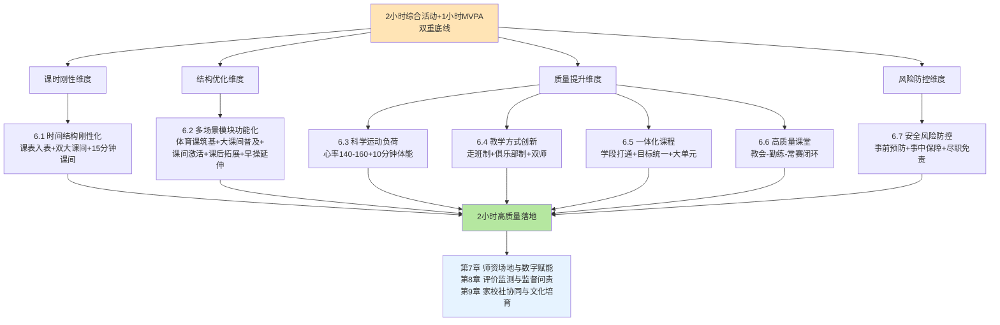

如图所示，**时间结构与教学质量的协同提升路径不是各维度的简单并列，而是以"2小时综合活动+1小时MVPA"双重底线为顶层目标、以课时刚性为基础、以结构优化为骨架、以质量提升为内核、以风险防控为护栏的有机整合**——四个维度相互支撑、缺一不可。

**协同提升路径对核心瓶颈的政策对接**可作如下系统化总结：

| 第4章核心瓶颈 | 本章对接维度 | 关键举措 |
|--------------|------------|---------|
| 瓶颈1：阴阳课表与体育课挤占 | 课时刚性 | 6.1节课表入表+晒课表+严禁挤占禁令 |
| 瓶颈3：应试化训练与"为考而练" | 质量提升 | 6.4节走班制兴趣本位+6.5节多元一体化课程 |
| 瓶颈4：安全过度防御与防御性教学 | 风险防控 | 6.7节事前预防+事中保障+尽职免责入法 |
| 瓶颈5：作业挤压与睡眠运动双不足 | 结构优化+课时刚性 | 6.1节课时入表保障+6.2节多模块叠加 |
| 瓶颈7：兴趣枯燥与个体负反馈 | 质量提升 | 6.4节走班制+6.6节情境化教学+大课间特色化 |

**可操作的政策建议清单**：

**第一类：硬性时间约束**——（1）小学初中每天1节体育课、高中每周3—5节（试点每天1节）全部编入课程计划，杜绝"阴阳课表";（2）每学期初公开晒课表，全面接受社会监督;（3）严禁拖堂、严禁以任何形式挤占体育课;（4）杜绝"课间圈养"，确保学生课间走出教室。

**第二类：多模块叠加机制**——（5）落实"上下午各30分钟大课间"的双大课间倍增制度;（6）将课间时长从10分钟延长至15分钟，并将其建设为"微运动"场域;（7）课后服务体育内容多元化，确保30—60分钟有效活动时间;（8）寄宿制学校落实早操制度（晨跑/晨练不少于20分钟）。

**第三类：负荷强度标准**——（9）严格执行新课标"体育课心率140—160次/分"的核心指标;（10）每节体育课不少于10分钟体能训练;（11）按学段分级运动负荷（小学游戏化、初中多样化、高中专项化）;（12）落实"热身—主体—放松"三段式课堂结构。

**第四类：教学方式创新**——（13）积极推进走班制/俱乐部制改革，鼓励"必修+选修"或"必修+社团"的灵活实施形态;（14）建立"校内骨干+校外专业教练"的双师模式;（15）每所学校至少推进"一校一品"特色项目;（16）推进小班化精准教学（建议体育课程班25—28人）。

**第五类：一体化课程衔接**——（17）按新课标推进大单元教学（最低18学时）;（18）建立学段贯通的联合教研机制;（19）确保学生立足学校熟练掌握至少一项运动技能;（20）将"享受乐趣、增强体质、健全人格、锤炼意志"四位一体育人目标贯穿大中小学。

**第六类：安全制度配套**——（21）将"尽职免责"原则纳入地方立法或行政规章;（22）完善学生意外伤害保险全覆盖与校方责任险机制;（23）落实课前场地器材检查、学生安全排查的常态化;（24）严肃治理"校闹"行为，扭转"谁受伤谁有理"的旧观念。

**协同提升路径的可复制性与差异化适配**。这24项政策建议的可复制性整体较高，但需要根据各地资源禀赋差异化适配——发达地区可重点推进高质量课堂、走班制、AI赋能等高内涵建设;欠发达地区可优先落实课时刚性、多模块叠加、安全制度配套等基础性建设;混合型省份可参考广东"分区差异化推进"路径，珠三角与粤东西北分阶段实施。

**协同路径与后续章节的衔接关系**。本章构建的协同路径为后续三章奠定了清晰基础——第7章师资场地与数字赋能将回答"谁来教、在哪教、怎么测"的问题，是本章质量提升路径的资源支撑;第8章评价监测与监督问责将回答"如何确保政策不走样"的问题，是本章课时刚性路径的制度护航;第9章家校社协同与文化培育将回答"如何延伸到校外"的问题，是本章多场景叠加路径的社会延伸。**只有时间结构、教学质量、师资场地、评价监督、家校社协同五大支柱协同发力，"2小时"政策才能真正实现从"全国部署推开"到"全面高质量落地"的关键跃升**——这正是第7—10章接续展开的政策保障路径研究的整体使命。

需要坦诚说明的是，本章构建的协同提升路径在落地中仍将面临三类挑战：第一，**资源约束的现实张力**——走班制需要更多教师和场地，AI赋能需要财政投入，对欠发达地区是显著负担;第二，**教师能力的转型要求**——结构化运动技能、情境化教学、走班制管理对体育教师专业能力提出更高要求，短期内难以全员到位;第三，**评价惯性的隐性反弹**——只要中考体育、高考综合素质评价等高利害评价机制不深化改革，"为考而练"的应试化倾向就可能反复回潮。这些挑战将在第10章风险防范部分作专门讨论，本章的协同路径设计已经为这些挑战的化解预留了制度接口和延伸空间。

# 7 政策保障机制设计：师资、场地与数字赋能

第6章已经从时间结构刚性化、多场景模块组合、运动负荷科学化、教学方式创新、一体化课程体系、高质量课堂模型、安全风险防控七个维度系统构建了"2小时"政策落地的核心教学机制——它回答了"课时怎么排、课怎么上、课如何保安全"的问题。然而仅有时间安排和教学设计还不足以支撑"2小时"的全面高质量落地，更深层的政策追问随之浮现：走班制需要更多教师如何配齐？高质量课堂需要的多元项目谁来教？双大课间倍增需要的运动空间从何而来？1小时MVPA的强度密度如何被精准监测？"一生一案"的体质干预如何技术性落地？这些问题指向的都是"2小时"政策的资源型要素——**师资队伍、场地设施、数字技术**。第4章瓶颈2（师资紧平衡与城乡结构性短缺）和瓶颈6（公共资源短缺与培训市场失序）已经精准诊断了资源短板的现实压力，第5章地方实践比较也已经显示甘肃、北京、罗湖桃园小学等样本在资源挖潜上的丰富创新。本章作为政策保障路径研究的第二个专题章节，将以教育部《关于加强新时代中小学体育教师队伍建设若干举措的通知》（教师〔2025〕1号，以下简称《通知》）为核心政策依据[^125][^126],系统构建师资多元补充、场地共建共享、数字精准赋能三维一体的条件保障体系，回应"谁来教、在哪练、用什么测"的资源供给挑战，为第8章评价监测和第9章家校社协同提供资源底盘支撑。

## 7.1 师资队伍建设的目标定位与结构性短板

师资是"2小时"政策落地的"第一资源"——任何时间结构的精细化设计、任何教学质量的精细化提升，最终都要通过体育教师的专业实践得以实现。**没有足够数量、合理结构、专业过硬的师资队伍，"2小时"政策就将沦为"无人执教的空中楼阁"**。教育部教师〔2025〕1号《通知》作为首个专门针对中小学体育教师队伍建设的文件，确立了"两阶段"目标定位——**"到2027年，推动中小学体育教师队伍数量结构更加合理，教育教学水平明显提升，评价激励和保障机制不断健全，满足基础教育高质量发展需要;到2035年，适应教育现代化和建成教育强国要求，形成完善的中小学体育教师队伍建设机制，促进体教深度融合，造就一支新时代高素质专业化体育教师队伍"**[^125][^126][^127]。这一两阶段目标与《纲要》"分两步走"总体部署形成精准对接——2027年的"数量结构合理"对应基础教育高质量发展的阶段要求，2035年的"高素质专业化"对应建成教育强国的远期目标。

**从总量数据看，"十四五"以来体育师资队伍已经实现规模性增长**。截至2024年，**全国中小学体育教师约87.96万人，较2012年增加36.88万人，增长72.20%**——其中近5年体育教师数量增速明显，师资补充力度显著加大[^128][^129]。从学历结构看，2024年本科以上学历体育教师占比85.67%、研究生学历占比4.64%——研究生比例较五年前提高3%，学历层次稳步提升[^128][^129]。这些数据印证了"十四五"师资增长成就，也为"2小时"政策推开提供了基础性人力支撑。

**然而总量增长难以掩盖结构性失衡的深层矛盾**——在"每天一节体育课"和"两小时综合活动"的硬性要求下，师资结构性矛盾仍需破解[^128]。来自基层一线的多个声音共同勾勒出这一矛盾的现实图景：

| 区域/学校 | 师资紧张度 | 关键证据 |
|----------|-----------|----------|
| 北京中小学 | 结构性缺编15%—20% | "中小学体育教师约有7000人，'结构性缺编'比例约为15%至20%，很多体育教师每周授课超过30节"[^130] |
| 浙江温州某小学 | 7名体育教师承担2000余学生 | "全部7名体育老师要承担2000多名学生的体育课，每位体育老师每周要上18至20节课"[^130] |
| 甘肃陇南武都区城关中学 | 每位老师固定带4个班 | "每名体育老师固定带4个班，从初一带到初三"[^129] |
| 广西都安瑶族自治县高级中学 | 1位教师承担8班连轴转 | "120个班级仅配备15名体育教师，人均每周需承担16节课及课间操、活动组织等任务，开展特色体育项目'有心无力'"[^131] |
| 广西梧州市 | 总数达标但专项不足 | "中小学体育教师总数1838人，虽基本满足班师比要求，但足球、篮球等专项教师仍不足"[^131] |
| 武汉光谷汤逊湖学校 | 师资暂时调动他科教师补足 | "学校暂时将其他擅长运动的教师调动起来，进行培训后充实体育教学力量"[^129] |
| 山东济南历城二中 | 专业性要求高 | "体育课的专业性很强，教师的专业知识和技能必须过硬"[^129] |

这一基层图景揭示了**三类结构性短板**。**第一类：总量不足与课时增长的"剪刀差"**。从结构上看，截至2023年底全国小学专任教师共665.6万人，其中**体育与健康课程专任教师47.5万人，只有语文课专任教师（226.2万人）的五分之一**[^130]。然而在"每天一节体育课"政策推开后，体育课时数已经接近甚至超过语文课课时，形成"高课时—低师资"的剪刀差。一位校长的算账尤为直观——"不少小学规模超过36个班，每周增加1课时，就要增加36节体育课，这相当于要增加2名体育老师"[^130]。**这一剪刀差是当前师资紧张的总量根源，单纯依靠存量调配难以根本破解，必须通过增量补充才能填补**。

**第二类：专项师资的普遍性短缺**。这是比总量不足更具结构性的深层问题。"随着冰雪运动进校园、特色项目推广等政策落地，对专项技能型教师的需求显著增加"[^128]——但学校现有体育教师多为综合类背景，对足球、篮球、排球等三大球以及武术、瑜伽、冰壶、健美操、轮滑等特色项目的专项教学能力普遍不足。陇南城关中学薛宪坤老师坦言："为了丰富课堂体验，我们还需增补传统武术、瑜伽、冰壶等项目的体育教师"[^129]。南宁二中胡凯林主任也表示："我们也希望招一些特色项目的体育运动员任教，但是目前来说一位难求"[^131]。**专项师资短缺的政策含义是：即便总量班师比达标，"一校一品"特色项目培育、走班制/俱乐部制改革、大单元教学等高质量教学方式都将受到根本性制约**——这一短板不解决，第6章设计的教学方式创新就难以落地。

**第三类：城乡区域间的师资配置鸿沟**。这是结构性矛盾在地理空间上的显化。第4章已经援引过城乡师资差距的现实——农村学校在足球、武术等专业项目上师资严重不足，部分农村学校还存在非专业教师任教体育课程的现象。**这一城乡鸿沟在"2小时"政策推开后将进一步显现——发达地区可以通过双师协同、外聘教练等多元工具迅速补足，而欠发达地区只能依靠存量教师超负荷运行**。如不通过专门的政策工具加以矫正，城乡间的"2小时"落地质量将形成新的不平衡。

可以判断，**当前体育师资队伍呈现"总量增长显著但结构性失衡严峻"的整体特征**——总量不足、专项短缺、城乡鸿沟三类短板相互交织、相互强化，构成"2小时"政策落地最直接、最迫切的资源瓶颈。教育部《通知》正是在这一背景下，以"两阶段"目标为方向，以"班师比硬指标+多元补充机制+县管校聘+培训激励"四位一体为路径，系统部署师资队伍建设的政策改革——后续7.2—7.4节将逐项展开。

## 7.2 班师比硬指标与师资多元补充机制

针对总量不足的结构性短板，教育部《通知》在"优化补充机制"条款中确立了具有里程碑意义的硬性配备标准——**"根据体育与健康课程课时要求，结合实际，按照不高于班师比小学5∶1、初中6∶1、高中阶段8∶1的标准配备体育专任教师"**[^125][^126][^127]。这一标准是当前已公开的国家级体育师资配备指标中最具操作性的硬性规定——5∶1（小学）、6∶1（初中）、8∶1（高中）的阶梯化序列既反映了不同学段体育课时密度的差异（小学每天1节、初中每天1节、高中每周3—5节的递减），也为各地教育行政部门提供了可量化、可考核的配备标尺。

**班师比硬指标的政策意义不止于"数字达标"，更在于其作为师资保障"地板要求"的制度刚性**。《通知》明确"采取多种方式，配足补齐校园足球、篮球、排球专（兼）职教师。结合学龄人口变化、学校规划布局调整、教师队伍结构等情况，科学确定体育教师招聘计划，补齐中小学体育教师结构性缺口"[^125][^126][^127]。这一表述将班师比从静态的配备标准升级为动态的招聘约束——它要求各地教育行政部门必须根据学龄人口变化和教师结构状况持续调整招聘计划，而不能将达标视为一次性任务。同时，《通知》"建立符合体育教师岗位特点的招聘办法，严把思想政治素质和业务能力关，**招聘岗位一般应明确体育专业要求，非体育专业应具有二级及以上运动员等级证书，突出专项运动技能水平的考察**"[^125][^126][^127]——这一招聘标准从入口端守住了师资专业性底线，避免单纯为达标而降低专业要求。

**为破解"班师比达标但师资来源不足"的现实约束，《通知》进一步明确了"五个一批"多元补充机制**——这一机制以黑龙江省2025年发布的《加强新时代中小学体育教师队伍建设行动计划》为标杆样本得到了清晰的省级化呈现：**"利用三年时间，通过公费师范生储备一批、社会招考选聘一批、'特岗计划'招聘一批、优秀退役运动员遴选一批、退役军人培训录用一批，补充小学800名、初中500名、高中200名体育教师，配齐专业化体育教师队伍"**[^132]。下表对"五个一批"的具体路径作系统化梳理：

| 补充渠道 | 政策定位 | 关键政策依据 | 数量目标（黑龙江） |
|----------|----------|--------------|------------------|
| 公费师范生储备一批 | 来源端长期供给 | 国家和地方师范生公费教育、"优师计划"扩大体育教育招生 | — |
| 社会招考选聘一批 | 主渠道公开招聘 | 严把思政与业务关、突出专项运动技能考察 | — |
| "特岗计划"招聘一批 | 农村薄弱地区定向补充 | 中央财政支持的农村教师特岗政策 | — |
| 优秀退役运动员遴选一批 | 突破性专项师资引进 | 重点吸引足球退役运动员到中小学任教 | — |
| 退役军人培训录用一批 | 师德与体能双优势 | 教师资格+体育专业培训 | — |
| **三年总计补充** | **配齐专业化队伍** | **小学800名+初中500名+高中200名** | **1500名** |

**"五个一批"机制的政策创新意义在于打破了过去单一依赖师范类毕业生的传统补充路径**——它将公费师范生（基础供给）、社会招考（主渠道）、特岗计划（薄弱地区）、退役运动员（专项师资）、退役军人（师德体能）五类渠道并行打开，形成多源并举的补充矩阵。黑龙江"三年补充1500名"的省级行动计划目标具有重要的标杆意义——它将中央政策的原则要求转化为具体的、可考核的省级数量目标，为其他省份提供了可借鉴的政策化模板。

**"五个一批"中最具突破性也最具争议的是退役运动员入校机制**。《通知》明确"各地可拿出一定数量的中小学体育教师岗位面向取得教师资格的优秀退役运动员、优秀退役军人公开招聘，**重点吸引优秀足球退役运动员到中小学任教**"[^125][^126][^127]。这一政策突破对解决专项师资短缺具有直接价值——退役运动员普遍具备过硬的专项运动技能、丰富的赛事经验和较强的训练指导能力，其进入校园能够迅速补强足球、篮球等三大球及其他特色项目的专业教学力量。

**地方层面已经出现多种创新性退役运动员引入机制**。**绍兴市**2025年1月20日施行的《促进优秀退役军人到中小学任教实施办法（试行）》是其中最具系统性的样本——其多条涉及退役军人任体育教师，包括"开设退役军人师范教育体育专业专修班""积极开展退役军人教育教学能力专项培训""着重开展思想政治、国防教育、体育等任教专业""将获得教师资格的退役军人纳入中小学兼职体育教师选聘范围""探索建立中小学'退役军人驻校教官'机制，在日常管理中承担学生国防教育辅导员、思想教育与心理辅导员等职责"[^132]。**这一"师范专修班+专项培训+兼职选聘+驻校教官"四位一体的机制设计，将退役军人引入从单纯的招聘行为升级为完整的人才培养与岗位适配体系**。**陕西省**则采取了另一条路径——**"打通社会体育组织进入校园的渠道，在大中小学广泛设置教练员岗位"**[^133]。陕西的具体做法是"允许社会体育组织选派优秀教练进入学校，担任兼职或专职教练员岗位。这些教练多来自专业体校、体育俱乐部，具有丰富执教经验，能为学生带来标准化、专业化的训练"，并明确"所有进入学校的教练必须经过严格资质审查、背景调查，并接受定期培训"[^133]——这一思路将社会体育资源直接引入校园，为专项师资短缺提供了机构化的解决方案。**梧州市**则推出了"双师协同"模式——"2025年将首次开放中小学体育教练员岗位，专项招聘国家一级以上退役运动员，试行**'专业教练+学科教师'双师协同机制**。该模式旨在发挥教练员技能传授、赛事指导优势，同时提升教师理论水平，形成教学互补"[^131]。

**然而退役运动员入校机制在实际推进中面临多重现实瓶颈**。第一，**"一位难求"的人才稀缺**。南宁二中胡凯林主任坦言："我们也希望招一些特色项目的体育运动员任教，但是目前来说一位难求"[^131]——这一稀缺不是绝对人数不足，而是符合教师资格、愿意进入校园、待遇可被学校接受的退役运动员稀缺。第二，**教师资格证的门槛阻滞**。"教师资格证成为很多运动员跨不过的门槛"[^131]——这一行政性门槛与运动员的专业背景之间存在结构性矛盾，许多优秀退役运动员虽然技能过硬但未受过系统的师范教育，难以通过教师资格考试。第三，**俱乐部薪资差距的市场分流**。"俱乐部教练薪资远超学校待遇，顶尖人才自然流向市场"——梧州市第六中学陈以佳老师作为中层干部兼体育老师"每周承担6节课、校足球队指导、高三体能训练及大课间管理等，月薪却难与俱乐部教练比肩"，揭示了学校与市场之间的薪资鸿沟[^131]。

**针对上述瓶颈，可提出三类可操作的政策建议**：第一，**设立"过渡性资格认证"制度**。广西体育高等专科学校体育师范学院党总支副书记、院长苏祝捷的建议具有重要参考价值——"退役运动员入编需教师资格证，可设立过渡性资格认证，**在试用期三年内让退役运动员有充足的时间备考**"[^131]。这一过渡性认证既守住了教师资格的核心要求，又为退役运动员留出了从专业运动员转型为教育从业者的合理时间空间。第二，**完善"专业教练+学科教师"双师协同机制**。借鉴梧州试点和南宁二中"通过与相关机构合作引进教练员，校内体育老师辅助教练员"的探索[^131]，将退役运动员定位为"专业教练员"而非"专任教师"——这一定位既绕开了教师资格的门槛，又发挥了其专项技能优势，且与第6章走班制/俱乐部制的"校内骨干+校外教练"双师模式形成精准对接。第三，**建立专项体育教练员岗位序列**。与传统体育教师岗位平行设立专门的"中小学体育教练员"岗位，明确其职责（专项训练、赛事指导、特色课程）、待遇（向俱乐部市场看齐）、晋升通道（与教师序列衔接），从制度上为退役运动员入校提供专属空间。**梧州市2025年首次开放中小学体育教练员岗位，专项招聘国家一级以上退役运动员的做法[^131]，是这一思路的实践化样本**。

可以判断，**班师比硬指标与"五个一批"多元补充机制构成了破解师资总量不足结构性短板的核心政策工具**——前者守住了师资配备的"地板"，后者打开了师资来源的"天花板"。**师资多元补充与第6章走班制/俱乐部制改革形成了精准的资源—教学协同——只有专项师资充足，多元化的体育课程才能真正向学生开放**。

## 7.3 "县管校聘"与教师交流轮岗机制

针对城乡区域间师资配置鸿沟的结构性短板，教育部确立了"县管校聘"制度作为基础性破解路径。**"县管校聘"是中国自2014年起推行的一项义务教育教师管理制度改革，旨在通过县级政府统筹教师编制、岗位管理和聘任交流，优化城乡师资配置效率**[^134]。该制度将教师身份从"学校人"转变为县域教育系统的"系统人"，其核心在于建立县级统筹管理、学校按岗聘用的机制，具体包括编制总量控制、岗位动态调整、竞聘上岗和定期轮岗等[^134]。从政策推进时序看，该制度由教育部等三部门于2014年联合启动试点;2021年《关于加快推进乡村人才振兴的意见》明确提出全面推行"县管校聘"管理改革的要求;截至2024年，该制度已在河南、安徽、山东等省份实施;2026年1月教育部认定326个县（市、区）为新一批义务教育优质均衡发展县，并要求全面深化"县管校聘"管理改革[^134]。

**"县管校聘"对体育师资配置的政策意义在于打破了"学校人"的封闭壁垒，使县域内体育教师可以根据需求在校际间合理流动**。教育部《通知》明确"科学推进'县管校聘'管理改革，完善教师交流轮岗机制，加强区域内体育教师统筹，推动体育教师合理流动"[^125][^126][^127]。**黑龙江省**2025年的省级行动计划进一步细化了这一思路——"大力推进'县管校聘'管理改革，建立由市（地）统筹、县（区）域间动态调整的教师编制管理机制，盘活存量提高使用效益。完善教师交流轮岗机制，持续加强县域内体育教师合理流动。利用集团化办学、学区制管理、共同体建设等方式，推动体育教师跨校兼课、跨学段任教，激活体育教师队伍内在动力"[^132]。

基于多源证据，可以提炼**"县管校聘"在体育师资管理中的四位一体运行机制**：

**第一位：编制总量动态调整**。"县级编制部门每3年核定教职工编制总量，教育行政部门按学校需求动态调配，重点向乡村小规模学校倾斜;专业技术岗位总量由人社部门核定，建立'周转池'机制预留乡村学校高级岗位"[^134]。**山东邹平市**的实践提供了具体样本——"在核定的中小学编制总量内，教体局根据2025年新学期学生数量，遵照……'总量不变，动态调整'原则，调整各中小学编制，报市委编办备案后实施"[^135]。这一动态调整机制使县域内编制资源能够根据学龄人口变化和学校规划布局调整及时再分配。

**第二位：岗位竞聘上岗**。"采用'校内直聘（≥95%岗位）+竞聘上岗'模式，直聘范围包括支教教师、孕期哺乳期人员等五类群体;县域内教师需参加三年一轮的全员竞聘，竞聘流程包含个人申报、师德评价、业绩陈述等评分维度"[^134]。**邹平市**的"三定一聘"科学设岗为这一机制提供了精细化操作模板——"各中小学要根据因事设岗、按需设岗的原则，满工作量设定新学年教职工工作岗位。做好设定工作岗位、核定工作量、核定岗位职责'三定'工作，作为新学年岗位聘任和合同签订的依据";同时明确"按照'县管校聘'政策要求，从学校中层领导到教职工实行逐级聘任，按照岗位'三定'做好竞聘工作，**聘任中应首先满足本校开足开全课程的要求**"[^135]。**"首先满足本校开足开全课程"的明确要求是体育师资保障的关键政策约束**——它使学校在岗位竞聘中必须首先确保体育、音乐、美术等学科开齐开足，从根本上避免了"为节约人力而压缩体育课时"的执行偏差。

**第三位：骨干交流轮岗**。**"强制规定骨干教师交流比例不低于20%，城镇教师到乡村支教满3年可破格评聘职称"**[^134]。**安徽省**的实践数据印证了这一机制的实际运行——"安徽省全面推进'县管校聘'改革，**教师校长年交流轮岗人数超过应交流人数的10%，其中骨干教师占比超过20%**"[^134]。**安图县**则提供了制度成效的标杆样本——"自2024年教育体育融合以来，深入推进'县管校聘'改革，并于2025年获评'全国义务教育优质均衡发展县'"[^134]。20%的骨干教师交流比例硬指标对体育师资配置的均衡化具有直接价值——它使乡村薄弱学校能够定期获得来自城镇优质学校的骨干体育教师支持，从制度层面破解了"城乡师资马太效应"的累积扭曲。

**第四位：乡镇内走教与跨校兼课**。教育部《通知》明确"鼓励各地探索建立区域内体育教师资源共享机制，通过集团化办学、学区制管理、城乡教育共同体建设等方式，推动体育教师定期交流、跨校兼课、跨学段任教，**乡村小规模学校较多的，鼓励体育教师在乡镇内走教**"[^125][^126][^127]。**邹平市的学区竞聘制度**为这一机制提供了具体落地路径——"建立学区竞聘制度……强化学区内教师资源统筹配置，学区内教师优先统一安排使用";"镇街学区党组织和管理委员会务必起到统筹学区调配师资的作用。在学区内部调整学科余缺，**特别是满足偏远小规模农村学校音乐、体育、美术、信息技术、英语、思政等学科教师配备**"[^135]。这一"学区内统筹+小规模学校优先满足"的机制设计是对乡村薄弱学校体育师资短缺的针对性破解。

**为更直观呈现"县管校聘"四位一体运行机制对城乡师资配置的协同支撑作用**：

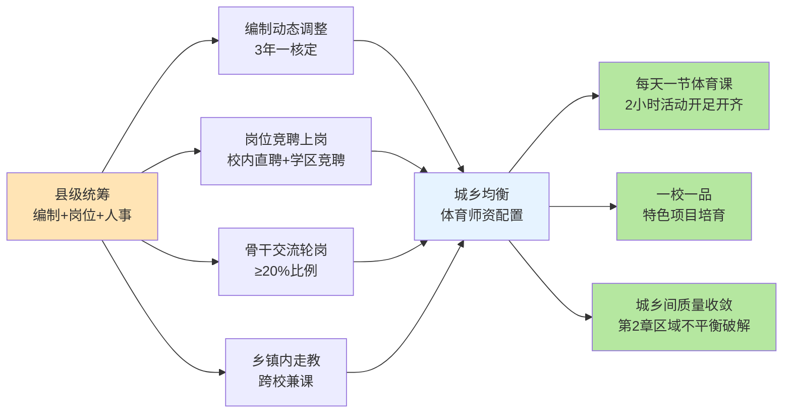

如图所示，**"县管校聘"四位一体机制通过编制、岗位、人事、走教多渠道的协同运作，使县域内体育师资配置从静态分布转变为动态均衡——这是破解第4章瓶颈2和第2章区域不平衡的关键制度抓手**。

**然而"县管校聘"在执行中也存在三类风险需要审慎防范**。**第一类："全员竞聘式折腾"风险**。教育部已经明确"改革需避免'全员竞聘'式折腾"[^134]——若将"县管校聘"简单理解为"每三年一次大洗牌"的全员竞聘，将极大破坏教师队伍的稳定性，反而损害教学质量。**第二类："民主协商不足"风险**。学界明确建议"在制度执行中增强教师参与度以强化教师专业发展支持体系"[^134]。"部分地区在实施方案中增设'民主协商期'，允许教师代表参与方案修订"[^134]——这一民主协商机制的引入是化解教师群体对竞聘改革焦虑的关键缓冲。**第三类："恶意抢挖"风险**。**黑龙江省2025年9月发布的《县域普通高中振兴行动计划实施方案》**明确规定"加强教师流动管理，**对未经同意恶意从县中抢挖优秀师资的学校，取消其评优评先、改革试点等资格**"[^134]——这一规定揭示了城乡间、校际间无序"抢挖"对县中等薄弱学校师资稳定的破坏性影响。

可以判断，**"县管校聘"是破解城乡师资配置鸿沟的基础性制度工具**。**"县管校聘"机制与7.2节"五个一批"多元补充机制形成"存量盘活+增量补充"的协同——前者优化已有师资的空间分布，后者扩大师资来源的总体规模——共同支撑师资保障从"总量达标"迈向"结构均衡"**。

## 7.4 师资专业素质提升与待遇激励保障

师资多元补充和"县管校聘"解决了"人从哪来、人往哪去"的问题，但师资保障体系还需要回答更深层的问题——**如何让进入校园的体育教师真正具备实施第6章高质量课堂、走班制、一体化课程所需的专业能力？如何让体育教师岗位真正成为有吸引力、有发展空间、有职业尊严的"香饽饽"？**这一问题指向师资专业素质提升与待遇激励保障两大维度。本节将从培养、培训、激励、师德四个层次论证师资专业化提升路径。

**第一层次：培养——来源端的专业素养塑造**。培养是师资专业素质的源头。《通知》明确"科学规划体育教育专业培养规模，**在国家和地方师范生公费教育、'优师计划'等培养计划中适度扩大体育教育专业师范生培养数量，逐步提高体育教学专业学位领域研究生招生比例**"[^125][^126][^127]——这一表述既回应了7.2节"剪刀差"问题的源头供给，也提升了师资学历层次的整体目标。从培养模式看，《通知》要求"改革高校体育教育人才培养模式，**强化体育教学实践和健康教育，着力提高体育教育人才在健康知识、基本运动技能、专项运动技能等方面专业素养水平**"[^125][^126][^127]——这一改革导向直接对接了第6章高质量课堂教学模型对体育教师"健康知识+基本运动技能+专项运动技能"三维素养的需求。

**特色微专业建设是培养创新的重要工具**。《通知》"鼓励高校面向非体育教育专业师范生开设体育类微专业和辅修专业，培养兼备体育教育教学素养的教师"[^125][^126][^127]，黑龙江省进一步将这一思路具体化——**"推动师范院校增设冰雪运动、校园足球等特色微专业，逐步扩大体育教育研究生招生规模"**[^132]。**冰雪、校园足球等特色微专业的设立直接回应了7.1节"专项师资普遍性短缺"的结构性短板**。同时，《通知》"支持高水平体育院校和综合性大学加强体育教育专业师范生培养"[^125][^126][^127]，使体育院校与综合性大学在师资培养上形成差异化分工。

**协同育人机制是培养落地的关键**。《通知》"强化地方政府、高校、中小学协同育人机制，推动师资共享、平台共建，**聘请优秀中小学体育教师为高校体育专业学生开展教育教学实践指导**，鼓励高校为中小学校体育课程活动开展提供有效支持"[^125][^126][^127]——这一双向流动机制使高校理论与中小学实践形成有机对接。武汉光谷汤逊湖学校的实践提供了协同育人的微观样本——"通过导师制培养新入职教师，联合高校开展专项技能培训，使体育教学与学生体质健康监测的结合度提升40%"[^128]。

**第二层次：培训——存量师资的专业能力升级**。黑龙江省的省级行动计划清晰呈现了培训机制的完整架构——**"强化全员培训，分类分层实施周期性体育教师轮训，依托'国培、省培'计划，聚焦龙江特色体育项目开展新一轮能力提升集中培训"**[^132]。这一"国培+省培+地方特色"三级培训体系是体育师资在职化提升的核心制度安排。同时，黑龙江强调"强化示范引领，**选拔培养体育领军人才**，带动体育教师素质提升"[^132]——领军人才培养机制是培训体系的"塔尖"环节。

**社会体育指导员培训是培训体系的重要补充**。**陕西咸阳**的实践提供了社会化培训的代表样本——2024年咸阳举办了多场社会体育指导员培训班，涵盖足球、太极拳、八段锦、健身操、羽毛球等多元项目[^136]。其中陕西省足球项目一级社会体育指导员培训班"来自全市60余名足球教练员参加……课程内容紧密结合社会体育指导员的工作实际，涵盖了**社会体育指导员公共理论、体育运动与紧急救治、足球比赛规则、社会体育足球项目竞赛组织等多个方面**"[^136]。这一培训内容既包括专业理论又包括安全急救等实操技能，对体育教师群体也具有重要的借鉴价值。咸阳的"社会体育指导员进校园"已经成为该市的常规活动[^136]，使社会指导员资源与校园体育需求形成双向流动。

**第三层次：激励——破解"职称晋升慢于主科"等深层瓶颈**。从基层一线声音看，体育教师面临的激励短板集中体现在三个方面：**一是"高级职称比例没有主科教师高，职称晋升需要时间沉淀"**[^131];**二是"隐形任务未计入绩效"**——某区教育局调研显示"65%的体育教师额外承担社团指导、赛事组织等职责，但仅有30%的工作量纳入考核体系"[^128];**三是"俱乐部教练薪资远超学校待遇"**[^131]。

**针对上述瓶颈，《通知》和地方实践已经形成了多管齐下的激励政策组合**。黑龙江省的省级激励机制最具代表性——**"科学合理确定体育教师课时量，在绩效工资分配中向体育教师倾斜，在职称评聘和各类遴选表彰中向体育教师倾斜，增强体育教师职业吸引力。将体育教师配置列入县域义务教育优质均衡发展督导评估和对各级政府履行职责评价的重要内容，以督促效、推动落实"**[^132]。这一"绩效倾斜+职称倾斜+遴选倾斜+督导挂钩"四位一体的激励机制设计，从待遇、发展、表彰、问责四个维度构筑了体育教师的职业保障网。

**评价机制改革是激励落地的关键**。"未来需完善评价机制：将大课间管理、体测数据采集等纳入工作量核算;在职称评审中增设'**学生体质达标率''竞赛成绩贡献度**'等指标。某省试点方案显示，实施绩效倾斜后，体育教师教学积极性提升25%，校队参赛获奖数量增长34%"[^128]。**这一"工作量精细化核算+职称评审专项化指标"的双轨改革将体育教师的实际贡献以可量化的方式纳入评价体系**——它使大课间组织、体测数据采集、社团指导、赛事组织等"隐形任务"显性化为可被绩效和职称承认的工作内容，从根本上扭转了"体育教师做得多但被认可少"的不公平状况。

**南宁二中的实践**提供了校级激励的微观样本——"通过考核激励、校企合作拓宽引才渠道，**对指导学生获奖的体育教师给予奖励**，并与体育局合作引入俱乐部教练辅助教学"[^131]。

**第四层次：师德师风与价值导向——专业化的精神底色**。**"常态化推进师德培育，将教育家精神和中华体育精神融入体育教师培养培训全过程，引导广大体育教师在教育教学、群体活动和训练竞赛等育人实践中，坚定理想信念、厚植爱国情怀、涵养高尚师德"**[^125][^126][^127]。**"教育家精神"与"中华体育精神"的双重融入是体育教师专业化的精神底色——它使体育教师不仅是技能的传授者，更是育人价值的承载者**。《通知》进一步明确"在资格认定、教师招聘、职称评聘、年度考核、赛事选拔、推优评先、表彰奖励等工作中**严格落实师德师风第一标准**……**严格落实师德违规'零容忍'**"[^125][^126][^127]。同时《通知》"鼓励体育教师深入社区、乡村，开展体育运动健康志愿服务等社会实践"[^125][^126][^127]，使学校体育资源向社会延伸。

可以判断，**师资专业素质提升与待遇激励保障是师资保障体系中最具长期性、最具系统性的环节**——它不像班师比硬指标那样可以通过数量补充快速达成，而是需要在培养、培训、激励、师德四个层次同步推进、协同提升。**这一系统化提升的最终目标是让体育教师岗位真正变成"香饽饽"——只有当体育教师在职业发展空间、薪酬待遇、社会尊严、精神价值四个维度都得到充分保障，才能从根本上吸引优秀人才、留住骨干力量、激发持续投入**。

## 7.5 校内"微运动场"：金边银角的空间挖潜

师资保障解决了"谁来教"的问题，场地保障则要回答"在哪练"的问题。第4章瓶颈6（公共资源短缺）的诊断揭示，**城区学校普遍面临"场地紧约束"的现实压力——用地紧张、生均运动场地不足、走班制需要的多场域空间难以满足**。然而中国基础教育不可能等待新校区建设和扩建到位才推进"2小时"政策——**化解场地短板的现实路径不在于"扩张存量"，而在于"激活边角"——通过"金边银角"的空间挖潜，让校内每一处闲置角落都成为可被运动激活的场域**。本节基于上海、深圳、广州等城区学校的多元创新实践，系统梳理校内"微运动场"的空间挖潜路径与共性策略。

**广东《通知》提供了空间挖潜的政策起点**——"**充分利用天台、走廊、楼道、架空层、墙壁、地面等校内空间，在满足安全的前提下，打造人人、处处、时时可及的校内'微运动场'**"。这一政策表述将校内空间挖潜从基层学校的零散创新升级为省级政策的明确要求——它明确了六类可挖潜空间，并以"人人、处处、时时可及"作为挖潜成效的评估标准。

**典型样本一：上海普陀区洵阳路小学——"分段乐活时间+趣味体能游戏100余种"**。洵阳路小学为不同年级学生分别定制专属的三段"乐活运动"时间——"早上第一时段的队列训练，午餐后的第二时段以低强度、趣味性强的游戏、棋类游戏和AR动感运动为主，下午第三时段的趣味体能游戏"，并准备了"100多种包括趣味体能、灵敏活动在内的多项游戏，每天都有新玩法"——具体项目包括"吹气球大王挑战、抛花球大赛、足球绕杆射门、足球九宫格射门、平板支撑大王、一分钟跳短绳、纵跳摸高、冰壶"[^137]。**洵阳路小学的核心创新是"时间分段精细化+项目多样化"**。

**典型样本二：黄浦区卢湾一中心小学——"走出校园进专业场馆"**。卢湾一中心小学是上海中心城区的典型学校——"面对'地少人多'的现实制约，学校将每周半天的'快乐活动日'课程搬到校外专业场馆，组织学生分批前往黄浦区少体校和卢湾体育馆上课，由专业体育教练与学校体育老师共同执教，**开设了保龄球、射击、网球、冰壶、击剑等12个项目的体育兴趣班**"[^137]。**卢湾一中心小学的创新逻辑是"校内不够、校外补足"**——这一"校外延伸"模式与7.6节校社共建共享形成精准对接。

**典型样本三：浦东新区竹园小学——"取消停车位+围墙攀岩+屋顶勇敢者之路"**。竹园小学的实践是"空间魔法"最具代表性的样本——"去年，**学校取消了几十个教师停车位，将这片区域铺上塑胶跑道，改造成'FUN肆乐跑区'**;中庭原本闲置的小花园也被精心改造，**增设了绳网、梅花桩、肋木架和爬竿，打造成攀爬综合活动区**。学校还向立体空间要资源，**在围墙上增设攀岩点，在屋顶开辟兼具安全性与挑战性的'勇敢者之路'**，就连走廊也布置了摸高墙，让不大的校园变成了'无处不运动'的生态空间"[^137]。**改造后，学校新增近500平方米运动场地，也解决了多个班级同时上体育课"挤不下"的难题**[^137]。**竹园小学的核心创新是"立体化空间挖潜"**——"取消教师停车位换运动场地"的做法尤其具有标志性意义——它揭示了城区学校空间挖潜的核心思路：**空间不是稀缺的，稀缺的是运动优先的资源配置意识**。

**典型样本四：奉贤区教育学院附属实验小学——"边角空间体系+课间游戏设计大赛"**。该校"打破'运动仅限操场'的传统观念，全面梳理校园可利用的边角区域，**将宽阔走廊、室内体育馆等纳入体育活动场地体系**。学校紧扣边角空间特点，量身设计踢毽子、跳房子、滚铁环、摸高等低强度、易开展的运动项目。同时，学校举办**'课间游戏设计大赛'，鼓励学生自主创作适合在边角空间玩的小游戏**，让运动真正落地"[^137]。**奉贤区教育学院附属实验小学的核心创新是"学生参与的项目共创"**。

**典型样本五：上海敬业中学——"地下健身房+智能器材借还柜+楼面微运动设施"**。敬业中学不大的校园内"遍布'微运动'设施……**地下一层被改造成简易健身房，配备了动感单车、跑步机等基础器材，午休时段、放学之后，学生下楼就能开展低强度运动**。乒乓房、大操场边，**智能器材借还柜只要使用学籍卡就能使用，减少了以往借还器材的繁琐环节**"[^137]。课间也呈现了"出点小汗，下节课更精神"的活力图景——"几辆色彩鲜亮的动感单车健身器整齐排列，学生们跨上车，脚踩踏板飞速转动……'课间骑上两分钟，浑身舒展，出点小汗，下节课更有精神'"[^137]。

**典型样本六：深圳宝安新安中学高中部——"62块标准化微型运动场+60个项目+3300平方米空间盘活"**。新安中学（集团）高中部"把巧思用在校园'金角银边'上，因地制宜改造教学楼间隙、楼宇夹缝、通道空地、架空层……让闲置边角地变身活力运动场。**学校累计改造62块标准化微型运动场，涵盖网球、乒乓球、羽毛球、篮球、匹克球等60个项目，盘活校内运动空间3300平方米，构建起随处遍布、全员可达的校园运动网络**"[^138]。

**典型样本七：罗湖桃园小学——"课堂+课间+课后三维时空体系+恒温游泳馆+社区防溺水培训点"**。罗湖桃园小学的"三维时空"体育新生态构建为空间挖潜提供了系统化样本——"课堂是体育教育的主阵地……依托校内恒温游泳馆，由专业教练系统教授泳姿、水中自救及应急处理技巧;课间碎片时间被系统规划为'微运动'场景……走廊、架空层等空间经创意改造，铺设轮胎阵、安装攀爬架、划定跳房子区域;课后服务平台开设超过15个体育类社团，日均活动时长90分钟"[^139]。空间利用最大化的标志性做法是——**"开放校内恒温游泳馆作为社区防溺水培训点，实现资源利用最大化"**[^139]。**该校"100%学生日均校内有组织体育活动时间超120分钟，课后体育社团参与率长期保持75%以上。2025—2026学年学生体质健康测试优良率达84.45%，较上一学年稳步攀升"**[^139]——这一数据印证了三维时空体系的实证有效性。

**典型样本八：宝安裕安学校——"AI运动吧+多元体育活动体系"**。裕安学校"打造兼容跳绳、跳远、仰卧起坐、纵跳摸高等多项运动的'AI运动吧'，通过智能手环、一体化数字平台无感采集学生心率、运动表现等数据，为每个孩子建立动态更新的'一生一案'健康成长档案"[^138]。

**为综合呈现校内"微运动场"挖潜的多元路径，下表对八大典型样本作横向比较**：

| 学校 | 核心做法 | 主要项目 | 实施成效 |
|------|----------|----------|----------|
| 普陀洵阳路小学 | 三段乐活时间+100余种游戏 | 趣味体能、AR动感运动、冰壶 | 不同年级精细化定制 |
| 黄浦卢湾一中心小学 | 走出校园进专业场馆 | 保龄球、射击、网球、冰壶、击剑等12项 | 12个体育兴趣班 |
| 浦东竹园小学 | 取消停车位+立体空间 | FUN肆乐跑、攀爬、攀岩、勇敢者之路 | 新增近500平方米 |
| 奉贤教院附实小 | 边角体系+学生共创 | 踢毽子、跳房子、滚铁环、摸高 | 学生自主设计游戏 |
| 上海敬业中学 | 地下健身房+智能借还柜 | 动感单车、跑步机、乒乓球 | 楼面微运动设施 |
| 宝安新安中学高中部 | 62块微型运动场体系 | 60个项目（网球/羽毛球/匹克球等） | 盘活3300平方米 |
| 罗湖桃园小学 | 三维时空+多功能复用 | 游泳、轮胎阵、攀爬架、跳房子 | 优良率84.45%、120分钟全覆盖 |
| 宝安裕安学校 | AI运动吧+多元体系 | 跳绳、跳远、仰卧起坐、纵跳摸高 | 一生一案数字档案 |

如表所示，**校内"微运动场"挖潜的成功路径并不依赖于资金的绝对投入规模，而依赖于空间想象力的解放和资源配置的重新优先排序**。从八大样本中，可以提炼**四类共性策略**：

**共性策略一："空间魔法"——发掘每一处闲置角落**。从天台、屋顶、走廊、架空层、楼宇夹缝、通道空地到围墙、墙壁、地面，校园里几乎所有非传统体育空间都可被纳入运动场域。这一策略的关键不是资金投入，而是空间审视的视角转变。

**共性策略二："立体改造"——从二维操场到三维空间**。立体空间的开发是城区学校空间挖潜的革命性突破。**立体改造的政策意义在于：城区学校的水平地面是稀缺的，但垂直立体空间是相对充裕的**——通过向上（屋顶、墙面）和向下（地下）的立体扩展，校园运动空间的总量可以实现倍增。

**共性策略三："错峰使用"——同一空间多功能复用**。同一处空间在不同时段承担不同运动功能。罗湖桃园小学"恒温游泳馆既用于课堂教学也用于社区防溺水培训"、敬业中学"地下健身房午休和放学使用"等做法都是错峰使用的代表。**通过精细化的时段管理，使有限的运动空间在时间维度上实现"空间倍增"**。

**共性策略四："分级匹配"——空间特点与项目难度的精准对接**。奉贤教院附实小"针对边角空间设计踢毽子、跳房子、滚铁环、摸高等低强度、易开展的运动项目"等做法属于分级匹配。**通过空间—项目—年级的三维精准匹配，使每一块"微运动场"都发挥最优效能**。

可以判断，**校内"微运动场"的金边银角空间挖潜是城区学校破解场地紧约束的现实路径**。**但需要注意的是，"金边银角"挖潜虽然能在边际上扩展运动空间，却无法根本解决城区学校运动空间整体偏紧的结构性矛盾——更深层的解决方案还需要校外资源的协同补充**——这正是7.6节校社共建共享要展开的内容。

## 7.6 校社共建共享与公共体育资源协同

校内"微运动场"的空间挖潜虽然能够边际拓展运动空间，但城区学校的根本约束在于**校园用地总量有限**——"地少人多"的结构性矛盾难以单纯依靠校内挖潜彻底化解。从"2小时"政策的整体视角看，**校外周末、节假日、寒暑假的运动场景同样需要充足的场地支撑**——这一需求超越了任何单一学校的资源边界，必须通过校社共建共享的双向协同机制才能根本破解。**2026年发布的"校社共享"政策为这一双向协同提供了制度框架**——本节将从学校场地向社会开放、公共场馆向学生开放两个方向，系统论证校社共建共享的运行机制。

**第一方向：学校体育场地向社会开放——盘活校园存量资源**。"校社共享"政策的核心规则明确——"**公办学校在保证教学需要和校园安全的前提下，应当积极创造条件向社会开放体育设施，鼓励民办学校开放。学校体育设施主要在课余时间和节假日向学生开放，并可对特定人群优惠收费**。区人民政府应为开放设施的学校办理责任保险，并应当将财政补贴列入预算"[^140]。这一规则确立了学校场地开放的几条基本原则：**"教学优先、课余开放、定向优惠、政府保险、财政补贴"**。

**典型样本：兰州市50所中小学操场向社会开放**。兰州市教育局"统筹安排，从今年2月9日起，将50所中小学校园操场正式向社会开放，**开放时间主要为周末、法定节假日、寒暑假**"[^141]。从实施效果看——"随着天气转暖，校园里绿茵场、跑道、球台也全线'热'起来了……昔日安静的校园，变身家门口最热闹的健身乐园";正宁路小学李桂平老师介绍"今天上午来了二十多位，下午就有六十多位，**一天下来近百人进场锻炼**。周边居民、本校学生占大多数，还有少年宫的队伍固定来训练，足球、篮球场地全都用起来了"[^141]。该市还根据使用反馈优化开放时段——"考虑到市民傍晚健身需求，**计划'五一'之后对开放时段进行优化，将下午开放时间由目前的14时至18时，调整为16时至20时**"[^141]。

**这一开放对青少年课余锻炼场景的拓展作用尤为显著**。一位家长张女士表示——"以前最愁周末没地方去，小区广场人挤人，车又多，孩子跑不开、不安全。**现在可好了，进校园里锻炼，场地大、环境好、又安全，心里特别踏实**……自从有了开放场地，孩子写作业都不拖拉了，早早写完就盼着来运动"[^141]。一位六年级学生左煊睿描述了其周末运动场景——"现在每周都约同学一起来，从下午两点一直踢到六点，训练、比赛全都有……同学们自发组队……**就连已经毕业的学长也会回来运动**"[^141]。**这一微观图景揭示了学校场地开放对青少年校外2小时延伸的实质性支撑——它不仅为学生提供了周末安全便利的运动场所，还通过同伴聚集和持续训练形成运动习惯的良性循环**。

**典型创新：AI体育设备进入开放校园**。兰州正宁路小学的开放还引入了智能化设备——"校园里新装的AI体育设备最受孩子们追捧，成了当之无愧的'人气王'……设备分学生模式和游客模式，**大家扫码就能玩，智能识别动作、实时统计数据，趣味十足、科学安全**"[^141]。这一"开放场地+AI设备"的复合模式将7.5节校内空间挖潜、7.6节校社共建共享、7.7节数字赋能三个维度有机融合。

**第二方向：公共体育场馆向学生开放——拓展校外锻炼场景**。**江苏省2026年春假+清明假期的公共场馆开放实践**提供了反向开放的标杆样本——"2026年清明节假期（4月4日至6日）与中小学生春假（4月1日至3日）相连，形成6天长假……江苏全省公共体育场馆将在假期期间优化开放服务，**实行免费或低收费开放，并重点对学生推出优惠措施**"[^142]。具体安排为——"假期期间，各地公共体育场馆将保障羽毛球、乒乓球、篮球、游泳、田径等主流健身项目正常运行。同时，**针对春假中的中小学生群体，场馆推出免费或优惠入场政策，鼓励青少年走出家门、参与锻炼**"[^142]。

**典型创新：宝安新安中学高中部"共享区文体局5500平方米专业足球场"**。新安中学（集团）高中部"主动对接宝安区文体局，**共享5500平方米专业标准足球场，让学子们告别场地限制，让青春在'班超''校超'燃动发光**"[^138]。**这一案例揭示了校社共建共享的另一种创新路径——学校与文体局直接对接共享专业场地，使学校能够获得超出自身校园规模的高规格运动场地资源**。

**典型创新：黄浦卢湾一中心小学"合作黄浦少体校与卢湾体育馆"**。卢湾一中心小学组织学生分批前往黄浦区少体校和卢湾体育馆上课[^137]——这一合作模式将专业体育资源直接引入学校教学体系。**这一案例揭示了校社协同的最高级形态——不仅是场地共享，更是教学体系与专业资源的深度整合**。

**为综合呈现校社共建共享的双向协同模式，下表对四大典型样本作横向比较**：

| 案例 | 协同方向 | 核心做法 | 实施成效 |
|------|----------|----------|----------|
| 兰州市50所学校开放 | 学校→社会 | 周末/节假日/寒暑假开放，AI设备助力 | 单校单日近百人进场锻炼 |
| 江苏春假场馆开放 | 公共→学生 | 免费或低收费开放，学生重点优惠 | 6天长假覆盖羽毛球/乒乓球/游泳等 |
| 宝安新安中学高中部 | 文体局→学校 | 共享5500平方米专业足球场 | 班超/校超联赛专业化 |
| 黄浦卢湾一中心小学 | 专业资源→教学 | 黄浦少体校+卢湾体育馆联合执教 | 12项体育兴趣班 |

**校社共建共享的"五位一体"长效机制**。从地方实践经验和"校社共享"政策规则中，可以提炼出确保学校场地开放可持续运行的五位一体长效机制：**第一，政府引导**——"区人民政府应当为向社会开放体育设施的学校办理有关责任保险";"区级人民政府在具备条件时，应当将学校体育设施向社会开放的财政补贴列入预算"[^140]。**第二，保险保障**——这是化解学校开放安全顾虑的关键工具，将运动伤害的经济风险从学校单一兜底转移到保险机制承担。**第三，责任划分**——明确学校、政府、用户三方在场地开放中的权责边界。**第四，专业运维**——"鼓励学校委托专业化体育设施管理企业或者与专业化体育设施管理企业合作，开展体育设施向社会开放工作"[^140]。**第五，评价激励**——"区体育、教育行政主管部门应当公布本行政区域内向社会开放的学校体育设施名录，并对开放情况进行监督检查"[^140]。

**公共体育资源结构性优化的三类政策建议**。第4章瓶颈6已经诊断了"公共体育资源供给不足的结构性偏差"。基于地方实践经验，可提出三类政策建议：**第一，课后周末关键时段免费**——破解"在课后、周末等关键体育锻炼时段设置收费门槛"的现实约束。**第二，街角空地碎片化空间盘活**——参照学校"金边银角"思路，对城市街角空地、桥下空间、老旧小区闲置地块进行嵌入式改造。**第三，嵌入式便民设施投入**——将青少年集中区域（学校周边、居民社区）的体育设施配置作为城市规划的强制性内容。

可以判断，**校社共建共享是化解城区学校场地紧约束的根本性政策路径**——它通过双向开放使有限的运动场地资源实现"校内+校外"的整合协同，从根本上拓展了"2小时"政策的场地支撑面。**这一路径与7.5节校内"微运动场"形成"内+外"的双轨场地拓展方案——校内挖潜激活存量、校社共享拓展增量，共同支撑场地保障从"紧约束"迈向"动态平衡"**。

## 7.7 数字技术赋能学校体育的四类应用范式

师资保障和场地保障解决了"人"和"地"的资源约束，**数字技术赋能则要回答"如何监测、如何辅助、如何画像、如何治理"的问题——这是数字时代学校体育治理升级的核心命题**。第3章已经论证了"2小时综合活动+1小时MVPA"双重底线的科学合理性，但这一双重底线如何被精准监测？第6章已经设计了"心率140—160次/分+10分钟体能"的运动负荷标准，但这一标准如何在课堂中被实时执行？第4章已经诊断了"凑数式2小时"的质量空洞风险，但这一风险如何被技术化识别？这些问题都指向数字技术的赋能潜能。本节基于全国多地的最新基层实践，系统提炼数字技术赋能学校体育的四类典型应用范式。

**四类范式的整体框架**可参照华中科技大学体育学院院长助理曾洪涛对当前AI体育应用的归纳——"在操场上，摄像头记录学生的运动轨迹和运动量，形成'智慧运动场';在室内空间，设备对身高、体重、肌群力量进行评估，生成身体画像;在具体项目中，系统通过动作捕捉与标准模型比对，对引体向上、立定跳远等动作进行判定与评分"[^143]。曾洪涛进一步指出AI体育的核心价值——"**'关键不只是测数据，而是能不能根据这些数据，给出真正有针对性的运动处方'……AI体育的价值，正在于把分散的运动行为转化为可分析、可指导的系统**"[^143]。

### 范式一：AI运动监测与即时反馈

**典型样本一：人大附小"满分AI运动馆+AI体育走廊"**。"操场上阳光正好……教学楼的'满分AI运动馆'里，划船机整齐排列，屏幕闪烁，孩子们边听老师讲解、边关注着自己的实时数据。走出划船机教室，**一条'AI体育走廊'铺展开来：立定跳远、动感单车、趣味体测，乃至围棋对弈……各类设备分区排列，学生刷脸进入系统，动作被捕捉、分析，成绩即时生成**"[^143]。"满分AI运动馆"的李潇乐老师明确指出——"**'可以跟同学比，也能看到自己的进步，它还能告诉你哪里做得不标准'**"[^143]。

**典型样本二：广西玉林行知高中"AI智能跑步屏"**。"每当有同学站在起跑线前，AI智能跑步屏便即时响应……**还会显示相较上次的成绩变化，并在'体质健康档案'中绘就近日成绩折线图**"[^143]。宇视科技高级副总裁林凯的判断揭示了AI智能跑步屏的核心价值——"**'AI智能跑步屏的应用有助于逐步破解学生"不愿练、不会练、不知进步在哪"的传统体育教学困境'**"[^143]。

**典型样本三：杨凌高新小学"智慧综合区+智慧跑步区"**。该校"智慧体育系统分为'智慧综合区'和'智慧跑步区'，**学生可在课间15分钟或课余时间随来随测，通过人脸识别系统自主进行测试，测试成绩实时上传并自动统计**"[^144]。"人脸识别、随来随测、实时上传、自动统计"是这一样本的核心创新。

**典型样本四：成都市双流区棠湖中学实验学校"AI手环+AI运动屏+智能乒乓球系统+一生一案运动处方"**。该校的实践是当前数字赋能最具系统性的样本之一——"学生戴上智能手环，AI摄像头自动计数。仰卧起坐动作不规范，数据直接不算。**心率实时显示，哪个孩子运动量不够、哪个孩子心率太快，老师一眼就能看到。每个学生都有一个AI'分身'，体能数据、运动轨迹、成长曲线，全部记录在案**……学校还部署了7个AI运动屏。课间和放学后，孩子们刷脸就能进入自己的'AI分身'……可以和自己比，也可以和同学PK"[^145]。该校体育老师罗驰的对比揭示了AI赋能的革命性意义——"**'以前学生跳了多少个，靠老师一个个数。现在AI直接计数，公平、准确，一秒都不漏'**"[^145]。该校还引入智能乒乓球系统——"打完之后，**系统会用专业数据模型来对比你的动作，告诉你"手肘角度不标准""重心需要调整"等**"[^145]。**最重要的是，"每学期末，系统还会为每一名学生生成一套'运动处方'——包含体能评估、运动建议、营养膳食等调整"**[^145]——这一"运动处方"是AI赋能从单纯监测升级到精准干预的关键标志。

**典型样本五：茂名桥北小学"AI电子考官"**。该校"'跳绳计数：152个'……'电子考官'能实时捕捉学生运动数据、自动计数并作出评判，**投入使用一年来，学生参与体育训练的兴趣明显提高**"[^146]。这一基层小学的样本揭示了AI赋能不仅限于发达地区，欠发达地区也能通过相对低成本的AI体育设备实现监测升级。

**这一范式揭示的核心规律：AI从"裁判"到"教练"的角色转变**。深圳壹路AI体育教学机的展示揭示了这一转变的深层价值——"**老师示范，学生模仿，老师纠正，学生再练。问题是，一个老师一双眼睛，能同时纠正几个学生的动作？……从"裁判视角"切换到"教练视角"，让每一个学生都拥有一位AI陪练**"[^147]。运动科学研究表明，"动作纠正的黄金窗口是动作发生的0.5秒内——超过这个窗口，肌肉记忆已经开始固化"[^147]——AI教学机做到了在窗口内干预，真正实现"边练边学边纠正"。

### 范式二：AI教学辅助与体感互动

**典型样本一：深圳壹路AI体育教学机"四大教学环节全覆盖"**。该教学机"全面覆盖热身活动、专项训练、体能训练、放松活动四大教学环节：**热身活动——肩部环绕、弓步拉伸等，AI实时检测动作幅度是否到位，避免热身不充分导致的运动损伤;体考专项——跳绳、立定跳远等，AI对照评分标准进行精准动作分析，直接对标考试要求;体能训练——深蹲跳、平板支撑等，AI追踪动作质量和完成次数，杜绝'偷工减料';放松活动——小臂拉伸、侧腰拉伸等，AI确保拉伸角度和时长科学合理**"[^147]。该教学机还支持单人和多人跟练两种模式——"全班模式：60人同时跟练，AI同步追踪每个人，老师从'人眼盯人'中解放出来"[^147]。最具创新意义的是其内置的"小铭"AI体育垂域模型——"**根据学生的动作分析数据，自动生成个性化的锻炼建议。不是泛泛的'多练习'，而是精准到'你的立定跳远腾空角度偏小，建议每天做3组踝关节跳，每组15次'这样的可执行方案**"[^147]。

**典型样本二：体智云"课前学情摸底+课中体感互动+课后数字化延伸"**。在2025年10月无锡举办的"第十届中小学优秀体育与健康教育课教学展示研讨活动"上，江阴市敔山湾实验学校杨子铭老师执教的《小篮球：区域对抗下的运、传球及比赛》依托体智云智慧体育课堂系统构建了**"课前-课中-课后"全流程数字化篮球课**[^148]："**课前：智能学情摸底——教师借助天天跳绳App布置'移动运球'等家庭作业，系统自动采集学生练习数据……课中：AI让教学'可视、可玩、可纠'——基于天天跳绳App的体感识别能力，教师构建'躲避断球'的虚拟对抗情境……课后：数字化延伸学练闭环——深蹲起、快频跑、灵敏跳等练习通过AI识别实现即时计数与反馈，作业数据自动同步教师端，形成'学-练-评'一体化闭环**"[^148]。在深圳举行的"2025年中国教育科学研究院实验区（校）教育成果展示交流活动"中，北仑区春晓实验学校陈松老师执教的《排球正面双手垫球》也借助体智云智慧体育课堂系统"实现即时投屏与正误反馈……精准捕捉每位学生的动作标准度，还能提供个性化学练反馈"[^148]。

**典型样本三：澳门培正与杭州滨江规模化应用**。澳门培正中学体育教师张嘉俊回忆——"2022年疫情期间，学校开始尝试使用AI软件……随着系统不断改进，这套工具逐渐走进课堂，'成为我们体育课体能训练的手段之一'"[^143]。在杭州滨江区，"类似的尝试已走向规模化"——"**当地已在体测、课堂和课后训练中系统应用AI技术：短跑、跳绳、仰卧起坐等项目实现自动记录与分析，课堂中可以实时纠错，课后则生成个性化训练方案。数据，开始成为体育课的一部分**"[^143]。

**这一范式的核心价值在于将AI从"工具"升级为"教学伙伴"**。杭州市胜利小学教育集团张凯老师的观察揭示了AI对学生参与度的提升作用——"**'像跳绳这样的项目，以前比较枯燥，现在可以比赛、可以互动，学生的热情明显提高了……一些原本不太愿意参与体育活动的学生，也开始主动走向器材'**"[^143]。

### 范式三：多模态体质画像与一生一案

**典型样本一：武汉育才二小"多模态体育数据模型+学生健康智多星"**。**截至目前，该校学生的超重率从15.27%显著下降至10.8%。同时，近两次视力测查结果对比显示，学生近视率也同步下降了6%**[^149]。该校的核心创新是"'多模态'体育数据模型"——也被称为"学生健康智多星"——"由五大看板构成：体质健康监测、体育课锻炼、课间活动、AI微站和总体画像"[^149]。雷春主任详细介绍了多模态数据采集的全场景覆盖——"**每年育才二小都会对学生开展体质健康监测，其中包括测量学生的身高和体重，以形成每个人的BMI值。另外，在体育课上，学生的每一次奔跑与跳跃都被智能手环实时记录;不远处的体育AI微站前，同学们排着队，主动挑战各种游戏化运动项目，每个人的运动数据都被实时保存;一天中，学生在大课间和课间十分钟走出室外的运动时长数据，都被校园里各个角落的智能摄像头默默地记录。所有这些数据，最终都会汇聚到数据模型上**"[^149]。"学生健康智多星"的革命性价值在于其**全场景多模态融合**——"**把散落在走廊、教室、操场的碎片化、不断流动的数据整合成了学生运动健康画像**"[^149]。

**典型样本二：上海上城区"12万学生六维健康指标框架+智成长平台+省质量监测达标率98.6%"**。杭州市上城区将"学生身心健康AI能力链"作为区域数字化改革的突破口，"**整合12万名中小学生的多源数据，建立涵盖体质监测、健康习惯、心理预警、社会情感、学习体验与学习品质6个维度的健康评价框架**"[^150]。其制度设计的关键创新是"'智能治理新闭环'……**在心理预警维度，若'学习焦虑'等9项指标单项得分超过8分，系统将自动触发定制化的指导计划**"[^150]。区域"智成长"数字化平台**"三级联动建设三大数字应用场景。一张'全区健康学校地图'、一条'学校健康指数链'、一幅'学生健康数字人画像'……AI模型能深度分析情绪、运动、睡眠等数据间的内在关联，自动预警风险、精准匹配资源，形成'监测—预警—干预—反馈'的智能治理闭环**"[^150]。从实施成效看——"浙江省2024年小学教育质量监测结果显示，**上城区小学生体质与健康素养达标率达98.6%，睡眠、运动等行为习惯显著改善**"[^150]。

**典型样本三：重庆"区级智慧体育驾驶舱+一生一案+黔江区近视率累计下降16.12pp、肥胖率累计下降13.13pp"**。**沙坪坝区搭建起"区级智慧体育驾驶舱—校级智慧体育管理系统—校园运动智慧场景"三级架构，贯通体育教学、课余锻炼、体质监测全链条**[^151]。在渝中区人和街小学，体育教师陈明庆"打开手机上的'和健学业智评系统'，班上每个孩子的运动数据一目了然。这套系统无痕采集学生体育锻炼记录，**为1973名学生生成精准的'数字画像'**……'哪个孩子耐力差、哪个孩子爆发力弱，系统会自动预警，我们就能精准干预'"[^151]。从实施成效看——**"全市中小学体育课时达标率100%……在黔江区菁华小学，针对体弱和肥胖儿童，体育教师分层布置个性化体育作业，形成了'监测—分析—干预—提升'的闭环管理。近3年来，学生的近视率累计下降了16.12个百分点，肥胖率累计下降了13.13个百分点**"[^151]。

**这一范式的核心价值在于"一生一案"的精准化干预**。从武汉育才二小的15.27%→10.8%超重率下降、上海上城区98.6%达标率、重庆黔江区16.12pp近视率下降、13.13pp肥胖率下降——这些数据共同印证了**"数字画像+精准干预"在体质改善上的实证有效性**。

### 范式四：AI情绪识别与心理健康预警

这一范式将AI赋能从体育领域延伸到学生心理健康保护，是数字赋能学校体育向"全维度健康守护"演化的最新形态——它呼应了第3章心理机制对运动促进心理健康的因果论证。

**典型样本：鸿合智瞳"情绪AI垂类模型+128项指标深度报告+提前预警风险"**。鸿合智瞳搭载了"鸿合科技行业首创的情绪AI垂类模型，这一模型**专为教育打造、深度场景优化且安全合规**"[^152]。"鸿合智瞳集智慧教室、情感关怀、家校共育于一体，借助AI视觉情绪识别大模型、多模态感知以及深度分析技术架构，**通过部署于教室一体机、学习机终端的智能摄像头，实现学生情绪与行为的双重可视化**。当某个学生出现持续性低情绪、低课堂参与等异常数据时，系统会根据内置的预警模型，自动触发预警推送，协助教师提前介入风险，真正做到防患于未然"[^152]。其AI课堂分析"生成包含128项指标的深度报告，帮助教师精准教研"[^152]。

**这一范式揭示了数字赋能向健康治理深化的前沿方向**。鸿合科技的解读明确——"**'提前预警'……带来的高价值在于数据。它把原本只能靠直觉捕捉的信号，变成了可查看、可回溯的数据……这正是'健康第一'的第一步：先看见，才能给予回应**"[^152]。同时，鸿合科技AI智慧体育解决方案"涵盖AI智慧操场、AI智慧体考、AI体测室、AI体育角等场景……**无需穿戴设备即可实现运动过程自动识别、精准计数与评分**……助力落实'一生一案'体质提升计划"[^152]——这一方案"将体育老师从繁琐的记录和裁判工作中解放出来，让他们把精力重新聚焦到现场指导、动作纠正和激励学生等真正有价值的事情上"[^152]。

**为综合呈现四类范式的应用图谱，下表作横向比较**：

| 范式 | 核心功能 | 典型样本 | 实施成效 |
|------|----------|----------|----------|
| AI运动监测与即时反馈 | 动作捕捉、即时计数、自动评判 | 人大附小、玉林行知、棠湖中学、桥北小学 | 课后自主锻炼热情高涨 |
| AI教学辅助与体感互动 | 课前摸底、课中互动、课后纠错 | 深圳壹路、体智云、澳门培正、杭州滨江 | 师生比限制突破、教学个性化 |
| 多模态体质画像与一生一案 | 全场景数据整合、个性化画像 | 武汉育才二小、上海上城、重庆 | 超重15.27%→10.8%、近视-6%、达标率98.6% |
| AI情绪识别与心理健康预警 | 情绪可视化、风险预警、家校共育 | 鸿合智瞳 | 128项指标深度报告 |

如表所示，**四类范式从基础监测向高级治理逐级递进——AI运动监测奠定数据采集基础、AI教学辅助提升课堂质量、多模态体质画像实现精准干预、AI情绪识别延伸到心理健康预警**——共同构成数字赋能学校体育的完整应用图谱。

可以判断，**数字技术赋能学校体育已经从单点试验走向规模化应用，从基础监测走向系统治理**。**它们的政策价值集中体现在三个方面：第一，破解第3章MVPA强度密度的精准监测难题；第二，破解第4章瓶颈7（兴趣枯燥）的兴趣激发难题；第三，破解第8章评价监督的客观化与精细化难题**。

## 7.8 数字赋能的成本、隐私与边界约束

数字赋能在四类范式中展示了其变革性的价值潜能，但任何技术的应用都不是无成本、无风险、无边界的——**成本可持续性、隐私安全保护、技术与教师定位**这三类现实约束如不审慎处理，可能从积极变革异化为新的政策风险。本节将逐一讨论这三类约束，并提出针对性政策建议。

**第一类约束：成本与可持续性**。**双流棠湖中学的案例提供了成本机制的代表样本**。当被问及设备资金来源时，校长陈霞回应——"**'一是区教育局"以奖代补"，二是学校统筹'。她说，诀窍是把钱用在刀刃上，不盲目追热点，一切从学校师生需求实际出发**"[^145]。"区教育局以奖代补+学校统筹"的混合资金机制是较为成熟的财政模式——它将上级专项支持与学校自主投入相结合，避免单一来源的不稳定风险。**深圳壹路AI体育教学机的"移动版+固定版"双形态设计**则提供了成本优化的另一思路——"**这种双形态设计，解决了'设备闲置'的老问题——不是每个时段都有体育课，移动版可以让设备在不同场地间轮转使用，最大化投入产出比**"[^147]。

**然而成本约束对欠发达地区的影响远大于发达地区**。北京、上海、深圳、重庆、杭州、武汉等地能够投入大量财政资源建设AI体育系统，但中西部欠发达地区的县级和乡镇学校在AI设备采购、维护、迭代上都面临显著的财政压力。如果不加以专项扶持，**数字赋能的红利可能进一步加剧城乡间、区域间的"数字鸿沟"——发达地区的学生享受AI运动屏、AI体育走廊、AI运动处方，而欠发达地区的学生连基本的体测设备都难以保障**。这一数字鸿沟的扩大将与第2章已经识别的区域不平衡形成叠加效应，使"2小时"政策的落地质量进一步分化。

针对这一约束，可提出三类政策建议：**第一，分级分类推进**——发达地区可重点投入高级别AI设备（情绪识别、动作捕捉等），欠发达地区可优先部署相对低成本的基础AI设备（如AI跳绳计数、人脸识别签到等）。**第二，专项扶持基金**——中央财政可设立"中小学体育数字化专项扶持基金"，定向支持中西部欠发达地区的AI体育设备采购和教师培训。**第三，云端共享平台**——通过建设国家级或省级的体育数字化云端平台，使不具备硬件条件的学校能够使用基础的体测、监测、画像等服务，避免每所学校都要"重复造轮子"。

**第二类约束：隐私保护与数据安全**。数字赋能涉及大量学生体质、心理、行为数据的采集和处理——这些数据属于敏感个人信息，其采集、存储、使用、共享必须严格遵循隐私保护和数据安全的基本规则。

**双流棠湖中学的实践提供了隐私保护的典型样本**。校长陈霞表示——"**在隐私保护上，陈霞也很谨慎。她每年都会给家长发告知书，明确告知采集哪些数据、用于什么目的，请家长选择是否同意。全校2000多个孩子，所有家长都同意用于教育管理和教学科研，有26个家长不同意照片和视频用于学校及上级主管部门的宣传**"[^145]。这一做法体现了隐私保护的几条基本原则——**第一，年度告知**：每年发放告知书，确保家长持续了解数据采集情况;**第二，明确用途**：告知具体采集哪些数据、用于什么目的，避免模糊化的概括同意;**第三，知情同意**：请家长选择是否同意，赋予家长真正的选择权;**第四，分级授权**：26位家长不同意照片视频用于宣传，体现了不同数据用途的分级授权;**第五，技术补救**：陈霞表示"**当不得不用、避不开这些孩子的时候，AI换脸也行，没有什么解决不了的**"[^145]——这种"AI换脸替代方案"在保护隐私和满足必要使用之间提供了技术化平衡。

**上海上城区的"AI模型自动预警+数据互通责任共担"则揭示了更深层的伦理边界**——"**数字画像成了家校社协同的纽带——家长通过平台获取'睡眠管理''运动计划'等个性化共育建议，教师依据班级健康报告调整教学节奏，社区结合区域数据开展青少年体质提升活动，三方织就了'数据互通、责任共担'的健康守护网络**"[^150]。"数据互通、责任共担"的伦理原则强调多方主体在数据使用中共同承担责任，避免单一主体的数据滥用风险。

针对这一约束，可提出基本规则：**第一，数据采集知情同意**——任何数据采集必须事先获得家长和学生的明确同意，且这一同意应当是具体的、明确的，而非概括性的;**第二，用途明确告知**——数据的具体用途（教育管理、教学科研、宣传等）必须分类告知，每一用途都需独立授权;**第三，敏感数据保护**——情绪、心理、视频等高度敏感数据应当享有更高级别的保护，原则上不得用于宣传或第三方共享;**第四，上传链路安全**——数据传输和存储应当符合国家数据安全法律法规要求，防止数据泄露。

**第三类约束：技术边界与教师定位**。数字赋能不能替代体育教师的教学判断——这是落地中必须严守的根本边界。**双流棠湖中学的实践提供了技术边界的典型样本**。校长陈霞对AI的边界想得很清楚——"**AI给出来的'运动处方'不能直接推给家长。'"处方"要先经过体育老师阅读、修改'……因为数据采集是真**"[^145]。**"AI处方需先经体育老师阅读修改"的明确边界揭示了一个重要原则：AI是辅助工具而非决策主体，最终的教学判断和处方建议必须经由专业体育教师把关**。武汉育才二小的实践也体现了这一边界——"基于此，AI平台还会**为老师提供针对每个孩子的运动处方，如应增强哪些方面的运动、着重培养哪些运动习惯等，以便体育老师和班主任在教学中做到因材施教**"[^149]——AI的角色是为教师提供决策支持，而非替代教师作出决策。

**这一边界还涉及一个现实疑虑：AI都能"教"运动了，体育老师是不是可以躺平？**陈霞的答案恰恰相反——"**'短时间内，AI一定会增加老师的工作量。'她说，老师们要学习技术运用的逻辑，要熟悉新设备，要学会解读数据。这些都需要投入大量的时间和精力**"[^145]。罗驰说得更直白——"**'现在我需要更多关注学生的成长、心理和情绪变化。'他说，以前体育老师需要记成绩、打表，现在AI可以完成这些基础工作**"[^145]。这一对话揭示了体育教师角色的辩证转变——**从"计数器"到"解读师"——AI替代了体育老师的基础性、重复性工作（计数、计时、记录），但赋予了老师更高阶的工作内容（数据解读、个性化指导、心理关怀）**。这一转变与鸿合科技"将体育老师从繁琐的记录和裁判工作中解放出来，让他们把精力重新聚焦到现场指导、动作纠正和激励学生等真正有价值的事情上"[^152]的理念形成精准呼应。

针对这一约束，可提出政策建议：**第一，明确AI辅助定位**——所有AI体育解决方案都应明确其辅助而非替代的定位;**第二，教师能力转型支持**——通过培训帮助体育教师掌握数据解读、AI应用、个性化指导等新技能;**第三，建立人机协同规范**——明确哪些工作可由AI完成、哪些工作必须由教师完成、哪些工作需要人机协同。

可以判断，**数字赋能的成本、隐私、边界三类约束是其稳健推进的必要护栏**。**若不能审慎处理这三类约束，数字赋能可能从积极变革异化为新的政策风险——成本不可持续将加剧数字鸿沟、隐私保护不到位将损害学生权益、技术边界模糊将异化教师角色**。三类约束的化解需要"分级推进+伦理规范+教师赋能"的协同政策设计——本节因此既是对7.7节四类范式的现实平衡，也是数字赋能稳健落地的政策起点。

## 7.9 师资场地数字三维要素的协同升级路径

作为本章总结，将师资队伍、场地设施、数字技术三维要素整合为条件保障体系的系统性升级方案。**三维要素的协同关系在于：师资是教学质量的"人"要素、场地是活动空间的"地"要素、数字是监测干预的"技"要素，三者相互支撑、缺一不可**——师资水平决定数字工具的使用深度（教师能否有效解读AI数据、设计个性化处方）、场地条件决定数字设备的部署密度（"金边银角"中嵌入AI体育角更为可行）、数字赋能反过来缓解师资紧平衡与场地紧约束的双重压力（AI从"裁判"到"教练"突破师生比、AI运动屏使有限场地承载更多学生）。

**三维要素的协同关系**可由下图刻画：

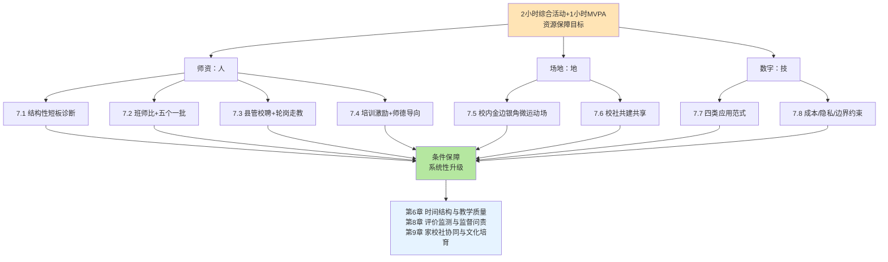

**三维要素与其他章节的衔接关系**：第一，**师资多元补充支撑走班制/俱乐部制落地（第6章）**——只有专项师资充足，第6章设计的走班制和"必修+选修"模式才能真正向学生开放;第二，**场地共建共享延伸校外2小时场景（第9章）**——校社共建共享为家庭锻炼场景拓展提供了硬件基础，与第9章家校社协同形成联动;第三，**数字画像支撑双指标考核与监督问责（第8章）**——AI多模态体质画像和心率监测等技术为第8章的双指标（时间+强度）考核提供了技术支撑。

**形成可操作的政策建议清单**：

**第一类：师资保障**——（1）落实班师比小学5∶1、初中6∶1、高中8∶1硬指标，作为体育师资配备"地板要求";（2）实施"五个一批"师资多元补充行动，参照黑龙江"三年补充1500名"的省级标杆设定数量目标;（3）打通退役运动员/退役军人入校通道并设立**过渡性资格认证**（试用期三年备考）;（4）深化"县管校聘"改革推动跨校兼课与乡镇走教，骨干交流比例不低于20%;（5）将大课间、课后服务、社团指导、赛事组织等"隐形任务"纳入教师工作量核算，在职称评审中增设"学生体质达标率""竞赛成绩贡献度"专项指标;（6）严格落实师德师风第一标准，将教育家精神和中华体育精神融入培养培训全过程。

**第二类：场地保障**——（7）打造"金边银角"校内微运动场体系，充分利用天台、走廊、楼道、架空层、墙壁、地面等校内空间;（8）推进学校体育场地有序对外开放并完善"政府引导+保险保障+责任划分+专业运维+评价激励"五位一体长效机制;（9）扩大公共体育场馆对青少年免费/低收费开放，重点针对课后、周末、节假日等关键时段;（10）盘活城市街角空地、桥下空间、老旧小区闲置地块等碎片化空间，建设嵌入式便民运动设施。

**第三类：数字赋能**——（11）分级推进AI体育、智能体测、AI运动屏等数字工具部署，发达地区重点投入高级别AI设备、欠发达地区优先部署基础AI设备;（12）建立学生体质数字画像与"一生一案"干预机制，参照武汉育才二小、上海上城、重庆等样本构建多模态多场景数据采集体系;（13）严格落实数据采集知情同意与隐私保护规则，年度告知、明确用途、分级授权、技术补救;（14）针对欠发达地区设立**"中小学体育数字化专项扶持基金"**，建设国家级或省级体育数字化云端共享平台，弥合数字鸿沟。

**坦诚说明三维要素协同推进中的资源约束张力与可行性边界**。在落地中，三维要素的协同推进将面临三类张力：**第一，财政可持续性张力**——师资薪酬倾斜、场地建设投入、数字设备采购都需要稳定的财政支撑，对地方财政压力较大;**第二，教师能力转型张力**——AI赋能要求体育教师从"计数器"转变为"解读师"，但相当比例的现有体育教师在数据解读、AI应用、个性化指导等新技能上仍存在差距;**第三，城乡同步推进张力**——师资多元补充、场地金边银角、数字赋能在发达地区落地相对顺畅，但欠发达地区面临财政、人才、技术多重约束，如不专项扶持，将形成新的资源不平衡。

这些张力的化解需要在第10章风险防范中作专门讨论——本章的三维协同方案已经为这些张力的化解预留了制度接口（如分级分类推进、专项扶持基金、过渡性资格认证、云端共享平台等）。**师资、场地、数字三维要素的协同升级是支撑"2小时"政策从"时间排上"迈向"高质量落地"的资源底盘——只有当人、地、技三大资源同步到位、相互协同，第6章设计的时间结构与教学质量才能真正落地，第8章设计的评价监督才能精准实施，第9章设计的家校社协同才能切实延伸**。这正是本章作为政策保障路径研究第二专题章节的整体使命。

# 8 政策保障机制设计：评价、监测与监督问责

第6章已经从课时刚性、结构优化、教学质量、风险防控四个维度构建了"2小时"政策落地的核心教学机制，第7章则从师资、场地、数字赋能三个维度搭建了条件保障的资源底盘。然而即便有了完善的教学设计和充足的资源投入，**学校体育治理依然面临一个深层追问——以何种制度机制确保政策不走样、不悬空、不变形？**第4章已经精准诊断了"阴阳课表"、应试化训练、防御性教学等执行偏差的存在，第5章天津"进晒查罚改"的标杆样本也已经初步揭示了闭环监督的强大威力——但这些零散的证据尚未被系统整合为一套**可被各级教育行政部门和学校直接借鉴的评价、监测、监督一体化制度护航机制**。本章作为政策保障路径研究的第三个专题章节，正是要回答这一治理性追问——以中考体育改革破解评价导向扭曲、以过程性评价引导日常2小时落地、以五级监测体系精准识别落地差距、以数字画像支撑科学评价、以"进晒查罚改"等闭环监督压实执行责任、以督导问责和"一票否决"形成刚性约束。本章将沿着"评价改革—监测体系—监督问责—闭环治理"四位一体的逻辑展开，既守住政策落地的制度底线，又防范评价异化的副作用，为第9章家校社协同向校外延伸和第10章综合风险防范奠定治理基础。

## 8.1 评价导向重塑：从"应试体育"到"素养体育"的中考体育改革

中考体育改革是"2小时"政策保障体系中最具杠杆效应的评价工具——它直接决定了初中学段体育课的内容形态、家长对体育的认知态度、校外培训市场的需求结构。**第4章瓶颈3（应试化训练与"为考而练"异化）的诊断已经揭示，"中考体育是刚需，没有兴趣可言"的市场化逻辑、"初中体育课完全围绕中考项目开设，以至于学生在体测结束后再也不想运动"的应试化扭曲，本质上都是评价导向偏差的产物**。要破解这一扭曲，必须从评价导向的根源处重塑——从"单一现场统一测试"走向"全程考、等级考、素养考"的系统性改革。

**改革主线一：从"现场一次考"走向"过程性+终结性结合"的双轨制**。这是当前中考体育改革最具普遍性的方向。**青海2025年的改革方案**提供了双轨制最具代表性的省级样本——"为深入推进素质教育、切实提升中小学生体质健康水平，我省将中考体育与健康科目总分值从50分上调至70分，**考试方式由'单一现场统一测试'调整为'现场统一测试+过程性考核评价'结合模式**，新规自2025年秋季学期初中一年级学生起实施，2028年中考正式落地"[^153]。改革的核心政策意图被青海省教育厅明确道破——"**此次调整是我省深入贯彻国家相关文件精神，全面落实'中小学生每天综合体育活动时间不低于2小时'要求的关键举措，旨在通过优化评价机制，引导学生重视日常锻炼、培养运动习惯，实现学生体育锻炼从"应试"向"素养"的转变**"[^153][^154]。这一表述精准点出了中考体育改革的根本指向——**从"应试体育"到"素养体育"的范式跃迁**。

**深圳2024年的改革方案**则提供了发达地区双轨制的典型样本——市教育局在《深圳市初中学业水平考试体育与健康科目考试实施意见》（深教规〔2024〕2号）中明确"采用过程性与终结性考查相结合的方式，以实践测试为主，纸笔测试为辅"[^155]。其改革依据是"国家陆续出台了《关于强化学校体育促进学生身心健康全面发展的意见》（国办发〔2016〕27号）、《深化新时代教育评价改革总体方案》（中发〔2020〕19号）、《关于全面加强和改进新时代学校体育工作的意见》（中办发〔2020〕36号）等文件"以及"广东省教育厅印发《关于深化高中阶段学校考试招生制度改革的实施意见》对体育与健康科目考试明确要求：采用过程性与终结性考查相结合的方式"[^155]。深圳的方案设计有四个突出特点——"全面对照国家和广东省的政策要求，全面落实国家义务教育体育与健康课程标准，**全面促进学生形成良好锻炼习惯和掌握1—2项终身受用的体育运动技能，全面体现减负和友好的导向，传达快乐体育理念**"[^155]。"减负和友好""快乐体育"的明确表述揭示了深圳改革对"应试化训练"的导向纠偏——它不希望中考体育成为新的负担源，而是希望通过评价改革引导学生形成持久的运动兴趣。

**长垣市2024年实施的"过程性30分+终结性70分"100分方案**则是地市级双轨制的精细化样本。该市"从2024年起，我市中招体育考试总分值由目前的70分提高到100分（从2021年秋季入学七年级学生开始实施）。我市中招体育考试由过程性评价和终结性评价两部分构成"，其中"**过程性评价在中招体育考试总分中占30分，分七、八年级两个学年进行，每学年15分**"[^156]。这一"30+70"的分值设计将过程性评价的权重提升至30%，使日常体育活动时间和体质健康表现真正具有了与中考挂钩的现实意义——这是引导学生重视日常2小时活动的关键评价杠杆。

**改革主线二：从"应试性项目"走向"基础性+综合性+选择性"的项目结构**。这是中考体育改革的另一条主线。青海方案明确"现场统一测试由各市（州）教育行政部门结合本地实际自主制定实施细则，**考试项目需兼顾基础性、综合性与选择性，既考查学生基本运动技能和体质健康状况，也鼓励增设促进学生兴趣特长发展的项目，满足多样化锻炼需求**"[^153]。"基础性+综合性+选择性"的三维结构是对单一"中考项目反复训练"的根本性突破——基础性项目守住基本运动技能与体质健康底线，综合性项目检验运动素质的全面发展，选择性项目尊重学生兴趣特长的差异化发展。**这一结构与第3章最优活动结构理论中的"心肺耐力+肌肉力量+柔韧灵敏"多元素质要求形成精准对接，也与第6章走班制/俱乐部制改革的兴趣本位逻辑相互呼应**。

**改革主线三：从"分值刚性化"走向"分值适度上调+导向纠偏"的复合策略**。近年来全国多地都呈现了中考体育分值上调的趋势——青海从50分上调至70分[^153][^154]、长垣市从70分上调至100分[^156]、青岛"将体育中考从'一次考''合格考'调整为'全程考''等级考'"[^157]。这一上调趋势的政策意图清晰——通过提高分值在中考总分中的权重，扭转"重智轻体"的家校行为惯性。然而值得审慎指出的是，**单纯提高分值如不配合考试方式的同步改革，可能反而强化"为考而练"的异化倾向**——这正是第4章"中考体育是刚需，没有兴趣可言"现象的政策根源。各地经验已经表明，**分值上调必须与"过程性评价权重提升+项目结构多元化+选考项目丰富化"协同推进，才能真正实现从"应试体育"到"素养体育"的范式跃迁**。

**改革主线四：纳入体育社团参与、竞赛获奖等多元素养指标**。青海过程性考核评价"由市（州）教育行政部门统筹指导、学校具体实施，参照《国家学生体质健康标准》，**综合考量学生日常体育锻炼表现、体育课学习态度与参与度、体育社团活动参与情况、体育竞赛获奖情况等**，通过建立'学生体育成长档案'，常态化、规范化记录学生三年体育表现"[^153][^154]。**"日常锻炼+学习态度+社团参与+竞赛获奖"四维多元素养指标的构建是过程性评价从"分数考核"走向"素养画像"的关键创新**——它将体育评价从单一的体测成绩扩展到完整的运动参与轨迹，从根本上扭转了"突击式备考"的行为模式。青岛的实践更直接将"将学生体质健康结果作为毕业升学和评优评先的重要依据"，"将体育中考从'一次考''合格考'调整为'全程考''等级考'，初中学生过程性成绩与目标效果测试成绩合计，纳入体育中考成绩，推动学校体育工作常态化落实"[^157]——这一"全程考、等级考"的导向使学生从初一开始就必须重视日常运动表现，而不是临考前突击训练。

**为更直观呈现各地中考体育改革的核心要素，下表对四大典型样本作横向比较**：

| 地区 | 总分值 | 过程性占比 | 现场测试 | 项目结构 | 改革启动 |
|------|--------|------------|----------|----------|----------|
| 青海 | 70分 | 20分（约29%） | 50分 | 基础性+综合性+选择性 | 2025年秋（2028年正式实施） |
| 深圳 | — | 实施过程性评价 | 实践测试为主+纸笔测试为辅 | 1—2项终身受用技能 | 2024年印发 |
| 长垣市 | 100分 | 30分（30%） | 70分 | 体测项目+健康知识+心肺复苏 | 2024年起实施 |
| 青岛 | — | 全程考+等级考 | 目标效果测试 | 全程考、过程性+终结性 | 已实施 |

如表所示，**各地改革虽然在分值结构上存在差异，但都遵循"过程性占比适度（20%—30%）+现场测试为主+多元项目结构+长周期记录"的共同逻辑**。这一逻辑的政策价值在于既保留了终结性测试对学生体能水平的客观验证，又通过过程性评价引导学生坚持日常2小时锻炼，从根本上化解"为考而练"对2小时活动结构的扭曲性影响。

**改革主线五：心肺复苏术等健康素养纳入考核**。长垣市的方案中尤其值得关注的是将"心肺复苏术实际操作"明确纳入过程性评价——"体育与健康知识（1.5分，其中心肺复苏术实际操作占0.5分）"[^156]。这一设计将体育评价从"运动技能"扩展到"健康素养"，是对"健康第一"教育理念的具体化落地。结合教育部"实施学生体质强健计划"中"加强科学运动指导与普及，确保运动安全与锻炼效果"[^158]的要求，**心肺复苏术等急救技能纳入考核既是评价改革的内容创新，也是从根本上提升学生健康素养的制度抓手**。

可以判断，**中考体育改革的核心使命是从评价导向上扭转"应试体育"对2小时活动结构的扭曲性影响**——通过双轨制设计、多元项目结构、过程性权重提升、社团/竞赛纳入考核、健康素养扩容，使评价真正服务于"享受乐趣、增强体质、健全人格、锤炼意志"四位一体育人目标，而不是异化为新的应试工具。这一改革的全面落地需要后续过程性评价体系（8.2节）、监测画像（8.4节）等配套支撑，但其作为评价导向重塑"总开关"的政策地位无可替代。

## 8.2 过程性评价体系构建：日常参与、体质监测与专项技能的三维考查

中考体育改革确立了"过程性+终结性结合"的双轨大方向，但**过程性评价究竟评什么、如何评、由谁评、怎样防作假**——这些操作性问题构成了过程性评价体系构建的核心命题。本节聚焦《深化新时代教育评价改革总体方案》确立的"日常参与+体质监测+专项运动技能"三维考查机制的科学构建路径。

**三维考查机制的政策起源**。深圳市《意见》明确点出了过程性评价的政策依据——"2020年10月，中共中央国务院印发《深化新时代教育评价改革总体方案》，**要求强化体育评价，建立日常参与、体质监测和专项运动技能测试相结合的考查机制，将达到国家学生体质健康标准要求作为教育教学考核的重要内容，引导学生养成良好锻炼习惯和健康生活方式，锤炼坚强意志，培养合作精神**"[^155]。这一表述为过程性评价确立了三个评价维度：**日常参与**回答"是否坚持锻炼"的问题、**体质监测**回答"身体素质如何"的问题、**专项运动技能**回答"是否掌握技能"的问题——三者共同构成过程性评价的完整图景。

**长垣市的精细化分项设计**为三维考查机制提供了最具操作性的微观样本。该市"七、八年级《体育与健康》课程成绩每学年占5分，成绩主要包括出勤情况（1分）、课堂表现（0.5分）、单元评价（2分）、体育与健康知识（1.5分，其中心肺复苏术实际操作占0.5分）"，"七、八年级《国家学生体质健康标准》测试成绩每学年占10分，由学校按《国家学生体质健康标准》所列项目进行测试，主要对学生身体形态、身体机能和身体素质等方面进行测试，综合评定学生的体质健康水平，**测试项目为：体重指数（BMI）（权重15%）、肺活量（权重15%）、50米跑（权重20%）、坐位体前屈（权重10%）、立定跳远（权重10%）、引体向上（男，权重10%）、一分钟仰卧起坐（女，权重10%）、1000米跑（男，权重20%）、800米跑（女，权重20%）**"[^156]。

为更直观呈现长垣市的精细化分项结构，下表作系统化梳理：

| 考查维度 | 二级指标 | 分值 | 权重 | 评价方式 |
|----------|----------|------|------|----------|
| 日常参与 | 出勤情况 | 1分 | 6.7% | 三方签名考勤册（教师+体育委员+班长） |
| 日常参与 | 课堂表现 | 0.5分 | 3.3% | 三方签字扣分（教师+体育委员+学生） |
| 专项技能 | 单元评价 | 2分 | 13.3% | 每学期4次活动项目测评 |
| 健康素养 | 体育与健康知识 | 1分 | 6.7% | 学年第二学期试卷测评 |
| 健康素养 | 心肺复苏术 | 0.5分 | 3.3% | 学年第二学期实际操作 |
| 体质监测 | 《国标》测试 | 10分 | 66.7% | BMI+肺活量+速度+力量+耐力等9项 |
| **过程性总分** | **每学年合计** | **15分** | **100%** | **七八年级累计30分** |

如表所示，**长垣市方案在过程性评价的15分中，体质监测占10分（约66.7%）、日常参与占1.5分（约10%）、健康素养占1.5分（约10%）、单元评价占2分（约13.3%）——构成了以体质监测为主体、多维度协同的精细化结构**。这一设计的政策意义在于既保留了体质监测作为客观尺度的核心地位，又通过日常参与、健康素养、单元评价等指标引导学生在三年中持续投入运动学习，避免"突击式备考"。

**关键操作一：出勤考勤的"三方签字+扣分制"防作假机制**。长垣市方案明确"**制定专用课堂考勤册，标定页码，撕页作废，每次考勤由体育老师、体育委员、班长三人签名。按满分10，早退、迟到、请假一次减0.1，旷课一次减0.5**"[^156]。这一"标定页码+撕页作废+三方签名+扣分制"的操作规范是出勤考勤防作假的代表样本——**它通过专用考勤册的物理防作假和三方签字的程序防作假双重机制，使出勤记录的真实性被多方制约**。同样的"三方签字"原则也被运用到课堂表现评价——"按满分5分，学习态度、行为、完成规定动作、运动技能、合作精神、是否听从老师安排，不配合一次扣0.1，**当堂扣分应由体育老师、体育委员和被扣分学生三人同时签字**"[^156]。"被扣分学生本人签字"的程序设计是对学生申诉权的制度保障，避免教师单方面扣分的主观随意性。

**关键操作二：体育成长档案的常态化全程记录**。青海方案明确"**通过建立'学生体育成长档案'，常态化、规范化记录学生三年体育表现，确保评价结果真实客观**"[^153][^154]。学生体育成长档案的核心创新在于将过程性评价从"年终一次性总结"转变为"三年持续性追踪"——它使每一次体育课、每一次体测、每一次社团活动、每一次竞赛参与都被记录在案，形成完整的运动参与轨迹。这一档案与第7章第三类范式"多模态体质画像"形成精准对接——AI体育系统的多场景数据采集为学生体育成长档案提供了技术支撑，使档案不再是纸面表格而是动态的数字画像。

**关键操作三：转学休学衔接与残免病免认定**。长垣市方案对过程性评价中的特殊情况作了周密规定：**"残免考生按本校当年过程性评价总分的平均成绩给予；病（伤）免考生当年过程性评价成绩按15分的60%计分。各学校要做好残、病（伤）免考生手续验证工作，并在学校公示无误后报市教体局体卫艺股备案"**[^156]。这一"按平均分给予+按60%计分+学校公示+市级备案"的四步操作规范是对残疾、伤病学生权益的制度化保护——它既避免了"一刀切"的简单化处理，也通过公示和备案防止了认定环节的舞弊空间。对于转学和休学，长垣市方案进一步明确："**学生在办理休学手续前已经进行过程性评价的，该成绩作为本学年有效成绩，复学以后不再进行重复评价。学生在办理休学手续前没有进行过程性评价的，复学以后随所处年级进行评价**"；"**学生由本市其他学校转入，则原学校提供该生在校期间过程性评价相关材料证明，材料及证明需原学校主要领导签字并加盖公章。学生由外省或外市转入，原学校提供该生在校期间过程性评价相关材料证明，材料及证明需原学校主要领导签字并加盖公章之后，到该地市（区、县）教育主**"[^156]——通过原学校领导签字盖章的程序保障转学过程性成绩的可信度。

**关键操作四：学籍所在学校原则与防"挂靠考试"**。长垣市方案明确"**学生的过程性评价须在学籍所在学校进行**"[^156]。这一"学籍学校原则"是过程性评价的基础性程序约束——它防止了"挂靠考试"等异化现象，确保学生在哪里学就在哪里被评价。结合青海"由市（州）教育行政部门统筹指导、学校具体实施"[^153]的责任分工，过程性评价的实施主体被清晰锁定为学籍所在学校在市级教育行政部门指导下完成。

**关键操作五：过程性评价的科目结构设计**。除了长垣市的精细化分项，**深圳的过程性评价方案也强调"实施过程性评价主要从三个方面考虑，一是落实国家和广东省的文件要求……要求强化体育评价，建立日常参与、体质监测和专项运动技能测试相结合的考查机制，将达到国家学生体质健康标准要求作为教育教学考核的重要内容，引导学生养成良好锻炼习惯和健康生活方式，锤炼坚强意志，培养合作精神"**[^155]。深圳方案进一步要求"体育与健康科目考试在初中每学年要进行一次《国家学生体质健康标准》测试，并将测试成绩按一定比例纳入中考录取计分"[^155]——这一"每学年一次《国标》测试+按比例纳入中考"的设计同样体现了过程性评价的常态化、客观化、可量化原则。

**过程性评价对2小时活动落地的引导价值**集中体现在三个层面。**第一层：行为模式重塑**——通过日常参与、出勤考勤、课堂表现等指标的过程性记录，使学生从初一第一节体育课就必须认真投入，无法依赖临考前突击;**第二层：评价指挥棒纠偏**——通过将《国标》测试、单元评价等指标常态化纳入考核，使日常2小时活动从"额外负担"转变为"评价资本"，从根本上扭转"重智轻体"的家校认知惯性;**第三层：素养维度扩容**——通过将体育与健康知识、心肺复苏术等健康素养纳入考核，使体育评价从单一的"运动技能"维度扩展到"全人健康"维度，与第3章因果机制中的生理—心理—认知三维健康促进逻辑形成精准呼应。

可以判断，**过程性评价体系构建是中考体育改革落地的核心操作环节**——它将抽象的"过程性"理念转化为具体的"分项指标+权重分配+评价方式+防作假机制"操作规范，使过程性评价从政策口号变为可操作、可监督、可验证的制度安排。**长垣市"30+70分"方案的精细化分项与防作假设计是当前已公开方案中最具借鉴价值的样本**，对其他地区在制定过程性评价实施细则时具有直接参考意义。然而需要审慎指出，过程性评价的全面落地高度依赖于学校层面的真实执行——若学校层面出现"人人高分"的形式主义异化，过程性评价的导向作用就会被消解;这一执行风险将在第10章风险防范中专门讨论。

## 8.3 体质健康监测体系：国家—省—市—县—校五级抽测与公示反馈

中考体育改革和过程性评价构建解决了学生个体层面的评价机制，但要真正回答"全国2小时落地状况如何""哪些区县学校仍存在差距"等系统性追问，必须依靠**多级体质健康监测体系**。本节将系统构建从国家层面到学校层面的五级监测架构，梳理"监测—评估—反馈—干预—保障"闭环工作体系的运行机制。

**第一级：国家层面的全国学生体质健康抽测**。这是体质健康监测体系的最高层级。第2章已经援引教育部组织的1985年至2014年历次全国学生体质和健康调研以及国家体育总局每5年开展一次的全国国民体质监测——这些国家级抽测为体质健康长期演变趋势提供了基础性数据底盘。在新一轮"2小时"政策推开背景下，国家级监测的功能定位进一步深化——它不仅要回答"体质指标是否改善"的纵向问题，还要回答"各省落地差距如何"的横向问题，从而为中央政策的精准调整提供决策支撑。教育部已经明确"教育部每年测试学生体质并上报，并组织专家现场抽测，若某地方的学生体质健康水平持续三年下滑，即启动'一票否决'"[^159]——这一"年年测—年年报—专家抽—持续下降启动一票否决"的机制将国家级监测与刚性问责直接挂钩，使监测不再是单纯的数据采集而是治理工具。

**第二级：省级层面的省域抽测与"20%抽测比例"硬指标**。省级监测是连接国家与地市的关键中枢。**哈尔滨2023年的省级抽测制度**提供了省级监测最具操作性的样本——"为全面提升中小学生体质健康水平，今年哈市将强化学生体质健康测试工作的全过程监管，不断健全完善学生体质健康管理'监测—评估—反馈—干预—保障'闭环工作体系。其中，**继续在全市范围内组织开展市、区（县、市）两级体质健康抽测，市级抽测比例不低于20%，区级抽测不低于30%**"[^160]。"市级20%+区级30%"的双重抽测比例硬指标是当前已公开省市级方案中最具操作性的监测刚性要求——它使监测覆盖面具有了明确的可考核基准，避免"抽测形式化、抽样小样本化"的执行偏差。

**关键创新：监测—评估—反馈—干预—保障闭环工作体系**。哈尔滨方案进一步明确"**充分发挥体质健康智能监测器材科技优势，通过数据分析和比对，对体质健康达标率和优良率较低的区、县（市）和学校，教育行政、教研部门联合开展有针对性的分析诊断，以问题为导向，指导督促其完善体育工作**"[^160]。这一表述揭示了"监测—评估—反馈—干预—保障"五环节闭环的完整逻辑：**监测**采集真实数据→**评估**识别低绩效单位→**反馈**指出具体问题→**干预**联合分析诊断→**保障**指导督促完善——五个环节相互衔接、缺一不可，使监测的数据价值真正转化为治理效能。

**第三级：市级层面的全员普测与重点督导**。市级监测是承接省级抽测向区县校延伸的关键层级。**天津的市级监测制度**已经在前述章节多次援引——天津2024年中小学生体质健康监测覆盖全市16个区共计19200名学生（小学四年级、初中二年级、高中二年级各取样），按《国家学生体质健康标准》（2014年修订）测试，发布了分学段优良率、合格率、肥胖率等完整数据。**广州2025年市级监测全市普测学生体质健康总体优良率达61.02%**——市级监测既可以采用抽样方式，也可以采用全员普测方式，关键在于其能够为区县级精细化分析提供数据底盘。

**第四级：区县层面的常态化抽测**。区县级抽测是监测体系最贴近学校、最具针对性的层级。哈尔滨"区级抽测不低于30%"[^160]的硬指标使区县抽测覆盖面进一步扩大;天津2025年市教委专项抽查了825节体育课及课间活动[^161]——这种"市级专项抽查+区县常态抽测"的协同既保证了监测的全面性，又突出了重点环节的精细化检查。从职责分工看，"**县级教育督导部门要定期对区域内中小学校体育工作开展全面的督导评估工作，组织各中小学校做好自查工作，形成县级督导评估报告，并报市级教育督导部门**"[^162]。

**第五级：学校层面的年度自评与全员监测**。学校层面是监测体系的末端落点。哈尔滨方案要求"全市各中小学校要探索、普遍组织开展全员参与的体质健康监测项目为主的校级运动会"[^160]——这一"全员参与的体质健康项目运动会"将体测从一次性测试转化为常态化的运动竞赛，使监测过程本身成为体育文化的一部分。同时，"被督导单位按照通知要求进行自评，并将自评报告报送教育督导部门"[^162]——学校自评是督导评估的基础环节，使学校层面的真实状况能够通过自评机制被系统化呈现。

**为综合呈现五级监测体系的层级架构与协同关系，下图刻画其运行逻辑**：

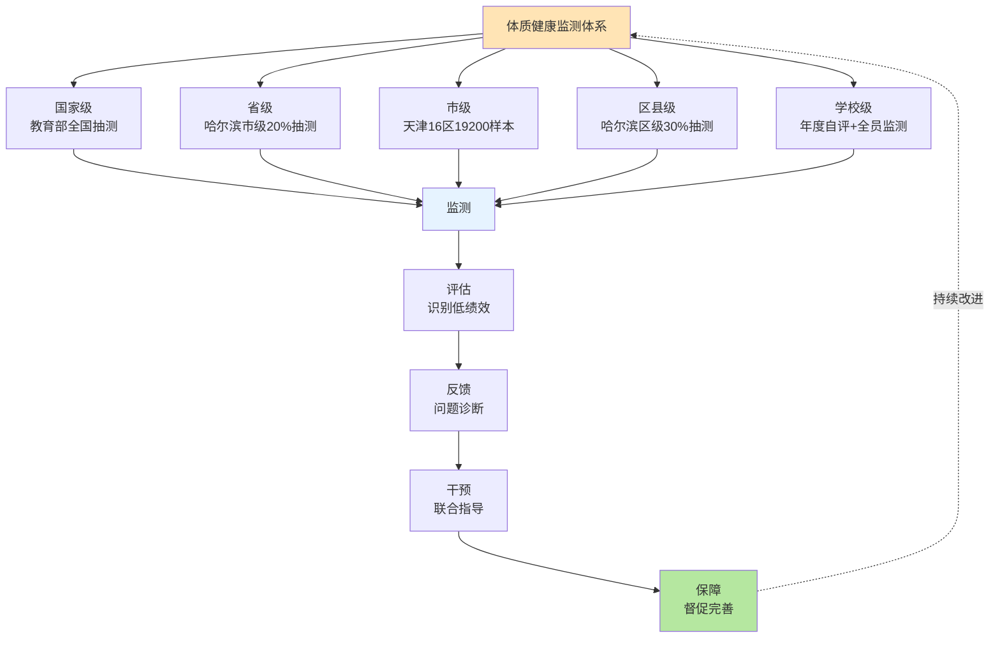

如图所示，**五级监测体系不是简单的层级叠加，而是通过"监测—评估—反馈—干预—保障"闭环将各级监测串联为有机整体**——国家级监测发现宏观趋势、省级监测识别区域差距、市级监测定位区县短板、区县监测诊断学校问题、学校监测追踪个体表现，五个层级相互衔接、信息流转，共同构成体质健康监测的完整图景。

**典型样本：青岛"政府履职评价+学校绩效考核+师生正向激励"三层级评价体系**。青岛市的实践提供了多级监测协同的最具系统性的样本——"**为全面提升中小学生体质健康水平，青岛市在考核评价方面进行了积极的探索和实践，通过考核评价，压实两个责任，激发两个动力，形成推动工作落实的合力**"[^157]。其三层级评价体系清晰明确：**第一层：强化政府履职评价，压实政府责任**——"青岛市坚决克服'唯升学''唯分数'的倾向，将'提升学生体质健康水平'纳入对区市人民政府履行教育职责评价内容，评价结果作为对区市政府及教育部门领导班子和干部考核、奖惩的重要依据。**对学生体质健康抽测成绩连续两年下降的区市，降低考核等次；连续两年下降且排名后两位的区市政府和教育行政部门，按照有关规定对负责人进行问责**"[^157]。**第二层：强化学校督导考核，压实学校责任**——"青岛每年市区两级教育行政部门与所属学校签订《提升中小学生体质健康水平责任书》，将学生体质健康情况纳入对学校绩效考核的重点指标。比如，去年市教育局对直属学校的日常考核指标中，**体质健康和近视率考核比重占到约四分之一**，同时，**将体质健康合格率排名后四分之一的学校纳入重点督导名单，约谈学校主要领导，并派驻专业技术提升辅导员**，加大指导督促力度，学生体质健康水平实现大幅度提升"[^157]。**第三层：强化师生正向激励，激发师生内生动力**——"青岛坚持德智体美劳全面发展，建立多元化评价体系，将学生体质健康结果作为毕业升学和评优评先的重要依据……将学生体质健康水平与学校干部、教师评优评先，特别是体育教师和班主任的绩效考核挂钩。比如，平度市实施校长亲自抓、干部包级部、体育老师包项目的模式，**对成绩达标的学校增加师生评优选先名额，2023年平度市学生体质健康抽测合格率、优良率比上年度分别提升3.14个百分点、9.43个百分点**"[^157]。

**典型样本：甘肃"省市县三级抽测+教育质量+校长履职考核"挂钩机制**。第5章已经援引甘肃方案"**建立省、市、县三级体质健康抽测制度，抽测结果与教育质量、校长履职考核挂钩，对体质健康持续下滑的地区和学校严肃督导整改，建立学生体质健康档案与数字画像，实施精准预警干预**"。这一机制将三级抽测与教育质量评价、校长履职考核直接挂钩，使监测的治理效能被显著放大。

**典型样本：天津"每年市级抽测+一生一案"靶向干预**。第5章已经援引天津"为每名学生建立了体质健康档案，每年开展大中小学生体质健康抽测，精准反映学生体质状况。针对体质健康测试'良好'以下的大中小学生，**建立'一生一案'促进机制，靶向提升学生体质健康水平**"[^163][^161]。"一生一案"是监测—干预闭环的微观落点——监测识别出体质良好以下的学生后，由体育教师专门制定训练计划，班主任每周检查进度，各科教师课间督促，形成多教师协同的靶向干预机制。第5章已经援引初二男生小吴的案例——"3个月后，小吴能做5个标准的引体向上，整个人都自信多了"[^163][^161]——这一微观案例生动印证了"一生一案"靶向干预的实际效果。

**公示反馈制度的全链条运行**。监测体系的政策价值不仅在于"测得准"，更在于"反馈准、改得实"。陕西"十个一"明确"**每年科学规范开展一次学生体质健康测试，逐级反馈各地（学校）体质健康水平并约谈问责**"[^164]。这一"逐级反馈+约谈问责"的全链条公示反馈制度是监测发挥治理效能的关键环节——它将监测结果转化为具体的改进要求，使被监测单位无法回避监测发现的问题。陕西"十个一"对监测—反馈—问责链条的清晰表述，是当前已公开省级文件中将监测结果与问责机制最直接挂钩的样本之一。

可以判断，**国家—省—市—县—校五级体质健康监测体系是"2小时"政策落地最具基础性、最具长期性的治理工具**。**它通过"监测—评估—反馈—干预—保障"闭环将分散的层级监测整合为有机系统，通过"政府履职评价+学校绩效考核+师生正向激励"三层级评价压实多方责任，通过"一生一案"靶向干预使监测真正转化为体质改善的实际效益**。然而五级监测体系的全面落地需要解决数据可比性、抽样代表性、监测口径统一性等技术问题——这些问题与第2章数据可比性约束形成呼应，需要在监测标准、技术规范、数据治理等方面持续完善。

## 8.4 学生体质健康数字画像与"监测—干预"联动机制

第7章四类数字赋能范式已经从教学辅助和资源保障维度论证了AI技术对学校体育的变革性价值，但**数字画像在评价监督维度的核心政策价值尚未被系统聚焦**。本节将第7章的多模态体质画像延伸至评价监督维度，论证数字画像如何支撑"个体追踪—班级诊断—学校预警—区域分析"四级评价体系，以及"监测—预警—干预—反馈"智能治理闭环的运行逻辑。

**典型样本一：天津"一生一案"作为监测—干预联动的微观闭环**。第7章已经详述天津的"一生一案"机制，本节进一步从评价监督视角审视其闭环治理价值。**天津在"进晒查罚改"五环节闭环之外，还为"每名学生建立了体质健康档案，每年开展大中小学生体质健康抽测，精准反映学生体质状况"**[^163][^161]——这一"建档—抽测—画像—干预"链条本质上是数字画像在个体层面的微观闭环。第5章已经援引初二男生小吴的案例——"体育教师专门为他制定了训练计划，每天练习静力悬垂、斜身引体，**班主任每周检查进度，各科教师也会在课间督促他练习。3个月后，小吴能做5个标准的引体向上**"[^163][^161]——这一微观案例揭示了数字画像在评价监督维度的三重价值：**第一，精准识别**——通过数据筛查锁定体测良好以下的学生群体;**第二，靶向干预**——基于个体画像设计针对性训练计划;**第三，多教师协同**——突破"体育教师独立承担"的传统评价模式，由班主任和各科教师共同参与监督和督促。这种"个体画像—靶向干预—协同督促"模式是数字画像在评价监督中最具前沿性的应用形态。

**典型样本二：武汉育才二小"学生健康智多星"作为校级数字画像样本**。第7章已经详述武汉育才二小的"多模态体育数据模型"，本节从评价监督视角审视其治理价值。**该校的"五大看板"架构（体质健康监测、体育课锻炼、课间活动、AI微站和总体画像）本质上是校级评价的数字化重构**——它将原本分散在不同教师、不同时段、不同场景的评价信息整合为统一的数字画像，使学校管理层能够"一屏看尽"全校学生的运动健康状况。**学生超重率从15.27%下降至10.8%、近视率下降6%**的实证数据已在第7章援引——这一改善幅度从侧面验证了校级数字画像作为评价工具对体质改善的实际推动作用。这一治理逻辑揭示了数字画像作为校级评价工具的核心价值——它使学校管理层从"事后总结"转变为"事中追踪"，能够及时发现问题并精准干预。

**典型样本三：上海上城"智成长平台12万学生六维健康指标"的区域级数字画像**。第7章已经详述上海上城区构建的"6个维度的健康评价框架"以及"全区健康学校地图、学校健康指数链、学生健康数字人画像"三大数字应用场景，本节从评价监督视角进一步审视。**上城区的"智能治理新闭环"是数字画像在区域级评价中最具创新性的样本**——"在心理预警维度，若'学习焦虑'等9项指标单项得分超过8分，系统将自动触发定制化的指导计划"。这一"自动预警—定制指导"机制将传统的人工评价升级为算法化、规模化、精准化的智能评价。"AI模型能深度分析情绪、运动、睡眠等数据间的内在关联，自动预警风险、精准匹配资源，形成'监测—预警—干预—反馈'的智能治理闭环"——这一闭环的运行逻辑可分解为四个关键环节：**监测**通过多源数据采集获取学生的运动、心理、睡眠等全维度状况;**预警**基于阈值或机器学习模型自动识别异常指标;**干预**根据预警结果匹配定制化指导计划;**反馈**追踪干预效果并迭代评价模型。**浙江省2024年小学教育质量监测结果显示，上城区小学生体质与健康素养达标率达98.6%**——这一全国领先水平的实证数据印证了区域级数字画像在评价监督中的治理效能。

**典型样本四：重庆"区级智慧体育驾驶舱+人和街小学和健学业智评系统"**。第7章已经详述重庆"区级智慧体育驾驶舱—校级智慧体育管理系统—校园运动智慧场景"三级架构，以及人和街小学"和健学业智评系统"为1973名学生生成"数字画像"。**"哪个孩子耐力差、哪个孩子爆发力弱，系统会自动预警，我们就能精准干预"**——这一陈明庆老师的描述揭示了数字画像作为班级评价工具的核心价值。重庆黔江区菁华小学"针对体弱和肥胖儿童，体育教师分层布置个性化体育作业，形成了'监测—分析—干预—提升'的闭环管理。**近3年来，学生的近视率累计下降了16.12个百分点，肥胖率累计下降了13.13个百分点**"——这一16.12pp和13.13pp的双下降数据是数字画像在评价监督中实证有效性的最有力证据之一。

**为综合呈现数字画像在评价监督中的四级支撑作用，下表作系统化梳理**：

| 评价层级 | 支撑功能 | 典型样本 | 实施成效 |
|----------|----------|----------|----------|
| 个体追踪 | 一生一案靶向干预 | 天津、桃园小学、棠湖中学 | 小吴3个月内引体向上0→5个 |
| 班级诊断 | 教师精准识别问题学生 | 重庆人和街小学和健学业智评 | 全班1973名学生数字画像 |
| 学校预警 | 全校多模态总体画像 | 武汉育才二小学生健康智多星 | 超重率15.27%→10.8% |
| 区域分析 | 全区健康指数与智能治理 | 上海上城12万学生六维框架 | 达标率98.6%全省领先 |

如表所示，**数字画像在四级评价中均具有不可替代的支撑作用——从个体的"一生一案"到班级的"精准识别"，从学校的"总体画像"到区域的"智能治理"，每一层级都通过数字技术实现了评价的客观化、精细化、个性化升级**。这是传统纸笔评价、人工统计无法企及的治理能力。

**数字画像作为评价工具的核心价值**集中体现在三个维度。**第一维度：客观化**——数字画像基于多源数据自动生成，避免了主观判断的随意性，使评价结果更具公信力;**第二维度：精细化**——数字画像可以追踪到每个个体的每一项指标的纵向变化，使评价从"宏观判断"走向"微观追踪";**第三维度：个性化**——基于个体画像生成的个性化干预方案使评价不再是单向的"打分"，而是双向的"提升"。

**数字画像作为评价工具的边界约束**也需要审慎讨论。**第一类边界：数据真实性边界**——数字画像的有效性高度依赖底层数据的真实性，若数据采集环节出现造假或失真，画像就会失去价值。**第二类边界：算法公平性边界**——数字画像的智能预警功能依赖于算法模型，若算法存在偏见或缺陷，可能对特定群体产生歧视性结果。**第三类边界：隐私保护边界**——数字画像涉及大量敏感个人信息，必须严格遵循第7章8节讨论的隐私保护规则，避免数据滥用风险。**第四类边界：技术替代边界**——数字画像应当辅助而非替代教师的教育判断，最终的评价结论必须由专业教师把关，避免"算法独裁"。

可以判断，**学生体质健康数字画像与"监测—干预"联动机制是数字时代学校体育评价的最前沿形态**——它将传统的纸笔评价升级为客观化、精细化、个性化的数字评价，将分散的层级评价整合为协同化的智能治理。**数字画像在评价监督维度的政策价值不仅在于"评得准"，更在于"评以致改"——它将评价的最终目的从"打分排名"重新定位为"体质改善"，从根本上扭转了应试评价的工具化扭曲**。然而数字画像的稳健推进需要数据真实性、算法公平性、隐私保护、技术边界四个维度的同步规范——这一规范化路径将在第10章风险防范中作进一步讨论。

## 8.5 "进晒查罚改"等闭环监督模式的有效性比较

评价改革解决了"评什么"的问题，监测体系解决了"测什么"的问题，但还有一个更深层的问题尚未回答——**当评价和监测识别出执行偏差后，如何通过监督问责机制使偏差被及时纠正而不是被掩盖或回避？**第4章瓶颈1（"阴阳课表"与体育课挤占）的诊断已经揭示，"出于追求升学率等教育政绩的考量，对违规挤占体育课上其他学科的课视而不见"，或"担心查出'阴阳课表'问题，影响当地教育形象，因此即便有这一问题，也加以粉饰"——这种监督失灵现象的根源在于缺乏闭环治理机制。本节将深入比较国内典型闭环监督模式的制度设计与实施成效。

**最具系统性的样本：天津"进晒查罚改"五环节闭环**。第5章已经详述天津"进晒查罚改"五环节闭环的整体设计，本节从有效性比较视角进一步审视其制度机制。**天津模式的核心创新不在于政策内容本身（许多省份都有类似的体育课时要求），而在于将"目标—措施—监督—处罚—整改"五环节制度化为不可绕过的闭环**[^163][^161]：

| 环节 | 核心机制 | 操作细节 | 制度价值 |
|------|----------|----------|----------|
| 进 | 刚性进课表 | 小初每天1节、高中每周3—5节全部编入课程计划 | 杜绝"应开未开"灰色空间 |
| 晒 | 公开晒课表 | 16个区教育局及全市中小学每学期初官网公开+举报电话 | 引入社会监督力量 |
| 查 | 常态查落实 | "四不两直"+每年不少于6次抽查+发现问题当场记录全市通报 | 直插基层防止"应付式整改" |
| 罚 | 从严罚违规 | "零容忍"+约谈+免职+暂停评优 | 直接挂钩校长职业风险 |
| 改 | 紧盯改问题 | 整改方案报市教委+整改结果公开+不达标继续查直到解决 | 销号管理防止"一罚了之" |

**天津模式的实证成效**已在前述章节多次援引——"全市中小学再无随意挤占体育课情况，体育工作真正成为学校的'一把手工程'。**2025年抽查结果显示，全市义务教育阶段学校每天一节体育课开课率达到100%，实现校内每日综合体育活动时间不低于2小时**"[^163][^161]。**2025年共约谈了40余名学校负责人**[^163][^161]——这一具体的约谈数据是闭环监督真正落地的实证标志。结合第3章已援引的天津2025年体测数据——优良率68.80%（较2024年提升6.83个百分点）、合格率99.40%——可以清晰看出"进晒查罚改"机制在数据上的强相关支撑。**"一所学校因为体育课被占用，第一次被通报后，校长被约谈；第二次再犯，校长直接被免职"**[^163][^161]——这一硬性处罚条款将体育工作从"软任务"升级为"一把手工程"，从根本上扭转了学校管理层的政策优先级。

**最具层级性的样本：青岛"政府履职评价+学校督导考核+师生正向激励"三层评价**。青岛模式的特点在于将监督问责从单一的处罚机制升级为多层次激励—问责协同体系。"**青岛市坚决克服'唯升学''唯分数'的倾向，将'提升学生体质健康水平'纳入对区市人民政府履行教育职责评价内容……对学生体质健康抽测成绩连续两年下降的区市，降低考核等次；连续两年下降且排名后两位的区市政府和教育行政部门，按照有关规定对负责人进行问责**"[^157]。这一三层评价体系的政策创新在于**将监督问责从"出问题罚"扩展到"履职评价+绩效考核+正向激励"全链条**——既有对问题学校的督导整改和约谈问责，也有对达标学校的师生正向激励，使学校管理层和师生都有明确的行为预期。**2023年平度市学生体质健康抽测合格率、优良率比上年度分别提升3.14个百分点、9.43个百分点**[^157]——这一双提升数据是青岛三层评价体系实证有效性的标志。

**最具反馈性的样本：陕西"十个一"中"逐级反馈+约谈问责"**。第5章已经介绍陕西"十个一"要求，本节从闭环监督视角审视其反馈机制。**陕西"十个一"中"一次体质健康测试与反馈：每年科学规范开展一次学生体质健康测试，逐级反馈各地（学校）体质健康水平并约谈问责"**[^164]——这一表述将监测结果与约谈问责直接挂钩，是省级文件中将"测试—反馈—问责"链条最简洁有力地表达的样本之一。陕西"一次专题会"要求"每学期召开一次学校体育工作专题会，**夯实教育局长、校长抓学校体育工作第一责任**"[^164]——"教育局长+校长第一责任"的明确表述将监督问责的责任主体锁定为教育行政首长和学校负责人，与天津"违规校长免职"形成思路上的呼应。

**最具基层性的样本：湖南大祥区"督导视角下的校园活力密码"**。湖南大祥区的实践提供了基层学校督导整改的代表样本——"**带着一些问题和思考，我走进了三八亭小学、祥凤实验学校和西苑小学等学校……发现这些学校教师团队经验丰富，注重培养学生的综合素质，教学成果显著。但在文体活动的认识、管理和课程建设上还不够清晰、系统、完整，存在资源与条件短缺、时间冲突与挤占、评价与激励机制缺失、家校社协同不足、部分文体活动仍流于形式难以达到预期效果等亟待解决的问题**"[^165]。该区责任督学通过"师生访谈、现场查看、多方咨询"识别问题，并"与上述学校校长、文体教师进行沟通，共同查找问题产生的主要原因"，最终通过"实地查看、师生访谈、查阅资料、听取汇报等形式对学校整改情况进行了督导回访"[^165]。**实施成效非常具体——"在全区新一轮的体能测试中，学生体能及格率提升10个百分点"**[^165]。三八亭小学"一班一特色"激活课间活力的微观创新——"将教室后空地、走廊、花园角等碎片空间转化为运动场，鼓励教师定制本班独特的游戏体系，由班主任带头开展运动，15分钟被玩出新花样"[^165]——是基层督导推动微观创新的代表案例。

**最具引导性的样本：崇明区责任督学"以导优化作业设计、以督落实体质健康提升"**。崇明区的实践提供了责任督学引导学校优化体育作业的代表样本——督学通过"查阅方案、访谈师生家长、梳理体锻反馈等方式，精准定位该校暑期体育作业五大核心问题：一是忽视安全……二是管理缺失……三是内容笼统……四是形式单一……五是激励不足"[^166]。在精准诊断后，督学通过"与学校体育教研组长、骨干教师、德育处负责人多次专题研讨，对照短板逐项优化，实施靶向式指导"[^166]——具体优化包括"筑牢安全底线""搭建记录载体（设计体育锻炼打卡记录表，包含运动日期、锻炼项目、完成情况、练习时长、家长签字等栏目，实现锻炼过程"可视化、可追溯"）""落实分层选择""丰富互动形式""完善激励机制"[^166]五个维度。**这一"以导促改"的督导模式与"以督促改"的天津模式形成了思路上的互补——前者偏重指导优化，后者偏重监督处罚，两者协同构成了督导工作的完整工具箱**。

**为综合呈现五大典型监督模式的制度特色，下表作横向比较**：

| 模式 | 核心特征 | 主导机制 | 实施成效 |
|------|----------|----------|----------|
| 天津"进晒查罚改" | 五环节闭环 | 处罚问责为核心（违规校长免职） | 100%开课率+96.8%学校落实2小时 |
| 青岛三层评价 | 政府+学校+师生 | 履职评价+正向激励为核心 | 平度市优良率+9.43pp |
| 陕西"十个一" | 简明十条要求 | 逐级反馈+约谈问责为核心 | 第一责任明确锁定 |
| 湖南大祥区督导 | 基层督导整改 | 问题诊断+整改回访为核心 | 学生体能及格率+10pp |
| 崇明区责任督学 | 以导优化作业 | 精准诊断+靶向指导为核心 | 寒假体育作业五大优化 |

如表所示，**五大监督模式在制度特色上各有侧重，但都遵循"问题识别+分析诊断+整改要求+成效追踪"的共同逻辑**。从这一比较中可以提炼**闭环监督的四类共性要素**：

**共性要素一：公开透明**。天津"晒课表+举报电话+全市通报"、青岛"将体质健康抽测成绩排名公开"、陕西"每年逐级反馈各地体质健康水平"——这些做法的共同逻辑是通过透明化机制引入社会监督力量，使政策执行从"封闭操作"走向"阳光治理"。**透明化是闭环监督的第一道防线**——它通过暴露使违规行为失去隐藏空间。

**共性要素二：随机抽查**。天津"四不两直"（不发通知、不打招呼、不听汇报、不陪同接待，直奔基层、直插现场）[^163][^161]、青岛"派驻专业技术提升辅导员"[^157]、湖南大祥区"实地查看、师生访谈、查阅资料"[^165]——这些做法的共同逻辑是通过随机抽查避免被监督单位的"应付式整改"。**随机抽查是闭环监督的真实性保障**——它使监督结果反映真实状况而非预设场景。

**共性要素三：严肃问责**。天津"违规校长第二次免职"、青岛"对负责人进行问责"、陕西"约谈问责"——这些做法的共同逻辑是通过严肃问责使违规成本足够高，从根本上扭转"重智轻体"的办学惯性。**严肃问责是闭环监督的震慑底线**——它使学校管理层无法以"工作疏忽"等理由回避责任。

**共性要素四：销号管理**。天津"整改方案要报市教委+整改结果要公开+不达标继续查直到解决"[^163][^161]、湖南大祥区"督导回访"[^165]、崇明区"实地查看、师生访谈、查阅资料"[^166]——这些做法的共同逻辑是通过销号管理防止"一罚了之"的形式主义，使整改要求真正得到落实。**销号管理是闭环监督的最终闭环**——它使监督从单点执法走向系统治理。

**闭环监督模式的可复制性与差异化适配**。从五大典型模式比较看，**天津"进晒查罚改"的可复制性最强**——其核心机制（公开晒课表+四不两直抽查+违规校长问责+整改销号）具有较强的普适性，对各类资源条件的省市都具有借鉴价值。**青岛三层评价的可复制性较强**——其将政府履职评价、学校绩效考核、师生正向激励整合为协同体系的思路对各地都有参考意义，但其全面落地需要省级层面的政策支撑。**湖南大祥区和崇明区的督导模式可复制性最高**——其督学引导整改的具体方法和精准诊断的工作流程可被各级督导部门直接借鉴。**陕西"十个一"的可复制性最高**——其简明的十条要求使各地学校都能直观理解和执行。差异化适配的关键变量在于**地方政府治理决心**——闭环监督模式的核心成本不在于财政或师资投入，而在于敢不敢真查、敢不敢真罚、敢不敢真追责，这一治理决心直接决定了模式的实际效果。

可以判断，**"进晒查罚改"等闭环监督模式是当前学校体育治理中最具操作性、最具威慑力、最具实证有效性的制度工具**。**这些模式的共同价值在于将监督从"零散执法"升级为"系统治理"，将处罚从"事后补救"前移到"事中纠偏"，将问责从"软批评"硬化为"硬约束"——使"2小时"政策从"政策文本"真正转化为"校园常态"**。这一治理逻辑与第6章课时刚性化、第7章资源保障形成"目标—资源—监督"三位一体的协同链条，共同支撑"2小时"政策的高质量落地。

## 8.6 教育督导制度的专项化推进与督导评估指标体系

闭环监督模式聚焦于具体执行偏差的纠正，但还有一个更具基础性、更具长期性的制度工具尚未被系统讨论——**教育督导制度**。督导制度是中国教育治理体系中独立于教育行政管理的专门监督机制，其专业性、权威性、独立性使其在学校体育治理中具有不可替代的地位。本节将系统梳理《中小学校体育工作督导评估办法》确立的督导指标体系与评估程序，论证督导制度的专项化推进路径。

**督导评估的总体框架与三大原则**。国务院教育督导委员会办公室公布的《中小学校体育工作督导评估办法》是当前学校体育督导制度的国家级基础性文件——"**规定地方各级政府和教育行政部门要将中小学校体育督导评估结果作为干部考核、学校问责和实行奖惩的重要依据**"[^162]。这一表述将督导评估结果直接锁定为干部考核、学校问责、奖惩实施的"重要依据"，使督导评估从"内部自查"升级为"治理工具"。

**督导评估的三大原则**为督导工作的专业化、规范化提供了基础性指引：**第一原则：严格标准**——"国务院教育督导委员会办公室制定统一的督导评估指标和标准。各地按照国家制定的统一标准在开展地方督导评估中严格落实"[^162]。这一原则确保了全国督导工作的标准化，避免各地督导口径不一致带来的可比性问题。**第二原则：客观公正**——"以中小学校体育工作实际情况为依据，督导过程和结果公开、透明，接受社会监督"[^162]。这一原则将公开透明作为督导工作的基本要求，与8.5节闭环监督模式中的"公开透明"共性要素形成精准呼应。**第三原则：注重实效**——"坚持督政与督学并重，**坚持综合督导与专项督导、定期督导与随机性抽查相结合**，以评促建、以评促改，不断提升中小学校体育工作水平和教育教学质量"[^162]。"督政与督学并重""综合与专项相结合""定期与随机相结合"的三维结合是督导工作覆盖完整的关键设计——它使督导既有面上的全面覆盖，也有点上的精准聚焦。

**督导评估的五大维度指标体系**。《督导评估办法》明确"督导评估主要围绕统筹管理、教育教学、条件保障、评价考试、体质健康等方面内容展开"[^162]。下表对五大维度的具体指标作系统化梳理：

| 督导维度 | 核心指标 | 政策对接 |
|----------|----------|----------|
| 统筹管理 | 加强组织领导、实施发展规划、完善规章制度、落实管理责任、加强绩效考核 | 第1章政策定位+本章8.7节政府履职评价 |
| 教育教学 | 开足开齐体育与健康课程、实施大课间体育活动、深化教学改革、提高教学质量、强化学生课外锻炼、广泛开展阳光体育运动、积极开展课余训练和组织丰富多彩的竞赛活动、定期召开运动会 | 第6章时间结构与教学质量 |
| 条件保障 | 配齐配强体育师资、加强师资队伍培训、落实体育教师待遇、推动体育场地设施达标、实施学校体育安全风险防控、加大体育经费投入 | 第7章师资场地与数字赋能 |
| 评价考试 | 完善学校体育考试制度、规范考试考核过程、发挥体育考试的导向作用、按照规定办法建立学校体育评估制度、实施学校体育工作年度报告制度 | 本章8.1—8.4节评价改革 |
| 体质健康 | 建立健全学生体质健康档案、加强学校卫生工作、实施《国家学生体质健康标准》和《学生体质健康监测评价办法》、促进学生体质健康水平明显提高 | 本章8.3—8.4节监测体系 |

如表所示，**督导评估的五大维度精准覆盖了第1章政策定位、第6章教学质量、第7章资源保障、本章8.1—8.4节评价监测——基本与本研究"现状测量—影响因素—政策保障"分析框架形成全维度对接**。这一对接关系揭示了督导制度作为学校体育治理"总枢纽"的政策定位——它不是某一个环节的监督工具，而是覆盖政策落地全链条的系统性治理机制。

**督导评估的五步工作程序**。《督导评估办法》明确了规范化的工作程序：**"1、印发通知。开展督导评估前，教育督导部门向被督导单位印发督导评估的通知。2、开展自评。被督导单位按照通知要求进行自评，并将自评报告报送教育督导部门。3、实地督导。教育督导部门派出督导组，采取听汇报、问卷调查、访谈座谈、校园观察、查阅资料等方式进行实地督导抽查。4、反馈意见。督导组综合被督导单位的自评报告、实地督导情况，形成初步督导意见，并向被督导单位反馈。5、整改复查。教育督导部门向被督导单位发出督导意见书，督促、指导被督导单位按督导意见书要求进行整改，必要时进行回访复查"**[^162]。这一"通知—自评—督导—反馈—整改"五步程序的政策价值在于将督导工作从"突击检查"升级为"规范流程"——它使被督导单位在督导前能够通过自评做好准备，在督导中有清晰的工作流程，在督导后能够按督导意见整改，避免督导工作的随意性。

**四级督导部门的职责分工与协同机制**。《督导评估办法》明确了四级教育督导部门的协同职责——"**县级教育督导部门要定期对区域内中小学校体育工作开展全面的督导评估工作，组织各中小学校做好自查工作，形成县级督导评估报告，并报市级教育督导部门。市级教育督导部门加强对所辖县（市、区）的督促指导工作，汇总本市督导评估工作情况，形成市级督导评估报告，并报省级教育督导部门。省级教育督导部门根据本办法和本地实际，建立健全本地区学校体育督导评估机制，制定实施方案，每2-3年开展一次学校体育专项督导评估，形成省级督导评估报告，并报国务院教育督导委员会办公室。国务院教育督导委员会办公室根据当年中小学体育工作重点及存在的薄弱环节，确定督导评估的重点，随机确定督导对象、随机选派督导人员，进行实地督导抽查，形成国家督导报告，适时向社会公开**"[^162]。

下图刻画了四级督导部门的职责协同关系：

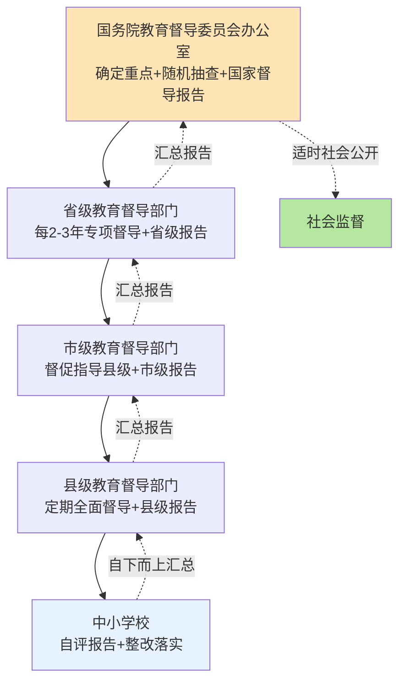

如图所示，**四级督导部门通过"自下而上汇总+自上而下指导"的双向流动构成完整的督导体系**——县级督导直接覆盖学校层面、市级督导汇总督促县级、省级督导每2—3年开展专项督导、国务院教育督导委员会办公室开展全国性随机抽查并向社会公开。这一层级架构既保证了督导工作的全面覆盖，又通过随机抽查和社会公开机制防止层级督导中的失真和粉饰。

**典型样本：湖南大祥区责任督学制度的基层落地**。第8.5节已经详述湖南大祥区责任督学的实践，从督导制度视角进一步审视其制度价值。**责任督学制度是教育督导工作下沉到基层的关键载体**——它将原本远离学校的督导工作拉近到"责任督学走进学校"的常态化形态，使督导工作真正具有了"贴近性"。"在通过师生访谈、现场查看以及多方咨询之后，发现这些学校教师团队经验丰富，注重培养学生的综合素质，教学成果显著。但在文体活动的认识、管理和课程建设上还不够清晰、系统、完整"[^165]——这一"贴近式"督导发现的问题往往比"突击式"督导更具针对性和真实性。"在与学校校长、分管副校长、相关教师共同商量的基础上，我们提出了以下整改措施"[^165]——"共同商量"的工作方式体现了督导工作"以导促改"的工作哲学。

**典型样本：崇明区责任督学制度的精准诊断**。第8.5节也已经详述崇明区责任督学制度的实践。其督导工作的精准诊断方法尤其值得关注——"**通过查阅方案、访谈师生家长、梳理体锻反馈等方式，精准定位该校暑期体育作业五大核心问题**"[^166]。"查阅方案+访谈师生家长+梳理体锻反馈"的三维诊断方法使督导工作从"主观判断"升级为"证据导向"，是督导工作专业化的代表样本。

**督导评估指标体系的"2小时"专项化推进**。在"2小时"政策推开背景下，督导评估指标体系需要进一步专项化、精细化。基于第6章时间结构和第7章资源保障的核心要求，可提出以下专项化建议：**第一，将"每天1节体育课开课率"作为督导评估的核心指标**——每节课的真实开设状况通过"四不两直"等随机抽查机制核查;**第二，将"上下午各30分钟大课间执行情况"作为督导评估的关键指标**——通过实地观察和录像核查大课间活动的真实质量;**第三，将"课间15分钟微运动"作为督导评估的特色指标**——通过对学生课间活动的现场观察评估"课间圈养"现象的破解程度;**第四，将"班师比达标情况"作为督导评估的硬性指标**——参照教师〔2025〕1号《通知》"小学5∶1、初中6∶1、高中8∶1"的硬指标核查师资配备状况;**第五，将"场地设施配备状况"作为督导评估的基础性指标**——核查校内"金边银角"利用、运动器材达标率等具体指标。这些专项化指标使督导评估从"原则性框架"升级为"操作性清单"，为各级督导部门提供具体的工作抓手。

**督导评估结果作为干部考核与奖惩依据的制度刚性**。《督导评估办法》明确"将中小学校体育督导评估结果作为干部考核、学校问责和实行奖惩的重要依据"[^162]——这一表述使督导评估真正具有了治理刚性。结合8.5节闭环监督模式，督导评估结果的使用应当形成"问题识别—分级处置—奖惩挂钩"的完整链条：对优秀单位给予表彰激励、对一般单位给予指导提升、对薄弱单位给予约谈问责、对持续下滑单位启动"一票否决"——这一分级处置机制将在8.7节作进一步展开。

可以判断，**教育督导制度的专项化推进是学校体育治理最具基础性、最具长期性的制度安排**。**它通过五大维度指标的全面覆盖、五步工作程序的规范化运行、四级督导部门的协同分工，构筑了学校体育治理的"总枢纽"**。督导制度与8.5节闭环监督模式形成"基础制度+具体工具"的协同——前者提供制度框架，后者提供操作机制，两者共同支撑学校体育治理的系统化推进。然而督导制度的有效运行依赖于督导部门的专业能力和独立地位——若督导队伍专业能力不足或受教育行政部门干扰，督导工作就难以发挥应有的治理效能;这一专业化建设是督导制度持续完善的关键方向。

## 8.7 政府履职评价、校长考核与"一票否决"刚性约束设计

教育督导制度提供了学校体育治理的基础框架，但要真正确保"2小时"政策在最高层级得到重视，必须建立**将"2小时"落实纳入政府履职评价与校长考核的刚性约束机制**。本节聚焦评价监督的最高层级，分析"一票否决"等刚性约束的政策演进、典型样本与制度设计。

**"一票否决"政策的演进脉络**。"一票否决"作为学校体育治理的最高刚性约束，其政策演进可追溯至2007年。**教育部2007年版《通知》最早确立了一票否决机制**——"学校体育和学生体质健康水平将作为教育等有关部门和学校领导干部业绩考核的重要内容。**对学生体质健康水平持续3年下降的地区和学校，在教育工作评估和评优评先中实行'一票否决'**"[^167]。这一表述明确了一票否决的核心要素：**触发条件**——学生体质健康水平持续3年下降;**适用范围**——地区和学校;**否决领域**——教育工作评估和评优评先。

**国办发〔2016〕27号文进一步强化了一票否决机制**。"日前，国务院办公厅印发的《关于强化学校体育促进学生身心健康全面发展的意见》（以下简称《意见》）指出，把学校体育工作列入政府政绩考核指标、教育行政部门与学校负责人业绩考核评价指标。**学生体质健康水平持续三年下降的地区和学校，在教育工作评估中'一票否决'**"[^159]。教育部体育卫生与艺术教育司司长王登峰对一票否决的执行机制作了具体解读——"**'教育部每年测试学生体质并上报，并组织专家现场抽测，若某地方的学生体质健康水平持续三年下滑，即启动"一票否决"'**"[^159]。这一"年测+专家抽测+持续三年下滑触发"的执行机制使一票否决从"原则规定"升级为"操作规范"。

**为更直观呈现一票否决政策的演进脉络，下表作系统化梳理**：

| 时间 | 政策文件 | 一票否决条件 | 适用范围 |
|------|----------|--------------|----------|
| 2007年 | 教育部《通知》 | 学生体质健康水平持续3年下降 | 地区和学校教育工作评估和评优评先 |
| 2016年 | 国办发〔2016〕27号 | 学生体质健康水平持续3年下降 | 教育工作评估 |
| 2024—2025年 | 《教育强国建设规划纲要》+《意见》 | 强化为政府履职评价和校长考核挂钩 | 教育部门评价+学校问责+奖惩 |

如表所示，**一票否决政策从2007年首次确立到2024—2025年新一轮强化，呈现了"触发条件不变、适用范围扩大、执行机制细化"的演进特征**——其核心制度内核保持稳定，但适用领域从单一的教育评估扩展到政府履职评价、校长考核、学校问责等多维领域，使一票否决真正成为学校体育治理的"终极刚性约束"。

**最具标杆性的样本：青岛"提升学生体质健康水平纳入区市政府履职评价"**。青岛市的实践提供了一票否决政策落地最具操作性的样本。**第8.3节已经援引青岛三层级评价体系，本节从一票否决视角进一步审视**。其核心机制——"将'提升学生体质健康水平'纳入对区市人民政府履行教育职责评价内容，评价结果作为对区市政府及教育部门领导班子和干部考核、奖惩的重要依据。**对学生体质健康抽测成绩连续两年下降的区市，降低考核等次；连续两年下降且排名后两位的区市政府和教育行政部门，按照有关规定对负责人进行问责**"[^157]。

**青岛模式相对于国家层面一票否决政策的两大创新**值得特别关注。**第一项创新：将"3年下降"门槛降低为"2年下降"**——"对学生体质健康抽测成绩连续两年下降的区市，降低考核等次"将下滑年限从3年缩短至2年，使一票否决的触发更加敏感，避免了"3年下滑等到第3年才追责"的滞后问题。**第二项创新：引入"排名后两位"的相对位置约束**——"连续两年下降且排名后两位的区市政府和教育行政部门，按照有关规定对负责人进行问责"将绝对下滑标准与相对位置标准结合，使问责更具针对性，避免"全省整体下滑时无人被问责"的失灵风险。**这两项创新使青岛模式成为当前已公开省市级一票否决机制中最具刚性、最具操作性的样本**，对其他地区在制定类似机制时具有直接借鉴价值。

**最具硬性的样本：天津"违规校长约谈—免职"链条**。第5章和第8.5节已经详述天津"进晒查罚改"五环节闭环。从一票否决视角看，**天津"第二次违规校长直接被免职"的硬性条款是当前已公开方案中最直接、最硬性的校长问责机制**——"一所学校因为体育课被占用，第一次被通报后，校长被约谈；第二次再犯，校长直接被免职"[^163][^161]。这一"第一次约谈+第二次免职"的两步问责链条具有清晰的预期性和强烈的震慑性——**它使每一位学校管理层都清楚知道"挤占体育课"的具体代价，从根本上扭转了"重智轻体"的办学决策**。"据统计，2025年共约谈了40余名学校负责人并给予批评教育、书面检查、暂停评优等处分"[^163][^161]——40余名校长被约谈的具体数据是问责机制真正落地的实证标志。

**最具协同性的样本：甘肃"抽测结果与教育质量、校长履职考核挂钩"**。第5章已经援引甘肃方案"建立省、市、县三级体质健康抽测制度，**抽测结果与教育质量、校长履职考核挂钩**，对体质健康持续下滑的地区和学校严肃督导整改"。**甘肃模式的政策创新在于将抽测结果与"教育质量评价+校长履职考核"双轨挂钩**——这一双轨挂钩既将一票否决从单一的教育评估扩展到教育质量评价的整体框架，又将其从地区层面延伸到校长个人履职考核的微观层面，使一票否决的治理网络更加密集。

**典型样本：陕西"教育局长+校长第一责任"明确锁定**。第8.5节已经援引陕西"十个一"中"一次专题会"要求"每学期召开一次学校体育工作专题会，**夯实教育局长、校长抓学校体育工作第一责任**"[^164]。"教育局长+校长第一责任"的明确表述将责任主体锁定为教育行政首长和学校负责人，使一票否决具有了清晰的责任承担对象。这一责任主体锁定与天津"违规校长免职"形成思路上的呼应——只有当责任主体明确，问责才能精准落地。

**"四级问责体系"的协同设计**。综合青岛、天津、甘肃、陕西等典型样本，可以提炼出"政府政绩考核+教育部门评价+校长履职考核+体育教师绩效"四级问责体系：**第一级：政府政绩考核**——将"提升学生体质健康水平"纳入对区市人民政府履行教育职责评价（青岛模式）;**第二级：教育部门评价**——将抽测结果与教育部门领导班子和干部考核挂钩（青岛+甘肃模式）;**第三级：校长履职考核**——将体质健康指标纳入校长履职考核（甘肃+陕西模式）;**第四级：体育教师绩效**——将学生体质健康水平与体育教师和班主任的绩效考核挂钩（青岛模式）。**四级问责体系的协同设计使一票否决从单点处罚升级为多层联动**——任何一个环节的失职都可能触发问责机制，从根本上压实了多方责任。

下图刻画了四级问责体系的协同关系：

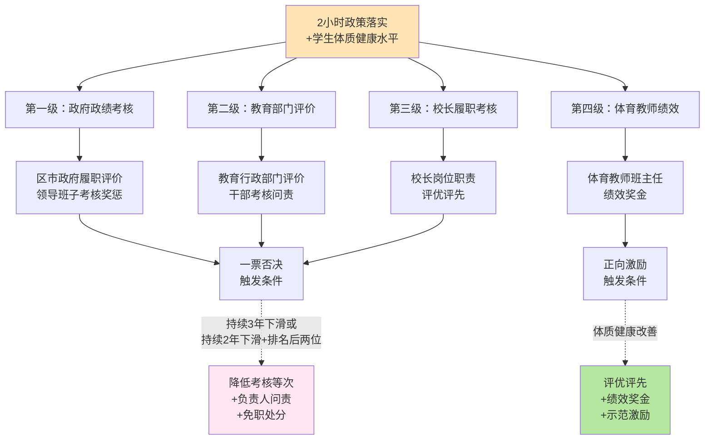

如图所示，**四级问责体系通过"一票否决+正向激励"双向触发机制，使学校体育治理形成完整的"奖优罚劣"动态平衡**——既有对失职者的硬性问责，也有对优秀者的正向激励，避免了"只罚不奖"导致的基层畏难情绪。

**地方实践：安徽"省市县三级联动公布体育课监督举报电话"**。第1章已经援引安徽"省市县三级联动公布体育课监督举报电话"的做法，本节从问责机制视角进一步审视。**这一"举报电话+三级联动"的设计是一票否决机制向社会监督延伸的代表样本**——它使家长、学生、教师等社会主体都成为政策执行的监督力量，从根本上突破了"内部监督失灵"的治理困境。这一思路与天津"晒课表+举报电话"[^163][^161]、青岛"将考核结果作为奖惩依据"形成了思路上的呼应——共同构成了"内部监督+社会监督+顶层问责"三位一体的全方位治理网络。

**"一票否决"作为终极刚性约束的适用边界**。一票否决虽然是最具威慑力的治理工具，但其适用边界也需要审慎讨论。**第一类边界：触发条件的合理性**——一票否决的触发条件不能过低（如单年下滑就否决会导致治理过激），也不能过高（如5年才下滑才否决会失去敏感性）。当前国家层面"3年持续下滑"和青岛"2年持续下滑+后两位"的设计在敏感性和稳定性之间取得了较好平衡。**第二类边界：适用范围的精准性**——一票否决应当聚焦于"教育工作评估""评优评先""干部考核"等核心领域，避免无限扩张到"项目立项""资金拨付"等所有领域，否则可能演变为"运动式问责"。**第三类边界：判断依据的客观性**——一票否决的判断必须基于客观可验证的数据（如《国标》测试结果），避免主观判断的随意性。

**防范"运动式问责"的制度平衡**。一票否决的有效推进还需要防范两类异化风险：**第一类异化：过度问责导致的形式主义反弹**——若问责过于严苛、问责面过于宽泛，可能导致基层学校采取"应付式整改""数据造假""指标做账"等异化行为反向规避问责，反而损害政策落地的真实性。**第二类异化：单向问责忽视支持机制**——若只问责而不提供资源支持，欠发达地区学校可能因"先天不足"而被持续问责，形成"越问责越不达标、越不达标越问责"的恶性循环。这两类异化风险的防范需要在问责机制设计中嵌入"分级处置+整改支持+申诉复核"等制度平衡——**对违规故意行为严肃问责，对客观条件限制行为提供整改支持，对申诉合理诉求允许复核纠正，使问责真正服务于政策落地而非异化为"为罚而罚"**。

可以判断，**政府履职评价、校长考核与"一票否决"刚性约束是学校体育治理中最具威慑力、最具杠杆效应的政策工具**。**它通过"政府政绩考核+教育部门评价+校长履职考核+体育教师绩效"四级问责体系的协同设计，使"2小时"政策落实从"软任务"升级为"硬约束"——任何层级、任何主体的失职都将触发刚性问责机制**。这一机制与8.5节闭环监督模式、8.6节督导制度形成"督导框架+具体工具+终极约束"的三层治理金字塔，共同支撑学校体育治理的系统化推进。然而一票否决的稳健推进需要在敏感性与稳定性、刚性与灵活性、问责与支持之间寻求精细平衡——这一精细平衡是一票否决机制持续完善的核心方向。

## 8.8 评价监测监督问责的协同治理路径与建议清单

作为本章总结，将评价改革、监测体系、监督问责三大支柱整合为协同治理路径，并提出可操作的政策建议清单。

**协同治理路径的整体架构**可由下图刻画：

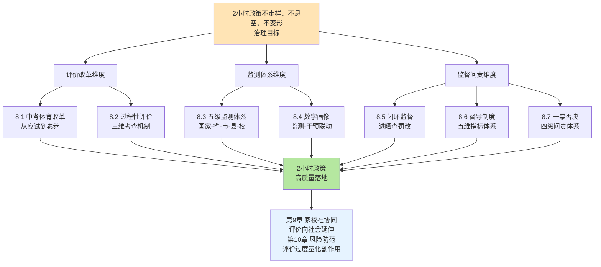

如图所示，**评价、监测、监督问责三大支柱不是各维度的简单并列，而是以"2小时政策不走样、不悬空、不变形"治理目标为顶层目标、以评价改革重塑导向、以监测体系识别差距、以监督问责压实责任的有机整合**——三个维度相互支撑、缺一不可。

**协同治理路径对核心瓶颈的政策对接**可作如下系统化总结：

| 第4章核心瓶颈 | 本章对接维度 | 关键举措 |
|--------------|------------|---------|
| 瓶颈1：阴阳课表与体育课挤占 | 监测体系+监督问责 | 8.5节"晒课表+四不两直"+8.7节违规校长免职 |
| 瓶颈3：应试化训练与"为考而练" | 评价改革+过程性评价 | 8.1节素养体育改革+8.2节"日常参与+体质监测+专项技能"三维考查 |
| 瓶颈4：安全过度防御与防御性教学 | 监测体系 | 8.3节"监测—评估—反馈—干预—保障"闭环 |
| 瓶颈2：师资紧平衡 | 督导制度+一票否决 | 8.6节督导评估指标"配齐配强体育师资"+8.7节四级问责体系 |
| 瓶颈7：兴趣枯燥与个体负反馈 | 评价改革+数字画像 | 8.1节多元项目结构+8.4节一生一案靶向干预 |

**可操作的政策建议清单**：

**第一类：中考体育改革**——（1）落实"过程性+终结性结合"双轨制中考体育考试方式，过程性评价权重应不低于20%—30%（参照青海20分占70总分的29%、长垣30分占100总分的30%）;（2）丰富中考体育选考项目，构建"基础性+综合性+选择性"三维项目结构，鼓励增设促进学生兴趣特长发展的项目;（3）将体育社团参与、体育竞赛获奖等多元素养指标纳入过程性评价;（4）适度上调中考体育分值（参照各地70—100分的范围），但必须与考试方式改革协同推进，避免单纯提分加剧应试化倾向;（5）将心肺复苏术等健康素养内容纳入体育评价考核，扩展评价的素养维度。

**第二类：过程性评价构建**——（6）建立学生体育成长档案，常态化、规范化记录学生三年（初中阶段）或六年（小学阶段）体育表现;（7）落实"日常参与+体质监测+专项运动技能"三维考查机制（参照《深化新时代教育评价改革总体方案》要求）;（8）建立"三方签字+扣分制"等防作假机制，确保过程性评价的真实性可信度;（9）规范转学休学衔接、残免病免认定等操作细节，避免操作环节的舞弊空间;（10）严格落实"学籍所在学校原则"，防止"挂靠考试"等异化现象。

**第三类：监测体系建设**——（11）完善国家—省—市—县—校五级体质健康监测体系，省级抽测比例不低于20%、区县级不低于30%（参照哈尔滨标准）;（12）建立"监测—评估—反馈—干预—保障"五环节闭环工作体系，使监测结果真正转化为治理效能;（13）推进数字画像建设，构建"个体追踪—班级诊断—学校预警—区域分析"四级评价体系（参照武汉育才二小、上海上城、重庆等样本）;（14）落实"一生一案"靶向干预机制（参照天津模式），针对体测良好以下学生制定个性化训练计划;（15）建立监测结果向社会公开、向被测单位反馈、向问题区校约谈问责的全链条公示反馈制度（参照陕西"十个一"）。

**第四类：闭环监督推广**——（16）推广天津"进晒查罚改"五环节闭环监督模式，包括刚性进课表、公开晒课表、"四不两直"查落实、零容忍罚违规、整改验收销号;（17）建立省市县校多级督导评估机制，每2—3年开展一次专项督导评估（参照《督导评估办法》要求）;（18）落实"统筹管理、教育教学、条件保障、评价考试、体质健康"五维督导评估指标体系，将"2小时"落实情况作为核心指标;（19）健全责任督学制度，使督导工作下沉到基层学校形态;（20）将"以督促改"和"以导促改"两种工作模式协同推进（参照天津与湖南大祥区/崇明区模式）。

**第五类：督导问责强化**——（21）将"提升学生体质健康水平"纳入政府履职评价（参照青岛模式），将评价结果作为对地方政府及教育部门领导班子和干部考核、奖惩的重要依据;（22）落实"持续3年下降一票否决"机制（国家层面）或"持续2年下降+排名后两位问责"机制（青岛标杆）;（23）建立"政府政绩考核+教育部门评价+校长履职考核+体育教师绩效"四级问责体系;（24）借鉴天津"违规校长约谈—免职"两步问责链条（第一次约谈+第二次免职），使问责机制具有清晰预期性和强烈震慑性;（25）建立"内部监督+社会监督+顶层问责"三位一体治理网络，参照安徽"省市县三级联动公布体育课监督举报电话"等做法。

**协同治理路径的可复制性与差异化适配**。这25项政策建议的可复制性整体较高，但需要根据各地资源禀赋差异化适配——发达地区可重点推进数字画像、智成长平台、AI智能治理等高内涵建设;欠发达地区可优先落实中考体育改革、过程性评价构建、五级监测体系等基础性建设;混合型省份可参考青岛三层评价体系，分层级、分阶段推进。

**坦诚说明评价监督机制推进中的现实张力**。在落地中，评价监督机制的协同推进将面临三类张力：**第一，过度问责与基层应付的张力**——若问责过于严苛、问责面过于宽泛，可能导致基层学校采取"应付式整改""数据造假""指标做账"等异化行为，反向规避问责。化解这一张力需要在问责机制中嵌入"分级处置+整改支持+申诉复核"等制度平衡，使问责真正服务于政策落地而非异化为"为罚而罚"。**第二，数字画像隐私风险与精准评价的张力**——数字画像虽然能够实现客观化、精细化、个性化评价，但涉及大量敏感个人信息，如不规范处理可能损害学生权益。化解这一张力需要落实第7章8节讨论的隐私保护规则——年度告知、明确用途、分级授权、技术补救等。**第三，刚性约束与差异化适配的张力**——一票否决等刚性约束机制虽然震慑力强，但若不考虑地区差异、城乡差异、学段差异，可能对欠发达地区或客观条件受限的学校造成不公平后果。化解这一张力需要在刚性约束基础上嵌入"差异化标准+整改支持+正向激励"等弹性机制。

**本章为第9章和第10章的衔接逻辑**。**第9章家校社协同**将进一步将评价改革向家庭和社会延伸——过程性评价中的"家庭体育作业""家长签字"等做法已经初步显示了评价向家庭延伸的可能性，第9章将进一步探讨"家长体育素养评价""社区体育资源协同评价"等更广延伸路径。**第10章风险防范**将专门讨论评价监督机制可能产生的副作用——包括"应付式整改""数据造假""人人高分"等异化风险，以及一票否决过度问责、数字画像隐私泄露等具体风险，并提出针对性防范机制。

可以判断，**评价改革、监测体系、监督问责三大支柱的协同治理是"2小时"政策从"政策推开"迈向"高质量落地"的治理保障**——它通过评价导向重塑解决"为什么要做"的动力问题、通过监测体系建设解决"做得怎样"的认知问题、通过监督问责强化解决"做不好怎么办"的约束问题。**这三个问题的协同解决使"2小时"政策真正具有了"目标—措施—主体—资源—监督—评估"的完整闭环——这正是本研究持久推理指导标准P-5"政策建议的可操作性与闭环性"的具体落地，也是本研究三大政策保障专题章节（第6章教学机制、第7章资源保障、第8章治理机制）共同支撑的政策落地体系**。后续第9章家校社协同将延伸这一治理体系到校外场景，第10章风险防范将识别这一体系的潜在风险并提出综合保障路径，最终形成本研究"现状测量—影响因素—政策保障"三位一体分析框架的完整闭环。

# 9 政策保障机制设计：家校社协同与文化培育

第6章构建了校内时间结构与教学质量的核心机制，第7章夯实了师资、场地、数字三维资源底盘，第8章则以评价改革、监测体系、监督问责三大支柱构筑了治理保障——三章共同支撑了"2小时"政策在校内场域的高质量落地。然而第2章在结构性短板识别中已经明确指出："家庭与校外锻炼场景的薄弱环节"是五大短板之一——"放学后基本不动"使校外场景在"综合体育活动时间"口径中长期处于失能状态;第4章瓶颈5、瓶颈6、瓶颈7的诊断也揭示了家庭作业挤压、培训市场失序、兴趣枯燥与个体负反馈等跨层耦合矛盾的存在。**这些问题的根本特征是它们已经超出了任何单一学校的可控范围，必须依靠家庭、社会、文化等更广维度的协同治理才能得到根本破解**。本章作为政策保障路径研究的第四个专题章节，将研究视野从校内延伸至校外，以教育部等十七部门2024年印发的《家校社协同育人"教联体"工作方案》为核心政策依据[^168][^169],沿着"教联体协同框架—家庭主体激活—社会资源协同—校外环境净化—校园体育文化—竞赛体系牵引—文化氛围营造"的逻辑展开，最终为第10章风险防范与综合保障奠定文化与协同基础。

## 9.1 "教联体"框架下家校社三方协同机制构建

家校社协同育人是"2小时"政策从校内延伸到校外的制度起点，而"教联体"则是这一协同机制的最新政策载体。**2024年9月，教育部办公厅会同中央宣传部、中央网信办、科学技术部、公安部、民政部、住房和城乡建设部、文化和旅游部、国家卫生健康委员会、市场监管总局、国家文物局、国家消防救援局、国务院妇儿工委、共青团中央、全国妇联、中国关工委、中国科协等十七部门联合印发《家校社协同育人"教联体"工作方案》**[^168][^169]。这一文件作为2023年1月《教育部等十三部门关于健全学校家庭社会协同育人机制的意见》（教基〔2022〕7号）的深化与升级，将协同育人从"原则要求"推进到"实体化运作"的新阶段[^170]。

**"教联体"的内涵定位与制度逻辑**。《方案》明确"'教联体'是以中小学生健康快乐成长为目标、以学校为圆心、以区域为主体、以资源为纽带，促进家校社有效协同的一种工作方式。其内涵是整合与学生健康成长、安全管护等育人责任有关的各类主体，包括政府、相关部门、学校、街道社区、家庭、社会资源单位等，明确各自职责任务，建立定期沟通协调机制，有针对性地推动解决学生成长中的突出问题，搭建常态化育人平台和活动载体，**为学生参与文化学习、体育锻炼、艺术活动、劳动教育、科学教育、社会实践、课后服务等提供全方位条件保障**"[^168]。这一表述将"体育锻炼"明确列入"教联体"的七大育人内容之一，使"2小时"政策在协同育人的政策语境中获得了清晰的制度定位。

"教联体"内涵中的三大政策密码值得专门解读：**第一，"以学校为圆心"**——明确学校在协同育人中的主导地位，避免家庭和社会资源单位的"喧宾夺主"或"各行其是";**第二，"以区域为主体"**——将协同育人的实施单元锁定在县级区域层面，使协同治理具有了清晰的地理边界和责任主体;**第三，"以资源为纽带"**——把家庭教育资源、社会教育资源、公共服务资源整合为支撑育人活动的纽带，使协同从"理念倡导"转变为"资源共享"。

**"教联体"的两阶段目标体系**。《方案》明确"推动各地全面建立家校社协同育人'教联体'，确保政府统筹、部门协作、学校主导、家庭尽责、社会参与的协同育人工作机制更加完善，促进学生全面发展健康成长的良好氛围更加浓厚。**力争到2025年，50%的县建立'教联体'，到2027年所有县全面建立'教联体'**"[^168][^169]。这一"2025—2027年"两阶段目标与《教育强国建设规划纲要（2024—2035年）》"2027年取得重要阶段性成效"的总体部署形成精准时间对接，也与《意见》"2027年'2小时'全面高质量落实"的目标相互呼应——这意味着"教联体"建设与"2小时"政策落实在时间表上具有高度同步性，两者将在2025—2027年的政策窗口期内并行推进、相互支撑。

**"教联体"各主体的职责分工**。《方案》详细规定了政府、相关部门、学校、街道社区、家庭、社会资源单位等多方主体的职责任务[^168]。下表对各主体在"2小时"政策落地中的核心职责作系统化梳理：

| 主体 | 核心职责 | "2小时"政策对接 |
|------|----------|---------------|
| 政府 | 加强统筹领导、指导部门协同、建立家庭教育指导机构、调动社会育人资源 | 提供政策支持和条件保障 |
| 教育部门 | 与有关部门、社会资源单位协调联动，引导学校发挥主导作用 | 推动校内2小时落地+延伸校外锻炼场景 |
| 学校 | 因地制宜建立"教联体"，通过联责任、联资源、联空间，会同家长和社会各方共同研究 | 主导2小时校内场景+对接家庭/社会资源 |
| 街道社区 | 建立工作对接机制，提供文化学习、体育锻炼等条件保障 | 嵌入式微运动场、社区体育资源开放 |
| 家庭 | 家长尽责、主动参与协同 | 家庭体育作业、亲子运动、电子产品管理 |
| 社会资源单位 | 在职能范围内落实育人责任，开放资源空间 | 公共体育场馆开放、退役运动员入校 |

如表所示[^169],"教联体"将"2小时"政策落地的责任主体从单一的学校扩展到政府、教育部门、学校、社区、家庭、社会资源单位六类主体，构成了"政府统筹—部门协作—学校主导—家庭尽责—社会参与"的协同治理图景。这一图景的政策价值在于打破了"学校独自承担、家庭被动配合、社会袖手旁观"的孤立格局——使每一类主体在2小时落地中都有清晰的角色定位和责任承担。

**"联责任、联资源、联空间"三联协同路径**。《方案》明确学校"通过联责任、联资源、联空间，会同家长和社会各方共同研究、推动破解学生成长中面临的新情况、新问题"[^169]。**"三联"路径是"教联体"协同机制的核心操作原则**——**联责任**回答"谁来做"的问题，使各主体的职责任务清晰化、可考核;**联资源**回答"用什么做"的问题，使分散的家庭、社会、公共资源被整合为支撑育人活动的纽带;**联空间**回答"在哪做"的问题，使家庭场景、社区场景、社会资源单位场景被纳入育人平台。

**典型样本一：江苏丹阳"校家社政"四方协同的"教联体"建设**。作为"首批'江苏省家校社协同育人"教联体"建设实验区'、国家基础教育综合改革（家校社协同育人项目）江苏省试点单位"[^171]，江苏省丹阳市探索了具有标杆意义的"教联体"实体化运作样本。其制度设计的核心创新有三：**第一，"政府兜底"的顶层设计**——"市委市政府统筹调度、推进落实'教联体'建设，**成立丹阳市'校家社政'协同共育工作领导小组及工作专班**，确定'教联体'成员单位。出台了《丹阳市'校家社政'协同育人'教联体'建设工作实施方案》……形成'政府领导、教育牵头、部门协作、学校主导、家庭尽责、社会参与、属地兜底'的'校家社政'协同育人工作新格局"[^171]。这一"政府领导+属地兜底"的双重锚定使协同育人具有了清晰的责任承担机制。**第二，"协同共治"的联动机制**——"领导小组每季度召开一次联席会议，统筹调度;工作专班每月召开一次联席会议，交流工作经验;**12个镇区街道实行每月一次例会和即时召集相结合的联席会议制度**，提级管理复杂个案、研究会商共治举措。2025年至今，'教联体'协同公安局、卫健委、妇联、社区等部门依法干预处置复杂问题10余起"[^171]。"季度+月度+即时"的三层联席会议机制使协同从"纸面方案"转变为"实体化运作"。**第三，"全员育人"的行业作用**——丹阳市界牌镇"发出'企业教育关怀倡议书'，号召企业建立'弹性通勤制'，为员工设立'教育关怀假'，缓解务工家长'陪伴缺失'问题";云阳街道迈村新城社区"与丹凤实验小学联合成立'家庭教育议事厅'";高新区"牵头引入专业设备和人力资源，以点带面助力辖区内中小学开展心理问题精准筛查和专业干预"[^171]。这些行业层面的具体行动展示了"教联体"协同育人从政府层面渗透到企业、社区、行业组织的多维网络。

**典型样本二：宝鸡"教联体"实验区与太白县科协实践**。**宝鸡市作为"全国学校家庭社会协同育人实验区"和"全国家校社共育实践区"**[^172],其"教联体"建设的实践充分体现了科普教育与体育锻炼协同推进的特色路径。太白县科协"立足县域青少年科普教育实际，以科普大篷车为流动科普载体，常态化开展科普大篷车进校园系列活动……由太白县科协牵头统筹，**联合县教体局等多个职能部门，联动全县17所中小学及幼儿园共同组织实施**，成功搭建起学校主导、家庭参与、社会支持的立体化、多元化协同育人平台"[^172]。这一案例揭示了"教联体"协同的多元育人价值——不仅可承载体育锻炼，还可承载科学教育、文化学习、艺术活动等综合素质教育内容，体现了"教联体"作为综合性协同育人平台的整合价值。

**协同框架对第4章跨层耦合瓶颈的政策破解**。"教联体"框架下的家校社三方协同机制对第4章识别的三大耦合循环具有针对性破解功能：**第一，破解"安全顾虑—家长追责—防御性教学"恶性循环**——"教联体"通过明确家庭、学校、社会资源单位的职责分工，使运动伤害的责任分担机制更加清晰，减少了"出事就追责学校"的单向压力;**第二，破解"升学压力—作业增多—睡眠运动双不足"剪刀差**——"教联体"通过统筹学习与运动的时间安排，引导家长从"加码作业"走向"亲子运动";**第三，破解"校内供给不足—校外培训挤压—应试异化"扭曲传导**——"教联体"通过整合社会资源支持校内体育、规范校外培训市场，使校内—校外—培训机构形成相互配合而非相互挤压的协同关系。

**地方教育行政部门的推进要求**。《方案》要求"地方教育行政部门要提高政治站位，会同相关部门将'教联体'建设列入部门重要议事日程，谋划推动协同育人工作，与相关部门建立常态化沟通协调机制，**完善经费、人员、场地等方面政策保障，凝聚'人人、事事、时时、处处'育人合力**，推动家校社协同育人工作落实落地"[^169]。

可以判断，**"教联体"框架是"2小时"政策从校内延伸到校外的协同治理基础**——它通过六类主体职责分工的清晰化、"三联"协同路径的操作化、两阶段目标的时间表化、协同共治机制的实体化，构筑了家校社协同育人的整体性制度框架。**这一框架与本研究三大政策保障专题章节（第6章教学机制、第7章资源保障、第8章治理机制）形成"校内闭环+校外协同"的完整治理图景**。

## 9.2 家庭体育主体责任激活与家长体育素养提升

"教联体"框架明确了家庭作为协同育人的关键主体，但要使家庭真正承担起"2小时"政策延伸的实际责任，还必须深入家庭层面破解第4章瓶颈5（家长焦虑分化、亲子陪伴质量不平等、电子产品挤占、作业挤压睡眠运动）所揭示的复杂矛盾。本节将系统论证家长体育素养提升的政策路径、家庭场景化运动指南的科学性、家庭体育氛围营造的具体载体、电子产品使用管理的协同机制。

**家长体育素养提升的认知重塑路径**。家长体育素养是家庭体育主体责任激活的认知基础。从政策路径看，至少有三条认知重塑通道：**第一通道：家长学校与家庭教育指导机构**——《教育部等十三部门关于健全学校家庭社会协同育人机制的意见》明确"建立健全学校家庭教育指导委员会、家长学校和家长委员会，落实家长会、学校开放日、家长接待日等制度"[^170]。**第二通道：家访制度的常态化**——"学校领导要带头开展家访，**班主任每学年对每名学生至少开展1次家访，鼓励科任教师有针对性开展家访**"[^170]。家访制度的政策价值在于使学校与家庭的沟通从"被动等待"转变为"主动深入"，能够直接了解家庭体育氛围并引导家长调整认知。**第三通道：日常沟通途径的多元化创新**——"积极创新日常沟通途径，通过家庭联系册、电话、微信、网络等方式，保持学校与家庭的常态化密切联系"[^170]。

**家庭场景化运动指南的科学性与可操作性**。**国家体育总局科研所科学健身与健康促进研究中心推荐的亲子互动游戏运动**为家庭场景提供了系统化的运动指南[^173]。该指南包含两大模块：**模块一：热身游戏**——"听口令做动作""模仿动物做动作""反手击掌""钻'山洞'""推'小车'"五类游戏，"在家长的指导下模仿小狗、小猫、兔子、袋鼠、熊、鹿、老虎、猴子、毛毛虫等动物的行走动作，家长亦可同时模仿，与孩子互相追逐"[^173]。**模块二：进阶项目**——包括"定点单脚跳——增强下肢肌肉力量和平衡能力""跪卧撑——增强上肢力量和核心稳定性""仰卧臀上提——增强下肢力量和核心稳定性""1分钟波比跳——提高力量、心肺耐力""1分钟原地快速踏步——提高心肺耐力"五类训练项目[^173]。

**这一指南的科学性体现在三个方面**：**第一，明确动作规范**——以跪卧撑为例，"双手双膝（垫上）撑地，双手距离稍比肩宽，手臂伸直；身体从头到膝盖呈一条直线;屈肘，身体下沉，至胸部几乎碰到地面，**上臂与躯干夹角约为45°**，然后还原到初始姿势"[^173],这种精确到角度的动作描述使家长能够准确指导孩子完成动作，避免运动伤害。**第二，控制运动负荷**——"根据个人力量情况匀速练习5—10次，间歇休息1—2分钟后再次练习2组""每组做1分钟，间歇休息1—2分钟后再次练习2组"[^173],这一"组数+次数+间歇"的负荷控制原则与第6章科学运动负荷设计形成对接。**第三，覆盖多元素质**——指南既包含柔韧、协调、平衡等基础素质训练，也包含力量、耐力、核心稳定性等进阶素质训练，呼应了第3章最优活动结构理论中的多元素质要求。**这一国家级亲子运动指南的政策价值在于：它使家庭体育不再是"家长凭直觉指导"的随意化场景，而是有科学依据、可被复制、可被推广的标准化方案**[^173]。

**家庭体育氛围营造的具体载体**。从地方实践看，至少有四类有效载体：**第一类：亲子共跑活动**——北京西城区"家超"运动汇通过"足球绕杆射门、定点投篮、飞盘九宫格等兼具趣味性与竞技性的项目，搭建起亲子互动、家校沟通、社区融合的多元化平台"[^174]。北京第一实验小学学生严一笑的父亲在采访中表示——"以前总觉得陪孩子运动是'任务'，今天才发现，一起在阳光下奔跑、欢笑，才是最好的陪伴"[^174]。这一从"任务"到"陪伴"的认知转变是家庭体育氛围真正形成的重要标志。**第二类：家庭运动联盟与社区运动会**——西城区"家超"运动汇启动后，"已经和邻居约定组建'家庭运动联盟'，每周定期开展亲子足球赛、徒步健身等活动"[^174]。北京市社区运动会暨"健康中国 母亲行动"家庭亲子运动会"由北京市社会体育管理中心、中国妇女活动中心、昌平区体育局联合主办，吸引了300余组家庭热情参与"[^175],"'小螃蟹运球''亲子拔河'等项目，让家长与孩子在默契配合中增进情感联结"[^175]。**第三类：科技互动+体育的融合体验**——"AI网球、匹克球等新兴运动体验，以及VR设备、机械狗等科技互动环节，不仅让家庭感受到'体育+科技'的魅力"[^175]。**第四类：从"单次活动"到"常态赛事"的机制化**——西城区"未来5个月，西城区将在全区各街道社区开展'家超挑战赛'……活动将设置月度主题赛事、季度特色活动，**逐步建立起'周周有活动、月月有赛事、家家能参与'的长效机制**"[^174]。

**家长态度转变的微观机制**。北京"家超"运动汇启动赛中严一笑的父亲坦言——"以前因工作忙碌错过不少亲子时光，这次活动让他真切感受到运动带来的家庭凝聚力……**未来会把家庭体育锻炼纳入每周计划，让运动成为家庭生活的'固定节目'**"[^174]。这一微观叙事揭示了家长态度转变的三阶段路径：**第一阶段：被动参与**——因学校或社区活动要求而被动陪同孩子运动;**第二阶段：感受体验**——在亲子共跑、亲子拔河等活动中感受到运动带来的家庭凝聚力;**第三阶段：主动规划**——把家庭体育锻炼纳入每周计划。一位三年级学生的妈妈也表示——"以前孩子写完作业就抱着平板，**现在每天吃完饭都主动拉着我们下楼跳绳**。这次活动就像一把钥匙，打开了我们家庭运动的大门"[^174]。**这一"运动钥匙"的隐喻精准点出了家庭体育氛围营造的核心机制——只要找到第一个家庭运动场景的"破冰点"，后续的运动习惯就会自然延展**。

**电子产品使用管理与运动替代场景的协同设计**。从政策应对看，需要"管控+替代"双管齐下。**管控层面**——2023年9月20日国务院第15次常务会议通过、2024年1月1日起施行的《未成年人网络保护条例》明确"学校、家庭应当教育引导未成年人参加有益身心健康的活动，科学、文明、安全、合理使用网络，预防和干预未成年人沉迷网络"[^176]。这一国家级条例将家庭与学校共同列为预防网络沉迷的责任主体。2024年3月1日由国家互联网信息办公室、国家新闻出版署、国家电影局、教育部、工业和信息化部、公安部、文化和旅游部、国家广播电视总局联合发布的《可能影响未成年人身心健康的网络信息分类办法》进一步"明确可能影响未成年人身心健康的网络信息的4种类型及具体表现形式，同时针对算法推荐等风险提出防控要求"[^177]。**替代层面**——家长态度转变案例已揭示了"运动替代屏幕"的可行路径。这一替代不是强制性"夺走平板"，而是通过提供更具吸引力的运动场景使孩子自然而然地"主动放弃"屏幕。

家长在管控层面也面临具体困境。北京市民王女士反映——"这两年，孩子在上网时，经常会接触到包含'炫富拜金''挑动性别对立''鼓吹读书无用论'等不良导向的内容。**'这些内容虽算不上违法，但会在潜移默化中扭曲孩子的价值观，作为家长，想要屏蔽却无从下手'**"[^177]。这一家长困境揭示了电子产品管理的复杂性——它不仅是时间管理问题，还涉及内容质量识别问题。化解这一困境需要"政府监管+平台治理+家长教育+学校引导"四方协同。《未成年人网络保护条例》明确"国务院教育部门应当将网络素养教育纳入学校素质教育内容，并会同国家网信部门制定未成年人网络素养测评指标"[^176],为这一四方协同提供了制度保障。

可以判断，**家庭体育主体责任激活与家长体育素养提升是"2小时"政策从校内延伸到家庭场景的关键政策抓手**。**它通过认知重塑（家长学校+家访+多元沟通）、运动指南（国家级亲子运动方案）、氛围载体（亲子共跑+家庭运动联盟+科技融合+常态赛事）、屏幕管控（网络保护条例+替代场景）四位一体的政策设计，使家庭从"被动配合"转变为"主动参与"**。

## 9.3 家庭体育作业与体教融合家校协同载体

家长体育素养的提升解决了家庭体育的"认知"和"意愿"问题，但要让家庭体育真正常态化、规范化、可考核，还需要一个具体的制度载体——**家庭体育作业**。本节将基于山东日照、长沙、漳州南靖等典型样本，深入提炼家庭体育作业的科学设计原则、分学段差异化布置、体教医融合创新做法。

**山东日照"一案二有三定四结合"刚性框架**。日照作为**"全国仅有的4个'体育促进青少年身心健康试点城市'之列"**[^178]的标杆样本，提供了家庭体育作业制度化建设最具系统性的省级样本。日照"在2020年中央'体教融合'顶层设计与2025年山东省'家校社一体化锻炼'要求之间，**早在2022年便以《全面开展全市中小学生体育家庭作业工作的实施方案》先行探路，构建起'一案二有三定四结合'的刚性框架，让体育作业从'口号'变为'行动纲领'**"[^178]。这一框架的精细化设计体现在四个维度：

**第一维度："一案"——区县校实施方案细化**。"各区县、学校结合实际细化方案"[^178],使顶层政策能够根据基层实际灵活适配。**第二维度："二有"——记录与督查双重保障**。"教学计划中做好部署记录，学校常规检查、教育行政部门不定期督查"[^178]。**第三维度："三定"——内容、强度、时长精准化**。"定锻炼内容，**强度控制在60%—70%**，正常教学日每天锻炼30—40分钟、双休日适度增加"[^178]。这一"60%—70%强度+30—40分钟时长"的精准化设计使家庭体育作业具有了科学的运动负荷依据。**第四维度："四结合"——全维度融合**。"与课堂教学、学生身心发展、运动兴趣及创建全民运动健身模范市结合，引导家长参与"[^178]。

**日照"晒课表+社会监督+督导检查"三重保障机制**。"为杜绝'走过场'，日照创新建立'晒课表+社会监督+督导检查'三重保障机制，**对'阴阳课表''占用体育时间'等行为实行约谈通报**"[^178]。这一三重保障机制与第8章"进晒查罚改"闭环监督模式形成思路上的呼应。

**日照"作业跟踪档案"的微观机制**。"实验小学体育老师李娜的'体育作业跟踪档案'便是这份政策落地的最好佐证：'**三年级2班陈子瑞9月第一周完成4次作业，蛙跳达标，立定跳远需加强，已推送"跳台阶辅助练习"视频至家校群**……'"[^178]。这一微观跟踪机制揭示了家庭体育作业从"布置作业"到"反馈调整"的完整闭环。

**日照"运动处方"的精准化设计**。"周六午后，日照市新营小学三年级学生张浩宇正在完成他的体育家庭作业。书桌上贴着的课程表旁，**每周运动清单清晰明了：周一慢跑激活体能、周二蹲跳起强化下肢、周三蛙跳提升爆发力、周四踢毽子锻炼协调性……**这份量身定制的'运动处方'，正是日照市《中小学生体育家庭作业指导目录》的生动映现"[^178]。这一"周一—周四"分项化的运动清单使家庭体育作业从"笼统要求"升级为"科学处方"——每天针对不同的运动素质（体能/下肢/爆发力/协调性）进行差异化训练，实现了第3章最优活动结构理论中"多元素质均衡发展"的微观落地。

**日照分学段"成长阶梯"差异化设计**。"翻看《日照市中小学生体育家庭作业指导目录》，**不同学段有'成长阶梯'：三年级聚焦'下肢与核心力量'，含慢跑等基础项目及亲子互动；九年级衔接体育中考，融入针对性训练，实现'作业即备考'**"[^178]。这一分学段差异化设计与本研究第6章"小学游戏化、初中多样化、高中专项化"的学段递进原则形成精准对接。

**长沙市实验小学"体育作业超市"的内容创新**。长沙市实验小学2024版《家庭体育实践作业操作指南》提供了家庭体育作业内容设计最具系统性的微观样本[^179]。该校通过发布"供学生自主选择的'体育作业超市'的形式，引导学生独立或与家长协作完成的体育家庭作业"[^179]。**"作业超市"的核心创新在于"五大类别+多元项目+学生自主选择"的灵活结构**：

| 类别 | 主要项目 | 备注 |
|------|----------|------|
| 体操柔韧、准备、放松活动类 | 水平支撑、手倒立、肩肘倒立、双臂悬垂、悬垂举腿、前滚翻、跪跳起、金鸡独立等 | 建议必选做好准备活动、整理和放松活动 |
| 跳绳类运动 | 双脚并脚跳绳、双脚轮换跳绳、开合跳绳、弓步跳绳、勾脚点地跳绳、一带一双人跳、跳长绳 | 可以尝试不同的玩法 |
| 球类运动 | 篮球（原地单手低运球、"V"字运球）、足球（双脚原地踩球、原地荡球）、排球（原地垫球、对墙垫球） | 根据当天场地选择一种球类 |
| 跑跳投类运动 | 单脚跳、十字跳、收腹跳、深蹲跳、立定跳远、高抬腿、快速跑、自然地形跑步、投纸团/沙包、踢毽子 | 根据场地选择参与 |
| 亲子类运动 | 弓步跳、深蹲碰脚、推小车、眼疾手快、螃蟹过河、搭桥过河、传递宝物、仰卧接力、两人三足、斗鸡（撞拐） | 邀请父母一起参加 |

如表所示[^179],"体育作业超市"通过五大类别的多元项目，覆盖了柔韧、协调、力量、爆发力、心肺耐力等多元体能素质，同时通过"亲子类运动"专门设置使家庭场景的运动具有了清晰的家校协同载体。该校的四大基本原则——**"安全性、循序渐进、全面发展、个性化"**[^179]——构成了家庭体育作业科学设计的方法论基础。

**长沙模式"锻炼流程"的科学化设计**。"作业超市"还配套有"锻炼流程"的具体规范——"**热身活动阶段（5—7分钟）**：主要是为了避免运动时的关节、肌肉的损伤"[^179]。这一"热身—主体—放松"三段式锻炼流程与第6章高质量课堂教学模型中的三段式课堂结构形成精准对接。

**漳州南靖"家庭健康打卡"机制**。漳州市南靖县实验小学"创新推行家庭健康打卡机制，**搭建家校协同共育平台，引导家长与孩子共同参与运动**，让健康理念从校园延伸到家庭，实现'校内强锻炼、校外常坚持'的良性循环，为全县中小学家校协同体育工作提供可复制、可推广的经验模式"[^180]。"家庭健康打卡"作为家庭体育作业的另一种载体，其政策价值在于通过"打卡"这一简洁的行为记录方式，使家长和孩子的运动参与具有了可持续追踪的痕迹。这一机制与日照"作业跟踪档案"形成思路上的互补——前者侧重学生自主记录，后者侧重教师跟踪反馈。

**南靖"以体育赋能'双减'"的政策价值**。南靖县实验小学校长张宏伟的判断点出了家庭体育作业的更深层政策意义——"**'双减'不是简单做减法，而是要把时间还给孩子、把健康还给孩子、把成长主动权还给孩子。落实'健康第一'，关键在落地、常态、长效**"[^180]。"运动带来快乐与健康，也让我们养成了坚持锻炼的良好习惯"[^180]——南靖县实验小学学生的纯朴感言生动验证了这一育人价值的落地。

**家庭体育作业的"体教医融合"创新做法**。日照模式的另一项创新是将家庭体育作业与脊柱健康、视力健康等医疗健康议题深度融合——"日照还将'体教医融合'纳入体育作业体系，**直击青少年脊柱侧弯、近视等健康痛点**……日照在体育家庭作业中巧妙嵌入'青少年脊柱与视力健康操'，并联合卫健部门开展'脊柱健康筛查行动'"[^178]。这一"体教医融合"创新使家庭体育作业的功能从单纯的"运动训练"扩展到"健康筛查+针对性矫正"，与第3章"运动促进生理健康"因果机制形成精准呼应。

**家庭体育作业的"完整闭环"逻辑**。综合日照、长沙、南靖等典型样本，可以提炼家庭体育作业形成"课堂教学—作业巩固—反馈调整"完整闭环的政策价值：**第一环节：课堂教学**——校内体育课系统性教授运动技能与体能训练（对接第6章时间结构与教学质量）;**第二环节：作业巩固**——家庭体育作业作为校内学习的延伸性巩固，使学生在家庭场景中持续练习已学技能;**第三环节：反馈调整**——通过"作业跟踪档案""家庭健康打卡"等机制采集学生完成情况数据，体育教师据此调整下一阶段的教学和作业设计。**这一完整闭环使家庭从"孤立完成"走向"家校社协同"实践场域**。

可以判断，**家庭体育作业是"2小时"政策落地中最具普及性、最具可操作性、最具协同价值的政策工具**——它通过山东日照"一案二有三定四结合"刚性框架的制度化、长沙"作业超市"的多元化、漳州南靖"家庭健康打卡"的载体化、日照"体教医融合"的功能化，构筑了家校协同的微观操作链条。

## 9.4 社会体育资源开放共享与公共服务协同

家庭场景的激活解决了"2小时"政策延伸的家庭维度，但运动需要场地——而场地这一资源问题在第7章已经初步讨论了校内"金边银角"挖潜与校社共建共享。本节进一步聚焦社会层面的公共体育资源协同，深化论证公共场馆开放、学校场地反向开放、社区嵌入式微运动场建设三类协同机制。

**全民健身场地设施供给的整体格局**。**国家体育总局组织实施的2025年全民健身活动状况调查显示，"7至18岁青少年中，掌握至少一项运动技能的比例为23.9%，90.4%的19岁及以上居民反映在步行或骑车15分钟范围内有体育场地设施，较2020年提高9.7个百分点。科学健身素养得分各年龄段较2020年均有提升，其中13至18岁青少年得分最高**"[^181]。"调查报告指出，**当前全民健身发展仍存在一定短板，城乡和区域发展存在不均衡问题，专业健身指导、组织化支持和持续性服务覆盖不足的问题依然存在**"[^181]。这一不均衡问题对青少年群体尤其敏感——青少年的运动需求高度依赖于步行可达的就近场地，区域不均衡直接影响了"2小时"政策的校外场景落地质量。

**青少年免费运动空间缺失的深层困境**。一位北京中学生在人民网"领导留言板"留言反映了这一困境——"**'我是一名中学生，我们社区周边没有公共篮球场，想打球得骑车20多分钟才能找到场地。而且不少室外球场被商业承包，不报培训班就不让进，想免费打球非常困难。为了让青少年多运动、少玩手机，我建议在社区和公园多开设免费的公共篮球场，方便大家就近锻炼'**"[^181]。这一直接来自青少年的诉求揭示了三类深层困境：**第一类：物理距离困境**——20分钟骑车距离已远超"15分钟健身圈"的便捷性标准;**第二类：商业化挤占困境**——"不少室外球场被商业承包，不报培训班就不让进";**第三类：付费门槛困境**——"想免费打球非常困难"使经济条件一般家庭的青少年实际上被排斥在运动场景之外。

**北京2026年新建运动场地的政策响应**。针对上述诉求，**北京市体育局回复表示——"2026年北京将新建或更新运动场地70处，完成25个体育设施进公园项目，完善公园健身设施。下一步，北京市体育局将督促各区体育部门紧紧围绕儿童青少年运动健身需求，积极推动有关工作，建设更多适合儿童和青少年的运动空间"**[^181]。从政策架构看，"北京先后印发《北京市深入推进体教融合实施方案》《北京市体育设施专项规划（2018年—2035年）》《关于推进体育公园建设的指导意见》《北京市全龄友好型公园建设导则》等多份文件规划导则"[^181]。"2017年以来，北京持续把群众身边体育场地设施建设纳入市政府重要民生实事项目，**累计建成2211处运动场地，改扩建36个体育公园**"[^181]。

**典型样本一：兰州50所中小学操场对外开放**。兰州市2025年实施的中小学操场开放工程提供了学校场地反向开放的标杆样本。"为落实民生实事，更好满足市民健身需求，**兰州市教育局统筹安排，自今年2月9日起，正式向社会开放50所中小学校园操场，开放时间主要为周末、法定节假日及寒暑假。此举有效盘活了校园体育资源，将昔日的校园变成了市民'家门口的健身乐园'**"[^182]。

**兰州模式的四大政策创新**：**第一，开放时段优化**——"考虑到市民傍晚健身需求，**计划'五一'后优化开放时段，将下午开放时间由目前的14时至18时，调整为16时至20时**"[^182]。**第二，AI体育设备入校园**——"在正宁路小学等校园，新安装的AI智能体育设备备受孩子们追捧，支持扫码使用，具备智能动作识别和实时数据统计功能"[^182]。**第三，管理服务到位**——"各开放学校均安排了值班干部、保安及体育老师值守……学校通过划分专用健身区、与教学区物理隔离、设置醒目安全提示、配备急救箱、购买公众责任险等措施，确保开放过程安全有序"[^182]。"专用健身区+物理隔离+安全提示+急救箱+公众责任险"五重安全保障使学校场地开放具有了完整的风险防控机制。**第四，校社联动共管特色模式**——"如雁园路小学，建立了'**班子带头、民警护航、志愿助力、校社共管**'的机制，联合社区组建志愿服务队参与现场引导与秩序维护"[^182]。

**兰州模式的政策成效**。"学生及家长普遍反映，校园场地安全、规范、便利，**不仅促进了青少年体育锻炼和身体素质提升，也改善了亲子关系**，有效解决了以往'健身无处去'的难题"[^182]。

**典型样本二：滨州358所中小学校实现89.95%开放率**。"截至目前，滨州市398所中小学校中，**358所已实现体育设施对外开放，开放率达89.95%**，覆盖城区、乡镇多个区域，惠及周边数十万市民。滨城区率先实现具备条件的公办中小学场地全面常态化开放，形成'安全隔离、专人管理、便民高效'的开放格局"[^183]。**89.95%的开放率使滨州成为全国学校场地开放推进最深入的地市之一**。

**滨州模式的"应开尽开、能开尽开"政策原则**。滨州"将中小学校体育设施向社会开放作为深化体教融合、完善公共体育服务体系的重要民生工程，**坚持'应开尽开、能开尽开'，通过部门联动、一校一案、安全管控、长效运营等措施**，让校园体育资源走出围墙、惠及全民"[^183]。

**滨州模式的"系统化、规范化推进机制"**。"**2022年9月，滨州市五部门联合出台实施意见，按照'分步实施、分类管理、长效运行'原则推进设施开放;建立体育、教育、财政等多部门联动机制，通过专项督查、台账管理、现场核验，确保开放落地见效;推行'一校一案'，针对不同学校条件定制开放方案**"[^183]。

**典型样本三：邹平龙台实验学校"专业训练平台"开放模式**。"邹平市龙台实验学校在周末和节假日**不仅免费开放训练场地，还配备专业教练进行指导**，让热爱射击运动的孩子们在家门口就能接受系统培养。该校副校长王东介绍，目前已有60多名来自全邹平市的射击爱好者到学校进行定期训练"[^183]。这一"开放场地+专业教练"的复合模式将学校场地开放从单纯的"借用空间"升级为"专业服务"。

**典型样本四：滨城二实小"四类保障+三道安全关"**。"为保障开放安全有序，**学校严把身份确认、日常巡查、空间隔离三道安全关，配齐场地、器材、专业教练、便民设施等四类保障**，实现教学区与运动区有效隔离"[^183]。

**学校场地开放对青少年运动场景的拓展价值**。"室内场馆一开放，直接填补了咱们东区没有室内球馆的空白，**刮风下雨都能打羽毛球，太爽了!真心感谢学校开放优质体育资源，让我们在家门口就能尽情健身、快乐打球**"[^183]——市民王立明的反馈生动呈现了学校场地开放对市民运动场景的实质性补充。

**社区嵌入式微运动场建设的政策路径**。化解青少年免费运动空间缺失，仅依靠学校场地开放还不够，必须同步推进社区嵌入式微运动场建设。从政策实践看，至少有三条具体路径：**第一条：盘活闲置场地设施**——"分类梳理闲置场地设施，见缝插针增补青少年专属运动场所"[^181];**第二条：建设"15分钟健身圈"**——"不断优化完善'15分钟健身圈'，需要处理好政府与市场的关系，**在社区公共运动场加快建设的同时，探索坚守公益底色与市场化运营并行不悖的新路子**"[^181];**第三条：增加儿童青少年专属运动空间**[^181]。

**为综合呈现社会体育资源开放共享的多元路径，下表对四大典型样本作横向比较**：

| 样本 | 协同方向 | 核心机制 | 实施成效 |
|------|----------|----------|----------|
| 北京70处运动场地+25个公园项目 | 公共→青少年 | 政府民生实事项目+多份规划导则 | 累计2211处运动场地 |
| 兰州50所中小学操场开放 | 学校→社会 | 周末/节假日开放+AI设备+校社共管 | 单校单日近百人锻炼 |
| 滨州358所学校开放（89.95%） | 学校→社会 | "应开尽开"+五部门联合+一校一案 | 89.95%开放率 |
| 邹平龙台实验学校 | 学校→社会 | 免费场地+专业教练+定期训练 | 60多名射击爱好者定期训练 |

**社会体育资源协同对"2小时"政策的支撑价值**集中体现在三个层面。**第一层：拓展校外锻炼场景**——使"放学后基本不动"的家庭与校外场景获得了实质性场地支撑;**第二层：化解经济门槛**——通过免费/低收费开放使经济条件一般家庭的青少年也能享受运动场景;**第三层：构建运动生态**——通过"15分钟健身圈+学校场地开放+社区微运动场"的多层覆盖，使青少年运动从"集中于课内"扩展为"渗透于生活"。

可以判断，**社会体育资源开放共享与公共服务协同是"2小时"政策延伸到校外场景的关键支撑**——它通过公共场馆开放（北京）、学校场地反向开放（兰州、滨州）、社区嵌入式建设（"15分钟健身圈"）三类机制的协同推进，构筑了校外运动场景的完整资源底盘。**这一资源底盘的全面建成需要"政府引导+部门联动+学校开放+社区参与"四方协同**。

## 9.5 校外培训市场规范引导与体育生态净化

社会体育资源协同解决了"在哪练"的场地问题，但"2小时"政策的校外场景还面临另一个深层挑战——**校外培训市场失序与未成年人网络环境治理**。本节进一步深化论证校外培训市场规范引导、未成年人网络环境治理、体育媒体宣传价值导向重塑三类规范方向。

**校外体育培训市场的应试化矫正**。从动力机制看，校外培训市场的应试化倾向根源于"中考体育是刚需"的市场逻辑——只要中考体育以单一现场测试为主导，培训机构就会聚焦于"考试项目反复训练"的应试化模式。**第8章中考体育改革（"过程性+终结性"双轨制、多元项目结构、过程性权重提升）正是从评价导向源头化解培训市场应试化的根本性政策**——只有当中考体育不再以单一项目反复训练为主导，培训机构的应试化营销才会失去市场基础。

**典型样本：昆山市"特色体育教育"对培训市场的引导价值**。**昆山市通过"构建'课程教学+活动体验+赛事引领'三维推进体系"**[^184],打造了多个由学校引领、社会专业资源支持的特色项目典范：**"在足球领域，昆山依托《昆山市足球高质量发展三年行动计划（2025—2027年）》，建立起足球特长生小、初、高一条龙培养体系，畅通人才成长通道。目前，全市已有40所全国青少年校园足球特色学校"**[^184];**"新兴运动匹克球在校园内快速普及。培本实验小学东校区新增匹克球项目，铺设标准场地并聘请专业教练，已有约30名学生加入社团"**[^184];**"春晖小学则引入了注重专注力的射箭项目"**[^184]。**昆山多元体育"名片"的形成机制揭示了"学校引领+社会专业资源支持"的协同模式**——专业教练、社会体育组织进入校园，但其角色定位是"学校特色项目的专业支持者"而非"市场化培训的兜售者"。

**未成年人网络环境治理与"息屏替代"协同**。**2024年3月1日由国家互联网信息办公室、国家新闻出版署、国家电影局、教育部、工业和信息化部、公安部、文化和旅游部、国家广播电视总局联合发布的《可能影响未成年人身心健康的网络信息分类办法》正式施行**[^177]。这一国家级管理办法"明确可能影响未成年人身心健康的网络信息的4种类型及具体表现形式，**同时针对算法推荐等风险提出防控要求**"[^177]。

**网络不良信息对青少年的现实危害**。《办法》出台前，"通过谐音梗、缩写词等形式传播不良网络用语，**宣扬畸形审美、低俗恶俗文化**，利用未成年人打造争议人设等方式博取关注……这些长期游走在监管'灰色地带'的网络内容，如今有了'界定标尺'"[^177]。**《第6次中国未成年人互联网使用情况调查报告》显示，我国未成年网民规模已上升至1.96亿，未成年人互联网普及率达97.3%**[^177]。

**算法推荐与"信息茧房"的深层风险**。北京邮电大学网络空间安全学院院长李小勇分析——"**'当青少年点击一条不良信息，算法便会记录其行为，并将相似内容持续推荐给他，形成信息"茧房"。此后一段时间，青少年接触到的很可能全是此类信息，从而陷入恶性循环'**"[^177]。这一"信息茧房"的恶性循环对青少年体质健康具有间接但深远的影响——当青少年长时间被推荐刺激性、娱乐化、碎片化的网络内容时，运动场景的吸引力相对下降，"久坐+屏幕"的负向行为模式得到强化。

**校园教学中的网络治理实践**。"广东省某初中语文教师孔老师坦言，**在日常批改作业和课堂教学中，总能看到学生滥用网络热梗或低俗谐音梗**"[^177]。重庆市某中学的刘老师表示——"'**一些学生模仿过度节食减肥、打唇钉等与学生身份不符的行为，还有一些则沉迷网络游戏，低俗网络用语脱口而出**'"[^177]。

**新载体、新技术下的治理新挑战**。"近期，某平台在治理中发现，**部分用户利用AI生成虚假的未成年人'卖惨'内容，博取同情、不当牟利;还有利用AI'魔改'经典动画、动漫及文学形象，炮制含有血腥、暴力、低俗等不良元素的内容**"[^177]。

**"息屏需提供替代场景"的协同设计**。第4章已经援引姚明的判断——"想青少年息屏要提供替代场景"。从政策协同视角审视，必须通过"管控+替代+引导"三管齐下：**管控层面**——《未成年人网络保护条例》[^176]《可能影响未成年人身心健康的网络信息分类办法》[^177]构筑国家级法规依据;**替代层面**——9.4节社会体育资源开放共享、9.6节校园体育文化培育、9.7节竞赛体系牵引共同提供具有吸引力的运动替代场景;**引导层面**——9.2节家长体育素养提升、9.3节家庭体育作业、家校沟通机制共同引导青少年从"屏幕"走向"运动"。

**体育媒体宣传与价值导向重塑**。从政策框架看，"**新闻媒体应当通过新闻报道、专题栏目（节目）、公益广告等方式，开展未成年人网络保护法律法规、政策措施、典型案例和有关知识的宣传**"[^176]——这一《未成年人网络保护条例》第十条的规定虽然主要针对网络保护议题，但其原则同样适用于体质健康议题。**新闻媒体在体质健康议题上的宣传职责包括：第一，传播国家政策**——使"2小时"政策、"教联体"建设等政策广泛知晓;**第二，报道典型案例**——使日照体育家庭作业、北京"班超"联赛、天津"进晒查罚改"等典型样本被广泛传播;**第三，开展知识普及**——使家长、学生、社会公众了解体质健康的科学知识、运动指南、安全要点;**第四，营造舆论氛围**——通过公益广告、专题栏目、新闻报道使"运动是生活的一部分"的价值观深入人心。

**对侵犯未成年人合法权益行为的舆论监督**。"**新闻媒体应当……对侵犯未成年人合法权益的行为进行舆论监督，引导全社会共同参与未成年人网络保护**"[^176]——这一表述将舆论监督作为新闻媒体的明确职责。

可以判断，**校外培训市场规范引导与体育生态净化是"2小时"政策落地中最具复杂性、最具系统性的社会层面挑战**——它涉及培训市场矫正、网络环境治理、媒体宣传引导三个相互交织的维度。**化解这一挑战的根本路径在于"评价导向纠偏（第8章）+协同框架重构（9.1节）+管控替代引导三管齐下（9.5节）"的多政策协同**。

## 9.6 "一校一品/一校多品"校园体育文化培育路径

社会层面的协同治理为"2小时"政策提供了外部保障，但要真正使运动从"政策要求"内化为"终身习惯"，还需要校园体育文化的深层培育。第4章瓶颈7（兴趣枯燥与个体负反馈）的诊断已经揭示，"60%的家长称孩子不爱上校内体育课"的根源在于课程内容单一与文化氛围薄弱。本节聚焦"一校一品/一校多品"特色项目培育路径。

**典型样本一：青岛市北区"五位一体"特色培育模式**。**青岛市市北区"把'健康第一'刻进教育日常。以引、养、测、赛、考五位一体为脉络，用'双百赛事'点燃全员运动热情，把运动变成孩子最爱的日常"**[^185]。这一"引—养—测—赛—考"五位一体模式构成了特色培育的系统化框架——**"引"**指引导兴趣发现、**"养"**指培育习惯养成、**"测"**指追踪体质数据、**"赛"**指赛事激励参与、**"考"**指评价机制保障。

**市北区多元化特色品牌的具体呈现**：**"青岛辽源路小学创新'趣动体育'模式，保障学生每天综合体育活动2小时。通过'韵动'体育课堂强基提质，两个30分钟大课间与三个15分钟小课间有机衔接，孩子们在长跑、跳绳、丢沙包、跳房子中放飞童心。运动已成为孩子们每天最期待的'趣事儿'**"[^185];**"青岛富源路小学作为全国青少年校园足球特色学校、山东省体育传统项目学校，始终将'以体育人'理念融入全素质教育的办学全过程，以足球特色为引领，开设体适能、网球、田径、跳绳等多门体育课程"**[^185];**"青岛长沙路小学一绳聚力，活力全开。落实每日运动2小时+，以跳绳为核心，轮滑、排球多点开花;家校社协同以赛促练，让孩子们身上有汗、眼里有光，在运动中乐享成长"**[^185];**"青岛博文小学践行'健康第一'理念，打造'护眼+体能+特色'三维大课间，推出博雅手眼操、体适能操、长高操、学生八段锦，盘活校园微空间设立仰卧起坐横杆;依托班超联赛、体育社团等保障每日2小时体育活动，健全健康档案，表彰'博雅运动星少年'**"[^185];**"青岛育新小学巧创空间，趣动课间。创新室内外联动模式，盘活室内微运动区，优化室外分区管理，全天候保障学生动起来"**[^185];**"青岛北仲路第一小学将篮球全面融入校园生活，构建体育课教学、分级训练、校长杯联赛、亲子篮球赛多元平台。作为全国校园篮球特色校，以球育人强意志"**[^185]。

**这一区域案例呈现的多元品牌图谱揭示了"一校一品"的丰富可能性**——从趣动体育、足球特色、跳绳为核心、三维大课间、室内外联动、校园篮球等不同切入点，每所学校都形成了独特的特色品牌。

**典型样本二：昆山市40所校园足球特色学校与多元化特色矩阵**。**昆山多所学校已形成各具特色的"体育名片"**：

| 学校 | 特色项目 | 培育成效 |
|------|----------|----------|
| 城北高科园中心小学 | 女子曲棍球 | 为国家少年队、江苏省青年队输送多名人才，成为曲棍球后备人才推广基地 |
| 淀山湖中心小学校 | 速度轮滑 | 推行"普及+提高"分层培育模式，18次获苏州市轮滑比赛团体第一名，实现苏州市中小学生速度轮滑赛"三连冠" |
| 周市高级中学 | 棒垒球 | 四年蝉联江苏省中小学生软式棒垒球锦标赛U18慢投组冠军，并获全国赛事冠军 |
| 石浦中心小学校 | 中华武术 | 将中华武术纳入普及课程，培养出多名市级以上优秀运动员 |
| 春晖小学 | 射箭 | 组建32人的校队，在苏州市大众体育联赛射箭联赛中斩获多枚金牌 |
| 培本实验小学东校区 | 匹克球 | 铺设标准场地并聘请专业教练，已有约30名学生加入社团 |

如表所示[^184],昆山市的特色矩阵呈现了五个值得关注的政策密码：**第一，传统优势项目（曲棍球、棒垒球）的深度培育**;**第二，新兴运动（匹克球、轮滑）的快速引入**;**第三，传统文化体育（武术）的传承创新**;**第四，小众项目（射箭、曲棍球）的特色定位**;**第五，普及与提高的分层模式**。**昆山经验揭示的核心规律是：特色项目培育不是单纯的"选项目"问题，而是"选项目+做体系+建梯队+办赛事+出人才"的系统化工程**。

**典型样本三：汕头蓬鸥中学"四层赛事架构"省级标杆**。**"近日，广东省教育厅公示'每天综合体育活动两小时'优秀案例名单，汕头市蓬鸥中学凭借《以赛育人，活力满园：校园体育赛事体系构建实践》成功入选，成为汕头市唯一获此殊荣的中学"**[^186]。蓬鸥中学是公办初级中学，"现有学生约1831人。学校拥有标准400米田径场、足球场、篮球场等设施，**配备8名体育专任教师**"[^186]。

**蓬鸥中学的赛事体系结构性创新**。该校"摒弃传统'零散活动'模式，构建了'**全员参与、贯穿全年、课内外一体**'的立体化体育赛事体系"[^186]。"该体系形成'**班级联赛—模拟测试—全校盛会—对外交流**'四层架构。**初一年级组织五人制足球赛，简化规则、突出趣味;初二年级开展班际篮球联赛，利用课后服务时间实行分组循环赛制;初三年级举办体育中考项目模拟赛，全真模拟流程与标准，借助智能设备为每位学生提供个性化分析报告**。全校田径运动会升级为'体育嘉年华'，融合传统项目与知识竞赛、文化展示，采用综合班级评价机制"[^186]。"此外，学校多次承办区中小学生运动会、'龙湖杯'和'市长杯'足球赛等体育赛事，近年成为龙湖区中考体育考场，更加点燃蓬鸥学子体育锻炼的热情"[^186]。**蓬鸥中学入选广东省"每天综合体育活动两小时"优秀案例正是对其特色培育实证有效性的省级背书**[^186]。

**特色项目培育的"递进发展逻辑"**。综合青岛市北区、昆山市、汕头蓬鸥中学等典型样本，可以提炼"一校一品/一校多品"特色项目培育的递进发展逻辑：**第一阶段：校长重视**——校长作为第一责任人将体育工作作为学校发展的"头号工程"。**第二阶段：课程化普及**——将特色项目纳入体育课程教学体系。富源路小学"以足球特色为引领，开设体适能、网球、田径、跳绳等多门体育课程"[^185]、石浦中心小学"将中华武术纳入普及课程"[^184]都是课程化普及的代表样本。**第三阶段：梯队化提高**——在普及基础上选拔有兴趣有潜力的学生组建校队。淀山湖中心小学"普及+提高"分层培育模式[^184]、北仲路第一小学"分级训练"[^185]都是梯队化提高的代表样本。**第四阶段：赛事激发**——通过班级联赛、校际赛、区级赛、市级赛等多级赛事激发学生持续参与和竞争意识。**第五阶段：人才输送**——优秀学生通过特色项目走向更高竞技舞台，反哺学校品牌。城北高科园中心小学"为国家少年队、江苏省青年队输送多名人才"[^184]是人才输送的标杆样本。

**这一五阶段递进发展逻辑揭示了特色培育的关键密码——它不是"一蹴而就的运动会"，而是需要数年甚至十几年的持续耕耘**。昆山市"足球特长生小、初、高一条龙培养体系"[^184]、白云区"校园足球联赛连续举办十二届"[^187]都体现了这一长期坚持的政策定力。

可以判断，**"一校一品/一校多品"校园体育文化培育是"2小时"政策内化为终身运动习惯的文化基础**——它通过特色项目的深度培育、课程化普及、梯队化提高、赛事激发、人才输送的五阶段递进，使学生从"被动锻炼"转变为"主动热爱"。

## 9.7 四级竞赛体系构建与"以赛促练、以赛育人"机制

特色项目培育解决了"练什么"的问题，但要真正激发学生持续投入的内在动力，必须依靠竞赛体系的牵引作用。第5章已经初步援引北京"班超"970万人次参与的数据，本节将深入论证"班级—校级—集团/区级—全国"四级（或多级）联赛体系的科学设计与育人价值。

**"人人有项目、班班有活动、校校有特色、周周有比赛"的总体设计逻辑**。**广州白云区2025年全面启动校园"三大球"建设暨校园联赛**正是这一逻辑的标杆样本——**"白云区拟以校园联赛为抓手，搭建全员参与赛事体系，推动'人人有项目、班班有活动、校校有特色、周周有比赛'，让每一名学生都能走上赛场，以体育育人助力青少年阳光成长"**[^187]。

**白云区"班班赛"四级联赛体系的实证规模**。"白云区正以'班班赛'为根基，打造**班级、年级、校级、区级四级联赛体系**，打破'少数人参赛、多数人观赛'的传统格局。目前，**全区64.6%的学校已启动班级联赛，其余学校稳步推进，力争实现全员参与、全域覆盖**"[^187]。"少数人参赛、多数人观赛"传统格局的打破是四级联赛体系的核心政策价值。"现场为66所2026—2029年度白云区青少年业余体育学校训练基地学校授牌。这些学校将承担片区集训、教研与人才选拔任务，发挥示范引领作用，带动区域校园体育均衡发展"[^187]。

**白云区"三大球"特色基础与赛事传统**。"深耕校园体育多年，白云区'三大球'发展根基扎实、成效显著。**白云区校园足球联赛连续举办十二届，是广州规模最大、赛制最完善的区级校园赛事;篮球联赛构建'三人普及+五人提高'模式，适配不同学段学生;排球项目参与度持续攀升。2025年市青少年运动会上，白云区代表团成绩实现历史性突破，篮球项目更是连续两年斩获市级赛事团体总分第一**"[^187]。

**白云区"班级常态化联赛"的育人价值**。广东外语外贸大学实验中学教育集团总校长王建春的判断揭示了班级联赛的核心育人价值——**"该校以精英球员为引领，打造班级常态化联赛，'比赛不仅是竞技，更重在培养学生的班级荣誉感和集体主义精神，让体育回归育人本质，实现人人参与、人人成长'"**[^187]。颜乐天纪念中学负责人余莹的判断进一步深化——"该校打造'乐天杯'全员联赛，设置男女组队、全员上阵的赛制，'**我们希望以运动野蛮其体魄、文明其精神，让学生练就强健体魄和坚韧意志，为终身发展奠定基础**'"[^187]。"野蛮其体魄、文明其精神"——这一表述呼应了《体育之研究》的经典论述，将体育的育人价值提升到了塑造身心、立德树人的高度。

**学生层面的竞赛体验**。"'校园"三大球"场地充足，全员参与的联赛让课余生活充满活力，**既缓解了学习压力，也让我们收获了团结拼搏的快乐**'。广东外语外贸大学实验中学学生周莞耀的话语，道出了众多白云学子的心声"[^187]。"赛场上奋力拼搏的身影、班级间凝心聚力的比拼，让'**身上有汗、眼里有光、心里有爱**'成为白云学子最鲜明的青春底色"[^187]。

**典型样本：四川天府新区"班级—校级—集团—区级"四级联赛+"天府共享杯"赛事IP**。**天府新区2026年首场大型活动"公园城市美好生活大会""既是一场科技感与仪式感拉满的校园足球联赛，更是新区'班级-校级-集团-区级'四级联赛体系全面升级的全景体现，体教融合的种子在公园城市的沃土上蓬勃生长。1600余名来自政企、学校、社区、媒体等各界的嘉宾与师生家长共同见证这场青少年足球盛会"**[^188]。

**天府新区四级联赛体系的具体覆盖度**。"为让更多孩子感受足球魅力、在运动中成长，天府新区构建了完善的校园足球发展体系，实现'人人能踢球、人人能上场'。**课程普及方面，新区62所中小学常态化开展足球活动，41所学校形成'普及有课程、提高有梯队、竞赛有特色'的格局**，足球成为体育课堂标配;赛事搭建上，**持续完善四级联赛体系，打造'天府共享杯'特色赛事IP，每年近万人次学生参与，实现'班班有比赛、人人能上场'**"[^188]。

**天府新区配套场地建设**。"此外，新区配齐配优足球场地，**依托公园城市优势开放麓湖、锦恩等社会足球公园，建成5人制、8人制场地100余块、11人制标准场地9块**。目前，新区已有25所学校获评全国校园足球特色示范校，多名学生入选国家、省、市级足球集训队"[^188]。

**家长层面的认知共鸣**。"家长代表、前职业足球运动员刘宏的发言，道出了万千家长的心声——'**我们不苛求每个孩子都成为职业球员，但我们坚定支持他们尽情跑、大胆拼、享受足球、收获成长**'"[^188]。这一表述体现了家长从"应试化期待"转向"成长化支持"的认知转变，与9.2节家长体育素养提升形成精准呼应。

**典型样本：江门荷塘镇"勇希杯"乒乓球赛"区指导、镇统筹、校落实"三级联动**[^189]。"在蓬江区教育局、荷塘镇政府的指导下，荷塘中心学校以赛为媒，将体育竞技与育人理念深度融合，让200余名荷塘学子在方寸球桌之间，强健体魄、凝聚人心，绘就体教融合的生动图景"[^189]。

**荷塘镇赛事的全学段全场次覆盖设计**。"比赛覆盖小学、中学全学段，**设置小学混合团体、男女单打甲/乙/丙组及中学组单打等多个项目**，兼顾不同学段学生的运动能力与体能特点"[^189]。

**荷塘镇"区指导、镇统筹、校落实"三级联动机制**。"本次赛事构建起'**区指导、镇统筹、校落实**'的三级联动体系……**所有参赛运动员均获评'优秀运动员'，充分彰显'人人参与、个个出彩'的育人初心**"[^189]。"所有参赛运动员均获评'优秀运动员'"的设计是赛事激励机制的标杆做法——它使每个参赛者都获得正向反馈，避免了"少数人获奖、多数人失落"的传统竞赛模式弊端。

**团体赛对协作精神的塑造**。"团体赛是团队协作的'试金石'……**赛前，队员们围坐研讨战术，分工明确、各司其职;赛中，落后时互相加油鼓劲，得分时共同欢呼庆祝，低年级小将跨组挑战不怯场，高年级选手稳扎稳打传经验。一支支队伍拧成一股绳，将个人力量汇聚成集体合力，在并肩作战中深刻体会团结的意义，让团队精神、集体荣誉感在每一次配合中悄然扎根**"[^189]。这一对集体精神塑造过程的描述揭示了体育文化育人的微观机制——它不是通过说教，而是通过竞赛中的真实情境使学生体验到团队精神的价值。

**典型样本：勉县中小学田径运动会的县级赛事生态**[^190]。"4月22日，勉县2026年中小学生运动会隆重开幕……**裁判员代表队及来自全县各中小学的34支学生方阵依次入场**"[^190]。

**勉县运动会"以体铸魂"的政策定位**。县人民政府副县长张永鹏的致辞清晰呈现了运动会的政策定位——"县委、县政府始终把师生健康放在突出位置，**推动体育运动成为校园'标配'：从'阳光体育大课间'到'一校一品、一校多品'特色化发展，从落实每天锻炼两小时到培育专项训练队，运动场打造成'活力课堂'，跑道化作'成长赛道'**"[^190]。"中小学生运动会不仅是速度与力量的角逐，**更是一堂以体育心、以体铸魂的生动课堂**"[^190]。

**勉县运动会的规模化实施成效**。"本届运动会将历时3天，**共设置了短跑、长跑、跳高、跳远、铅球等18个项目，小初高39支代表队666名运动员同台竞技**"[^190]。

**多层次赛事体系的整体格局**。综合白云区、天府新区、荷塘镇、勉县等典型样本，可以提炼竞赛体系建设的整体格局——**从微观到宏观可分为"班级联赛—年级联赛—校级联赛—镇/区级联赛—市级联赛—省级联赛—全国联赛"七个层级**。各层级承担不同的功能定位：**班级联赛**作为根基，使每个学生都能参赛;**年级联赛**作为衔接，扩大选择半径;**校级联赛**作为校园品牌，凝聚学校体育文化;**镇/区级联赛**作为基层特色，促进校际交流;**市级联赛**作为骨干赛事，提升竞技水平;**省级联赛**作为人才选拔，培养体育苗子;**全国联赛**作为顶级舞台，输送优秀人才。

**"以赛促练、以赛育人"机制对个体兴趣激发的实证有效性**。从全国格局看，"截至2026年2月，新疆成立校园足球队的学校达3105所，已建足球校队增至4936支"[^191]——3105所校园足球队的规模化发展是竞赛体系牵引校园体育普及的实证标志。"2026年3月，贵州省足球协会召开工作会议，部署深化体教融合、构建从幼儿园到中小学全链条青训体系等工作"[^191]。"'翠园杯'全国青少年足球邀请赛是自2015年创办的国内校园足球品牌赛事，第十一届赛事于2026年2月在深圳落幕"[^191]——这一持续十余年的赛事品牌印证了竞赛体系作为"以赛促练"载体的长效价值。

可以判断，**四级竞赛体系构建与"以赛促练、以赛育人"机制是"2小时"政策落地的核心牵引机制**——它通过班级—校级—区级—全国多层级联赛的协同设计，将"全员参与"和"精英培育"有机融合，将"体能训练"和"团队协作"协同推进，将"兴趣激发"和"习惯养成"双向支撑。**竞赛体系与9.6节"一校一品/一校多品"特色培育形成精准协同——特色项目为竞赛提供内容依托，竞赛体系为特色项目提供激励载体**。

## 9.8 校园体育文化氛围与精神价值塑造

特色项目培育和竞赛体系牵引解决了"练什么、怎么赛"的具体问题，但校园体育文化的深层培育还有一个更超越具体行为的精神维度——**体育精神、体育文化、体育审美如何成为学生终身受用的精神财富**？本节聚焦校园体育文化的精神维度建设。

**第一层次：体育文化环境营造**。校园体育文化首先体现为可被感知、可被沉浸的物质和氛围环境。**典型样本一：勉县运动会的开幕式文体展演**——"实验小学沔水校区《快乐小马》，**300名学子同心同行化身快乐小马，以灵动的身姿、昂扬的气势，展现新时代少年的活力与风采**"[^190];"勉阳街道办中心小学《我们的鲜花》，**200名自信活泼的小小舞者，他们将'崇德尚学'的校训牢记心中**"[^190];"勉三中《我和我的祖国》百名青春身影，**以肢体为笔，以信念为墨，在这片热土上，书写对祖国最深情的告白**"[^190];"勉阳初级中学百名学子，以刚劲有力的跃动致敬祖国辉煌，以坚定如炬的目光奔赴复兴梦想"[^190]。**这一开幕式文体展演的政策价值在于：它使运动会从单纯的竞技场域升级为体育文化盛典——300名"快乐小马"、200名"自信舞者"、百名"青春告白"的集体表演，使体育与艺术、爱国主义教育、校训精神、民族复兴等多元价值有机融合**。

**典型样本二：上海三新东校"细微小改变 悦动大成长"的文化基因**。**上海市三新学校松江东部分校的"金边银角"空间挖潜本身就是一种体育文化建设**——"现有近万平方米运动空间，涵盖6000㎡室外操场、3000㎡篮球场及800㎡室内体育馆。**为给学生打造更优质充足的运动空间，学校盘活每一处闲置场地，以匠心实施微改造、精提升，让校园处处可运动、时时能锻炼**……走廊变身'健身长廊'……地面绘就'游戏棋盘'……树林打造'户外健身房'"[^192]。"走廊—地面—树林"三类空间的运动化改造使校园本身成为体育文化的物质载体——每一处空间都向学生传递"运动是生活一部分"的文化讯号。"现在走到哪儿都能动一动，上课都更有精神了"[^192]——孩子们的微观体验印证了空间改造对体育文化氛围塑造的实证有效性。三新东校还推行了贴合学段特点的运动节奏——初中部"50—40—30"健康工程、小学部"5+2+3"模式，"既筑牢了集体运动的统一底线，又留出了自主锻炼的个性空间，让运动时光张弛有度、充盈有序"[^192]。

**第二层次：中华体育精神与立德树人融合**。**典型样本：白云区"以体育育人助力青少年阳光成长"的精神塑造**。"如今，赛场上奋力拼搏的身影、班级间凝心聚力的比拼，让'**身上有汗、眼里有光、心里有爱**'成为白云学子最鲜明的青春底色"[^187]。"白云区教育局相关负责人表示，白云区将进一步完善工作机制，加大经费投入力度，强化督导，**推动'三大球'在全区中小学、幼儿园蓬勃开展**，让'人人有项目、班班有活动、校校有特色、周周有比赛'成为常态，让每一所校园都充满运动活力，让每一个孩子都能在汗水中健康成长"[^187]。"身上有汗、眼里有光、心里有爱"这一三维表述将体育精神具体化为可被感知、可被传播的精神标识。

**典型样本：天府新区"快乐绿茵·健康成长"体教融合理念**。"以'**快乐绿茵·健康成长**'为主题的公园城市美好生活大会在四川天府新区第四中学校盛大举行……'少年强则国强，体育兴则民族兴。'四川天府新区党工委委员、管委会副主任葛凌在致辞中表示，**新区始终将教育放在优先发展战略位置，以公园城市建设为底色，而校园足球正是培育青少年健康体魄、健全人格的重要载体**"[^188]。"少年强则国强，体育兴则民族兴"——这一引自梁启超《少年中国说》的表述将校园体育与民族复兴的宏大叙事联结起来，使体育文化具有了深厚的家国情怀维度。

**机器狗送球的"代际传承"隐喻**。"机器狗托举足球步入中圈，**马明宇、姚夏等四川足坛名宿与新区管委会主任共同完成三角传递开球**……这一环节既融合了足球前辈的榜样力量与新区领导的关怀，**更寓意着足球精神的代际传承**，让现场观众深切感受到体育的温度与力量"[^188]。"足球前辈+新区领导+机器狗+小球员"四方共同完成的开球仪式具有深刻的文化象征意义——它将体育精神的传承从单纯的"前辈到后辈"扩展为"传统到现代""人到科技""政府到社会"的多维传承网络。

**第三层次：传统体育与民族文化传承**。校园体育文化还包括对传统体育和民族文化的传承创新。**典型样本：石浦中心小学校"中华武术普及+优秀运动员培养"双轨**。"将中华武术纳入普及课程，培养出多名市级以上优秀运动员，**让传统武术在校园焕发新生**"[^184]。这一"普及+提高"双轨模式使中华武术既成为全体学生的文化素养基础，又成为部分学生的专项发展路径——使传统体育在校园文化中获得了既"广"又"深"的传承形态。

**典型样本：北京"班超"联赛的精神价值表述**。"'**学校体育最重要的属性就是面向人人、惠及人人，让每一名学生都能享受体育带来的乐趣……"班级赛"是学生参与并感受体育乐趣最好的形式。它不仅普及面大，而且能很好地调动学生参与锻炼的积极性和热情，还可以教会学生敬畏规则，尊重裁判，尊重对手，养成良好的锻炼习惯**'"——这一表述将体育的育人价值从单纯的"体能训练"扩展到"敬畏规则、尊重对手、良好习惯"等精神层面，与第6章核心素养三维目标（运动能力+健康行为+体育品德）形成精准呼应。

**校园体育文化氛围对家校社协同的延伸功能**。校园体育文化不仅服务于校园内部，还通过赛事举办、家长志愿者参与、社区运动联动等方式向家校社延伸。北京二实小平谷分校"环湖微马"长跑节"三校近5000名师生、家长志愿者齐聚马坊小龙河湿地公园、王辛庄城北湿地公园"——这一"师生+家长志愿者+湿地公园"的多元参与场景使校园体育文化与家庭、社区、自然生态形成深度融合，实现了从"校园围墙内"到"全社会共同支持学生体质强健"的氛围延伸。

可以判断，**校园体育文化氛围与精神价值塑造是"2小时"政策内化为终身运动习惯的精神支柱**——它通过文化环境营造（开幕式、空间挖潜、体育节庆）、精神价值塑造（中华体育精神、立德树人融合）、传统文化传承（武术、民族课间操）三个层次的协同，使体育从单纯的"身体训练"升级为"全人塑造"。**这一精神维度建设是2小时政策从"政策落地"迈向"习惯养成"的关键跃迁——只有当运动精神真正内化为学生的精神底色，"2小时"才能从外在的政策要求转化为内在的生活方式**。

## 9.9 全社会支持学生体质强健氛围的综合政策建议

作为本章总结，将家校社协同、文化培育、竞赛牵引三大维度整合为"协同主体—资源载体—文化纽带"三位一体的综合保障路径，并提出可操作的政策建议清单。

**协同治理的整体架构**可由下图刻画：

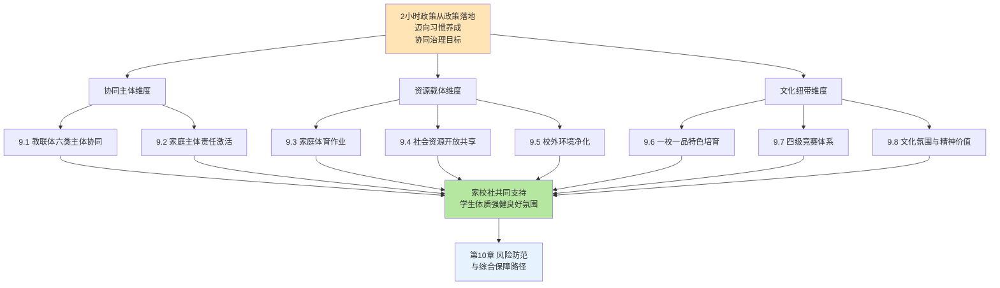

如图所示，**家校社协同与文化培育的三大维度不是各维度的简单并列，而是以"2小时政策从政策落地迈向习惯养成"为顶层目标、以协同主体激活合力、以资源载体支撑场景、以文化纽带塑造精神的有机整合**。

**协同治理对核心瓶颈的政策对接**可作如下系统化总结：

| 第4章核心瓶颈 | 本章对接维度 | 关键举措 |
|--------------|------------|---------|
| 瓶颈3：应试化训练与"为考而练" | 文化纽带 | 9.6节"一校一品"特色培育+9.7节多元竞赛体系 |
| 瓶颈5：作业挤压与睡眠运动双不足 | 协同主体+资源载体 | 9.1节教联体协同+9.2节家庭主体激活+9.3节家庭体育作业 |
| 瓶颈6：公共资源短缺与培训市场失序 | 资源载体 | 9.4节学校场地反向开放+9.5节校外培训规范引导 |
| 瓶颈7：兴趣枯燥与个体负反馈 | 文化纽带 | 9.6节"一校一品"+9.7节竞赛体系+9.8节精神价值塑造 |

**可操作的政策建议清单**：

**第一类：协同主体激活**——（1）落实"教联体"建设两阶段目标——2025年50%的县建立、2027年所有县全面建立[^168][^169];（2）参照江苏丹阳"领导小组+工作专班+12个镇区街道月例会"模式建立县级协同共治联动机制[^171];（3）参照宝鸡市"全国学校家庭社会协同育人实验区"模式推进省级实验区建设[^172];（4）落实"政府统筹、部门协作、学校主导、家庭尽责、社会参与"五方协同治理图景。

**第二类：家庭主体责任激活**——（5）建立健全家长学校与家庭教育指导机构，落实家长会、学校开放日、家长接待日等制度[^170];（6）落实班主任每学年至少1次家访制度[^170];（7）推广国家体育总局《亲子互动游戏运动指南》[^173]作为家庭运动的科学化方案;（8）培育亲子共跑、家庭运动联盟、社区家庭亲子运动会等多元载体[^175][^174];（9）落实《未成年人网络保护条例》《可能影响未成年人身心健康的网络信息分类办法》等国家级网络保护法规[^177][^176],协同推进电子产品管控与运动替代场景供给。

**第三类：家庭体育作业建设**——（10）参照山东日照"一案二有三定四结合"刚性框架推进省级家庭体育作业制度[^178];（11）参照长沙市实验小学"体育作业超市"五大类别多元项目设计[^179];（12）建立学生家庭体育作业跟踪档案和家庭健康打卡机制[^180][^178];（13）落实"体教医融合"，将脊柱与视力健康操、心肺复苏术等健康素养嵌入家庭体育作业[^178];（14）实施分学段差异化布置——小学下肢与核心力量、初中衔接中考体育、高中针对性体能[^178]。

**第四类：社会资源协同共享**——（15）参照兰州50所学校开放[^182]、滨州358所学校89.95%开放率[^183]推进学校场地"应开尽开、能开尽开";（16）建立"政府引导+保险保障+责任划分+专业运维+评价激励"五位一体长效机制（参照7.6节）;（17）扩大公共体育场馆对青少年免费/低收费开放，参照北京2026年新建70处运动场地+25个公园项目[^181];（18）盘活城市街角空地、桥下空间、老旧小区闲置地块，建设嵌入式微运动场，破解"15分钟健身圈"供给不均衡问题[^181];（19）规范引导校外体育培训市场——破解"保分冲刺班"焦虑营销，引导培训机构从"简单赚钱"转向"传递价值观"[^184]。

**第五类："一校一品/一校多品"特色培育**——（20）参照青岛市北区"引、养、测、赛、考"五位一体模式推进特色项目培育[^185];（21）按"校长重视—课程化普及—梯队化提高—赛事激发—人才输送"五阶段递进发展逻辑构建特色品牌;（22）参照昆山市"40所校园足球特色学校+多元化特色矩阵"模式形成区域特色矩阵[^184];（23）参照汕头蓬鸥中学"班级联赛—模拟测试—全校盛会—对外交流"四层赛事架构[^186]构建校级体育赛事体系。

**第六类：多级竞赛体系与文化氛围**——（24）落实"人人有项目、班班有活动、校校有特色、周周有比赛"总体设计逻辑[^188][^187];（25）构建"班级—年级—校级—镇/区级—市级—省级—全国"七层级赛事体系，参照白云区"四级联赛体系"[^187]、天府新区"班级—校级—集团—区级"四级联赛+"天府共享杯"赛事IP[^188];（26）借鉴江门荷塘镇"所有参赛运动员均获评'优秀运动员'"全员激励机制[^189];（27）将运动会升级为"体育嘉年华"，融合传统项目与知识竞赛、文化展示，参照勉县运动会34支学生方阵开幕式文体展演[^190];（28）培育中华体育精神与立德树人融合，落实"以体育心、以体铸魂""野蛮其体魄、文明其精神"的精神价值导向[^190][^187];（29）支持传统体育与民族文化传承（中华武术、民族课间操等），使传统文化在校园焕发新生[^184]。

**协同治理路径的可复制性与差异化适配**。这29项政策建议的可复制性整体较高，但需要根据各地资源禀赋差异化适配——发达地区可重点推进"教联体"实体化运作（如丹阳模式）、AI体育设备入校园（如兰州模式）、多元化特色矩阵（如昆山模式）等高内涵建设;欠发达地区可优先落实家庭体育作业（如日照模式）、学校场地反向开放（如滨州模式）、特色项目培育（如石浦武术、春晖射箭）等基础性建设;混合型省份可参考广东"分区差异化推进"思路，分层级、分阶段推进。

**坦诚说明协同推进中的现实张力**。在落地中，家校社协同与文化培育的协同推进将面临三类张力：**第一，家长焦虑分化的张力**——9.2节已经讨论的"重智轻体"焦虑、应试化期待、电子产品管理等多重困境难以在短期内根本扭转，家长体育素养提升的政策见效需要长期耕耘。化解这一张力需要在政策设计中保持耐心，通过"亲子共跑—家庭运动联盟—家庭体育作业—长效赛事"等多重载体使家长的认知转变循序渐进。**第二，社会资源不平衡的张力**——9.4节已经揭示的青少年免费运动空间缺失、城乡区域不均衡、公共资源结构性偏差等问题难以仅依靠学校场地开放彻底破解，必须依靠政府长期投入、城市规划优化、社区共建共管等多维协同。**第三，文化氛围培育的长期性张力**——9.6—9.8节所论的"一校一品"培育、竞赛体系深化、精神价值塑造都是需要数年甚至十几年持续耕耘的长期工程，难以追求短期政绩化推进。化解这一张力需要在政策评价中给予文化培育充分的时间空间，避免"一年见成效、两年大变化"的过激目标。

**本章为第10章的衔接逻辑**。**第10章风险防范与综合保障**将进一步整合本研究三大政策保障专题章节（第6章教学机制、第7章资源保障、第8章治理机制）与本章（第9章协同文化）的核心内容，识别"2小时"政策实施过程中的潜在风险（运动伤害、师资缺口、场地不足、应试惯性反弹、城乡执行落差、形式主义打卡等），分析风险防范与化解机制;对照2027年阶段性目标和2035年远期目标，提出分学段、分区域、分阶段的政策推进路线图;归纳财政投入、部门协同、立法保障、宣传引导等综合保障路径，最终形成本研究"现状测量—影响因素—政策保障"三位一体分析框架的完整闭环。

可以判断，**家校社协同与文化培育是"2小时"政策从"政策落地"迈向"习惯养成"的文化基础**——它通过协同主体激活合力、资源载体支撑场景、文化纽带塑造精神三大维度的协同设计，使学校体育治理超越校内场域，扩展为家校社共同支持学生体质强健的全社会氛围。**这一全社会氛围的建成是教育强国建设"民生保障力""社会协同力"的具体体现，也是"2小时"政策真正实现"健康第一""立德树人"育人目标的深层保障**。本章构建的协同治理与文化培育机制与第6章时间结构与教学质量、第7章师资场地与数字赋能、第8章评价监测与监督问责形成"教学—资源—治理—协同"四位一体的政策保障体系，共同支撑"2小时"政策在教育强国建设新征程中的高质量落地。

# 10 政策实施风险、阶段目标与保障路径建议

第6章至第9章已经分别从时间结构与教学质量、师资场地与数字赋能、评价监测与监督问责、家校社协同与文化培育四个维度系统构建了"2小时"政策落地的支柱性保障机制——四章共同支撑了"教学—资源—治理—协同"四位一体的政策保障体系。然而**任何宏大的政策蓝图都不可能在零阻力的真空中实现，从政策推开到高质量落地之间必然存在风险、张力与不确定性**。第2章已经识别出五大结构性短板，第4章已经诊断出七大跨层耦合瓶颈——这些短板与瓶颈在政策密集推进的2025—2027年窗口期可能以何种新形态显现？《纲要》"2027年阶段性成效"和"2035年建成教育强国"两阶段目标如何被精准分解为可执行的路线图？财政、部门、立法、宣传四维综合保障如何形成合力？这些问题指向本研究的最终使命——**将"现状测量—影响因素—政策保障"三位一体分析框架转化为面向实践的完整政策行动方案**。本章作为全研究的收官章节，承担三重使命：系统识别六类潜在风险并提出防范化解机制、构建分学段分区域分阶段的政策推进路线图、归纳四维综合保障路径并形成可操作的政策建议清单与监测评估指标体系——最终使本研究形成从问题诊断到方案落地的完整闭环，回应用户最初提出的"现状如何—因素何在—保障怎样"三大研究关切。

## 10.1 政策实施六类潜在风险的系统识别

任何政策的全面推开都伴随着风险与张力——"2小时"作为一项触动学校时间结构、师资配置、家庭节奏、社会资源、文化氛围全维度变革的系统性政策，其实施过程中可能出现的风险既具有普遍性，又具有中国教育治理的特殊性。基于前九章诊断与近期地方实践动态，可识别**六类典型风险**。

**风险一：运动伤害风险**。这是"2小时"政策落地中最具直接性、最具紧迫性、最具舆情敏感性的风险。第2章已经援引数据——"与2023年相比，学生体育运动伤害事故增加了50%以上，校方责任险中体育运动伤害赔偿的比例不断增加，接近60%"。从最新司法实践看，运动伤害风险在三类典型情境中持续显化：**第一类：培训机构责任纠纷**。成都大邑县法院2025年审结的轮滑培训案件中，"小张（不满8周岁）在某体育文化公司运营的轮滑俱乐部参加轮滑培训课程……在该俱乐部接受轮滑教学期间摔倒，造成面部大面积擦伤"，法院最终判决"被告某体育文化公司赔偿原告小张医疗费、营养费、精神损害抚慰金等各项损失共计8500元"——这一案例确立了培训机构对未成年人"全面落实安全防护措施"的义务边界[^193]。**第二类：自甘风险规则适用边界**。人民法院案例库2025年公布的高三学生踢球受伤案件中，吴某某"接到传球后快速带球从右侧进攻，在铲球时与防守的孙某某接触，吴某某倒地受伤……经诊断系左侧睾丸破裂伴血肿，住院治疗共计支出医疗费人民币14785.11元"——法院最终"驳回原告吴某某的全部诉讼请求"，认定"自愿参加具有一定风险的文体活动……属于自甘风险行为"[^194][^195]。**第三类：过度训练损伤**。湖南省第二人民医院骨关节运动医学科李宝军主任医师指出，"15岁长沙考生小宇（化名），考前一个月开启高强度训练，每天加练2公里，还刻意模仿大步幅跑法。初期膝盖发酸时他未重视，直至考前3天跑800米时膝盖突发刺痛摔倒。经湖南省第二人民医院检查，确诊为髌骨软化症，需静养两周，错失考前冲刺期"——"跑步膝"成为体育中考备考期最高发的运动损伤[^196]。**这三类典型情境共同揭示了运动伤害风险的复杂性——它既涉及学校与培训机构的法律责任分担，也涉及学生自身的科学训练素养，还涉及司法裁判对"自甘风险"规则的精准适用**。

**风险二：师资缺口风险**。这是"2小时"政策落地中最具结构性、最具刚性的资源风险。第7章已经详细诊断了师资紧平衡问题，本节进一步援引最新数据揭示风险规模——"全国义务教育阶段体育教师缺口约23万人，部分测算显示全国中小学体育教师总缺口超30万人"[^197]。从结构性短板看，"超过60%的中小学按现行班师比标准，体育教师缺口达30%以上，编制标准与现实需求脱节"[^197]。城乡分布的差距更具结构性——"全国义务教育阶段体育教师缺口中，农村地区占比68%，乡村学校短缺问题更加突出"[^197]。**农村乡村学校的师资困境尤其严峻**——贵州某乡镇中心小学校长张沫坦言"该校每周所有班级的体育课加起来有93节，但仅有2名体育老师，为保障开齐开足体育课，他们只能采取1名老师同时给2个班上课的模式"[^198]。重庆某乡村小学反映"该校唯一的专职体育教师来自西南大学研究生支教团。'实在排不开课的时候，就只能让班主任或其他学科教师带一下体育课，明年这位志愿者支教结束离开后，还不知道体育课要怎么办'"[^198]。**质量短板的层面同样令人警觉**——"在一些没有专职体育教师的乡村学校，体育课则由其他学科教师兼着上，他们普遍缺乏相关专业知识和技能……'就是做下准备活动，然后走下队列队形，打打篮球、乒乓球或羽毛球，基本上就是自由活动，没办法教学生一些专业技能'"[^198]。从课时压力看，"随着'每天一节体育课'等政策落实，课时量翻倍，但编制标准仍沿用2014年规定，未同步调整……教师除教学外，还需承担课后服务、体质监测、赛事组织等工作，负荷加重"[^197]。**师资缺口风险若不能在2025—2027年窗口期得到根本缓解，"2小时"政策的全面落地将在质量层面遭遇结构性瓶颈**。

**风险三：场地设施风险**。这一风险在城乡之间呈现差异化形态。第7章已经讨论城区学校"金边银角"挖潜路径与乡村学校设施陈旧的双重困境，本节进一步援引乡村调研数据揭示风险规模——"记者在山西随机走访了六所乡村小学和一所乡镇初中，这些学校的学生人均活动空间都达到了国家要求，但只有一所小学建有200米标准塑胶跑道，那所初中也没有400米标准塑胶跑道，有的学校只有一块外围是100米塑胶跑道的小田径场。**有一所小学的操场还是水泥地面，该校一位体育老师说，这使得他们在教篮球、足球等对抗性强的项目时顾虑较多**"[^198]。器材陈旧的现象同样普遍——"记者在重庆一所乡村小学看到，一些陈旧的体育器材散落在校园里的树丛中，操场上的羽毛球网破损严重，只是勉强能用"[^198]。贵州某乡村小学的足球队"最初学校没有足球场，他们就在水泥篮球场上训练。2022年12月，定点帮扶单位出资建设的一块五人制足球场完工投用后，训练环境得到一定改善，但学校面积小，每次练体能时，学校负责人只能带着学生在村里的公路上跑步，遇见车来车往有一定的安全风险"[^198]。

**风险四：应试惯性反弹风险**。这是"2小时"政策落地中最具复杂性、最具反讽性的风险——其反讽性在于政策本意是减负，但实际效果可能反向加剧应试化。**最具警示意义的现象是"中考体育满分线下调反致内卷加剧"**——"北京男生1000米满分线，从3分37秒直接放宽到4分05秒，女生800米从3分24秒降到3分55秒；更狠的是佛山，男生1000米满分线直接从3分21秒拉到4分05秒，不少地方的新标准，甚至比国家学生体质健康的底线要求还要低"[^199]。然而"明明是'减负'，怎么就掉进了'标准越松，内卷越凶'的怪圈？"——"中考的规则就摆在这，一分就能压过千人，**当满分线一降再降，几乎所有人都能摸到的时候，'丢分'就成了不可原谅的失误**"[^199]。**备战周期的提前是这一风险最直观的表现**——"大连一位做了8年中考体育培训的教练吐槽，说现在来问1000米私教课的，一半都是小学四五年级的家长"；"北京海淀的杨女士，女儿刚上四年级，就找了体校学生上门授课，45节课花了8000块"；"杭州的家长提前两三年就找教练定制训练计划，不少初三生晚上9点下了晚自习，还要练到10点半，凌晨5点就得爬起来补文化课作业"[^199]。**选考项目应试化倾向也持续显化**——"北京有个教了20多年体育的何慧老师，现在给学生提选考建议：女生全选排球，所有学生优先选武术。为啥？……不是这两个项目多能锻炼身体，是太好拿分了。排球垫球，零基础练俩月，就能稳拿满分；武术套路，只要你顺顺当当打下来，基本不会扣半分。反观需要跑跳对抗、容易失误的足球，她所在的学校，连续三年没一个学生报考"[^199]。培训机构的焦虑营销进一步推波助澜——"在社交平台上，'体育差1分，错失重点高中'之类的营销文案铺天盖地，不断刺激着家长脆弱的神经"[^200]。**过度训练导致的运动损伤已成为现实代价**——"湖南15岁的姑娘小琳，为了跳绳不丢分，咬着牙连续3天每天跳2000下，最后确诊髌韧带损伤，别说跑跳了，连上下楼梯都得扶着墙走；岳阳14岁的男生亮亮，为了冲游泳满分，第一次训练就连续游了2个小时，最后引发横纹肌溶解症，直接被送进了医院"[^199]。这一风险揭示了一个深刻悖论——**单纯的"分值调整"无法根除应试化倾向，必须从评价方式、项目结构、过程性权重等多维度协同改革才能真正破解"为考而练"的扭曲**。

**风险五：城乡区域执行落差风险**。这是"2小时"政策在地理空间上的不平衡风险。第2章已经详细诊断区域不平衡的多维证据，本节进一步揭示其在政策推开过程中可能加剧的趋势。**城乡差距方面**——农村学校面临"师资短缺、场地不足、器材不够"三重约束的叠加，而城市学校虽有场地紧约束但师资和数字资源相对充裕，这种"短板叠加"可能使政策推开过程中农村学校的落地质量进一步落后。**数字鸿沟扩大方面**——第7章已经讨论的AI体育设备、智慧体育平台、数字画像系统在发达地区快速普及，而欠发达地区受财政、人才、技术约束难以跟进，可能形成"发达地区享受智能化2小时、欠发达地区维持传统化2小时"的新型不平衡。如果不通过专项政策矫正，区域间的"2小时"落地质量可能形成"马太效应"——发达地区越来越好、欠发达地区相对越来越落后。

**风险六：形式主义打卡风险**。这是"2小时"政策落地中最具隐蔽性、最具民生关切性的风险。**最具警示意义的最新案例是云南玉溪元江县的暑假打卡争议**——"云南玉溪元江县学生家长反映，学校要求家长每日必须在手机上完成两次'暑期安全提醒'打卡，被质疑是形式主义做法"；"不同学校的打卡方式并不一样，有的是阅读'防溺水文字提示内容'，有的是观看防溺水视频，有的甚至规定了打卡的具体时间段，若未按时完成打卡，则会收到老师在班级群中的点名提醒或电话催促"[^201]。**家长疲于应付的多重打卡负担同样令人警觉**——一位家长陈洁在家长群抱怨"老师又在群里点名了，说我们家体育打卡没完成。天天上班累死累活，回家还要盯着孩子跳绳、跳远、坐位体前屈。**每个孩子3次打卡，我家两个小学生，就是每天6次打卡，这日子没法过了！**"[^200]。**教育部已经明确将"频繁打卡"作为形式主义典型问题列入治理重点**——"教育部于7月10日曾发布《关于做好2025年中小学暑期安全工作的通知》称，'部署暑期安全工作时要注意方式方法'，**避免出现签订责任书、'一刀切'、频繁打卡等形式主义做法加重教师负担**，确保学校和教师立足主责主业做好安全教育宣传工作"[^201]。**这一风险揭示了一个治理性悖论**——监测和督促本是落实政策的必要手段，但若过度量化、过度频繁、过度行政化，反而可能异化为"为打卡而打卡"的形式主义负担，加剧家长焦虑、教师负担、学生倦怠，反向损害政策落地实效。

**为综合呈现六类风险的发生机理、影响范围、紧迫程度，下表作分级评估**：

| 风险类别 | 发生机理 | 影响范围 | 紧迫程度 | 关键防范节点 |
|----------|----------|----------|----------|--------------|
| 运动伤害风险 | 课时强度增加+安全责任不清+训练不科学 | 全学段+各类型学校 | ★★★★★ | 立法+保险+科学训练 |
| 师资缺口风险 | 23万缺口+农村占68%+课时翻倍 | 农村学校尤甚 | ★★★★★ | 五个一批+班师比硬指标 |
| 场地设施风险 | 城乡差距+设施陈旧+器材不足 | 乡村学校尤甚 | ★★★★ | 金边银角+共建共享+专项扶持 |
| 应试惯性反弹风险 | 中考杠杆+焦虑营销+培训应试化 | 初中学段尤甚 | ★★★★ | 评价改革+培训规范 |
| 城乡执行落差风险 | 资源不均+数字鸿沟+落地分化 | 中西部欠发达 | ★★★★ | 分区时间表+财政支持 |
| 形式主义打卡风险 | 监测过度+多重打卡+应付化 | 家庭场景+教师负担 | ★★★ | 指标精简+教师减负 |

如表所示，**六类风险按紧迫程度分级，运动伤害风险与师资缺口风险并列第一梯队**——前者的紧迫性源于其直接危及学生身心安全和学校政策推进意愿，后者的紧迫性源于其作为基础性资源约束直接决定政策落地的可能性。**场地设施、应试反弹、城乡落差三类风险并列第二梯队**——它们是结构性长期风险，需要数年甚至更长周期才能根本缓解。**形式主义打卡风险位列第三梯队**——其虽然影响范围相对局部但治理紧迫性同样不可忽视，因为它涉及政策推进的方式方法和民生体验。本节的风险识别为10.2节风险防范化解机制设计提供了精准的问题靶点，也为10.3节路线图设计中的风险预警节点提供了关键参照。

## 10.2 风险防范化解机制的协同设计

针对10.1节识别的六类风险，本节系统提出针对性的化解机制——每类风险都需要"政策工具+实施主体+保障资源+监督节点"四位一体的协同设计，避免单点干预的零散化效应。

**化解机制一：运动伤害风险——"尽职免责入法+保险全覆盖+科学训练普及+司法案例引导"四位一体**。第6章已经初步讨论安全风险防控的事前预防、事中保障、事后处置三重机制，本节进一步将其升级为系统性化解方案。**第一支柱：尽职免责立法化**。第4章已经援引湖南2026年立法草案"学生在学校参加体育活动受到人身损害，学校尽到教育、管理职责的，可以免责"——这一立法原则需要在更多省份得到推广。新修订的《体育法》明确"体育赛事活动组织者应当履行安全保障义务，提供符合要求的安全条件，制定风险防范及应急处置预案等保障措施"[^202]——这一国家级法律为各地制定"尽职免责"细则提供了上位法依据。**第二支柱：学生意外伤害保险全覆盖与校方责任险机制完善**。教育部《意见》明确"强化体育活动安全保障"作为条件保障的重要内容[^203]——具体而言，建议建立"学生意外伤害保险政府兜底+校方责任险全覆盖+商业补充保险灵活配置"的三层保险体系，确保运动伤害的经济风险由保险机制承担而非学校或家庭单一兜底。**第三支柱：科学训练知识普及**。湖南省第二人民医院李宝军主任的"科学护膝四大建议"为科学训练提供了具体范本——"矫正跑姿：坚持小步幅、快频率，全脚掌着地、膝盖微弯缓冲；循序渐进：每周跑量增幅不超10%，搭配游泳、骑行等低冲击运动；做好防护：训练前做5分钟动态热身，穿专业缓冲跑鞋；及时养护：酸痛48小时内冰敷消肿"[^196]。这些科学训练知识应当通过家长学校、体育课、健康教育课等多渠道向学生和家长普及。**第四支柱：自甘风险规则的司法案例引导**。人民法院案例库2025年公布的高中生踢球受伤案件已经为"自甘风险"规则的精准适用提供了标杆案例[^194][^195]——这一案例的广泛传播有助于扭转"谁受伤谁有理"的旧观念，从社会舆论层面减轻学校的安全顾虑。**这一四位一体机制的政策意义在于将运动伤害风险的化解从单纯的"学校谨慎"升级为"立法+保险+知识+司法"全维度协同——只有当法律、经济、知识、司法四个维度都形成稳健保障，学校才能真正放下顾虑、推进高质量2小时落地**。

**化解机制二：师资缺口风险——"班师比硬指标+五个一批多元补充+退役运动员过渡性认证+待遇激励倾斜"综合应对**。第7章已经系统构建了师资保障的"班师比硬指标+多元补充+县管校聘+培训激励"四位一体框架，本节聚焦最具紧迫性的化解节点。**第一节点：班师比硬指标的全国推开**。教育部《通知》确立的"小学5∶1、初中6∶1、高中阶段8∶1"班师比标准必须在2027年前全国所有省份完成达标[^204]。**第二节点：五个一批多元补充的快速落地**。"全国中小学体育教师约87.96万人，较2012年增加36.88万人，增长72.20%"——总量增长态势可观[^204]，但距离填补"23万至30万"缺口仍需2—3年的密集补充期[^197]。建议中央财政设立"中小学体育教师专项补充计划"，定向支持中西部农村学校招聘体育教师。**第三节点：退役运动员过渡性资格认证**。第7章已经讨论这一思路——"在试用期三年内让退役运动员有充足的时间备考"教师资格证。教育部相关负责人的判断揭示了多元补充的政策方向——"多地通过政府和学校购买体育服务，聘请退役运动员担任专职教练员，与当地体校、青少年活动中心等合作，**形成'专职教师+兼职教练'的弹性用人机制**"[^204]。退役体操运动员石雅妮2024年秋季学期入职武汉光谷汤逊湖学校的案例提供了具体范本——"石雅妮将过往训练经历与低年级学生的体质相结合，孩子们很喜欢上她的课。随着她的加入，学校计划筹备体操校队"[^204]。**第四节点：待遇激励的明显倾斜**。"在我们学校，每名体育老师固定带4个班，从初一带到初三"——甘肃陇南武都区城关中学薛宪坤老师的描述揭示了一线体育教师的高负荷状态[^204]。教育部《通知》"突出了学历和技能两方面要求，规定招聘岗位一般应明确体育专业要求"[^204]——这一从入口端守住专业性的措施需要与待遇激励倾斜协同推进，使体育教师岗位真正具有竞争力。

**化解机制三：场地不足风险——"金边银角挖潜+校社共建共享+15分钟健身圈嵌入式建设+专项扶持基金"多维拓展**。第7章已经详细论证场地拓展的三层机制，本节强调最具紧迫性的化解节点。**第一节点：城区学校金边银角挖潜**——参照上海普陀洵阳路小学、浦东竹园小学、罗湖桃园小学等典型样本，将城区学校的天台、走廊、楼道、架空层、墙壁、地面等空间全面纳入运动场域。**第二节点：乡村学校设施改造与器材补充**——针对"水泥地面操场""陈旧器材""破损羽毛球网"等具体短板，建议中央财政设立"乡村学校体育设施改造专项资金"，三年内对全国乡村学校体育场地完成系统化改造[^198]。**第三节点：学校场地反向开放**——参照兰州50所学校开放、滨州358所学校89.95%开放率的标杆样本，加快推进学校场地向社会开放。**第四节点：15分钟健身圈嵌入式建设**——参照北京2026年新建70处运动场地+25个公园项目的城市规划经验，将青少年专属运动空间嵌入城市规划的强制性内容。

**化解机制四：应试惯性反弹风险——"过程性评价权重提升+选考项目结构优化+减负与友好导向引导+培训市场监管"综合矫正**。第8章已经系统讨论了中考体育改革的四条主线，本节聚焦应对"标准越松、内卷越凶"悖论的针对性举措。**第一举措：过程性评价权重的实质性提升**。参照青海"过程性20分占70总分约29%"、长垣市"过程性30分占100总分30%"的省市样本，过程性评价权重应在所有省份达到20%—30%的实质性占比。**第二举措：选考项目的强对抗性引导**。针对"女生全选排球、所有学生优先选武术"的应试化倾向[^199]，建议在选考项目设计中适度增加足球、篮球等对抗性项目的引导权重——可以通过"必选+选考"的项目结构设计，要求每位考生必选至少一项对抗性团体运动。**第三举措："减负与友好导向"的政策强化**。深圳中考体育改革明确"全面体现减负和友好的导向，传达快乐体育理念"——这一导向应在全国中考体育改革中得到强化。**第四举措：校外培训市场监管的精准化**。对"保分冲刺班""一对一私教课""'跳绳中考专用'营销"等具体异化形态进行精准监管。"一对一课时费动辄收费数百元、上千元，有的'保分冲刺班'甚至收费过万元；有的跳绳、篮球等普通体育器材被商家贴上'中考专用'标签，价格翻了几倍"——这些市场异化现象需要市场监管部门、教育部门、消费者权益保护组织的协同治理。

**化解机制五：城乡执行落差风险——"分区差异化时间表+中央财政专项支持+云端共享平台+县管校聘骨干轮岗"缩小差距**。第5章已经详细论证广东"珠三角—粤东西北"分区差异化推进路径，本节聚焦最具针对性的化解节点。**第一节点：省内分区时间表的普遍推广**。建议各省域内梯度差异明显的省份（如江苏、山东、福建、浙江等）参照广东模式制定省内分区时间表，使发达地区先行、欠发达地区分阶段跟进。**第二节点：中央财政专项支持**。建议中央财政设立"中西部学校体育振兴专项"，从师资培训、设施改造、数字化建设、保险覆盖四个维度对中西部欠发达地区给予倾斜支持。**第三节点：云端共享平台建设**。第7章已经讨论这一思路——通过建设国家级或省级体育数字化云端平台，使不具备硬件条件的学校能够使用基础的体测、监测、画像等服务。**第四节点：县管校聘骨干轮岗的实质化**。第7章已经讨论"骨干教师交流比例不低于20%"的硬指标——这一指标在欠发达地区的实质化落地是缩小城乡执行落差的关键支撑。

**化解机制六：形式主义打卡风险——"监测指标精简化+数据采集知情同意+教师减负要求+督导反向纠偏"防范化解**。这是六类风险中最具治理性、最具民生关切性的化解节点。**第一举措：监测指标精简化**。建议各地教育行政部门对现有体育打卡、健康打卡、安全打卡等多重打卡进行系统梳理，整合冗余指标、压缩频次过密、规范操作流程——避免"每天6次打卡"等加重家长负担的异化现象[^200]。**第二举措：数据采集知情同意原则的严格落实**。第7章8节已经讨论数据采集知情同意的基本规则——年度告知、明确用途、分级授权、技术补救——这些规则在监测体系建设中必须严格落实。**第三举措：教师减负要求的明确化**。教育部已经明确"避免出现签订责任书、'一刀切'、频繁打卡等形式主义做法加重教师负担"[^201]——这一减负要求需要在各级教育行政部门和学校层面真正落实。**第四举措：督导反向纠偏**。当地方教育督导部门发现学校存在过度打卡、形式主义负担等问题时，应当反向纠偏——将这些问题纳入督导评估的"负面清单"，约谈相关学校负责人并要求整改。云南玉溪元江县暑假打卡争议的处理就是这一反向纠偏的典型样本——"8月1日，玉溪市教育体育局安全科工作人员告诉南方都市报记者，'市教体局没有安排打卡一事'，目前已通知元江县教育体育局，对存在这种情况的学校马上进行整改"；"同日，元江县教育体育局办公室工作人员表示，'已经在落实暂停打卡一事'……8月1日，当地部分学校已群发通知要求，不再进行暑期防溺水早晚打卡，改为每天晚上8点前，家长在班级群汇报孩子是否在家平安"[^201]。**这一案例揭示了"民生反映—媒体监督—督导纠偏—学校整改"的完整治理链条——它使形式主义打卡风险得以在初露端倪时被及时纠正**。

为综合呈现六类风险化解机制的协同关系，下表作系统化梳理：

| 风险类别 | 政策工具 | 实施主体 | 保障资源 | 监督节点 |
|----------|----------|----------|----------|----------|
| 运动伤害 | 尽职免责入法+保险全覆盖+科学训练+司法引导 | 立法机关+保险机构+学校+法院 | 保险基金+科学训练教材 | 司法案例库+督导评估 |
| 师资缺口 | 班师比硬指标+五个一批+过渡认证+待遇倾斜 | 教育部+人社部+财政部 | 中央财政专项+省级配套 | 班师比达标率监测 |
| 场地不足 | 金边银角+共建共享+15分钟健身圈+专项扶持 | 教育部+发改委+城市规划部门 | 乡村改造专项+城市规划 | 生均场地监测 |
| 应试反弹 | 过程性权重+项目结构+减负导向+培训监管 | 教育部+市场监管 | 评价改革成本+监管资源 | 中考体育异化情况调研 |
| 城乡落差 | 分区时间表+中央财政+云端平台+骨干轮岗 | 中央财政+省级教育部门 | 振兴专项+云端建设资金 | 区域达标率对比监测 |
| 形式主义打卡 | 指标精简+知情同意+教师减负+督导纠偏 | 教育部+督导部门 | 监测体系优化资源 | 12345群众反映+媒体监督 |

可以判断，**六类风险化解机制不是各维度的简单并列，而是形成相互支撑的协同网络**——运动伤害化解为"2小时"政策推进创造了无后顾之忧的法律环境，师资缺口化解为政策落地提供了基础性人力支撑，场地不足化解为多场景叠加提供了空间底盘，应试反弹化解纠偏了评价导向偏差，城乡落差化解防止了不平衡加剧，形式主义打卡化解保持了政策推进的民生友好性。**只有六类风险化解机制协同发力，"2小时"政策才能在2025—2027年窗口期实现稳健推进**——这正是10.3节路线图设计的风险防范基础。

## 10.3 2027年阶段性目标与2035年远期目标的路线图设计

风险识别和化解机制为政策推进提供了基础保障，但任何稳健的政策都必须有清晰的时间表与里程碑。**对照《纲要》"分两步走"总体部署和《意见》"2027年全面高质量落实"阶段目标，本节构建分阶段政策推进路线图**。

**总体目标体系**。**2027年阶段性目标**——参照《意见》核心要求和教育部《通知》"到2027年，推动中小学体育教师队伍数量结构更加合理，教育教学水平明显提升，评价激励和保障机制不断健全，满足基础教育高质量发展需要"[^204]，本研究将2027年阶段性目标定位为"全面推开与质量夯实"。**2035年远期目标**——参照《通知》"到2035年，适应教育现代化和建成教育强国要求，形成完善的中小学体育教师队伍建设机制，促进体教深度融合，造就一支新时代高素质专业化体育教师队伍"[^204]以及河北省"到2035年，基本建成现代化、高质量的学校体育体系"[^205]，本研究将2035年远期目标定位为"高质量体系建成"。

**阶段一：2025—2027年"全面推开与质量夯实期"**。这一阶段的核心特征是从政策出台走向落地深化，是"2小时"政策从"政策推开"迈向"高质量落地"的关键窗口期。具体重点任务包括：

**第一类任务：制度框架完成**。**所有省份完成省级实施方案出台**——参照河北、青海、甘肃、北京、广东、云南等省份2025年密集出台省级实施方案的态势，预计2026年内全国所有省份完成省级实施方案。**"教联体"建设覆盖50%—100%县域**——参照《家校社协同育人"教联体"工作方案》"力争到2025年，50%的县建立'教联体'，到2027年所有县全面建立'教联体'"的两阶段目标。**地方立法全面跟进**——参照安徽、内蒙古2025年新修订《实施〈中华人民共和国体育法〉办法》[^206][^207]、湖南"尽职免责"立法草案、福建泉州"五部门联合若干措施"[^208]等省级地方立法实践，预计2027年内"2小时"政策的法律化锁定基本完成。

**第二类任务：资源配置达标**。**班师比硬指标达成**——按"小学5∶1、初中6∶1、高中阶段8∶1"标准[^204]，全国所有义务教育学校在2027年前完成班师比达标。**五个一批多元补充见效**——参照黑龙江"三年补充1500名"省级行动计划，全国体育教师队伍三年内补充约5万—10万人，初步缓解师资缺口结构性短板[^197]。**乡村学校场地设施系统改造**——通过中央财政专项支持，三年内完成全国乡村学校体育场地设施的系统化改造。**数字化建设覆盖发达地区**——发达地区基本完成AI体育、智慧体测、体质画像等数字化系统的部署[^204]。

**第三类任务：制度机制完善**。**5级监测体系全面建立**——国家—省—市—县—校五级体质健康监测体系在所有省份完成构建，"监测—评估—反馈—干预—保障"闭环工作体系投入运行。**中考体育改革全国铺开**——参照青海、深圳、长垣市等典型样本，所有省份在2027年前完成"过程性+终结性结合"双轨制中考体育改革。**督导评估专项化推进**——《中小学校体育工作督导评估办法》在所有省份完成专项化实施。

**第四类任务：核心指标改善**。**学生体质健康优良率显著提升**——参照《意见》"到2027年，学生体质健康合格率、优良率、毕业生运动习惯养成率显著提升"目标[^203]，预计全国中小学生体质健康优良率达到65%—70%水平。**运动习惯养成率监测启动**——这是"2小时"政策成效评估的关键长期指标，2027年前完成监测体系构建并启动数据采集。

**阶段二：2028—2032年"结构优化与机制完善期"**。这一阶段的核心特征是从面上推开走向深度优化，重点任务包括：**师资专业素质全面升级**——通过深化高校体育教育人才培养模式改革、完善"国培+省培+地方特色"三级培训体系，使全国体育教师整体专业素质达到国际中等以上水平[^204]。**数字赋能弥合城乡鸿沟**——通过国家级或省级体育数字化云端共享平台的全面运行，使欠发达地区也能享受智能化体育治理资源。**家校社协同生态成熟**——"教联体"机制在所有县级单位实体化运作，"政府—学校—家庭—社会"四方协同生态趋于成熟。**"一校一品"特色品牌广泛形成**——参照昆山40所校园足球特色学校、青岛市北区"五位一体"模式等典型样本，全国大多数中小学形成具有辨识度的特色体育品牌。**中考体育评价持续优化**——通过过程性评价权重的进一步提升和项目结构的进一步优化，实质性扭转"为考而练"的应试化倾向。

**阶段三：2033—2035年"高质量体系建成期"**。这一阶段的核心特征是从结构优化走向体系成型——全面建成现代化高质量学校体育体系，达成《纲要》远期目标。具体表现包括：**学校体育体系现代化、高质量、全覆盖**[^205]；**学生体质健康水平稳居世界前列**；**运动习惯养成率达到80%以上**；**校园体育文化深度融入立德树人体系**；**家校社协同支持学生体质强健的全社会氛围基本形成**。

**为更直观呈现三阶段路线图，下图刻画其时间脉络**：

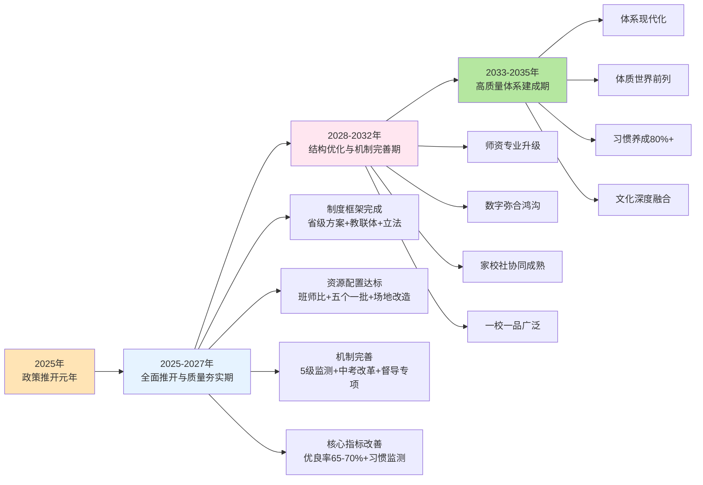

如图所示，**三阶段路线图遵循"政策推开—质量夯实—结构优化—体系建成"的渐进逻辑——每一阶段都建立在前一阶段的基础上，避免了"急于求成"的政策冲动**。这一渐进逻辑与第3章因果机制中"剂量—效应递增"的科学规律形成精准对接——只有经过足够长周期的持续投入，体质健康改善的累积效应才能真正显化为体系化跃升。

需要审慎说明的是，**路线图的设计基于当前可获取的政策文件和地方实践数据，其可执行性高度依赖于多个前置条件**——中央财政持续投入、地方政府治理决心、跨部门协同效率、家校社协同深化等。任何前置条件的弱化都可能延缓路线图的实施节奏。因此10.5节将专门讨论财政投入、部门协同、立法保障、宣传引导四维综合保障路径，为路线图的稳健推进提供关键支撑。

## 10.4 分学段与分区域差异化推进方案

总体路线图为政策推进提供了时间维度的清晰节奏，但要真正实现"精准滴灌"而非"大水漫灌"，必须在学段维度和区域维度同时进行差异化适配。本节基于第2章学段梯度失衡与区域不平衡的诊断，构建分学段、分区域差异化推进方案。

**分学段差异化推进**。第2章已经识别"小学高、初中降、高中塌"的学段梯度失衡——天津2024年监测数据显示从小学到高中体质优良率从77.19%骤降至39.59%，下滑幅度高达37.6个百分点。这一失衡格局决定了不同学段必须采取差异化的政策推进重点。

**小学阶段重点：丰富课程内容、放开课间活动、消除安全过度防御、激发运动兴趣**。小学阶段是运动习惯养成的黄金窗口期，但同时也面临"课程内容枯燥""课间圈养""安全顾虑过重"等典型矛盾。具体推进举措包括：第一，丰富课程内容——参照第6章一体化课程"小学游戏化"原则、滁州二小走班制11门特色课程、昆山多元化特色矩阵等典型样本，使每所小学开设至少5—8门特色体育课程；第二，放开课间活动——参照三水区"分级特色活动"、平城区"加长版课间"、佛山三水区课间15分钟改革等典型样本，使每个15分钟课间都成为"微运动场域"；第三，消除安全过度防御——参照湖南"尽职免责"立法、新修订《体育法》安全保障条款，从制度层面化解学校防御性教学倾向；第四，激发运动兴趣——参照北京"班级赛"、人大附小"AI体育走廊"等典型样本，使运动成为孩子们最期待的"趣事儿"。

**初中阶段重点：破解中考应试化异化、减负与睡眠保障协同、走班制/俱乐部制深化推进**。初中阶段是"为考而练"应试化倾向最严重的学段，也是作业挤压、睡眠不足等多重矛盾的交织节点。具体推进举措包括：第一，破解中考应试化异化——参照青海"过程性+终结性"双轨制、深圳"减负与友好导向"、长垣市"30分过程性+70分终结性"等典型样本，使中考体育从"为考而练"走向"为乐而动"；第二，减负与睡眠保障协同——参照云南方案"小学生10小时、初中生9小时、高中生8小时睡眠"硬性要求，从制度层面化解作业挤压；第三，走班制/俱乐部制深化推进——参照滁州二小、青羊区、宜春一中等典型样本，使初中阶段的体育课从"为考而练"的单一项目训练走向多元兴趣选择。

**高中阶段重点：作为最薄弱环节优先突破，打破"每周3—5节"下限、试点"每天1节"扩面、在高考综合素质评价中赋予体育权重**。高中阶段是"2小时"政策落地最薄弱、最具改革阻力的环节。第2章已经援引天津2024—2025年高中优良率较2023年下降3.07个百分点的"逆向下行"风险——这一警示信号要求高中阶段必须作为优先突破环节。具体推进举措包括：第一，打破"每周3—5节"下限——参照广州"高中（中职）学校每周3—5节体育课，有条件的试点每天1节"的试点扩面思路；第二，"每天1节"试点扩面——参照河北"高中阶段学校每周至少安排2节体育课"[^205]、陕西"十个一"等省级方案，逐步实现高中阶段"每天1节"试点扩面；第三，在高考综合素质评价中赋予体育权重——这是从评价指挥棒源头扭转高中"重智轻体"惯性的关键举措，需要在高考综合改革的整体框架下逐步推进。

**分区域差异化推进**。第5章已经详细论证了"发达地区路径""欠发达地区路径""混合型省份路径"三类典型推广路径，本节进一步细化各类型地区的核心任务清单与时间节奏。

**发达地区路径（北京、上海、广州、深圳、天津等）**——核心任务："质量提升+数据赋能+精细化治理"。具体任务清单包括：（1）落实"能出汗的体育课"质量底线（参照北京"体育八条"）；（2）建设"班级赛"全员参与赛事体系（参照北京970万人次"班超"）；（3）推进AI体育、智慧体测、数字画像全覆盖（参照武汉育才二小、上海上城区、棠湖中学）；（4）实施"进晒查罚改"等闭环监督（参照天津模式）；（5）深化中考体育"过程性+终结性"双轨制改革（参照深圳模式）。时间节奏：2025—2027年率先完成所有任务，2028—2032年实现质量持续优化和示范引领。

**欠发达地区路径（甘肃、云南、青海、贵州、宁夏等）**——核心任务："刚性补齐+特色培育+财政支持"。具体任务清单包括：（1）完成班师比硬指标达标（参照甘肃方案）；（2）实施"五个一批"师资多元补充（参照黑龙江"三年补充1500名"标杆）；（3）落实寄宿制学校晨练晨跑制度（参照云南"壮苗行动"）；（4）培育"校校有特色、人人有技能"特色品牌（参照甘肃方案）；（5）推进民族文化体育课程创新（参照云南独龙族、怒族、藏族、傈僳族民族课间操）。时间节奏：2025—2027年完成基础性任务，2028—2032年实现追赶式提升，2033—2035年缩小与发达地区的质量差距。

**混合型省份路径（广东、江苏、山东、福建、浙江等）**——核心任务："分区差异化推进+省级统筹平衡"。具体任务清单包括：（1）制定省内"先发达—后欠发达"分区时间表（参照广东"珠三角—粤东西北"模式）；（2）建立省级统筹下的市县差异化推进机制（参照广东《通知》）；（3）推进"4+1"或"3+2"体育课程编排（参照肇庆"校园体育30条"）；（4）扩大学校场地反向开放规模（参照滨州358所学校89.95%开放率）；（5）发挥省内发达地市的标杆示范作用（参照苏南示范苏北、杭州示范温州、深圳示范汕头等）。时间节奏：2025—2027年发达地区先行落地，2026—2028年欠发达地区跟进达标，2028—2032年实现省内均衡发展。

**为综合呈现分学段分区域差异化推进方案，下表作系统化梳理**：

| 维度 | 类型 | 核心任务 | 关键举措 | 时间节奏 |
|------|------|----------|----------|----------|
| 学段 | 小学 | 兴趣激发+课间放开+安全消顾虑 | 多元课程+15分钟课间+尽职免责 | 2025-2027优先达标 |
| 学段 | 初中 | 破应试+减负协同+走班深化 | 过程性评价+睡眠保障+走班制 | 2025-2028重点改革 |
| 学段 | 高中 | 优先突破最薄弱+评价权重 | "每天1节"扩面+高考素质评价 | 2027-2032攻坚突破 |
| 区域 | 发达 | 质量提升+数据赋能 | 班级赛+AI画像+闭环监督 | 2025-2027率先示范 |
| 区域 | 欠发达 | 刚性补齐+特色培育 | 班师比+五个一批+特色品牌 | 2025-2032追赶提升 |
| 区域 | 混合 | 分区时间表+省级统筹 | 省内分阶段+示范辐射 | 2025-2030渐进推进 |

可以判断，**分学段分区域差异化推进方案是政策路线图从"原则性时间表"走向"操作性任务清单"的关键转化**——它使每一个学段、每一类区域都有清晰的任务定位和时间节奏，避免了"一刀切"的政策推进可能造成的不平衡加剧或资源错配。

## 10.5 财政投入、部门协同与立法保障路径

风险防范、路线图设计、差异化推进为政策推进提供了"做什么、何时做、在哪做"的清晰框架，但还有一个最深层的支撑性问题尚未回答——**这些政策推进所需要的资源、协同、法律、舆论从何而来？**这正是综合保障路径所要回答的命题。本节系统归纳财政投入、部门协同、立法保障、宣传引导四维路径。

**第一维：财政投入保障**。"2小时"政策的全面推开需要大量财政资源支撑——师资多元补充、场地设施改造、数字化系统建设、保险机制完善、立法成本、监督督导成本等都需要稳定的财政投入。建议建立**"中央财政奖补+省级统筹+市县配套+社会多元"多渠道投入机制**：**第一层：中央财政奖补**——设立"中小学体育工作专项资金"和"中西部学校体育振兴专项资金"，对各省体质健康改善、师资缺口缓解、场地设施改造等关键任务给予奖补。重点支持中西部欠发达地区数字化建设、师资培训、场地改造与保险覆盖。**第二层：省级财政统筹**——参照黑龙江"三年补充1500名"省级行动计划的财政投入模式，各省统筹设立体育教师补充、师资培训、场地改造等专项资金。**第三层：市县财政配套**——市县财政按比例配套省级专项资金，重点保障基础性资源（如班师比达标、场地维护、保险经费）。**第四层：社会多元投入**——通过校企合作、社会捐赠、退役运动员驻校等方式，引入社会资源支持学校体育。河北南雄市2025年"全市投入5000多万元用于学校体育场地设施建设及体育器材配备"的做法是地方财政投入的代表样本。

**第二维：部门协同保障**。教育部《意见》明确"教育、发展改革、财政、机构编制、人力资源社会保障和体育部门各负其责、形成合力"[^203]。这一五部门协同框架是"2小时"政策推进的基础性协同机制。在五部门协同基础上，本研究建议进一步细化跨部门职责清单与联席会议机制——**教育部门**作为牵头单位，负责政策统筹、督导评估、教学改革、师资培训等核心任务；**发改部门**负责把学校体育场地设施纳入区域规划，推动城市15分钟健身圈建设；**财政部门**负责中央和省级财政专项资金的设立、分配与监督使用；**机构编制部门**负责按班师比硬指标核定教师编制、推进"县管校聘"改革；**人社部门**负责体育教师待遇激励、退役运动员入编通道、师资招聘指导；**体育部门**负责赛事组织、退役运动员遴选、社会体育资源协同。同时**对接十七部门"教联体"框架**——使"2小时"政策从五部门协同向卫健、网信、公安等领域延伸，"教联体"协同公安局、卫健委、妇联、社区等部门"依法干预处置复杂问题"的丹阳模式提供了多部门协同的微观范本。新修订《体育法》明确"体育立法必须回应体育事业发展突出问题，回应人民对健康生活的美好向往"[^209]——这一立法精神也要求各部门形成合力共同推进。

**第三维：立法保障路径**。新修订的《中华人民共和国体育法》提供了"2小时"政策推进的法律基础——"将'学校体育'的章名修改为'青少年和学校体育'，**把青少年和学校体育置于优先发展的战略地位**"[^209]。山东大学法学院教授姜世波的判断揭示了立法的政策意义——"很多制度具有前瞻性、长期性，相信这些新理念、新制度、新规则上升到法律层面，将为未来我国体育强国和健康中国建设提供坚实的法律保障，推动我国的体育法治建设进入新阶段"[^209]。本研究建议从三个层次推进立法保障：

**第一层次：地方立法的快速跟进**。**安徽省2025年11月修订通过《安徽省实施〈中华人民共和国体育法〉办法》**——明确"体育工作坚持中国共产党的领导，坚持以人民为中心，落实全民健身战略，**优先发展青少年和学校体育**"[^206]。**内蒙古自治区2025年9月修订通过《内蒙古自治区实施〈中华人民共和国体育法〉办法》**——同样确立"**优先发展青少年和学校体育**"原则[^207]。**福建泉州市2025年五部门联合印发《泉州市进一步加强全市中小学体育与健康工作的若干措施》**——明确"保障中小学生每天综合体育活动时间不少于2小时。大课间时间不低于30分钟"[^208]。这些地方立法和地方政策的密集出台标志着"2小时"政策的法律化锁定已经全面启动。

**第二层次：尽职免责立法的全面推广**。**湖南2026年立法草案"学生在学校参加体育活动受到人身损害，学校尽到教育、管理职责的，可以免责"**为破解防御性教学提供了制度突破——这一立法原则需要在更多省份得到推广。

**第三层次："2小时"政策的法律化锁定**。建议各省在《实施〈中华人民共和国体育法〉办法》或《学校体育条例》中明确"中小学生每天综合体育活动时间不低于2小时"的法律地位，使"2小时"从政策要求升级为法律义务。同时，泉州五部门"若干措施"提供了多部门联合规章的代表样本——明确"保证锻炼时间……保障中小学生每天综合体育活动时间不少于2小时。**大课间时间不低于30分钟**……强化体育课程开设刚性要求，各中小学校要开足开齐体育课，**严禁随意挤占体育课时**"[^208]。

**第四维：宣传引导保障**。"2小时"政策的全面落地离不开全社会舆论氛围的支持——这正是宣传引导保障的核心使命。建议从四个维度构建宣传引导体系：**第一维度：典型案例传播**——通过新闻媒体广泛传播北京"体育八条"、天津"进晒查罚改"、广东"分区差异化推进"、云南"民族课间操"、河北"AI体育测试"、甘肃"校校有特色"、平城区"加长版课间"等典型样本，使各地相互借鉴、共同提升。**第二维度：科学知识普及**——通过家长学校、科普节目、公益广告等多元载体普及"2小时"政策的科学依据、运动伤害防控知识、家庭运动指南等内容。**第三维度：价值导向重塑**——通过校园体育文化、体育精神宣传、体育明星示范等多元载体重塑全社会对体育的价值认知，使"运动是生活一部分"成为社会共识。**第四维度：舆论监督强化**——参照云南玉溪元江县暑假打卡争议的处理过程，新闻媒体应当对"阴阳课表"、形式主义打卡、应试化训练等政策异化现象进行舆论监督，引导政策推进保持初心。

**为综合呈现四维综合保障路径的协同关系，下图刻画其整体架构**：

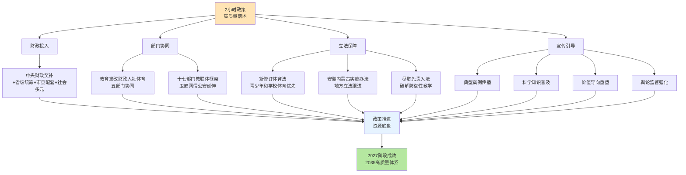

可以判断，**财政投入、部门协同、立法保障、宣传引导四维综合保障是"2小时"政策推进的"基础设施"**——它们构成了政策落地所必需的资源底盘、协同网络、法律护航和舆论环境。这一四维保障与第6—9章的政策保障专题章节形成"专题机制+综合保障"的协同关系——专题机制提供具体政策工具，综合保障提供基础性支撑，二者缺一不可。

## 10.6 政策建议清单与监测评估指标体系

作为本研究的最终落点，本节构建两套面向实践的可操作工具——政策建议清单和监测评估指标体系。这两套工具将前九章的核心结论与本章的风险防范、路线图、综合保障整合为可被各级教育行政部门和学校直接使用的"操作手册"。

**政策建议清单**。整合第6—9章共计107项具体建议，按"紧迫性—可行性—杠杆效应"三维度分级，划分为三类：

**第一类：优先实施类（约30项）**——这是2025—2027年窗口期最紧迫、最具可操作性、最具杠杆效应的核心举措：（1）小学初中每天1节体育课、高中每周3—5节全部编入课程计划，杜绝"阴阳课表"；（2）每学期初公开晒课表，全面接受社会监督；（3）落实"上下午各30分钟大课间+15分钟课间×多次"的双大课间倍增制度；（4）严格执行新课标"体育课心率140—160次/分"的核心指标；（5）每节体育课不少于10分钟体能训练；（6）落实班师比小学5∶1、初中6∶1、高中8∶1硬指标；（7）实施"五个一批"师资多元补充行动；（8）打通退役运动员入校通道并设立过渡性资格认证；（9）打造"金边银角"校内微运动场体系；（10）推进学校体育场地有序对外开放并完善"政府引导+保险保障+责任划分+专业运维+评价激励"五位一体长效机制；（11）落实"过程性+终结性结合"双轨制中考体育考试方式，过程性评价权重不低于20%—30%；（12）建立学生体育成长档案；（13）省级抽测比例不低于20%、区县级不低于30%；（14）推广天津"进晒查罚改"五环节闭环监督模式；（15）建立"违规校长约谈—免职"两步问责链条；（16）将"提升学生体质健康水平"纳入政府履职评价；（17）落实"持续3年下降一票否决"机制；（18）落实"教联体"建设两阶段目标——2025年50%、2027年所有县；（19）班主任每学年至少1次家访；（20）建立家庭体育作业制度；（21）推广国家体育总局《亲子互动游戏运动指南》；（22）盘活城市街角空地建设嵌入式微运动场；（23）严格落实师德师风第一标准；（24）建立学生意外伤害保险全覆盖机制；（25）将"尽职免责"原则纳入地方立法或行政规章；（26）严防"频繁打卡"等形式主义做法；（27）落实"小学生10小时、初中生9小时、高中生8小时"睡眠保障；（28）严禁拖堂、严禁挤占体育课、杜绝"课间圈养"；（29）开展"四不两直"督导抽查；（30）建立省市县三级体质健康抽测制度。

**第二类：重点推进类（约45项）**——这是2026—2030年中期阶段重点推进的结构性举措：（31）积极推进走班制/俱乐部制改革；（32）建立"校内骨干+校外专业教练"双师模式；（33）推进小班化精准教学；（34）按新课标推进大单元教学（最低18学时）；（35）建立学段贯通的联合教研机制；（36）将"享受乐趣、增强体质、健全人格、锤炼意志"四位一体育人目标贯穿大中小学；（37）实施"教会—勤练—常赛"一体化教学闭环；（38）创设沉浸式情境化教学；（39）深化"县管校聘"改革，骨干交流比例不低于20%；（40）将大课间、课后服务、社团指导、赛事组织等"隐形任务"纳入教师工作量核算；（41）扩大公共体育场馆对青少年免费/低收费开放；（42）分级推进AI体育、智能体测、AI运动屏等数字工具部署；（43）建立学生体质数字画像与"一生一案"干预机制；（44）严格落实数据采集知情同意与隐私保护规则；（45）丰富中考体育选考项目，构建"基础性+综合性+选择性"三维项目结构；（46）将体育社团参与、体育竞赛获奖等多元素养指标纳入过程性评价；（47）将心肺复苏术等健康素养内容纳入体育评价考核；（48）建立"三方签字+扣分制"等防作假机制；（49）完善国家—省—市—县—校五级体质健康监测体系；（50）建立"监测—评估—反馈—干预—保障"五环节闭环工作体系；（51）建立"政府政绩考核+教育部门评价+校长履职考核+体育教师绩效"四级问责体系；（52）建立省市县校多级督导评估机制；（53）参照江苏丹阳"领导小组+工作专班+月例会"模式建立县级协同共治机制；（54）参照山东日照"一案二有三定四结合"刚性框架推进省级家庭体育作业制度；（55）建立学生家庭体育作业跟踪档案；（56）落实"体教医融合"，将脊柱与视力健康操、心肺复苏术嵌入家庭体育作业；（57）参照兰州、滨州模式推进学校场地"应开尽开、能开尽开"；（58）规范引导校外体育培训市场——破解"保分冲刺班"焦虑营销；（59）参照青岛市北区"引、养、测、赛、考"五位一体模式推进特色项目培育；（60）参照昆山"40所校园足球特色学校+多元化特色矩阵"模式形成区域特色矩阵；（61）参照汕头蓬鸥中学"班级—模拟—全校—对外"四层赛事架构构建校级体育赛事体系；（62）落实"人人有项目、班班有活动、校校有特色、周周有比赛"总体设计逻辑；（63）构建七层级竞赛体系；（64）借鉴"所有参赛运动员均获评'优秀运动员'"全员激励机制；（65）将运动会升级为"体育嘉年华"；（66）针对欠发达地区设立中央财政"中西部学校体育振兴专项";（67）建设国家级或省级体育数字化云端共享平台；（68）推进高中阶段"每天1节"试点扩面；（69）在高考综合素质评价中赋予体育权重；（70）省内梯度差异明显的省份制定省内分区时间表；（71）参照宝鸡市推进省级"全国学校家庭社会协同育人实验区"建设；（72）建立健全家长学校与家庭教育指导机构；（73）培育亲子共跑、家庭运动联盟、社区家庭亲子运动会等多元载体；（74）落实《未成年人网络保护条例》《可能影响未成年人身心健康的网络信息分类办法》；（75）严格落实"学籍所在学校原则"防止"挂靠考试"。

**第三类：长期培育类（约32项）**——这是2028—2035年长期培育的文化性、机制性举措：（76）培育中华体育精神与立德树人融合；（77）落实"以体育心、以体铸魂""野蛮其体魄、文明其精神"的精神价值导向；（78）支持传统体育与民族文化传承；（79）建立"政府引导+部门联动+学校开放+社区参与"四方协同机制；（80）推进高校体育教育人才培养模式改革；（81）增设冰雪运动、校园足球等特色微专业；（82）依托"国培、省培"计划开展周期性体育教师轮训；（83）选拔培养体育领军人才；（84）将体育精神向社会延伸——退役运动员社区服务、教师志愿服务等；（85）推广"AI从'裁判'到'教练'"角色升级；（86）建设全场景多模态体质画像系统；（87）推进AI情绪识别与心理健康预警；（88）建立"15分钟健身圈"全覆盖；（89）建设嵌入式便民运动设施；（90）推进体育与艺术、爱国主义教育、校训精神等多元价值有机融合；（91）培育"少年强则国强、体育兴则民族兴"的家国情怀；（92）打造"体育嘉年华"等校园体育文化盛典；（93）形成"周周有活动、月月有赛事、家家能参与"长效机制；（94）推动体育志愿服务常态化；（95）建设"一校一品/一校多品"特色品牌矩阵；（96）培育"足球特长生小、初、高一条龙"贯通培养；（97）建立"省队校办"等体教融合创新模式；（98）促进体育产业、体育文化高质量发展；（99）推动学校体育从"政策落地"迈向"习惯养成"；（100）实现学生体质健康水平稳居世界前列；（101）实现运动习惯养成率达到80%以上；（102）实现校园体育文化深度融入立德树人体系；（103）实现家校社协同支持学生体质强健的全社会氛围基本形成；（104）实现体教融合达到新高度；（105）实现学校体育服务体育强国和健康中国建设；（106）实现学校体育服务中国式现代化建设；（107）实现2035年建成现代化高质量学校体育体系。

**监测评估指标体系**。构建"投入—过程—产出—影响"四维指标框架，共约30项关键指标：

| 维度 | 指标类别 | 关键指标 | 监测主体 | 采集频次 | 对标基准 |
|------|----------|----------|----------|----------|----------|
| 投入 | 师资 | 班师比达标率（小学5∶1、初中6∶1、高中8∶1） | 教育部+省级教育部门 | 年度 | 100% |
| 投入 | 师资 | 体育教师本科以上学历占比 | 教育部 | 年度 | ≥90% |
| 投入 | 场地 | 生均体育场地面积（小学/中学） | 省级教育部门 | 年度 | 国家标准 |
| 投入 | 场地 | 学校体育场地对外开放率 | 市级教育部门 | 年度 | ≥50% |
| 投入 | 财政 | 学校体育经费占教育经费比例 | 财政部门 | 年度 | 适度递增 |
| 投入 | 数字化 | AI体育设备覆盖率 | 教育部+省级 | 年度 | 分类目标 |
| 过程 | 课时 | 每天1节体育课开课率 | 督导部门 | 学期 | 100% |
| 过程 | 课时 | 2小时综合活动落实率 | 督导部门+学校自评 | 学期 | 100% |
| 过程 | 强度 | 1小时MVPA达标率 | 体育教师+数字监测 | 学期 | ≥60% |
| 过程 | 监督 | "阴阳课表"查处数 | 督导部门 | 学期 | 持续下降 |
| 过程 | 监督 | 违规校长约谈数 | 教育行政部门 | 年度 | 阶段性数据 |
| 过程 | 评价 | 中考体育"过程性评价"覆盖率 | 省级教育部门 | 年度 | 100% |
| 过程 | 协同 | "教联体"建设覆盖率 | 教育部+省级 | 年度 | 2027年100% |
| 过程 | 协同 | 家庭体育作业实施率 | 学校+家长反馈 | 学期 | 阶段性目标 |
| 过程 | 培育 | "一校一品"特色品牌数 | 省级教育部门 | 年度 | 阶段性目标 |
| 过程 | 培育 | 班级赛覆盖率 | 学校自评 | 学期 | ≥80% |
| 产出 | 体质 | 体质健康优良率 | 省级抽测+学校监测 | 年度 | 2027年65-70% |
| 产出 | 体质 | 体质健康合格率 | 省级抽测 | 年度 | ≥98% |
| 产出 | 健康 | 中小学生总体近视率 | 国家疾控+省级 | 年度 | 持续下降 |
| 产出 | 健康 | 中小学生肥胖率 | 国家疾控+省级 | 年度 | 持续下降 |
| 产出 | 技能 | 运动技能掌握率（每生≥2项） | 学校监测 | 学期 | 阶段性目标 |
| 产出 | 安全 | 学生运动伤害事故发生率 | 学校+保险机构 | 学期 | 持续下降 |
| 影响 | 习惯 | 运动习惯养成率 | 国家级监测 | 年度 | 2035年≥80% |
| 影响 | 心理 | 抑郁焦虑检出率 | 国家级监测+学校 | 年度 | 持续下降 |
| 影响 | 心理 | 心理健康指数 | 国家级监测 | 年度 | 持续提升 |
| 影响 | 学业 | 学业表现与运动相关性 | 教育研究机构 | 年度 | 正相关 |
| 影响 | 协同 | 家长体育素养水平 | 抽样调研 | 2-3年一次 | 持续提升 |
| 影响 | 文化 | 学生对体育课满意度 | 学校+第三方调研 | 年度 | 持续提升 |
| 影响 | 公平 | 城乡体质健康差距 | 国家级监测 | 年度 | 持续缩小 |
| 影响 | 综合 | 体教融合成效综合评价 | 教育部+体育总局 | 2-3年一次 | 阶段性目标 |

如表所示，**30项关键指标按"投入—过程—产出—影响"四维框架展开，覆盖了师资、场地、财政、数字化、课时、强度、监督、评价、协同、培育、体质、健康、技能、安全、习惯、心理、学业、协同、文化、公平、综合21个细分领域**——这是为各级政府和学校提供可量化、可追踪、可考核的评估工具。指标体系的政策价值在于将抽象的"2小时高质量落地"转化为可被监测、可被评估、可被问责的具体数据。

可以判断，**政策建议清单与监测评估指标体系是本研究面向实践的最终工具**——它们将前九章的核心结论与本章的风险防范、路线图、综合保障整合为可被直接使用的"操作手册"。**107项政策建议按紧迫性分为三类，使各级实施主体能够清晰把握行动优先级**；**30项监测评估指标按四维框架展开，使政策推进具有了客观可测的成效追踪机制**。这两套工具的协同使用将使"2小时"政策推进从"原则性宣示"走向"操作化执行"。

## 10.7 研究结论与未来研究展望

作为本研究的总结性收尾，本节系统回顾在"现状测量—影响因素—政策保障"三位一体分析框架下取得的核心发现，坦诚说明研究的方法论局限，并提出未来研究方向。

**核心结论一："2小时"政策作为教育强国建设杠杆性指标的科学合理性与战略必要性**。本研究第1章已经从政策语境角度论证了"2小时"作为《教育强国建设规划纲要（2024—2035年）》和《关于实施学生体质强健计划的意见》核心指标的战略定位；第3章已经从因果机制角度论证了"2小时综合活动+1小时MVPA"双重底线的剂量—效应科学合理性。**这些论证共同支撑了一个核心判断——"2小时"不是一个孤立的时间数字，而是教育强国建设的杠杆性指标、健康中国战略的基础性保障、立德树人根本任务的物质性载体**。重申这一战略定位，既是对全研究的整体总结，也是对未来政策推进保持初心的精神锚点。

**核心结论二：现状测量层的五大结构性短板、影响因素层的七大跨层耦合瓶颈、政策保障层的四大支柱协同机制三大核心结论**。**第一大核心结论（现状测量层）**：第2章识别出当前中小学生综合体育活动时间与"2小时"目标之间存在的五大结构性短板——高中学段的时间严重不足、中西部及乡村地区的资源短板、"凑数式2小时"背后的质量空洞、家庭与校外锻炼场景的薄弱环节、"阴阳课表"等隐性流失。**第二大核心结论（影响因素层）**：第4章识别出制约"2小时"落实的七大核心瓶颈——"阴阳课表"与体育课挤占、师资紧平衡与城乡结构性短缺、应试化训练与"为考而练"异化、安全过度防御与防御性教学、作业挤压与睡眠运动双不足、校外资源短缺与培训市场失序、兴趣枯燥与技能/心理负反馈。这七大瓶颈不是孤立的，而是通过"安全顾虑—家长追责—防御性教学""升学压力—作业增多—睡眠运动双不足""校内供给不足—校外培训挤压—应试异化"三大跨层耦合循环相互强化。**第三大核心结论（政策保障层）**：第6—9章构建了"教学机制—资源保障—治理机制—协同文化"四大支柱的协同机制——第6章以课时刚性、结构优化、教学质量、风险防控四位一体支撑教学；第7章以师资多元补充、场地共建共享、数字精准赋能三维一体支撑资源；第8章以评价改革、监测体系、监督问责三大支柱支撑治理；第9章以协同主体、资源载体、文化纽带三大维度支撑协同。

**核心结论三：本研究的方法论局限**。任何严谨的政策研究都需要对自身局限保持坦诚的自我认知——本研究在方法论上至少存在五类局限：**第一类：全国系统性数据尚处积累期**。"2小时"政策在2025年秋季学期才全面推开，全国层面的系统性落地数据尚处于积累阶段。本研究的现状测量主要依靠多源数据交叉印证与上海2023年"日均1.2小时"等代表性参考值，而非时点统一、口径一致、覆盖全国的权威数据点。**第二类：因果识别方法学约束**。本研究第3章援引的天津、青岛、青海、杭州等地数据均属同一时期"政策推进+体质改善"的同向变化，但严格意义上无法独立证明"是因为活动时间增加导致体质改善"的因果方向。同期"双减"政策、家庭经济条件改善、公众健康意识增强等都构成潜在混杂因素。**第三类：地方实践数据可比性挑战**。各地数据口径、抽样设计、监测时点存在差异，跨模式实施成效的精确比较受到方法学限制——本研究因此重点比较制度设计逻辑而非简单数据排名。**第四类：本土化随机对照实验稀缺**。本研究第3章援引的剂量—效应Meta分析多为国际研究，针对中国中小学生群体在中国教育情境下的本土化随机对照实验尚处于积累阶段——这意味着"2小时"政策的具体剂量设定，在科学依据上具备方向性支撑，但精细化阈值仍有待本土化研究的进一步验证。**第五类：风险评估的前瞻性约束**。10.1节对六类风险的紧迫程度评估基于当前可观测数据，但"2小时"政策在2026—2027年密集推开过程中可能出现新的风险形态，需要持续追踪和动态评估。

**核心结论四：未来研究方向**。基于本研究的方法论局限，提出五类未来研究方向：**方向一："2小时"政策长期效应追踪研究**——建议在国家层面构建"2小时"政策落地的纵向追踪研究队列，每年采集分学段、分区域、分类型学校的关键指标数据，使政策的中长期效应能够被严谨识别。**方向二：剂量—效应本土化阈值精细化研究**——建议通过自然实验、随机对照实验等方法，针对中国中小学生群体精细化测算不同剂量、不同强度、不同场景组合下的具体效应规模，为"2小时"政策的精细化迭代提供本土证据基础。**方向三：数字赋能伦理边界深化研究**——随着AI体育、智能体测、数字画像等技术的快速普及，数据隐私保护、算法公平性、技术替代教师等伦理问题日益突出，需要深化研究伦理边界和规范化路径。**方向四：家校社协同效能定量评估研究**——"教联体"建设作为新兴的协同治理机制，其实际效能需要定量评估方法的支持，包括协同主体行为变化、资源整合度、文化氛围塑造等多维指标。**方向五：欠发达地区适配机制研究**——城乡区域执行落差风险是"2小时"政策落地中最具结构性的挑战，需要专门研究欠发达地区的适配机制，包括财政支持模式、技术普惠路径、师资定向培养等。

**核心结论五：本研究的价值定位**。本研究服务于教育强国建设、健康中国战略、立德树人根本任务的总体价值定位。从教育强国建设视角看，本研究通过对"2小时"政策的全景式剖析，将这一杠杆性指标与教育强国"民生保障力""人才竞争力""社会协同力"等核心特质有机联结。从健康中国战略视角看，本研究的因果机制论证、最优活动结构分析、剂量—效应剖析共同回答了"运动如何塑造健康"这一基础性命题。**正如新修订《体育法》"将'学校体育'的章名修改为'青少年和学校体育'，把青少年和学校体育置于优先发展的战略地位"[^209]所揭示的——青少年体质健康已经被国家立法置于优先发展位置**。从立德树人根本任务视角看，本研究始终强调"享受乐趣、增强体质、健全人格、锤炼意志"四位一体育人目标，使"2小时"政策超越单纯的体质指标维度，升华为全人培养的精神载体。

需要特别强调的是，**本研究并非"2小时"政策的终点，而是政策推进的起点**——研究发现的现状短板需要持续监测才能改善，识别的影响因素需要长期治理才能化解，提出的保障机制需要稳健落地才能见效，描绘的路线图需要持续努力才能达成。本研究作为一项政策研究的真正价值，不在于"完成一份报告"，而在于"启动一段进程"——使"2小时"政策从政策文本走向校园常态、从制度安排走向文化基因、从国家战略走向全民共识。**正如长沙高新区虹桥小学校长周琳所述——"体育时间无刚性保障，'以体育人'就是空中楼阁"——这一来自办学一线的判断深刻揭示了"2小时"硬指标对落实立德树人的基础性作用，也指明了本研究服务于一线实践的根本归宿**[^210][^211]。

让每一名中小学生都能够在保障的"2小时"中享受运动乐趣、锤炼坚强意志、增强健康体魄、健全人格品德，让每一所学校都成为孩子们身心自由舒展的"活力校园"，让每一个家庭都将运动融入日常生活的"美好节奏"，让全社会都凝聚起"健康第一"的"教育共识"——这正是"2小时"政策的初心所在，也是本研究得以面向2025—2035年教育强国建设新征程所应承担的政策使命。

# 参考内容如下：
[^1]:[《教育强国建设规划纲要(2024—2035年)》](https://www.gov.cn/gongbao/2025/issue_11846/202502/content_7002799.html)
[^2]:[中共中央、国务院印发《教育强国建设规划纲要(2024—2035年)》 加快建设教育强国有了纲领性文件](http://www.moe.gov.cn/jyb_xwfb/xw_zt/moe_357/2026/2026_zt02/qgsdjyxw/02/202601/t20260122_1427218.html)
[^3]:[从时间保障到人才培养——专家解读《关于实施学生体质强健计划的意见》的新意和亮点](http://www.xinhuanet.com/sports/20251124/3220b3fe90a54030bd1f057a35c48f51/c.html)
[^4]:[教育部体育卫生与艺术教育司负责人就《关于实施学生体质强健计划的意见》答记者问](http://www.baoan.gov.cn/bajyj/gkmlpt/content/12/12674/mpost_12674562.html)
[^5]:[中共中央 国务院印发《教育强国建设规划纲要(2024—2035年)》](http://www.moe.gov.cn/jyb_xxgk/moe_1777/moe_1778/202501/t20250119_1176193.html)
[^6]:[中共中央 国务院关于 加强青少年体育增强青少年体质的意见](https://www.gov.cn/gongbao/content/2007/content_663655.htm)
[^7]:[如何进一步引导青少年科学锻炼](https://www.kids21.cn/wztt/202604/t20260427_1395560.htm)
[^8]:[关于全面加强和改进新时代学校体育工作的意见](https://baike.baidu.com/item/关于全面加强和改进新时代学校体育工作的意见/53987860)
[^9]:[国务院办公厅关于强化学校体育 促进学生身心健康全面发展的意见](https://www.wenda.edu.cn/yscm/display_852.html)
[^10]:[如何让中小学生真正养成运动习惯 专家详解学生体质强健计划“二十条”](http://www.xinhuanet.com/edu/20251120/7453a63fb9104006a7c6989190e5291c/c.html)
[^11]:[“保障中小学生每天综合体育活动时间不低于2小时”新闻发布会](https://www.ah.gov.cn/zmhd/xwfbhx/565430761.html)
[^12]:[如何进一步引导青少年科学锻炼(政策问答·回应关切)](https://baijiahao.baidu.com/s?id=1863584378110249525&wfr=spider&for=pc)
[^13]:[甘肃五部门联合部署学生体质强健工作](https://baijiahao.baidu.com/s?id=1862040098803308169&wfr=spider&for=pc)
[^14]:[中小学生每天综合体育活动时间不低于两小时!省教育厅最新通知](http://www.jiexi.gov.cn/jyjxjyj/gkmlpt/content/0/917/mpost_917544.html)
[^15]:[广东发文要求探索课间15分钟制度 严禁拖堂限制课间活动 ](http://www.gd.gov.cn/zwgk/zdlyxxgkzl/jy/content/post_4664228.html)
[^16]:[广州校园晒课表:学生体质优良率全省第一、每天1节体育课实打实干!](https://baijiahao.baidu.com/s?id=1862429074857460723&wfr=spider&for=pc)
[^17]:[新规发布!多地如何响应中小学生每天2小时体育活动时间?](https://baijiahao.baidu.com/s?id=1825096913483494753&wfr=spider&for=pc)
[^18]:[教育部明确:中小学生每天2小时体育+15分钟课间活动 ](https://m.gmw.cn/2026-02/26/content_1304356255.htm)
[^19]:[教育部:学生每天体育2小时、课间15分钟已在全国所有省份部署推开](https://baijiahao.baidu.com/s?id=1858094506719393003&wfr=spider&for=pc)
[^20]:[“健康第一”理念下学校综合体育活动的有效开展——“区域中小学生每天综合体育活动不低于两小时”调研](https://www.jinniu.gov.cn/jinniu/c147427/2025-07/11/content_f57e0478799b462b84c343011ee0feb2.shtml)
[^21]:[中小学生体质下滑趋势迎来拐点?多项体测数据变强了](https://news.hsw.cn/system/2025/0808/1863978.shtml)
[^22]:[中小学生体质下滑趋势迎来拐点?多项体测数据变强了](https://news.hsw.cn/system/2025/0808/1863975.shtml)
[^23]:[教育部:学生每天体育2小时、课间15分钟已在全国所有省份部署推开](https://baijiahao.baidu.com/s?id=1858097261290078955&wfr=spider&for=pc)
[^24]:[体教融合|教育部:学生每天体育2小时、课间15分钟已在全国所有省份部署推开](https://mp.weixin.qq.com/s?__biz=MzU4NDU1MTI1MQ==&mid=2247785629&idx=3&sn=af6fc4d634adc22d7bd76d7e1f1c207d&chksm=fce8cc34c2636a57db71ccd0fe5b2fb7a6a5ef67edf79ba436ab69640b9f039f426400971f0a&scene=27)
[^25]:[关于《第六次全国国民体质监测公报》和《2025年全民健身活动状况调查公报》](http://www.huazhou.gov.cn/hdjl/wtjy/content/post_1584626.html)
[^26]:[《第六次全国国民体质监测公报》发布](https://www.sport.gov.cn/n20001280/n20745751/c29327252/content.html)
[^27]:[38.52%的国人经常参加体育锻炼,“小眼镜”“小胖墩” 比例终于降了](http://www.kepu.gov.cn/news/2025-12/29/content_454934.html)
[^28]:[关于《第六次全国国民体质监测公报》和《2025年全民健身活动状况调查公报》 ](http://www.maoming.gov.cn/zmhd/ywzsk/wtjy/content/post_1580552.html)
[^29]:[儿童友好-关注儿童身心健康丨天津中小学生体质健康监测结果出炉](http://baijiahao.baidu.com/s?id=1825848805389239451&wfr=spider&for=pc)
[^30]:[2小时运动在校内完成,上海如何破题?](https://www.163.com/dy/article/KEOJQRFD05506BEH.html)
[^31]:[专访丨“综合体育活动时间不低于2小时”如何落实?](https://baijiahao.baidu.com/s?id=1826306807751840393&wfr=spider&for=pc)
[^32]:[教育部:学生每天体育...@Oo大蓝鲸金陵记oO的动态](http://mbd.baidu.com/newspage/data/dtlandingsuper?nid=dt_5227792820304631001)
[^33]:[关注| 如何科学告别“小胖墩”?来看国家行动指南+地方创新答案 → ](https://mp.weixin.qq.com/s?__biz=MzIwMjQ4NDQzMQ==&mid=2247774295&idx=4&sn=931e9e46a9179812063be58cef17ee83&chksm=97a48a906e3c087da4deca3403e4e7df7e2da963aebf9f29bf1f09128bf47295b4925ba13f58&scene=27)
[^34]:[管好体重,做活力少年](https://baijiahao.baidu.com/s?id=1814262213997052213&wfr=spider&for=pc)
[^35]:[“体育强国”大家谈丨落实学生每天运动2小时 办法总比困难多](https://baijiahao.baidu.com/s?id=1833870029024261410&wfr=spider&for=pc)
[^36]:[“综合体育活动时间不低于2小时”如何落实](https://jyj.changzhi.gov.cn/jyzc/202503/t20250318_3026793.html)
[^37]:[青少年体质连年下降,背后是体育教育文化的缺失](https://m.jiemian.com/article/1819335.html)
[^38]:[中小学生“每天2小时综合体育活动”如何真正落地](http://jky.sneducloud.com/webArticleAction/toNewsInformPage.jhtml?uuid=08018ee868cd48979318)
[^39]:[教育部关于2010年全国学生体质与](http://www.moe.gov.cn/srcsite/A17/moe_943/moe_947/201108/t20110829_124202.html)
[^40]:[全国学生总体近视率“四连降”](http://www.xinhuanet.com/politics/20260226/b4c99cdaf8c642d7b10c3abe60db1f47/c.html)
[^41]:[中小学生体质下滑趋势迎来拐点?多项体测数据变强了](https://news.cctv.cn/2025/08/08/ARTI5ZjVhTT77mSXOOdUCGAX250808.shtml)
[^42]:[中小学生体质下滑趋势迎来拐点?多项体测数据变强了 ](https://m.gmw.cn/2025-08/08/content_1304105583.htm)
[^43]:[天津中小学生体质健康水平显著提升 优良率近七成](http://news.10jqka.com.cn/20260419/c676098153.shtml)
[^44]:[2025年我市中小学生体质健康抽测总样本合格率达到99.40% 让每个孩子动起来 强起来](http://app.myzaker.com/news/article.php?pk=69e43109b15ec06f9639a699)
[^45]:[让每个孩子动起来 强起来 ](https://www.tj.gov.cn/sy/tjxw/202604/t20260419_7284038.html)
[^46]:[让每个孩子动起来,强起来!天津中小学生体质健康抽测合格率达99.40%](https://baijiahao.baidu.com/s?id=1862711488783430389&wfr=spider&for=pc)
[^47]:[青海启动学生体质强健计划三年行动](https://baijiahao.baidu.com/s?id=1858011228676318719&wfr=spider&for=pc)
[^48]:[青海启动学生体质强健计划三年行动](https://www.cnr.cn/jy/list/20260225/t20260225_527535269.shtml)
[^49]:[青海启动学生体质强健计划三年行动](https://baijiahao.baidu.com/s?id=1858714496070487275&wfr=spider&for=pc)
[^50]:[浙江教育观察:每天2小时体育活动,如何让孩子动起来?](https://baijiahao.baidu.com/s?id=1859552721310385876&wfr=spider&for=pc)
[^51]:[“一天一节体育课”刚性落地 青岛推动学校体育改革](https://baijiahao.baidu.com/s?id=1863577716243826151&wfr=spider&for=pc)
[^52]:[中小学生体质健康测试成绩与课外体育锻炼时间、强度相关性调查.docx 19页VIP](https://m.book118.com/html/2026/0419/5113124101013202.shtm)
[^53]:[运动如何帮助青少年走出抑郁情绪](https://mp.weixin.qq.com/s?__biz=MzAxOTEwODk5NQ==&mid=2650279267&idx=4&sn=60c8117b0212367fd63b7d50b62e8483&chksm=826b9dcc4b56c96f2c70ebbc01258adad6ea3ae130caef931a7166c37521b2502da55d8ac826&scene=27)
[^54]:[Instrumented measures of sedentary behavior and physical activity are associated with depression among children and adolescents: a systematic review and dose–response meta-analysis of observational studies](http://doi.org/10.3389/fpsyg.2024.1465974)
[^55]:[长期体力活动与儿童青少年学业成绩的剂量-效应关系](https://www.sport.gov.cn/qss/n5022/c24147312/content.html)
[^56]:[长期体力活动与儿童青少年学业成绩的剂量-效应关系 ](https://www.sohu.com/a/537145424_121124683)
[^57]:[如何进一步引导青少年科学锻炼](http://www.moe.gov.cn/jyb_xwfb/s5147/202604/t20260427_1434942.html)
[^58]:[没有好身体,就没有好未来](https://new.qq.com/rain/a/20260426A02PFC00)
[^59]:[国务院教育督导办:67%中小学生睡眠不足,初高三体育课被挤占](http://baijiahao.baidu.com/s?id=1709502174951853589&wfr=spider&for=pc)
[^60]:[第三场:介绍秋季学期中小学教育教学工作及“双减”“五项管理”督导有关情况](http://www.moe.gov.cn/fbh/live/2021/53659/mtbd/202108/t20210830_555981.html)
[^61]:[教育部将严查挤占体育课、课间不准出教室行为,专家:引入智慧体育进行实时运动监测](https://baijiahao.baidu.com/s?id=1858249432407717471&wfr=spider&for=pc)
[^62]:[严查挤占体育课情况!教育部最新消息 ](https://m.gmw.cn/2026-02/26/content_1304355944.htm)
[^63]:[体育课小调查:六成受访者称孩子不喜欢校内体育课](http://baijiahao.baidu.com/s?id=1713380983199502467&wfr=spider&for=pc)
[^64]:[姚明:农村体育教师短缺突出;想青少年息屏要提供替代场景](https://baijiahao.baidu.com/s?id=1858873794569446973&wfr=spider&for=pc)
[^65]:[【年度报告】招远市中小学校体育教育发展年度报告(2024年度) ](https://www.zhaoyuan.gov.cn/art/2025/7/3/art_53287_2964667.html)
[^66]:[2024年颍州区中小学校体育工作年度报告](https://www.yingzhou.gov.cn/OpennessContent/show/2619068.html)
[^67]:[【学校体育评价】2025年南雄市学校体育工作年度报告](https://www.gdnx.gov.cn/zdly/jyxx/zyzc/content/post_2830901.html)
[^68]:[体育课变形: 初中搞“应试”,高中走“形式”](http://baijiahao.baidu.com/s?id=1676681994360127918&wfr=spider&for=pc)
[^69]:[中国儿童青少年体育健身指数评估报告发布 ](http://kjb.sckjw.com.cn/9eca72e430194499817b8102062c7486)
[^70]:[体育课受伤告学校?法院判了!](https://baijiahao.baidu.com/s?id=1862338672772365143&wfr=spider&for=pc)
[^71]:[孩子体育课骨折,家长索赔20万被驳回!最高法:尽职就不赔! ](https://learning.sohu.com/a/1014297961_505583)
[^72]:[湖南拟立法保障中小学生体育课:义务教育阶段每天一节,高中每周至少三节](https://baijiahao.baidu.com/s?id=1861170397207170175&wfr=spider&for=pc)
[^73]:[警惕体育中考滑向“为考而练”](http://www.zgnt.net/ntrbszb/pc/c/202504/22/content_205724.html)
[^74]:[对抗青少年网络沉迷 体育运动来助力 ](https://www.sport.gov.cn/n20001280/n20067626/n20067861/c20205794/content.html)
[^75]:[80%的青少年活动量不足,你家娃达标了吗?](http://www.tongzhou.gov.cn/tzqrmzf/jkjyxczl/content/ff55bf0b-53a2-4c7e-9ea1-7dfb5af22abb.html)
[^76]:[谁“偷走”了孩子的睡眠?](https://baijiahao.baidu.com/s?id=1860266596911412259&wfr=spider&for=pc)
[^77]:[积极拓宽青少年免费运动空间](https://baijiahao.baidu.com/s?id=1862049252528317754&wfr=spider&for=pc)
[^78]:[体育设施建设、校园操场开放、体育预付卡安全……青浦区人大常委会启动这项执法检查! ](https://www.shanghai.gov.cn/nw15343/20260422/dd3c07cba3a64883be26dcff89b4be65.html)
[^79]:[99%的家长都在错付!体育培训的真相,远比“孩子开心”更重要](https://baijiahao.baidu.com/s?id=1863261453700541488&wfr=spider&for=pc)
[^80]:[中国青少年体育培训市场规模超2500亿元,正从野蛮生长期向高质量发展跨越](https://baijiahao.baidu.com/s?id=1855412067845337559&wfr=spider&for=pc)
[^81]:[中国青少年体育培训市场规模超2500亿元,正从野蛮生长期向高质量发展跨越](https://web.shobserver.com/wx/detail.do?id=1057932)
[^82]:[体育变“内卷”,谁在贩卖焦虑?](https://baijiahao.baidu.com/s?id=1862414949085172553&wfr=spider&for=pc)
[^83]:[小学初中每天1节体育课!北京中小学“体育八条”全文公布](https://baijiahao.baidu.com/s?id=1824269433957265961&wfr=spider&for=pc)
[^84]:[北京出台“体育八条” 构建中小学“大健康”教育格局](https://baijiahao.baidu.com/s?id=1824445911118045305&wfr=spider&for=pc)
[^85]:[北京:2025年中小学生体质健康优良率首次突破80%](https://baijiahao.baidu.com/s?id=1858281212864180172&wfr=spider&for=pc)
[^86]:[天津建立“进晒查罚改”闭环机制 “硬核”措施护航“每天运动两小时”](https://baijiahao.baidu.com/s?id=1861325475956286398&wfr=spider&for=pc)
[^87]:[我市“进晒查罚改”闭环机制护航“每天运动两小时”](https://jy.tj.gov.cn/JYXW/TJJY/202604/t20260402_7275350.html)
[^88]:[广东省教育厅关于保障中小学生每天综合 体育活动时间不低于两小时的通知](https://jyj.gz.gov.cn/attachment/7/7760/7760427/10112706.pdf)
[^89]:[确保每天体育活动2小时!肇庆发布“校园体育30条”](https://www.zhaoqing.gov.cn/zqjyj/gkmlpt/content/3/3089/mpost_3089817.html)
[^90]:[今年秋季东莞全市中小学课表新变动:每天至少1节体育课](https://baijiahao.baidu.com/s?id=1824468405108421480&wfr=spider&for=pc)
[^91]:[校园体育2小时、课间休息15分钟!东莞多所学校课表“上新”… ](https://mp.weixin.qq.com/s?__biz=MzA4MjI5Mzg0OA==&mid=2650636472&idx=1&sn=337cbb803b80cd56a386ee821c4f677d&chksm=86756a6ac3a796129e297fe6958ac44d5bfb902cadbb3f0feb44d55a3ce8d7b2973cb2c1ee4d&scene=27)
[^92]:[广东试点大学生每天阳光体育活动不少于一小时](https://baijiahao.baidu.com/s?id=1862706552110081317&wfr=spider&for=pc)
[^93]:[拯救“脆皮大学生”!广东开展大学生每天阳光体育活动不少于1小时试点](https://baijiahao.baidu.com/s?id=1862603070987121894&wfr=spider&for=pc)
[^94]:[确保中小学生每天体育活动2小时!云南实施壮苗行动→](http://baijiahao.baidu.com/s?id=1824489593278254630&wfr=spider&for=pc)
[^95]:[我省出台中小学生壮苗行动方案 ](https://www.yn.gov.cn/ywdt/bmdt/202502/t20250219_309479.html)
[^96]:[河北省实施学生体质强健计划](https://baijiahao.baidu.com/s?id=1863403927298117732&wfr=spider&for=pc)
[^97]:[贡山县:全面落实“壮苗行动”,助力中小学生增强体质、全面发展 ](https://mp.weixin.qq.com/s?__biz=MzA5NTA1NjQzNg==&mid=2649123282&idx=1&sn=7b3506f89a0c77661b63fed56151b31b&chksm=8914a3a9646ed1f70ec8e7883722068c5e1dac8593395b1cfbe1b9aec0b00f11e81aab1d9d1d&scene=27)
[^98]:[河北“体教融合”助学生成长:在汗水中强健体魄 在拼搏中涵养品格](https://mp.weixin.qq.com/s?__biz=MzI3ODQ5Mjg4NA==&mid=2247578785&idx=2&sn=b939eaf80b1590b2d4f243fafd82e6a9&chksm=ea9d2ef095ee2933abdbb813d87c0d464a7e3bcabf4c69ecb4afa491b13bce5d28ad2cfaecaf&scene=27)
[^99]:[甘肃实施学生体质强健计划](https://baijiahao.baidu.com/s?id=1861966455587654975&wfr=spider&for=pc)
[^100]:[甘肃省五部门联合部署学生体质强健工作](https://baijiahao.baidu.com/s?id=1861958559254501205&wfr=spider&for=pc)
[^101]:[甘肃实施学生体质强健计划](https://baijiahao.baidu.com/s?id=1862405734188204172&wfr=spider&for=pc)
[^102]:[山西省大同市平城区:“加长版”课间让学生真正“动起来”](https://baijiahao.baidu.com/s?id=1863347980551015766&wfr=spider&for=pc)
[^103]:[北京第二实验小学平谷分校:坚持体育第一以体育人建校园新样态](https://baijiahao.baidu.com/s?id=1861548337387287158&wfr=spider&for=pc)
[^104]:[陕西省印发中小学体育工作“十个一”要求 明确每日一节体育课](https://stock.10jqka.com.cn/20260426/c676283446.shtml)
[^105]:[陕西省教育厅陕西省体育局联合发布“中小学体育工作‘十个一’要求”](https://baijiahao.baidu.com/s?id=1863319370412612315&wfr=spider&for=pc)
[^106]:[健康不止口号!包头少年脚下有风 眼中有光|包融深一度](https://www.163.com/news/article/KR59LIGS0001A1UG.html)
[^107]:[每天2小时,课间15分钟……跟着青羊少年“动”起来!](https://baijiahao.baidu.com/s?id=1860165777448281122&wfr=spider&for=pc)
[^108]:[“壮苗行动”深耕校园](http://yn.people.com.cn/n2/2026/0422/c372456-41559368.html)
[^109]:[宜春市中小学落实每天综合体育活动时间不低于2小时掠影](https://baijiahao.baidu.com/s?id=1861259169669566091&wfr=spider&for=pc)
[^110]:[三水学子化身“运动达人”,课间成为“体能加油站”!](https://www.thepaper.cn/newsDetail_forward_32482179)
[^111]:[重庆市田家炳中学校:坚守健康育人初心 赋能学生全面发展](https://www.163.com/dy/article/KR9AQ51P0514DG98.html)
[^112]:[寄宿生早操活动方案](https://www.99xueshu.com/w/file9eggwpxt.html)
[^113]:[一体化改革,校园体育不再“各管一段”](https://baijiahao.baidu.com/s?id=1852243904140334063&wfr=spider&for=pc)
[^114]:[大渡口区育才小学教共体体育与健康新卓越优质课活动在双山实验小学举行](https://www.163.com/dy/article/KQFEUIUJ0514DG98.html)
[^115]:[从“含胸驼背”到“昂首挺胸”,一所学校的体育课如何改变学生?](http://baijiahao.baidu.com/s?id=1862800165050327380&wfr=spider&for=pc)
[^116]:[从“含胸驼背”到“昂首挺胸”,一所学校的体育课如何改变学生?](https://m.jfdaily.com/sgh/detail?id=1736778)
[^117]:[滁州一小学实施体育课“走班制”改革](https://baijiahao.baidu.com/s?id=1851744385145629132&wfr=spider&for=pc)
[^118]:[西安中小学“班超”全面开花](https://edu.hsw.cn/system/2026/0410/155391.shtml)
[^119]:[身上有汗,让学生动起来|世外教育把“健康第一”理念转化为实际行动](https://baijiahao.baidu.com/s?id=1863157681151467114&wfr=spider&for=pc)
[^120]:[大中小学体育课程内容一体化构建](https://baike.baidu.com/item/大中小学体育课程内容一体化构建/51057286)
[^121]:[中小学体育课有了新要求:学生心率每分钟140-160次](https://baijiahao.baidu.com/s?id=1731233481860931398&wfr=spider&for=pc)
[^122]:[中小学体育课有了新要求:学生心率每分钟140-160次](http://baijiahao.baidu.com/s?id=1731217574088816211&wfr=spider&for=pc)
[^123]:[(季浏)中国健康体育课程模式的思考与构建](http://www.htsyzx.wj.czedu.cn/html/article6534818.html)
[^124]:[我国高质量体育课堂教学模型与实施的研究 ](https://mp.weixin.qq.com/s?__biz=MjM5ODc4MzgzMA==&mid=2650801466&idx=3&sn=f1cf163416b554b11d9566c7246e4948&chksm=bcc071c6e6bc2a380f142a5c9b4ecf31c48c1103403312ec58698c2527a4ea34702a2f1204f9&scene=27)
[^125]:[教育机构和教师管理](https://www.gstianzhu.gov.cn/art/2026/4/21/art_3736_1613421.html)
[^126]:[教育部最新印发!打通优秀退役军人任体育教师通道](https://tyjrswt.fujian.gov.cn/xwzx/sjyw/202502/t20250207_6712199.htm)
[^127]:[教育部最新印发!打通优秀退役军人任体育教师通道](https://tyjr.sh.gov.cn/fazhixuanchuan_pfxc/20250211/1f09281f3e084ed6aafb8f9d2603bea9.html)
[^128]:[2025年中国中小学体育教育发展现状与未来投资方向分析](https://www.chinabgao.com/info/1274648.html)
[^129]:[近88万中小学体育教师,如何上好一节体育课?](https://baijiahao.baidu.com/s?id=1835407953721243577&wfr=spider&for=pc)
[^130]:[中小学生每天运动2小时,体育老师有点少](https://www.163.com/dy/article/KA5OHFS905199NPP.html)
[^131]:[调查|体育教师仍有大缺口,退役运动员为何一位难求?](https://v.gxnews.com.cn/a/21757668)
[^132]:[退役军人任体育教师,最新举措落地! ](https://mp.weixin.qq.com/s?__biz=Mzg4ODYwNjgwMw==&mid=2247532107&idx=1&sn=193e091a84f299879090d928d4341311&chksm=cece54bfe38fc327ec1baf53c8f7302fdf48d263b690791e55d7541287644f926dad804e919c&scene=27)
[^133]:[陕西打通社会体育组织进入学校渠道 大中小学设教练员岗位_腾讯新闻](http://www.hrbou.org.cn/podhyp/20260413/astdjr.htm)
[^134]:[县管校聘](https://baike.baidu.com/item/县管校聘/17212761)
[^135]:[关于做好2025年县管校聘交流轮岗工作的](http://www.binzhou.gov.cn/art/2025/7/30/art_299040_77065.html)
[^136]:[咸阳:社会体育指导员为全民健身事业添活力](http://www.sxxynews.com/2024/1029/344472.html)
[^137]:[课间欢腾赛场激昂 阳光体育浸润上海中小学校园](http://sh.people.com.cn/n2/2026/0413/c138654-41550348.html)
[^138]:[践行“健康第一”,宝安这些学校有“秘籍”!](http://www.baoan.gov.cn/bajyj/gkmlpt/content/12/12686/post_12686148.html)
[^139]:[罗湖桃园小学入选省级优秀案例 每天运动两小时成校园常态 ](https://learning.sohu.com/a/1009471352_161795)
[^140]:[校社共享](https://baike.baidu.com/item/校社共享/67360437)
[^141]:[从“健身无处去”到“家门口有乐园” 兰州市50所中小学操场向社会开放](https://baijiahao.baidu.com/s?id=1863228614959743218&wfr=spider&for=pc)
[^142]:[春假+清明,江苏公共体育场馆向学生及群众免费或低收费开放](https://mp.weixin.qq.com/s?__biz=MzA3ODY2MTkxOA==&mid=2654528631&idx=1&sn=8418733d21b64749d72de19bac867081&chksm=85d92133f49459d97c3f1075eaad56dd96bca5a21eed5c4d235f4b6776a00b4cffe79383a129&scene=27)
[^143]:[AI体育课:当算法走进操场](https://baijiahao.baidu.com/s?id=1862589532947407009&wfr=spider&for=pc)
[^144]:[AI如何赋能体育?这所学校创新校园体育新实践](http://baijiahao.baidu.com/s?id=1862812852478067083&wfr=spider&for=pc)
[^145]:[每个学生都有一个AI“分身”?成都这所学校让体育课“进化”了](https://baijiahao.baidu.com/s?id=1863438154582226817&wfr=spider&for=pc)
[^146]:[体育课有了“电子考官”,茂名这所小学有这些AI玩法](https://baijiahao.baidu.com/s?id=1863255136765214341&wfr=spider&for=pc)
[^147]:[从“裁判”到“教练”:深圳壹路AI体育教学机如何让每一节体育课都有AI陪练](http://biz.ifeng.com/c/8se2MhzPrb1)
[^148]:[这些体育课亮相国家级舞台、荣获特等奖!AI+体育交叉赋能打造智慧课堂新范式](http://cnews.chinadaily.com.cn/a/202601/05/WS695b7f82a310942cc499a2fb.html)
[^149]:[世界数字教育大会|武汉育才二小用AI技术构建学生运动画像,降低超重率、近视率](https://baijiahao.baidu.com/s?id=1832076533339115435&wfr=spider&for=pc)
[^150]:[杭州上城区:数字画像让健康看得见 ](http://zjjyb.cn/html/2025-12/05/content_67645.htm)
[^151]:[数据来帮忙 健康“提”上去](https://paper.jyb.cn/zgjyb/h5/html5/2026-03/30/content_144740_19408597.htm)
[^152]:[用技术赋能育人细节,鸿合科技AI产品助力校内外教育双进化](https://baijiahao.baidu.com/s?id=1863612756360402864&wfr=spider&for=pc)
[^153]:[青海中考体育总分从50分上调至70分](https://baijiahao.baidu.com/s?id=1854516427252388188&wfr=spider&for=pc)
[^154]:[青海调整中考体育与健康科目分值 ](https://sdxw.iqilu.com/share/YS0yMS0xNzAxMjYzNw==.html)
[^155]:[《深圳市初中学业水平考试体育与健康科目考试实施意见》](http://szeb.sz.gov.cn/home/xxgk/zthd/tyks/index.html)
[^156]:[长垣市中招体育考试改革方案 ](http://www.changyuan.gov.cn/sitesources/cyxrmzf/page_pc/xxgk/zdlyxxgk/ywjy/article67469297b97749bd979a693b5409d05e.html)
[^157]:[青岛将“提升学生体质健康水平”纳入区市政府履职评价](https://www.qlwb.com.cn/detail/23765846.html)
[^158]:[教育部等五部门关于实施学生体质强健计划的意见](https://www.gov.cn/zhengce/zhengceku/202511/content_7049009.htm)
[^159]:[孩子健康与领导政绩挂钩 实行一票否决制 ](https://www.sohu.com/a/74616080_119038)
[^160]:[市教育局:完善中小学生体质健康监测机制](https://www.my399.com/p/196869.html)
[^161]:[天津建立“进晒查罚改”闭环机制 “硬核”措施护航“每天运动两小时”](https://www.thepaper.cn/newsDetail_forward_32877951)
[^162]:[政策| 中小学校体育督导指标体系出台 评估结果作为学校问责奖惩依据 ](https://sdxw.iqilu.com/share/YS0yMS0yMzUxOTM=.html)
[^163]:[天津:“硬核”措施护航“每天运动两小时”](https://baijiahao.baidu.com/s?id=1861319683915241669&wfr=spider&for=pc)
[^164]:[https://mp.weixin.qq.com/s?__biz=MzA3OTA4NDMwOA==&mid=2654923793&idx=2&sn=85d165a67f3c1530586a7fcaffe5d780&chksm=85b8ec59dcbbd314776e1a4142c9f422f64d1b3603b5eee30638d15fe8ee19e58c11d99e6a58&scene=27](https://mp.weixin.qq.com/s?__biz=MzA3OTA4NDMwOA==&mid=2654923793&idx=2&sn=85d165a67f3c1530586a7fcaffe5d780&chksm=85b8ec59dcbbd314776e1a4142c9f422f64d1b3603b5eee30638d15fe8ee19e58c11d99e6a58&scene=27)
[^165]:[督导视角下的校园活力密码:大祥区学校文体活动以督促行实践案例](https://www.dxzc.gov.cn/dxzc/tongzgs/202601/25f5d70a770947f8b49e621e6b185f3d.shtml)
[^166]:[【督导案例】以“导”优化体育作业设计 以“督”落实体质健康提升](https://mp.weixin.qq.com/s?__biz=MjM5OTY2NzI3NQ==&mid=2650946437&idx=4&sn=f49bc5c6c8539b37e75778be7c7e6136&chksm=bd3fca15d7861d56881a9c3e175c4290bcd37191b69e6226fcffef535372fbe0e2556b71a4dc&scene=27)
[^167]:[教育部发布通知要求加强学校体育工作:学生体质若连降三年 干部考核将一票否决](https://news.12371.cn/2012/10/30/ARTI1351555035902478.shtml)
[^168]:[教育部办公厅](https://www.cszsjy.com/upload/file/20241231/6387123536103696437308377.pdf)
[^169]:[教育部等十七部门联合印发《家校社协同育人“教联体”工作方案》](https://www.scggw.org.cn/nd.jsp?id=10059)
[^170]:[教育部等十三部门关于健全学校家庭社会协同育人机制的意见](https://www.gov.cn/zhengce/zhengceku/2023-01/19/content_5737973.htm)
[^171]:[多方联动深化协同育人](https://baijiahao.baidu.com/s?id=1861591044069263572&wfr=spider&for=pc)
[^172]:[太白县科协一案例获评宝鸡家校社协同育人“教联体”建设优秀案例](https://baijiahao.baidu.com/s?id=1863303448948601763&wfr=spider&for=pc)
[^173]:[亲子健身这样练 养成运动好习惯 ](https://www.sport.gov.cn/n20001280/n20067626/n20067861/c20205091/content.html)
[^174]:[西城区“家超”运动汇启动 家校社联动构建体育育人新生态](https://baijiahao.baidu.com/s?id=1862225219808915318&wfr=spider&for=pc)
[^175]:[运动育家风,科技添活力!这场亲子活动亮点满满→](http://finance.sina.com.cn/wm/2026-04-27/doc-inhvxtrh7896492.shtml)
[^176]:[中华人民共和国国务院令 ](http://www.moe.gov.cn/jyb_xxgk/moe_1777/moe_1778/202310/t20231025_1087333.html)
[^177]:[厘清边界线,守护青少年“数字健康”](https://baijiahao.baidu.com/s?id=1863350898372502922&wfr=spider&for=pc)
[^178]:[山东日照:40余万名中小学生,动起来!](https://app.people.cn/h5/detail/normal/6486596609524736)
[^179]:[长沙市实验小学家庭体育实践作业操作指南(2024版) ](https://mp.weixin.qq.com/s?__biz=MzA4MDg1NjM5OA==&mid=2247671524&idx=4&sn=01b438029cbc232471ce1d62405138b2&chksm=9e09076271a2ae6f7a417ef166fc00777ff3c28d4c3b7e4e132aa5608b934d51735d503e8670&scene=27)
[^180]:[漳州南靖:以体育赋能“双减” 筑牢学生成长基石](https://baijiahao.baidu.com/s?id=1863343001842842585&wfr=spider&for=pc)
[^181]:[「观察」让青少年更便捷享受体育锻炼之乐](https://baijiahao.baidu.com/s?id=1863147393268101024&wfr=spider&for=pc)
[^182]:[兰州50所中小学操场开放 市民乐享“家门口的健身乐园”](http://news.10jqka.com.cn/20260423/c676216215.shtml)
[^183]:[滨州市358所中小学校实现体育设施对外开放](https://baijiahao.baidu.com/s?id=1863316040590966579&wfr=spider&for=pc)
[^184]:[昆山特色体育教育成果显著 多校打造“一校一品”体育名片](http://news.10jqka.com.cn/20260416/c676034657.shtml)
[^185]:[“一校一品”百花放 市北区让运动成为校园日常](https://baijiahao.baidu.com/s?id=1861859568873344641&wfr=spider&for=pc)
[^186]:[龙湖区这所中学入选省级优秀案例!](https://3g.163.com/news/article/KRH0U0KG04179HUT.html)
[^187]:[体育育人助成长!广州白云区校园“三大球”建设暨校园联赛启动](https://news.dayoo.com/gzrbrmt/202604/19/170615_54950001.htm)
[^188]:[要让每个班级都有自己的“世界杯”!天府新区校园足球“四级联赛”热血开战](https://baijiahao.baidu.com/s?id=1861005719707282365&wfr=spider&for=pc)
[^189]:[“乒”动荷塘强体魄,团结协作育新人](http://baijiahao.baidu.com/s?id=1863496022299532683&wfr=spider&for=pc)
[^190]:[青春跃动沔水畔 强健体魄向未来——勉县2026年中小学生田径运动会开幕](https://baijiahao.baidu.com/s?id=1863595417728272486&wfr=spider&for=pc)
[^191]:[校园足球](https://baike.baidu.com/item/校园足球/16257831)
[^192]:[【热点聚焦】2小时,大精彩!松江区中小学每天综合体育活动2小时进行时(五):三新东校](http://baijiahao.baidu.com/s?id=1863621285970080767&wfr=spider&for=pc)
[^193]:[小孩学轮滑摔倒脸部擦伤 法院:培训机构要负责](https://baijiahao.baidu.com/s?id=1863593079883674221&wfr=spider&for=pc)
[^194]:[紫牛热点∣高中生在校踢球发生对抗致下体受伤,要求同学及校方共同赔偿!法院:驳回,属自甘风险行为](https://baijiahao.baidu.com/s?id=1863430761476692443&wfr=spider&for=pc)
[^195]:[高三学生踢球时被伤下体,要求学校与防守同学赔偿医药费等,法院:属自甘风险,被告无须赔偿](https://baijiahao.baidu.com/s?id=1863340352538207714&wfr=spider&for=pc)
[^196]:[应对体育中考,切忌盲目突击诱发“跑步膝”](https://baijiahao.baidu.com/s?id=1863260135757198429&wfr=spider&for=pc)
[^197]:[体育老师紧缺吗 ](https://aiqicha.baidu.com/details/ugknowledge?id=cdbc9bd3011c23925acfa0b7b9dbf0cb)
[^198]:[师资短缺、场地不足、器材不够——乡村学校开展体育教育短板扫描](https://baijiahao.baidu.com/s?id=1783407690855250766&wfr=spider&for=pc)
[^199]:[一地什么都卷,连体育也卷?家长:我们这里的孩子是犯了天条嘛?](https://baijiahao.baidu.com/s?id=1863161397404052891&wfr=spider&for=pc)
[^200]:[妈妈崩溃!俩孩子每天6次体育打卡,投诉后发生惊人反转](https://dy.163.com/article/KBKAG52U0546DC3H.html)
[^201]:[暑假天天要打卡?回应来了](https://app.xinhuanet.com/news/article.html?articleId=57510eac20f5b7643748ece16c102cc4)
[^202]:[体育法修订_中国人大网](http://www.npc.gov.cn/npc/c1773/c1848/c21114/tyfxdca/)
[^203]:[教育部等五部门印发意见实施学生体质强健计划](http://www.moe.gov.cn/jyb_xwfb/gzdt_gzdt/s5987/202511/t20251119_1420842.html)
[^204]:[吸引好老师 教好体育课(大数据观察)](https://www.peopleapp.com/column/30049414711-500006328126)
[^205]:[河北省实施学生体质强健计划](https://baijiahao.baidu.com/s?id=1863394521017327662&wfr=spider&for=pc)
[^206]:[安徽省实施《中华人民共和国体育法》办法](https://baijiahao.baidu.com/s?id=1852435943241320200&wfr=spider&for=pc)
[^207]:[内蒙古自治区实施《中华人民共和国体育法》办法 ](http://tyj.bynr.gov.cn/xxgk/zdgk/zcfg/202601/t20260106_754099.html)
[^208]:[我市五部门联合印发,事关中小学……-泉州要闻-泉州动态-政务公开-泉州市人民政府](https://www.quanzhou.gov.cn/zfb/xxgk/zfxxgkzl/qzdt/qzyw/202510/t20251031_3226420.htm)
[^209]:[助力体育强国和健康中国建设——专家解读新修订的体育法](http://app.chuzhou.cn/?action=show&app=article&contentid=459141&controller=article)
[^210]:[学校体育课将有哪些新变化?专家详解学生体质强健计划“二十条”](https://baijiahao.baidu.com/s?id=1849199611752915930&wfr=spider&for=pc)
[^211]:[中小学生每天综合体育活动“2小时”如何保证?专家解读《关于实施学生体质强健计划的意见》](https://baijiahao.baidu.com/s?id=1849666090881701899&wfr=spider&for=pc)
