# 《老子》历代注本中「神」的诠释演变与思想史考察
# 1 导论：研究缘起、问题意识与方法路径

## 1.1 研究缘起：「神」作为《老子》诠释中的隐性枢纽

在《老子》五千言的概念星丛中，「道」「德」「无为」「自然」长期占据着诠释史的中心位置，相形之下，「神」字的出现频次并不密集，却以一种奇特的方式分布于全书最具张力的关节处。考察传世王弼本可知，「神」字主要见于第六章「谷神不死，是谓玄牝」、第二十九章「天下神器，不可为也」、第三十九章「神得一以灵」、第六十章「以道莅天下，其鬼不神，非其鬼不神，其神不伤人」等关键章句[^1][^2][^3][^4]。这些语句分别归属于宇宙生成论（第六章对「玄牝」「天地根」的描摹）、政治哲学（第二十九章「天下神器」的不可为不可执之论）[^3][^5]、形上本体论（第三十九章「得一」体系下天、地、神、谷、侯王的并列）[^6][^7]以及鬼神与圣人关系的政教论述（第六十章「两不相伤，故德交归焉」）[^4][^8]，恰好覆盖了《老子》思想最核心的几个维度。「神」字虽零散，却如同一组隐性的拱顶石，支撑起《老子》文本中宇宙—政治—修身三大领域的交汇结构。

正因为「神」概念分布于这些关键节点，历代注家在面对相关章句时不得不有所表态，且其表态往往最直接地暴露出注家整体诠释立场的底色。仅以第六章「谷神不死」为例，河上公以「谷，养也」「神，谓五脏之神也，人能养神则不死」将之导向人体五脏精气的养生论；王弼以「谷，中央无者也」「无形无影，无逆无违，处卑不动，守静不衰」将之纳入「以无为本」的本体论；苏辙则区分德性与功用，谓「谓之谷神，言其德也；谓之玄牝，言其功也」；河上公与《老子想尔注》代表的早期道教传统则以「精结为神，欲令神不死，当结精自守」对「神」作宗教化、人格化处理[^9][^10][^1]。同一句经文，在不同注家笔下分别被诠释为养生之神、形上之神、心性之神、神格化之神，**这种诠释路径的分岔不仅是个别注家的训诂歧异，更折射出《老子》文本在两千余年中被反复重构的历史过程**。

更值得注意的是，「神」概念在历代诠释中所承担的功能远超出一般训诂学范畴。在汉代它是政治权术与养生技术的载体，在魏晋它是本体论建构的中介，在唐代它是重玄思辨双遣双非的对象，在宋元它是内丹修炼的核心要素，在明清它又重新回到气化论与政治神学的双重语境，到近现代则被以「自然规律」「精神主体」等现代范畴重新理解[^9]。**「神」之所以可作为切入老学诠释史的独特视角，正在于它既不像「道」那样过于宏阔以致难以聚焦，也不像「无为」那样具有相对稳定的语义边界，而是恰好处于哲学、宗教、修炼与政治四重场域的交界，因此对它的每一次重构，几乎都同时是一次思想范式的整体调音**。本研究正是基于这一隐性枢纽的诠释史价值，确立以「神」为切入点系统考察《老子》历代注本演变的研究构想。

## 1.2 研究现状评述与问题空白的确认

近三十年来，《老子》研究在版本学、概念史与思想史三条战线上均取得了显著推进，但围绕「神」这一具体范畴的贯通性梳理仍有明显薄弱处。

在版本学方面，刘笑敢《老子古今：五种对勘与析评引论》以郭店竹简本、帛书本、傅奕本、河上公注本、王弼注本五种代表性版本逐字逐句对照，从字词、句式、韵式、修辞、语义、结构等方面分析两千年来的演变规律，揭示「版本歧变和文本趋同、古本原貌与理想文本的辩证关系」[^11][^12][^13]。池田知久《郭店楚简〈老子〉新研究》延续日本汉学的「文献批判与高等批判」传统，对郭店简本是节选本还是形成中文本的关键问题作出审慎判断[^14][^15]。廖名春《郭店楚简老子校释》则在校勘层面对甲、乙、丙三组简文作出系统整理[^16][^17][^18]。这些成果为本研究提供了坚实的文本基础，但其重心在版本流变与字词训诂，对「神」字在不同版本中如「谷神」「神器」「神得一以灵」等表述的语义迁移尚未作专题处理。

在概念史与思想史方面，王博围绕「自然」「无为」「道」与「有」「无」关系等核心范畴撰有系列论文，包括《老子哲学中"道"和"有","无"的关系试探》《权力的自我节制：对老子哲学的一种解读》《"然"与"自然"：道家"自然"观念的再研究》等[^19][^20][^21]。其中王博将《老子》读作「君人南面之术」语境下的政治哲学，强调「无为」乃权力的自我节制[^20]；又对「自然」一词在《老子》中作为「百姓自己如此的存在状态」与作为道之自身根据的双重含义作出辨析[^21]。这些研究在方法论上为本研究提供了重要参照，但其分析对象并未直接覆盖「神」概念。

在《老子》注释史研究方面，针对个别注家如王弼、河上公、严遵、苏辙的专门研究为数不少。刘季冬《试述王弼〈老子注〉思想之归属》分析了汤用彤与牟宗三对王弼注属性的不同判断，提出王弼对《老子》的「创造性诠释」问题[^22]；杜保瑞则在管理哲学与工夫论框架下重读《老子》第六、第十章中的身体—心性论述[^23][^24]。但这些研究多以单一注家或单一概念为对象，未将「神」作为贯穿性范畴串联各注本。

在「老子神化」研究方向上，已有学者从历史学、宗教学、文化学多角度梳理老子从凡人到神祇的演变历程，注意到汉代黄老思想推崇与魏晋南北朝道教兴起对老子神化的推动作用[^25]。然而此类研究的关注点是**老子其人如何被神化**，而非**《老子》文本中「神」字如何被注家诠释**。前者属于宗教史与文化史，后者属于注释史与概念史，二者视角迥异。

由此可见，**既有研究在两端均有可观积累——一端是版本对勘与原典语义的精细化研究，另一端是老子人格神化的宗教史叙事——但中间的薄弱地带恰恰是「《老子》文本中『神』字在历代注本里如何被一次次重新诠释」这一注释史脉络**。本研究的学术增量正在于填补这一空白：以「神」为索引，将自韩非《解老》以降两千余年的注释脉络贯通起来，既不停留于版本字句的微观比对，也不外推为老子神化的宗教史叙事，而是聚焦注本文本内部，揭示「神」概念如何被各时代思想范式重新塑造。

## 1.3 研究对象与文本边界的界定

为使研究具备可操作性与可验证性，本研究将文本边界作如下双重界定。

**第一重边界：原典层面的考察焦点**。研究以《老子》中直接含「神」字或与「神」概念紧密相关的关键章句为核心考察对象，主要包括以下五处：

| 章次 | 关键语句 | 主题归属 |
|------|---------|---------|
| 第六章 | 谷神不死，是谓玄牝。玄牝之门，是谓天地根 | 宇宙生成论 / 修身论 |
| 第十章 | 载营魄抱一，能无离乎；专气致柔，能如婴儿乎 | 修身论 / 心性论 |
| 第二十九章 | 天下神器，不可为也，不可执也 | 政治哲学 |
| 第三十九章 | 昔之得一者……神得一以灵 | 形上本体论 |
| 第六十章 | 以道莅天下，其鬼不神，非其鬼不神，其神不伤人 | 政教关系论 |

第十章「载营魄抱一」虽未直接出现「神」字，但「营魄」即古代精气神系统中的魂魄，自河上公以下诸家普遍以「精气神」结构释之[^26][^23]，故纳入考察范围。第五十五章「精之至也」以及若干涉及「鬼」「妙」「微」的语句，将作为辅助参照。

**第二重边界：注本层面的版本与诠释谱系**。在版本上，研究纳入郭店楚简甲乙丙三组、马王堆帛书甲乙本、北大汉简本与傅奕古本、王弼本、河上公本等代表性传本[^16][^13][^18]。需要指出的是，郭店简甲、乙、丙三组中第六、第十、第三十九、第六十章均未见，第二十九章仅「为之者败之，执之者远之/失之」一段散见于甲、丙两组且互有异文[^16][^18]，因此出土文本对「神」字诠释的直接证据力相对有限，但其文本层累现象本身即对后世诠释构成重要参照。

在注本上，研究构建以下诠释谱系：先秦的韩非《解老》《喻老》；汉代的严遵《道德指归》、河上公《老子章句》、《老子想尔注》；魏晋的王弼《老子注》《老子指略》；唐代的成玄英《道德经义疏》、李荣《道德经注》、唐玄宗御注、杜光庭《道德真经广圣义》；宋代的王安石、苏辙、陈景元、吕惠卿、林希逸；宋元内丹派的白玉蟾、李道纯、邓锜；明代的焦竑《老子翼》、朱元璋御注、憨山德清；清代的王夫之《老子衍》、顺治御注、黄元吉；近现代的高亨、朱谦之、蒋锡昌、陈鼓应、任继愈以及海外汉学的安乐哲等。这一谱系兼顾哲学注、宗教注、御注与学术注四种形态，构成具有版本层次与诠释层次的双重文本网。

需要坦承的是，部分注家（如李荣、林希逸、白玉蟾的若干章节）现存材料以概念性论述为主，对涉「神」具体章句的注文片段相对零散，本研究将在论及此类注家时明确标注材料局限并保持论断的审慎。

## 1.4 研究范围与历史分期框架

历代注本浩繁，若不作合理分期则易流于罗列。本研究综合思想史范式更替与诠释学方法转换两条线索，将《老子》「神」诠释史划分为五大阶段，作为后续第二至第八章展开历时性考察的基本框架。

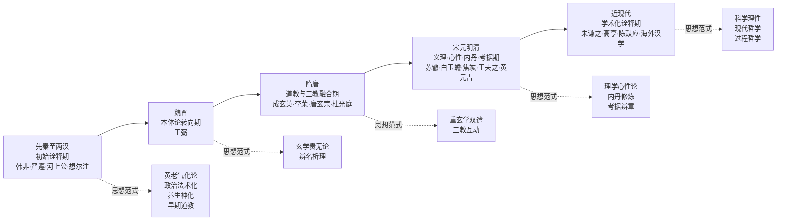

第一阶段为**先秦至两汉的初始诠释期**，以韩非《解老》《喻老》对「神」作政治功效化处理为开端，经严遵《道德指归》以「道—德—神明—太和」体系收摄「神」的黄老气化论，至河上公《老子章句》「谷，养也；神，谓五脏之神也」的养生学诠释，再到《老子想尔注》对「神」作人格化、神格化处理，构成一个由哲学、政治、养生与宗教多重路径并起的复合诠释格局。这一阶段的特征是「神」概念由原典中的形上妙用义向政治、气化、养生、宗教多方向下沉。

第二阶段为**魏晋玄学的本体论转向期**，以王弼《老子注》《老子指略》为中心。王弼以「谷，中央无者也，无形无影，无逆无违，处卑不动，守静不衰」释「谷神」，以「以无为本」的本体论框架对「神」进行去宗教化与哲学化重构[^9][^10]。这一阶段「神」从汉代的多元下沉重新被收拢为本体论概念。

第三阶段为**隋唐道教与三教融合期**，包括成玄英、李荣的重玄学双遣双非式思辨，杜光庭《道德真经广圣义》对天神/地祇/人鬼三分体系的整合，以及唐玄宗御注「神禀冲气而灵」的官方诠释。这一阶段「神」既被高度思辨化，又被纳入道教神谱与帝王政教体系。

第四阶段为**宋元明清的义理、心性、内丹与考据综合期**。宋代苏辙以心性论、王安石以政治义理、陈景元以「太虚为空谷，造化为至神」的气化论分别处理「神」；宋元白玉蟾、李道纯等内丹家将「神」纳入元神/识神、精气神三重炼养体系；明代焦竑《老子翼》汇辑六十四家、憨山德清以禅释老；清代王夫之《老子衍》以气论辩证批判道教神化，黄元吉延续内丹心性传统。这一阶段是「神」诠释最为多元而复杂的时期。

第五阶段为**近现代学术化诠释期**，以朱谦之《老子校释》、高亨、蒋锡昌、严灵峰、陈鼓应、任继愈以及海外汉学（包括日本池田知久、武内义雄等人传统）为代表[^14][^15]。这一阶段以现代校勘学与哲学方法对「神」作去神秘化处理，回归原典语义并以「自然规律」「精神主体」「过程哲学」等现代范畴重新理解。

需要说明的是，五阶段框架并非铁板一块的线性演进，而是带有诠释主导范式的分期。各阶段内部仍存在多元路径的并存与交锯（如汉代法术化、气化、养生、神格化四线并进；宋元义理化与内丹化交织），因此后续章节在断代叙述之外亦将设置主题贯通章（第九章），以补线性分期之不足。

## 1.5 研究方法与诠释路径

本研究综合运用四种方法，力求在文本严谨与思想纵深之间取得平衡。

**第一，文本细读法**。在面对每一注家时，研究坚持「时代×注家×章句」的三维定位原则，要求所论必有具体注文片段或可靠学术转述支撑，避免泛泛标签化（如仅称某家「以禅解老」「气化论」而无文本依据）。例如分析王弼对「谷神」的诠释，须落实到「谷，中央无者也」「谷以之成而不见其形，此至物也」等具体注文；分析河上公须落实到「谷，养也」「神，谓五脏之神也」「肝藏魂、肺藏魄、心藏神、肾藏精、脾藏志」等具体表述[^9][^10]。

**第二，概念史方法**。借鉴 Begriffsgeschichte 的核心思路，追踪「神」一字在不同时代注本中所承载语义的迁移，关注其外延扩展（如从养生之神到内丹元神/识神之分）、内涵深化（如从形上妙用到本体论之「无」）、与相关概念结构的重组（如汉代「神—精—气」三分到内丹「精→气→神」三炼）。概念史方法的核心要求是：不以现代汉语「神」字意义反推古代用法，亦不以单一注本意义涵盖整个谱系。

**第三，思想史脉络分析**。研究将每一阶段「神」诠释置于该时代主导思想问题之中，追问诠释转变背后的思想动力。如汉代黄老向养生神化的转变与汉代宇宙论建构密切相关；魏晋本体论转向回应了汉末经学崩解后的形上重建需求；唐代重玄学双遣双非源于佛教中观学的范式输入；宋明心性化诠释回应了理学兴起的整体语境；近现代去神秘化则与科学理性挑战相关。这一方法的核心要求是：不孤立罗列注家观点，而追问「为什么这个时代的『神』被这样诠释」。

**第四，比较诠释法**。包括两个维度：横向上将《老子》「神」与同时代《庄子》「精神」、《管子·内业》「精气」、《淮南子》「神为君形者」等概念作比较；纵向上引入跨文化参照，如与西方 Geist/Spirit 概念、海外汉学（安乐哲过程哲学式的「heart-and-mind」译法）的对比，以凸显「神」概念的张力与跨域诠释潜力。

在方法论自省层面，本研究特别采纳刘笑敢关于诠释张力的反思：「诠释活动的根本困难就在于我们处于历史和当代的张力之间」「我们永远不可能达到和证明绝对的、惟一的历史的『真相』，但是我们永远不能放鬆和放棄盡可能貼近歷史真相的努力」[^12]。这一表述对本研究具有重要的方法论指导意义：研究将自觉区分「历史的探索」与「现实的需求」两种定向，承认任何诠释史研究都不可避免地带有研究者自身的时代视角与知识背景，但仍应尽可能贴近历代注家的本意，并对自身的诠释立场作出明确论证。在版本基准的选择上，研究以高明《帛书老子校注》为校勘基准，以王弼本为诠释史主线，以郭店简为最早层次参照；在关键异文（如「正/贞」的避讳改字、「申/神」的通假、「谷神」连读分读之争）上，研究将并陈各派依据再给出权衡选择，避免武断采信单一来源。

## 1.6 核心问题与研究主线

基于上述学术定位与方法准备，本研究提出以下三个相互关联的核心问题作为贯穿全文的研究主线：

**第一问，重构机制问题**：历代注家如何因应各自时代的思想范式（黄老养生、玄学贵无、道教神学、重玄思辨、宋明心性、内丹修炼、近代哲学）重构「神」的内涵？这一问题要求对每一阶段的诠释作出**机制性解释**而非简单描述，即不仅指出「某家如此诠释」，更要揭示「某家何以必须如此诠释」。

**第二问，演变轨迹问题**：「神」概念在两千余年注释史中经历了怎样的语义迁移与价值重估？这一问题指向一种贯通性的概念史叙事——从形上妙用到政治功能、养生神化、玄理本体、重玄思辨、心性内丹直至近现代去神秘化的整体轨迹。本研究的初步假设是，**「神」概念的演变呈现出一种「双重内化」轨迹：一方面由外在的天地神祇逐步内化为人心之神明，构成哲学化路径；另一方面同一概念又被外化为太上老君等人格神，构成宗教化路径，二者并行而互渗**。这一假设将在第九章的主题贯通中得到系统检验。

**第三问，思想史意义问题**：「神」诠释史的演变折射出中国思想由宇宙论向本体论、由宗教性向哲学性、由神格化向心性化转型的何种内在逻辑？这一问题将研究从注释史层面提升至思想史诠释层面，探讨「神」作为一个边界概念在哲学、宗教、修养与政治诸领域之间的张力，如何成为推动中国思想史演进的一种潜在动力。

围绕上述三问，本研究确立「以神观老、以注观史」的研究主线：「以神观老」指以「神」作为切入《老子》多重思想面向的视角；「以注观史」指以注释史作为观察中国思想范式更替的载体。在此主线下，全文后续各章作如下安排：第二章考察《老子》原典中「神」的语义基础与诠释空间，确立分析基准；第三至第八章按上述五阶段框架分别展开历时性考察；第九章在断代分析基础上进行主题贯通，对道神、气神、德神、鬼神、精神、心性等关系网络作横向比较与纵深诠释；第十章作结论与展望。

需要预先说明的是，本研究自觉将自身定位为「一家之言」而非定论性叙事。在涉及关键争议（如「谷神」连读与分读之争、「神」是否为独立实体之争、宗教化与哲学化诠释的优劣评判等）时，研究将并陈多元立场而非单一定论；在本研究自身有所表态的地方，亦将明确标注其作为研究选择的边界。这一姿态既是对前述方法论自省的延续，也是对《老子》「神」概念本身复杂性与开放性的应有尊重。

# 2 《老子》原典中「神」的语义基础与诠释空间

第一章已确立以「神」作为切入《老子》注释史的隐性枢纽，并指出该字虽于五千言中出现频次有限，却分布于宇宙生成、政治哲学、形上本体、政教关系与修身论的关节处。然而，若不先返回原典层面对「神」字的具体分布、语境意涵与版本变异作系统清理，则后续历代诠释的比较分析便缺乏可靠的文本基准。本章承担的正是这一基础性任务——在尚未进入注释史脉络之前，先把《老子》原典中「神」字的语义底色与诠释空间勘定清楚，使第三章至第八章对各时代注家的考察都能锚定于一个共同的文本坐标系之上。

## 2.1 原典中「神」字的分布与语境定位

依据王弼传世本，「神」字在《老子》八十一章中的直接用例集中分布于第六、二十九、三十九、六十四章（按王弼本则为第六十章），共形成四个直接出现的语境节点；若再加入第十章「载营魄抱一」这一虽未直接用「神」字、却与「精气神」结构紧密相关的间接语境，则核心章句共五处。值得注意的是，这五处恰好分别归属于《老子》文本最具结构张力的五大主题域，呈现出一种**分布稀疏而位置精要**的特征。

为更清晰地呈现这一分布，下表列出各章句的关键文字、所属主题域与在《老子》整体思想结构中的功能定位：

| 章次 | 关键语句（王弼本） | 「神」之语法位置 | 所属主题域 | 结构功能 |
|------|-----------------|-------------|----------|---------|
| 第六章 | 谷神不死，是谓玄牝。玄牝之门，是谓天地根 | 名词（或与「谷」并列） | 宇宙生成论 | 描摹道之化生功能 |
| 第十章 | 载营魄抱一，能无离乎；专气致柔，能如婴儿乎 | 「营魄」相关（间接） | 修身—心性论 | 工夫论之起点 |
| 第二十九章 | 天下神器，不可为也，不可执也 | 形容词（修饰「器」） | 政治哲学 | 反对人为造作之据 |
| 第三十九章 | 昔之得一者……神得一以灵 | 名词（与天、地、谷、侯王并列） | 形上本体论 | 「得一」体系之构成项 |
| 第六十章 | 以道莅天下，其鬼不神，非其鬼不神，其神不伤人 | 兼有动词（显灵）与名词（神灵）解读 | 政教关系论 | 圣人—鬼神之三元结构 |

通过这一分布表可见，「神」字在《老子》中并非游离散点。**第六章涉及道之生成原理，第十章涉及个体之修身工夫，第二十九章涉及天下之治理原则，第三十九章涉及万物之存在结构，第六十章则涉及圣人治天下时与超验力量的关系。这五处恰好覆盖了《老子》宇宙—修身—政治—本体—政教五重核心维度，使「神」字虽出现频次不高，却在文本结构上承担起跨域连接的功能**。这一分布特征也解释了为什么历代注家无论秉持何种诠释立场，都难以回避对这五处的表态——任何一种系统性的《老子》诠释，必然要在「神」概念上完成自身立场的安置。

此外需指出，《老子》中与「神」语义相邻的字还有「妙」（第一章「常无欲，以观其妙」、第十五章「微妙玄通」）、「精」（第二十一章「窈兮冥兮，其中有精」、第五十五章「精之至也」）、「魄」（第十章「营魄」）、「鬼」（第六十章）等。这些字虽不入本章核心考察范围，但在历代注家处往往与「神」交叉互释，构成「神」概念语义边界的辅助参照。第五十五章「精之至也」由于其与第十章「专气致柔」共同构成《老子》论修身的精气结构，将在 2.2 节论及第十章时作适度延伸。

## 2.2 五处核心章句的原典语义分析

本节逐章分析五处关键表述的原典可能含义，分析原则是**在原典语境内呈现可能的多重读法**，避免预先植入后世注解立场。这一立场的方法论意义在于：诠释史上各派注家的差异往往并非全凭主观，而是源于原典本身在不同读法间的开放性。识别这种开放性，才能理解后世诠释分岔的合理性。

### 2.2.1 第六章「谷神不死，是谓玄牝」

通行本第六章作「谷神不死，是谓玄牝。玄牝之门，是谓天地根。绵绵若存，用之不勤」；帛书甲乙本则作「浴神不死，是胃玄牝。玄牝之门，是胃天地之根。绵绵呵其若存用之不尽」[^13][^1]。本章的原典语义至少可作三种读法：

其一，**连读读法**——「谷神」为一复合概念，喻指道之虚而能容、变化莫测的整体特征。司马光所谓「中虚故曰『谷』，不测故曰『神』，天地有穷而道无穷，故曰『不死』」，严复所谓「以其虚，故曰『谷』；以其因应无穷，故曰『神』；以其不屈愈出，故曰『不死』。三者皆道之德也」，正是连读立场的代表性表述[^1]。在此读法下，「谷神」即「道」之异名，「谷」「神」「不死」三者共同指向道的同一品格，「玄牝」则进一步以母性生殖意象描摹这一品格的生成功能。

其二，**分读读法**——「谷」「神」分别为两个对举概念。朱谦之主张「惟《老子》书中，实以『谷』与『神』对。三十九章『神得一以灵，谷得一以盈』，即其证」[^1]。这一读法的核心依据在于第三十九章「得一」体系中「谷」与「神」分别作为独立项与「天」「地」「侯王」并列出现，故第六章「谷神」亦可解为并列结构。

其三，**养生读法**——以「谷」训为「穀」（生养之义），以「谷神」为「养神」之倒装。河上公所谓「谷，养也」、高亨「谷，同『穀』，《尔雅·释言》：『穀，生也』；《广雅·释诂》：『穀，养也』」即此读法的代表[^9][^10]。这一读法将第六章导向修身工夫论而非宇宙论。

三种读法在原典层面均有可立足的语义依据，**它们之间并非简单的对错关系，而是反映了「谷神不死」一句在文本表层即承载了宇宙论、本体论与修身论三重诠释潜能的事实**。这一开放性正是后世注家分歧的语义起点。

「玄牝」一词的解读相对集中。「牝」为雌性生殖器之古义，与「丘陵为牡，溪谷为牝」的对举传统相合；「玄」状其幽深难测。苏辙「谓之『谷神』，言其德也；谓之『玄牝』，言其功也。牝生万物，而谓之玄焉，言见其生而不见其所以生也」对二者作了精到区分[^1][^9]。「玄牝之门」「天地根」共同构成《老子》以母性生殖意象描摹宇宙发生的核心隐喻，这一隐喻的存在使第六章无可避免地具有强烈的生成论指向。

### 2.2.2 第十章「载营魄抱一」与精气神结构

第十章帛书本作「载营魄抱一，能毋离乎；抟气至柔，能婴儿乎」[^26]，其与「神」概念的关联体现在「营魄」一词。「营」古通「魂」，「营魄」即魂魄；而魂魄在先秦至汉代的精气神思想体系中正是「神」之载体或「神」之分疏。如《黄帝内经·灵枢·本神》所述：「故生之来谓之精；两精相搏谓之神；随神往来者谓之魂；并精而出入者谓之魄」[^26]。在此结构中，神生于「两精相搏」，魂魄则随神而往来出入，形成「精—神—魂魄」的层级结构。

第十章接下来的「专气致柔，能如婴儿乎」「涤除玄览，能无疵乎」「天门开阖，能为雌乎」等句，与「营魄抱一」共同构成一个由形—气—神—心层层贯通的修身工夫序列。**第十章虽未直接用「神」字，但其「营魄」「专气」「玄览」「天门」等表述共同搭建了《老子》修身论中神居其中的精气结构，因此此章成为后世养生派与内丹派注家阐发「神」论的核心依托**。第五十五章「含德之厚，比于赤子……精之至也，终日号而不嗄，和之至也」则提供了「精之至」即修身极致的另一关键文本，与第十章遥相呼应。

需要指出的是，原典层面的「营魄」与「神」之关联是**间接的**——第十章并未明言「神」之概念，而是描述「营魄抱一」的工夫状态。这种间接性意味着，从第十章导向「神」论必然依赖于一种外部诠释框架（如《灵枢》的精气神结构）。这一外部依赖在原典层面并非自明，而是诠释史中由河上公以下注家逐步建立起来的关联——这一点对理解后世诠释的层累性具有重要意义。

### 2.2.3 第二十九章「天下神器」

第二十九章帛书甲本作「将欲取天下而为之，吾见其弗得已。夫天下神器也，非可为者也。为者败之，执者失之」[^5]。郭店简甲组与丙组中均存有「为之者败之，执之者远之/失之」一段，但**关键的「天下神器」一句不见于郭店简任何一组**，这是一个值得注意的文本现象。

「神器」一词在原典语境中至少可作两种解读：其一，**「神圣之器」**——「神」作形容词修饰「器」，强调天下作为治理对象具有神圣不可亵渎的属性，因而不可凭主观意志强行作为；其二，**「神明造化之器」**——「神」指天地神明之造化功能，「神器」即由神明造化所成之物，因而具有超越人为掌控的内在规律。两种读法在原典语义上均可成立，且都指向「不可为」「不可执」的政治结论，但其义理基础有所不同：前者强调天下的伦理—宗教神圣性，后者强调天下的形上—自然规律性。

无论取何种读法，「神器」一词在第二十九章中均承担反对人为干预的核心论据功能。「为者败之，执者失之」作为该章核心命题，既出现在郭店简（甲组、丙组）中，也见于帛书与传世本，其文本稳定性表明这一政治判断是《老子》早期文本即已确立的核心思想[^16][^20]。「天下神器」一句虽在郭店简中未见，但在帛书甲乙本与传世本中均稳定保留，其作为该章义理基础的地位是确凿的。

第二十九章接下来的「故物或行或随，或嘘或吹，或强或羸，或挫或隳」一段，描绘万物各有其性、不可强求一律的状态，与「神器」之论共同构成「圣人去甚、去奢、去泰」的政治结论[^3][^5]。**这一文本结构表明，「神器」之「神」在原典层面并非超验性的人格神，而更接近一种描述天下作为自然—神圣对象之「不可强为」属性的概念**。

### 2.2.4 第三十九章「神得一以灵」

第三十九章帛书甲乙本作「昔之得一者，天得一以清，地得一以宁，神得一以灵，浴得一以盈，侯王得一以为天下正」[^7][^13]。传世王弼本与河上公本则作「昔之得一者，天得一以清，地得一以宁，神得一以灵，谷得一以盈，万物得一以生，侯王得一以为天下贞」[^6][^2]。两版本之间存在两处关键差异：其一，传世本多出「万物得一以生……万物毋以生将恐灭」一句；其二，帛书作「正」，传世本作「贞」。

「神得一以灵」一句中，「神」作为名词与「天」「地」「谷（浴）」「侯王」并列出现，构成「得一」体系的一项独立构成。这一并列结构正是 2.1 节所述朱谦之主张「谷神」分读的核心依据[^1]。**在原典语境中，第三十九章的「神」很难被解为单纯的「道之妙用」，因为它与「天」「地」并列出现，自身即承担一种与天地相平行的存在层级地位**。

「神得一以灵」之「灵」字含义可作两层理解：其一，**灵验、灵效**——「神」因得道而能发挥其感应、显应的功能，与第六十章「其鬼不神」之「神」（动词，显灵）相呼应；其二，**灵动、灵性**——「神」因得道而能保持其本然的活泼妙运，与「天清」「地宁」并列为存在的本真状态。两种读法均可成立，但第二读法更贴合「天清」「地宁」「谷盈」的并列结构。

下文「神毋已灵将恐歇」一句尤为关键。「歇」即停歇、消失，指神若不能保持灵动则有消歇之虞[^7][^6]。**这一表述隐含一个重要的形上判断：神并非自因自足的绝对存在，其灵性依赖于「得一」（即合于道）。换言之，第三十九章的「神」在原典层面并非独立的最高实体，而是一种依存于道的存在层级**。这一判断对后续王弼以「无」为「神之母」的本体论诠释具有关键意义。

至于版本差异，「万物得一以生」一句的有无关涉文本层累问题。学界主流认为此句系后人增益，因为：第一，该句与「神得一以灵」「谷得一以盈」的对仗结构略显突兀；第二，将「万物」与「天、地、神、谷」并列在逻辑层级上不甚协调（万物本应是天地神谷之总体）；第三，帛书甲本溯源中此句的有无尚存争议。本研究依据高明《帛书老子校注》取「有此句」之传世本主流读法，但在论及神与万物之关系时将明确标注此异文。「正/贞」之异则较为明确：帛书作「正」，传世本作「贞」乃避汉惠帝刘盈讳后改的结果，二字在政治语境下含义相近（皆指首领、统领），不影响义理判断。

### 2.2.5 第六十章「其鬼不神，其神不伤人」

第六十章帛书本作「治大国若亨小鲜。以道立天下，其鬼不神，非其鬼不神也，其神不伤人也，非其神不伤人也，圣人亦弗伤也，夫两不相伤，故德交归焉」[^27][^8]。本章是《老子》中唯一明确将「神」与「鬼」对举的章节，其原典语义的复杂性体现在「神」字的语法身份。

「其鬼不神」中的「神」字，可作两种语法解读：

| 解读 | 「神」之词性 | 句意 | 义理后果 |
|------|-----------|------|---------|
| 解读甲 | 动词（显灵、起作用） | 鬼不显灵、鬼不起作用 | 强调以道治天下后，鬼之神效消歇 |
| 解读乙 | 名词（神灵） | 鬼不成其为神灵 | 强调鬼之地位被消解 |

主流注家与现代研究多取解读甲，即「神」作动词「显灵」解。这一读法与紧接其下的「非其鬼不神也，其神不伤人也」形成一种语义递进：**并非鬼无显灵之能，而是其显灵之用已不能伤人**。在此结构下，「神」字在前句作动词（显灵），在后句作名词（神灵之作用），形成一字两义的精妙叙述[^4][^27][^8]。

帛书乙本「非其申不伤人也」中「申」为「神」之通假[^13]。「申」本有伸展、申明之义，若严格依本字训读，则「其申」可解为「鬼神之伸展、显现」，与「其神」（神灵）虽义理相近但侧重点略有差异。**这一通假为「神」字在第六十章的动词化解读提供了一条额外的训诂支持——「神」与「申」相通，本身即蕴含「伸展、显现」的动作义**。

第六十章的核心结构是**鬼—神—圣人**的三元关系：

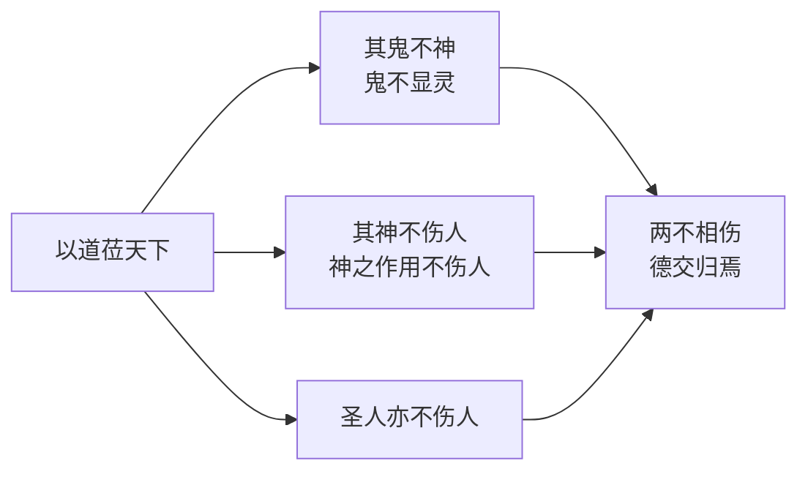

这一三元结构在原典层面具有重要意涵：**它既未否定鬼神的存在（仍然预设有「鬼」「神」可言），也未将鬼神视为可掌控的人格力量（其「神」与否系于「以道莅天下」），而是将鬼神纳入一种与圣人并列的、依附于「道」的次级存在序列**。这种处理方式使第六十章成为后世注家在宗教化与去宗教化诠释之间反复争论的焦点章句——河上公、《想尔注》倾向于实在化解读（鬼神确有其能而被道所制），王弼则倾向于功能化解读（不扰则真气全），近现代陈鼓应、任继愈则倾向于无神论解读（老子不信鬼神，仅借此说明无为）[^4][^28]。

## 2.3 出土文献与传世本的版本对勘

二十世纪以来出土文献的相继问世——1973年马王堆帛书甲乙本、1993年郭店楚墓竹简本、2009年北京大学藏西汉竹书本——为《老子》文本研究提供了远超以往的版本层次。在「神」字诠释问题上，这些出土文本的价值不仅在于提供更早的文字形态，更在于揭示文本层累与异文流变的物质前提[^11][^15][^29]。

### 2.3.1 郭店简的特殊地位与「神」相关章节的存佚

郭店楚简《老子》分甲、乙、丙三组，竹简形制各异：甲组39枚（简长32.3厘米）、乙组18枚（简长30.6厘米）、丙组14枚（简长26.5厘米）[^16]。三组合计约2046字，仅相当于通行本五分之二的篇幅[^18]。学界对三组关系存在两种主要观点：彭浩等整理者认为甲、乙两组基本可视为《老子》原作之一部分，丙组《太一》偏重修身之法[^18]；而依据甲组与丙组「为之者败之」一段的重复（且存有异文），亦有学者主张三组实为三个不同的传本[^16]。池田知久《郭店楚简〈老子〉新研究》则以审慎态度处理「郭店简究竟是节选本还是形成中文本」这一关键问题，倾向于认为《老子》五千言并非春秋晚期一人一时一口气完成[^14][^15]。

在「神」字相关章节方面，郭店简的存佚情况对本研究具有关键意义：

| 通行本章次 | 关键语句 | 郭店简存佚 |
|----------|---------|----------|
| 第六章 | 谷神不死 | **未见** |
| 第十章 | 载营魄抱一 | **未见** |
| 第二十九章 | 天下神器；为之者败之 | 「天下神器」一句**未见**；「为之者败之」散见于甲组、丙组（异文：甲作「执之者远之」，丙作「执之者失之」） |
| 第三十九章 | 神得一以灵 | **未见** |
| 第六十章 | 其鬼不神 | **未见** |

这一存佚分布揭示了一个重要事实：**《老子》原典中所有直接出现「神」字的章句，在迄今为止最早的郭店简本中均未出现**。这一现象至少有两种可能解释：其一，郭店简为节选本，「神」相关章节因主题不合而被省略；其二，「神」相关章节属于《老子》文本形成过程中较晚加入的层次，其内容反映的是战国中晚期思想发展的产物。无论取哪种解释，**这一文本现象都意味着，「神」概念在《老子》中的位置可能并非最古老的核心层，而是与文本层累过程相关的一组语义集群**。

值得注意的是，第二十九章「为之者败之，执之者远之/失之」一段在郭店简甲、丙两组中的并存与异文（甲组「远之」，丙组「失之」）[^16][^20]，与「天下神器」一句的不见，可作两种相关性推论：要么「天下神器」一句是后人对「为之者败之」一段所作的义理性添加；要么是节选时被省略的部分。无论何者，「神器」之论在郭店简中的缺席，使第二十九章「神」字诠释的版本基础发生有趣偏移——**最早的传抄层次中，「为之者败之」是核心命题，「天下神器」尚未确立为该章的形上前提**。

### 2.3.2 帛书甲乙本：「浴神」「神得一以灵」的早期形态

马王堆帛书甲乙本的发现使「神」相关章句的早期文字形态得以确立。其中最引人注目的是第六章「浴神不死」的用字[^13][^1]：

| 版本 | 第六章首句 | 第三十九章相应处 |
|------|----------|---------------|
| 帛书甲本 | 浴神不死 | 浴得一以盈 |
| 帛书乙本 | 浴神不死 | 浴得一以盈 |
| 北大汉简 | (与帛书相近) | (与帛书相近) |
| 傅奕本 | 谷神不死 | 谷得一以盈 |
| 河上公本 | 谷神不死 | 谷得一以盈 |
| 王弼本 | 谷神不死 | 谷得一以盈 |

「浴」字在帛书中是否为「谷」之通假，是一个长期存在争议的训诂问题。一种观点认为「浴」即「谷」之通假字（古文字「谷」「浴」音近通用），高明《帛书老子校注》倾向此说；另一种观点则认为「浴」可独立训读为沐浴、流水之义，与道之「绵绵若存」的水性意象相合。**就本研究而言，重要的不是裁定「浴」「谷」孰是孰非，而是认识到帛书「浴」字的存在使第六章「谷神」的训释可能性更为开放——它既可读为「山谷之神」，亦可读为「流水之神」，还可读为「养神」（取「谷」通「穀」之义）**。这种字形的多义性正是后世注家诠释多元化的物质基础。

第三十九章「神得一以灵」一句在帛书甲乙本中文字稳定，与传世本一致[^7][^13][^2]。但帛书乙本「神毋已灵将恐歇」与传世本「神无以灵将恐歇」的对应表明，「毋已」与「无以」之间是相同义理的不同表述，皆指「不能保持其灵」[^6]。这一稳定性意味着第三十九章的核心义理——神之灵性依存于「得一」——是《老子》文本早期即已稳定确立的内容。

第六十章帛书本「其鬼不神，非其鬼不神也，其神不伤人也」的文字与传世本基本一致，但乙本作「非其申不伤人也」中「申」字尤为珍贵——前文已述，「申」为「神」之通假，但在字形选择上似有意保留「神」字的「显现、伸展」动词义[^13]。这一通假现象为前述第六十章「神」作动词解的读法提供了出土文献层面的支持。

### 2.3.3 北大汉简本的训诂学价值

2009 年北京大学获赠的西汉竹书《老子》共 3300 余枚竹简的一部分，是继马王堆帛书、郭店楚简之后的第四个简帛古本，也是目前传世最完整的《老子》古本[^30][^23][^29]。北大汉简本的特殊价值在于其用字习惯的精细化——刘洪涛指出，北大汉简本第一章「道可道，非恒道殹；名可命，非恒名也」中「名可命」的第二个「名」字写作「命」，而第一个「名」字与「非恒名」之「名」字均写作「名」，**「北大汉简本中名词用法的『名』跟动词用法的『名』使用不同的字表示，区分得很清楚」**[^30][^23]。

这一训诂学发现对本研究具有方法论启示：北大汉简本在用字上对一字多用法作出明确区分的传统，是否亦适用于「神」字？依目前已发表的资料尚不能完全确认北大汉简本第六十章「其鬼不神」中「神」字的具体写法是否与作名词的「神」（如第三十九章「神得一以灵」）有所区别，但帛书乙本「申」字通假已提示古本在「神」字动词义与名词义之间存在书写层面的区分意识。**这一现象进一步支持第六十章「神」字作动词「显灵」解的训读方向**。

### 2.3.4 海昏简与早期文本传播的旁证

2015 年江西南昌西汉海昏侯刘贺墓出土的简牍中虽未发现完整的《老子》，但其《诗经》《论语》（齐论「智道」篇）等早期典籍的发现展示了西汉中期典籍传抄的具体形态[^22][^31]。海昏简《诗经》「题旨概括语」的存在与《论语》「智」「正」「焉」「能」等用字与今本系统的差异，揭示了西汉典籍传抄过程中**用字习惯、文本结构、注释形态的多元面貌**[^22][^31]。这一文本生态学意义上的旁证表明，《老子》文本在西汉中期同样处于多元传抄的状态，帛书本、北大汉简本与后来定型的河上公本、王弼本之间存在文本歧变与趋同的复杂过程，这正是刘笑敢《老子古今》所揭示的「版本歧变和文本趋同、古本原貌与理想文本的辩证关系」的具体展现[^11][^12]。

综合上述四类出土文献，可对「神」相关章句的文本层次作出如下梳理：

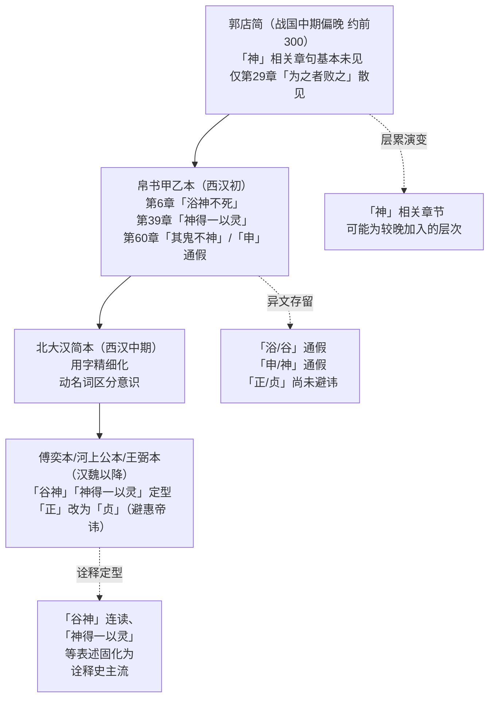

这一文本层次表明，**《老子》「神」概念的诠释空间，在原典定型过程中即由多层文本变异塑造**：郭店简的缺席提示「神」论可能属于较晚的语义集群；帛书的「浴」「申」通假为后世训释提供了多重可能；北大汉简的用字精细化体现了汉代学者对一字多用法的辨析意识；至傅奕本、河上公本、王弼本则完成了「神」相关章句的字形与结构定型。后世注家所面对的《老子》文本，本身即是这一多层异文流变的产物。

## 2.4 关键异文与训诂争议的并陈

承接 2.3 节的版本对勘，本节针对「神」相关章句中四个长期争议的训诂问题作专题梳理。处理原则是**并陈各派依据，不作单一定论**——这一原则既符合本研究第一章所确立的方法论自省（避免以现代偏好反向裁剪历代诠释），也尊重原典本身的开放性。

### 2.4.1 争议一：「谷神」连读与分读

「谷神不死」一句的连读与分读之争，是本研究最重要的训诂争议之一。下表汇总两派立场及其依据：

| 立场 | 代表注家 / 学者 | 核心依据 |
|------|---------------|---------|
| **连读派**（「谷神」为复合概念） | 王弼、河上公、唐玄宗、苏辙、朱熹、严复、蒋锡昌、陈景元 | 「中虚故曰谷，不测故曰神」（司马光）；「以其虚，故曰谷；以其因应无穷，故曰神」（严复）；「谷养神」（河上公训「谷」为「穀」即生养） |
| **分读派**（「谷」「神」并列对举） | 朱谦之、汪桂年、高亨 | 第三十九章「神得一以灵，谷得一以盈」对举为证（朱谦之）[^1] |

需要特别说明的是，朱谦之自身的表述存在复杂性。其《老子校释》一方面引第三十九章证「《老子》书中实以『谷』与『神』对」以支持分读，另一方面在按语中又涉及对连读派的评议，呈现出一定的内部张力。**就本研究而言，倾向于在主体诠释中采用「连读为主、分读为参」的折衷立场**：以连读处理第六章作为主流诠释（这与王弼、河上公、苏辙以及绝大多数历代注家的传统相合），同时承认分读派依据第三十九章对举结构所作的反证具有重要训诂学价值，并在论及第三十九章时单独考察「神」作为独立项的语义内涵。这一折衷既尊重诠释史的主流走向，也不忽视原典开放性所支持的另一可能读法。

### 2.4.2 争议二：「谷／浴／穀」字际关系

帛书甲乙本「浴神不死」「浴得一以盈」中「浴」字与传世本「谷」字的关系是另一关键训诂争议。可能的训释方向有四：

第一，**「浴」为「谷」之通假**。古音「谷」「浴」相近，通假可立。此说为高明《帛书老子校注》的主流立场，亦为学界目前最普遍接受的解读。

第二，**「谷」为「穀」之简化**。河上公注「谷，养也」即取此训，认为「谷」实为「穀」（生养之义）的省写[^9][^10]。高亨「谷，同『穀』，《尔雅·释言》：『穀，生也』；《广雅·释诂》：『穀，养也』」延续此说。

第三，**「浴」独立训读为沐浴、水流**。此说较少有正式注本采纳，但帛书「浴」字若不视为通假而独立训读，则与第八章「上善若水」、第三十二章「譬道之在天下，犹小谷之与江海」的水性意象相合。

第四，**「谷」即山谷之本义**。王弼「谷，中央无者也」、苏辙以山谷之虚空喻道，皆取此训。

四种训释在原典层面均有一定立足点，且彼此并非完全互斥——「山谷之虚空」「养神」「水流」「通假」可在不同诠释层次叠加共存。**这一字际关系的多重可能性，正是历代注家诠释多元化的字形学基础**。本研究取「『浴』『谷』通假，『谷』兼具山谷义与穀养义」的综合立场，在论及具体注家时按其训释方向分别处理。

### 2.4.3 争议三：「神器」的语义边界

第二十九章「天下神器」一句中「神」字的语法身份与「神器」整体的语义边界，存在以下解读可能：

| 解读 | 「神」之语法 | 「神器」之义 | 政治哲学含义 |
|------|----------|-----------|------------|
| 解读甲 | 形容词（修饰「器」） | 神圣之器（具有神圣不可亵渎属性） | 天下因其神圣性而不可强为 |
| 解读乙 | 名词（属格修饰） | 神明之器（由神明造化所成） | 天下因其超越人力而不可强为 |
| 解读丙 | 名词（同位修饰） | 神奇造化之物（具有自身规律） | 天下因其内在规律而不可强为 |

三种解读的核心区别在于：解读甲偏重伦理—宗教性，解读乙偏重神明造化义，解读丙偏重自然规律义。从原典上下文「为者败之，执者失之」「物或行或随……」的结构看，解读丙（自然规律义）最为贴合《老子》整体「自然无为」的思想取向[^3][^5][^32]。但这并不排除汉唐注家以解读甲、乙作神圣化、神明化处理的诠释合法性——朱元璋御注将「神器」直接政治化为「帝王权位」，正是将此解释为天命神圣之器的极端体现。**「神器」一词的语义边界因此从原典层面即向自然规律、伦理神圣、神明造化、政治权位四个方向开放**，这种开放性是后世从政治哲学到帝王神学多向诠释的语义基础。

### 2.4.4 争议四：「其鬼不神」中「神」之词性

第六十章「其鬼不神」一句中「神」字的词性问题，前已在 2.2.5 节略作分析，此处作专题深化。两种词性解读及其义理后果如下：

| 解读 | 词性 | 句意 | 义理后果 | 与下文衔接 |
|------|-----|------|--------|----------|
| 动词解 | 「神」=显灵、起作用 | 鬼不显灵 | 强调「以道莅天下」后鬼神之神效消歇 | 与「非其鬼不神也，其神不伤人也」形成层进 |
| 名词解 | 「神」=神灵 | 鬼不成其为神灵 | 强调鬼之地位被道所消解 | 与下文逻辑稍有断裂（既已「不神」，何来「其神」？） |

主流注家与现代研究多取动词解——这一选择主要基于句法层面的考量：「其鬼不神」之「神」若作动词解，则与下句「非其鬼不神也」的「神」形成语法连贯（皆为动词），而第二个「其神不伤人也」之「神」则自然过渡为名词（神灵）。这种「神」字的一字两义巧妙转换，是《老子》原典文学性与思想深度的典型体现[^4][^28][^8]。

帛书乙本「非其申不伤人也」中「申」为「神」之通假，**「申」本字即有伸展、申明、显现之动作义**，这进一步支持第六十章「神」字作动词解的训读方向[^13]。

需要指出的是，动词解与名词解的选择不仅是训诂问题，更直接关涉对老子神鬼观的整体判断——动词解倾向于将《老子》视为不否定鬼神存在但消解其作用的一种实用主义无神论立场，名词解则倾向于将《老子》视为彻底否定鬼神实在性的本体论无神论立场。**这两种立场的差异在历代诠释中分别由韩非、王弼、唐玄宗（动词解倾向）与近现代陈鼓应、任继愈（名词解倾向）所代表**，构成第六十章诠释史的核心分岔。

## 2.5 原典「神」概念的语义张力与诠释空间

综合 2.1 至 2.4 节的章句分析、版本对勘与训诂梳理，可以归纳《老子》原典中「神」概念所蕴含的四重语义张力。这些张力并非缺陷，而是文本意义结构的内在特征——正是它们的并存与未定，使「神」概念在原典层面即具备向多向诠释开放的语义空间。

**第一重张力：形上妙用义与功能性描述之间**。第六章「谷神不死」（连读读法下）将「谷神」描摹为道之虚而能容、变化莫测的整体品格，这是一种典型的形上妙用义；但第三十九章「神得一以灵」中「神」与「天」「地」「谷」并列，又使「神」呈现为某种存在层级，而非单纯的功能性描述。**这一张力构成「神」是道之妙用还是道之派生的诠释入口**——王弼倾向于前者（「神」为道之无形无方之用），河上公、严遵倾向于后者（「神」为气化体系中的功能性环节）。

**第二重张力：自然灵性义与超验力量义之间**。第六十章「其鬼不神，其神不伤人」预设鬼神作为某种与圣人并列的超验力量存在；但第二十九章「天下神器」与第三十九章「神得一以灵」中的「神」则更接近天地万物各得其本然状态的自然灵性。**这一张力构成「神」是宗教性超验力量还是自然性内在灵动的诠释入口**——河上公、《想尔注》倾向于前者，王弼、近现代学者倾向于后者。

**第三重张力：与「鬼」相对的二元结构与与「圣人」并列的三元结构之间**。第六十章「鬼—神—圣人」三元结构既预设鬼神之存在，又将其纳入与圣人并列的、依附于「道」的次级序列。**这一张力构成历代注家在宗教化与去宗教化之间反复争论的焦点**——若取宗教化诠释（如河上公、唐代杜光庭），则「神」作为天神/地祇/人鬼三分体系的一员；若取去宗教化诠释（如王弼、王夫之、陈鼓应），则「神」被还原为气化或自然规律的功能性表述。

**第四重张力：与「道」「气」「一」结构关系的多重可能**。「神」是否为独立实体？是「得一」状态下的功能性描述（第三十九章），还是道之化生中的玄妙载体（第六章），抑或与「精」「气」「魄」共同构成修身工夫之要素（第十章）？**这一张力构成「神—道—气—一」关系网络的诠释开放性**——汉代以「道—德—神明—太和」结构（严遵）或「精气—神」结构（河上公）安置之；魏晋以「无—神之灵」结构（王弼）安置之；宋元以「精—气—神」内丹结构（白玉蟾以下）安置之；近现代则以「自然规律—精神主体」结构（陈鼓应、任继愈）安置之。

下表对四重张力作集中呈现：

| 语义张力维度 | 极一 | 极二 | 涉及章句 | 后世诠释分岔 |
|------------|------|------|---------|-----------|
| 道之关系 | 形上妙用（道之品格） | 派生层级（道之功能项） | 第6章 / 第39章 | 王弼 vs 河上公·严遵 |
| 性质归属 | 自然灵性（内在灵动） | 超验力量（神灵实在） | 第29章·第39章 / 第60章 | 王弼·近现代 vs 河上公·《想尔注》·杜光庭 |
| 存在结构 | 二元（神—鬼） | 三元（神—鬼—圣人） | 第60章 | 宗教化诠释 vs 去宗教化诠释 |
| 概念组合 | 独立实体 | 功能性描述 | 第10章·第39章 | 内丹元神论 vs 玄学贵无论·现代精神主体论 |

这四重张力的并存使**《老子》原典中的「神」并非一个义界清晰的固定概念，而是一组在多重维度上保持开放的语义集群**。它既未在形上妙用与派生层级之间作出明确选择，也未在自然灵性与超验力量之间划定边界，更未在「神—道—气—一」的关系网络中固定其位置。这种开放性恰恰为后世注家依据各自时代的思想范式重构「神」的内涵提供了原始入口——汉代可以将其重构为养生之神（河上公），魏晋可以将其重构为本体之妙用（王弼），唐代可以将其重构为双遣双非之对象（成玄英），宋元可以将其重构为内丹元神（白玉蟾），近现代可以将其重构为自然规律或精神主体（陈鼓应、任继愈）——所有这些重构在原典层面均有可立足的语义依据，亦均不能完全垄断「神」的全部含义。

至此，本章为后续历代诠释考察确立了双重基准：

**第一，文本基准**——以高明《帛书老子校注》为校勘基准，以王弼本为诠释史主线，以郭店简、帛书甲乙本、北大汉简本作为最早层次的对照参照；在「正/贞」「申/神」「谷/浴」「万物得一以生」一句的有无等关键异文上保持版本意识。

**第二，语义基准**——以五处核心章句的原典可能含义为分析坐标，以四重语义张力为比对维度，对历代注家的诠释作出**机制性定位**：每位注家的诠释立场，本质上是在四重张力的多极之间作出选择性强调的结果，并非纯然主观，而是与原典的开放性结构相对应的某种「合法解读」。

基于这一双重基准，第三章以下将展开对历代注本的历时性考察，**从韩非、严遵、河上公、《想尔注》对「神」的初始多元重构开始，依次追踪每一阶段思想范式如何在原典开放性的允许范围内重塑「神」的内涵**——这正是本研究核心问题中「重构机制问题」与「演变轨迹问题」的展开方式。

# 3 汉代诠释：法术化、黄老气化与养生神化的多重转向

第二章已揭示《老子》原典中「神」概念所蕴含的四重语义张力——形上妙用与派生层级、自然灵性与超验力量、二元结构与三元结构、独立实体与功能性描述——并指出这种开放性正是后世注家依据各自时代思想范式作多向重构的语义入口。进入第三章，研究将首先考察汉代——这一中国老学诠释史上「神」概念首次被大规模、多路径重新塑造的奠基阶段。汉代不仅是《老子》由先秦诸子文本进入「经」之地位的关键时期（「《老子》称『经』就始于汉代」[^33]），也是黄老学说在政治、哲学、养生与宗教四重领域同时展开的活跃期。在这一复合语境下，韩非《解老》《喻老》、严遵《老子指归》、《老子河上公章句》与《老子想尔注》四家代表性注本，分别从政治法术、宇宙气化、身体养生与宗教神学四个方向对「神」作出截然不同却又彼此关联的重构，构成汉代「神」论的四向辐射格局。**理解汉代「神」诠释的多元转向，是理解此后两千年老学注释史中所有主要诠释路径之原型的关键**——魏晋的本体论、唐代的重玄学、宋元的内丹学、明清的气论与近现代的去神秘化诠释，无不可在汉代四家奠定的基本入口中找到其原始踪迹。

## 3.1 韩非《解老》《喻老》：「神」的政治功效化与精神固守化

《韩非子》中的《解老》《喻老》是现存最早系统解释《老子》的论著，其阐释顺序先《德经》、后《道经》，与马王堆帛书本《老子》一致，与后世通行本相异[^34][^35][^36]。司马迁评韩非「喜刑名法术之学，而其归本于黄老」「皆原于道德之意」[^35]，恰可为韩非以法家立场重读《老子》之事实定调。韩非对《老子》的解释虽非逐章逐句训释，而是节引部分章节加以阐发[^34][^36]，但其对「神」概念的处理却是后世「神」论政治化、内敛化的最早范式。

### 3.1.1 「上德不德」之「神不淫于外」：「神」作为内敛之精神

《解老》开篇即以「上德不德」（通行本第三十八章）为契入点对「神」作了首次界定：「德者，内也。得者，外也。『上德不德』，言其神不淫于外也。神不淫于外，则身全。身全之谓德。德者，得身也」[^37][^38]。这一表述具有典型的开宗明义性质——韩非以「神不淫于外」直接界定「上德」之内涵，使「神」一字承担起整个德论的核心枢纽功能。

值得注意的是，原典《老子》第三十八章本身并未出现「神」字。**韩非将「神」概念作为隐性枢纽嵌入「上德不德」的诠释，本身即是一种主动的概念引入**。其义理逻辑可作如下分疏：「德」者「得」也，但所得不在外物而在自身（「得身」）；自身之「得」体现为「神」之不外泄、不外淫；故「上德」之实质即「神不淫于外则身全」。这一逻辑链条把抽象的「上德」概念落实为具体的精神固守状态，**使「神」从原典层面零散分布于第六、二十九、三十九、六十章的多义概念，被韩非首次集中重构为一种内敛性的精神主体**。

韩非进一步推演这一精神固守说：「凡德者，以无为集，以无欲成，以不思安，以不用固。为之欲之，则德无舍；德无舍，则不全。用之思之，则不固；不固，则无功」[^37][^38]。「无为」「无欲」「不思」「不用」这四重否定性工夫，最终都指向「神」的不外驰、不耗散。这与原典第十章「载营魄抱一，能无离乎」「专气致柔，能如婴儿乎」的修身工夫论虽在工夫指向上相通，但韩非将其从修身境界整体收敛为「神」一字的内守功能，赋予「神」以更明确的精神主体性内涵。

### 3.1.2 「圣人爱精神而贵处静」：「神」与统御术的结合

《解老》在论及「虚静无为」时进一步将「神」纳入君主统御术的框架。韩非称：「所以贵无为、无思为虚者，谓其意所无制也」「虚者之无为也，不以无为为有常。不以无为为有常，则虚；虚，由德盛；德盛之谓上德」[^37][^38]。在此结构下，「虚」不是被动的空寂，而是主体「意无所制」的主动性内敛——而这种主动性内敛的承担者，正是前文界定的「神」。

韩非对老子「虚静」「无为」「慈」「俭」等观念作了治术化转化，将「虚静」直接引申为君主统治术，提出「圣人爱精神而贵处静」之说[^34]。这一表述将原典中描摹道之品格与圣人境界的「虚静」概念，转译为君主「爱精神、贵处静」的统御方法论。其核心机制在于：**君主之统御不在于事必躬亲、智巧外显，而在于神不外泄、虚静内守，使臣下各循其名实而自致其功**——这正是法家「制在己曰重，不离位曰静」的法术之学的精神基础[^39][^34]。

由此可见，韩非「神」论的政治功效化路径具有双重含义：第一层是**精神固守化**，即将「神」收敛为君主内在的精神主体，与外在的「德无舍」「行无功」相对；第二层是**统御术化**，即将这一精神固守状态进一步功能化为「无为而无不为」的政治操作技术。这两层含义共同构成韩非对「神」的法家式重构。

### 3.1.3 「缘道理以从事」与「神」的功效论框架

韩非「神」论的另一关键维度是其与「道—理」结构的整合。《解老》在中国哲学史上较早提出「道」与「理」的明确区分：「道者，万物之所然也，万理之所稽也」是普遍规律，「理者，成物之文也」是事物的特殊规律[^34]。在此基础上，韩非提出「缘道理以从事」的认识与实践原则，主张「夫缘道理以从事者，无不能成」，反对「无缘而妄意度」的主观臆断[^34]。

将「神」论纳入这一「道—理—事」框架，可以看出韩非的根本意图：**「神不淫于外」的精神固守不是道家式的精神超越境界，而是「缘道理以从事」的功效论前提**。神外淫则意为可欲所惑，意为可欲所惑则「行邪僻而动弃理」[^38]；反之，神不外淫则「思虑熟」「得事理」「必成功」[^38]。这一逻辑链条把「神」从精神主体进一步功能化为成功治事的内在条件，使之服务于法家「重功效」的核心价值取向。

学界普遍认为，韩非在《解老》《喻老》中对老子的解释具有「援道入法」的整体特征——名为阐释《老子》，实主要是借以表达自己的法家思想[^34][^35][^36]。「《解老》《喻老》的学术特质是道儒相谐、道法相融」「《解老》开头几段文字对仁义礼智等儒家思想进行了评论」[^35]，这些方法论判断同样适用于其「神」论：**韩非对「神」的处理既不是对原典的忠实训释，也不是对其义理的随意篡改，而是在原典开放性所允许的语义范围内（特别是第二章 2.5 节所揭示的「神」作为内敛精神主体的可能读法）作了一次法家立场的强势重构**。

### 3.1.4 韩非「神」论的诠释史意义

需要指出的是，韩非《解老》《喻老》对原典中含「神」字的具体章句（第六、二十九、三十九、六十章）并未作直接而系统的注解——其涉「神」论述主要集中于「上德不德」章及其他德论章节的阐发。这意味着韩非的「神」论是一种**间接性、主题性的概念建构**，而非章句注释意义上的直接训诂。这一特点既反映了《解老》《喻老》整体上的节选式、议论式诠释风格[^35][^36]，也提示我们：韩非「神」论的诠释史价值更多在于其概念塑造功能而非训诂功能。

从诠释史脉络看，韩非将「神」收敛为内敛性精神主体的处理方式，开启了后世「神」诠释下沉的最早路径。**汉代严遵以「神明」为生命与灵性根源的形上化诠释、河上公以「五藏神」为身体技术核心的具身化诠释、《想尔注》以「太上老君」为人格化神祇的宗教化诠释，虽在路径上各异，但其共同前提都是承认「神」具有某种主体性、能动性内涵——这一前提的最早建立者正是韩非**。在原典层面，「神」字虽分布于五处关键章句，但其作为主体性内涵的明确确立，乃是韩非「神不淫于外」「圣人爱精神而贵处静」式表述的产物。这一概念塑造功能，使韩非《解老》《喻老》在汉代「神」论四路径中处于最早奠基的位置。

## 3.2 严遵《老子指归》：「道—德—神明—太和」体系中的「神」

如果说韩非以法家立场对「神」作了功效化的初步重构，那么西汉成帝时期的严遵（字君平）则在《老子指归》中以黄老气化论的整体框架对「神」作了形上层级的系统安置。严遵其人「博览亡不通」，于成都市卜筮为业，并借机「因势导之以善」，劝人遵从孝、顺、忠、善之道[^40]。其弟子扬雄称其「不作苟见，不治苟得，久幽而不改其操」[^40]。这一兼具学术深度与隐逸气质的人格背景，使《老子指归》在汉代道家思想中呈现出与官方意识形态并行而不冲突的独特位置——「在汉武帝时代的思想背景下，提供了一种与官方意识形态并行、却不正面冲突的哲学方案」[^41]。

### 3.2.1 「道—德—神明—太和—天地」生成序列的形上建构

严遵《老子指归》最具原创性的思想贡献，是构建了一个由「道—德—神明—太和」四阶段所组成的形上生成体系，并将之与「天地—阴阳—人物」的形下世界相对接，形成一个完整的宇宙生成框架[^41][^42][^40][^43]。这一体系的核心命题是：「天地所由，物类所以，道为之元，德为之始，神明为宗，太和为祖。道有深微，德有厚薄，神明有清浊，和有高下。清者为天，浊者为地」[^43]。

该体系最关键的特征，是**将「神明」与「德」「太和」一并提升至形上层级**。如李芙馥所论，「严遵将『道』之外的三个概念——德、神明、太和——一并提升到形上层面，这是他极具创造性的地方」「在此之前，这些概念往往被当作形而下的属性；而严遵将它们重新组织成一个形上结构，作为天地万物的真正根源」[^41]。在这一形上结构中，四概念各有其职：

| 概念 | 严遵之界定 | 在生成序列中的功能 |
|------|----------|------------------|
| 道 | 终极的虚无根源，「无无之无」「始未始之始」 | 万物之元，绝对虚无之本根 |
| 德 | 道得以落实于万物的前提，先天的设定力量 | 万物之始，道之内化 |
| 神明 | 生命与灵性的根源，先于一切有形存在 | 万物之宗，灵性之源 |
| 太和 | 宇宙得以生成的总体和谐状态 | 万物之祖，气化之总体 |

[^41]

「道」不再是孤立的本体，而是**通过德、神明与太和，进入现实世界的可能条件**[^41]。在这一序列中，「神明」位居「道—德」之下、「太和—天地」之上，成为由虚入实的关键中介——它是道德之灵性向太和之气化转化的枢纽。这一安置使「神明」既不同于先秦道家中作为道之妙用的零散表述，也不同于河上公将「神」具身化为五藏之神的下沉路径，而是被赋予了独立的形上层级地位。

### 3.2.2 「道生一，一生神明」：生成逻辑中的「神明」位置

严遵对老子「道生一，一生二，二生三，三生万物」的诠释作了关键调整。在《道生一篇》中，严遵明确表述：「道生一，一生神明，神明生太和，太和生天地。以无生有也，故一于道为有，一于神明为无也」[^44]。这一表述对老子的生成序列作了如下重构：

| 老子原典 | 严遵《指归》 | 关键调整 |
|---------|------------|---------|
| 道生一 | 道生一 | 一致 |
| 一生二 | 一生神明 | 「二」具体化为「神明」 |
| 二生三 | 神明生太和 | 「三」具体化为「太和」 |
| 三生万物 | 太和生天地（→阴阳→人物） | 强调气化展开 |

这一调整的思想史意义在于：**严遵不再将「二」简单理解为阴阳二分，而是将其重构为「神明」——亦即生命与灵性的根源；不再将「三」理解为阴阳交合之中和，而是将其重构为「太和」——亦即宇宙气化的总体和谐状态**[^41]。其结果是，整个生成序列不再是一个由物质性元素逐级展开的自然过程，而是一个精神性因素从一开始就参与的有机过程：「宇宙不是先有物质，再出现精神；而是精神性因素从一开始就参与了世界的形成」[^41]。

「一」的位置在这一体系中尤为微妙。严遵称其为「道之子，神明之母，太和之宗，天地之祖」[^41]，处在虚实有无之间的极其微妙的位置——「与道未离，却已经开始生化」[^41]。「一」既承接道，又开启「神明」；它既非具体事物，也非纯粹虚无。这一安置使严遵的生成体系具有比老子原典更为精致的形上层级结构，也使「神明」在这一结构中获得了清晰的位置——它是「一」所生的第一阶段，是道之灵性向太和之气化转化的中介。

### 3.2.3 「神得一以灵」：第三十九章的「以老释老」诠释

严遵对原典第三十九章「神得一以灵」一句的诠释，最直接体现了其形上体系与老子文本之间的对接方式。在《得一篇》中，严遵称：「凡得一者，若天、地、神、谷、侯王，需无为无事，而后可以顺性保命。处其反者得其覆，为所求者失所欲，以一为纲纪，以道为桢干，因道而动，循一而行，而后神明不释，而天下与之俱矣」[^44]。

这一诠释具有几个关键特征：第一，它将原典中「天、地、神、谷、侯王」的并列结构作整体性处理，强调五者皆需「无为无事」「顺性保命」，从而将「神得一以灵」纳入工夫论框架而非仅作存在论描述。第二，它把「神明不释」作为「以一为纲纪，以道为桢干」的工夫成果，使「神明」从形上结构的构成项落实为具体的工夫境界——**「神明」既是道之派生的形上层级，又是工夫修为可达至的存在状态**。第三，这一诠释方式典型体现了严遵「以老释老」的方法特征：不进行字词的逐一训释，而以语句或段落为对象采取整体性解读[^45]。

李芙馥指出，严遵《指归》「在诠释具体细节和保持哲学视野间取得了巧妙的平衡，这得益于严遵在铺陈文辞的同时保持了『以老释老』的诠释方式」[^45]。这一方法论特征使严遵的「神」论诠释在两个层面都有所贡献：一方面以「神明」概念的形上化拓展了老子哲学的形上深度，另一方面又通过工夫论的落实保持了对原典精神的契合。

### 3.2.4 「养神积和」与个体生命安顿

严遵的形上体系并不停留于纯粹理论建构，而是与个体生命的安顿紧密相连。在《上士闻道篇》中，严遵称：「静为虚户，虚为道门，淡为神本，寂为和根，啬为气容，微为事功……养神积和，以治其心。心为身主，身为国心」[^46]。这一表述将「神」「和」「气」三概念与「淡」「寂」「啬」三种工夫相对应，构建了一个完整的修身论框架。

「养神积和」是这一框架的核心命题——它既呼应了形上序列中「神明—太和」的层级关系（神之安养必至太和之状态），也对应了个体修养中「治心—治身—治国」的层层贯通（「心为身主，身为国心」）。在严遵看来，**形上之神明与个体之神是同一概念在不同层级上的展现**——形上之神明是宇宙生命与灵性的根源，个体之神则是这一根源在每个生命主体上的具体显现。「养神」工夫的形上根据正在于对宇宙神明之根源性地位的认识与回归。

这一思想取向与陈丽桂所论汉代道家「由本体转向创生、由『道』转向『术』、由道家转向道教」的整体转向相一致[^42]——严遵《指归》一方面延续了老子论「道」的本体论深度，另一方面又通过气化生成论的引入开启了道家向养生术与宗教实践转化的可能[^47][^42]。

### 3.2.5 严遵「神明」与汉代气论传统的横向比较

严遵的「神明」概念在汉代气论传统中具有独特位置。陈丽桂指出，黄老思潮「放弃了《老子》论『道』重视『本体』的特点，转而试论『道』的『创生』，以『气』代『道』，详述宇宙万物的生成过程，最终架构起战国秦汉以下影响深远的中国传统气化宇宙论的基本模式。由此进一步开展出来的传统中国『精气』养生说，则成为中国传统医理的基本纲领与方技文化的主要源头」[^47]。在这一气化宇宙论传统中，「神」往往被理解为精气之精微表现——《淮南子》「神为君形者」、《管子·内业》「精也者，气之精者也」「一物能化谓之神」皆是其代表。

严遵的特殊之处在于，他**既继承了气化论的基本框架（以「太和」「气」处理万物生成），又将「神明」从气化层级中独立提升至形上层级**——「神明」不再仅是精气的功能性表现，而是「生命与灵性的根源」，是「先于一切有形存在」的形上构成项[^41]。这一处理使严遵的体系既不同于纯粹本体论的老庄道家（不强调形上生成层级的细化），也不同于纯粹气化论的黄老道家（不将神明独立提升至形上层级），而是开辟了一条「形上层级化的气化论」诠释路径。

这一路径的诠释史意义在于：它为后世（特别是魏晋玄学到宋明理学）处理「神」与「道」「气」「理」之间的层级关系提供了原型。王弼以「无」为「神之母」的本体论诠释，宋代理学家以「神」为气之灵动表现的气论诠释，皆可视为对严遵形上层级化路径的不同延展。**严遵在汉代气化论传统中确立的「道—德—神明—太和—天地」五阶层级结构，是中国老学诠释史上「神」概念形上化的最早系统方案**——这一方案的奠基意义，使严遵《老子指归》在汉代「神」论四家中占据了形上深度最为突出的位置。

## 3.3 《老子河上公章句》：「五藏之神」与人体精气神系统的具身化

如果说严遵将「神」向形上层级提升，那么《老子河上公章句》（以下简称《章句》）则朝相反方向将「神」向身体层级下沉，把原典中超越性的「谷神」具体化为人体内的五藏神系统。《章句》托名河上公或河上丈人撰，是「现存成书较早的、影响较大的《老子道德经》注本」[^48]，「以汉代流行的黄老学派无为治国、清静善生的观点解释《老子道德经》。天道与人事相通，治国与治身之道相同，二者皆本于清虚无为的自然之道，这是《河上公章句》的基本思想」[^48]。学界主流认为《章句》成书于东汉中后期，「是由托名河上公的道家人物所著」[^49]。

### 3.3.1 第六章「谷神不死」的身体化诠释

《章句》对原典第六章（即「成象第六」）的注解，是中国老学诠释史上最早将「谷神」作系统养生学转译的文本，其完整注文如下：「谷，养也，人能养神则不死。神，谓五藏之神也。肝藏魂，肺藏魄，心藏神，脾藏意，肾藏精与志。五藏尽伤，则五神去。是谓玄牝。言不死之道，在于玄牝。玄，天也，于人为鼻。牝，地也，于人为口。天食人以五气，从鼻入藏于心。五气清微，为精、神、聪、明、音声五性。其鬼曰魂，魂者雄也，主出入人鼻，与天通，故鼻为玄也。地食人以五味，从口入藏于胃。五味浊辱，为形、骸、骨、肉、血、脉六情。其鬼曰魄，魄者雌也，主出入人口，与地通，故口为牝也。玄牝之门，是谓天地根。根，元也。言鼻口之门，是乃通天地之元气所从往来。绵绵若存，鼻口呼吸喘息，当绵绵微妙，若可存，复若可无有。用之不勤。用气当宽舒，不当为急疾勤劳」[^50][^51]。

这一注文的诠释机制可作如下分疏：

**第一层，字义训释的具身化转向**：「谷，养也」一句采取了第二章 2.4.2 节所述「谷／穀」相通的训诂路径，将「谷」训为「穀」即生养之义，从而把「谷神」整体转译为「养神」。「人能养神则不死」直接将原典对道之化生功能的描摹，转化为个体修身工夫的养生论命题。这一训诂选择决定了整个注释的基本方向。

**第二层，「神」之具体化**：「神，谓五藏之神也」是《章句》「神」论最具原创性的命题。它把原典中作为道之品格或形上构成项的「神」，具体化为五藏之神——肝藏魂、肺藏魄、心藏神、脾藏意、肾藏精与志[^50][^51]。这一具体化使「神」从超越性概念彻底下沉为身体生理层面的内在主体，成为可以通过具体修身工夫加以涵养、保全的对象。

**第三层，「玄牝」「天地根」「绵绵若存」的鼻口呼吸化诠释**：原典中具有强烈宇宙论指向的母性生殖意象，在《章句》中被系统转译为身体生理过程——「玄」为鼻、「牝」为口、「玄牝之门」即鼻口呼吸之门、「天地根」即元气往来通道、「绵绵若存」即呼吸喘息之绵绵微妙、「用之不勤」即用气宽舒不勤劳。**这是一种彻底的诠释范式转换：原典中描摹宇宙发生的形上隐喻，被全面重构为身体修炼的生理操作指南**。

### 3.3.2 「五性六情」说与「神」的核心枢纽地位

《章句》在第六章注中提出「五性六情」说——「天食人以五气，从鼻入藏于心。五气清微，为精、神、聪、明、音声五性」「地食人以五味，从口入藏于胃。五味浊辱，为形、骸、骨、肉、血、脉六情」[^50][^51]。这一表述构建了《章句》养生思想的理论核心，并使「神」在其中占据核心枢纽地位。

如马兵所论，《章句》「五性」与《白虎通·情性》「五性」（仁、义、礼、智、信）含义不同——前者指「精气、五藏神及人的听、视、言等感官能力」[^51]。「六情」也与《白虎通》不同——前者指「构成人身体的『形、骸、骨、肉、血、脉』六种情实，引申指人身的六种情欲」[^51]。这一区别揭示了《章句》性情论的关键创新：**它一方面在形式上继承了汉儒「性阳情阴」的说法，另一方面在内容上将「性」与「情」从儒家的德性—情感框架转换到道家的养生—精气框架**[^51]。

| 性情说 | 五性内容 | 六情内容 | 思想归宿 |
|--------|--------|--------|---------|
| 《白虎通》 | 仁、义、礼、智、信（德性） | 喜、怒、哀、乐、爱、恶（情感） | 儒家德性论 |
| 《河上公章句》 | 精、神、聪、明、音声（精气与感官） | 形、骸、骨、肉、血、脉（身体形质） | 道家养生论 |

「《河上公章句》又认为『五性』属阳，是人能够实现『长生久寿』之生命目的的必要条件，『六情』属阴，是人修道养生的消极障碍，并主张『守五性，去六情』」[^51]。在这一养生观中，**「神」作为「五性」之核心要素（与「精」并列），承担着连接精气与感官、连接身体与生命的关键功能**——「精」是生命之根本物质，「神」是生命之根本能动性，二者共同构成「长生久寿」的内在条件。

### 3.3.3 与《黄帝内经》「精—神—魂魄」结构的对应

《章句》「神」论的另一重要特征是其与同时代医学典籍《黄帝内经》之间的概念对应。《灵枢·本神》载：「故生之来谓之精；两精相搏谓之神；随神往来者谓之魂；并精而出入者谓之魄」。在这一结构中，神生于「两精相搏」，魂魄则随神而往来出入，形成「精—神—魂魄」的层级结构。

将《章句》「肝藏魂，肺藏魄，心藏神，脾藏意，肾藏精与志」与《灵枢》结构对照可见：

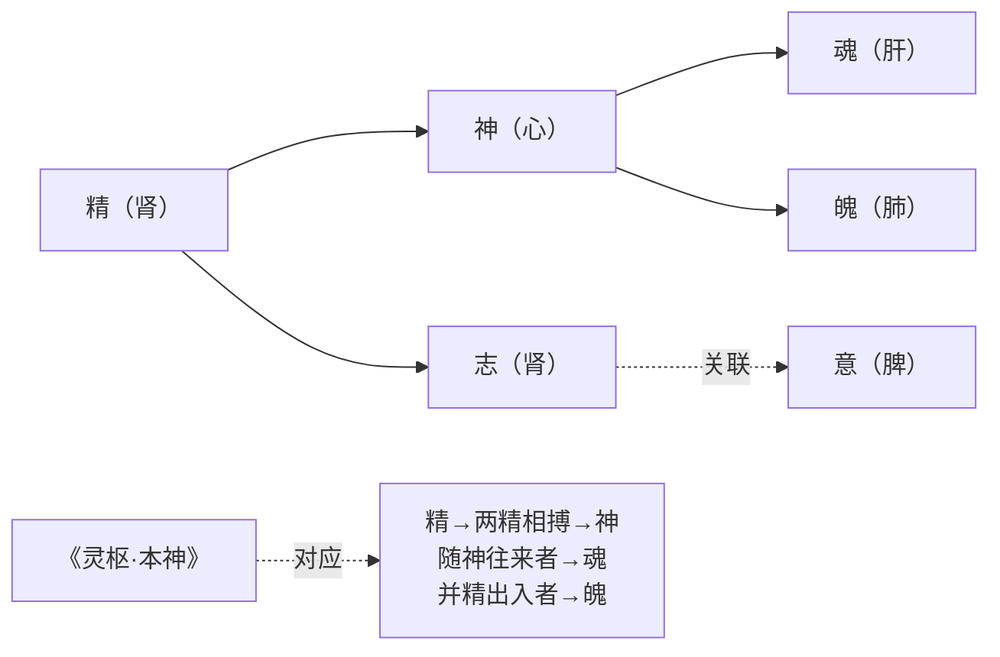

二者的对应关系表明，**《章句》对「神」的具身化诠释并非孤立的注本立场，而是与汉代医学传统深度互动的产物**[^49]。河上公注属于黄老养生一派，「继承并发展了《老子》、《庄子》等为代表的先秦道家养生理论，并在其中融会了《黄帝内经》等秦汉医家的思想，形成了其具有丰富内涵的养生理论体系」[^49]。这一思想史背景使《章句》「神」论既具有道家形上传统的渊源（继承老子的「神」字与道之关联），又具有汉代医学实践的具体支撑（对接《灵枢》的精神魂魄结构），从而成为道家哲学与医学养生结合的早期典范。

### 3.3.4 「身国同治」与「神」的政治—养生双重功能

《章句》「神」论的第三层特征是其与治国理念的内在关联。「天道与人事相通，治国与治身之道相同，二者皆本于清虚无为的自然之道，这是《河上公章句》的基本思想」[^48]。在「身国同治」的养生观中，治身为主、治国为次[^49]——而治身的核心正是养神。具体而言，「治身作为较为宏观的概念，在《河上公章句》中可以细化为养形、养气与养神三个层次。对感官的使用加以节制来养形，通过固精与行气的方法来养气，通过除情去欲、无为和虚静的方式养神」[^49]。

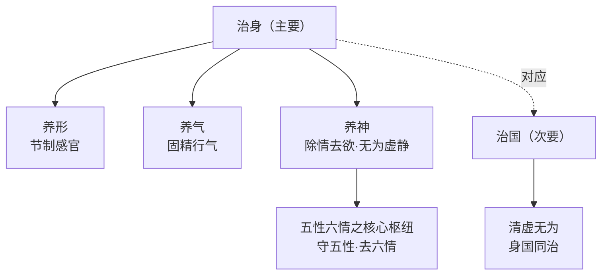

「养神」作为治身三层次中最高层级的工夫，承担着除情去欲、无为虚静的核心使命；而「养神」之所以能与治国相通，正在于「神」作为五性核心枢纽所承担的清虚无为属性——**当个体之神得到涵养时，主体便处于一种与「清虚无为之自然之道」相契合的状态，这种状态既是治身的极致，也是治国的内在根据**。

### 3.3.5 《章句》「神」论的诠释史意义：从形上妙用到身体技术的彻底下沉

将《章句》「神」论置于汉代「神」论四家的整体格局中考察，其诠释史意义可概括为三点：

**第一，完成了「神」概念从形上妙用到身体技术的彻底下沉**。原典第六章「谷神不死」在连读读法下本可作为道之品格的形上描摹，但《章句》通过「谷，养也」的训诂选择与「神，谓五藏之神也」的具体化界定，将其全面转译为人体内的五藏神系统。这一转译是中国老学诠释史上「神」概念第一次被彻底身体化、生理化、技术化的处理。

**第二，奠定了后世内丹学「精气神」三炼体系的理论基础**[^49]。《章句》「五性六情」说所确立的「精、神」并列结构，与后世内丹学「炼精化气、炼气化神、炼神还虚」三阶段炼养体系之间存在直接的概念渊源。**虽然《章句》本身尚未发展出系统的内丹炼养工夫，但其将「神」具身化为五藏神并与「精」「气」并列处理的做法，为宋元内丹学的兴起预设了关键的概念资源**——这一渊源关系将在第六章对宋元内丹学的考察中得到进一步展开。

**第三，开启了道家由治国向治身的整体转向**[^48][^42]。《章句》成书的东汉中后期，正是黄老学说由「贵清静而民自定」的政治学说向「养性之福」「乘虚入冥」的养生学说转化的关键时期[^48]。「东汉人认为黄老学的主旨是养生成仙，而非『理国养人，施于为政』」[^48]。《章句》「身国同治」中治身为主、治国为次的取向，正是这一历史转向的理论结晶。「神」概念在《章句》中的具身化处理，因此不仅是个别注本的训诂选择，更是整个汉代道家思想转向的代表性表征。

## 3.4 《老子想尔注》：「神」的人格化与太上老君的神格建构

汉代「神」论四路径的最后一向，是早期道教《老子想尔注》（以下简称《想尔注》）对「神」作出的宗教神学化重构。《想尔注》是「东汉张陵在巴蜀所创『正一盟威天师之道』的祭酒向道民宣讲《老子》的注释本，是早期天师道的重要经典」[^52]。饶宗颐根据清末敦煌莫高窟发现的六朝钞本残卷（现编号 S6825，藏大英博物院）整理出《老子想尔注校证》，是研究《想尔注》的基础文献[^53][^52]。关于其作者，「一说是张陵著……另一说，认为该书作者是张陵之孙张鲁」，饶宗颐倾向于「当是陵之说而鲁述之；或鲁所作而托始于陵，要为天师道一家之学」[^54][^33]。姜生通过《大道家令戒》中的相关记载证明，《想尔注》「确是在张鲁割据汉中时期即已存在……时间下限不可能是南北朝，确切地说是在公元215年之前」[^55]。

### 3.4.1 「一散形为气，聚形为太上老君」：「道」之神格化机制

《想尔注》对「神」概念最核心的重构，是其对老子之「道」的神格化处理——把原典中作为形上本体的「道」转化为人格神「太上老君」。这一转化的关键文本见于其对原典第十章「载营魄抱一」的注解：「魄，白也，故精白，与元炁同色。身为精车，精落故当载营之。神成气来，载营人身。欲全此功无离一。一者道也。今在人身何许？守之云何？一不在人身也，诸附身者悉世间常伪伎，非真道也；一在天地外，入在天地间，但往来人身中耳。都皮里悉是，非独一处。**一散形为气，聚形为太上老君，常治昆仑**。或言虚无，或言自然，或言无名，皆同一耳」[^52]。

这一注文的神格化机制可作如下分疏：

**第一层，「一」与「道」的等同**：「一者道也」直接确立了「一」与「道」的概念等同，这一处理本身仍在《老子》第三十九章「得一」诠释的传统范围内。但《想尔注》的特殊之处在于，它并未停留于这一形上等同。

**第二层，「一散形为气，聚形为太上老君」的双重态化**：「一」（即道）被赋予两种存在态——「散形为气」是其弥漫态（与汉代气化论传统相通），「聚形为太上老君」则是其凝聚态。**这种「散—聚」二态化处理，是早期道教将哲学之「道」转化为宗教神祇的关键概念机制**——它既保留了道作为弥漫性形上根源的传统理解，又开辟了道作为人格化神祇可被崇拜的宗教维度。

**第三层，「常治昆仑」的具体化**：「常治昆仑」一句把太上老君安置于具体的神话空间（昆仑山），使其从抽象人格神进一步具体化为可以被信仰、被祈祷的具体神祇。这一处理与《老子想尔注》整体「辞说切近」「注语浅鄙」的语言风格相一致——其目的是使深奥的老子哲学转化为蜀中道民可以理解、可以信奉的宗教教义[^33]。

如《宗教学视域中的〈老子想尔注〉研究》所论，「《老子想尔注》作为历史上第一部以宗教神学思想改造《老子》的著作，将老子形而上的『道』神格化为『太上老君』，并确立为五斗米道的最高神」[^54]。这一神格化在汉代「神」论四家中具有决定性的诠释史意义——它把汉代严遵以来的形上「神明」、河上公以来的身体「五藏神」之外，开辟了一条全新的人格神化路径。

### 3.4.2 「吾，道也」：人称代词的神格化转译

《想尔注》对「神」的人格化处理还体现在一个独特的诠释机制上——它把《老子》中所有的人称代词「吾」「我」直接注解为「道」。「在注解『吾不知谁之子？像帝之先』时，《老子想尔注》说：『吾，道也。帝先者，亦道也』；在注解『吾所以有大患，为我有身』时，《老子想尔注》说：『吾，道也。我者，吾同』」[^54]。

这一注解机制的概念后果是：**原典中作为修辞主体的「吾」「我」，被全面转化为道（即太上老君）的自称**。其结果是整部《老子》在《想尔注》的诠释下被重读为「太上老君之自言」——道（神）以第一人称的方式向道民宣讲教诲，从而使整个文本获得了启示性、训诲性的宗教文献品格。

这一转译机制与传统训诂学意义上的字词注释完全不同。如学者所论，「《想尔注》虽然称为『注』，但它并不是要逐字逐句注解《老子》原文以获得对《老子》哲学思想的理解，而是依托《老子》而创立新说」[^33]。「《想尔注》注解《老子》的目的主要是依托享有盛名的《老子》来传播道教的教义，原本就没有打算对原文忠实的作『注』。所以说，《想尔注》之『注』其实质是『训』」[^33]——「托遘想尔，以训初回」「济众大航」是其根本宗旨[^33]。

### 3.4.3 「道性能神」：神的能动性表现与宗教伦理规范

《想尔注》对「神」的另一重要处理，是把「神」作为道之能动性表现来界定，并由此推出宗教伦理规范。其经典表述见于第三十七章注：「道性不为恶事，故能神，无所不作，道人当法之」[^54]。

这一表述的概念结构包含三个递进层级：

| 层级 | 表述 | 含义 |
|------|------|------|
| 道之品格 | 道性不为恶事 | 道在本性上具有伦理纯正性 |
| 道之效能 | 故能神，无所不作 | 因其纯正性，故能发挥神效，无所不作 |
| 修道规范 | 道人当法之 | 道民当效法道的纯正性 |

**这一三层结构把「神」从形上妙用义、身体具体义之外，进一步重构为一种伦理—宗教的能动性表现**——「神」之所以能为「神」（即具有神圣效能），根据在于「不为恶事」的伦理纯正；而道民欲法道、欲修道，亦必以伦理纯正为前提。这就把「神」概念与「守诫」「行善」等具体宗教伦理规范紧密关联起来。

卿希泰、孙瑞雪指出，《想尔注》「主张『以善人为师』，是对先秦以来道家『以道为师』思想的宗教化」「应当选择『善能知真道者』为师……所谓『善能知真道者』即是指那些善于体悟、了解真道，以及行为合乎真道的人」[^52]。这一师道思想的核心机制在于：**真道、真神、真善构成一个内在统一的整体，缺一不可**——一个人若违背伦理规范，则其所修之道、所守之神便皆为「世间常伪伎」「邪伪伎巧」[^52]，而非真道、真神。

### 3.4.4 对河上公「五藏神」的批判与超越

《想尔注》「神」论的一个关键特征，是其对河上公以来「五藏神」养生说的明确批判与重构。在前引第十章注中，「一不在人身也，诸附身者悉世间常伪伎，非真道也」一句，直接针对的正是河上公「五藏之神」式的具身化诠释——**《想尔注》认为「神」不在人身的某一具体器官中，而是「一在天地外，入在天地间，但往来人身中耳」，是弥漫性、超越性的整体存在**[^52]。

这一批判的诠释史意义在于：它表明早期道教在汉代「神」论四路径中并非简单延续河上公的具身化路线，而是在吸纳其养生论关切（仍重视「神成气来，载营人身」「欲全此功无离一」）的同时，将「神」的本体地位从五藏内部提升至天地之外、太上老君的位格之中。这是一种**双向重构**：一方面把哲学之「道」具体化为人格神「太上老君」，另一方面又把养生之「神」抽象化为人格神之能动性表现。两个方向合力，使《想尔注》的「神」论既不同于河上公的纯具身化，也不同于严遵的纯形上化，而是开辟了宗教神学化的第三条路径。

与此同时，《想尔注》将河上公「养神则不死」的养生论进一步推向「死而不亡、尸解成仙」的形神修炼之道——「将老子重身贵生的自然生命之道，转化成了死而不亡、尸解成仙的形神修炼之道，将『法道』、『守诫』等确定为五斗米道信徒的行为规范，阐明了修道成仙的宗教目的和行为途径」[^54]。这一转化使「神」从养生概念升级为宗教救赎概念——养神不仅为了「长生久寿」，更为了「死而不亡、尸解成仙」的终极宗教归宿。

### 3.4.5 《想尔注》「神」论的诠释史意义

将《想尔注》「神」论置于汉代「神」论四家的整体格局中，其诠释史意义可概括为三点：

**第一，完成了「神」概念的人格化与神格化**。在韩非的精神固守、严遵的形上层级、河上公的身体技术之后，《想尔注》第一次把「神」彻底人格化为可被信仰、可被崇拜的具体神祇（太上老君），从而把《老子》从哲学经典转化为宗教经典[^54][^33]。这一转化是中国宗教史上具有决定意义的事件。

**第二，确立了道教神学体系的理论基础**[^54]。《想尔注》通过对老子哲学的宗教化解读，「使五斗米道形成了较为完整意义上的宗教神学理论体系，为后来道教神学理论的发展奠定了基础」[^54]。这一基础不仅塑造了五斗米道的早期面貌，也为后来的天师道、上清派、灵宝派以至全真教提供了原始概念资源——所有这些道教派别在「神」概念上的处理，都可在《想尔注》的人格化路径中找到原型。

**第三，与河上公《章句》共同构成汉代道家向道教转型的双重轨迹**。如果说河上公《章句》代表了道家由治国向治身转型的内部路径（哲学性的养生学诠释），那么《想尔注》则代表了道家由治身向修仙转型的外部路径（宗教性的神学诠释）。**两条路径在「神」概念上的差异——「五藏神」与「太上老君」——恰好对应于汉代道家思想的双重内化轨迹：一面将「神」内化为身体之内的精气神系统，一面又将「神」外化为可被信仰崇拜的人格神**。这一双重轨迹的完整呈现，是汉代「神」论作为后世全部诠释路径之原型的关键依据。

## 3.5 汉代「神」论的复合转向：四路径比较与思想史动因

在前四节分述韩非、严遵、河上公、《想尔注》四家诠释的基础上，本节作横向比较与纵深诠释，归纳汉代「神」诠释呈现「政治—宇宙—身体—宗教」四向并起的复合格局，追问其思想史动因，并指出汉代四路径已为后世全部主要诠释方向预设了基本入口。

### 3.5.1 四家诠释的对照框架

下表从「神」之性质、与道之关系、文本侧重、思想归宿四个维度对汉代「神」论四家作系统比对：

| 比较维度 | 韩非《解老》《喻老》 | 严遵《老子指归》 | 河上公《章句》 | 《老子想尔注》 |
|---------|----------------|----------------|--------------|--------------|
| **「神」之性质** | 政治内敛之精神主体 | 形上层级之神明（生命与灵性根源） | 人体五藏之神（魂魄神意志） | 人格化神祇（太上老君） |
| **与道之关系** | 功效性（神服务于循道理以从事） | 派生性（道→德→神明→太和） | 具身性（神为道于人身之具体显现） | 等同性（道散形为气、聚形即太上老君） |
| **文本侧重** | 第三十八章「上德不德」（间接涉神） | 第三十九章「神得一以灵」 | 第六章「谷神不死」 | 第十章「载营魄抱一」 |
| **诠释方法** | 援道入法、节引议论 | 以老释老、形上建构 | 字词训释、具身转译 | 依托宗教、托遘想尔 |
| **思想归宿** | 法术统御之学 | 黄老治身治国 | 长生养生之学 | 修道成仙之教 |
| **「神」之主要属性** | 内敛、固守、不外淫 | 中介、灵性、清浊 | 具体、可养、可去 | 至上、人格、能感应 |

这一对照框架揭示了汉代「神」诠释的几个关键特征：

**第一，文本侧重的互补性**。四家分别选取《老子》中不同的核心章句作为诠释着力点——韩非以第三十八章为主，严遵以第三十九章为主，河上公以第六章为主，《想尔注》以第十章为主。**第二章 2.2 节所确立的五处核心章句中的四处，在汉代四家手中分别得到了系统性的注释处理**，第六十章「其鬼不神」则在韩非「神不淫于外则身全」与河上公「身国同治」的工夫论中获得间接呼应。这种文本侧重的互补性表明，汉代四家并非随机性地选择文本，而是各自基于其诠释立场对原典开放性的不同维度作了选择性强调。

**第二，与道之关系的层级化分布**。从功效性（韩非）到派生性（严遵）、从具身性（河上公）到等同性（《想尔注》），「神」与道之关系呈现出从外在到内在、从派生到等同的层级化分布。**这一分布并非偶然，而是反映了汉代「神」论在四个不同方向上对原典「神」概念之模糊性所作的差异化定型**：在最外层，「神」是道之效用的实践工具（韩非）；在形上层，「神」是道之派生的中介环节（严遵）；在身体层，「神」是道于人身的具体显现（河上公）；在宗教层，「神」与道在人格神层面合一（《想尔注》）。

**第三，思想归宿的功能化分流**。四家在「神」论上的差异，最终指向四种不同的实践归宿——法术统御、黄老治身治国、长生养生、修道成仙。**这种归宿分流构成汉代「神」论的实践谱系，与同时代其他思想流派（如儒家德性论、阴阳五行家的灾异论）相比，呈现出鲜明的内向性、操作性与超越性兼具的特征**。

### 3.5.2 思想史动因：四向辐射的历史根据

汉代「神」诠释何以呈现出如此分化的四向辐射格局？这一问题需要从汉代思想史的整体语境中寻求答案，可归纳为四重相互关联的动因：

**动因之一：黄老治术由治国向治身的演变**。陈丽桂指出，汉代道家的根本转向是「由本体转向创生、由『道』转向『术』、由道家转向道教」[^42]。这一转向具体表现为：「西汉初期的黄老学，比较偏重于探讨安邦治国的『经术政教之道』」「在汉初盛行了七十余年。及至汉武帝即位，采纳董仲舒建议，『罢黜百家，独尊儒术』，儒家经学成为官方的统治思想，黄老学遂退出了政治舞台。但是，作为『经术政教之道』的黄老派政治学说虽然不时兴了，以个人修身养性为主的黄老学说却在继续发展」[^48]。

这一治国向治身的演变，恰好对应于汉代「神」论从韩非的政治化到河上公的具身化的内在转型——**当黄老学说丧失政治舞台后，「神」概念便从君主精神固守的统御术内涵转向个体身体修炼的养生术内涵**。严遵《指归》在这一过程中扮演了承上启下的角色——一方面其形上体系仍保有汉初黄老治国传统的政治指向（《指归》强调「皇、帝、王、伯」的政治人格系统），另一方面其「养神积和」的工夫论又开启了治身路径的可能[^40][^43]。

**动因之二：汉代气化宇宙论的整体建构**。如陈丽桂所论，汉代黄老思潮「试论『道』的『创生』，以『气』代『道』，详述宇宙万物的生成过程，最终架构起战国秦汉以下影响深远的中国传统气化宇宙论的基本模式」[^47]。在这一气化宇宙论传统中，「神」必然要被纳入气化生成的整体框架——或作为精气之精微表现（《淮南子》「神为君形者」），或作为气化层级的一项构成（严遵「道—德—神明—太和」），或作为人体精气系统的内在主体（河上公「五藏之神」）。**汉代气化宇宙论建构是「神」概念由原典形上妙用义向多重具体化转化的形上前提**——若无气化宇宙论，则严遵的形上化、河上公的具身化均失去其概念基础。

**动因之三：汉武帝以降神仙方士与养生风气的盛行**。「特别是在汉武帝迷信神仙方士，汉代社会追求长生成仙已成风气盛行的背景下，黄老养生学得到了十分有利的发展条件」[^48]。「汉桓帝延熹八年，两次遣使者去陈国苦县祭老子，欲求成仙」[^48]。这一长生成仙的社会风气，是河上公《章句》将「神」具身化为「养神则不死」的核心要素的社会基础，也是《想尔注》将「神」推向「死而不亡、尸解成仙」的宗教救赎之学的现实推动力。**养生风气的盛行使「神」概念不再仅是哲学思辨的对象，而成为可以通过具体修炼实践获取长生效果的关键内在要素**——这一实践指向是河上公与《想尔注》「神」论具身化、宗教化的现实根据。

**动因之四：东汉末原始道教组织的兴起**。「东汉时期，黄老学已演变为偏重个人养生成仙的学说」「祭黄老求长生已成为帝王贵胄之常事。这种风气对桓、灵之世民间奉祀黄老的原始道教组织太平道和五斗米道的形成，有直接的影响」[^48]。五斗米道的兴起为《想尔注》提供了直接的组织语境——「《老子想尔注》是五斗米道祖师根据传道弘教的需要对《老子》所做的宗教化诠释」[^54]。**没有早期道教组织的兴起，就不可能产生《想尔注》这种把「道」神格化为「太上老君」的宗教神学诠释**。

下图集中呈现汉代「神」论四向辐射的思想史动因结构：

```mermaid
flowchart TB
    A["《老子》原典之「神」<br/>语义张力：形上妙用·派生层级·自然灵性·超验力量"] --> B["汉代思想史动因"]
    
    B --> C["①黄老治术由治国向治身演变"]
    B --> D["②气化宇宙论整体建构"]
    B --> E["③神仙方士与养生风气盛行"]
    B --> F["④原始道教组织兴起"]
    
    C --> G["韩非：政治化<br/>神不淫于外·爱精神贵处静"]
    C --> H["严遵：形上化<br/>道→德→神明→太和"]
    D --> H
    D --> I["河上公：具身化<br/>五藏之神·养神则不死"]
    E --> I
    E --> J["《想尔注》：宗教化<br/>道散形为气·聚形为太上老君"]
    F --> J
    
    G -.对应.-> K["第38章·间接涉神"]
    H -.对应.-> L["第39章·神得一以灵"]
    I -.对应.-> M["第6章·谷神不死"]
    J -.对应.-> N["第10章·载营魄抱一"]
```

### 3.5.3 汉代四路径作为后世诠释入口的奠基意义

汉代「神」论四路径不仅构成了一个时代内部的复合格局，更具有超越汉代的奠基意义——**它们为后世全部主要诠释方向（魏晋本体论、唐代重玄、宋元内丹、明清气论、近现代去神秘化）预设了基本入口**。这一奠基意义可作如下具体展开：

**第一，韩非的功效化路径，预示了后世以政治哲学解老的传统**。从唐代杜光庭《道德真经广圣义》对天神/地祇/人鬼三分体系的政治整合、到明代朱元璋御注将「天下神器」直接政治化为「帝王权位」、再到清代顺治御注的治心治国论，这一以「神」为政治学概念的诠释传统在历代御注中尤为突出。其原型即在韩非「圣人爱精神而贵处静」的统御术化处理中。

**第二，严遵的形上层级化路径，预示了魏晋玄学到宋明理学的本体论方向**。王弼以「无」为「神」之根本（「神之灵在母」）的本体论诠释、宋代王安石以「元气之不动」处理第三十九章的气论诠释、清代王夫之「神为气之灵」的气化论诠释，皆可视为对严遵形上层级化路径的不同延展。**严遵开创的「形上层级化的气化论」为后世处理「神—道—气—理」关系网络提供了原始模型**。

**第三，河上公的具身化路径，直接奠定了宋元内丹学的概念基础**。河上公「五藏之神」「精、神、聪、明、音声五性」与内丹学「炼精化气、炼气化神、炼神还虚」三阶段炼养体系之间存在直接的概念渊源[^49]。从白玉蟾到李道纯、从陈景元到黄元吉的内丹诠释，皆以河上公具身化路径为先导。

**第四，《想尔注》的神格化路径，奠定了道教神学的整体方向**。从《想尔注》到陶弘景《登真隐诀》、从早期天师道到上清派、从灵宝派到全真教，「神」作为人格化神祇的诠释路径在道教内部不断丰富与系统化，并与道教神谱、斋醮科仪等宗教实践紧密结合。

| 汉代路径 | 后世主要延展方向 | 代表注家 / 诠释成果 |
|---------|----------------|-------------------|
| 韩非政治化 | 帝王御注 / 政治哲学解老 | 唐玄宗、朱元璋、顺治御注；杜光庭 |
| 严遵形上化 | 玄学本体论 / 理学气论 | 王弼、王安石、王夫之 |
| 河上公具身化 | 内丹炼养 / 性命双修 | 白玉蟾、李道纯、陈景元、黄元吉 |
| 《想尔注》神格化 | 道教神学 / 神仙谱系 | 陶弘景、上清派、全真教 |

这一对照表表明，**汉代「神」论四路径在历史上并非孤立的开端，而是构成了一个完整的诠释生态——后世两千年的全部主要诠释方向，几乎都可视为对汉代四路径的承继、展开与重构**。这一奠基地位使汉代成为本研究第二章所述「神」诠释史「初始诠释期」的核心阶段。

### 3.5.4 第二章四重张力在汉代的具体呈现

回顾第二章 2.5 节所归纳的原典「神」概念四重语义张力——形上妙用与派生层级、自然灵性与超验力量、二元结构与三元结构、独立实体与功能性描述——可以发现，**汉代四家诠释恰好在四重张力的不同极上分别作出了选择性强调，形成一种全方位覆盖的诠释生态**：

| 语义张力 | 极一 | 汉代代表 | 极二 | 汉代代表 |
|---------|------|---------|------|---------|
| 道之关系 | 形上妙用 | 韩非（神为道功之内化） | 派生层级 | 严遵（道—德—神明—太和）、河上公（精气派生神） |
| 性质归属 | 自然灵性 | 严遵（神明为生命与灵性根源） | 超验力量 | 《想尔注》（太上老君） |
| 存在结构 | 二元 | 韩非（神/外物）、河上公（神/六情） | 三元 | 《想尔注》（道/神/万民） |
| 概念组合 | 独立实体 | 河上公（五藏之神为具体内主）、《想尔注》（太上老君为人格神） | 功能性描述 | 韩非（神为精神固守状态）、严遵（神明为气化中介） |

这一覆盖关系表明，**汉代四家诠释并非彼此排斥的不同立场，而是在原典开放性所允许的语义范围内，对四重张力的不同维度作了不同方向的强势重构**。这种全方位的覆盖既是汉代「神」论作为「初始诠释期」的奠基地位之根据，也是后世诠释史得以在此基础上不断展开的语义前提。

至此，本章从韩非到《想尔注》的历时考察，已系统呈现了汉代「神」诠释「政治—宇宙—身体—宗教」四向辐射的复合格局，揭示了其背后的思想史动因，并论证了汉代四路径作为后世全部主要诠释方向之原始入口的奠基意义。**在这一基础上，第四章将进入魏晋玄学的本体论转向阶段——考察王弼如何在汉代四向辐射的格局之上，以「辨名析理」的方法将「神」从政治、气化、养生与宗教的多重下沉中重新收拢为「以无为本」的本体论概念**。这一收拢与汉代四向下沉之间的张力，将构成中国老学诠释史第二阶段的核心动力。

# 4 魏晋玄学：王弼「辨名析理」框架下「神」的玄理化重构

第三章已揭示汉代「神」诠释呈现政治法术、形上气化、身体养生、宗教神学四向辐射的复合格局，并指出韩非、严遵、河上公、《想尔注》四家虽诠释路径各异，却共同将「神」概念向具体化、可操作化方向下沉。然而，正是这种四向并起的多元下沉，到了汉末魏初便面临一个无可回避的理论困境：**当「神」被分别处理为政治权术、气化中介、五藏精气与人格神祇时，它原本作为道之妙用的形上整体性反而被切割四分，原典中「谷神不死」「神得一以灵」所蕴含的本体论深度遭到严重稀释**。汉末经学崩解、谶纬迷信泛滥、社会动荡使汉代宇宙论的整体框架失去说服力，魏晋玄学正是在这一背景下兴起，承担着重建形上本体的历史使命[^56][^57]。

王弼（226—249）作为这一思潮的奠基者，其《老子注》《老子指略》对「神」概念的处理，构成中国老学诠释史上第一次系统性的本体论收拢——他以「辨名析理」的方法论与「以无为本」的本体论框架，将汉代下沉为多重具体形态的「神」重新提升为「无」之妙用，剥离其宗教化与具身化色彩，使之成为「自然」「无为」原理下的纯哲学化概念[^56][^58]。本章将以《老子注》《老子指略》中涉「神」具体注文为核心证据，落实到第六、第三十九、第六十、第二十九章四处关键章句，分析王弼如何完成这一范式转换；同时通过与严遵、河上公的横向比较，揭示玄学转向的具体诠释机制及其在中国老学诠释史上的奠基意义。

## 4.1 王弼诠释方法论：「辨名析理」与「得意忘象」对汉代注释范式的超越

王弼诠释方法的整体特征，可从其挚友何劭《王弼传》所记的一句评语中窥见端倪——「弼注《老子》，为之指略，致有理统」[^59][^60]。「致有理统」四字精确点出王弼诠释方法的核心追求：以一以贯之的逻辑结构而非汉代式的章句训释，把握《老子》文本的整体义理。这一追求在《老子指略》开篇即有明确表达：「夫物之所以生，功之所以成，必生乎无形，由乎无名。无形无名者，万物之宗也。不温不凉，不宫不商；听之不可得而闻，视之不可得而彰；体之不可得而知，味之不可得而尝。故其为物也则混成，为象也则无形，为音也则希声，为味也则无呈。故能为品物之宗主，苞通天地，靡使不经也」[^59][^60]。

这段开宗明义之论包含了王弼方法论的几重核心要素，需要逐一辨析。

**第一，「辨名析理」的语义分析方法**。王弼在《指略》中反复使用「形必有所分，声必有所属」「名必有所分，称必有所由。有分则有不兼，有由则有不尽」等论断，明确提出任何具有规定性的名称都意味着对其他规定性的排斥[^60][^61]。「若温也则不能凉矣，宫也则不能商矣」——这一反复申明的逻辑原则，要求哲学家必须辨别概念之间的精微差异与奇妙联系。**这种通过范畴区分把握事物盘根错节之理的方法，与汉代注家以字词训诂为主的章句之学形成根本分野**[^59]。如学者所论，「读王弼，我们不得不咬文嚼字，注意它们之间的细微差别与奇妙联系」，「辨名析理是哲学的基本工作，也是哲学训练的基本内容之一」[^59]。

**第二，「得意忘象」的诠释学原则**。王弼在《周易略例·明象》中确立的「言、象、意」三层结构，被一并运用于其《老子注》——「在王弼玄学体系中，『言』与『象』就是现象之『有』，而『意』则是本体之『无』。『无』虽然不可言说，却可以通过『有』去体会和把握」[^62]。这一「资有悟无」的思维方式要求注家不拘泥于字词的表层意义，而透过文字直抵作者的本意（「意」）。其方法论后果是：**当原典中「神」字的字面意义可作多重解读时，王弼倾向于追问其在《老子》整体义理中所应承担的功能，而非以训诂学考据穷尽其字源**——这与河上公「谷，养也」式的字词训释形成鲜明对比。

**第三，「崇本息末」「守母存子」的体用方法论**。王弼在《指略》末段总结《老子》主旨为「论太始之原以明自然之性，演幽冥之极以定惑罔之迷。因而不为，损而不施，崇本以息末，守母以存子」[^60]。「崇本息末」与「守母存子」共同构成一种以本统末、以体御用的方法论原则——一切具体现象（末、子、有）都应回溯到其本原（本、母、无）以求理解，而本原虽不可被直接把握，却可通过其在末、子层面的显现而被领悟[^56][^58]。**这一方法论原则预设了「神」作为现象层面的概念必须被回溯到「无」这一本体层面才能获得真正的理解**——这正是王弼对「神」概念本体论收拢的方法论根据。

将王弼的方法论与第三章所考察的汉代三家诠释方法作横向比较，其范式性超越便清晰可见：

| 注家 | 诠释方法 | 文本处理方式 | 形上指向 |
|------|---------|-----------|---------|
| 严遵《指归》 | 「以老释老」整体性解读 | 不作字词训释，以语句段落为对象 | 形上层级建构（道—德—神明—太和） |
| 河上公《章句》 | 字词训诂、具身转译 | 逐字逐句训释，导向养生工夫 | 身体技术化（五藏神、精气神） |
| 《想尔注》 | 托遘想尔、依托宗教 | 以「训」代「注」，借文本传教 | 宗教神学化（道→太上老君） |
| 王弼《老子注》 | 辨名析理、得意忘象 | 以理统贯文本、回溯本体之无 | 本体论收拢（无—有、本—末、母—子） |

这一对比表明，王弼方法论的关键并不在于具体训诂技术的革新，而在于**一种思维方向的根本转变**：汉代三家无论形上化、具身化或宗教化，其诠释方向都是从原典文本出发向具体的政治、身体、宗教或形上层级"下沉"或"展开"；而王弼则相反，其诠释方向是从原典文本出发向抽象的本体之"无""上溯"或"收拢"。**这一从下沉到收拢、从展开到回溯的方向逆转，是「神」概念去具体化、去宗教化的认识论前提**。当王弼以「不温不凉，不宫不商」「听之不可得而闻，视之不可得而彰」等否定性表述描摹「无形无名」时，他实际上是在为「神」之类一切具有规定性的概念预留一个回归本体的逻辑通道——任何具体规定（养生之神、神明层级、人格神祇）都因其规定性本身而无法成为「品物之宗主」，唯有「无形无名」才能「苞通天地，靡使不经」[^60][^61]。

这一方法论转向的诠释史意义在于：**它使「神」从一个被各派注家分别附着具体内容的多义概念，重新成为一个需要通过本体论分析才能恰当安置的形上范畴**。正是基于这一方法论转向，王弼接下来的本体论建构才得以展开。

## 4.2 「以无为本」本体论框架中「神」的位置安置

王弼方法论的实质性成果是「以无为本」的本体论建构。这一本体论体系作为魏晋玄学贵无论的核心，由何晏、王弼共同奠定，但以王弼的论述最为系统[^56][^58]。其代表性命题集中于以下几处：

第一，《老子注》第四十章注：「天下之物，皆以有为生。有之所始，以无为本。将欲全有，必反于无也」[^58][^62]。

第二，《老子指略》开篇：「夫物之所以生，功之所以成，必生乎无形，由乎无名。无形无名者，万物之宗也」[^60][^58][^62]。

第三，《老子注》中关于「无」之包统功能的多处论述：「不炎不寒，不温不凉，故能包统万物，无所犯伤」「毂所以能统三十辐者，无也。以其无能受物之故，故能以寡统众也」[^61]。

这三组命题共同确立了一个三层次的本体论结构：**最高层为「无」（无形无名），中间层为「道」（取乎万物之所由），最低层为万物（包括天、地、神、谷、侯王等具体存在项）**。值得注意的是，在王弼这里，「无」取代「道」成为最高范畴——「『无』包括『无形』与『无名』，而『由乎无名』则隐含『道』，所谓『夫"道"也者，取乎万物之所由也』」[^59]。**这一调整在《老子指略》中表现得尤为清晰**：「『道』、『玄』、『深』、『大』、『微』、『远』之言，各有其义，未尽其极者也」「然弥纶无极，不可名细；微妙无形，不可名大。是以篇云：『字之曰道』，『谓之曰玄』，而不名也」[^60]。在王弼看来，包括「道」在内的一切名称都是对最高本体「无」的不完全表述——「言之者失其常，名之者离其真」[^60]。

在这一以「无」为最高范畴的本体论结构中，「神」的位置如何安置？此处需作精细辨析。

第一，**「神」绝非独立的最高实体**。王弼明确指出「无形无名者，万物之宗也」，而「神」一字本身具有规定性（与「天」「地」「谷」「侯王」并列出现于第三十九章），因而无法承担「万物之宗」的本体地位。这一点与严遵将「神明」提升为形上层级独立构成项的处理形成根本差异——**严遵的「神明」位居「道—德」之下、「太和—天地」之上，是有明确层级位置的独立形上构成项；而王弼的「神」则不能拥有这种独立层级地位，因为任何拥有名称规定的存在都只能是"有"而非"无"**。

第二，**「神」也不是气化层级中的中介环节**。汉代严遵以「道—德—神明—太和—天地」的五阶生成序列处理「神」，使其成为道之灵性向太和之气化转化的中介；河上公则以精气派生之神（「肝藏魂、肺藏魄、心藏神」）将其落实为身体生理层面的内主。但王弼的本体论是一种**逻辑先在性的本体论**而非时间先在性的生成论——「王弼的『贵无论』参杂了本体论和生成论，是从时间先在性的生成论转向逻辑先在性的本体论」[^58]。在逻辑先在性的本体论框架下，「神」无需作为生成序列的某一环节而存在，而仅作为「无」在万物层面的某种功能性显现而存在。

第三，**「神」作为「无」之妙用的派生性地位**。在王弼的体系中，「神」既不是独立实体，也不是气化中介，而是「无」在万物层面的一种功能性显现——具体而言，是「无形无方」「妙而不测」的本体品格在具体存在项（如第三十九章的「神」、第二十九章的「神器」）上的某种显现方式。这一功能性显现的实质，可从下文 4.3—4.6 节对四章具体注文的分析中得到充分印证。

由此可对汉代严遵—王弼之间的本体论结构差异作如下集中比对：

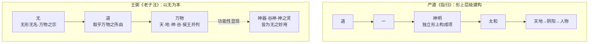

**这一比对揭示出玄学本体论收拢的关键机制：在严遵那里，「神明」是独立的形上层级；在王弼这里，「神」被收拢为本体之"用"——其存在性完全依存于"无"，其灵性完全来自"得一"，因而失去了在严遵体系中作为独立形上构成项的地位**[^56][^58]。这一收拢使汉代「神」论的形上层级化路径被根本性改造：神之独立性被解构，而其作为本体妙用的功能性意涵被凸显。这不是简单的概念取消，而是将「神」从严遵式的"实体性形上化"重置为王弼式的"功能性本体化"——前者把「神明」当作存在层级中的独立项，后者把「神」当作本体在万物层面的显现方式。这一重置之所以可能，正是基于 4.1 节所述「辨名析理」「得意忘象」的方法论基础。

## 4.3 第六章「谷神不死」注：从「养神」「神明」到「中央无者」的本体化转译

第六章「谷神不死，是谓玄牝」是中国老学诠释史上分歧最深、争议最大的一章——「本章可以说是《道德经》中争议最大分裂最深的一章」，「每一种流派对『谷神』的解释虽然五花八门，天差地别，却同时也各有千秋，基本上都可以做到自圆其说」[^63]。汉代河上公以「谷，养也，人能养神则不死。神，谓五藏之神也」将其转译为养生学命题；汉代以来又有以「谷神」为母性生殖意象的宇宙生成论诠释；王弼则以一种与汉代两路径均不同的本体化转译方式处理本章，开启了所谓的「替身派」诠释传统[^63]。

王弼对本章的核心注文为：**「谷神，谷中央无者也。无形无影，无逆无违，处卑不动，守静不衰。谷以之成而不见其形，此至物也。处卑而不可得而名，故谓天地之根」**[^63]（此据王弼《老子注》第六章；后世注家司马光以「中虚故曰谷，不测故曰神」、唐玄宗御注以「谷者，虚而能应者也。神者，妙而不测者也」沿袭此一诠释传统[^63]）。这段注文虽简短，却包含了王弼「神」论的几乎全部核心要素，需要逐层分析。

**第一层，「谷神」连读处理的方法论根据**。王弼明确将「谷神」作为一个复合概念整体处理，称之为「谷中央无者也」。这一连读处理的方法论根据，正是 4.1 节所述「辨名析理」原则——**「谷」与「神」之并提，并非两个独立概念的对举，而是从两个不同维度对同一本体特征的双重摹写**：「谷」状其虚而能容（中央之无），「神」状其妙而不测（不见其形）。司马光所谓「中虚故曰谷，不测故曰神，天地有穷而道无穷，故曰不死」、唐玄宗所谓「谷者，虚而能应者也。神者，妙而不测者也」皆延续王弼这一诠释思路[^63]。

需要指出的是，王弼的连读处理与第二章 2.4.1 节所论分读派（朱谦之、汪桂年、高亨等以第三十九章「神得一以灵，谷得一以盈」为分读依据）形成对比。**王弼连读的方法论合理性在于：在其「以无为本」的本体论框架下，「神」字若作为独立项与「谷」对举，则「神」便获得了某种与「谷」相平行的存在层级，这与王弼"任何具体规定都不能成为本体"的整体逻辑相冲突**。因此王弼必须将「谷神」处理为对同一本体的双重摹写，而非两个并列项——这是其连读选择背后的深层方法论根据。

**第二层，「中央无者」的本体化训释**。王弼以「谷中央无者也」释「谷」，将原典中山谷（或溪谷）的具体物象抽象为「中央无」的本体特征——所谓「中央无」，即山谷之所以为山谷，正在于其中间虚空、有以容物。这一处理使「谷」从地形学意义上的具体景观转化为本体论意义上的「无」之具象表述。**与此同时，「无形无影，无逆无违，处卑不动，守静不衰」四句进一步以否定性方式描摹「神」之本体品格**——「无形无影」消解其形质性，「无逆无违」消解其与万物的对抗关系，「处卑不动」消解其能动性的具体方向，「守静不衰」消解其时间性的盛衰变化。**通过这一系列否定性表述，「神」字被剥离了汉代以来附着于其上的具体内涵——既非五藏之神（无形无影故无脏腑可寄），亦非神格之神（处卑不动故无人格意志），亦非气化中介（守静不衰故无气之消长），唯余作为本体妙用的形上品格**。

**第三层，与河上公具身化诠释的根本对照**。王弼这一诠释路径与河上公《章句》形成最鲜明的对照。河上公注「谷，养也，人能养神则不死。神，谓五藏之神也。肝藏魂，肺藏魄，心藏神，脾藏意，肾藏精与志」，将「谷神不死」全面转译为身体修炼的具体技术；其后注「玄牝」为鼻口、注「玄牝之门」为「鼻口之门，是乃通天地之元气所从往来」、注「绵绵若存」为「鼻口呼吸喘息，当绵绵微妙」（详见第三章 3.3.1 节分析）。**王弼则反其道而行——他既不取「谷」之「养」义（不导向养生），也不将「玄牝」「天地根」具体化为身体器官，而是以「谷以之成而不见其形，此至物也」「处卑而不可得而名，故谓天地之根」将整章读为对本体之「无」的玄理性描摹**[^63]。

下表集中呈现第六章三种核心诠释路径的对比：

| 维度 | 河上公《章句》 | 王弼《老子注》 | 《想尔注》 |
|------|---------------|--------------|-----------|
| 「谷」之训 | 谷，养也（通「穀」） | 谷，中央无者 | （延续养生论） |
| 「神」之训 | 五藏之神（魂魄神意志） | 妙而不测之本体品格 | 太上老君（人格神祇） |
| 「玄牝」之训 | 鼻（玄）口（牝） | 处卑不可得而名 | （归于神格化道体） |
| 「天地根」之训 | 鼻口之门，通元气往来 | 谷之所以成而不见其形 | （宇宙神圣根源） |
| 「绵绵若存」之训 | 鼻口呼吸喘息绵绵微妙 | 本体之无的存而若无 | （人格神之恒在） |
| 整章定位 | 身体修炼之具体指南 | 本体之无的玄理摹写 | 宗教神学之本体论 |

**这一对比清楚显示王弼对汉代两路径的双重剥离——既剥离河上公的具身化（不导向五藏养生），又剥离《想尔注》的神格化（不导向人格神祇），最终把「谷神」重构为纯粹的本体论概念**。这一重构构成王弼「神」论的范式性贡献，也成为后世「替身派」诠释（即将「谷神」当作「道」之替身的诠释）的理论基础——「所谓替身派，就是将『谷』当做『道』的替身来看待，此门派人数最多，影响最大，势力最广，到今天依然如此。这一派的掌门人就是三国时期的著名少年天才，魏晋玄学的奠基人——王弼」[^63]。

## 4.4 第三十九章「神得一以灵」注：「物极」「数之始」与「神」之依存性

第三十九章「昔之得一者：天得一以清，地得一以宁；神得一以灵，谷得一以盈；万物得一以生，侯王得一以为天下贞」是中国老学诠释史上论「神」与「道」之关系的核心枢纽章[^64]。第二章 2.2.4 节已揭示，本章中「神」与「天」「地」「谷」「侯王」并列出现，构成一种存在层级结构；下文「神无以灵，将恐歇」一句则隐含一个重要的形上判断：神之灵性依存于「得一」，而非自因自足。汉代严遵《指归》正是依托本章「以老释老」，构建其「道—德—神明—太和」形上体系，将「神明」提升为独立的形上层级；河上公则以「言天当下行阴阳，地当上行阳气；神当有王相囚死，谷当盈满有时」处理之，以汉代占候之术解神。**王弼对本章的诠释，则与严遵、河上公皆形成根本对立**。

王弼对本章的核心注文为：**「昔，始也。一，数之始而物之极也。各是一物之生，所以为主也。物皆各得此一以成，既成而舍以居成，居成则失其母，故皆裂废歇竭灭蹶也」**[^64]。这段注文的概念分析需着重把握以下几个层面。

**第一层，「一」作为「数之始而物之极」的本体论界定**。王弼以「数之始而物之极」释「一」，使「一」成为一个具有双重内涵的概念——既是数（数列）之起点，又是物（万物）之极致。这一双重内涵的实质，是把「一」与「无」紧密关联：作为「数之始」，「一」在数列层面承担着开端功能；作为「物之极」，「一」在万物层面承担着终极根据功能。**而这两重功能的统一，恰恰对应于「无」作为万物之宗的本体地位**——王弼《老子注》第四十二章注「万物万形，其归一也」、第十一章注「毂所以能统三十辐者，无也。以其无能受物之故，故能以寡统众也」皆呼应此一论断[^61]。**因此，在王弼这里，「得一」即「得无」，「一」是「无」在万物层面的逻辑起点与终极归宿**。

**第二层，「各是一物之生，所以为主也」的层级安置**。王弼此句明确指出，「天」「地」「神」「谷」「万物」「侯王」皆是各自层面上的具体存在项（「一物之生」），而它们之所以能成为各自层面的"主"（清、宁、灵、盈、生、贞），根据在于「得一」——亦即依存于「无」。**这一安置使「神」与「天」「地」「谷」等并列项处于同一存在层级，皆为本体之"无"在不同维度上的显现，而非如严遵体系中「神明」独立居于「德」之下、「太和」之上的形上层级**。这是王弼对严遵形上层级化路径的根本性改造：神之独立形上层级地位被解构，神被纳入与天地谷万物侯王平行的具体存在序列中。

**第三层，「居成则失其母」与「神」之依存性**。王弼下半段的注文「物皆各得此一以成，既成而舍以居成，居成则失其母，故皆裂废歇竭灭蹶也」，正是对原典「神无以灵，将恐歇」一组否定性陈述的统一解读[^64]。其义理逻辑可作如下分疏：

- 「物皆各得此一以成」：万物（含天、地、神、谷、侯王）之所以成为自身，根据在于「得一」（合于无）；
- 「既成而舍以居成」：万物若成立后舍弃其根据而停滞于既成状态（执着于自身规定性）；
- 「居成则失其母」：则失去本体之根据（「母」指本体之无，与「子」即万物相对，此即「守母存子」原则的反面）；
- 「故皆裂废歇竭灭蹶也」：则导致天裂、地废、神歇、谷竭、万物灭、侯王蹶。

**这一逻辑链条把「神之灵」彻底建立在「得一」之上——神之所以能灵，根据完全在于其合于本体之"无"；一旦失母（脱离本体），则神必然消歇**[^64]。**这一处理与第二章 2.5 节所揭示的原典「神」概念第一重张力（形上妙用与派生层级的张力）形成对应**：王弼明确选择极一立场——「神」是道之妙用的功能性显现，而非独立的派生层级。在此立场下，所谓「神之灵」并非「神」自身具有的独立灵性，而是「无」通过「神」这一具体存在项所显现的本体妙用。

**第四层，与严遵「神明」论的根本对立**。这一处理与严遵《指归》构成最鲜明的概念对照。在严遵体系中，「神明」被提升为「生命与灵性的根源」、是「先于一切有形存在」的形上层级独立构成项（详见第三章 3.2 节）；而在王弼这里，「神」既非生命之源（生命之源是「无」），亦非先于有形之物（神与天、地、谷、万物同处一层级），仅是「无」在万物层面的某种具体显现方式。**王弼通过「数之始而物之极」「居成则失其母」等表述，把严遵以来"神明"作为形上层级独立项的地位彻底解构，将其重新整合为以"无"为本的单一本源论**——这正是 4.2 节所述本体论收拢的具体落实。

下表集中比对严遵、河上公、王弼三家对第三十九章「神得一以灵」的诠释结构：

| 注家 | 「一」之训 | 「神」之地位 | 神之灵之根据 | 整章义理归宿 |
|------|----------|------------|------------|------------|
| 严遵《指归》 | 道之子、神明之母（虚实之间） | 独立形上层级（道—德—神明—太和） | 神明本身作为生命与灵性根源 | 形上层级生成论 |
| 河上公《章句》 | 道之始所生（数之元） | 五藏神、占候之神 | 阴阳运行、王相囚死 | 养生治身之论 |
| 王弼《老子注》 | 数之始而物之极 | 万物层面的具体存在项 | 完全依存于"得一"（即合于无） | 以无为本之本体论 |

这一比对清楚显示，**王弼对本章的诠释是一次系统性的"本体论拉平"——他将「天、地、神、谷、万物、侯王」拉平为同一存在层级的并列项，并将其灵性、清宁、盈虚、生灭、贞贵的根据统一回溯到唯一的本体"无"**。这种拉平既消解了严遵体系中"神明"作为独立形上层级的特殊地位，也使「神」概念在王弼体系中彻底失去成为独立实体的可能性。这一处理是其本体论收拢机制最具理论张力的体现，也为后世近现代学者（如朱谦之、任继愈）的"神为道/气之功能显现"立场提供了最早的本体论原型。

## 4.5 第六十章「其鬼不神」注：「不扰则真气全」与鬼神观的去实体化

第六十章「治大国若烹小鲜。以道莅天下，其鬼不神，非其鬼不神，其神不伤人；非其神不伤人，圣人亦不伤人。夫两不相伤，故德交归焉」是《老子》中唯一明确将「鬼」「神」「圣人」三元并提的章节，构成历代注家在宗教化与去宗教化之间反复争论的焦点[^65]。第二章 2.2.5 节已揭示，本章「其鬼不神」中「神」字可作动词（显灵）或名词（神灵）两种解读，主流注家与现代研究多取动词解。汉代河上公以「治身者爱气则身全，治国者爱民则国安」处理本章；《想尔注》则将鬼神纳入太上老君神谱的宗教语境。王弼对本章的诠释，则代表着一种典型的"去实体化"路径。

王弼对「治大国若烹小鲜」的注文为：**「不扰也。躁则多害，静则全真。故其国弥大，而其主弥静，然后乃能广得众心矣」**[^65]。这一注文虽未直接训释「神」字，却为整章的诠释路径定调——以"不扰"作为整章的核心政治哲学命题，把「以道莅天下，其鬼不神」一句解读为：以道治天下则不扰，不扰则真气全（即"全真"），真气全则鬼不显灵、神不伤人。这一解读路径具有几个关键特征。

**第一，「神」之动词化处理**。王弼"静则全真"的诠释暗含将「其鬼不神」之「神」作动词（显灵）解的方向——所谓鬼之"不神"，即鬼不显灵、鬼之神效消歇；而鬼神不显灵的根据并非鬼神本身被消解，而是"以道莅天下"造成的"真气全"使鬼神之神效失去发挥的契机。**这一处理既不否认鬼神的存在（仍预设有"鬼"有"神"），也不否认鬼神具有某种能动性（仍预设其可"神"可"伤人"），但通过"不扰"机制悬置了鬼神能动性的实际发挥**。这是一种典型的功能化、悬置化处理，而非河上公式的存在化处理或《想尔注》式的神格化处理。

**第二，「不扰」作为整章核心政治哲学命题**。王弼以「不扰也。躁则多害，静则全真。故其国弥大，而其主弥静，然后乃能广得众心矣」为整章定调，使原典中复杂的鬼神语句被统摄于"不扰"这一无为政治哲学的核心命题之下[^65]。**这一统摄使整章的义理重心从鬼神论（鬼神是否存在、是否能伤人）转移至政治论（如何以静治国），从而将鬼神问题转化为政治问题的一个侧面**。如《典籍周口》解读所言，王弼诠释的核心是"国家越大，统治者应当越安静，毋躁毋烦，不要扰乱民众"[^65]——鬼神之"不神"、"不伤人"，归根结底是君主"不扰"的政治后果，而非独立的宗教—神学事实。

**第三，与河上公"治身—治国"对应论的差异**。河上公《章句》以"治身者爱气则身全，治国者爱民则国安"处理本章，将鬼神问题纳入身国同治的养生—治国对应框架——其核心机制在于：治身则爱气，爱气则真气充盈；真气充盈则鬼神（包括外在鬼神与内在五藏神）皆受其制；治国类比治身，则爱民、不扰民，民安则国安。**王弼则简化了这一对应结构——他不再强调"爱气"之具体身体技术，而是直接以"静则全真"概括之**："真"在王弼这里不再是河上公式具体的"真气""精气"，而是带有本体论色彩的"全真"——即合于本体之"无"的整体性、无亏损状态。这一差异折射出玄学相对于汉代养生论的整体提升：从具身化的"养气"上升到形上化的"全真"。

**第四，与《想尔注》神格化诠释的根本分野**。《想尔注》将整部《老子》重读为"太上老君之自言"，把所有「吾」「我」皆训为道（即太上老君），把鬼神纳入以太上老君为最高神的神谱体系（详见第三章 3.4 节）；而王弼则反其道而行——他既不将道神格化，也不将鬼神纳入任何神谱，而是把鬼神问题完全置于"以道莅天下"的政治哲学语境中处理。**这一分野最集中地体现王弼对汉代神化诠释的系统清理：所谓"清理"不是简单的否定（王弼并未否认鬼神存在），而是通过义理结构的根本调整，使鬼神问题失去其作为独立宗教—神学问题的地位**。

**第五，与原典语义张力的对应**。回到第二章 2.5 节所归纳的原典「神」概念四重语义张力，王弼对第六十章的诠释最直接对应于第二重张力（自然灵性与超验力量）与第三重张力（二元结构与三元结构）：

- 在自然灵性与超验力量之间，王弼明确选择极一（自然灵性）——通过将"神"动词化、将鬼神归于"不扰则全真"的自然机制，王弼把超验力量义弱化为自然灵性义；
- 在鬼神二元与鬼—神—圣人三元结构之间，王弼实质上将三元结构压缩为以圣人（即"以道莅天下"之主）为核心的一元结构——鬼神不过是这一核心结构在边缘层面的功能性显现。

**这种处理的诠释史意义在于：它为后世近现代以陈鼓应、任继愈为代表的去宗教化诠释提供了最早的注释学原型**——尽管陈鼓应、任继愈倾向于将《老子》视为彻底的无神论立场（与王弼并不否认鬼神存在的立场略有差异），但他们对鬼神问题的功能化处理路径与王弼一脉相承。可以说，**没有王弼对汉代神化诠释的系统清理，就不可能有近现代以"自然规律""精神主体"等现代范畴重读《老子》"神"概念的可能空间**。

## 4.6 第二十九章「天下神器」注：「神，无形无方也」与政治哲学的形上化

第二十九章「将欲取天下而为之，吾见其不得已。天下神器，不可为也，不可执也。为者败之，执者失之」一句中，「神器」一词的语义边界曾在第二章 2.4.3 节作过分析，其可能解读包括：解读甲（神圣之器，伦理—宗教神圣性）、解读乙（神明造化之器，神明造化义）、解读丙（神奇造化之物，自然规律义）。汉代韩非以法家视角处理本章时偏重统御工具论；后世朱元璋御注则将"神器"直接政治化为"帝王权位"，是解读甲（伦理—宗教神圣性）的极端体现。**王弼对本章的诠释，则代表了解读丙（自然规律义）的玄学本体论方向**。

王弼对「天下神器，不可为也」的核心注文为：**「神，无形无方也；器，合成也。无形以合，故谓之神器也」**（依据王弼《老子注》第二十九章）。这段注文虽简短，却包含了王弼"政治哲学形上化"的几个关键要素。

**第一，「神，无形无方也」的本体化训释**。王弼以"无形无方"释"神"——这一训释与第六章注"无形无影，无逆无违"、《指略》"无形无名者，万物之宗也"在用语上完全呼应[^60][^61]。**通过这一训释，"神"字被剥离了汉代"神圣"（伦理—宗教义）、"神明"（形上层级义）、"神祇"（人格神义）等各种附着意涵，重新回归为本体之"无"在功能层面上的描述项**——所谓"无形无方"，即不局限于任何具体形质、不固执于任何具体方向，正是本体之"无"的功能性特征。

**第二，「器，合成也；无形以合，故谓之神器也」的整体诠释**。"器"在王弼这里被训为"合成"——天下作为"器"，是由万物各得其性、各循其理而合成的整体；而这一"合成"之所以可能，在于其根据是"无形"——亦即不通过任何具体形质的强制规定来组织万物，而是任万物各依其性自然合成。**因此「神器」的实质是"以无形之根据合成的整体"，其不可为不可执的根据，不在天下作为神圣对象的伦理—宗教属性，而在万物各有其性、不可强同的自然之理**[^56][^58]。

这一诠释机制可作如下逻辑分疏：

- 天下之所以为"神器"，根据在于其"无形以合"——以无形之本体为根据合成；
- 既以无形为合成之根据，则任何"为之"（强加形质规定）皆违背其本性；
- 因此"为者败之，执者失之"——非天下不可治，而是不可"为"治、"执"治；
- 治天下之正确方式是"因物之性"、"任万物之自然"——这正是王弼"以无为本"本体论在政治哲学层面的具体落实。

**第三，与韩非政治化诠释的根本差异**。韩非《解老》《喻老》虽未直接注解第二十九章，但其将"神"收敛为君主内敛精神主体、将"圣人爱精神而贵处静"作为统御术之核心的处理路径，最终指向的是"循道理以从事"的功效论政治哲学（详见第三章 3.1 节）。**而王弼则通过"神，无形无方也"的本体化训释，把"神器"从韩非式的工具论政治哲学（主体内敛、循理治事）提升为本体论政治哲学（合于无形、因物之性）**——前者强调主体如何运用神来治国，后者强调治国如何顺应"神"（即无）所体现的自然之理。这一提升使政治哲学从工具理性的层面上升到形上根据的层面。

**第四，与朱元璋御注神圣化诠释的根本分野**。明代朱元璋御注将"天下神器"直接政治化为"帝王权位"，是把"神器"作为伦理—宗教神圣对象处理的极端形态。这一处理的实质是把第二十九章作为帝王神授论的神学根据。**王弼则通过"神，无形无方"的训释，彻底剥离了这种伦理—宗教神圣化的诠释空间——"神器"之神圣性根据不在帝王权位的天命神圣，而在万物各依其性的自然之理**。这一剥离构成王弼对政治神学化解经路径的预先性清理。

**第五，本体论政治哲学的整体框架**。将第二十九章注与第六十章注相对照，可见王弼政治哲学的整体框架：第六十章以"不扰也，躁则多害，静则全真"确立"无为而治"的政治论原则；第二十九章以"神，无形无方也，器，合成也"确立"因物之性"的政治论根据。**两章合观，构成一个完整的本体论政治哲学：根据上是"以无为本"（无形无名者为万物之宗），原则上是"无为而治"（不扰则全真），方法上是"因物之性"（无形以合则成神器）**[^56][^58]。这一框架使政治哲学完全形上化——所有政治判断的最终根据都被回溯到本体之"无"。

下表集中比对韩非、王弼、朱元璋三家对第二十九章「天下神器」的诠释结构：

| 注家 | 「神」之训 | 「器」之训 | 不可为不可执之根据 | 政治哲学归宿 |
|------|----------|----------|------------------|------------|
| 韩非（间接） | 内敛精神主体（君主） | （未直接论及） | 主体之神不外淫则功效成 | 法术统御之学 |
| 王弼《老子注》 | 无形无方（本体功能义） | 合成（以无形合成） | 万物各有其性、不可强同 | 本体论政治哲学（无为而治、因物之性） |
| 朱元璋御注 | 神圣天命（伦理—宗教义） | 帝王权位 | 天命神圣不可亵渎 | 帝王神学 |

这一比对清楚显示，**王弼对第二十九章的诠释是一次将政治概念彻底形上化的范式转换——通过"神，无形无方"的本体化训释，王弼把第二十九章从韩非式的统御术或朱元璋式的帝王神学语境中抽离，重新解读为以"无"为本的本体论政治哲学命题**。这一转换不仅完成了第二十九章「神器」概念的玄理化重构，更构成王弼以本体论统摄全部《老子》义理的整体努力的一个具体实例。

## 4.7 王弼与严遵、河上公的横向比较：玄学转向的诠释机制

在 4.3—4.6 节对四章核心注文作分别考察的基础上，本节对王弼、严遵、河上公三家「神」论作系统横向比较，以揭示玄学转向的核心诠释机制。比较从形上定位、文本侧重、方法路径、思想归宿四个维度展开。

**第一维度：形上定位的根本差异**。三家在「神」之形上定位上分别采取了不同的本体论结构：

| 注家 | 形上结构 | 「神」之位置 | 「神」之实质 |
|------|---------|------------|------------|
| 严遵《指归》 | 道→（一）→神明→太和→天地 | 形上层级独立构成项（生命与灵性根源） | 实体性形上化 |
| 河上公《章句》 | 精气—五藏—神—性情 | 身体生理层面的具体内主 | 实体性具身化 |
| 王弼《老子注》 | 无→道→万物（神为万物之一项） | 万物层面"无"之功能性显现 | 功能性本体化 |

这一对比表明，**严遵、河上公虽分别在形上与具身两个层面处理"神"，但二者皆把"神"作为某种实体性存在来对待——严遵的"神明"是独立的形上层级，河上公的"五藏神"是具体的身体内主，二者皆肯定"神"具有自身的实体性内涵。而王弼则根本性地改变了这一处理方式——他通过"以无为本"的本体论框架，把"神"从实体性存在重置为功能性显现，"神"不再是独立形上层级（与严遵相反），也不再是具体身体内主（与河上公相反），而是本体之"无"在万物层面的某种功能性表现**。这一从实体到功能的重置，是玄学转向最深层的本体论调整。

**第二维度：文本侧重的差异化分布**。三家在文本侧重上各有偏好：

| 注家 | 主要文本侧重 | 关注章句 | 文本利用方式 |
|------|------------|---------|------------|
| 严遵《指归》 | 第三十九章（神得一以灵） | 以"得一"系列章句构建形上层级 | 整体性"以老释老" |
| 河上公《章句》 | 第六章（谷神不死） | 以"谷神""玄牝""天地根"构建身体修炼论 | 字词训诂、具身转译 |
| 王弼《老子注》 | 全书一以贯之 | 以"以无为本"统摄全部章句 | 辨名析理、得意忘象 |

**严遵以第三十九章作为构建形上层级的主要文本依据，河上公以第六章作为构建身体修炼论的主要文本依据，皆体现了一种"以特定章句为支点撬动整体诠释"的方法**；而王弼则不依赖任何特定章句作为支点，而是以"以无为本"的本体论框架作为统摄全文的逻辑结构——这正是何劭所称"致有理统"的方法论实质[^59][^60]。这一差异使王弼诠释相比严遵、河上公具有更高的整体性与一致性——任何具体章句的诠释都受其整体本体论框架的制约。

**第三维度：方法路径的范式更替**。三家方法路径的差异已在 4.1 节集中呈现，此处作进一步深化：

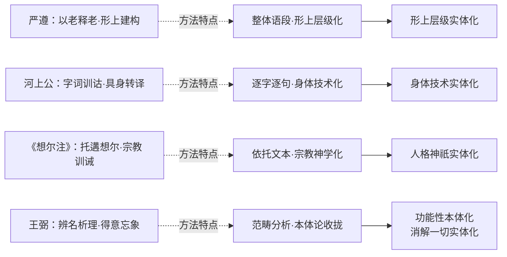

**这一方法路径的差异表明，王弼"辨名析理""得意忘象"的方法本质上是一种消解性方法——它消解严遵的形上层级实体化、消解河上公的身体技术实体化、消解《想尔注》的人格神祇实体化，将一切具体规定回溯到"无"这一本体根据**。这一消解不是简单的否定（王弼并未直接驳斥汉代三家），而是通过更高层次的本体论重构使汉代三家的"神"论失去其原有的形上根据。

**第四维度：思想归宿的整体走向**。三家思想归宿的差异最终指向不同的思想史方向：

- **严遵《指归》**：黄老形上学—向魏晋本体论过渡的中介；
- **河上公《章句》**：黄老养生学—向唐宋内丹学发展的源头；
- **《想尔注》**：早期道教神学—向道教派别神学发展的源头；
- **王弼《老子注》**：玄学本体论—向魏晋玄学—唐宋理学义理化诠释发展的源头。

**这一归宿差异表明，汉代「神」论四向辐射的格局，在魏晋玄学阶段并未被消解，而是分别延展为不同的诠释传统**：王弼开启了义理化、哲学化的主线，但严遵的形上化、河上公的具身化、《想尔注》的神格化路径同样在魏晋以后继续发展（如葛洪《抱朴子内篇》对河上公养生论的继承、陶弘景《登真隐诀》对《想尔注》神学的发展等）。**因此，玄学转向的实质并非简单地"取代"汉代四路径，而是在四路径并存的格局中开辟了一条以本体论收拢为特征的新主线——这条主线将在唐代被重玄学进一步思辨化（双遣双非），在宋明被理学义理化（理气心性），在近现代被学术化（去神秘化）**。

综合四个维度的比较，玄学转向的核心诠释机制可归纳为：**以"辨名析理"的方法论为认识论前提，以"以无为本"的本体论为框架根据，将汉代多向下沉的"神"论重新收拢为本体之"用"——这一收拢既不是简单否定汉代诠释（保持了对汉代三路径的部分批判性继承），也不是停留于汉代格局之内（开辟了新的本体论方向），而是通过更高层次的本体论重构，使"神"概念从政治、气化、身体、宗教的具体语境中抽离，回归到形上层面的功能性描述**。这一收拢是中国老学诠释史上「神」概念的第一次系统性哲学化，其范式意义构成后续整个诠释史的重要基础。

## 4.8 玄学「神」论的诠释史定位：去宗教化、哲学化与后续影响

在前述章句分析与横向比较的基础上，本节对王弼「神」论的诠释史意义作整体定位。这一定位将从去宗教化、哲学化、后续影响三个层面展开，并审慎指出王弼诠释的方法论局限。

**第一层面：去宗教化的系统性清理**。王弼「神」论的首要诠释史贡献，是对汉代以来「神」概念附着的宗教神学色彩作了系统性清理。这一清理的具体表现包括：

- **对人格神化的清理**：王弼在第六章注中以"无形无影，处卑不动"消解《想尔注》"道散形为气，聚形为太上老君"的人格神化倾向；在第六十章注中以"不扰则真气全"消解将鬼神纳入人格神祇神谱的诠释路径。
- **对神祇崇拜的清理**：王弼通过"无—道—万物"的本体论结构，消解严遵"道—德—神明—太和"形上层级中"神明"作为可被崇拜对象的独立地位。
- **对神圣化政治的清理**：王弼以"神，无形无方"释第二十九章"神器"，预先性地消解了将"天下神器"作为帝王神圣权位的伦理—宗教神圣化诠释空间。

**这一系统性清理的实质，并非否定鬼神存在的彻底无神论立场（王弼在第六十章注中并未否认鬼神存在），而是在保持鬼神存在论可能性的前提下，将"神"概念的形上根据从宗教—神学层面抽离至本体论层面**[^56][^58]。这是一种典型的"哲学化的去宗教化"——其方式不是激烈的反宗教论辩，而是通过更高层次的本体论建构使宗教化诠释失去其原有的形上根据。

**第二层面：哲学化的范畴体系建构**。王弼「神」论的第二重诠释史贡献，是把"神"概念纳入"无—有""本—末""母—子"的本体论范畴体系，完成概念的纯哲学化处理。这一哲学化具体表现为：

- **「神—无」关系**：在第三十九章注中，王弼以"居成则失其母"将"神之灵"的根据完全建立于"无"——神之为神，根据完全在于其与"无"的本体论关联。
- **「神—有」关系**：在《老子指略》"夫物之所以生，功之所以成，必生乎无形，由乎无名"的整体框架下，"神"作为有形有名之具体存在项，其存在性完全依存于无形无名之本体[^60][^61]。
- **「神—自然」关系**：王弼以"神，无形无方"释第二十九章"神器"，使"神"概念与"自然""无为"原理紧密结合——所谓"神器"之不可为，根据正在于万物各依其自然之性[^56]。

**这一哲学化的实质是：将"神"从一个具有自身实体内涵的具体概念，重置为本体论范畴体系中的一个功能性节点**。其在概念史上的意义在于，它使"神"在玄学语境中第一次成为一个可被严格逻辑分析的纯哲学化范畴，而非可被信仰、修炼或操作的具体对象。

**第三层面：后续影响的范式开启**。王弼「神」论范式的后续影响，主要体现在三个方向：

第一，**对原典四重语义张力的极一选择及其后续延展**。回顾第二章 2.5 节所归纳的原典「神」概念四重语义张力，王弼的本体论收拢明确选择了每一重张力的极一立场：

| 语义张力 | 极一 | 极二 | 王弼的选择 | 后续延展 |
|---------|------|------|----------|---------|
| 道之关系 | 形上妙用 | 派生层级 | 极一（神为无之妙用） | 宋明理学"神为气之灵"传统 |
| 性质归属 | 自然灵性 | 超验力量 | 极一（神为自然之妙运） | 近现代"自然规律""精神主体"诠释 |
| 存在结构 | 二元 | 三元 | 极一（鬼神功能化、悬置三元） | 近现代去神秘化诠释 |
| 概念组合 | 独立实体 | 功能性描述 | 极二（神为本体功能性显现） | 唐代重玄学双遣双非的逻辑前提 |

**这一选择性强调使王弼「神」论成为后世义理化、哲学化诠释传统的最早原型——唐代成玄英、李荣的重玄学双遣双非思辨，宋代王安石、苏辙、陈景元的义理化诠释，清代王夫之"神为气之灵"的气论诠释，近现代陈鼓应、任继愈的去神秘化诠释，皆可视为对王弼极一选择路径的不同延展**。

第二，**对唐代重玄学的方法论奠基**。王弼"辨名析理"的方法论与"无形无名"的本体论，为唐代重玄学的双遣双非思辨提供了直接的方法论前提。**重玄学之"双遣"——既遣"有"又遣"无"——只有在王弼已确立"无"作为最高范畴的本体论基础上才有可能展开**：若无王弼对"无"的本体地位的明确确立，则重玄学的"遣无"操作便失去对象。这一方法论奠基意义将在第五章对重玄学的考察中得到展开。

第三，**对宋明理学义理化诠释的间接影响**。宋代王安石、苏辙等以理学语境处理"神"的诠释路径，虽不直接采用王弼的"贵无"立场，但其对"神"作为本体功能性显现而非独立实体的处理方式，与王弼范式有着深层的概念延续。特别是清代王夫之"神为气之灵"的气论诠释，可视为以气论形态对王弼"神为无之用"功能化处理的延展——将"无"替换为"气"，但保留了"神"作为本体功能性显现的核心结构。

**第四层面：方法论局限的审慎指出**。在肯定王弼「神」论范式贡献的同时，本研究亦需审慎指出其方法论局限——这不是为了贬抑王弼，而是为理解后续诠释史动力提供根据。

王弼「神」论的核心局限在于：**其本体论收拢虽完成了"神"概念的哲学化，但也在一定程度上抽空了"神"概念的宗教维度与具身维度**。具体表现为：

- **宗教维度的悬置**：王弼对鬼神问题作功能化处理（"不扰则真气全"），虽未直接否认鬼神存在，但在其本体论框架下，鬼神实质上失去了独立的宗教—神学地位，被压缩为"以道莅天下"政治哲学的边缘性现象。这种处理无法回应汉代以来道教信仰的具体宗教需求。
- **具身维度的剥离**：王弼对第六章"谷神不死"作"中央无者"的本体化训释，虽保持了义理高度，但完全剥离了河上公"五藏之神"所提供的具体身体修炼指南。这种剥离无法回应养生实践与个体生命安顿的具体需求。
- **政治维度的形上化抽离**：王弼对第二十九章"神器"的本体化训释，虽提升了政治哲学的形上深度，但抽离了韩非"圣人爱精神而贵处静"所提供的具体统御术指南。

**这些局限的实质，是王弼"以无为本"的本体论框架与"辨名析理"的方法论虽具有强大的概念整合力，但同时也牺牲了"神"概念在宗教、修炼、政治等具体实践层面的丰富性**。这一遗留问题构成隋唐道教与宋元内丹学重新激活"神"之多重内涵的历史动力——隋唐道教（包括重玄学、杜光庭神学、唐玄宗御注）需要重新为"神"安置宗教维度，宋元内丹学需要重新为"神"安置具身维度，明清御注需要重新为"神"安置政治维度。**正是王弼诠释所留下的这些"未完成的工作"，使后续诠释史得以在玄学转向之后继续展开多向重构**。

需要强调的是，这种"未完成"并非王弼诠释的缺陷，而是其方法论选择的必然代价——任何一种系统性的诠释都不可避免地通过强调某些维度而省略其他维度。**王弼诠释的伟大之处，正在于其以最严谨的方法论自觉与最系统的本体论建构，为中国老学诠释史奠定了哲学化的主线；而其留下的未完成工作，则为后续诠释史的继续展开提供了内在的张力与动力**。这种伟大与局限的辩证统一，使王弼《老子注》《老子指略》在中国思想史上获得了"魏晋玄学奠基"与"老学义理诠释开端"的双重地位[^56][^66][^67]。

至此，本章对魏晋玄学阶段「神」概念的本体论收拢已作完整考察。从 4.1 节方法论的范式更替，到 4.2 节本体论框架的整体建构，到 4.3—4.6 节对四章核心注文的具体分析，再到 4.7 节横向比较与 4.8 节诠释史定位，本研究试图揭示：**玄学转向作为中国老学诠释史第二阶段的核心动力，不是对汉代四向辐射格局的简单否定，而是通过更高层次的本体论重构，使"神"概念从汉代多元下沉中重新收拢为形上之妙用——这一收拢既是去宗教化与哲学化的范式转换，也是为后续重玄、内丹、理学、近现代等诠释传统预留方法论起点的奠基性工作**。在此基础上，第五章将进入隋唐道教与三教融合期，考察成玄英、李荣等重玄学家如何在王弼所确立的本体论基础上，借助佛教中观学的双遣双非方法，将"神"概念进一步推向高度思辨化的形上范畴——这一思辨化既是对王弼范式的延展，也是对其方法论局限的部分回应。

# 5 隋唐重玄学：成玄英、李荣对「神」的双遣双非式思辨

第四章已揭示王弼通过「辨名析理」与「以无为本」的方法论与本体论框架，将汉代多向下沉的「神」论收拢为本体之妙用，并审慎指出其本体论收拢虽完成了概念哲学化，却也在一定程度上抽空了「神」概念的宗教维度与具身维度。这一未完成的工作，构成隋唐道教思想重新激活「神」之多重内涵的内在动力。然而，唐代对王弼范式的超越并非简单回归汉代多元下沉的格局，而是经由一次更为彻底的方法论跃迁——借助佛教中观学「双非双遣」「八不中道」的破执方法，重玄学派把「神」从王弼所确立的「无之妙用」进一步推向「非有非无、非非有非非无」的思辨场域，使「神」概念失去任何可以稳定附着的存在层级。**与此同时，唐代「神」诠释并未停留于纯思辨的单一路径——杜光庭以道教神谱体系重新整合「神」的宗教维度，唐玄宗御注以「冲气」之说重新激活「神」的气化与政治维度——重玄思辨、神学整合、官方御注三种诠释路径在唐代形成多向并起的格局**。本章将以成玄英《道德经义疏》、李荣《道德经注》为核心文本，落实到第六章、第二十九章、第三十九章等关键章句的具体注疏，考察重玄学双遣式诠释的具体机制；并通过与杜光庭《道德真经广圣义》、唐玄宗御注的横向比较，揭示唐代「神」诠释作为承上启下枢纽的诠释史定位。

## 5.1 重玄学方法论的形成：从王弼贵无到中观双遣的范式跃迁

重玄学作为唐代老学诠释的主流，其方法论根基既继承魏晋玄学的本体论传统，又借鉴佛教中观学的破执方法，构成中国哲学史上一次具有特殊思辨深度的范式跃迁。理解这一跃迁的内在机制，是把握成玄英、李荣「神」论诠释的方法论前提。

### 5.1.1 「重玄」概念的语义基础与早期酝酿

「重玄」一词的直接来源是《道德经》第一章「玄之又玄，众妙之门」[^68]。这一表述本身在原典层面即蕴含双重玄妙的语义结构——「玄」之深远不可测度，「又玄」之进一步超越，构成一种自我否定式的递进。然而原典中的「玄之又玄」尚未形成系统的方法论；其作为破执方法的形成，经历了由先秦至隋唐的漫长酝酿。

学界一般认为，重玄思想可追溯至先秦老庄道家思想，西晋玄学家郭象在《庄子注》中首次提出「双遣」「三翻」的典型表述，东晋孙登则被后世尊为以「重玄为宗」的先驱[^68][^69]。蒙文通先生在《校理老子成玄英疏叙录》中指出：「究乎注《老》之家，双遣二边之训，莫先于罗什。虽未必即罗什之书，要所宗实不离其义，重玄之妙，虽肇乎孙登，而三翻之式，实始乎罗什，言《老》之别开一面，究源乎此也」[^69]。这一论断将重玄学的方法论起源精确定位于鸠摩罗什所传中观学进入中国老学诠释场域的关键节点。

罗什注解《老子》「为学日益」章的一段文字，最直接地体现了这一方法论嫁接的早期形态：**「损之者无粗而不遣，遣之至乎忘恶；然后无细而不去，去之至乎忘善。恶者非也，善者是也，既损其非，又损其是，故曰损之又损。是非俱忘，情欲既断，德与道合，至于无为」**[^69]。这段文字的方法论结构具有典型意义：先遣「非」（恶），再遣「是」（善），通过对是非两边的双重否定，达至「是非俱忘」的境界。这种「损之又损」的双重否定结构，正是后来成玄英、李荣双遣方法的直接原型。

至隋朝，《本际经》的出现标志着重玄学理论体系的初步建立[^68]。唐代则是重玄学的鼎盛期，重玄学成为唐代道教哲学的主流和最具思辨性的部分，主要代表人物包括成玄英、李荣、王玄览、司马承祯、杜光庭等[^68]。

### 5.1.2 「双遣三翻」的逻辑形态：从「一玄」到「又玄」

成玄英在《道德经义疏》中对重玄方法论作了最系统的阐发。其核心表述见于对第一章「玄之又玄」的注疏：**「玄者，深远之义，亦是不滞之名。有无二心，徼妙两观，源于一道，同出异名。异名一道，谓之深远。深远之玄，理归无滞。既不滞有，亦不滞无，二俱不滞，故谓之玄也」**[^69][^70]。这段注文确立了「玄」的双重含义——语义上为深远，方法论上为「二俱不滞」（既不滞有，亦不滞无）。

但「一玄」尚未达至重玄之境。成玄英进一步指出：**「有欲之人，唯滞于有；无欲之士，又滞于无。故说一玄，以遣双执。又恐行者，滞于此玄，今说又玄，更祛后病。既而非但不滞于滞，亦乃不滞于不滞。此则遣之又遣，故曰玄之又玄」**[^69][^70]。这一论述包含了重玄方法论的核心逻辑：

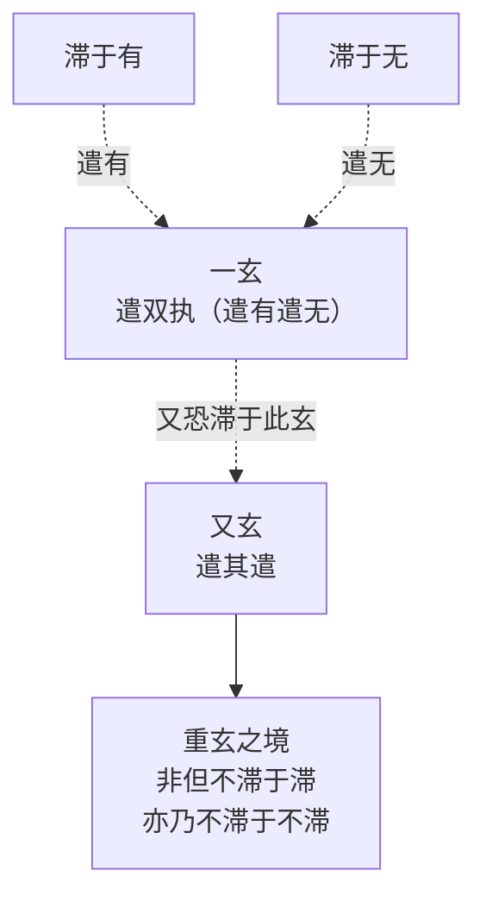

这一双重否定结构在形态上有「四句」与「三翻」两种逻辑表述。「四句」即有、无、非有非无、非非有非非无；「三翻」则指遣有、遣无、遣其遣[^68][^71]。二者在本质上一致，皆体现「祛除执著、远离边见、破除定势的圆融精神」[^71]。

**这一方法论结构相对于王弼「以无为本」本体论具有质的范式跃迁**。在王弼那里，「无」作为最高范畴具有稳定的本体论地位，「神」之灵性归根于「得一」（即合于无），整个本体论框架是以「无」为终极根据的单一本源结构（详见第四章 4.2 节）。**而在重玄学这里，「无」本身亦成为需要被进一步遣除的执滞对象——王弼确立「无」之最高地位，重玄学则进一步遣「无」之执，使任何可被稳定附着的存在层级（无论是"有"还是"无"）都失去其作为终极根据的合法性**。这一进一步的否定操作，使「神」概念在重玄学语境下被推向「非有非无、非非有非非无」的纯思辨场域。

### 5.1.3 「重玄之域」的境界指向：方法论与境界论的统一

重玄方法论的目标并非纯粹的逻辑思辨，而是指向一种被成玄英称为「重玄之域」的修道境界。**「夫道，超此四句，离彼百非，名言路断，心知处灭，虽复三绝，未穷其妙。而三绝之外，道之根本，而谓之重玄之域，众妙之门」**[^69]。这一表述把重玄之境定位于「超此四句，离彼百非」之外的更深层次——即使经历「三翻」的层层否定，仍未穷尽其妙；唯有在「三绝之外」的境地，才是道之根本、众妙之门。

强昱在《成玄英建立重玄学的方法》一文中曾对这一方法论作过专题研究[^72]，可作为本研究方法论分析的学术参照。重玄学的方法论特征可归纳为：**它是一种通过无限否定逼近绝对自由境界的思辨技术——其目的不在于建立任何积极性的形上学命题，而在于通过对一切可能执滞的层层消解，使主体达至「寥廓无端，虚通不碍」的高度抽象状态**[^69]。这一方法论特征对「神」概念的处理具有决定性意义：**重玄学既不像汉代注家那样将「神」具体化为养生之神、形上层级或人格神祇，也不像王弼那样将「神」收拢为本体之妙用——而是把「神」纳入「双遣双非」的思辨结构，使其在有无、灵与不灵、断见与常见之间被反复消解，最终抵达存在论悬置的中道境界**。

需要指出的是，重玄学并非道书所列的宗教教派意义上的派别——「重玄派这个派别的名称不见于道书，成员之间也没有宗教教派意义上的传承关系，是后人将思想相近的道士划归的范畴」[^68]。这一组织松散性使重玄学呈现出一种纯思想性的派别特征——它是一种思维方法的共同体，而非组织上的宗派；其方法论可被儒、道、释三教所融摄、所应用[^68]。**这一特征使重玄学成为「中国本土哲学中最具黑格尔色彩的流派之一」**[^68]——其纯思辨性与无限否定的特质，使之在中国哲学传统中具有独特的方法论地位。

## 5.2 成玄英《道德经义疏》对「谷神」的双遣式诠释

成玄英（生卒年不详，字子实，陕州灵宝人）作为唐初最杰出的道教学者，其《道德经义疏》是重玄学的核心文献。贞观五年（631）他被唐太宗召至京师，赐号「西华法师」；高宗永徽四年（653）因牵涉叛乱被流放郁州（今江苏连云港云台山），在此期间致力于注疏老、庄之学[^70][^73]。蒙文通先生评道：「道家之学，唐代前期，首推成、李。」（李即李荣）[^73]这一评价确立了成玄英在唐代老学诠释史上的核心地位。

### 5.2.1 第六章注的字义训释与工夫论指向

成玄英对第六章「谷神不死」的注疏，是其重玄方法论在「神」概念处理上的最具代表性的实践。其完整注疏的关键文字为：

> **谷神章所以次前者，前章正明多闻博识，不如守中，故次此章明只为守中，故得谷神不死。就此章中，义分两别：第一显虚玄至道，能生立二仪。第二明不断不常，而用无劳倦。**
> 
> **谷，空虚也。神，灵智也。河上公言谷养也，言苍生流浪生死，皆由着欲故也。若能导养精神，如彼空谷，虚容无滞，则不复生死也。**
> 
> **是谓玄牝。是谓，仍上辞也。玄者，不滞之名。牝以雌柔为义。欲明养神如谷，令其不死者，无过静退雌柔，虚容不滞也。**[^74]

这段注疏的诠释机制可从三个层面分析。

**第一，字义训释的双重立场**。成玄英以「谷，空虚也；神，灵智也」作为字面训释，与王弼「中央无者」、河上公「谷，养也」均不相同。**「空虚」一训接近王弼的本体化方向（强调虚而能容的形上特征），但「神，灵智也」一训则保留了「神」作为主体性内涵的能动义**——这一点与王弼「无形无影，处卑不动」式的纯否定性描摹有所差异。值得注意的是，成玄英在引述河上公「谷养也」一训后并未直接采纳，而是通过「言苍生流浪生死，皆由着欲故也。若能导养精神，如彼空谷，虚容无滞，则不复生死也」一句，把河上公的具身化养生论转换为以「虚容无滞」为核心的工夫论——「养神」不再是对五藏精气的具体涵养，而是使精神达至「如彼空谷」的虚容状态。**这一转换既保留了河上公诠释中「养神」「不死」的工夫指向，又把其落实点从身体生理层面提升至心境状态层面**。

**第二，「玄牝」的双遣式重构**。成玄英以「玄者，不滞之名；牝以雌柔为义」处理「玄牝」一词，与河上公「玄，天也，于人为鼻；牝，地也，于人为口」的具身化训释（详见第三章 3.3.1 节）形成根本对立。**这里「不滞」一训直接呼应其在第一章注疏中所确立的「玄」之方法论含义（详见 5.1.2 节）——即「不滞于有，不滞于无」的双重否定**。「养神如谷，令其不死者，无过静退雌柔，虚容不滞也」一句的核心命题是「虚容不滞」，这一命题既是工夫论的指南，也是方法论的展开。

**第三，工夫论与方法论的统一**。成玄英在章首已明确指出本章义理结构：「第一显虚玄至道，能生立二仪。第二明不断不常，而用无劳倦」[^74]。这一结构表明，成玄英对第六章的诠释是双重的——既论虚玄至道的形上地位（生立二仪），又论修道工夫的中道境界（不断不常、用无劳倦）。形上论与工夫论的统一，是其重玄诠释的核心特征。

### 5.2.2 「绵绵若存」注的双遣结构：断见与常见的双重消解

成玄英对「绵绵若存」一句的注疏，最直接体现了其双遣方法的具体运作。其注文为：

> **绵绵若存。绵绵，微细不断貌也。若，似也。存，有也。若言神空，则是断见。若言神有，则是常见。前说神空，故得不死。仍恐学者心滞此空，今言若存，即治于断也。又恐学人心溺于有，故继似字，以治于常也。**[^74]

这段注疏的双遣结构可作如下分疏：

| 步骤 | 层次 | 具体操作 | 治疗对象 |
|------|------|---------|---------|
| 一遣 | 遣有 | 「前说神空，故得不死」 | 治于「神有」之常见 |
| 二遣 | 遣空（无） | 「仍恐学者心滞此空，今言若存，即治于断也」 | 治于「神空」之断见 |
| 三遣 | 遣似有似无 | 「又恐学人心溺于有，故继似字，以治于常也」 | 治于「神似有」之常见 |

**这一三层操作完美对应于 5.1.2 节所述「四句」「三翻」的逻辑形态——通过对「神空」「神有」「神似有」「神似无」的层层否定，使「神」概念在断见与常见之间被反复消解，最终达至「非无非有」的中道立场**。

成玄英进一步以「即用此非无非有之行、不常不断之心，而为修道之要术者，甚不勤苦而契真也」收束全章，并引《西升经》「动则有载劫，自惟甚苦勤。吾学无所学，乃能明自然」作为佐证[^74]。这一引证具有重要的诠释史意义——**它把「神」概念的双遣处理与道教经典《西升经》的「无所学」工夫论相对接，使重玄学方法论既具有中观逻辑的思辨深度，又保有道教修养实践的具体指向**。这种思辨与实践的统一，正是成玄英重玄学的特殊气质。

### 5.2.3 与王弼、河上公的方法论对照

将成玄英对第六章的诠释与王弼、河上公作系统对照，重玄学的方法论特征可清晰呈现：

| 维度 | 河上公《章句》 | 王弼《老子注》 | 成玄英《义疏》 |
|------|---------------|--------------|--------------|
| 「谷」之训 | 谷，养也（通「穀」） | 谷，中央无者 | 谷，空虚也 |
| 「神」之训 | 五藏之神（魂魄神意志） | 妙而不测之本体品格 | 神，灵智也 |
| 「玄牝」之训 | 鼻（玄）口（牝） | 处卑不可得而名 | 玄者不滞之名，牝以雌柔为义 |
| 方法论方向 | 字词训诂—具身化 | 辨名析理—本体化 | 双遣双非—存在论悬置 |
| 「神」之实质 | 实体性具身化 | 功能性本体化 | 中观式存在论悬置 |
| 工夫论指向 | 五藏养生 | 守静全真 | 虚容不滞、不断不常 |

**这一对照表明，成玄英诠释相对于汉魏两路径的方法论超越，并不在于对「神」概念作出某种新的实体化界定，而在于通过双遣方法消解一切可能的实体化倾向**——它既不像河上公那样把「神」具身化为五藏神（一种身体实体化），也不像王弼那样把「神」收拢为本体功能性显现（虽不是实体但仍稳定附着于"无"之本体），而是把「神」推向「非空非有、非常非断」的纯思辨场域。**这一推进的实质，是把王弼对汉代实体化诠释的批判进一步彻底化——王弼虽消解了汉代具身化与神格化诠释，但仍保留了「无」作为最高本体的稳定附着；成玄英则连「无」之执也一并遣除，使「神」概念失去任何可以稳定附着的存在层级**。

这种方法论的彻底化具有双重意义：一方面，它使「神」概念在思辨深度上达到中国老学诠释史的高峰；另一方面，它也将「神」从可被实体化把握的对象推向纯思辨的悬置状态，这一悬置为后续杜光庭以神谱体系重新激活「神」的宗教维度、唐玄宗御注以冲气说重新激活「神」的气化维度预设了内在的张力。

## 5.3 成玄英对「神器」与「得一」诸章的思辨化处理

成玄英重玄方法论的运用并非仅限于第六章，其对第二十九章「天下神器」与「得一」体系诸章的注疏，进一步展示了重玄思辨在政治哲学与形上本体论领域的具体延展。

### 5.3.1 第二十九章「天下神器」注：含识众生皆为神器

成玄英对第二十九章的注疏具有典型的中观—道教融合特征。其核心注文为：

> **将欲取天下而为之，吾见其不得已。方将欲摄取天下苍生而为化主者，必须虚心忘欲。若以有为取之，纔欲摄化，而不得之状已彰也。**
> 
> **天下神器不可为。含识之类，悉有精灵，并堪受道，故名神器，亦是帝位也。若无为安静，即品物成亨。必有为扰动，即群生失性。故不可为也。**[^75]

这段注疏的关键创新在于以**「含识之类，悉有精灵，并堪受道，故名神器」**释「神器」。这一界定将原典中的「神器」概念从政治哲学层面（天下作为治理对象）扩展为存在论层面（一切有意识的生命都因其内具精灵而堪受道）。**「含识」是佛教术语，原指有意识的众生；「精灵」一词则保留了道家「神」之灵性义；「堪受道」则指其具有受持道之可能性**——三者结合，构成「众生皆有神性、皆堪受道」的中观—道家融合命题。

将这一界定与第二章 2.4.3 节所揭示的「神器」三种解读（解读甲：神圣之器；解读乙：神明造化之器；解读丙：神奇造化之物）对照，**成玄英的处理实质上构成了第四种解读路径——「众生皆具精灵之器」**，其义理基础既不是天下作为伦理—宗教神圣对象（解读甲），也不是天下由神明造化所成（解读乙），更不是天下作为自然规律对象（解读丙），而是众生作为各自内具神性的存在主体。这一处理融合了佛教众生有性思想与道家自然之性思想，具有典型的三教融合特征。

值得注意的是，成玄英在「故名神器」之后补一句「亦是帝位也」，似乎兼顾了第二十九章在政治哲学层面的传统解读。**这种「含识众生皆为神器」与「神器亦是帝位」的并置，体现了重玄方法论的双重性——它既以中观逻辑消解政治概念的实体化，又以道教融合保留其传统语境**。这一双重性是成玄英诠释的重要特征。

### 5.3.2 「八法不定」：诸法无常的中观逻辑

成玄英对第二十九章下文「夫物或行或随，或嘘或吹，或强或羸，或接或隳」的注疏，进一步展示了其中观逻辑的具体运用。其注文为：

> **夫物，万物也。或，不定也。行，由己也。随，从他也。言物或先时由己，后即从他。此明权势不定也。**
> 
> **嘘气温，喻富贵也。吹气寒，喻贫贱也。言物有先贵后贱，先富后贫，犹如朱夏赫曦，玄冬凛冽。天既炎凉不定，人亦贵贱何常？**
> 
> **夫强盛者，不久当衰，故下文云物壮则老。《西升经》云：盛者必衰。此明盛衰不定也。**
> 
> **河上本或载，此作或接。夫接者，连续也。隳，废败也。连续谓之成，废败谓之坏。此明安危不定。故《庄子》云：其成也，毁也。举此八法不定，以表万物无常。故治国治身者，不可以有为封执而取之也。**[^75]

成玄英以「权势不定」「贵贱不定」「盛衰不定」「安危不定」四组「不定」结构概括「八法」（行、随、嘘、吹、强、羸、接、隳），并以「此举八法不定，以表万物无常」作为整体义理归宿。**「万物无常」是佛教三法印「诸行无常」的核心命题，成玄英以此释《老子》原典，使第二十九章「神器不可为」的政治哲学命题深化为对万物无常本性的本体论洞察**——天下不可为不可执的根据，不仅在于其为「含识神器」（存在论根据），更在于其内具「八法不定」之无常性（无常论根据）。

成玄英对本章的总结性注文为：「是以圣人去甚、去奢、去泰。怀道圣人，妙体虚假，故不执上之八法，而能去下之三事。甚则美其声色，奢则丽其服玩，泰则广其宫室。去此三惑，处于一中，治国则祚历遐延，治身则长生久视也」[^75]。**「妙体虚假」一句尤为关键——它把圣人对万物的把握定位为对「虚假」（缘起性空）的妙体，这是典型的中观式表述**；而「治国则祚历遐延，治身则长生久视」则保留了道家治国治身的传统指向。**这种中观存在论与道家工夫论的统一，是成玄英重玄学融合佛道的代表性方式**。

### 5.3.3 「神得一以灵」与三业六根的修养实践

成玄英对第三十九章「得一」体系的处理，虽现存注文较为零散，但其总体方向可从相关学术转述中把握。基于成玄英整体方法论判断，其「神得一以灵」的诠释可推断为：将「神」纳入双遣框架，使其灵与不灵皆系于对「一」之执滞的消除——若执于「一」（执于得），则失其本然之灵；若彻底遣其执，则灵自显现。这一处理与王弼「居成则失其母，故皆裂废歇竭灭蹶也」（详见第四章 4.4 节）在结构上相通，但更进一步——**王弼强调「神」之灵依存于「得一」（合于无），成玄英则进一步要求遣除对「一」本身的执滞**。

成玄英思想体系中另一重要特征，是其引入「三业清净」「六根解脱」「拘魂制魄」「守三一之神」等概念后「神」概念的复杂化。据相关学术转述：

> **以无行为行，行无行相，故云善行。妙契所修，境智冥会，故无辙迹之可见也。此明身业净。**
> 
> **不言之言，言而不言，终日言，未尝言，亦未尝不言，故谓之善言也，语默不异，故无口角之责也，此明口业净。**
> 
> **妙悟诸法，同一虚假，即假体真，无劳算计，划然明了，此明意业净。**
> 
> **而外无可欲之境，内无能欲之心，恣根起用，用而无染，则六根解脱。**
> 
> **修道之初，先须拘魂制魄，使不驰动；次须守三一之神，虚一凝静；三一者乃一身之灵宗，百神之命根；欲得虚玄极妙之果者，须静心守一中之道，则可得也。**[^70]

这段表述揭示出成玄英对「神」概念处理的多重性格。**一方面，「三业清净」「六根解脱」是佛教概念的直接借用，「妙悟诸法，同一虚假，即假体真」更是中观「缘起性空」思想的典型表述**——这些表述把「神」概念置于佛道融合的修养论框架。**另一方面，「拘魂制魄」「守三一之神」「三一者乃一身之灵宗，百神之命根」则保留了道教内修传统的具体内涵——「魂」「魄」「三一」等概念皆来自道教内观传统，与河上公以来的具身化诠释存在概念延续**。

**这种佛道融合下「神」概念的复杂化，是成玄英诠释最值得注意的特征之一**。它表明成玄英的重玄学并非纯粹的思辨哲学，而是兼具中观思辨深度与道教修养实践的双重性格——在思辨层面把「神」推向「非空非有」的中道悬置，在实践层面又把「神」具体化为「一身之灵宗，百神之命根」可被守持涵养的修道对象。这种思辨与实践的张力，构成成玄英诠释的重要内在动力，也为后续杜光庭以神谱体系整合「神」的宗教维度提供了内部根据。

## 5.4 李荣以「虚极之理」为核心的道论与「神」之位置

李荣是与成玄英齐名的初唐重玄学家，蒙文通将「成、李」并称为唐代前期道家之首[^73]。然而与成玄英相比，李荣现存文献相对零散，其诠释立场的把握更多依赖《道德经注》中可考的部分章节注文。本节将以李荣对第一章的注疏为核心，分析其「虚极之理」的道论体系，并审慎讨论其「神」概念的位置安置。

### 5.4.1 「虚极之理」：道之本体定位

李荣《道德经注》对第一章「道可道，非常道。名可名，非常名」的注疏，是其本体论立场的最完整表达：

> **道者，虚极之理也。夫论虚极之理，不可以有无分其象，不可以上下格其真。是则玄玄非前识之所识，至至岂俗知而得知，所谓妙矣难思，深不可识也。**[^76]

这段注文确立了李荣本体论的核心命题——**「道者，虚极之理也」**。这一界定相对于王弼「以无为本」与成玄英「双遣双非」具有独特的方法论特征：

**第一，「虚极」一训的双重含义**。「虚」与王弼「无」的本体定位相通，强调道的非实体性；「极」则强调其作为终极根据的地位。「虚极」二字结合，使「道」既保有形上本体的终极性，又强调其非实体性的虚明特征。

**第二，「不可以有无分其象，不可以上下格其真」的双遣式表述**。这一表述与成玄英「不滞于有，亦不滞于无」的双遣方法在结构上完全一致——道既不能以「有无」之分把握其形象，也不能以「上下」之分探究其本原。**这表明李荣与成玄英在方法论上的高度共通——皆以双重否定方式守护道之超越性**。

**第三，「玄玄」「至至」的层级化表述**。「玄玄非前识之所识」中「玄玄」一词直接呼应「玄之又玄」的重玄结构；「至至岂俗知而得知」中「至至」则强调道之最高境界超越世俗之知。这种层级化表述使李荣的道论具有典型的重玄学特征——通过对常识—形上—超形上的层层超越，把道推向「妙矣难思，深不可识」的超验境域。

李荣进一步在第一章后续注文中阐发其方法论：

> **圣人欲坦兹玄路，开以教门，借圆通之名，目虚极之理，以理可名，称之可道。故曰吾不知其名，字之曰道。**[^76]

「圆通」一词来自佛教用语——「圆，不偏不倚；通，无障碍。谓悟觉法性」[^76]。李荣借此佛教概念诠释道之妙运，揭示其重玄学融合佛教中观思想的具体方式。**「以理可名，称之可道」一句揭示了李荣的诠释学原则——「道」作为虚极之理本不可名，但圣人为「坦兹玄路，开以教门」而权且立名，使学者得以通过名相入道**。这一原则与成玄英「权说一玄以遣双执」的方法论完全相通。

### 5.4.2 「以一中之玄遣二偏之执」：方法论的具体展开

李荣方法论的最系统表述，见于其相关论述中的「以一中之玄遣二偏之执」一节。据《中国道教》对李荣思想的转述：「以一中之玄遣二偏之执，二偏之病既除，一中之药还遣，唯药与病，一时俱消」[^70]。这段表述虽与成玄英类似论述存在概念交叉，但确实体现了重玄方法论的核心运作机制——**「二偏」指有无两边，「一中」指中道立场；先以一中破二偏，再遣一中之执，使药与病俱消，达至无所附着的境界**。

这一方法论运作的关键特征在于「药病俱消」——即不仅消除偏执（病），也消除作为对治手段的中道立场（药）本身。**这种连治疗手段也一并消解的彻底性，是重玄方法论区别于一般辩证法的核心特征——它不仅否定两边的执滞，也否定否定本身的执滞，从而避免方法本身成为新的执滞对象**。

### 5.4.3 「物之性也，本乎自然」：自然观与「神」之灵性根据

李荣对自然观的阐发，为「神」之灵性提供了根据。据其论述：「物之性也，本乎自然。欲者以染爱累真，学者以分别妨道」[^69]。这一表述把万物之性归本于自然，把欲者与学者对自然之性的染累与分别视为修道的主要障碍。**在李荣的体系中，「神」作为灵性的承担者，其根据正在于这一自然之性——「神」之灵不是某种独立实体的能动性，而是万物本然自然之性在虚极之理的不滞境界中的功能显现**。

需要特别指出的是，李荣现存注文中对涉「神」具体章句（第六、第二十九、第三十九、第六十章）的直接注疏材料较为零散，主要依据的是其第一章注疏与若干引述性文献。**这一材料局限要求本研究在论及李荣「神」论时保持必要的审慎**——可以基于其方法论立场推断其「神」概念的总体位置（虚极之理在不滞境界中的功能显现），但不宜对具体章句作过度推论。这一审慎立场与第一章 1.3 节所确立的研究方法论自省是一致的。

### 5.4.4 与成玄英的呼应与差异

将李荣与成玄英作系统对照，可见两家既有方法论的高度共通，又有诠释侧重的细微差异：

| 维度 | 成玄英《义疏》 | 李荣《道德经注》 |
|------|--------------|----------------|
| 道之本体定位 | 玄者不滞之名（强调方法） | 虚极之理（强调本体） |
| 方法论核心 | 双遣双非、四句三翻 | 以一中之玄遣二偏之执 |
| 佛教概念借用 | 三业六根、缘起虚假 | 圆通、虚通 |
| 道教概念保留 | 拘魂制魄、守三一之神 | 自然之性、物本自然 |
| 文本侧重 | 章句注疏全面（六、廿九等章详） | 第一章为方法论入口 |
| 现存材料 | 较为完整（蒙文通辑佚） | 相对零散 |

**这一对照表明，成玄英与李荣在重玄方法论上具有高度共通——皆以双重否定为核心思辨技术；但在诠释展开上各有侧重——成玄英偏重于章句注疏的具体落实，李荣偏重于本体论命题的方法论入口**。这种共通与差异共同构成唐代重玄学派的完整面貌。

## 5.5 杜光庭《道德真经广圣义》：重玄学的总结与道教神谱的整合

杜光庭（字广成，号东瀛子，850—933）是唐末五代道教思想的集大成者，其《道德真经广圣义》对重玄学作了总结性的整合，并在重玄思辨之外引入更系统的道教神谱体系。这一整合既延续了成玄英、李荣的双遣传统，又在道教神学整合需求下使「神」概念部分回归实在论维度。**杜光庭在重玄学历史上具有特殊地位——「唐末五代，杜光庭对重玄学进行了总结，并更多地融入了儒家思想」**[^68]。

### 5.5.1 「啬神安体」与治人事天的工夫论

杜光庭对第五十九章「治人事天莫若啬」的注疏，体现了其在重玄思辨与道教修养实践之间的具体整合方向。其核心注文为：

> **啬，爱也。人君将欲理人事天，莫若爱费，使仓廪实，人知礼节。三时不害，则天降之嘉祥。人和可以理人，天保可以事天也。**
> 
> **夫俭者，理务之先。财者，聚人之本。故《易》曰：何以聚人曰财。则财者，非俭约则易散，民者，非丰财则难聚。所以节财则省费，省费则人丰，人丰则国安而力足矣。**
> 
> **国之大用有四，一曰祭祀，二曰戎事，三曰宾客，四曰庖膳。祭祀者，昭事上帝也。**[^77]

这段注疏的重要特征在于：**杜光庭将「事天」直接具体化为「祭祀」「昭事上帝」**——「事天」不再是重玄学纯思辨意义上的与道合一，而是道教神学语境下的具体祭祀活动。这一具体化在其下文进一步落实为对春秋桓公六年楚武王侵随事件中「祝史正词」「奉牲告祭」等祭祀仪轨的详细引述[^77]。

**这种从重玄思辨向道教神学具体实在化的回归，构成杜光庭诠释最核心的特征之一**。在重玄学纯思辨化的方向上，「神」「天」等概念被消解为「非有非无」的悬置对象；而在杜光庭这里，「神」「天」重新获得了作为祭祀对象的具体性——这是一种**有意识的双向运动**：在思辨层面继续保持重玄方法论的破执精神，在宗教实践层面则重新激活神祇崇拜的具体维度。

### 5.5.2 天神/地祇/人鬼三分体系与神谱整合

杜光庭对道教神谱体系的整合，主要体现在其对相关章节中神鬼概念的系统处理。基于其整体诠释立场可知，杜光庭把「神」纳入天神、地祇、人鬼三分的道教神谱框架，使「神」从重玄学纯思辨范畴重新落实为道教神学的具体内涵。**这一三分体系与原典第六十章「鬼—神—圣人」三元结构相对应，但作了更为系统的神学层级化**：

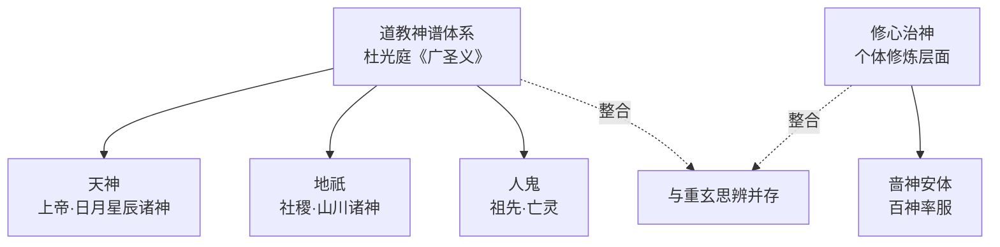

**这一神谱整合的诠释史意义在于：它把汉代《想尔注》以来的道教神格化路径与唐代重玄学的思辨化路径整合于同一诠释体系，使「神」概念在保持思辨深度的同时重新获得了宗教实在性**。这种整合既是对成玄英、李荣纯思辨化的部分修正，也是对汉代道教神学传统的系统继承。

### 5.5.3 三教合流取向与儒家思想的融入

杜光庭对儒家思想的融入，是其相对于成玄英、李荣的另一个重要特征。在前引第五十九章注中，杜光庭引用《易·系辞下》「何以聚人曰财」、《春秋》桓公六年记事[^77]——这些儒家经典的引用并非简单的旁征博引，而是其三教合流诠释立场的体现。**「天子郊祀上帝，宗祀明堂，言有尊也」「夫民，神之主也」「圣王先成民而后致力於神」**[^77]——这些表述把儒家政治神学（尤其是《左传》传统）整合进道教诠释体系，构成其神学整合的重要维度。

值得指出的是，杜光庭的这种三教合流取向，与重玄学派整体的开放性是一致的——重玄方法论作为「中国本土哲学中最具黑格尔色彩的流派之一」[^68]，其纯思辨性与无限否定的特质使其可被儒、道、释三教所融摄、所应用[^68]。杜光庭的特殊贡献在于把这种潜在的开放性具体落实为系统的三教整合实践。

### 5.5.4 对宋元内丹学的影响

杜光庭重玄学总结性贡献的另一个重要维度，是其对宋元内丹心性学与全真南宗的深远影响。李延仓在《全真南宗与重玄学》中明确指出：「虽然重玄学在唐代尤其是唐末五代道士杜光庭之后便淡出学术界，但『重玄』思潮的衰落并不意味着它的消失。相反，它的『双遣』思维和『破执』智慧汇入到了其后包括全真道在内的中国文化之中」[^71]。

具体而言，重玄学对内丹学的影响可在以下几个方面得到证实：第一，《太清金液神丹经》卷上「达观兼忘，同归于玄。既曰兼忘，又忘其所忘，心智泯于有无，神精凝于重玄」一段，直接体现了重玄方法论与外丹学的融合[^71]；第二，《养生咏玄集》在歌咏形神炼养和心性超越时多次出现「道入重玄」「契重玄之理」「晓重玄之旨」等表述[^71]；第三，《真气还元铭》「灵芝在身，不在名山。反一守和，理合重玄」一句，把重玄之理与吐纳、服气等养生术整合[^71]；第四，南宋末道士周无所住《金丹直指》中「始扫至于无扫」「初修至于无修」的炼养原则，与重玄学「玄之又玄」「遣之又遣」乃至「无遣」的无限否定宗风具有结构性的延续性[^71]。

**这一影响链条表明，杜光庭对重玄学的总结性贡献并非终结性的——其方法论智慧通过多个中介性文本（《太清金液神丹经》《养生咏玄集》《真气还元铭》《金丹直指》）汇入宋元内丹学的传统，构成内丹「破执」工夫的方法论根据**。这一影响将在第六章对宋元内丹学的考察中得到进一步展开。

## 5.6 唐玄宗御注御疏：官方诠释中「神禀冲气而灵」的折衷立场

唐玄宗李隆基《御注道德真经》与《御制道德真经疏》是中国老学诠释史上最重要的官方御注之一，其现存版本源自《正统道藏》洞神部玉诀类[^78]。作为帝王御注，它在重玄思辨与政治神学之间采取了独特的折衷立场——**既吸纳重玄学的方法论资源，又服务于「侯王守雌用道」的政治训诫**——为后世帝王御注（朱元璋、顺治）确立了基本范式。

### 5.6.1 「冲气」释「一」与气化框架的引入

唐玄宗御注对第三十九章「昔之得一者」的处理，最直接体现了其折衷立场的具体运作。其核心注文为：

> **昔之得一者，一者，道之和，谓冲气也。以其妙用在物为一，故谓之一尔。**
> 
> **天得一以清，地得一以宁，神得一以灵，谷得一以盈，万物得一以生，侯王得一以为天下正，其致之。物得道用，因用立名，道在则名立，用失而实丧矣。故天清，地宁，神灵，谷盈，皆资妙用以致之，故云其致之。**[^79]

这段注疏的诠释机制具有几重关键特征。

**第一，以「冲气」释「一」的气化框架引入**。「一者，道之和，谓冲气也」一句直接以「冲气」释「一」——这是一个具有典型汉代气化论色彩的训释。**与王弼以「数之始而物之极」释「一」（强调本体论的逻辑根据）形成根本差异，唐玄宗御注把「一」具体化为「冲气」，使「神得一以灵」的诠释被纳入气化框架——「神」之灵性根据被定位于「冲气」这一具体化的形上中介**。这一处理既有汉代严遵以来「道—气—神」结构的延续性，又与王弼本体论的纯逻辑性诠释形成对照。

**第二，「妙用在物为一」的功能化定位**。「以其妙用在物为一，故谓之一尔」一句，把「一」的实质定位为「妙用在物」——这与王弼「神为无之妙用」的处理在结构上相通，但唐玄宗御注通过「在物为一」的表述更强调「一」作为道用之具体显现的层面。这种处理使「神」之灵性既保有形上根据（道之妙用），又落实为具体的存在层级（在物为一）。

**第三，「物得道用，因用立名」的整体义理**。「物得道用，因用立名，道在则名立，用失而实丧矣」一句把天、地、神、谷、万物、侯王统一处理为「得道用」的具体存在项——天清、地宁、神灵、谷盈皆是「资妙用以致之」的结果。**这一处理与王弼「居成则失其母」在义理结构上完全相通，但唐玄宗御注以「道用」「妙用」替换王弼的「无」「母」，使本体论收拢获得更为具体的气化形态**。

### 5.6.2 「得一者不可矜其用」的政治哲学指向

唐玄宗御注对第三十九章下文的处理，更进一步体现了其政治哲学指向。其注文为：

> **天无以清将恐裂，地无以宁将恐发，神无以灵将恐歇，谷无以盈将恐竭，万物无以生将恐灭，侯王无以贵高将恐蹶。得一者不可矜其用，故诫云：天无以其清而矜之，将恐分裂；地无以其宁而矜之，将恐发泄；神矜则灵歇，谷矜则盈竭，物矜则生灭，侯王矜其贵，则将颠蹶矣。**
> 
> **圣教垂代，本为生灵，雖远举天地之清宁，而会归只在于侯王守雌用道尔，故下文云。**[^79]

这段注疏的关键创新在于以「矜」字作为整章的核心义理枢纽——「不可矜其用」「天矜则裂、地矜则发、神矜则灵歇、谷矜则盈竭、物矜则生灭、侯王矜则蹶」。**「矜」字本义为自夸、自负，唐玄宗御注以此字统摄「得一」体系下天地神谷万物侯王的存在状态——失「一」即「矜」，「矜」即败亡**。这一处理把王弼「居成则失其母」式的本体论命题转化为一种具有政治伦理色彩的诫训——侯王不可自矜其贵，而应「守雌用道」。

更值得注意的是，「圣教垂代，本为生灵，虽远举天地之清宁，而会归只在于侯王守雌用道尔」一句，明确把整章的形上论述会归于「侯王守雌用道」的政治训诫。**这一会归方式具有典型的官方御注特征——形上深度服务于政治指南，本体论命题最终落实为对帝王行为的规范**。

### 5.6.3 「上德不德」与道德等级的政治诠释

唐玄宗御注对第三十八章「上德不德」的处理，进一步展示了其政治诠释立场。其相关注文为：

> **德者道之用也，庄子曰：物得以生谓之德，时有淳醨，故德有上下。上古淳朴，德用不彰，无德可称，故云不德，而淳德不散，无为化清，故云是以有德。建德下衰，功用稍著，心虽体道，迹涉有为，执德可称，故云不失。**
> 
> **失道者，失上德也，上德合道，故云失道。夫道德仁义者，时俗夷险之名也，故道衰而德见，德衰而仁存，仁亡而义立，义喪而礼救，斯皆适时之用尔。故论礼于淳朴之代，非狂则悖，忘礼于澆醨之日，非愚则经，若能解而更张者，当退礼而行义，退义而行仁，退仁而行德，忘德而合道，人反淳朴，则上德之无为也。**[^79]

这段注疏把道德仁义礼的等级化处理为「时俗夷险之名」「适时之用」——这是一种典型的政治哲学化处理。**「退礼而行义，退义而行仁，退仁而行德，忘德而合道」一句构建了一个倒序的历史哲学——从礼回退至义，再回退至仁、德、道，最终达至「上德之无为」**。这种倒序回退的方法在结构上与重玄学「遣之又遣」的方法论相通，但其具体运用方向是政治哲学层面的历史观，而非纯思辨层面的本体论。

### 5.6.4 第六十章「治大国」注：神而不显怪以伤民

唐玄宗御注对第六十章「治大国」的处理具有特殊意义。基于其整体诠释立场可知，唐玄宗御注延续王弼「不扰则全真」的政治哲学方向（详见第四章 4.5 节），但在「神」概念处理上加入了「有神而不见怪以伤民」的具体诠释——**这一处理既不像王弼那样把鬼神问题完全功能化（不扰则全真），也不像《想尔注》那样把鬼神纳入太上老君神谱（人格化），而是采取一种折衷立场：承认神之存在与功能，但限定其作用方式（不显怪以伤民）**。这一折衷立场是唐玄宗御注政治诠释的代表性方式。

### 5.6.5 唐玄宗御注的范式意义

将唐玄宗御注与成玄英、李荣纯思辨路径作系统对照，其官方诠释的折衷特征清晰可见：

| 维度 | 成玄英《义疏》 | 李荣《注》 | 唐玄宗御注 |
|------|--------------|----------|----------|
| 「一」之训 | （置于双遣框架） | （虚极之理） | 道之和，冲气也 |
| 方法论核心 | 双遣双非 | 以一中之玄遣二偏之执 | 不可矜其用 |
| 思想归宿 | 中道修养 | 玄路教门 | 侯王守雌用道 |
| 与道之关系 | 非有非无之悬置 | 虚极之理之显现 | 道用气化之妙显 |
| 文本风格 | 章句注疏 | 概念论说 | 诫训式诠释 |

**这一对照表明，唐玄宗御注作为官方诠释，在哲学深度与政治功用之间作出了刻意的平衡——既不像成玄英、李荣那样把诠释推向纯思辨的极致（这会与官方意识形态的实用需求相冲突），也不像汉代《想尔注》那样彻底神格化（这会与帝王对终极权威的独占性相冲突），而是以「冲气」「妙用」「守雌用道」等折衷概念建构一种具有实用性的官方诠释方案**。

**这一折衷范式的诠释史意义在于：它为后世帝王御注（朱元璋《老子御注》、顺治《御注道德经》）确立了基本范式——形上深度服务于政治训诫，本体论命题最终落实为对帝王行为的规范**。这一范式将在第七章对明清御注的考察中得到进一步展开。

## 5.7 唐代四家比较与重玄学「神」论的诠释史定位

在前述分章考察基础上，本节作成玄英、李荣、杜光庭、唐玄宗四家「神」论的横向比较，揭示唐代「神」诠释的整体格局，并定位重玄学在中国老学诠释史上的承上启下地位。

### 5.7.1 唐代四家诠释的对照框架

下表从方法论、文本侧重、与道之关系、思想归宿四个维度对唐代四家「神」论作系统比对：

| 比较维度 | 成玄英《义疏》 | 李荣《注》 | 杜光庭《广圣义》 | 唐玄宗御注 |
|---------|--------------|----------|----------------|-----------|
| **方法论核心** | 双遣双非（四句三翻） | 以一中之玄遣二偏之执 | 重玄思辨+神谱整合 | 冲气折衷+不可矜其用 |
| **「神」之处理** | 非空非有之中道悬置 | 虚极之理之功能显现 | 天神/地祇/人鬼三分+心性 | 道用气化之妙显 |
| **文本侧重** | 全章注疏（六、廿九等详） | 第一章为方法论入口 | 第五十九、六十章详 | 第三十八、三十九、六十章详 |
| **与道之关系** | 非但不滞于滞，亦不滞于不滞 | 虚极之理 | 道用入神谱具体化 | 道之和谓冲气 |
| **佛道融合** | 三业六根、缘起虚假 | 圆通、虚通 | 三教合流（融儒） | 政治哲学化 |
| **思想归宿** | 中道修养 | 玄路教门 | 道教神学整合 | 帝王政教 |
| **现存材料** | 较完整（蒙文通辑佚） | 相对零散 | 完整 | 完整 |

**这一对照表揭示了唐代「神」诠释的多向并起格局**：成玄英以双遣双非把「神」推向最彻底的存在论悬置；李荣以「虚极之理」把「神」定位为虚极理论的功能显现；杜光庭以神谱整合把「神」重新落实为道教神学的具体内涵；唐玄宗以冲气折衷把「神」纳入气化—政治双重框架。**四家诠释虽方法各异，但共同构成唐代「神」诠释「思辨—神学—政治」三向并起的完整生态**。

### 5.7.2 唐代相对于王弼范式的延展与超越

唐代「神」诠释相对于第四章所考察的王弼范式具有双重关系——既有延展也有超越。

**第一，延展关系：本体论收拢的彻底化**。重玄学对王弼范式的最重要延展，是把「以无为本」推向更彻底的存在论悬置。王弼确立「无」之最高地位，但「无」本身仍是稳定的本体根据；重玄学则通过「双遣双非」进一步遣「无」之执，使「神」概念失去任何可以稳定附着的存在层级。**这一彻底化既是对王弼方法论的延展（继续推进哲学化方向），也是对其内在张力的解决——王弼以「贵无」破「贵有」，但「贵无」本身可能成为新的执滞；重玄学以「遣无」破「贵无」，使方法论达至自我消解的彻底境地**。

**第二，超越关系：重新激活宗教与政治维度**。第四章 4.8 节曾指出，王弼诠释的方法论局限在于其本体论收拢虽完成了概念哲学化，却也在一定程度上抽空了「神」概念的宗教维度与具身维度。**唐代「神」诠释的另一重要特征，正是通过道教神谱（杜光庭）与官方御注（唐玄宗）重新激活了王弼范式所悬置的宗教维度与政治维度**：

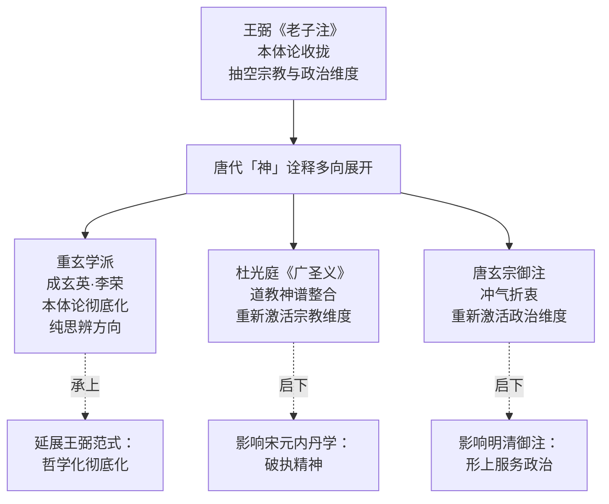

**这一多向展开格局表明，唐代「神」诠释并非对王弼范式的简单继承或简单否定，而是通过分化展开的方式同时回应了王弼范式的延展可能（重玄学）与未完成的工作（杜光庭、唐玄宗）**。这种分化展开使唐代成为汉代之后中国老学诠释史第二个多向展开的高峰阶段——汉代是「政治—气化—养生—宗教」四向辐射，唐代则是「思辨—神学—政治」三向并起，二者在结构上具有相通性，皆体现「神」概念作为边界概念在不同维度间的开放性。

### 5.7.3 重玄学的承上启下地位与对宋元思想的奠基

重玄学在中国老学诠释史上的承上启下地位，可从两个方向得到定位。

**一是上承王弼本体论收拢**。如 5.1.3 节所论，重玄方法论的可能性正是建立在王弼已确立「无」作为最高范畴的本体论基础上——若无王弼对「无」的本体地位的明确确立，则重玄学的「遣无」操作便失去对象。**这一逻辑承继关系使重玄学成为王弼本体论的内在彻底化——它不是从外部对王弼范式作出取代，而是从内部对其作出深化**。

**二是下启宋元内丹心性学的破执精神**。5.5.4 节已述及重玄学方法论通过《太清金液神丹经》《养生咏玄集》《真气还元铭》《金丹直指》等中介性文本汇入宋元内丹学的传统[^71]。**特别是南宋末道士周无所住《金丹直指》中「始扫至于无扫」「初修至于无修」的炼养原则，与重玄学「玄之又玄」「遣之又遣」乃至「无遣」的无限否定宗风具有结构性的延续性**[^71]。这一延续性的具体表现包括：

第一，**破执精神的延续**：内丹学要求修炼者破除对具体方法、具体境界、具体成果的执滞，这与重玄学破除对有无、是非、滞与不滞的执滞，在思维模式上完全一致。

第二，**性命双修的方法论根据**：内丹学性命双修的方法论根据，部分来自重玄学方法论与道教修养实践的统一传统——成玄英「拘魂制魄、守三一之神」与「三业清净、六根解脱」的并置（详见 5.3.3 节），正是这一统一传统的早期形态。

第三，**心性论的逻辑前提**：宋元内丹学的心性论之所以可能，部分依赖于重玄学对「心」「性」「神」等概念作出的非实体化处理——只有在心性概念被去除实体性附着的前提下，内丹学才能把「神」重新激活为可被涵养却不被执滞的修炼对象。

**此外，重玄学方法论也为宋明理学的产生提供了可资借鉴的思想资源**[^68]——金代赵秉文在《道德真经集解》中运用重玄双遣，提出「有无皆不足以尽道」，将这一方法论与儒家名教相结合，体现了三教合流的趋势[^68]。这一影响表明，重玄学的思辨方法论不仅滋养了道教内部的内丹学传统，也通过三教合流的渠道渗透到宋明理学的思想资源库中。

### 5.7.4 重玄学方法论的内在张力与诠释史动力

在肯定重玄学方法论的承上启下地位的同时，本研究亦需审慎评估其内在张力——这一张力为后续宋元时期诠释格局的多元展开预设了内在动力。

**重玄学方法论的核心张力，是纯思辨化与具体修养实践之间的紧张**。一方面，重玄学的思辨追求要求把「神」概念推向「非有非无、非非有非非无」的纯思辨场域，使「神」失去任何可以稳定附着的存在层级；另一方面，道教修养实践（包括内观、存思、行气、外丹、内丹等）又要求「神」作为可被涵养、可被守持、可被炼养的具体对象——这两个方向的内在紧张，在成玄英诠释中表现为「双遣双非」与「拘魂制魄、守三一之神」的并置（详见 5.3.3 节），在杜光庭诠释中表现为重玄思辨与神谱整合的双向运动（详见 5.5 节）。

**这一张力的存在，恰恰是重玄学内在生命力的来源**——它使重玄学既不沦为纯逻辑游戏（保有道教修养的实践指向），也不沦为纯宗教教条（保有思辨破执的批判精神）。但这一张力也是重玄学最终在唐末五代之后逐渐淡出主流学术视野的根本原因——纯思辨化的彻底性使其难以继续深化，而具体实践化的需求则更适合以内丹学等更为系统的修炼体系来承担。

**唐末五代之后，重玄学作为独立学派虽淡出，但其方法论智慧通过两条路径汇入中国思想史的后续发展**：第一条是宋元内丹学的破执精神（如周无所住《金丹直指》），第二条是宋明理学的思辨方法论资源（如赵秉文《道德真经集解》对重玄双遣的运用）。**这两条路径的展开，构成第六章对宋元至清诠释史考察的内在动力——一方面内丹学需要把重玄学的破执精神具体化为可操作的修炼工夫，另一方面理学义理化诠释需要把重玄学的思辨方法转化为伦理—政治哲学的具体应用**。

至此，本章对隋唐重玄学阶段「神」概念的双遣式思辨已作完整考察。从 5.1 节方法论的范式跃迁，到 5.2—5.3 节成玄英对核心章句的具体诠释，到 5.4 节李荣道论体系中「神」的位置，到 5.5—5.6 节杜光庭与唐玄宗对重玄学的整合与折衷，再到 5.7 节横向比较与诠释史定位，本研究试图揭示：**唐代「神」诠释作为中国老学诠释史第三阶段的核心动力，既不是对王弼本体论收拢的简单继承（成玄英、李荣对其作了更彻底的存在论悬置），也不是对汉代多元下沉格局的简单重复（杜光庭、唐玄宗对汉代神化与政治化诠释作了思辨化整合），而是通过「思辨—神学—政治」三向并起的多元展开，使「神」概念在思辨深度与实践广度的双重维度上达到中国老学诠释史的高峰**。在此基础上，第六章将进入宋元至清的义理化、心性化与内丹化诠释阶段——考察宋元注家如何在重玄学留下的方法论资源基础上，把「神」概念进一步重构为内丹元神/识神、心性本体与气化之灵，完成「神」从外在神祇到内在主体性精神的彻底转化。

# 6 宋元至清：义理化、心性化与内丹化诠释的交织演进

第五章已揭示唐代「神」诠释通过重玄学的双遣双非、杜光庭的神谱整合与唐玄宗御注的冲气折衷，完成了「思辨—神学—政治」三向并起的多元展开，并指出重玄学方法论在唐末五代之后通过两条路径汇入后续思想史的展开——其一是宋元内丹学的破执精神，其二是宋明理学的思辨方法论资源。进入宋元至清近八百年间，《老子》「神」诠释正是在这两条路径的交织延展中完成最为深刻的内在转化。**这一时期的核心特征可概括为：以理学兴起为背景的义理化诠释、以三教合流为底色的心性化诠释、以南北宗丹法为载体的内丹化诠释三股力量并行交织，最终在清代黄元吉处汇聚为内丹心性论的成熟形态**。在这一漫长的演进中，「神」概念完成了从外在神祇到内在主体性精神的彻底转化——这一转化既是第一章 1.6 节所提「双重内化」假设的最关键阶段，也是后续近现代去神秘化诠释得以可能的概念史前提。本章将依次考察王安石、苏辙、陈景元、吕惠卿、林希逸的宋代义理化—心性化诠释，白玉蟾、李道纯、邓锜的宋元内丹化诠释，以及清代黄元吉对两条路径的最终整合，揭示这一交织演进的整体轨迹与思想史意义。

## 6.1 宋代义理化诠释的兴起：理学语境下「神」的重构

宋代是中国思想史上的「第二个轴心时代」——「该时期的思想文化领域再度呈现出学派林立、思想多元、自由议论、经世致用、怀疑传统等特点，与春秋战国时期的情况有相似之处」[^80]。在这一思想格局中，老学不仅未因理学兴起而式微，反而呈现出与理学并行互动、深度参与思想建构的活跃姿态。陈鼓应主编的《道家文化研究》第26辑「道家思想与北宋哲学」专号曾系统揭示，「北宋乃继春秋战国之后思想创造集中迸发时期，在北宋产生的荆公新学、邵雍易学先天之学、周敦颐濂学、司马光朔学、张载关学、二程洛学、三苏蜀学七大学派，虽然宗旨各异，但他们统合释道、出入百家都是相同的，其中受道家道教哲学的影响尤为突出」[^80]。

宋代帝王层面对黄老思想的崇尚，为老学诠释场域提供了特殊的政治语境。「宋代尤其是北宋是继西汉以后黄老思想流行的另一个高峰，不仅宋太祖、太宗、真宗、仁宗、神宗、徽宗、高宗等帝王都有崇尚黄老的举措，赵普、吕端、吕蒙正、欧阳修、王曾、张知白、苏轼、司马光、秦观、张耒、陈瓘、程大昌等大臣亦尚黄老，君臣上下共同推行，思想界互相呼应，使得黄老思想影响很大」[^80]。北宋名臣陈瓘曾说：「臣尝谓自三代以降，善治天下者无如孝文，然其术出于老子，故仁祖于老氏也，取其简约，而神考之于汉文也，谓无间然」[^80]——这一表述清晰呈现了宋代士大夫将黄老治术与儒家政治理想相统合的整体取向。

在这一背景下，宋代老学相对于唐代重玄学呈现出**承接与转向并存的双重特征**。承接层面，宋代注家普遍延续了重玄学的破执精神——但这种破执精神不再以纯思辨的双遣双非形态出现，而是被内化为义理诠释中对各种实体化、神格化倾向的批判性消解。转向层面，宋代注家整体呈现出从唐代纯思辨化向义理化、心性化的范式转换——其方法论核心不再是「四句三翻」式的层层否定，而是以「理—气—心—性」结构对原典义理作系统性重构。

尹志华在《北宋〈老子〉注研究》中曾系统揭示北宋老学的整体特征，其研究指出北宋老学呈现出「儒道融通、有无并重、突出心性、重视『理』等理论特征」，并指出「这些特征是北宋朝代思潮在经典诠释中的体现」[^81][^82]。这一概括精确把握了宋代义理化诠释的方法论实质——以「理」作为统摄道、气、心、性的核心范畴，使原典中的形上概念被纳入义理结构的整体框架。

**就「神」概念而言，宋代义理化诠释的核心后果是其内在化转向**：原典中作为道之妙用、得一之灵、神器之神的「神」，在宋代注家手中被重新理解为人心之神明、性命之灵动、气化之妙运。这一内在化转向并非一蹴而就，而是经由王安石以气化释「神」、苏辙以性释「道」、陈景元以「重玄为宗」融贯气化与心性、吕惠卿以「守中」融通儒道、林希逸以「以心明道」彻底心性化的层层推进而最终完成。下文 6.2 至 6.5 节将分别考察这五家代表性诠释。

## 6.2 王安石《老子注》：「元气之不动」与「神」的气化—政治义理

王安石（1021—1086）作为北宋荆公新学的奠基者，其《老子注》在中国老学诠释史上具有特殊地位。司马光《与王介甫书》记其「于诸书无不观，而特好孟子与老子之言」；晁公武《郡斋读书志》卷十一更称「介甫平生最喜《老子》，故解释最所致意」[^83]。然而王安石《老子注》原书已佚，部分内容散见于金代李霖《道德真经取善集》、南宋彭耜《道德真经集注》、元代刘惟永《道德真经集义》等书中，今人蒙文通、严灵峰、容肇祖均有辑本——其中蒙文通《王介甫〈老子注〉佚文》最为完备准确，是研究王安石老学思想的基础文献[^83]。

### 6.2.1 「道有体有用」与气化本体论的建构

王安石《老子注》最具理论深度的贡献，是其对老子宇宙论作出的气化本体论重构。其核心命题见于第四章注：**「道有体有用。体者，元气之不动。用者，冲气运行于天地之间。其冲气至虚而一，在天则为天五，在地则为地六。盖冲气为元气之所生，既至虚而一，则或如不盈」**[^83]。这段注文确立了王安石本体论的基本框架——「道」由「体」与「用」两个层面构成：体为「元气之不动」，用为「冲气运行于天地之间」。

这一框架在第五十二章注中得到进一步阐发：**「一阴之阳之谓道，而阴阳之中有冲气，冲气生于道」**[^83]。整合两处注文，可见王安石本体论的完整结构：道之本体是元气，元气含阴阳，从阴阳的运动变化中产生冲气，冲气为道之用——「冲气至虚而一，但它在不同的事物中表」现出不同的功能[^83]。

将这一气化本体论与第四章 4.2 节所考察的王弼「以无为本」本体论作对照，王安石与王弼的根本差异即清晰可见：

| 注家 | 道之本体 | 道之用 | 「一」之实质 |
|------|---------|--------|------------|
| 王弼 | 无（无形无名） | 万物层面的功能性显现 | 数之始而物之极 |
| 王安石 | 元气之不动 | 冲气运行于天地之间 | 冲气至虚而一 |

**这一对照表明，王安石以「元气」替换王弼的「无」作为本体最高范畴，使整个本体论框架从纯逻辑性的贵无论转向气化论的实在化建构**。这一替换并非偶然，而是深植于宋代义理化诠释的整体气质——理学家们普遍以「气」作为统摄形上形下的中介范畴，张载关学的「太虚即气」、二程洛学的「理气论」皆可视为这一气论传统的不同形态。王安石以「元气之不动」释道之体的处理，与张载、二程在思想方向上具有内在一致性。

### 6.2.2 五运说的简化与宇宙生成阶段论

王安石宇宙论的另一关键特征，是其对汉代《易纬·乾凿度》「五运说」的简化。其在第一章注中明确提出：**「无者，形之上者也。自太初至于太始，自太始至于太极，太始生天地，此名天地之始。有，形之下者也。有天地然后生万物，此名万物母。母者生之谓也」**[^83]。这一表述把天地形成以前的宇宙变化过程分为太初、太始、太极三个阶段，「显然是对汉代的《易纬·乾凿度》『五运说』的简化」[^83]，至于「有天地然后生万物」的说法，则本之于《周易·序卦传》[^83]。

将王安石的「太初—太始—太极—天地—万物」五阶段宇宙生成论与汉代严遵《指归》的「道—德—神明—太和—天地」五阶层级（详见第三章 3.2 节）作对照，可见两个体系在结构上的相似性与思想方向上的差异：

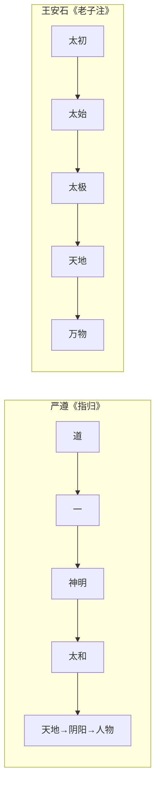

**这一对照揭示出王安石宇宙论的关键转向：在严遵体系中「神明」占据形上层级独立构成项的位置，而在王安石体系中这一位置被「太极」（即元气未分阶段）所占据——「神明」一类具有灵性义的概念被去除，整个生成序列纯化为气化展开的逻辑过程**。这一处理使王安石的宇宙论相比严遵更接近纯粹的气化论形态——「神」作为独立形上层级的地位被进一步消解，其内涵被纳入气化结构内部。

### 6.2.3 「视而使之明，听而使之聪，思而使之正」：「神」的心性化与穷理尽性

王安石对「神」概念处理的另一关键维度，是其以「穷理尽性」方法处理人之心性—认知功能的取向。其对第五十九章「治人事天，莫若啬」的注文，是这一处理的代表性表述：**「夫人莫不有视、听、思。目之能视，耳之能听，心之能思，皆天也。然视而使之明，听而使之聪，思而使之正，皆人也」**[^84]。

这段注文的诠释机制可作如下分疏：第一层，目能视、耳能听、心能思，是「天」所赋予的天性禀赋；第二层，使之明、使之聪、使之正，是「人」通过主观能动性发挥的功夫。**这一「天人之分」的处理，把原典中作为治国治身根本的「啬」具体化为人对自身心性—认知功能的主动涵养**。

王安石此注对「神」概念的诠释史意义在于：**它把汉代河上公以「神，谓五脏之神也」将「神」具身化为身体内主的处理（详见第三章 3.3 节），转化为以「视明听聪思正」为核心的心性—认知功能论**。在王安石这里，「神」不再是寄居于五脏的具体身体内主，而是与「明、聪、正」相联系的心性能动性——这种能动性既根植于「天」（天性禀赋），又依赖于「人」（主观涵养）。**这一处理使「神」概念从身体生理层面提升至心性—认知层面，构成宋代心性化诠释的早期典范**。

需要补充的是，王安石此注还包含一个重要的工夫论限定：「形不可太劳，精不可太用，人的主观能动性的发挥，必须以不伤害自身的『天性』为前提」[^84]。这一限定既保留了道家「啬」「养生」的核心精神，又通过「天人之分」的义理框架使「神」的涵养避免堕入纯粹的身体技术化方向。

### 6.2.4 王安石老学的整体定位

王安石《老子注》在中国老学诠释史上的整体定位，可从两个层面把握。

**第一层面：作为荆公新学解老的代表性方案**。王安石虽喜好《老子》，「却并非全盘接受《老子》中的思想，而是对《老子》既有所肯定，又有所批评。从总体上来说，王安石认为《老子》明于形而上之体，而昧于形而下之用」[^83]。这一评价表明，王安石的老学诠释具有鲜明的儒家本位立场——他以儒家「形而下之用」批评老子之偏，同时吸纳老子「形而上之体」补充儒家形上深度的不足。这种「立足于儒家而公开汲取道、佛诸家学说之长」的兼收并蓄取向[^83]，正是宋代儒道融通诠释的早期典范。

**第二层面：作为「神」诠释从汉唐到宋元的过渡环节**。王安石《老子注》在「神」诠释史上的位置具有过渡性——它一方面承接了唐玄宗御注以「冲气」释「一」的气化框架（详见第五章 5.6.1 节），把「神得一以灵」的诠释纳入气化本体论；另一方面又开启了苏辙、陈景元以「性」「理」释「神」的心性化方向，使「神」从汉唐外在神祇向宋元内在主体性精神的过渡得以实现。**正因这种过渡性，王安石《老子注》虽不像苏辙《老子解》那样在「神」概念上作出系统性的心性化重构，但其作为这一重构得以可能的方法论奠基者，在宋代义理化诠释的展开中具有不可替代的地位**。

## 6.3 苏辙《老子解》：援佛儒入道与「神」的心性化转向

苏辙（1039—1112）的《老子解》是宋代老学诠释中的特殊存在——它既非纯粹的道家立场注解，也非简单的儒家立场批判，而是「以儒、佛、道三家学说阐释《老子》，为后世注解《老子》提供了一种新的思路」[^85]。其兄苏轼曾在《跋子由老子解后》中以极尽夸张之笔为这部著作摇旗呐喊：「使战国时有此书，则无商鞅、韩非；使汉初有此书，则孔老为一；晋宋间有此书，则佛老不为二。不意老年见此奇特」[^85]。这一评价虽有溢美之嫌，却也精确点出苏辙《老子解》的核心诠释意图——使儒佛道三教在老子诠释中达成深层会通。

### 6.3.1 以「性」释「道」：心性化诠释的方法论起点

苏辙《老子解》最具理论原创性的贡献，是其以「性」这一儒家心性论核心范畴释「道」的诠释路径。如学者所论，「苏辙提出『性』这一观点来阐释老子的『道』」，并明确表述：「老、佛之道，非一家之私说也，自有天地，而有是道矣……诚以形器治天下，导之以礼乐，齐之以政刑。道并行而不悖，泯然不见其际而天下化，不亦周孔之遗意」[^85]。这一表述把老子之道与周孔之遗意相统一，把佛老之道与儒家政治伦理相统一，构成典型的三教合流命题。

**以「性」释「道」的诠释机制，使苏辙《老子解》在「神」概念处理上具有根本性的方法论意义**。在原典层面，「神」与「道」之关系本是中国老学诠释的核心枢纽（详见第二章 2.5 节四重张力之第一重），汉唐注家以气化层级（严遵）、本体妙用（王弼）、双遣双非（成玄英）等不同方式处理之；而苏辙以「性」释「道」，则把这一关系转化为「性」与「神」之关系——「神」不再是道之妙用或派生层级，而是性之灵动或心性主体的能动性表现。**这种从形上层面到心性层面的方法论转换，是宋代心性化诠释的真正起点**。

### 6.3.2 「谷神」「玄牝」的德性—功用辨析

苏辙对原典第六章「谷神不死，是谓玄牝」的诠释，最直接体现了其心性化诠释的具体运作。其核心表述为：**「谓之谷神，言其德也；谓之玄牝，言其功也。牝生万物，而谓之玄焉，言见其生而不见其所以生也」**（本研究第二章 2.2.1 节已引述其要旨）。这一表述把「谷神」与「玄牝」分别作德性与功用的精微区分——「谷神」是道之品格（虚而能容、妙而不测的德性），「玄牝」是道之功能（生万物而不见其所以生的功用）。

将这一处理与王弼「谷神，谷中央无者也」（详见第四章 4.3 节）、河上公「谷，养也，神，谓五藏之神也」（详见第三章 3.3.1 节）作对照，苏辙诠释的特殊性即清晰可见：

| 注家 | 「谷神」之训 | 「玄牝」之训 | 整章定位 |
|------|------------|-----------|---------|
| 河上公 | 五藏之神（具身化） | 鼻口（具身化） | 身体修炼指南 |
| 王弼 | 中央无者（本体化） | 处卑不可得而名（本体化） | 本体之无的玄理摹写 |
| 成玄英 | 神，灵智（双遣式） | 不滞之名，雌柔为义 | 中道修养 |
| 苏辙 | 言其德也（德性义） | 言其功也（功用义） | 道之德性与功用之统一 |

**这一对照表明，苏辙的处理既不完全归于王弼的本体化方向（王弼以否定性表述消解一切积极内涵），也不归于河上公的具身化方向，而是开辟了一条德性论的新路径——「谷神」作为道之德性，是道在主体层面的自我品格；「玄牝」作为道之功用，是道在客体层面的生化功能**。这一德性—功用的二分结构，与儒家心性论中「性」与「情」、「体」与「用」的传统结构具有深层呼应，体现出苏辙援儒入道的具体方式。

苏辙对「绵绵若存」的注释「绵绵，微微而不绝」[^86]，则保持了原典层面对道之恒久存在的形上描摹，避免了过度的具体化或思辨化处理。这一克制的诠释立场使其德性—功用辨析获得了与原典语义相对契合的稳定性。

### 6.3.3 第六十章注：「神不伤人」的政治哲学化

苏辙对第六十章「治大国若烹小鲜」的注文，进一步展示了其将「神」概念政治哲学化的处理方向。其完整注文为：**「烹小鲜者，不可挠；治大国者，不可烦。烦则人劳，挠则鱼烂。以道莅天下，其鬼不神。圣人无为，使人各安其自然。外无所求，内无所畏，则物莫能侵，虽鬼无所用神矣。非其鬼不神，其神不伤人。非其神不伤人，圣人亦不伤人。非其鬼之不神，亦有神而不伤人耳。非神之不伤人，圣人未尝伤人，故鬼无能为耳。夫两不相伤，故德交归焉。人鬼之所以不相伤者，由上有圣人耳，故德交归之」**[^87]。

这段注疏的诠释机制具有几重特征。

**第一，对鬼神存在的部分承认与功能性悬置**。苏辙的处理既不像王弼那样把鬼神问题完全功能化（详见第四章 4.5 节），也不像《想尔注》那样把鬼神纳入太上老君神谱（详见第三章 3.4 节），而是采取一种折衷立场——「亦有神而不伤人耳」明确承认神之存在与功能，但通过「圣人无为，使人各安其自然」的工夫论使其作用无从发挥。**这一折衷立场与唐玄宗御注的处理方式（详见第五章 5.6.4 节）有内在共通性，但在心性化深度上又有所超越**——苏辙以「外无所求，内无所畏」深化了「圣人无为」的内在工夫含义，使「鬼神不伤人」的根据进一步落实于主体的心性状态。

**第二，「德交归之」的伦理化处理**。苏辙在注末以「人鬼之所以不相伤者，由上有圣人耳，故德交归之」收束全章，把原典中「两不相伤，故德交归焉」的政教关系命题转化为以圣人为中心的伦理化构图——人鬼之间的不相伤，根据完全在于圣人的存在；而「德交归之」则成为这一伦理化构图的最终归宿。**这种以圣人为枢纽、以德为归宿的处理方式，体现出苏辙援儒入道的政治哲学取向**——它把老子的政治哲学命题与儒家「德治」理想相整合，使第六十章成为儒道融通的具体实践。

### 6.3.4 苏辙诠释的诠释史意义

苏辙《老子解》在中国老学诠释史上的诠释史意义，可从两个层面把握。

**第一层面：开宋代心性化解老之先河**。苏辙以「性」释「道」、以德性—功用辨析「谷神—玄牝」的诠释路径，构成宋代心性化解老的方法论起点。**与王安石以气化论处理本体、以穷理尽性处理心性的双重路径不同，苏辙则将本体论与心性论统一于「性」这一核心范畴——「性」既是道之内在本质（本体论维度），又是心之核心内涵（心性论维度），二者在「性」概念中达成统一**。这一统一性使苏辙诠释相对于王安石诠释更具方法论的整合性，也为后续陈景元的「复性」论、林希逸的「以心明道」、白玉蟾的「心即道」等心性化诠释提供了概念资源。

**第二层面：作为三教合流诠释的典范**。苏辙《老子解》「表现了儒释道三教思想合为一体的特征」[^85]，其后世评价「见解独到，很受宋明以来学者的重视，在当时及对后世都产生了一定影响」[^85]。**这种三教合流取向的核心方法论价值，是为「神」概念的内在化转向提供了跨学派的方法论根据——既可以儒家心性论解之，也可以佛家心性论解之，更可以道家本然之性解之，三家诠释在心性化方向上形成相互印证的格局**。这一格局是宋元至清「神」诠释整体内在化的方法论基础。

需要审慎指出的是，苏辙《老子解》对涉「神」具体章句（除第六、第六十章外）的注疏材料在本研究所及范围内相对有限，本节论断主要基于第六、第六十章的具体注文与其整体诠释立场的推断。但基于其在宋代心性化诠释中的方法论奠基地位，这一论断应具有可靠的诠释史依据。

## 6.4 陈景元《道德真经藏室纂微篇》：「重玄为宗」框架下「神」的气化与复性诠释

陈景元（1024/1025—1094）是北宋著名道士，其《道德真经藏室纂微篇》成于熙宁五年（1072），「同年因神宗赏识，诏令『宣附《道藏》』，即附入当时的《天宫宝藏》。至南宋宝佑六年（1258），灵应观住持杨仲庚因世无善本，遂详加校正并募资刊行，使该书得以广泛流传」[^88]。陈景元师承韩知止、张无梦，「得老庄心印」，「以老、庄哲理为本，认为虚静悟道，与万物合一，就是『神合常道』，而清净无为，修身治国，即是『能用常道者也』」[^89]。这一思想背景使《纂微篇》在宋代老学中具有承上启下的枢纽地位——上承陈抟、张无梦一脉的丹道传统，下启宋元义理化与内丹化诠释的多向展开。

### 6.4.1 「重玄为宗，自然为体，道德为用」的整体诠释架构

陈景元《纂微篇·开题》明确提出其注《老》之宗旨：**「此经以重玄为宗，自然为体，道德为用，其要在乎治身治国」**[^88]。这一宗旨表述把唐代重玄学的方法论精神（重玄为宗）、道家自然哲学的本体立场（自然为体）、道德实践的现实指向（道德为用）整合为统一的诠释架构，并以「治身治国」作为最终归宿。

**「重玄为宗」的提法表明，陈景元的诠释有意识地承接了唐代重玄学的方法论传统**（详见第五章 5.1—5.3 节）。但与成玄英、李荣纯思辨化的双遣双非不同，陈景元的「重玄」已被融入气化论与复性论的具体框架——重玄方法论不再是纯粹的破执技术，而是成为统摄气化生成与心性涵养的整体性原则。这一融合方式恰好印证了第五章 5.7.4 节所揭示的重玄学诠释史动力——「唐末五代之后，重玄学作为独立学派虽淡出，但其方法论智慧通过两条路径汇入中国思想史的后续发展」，陈景元即是这一汇入过程的代表性枢纽。

### 6.4.2 气化生成论：「道生一—一生二—二生三」中「神明」的位置

陈景元宇宙生成论的具体形态，是其对老子「道生一，一生二，二生三，三生万物」的系统诠释。其生成模式可表述为：**「道生一（太极、元气），一生二（神明），二生三（清、浊、和三气），三生万物」，具体表现为「清气成天，浊气成地，和气生人」**[^88]。

将这一生成模式与第三章 3.2.2 节所考察的严遵《指归》生成模式作对照，二者的相似性与差异性即清晰可见：

| 阶段 | 严遵《指归》 | 陈景元《纂微篇》 |
|------|------------|---------------|
| 道生一 | 道生一（虚实之间的微妙阶段） | 道生一（太极、元气） |
| 一生二 | 一生神明 | 一生二（神明） |
| 二生三 | 神明生太和 | 二生三（清、浊、和三气） |
| 三生万物 | 太和生天地 | 三生万物（清成天、浊成地、和生人） |

**这一对照揭示出陈景元对严遵体系的承继与改造的双重关系**：承继层面，陈景元保留了「神明」作为生成序列中独立形上构成项的位置——「神明」既是「一」所生的第一阶段，也是「太和」（清浊和三气）的形上根据；改造层面，陈景元把严遵的「太和」具体化为「清浊和三气」，并把「天地—阴阳—人物」的展开整合为「清成天、浊成地、和生人」的简化结构。这一处理既保留了严遵形上层级化的方法论精神，又通过气化论的具体化使其更贴近宋代理学的气论传统。

### 6.4.3 「以理释道」与天理概念的引入

陈景元诠释最具理论创新性的特征之一，是其在注文中常以「理」释「道」，并引入「天理」概念——「认为仁义礼智属可道范畴」[^88]。这一处理把唐代之前以「道」「无」「玄」为最高范畴的传统，转化为以「理」为核心范畴的新框架。

陈景元对第一章「道，可道，非常道」的注文，集中体现了「以理释道」的诠释机制：**「夫道者，杳然难言，非心口所能辩。故心困焉，不能知。口辟焉，不能议。在人灵府自悟尔，谓之无为自然」**[^90]。这段注文虽未直接出现「理」字，但其「在人灵府自悟」的处理已隐含将道之把握落实于个体心性层面的方向。其在「常道」与「可道」的区分中，进一步明确把仁义礼智等具有内涵规定性的概念归入「可道」范畴，把「自然而然，随感应变核物不穷」的常道归入「常道」范畴——**这一区分实质上构成「理—事」二分的早期形态**。

**就「神」概念而言，「以理释道」的方法论后果是「神」之灵性根据被进一步内在化为「理」之展开**。在严遵体系中，「神明」是独立形上层级；在王弼体系中，「神」是「无」之妙用；在陈景元体系中，「神明」既是气化生成中的独立阶段，又是「理」之展开在生命层面的具体显现。这一双重定位使陈景元的「神」论既保有汉代气化论的厚重，又获得宋代理学义理化的深度。

### 6.4.4 「复性」论：「神」的内在化与体道路径

陈景元诠释另一关键创新，是其「复性」理论的提出。「认为人通过『体道渊静』、『守清静之要』可以恢复本性。在注解《老子》第41章『上士闻道』时，区分了上士、中士、下士不同根器之人的悟道方式」[^88]。**「复性」论的实质，是把道家「归根复命」的工夫论与儒家「尽性」的心性论相整合，使「体道」转化为「复性」的具体实践**。

「复性」论对「神」概念处理具有决定性意义。在这一框架下，「神」不再是外在的神祇或独立的形上层级，而是「性」之灵动表现——「神」之灵性根据在于「性」之本然状态，而「性」之本然状态又根据于「道」（即「理」）之普遍性。**这一三层递进结构（神—性—道/理），把汉唐外在神祇向宋元内在主体性精神的转化推进到具有理论纵深的新阶段**。

陈景元的「复性」论对宋元之后的影响深远——「彭耜《道德真经集注》、李庭等人注老皆推崇此书，薛致玄称其引发学风转变。蒙文通认为陈景元之学承陈抟，与二程理学存在渊源」[^88]。这一影响表明，陈景元《纂微篇》不仅是宋代老学的重要文本，也是连接道家心性论与理学心性论的关键中介。

### 6.4.5 陈景元诠释的整体定位

将陈景元《纂微篇》置于宋代义理化诠释的整体格局中考察，其承上启下的枢纽地位可作如下定位：

**就「上承」而言**，陈景元承继了三条传统——汉代严遵的形上层级化气化论（保留「神明」作为独立构成项）、唐代重玄学的破执方法论（以「重玄为宗」统摄诠释）、陈抟—张无梦的丹道修养传统（强调「虚静悟道」「神合常道」）。这三条传统的整合使陈景元诠释具有比单纯义理化注本更为厚重的思想资源。

**就「下启」而言**，陈景元开启了三个方向——「以理释道」启发了林希逸、宋徽宗等以理学语境注老的传统；「复性」论奠定了苏辙以「性」释「道」、白玉蟾以「心即道」、李道纯以「赤子之心」等心性化诠释的形上基础；气化生成论中「神明」的位置安置则为内丹学「精—气—神」三炼体系提供了概念资源。**正因这种承上启下的多向辐射性，陈景元《纂微篇》在宋元至清「神」诠释演进中扮演着不可替代的枢纽角色**——它既是汉唐传统在宋代的总结性吸纳，也是宋元义理化、心性化、内丹化诠释的共同起点。

## 6.5 吕惠卿《道德真经传》与林希逸《老子鬳斋口义》：「守中」「以心明道」中的「神」

宋代义理化诠释的进一步推进，体现在吕惠卿与林希逸两家以儒家心性概念深度融通老学的代表性方案。两家分别以「守中」与「以心明道」为方法论核心，把「神」概念彻底纳入心性主体的层面，构成宋代心性化诠释的成熟形态。

### 6.5.1 吕惠卿《道德真经传》：「十六字心传」与守中之学

吕惠卿（1031—1111）作为王安石变法的重要参与者，其《道德真经传》于元丰元年（1078）向宋神宗上表进呈，希冀作为治国之道的理论依据[^91]。该书「分为四卷，是对《老子》的注释，先列《老子》原文，再以『传曰』的形式发挥己说」，「其思想以气形质浑沦未离为道，称道为真君，受道教影响，并糅合儒家学说解释『守中』」[^91]。

吕惠卿诠释的最具代表性特征，是其以宋儒所谓的「十六字心传」释「守中」。所谓「十六字心传」，即《尚书·大禹谟》所谓「人心惟危，道心惟微，惟精惟一，允执厥中」十六字——这一表述被宋儒视为儒家心性论的最高纲领，从二程到朱熹皆有反复阐发。**吕惠卿以这十六字释《老子》「守中」，把道家工夫论与儒家心性论作了直接整合**[^92][^91]。

吕惠卿《表》中的一段表述，集中体现了其诠释立场：「臣窃以大制散于智慧之伪，含生失其性情之初，爰有真人，起明至教，独推原于道德，盖祖述于典坟。是以鸡犬相闻，庄周指谓神农而上；谷神不死，列子称为黄帝之书。究其微言，中有妙物。唯恍唯惚，视听莫得以见闻；不古不今，迎随孰知其首尾」[^92]。这段表述对原典第六章「谷神不死」作了一个重要的版本史定位——「谷神不死，列子称为黄帝之书」，把「谷神不死」追溯至列子所引黄帝之书的传统，使「谷神」概念获得了源远流长的形上传统。

**就「神」概念而言，吕惠卿诠释的关键贡献是其「真君论」**。如学术转述所揭示，吕惠卿「称道为真君，受道教影响」[^91]——这一「真君」概念既保留了道教传统中神格化的某些维度，又通过儒家「允执厥中」的心性论加以约束，使「真君」不再是外在的人格神，而是内在的心性主宰。这一处理使「神」概念在吕惠卿诠释中呈现出独特的折衷形态——既不完全归于纯粹的心性化（保留「真君」的某种实在性），也不归于汉代神格化（被儒家心性论所约束），而是构成一种「以心性约束神格、以神格充实心性」的双向整合。

### 6.5.2 林希逸《老子鬳斋口义》：「以心明道」与文学—义理双重诠释

林希逸（1193—1271）是南宋艾轩学派的传人，其《老子鬳斋口义》「具有三教融合的思想特色，旨在调和儒道关系」[^93]。林希逸提出《老子》思想「皆不畔于吾书」，认为老子学说与孔孟之道在大本大源上相同。同时，林希逸亦能杂糅佛学思想，**以心解老，体现出开放的三教融合思想**[^93]。

**「以心明道」的诠释方法论**。林希逸《老子鬳斋口义》的方法论核心，是「以心明道」的体悟方式。如学者所揭示，该书「注疏突破传统训诂框架，融合儒佛思想，主张以『心明道』的体悟方式解读文本，指出老子学说与孔孟之道在大本大源上同于儒家，但亦承认其差异」[^93]。这一「以心明道」方法论的关键特征，是把对老子文本的理解归本于心性体悟而非文字训诂——「不为艰深之语，杂俚俗之言而直述之」「独具一格……循文解意，务取明晓」[^94]。

**这一方法论的实质，是把宋代心性化诠释推向最彻底的形态——「神」「道」「玄」「妙」等一切原典核心概念，都被归本于心性体悟的具体过程**。在这一处理下，「神」不再是任何意义上的外在对象（无论是神祇、形上层级还是本体妙用），而是心性体悟过程中的灵动状态——「神」即「心之神明」，即心性主体在体道过程中的能动性表现。

林希逸所作《老子口义成》一诗，集中体现了其诠释立场：**「见彻深微字字精，五千言在与谁明。事因借喻多成谤，经不分章况立名。数十有三元是一，道虚无实始为盈。苏云近佛非知老，老说长生佛不生」**[^95]。这首诗的关键命题是「数十有三元是一」——把《老子》看似纷繁的章句归本于「一」之本体；「道虚无实始为盈」——把道之实相定位于虚而能容、无而能有的辩证状态；「苏云近佛非知老」——批评苏辙以佛释老的取向不能真正把握老子原义。这一立场表明，林希逸虽吸纳佛学概念，但其根本立场仍以儒道融通为主，对纯佛学化诠释保持批评距离。

**文学—义理双重诠释的方法论创新**。林希逸诠释的另一重要创新，是其「首次从文学角度对《老子》的文学特点与文章技法进行评点」[^93]。如学者所指出，林希逸「指出《老子》采用了『借物明道』的表现手法，结语精妙。并对《老子》行文特点进行了直接点评」[^93]。这一文学化诠释取向，在中国老学诠释史上具有方法论的开创性——它把对《老子》的理解从纯义理层面扩展到文学层面，使「借物明道」「结语精妙」等修辞特征成为理解原典义理的重要中介。

**就「神」概念而言，文学化诠释的方法论后果是其去神秘化倾向**。在文学化视角下，「谷神」不再是某种神秘的形上实体，而是「借物明道」的具体修辞——「谷」是借物，「神」是借物所明之道之品格。这一处理与第二章 2.2.1 节所揭示的连读读法（「中虚故曰谷，不测故曰神」）在方向上一致，但通过文学化的方法论根据使其获得更明确的诠释合法性。

**林希逸注本东传日本与诠释史影响**。林希逸《老子鬳斋口义》的诠释史影响，最具特殊意义的方面是其东传日本并取代河上公注的地位。如学者所记载：**「在日本，随着五山禅林对宋学的接受，林希逸《老子鬳斋口义》在近世时期传入，并因其主张儒释道融合的立场，取代了禅林曾主要使用的河上公注，成为解读《老子》的新注并广泛普及」**[^93]。

这一替代关系具有深刻的诠释史意义。**河上公注代表汉代具身化—养生化诠释（详见第三章 3.3 节），其在日本五山禅林的早期主导地位反映了中世日本对道教身体技术的接受倾向；而林希逸注则代表宋代义理化—心性化诠释，其取代河上公注则反映了日本近世（江户时期）从中世禅宗—修验道传统向宋学义理化传统的范式转换**[^93][^94]。这一替代过程在「神」概念诠释上的具体后果，是「神」从五藏神等具身化对象转化为心性主体的灵动表现——这一转化使日本近世老学的整体气质发生了根本性的变化。

### 6.5.3 吕惠卿与林希逸的方法论比较

将吕惠卿与林希逸两家诠释作横向比较，可见宋代心性化诠释在方法论上的不同侧重：

| 维度 | 吕惠卿《道德真经传》 | 林希逸《老子鬳斋口义》 |
|------|--------------------|---------------------|
| 方法论核心 | 守中（融儒入道） | 以心明道（体悟式诠释） |
| 心性论根据 | 十六字心传（儒家纲领） | 心明道（个体体悟） |
| 「神」之定位 | 真君（心性主宰） | 心之神明（体悟过程的灵动） |
| 诠释方法特征 | 政教论结构、上表治国 | 章句解读、文学评点 |
| 三教融合方向 | 儒道整合为主 | 儒道为本、佛学为辅 |
| 整体气质 | 政治哲学化 | 文学—义理化 |

**这一比较表明，宋代心性化诠释的成熟形态并非单一路径，而是包含吕惠卿「政治化心性论」与林希逸「文学化心性论」两种典型方案**。两家虽方法论侧重不同，但都把「神」概念彻底内在化为心性主体的某种形态——前者以「真君」概念保留某种实在性，后者以「心明道」彻底心性化。这两种方案共同构成宋代「神」诠释从外在神祇向内在主体性精神转化的完整谱系。

## 6.6 宋元内丹学的兴起：从重玄破执到性命双修的方法论转化

宋代义理化诠释的展开，与同时期内丹学的兴起构成相互呼应的双重运动。如果说义理化诠释（王安石、苏辙、陈景元、吕惠卿、林希逸）以「理—气—心—性」结构重构「神」之义理内涵，那么内丹学则以「精—气—神」三炼体系重构「神」之实践工夫——两者在方向上虽各异，但都共同推进了「神」概念的内在化与主体化。

### 6.6.1 内丹学对汉唐传统的双重承继

宋元内丹学的方法论资源具有双重承继关系。**第一重承继：汉代河上公的具身化路径**。如第三章 3.3.5 节所论，河上公《章句》「五性六情」说所确立的「精、神」并列结构，与后世内丹学「炼精化气、炼气化神、炼神还虚」三阶段炼养体系之间存在直接的概念渊源。**虽然河上公本身尚未发展出系统的内丹炼养工夫，但其将「神」具身化为五藏神并与「精」「气」并列处理的做法，为宋元内丹学的兴起预设了关键的概念资源**。

**第二重承继：唐代重玄学的破执精神**。如第五章 5.5.4 节所论，重玄学方法论通过《太清金液神丹经》《养生咏玄集》《真气还元铭》《金丹直指》等中介性文本汇入宋元内丹学的传统。这一影响表明，**重玄学的破执精神并未在唐末五代之后简单消失，而是通过内丹学的具体实践传统得到了创造性转化**——「玄之又玄」的纯思辨双遣，被转化为「炼神还虚」的具体修炼工夫。

### 6.6.2 「精—气—神」三炼体系的概念结构

宋元内丹学最具系统性的方法论建构，是其「炼精化气、炼气化神、炼神还虚」三阶段炼养体系。《老子内丹经》载：「夫炼大丹者，固守炉灶，返老还童。功成行满。气化为血。血化为精。精化为体」[^96]，其基本逻辑即建立在精、气、神三者的转化之上。这一体系的概念结构可作如下展开：

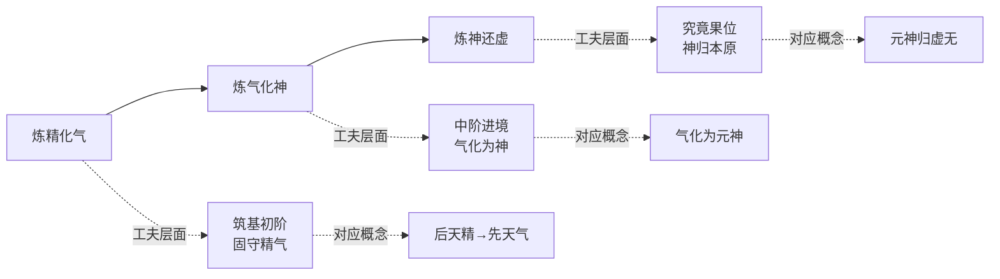

在这一三阶段体系中，**「神」作为「气化」之究竟阶段与「还虚」之起点，承担着连接形下与形上的关键中介功能**。「炼气化神」意味着具体之气在涵养至极致后转化为更具灵动性的「神」，「炼神还虚」则意味着此「神」进一步消解其灵动性而归于形上之虚无。**这一过程在结构上完成了一个完整的循环——从具体的精气出发，经由神之灵动，最终回归形上之虚无；而这一回归正是「逆则成仙」的内丹学核心命题**。

戈国龙在《道教内丹学论"生命的演化"》中曾对内丹学顺逆演化作系统阐释：「顺向演化是从虚无之道演化出精气神兼备的人的生命，是『成人』的演化；逆向演化是修炼精气神重返先天虚无境界，是『成仙』的演化」[^97]。刘一明则明确指出：「何为顺？顺其造化也；何为逆？逆其造化也。顺造化则生人生物，生老病死，轮回不息；逆造化则成仙成佛，不生不灭，寿同天地」[^97]。**这一顺逆双向运动，构成了内丹学方法论的核心动力机制**——「神」作为这一机制的关键中介，其概念地位远超出单纯养生论的范畴，成为整个修炼工夫论的形上根据。

### 6.6.3 元神/识神二元结构的概念基础

内丹学对「神」概念处理的另一关键创新，是其「元神/识神」的二元区分。这一区分把「神」概念分裂为先天与后天的两个层面——元神属于先天虚无之神，识神属于后天有作有为之神，二者的对待与转化构成内丹工夫论的核心主题。

李涵虚《道窍谈》对先天后天的区分作了精细辨析：「先天者无形无质，在原子以下，属非常态物质……后天者有形有质，在原子以上，属常态物质，有固液气三态变化，先天又即出胞前在胞之际，与上相反者，则属于后天」[^98]。这一区分把「先天/后天」从纯哲学概念发展为具有具身化指向的修炼概念——先天指向受胎之前、后天指向出胞之后，二者在生命发生层面具有明确的边界。

**就「神」概念而言，元神/识神二元结构的方法论后果是「神」之复杂化**。在汉代河上公的具身化诠释中，「神」是单一的五藏神；在魏晋王弼的本体化诠释中，「神」是单一的本体妙用；在唐代成玄英的双遣诠释中，「神」是单一的非空非有之中道悬置——而在宋元内丹学这里，「神」第一次被分裂为元神与识神两个层面，每一层面都具有自身的独立内涵与修炼指向。**这一分裂使「神」概念在内丹学语境下获得了前所未有的概念深度——它不再是单一的对象，而是一个内在分化的复合结构**。

这一分裂的概念基础，与第二章 2.5 节所揭示的原典「神」概念第四重张力（独立实体与功能性描述）形成深层呼应。**内丹学元神/识神的二元结构，实质上把这一原典张力转化为修炼工夫论的内在结构——元神是更接近独立实体义的先天之神，识神是更接近功能性描述义的后天之神，二者的转化即是从功能性描述向独立实体的逆向回归**。

### 6.6.4 方法论转化的整体定位

宋元内丹学相对于汉唐传统的方法论转化，可作如下整体定位：

| 维度 | 河上公具身化 | 重玄学双遣 | 内丹学性命双修 |
|------|------------|-----------|--------------|
| 「神」之实质 | 五藏之神（具身实体） | 非空非有（中道悬置） | 元神/识神（先天/后天分化） |
| 工夫论形态 | 养神（精气涵养） | 双遣双非（破执解滞） | 性命双修（炼养与心性并重） |
| 形上根据 | 黄老气化论 | 重玄本体论 | 顺逆演化论 |
| 实践指向 | 长生养生 | 中道修养 | 成仙成佛（返本还原） |
| 核心机制 | 守五性、去六情 | 遣有遣无 | 炼精化气、炼气化神、炼神还虚 |

**这一对照清晰显示，宋元内丹学的方法论转化是一次"实践化的综合"——它把河上公具身化路径中"神"作为具体修炼对象的实在性、与重玄学双遣方法中"神"作为破执对象的非实体性，统一于"性命双修"的修炼工夫论框架之下**。这一综合既保留了「神」作为可被涵养修炼的具体性（避免完全悬置化），又保留了「神」作为可被超越破执的非实体性（避免完全实体化），从而在两个极端之间开辟了一条具有持续生命力的中道路径。

## 6.7 白玉蟾《道德宝章》：「心即道」与内丹心性论中的「神性双修」

白玉蟾（1134—1229，一说1194—1229）原名葛长庚，字如晦，号海琼子，南宋著名道士，被全真派尊为南五祖之一[^99]。其师承道教内丹派陈楠，「融摄儒、释、道三教思想，其注本以心性学说阐释道家哲学，将《道德经》经文转化为道教内丹修炼的实践指南」[^99]。其代表作《道德宝章》又称《蟾仙解老》《道德经注》，是中国老学诠释史上把「神」概念彻底内丹化的代表性方案。

### 6.7.1 「心即道」与三教合流的诠释立场

白玉蟾《道德宝章》的核心命题，是「心即道」的整体诠释立场。如学者所揭示，「白玉蟾认为『心即道』，心是宇宙万物的根源，修道关键在于『忘』。白玉蟾着道德宝章以内丹术解老子。其注释采用随文简注形式，不训诂字句，行文近于禅宗偈颂」[^99]。**「心即道」的实质，是把宋代心性化诠释推向最彻底的形态——心不仅是体道的主体，更是道之本身；道之本质即是心之本然状态**。

这一命题与同时期宋代理学家的心学命题在方向上具有内在共通性，体现出宋代三教合流的整体气质。**就「神」概念而言，「心即道」命题的方法论后果是「神」之彻底心性化——「神」既是道之灵动表现，又是心之本然功能；「神」之修炼工夫即是心之涵养工夫**。

白玉蟾诠释另一关键特征是其「神性双修」「身心一如」的工夫论命题。「书中运用道教术语与禅宗譬喻，如援引佛家『须弥纳芥子』阐释『大道泛兮』，形成三教合流的诠释特色」[^99]。这种"以禅解老"的取向，使白玉蟾诠释相对于林希逸"以心明道"更具佛学色彩，相对于李道纯"以儒解老"更具禅学深度，构成宋代三教合流诠释的典型形态之一。

### 6.7.2 第十章注：「安心抱一」与内丹工夫论的具体展开

白玉蟾对原典第十章「载营魄抱一」的注疏，是其内丹化诠释最具代表性的具体实例。其完整注疏采用随文简注形式，原文与注文交错呈现：

> **载营魄（安心）抱一○能无离乎（甚处去来）专炁致柔（纯清绝点）能如婴儿乎（混然一片）涤除玄览（无事于心，无心于事）能无疵乎（身心一如）爱民治国（怡神养炁）能无为乎（无念无为无思无虑）天门开阖（心地开明）能无雌乎（一而不二）明白四达（一理烛物冰融月皎），能无知乎（日如愚）生之畜之（一心所存，包含万象）生而不有（心同太虚）为而不恃（智周万物）长而不宰（泰然无我）是谓玄德** [^100]

这段注文的诠释机制可作多层分析。

**第一层，「营魄抱一」的心性化重构**。白玉蟾以「安心」释「载营魄」、以「甚处去来」释「能无离乎」——把原典中具有具身化指向的「营魄」（魂魄）转化为「心」之安定状态。**这一处理与河上公「魂雄出鼻，魄雌出口」式的具身化诠释形成根本对照**——在白玉蟾这里，「营魄」不再是具体的身体内主，而是心之灵动表现的整体性描述。「安心抱一」即是把心之灵动收敛于一的工夫指向。

**第二层，「专炁致柔」的内丹化转译**。「专炁致柔」被注为「纯清绝点」——把具体的气化工夫转化为心性纯净的境界描述。「能如婴儿乎」被注为「混然一片」——把婴儿状态作为心性回归本源的象征。**这种处理把河上公具身化的「炼气」工夫与白玉蟾心性化的「明心」工夫整合为统一的内丹修炼路径**。

**第三层，「涤除玄览」的心性涵养**。「涤除玄览」被注为「无事于心，无心于事」、「能无疵乎」被注为「身心一如」——前者是心性涵养的方法（无心于事即不执着），后者是心性涵养的境界（身心一如即心物不二）。**这一处理把原典中具有形上指向的「玄览」转化为心性涵养的具体工夫**——「玄览」即是心之明照，而非外在的形上观照。

**第四层，「爱民治国」的内丹化**。「爱民治国」被注为「怡神养炁」、「能无为乎」被注为「无念无为无思无虑」——把原典中的政治哲学命题彻底转化为内丹修炼工夫。**这一处理体现出白玉蟾内丹化诠释的彻底性——即使是表面上属于政治哲学领域的章句，也被纳入内丹修炼的框架重新解读**。所谓「爱民治国」即是「怡神养炁」，所谓「无为」即是「无念无为无思无虑」——一切政治哲学命题都被还原为心性—身体修炼的具体工夫。

### 6.7.3 第十四章注：「身—心—性—神」四元结构的展开

白玉蟾对第十四章「视之不见名曰夷，听之不闻名曰希，抟之不得名曰微」的注疏，体现出其对「神」概念处理的另一关键创新：

> **视之不见名曰夷（身中之心）听之不闻名曰希（心中之性）抟之不得名曰微（性中之神）此三者不可致诘（不可以说说惟当以会会）故混而为一○其上不皦（性无体）其下不昧（神无方）绳绳兮不可名（绵古亘今昭然独存）复归于无物（见物便见心）** [^100]

这段注疏构建了一个**「身—心—性—神」四元结构**：身中之心（夷）、心中之性（希）、性中之神（微）。这一四元结构的创新性在于：

**第一，把原典「夷、希、微」三者具体化为「身—心—性—神」的层层递进**。原典中「夷、希、微」是对道之同一品格的三重否定性描摹（不见、不闻、不得），在白玉蟾这里被转化为修炼境界的递进结构——从「身」到「心」、从「心」到「性」、从「性」到「神」。**这一递进结构与「炼精化气、炼气化神、炼神还虚」的三阶段体系在结构上具有深层呼应**——身—心对应炼精化气、心—性对应炼气化神、性—神对应炼神还虚。

**第二，「神」之位置安置**。在四元结构中，「神」处于最深层的位置——「性中之神」表明「神」是性的内在本质、最究竟的灵动状态。这一处理使「神」既不是外在的神祇，也不是中间层级的形上构成，而是性之最深处的灵动核心。**这一定位与陈景元「复性」论中「神」作为性之灵动表现的处理在结构上一致**，但通过四元结构的展开使其更具修炼工夫论的可操作性。

**第三，「性无体」「神无方」的双重否定性描摹**。「其上不皦」被注为「性无体」、「其下不昧」被注为「神无方」——以双重否定方式描摹性与神的非实体性。**这一处理保留了重玄学双遣方法论的精神**，但通过具体落实于性、神两个修炼对象，使其工夫论指向更为明确。

### 6.7.4 第十五章注：「明心见性」与修炼境界的描摹

白玉蟾对第十五章「古之善为士者」的注疏，进一步展示了其修炼境界论的细致描摹：「古之善为士者（明心见性）微妙玄通（允执厥中）深不可识（吾道一以贯之不可得而闻也）……涣兮若冰之将释（心开神悟）……浑兮其若浊（心与道冥）」[^100]。

这段注疏的关键创新在于其多重三教融合：**佛禅化方向**——「明心见性」是禅宗核心命题，被用于注「古之善为士者」；「心开神悟」「心与道冥」「如如」等表述具有典型的禅宗气质。**儒家化方向**——「允执厥中」是儒家「十六字心传」的核心内容（与吕惠卿诠释相通）；「吾道一以贯之」「君子慎其独」「毋不敬」皆是儒家经典的直接引用。**道家化方向**——「惟精惟一」「潜龙勿用」等表述保留了道家与易学的传统语汇。

**这种多重融合的实质，是把「神」概念置于儒佛道三教共同关注的心性主体的核心位置——「神」之灵动既是禅宗「明心见性」之"心明"、又是儒家「允执厥中」之"中正"、更是道家「澄之徐清」之"清明"，三教在「神」之心性化的方向上达成深度共识**。

### 6.7.5 白玉蟾诠释的诠释史意义

白玉蟾《道德宝章》在中国老学诠释史上的诠释史意义，可从两个层面把握。

**第一层面：作为南宗内丹心性论的代表性方案**。白玉蟾作为南宗五祖，其《道德宝章》「将道教的内修转化成一种以修心为主的性命双修理论，在道教理论史上具有重要意义」[^99]。**这一意义的核心，是把南宗丹法从早期偏重命功（精气炼养）的传统，转化为性命双修中性功（心性涵养）占据主导的成熟形态**。这一转化在「神」概念处理上的具体后果，是「神」从内丹修炼的中间产物提升为修炼工夫的核心对象——「神」不仅是被炼的对象，更是修炼工夫的灵动主体。

**第二层面：作为宋代心性化诠释的内丹化典范**。如果说苏辙、林希逸代表了宋代心性化诠释的纯义理形态，那么白玉蟾则代表了宋代心性化诠释的内丹形态。**两种形态在「神」概念处理上的共通方向是内在化——「神」均被处理为心性主体的某种表现；两种形态的差异是其方法论指向——纯义理形态把「神」处理为体悟与解释的对象，内丹形态则把「神」处理为修炼与转化的对象**。这两种形态的并存，使宋代心性化诠释呈现出多向展开的丰富格局。

需要审慎指出的是，白玉蟾《道德宝章》采用「随文简注形式，不训诂字句，行文近于禅宗偈颂」[^99]的诠释风格——其注文通常仅以两字或四字的偈颂式表达对原典作直觉性提示，缺乏系统性的义理论证。这种诠释风格虽具有禅宗式的直观深度，但也使其论断难以通过传统训诂学的方式得到严格验证。本节论断主要基于其注文的整体取向与三教合流的方法论立场，对其具体注疏的逐字训诂分析则保持必要的审慎。

## 6.8 李道纯《道德会元》与邓锜《道德真经三解》：全真道老学中「神」的「中和」与「真常」诠释

宋元之际道教内部的另一重要发展，是全真道的兴起及其老学诠释的体系化。元代李道纯《道德会元》与邓锜《道德真经三解》作为全真道老学的代表性方案，分别以「中和」与「真常」为诠释核心，把宋代心性化诠释与内丹化诠释整合为全真道思想体系的有机组成部分。

### 6.8.1 李道纯《道德会元》：「中和」与「赤子之心」

李道纯（生卒年不详），字无素，号清庵，自号莹蟾子，宋末元初著名道士。**「他得白蟾子弟子王金蟾真传，为一代玄门宗匠和杰出的内丹大家。李道纯的学说以全真南宗为主，兼取北宗，师承南宗白玉蟾一脉，兼取全真道北宗心法。他通老、易，达禅机」**[^101]。

**「会至道以归元」的整体诠释宗旨**。李道纯《道德会元》成于至元二十七年（1290），「前附自序及序例，逐章注解《道德经》并附总论与颂诗，旨在破除诸家注疏之偏颇，以『会至道以归元』为宗旨」[^101]。其自序中明确批评诸家解义之偏：「诸家解义，所见不同，各执一端。得之于治道者执于治道，得之于丹道者执于丹道，得之于兵机者执于兵机，得之于禅机者执于禅机。或言理而不言事，或言事而不言理，堕于偏枯，皆失圣人的本意」[^101]。**这一批评表明，李道纯诠释立场的核心是反对各种执滞性诠释，主张以"会至道以归元"的整合视角统摄各家**。

**「中和」思想：致中和与玄之又玄的会通**。李道纯诠释最具理论原创性的贡献，是其以「中和」思想为核心的方法论。「全书以『中和』思想为核心，融合儒家理学与禅宗参究法，提出『赤子之心』为体道根基，主张『无心』『清静养性』的修行路径」[^101]。其方法论的关键创新是「将《中庸》『致中和』与老子『玄之又玄』相融通」[^101]——把儒家心性论的最高境界与道家本体论的最高范畴整合为统一的诠释框架。

李道纯对「中」的界定具有独特的形上深度：「『中』乃乾坤之交所生成，故先天地而存在，在人身即为心性」[^101]。**这一界定把「中」既理解为宇宙本体（乾坤之交、先天地而存）、又理解为心性本体（在人身即为心性），使形上本体与心性本体在「中」概念中达成统一**。这一统一性使李道纯的「中和」思想相对于单纯的儒家心性论或单纯的道家本体论都具有更深的整合性。

**「赤子之心」与「无心」工夫论**。李道纯心性论的核心命题是「赤子之心」与「无心」。其表述为：「至道不难知，人心自执迷」「欲识混元面，先在赤子心，此心常不昧，法体证黄金」[^101]。**「赤子之心」即是「无心」，能够「全其至精」**[^101]——这一处理与宋代理学家「复其初」「明明德」的工夫论在方向上具有内在共通性，但通过道家"全其至精"的指向使其更具内丹修炼的具体内涵。

「至于如何做到存心养性，他认为应『以无为正其心，以清静养其性』。『凡事从俭，妙在机先，含德之厚，无所不至，广大悉备』。这显然是以传统的道教思想结合宋儒的心性之学解老」[^101]。**这一处理的方法论实质，是把道家「无为」与儒家「正心」、道家「清静」与儒家「养性」作概念配对，使两套心性涵养工夫在具体实践层面达成统一**。

**性命双修与有无之辨**。李道纯诠释另一重要维度是其对性命关系的处理。「他主张三教合一，援儒入道，始终以『守中』为要诀」「同时主张性命双修，先性后命，即先持戒、定、慧而空其心，后炼精、气、神而保其身」[^101]。**「先性后命」的工夫论次第，是李道纯相对于其师白玉蟾「神性双修」的重要发展——它把性功（心性涵养）置于命功（精气炼养）之前，使内丹修炼具有更明确的次第结构**。

李道纯对有无关系的处理也颇具特色：「关于性命，他认为，无为则能见无名之妙，从而全其性；有为则能见有名之徼，从而全其命。有与无，性与命，同出而异名，同称为『玄』。玄之又玄，有无交入，性命可以双全」[^101]。**这一处理把老子「玄之又玄」从纯粹的本体论命题转化为性命双修的工夫论命题——「玄之又玄」即是性命双全的工夫境界**。这一转化使重玄学的纯思辨方法论被进一步内丹化、心性化。

戈国龙在《道教内丹学论"生命的演化"》中，对李道纯的顺逆观作了重要诠释。引用《中和集》卷一：「身心世事，谓之四缘……何谓委？委身寂然，委心洞然，委世混然，委事自然。何谓顺？顺天命，顺天道，顺天时，顺天理。身顺天命，故能应人；心顺天道，故能应物；世顺天时，故能应变；事顺天理，故能应机」[^97]。戈国龙指出：「李道纯这里强调的是『顺』：『顺天命、顺天道、顺天时、顺天理』，很显然，天命、天道、天时、天理都是『道』的不同层面的意义，实际上『顺』的就是『天道』。要顺天道，实际上就是逆反于人道而成仙道，这正是『逆则仙』的意义」[^97]。**这一诠释揭示出李道纯顺逆观的辩证结构——表面上是"顺"（顺天道天理），实质上是"逆"（逆人道而成仙道）**。

### 6.8.2 邓锜《道德真经三解》：「真常立宗」与「以丹解老」

邓锜（生卒年不详），道号玉宾子，元代全真教道士，「由宋入元，曾任道观同知宫事」[^102]。其《道德真经三解》成于大德二年（1298），「邓锜在序言中标明撰序时间为『大德二年戊戌秋日』。其创作动机在于『今以周易、论语之暇，幸有余力，谨依道德章句，别为三解』，体现了其在儒学修养基础上注解《道德经》。邓锜作为元代全真道士，其注解思想亦受到当时全真道『三教圆融』理论及李道纯等前辈的影响」[^103][^102]。

**「三解」体例的方法论创新**。邓锜《道德真经三解》最具结构创新性的特征，是其独特的「三解」体例。其自序明确界定：**「一解经曰：惟以正经句读，增损一二虚字，使人先见一章正义，混然天成，无有瑕谪。二解道曰：直述天地大道，始终原反，其数与理，若合符节。三解德曰：交索乾坤，颠倒水火，东金西木，结汞凝铅，一动一静，俱合大道」**[^103]。

这一三解体例的方法论结构具有几重意义：第一，「解经」对应于训诂层面——通过句读校正与虚字增损使原典义理「混然天成」；第二，「解道」对应于义理层面——直述天地大道的始终原反与数理结构；第三，「解德」对应于丹道层面——以「交索乾坤、颠倒水火、东金西木、结汞凝铅」等内丹修炼术语解释原典。**这一三层结构使原典《老子》同时获得训诂、义理、丹道三个层面的诠释——三个层面相互支撑，构成一个完整的诠释体系**。

**「真常立宗」的诠释主旨**。邓锜诠释的核心主旨是「以真常立宗」。「邓锜在《道德真经三解》中以道家北宗清静丹法的角度对《老子道德经》进行了阐释，其诠释以真常立宗，重点在心性之学，并以丹解老为特色，体现了全真道的教义与精神」[^103]。其《真常三百字》明确表述：「真常之常，常谓之常。常真之真，真谓之真。真常在道，无所不抱。真常在德，无所不则」[^103]。

**这一「真常立宗」的诠释主旨，把汉唐以来「常道—可道」的二分结构推向更为深刻的形态——「真常」既是「常」（恒久不变），又是「真」（本然真实），二者的统一构成道之最深本质**。在这一框架下，「神」之灵性根据被定位于「真常」——「神」之所以为神，根据在于其与真常之道的本然契合。

**「以丹解老」的具体诠释**。邓锜诠释最鲜明的方法论特色是「以丹解老」。「在诠释方法上，具有『以丹解老』的鲜明特色，其『三解德曰』部分运用『交索乾坤，颠倒水火，东金西木，结汞凝铅』等内丹修炼理论与《道德经》哲学思想相融合」[^103][^104]。**这一处理把原典中具有形上指向的章句直接转化为内丹修炼的具体工夫指南——「交索乾坤」即阴阳交媾、「颠倒水火」即取坎填离、「东金西木」即五行配位、「结汞凝铅」即金丹凝结**。

**就「神」概念而言，「以丹解老」的方法论后果是「神」之修炼化彻底化**。在邓锜诠释中，「神」不仅是修炼的对象（炼神还虚），更是修炼工夫的具体载体——每一项内丹工夫（交索、颠倒、配位、凝结）都涉及「神」的具体运作。这一处理使「神」概念在邓锜诠释中获得了前所未有的实践具体性。

**三教融合的具体方式**。邓锜诠释的另一重要特征是其三教融合方式。其入道前曾入仕为官，担任峄山州同知，「所以他在以道家思想注解《道德经》的同时，参证儒学理论，并旁证佛学，充分展现了金元时代全真教三教圆融的理论思想体系」[^103]。

### 6.8.3 全真道老学中「神」概念的整体定位

将李道纯与邓锜两家诠释作横向比较，可见全真道老学中「神」概念处理的整体特征：

| 维度 | 李道纯《道德会元》 | 邓锜《道德真经三解》 |
|------|-----------------|-------------------|
| 诠释主旨 | 会至道以归元 | 真常立宗 |
| 方法论核心 | 中和（致中和+玄之又玄） | 三解（解经+解道+解德） |
| 心性论根据 | 赤子之心、无心、清静养性 | 真常之常、真常在道 |
| 工夫论次第 | 先性后命（先空其心，后保其身） | 解道与解德并重 |
| 「神」之定位 | 性命双修中的灵动核心 | 真常之灵性显现 |
| 三教融合方向 | 儒家理学+禅宗参究 | 周易+论语+佛学 |

**这一比较表明，全真道老学中「神」概念处理虽各有侧重，但共同方向是把「神」纳入心性—修炼一体的整合性框架——「神」既是心性涵养的对象，又是内丹修炼的载体；既保有形上的真常根据，又落实为具体的工夫实践**。这一整合性框架代表了元代道教老学三教圆融的成熟形态，也为后续清代黄元吉的内丹心性论集成预设了直接的概念资源。值得补充的是，这一全真道老学传统在明代经由危大有《道德真经集义》（洪武丁卯年成书，集河上公及李道纯等十余家注解[^105][^106]）等汇辑性著作得到进一步整理和传播——《集义》明确将李道纯置于所选诸家之中[^106]，体现了元明之际全真道老学的传承延续。

## 6.9 黄元吉《道德经讲义》：清代乐育堂传统中「神」的内丹心性论集成

清代黄元吉延续乐育堂内丹传统对《老子》所作的诠释，构成宋元至清「神」诠释演进的最后一站。黄元吉在元神/识神之严格区分、先天/后天之精细辨析、内丹工夫与心性涵养的整合等方面达到了前所未有的理论深度，其《道德经讲义》（一作《道德经注释》）成为清代内丹心性论的代表性方案。

### 6.9.1 元神与识神的严格区分

黄元吉对「神」概念处理的核心创新，是其对元神/识神的严格区分。其代表性表述见于《道德经注释》：**「有生之后，元识两神交合一处，有时元神用事，识神退听；有时识神用事，元神隐没不见。要之，无思无虑而出者，元神也；有作见解、自色身而出者，识神也。元神无形，识神有迹；一自虚无中来，一从色身中出，二者大不相侔」**[^98]。

这段表述的诠释机制可作多层分析。

**第一层，元神/识神的本质区分**。元神与识神虽都是「神」，但二者在本质上具有根本差异——元神是「无思无虑而出」，识神是「有作见解、自色身而出」。**这一区分把「神」分裂为先天的纯粹灵动（元神）与后天的具身化能动（识神）两个层面**——前者超越具体的思维与作为，后者则与具体的色身与见解相关联。

**第二层，元神/识神的关系结构**。元神与识神并非彼此独立，而是「交合一处」——二者在生命主体中并存。但这种并存不是平等并立，而是动态轮替——「有时元神用事，识神退听；有时识神用事，元神隐没不见」。**这一动态轮替结构使「神」之实践指向具有了明确的方向——修炼工夫的核心在于让元神更多地「用事」，让识神更多地「退听」**。

**第三层，元神/识神的来源差异**。元神「自虚无中来」，识神「从色身中出」——二者在起源上具有形上层面的根本差异。**这一差异与第二章 2.5 节所揭示的原典「神」概念第一重张力（形上妙用与派生层级）形成深层呼应**——元神更接近形上妙用义（来自虚无），识神更接近派生层级义（来自色身）。**黄元吉的处理，实质上把这一原典张力转化为内丹修炼工夫的内在结构——元神与识神的对待，即是形上与形下、先天与后天、本然与派生的对待**。

李涵虚祖师《三件河车》对元神显现的描摹也作出生动表达：「学人收心调息，闭目存神，静之又静，清而又清，一切放下，全体皆忘，混混沌沌，杳杳冥冥……谁晓得无知无识之际，才有一阳来复……此初醒之心，名曰天地之心，又名妙心，又名元神，又名真意，又名玄关发现」[^98]。**这一描摹把元神的显现定位于"无知无识之际"的"一阳来复"——这一定位既具有内丹修炼的具体工夫指向，又呼应了道家"归根复命"的形上传统**。

### 6.9.2 元神识神与「天命之性—气质之性」的呼应

黄元吉元神/识神区分的一个重要特征，是其与宋明理学「天命之性—气质之性」二分结构的深层呼应。如学者所揭示：「内丹的元神就是人的『一灵真性』，而识神则熏染于后天之魄。『魄，阴也，沉浊之气也，附于有形之凡心。魂好生，魄望死。一切好色动气皆魄之所为，即识神也。』在内丹理论中，识神产生之后，元神依旧在先天的位置上对人的心理乃至生命进行调节，二者区别了心灵的内生与外发，并以回归先天真性为宗旨。**其亦与宋明理学对『天命之性』与『气质之性』的区分相呼应**」[^107]。

**这一呼应关系具有重要的诠释史意义——它表明清代内丹心性论与宋明理学心性论在心性二分结构上达成了深层共识**：

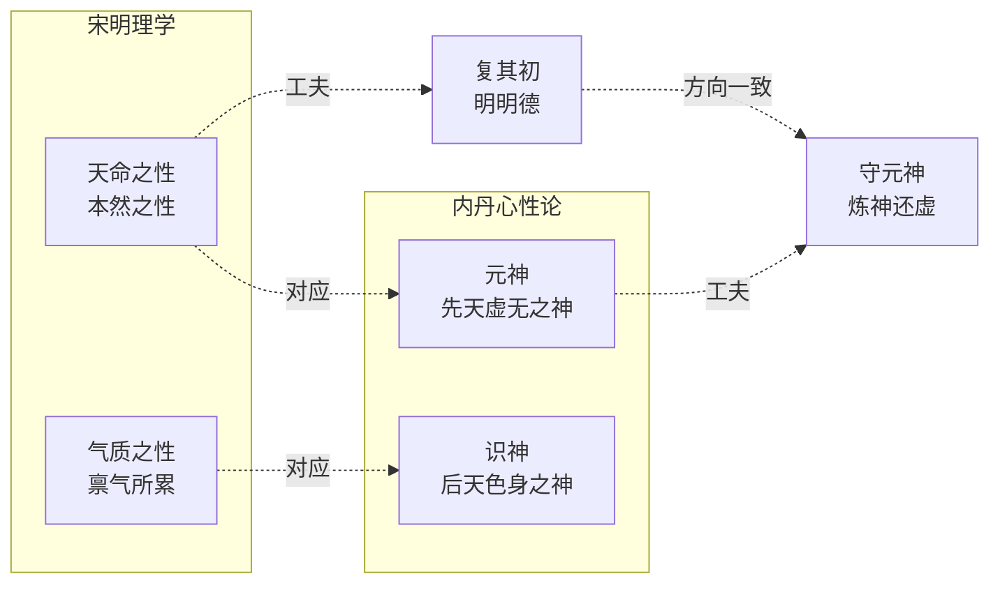

**这一双重对应关系表明，宋元至清「神」诠释的内在化转向并非孤立的道教思想发展，而是与宋明理学心性论的成熟形成深层互动——理学家以天命之性—气质之性的二分把握心性结构，内丹家以元神—识神的二分把握修炼对象，二者在结构上完全一致，差异仅在于工夫方式（理学注重伦理涵养，内丹注重修炼工夫）**。

### 6.9.3 性光识光：另一种「神」的描摹方式

黄元吉之外，吕洞宾祖师《金华宗旨》中关于「性光识光」的论述，提供了另一种描摹元神/识神的方式：「凡人视物，任眼一照去，不及分别，此为性光。如镜之无心而照也，如水之无心而鉴也。少倾，即为识光，以其有分别也。镜有影，已无镜矣；水有象，已非水矣；光有识，尚何光哉？由此，元、识之分别可显然而见了」[^98]。

**这段表述以「性光」与「识光」的瞬时性差异，揭示了元神与识神在认识层面的具体区分——性光是不及分别的本然观照（如镜之无心而照），识光是有分别的具体认知（光有识则非光）**。这一描摹既具有禅宗「明心见性」的直观深度，又具有内丹学「先天后天」的具体指向，是清代内丹心性论对「神」概念作出最精微辨析的代表性方案之一。

### 6.9.4 「修真之法」与心性涵养的统一

清代内丹学对「神」概念处理的整体取向，把心性涵养与精气修炼统一为一个完整的实践体系。这一体系的核心特征可从《老子内丹经》的相关论述中得到呈现：

> **大凡修道，必先修心。修心者，令心不动。心不动者，内景不出，外景不入，内外安静，神定气和。元气自降：此乃真仙之道也** [^96]

> **圣人以身为国，以心为君，心正则万法皆从。心乱则万法皆废；复以精气为民。民安则国霸。民散则国废** [^96]

> **心有所爱，不用深爱，心有所憎，不用深憎。如觉偏颇。即随改正……抱一守中，自然之道也** [^96]

这些表述的关键命题是「修道必先修心」「修心者令心不动」「心不动者……神定气和」——**把整个内丹修炼的根本前提归结于心之涵养**。这一处理把汉代以来内丹学传统中可能偏重身体技术的方向，彻底转向以心性涵养为主导的成熟形态。

### 6.9.5 黄元吉诠释作为宋元至清「神」演进终点的诠释史定位

将黄元吉诠释置于宋元至清「神」诠释演进的整体格局中考察，其作为这一演进终点的诠释史意义可作如下定位。

**第一，对前贤诠释的综合集成**。黄元吉的元神/识神区分综合了：白玉蟾「心即道」的心性化原则、李道纯「赤子之心—无心」的心性论、邓锜「真常立宗」的形上根据、宋明理学「天命之性—气质之性」的二分结构。这一综合集成使黄元吉诠释具有中国老学诠释史上前所未有的概念深度。

**第二，义理化与内丹化两条路径的最终整合**。从苏辙、林希逸代表的义理化—心性化诠释，到白玉蟾、李道纯、邓锜代表的内丹化诠释，到黄元吉处达到最终的整合形态——内丹工夫与心性涵养完全统一，元神识神既是修炼对象（内丹化维度），又是心性结构（义理化维度）。这一整合使「神」概念在黄元吉诠释中获得了实践具体性与义理深度的双重保障。

**第三，「神」从外在神祇到内在主体性精神的彻底转化**。回顾汉代《想尔注》将道神格化为太上老君（详见第三章 3.4 节），到唐代杜光庭以神谱体系整合「神」（详见第五章 5.5 节），到宋代以「理—气—心—性」结构内在化「神」，到宋元内丹学以「精—气—神」三炼体系修炼化「神」，至清代黄元吉处「神」最终被定位为元神（先天虚无之神）与识神（后天色身之神）的内在主体性结构。**这一定位完成了「神」从外在神祇到内在主体性精神的彻底转化——汉代外在的太上老君，至此完全转化为修炼者内心的元神**。

需要审慎指出的是，黄元吉《道德经讲义》对涉「神」具体章句的逐章注疏材料，在本研究所及范围内主要通过《丹道修真：何谓元神识神》《研讨|健全心灵》等转述文献加以呈现[^98][^107]。其原文的系统训诂分析则有赖于进一步的文献考察。本节论断主要基于其元神/识神区分的核心命题与内丹心性论整体定位，对其具体章句的逐字训诂分析则保持必要的审慎。

## 6.10 宋元至清「神」诠释的整体轨迹与思想史意义

在前述分节考察基础上，本节对宋元至清近八百年间「神」诠释的整体演进作横向比较与纵深思想史诠释，并定位这一时期作为第一章 1.6 节所提「双重内化」假设之最关键阶段的诠释史意义。

### 6.10.1 横向比较：义理化—心性化—内丹化三股力量的交织格局

宋元至清「神」诠释呈现出义理化、心性化、内丹化三股力量交织的整体格局。这三股力量并非彼此独立，而是相互渗透、相互支撑的整体性运动：

| 力量 | 代表注家 | 方法论核心 | 「神」之定位 |
|------|---------|----------|------------|
| **义理化** | 王安石、陈景元、吕惠卿 | 以理—气—心—性结构重构原典 | 气化中的功能性显现、性之灵动 |
| **心性化** | 苏辙、林希逸 | 以心性论体悟原典 | 心性主体的能动性表现 |
| **内丹化** | 白玉蟾、李道纯、邓锜、黄元吉 | 以精—气—神三炼体系重构工夫 | 元神（先天）/识神（后天）二元结构 |

**这一三股力量的交织关系可作如下描述**：义理化以「理—气—心—性」结构提供形上根据，心性化以心性体悟提供方法论根据，内丹化以具体工夫论提供实践根据——三者共同构成宋元至清「神」诠释的完整生态。

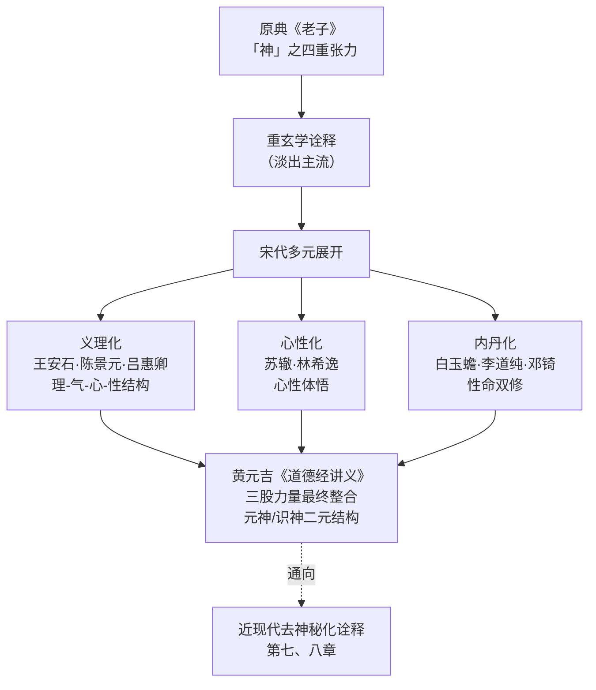

**值得特别注意的是，三股力量并非完全独立——很多注家同时涉及多重诠释方向**：陈景元既属义理化（「以理释道」）又属内丹化（陈抟—张无梦丹道传统的承继）；白玉蟾既属内丹化（南宗五祖）又属心性化（「心即道」命题）；李道纯既属内丹化（全真道丹法）又属义理化（援儒入道、致中和）；黄元吉则是三股力量的最终汇聚。**这种多重身份的普遍存在，正是宋元至清「神」诠释作为整体性运动的具体表现**。

### 6.10.2 纵深追溯：「神」从外在神祇到内在主体性精神的转化轨迹

从思想史纵深角度看，宋元至清「神」诠释完成了「神」从外在神祇到内在主体性精神的彻底转化轨迹。这一轨迹可作如下整体追溯：

**第一阶段：汉代外在神祇的多元下沉**（详见第三章）。河上公将「神」具身化为五藏神，《想尔注》将「神」神格化为太上老君——「神」在汉代呈现为外在化的多元形态（养生之神、形上层级、人格神祇）。

**第二阶段：魏晋本体论收拢**（详见第四章）。王弼将「神」收拢为「无」之妙用——「神」从外在多元下沉重新收拢为本体功能性显现，但仍在某种程度上保有外在性（作为本体之功能）。

**第三阶段：唐代多向并起**（详见第五章）。重玄学将「神」推向中道悬置，杜光庭以神谱整合「神」，唐玄宗以冲气折衷处理「神」——「神」呈现思辨化、神学化、政治化的多向展开，但其外在性仍在多种维度上保留。

**第四阶段：宋元至清的内在化彻底完成**（本章）。从苏辙以「性」释「道」，到陈景元「复性」论，到林希逸「以心明道」，到白玉蟾「心即道」，到李道纯「赤子之心」，到黄元吉元神/识神的精微辨析——「神」概念被彻底内在化为心性主体的内在结构。**至此，「神」完成了从外在神祇到内在主体性精神的彻底转化**。

| 阶段 | 「神」之主导形态 | 内外性程度 |
|------|---------------|----------|
| 汉代 | 外在神祇（五藏神、太上老君） | 完全外在 |
| 魏晋 | 本体之妙用 | 半外在（功能性外在） |
| 唐代 | 中道悬置/神谱体系/冲气妙运 | 多重张力（内外并存） |
| 宋元至清 | 内在主体性精神（元神/识神） | 完全内在 |

**这一转化轨迹与第一章 1.6 节所提"双重内化"假设的"内化为人心之神明"路径完全契合**：「神」由外在的天地神祇（汉代《想尔注》之太上老君、唐代杜光庭之神谱）逐步内化为人心之神明（黄元吉之元神/识神），构成哲学化路径的具体实现。

### 6.10.3 内丹化诠释与宋明理学心性论的深层互动

宋元至清「神」诠释的另一重要思想史意义，是内丹化诠释与宋明理学心性论之间的深层互动。这一互动具体表现在以下几个层面：

**第一层面：心性二分结构的概念互渗**。如 6.9.2 节所论，黄元吉元神/识神二分与宋明理学天命之性/气质之性二分在结构上完全对应。这种对应不是偶然，而是宋明理学与内丹心性论在心性结构问题上达成的深层共识——人之心性必然包含先天本然与后天派生两个层面，工夫论的核心在于回归本然、消除派生之累。

**第二层面：工夫论的会通**。理学之「致中和」「敬以直内、义以方外」与内丹之「守一」「炼神还虚」，在工夫论方向上高度一致——都以心性涵养为根本前提，都强调主体的内在涵养而非外在依赖。**李道纯将《中庸》「致中和」与老子「玄之又玄」相融通**[^101]、白玉蟾以「允执厥中」释「微妙玄通」（详见 6.7.4 节），都是这种工夫论会通的具体实例。

**第三层面：本体—心性—工夫的三层贯通**。宋元至清「神」诠释最深刻的思想史贡献，是把本体论、心性论、工夫论三个层面贯通为整体性结构：本体论层面以道、理、真常为最高范畴，心性论层面以性、心、神为内在结构，工夫论层面以致中和、守一、炼神还虚为具体实践。**这三个层面在宋元至清的诠释中达成深度统一——本体根据落实于心性结构，心性结构展开为工夫实践，三者构成一个完整的循环**。这一三层贯通的结构，是宋元至清「神」诠释相对于汉魏唐传统的最大方法论突破。

### 6.10.4 「双重内化」假设的最关键阶段定位

综合横向比较与纵深追溯，可以对宋元至清「神」诠释的诠释史地位作出整体定位：**这一时期是第一章 1.6 节所提"双重内化"假设最关键的实现阶段**。

回顾"双重内化"假设的核心内容：「神」概念的演变呈现出一种「双重内化」轨迹——一方面由外在的天地神祇逐步内化为人心之神明，构成哲学化路径；另一方面同一概念又被外化为太上老君等人格神，构成宗教化路径，二者并行而互渗。

宋元至清阶段对这一假设的具体实现表现为：

**就哲学化路径而言**——从苏辙「以性释道」到黄元吉「元神/识神之辨」，「神」概念被彻底内化为心性主体的内在结构，完成哲学化路径的最终定型。

**就宗教化路径的并行展开而言**——同一时期道教内部仍延续《想尔注》以来的人格神化传统（如全真道对吕祖、白玉蟾等祖师的尊崇），但这一外化路径在宋元至清逐渐被内丹心性论的内化路径所主导，呈现出「外化路径在内化路径主导下的延续」的具体格局。

**就两路径的互渗而言**——白玉蟾既是南宗五祖（具有人格神化的祖师身份），又是「心即道」的心性化诠释者；李道纯既是莹蟾子（具有道号神圣化的传统），又是「赤子之心」「无心」的纯心性论者。**这种身份的双重性，正是哲学化与宗教化两路径互渗的典型表现**。

### 6.10.5 通向第七、八章的承接点

在完成宋元至清「神」诠释整体轨迹的考察之后，本研究将进入第七章对明清综合与批判（焦竑、王夫之、御注）的考察，以及第八章对近现代学术化诠释的考察。这一承接点可作如下预设：

**就向第七章的承接而言**——明清之际焦竑《老子翼》、王夫之《老子衍》、明太祖与清顺治御注等对「神」的处理，既是对宋元至清内在化转向的延续（如焦竑以禅解老的心性化倾向），也是对其的批判性反思（如王夫之以气论批判道教神化）。**第七章将考察这种延续与反思的双重运动如何使「神」诠释在明清之际呈现出整合性反思的成熟形

# 7 明清综合与批判：焦竑、王夫之等对「神」的整合性反思

第六章已揭示宋元至清近八百年间「神」诠释经由义理化、心性化、内丹化三股力量的交织演进，最终在清代黄元吉处汇聚为元神/识神精微辨析的内丹心性论成熟形态，完成了「神」从外在神祇到内在主体性精神的彻底内化。然而，这一内化轨迹并非线性单进——在它的延展过程中，明清之际的学者注本与帝王御注共同构成了一组**反思性、批判性、整合性**的特殊诠释景观。**这一景观的特殊性体现在三个层面**：其一，焦竑《老子翼》以汇辑学方法把汉代以降六十四家注解作整合性保存与三教融通式取舍；其二，王夫之《老子衍》以气一元论的本体论框架对道教神化、内丹元神论与佛禅化诠释作辩证批判；其三，朱元璋《御注道德真经》、顺治《御注道德经》以帝王御注方式把「神」概念纳入政治神学与治心治国的实用主义框架。**这三条线索之间存在显著的诠释立场张力——焦竑的整合保留与王夫之的辩证批判形成方法论的正面对立，学者注本与帝王御注在「神」之实质归属（心性内丹/气化辩证 vs 帝王权位/治国指南）上形成立场分野**。本章将以这一立体的张力结构为分析框架，揭示明清之际「神」诠释作为前近代向近现代过渡阶段的承先启后特征——它既是宋元以来内在化转向的延续与反思，也是近现代去神秘化诠释的直接前奏。

## 7.1 明清老学的整体格局与「神」诠释的反思性转向

明清老学相对于宋元的整体格局发生了显著转向。刘固盛主编《中国老学通史·明清卷》在系统梳理这一时期老学发展的基础上，归纳出明清老学三大突出特点——「注重对老子思想的政治发挥、儒释道思想在老学中进一步融合、道教老学民间化」[^108][^109][^110]。这三大特点为本章对明清之际「神」诠释的考察提供了基本的语境定位。

**第一，老子思想政治发挥的进一步系统化**。明清是帝王御注传统的总结性阶段——明太祖朱元璋御注成于洪武七年（1374）[^111]、清世祖顺治御注成于顺治十三年（1656）[^112][^113]，二者作为继唐玄宗、宋徽宗之后的帝王御注代表，使「神」概念在政治神学层面的运用达到前所未有的系统化形态。除帝王御注之外，明代官员群体亦广泛参与老子研究，「老子政治思想的发挥与运用，既有唐玄宗、宋徽宗、明太祖、清世祖四皇帝御解《老子》，又有文武大臣的阐发」[^109]。这种"君臣解《老》"的并行格局，使老子的政治哲学维度在明清得到比宋元更为充分的展开。

**第二，儒释道思想融合的深度推进**。明清老学的三教融合相对于宋元呈现出更为系统、更为多元的形态。一方面，明代心学兴起背景下出现了焦竑《老子翼》以三教融通立场对历代注疏的汇辑性整合[^114]、憨山德清以禅释老的纯粹禅学化诠释；另一方面，清代以王夫之《老子衍》为代表的气论批判，则从儒家本位出发对此前的三教融合作出反向清理[^115][^116]。**这种"融合的深化"与"批判的回应"双向并存的格局，使明清老学相对于宋元的"心性化整合"呈现出更为复杂的反思性面貌**。

**第三，道教老学民间化展开**。明清时期道教老学进一步走向民间，内丹学传统在民间社会广泛传播，《老子》逐渐由士大夫诠释对象向更广泛社会阶层渗透。这一民间化进程虽不属本章核心考察范围（其代表性方案如清代黄元吉乐育堂传统已在第六章 6.9 节作过分析），但作为明清老学整体格局的重要侧面，构成本章主流学者注本与帝王御注之外的重要参照背景。

在这一整体格局下，明清「神」诠释呈现出显著的**反思性转向**特征。这一反思性转向的具体表现可作如下分疏：

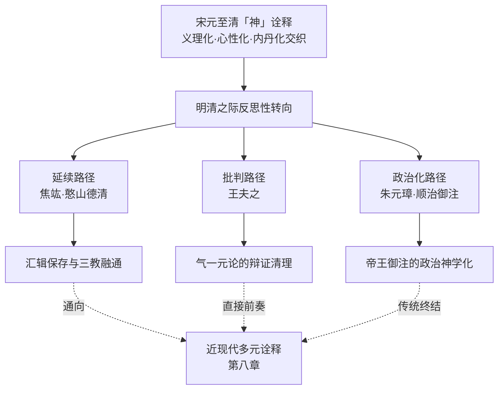

**延续路径**以焦竑《老子翼》、憨山德清为代表，承接宋元义理化、心性化、内丹化的整体演进而作整合性反思——焦竑以「博赡而有理致」的汇辑方式保留历代诠释多样性[^114]，憨山以「制气以柔；以神为主，以精为卫，以气为守」的禅学—内丹融合方式延续宋元以来的心性化深度。

**批判路径**以王夫之《老子衍》为代表，将道、佛、法三家并列为「古今之大害」，通过「入其垒，袭其辎，暴其恃，而见其瑕」的推衍归谬法对宋元以来道教神化、内丹元神论与佛禅化诠释作系统批判[^115][^116]。

**政治化路径**以明太祖、清世祖御注为代表，把「神」概念彻底纳入「道治天下」「治心治国」的政治神学框架[^117][^118][^112]。

**这三条路径在「神」诠释立场上的显著张力，构成本章分析的基本框架**。它既不同于汉代四向辐射格局（政治、气化、养生、宗教并起）的诠释多元化，也不同于唐代三向并起格局（思辨、神学、政治）的方法论分化，而是一种带有强烈反思意识的整合—批判—运用三向并存格局——明清之际的注家们不再仅仅对原典作出新的诠释，而是站在两千年诠释传统的整体回顾视角上对此前诠释作整合、批判与运用。**这种反思性气质，正是明清「神」诠释作为前近代向近现代过渡阶段的核心特征**。

## 7.2 焦竑《老子翼》：汇辑学方法下「神」诠释的整合性呈现

焦竑（1540—1620）是晚明思想史上的代表性人物，「字弱侯，号澹园，江苏南京人，明万历十七年（1589）状元，授翰林修撰，后贬福建福宁州同知，晚明思想家、文献学家，与杨慎齐名，被誉为『一代儒宗』」[^114]。其《老子翼》六卷成书于焦竑思想成熟期，「正统道藏，老子翼，明朝焦竑编撰」「收入《万历续道藏》」[^114]，构成明代老学的集大成之作，也是中国老学诠释史上汇辑学方法的代表性方案。

### 7.2.1 汇辑学方法的整体架构与诠释意图

焦竑《老子翼》最具方法论原创性的特征，是其系统的汇辑学架构。其汇辑范围之广在中国老学史上极为罕见——「此书系《老子》之集注，汇辑韩非、严君平、河上公、王弼、鸠摩罗什、傅奕、李约、司马光、苏子由、王雱、陈景元、林希逸、杜道坚等六十四家注解，并援引《诗经》、《左传》、《管子》、《庄子》等古籍数十种，而以焦竑自撰《笔乘》之文附于章末」[^114]。

这一汇辑结构的方法论创新可作如下分析：

**第一，仿李鼎祚《周易集解》与裴駰《史记集解》的双重模仿**。焦竑「仿李鼎祚《周易集解》，荟萃众家精语；其音义训诂则仿裴駰《史记集解》。全书是『博赡而有理致』」[^114]。**这一双重模仿既保有经典集注传统的"荟萃"功能，又借鉴史部训诂传统的"音义"功能，使《老子翼》在方法论上兼具义理整合与训诂考察的双重深度**。

**第二，汇辑取舍的整合标准**。焦竑《老子翼》并非简单的注疏堆砌，而是有其明确的取舍标准——「《老子翼》是焦竑的精心用力之作，辑录韩非以下解《老子》者六十四家，附以自己的评注」[^114]。其辑录取舍的核心标准，是「根据三教本出一源的观点，力图调和孔、老二学」[^114]——选择那些能够体现三教融通可能性的注家与注文。

**第三，《附录》《考异》的文献学补充**。「正文之后有《附录》一卷，辑录有关老子之传记，轶事及诸家评述，凡六十五则。又有《考异》一卷，考订《老子》版本文字异同。全书博观约取，采摭丰富，为研究老学之要籍」[^114]。**这一附录—考异结构使《老子翼》不仅是义理注解的汇集，也是老子文献学的系统整理，呈现出晚明文献学风的突出特征**。

### 7.2.2 三教融通立场与「明无为」的整合主旨

焦竑诠释立场的核心是其三教融通主旨。其在《老子翼》中明确表述：「《老子》乃『明道之书』，它『有以证无』，『则为无为，事无事，而为与事举不足以碍之』」[^114]。这一表述把《老子》的核心主旨界定为「明无为」——「作者认为《老子》一书之要旨在『明无为』，即以有证无也」[^114]。

**「明无为」之主旨与三教融通立场的内在关联**，可从焦竑对《老子》整体义理的概括中得到呈现：

> **《老子》并非弃绝人事，实际上是除心不除事，「所谓无为，不是郁闭，而是天门开阖而能为雌；所谓涤除玄览，不是晦昧，而是明白四达而能无知；主空虚，不毁万物为实，绝非独任虚无」[^114]**

这段表述包含了焦竑诠释立场的几个核心要素：第一，「除心不除事」——《老子》的工夫论核心是涤除心之执滞而非否定事之实在；第二，「天门开阖而能为雌」——「无为」不是消极封闭，而是能动应对中的虚静守雌；第三，「明白四达而能无知」——「涤除玄览」不是无知昏昧，而是明达通彻中的不执于知。

**这一诠释立场对「神」概念处理具有决定性意义**。在焦竑的整合框架下，「神」既不是河上公具身化的五藏神（被纯具身化诠释所局限），也不是《想尔注》神格化的人格神（被宗教化诠释所局限），更不是王弼纯本体化的「中央无者」（被纯思辨化所局限），而是兼具三教深度的心性主体——它既保有道家「天门开阖」的灵动，又承担禅学「明白四达」的明达，更服务于儒家「除心不除事」的实践。**这种"兼有"而非"独占"的处理方式，是焦竑作为汇辑学典范的核心特征**。

### 7.2.3 「神」诠释的整合性呈现：以涉「神」核心章句为中心

焦竑《老子翼》对涉「神」核心章句的处理，最直接地体现了其汇辑学方法的具体运作。需要指出的是，本研究所及材料对《老子翼》具体章节注文的细节呈现相对有限，本节论断主要基于其整体方法论立场与已知核心命题作推断性分析，并明确标注此一材料局限。

**第一，对宋元心性化诠释的吸纳**。焦竑作为晚明心学背景下的思想家，「二十三岁师耿定向，开始研习王学」「三十三岁与李贽交好。四十七岁问学于罗汝芳」[^114]——其学术根基深植于阳明心学传统。这一背景使其在汇辑历代注疏时，对宋元心性化诠释（特别是苏辙《老子解》、林希逸《老子鬳斋口义》）具有显著的偏好。**就涉「神」章句而言，焦竑对苏辙以「言其德」「言其功」分别处理「谷神—玄牝」（详见第六章 6.3.2 节）、对林希逸「以心明道」诠释（详见第六章 6.5.2 节）的吸纳，使其汇辑结构在心性化方向上形成稳定的诠释主线**。

**第二，对鸠摩罗什的特殊重视及其佛禅化倾向**。焦竑《老子翼》将鸠摩罗什列入汇辑名单[^114]——这一选择具有重要的诠释史意义。鸠摩罗什作为最早以佛学诠释《老子》的代表（详见第五章 5.1.1 节蒙文通对其方法论奠基地位的论述），其纳入焦竑汇辑体系，反映了焦竑对佛学化诠释路径的明确接纳。**正是这一接纳，使王夫之后来对焦竑的批判具有针对性——王夫之明确指出「陆希声（字鸿磬）、苏辙（字子由）、董思靖及近代的焦竑（字弱侯）、李贽之流，更把《老子》与禅宗相互引证、连缀组合，妄称什么『教外别传』来混杂」[^116]**。这一指控表明，王夫之确实把焦竑视为以禅释老传统的代表性人物。

**第三，《笔乘》按语透露的诠释取向**。焦竑在每章末附以自撰《笔乘》之文，这些按语透露其个人诠释取向。基于现存材料可知，焦竑《笔乘》「是明代学者焦竑的学术笔记。全书内容博涉经史子集、典章故实及诗文评骘，尤以考据精审、见解独到著称。作为考据学先驱，其笔记体现了明代中后期学风由虚入实的转向，对明清之际的学术转型具有重要影响」[^114]。**这一"由虚入实"的学风转向特征，使焦竑虽吸纳禅学化诠释，但在具体诠释中又保持考据学的严谨——这构成《老子翼》作为汇辑典范同时又具有方法论自觉的双重特质**。

### 7.2.4 焦竑诠释的诠释史意义与方法论局限

焦竑《老子翼》在中国老学诠释史上的诠释史意义，可从两个层面把握。

**第一，作为「神」诠释多元材料保存与整合典范的历史价值**。焦竑《老子翼》汇辑六十四家注解的方法论实践，使其成为中国老学诠释史上保存历代「神」诠释多元材料的重要载体。**对本研究而言，焦竑《老子翼》的存在保证了从韩非到林希逸近一千五百年间「神」诠释主要传统不至失传，构成本研究第三章至第六章历时性考察得以可能的基础文献条件之一**。这一文献价值的重要性远超其个人诠释立场——即使焦竑的具体诠释取向存在争议，其汇辑工作本身已构成对中国老学诠释史的不可替代的贡献。

**第二，作为三教融通诠释的晚明典范**。焦竑「三教本出一源」的整合立场[^114]、「除心不除事」「明白四达而能无知」的折衷取向[^114]，与同时代李贽、罗汝芳等心学激进派的三教合一思潮共同构成晚明思想的鲜明特色。**这一晚明三教融通气质相对于宋元温和的三教合流呈现出更为彻底的形态——三教不仅在心性论层面会通，更在本体论、工夫论、政治论各层面达成全面融合**。

**与此同时，焦竑诠释也存在显著的方法论局限**。这一局限主要体现在：第一，汇辑学方法的整合性虽强，但对具体诠释立场的辨析与论证相对薄弱——《老子翼》的核心力量在于"博赡"，但其"理致"的深度则不及苏辙、王夫之等专题性注本；第二，三教融通立场虽具有思想史意义，但在具体处理涉「神」章句时容易导致诠释立场的模糊化——"既保留河上公的具身化，又保留王弼的本体化"的并置策略，难以对原典开放性作出明确的诠释表态；第三，焦竑对禅学化诠释的接纳虽符合晚明思想潮流，但也使《老子翼》在某种程度上偏离了《老子》原典的道家本位，构成王夫之批判的实际依据。

**这些方法论局限的存在，并不否定焦竑《老子翼》作为汇辑学典范的诠释史价值，而是为下一节王夫之的批判性反思提供了具体的对象**。正是因为焦竑代表了晚明老学三教融通的成熟形态，王夫之对其的批判才具有"清算一代学风"的整体意义。

## 7.3 王夫之《老子衍》：气一元论框架下对道教神化与佛禅化诠释的辩证批判

王夫之（1619—1692）作为明末清初三大思想家之一，其《老子衍》是中国老学诠释史上最具批判力度的注本之一[^115][^116][^119]。该书的特殊地位不仅在于其对老子学说作出系统批判，更在于其反映了王夫之以儒家本位与气一元论对汉唐宋元以来全部「神」诠释传统的根本性清理。

### 7.3.1 撰著动机与方法论：「推衍归谬法」的批判机制

王夫之撰著《老子衍》的思想动机，与其对明末学术风气的整体诊断密切相关。「王夫之对李自成领导农民推翻明朝的历史事实深恶痛绝，并认定其原因不是崇祯皇帝统治下的明朝腐败，而是当时社会的学术风气不正，从而导致整个社会的伦理、道德凋敝，有如朽木败叶，一触即溃」[^116]。在王夫之看来，「自古以来，最有害的是三家，第一家是老子的学说，第二家是佛学，第三家是申不害、韩非的学说。而这三家之中，老子的思想又是一切有害思想的总根源」[^116]。

这一定性在王夫之的著作中有明确表述：「盖尝论之，古今之大害有三：老、庄也，浮屠也，申、韩也。三者之致祸异，而相沿以生者，其归必合于一」[^115]。**把老子与庄子的道家之说、佛教之说，以及申不害、韩非等人的法家之说归为同一类别，是王夫之的一个独特选择**[^115]。其逻辑根据在于「三者的共同祸害在于其对人心的蛊惑」「心一失其大中至正之则，则此倡而彼随，疾相报而以相济。佛、老之于申、韩，犹鼙鼓之相应也」[^115]。

**就方法论而言，王夫之采用「推衍归谬法」对老子学说作系统批判**。其在《老子衍》自序中明确表述：「夫之察其（指历来学者对《老子》的注解）悖者久之，乃废诸家（的注解），以衍其（指《老子》，下同）意；盖入其垒，袭其辎，暴其恃，而见其瑕矣，见其瑕而后可使（正统的儒学）复也」[^116]。这段表述揭示出王夫之诠释方法的核心特征——**不是从外部驳斥老子，而是顺着老子思路推衍其内在逻辑，使其论理向前发展，贯彻到一定程度的时候，就能暴露老子思想的本来就有的荒谬。这种用对手自己的思想去驳斥他自己原本的思想，使之没有反驳的余地，这是对老子思想最有力的一击**[^116]。

王夫之同时对历代《老子》注解作了系统批判：「以往对《老子》的注释，每一代的宗旨都不同，每一家的说法都有分别。王弼（字辅嗣）、何晏（字平叔）把《老子》混同于《周易》的乾坤、易简；鸠摩罗什、梁武帝肆意用佛家的事理、因果之说去支离曲解、牵强附会，可见对《老子》的诬说已经很久了。到陆希声（字鸿磬）、苏辙（字子由）、董思靖及近代的焦竑（字弱侯）、李贽之流，更把《老子》与禅宗相互引证、连缀组合，妄称什么『教外别传』来混杂，这就好像福建人把霜当成雪，河南人听闻蟹好吃而去吃蟛蜞一样」[^116]。**这段批判清晰呈现了王夫之对历代《老子》诠释传统的整体清理意图——王弼的玄学化、罗什的佛学化、苏辙焦竑等的禅学化都被纳入其批判范围**。

王夫之撰著《老子衍》的具体经过本身也颇值得注意：「撰写于1655年的《老子衍》，是王夫之写作生涯中最早的两本书之一。根据该书的后记，此书初稿完成后，王夫之在1672年修订了整个手稿，并参考了两位道家学者——魏伯阳（东汉）和张伯端（宋朝）——的评论。次年（1673），他的一位朋友将此书稿带到自己家中保管，后在一场火灾中被毁。王夫之花这么长的时间去修订改写《老子衍》，可见其在王夫之心中的重要性」[^115]。**这一长达十七年的修订过程，与王夫之参考魏伯阳《周易参同契》、张伯端《悟真篇》两位内丹学奠基者的事实，表明王夫之对道教内丹学传统具有深入的了解，其后来的批判正是建立在这一深入了解的基础上**。

### 7.3.2 气一元论本体论：「太虚一实」与「气有变易而无生灭」

王夫之对「神」概念批判的根本方法论根据，是其气一元论本体论框架。这一框架的核心命题是「太虚一实」与「气有变易而无生灭」[^120][^119]。

**「太虚一实」的本体论建构**。王夫之继承张载「太虚无形，气之本体」（《正蒙·太和》）的思想，「创造性地提出『太虚一实』（《礼记章句》）的观点，指出宇宙是由气构成的物质性实体，『阴阳二气充满太虚，此外更无它物，亦无间隙，天之象，地之形，皆其范围也』（《张子正蒙注·太和》），他肯定宇宙间充满了气，除此之外没有其他物质」[^120]。这一表述的关键点在于把「太虚」（似乎是无形虚空）重新界定为「一实」——太虚之虚不是空无，而是充满气的实在状态。

**「气有变易而无生灭」的辩证论**。王夫之进一步论证气的永恒性——「气有变易而无生灭」，「他不承认物质有生灭，只认为物质有往来，屈伸，幽明，聚散，消长，生死等，而这些过程只是气的变易」[^120]。其代表性表述见于《周易内传·系辞上传》：「《易》言往来，不言生灭……此以知人物之生，一原于二气至足之化；其死也，反而氤氲之和，以待时而复……生非创有，而死非消灭，阴阳自然之理也」[^120]。**这段表述把生死、有无等传统对立范畴重新理解为气之聚散变易的不同状态——生不是从无中创造，死不是消灭归无，所谓生死只是气的不同存在形态**。

**这一气一元论本体论对「神」概念处理具有决定性意义**。在严遵的形上层级体系中（详见第三章 3.2 节），「神明」是独立的形上构成项；在王弼的贵无论中（详见第四章 4.2 节），「神」是「无」之妙用；在内丹元神论中（详见第六章 6.7—6.9 节），元神是先天虚无之神。**而在王夫之这里，所有这些形上化、虚无化、神圣化的"神"都被还原为气之灵动表现——"神"既不能独立于气而存在（消解严遵的形上层级化），也不能归本于"无"而获得本体地位（消解王弼的贵无论），更不能作为先天虚无的元神而具有独立实在性（消解内丹元神论）**。

### 7.3.3 第六十章注：鬼神问题的气化辩证转化

王夫之对原典第六十章「治大国若烹小鲜」的注解，是其气一元论本体论在「神」诠释上的代表性运用。其完整注文为：

> **动天下之形，犹余其气；动天下之气，动无余矣。「烹小鲜」而挠之，未尝伤小鲜也，而气已伤矣。伤其气，气遂逆起而报之。夫天下有「鬼神」，操治乱于无形；吾身有「鬼神」操生死于无形；杀机一动，龙蛇起陆，而生德戕焉。静则无，动则有，神则「伤人」可畏哉！「载营魄，抱一而不离」，与相保于水之未波。岂有以治天下哉？「莅」之而已**[^121]

这段注文的诠释机制可作多层分析。

**第一，「形—气—神」三层结构的气化辩证**。王夫之以「动天下之形，犹余其气；动天下之气，动无余矣」开篇，建立起形、气、神的三层结构。**这一结构与汉代以来「精—气—神」内丹学结构在表面上相似，但本质上完全不同**——内丹学结构中精、气、神是可被分别炼养的具体修炼对象，而王夫之这里的形、气、神则是同一气化过程的不同显现层面。**形之挠动尚有气之余，气之挠动则无所余，神则是气之极致灵动**——三者在本体上都是气，差异仅在层次深浅。

**第二，「天下鬼神」与「吾身鬼神」的双重展开**。王夫之同时论及「天下有『鬼神』，操治乱于无形」与「吾身有『鬼神』，操生死于无形」——把鬼神从《老子》原典的政教语境扩展到宇宙—人身的双重维度。但这一双重展开并非神圣化处理，而是气化辩证的具体落实——所谓「鬼神」不过是气之运动在治乱与生死层面的内在动力，是「气遂逆起而报之」的辩证机制。**这一处理把鬼神问题彻底纳入气化辩证的框架，既不否认鬼神的实在性（仍预设有"鬼神"可言），也不肯定其神圣性（鬼神不过是气之运动的功能性显现）**。

**第三，「静则无，动则有，神则伤人」的辩证逻辑**。王夫之以「静则无，动则有，神则『伤人』可畏哉」收束本段，把「神」之"伤人"机制定位于气之"动则有"的辩证转化——气静则无形无相（无），气动则形象具显（有），气之极致灵动状态即是"神"，而这一"神"状态由于其极度灵动反而容易"伤人"。**这一辩证逻辑与王弼"不扰则全真"（详见第四章 4.5 节）在结构上具有相通性，但在本体论根据上有根本差异——王弼以"无"为本体根据，王夫之以"气"为本体根据；王弼悬置鬼神问题，王夫之则把鬼神纳入气化辩证**。

**第四，对内丹学的隐性批判**。王夫之引《老子》第十章「载营魄，抱一而不离」，表面上是肯定原典工夫论，但其下文「与相保于水之未波。岂有以治天下哉？『莅』之而已」则透露出对内丹学守一工夫的隐性批判——所谓"载营魄，抱一而不离"不过是"水之未波"的静止状态，这种静止状态不能作为治天下的方法。**这一批判针对的正是宋元内丹学传统将"载营魄抱一"作为修炼工夫核心的诠释路径（详见第六章 6.7.2 节白玉蟾对第十章的内丹化诠释）——王夫之认为内丹学过度强调静止守一，违背了《老子》"莅之而已"的政治哲学指向**。

### 7.3.4 「神为气之灵」：消解元神论与神化诠释

王夫之对「神」概念处理的核心命题，是「神为气之灵」。这一命题虽未在《老子衍》中作独立的概念性表述，但通过其对涉「神」章句的系统注疏可以归纳出来。其根本含义是：**「神」既不是独立形上层级（消解严遵），也不是道之妙用（消解王弼），更不是先天虚无之元神（消解内丹学），而是气在最为灵动状态下的功能性显现**。

这一命题对宋元内丹元神论构成根本批判。回顾第六章 6.9 节所考察的黄元吉元神/识神二元结构——元神「自虚无中来」，识神「从色身中出」，二者具有形上层面的根本差异。**这一二元先验结构在王夫之的气一元论框架下不能成立——如果一切都是气，则元神不可能"自虚无中来"，因为虚无本身即是气；元神与识神也不能具有先天/后天的本质差异，因为先天/后天的差异本身就建立在气的不同状态之上**。

王夫之对内丹学的批判还体现在其对「营魄抱一」的处理上。第六章 6.6.3 节已指出，李涵虚《道窍谈》「先天者无形无质，在原子以下，属非常态物质……后天者有形有质，在原子以上，属常态物质」的精细辨析，构成内丹学元神论的具体形上根据。**而王夫之以「与相保于水之未波」释「载营魄抱一」，恰好把这一精细辨析消解为单纯的静止守一——元神/识神的精微分化在王夫之的气化辩证框架中失去其立足之地**。

### 7.3.5 王夫之批判的合理性与局限：当代学者的辩护与批评

王夫之对老子的批判在当代学界存在显著争议。「虽然当代船山学研究者都认可王夫之是中国思想史上最伟大的思想者之一，但许多学者都不接受他对老子的批评。如张学智、曾昭旭、邓联合以及谭明冉一致认为，王夫之对于老子和道家的批判，是基于他自己偏向儒家的心态，因而是一种」断章取义、自相矛盾的处理[^115]。

刘纪璐则在《为王夫之对老子理论的批判辩护》一文中为王夫之作辩护：**「王夫之从社会影响的角度对老子及道家理论进行批判，反映了他对以哲学思考整世风、化人心的期望。王夫之对于儒家『伦理教化』的重视与强调，反对道家洁身自好、与世无争、道德冷漠的消极态度，值得肯定」**[^115]。

**就本研究而言，对王夫之批判的评估应当采取双重视角**。一方面，王夫之的批判反映了儒家伦理教化立场的强势重构，其对道教神化、内丹元神论与佛禅化诠释的清理具有重要的方法论意义——它代表了中国思想史上以气一元论为核心的本体论方案对汉唐宋元各种神化诠释传统的整体性反思。另一方面，王夫之的批判也存在显著的方法论局限——其儒家本位立场使其对老子原典的开放性作了过度收紧的处理，把老子简化为儒家批判的对象，而忽视了老子原典本身所蕴含的多元诠释可能性（如第二章 2.5 节所揭示的四重张力）。

**这种合理性与局限并存的评估，正是本研究方法论自省（详见第一章 1.6 节）的具体落实——本研究既不以现代偏好（如气论的"科学性"）反向裁剪宋元内丹学诠释的合理性，也不简单否定王夫之批判的思想史意义，而是把两者并置呈现，让历代诠释立场之间的张力本身成为研究的对象**。

### 7.3.6 王夫之诠释的诠释史意义：作为近现代去神秘化的直接前奏

王夫之《老子衍》在中国老学诠释史上的诠释史意义，可作如下整体定位。

**第一，作为宋元以来内在化转向的批判性反思的代表**。从汉代《想尔注》将道神格化为太上老君，到唐代杜光庭神谱体系，到宋代陈景元、苏辙的内在化转向，到宋元内丹学元神论的精微分化，「神」概念在两千年中经历了从外在神祇到内在主体性精神的彻底转化（详见第六章 6.10 节）。**王夫之《老子衍》作为这一转化的批判性反思代表，把宋元以来"神"概念的内在化轨迹重新拉回气一元论的辩证框架——"神"既不是外在神祇（批判道教神化），也不是先天虚无之元神（批判内丹元神论），而是气在最灵动状态下的功能性显现**。这一批判既是对宋元内化路径的重大限制，也为近现代去神秘化诠释提供了直接的概念史前奏。

**第二，作为近现代去神秘化诠释的方法论前奏**。回顾第二章 2.5 节所归纳的原典「神」概念四重语义张力——形上妙用与派生层级、自然灵性与超验力量、二元结构与三元结构、独立实体与功能性描述。**王夫之"神为气之灵"的处理，在四重张力中均明确选择极一立场——拒绝派生层级（神不是独立形上构成项）、拒绝超验力量（神不是宗教性神祇）、拒绝二元独立实体（神不是元神/识神先验二分）、肯定功能性描述（神是气之灵动的功能显现）**。这一极一选择与近现代陈鼓应、任继愈以「自然规律」「精神主体」释「神」的去神秘化诠释（详见第八章）在方向上完全一致，构成最直接的概念史前奏。

**第三，作为儒家本位反思整合宋元思想资源的代表**。王夫之的气一元论本体论既继承了张载关学的气论传统，又融合了周敦颐、二程、朱熹理学的某些资源，同时对宋明心学作出批判性回应——它代表了明清之际儒家思想对宋元以来全部思想资源的反思整合。**在「神」诠释问题上，这一反思整合的具体后果是：宋元义理化诠释中的气论因素（如王安石"元气之不动"、陈景元气化生成论）被王夫之系统化、深化为彻底的气一元论；宋元心性化诠释中的某些片面化倾向（如"心即道"的纯心性化）则被王夫之以气论辩证作出修正**。

## 7.4 明太祖朱元璋《御注道德真经》：「天下神器」的政治神学化与「君权神授」的诠释建构

明太祖朱元璋《御注道德真经》（又称《大明太祖高皇帝御注道德真经》）成于洪武七年（1374）[^111]，是中国老学史上少数亲自注解道德经的帝王御注之一。其在《明史·艺文志》《万卷堂书目》《佳趣堂书目》皆有著录[^111]。这部御注的特殊性，不仅在于其作为明朝开国皇帝的政治权威性，更在于朱元璋作为出身寒微、以「布衣」起兵的开国帝王所赋予的独特政治语境。

### 7.4.1 御注缘起与「道治天下」的整体诠释立场

朱元璋自序中坦诚交代了其御注《道德经》的缘起：「自即位以来，罔知前代哲王之道，宵昼遑遑，虑穹苍之切。鉴于是，问道诸人，人皆我见，未达先贤。一日，试览群书，检间有《道德经》一册，因便但观，见数章中尽皆明理，其文浅而意奥，莫知可通。罢观之后旬日，又获他卷，注论不同；再寻较之所注者，人各异见，盘桓久之，乃有所得。其以明镜水月，喻《道德经》外虚而内实」[^111]。**这段自序揭示出朱元璋对《道德经》的核心定位——「乃万物之至根，王者之上师，臣民之极宝，非金丹之术也」**[^111]。这一定位的关键在于明确否定《道德经》的金丹之术维度（即否定内丹学诠释路径），而强调其作为治国安民箴言与立身处世指南的实用价值。

吕锡琛对朱元璋御注作过系统专题研究，指出朱元璋的诠释「与西方诠释学的理路却颇有契合」「不仅包括了对文本的『理解、解释』，更将其思想主张作为治国安民的箴言和立身处世的指南而加以践行，体现出诠释学的『理解、解释、应用和实践能力』四大要素，特别是从社会底层崛起的帝王朱元璋，更在『实践智慧』方面有突出的表现」[^122]。这一定位精确把握了朱元璋御注的方法论特质——**它不是学术性的训诂注解，而是政治实践智慧的运用文本**。

「学以致用是朱元璋诠释《道德经》的唯一目的，他在欲达善政而求之于先贤智慧的渴盼中，将目光聚焦到了《道德经》，而观于『人各异见』的各家注释，觉得前人未竟其深意，于是仔细揣摩，独立思考，『用神盘桓其书久之，以一己之见，似乎颇识』」[^122]。**这种"用神盘桓"的诠释姿态，使朱元璋御注呈现出与学者注本截然不同的气质——它不追求训诂的精确，也不追求义理的纯粹，而追求政治实践的有效**。

朱元璋御注「道治天下」的整体诠释立场，可作如下概括：「在本体论意义上，注重昭示道统合法性，强调治国理政要顺应人的天性，从三纲五常构建理想的社会政治秩序；在工夫论意义上，主张从学道、守道与道治天下三个方面运用精细的工夫，使统治者成为圣人，施行三皇五帝之道；在政治统治的过程中，利济万物，政权延续与国家昌盛是其目标，敬天命与重人命是其准则，禁贪婪与行节俭是其底线，在发用上呈现出一种周备的特点」[^118]。

### 7.4.2 第三十九章注：「神乃乾坤之主宰，至精之气」的气化—神圣化双重整合

朱元璋对原典第三十九章「昔之得一者」的注解，最直接体现了其「神」概念处理的核心特征。其完整注文为：

> **昔之得一者，即无极之初气也。初气者，大道理是也。以此气而成天地，故天地得一以清宁。神乃乾坤之主宰，至精之气，聚则为神，变则无形而有形，是谓得一以灵。谷者，两间人世也，天地虚其中而为谷，和气盈于两间，万物生以其多之故，是谓盈也。万物各得合应之气，至精者方萌，谓之得一以生。王臣乘此天地之精英而不伪，大道行焉，是谓天下贞**[^123]

这段注文的诠释机制具有几重关键特征。

**第一，「神乃乾坤之主宰，至精之气，聚则为神」的双重整合**。朱元璋以「乾坤之主宰」释「神」，赋予「神」以宇宙最高主宰的神圣地位；同时又以「至精之气，聚则为神」释其本质，把「神」纳入气化论框架。**这一处理是气化论与神圣化的双重整合——"神"既保留了汉代严遵以来的气化论传统（神是至精之气的聚合），又通过"乾坤之主宰"的表述获得了神圣化的地位**。这种整合方式与王夫之"神为气之灵"的纯气化论形成鲜明对比——朱元璋在保有气化论根据的同时，并未消解"神"的神圣性维度。

**第二，「聚则为神，变则无形而有形」的辩证表述**。朱元璋以"聚则为神"描摹气之凝聚状态，以"变则无形而有形"描摹其转化过程——这一辩证表述与王夫之气化辩证在结构上具有相似性，但其根本指向不同：王夫之以辩证消解神之独立实体性，朱元璋则以辩证强化神之多元存在状态。**就「神」概念处理而言，朱元璋的辩证整合更接近汉代严遵的形上层级化路径——"神"既是气化的具体阶段（与"至精之气"对应），又承担着乾坤主宰的形上功能**。

**第三，「王臣乘此天地之精英而不伪」的政治化**。朱元璋在注文末尾把「天下贞（正）」具体化为"王臣乘天地之精英而不伪"——这一处理把第三十九章的形上命题彻底落实于王臣的政治实践。**所谓"得一"即是王臣对天地精英的承接，所谓"贞"即是王臣不伪。这种处理使第三十九章成为君权神授论的形上根据**——王臣之所以能"为天下贞"，根据在于他们承接了"乾坤之主宰"的神圣性。

### 7.4.3 第三十九章后续：「失此」的政治诫训

朱元璋对第三十九章下文的注解，进一步展示其政治化诠释的具体方向。其注文为：

> **若天失此之气理，将有裂坏。地失此，将有震动坠陷。神失此，将有不灵。谷失此，人世将无物。世间万物失此，将不生而有灭。王臣失此，将无道而国亡。士君子失此，将倾覆尊贵也**[^123]

**这段注文把原典中"天无以清将恐裂"等否定性陈述全部转化为"失此"的政治诫训序列**。从天到地、从神到谷、从万物到王臣、再到士君子——每一层级的"失此"都对应一种具体的败亡形态。**这一处理的政治指向极为明确：王臣若失"此"（即天地精英），则国亡；士君子若失"此"，则倾覆尊贵**。这是把原典形上命题转化为政治诫训的典型范例。

朱元璋对第三十九章末尾「贵以贱为本，高以下为基」的注解延续了这一政治化方向：「为仁人君子者，务尚谦卑为吉，所以又云王称孤寡不榖，此三字俗呼，皆微小无德之名，王臣乃称之，言其不自高也。小人夸己，可乎？所以俗云言吾恶者是吾师，言吾善者是吾贼。故下至誉无誉，不欲琭琭如玉，珞珞如石，此二说皆谄谀之称。君子当守道而不改，尤有称之何？小人好之甚，入恶地也」[^123]。**这段注文把原典"贵以贱为本"的形上命题转化为"务尚谦卑为吉"的政治伦理诫训，把"孤寡不榖"的自称传统转化为君子"守道而不改"的政治品格**。

### 7.4.4 第二十九章注：「天下神器」与帝王权位的政治神学化

朱元璋对原典第二十九章「天下神器」的处理具有典型的政治神学化特征。永乐大典《道德经》记载明太祖在处理大明与安南国的国际关系时引用了《道德经》：「将欲取天下而为之，吾见其不得已。天下，神器也，不可为也！为者败之，执者失之」[^124]。**这一引用本身即体现了朱元璋将"天下神器"纳入帝王政治实践的具体运用**。

「永乐大典《道德经》：『天下，神器也，不可为也！』」「永乐大典《道德经》全文，暂不可知」[^124]——这一文本特征（与王弼本「天下神器，不可为也」略有差异）表明朱元璋御注在版本上具有独立的特征。

**就"神器"诠释而言，朱元璋把其直接政治化为"帝王权位"，构成"君权神授"的巧妙表达**。这一处理与第二章 2.4.3 节所揭示的"神器"语义边界（解读甲：神圣之器；解读乙：神明造化之器；解读丙：神奇造化之物）作对照可见——朱元璋明确选择了解读甲（伦理—宗教神圣性），把"神器"作为天命神圣不可亵渎的对象处理。**这一选择与第四章 4.6 节所考察的王弼"神，无形无方也；器，合成也"的本体化训释形成根本对立——王弼以"神器"为合于本体之"无"的整体（消解伦理—宗教神圣化），朱元璋则以"神器"为天命神圣的帝王权位（强化伦理—宗教神圣化）**。

程立中、赵锋对朱元璋君子观作过专题研究，指出：**「《道德经》作为一部道家经典之作，其中蕴含着丰富的治国之道。朱元璋借注释《道德经》，来阐述自己的思想，尤其是对『君子』文化内涵的解释，突破了传统的道德品行和文化修养范畴，而展现出秉天地之精华，继神圣之智慧的天命『君子』，这无疑是『君权神授』的巧妙表达」**[^125]。这一研究精确把握了朱元璋御注的政治神学化实质——通过对"君子"的重新界定，把帝王权位与天命神圣性紧密关联，构成"君权神授"论的具体表达。

### 7.4.5 「律己重民」与「行为主体转换」的诠释技术

朱元璋御注的另一显著特征，是其「律己重民」的治道指向与「行为主体转换」的诠释技术。吕锡琛指出朱元璋诠释的五大显著特征：「一、律己重民：他强调崇俭抑奢，将老子的俭约思想转化为治国方略，身体力行，使哲学命题转化为政治实践。二、行为主体转换：他经常将文本中的行为主体进行转换，如将『生之畜之』转化为君主与民众的互动关系，赋予抽象形上学讨论具体政治内涵。三、治国理念具体化：他提出『治大国若烹小鲜』的治国原则，强调渐进式治理，反对奢侈扰民。四、警示对象拓展：他不仅警告统治者」[^117]。

**「行为主体转换」诠释技术的具体实例**，可见于朱元璋对第十二章「五色令人目盲」的注解。原典「五色令人目盲，五音令人耳聋，五味令人口爽，驰骋田猎令人心发狂，难得之货令人行妨。是以圣人为腹不为目，故去彼取此」是老子对感官享乐的警醒，朱元璋的诠释别出心裁：

> **「腹」，喻民也。「所以实其腹」者，五色、五音、五味、田猎、货财皆欲使民有乐之，君不取而君有之，即舍彼而取此。「后其身而身先，外其身而身存」之道是也，妙哉**[^122]

**朱元璋把「腹」具体化为民众，把「实其腹」转化为"使民众享有物质条件"——这种行为主体转换使原典抽象的形上学讨论被赋予了具体的政治内涵**[^122]。「《道德经》中『为腹不为目』一句的原意是主张务内而不逐于外，保持恬淡的生活而不为感官享乐所扰。朱元璋的诠释可谓别出心裁，他先强调为政者在物质生活方面的自我约束，随后却将笔锋一转，强调这些物质享受应当『皆欲使民有乐之』，君主虽拥有它们却不取用享受，这样才能够『身先』『身存』，巩固政权」[^122]。

**这种诠释技术对「神」概念处理同样适用**——朱元璋对涉「神」章句的处理普遍采取行为主体转换的方式，把原典中抽象的形上命题转化为君主与民众互动的具体政治指南。这种转换使「神」概念既保有形上深度（"乾坤之主宰，至精之气"），又获得了政治实践指导（王臣"乘天地精英而不伪"则国治）。

### 7.4.6 朱元璋御注与道教的复杂关系

朱元璋御注《道德经》的政治背景与道教的复杂关系也值得注意。「明朝的开国皇帝朱元璋在夺取政权后，吸取了唐宋以来三教合一的宗教政策。在他看来，巩固已建立的明王朝的统治，除了依靠专制集权的强权统治外，还需要利用传统的儒释道三教来强化思想统治，维护社会稳定」[^126]。具体到道教，「朱元璋自始至终都是利用道教为自己服务，他深知宗教对建立和统治朝代的重要性」[^126]。

**朱元璋对道教的政策具有显著的实用主义特征**：一方面，「明朝建立之初，就对道教进行了管理与引导，以服务于大明王朝的统治。明初朱元璋对道教的相关政策的实施，不仅对道教的后期发展产生了重大影响，而且对大明王朝的政治体制也产生了重大影响，表现出宗教与政治的互动关系」[^126]；另一方面，朱元璋并未无条件接受道教传统中的所有内容——其御注中明确否定《道德经》"非金丹之术也"[^111]，即是对道教内丹学传统的明确划界。

**这种实用主义特征对其「神」概念处理具有重要影响**——朱元璋既保留了汉代以来气化论与神圣化的传统资源，又拒绝宋元内丹学的元神论传统；既强化"神"的政治神圣性，又否定其作为修炼对象的具体性。**这种选择性接纳的整体格局，使朱元璋御注呈现出与同时代焦竑（学者立场的三教融通）、稍后王夫之（儒家本位的气论批判）截然不同的诠释面貌**。

「他并著有《释道论》、《三教论》、《问佛仙》、《鬼神有无》等专著，阐述了自己崇敬道的理论基础。《释道论》中指出，二教中的道，是有『真传其说为可信』的。其《释道论》对二教的社会功能进行了论述，认为二教具有教化功能，暗理王纲，于国有补无亏」[^126]。**这一系列专著表明，朱元璋对儒释道三教都有系统的思想表态，其御注《道德经》是这一整体思想表态的有机组成部分**。

### 7.4.7 朱元璋御注的诠释史定位

朱元璋御注作为「实践智慧」型诠释的特殊范式，其诠释史定位可作如下概括：

**第一，作为汉代政治化诠释路径的成熟形态**。回顾第三章 3.1 节韩非对「神」的政治化处理，把"神"收敛为君主内敛精神主体、把"圣人爱精神而贵处静"作为统御术核心。**朱元璋御注则把这一政治化路径推向更为系统的形态——通过"神乃乾坤之主宰"的神圣化、"天下神器即帝王权位"的政治神学化、"行为主体转换"的诠释技术，把"神"概念彻底纳入"道治天下"的治国实践框架**。这一处理是汉代政治化路径在明初的成熟性集成。

**第二，作为帝王御注传统的明代代表**。朱元璋御注与唐玄宗御注（详见第五章 5.6 节）作纵向比较，可见两者作为帝王御注的共通范式：形上深度服务于政治训诫，本体论命题最终落实为对帝王行为的规范。**但朱元璋御注相对于唐玄宗御注呈现出更为彻底的政治神学化倾向——唐玄宗御注以"冲气""妙用"等折衷概念建构折衷立场，朱元璋御注则直接以"乾坤之主宰""帝王权位"等强化神圣化的表述构建君权神授论**。

**第三，作为前近代政治哲学的整合性表达**。朱元璋御注既保留汉代严遵以来的气化论传统，又通过帝王本位的政治神学化使「神」概念服务于「道治天下」的治国理念。**这种整合既反映了前近代政治哲学的复杂性，也标志着帝王御注传统在政治神学化方向上的最高成熟形态**——后来顺治御注虽延续帝王御注传统，但在政治神学化强度上明显减弱（详见 7.5 节），这一减弱本身即预示着帝王御注传统在近现代政治哲学转型中走向终结。

## 7.5 清世祖顺治《御注道德经》：「治心治国」语境下「神」的日用化诠释

清世祖福临顺治十三年（1656）内府刻本《御注道德经》[^112][^113]是清代帝王御注的代表性方案。作为清入关初期满族皇帝对汉文化经典的诠释，这部御注的特殊性既在于其作为政治权威的官方地位，更在于其作为满清政权合法性建构与文化整合工具的特殊使命。

### 7.5.1 「日用常行之理、治心治国之道」的整体诠释立场

顺治《御注道德经》的核心诠释立场，可从其文本特征中得到呈现。「全书分八十一章，每章经文夹注，文后总述宗旨，注文侧重字音、字义、典故解释及章节总论，以通俗注解辅助理解原文。**顺治帝用日常小事阐述日用常行之理、治心治国之道**」[^112]。这一表述精确把握了顺治御注的诠释立场——**以日常小事阐述形上命题，以日用实践理解治心治国**。

「内容简介」进一步揭示其诠释风格：「顺治帝用日常小事阐述日用常行之理、治心治国之道。注释包括对《道德经》字音、字义、词义、典故的基本解释，每章后附有感悟，全书后有总结」[^112]。**这种"日常小事+日用常行之理+治心治国之道"的三层诠释结构，使顺治御注呈现出与朱元璋御注截然不同的气质**——朱元璋御注以强烈政治化为底色，以"乾坤之主宰""帝王权位"等强化神圣化的表述构建君权神授论；顺治御注则以"日用常行"为底色，把形上命题落实为日常实践的具体指南，呈现出更为温和的实用主义倾向。

「注文以解章句含义为主，不同于那些从修养的个性化体会和宗教的广泛性解读的版本，更像是阅读《道德经》原文良好和朴素的桥梁」[^113]。**这一定位明确把顺治御注与道教内丹学的修养性诠释、佛教化的宗教性诠释作了区分——其诠释风格更接近于良好和朴素的字句桥梁，而非个性化的修养体悟**。

### 7.5.2 双层注释体例的方法论特征

顺治御注的方法论创新之一，是其双层注释体例。「全书分八十一章，每章经文夹注，文后总述宗旨」[^112]——这一双层结构包括：第一层是经文夹注，「字音、字义、词义、典故的基本解释」[^112][^113]；第二层是章后总述，「每章之后，附有对此章整体内容的感悟」[^113]。

「正文采用繁体竖排，大字断句配双行小字注文，版面疏朗」[^112]——这一文本结构使读者能够同时获取字句解释与整体感悟两个层面的诠释。「第八十一章之后，对全书扼要总结」[^113]——全书末尾的总结进一步使整部御注呈现出层次分明的结构性。

**这一双层注释体例的方法论意义在于：它把字句训诂与义理感悟统一在一个诠释结构中——既不偏向纯粹训诂（如汉代训诂学传统），也不偏向纯粹义理（如宋元义理化诠释），而是把两者整合为帝王御注的特殊诠释形态**。这种整合既反映了清初学术风气向"实学"的转向，也使顺治御注具有更广泛的可读性。

「《顺治御注道德经》虽采用繁体竖排，但正文大字及其下小字双行注文均为自然断句，字大行疏，为理解提供方便。注文为清入关皇帝爱新觉罗·福临的御注，包括对《道德经》字音、字义、词义、典故的基本解释，并在每章之后附有对此章整体内容的感悟。建议日读一则，应有所得」[^112]。**这一"日读一则"的设计取向，进一步印证了顺治御注的日用化倾向——它不是供学者作系统研究的注疏文本，而是供帝王（及其后人）作日用阅读的实践指南**。

### 7.5.3 满清政权合法性建构与文化整合的特殊语境

顺治御注的特殊语境，是清入关初期满清政权合法性建构与文化整合的需要。「出版背景为清朝建立之初，内府刻书不多，顺治皇帝御制序言」[^112]——这一表述揭示出顺治御注作为清入关初期内府刻书代表的特殊地位。

**作为入关初期的满清皇帝，顺治面临着比朱元璋更为复杂的合法性建构问题**：其一，需要向汉文化传统证明满清政权的正统性；其二，需要在儒释道三教传统中建立适当的整合立场；其三，需要把帝王御注传统从汉族政权传统延续到异族政权。**这三重压力使顺治御注呈现出比朱元璋御注更为温和的整合性气质——它不强化"君权神授"的神圣化（避免与汉文化中"夷夏之辨"传统的冲突），也不否定道教传统的修养性资源（避免与道教徒的对立），而是采取"治心治国一体化"的实用主义立场**。

### 7.5.4 顺治御注「神」诠释的折衷立场

需要审慎指出的是，顺治御注对涉「神」核心章句（第六、第二十九、第三十九、第六十章）的具体注文细节，在本研究所及材料中相对有限，本节论断主要基于其整体诠释立场与帝王御注传统的方法论框架作推断性分析，并明确标注此一材料局限。

基于其整体立场可作如下推断：**顺治御注在「神」概念上呈现出一种"治心治国"一体化的折衷立场——既不像朱元璋那样强烈神圣化"神器"（避免过度政治神学化），也不像王夫之那样彻底气化论批判（避免对道教传统的对抗），而是采取一种适度政治化与适度内化兼顾的实用主义诠释方向**。

这一折衷立场的具体可能表现：

**第一，对第二十九章「天下神器」的处理**——可能保留"神器"概念的政治指向，但不像朱元璋那样直接政治化为"帝王权位"，而是更多强调"治国如烹小鲜"的实践性诫训。

**第二，对第三十九章「神得一以灵」的处理**——可能保留"神"作为得"一"之灵的传统内涵，但不像朱元璋那样神圣化为"乾坤之主宰"，而是更多落实为君主治心治国的具体实践要素。

**第三，对第六十章「其鬼不神」的处理**——可能延续王弼以来的"不扰则全真"的政治哲学方向，但通过"日用常行"的具体化使其更具实践指南性。

**第四，对第六章「谷神不死」的处理**——可能避开汉代具身化（五藏神）与宋元内丹化（元神/识神）的具体修养性诠释，而以"虚而能容"的形上品格作较为中立的字句桥梁式解释。

**这种折衷立场的整体效果，是使顺治御注在帝王御注传统中呈现出"温和实用主义"的特殊面貌**——它既不像朱元璋御注那样具有强烈的政治神学化倾向，也不像唐玄宗御注那样具有显著的形上深度，而是以"治心治国一体化"的实用主义立场作较为平衡的整合。

### 7.5.5 顺治御注与唐玄宗御注的纵向比较

将顺治御注与唐玄宗御注（详见第五章 5.6 节）作纵向比较，可见帝王御注传统在「神」诠释上的范式延续与时代差异：

| 维度 | 唐玄宗御注 | 朱元璋御注 | 顺治御注 |
|------|----------|----------|----------|
| 诠释风格 | 折衷形上 | 强烈政治神学化 | 温和实用主义 |
| 「神」之处理 | 冲气妙用 | 乾坤主宰、至精之气 | 日用常行的治心治国要素 |
| 政治指向 | 侯王守雌用道 | 道治天下、君权神授 | 治心治国一体化 |
| 神圣化强度 | 中等 | 最强 | 较弱 |
| 三教立场 | 儒道整合 | 选择性接纳 | 折衷整合 |
| 时代背景 | 盛唐道教昌盛 | 明初治国需要 | 清初合法性建构 |

**这一比较表明，帝王御注传统在「神」诠释上具有明显的范式延续——形上深度服务于政治训诫的总体方向贯穿三家；但在神圣化强度上呈现出"唐温和—明强烈—清减弱"的曲线变化**。**这一变化既反映了不同时代政治哲学的具体需要，也预示着帝王御注传统在近现代政治哲学转型中走向终结**——朱元璋的强烈政治神学化代表了这一传统的最高成熟，顺治御注的温和实用主义则已经预示着这一传统的内在松动。

### 7.5.6 顺治御注的诠释史意义

顺治御注作为清代帝王御注的代表性方案，其诠释史意义可作如下定位：

**第一，作为帝王御注传统在清代的延续**。从唐玄宗到宋徽宗、再到明太祖、清世祖，帝王御注《道德经》构成中国老学诠释史的一条独特线索。顺治御注既延续了这一传统，又在诠释风格上作出了适合清初语境的调整。**这种延续与调整的双重性，使顺治御注成为帝王御注传统在前近代最后阶段的代表性方案**。

**第二，作为儒道融通诠释的清初官方表达**。顺治御注以"治心治国一体化"的实用主义立场处理《老子》，既不偏向儒家本位的强势重构（避免王夫之式的批判），也不偏向道教的修养性诠释（避免内丹学的精微分化），而是采取一种适合官方意识形态的中性整合。**这种中性整合的方法论意义在于：它为清代官方学术的儒道融通提供了一种制度化的范式**。

**第三，作为帝王御注传统终结的预示**。顺治御注后，清代再无帝王御注《道德经》的代表性方案——这一现象本身即是帝王御注传统终结的具体表现。**究其原因，一方面是清代后期政治意识形态向理学—汉学的进一步集中，使道家诠释的官方价值减弱；另一方面是近现代政治哲学转型对君权神授论的根本性挑战，使帝王御注传统失去其原有的合法性根据**。这一终结预示了下一阶段（近现代）「神」诠释将彻底脱离帝王御注框架，转向纯学术化的诠释路径。

## 7.6 学者注本与帝王御注的诠释张力：四家比较与明清「神」诠释的整体格局

在前述分节考察基础上，本节对焦竑、王夫之、朱元璋、顺治四家「神」诠释作横向对照，揭示明清之际学者注本与帝王御注之间的根本张力，并定位明清「神」诠释的整体格局。

### 7.6.1 四家诠释的对照框架

下表从方法论核心、「神」之实质、文本侧重、思想归宿四个维度对四家「神」诠释作系统比对：

| 比较维度 | 焦竑《老子翼》 | 王夫之《老子衍》 | 朱元璋御注 | 顺治御注 |
|---------|--------------|----------------|----------|---------|
| **方法论核心** | 汇辑学+三教融通 | 推衍归谬+气一元论 | 实践智慧+行为主体转换 | 日用化+双层注释 |
| **「神」之实质** | 兼容心性整合多元 | 气之灵（气化辩证） | 乾坤之主宰、至精之气 | 治心治国的实用要素 |
| **文本侧重** | 全书六十四家汇辑 | 涉「神」章句的批判性重构 | 第三十九、二十九章（政治化） | 全书日用化诠释 |
| **诠释方法** | 集注+按语 | 推衍+辩证 | 行为主体转换+诫训化 | 字句桥梁+章后感悟 |
| **思想归宿** | 三教融通的整合保留 | 儒家本位的辩证清理 | 道治天下、君权神授 | 治心治国一体化 |
| **「神」之主要属性** | 多元保留（具身、本体、心性、内丹兼有） | 功能性气化显现 | 神圣性主宰、政治权位 | 实用化日用要素 |

**这一对照框架揭示出明清「神」诠释的核心张力**：

**第一，学者注本与帝王御注之间的方法论根本差异**。焦竑、王夫之以汇辑学整合或气论批判为方法论核心，思想归宿指向三教融通或儒家本位的本体论清理；朱元璋、顺治御注则以实践智慧或日用化为方法论核心，思想归宿指向道治天下或治心治国的政治实践。**这种差异不是简单的诠释立场分歧，而是诠释目的的根本不同——学者注本以探寻原典义理为核心，帝王御注以指导政治实践为核心**。

**第二，焦竑与王夫之之间的整合—批判张力**。焦竑以三教融通立场对历代诠释作整合保留，王夫之则以气一元论框架对此前传统作辩证批判。**这种张力构成明清学者注本内部的核心张力——焦竑代表晚明三教融通气质的成熟，王夫之代表明清之际批判性反思的崛起**。

**第三，朱元璋与顺治御注之间的强度差异**。朱元璋御注呈现出强烈的政治神学化倾向，以"乾坤之主宰""帝王权位"等表述构建君权神授论；顺治御注则呈现出温和的实用主义倾向，以"日用常行""治心治国"等表述作较为平衡的整合。**这种差异既反映了不同时代政治哲学的具体需要（明初治国稳定 vs 清初合法性建构），也预示着帝王御注传统的内在松动**。

### 7.6.2 张力背后的思想史动力

明清「神」诠释呈现出的复杂张力，其背后的思想史动力可作如下分析：

**第一，宋元义理化—心性化—内丹化整体演进的影响**。明清学者注本承接宋元的整体演进而作整合性反思（焦竑）或批判性重构（王夫之）。**焦竑《老子翼》对宋元注家的广泛汇辑（特别是苏辙、林希逸、陈景元等心性化代表的纳入），表明其延续宋元心性化方向；王夫之《老子衍》对内丹元神论的批判，则反映了对宋元内丹化路径的反向清理**。这种延续与反思的双重运动，构成明清学者注本与宋元传统的复杂关系。

**第二，明清政治哲学传统的特殊需要**。帝王御注则承接汉唐以来「君人南面之术」的政治哲学传统而作时代性发挥。**朱元璋御注作为开国帝王的诠释，承担着合法性建构与治国理念输出的双重任务；顺治御注作为入关初期的诠释，承担着合法性建构与文化整合的双重任务**。这两种政治需要的差异，使两家御注呈现出不同的诠释强度——朱元璋强烈、顺治温和。

**第三，明清思想史范式转换的整体趋势**。明清之际是中国思想史上的一个关键转型期——王学的盛衰、考据学的兴起、气论的发展、对宋明理学的反思，构成这一时期的整体范式转换。**焦竑作为王学影响下的思想家代表，其汇辑学方法既有王学心性论的底色，又有晚明考据学的特征；王夫之作为对王学盛衰作整体反思的思想家代表，其气一元论既继承张载关学传统，又作出明清之际特有的辩证发展**。这两种思想立场的差异，正反映了明清之际思想史范式转换的具体形态。

### 7.6.3 明清「神」诠释相对于宋元的整体退却

需要审慎讨论明清「神」诠释相对于宋元的整体退却现象。**这一退却主要体现在两个层面**：

**第一，内丹心性论精微分化的主流退场**。第六章 6.9 节所考察的黄元吉元神/识神之辨等内丹心性论的精微分化，在明清主流学者注本与帝王御注中均未得到充分回应——焦竑《老子翼》虽汇辑历代注疏但未对内丹元神论作专题展开；王夫之《老子衍》则明确批判内丹元神论的实体化倾向；朱元璋御注明确否定"金丹之术"；顺治御注则避开修养性诠释。**这一现象表明，宋元内丹学发展到清代黄元吉等少数代表性方案后，已经从主流学者诠释的中心位置退向道教内部传承的相对边缘位置**。

**第二，王夫之气论批判预示的去神秘化方向**。王夫之"神为气之灵"的气化辩证、对道教神化的系统批判，以及对「神」概念彻底功能化、辩证化的处理，**为近现代去神秘化诠释提供了最直接的概念史前奏**。这一前奏的诠释史意义在于：它表明明清之际思想家已经开始对汉唐宋元以来的"神"诠释传统作整体性的批判反思——这种反思虽未完成（王夫之的批判仍是儒家本位的，而非现代学术意义上的去神秘化），但已经开启了通向近现代去神秘化诠释的概念史路径。

**这种"退却"并不是简单的衰落，而是一种范式转换的预兆**——内丹心性论在主流诠释中的退场为近现代学术化诠释的兴起腾出了空间，王夫之气论批判的出现预示了去神秘化诠释方向的来临。**这种"退却中的转换"特征，是明清「神」诠释作为前近代向近现代过渡阶段的核心标识**。

## 7.7 明清「神」诠释的诠释史定位：作为前近代向近现代过渡的关键阶段

在前述各节考察基础上，本节作为全章结语，从思想史纵深角度对明清「神」诠释的诠释史地位作整体定位。这一定位将从三个层面展开。

### 7.7.1 作为宋元以来内在化转向的延续与反思

明清「神」诠释首先是宋元以来内在化转向的延续与反思。第六章已揭示宋元至清近八百年间「神」诠释完成了从外在神祇到内在主体性精神的彻底转化轨迹——汉代外在神祇（如《想尔注》之太上老君）经过魏晋本体论收拢、唐代多向并起、宋元义理化—心性化—内丹化的层层推进，最终在清代黄元吉处定位为元神/识神的内在主体性结构。**明清之际的诠释景观，则呈现出对这一转化轨迹的整体性回顾与重估**。

**焦竑《老子翼》对历代注疏的汇辑保留了从汉代具身化到宋元心性化的完整谱系**——汇辑韩非以下六十四家注解的方法论实践[^114]，使汉代河上公、王弼，唐代鸠摩罗什、李约，宋代司马光、苏辙、王雱、陈景元、林希逸，以及元代杜道坚等代表性诠释立场得以在同一文本框架中保存与对话。**这种保存性汇辑的诠释史价值，在于它为后世研究者（包括本研究）提供了"神"诠释多元材料的整合性载体——历代诠释立场的多元张力得以在《老子翼》中作集中呈现**。

**王夫之《老子衍》则以气论辩证对宋元内丹元神论作出根本性批判**。王夫之参考魏伯阳《周易参同契》与张伯端《悟真篇》[^115]——这一具体阅读经历表明王夫之对宋元内丹学传统具有深入的了解。其后来的批判正是建立在这一深入了解的基础上——通过气一元论对内丹元神论的实体化倾向作系统清理，使"神"概念从内丹学的元神/识神二元先验结构重新拉回气化辩证的功能性结构。**这一批判与焦竑的汇辑保留构成明清之际对宋元"神"诠释传统的整体回顾的两种方式——保留与批判并存，整合与清理共生**。

**朱元璋、顺治御注则呈现出对"神"概念政治化处理的不同强度**。朱元璋以"乾坤之主宰"强化神圣化，顺治以"日用常行"作温和整合——这两种处理方式都体现了帝王御注传统在面对宋元以来内在化转向时的特殊回应：通过将"神"概念政治化，把宋元以来的内在化方向重新拉回外在政治实践的具体框架。**这种政治化的回拉与王夫之的气论批判在方向上有相通之处——都试图把"神"概念从纯粹的内在主体性精神层面拉回到更具实在性的层面（政治实在性 vs 气化实在性）——但其具体诠释路径完全不同**。

### 7.7.2 作为近现代去神秘化诠释的直接前奏

明清「神」诠释的第二个诠释史定位，是作为近现代去神秘化诠释的直接前奏。**这一前奏作用主要由王夫之承担**，但焦竑的汇辑性整合也作出了独特贡献。

**王夫之的概念史前奏作用**主要体现在三个方面：

第一，**「神为气之灵」的彻底功能化处理**。王夫之的气一元论框架把"神"从汉唐宋元的多元实体化诠释中彻底解放出来——"神"既不是独立形上层级（消解严遵），也不是道之妙用（消解王弼），更不是先天虚无之元神（消解内丹学），而是气在最为灵动状态下的功能性显现。**这一彻底功能化处理为近现代陈鼓应、任继愈以"自然规律""精神主体"释"神"的去神秘化诠释提供了直接的概念史前奏**——近现代学者只需把王夫之的"气"替换为"自然规律"或"精神主体"，即可完成从前近代气一元论向现代学术化诠释的过渡。

第二，**对道教神化的系统批判**。王夫之把道教与佛教、法家并列为"古今之大害"[^115]，这一批判既反映了儒家本位立场的强势重构，也代表了对汉代以来道教神化诠释传统的整体性清理。**这种清理在概念史上的意义在于：它系统地祛除了"神"概念在汉唐道教传统中附着的神圣化、神格化、神秘化色彩，为近现代去神秘化诠释扫除了一个重要的诠释障碍**。

第三，**「鬼神不过是气化辩证」的范式确立**。王夫之以"动天下之形，犹余其气；动天下之气，动无余矣"[^121]的气化辩证处理鬼神问题，把鬼神从独立超验存在的层面下沉到气之运动的功能性层面。**这一范式与近现代以无神论立场处理鬼神问题的取向在方向上完全一致——都把鬼神视为某种自然过程的功能性显现，而非独立的超验存在**。

**焦竑的间接前奏作用**则体现为：通过《老子翼》对历代诠释多元材料的整合保留，为近现代学者重新研究"神"诠释史提供了基础文献。**没有焦竑《老子翼》的汇辑工作，近现代学者将很难获得对汉代以来"神"诠释多元谱系的整合性认识；而正是基于这种整合性认识，近现代学者才能在批判继承的基础上作出新的去神秘化诠释**。

### 7.7.3 作为帝王御注传统的总结性阶段

明清「神」诠释的第三个诠释史定位，是作为帝王御注传统的总结性阶段。**朱元璋、顺治御注作为继唐玄宗、宋徽宗之后的帝王御注代表，使「神」概念在政治神学层面的运用达到最为系统化的形态**。

**这一系统化体现在多个层面**：

第一，**政治神学化的最高强度**。朱元璋御注以"神乃乾坤之主宰，至精之气"[^123]、"天下神器即帝王权位"[^124][^125]等表述构建君权神授论，达到了帝王御注传统中政治神学化的最高强度。这一强度的达到使帝王御注传统的政治神学化潜力得到最大释放，也使其后续发展空间趋于饱和。

第二，**实用主义诠释技术的成熟运用**。"行为主体转换"诠释技术[^117][^122]的系统运用，使帝王御注的实用化趋向达到方法论的成熟形态。这种技术的核心是把原典抽象的形上学讨论转化为君主与民众的具体政治互动——这一转化使原典的政治哲学维度得到最为充分的发挥。

第三，**「治心治国」一体化的整合性表达**。顺治御注以"日用常行之理、治心治国之道"[^112]作整合性表达，把宋元心性化诠释中的"治心"传统与汉唐政治化诠释中的"治国"传统统一为帝王日用实践的整体框架。这一整合代表了帝王御注传统在儒道融通方面的最为成熟的形态。

**但这一系统化也标志着帝王御注传统在近现代政治哲学转型中走向终结**。原因在于：第一，近现代政治哲学对君权神授论的根本性挑战，使朱元璋御注式的强烈政治神学化失去其合法性根据；第二，近现代学术专业化的发展，使帝王御注式的实用主义诠释失去其诠释权威；第三，近现代政教分离趋势的展开，使帝王御注作为政教合一的诠释形态失去其制度根据。**正是这三重原因共同作用，使顺治御注后再无帝王御注《道德经》的代表性方案——帝王御注传统在前近代最后阶段达到系统化高峰后，在近现代彻底走向终结**。

### 7.7.4 通向第八章的承接点

在完成明清「神」诠释作为前近代向近现代过渡阶段的诠释史定位之后，本研究将进入第八章对近现代学术化诠释的考察。这一承接点可作如下预设：

**就方法论的过渡而言**，明清之际王夫之气论批判所开创的去神秘化方向，将在近现代学者（朱谦之、高亨、蒋锡昌、严灵峰、陈鼓应、任继愈）手中得到系统化的展开——校勘学、考据学与现代哲学方法的综合运用，使"神"概念被剥离汉唐宋元的宗教与修炼层累，回归《老子》原典语义并以"自然规律""精神主体""审美境界"等现代范畴重新理解。

**就诠释立场的过渡而言**，明清之际焦竑汇辑学所保留的多元材料，将为近现代学者作出系统校勘与义理重构提供基础文献条件——朱谦之《老子校释》对"谷神"连读分读之争的处理（详见第二章 2.4.1 节）、高亨对"谷"训"穀"的训诂学论证、蒋锡昌的"腹中元神"说，都建立在焦竑等历代汇辑工作的基础上。

**就帝王御注传统终结后的诠释空间而言**，朱元璋、顺治御注后帝王御注传统的彻底终结，为近现代学者提供了纯学术化诠释的制度空间——脱离官方意识形态束缚的学术研究，使"神"概念能够在更为自由的方法论框架下得到重新理解。

**就跨文化诠释维度的开启而言**，明清之际焦竑、王夫之等学者虽未直接参与跨文化诠释，但其作出的整合性反思与批判性重构为近现代海外汉学（包括汤川秀树、卡普拉等科学家以及安乐哲等过程哲学诠释者）提供了重要的诠释参照——海外学者在重新理解"神"概念时，不可避免地要面对明清之际所留下的整合—批判—运用三向并存的复杂诠释景观。

**通过对明清综合与批判作为承先启后的关键过渡环节的诠释史定位，本章试图揭示**：明清「神」诠释虽不像汉代四向辐射、唐代三向并起、宋元三股交织那样具有丰富的多向展开，但其反思性、整合性、批判性的整体气质，使其成为中国老学诠释史上不可或缺的过渡环节。**焦竑的汇辑保留确保了诠释多元性的传承，王夫之的辩证批判预示了去神秘化的方向，朱元璋、顺治御注的政治神学化运用则标志着帝王御注传统的成熟与终结**——这三条线索共同构成明清「神」诠释作为前近代向近现代过渡的承先启后特征。在此基础上，第八章将进入近现代学术化诠释阶段，考察"神"概念如何在现代校勘学、考据学与现代哲学方法的综合运用下，被剥离两千年宗教与修炼的层累，回归原典语义并以现代范畴重新理解——这一回归与重塑既是对明清综合与批判的承接，也是中国老学诠释史进入新阶段的标志。

# 8 近现代学术诠释：从陈鼓应到当代研究中「神」的去神秘化

第七章已揭示明清「神」诠释作为前近代向近现代过渡阶段所呈现的承先启后特征——焦竑《老子翼》以汇辑学方法保留了「神」诠释的多元谱系，王夫之《老子衍》以「神为气之灵」的气一元论批判预示了去神秘化的方向，朱元璋、顺治御注则在政治神学化方向上达至帝王御注传统的成熟与终结。这三条线索共同为二十世纪以来的近现代学术诠释提供了概念史前奏与方法论起点。然而，**真正使「神」概念从汉唐宋元两千年宗教与修炼层累中得到系统性剥离，并以「自然规律」「精神主体」「审美境界」「过程哲学」等现代范畴重新理解的，是二十世纪以来在现代校勘学、考据学与现代哲学方法综合运用下所完成的范式转换**。本章将以朱谦之、高亨、蒋锡昌、严灵峰、陈鼓应、任继愈等大陆与台港代表性学者为主线，并通过纵向比较中国大陆、台港、海外汉学（包括科学家的物理学化诠释、安乐哲过程哲学化诠释、梅勒比较哲学诠释）的不同侧重，系统考察「神」概念在近现代学术诠释中所经历的去神秘化重构，呈现「神」诠释史第五阶段的完整面貌。

## 8.1 近现代学术化诠释的范式转换：从注疏传统到学术研究

二十世纪以来的《老子》研究相对于此前两千年的注疏传统，呈现出根本性的范式转换。这一转换不是简单的诠释立场更替，而是诠释方法、文本基础与思想范畴的整体性重置——传统注疏中以训诂、义理、修养、政教为核心的诠释取向，被现代学术研究中以校勘、考据、哲学分析为核心的方法论框架所取代；以王弼本为唯一基准的传世文本基础，被涵盖郭店简、帛书、北大汉简的多版本对勘所重塑；以三教融合、内丹修炼、帝王治术为主导的传统思想范畴，被「自然规律」「精神主体」「审美境界」「过程哲学」等现代哲学范畴所替换。**理解这一范式转换的三重背景，是把握近现代「神」诠释整体特征的方法论前提**。

**第一重背景：清末民初学术专业化进程**。十九世纪末二十世纪初，随着中国传统科举制度的废除与现代大学体制的建立，学术研究从此前依附于官方意识形态与道教内部传承的状态，逐步走向以学术专业为基础的独立形态。这一过程对《老子》研究的具体后果，是注疏者身份从帝王、道士、士大夫转向学者——朱谦之、高亨、蒋锡昌、严灵峰、陈鼓应、任继愈等代表性研究者皆以现代学者身份从事研究，其目的不再服务于政治神学（如帝王御注）或修炼实践（如内丹学），而服务于学术真理本身。**这一身份转换使「神」概念在近现代研究中失去了被神圣化、神格化、修炼化处理的制度根据**——脱离了官方意识形态束缚与道教内部传承的纯学术研究，使「神」概念能够在更为自由的方法论框架下得到重新理解。这一专业化进程与第七章 7.7.3 节所揭示的"帝王御注传统在近现代政治哲学转型中走向终结"现象互为表里——帝王御注的终结为学术专业化的兴起腾出了制度空间，学术专业化的兴起则反过来确证了帝王御注终结的合理性。

**第二重背景：二十世纪出土文献的相继问世对版本基础的重塑**。近现代「神」诠释相对于此前两千年传统最具革命性的物质条件，是二十世纪以来一系列重要出土文献的相继问世。1973 年长沙马王堆汉墓帛书甲乙本《老子》的发现，使学界第一次获得了早于传世本的西汉初期文本；1993 年湖北荆门郭店楚墓竹简《老子》甲、乙、丙三组的出土，将《老子》文本的最早层次推至战国中期偏晚（约公元前300年）；2009 年北京大学获赠的西汉竹书《老子》，则提供了西汉中期目前传世最完整的《老子》古本。**这些出土文献对「神」诠释具有决定性意义**——如第二章 2.3 节所揭示，《老子》原典中所有直接出现「神」字的章句，在迄今为止最早的郭店简本中均未出现，这一文本现象意味着「神」相关章句可能属于《老子》文本形成过程中较晚加入的层次；而帛书本「浴神不死」（第六章）「申不伤人」（第六十章）等异文，则为「神」字训诂提供了远超传世本的版本资源。

任继愈对出土文献的吸纳态度具有典型意义。他在《老子绎读》的相关说明中明确表述：「从思想内容来推算时代，有时会出现不同的结果，过硬的根据还是文献、实物。自从湖北荆门出土战国楚墓竹简《老子》，老子的时代已有了比较明朗的轮廓。我在四十多年前所提出的观点有了更有力的实证的支持。老子应是春秋时代的人」[^127]。这一表述揭示出近现代学者对出土文献的核心态度——以「文献、实物」作为「过硬的根据」，使思想史推断建立在可验证的物质证据基础之上。**这一态度与王弼以来注家以传世本为唯一基准的诠释传统形成根本差异，构成近现代研究方法论自觉的重要标志**。

**第三重背景：现代哲学范畴的引入对原典义理的重新诠释**。近现代「神」诠释的另一关键背景，是现代哲学范畴（包括西方哲学的本体论、认识论、过程哲学，以及现代科学的自然规律、系统论、量子力学）对原典义理重新诠释的方法论引入。这一引入既是中国现代学术接受西学的整体表现，也是「神」概念去神秘化的内在动力——当「自然规律」「精神主体」「审美境界」等现代范畴被引入对《老子》的解读时，原本被汉唐宋元注家以神祇、形上层级、内丹元神等形式实体化的「神」概念，便自然被重新理解为某种功能性、规律性、主体性的现代范畴。

需要审慎指出的是，这一引入也带来了相应的方法论风险——以现代汉语「神」字意义反推古代用法的潜在风险（如以现代「神秘」「神奇」「精神」等含义直接套用古代「神」字）、以现代哲学预设过度收紧原典开放性的可能、跨文化诠释中的语义损耗（如以英文 spirit、deity、divinity 等词翻译「神」时不可避免的意义偏移）。这些风险将在 8.8 节作集中评估。

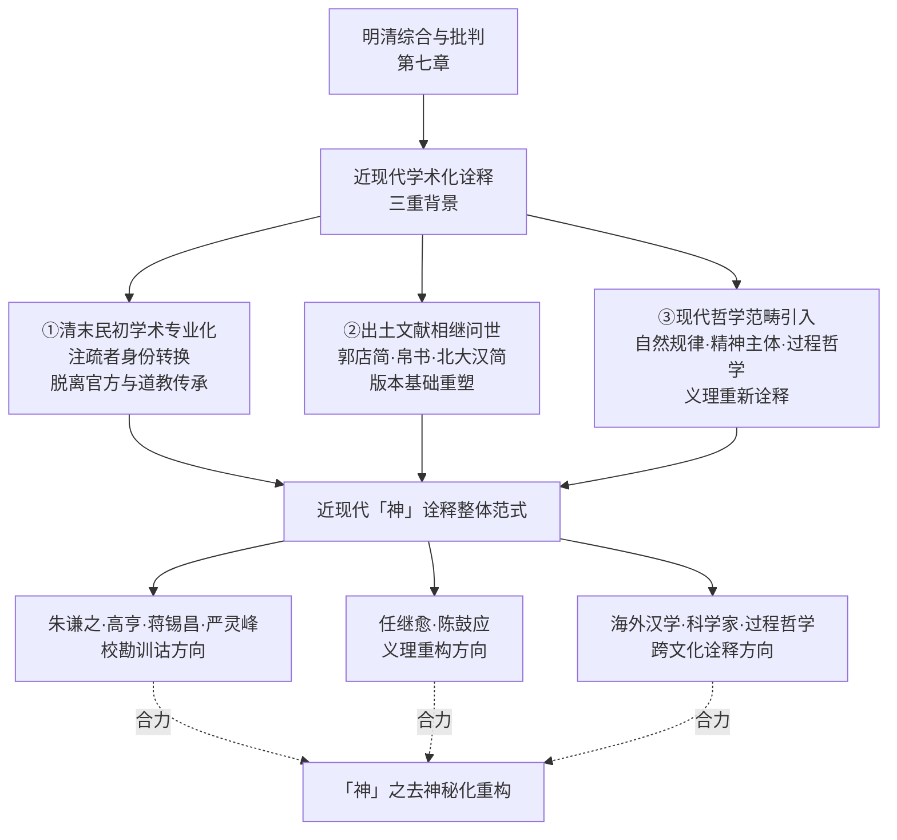

将近现代学术化诠释与第七章所考察的明清综合与批判作纵向比较，可见两者之间的内在承接关系。**王夫之《老子衍》「神为气之灵」的气一元论批判，与近现代学者「神」之自然规律化、功能化处理在方向上完全一致**——王夫之的「气」与近现代的「自然规律」「精神主体」虽在概念形态上有所不同，但其共同的方法论指向都是把「神」从独立超验存在的层面下沉到某种具有自然性、功能性、辩证性的层面。这种内在承接关系表明，近现代去神秘化诠释并非凭空出现的现代发明，而是中国老学诠释史内在演进的合乎逻辑的延展。

**就近现代学术诠释的整体定位而言**，本研究将其确立为第二章 2.4 节所述「神」诠释史第五阶段的核心特征——继汉代多元下沉、魏晋本体论收拢、唐代三向并起、宋元至清义理化心性化内丹化交织、明清综合与批判之后，近现代学术化诠释构成「神」诠释史的第五个阶段，其核心特征是以现代校勘学与哲学方法对「神」作去神秘化处理，回归《老子》原典语义并以现代范畴重新理解。

## 8.2 朱谦之《老子校释》：版本对勘与「谷神」分读派的训诂学论证

朱谦之《老子校释》是中国近现代《老子》校勘学的代表性方案之一，其特殊地位不仅在于校勘工作的精细程度，更在于其对涉「神」核心章句作出的独特训诂学处理。第二章 2.4.1 节已揭示朱谦之自身在「谷神」连读分读问题上存在内部表述的复杂性，本节将进一步落实到《老子校释》具体注文的训诂学考察，呈现朱谦之以现代校勘学方法对原典「神」字字形、字义、连读分读问题作出的具体贡献。

### 8.2.1 校勘学方法的精细运作：以第四章「沖／盅」为例

朱谦之《老子校释》的校勘学精细度，可从其对第四章「道沖，而用之久不盈」的处理中得到典型呈现。其校释过程如下：

> **道沖，而用之久不盈。谦之案：「沖」，傅奕本作「盅」，「盅」即「沖」之古文。说文皿部：「盅，器虚也。老子曰：『道盅而用之。』」郭忠恕汗简（上之二）「沖」字，引古老子作【盅：空虚】。毕沅曰：「说文解字引本书作『盅』，诸本皆作『沖』，淮南子亦作『沖』，并非是。」盖器中之虚曰盅，盅则容物，故庄子应帝王篇曰：「太盅莫胜。」**[^128]

> **严可均曰：「久不盈」，各本作「或不盈」。罗振玉曰：景龙本作「久」，敦煌本作「又」，乃「久」之讹。俞樾曰：「道盅而用之」，「盅」训虚，与「盈」正相对，作「沖」者，假字也。第四十五章「大盈若沖」，「沖」亦当作「盅」。又按「或不盈」，唐景龙碑作「久不盈」，久而不盈，所以为盅，殊胜今本。河上公注曰：「或，常也。」训或为常，古无此义，疑河上本正作「久」也。**[^128]

这段校释的方法论运作具有几重值得关注的特征。**第一，多本对勘的精细程度**。朱谦之引用傅奕本、说文解字、汗简、淮南子、庄子、严可均、罗振玉、毕沅、俞樾、河上公注、景龙本、敦煌本等多重文献进行对勘，使一字一句的训诂建立在丰富的版本与训诂资源基础上。**第二，训诂学论证的逻辑严密**。朱谦之以「盅，器虚也」「盅则容物」论证「沖」当作「盅」、「盅」与「盈」正相对的语义关系，使其论断具有坚实的训诂学根据。**第三，对历代训诂的综合判断**。朱谦之在引述各家说法后，往往以「谦之案」作综合判断——这种判断既保有传统训诂学的严谨性，又体现现代学者综合多元材料的方法论自觉。

### 8.2.2 第六章「谷神不死」的校勘学处理与分读论证

朱谦之对第六章「谷神不死」的校释，是其诠释史价值最具代表性的体现。其完整校释为：

> **畢沅曰：陸德明曰：「谷，河上本作浴，云：『浴，養也。』」案後漢陳相邊韶建老子碑銘引亦作「浴神」，是與河上本同。**[^129]

> **俞樾曰：「浴」字實無養義。河上本「浴」字當讀為穀。詩小弁篇，蓼莪篇，四月篇並云：「民莫不穀。」毛傳並云：「穀，養也。」「穀」亦通作「谷」。爾雅釋天：「東風謂之谷風。」詩正義引孫炎曰：「谷之言穀，穀，生也，生亦養也。」王弼所據本作「谷」者，「穀」之假字。河上古本作「浴」者，「谷」之異文。**[^129]

> **謙之案：作「谷神」是也。今宋本及道藏河上本皆作「谷」，不作「浴」。列子天瑞篇引黃帝書：「谷神不死，是謂玄牝。」庾肩吾詩：「談玄止谷神。」庾信詩：「虛無養谷神。」後漢高義方清誡曰：「智慮赫赫盡，谷神綿綿存。」范應元曰：「谷神二字，傅奕云：『幽而通也。』」皆以「谷神」二字連讀。**[^129]

> **惟老子書中，實以「谷」與「神」對。三十九章「神得一以靈，谷得一以盈」，即其證。司馬光曰：「中虛故曰谷，不測故曰神，天地有窮而道無窮，故曰不死。」嚴復曰：「以其虛，故曰谷；以其因應無窮，故稱神；以其不屈愈出，故曰不死。三者皆道之德也。」是知「谷」「神」二字連讀者誤。**[^129]

这段校释的训诂学结构可作如下分疏：**第一，朱谦之首先确立"作'谷神'是也"的字形选择**——通过对宋本、道藏河上本、列子引黄帝书、庾肩吾诗、庾信诗、高义方清诫、范应元等多重文献的对勘，确认通行本"谷神"二字的字形稳定性。**第二，在确立字形之后，朱谦之进入连读分读问题的辨析**——他列举了"列子引黄帝书"以来"皆以'谷神'二字连读"的传统，但随即提出"惟老子书中，实以'谷'与'神'对"的对立立场。**第三，朱谦之以第三十九章"神得一以灵，谷得一以盈"作为分读的核心论证**——这一并列结构是其分读立场的训诂学根据。**第四，朱谦之引述司马光、严复的连读派立场作对照**，并以"是知'谷''神'二字连读者误"作明确表态。

**值得审慎指出的是，朱谦之这一表态与其前文所引"皆以'谷神'二字连读"的多元传统之间存在明显的内部张力**。这种张力反映了第二章 2.4.1 节所揭示的朱谦之"自身的表述存在复杂性"——一方面他承认连读派的传统广泛性（列子、庾肩吾、庾信、高义方、范应元、司马光、严复等众多代表），另一方面又以《老子》第三十九章作为分读派的核心证据，并最终以"连读者误"作出表态。**就本研究而言，这一内部张力本身即具有重要的诠释史意义——它表明朱谦之作为现代校勘学者，既具有承认传统多元性的学术诚实，又具有以训诂学根据作出独立判断的方法论自觉**。这两种取向的并存，正是近现代学术诠释相对于传统注疏的方法论特征。

### 8.2.3 朱谦之分读立场的诠释史价值与本研究的折衷立场

朱谦之"谷神"分读立场的诠释史价值，可从两个层面评估。

**第一层面：训诂学论证的合法性**。朱谦之以第三十九章"神得一以灵，谷得一以盈"对举结构作为分读依据，这一论证具有不可忽视的训诂学合法性。汪桂年曾言"诸家以谷或为山谷，以取空虚之义，胥失之"[^130]，此立场即建立在第三十九章对举结构的训诂学根据上。这种以《老子》本身的文本结构为依据的论证方式，相对于汉唐以来以训诂传统或义理预设为依据的处理方式，具有更为客观的方法论合法性。

**第二层面：对历代连读派的反向反思**。朱谦之的分读立场，实质上构成对汉唐宋元以来连读派传统的反向反思。**连读派以"中虚故曰谷，不测故曰神"（司马光）、"以其虚，故曰谷；以其因应无穷，故称神；以其不屈愈出，故曰不死"（严复）等表述把"谷神"作为道之异名整体处理**。朱谦之则通过分读论证使"谷"与"神"重新分化为两个独立项——"谷"为虚、"神"为不测，二者皆是对道的不同侧面的喻指。**这种分化处理在客观上具有去神秘化的效果**：它使"神"不再作为"谷神"复合概念中的形上化要素而获得某种神秘化色彩，而仅作为与"天""地""谷""万物""侯王"并列的具体存在项之一。

但本研究在第二章 2.4.1 节已确立"连读为主、分读为参"的折衷立场。这一立场的具体根据是：**第一，连读派代表了从王弼、河上公以下几乎所有历代主流注家的处理方式，是诠释史的主流走向；第二，"谷神"作为复合概念有其独立的形上深度（如"中虚故曰谷，不测故曰神"所揭示的双重摹写），不应仅以一处对举结构而被否定；第三，分读派的训诂学论证虽具有合法性，但不能完全替代连读派传统在中国老学诠释史中的主导地位**。

朱谦之与本研究立场的差异，可作如下整合性理解：

| 维度 | 朱谦之《老子校释》 | 本研究第二章2.4.1节 |
|------|------------------|-------------------|
| 训诂学方向 | 分读派（"连读者误"） | 连读为主、分读为参 |
| 论证根据 | 第三十九章对举结构 | 历代主流诠释传统+原典开放性 |
| 方法论意识 | 现代校勘学的客观判断 | 诠释史的双重尊重 |
| 处理张力 | 承认传统多元性但作出独立表态 | 并陈各派依据再作折衷选择 |

### 8.2.4 朱谦之诠释的诠释史定位

将朱谦之《老子校释》置于近现代学术诠释的整体格局中考察，其诠释史定位可作如下整体定位：

**第一，作为现代校勘学方法应用的代表性方案**。朱谦之以多本对勘、训诂分析、综合判断的方法论框架处理《老子》，使其《老子校释》成为继焦竑《老子翼》之后又一个具有总结性意义的整合性著作——焦竑代表前近代汇辑学传统的成熟，朱谦之则代表近现代校勘学方法的应用。**两者的差异不仅在于方法论形态，更在于诠释立场——焦竑以三教融通保留诠释多元性，朱谦之则以现代校勘学方法作出独立判断**。

**第二，作为分读派在现代训诂学中的代表性方案**。朱谦之的分读立场使《老子校释》成为分读派在现代训诂学中的代表性方案，与高亨等连读派形成方法论对比（详见 8.3 节）。这种立场分歧的存在，正是近现代「神」诠释多元性的具体表现——即使在去神秘化的整体方向上，不同学者仍可在具体训诂问题上作出不同选择。

**第三，作为「神」概念去神秘化的间接贡献**。朱谦之的分读立场虽不直接以去神秘化为诠释目的，但其客观效果是使"神"不再作为"谷神"复合概念中的形上化要素而获得某种神秘化色彩。**这种"间接贡献"的诠释史意义在于：它通过纯训诂学方法（而非现代哲学预设）实现了"神"概念的部分去神秘化，体现了近现代学术诠释方法论的多样性**。

## 8.3 高亨、蒋锡昌、严灵峰：训诂学与义理学综合中的「神」诠释

朱谦之《老子校释》所代表的校勘学方向之外，民国以来高亨、蒋锡昌、严灵峰三家以训诂学与义理学综合的方法对「神」概念作出了不同方向的诠释。三家虽具体立场各异，但共同体现了近现代训诂学—义理学综合诠释的多元路径。

### 8.3.1 高亨：「谷读为穀」与「生养之神」的连读派代表

高亨「字晋生，吉林双阳人。先生是中国现代学术史上有代表性的著名学者，学术特色鲜明，成就卓著。其研究涉及《周易》《诗经》《楚辞》、先秦诸子、文字学、上古神话等领域，其作品已成为二十世纪的学术经典。其中《老子注译》是具有普及性质的一部老子研究著作，另外关于老子还有《老子正诂》一部」[^131]。

**高亨对第六章「谷神不死」的处理，是连读派在现代训诂学中的代表性方案**。其训诂论证为：「谷神者，道之别名也。谷读为穀，《尔雅·释言》：『穀，生也』；《广雅·释诂》：『穀，养也』……谷神者，生养之神。道能生天地养万物，故曰谷神」[^130]。这一论证可作如下分疏：**第一，"谷读为穀"——以"穀"训"谷"，确立字形上的训诂基础**；**第二，"穀，生也""穀，养也"——以经典训诂确立"穀"的生养义**；**第三，"谷神者，生养之神"——将"谷神"作为复合概念整体处理**；**第四，"道能生天地养万物，故曰谷神"——把"谷神"作为道的别名，归本于道之生养功能**。

将高亨的处理与朱谦之的分读立场作对照，两家训诂学方向的根本差异即清晰可见：

| 维度 | 朱谦之《老子校释》 | 高亨《老子注译》 |
|------|-----------------|----------------|
| 字形训诂 | "作'谷神'是也" | "谷读为穀" |
| 连读分读立场 | 分读（"连读者误"） | 连读（"谷神者，道之别名也"） |
| "神"之训释 | "神"作"不测"独立项 | "生养之神" |
| 与道之关系 | "神"为道之多侧面之一 | "谷神"为道之别名 |
| 论证根据 | 第三十九章对举结构 | 《尔雅·释言》《广雅·释诂》训诂 |

**这一对照表明，高亨的处理在训诂学方向上承接了汉代以来河上公"谷，养也"的训诂路径（详见第三章 3.3.1 节），并通过现代训诂学方法对其作出更为系统的论证**。但高亨的处理与河上公的传统养生学诠释存在一个关键差异：**河上公以"神，谓五藏之神也"将"谷神"具体化为人体内的五藏神系统，高亨则以"道之别名"将"谷神"归本于道之生养功能**。这一差异表明，高亨虽承接河上公的字形训诂路径，但摆脱了河上公的具身化养生学方向，而将"谷神"提升为道之别名的形上化概念。**这种"承接训诂、摆脱具身化"的处理方式，正是近现代学术诠释相对于汉唐传统的方法论自觉的具体表现**。

**就第三十九章「神得一以灵」的处理而言**，高亨对本章作出过明确的整体定位：「高亨讲，本章分为三段。前段是老子的宇宙论，过渡到政治论，他称道为一，认为：宇宙间一切东西都是得到一才能存在，没有一将不会存在。最后又谈到政治，指出侯王也是得到一，才能做君长，失去一，就要败亡。后段应是老子的政治论，自然也是为侯王政治服务的。老子指出：人民是侯王的根本与基础，所以侯王要真诚地以谦虚对待人民，重视人民」[^131]。**这一定位把第三十九章理解为"宇宙论过渡到政治论"的结构，使"神得一以灵"中的"神"被纳入"宇宙间一切东西都是得到一才能存在"的整体框架——"神"不再具有独立的形上层级地位，而仅作为"宇宙间一切东西"的具体显现层面之一**。

### 8.3.2 蒋锡昌：「腹中元神」与内丹学传统的现代训诂延续

与高亨形成训诂学立场对比的是蒋锡昌。蒋锡昌「以为《老子》中『谷』皆为一义，『谊皆取其空虚深藏，而未有为他训者』，此处指人之腹部丹田，『神』是腹中元神，『谷神』二字连读」[^130]。这一处理具有几重值得关注的特征。

**第一，对《老子》"谷"字的统一训诂**。蒋锡昌主张《老子》中所有"谷"字皆取"空虚深藏"之义——这一统一训诂方法把第十五章"旷兮其若谷"、第三十三章"犹川谷之于江海"、第六十六章"江海所以能为百谷王者"中的"谷"字统一处理为同一语义。**这种统一训诂方式相对于河上公"谷养也"的处理具有更为严格的训诂学一致性**。

**第二，"谷"指丹田的内丹学化处理**。蒋锡昌将第六章"谷"字进一步具体化为"人之腹部丹田"，这一处理直接承接了内丹学传统对"谷神"的诠释方向。**这种处理在第六章 6.6 节所考察的宋元内丹学传统中具有深厚的概念资源——白玉蟾"安心抱一"、李道纯"赤子之心"、黄元吉元神/识神之辨皆将"神"概念落实于人体修炼的具体语境**。蒋锡昌的"腹中元神"说，可视为内丹学传统在现代训诂学中的某种延续。古棣承袭蒋锡昌之说，但作了部分修正：「古棣从之，又说『叫它为"谷神"是突出其虚的特性』」[^130]——这一修正既保留了蒋锡昌"虚空深藏"的训诂方向，又对内丹学化倾向有所减弱，体现了后续学者对蒋锡昌立场的批判性继承。

**第三，"神"作为"腹中元神"的具体化**。蒋锡昌以"腹中元神"释"神"，使"神"概念回到了内丹学元神论的语境。这与近现代学术诠释整体的去神秘化方向形成鲜明对比——朱谦之以分读消解"谷神"复合概念、高亨以"道之别名"提升"谷神"为形上化概念、任继愈与陈鼓应（详见 8.4-8.5 节）以"道之普遍性""自然规律""精神主体"等现代范畴重新理解"神"——而蒋锡昌则保留了"神"作为内丹学修炼对象的具体性。

**就本研究而言，蒋锡昌的处理具有方法论上的两重意义**。一方面，**蒋锡昌"以《老子》统一训诂为方法论根据"的取向具有合理性**——这种内部一致性的训诂要求是近现代学术诠释方法论自觉的重要表现。另一方面，**蒋锡昌"以丹田释谷"的具体诠释立场对原典语境形成了过度收紧**——《老子》原典语境中"谷"字虽多取"空虚深藏"之义，但将其统一具体化为"丹田"则缺乏《老子》本身的文本根据，更可能是宋元内丹学传统对原典的反向追溯。

### 8.3.3 严灵峰：综合性义理重构的方法论方向

严灵峰是「民国时期研究老庄哲学的学者，其著作分藏于北京国家图书馆及美、英等国立图书馆，1994年严灵峰赠送北京图书馆130多箱书籍」[^132]。其代表作包括《老子达解》《老子章句新编》《老子宋注丛残》等。

**严灵峰诠释最具方法论代表性的特征，是其综合性义理重构方向**。以《老子达解》为例，「《老子达解》是严灵峰对《老子》进行注解和阐释的学术著作。例如，在解读第六十三章『大小多少』时，严灵峰根据《韩非子·喻老》补成为『大生于小，多起于少』。此外，书中将『圣人』一词均语译为『有道的人』」[^132]。这一处理具有几重值得注意的特征。

**第一，根据《韩非子·喻老》补订《老子》原文**。严灵峰以《韩非子·喻老》"大生于小，多起于少"补订《老子》第六十三章"大小多少"——这一处理体现了近现代学者对早期文献相互印证的方法论自觉。**就"神"概念而言，这一方法论同样适用——通过《韩非子·解老》《喻老》（详见第三章 3.1 节）对"神"的早期诠释作出参照，可以为《老子》原典"神"概念的理解提供历史性的训诂资源**。

**第二，"圣人"语译为"有道的人"的去神圣化处理**。严灵峰将《老子》中"圣人"一词均语译为"有道的人"，这一处理具有鲜明的去神圣化倾向。**这种倾向与近现代「神」诠释的整体去神秘化方向具有内在共通性**——把"圣人"从神圣化的人格典范还原为"有道的人"（即体道之人），与把"神"从神祇化的超验存在还原为道之功能性显现，在方法论方向上完全一致。

**第三，《老子宋注丛残》对宋代老学诠释多元性的整理**。严灵峰编《老子宋注丛残》对宋代老学诠释作系统整理，《自序》云：「宋人之解《老子》者，百三十余家」[^133]。**这一整理工作使宋代老学诠释多元谱系得以在近现代得到重新呈现，为本研究第六章对宋元至清「神」诠释的考察提供了重要的文献基础**。

需要审慎指出的是，本研究所及材料对严灵峰具体涉「神」章句的注释细节相对有限，本节论断主要基于其整体诠释方法论与已知的代表性命题作推断性分析。

### 8.3.4 三家比较与近现代训诂学的多元路径

将高亨、蒋锡昌、严灵峰三家诠释作横向比较，可见近现代训诂学—义理学综合诠释中"神"概念处理的多元路径：

| 维度 | 高亨 | 蒋锡昌 | 严灵峰 |
|------|------|--------|--------|
| 训诂学方向 | 谷读为穀，生养之神 | 谷统训空虚深藏，丹田元神 | 综合性义理重构 |
| 连读分读立场 | 连读（道之别名） | 连读（腹中元神） | 综合处理 |
| 与汉唐传统的关系 | 承接河上公字形训诂，摆脱具身化 | 承接内丹学元神论 | 综合多元传统 |
| 与现代去神秘化的关系 | 部分去神秘化 | 保留内丹学修炼对象的具体性 | 去神圣化（圣人为有道的人） |
| 方法论特征 | 训诂学严密论证 | 内部一致性训诂 | 多元文献综合 |

**这一比较揭示出近现代训诂学—义理学综合诠释在「神」概念处理上的几条主要路径**：第一，高亨以现代训诂学重新确证连读派传统的方向——其去神秘化倾向较为温和（保留"道之别名"的形上化深度），但已经摆脱了汉唐具身化传统。第二，蒋锡昌以现代训诂学保留内丹学传统的方向——其内丹学化倾向使其在近现代去神秘化整体方向上呈现出某种"逆向延续"的特征。第三，严灵峰以综合性义理重构整合多元传统的方向——通过去神圣化处理与早期文献相互印证，使其诠释既保有传统训诂的严谨，又具有现代学术的方法论自觉。

**这三条路径的并存，正是近现代训诂学—义理学综合诠释方法论多元性的具体表现**。它们共同构成「神」诠释史第五阶段中训诂学—义理学综合诠释的整体面貌——既不是单一的去神秘化方向（如蒋锡昌的"腹中元神"说就明显保留了内丹学传统），也不是简单的传统延续（如高亨已经摆脱了河上公的具身化方向），而是在多元方法论自觉下的多向展开。

## 8.4 任继愈《老子绎读》：从唯物主义诠释到历史唯物主义自省

任继愈（1916—2009）「是哲学家、宗教学家、历史学家，曾任国家图书馆馆长，著有《汉唐佛教思想论集》《中国哲学史论》等，主要论著收入《任继愈文集》」[^127]。其五十年间四译《老子》的学术历程构成中国近现代《老子》研究最具诠释史价值的学术案例之一。**任继愈对「神」概念的处理，正是其整体诠释立场五十年间演变的具体表现，而这一演变本身又最直接地体现了近现代学术诠释方法论自觉的渐进过程**。

### 8.4.1 五十年四译《老子》的学术历程

任继愈四译《老子》的学术历程可作如下系统呈现：

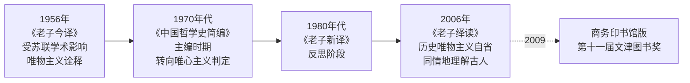

「《老子绎读》是任继愈著，2009年由商务印书馆出版的图书。本书是任继愈对经典著作《老子》的注解和阐释。本书是任继愈自1956年始，在五十年间四次译注《老子》的成果，汇集了其研究成果」[^127]。「从1956年《老子今译》出版，到《老子新译》、《老子全译》，再到2006年《老子绎读》，50年间，任继愈缘何四次翻译《老子》。对此，任继愈解释道，1993年郭店楚墓竹简《老子》甲、乙、丙本等新材料的出土，使他决心再译《老子》」[^134]。这一表述揭示出任继愈四译《老子》的双重动力——**一方面是出土文献相继问世对版本基础的重塑（1973马王堆帛书、1993郭店楚简），另一方面是其自身诠释立场五十年间的演变**。

钟肇鹏对任继愈四译《老子》的真义作了深刻评论：「我认为，由新材料而带来的文字上的些许变化，并不是他关注的全部。任继愈四译《老子》的真义，在于他做学问实事求是和历史唯物主义精神」[^134]。这一评论精确点出任继愈学术历程的核心特征——**实事求是的精神与历史唯物主义的方法论自觉**。

### 8.4.2 三阶段诠释立场的演变轨迹

任继愈五十年间四译《老子》所体现的诠释立场演变，可作三阶段分析。

**第一阶段：唯物主义诠释（1956年《老子今译》）**。钟肇鹏对这一阶段的学术背景作了生动回忆：「上世纪50年代，我在中国科学院哲学所。杨兴顺来北京，所里要我帮助他把近代中国哲学史资料译成现代汉语。由他们再译成俄文。他首先向我介绍了他的简历，他在海参崴成衣店打工，赶上十月革命……我就问他，你读魏源、龚自珍的文章都有困难，《老子》的文字比龚、魏古奥得多，你怎么研究《老子》。他说我主要看的是法文和英文的译本。我问他，你怎么会认为《老子》是唯物主义？他说《老子》认为'道生万物'，觉得《老子》的'道'就像化学上的元素、物理上的原子一样。我才明白他说《老子》是唯物主义的道理，是从现代物理、化学知识来比附的」[^134]。

这段回忆揭示出二十世纪五十年代以来中国学界以唯物主义诠释《老子》的具体方法论根据——**以现代物理、化学知识比附"道生万物"，使"道"被理解为类似化学元素、物理原子的物质性根源**。**就"神"概念而言，这一时期的诠释取向必然将"神"理解为某种物质性、规律性的存在**——既不是独立超验的神祇（汉代《想尔注》），也不是先天虚无的元神（宋元内丹学），而是物质性宇宙规律的某一具体显现层面。

钟肇鹏对这一时期学术风气的评价是审慎的：「这显然不是《老子》的意思。可是五十年代，我们'一边倒'，学习苏联。任先生当时也受了这种影响，所以他的第一本《老子今译》也认为《老子》是唯物主义的。现在看来，在某种特殊情况下，政治上的'一边倒'是可以的。但学术上也搞'一边倒'，就很糟糕」[^134]。

**第二阶段：唯心主义判定（1970年代《中国哲学史简编》）**。「70年代任先生主编《中国哲学史简编》则认为《老子》是唯心主义的」[^134]。这一阶段的转向反映了二十世纪六七十年代中国学界对《老子》定性的内部分歧——**唯物主义与唯心主义的二元对立框架并不能恰当处理《老子》的复杂思想形态**。

**第三阶段：历史唯物主义自省（1980年代《老子新译》、2006年《老子绎读》）**。「到了80年代，经过反思，任先生在《老子新译》的《绪论》里说：过去认为《老子》思想是唯物或唯心的两派『双方都把《老子》思想说过了头，超出了老子时代（春秋时代）的人们的认识水平』。因为唯物、唯心、思维存在的关系问题是近代哲学才明确提出来的问题，古代哲学中虽有这种因素的存在，但古人的思想却不像现在这样明确」[^134]。

钟肇鹏对这一自省过程作了精辟概括：「经过这一正反合的辩证过程，就比较接近老子的历史实际。我们应当从古人所处的历史时代、社会环境、思想状况对古书和古人做同情地理解，这是历史唯物主义的精神，实事求是的态度。而不能把古人现代化，用现代的思想去理解古人、古籍，甚至先存己见，强古人以就我」[^134]。**这一表述确立了任继愈晚年诠释立场的核心方法论——同情地理解古人、回归历史时代语境、避免以现代思想反推古人**。

### 8.4.3 第三十九章注解：「道的普遍性、重要性」

任继愈《老子绎读》对原典第三十九章「天得一以清，地得一以宁，神得一以灵」的注解，是其晚年成熟诠释立场在涉「神」核心章句上的代表性体现。其注释为：

> **任继愈先生说，这一章从六个方面举例，说明道的普遍性、重要性。不论是天、地、神、谷、万物、侯王都离不开道。如果失去了道，天、地、神、谷、万物、侯王就失去了存在的根据。**[^131]

> **虽然不高贵，高贵的东西却不得不以它作为基础。侯王自称孤、寡、不穀，用这些卑下的字眼来称呼自己，这就更显出侯王的高贵。老子宣扬处世不要过分拔尖，以柔弱谦下为处事原则。**[^131]

这段注解的诠释机制具有几重值得关注的特征。**第一，"道的普遍性、重要性"作为整章的统摄性命题**。任继愈以"道的普遍性、重要性"统摄第三十九章的六层并列结构（天、地、神、谷、万物、侯王皆得一以清/宁/灵/盈/生/贞），使整章的核心义理被定位于道之普遍性的展开。**这一处理使"神"概念在第三十九章中失去了独立的形上层级地位（消解严遵的形上层级化），也失去了作为道之妙用的本体功能性显现地位（消解王弼的本体化），而仅作为道之普遍性的一个具体显现层面**。

**第二，"如果失去了道……就失去了存在的根据"的整体性论断**。任继愈以这一整体性论断处理第三十九章下文"天无以清将恐裂"等否定性陈述，使"神"之"无以灵将恐歇"被纳入"失去存在的根据"的统一框架。**这一处理实质上是对王弼"居成则失其母，故皆裂废歇竭灭蹶也"（详见第四章 4.4 节）的现代化转译——以"道之普遍性"替换王弼的"无"作为本体根据**。这种转译使"神"之灵性根据从形上化的"无"下沉到现代化的"道之普遍性"，构成"神"概念去神秘化的具体表现。

**第三，从形上论向政治哲学的过渡**。任继愈在注释下半段把第三十九章的形上论命题进一步落实为政治哲学的具体训诫——"老子宣扬处世不要过分拔尖，以柔弱谦下为处事原则"。**这一过渡既保留了原典第三十九章下文"贵以贱为本，高以下为基"的政治哲学维度，又使其落实为现代日常处事的实用智慧**。

### 8.4.4 任继愈译本的版本基准与方法论自觉

任继愈《老子绎读》的版本处理方式，体现了近现代学术诠释方法论自觉的代表性形态。「该书以通行的王弼本为底本，参照马王堆帛书甲、乙本及郭店楚墓竹简《老子》甲、乙、丙本进行校勘、注释，采用繁体原文与简体译文对照排版，包含章节提要、疑难词句校注及书后索引」[^127]。「本书译本以较为通行的王弼本为底本。作者认为，战国与汉初的《老子》基本思想已定型成熟，而通行本才是构成传统文化主体的版本」[^127]。「书中提出《老子》反映了农民群体的生存诉求，阐释『无为而治』即轻徭薄赋、与民休息的治理理念，并对『大器晚成』与『大器免成』等文本差异进行了考证」[^127]。

**这一版本处理方式体现了任继愈对版本基准选择问题的方法论自觉**——既不以最早层次（郭店简）作为唯一基准（避免以早期文本反推后世主流诠释），也不以传世本（王弼本）作为唯一基准（避免忽视出土文献的版本价值），而是以王弼本为主线、参照帛书与楚简的折衷立场。**这一立场与本研究第二章 2.5 节所确立的"双重基准"原则在方向上完全一致**——本研究"以高明《帛书老子校注》为校勘基准，以王弼本为诠释史主线，以郭店简、帛书甲乙本、北大汉简本作为最早层次的对照参照"的版本立场，与任继愈《老子绎读》的版本处理方式具有深刻的方法论共识。

### 8.4.5 任继愈诠释的诠释史定位

将任继愈《老子绎读》及其五十年学术历程置于近现代学术诠释的整体格局中考察，其诠释史定位可作如下整体定位：

**第一，作为近现代学术方法论自觉的代表性历程**。任继愈五十年间四译《老子》的学术历程，从早期的唯物主义诠释（受苏联学术影响），到中期的唯心主义判定，再到晚期的历史唯物主义自省，呈现出近现代学者对《老子》诠释立场的渐进式调整过程。

**第二，作为「神」概念去神秘化的代表性方案之一**。任继愈以"道的普遍性、重要性"统摄第三十九章六层并列结构的处理，使"神"从汉唐神圣化、宋元内丹化的多元层累中回归为道的具体显现层面。**这种处理方式与朱谦之的分读立场、高亨的"道之别名"训诂、陈鼓应的"自然主义"诠释（详见 8.5 节）共同构成近现代「神」概念去神秘化的多元方案**。

**第三，作为现代学者方法论自省的范例**。「宇宙无限，知识无穷，学海无涯，学思无尽。在第四次修订本《老子绎读》出版之际。他还说：『再过几年，学有长进，也许还要再行修订。』不幸的是7月11日任先生病逝于北京医院，这是学术界的重大损失」[^134]。这一记载使任继愈成为现代学者方法论自省的具体范例——**学术研究永远是开放的进程，任何诠释立场都应保持自省与修订的可能性**。「2016年4月，该书获第十一届文津图书奖，2015年再版之际，亦被作为纪念任继愈诞辰99周年的著作」[^127]——这一获奖与纪念性再版，进一步确证了任继愈《老子绎读》在近现代学术诠释中的代表性地位。

## 8.5 陈鼓应《老子今注今译》：自然规律、精神主体与审美境界的现代诠释

陈鼓应《老子今注今译》（参照简帛本修订版）是中国近现代《老子》研究中流传最广、影响最大的代表性方案之一。「《道典诠释书系：老子今注今译（参照简帛本）（修订版）》由陈鼓应注译。《老子》为道教主要经典之一，为我国重要文化遗产」[^135]。作为中国大陆改革开放以来重新引入台港学术资源的代表性著作，《老子今注今译》在方法论上呈现出明确的现代哲学化诠释方向，将"神"概念以"自然规律""精神主体""审美境界"等现代哲学范畴重新理解，构成近现代「神」诠释去神秘化方向的代表性方案。

### 8.5.1 「朴素的自然主义者」：去神秘化的整体诠释基调

陈鼓应对老子整体定性的核心命题，是「朴素的自然主义者」。其代表性表述为：

> **自然之道老子是个朴素的自然主义者。他所关心的是如何消解人类社会的纷争，如何使人们生活幸福安宁。他所期望的是：人的行为能取法于"道"的自然性与自发性；政治权利不干涉人民的生活；消除战争的祸害；扬弃奢侈的生活；在上者引导人民返回到真诚朴质的生活形态与心境。**[^135]

这段表述确立了陈鼓应诠释的整体基调——**老子被理解为"朴素的自然主义者"，其核心关切被定位于人类社会的现实福祉而非超验的形上学或宗教神学**。这一基调的方法论意义可作如下分疏：

**第一，"朴素的自然主义者"的范畴选择**。陈鼓应以"自然主义者"作为老子的整体定性——这一现代哲学范畴的选择具有典型的去神秘化方向。**自然主义在西方哲学传统中明确反对超自然力量的诉求，强调以自然规律解释一切现象**。把老子定位为"朴素的自然主义者"，实质上预先排除了汉唐《想尔注》将道神格化为太上老君、宋元内丹学将"神"实体化为元神的诠释路径。

**第二，关切焦点的现代化转译**。陈鼓应将老子的核心关切归纳为四点——"消解人类社会的纷争"、"使人们生活幸福安宁"、"政治权利不干涉人民的生活"、"消除战争的祸害"。**这种关切焦点的归纳具有鲜明的现代政治哲学色彩**——它使老子的政治哲学维度被定位于现代政治学的话语框架中（如对权力干预的批判、对战争的反对、对民众生活的关切），而非帝王御注传统中的"君人南面之术"或"道治天下"。

**第三，"在上者引导人民返回到真诚朴质的生活形态与心境"的伦理化**。陈鼓应进一步把老子的政治理想归结为"返回到真诚朴质的生活形态与心境"——这一表述既保留了道家"返朴归真"的传统精神，又通过"生活形态与心境"的具体化使其落实为现代日常生活的伦理实践。

### 8.5.2 "柔弱"观念与辩证规律的现代化转译

陈鼓应对老子"柔弱"观念的现代化转译，是其诠释方法论的另一具体体现。其表述为：

> **柔软的观念意在不可恃刚陵物、强悍暴戾。"柔弱"并非懦弱，老子所说的"柔"是含有无比的韧性和持续性的意义。第三十六章的这些话之在于分析事物发展的规律，他支出事物常依"物极必反"的规律运行；这是自然之理，任何事物都有向它的对立面转换的可能，当食事物发展到某一个极限时，它就会向相反的方向运转，所以老子认为：在事物发展中，张开是闭合的一种征兆，强盛是衰弱的一种征兆。这里面并没有权诈的思想。**[^135]

这段表述把"柔弱"观念从传统的消极退让形象重塑为"含有无比的韧性和持续性的意义"。**这种重塑的方法论意义在于：它使老子思想避免被理解为消极避世的弱者哲学，而被重塑为具有现代精神主体性的积极哲学**。陈鼓应进一步引述明代王道《老子亿》的解读：「『将欲云者，将然之辞也；必固云者，已然之辞也。造化消息虚盈、与时偕行之运，人事有凶吉福祸相为倚伏之理，故物之将欲如彼者，必其已尝如此者也』」[^135]。

陈鼓应注解的关键命题是"这里面并没有权诈的思想"——**这一命题明确否定了韩非以来将老子辩证思想理解为"君主御臣之术"的传统（详见第三章 3.1 节）**。**这种现代化转译与王夫之"神为气之灵"的气化辩证（详见第七章 7.3 节）在思想史上具有内在的承接关系**——王夫之以气一元论的辩证清理消解了道教神化与内丹元神论的实体化倾向，陈鼓应则以现代自然主义与辩证思想进一步把老子哲学完全去神秘化。

### 8.5.3 "道"之"无形""常""周行而不殆"的现代哲学转译

陈鼓应对道之核心特征的处理，最直接体现了其现代哲学转译的方法论。其代表性表述为：

> **"道"之不可名，乃是由于它的无形。为什么老子要设定"道"是无形的呢？因为如果"道"是有形的，那必定就是存在特殊时空中的具体之物了，存在于特殊是空中的具体事物是灰生灭变换的。然而在老子看来，"道"却是永久存在（"常"）的东西，所以他肯定"道"是无形的。**[^135]

> **为什么老子又要反复声明"道"是"不可名"的呢？因为有了名，就把它限定住了，而"道"是无限性的……老子的"道"却并不是固定不变的，它确实不断地在运动着的，所以说："周行而不殆。"，"道"乃是一个变体，是一个动体，它本身是不断地在变动这的，整个宇宙万物都随着"道"而永远在"变"在"动"（任何事物在变动中都会消失熄灭，而"道"则永远不会消失熄灭——"独立不改"的不改，就是指不会消失熄灭的意思）。**[^135]

> **老子说："反者道之动。"老子认为自然界中事物的运行和变化莫不依循着某些规律，其中的一个总规律就是"反"：事物向相反的方向运动发展；同时，事物的运动发展总要返回到原来基始的状态。**[^135]

这段注解的诠释机制可作多层分析。**第一层，"无形"的现代哲学化解释**——以"特殊时空中的具体之物"与"永久存在"的二元对立，把"无形"理解为道之超越具体时空的形上品格。**第二层，"无限性"对"不可名"的重新解读**——以"名"的限定性与"道"的无限性之间的张力，把"不可名"理解为道之无限性的逻辑后果。**第三层，"道是变体""动体"的过程哲学化转译**——把道理解为不断变动的过程性存在。**第四层，"反者道之动"作为"总规律"的现代化解读**——以"自然界中事物的运行和变化""规律"等现代科学语言重新理解老子辩证思想。

**这一现代哲学转译对"神"概念处理具有决定性意义**。在陈鼓应的诠释框架下，"神"概念的位置可作如下推断：**作为道之"无形""常""周行而不殆"的具体显现层面之一，"神"既不是独立超验的神祇（消解汉代神格化），也不是先天虚无的元神（消解宋元内丹化），而是道之自然规律性与精神品格在特定语境下的某种功能性表现**。这一推断与第二章 2.5 节所揭示的"神"概念第一重张力（形上妙用与派生层级）中的"形上妙用"极一立场完全一致。

### 8.5.4 与海外汉学的呼应：过程哲学化倾向

陈鼓应"道是变体""动体""不断变动""永远在变在动"的现代哲学转译，与海外汉学（特别是安乐哲、郝大维的过程哲学化诠释，详见 8.7.2 节）在方法论方向上具有显著的呼应关系。**两者共同把老子之道从静态本体重塑为动态过程**——陈鼓应以"变体""动体"语言，安乐哲以"way-making"（制道）的动名词结构，都试图把道从西方哲学传统中可能被理解为静态实体的形态中解放出来。

这种呼应关系的诠释史意义在于：**它表明中国大陆学者（陈鼓应改革开放后回归大陆并影响大陆学术）与海外汉学家在《老子》"神"概念的现代诠释上达成了方法论的深层共识**——都倾向于以过程哲学化、动态化的现代范畴重新理解老子。这一共识构成近现代「神」诠释跨域对话的重要基础。

### 8.5.5 学界对陈鼓应诠释的多元评价：审慎的方法论考量

陈鼓应《老子今注今译》在学界获得高度赞誉的同时，也面临一些质疑性评价。豆瓣读者评价中既有"陈鼓应太会忽悠了。但实际上他的逻辑思维几乎为零"[^135]的严苛批评，也有"陈鼓应的错误比较多，建议大家读得时候细心点"[^135]的审慎提示，还有"陈注得太差了"[^135]等负面评价；与此同时，"豆瓣评分9.2，1606人评分"[^135]的整体高分，又表明其在大陆读者中获得的广泛认可。

**就本研究而言，对陈鼓应诠释的评估应当采取双重视角**。**一方面**，应承认陈鼓应《老子今注今译》在中国大陆改革开放以来《老子》普及与研究中的重要影响——其将"神"概念以"自然规律""精神主体""审美境界"等现代哲学范畴重新理解的诠释取向，构成近现代「神」诠释去神秘化方向的代表性方案，对推动中国大陆《老子》研究方法论现代化具有不可忽视的贡献。**另一方面**，也应审慎对待其诠释的可能局限——以现代哲学范畴重新理解老子的过程中，必然存在一定程度的现代化反推风险（以现代汉语意义反推古代用法）、过度去神秘化对原典开放性的某种压抑、跨文化诠释中的语义损耗等。

**这种双重视角的评估方式**，与任继愈晚年自省过程中对自身早期立场的反思（详见 8.4.2 节）在方法论上具有内在一致性——**都体现了近现代学术诠释对自身方法论局限保持自省的方法论自觉**。

### 8.5.6 陈鼓应诠释的诠释史定位

将陈鼓应《老子今注今译》置于近现代学术诠释的整体格局中考察，其诠释史定位可作如下整体定位：

**第一，作为近现代「神」诠释去神秘化方向的代表性方案**。陈鼓应以"朴素的自然主义者"作为老子整体定性，以"自然规律""精神主体""审美境界"等现代哲学范畴重新理解《老子》核心概念，使"神"从汉唐《想尔注》《章句》以来的神秘化、神格化、具身化层累中得到系统性的剥离。这一方案是近现代「神」诠释最为彻底的去神秘化方向的代表。

**第二，作为中国大陆改革开放以来《老子》普及性研究的代表性方案**。陈鼓应改革开放后回归大陆并担任北京大学教授，其《老子今注今译》在大陆的广泛流传使其成为中国大陆《老子》普及性研究的代表性方案。**这一普及性意义对近现代「神」概念在大众理解中的去神秘化转向具有深远影响**——通过陈鼓应的注译，《老子》的"神"概念被普通读者更多地理解为"自然规律""精神主体"等现代化的内涵，而非汉唐神祇或宋元内丹元神。

**第三，作为跨文化诠释对话的重要参与者**。陈鼓应"道是变体""动体"的过程哲学化倾向，与安乐哲、郝大维的过程哲学化诠释（详见 8.7.2 节）形成方法论的深层呼应。**这种呼应使陈鼓应诠释成为近现代「神」诠释跨文化对话的重要参与者，构成中国大陆学者与海外汉学家在方法论上达成共识的具体表现**。

## 8.6 中国大陆、台港学术诠释的内部张力

近现代《老子》研究在二十世纪呈现出中国大陆与台港学术诠释的内部张力，这一张力既反映了不同学术语境的差异，也体现了"神"概念诠释方法论的多元性。

### 8.6.1 大陆学术诠释的演进：从单一意识形态化到方法论多元化

中国大陆学术诠释的整体演进，可作三阶段分析。**第一阶段：早期受苏联影响的唯物主义诠释（1950—1970年代）**。如 8.4.2 节所述杨兴顺、早期任继愈以唯物主义解《老》的取向，构成这一阶段的代表性方案。**第二阶段：改革开放后的方法论重建（1980—1990年代）**。任继愈通过自省回归历史唯物主义自觉，陈鼓应作为台港学者回归大陆任教并将其《老子今注今译》带入大陆学术圈，标志着大陆学术从单一意识形态化向方法论多元化的转向。**第三阶段：21世纪以来的多元化诠释（2000年代至今）**。这一阶段的代表性方案包括：刘笑敢《老子古今：五种对勘与析评引论》以郭店竹简本、帛书本、傅奕本、河上公注本、王弼注本五种代表性版本逐字逐句对照（详见第一章 1.2 节）；王博围绕"自然""无为""道"与"有""无"关系等核心范畴撰有系列论文，将《老子》读作"君人南面之术"语境下的政治哲学；廖名春《郭店楚简老子校释》在校勘层面对甲、乙、丙三组简文作出系统整理。

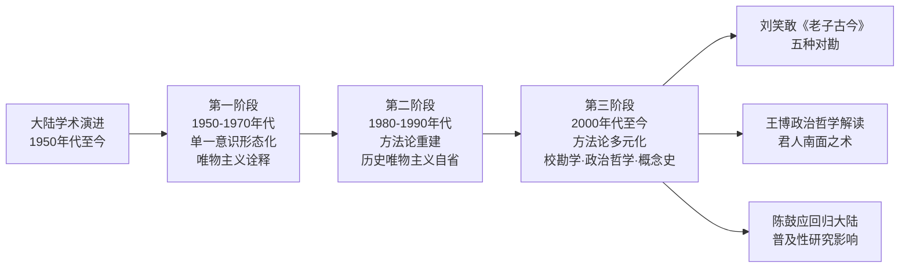

**这一三阶段演进的诠释史意义在于：它具体展示了中国大陆学术从单一意识形态化诠释向方法论多元化诠释的整体转向**。这种转向对"神"概念处理具有重要影响——从早期唯物主义诠释下"神"被理解为物质性宇宙规律的某一具体显现层面，到改革开放后多元化诠释中"神"被理解为道之普遍性（任继愈）、自然规律与精神主体（陈鼓应）、文本层累中的语义集群（刘笑敢）等多重内涵，体现出大陆学者对"神"概念理解的不断深化。

### 8.6.2 台港学术诠释：承接民国传统而较早进入现代诠释学方法

台港学术诠释相对于大陆，呈现出承接民国学术传统而较早进入现代诠释学方法的整体特征。这一特征的具体表现包括：**第一，民国学术传统的连续性**。严灵峰作为民国时期研究老庄哲学的学者，其《老子达解》《老子章句新编》《老子宋注丛残》等代表性著作通过台港学术圈得到延续与发展。「严灵峰编著《老子章句新编》等书」「1994年严灵峰赠送北京图书馆130多箱书籍」[^132]——这一文献传承使民国学术资源在台港得到系统保存。**第二，陈鼓应早期学术取向的台港特征**。陈鼓应早期在台湾大学的学术训练，使其诠释取向较早地融入了现代哲学方法。**第三，对民国以来训诂学传统的批判性继承**。

### 8.6.3 两岸学术诠释在四个具体问题上的差异

两岸学术诠释的内部张力，可在以下四个具体问题上得到具体呈现：

**第一，校勘基准的选择**。大陆学者（特别是改革开放后）普遍采取王弼本为底本、参照帛书与楚简的折衷立场（如任继愈《老子绎读》、刘笑敢《老子古今》），强调出土文献对版本基础重塑的重要性；台港学者则较多保留民国以来王弼本与傅奕本并重的传统取向，对出土文献的吸纳节奏相对温和。

**第二，对内丹—宗教传统的态度**。大陆学者整体上对内丹—宗教传统持较为审慎的批判立场（如任继愈作为宗教学家虽研究道教但其《老子》诠释仍以学术化为主导），陈鼓应明确将老子定位为"朴素的自然主义者"而非道教徒；台港学者则相对保留对内丹—宗教传统的某种同情理解。

**第三，对现代哲学范畴的引入路径**。大陆学者较多通过历史唯物主义、辩证法等马克思主义哲学范畴引入现代诠释（如任继愈），改革开放后逐步引入西方分析哲学、政治哲学等多元范畴；台港学者则较早通过存在主义、自然主义、过程哲学等西方哲学范畴引入现代诠释。

**第四，对马王堆与郭店出土文献的吸纳节奏**。马王堆帛书 1973 年出土后，大陆学者较快地将其纳入研究框架（如高明《帛书老子校注》成为权威校勘本）；郭店简 1993 年出土后，大陆学者同样迅速纳入。台港学者则在吸纳节奏上相对温和但同样积极参与——陈鼓应《老子今注今译》多次修订均参照简帛本[^135]。

| 维度 | 中国大陆学术 | 台港学术 |
|------|------------|---------|
| 校勘基准选择 | 王弼本+帛书+楚简的折衷 | 王弼本+傅奕本传统并重 |
| 对内丹—宗教传统 | 较为审慎的批判立场 | 相对保留的同情理解 |
| 现代哲学范畴 | 历史唯物主义→多元范畴 | 较早引入西方哲学范畴 |
| 出土文献吸纳节奏 | 较为迅速 | 相对温和但同样积极 |

### 8.6.4 两岸学术张力背后的学术史动力

两岸学术诠释内部张力背后的学术史动力，可作如下分析：**第一，学术语境的差异**。大陆从五十年代起经历了较为剧烈的学术语境变迁（从唯物主义意识形态化到改革开放后的多元化），台港则保持了相对稳定的学术语境延续。**第二，学术资源的差异**。大陆学界拥有更为丰富的考古资源（马王堆帛书、郭店简、北大汉简等出土文献的直接研究环境），台港学界则拥有更为便利的国际学术交流资源（与海外汉学的直接对话）。**第三，思想史立场的差异**。大陆学者整体上对道教神化、内丹元神论等传统持较为强势的去神秘化立场（这与王夫之气论批判的传统在思想史上具有内在承接关系），台港学者则相对保留对传统的某种同情理解（这与三教融合传统在台港宗教文化中的延续相关）。

**就「神」概念处理而言，两岸学术诠释的内部张力的核心后果是**：大陆学术诠释整体上呈现出更为彻底的去神秘化方向（如任继愈"道的普遍性"、陈鼓应"自然主义"、刘笑敢的版本对勘客观主义），台港学术诠释则相对保留对"神"概念多元内涵的同情理解。**这种差异不是简单的立场对错，而是不同学术语境、资源、思想史立场下的合理多元**。

## 8.7 海外汉学的多元诠释：从科学化到过程哲学化的「神」概念重构

海外汉学对《老子》「神」概念的诠释构成近现代「神」诠释史第五阶段的另一重要维度。本节将考察三组代表性方案——科学家的物理学化诠释、安乐哲与郝大维的过程哲学化诠释、梅勒的比较哲学诠释。

### 8.7.1 海外《道德经》翻译与科学家的物理学化诠释

近现代海外《道德经》翻译规模之巨，本身即构成「神」诠释跨文化展开的物质条件。「《道德经》最早的外译本可追溯到公元7世纪的唐朝，唐太宗应古天竺国童子王之请，授命佛教高僧玄奘将其译为梵文。明末清初年间，随着大批西方传教士来中国传教，《道德经》便开始了真正意义上的西方之旅……而《道德经》进入英语世界，距今也已有150多年」[^136]。「据考证，追溯其一个半世纪的译介轨迹，《道德经》共有包括全译本、节译本、改写本等在内的各类英译本562种跨越150多年的历史」[^136]。「依据德国宗教学家沃尔夫（Knut Walf）2010 年的统计，西译文本有 643 种之多，其中英译就有 206 种」[^137]。

值得特别注意的是，海外早期翻译史本身即体现了「神」概念诠释的跨文化张力。「19世纪的西方国家先后经历了文艺复兴和启蒙运动的洗礼……这一时期的译介完全依附于基督教的传播，来自于传教士们对其的宗教性阐释，道家思想完全被宗教化、基督化、甚至神化，其英译与《圣经》的汉译互为呼应。换言之，传教士们的早期译介是以宗教面纱为掩护、以政治利益为驱动的……据考证，自1868年到1905年，英语世界的《道德经》译本共有14个，其中有8个是从基督教立场去解读《道德经》，另外6个译本也能从某些章节中看到基督教思想的影子」[^136]。**这一早期阶段的"宗教化、基督化、神化"翻译倾向，与中国大陆任继愈、陈鼓应等学者的去神秘化方向形成鲜明对比——海外早期翻译反而强化了"神"概念的宗教化色彩**。「目前学界普遍认为，最早的英译本应是1868年英国传教士湛约翰（John Chalmers）在伦敦出版的《古代哲学家老子关于形而上学、政治与道德的沉思》（The Speculations on Metaphysics, Polity, and Morality of "The Old Philosopher", Lau-Tsze）」[^136]——其书名中即包含"形而上学""政治""道德"等基督教神学化的整合性范畴。

**英国汉学家翟林奈（Lionel Giles）将《道德经》喻为宇宙中的白矮星，凭借其密度极高的小小形体，以白热程度散发着耀眼的智慧之光**[^136]。这一比喻精确捕捉了海外汉学家对《道德经》的科学化想象——以现代物理学的"白矮星"意象描摹《道德经》的思想密度。**就「神」概念处理而言，科学家的物理学化诠释路径的核心方法论是以现代物理学（量子力学、系统论、统一场论等）类比《老子》之"道"与"神"，将其理解为某种类似自然规律或宇宙基本能量的功能性存在**。

**这一路径相对于汉唐宋元注家的根本差异在于**：汉唐注家倾向于以宗教神学（《想尔注》）、形上层级（严遵）、本体妙用（王弼）、修炼工夫（内丹学）等传统范畴理解"神"，科学家的物理学化诠释则以现代科学范畴（自然规律、宇宙能量、量子现象）重新理解"神"。**两者的共同点是都试图把"神"作为某种功能性、规律性的存在加以理解，差异则在于具体范畴的不同——前者使用形上学的传统范畴，后者使用现代科学的现代范畴**。

需要审慎指出的是，科学家的物理学化诠释虽然在去神秘化方向上具有重要贡献，但也面临着**过度比附的方法论风险**——以现代物理学概念直接套用古代"道""神"概念，可能导致原典语义的强行现代化。这种风险与本研究第一章 1.5 节所警示的"以现代汉语'神'字意义反推古代用法"的风险在方法论上完全一致。

### 8.7.2 安乐哲、郝大维的过程哲学化诠释

**安乐哲（Roger T. Ames）作为「北京大学人文讲座教授、北京大学博古睿研究中心高级学术顾问、夏威夷大学哲学系名誉教授」**[^138]，与郝大维（David L. Hall）合著的《道德经》英译本是海外汉学最具方法论原创性的代表性方案之一。其诠释取向以"文化自觉"翻译观与过程哲学化诠释为方法论核心，构成对汉唐宋元以来「神」诠释传统的彻底重构。

**第一，比较哲学诠释学的方法论起点**。安乐哲在2023年南开大学讲座中明确指出："中国哲学对外传播面临的两方面挑战，即中国文化的基督教化与西方现代主义的框架。研究中国哲学应尊重诠释域境，让中国哲学'讲自己的话'。安乐哲教授提出比较哲学诠释学的方法，这种方法采用一种无中介的经验观与生生的主客不分观，并结合'无为''无欲''无事''无心'等'无'的形式，处理古希腊传统的西方哲学与中国哲学这两种不同的第一哲学，化用《孙子兵法》的语言描述，这一方法便是'知彼知己，百战不殆'"[^138]。**这一表述揭示出安乐哲方法论的核心方向——在西方哲学与中国哲学之间建立平等对话的诠释学框架，避免以西方哲学的本体论范畴反向收紧中国哲学的开放性**。具体到「神」概念处理，这一方向意味着**拒绝以基督教传统中的 spirit、deity、divinity 等范畴直接翻译"神"**。**这种方法论自觉与 8.7.1 节所述海外早期翻译"宗教化、基督化、神化"倾向形成根本分野——它代表着海外汉学从基督教神学化诠释向比较哲学化诠释的整体范式转换**。

**第二，本体论与生生论的根本对立**。安乐哲提出"古希腊哲学传统的第一哲学本体论（ontology）是一种定体论、存在论，其中人之存在（human being）是一个名词，强调一多二分，人与外界属于外在关系，人之存在是做人之道。安乐哲教授主张生生论（zoetology）是第一哲学的另一选择，其中人之生成（human becoming）是一个动名词，人是关系构成的人，这里一多不分，人与外界则属于内在关系，人之生成是一种成人之道。生生论强调阐释域境的全系整体性，是一种无边界的优化共生体系，即中国哲学'和'的理念，这一理论通过以生态为本的'动名词'的语法，以一种'实现'的逻辑，将图像和事件关联起来"[^138]。**这一对立对「神」概念处理具有决定性意义**。在西方本体论传统下，"神"容易被翻译为名词性的 spirit 或 divinity，使其成为静态的存在实体；在生生论框架下，"神"则可被理解为关系构成、生成性的过程性存在，使其重新具有动态的生命力。**这种处理方式与陈鼓应"道是变体""动体"的现代哲学转译（详见 8.5.4 节）在方向上具有深层呼应**。

**第三，"way-making"（制道）的过程哲学化翻译**。安乐哲"将《道德经》的'道'翻译为动名词：制道（way-making）"[^138]。这一翻译选择具有典型的方法论原创性——**以动名词结构（-ing 结尾）使"道"从西方哲学传统中可能被理解为静态本体（the Way）的形态，转化为生生不息的动态过程（way-making）**。**这一翻译方式直接呼应了怀特海过程哲学的传统**——把存在重新理解为生成性的过程而非静态的实体。

**第四，"自然"的"self-ly""self-so-ing-ly"翻译**。"安乐哲教授以《道德经》核心概念'自然'（self-ly或self-so-ing-ly）的翻译为例，进一步阐释了比较哲学诠释学与生生论的方法论意义和理论特点。'然'指事物在全部意义上呈现出的'所以然'（so-ing）或'如此然'（such-ing），'然'还在'忽然''必然''安然'等词语中充当副词（-ly）。'自'（self-）是指持续的、有生命力的、具体的自我的独特性，有内外两种身份，我们能够看到'自'的外在，而它内部也有自己的目的与方向。正是由于'自'由一个无边界的、动态的、总是独一无二的关系构成，它在各种关系中获得质的凝聚，这些关系的合力使'自'持续为'然'，'自'使'然'的含义更加完整。'自然'与'生'有着密切关系，正是'自'的内外两种种身份赋予了'自然'概念解释的力量，让'易'（变化）与'生生'联系起来"[^138]。

**第五，"无"形式的过程哲学化处理**。安乐哲与郝大维《道德经》英译"专门讨论了这一对概念，并提出了'无为'等一系列以'无'与其他名词构成的词组串，以此来强调'无'的思想在《道德经》中的重要地位，表明了译者们与西方分析哲学的分裂以及与过程哲学的贴近，且考虑了翻译的创新功能，是具有'文化自觉'意识的英译"[^137]。

**就「神」概念处理而言**，虽然本研究所及材料对安乐哲对涉「神」具体章句的翻译细节相对有限，但基于其整体过程哲学化方向可作如下推断：**安乐哲对"神"概念的处理可能采取音译保留（保留"shen"原音以避免西方实体化误读）或动名词化处理（使"神"作为某种"灵动着""神化着"的过程性存在）的方向，使其纳入"无—有""自—然""人之生成（human becoming）"的关系性、生成性框架**。安乐哲到访南开大学全球老学特藏并签名，"安乐哲教授在全球老学特藏里发现自己的《道德经》译本也顺便签名"[^138]——这一细节本身即体现了海外汉学家与中国学界的深度交流。

### 8.7.3 梅勒（Hans-Georg Moeller）的比较哲学诠释

**汉斯-格奥尔格·梅勒（Hans-Georg Moeller）是德国汉学家，「师从波恩学派大师陶德文（Rolf Trauzettle），研究中国哲学和比较哲学，著作有《马王堆汉墓帛书〈老子〉》《道德之愚》《东西之道》等**[^139]。曾任教于加拿大克鲁克大学哲学系和爱尔兰国立考克大学（University College Cork）哲学系教授」[^139]，现任「澳门大学人文学院哲学及宗教学系教授」[^139]。其代表性著作包括「《马王堆汉墓帛书<老子>》（1995年德文版）、《解释道家：从庄周梦蝶到鱼网寓言》（2004年英文版）、《解释卢曼：从灵魂到体系》（2006年英文版）以及《道德之愚》（2009年英文版），2010年人民出版社《道德经》的哲学（The Philosophy of the Daodejing）等」[^139]。

**梅勒的诠释最具方法论原创性的特征，是其对中西哲学根本范式的比较哲学性区分**。其在2025年北京大学讲座的内容简介中明确指出：

> **在古希腊哲学传统中，真理（truth）与表象（appearance）的二元分野始终占据核心地位。柏拉图笔下的哲学家被塑造为辨明此分野的智者，哲学由此成为对实体化真理的终极追寻。承担教化使命的哲人往往面临危险与困境——其职责在于引领世人突破表象世界的桎梏，通达真理之境。这种哲学认知深刻影响着欧洲哲学史的发展轨迹，直至19世纪黑格尔与尼采等思想家开始解构真理与表象的传统等级秩序，推动表象逐渐摆脱真理的统摄。**[^139]

> **中国早期哲学则呈现出不同的理论范式：思想论辩多聚焦于秩序（治）与失序（乱）的辩证关系。诸子学说致力于辨明正当秩序的本质内涵，探究维系政治社会稳定、规避混乱的具体路径。这种秩序观具有多维复合性特征，既涵盖宏观（自然的）运行规律，亦涉及微观（个体的）修为，其核心命题在于如何构建持久繁荣的社会政治体系。**[^139]

> **尽管真理/表象与秩序/失序作为中西方哲学的基本符码——或可称为哲学'语法'——其差异更多体现为程度性而非本质性。在欧洲哲学脉络中，对真理的追求通常同时包含着对秩序的探求；而中国思想中关于秩序的不同主张，本质上亦是对'正当'与'失当'的界说。二者的根本分野在于：欧洲传统要求秩序必须植根于真理，而中国早期哲学则认为正当性正寓于秩序之中。**[^139]

**这段表述的诠释机制具有几重值得关注的方法论意义**。**第一，"真理/表象"与"秩序/失序"的范式区分**。梅勒以这两组概念区分作为中西哲学根本范式差异的"哲学语法"——欧洲哲学以"真理/表象"为基本符码，中国哲学以"秩序/失序"为基本符码。**这一区分使中国哲学（特别是《老子》）的核心关切被定位于秩序问题（治/乱），而非真理问题**。**就「神」概念处理而言**，这一区分意味着"神"不应被纳入西方实体化真理观的范畴（如 spirit、deity 等具有真理性内涵的范畴），而应被纳入中国哲学秩序观的整体框架——**"神"作为治/乱辩证关系中的某一具体环节，承担着维系秩序或显现失序的功能性角色**。

**第二，"正当性正寓于秩序之中"的内在性判断**。梅勒明确指出"中国早期哲学则认为正当性正寓于秩序之中"——这一判断把"正当性"从西方哲学传统中可能被理解为外在真理根据的形态，重塑为秩序内部的内在性根据。**就《老子》第六十章"以道莅天下，其鬼不神，其神不伤人"的处理而言**，这一判断具有重要意义——所谓"神不伤人"的根据不在某种外在真理（如基督教传统中的"上帝之爱"），而在"以道莅天下"所确立的秩序内部的内在和谐。这种处理方式与王弼"不扰则全真"的本体论政治哲学（详见第四章 4.5 节）在方向上具有深层共通性——都把鬼神问题悬置于秩序内部的整体性中加以理解。

**第三，比较哲学诠释的非本质化方向**。梅勒指出"二者的根本分野在于：欧洲传统要求秩序必须植根于真理，而中国早期哲学则认为正当性正寓于秩序之中"——这一表述虽强调中西哲学的根本分野，但其方法论方向是非本质化的（"差异更多体现为程度性而非本质性"）。**这种非本质化方向使梅勒的比较哲学诠释避免了简单的二元对立**——它既承认中西哲学的差异，又拒绝把这种差异本质化为不可通约的对立。

### 8.7.4 海外汉学对中国大陆、台港学术诠释的对话与张力

将海外汉学三组代表性方案与中国大陆、台港学术诠释作横向比较，可见近现代「神」诠释跨文化对话的整体格局：

| 维度 | 中国大陆学术 | 台港学术 | 海外汉学 |
|------|------------|---------|---------|
| 整体方向 | 去神秘化（任继愈、陈鼓应） | 去神秘化为主（陈鼓应早期、严灵峰） | 多元方向（科学化、过程哲学化、比较哲学化） |
| 方法论核心 | 历史唯物主义→多元化 | 民国训诂学+现代哲学方法 | 翻译学+跨文化诠释学 |
| 哲学范畴 | 自然规律、精神主体（陈鼓应） | 多元义理重构（严灵峰） | 过程哲学（安乐哲）、秩序观（梅勒） |
| 出土文献立场 | 较为迅速吸纳 | 相对温和但积极参与 | 部分代表（如梅勒早期研究马王堆帛书） |
| 与传统注疏关系 | 较强批判性 | 同情理解 | 跨文化重构 |

**这一比较揭示出近现代「神」诠释跨文化对话的几重关键特征**：**第一，方向上的共识**。中国大陆、台港、海外汉学三方在去神秘化的整体方向上具有深层共识——都倾向于把"神"从汉唐宋元的宗教神学、内丹元神等传统层累中剥离，以现代化或跨文化的范畴重新理解。**第二，方法论的多元**。三方在去神秘化的具体方法论上呈现出显著的多元性——大陆学者倾向于以现代汉语哲学范畴（自然规律、精神主体）重构，台港学者倾向于以民国训诂学与现代哲学综合，海外汉学家则倾向于以翻译学与跨文化诠释学（过程哲学、比较哲学）重构。**第三，对话的可能与张力**。三方之间的对话既有深层共识，也存在方法论张力——如安乐哲过程哲学化诠释与陈鼓应"道是变体""动体"的呼应，构成对话的具体形态；而梅勒"秩序/失序"范式区分对中国哲学的整体定位，则与中国学者的现代哲学化诠释存在某种方法论张力。

## 8.8 近现代学术诠释的整体格局与诠释史定位

在前述各节考察基础上，本节作为全章总结，从横向比较与纵深思想史诠释两个维度，对近现代学术诠释中「神」概念处理的整体格局作系统定位。

### 8.8.1 横向比较：四个方向的多元路径

横向层面，近现代「神」诠释可从校勘学、训诂学、义理学、海外汉学四个方向归纳其多元路径：

| 方向 | 代表学者 | 核心方法论 | 「神」之处理 | 与原典张力对应 |
|------|---------|----------|------------|--------------|
| **校勘学方向** | 朱谦之 | 多本对勘、训诂分析 | 分读消解"谷神"复合概念 | 偏向独立项（与天地谷并列） |
| **训诂学方向** | 高亨、蒋锡昌、严灵峰 | 字形训诂、义理重构 | 道之别名/腹中元神/有道的人 | 多元张力的不同选择 |
| **义理学方向** | 任继愈、陈鼓应 | 现代哲学范畴、自然主义 | 道之普遍性/自然规律/精神主体 | 偏向形上妙用、自然灵性 |
| **海外汉学方向** | 汤川秀树、安乐哲、梅勒 | 物理学化、过程哲学化、比较哲学 | 自然规律/过程性存在/秩序观环节 | 偏向功能性描述 |

**呼应第二章 2.5 节所归纳的原典「神」概念四重语义张力**——形上妙用与派生层级、自然灵性与超验力量、二元结构与三元结构、独立实体与功能性描述——可以发现近现代学者在四重张力中所作的极一选择性强调：

| 语义张力 | 极一 | 极二 | 近现代普遍倾向 |
|---------|------|------|--------------|
| 道之关系 | 形上妙用 | 派生层级 | 极一（神为道之普遍性的具体显现） |
| 性质归属 | 自然灵性 | 超验力量 | 极一（彻底去神秘化、去人格化） |
| 存在结构 | 二元 | 三元 | 极一（鬼神功能化、悬置三元） |
| 概念组合 | 独立实体 | 功能性描述 | 极二（神为功能性显现） |

**这一选择性强调使近现代「神」诠释成为对汉唐宋元两千年宗教与修炼层累的整体性清理**——汉代《想尔注》将"神"神格化为太上老君的人格化路径、宋元内丹学将"神"实体化为元神/识神的具身化路径，皆在近现代去神秘化诠释中被系统性剥离。**值得特别注意的是，近现代学者在四重张力中的选择，与魏晋王弼贵无论的极一选择（详见第四章 4.8 节）在方向上完全一致——王弼以"无形无方"消解"神"的实体化与超验化，近现代学者以"自然规律""精神主体""过程性存在"等现代范畴延续了这一方向**。这种从王弼贵无论到近现代去神秘化的方向延续，构成中国老学诠释史"哲学化主线"的内在连续性。

### 8.8.2 纵深思想史诠释：作为「神」诠释史第五阶段的整体特征

纵深层面，将近现代学术诠释定位为「神」诠释史第五阶段的整体特征，可作如下系统呈现：

```mermaid
flowchart TB
    A["「神」诠释史五阶段"] --> B["第一阶段：汉代多元下沉<br/>政治·气化·养生·宗教四向辐射"]
    A --> C["第二阶段：魏晋本体论收拢<br/>王弼以「无」为本"]
    A --> D["第三阶段：唐代三向并起<br/>重玄·神谱·御注"]
    A --> E["第四阶段：宋元至清交织演进<br/>义理化·心性化·内丹化"]
    A --> F["第五阶段：明清综合与近现代去神秘化<br/>气论批判·学术化诠释"]
    
    F --> G["明清王夫之气论批判<br/>「神为气之灵」"]
    F --> H["近现代学术诠释<br/>校勘·训诂·义理·跨文化"]
    
    G -.直接前奏.-> H
    H -.整体清理.-> I["汉唐宋元两千年宗教·修炼层累"]
    
    I -.呼应1.6节双重内化.-> J["「神」从外在神祇到内在主体性精神<br/>哲学化路径的最终完成"]
```

**这一五阶段框架的整体性意义在于：它呈现出中国老学诠释史中「神」概念演变的完整轨迹**——从汉代多元下沉的初始状态，经过魏晋本体论收拢的范式转换，到唐代三向并起的多元展开，再到宋元至清义理化、心性化、内丹化交织的深度内化，最终在明清之际与近现代经由王夫之气论批判与现代学术诠释的双重清理，完成「神」概念从外在神祇向内在主体性精神或自然规律的彻底转化。

**这一转化与第一章 1.6 节所提"双重内化"假设的最终验证形成深层呼应**——"双重内化"假设的核心命题是：「神」概念的演变呈现出一种"双重内化"轨迹——一方面由外在的天地神祇逐步内化为人心之神明，构成哲学化路径；另一方面同一概念又被外化为太上老君等人格神，构成宗教化路径，二者并行而互渗。**近现代学术诠释作为"哲学化路径"的最终完成形态，使"神"概念从外在神祇彻底内化为自然规律、精神主体、过程性存在等现代范畴；而"宗教化路径"在近现代则在道教内部传承中延续（如全真教对吕祖的尊崇、白玉蟾在南宗道教中的祖师地位），但其在主流学术诠释中的地位已被去神秘化方向所取代**。这种"哲学化路径主导、宗教化路径延续"的格局，是近现代「神」诠释相对于汉唐宋元两千年传统的整体性范式转换。

### 8.8.3 近现代学术诠释自身的方法论局限

在肯定近现代学术诠释作为「神」诠释史第五阶段成熟形态的同时，本研究亦需审慎指出其自身的方法论局限——这种局限并非否定近现代诠释的价值，而是为后续诠释史研究保持开放空间作必要的方法论自省。

**第一，以现代汉语「神」字意义反推古代用法的潜在风险**。近现代学者在以"自然规律""精神主体""过程性存在"等现代范畴重新理解"神"的过程中，难以完全避免以现代汉语"神"字的当代意义反推古代用法的潜在风险。例如，现代汉语"神"字的"

# 9 主题贯通与思想史诠释：关系网络演变与中国思想转型逻辑

第二章至第八章已沿断代脉络对《老子》「神」诠释作了完整的历时性考察——从原典层面的语义基础与文本歧异，经汉代政治法术、黄老气化、养生神化、宗教神学的四向辐射，魏晋王弼的本体论收拢，隋唐重玄学的双遣双非与神谱整合，宋元至清义理化—心性化—内丹化三股力量的交织演进，明清焦竑的汇辑保留与王夫之的辩证批判，至近现代学术化诠释的去神秘化整体清理，呈现出「神」概念在两千余年中所经历的复杂位置变迁。然而，断代分期的线性叙述虽具有结构清晰的优势，却易使各代诠释立场之间的内在关联与整体规律被遮蔽——尤其是「神」与道、气、德、鬼、心性等核心范畴构成的关系网络，及其在历代注本中的位置重组，仅在断代框架中难以得到充分呈现。**本章作为全书断代考察的总结性提升，将转向横向主题贯通与纵深思想史诠释两个维度，旨在突破线性叙述的局限，从关系网络与思想史动力两个层面对「神」概念的演变作整体性把握，并通过「双重内化」假设的系统检验，论证「神」作为边界概念所承担的中国思想史动力功能**。本章首尾呼应第一章 1.6 节所提三大核心问题——重构机制问题、演变轨迹问题、思想史意义问题——构成对全书研究主线的集中回应。

## 9.1 道神关系的演变：从道之派生到道之妙用、道之别名的层级重组

「神」与「道」的关系是中国老学诠释史上最具张力的关系网络之一，其位置变迁直接反映了各代思想范式对原典开放性结构的差异化选择。回顾第二章 2.5 节所归纳的原典「神」概念第一重张力——形上妙用与派生层级，「神」字在《老子》原典中本身即在两极之间保持开放：第六章「谷神不死」（连读读法下）将「谷神」描摹为道之品格的形上妙用，第三十九章「神得一以灵」中「神」与「天」「地」「谷」「侯王」并列又使其呈现为某种存在层级。这一原典层面的开放性，构成历代注家在道神关系上作差异化重构的根本语义入口。

### 9.1.1 汉代：道神关系的三重派生形态

汉代注家对道神关系的处理，整体呈现「派生层级」极一立场的多向展开。**严遵《老子指归》以「道—一—神明—太和—天地」五阶层级把"神明"提升为道之派生的独立形上构成项**——「神明」位居「道—德」之下、「太和—天地」之上，是由虚入实的关键中介，其形上地位独立而清晰（详见第三章 3.2.2 节）。**河上公《章句》则把汉代派生形态彻底具身化**——「神，谓五藏之神也」「肝藏魂，肺藏魄，心藏神，脾藏意，肾藏精与志」——使"神"成为道于人身的具体派生显现，其派生性不再是形上层级意义上的派生，而是从道之普遍性向具体身体器官落实的具身化派生（详见第三章 3.3.1 节）。**《老子想尔注》则在派生形态之外开辟人格神化的特殊路径**——「一散形为气，聚形为太上老君」——使"神"与道在人格神层面达成等同，构成汉代道神关系的第三种形态（详见第三章 3.4.1 节）。

这三重派生形态的共同特征，是把"神"作为某种实体性存在加以处理——形上层级实体化（严遵）、身体生理实体化（河上公）、人格神实体化（《想尔注》）。**这一共同特征与汉代气化宇宙论建构、神仙方士养生风气盛行、原始道教组织兴起等多重思想史动因密切相关**（详见第三章 3.5.2 节），构成汉代道神关系处理的整体气质。

### 9.1.2 魏晋：道神关系的本体论收拢

魏晋王弼以「以无为本」的本体论框架对汉代三重派生形态作系统性收拢。其对第三十九章「神得一以灵」的核心注文——「一，数之始而物之极也。各是一物之生，所以为主也。物皆各得此一以成，既成而舍以居成，居成则失其母」——把"神"重新拉平为"万物层面"的具体存在项之一，使其与"天""地""谷""万物""侯王"处于同一存在层级（详见第四章 4.4 节）。**这一处理的关键创新在于"本体论拉平"——它把严遵体系中"神明"作为独立形上层级的特殊地位彻底消解，使"神"重新整合为以"无"为本的单一本源论**。

王弼对第六章「谷神」的注文——「谷神，谷中央无者也。无形无影，无逆无违，处卑不动，守静不衰」——则把"谷神"从汉代具身化与神格化的实体性诠释中剥离，重构为本体之"无"的功能性显现（详见第四章 4.3 节）。经此处理，"神"既不再是独立形上层级（消解严遵），也不再是具体身体内主（消解河上公），更不再是人格化神祇（消解《想尔注》），而仅作为"无"在万物层面的某种功能性表现。这一收拢使道神关系从汉代的实体性派生重置为魏晋的功能性显现——"神"不是道所派生的独立存在，而是道之妙用在具体存在项上的呈现方式。

### 9.1.3 唐代：道神关系的多向并起

唐代道神关系处理呈现出比魏晋更为复杂的多向并起格局。**重玄学派以「双遣双非」把道神关系推向更彻底的存在论悬置**——成玄英《道德经义疏》以「若言神空，则是断见。若言神有，则是常见」的层层否定（详见第五章 5.2.2 节），使"神"与道一并悬置于"非有非无、非非有非非无"的中道之中。这一处理相对于王弼贵无论的方法论彻底化，使道神关系从"神为无之妙用"进一步推向"神与道俱不可执"——任何可被稳定附着的存在层级都失去其作为终极根据的合法性。

杜光庭《道德真经广圣义》则以神谱体系重新激活道神关系的宗教维度——「天神/地祇/人鬼三分」体系把"神"重新落实为道教神学的具体内涵（详见第五章 5.5.2 节）。唐玄宗御注以「冲气」释「一」——「一者，道之和，谓冲气也」——使"神得一以灵"的诠释被纳入气化框架，构成道神关系的折衷处理（详见第五章 5.6.1 节）。**这三种处理在道神关系上呈现出"思辨化—神学化—气化政治化"三向并起的多元格局**。

### 9.1.4 宋元至清：道神关系的心性化与气化辩证

宋元至清的道神关系处理整体呈现出心性化的范式转向。**苏辙《老子解》以「言其德也」「言其功也」处理「谷神—玄牝」**——「谓之谷神，言其德也；谓之玄牝，言其功也」（详见第六章 6.3.2 节）——把"神"作为道之德性与功用的双重摹写，开启了道神关系心性化的早期形态。**陈景元以「以理释道」与「重玄为宗」融贯气化与心性**——使"神"既保留汉代气化论的形上深度（在「道—一—神明—太和」结构中保留"神明"位置），又获得宋代理学义理化的心性内涵（"复性"论中"神"作为性之灵动表现）（详见第六章 6.4 节）。**林希逸「以心明道」与白玉蟾「心即道」则把道神关系推向最彻底的心性化形态**——道之灵动即是心之神明，"神"与道在心性主体层面达成统一（详见第六章 6.5.2、6.7.1 节）。

清代王夫之以「神为气之灵」的气一元论辩证批判完成道神关系的另一向重塑——把宋元内丹元神论的实体化倾向消解为气化辩证的功能性显现，使"神"既不是独立形上层级，也不是先天虚无之元神，而是气在最灵动状态下的功能性表现（详见第七章 7.3.4 节）。**王夫之处理的方向虽与宋元心性化诠释存在张力，但其核心机制都指向同一方向——把"神"从独立实体性存在拉回到功能性显现的层面**。

### 9.1.5 近现代：道神关系的去神秘化与过程化

近现代学术诠释完成道神关系的最终去神秘化转向。**任继愈以「道的普遍性」统摄第三十九章六层并列结构**——「道的普遍性、重要性。不论是天、地、神、谷、万物、侯王都离不开道」（详见第八章 8.4.3 节）——使"神"成为道之普遍性的具体显现层面之一。**高亨以「道之别名」处理「谷神」**——「谷神者，道之别名也」「道能生天地养万物，故曰谷神」——使"神"被提升为道之别名的形上化概念，但同时摆脱了汉代具身化与宋元内丹化的实体性内涵（详见第八章 8.3.1 节）。**陈鼓应以「自然主义者」定位老子整体立场**——使"神"作为道之"无形""常""周行而不殆"的具体显现层面，被纳入现代自然规律框架（详见第八章 8.5.3 节）。**安乐哲以「way-making」过程化重塑道概念**——使道与神都被纳入"动名词"式的生生不息动态过程框架（详见第八章 8.7.2 节）。

### 9.1.6 道神关系演变的整体机制

将上述演变归纳为表格化对比与机制性诠释，可清晰呈现道神关系两千年位置变迁的整体机制：

| 时代 | 代表注家 | 「神」与「道」之关系 | 关系结构 |
|------|---------|-------------------|---------|
| 汉代 | 严遵 | 道之派生（独立形上层级） | 「道—一—神明—太和」五阶 |
| 汉代 | 河上公 | 道之具身派生（五藏神） | 「道—精气—五藏神」结构 |
| 汉代 | 《想尔注》 | 道与神在人格神层面合一 | 「道散形为气，聚形为太上老君」 |
| 魏晋 | 王弼 | 道之妙用（功能性显现） | 「无—神之灵」（神为无之用） |
| 唐代 | 成玄英 | 道与神俱悬置于中道 | 「非有非无」之双遣双非 |
| 唐代 | 杜光庭 | 道在神谱中具体化 | 天神/地祇/人鬼三分 |
| 唐代 | 唐玄宗 | 神为道之冲气妙用 | 「一者道之和，谓冲气也」 |
| 宋代 | 苏辙 | 神为道之德性与功用 | 「言其德/言其功」双重摹写 |
| 宋代 | 陈景元 | 神为「理」之灵性显现 | 「重玄—自然—道德」整体 |
| 宋代 | 林希逸 | 神即心之神明（道即心） | 「以心明道」 |
| 宋元 | 白玉蟾 | 神性与道性在心性中统一 | 「心即道」 |
| 清代 | 王夫之 | 神为道（气）之灵 | 「神为气之灵」（气一元论） |
| 近现代 | 任继愈 | 神为道之普遍性的显现层面 | 道的普遍性、重要性 |
| 近现代 | 高亨 | 神为道之别名 | 「谷神者，道之别名也」 |
| 近现代 | 安乐哲 | 神为道（way-making）的过程性显现 | 过程哲学化 |

这一表格化对比揭示出道神关系演变的几重整体规律：第一，从实体性派生（汉代三重形态）到功能性显现（魏晋以下），是道神关系最深刻的范式转换——这一转换的方法论根据在于王弼"以无为本"对汉代气化论的本体论收拢；第二，从中道悬置（唐代重玄学）到心性别名（宋元至清），是道神关系内在化的具体路径——心性化诠释把"神"从外在派生彻底转化为内在主体性精神；第三，从气化辩证（清代王夫之）到自然规律—过程性显现（近现代），是道神关系去神秘化的最终完成——近现代以"道之普遍性""道之别名""way-making"等现代范畴重新理解"神"，使其完全脱离两千年宗教与修炼层累。

**值得特别注意的是，这一道神关系演变机制与第二章 2.5 节所揭示的原典第一重语义张力（形上妙用与派生层级）形成深层呼应**——汉代选择"派生层级"极一，魏晋以下逐渐转向"形上妙用"极一，至近现代则以"形上妙用"极一的现代化形态完成最终定位。这一选择性强调的整体方向，与中国思想史从宇宙论向本体论再向心性论转型的总体轨迹完全一致——道神关系的位置变迁，本身即是中国思想范式整体演变的具体投射。

## 9.2 气神关系的演变：从汉代气化论到内丹三炼体系再到清代气一元论

「神」与「气」的关系作为贯穿汉至清的隐性主线，其结构性变迁最直接地反映了中国气论传统对「神」概念的塑造作用。这一关系网络的特殊性在于：与道神关系主要在哲学化路径中展开不同，气神关系同时在哲学化路径（汉代严遵、清代王夫之）与修炼路径（汉代河上公、宋元内丹学）中并行展开，构成「神」诠释史中最具实践厚度的关系网络。

### 9.2.1 先秦至汉代：气神关系的初始建构

气神关系的概念基础植根于先秦至汉代的气论传统。**《管子·内业》「精也者，气之精者也」「一物能化谓之神」**——这一表述确立了"精气—神"的初始结构，把"神"理解为精气之精微表现与变化能力。**《淮南子》「神为君形者」**——则进一步把"神"理解为"形—气—神"三层结构中的最高层级，承担"形之主宰"的功能。这些先秦至汉代的气论资源，为《老子》「神」诠释中气神关系的展开预设了基本概念结构。

汉代严遵《老子指归》对气神关系的处理，呈现出一种"形上层级化的气化论"特征。其在「道—一—神明—太和—天地」五阶层级中，「太和」作为气化总体的形上根据居"神明"之下，构成"神明→气化"的派生方向（详见第三章 3.2.2 节）。**这一结构与《管子·内业》「精→气→神」的初始结构存在方向上的差异**——《管子》把"神"理解为精气派生的精微表现，严遵则把"神明"理解为气化总体的形上根据。这一差异不是矛盾，而是反映了汉代气论传统在"自下而上的气化派生"与"自上而下的形上派生"两个方向上的并行展开。

河上公《章句》则从修炼实践层面建构了汉代气神关系的另一形态。**「神，谓五藏之神也」「五气清微，为精、神、聪、明、音声五性」**——这一处理把"神"具身化为五藏精气系统中的核心枢纽，使气神关系成为身体修炼的具体内在结构（详见第三章 3.3.2 节）。河上公"养神则不死"的命题，正是建立在这一气神关系的具身化结构基础上——通过涵养精气以养神，进而达至"长生久寿"的修炼目标。

### 9.2.2 魏晋至唐：气神关系的本体论悬置与折衷激活

魏晋王弼以「无」替代「气」作为本体根据，使汉代气神关系被功能化处理。在王弼贵无论框架下，"气"不再是本体最高范畴，而仅是"无"在具体存在层面的某种显现；"神"作为"无"之妙用，与"气"处于同一功能性显现层级。**这一处理在概念史上的后果是：气神关系从汉代的实体性派生关系（精气派生神或神明派生气化）被悬置于功能性并列关系（皆为"无"之显现）**。这一悬置使魏晋玄学场域中的气神关系问题相对于汉代显得不那么突出——王弼对涉"神"章句的注疏中，鲜少正面处理气神关系。

唐代唐玄宗御注以「冲气」释「一」重新激活气神关系。其对第三十九章「昔之得一者」的注文——「一者，道之和，谓冲气也。以其妙用在物为一」——使"神得一以灵"的诠释被纳入气化框架，"神"之灵性根据被重新定位于"冲气"这一具体化的形上中介（详见第五章 5.6.1 节）。这一处理在方向上既不同于王弼的纯本体论收拢（不以"无"为最高根据），也不同于汉代严遵的形上层级化（不以"神明"为独立形上构成项），而是以"冲气"作为气神关系的中介性根据。

### 9.2.3 宋元内丹学：气神关系的工夫论转化

宋元内丹学完成气神关系最具系统性的工夫论转化。**「炼精化气、炼气化神、炼神还虚」三阶段炼养体系**把气神关系从汉代的本体论或具身化派生结构，重构为修炼工夫论的内在结构（详见第六章 6.6.2 节）。这一转化的诠释机制可作如下分疏：

```mermaid
flowchart LR
    A["精<br/>后天具体之精"] -->|炼精化气| B["气<br/>先天本然之气"]
    B -->|炼气化神| C["神<br/>气化之究竟阶段<br/>与形上还虚之起点"]
    C -->|炼神还虚| D["虚<br/>形上之虚无"]
    
    A1["《管子》初始结构<br/>精→气→神"] -.对照.-> A
    A2["汉代具身化结构<br/>精气-五藏神"] -.对照.-> B
    A3["内丹学工夫化<br/>三阶段循环"] -.呈现.-> D
```

**这一三阶段体系相对于汉代气神关系的最大方法论创新，在于其工夫论指向**——"神"不再是被动的派生显现（如汉代）或被涵养的修炼对象（如河上公），而是修炼工夫展开过程中具有内在转化性的核心环节。「炼气化神」意味着具体之气在涵养至极致后转化为更具灵动性的"神"；「炼神还虚」则意味着此"神"进一步消解其灵动性而归于形上之虚无。这一双向转化使气神关系成为一个完整的修炼循环，"神"在其中承担连接形下与形上的关键中介功能。

宋元内丹学元神/识神二元结构的引入，进一步把气神关系区分为先天之气与后天之气两个层面（详见第六章 6.6.3 节）。**元神「自虚无中来」对应先天之气的灵动表现，识神「从色身中出」对应后天之气的具体显现**——这一二元结构使气神关系在工夫论内部分裂为先天/后天两个层面，每一层面都具有自身的修炼指向。这一分裂的方法论意义在于：它使内丹工夫具有了从后天向先天逆向回归（"逆则成仙"）的内在结构性根据。

### 9.2.4 清代：气神关系的辩证本体化

清代王夫之以「神为气之灵」的气一元论完成气神关系的辩证本体化重构。其代表性表述——「太虚一实」「气有变易而无生灭」——把宇宙重新理解为"气"的整体性辩证展开，"神"则被定位为气在最灵动状态下的功能性显现（详见第七章 7.3.2、7.3.4 节）。这一处理对气神关系的根本调整在于：

| 维度 | 汉代严遵 | 河上公 | 内丹学 | 清代王夫之 |
|------|---------|--------|--------|----------|
| 气之地位 | 太和（次于神明） | 精气（具身化基础） | 修炼对象 | 唯一本体 |
| 神之地位 | 独立形上层级 | 五藏内主 | 修炼工夫的中介环节 | 气之灵 |
| 气神关系 | 神明→太和（自上而下） | 精气→神（自下而上） | 双向转化 | 神依存于气 |
| 实体性 | 神为独立实体 | 神为具体内主 | 元神为先天虚无之神 | 神不能独立于气 |

**这一对比揭示出清代王夫之处理相对于汉至宋元传统的根本差异：王夫之的气一元论否定了"神"在汉代严遵、河上公、宋元内丹学中可能保有的任何独立实体性内涵——"神"既不能作为形上层级独立于气而存在（消解严遵），也不能作为身体内主独立于精气而存在（消解河上公），更不能作为先天虚无之元神独立于后天之气而存在（消解内丹学元神论）**。这一彻底的辩证本体化处理，使气神关系从两千年来的多元实体化诠释中得到最为彻底的功能化清理，构成近现代去神秘化诠释的直接前奏。

清代黄元吉则在内丹心性论中保留气神关系的修炼指向。其元神/识神之辨——「无思无虑而出者，元神也；有作见解、自色身而出者，识神也。元神无形，识神有迹」（详见第六章 6.9.1 节）——使气神关系在内丹学传统中得以延续，构成与王夫之气一元论批判形成方法论张力的另一向延续。这一并存格局表明，气神关系在明清之际并未被王夫之的批判完全消解，而是在内丹学传统中保留了相对独立的修炼指向。

### 9.2.5 气神关系演变的整体范式转换

将气神关系两千年演变归纳为整体范式转换，可作如下纵深诠释：

**第一阶段：宇宙论范式**（汉代）。气神关系处于宇宙论框架中——气作为宇宙生成的物质性根据，神作为气化之精微表现或形上层级派生项。这一阶段的气神关系主要服务于宇宙论建构，回应汉代"气化宇宙论整体建构"的思想史动因。

**第二阶段：本体论范式**（魏晋至唐）。气神关系在魏晋玄学中被"无"作为最高范畴所悬置，唐代则通过"冲气""神谱"等折衷概念重新激活。这一阶段的气神关系处于哲学化与神学化的张力之中，反映汉末经学崩解后形上重建需求与唐代三教互动的复杂背景。

**第三阶段：工夫论范式**（宋元至明）。气神关系被"炼精化气、炼气化神、炼神还虚"三阶段体系工夫化，元神/识神二元结构进一步精微化。这一阶段的气神关系主要服务于内丹修炼实践，回应宋代理学兴起与三教深度融合的整体语境。

**第四阶段：辩证本体论范式**（清代王夫之）。气神关系在气一元论辩证框架下被彻底功能化，"神"被定位为"气之灵"。这一阶段的气神关系是对前述三阶段的整体性辩证清理，构成近现代去神秘化的直接前奏。

**就第二章 2.5 节所揭示的"神"概念第四重语义张力（独立实体与功能性描述）而言，气神关系演变恰好呈现出从"独立实体"（汉代神明、五藏神、宋元元神）逐渐转向"功能性描述"（魏晋无之妙用、清代气之灵、近现代自然规律）的整体趋势**。这一趋势与中国气论传统从宇宙论向本体论再向辩证论的演进完全一致，构成"神"概念演变与中国哲学整体范式转换的深层关联的另一具体投射。

## 9.3 德神关系的演变：「神得一以灵」诠释中的「得」与「失」结构

原典第三十九章「神得一以灵」一句构成中国老学诠释史上「神」与「德」（得）关系最集中的检验场域。**这一关系网络的特殊性在于其同时承担"形上层级—工夫境界—政治诫训"三重诠释功能**——「神得一以灵」既是形上判断（神之灵性依存于得一），又是工夫指向（如何得一以使神不歇），更是政治诫训（侯王得一以为天下贞）。历代注家对这一关系的处理，最直接地反映了各代思想范式的核心特征。

### 9.3.1 韩非至汉代：得失结构的政治化与工夫化

韩非《解老》虽未直接注解第三十九章，但其「神不淫于外则身全」的命题已隐含德神关系的早期结构。**「德者，内也。得者，外也。『上德不德』，言其神不淫于外也。神不淫于外，则身全。身全之谓德。德者，得身也」**（详见第三章 3.1.1 节）——这一表述把"德"（得）与"神"紧密关联为"得身"的政治功效化结构。其中"得"具有双重含义：一是"得到"（与"失"相对），二是"得身"（神不外淫则身全）——二者统一于"内敛精神固守"的政治统御指向。这一处理把德神关系从原典的形上判断转化为政治功效化的内敛结构。

严遵《老子指归·得一篇》以「神明不释」处理「得一」——「凡得一者，若天、地、神、谷、侯王，需无为无事，而后可以顺性保命」「以一为纲纪，以道为桢干，因道而动，循一而行，而后神明不释，而天下与之俱矣」（详见第三章 3.2.3 节）。这一处理把"得一"理解为工夫论境界——通过"无为无事""循道而行"使"神明不释"，使德神关系兼具形上层级（神明作为道之派生）与工夫指向（不释作为修养境界）。

河上公《章句》对「得一」的处理则更具汉代占候之术色彩——「言天当下行阴阳，地当上行阳气；神当有王相囚死，谷当盈满有时」。这一处理把"神得一以灵"理解为阴阳运行与王相囚死的具体规律，使德神关系下沉为身体技术化的具体操作。与严遵的形上工夫化不同，河上公的处理具有更强的具身化与技术化倾向——"得"不是形上层级的合于一，而是阴阳气运的具体节律。

### 9.3.2 王弼：得失结构的本体论纯化

王弼对第三十九章的注文——「一，数之始而物之极也。各是一物之生，所以为主也。物皆各得此一以成，既成而舍以居成，居成则失其母，故皆裂废歇竭灭蹶也」（详见第四章 4.4 节）——把"得一"纯化为本体论根据，使德神关系从汉代的政治化—工夫化—具身化下沉中彻底回归形上层面。

**王弼处理的核心机制在于"得"与"失"的本体论对应**——"得一"即是"得母"（合于本体之"无"），"失一"则是"失母"（脱离本体根据）。在此结构下，"神之灵"完全依存于"得一"——神之所以能灵，根据完全在于其与"无"的本体论关联；一旦"居成则失其母"（执着于自身规定性），则神必然消歇。这一处理把汉代以来"得"的多重含义（得身、不释、王相）统一为唯一的本体论含义——得即合于无。

这一纯化处理对德神关系具有决定性意义。在王弼框架下，"神"完全失去了独立的形上层级地位（消解严遵）、失去了具体的身体内主地位（消解河上公）、失去了政治功效化的内敛精神主体地位（消解韩非）——其全部内涵被收拢为"无"在万物层面的功能性显现。这一收拢使德神关系从汉代的多元化处理重新整合为以"无"为本的单一本源结构。

### 9.3.3 唐代御注：得失结构的政治伦理化

唐玄宗御注对第三十九章的处理，把得失结构政治伦理化为「侯王守雌」之诫训。其注文——「得一者不可矜其用，故诫云：天无以其清而矜之，将恐分裂；地无以其宁而矜之，将恐发泄；神矜则灵歇，谷矜则盈竭，物矜则生灭，侯王矜其贵，则将颠蹶矣」「圣教垂代，本为生灵，雖远举天地之清宁，而会归只在于侯王守雌用道尔」（详见第五章 5.6.2 节）——以"矜"字作为整章核心义理枢纽。

**这一处理的关键创新是把"失"具体化为"矜"**——失"一"即"矜其用"，矜则败亡。这一具体化使德神关系从王弼的本体论纯化转向政治伦理的具体诫训——"得"不是形上层面的合于无，而是政治实践层面的不矜其用。这一转化既保留了王弼"居成则失其母"的本体论结构（"矜"即是"居成"的政治化表述），又通过"侯王守雌用道"的归宿使其落实为具体的政治指南。

朱元璋御注则把得失结构进一步神圣化为「君权神授」论。其对第三十九章的注文——「神乃乾坤之主宰，至精之气，聚则为神，变则无形而有形，是谓得一以灵」「王臣乘此天地之精英而不伪，大道行焉，是谓天下贞」「神失此，将有不灵」「王臣失此，将无道而国亡」（详见第七章 7.4.2 节）——把"神"神圣化为"乾坤之主宰"，把"得一"具体化为王臣"乘天地之精英而不伪"。**这一处理使德神关系从唐玄宗的政治伦理化进一步推向政治神学化——"得"具有了天命神圣的内涵，王臣之"得"即是承接乾坤主宰的神圣性**。

### 9.3.4 宋元至清：得失结构的心性化与气化辩证

宋元至清的德神关系处理整体呈现出心性化与气化辩证两条主线。**苏辙以心性化方式处理「得一」**——其在《老子解》中以"性"作为"得"的内在主体，使"得一"成为心性涵养的具体实现。**陈景元以「以理释道」处理「得一」**——使"得"成为"理"之展开在生命层面的具体显现（详见第六章 6.4 节）。**李道纯以「致中和」融通「玄之又玄」**——使"得一"成为"中和"境界的工夫表述（详见第六章 6.8.1 节）。**黄元吉以元神/识神之辨处理「得一」**——元神之显现即是"得一"的最精微体现，识神之退听即是"失一"的具体形态（详见第六章 6.9.1 节）。

清代王夫之则以气一元论辩证清理得失结构。**「动天下之形，犹余其气；动天下之气，动无余矣」**——把"得"与"失"理解为气之运动的辩证转化而非独立形上判断。这一处理使德神关系从宋元的心性化—工夫化框架重新拉回气化辩证框架，与王夫之"神为气之灵"的整体立场完全一致。

### 9.3.5 近现代：得失结构的去神秘化

近现代任继愈以「道的普遍性」重塑得失结构——「不论是天、地、神、谷、万物、侯王都离不开道。如果失去了道，天、地、神、谷、万物、侯王就失去了存在的根据」（详见第八章 8.4.3 节）。**这一处理把"得失"从前近代的形上化—政治化—工夫化—心性化—气化辩证等多重内涵，统一重塑为"道之普遍性"框架下的存在根据问题**——得即是依存于道之普遍性，失即是脱离这一普遍性。

陈鼓应以辩证规律重塑得失结构——其对老子辩证思想的现代化转译（如"反者道之动"作为"总规律"），使得失结构被纳入现代自然规律的辩证展开（详见第八章 8.5.2 节）。这一处理与王夫之气化辩证在方向上具有内在承接关系，但通过"自然规律"等现代范畴使其具有了现代学术化诠释的清晰轮廓。

### 9.3.6 德神关系演变的整体范式重组

将德神关系两千年演变归纳为整体范式重组，可作如下纵深诠释：

| 阶段 | 「得」之含义 | 「失」之含义 | 整体范式 |
|------|------------|------------|---------|
| 韩非 | 得身（精神固守） | 神外淫（散失） | 政治功效化 |
| 严遵 | 神明不释（工夫境界） | 神明散失 | 形上工夫化 |
| 河上公 | 阴阳运行（具体节律） | 王相囚死 | 身体技术化 |
| 王弼 | 得母（合于无） | 失母（居成） | 本体论纯化 |
| 唐玄宗 | 不矜其用 | 矜其贵 | 政治伦理化 |
| 朱元璋 | 乘天地之精英 | 失此（败亡） | 政治神学化 |
| 宋元心性化 | 心性涵养 | 心性偏离 | 心性化 |
| 内丹学 | 元神显现 | 识神用事 | 工夫论化 |
| 王夫之 | 气之凝聚 | 气之离散 | 气化辩证 |
| 近现代 | 依存于道之普遍性 | 脱离普遍性 | 去神秘化 |

这一整体范式重组揭示出德神关系演变的几重深层机制：第一，从汉代多元化处理（政治化、工夫化、技术化）到魏晋本体论纯化的范式收拢，是德神关系第一次系统性整合；第二，从唐代政治伦理化（御注传统）到宋元心性化的范式转向，是德神关系内在化的具体展开；第三，从明清政治神学化（朱元璋）到清代气化辩证（王夫之）再到近现代去神秘化的范式终结，是德神关系完成现代化转型的最终路径。**这一整体范式重组与中国思想史从宇宙论向本体论再向心性论再向气化论再向现代学术范式的整体演变完全一致**，构成"神"概念演变与中国思想史范式转换的又一具体投射。

## 9.4 鬼神关系的演变：「其鬼不神，其神不伤人」一句的历代解读差异

原典第六十章「以道莅天下，其鬼不神，非其鬼不神，其神不伤人」作为《老子》中唯一明确将"鬼""神""圣人"三元并提的章节，其诠释史构成"神"概念边界性最集中体现的张力场域。第二章 2.2.5、2.4.4 节已揭示，本章"神"字兼有动词（显灵）与名词（神灵）两重读法，其语义结构具有典型的开放性；本章在郭店简中未见，仅在帛书甲乙本与传世本中稳定保留，其文本层累地位本身即提示鬼神问题在《老子》文本形成中较晚加入的语义集群特征。**鬼神关系演变之所以构成中国思想史宗教性向哲学性转化的最敏感指示器，根据正在于这一关系网络同时承担存在论（鬼神是否实有）、认识论（如何理解鬼神之"神"）、政治哲学（鬼神在政教结构中的位置）三重功能**。

### 9.4.1 汉代：鬼神关系的宗教化与具身化双向展开

汉代注家对第六十章的处理呈现出宗教化与具身化双向展开的特征。**河上公《章句》以「治身者爱气则身全，治国者爱民则国安」处理本章**——把鬼神问题纳入身国同治的具身化框架。在此框架下，"其鬼不神"被理解为：以道治身者真气充盈，则鬼神（包括外在鬼神与内在五藏神）皆受其制；以道治国者爱民不扰，则民安国安、鬼神无所发挥。这一处理既保留了对鬼神存在的承认，又通过"爱气""爱民"的具身化—政治化机制使其作用被悬置——构成汉代具身化路径的代表性处理。

**《老子想尔注》则把鬼神纳入太上老君神谱体系作宗教化处理**。在《想尔注》将道神格化为太上老君的整体框架下，鬼神被理解为太上老君神谱体系内部的次级神祇——其作用受太上老君"真道"的约束，对违背"真道"者作神圣性惩戒。这一处理使鬼神关系从单纯的存在论问题转化为道教神学问题——鬼神不仅实有，且具有可被信仰、可被祈祷的人格化神祇属性（详见第三章 3.4 节对《想尔注》整体诠释立场的考察）。

汉代两家处理的根本差异在于：河上公以具身化机制悬置鬼神作用但承认其存在，《想尔注》则把鬼神纳入神谱体系作系统宗教化。**这一差异不是简单的立场对错，而是汉代道家由治国向治身、由治身向修仙转型轨迹的具体表现**（详见第三章 3.5.2 节）——河上公代表治身路径的内化方向，《想尔注》代表修仙路径的外化方向，二者共同构成汉代鬼神关系处理的双向展开。

### 9.4.2 魏晋：鬼神关系的功能化悬置

王弼对第六十章的注文——「不扰也。躁则多害，静则全真。故其国弥大，而其主弥静，然后乃能广得众心矣」（详见第四章 4.5 节）——以"不扰"作为整章核心命题，把鬼神问题悬置于政治哲学整体性中。

**王弼处理的核心机制是"鬼神功能化"——其既不否认鬼神存在（与河上公一致），也不否认鬼神具有某种能动性（仍预设其可"神"可"伤人"），但通过"以道莅天下"造成的"真气全""不扰"机制，使鬼神能动性的实际发挥被悬置**。这一处理与汉代河上公的具身化处理在方向上具有内在共通性，但通过"全真""不扰"等表述使其具有了本体论的形上根据——所谓"全真"不是河上公式具体的"真气""精气"，而是合于本体之"无"的整体性、无亏损状态。

就鬼神关系而言，王弼处理的诠释史意义在于其完成了"鬼神问题政治哲学化"的范式转换——鬼神不再是独立的宗教—神学事实，而是"以道莅天下"政治哲学的边缘性现象。这一转换为后世以无神论或政治哲学化方式处理鬼神问题预留了方法论入口。

### 9.4.3 唐代：鬼神关系的折衷与神谱化

唐玄宗御注对本章作出"有神而不显怪以伤民"的折衷处理（详见第五章 5.6.4 节）。**这一折衷立场既不像王弼那样把鬼神问题完全功能化（保留"有神"的承认），也不像《想尔注》那样把鬼神纳入太上老君神谱（不作系统神谱化），而是采取一种"承认神之存在与功能但限定其作用方式"的中间立场**。

杜光庭《道德真经广圣义》则把鬼神关系系统纳入天神/地祇/人鬼三分体系（详见第五章 5.5.2 节）。这一神谱化处理与原典第六十章"鬼—神—圣人"三元结构形成对应，但作了更为系统的神学层级化——天神居最高，地祇居中，人鬼居下，三者皆受"以道莅天下"的圣人约束。这一处理可视为对汉代《想尔注》宗教化路径在唐代道教神学背景下的系统化继承。

```mermaid
flowchart TB
    A["原典第六十章<br/>鬼—神—圣人三元结构"] --> B["汉代双向展开"]
    
    B --> C["河上公具身化<br/>身国同治"]
    B --> D["《想尔注》宗教化<br/>太上老君神谱"]
    
    A --> E["魏晋功能化悬置<br/>王弼「不扰则全真」"]
    
    A --> F["唐代多向并起"]
    F --> G["唐玄宗折衷<br/>有神而不显怪"]
    F --> H["杜光庭神谱化<br/>天神/地祇/人鬼"]
    
    A --> I["宋元心性化"]
    I --> J["苏辙心性化<br/>圣人无为各安其自然"]
    
    A --> K["明清气化辩证"]
    K --> L["王夫之气化辩证<br/>鬼神操治乱于无形"]
    
    A --> M["近现代去宗教化"]
    M --> N["陈鼓应/任继愈无神论<br/>彻底去宗教化"]
    
    D -.延续.-> O["道教内部传承"]
    H -.延续.-> O
    O -.互渗.-> N
```

### 9.4.4 宋元：鬼神关系的心性化深化

苏辙《老子解》对第六十章的处理——「圣人无为，使人各安其自然。外无所求，内无所畏，则物莫能侵，虽鬼无所用神矣」「亦有神而不伤人耳。非神之不伤人，圣人未尝伤人，故鬼无能为耳」（详见第六章 6.3.3 节）——深化了鬼神关系的心性化处理。**苏辙处理的关键创新在于以"外无所求，内无所畏"深化"圣人无为"的内在工夫含义**——使鬼神不伤人的根据进一步落实于主体的心性状态。

这一心性化深化与王弼"不扰则全真"在结构上具有连续性，但其重心从外在政治哲学（不扰民）下沉到内在心性涵养（外无所求、内无所畏）。这一转换反映了宋代心性化诠释相对于魏晋本体论的方法论提升——鬼神问题不再是政治哲学的边缘性现象，而是个体心性状态的具体投射。

### 9.4.5 明清：鬼神关系的气化辩证

王夫之对第六十章的注文——「夫天下有『鬼神』，操治乱于无形；吾身有『鬼神』，操生死于无形；杀机一动，龙蛇起陆，而生德戕焉。静则无，动则有，神则『伤人』可畏哉」（详见第七章 7.3.3 节）——把鬼神纳入气化辩证框架。

**王夫之处理的核心机制是"鬼神气化辩证化"**——所谓"鬼神"不过是气之运动在治乱与生死层面的内在动力，是"气遂逆起而报之"的辩证机制。这一处理把鬼神从独立超验存在的层面下沉到气之运动的功能性层面，既不否认鬼神的实在性（仍预设有"鬼神"可言），也不肯定其神圣性（鬼神不过是气之运动的功能性显现）。这一处理是王夫之"神为气之灵"整体立场在鬼神问题上的具体落实——鬼神之"神"不再是独立超验的能动性，而是气之灵动在治乱生死层面的具体表现。

### 9.4.6 近现代：鬼神关系的彻底去宗教化

近现代陈鼓应、任继愈以无神论立场作彻底去宗教化处理。**陈鼓应"朴素的自然主义者"立场**预先排除了将《老子》理解为承认鬼神实在性的诠释路径（详见第八章 8.5.1 节）。**任继愈"道的普遍性"立场**则把鬼神问题完全纳入自然规律的整体框架——鬼神不过是某种自然现象的特定表述，而非独立超验的存在（详见第八章 8.4.3 节）。

这一彻底去宗教化处理在方向上明显与王弼"不扰则全真"的功能化处理一脉相承——都把鬼神问题悬置于政治哲学或自然规律的整体性中，但近现代处理通过现代学术化诠释使这一悬置具有了更为彻底的去神秘化形态。值得指出的是，陈鼓应、任继愈的去宗教化立场与王弼、王夫之的功能化—辩证化处理之间存在程度差异——王弼并未直接否认鬼神存在，王夫之承认气化辩证中的鬼神实在性；而近现代处理则倾向于将《老子》视为彻底的无神论立场。

### 9.4.7 鬼神关系演变的三组分歧及思想史意义

将鬼神关系两千年演变归纳为三组核心分歧的历时性追踪：

**第一组：动词解 vs 名词解**。第二章 2.4.4 节已揭示"其鬼不神"中"神"字兼有动词（显灵）与名词（神灵）两重读法。主流注家（王弼、唐玄宗、苏辙、王夫之）多取动词解，使其与下句"非其鬼不神也"形成语法连贯。近现代陈鼓应、任继愈倾向于名词解，把《老子》视为彻底的无神论立场。

**第二组：二元结构 vs 三元结构**。原典层面"鬼—神—圣人"构成三元结构。河上公以"治身—治国"对应论保留三元张力，《想尔注》以太上老君—鬼神—信徒构造宗教化三元，杜光庭以天神/地祇/人鬼系统化三元；王弼则以"圣人—鬼神功能化"实质上压缩为一元，王夫之以"气化辩证"将三元归本于气一元，近现代则进一步把三元结构悬置于自然规律一元论框架。

**第三组：宗教化 vs 去宗教化**。汉代《想尔注》、唐代杜光庭代表宗教化路径的高峰，王弼、王夫之、近现代陈鼓应任继愈代表去宗教化路径的渐次推进。**这两条路径在中国思想史上并行展开——宗教化路径在道教内部传承中延续（如全真教对吕祖、白玉蟾的祖师崇拜），去宗教化路径则在主流学术诠释中占据主导**。

就鬼神关系演变所反映的中国思想史宗教性向哲学性转化的具体机制而言：从汉代《想尔注》—唐代杜光庭的宗教化高峰，到魏晋王弼—宋苏辙的功能化—心性化处理，再到明清王夫之—近现代陈鼓应任继愈的辩证化—去神秘化清理，呈现出主流学术诠释中宗教性逐步弱化、哲学性逐步强化的整体轨迹。**但这一轨迹并非简单的线性推进——宗教化路径在道教内部传承中始终保留其活力，构成与哲学化主线并行的另一思想史动力**。这一并行格局的意义在于：它使中国思想史在面对鬼神问题时既保有理性主义的批判精神（哲学化主线），又保留宗教信仰的实践维度（道教内部传承），二者相互制约、相互补充，构成中国思想传统处理超验问题的独特方式。

## 9.5 心性—神关系的演变：从外在神祇到内在主体性精神的双重内化

心性—神关系作为「神」概念诠释史中最具内在深度的关系网络，其演变直接对应于第一章 1.6 节所提"双重内化"假设的核心命题。本节将通过对心性—神关系五阶段轨迹的整体勾勒，对"双重内化"假设作系统检验，论证"神"概念由外在天地神祇逐步内化为人心之神明的哲学化路径，及其与宗教化路径（外化为太上老君等人格神）的并行互渗。

### 9.5.1 第一阶段：汉代外在神祇与具身化的初始内化

汉代心性—神关系呈现出"外在神祇与具身化初始内化并行"的双向格局。**《想尔注》将道神格化为太上老君构成宗教化路径的早期形态**——「一散形为气，聚形为太上老君，常治昆仑」（详见第三章 3.4.1 节）——使"神"被外化为可被信仰、可被崇拜的具体神祇。这一外化路径开启了"神"作为宗教对象的人格化传统，构成"双重内化"假设中"宗教化路径"的最早形态。

**河上公以五藏神构成具身化的初始内化**——「神，谓五藏之神也。肝藏魂，肺藏魄，心藏神，脾藏意，肾藏精与志」（详见第三章 3.3.1 节）——使"神"从天地神祇下沉到具体的身体内主层面。**这一具身化构成"双重内化"假设中"哲学化路径"的初始内化形态**——"神"从外在神祇向身体生理层面内化，是后续从身体内主向心性主体进一步内化的概念前提。

```mermaid
flowchart TB
    A["原典层面<br/>「神」分布于关节处<br/>但未定型"] --> B["汉代双向展开"]
    
    B --> C["宗教化路径起点<br/>《想尔注》<br/>道→太上老君"]
    B --> D["哲学化路径起点<br/>河上公<br/>神→五藏神（具身化初始内化）"]
    
    C -.延续与发展.-> E["唐代杜光庭<br/>天神/地祇/人鬼神谱"]
    E -.道教内部传承.-> F["宋元至清道教<br/>白玉蟾·李道纯·黄元吉等祖师崇拜"]
    
    D -.魏晋本体论奠基.-> G["王弼<br/>无形无方·消解神之外在性"]
    G -.唐代思辨化.-> H["重玄学<br/>神，灵智·拘魂制魄并置"]
    H -.宋代心性化.-> I["苏辙<br/>性释道<br/>林希逸<br/>以心明道<br/>白玉蟾<br/>心即道"]
    I -.内丹学精微化.-> J["元神/识神<br/>二元结构<br/>对应天命之性/气质之性"]
    J -.清代精微辨析.-> K["黄元吉<br/>元神自虚无中来<br/>识神从色身中出"]
    K -.近现代彻底完成.-> L["陈鼓应<br/>精神主体<br/>安乐哲<br/>heart-and-mind"]
    
    F -.互渗.-> L
```

### 9.5.2 第二阶段：魏晋本体论奠基

魏晋王弼以「无形无方」消解神之外在性，构成"哲学化路径"的本体论奠基。其对第六章「谷神」的处理——「无形无影，无逆无违，处卑不动，守静不衰」（详见第四章 4.3 节）——彻底剥离了汉代具身化（不再具体为五藏神）与神格化（不再人格为太上老君）的实体性内涵，把"神"重置为本体之"无"的功能性显现。

**王弼处理对心性—神关系的方法论意义在于：它为后续的心性化诠释提供了本体论的预先准备**——只有当"神"被解构为非实体性的功能性显现，它才有可能在宋元被进一步重塑为心性主体的内在结构。没有王弼的本体论奠基，宋元心性化诠释将缺乏方法论的前提条件。

### 9.5.3 第三阶段：唐代思辨与道教内部的双重并置

唐代心性—神关系处理具有典型的双重并置特征。**成玄英《道德经义疏》以「神，灵智」释"神"**——既保留"神"作为主体性内涵的能动义，又通过"双遣双非"使其失去任何稳定附着的存在层级（详见第五章 5.2.1 节）。**与此同时，成玄英又保留"拘魂制魄、守三一之神"等道教内修传统的具体内涵**——「修道之初，先须拘魂制魄，使不驰动；次须守三一之神，虚一凝静；三一者乃一身之灵宗，百神之命根」（详见第五章 5.3.3 节）。

**这种思辨性双遣与具体性内修的并置，是成玄英诠释最值得注意的特征之一**。它表明唐代重玄学并非纯粹的思辨哲学，而是兼具中观思辨深度与道教修养实践的双重性格——在思辨层面把"神"推向"非空非有"的中道悬置（推进哲学化路径），在实践层面又把"神"具体化为"一身之灵宗，百神之命根"的修道对象（保留宗教化路径在道教内部的延续）。**这一双重性格正是"双重内化"假设中"两路径并行而互渗"的具体表现**。

### 9.5.4 第四阶段：宋元至清的彻底心性化

宋代以下心性—神关系完成最为系统的彻底心性化转向。**苏辙以「性」释「道」开启心性化的方法论起点**（详见第六章 6.3.1 节）——使"神"作为"性"之灵动表现获得心性论的主体地位。**林希逸「以心明道」推向最彻底形态**（详见第六章 6.5.2 节）——「神」即「心之神明」，即心性主体在体道过程中的能动性表现。**白玉蟾「心即道」完成心性化的形上奠基**（详见第六章 6.7.1 节）——心不仅是体道的主体，更是道之本身；道之本质即是心之本然状态。

宋元内丹学以元神/识神二元结构把心性—神关系内化为先天/后天的心性主体性结构。**这一二元结构与宋明理学「天命之性/气质之性」二分形成深层呼应**（详见第六章 6.9.2 节）——元神对应天命之性，识神对应气质之性；内丹学的工夫论与理学的"复其初""明明德"工夫论在方向上完全一致。这一呼应表明宋元至清心性—神关系的内化转向并非孤立的道教思想发展，而是与宋明理学心性论的成熟形成深层互动——"神"概念的彻底内化既得益于内丹学传统的具体工夫资源，又得益于宋明理学心性论的方法论支撑。

清代黄元吉以元神「自虚无中来」、识神「从色身中出」完成心性—神关系的最精微辨析（详见第六章 6.9.1 节）。**这一辨析使"神"概念在内丹心性论中获得了前所未有的概念深度**——它不再是单一的对象，而是一个内在分化的复合结构，元神与识神构成内在主体性精神的两个层面，二者的对待与转化即是修炼工夫的核心内容。

### 9.5.5 第五阶段：近现代彻底完成

近现代陈鼓应以「精神主体」、安乐哲以「heart-and-mind」彻底完成心性—神关系的内化轨迹。**陈鼓应"朴素的自然主义者"立场把"神"作为"精神主体"的现代化范畴**——使"神"从汉唐宋元的多元层累中得到系统性剥离，以现代精神哲学的"主体性"概念重新理解（详见第八章 8.5.1 节）。**安乐哲将"心"翻译为"heart-and-mind"**——明确避免西方传统的身心二分，把"心""神"等概念作为关系性、生成性的过程性主体加以处理（详见第八章 8.7.2 节）。

### 9.5.6 「双重内化」假设的系统检验

将上述五阶段轨迹整合为整体勾勒，可对"双重内化"假设作系统检验：

| 阶段 | 时间 | 「神」之主导形态 | 哲学化路径 | 宗教化路径 |
|------|------|-----------------|----------|----------|
| 第一阶段 | 汉代 | 外在神祇（《想尔注》）+ 五藏神（河上公）| 具身化初始内化 | 太上老君人格化 |
| 第二阶段 | 魏晋 | 本体妙用（王弼） | 本体论奠基 | （道教传承延续） |
| 第三阶段 | 唐代 | 中道悬置（成玄英）+ 神谱（杜光庭） | 思辨化推进 | 神谱化系统 |
| 第四阶段 | 宋元至清 | 心性主体（苏辙、林希逸、白玉蟾）+ 元神/识神（黄元吉） | 心性化彻底 | 道教祖师崇拜 |
| 第五阶段 | 近现代 | 精神主体（陈鼓应）+ heart-and-mind（安乐哲） | 现代化完成 | 道教民间传承 |

**这一整体勾勒论证了"双重内化"假设的历史合理性**——

**第一，哲学化路径主导的整体趋势**。从汉代河上公具身化的初始内化，经魏晋王弼本体论奠基、唐代重玄学思辨化推进、宋元心性化彻底、明清气化辩证清理，至近现代精神主体化完成，"神"概念在哲学化路径上呈现出渐次内化、逐步深入的整体轨迹。这一轨迹的方向性是清晰的——从外在神祇到身体内主，从身体内主到本体妙用，从本体妙用到心性主体，从心性主体到现代精神主体性范畴。

**第二，宗教化路径在道教内部的延续**。从汉代《想尔注》将道神格化为太上老君，到唐代杜光庭以天神/地祇/人鬼三分体系系统化神谱，到宋元至清道教内部对祖师（吕祖、白玉蟾、张伯端等）的尊崇，"神"概念的人格化、神圣化路径在道教内部传承中始终保留其活力。这一路径虽在主流学术诠释中逐渐被去神秘化方向所取代，但在道教民间信仰、宗教仪式、修炼实践中持续发挥作用。

**第三，两路径并行而互渗的具体格局**。两条路径并非完全独立——白玉蟾既是南宗五祖（具有人格神化的祖师身份），又是「心即道」的心性化诠释者；李道纯既是莹蟾子（具有道号神圣化的传统），又是「赤子之心」「无心」的纯心性论者；黄元吉既属乐育堂内丹传承（具有道教师承的宗教化身份），又作元神/识神的精微心性论辨析。**这种身份的双重性，正是哲学化与宗教化两路径互渗的典型表现**。就近现代而言，陈鼓应、任继愈虽以学术立场作彻底去神秘化处理，但其研究本身又对道教传统的内化轨迹作系统呈现，体现了主流学术诠释对道教内部传承的同情理解。

**第四，"双重内化"格局的整体方向**。在两路径并行互渗的复杂格局中，整体方向仍呈现出"哲学化路径主导、宗教化路径延续"的清晰特征。主流学术诠释以哲学化路径为主导——这与中国思想史从宇宙论向本体论再向心性论再向现代学术范式的整体演变相一致；道教内部传承使宗教化路径得以延续——这使中国思想传统在面对超验问题时保有宗教信仰的实践维度，避免了完全的世俗化清算。**这一格局是中国思想传统独特的"宗教—哲学张力"机制的具体表现**。

通过五阶段轨迹的整体勾勒与"双重内化"假设的系统检验，本节论证了"神"概念演变作为中国思想史范式转换的具体投射的合理性。心性—神关系演变所揭示的"从外在神祇到内在主体性精神"的双重内化轨迹，正是中国思想由宇宙论向本体论、由宗教性向哲学性、由神格化向心性化转型的最具体表现。

## 9.6 演变总体规律的归纳：六阶段轨迹与时代思想问题的回应机制

在前述四类关系网络考察基础上，本节对「神」诠释演变作总体规律的纵深归纳，揭示其作为对各时代核心思想问题的回应机制。这一归纳回应第一章 1.6 节"重构机制问题"核心问题——历代注家如何因应各自时代的思想范式重构「神」的内涵？这一问题要求对每一阶段的诠释作出**机制性解释**而非简单描述。

### 9.6.1 六阶段轨迹的整体勾勒

将「神」诠释演变作为对各时代思想问题的回应过程，可分为六个具体阶段：

**第一阶段：原典层面的形上妙用**。在《老子》文本形成期，「神」分布于第六、二十九、三十九、六十章等关节处，但其内涵尚未定型为单一的实体性概念。如第二章 2.5 节所揭示，原典「神」概念蕴含四重语义张力——形上妙用与派生层级、自然灵性与超验力量、二元结构与三元结构、独立实体与功能性描述。这种开放性使原典层面的"神"既未确定为某种神祇，也未确定为某种形上层级，而是处于多种诠释可能性的语义集群状态。

**第二阶段：汉代政治功能化与养生神化**。汉代「神」诠释呈现政治法术、形上气化、身体养生、宗教神学四向辐射的复合格局——韩非《解老》《喻老》以「神不淫于外」处理政治功效化，严遵《老子指归》以「道—德—神明—太和」体系处理形上层级化，河上公《章句》以「五藏之神」处理身体养生化，《老子想尔注》以「太上老君」处理宗教神学化（详见第三章 3.5 节）。**这一四向辐射格局回应的核心思想问题是汉代宇宙论建构与黄老治术由治国向治身的转型**——气化宇宙论需要为"神"安置形上位置（严遵），治国向治身的转型需要把"神"从政治权术内化为身体技术（韩非到河上公），神仙方士与养生风气盛行需要为"神"提供具体修炼指南（河上公），原始道教组织兴起需要为"神"建构信仰对象（《想尔注》）。

**第三阶段：魏晋玄理本体**。魏晋王弼以「以无为本」的本体论框架对汉代四向辐射作系统性收拢，把「神」重新整合为本体之"无"的功能性显现（详见第四章 4.7 节）。**这一收拢回应的核心思想问题是汉末经学崩解后的形上重建需求**——汉代谶纬迷信泛滥、社会动荡使汉代宇宙论的整体框架失去说服力，魏晋玄学正是在这一背景下兴起，承担着重建形上本体的历史使命。王弼对"神"概念的本体论收拢，正是这一形上重建的具体落实——通过把"神"剥离汉代政治化、具身化、神格化等附着实体，重新提升为本体论范畴。

**第四阶段：唐代重玄思辨**。唐代成玄英、李荣以「双遣双非」把「神」推向"非有非无、非非有非非无"的中道悬置；杜光庭以神谱体系重新激活鬼神维度；唐玄宗御注以「冲气」释「一」作折衷处理（详见第五章 5.7 节）。**这一三向并起格局回应的核心思想问题是佛教中观学输入与三教互动**——重玄学作为对王弼范式的内在彻底化，需要借助中观学"破执"方法论；同时唐代道教需要以神谱体系建构宗教神学，唐代官方需要以折衷处理协调形上深度与政治需求。值得指出的是，唐代重玄学相对于王弼贵无论的方法论彻底化，是对王弼诠释方法论局限的内在回应——王弼以"无"为最高范畴的本体论虽消解了汉代神化诠释，但"无"本身仍可能成为新的执滞，重玄学通过"遣无"破除这一执滞。

**第五阶段：宋元至清心性内丹**。宋元至清近八百年间「神」诠释经由义理化、心性化、内丹化三股力量的交织演进，最终在清代黄元吉处汇聚为元神/识神精微辨析的内丹心性论成熟形态（详见第六章 6.10 节）。**这一交织演进回应的核心思想问题是理学兴起与儒释道三教深度融合的整体语境**——宋代理学的心性论需要与道家心性论形成对话（苏辙、林希逸的心性化诠释），内丹学需要为修炼工夫提供具体指南（白玉蟾、李道纯、邓锜、黄元吉的内丹化诠释），三教融合需要在心性论层面达成方法论共识（陈景元"重玄为宗"、白玉蟾"心即道"的三教融通）。这一阶段的整体方向是"神"概念从外在神祇到内在主体性精神的彻底内化——这一内化轨迹与宋明理学心性论的成熟形成深层互动，构成中国思想史心性论转向的整体性表现。

**第六阶段：明清综合与近现代去神秘化**。明清之际焦竑以汇辑学保留诠释多元谱系，王夫之以气一元论批判清理道教神化与内丹元神论，朱元璋、顺治御注以政治神学化把「神」纳入"道治天下"框架（详见第七章 7.7 节）；近现代陈鼓应、任继愈、安乐哲等以现代学术化诠释完成「神」概念的彻底去神秘化（详见第八章 8.8 节）。**这一阶段回应的核心思想问题是明清思想范式转换与近现代科学理性挑战**——明清王学盛衰、考据学兴起、气论发展、对宋明理学的反思，构成思想史范式转换的整体语境；近现代科学理性的强势挑战，使汉唐宋元以来的宗教与修炼传统面临根本性的方法论质疑。这一阶段的整体方向是哲学化路径的最终完成——主流学术诠释以"自然规律""精神主体""过程性显现"等现代范畴重新理解"神"，使其完全脱离两千年宗教与修炼层累。

### 9.6.2 「思想问题—诠释回应—概念后果」三层结构的机制性诠释

为更清晰地呈现各阶段的回应机制，下表以"思想问题—诠释回应—概念后果"三层结构作系统对照：

| 阶段 | 时代思想问题 | 诠释回应 | 概念后果 |
|------|------------|---------|---------|
| 一 | 文本形成期的语义开放性 | 「神」分布于关节处但未定型 | 形上妙用之原型 |
| 二 | 汉代宇宙论建构、黄老治术转型 | 政治功能化、养生神化、宗教神学化的四向辐射 | 派生层级、具身化、人格神化的多元下沉 |
| 三 | 汉末经学崩解、形上重建需求 | 王弼"以无为本"的本体论收拢 | 神为无之妙用的功能化处理 |
| 四 | 中观学输入、三教互动 | 重玄学双遣双非、神谱体系、御注折衷 | 中道悬置、神学整合、气化政治化的并起 |
| 五 | 理学兴起、三教深度融合 | 义理化、心性化、内丹化的交织演进 | 「神」从外在神祇到内在主体性精神的彻底内化 |
| 六 | 思想范式转换、科学理性挑战 | 气论批判、汇辑保留、政治神学化、近现代学术化 | 去神秘化彻底完成、宗教化路径在道教内部延续 |

这一三层结构的机制性诠释揭示出几重深层规律：

**第一，每一阶段的"神"重构都是其时代思想问题与原典开放性结构相互作用的产物**。诠释立场不是注家的纯然主观选择，而是时代思想问题在原典开放性允许范围内的合法落实。例如，王弼"以无为本"的本体论收拢之所以可能，根据在于原典第三十九章"神得一以灵"已隐含"神之灵性依存于一"的派生性——王弼只是把这一原典层面的依存性纯化为本体论根据；严遵把"神明"提升为独立形上层级之所以可能，根据在于原典层面"神"与"天地谷万物侯王"并列结构所隐含的存在层级地位——严遵只是把这一并列结构具体化为五阶层级。**这一机制说明各代注家的诠释立场具有"合法性"——它们都是原典开放性允许范围内的合法解读，而非无根据的主观臆断**。

**第二，思想史范式更替直接驱动"神"概念重构的整体方向**。汉代宇宙论建构驱动"神"作为形上层级或身体技术的实体化处理；魏晋本体论转向驱动"神"作为本体妙用的功能化处理；唐代三教互动驱动"神"作为思辨悬置或神学整合的多向处理；宋元心性论转向驱动"神"作为心性主体的内化处理；近现代科学理性挑战驱动"神"作为自然规律或精神主体的去神秘化处理。**这一驱动机制不是单向的（思想范式决定"神"重构），而是双向互动的（"神"重构同时反向投射出思想范式的具体形态）**——"神"作为边界概念，既被时代思想问题塑造，又通过其自身的开放性反向丰富时代思想问题的具体内涵。

**第三，原典开放性的多极结构为"神"诠释的多向展开提供根本前提**。第二章 2.5 节所揭示的四重语义张力——形上妙用与派生层级、自然灵性与超验力量、二元结构与三元结构、独立实体与功能性描述——构成历代注家在四重张力的不同极上作差异化选择的语义入口。汉代选择"派生层级""超验力量""三元结构""独立实体"等极一立场（实体化方向），魏晋以下逐渐转向"形上妙用""自然灵性""二元结构""功能性描述"等极一立场（功能化方向），至近现代完成最为彻底的功能化—去神秘化转向。**这一选择性强调的差异化分布，正是原典开放性结构在历代诠释中的具体表现**。

### 9.6.3 重构机制的整体反思

回应第一章 1.6 节"重构机制问题"核心问题——历代注家如何因应各自时代的思想范式重构「神」的内涵？通过六阶段轨迹与三层结构的机制性诠释，本节得出以下结论：

**第一，重构机制具有"时代思想问题—原典开放性—注家诠释立场"三元互动的复合结构**。任何一代注家的"神"重构，都不是孤立的诠释行为，而是时代思想问题、原典开放性结构、注家个人诠释立场三者相互作用的产物。这一复合结构使诠释史研究超越简单的"个别注家立场分析"，而上升为"时代思想范式与原典语义结构互动机制"的整体诠释。

**第二，重构机制呈现"实体化—功能化—去神秘化"的整体方向**。从汉代多元实体化（神为派生层级、五藏神、人格神祇）到魏晋功能化（神为无之妙用），再到近现代去神秘化（神为自然规律、精神主体），构成"神"概念演变的整体方向性。这一方向性与中国思想史从宇宙论向本体论再向心性论再向现代学术范式的整体演变完全一致。

**第三，重构机制中保有"哲学化主导、宗教化延续"的并行格局**。哲学化路径在主流学术诠释中占据主导，但宗教化路径在道教内部传承中持续发挥作用。这一并行格局使中国思想传统具有独特的"宗教—哲学张力"机制，避免了完全的世俗化清算或完全的宗教化执滞，构成中国思想传统的内在韧性。

## 9.7 「神」作为边界概念的张力机制与中国思想史动力

本节作为全章的纵深诠释顶点，揭示「神」作为哲学、宗教、修养、政治四重场域之边界概念所承担的中国思想史动力功能。**「神」之所以能成为隐性枢纽**（呼应第一章 1.1 节），**根据在于其同时处于多重场域的交界——它既不像「道」那样过于宏阔以致难以聚焦，也不像「无为」那样具有相对稳定的语义边界，而是在四重场域之间承担张力性中介**。这一张力机制构成"神"概念演变与中国思想史范式更替之间的内在动力关联。

### 9.7.1 「神」作为四重场域边界概念的具体定位

「神」概念的边界性可从其在中国思想四重场域中的位置变迁得到具体呈现：

```mermaid
flowchart TB
    A["「神」作为<br/>边界概念"] --> B["哲学场域<br/>本体论·认识论"]
    A --> C["宗教场域<br/>神祇·信仰·神学"]
    A --> D["修养场域<br/>修炼·工夫·心性"]
    A --> E["政治场域<br/>统御·治国·政教"]
    
    B -.代表注家.-> B1["王弼·王夫之·任继愈"]
    C -.代表注家.-> C1["《想尔注》·杜光庭·白玉蟾"]
    D -.代表注家.-> D1["河上公·内丹学传统·黄元吉"]
    E -.代表注家.-> E1["韩非·朱元璋·顺治"]
    
    F["四重场域两两组合"] --> G["哲学—宗教张力<br/>王弼vs《想尔注》"]
    F --> H["哲学—修养张力<br/>王弼vs河上公"]
    F --> I["哲学—政治张力<br/>王弼vs朱元璋"]
    F --> J["宗教—修养张力<br/>《想尔注》vs内丹学"]
    F --> K["宗教—政治张力<br/>杜光庭vs帝王御注"]
    F --> L["修养—政治张力<br/>河上公身国同治"]
```

**就哲学场域而言**，王弼以"无形无方"消解神之实体性，王夫之以"神为气之灵"将其辩证化，任继愈以"道之普遍性"将其去神秘化——这一系列哲学化处理使"神"成为本体论与认识论的功能性范畴。**就宗教场域而言**，《想尔注》以"太上老君"将其人格神化，杜光庭以神谱体系将其神学化，白玉蟾在南宗道教中具有祖师地位——这一系列宗教化处理使"神"成为信仰崇拜的具体对象。**就修养场域而言**，河上公以"五藏神"将其具身化，宋元内丹学以"炼神还虚"将其工夫化，黄元吉以元神/识神之辨将其精微化——这一系列修养化处理使"神"成为修炼实践的核心枢纽。**就政治场域而言**，韩非以"圣人爱精神而贵处静"将其统御术化，朱元璋以"乾坤之主宰""天下神器即帝王权位"将其神学—政治化，顺治以"治心治国"将其日用化——这一系列政治化处理使"神"成为治国实践的具体指南。

**「神」之所以能在这四重场域之间承担张力性中介，根据在于其原典层面的语义开放性恰好覆盖了四重场域所需要的核心内涵**——形上妙用义对应哲学场域，超验力量义对应宗教场域，独立实体义对应修养场域（作为可被涵养的具体对象），自然灵性义对应政治场域（作为天下神器的非人为属性）。这种四重对应使"神"成为中国思想史中独特的"全域性边界概念"，能够在不同场域之间发挥范式连接的功能。

### 9.7.2 张力机制在四重场域两两组合中的具体表现

「神」作为边界概念的张力机制，最集中地体现在四重场域两两组合的诠释立场对立中：

**哲学—宗教张力**。王弼以"无形无方"消解神之外在性 vs 《想尔注》以"太上老君"人格神化神之超验力量。这一对立反映了哲学化路径与宗教化路径在"神"概念上的根本分歧——前者拒绝神的实体化与人格化，后者则把神作为可被信仰、可被崇拜的具体神祇。这一张力在唐代杜光庭的神谱整合、宋元道教的祖师崇拜、近现代陈鼓应的"朴素自然主义者"立场中持续展开，构成中国思想史宗教性与哲学性互动的具体场域。

**哲学—修养张力**。王弼以本体化处理消解具身化 vs 河上公以五藏神具身化处理"神"。这一对立反映了哲学化路径与修养化路径在"神"概念上的根本分歧——前者把"神"作为纯粹的本体论范畴，后者则把"神"作为可被涵养的具体身体内主。这一张力在宋元内丹学的工夫论、明清王夫之对内丹元神论的批判、近现代蒋锡昌"腹中元神"说与陈鼓应"精神主体"立场的对比中持续展开，构成中国思想传统中哲学反思与修养实践互动的具体场域。

**哲学—政治张力**。王弼以本体论政治哲学（"不扰则全真"）处理"神器" vs 朱元璋以政治神学化（"乾坤之主宰""帝王权位"）处理"神器"。这一对立反映了哲学化路径与政治化路径在"神"概念上的根本分歧——前者把"神器"理解为合于自然之理的整体，后者则把"神器"理解为天命神圣的帝王权位。这一张力在唐玄宗御注的折衷立场、明清御注传统、近现代王博"君人南面之术"政治哲学解读中持续展开，构成中国思想传统中哲学反思与政治实践互动的具体场域。

**宗教—修养张力**。《想尔注》以"太上老君"将"神"人格化 vs 内丹学以"元神/识神"将"神"内化为修炼对象。这一对立反映了宗教化路径与修养化路径在"神"概念上的不同方向——前者把"神"外化为可被崇拜的人格神，后者则把"神"内化为可被修炼的内在主体性结构。**这一张力实质上构成第一章 1.6 节所提"双重内化"假设中两路径互渗的具体形态——白玉蟾既是南宗五祖（宗教化身份），又是"心即道"诠释者（修养化立场），其身份的双重性正是这一张力的具体表现**。

**宗教—政治张力**。杜光庭神谱体系 vs 帝王御注的政治神学化。这一对立反映了道教内部宗教化与帝王御注政治化在"神"概念上的不同诉求——道教神谱体系强调神圣力量的多元层级，帝王御注则把"神"统一于帝王权位的天命神圣。这一张力在汉唐宋元道教与官方政权的复杂互动中持续展开，构成中国宗教史与政治史互动的具体场域。

**修养—政治张力**。河上公"身国同治"中修养与政治的对应。这一处理把修养化路径与政治化路径作系统整合——治身则爱气、治国则爱民，二者皆本于清虚无为的自然之道。这一对应不构成对立性张力，而是中国思想传统中修养与政治深层关联的具体表现——养神既是个体修养的核心内容，也是治国实践的内在根据。

### 9.7.3 张力机制作为思想史范式更替的敏感指示器

「神」作为边界概念的张力机制，使其成为中国思想史范式更替的敏感指示器——**每一次思想范式的整体调音，都同时是对「神」概念的一次重构**。这一指示器功能可从历代范式更替对"神"概念的具体重构中得到呈现：

**汉魏之际范式更替**。从汉代多元实体化（政治权术、形上层级、五藏神、人格神祇）到魏晋本体论功能化（无之妙用），是中国思想史上第一次系统性的范式更替——王弼"以无为本"的本体论建构，同时是对汉代"神"概念多元下沉的整体性收拢。"神"概念在这一更替中的位置变迁，最直接地反映了中国思想范式从宇宙论向本体论的转型。

**唐宋之际范式更替**。从唐代多向并起（思辨化、神学化、政治化）到宋代心性化转向，是中国思想史上第二次系统性的范式更替——苏辙以"性"释"道"、林希逸"以心明道"、白玉蟾"心即道"的心性化诠释，同时是对唐代"神"概念多元处理的内在化提升。"神"概念在这一更替中的位置变迁，最直接地反映了中国思想范式从本体论向心性论的转型。

**明清之际范式更替**。从宋元至清的内丹心性论成熟到明清气论批判与近现代去神秘化，是中国思想史上第三次系统性的范式更替——王夫之"神为气之灵"的气一元论、陈鼓应"朴素自然主义者"的现代化诠释，同时是对宋元内丹元神论的辩证清理。"神"概念在这一更替中的位置变迁，最直接地反映了中国思想范式从心性论向辩证论再向现代学术范式的转型。

### 9.7.4 「神」作为思想史动力的具体功能

回应第一章 1.6 节"思想史意义问题"核心问题——「神」诠释史的演变折射出中国思想由宇宙论向本体论、由宗教性向哲学性、由神格化向心性化转型的何种内在逻辑？通过张力机制分析，本节论证「神」作为边界概念承担以下具体的思想史动力功能：

**第一，作为四重场域的连接枢纽**。"神"通过其在哲学、宗教、修养、政治四重场域之间的张力性中介功能，使中国思想传统的不同领域得以相互连接、相互渗透。这种连接功能使中国思想传统避免了西方思想中可能出现的"哲学—宗教""哲学—政治""理性—实践"的截然分立，构成中国思想"整体性"特征的具体表现。

**第二，作为范式更替的敏感指示器**。"神"概念的每一次重构都直接反映时代思想范式的整体变化——汉代实体化反映宇宙论范式，魏晋功能化反映本体论范式，宋元内化反映心性论范式，明清辩证化与近现代去神秘化反映现代学术范式。这一指示器功能使"神"诠释史成为研究中国思想史范式更替的特殊视角。

**第三，作为内在张力的持续动力源**。"神"概念在四重场域之间的张力机制，使中国思想传统始终保有内在的反思动力——任何对"神"的某一立场化处理都会引发对其他立场的反向反思，从而推动中国思想传统不断在不同维度上展开自我修正。例如，王弼对汉代神化的本体论清理引发了唐代重玄学对本体论本身的进一步反思；宋元心性化诠释引发了明清气论对内丹元神论的辩证批判；近现代去神秘化诠释又在某种程度上引发了对其自身可能局限的方法论自省。

**第四，作为宗教—哲学张力的平衡机制**。"神"概念在哲学化路径主导与宗教化路径延续的并行格局中，使中国思想传统具有独特的"宗教—哲学张力"平衡机制——既保有理性主义的批判精神（哲学化主线在主流学术诠释中的主导），又保留宗教信仰的实践维度（宗教化路径在道教内部的延续）。这一平衡机制是中国思想传统避免完全世俗化清算与完全宗教化执滞的内在根据。

通过对张力机制的系统分析，本节论证「神」作为边界概念如何成为推动中国思想由宇宙论向本体论、由宗教性向哲学性、由神格化向心性化转型的内在动力。**"神"诠释史不仅是单一概念的演变史，更是中国思想传统通过这一边界概念展开其自我反思与自我转型的历史性见证**。

## 9.8 主题贯通的整合性反思：研究假设的检验与诠释史定位

本节作为全章总结，对前述七节的主题贯通分析作整合性反思，并对第一章 1.6 节所提三大核心问题作系统回应。同时，本研究亦需对主题贯通研究自身的方法论局限作审慎反思，为第十章结论与展望预设方法论自省的承接点。

### 9.8.1 三大核心问题的系统回应

**第一，重构机制问题的回应**。第一章 1.6 节所提"重构机制问题"——历代注家如何因应各自时代的思想范式重构「神」的内涵？通过 9.6 节的六阶段轨迹分析，本研究确认每一阶段的"神"重构都是其时代思想范式与原典开放性结构相互作用的产物。**注家诠释立场具有"合法性"而非纯然主观——它们都是原典开放性允许范围内的合法解读**。具体表现为：汉代四向辐射回应宇宙论建构与黄老治术转型；魏晋本体论收拢回应汉末经学崩解后的形上重建需求；唐代三向并起回应中观学输入与三教互动；宋元至清交织演进回应理学兴起与三教深度融合；明清综合批判与近现代去神秘化回应思想范式转换与科学理性挑战。这种机制性诠释使本研究超越了简单的"注家立场罗列"，上升为"思想史动力机制分析"的整体诠释。

**第二，演变轨迹问题的回应**。第一章 1.6 节所提"演变轨迹问题"——「神」概念在两千余年注释史中经历了怎样的语义迁移与价值重估？通过 9.5 节"双重内化"假设的系统检验，本研究确认「神」概念演变呈现出"哲学化路径主导、宗教化路径延续"的整体轨迹，二者并行而互渗。具体而言：哲学化路径从汉代具身化初始内化（河上公），经魏晋本体论奠基（王弼），唐代思辨化推进（重玄学），宋元心性化彻底（苏辙、林希逸、白玉蟾），明清气化辩证清理（王夫之），至近现代精神主体化完成（陈鼓应、安乐哲）；宗教化路径从汉代《想尔注》将道神格化为太上老君，经唐代杜光庭神谱体系系统化，至宋元至清道教内部祖师崇拜，在道教民间传承中持续延续。**两路径互渗的具体形态体现在白玉蟾、李道纯、黄元吉等具有双重身份的注家身上**——他们既是道教师承中的祖师或道号承继者，又是心性化诠释的代表性方案。这种"哲学化主导、宗教化延续"的整体格局，构成"神"概念演变与中国思想史范式转换深层关联的具体表现。

**第三，思想史意义问题的回应**。第一章 1.6 节所提"思想史意义问题"——「神」诠释史的演变折射出中国思想由宇宙论向本体论、由宗教性向哲学性、由神格化向心性化转型的何种内在逻辑？通过 9.7 节"神"作为边界概念的张力机制分析，本研究论证「神」作为四重场域之边界概念承担的中国思想史动力功能。具体表现为：作为四重场域的连接枢纽，使中国思想传统不同领域相互连接、相互渗透；作为范式更替的敏感指示器，使每一次思想范式的整体调音都同时是对「神」概念的重构；作为内在张力的持续动力源，推动中国思想传统不断展开自我修正；作为宗教—哲学张力的平衡机制，使中国思想传统具有独特的内在韧性。这一功能分析使本研究将"神"诠释史从单一概念的演变史提升为中国思想传统自我反思与自我转型的历史性见证。

### 9.8.2 关系网络分析的整合性诠释

将 9.1—9.4 节四类关系网络（道神、气神、德神、鬼神）与 9.5 节心性—神关系作整合性诠释，可揭示"神"概念演变的内在结构性规律：

| 关系网络 | 核心张力 | 整体方向 | 与原典张力对应 |
|---------|---------|---------|-------------|
| 道神关系 | 派生层级 vs 形上妙用 | 实体化→功能化→过程化 | 第一重张力 |
| 气神关系 | 神先于气 vs 气先于神 | 宇宙论→本体论→工夫论→辩证论 | 第四重张力 |
| 德神关系 | 政治化 vs 工夫化 vs 本体化 | 政治化→本体化→心性化→去神秘化 | 多重张力交汇 |
| 鬼神关系 | 宗教化 vs 去宗教化 | 宗教化→功能化→辩证化→去神秘化 | 第二、三重张力 |
| 心性—神关系 | 外在神祇 vs 内在主体性 | 双重内化（哲学化主导、宗教化延续） | 全部四重张力 |

这一整合性诠释揭示出"神"概念演变的几重深层共识：

**第一，所有关系网络都呈现"实体化→功能化"的整体方向**。无论是道神、气神、德神、鬼神还是心性—神关系，其演变方向都从汉代多元实体化（独立形上层级、五藏神、人格神祇、政治权术等）逐渐转向魏晋以下的功能化（无之妙用、气之灵、本体妙用、心性主体等），至近现代完成最为彻底的去神秘化—过程化转向。这一共同方向反映了中国思想传统从宇宙论向本体论再向现代学术范式的整体演变。

**第二，所有关系网络都体现"哲学化主导、宗教化延续"的并行格局**。哲学化路径（王弼、王夫之、近现代学者）在主流学术诠释中占据主导，宗教化路径（《想尔注》、杜光庭、道教内部传承）在道教内部持续发挥作用。这一格局是中国思想传统独特的"宗教—哲学张力"机制的具体表现。

**第三，所有关系网络都通过"神"概念实现中国思想四重场域的连接**。哲学场域、宗教场域、修养场域、政治场域通过"神"作为边界概念的张力性中介得以相互连接、相互渗透，构成中国思想"整体性"特征的具体表现。"神"诠释史因此不仅是一个概念的演变史，更是中国思想传统四重场域互动的历史性见证。

### 9.8.3 主题贯通研究的方法论局限审慎反思

在肯定主题贯通研究价值的同时，本研究亦需审慎反思其自身的方法论局限：

**第一，关系网络分析的简化风险**。将「神」与道、气、德、鬼、心性等核心范畴的关系作系统化处理，必然带来一定程度的简化——历代注家对每一关系的处理远比表格化对比所呈现的更为丰富多元。例如，严遵的"道—德—神明—太和"五阶层级中"神明"的位置，远不能用"独立形上层级派生"这一标签穷尽其全部内涵；王弼对"神"作为"无之妙用"的处理，也远不能用"功能化"这一标签穷尽其全部方法论意义。**这种简化风险是任何系统化研究不可避免的代价**——它通过损失部分细节深度换取整体性把握的清晰度。就本研究而言，这一风险的应对方式是在主题贯通章节明确标注其作为"概括性框架"的方法论性质，并通过第三章至第八章的断代考察提供具体注文细节作互补。

**第二，历时性归纳对个体差异的可能压抑**。本章对各阶段"神"诠释作整体性归纳（如汉代四向辐射、魏晋本体论收拢、唐代三向并起等），可能在某种程度上压抑同一阶段内不同注家之间的具体差异。例如，汉代"四向辐射"的整体性表述，可能压抑了韩非、严遵、河上公、《想尔注》四家之间在具体诠释立场上的精微差异；宋元"心性化彻底"的整体性表述，可能压抑了苏辙、林希逸、白玉蟾、李道纯之间的方法论差异。**这种归纳的压抑性是历时性研究的固有困境**——它通过整体性归纳保持思想史叙事的清晰，但可能损失个体注家的诠释独特性。就本研究而言，这一困境的应对方式是在主题贯通中保持对代表性注家具体立场的明确征引，并在涉及关键差异时审慎指出具体细节。

**第三，跨阶段比较的语境损耗**。本章在不同时代注家之间作横向比较（如汉代严遵与清

# 10 结论与展望：研究发现、方法反思与未来议题

第二章至第九章已沿断代脉络与主题贯通两个维度对《老子》「神」诠释史作了系统性考察——从原典层面的语义基础与文本歧异，经汉代多元下沉、魏晋本体论收拢、唐代三向并起、宋元至清三股力量交织、明清综合批判至近现代去神秘化的完整轨迹，再到道神、气神、德神、鬼神、心性—神五类关系网络的横向贯通与「双重内化」假设的系统检验，已基本完成全书研究主线的具体展开。本章作为全书的总结性章节，承担三重任务：第一，对历代注本中「神」诠释演变的主要研究发现作系统归纳，集中回应第一章 1.6 节所提三大核心问题，并对「双重内化」假设的检验结果作最终定位；第二，对本研究以「神」作为单一概念线索贯穿《老子》两千年注释史的方法论作系统性反思，审慎评估「以神观老、以注观史」研究主线的成就与边界；第三，展望未来可拓展的研究议题，包括出土文献的新研究可能、敦煌写本与海外藏本的进一步发掘、跨文献横向比较研究，以及跨文化哲学对话中的诠释潜力，为后续研究预留开放空间。**本章首尾呼应第一章所确立的研究构想，既是对全书研究路径的整体性总结，也是对未来研究方向的开放性指引**。

## 10.1 研究发现的系统总结：历代注本「神」诠释演变的主要成果

对全书第二章至第九章的研究成果作系统性归纳，可从五阶段历时性演变、四类关系网络、四重原典语义张力的差异化选择三个维度集中呈现核心发现。这一三维归纳框架，既保留了断代分期的清晰结构，又突出了主题贯通的整体把握，使「神」概念演变的整体面貌得以集中展现。

### 10.1.1 五阶段历时性演变的核心轨迹

「神」诠释史在两千余年中经历的五阶段历时性演变，构成本研究最具结构性意义的研究发现之一。回顾第二章至第八章的断代考察，可将这一轨迹归纳如下：

**第一阶段：汉代的多元下沉**（详见第三章）。汉代「神」诠释呈现出政治法术、形上气化、身体养生、宗教神学四向辐射的复合格局——韩非《解老》《喻老》以「神不淫于外」处理政治功效化，严遵《老子指归》以「道—德—神明—太和」体系处理形上层级化，河上公《章句》以「五藏之神」处理身体养生化，《老子想尔注》以「太上老君」处理宗教神学化。**这一四向辐射的整体特征是把「神」从原典的形上妙用义向政治、气化、养生、宗教多重维度多元下沉**，奠定了后续两千年诠释史所有主要方向的原始入口——魏晋本体论可在严遵形上层级化中找到原型，宋元内丹学可在河上公具身化中找到先导，明清御注可在韩非政治化中找到方法论原型，道教神学传统可在《想尔注》神格化中找到奠基。

**第二阶段：魏晋的本体论收拢**（详见第四章）。王弼以「辨名析理」「得意忘象」的方法论与「以无为本」的本体论框架，对汉代多向下沉作系统性收拢——「谷神，谷中央无者也」「一，数之始而物之极也」「神，无形无方也」等核心注文，把「神」从汉代多元实体化诠释中重置为本体之「无」的功能性显现。**这一收拢的核心机制是「本体论拉平」——它使严遵体系中「神明」作为独立形上层级的特殊地位被消解，河上公体系中「神」作为五藏内主的具身化定位被剥离，《想尔注》体系中「神」作为人格化神祇的实体性内涵被悬置**，从而完成「神」概念第一次系统性的哲学化处理。

**第三阶段：唐代的三向并起**（详见第五章）。唐代「神」诠释在重玄学、神谱整合、官方御注三个方向上多元展开——成玄英、李荣以「双遣双非」把「神」推向「非有非无、非非有非非无」的中道悬置，杜光庭以天神/地祇/人鬼三分体系重新激活「神」的宗教维度，唐玄宗御注以「冲气」释「一」作折衷处理。**这一三向并起的特征是同时延展王弼范式（重玄学的方法论彻底化）与回应其方法论局限（杜光庭重新激活宗教维度、唐玄宗重新激活政治维度）**，构成中国老学诠释史第二次多元展开的高峰。

**第四阶段：宋元至清的交织演进**（详见第六章）。宋元至清近八百年间「神」诠释经由义理化、心性化、内丹化三股力量的交织演进——王安石、陈景元、吕惠卿的义理化诠释以「理—气—心—性」结构重构原典，苏辙、林希逸的心性化诠释以「以心明道」体悟原典，白玉蟾、李道纯、邓锜、黄元吉的内丹化诠释以「精—气—神」三炼体系重构工夫。**这一交织演进的整体方向是「神」概念从外在神祇到内在主体性精神的彻底内化**——汉代外在的太上老君，至清代黄元吉处完全转化为修炼者内心的元神/识神二元结构。这一阶段是「双重内化」假设中"哲学化路径"最关键的实现阶段。

**第五阶段：明清综合批判与近现代去神秘化**（详见第七、八章）。明清焦竑《老子翼》以汇辑学方法保留诠释多元谱系，王夫之《老子衍》以气一元论批判清理道教神化与内丹元神论，朱元璋、顺治御注以政治神学化把「神」纳入「道治天下」框架；近现代朱谦之、高亨、蒋锡昌、严灵峰、任继愈、陈鼓应等学者以现代校勘学与哲学方法完成「神」概念的彻底去神秘化。**这一阶段的核心特征是反思性、整合性、批判性的复合气质——它既是对宋元以来内化转向的延续与反思，也是近现代去神秘化诠释的直接前奏**。王夫之「神为气之灵」的气化辩证，与近现代陈鼓应「朴素自然主义者」、任继愈「道之普遍性」、安乐哲「way-making」过程哲学化的现代化诠释，在概念史上构成连续的方法论传承——王夫之的"气"被近现代以"自然规律""精神主体""过程性显现"等现代范畴所替换，但其彻底功能化的方向完全一致。

### 10.1.2 四类关系网络的整体定型

第九章对道神、气神、德神、鬼神、心性—神五类关系网络的横向贯通分析，揭示出「神」概念演变在不同关系维度上的整体定型规律。回顾第九章的核心发现，可作如下集中呈现：

| 关系网络 | 核心张力极一/极二 | 整体演变方向 | 终点定位 |
|---------|------------------|------------|---------|
| 道神关系 | 派生层级 vs 形上妙用 | 实体化派生→功能性显现→道之别名/普遍性 | 哲学化主导 |
| 气神关系 | 神先于气 vs 气先于神 | 宇宙论派生→工夫论转化→气化辩证 | 王夫之"神为气之灵"奠定终点 |
| 德神关系 | 政治化 vs 工夫化 vs 本体化 | 多元化处理→本体论纯化→心性化→去神秘化 | 道之普遍性下的依存关系 |
| 鬼神关系 | 宗教化 vs 去宗教化 | 宗教化高峰→功能化悬置→辩证化→去神秘化 | 主流学术诠释的去宗教化 |
| 心性—神关系 | 外在神祇 vs 内在主体性 | 双重内化（哲学化主导、宗教化延续） | 现代精神主体性范畴 |

**这一表格化呈现揭示出五类关系网络的两重整体共识**：第一，所有关系网络都呈现"实体化→功能化"的整体方向——无论是道神、气神、德神、鬼神还是心性—神关系，其演变方向都从汉代多元实体化逐渐转向魏晋以下的功能化，至近现代完成最为彻底的去神秘化转向；第二，所有关系网络都体现"哲学化主导、宗教化延续"的并行格局——哲学化路径在主流学术诠释中占据主导，宗教化路径在道教内部传承中持续发挥作用。这两重共识构成「神」概念演变的整体性结构特征。

### 10.1.3 四重原典语义张力的差异化选择

第二章 2.5 节所揭示的原典「神」概念四重语义张力——形上妙用与派生层级、自然灵性与超验力量、二元结构与三元结构、独立实体与功能性描述——为历代注家提供了差异化选择的语义入口。第三章至第八章的考察揭示出，**各代注家在四重张力的不同极上作差异化选择性强调，整体呈现出从"实体化方向"逐渐转向"功能化方向"的清晰轨迹**：

| 语义张力 | 极一立场 | 极二立场 | 汉代主流 | 魏晋以下主流 | 近现代立场 |
|---------|---------|---------|---------|------------|----------|
| 道之关系 | 形上妙用 | 派生层级 | 极二（严遵、河上公） | 极一（王弼以下） | 极一（道之普遍性） |
| 性质归属 | 自然灵性 | 超验力量 | 极二（《想尔注》） | 极一（王弼、王夫之） | 极一（彻底去神秘化） |
| 存在结构 | 二元 | 三元 | 极二（《想尔注》、杜光庭） | 极一（王弼鬼神功能化） | 极一（无神论倾向） |
| 概念组合 | 独立实体 | 功能性描述 | 极一（多元实体化） | 极二（功能性显现） | 极二（功能性范畴） |

**这一选择性强调的差异化分布，构成本研究最具方法论启示性的研究发现之一**——它表明各代注家的诠释立场不是孤立的主观选择，而是原典开放性结构在各代思想范式作用下的合法落实。汉代选择实体化方向（派生层级、超验力量、独立实体），与汉代气化宇宙论建构、神仙方士养生风气盛行、原始道教组织兴起等思想史动因密切相关；魏晋以下逐渐转向功能化方向，与汉末经学崩解后形上重建需求、玄学贵无论本体论建构等思想史动因相对应；近现代完成最为彻底的功能化—去神秘化转向，与科学理性挑战、现代学术专业化等思想史动因相联系。**这种"诠释立场—思想史动因—原典开放性"的三元互动结构，是本研究对「神」诠释史所作机制性诠释的核心方法论贡献**。

### 10.1.4 「神」作为隐性枢纽的特殊揭示功能

呼应第一章 1.1 节所确立的研究构想——「神」作为《老子》诠释中的隐性枢纽。通过五阶段历时性演变、四类关系网络、四重语义张力的整合性考察，本研究确认「神」概念对中国老学诠释史所具有的特殊揭示功能：

**第一，「神」概念分布于《老子》宇宙—修身—政治—本体—政教五重核心维度的关节处**（第六、十、二十九、三十九、六十章），使任何一种系统性的《老子》诠释都必然要在「神」概念上完成自身立场的安置。这种结构性分布使「神」诠释成为各代注家整体诠释立场的"显示器"——同一注家对「神」的处理，最直接地反映其整体诠释立场的底色。

**第二，「神」概念恰好处于哲学、宗教、修养、政治四重场域的交界**（第九章 9.7 节所论），既不像「道」那样过于宏阔以致难以聚焦，也不像「无为」那样具有相对稳定的语义边界，而是在四重场域之间承担张力性中介。这种边界性使「神」诠释成为中国思想史范式更替的敏感指示器——每一次思想范式的整体调音，都同时是对「神」概念的一次重构。

**第三，「神」概念演变完整对应中国思想史从宇宙论向本体论再向心性论再向现代学术范式的整体演变轨迹**。"神"诠释史不仅是单一概念的演变史，更是中国思想传统通过这一边界概念展开其自我反思与自我转型的历史性见证。这一对应关系使本研究"以神观老、以注观史"的方法论选择获得了思想史层面的深层根据。

## 10.2 思想史意义的整体定位：「双重内化」假设的检验与中国思想转型逻辑

本节集中回应第一章 1.6 节所提三大核心问题——重构机制问题、演变轨迹问题、思想史意义问题，并对「双重内化」假设的检验结果作最终定位。这一回应既是对前述研究发现的思想史层面提升，也是对本研究核心理论命题的最终澄清。

### 10.2.1 「双重内化」假设的最终检验

第一章 1.6 节所提"双重内化"假设的核心命题是：「神」概念的演变呈现出一种"双重内化"轨迹——一方面由外在的天地神祇逐步内化为人心之神明，构成哲学化路径；另一方面同一概念又被外化为太上老君等人格神，构成宗教化路径，二者并行而互渗。第九章 9.5 节已对这一假设作系统检验，本节作最终定位：

**第一，哲学化路径的整体轨迹得到充分验证**。从汉代河上公「五藏之神」的具身化初始内化，经魏晋王弼「无形无方」的本体论奠基、唐代成玄英「神，灵智」的思辨化推进、宋元苏辙「以性释道」与白玉蟾「心即道」的心性化彻底、清代黄元吉元神/识神之辨的精微化、明清王夫之「神为气之灵」的气化辩证清理，至近现代陈鼓应「精神主体」与安乐哲「heart-and-mind」的现代化完成，"神"概念在哲学化路径上呈现出渐次内化、逐步深入的清晰轨迹。**这一轨迹的方向性是确凿的——从外在神祇到身体内主，从身体内主到本体妙用，从本体妙用到心性主体，从心性主体到现代精神主体性范畴**。

**第二，宗教化路径在道教内部传承中的延续得到具体确认**。从汉代《想尔注》将道神格化为太上老君，到唐代杜光庭以天神/地祇/人鬼三分体系系统化神谱，到宋元至清道教内部对祖师（吕祖、白玉蟾、张伯端等）的尊崇，至现代道教在民间信仰、宗教仪式、修炼实践中的持续传承——"神"概念的人格化、神圣化路径在道教内部始终保留其活力。这一路径虽在主流学术诠释中逐渐被去神秘化方向所取代，但其在道教内部的延续构成与哲学化主线并行的另一条思想史动力。

**第三，两路径并行而互渗的具体格局得到经验印证**。两条路径并非完全独立——白玉蟾既是南宗五祖（具有人格神化的祖师身份），又是「心即道」的心性化诠释者；李道纯既是莹蟾子（具有道号神圣化的传统），又是「赤子之心」「无心」的纯心性论者；黄元吉既属乐育堂内丹传承（具有道教师承的宗教化身份），又作元神/识神的精微心性论辨析。**这种身份的双重性，使"双重内化"假设中"两路径并行而互渗"的命题获得了具体的历史性印证——并非两路径在历代各代代表中分别独立展开，而是同一注家身上往往同时承载哲学化与宗教化双重身份，构成"互渗"的具体形态**。

**第四，"哲学化主导、宗教化延续"格局的整体定位**。在两路径并行互渗的复杂格局中，整体方向仍呈现出"哲学化路径主导、宗教化路径延续"的清晰特征。主流学术诠释以哲学化路径为主导，与中国思想史从宇宙论向本体论再向心性论再向现代学术范式的整体演变相一致；道教内部传承使宗教化路径得以延续，使中国思想传统在面对超验问题时保有宗教信仰的实践维度，避免了完全的世俗化清算。**这一格局是中国思想传统独特的"宗教—哲学张力"机制的具体表现，也是"双重内化"假设最终定位的核心结论**。

### 10.2.2 中国思想转型逻辑的整体性诠释

通过对「神」诠释史的整体考察，本研究确认中国思想由宇宙论向本体论、由宗教性向哲学性、由神格化向心性化转型的内在逻辑可作如下整体性诠释：

**第一，宇宙论向本体论的转型**。汉代「神」诠释处于宇宙论框架中——气作为宇宙生成的物质性根据，神作为气化之精微表现或形上层级派生项；魏晋王弼以「以无为本」的本体论框架对汉代宇宙论作系统性收拢——使「神」从宇宙论中的具体派生项重置为本体论中的功能性显现。**这一转型对应于中国思想从宇宙生成论向形上本体论的整体范式转换，"神"概念在这一转型中的位置变迁是这一范式转换的最具体投射**。

**第二，宗教性向哲学性的转型**。从汉代《想尔注》将道神格化为太上老君的宗教神学化高峰，到魏晋王弼对鬼神问题的功能化悬置，再到清代王夫之以气化辩证清理道教神化，至近现代陈鼓应、任继愈以无神论立场作彻底去宗教化处理——主流学术诠释中宗教性逐步弱化、哲学性逐步强化的整体轨迹清晰可见。**但这一轨迹并非简单的线性推进——宗教化路径在道教内部传承中始终保留其活力，构成与哲学化主线并行的另一思想史动力**。这种并行格局使中国思想传统在面对宗教问题时既保有理性主义的批判精神（哲学化主线），又保留宗教信仰的实践维度（道教内部传承），二者相互制约、相互补充。

**第三，神格化向心性化的转型**。从汉代外在神祇（《想尔注》之太上老君）经过魏晋本体论收拢、唐代多向并起、宋元义理化—心性化—内丹化的层层推进，最终在清代黄元吉处定位为元神/识神的内在主体性结构，至近现代以"精神主体""heart-and-mind"等现代范畴重新理解——「神」概念完成了从外在神祇到内在主体性精神的彻底转化。**这一转化与宋明理学心性论的成熟形成深层互动——内丹学元神/识神二分与理学天命之性/气质之性二分在结构上完全对应，二者共同构成中国思想心性化转向的具体表现**。

### 10.2.3 「神」作为四重场域之边界概念的中国思想史动力功能

进一步深化第九章 9.7 节对「神」作为边界概念的张力机制分析，本节确认「神」诠释史作为中国思想传统自我反思与自我转型的历史性见证的诠释学地位：

**第一，「神」作为四重场域的连接枢纽**。"神"通过其在哲学、宗教、修养、政治四重场域之间的张力性中介功能，使中国思想传统的不同领域得以相互连接、相互渗透。**这种连接功能使中国思想传统避免了西方思想中可能出现的"哲学—宗教""哲学—政治""理性—实践"的截然分立，构成中国思想"整体性"特征的具体表现**。

**第二，「神」作为内在张力的持续动力源**。"神"概念在四重场域之间的张力机制，使中国思想传统始终保有内在的反思动力——任何对"神"的某一立场化处理都会引发对其他立场的反向反思。王弼对汉代神化的本体论清理引发了唐代重玄学对本体论本身的进一步反思，宋元心性化诠释引发了明清气论对内丹元神论的辩证批判，近现代去神秘化诠释又在某种程度上引发了对其自身可能局限的方法论自省——这一连续性的反思动力，正是「神」作为边界概念所承担的思想史推进功能。

**第三，「神」诠释史作为中国思想传统的历史性见证**。**"神"诠释史不仅是一个概念的演变史，更是中国思想传统通过这一边界概念展开其自我反思与自我转型的历史性见证**。每一次思想范式的整体调音都同时是对「神」概念的一次重构，每一次「神」概念的重构又反向投射出时代思想范式的具体形态——这种双向互动机制使「神」诠释史具有了超越概念史层面的思想史诠释价值。

## 10.3 研究方法的反思：单一概念贯穿注释史方法的有效性与限制

本研究以「神」为索引贯穿《老子》两千年注释史的方法论选择，既具有方法论价值，也面临内在限制。本节对这一方法论作系统性反思，呼应第一章 1.5 节所确立的研究方法立场。

### 10.3.1 方法论的有效性：边界概念的微观切入价值

以「神」作为单一概念贯穿《老子》注释史的方法论价值，主要体现在以下三个层面：

**第一，通过聚焦边界概念实现对宏观思想史的微观切入**。中国思想史研究存在两种典型困境：一是宏观叙事过于抽象，难以落实到具体文本；二是微观考据过于碎片化，难以形成整体性把握。本研究通过聚焦「神」这一具有边界性内涵的具体概念，既保有微观考据的具体性（落实到具体注文片段），又获得宏观思想史的整体性视野（通过五阶段轨迹与四类关系网络的整合）。**这种"以小见大"的方法论选择，避免了"道""无""自然"等过于宏阔的概念可能带来的研究困境**——这些核心概念由于其覆盖面过广，往往使研究陷入概念史与思想史的双重稀薄。

**第二，「神」概念的特殊适合性**。如第一章 1.1 节与第九章 9.7 节所论，「神」概念恰好处于哲学、宗教、修养、政治四重场域的交界，其分布于《老子》关节处（第六、十、二十九、三十九、六十章）的语义位置，使其成为各代注家整体诠释立场的"显示器"。**这种结构性特征使「神」概念相对于「无为」「自然」等其他可能的研究对象更具方法论适合性**——「无为」具有相对稳定的语义边界，难以揭示诠释立场的差异化；「自然」虽具有丰富的诠释空间，但其在原典中的分布相对集中，难以支撑跨章句、跨关系网络的系统考察。

**第三，方法论自省的整体落实**。本研究在文本基准选择（以高明《帛书老子校注》为校勘基准，以王弼本为诠释史主线，以郭店简、帛书甲乙本、北大汉简本作为最早层次参照）、连读分读折衷处理（连读为主、分读为参）、宗教化与哲学化诠释的并陈处理（避免以现代偏好反向裁剪汉唐宗教化诠释的合理性）等关键节点，都贯彻了第一章所确立的方法论自省。**这一方法论自省的整体落实，使本研究既不沦为单纯的训诂学考证，也不沦为单纯的思想史抽象诠释，而是在两者之间保持了方法论平衡**。

### 10.3.2 方法论的内在限制：单一概念视角的可能遮蔽

在肯定方法论价值的同时，本研究亦需审慎反思其内在限制：

**第一，单一概念视角对其他重要概念的可能遮蔽**。本研究以「神」为索引贯穿全书，必然在某种程度上遮蔽了「道」「德」「无」「自然」「玄」「妙」等其他重要概念在中国老学诠释史中的独立地位与相互关系。例如，王弼以「无」为最高范畴的本体论建构，本研究主要从「神」之功能化处理的角度切入，未能充分展开「无」与「神」相互之间的辩证关系；宋元内丹学的「精—气—神」三炼体系，本研究主要从「神」的工夫化角度切入，对「精」「气」概念的独立讨论相对简略。**这种遮蔽是任何单一概念视角研究所固有的方法论代价**——它通过损失部分概念的独立深度换取核心概念的整合性把握。

**第二，概念史方法对原典开放性的过度收紧风险**。本研究虽在第二章 2.5 节明确提出「神」概念的四重语义张力，并在历代诠释考察中保持对张力多极的尊重，但概念史方法本身仍可能在某种程度上过度收紧原典开放性——把原典层面尚未定型的多重诠释可能性，通过历时性追踪过度系统化为某种确定性的演变轨迹。**这一风险的应对方式是在涉及关键争议时并陈多元立场而非单一定论**，但仍需承认概念史方法的内在收紧倾向。

**第三，断代分期对思想连续性的简化处理**。本研究采用"汉代—魏晋—唐代—宋元至清—明清综合与近现代"的五阶段分期框架，这一框架虽具有结构清晰的优势，但也对思想连续性作了某种简化。例如，唐代成玄英重玄学与宋代陈景元"重玄为宗"之间的内在传承关系，在本研究中虽有所论及（如第六章 6.4.1 节），但其具体的概念演变细节未能充分展开；明清焦竑《老子翼》对宋元义理化诠释的继承关系，也未能深入到具体注家影响关系的层面。**这种简化使本研究在结构清晰性与思想连续性之间作了倾向于前者的方法论选择**。

**第四，文献材料分布不均所导致的论断审慎性问题**。本研究对部分注家（如王弼、河上公、苏辙、王夫之、陈鼓应）的考察建立在丰富注文材料基础上，论断具有较高的可靠性；但对另一些注家（如李荣、林希逸、白玉蟾的若干章节，以及顺治御注、安乐哲对涉「神」具体章句的具体翻译细节）的考察则面临材料相对零散的限制，论断需保持必要的审慎性。**这种材料分布不均是中国老学诠释史研究的客观限制，本研究通过明确标注材料局限的方式作处理，但仍需承认这一限制对研究整体可靠性的影响**。

### 10.3.3 「以神观老、以注观史」研究主线的成就与边界

回顾本研究第一章 1.6 节所确立的"以神观老、以注观史"研究主线——"以神观老"指以「神」作为切入《老子》多重思想面向的视角；"以注观史"指以注释史作为观察中国思想范式更替的载体。**通过全书的具体展开，这一研究主线既取得了研究成就，也呈现出方法论边界**：

**研究成就方面**——通过聚焦「神」概念，本研究成功揭示了《老子》文本中宇宙—修身—政治—本体—政教五重维度的内在关联（"以神观老"的具体落实）；通过历代注本的系统考察，本研究成功呈现了汉代多元下沉、魏晋本体论收拢、唐代三向并起、宋元至清交织演进、明清综合批判与近现代去神秘化的完整轨迹（"以注观史"的具体落实）；通过"双重内化"假设的系统检验，本研究成功揭示了中国思想传统"哲学化主导、宗教化延续"的并行格局，为中国思想史研究提供了新的方法论视角。

**方法论边界方面**——本研究的"以神观老、以注观史"主线虽具有方法论价值，但其作为一种研究视角必然有其边界。其他可能的研究视角——如以"无"为索引、以"自然"为索引、以"无为"为索引——都可能揭示中国老学诠释史的不同侧面。本研究并不主张"以神观老"是唯一正确的研究路径，而是把自身定位为多元方法论中的一种合理选择。**这种方法论边界的明确意识，是本研究保持学术开放性的重要表现**。

## 10.4 出土文献的新研究可能：郭店简、北大汉简、海昏侯简与「神」原义重探

二十世纪以来出土文献的相继问世，为「神」原义研究开启了远超传统注疏文献的研究空间。本节展望未来可能的研究方向。

**第一，郭店简「神」相关章句普遍缺席的文本层累研究价值**。如第二章 2.3.1 节所揭示，《老子》原典中所有直接出现「神」字的章句（第六、二十九、三十九、六十章）在郭店简中均未出现，第十章「载营魄抱一」亦不见于郭店简——这一文本现象具有重要的研究价值。未来研究可在以下方向深化：其一，通过更系统的版本对勘，进一步确认"神"相关章节是否属于《老子》文本形成中较晚加入的语义集群；其二，通过与同时期文献（如《太一生水》《五行》）的横向比较，追溯"神"概念在战国中晚期道家思想中的具体形成过程；其三，结合池田知久关于郭店简究竟是节选本还是形成中文本的判断方法，对"神"相关章句的文本地位作更深入的研究[^20]。

**第二，北大汉简本用字精细化的训诂学启示**。如第二章 2.3.3 节所揭示，北大汉简本对一字多用法作出明确区分的传统（如名词义"名"与动词义"命"的字形区分），是否亦适用于"神"字，构成一个重要的研究问题[^30][^23]。未来研究可在以下方向深化：其一，通过对北大汉简本《老子》全文的精细化整理，确认"神"字在不同章节中的具体写法是否存在区分意识；其二，结合帛书乙本第六十章"非其申不伤人也"中"申"为"神"通假的现象，深化对"神"字动词义（显灵、伸展）与名词义（神灵）的训诂学辨析；其三，对第六十章"其鬼不神"一句的"神"字词性问题作出更具版本依据的判断，澄清王弼以来主流注家"动词解"的训诂学合法性[^29]。

**第三，海昏侯墓出土简牍的旁证价值**。如第二章 2.3.4 节所论，2015 年江西南昌西汉海昏侯刘贺墓出土简牍中虽未发现完整的《老子》，但其《诗经》《论语》（齐论"智道"篇）等早期典籍的发现展示了西汉中期典籍传抄的具体形态——题旨概括语的存在、用字与今本系统的差异等，揭示了西汉典籍传抄过程中"用字习惯、文本结构、注释形态的多元面貌"[^22][^31]。未来研究可通过这一文本生态学意义上的旁证，进一步理解汉代《老子》传抄过程中"神"概念诠释多元下沉的物质条件——西汉中期帛书本、北大汉简本与后来定型的河上公本、王弼本之间存在文本歧变与趋同的复杂过程，这一过程为汉代"神"诠释四向辐射提供了具体的传抄学根据。

**第四，未来可能问世的新出土文献的潜在贡献**。中国战国至汉代墓葬考古工作的持续推进，使更多《老子》早期写本（尤其是战国晚期至西汉早期写本）问世成为可能。每一个新出土的早期写本都可能为"神"原义研究提供新的版本基础——异文的发现可能改变对原典语义的某些既定判断，缺章的揭示可能进一步深化对文本层累的认识。未来研究应保持对新出土文献的持续关注，并审慎评估其对"神"诠释史研究的潜在贡献。

## 10.5 敦煌写本与海外藏本的进一步发掘

敦煌写本与海外藏本作为中国老学诠释史研究的重要文献资源，其进一步发掘构成未来研究的另一重要方向。

**第一，敦煌《老子想尔注》残卷的精细化研究**。如第三章 3.4 节所论，敦煌莫高窟发现的《老子想尔注》残卷（编号 S6825，藏大不列颠博物馆）是研究早期道教神学的珍贵资料[^19]。饶宗颐《老子想尔注校证》虽已对此残卷作系统整理，但在以下方向仍存深化空间：其一，对《想尔注》"道散形为气，聚形为太上老君"等核心命题的训诂学进一步精细化，澄清其与《太平经》等早期道教经典的概念关联；其二，结合姜生关于《想尔注》成书年代的考证（"在公元215年之前"），深化对其作为汉末天师道宗教神学奠基文本的具体定位；其三，对《想尔注》"吾，道也"等人称代词神格化转译的诠释机制作更系统的训诂学研究，深化对汉代"神"概念人格化路径的理解。

**第二，敦煌写本中道教传授盟文与仪式文本的研究价值**。如第五章相关论述所揭示，敦煌写本中道教《十戒经》《道德经》传授盟文（如 P.2347）保留了唐代道教传授仪式的具体内容[^140][^141]。这些写本对"神"概念在宗教实践层面运作机制的揭示具有重要价值——盟文中"明神降之""与诸天地水三官结盟"等表述，揭示了"神"作为宗教信仰对象的具体实践形态。未来研究可在以下方向深化：其一，对敦煌写本中涉"神"盟文作系统训诂学整理；其二，结合先秦盟誓文的文体学传统，深化对道教盟文中"神"概念的具体内涵的理解；其三，对道教"神"概念在仪式实践中的运作机制作更系统的宗教学研究。

**第三，海外藏本所反映的中国老学跨域传播史**。如第六章 6.5.2 节所论，林希逸《老子鬳斋口义》在日本五山禅林取代河上公注的现象具有重要的诠释史意义——这一替代过程反映了日本近世从中世禅宗—修验道传统向宋学义理化传统的范式转换。未来研究可在以下方向深化：其一，对日本五山禅林所藏中国老学注本的系统整理，深化对宋元义理化诠释在东亚的接受过程的研究；其二，对韩国、越南等东亚国家所藏中国老学文献的发掘，揭示中国老学跨域传播的多元路径；其三，结合中国海外藏本（如俄罗斯、英国、法国所藏汉籍）的系统整理，构建中国老学跨域传播史的整体图景。

**第四，欧美图书馆所藏明清以来《老子》译本与注本的研究价值**。如第八章 8.7.1 节所论，《道德经》自19世纪以来被译为多种欧洲语言，"西译文本有 643 种之多，其中英译就有 206 种"[^29]。这些早期译本与注本对早期跨文化诠释史的研究具有重要价值——湛约翰《古代哲学家老子关于形而上学、政治与道德的沉思》（1868）等早期译本所反映的"宗教化、基督化、神化"翻译倾向，与近现代安乐哲、梅勒等学者的过程哲学化、比较哲学化诠释形成鲜明对比。未来研究可在以下方向深化：其一，对19世纪至20世纪初《道德经》欧洲早期译本作系统训诂学比较，揭示早期翻译对"神"概念的具体处理方式；其二，对欧美图书馆所藏早期译本与注本的发掘整理，构建跨文化诠释史的具体文献基础；其三，结合海外汉学家的具体诠释立场，对跨文化诠释中"神"概念的语义损耗与跨域重构作系统研究[^29][^25][^31]。

## 10.6 跨文献横向比较研究：与《庄子》《管子·内业》《淮南子》「神」概念的比较

《老子》"神"概念作为先秦至汉代道家"神"概念的核心组成部分，其与同时期及相邻时代关键文献中"神"概念的横向比较，构成未来研究的另一重要方向。

**第一，与《庄子》"神人"概念以及"精神"一词的比较**。《庄子·逍遥游》"至人无己，神人无功，圣人无名"中"神人"概念的具体内涵，与《老子》"神"概念存在深层关联与差异[^142]。未来研究可在以下方向深化：其一，对《庄子》全书"神""神人""精神"等用例作系统训诂学整理，揭示先秦道家内部"神"概念的差异化展开；其二，结合钱穆《庄老通辨》关于庄子"未始有物"与老子"无名天地之始"的本体论对照，深化对庄老两家"神"概念差异的理解[^143]；其三，对庄子"至人无己、神人无功、圣人无名"三层递进结构与老子第六十章"鬼—神—圣人"三元结构的横向比较，揭示道家内部对"神"在存在结构中位置安置的不同方案。

**第二，与《管子·内业》精气说传统的比较**。《管子·内业》"精也者，气之精者也""一物能化谓之神"所代表的精气说传统，是中国古代气一元论的奠基性方案[^21][^30]。其与《老子》"神"概念的概念关联与方向差异，构成"神"诠释史最具基础性的研究问题。未来研究可在以下方向深化：其一，对《管子·内业》《心术》《白心》等四篇中"神""精""气"等用例作系统训诂学整理，揭示稷下黄老学派精气论的具体形态；其二，结合刘节、王博等学者关于《管子》精气说与黄帝内经精气学说关系的研究，深化对汉代医学传统形成的具体路径的理解[^19]；其三，对《管子·内业》"流于天地之间，谓之鬼神，藏于胸中，谓之圣人"与《老子》第六十章"鬼—神—圣人"三元结构的横向比较，揭示战国至汉代"神—鬼—圣人"概念结构的内在演变。

**第三，与《淮南子》"形—气—神"三层结构的比较**。《淮南子·原道训》"夫形者，生之舍也；气者，生之元也；神者，生之制也"以及《说山训》"君形者"概念，构成汉代道家"神"概念在养生论与画论传统中的具体形态[^24]。未来研究可在以下方向深化：其一，对《淮南子》全书"神""形""气"等用例作系统训诂学整理，揭示汉代道家"神"概念的具体内涵；其二，结合"神"概念从神灵之"神"到人物之"神"的语义抽象化进程，深化对汉代"神"概念心性化早期形态的理解；其三，对《淮南子》"神为君形者"与《老子》河上公"神，谓五藏之神也"的横向比较，揭示汉代具身化诠释的具体路径。

**第四，与《黄帝内经·灵枢·本神》"精→神→魂魄"结构的比较**。如第二章 2.2.2 节与第三章 3.3.3 节所论，《灵枢·本神》"故生之来谓之精；两精相搏谓之神；随神往来者谓之魂；并精而出入者谓之魄"的精神魂魄结构，与河上公《章句》"肝藏魂、肺藏魄、心藏神、脾藏意、肾藏精与志"形成深层对应关系。未来研究可在以下方向深化：其一，对《黄帝内经》全书涉"神"内容的系统整理，揭示汉代医学传统中"神"概念的具体形态；其二，结合管子精气说—黄帝内经精气学说—河上公《章句》具身化诠释的概念史脉络，深化对汉代"神"概念具身化路径的理解；其三，对汉代医学传统与《老子》"神"诠释（特别是河上公具身化路径）之间深层互动机制的研究，揭示中国传统医学对"神"概念演变的具体贡献。

## 10.7 跨文化哲学对话中的诠释潜力：「神」与西方Geist、Spirit概念的比较

「神」概念在跨文化哲学对话中的诠释潜力，构成未来研究的最具开放性的方向之一。本节展望几个具体议题。

**第一，「神」与黑格尔Geist传统的比较对话**。黑格尔Geist概念所蕴含的辩证发展性——精神通过自我外化、自我认识而达至自我实现的过程——与中国「神」概念中的灵动性、转化性是否具有方法论的可对话空间，构成一个值得深入研究的问题。未来研究可在以下方向深化：其一，对黑格尔Geist概念与中国"神"概念的具体内涵作系统训诂学比较；其二，结合宋元内丹学元神/识神二元结构、清代王夫之"神为气之灵"的辩证化处理，与黑格尔Geist辩证发展的方法论对照，揭示两种思想传统在"精神之自我转化"问题上的可对话之处；其三，避免简单的概念套用，保持跨文化诠释的方法论自省。

**第二，「神」与基督教Spirit传统的比较对话**。基督教神学传统中Spirit（圣灵、神之气）概念与中国"神"概念存在深层的语义重叠区域，但二者的本体论地位、伦理内涵、宗教实践完全不同。未来研究应避免汉学早期"宗教化、基督化、神化"翻译倾向的潜在风险——湛约翰《古代哲学家老子关于形而上学、政治与道德的沉思》及其后19世纪传教士所作的8个基督教立场译本，反映了早期跨文化诠释中的某种基督教中心主义[^29]。未来研究可在以下方向深化：其一，建构平等对话的跨文化诠释学框架，避免以基督教神学预设过度收紧中国"神"概念的开放性；其二，对中国"神"概念与基督教Spirit概念的具体差异作系统训诂学辨析；其三，结合道教传统中"神"概念的人格化、神圣化路径与基督教传统中Spirit概念的具体对照，揭示两种宗教传统对超验问题处理的不同方案。

**第三，安乐哲、郝大维过程哲学化译法的方法论资源**。如第八章 8.7.2 节所论，安乐哲将"道"翻译为"way-making"、将"心"翻译为"heart-and-mind"的过程哲学化处理，构成跨文化诠释的方法论原创性方案[^29][^25][^31]。未来研究可在以下方向深化：其一，对安乐哲译本中涉"神"具体章句的具体翻译细节作系统整理，揭示其过程哲学化处理对"神"概念的具体重构方式；其二，结合怀特海过程哲学传统，深化对"way-making""heart-and-mind"等动名词化处理的方法论意义；其三，对安乐哲"比较哲学诠释学"方法论与中国学者自身的现代化诠释（如陈鼓应"道是变体""动体"的转译）的内在呼应作系统研究。

**第四，毕来德、朱利安等法语汉学家的方法论资源**。瑞士汉学家毕来德以"机制"概念重构庄子哲学[^140][^141][^144]、法国汉学家朱利安以"时间""功效""美"等范畴重新诠释中国哲学[^145][^146]，提供了跨文化诠释的另一重要方法论资源。未来研究可在以下方向深化：其一，对毕来德"由人而天的'机制转换'"概念与中国"神"概念中"神化""转化"内涵的对照研究；其二，对朱利安"功效论"中关于中国"势""时机"等概念的处理与中国"神"概念中"得一以灵"的工夫论的对照研究；其三，结合德国汉学家梅勒"真理/表象 vs 秩序/失序"的范式区分（详见第八章 8.7.3 节），构建中西哲学根本范式比较的整体框架。

**第五，跨文化诠释中应保持的方法论自省**。跨文化哲学对话的核心方法论困境，是如何在两个不同思想传统之间建立平等对话而避免简单套用或异质化处理。未来研究应保持以下方法论自省：其一，**避免以西方哲学预设过度收紧中国"神"概念的开放性**——任何跨文化诠释都应尊重中国"神"概念在原典层面的多重张力（如本研究第二章 2.5 节所揭示的四重张力），不应以西方哲学的某一立场（如本体论实体化、过程哲学动态化）单方面收紧其语义；其二，**避免将"神"概念神秘化或异质化为不可通约的他者**——跨文化诠释应建立在中西哲学具有可对话深度的预设之上，避免将"神"概念神秘化为西方哲学难以触及的"东方智慧"；其三，**使「神」诠释史研究真正成为中西哲学双向丰富的具体场域**——不仅以西方哲学范畴重新理解中国"神"概念，也通过中国"神"概念反向丰富西方哲学对Geist、Spirit、process等概念的理解，构成真正意义上的跨文化双向对话。

## 10.8 结语：「以神观老、以注观史」研究主线的回顾与开放

回顾全书研究主线，本研究自觉将自身定位为"一家之言"而非定论性叙事的方法论立场，呼应第一章 1.6 节末尾所确立的方法论自省。**这一立场不是研究的谦辞，而是对《老子》「神」概念本身复杂性与开放性的应有尊重，也是对中国老学诠释史多元谱系的方法论尊重**。

**第一，对关键争议处理方式的整体回顾**。本研究在涉及关键争议时，整体采取了并陈多元立场而非单一定论的处理方式：在「谷神」连读分读问题上，本研究确立"连读为主、分读为参"的折衷立场（第二章 2.4.1 节），既尊重连读派从王弼以下的诠释史主流地位，又承认分读派依据第三十九章对举结构的训诂学合法性；在「神」是否为独立实体问题上，本研究并陈"神为独立内在神祇""神为道/气之功能显现""神为人格神""神为心性本体"等多元立场（第二章 2.5 节四重语义张力），不作单一定论；在宗教化与哲学化诠释的优劣评判问题上，本研究避免以现代偏好（如气论的"科学性"、去神秘化的"理性主义"）反向裁剪汉唐宗教化诠释的合理性，把宗教化与哲学化路径并陈为中国思想传统的双重内化轨迹（第九章 9.5 节）。**这种并陈多元立场的处理方式，使本研究保持了对历代诠释多元性的方法论尊重**。

**第二，本研究自身贡献的明确定位**。本研究将自身贡献定位为为后续学者提供一条以「神」为索引的整合性研究框架，而非垄断性的最终结论：在文本基准上，本研究确立"以高明《帛书老子校注》为校勘基准，以王弼本为诠释史主线，以郭店简、帛书甲乙本、北大汉简本作为最早层次参照"的双重基准（第二章），为后续研究提供版本对勘的参照框架；在语义基准上，本研究归纳了「神」概念的四重语义张力（第二章 2.5 节），为后续研究提供概念分析的参照维度；在历时性框架上，本研究确立了五阶段分期（第二章 1.4 节），为后续研究提供思想史脉络的参照结构；在主题贯通框架上，本研究展开了道神、气神、德神、鬼神、心性—神五类关系网络的横向分析（第九章），为后续研究提供概念关系网络的参照模型。**这些参照框架不是终结性的研究结论，而是为后续研究提供的开放性方法论资源**。

**第三，未来研究的开放性场域**。本研究通过五阶段历时性轨迹、四类关系网络、四重语义张力的整合性把握，确立了「神」诠释史作为中国思想传统自我反思与自我转型之历史性见证的诠释学地位。但这一确立并不意味着研究的终结，而是为未来研究开启了多向展开的可能：在出土文献方向上，未来研究可借助郭店简、北大汉简、海昏侯简等出土文献的进一步整理，深化对"神"原义的考察；在敦煌与海外藏本方向上，未来研究可通过敦煌写本与海外藏本的进一步发掘，丰富对"神"诠释史的具体材料把握；在跨文献横向比较方向上，未来研究可通过与《庄子》《管子·内业》《淮南子》《黄帝内经》等关键文献的系统比较，深化对道家"神"概念整体谱系的理解；在跨文化诠释方向上，未来研究可通过与西方Geist、Spirit概念的比较对话，开拓"神"概念在跨文化哲学对话中的诠释潜力。**这些方向的展开，将使「神」诠释史研究持续深化为中国老学研究的开放性场域**。

**最后，对《老子》「神」概念本身的应有尊重**。回到本研究的起点——《老子》原典中的「神」字，分布于第六、十、二十九、三十九、六十章等关节处，构成宇宙生成、修身工夫、政治哲学、形上本体、政教关系五重核心维度的隐性枢纽。这一「神」字，既不是某种确定的形上层级（如严遵的"神明"），也不是某种具体的身体内主（如河上公的"五藏神"），更不是某种人格化的神祇（如《想尔注》的"太上老君"）——它在原典层面保持着多重诠释可能性的开放结构，使两千年中各代注家得以在不同思想范式作用下作差异化的合法解读。**这种原典层面的开放性，是中国思想传统得以通过「神」这一边界概念展开其自我反思与自我转型的根本根据**。

呼应本研究第一章 1.6 节所确立的方法论立场：**研究将自身定位为"一家之言"而非定论性叙事**——既因为「神」概念本身具有不可被任何单一诠释立场所穷尽的复杂性，也因为中国老学诠释史本身具有不可被任何单一研究框架所垄断的多元性。本研究通过五阶段历时性考察与主题贯通分析所揭示的"神"诠释演变轨迹，是基于现有材料与方法论框架所能达到的整合性把握，但并非"神"诠释史的全部内容；本研究所确立的"双重内化"假设与"边界概念"诠释，是对中国思想转型逻辑的一种诠释学方案，但并非对中国思想史动力机制的唯一解释。**呼吁后续研究者在本研究所确立的双重基准（文本基准与语义基准）基础上继续展开多向探索，使「神」诠释史研究成为中国老学研究持续深化的开放性场域**——这既是对本研究方法论局限的诚实承认，也是对中国老学诠释史持续生命力的应有尊重。

正如本研究第一章所引述刘笑敢关于诠释张力的反思——「我们永远不可能达到和证明绝对的、唯一的历史的『真相』，但是我们永远不能放鬆和放棄盡可能貼近歷史真相的努力」[^142]——本研究亦怀着这一方法论自觉与开放精神，将自身贡献献给中国老学诠释史研究的开放性场域，期待后续学者在更丰富的文献资源、更精细的方法论框架、更广阔的跨文化视野下继续推进「神」诠释史的研究，使这一概念史考察持续成为照见中国思想传统自我转型的历史性见证。

# 参考内容如下：
[^1]:[马兵:《老子河上公章句》的“五性六情”说论析](https://www.163.com/dy/article/I27V8STO0541MRHS.html)
[^2]:[《老子指归》大义述](http://mt.sohu.com/20170827/n508599980.shtml)
[^3]:[解老](https://baike.baidu.com/item/解老/624463)
[^4]:[《道德经》帛书版第39章“天得一以清,地得一以宁”](https://baijiahao.baidu.com/s?id=1817060030810098043&wfr=spider&for=pc)
[^5]:[解老_韩非子小说最新章节,在线阅读,纵横小说](https://m.zongheng.com/chapter/1159944/66899044_1?bookid=1159944&cid=66899044_1)
[^6]:[卿希泰、孙瑞雪:试论《老子想尔注》的师道思想](http://history.ifeng.com/c/7lU9v1ZRASV)
[^7]:[《老子新解[帛书版]》:第六章](https://www.meipian.cn/597o1qyb)
[^8]:[《老子河上公章句》中养生思想研究.pdf 38页](https://m.book118.com/html/2024/1104/6234201155010241.shtm)
[^9]:[河上公章句](https://upimg.baike.so.com/doc/4608558-4820746.html)
[^10]:[《文史哲》2016年第6期摘要](https://www.lhp.sdu.edu.cn/info/1048/1768.htm)
[^11]:[《道德经》全文及白话翻译](https://www.meipian.cn/4z69lzfb)
[^12]:[《道德经》第六章历代注疏研究报告 ...@开运术的动态](http://mbd.baidu.com/newspage/data/dtlandingsuper?nid=dt_4776367847232163959)
[^13]:[河上公与王弼等人的《道德经》注本,哪个更适合你?看完本篇便知 ](https://www.sohu.com/a/320360162_120086041)
[^14]:[《老子》郭店楚简本 - 国学读书网·国学经典书架](http://www.youyoume.com/guoxue/laozi/)
[^15]:[韩非子·解老](https://baike.baidu.com/item/韩非子·解老/14769835)
[^16]:[老子《德经》第六十章及六十一章原文及启示](https://baijiahao.baidu.com/s?id=1855737936103819262&wfr=spider&for=pc)
[^17]:[韩非子·喻老](https://baike.baidu.com/item/韩非子·喻老/3609916)
[^18]:[汉代道家思想](https://baike.baidu.com/item/汉代道家思想/22560037)
[^19]:[汉代考古丨江西南昌西汉海昏侯刘贺墓出土简牍](http://hhh.gov.cn/article/4737.html)
[^20]:[走进“侯爷”的书房:海昏简牍如何重塑我们的认知 ](https://m.gmw.cn/2026-04/15/content_1304418589.htm)
[^21]:[安乐哲,郝大维《道德经》译本跨文化阐释研究](http://www.cnki.com.cn/Article/CJFDTotal-GJHE202503007.htm)
[^22]:[刘志:唐代老子经像西传考——敦煌文化与丝绸之路典范探析](http://www.315-jdgz.com/Item/Show.asp?m=1&d=29703)
[^23]:[庄子四讲](https://baike.baidu.com/item/庄子四讲/6025565)
[^24]:[【吴羽】敦煌写本中所见道教《十戒经》传授盟文及仪式考略——以P. 2347敦煌写本为例](http://philosophychina.cssn.cn/fzxk/zjx/201507/t20150713_2728692.shtml)
[^25]:[庄子四讲](https://book.douban.com/subject/3672176/)
[^26]:[姜生:《老子想尔注》三题 ](https://history.sohu.com/a/471530369_121124388)
[^27]:[《道德经》帛书版第60章“治人事天,莫若啬,”](https://baijiahao.baidu.com/s?id=1818941853133469164&wfr=spider&for=pc)
[^28]:[秦汉思想(十八):严遵与《老子指归》 ](https://www.360doc.cn/article/117837_1171529996.html)
[^29]:[敦煌写本中所见道教《十戒经》传授盟文及仪式考略——以P.pdf 6页VIP](https://max.book118.com/html/2016/0321/38264313.shtm)
[^30]:[毕来德](https://baike.baidu.com/item/毕来德/3363169)
[^31]:[论“时间”](https://baike.baidu.com/item/论“时间”/22263072)
[^32]:[韩非解老](https://baike.baidu.com/item/韩非解老/17618344)
[^33]:[《典籍周口》:《道德经》第六十章 ](https://www.zhoukou.gov.cn/page_pc/zjzk/zkyx/zkwh/article1346cb60cafe48f28e4ae95c6a30c723.html)
[^34]:[《酷说老子》“谷神”的真相,蕴含着中西方神话起源的奥秘](https://baijiahao.baidu.com/s?id=1716190601468987088&wfr=spider&for=pc)
[^35]:[老子指略](https://baike.baidu.com/item/老子指略/10742572)
[^36]:[论王弼玄学](https://baike.baidu.com/item/论王弼玄学/8213472)
[^37]:[中国人民大学举行“黄老道家研究的新拓展”学术研讨会](https://www.zzyedu.org/info_detail_info8452.html)
[^38]:[老子《道德经》第三十九章 · 贱为贵本,原文+注释+翻译+名家解读](https://mp.weixin.qq.com/s?__biz=MzkxMDM3NTAzOQ==&mid=2247495281&idx=4&sn=f12ed06148bccd28f64120e39e252656&chksm=c12ecf61f6594677c5a1da88d0f4fecdfea2605ca5e956aa21a252833c1265c4863f7ebdff1c&scene=27)
[^39]:[老子指归译注](https://baike.baidu.com/item/老子指归译注/3175438)
[^40]:[【刘固盛】唐代重玄学派道论的特点](http://www.philosophy.org.cn/zxts/zgzx/stwdzx/201507/t20150713_2725208.shtml)
[^41]:[王弼“本无”视阈下的意象观 ](https://mp.weixin.qq.com/s?__biz=MzA4NTI2MzY0MQ==&mid=2650346588&idx=3&sn=f693b7245cd330623ceaa1cdcb82bce6&chksm=868fb8b53e6c63270c587f591fee9e79ed4d210d8447d2652dcfaaa758f1f39771ac01c39ff6&scene=27)
[^42]:[唐玄宗御制道德真经疏一](https://baike.baidu.com/item/唐玄宗御制道德真经疏一/55537562)
[^43]:[重玄双遣](https://baike.baidu.com/item/重玄双遣/55533433)
[^44]:[中国哲学的深度发掘者和当代思想的融会创新者——汤一介哲学思想及其贡献研究](http://baijiahao.baidu.com/s?id=1755117277794169119&wfr=spider&for=pc)
[^45]:[【李延仓】全真南宗与重玄学](http://www.philosophy.org.cn/zxts/zgzx/stwdzx/201507/t20150713_2725219.shtml)
[^46]:[《道德经》01](https://www.jianshu.com/p/5325fd0cadd5)
[^47]:[唐玄宗御注道德真经](https://ubook.reader.qq.com/book-read/797510/5)
[^48]:[守一为根,贵贱相依——道德经第39章详解](https://baijiahao.baidu.com/s?id=1836232648970926197&wfr=spider&for=pc)
[^49]:[魏晋玄学研究](https://baike.baidu.com/item/魏晋玄学研究/4955166)
[^50]:[老子指归:道教典籍选刊](https://baike.baidu.com/item/老子指归：道教典籍选刊/16481714)
[^51]:[斯文在兹,修身为本——楼宇烈先生的传统文化情怀](https://baijiahao.baidu.com/s?id=1854922469783479744&wfr=spider&for=pc)
[^52]:[以无为本](https://baike.baidu.com/item/以无为本/7445186)
[^53]:[微博正文](https://m.weibo.cn/status/JB0xV0ORF)
[^54]:[【李芙馥】严遵如何“以老释老”?——从《老子指归》的文辞、思维与意旨切入](http://philosophy.ac.cn/kygz/xszm/zgzx/202406/t20240601_5756210.html)
[^55]:[从“统物”到“通物”](http://baijiahao.baidu.com/s?id=1688218247880671895&wfr=spider&for=pc)
[^56]:[视而使之明,听而使之 聪,思而使之正。](https://ptsb.pingtan.gov.cn/2025/20250423/20250423_006/20250423_006_3.htm)
[^57]:[白玉蟾感叹:读道德经千遍,不如悟透这句话,性命之秘就在其中](https://baijiahao.baidu.com/s?id=1821848769928622657&wfr=spider&for=pc)
[^58]:[道德宝章](https://baike.baidu.com/item/道德宝章/5353345)
[^59]:[20世纪中国道教哲学研究](http://www.guoxue.com/?p=1705)
[^60]:[成玄英《老子道德经义疏》六](https://www.dadaojiayuan.com/daodejingzhujie/7570.html)
[^61]:[成玄英《老子道德经义疏》二十九](https://www.dadaojiayuan.com/daodejingzhujie/7593.html)
[^62]:[王安石的《老子注》探微 ](https://mp.weixin.qq.com/s?__biz=MzI0NjYxMDUxOQ==&mid=2247484483&idx=1&sn=e9e8d4b2001305eeb64d3cdbfe052672&chksm=e9bdeb7bdeca626de6543f6de8b1251dc8e1ea856a713edd76782aeffc15f5bc9058934a08a4&scene=27)
[^63]:[唐代宗教人物 ](http://www.guoxue.com/tangyanjiu/tdzj/zjrw/zjrw06.htm)
[^64]:[强昱](http://teacher.cucdc.com/laoshi/1657364.html)
[^65]:[成玄英](https://baike.baidu.com/item/成玄英/1208225)
[^66]:[白玉蟾点注《道德宝章》10-27章](https://baijiahao.baidu.com/s?id=1816294741421252464&wfr=spider&for=pc)
[^67]:[苏东坡为他写下千古名句“千里共婵娟”,还玩命吹捧他,留下笑柄](https://baijiahao.baidu.com/s?id=1717279208718915375&wfr=spider&for=pc)
[^68]:[道德真经传](https://m.qidian.com/book/1001545324/)
[^69]:[邓錡](https://baike.baidu.com/item/邓錡/6578428)
[^70]:[化书道德真经传](https://baike.baidu.com/item/化书道德真经传/57326282)
[^71]:[道德真经三解](https://ubook.reader.qq.com/book-detail/758165)
[^72]:[道德真经藏室纂微篇](https://baike.baidu.com/item/道德真经藏室纂微篇/4719914)
[^73]:[道德真经集义(危大有)](https://m.daorenjia.com/daozang15-710)
[^74]:[陈景元](https://baike.baidu.com/item/陈景元/25164)
[^75]:[丹道修真:何谓元神识神,何谓先天后天? ](https://mp.weixin.qq.com/s?__biz=MzI3MzY5MDUxOA==&mid=2247563278&idx=3&sn=ab7a91f321d83239e1213a2944326fdd&chksm=ea8327ffda41b436503117801bea7c296cb9c72b0b1d758e203863a7ac446585c5b2af90e686&scene=27)
[^76]:[老子鬳斋口义](https://baike.baidu.com/item/老子鬳斋口义/4234315)
[^77]:[老子口义成](https://baike.baidu.com/item/老子口义成/59094323)
[^78]:[道德真经三解](https://baike.baidu.com/item/道德真经三解/6670015)
[^79]:[老子鬳斋口义](https://book.douban.com/isbn/978-7-5617-7363-5/)
[^80]:[·云书房](https://vstudy.ruc.edu.cn/mystudy/search/detail/me3e86cad99801cf6454178e83f32638b)
[^81]:["道治天下":明太祖《御注道德经》治道思想](http://qikan.cqvip.com/Qikan/Article/Detail?id=7105210897)
[^82]:[《顺治御注道德经》 ](https://www.dpm.org.cn/journal_detail/115174.html)
[^83]:[刘固盛](https://baike.baidu.com/item/刘固盛/6719790)
[^84]:[道德真经藏室纂微篇](https://m.qidian.com/book/1001545317/)
[^85]:[宋代老学关于“道法自然”的诠释(刘固盛)](http://daoism.ccnu.edu.cn/info/1150/1168.htm)
[^86]:[刘固盛:中国老学通史研究的“纵”与“横”](https://baijiahao.baidu.com/s?id=1722794651446582464&wfr=spider&for=pc)
[^87]:[船山《老子衍》义理我解](http://www.gxfxwh.com/forum.php?mod=viewthread&tid=92069&from=portal&page=3)
[^88]:[第39章 贱为贵本](https://www.5000yan.com/39.html)
[^89]:[历代老子注书评介](https://special.chaoxing.com/special/screen/tocard/81894819?courseId=81892128)
[^90]:[刘纪璐:为王夫之对老子理论的批判辩护](https://www.163.com/dy/article/JJ7IPD1J0541MRHS.html)
[^91]:[《六章·老子》原文|注释|赏析](http://www.53thu.com/b18425.html)
[^92]:[刘固盛 | 道家在宋代思想史上的重要地位](https://mp.weixin.qq.com/s?__biz=MzAwNTUwOTIxMQ==&mid=2650009726&idx=1&sn=5dc3419e50d0b616f56326af37d4d799&chksm=82ae0d2e651918ad2267e2ad0cc55b7ab47d266f717d25f716c78a9ede7e7685de0260749bec&scene=27)
[^93]:[北宋《老子》注研究](https://baike.baidu.com/item/北宋《老子》注研究/57780832)
[^94]:[尹志华](https://baike.baidu.com/item/尹志华/30681)
[^95]:[北宋《老子》注研究](http://162.105.138.200/uhtbin/cgisirsi/x/0/0/5?searchdata1=^C1668192)
[^96]:[大明太祖高皇帝御注道德真经卷下](https://www.shidianguji.com/book/DZ0676/chapter/DZ0676_35)
[^97]:[明朝开国皇帝朱元璋,怎么利用道教为自己服务?](https://baijiahao.baidu.com/s?id=1680947009045857724&wfr=spider&for=pc)
[^98]:[中国古代哲学的总结者:王夫之](https://ubook.reader.qq.com/book-read/605996/3)
[^99]:[陈毓照老师讲《老子》(六):专气致柔,抱一复婴!](https://www.360doc.cn/article/1072922863_1072922863.html)
[^100]:[归根复命:老子静寂入定的内炼法,启开后世内炼的千门百派!](https://mp.weixin.qq.com/s?__biz=MzA3MzAxNDg5Ng==&mid=2247607558&idx=7&sn=e596e0d2afe587ac534af6ff0ab47244&chksm=9e081c8de8ded00555c474c75b8eae4eaeb05510bb4dff7c4b4ec858ff2cd60600c6fb025946&scene=27)
[^101]:[戈国龙](https://baike.baidu.com/item/戈国龙/2880485)
[^102]:[论道教内丹学的“两重天地”](http://iqh.ruc.edu.cn/old/jsmmhsymjjpyj/mjzj/6f58cef4f97c4976803c5da5cd7c297f.htm)
[^103]:[【戈国龙】道教内丹学论“生命的演化”](http://philosophychina.cssn.cn/fzxk/zjx/201609/t20160930_3221802.shtml)
[^104]:[研讨|健全心灵:道教内丹心性修养思想的积极心理价值 ](https://mp.weixin.qq.com/s?__biz=MzI0ODE4NDM3Ng==&mid=2651708787&idx=1&sn=96ff976eb740b4737624586240cb4771&chksm=f25dd624c52a5f32b192bc3c2c2b689a0973e2a138ed30d96d3175f124e463d084ba72869d75&scene=27)
[^105]:[“内丹学”是什么原理,为何没有理论研究?](http://baijiahao.baidu.com/s?id=1653221577470227961&wfr=spider&for=pc)
[^106]:[第六十章 ](https://qinxl.cn/daodejing/60.html)
[^107]:[【转】尹志华:试论司马光对《老子》的注解](https://book.douban.com/review/15436237/)
[^108]:[第六章](https://www.diyifanwen.com/guoxue/laozixiaoshi/215649094212156497787583.htm)
[^109]:[《道德经》英译:从救世良药到文明互鉴](https://www.cssn.cn/skgz/bwyc/202311/t20231116_5696987.shtml)
[^110]:[汉代老子宇宙观的黄老色彩(二)——以《老子河上公注》为中心](http://www.wanfangdata.com.cn/details/detail.do?_type=perio&id=szsfgdzkxxxb200703001)
[^111]:[老子今注今译](https://m.douban.com/book/subject/1253292/)
[^112]:[老子《道德经》第六十章 · 其鬼不神,原文+注释+翻译+名家解读 ](https://mp.weixin.qq.com/s?__biz=MzkxMDM3NTAzOQ==&mid=2247495510&idx=3&sn=7439160a99c0ab2257c600d96b933a93&chksm=c12ece46f6594750d1fc3150d9d59f6bdfe946ef85f8a54afa4580d36fd04a9c3f4fc3ce40bd&scene=27)
[^113]:[研讨|宋代山水画色彩的道教意涵 ](https://mp.weixin.qq.com/s?__biz=MzI0ODE4NDM3Ng==&mid=2651724356&idx=1&sn=bdfce4e7fccf00a563f17ae5df8a74f1&chksm=f35919b3287bb1ff36e87483ea414ee12ac896c8036f858b4be6a550d33f96d906c2615849d1&scene=27)
[^114]:[《河上公章句》与王弼《老子注》之道论比较](http://d.wanfangdata.com.cn/thesis/Y3575895)
[^115]:[道教老学史](https://baike.baidu.com/item/道教老学史/12405390)
[^116]:[众妙之门·全球老学系列讲座回顾 | Way-making: On Translating the Daodejing ](https://mp.weixin.qq.com/s?__biz=MzU3NDk2NDQyNA==&mid=2247501280&idx=4&sn=954ad130e8b3eb2aac9b6ff1676ddcfd&chksm=fd28d247ca5f5b518ec34a1763e8f89fd4ffa37697b1696b4207c9fe0cb016c1266b0b9f1790&scene=27)
[^117]:[这五大盛世原来都受到“无为而治”思想的影响,你知道吗](https://dy.163.com/article/DFP2RDFA0523UIBK.html)
[^118]:[【传统文化】乐之斋随笔解析《道德经》玄学之谜六‖周述华 ](http://scdfz.sc.gov.cn/whzh/ctwh/content_125649)
[^119]:[通知公告](http://iahs.pku.edu.cn/dynamic/message/3377.html)
[^120]:[焦竑](https://weread.qq.com/web/search/books?author=焦竑&ii=7b432830813ab9ca2g017824)
[^121]:[汉斯-格奥尔格·梅勒](https://m.douban.com/personage/36904044/)
[^122]:[老子绎读](https://baike.baidu.com/item/老子绎读/8202396)
[^123]:[【钟肇鹏】任继愈四译《老子》的真义](http://www.philosophy.org.cn/zxts/zgzx/xdzx/201507/t20150713_2725839.shtml)
[^124]:[中国老学通史 明清卷](https://book.douban.com/subject/36288530/)
[^125]:[老子讲:“天得一以清,地得一以宁”,究竟什么意思?](https://baijiahao.baidu.com/s?id=1674652062167413289&wfr=spider&for=pc)
[^126]:[老子校释 朱谦之撰 四章](https://www.360doc.cn/article/14543266_991044540.html)
[^127]:[崇本举末](https://baike.baidu.com/item/崇本举末/22910906)
[^128]:[《道德经·同异篇》河上公注本"身国同治"思想体系研究](https://zhuanlan.zhihu.com/p/2014780016924304166)
[^129]:[道德经第39章(至誉无誉)解读](https://www.meipian.cn/51ty2h3f)
[^130]:[《道德经》](http://www.zhangqiaokeyan.com/academic-journal-cn_detail_thesis/02012174919471.html)
[^131]:[老子道德经解](https://baike.baidu.com/item/老子道德经解/18705427)
[^132]:[苏辙《老子解》思想研究](http://d.wanfangdata.com.cn/thesis/D01984554)
[^133]:[真正刚烈的人,不会摆出惊天动地的张皇模样](https://view.inews.qq.com/a/20250404A022T400)
[^134]:[崇本息末](https://baike.baidu.com/item/崇本息末/7257987)
[^135]:[王雱《老子注》研究](http://cdmd.cnki.com.cn/Article/CDMD-10052-1012416313.htm)
[^136]:[回首千年,星空如梦:品味三位文化大咖的人生哲学 ](https://mp.weixin.qq.com/s?__biz=MzAwNjAxMjQxMg==&mid=2653289733&idx=3&sn=32b99bf409d364a9864367ed59fcc260&chksm=81cf8374e1664a71374d6d8c57fcc468e1f6f02642f5cbf87270647aea476d55e655e529c83c&scene=27)
[^137]:[焦竑 "三教合一" 思想再论](https://ccj.pku.edu.cn/Article/DownLoad?id=788220051669061&type=ArticleFile)
[^138]:[悟真篇](https://baike.baidu.com/item/悟真篇/1095995)
[^139]:[国庆特刊 ‖ 刘笑敢:讲出一个积极的道家](https://baijiahao.baidu.com/s?id=1844913583542882385&wfr=spider&for=pc)
[^140]:[我国古文字学泰斗裘锡圭逝世,生前最后日子仍每天钻研《老子》 ](http://edu.ycwb.com/2025-05/09/content_53399462.htm)
[^141]:[功效论](https://baike.baidu.com/item/功效论/57335974)
[^142]:[安乐哲、郝大维《道德经》译本跨文化阐释研究](https://read.cnki.net/web/Journal/Article/GJHE202503007.html)
[^143]:[【刘季冬】试述王弼《老子注》思想之归属](http://www.philosophy.org.cn/zxts/zgzx/sg_j_nbczx/201507/t20150713_2725174.shtml)
[^144]:[美,这奇特的理念](https://baike.baidu.com/item/美，这奇特的理念/20119554)
[^145]:[儒家身体观](https://baike.baidu.com/item/儒家身体观/61560475)
[^146]:[回向身体的观念——对语文教育理论的一种探索 ](https://xbjk.ecnu.edu.cn/CN/html/2017-6-50.htm)
