# 房地产行业可持续发展动力机制与未来十年国家促进路径研究
# 1 研究背景、行业阶段定位与可持续发展理论框架

经历四十余年高速扩张之后，中国房地产行业正站在一个具有标志性意义的历史拐点之上。2025年作为"好房子"建设起步成势之年，国家明确了"安全、舒适、绿色、智慧"的核心方向，"好房子"正式成为定义市场需求的新标准，重塑了行业的竞争逻辑，也开启了新的发展周期[^1]。与此同时，中央在2025年12月召开的经济工作会议上将"加快构建房地产发展新模式"置于重要位置，并将房地产风险化解列为重点领域风险防控的首要任务[^2]。在这样的时代坐标下，研究房地产可持续发展的动力源泉与未来十年国家在政策、资金、导向三个维度的促进路径，既是回应行业转型现实关切的题中之义，也是为"十五五"乃至更长周期的房地产高质量发展提供理论基底与分析工具的必要前提。本章作为全文的逻辑起点，将依次完成阶段定位、矛盾识别、内涵界定与框架构建四项基础工作。

## 1.1 中国房地产行业的阶段性定位与时代坐标

判断行业所处的发展阶段，是构建可持续发展研究的现实出发点。综合2024—2025年市场运行数据与中央政策表述可以看出，中国房地产行业已从过去依赖规模扩张的粗放、外延、外生发展，开始全面转向以品质提升为核心的集约、内涵、内生发展[^3]，行业正处在**模式转换、结构优化、动力重塑的关键时期**[^1]。

### 1.1.1 供求关系发生重大变化的根本判断

2023年7月召开的中央政治局会议首次作出"我国房地产市场供求关系发生重大变化"的重大判断，这一判断立足我国经济社会发展阶段和房地产自身发展规律，具有深远意义[^4]。其内涵可从两个层面理解：一方面，住房发展的主要矛盾从总量短缺转为总量基本平衡、结构性供给不足，城镇户均住房已超过一套，人均住房面积超过40平方米，房屋新开工、销售额出现一定回落并进入平衡周期[^5][^4]；另一方面，居民住房需求从"有没有"转向"好不好"，对改善居住条件有更高追求，对好房子的需求依然旺盛[^4]。这一判断从根本上改变了房地产行业的运行逻辑，也是观察当前所有市场现象的总钥匙。

从更长周期的需求测算看，中国新增商品房需求将呈现"L"型回落趋势：2022—2025年新增商品房需求中枢约为11.3亿平方米，2026—2030年约为9.6亿平方米，2031—2035年约为8.7亿平方米，且回落斜率将逐渐放缓[^6]。这意味着行业不会再走出"V"型反弹，而是进入一个需求中枢温和下移、结构性机会持续释放的新阶段。

### 1.1.2 止跌回稳进程的关键节点

2024年以来，中央以前所未有的力度推动房地产市场止跌回稳，形成了清晰的政策时间线主轴。下表梳理了这一进程中的关键节点：

| 时间 | 关键政策/事件 | 核心内容与意义 |
|------|---------------|----------------|
| 2024年4月 | 中央政治局会议 | 提出"统筹研究消化存量房产和优化增量住房的政策措施"，时隔多年再度释放强烈去库存信号[^7] |
| 2024年5月17日 | 央行"三连发" | 取消全国层面首套与二套商业性个人住房贷款利率下限；首套首付下调至15%、二套下调至25%；下调公积金贷款利率0.25个百分点[^8] |
| 2024年9月24日 | 央行"组合拳" | 降准0.5个百分点释放约1万亿元流动性；引导存量房贷利率平均下调约0.5个百分点；保障性住房再贷款资金支持比例由60%提高至100%；"金融16条"延长至2026年底[^9] |
| 2024年9月26日 | 中央政治局会议 | 释放"促进房地产市场止跌回稳"信号，标志政策基调的根本转向[^5] |
| 2024年12月 | 中央经济工作会议 | 强调"持续用力推动房地产市场止跌回稳"[^10] |
| 2025年12月 | 中央经济工作会议、全国住建工作会议 | 将"加快构建房地产发展新模式"置于重要位置；"稳楼市"退居第二条，城市更新成为首要任务；强调"把新房市场和二手房市场作为一个整体来看待"[^2] |

在政策组合拳的推动下，市场出现了若干积极信号。销售端，2024年12月全国商品房销售面积较10月增加47.4%，70个大中城市新房与二手房价格环比跌幅分别较10月收窄0.43和0.84个百分点[^10]；2025年开年向好态势延续，1月一线城市30大中城市日均成交套数同比增长21%、15城二手房成交套数同比增长31%[^10]。但从2025年全年数据看，市场仍处于深度调整中：全国房地产开发投资82788亿元，比上年下降17.2%；新建商品房销售面积88101万平方米，下降8.7%；销售额83937亿元，下降12.6%[^11]。这表明**止跌回稳是一个渐进、反复且分化的过程，而非一蹴而就的V型反转**。

### 1.1.3 库存拐点出现：供需再平衡的标志性信号

如果说销售数据的边际改善尚不足以确认行业拐点，那么库存指标的方向性转变则提供了更为关键的供需信号。自2021年7月起全国商品房待售面积进入正增长通道，至2024年5月达到15.8%的阶段性高位[^7]。经过持续的去库存努力，截至2026年3月末，全国商品房待售面积同比下降0.1%，**这是连续51个月正增长后的首次同比下降**[^12][^7][^13]。从结构上看，待售3年以下的短期库存同比下降1.8%，降幅大于整体，说明市场消化的主要是近年新增的有效供给，而非长期滞销的"僵尸库存"，去化质量较高[^7]。

业内将这一变化定性为"宣告'被动补库存'周期结束，主动去库存周期正式确认"[^7]，是"极具标志性的供需关系边际拐点，信号意义远大于数值本身"[^7]。结合一季度房屋新开工面积同比下降20.3%、土地出让金前两个月下降25.2%的供给收缩态势[^7]，未来1—2年新房供应将进一步减少，库存压力有望持续缓解，为价格预期修复与市场企稳回升创造最基本的条件。

### 1.1.4 多重分化与结构性特征

值得关注的是，2025年市场在止跌回稳的总体趋势下呈现出**多重结构性分化**：一是新房与二手房分化，2025年30个重点城市二手住宅成交套数占总成交量的比重约为65%，较2024年提升约4个百分点，二手房成为重点城市交易主力，新旧房之间的"跷跷板"明显偏向二手房[^14][^4]；二是上半年与下半年分化，2025年新建住宅销售上半年表现相对平稳，下半年单月同比降幅持续扩大[^14]；三是一线城市内部分化，2025年12月上海新建住宅价格同比上涨4.8%，是一线城市中唯一实现同比正增长的城市，而北京、深圳、广州出现不同程度同比下跌[^14]；四是产品结构分化，以北京、上海为例，2025年前11个月总价1000万至2000万元区间的中高端改善型新房成交同比分别大幅增长38%和22%，而2000万元以上顶端产品成交下滑[^14]，**改善性需求成为支撑市场的关键力量**。

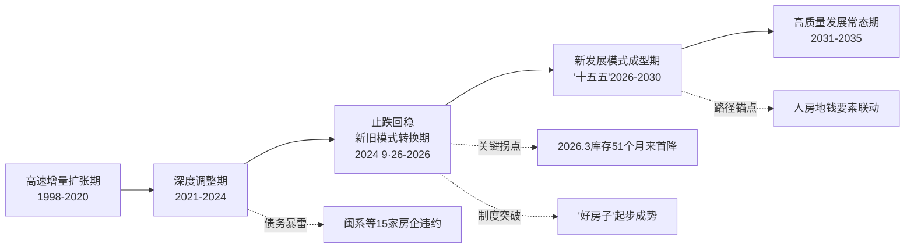

上图所示的阶段演进表明，当前正处于从"深度调整期"向"新发展模式成型期"的关键过渡区间，这正是本研究的时代坐标。

## 1.2 行业核心矛盾与可持续发展挑战

行业的阶段性特征背后，是一系列深层次结构性矛盾的集中显现。识别这些矛盾，是把握可持续发展研究问题域的关键。

### 1.2.1 库存压力与去化分化并存

尽管全国库存出现拐点，但去化压力的分布极不均衡。一方面，截至2025年末商品房待售面积仍高达76632万平方米，比上年末增长1.6%，住宅待售面积增长2.8%[^11]；另一方面，在售库存中3年以上的产品仍占一半左右，这些产品面对新房品质和二手房价格的双重竞争，不得不以价换量，是价格下跌的主因[^12]。从城市层面看，44个重点城市中虽有28城取证未售库存同比下降，但同环比齐降且降幅较为明显的多为常州、温州、长春、肇庆、合肥等三四线及部分二线城市，分化特征显著[^13]。重点城市去化周期还在持续上升，44城中仅8城去化周期在20个月以下[^13]。**短期库存加速消化与长期"僵尸库存"沉淀并存、核心城市企稳与中低能级城市持续承压并存**，构成了去库存的复杂图景。

### 1.2.2 房企债务风险与传统三高模式失灵

以闽系房企为代表的集中暴雷，是传统"高杠杆、高周转、高负债"扩张模式失灵的典型缩影。截至2025—2026年，至少有15家规模较大的闽系房企发生债务违约[^15]。其中正荣地产2025年预计净亏损170—180亿元，13只离岸债（约29.572亿美元）已全部违约；融侨集团总负债372.87亿元，已资不抵债；阳光城到期未支付债务本金达659.16亿元，净资产-271.52亿元，已从深交所退市；世茂集团境外债务重组涉及约115亿美元[^15]。这些案例集中印证了**旧模式在新形势下的不可持续性**：依赖土地金融化、预售款滚动开发、高周转高负债扩张的路径，在需求放缓、融资收紧、价格预期下行的多重冲击下，迅速陷入流动性枯竭与资产负债表恶化的恶性循环。

与此同时，2025年房地产开发企业到位资金93117亿元，比上年下降13.4%；其中国内贷款下降7.3%、定金及预收款下降16.2%、个人按揭贷款下降17.8%[^11]。**资金来源全面收缩**意味着行业必须从根本上重塑融资模式与商业模式，而非简单等待周期反转。

### 1.2.3 需求升级与供给错配

行业当前面临的供需矛盾，已不是总量层面的短缺与过剩问题，而是**结构性的供给错配**。一方面，居民居住观、消费观、价值观深刻变迁，住房需求已从"有得住"转向"住得好、住得开心"，真正的好房子从单纯的"物理空间"升维为功能价值、精神价值与资产价值的"三重价值"叠加[^1]；另一方面，2024年中国建筑业碳排放量高达18.6亿吨，占全国总碳排放量的27.5%[^16]（注：此为单一信源数据，不同口径可能存在差异），传统供给在绿色低碳、智慧化、品质化方面普遍存在不足。新房供给越来越偏向3至4居的改善型需求，但适配价格敏感型刚需、刚改群体的高品质二手房分流明显[^12]。**供给端的产品力升级速度跟不上需求端的品质升级速度**，是当前矛盾的核心症结之一。

### 1.2.4 旧模式动能衰减与新模式构建的过渡性困境

更深层次看，房地产行业正经历"模式转换"的过渡期阵痛。**旧模式动能加速衰减**：2020—2024年，房地产业增加值占GDP比重从7.3%下降到6.3%[^3]；土地市场持续低迷，2026年一季度土地出让金前两个月下降25.2%[^7]；房屋新开工面积2025年下降20.4%，竣工面积下降18.1%[^11]。**新模式尚在构建中**：从2024年两会提出"加快构建房地产发展新模式"[^2]，到2024年4月明确去库存方向，再到2025年"好房子"建设全面起步[^1]，新模式在制度框架、要素联动机制、企业转型路径等层面均处于探索阶段。

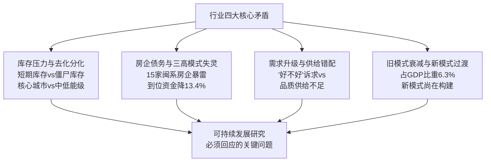

上述四大矛盾共同决定，房地产可持续发展研究**不能停留在周期波动层面，而必须深入到模式转换的底层逻辑**，回答动力从何而来、风险如何化解、新模式如何落地等根本性问题。

## 1.3 房地产可持续发展的多维内涵界定

在明确阶段定位与核心矛盾的基础上，需要对房地产可持续发展的内涵进行系统界定，为后续动力机制识别提供价值标尺。可持续发展评价研究普遍强调环境、经济、社会等多维度的综合平衡[^17][^18]，结合中国房地产行业的特殊性，本研究提出**经济、社会、环境、制度四维平衡**的内涵框架。

### 1.3.1 经济可持续：供需平衡、风险可控、与宏观经济良性循环

经济可持续是房地产可持续发展的基础维度，其核心是行业以持续的供需平衡、结构优化、风险可控和平稳健康发展，构建良性循环[^3]。这一维度要求行业既不再依赖过度金融化的规模扩张，也不至于陷入持续性的深度收缩，而是与宏观经济形成相互支撑的良性循环关系。当房地产实现供需基本平衡时，房地产与经济增长动态互动的逻辑起点应回归到经济发展上来[^3]。同时，面对智能经济等新兴增长极的崛起，房地产高质量发展需要与宏观经济转型协同推进[^3]。

### 1.3.2 社会可持续：从"住有所居"到"住有宜居"

社会可持续维度强调住房作为民生基础与社会公平的属性。其内涵从过去解决"住有所居"的总量目标，升级为满足"住有宜居"的品质目标[^3]，并进一步拓展到回应人民群众幸福感、获得感、安全感的多元需求[^1]。具体而言，包括健全多主体供给、多渠道保障、租购并举的住房制度，实现更高水平住有所居[^19]；保障对象从"住房困难家庭"拓展到初婚初育家庭、多子女家庭、城镇工薪群体等[^19]；以及通过"住区—社区—城区"三维联动，整合商业、养老、文旅等多元业态，打造全场景美好生活圈[^1]。

### 1.3.3 环境可持续：绿色低碳与ESG导向

环境可持续维度对应"双碳"目标与全球绿色发展潮流。建筑业是能源消耗与碳排放的主要领域，全球建筑和建筑运行产生的温室气体排放量占全球总排放量的39%[^16]。在此背景下，"好房子"建设明确将"绿色"作为四大核心方向之一[^1]。ESG评价体系建设亦成为行业转型的重要方向，环境维度涵盖碳排放、水资源管理、废弃物处理等指标，社会维度涵盖员工权益、社区关系、产品安全等指标，治理维度涵盖公司治理结构、风险管理、信息披露等指标[^17]。**环境可持续不仅是外部约束，更是企业与产品价值再造的新维度**。

### 1.3.4 制度可持续：基础制度健全与治理体系现代化

制度可持续维度关注行业运行的底层规则与治理框架。"十五五"规划纲要提出加快构建房地产发展新模式，是促进房地产市场平稳健康发展的治本之策[^19]。其制度内涵涵盖：开发端的项目公司制（项目资金封闭管理、专款专用）、融资端的主办银行制、销售端的现房销售制[^19]；以及房屋全生命周期品质保障与安全管理制度，包括房屋安全体检、房屋安全管理资金、房屋质量安全保险三大制度[^19]。**制度可持续是其他三个维度可持续的保障，决定了行业能否走上规范化、长效化的发展轨道**。

四个维度并非孤立，而是相互支撑、相互制约：经济可持续是基础，社会可持续是目的，环境可持续是约束，制度可持续是保障。任何单一维度的偏废都将导致行业整体可持续性的塌陷，这构成了后续动力机制研究的价值参照系。

## 1.4 动力机制分析框架的构建

在内涵界定的基础上，本研究借鉴"内生—外生双维驱动"的分析视角[^20]，构建房地产可持续发展的动力机制分析框架。该框架从动力来源、作用环节、治理维度三个层面展开，形成贯穿全文的统一分析工具。

### 1.4.1 动力来源维度：内生与外生双维驱动

借鉴全球产业链演化研究中"内生—外生双维驱动"的理论视角[^20]，并结合房地产行业的需求特性[^21]，本研究将动力来源划分为内生动力与外生动力两大类。

**内生动力**源于行业自身的发展规律与市场基本面，主要包括：人口增长和城镇化进程导致的城镇人口增长所产生的刚性需求；人均住房面积提升、家庭户均规模下降、居民对生活质量提高意愿所产生的改善性需求；居民收入增长与消费升级；以及企业产品力、运营能力的内在跃升与科技进步对生产函数的重构[^21][^3]。中国银河研报测算显示，2050年我国住房需求中刚性需求和改善性需求合计7.874亿方，占总需求的89.97%[^21]，**内生需求构成行业可持续发展的主体动力**。

**外生动力**源于行业外部的环境变化与政策冲击，主要包括：高龄房屋拆迁或部分老旧社区改造带来的更新需求[^21]；宏观经济基本面、财政货币政策、土地金融税收等政策调控；人口结构变迁与老龄化趋势；生态环境约束与双碳目标；以及城市更新、城中村改造等政府主导的供给侧外生干预[^21][^19]。测算显示2041—2050年的年均更新需求即外生需求约0.88亿方，占总需求的10.03%[^21]，**外生动力虽量级较小但在特定阶段（如当前去库存阶段）具有关键作用**。

### 1.4.2 作用环节维度：需求侧与供给侧双向发力

从作用环节看，动力机制贯穿需求侧与供给侧两端，二者相互呼应共同决定行业供求关系的演变方向。

**需求侧动力**包括刚性需求（由新增城镇人口产生）、改善性需求（由人均住房面积提升、家庭户均规模下降产生）、更新需求（由存量住房折旧、拆除产生）三个层次[^21][^6]，以及由"好房子"标准引领的品质升级需求[^1]。当前刚需群体和部分刚改需求转向二手住房，新房供给越来越偏向改善型需求，需求侧呈现明显的层次化与品质化特征[^12]。

**供给侧动力**则包括土地供给（盘活核心区土地、收储存量商品房）、资金供给（多层次金融工具）、产品供给（"好房子"产品力升级）、服务供给（"开发+经营+服务"的全链条服务）[^10][^1]。当前供给侧改革的核心是"控增量、去库存、优供给"[^19]，并通过"人、房、地、钱"要素联动机制[^4]实现供需的精准匹配。

### 1.4.3 治理维度：市场机制与政府调控的协同与边界

第三个维度是治理层面，刻画市场机制与政府调控的协同关系。社会主义市场经济条件下房地产发展新模式的构建，要求**遵循市场经济规律的同时，发挥政府在住房保障、风险防控、制度建设等领域的关键作用**[^3]。市场机制主要在商品房开发、企业竞争、价格发现等领域发挥决定性作用；政府调控则在保障性住房供给、土地资源配置、金融风险防范、基础制度建设、外部性治理等领域承担引导与兜底责任。"市场+保障"两个体系并行、"租购并举"住房制度、保障对象从困难家庭拓展到工薪群体[^5][^19]，正是市场与政府边界重新厘定的具体体现。

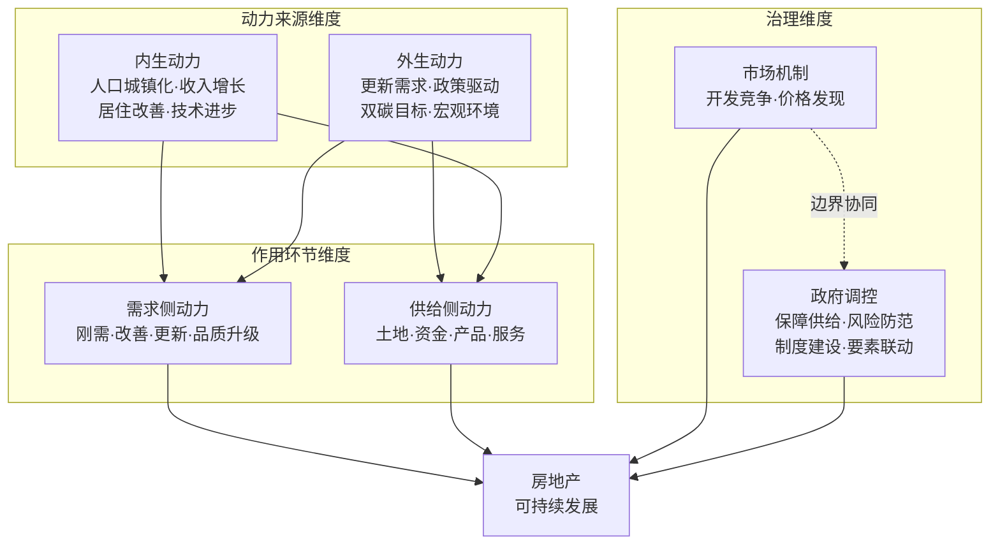

上图展示的三维交互框架表明，房地产可持续发展是内生—外生动力、需求—供给环节、市场—政府治理三组关系动态耦合的系统性产物。任何单一动力都不足以独立支撑行业的可持续发展，而**多动力的协同释放需要相应的制度环境与激励相容条件**——这正是本研究后续章节将重点拆解的核心命题。

## 1.5 研究思路、分析逻辑与章节衔接

基于上述阶段定位、矛盾识别、内涵界定与框架构建，本研究形成了**"现状研判—动力拆解—路径研判—政策设计"**的整体分析逻辑，紧扣"房地产可持续发展的动力是什么"与"未来10年国家在政策、资金、导向三方面如何促进行业有序良性发展"两大核心问题。

具体而言，本章作为逻辑起点完成了**现状研判**与**理论框架**两项工作；第2章将沿用1.4节构建的内生—外生双维框架，**系统拆解动力来源**，深入分析需求结构升级、城镇化延续、技术创新等内生动力与政策、金融、人口、双碳等外生动力的具体作用机制；第3章将聚焦**多主体动力博弈与协同机制**，比较政府、企业、金融机构、消费者四大主体的目标函数与协同空间；第4章将基于动力机制研判**未来十年行业发展趋势与战略目标**，为政策路径设计提供目标锚点；第5—7章将分别从**政策、资金、战略导向**三个维度系统设计国家促进路径，回应用户研究主题中的第二大核心问题；第8章关注**风险防控长效机制与国际经验借鉴**，为路径设计提供风险约束与比较参照；第9章则聚焦**企业转型路径**，并系统总结研究结论与政策建议。

需要特别说明的是，**动力机制研究与未来十年国家促进路径研究并非彼此割裂**：动力机制的拆解为政策设计提供了客观依据——只有识别出真实可持续的动力来源，才能避免政策陷入"输血式"刺激或"压制式"调控的两极；而国家促进路径的设计反过来又是激活、引导与稳定动力释放的关键制度安排。在政策、资金、战略导向三个维度上保持逻辑联动与口径一致，避免出现仅有口号无落地工具的论述，是后续章节必须坚守的方法论底线。

通过这一逻辑闭环，本研究力求**既回答"动力是什么"的科学问题，也回答"国家怎么促进"的政策问题**，并使两个问题在统一的分析框架下相互印证、相互支撑，最终服务于面向"十五五"及2035年的房地产可持续发展战略设计。

# 2 房地产可持续发展的内生与外生动力解析

第1章从阶段定位、核心矛盾、内涵界定与框架构建四个层面，确立了"内生—外生双维驱动、需求—供给双侧发力、市场—政府双向治理"的三维分析工具。本章承接这一框架，进入对动力来源的系统拆解。需要回应的核心问题包括：在房地产从规模扩张转向高质量发展的阶段切换中，**究竟哪些力量在真正驱动行业可持续运转**？这些力量的作用路径、传导机制、相对权重又如何随阶段演化？只有在此基础上，第5至7章关于政策、资金、战略导向的路径设计才能真正建立在客观动力基础之上，避免陷入"输血式刺激"与"压制式调控"的两极。

按照"先内生、后外生、再耦合"的展开顺序，本章首先解析需求结构升级、新型城镇化延续、企业能力跃升、科技创新四类内生动力，再剖析宏观政策传导、人口结构变迁、金融环境、双碳约束、社会公平诉求五类外生动力，最后从系统视角刻画两类动力的协同机制与动态权重演化。

## 2.1 内生动力之一:住房需求从"有没有"向"好不好"的结构性升级

需求结构的内在升级,是房地产可持续发展最具基础性、最不可逆的内生动力源。它根植于居民收入增长、生活方式变迁与价值观演化等深层力量,既不依赖政策刺激,也不会随短期市场波动而消失,反而会随中等收入群体扩大而持续强化。

### 2.1.1 总量基本平衡:住房短缺时代的根本终结

总量层面的"够用"是需求升级得以发生的前置条件。"十四五"期间,我国城镇人均住房建筑面积已超过40平方米,户均套户数接近1.1套,接近美日等发达国家水平,住房供给从总量短缺转为总量基本平衡、结构性供给不足[^22]。从增量看,"十四五"期间全国累计销售新建商品住宅面积约50亿平方米,建设筹集各类保障性住房和城中村、城市危旧房改造等安置住房1100多万套(间),惠及3000多万群众[^23]。这一供给积累从根本上改变了住房作为稀缺品的基础属性。

从需求结构看,二十届四中全会公报披露的数据显示,改善性需求与更新需求占比分别达到41.1%和29.8%,二者合计占比超过七成,**已彻底取代刚性需求成为市场主体**[^22]。北京2022年的市场调研同样显示,改善性需求占比达54.0%,已超越刚需成为住宅市场增长新动能[^24]。这种结构性转变意味着行业必须从"建多少"的总量逻辑切换到"建什么、怎么建"的品质逻辑。

### 2.1.2 三重价值升维:从物理空间到功能、精神、资产价值的叠加

需求升级的最深刻表征,是住房定义本身的升维。在"有没有"阶段,住房主要是满足遮风避雨的物理空间;而在"好不好"阶段,住房演变为**功能价值、精神价值与资产价值三重价值叠加的综合载体**。住建部围绕"好房子"提出了"安全、舒适、绿色、智慧"四大维度,《住宅项目规范》自2025年5月1日起正式实施,对层高从原来2.8米提高到不低于3米、4层以上必须加装电梯、楼板隔音要求降低10分贝等具体指标作出硬性规范[^22]。这意味着以往作为差异化卖点的品质要素,正在转化为强制性的基础门槛。

升维不仅体现在硬指标上,更体现在配套与服务上。北京改善性群体调研显示,改善性群体住宅需求从房屋本身向社区配套设施、服务等方向延伸,首要考虑因素是位置,且超过8成为本科及以上学历,98.2%为30岁以上,超过7成通过卖掉原有住房获得改善资金[^24]。"好房子"概念在山西等多省的实践显示,各地已从标准制定、推选示范项目、推进试点工程等方式推动建设,业内人士共识是**良好的居住品质才是撬动市场的关键,建造"好房子"是行业发展必然趋势**[^25]。

### 2.1.3 改善性群体扩散与产品偏好迁移

需求升级的第三重表现是改善性群体的代际扩散与产品偏好的中大户型化迁移。从代际看,35-64岁改善型购房群体年均达6.6亿人,较"十四五"增加3000万人,推动120平方米以上大户型市场扩张[^26][^27]。从产品端看,90—140平方米的首改类项目销售额占比达45.7%,仍是当前市场主力产品;140—200平方米改善类项目销售额占比提升0.3个百分点至26.5%;200平方米以上高端类项目销售额占比为15.6%,同比增长0.1个百分点[^28]。

具体到城市,改善结构性机会进一步凸显。2024年1—11月,监测城市中多数城市90—120平米新房成交套数占比保持在四成以上,占据市场主流地位;上海、无锡、绍兴等城市144平米以上新房成交套数占比较2023年同期提升超5个百分点[^29]。北京2014—2022年三居室成交占比从35.9%增至39.1%,115—140平米、140—200平米、200平米以上成交占比分别从16.3%、11.8%、7.2%升至18.3%、16.2%、9.0%[^24]。深圳、成都等核心城市改善型需求占比超60%,成为市场主导力量[^27]。

| 户型/产品段 | 2025年上半年销售额占比 | 同比变化 | 市场地位 |
|---|---|---|---|
| 90—140㎡(首改) | 45.7% | 主力产品 | 市场基本盘 |
| 140—200㎡(改善) | 26.5% | +0.3个百分点 | 增量主引擎 |
| 200㎡以上(高端) | 15.6% | +0.1个百分点 | 结构性补充 |
| 90㎡以下(刚需) | 余量 | 占比下降 | 二手房承接为主 |

数据汇总自[^28]。表中可见,**改善与高端段成为唯一同比上行的两个产品段,首改产品仍是市场基本盘**,二者合计占比近九成,印证了需求结构升级的不可逆趋势。

11月新政在政策端进一步放大了这一升级动力:契税优惠面积标准从90平方米提升至140平方米,个人销售已购买2年以上住房一律免征增值税。北京一套160平方米的二手住房若持有满2年,可免征差额增值税,单套节省资金常达数十万元;9月百强房企改善型房源销售金额环比增长22%,北京城建等房企国庆期间改善型房源到访量环比增长40%,140平方米左右的三居室成交占比从30%升至45%[^30][^31]。**政策松绑与内生需求形成共振,印证了改善升级是行业最稳定的需求侧动力源**。

## 2.2 内生动力之二:新型城镇化延续性潜力与人口空间重构

如果说改善需求是存量市场的内生动力,那么新型城镇化则是增量市场的最后红利窗口。它通过城镇人口规模的持续扩大、人口在城市之间的再配置,以及核心城市对高技能人才的筛选,源源不断为行业输送结构性新增需求。

### 2.2.1 城镇化率持续提升与农业转移人口市民化

我国常住人口城镇化率由"十四五"初期的63.89%提高至2024年末的67.0%,2025年末进一步提升至67.8%,比2024年末提高0.89个百分点[^32][^33]。"十五五"时期全国常住人口城镇化率预计将提升至70%以上,泽平宏观团队预测到2040年城镇化率将达到79%左右,对应城镇人口10.5亿人,比2020年增加约1.5亿人[^32][^33]。这意味着**未来十年仍存在约3—10个百分点的提升空间,对应数以亿计的潜在购房人群**。

农业转移人口市民化是城镇化的核心引擎。"十四五"期间,户籍制度改革取得历史性突破,超过1.7亿农业转移人口在城镇落户,城镇基本公共服务供给扩面提质,义务教育阶段随迁子女在公办学校就读和享受政府购买学位服务比例达96.8%[^33]。研究测算显示,农业转移人口市民化将带来约1.2亿新增住房需求,主要集中在长三角、珠三角等城市群,平均每年农民转市民将拉动GDP增速约1个百分点,拉动房地产相关消费投资近万亿元[^26][^34]。**这是行业规模虽不再扩张但仍能保持相当体量的根本支撑**。

### 2.2.2 人口空间重构:城市群、都市圈与核心城市的虹吸

人口流动的方向性变化正在重塑房地产市场的区域格局。19个城市群常住人口占全国比重提升至75%左右、地区生产总值占全国比重稳定在83%以上,粤港澳大湾区、长三角等"人口磁极"对全国人口增量贡献率超30%[^26][^33]。2024年城市层面,贵阳以19.96万的人口增量位居全国首位,深圳以19.94万微弱差距位列第二,广州、合肥、长沙、南昌、杭州、宁波、济南、成都依次进入前十,**人口流动呈现明显的"强者恒强"马太效应**[^35][^36]。

省份层面,2024年8个省份常住人口实现正增长,广东以74万的增量连续18年位居中国人口第一大省,浙江以45.4万人省外净流入领跑增长率;与此同时,18个省份常住人口出现减少,东北区域人口负增长进一步加剧[^37]。这种分化态势直接决定了房地产市场的走向:核心城市群凭借产业优势和人才政策持续强化竞争力,深圳的PCT国际专利申请量连续21年位居全国城市首位,5.4万亿元规上工业总产值为其房地产市场提供坚实支撑;而普通城市则面临转型压力,2025—2030年区域分化将进一步加剧[^36]。

### 2.2.3 "积分落户+产业升级":高技能人才筛选与改善需求结构性释放

核心城市通过"积分落户+产业升级"机制有意识地筛选高技能人才,这一筛选效应直接转化为对改善型住房的结构性需求。北京、上海、深圳等8个核心城市年均人口净流入超10万,支撑改善型需求,上海核心区二手房日均成交754套,次新房溢价率达15%[^26][^27]。重点城市群销售份额预计"十五五"升至80%[^26]。

这种"以人定房"的内生逻辑与"十五五"规划提出的**"人、房、地、钱"要素联动机制**形成呼应——根据人口变化确定住房需求,根据住房需求科学安排土地供应和金融资源,从根本上解决过去人房错配的问题[^22]。可以说,**新型城镇化由"量"向"质"的转型,其内生动能不再表现为城镇化率本身的快速提升,而表现为人口在空间上的精准再配置以及核心城市对高质量需求的稳定供应**。

## 2.3 内生动力之三:企业产品力跃升与运营服务能力深化

需求升级与人口重构最终需要通过企业的产品和服务来落地。在传统三高模式失灵之后,企业内在能力的跃升正成为行业从规模扩张转向质量竞争的关键支撑,也是房地产可持续发展不可或缺的微观动力。

### 2.3.1 "好房子"标准倒逼下的产品力升级

《住宅项目规范》于2025年5月1日正式实施,以国家标准的形式将层高、隔音、电梯配置等"好房子"硬性指标纳入强制规范[^23][^22]。住建部在"好房子"建设上的层层加码——从2024年4月保障性住房会议提出把保障性住房建设成"好房子",到8月围绕"绿色、低碳、智能、安全"详细描述好房子特征,再到中国建筑科技展集中展示167项数字化、工业化、智能化新成果——清晰显示出**产品标准从"市场自发"向"国家定调"的转变**[^25]。

各地已迅速跟进。山西省2025年9月印发《关于进一步促进房地产市场平稳健康发展若干措施》,11月再联合21个部门印发指导意见,提出3方面31项重点任务,推进"好房子、好小区、好社区、好城区"建设[^25]。截至2025年,超过15个省份在政府工作报告中明确提出推动"好房子"建设[^38][^39]。**"好房子"已不再是营销概念,而是房企必须达成的产品门槛**。

仅住宅隔音材料一项,每年新建住宅市场规模就超过200亿元,若考虑存量改造市场,楼板隔声改造单项就能释放千亿级需求;绿色建材市场到2030年规模预计突破2.5万亿元,占建材总市场比重超过38%[^22]。这意味着产品力升级不仅是支出项,更催生了**万亿级新增市场空间**,为产业链各环节提供新的盈利模式。

### 2.3.2 从"开发+销售"向"开发+经营+服务"的全链条转型

更深层的能力跃升,体现为商业模式从单纯开发销售向"开发+经营+服务"全链条的延伸。在库存高企与去化压力之下,房企加速布局存量运营,**万科、保利等头部企业商办持有面积超1000万平方米,租金回报率稳定在4%—5%**[^27]。万科2025年全年预计按期保质交付房屋11.7万套,其中1.6万套提前30天交付,约5000套实现跨年提前交付,累计交付量已占近两年待交付总量约70%,标志着交付高峰期已过[^40]。

在改善性产品上,房企的差异化竞争能力正在分层。**适老化设计**层面,旭辉上海世纪古美项目采用超低能耗技术,通过自然采光、全屋温度调节降低老年人居住风险,二氧化碳年减排1225吨;万科随园嘉树等高端养老社区入住率超80%,月费1.2万—3万元仍供不应求[^26][^27]。**Z世代偏好**层面,杭州未来科技城"Z世代社区"引入电竞房、宠物电梯等设计,00后购房占比达35%,较传统社区溢价10%[^26][^27]。**绿色建筑**层面,2023年全国绿色建筑占比超99%,旭辉装配式建筑占比79.6%,较传统工艺减少碳排放30%[^26]。

现房销售制的渐进推进进一步重塑企业能力结构。住建部明确表示未来将有力有序推进现房销售,做到"所见即所得",这意味着房企必须依靠**真实产品力**而非"沙盘故事"在市场中立足[^22][^38]。2024年1—11月现房销售2.6亿平方米同比增长19.4%,表现明显好于期房,印证了市场对成品房的偏好转向[^29]。**这种以质量、交付、品牌为核心的竞争模式,从根本上改变了"快周转、高杠杆"的旧范式,把企业内在能力推升为可持续发展的关键内生动力**。

## 2.4 内生动力之四:科技创新对行业生产函数的重构

科技创新是房地产可持续发展中最活跃也最具潜力的内生动力。它在效率、品质、低碳三个维度同时提升行业全要素生产率,推动行业从依赖土地、资金、劳动力的传统生产函数向依赖技术、数据、知识的新生产函数升级。

### 2.4.1 建造端:装配式与超低能耗建筑的规模化

国务院《加快推动建筑领域节能降碳工作方案》明确要求到2025年,城镇新建建筑全面执行绿色建筑标准,新建超低能耗、近零能耗建筑面积比2023年增长0.2亿平方米以上;到2027年,超低能耗建筑实现规模化发展[^41][^42][^43]。"十五五"规划纲要进一步要求加强既有建筑和市政设施节能降碳改造、促进**超低能耗和装配式建筑规模化发展**[^44]。

旭辉装配式建筑占比已达79.6%,较传统工艺减少碳排放30%[^26]。住建部倪虹部长提出"要像造汽车一样去造房子",通过精细化建造降低能源浪费与碳排放[^44]。建造端的工业化、装配化转型,本质上是**用工厂生产替代现场作业、用标准模块替代手工施工**,从而在效率与质量两端同时实现跃升。

### 2.4.2 产品端:智慧家居与可再生能源建筑的广泛应用

在产品端,**BIPV(建筑光伏一体化)、光储直柔系统、AI+IoT、数字孪生**等技术广泛应用于新项目,智慧家居、智能安防、能耗监控成为"好房子"的标配[^44][^45]。建筑用能结构正在持续优化:方案明确到2025年城镇建筑可再生能源替代率达到8%、建筑用能中电力消费占比超过55%[^41][^43]。

这些技术的落地不仅是技术升级,更是**用户体验和资产价值的双重重构**。智能化升级让暖通系统从"被动运行"转向"主动适配",智慧城市、智慧家庭、智慧运维等场景需求不断涌现,推动整个上下游产业链向数字化、网络化、智能化加速转型[^28]。建筑领域绿色低碳的市场规模已经形成清晰的爆发逻辑——2025年中国绿色建筑市场已具备相当规模,在双碳目标驱动下到2030年市场规模预计突破2.5万亿元[^22][^44]。

### 2.4.3 管理端:从"手工统计"到"模型化、自动化"的可量化低碳时代

科技创新在管理端的突破同样引人注目。2025年房地产行业碳中和指数达到53.5分,较2024年提升2.5分,**延续连续五年稳步上升态势**[^45]。指数提升的关键变量是技术维度的突破——过去一年里,建筑能效管理、数字孪生、AI+IoT等技术在运营端加速落地,行业首次形成了支持企业开展体系化、全过程碳管理的数字底座[^45]。

以"友绿碳云"为代表的建筑碳管理云平台,基于数千个项目的碳排放大数据、数万条建材碳排放因子数据库,与《建筑碳排放计算标准》GB/T 51366等多项国家标准深度对齐,实现了建造阶段、运营阶段、供应链阶段的全过程碳排放测算[^45]。这一转变使碳核算**从"手工统计"迈向"模型化、自动化"**,也使房企具备了符合国际SBTi(科学减碳目标倡议)框架要求的碳管理能力。

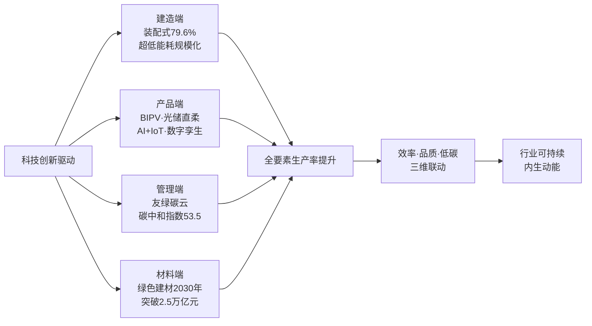

科技创新的最大意义在于**改变了行业可持续发展的成本结构**:它让节能减排不再只是合规成本,而是通过节约能源消耗、提高资产估值、对接国际资本(SBTi、绿色金融)、降低运营风险等多重渠道转化为实实在在的经济价值。这是行业从"靠土地溢价赚钱"向"靠技术溢价赚钱"过渡的微观机理。

## 2.5 外生动力之一:宏观经济基本面与政策调控体系的传导机制

外生动力是行业可持续发展的"环境变量"。其中,宏观经济基本面与政策调控体系是最直接的外部驱动力,直接决定了内生动力能否顺畅释放、行业能否实现止跌回稳。

### 2.5.1 宏观经济基本面:稳就业、稳收入是稳楼市的前置条件

2024年中国GDP增速实现5%,2025年各机构对全年GDP增速的预测大多集中在4.5%—5%之间,国海证券、国盛证券、广发证券和粤开证券等机构均给出5%的预测值[^46]。然而,房地产和建筑业仍然是经济增长的主要拖累。中指研究院与各机构均强调,**宏观经济运行企稳、居民就业和收入改善是房地产止跌回稳的必要条件**,稳增长的"胜负手"可能来自地产和基建[^46][^29]。

居民端的承压在房价收入比的变化中表现明显。2024年上半年百城房价收入比降至10.6,相比2023年下滑7.4%,一线城市达26.3、二线城市为11.2、三四线城市为7.9[^47]。值得注意的是,近两年房价收入比下降的原因已与2022年以前截然不同——2022年以前是居民收入增速远远大于房价上涨速度,近两年的下降则主要源于房价下跌叠加居民收入增速明显放缓[^47]。**这种"被动型"下降反而暴露了居民购房压力的深层结构性问题**——账面工资分化、私营企业从业人员收入增长有限、就业稳定性下降,使得购房决策更加谨慎[^48]。这从外部约束层面决定了房地产可持续发展必须建立在居民收入与就业稳定的基础上,而非简单依靠政策刺激。

房地产业增加值占GDP比重已从2020年的7.3%下降到2024年的6.3%[^49],这一比重的回落标志着**房地产与宏观经济之间正在重塑一种新的耦合关系**:房地产不再是宏观经济的"超级火车头",而是民生改善框架下的"压舱石",其与经济增长的关系从主导拉动转向相互支撑。

### 2.5.2 政策调控:从"救市"向"转型"的逻辑切换

2024年以来政策调控经历了重要的逻辑切换。2024年9月26日中央政治局会议释放"促进房地产市场止跌回稳"的强信号,12月中央经济工作会议提出"稳住楼市"和"持续用力推动房地产市场止跌回稳",为2025年楼市定调[^29]。2025年中央层面政策围绕"稳市场、城市更新、提升住房品质"三个维度精准发力,既托住当下市场温度,也为行业转型铺垫了清晰路径,**实现"短期稳盘"与"长期提质"的衔接**[^50]。

地方政策密集发力同步跟进。中指研究院统计显示,2025年前三季度全国已有约200省市出台超470条优化政策[^30][^31]。2025年11月更形成"税收减免、限购松绑、金融支持"三位一体的支撑体系,标志着调控进入"全面激活"新阶段:

| 调控维度 | 2025年11月新政核心举措 | 政策作用 |
|---|---|---|
| 税收 | 契税优惠面积标准从90㎡提至140㎡;一线城市首次纳入二套契税优惠;增值税取消普通与非普通住宅划分,持有满2年免征 | 北京100㎡、500万元二套房节税10万元;一线非普通住宅减税效应数十万元 |
| 限购 | 一线城市外环外、核心城市非核心区全面放开套数限制;非户籍社保从3年降至1年 | 上海外环外新房成交占比超60%,改善去化周期从18月缩至12月 |
| 金融 | 公积金贷款额度上浮15%;存量房贷重定价周期可灵活调整;首套二套利率统一 | 上海首套公积金额度从160万元提至184万元,多子女家庭达216万元 |
| 供给 | 土地增值税预征率下限统一降低0.5个百分点;10万亿元地方债置换+城中村改造扩围 | 企业纾困与库存优化双重支撑 |

数据汇总自[^30][^51][^31]。从这一政策组合可以看出,**政策已从"救市"的应急逻辑切换到"转型"的系统逻辑**,既包括短期托底的需求端松绑,也包括中长期供给侧改革的制度优化。2025年广州全面取消限购、限售、限价并降低首付与利率,深圳放宽非核心区限购,北京、上海放宽郊区限购,反映出**一线城市的政策松绑空间已被前所未有地打开**[^51]。

政策调控的有效性已得到验证。2024年9.26新政后,核心城市新房销售规模持续改善,四季度重点城市新房销售面积同比增长约16%,30城二手房成交同比增长约35%[^29]。10月湖北楼市销售面积同比增长超10%,武汉、黄石等城市刚需成交占比提升至65%以上[^30]。这印证了**外生政策动力对内生需求释放具有显著的"激活+放大"作用**。

## 2.6 外生动力之二:人口结构变迁的需求侧重塑效应

人口结构是房地产长周期的"慢变量",其影响深远而不可逆。少子化、老龄化、家庭小型化、区域分化四重叠加,正在从根本上重塑住房需求的总量、结构与空间分布,既带来挑战也催生新场景。

### 2.6.1 总量收缩与核心购房群体减少

2025年末全国总人口140489万人,较上年末减少339万人,**已连续四年负增长**;全年出生人口792万人,人口出生率为5.63‰[^32]。20—49岁是房地产的核心购房群体,首套刚需、结婚置业、改善换房的需求几乎全部集中在这一年龄段。根据人口模型测算,2026—2030年该年龄段人口将减少约3800万,**相当于每年流失近800万潜在购房者**[^52]。

机构测算显示,2025—2030年全国住房年需求预计将降至410万—500万套,较2017年2000万套的峰值下跌超75%;另一组测算则认为2030年适龄购房人群(25—44岁)预计减少2100万[^52][^26][^27]。**两组数据虽口径有别,但方向一致:住房总需求长期下行通道已确立**。需要指出的是,2025年发放育儿补贴政策明确传递出用真金白银鼓励生育的信号,从"放开三孩"到"建设生育友好型社会"的政策转向,可能在中长期对人口结构产生缓释效应,但短期内难以扭转大趋势[^32]。

### 2.6.2 老龄化深化与新需求场景催生

老龄化是与少子化叠加的另一重塑力量。2025年65岁及以上老年人口占比上升至15.9%,预计在2030年左右进入占比超20%的超级老龄化社会[^32];2035年左右60岁及以上老年人口将突破4亿,在总人口中占比将超过30%,进入重度老龄化阶段[^53]。值得注意的是,关于2030年的具体数据,不同口径存在差异——有报道预测2030年我国60岁及以上老年人口将增至3.9亿,占比接近28%[^52];而国家卫健委则给出2035年突破4亿、占比超30%的官方口径[^53]。**本研究采用国家卫健委官方口径作为基准**。

老龄化对房地产市场是把"双刃剑"。一方面带来需求侧压力:老年人口离世将带来大量继承房产入市,叠加老年家庭为养老变现的集中抛售,可能形成多房待售格局;机构测算2025—2030年房产投资者群体将从过去的净买入转为年均净抛售180万套房产[^52]。另一方面催生新需求场景:养老地产需求激增,适老化改造成为存量房增值关键,**上海老旧小区改造后房价平均上涨8%—12%**;万科随园嘉树等高端养老社区入住率超80%,月费1.2万—3万元仍供不应求;但农村老龄化率(27%)远超城镇,养老服务供给缺口达4500万床[^26][^27]。新建住宅需预留轮椅回转空间(净宽≥1.2米)、卫生间预埋件及防滑地面(防滑系数≥0.6)等指标已成为产品标配[^26]。

### 2.6.3 家庭小型化与代际财富转移

家庭结构也在剧烈变化。2010—2024年家庭户均规模从3.1人降至2.5人,结婚登记对数虽然在2025年小幅改善至676.3万对、同比增加65.7万对,但仍处于历史低位[^32]。2024年全国结婚登记数为610.6万对,创下近40年来新低[^37]。家庭小型化推动小户型青年公寓需求,但同时改善型大户型同步分化,呈现出**"两头需求并立"**的格局。

代际财富转移催生结构性机会。60岁以上家庭财富占比达36.8%,青年群体仅8.2%,"四个钱袋子"购房模式普遍。但中年群体为子女置业后,自身养老储备不足,52%的家庭养老金缺口超50万元[^26]。**反向抵押养老保险等创新工具开始试点,可能改变存量房市场流动性**[^26]。

### 2.6.4 区域分化加剧:楼市底层逻辑由"普涨"走向"极端结构性分化"

人口流动的区域不均衡使楼市底层逻辑发生根本性转变。粤港澳大湾区、长三角等"人口磁极"对全国人口增量贡献率超30%[^26];与此同时,全国约70%的三四线城市空置率超20%,东北某地级市库存去化周期超20个月[^27]。东北、中西部非省会城市人口外流加剧,房价可能长期阴跌,地方政府财政承压[^37]。

这种分化决定了**未来房地产市场不会出现全国普涨,而是呈现"强者恒强、弱者愈弱"的马太效应**。卖房难的重灾区集中在三类房产:三四线及以下城市、非都市圈县城的房产;远郊板块、无配套的刚需盘;无学区、无物业、户型落后的城市老破小[^52]。**这一外生动力既是约束,也是房地产可持续发展必须直面的结构性现实**——任何政策路径设计都必须基于人口结构变迁的客观规律。

## 2.7 外生动力之三:金融环境与资本可得性的双向作用

金融是房地产的血脉。金融环境的松紧、融资工具的创新、资本可得性的高低,直接决定了行业供需两端的运行节奏与风险出清速度。"十五五"规划提出**完善房地产金融基础性制度**,金融工具的演进正在成为驱动行业可持续发展的关键外生动力。

### 2.7.1 需求侧:房贷利率与首付比例的历史性松绑

需求侧金融环境的宽松程度已达历史性水平。2025年首套商贷首付比例降至15%、利率降至3%以下,公积金利率降至2.6%——其中央行宣布的个人住房公积金贷款利率下调0.25个百分点,5年期以上首套房利率由2.85%降至2.6%[^51][^38]。**这是十年来购房成本的最低点**。各地公积金额度同步提高:武汉将第二套个人住房公积金贷款最高额度由100万元提高至120万元;南京将单缴存人公积金贷款最高额度由50万元提高至80万元;上海首套房公积金贷款额度从160万元提至184万元,多子女家庭可达216万元[^30][^51]。

需求侧金融松绑直接降低购房压力。武汉对三环外首套新房给予初始贷款金额1%的利息补贴,最高2万元分2年发放,叠加利率下行,**月供压力较2024年下降约15%**;部分刚需群体甚至能实现"公积金全覆盖贷款",无需承担商业贷款利息[^30][^31]。配合房价下行,2025年全国城镇地区人均可支配收入56502元、同比增长4.3%,房价收入比降至5.9倍的历史新低水位[^48]。**居民购房能力的实质性修复,为内生需求释放打开了空间**。

### 2.7.2 供给侧:"白名单"机制与房企纾困

供给侧金融工具的创新更具深远意义。"白名单"融资协调机制自2024年1月建立以来不断优化,审批通过贷款金额持续提升:2024年底超5万亿元,2025年底突破7.5万亿元[^40]。2025年末政策迎来重大升级——金融监管总局、住建部等部门进一步明确"白名单"项目可办理贷款接续,**最长可至5年,推动协调机制常态化运行**[^40][^54]。这为房企提供了宽松的还贷缓冲期,有效缓解项目资金周转压力,显著支持"保交楼"任务推进。

"保交楼"已基本完成。截至2025年10月,**全国750多万套已售难交付的住房实现交付**;2025年12月23日全国住房城乡建设工作会议宣布2025年保交房任务全面完成[^40]。万科2025年累计交付量已占近两年待交付总量约70%,融创中国2022—2025年四年累计交付量突破72万套[^40]。**这是金融工具创新对市场信心修复的关键一环**。

供给侧金融支持还包括:保障性住房再贷款资金支持比例提升至100%;"金融16条"延长至2026年底;经营性物业贷款管理优化,允许用于偿还房地产开发企业及其集团控股公司存量房地产领域的相关贷款和公开市场债券[^55]。

### 2.7.3 房企债务重组与风险出清加速

风险出清是金融可持续发展的另一面。2025年以来房企债务重组和企业重整不断加速。**5月金科股份司法重整获批,成为中国第一个司法重整成功的大型上市房企**,涉及债务规模1470亿元、债权人超8400家[^40]。据不完全统计,尚未被清盘、仍在正常披露财报的上市违约房企44家,总有息负债2.72万亿元;其中18家已发布债务重组方案的房企总有息负债规模为1.88万亿元,占比达70%[^40]。融创中国、碧桂园、远洋集团、旭辉控股集团已基本实现境内、境外债务重组;龙光境外债务超过80%同意债权人加入经修订的整体协议[^40]。

### 2.7.4 多层次金融工具创新拓宽"投融建管退"闭环

REITs等资产证券化工具是另一项关键创新。截至2025年,全国已发行五只保租房REITs,**华夏北京保障房REIT通过资本市场融资盘活1830套公租房资产,为行业提供了"投融管退"闭环范本**[^56]。重点城市租金房价比已攀升至2.17%,核心城市优质租赁资产的投资回报率接近五年期定期存款利率,正吸引大量长期资本持续入场[^57]。

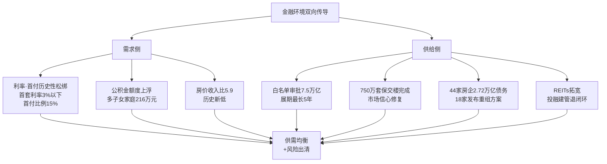

**金融环境作为外生动力的最大价值,在于它能够同时影响行业的供需均衡与风险出清节奏**,从而为内生动力的释放创造稳定的金融环境基础。

## 2.8 外生动力之四:双碳目标与生态环境约束的倒逼效应

如果说金融工具是行业可持续发展的"软"环境,那么双碳目标与生态环境约束则是不可回避的"硬"约束。它通过强制性减排目标、绿色建筑标准、能耗双控等机制,从外部倒逼行业转型升级,并最终转化为行业价值再造的新增长极。

### 2.8.1 建筑领域的碳排放规模与减排压力

建筑业是能源消耗与碳排放的主要领域。最新数据显示,**2024年全国民用建筑运行能耗为13.0亿tce,占全国能源消费的21.8%;碳排放为24.7亿tCO₂,占全国能源消费的22.1%**[^58]。其中公共建筑碳排放10.6亿tCO₂,城镇居住建筑9.7亿tCO₂,农村居住建筑4.4亿tCO₂[^58]。建造端,2024年房屋建筑建造碳排放18.1亿tCO₂、基础设施建造碳排放9.7亿tCO₂[^58]。

如果将建造与运行合并计算,**2022年全国建筑与建筑业建造碳排放总量51.3亿tCO₂,占全国能源相关碳排放的48.3%**[^59][^60]。需要指出的是,关于建筑业碳排放占全国能源相关碳排放的比例,不同统计口径存在差异:第1章引用的"2024年中国建筑业碳排放18.6亿吨,占全国总碳排放量27.5%"是特定口径下的单一信源数据;而中国建筑节能协会与重庆大学联合发布的研究报告明确给出"全生命周期48.3%"的口径[^59]。**本研究在涉及建筑全生命周期占比时优先采用48.3%这一权威多年发布的口径**,以保证数据来源的稳定性。

### 2.8.2 政策约束:从"能耗双控"到"碳排放双控"

国务院《加快推动建筑领域节能降碳工作方案》(国办函〔2024〕20号)明确了清晰的节能降碳路线图:到2025年,城镇新建建筑全面执行绿色建筑标准,新建超低能耗、近零能耗建筑面积比2023年增长0.2亿平方米以上,完成既有建筑节能改造面积比2023年增长2亿平方米以上,建筑用能中电力消费占比超过55%,城镇建筑可再生能源替代率达到8%;到2027年,**超低能耗建筑实现规模化发展**[^41][^42][^43]。

国务院《2024—2025年节能降碳行动方案》进一步为整体能源结构设定目标:2025年非化石能源消费占比达到20%左右,全国非化石能源发电量占比达到39%左右;全国抽水蓄能、新型储能装机分别超过6200万千瓦、4000万千瓦[^61][^62][^63]。"十五五"规划纲要要求加强既有建筑和市政设施节能降碳改造、促进超低能耗和装配式建筑规模化发展、实施制冷能效提升和绿色照明行动[^44]。

更深层的制度变化是,我国正**从"能耗双控"转向"碳排放双控"**,2025年"碳排放双控"体系全面实施,全国碳市场扩容启动,18项温室气体核算国家标准相继落地[^44][^45]。这一转变意味着行业面临的不再仅是能耗的总量管理,而是更加细化、可量化的碳排放约束。

### 2.8.3 从外部约束到价值再造:绿色建筑万亿级市场的形成

最值得关注的是,生态约束正在转化为行业价值再造与新增长极的内在动力。**绿色建筑市场到2030年规模预计突破2.5万亿元,占建材总市场比重超过38%**[^22]。中央办公厅、国务院办公厅2025年8月发布《关于推动城市高质量发展的意见》,提出大力发展绿色建筑、加快新型建材研发应用、推动超低能耗建筑和低碳建筑规模化发展、加大既有建筑节能改造力度[^44]。

更重要的是,2025年房地产行业碳中和指数升至53.5分,延续连续五年稳步上升态势[^45]。指数提升的关键变量在于技术维度的突破——建筑能效管理、数字孪生、AI+IoT在运营端加速落地,光储直柔系统和BIPV广泛应用于新项目,低碳建材体系不断成熟[^45]。**绿色已不再是行业的"成本项",而是企业差异化竞争与资产估值溢价的"价值项"**:国际SBTi(科学减碳目标倡议)对接成为头部房企的新选项,接轨国际减排体系也成为参与全球绿色金融、获取低成本资本的入场券[^45]。

**生态约束转化为内在动力的逻辑链条**已然形成:政策约束→技术创新→成本下降→产品溢价→市场拓展→规模效应→进一步技术创新。这条逻辑链使行业在双碳压力下找到了新的可持续发展路径。

## 2.9 外生动力之五:社会公平诉求与住房保障制度的牵引作用

社会公平诉求是房地产可持续发展的"价值锚",通过住房保障制度建设与租购并举体系完善,从外部牵引行业回归民生本位,同时为商品房市场提供有力托底。

### 2.9.1 保障对象范围扩展:从"困难群体"到"全面工薪覆盖"

住房保障覆盖面正在历史性扩大,从原来只对困难群体的"重点保障"变为涵盖工薪群体的"全面保障"。"十五五"期间,保障对象进一步从住房困难家庭拓展到**初婚初育家庭、多子女家庭、城镇工薪群体、新市民青年人**等。浙江省2025年9月出台的《关于构建多元化住房保障体系推动住房保障工作高质量发展的指导意见》,明确**到2027年累计建设筹集各类保障性住房达到150万套(间),到2030年多主体供给、多渠道保障、租购并举的多元化住房保障体系基本形成**[^64]。

中办、国办2025年6月联合印发的《关于进一步保障和改善民生着力解决群众急难愁盼的意见》强调加大保障性住房供给、增加小户型青年公寓供给、推进灵活就业人员参加住房公积金制度,这对于缓解青年群体住房压力、降低城市生活成本具有重要意义[^65]。

### 2.9.2 供给规模:870万套保租房的"大年"集中入市

"十四五"期间全国计划筹集建设保障性租赁住房**870万套(间),用作保障2600万新市民、青年人住有所居**[^66][^67]。截至2025年末,北京累计建设筹集各类保障性住房67万余套(间)、超额完成原定40万套的目标167.5%;上海至2025年11月已累计筹措保租房61万套(间)、提前完成"十四五"规划60万套的目标;深圳"十四五"以来新增保障性住房达到63.2万间、超过60万套目标[^66][^67]。**这意味着实际筹集量将远超870万套**。

**2026年是保障性租赁住房供应大爆发的一年**——五年积累下超870万套保障房全面入市,大量房源集中在2026年进入市场[^66][^67]。北京"十四五"已竣工43万套但仍有24万套在路上,上海尚有20万套保租房未进入市场。北上广深杭核心八城近4年新开集中式公寓项目中,约70%以上来源于新建,2023年总体新建项目比例高达78.3%[^66][^67]。这些大体量保障性供给将在中长期重塑租赁市场格局。

### 2.9.3 制度框架完善:《住房租赁条例》与"租购并举"法治保障

**《住房租赁条例》于2025年9月15日正式施行,这是我国住房租赁领域第一部专门性行政法规**[^57]。其核心是构建"事前准入—事中监管—事后追责"的完整治理闭环:针对"高进低出""长收短付"等行为,要求住房租赁企业按规定设立资金监管账户并向社会公示;建立租金调控"监测+引导"机制,要求设区市级以上地方政府建立住房租金监测机制,定期公布不同区域、不同类型住房的租金水平信息[^57]。

更具深远意义的是,《条例》明确鼓励出租人与承租人依法建立稳定的住房租赁关系,**积极推动租购住房在享受公共服务上具有同等权利**[^57]。这从法律层面打破了"租房=不稳定"的传统认知,为"租购并举"提供了制度根基。**"租购并举"从政策表述上升为法治保障**,标志着我国住房制度顶层设计的重大跨越[^57][^68]。

### 2.9.4 市场机制深化:REITs与"政府保基本+市场提品质"双轨制

保障性住房并非只靠政府投入,市场机制的深度介入是体系可持续运转的关键。**保租房REITs盘活存量资产**:截至2025年已发行五只保租房REITs,华夏北京保障房REIT等案例已被证明可推动"投融管退"闭环[^57][^56]。"政府保基本+市场提品质"双轨制深度落地——政府主导兜底基本居住需求,通过收购存量商品房、改建非居住用房等方式扩充房源;市场化主体参与运营服务,形成协同格局[^56]。

| 牵引方向 | 具体举措 | 对行业可持续发展的影响 |
|---|---|---|
| 范围扩展 | 保障对象拓展至工薪群体、新市民、青年人、多子女家庭 | 拉动有效需求、化解商品房库存 |
| 规模扩大 | "十四五"超870万套保租房,北上深超额完成 | 2026年集中入市,稳定租金水平 |
| 制度完善 | 《住房租赁条例》2025.9.15施行,租购同权 | 法治化保障租赁市场长期稳定 |
| 市场化深化 | 五只保租房REITs发行,"投融管退"闭环 | 吸引长期资本、形成可持续模式 |

通过此表可以看出,**住房保障体系扩容并非单纯的"民生兜底",而是在拉动有效需求、化解商品房库存、促进社会公平三方面同时发挥牵引作用**。值得关注的是,2025年下半年开始50城住宅租金大幅下调,部分原因正是"市场下行与天量保租房入市带来的双杀"[^66][^67]——这种短期租金压力本质上是供给侧改革的代价,但从长期看,**租赁市场进入机构化运营、品质化升级的全新阶段**,将成为房地产可持续发展的重要"稳定器"。

## 2.10 内生与外生动力的协同与动态权重演化

完成对九大动力源的单维分析后,有必要从系统视角刻画其耦合机制与权重演化。这一系统视角将为后续章节的政策路径设计提供机理依据。

### 2.10.1 耦合机制:外生动力激活内生需求,内生动力减轻外生托底压力

内生动力与外生动力并非平行运行,而是通过**双向放大与互补**形成耦合机制。一方面,**外生政策动力通过激活内生需求发挥放大效应**:11月新政中契税优惠面积扩展至140㎡、增值税取消普通与非普通住宅划分,直接放大了改善型需求的释放——9月百强房企改善型房源销售金额环比增长22%,北京城建国庆改善型房源到访环比增长40%[^30][^31]。"好房子"标准的国家规范化推进与改善需求的内生升级形成同频共振[^23][^22]。另一方面,**内生动力的稳定释放反过来减轻外生政策的托底压力**:核心城市改善需求的持续韧性意味着政策不需要持续的"超常规刺激";绿色建筑市场的内生扩张降低了双碳目标对行政手段的依赖。

这种耦合的最佳例证是**人房地钱要素联动机制**——以人定房、以房定地、以房定钱[^22][^34]。它将人口(内生)、住房需求(内生)、土地供应(外生)、金融资源(外生)四个要素纳入统一的联动框架,既尊重市场规律,也发挥政府配置作用。这正是2.4节框架中"市场—政府双向治理"的具体落地。

### 2.10.2 阶段性权重变化:从"外生托底"到"内生驱动"的动态切换

不同阶段动力的相对权重存在显著差异。**当前止跌回稳阶段(2024—2026)外生动力权重较高**:货币化安置100万套城中村改造、"白名单"贷款7.5万亿元、税费减免组合、保障房集中入市等政策性举措是市场企稳的核心支撑[^50][^40][^34]。这是行业从深度调整向新模式过渡的必然选择。

**中长期(2027—2035)内生动力将逐步成为主体**:中国银河研报测算显示,2050年我国住房需求中刚性需求和改善性需求合计7.874亿方,**占总需求的89.97%;更新需求约0.88亿方,占比10.03%**(详见第1章1.4节引用数据)。这一长期结构表明,只要内生动力(人口城镇化、改善升级、科技创新)能够稳定释放,行业就能进入"以内生驱动为主、外生支持为辅"的可持续轨道。

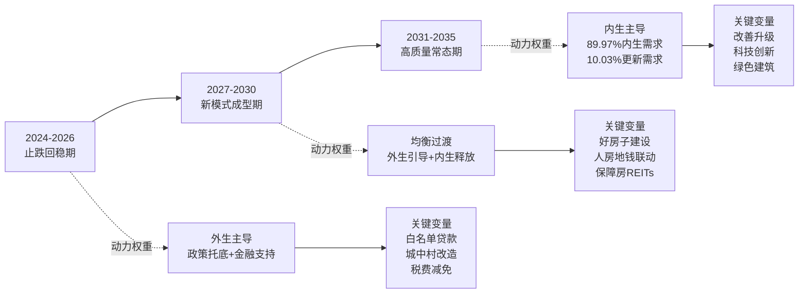

### 2.10.3 动力转换的临界条件

从"外生托底"到"内生驱动"的平稳切换,需要满足一系列临界条件:

**第一,宏观经济条件**:GDP增速保持4.5%—5%的合理区间,居民就业稳定、收入持续增长[^46]。这是修复需求的根本前提。

**第二,政策环境条件**:政策从应急型救市切换到长效型立制,"人房地钱"要素联动机制、现房销售制、房屋全生命周期安全管理制度等基础制度形成稳定预期[^22][^38][^49]。

**第三,市场预期条件**:核心城市价格预期企稳,二手房与新房形成良性循环,改善需求与刚需通过价格阶梯形成传导。2024年9.26新政后核心城市价格趋稳、2026年3月全国库存连续51个月正增长后首次同比下降,均是预期修复的标志性信号(详见第1章1.1.3节)。

**第四,风险出清条件**:出险房企平稳有序出清,行业债务风险与地方政府债务风险联动得到化解,金融体系传染风险阻断。截至2025年底18家违约房企已发布重组方案、占比70%,金科股份司法重整成功提供了示范[^40]。

### 2.10.4 对后续政策路径设计的启示

动力机制的系统性梳理对第5—7章的政策、资金、战略导向路径设计提供了机理依据:

**第一,政策路径设计**(第5章)应紧扣"激活内生—引导转型—稳定预期"三个层次:短期通过限购限贷优化激活内生需求,中期通过"人房地钱"联动等基础制度引导供需匹配,长期通过房地产税、现房销售制等立制工程稳定预期。

**第二,资金支持体系**(第6章)应紧扣"风险出清—需求支撑—模式转型"三个目标:通过"白名单"机制和债务重组完成存量风险出清,通过差别化信贷和公积金优化支撑居民购房,通过REITs和绿色金融工具支持模式转型。

**第三,战略导向重塑**(第7章)应紧扣"好房子—城市更新—租购并举—绿色低碳"四大主轴,使外生战略与内生升级、内生升级与企业转型、企业转型与社会公平形成相互强化的正反馈环。

需要特别强调的是,**动力机制的耦合性意味着任何单一维度的政策都不足以独立支撑行业可持续发展**。只有在政策、资金、战略导向三个维度上保持逻辑联动与口径一致,在每一项战略导向(好房子、城市更新、租购并举、绿色低碳)上同时配套政策工具与资金渠道,才能避免"仅有口号无落地工具"的风险。这一方法论原则将贯穿后续章节的全部分析。

至此,本章完成了对九大动力源的系统拆解、对耦合机制与动态权重的刻画,以及对后续政策设计的机理铺垫。第3章将在此基础上进一步聚焦**多主体动力博弈与协同机制**,从政府、企业、金融机构、消费者四类主体的目标函数与行为逻辑入手,揭示动力释放所需的制度环境与激励相容条件。

# 3 多主体动力博弈与协同机制

第2章从动力来源、作用环节、治理维度三个层面拆解了驱动房地产可持续发展的九大动力源，并刻画了内生与外生动力的耦合机制与动态权重演化。然而，**动力本身不会自动释放，其转化为现实的发展势能必须通过主体行为的协同**——政府的激励重构、企业的战略转型、金融机构的资本配置、消费者的预期修复，缺一不可。第2章末尾所讨论的"动力转换的临界条件"，本质上正是对主体行为协同条件的概括性描述。

本章承接这一逻辑，从主体行为视角进一步揭示动力释放的微观机理。围绕**中央政府与地方政府、央国企与民营房企、银行AMC与REITs投资人、刚需改善与投资性消费者**四大主体集群，本章将依次完成五项分析任务：比较各主体的目标函数与行为逻辑差异（3.1节）；剖析中央与地方政府的纵向博弈与激励重构（3.2节）、政府与房企的横向博弈演化（3.3节）、金融机构的风险偏好协同（3.4节）、消费者分层诉求与预期管理（3.5节）；通过典型案例展示协同实践（3.6节）；最终归纳"政府—市场—社会"三方共治协同机制的构建路径（3.7节）。这一逻辑闭环将为第5—7章关于政策、资金、战略导向的路径设计提供主体行为层面的机理支撑，回答"政策为何这样设计才能落地"的微观追问。

## 3.1 四大主体的目标函数与行为逻辑比较

理解多主体博弈的起点，是认识各主体在房地产可持续发展中的目标函数与行为约束差异。**目标函数的内在张力是博弈产生的根源，而行为逻辑的差异则决定了博弈的具体形态**。

### 3.1.1 中央政府:多目标平衡下的战略统筹者

中央政府在房地产可持续发展中扮演**战略统筹者**角色，其目标函数呈现典型的多目标平衡特征：民生改善、风险防控、宏观稳定、高质量发展、社会公平等多重目标需要在动态演化中协调取舍。党的二十届四中全会通过的《建议》将"推动房地产高质量发展"明确列入"加大保障和改善民生力度，扎实推进全体人民共同富裕"章节，标志着中央对房地产的定位从"新型城镇化的支柱产业"转向"民生保障的重要载体"[^69][^70]。

中央政府的行为逻辑遵循"**锚定一个基点、聚焦一个目标、抓住三个关键**"的整体框架——以保障和改善民生为基点，以推动房地产高质量发展为目标，以完善商品房开发、融资、销售三项关键基础制度为抓手[^70]。在"十五五"开局之年，中央政府工作报告将房地产置于"有效防范化解重点领域风险"板块，但同时明确"深入推进房地产发展新模式的基础制度和配套政策建设"，这一安排体现了**稳市场与促转型并非两项割裂工作，而是同一目标的两个维度**[^71]。

### 3.1.2 地方政府:从土地财政依赖到转型压力

与中央政府不同，地方政府的目标函数长期受到"政绩锦标赛"激励与土地财政依赖的双重约束。1994年分税制改革后，"收入权力逐步集权、支出责任维持下放"的格局使地方政府在预算软约束下必然倾向于通过土地出让获取一次性大额财力，**以批租机制取得的资金可覆盖未来40—70年的财政缺口，支持当届政府快速出政绩**[^72][^73]。这一行为逻辑使地方政府事实上集"土地供给者、监管者、经营者"于一身，形成根深蒂固的"卖地冲动"[^74]。

然而，2021年以来形势发生根本性变化。**全国土地出让收入从2021年峰值的8.5—8.7万亿元，下降至2025年的4.15万亿元，四年间缩水约4.6万亿元，降幅超过一半**[^75][^76][^77]。各机构对峰值数据的口径略有差异——和讯财经引用的8.5万亿元与建筑工人联盟引用的8.7万亿元均为权威报道数据，本研究在涉及具体数值时优先采用权威多源一致的8.7万亿元（峰值）与4.15万亿元（2025年）口径。

土地出让收入下降幅度具有强烈的省际分化特征：广东2024年同比下降11%，河南下降27.7%；安徽省财政厅课题组披露土地出让收入占财政两本预算收入的40%以上，但2024年该项收入较峰值年份下降近50%[^77]。**这意味着地方政府已从"土地财政受益者"转为"转型压力承受者"**，其行为逻辑面临根本重塑。

### 3.1.3 房地产企业:央国企与民营房企的命运分化

房地产企业群体内部已发生显著分化。**央国企在新周期中以稳健经营、品质领跑为核心目标**——保利发展2025年实现销售签约金额2530亿元，连续三年行业领跑，销售权益比提升至79%，销售回笼率连续三年超100%，新增有息负债平均成本降至2.59%、综合融资成本降至2.72%的历史低位[^78]；中海地产2025年权益销售金额约2311亿元跃居行业第一，资产负债率54.1%、加权平均融资成本仅2.8%，连续三年新增购地金额行业第一，香港、北京、上海、广州、深圳五个核心城市的权益购地金额占比高达73.9%[^79]。央国企的行为特征可概括为"**非核心不投、非优质不拿、稳健财务、品质领跑**"。

**民营房企群体则在债务重组与转型求生之间挣扎**。截至2025年末，累积出险的地产企业共计74家，涉及债券466只，违约规模超过4500亿元；2022年和2023年地产企业违约主体占比超过50%[^80]。地产企业违约主要经历了"个别违约（2018—2021年）"、"集中展期（2022—2023年）"到"有序重组（2024年以来）"三个阶段，**2025年万科事件标志地产行业风险出清进入下一阶段**[^80]。在此背景下，存活民营房企的目标函数发生了根本变化——从过去追求规模扩张，转向以现金流安全、债务重组、产品力突围为核心。

### 3.1.4 金融机构:风险偏好约束下的资本配置者

银行、AMC、信托、REITs投资人等金融机构是房地产可持续发展的资金供给方，其目标函数本质上是**在风险偏好约束下平衡资本回报与房地产敞口管理**。中国建设银行原首席风险官黄志凌指出，国际金融危机的根本原因是风险偏好出了问题——风险偏好过于激进、超出银行自身风险承担水平、超出监管能力，最终导致危机爆发蔓延[^81]。这一历史教训直接塑造了当前国内银行对房地产敞口的审慎态度。

监管层多次强调"区分项目风险与企业集团风险，不盲目抽贷、断贷、压贷，不搞'一刀切'"[^82]，这一表述背后是金融机构与监管部门、房地产企业之间复杂的博弈关系。当前银行、信托等金融机构对房地产企业的投放积极性仍然谨慎，**放贷风险偏好降到低点**[^82]——这既是市场化风险定价的客观体现，也是房地产可持续发展面临的微观约束之一。

### 3.1.5 消费者:三类分层诉求的并立

消费者群体内部同样呈现显著分层。**刚需群体**在房价下跌与收入预期偏弱的双重压力下，购房决策更趋谨慎，部分群体转向二手房与保障房；**改善群体**在"好房子"供给升级与契税增值税减免的政策共振下成为市场主力，2025年9月百强房企改善型房源销售金额环比增长22%[^69]；**投资性需求**则在房价上涨预期破裂后大幅退潮，重点城市投资性购房占比已不足5%，超过九成的人买房都是为了自己住[^83]。

下表汇总了四大主体集群的目标函数与行为逻辑差异：

| 主体类别 | 核心目标函数 | 行为逻辑特征 | 当前阶段关键挑战 |
|---|---|---|---|
| 中央政府 | 民生改善、风险防控、宏观稳定多目标平衡 | "锚定基点+聚焦目标+抓住关键"的战略统筹 | 稳市场与促转型的协调 |
| 地方政府 | 财政平衡+经济增长+政绩考核 | 土地财政依赖+政绩锦标赛+卖地冲动 | 4.6万亿土地收入缺口的填补与转型 |
| 央国企房企 | 稳健经营+品质领跑+合规底线 | 财务稳健+核心城市深耕+央企信用背书 | 在行业出清中扩大市占率 |
| 民营房企 | 现金流安全+债务重组+转型求生 | 从规模扩张转向精细运营 | 74家出险房企的有序出清 |
| 金融机构 | 资本回报+风险敞口管理+合规 | 风险偏好驱动的审慎信贷 | "不抽贷"与"风险偏好低"的张力 |
| 消费者 | 居住改善+资产保值+教育医疗 | 刚需谨慎/改善主力/投资退潮 | 预期修复与购买力支撑 |

**目标函数的差异化决定了博弈的不可避免性，但同时也为协同机制的构建提供了基础**——只要找到激励相容的制度安排，就有可能将分散的目标整合为协同合力。

## 3.2 中央与地方政府的纵向博弈与激励重构

中央与地方政府的纵向博弈贯穿房地产调控全过程，是理解政策落地效果的关键切口。这一博弈在过去表现为"中央调控—地方对策"的反复循环，而在土地财政退潮的当下，正面临**激励机制与财源结构的根本性重构**。

### 3.2.1 历史博弈:"上有政策、下有对策"的循环困局

中国房地产调控博弈的双方并非开发商与购房者，而是中央政府与地方政府[^74]。这一论断揭示了房地产调控的深层政治经济学逻辑——楼市调控对开发商的影响显而易见，但对地方政府的影响更大，因而往往出现"上有政策、下有对策"的现象：2008年调控期间收紧银根，地方政府就通过贷款免息等措施支持开发商继续建设；新国八条要求地方政府公布年度新建住房价格控制目标，但目标多与GDP增幅挂钩、涨幅大多在10%左右，是"控"是"涨"让人眼花[^74]。

博弈循环的根源在于**国有土地制度的设计缺陷使地方政府实际上集土地供给者、监管者、经营者于一身，直接导致地方政府拥有最核心的"卖地"冲动**[^74]。在长期的惯性行为模式下，中央要求遏制、控制房价时，地方政府往往选择降低增速这一"最可实现的目标、避免被问责的安全空间"[^74]。这种纵向博弈使每一轮房地产调控都陷入"只治标不治本"的低质循环[^73]。

### 3.2.2 土地财政路径依赖的形成机理

土地财政路径依赖的形成具有深刻的制度根源。1994年分税制改革后，地方一般公共预算收入的自给率不断下降，受制于可自由支配财力的减少，地方政府谋求财力来源的意愿增强；土地以其要素稀缺性、换取收入的直接性等特性，迅速成为地方政府在预算软约束背景下快速谋取收入的重要途径[^72]。

土地财政形成了三重收入结构：**地租性土地财政收入、与土地相关的税收收入、依托政府信用以土地为抵押取得的融资收入**[^72]。三者共同构成了地方政府"征地—卖地—基建"的发展闭环。从覆盖范围看，小口径土地财政收入占地方财政收入比重在2020年达到最大值44.3%，中口径在2020年达到54.66%，2023年分别降至30.90%和41.00%[^72]。

地方政府对不同类型土地的出让具有策略性——**以低价出让工业用地降低企业用地成本、吸引投资；通过高价出让商住用地获取土地出让金**，带动地方基础设施建设与城市化发展[^72]。这一策略性使土地财政与"全球化—城镇化"双轮驱动的开发型政府模式高度契合，形成了"产业—人口—房地产—土地财政—投资—产业"的正反馈循环，2023年增值税和土地出让收入合计占到地方政府综合财政收入的60%[^84]。

### 3.2.3 38号文:"无存量不增量"机制对地方政府行为的重塑

2026年3月16日自然资源部、国家林业和草原局联合印发的《关于进一步做好自然资源要素保障的通知》（自然资发〔2026〕38号）共13条政策举措，被业内人士视为**土地财政转型的"关键转折点"**[^75][^76][^85][^86]。38号文确立了"以存量换增量"的硬规矩，其核心机制对地方政府行为产生了三重重塑：

**第一，地方政府"卖地"自主权大幅收紧**。地方政府不能自主决定卖地，需在省级层面进行统筹；省级配套政策将根据地级城市经济发展质量和速度、人口流动状况进行差异化供地指标安排[^75]。这从制度层面限制了地方政府的卖地冲动。

**第二，新增建设用地与存量盘活硬挂钩**。年度新增城乡建设用地原则上不得超过盘活存量土地面积，意味着**存量盘活的土地面积越多，地方政府新增城乡建设用地的面积也就越多**[^75][^85][^86]。这一机制在利益层面引导地方政府加大城市更新投入，从核心区域的"老破小"中释放新增用地。

**第三，新增用地原则上不用于经营性房地产开发**。新增建设用地优先保障重大项目、新质生产力产业、基础设施建设及保障性住房等民生领域；城中村改造中涉及的边角地、夹心地、插花地等零星土地（面积原则上不超过项目总面积10%）严格限定于配套建设而非商品住宅开发[^85][^86]。这从根本上**切断了"新增用地→商品房开发→土地出让金"的传统财源链**。

38号文的实施将带来深远影响。从2026年起各城市的新增商品房用地供应将会缩减，有助于在总量上控制房地产供应、平衡供求关系；同时，**自2026年起我国城市更新项目建设将会提速，特别是城市核心区域"老破小"价值可能会得到重新认识**[^75]。审批权限下放与流程再造方面，38号文将用地预审权限委托省级办理，以"规划许可意见"替代传统的用地预审和选址意见书两大环节、有效期长达3年；省域内用地、用海、用林、用草、用湿实现同一平台联审，**审批效率预计提升50%以上，重大项目开工时间有望提前6个月**[^86]。

### 3.2.4 从土地财政向人口财政转型:激励重构的核心逻辑

更具深远意义的是，地方政府正在经历**从"土地财政"向"人口财政"的根本性转型**[^84]。这一转型的逻辑链条是：

**第一，要素配置逻辑反转**。三中全会《决定》提出"建立新增城镇建设用地指标配置同常住人口增加协调机制"，即"地随人走"——一个城市增加了常住人口，就相应增加更多的建设用地指标，**人口的流动将会撬动土地资源**[^84]。这从根本上改变了过去地方政府"以地引人"的逻辑。

**第二，税收结构重塑**。三中全会提出"推进消费税征收环节后移并稳步下划地方"，意味着人口越多、消费市场越大，地方政府将获得更多税收[^84]。聚集了人口就聚集了土地资源；吸引了人和土地就吸引了企业和税收；有了企业进一步吸引就业和人口流入；有了税收才能提供更多公共服务，进而吸引更多人口流入——**形成新的"人口财政"正反馈循环**[^84]。

**第三，房产税立法的"地方税好苗子"定位**。财政部原部长楼继伟在第十六届财新峰会上明确表示，**房地产税立法起草工作其实已经完成，技术难题也基本解决**，房产税天生就是地方税的"好苗子"，建议应"适时推出"[^87]。其核心逻辑是：过去房价上行期房产税推不动，恰恰是因为土地财政太好赚；经过几年市场教育，土地收入锐减七成，旧模式无以为继，**寻找新税源就成了更紧迫的选项**[^87]。房产税正是为地方寻找长期稳定收入来源的关键一环，可与扩张性财政政策、户籍改革、土地制度改革形成"组合拳"[^87]。

下图刻画了地方政府激励机制重构的完整逻辑：

```mermaid
graph TD
A[旧激励机制<br/>土地财政+政绩锦标赛] --> A1[征地-卖地-基建闭环]
A1 --> A2[占地方综合财政收入60%]
A2 --> B[2021-2025<br/>4.6万亿断崖式收缩]
B --> C{激励重构]
C --> D1[制度约束<br/>38号文'无存量不增量']
C --> D2[财源转型<br/>消费税后移+房产税立法]
C --> D3[要素逻辑<br/>'地随人走']
D1 --> E[新激励机制<br/>人口财政+服务型政府]
D2 --> E
D3 --> E
E --> F1[城市更新提速]
E --> F2[营商环境优化]
E --> F3[公共服务提升]
F1 --> G[可持续财源]
F2 --> G
F3 --> G
```

**这一激励重构是房地产可持续发展的关键制度变量**——它通过改变地方政府的目标函数与行为约束，从根本上化解中央与地方之间的纵向博弈困局，为内生动力释放创造制度环境。当然，连续四年土地出让收入下降必然带来财政缺口，仍需稳妥有序应对土地财政渐行渐远所带来的冲击和风险[^75]。

## 3.3 政府与房企的博弈：从土地金融化到品质与风险共担

政府与房企的博弈是房地产可持续发展中最具公共关注度的关系链。这一博弈在土地、融资、销售、交付四个关键环节同步演化，**新模式下博弈规则的重塑使央国企与出险民企走向截然不同的命运分化**。

### 3.3.1 土地端:从招拍挂高溢价到存量盘活与核心区聚焦

过去政府与房企在土地端的博弈以"招拍挂高溢价"为核心特征。地方政府偏好拍卖而非招标——拍卖会能带来轰动效应，从而带动整片地价上涨[^74]。在土地财政激励下，"地王"频现，土地出让金成为推高房价的源头力量。

进入新模式后，土地端博弈规则发生根本性变化。**38号文将房地产用地推向"存量主导"新阶段**——商品房开发对新增建设用地的依赖度显著降低，未来新房市场将告别"大规模放量"模式，逐步进入存量主导的供给体系[^85]。市场格局上呈现"核心区稳健、远郊调整"的特征——核心城区、成熟板块因新增用地长期稀缺，新房供给本就依赖旧改、城市更新等存量盘活方式；38号文进一步强化这一趋势，**核心区新房稀缺性凸显，资产价值具备较强抗跌性；而远郊新区、非核心板块新房供给放缓、存量去化挑战仍存**[^85]。

这一变化直接重塑了房企的拿地策略。中海地产2025年新增购地金额约1186.9亿元，连续三年位居行业第一，且**香港、北京、上海、广州、深圳五个核心城市的权益购地金额占比高达73.9%**——"非核心不投、非优质不拿，聚焦一线核心板块持续补仓"[^79]。保利发展2025年全年拓展总地价791亿元，其中**一二线城市占比超过90%，北京、上海、广州三地近乎占去半壁江山**；同时通过存量焕新、资产盘活等多元手段累计盘活资源181亿元[^78]。央国企的核心城市深耕策略，正是对土地端新博弈规则的最佳适配。

### 3.3.2 融资端:从"三高扩张"到"白名单+主办银行制"的风险共担

融资端博弈规则的重塑更具系统性意义。**2020年8月推出的"三道红线"政策，给房企融资划定了负债率、净负债率和现金短债比三条硬杠杠**[^83]。市场调整以来，先后有60多家品牌房企出现债务违约；截至2025年10月，**已有21家出险房企的债务重组或重整方案获批，累计化债规模约1.2万亿元**[^83]。值得注意的是，2026年1月"三道红线"政策迎来实质性松绑——部分房企已不被监管部门要求每月上报相关指标，**有助于稳定优质房企的经营预期**[^80]。

新模式下的融资基础制度建设以**主办银行制**为核心。一个项目确定一家银行或银团作为主办银行，项目资金存入主办银行，主办银行保证项目公司合理融资需求，**形成主办银行与项目公司利益共享、风险共担的机制**[^70][^69]。这一机制使银行从"放贷者"向"项目共管者"转变，从根本上改变了传统融资关系。

"白名单"机制是过渡期的关键政策工具。央行、银保监会要求金融机构**区分项目风险与企业集团风险，不盲目抽贷、断贷、压贷**[^82]。截至2025年末，"白名单"审批通过贷款金额突破7.5万亿元，"白名单"项目可办理贷款接续，最长可至5年——这为房企提供了宽松的还贷缓冲期，**有效缓解项目资金周转压力**。

### 3.3.3 销售端:从期房预售到现房销售制下的品质兑现

销售端博弈的演化体现为**从"期房预售"走向"现房销售制"**。期房预售制度被认为是导致房地产开发门槛低、形成全体企业从事房地产开发冲动的重要原因[^74]。新模式明确要求"有力有序推进现房销售，做到'所见即所得'，从根本上防范交付风险"[^69][^70]。

现房销售制对房企的产品力提出更高要求。**央国企在产品端的领先优势在新规则下被进一步放大**：保利发展持续推广"三好房子"产品体系，广州玥玺湾项目和上海世博天悦项目成为全国"好房子"标杆范例，2025年全国单项目销售额破百亿的项目极少，保利发展一家即占据两席[^78]；中海地产2025年正式发布"中海好房子Living OS"系统，全面落地全新产品代系"萬方安和"，客户满意度保持行业前三[^79]。**销售端竞争已从"沙盘故事"转向真实产品力的硬碰硬**。

### 3.3.4 交付端:从烂尾风险到保交房750万套与项目公司制

交付端博弈是过去几年房地产风险化解的核心战场。**截至2025年10月，全国750多万套已售难交付的住房实现交付**；2025年12月23日全国住房城乡建设工作会议宣布2025年保交房任务全面完成[^80]。"保交楼/保交房"的政策工具箱从2022年初期的专项借款紧急救助，到中期的"白名单"机制精准滴灌和地方纾困基金市场化处置，再到强化预售资金监管和司法保障筑牢底线，**最终指向现房销售的长效机制改革**[^80]。

新模式下的**项目公司制**是交付端博弈规则的根本性变革。项目公司制要求每个开发项目独立行使法人权利，项目从拿地、融资、开发到销售全流程的资金只能进到项目账户中去，**集团公司只能作为财务投资人，到项目交付之后才能撤回投资**[^88][^69]。这一制度从根本上隔离了集团风险与项目风险，防止集团公司违规抽挪项目公司销售、融资等资金或抽逃出资、提前分红[^69]。

### 3.3.5 央国企与出险民企的命运分化

新博弈规则下，央国企与出险民企走向截然不同的命运。下表汇总了二者在关键指标上的对比：

| 维度 | 央国企代表（保利、中海） | 出险民企群体 |
|---|---|---|
| 销售规模 | 保利2530亿、中海2311亿权益销售 | 大幅萎缩，普遍违约 |
| 融资成本 | 中海2.8%、保利2.59% | 民营房企融资减少，多借助增信发行 |
| 评级 | 中海获三大国际评级"双A-"，内地唯一 | 评级普遍下调，多家退市 |
| 拿地策略 | 一二线占比超90%，核心城市聚焦 | 基本退出土地市场 |
| 产品策略 | "好房子"标杆项目占据百亿单盘多席 | 聚焦债务重组与保交付 |
| 财务结构 | 资产负债率连续五年下降至72%以下 | 部分企业资不抵债（如阳光城-271.52亿净资产） |

数据汇总自[^78][^79][^80]。**这种分化是市场化出清与制度规则重塑共同作用的结果**——本轮债务重组国内地产企业将在短期内摆脱高负债的掣肘，但严重侵蚀房企资产负债表的同时，也加速了"行业资源和项目向央国企、优质民企集中"的趋势[^80]。

值得关注的是，**"削债重组+混改"成为出险民企的市场化出清主路径**。集中展期阶段境内外经历了从易到难的转变，需要借助增信、司法力量以及战略投资人和AMC等外部支持；有序重组阶段以削债重组为核心，谈判难度提升，**重组对价更加多元化，破产重整和清盘情形增加**[^80]。这一过程虽然艰难，但为行业风险有序出清提供了可行路径。

## 3.4 金融机构的风险偏好与房地产敞口的协同管理

金融机构是房地产可持续发展的资金供给方，其行为逻辑直接决定了行业资金可得性。新模式下金融机构的角色正在从单纯的"放贷者"向**多元化资本配置者**转变，与房地产企业的关系也从"对手方"转向"风险共担者"。

### 3.4.1 银行风险偏好与资本约束机制的双重张力

国际金融危机后人们越来越意识到资本约束的重要性，**风险偏好对于资本配置水平至关重要**[^81]。当前国内银行面对房地产敞口呈现"较高的资本充足率与脆弱的风险承担能力并存"的问题——简单计算的资本充足率无法判断真实的风险覆盖水平，**风险偏好作为影响实质性风险敞口的潜在变量在当前监管体系中尚未充分量化**[^81]。

这一现实导致银行在房地产信贷投放上的双重张力：一方面，监管层要求"不盲目抽贷、断贷、压贷"，"区分项目风险与企业集团风险"[^82]；另一方面，银行自身风险偏好降到低点，对房地产企业的投放积极性仍然谨慎[^82]。**"政策导向"与"市场化风险偏好"之间的张力，是当前房地产融资环境的核心特征**。

破解这一张力需要建立围绕风险偏好的资本约束机制[^81]：第一，加强数据积累，不断优化经济资本计量方法和参数；第二，建立风险偏好评价的计量体系框架；第三，理顺风险偏好的传导机制，通过政策、工具、系统使董事会的风险偏好嵌入管理层的资本管理、资源配置、结构调整、客户选择、绩效考核等具体经营管理活动中；第四，将银行风险偏好评估纳入监管评价常规工作。这一机制的建立，是金融机构能否成为房地产可持续发展长期支撑力量的关键。

### 3.4.2 主办银行制下的银行角色转变

主办银行制是新模式下银行角色转变的核心制度安排。在这一制度下，**银行从单一"放贷者"转变为"项目共管者"**——不仅提供资金，还承担项目资金封闭管理、合理融资需求保障、竣工交付风险兜底等复合职能[^88][^70]。

主办银行制的深远意义在于改变了银企关系的博弈结构：传统模式下，银行与房企是"放贷—还贷"的对手方关系，银行倾向于在风险显现时迅速抽贷以保护自身敞口；新模式下，**银行与项目公司形成"利益共享、风险共担"的伙伴关系**，银行有动力推动项目顺利竣工交付，从而获得稳定的本息回收[^70]。这一关系重构是化解"抽贷—断贷—烂尾—风险扩大"恶性循环的制度根基。

### 3.4.3 AMC在债务重组中的纾困角色

资产管理公司（AMC）在房地产风险化解中扮演了关键的纾困角色。**金科股份2025年5月司法重整获批，成为中国第一个司法重整成功的大型上市房企**，涉及债务规模1470亿元、债权人超8400家[^80]。截至2025年末，**18家已发布债务重组方案的房企总有息负债规模为1.88万亿元，占44家上市违约房企总有息负债2.72万亿元的70%**[^80]。融创中国、碧桂园、远洋集团、旭辉控股集团已基本实现境内、境外债务重组；龙光境外债务超过80%同意债权人加入经修订的整体协议[^80]。

AMC的纾困模式在不断创新。**2025年来加快风险企业融资工具的探索，例如重组类置换债、收并购债券和风险缓释工具的应用**[^80]。商业银行、金融资产管理公司等机构按照市场化、法治化原则，做好重点房地产企业风险处置项目并购的金融服务，包括稳妥有序开展并购贷款业务、加大并购债券融资支持力度、积极提供兼并收购财务顾问服务[^82]。这一系列工具的运用，为房地产风险化解提供了多元化的市场化解决方案。

### 3.4.4 REITs投资人:长期资本入场与"投融建管退"闭环

REITs投资人的入场是房地产金融生态最具结构性意义的变化。**截至2025年已发行五只保租房REITs，华夏北京保障房REIT通过资本市场融资盘活1830套公租房资产**，为行业提供了"投融管退"闭环范本[^89][^90][^91]。

华夏北京保障房REIT的运营数据具有典型示范意义。基金合并后2024年度可供分配金额为5384.86万元，**2024年度累计分红5385万元**——分红比例几乎覆盖全部可供分配金额，体现了保障房REITs的稳定收益特征[^89]。基金底层资产北京海淀区文龙家园及朝阳区熙悦尚郡分别于2015年和2018年投入使用，楼龄较短、物业品质良好，是北京市具有代表性的公共租赁住房项目，两个底层资产总建筑面积约11.28万平方米、可出租房屋2168套[^89]。

REITs投资人作为长期资本的核心价值在于：**第一，吸引险资、社保等长钱入场**——重点城市租金房价比已攀升至2.17%，核心城市优质租赁资产的投资回报率接近五年期定期存款利率，正吸引大量长期资本持续入场；**第二，形成可持续的"投融建管退"闭环**——通过REITs退出，前期投资资金得以回收并循环投入新项目；**第三，培育专业化运营能力**——保租房REITs要求底层资产具备稳定运营能力，倒逼运营管理水平提升。

### 3.4.5 金融机构协同管理的整体框架

下图刻画了金融机构在房地产可持续发展中的协同管理框架：

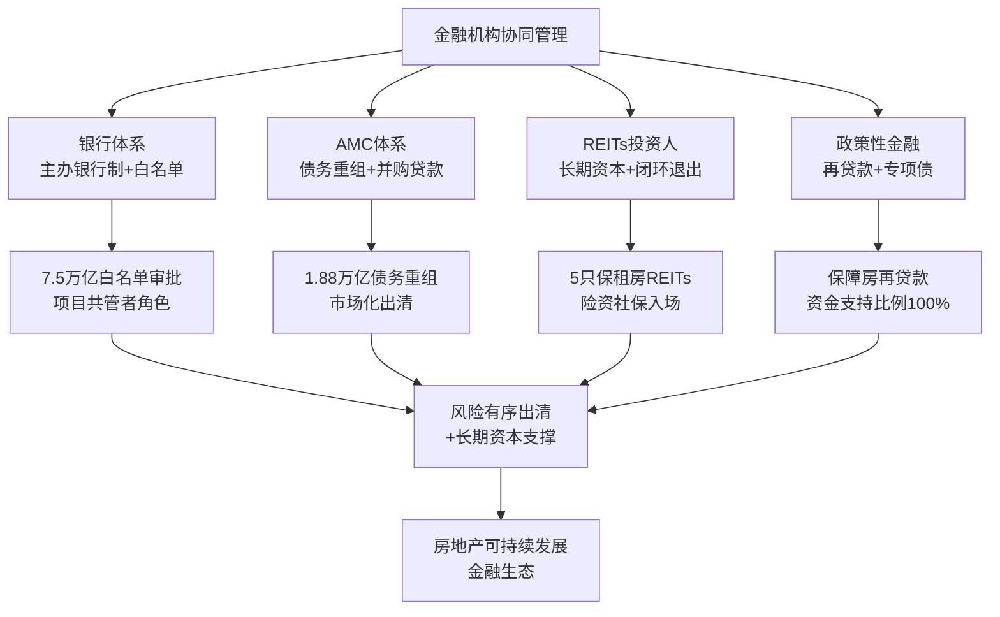

**金融机构的协同管理是动力释放的资金保障**——只有银行、AMC、REITs投资人、政策性金融四类主体形成分工协同的格局，才能在化解存量风险的同时，为新模式构建提供长期稳定的资金支撑。

## 3.5 消费者分层诉求与市场预期管理

消费者是房地产可持续发展的最终需求方，其行为逻辑直接决定市场温度。新周期下消费者群体的分层加剧，**预期管理已成为稳市场、激活内生动力的关键变量**。

### 3.5.1 刚需群体:转向二手房与保障房的分流

刚需群体在"房价下跌+收入预期偏弱"的双重压力下，行为逻辑发生显著转变。一方面，刚需群体对价格更敏感，**部分群体转向二手房**——2025年30个重点城市二手住宅成交套数占总成交量的比重约为65%，较2024年提升约4个百分点（详见第1章1.1.4节）；另一方面，**保障性住房成为刚需群体的重要选择**——"十四五"期间全国计划筹集建设保障性租赁住房870万套（间），用作保障2600万新市民、青年人住有所居（详见第2章2.9.2节）。

刚需群体的诉求重心也从单纯的"有房住"扩展到"住得稳"。《住房租赁条例》于2025年9月15日正式施行，明确鼓励出租人与承租人依法建立稳定的住房租赁关系、积极推动租购住房在享受公共服务上具有同等权利，从法律层面打破了"租房=不稳定"的传统认知（详见第2章2.9.3节）。**"租购同权"为刚需群体提供了商品房之外的长期稳定居住选择**。

### 3.5.2 改善群体:政策与产品共振下的市场主力

改善群体是当前市场最活跃的购买力。在"好房子"供给升级与契税增值税减免的政策共振下，改善型需求集中释放——**9月百强房企改善型房源销售金额环比增长22%，北京城建等房企国庆期间改善型房源到访量环比增长40%，140平方米左右的三居室成交占比从30%升至45%**（详见第2章2.1.3节）。

改善群体的诉求具有典型的品质升维特征。北京改善性群体调研显示，超过8成为本科及以上学历，98.2%为30岁以上，超过7成通过卖掉原有住房获得改善资金；**首要考虑因素是位置，其次是社区配套设施、服务**——这是住房从单纯"物理空间"升维为"功能价值、精神价值与资产价值"三重叠加的典型表现（详见第2章2.1.2节）。改善群体的扩散与产品偏好迁移，是行业从"建多少"向"建什么、怎么建"切换的微观基础。

### 3.5.3 投资性需求:从主导力量到边缘退场

投资性需求的退潮是新周期最具结构性意义的变化。**重点城市投资性购房占比已不足5%，超过九成的人买房都是为了自己住——房子正在褪去金融投机的外衣，慢慢回归居住的本质**[^83]。中美金融战中美联储加息收紧全球流动性，"客观上助力中国解决了房地产尾大不掉的问题"——主动拆弹与被动崩盘性质完全不同，前者手里始终握着缰绳[^83]。

投资性需求的退潮是房地产可持续发展的必要条件而非威胁。过去依靠房地产投资拉动经济增长会降低消费需求比例，最终导致社会失衡[^74]。**投资性需求的边缘化释放了原本被楼市黑洞吸走的资金，为实体经济和科技研发提供了空间**——这与第2章2.5.1节"房地产从超级火车头转向民生改善框架下的压舱石"的判断高度一致。

### 3.5.4 预期管理:稳定市场的核心变量

无论是居民买房、换房，还是企业拿地投资开发，**关键的影响因素就是"预期"**[^92]。作为经济活动中的供需双方，居民会倾向于预期更稳定、意外更少的选项；价格预期越稳定意味着节奏越是可控、资产价值和投资收益越是可预料。**稳定的市场与价格预期是消费者和企业下决心、做决策时的重要锚点，是信心与行动的基石**[^92]。

预期管理的具体路径包括：**第一，政策解读与形势研判**——通过权威渠道解读政策意图，避免市场误读；**第二，价格信号引导**——天津等地对不同情况的新开楼盘和价格进行灵活、合理的管理，因城施策具体体现；**第三，信息公开与新闻发布**——加强与公众、企业等市场主体的信息沟通；**第四，诉求反映与互动机制**——使政策更易被理解、接受和落实[^92]。

更重要的是，预期管理需要打破"买涨不买跌"的传统预期。2024年9.26新政后核心城市价格趋稳、2026年3月全国库存连续51个月正增长后首次同比下降（详见第1章1.1.3节），这些标志性信号的累积是预期修复的关键。**当居民和企业的预期稳定了、信心增强了，才能更好解决住房消费和投资需求不足的问题**[^92]。

下表刻画了三类消费者的差异化诉求与博弈策略：

| 消费者群体 | 核心诉求 | 当前行为策略 | 关键政策抓手 |
|---|---|---|---|
| 刚需群体 | 价格可承受+居住稳定 | 转向二手房与保障房分流 | 公积金额度上浮、保障房筹集870万套、租购同权 |
| 改善群体 | 品质升级+功能精神资产三重价值 | 政策共振下的主动置换 | 契税面积扩至140㎡、增值税满2年免征 |
| 投资性群体 | 资产保值增值 | 占比降至5%以下，边缘退场 | 限购松绑+核心区聚焦的差别化 |

**消费者分层诉求的并立决定了政策必须精准化、差异化**——一刀切的政策既无法满足改善群体的品质升维诉求，也无法兜底刚需群体的基本居住需求，这为第5—7章政策路径设计提供了重要参照。

## 3.6 主体间博弈的典型案例与协同实践

理论层面的博弈分析需要落地到具体实践中验证。本节通过四类典型案例展示多主体博弈与协同的具体形态，提炼可复制经验。

### 3.6.1 存量商品房收储:政府—企业—金融的多元协同模式

存量商品房收储是政府、企业、金融机构三方协同的典型实践。自2023年1月中国人民银行推出专项计划启动试点以来，**已有超过60个城市出台相关支持政策**，全国范围内形成"中央定调、地方探索、国企主导、多元参与"的推进格局[^93][^94][^95]。下表汇总了四种典型模式：

| 模式 | 核心特征 | 协同主体 | 创新点 |
|---|---|---|---|
| 合肥"收存转保" | 国企收储未售新房，转为保租房或人才公寓 | 安居集团+蜀山高科+开发商 | 跨区域收购首例（公园万象854套）、市场化收购流程标准化 |
| 杭州"市场化定价" | 第二轮取消收购价格上限，结合品质综合定价 | 安居集团+宁巢运营+万科 | 定位中高端白领、开业当天签约率80%、目前满租 |
| 青岛"专项债+再贷款" | 1.6亿专项债基础上银团贷款8100万元 | 海发集团+国开行+工商银行+交通银行 | 期限30年、财政资金撬动政策性金融跟进、覆盖全周期 |
| 宁德霞浦"央行再贷款人才房" | 全国首笔央行再贷款支持人才房项目 | 兴业银行+霞浦国投+重点企业 | 4787万元落地、政策性工具支持层次创新 |

数据汇总自[^93][^94][^95]。这些案例的共同特征是**通过制度创新破解"收什么、谁来收、钱从哪来"的三大堵点**——政府层面明确收购主体（安居公司）、企业层面提供市场化定价与运营能力、金融层面创新融资工具组合。

佛山高明花曼曦苑项目作为广东省首个收购存量房用作保障性住房的贷款项目落地后，**收购单价约5400元/平方米（约为周边商品房市场价格的九成）**，项目计划总投资约2.2亿元，获得平安银行住房租赁团体购房贷款授信额度1.7亿元、期限最长30年[^95]。这一价格机制实现了"既推动存量商品房去库存，又通过低利率贷款置换降低地方国资企业债务压力，还降低政府对建设保障性住房的投入"的多重目标[^95]。

### 3.6.2 城市更新:股权型共治破解多元博弈困局

城市更新是政府、企业、居民三方协同的另一典型场域。**传统更新模式中政府、企业、居民始终陷入"多元博弈"的困局**——政府追求公共利益最大化却面临财政压力，企业聚焦短期开发利润而忽视长期运营，居民坚守个体权益却难以参与决策[^96]。股权型城市更新模式以"股权共生"为核心逻辑，通过资金、土地、房产、技术、政策等要素作价入股，**形成"利益共享、决策共商、风险共担"的共同体**[^96]。

重庆红育坡片区改造是股权型协同的成功案例。该项目作为**全国首个采用PPP模式（政府和社会资本合作）运作的老旧小区改造项目**，涉及88栋楼宇、3476户居民、总建筑面积12.6万平方米，2022年7月完工[^97]。项目创新性地引入愿景集团等社会资本参与改造、强化运营可持续性，构建了"五议工作法"让居民深度参与改造方案、"五长制+网格化"矛盾协调机制、严格监管体系等制度创新[^97]。

红育坡模式的成功在于实现了**"政府减压、企业获利、居民受益"的多方共赢格局**——入选住建部第一批城市更新典型案例并获得2023年中国人居范例奖、被国家发改委列为城镇老旧小区改造资金保障典型经验做法全国推广[^97]。值得注意的是，"十五五"期间超过20万亿元资金将精准投向老旧小区、地下管网等八大领域，**地下管网改造一项年均投资即高达万亿元**[^76]——城市更新作为"地方财政新蓄水池"已具备清晰的资金规模与制度框架。

中央财政对城市更新的支持也在升级。2025年中央财政支持城市更新的20个示范城市名单首次将郑州、宜昌等中部城市与北京、上海等直辖市并列，**资金分配遵循"东部控规模、中西保重点"原则**——东部地区单城补助≤8亿元侧重引导社会资本参与，中西部及直辖市单城最高获12亿元重点支持地下管网、污水治理等"保底工程"[^98]。**中央财政不再是单一资金供给方，而是通过"竞争性选拔+差异化补助"激活地方政府治理动能**[^98]。

### 3.6.3 闲置农宅盘活:政企携手的城乡共生探索

上海青浦华新镇的农民自建房代理经租项目展示了**政府与企业协同盘活闲置农宅、服务新市民住房需求**的创新实践。2022年成立的上海新凤抱家房产租赁有限公司是政企合作模式的典型——政府对方向把控、企业市场化运作；企业承担主要经营责任，镇政府从"运动员"转变为"陪跑员"[^99]。

项目实施以来已累计**收储124栋农民自建房、1325间出租屋，目前出租率稳定在90%以上**[^99]。村民每年租金稳定在12万—20万元不等，企业收储价格不低于老百姓自营租金的80%；**公司代缴自建房租赁税，村民再也不用为"开票""报税"等琐事烦心**[^99]。这种协同模式同时解决了农村闲置房屋盘活、流动人口管理、新市民住房需求三大难题，体现了**政府引导+企业运营+居民参与**的协同智慧。

### 3.6.4 基层治理与农房建设:社区与农户层面的协同

基层治理层面的三方协同同样具有借鉴意义。杭州市拱墅区"居委会+业委会+物业"三方协同小区治理模式经过八年发展，**实现专业物业全覆盖，业委会（物管会）组建率达97%**[^100]。该模式的核心是党建引领下的"一核多元"工作机制，通过强化党组织上下贯通、搭建多元参与载体平台、打造党建网/综治网/民生服务网"三网合一"应用场景，**为浙江乃至全国基层社区治理提供了可复制借鉴的经验**[^100]。

农房建设层面，重庆铜梁区2025年创新推出"三免一奖"农房建设管理模式——**免费提供标准化设计图集、免费提供个性化定制设计、免费培训指导建房工匠、评选"金牌工匠"和"最美农房"**[^101]。截至2025年，铜梁农村地区新建住房800多栋，其中超过500栋采用了政府免费提供的设计；**已免费培训工匠647名**[^101]。这一模式有效缓解了以往农房建设中风貌不协调、功能不完善、工匠队伍专业程度不高等问题，**通过"政府引导+专业支撑+群众参与"的共建机制，实现了农房从设计、建造到评价的全周期动态管理**[^101][^102]。

### 3.6.5 协同机制的关键成功要素

综合上述案例，主体协同机制的关键成功要素可归纳为四点：**第一，明确边界与角色分工**——政府从"主导者"转变为"引导者+股东"，企业从"开发者"转变为"运营者+合作者"，居民从"被动接受者"转变为"股东+参与者"[^96]；**第二，创新激励与利益共享机制**——股权型城市更新中股权分配的弹性机制、收益分配的分层逻辑、风险分担的责任边界，提供了利益共享的可操作框架[^96]；**第三，依托专业化运营能力**——华新镇的抱家公司、杭州的宁巢、合肥的安居集团等专业运营主体是协同落地的关键支撑；**第四，金融工具的精准匹配**——专项债、再贷款、银团贷款、住房租赁团体购房贷款等多元金融工具的组合使用是协同模式可持续的保障。

## 3.7 "政府—市场—社会"三方共治协同机制的构建路径

基于前述四大主体的目标函数比较、纵向与横向博弈分析、典型案例提炼，本节归纳新发展模式下"政府—市场—社会"三方共治协同机制的构建路径。这一协同机制是**动力顺畅释放所需的激励相容条件的系统化集成**，为第5—7章政策路径设计提供主体协同的微观基础。

### 3.7.1 制度共治:四项基础制度构成激励相容框架

制度共治是三方共治的根基。新发展模式下，**"人房地钱"要素联动机制、项目公司制、主办银行制、现房销售制**四项基础制度共同构成激励相容框架[^88][^70][^71][^69]。

**"人房地钱"要素联动机制**通过"以人定房、以房定地、以房定钱"实现要素的精准配置——根据人口变化确定住房需求，根据住房需求科学安排土地供应、引导配置金融资源[^103][^69]。中指研究院已经搭建较为成熟的"人房地钱"要素联动模型，从逻辑上首先梳理常住人口规模变化、人口结构特征、住房需求方向，分类测算商品住房、保障房等住房发展需求规模实现以人定房；其次基于住房需求规模、库存规模、土地规模等指标科学合理分类测算各区域短期土地供应规模实现以房定地；最后结合各区域指标测算项目合理融资规模实现以房定钱[^103]。**这一机制从源头上解决了过去人房错配的根本问题**，是制度共治的核心。

**项目公司制**实现项目级风险隔离——项目公司依法行使独立法人权利，企业总部履行投资人责任，**项目交付前严禁投资人违规抽挪项目公司资金**[^70][^69]。**主办银行制**建立银企风险共担机制——一个项目确定一家银行或银团作为主办银行，**主办银行保证项目公司合理融资需求**[^70][^69]。**现房销售制**从根本上防范交付违约风险——核心在于"所见即所得"的品质兑现[^70][^69]。

四项基础制度的共同作用是**重塑各主体的目标函数与行为约束**：地方政府从"卖地冲动"转向"要素联动"；房企从"高周转扩张"转向"项目精耕"；银行从"放贷者"转向"项目共管者"；消费者从"期房博弈"转向"现房选择"。这正是激励相容的微观体现。

### 3.7.2 利益共享:多元共赢的分配机制

利益共享是三方共治的可持续动力。**股权型城市更新模式构建了"政府引导、企业参与、居民共治"的协同平台**——平台收益分为基础收益与增值收益：基础收益（如租金、物业费）优先用于覆盖运营成本与债务偿还，剩余部分按股权比例分配；增值收益则在提取20%—30%作为平台发展基金后，再由各股东分配[^96]。**REITs收益分配机制**通过强制分红比例（华夏北京保障房REIT 2024年累计分红5385万元、占可供分配金额的99.9882%）保障投资人回报，吸引长期资本持续入场[^89][^90]。

**保障房封闭运营机制**则保障公共利益不被侵蚀。赣州市配售型保障性住房管理实施细则明确规定——配售型保障性住房面向城镇户籍家庭、城镇常住人口家庭、机关事业单位人员、企业引进人才等符合条件的工薪收入群体配售；**新建配售型保障性住房项目利润率按不超过土地、建安、税金、融资等成本的5%进行核定**；不得抵押（购买房屋按揭抵押贷款除外）；建立严格的退出回购机制[^104]。这一机制确保了保障房"姓保"的属性，防止公共资源被套利。

利益共享机制的关键是**在公共利益、企业盈利与居民收益之间找到动态平衡**——任何一方利益的过度倾斜都会破坏协同基础。

### 3.7.3 风险共担:有序出清的多元工具

风险共担是三方共治的安全底线。**项目级风险隔离**通过项目公司制实现，使集团风险与项目风险分离，避免一损俱损[^70][^69]。**"白名单"金融兜底**在过渡期发挥关键作用——7.5万亿元审批规模、最长5年贷款接续，为房企提供了风险缓冲空间[^82]。**债务重组多元对价**为出险房企提供市场化出清路径——重组类置换债、收并购债券、风险缓释工具的应用使重组对价更加多元化[^80]。**预售资金监管**强化项目资金的封闭管理，防止资金被违规挪用[^80]。

风险共担机制的核心是**"既要防风险，又要稳预期"的双重平衡**——既要让出险企业付出市场化代价，避免道德风险；又要避免无序出清引发系统性风险传染。截至2025年18家已发布债务重组方案的房企总有息负债规模占44家上市违约房企总有息负债的70%，**反映出风险化解已进入有序出清的良性轨道**[^80]。

### 3.7.4 信息共通:打通主体间信息壁垒

信息共通是三方共治的运行基础。**城市体检制度**为城市更新提供精准诊断——厦门、济南等城市试点将房屋全生命周期安全管理纳入更新项目库，实现"隐患房屋动态清零"[^98]。**住房发展规划与年度计划**编制使各主体形成统一预期——2024年北京、天津、成都、长沙、厦门、青岛、西安、郑州等城市均发布了年度住房发展计划，明确商品住房、保障性住房的发展目标[^103]。**市场预期管理**通过政策解读、形势研判、信息公开、新闻发布等方式，加强与公众、企业等市场主体的信息沟通[^92]。

广州市住建局2024年实践展示了信息共通的具体做法——开展"好房节"、房博会、赴港房地产推介会等促销活动；**全市一手商品房网签面积累计1097.49万㎡**；建立房地产融资协调机制满足房地产企业合理融资需求；打好保交房攻坚战；**成功申报城中村改造专项借款项目52个、授信金额4096亿元**；2024年城中村改造完成固定资产投资1035亿元、超额完成年度任务[^105]。这些数据的及时公开本身就构成了重要的预期管理工具。

### 3.7.5 三方共治协同机制的整体架构

下图刻画了"政府—市场—社会"三方共治协同机制的整体架构：

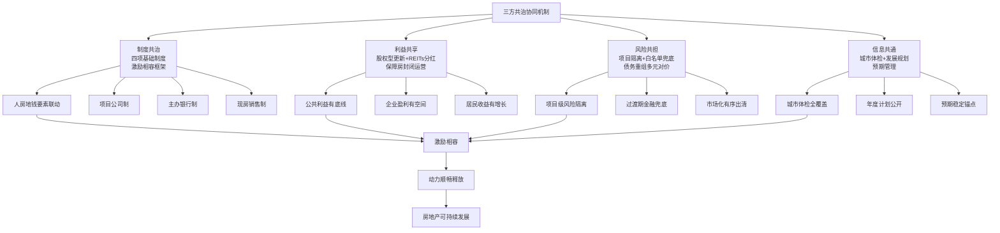

### 3.7.6 协同机制对后续政策路径设计的启示

三方共治协同机制为第5—7章的政策、资金、战略导向路径设计提供了三点关键启示：

**第一，政策路径必须建立在主体行为机理之上**。第5章关于政策促进路径的设计应紧扣四项基础制度（人房地钱要素联动、项目公司制、主办银行制、现房销售制）的迭代演进，避免脱离主体行为的"政策孤岛"。

**第二，资金支持体系必须服务于多元主体协同**。第6章关于资金支持的设计应在央行再贷款、专项债、REITs、商业银行信贷等工具组合中体现政府—市场—社会三方的角色定位，避免单一渠道的过度依赖。

**第三，战略导向必须激发主体的内生协同动力**。第7章关于战略导向的设计应在"好房子、城市更新、租购并举、绿色低碳"四大主轴上同时配套政策工具与资金渠道，使各主体在战略导向引领下自发形成协同合力。

需要特别强调的是，**三方共治协同机制并非自发形成，而是需要持续的制度建设与试错迭代**。当前协同机制仍处于"试点中"或"规划提出"的不同确定性等级——人房地钱要素联动机制已在多地试点、项目公司制与主办银行制处于规划提出阶段、现房销售制有力有序推进中。"十五五"开局之年（2026年）将成为这一系列基础制度从"破题"走向"深耕"的关键节点[^71]，而这正是后续章节将要重点研判的核心议题。

至此，本章完成了对四大主体目标函数的比较、对纵向与横向博弈的剖析、对典型协同实践的提炼，以及对三方共治协同机制构建路径的归纳。**本章的核心结论是：房地产可持续发展的动力释放不仅取决于动力源的丰富性，更取决于多主体目标函数的激励相容程度**。第4章将在此基础上，前瞻性研判未来十年（2025—2035）行业发展趋势与战略目标，为政策、资金、战略导向的路径设计提供目标锚点。

# 4 未来十年行业发展趋势与战略目标研判

第1章确立了从"深度调整期"向"新发展模式成型期"过渡的时代坐标，第2章拆解了驱动行业可持续运转的九大动力源及其耦合机制，第3章揭示了多主体目标函数的差异化与三方共治协同机制的构建路径。当现状研判与动力机理已然清晰，下一个关键问题是：**这些动力在未来十年将共同推动行业走向何方？国家又应在哪些核心战略目标上聚焦发力？** 只有给出清晰的趋势研判与目标锚点，第5—7章关于政策、资金、战略导向的路径设计才不至于陷入"工具堆砌、缺乏方向"的窘境。

本章承接前文"现状研判—动力拆解—主体协同"的逻辑链条，进入"路径研判"环节。围绕**市场规模演变、供需结构重塑、区域分化格局、企业竞争格局重构**四个维度刻画2025—2035年的趋势图景，并结合"十五五"规划纲要与中长期国家战略，归纳**高质量发展与新模式构建、"好房子"建设、租购并举、风险长效防控、城市更新与绿色低碳**五大核心战略目标，最终落脚于2025—2030—2035三阶段路线图与关键量化指标，为第5—7章政策、资金、战略导向路径设计提供清晰的目标锚点与可校验的节点判据。需要特别说明的是，未来十年的研判涉及大量前瞻性论断，本章将严格区分"已落地、试点中、规划提出、学界建议"四类确定性等级，对低确定性内容采用审慎措辞，避免将专家个人观点等同于政策既定方向。

## 4.1 未来十年市场规模演变与需求中枢下移轨迹

判断行业未来十年的发展方向，首先需要把握市场规模的演变路径。基于第1章关于"L型回落"的总体判断与第2章关于内生动力测算的基础数据，可以进一步细化未来十年的规模演变轨迹。

### 4.1.1 新增需求中枢的阶梯式下移

新增商品房需求中枢的下移，是未来十年最具确定性的趋势之一。从需求测算结果看，**2022—2025年新增商品房需求中枢约为11.3亿平方米，2026—2030年降至约9.6亿平方米，2031—2035年进一步降至约8.7亿平方米**（详见第1章1.1.1节）。这一阶梯式下移的回落斜率呈现"先陡后缓"特征——前一个五年降幅约15%，后一个五年降幅收窄至约9%，**意味着行业不会出现"V型反弹"，但也不会陷入"硬着陆"式的崩塌**。

从已发生的现实数据看，2025年全国新建商品房销售面积88101万平方米、销售额83937亿元[^106]，已显著低于11.3亿平方米的中枢测算值——这反映出本轮调整周期的实际收缩幅度较深。但与此同时，2026年3月全国商品房待售面积出现连续51个月正增长后的首次同比下降（详见第1章1.1.3节），说明库存已开始进入主动去化阶段，**为后续销售规模在9.6亿平方米中枢附近企稳提供了基本面支撑**。

需要指出的是，关于2030年与2035年的需求测算，不同机构存在口径差异。一组测算认为2025—2030年全国住房年需求将降至410万—500万套，较2017年2000万套的峰值下跌超75%；另一组测算认为2030年适龄购房人群（25—44岁）将减少约2100万（详见第2章2.6.1节）。**两组数据虽口径有别但方向一致，均印证了住房总需求长期下行通道已然确立**。本研究采用第1章引用的"亿平方米"口径作为基准，主要原因在于其与第2章"2050年住房需求中刚需+改善合计7.874亿方"的长周期测算可形成内在自洽。

### 4.1.2 二手房交易占比向70%逼近的范式切换

新增市场规模下移的同时，二手房交易占比的持续提升成为存量主导时代的标志性信号。2023年全国二手房交易量占全部房屋交易量的比重达到37.1%[^107]；2024年克而瑞监测的重点30城二手房成交持续增长[^108]；**2025年30个重点城市二手住宅成交套数占总成交量的比重已达约65%**（详见第1章1.1.4节）。

从城市层面看，二手房主导的格局已在多数核心城市完成确立。北京、上海、深圳等一线城市二手房交易占比早已超过70%，**未来十年核心城市二手房占比将继续向75%—80%区间演进，部分城市将达到欧美发达国家70%—80%的成熟市场水平**。住建部已明确强调"把新房市场和二手房市场作为一个整体来看待"（详见第1章1.1.2节），这意味着政策视角已从"商品房新房一元主导"转向"新房+二手房+保障房"的多元供给格局。

二手房占比提升的深层意义在于**重新定义了房企的竞争对手**——新房不再仅与新房竞争，更要与同板块的次新二手房竞争。这一变化倒逼新房在产品力、品质感、附加值上做出实质性突破，否则将面临"高价位但不被市场认可"的尴尬境地。这也正是第2章2.3节所讨论的"产品力跃升"动力源在市场端的具体投射。

### 4.1.3 "大开发时代"向"存量主导时代"的范式切换

任泽平团队明确判断，**房地产大开发时代落幕，进入存量房主导时代**[^109]。20—50岁主力购房人群的人口长周期拐点已现，城镇化率达67%，套户比超过1.1，已具备从增量市场向存量市场切换的客观条件。这一切换的临界点已经到来：**未来住房市场的三大支撑将变为改善型需求、城市更新、保障房需求**[^109]，而非传统意义上的新增刚需主导。

从范式切换的内涵看，"存量主导"包含三重含义：**第一，交易结构上以二手房交易为主体**，新房成交逐步退居补充地位；**第二，开发模式上以存量盘活为主体**，城市更新、城中村改造、收储存量商品房成为重要的供给来源；**第三，价值创造上以运营服务为主体**，资产管理、物业服务、租赁运营成为新的增长极。参考美国经验，**存量时代房地产贡献率仍可占GDP的15%—20%，但以服务和资产管理为主**[^110]——这一国际坐标为中国房地产业未来十年的转型方向提供了清晰的对标。

### 4.1.4 "软着陆"而非"硬下行"的判断逻辑

需要特别强调的是，未来十年市场规模的下移是**"软着陆"而非"硬下行"**。这一判断的核心逻辑包括四点：

**第一，需求中枢仍处可观水平**。即便2031—2035年降至8.7亿平方米，仍是一个庞大的市场规模——按发达国家成熟市场住宅交易占GDP比重5%—7%的水平估算，对应的市场价值仍达数十万亿元量级，足以支撑产业链上下游的可持续运转。

**第二，回落斜率逐步放缓**。从15%降幅到9%降幅的斜率收窄，意味着行业进入"温和下移、结构调整"的阶段，而非"加速失速"的崩塌期。

**第三，存量市场扩容对冲增量收缩**。2023年估算全国新房+二手房销售面积约15.1亿平方米、同比增长6.3%[^107]——存量市场的扩容已在总量上对冲了新房市场的收缩，使行业总交易规模保持相对稳定。

**第四，更新需求与保障房需求的持续注入**。第2章2.10.2节引用的测算显示，**2050年更新需求约0.88亿方、占总需求的10.03%**；"十四五"期间保障房筹建超870万套（详见第2章2.9.2节），这些政策性需求为行业提供了稳定的"压舱石"。

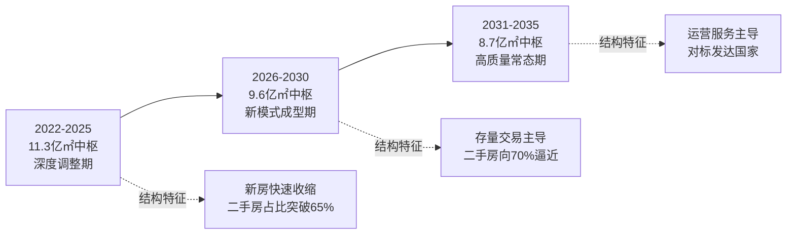

综合判断，**未来十年市场规模演变的核心命题不是"规模会跌到哪里"，而是"在新中枢下行业如何重塑价值创造方式"**——这正是后续战略目标研判与政策路径设计的根本指向。

## 4.2 供需结构重塑：从总量平衡到品质升维与三大支撑

如果说市场规模的下移是"量"的演化，那么供需结构的重塑则是"质"的转型，后者的深远意义远超前者。未来十年供需结构的重塑将在需求侧、供给侧、产品端、交易制度四个维度同步展开。

### 4.2.1 需求侧三大支撑替代单一刚需主导

未来十年需求侧将彻底告别"刚需主导"的单一格局，形成**改善型需求、更新需求、保障性住房需求三大支撑并立**的新格局。二十届四中全会披露的数据显示，**改善性需求占比41.1%、更新需求占比29.8%，二者合计超过七成**（详见第2章2.1.1节）。这一结构性变化已不可逆转。

任泽平团队的判断进一步明确——**未来住房市场的三大支撑：改善型需求、城市更新、保障房需求**[^109]。这三大支撑各自具有不同的驱动逻辑：

**改善型需求**根植于居民收入增长与生活方式变迁。35—64岁改善型购房群体年均达6.6亿人，较"十四五"增加3000万人（详见第2章2.1.3节）；从产品端看，90—140平方米首改类销售额占比达45.7%、140—200平方米改善类占比26.5%、200平方米以上高端类占比15.6%（详见第2章2.1.3节）——三段合计近九成的占比，使改善需求成为支撑市场的核心力量。

**城市更新需求**对应存量住房的折旧、拆除与品质提升。"十五五"期间将改造城镇老旧小区约11.5万个、改造城镇危旧房约50万套（间）[^111]，这一规模化改造为更新需求的释放提供了制度支撑。

**保障性住房需求**对应新市民、青年人、工薪群体的基本居住需求。"十四五"期间已筹集建设保障性租赁住房870万套（间），保障2600万新市民、青年人住有所居（详见第2章2.9.2节）；"十五五"期间保障对象将进一步拓展至初婚初育家庭、多子女家庭、城镇工薪群体等[^112][^113]。

### 4.2.2 供给侧"存量盘活+品质升级+保障扩容"三轨并行

与需求侧三大支撑相呼应，供给侧将形成"存量盘活+品质升级+保障扩容"三轨并行的新格局，告别过去"高周转、大规模放量"的单一模式。

**存量盘活轨**以38号文"无存量不增量"机制为制度基石（详见第3章3.2.3节）——年度新增城乡建设用地原则上不得超过盘活存量土地面积，新增用地原则上不用于经营性房地产开发。这意味着未来商品房供给将越来越依赖城市更新、城中村改造、收储存量商品房等存量盘活方式。

**品质升级轨**以"好房子"标准为引领。2025年5月1日起《住宅项目规范》正式实施，超过15个省份在政府工作报告中明确提出推动"好房子"建设[^114]——这意味着以往作为差异化卖点的品质要素正在转化为强制性的基础门槛。

**保障扩容轨**以多元化住房保障体系为载体。浙江省2025年9月出台的《关于构建多元化住房保障体系推动住房保障工作高质量发展的指导意见》明确**到2027年累计建设筹集各类保障性住房达到150万套（间）**（详见第2章2.9.1节）；深圳"十四五"期间建设筹集各类保障性住房助力41万户家庭圆安居梦[^115]。

三轨并行的供给侧改革，从根本上改变了行业的供给逻辑——从过去的"以新房为主、以增量土地为基础"，转向"新房+存量+保障三足鼎立、增量与存量并重"。

### 4.2.3 "好房子"标准下的产品全维升级

"好房子"建设是未来十年产品端最具结构性意义的变化。2025年10月住建部部长倪虹系统阐释的"6633"标准，将"安全、舒适、绿色、智慧"四大目标具体化为**"六不"（不霉、不堵、不漏、不吵、不裂、不臭）、"六防"（防电、防火、防灾、防盗、防撞、防摔）、"三省"（省心、省地、省钱）、"三要"（要健康、要实用、要关怀）**四个部分，形成涵盖16类、262项要点的操作手册[^116]。

新版《住宅项目规范》明确提出**14项提升**，其中具有标志性意义的包括：将住宅层高提高到不低于3米、规定4层起要加装电梯[^117]、楼板隔音要求提高10分贝（详见第2章2.1.2节）。这些指标的强制化意味着行业产品门槛的全面抬升。

产品端的升级不仅停留在硬指标上，更体现在功能、精神、资产三重价值的叠加（详见第2章2.1.2节）。北京、上海等核心城市的实践显示，**改善性产品在适老化设计、Z世代偏好、绿色建筑三个方向呈现差异化竞争格局**——旭辉上海世纪古美项目通过超低能耗技术实现年减排1225吨二氧化碳，杭州未来科技城"Z世代社区"00后购房占比达35%、较传统社区溢价10%，2023年全国绿色建筑占比超99%、旭辉装配式建筑占比79.6%（详见第2章2.3.2节）。

### 4.2.4 交易制度重塑：套内计价、满装交付、现房销售成为新常态

交易制度的重塑是未来十年容易被忽视但极具深远意义的变化。三项制度变化将逐步成为行业新常态：

**按套内面积计价**已在2024年开始试点。河北张家口、湖南衡阳、合肥、湘潭、肇庆以及广西壮族自治区等地都提出过要探索套内面积计价[^118]。**预期后续将有更多城市跟进出台"实行套内建筑面积计价"的相关规定**[^118]——这一变化虽对房价绝对值影响较小，但有利于购房者更直观了解实际价格、减少信息不对称引发的纠纷、促进商品房销售行为进一步规范。

**满装交付与现房销售**则是更具系统性影响的制度变化。住建部已明确表示未来将有力有序推进现房销售，做到"所见即所得"（详见第2章2.3.2节）；"十五五"规划纲要进一步明确"有序推进现房销售"[^112]。**2024年1—11月现房销售2.6亿平方米同比增长19.4%**（详见第2章2.3.2节），印证了市场对成品房的偏好转向。

| 交易制度变化 | 当前状态 | 未来十年演进路径 | 对供需匹配的影响 |
|---|---|---|---|
| 按套内面积计价 | 多省市试点 | 逐步在主要城市铺开 | 降低信息不对称、规范价格透明 |
| 满装交付 | 部分项目落地 | 与好房子标准协同推进 | 提升交付确定性、强化品质兑现 |
| 现房销售 | 有力有序推进 | 条件成熟城市先行试点 | 从根本上防范交付风险 |
| 项目公司制+主办银行制 | 规划提出阶段 | 与现房销售协同落地 | 重塑融资模式与责任边界 |

数据汇总自[^118][^112][^119][^120]。这四项制度变化是相互关联的整体——**只有项目公司制和主办银行制能够提供资金保障，现房销售才有可能规模化推进；只有现房销售成为常态，满装交付才有制度根基；只有产品交付具有确定性，按套内面积计价的市场基础才能夯实**。这一相互关联的制度群是新模式的核心制度基石[^113]。

供需结构重塑的最终意义在于**重塑行业的价值评估标尺**——从过去"以位置和户型大小论价值"，转向"以品质、运营、服务、ESG综合论价值"，这是房地产高质量发展的根本指向。

## 4.3 区域分化格局：从普涨时代到结构性分化的不可逆演进

如果说前两节描述的是行业整体的演化方向，那么区域分化则是未来十年行业最具空间差异性的趋势。这一分化不是周期性波动，而是由人口、产业、资产价值"三位一体"驱动的结构性、不可逆变化。

### 4.3.1 城镇化率的持续提升与区域差异化路径

城镇化进程的持续推进仍是未来十年区域格局演化的基础变量。**预计到2030年我国城镇化率将达到70%，2050年将达到80%左右**[^121]——这意味着未来十年仍存在约2—10个百分点的提升空间，对应城镇人口增加数千万至上亿规模。

但城镇化率的提升将呈现显著的区域差异化路径。**19个城市群常住人口占全国比重将提升至75%左右、地区生产总值占全国比重稳定在83%以上**（详见第2章2.2.2节）；**重点城市群销售份额预计"十五五"升至80%**（详见第2章2.2.3节）。粤港澳大湾区、长三角等"人口磁极"对全国人口增量贡献率超30%，而东北、西北、低能级城市人口面临持续流出压力。

任泽平团队的判断指出，**未来仅有两成城市人口持续流入，出现"二八现象"**[^109]——这一判断意味着区域分化将走向"少数城市持续繁荣、多数城市相对收缩"的极端结构性格局。

### 4.3.2 一线及强二线城市：2—3年内筑底，长期止跌回升

国务院发展研究中心市场经济研究所王瑞民研究员明确指出，**一、二线城市通常都是人口净流入的城市，经济活力强，租和购的住房需求都比较旺盛，且尚未得到充分满足，增加住房供应的弹性和灵活性应成为其总的住房政策取向**[^122]。这一判断为未来一、二线城市的房地产市场走势提供了基本面支撑。

任泽平团队进一步研判，**一线及强二线城市因人口流入、产业集聚，未来2—3年内将筑底，更长远看一线房价有望止跌回升**[^109]。克而瑞研究的预判则更为具体——**杭州、上海、成都、西安、天津、深圳等十城预期率先回稳，其他城市回暖仍有待传导**[^108]。这一研判与第3章3.3.1节"中海五个核心城市权益购地金额占比73.9%"、保利发展"2025年拓展总地价一二线占比超90%"的房企拿地策略高度吻合，反映出市场已经在用真金白银投票。

一线城市内部也将出现进一步分化。2025年12月**上海新建住宅价格同比上涨4.8%，是一线城市中唯一实现同比正增长的城市**（详见第1章1.1.4节）；4月份70个大中城市中一、二线城市新建商品住宅销售价格环比持平，同比降幅继续收窄[^122]——这表明一线城市的修复进度已经领先于二线城市，而强二线城市与弱二线城市之间的分化也将持续扩大。

### 4.3.3 三四线及以下城市：约70%面临阴跌与去化困难

与核心城市的回稳形成鲜明对比的是，三四线及以下城市将面临持续的市场压力。**全国约70%的三四线城市空置率超20%，东北某地级市库存去化周期超20个月**（详见第2章2.6.4节）；任泽平团队判断，**大多数三四线城市，人口流出，有价无市、去化困难，未来可能陷入漫长的阴跌**[^109]。

中国房地产投资分析报告指出，**三四线城市住房存量增速已远超人口增长，导致投资回报率显著下降**[^110]——这是一个供需错配在区域上的极端表现。中长期看，**多数三四线城市回报率可能低于2%，甚至需应对价格阴跌；投资逻辑从增值转向消费属性，如气候宜居城市**[^110]——这意味着这些城市的房地产将逐步从投资品回归消费品的本质。

三四线城市的困境在地方财政上也有清晰体现。安徽省财政厅课题组披露土地出让收入占财政两本预算收入的40%以上，但2024年该项收入较峰值年份下降近50%（详见第3章3.1.2节）——三四线城市受土地出让收入下滑的冲击远大于一线城市，财政转型压力空前。

### 4.3.4 "人口磁极—产业集聚—资产价值"三位一体的新区域格局

未来十年区域格局将逐步定型为**"人口磁极—产业集聚—资产价值"三位一体**的新格局。这一格局的核心特征是：

**第一，人口流向决定房价走向**。2024年贵阳以19.96万人口增量位居全国首位，深圳以19.94万微弱差距位列第二，广州、合肥、长沙、南昌、杭州、宁波、济南、成都依次进入前十（详见第2章2.2.2节）；与此同时，18个省份常住人口出现减少，东北区域人口负增长进一步加剧。

**第二，产业集聚决定人口去向**。深圳的PCT国际专利申请量连续21年位居全国城市首位，5.4万亿元规上工业总产值为其房地产市场提供坚实支撑（详见第2章2.2.2节）；浙江以45.4万人省外净流入领跑增长率，其背后是数字经济、先进制造业的产业引力。

**第三，资产价值动态分化**。一线城市租金房价比已攀升至2.17%，核心城市优质租赁资产的投资回报率接近五年期定期存款利率（详见第2章2.9.4节）；而三四线城市的房产则面临"投资属性退化、消费属性凸显"的价值重塑。

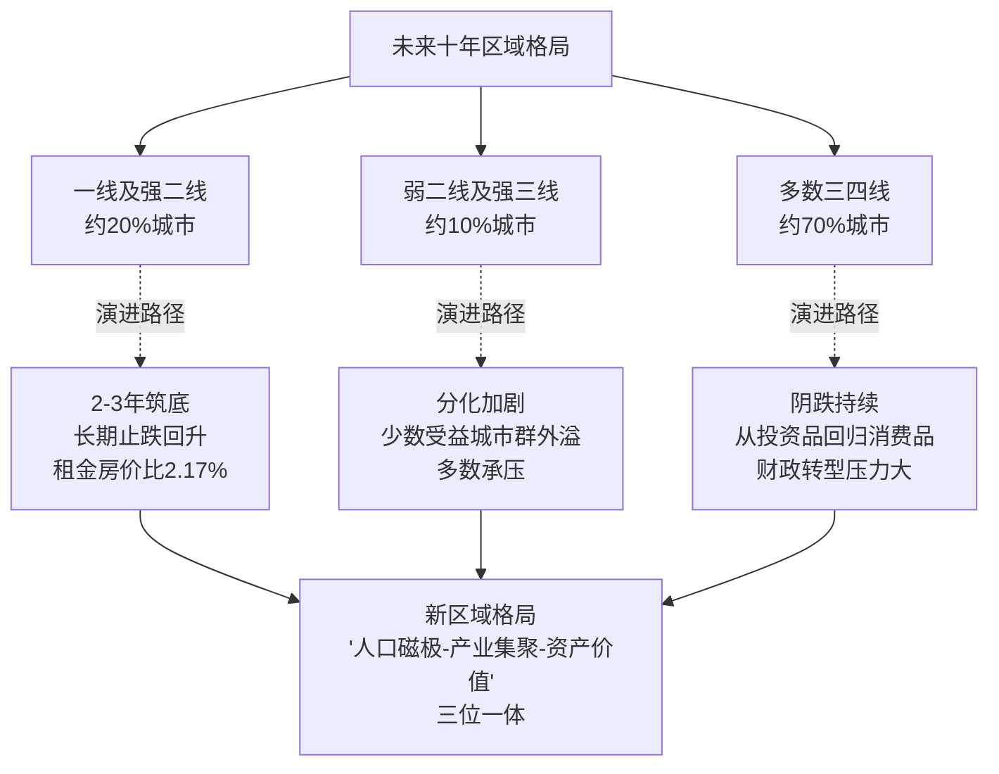

### 4.3.5 区域分化对政策路径设计的方法论启示

区域分化的不可逆演进对未来政策路径设计具有重要的方法论启示：**"全国一盘棋"的统一调控已难以适应区域分化的现实，因城施策的差异化政策将成为必然选择**。三中全会《决定》已明确提出"充分赋予各城市政府房地产市场调控自主权，因城施策"[^123][^119]——这一制度安排正是对区域分化现实的政策回应。

具体而言，对一线及强二线城市，政策重心应放在增加住房供应弹性、缓解供求紧张、提升住房可支付性上[^122]；对中低能级城市，政策重心应放在去库存、化解风险、引导存量盘活上；对人口持续流出地区，则需稳妥应对土地财政退出带来的冲击和风险（详见第3章3.2.4节）。这一差异化政策思路将贯穿第5—7章的路径设计。

## 4.4 企业竞争格局重构：行业洗牌、集中度提升与商业模式跃迁

未来十年最戏剧性的变化将发生在企业竞争格局层面。这一重构不是简单的市场份额再分配，而是**伴随商业模式根本性跃迁的产业革命**。

### 4.4.1 行业洗牌：大部分中小房企将消失或被并购重组

任泽平团队明确判断，**房地产行业大洗牌，大部分房企将消失或被并购重组，优胜劣汰，这是所有行业发展到成熟阶段必然要经历的**[^109]。这一判断已在现实中得到充分验证——截至2025年末，累积出险的地产企业共计74家，涉及债券466只，违约规模超过4500亿元（详见第3章3.3.5节）；2022年和2023年地产企业违约主体占比超过50%。

行业洗牌将沿着"集中暴雷—集中展期—有序重组—市场化出清"四个阶段演进（详见第3章3.3.5节）。**2025年万科事件标志地产行业风险出清进入下一阶段**，本轮债务重组国内地产企业将在短期内摆脱高负债的掣肘，但严重侵蚀房企资产负债表的同时，也加速了"行业资源和项目向央国企、优质民企集中"的趋势（详见第3章3.3.5节）。

预计到2030年前后，行业市场化出清将基本完成。届时房企群体将被分为三类：**第一类是稳健经营的央国企与少数优质民企**，继续扩大市占率；**第二类是完成债务重组并实现转型的存活民企**，在细分赛道上实现差异化生存；**第三类是退出市场的中小房企**，要么被并购重组，要么彻底消亡。

### 4.4.2 行业集中度持续提升与"中海现象"

行业集中度的持续提升是洗牌的直接结果。央国企在新周期中的领跑姿态已经清晰呈现：**保利发展2025年实现销售签约金额2530亿元，连续三年行业领跑**；**中海地产2025年权益销售金额约2311亿元跃居行业第一**（详见第3章3.1.3节）。这种"央国企领跑、民企分化"的格局将在未来十年持续强化。

"中海现象"的代表性意义在于——其**资产负债率54.1%、加权平均融资成本仅2.8%**（详见第3章3.1.3节），这种财务结构在传统三高模式下是不可想象的，但在新模式下恰恰成为持续扩张的基石。**中海获三大国际评级"双A-"、为内地房企唯一**（详见第3章3.3.5节），这种信用优势使其能够以远低于同行的成本获取资金，从而在土地投资、产品打造、品质保障上构建起难以逾越的护城河。

值得注意的是，**毕马威研究指出，房企的价值评估标准将从销售规模转向科技赋能与资产精细化运营能力，从"盖房子"转向"做服务、提品质、管资产"**[^124]。这意味着集中度的提升不仅是市场份额的集中，更是**新型核心能力的集中**。

### 4.4.3 商业模式跃迁：从"开发+销售"向"开发+经营+服务"

商业模式的根本性跃迁是未来十年企业竞争格局重构的核心。新模式下的商业模式将呈现"开发+经营+服务"三位一体的新格局：

**开发环节**仍是基础但不再是核心。开发的逻辑从"高周转扩张"转向"项目精耕"，房企从"开发者"转变为"运营者+合作者"（详见第3章3.6.5节）。

**经营环节**成为新增长极。万科、保利等头部企业商办持有面积超1000万平方米，租金回报率稳定在4%—5%（详见第2章2.3.2节）；REITs等资产证券化工具拓宽了"投融建管退"闭环（详见第2章2.7.4节）。

**服务环节**成为核心竞争力。物业服务、资产管理、租赁运营、社区服务等多元服务业态将成为房企新的盈利支柱。参考美国经验，**存量时代房地产贡献率仍占GDP的15%—20%，但以服务和资产管理为主**[^110]——这一国际坐标为中国房企的转型方向提供了清晰对标。

毕马威厉俊指出，**行业经营逻辑从开发主导转向运营服务主导，房企的价值评估标准将从销售规模转向科技赋能与资产精细化运营能力**[^124]。这一变化意味着房企的估值逻辑将从"土地储备+销售规模"转向"科技赋能+精细化运营+ESG表现"——这是行业利润率回归制造业合理区间、实现可持续盈利的根本前提。

### 4.4.4 科技赋能催生新业态

科技赋能是商业模式跃迁的重要支撑。智能建造、绿色建造、装配式建筑等新业态将在未来十年快速崛起：

**智能建造**方面，"十五五"时期住建部明确以提供高品质建筑产品为根本目的，培育建筑业新质生产力，推动建筑业提质升级，打造"中国建造"升级版[^117]。同济大学王广斌教授认为，**智能建造所要培育的，是"以现代产业体系方式建造"的能力，是把产业链做强、把供应链做优、把生态圈做活的能力**[^117]。

**绿色建造**方面，绿色建筑市场到2030年规模预计突破2.5万亿元，占建材总市场比重超过38%（详见第2章2.4.2节）。建筑用能结构持续优化——2025年城镇建筑可再生能源替代率达到8%、建筑用能中电力消费占比超过55%（详见第2章2.8.2节）。

**装配式建筑**方面，旭辉装配式建筑占比已达79.6%、较传统工艺减少碳排放30%（详见第2章2.4.1节）。住建部倪虹部长提出"要像造汽车一样去造房子"——通过精细化建造降低能源浪费与碳排放（详见第2章2.4.1节）。

下表汇总了未来十年企业竞争格局重构的核心维度：

| 重构维度 | 旧格局特征 | 新格局演进方向 |
|---|---|---|
| 行业集中度 | 群雄逐鹿、规模导向 | 央国企+优质民企+细分赛道民企三层结构 |
| 商业模式 | 开发+销售 | 开发+经营+服务三位一体 |
| 核心能力 | 拿地+融资+周转 | 产品力+运营力+科技力+ESG |
| 估值逻辑 | 土地储备+销售规模 | 科技赋能+精细化运营+ESG表现 |
| 利润率水平 | 高杠杆推高账面回报 | 回归制造业合理区间 |
| 国际竞争力 | 国内市场为主 | "中国建造"出海、SBTi对接 |

数据汇总自[^124][^117][^110][^109]。**这种全方位的格局重构，是房地产行业从"快钱时代"向"慢钱时代"切换的微观体现**，也是行业实现可持续发展必须经历的阵痛与升华。

## 4.5 核心战略目标之一：推动房地产高质量发展与新模式构建

在前四节趋势研判的基础上，本节及后续四节将归纳未来十年五大核心战略目标。这五大目标共同构成"十五五"乃至2035年房地产可持续发展的目标体系，是第5—7章政策、资金、战略导向路径设计的目标锚点。

### 4.5.1 战略校准：从"经济发展"章节到"民生保障"篇章

"十五五"规划纲要最具标志性的变化是房地产章节归属的战略校准。**房地产被从"经济发展"章节调整至"民生保障"篇章**[^124]——毕马威厉俊将这一调整定性为"角色定位的战略性校准，而非根本性颠覆"。这一校准的深层含义是：**房地产不再作为宏观经济调节工具，而是纳入保障和改善民生的基础框架，更强调行业与经济社会发展的适配性，而非单一的经济拉动作用**[^124]。

这一战略校准与第1章关于"房地产业增加值占GDP比重从2020年的7.3%下降到2024年的6.3%"的判断形成呼应——房地产正在从宏观经济的"超级火车头"转变为民生改善框架下的"压舱石"。**确立了"市场+保障"双轨并行的制度框架，意味着房地产政策将更加注重公平性、可及性与居住体验，而非单纯的经济贡献度**[^124]。

### 4.5.2 高质量发展的"三重信号"

毕马威厉俊系统阐释了从"房住不炒"到"推动房地产高质量发展"这一表述转变的"三重信号"[^124]：

**第一重，行业定位回归民生本源**。房地产不再作为宏观经济调节工具，而是纳入保障和改善民生的基础框架。

**第二重，发展模式从增量扩张转向存量优化**。**告别粗放的规模导向、高杠杆、高周转的旧模式，品质、服务、运营成为竞争核心**[^124]。

**第三重，行业经营逻辑从开发主导转向运营服务主导**。**房企的价值评估标准将从销售规模转向科技赋能与资产精细化运营能力，从"盖房子"转向"做服务、提品质、管资产"**[^124]。

这"三重信号"清晰勾勒出未来十年高质量发展的核心内涵——**不是放慢规模扩张速度的"低质量发展"，而是从根本上重塑发展逻辑的"全新发展范式"**。

### 4.5.3 新模式构建的四项基础制度

新模式构建的核心是四项基础制度的全面落地。"十五五"规划纲要明确提出**完善商品房开发、融资、销售等基础制度，推行房地产开发项目公司制和融资主办银行制，有序推进现房销售**[^112]。清华大学吴璟教授指出，**这些都是从根本上来防范风险的治本之策，也是构建房地产发展新模式最核心的制度基石**[^112][^113]。

四项基础制度的具体内涵已在前述章节展开：

**"人房地钱"要素联动机制**实现"以人定房、以房定地、以房定钱"的精准配置（详见第3章3.7.1节）。

**项目公司制**实现项目级风险隔离——项目公司依法行使独立法人权利，企业总部履行投资人责任，项目交付前严禁投资人违规抽挪项目公司资金（详见第3章3.3.4节、3.7.1节）。

**融资主办银行制**建立银企风险共担机制——一个项目确定一家银行或银团作为主办银行，主办银行保证项目公司合理融资需求，形成利益共享、风险共担机制（详见第3章3.3.2节、3.7.1节）。

**现房销售制**从根本上防范交付违约风险——核心在于"所见即所得"的品质兑现（详见第2章2.3.2节）。

韩文秀同志在解读三中全会决定时强调，**要消除过去"高负债、高周转、高杠杆"的模式弊端，建设适应人民群众新期待的"好房子"，更好满足刚性和改善性住房需求，并建立与之相适应的融资、财税、土地、销售等基础性制度**[^119]。这一表述清晰指出了新模式构建的系统工程性质——**不是单一制度的修补，而是融资、财税、土地、销售配套制度的整体重塑**。

### 4.5.4 战略目标的量化锚点

高质量发展与新模式构建的战略目标可以归纳为以下量化锚点：

**到2030年（"十五五"末）**：四项基础制度全面落地试点，部分条件成熟城市率先实现现房销售常态化；行业市场化出清基本完成，市场预期稳定；行业增加值占GDP比重稳定在5%—6%区间，从增长拉动转向稳定支撑。

**到2035年**：与新模式相适应的融资、财税、土地、销售配套制度体系基本成熟；行业经营逻辑全面切换至运营服务主导，对标美国成熟市场15%—20%的服务型贡献占比；行业从规模扩张时代彻底进入高质量发展常态。

需要特别说明的是，这些量化锚点中**项目公司制与主办银行制目前处于"规划提出"阶段，现房销售制处于"有力有序推进"阶段，"人房地钱"要素联动机制已在多地试点**——确定性等级各有不同，落地节奏需要"坚持稳中求进、先立后破原则，在条件成熟的城市或者项目中先行试点，积累经验后再逐步推广"[^112][^113]。

## 4.6 核心战略目标之二："好房子"建设与品质提升工程

"好房子"建设是未来十年最具标志性意义的战略目标，也是高质量发展在产品端的具体落实。

### 4.6.1 "好房子"标准的制度化与规范化

"好房子"概念于2023年6月首次提出，2025年被写入《政府工作报告》，2025年3月31日《住宅项目规范》发布并于5月1日正式实施[^116]。这一时间线清晰展示了"好房子"从概念到标准、从倡导到强制的制度化进程。

**"6633"标准**是"好房子"建设的核心框架。该标准源于对人民群众居住痛点的深度调研——中建集团通过全国6万余份客户原声，梳理出有关安全、舒适、绿色和智慧的172个居住痛点，并高度凝练为"6633"需求框架；住建部根据数万份问卷梳理出"6633"建造要点，形成涵盖16类、262项要点的操作手册[^116]。

**新版《住宅项目规范》14项提升**[^117]中具有标志性意义的包括：将住宅层高提高到不低于3米、规定4层起要加装电梯。这些指标的强制化代表了"好房子"建设从"概念引领"走向"规范约束"的关键跨越。

### 4.6.2 "好房子"建设的两个重要延伸

"好房子"建设的战略目标包含两个重要延伸：

**第一，既把新房建成"好房子"，也把老房逐步改造成"好房子"**[^117]。住建部部长倪虹明确表示，要继续围绕**好标准、好设计、好材料、好建造、好运维**建设"好房子"，**带动产业链升级，以安全、舒适、绿色、智慧的"好房子"供给，满足人民群众多样化住房需求**[^117]。这一延伸将"好房子"从增量市场拓展到存量市场，与城市更新战略形成协同。

**第二，将"好房子"标准向保障性住房领域延伸**[^124]。毕马威厉俊指出，破解保障性住房空置、配套不足、管理混乱等问题，**关键是将"好房子"标准向保障性住房领域延伸，以高品质供给增强入住吸引力，同时搭建数字化管理平台，实现从"住得进"到"住得好"的转变**[^124]。这一延伸将"好房子"从商品房市场拓展到保障房体系，体现了民生保障与品质升级的同步推进。

### 4.6.3 房屋全生命周期安全管理制度

"好房子"建设的延伸是房屋全生命周期安全管理制度的建立。**"十五五"规划纲要明确提出建立房屋全生命周期安全管理制度**[^113]。这一制度涵盖三项核心子制度：

**房屋体检制度**——对存在抗震安全隐患且具备加固价值的城镇房屋进行抗震加固[^111]，并将体检结果作为更新决策的依据。

**房屋养老金制度**——构建全生命周期的房屋安全管理长效机制[^118]。住建部副部长董建国2024年8月表示，研究建立房屋体检、房屋养老金、房屋保险这三项制度[^118]。

**房屋保险制度**——通过市场化机制分散房屋安全风险[^118]。

这三项制度的协同推进，将为存量住宅市场及部分地区的老旧房屋提供全生命周期的安全保障。**目前我国存量住宅市场及部分地区的老旧房屋体量大，但是现存的住宅专项维修资金体量小，难以满足现有房屋维修及改造的需求**[^118]——三项制度的建立正是对这一现实矛盾的制度性回应。

### 4.6.4 带动建筑产业链全面升级

"好房子"建设的产业意义在于**带动建筑产业链向智能建造、装配式建筑、绿色建材、超低能耗建筑升级**。住建部倪虹部长强调，**"好房子"建设是科技、设备、材料集成应用的重要场景，有很大发展空间。房地产企业和建筑企业要看到，建设"好房子"，将是产业转型发展的新赛道，今后企业竞争，拼的是新科技、高质量、好服务，谁能抓住这次机遇、转型发展，谁能为群众建设"好房子"、提供好服务，谁就能有市场、有发展、有未来**[^117]。

具体而言，"好房子"建设将带动以下产业升级：

- **绿色建材市场**：到2030年规模预计突破2.5万亿元，占建材总市场比重超过38%（详见第2章2.4节）；
- **隔音材料市场**：每年新建住宅市场规模超过200亿元，存量改造市场可释放千亿级需求（详见第2章2.3.1节）；
- **智能家居与可再生能源建筑**：BIPV、光储直柔系统、AI+IoT、数字孪生等技术广泛应用（详见第2章2.4.2节）；
- **超低能耗建筑**：到2027年实现规模化发展（详见第2章2.4.1节）。

这一系列产业升级将共同构成"好房子"建设的产业生态。"十五五"时期住建部提出**打造"中国建造"升级版**[^117]——这一定位不仅着眼于国内市场，更指向国际舞台。**2025年我国建筑业对外承包工程业务完成营业额1788.20亿美元、比上年增长7.74%；新签合同额2892.20亿美元、比上年增长8.20%**[^117]——"好房子"建设带来的产品力、品质力、技术力提升，将为中国建造企业"走出去"提供更强支撑。

## 4.7 核心战略目标之三：租购并举住房制度与多层次保障体系

租购并举是未来十年最具民生意义的战略目标。这一目标的实现将从根本上改变中国住房制度的供给结构与价值取向。

### 4.7.1 顶层设计：从战略部署到法治保障

租购并举住房制度的顶层设计已经清晰。二十届三中全会《决定》明确提出**加快建立租购并举的住房制度，加快构建房地产发展新模式**[^123][^119]，将这一制度安排居于房地产各项任务首位。"十五五"规划纲要进一步明确**健全多主体供给、多渠道保障、租购并举的住房制度，实现更高水平住有所居**[^112][^113]。

更具深远意义的是法治保障的落地。**《住房租赁条例》于2025年9月15日正式施行，这是我国住房租赁领域第一部专门性行政法规**（详见第2章2.9.3节）。其核心是构建"事前准入—事中监管—事后追责"的完整治理闭环；更重要的是，《条例》明确**积极推动租购住房在享受公共服务上具有同等权利**——这从法律层面打破了"租房=不稳定"的传统认知，**"租购并举"从政策表述上升为法治保障**，标志着我国住房制度顶层设计的重大跨越。

### 4.7.2 保障对象的精细化扩展

未来十年保障对象将从"住房困难家庭"拓展到更广覆盖、更精细分层的群体。**"十五五"规划纲要要求住房保障向多子女家庭进行倾斜，意味着住房保障的覆盖面在扩大、精细度在提升，并且和人口政策之间会有更好衔接**[^112][^113]。

清华大学吴璟教授系统阐释了这一精细化扩展的内涵——**住房保障体系更加精细化，提出了完善保障性住房全流程管理，探索配租型和配售型保障性住房有序转换和统筹使用，深化住房公积金制度改革等要求，同时还要求住房保障向多子女家庭进行倾斜**[^112]。

具体保障对象将包括：

- **新市民、青年人、农民工**：通过保障性租赁住房解决阶段性住房困难[^115]；
- **城镇工薪群体**：满足刚性住房需求[^123][^119]；
- **多子女家庭**：政策倾斜以衔接人口政策[^112][^113]；
- **初婚初育家庭**：浙江省2025年指导意见已纳入保障对象（详见第2章2.9.1节）；
- **各类专门人才**：深圳"十四五"已构建覆盖青年人才来深发展全周期的安居支持体系[^115]。

### 4.7.3 配租型与配售型有序转换统筹使用

"十五五"规划纲要在保障性住房体系上的一项重要创新是**探索配租型和配售型保障性住房有序转换和统筹使用**[^112][^113]。这一创新具有深远意义：

**第一，破解过去保障房"配租或配售单一选择"的僵化**。深圳2026年1月发布配售型保障性住房管理办法，明确配售型保障性住房分配管理相关制度，**完善以公共租赁住房、保障性租赁住房和配售型保障性住房为主体的住房保障制度**[^115]。

**第二，体现保障对象生命周期需求的动态变化**。新市民、青年人初到城市可能更需要租赁，扎根之后可能更需要配售型保障——制度的有序转换为这一动态变化提供了适配。

**第三，提升保障资源使用效率**。统筹使用避免了配租与配售两类房源各自为政、利用率不均的问题，**关键是将"好房子"标准向保障性住房领域延伸**[^124]。

### 4.7.4 市场化机制的深度参与

未来十年租购并举的实现路径具有鲜明的市场化特征——并非单纯依靠政府投入，而是通过REITs等市场化机制深度参与。

**保障性住房REITs**已成为打通"投融管退"全生命周期资金闭环的关键工具。毕马威厉俊指出，**在资金可持续方面，再贷款、专项债、保障性租赁住房REITs已打通"投融管退"全生命周期的资金闭环，保障性住房不再完全依赖财政输血**[^124]。截至2025年已发行五只保租房REITs，华夏北京保障房REIT通过资本市场融资盘活1830套公租房资产（详见第2章2.7.4节）。

**"政府保基本+市场提品质"双轨格局**逐步成型——政府主导兜底基本居住需求，通过收购存量商品房、改建非居住用房等方式扩充房源；市场化主体参与运营服务，形成协同格局（详见第2章2.9.4节）。

深圳的实践提供了极具参考价值的样本——**通过"六类十五种"渠道建设筹集保障性住房，在新供应用地建设、城市更新配建、利用国有企事业单位自有用地建设的基础上，通过开展"非居改保"、收购存量商品房作保障房等方式积极盘活存量资源**[^115]。深圳首个"非居改保"项目环水泊寓·生态软件园店由办公楼历时9个月改建为204套保障房，配备自习室和健身房——展示了市场化机制在保障房供给中的灵活性与品质保障[^115]。

### 4.7.5 战略目标的量化锚点

租购并举与多层次保障体系的战略目标可以归纳为以下量化锚点：

**到2027年（"十五五"中期）**：浙江等省累计建设筹集各类保障性住房达到150万套（间）（详见第2章2.9.1节）；870万套保租房全面落地见效；《住房租赁条例》实施成熟，租购同权机制广泛覆盖。

**到2030年（"十五五"末）**：浙江等省多主体供给、多渠道保障、租购并举的多元化住房保障体系基本形成（详见第2章2.9.1节）；保障对象精细化扩展全面实现，覆盖工薪群体、新市民、青年人、多子女家庭等所有重点群体；保租房REITs等市场化工具规模化运行，"政府保基本+市场提品质"双轨格局成熟。

**到2035年**：实现更高水平住有所居[^112][^113]；租购并举从制度安排走向社会现实，租房成为与买房并列的稳定居住选择；多层次保障体系与人口政策、产业政策深度衔接。

## 4.8 核心战略目标之四：风险长效防控机制与债务出清完成

风险长效防控是未来十年房地产可持续发展的"底线工程"。这一战略目标的实现，决定了行业能否在新模式构建过程中守住不发生系统性风险的底线。

### 4.8.1 出险房企市场化、法治化有序出清

存量风险化解是风险长效防控的首要任务。截至2025年末，44家上市违约房企总有息负债2.72万亿元，**18家已发布债务重组方案的房企总有息负债规模为1.88万亿元、占比达70%**（详见第3章3.4.3节）。这一数据表明，**房企债务重组已从"最艰难时期"走向"有序出清阶段"**。

未来十年的目标是完成44家上市违约房企债务重组的全面收官。**金科股份2025年5月司法重整获批，成为中国第一个司法重整成功的大型上市房企**（详见第2章2.7.3节）——这一标志性案例为后续出险房企的市场化出清提供了可复制的路径。融创中国、碧桂园、远洋集团、旭辉控股集团已基本实现境内、境外债务重组（详见第2章2.7.3节）。

需要特别强调的是，**"市场化、法治化"是出清的核心原则**。商业银行、金融资产管理公司等机构按照市场化、法治化原则，做好重点房地产企业风险处置项目并购的金融服务（详见第3章3.4.3节）。这一原则确保了出清过程不会演变为"政府兜底、纳税人买单"的道德风险。

### 4.8.2 风险隔离机制的制度化

风险长效防控的制度根基是基于项目公司制、主办银行制、预售资金监管的风险隔离机制：

**项目公司制**实现集团风险与项目风险的法人级隔离（详见第3章3.3.4节、3.7.1节）。

**主办银行制**形成银企风险共担与利益共享机制（详见第3章3.3.2节、3.7.1节）。

**预售资金监管**强化项目资金的封闭管理。**会将房企融资和预售资金监管统筹考量，探索更为灵活的方案，在保障预售资金安全的前提下，更大发挥资金效力**[^125]。

三项制度的协同作用，使行业从"集团信用驱动"切换到"项目信用驱动"——这是从根本上防范"一损俱损"系统性风险的制度安排。

### 4.8.3 "白名单"机制的常态化与平稳退出

"白名单"机制是风险化解过渡期的关键政策工具。**截至2025年末"白名单"审批通过贷款金额突破7.5万亿元，"白名单"项目可办理贷款接续，最长可至5年**（详见第2章2.7.2节）。这一规模和期限设计，为房企提供了宽松的还贷缓冲期。

未来十年"白名单"机制将经历从"应急工具"到"常态运行"再到"平稳退出"的演进。**金融监管总局、住建部等部门进一步明确"白名单"项目可办理贷款接续，推动协调机制常态化运行**（详见第2章2.7.2节）——常态化运行意味着这一机制不再是临时性救助手段，而是系统性融资协调机制的组成部分。

预计到2030年前后，随着新模式基础制度的全面落地与行业风险出清的基本完成，"白名单"机制将逐步过渡到主办银行制的常态化运行。届时房企融资将不再依赖"白名单"的政策性识别，而是通过主办银行制的市场化协同实现稳定供给。

### 4.8.4 房屋体检、养老金、保险三项制度全面落地

房屋全生命周期安全管理的三项制度（详见4.6.3节）——房屋体检、房屋养老金、房屋保险——是风险长效防控在存量市场的延伸。这三项制度的全面落地，是未来十年房屋安全风险防控的核心战略目标。

**房屋体检**："先体检、后更新""无体检、不更新"已成为共识[^111]，目前**全国地级及以上城市都已经全面开展了城市体检工作**[^111]。未来将向单体房屋层面延伸，形成"城市—社区—房屋"三级体检体系。

**房屋养老金**：在试点积累经验基础上逐步全国推广。**2023年住建部要求城市政府在房屋体检、保险和养老金三项制度中自选一项或多项试点**[^118]。

**房屋保险**：通过市场化机制分散房屋安全风险，与养老金、体检形成相互配合的风险防控体系。

### 4.8.5 风险联动化解：守住不发生系统性风险底线

更具系统意义的战略目标是**房地产风险与地方债务、中小金融机构风险的联动化解**。中央经济工作会议明确提出**统筹化解房地产、地方债务、中小金融机构等风险，严厉打击非法金融活动，坚决守住不发生系统性风险的底线**[^125]。这一表述清晰表明，房地产风险防控不能孤立看待，必须放在统筹化解三大风险的整体框架中。

具体的联动化解路径包括：

**第一，土地财政平稳转型**。妥善应对连续四年土地出让收入下降带来的地方财政缺口（详见第3章3.2.4节），通过房产税立法、消费税后移共同培育地方稳定财源——**房地产税立法起草工作其实已经完成，技术难题也基本解决**（详见第3章3.2.4节）。需要说明的是，房产税立法时间表仍处于"规划提出"阶段，正式落地需要严格把握时点与节奏。

**第二，金融体系传染风险阻断**。通过"白名单"机制、债务重组多元工具、AMC纾困等方式，阻断房企违约向金融机构、特别是中小金融机构的风险传染。

**第三，市场预期管理**。通过政策解读、信号引导、信息公开等方式（详见第3章3.5.4节），稳定市场预期，避免预期螺旋式恶化引发风险扩散。

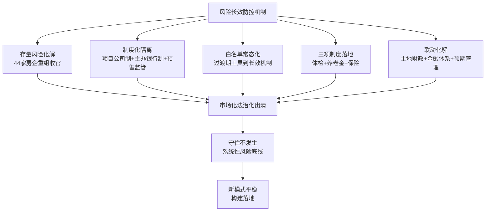

风险长效防控的终极目标，是**实现化解存量风险与构建新模式之间的平稳过渡**——既要让历史风险在市场化机制下出清，又要避免出清过程引发新的系统性冲击；既要为新模式的落地腾挪出制度空间，又要在过渡期保持市场基本稳定。这是未来十年最具技术含量的战略平衡。

## 4.9 核心战略目标之五：城市更新常态化与绿色低碳转型

城市更新与绿色低碳是未来十年最具时代特色的两大战略目标。前者解决存量提质增效问题，后者回应全球气候治理与"双碳"目标，二者共同重塑行业价值创造方式。

### 4.9.1 城市更新进入常态化阶段

城市更新进入常态化阶段是2025年最具标志性的政策变化。**2025年5月中共中央办公厅、国务院办公厅联合印发了《关于持续推进城市更新行动的意见》，城市更新进入常态化实施阶段，主要目标是到2030年城市更新体制机制不断完善，安全发展基础更加牢固，人居环境明显改善，文化遗产有效保护，城市成为人民群众高品质生活的空间**[^114]。

"十五五"规划纲要进一步明确了城市更新的具体量化指标[^111]：

| 更新领域 | "十五五"量化目标 | 战略意义 |
|---|---|---|
| 城镇危旧房 | 改造约50万套（间）| 居住安全底线 |
| 老旧小区 | 改造约11.5万个 | 民生宜居改善 |
| 老旧街区厂区 | 改造约1500个 | 业态升级与活力提升 |
| 燃气管网 | 建设改造约20万公里 | 城市安全"里子"工程 |
| 排水管网 | 建设改造约17.5万公里 | 城市安全"里子"工程 |
| 供水管网 | 建设改造约17.5万公里 | 城市安全"里子"工程 |
| 污水管网 | 建设改造约10万公里 | 城市安全"里子"工程 |
| 供热管网 | 建设改造约12万公里 | 城市安全"里子"工程 |

数据汇总自[^111]。这一量化指标体系覆盖了"地下管网约77万公里、城镇危旧房约50万套、老旧小区约11.5万个、老旧街区厂区约1500个"四大重点领域，构成"十五五"城市更新的完整工程体系。

### 4.9.2 城市更新的"四个关键词"内涵

央视记者杨潇提炼的"十五五"城市更新四个关键词清晰展现了战略目标的多维内涵[^112][^113]：

**居住要"安心"**：更侧重危房治理和居住安全，同时稳步推进城中村改造，多渠道建设保障性住房——为老小区居民和刚需住房人群提供安心的居住保障。

**老城要"舒心"**：以前的改造偏向改功能，"十五五"则进一步明确不仅要改功能，还要业态升级——让老厂区能变文创园、便民空间，老旧街区能变身活力街区。

**地下要"放心"**：进一步狠抓"里子"工程，五大管网齐发力，还要同步搞智慧化升级——城市安全底线直接拉满。

**机制要更完善**：通过"先体检、后更新""无体检、不更新"的科学流程，避免"为更新而更新"的形象工程、面子工程[^111]。

### 4.9.3 38号文"无存量不增量"机制下的核心城区价值重估

38号文"无存量不增量"机制（详见第3章3.2.3节）将在未来十年深度落地，对城市更新格局产生深远影响。从2026年起各城市的新增商品房用地供应将会缩减，**自2026年起我国城市更新项目建设将会提速，特别是城市核心区域"老破小"价值可能会得到重新认识**（详见第3章3.2.3节）。

这一价值重估的机理是：当新增建设用地与存量盘活硬挂钩、且新增用地原则上不用于经营性房地产开发时，**核心城区"老破小"的拆除重建或综合改造将成为商品房供给的重要来源**。这意味着核心城区原本"老旧、低效"的存量资产，将通过更新改造释放新的开发价值——**核心区新房稀缺性凸显，资产价值具备较强抗跌性**。

中央财政对城市更新的支持也在升级。**2025年中央财政支持城市更新的20个示范城市名单首次将郑州、宜昌等中部城市与北京、上海等直辖市并列，资金分配遵循"东部控规模、中西保重点"原则**——东部地区单城补助≤8亿元侧重引导社会资本参与，中西部及直辖市单城最高获12亿元（详见第3章3.6.2节）。**"十五五"期间超过20万亿元资金将精准投向老旧小区、地下管网等八大领域，地下管网改造一项年均投资即高达万亿元**（详见第3章3.6.2节）——城市更新作为"地方财政新蓄水池"已具备清晰的资金规模与制度框架。

### 4.9.4 绿色低碳转型：从"能耗双控"到"碳排放双控"

绿色低碳转型是未来十年与国际接轨的关键战略目标。**我国正从"能耗双控"转向"碳排放双控"，2025年"碳排放双控"体系全面实施，全国碳市场扩容启动，18项温室气体核算国家标准相继落地**（详见第2章2.8.2节）。这一转变意味着行业面临的不再仅是能耗的总量管理，而是更加细化、可量化的碳排放约束。

绿色低碳的具体战略目标包括：

**第一，绿色建筑市场规模化**：到2030年规模预计突破2.5万亿元，占建材总市场比重超过38%（详见第2章2.4节、2.8.3节）。

**第二，超低能耗建筑规模化发展**：到2027年实现规模化发展（详见第2章2.4.1节、2.8.2节）。"十五五"规划纲要进一步要求**加强既有建筑和市政设施节能降碳改造、促进超低能耗和装配式建筑规模化发展、实施制冷能效提升和绿色照明行动**（详见第2章2.8.2节）。

**第三，建筑用能结构优化**：到2025年城镇建筑可再生能源替代率达到8%、建筑用能中电力消费占比超过55%（详见第2章2.8.2节）。

**第四，碳达峰路径明确**：根据2030年前实现碳达峰的国家战略，建筑领域碳排放将在"十五五"末进入达峰平台期。

### 4.9.5 国际SBTi框架对接与全球绿色金融接入

绿色低碳战略目标的国际意义体现在SBTi框架对接上。**国际SBTi（科学减碳目标倡议）对接成为头部房企的新选项，接轨国际减排体系也成为参与全球绿色金融、获取低成本资本的入场券**（详见第2章2.8.3节）。

2025年房地产行业碳中和指数升至53.5分、延续连续五年稳步上升态势（详见第2章2.4.3节、2.8.3节）。指数提升的关键变量在于技术维度的突破——建筑能效管理、数字孪生、AI+IoT在运营端加速落地，光储直柔系统和BIPV广泛应用于新项目，低碳建材体系不断成熟。

**绿色已不再是行业的"成本项"，而是企业差异化竞争与资产估值溢价的"价值项"**（详见第2章2.8.3节）。这一价值取向的转变，使绿色低碳转型从"外部约束"内化为"内生动力"，成为企业可持续发展的核心要素。

## 4.10 未来十年三阶段路线图与关键量化指标

将前九节的趋势研判与五大战略目标整合为可操作的路线图，是本章的最后一项任务，也是为第5—7章政策、资金、战略导向路径设计提供目标锚点的关键环节。

### 4.10.1 三阶段路线图：止跌回稳—新模式成型—高质量常态

未来十年（2025—2035）可清晰划分为三个阶段：

**第一阶段：止跌回稳期（2025—2026）**

主线：以市场企稳与风险出清为主线。

核心任务：完成保交房收官、深化"白名单"机制、推进44家上市违约房企债务重组、巩固止跌回稳成果。

标志性事件：2025年保交房任务全面完成（已实现）；2026年3月全国库存连续51个月正增长后首次同比下降（已发生）；38号文"无存量不增量"机制深度落地（2026年正在实施）。

关键变量：白名单贷款投放规模、保交房进度、出险房企债务重组进度、核心城市新房与二手房成交回升幅度。

**第二阶段：新模式成型期（2027—2030）**

主线：以基础制度落地与"好房子"规模化为重点。

核心任务："人房地钱"要素联动机制全面铺开、项目公司制与主办银行制规模化推广、现房销售制在条件成熟城市率先实现、"好房子"标准全面落地、保障房870万套+150万套（浙江）规模化入市、城市更新"十五五"目标全面完成。

标志性事件："十五五"规划全面实施；超低能耗建筑实现规模化发展（2027年）；浙江等省累计保障房达150万套（2027年）、多元化保障体系基本形成（2030年）；房屋体检、房屋养老金、房屋保险三项制度全国推广。

关键变量：现房销售占比、绿色建筑市场规模、保障房筹建进度、城市更新投资规模、行业集中度提升幅度、新模式基础制度落地范围。

**第三阶段：高质量常态期（2031—2035）**

主线：以内生动力主导与全球竞争力提升为目标。

核心任务：内生动力（改善需求、城镇化延续、科技创新）成为行业可持续发展的主体动力（占比89.97%）；外生动力转为支持性、托底性角色（占比10.03%）；行业经营逻辑全面切换至运营服务主导，对标美国成熟市场15%—20%的服务型贡献占比；"中国建造"实现全球竞争力跃升；建筑领域实现碳达峰，对接SBTi国际框架。

标志性事件：2035年城镇化率向75%—79%演进；新模式四项基础制度全面成熟；行业增加值占GDP比重稳定在5%—6%区间；房产税立法落地推进（具体时间需视立法进程而定）。

关键变量：内生动力贡献占比、运营服务收入占比、绿色建筑覆盖率、行业ESG表现、"中国建造"出海规模。

### 4.10.2 关键量化指标体系

下表提炼未来十年关键量化指标体系，为第5—7章政策路径设计提供可校验的目标锚点：

| 指标维度 | 当前状态（2025） | 2030年目标 | 2035年目标 | 确定性等级 |
|---|---|---|---|---|
| 新建商品房销售面积 | 8.81亿㎡[^106] | 9.6亿㎡中枢 | 8.7亿㎡中枢 | 学界测算 |
| 城镇化率 | 67.8% | 70%以上 | 75%—79% | 已落地+规划提出 |
| 二手房交易占比（30城） | 约65% | 70%以上 | 向75%—80%演进 | 已落地+趋势研判 |
| 改善+更新需求合计占比 | 约70.9% | 持续提升 | 主导地位巩固 | 已落地 |
| 保障性租赁住房 | 870万套（"十四五"） | "十五五"扩容 | 多层次体系成熟 | 规划提出 |
| 绿色建筑市场规模 | 起步阶段 | 突破2.5万亿元 | 占建材市场38%以上 | 学界预测 |
| 行业增加值占GDP比重 | 6.3% | 稳定在5%—6%区间 | 服务型占比对标15%—20% | 趋势研判 |
| 出险房企债务重组 | 18/44家发布方案 | 44家全面收官 | 风险长效防控成熟 | 试点中 |
| 城市更新总投资 | 起步 | "十五五"超20万亿 | 常态化运行 | 规划提出 |
| 一线城市权益购地集中度 | 中海73.9%、保利超90% | 持续提升 | 央国企+优质民企主导 | 已落地 |
| 房屋全生命周期安全制度 | 试点中 | 全国推广 | 制度成熟 | 试点中 |
| "好房子"建设覆盖 | 起步成势 | 新建+存量全覆盖 | 标准动态升级 | 已落地+规划提出 |

数据汇总自[^124][^106][^114][^112][^117][^110][^109][^111][^113]。这一指标体系覆盖了市场规模、城镇化率、改善需求占比、保障房筹建套数、绿色建筑占比、行业集中度、风险出清进度等多个核心维度，**每一项指标都明确标注了确定性等级**：

- **已落地**：当前已有政策落地或市场数据支撑的指标，可信度高；
- **试点中**：在部分地区或项目已开始试点、向全国推广的指标，需关注推广节奏；
- **规划提出**：已写入政策文件但尚未全面实施的指标，落地节奏存在不确定性；
- **学界建议/测算**：基于学者测算或理论推演的指标，需结合实际验证。

### 4.10.3 路线图对后续政策路径设计的衔接意义

本章构建的三阶段路线图与关键量化指标体系，为第5—7章的路径设计提供了三方面的衔接意义：

**第一，目标锚点的清晰化**。第5章政策路径设计将围绕"四项基础制度落地节奏"展开；第6章资金支持体系设计将围绕"REITs规模化、白名单常态化、保障房资金闭环"展开；第7章战略导向设计将围绕"好房子、城市更新、租购并举、绿色低碳"四大主轴展开——所有这些都需要本章提供的目标锚点作为衡量标尺。

**第二，节点判据的可校验化**。三阶段路线图为政策的阶段性评估提供了节点判据——例如，2026—2027年应重点关注白名单常态化与38号文落地效果；2028—2030年应重点关注现房销售占比、保障房筹建进度、绿色建筑规模；2031—2035年应重点关注内生动力贡献占比、运营服务收入占比、SBTi对接广度。

**第三，确定性分级的方法论传承**。本章对各项指标确定性等级的标注（已落地/试点中/规划提出/学界建议），将作为方法论原则贯穿后续章节——**第5—7章在论述未来政策、资金、导向走向时，都将延续这一显式标注的方法**，对低确定性内容使用"可能/有望/预计"等审慎措辞，避免将专家个人观点等同于政策既定方向。

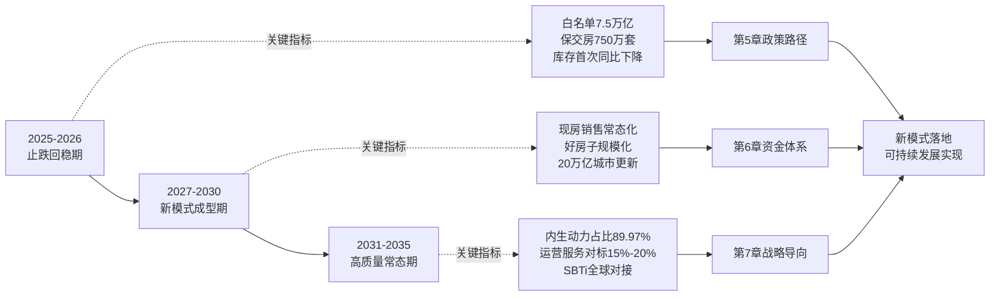

至此，本章完成了未来十年市场规模演变、供需结构重塑、区域分化格局、企业竞争格局重构四大趋势的研判，归纳了高质量发展与新模式构建、"好房子"建设、租购并举、风险长效防控、城市更新与绿色低碳五大核心战略目标，并整合为2025—2030—2035三阶段路线图与关键量化指标体系。**本章的核心结论是：未来十年中国房地产行业将走完"止跌回稳—新模式成型—高质量常态"的完整路径，但这一路径不会自动实现，必须依靠政策、资金、战略导向三维度的系统性促进**。第5章将在此基础上，系统设计未来十年国家在政策维度的促进路径，回答"政策如何引导行业走向预定战略目标"这一核心问题。

[^124]: 来源见搜索结果116（"十五五"开局：房地产从"房住不炒"到"高质量发展"的战略转身）
[^106]: 来源见搜索结果117（2025年全国房地产市场基本情况）
[^122]: 来源见搜索结果118（王瑞民：一、二线城市房地产市场进一步企稳回升）
[^107]: 来源见搜索结果119（贝壳研究院年度报告：2024年新居住五大趋势）
[^118]: 来源见搜索结果120（展望2025|房地产十大趋势）
[^108]: 来源见搜索结果121（克而瑞地产研究：2024年楼市延续筑底行情 2025年部分城市止跌回稳）
[^114]: 来源见搜索结果122（2025年房地产行业十大关键词）
[^115]: 来源见搜索结果123（"十四五"期间深圳加快构建租购并举的住房制度）
[^125]: 来源见搜索结果125（中央定调2024楼市：积极化解房地产风险，加快构建发展新模式）
[^112]: 来源见搜索结果128（保障民生+高质量发展 为你解读"十五五"规划纲要房地产政策）
[^116]: 来源见搜索结果129（6633好房子标准）
[^117]: 来源见搜索结果130（"好房子"建设起步成势）
[^123]: 来源见搜索结果131（二十届三中全会《决定》：加快建立租购并举的住房制度）
[^119]: 来源见搜索结果132（二十届三中全会决定解读|加快构建房地产发展新模式）
[^110]: 来源见搜索结果134（中国房地产未来十年：从普涨时代到结构分化）
[^109]: 来源见搜索结果135（任泽平：未来中国房地产十大趋势）
[^111]: 来源见搜索结果136（【聚焦】未来五年如何推进城市更新？"十五五"规划纲要里写了！）
[^113]: 来源见搜索结果137（保障民生+高质量发展 为你解读"十五五"规划纲要房地产政策）
[^121]: 来源见搜索结果138（蓝皮书：预计2030年我国城镇化率将达到70%）

# 5 未来十年国家政策促进路径

第4章勾勒了未来十年"止跌回稳—新模式成型—高质量常态"三阶段路线图，并归纳了五大核心战略目标与关键量化指标体系。当趋势研判与目标锚点已然清晰，接下来的核心问题是：**国家应当通过怎样的政策工具组合，引导行业从止跌回稳走向新模式落地、最终走向高质量常态？** 这一问题既是用户研究主题中"国家在政策、资金、导向三方面如何促进行业有序良性发展"的第一维度，也是后续第6章资金支持体系与第7章战略导向设计的制度基础。

本章承接前文逻辑，进入"政策路径设计"环节。围绕**"短期稳市—中期立制—长期常态"**的演进逻辑，本章将依次拆解土地供应、住房保障、商品房开发融资销售基础制度、税收、住房公积金五大政策工具集群的迭代方向与组合效应（5.1—5.6节），归纳政策协同与因城施策的差异化设计（5.7节），最终明确政策路径设计的风险约束与方法论原则（5.8节）。需要特别强调的是，本章在论述未来政策走向时将延续第4章的方法论传统——**对"已落地、试点中、规划提出、学界建议"四类确定性等级显式标注**，对低确定性内容采用"可能/有望/预计"等审慎措辞，避免将专家个人观点等同于政策既定方向。

## 5.1 政策演进的总体逻辑：从"短期稳市"到"长效立制"的范式转换

理解未来十年政策路径的起点，是把握政策范式从"应急救市"向"长效立制"的根本性转换。这一转换不是简单的政策工具更替，而是政策目标函数、政策工具箱、政策评估标尺的整体重塑。

### 5.1.1 应急救市组合拳的逻辑边界

2024年下半年至2025年间，中央与地方密集出台的"四个取消、四个降低、两个增加"组合拳，是过去两年政策实践的集中体现：四个取消主要包括取消限购、取消限售、取消限价、取消普通住宅和非普通住宅标准；四个降低包括降低住房公积金贷款利率、降低住房贷款的首付比例、降低存量贷款利率、降低"卖旧买新"换购住房的税费负担；两个增加包括通过货币化安置等方式新增实施100万套城中村改造和危旧房改造、年底前将"白名单"项目的信贷规模增加到4万亿元[^126]。

这套组合拳在止跌回稳阶段发挥了关键作用——2024年9月26日中央政治局会议释放止跌回稳信号后，10月份房地产市场交易提速，70个大中城市新建商品住宅销售价格环比上涨城市数比上月增加4个，二手住宅价格环比上涨城市数增加8个，PMI房地产业商务活动指数比上月回升2.5个百分点[^126]。然而，**应急救市的逻辑边界在于：它能稳住短期市场温度，但不能从根本上化解模式弊端**。这正如住房城乡建设部部长倪虹所明确的——"既要立足当前，落实好已出台政策举措，着力巩固房地产市场止跌回稳态势"，又要"着眼长远，稳妥推进房地产基础性制度改革，构建与推动房地产高质量发展相适应的体制机制和政策法规体系"[^127]。

### 5.1.2 长效立制的核心命题：从"重应急"到"重制度"

未来十年政策范式转换的核心命题，是从应急工具的反复运用转向基础性制度的整体构建。倪虹部长系统阐释的总体要求清晰指明了这一方向——**"锚定推动房地产高质量发展的主要目标"，加快构建房地产发展新模式，建立更好满足刚性和改善性住房需求的住房供应体系，健全多主体供给、多渠道保障、租购并举的住房制度，推动住房品质显著提升、风险隐患有效防控、企业转型成效明显**[^127]。

韩文秀同志在解读三中全会决定时进一步明确——要"消除过去'高负债、高周转、高杠杆'的模式弊端，建设适应人民群众新期待的'好房子'，更好满足刚性和改善性住房需求，并建立与之相适应的融资、财税、土地、销售等基础性制度"[^128]。这一表述清晰勾勒出长效立制的系统工程性质——**新模式的构建需要融资、财税、土地、销售四大基础制度的协同重塑**，而非任一单一制度的修补。

### 5.1.3 三阶段功能定位：托底—立制—常态

承接第4章三阶段路线图的整体框架，未来十年的政策演进可在功能定位上进一步细分为三个阶段：

**第一阶段（2025—2026）：短期托底功能。** 政策工具以延续救市组合拳为主，重点维持市场止跌回稳态势、完成保交房收官、推动44家上市违约房企债务重组（详见第4章4.8.1节）、深化"白名单"机制扩围增效。这一阶段政策的特征是"应急性、组合性、密集性"——2025年中央层面政策围绕"稳市场、城市更新、提升住房品质"三个维度精准发力（详见第2章2.5.2节），地方层面前三季度全国累计出台优化政策超470条（详见第2章2.5.2节）。

**第二阶段（2027—2030）：中期立制功能。** 政策重心转向四项基础制度的协同落地——"人房地钱"要素联动、项目公司制、主办银行制、现房销售制（详见第4章4.5.3节）。同时，配套的住房保障体系、税收制度、公积金改革等长效机制密集出台，**政策工具从"密集型组合拳"转向"系统性立制工程"**。这一阶段政策的特征是"制度化、系统化、配套化"，关键节点是2027—2028年现房销售制在条件成熟城市的规模化试点[^129]。

**第三阶段（2031—2035）：长期常态功能。** 基础性制度全面成熟后，政策重心进一步转向常态化运行与精细化调适。"市场+保障"双轨制度框架稳定运转，因城施策的差异化政策成为常规手段，房地产税等长效税制在条件成熟时正式落地（注：房地产税立法落地仍属规划提出阶段，具体时点取决于立法进程）[^130]。这一阶段政策的特征是"常态化、精细化、可校验化"。

### 5.1.4 "稳中求进、先立后破、试点先行、分类施策"四项方法论原则

贯穿三阶段演进的，是四项核心方法论原则：

**稳中求进**意味着政策推进必须在保持市场基本稳定的前提下逐步深化改革。倪虹部长强调的"既要着眼长远，也要立足当前"[^127]，正是稳中求进原则的体现——任何长效制度的建设都不能以牺牲短期市场稳定为代价。

**先立后破**意味着新制度的建立必须先于旧制度的废除。例如，现房销售制必须以项目公司制和主办银行制提供资金保障为前提（详见第4章4.2.4节），否则单纯废除预售制将引发房企资金链断裂的系统性风险。

**试点先行**意味着重大基础制度必须先在条件成熟城市试点、积累经验后再逐步推广。海南2020年率先全省现房销售、湖北荆门2023年启动试点、河南信阳2025年发文落实，最终2026年4月全国推开的演进路径[^129][^131]，正是试点先行的典型案例。

**分类施策**意味着政策工具必须根据城市分化的现实进行差异化设计。这一原则与第4章4.3节区域分化研判一脉相承，也是"充分赋予各城市政府房地产市场调控自主权，因城施策"[^128]的具体落地。

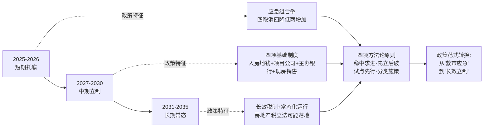

理解了政策演进的总体逻辑后，下文将依次拆解土地供应、住房保障、商品房开发融资销售基础制度、税收、住房公积金五大政策工具集群的具体迭代路径。

## 5.2 土地供应制度："人房地钱"联动与存量盘活机制的深化

土地供应制度是房地产新模式的源头制度。未来十年土地供应政策将围绕"人房地钱"要素联动、存量盘活硬挂钩、土地储备专项债扩容、城中村危旧房改造延续四个核心方向深化迭代。

### 5.2.1 "人房地钱"要素联动机制：从规划编制走向常态化运行

"人房地钱"要素联动机制是新模式下土地供应政策最具基础性的制度安排。住房城乡建设部2024年2月发布的《关于做好住房发展规划和年度计划编制工作的通知》系统部署了这一机制——**住房发展规划和年度计划是建立"人、房、地、钱"要素联动机制的重要抓手。各地要充分认识做好住房发展规划和年度计划的编制实施工作的重要性，科学编制规划，认真组织实施，根据人口变化确定住房需求，根据住房需求科学安排土地供应、引导配置金融资源，实现以人定房，以房定地、以房定钱**[^132]。

《通知》明确了两大主要任务：一是科学编制2024年、2025年住房发展年度计划，2024年4月30日前、2025年3月31日前各城市要以适当方式向社会公布当年住房发展年度计划有关情况；二是提前谋划2026—2030年住房发展规划，2026年3月31日前各地要向社会公布2026—2030年住房发展规划[^132]。这一时间表意味着，**2026年是"人房地钱"要素联动机制从年度计划试点走向五年规划全面铺开的关键节点**。

更具深远意义的是部门联动协同的工作机制——住建部门根据经济社会发展、住房现状和人口变化情况科学研判住房需求，包括住房总量规模、供应结构、空间分布、供应时序等；住建部门会同资规部门根据住房需求共同确定住宅用地供应的总量规模、用地结构、投放重点区域和投放时序；金融部门根据住房供需情况确定房地产融资规模，财政部门根据保障性住房建设规模确定财政资金投入规模[^132]。**这种"以人定房、以房定地、以房定钱"的多部门协同，从根本上改变了过去"卖地优先、规划被动"的逆向逻辑**。

未来十年这一机制的迭代方向有三：**第一，从年度计划走向中长期规划与年度计划相结合的法定化、规划化体系**——建立三级住房规划体系，健全规划计划的编制、审批、备案、实施评估、动态调整和监督机制，形成法定化的规划政策工具[^132]；**第二，从信息公开走向信息共享与决策协同**——通过住房发展规划信息平台实现住建、自然资源、金融、财政四部门数据互通；**第三，从总量管控走向结构精细化**——根据人口结构变化（多子女家庭、青年人、新市民等）的差异化需求，精准匹配商品房、保障房、租赁房的供给比例。

### 5.2.2 38号文"无存量不增量"机制的深度落地

2026年3月自然资源部、国家林业和草原局联合印发的38号文（详见第3章3.2.3节），通过"以存量换增量"的硬规矩从根本上重塑了土地供应规则。其核心机制——年度新增城乡建设用地原则上不得超过盘活存量土地面积，意味着**存量盘活的土地面积越多，地方政府新增城乡建设用地的面积也就越多**（详见第3章3.2.3节）。

这一机制在未来十年的深度落地将沿三条路径展开：

**第一，存量闲置土地清单的动态完善。** 自然资源部2024年11月7日《关于运用地方政府专项债券资金收回收购存量闲置土地的通知》明确——**市、县自然资源主管部门要依托土地市场动态监测监管系统中的处置存量闲置土地清单摸清底数，根据需要向社会发布收回收购土地征集公告，综合考虑企业意愿、市场需求、地块条件等因素，确定拟收回收购意向地块和时序安排，分批纳入土地储备计划，优先申报使用专项债券**[^133]。处置存量闲置土地清单是安排专项债券的基础，应当根据收回收购土地的情况动态更新[^133]。

**第二，省级统筹机制的常态化运行。** 38号文确立的地方政府不能自主决定卖地、需在省级层面进行统筹的制度安排（详见第3章3.2.3节），将通过省级配套政策的逐步出台进入常态化运行阶段。省级配套政策将根据地级城市经济发展质量和速度、人口流动状况进行差异化供地指标安排，**这一机制将进一步压缩地方政府的"卖地冲动"，引导其转向城市更新与存量盘活**。

**第三，新增用地用途的严格管控。** 新增建设用地优先保障重大项目、新质生产力产业、基础设施建设及保障性住房等民生领域；新增用地原则上不用于经营性房地产开发（详见第3章3.2.3节）。这一管控将持续重塑商品房供给逻辑——核心城区新房稀缺性凸显，**资产价值具备较强抗跌性；远郊新区、非核心板块新房供给放缓、存量去化挑战仍存**（详见第4章4.3.3节）。

### 5.2.3 土地储备专项债：从重启走向规模化扩容

土地储备专项债是激活存量土地市场的关键资金工具。自2024年重启发行以来，土储专项债资金规模显著增长：**2026年一季度各地累计发行土地储备专项债约918亿元，是去年同期的两倍多；过去一年其发行规模仅次于园区建设专项债**[^134]。

更具结构性意义的数据是——**截至2026年3月末，各地已公示的拟使用专项债收购闲置存量土地的总金额超7850亿元，专项债实际发行超3500亿元**[^134]。这意味着土储专项债已经成为各地盘活存量资产、改善房地产市场供需关系的重要政策抓手。汪峰副教授指出，**土储专项债或许正在成为新的投资增长点——相比于传统基建领域优质项目储备趋紧、收益边际递减的现实约束，土地收储因其相对清晰的收益测算和成熟的运作模式，正在成为地方稳投资的重要替代选项**[^134]。

未来十年土储专项债将沿"扩容—规范—精准"三个方向深化：

**扩容方面，** 2026年一季度房地产相关专项债券发行2250亿元、同比增长42%，在同期新增专项债券中占比19.4%[^135]。预计未来"十五五"期间土储专项债年度发行规模有望维持高位运行，年均规模可能达到3000亿—5000亿元水平（注：此为基于当前发行节奏的趋势研判，最终规模取决于宏观财政空间）。

**规范方面，** 自然资源部明确要求——使用专项债券资金用于收回收购土地，应由纳入名录管理的土地储备机构具体实施；专项债券对应的土地储备项目中的储备地块，必须在全民所有土地资产管理信息系统中有储备地块标识码[^133]。**收回收购的土地原则上当年不再供应用于房地产开发；确有需求的，应当严控规模，优化条件实施供应，在落实"五类调控"的同时，供应面积不得超过当年收回收购房地产用地总面积的50%；收回收购土地用于民生领域和实体经济项目的，不受上述限制**[^133]。

**精准方面，** 优先收回收购企业无力或无意愿继续开发、已供应未动工的住宅用地和商服用地；其他用途的土地、进入司法或破产拍卖、变卖程序的土地、因低效用地再开发或基础设施建设等需要收回的土地，以及已动工地块中规划可分割暂未建设的部分，也可以纳入收回收购范围[^133]。

### 5.2.4 城中村与危旧房改造：从应急工具到常态化机制

100万套城中村和危旧房改造的货币化安置是2024—2025年最具市场冲击力的政策工具之一。住建部2024年10月明确——**2025年通过货币化安置新增实施100万套城中村改造和危旧房改造，政策支持范围从35个超大特大城市扩至近300个地级及以上城市，覆盖全国90%城市人口**[^136][^137]。

这一政策与2015—2017年棚改货币化的本质区别在于"精准滴灌"原则——**只支持资金平衡、征收方案成熟的项目，严防地方债务扩张；2024年全国1790个城中村改造项目中，80%已落实"一项目两方案"（征收补偿+资金平衡），确保不留后遗症**[^136]。这种制度设计既保留了货币化安置对楼市去库存的拉动作用，又避免了重蹈过度刺激的覆辙。

未来十年城中村与危旧房改造政策的迭代路径有三：

**第一，规模延续与精准化升级。** "十五五"规划纲要明确将以国有土地上C级、D级危险住房等为重点，改造城镇危旧房约50万套（间），改造老旧小区约11.5万个（详见第4章4.9.1节）；同时稳步实施城中村改造。专项债资金支持力度持续加大——**2026年一季度城中村改造相关专项债券发行规模超500亿元、同比增长1.4倍，占城市更新相关专项债的比重超40%**[^135]。

**第二，资金保障的多元化。** 资金保障硬核体现在专项债券、政策性借款、税费优惠、商业贷款多管齐下，2024年国开行已发3817亿元专项借款、支持723个项目[^136]。未来这一资金组合将向"专项债打底+政策性银行接力+商业银行跟进+REITs退出"的全周期闭环演进。

**第三，"好房子"标准向改造领域延伸。** 既把新房子建成"好房子"，也把老房子逐步改造成"好房子"（详见第4章4.6.2节）——这意味着城中村改造不再是简单的"拆旧建新"，而是要按照"安全、舒适、绿色、智慧"四大标准重塑居住品质。

### 5.2.5 差异化土地供应政策：因城施策的具体落地

针对一线、二线、三四线城市的差异化土地供应政策，是因城施策原则在土地端的具体落地：

| 城市类别 | 核心政策导向 | 具体工具组合 |
|---|---|---|
| 一线及强二线 | 增加供应弹性、缓解供求紧张 | 38号文存量盘活+核心区改造提速+集中供地优化 |
| 弱二线及强三线 | 结构调整、优化供给品质 | "人房地钱"联动严控总量+土储专项债收储+保障房用地倾斜 |
| 多数三四线 | 去库存、化风险、引导存量盘活 | 控制新增供地+扩大土储专项债收储+城中村改造货币化安置 |

数据汇总自[^134][^135][^133]。**这种差异化政策组合的核心是：让土地供应规模与城市人口流入、住房需求、库存去化压力相匹配，从根本上避免"普涨普跌"的全国一刀切**。

## 5.3 住房保障制度：多层次保障体系与配售型保障房的全面铺开

住房保障制度是房地产新模式中最具民生分量的政策维度。未来十年住房保障政策将围绕保障性租赁住房扩容、配售型保障房全面铺开、《住房租赁条例》落地深化、保障对象精细化扩展、"好房子"标准延伸五个方向系统推进。

### 5.3.1 保障性租赁住房：从"十四五"870万套到"十五五"持续扩容

保障性租赁住房是"十四五"住房保障的重要成果。截至"十四五"末，全国累计建设各类保障性住房和棚改安置住房6800多万套，帮助1.7亿群众喜圆安居梦[^127]。"十四五"期间保障性租赁住房870万套（间）的筹建任务已超额完成（详见第2章2.9.2节）。

地方实践提供了丰富经验。福建晋江市作为保障性租赁住房重点发展城市，**"十四五"期间共筹集建设保障性租赁住房12312套、位居福建省县域首位**[^138]。其经验包括：将产业园区工业配套服务设施用地占比上限由7%提高到15%、建筑面积上限提高到30%；针对青年人才"首住"难题筹集首批青年人才租赁住房200套，实施"一免两减三保租"租金优惠政策（第1年免租金、第2—3年按50%收取租金、第4—6年按保障性租赁住房标准收取租金）；构建多渠道筹集方式，民营企业建设保障性租赁住房占比达55.74%[^138]。

北京市2025年的工作部署同样具有指标意义——**通过新建、存量商业办公及厂房改建、统筹城中村改造安置房建设等方式，全面完成"十四五"时期建设筹集保障性租赁住房40万套（间）任务，全年计划建设筹集保障性租赁住房5万套（间），竣工各类保障性住房8万套（间）**[^139]。同时持续推进新毕业大学生青年公寓、城市基本公共服务人员宿舍专项租赁，**中心城区、平原新城各区每区选取不少于300套（间）公寓型和宿舍型租赁房源**，并开展"城市建设者管理者之家"试点定向对接配送、快递、家政、环卫等城市公共服务人员租赁[^139]。

未来十年保障性租赁住房的扩容路径将呈现三大特征：**一是规模持续增长**——浙江省2025年指导意见明确到2027年累计建设筹集各类保障性住房达到150万套（间）（详见第4章4.7.5节）；**二是城市分级供给规划清晰化**——参照"十五五"规划纲要"在全面摸清需求基础上，因地制宜多渠道发展保障性住房"的部署，超大特大城市以新建为主、大城市以存量改建为主、其他城市以小规模精准筹建为主；**三是房源类型多元化**——从公寓型、宿舍型租赁房源到"一间房、一张床"多元化住房需求全覆盖[^139]。

### 5.3.2 配售型保障性住房：从轮候库建立到房源建设的全流程制度

配售型保障性住房是"十四五"末启动、将在"十五五"全面铺开的新型保障房类型。**配售型保障性住房是政府为解决工薪收入群体住房困难而规划建设的保障性住房类型之一，属于保障性住房体系，由政府主导规划建设，旨在满足符合条件群体的基本住房需求；实行封闭管理，禁止违法违规转为商品住房流入市场**[^140]。

制度建设的时间表清晰可见：2023年8月25日国务院印发《关于规划建设保障性住房的指导意见》（国发〔2023〕14号）；2024年12月31日住房城乡建设部印发文件，要求各省（市）住房城乡建设厅在"2025年3月底前，要指导各市县按照国家有关规定，制定本市县统一适用的保障性住房配租配售条件和标准，建立健全保障性住房全流程管理制度，细化申请、轮候、配售和配租、退出等管理流程和政策指引，并向社会公开"[^140]。

地方实践已经全面铺开，海南省的实践提供了典型样本。海口市**2025年正式启动配售型保障性住房常态化资格申请工作并建立了配售型保障性住房轮候库**[^141]。其申请条件包括：申请人为本市户籍家庭、企业引进人才、机关事业单位人员等群体；家庭人均年收入低于海口市上年度城镇居民家庭人均可支配收入（49741元/年）；申请人须在海口市连续缴纳96个月及以上社会保险；在本省城镇无住房或无购房记录（含五年内转让或赠予的住房）；已购买过政策性住房的居民家庭不得再申请购买[^141]。

三亚市的实践进一步展示了"资格常态化受理、需求精准化摸底、轮候动态化管理"的制度框架——**坚持以人民为中心的发展思想，按照"资格常态化受理、需求精准化摸底、轮候动态化管理"原则，打破集中受理时限限制，实现配售型保障性住房资格申请"及时审核、动态入库"。当前阶段无可用配售房源，本次受理主要目的是开展需求摸底，全面摸清符合条件家庭的住房保障需求底数，为后续科学编制房源建设筹集计划、精准制定配售方案提供依据**[^142]。

贵州省安龙县的实施细则展示了配售型保障房的全流程管理框架——细则包含九个部分37条内容，涵盖总则、政策支持、建设管理、价格管理、申购管理、配售管理、封闭管理、监督管理、附则[^140]。具有里程碑意义的制度安排是**"实行封闭管理，禁止以任何方式违法违规将配售型保障性住房变更为商品住房流入市场，已购配售型保障性住房不得长期闲置或出租、转让牟利"**[^141]。

未来十年配售型保障房政策的迭代方向有三：**第一，从轮候库建立向房源大规模建设转变**——海口、三亚等地当前阶段尚无可用配售房源[^141][^142]，2026—2030年将进入房源建设密集期；**第二，从单一城市试点向全国分级推广转变**——参考海口96个月、三亚120个月的差异化社保缴纳要求[^141][^142]，未来全国将根据各市县实际情况制定差异化标准；**第三，配售型与配租型有序转换统筹使用**——清华大学吴璟教授指出"探索配租型和配售型保障性住房有序转换和统筹使用"[^113]（详见第4章4.7.3节）。

### 5.3.3 《住房租赁条例》落地实施：租购同权、租金调控、机构化运营

《住房租赁条例》于2025年9月15日正式施行，作为我国住房租赁领域第一部专门性行政法规（详见第2章2.9.3节），其核心是构建"事前准入—事中监管—事后追责"的完整治理闭环。条例明确鼓励出租人与承租人依法建立稳定的住房租赁关系、积极推动租购住房在享受公共服务上具有同等权利——**这从法律层面打破了"租房=不稳定"的传统认知，"租购并举"从政策表述上升为法治保障**（详见第2章2.9.3节）。

未来十年《住房租赁条例》的落地实施将沿三条路径深化：

**第一，租购同权的具体配套政策出台。** 重点在子女入学、医疗保障、社会保障、积分落户等领域出台租赁住房与自有住房同权的具体实施细则。这是"租购并举"从制度框架走向社会现实的关键一步。

**第二，租金调控"监测+引导"机制的常态化运行。** 设区市级以上地方政府建立住房租金监测机制，定期公布不同区域、不同类型住房的租金水平信息（详见第2章2.9.3节）。这一机制将通过信息公开引导租金理性形成，避免租金过快上涨或过度下行。

**第三，机构化运营与资金监管的强化。** 针对"高进低出""长收短付"等行为，要求住房租赁企业按规定设立资金监管账户并向社会公示（详见第2章2.9.3节）。这将推动住房租赁市场进入机构化运营、品质化升级的全新阶段，REITs等资产证券化工具拓宽了"投融管退"闭环（详见第2章2.7.4节）。

### 5.3.4 保障对象的精细化扩展

保障对象的扩展是住房保障制度迭代的另一核心维度。"十五五"期间，保障对象进一步从住房困难家庭拓展到**初婚初育家庭、多子女家庭、城镇工薪群体、新市民青年人**等（详见第2章2.9.1节）。

清华大学吴璟教授系统阐释了这一精细化扩展的内涵——**住房保障体系更加精细化，提出了完善保障性住房全流程管理，探索配租型和配售型保障性住房有序转换和统筹使用，深化住房公积金制度改革等要求，同时还要求住房保障向多子女家庭进行倾斜**[^113]（详见第4章4.7.2节）。中办、国办2025年6月联合印发的《关于进一步保障和改善民生着力解决群众急难愁盼的意见》强调加大保障性住房供给、增加小户型青年公寓供给、推进灵活就业人员参加住房公积金制度（详见第2章2.9.1节）。

未来十年保障对象精细化扩展的具体路径包括：

- **新市民、青年人、农民工**：通过保障性租赁住房+青年人才租赁住房+城市建设者管理者之家三层供给体系解决阶段性住房困难[^138][^139]；
- **城镇工薪群体**：通过配售型保障性住房满足工薪刚性住房需求[^141][^140][^142]；
- **多子女家庭**：政策倾斜以衔接人口政策（详见第4章4.7.2节）；
- **初婚初育家庭**：浙江省2025年指导意见已纳入保障对象（详见第2章2.9.1节）；
- **特殊群体**：晋江市针对教师、医生定向供应保障性租赁住房、利用学校医院存量土地建设[^138]，体现了精准对接特殊群体需求的供给模式。

### 5.3.5 "好房子"标准向保障性住房领域延伸

"好房子"标准向保障性住房领域延伸是未来十年住房保障政策最具品质指向的迭代方向。重庆市《好房子技术导则（保障性住房）》于2025年12月15日起正式施行，**为全市保障性住房建设立下"新标尺"，标志着重庆保障性住房建设进入标准化、品质化发展新阶段**[^143]。

重庆《导则》在四个维度上设定了具体标准：

**安全韧性方面**：建筑抗震需满足不低于一星级韧性要求；卫生间、厨房等潮湿区域必须经过24小时蓄水试验；建立"探测-报警-联动-疏散"全链条消防体系；电动自行车充电区、快递集中点等区域按严重危险级配置消防器材[^143]。

**舒适宜居方面**：创新提出"60、90、120"三类套型分类标准，分别适配2人及以下、3人、4人及以上家庭；**层高不低于3.0米**（与新版《住宅项目规范》一致）；卧室、起居室窗地面积比不小于1/7，自然通风开口面积不低于地面面积的5%，分户墙隔声量不小于48dB；要求配建社区食堂、共享厨房、老年活动用房、托幼空间等嵌入式服务设施，打造"15分钟便民生活圈"[^143]。

**绿色低碳方面**：**绿色建材使用量不低于70%，400MPa及以上强度钢筋应用比例不低于85%，就近取材率达70%以上**；推广太阳能光伏发电、海绵城市设施等节能技术[^143]。

**智慧便捷方面**：要求小区配备人脸识别门禁、高空抛物监控（存储时间不低于30天）、智能快递柜等基础智慧设施，可实现电梯故障预警、消防通道占用监测、电动自行车违规进入识别等功能[^143]。

重庆的实践还展示了配售型保障房的市场化运作机制——**重庆将坚持以需定建，以配售型保障性住房轮候库数据为基础，建立保障性住房项目库，形成"实施一批、储备一批、谋划一批"的项目滚动推进机制，同时按划拨方式供地、负责配套设施建设，按保本微利原则配售并实行现房销售**[^143]。

**重庆经验的全国推广价值在于：它证明了保障性住房不仅可以"住得进"，还可以"住得好"，从根本上扭转了过去保障房"档次低、品质差、配套缺"的传统印象**。未来十年"好房子"标准向保障性住房领域延伸的具体路径包括：各省份制定保障性住房好房子技术导则、强制性规范的全面对接、项目实施过程中的品质监督。

## 5.4 商品房开发融资销售基础制度：项目公司制、主办银行制、现房销售制的协同落地

商品房开发融资销售基础制度是新模式中最具结构性意义的制度群。倪虹部长明确指出，**新模式就是要突出问题导向，解决旧模式中存在的各种遗留积弊**[^132]，而项目公司制、主办银行制、现房销售制三项基础制度正是化解"高负债、高周转、高杠杆"积弊的治本之策。

### 5.4.1 项目公司制：从概念到法人化、独立化推进

项目公司制是商品房开发基础制度的"防火墙"。河南信阳2025年5月发布的《关于加强商品房预售管理工作的若干措施（试行）》对项目公司制作出了较为详尽的制度设计——**严格实行项目开发公司制。项目开发公司依法行使独立法人权利，企业总部履行投资人责任。项目交付前，严禁投资人违规抽调、挪用项目开发公司销售、融资等资金，严禁抽逃出资或提前分红。严格落实使用自有资金购地，开发公司需具备与项目匹配的自有资金，禁止"空手套白狼"；禁止超资质等级开发项目**[^131]。

信阳的制度设计有三大核心要点值得借鉴：**第一，项目公司独立法人化**——项目公司依法行使独立法人权利，集团总部仅履行投资人责任，从法人层面阻断集团风险向项目风险的传染；**第二，资金封闭管理**——项目交付前严禁投资人违规抽调、挪用项目开发公司销售、融资等资金，严禁抽逃出资或提前分红；**第三，自有资金购地**——开发公司需具备与项目匹配的自有资金，禁止"空手套白狼"；禁止超资质等级开发项目，从根本上防范"以贷购地、以新还旧"的风险传导链条[^131]。

未来十年项目公司制的全国推广将沿三条路径展开：**一是从信阳等先行城市向更多地市铺开**——预计2027—2028年将在更多省份发布类似实施细则；**二是与现房销售制、主办银行制协同推进**——三项制度在制度逻辑上互为支撑，必须协同落地；**三是与税收、土地、金融政策的配套衔接**——项目公司制要求集团总部履行投资人责任，在财税处理上需要配套调整。

### 5.4.2 融资主办银行制：从"白名单"过渡到长效机制

融资主办银行制是商品房融资基础制度的核心。住房城乡建设部2024年1月与国家金融监督管理总局联合发布《关于建立城市房地产融资协调机制的通知》后，"白名单"机制全面铺开[^144]。两年实践后的最新进展是——**截至2025年9月下旬，"白名单"项目贷款超过7万亿元；2025年末政策迎来重大升级——金融监管总局、住建部等部门进一步明确"白名单"项目可办理贷款接续，最长可至5年，推动协调机制常态化运行**（详见第2章2.7.2节）。

主办银行制的核心制度内涵已经清晰——**"白名单"的核心在于有关部门明确提出的地产项目融资主办银行。也就是说，一个项目原则上由一家银行负主要责任、牵头提供主要贷款**[^144]。

主办银行制的制度优势体现在四个方面：**第一，主办银行制确定后，单一地产项目的开发、建设、销售等资金都需要存入主办行**[^144]，从根本上保障了资金封闭管理；**第二，主办行需要向其他参与银行及时提供信息、做好融资**[^144]，避免了过去的信息不对称问题；**第三，确定主办银行制度后，保证了银行之间信息的畅通和共享，即便有一两家银行提前抽贷，主办银行也能保障项目的合理融资需求**[^144]，从机制上化解了"抽贷—断贷—烂尾"的恶性循环；**第四，参照银团贷款中的牵头银行要求，规模不足的农商行、村行一般也"自然"失去主办银行的资格**[^144]，这从根本上提升了银行的风险识别和管理能力。

倪虹部长的明确表态——**"在房地产融资上推行主办银行制"**[^144]——意味着这一制度将从过渡期工具升级为长效机制。**未来该制度将会成为地产行业信贷的主流模式，确保信贷资金落到实处**[^144]。

未来十年主办银行制的演进路径有三：**第一阶段（2025—2027）：白名单机制扩围增效与主办银行制平稳过渡。** "白名单"项目贷款接续机制成熟运行，主办银行制度细则在条件成熟城市试点。**第二阶段（2028—2030）：主办银行制全面铺开。** 主办银行的资格条件、权责边界、银团协同、信息共享机制系统化建立。**第三阶段（2031—2035）：主办银行制与REITs、保障性住房再贷款等多元金融工具协同运行。** 形成"主办银行+银团协同+REITs退出+政策性金融兜底"的全周期融资生态。

### 5.4.3 现房销售制：渐进式铺开与新老划断、因城施策

现房销售制是商品房销售制度的根本性改革。延续近30年的期房预售模式将在2026年4月迎来历史性终结——**住建部联合多部门发布重磅新政，明确自4月1日起，全国范围内新出让住宅用地原则上全部纳入现房销售范畴，实行"新老划断、因城施策"的渐进式推进原则**[^129][^145]。

现房销售制的政策脉络清晰可见：

**早在2020年**，海南率先在省级层面全面推行现房销售，成为全国首个"吃螃蟹"的省份[^129][^131]。

**2021—2024年**，北京、深圳、合肥等30余城陆续跟进，通过土地出让附加现房销售条件、设置竞现房销售面积规则等方式，探索制度落地路径[^129]。

**2025年底**，全国住房城乡建设工作会议在"推动构建房地产发展新模式"中强调"大力推进商品住房销售制度改革，有力有序推行现房销售，优化预售资金监管"，**将推进现房销售制列为2026年重点任务，纳入"十五五"规划核心内容**[^129][^145][^131]。

**2026年1月起**，湖北荆门、河南信阳等城市率先执行"新出让土地一律现房销售"；3月住建部联合多部门发布细则，明确4月1日起全国新出让宅地全面推行现房销售[^129][^145]。

新政核心遵循两大原则确保改革平稳有序推进：**一是"新老划断"** ——4月后新出让土地建设的商品房项目，必须完成竣工验收、配套设施完善、质量验收合格后方可上市销售；已出让土地、已开工项目仍可按原预售制度执行，但预售资金监管全面收紧，实行封闭管理、专款专用，彻底杜绝资金挪用风险。**二是"因城施策"** ——库存高企的三四线城市加快推进，快速消化库存；库存短缺的核心城市适度放缓，避免供需失衡；海南、雄安等先行区域持续扩大范围，合肥、郑州等试点城市深化落地细节[^129]。

试点数据印证了这一变革的显著成效。**湖北荆门2023年启动现房销售试点，两个试点项目去化率均达90%以上，市场认可度极高**[^129]。同时，**今年4月首批试点项目中的一个项目入市，商铺售罄住宅签约超八成，另一项目竣工在即，认购率近九成**[^131]。海南全域推行现房销售后，烂尾投诉量同比下降85%—92%（注：来源数据存在85%与92%两种口径，本研究采用区间表述）[^129][^145]，交付纠纷几乎绝迹。**截至2025年底，全国现房销售占比已达35.4%，较2020年的12.7%实现翻番增长，市场接受度持续提升**[^129]。

新政提供的多重制度保障构成了"销售—开发—融资"全链条的"铁三角"体系：**现房销售制**（所见即所得，根除烂尾隐患）+**项目公司制**（资金闭环管理，杜绝总部抽挪）+**主办银行制**（融资精准协同）三大制度构建的体系，从销售、开发、融资全链条筑牢风险防火墙[^129]。

为了支持现房销售制度落地，多地已推出配套支持政策。**赣州多区县延长现房销售项目土地出让金缴纳期限；九江多区县对购买现房销售项目的购房者进行契税补贴；山东多地提高购买现房的公积金贷款额度**[^131]。这些配套政策有效缓解了房企推行现房销售面临的资金压力，也激励了购房者优先选择现房项目。

未来十年现房销售制的演进路径将沿"加速—深化—成熟"三阶段推进：

**加速阶段（2026—2027）：新老划断后的渐进式推开。** 2026年4月新政实施后，新出让土地项目逐步进入现房销售模式；已出让项目的预售资金监管全面收紧，实行封闭管理、专款专用；海南、雄安等先行区域持续扩大范围。

**深化阶段（2028—2030）：与项目公司制、主办银行制协同落地。** 三项基础制度的协同效应充分释放，房企经营模式从"高周转、高杠杆、高负债"向"项目精耕、品质兑现、稳健经营"全面切换；现房销售占比预计向50%—60%水平演进（注：基于当前35.4%占比的趋势研判）。

**成熟阶段（2031—2035）：现房销售成为主流模式。** 现房销售占比向更高水平演进，预售制度仅作为辅助补充存在；产品力竞争从"沙盘故事"转向真实品质的硬碰硬。

### 5.4.4 三项制度与预售资金监管的协同设计

三项基础制度与预售资金监管的协同设计，构成融资—开发—销售—交付的闭环风险隔离体系。这一闭环体系的运行逻辑可通过下图清晰展现：

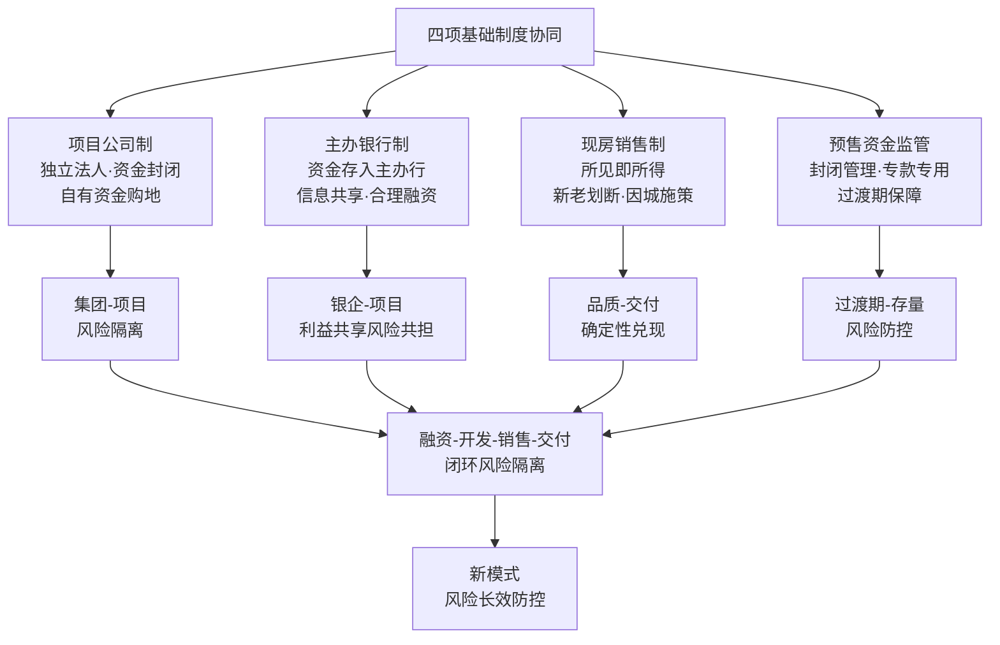

**这一闭环的核心价值在于：它从根本上改变了过去房地产风险的传导链条**——传统模式下，集团违约会导致项目停工、银行抽贷、购房者断供的连锁反应；新模式下，集团风险与项目风险被法人级隔离，银企关系从对手方转向风险共担方，购房者通过现房选择规避了交付风险。

## 5.5 税收制度：房地产税立法推进与交易环节税制优化

税收制度是房地产可持续发展的重要政策工具，未来十年将沿"交易环节优化—持有环节立制"的双轨演进路径深化。

### 5.5.1 交易环节税制优化：契税、增值税、土地增值税的迭代

财政部、税务总局、住房城乡建设部联合发布的2024年第16号公告（自2024年12月1日起执行）系统优化了交易环节税收政策，是过去十年间最具系统性的住房交易税改：

**契税方面**：对个人购买家庭唯一住房，**面积为140平方米及以下的，减按1%的税率征收契税；面积为140平方米以上的，减按1.5%的税率征收契税**；对个人购买家庭第二套住房，**面积为140平方米及以下的，减按1%的税率征收契税；面积为140平方米以上的，减按2%的税率征收契税**[^146][^147]。

**增值税方面**：北京市、上海市、广州市和深圳市，凡取消普通住宅和非普通住宅标准的，取消普通住宅和非普通住宅标准后，与全国其他地区适用统一的个人销售住房增值税政策，**对该城市个人将购买2年以上（含2年）的住房对外销售的，免征增值税**[^146][^147]。

**土地增值税方面**：取消普通住宅和非普通住宅标准的城市，**纳税人建造普通标准住宅出售，增值额未超过扣除项目金额20%的，继续免征土地增值税**[^146][^147]。

这一系列政策的核心创新在于：**将享受1%低税率优惠的面积标准由90平方米提高到140平方米**，相当于把"普通住宅"的政策概念覆盖范围从原来的小户型大幅扩展至中等改善型住宅[^126]。这与第2章2.1.3节关于"改善性需求成为支撑市场的关键力量"的判断高度吻合，是政策对内生需求结构升级的及时回应。

未来十年交易环节税制优化的迭代方向有三：

**第一，契税进一步差异化。** 在现有1%—2%梯度基础上，预计将根据城市等级、人口流入情况、库存压力进一步细化差异化政策。重庆市2025年12月针对配售型保障性住房按划拨方式供地、按保本微利原则配售、实行现房销售[^143]，已显示出契税政策对保障性住房与市场化商品房的差异化处理趋势。

**第二，土地增值税预征率优化。** 2025年11月新政中，**土地增值税预征率下限统一降低0.5个百分点**（详见第2章2.5.2节），预计未来这一政策将根据房地产市场形势进行动态调整，形成"市场低迷时降低预征、市场过热时回归正常"的逆周期调节机制。

**第三，增值税"卖旧买新"换购退税机制深化。** 当前已有降低"卖旧买新"换购住房的税费负担的政策（详见第2章2.5.2节），未来这一政策可能进一步规范化、长期化，形成支持改善性需求释放的长效机制。

### 5.5.2 房地产税立法的渐进推进

房地产税立法是未来十年最具长远意义的税制改革议题。**财政部原部长楼继伟在第十六届财新峰会上明确表示，房地产税立法起草工作其实已经完成，技术难题也基本解决，房产税天生就是地方税的"好苗子"**[^130]（详见第3章3.2.4节）。

楼继伟阐述的核心逻辑是——过去房价上行期房产税推不动，恰恰是因为土地财政太好赚；经过几年市场教育，土地收入锐减七成，旧模式无以为继，**寻找新税源就成了更紧迫的选项**。房产税正是为地方寻找长期稳定收入来源的关键一环（详见第3章3.2.4节）。

学界对房地产税的具体设计已有较为充分的讨论。中国社会科学院财经战略研究院研究员李某建议——**可以对人均60平方米以内的住房免征房产税，超出部分按累进税率征收。同时，考虑到不同城市的房价差异，免征标准可根据当地实际情况进行调整**[^130]。北京大学经济学院教授王某提出了另一种思路——**可以按照"一户一免"的原则，对每个家庭的第一套住房免征或低税率征收，对第二套及以上住房实行较高税率。这样既能保障基本住房需求，又能抑制投机性购房行为**[^130]。

**针对公众关切，财政部税政司司长在2025年1月的新闻发布会上表示——"房产税改革将坚持'稳中求进'的原则，不会一蹴而就，更不会一刀切。"** 强调房产税立法和实施是一个复杂的系统工程，需要充分考虑经济发展阶段、房地产市场状况、民众承受能力等多方面因素，审慎推进[^130]。

需要特别强调的是，**房地产税立法落地仍属"规划提出"阶段**，具体时点取决于立法进程。从历史经验看：2011年上海和重庆两地启动了房产税试点，但范围十分有限——上海仅对新购第二套及以上住房征收，重庆则主要针对高档住宅；2023年这两地房产税收入仅占地方财政收入的1.2%，实际影响有限[^130]。**2024年12月全国人大财经委员会发布的《关于完善房地产税制度的研究报告》提出了分步推进、差异化实施的思路，并建议设立合理的免征额度，保障基本住房需求**[^130]。

房地产税立法推进面临的主要挑战包括：**第一，税负承受能力问题** ——根据国家统计局数据，2024年我国城镇居民家庭平均年收入为12.8万元，如果每年需缴纳约1万元房产税，约占家庭年收入的7.8%；中国财政科学研究院的调查显示，约62%的受访者认为自己难以承受按市场价值1%税率的房产税[^130]。**第二，评估体系尚不完善** ——中国资产评估协会2024年的数据显示，全国注册房地产估价师仅3.5万人，远不能满足全面推行房产税的需求[^130]。**第三，与现有税费的关系需理清** ——我国目前已有土地出让金、契税等多种房地产相关税费，房地产税与这些税费的关系需要在改革中明确[^130]。

**前瞻性研判房地产税立法可能的演进路径**：参考"稳中求进"原则与试点先行的方法论，房地产税可能在"十五五"中后期（2028—2030）进入实质性立法阶段，初期可能采用"小步快走、先试点后推广"的方式。**免征额度可能采用"人均面积+套数+地区差异"的综合设计**——既保障基本住房需求，又适当考虑不同城市房价差异。**税率结构可能采用累进制**，对家庭唯一住房、第二套住房、多套住房实施差异化税率。需要再次强调，**这些研判属于学界讨论与政策方向的综合分析，最终立法时点与具体设计仍需以正式文件为准**。

### 5.5.3 土地财政转型与地方税收结构重塑

房地产税立法的深远意义远超税收政策本身，它是地方税收结构重塑的关键一环。**全国土地出让收入从2021年峰值的8.7万亿元，下降至2025年的4.15万亿元，四年间缩水约4.6万亿元**（详见第3章3.1.2节）。这一断崖式下降为房产税立法提供了客观的财源转型需求。

未来十年地方税收结构重塑将围绕"消费税征收环节后移、房产税立法、城市更新相关税费"三个方向协同推进：

**消费税征收环节后移**。三中全会《决定》提出"推进消费税征收环节后移并稳步下划地方"——意味着人口越多、消费市场越大，地方政府将获得更多税收（详见第3章3.2.4节）。这一改革将从根本上改变地方政府的激励机制，从"以地引人"转向"以服务引人"。

**房产税立法**。如前所述，房产税是地方税的"好苗子"，未来将作为地方稳定收入来源的关键一环（详见第3章3.2.4节）。

**城市更新相关税费**。"十五五"期间超过20万亿元资金将精准投向老旧小区、地下管网等八大领域（详见第4章4.9.3节）。这一规模化投资必然带来相关的税费收入——城市更新过程中的契税、增值税、企业所得税等，将成为地方财源的重要补充。

三者协同将共同支撑地方财政从"土地财政"向"人口财政+服务型财政"的转型（详见第3章3.2.4节）。

### 5.5.4 税收政策与限购、信贷、公积金的政策组合效应

税收政策不能孤立运行，必须与限购、信贷、公积金等政策形成协同组合。2024年以来的政策实践已经清晰展示了这种组合效应：

| 政策维度 | 2024年第16号公告/相关政策 | 协同政策工具 | 组合效应 |
|---|---|---|---|
| 契税 | 1%—2%梯度优化 | 公积金贷款额度上浮 | 降低首套二套购房成本 |
| 增值税 | 满2年免征 | 限购松绑 | 释放"卖旧买新"换房链条 |
| 土地增值税 | 普通住宅免征 | 限价取消 | 降低开发商税负 |
| "卖旧买新"换购 | 退税补差 | 商转公优化 | 支持改善性需求 |

数据汇总自[^146][^147][^148][^149][^126]。**这种"税收+限购+信贷+公积金"的政策组合，使政策效应在多个维度叠加放大，避免了单一政策的边际效应递减**——9月百强房企改善型房源销售金额环比增长22%（详见第2章2.1.3节）正是组合效应的具体体现。

## 5.6 住房公积金制度改革：盘活10万亿存量与扩大覆盖范围

住房公积金制度是支持居民住房消费的重要政策工具。基于"十五五"规划纲要与2026年政府工作报告关于深化公积金制度改革的部署，未来十年公积金政策将沿额度上浮、利率松绑、提取扩面、灵活就业人员覆盖等多维度协同推进。

### 5.6.1 公积金制度改革的战略地位与深化方向

公积金制度改革在新模式中具有重要的战略地位。**今年政府工作报告明确"深化住房公积金制度改革"。"十五五"规划纲要明确"深化住房公积金制度改革，扩大使用范围，支持灵活就业人员参加住房公积金制度"。这明确了公积金深化改革方向**[^149]。

**2026年以来，各地累计出台政策约160条，其中公积金政策超60条，优化频次在各类政策中均居首位**[^149]。中指研究院监测显示，**2025年全国各地出台房地产政策超630条，其中调整优化公积金政策约280条**[^149]——公积金政策已成为各地支持住房消费的重要抓手。

公积金资金池规模与使用效率的现状是政策迭代的客观基础。**根据《全国住房公积金2024年年度报告》，截至2024年末，全国住房公积金累计缴存总额32.79万亿元，缴存余额10.93万亿元**[^149]。然而，**2024年全年缴存3.6万亿元，但个贷发放仅1.3万亿元、同比下降11.4%，"池子的流入持续大于流出，资金沉淀越来越多"**[^150]。这一资金沉淀的核心原因是公积金贷款利率优势未充分发挥——**截至2025年末，个人住房商贷平均利率3.06%，而五年期以上公积金贷款利率仅2.60%**[^150]。

财通证券的研究指出了公积金的关键作用——**真正决定房贷成本的，是公积金利率，而非市场更关注的宏观利率**[^150]。在主要一二线城市，**公积金贷款额度普遍能覆盖购房所需贷款的50%以上**[^150]。具体城市数据是：广州公积金贷款额度可覆盖购房所需贷款的111%，武汉195%，重庆167%，苏州106%，郑州195%，无锡147%；**即便是一线城市中公积金覆盖率最低的北京，也达到45%**[^150]。

### 5.6.2 公积金贷款额度上浮与利率松绑

公积金贷款额度上浮是各地政策迭代的重点方向。当前各地实践已经展示了清晰的上浮路径：

**上海**：优化住房公积金个人住房贷款政策后，**首套住房贷款额度最高可达324万元，第二套住房贷款额度最高可达270万元**[^149]。

**杭州**：市区家庭公积金贷款额由130万元提高至180万元，**提高50万元**[^149]。

**武汉**：**第二套个人住房公积金贷款最高额度由100万元提高至120万元**（详见第2章2.7.1节）。

**南京**：单缴存人公积金贷款最高额度由50万元提高至80万元（详见第2章2.7.1节）。

**根据中指研究院数据，在公积金贷款额度提高后，部分城市公积金贷款对房款总额的覆盖较高，如杭州、苏州、武汉，按2025年新房成交套总价中位数计算，其公积金贷款最高额度上限可占80%以上**[^149]。

公积金利率松绑的时间节奏也清晰可见。**2024年和2025年公积金贷款利率均在5月下调25个基点，需关注今年5月公积金降息的情况**[^150]。这意味着公积金利率的动态调整已形成相对规律的时间节奏，未来五年的进一步松绑空间值得关注。

未来十年公积金贷款政策的迭代路径有三：**第一，一二线城市公积金贷款覆盖率向80%以上提升**——参考杭州、苏州、武汉的经验，未来更多核心城市的公积金贷款额度将实现对刚需+首改房款的高比例覆盖；**第二，公积金利率与商业贷款利率的差距进一步扩大**——利差扩大将增强公积金对居民购房的实质性支持；**第三，多子女家庭、绿色建筑、装配式建筑等专项额度倾斜**——广东省正"加大对多子女家庭、购买绿色建筑或装配式建筑住宅等支持力度"[^149]。

### 5.6.3 提取使用范围扩大：盘活10.93万亿存量

公积金提取使用范围扩大是盘活10.93万亿存量缴存余额的关键。各地实践已经展示了多元化的提取场景：

**支持物业费、住宅维修、车位等多元场景**。**青岛市住房公积金管理中心明确"支持提取住房公积金支付物业费"、"支持提取住房公积金支付住房契税、住宅专项维修资金"、"支持符合条件的缴存人申请住房公积金贷款用于城镇老旧住房自主更新原拆原建"等举措**[^148]。**济南住房公积金中心扩大住房公积金提取范围，提出"支持提取住房公积金支付取暖费"、"阶段性支持提取住房公积金购买车位（库）、储藏室"等**[^148]。

**支持灵活就业人员住房租赁需求**。**济南通知提出，支持灵活就业人员住房租赁需求。在本市无自住住房的灵活就业缴存人，可按照月缴存额度提取住房公积金用于支付房租**[^148]。

**支持城市更新与老旧小区改造**。**山西太原市住房公积金管理中心近日发布通知，延续执行支持缴存职工提取住房公积金支付既有住宅加装电梯个人分摊费用的政策**[^149]。**湖北多地的公积金政策围绕支持城市更新、扩大使用范围、降低贷款门槛、便利异地业务、优化住房套数认定等方面推出新政**[^149]。

专家研判明确指出未来扩展空间——**从重点城市公积金提取可使用范围来看，当前多数城市对租房提取、住房大修、加装更新电梯等方向已进行支持，但在支付物业费、购房税款、住房装修、购买车位等方面仅有少部分城市探索支持，后续各地在使用方向的扩展上有较大空间**[^149]。

### 5.6.4 灵活就业人员参加公积金制度的全国推广

灵活就业人员参加公积金制度是公积金制度改革最具结构性意义的方向。**"十五五"规划纲要明确"扩大使用范围，支持灵活就业人员参加住房公积金制度"**[^149]。

苏州市的实践提供了典型案例——**《苏州市住房公积金2025年年度报告》显示，2025年新开户缴存人中，灵活就业人员占23.79%。截至2025年末，全市累计62.4万名灵活就业人员参加住房公积金制度试点、同比增长62.85%，累计实缴45.4万人、同比增长70%，累计归集住房公积金24.1亿元、同比增长212.15%**[^148]。这一数据展示了灵活就业人员对公积金制度的强烈需求与显著贡献。

58安居客研究院院长张波明确指出灵活就业人员的战略意义——**"灵活就业人员纳入缴存，是住房公积金新增量的重要来源。通过推进灵活就业人员参加住房公积金制度试点，为住房公积金缴存带来了稳定增量，也让更多新市民、青年人纳入住房保障体系。"** 上海易居房地产研究院副院长严跃进进一步强调——**"各地都在积极扩大住房公积金制度覆盖范围，将更多灵活就业人员纳入其中。同时，随着各地制度更加完善，工薪家庭的住房公积金缴存也更加规范，为后续住房公积金投放、贷款、提取提供了资金保障，也更能与居民的实际需求相结合。"**[^148]

未来十年灵活就业人员参加公积金制度将沿"试点—扩面—常态化"三阶段全国推广：**试点阶段（2025—2027）**——以苏州、深圳等城市为试点积累经验；**扩面阶段（2028—2030）**——参考苏州62.4万人试点经验向全国主要城市推广；**常态化阶段（2031—2035）**——灵活就业人员参加公积金制度成为各地常规政策，从根本上拓宽公积金制度覆盖范围。

### 5.6.5 公积金制度改革对住房消费支持作用的量化展望

公积金制度改革对住房消费的支持作用已经有明确的量化体现。**例如，上海首套公积金额度从160万元提至184万元，多子女家庭达216万元**（详见第2章2.5.2节）。**根据中指研究院数据，在公积金贷款额度提高后，部分城市公积金贷款对房款总额的覆盖较高，如杭州、苏州、武汉，按2025年新房成交套总价中位数计算，其公积金贷款最高额度上限可占80%以上**[^149]。

更具系统性意义的是，**专家表示，深化住房公积金制度改革将是2026年及未来几年政府工作的重点之一，后续将有更多城市参考借鉴相关政策方向，探索更多利用住房公积金强化住房保障的路径，完善公积金运行机制、扩大保障范围**[^149]。这意味着公积金制度改革将持续作为支持房地产可持续发展的重要政策抓手。

财通证券进一步指出，公积金制度改革具有"撬动周期"的潜在意义——**公积金利率作为决定房贷成本的关键变量，其下行空间和提取使用范围扩展将持续影响购房决策与市场流动性**[^150]。这一判断为未来十年公积金政策的持续深化提供了逻辑支撑。

## 5.7 政策工具的协同效应与因城施策的差异化设计

前述五大政策工具集群并非孤立运行，必须形成系统性协同与差异化匹配。本节从政策协同矩阵、因城施策差异化、政策出台节奏统筹、政策评估动态调整四个维度系统梳理。

### 5.7.1 政策协同矩阵：五大维度对接五大战略目标

构建"五大政策工具×五大战略目标"的政策协同矩阵，是检验政策路径设计完整性的关键。下表展示了五大政策工具集群在五大战略目标上的交叉耦合关系：

| 政策维度↓ 战略目标→ | 高质量发展+新模式构建 | "好房子"建设 | 租购并举与多层次保障 | 风险长效防控 | 城市更新与绿色低碳 |
|---|---|---|---|---|---|
| 土地供应 | "人房地钱"联动 | 38号文核心区改造 | 保障房用地倾斜 | 存量盘活专项债 | 城中村改造+老旧小区 |
| 住房保障 | 多层次供给体系 | "好房子"标准延伸 | 保租房+配售型双轨 | 保障房REITs退出 | 保障房绿色化 |
| 基础制度 | 四项制度协同 | 现房销售品质保障 | 配售型现房销售 | 项目公司风险隔离 | 建筑节能强制要求 |
| 税收 | 房产税地方税源 | 装配式绿色税收激励 | "卖旧买新"换购退税 | 土地增值税逆周期 | 城市更新税费优惠 |
| 公积金 | 商转公支持新模式 | 绿色建筑专项额度 | 灵活就业人员覆盖 | 商转公风险化解 | 加装电梯+原拆原建 |

数据汇总自[^117][^151][^127][^141][^140][^129][^146][^148][^149][^134][^133][^126][^128][^130][^132][^143]。

这一协同矩阵的核心价值在于：**它从制度设计层面避免了"仅有口号无落地工具"的政策风险**——每一项战略导向都对应着具体的政策工具组合；同时也避免了"政策孤岛化"的风险——任一单一政策工具都对接多个战略目标，形成多维度协同效应。

矩阵中具有典型协同意义的若干交叉点值得重点关注：

**"好房子"建设×五大政策工具的全维协同**——土地端通过38号文核心区改造为"好房子"提供存量盘活空间；保障端通过重庆等地《好房子技术导则（保障性住房）》将标准向保障房延伸；制度端通过现房销售制实现品质兑现；税收端通过装配式建筑、绿色建筑的税收激励降低建造成本；公积金端通过专项额度倾斜支持购买绿色建筑[^149]。**这一全维协同确保了"好房子"不会停留在概念层面，而是在每一个政策维度都落地见效**。

**风险长效防控×五大政策工具的体系化协同**——土地端通过土地储备专项债盘活存量降低风险；保障端通过保障性住房REITs提供退出渠道；制度端通过项目公司制实现风险隔离；税收端通过土地增值税预征率逆周期调节缓解房企税负；公积金端通过商转公优化降低存量风险。**这一体系化协同从五大政策维度同时筑牢风险防火墙，是"守住不发生系统性风险底线"的具体落地**。

### 5.7.2 因城施策的差异化设计

承接第4章4.3节区域分化的研判，因城施策必须建立在城市分类的客观基础上。基于人口流动、产业基础、库存压力、财政承受力等综合维度，可将全国城市划分为三类，每类城市适用差异化的政策工具组合：

**第一类：一线及强二线城市（约20%）。** 政策导向以"增加供应弹性、提升可支付性、缓解供求紧张"为核心。具体政策组合包括：

- 土地端——38号文存量盘活+核心区改造提速+集中供地优化；
- 保障端——保租房与配售型保障房双轨同步推进，"好房子"标准在保障房领域率先落地；
- 制度端——项目公司制和主办银行制率先全面落地，现房销售制因城施策"适度放缓"以避免供需失衡（详见5.4.3节"因城施策"原则）；
- 税收端——契税梯度优化全面落地，房产税立法可能率先在一线试点（注：仍属规划提出阶段）；
- 公积金端——贷款额度持续上浮，覆盖率向80%以上演进。

国务院发展研究中心市场经济研究所王瑞民研究员明确指出——**一、二线城市通常都是人口净流入的城市，经济活力强，租和购的住房需求都比较旺盛，且尚未得到充分满足，增加住房供应的弹性和灵活性应成为其总的住房政策取向**（详见第4章4.3.2节）。

**第二类：弱二线及强三线城市（约10%）。** 政策导向以"结构调整、品质升级、防风险"为核心。具体政策组合包括：

- 土地端——"人房地钱"联动严控总量+土储专项债收储+保障房用地倾斜；
- 保障端——保租房与配售型保障房协同推进，重视存量改建和非居住用房改保；
- 制度端——三项基础制度协同试点，与一线城市形成节奏差异；
- 税收端——契税梯度优化与土地增值税预征率优化协同；
- 公积金端——异地业务便利化、商转公优化重点推进。

**第三类：多数三四线城市（约70%）。** 政策导向以"去库存、化风险、引导存量盘活、应对土地财政退出"为核心。具体政策组合包括：

- 土地端——控制新增供地+扩大土储专项债收储+城中村改造货币化安置；
- 保障端——以小规模精准筹建为主，避免供给过剩；
- 制度端——现房销售制因城施策"加快推进"以快速消化库存（详见5.4.3节"因城施策"原则）；
- 税收端——契税优惠政策应延尽延，土地增值税预征率灵活调整；
- 公积金端——覆盖范围扩大，多子女家庭、灵活就业人员重点纳入。

**对人口持续流出地区，则需稳妥应对土地财政退出带来的冲击和风险**（详见第3章3.2.4节）——通过城中村改造货币化安置消化库存、通过房产税立法填补土地财政缺口、通过城市更新创造新的财源。

### 5.7.3 政策出台节奏的统筹安排

结合第4章4.10节三阶段路线图，未来十年五大政策工具的出台节奏可作如下统筹安排：

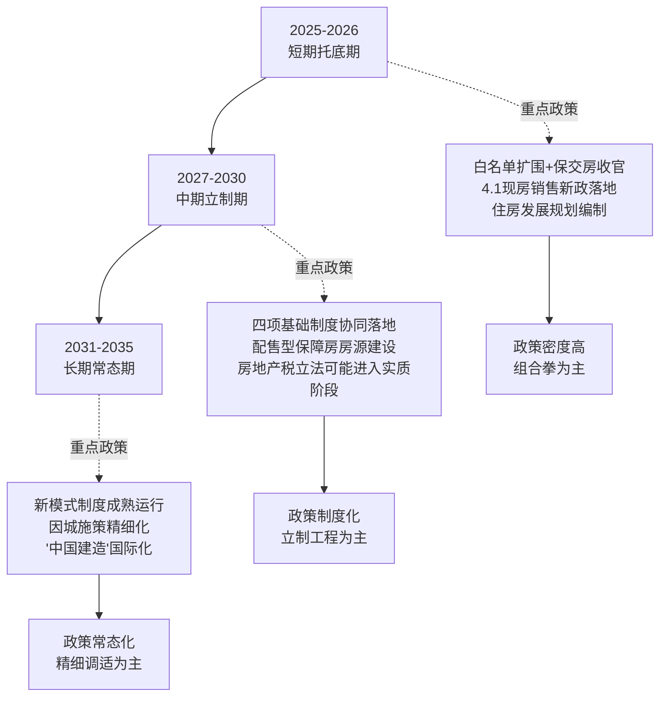

这一节奏安排的核心逻辑是：**短期托底期以应急组合拳的密集出台为主，中期立制期以基础制度的协同落地为主，长期常态期以政策的精细调适为主**。三阶段政策密度逐步递减但政策深度逐步递增，形成"先稳后立、先立后破"的演进路径。

### 5.7.4 政策评估与动态调整机制

政策有效性的评估闭环是因城施策得以持续运行的保障。基于已建立的城市体检制度、住房发展年度计划公开机制、市场预期监测体系，可构建"信号—评估—调整"的三步闭环：

**第一步：信号采集。** 通过城市体检（房屋安全、社区品质、市政设施）+住房发展年度计划公开（商品房与保障房供给规模）+市场预期监测（PMI指数、价格预期）+人房地钱要素联动模型（人口、住房、土地、资金匹配度），建立多维度信号采集系统。

**第二步：评估判断。** 根据信号采集结果，定期评估各项政策的执行效果与目标偏离度。例如，如果某一线城市新房库存连续多月上升，应评估限购政策与现房销售推进节奏是否需要调整。

**第三步：动态调整。** 根据评估结果对政策进行差异化调整。这一调整必须坚持"稳中求进、先立后破"原则——重大基础制度的调整必须慎重，避免反复调整破坏政策预期；细节优化的调整可以更加灵活，及时响应市场变化。

广州市2024年的实践展示了这一闭环的具体形态——**全市一手商品房网签面积累计1097.49万平方米；建立房地产融资协调机制满足房地产企业合理融资需求；打好保交房攻坚战；成功申报城中村改造专项借款项目52个、授信金额4096亿元；2024年城中村改造完成固定资产投资1035亿元、超额完成年度任务**（详见第3章3.7.4节）。这些数据的及时公开本身就构成了重要的预期管理工具，也是动态调整的依据。

## 5.8 政策路径的风险约束与方法论原则

政策路径设计的最后一环，是明确必须严守的风险约束与方法论原则。这些约束和原则是政策设计不会偏离正确方向的"安全栏"。

### 5.8.1 避免"输血式刺激"与"压制式调控"两极陷阱

政策路径设计必须避免两个极端陷阱。**一极是"输血式刺激"** ——通过过度宽松的货币、信贷、税收政策刺激市场，可能在短期推高房价但加剧资产泡沫，重蹈过去"高负债、高周转、高杠杆"模式的覆辙。**另一极是"压制式调控"** ——通过严苛的限购、限贷、限价等行政手段抑制市场，可能在短期稳定预期但损害行业内生动力，使行业陷入持续性深度收缩。

避免两极陷阱的核心方法是：**所有政策必须建立在第2章九大动力源客观规律基础之上**——尊重内生动力（需求升级、城镇化延续、企业能力跃升、科技创新）的释放节奏，引导外生动力（宏观环境、人口结构、金融工具、双碳目标、社会公平）的协同支撑。任何脱离动力机理的政策设计，都将面临政策失效或副作用扩大的风险。

倪虹部长强调的"处理好长期和短期的关系"[^127]——**既要着眼长远，稳妥推进房地产基础性制度改革，构建与推动房地产高质量发展相适应的体制机制和政策法规体系，也要立足当前，落实好已出台政策举措，着力巩固房地产市场止跌回稳态势**——正是避免两极陷阱的方法论指引。

### 5.8.2 防范政策"孤岛化"与"口号化"风险

政策"孤岛化"指各项政策工具相互割裂、缺乏协同；政策"口号化"指政策只有原则表述、缺乏具体落地工具。这两种风险都会导致政策失效。

防范"孤岛化"的方法是：**通过5.7.1节政策协同矩阵的系统化设计，确保每一项战略目标都对应着多维度政策工具的协同配套**。例如，"好房子"建设战略必须同时配套土地端的核心区改造、保障端的标准延伸、制度端的现房销售、税收端的绿色激励、公积金端的专项支持——五大政策维度的协同才能确保战略目标真正落地。

防范"口号化"的方法是：**每一项政策表述必须配套具体的可校验指标**。例如，"深化公积金制度改革"必须落地为"贷款额度上浮XX万元、覆盖率提升至XX%、灵活就业人员参保规模达到XX万人"等具体指标；"现房销售制有力有序推进"必须落地为"占比从35.4%向50%—60%演进、新出让土地按4·1新政严格执行"等具体指标。**只有可校验的指标才能避免政策沦为空话**。

### 5.8.3 坚守"稳中求进、先立后破"的推进节奏

重大基础制度的推进必须坚守"稳中求进、先立后破"的节奏。这一原则在多个层面得到体现：

**现房销售制的推进节奏**——从2020年海南率先在省级层面推行，到2021年起30余城试点跟进，再到2025年底全国住房城乡建设工作会议明确部署2026年全面推进、纳入"十五五"规划核心任务，最终2026年4月全国新出让宅地原则上实行现房销售[^129][^145][^131]。这一**长达6年的渐进推进节奏**，确保了改革的平稳落地。

**项目公司制的推进节奏**——从河南信阳2025年5月发布实施细则[^131]，到逐步在更多省份推广，预计2027—2028年将更广泛铺开。

**房地产税立法的推进节奏**——从楼继伟"立法起草已完成、技术难题基本解决"的判断[^130]，到财政部"稳中求进、不会一蹴而就、不会一刀切"的明确表态[^130]，再到可能在"十五五"中后期进入实质性立法阶段。**这一审慎的推进节奏**避免了重大税制改革对市场预期的冲击。

倪虹部长概括的方法论——**"重大改革举措要坚持稳中求进、先立后破原则，在条件成熟的城市或者项目中先行试点，积累经验后再逐步推广"**——是这一节奏的高度凝练。

### 5.8.4 统筹化解房地产风险与地方债务、中小金融机构风险

风险长效防控不能孤立看待，必须放在统筹化解三大风险的整体框架中（详见第4章4.8.5节）。中央经济工作会议明确提出**统筹化解房地产、地方债务、中小金融机构等风险，严厉打击非法金融活动，坚决守住不发生系统性风险的底线**。

具体的政策路径联动包括：

**房地产风险与地方债务联动**——房地产市场企稳为地方土地出让收入回升创造条件；土地财政转型与房产税立法为地方提供长期稳定财源（详见第3章3.2.4节）。

**房地产风险与中小金融机构风险联动**——通过"白名单"机制和债务重组多元工具，阻断房企违约向中小金融机构的风险传染；通过主办银行制规范银企关系，避免中小金融机构因风险偏好失控而陷入危机。

**预期管理的统筹**——通过政策解读、信号引导、信息公开等方式（详见第3章3.5.4节）稳定市场预期，避免预期螺旋式恶化引发跨领域风险扩散。

### 5.8.5 确定性等级的差异化论述

延续第4章4.10.2节的方法论，本章对各项政策内容采用差异化论述：

**"已落地"政策**（如2024年第16号公告税收政策、2025年9月《住房租赁条例》、2026年4月现房销售新政）使用"已经实施、明确执行"等肯定性表述，并引用具体数据印证效果。

**"试点中"政策**（如配售型保障房地方实施细则、灵活就业人员参加公积金制度）使用"试点已扩围、向全国推广"等过渡性表述，强调推广节奏与节点判据。

**"规划提出"政策**（如四项基础制度协同落地、房地产税立法）使用"规划提出、有望/预计/可能"等审慎性表述，明确"立法时间表仍属规划提出阶段"等确定性等级标注。

**"学界建议"内容**（如房产税具体免征额度、税率结构）使用"学界讨论、专家建议"等明确性标注，避免将专家个人观点等同于政策既定方向。

### 5.8.6 与第6章资金支持、第7章战略导向的逻辑联动

本章政策路径与第6章资金支持体系、第7章战略导向的逻辑联动是统一性的关键保障：

**与第6章资金支持的联动**——本章五大政策工具中的土地储备专项债、保障性住房REITs、"白名单"贷款、公积金制度等，都需要在第6章具体落地为资金工具的规模量级与作用机制。例如，本章提及"土储专项债年均规模可能达到3000亿—5000亿元水平"的研判，将在第6章具体展开为资金来源、运作机制、退出路径的详细设计。

**与第7章战略导向的联动**——本章政策协同矩阵已经初步勾勒了五大政策工具×五大战略目标的交叉关系，第7章将在此基础上深入展开"好房子、城市更新、租购并举、绿色低碳"四大战略导向的具体内涵与落地路径。

**口径一致原则**——本章与第6章、第7章的所有数据引用、政策表述、目标锚点、确定性等级标注必须保持口径一致。例如，关于配售型保障房的论述，本章侧重制度框架与申请条件[^141][^140][^142]，第6章侧重资金保障与REITs退出，第7章侧重战略导向与品质标准延伸——三个章节从不同维度展开但在底层数据、政策表述、目标节点上保持一致。

至此，本章完成了未来十年国家政策促进路径的系统设计——从"短期稳市"到"长效立制"的范式转换、五大政策工具集群的迭代路径、政策协同矩阵与因城施策差异化、政策路径的风险约束与方法论原则。**本章的核心结论是：未来十年房地产可持续发展的政策促进路径，本质上是从"应急组合拳"向"基础性制度群"的范式转换**——这一转换需要在土地、保障、基础制度、税收、公积金五大维度系统推进，需要在五大战略目标上形成协同效应，需要在三类城市群上实现差异化设计，更需要在"稳中求进、先立后破、试点先行、分类施策"的方法论原则下稳健推进。第6章将在此基础上，系统设计未来十年支撑这些政策落地的资金支持体系，回答"资金从哪里来、如何流动、如何形成可持续闭环"的核心问题。

# 6 未来十年国家资金支持体系

第5章系统设计了未来十年国家在政策维度的促进路径——从"短期稳市"向"长效立制"的范式转换、五大政策工具集群的协同迭代、因城施策的差异化设计。然而，**任何政策工具的落地都需要资金的支撑**——"人房地钱"要素联动机制要落地，"钱"的精准配置是基础；项目公司制和主办银行制要运行，资金的封闭管理与合理供给是前提；保障性住房870万套要建成，财政与社会资本的协同投入是保障；现房销售制要全面铺开，房企融资渠道的修复与多元化是关键。承接第5章的政策框架，本章进入"资金支持体系"环节，回答用户研究主题中"国家在资金维度如何促进行业有序良性发展"的核心问题。

围绕**"资金从哪里来、如何流动、如何形成可持续闭环"**三大命题，本章从中央财政工具（6.2节）、货币与信贷政策（6.3节）、多层次房地产金融产品创新（6.4节）、企业融资渠道多元化（6.5节）四个维度依次拆解，最终在6.6节构建"资金工具×战略目标"协同矩阵并明确风险约束原则。本章延续第4、5章"已落地、试点中、规划提出、学界建议"四类确定性等级显式标注的方法论传统，确保对未来十年资金支持体系的研判审慎、可校验、与政策路径口径一致。

## 6.1 资金支持体系的总体逻辑与三阶段演进框架

理解未来十年资金支持体系的起点，是把握资金供给的范式从"应急救助"向"长效供给"的根本性转换。这一转换不仅体现在工具组合的迭代上，更体现在资金供给的目标函数、传导机制、风险约束的整体重塑。

### 6.1.1 资金供给范式的根本转换：从"应急救助"到"长效供给"

承接第2章2.7节关于金融环境双向作用的分析与第3章3.4节关于金融机构协同管理的论述，过去两年资金供给的总体特征是"应急性、托底性、组合性"——3000亿元保障性住房再贷款（后扩至资金支持比例100%）[^152][^153]、城市房地产融资协调机制"白名单"项目审批通过贷款超5万亿元（2024年底）[^154]进而突破7万亿元（2025年9月）[^155]、地方政府专项债券4.4万亿元（2025年比上年增加5000亿元）[^156][^157]——这一系列工具的密集出台和规模扩容，本质上是为了应对房企流动性危机、保障已售楼盘交付、支撑市场止跌回稳。

然而，**应急工具的逻辑边界与政策工具一样清晰**——它能在过渡期托住市场底线，但不能从根本上构建支撑新模式落地的资金长效机制。未来十年资金供给的范式转换，核心是从"输血式救助"转向"造血式供给"——通过基础性金融制度的构建，使资金供给与新模式下的"项目公司制+主办银行制+现房销售制"基础制度形成内在自洽，为行业转型提供可持续、可循环、可预期的资金支撑。

朱华雷高级投资顾问对"保交房白名单制度"作用的概括清晰展示了这一范式转换的内涵——**短期看是以"保交房"白名单制度支持保交房、稳民生；中期是以项目制重塑融资逻辑、修复行业；长期锚定新模式、实现高质量发展，推动房地产金融从"救急"走向"治本"，为行业平稳转型与金融安全筑牢根基**[^155]。从"救急"到"治本"，正是资金供给范式转换的核心命题。

### 6.1.2 "财政—货币—资本市场—企业自主融资"四层资金供给体系

承接2024—2025年的实践经验与未来十年新模式构建的需求，可以归纳出资金支持体系的四层架构：

**第一层是中央财政工具**。包括地方政府专项债（土地储备、保障性住房、城中村改造等）、超长期特别国债、贴息政策等，主要发挥"撬动—引导—兜底"作用。2024年地方政府专项债券全年发行了4万亿元（包括2024年新增的3.9万亿元和2023年结转的1000亿元）、超长期特别国债发行1万亿元（其中7000亿元支持"两重"建设）[^157]，2025年专项债额度进一步扩至4.4万亿元[^156]——这一规模将在"十五五"期间持续维持高位。

**第二层是货币与信贷政策**。包括差别化住房信贷政策、保交楼白名单融资协调机制、保障性住房再贷款、经营性物业贷款、"金融16条"等，主要发挥"流动性供给+风险隔离"作用。2024年5月以来央行的"四项政策措施"——3000亿元保障性住房再贷款、首付比例下调、房贷利率政策下限取消、公积金贷款利率下调0.25个百分点——奠定了货币信贷政策的整体框架[^153]。

**第三层是多层次房地产金融产品创新**。包括公募REITs（产权类与经营权类）、保障性住房REITs、ABS（信贷ABS、企业ABS、绿色ABS）、绿色债券等，主要发挥"盘活存量+吸引长期资本"作用。沪市52只公募REITs在2025年合力实现收入145亿元、可供分配金额88亿元的亮眼业绩[^158][^159][^160]，已显示出资本市场工具对存量资产盘活的强大支撑能力。

**第四层是企业自主融资渠道**。包括信用债、海外债、ABS、定增、可转债、并购贷款等，主要发挥"市场化定价+优胜劣汰"作用。2024年房地产行业共实现债券融资5653.1亿元，平均利率为2.95%、同比下降0.72个百分点[^161]，显示出政策宽松环境下企业融资的有限修复。

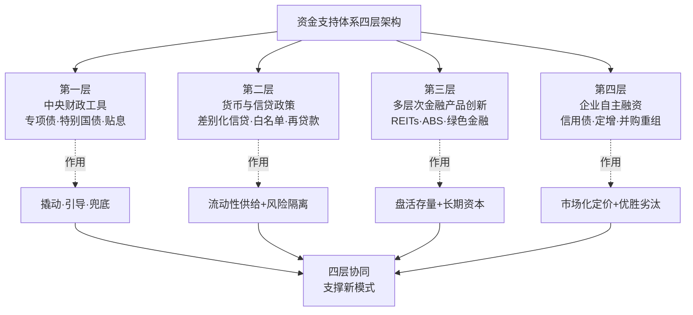

四层架构并非简单叠加，而是形成了由公共部门主导托底、市场化机制逐步深化的递进关系——中央财政是"压舱石"，货币信贷是"血液"，资本市场创新是"造血器官"，企业自主融资是"市场出清的标尺"。**只有四层协同运转，资金支持体系才能既守住风险底线，又激发市场活力，最终为新模式提供可持续的资金供给**。

### 6.1.3 三阶段功能定位：稳市托底—模式重塑—常态运行

承接第4章三阶段路线图与第5章政策出台节奏的整体框架，未来十年资金支持体系也可在功能定位上划分为三个阶段：

**第一阶段（2025—2026）：稳市托底期。** 资金工具以延续应急救助为主，重点完成保交房收官、出险房企债务重组、白名单贷款规模化投放、土地储备专项债和保障性住房再贷款的扩容运行。这一阶段资金供给的特征是"密度高、规模大、政策性强"，关键是通过财政与货币工具的协同发力，巩固止跌回稳态势。

**第二阶段（2027—2030）：模式重塑期。** 资金工具从"应急组合拳"转向"长效供给体系"——主办银行制全面铺开、保租房REITs常态化扩募、消费REITs与商业不动产REITs试点深化、绿色金融工具规模化对接双碳目标、房企融资渠道修复与多元化。这一阶段资金供给的特征是"制度化、市场化、多元化"，关键是构建支撑新模式的金融基础制度。

**第三阶段（2031—2035）：常态运行期。** 资金工具进入精细化、市场化、国际化阶段——REITs作为大类资产配置稳定运行、绿色金融与SBTi框架对接深化、保障性住房资金"投融管退"闭环成熟、企业融资回归基于产品力与运营力的市场化定价。这一阶段资金供给的特征是"常态化、精细化、可校验化"，关键是形成与高质量发展常态相适应的金融生态。

### 6.1.4 资金工具设计的三大目标与方法论原则

基于第2章九大动力源与第4章五大战略目标的整合分析，未来十年资金工具设计必须同时服务于三大目标：

**第一目标是风险出清**。通过白名单贷款接续、债务重组多元工具、AMC纾困、并购贷款支持等，完成44家上市违约房企的市场化、法治化出清，阻断房地产风险向地方债务、中小金融机构的传染。

**第二目标是需求支撑**。通过差别化信贷、公积金额度上浮、1%房贷贴息、契税与增值税优惠等，降低居民购房成本、激活刚需与改善需求，与政策路径中的限购松绑、税收优化形成协同。

**第三目标是模式转型**。通过REITs常态化、绿色金融规模化、主办银行制基础制度化等，为"好房子"建设、城市更新、租购并举、绿色低碳四大战略导向提供长期稳定的资金支撑，使行业从"销售导向"切换到"运营导向"。

三大目标在方法论上要求资金工具设计必须坚守四项原则：**第一，市场化法治化原则**——避免行政化干预，按照风险定价、商业可持续要求运行；**第二，分级分类原则**——按城市等级、企业资质、项目质量进行差异化资金支持；**第三，闭环监管原则**——确保资金专款专用、流向可追溯、效果可评估；**第四，逆周期调节原则**——在市场低迷时加大资金供给、在市场过热时收紧资金供给，发挥稳定器作用。

## 6.2 中央财政工具：特别国债、专项债与贴息政策的规模化扩容

中央财政工具是未来十年资金支持体系中政策属性最强、信号意义最大的层次。其核心功能是在市场失灵的过渡期发挥"撬动—引导—兜底"作用，为新模式构建提供初始资金保障与方向指引。

### 6.2.1 地方政府专项债：从2万亿托底到4.4万亿规模化扩容

地方政府专项债已成为支持房地产市场和房地产新模式构建的核心财政工具。从2024年的4万亿元（其中2024年新增3.9万亿元、2023年结转1000亿元，且**扩大了投向领域和用作项目资本金的范围**）[^157]，到2025年的4.4万亿元、比上年增加5000亿元，其重点用于"投资建设、土地收储和收购存量商品房、消化地方政府拖欠企业账款等"[^156]——专项债的规模量级与投向范围在持续扩容。

**土地储备专项债是2025年专项债工具中最具结构性意义的细分工具**。2024年11月自然资源部发文通知积极运用地方政府专项债券资金加大收回收购存量闲置土地力度[^156]；2025年3月《关于做好运用地方政府专项债券支持土地储备有关工作的通知》将存量闲置地块优先纳入收储计划，赋予地方政府在收购定价、用途上的自主权，**有助于形成"专项债融资—存量房收购—保障房转化"闭环**[^156]。

土储专项债的发行规模呈现快速扩容态势——下表汇总了2025年的关键数据：

| 维度 | 关键数据 | 数据来源/口径 |
|---|---|---|
| 2025年全年发行规模 | 超3000亿元 | 中指研究院监测，约占拟收储总规模的40%[^162] |
| 2025年截至5月13日拟收储规模 | 3918亿元，涉及171个城市 | CRIC不完全统计[^156] |
| 2025年全年公示拟收储规模 | 超7500亿元，5500余宗地块 | 中指研究院监测[^162] |
| 四季度月均发行规模 | 近370亿元，较三季度月均增长13.6% | 中指研究院监测[^162] |
| 区域排名（发行金额） | 广东486亿元、湖南389亿元、江西/重庆约300亿元 | 中指研究院监测[^162] |
| 地块所有权结构 | 地方国企85%、民企13%、央企保利/华润/华侨城等 | 中指研究院监测[^162] |
| 收储价格折扣 | 47%地块价格比值在0.8—1.0之间，全国平均0.82 | 中指研究院监测[^162] |
| 用地性质 | 住宅用地占66%、商办用地占24%、工业用地占6% | 中指研究院监测[^162] |
| 一二线城市占比 | 公示地块约1250宗、拟收储金额超2700亿元、占36% | 中指研究院监测[^162] |

数据汇总自[^162][^156]。

土储专项债的扩容效应已经显现——CRIC测算显示，**若公布的收储宅地规模如期落实，相当于为2025年楼市去库存加速54%，全国广义库存去化周期下降超过2个月**[^156]。这一规模化效应使土储专项债成为去库存的关键突破点——任何依靠新房交易自然消化库存的传统路径，在新房交易流速较历史峰值下降超过40%的时代背景下都难以快速见效，**土地收储成为现阶段大量已供应未开发地块的"唯一出路"**[^156]。

值得关注的是，**专项债收储的城市分布与所有权结构具有典型的结构性特征**——三四线城市拟收储规模占面积84%、占金额74%，因为相对于一二线城市而言，三四线城市在本轮调整中面对着更大的需求端波动，且更多地块由城投托底拿地，大量宅地因财务测算无法满足开工条件、导致城市潜在库存高企[^156]；地方国企占宗地总量85%、收储金额88%[^162]，反映出过去两年城投托底拿地的现实——专项债收储某种意义上是对城投平台资产的市场化置换，有助于化解地方政府隐性债务。

未来十年土储专项债将沿"扩容—规范—精准"三个方向深化（详见第5章5.2.3节）。**业内人士预计，2026年更多城市将持续推动存量闲置地块收储工作，加快库存去化，更好的提振市场预期，改善房地产市场供求关系**[^162]——专项债收储已从应急工具转变为新模式构建的长期机制。

### 6.2.2 超长期特别国债：支持"两重"建设、消费贴息与保障房

超长期特别国债是2024年新设立的中央财政工具，发行规模1万亿元、其中7000亿元支持"两重"建设（即"重大战略实施和重点领域安全能力建设"）[^157]。在房地产领域，超长期特别国债的支持作用主要体现在三个方向：

**第一，支持"两重"建设中与房地产高质量发展相关的领域**。城市基础设施补短板、城市生命线工程、地下管网更新、保障性住房等。"十五五"期间超过20万亿元资金将精准投向老旧小区、地下管网等八大领域（详见第3章3.6.2节、第4章4.9.3节），超长期特别国债将成为中央财政对这些领域的重要资金来源。

**第二，支持以旧换新带动家电、家居消费**。**2024年下半年专门安排了1500亿元超长期特别国债资金，支持消费品以旧换新，特别是加大汽车报废更新、家电产品以旧换新补贴力度**[^157]。这一资金虽不直接进入房地产领域，但通过激活居民耐用消费品支出，间接支撑房屋装修、家电配套等下游需求，与"好房子"建设形成产业链协同。

**第三，承载1%房贷贴息政策**。**据测算，若全国新增房贷年投放规模按4.5万亿元计算，1%贴息对应年财政支出约450亿元，通过超长期特别国债等载体可实现承载，形成完整资金闭环**[^163]——这一安排既不会给财政带来过大压力，又能有效激活住房消费、带动上下游产业复苏。

廖岷副部长在2025年1月的财政高质量发展成效新闻发布会上明确指出——为支持地方化解债务风险，"我们制定实施了近年来力度最大的一揽子化债方案，合计安排12万亿元政策资金。2024年的2万亿元置换额度，12月18日已经全部发行完毕。2025年的2万亿元置换债券，已启动相关发行工作"[^157]。这一12万亿元化债方案与超长期特别国债形成了中央财政对地方债务风险的系统性应对，**对房地产风险与地方债务风险的联动化解具有关键意义**。

### 6.2.3 1%房贷贴息政策：从地方试点到全国铺开的精准激活

1%房贷贴息政策是2025年最具创新意义的财政工具之一，体现了中央财政从"宏观调节"向"精准激活"的转变。其制度演进路径清晰可见：

**起步阶段（2023年末—2024年）**：杭州临平区、南京雨花台区、武汉等多地探索通过贴息的方式发放购房补贴。其中**南京雨花台区2024年6月政策落地，次月新房成交套数/成交面积环比分别增长17.5%/15.0%；武汉9月末政策落地，次月新房成交套数/成交面积环比分别增长18.7%/15.7%**[^164]——地方试点的初步效果证明了贴息政策对短期市场活跃度的拉动作用。

**全国框架建立（2025年8月）**：财政部、央行、金融监管总局联合印发《个人消费贷款财政贴息政策实施方案》，搭建起全国统一的试点政策框架，**明确在2025年9月1日至2026年8月31日期间，符合条件的住房相关消费贷款可享受1%年化贴息支持**[^165]。

**多城落地（2025—2026年）**：政策从三四线城市启动试点，积累经验后逐步向二线、新一线城市延伸铺开。**截至目前全国已有包括东莞、武汉、长春、南充、杭州临平、运城、芜湖等近20个城市推出房贷贴息政策**[^165]；**南京2026年3月20日发布"宁六条"，对"卖旧买新"的购房人给予贷款总金额1%的贴息补助、全市贴息总资金限额1亿元、采取"先申领先得"的机制**[^165]。

1%房贷贴息政策的精准激活效应可从多维度评估：

**减负效应方面**——以贷款100万元、期限30年、原执行利率3.65%、采用等额本息还款为例，**未贴息时月供约4519元，每年利息支出3.65万元；享受1%贴息后实际利率降至2.65%、月供直接降至4105元、每月节省414元、一年累计减负4968元**[^163]。对贷款200万元、期限25年的改善型需求，**原利率3.8%时月供8993元，贴息后降至7839元，每月少还1154元，一年能省1.38万元**[^163]。从全周期来看，100万元贷款30年总利息可减少超18万元[^163]。

**市场带动效应方面**——长春2024年8月政策出台后，**当月及次月新房销售套数环比分别增长29%和30%**；武汉2025年9月落地后，**10月新房成交套数环比增长50%、较年内月均水平高出45%**[^163]。这表明1%的贴息幅度能够有效调动市场积极性，**为房价重建底部支撑、阻断下行螺旋**[^163]。

**精准聚焦特征**——政策并非"全民普享"，而是**精准聚焦刚需，设有明确的申请门槛与限制条件**[^163]。具体而言，南京政策与"以旧换新"深度绑定，旨在**打通二手房与新房市场的置换链条**[^165]；多地政策实行限时三年贴息、按贷款余额核算补贴等方式，**既保证政策能够拉动市场，又严控财政支出规模、避免形成长期财政依赖、实现精准短期刺激**[^165]。

中指研究院的测算进一步揭示了1%房贷贴息政策的潜在量级——**2025年全国新建住宅和二手住宅总销售额或在14万亿元左右，假设首付比例50%（当前商贷首付比例最低15%、实际水平会偏高），贷款金额约7万亿元，若按1%贴息，增量贷款的贴息金额将在700亿元左右**[^164]。**从降低成本的角度来看，假设贷款200万、贷款30年、利率3.1%，按1%贴息，月还款额将减少1048元，一年将减少12570元**[^164]——这一规模与中央财政承受能力相匹配，具有可持续运行的财政基础。

1%房贷贴息政策的深层价值在于解决了"利率与租金回报率倒挂的结构性矛盾"——**2025年重点50城租金回报率仅2.08%、一线城市更是低至1.61%—1.89%区间，而同期全国新增房贷平均利率达3.06%；这种利差倒挂让房屋潜在收益低于资金成本，既抑制了刚需入市意愿，也让房价缺乏底层支撑、形成下行压力**[^163]。**与单纯下调LPR可能进一步压缩国有大行净息差（2025年三季度仅1.31%）、威胁金融稳定的方案相比，由财政承担1%利息成本的贴息模式，构建起"财政补息差、银行扩投放、需求享红利"的三方共赢格局，成为政策最优解**[^163]。

需要指出的是，1%房贷贴息政策目前处于"试点中"的确定性等级，最终是否常态化、是否扩容、是否纳入税收专项附加扣除，仍需视2025—2026年试点效果与财政承受力综合判断。**全国政协委员、香江集团董事长翟美卿建议推行财政定向房贷贴息、对首套房实施50—75个基点的利率贴息精准降低购房成本；全国人大代表、58同城董事长兼CEO姚劲波则提出将居民新购住房的贷款利息纳入个人所得税专项附加扣除范围**[^165]——这些代表建议指出了未来工具拓展的可能方向，但仍属"学界建议"等级。

### 6.2.4 财政资金"撬动—引导—兜底"三重作用机制

综合专项债、特别国债、贴息三类工具的运行特征，中央财政资金在房地产可持续发展中发挥着"撬动—引导—兜底"三重作用机制：

**撬动作用**——青岛海发集团模式中1.6亿元专项债基础上银团贷款8100万元（详见第3章3.6.1节），展示了专项债资金对政策性金融与商业银行资金的撬动倍数；专项债收储7500亿元拟收储规模带动一二线城市2700亿元集中收储[^162]，撬动了存量土地的市场化盘活。**财政资金的撬动倍数往往达到3—5倍**，这一杠杆效应是单纯财政投入难以实现的。

**引导作用**——通过专项债优先投向、贴息政策的精准聚焦、特别国债的方向性安排，财政资金引导社会资本流向"好房子"建设、城市更新、保障性住房等战略导向领域。**南京"宁六条"贴息政策与"以旧换新"深度绑定，旨在打通二手房与新房市场的置换链条**[^165]——这就是财政资金引导市场流向的典型案例。

**兜底作用**——12万亿元化债方案[^157]、保交房白名单审批7万亿元贷款规模[^155]、保障性住房再贷款3000亿元[^152]、超长期特别国债1万亿元[^157]——这些规模化的财政资金构成了房地产风险化解、保交房任务完成、保障性住房建设的兜底保障，避免了系统性金融风险的爆发。

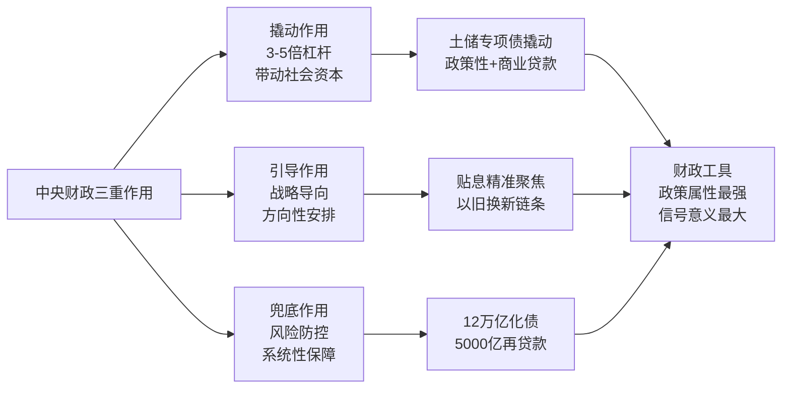

## 6.3 货币与信贷政策：差别化信贷、保交楼白名单与再贷款工具

货币与信贷政策是资金支持体系中规模最大、影响最广的层次。其特征是通过央行—金融监管总局—商业银行三层传导机制，对供需两端形成全面覆盖。

### 6.3.1 差别化住房信贷政策的历史性松绑

差别化住房信贷政策自1998年《个人住房贷款管理办法》以来历经多轮调整，其调控逻辑随房地产市场形势在"抑制投机、保障刚需"与"刺激需求、防止市场过热"之间动态切换[^166]。2024—2025年的政策调整属于历史上最具松绑力度的一轮，可视为对过去20余年差别化信贷政策框架的根本性重塑。

**首付比例的历史性下调**。2024年5月17日，央行发布政策——**降低全国层面个人住房贷款最低首付比例，将首套房最低首付比例从不低于20%调整为不低于15%、二套房最低首付比例从不低于30%调整为不低于25%**[^153]。这是首付比例调整以来的最低水平。

**房贷利率政策下限的全面取消**。2024年5月17日同步发布——**取消全国层面个人住房贷款利率政策下限。首套房和二套房贷利率均不再设置政策下限，实现房贷利率市场化**[^153]。这一调整标志着房贷利率从"政策刚性约束"切换到"市场化定价"，地方可因城施策、自主决定首套房和二套房最低首付比例和房贷利率下限。

**公积金贷款利率的多轮下调**。2024年5月17日下调公积金贷款利率0.25个百分点[^153]；2025年5月8日，央行再次下调0.25个百分点——**5年以下（含5年）和5年以上首套个人住房公积金贷款利率分别调整为2.1%和2.6%；5年以下（含5年）和5年以上第二套个人住房公积金贷款利率分别调整为不低于2.525%和3.075%**[^167][^168]。

**LPR的协同下调**。**2025年5月LPR进行了一次调整：1年期LPR为3.0%、5年期以上LPR为3.5%，均较上一期下降10个基点**[^167]。

**重定价机制的灵活化改革**。**自2024年11月1日起，商业性个人住房贷款利率新的定价机制落地，贷款人可以随时向银行提出将重定价周期调整为3个月、6个月或1年**[^167]。这一机制使存量房贷客户能够更快享受到利率下调的红利。

存量房贷利率重定价的减负效应已经显著体现。以**2026年1月1日为重定价日的首套房贷客户为例：如果执行的是LPR-30BP的贷款利率，那么重定价日贷款利率将调整为3.2%；如果首套房执行的是LPR-45BP的贷款利率，那么最新的房贷利率将降至3.05%**[^167]。**以普通家庭贷款120万元、贷款年限30年、等额本息还款方式为例，利率调整后首套房节省利息为57100.85元、二套房节省利息为59070.01元**[^167]。**以首套住房公积金贷款50万元、贷款期限20年、等额本息还款为例：利率调整前月供为2735.59元、利率调整后月供降至2673.94元、每月减少61.65元**[^167]。

差别化信贷政策的累积效应具有显著的需求支撑作用——**2025年全国城镇地区人均可支配收入56502元、同比增长4.3%，房价收入比降至5.9倍的历史新低水位**（详见第2章2.7.1节）；**武汉对三环外首套新房给予初始贷款金额1%的利息补贴、最高2万元分2年发放，叠加利率下行，月供压力较2024年下降约15%**（详见第2章2.7.1节）。**居民购房能力的实质性修复，为内生需求释放打开了空间**。

未来十年差别化信贷政策的演进可能呈现三个特征：**第一，与1%房贷贴息形成长期协同**——市场化利率定价与财政贴息的组合，避免单一工具的边际效应递减；**第二，与公积金额度上浮形成多层次支持**——商业贷款的市场化降息与公积金贷款的政策性低利率叠加，覆盖刚需到首改的多层次需求；**第三，差别化更加精细化**——按城市等级、家庭结构（多子女家庭）、产品类型（绿色建筑、装配式建筑）等维度进一步细分，体现"精准滴灌"原则。

### 6.3.2 "保交楼白名单"机制的常态化与扩围增效

"保交楼白名单"是2024年以来房地产融资政策中最具系统性意义的创新工具。其制度演进与规模扩容路径清晰可见：

**机制建立（2024年1月）**：**住房和城乡建设部、金融监管总局发布《关于建立城市房地产融资协调机制的通知》，指导各地级及以上城市建立协调机制**[^155]。

**扩围增效（2024年10月）**：**两部门联合召开全国保交房工作推进视频会议，提出进一步推动协调机制"扩围增效"，扩大"白名单"覆盖范围，确保合规房地产项目"应进尽进"**[^155]。同时高层会议多次强调，对于符合"白名单"条件的项目，应该"应进尽进""应贷尽贷"，并满足所有合理的融资需求，即"应满尽满"[^161]。

**规模化投放（2024年底—2025年）**：**2024年城市房地产融资协调机制落地见效，"白名单"项目审批通过贷款超5万亿元**[^154]；**2025年9月份，金融监管总局局长李云泽在国新办举行的高质量完成"十四五"规划系列主题新闻发布会上介绍，金融监管总局牵头建立城市房地产融资协调机制，"白名单"项目贷款超过7万亿元，支持近2000万套住房建设交付，有力保障广大购房人的合法权益**[^155]。

**贷款接续政策升级（2026年）**：**2026年政府工作任务中提出"进一步发挥'保交房'的白名单制度作用，防范债务违约风险"**[^155]——金融监管总局党委召开扩大会议，强调"稳妥化解重点领域风险""进一步发挥'保交房'白名单制度作用，加快建立与房地产发展新模式相适应的融资制度"[^155]。

下表汇总了"保交楼白名单"制度的关键演进节点与规模数据：

| 时间节点 | 关键政策/数据 | 制度演进意义 |
|---|---|---|
| 2024年1月 | 两部门联合通知，建立城市房地产融资协调机制[^155] | 制度建立 |
| 2024年10月 | 全国保交房工作推进视频会议，提出"扩围增效"[^155] | 机制升级 |
| 2024年底 | "白名单"审批通过贷款超5万亿元[^154] | 规模化投放 |
| 2025年9月 | "白名单"贷款超过7万亿元，支持近2000万套住房交付[^155] | 规模翻倍 |
| 2025年10月 | 全国750多万套已售难交付住房实现交付（详见第2章2.7.2节） | 保交房关键里程碑 |
| 2025年12月 | 全国住房城乡建设工作会议宣布2025年保交房任务全面完成（详见第2章2.7.2节） | 任务收官 |
| 2026年 | 政府工作报告提出"进一步发挥白名单制度作用、防范债务违约风险"[^155] | 长效机制升级 |

数据汇总自[^155][^154]。

"保交楼白名单"制度的深层意义已在朱华雷的概括中清晰展现——**短期看是以"保交房"白名单制度支持保交房、稳民生；中期是以项目制重塑融资逻辑、修复行业；长期锚定新模式、实现高质量发展，推动房地产金融从"救急"走向"治本"，为行业平稳转型与金融安全筑牢根基**[^155]。严跃进副院长进一步指出——**"'保交房'白名单制度的作用很明显。"其既能够确保楼盘竣工交付、保护消费者合法权益，还可以更好防范化解金融风险**[^155]。

未来十年"保交楼白名单"机制的演进路径有三：**第一阶段（2025—2027）：白名单机制扩围增效与主办银行制平稳过渡。** "白名单"项目贷款接续机制成熟运行，最长可至5年；主办银行制度细则在条件成熟城市试点（详见第5章5.4.2节）。**第二阶段（2028—2030）：主办银行制全面铺开。** 主办银行的资格条件、权责边界、银团协同、信息共享机制系统化建立。**第三阶段（2031—2035）：主办银行制与REITs、保障性住房再贷款等多元金融工具协同运行。** 形成"主办银行+银团协同+REITs退出+政策性金融兜底"的全周期融资生态。

需要特别指出的是，2025年监管工作会议明确**"加快推进城市房地产融资协调机制扩围增效，支持构建房地产发展新模式"**[^154]——这一表述清晰展示了"白名单"机制从过渡期工具向长效机制升级的政策导向。

### 6.3.3 保障性住房再贷款：3000亿元规模与100%支持比例的工具创新

保障性住房再贷款是央行2024年5月推出的创新性货币政策工具，其制度安排具有典型的"目标精准、机制清晰、规模适度"特征。

**工具基本要素**：**再贷款规模3000亿元、利率1.75%、贷款期限1年、可展期4次、人民银行按照贷款本金的60%发放再贷款、可带动银行贷款5000亿元**[^152][^153]。发放对象包括国家开发银行、政策性银行、国有商业银行、邮政储蓄银行、股份制商业银行等21家全国性银行[^152]。

**资金支持比例的历史性提升**。**2024年9月27日，《中国人民银行办公厅关于优化保障性住房再贷款有关要求的通知》发布，对于金融机构发放的符合要求的贷款，中国人民银行向金融机构发放再贷款的比例从贷款本金的60%提升到100%**[^152]。这一调整使保障性住房再贷款的市场化激励大幅提升——**资金支持比例由60%提高至100%，资金总规模达5000亿元**[^156]。

**用途严格限定**。**所收购的商品房严格限定为房地产企业已建成未出售的商品房，对不同所有制房地产企业一视同仁。按照保障性住房是用于满足工薪收入群体刚性住房需求的原则，严格把握所收购商品房的户型和面积标准**[^152]。这一限定确保了资金精准用于保障性住房供给，避免了资金的"空转套利"。

**收购主体的资质要求**。**城市政府选定地方国有企业作为收购主体。该国有企业及所属集团不得涉及地方政府隐性债务，不得是地方政府融资平台，同时应具备银行授信要求和授信空间、收购后迅速配售或租赁**[^152]。这一要求避免了地方债务风险的扩张。

**自愿参与的市场化原则**。**城市政府根据当地保障性住房需求、商品房库存水平等因素自主决定是否参与；符合保障条件的工薪群体自主选择是否参与配售或租赁；房地产企业与收购主体平等协商，自主决定是否出售**[^152]。

保障性住房再贷款的多重目标设计具有鲜明的政策创新意义——通过"市场化激励+严格资质审核+自愿参与原则"的组合，实现了去库存、保交楼、扩大保障房供给、化解房企现金流压力等多重目标的协同[^152]。

具体落地案例已经显现。**佛山高明花曼曦苑项目作为广东省首个收购存量房用作保障性住房的贷款项目落地后，收购单价约5400元/平方米（约为周边商品房市场价格的九成），项目计划总投资约2.2亿元，获得平安银行住房租赁团体购房贷款授信额度1.7亿元、期限最长30年**（详见第3章3.6.1节）。**宁德霞浦"央行再贷款人才房"案例展示了全国首笔央行再贷款支持人才房项目落地，4787万元落地、政策性工具支持层次创新**（详见第3章3.6.1节）。

未来十年保障性住房再贷款的演进可能呈现三个特征：**第一，规模可能进一步扩容**——根据保障房筹建需求与去库存进度动态调整规模量级；**第二，与专项债收储形成工具协同**——再贷款用于收购已建成未出售商品房，专项债用于收储存量闲置土地，两者覆盖商品房去库存的不同环节；**第三，可能与配售型保障房政策深度对接**——为配售型保障房房源建设提供资金支撑（详见第5章5.3.2节）。

### 6.3.4 经营性物业贷款与"金融16条"延期：多元工具的组合效应

除前述核心工具外，经营性物业贷款、"金融16条"等多元工具构成了货币信贷政策的重要补充。

**经营性物业贷款的拓展**。**2024年1月，央行及国家金融监督管理总局发布政策，明确全国性商业银行可发放经营性物业贷款用于偿还房企存量房地产领域的相关贷款和公开市场债券**[^161]。这一政策为持有大量商办、酒店等经营性物业的房企提供了重要的债务置换工具。万科、保利等头部企业商办持有面积超1000万平方米、租金回报率稳定在4%—5%（详见第2章2.3.2节），这些资产通过经营性物业贷款能够获得稳定的资金支持。

**"金融16条"的延期**。"金融16条"延长至2026年底（详见第1章1.1.2节、第2章2.7.2节），其覆盖范围广泛，包括稳定房地产开发贷款投放、支持个人住房贷款合理需求、稳定建筑企业信贷投放、支持开发性政策性银行提供"保交楼"专项借款、做好房地产项目并购金融支持、积极做好兼并收购金融服务等。

**保险、理财资金支持的深化**。2024年监管工作会议提出**"金融资产投资公司股权投资试点扩围至18个城市，签约意向性基金规模超3400亿元"**[^154]；2025年监管工作会议进一步提出**"引导保险、理财资金支持资本市场平稳健康发展"**[^154]——这些资金的引入为REITs等长期资本产品提供了配置端的支撑。

货币信贷政策三层传导机制的运行逻辑可清晰展现为：**央行通过保障性住房再贷款、降准降息、再贷款工具组合提供低成本基础货币[^152][^153]；金融监管总局通过白名单融资协调机制[^154]、保交楼专项借款、监管激励政策引导银行行为；商业银行按照风险自担、商业可持续原则[^152]，对房企、购房者、保障房收购主体提供多元化信贷服务**。这三层传导机制的协同运行，构成了未来十年货币信贷政策的整体框架。

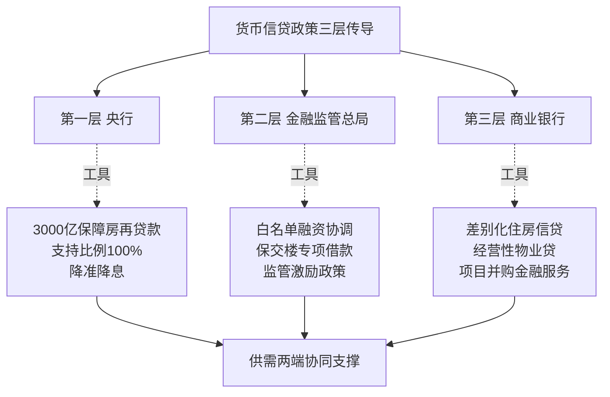

## 6.4 多层次房地产金融产品创新：REITs、ABS与绿色金融工具

多层次房地产金融产品创新是未来十年资金支持体系中最具结构性意义的层次。其核心价值在于通过资本市场工具盘活存量资产、吸引长期资本、形成"投融管退"闭环，为新模式下的运营服务主导商业模式提供资金生态支撑。

### 6.4.1 公募REITs的运营业绩与扩募机制深化

公募REITs自2021年6月首批产品发行以来，已发展成为支持实体经济与基础设施投资的重要资本市场工具。沪市52只公募REITs在2025年的运营数据展示了这一工具的强大支撑能力。

**整体运营业绩亮眼**。**截至2026年3月31日，沪市52只公募REITs全部完成了2025年年报披露。全年52只产品合力交出收入145亿元、同比增长71%；可供分配金额达88亿元、同比增长42%**[^158][^159][^160]。**在低利率常态化环境下，这些REITs底层资产实打实地在创造现金流，展现出强劲的内生增长动力**[^158]。

**细分赛道分化但整体向好**。沪市公募REITs主动融入国家战略，精准匹配实体经济的核心环节，呈现出多点支撑、协同发展的良好生态：

| 细分赛道 | 关键运营指标 | 战略意义 |
|---|---|---|
| 消费REITs | 平均出租率攀升至98%、收缴率接近100%、营收与现金流双双超预期[^158][^159][^160] | 促消费政策与居民消费升级的"增长引擎" |
| 保障性租赁住房 | 出租率维持95%高位、租金收缴率达100%[^158][^159][^160] | 租购并举的"稳定器" |
| 能源REITs | 全年结算电量40亿千瓦时、营收完成率达106%[^158][^159][^160] | 双碳目标下的"乘势而上" |
| 产业园区与仓储物流 | 整体出租率合理、东久REIT/京东仓储满租[^158][^159][^160] | 存量竞争中"提质增效" |
| 高速公路 | 通行费收入69亿元、日均车流32万辆、现金流完成度97%[^158][^159][^160] | 资产端"强大韧性" |
| 数据中心、市政环保 | 现金流完成度全线达标[^158][^159][^160] | 多点支撑、协同发展 |

数据汇总自[^158][^159][^160]。

**二级市场表现与分红回报**。**2025年沪市REITs除权价格平均上涨6.3%，如果计入分红再投资、复权价格涨幅高达11.9%。分红派现力度持续加大，全年实施分红110次、累计派发近78亿元、较上年增长30%**[^158][^159][^160]。**产权类REITs整体分派率达4.18%，经营权类REITs全周期内部收益率（IRR）约4.05%，为保险、理财等长期资金提供了可预期的收益锚点**[^158][^159][^160]。

**值得关注的是**——**收费公路类项目贡献了近六成的分红总额，可以说是"分红担当"，以真金白银的持续回馈确立了高股息资产的标杆地位**[^158][^159][^160]。这一数据展示了REITs作为"压舱石"资产的稳定收益特征。

**"首发+扩募"双轮驱动战略深化**。**2025年沪市REITs"首发+扩募"双轮驱动战略进入深化落地阶段，常态化扩募机制逐步成熟。截至今年3月末，张江、普洛斯、京保、临港等7单扩募项目已成功落地。扩募之后，单只基金的资产规模更大、资产组合更多元、抗风险能力也更强**[^158][^159][^160]。**接下来，还有厦门安居项目已获批待发行，京东、城投宽庭等5单项目正处推进快车道**[^158][^159][^160]。

**多层次REITs市场格局加速形成**。**沪市多层次REITs市场格局加速构建。截至2026年3月末，商业不动产REITs试点也在稳步推**[^158]——这一试点的推进将为商业地产、写字楼等存量资产的盘活提供新的资本市场通道。

### 6.4.2 保障性租赁住房REITs：租购并举的金融基石

保障性租赁住房REITs是新模式下租购并举战略的关键金融工具。其在2025年表现出"穿越周期的稳健底色"——**保障性租赁住房板块依然是"稳定器"。核心城市人口持续流入、青年群体租赁需求刚性，为板块提供坚实基本盘。该类资产出租率维持95%高位、租金收缴率达100%，展现出穿越周期的稳健底色**[^158]。

**保租房REITs的运营特征具有典型的"稳定器"价值**——95%的高位出租率意味着空置率仅5%、租金收缴率达100%意味着应收账款风险接近零。这种运营特征与保障性住房面向新市民、青年人、工薪群体的稳定需求相匹配，使保租房REITs成为最适合长期资金配置的资产类别之一。

承接第2章2.7.4节关于REITs的论述与第2章2.9.4节关于"政府保基本+市场提品质"双轨制的分析，保租房REITs在租购并举战略中承担着三重关键角色：

**第一，盘活存量资产**。**华夏北京保障房REIT通过资本市场融资盘活1830套公租房资产，为行业提供了"投融管退"闭环范本**（详见第2章2.7.4节）。这一案例证明了保租房REITs能够将运营性资产转化为可交易的金融产品，从而打通保障房建设的资金回笼通道。

**第二，吸引长期资本**。**重点城市租金房价比已攀升至2.17%，核心城市优质租赁资产的投资回报率接近五年期定期存款利率，正吸引大量长期资本持续入场**（详见第2章2.7.4节）。险资、社保、企业年金等长期资金对稳定收益资产的配置需求，与保租房REITs的产品特性形成了天然匹配。

**第三，形成"投融管退"闭环**。截至2025年已发行五只保租房REITs（详见第2章2.7.4节）；**保障性租赁住房REITs已打通"投融管退"全生命周期的资金闭环，保障性住房不再完全依赖财政输血**（详见第4章4.7.4节）。这一闭环机制使保障房建设具备了可持续运行的金融基础。

未来十年保租房REITs的发展路径将沿"扩容—常态化—资产多元化"三个方向演进：

**扩容方面**——参考"十四五"期间已筹集870万套保障性租赁住房（详见第2章2.9.2节）、"十五五"期间浙江省累计建设筹集各类保障性住房达到150万套（详见第4章4.7.5节）的供给规模，保租房REITs的资产端供给将持续扩容。预计到2030年保租房REITs发行数量可能达到20—30只规模（注：此为基于当前发行节奏与资产供给规模的趋势研判，实际规模取决于市场环境与监管节奏）。

**常态化方面**——常态化扩募机制逐步成熟，单只基金的资产规模更大、资产组合更多元；与配售型保障性住房REITs可能形成产品序列。

**资产多元化方面**——可能从保障性租赁住房进一步扩展到配售型保障性住房（注：仍属规划提出阶段，需要监管机构进一步明确制度设计）、人才公寓、市场化租赁住房等多种细分赛道。

### 6.4.3 ABS市场：信贷ABS、企业ABS与绿色ABS的协同发展

资产支持证券（ABS）市场是房地产融资体系中规模最大、产品最丰富的资本市场工具。**2024年我国资产证券化（ABS）市场全年发行各类产品约1.98万亿元、年末存量规模约为3.82万亿元。市场运行平稳，发行规模有所回升，市场呈现创新和多元化发展。融资租赁债权ABS发行规模领跑，不良贷款ABS发行增速较快，绿色ABS产品创新不断深化**[^169]。

**房企ABS市场表现**。**2024年房地产行业共实现债券融资5653.1亿元、同比下降18.4%；平均利率为2.95%、同比下降0.72%。其中，信用债成为房企融资的绝对主力、占比超六成；ABS融资占比超过三分之一**[^161]。**ABS同比下降13.6%，但ABS平均利率为3.01%、同比下降0.59个百分点**[^161]。在信用债、海外债、ABS三大债券融资工具中，ABS占比超过三分之一，已成为房企融资的重要组成部分。

**绿色ABS的政策支持框架**。2024年监管机构与行业协会先后出台多项指导意见和通知，构建了绿色ABS的系统性政策支持框架：

- **2024年3月**：中国人民银行等七部门印发《关于进一步强化金融支持绿色低碳发展的指导意见》，**提出大力支持符合条件的企业、金融机构发行绿色债券和绿色ABS，积极发展碳中和债和可持续发展挂钩债券，支持清洁能源等符合条件的基础设施项目发行不动产投资信托基金（REITs）产品**[^169]；
- **2024年5月**：金融监管总局发布《关于银行业保险业做好金融"五篇大文章"的指导意见》，**支持符合条件的非银行金融机构发行绿色信贷ABS、绿色金融专项债**[^169]；
- **2024年8月**：中国人民银行等八部门联合发布《关于进一步做好金融支持长江经济带绿色低碳高质量发展的指导意见》，**提出要发挥多层次资本市场作用，探索生态产品ABS路径和模式**[^169]；
- **2024年10月**：中国人民银行等四部门印发《关于发挥绿色金融作用 服务美丽中国建设的意见》，**提出要支持发行绿色ABS产品，盘活存量资产，提高资产流动性**[^169]；
- **2024年10月**：交易商协会发布《关于进一步优化绿色及转型债券相关机制的通知》，**鼓励企业发展绿色资产证券化等组合式创新产品，支持新能源、清洁能源、生态环保等绿色领域中符合条件的项目申报发行绿色不动产信托资产支持票据、绿色资产支持票据、绿色资产支持商业票据等创新产品，盘活绿色资产**[^169]。

**ABS业务主体的多元化**。2024年监管机构先后出台部门规章和通知，**支持各类型金融机构开展ABS业务、推动ABS市场规范化发展、夯实制度基础**[^169]：3月金融监管总局发布《消费金融公司管理办法》将ABS纳入专项业务、明确符合条件的消费金融公司可以开展ABS业务；9月发布《金融租赁公司管理办法》，规定符合条件的金融租赁公司可以申请经营ABS业务；11月出台《关于印发金融资产管理公司不良资产业务管理办法的通知》，规定金融资产管理公司可以择优选用包含ABS在内的方式处置不良资产[^169]。**上述文件对消费金融公司、金融租赁公司、金融资产管理公司进一步拓宽融资渠道、增强流动性支持能力、降低融资成本具有重要意义**[^169]。

未来十年ABS市场的演进路径有三：**第一，规模持续增长**——参考2024年1.98万亿元的发行规模与3.82万亿元的存量规模[^169]，"十五五"期间ABS市场规模预计将持续增长；**第二，绿色ABS加速创新**——在双碳目标驱动下，绿色ABS产品类型将更加丰富，覆盖绿色建筑、可再生能源、节能改造等多个领域；**第三，与REITs协同发展**——ABS与REITs在产品结构、底层资产、投资者群体上存在差异化，未来将形成互补的资本市场工具体系。

### 6.4.4 绿色债券与转型金融：双碳目标下的金融工具创新

绿色债券是支持房地产行业绿色低碳转型的关键金融工具。承接第2章2.8节关于双碳目标与生态环境约束的分析，绿色债券在未来十年将与"好房子"建设、城市更新、绿色建筑等战略目标形成深度耦合。

**绿色债券政策框架完善**。2024年我国绿色债券支持政策进一步完善，呈现"顶层设计逐步完善、标准化工作取得突破性进展、地方积极推动绿色金融发展"三大特征：

- **2024年7月**，中共中央、国务院发布《关于加快经济社会发展全面绿色转型的意见》，**为加快经济社会发展全面绿色转型指明了方向**[^170]；
- **2024年12月**，中国人民银行正式发布《绿色债券环境效益信息披露指标体系》（JR/T 0322—2024）金融行业标准，**这是绿色债券领域首个金融行业标准，填补了绿色金融领域行业标准空白，规范了绿色债券环境效益信息披露**[^170]；
- **2024年4月**，沪深北三大交易所发布《上市公司可持续发展报告指引》，**对我国上市公司在环境、社会和治理（ESG）等领域的可持续信息披露作出规范**[^170]；
- **2024年11月**，财政部发布《企业可持续披露准则——基本准则（试行）》，**助力提高企业可持续发展信息披露质量**[^170]。

**全国碳市场建设加速**。**2024年2月，国务院发布《碳排放权交易管理暂行条例》，构建碳排放权交易管理基本制度框架。全国温室气体自愿减排交易市场启动，有助于推动形成强制碳市场和自愿碳市场互补衔接、互联互通的全国碳市场体系**[^170]。

**国际合作深化**。**2024年，国际可持续金融合作平台更新了中欧《可持续金融共同分类目录》、并发布中欧新《多边可持续金融共同分类目录》，这是我国积极推动绿色金融合作的又一重要进展**[^170]。这一国际合作的深化，为中国房企接轨国际SBTi框架、参与全球绿色金融市场提供了制度基础。

**地方积极推动绿色金融发展**。**在顶层设计的引导下，各地纷纷出台绿色金融相关标准和激励措施。2024年4月，广东省印发《广东省发展绿色金融支持碳达峰行动实施方案》**[^170]——地方层面的绿色金融政策呼应了中央政策框架，形成上下联动的支持体系。

未来十年绿色金融工具与房地产战略目标的耦合将沿三个方向深化：**第一，绿色建筑融资**——绿色建筑市场到2030年规模预计突破2.5万亿元（详见第2章2.4.2节、第4章4.6.4节），将为绿色债券、绿色ABS提供丰富的资产端供给；**第二，超低能耗建筑与既有建筑节能改造**——超低能耗建筑到2027年实现规模化发展（详见第2章2.4.1节、第4章4.9.4节），既有建筑节能改造对应每年新建住宅市场超200亿元规模与存量改造千亿级需求（详见第2章2.3.1节）；**第三，SBTi国际框架对接**——头部房企可能通过对接SBTi获得低成本国际资本（详见第2章2.4.3节、第2章2.8.3节、第4章4.9.5节）。

### 6.4.5 "投融建管退"闭环：盘活存量、吸引长期资本的关键意义

REITs、ABS、绿色债券等多层次金融产品创新的核心价值，在于构建了"投融建管退"全生命周期闭环，从根本上改变了房地产行业的资金循环机制。

**传统模式下的资金循环困境**。在"高负债、高周转、高杠杆"的传统模式下，房企的资金循环依赖"拿地—开发—预售回款—再拿地"的快速周转链条，资产形成后无法有效退出，运营性资产沉淀大量资金。一旦销售环节出现波动（如本轮市场调整），整个资金循环链条立即断裂，房企陷入流动性危机。

**新模式下的"投融建管退"闭环**。多层次金融产品创新构建了与新模式相适应的资金循环机制：

- **投**：通过专项债、保障性住房再贷款、白名单贷款等政策性资金，加上市场化股权与债权融资，为存量资产收购或新项目投资提供初始资金；
- **融**：通过商业银行贷款、ABS、信用债等渠道为运营期提供持续融资支持；
- **建**：通过项目公司制和主办银行制的资金封闭管理，确保资金专款专用、防范风险传染；
- **管**：通过专业化运营管理提升资产现金流（如沪市公募REITs底层资产创造145亿元收入、可供分配金额88亿元[^158][^159][^160]）；
- **退**：通过REITs上市交易、扩募注入、二级市场转让等多元方式实现资金回收，形成"建一批、退一批、再投一批"的循环模式。

**这一闭环的深层价值在于**——**第一，将沉淀的运营性资产转化为可流动的金融产品**，从而吸引险资、社保、企业年金等长期资金入场（产权类REITs整体分派率达4.18%、经营权类REITs全周期IRR约4.05%为长期资金提供了可预期的收益锚点[^158][^159][^160]）；**第二，倒逼房企从开发销售模式向运营服务模式转型**——只有具备稳定运营现金流的资产才能成为REITs的底层资产；**第三，通过资本市场约束提升资产管理水平**——REITs信息披露指引修订后的首次年报"大考"显示信息更细、估值更严、分红更透明[^158]，这种资本市场约束推动了行业精细化管理水平的整体提升。

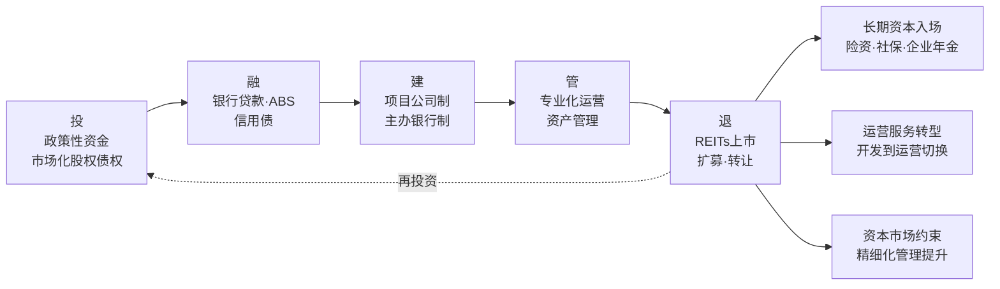

**沪市52只公募REITs举办了近百次的路演、投资者开放日等活动，建立起投资者与底层资产之间的深度连接，让投资者不仅享受到了资产运营的红利，更直观感受到了底层资产的成长逻辑，投资获得感进一步提升，实现了市值增长与投资信心的良性循环**[^159][^160]——这种良性循环是新模式下资金生态的微观体现。

## 6.5 企业融资渠道多元化：直接融资、股权融资与并购重组

企业自主融资渠道是资金支持体系的"市场出清标尺"层。其特征是按照市场化、法治化原则运行，反映企业的真实信用与产品力，是资金配置效率的最终检验。

### 6.5.1 房企债券融资格局：信用债主力与多元渠道恢复

2024—2025年房企债券融资市场呈现"政策宽松、规模仍降、成本下行、结构优化"四重特征。

**整体规模仍处下降通道**。**2024年，房地产行业共实现债券融资5653.1亿元、同比下降18.4%；平均利率为2.95%、同比下降0.72%**[^161]。**克而瑞统计的65家典型房企累计融资总量为4823.4亿元、同比减少28.1%；新增债券类融资成本2.93%、较2023年下降0.64个百分点**[^161]。**2025年全年，65家典型房企的累计融资总量为4143.14亿元**[^171]。

**信用债成为绝对主力**。**信用债同比下降18.5%，海外债同比下降69.5%，ABS同比下降13.6%。海外债在低水平上继续下降，信用债成为融资绝对主力，ABS融资占比超三分之一**[^161]。下表汇总了2024年房企债券融资的结构特征：

| 工具类型 | 同比变化 | 平均利率 | 利率同比变化 | 市场地位 |
|---|---|---|---|---|
| 信用债 | -18.5%[^161] | 2.86%[^161] | -0.71pct[^161] | 绝对主力（占比超60%）[^161] |
| 海外债 | -69.5%[^161] | 5.22%[^161] | -1.17pct[^161] | 低水平继续下降[^161] |
| ABS | -13.6%[^161] | 3.01%[^161] | -0.59pct[^161] | 占比超三分之一[^161] |
| 行业整体 | -18.4%[^161] | 2.95%[^161] | -0.72pct[^161] | 仍处下降通道[^161] |

数据汇总自[^161]。

**头部房企融资优势凸显**。**从房企梯队来看，2024年TOP10房企的平均融资额为268.18亿元、是所有梯队中最多的，同时该梯队也是唯一一个融资规模同比增长的梯队**[^161]。这一数据印证了第3章3.3.5节关于"行业资源和项目向央国企、优质民企集中"的判断——融资环境的改善并非雨露均沾，而是优胜劣汰下的结构性集中。

**资金到位仍未显著回暖**。**国家统计局数据显示，2024年前11月房地产开发企业到位资金为9.66万亿元、同比下降18.0%；其中国内贷款为1.35万亿元、同比下降6.2%、占比为14.0%、比上年同期提升1.8个百分点；自筹资金为3.47万亿元、同比下降11.0%、占比为35.9%、比上年同期提升3.0个百分点**[^161]。**销售下滑对房企资金面产生不利影响，定金及预收款、个人按揭贷款占比均显著下降**[^161]。

刘水分析指出——**"2024年融资政策持续宽松，但债券融资规模仍在下降通道，市场复苏的不确定性增加了投资人对房地产行业的疑虑，也使得企业对新增融资采取谨慎态度，融资规模仍在缩减中"**[^161]。**联合资信发布报告指出，尽管2024年推出了一系列旨在支持房企融资的政策措施，包括降低LPR利率、优化经营性物业贷款管理、设立保障性住房再贷款以及扩大"白名单"项**[^161]——政策宽松与市场谨慎的张力是这一阶段房企融资格局的核心特征。

### 6.5.2 定增与可转债融资重启：央国企领跑的标志性案例

2025年底以来，房企定增与可转债融资迎来历史性重启，这是行业融资修复的重要标志性事件。

**华发股份30亿元定增——今年房企首单定增案**。**华发股份于近日公告，拟向国资控股股东珠海定向增发募资不超过30亿元，用于房地产项目开发。本次发行价格为定价基准日前20个交易日均价4.21元/股，发行数量不超过7.13亿股（不超过发行前总股本30%），完成后华发集团及其一致行动人合计持股比例将达44.11%**[^171]。**此次定增华发股份将全部用于项目建设。根据公告，扣除发行费用后的净额将全部用于珠海华发城建国际海岸花园二期、绍兴金融活力城、成都阅天府、杭州武御林宸院、成都锦宸院三期观著园等9个项目**[^171]。**华发股份认为，此次定增的核心价值是，4.21元/股的定价可规避股份稀释对中小股东权益的摊薄，30亿元资金注入则能直接补充核心项目开发现金流，保障重点项目推进，同时优化资本结构、降低杠杆压力，夯实公司"开发+经营"双轮驱动格局**[^171]。

**保利发展50亿元可转债融资**。**2025年12月12日，保利发展发布2025年度向特定对象发行可转换公司债券预案。根据预案，保利发展计划发行可转债总额不超过50亿元（含本数），发行数量不超过5000万张，票面利率将通过竞价方式确定**[^171]。**扣除发行费用后的募集资金净额将全部用于杭州保利天奕、石家庄保利裕华天珺、广州保利辰园湖境、中山保利琅悦、长春保利景阳和煦、佛山保利锦鲤堂悦、上海保利虹桥和颂三期、天津保利珺璟和煦、石家庄保利长安琅悦9个项目**[^171]。**上述项目的总投资额为222.21亿元，其中募集资金拟投入金额为50亿元**[^171]。

**海外债通道重启——万达商业3.6亿美元发行案例**。**1月30日，大连万达商业管理集团宣布成功发行3.6亿美元高级有担保美元债券，债券息票率高达12.75%。期限方面，债券采用2NC1.5结构："2N"意味着原始到期日为发行后2年、即2028年2月5日；"C1.5"则赋予发行人提前赎回权，可在发行后1.5年（2027年8月5日）选择全额偿还本金以终止债券合约**[^171]。**从发行结果来看，市场认购热情超出预期。本次债券最终认购金额达6.5亿美元，覆盖43个投资账户，认购倍数超1.8倍**[^171]——这一案例显示一些已经度过偿债高峰期的房企再度得到投资者的青睐，海外信用债通道已基本重启。

**多元融资渠道全面恢复**。**克而瑞统计数据显示，2025年全年65家典型房企的累计融资总量为4143.14亿元；2025年12月，房企境内债权融资119.38亿元、境外债权融资40.4亿元；资产证券化融资81亿元、环比增长35.5%**[^171]。**从房企境内外债融资的渠道可以看到，当前除了常态化的公司债发行以外，可转债、定增以及海外信用债等已经基本重启**[^171]。

定增与可转债融资重启的标志性意义在于：**第一，资本市场对房地产行业的信心修复**——这两类工具直接体现资本市场对企业未来盈利能力与还本付息能力的判断；**第二，央国企在融资修复中的领跑姿态**——华发股份依托国资控股股东珠海定增、保利发展可转债项目均集中于一二线核心城市优质项目，体现了"质量驱动融资"的新逻辑；**第三，融资工具与项目开发深度绑定**——募集资金严格用于具体项目建设、资金封闭管理，这与第5章5.4节项目公司制基础制度形成内在自洽。

### 6.5.3 房企债务重组：4348亿元收益与困境企业转盈

2025年是房企债务重组全面加速的一年，其标志性数据彰显了债务重组对行业风险化解的关键作用。

**整体重组规模与收益**。**2025年房企债务重组和企业重整全面加速，截止2025年底有10家房企境外债务重组通过，其中7家是2025年完成。与此同时，2025年有6家房企境内债务重组整体方案获相关债权人会议表决通过**[^172]。**2025年内有整体重组方案获批的9家企业，债务重组收益合计达到4348亿元，使得合计利润从2024年的亏损2071.8亿元变为盈利768.9亿元**[^172]。

**典型案例数据**：

- **碧桂园**（HK2007）：境内外重组方案均获批，**债务重组收益最高达934.8亿元**[^172]；
- **佳兆业**：成为利润最高的房企，**净利润高达523.26亿元**[^172]；
- **金科**：发布业绩预告，**预计2025年度归属于上市公司股东的净利润为盈利300亿元—350亿元（上年同期为亏损319.70亿元），主要原因为报告期内重整计划执行完毕，形成约680—700亿元债务重整收益、计入当期非经常性损益，主要包含债务豁免收益、超额亏损转回投资收益等**[^172]；
- **加上金科**：**10家房企2025年房企债务重组、企业重整收益合计超过5000亿元**[^172]。

**债务重组收益的本质与局限**。需要清醒认识债务重组收益的本质——**债务重组收益是债权人和债务人达成协议后，债务账面价值与实际偿付对价之间的差额，不涉及实际的现金收付，债务重组收益影响下的房企盈利只是表象。如金科预计2025年扣除非经常性损益后的净利润为亏损290亿元—350亿元、上年同期为亏损284.18亿元**[^172]。**债务重组收益不能产生现金流、即刻缓解房企手头的资金压力，也不能直接用于支付日常运营开支**[^172]。

**债务重组的长远价值**。**但从企业长远发展的角度来看，重组成功后房企减轻了债务负担，可减少偿债、利息支出等，节省下来的资金可以投入到项目复工复产等关键环节，让停滞的项目重新运转起来，为企业逐步回到正常经营轨道奠定基础，企业业务调整带来时间和空间。债务重组解决了房企的燃眉之急，企业未来仍需改善核心业务盈利能力、才是长久之计**[^172]。

**2026年重组持续推进**。**2026年1月26日，宝龙地产（HK1238）发布公告，其附属公司上海宝龙实业发展（集团）有限公司的六笔境内公司债券及资产支持专项计划的重组方案已获债券持有人会议审议通过。2026年3月16日花样年公告，香港及开曼法院已于3月12日正式批准其境外债务重组计划。此外，富力地产（HK2777）、中骏集团、宝龙地产（HK1238）等企业的境外重组也已获得超过75%以上的支持率，中国奥园（HK3883）、花样年等企业也在积极推进境内债务整体重组。在此背景下，预计2026年房企债务重组收益仍将持续**[^172]。

**单一案例分析——中骏集团的困境与重组**。中骏集团2025年的业绩报告反映了出险房企的典型困境——**2025年中骏集团实现营业总收入371.14亿元、同比下降9.0%。从收入结构来看，传统物业销售仍是核心收入来源，全年实现物业销售收入348.99亿元、同比下降10.2%、占总营收的94.0%；多元化业务保持稳健增长，物业管理费收入同比增长8.3%至13.01亿元**[^173]。**毛利的增长未能传导至净利润端，公司全年实现税前利润-59.55亿元，母公司拥有人应占亏损74.47亿元、较上年收窄5.3%、连续第三年出现亏损**[^173]。**截至2025年末公司总土地储备规划建筑面积2115万平方米、分布于55个城市，其中二线城市土地储备成本占比48.2%、三四线城市占39.3%、全年未新增土地储备**[^173]。**销售布局上，中西部和长三角经济圈分别贡献28.6%和27.1%的合同销售额，三四线城市仍占主导地位、占比达55.9%**[^173]——三四线城市为主的布局使其在行业结构性分化加剧的背景下面临更大的去库存压力，**其未来发展与境外债务重组的进程密切相关**[^173]。

### 6.5.4 并购重组与市场化纾困工具组合

并购重组与市场化纾困工具是出险房企有序出清、行业资源向央国企与优质民企集中的关键机制。承接第3章3.4.3节关于AMC纾困模式的分析，未来十年并购重组工具组合将沿三个方向深化：

**第一，并购贷款与并购债券**。商业银行、金融资产管理公司等机构按照市场化、法治化原则，做好重点房地产企业风险处置项目并购的金融服务，包括稳妥有序开展并购贷款业务、加大并购债券融资支持力度、积极提供兼并收购财务顾问服务（详见第3章3.4.3节）。

**第二，重组类置换债与风险缓释工具**。**2025年来加快风险企业融资工具的探索，例如重组类置换债、收并购债券和风险缓释工具的应用**（详见第3章3.4.3节）。这些工具的运用为房企债务重组提供了多元化的市场化解决方案。

**第三，司法重整与市场化谈判**。金科股份2025年5月司法重整获批，成为中国第一个司法重整成功的大型上市房企，涉及债务规模1470亿元、债权人超8400家（详见第3章3.4.3节）；融创中国、碧桂园、远洋集团、旭辉控股集团已基本实现境内、境外债务重组（详见第2章2.7.3节）。

下表汇总了房企融资格局的央国企与民企分化情况：

| 维度 | 央国企（保利、中海等） | 民营房企（修复中） |
|---|---|---|
| 融资工具 | 定增、可转债、海外债重启[^171] | 主要依靠债务重组、并购贷款 |
| 融资规模 | TOP10平均268.18亿元（唯一增长梯队）[^161] | 大幅萎缩，但债务重组持续推进[^172] |
| 项目方向 | 一二线核心城市优质项目[^171] | 聚焦债务重组、保交付 |
| 资本市场表现 | 海外债通道重启、认购倍数超1.8倍[^171] | 评级普遍下调，多家退市 |
| 重组收益 | 不涉及 | 9家整体重组方案获批，4348亿元重组收益[^172] |

数据汇总自[^161][^172][^171]。

**多元融资有序推进、房企资金链稳步修复可期**[^171]——这一概括清晰描绘了未来十年房企融资格局的演进方向。需要特别说明的是，房企融资修复呈现明显的"分化中改善"特征——央国企融资恢复领先、优质民企融资逐步重启、出险民企通过债务重组完成市场化出清，三种主体的融资路径差异化但整体方向一致。

### 6.5.5 多元融资对房企资产负债表修复与新模式转型的支撑作用

企业融资渠道多元化的最终价值在于支撑房企资产负债表修复与新模式转型。这一支撑作用体现在三个层面：

**第一，资产负债表修复**。债务重组带来的4348亿元重组收益（2025年9家整体重组方案获批房企）[^172]显著修复了出险房企的账面利润；定增与可转债融资为央国企补充了核心项目开发现金流（华发股份30亿元、保利发展50亿元）[^171]；海外债通道重启为优质民企提供了多元化融资选择（万达商业3.6亿美元）[^171]。这些工具的累积效应是房企整体资产负债表的逐步修复。

**第二，融资模式转型**。从过去依赖银行贷款、销售回款的"高杠杆、高周转"模式，转向依靠多元资本市场工具的"市场化定价、风险共担"模式。**信用债平均利率2.86%、ABS平均利率3.01%、海外债平均利率5.22%**[^161]——不同融资工具的差异化利率反映了市场对企业信用的差异化定价，这种市场化定价机制是新模式下资金配置效率的根本保障。

**第三，与基础制度的内在自洽**。新型融资工具与项目公司制、主办银行制、现房销售制基础制度形成内在自洽——**项目公司制使融资可以精准对接具体项目（华发股份9个项目、保利发展9个项目）[^171]；主办银行制为融资工具的资金封闭管理提供制度保障；现房销售制倒逼企业从"销售回款融资"转向"运营资产融资"**。

朱华雷总结的演进路径——**短期看是以"保交房"白名单制度支持保交房、稳民生；中期是以项目制重塑融资逻辑、修复行业；长期锚定新模式、实现高质量发展，推动房地产金融从"救急"走向"治本"，为行业平稳转型与金融安全筑牢根基**[^155]——同样适用于企业融资体系的整体演进逻辑。

## 6.6 资金支持工具×战略目标协同矩阵与风险约束

前述四层资金支持体系并非孤立运行，必须形成系统性协同与战略目标对齐。本节构建"四类资金工具×五大战略目标"的协同矩阵，明确资金支持体系的方法论原则与三阶段演进节奏，与第5章政策路径形成口径一致的逻辑闭环。

### 6.6.1 "资金工具×战略目标"协同矩阵

承接第5章5.7.1节政策协同矩阵的方法论，构建"四类资金工具×五大战略目标"的资金协同矩阵，是检验资金支持体系完整性的关键。下表展示了四类资金工具集群在五大战略目标上的交叉耦合关系：

| 资金工具↓ 战略目标→ | 高质量发展+新模式构建 | "好房子"建设 | 租购并举与多层次保障 | 风险长效防控 | 城市更新与绿色低碳 |
|---|---|---|---|---|---|
| 中央财政工具 | "人房地钱"匹配的专项债 | 1%贴息支持改善购房 | 保障房专项债与超长期国债 | 12万亿化债+土储专项债 | 城市更新专项债+地下管网投资 |
| 货币与信贷政策 | 主办银行制基础制度 | 差别化信贷优化首改利率 | 保障房再贷款3000→5000亿 | 白名单7万亿+5年接续 | 经营性物业贷+绿色信贷ABS |
| 多层次金融产品 | 项目公司制下的资金闭环 | 绿色债券+绿色ABS融资 | 保租房REITs"投融管退"闭环 | REITs盘活存量+险资入场 | 绿色金融+SBTi国际对接 |
| 企业融资渠道 | 信用债+定增市场化定价 | 央国企融资支持产品打造 | 保障房REITs扩容供给 | 债务重组+并购贷款出清 | 转型金融+绿色债券发行 |

数据汇总自[^162]至[^164]。

这一协同矩阵的核心价值在于：**它从制度设计层面避免了"资金工具孤岛化"与"战略目标无支撑"的双重风险**——每一项战略导向都对应着多维度资金工具的协同配套；同时也避免了"资金工具单向投放"的风险——任一单一资金工具都对接多个战略目标，形成多维度协同效应。

矩阵中具有典型协同意义的若干交叉点值得重点关注：

**"租购并举与多层次保障"×四类资金工具的全维协同**——中央财政端通过保障房专项债和超长期国债提供初始资金；货币信贷端通过3000亿元保障性住房再贷款（资金支持比例100%）扩大至带动银行贷款5000亿元[^152]；多层次金融端通过保租房REITs打通"投融管退"闭环[^158]；企业融资端通过保障房REITs扩容形成资产端供给。**这一全维协同确保了"租购并举"不会因资金不足而停留在概念层面，而是有可持续运转的金融基础**。

**"风险长效防控"×四类资金工具的体系化协同**——中央财政通过12万亿化债方案[^157]+土储专项债[^162]+保障房再贷款[^152]提供风险化解的财政基础；货币信贷通过白名单7万亿审批[^155]+5年接续提供过渡期流动性兜底；多层次金融通过REITs盘活存量+险资入场为风险出清提供退出渠道；企业融资通过债务重组（4348亿元收益）[^172]+并购贷款实现市场化出清。**这一体系化协同从四个维度同时筑牢风险防控防火墙**。

**"城市更新与绿色低碳"×四类资金工具的多元协同**——中央财政通过城市更新专项债（"十五五"超20万亿元资金）+地下管网投资为城市更新提供基础资金（详见第3章3.6.2节、第4章4.9.3节）；货币信贷通过经营性物业贷+绿色信贷ABS[^169]支持存量资产改造；多层次金融通过绿色债券+绿色ABS+SBTi国际对接吸引全球绿色资本[^170]；企业融资通过转型金融工具支持企业绿色低碳转型。**这一多元协同将绿色低碳从"成本项"转化为"价值项"**（详见第2章2.8.3节）。

```mermaid
graph TB
M[资金工具×战略目标协同矩阵] --> M1[四类资金工具]
M --> M2[五大战略目标]

M1 --> T1[中央财政工具]
M1 --> T2[货币与信贷政策]
M1 --> T3[多层次金融产品]
M1 --> T4[企业融资渠道]

M2 --> O1[高质量发展+新模式]
M2 --> O2[好房子建设]
M2 --> O3[租购并举与保障]
M2 --> O4[风险长效防控]
M2 --> O5[城市更新与绿色低碳]

T1 -.全维协同.-> O3
T1 -.全维协同.-> O4
T2 -.全维协同.-> O3
T2 -.全维协同.-> O4
T3 -.全维协同.-> O3
T3 -.全维协同.-> O4
T3 -.全维协同.-> O5
T4 -.全维协同.-> O1
T4 -.全维协同.-> O4
```

### 6.6.2 资金支持体系的方法论原则与风险约束

资金支持体系设计必须坚守以下方法论原则与风险约束：

**第一，避免"大水漫灌"与"流动性枯竭"两极陷阱**。一极是"大水漫灌"——通过过度宽松的货币信贷政策刺激市场，可能在短期推高资产价格但加剧泡沫，重蹈过去"高杠杆扩张"模式的覆辙；另一极是"流动性枯竭"——通过过度紧缩的信贷与监管使房企陷入流动性危机，可能引发系统性风险。**避免两极陷阱的核心方法是按照"市场化、法治化"原则运行**[^152]，通过白名单机制、风险定价、商业可持续等约束保持资金供给的合理节奏。

**第二，防范资金"空转套利"与"地方债务扩张"风险**。保障性住房再贷款明确"所收购的商品房严格限定为房地产企业已建成未出售的商品房""收购主体不得涉及地方政府隐性债务、不得是地方政府融资平台"[^152]——这两条限定本质上是为了防范资金被用于套利而非真正服务于保障房供给，以及防止地方政府借机扩张隐性债务。土储专项债的"项目收益自平衡"要求同样体现了这一风险约束原则。

**第三，坚持"市场化、法治化"出清原则**。债务重组多元工具的运用——重组类置换债、收并购债券、风险缓释工具、并购贷款（详见第3章3.4.3节）——本质上是按照市场化、法治化原则化解风险，避免政府兜底引发的道德风险。**金科股份司法重整、融创中国境内外重组的成功**[^172]为出险房企提供了可复制的市场化出清路径。

**第四，统筹房地产金融与地方债务、中小金融机构风险联动化解**。承接第4章4.8.5节的论述，资金支持体系不能孤立设计，必须放在统筹化解三大风险的整体框架中。具体而言：

- **房地产风险与地方债务联动化解**——通过土储专项债盘活存量土地、通过12万亿化债方案[^157]缓解地方债务压力、通过房产税立法（"规划提出"阶段）培育地方稳定财源（详见第3章3.2.4节）；
- **房地产风险与中小金融机构风险联动化解**——通过白名单机制阻断房企违约向中小金融机构传染、通过主办银行制规范银企关系、通过加快推进中小金融机构改革化险[^154]整体化解金融风险；
- **预期管理的资金维度**——通过资金供给的稳定性、可预期性、透明度，与第3章3.5.4节政策预期管理形成协同。

**第五，确定性等级的差异化论述**。延续本章及第4、5章的方法论传统：

- **"已落地"工具**（如3000亿元保障性住房再贷款[^152]、4.4万亿元专项债[^156]、白名单7万亿审批[^155]、沪市52只公募REITs运营业绩[^158]）使用肯定性表述并引用具体数据；
- **"试点中"工具**（如1%房贷贴息政策[^165]、配售型保障房再贷款支持、商业不动产REITs试点[^158]）使用过渡性表述，强调试点效果与推广节奏；
- **"规划提出"工具**（如主办银行制全面铺开、保租房REITs常态化扩募、SBTi国际框架对接）使用审慎性表述（"可能/有望/预计"）；
- **"学界建议"内容**（如翟美卿建议50—75BP定向贴息、姚劲波建议房贷利息纳入个税专项附加扣除[^165]）使用明确性标注，避免将专家个人观点等同于政策既定方向。

### 6.6.3 三阶段资金工具组合的演进节奏

承接第4章三阶段路线图与第5章政策出台节奏，未来十年资金支持体系的演进节奏可作如下统筹：

**第一阶段（2025—2026）：稳市托底期。** 重点资金工具组合包括：
- 中央财政——4.4万亿元专项债[^156]+1万亿元超长期国债[^157]+1%房贷贴息试点扩围[^165]
- 货币信贷——白名单审批7万亿元突破[^155]+保障房再贷款3000→5000亿元运行[^152]+差别化信贷历史性松绑[^153]
- 多层次金融——沪市公募REITs收入145亿元/可供分配88亿元持续运营[^158]+扩募项目逐步落地+绿色金融政策框架完善[^170]
- 企业融资——华发股份30亿元定增、保利发展50亿元可转债等工具重启[^171]+5000亿元债务重组收益持续释放[^172]

这一阶段资金供给的特征是"应急组合拳为主、规模量级最大、政策属性最强"。

**第二阶段（2027—2030）：模式重塑期。** 重点资金工具组合包括：
- 中央财政——专项债年均规模化运行+超长期特别国债持续支持"两重"建设+1%房贷贴息可能常态化
- 货币信贷——主办银行制全面铺开+白名单机制升级为长效机制+保租房与配售型保障房再贷款工具深化
- 多层次金融——保租房REITs常态化扩募+商业不动产REITs规模化试点+绿色金融工具与SBTi框架对接
- 企业融资——多元工具体系化运行+央国企+优质民企融资修复+出险民企市场化出清基本完成

这一阶段资金供给的特征是"基础制度化、市场化、多元化"。

**第三阶段（2031—2035）：常态运行期。** 重点资金工具组合包括：
- 中央财政——专项债工具精细化运行+房产税立法落地（"规划提出"阶段）+地方稳定财源结构重塑
- 货币信贷——主办银行制+REITs退出+政策性金融兜底的全周期生态成熟
- 多层次金融——REITs作为大类资产稳定运行+绿色金融与全球绿色金融市场深度对接
- 企业融资——基于产品力与运营力的市场化定价+央国企+优质民企+细分赛道民企三层稳定格局

这一阶段资金供给的特征是"常态化、精细化、国际化"。

```mermaid
graph LR
S1[2025-2026<br/>稳市托底期] --> S2[2027-2030<br/>模式重塑期]
S2 --> S3[2031-2035<br/>常态运行期]

S1 -.重点工具.-> P1[白名单7万亿<br/>专项债4.4万亿<br/>1%贴息试点<br/>定增可转债重启]
S2 -.重点工具.-> P2[主办银行制铺开<br/>REITs常态扩募<br/>绿色金融规模化<br/>债务重组收官]
S3 -.重点工具.-> P3[REITs大类资产<br/>SBTi国际对接<br/>市场化定价成熟<br/>三层稳定格局]

P1 --> R[与第5章政策路径口径一致<br/>支撑第7章战略导向落地]
P2 --> R
P3 --> R
```

### 6.6.4 与第5章政策路径、第7章战略导向的逻辑联动

本章资金支持体系与第5章政策路径、第7章战略导向的逻辑联动是统一性的关键保障：

**与第5章政策路径的联动**——第5章五大政策工具（土地供应、住房保障、商品房开发融资销售基础制度、税收、住房公积金）的落地都需要本章对应的资金工具支撑。例如，第5章关于"人房地钱"要素联动机制的论述，需要本章关于专项债、保障房再贷款的具体规模与运作机制论证；第5章关于项目公司制和主办银行制的制度设计，需要本章关于白名单贷款接续、主办银行融资协同的机制配套；第5章关于配售型保障房的政策框架，需要本章关于专项债、保障房再贷款、保租房REITs的资金保障。

**与第7章战略导向的联动**——本章6.6.1节的资金协同矩阵已经初步勾勒了四类资金工具×五大战略目标的交叉关系，第7章将在此基础上深入展开"好房子、城市更新、租购并举、绿色低碳"四大战略导向的具体内涵与落地路径。本章为这些战略导向提供了资金保障基础——例如，"好房子"建设需要绿色金融工具+1%贴息+央国企融资支持的协同；"城市更新"需要城市更新专项债+地下管网投资+REITs退出的协同；"绿色低碳"需要绿色债券+SBTi对接+转型金融的协同。

**口径一致原则**——本章与第5章、第7章的所有数据引用、政策表述、目标锚点、确定性等级标注必须保持口径一致。例如，关于白名单审批规模，本章采用"2024年底超5万亿元、2025年9月超过7万亿元"的递进表述[^155][^154]；关于保障性住房再贷款，本章采用"3000亿元规模、资金支持比例由60%提升至100%、带动银行贷款5000亿元"的标准表述[^156][^152]——这些口径将在第7章中保持一致引用。

至此，本章完成了未来十年国家资金支持体系的系统设计

# 7 未来十年国家战略导向重塑

第5章和第6章已分别系统设计了未来十年国家在政策维度的促进路径与资金维度的保障体系——前者回答了"政策如何引导"的制度命题，后者回答了"资金如何支撑"的资源命题。然而，**政策工具与资金保障的最终落地，必须通过明确的战略导向来汇聚方向、统一目标、激发主体能动性**。如果说政策是"工具箱"、资金是"血脉"，那么战略导向就是"方向盘"——它决定了工具向哪里使、血脉向哪里流。这正是用户研究主题中"国家在导向方面如何促进行业有序、良性地发展"的核心命题所在。

承接第4章归纳的五大战略目标与三阶段路线图，本章从战略导向维度展开系统拆解。围绕**"好房子"建设、城市更新与城中村改造、保障与市场双轨并举、绿色低碳与建筑节能、智慧社区与全生命周期管理、租购并举与住房消费拓展、房地产业与人口产业民生协同**七大战略导向，本章不仅要分析"导向是什么"，更要回答"导向如何重塑行业价值链与企业商业模式"这一深层命题。本章延续第5、6章"已落地、试点中、规划提出、学界建议"四类确定性等级显式标注的方法论传统，确保对未来十年战略导向的研判审慎、可校验、与政策路径和资金保障口径一致。

## 7.1 战略导向重塑的总体逻辑与价值链重构

理解未来十年战略导向重塑的起点，是把握其与政策路径、资金支持体系的内在联动关系。**战略导向不是孤立的口号或愿景，而是政策工具与资金保障最终指向的目标体系**——只有当这三者形成"政策—资金—导向"三位一体的闭环结构，房地产行业从规模扩张走向价值深耕的转型才能真正落地。

### 7.1.1 战略导向重塑的根本逻辑：从规模扩张到价值深耕

承接第4章4.5节关于战略校准的论述，未来十年国家对房地产行业的战略导向重塑遵循一个根本逻辑——**从"规模扩张"向"价值深耕"的范式转换**。这一转换的内涵可从三个维度理解：

**第一维度：行业定位的回归**。"十五五"规划纲要将房地产从"经济发展"章节调整至"民生保障"篇章（详见第4章4.5.1节）——这一调整确立了"市场+保障"双轨并行的制度框架，意味着房地产政策将更加注重公平性、可及性与居住体验，而非单纯的经济贡献度。**房地产不再作为宏观经济调节工具，而是纳入保障和改善民生的基础框架**——这是战略导向重塑最根本的认知坐标。

**第二维度：价值创造逻辑的切换**。传统模式下房企的价值创造主要依靠"土地溢价+销售回款"——通过低价拿地、快速开发、预售回款获得短期高利润。在新模式下，价值创造转向"产品力+运营力+ESG"三维支撑——产品力体现在"好房子"标准下的品质溢价，运营力体现在持有运营、租金收入、资产管理的长期现金流，ESG体现在绿色低碳、社区服务、治理透明的资产估值溢价。**毕马威厉俊明确指出，房企的价值评估标准将从销售规模转向科技赋能与资产精细化运营能力，从"盖房子"转向"做服务、提品质、管资产"**（详见第4章4.5.2节）。

**第三维度：商业模式的整体跃迁**。承接第4章4.4.3节的判断，未来十年商业模式将从"开发+销售"向"开发+经营+服务"三位一体跃迁——开发环节仍是基础但不再是核心，经营环节成为新增长极（万科、保利等头部企业商办持有面积超1000万平方米、租金回报率稳定在4%—5%），服务环节成为核心竞争力（详见第2章2.3.2节、第4章4.4.3节）。**这种跃迁意味着房企的能力坐标从"快周转扩张"切换到"长期价值经营"**。

### 7.1.2 战略导向与政策路径、资金支持的三维联动

战略导向不是政策路径与资金支持的简单总和，而是三者通过共同的目标锚点形成的协同闭环。下表清晰展现了"政策—资金—导向"三维联动的内在逻辑：

| 战略导向 | 第5章对应政策工具 | 第6章对应资金支持 | 三维联动效应 |
|---|---|---|---|
| "好房子"建设 | 《住宅项目规范》14项提升+现房销售制 | 1%房贷贴息+绿色金融工具+央国企融资 | 标准强制+成本支撑+资金保障形成产品升级闭环 |
| 城市更新与城中村改造 | 38号文存量盘活+城中村货币化安置 | 城市更新专项债+保障性住房再贷款+REITs退出 | 制度约束+资金注入+退出通道形成更新闭环 |
| 保障与市场双轨并举 | 配售型保障房+《住房租赁条例》 | 保障房专项债+保租房REITs+保障性住房再贷款 | 政府保基本+市场提品质形成双轨闭环 |
| 绿色低碳与建筑节能 | 双碳目标+建筑节能标准 | 绿色债券+绿色ABS+SBTi国际对接 | 政策约束+资金激励+国际接入形成转型闭环 |
| 智慧社区与全生命周期 | 房屋体检+养老金+保险三项制度 | 数字住建专项投入+智慧城市资金 | 制度建设+技术投入+资本市场支持形成运营闭环 |
| 租购并举与住房消费 | 《住房租赁条例》+租购同权配套 | 保租房REITs+消费REITs+住房消费贴息 | 法治保障+资本支持+消费激活形成租购闭环 |
| 房地产与人口产业协同 | "人房地钱"要素联动+消费税后移 | 12万亿化债+土储专项债+地方财源转型 | 要素配置+财源重塑+协同发展形成宏观闭环 |

数据汇总自前述章节内容。

这一三维联动矩阵的核心价值在于：**它从制度设计层面避免了"导向虚化"与"工具碎片化"的双重风险**——每一项战略导向都配套着具体的政策工具与可校验的资金支持，避免了战略导向沦为空洞口号；同时每一项政策工具与资金支持都对接清晰的战略导向，避免了工具与资金运用脱离战略目标。

### 7.1.3 七大战略导向的内在关联与协同框架

未来十年的七大战略导向并非孤立运行，而是形成相互嵌套、协同共振的整体框架：

```mermaid
graph TB
    A[战略导向重塑总体框架] --> B[微观产品端]
    A --> C[中观空间端]
    A --> D[宏观协同端]

    B --> B1[7.2 好房子建设]
    B --> B2[7.5 绿色低碳与建筑节能]
    B --> B3[7.6 智慧社区与全生命周期]

    C --> C1[7.3 城市更新与城中村改造]
    C --> C2[7.4 保障与市场双轨并举]
    C --> C3[7.7 租购并举与住房消费]

    D --> D1[7.8 人口产业民生协同]

    B1 -.产品升级.-> C1
    B2 -.绿色化.-> C1
    B3 -.全周期.-> C2
    C1 -.存量盘活.-> C2
    C2 -.市场分工.-> C3
    C3 -.消费拓展.-> D1
    D1 -.要素联动.-> B1
```

七大战略导向呈现"微观产品端—中观空间端—宏观协同端"的三层结构：**微观产品端**（"好房子"+绿色低碳+智慧社区）回答"什么样的房子是好房子"，奠定产品价值创造基础；**中观空间端**（城市更新+保障与市场双轨+租购并举）回答"如何重塑住房供给与消费空间"，形成行业运行新格局；**宏观协同端**（人口产业民生协同）回答"房地产如何与宏观大局协同"，明确行业战略定位。三层之间相互嵌套、相互支撑——产品端的升级支撑了中观空间端的供给质量，中观空间端的格局重塑支撑了宏观协同端的目标实现，宏观协同端的方向引领又反过来约束产品端的发展边界。**这种三层协同框架是战略导向重塑得以系统化推进的内在逻辑**。

## 7.2 "好房子"建设战略：安全舒适绿色智慧四维标准的全面落地

"好房子"建设是未来十年最具标志性意义的战略导向，也是高质量发展在产品端的具体落实。承接第4章4.6节关于"好房子"建设战略目标的研判，本节进一步从战略导向高度系统拆解其内涵、标准体系、落地路径与产业带动效应。

### 7.2.1 "好房子"标准的制度化进程：从概念引领到规范约束

"好房子"概念于2023年6月首次提出，2025年被写入《政府工作报告》并被住房城乡建设部部长倪虹明确为"加快建设'好房子'，并将住宅层高标准提高到不低于3米"，2025年5月1日《住宅项目规范》（GB 55038-2025）正式实施[^174]。这一时间线清晰展示了"好房子"从概念倡导走向标准强制的制度化进程。

**新版《住宅项目规范》14项核心提升**已成为定义"好房子"的强制性国家标准。下表系统梳理了14项提升的具体内容与战略意义：

| 类别 | 具体规范 | 制度强度 | 战略意义 |
|---|---|---|---|
| 空间舒适 | 层高不低于3.00米；卧室、起居室室内净高不低于2.60米[^174] | 强制性 | 从根本上改变居住空间感与采光通风条件 |
| 全龄友好 | 4层及以上或最高入户层楼面距室外设计地面高度超过9米的住宅必须设电梯[^174] | 强制性 | 解决老年人及行动不便群体垂直交通困境 |
| 安全防护 | 阳台栏杆净高不低于1.20米；临空外窗防护设施高度不小于0.90米[^174] | 强制性 | 全面提升坠落风险防护能力 |
| 隔音降噪 | 钢筋混凝土实心楼板厚度不小于100mm；楼板隔音标准提高（降低10分贝）[^174][^175] | 强制性 | 楼上日常活动产生噪音在楼下感知度降低60%以上 |
| 户型尺寸 | 户门通行净宽不小于0.90米；卧室门不小于0.80米；厨卫门不小于0.70米[^174] | 强制性 | 预留无障碍改造条件、提升通行便利 |
| 功能合理 | 卫生间不应直接布置在其他住户的卧室、起居室、厨房或餐厅的上层[^174] | 强制性 | 解决传统住宅困扰已久的功能错位问题 |
| 设备配置 | 空调室外机专用平台板、家居配电箱铜导体不小于10mm²、公共移动通信信号覆盖[^174] | 强制性 | 适配现代家居生活需求 |

这14项提升绝非简单的技术性升级，而是**以国家标准的形式将层高、隔音、电梯配置等原本作为差异化卖点的品质要素转化为强制性的基础门槛**。**专业调研数据显示，采用3米层高的住宅项目，用户满意度较传统项目高出28个百分点**[^175]——这一数据印证了品质标准提升对市场认可度的直接拉动作用。

### 7.2.2 "6633"标准框架：从需求痛点到建造方法论

如果说《住宅项目规范》是"好房子"的硬指标体系，那么"6633"标准框架则是"好房子"的方法论体系。这一标准源于对人民群众居住痛点的深度调研——**由中国建筑集团等单位系统梳理成涵盖16类、262项要点的操作手册，成为建设过程中的核心遵循**[^175]。

"6633"标准的具体内涵清晰且系统：

**"六不"（基础工程品质）** 聚焦居住的基本舒适与耐用性——不霉、不堵、不漏、不吵、不裂、不臭[^175]。这六大基础底线直指传统住宅最常见的质量痛点，体现了"先解决基本问题、再追求高品质"的务实理念。

**"六防"（全方位安全屏障）** 构建生命财产安全保护体系——防电、防火、防灾、防盗、防撞、防摔[^175]。**将居民的生命财产安全置于首位**——这一表述反映出"好房子"建设的安全底线思维。

**"三省"（经济性与便利性）** 着眼于资源节约与生活便捷——省心、省地、省钱[^175]。**通过推广装配式建筑、智能化物业管理等方式，实现资源节约与生活便捷的统一**——"三省"将经济性与可持续性有机结合。

**"三要"（价值维度提升）** 提升住宅价值内涵——要健康、要实用、要关怀[^175]。**强调采用环保材料保障室内健康，并通过人性化设计满足不同家**庭成员需求——"三要"体现出"好房子"超越物理空间的精神价值。

需要特别指出的是，"6633"标准的源起——**对人民群众居住现实需求的深度调研**[^175]——本身就是战略导向重塑的微观体现。**这种"以人民为中心"的需求导向，使"好房子"建设从根本上区别于过去由开发商单方面定义产品标准的旧模式**。

### 7.2.3 "好房子"建设的三重延伸：从概念到全场景落地

"好房子"建设战略包含三个具有深远意义的延伸：

**第一重延伸：从增量新房到存量改造**。住建部部长倪虹明确表示要继续围绕**好标准、好设计、好材料、好建造、好运维**建设"好房子"（详见第4章4.6.2节）。这一延伸将"好房子"从增量市场拓展到存量市场——意味着不仅新建项目要按"好房子"标准建设，存量住宅也要逐步通过城市更新、老旧小区改造等方式提升至"好房子"水平。**自2022年"好房子"理念被提出以来,住房和城乡建设部持续将其作为年度核心任务推进,致力于在住房领域开辟一条高质量发展的新路径**[^175]——这一表述清晰展现了战略推进的连续性与系统性。

**第二重延伸：从商品房到保障房**。承接第5章5.3.5节关于重庆《好房子技术导则（保障性住房）》的论述，"好房子"标准向保障性住房领域延伸是战略导向最具民生分量的体现。**重庆《好房子技术导则（保障性住房）》于2025年12月15日起正式施行，标志着重庆保障性住房建设进入标准化、品质化发展新阶段**（详见第5章5.3.5节）。**毕马威厉俊指出，破解保障性住房空置、配套不足、管理混乱等问题，关键是将"好房子"标准向保障性住房领域延伸，以高品质供给增强入住吸引力，同时搭建数字化管理平台，实现从"住得进"到"住得好"的转变**（详见第4章4.6.2节）。

**第三重延伸：从单体住宅到"住区—社区—城区"全场景**。"好房子"建设并非孤立的产品概念，而是与"好小区、好社区、好城区"形成"四好"协同——**一幅从"好房子"到"好小区"、从"好小区"到"好社区",再到整个城市被系统规划、建设与治理的蓝图正徐徐展开,目标直指打造宜居、韧性、智慧的现代城市**[^175]。**同年8月,党中央、国务院联合印发了关于推动城市高质量发展的指导文件,进一步强调要系统性、整体性地推进"好房子"建设**[^175]。

### 7.2.4 产业链带动效应：万亿级新增市场的形成机理

"好房子"建设战略对建筑产业链的带动效应具有显著的经济意义。倪虹部长强调——**"好房子"建设是科技、设备、材料集成应用的重要场景，有很大发展空间。房地产企业和建筑企业要看到，建设"好房子"，将是产业转型发展的新赛道，今后企业竞争，拼的是新科技、高质量、好服务**（详见第4章4.6.4节）。

具体而言，"好房子"建设将带动以下产业升级（数据汇总自前述章节）：

- **绿色建材市场**：到2030年规模预计突破2.5万亿元，占建材总市场比重超过38%（详见第2章2.4节、第4章4.6.4节）；
- **隔音材料市场**：每年新建住宅市场规模超过200亿元，存量改造市场可释放千亿级需求（详见第2章2.3.1节、第4章4.6.4节）；
- **智能家居与可再生能源建筑**：BIPV、光储直柔系统、AI+IoT、数字孪生等技术广泛应用（详见第2章2.4.2节、第4章4.6.4节）；
- **超低能耗建筑**：到2027年实现规模化发展（详见第2章2.4.1节、第4章4.6.4节）。

**这一系列产业升级将共同构成"好房子"建设的产业生态**——产业链各环节都能从中获得新的盈利空间。"十五五"时期住建部提出**打造"中国建造"升级版**——这一定位不仅着眼于国内市场，更指向国际舞台。**2025年我国建筑业对外承包工程业务完成营业额1788.20亿美元、比上年增长7.74%；新签合同额2892.20亿美元、比上年增长8.20%**（详见第4章4.6.4节）——"好房子"建设带来的产品力、品质力、技术力提升，将为中国建造企业"走出去"提供更强支撑。

### 7.2.5 "好房子"建设对企业产品力竞争的根本性重塑

"好房子"建设战略的最深远影响，是对企业产品力竞争逻辑的根本性重塑。这一重塑体现在三个层面：

**第一，产品力门槛的全面抬升**。当层高、电梯、隔音、防护等14项提升成为强制性国家标准后，过去作为差异化卖点的品质要素失去了"卖点"属性——**所有进入市场的新建住宅都必须满足"好房子"基本门槛**。这意味着企业产品力竞争的起点被整体抬高，**仅靠"基本品质"已无法在市场中立足**。

**第二，产品力创新的方向重塑**。在基础门槛之上，企业的产品力创新必须从"补齐短板"转向"打造亮点"——围绕"6633"标准中的"三要"（要健康、要实用、要关怀）等价值维度展开差异化创新。承接第2章2.3.2节关于差异化竞争分层的分析，**适老化设计**（旭辉上海世纪古美项目超低能耗+二氧化碳年减排1225吨、万科随园嘉树高端养老社区入住率超80%）、**Z世代偏好**（杭州未来科技城00后购房占比35%、较传统社区溢价10%）、**绿色建筑**（旭辉装配式79.6%、减少碳排放30%）等三个方向已经形成清晰的差异化竞争格局。

**第三，与现房销售制的协同放大**。承接第5章5.4.3节关于现房销售制的论述，"好房子"建设与现房销售制的协同效应正在重塑销售端竞争模式。**销售端竞争已从"沙盘故事"转向真实产品力的硬碰硬**（详见第3章3.3.3节）——保利发展持续推广"三好房子"产品体系，广州玥玺湾项目和上海世博天悦项目成为全国"好房子"标杆范例；**中海地产2025年正式发布"中海好房子Living OS"系统，全面落地全新产品代系"萬方安和"，客户满意度保持行业前三**（详见第3章3.3.3节）。**当现房销售让购房者"所见即所得"时，"好房子"标准下的真实品质就成为决定购买决策的关键变量**——这一变化将彻底改变过去"营销驱动销售"的旧逻辑。

## 7.3 城市更新与城中村改造：从大拆大建到存量提质的范式切换

城市更新是未来十年最具空间重塑意义的战略导向，也是中国房地产行业从"大开发时代"转向"存量主导时代"的标志性范式切换。承接第4章4.9节关于城市更新战略目标的研判与第5章5.2.4节关于城中村危旧房改造的政策路径，本节从战略导向高度系统分析其制度逻辑、关键内涵、推进路径与深层影响。

### 7.3.1 38号文"无存量不增量"机制：终结土地财政依赖的刚性约束

2026年3月16日自然资源部、国家林业和草原局联合发布的38号文（自然资发〔2026〕38号），是城市更新战略导向最重要的制度基石。**这不是一次普通的政策调整,而是一份彻底改变游戏规则的刚性文件——它既为过去依赖土地财政的"快钱模式"画上了休止符,也为未来二十万亿级别的城市更新时代,按下了启动键**[^176]。

38号文的四条"刚性约束"构成了战略导向重塑的制度核心[^176]：

**第一条：新增建设用地原则上不再用于商业房地产开发**。**这是最高级别的禁令。意味着过去那种在城郊大规模征地、然后拍卖给开发商建商品房的通道,被直接"焊死"了。未来的新增用地指标,必须优先保障国家重大项目、民生工程、产业落地和保障性住房**[^176]。

**第二条："增存挂钩"的死命令**。**文件规定,一个城市年度新增的建设用地规模,原则上不得超过当年盘活存量土地的面积。说白了,你不把辖区内的闲置地、批而未供的土地、低效利用的厂房园区消化掉,就别想拿到新的用地指标。这是逼着所有城市,必须转身去啃存量土地这块"硬骨头"**[^176]。

**第三条：城市更新只开一扇"窄窗"**。**针对当前火热的城中村改造,文件留了唯一的口子:改造中产生的零星边角地(面积不超过项目总面积的10%),只能用于建设保障性住房和公共服务配套设施。想借着"城市更新"的名义搞商业房地产开发?此路不通**[^176]。

**第四条：审批简化但监管更严**。**虽然审批权限下放、流程要求提速,但在土地供应总量、耕地保护和用途管制上,监管全面收紧。严禁任何地方打着"更新"的旗号,行大拆大建、违规圈地之实**[^176]。

需要特别澄清的是，38号文并非"禁房令"——**关键在于理解"新增建设用地"的专业定义:它特指通过农转用审批,将耕地、林地、未利用地(如盐碱地、沼泽地)转为建设用途的土地。而我们日常在土拍市场上看到的住宅用地,绝大多数来自存量建设用地——比如城中村、旧工厂、老旧小区拆迁后腾出的土地。这类土地早已是"建设用地",只是用途变更,不属于"新增"范畴。换句话说,38号文掐掉的,是"征农田建新区"这条老路;但"拆旧城建新楼"这条路,不仅没堵,反而被政策大力鼓励**[^177]。

38号文的政策逻辑非常清晰——**当前核心城市中心城区土地主要是城镇建设用地,基本不涉及通过农用地、未利用地征收转用形成的新增建设用地,并且如北京、上海利用存量建设用地供应城乡建设用地的比例分别约达65%、70%**[^178]。这一数据印证了**"新增建设用地原则上不用于经营性房地产开发,主要是顺应房地产供需关系新形势的要求,对实际房地产供需影响有限"**[^178]的判断。

### 7.3.2 城市更新从项目驱动到制度驱动：三年试点的进阶之路

中央财政对城市更新的支持经历了三年的进阶演进，清晰展现了战略导向从"项目驱动"到"制度驱动"的根本性切换[^179]：

**第一阶段（2024年）：试点启动与示范探索**。2024年首批确定15个试点城市，包括石家庄、太原、沈阳、上海、南京、杭州、合肥、福州、南昌、青岛、武汉、东莞、重庆、成都、西安[^179]。**该阶段的政策导向以"项目驱动"为主,资金重点支持地下管网、污水厂网等基础设施补短板项目,评选机制相对简洁,核心目标是验证中央财政引导模式的可行性与有效性**[^179]。**中央财政拨付补助资金30亿元**[^180]。

**第二阶段（2025年）：范围扩展与机制引入**。**支持城市数量增加至20个,包括北京、天津、唐山、包头、大连、哈尔滨、苏州、温州、芜湖、厦门、济南、郑州、宜昌、长沙、广州、海口、宜宾、兰州、西宁、乌鲁木齐**[^179]。**政策导向开始从单一的"项目建设"转向"项目建设+机制探索",新增了对消费型基础设施和长效机制培育的要求,选拔机制也引入了120%差额评审,政策重心开始从硬件投入向制度创新过渡**[^179]。**与去年相比,2025年的补助标准没有变化,仍是东部地区每个城市补助总额不超过8亿元,中部地区每个城市补助总额不超过10亿元,西部地区每个城市补助总额不超过12亿元,直辖市每个城市补助总额不超过12亿元**[^180]。

**第三阶段（2026年）：精准优化与长效聚焦**。**2026年4月发布的新政策,在入选城市数量上与2024年第一批相同(不超过15个),但覆盖范围和入选条件做了进一步优化调整。首先,申报门槛从"地方政府债务风险低"放宽至"债务风险可控",支持范围扩大至所有地级及以上城市**[^179]。**其次,政策导向进一步聚焦民生与可持续性,明确支持重点集中于老城区,杜绝房地产开发与形象工程,重点支持老旧片区的完整社区建设和历史风貌活化。同时,政策强制要求入选城市建立三年期实施方案和项目储备、体检评估体系,标志着城市更新支持体系正式进入强调"长效机制"和"可持续性"的成熟阶段**[^179]。

```mermaid
graph LR
    A[2024年<br/>试点启动] --> B[2025年<br/>范围扩展]
    B --> C[2026年<br/>精准优化]

    A -.特征.-> A1[15城试点<br/>项目驱动<br/>30亿元补助]
    B -.特征.-> B1[20城扩围<br/>项目+机制<br/>120%差额评审]
    C -.特征.-> C1[15城精选<br/>制度驱动<br/>三年实施方案]

    A1 --> D[补短板]
    B1 --> E[扩覆盖]
    C1 --> F[建机制]

    D --> G[从'项目驱动'<br/>到'制度驱动'<br/>的根本性切换]
    E --> G
    F --> G
```

### 7.3.3 "四个关键词"内涵：城市更新战略的具体内容

承接第4章4.9.2节，"十五五"城市更新四个关键词清晰展现了战略导向的多维内涵：

**居住要"安心"**——更侧重危房治理和居住安全，同时稳步推进城中村改造，多渠道建设保障性住房（详见第4章4.9.2节）。"十五五"规划纲要明确**改造城镇危旧房约50万套（间），改造老旧小区约11.5万个**（详见第4章4.9.1节）。

**老城要"舒心"**——以前的改造偏向改功能，"十五五"则进一步明确不仅要改功能，还要业态升级（详见第4章4.9.2节）。**"十五五"期间将改造老旧街区厂区约1500个**（详见第4章4.9.1节）——让老厂区能变文创园、便民空间，老旧街区能变身活力街区。

**地下要"放心"**——进一步狠抓"里子"工程，五大管网齐发力，还要同步搞智慧化升级（详见第4章4.9.2节）。"十五五"规划纲要明确**燃气管网建设改造约20万公里、排水管网约17.5万公里、供水管网约17.5万公里、污水管网约10万公里、供热管网约12万公里**——五大管网合计约77万公里（详见第4章4.9.1节）。

**机制要更完善**——通过"先体检、后更新""无体检、不更新"的科学流程，避免"为更新而更新"的形象工程、面子工程（详见第4章4.9.2节）。

### 7.3.4 城中村改造增量政策的"三个亮点"

城中村改造作为城市更新的重要内容，其增量政策的"三个亮点"展现了战略导向的精准化推进[^181][^182]：

**亮点一：扩大政策支持范围**。**城中村改造的政策支持范围最初只有35个超大特大城市和城区常住人口300万以上的大城市,这次将政策支持范围扩大到了全部地级城市。地级城市凡是资金能平衡、征收补偿方案成熟的项目,均可纳入政策支持范围**[^181]。**这将有力推动"新增100万套城中村和危旧房改造"目标的实现,加快改善一大批城中村居民居住条件,彻底消除安全隐患,提升城市形象,完善城市功能**[^181]。**城中村改造政策支持范围从最初的35个超大特大城市和城区常住人口300万以上的大城市,进一步扩大到了近300个地级及以上城市**[^182]。

**亮点二：推进货币化安置**。**通过货币化安置的方式,城中村居民可直接到商品住房市场选择心仪的住房,增加房地产市场的交易量,直接带动去化压力大的地级城市存量房消化,加快解决房地产市场供求失衡问题,对于促进房地产市场止跌回稳具有重要作用**[^181]。需要特别指出的是，**至2026年,政策工具箱已发生变化,棚改货币化退场,政府收储登场,由地方政府或国企收购存量商品房转为保障性住房**[^183]——这一表述显示出城中村改造货币化安置与传统棚改货币化的本质差异。

**亮点三：严格落实"一项目两方案"**。**实施城中村改造,一个重要的原则是要先谋后动、动则必快、动则必成。通知要求各地要严格落实"一项目两方案",即每个项目都要制定完备的征收补偿方案、资金平衡方案等,确保条件成熟的项目才启动实施**[^181]。**这能够有效避免项目和债务风险,切实维护城中村居民的合法权益**[^181]。**这样既能避免新增地方政府债务风险,又能确保征收工作顺利推进、切实维护群众合法权益,推动各项支持政策尽快落地见效**[^182]。

### 7.3.5 多元筹资机制与社会资本参与：20万亿盛宴的资金保障

城市更新的资金需求规模庞大——**据权威机构测算,"十五五"期间(2026-2030年),我国城市更新领域的总投资规模将突破20万亿元**[^176]。这一规模的实现需要多元筹资机制的协同发力。

**财政资金的支持力度持续加大**。住建部数据显示，**仅2024年,我国实施城市更新项目就6万余个,完成投资约2.9万亿元**[^184]。在中央财政方面，**"十四五"以来,共安排中央补助资金约1594亿元,支持城镇老旧小区改造**[^184]；**2023年以来安排中央补助资金153亿元,支持推进城中村改造**[^184]；**"十四五"期间安排中央补助资金约600亿元,支持60个城市系统化全域推进海绵城市建设,带动总投资1600亿元**[^184]；**2024年安排中央预算内投资、超长期特别国债、增发国债等资金超过4250亿元,支持地方开展城镇燃气管道更新改造、城市排水防涝提升工程等项目**[^184]。

**多元化投融资机制日益完善**。**中央财政还聚焦财政金融政策协同,推动健全多元化投融资机制。扩大地方政府专项债投向领域和用作项目资本金范围,加大对城市更新相关项目的支持。发挥政策性金融的撬动作用,鼓励政策性银行在风险可控、财务可持续的前提下,对符合条件的城市更新项目提供支持**[^184]。**2025年中央预算内投资专门设立城市更新专项,支持城市更新相关公益性基础设施和公共服务设施建设,在已支持城镇老旧小区改造、城中村改造等项目的基础上,扩围支持城市危旧住房、老旧街区(厂区)转型提质等工程**[^184]。

**社会资本参与机制是城市更新可持续发展的关键**。**何代欣表示,城市更新是一个持续推进的过程。从历史上各国城市化的经验来看,城市更新会成为社会投资和政府投资共同关注的领域。社会资本不仅能起到补充政府投资在短期之内相对不足的作用,对于城市更新当中的有效管理和有序推进还能起到很好的化学反应和综合效果**[^180]。**在此背景下,建立完善政府引导、市场运作、公众参与的可持续模式,充分调动市场的积极性,激发社会资本创新活力,逐渐成为破解城市更新资金瓶颈、实现可持续发展的重要路径**[^180]。

### 7.3.6 城市更新对核心城区"老破小"价值重估的深层影响

城市更新战略导向最具深层意义的影响，是对核心城区"老破小"资产价值的重新认识。承接第4章4.9.3节的判断，**自2026年起我国城市更新项目建设将会提速,特别是城市核心区域"老破小"价值可能会得到重新认识**[^177]。

这一价值重估的机理是：当新增建设用地与存量盘活硬挂钩、且新增用地原则上不用于经营性房地产开发时，**核心城区"老破小"的拆除重建或综合改造将成为商品房供给的重要来源**——这意味着核心城区原本"老旧、低效"的存量资产将通过更新改造释放新的开发价值。**核心区新房稀缺性凸显,资产价值具备较强抗跌性;而远郊新区、非核心板块新房供给放缓、存量去化挑战仍存**[^177]。

**作为"地方财政新蓄水池"，城市更新已具备清晰的资金规模与制度框架**——这一定位标志着城市更新不仅是城市治理工程，更是地方财政转型的重要支撑。具体而言：**地下管网改造一项年均投资即高达万亿元**（详见第3章3.6.2节、第4章4.9.3节）；2025年中央财政支持城市更新的20个示范城市名单首次将郑州、宜昌等中部城市与北京、上海等直辖市并列，资金分配遵循"东部控规模、中西保重点"原则——东部地区单城补助≤8亿元侧重引导社会资本参与，中西部及直辖市单城最高获12亿元（详见第3章3.6.2节）。**中央财政不再是单一资金供给方,而是通过"竞争性选拔+差异化补助"激活地方政府治理动能**（详见第3章3.6.2节）。

## 7.4 保障与市场双轨并举："政府保基本+市场提品质"制度框架

承接第5章5.3节住房保障制度路径的政策展开与第6章6.4.2节保租房REITs金融工具的资金保障，"市场+保障"双轨并行已从战略表述上升为新模式下房地产制度的核心架构。本节从战略导向高度系统阐释双轨制的内在逻辑、双轨衔接机制、以及对行业价值链的重构效应。

### 7.4.1 双轨制的战略内涵与必要性

承接前述章节关于双轨制的多维论述，"市场+保障"双轨并举的战略内涵可从三个层面理解：

**第一，双轨并行的制度根基**。**1998年那一轮房改就是提出了"住房双轨制"为住房市场发展目标,只不过后来种种原因导致双轨交错在一起,保障性住房占比太低,反而让商品房市场房价太高。很多人被推向了纯市场,结果可想而知**[^185]。**所谓双轨,即一条轨,是保障房体系,顾名思义是政府主导。另一条轨,是商品房体系,由市场决定**[^185]。

**第二，双轨重启的现实必要性**。**截止2022年底,我国保障房存量供应约在3083万套,占全国住房总量的5%左右。按照现在的实际情况,保障房已面临约1407万套的缺口,整体上供不应求**[^185]——这一数据揭示了过去保障房供给严重不足的现实，是"新一轮房改"启动的客观基础。

**第三，双轨制的目标定位**。**"14号文"明确了两大目标,一是加大保障性住房建设和供给,"让工薪收入群体逐步实现居者有其屋,消除买不起商品住房的焦虑,放开手脚为美好生活奋斗";二是推动建立房地产业转型发展新模式,让商品住房回归商品属性,满足改善性住房需求,促进稳地价、稳房价、稳预期,推动房地产业转型和高质量发展**[^186]。

广东省城规院住房政策研究中心首席研究员李宇嘉的判断清晰指出了双轨制的根本意义——**"最大的问题是'供需错配'。我们传统的房地产管理模式必须要进行改革和创新"**[^186]。**"要从供给侧而不是需求侧来解决问题,彻底调整供应结构,以实现对需求的匹配。此次房改目的是彻底让住房回归居住和民生属性,让这部分人群能够分享到房地产市场和城镇化的红利,解决房地产发展不可持续和内需疲弱的问题,也是构建内循环和实现共同富裕的必经之路"**[^186]。

### 7.4.2 保障端：多层次供给体系的精细化构建

承接第5章5.3节关于住房保障制度的政策展开，保障端的多层次供给体系正在沿"保租房扩容+配售型保障房铺开+保障对象精细化扩展+'好房子'标准延伸"四个方向系统推进。

**保租房870万套+"十五五"持续扩容**。"十四五"期间全国计划筹集建设保障性租赁住房870万套（间），用作保障2600万新市民、青年人住有所居（详见第2章2.9.2节）。北京2025年的工作部署进一步展示了保租房供给的具体规模——**通过新建、存量商业办公及厂房改建、统筹城中村改造安置房建设等方式，全面完成"十四五"时期建设筹集保障性租赁住房40万套（间）任务**（详见第5章5.3.1节）。**北京"十四五"已竣工43万套但仍有24万套在路上,上海尚有20万套保租房未进入市场**（详见第2章2.9.2节）——这些数据预示着2026年是保障性租赁住房供应大爆发的一年。

**配售型保障房从轮候库到房源建设**。配售型保障性住房是新一轮房改的"突出特点"——**配售型保障房很明显是一项新举措,是新一轮保障性住房建设的一个突出特点,遵循保本微利原则配售。多主体供给、多渠道保障、租购并举的住房制度。最终实现所有人的住有所居梦想**[^185]。**最重要的在于,其中将有很多配售型保障性住房满足购房者需求。他们不用租,完全可以买,而且是完整的产权,只不过不允许上市,只能封闭流转。这样将很大程度上确保保障性住房的供给量保持平衡**[^185]。

**配售型保障房的核心制度特征**[^186]——**规划建设保障房应按照"工薪收入群体可负担、项目资金可平衡、发展可持续"的原则,由各地政府按划拨方式供地和负责建设配套设施,在此基础上采取市场化方式运作,按保本微利原则配售**。**保障对象重点针对住房有困难且收入不高的工薪收入群体,以及城市需要的引进人才等群体。以家庭为单位,保障对象只能购买一套保障房**[^186]。

**保障对象精细化扩展**。承接第2章2.9.1节、第4章4.7.2节、第5章5.3.4节，未来十年保障对象将从"住房困难家庭"拓展到包括**新市民、青年人、农民工、城镇工薪群体、多子女家庭、初婚初育家庭、各类专门人才**等多元主体（详见第5章5.3.4节）。

### 7.4.3 市场端：让商品住房回归商品属性

双轨制的另一轨——市场端——同样具有重要意义。承接前述章节，市场端改革的核心是让商品住房回归商品属性、聚焦改善性住房需求。

**市场属性的回归**。**对于第二条提到的"让商品住房回归商品属性",诸葛数据研究中心高级分析师关荣雪认为这主要是针对改善性住房需求**[^186]。**"不排除是接下来限价等政策松绑的信号,比如取消限价限售、土地价格上限等举措,而且取消限价等情绪已经开始蔓延了。"关荣雪表示**[^186]。

**市场端的积极意义**。**这也将会带来一定的积极影响,既在一定程度上保证了地方房产税收收入,也有利于提振房地产市场活跃度,给予房企一定的信心**[^186]。

**双轨之间的协同关系**。市场端与保障端并非相互替代，而是协同支撑——**保障的归保障,市场的归市场**[^185]——**说白了,要说保障房建设对商品房市场没有影响是不可能的。对刚需市场会形成一定的分流影响,很多人不再选择买商品房,毕竟保障房会更加价格低。所以,短期内会对同一区域商品房市场特别是小户型带来一定冲击。但是这种影响不会太大,因为本身购买保障房的人很多是无力承担商品房价格的人群,"以需定建",保本微利原则配售的保障房正好满足了这批人群,跟商品房市场不冲突**[^185]。

### 7.4.4 双轨衔接：配租配售有序转换与"好房子"标准延伸

双轨制可持续运转的关键在于双轨之间的有序衔接机制。承接第4章4.7.3节与第5章5.3.5节，双轨衔接的具体路径包括：

**第一，配租型与配售型保障房有序转换统筹使用**。承接第4章4.7.3节，"十五五"规划纲要明确**探索配租型和配售型保障性住房有序转换和统筹使用**——这一创新性安排破解了过去保障房"配租或配售单一选择"的僵化（详见第4章4.7.3节），体现保障对象生命周期需求的动态变化（新市民、青年人初到城市可能更需要租赁，扎根之后可能更需要配售型保障），提升保障资源使用效率。

**第二，"好房子"标准向保障房领域延伸**。承接第5章5.3.5节关于重庆《好房子技术导则（保障性住房）》的论述，**重庆经验的全国推广价值在于：它证明了保障性住房不仅可以"住得进"，还可以"住得好"，从根本上扭转了过去保障房"档次低、品质差、配套缺"的传统印象**（详见第5章5.3.5节）。重庆《导则》在安全韧性、舒适宜居、绿色低碳、智慧便捷四个维度设定了具体标准——**绿色建材使用量不低于70%,400MPa及以上强度钢筋应用比例不低于85%,就近取材率达70%以上**（详见第5章5.3.5节）。

**第三，保租房REITs打通"投融管退"闭环**。承接第6章6.4.2节，**保障性租赁住房REITs是新模式下租购并举战略的关键金融工具。其在2025年表现出"穿越周期的稳健底色"——保障性租赁住房板块依然是"稳定器"。核心城市人口持续流入、青年群体租赁需求刚性,为板块提供坚实基本盘。该类资产出租率维持95%高位、租金收缴率达100%,展现出穿越周期的稳健底色**（详见第6章6.4.2节）。

**首单民营企业保障租赁住房机构间REITs的标志性意义**。**太保资产-新黄浦筑梦城保租房持有型不动产资产支持专项计划近日在上交所举行挂牌上市仪式。本项目是全市场首单民营企业保障租赁住房机构间REITs,实现了"民生属性+金融属性"的共振**[^187]。**本次挂牌的专项计划发行规模11.942亿元,于2026年2月13日正式设立**[^188]。**该项目发行获得17家机构超募认购,吸引了保险资金、银行理财、券商自营、信托等多元投资者参与,体现了市场对项目质量和发展前景的高度认可**[^187]。**自2023年推出首单机构间REITs以来,至今年3月底,已有70单机构间REITs项目在上交所申报,申报规模超过1300亿元,已成功发行41单项目,发行规模730亿元**[^188]。

### 7.4.5 双轨制对房地产行业价值链的重构效应

"市场+保障"双轨并举对房地产行业价值链的重构效应深远而系统：

**第一，商品房市场的功能聚焦化**。当保障房承担起兜底民生功能后，商品房市场不再需要承担为低收入群体提供住房的政策性责任，得以**聚焦改善与高端市场实现品质溢价**。这意味着商品房将真正回归"商品属性"——成为满足改善性住房需求、引进人才需求、投资性需求（占比已不足5%）的差异化产品。

**第二，开发商业务的多元分化**。在双轨制下，房企的业务选择空间显著拓宽——既可以专注商品房开发（聚焦改善与高端市场），也可以参与保障房建设（按"工薪收入群体可负担、项目资金可平衡、发展可持续"原则）。**地方国企+保障房REITs运营商**与**央国企+优质改善产品开发商**的业务分工逐步形成，这种业务分化推动行业整体效率提升。

**第三，运营服务能力成为新增长极**。保租房REITs的成功（截至2025年5只保租房REITs发行）证明了**运营服务能力是新模式下的核心竞争力**——华夏北京保障房REIT 2024年度可供分配金额为5384.86万元、累计分红5385万元（详见第2章2.7.4节）；保租房板块出租率维持95%高位、租金收缴率达100%（详见第6章6.4.2节）。这种可预期、可持续的现金流为长期资本入场提供了"稳定锚"，也为行业从"开发主导"向"运营主导"转型提供了微观证明。

## 7.5 绿色低碳与建筑节能：从外部约束到价值再造的内生动力转化

绿色低碳与建筑节能是未来十年最具时代特色的战略导向，也是中国房地产行业与全球气候治理、双碳目标深度对接的核心载体。承接第2章2.8节关于双碳目标的外生动力分析、第4章4.9.4节关于绿色低碳的战略目标研判与第6章6.4.4节关于绿色金融工具的资金保障，本节从战略导向高度系统拆解其制度逻辑、技术路径与价值再造机理。

### 7.5.1 "能耗双控"向"碳排放双控"转换的制度框架

承接第2章2.8.2节、第4章4.9.4节，**我国正从"能耗双控"转向"碳排放双控",2025年"碳排放双控"体系全面实施,全国碳市场扩容启动,18项温室气体核算国家标准相继落地**（详见第2章2.8.2节、第4章4.9.4节）。这一转换的深层意义在于——行业面临的不再仅是能耗的总量管理，而是更加细化、可量化的碳排放约束。

国务院《加快推动建筑领域节能降碳工作方案》明确了清晰的节能降碳路线图——**到2025年,城镇新建建筑全面执行绿色建筑标准,新建超低能耗、近零能耗建筑面积比2023年增长0.2亿平方米以上,完成既有建筑节能改造面积比2023年增长2亿平方米以上,建筑用能中电力消费占比超过55%,城镇建筑可再生能源替代率达到8%;到2027年,超低能耗建筑实现规模化发展**（详见第2章2.8.2节）。

"十五五"规划纲要进一步要求**加强既有建筑和市政设施节能降碳改造、促进超低能耗和装配式建筑规模化发展、实施制冷能效提升和绿色照明行动**（详见第2章2.8.2节）。

### 7.5.2 超低能耗与近零碳建筑的规模化推进

超低能耗建筑的规模化是绿色低碳战略导向的核心载体。深圳作为先行城市的实践提供了典型案例——**深圳市住房和建设局组织完成了深圳市2025年第二批超低能耗建筑及近零碳建筑试点项目评审工作。现将通过评审的11个项目予以公示**[^189][^190][^191]。这一试点是基于**《深圳经济特区绿色建筑条例》《深圳市住房和建设局关于开展2025年度超低能耗建筑及近零碳建筑工程试点项目申报的通知》《近零能耗建筑技术标准》(GB/T 51350-2019)等相关规定**[^189]开展的。**为贯彻实施国家、广东省及深圳市等相关绿色低碳政策要求,进一步提升建筑节能水平,大力推进我市超低能耗建筑及近零碳建筑建设**[^189]——深圳的试点为全国超低能耗建筑规模化发展提供了可复制的城市经验。

### 7.5.3 装配式建筑与智能建造："像造汽车一样造房子"的变革

承接第2章2.4.1节关于装配式建筑的论述，未来十年装配式建筑与智能建造将沿"政策引领—示范带动—全面铺开"路径深化。

**政策引领的清晰框架**。"十四五"期间装配式建筑政策体系已经形成清晰框架——**中共中央 国务院印发《关于完整准确全面贯彻新发展理念做好碳达峰碳中和工作的意见》明确:在城乡规划建设管理各环节全面落实绿色低碳要求。实施工程建设全过程绿色建造,健全建筑拆除管理制度,杜绝大拆大建**[^192]。**中办国办印发《关于推动城乡建设绿色发展的意见》明确:大力发展装配式建筑,重点推动钢结构装配式住宅建设,不断提升构件标准化水平,推动形成完整产业链,推动智能建造和建筑工业化协同发展**[^192]。**国务院关于印发2030年前碳达峰行动方案的通知明确:推广绿色低碳建材和绿色建造方式,加快推进新型建筑工业化,大力发展装配式建筑,推广钢结构住宅,推动建材循环利用,强化绿色设计和绿色施工管理**[^192]。

**装配式建筑发展规模的快速提升**。**国新办《关于推动城乡建设绿色发展的意见》发布会指出:"十三五"期间,累计建成装配式建筑面积达16亿平方米,年均增长率为54%。其中,2021年新开工装配式建筑占新建建筑的比例达到了20.5%。2020年全国新开工钢结构建筑1.9亿平方米,较2019年增长46%,占新开工装配式建筑的比例为30.2%。其中,新开工的钢结构住宅约1200万平方米,较2019年增长了33%**[^192]。

**未来更大范围的推广方向**。"十五五"时期住建部明确**更大范围推广装配式**[^193]——**2025年住房城乡建设工作任务包括:持续用力推动房地产市场止跌回稳;推动构建房地产发展新模式;大力实施城市更新;打造"中国建造"升级版;建设安全、舒适、绿色、智慧的好房子**[^193]。**打造"中国建造"升级版的具体内容包括:全面深化建筑业改革,变革建造方式,改革工程监理、工程造价、竣工验收等制度,健全工程质量安全保障体系,大力发展现代化建筑产业**[^193]。

### 7.5.4 光储直柔系统与BIPV：建筑用能结构的根本性重塑

光储直柔系统与建筑光伏一体化（BIPV）的广泛应用是未来十年建筑用能结构革命的标志。承接第2章2.4.2节关于产品端技术应用的论述，本节系统介绍这一领域的具体实践。

**深圳建科院未来大厦的标志性案例**[^194]。**深圳未来大厦位于广东省深圳市龙岗区深圳国际低碳城内,建筑高度37.7m,地上8层,地下2层,建筑面积6259㎡,是集办公、会议、展示、实验室于一体的研发办公建筑**[^194]。**项目实施效果**——**通过采用建筑节能技术,建筑总用电量为31.02万kWh,单位建筑面积年总用电量为49.6kWh/(m²a),比按照《公共建筑节能设计标准》(GB50189—2015)设计的基准建筑的单位建筑面积年总用电量[85.3kWh/(m²a)]降低了42%。同时,本项目充分利用场地内建筑屋顶布置太阳能光伏系统,年发电量8.71万kWh,考虑光伏抵消后单位建筑面积年用电量为35.7kWh/(m²a),建筑节能率为58%**[^194]。

**长三角可持续发展研究院8号楼示范项目的多元价值**[^195]。**中建科技集团北京低碳智慧城市科技有限公司的长三角可持续发展研究院8号楼光储直柔示范项目是上海首个全要素的光储直柔建筑示范项目。案例充分发掘了园区光伏铺设潜力,利用储能和建筑柔性负载,赋予建筑大范围调节自身功率的能力,实现多种能源互补利用,打造多能互补绿色低碳园区**[^195]。**案例核心技术为光储直柔,具体包括光伏发电、高效储能、直流输电、柔性控制四个阶段,是平抑电网波动、消纳清洁电力的有效手段**[^195]。

**光储直柔系统的具体技术内涵**[^195]：

- **光伏发电**：屋面大面积铺设光伏,光伏板采用高效单晶硅组件,可满足楼内直流负载用电；
- **高效储能**：多余电储存于蓄电池,通过充电桩将电动车的蓄电能力利用起来,根据储能优化算法配置容量50kwh,8号楼综合消纳率可达63%；
- **直流输电**：无需交直逆变整流转换,显著提高能效。**通过实时电能监控发现,直流照明系统较交流系统能效提升10%**[^195]；
- **柔性控制**：自主研发了柔性能源控制平台和柔性控制策略,进行能源综合管理及调控。**实现需求侧响应的"光储直柔"示范楼栋能源综合调控功能,实现了动态负荷分配、无缝并离网切换,模块设备安全启停控制,使配电系统具备容灾应急能力,柔性调节能力范围达10-100%**[^195]。

**项目综合效益**[^195]——**本案例年均发电量3.5万度,基本可满足本建筑用电需求,年可节约标煤约12吨。建筑电气直流化为建筑需求侧提高光电的能源利用效率达10%,通过建筑电力荷载柔性化,减少了电力无功功率补偿带来的能耗损失,具有良好的节能效益、环境效益和社会效益**[^195]。

**地方技术导则的快速跟进**。**上海市建筑光储直柔系统技术导则**[^196]于2023年12月发布，从基本规定（基本技术要求、建筑光伏指标、建筑储能指标、建筑直流配电系统指标、建筑柔性控制指标）到设计措施（一般规定、建筑光伏、建筑储能等）形成了完整的技术框架——这一技术导则的发布为光储直柔系统的规模化推广提供了制度保障。

### 7.5.5 绿色低碳从"成本项"到"价值项"的转化机理

绿色低碳战略导向最深远的意义，是促使绿色从行业的"成本项"转化为"价值项"。承接第2章2.8.3节的判断，**绿色已不再是行业的"成本项"，而是企业差异化竞争与资产估值溢价的"价值项"**。这种转化的内在机理可从五个层面展开：

**第一，节能减排转化为节约能耗**。深圳未来大厦42%—58%的建筑节能率[^194]、长三角可持续发展研究院8号楼年节约标煤12吨[^195]——这些数据展示了节能减排带来的直接经济价值。

**第二，绿色资产享受估值溢价**。绿色建筑、超低能耗建筑在租赁市场和销售市场的溢价能力显著高于传统建筑——这种溢价是市场对绿色资产价值的直接认可。

**第三，对接国际资本与SBTi框架**。承接第2章2.8.3节、第4章4.9.5节，**国际SBTi（科学减碳目标倡议）对接成为头部房企的新选项,接轨国际减排体系也成为参与全球绿色金融、获取低成本资本的入场券**——这是绿色低碳价值转化的国际意义。

**第四，降低运营风险与监管成本**。在"碳排放双控"体系下，达到绿色标准的建筑面临的合规风险更低、监管成本更小，这本身就构成了显著的经济价值。

**第五，正反馈闭环的形成**。**生态约束转化为内在动力的逻辑链条已然形成:政策约束→技术创新→成本下降→产品溢价→市场拓展→规模效应→进一步技术创新**（详见第2章2.8.3节）。这一正反馈闭环使绿色低碳从外部强制约束转化为内生发展动力。

```mermaid
graph LR
    A[绿色低碳战略导向] --> B[政策约束<br/>能耗双控转碳排放双控]
    B --> C[技术创新<br/>BIPV·光储直柔·装配式]
    C --> D[成本下降<br/>规模效应]
    D --> E[产品溢价<br/>资产估值提升]
    E --> F[市场拓展<br/>2.5万亿绿色建材]
    F --> G[规模效应]
    G -.再投入.-> C

    E --> H[对接国际资本<br/>SBTi框架]
    E --> I[降低运营风险<br/>合规成本下降]

    H --> J[价值再造<br/>从'成本项'到'价值项']
    I --> J
    G --> J
```

## 7.6 智慧社区与房屋全生命周期管理：从"交付即终点"到全周期价值运营

智慧化与全生命周期管理是未来十年最具运营导向意义的战略导向。承接第4章4.6.3节关于房屋全生命周期安全管理制度的论述与第4章4.8.4节关于风险长效防控的研判，本节从战略导向高度系统分析这两大方向的协同重塑作用。

### 7.6.1 智慧化的标配化趋势：从概念到强制的演进

智慧化已从过去的差异化卖点演进为新模式下"好房子"的标配要素。新版《住宅项目规范》明确要求**公共移动通信信号应能覆盖至住宅建筑的公共空间和电梯轿厢内**[^174]——这一基础性强制要求是智慧化标配的起点。

承接第2章2.4.2节关于产品端技术应用的论述，**BIPV(建筑光伏一体化)、光储直柔系统、AI+IoT、数字孪生**等技术广泛应用于新项目，**智慧家居、智能安防、能耗监控成为"好房子"的标配**（详见第2章2.4.2节）。重庆《好房子技术导则（保障性住房）》在智慧便捷方面明确要求——**小区配备人脸识别门禁、高空抛物监控（存储时间不低于30天）、智能快递柜等基础智慧设施，可实现电梯故障预警、消防通道占用监测、电动自行车违规进入识别等功能**（详见第5章5.3.5节）。

"数字住建"与智慧城市的顶层设计正在快速推进。**以"新城建"为引擎打造高水平"数字住建",系统推进数字家庭、智慧住区、房屋建筑管理智慧化、城市运行管理服务平台、智能化市政基础设施建设改造等任务,全方位提升数字化、网络化、智能化水平**[^193]——这一系统化推进将智慧化从单体住宅层面拓展到住区、城市的整体层面。

**碳管理云平台的标志性案例**。承接第2章2.4.3节关于管理端技术突破的论述，以"友绿碳云"为代表的建筑碳管理云平台,基于数千个项目的碳排放大数据、数万条建材碳排放因子数据库,与《建筑碳排放计算标准》GB/T 51366等多项国家标准深度对齐,实现了建造阶段、运营阶段、供应链阶段的全过程碳排放测算。**这一转变使碳核算从"手工统计"迈向"模型化、自动化",也使房企具备了符合国际SBTi(科学减碳目标倡议)框架要求的碳管理能力**（详见第2章2.4.3节）——智慧化与绿色低碳在管理端形成了深度协同。

### 7.6.2 房屋全生命周期管理三项制度的协同推进

承接第4章4.6.3节、第4章4.8.4节、第5章5.8节，房屋全生命周期安全管理的三项制度——房屋体检、房屋养老金、房屋保险——是未来十年存量市场治理最重要的制度建设。

**房屋体检制度**。"先体检、后更新""无体检、不更新"已成为城市更新的基本原则——**坚持"先体检、后更新,无体检、不更新",建立城市体检和城市更新一体化推进机制**[^193]。承接第4章4.8.4节，**全国地级及以上城市都已经全面开展了城市体检工作**——未来将向单体房屋层面延伸，形成"城市—社区—房屋"三级体检体系。

**房屋养老金制度**。在试点积累经验基础上逐步全国推广——**2023年住建部要求城市政府在房屋体检、保险和养老金三项制度中自选一项或多项试点**（详见第4章4.8.4节）。**目前我国存量住宅市场及部分地区的老旧房屋体量大,但是现存的住宅专项维修资金体量小,难以满足现有房屋维修及改造的需求**——三项制度的建立正是对这一现实矛盾的制度性回应（详见第4章4.6.3节）。

**房屋保险制度**。通过市场化机制分散房屋安全风险，与养老金、体检形成相互配合的风险防控体系。**完善城乡居民住宅巨灾保险制度,更好提供巨灾风险保障等**[^184]——巨灾保险为房屋安全风险防控提供了关键保障。

**三项制度的协同价值**。**"加快建立房屋全生命周期安全管理制度,为房屋安全提供有力保障"**[^193]——这一表述将三项制度的协同推进定位为新模式构建的核心制度建设之一。这种全生命周期管理标志着行业从"交付即终点"到"全周期价值运营"的根本性转变。

### 7.6.3 出租屋治安与租赁住房全流程管理：城市治理现代化的支撑

随着租购并举战略的深入推进，出租屋与租赁住房的全流程管理成为城市治理现代化的重要支撑。多地在2025—2026年密集出台地方性法规，构建了系统化的治理框架。

**江门市《出租屋治安和消防安全管理条例》的全面性**[^197]。**《江门市出租屋治安和消防安全管理条例》正式向社会公布,并将于今年5月1日起正式施行**[^197]。**该《条例》于2025年12月30日经江门市第十六届人民代表大会常务委员会第三十九次会议通过,2026年3月26日经广东省第十四届人民代表大会常务委员会第二十四次会议批准。这是我市首次以地方性法规形式,对出租屋治安和消防安全管理作出全面系统规范**[^197]。**据统计,我市现有出租屋约42.5万套(间),主要分布在蓬江、江海、新会、鹤山等区域。持"粤居码"居住人口达102.1万人**[^197]。

江门《条例》构建了**"全链条监管责任体系"**[^197]——**《条例》第二条明确规定出租人包括房屋所有权人、有权的转租人、实际管理人。这意味着,无论是大房东、二房东,还是代管侨房、小产权房的实际管理者,只要从事房屋出租行为,就必须承担相应的治安和消防安全责任**[^197]。针对群租房和短租房的特别监管尤为细化——**《条例》第十六条规定,同一出租人在同一建筑物内集中出租房间十间以上或者床位二十张以上的,必须建立管理制度、配备管理人员,在公共区域安装图像采集设备且视频留存不少于三十日,在显眼位置悬挂安全规定。以小时、日为租期的短租房,还须确保二十四小时有专职人员管理,落实来访人员登记制度**[^197]。

**《广东省租赁房屋治安管理规定》的省级框架**[^198]。**新修订的《广东省租赁房屋治安管理规定》于2026年1月1日起正式施行。无论是房东、租客、房产中介,都必须遵守规定,如果违规,将被依法处以罚款,情节严重的将被处以行政拘留,甚至负刑事责任**[^198]。该规定明确了"三句话"核心要求——**对房东:"出租房屋,必须登记报送租赁房屋治安信息!" 对租客:"你是谁,必须如实告诉房东!" 对房产中介:"你出租的房屋,你有责任报送租赁房屋治安信息!"**[^198]。

**西安市《规范住房租赁市场管理办法》的市级落地**[^199]。**《西安市规范住房租赁市场管理办法》已经市委、市政府同意,现印发给你们,请认真贯彻执行。西安市人民政府办公厅,2026年4月8日**[^199]。该办法**实行住房租赁网格化管理,将住房租赁管理纳入基层社会治理网格化管理体系,充分发挥镇人民政府、街道办事处、居民委员会等基层组织的作用,建立纠纷调处机制,及时化解租赁矛盾纠纷**[^199]。

这些地方性法规的密集出台，标志着租赁住房管理从过去的"行业自律"走向"法治化、规范化、网格化"——这是城市治理现代化的具体体现，也是租购并举战略落地的微观保障。

### 7.6.4 从"交付即终点"到"全周期价值运营"的商业模式重塑

智慧化与全生命周期管理两大战略导向的协同推进，正在从根本上重塑房企的商业模式。这一重塑的核心是从"交付即终点"到"全周期价值运营"的转变：

**第一，开发环节的延伸**。在"全生命周期"理念下，房企的服务责任从交付之日起延伸到房屋的整个使用周期——房屋体检、维修、更新都成为开发商的潜在业务领域。

**第二，物业服务的升级**。智慧化使物业服务从传统的"清洁、安保、维修"升级为"健康监测、能耗管理、社区服务、生活服务"等复合服务——物业费的内涵和价值都得以显著提升。

**第三，资产管理的专业化**。在REITs的牵引下，房企的资产管理能力成为核心竞争力——专业化运营管理直接决定了底层资产的现金流水平和资本市场估值。

**第四，治理参与的深化**。出租屋管理、租赁纠纷调处、社区治理等领域为房企（特别是住房租赁运营商）提供了新的业务空间——参与城市治理本身就成为运营服务的重要内容。

## 7.7 租购并举与住房消费拓展：法治保障下的住房消费新格局

承接第2章2.9节关于住房保障制度的牵引作用、第4章4.7节关于租购并举战略目标的研判与第5章5.3.3节关于《住房租赁条例》的政策展开，"租购并举"已从政策表述上升为法治保障，标志着我国住房制度顶层设计的重大跨越。本节从战略导向高度系统阐释租购并举的深化路径与住房消费拓展的多维内涵。

### 7.7.1 法治根基的深化：《住房租赁条例》全面落地

承接第5章5.3.3节，《住房租赁条例》于2025年9月15日正式施行作为我国住房租赁领域第一部专门性行政法规（详见第2章2.9.3节、第5章5.3.3节）。其核心制度构建了"事前准入—事中监管—事后追责"的完整治理闭环。

未来十年《住房租赁条例》的落地实施将沿三条路径深化（详见第5章5.3.3节）：

**租购同权的具体配套政策出台**——重点在子女入学、医疗保障、社会保障、积分落户等领域出台租赁住房与自有住房同权的具体实施细则。这是"租购并举"从制度框架走向社会现实的关键一步。

**租金调控"监测+引导"机制的常态化运行**——设区市级以上地方政府建立住房租金监测机制,定期公布不同区域、不同类型住房的租金水平信息（详见第2章2.9.3节、第5章5.3.3节）。这一机制将通过信息公开引导租金理性形成,避免租金过快上涨或过度下行。

**机构化运营与资金监管的强化**——针对"高进低出""长收短付"等行为,要求住房租赁企业按规定设立资金监管账户并向社会公示（详见第2章2.9.3节、第5章5.3.3节）。这将推动住房租赁市场进入机构化运营、品质化升级的全新阶段。

### 7.7.2 住房消费的全面拓展：从单一购房到多元化消费场景

租购并举战略导向的深远影响不仅体现在租赁市场本身，更体现在对住房消费内涵的全面拓展。未来十年住房消费将从单一的购房消费向多元化消费场景扩展：

**第一，租赁消费的扩容**。随着保租房870万套+"十五五"持续扩容（详见第2章2.9.2节、第4章4.7.5节）的供给落地，以及《住房租赁条例》的法治保障，租赁消费将从过去的"过渡性选择"转变为"长期稳定选择"。**重点城市租金房价比已攀升至2.17%，核心城市优质租赁资产的投资回报率接近五年期定期存款利率**（详见第2章2.9.4节）——租赁市场正在形成可持续的商业生态。

**第二，装修消费的激活**。承接第6章6.2.2节关于消费品以旧换新的论述，**2024年下半年专门安排了1500亿元超长期特别国债资金,支持消费品以旧换新,特别是加大汽车报废更新、家电产品以旧换新补贴力度**（详见第6章6.2.2节）。这一资金虽不直接进入房地产领域,但通过激活居民耐用消费品支出,间接支撑房屋装修、家电配套等下游需求,与"好房子"建设形成产业链协同。

**第三，社区服务消费的升级**。在智慧社区与"全龄友好"的引领下，社区服务消费——从物业服务到生活服务、从健康管理到文化活动——将形成新的消费增长极。重庆《好房子技术导则（保障性住房）》要求**配建社区食堂、共享厨房、老年活动用房、托幼空间等嵌入式服务设施，打造"15分钟便民生活圈"**（详见第5章5.3.5节）——这种全场景生活圈本身就是消费拓展的载体。

**第四，"以旧换新"换购消费的精准激活**。承接第5章5.5节关于税收制度的论述与第6章6.2.3节关于1%房贷贴息政策的论述，**南京2026年3月20日发布"宁六条"，对"卖旧买新"的购房人给予贷款总金额1%的贴息补助、全市贴息总资金限额1亿元、采取"先申领先得"的机制**（详见第6章6.2.3节）。**南京政策与"以旧换新"深度绑定，旨在打通二手房与新房市场的置换链条**（详见第6章6.2.3节）——这种政策设计精准激活了改善性需求的释放。

### 7.7.3 住房消费政策工具组合的协同效应

承接第5章5.7.1节政策协同矩阵与第6章6.6.1节资金协同矩阵，住房消费拓展的实现需要多维政策工具组合的协同：

| 消费维度 | 政策工具支撑 | 资金保障 | 协同效应 |
|---|---|---|---|
| 租赁消费 | 《住房租赁条例》+租购同权 | 保租房REITs+保障房再贷款 | 法治保障+长期资本=租赁市场扩容 |
| 装修消费 | 消费品以旧换新政策 | 1500亿超长期特别国债 | 政策激励+财政支持=家电家居拉动 |
| 社区服务消费 | 智慧社区+全生命周期管理 | 物业贷款+消费REITs | 标准升级+金融支持=服务升级 |
| 换购消费 | "卖旧买新"契税增值税优惠+1%贴息 | 公积金额度上浮+利率松绑 | 税收激励+金融成本下降=精准激活 |

数据汇总自前述章节内容。

这一政策工具组合的协同效应在2025年下半年已有显著体现——**9月百强房企改善型房源销售金额环比增长22%，北京城建等房企国庆期间改善型房源到访量环比增长40%，140平方米左右的三居室成交占比从30%升至45%**（详见第2章2.1.3节）。这一数据印证了**改善升级是行业最稳定的需求侧动力源**（详见第2章2.1.3节）——而政策工具组合的协同正是激活这一动力源的关键。

### 7.7.4 租购并举对房地产行业价值链的深层影响

租购并举战略导向对房地产行业价值链的深层影响是颠覆性的：

**第一，租赁运营成为新增长极**。从"开发+销售"到"开发+运营+服务"的转型中，租赁运营是最关键的新增长环节。万科、保利等头部企业商办持有面积超1000万平方米、租金回报率稳定在4%—5%（详见第2章2.3.2节、第4章4.4.3节）——这种持有运营模式将在租购并举战略导向下持续扩大。

**第二，运营服务能力成为核心竞争力**。租赁市场的成败不取决于"开发能力"而取决于"运营能力"——出租率、租金收缴率、客户满意度、品牌美誉度才是决定竞争力的关键变量。承接第6章6.4.2节，**保租房REITs底层资产出租率维持95%高位、租金收缴率达100%**（详见第6章6.4.2节）——这一数据展示了专业化运营的价值。

**第三，资本市场工具支撑长期运营**。承接第6章6.4节关于多层次金融产品创新的论述，REITs等长期资本工具为租赁运营提供了关键支撑——只有具备稳定运营现金流的资产才能成为REITs的底层资产，REITs又反过来通过"投融管退"闭环支持运营业务的扩张。**沪市52只公募REITs在2025年合力实现收入145亿元、可供分配金额88亿元**（详见第6章6.4.1节）——这一规模印证了资本市场对租赁运营的有力支撑。

## 7.8 房地产业与人口、产业、民生的协同导向

如果说前六大战略导向都是产品端、空间端的具体重塑，那么"房地产业与人口、产业、民生协同"则是宏观协同端的整体定位。承接第3章3.2.4节关于地方政府激励重构、第4章4.3节关于区域分化研判与第5章5.2.1节关于"人房地钱"要素联动机制的论述，本节从更宏观视角分析房地产业的角色重塑与协同导向。

### 7.8.1 人口协同："地随人走"与要素联动机制

未来十年房地产与人口的协同将通过"地随人走""人房地钱"要素联动机制实现。承接第3章3.2.4节、第5章5.2.1节，三中全会《决定》提出**"建立新增城镇建设用地指标配置同常住人口增加协调机制"**——即"地随人走"。这意味着**一个城市增加了常住人口，就相应增加更多的建设用地指标，人口的流动将会撬动土地资源**（详见第3章3.2.4节）。

**"人房地钱"要素联动机制的具体落地**。承接第5章5.2.1节，住建部2024年2月发布的《关于做好住房发展规划和年度计划编制工作的通知》系统部署了这一机制——**根据人口变化确定住房需求,根据住房需求科学安排土地供应、引导配置金融资源,实现以人定房,以房定地、以房定钱**（详见第5章5.2.1节）。这一机制从根本上改变了过去"卖地优先、规划被动"的逆向逻辑，是房地产与人口协同的制度基石。

**人口结构变迁催生的新需求场景**。承接第2章2.6节关于人口结构变迁的论述，老龄化深化催生养老地产需求激增、Z世代偏好重塑产品设计、家庭小型化推动小户型青年公寓需求与改善型大户型同步分化的"两头需求并立"格局（详见第2章2.6.3节）。**保障对象进一步从住房困难家庭拓展到初婚初育家庭、多子女家庭、城镇工薪群体等**（详见第2章2.9.1节）——这一保障对象扩展直接体现了住房保障与人口政策的衔接。

### 7.8.2 产业协同：从"超级火车头"到"民生压舱石"

未来十年房地产与产业的协同将体现为角色定位的根本转变。承接第1章1.2.4节关于"占GDP比重从7.3%降至6.3%"的判断，房地产业增加值占GDP比重的下降标志着行业角色的根本转变。**房地产业不再是宏观经济的"超级火车头"，而是民生改善框架下的"压舱石"，其与经济增长的关系从主导拉动转向相互支撑**（详见第1章1.1.4节、第2章2.5.1节）。

**与新质生产力、智能经济等新兴增长极的协同关系**。承接第2章2.5.1节，**面对智能经济等新兴增长极的崛起，房地产高质量发展需要与宏观经济转型协同推进**（详见第1章1.3.1节）。这种协同体现在三个层面：

**第一，房地产业为新质生产力发展提供产业空间**——产业园区、研发办公、智能制造空间是新质生产力发展的物理载体；

**第二，新质生产力升级反哺房地产业**——智能建造、装配式建筑、绿色低碳技术、数字孪生等新技术使房地产业本身成为新质生产力的载体（详见第2章2.4节）；

**第三，房地产业与产业的空间协同**——以人定房、以产定地、产城融合的城市规划逻辑，使房地产业从单纯的住房供给走向城市运营。

**"中国建造"国际化的协同价值**。承接第4章4.6.4节、第7章7.2.4节，**"十五五"时期住建部提出打造"中国建造"升级版**——这一定位不仅着眼于国内市场，更指向国际舞台。**2025年我国建筑业对外承包工程业务完成营业额1788.20亿美元、比上年增长7.74%；新签合同额2892.20亿美元、比上年增长8.20%**（详见第4章4.6.4节）——"中国建造"出海正成为产业协同的重要新方向。

### 7.8.3 民生协同：从"住有所居"到"住有宜居"的内涵升级

承接第1章1.3.2节关于社会可持续维度的论述，民生协同的核心是从"住有所居"到"住有宜居"的内涵升级。**社会可持续维度强调住房作为民生基础与社会公平的属性。其内涵从过去解决"住有所居"的总量目标，升级为满足"住有宜居"的品质目标，并进一步拓展到回应人民群众幸福感、获得感、安全感的多元需求**（详见第1章1.3.2节）。

**"住区—社区—城区"三维联动**。承接第1章1.3.2节，民生协同的具体落地路径是**通过"住区—社区—城区"三维联动，整合商业、养老、文旅等多元业态，打造全场景美好生活圈**（详见第1章1.3.2节）。"好房子—好小区—好社区—好城区"四好协同（详见第7章7.2.3节）正是这一三维联动的具体体现。

**就业与收入增长支撑住房消费**。承接第2章2.5.1节，民生协同的底层逻辑是**宏观经济运行企稳、居民就业和收入改善是房地产止跌回稳的必要条件**（详见第2章2.5.1节）。**当居民和企业的预期稳定了、信心增强了，才能更好解决住房消费和投资需求不足的问题**（详见第3章3.5.4节）——这一表述清晰指出了民生与房地产消费的因果关系。

### 7.8.4 协同导向下的房地产业新定位

综合人口协同、产业协同、民生协同三个维度，未来十年房地产业的新定位可归纳为"民生保障基础+城市运营载体+产业协同空间+宏观稳定压舱石"四重角色：

```mermaid
graph TB
    A[未来十年房地产业新定位] --> B[民生保障基础]
    A --> C[城市运营载体]
    A --> D[产业协同空间]
    A --> E[宏观稳定压舱石]

    B --> B1[市场+保障双轨]
    B --> B2[多层次保障体系]

    C --> C1[城市更新20万亿]
    C --> C2[全生命周期管理]

    D --> D1[与新质生产力协同]
    D --> D2[中国建造升级版]

    E --> E1[占GDP比重稳5-6%]
    E --> E2[内生动力主导]

    B1 --> F[与人口产业民生<br/>协同发展]
    C1 --> F
    D1 --> F
    E1 --> F

    F --> G[行业新定位<br/>支撑高质量发展]
```

**这种四重角色的整合**——从经济功能到社会功能、从开发功能到运营功能、从国内市场到国际市场、从单一产业到协同生态——构成了未来十年房地产业战略定位的完整图景。

## 7.9 战略导向对行业价值链与企业商业模式的系统重塑

在前述七大战略导向分析基础上，本节系统归纳战略导向重塑对行业价值链与企业商业模式的深层影响，并为第8章风险防控与第9章企业转型提供战略坐标。

### 7.9.1 价值链重构：从四环节闭环到六环节延伸

未来十年战略导向重塑对行业价值链的最根本影响，是价值创造环节从四环节向六环节的延伸：

**传统四环节闭环**（旧模式）：拿地 → 开发 → 销售 → 交付。这一闭环以"销售即终点"为特征，房企的价值创造主要发生在拿地与销售两端，开发与交付环节是过渡性活动。

**未来六环节延伸**（新模式）：拿地 → 开发 → 交付 → 运营 → 服务 → 资产管理。**承接第4章4.4.3节，毕马威厉俊指出，行业经营逻辑从开发主导转向运营服务主导，房企的价值评估标准将从销售规模转向科技赋能与资产精细化运营能力**（详见第4章4.4.3节）。

**运营与服务环节价值占比的对标**。**参考美国经验，存量时代房地产贡献率仍占GDP的15%—20%，但以服务和资产管理为主**（详见第4章4.1.3节、第4章4.4.3节）——这一国际坐标为中国房企的价值链延伸提供了清晰对标。

下表清晰对比了传统四环节闭环与未来六环节延伸的核心差异：

| 维度 | 传统四环节闭环 | 未来六环节延伸 |
|---|---|---|
| 价值创造重心 | 拿地溢价+销售回款 | 产品力+运营力+ESG |
| 关键能力 | 拿地+融资+周转 | 产品力+运营力+科技力+ESG |
| 收入结构 | 一次性销售收入为主 | 销售+租金+服务+管理费多元收入 |
| 现金流特征 | 项目周期内回笼为主 | 长期稳定现金流 |
| 估值逻辑 | 土地储备+销售规模 | 资产现金流+运营能力 |
| 盈利水平 | 高杠杆推高账面回报 | 回归制造业合理区间 |
| 客户关系 | 交付即关系结束 | 全生命周期持续服务 |

数据汇总自前述章节内容。

### 7.9.2 商业模式跃迁：从"开发+销售"到"开发+经营+服务"三位一体

承接第2章2.3.2节、第4章4.4.3节，商业模式跃迁的具体路径已经清晰：

**开发环节的角色重塑**。在新模式下，开发环节从"价值创造的核心"变为"长期价值运营的基础"——房企从"开发者"转变为"运营者+合作者"（详见第3章3.6.5节）。开发的逻辑从"高周转扩张"转向"项目精耕"。

**经营环节的全面崛起**。万科、保利等头部企业商办持有面积超1000万平方米，租金回报率稳定在4%—5%（详见第2章2.3.2节、第4章4.4.3节）——这种持有运营模式正在成为行业新常态。**REITs等资产证券化工具拓宽了"投融建管退"闭环**（详见第2章2.7.4节）——为经营环节提供了关键的资本市场支撑。

**服务环节的核心化**。物业服务、资产管理、租赁运营、社区服务等多元服务业态将成为房企新的盈利支柱。智慧化与全生命周期管理（详见7.6节）将服务内涵从基础物业拓展到健康监测、能耗管理、社区服务、生活服务等全场景。

**头部企业的实践印证**。承接第3章3.3.5节、第4章4.4节关于央国企领跑的论述：

- **保利发展**：2025年实现销售签约金额2530亿元，连续三年行业领跑，新增有息负债平均成本降至2.59%、综合融资成本降至2.72%的历史低位（详见第3章3.1.3节）；持续推广"三好房子"产品体系（详见第3章3.3.3节）；

- **中海地产**：2025年权益销售金额约2311亿元跃居行业第一，资产负债率54.1%、加权平均融资成本仅2.8%，香港、北京、上海、广州、深圳五个核心城市的权益购地金额占比高达73.9%（详见第3章3.1.3节、第3章3.3.1节）；2025年正式发布"中海好房子Living OS"系统，全面落地全新产品代系"萬方安和"，客户满意度保持行业前三（详见第3章3.3.3节）。

### 7.9.3 竞争格局重构：央国企+优质民企+细分赛道民企三层稳定格局

承接第4章4.4.1节、第4章4.4.2节关于行业洗牌的研判，未来十年的竞争格局将呈现"央国企+优质民企+细分赛道民企"三层稳定格局：

**第一层：央国企领跑**。央国企在新周期中以稳健经营、品质领跑为核心目标——保利发展、中海地产、招商蛇口、华润置地等央国企将持续扩大市占率（详见第3章3.1.3节）。

**第二层：优质民企修复**。完成债务重组并实现转型的存活民企将在细分赛道上实现差异化生存。**2025年内有整体重组方案获批的9家企业，债务重组收益合计达到4348亿元，使得合计利润从2024年的亏损2071.8亿元变为盈利768.9亿元**（详见第6章6.5.3节）——这一数据印证了优质民企修复的可能性。

**第三层：细分赛道民企**。专注于物业服务、资产管理、租赁运营、绿色建筑、智能建造、产城融合等细分赛道的民企将形成差异化竞争优势。

**核心能力的根本性切换**。企业核心能力从"拿地+融资+周转"切换至"产品力+运营力+科技力+ESG"（详见第4章4.4.3节）——这一切换是企业能否在新模式下生存与发展的关键。

### 7.9.4 战略导向、政策路径、资金支持三维联动的整体支撑机理

未来十年房地产可持续发展的实现，本质上是战略导向、政策路径、资金支持三维联动的产物。这一联动的整体支撑机理可从三个层面理解：

**第一层：战略导向定向**。七大战略导向（"好房子"、城市更新、保障与市场双轨、绿色低碳、智慧社区、租购并举、人口产业民生协同）共同构成了行业转型的"方向盘"——它们明确了行业从"规模扩张"走向"价值深耕"的具体目标。

**第二层：政策路径施工**。第5章五大政策工具集群（土地供应、住房保障、商品房开发融资销售基础制度、税收、住房公积金）共同构成了战略导向落地的"工具箱"——它们提供了战略目标实现的具体制度安排。

**第三层：资金支持保障**。第6章四类资金工具（中央财政工具、货币与信贷政策、多层次金融产品创新、企业自主融资渠道）共同构成了战略导向落地的"血脉"——它们提供了战略目标实现的资源支撑。

```mermaid
graph LR
    A[战略导向<br/>方向盘] --> D[行业从规模扩张<br/>走向价值深耕]
    B[政策路径<br/>工具箱] --> D
    C[资金支持<br/>血脉] --> D
    D --> E[房地产高质量<br/>可持续发展]

    A -.七大导向.-> A1[好房子+城市更新+双轨<br/>+绿色低碳+智慧+租购+协同]
    B -.五大工具.-> B1[土地+保障+基础制度<br/>+税收+公积金]
    C -.四类资金.-> C1[财政+货币信贷<br/>+金融产品+企业融资]

    A1 -.对接.-> B1
    B1 -.支撑.-> C1
```

### 7.9.5 战略坐标：为第8章风险防控与第9章企业转型奠基

本章对七大战略导向的系统拆解，为第8章风险防控长效机制与国际经验借鉴、第9章企业转型路径奠定了战略坐标：

**对第8章的奠基意义**。战略导向重塑明确了风险防控的方向——风险防控不是简单的"守住底线"，而是要在战略导向引领下实现"化解存量风险与构建新模式之间的平稳过渡"（详见第4章4.8.5节）。新加坡组屋制度的双轨经验、德国住房合作社与租

# 8 风险防控长效机制与国际经验借鉴

第5—7章已分别系统设计了未来十年国家在政策、资金、战略导向三大维度的促进路径。然而，**任何促进路径的有效落地都必须以风险底线的守护为前提**——如果存量债务风险无法有序化解、出险房企无法平稳出清、地方政府债务与房地产风险联动失控、金融体系发生传染性危机、市场预期持续恶化，那么再完善的政策工具与再充裕的资金供给都将事倍功半，甚至演变为新的风险源头。承接第4章4.8节关于风险长效防控机制的战略目标研判与第5章5.8.4节关于"统筹化解三大风险"方法论原则的论述，本章进入"风险防控长效机制与国际经验借鉴"环节，回答用户研究主题中"国家如何在风险底线约束下促进行业有序良性发展"这一不可回避的命题。

本章分三个层次展开：第一层次（8.2—8.5节）系统拆解存量债务风险化解、出险房企平稳出清、地方政府债务联动、金融体系传染防范、市场预期管理五大风险议题；第二层次（8.6—8.7节）归纳房屋全生命周期安全管理三项制度与预售资金监管两大长效机制的构建路径；第三层次（8.8—8.12节）比较新加坡、德国、日本、美国四类国际典型经验，提炼差异化本土适配路径。本章延续"已落地、试点中、规划提出、学界建议"四类确定性等级显式标注的方法论传统。

## 8.1 风险防控的总体逻辑与平稳过渡命题

理解未来十年风险防控的起点，是把握风险处置思路从"拆弹式"单一路径向"存量化解+模式创建"混合思路的根本性切换。

### 8.1.1 风险处置思路的范式切换：从应急式手术到中长期制度底座

承接第4章4.8节，2025年政府工作报告提出的系统化、长效化、规范化与制度化风险防控政策安排，反映出**顶层设计对于经济风险的处置正从传统"拆弹式"单一路径切换到"存量化解"和"模式创建"的混合思路上来，从应急式手术转向筑牢中长期经济安全制度底座的轨道上来**[^200]。

在房地产领域，这种切换的具体内涵是：**调控从单纯的"防风险"转向"防风险与促发展并重"，在此基础上着力构建房地产发展新模式**[^200]。"控增量、去库存、优供给"的系统性思路，将商品房市场与保障房体系连接起来，进而可能释放出稳市场与防风险的双重效果[^200]。这与第7章7.4节关于"市场+保障"双轨并行的战略导向形成内在呼应——风险防控不再是孤立的"灭火"行动，而是嵌入新模式构建整体框架的有机环节。

### 8.1.2 "守住底线"与"平稳过渡"的双重目标

风险防控的总体目标可概括为"守住底线"与"平稳过渡"两个维度。承接第5章5.8.4节，中央经济工作会议明确提出**统筹化解房地产、地方债务、中小金融机构等风险，严厉打击非法金融活动，坚决守住不发生系统性风险的底线**[^201]。

但仅有"守住底线"是不够的。风险防控的更深层目标是实现**化解存量风险与构建新模式之间的平稳过渡**——既要让历史风险在市场化机制下出清，又要避免出清过程引发新的系统性冲击；既要为新模式的落地腾挪出制度空间，又要在过渡期保持市场基本稳定（详见第4章4.8.5节）。这种"平稳过渡"是未来十年最具技术含量的战略平衡。

### 8.1.3 "稳中求进、先立后破"的方法论原则

承接第5章5.8.3节，风险防控必须坚守"稳中求进、先立后破"的方法论原则。这一原则要求在出险房企处置上既要"削债不护短"——重组方案的核心是削债而非单纯展期[^202]——避免道德风险；又要"市场化不行政化"——按照市场化、法治化原则处置高风险机构[^201]，避免行政化干预扭曲市场机制；同时还要"接续不抽断"——白名单项目可办理贷款接续最长可至5年[^203]，避免一刀切的信贷收缩引发流动性危机。

### 8.1.4 "存量化解—长效机制—国际经验"三层分析框架

基于上述总体逻辑，本章构建"存量化解—长效机制—国际经验"三层分析框架：

**第一层是存量化解层**（8.2—8.5节）：聚焦当前最紧迫的五大风险议题，核心是"清存量"——为新模式构建腾挪出风险出清的制度空间。

**第二层是长效机制层**（8.6—8.7节）：聚焦未来十年的两大基础性制度建设——房屋全生命周期安全管理三项制度、预售资金监管与销售制度长效机制，核心是"建机制"。

**第三层是国际经验层**（8.8—8.12节）：聚焦四类国际典型经验的比较与本土化适配，核心是"借外脑"——为新模式构建提供国际比较视野的方法论支撑。

```mermaid
graph TB
A[风险防控长效机制<br/>三层分析框架] --> B1[存量化解层<br/>8.2-8.5节]
A --> B2[长效机制层<br/>8.6-8.7节]
A --> B3[国际经验层<br/>8.8-8.12节]

B1 --> C1[出险房企市场化出清]
B1 --> C2[地方政府债务联动]
B1 --> C3[金融体系传染防范]
B1 --> C4[市场预期管理]

B2 --> D1[房屋全生命周期三项制度]
B2 --> D2[预售资金监管+现房销售]

B3 --> E1[新加坡组屋+CPF]
B3 --> E2[德国合作社+租赁管制]
B3 --> E3[日本存量运营+适老化]
B3 --> E4[美国REITs+绿色认证]

C1 --> F[平稳过渡命题<br/>化解存量+构建新模式]
D1 --> F
E1 --> F
```

## 8.2 存量债务风险化解与出险房企市场化、法治化出清

### 8.2.1 1.2万亿元化债规模与"真削债"模式的全面替代

2025年是房地产行业债务风险出清的关键年份。**截至2025年12月，已有21家出险房企完成或获批债务重组、重整，累计化解债务规模达1.2万亿元，涉及总负债超2万亿元**[^204]。

更具范式意义的转变是**化债思路已从"以时间换空间"的被动展期，全面转向实质削债**——**多数企业境外债重组削减比例超50%，龙光等企业更是达到70%的高比例**[^204]。这意味着债务压力不再是"延后偿还"，而是真正实现"规模缩减"。

具体头部房企的化债数据极具风向标意义：

| 头部房企 | 削债规模与比例 | 化债工具组合 | 标志性意义 |
|---|---|---|---|
| 融创中国 | 96亿美元境外债清零，削债100% | 全额债转股 | 大型房企境外债清零首例，预计减少近600亿元偿债压力[^204] |
| 旭辉控股 | 境外债81亿美元（约567亿元）削债67%，境内债削债超50% | 境内外协同重组 | 有息负债总额从842亿元压降至500亿元左右[^204] |
| 碧桂园 | 境外债削债约66%，境内债削减近50%，整体降债超900亿元 | 现金回购+股权工具+新债置换+实物付息 | 329天完成境内外重组、保交房185万套[^202][^204] |
| 金科股份 | 司法重整规模1470亿元 | 现金+股票+信托受益权综合清偿 | 行业最大重整纪录、首家大型房地产上市公司司法重整[^204] |

这些案例共同印证了"真削债"模式对"以时间换空间"传统模式的全面替代。

### 8.2.2 市场化协商与司法重整两条出清路径的制度逻辑

从制度路径看，房企债务重组形成了"市场化协商"与"司法重整"两条并行路径，二者各有适用场景与制度逻辑。

**市场化协商路径的典型代表是融创、旭辉、碧桂园**。融创的全额债转股方案获得**98.5%的债权人支持，债务金额支持率达94.5%，剩余8.58亿港元贷款通过"展期+配发新股"闭环解决，大股东更以4.5亿美元无息借款转股绑定利益**[^204]。这一方案的核心制度逻辑是：通过控股股东率先承担损失、提供多元化重组对价、绑定大股东与债权人利益，换取高比例债权人支持，避免进入耗时漫长的司法程序。

碧桂园的境外债务重组提供了另一典型样本——**该公司的境外债务规模庞大、结构错综复杂，涵盖合计约177亿美元本息的34笔境外债务或偿债义务，覆盖多个法律辖区，包括纽约法管辖的美元债、英国法管辖的可转债以及香港法管辖的银团贷款等**[^202]。面对如此复杂的债务结构，碧桂园通过**"现金回购+股权工具+新债置换+实物付息"组合包，提供多种选项满足不同债权人诉求，用灵活性换取高支持率**[^202]。中指研究院企业研究总监刘水进一步指出，**重组方案的核心是削债而非单纯展期，并大幅降低利率；控股股东率先承担损失，带头将11.48亿美元股东贷款全额转股**[^202]——控股股东的"率先担责"是市场化协商成功的关键变量。

**司法重整路径的标志性案例是金科股份**。**金科历时两年半推进重整，26.28亿元重整投资款全额到账，52.94亿股资本公积转增股票完成划转，实现"现金+股票+信托受益权"的综合清偿**[^204]。**金科股份及其关联公司协同重整案入选最高人民法院发布的2025年度民商事典型案例，是全国首家大型房地产上市公司重整案，为大型房地产上市公司风险化解、集团化企业协同重整、法治化保障保交楼工作提供了先行示范与重要参照**[^205]。

```mermaid
graph LR
A[出险房企] --> B{风险出清路径选择}
B -->|债权人结构清晰<br/>有控股股东主导| C[市场化协商路径]
B -->|债权人高度分散<br/>债务规模过大| D[司法重整路径]

C --> C1[融创96亿美元清零]
C --> C2[碧桂园900亿降债]
C --> C3[旭辉境内外协同]

D --> D1[金科1470亿重整]
D --> D2[8400家债权人]

C1 --> E[市场化、法治化<br/>有序出清]
C2 --> E
C3 --> E
D1 --> E
D2 --> E
```

### 8.2.3 "债务重组收益虚盈实亏"的本质识别

需要清醒认识债务重组收益的本质。承接第6章6.5.3节关于2025年9家整体重组方案获批房企合计4348亿元重组收益的论述，2025年房企财报中**碧桂园、旭辉控股、佳兆业、远洋集团四家房企在债务重组的推动下，实现扭亏为盈，归母净利润合计超800亿元**[^206]。具体而言，**远洋集团2025年全年归母净利润67.56亿元、碧桂园32.61亿元、佳兆业525.55亿元、旭辉控股176.66亿元，四家房企合计盈利802.38亿元**[^206]。

但这一盈利的本质必须被清醒认识——**所谓的业绩反转，本质仍是"以时间换空间"，将短期偿债压力向后递延**[^206]。中指研究院刘水的解释清晰阐述了这一本质——**债务人在债务重组中，因重组债务账面价值超过清偿现金、非现金资产公允价值或重组后债务账面价值而产生差额，该差额需一次性计入当期利润，形成"债务重组收益"。这种盈利主要来自债务账面价值削减带来的浮盈，并未形成真实现金流入**[^206]。

数据上看，**旭辉控股2025年未偿还债务降至504亿元，较上年减少超360亿元；碧桂园有息负债同比下降42%至1480亿元**[^206]——账面修复明显，但实质性现金流改善仍需要经营恢复支撑。**对于这批企业来说，真正的挑战在于后续经营能否回归正轨——稳步推进保交付、恢复业务能力、有序清偿存量债务，才是实现可持续稳健发展的关键**[^206]。

### 8.2.4 经营修复的多维支撑：保交付与轻资产转型

完成债务重组的房企正在加速恢复"造血"能力。**保交付方面**，2025年的进展具有里程碑意义——**2025年1-11月金科已交付1.43万套住宅及商业项目，交付面积达220万平方米；融创2022-2024年累计交付超66.8万套，2025年计划交付6万套以完成保交付收官；碧桂园近4年累计完成房屋交付近185万套；2025上半年55家房企累计交付超50万套，龙湖、中海等企业交付满意度保持高位**[^202][^204]。

**轻资产转型方面**——**瑞安房地产2025上半年核心溢利同比增长144%至2.63亿元，新增3个轻资产项目，其中上海"永新里"项目货值有望超300亿元，合约物业销售额同比增长457%达34.73亿元；融创成立而今管理聚焦不良资产盘活与城市更新，碧桂园发力智能建造领域；2025年前三季度TOP20房企代建新增签约建面同比增幅达31%**[^204]。**凤凰智拓建管的新签约代建面积位列行业第13名，"一体两翼"业务具备较强的发展韧性**[^202]。

### 8.2.5 2026年重组持续推进与最终收官展望

承接第6章6.5.3节，2026年房企债务重组仍将持续推进。**展望2026年，深化住房公积金制度改革，有序推动"好房子"建设，加快构建房地产发展新模式。作为"十五五"规划开局之年，房地产债务重组市场将迎来新的发展机遇，迈入"全面落地与经营修复并行"的新阶段**[^205]。**未来，债务重组将成为房企优化业务结构、回归主业本源的重要路径，助力行业摆脱调整阵痛，加速向高质量发展转型**[^205]。

行业风险出清的总体节奏预计将沿四阶段最终收官：**集中暴雷阶段（2021—2022）→ 集中展期阶段（2022—2023）→ 有序重组阶段（2024—2025）→ 市场化出清阶段（2026—2030）**。预计到2030年前后，44家上市违约房企的债务重组将全面收官。

需要特别关注的是，**项目公司层面的分类处置节奏将明显加快；商业不动产投资信托基金（REITs）试点正式启动，为存量商业资产盘活开辟了全新路径**[^205]。**苏宁电器集团等38家公司实质合并重整案的重整计划获法院裁定批准，是目前国内规模最大的商业不动产企业重整案，系平稳化解商业地产企业集团整体债务风险处置的典型案例**[^205]。

## 8.3 地方政府债务与房地产风险联动化解

### 8.3.1 地方政府债务规模与化债现实路径

**根据财政部公布的最新数据，2025年全国发行地方政府债券合计约10.31万亿元，年度发行量再创历史新高，也是地方政府债券年度发行规模首次突破10万亿元**[^200]。**从存量规模看，截至2025年12月末，全国地方政府债务余额约为54.82万亿元，相比前一年度增长约15%**[^200]。

化债工具的核心是2024年出台的10万亿元隐性债务置换计划。**为化解地方政府隐性债务风险，2024年中央政府出台了总额10万亿元的隐性债务置换计划，其中2024年至2026年每年发行2.8万亿元地方政府再融资债券来置换存量隐性债务，以展期降息，缓释地方债务风险**[^200]。

化债的本质需要被清醒认识——**总体来看，目前约87%的到期地方政府债券本金，地方依赖借新还旧，不难看出，本轮化债的本质，是将地方政府的表外隐性债务转化为表内显性债务，将高息短期债务转化为低息长期债务**[^200]。这一本质决定了化债是"延期+降息"的财务性化解，而非债务规模的实质性削减——这与房企"真削债"的市场化出清形成鲜明对比，也意味着地方政府债务的根本性化解必须依靠财源结构重塑。

化债的阶段性成效也已显现——**依靠"时间换空间"和"低息换高息"一揽子技术性化债政策的操作，不仅修复了地方政府的资产负债表，极大缓解了近年来的偿债高峰压力，系统性风险特别是流动性风险得到有效遏制，而且帮助地方政府从"救火队员"的角色中解脱出来，腾出了宝贵的财政资源用于保民生、促发展**[^200]。

### 8.3.2 地方政府"自我造血"能力的根本性挑战

化债工具虽然缓解了短期压力，但地方政府的根本性挑战仍然存在——**作为债务主体，地方政府的偿债压力仍在，地方财政状况尤其是支出能力并没有显著改善，通过自我造血衍生出的偿债增量功能依旧较为微弱**[^200]。

承接第3章3.2节，土地出让收入的断崖式下降是地方政府"自我造血"能力受损的直接原因。**全国土地出让收入从2021年峰值的8.7万亿元，下降至2025年的4.15万亿元，四年间缩水约4.6万亿元**（详见第3章3.1.2节）——这一断崖式下降意味着地方政府必须在中长期内培育新的财源结构。

更具深远意义的是地方政府角色的根本转变。在土地财政依赖时期，地方政府是"卖地者+经营者"；在土地财政退潮期，地方政府必须转变为"服务型政府"——通过吸引人口、培育产业、提升公共服务来获得长期稳定的税基。

### 8.3.3 "四元财源重塑"方向

未来十年地方政府财源重塑将沿四个方向协同推进：

**第一，土地财政转型**。承接第3章3.2.3节关于38号文"无存量不增量"机制的论述，土地财政将从"卖地财政"逐步转向"存量盘活财政"——通过城市更新、城中村改造、收储存量商品房、土储专项债等工具，从存量土地盘活中获得新的财源。

**第二，消费税征收环节后移**。承接第3章3.2.4节，三中全会《决定》提出**"推进消费税征收环节后移并稳步下划地方"**——意味着人口越多、消费市场越大，地方政府将获得更多税收（详见第3章3.2.4节）。这一改革将从根本上改变地方政府的激励机制。

**第三，房产税立法（"规划提出"阶段）**。承接第5章5.5.2节，**财政部原部长楼继伟在第十六届财新峰会上明确表示，房地产税立法起草工作其实已经完成，技术难题也基本解决，房产税天生就是地方税的"好苗子"**（详见第3章3.2.4节）。需要特别强调的是，房地产税立法落地仍属"规划提出"阶段，具体时点取决于立法进程，**财政部税政司司长在2025年1月的新闻发布会上表示房产税改革将坚持"稳中求进"的原则，不会一蹴而就，更不会一刀切**（详见第5章5.5.2节）。

**第四，城市更新相关税费**。承接第3章3.6.2节、第4章4.9.3节，**"十五五"期间超过20万亿元资金将精准投向老旧小区、地下管网等八大领域**（详见第3章3.6.2节、第4章4.9.3节）——城市更新过程中的契税、增值税、企业所得税等，将成为地方财源的重要补充。

四者协同将共同支撑地方财政从"土地财政"向"人口财政+服务型财政"的整体转型。需要特别强调的是，**当土地出让收入连续四年下降必然带来财政缺口，仍需稳妥有序应对土地财政渐行渐远所带来的冲击和风险**（详见第3章3.2.4节）。

### 8.3.4 房地产市场企稳与地方土地出让收入回升的相互支撑

房地产风险与地方政府债务风险的联动并非单向的传染，而是存在相互支撑的可能。承接第4章4.8.5节，**房地产市场企稳为地方土地出让收入回升创造条件；土地财政转型与房产税立法为地方提供长期稳定财源**（详见第4章4.8.5节）。

具体而言，2025年全国土地出让金已企稳在4.15万亿元水平，相比2021年8.7万亿元的峰值大幅下降，但相比深度调整期已开始呈现企稳态势。承接第6章6.2.1节关于土储专项债的规模化运行（2025年全年发行超3000亿元、占拟收储规模40%），这些工具正在为地方政府的财源稳定提供有力支撑。

这种相互支撑关系决定了未来十年风险联动化解的关键策略——**通过房地产市场的止跌回稳为土地财政转型争取时间窗口；通过土地财政转型为房地产市场企稳提供制度保障**。两者形成正反馈循环，共同支撑"平稳过渡"目标的实现。

## 8.4 金融体系传染风险防范与房地产金融宏观审慎管理

### 8.4.1 房地产金融宏观审慎管理的总体框架

承接第6章6.3节，央行《中国金融稳定报告（2025）》明确将**"防范化解重点领域金融风险，做好房地产金融宏观审慎管理"**作为金融稳定的核心任务[^201][^207]。

报告系统总结了2024年金融系统在防范化解房地产风险方面的具体举措——**支持房地产市场平稳健康发展。下调房贷最低首付比例，取消全国层面房贷利率政策下限，下调公积金贷款利率，推动降低存量房贷利率，设立保障性住房再贷款，健全住房租赁金融政策体系，推动加快构建房地产发展新模式**[^201][^207]。

展望未来，央行明确提出**"十五五"时期我国发展环境面临深刻复杂变化，金融系统将持续防范化解重点领域风险，为实现"十五五"良好开局打牢基础**[^201][^207]。**当前，我国金融业运行总体稳健，金融风险整体收敛、总体可控，金融机构经营指标和监管指标处于合理区间**[^201][^207]——这一总体判断为未来十年房地产金融风险防控提供了有利的制度环境。

### 8.4.2 中小金融机构改革化险的"一省一策"

**央地协同配合，"一省一策"有序推进地方中小金融机构改革化险工作，按照市场化、法治化原则，综合运用兼并重组、市场退出等多种方式稳妥处置中小银行风险，高风险中小银行数量明显压降**[^201][^207]。

"一省一策"的核心制度逻辑是：不同省份的中小金融机构面临的风险结构、债务规模、产业基础、政府财力差异显著，必须根据各省具体情况制定差异化处置方案，避免"一刀切"引发新的系统性冲击。

2025年的金融监管工作进展显著。**金融监管总局1月12日召开2025年监管工作会议指出，2024年中小金融机构风险明显收敛**[^208]。**会议要求加快推进中小金融机构改革化险。坚持上下统筹、分工包案、凝聚合力，全力处置高风险机构，促进治理重塑、管理重构、业务重组**[^209]。

### 8.4.3 "白名单"机制的传染阻断作用

承接第6章6.3.2节，"白名单"机制在2024—2025年取得了规模化进展：

| 时间节点 | 关键数据 | 制度演进意义 |
|---|---|---|
| 2024年1月 | 住建部、金融监管总局联合印发协调机制通知[^210] | 制度建立 |
| 2024年3月末 | 第一批审批同意项目超2100个，总金额超5200亿元[^210] | 启动期投放 |
| 2024年5月16日 | 审批通过贷款金额9350亿元[^210] | 接近万亿规模 |
| 2024年底 | 贷款金额达5.6万亿元[^209][^208] | 规模化突破 |
| 2025年3月5日 | 审批贷款超6万亿元，涉及1500万套住房[^203] | 持续加码 |
| 2025年9月22日 | 贷款超7万亿元，支持近2000万套住房交付[^203] | 突破7万亿大关 |
| 2025年10月11日 | 全国750多万套已售难交付住房实现交付[^203] | 保交楼里程碑 |

中指研究院刘水的分析清晰阐释了白名单机制的传染阻断作用——**项目白名单机制与保交楼专项借款构成了保交楼融资支持的核心"组合拳"，发挥了关键支撑作用。白名单机制通过严格的项目筛选标准，聚焦具备一定完工基础、资产质量尚可的项目，实现精准输血，同时借助地方政府与金融机构的协同联动，开通贷款审批"绿色通道"，大幅提升融资效率，还能有效将项目风险与房企集团整体债务风险切割，保障资金安全**[^203]。

**白名单机制最关键的制度创新在于"将项目风险与房企集团整体债务风险切割"** ——这一切割使银行体系在面对房企违约时不至于全面收缩信贷，从而避免了"集团违约→银行抽贷→项目烂尾→购房者断供→区域性金融风险"的传染链条。

刘水进一步指出**今年以来保交楼工作整体平稳推进，各地通过强化统筹调度、优化资源配置，推动大量逾期房源顺利交付，普通购房者"交钱拿不到房"的核心风险已得到有效化解。从推进阶段来看，保交楼已从应急性攻坚转入常态化平稳运行**[^203]——这一转变标志着"白名单"机制从应急工具升级为长效机制。

### 8.4.4 主办银行制、AMC纾困与长期资本入场的协同机制

承接第3章3.4节、第6章6.3—6.4节，未来十年金融体系传染风险防范将通过主办银行制、AMC纾困、长期资本入场三类机制协同发挥作用：

**主办银行制全面铺开**——**未来该制度将会成为地产行业信贷的主流模式，确保信贷资金落到实处**（详见第6章6.3.2节）。主办银行制通过"利益共享、风险共担"的机制重塑银企关系，从根本上化解"抽贷—断贷—烂尾"恶性循环。

**AMC纾困与并购贷款的市场化处置工具组合**——**商业银行、金融资产管理公司等机构按照市场化、法治化原则，做好重点房地产企业风险处置项目并购的金融服务**（详见第3章3.4.3节）。**2025年来加快风险企业融资工具的探索，例如重组类置换债、收并购债券和风险缓释工具的应用**（详见第3章3.4.3节）。

**保险与理财资金审慎入场的长期资本支撑**——**2024年金融资产投资公司股权投资试点扩围至18个城市，签约意向性基金规模超3400亿元**[^209]。

### 8.4.5 央行金融稳定保障体系建设的支撑作用

**推进金融稳定保障体系建设。加快推动金融稳定法立法、《中国人民银行法》修订进程。持续强化风险处置资源保障，有序推进存款保险基金保费归集和金融稳定保障基金筹集，推动完善金融稳定保障基金管理规则，更好支持高风险机构风险化解**[^201][^207]。

金融监管总局2025年监管工作会议提出**加快推进城市房地产融资协调机制扩围增效，支持构建房地产发展新模式**[^209][^208]——这一定位清晰展示了金融监管部门对房地产金融管理从风险防控向促进新模式构建升级的政策导向。

## 8.5 市场预期管理与信心修复机制

### 8.5.1 当前市场预期偏弱的双重成因

承接第2章2.5.1节，2026年政府工作报告明确提出**健全预期管理机制，提振社会信心**[^211]。《求是》杂志评论员文章《持续做好稳预期工作》系统阐述了当前市场预期偏弱的双重成因：

**第一，外部环境变化影响加深**。**地缘政治风险持续上升，保护主义、单边主义加剧，导致一些具有外贸业务的企业及处在产业链上的相关企业受到影响，生产投资意愿不足**[^211]。

**第二，国内供强需弱矛盾突出**。**我国经济正处在增长动能转换和发展模式转变的关键时期，周期性、结构性和体制性问题相互交织，国内供强需弱矛盾突出，房地产等行业正经历深度调整，导致企业增利、居民增收面临一些困难，居民消费信心和民间投资活力不足**[^211]。

**加上国内外一些唱衰中国经济的谬论，也对一些生产者和消费者行为产生误导，影响了宏观调控效能和经济稳定运行**[^211]。

### 8.5.2 "稳预期、强信心、稳经济"的良性循环目标

承接2025年初《求是》刊发《改善和稳定房地产市场预期》文章后，2026年再次刊文重申稳定房地产市场的重要性——**房地产业是国民经济的重要产业和居民财富的重要来源，房地产市场健康发展事关经济社会发展大局和人民群众切身利益，要准确把握房地产市场出现的新情况新问题，以更有力更精准的举措持续稳定房地产市场**[^211][^212]。

这一定位明确了预期管理的整体目标——**面对当前市场预期偏弱带来的影响，必须更加注重预期管理与引导，努力实现稳预期、强信心与稳经济的相互促进、良性循环**[^211]。

具体到房地产领域，这一良性循环的内在逻辑是：稳定的市场预期降低居民和企业的决策不确定性→改善型需求和改善性投资得到释放→市场交易活跃度提升→开发商资金回笼改善→拿地与开工意愿恢复→产业链上下游就业与收入稳定→进一步稳定市场预期。

### 8.5.3 预期管理的具体路径与方法

预期管理的具体路径包括四个方面：

**第一，政策解读与形势研判**。**通过权威渠道解读政策意图，避免市场误读**（详见第3章3.5.4节）。**"十五五"规划纲要和2026年政府工作报告对当前和今后一个时期我国经济社会发展的重点任务作出了重要部署，涵盖促消费、扩投资、增收入、稳就业等关系居民和企业切身利益的政策举措，释放了巨大的政策红利**[^211]。

**第二，价格信号引导**——通过对不同情况的新开楼盘和价格进行灵活、合理的管理，因城施策具体体现。

**第三，信息公开与新闻发布**——加强与公众、企业等市场主体的信息沟通。承接第3章3.7.4节，城市体检制度、住房发展规划与年度计划、人房地钱要素联动模型等信息公开渠道的建立，本身就构成了重要的预期管理工具。

**第四，诉求反映与互动机制**——使政策更易被理解、接受和落实。

### 8.5.4 避免"合成谬误"与"分解谬误"的政策协同

**要强化系统观念，增强宏观政策取向一致性和有效性，避免"合成谬误"或"分解谬误"**[^211]。**要高度关注形势变化，积极推出有利于稳增长、稳预期的政策，慎重出台有收缩和抑制效应的政策**[^211]。

避免两种谬误的核心方法是：**各地区各部门要全面深刻准确领会和把握党中央作出的决策部署，结合实际、因地制宜，不折不扣把党中央决策部署落到实处**[^211]。

### 8.5.5 微观感受与宏观数据"温差"问题的应对策略

**当前尤其要高度重视宏观数据与微观感受的"温差"问题，加大对困难企业和困难群众政策扶持，持续保障和改善民生，让广大人民群众有更多实实在在的获得感**[^211]。

这一"温差"在房地产领域尤为明显——宏观数据显示市场指标改善（如重点城市新房与二手房成交回升、库存连续51个月正增长后首次同比下降），但微观感受可能仍然偏弱（如部分群体收入预期受影响、房价下跌带来财富效应负面影响）。

### 8.5.6 重点领域预期改善带动社会预期向好的传导路径

**由于重点领域关联性强、涉及面广、社会关注度高，牵一发而动全身。因此，稳定和改善重点领域的预期是做好预期管理的关键抓手**[^211]。**对此，文章建议聚焦重点领域持续发力，以重点领域预期改善带动社会预期向好**[^211]。

具体到房地产领域，这一传导路径的实现需要：政策的连贯性与可预期性、信号的清晰性与一致性、数据的及时性与透明度、互动的双向性与开放性。通过这些要素的协同发挥作用，预期管理将从"软工具"逐步升级为"硬机制"。

## 8.6 房屋全生命周期安全管理三项制度的构建路径

承接第2章2.9节、第4章4.6.3节、第7章7.6.2节，本节基于22个试点城市的总体进展与郑州、杭州等典型城市的具体实践，系统阐释三项制度的构建路径。

### 8.6.1 22个试点城市的总体进展

**目前，上海、北京、广州、深圳、杭州、南京、苏州、成都、重庆、武汉、天津、青岛、长沙、郑州、西安、沈阳、合肥、福州、厦门、济南、宁波、无锡等22个城市正陆续开展试点**[^213][^214][^215][^216]。

试点的紧迫性源于我国存量住宅的现实。**截至2022年年底，我国城镇既有房屋中建成年份超过30年的接近20%，进入设计使用年限的中后期。预计到2040年前后，将有近80%的房屋成为"老小区"。这些房屋普遍存在墙体结构安全隐患、屋面渗漏、外墙脱落、设施设备老化等问题，严重影响了居民的居住体验**[^215][^216]。

现行制度面临的主要痛点是资金不足问题。**上海市房地产科学研究院发布的一份报告显示，目前，全国住宅专项维修资金结余超过1万亿元，上海、北京、杭州等城市结余超过百亿元，但累计使用资金仅占累计归集资金的10%左右，成都和深圳分别约为4%和5%，大量资金沉淀未有效利用，且单项使用率不均**[^215]。

### 8.6.2 郑州"三项制度"实施意见的典型样本

**4月17日，郑州市政府发布《关于建立郑州市城镇房屋安全管理"三项制度"的实施意见（试行）》，明确提出将加快建立城镇房屋安全管理资金制度、房屋安全体检制度和房屋质量安全保险制度，以全面提升房屋安全管理水平与居民居住品质**[^217][^218][^219]。

**"先体检、后更新"闭环管理机制**——**坚持"先体检、后更新"，以体检发现的安全隐患为核心导向，精准定位房屋养护、修复与提升的重点，推动建立"体检发现问题、评估安全风险、维修更新治理、实现长效健康"的闭环管理机制**[^218][^219]。

**试点先行、分类施策的具体实施安排**——**"三项制度"实施范围为郑东新区、郑州高新区、郑州经开区、中原区、二七区、金水区、管城回族区、惠济区。其他区县（市）参照实施。根据郑州市实际，将住宅类城市更新项目及市内五区老旧房屋较多的办事处作为首批房屋体检工作试点**[^218][^219]。**增量房屋严格按照建设安全、舒适、绿色、智慧的"好房子"要求，强化全链条全生命周期安全使用管理的制度化、规范化，存量房屋聚焦房龄30年以上城镇房屋的安全保障机制，消除安全隐患，保障城镇房屋安全**[^218][^219]。

### 8.6.3 房屋养老金"公共账户+个人账户"双轨设计

承接第4章4.6.3节、第7章7.6.2节，**房屋养老金由个人账户和公共账户两部分组成。个人账户就是业主交存的住宅专项维修资金，交存按现行规定执行。公共账户按照"取之于房、用之于房""不增加个人负担、不减损个人权益"的原则，由政府负责建立**[^214][^215][^220]。

**公共账户的资金来源具有多元化特征**——**从试点城市看，地方政府可以通过财政补一点、土地出让金归集一些等方式筹集，目的是建立稳定的房屋安全管理资金渠道，不需要居民额外缴费，不会增加个人负担**[^214][^215][^220]。**个人账户基于既有住宅专项维修资金建立，业主按年度缴纳费用用于房屋检测维修；公共账户由政府统筹土地出让金计提（不低于5%）、财政奖补资金及公共维修资金增值收益构成**[^216]。

**资金管理机制的专业化运作**——**公共账户资金实行省级统筹管理，年度增值收益率目标设定为3%—5%，通过委托专业机构进行国债、REITs等稳健投资实现保值增值。住建部建立全国统一的资金监管系统，实时追踪22个试点城市账户资金流向及使用效益**[^216]。

**双轨设计的根本价值在于**——**双账户设计既保留业主责任，又强化政府托底保障功能，符合保险制度的风险共担原则**[^216]。中央财经大学教授尹飞表示，**这次建立的房屋养老金制度，主要是使用公共资金、建立房屋养老金公共账户。目前，房屋养老金公共账户的款项来自公共资金，按照"不增加个人负担，不减损个人权益"的原则，由地方政府探索资金筹集渠道。因此，此次建立的房屋养老金公共账户不会加重业主负担**[^213]。

### 8.6.4 房屋养老金的资金来源与运用方向

**房屋养老金被认为是政府储备房屋安全资金的一项制度性安排，是用于房屋的体检、定期巡查、及时修缮和更新改造的资金，是延长房屋使用寿命的必要保障**[^221]。

**公共账户资金来源**——**公共账户资金可以来源于土地出让金、维修资金增值收益、老旧小区改造资金、城市物业管理奖补资金、"经营小区"收益等。其管理也要坚持"收支两条线"和"政府主导、专业运作，统筹使用、专款专用"的原则**[^221]。

**资金使用规模与方向**——**2024年4月，济南市保障性住房服务中心公布了2023年度全市住宅专项维修资金管理情况，全年使用房屋"养老金"近2.5亿元，共对823个小区或售房单位的4731幢楼进行了维修、更新或改造**[^221]。**住房和城乡建设部测算显示，试点区域住房养老金年均筹资规模可达85亿元，可满足90%以上老旧住房维修需求**[^216]。

**功能分工**——**房屋养老金个人账户和公共账户资金共同保障房屋全生命周期的安全。个人账户资金按照住宅专项维修资金管理规定，专项用于住宅共用部位、共用设施设备保修期满后的维修和更新、改造。公共账户资金主要用于房屋体检和保险等支出**[^214][^215][^220]。

### 8.6.5 房屋质量保险"保险+服务"市场化运作模式

**房屋保险制度方面，按照"建立房屋全生命周期安全管理制度"有关要求，全面提升房屋安全保障水平，坚持"个人自愿、政府引导、市场化运作"的原则，建立房屋保险制度，引入"保险+服务"市场机制，对购买保险的房屋提供风险预防服务。当发生房屋使用安全隐患（事故）时，可通过所购房屋保险进行理赔，减少房屋使用安全责任人损失**[^218][^219]。

**风险管理功能**——**房屋质量保险也称工程质量潜在缺陷保险，是一种为房屋的结构和质量提供保障的保险产品，通常包括对房屋结构和设施的损坏或破坏进行赔偿的保险条款，可以保障房屋主人在发生意外事件导致房屋损坏时不至于承担过大的经济负担，有风险管理的作用**[^221]。

**全国试点的进展**——**目前，北京、上海、江西、安徽、新疆等各地相关部门纷纷发文要求开展房屋质量保险试点工作**[^221]。**未来，要不断加强房屋质量保险的宣传和推广工作，提高房屋业主和建筑企业对质量保险的认识。也要通过设立房屋质量保险基金，建立健全赔偿机制，保障受损房屋业主的合法权益**[^221]。

### 8.6.6 杭州法治化突破与三项制度的演进展望

**2025年颁布实施《杭州市房屋使用安全管理条例》，我市成为全国最早将房屋安全检查、养老金、保险"三项制度"纳入地方性法规的城市，筑牢法律基础**[^222]。

**围绕"住有宜居"目标，我市已构建"1个顶层设计、N个保障政策、1套闭环协同推进机制"的"1+N+1"品质住宅建设体系，全方位夯实"好房子"建设的制度根基**[^222]。**在房屋全生命周期安全管理方面，2024年市住保房管局印发《关于建立自建房安全管理长效机制的通知》，推行"第三方专业体检+常态化网格巡查"模式；创新推出"1+N+X+服务"房屋投保模式，已在余杭、拱墅、滨江三区落地实施，覆盖房屋巨灾风险及日常维保、应急处置等全场景需求，引入第三方专业机构实现动态监测**[^222]。

未来十年三项制度将沿"22城试点—地级及以上城市铺开—全国推广"三阶段演进：**第一阶段（2025—2027）**：22城试点积累经验；**第二阶段（2028—2030）**：参照郑州、杭州经验向全国地级及以上城市铺开；**第三阶段（2031—2035）**：三项制度成熟运行，与城市更新、"好房子"建设、保障房体系深度融合。

```mermaid
graph TB
A[房屋全生命周期<br/>安全管理三项制度] --> B1[房屋体检制度]
A --> B2[房屋养老金制度]
A --> B3[房屋质量保险制度]

B1 --> C1[先体检后更新<br/>闭环管理]
B1 --> C2[房龄30年以上<br/>分批组织体检]

B2 --> D1[公共账户<br/>政府主导筹集]
B2 --> D2[个人账户<br/>住宅专项维修资金]
B2 --> D3[3-5%增值收益]

B3 --> E1[保险+服务<br/>市场化运作]
B3 --> E2[北京上海江西<br/>多地试点]

C1 --> F[22城试点]
D1 --> F
E1 --> F

F --> G[杭州法治化突破]
G --> H[全国推广<br/>2030-2035]
```

**做好房屋定期体检、房屋养老金、房屋质量保险等住房管理工作，可以解决"老房子"存在的安全问题，为城镇居民提供"实实在在"的房屋安全保障**[^221]。

## 8.7 预售资金监管与销售制度长效机制

### 8.7.1 成都《商品房预售资金监管办法》的典型样本

成都2025年5月22日发布、7月1日起施行的《商品房预售资金监管办法》（成办规〔2025〕5号）提供了预售资金监管长效机制的典型样本[^223][^224]。

**六大监管原则的系统设计**——**预售资金监管遵循属地负责、企业主责、部门协同、多方监督、专户存储、专款专用的原则**[^223]。

**监管的全周期覆盖**——**预售资金监管期限自商品房取得预售许可之日起，至完成房屋所有权首次登记时止**[^223][^224]。

**公开招标确定监管银行**——**市住建局会同人民银行四川省分行、四川金融监管局，通过公开招标方式，综合商业银行资信状况、监管能力、服务水平等因素，确定能够承接预售资金监管业务的商业银行**[^223][^224]。

**三方监管协议的制度安排**——**开发企业选择一家中标的商业银行作为监管银行，按照一个预售许可对应一个监管账户的原则，由监管部门、开发企业及监管银行下属支行或分行营业部共同签订预售资金三方监管协议**[^223][^224]。

### 8.7.2 监管额度与保函置换：精细化制度设计

**监管额度的差异化设定**——**监管额度是监管账户中确保预售楼栋竣工交付所需的资金额度，按清水监管额度和装修监管额度分别测算。清水监管额度按预售房屋清水挂牌价款总额的15%与房屋建筑平均建安费用取高确定。其中，预售工程形象进度要求为正负零（有地下室的）或地上一层顶板浇筑完毕（无地下室的）的商品房项目，按清水挂牌价款总额的25%与房屋建筑平均建安费用取高确定。预售房屋为成品住宅的，装修监管额度按装修挂牌价款总额80%测算**[^223][^224]。

**监管额度与企业信用等级挂钩**——**监管额度与开发企业信用等级关联。监管部门在初步测算监管额度的基础上，对信用等级低的开发企业适度上浮监管额度**[^223][^224]。

**保函置换机制的灵活性**——**监管账户内资金达到监管额度后，开发企业可使用商业银行出具的保函置换额度内资金，置换金额根据开发企业信用等级确定，最高不超过监管额度的30%**[^223][^224]。

### 8.7.3 一般支取与应急支取的分类管理

**一般支取的精细化分级**——**一般支取包括额度内资金支取和额度外资金支取。监管账户内资金超过工程建设进度节点应保留余额的，开发企业可申请支取额度内资金，监管部门审核后，直接拨付给材料方、设备方和施工方，必须专款专用于本预售批次工程建设，包括必需的农民工工资、建筑材料、设备和施工进度款等相关建设支出**[^224]。

**应急支取的严格管控**——**应急支取是开发企业因重大经营风险、项目管理不善、销售不畅等原因，产生重大债务和矛盾纠纷等不稳定因素，致使项目不能顺利建设影响竣工交付，且账户余额不能满足一般支取需求，但急需资金用于工程建设的情况下使用的支取方式，需经区（市）县政府（管委会）集体研究同意**[^224]。

### 8.7.4 违规违约处理与信用约束机制

成都《办法》构建了多层次的违规违约处理机制：

**对开发企业的处理**——**开发企业有相关违规行为，由监管部门责令其限期整改，逾期未整改的，由监管部门对其记减信用分、暂停与其签订新的三方监管协议**[^224]。

**对监管银行的处理**——**承办银行、监管银行违反协议约定的，依照协议处理；违反相关规定情节严重或逾期未整改的，市住建局可暂停其预售资金监管资格**[^224]。

**对按揭贷款银行的约束**——**支持开发企业与购房人、按揭贷款银行签订三方协议。三方协议约定监管账户为按揭贷款发放的唯一收款账户，按揭贷款银行应将购房人的按揭贷款直接发放至监管账户，擅自或协助开发企业将按揭贷款发放至其他账户的，应当负责追回资金，无法追回的，依法承担相应赔偿责任**[^224]。

### 8.7.5 预售资金监管与项目公司制、主办银行制、现房销售制的协同衔接

承接第5章5.4.4节关于四项基础制度协同设计的论述，预售资金监管与三项基础制度的协同关系：

**与项目公司制的协同**——预售资金存入项目公司监管账户，项目公司独立法人化保障了资金的独立性，集团公司无法违规抽调，从根本上防范资金被违规转移。

**与主办银行制的协同**——预售资金监管银行往往就是项目主办银行，主办银行同时承担监管与融资协同职能，避免了多家银行之间的信息割裂与协调成本。

**与现房销售制的协同**——**2026年4月新政中"已出让土地、已开工项目仍可按原预售制度执行，但预售资金监管全面收紧，实行封闭管理、专款专用，彻底杜绝资金挪用风险"**（详见第5章5.4.3节）。

**铁三角体系的整体价值**——**新政提供的多重制度保障构成了"销售—开发—融资"全链条的"铁三角"体系：现房销售制（所见即所得，根除烂尾隐患）+项目公司制（资金闭环管理，杜绝总部抽挪）+主办银行制（融资精准协同）三大制度构建的体系，从销售、开发、融资全链条筑牢风险防火墙**（详见第5章5.4.3节）。

### 8.7.6 从期房预售资金监管走向现房销售制全面落地

**在商品房销售上，推进现房销售制，实现所见即所得，从根本上防范交付风险；继续实行预售的，规范预售资金监管，切实维护购房人合法权益**[^225]。

试点数据印证了这一过渡路径的成效——**湖南平江县出台《全面推行现房销售和"好房子"规划建设的若干措施（试行）》，要求新出让土地上新建的商品房项目在竣工验收后方可销售，成为湖南省内首个全面推行现房销售的县城**[^225]；**截至2025年底，全国现房销售占比已达35.4%，较2020年的12.7%实现翻番增长**（详见第5章5.4.3节）。

需要特别说明的是，预售资金监管作为长效机制并非过渡性安排——即使现房销售制全面铺开后，预售资金监管仍将继续发挥作用，因为部分项目仍可能采用预售模式（特别是大型综合开发项目、复杂城市更新项目等）。预售资金监管将与现房销售制协同运行，共同构成商品房销售制度的长效机制。

## 8.8 新加坡组屋与中央公积金制度的本土化启示

### 8.8.1 新加坡组屋制度的三大支柱

新加坡组屋制度被视为亚洲地区经济适用房的典范——**2022年大约80%的新加坡人口居住在组屋。通过以组屋为核心的住房体系，新加坡较好地解决了绝大多数人口的住房需求**[^226]。

新加坡组屋制度建立在三大支柱之上：

**第一支柱：土地支持**——**新加坡政府通过《土地征用法》将土地大规模国有化，使得建屋发展局能够以较低价格征用土地建造组屋**[^226]。

**第二支柱：金融支持**——**"中央公积金核准建屋计划"允许居民动用强制性退休储蓄来购买组屋，且给与首次购房家庭公积金住房补助**[^226]。

**第三支柱：按需供给**——**以预购制取代登记排队制，有助于缓解组屋供需错配压力**[^226]。

新加坡的住房保障历程具有重要参考价值——**新加坡住房保障制度的历史可以追溯到1960年代。当时，新加坡刚刚独立，面临着严峻的住房问题。据新加坡统计局数据显示，1960年代初，新加坡约有40%的家庭居住在贫民窟或临时住所中**[^227]。**进入21世纪，新加坡住房保障制度继续向多元化方向发展。政府不仅关注低收入家庭的住房问题，也开始关注中产阶级的住房需求**[^227]。

### 8.8.2 CPF账户体系与全生命周期保障设计

**新加坡公积金账户是"三位一体"账户体系，分为普通账户（用于住房、教育、投资）、特别账户（养老）和保健账户（医疗），但资金可灵活调配**[^228][^229]。**新加坡中央公积金制度（CPF）始于1955年，历经近70年发展，已成为全球公认的公积金制度典范**[^228][^229]。

CPF账户体系的具体设计如下表[^230]：

| 账户类型 | 主要用途 | 利率水平 | 制度特征 |
|---|---|---|---|
| 普通账户 | 住房购置（含政府组屋及私宅）、教育支出及保险投资 | 不低于2.5% | 满足住房与教育需求 |
| 特别账户 | 专项养老储备，55岁后转入退休账户 | 挂钩10年期政府证券收益加1%（最低4%） | 长期养老储备 |
| 医疗账户 | 支付医疗费用及购买保险 | 享有政府额外利率补贴 | 医疗保障基础 |
| 退休账户 | 55岁时自动生成，用于发放终身入息计划的按月养老金 | 不低于4% | 退休后的养老保障 |

**全生命周期保障的实现机理**——**成员在满足住房需求后，可将普通账户资金转入特别账户增值，用于养老储备**[^228][^229]。**因此其实现了全生命周期覆盖，从购房、子女教育到养老、医疗，CPF贯穿个人生命周期的各个阶段，真正实现"一生保障"**[^228][^229]。

**资金保值增值水平**——**CPF平均回报率稳定在4%以上，远超我国公积金的存款利率**[^228][^229]。**截至2015年公积金累计规模达2995亿美元**[^230]。

**缴费机制的灵活性**——**公积金由雇主和雇员共同强制缴纳，缴费金额按特定比例分配至普通账户、特别账户和医疗储蓄账户。缴费率实行年龄分层动态调整：35岁以下，雇主与雇员合计缴纳36%；55-65岁，缴费率逐步降至12.5%；低收入群体可申请缴费豁免**[^230]。**自2026年1月1日起，缴纳公积金的月薪上限（普通工资上限）从7400新元提高至8000新元**[^230]。

### 8.8.3 "屋契回购计划"与"住房—养老"良性循环生态

**通过屋契回购计划（LBS）等，既保障了居住权，又盘活了房产价值**[^228][^229]。**新加坡通过"组屋制度+公积金制度"的配套设计，筑牢了改革基础。这种"制度联动+政府托底+市场补充"的模式，实现了住房保障与养老保障的双向赋能**[^228][^229]。

**资金保值增值的统筹运作**——**CPF资金通过投资低风险政府债券等方式实现稳定收益。这些资金不仅用于个人消费，也成为国家建设的重要资金来源。中央公积金局将归集的公积金用于购买政府债券、投资公共住宅、股票以及基础设施建设，形成了资金良性循环**[^228][^229]。

中国公积金改革的政策导向已经明确——**2025年底召开的中央经济工作会议，提出"深化住房公积金制度改革"。在过去十年的中央经济工作会议通稿中，公积金被单独点名，这还是头一次。随后召开的全国住房城乡建设工作会议，公积金被提及整整7次**[^228][^229]。

### 8.8.4 多层次防套利机制

**为避免套利，新加坡采取了多种防范措施：一是限定购房资格以确保组屋销售向刚需家庭倾斜；二是对组屋出售、出租的时间、资格等进行严格的限制；三是组屋的面积、公共空间、外立面等设计均不及私人住宅，使高收入群体更有意愿购买私人住宅**[^226]。

这种多层次防套利机制的效果显著——**组屋制度在有效满足居住需求的同时抑制了住房投机。截至2022年12月，新加坡房屋自有率高达89.3%。同时，组屋价格涨幅远低于私人住宅价格涨幅。以2006年1月为基期，2023年8月私人住宅价格指数为342.3而组屋价格指数仅为257.8**[^226]。

### 8.8.5 高财政负担的制度成本

**组屋也给新加坡财政带来了较重的负担。2021/2022财年建屋发展局赤字高达46.8亿新加坡元，约相当于当年GDP规模的0.7%**[^226]。这一财政负担对中国的本土化适配具有重要警示意义——简单移植新加坡模式可能给中国地方财政带来不可承受的压力。

### 8.8.6 本土化适配方向

基于新加坡经验与中国国情的差异分析，本土化适配方向可归纳为五点[^226]：

**第一，构建多层次房地产市场，满足不同收入群体住房需求**——**2022年新加坡组屋供应量占新增住房供应量的比重为81.6%。当前，我国房地产市场供给以普通商品为主，保障性住房为辅。"十四五"期间，北京、上海、广州、深圳等重点城市新增保障性租赁住房占新增住房供应量的40.0%至45.0%。因而，为保障新市民住房需求，保障性住房供给仍有提高的空间**[^226]。

**第二，强调项目资金平衡，减轻财政负担**——**新加坡的经验显示以低于成本的方式出售组屋易带来较高的财政负担。为避免保障房建设带来过高的财政负担，我国保障房建设应强调资金平衡，如，针对非居住存量房屋改建为保障性住房，允许不变更土地使用性质，不补缴土地价款，降低"非居改保"成本；针对用于建设保障房的土地供给，可采取基准地价限价方式保障低成本土地供给**[^226]。

**第三，探索建立政策性住房金融机构，作为公积金制度的补充**——**新加坡中央公积金的覆盖率为103.1%，明显高于我国水平**[^226]。

**第四，按需定建，在超一线、一线城市增加保障房投资**。这一适配方向与中国"人房地钱"要素联动机制高度协同。

**第五，完善封闭式管理防范保障房套利**。承接第5章5.3.2节关于配售型保障性住房的论述，**配售型保障性住房实行封闭管理，禁止违法违规转为商品住房流入市场**——这一安排实质上是对新加坡多层次防套利机制的本土化吸收。

需要特别强调的是——**新加坡政府在后续的保障房（组屋）建设中持续赤字补贴，在保障房建设初期通过了强制非市场化征地的法案，以及后续的一系列修订案，让政府征地能力进一步增强，政府的土地获取成本长期低于市场成本**[^231]。中国不可能完全复制新加坡的强制征地模式，必须探索符合中国国情的差异化适配路径。

## 8.9 德国住房合作社与租赁市场管制的本土化启示

**新加坡和德国分别是政府主导模式和市场主导模式的成功代表，不同的地方仅在于政府参与市场的深度，相同之处有很多，比如对征地的立法与修正案来控制土地成本、在交易环节设置较多税赋用于压制住房金融属性、供给端根据购房者申请数量来制定建房计划、需求端针对不同阶层给予相应住房补贴、政策端面对市场的突然变化快速制定政策调整等**[^231]。

### 8.9.1 德国住房市场结构：45%自有率与成熟租赁市场

**德国仅有45%左右的房屋拥有率，通过完善制度让另一半居民安心租在市场化建设的住房里**[^231]。**德国租赁市场成熟，目前超过一半人选择租房。2005-2023年间德国人均可支配收入增幅达56%，同期租金指数涨幅仅为27%**[^231]——这一数据体现了德国租金管制的有效性。

**德国政府在住房供给不足的时候动用财政补贴、税收减免、低息无息贷款等政策，鼓励私人和机构建房。在住房短缺极端时期，政府出资建设一部分刚需保障房应急，需求端采取租金补贴、按揭利率优惠等方式减轻居民的购房、租房压力，同时，在房产交易环节设置多重税收及繁琐流程来压制其金融属性**[^231]。

德国住房政策的最大优势是政策响应能力——**德国住房制度真正值得借鉴的地方在其政府面对市场变化时能够快速做出正确应对的能力与魄力。德国政府在二战后住房短缺时期颁布较多住房建设及租金管控法律措施，但随着供给提升及房屋保有量提升，政府便推动住房市场化，提升保障房流通性，优化资源配置效率，然而面对20世纪90年代的东西德合并，及2015年以后欧洲难民进入德国两次重大事件对房地产市场带来的冲击，德国政府快速相应：提高住房补贴覆盖人群与补贴力度，重启保障房建设，颁布新的租金管控条例等，有效的控制住租金及房价的快速上涨**[^231]。

### 8.9.2 住房合作社的会员制运作与政策支持

**住房合作社住房是一种特殊的政策性或保障性住房，会员制管理，以租为主。该类住房享受政府政策支持，如长期低息贷款、合理价格土地以及税收减免等，由住房合作社建设供应和管理**[^232]。

具体的运作机制[^232]：**住房合作社为集体会员所有制，会费标准不同，租户符合入会条件后只需缴纳定额会费即可成为会员。会员有权参与住房项目设计，提出户型、位置和配套环境等定制要求。住房建成后，会员低租金承租，租金固定不变。会员搬离时，办理退会手续，会费如数退还。如柏林白杨大道43号小区，住房合作社的会员费平均为3万欧元，房租恒定为9欧元/平方米·月**。

德国住房合作社的规模具有重要参考价值——**德国现有各类住房合作社2000多个，会员300多万名，共拥有200多万套住房。各类住房合作社年均建设供应的住房总量约为全国新建住房总量的三分之一**[^232]。

**研究表明，德国的合作建房具有成本低廉、安全稳定、高度适配等特点，且在平抑房价、促进社会公平、丰富中低收入群体住房供给方面具有优势。可以说，合作建房在德国的住房体系中起到了重要的作用**[^233]。

### 8.9.3 慕尼黑社会保障房与"房租明镜"评估体系

**慕尼黑实行的住房政策，以各阶层都能住有所居为社会效益目标。基本的一项政策原则，是针对不同收入的人群进行调控，实现对中低收入群体和城市弱势群体的照顾，把住房成本控制在他们能接受的区间**[^234]。

**社会保障房公信券机制**——**首先，入住社会保障房，需持有政府发放的"社会保障房公信券"，凭此可按自己所在等级入住相应的房子。德国专门的房价和房屋质量评估体系——"房租明镜"（Mietspiegel），每年会发布不同城市的房屋质量评定细则。房屋质量等级划分以Mietspiegel年度公布数据为准。没有直接支付能力的居民，若满足低收入条件，可申请到政府提供的超低利息贷款**[^234]。

**租金附加费减免机制**——**持有"社会保障房公信券"者，可申请到特别的租金优惠，即减免房租中的"附加费"。德国的租金有净租金（Nettokaltmiete，又称"冷租"）和总租金（Warmmiete，又称"暖租"）。后者是在前者基础上加上供暖费、空调费、垃圾处理费、物业管理费、房屋维修费等"附加费"**[^234]。

**社会保障房低息贷款**——**与社会保障房并行的福利政策是社会保障房低息贷款。尽管城市提供了相对低廉的社会保障房，但慕尼黑房价和收入有巨大差距，无法让城市所有低收入群体负担合理房租。于是有了社会保障性贷款这一政策。这项贷款，是基于收入水平和家庭情况，为中低收入群体提供的差异化金融支持**[^234]。

慕尼黑的整体效果显著——**慕尼黑的宜居指数位居德国大城市第一**[^234]。

### 8.9.4 房租管制与租金调控的法律框架

**房租管制是通过立法限制租金、规范退租或强制空屋出租等政府干预住房租赁市场的经济手段，旨在解决房荒与租金高涨问题**[^235]。**德国于2025年规定已租住房屋三年内租金涨幅不得超过15%**[^235]。

房租管制的历史渊源可以追溯到20世纪初——**该制度起源于20世纪初西方国家，1915年英国《租金和按揭利率（战争时期限制）增长法》开启战时租金冻结。1942年纽约市实施房租最高限价制度，1943年将该政策确立为临时性战时措施**[^235]。

承接第5章5.3.3节关于《住房租赁条例》的论述，中国2025年9月15日施行的《住房租赁条例》构建了**"事前准入—事中监管—事后追责"的完整治理闭环**——这与德国的租金管制制度形成内在呼应。

### 8.9.5 合作建房作为多元供给的重要补充

**当住房市场调控失灵或政府保障措施乏力，参考一些国家的经验发展"合作建房"以解决中低收入群体的居住问题是一种切实可行的途径。合作建房是一种民众通过互相帮助、民主决策、共同管理的方式来规划并建设自己住房的模式**[^233]。

**德国合作建房的发展主要分为五个阶段：探索阶段、发展阶段、成熟阶段、调整阶段和多元阶段。德国的合作建房实践开始于19世纪中叶。在工业革命的推动下，德国经历了快速的城市化，大城市住房短缺的问题日益凸显**[^233]。

**德国合作建房制度体现了人本主导、多元供给、立法完善、政策成熟的特点**[^233]。

中国合作建房的现实——**相较德国，中国的合作建房历史很短，存在一系列的现实问题与发展困境。由于新中国成立后实行住房实物福利分配制度，在很长时间内没有出现合作建房。1990年代国务院接连出台《城镇住房合作社管理暂行办法》等文件，中国的住房合作社迎来了快速发展，然而虽说客观上解决了部分贫困群体的住房困难问题，很快又因乱象丛生而被迫叫停。进入21世纪，由于房价上涨过快，类似国外的通过入股等方式的合作建房开始出现，涌现了包括"理想佳苑""关山偃月"等初步实践，但这些项目仍然存在法律体系不健全、运行机制不完善、各方角色不清晰等问题**[^233]。

### 8.9.6 德国经验本土化适配方向

**第一，发展住房合作社丰富供给结构**。承接第7章7.4节关于"市场+保障"双轨并举的论述，住房合作社可作为商品房与保障房之外的"第三轨"，为中等收入群体提供差异化住房选择。**激励多元参与、明确法律地位、完善政策体系**[^233]——这是中国发展住房合作社的关键方向。

**第二，完善租金调控"监测+引导"机制**。承接第2章2.9.3节、第5章5.3.3节，**设区市级以上地方政府建立住房租金监测机制，定期公布不同区域、不同类型住房的租金水平信息**——这一机制的完善可借鉴德国"房租明镜"的精细化设计。

**第三，推动"租购同权"法治化**。承接第7章7.7.1节，**租购并举从政策表述上升为法治保障**——这一法治化进程可借鉴德国房租管制的立法传统。

**第四，明确合作建房的法律地位与政策体系**——**坚持以人为本、激励多元参与、明确法律地位、完善政策体系**[^233]。

## 8.10 日本存量运营、空置房盘活与适老化转型的本土化启示

日本是中国最具借鉴价值的存量运营经验提供者——其面临的人口减少、老龄化深化、空置率攀升等结构性挑战与中国未来十年的趋势高度相似。

### 8.10.1 日本人口减少与空置率攀升的现实背景

**今天的日本已然步入人口减少的时代，特别是地方城市的人口减少倾向尤为突出。伴随着人口减少、房屋空置率不断增长，2013年日本的房屋空置率是13.5%，为历史最高**[^236]。**另外，在2013年1月国土交通省实施的"土地问题相关民意调查"中，民众普遍认为空置地·空置房问题是生活中最常见的土地问题，此问题在人口减少率较高的地方城市更为突出**[^236]。

日本空置率的区域分化特征值得关注——**在房屋空置率方面，山梨县的房屋空置率是17.2%，为全国最高；其次是四国地区的4个县；另外中国地区的5个县也都比全国平均值高；低于日本全国平均值的地区只有东北地区、关东地区、冲绳地区**[^236]。**为了筛选出土地·房屋空置问题显著的都道府县，采取了以下方法：（1）通过总人口分布图筛选出15县，（2）筛选出人口密度低于全国平均值的都道府县，（3）筛选出房屋空置率高于全国平均值的都道府县。同时满足以上3个条件的都道府县，分别是石川县、福井县、山梨县、和歌山县、鸟取县、岛根县、高知县、大分县、宫崎县**[^236]——这种典型的"低密度+高空置"现象与中国部分人口流出地区的情况高度相似。

### 8.10.2 日本立法演进：从基础设施整备到城镇人雇佣创生

日本应对存量挑战的立法演进具有清晰的方向性——**从立法的时间变迁轴可以看出，以1997年的《21世纪的国土开发规划》为平台，日本国家立法发生了从《多极分散型国土促进法》等基础设施整备到《城（镇）·人·雇佣创生法》等政策·制度整备的转变。日本已经从基础设施建设阶段过渡到了城乡活化发展的阶段，尤其是乡村地区和中小城市，人口的不断外流和住房的大量空置已经影响到了地方经济社会的健康发展**[^236]。

这一立法演进对中国的启示在于：**当人口流出与空置率攀升成为长期趋势后，单纯依靠基础设施投资难以扭转局面，必须转向"城镇—人—雇佣"协同的政策制度整备**——这与第5章5.2节关于"人房地钱"要素联动机制的论述形成内在呼应。

### 8.10.3 多主体协作的空置房盘活机制

日本应对空置房问题的核心经验是多主体协作机制——**近几年，地方城市面对人口减少以及空置地·空置房问题，实施了包括移居对策在内的住宿设施、居民休闲场所等一系列的空置地·空置房的活用政策。这些活用案例的实施有赖于地方政府、民企以及当地居民等多主体间的相互协作，且这种协作模式在地方城市比较多见**[^236]。

具体的实施机制[^236]：**针对人口减少以及房屋空置问题，地方政府、npo法人等地方团体，设立了移居支援网等，倾力于充实移居支援制度等地域建设。另外自2011年东日本大震灾发生后，日本全国范围内掀起了对地方城市移居问题关心的热潮**[^236]。

### 8.10.4 大分县国东市典型案例

大分县国东市的实践提供了空置房盘活的典型样本——**有关地方移居，宝岛社出版的《乡村生活介绍》中，发布了"理想居住乡村排名"。在过去3年的综合评价中，大分县内的市町村共8次进入了日本全国前十，位居第一。另外，npo法人故乡与回归支援中心与大分县内的所有市町村都有协作关系，由此可以看出，大分县在地方移居问题上是持积极态度的**[^236]。

国东市的具体经验——**国东市，是大分县内最早制定"空置房适当管理条例"的市，空置房银行的房屋登记数也是大分县内最多的。此外国东市还策划实施了丰富多样的移居相关措施，例如乡村生活体验、地域复兴队等**[^236]。**大分县的移居相关措施，主要是由大分县政府企划振兴部和观光·地域局地域活力支援室主导策划实施的，并根据各个市町村的情况，公平地给予各个市町村支持**[^236]。

### 8.10.5 日本经验本土化适配方向

基于日本经验与中国国情的对比，本土化适配方向可归纳为五点：

**第一，构建空置房动态摸底与活化机制**。借鉴日本空置房银行登记制度，建立空置房数据库与活化方案库，避免空置资源沉淀。

**第二，推进存量住宅适老化改造**。承接第2章2.6.2节关于老龄化深化与新需求场景的论述，**适老化改造成为存量房增值关键，上海老旧小区改造后房价平均上涨8%—12%**（详见第2章2.6.2节）——日本的适老化改造经验为中国提供了可借鉴的具体路径。

**第三，探索人口流出地区的房地产软着陆路径**。承接第2章2.6.4节关于区域分化加剧的论述，**全国约70%的三四线城市空置率超20%，东北某地级市库存去化周期超20个月**（详见第2章2.6.4节）——日本应对地方城市人口流出与空置率攀升的经验对中国部分三四线城市具有重要参考价值。

**第四，完善多主体协作的存量运营机制**。借鉴日本"地方政府引导+企业市场化运作+居民参与"的协作模式，构建中国版的存量运营生态。承接第3章3.6.3节关于"上海青浦华新镇农民自建房代理经租"案例的论述，中国已经在探索类似的多主体协作模式（详见第3章3.6.3节）。

**第五，衔接养老服务与住房资源配置**。承接第7章7.6节关于智慧化与全生命周期管理战略导向的论述，将存量住宅的活化与养老服务的供给有机结合，是日本经验最具创新意义的本土化方向。

需要特别强调的是，中国与日本面临的结构性挑战有相似性也有显著差异——中国仍处在城镇化率提升阶段（详见第2章2.2.1节），核心城市仍存在人口净流入（详见第2章2.2.2节），整体上不会出现日本式的全国性人口减少与空置率攀升；但部分人口流出地区与三四线城市可能面临类似日本的挑战，需要差异化政策应对。

## 8.11 美国REITs与绿色建筑认证体系的本土化启示

### 8.11.1 美国REITs制度的国际坐标

承接第4章4.1.3节、第4章4.4.3节、第7章7.9.1节，**参考美国经验，存量时代房地产贡献率仍占GDP的15%—20%，但以服务和资产管理为主**（详见第4章4.1.3节）——这一国际坐标为中国房地产业未来十年的转型方向提供了清晰的对标。

REITs作为存量时代价值创造核心载体的制度优势主要体现在四个方面：**第一，稳定分红**——REITs通过强制分红比例确保投资人获得稳定收益；**第二，长期资本入场**——REITs为险资、社保、企业年金等长期资金提供配置标的；**第三，"投融管退"闭环**——REITs为运营性资产提供了关键的退出通道；**第四，专业化运营激励**——REITs的二级市场定价机制激励管理人提升运营效率。

### 8.11.2 中国公募REITs的运营业绩与扩募机制深化

承接第6章6.4.1节，沪市52只公募REITs在2025年的运营数据展示了这一工具的强大支撑能力——**截至2026年3月31日，沪市52只公募REITs全部完成了2025年年报披露。全年52只产品合力交出收入145亿元、同比增长71%；可供分配金额达88亿元、同比增长42%**（详见第6章6.4.1节）。

**产权类REITs整体分派率达4.18%，经营权类REITs全周期内部收益率（IRR）约4.05%，为保险、理财等长期资金提供了可预期的收益锚点**（详见第6章6.4.1节）——这一收益水平与美国成熟REITs市场形成对标。

**"首发+扩募"双轮驱动战略深化**——**2025年沪市REITs"首发+扩募"双轮驱动战略进入深化落地阶段，常态化扩募机制逐步成熟。截至今年3月末，张江、普洛斯、京保、临港等7单扩募项目已成功落地**（详见第6章6.4.1节）。

### 8.11.3 保障性租赁住房REITs与商业不动产REITs试点

承接第6章6.4.2节，**保障性租赁住房REITs是新模式下租购并举战略的关键金融工具。其在2025年表现出"穿越周期的稳健底色"——保障性租赁住房板块依然是"稳定器"。核心城市人口持续流入、青年群体租赁需求刚性，为板块提供坚实基本盘。该类资产出租率维持95%高位、租金收缴率达100%，展现出穿越周期的稳健底色**（详见第6章6.4.2节）。

承接第7章7.4.4节关于首单民营企业保障租赁住房机构间REITs的论述，**太保资产-新黄浦筑梦城保租房持有型不动产资产支持专项计划近日在上交所举行挂牌上市仪式。本项目是全市场首单民营企业保障租赁住房机构间REITs，实现了"民生属性+金融属性"的共振**（详见第7章7.4.4节）。

商业不动产REITs试点的启动具有里程碑意义——**苏宁电器集团等38家公司实质合并重整案的重整计划获法院裁定批准，是目前国内规模最大的商业不动产企业重整案，系平稳化解商业地产企业集团整体债务风险处置的典型案例**[^205]。**商业不动产投资信托基金（REITs）试点正式启动，为存量商业资产盘活开辟了全新路径**[^205]。

### 8.11.4 绿色建筑认证体系与SBTi国际框架对接

承接第2章2.4.3节、第2章2.8.3节、第4章4.9.5节、第7章7.5.5节，**国际SBTi（科学减碳目标倡议）对接成为头部房企的新选项，接轨国际减排体系也成为参与全球绿色金融、获取低成本资本的入场券**（详见第2章2.8.3节）。

**2025年房地产行业碳中和指数升至53.5分，延续连续五年稳步上升态势**（详见第2章2.4.3节、第2章2.8.3节）。

承接第6章6.4.4节关于绿色金融工具的论述，中国绿色债券支持政策框架的完善——**2024年12月，中国人民银行正式发布《绿色债券环境效益信息披露指标体系》（JR/T 0322—2024）金融行业标准，这是绿色债券领域首个金融行业标准，填补了绿色金融领域行业标准空白**（详见第6章6.4.4节）。

国际合作的深化为对接美国及全球绿色建筑认证体系提供了制度基础——**2024年，国际可持续金融合作平台更新了中欧《可持续金融共同分类目录》、并发布中欧新《多边可持续金融共同分类目录》，这是我国积极推动绿色金融合作的又一重要进展**（详见第6章6.4.4节）。

### 8.11.5 美国经验本土化适配方向

基于美国经验与中国国情的对比，本土化适配方向可归纳为五点：

**第一，完善REITs税收中性政策**。借鉴美国REITs的税收中性原则，避免REITs层面的双重征税，提升中国REITs的市场吸引力。

**第二，培育长期资本生态**。承接第6章6.3.4节关于保险与理财资金审慎入场的论述，扩大险资、社保、企业年金等长期资金对REITs的配置规模，形成稳定的长期资本入场机制。

**第三，推进"好房子"标准与国际绿色建筑认证体系融合**。承接第7章7.2节关于"好房子"建设战略的论述，将"安全、舒适、绿色、智慧"四大维度与LEED等国际绿色建筑认证体系的指标体系融合，提升中国"好房子"的国际化属性。

**第四，为房地产价值链向运营服务转型提供资本市场支撑**。承接第7章7.9节关于价值链重构的论述，REITs等多层次金融产品创新是房地产从"开发+销售"向"开发+经营+服务"三位一体转型的关键资本市场支撑。

**第五，保障性租赁住房REITs常态化扩募与商业不动产REITs试点深化**——**接下来，还有厦门安居项目已获批待发行，京东、城投宽庭等5单项目正处推进快车道**（详见第6章6.4.1节）；**沪市多层次REITs市场格局加速构建。截至2026年3月末，商业不动产REITs试点也在稳步推进**（详见第6章6.4.1节）。

需要特别强调的是，中国REITs制度建设需要兼顾"国际接轨"与"本土特色"——既要借鉴美国成熟REITs市场的稳定分红、长期资本、专业化运营等核心制度优势，又要结合中国保障性住房、城市更新、新质生产力等战略需要进行差异化设计。

## 8.12 国际经验的本土化适配与中国新发展模式的差异化路径

在前述四类国际经验比较基础上，本节系统归纳对中国未来十年构建房地产新发展模式的整合性启示与差异化路径。

### 8.12.1 国际共性经验的归纳

四类国际经验虽然各有侧重，但呈现出若干共性特征：

**第一，政府主导与市场补充的边界划分**。无论是新加坡的政府主导模式还是德国的市场主导模式，**不同的地方仅在于政府参与市场的深度**[^231]——但都建立了清晰的政府与市场边界划分。

**第二，保障与商品双轨制度的协同设计**。**这种"制度联动+政府托底+市场补充"的模式，实现了住房保障与养老保障的双向赋能**[^228][^229]——新加坡的组屋+CPF模式与德国的合作社+租赁市场模式都体现了双轨协同。

**第三，土地与金融配套基础制度建设**。新加坡《土地征用法》、德国对征地的立法与修正案、CPF与组屋的金融配套——这些基础制度建设是国际经验的共同特征。

**第四,长期稳定的预期管理与法治保障**。**对征地的立法与修正案来控制土地成本、在交易环节设置较多税赋用于压制住房金融属性、供给端根据购房者申请数量来制定建房计划、需求端针对不同阶层给予相应住房补贴**[^231]——这些工具组合都建立在长期稳定的法治保障基础上。

**第五，价格金融属性压制工具组合**。**在交易环节设置较多税赋用于压制住房金融属性**[^231]——通过税收、限制条件、金融工具的组合压制住房的过度金融化是各国共性经验。

**第六，面对市场变化的快速政策响应能力**。**德国住房制度真正值得借鉴的地方在其政府面对市场变化时能够快速做出正确应对的能力与魄力**[^231]——这种政策响应能力对中国应对未来十年的多重挑战至关重要。

### 8.12.2 中国差异化路径的客观基础

中国在借鉴国际经验时，必须立足以下差异化路径选择的客观基础：

**第一，超大规模市场**。中国拥有14亿人口的超大规模市场，住房需求总量与结构差异极大，简单移植任何国家的模式都难以满足中国的需求多样性。

**第二，新型城镇化延续红利**。承接第2章2.2节关于新型城镇化延续性潜力的论述，**预计到2030年我国城镇化率将达到70%，2050年将达到80%左右**（详见第7章7.8.1节）——中国仍处在城镇化率提升阶段，与日本、德国等城镇化率已达高位的国家差异显著。

**第三，央国企主导**。承接第3章3.3.5节、第4章4.4.2节、第7章7.9.3节，**央国企在新周期中以稳健经营、品质领跑为核心目标**（详见第7章7.9.3节）——这种央国企主导格局与新加坡建屋发展局、德国住房合作社的模式既有相似又有差异。

**第四，"人房地钱"要素联动机制**。承接第5章5.2.1节、第7章7.8.1节，"人房地钱"要素联动机制是中国独特的制度创新（详见第7章7.8.1节）——这一机制为中国差异化路径提供了制度基础。

**第五，城市分化加剧的多元格局**。承接第4章4.3节关于区域分化研判的论述，中国城市分化呈现"二八现象"（详见第4章4.3.1节）——这种分化格局要求差异化政策应对，而非"全国一刀切"。

**第六，"好房子"建设的产业基础**。承接第7章7.2节关于"好房子"建设战略的论述，中国具备完整的建筑产业链与强大的智能建造能力（装配式建筑、BIPV、光储直柔等），这为中国差异化路径提供了产业基础。

### 8.12.3 国际经验本土化的四项基本原则

国际经验本土化必须坚守四项基本原则：

**第一，立足国情而非简单移植**。任何国家的住房模式都是其特定历史、文化、经济、政治条件下的产物，简单移植必然导致水土不服。

**第二，循序渐进而非一蹴而就**。承接第5章5.8.3节关于"稳中求进、先立后破"方法论原则的论述，国际经验的本土化必须循序渐进，避免重大改革举措的反复调整破坏市场预期。

**第三，配套联动而非孤立改革**。承接第7章7.1.2节关于政策—资金—导向三维联动的论述，国际经验的借鉴必须形成系统性的配套联动，而非孤立的单项改革。

**第四，动态优化而非静态复制**。借鉴德国"面对市场变化快速政策响应能力"的经验，中国对国际经验的借鉴必须是动态优化的过程，根据市场变化与试点效果及时调整。

### 8.12.4 差异化适配方向的整合性归纳

基于前述国际共性经验与中国差异化路径基础，可归纳出未来十年中国房地产新发展模式的差异化适配方向：

**借鉴新加坡保障房精细化管理但避免高财政负担**——借鉴新加坡组屋制度的精细化设计、防套利机制、CPF账户体系的全生命周期保障，但避免简单复制新加坡的高财政补贴模式，转而强调**项目资金平衡，减轻财政负担**[^226]。

**借鉴德国租赁市场制度但适配中国城镇化阶段**——借鉴德国成熟租赁市场的制度设计、住房合作社的多元供给、租金管制的法治化框架，但适配中国仍处城镇化率提升阶段的现实，避免过度借鉴德国低自有率模式，转而构建"租购并举"的多元住房制度。

**借鉴日本存量运营经验但应对中国分化更剧烈格局**——借鉴日本应对人口减少、老龄化深化、空置率攀升的存量运营经验，但应对中国区域分化更剧烈的格局——核心城市仍有人口流入与改善需求，部分三四线城市可能面临类似日本的挑战，需要差异化政策应对。

**借鉴美国REITs制度但匹配中国分级资本市场建设**——借鉴美国REITs的稳定分红、长期资本、专业化运营等核心制度优势，但匹配中国分级资本市场建设的整体框架，**保障性租赁住房REITs常态化扩募、商业不动产REITs试点深化、消费REITs与产业园REITs协同发展**——形成中国特色的多层次REITs市场格局。

```mermaid
graph TB
A[国际经验本土化适配] --> B1[新加坡经验]
A --> B2[德国经验]
A --> B3[日本经验]
A --> B4[美国经验]

B1 --> C1[精细化管理<br/>避免高财政负担]
B2 --> C2[租赁制度<br/>适配城镇化阶段]
B3 --> C3[存量运营<br/>应对剧烈分化]
B4 --> C4[REITs制度<br/>匹配分级资本市场]

C1 --> D[四项基本原则]
C2 --> D
C3 --> D
C4 --> D

D --> E1[立足国情<br/>非简单移植]
D --> E2[循序渐进<br/>非一蹴而就]
D --> E3[配套联动<br/>非孤立改革]
D --> E4[动态优化<br/>非静态复制]

E1 --> F[中国新发展模式<br/>差异化路径]
E2 --> F
E3 --> F
E4 --> F
```

### 8.12.5 国际比较视野对第9章企业转型与全文政策建议的方法论支撑

本章对国际经验的比较与本土化适配的归纳，为第9章企业转型路径与全文政策建议提供了国际比较视野的方法论支撑：

**对企业转型路径的支撑**——第9章关于企业转型路径的设计将参照国际经验中关于"开发+经营+服务"三位一体商业模式的成熟实践，结合中国央国企领跑、优质民企修复、细分赛道民企差异化的三层格局，构建符合中国国情的企业转型路径。

**对全文政策建议的支撑**——第9章关于政策建议的设计将参照国际经验中关于"政府—市场—社会"三方共治、双轨制度协同、长期资本入场、绿色低碳转型的核心做法，结合中国"人房地钱"要素联动机制与"四项基础制度"的整体框架，提出具有中国特色的政策建议。

**对研究局限性的诚实揭示**——本章对国际经验的比较受限于参考资料的范围与深度，未能对所有可能的国际经验进行全面覆盖（如英国、加拿大等其他经验的深度比较），也未能对国际经验在中国具体试点中的效果进行实证检验。这些局限性将作为研究的诚实揭示，为后续深化研究提供方向。

至此，本章完成了未来十年风险防控长效机制与国际经验借

# 9 企业转型路径、研究结论与政策建议

经历前八章对行业现状、动力机制、多主体博弈、未来趋势、政策路径、资金支持、战略导向、风险防控与国际经验的层层拆解，本研究已基本回答了"房地产可持续发展的动力是什么"与"未来十年国家在政策、资金、导向三方面如何促进行业有序良性发展"两大核心问题。然而，**任何宏观制度安排的最终落地都必须通过微观主体——房地产企业的能力重构来实现**。如果央国企、优质民企、轻资产服务商不能在新模式下完成商业模式跃迁与核心能力重塑，那么再完善的政策工具、再充裕的资金供给、再清晰的战略导向都将悬浮于空中。本章作为全文收官章节，遵循"微观—宏观—行动"的逻辑递进：先从企业转型路径的微观层面剖析能力重构方向（9.1—9.6节），再从全文研究结论的宏观层面归纳动力机制论断与三维促进路径全景图（9.7—9.8节），最后从政策建议的行动层面面向多元主体提出针对性指引（9.9节），并以研究局限性与未来方向作为收尾（9.10节）。本章延续"已落地、试点中、规划提出、学界建议"四类确定性等级显式标注的方法论传统。

## 9.1 企业转型的总体逻辑与能力重构框架

承接第7章7.9节关于价值链重构与商业模式跃迁的论述，理解企业转型的起点是把握"从规模扩张向价值深耕"的根本性切换。这一切换不是企业管理细节的局部调整，而是企业目标函数、核心能力、估值逻辑、商业模式的整体重塑。

### 9.1.1 转型的根本逻辑：从"规模至上"到"运营、服务与价值的比拼"

未来十年企业转型的总体逻辑可概括为一句话——**新的竞争时代已经来临,头部地产央企的竞逐,从规模至上走向运营、服务与价值的比拼**[^237]。这一论断由四大地产央企2025年财报数据的鲜明对比清晰印证：华润置地凭借不动产运营业务以254.18亿元归母净利润登顶"利润王"，而保利发展、招商蛇口的归母净利润仅10.35亿元和10.24亿元——**保利营收是华润的1.1倍,利润却只有华润的1/24;营收超中海1.8倍,利润只有中海的1/12**[^238]。

更具结构性意义的判断是——**房地产行业进入下半场,开发业务不再是房企业绩增长的保障。参考成熟市场的房地产行业,房企的立身之本除了在开发业务上通过提升产品力和服务力以获得溢价以外,最为稳妥的方式是布局经营性不动产业务**[^237][^239]。这一表述清晰展示了企业转型的两条核心路径——产品力溢价与经营性不动产，二者共同构成了未来十年企业可持续发展的微观基础。

承接第7章7.9.2节关于商业模式跃迁的论述，开发环节的角色重塑、经营环节的全面崛起、服务环节的核心化共同构成了"开发+经营+服务"三位一体的商业模式新格局。**别人还在赌行情,华润已经在收租**[^238]——这一形象化的概括揭示了新旧商业模式的根本差异。

### 9.1.2 核心能力的四维重构

承接第4章4.4.3节、第7章7.9.1节，企业核心能力的重构呈现"产品力+运营力+科技力+ESG"的四维新坐标。每一维度都对应着新模式下的具体能力要求：

**产品力**——在《住宅项目规范》14项强制提升与"6633"标准框架下，产品力从"差异化卖点"演进为"强制性门槛+创新性溢价"。所有进入市场的新建住宅都必须满足"好房子"基本门槛，仅靠"基本品质"已无法在市场中立足（详见第7章7.2.5节）。

**运营力**——经营性不动产成为穿越周期的关键支撑。**219亿租金收入,71.8%毛利率,商业板块早就是压舱石。开发走量、持有收租、轻资产输出,三条线并行**[^238]——这一表述展示了运营力作为核心能力的战略价值。

**科技力**——数字化转型、智能建造、AI+IoT、数字孪生等技术正在重构企业的生产函数与成本结构。承接第2章2.4节，**数字化的本质就是用技术的手段重构组织和业务**[^240]。

**ESG**——绿色低碳、社区服务、治理透明等ESG维度从"附加项"升级为"价值项"，成为对接国际资本与SBTi框架的入场券（详见第7章7.5.5节）。

### 9.1.3 "产品提质—业务多元—科技赋能—合规经营"四维转型框架

基于核心能力的四维重构，企业转型可归纳为四维转型框架——**产品提质、业务多元、科技赋能、合规经营**。下表展示了四维框架的核心内涵与对应章节：

| 转型维度 | 核心内涵 | 关键能力 | 对应章节 |
|---|---|---|---|
| 产品提质 | "好房子"标准引领下的产品力跃升 | 产品研发体系+产品代系迭代 | 9.2节 |
| 业务多元 | 从"开发+销售"向"持有运营+代建+物业服务"延伸 | 经营性不动产+轻资产服务+REITs退出 | 9.3节 |
| 科技赋能 | 数字化转型与智能建造双轮驱动 | 数据治理+智能建造+AI+IoT | 9.4节 |
| 合规经营 | 去杠杆、降负债与债务重组的财务重塑 | 财务稳健+债务管理+融资能力 | 9.5节 |

四维框架在企业实践中并非平行展开，而是相互嵌套、相互支撑——产品提质为业务多元（特别是持有运营）提供资产基础，业务多元为科技赋能提供应用场景，科技赋能为合规经营提供效率支撑，合规经营为产品提质提供资金保障，四维形成正反馈循环。

### 9.1.4 不同类型企业的差异化路径选择

四维框架并非"一刀切"的转型模板。承接第3章3.1.3节、第7章7.9.3节关于"央国企+优质民企+细分赛道民企"三层格局的判断，**头部地产央企的竞逐，从规模至上走向运营、服务与价值的比拼**[^237]——这一判断同样适用于民营房企与轻资产服务商，但具体路径选择因企业禀赋而异：央国企领跑型依托资金优势与信用背书，在四维框架上全面发力；稳健民企生存型通过聚焦核心、财务稳健实现差异化生存；轻资产服务商专精型专注代建、物业服务等专业化赛道。后续四节将依次系统剖析四维框架在企业实践中的具体落地，9.6节进一步归纳三类典型企业的差异化路径。

## 9.2 产品提质："好房子"建设引领下的产品力跃升

承接第7章7.2节关于"好房子"建设战略导向的论述，产品提质是企业转型最具基础性意义的维度。本节从企业实践视角剖析产品力跃升的具体路径与差异化竞争格局。

### 9.2.1 强制性国家标准对企业产品体系的根本性约束

新版《住宅项目规范》于2025年5月1日起实施，作为强制性国家标准对所有新建住宅项目形成根本性约束。**项目的实际得房率达到95%以上。主卧室的转角飘窗,采用新的结构设计,成为卧室空间的一部分。空间感向外延伸约60公分**[^241]——这一上海浦东项目的实际效果展示了《规范》落地后产品端的具体变化。

更具系统意义的是容积率计算规则的优化对产品创新空间的释放——**按照新规,阳台(含封闭式阳台)总面积不大于该户型建筑面积的10%,且不大于16平方米,同时每个阳台的设计进深不超过 1.8 米,就可以按照一半的面积计算容积率。而新政之前的规定是不超过8平方米**[^241]。**按照新规,容积率计算规则发生变化,使得开发商有更多动力去提升产品品质**[^241]——这种"激励兼容"的政策设计是产品提质战略落地的关键制度安排。

市场反馈印证了产品力升级的有效性——**周末,来这里看房的客人络绎不绝。客户们对高得房率、全智能、低容积率的设计认可度很高。楼市优化供给结构的同时,也得到市场的反馈。数据显示,2026 年 3 月上海新房价格环比上涨0.3%,同比上涨 3.7%,均位居全国第一**[^241]。

### 9.2.2 央国企产品体系的差异化建设

央国企在产品体系建设上呈现差异化竞争格局，每一家头部央企都形成了具有自身特色的产品代系。

**保利发展"三好房子"产品体系**——承接第3章3.3.3节，保利发展持续推广"三好房子"产品体系，广州玥玺湾项目和上海世博天悦项目成为全国"好房子"标杆范例（详见第3章3.3.3节）。2025年全国单项目销售额破百亿的项目极少，保利发展一家即占据两席（详见第3章3.3.3节）——这一数据印证了产品力对销售业绩的直接拉动作用。

**中海地产"萬方安和"产品代系与"Living OS"系统**——中海地产2025年正式发布"中海好房子Living OS"系统，全面落地全新产品代系"萬方安和"，客户满意度保持行业前三（详见第3章3.3.3节）。Living OS作为操作系统化的产品创新平台，标志着中海产品研发从"项目级"升维到"系统级"。

**招商蛇口"3+1"全新产品体系**——**通过"首席设计师及产品经理"管理体系,"方案+落地"双团队管理模式,招商蛇口在去年研发打造了"3+1"全新产品体系,即天青、启序、揽阅3大产品线和一个高定豪宅"玺"系。凭借完善的产品体系和过硬的产品质量,招商蛇口20余个全国新作首开去化率领先竞品25%,其中北京招商玺、合肥招商玺、武汉武昌序、成都翎云阁、西安揽阅、上海揽阅等共10个项目入选2024年全国十大高端/轻奢/品质作品榜单,招商蛇口更是借此跻身2024中国房企产品力TOP100第四名**[^242]。

招商蛇口产品体系的深度延伸还包括其"五精"策略——**精挑细选搞开发、精雕细琢提品质、精诚合作促去化、精耕细作抓经营、精打细算控成本**[^243][^242]。这一策略体系将产品提质与业务全链条的精细化管理紧密结合。

**广州珠江实业"好房子2026体系"**——**珠江实业集团在广州市标准基础上,增加了"精工"与"美学"两大标签,构建了独特的六维好房子标准。具体来看,珠江实业集团"好房子2026体系"的核心架构可概括为"1个理念、2维覆盖、3大承诺、4度空间、5优协同、6大支撑"**[^244]。

珠江实业体系的核心竞争力在于全产业链闭环——**这种"自家队伍干全活"的模式,具备两大核心优势:一是技术协同无壁垒,科创成果可快速从研发端落地到项目端;二是产品迭代有闭环,从设计到施工再到运营,全链条数据互联互通,可以形成"研发—实践—反馈—优化"的正向循环**[^244]。**凭借47年产业积淀,珠江实业集团构建了覆盖房地产开发运营全链条的闭环能力,旗下拥有15家二级管理主体、3个国家级科研平台,以及珠江股份(证券代码:600684)和苏交科(证券代码:300284)2家上市公司**[^244]——这种全产业链能力为产品力打造提供了独特的国企资源整合优势。

### 9.2.3 民企的产品力突围：龙湖改善型住宅典型案例

稳健民企同样在产品力打造上展现出强劲实力。**响应"好房子"的号召,过去两年,龙湖集团持续深耕高能级城市,打造云河颂、御湖境、观萃等改善型住宅产品,满足差异化的居住需求**[^245]。

龙湖产品力的市场验证数据令人印象深刻——**2024年,龙湖集团实现地产开发合同销售1011.2亿元,持续聚焦签约质量,实现高质量回款,销售回款率超100%,年内首开项目平均去化率近80%;一二线城市销售占比超90%,其中,上海观萃拿地后7个月三次开盘已近清盘,刷新上海五大新城的销售速度记录;成都观萃、佛山御湖境等年内开盘项目均实现清盘**[^245]。

更具运营价值的是龙湖的交付能力——**依托"以新交心"智善交付体系,龙湖集团不断升级用户体验,以品质交付兑现美好生活。2024年,龙湖集团在全国43座城市交付约10万套房源,20%实现提前一个月以上交付,交付满意度超过90%。创业32年,龙湖坚守善待初心,截至2024年末,龙湖集团累计交付房源数已经超过百万套**[^245]。**90%以上的交付满意度**与**百万套累计交付**的双重数据展示了龙湖产品力的真实质量。

### 9.2.4 产品力从"差异化卖点"到"强制性门槛+创新性溢价"的演进

综合央国企与稳健民企的产品体系建设实践，产品力的竞争逻辑正在发生根本性演进——从过去的"差异化卖点"演进为"强制性门槛+创新性溢价"双层结构：**强制性门槛**意味着《住宅项目规范》14项提升强制性约束所有新建住宅必须满足的基本品质要求，过去作为差异化卖点的层高、隔音、电梯、防护等指标都成为必备门槛；**创新性溢价**意味着在基础门槛之上，企业通过产品代系的迭代创新（如保利"三好房子"、中海"萬方安和"、招商"3+1"产品线、龙湖云河颂/御湖境/观萃、珠江"六维标准"），形成差异化的产品溢价能力。这种双层结构的形成意味着产品力的赛场被整体抬高，同时产品力的天花板也被打开，企业可以通过深度的产品创新获得真实可持续的溢价空间。

## 9.3 业务多元：从"开发+销售"向"持有运营+代建+物业服务"的延伸

业务多元是企业转型最具结构性意义的维度。承接第7章7.9.2节关于"开发+经营+服务"三位一体商业模式的论述，本节从持有运营、代建、物业服务三大方向系统剖析业务多元化的具体路径与典型案例。

### 9.3.1 持有运营业务：经营性不动产作为"压舱石"的关键价值

持有运营业务是房企对接资本市场、获取长期稳定现金流的核心资产。华润置地的不动产运营业务是这一方向的标杆案例。

**华润置地的"压舱石"效应**——2025年华润置地凭借不动产运营业务稳住了利润的规模，**成为行业的"利润王",且归母净利润比其他三家央企的总额更高**[^237]。具体数据令人印象深刻——**2025年,华润置地开发业务贡献了2381.6亿元的营收,同比微增0.4%;经常性业务收入432.8亿元,同比增长3.7%**[^237]。**华润254亿净利润靠的不是运气。219亿租金收入,71.8%毛利率,商业板块早就是压舱石**[^238]。

华润万象生活作为华润置地不动产运营业务的核心载体，2024年的经营数据进一步展示了其商业航道的卓越表现——**2024年,华润万象生活实现综合收入170.43亿元,同比增长15.4%,核心净利润增长20.1%至35.07亿元**[^246]。**截止2024年12月31日,华润万象生活在管面积为4.13亿平方米,合约面积4.46亿平方米**[^247]。

华润万象生活的商业航道构成了其核心利润来源——**作为两大主营业务,2024年物管收入占比63%、商管收入占比37%;但在毛利占比上,物管占比为32%,商管占比达到68%**[^246]。**商业航道业务板块得益于购物中心运营的零售额增长及轻资产外拓项目加速落地。期内收入为62.74亿元,较同期51.66亿元上涨21.4%,其中,购物中心落实"抢资源、抢客户、抢政策、控费用、保业绩"策略,助力业绩实现快速增长,期内收入为42.09亿元,较同期增长30%,占商业航道业务的67.1%**[^247]。

下表汇总华润万象生活商业航道的关键运营数据：

| 维度 | 2024年关键数据 | 战略意义 |
|---|---|---|
| 综合收入 | 170.43亿元，同比增15.4% | 高质量增长 |
| 核心净利润 | 35.07亿元，同比增20.1% | 利润弹性释放 |
| 在营购物中心 | 122座，全年新开21座创历年新高 | 规模化扩张 |
| 商业航道毛利率 | 60.2%（高位维持） | 盈利能力强 |
| 整体出租率 | 96.7%（高位维持） | 运营能力强 |
| 经营现金流覆盖比率 | 121.4% | 现金流充沛 |
| 营业现金比率 | 25.0%（同比提升） | 财务健康 |
| 拥有人应占溢利 | 36.29亿元，同比增23.9% | 股东回报提升 |

数据汇总自[^246][^247]。**华润万象生活2024年聚焦高能级城市,注重管理浓度,在规模扩张与运营深化中实现高质量发展。全年新签约轻资产外拓项目12个,其中8个为TOD项目;新开业购物中心21座,在营总数增至122座**[^247]——这一系列数据展示了商业运营业务作为"压舱石"的真实价值。

**招商蛇口持有物业与REITs退出闭环**——招商蛇口在持有运营业务上同样取得了稳健进展。**资产运营业务在精细化运营与资本运作双重驱动下稳健增长。2025年,公司管理范围内持有物业全口径收入达76.3亿元,同比上涨2.2%,增长源于核心资产精耕细作**[^248]。**报告期内,新入市29个持有物业项目(总建面177万平方米),聚焦核心城市核心业态;新增轻资产管理面积约82.8万平方米,覆盖多座核心城市,运营模式成熟度持续提升**[^248]。

更具创新意义的是招商蛇口通过REITs打通"投融管退"闭环的实践——**资产盘活方面,公司发挥产融优势,通过公募REITs打通存量资产全生命周期通道,2025年启动博时蛇口产园REIT第二次扩募,进一步释放存量价值**[^248]。具体业态布局上——**产业园布局18个核心一二线城市,在营面积312万平方米,开业三年以上项目出租率达88%;公寓布局21个城市,已开业房源4.2万间,开业1年以上精品公寓出租率达93%,稳居行业领先**[^248]。

**中海"商业内生造血"的财务自洽**——**中海走另一条路:高权益、重仓核心、少减值。全口径规模不算亮眼,但权益销售额行业第一,利润不外流、不分摊。924亿砸向一二线城市,土储质地顶尖**[^238]。**更狠的是,2025年商业收益刚好覆盖全年利息,完美实现内生造血**[^238]——这种商业收益与财务成本的精确匹配，展示了持有运营业务作为财务"减震器"的另一重价值。

### 9.3.2 代建业务：轻资产转型的核心抓手

代建业务作为轻资产转型的核心抓手，在房企业务多元化中扮演着越来越重要的角色。

**绿城管理的代建龙头地位**——**绿城管理2024年度实现新拓代建面积3649万方,同比增长3.4%,合约总建筑面积1.256亿方,同比增长5.0%,订单底仓充实。营业收入34.41亿元,较去年同期增长4.2%;归母净利润8.01亿元**[^249]。**全年来看,绿城管理2024年新签市占率增至22.1%,连续九年市场份额超20%,稳居代建行业市占率第一。新拓、交付、销售等各项核心经营指标全面保持领先,公司揽获30多项行业TOP1的荣誉和奖项,并连续9年蝉联代建运营引领企业TOP1**[^249]。**值得一提的是,公司去年合约总建面突破1.256亿平方米,新拓建筑面积逆势增长至3649万方,为行业第二名的2.3倍,彰显龙头本色**[^249]。

绿城管理的核心竞争力在于其精细化运营与组织变革——**绿城管理于2024年中迅速启动强力改革举措,2024年度实现了管理费用同比下降6.5%、两费支出较去年同期下降7.6%、人均产值五年复合增长12.74%的硬核突破**[^249]。**过去一年,绿城管理重点推进四大组织变革。优化组织架构,推动资源互通,精耕属地,区域深耕效能持续释放;推行区域包干经营,激发区域公司自主经营意识,强化风险与责任共担;实施薪酬激励变革,强化业绩与收入挂钩,核心经营指标季度即时奖罚;全面完善风控体系,升级数字化系统,持续减事提效,激发发展动能**[^249]。

绿城管理的战略转型还体现在与国家"房地产发展新模式"的深度融合——**当房地产行业步入"保交付、稳民生、促转型"的新发展阶段,绿城管理承担起"解题者"的新使命,通过纾困攻坚、品质兑现、生态共建三大维度的突破,将企业发展深度融入国家"房地产发展新模式"战略框架**[^249]。**2024年,绿城管理积极响应国家保交楼号召,联手长城、东方、信达等知名AMC及中国人寿、中航信托、光大信托等金融机构,以专业能力为纾困对象"注入生机",实现项目的盘活和交付**[^249]——这种与AMC、金融机构的深度协同，展示了代建业务在风险化解链条中的独特价值。

**招商建管的快速突破**——**代建业务作为轻资产转型核心抓手,凭借专业能力实现快速突破。2024年3月,招商蛇口设立专业代建平台招商建管,统筹推进业务布局;2025年,公司新增代建项目(含咨询类)80个,新增签约面积1139万平方米,新增合同收入超8亿元,规模稳步扩大**[^248]。**长期来看,自2010年以来,公司累计承接代建项目超620个,规模突破3500万平方米,覆盖九大业态,新签约规模、综合实力及产品力稳居行业TOP10,成为轻资产运营重要增长极**[^248]。

代建业务正在从"细分赛道"成长为"主流业务"，TOP20房企代建新增签约建面同比增长31%（详见前章）的整体扩张趋势，进一步印证了代建作为轻资产转型核心抓手的成长性。

### 9.3.3 物业服务业务：从地产关联向独立化、市场化、多元化转型

物业服务业务是房企业务多元化中最具独立性、市场化、多元化潜力的维度。万物云的转型实践提供了典型样本。

**万物云循环型业务的稳健增长**——**3月25日,万物云空间科技服务股份有限公司(以下简称"万物云")公布2024年度业绩。公告数据显示,去年全年万物云营业收入362.2亿元,同比增长9.2%;核心净利润22.3亿元,同比降低4.8%。其中,循环型业务收入307.93亿元,同比增长15.5%,占总收入的85%,是营收增长的重要支撑**[^250]。

万物云业务结构的多元化展示了物业服务业务的延伸方向——**2024年,万物云的主要收入来自于住宅物业服务、物业及设施管理服务、BPaaS解决方案、居住相关资产服务、AIoT解决方案等。各板块业务收入、利润情况分别为:住宅物业服务的收入约192.29亿元,同比增长13.1%;物业及设施管理服务的收入为99.71亿元,同比增长20.1%;BPaaS解决方案的收入为约15.93亿元,同比增长16.9%;居住相关资产服务的收入为13.47亿元,同比下降1.0%;来自AIoT解决方案的收入为14.27亿元,同比提升0.7%**[^250]。

更具战略意义的是万物云对关联方依赖的主动降低——**对于万物云,2024年采取的策略是通过资产抵债、现金回收两种方式降低与关联方(万科集团)之间的债务风险敞口,同时通过业主多元化提升非关联方业务收入占比,提升独立性**[^250]。具体进展是——**2024年下半年万物云累计回收关联方贸易应收账款超过30亿元,其中通过收购实物资产专项偿还现金或实物资产直接抵偿关联方应收账款超过12亿元,包含流动性较优的工抵资产,以及蝶城辐射范围内的优质社区商业资产股权(武汉唐家墩、上海花木、沈阳长白),实现了关联方在应收账款、收入等三项指标中的占比均有下降**[^250]。**因房地产开发市场下行,公司的开发商关联业务进一步压降,至占比9.5%,对毛利影响-3.1亿元**[^251]——关联方占比降至个位数标志着万物云独立性的实质性提升。

**贝壳"居住产业平台"的战略升级**——贝壳的转型实践展示了从地产服务向居住产业平台升级的另一条路径。**贝壳2023年、2024年、2025年营收分别为777.77亿、934.57亿、945.8亿元**[^252]。2025年贝壳的业务结构呈现明显分化——**受"市场下行"影响,2025年贝壳的存量房业务净收入下降11.3%,新房业务净收入下降9.1%,这两条历来的"现金奶牛"业务都在收缩**[^253]。

但贝壳的租赁业务实现了里程碑式的突破——**表现相对好的是租赁业务。2025年,贝壳租赁服务净收入219亿,同比增长52.8%,在管房源年末超66万套,并首次实现全年盈利。这在财务上算是一个分水岭**[^253]。**积极的情况是,后面等到运营效率稳定下来,租赁可能会成为下一个利润引擎**[^253]——租赁业务的首次盈利标志着贝壳从单纯的交易平台向居住产业平台的实质性转型。

**华润万象生活物业航道的稳健支撑**——除商业航道外，华润万象生活的物业航道同样为业绩稳健增长贡献力量。**写字楼方面,华润万象生活重构业务生态,构建"招商+运营+物管+IFM"全链条服务能力,自主招商占比提升至54%,强化市场化竞争优势。年内落地写字楼品质升级专项行动,通过智慧化管理系统、定制化服务方案等举措,实现运营服务满意度达99%,树立行业服务标杆,该业务在管面积达16.7百万平方米,合约面积达21.4百万平方米**[^247]。**写字楼运营服务满意度达99%**这一数据展示了华润万象生活在物业服务领域的卓越运营能力。

**招商积余的市场化拓展**——**物业服务板块实现量质齐升,旗下招商积余为核心平台,2025年实现营业收入192.7亿元,同比增长12.2%。剔除衡阳中航项目一次性影响后,归母净利润同比增长8.3%,整体表现稳健**[^248]。**截至报告期末,招商积余在管项目2473个,管理面积3.77亿平方米;第三方新签合同额41.69亿元,同比增长13%,其中市场化住宅领域新签合同额同比增长60%,非住宅赛道持续发力,品牌影响力不断提升,荣获多项行业荣誉**[^248]——市场化住宅领域新签合同额同比增长60%的数据印证了物业服务业务从地产关联向市场化转型的成功。

### 9.3.4 业务多元化的协同效应：以华润为典型样本

华润置地的业务多元化协同模式提供了未来房企业务结构的典型样本——**华润254亿净利润靠的不是运气。219亿租金收入,71.8%毛利率,商业板块早就是压舱石。开发走量、持有收租、轻资产输出,三条线并行**[^238]。

```mermaid
graph TB
A[华润置地<br/>三线并行业务模式] --> B1[开发线<br/>开发走量]
A --> B2[持有线<br/>持有收租]
A --> B3[轻资产线<br/>轻资产输出]

B1 --> C1[2025开发收入2381.6亿<br/>同比微增0.4%]
B2 --> C2[2024租金收入219亿<br/>毛利率71.8%]
B3 --> C3[2024轻资产12个新签<br/>8个TOD项目]

C1 --> D[互补共生<br/>对冲周期]
C2 --> D
C3 --> D

D --> E[利润王地位<br/>254亿归母净利润<br/>超其他三家央企总额]
```

**别人还在赌行情,华润已经在收租**[^238]——这一表述形象地揭示了三线并行模式相对于单一开发模式的根本优势。当开发业务面临周期性收缩时，持有运营的稳定租金收入与轻资产输出的管理费收入能够对冲周期波动，形成可持续的盈利模式。这正是未来十年企业业务多元化的核心方向。

## 9.4 科技赋能：数字化转型与智能建造的双轮驱动

承接第2章2.4节关于科技创新对生产函数重构的论述与第7章7.5—7.6节关于绿色低碳和智慧化战略导向的论述，科技赋能是企业转型最具未来感的维度。本节从数字化转型、智能建造、AI+IoT与数字孪生三个方向系统剖析科技赋能的具体路径。

### 9.4.1 数字化转型：从"L1初始级"向"L2-L3级"的演进

承接第2章2.4节关于行业数字化水平的判断——**我们的数字化水平很低,还处于L1到L2的级别,就是初始级,我们现在是零星的,一个一个烟囱,不管是投资、设计、建造还是运维阶段都比较低**[^240]。这一现状决定了未来十年房企数字化转型的巨大空间。

**保利置业"1+N+X"数字信息化体系**——保利置业的数字化转型实践提供了典型样本。**2021年下半年,保利置业积极响应中国保利集团"企业数字化转型"的战略部署与工作要求,将信息化建设提升至公司战略新高度,分阶段逐步推进业务与管理从"全面线上"到"数据应用"到"行业一流"。2022年,为更有力地统筹、组织、推进各级数字信息化建设工作,公司成立了数字信息化中心(以下简称信息中心)**[^254]。

保利置业数字化转型的具体成效——**三年以来,搭建数字信息化体制机制、健全完善制度与管理体系,持续宣贯"数据以线上为准"应用理念,补齐各专业信息系统硬件短板,全面推动数据质量管理质效提升,深挖数据应用场景与决策支撑价值,真正地为公司的业务管理提质增效、践行精益管理、建设一流企业等经营与战略目标贡献了数字信息化力量**[^254]。在制度建设方面——**先后发布以《信息系统建设管理办法》为核心的系统建设类管理办法6份,以《统计管理办法》为核心的数据类管理办法3份,以《智慧办公发展纲要》为主的保障类管理办法3份**[^254]。

保利置业生产大运营专项的具体内容展示了数字化转型的落地深度——**生产大运营专项稳基座、通业财、理数据、助决策。一是"稳基座、理数据"专项。以主数据与计划系统为基础,与销售联动做好整体货值管理,拉通成本、梳理财务分摊**[^254]——这种"主数据治理+业财融合+数据决策"的体系化推进，标志着保利置业从L1初始级向L2级的实质性跃升。

**中海"供应链数字化"与"科技公司"布局**——中海的数字化布局展示了头部央企在科技领域的多元化探索。**今年我的工作有些调整,兼了科技公司的董事长,今天的主题又叫新力量,我就要讲新一点的内容。刚才唐总的介绍涉及到我的一部分,一个战新产业、新质生产力的内容,其实就是科技怎么在开发过程当中赋能。同时我兼着供应链公司的董事长,我们的供应链发展也不错,年收入也是百亿级,而且可喜的是今年上半年我们的外部收益超过了内部收益**[^240]——百亿级的供应链业务规模与外部收益超过内部收益的转型节点，展示了中海科技业务从"成本中心"向"利润中心"的根本性转变。

中海对数字化的战略认知具有方法论价值——**数字化的本质就是用技术的手段重构组织和业务。组织包括组织架构、分工,其实就是怎么分蛋糕、怎么安排工作,以及我们的业务流,不仅仅是供应链、新质生产力,有可能我们老的东西都可以用数字化转型**[^240]。**所有的行业有必要用数字化重新再做一遍。当然今天来看这个话,一部分已经做了,但又可以延伸出一个新的说法,所有的行业现在都可以用智能化、AI再做一遍。最终的目的是建立新的商业模式**[^240]——这一论断不仅适用于房地产业，也是对整个传统产业转型方向的深刻洞察。

**招商蛇口"AI+"战略与DeepSeek大模型应用**——**招商蛇口发力"数智化",落实"AI+"战略,探索多智能体交互、多模态交互等前沿技术,依托DeepSeek等先进大模型的技术赋能,实现AI应用在智慧服务、智慧空间、智慧运营等更多细分场景的落地。在智慧空间领域建全域安全、绿色低碳的智慧化环境,在智慧运营层面赋能业务提质增效,在智慧服务方面打**[^242]造系列化智能产品。这种"AI+"战略将房企数字化转型从基础数据治理跃升到大模型应用层面，标志着房企数字化进入新阶段。

### 9.4.2 智能建造与运营端智慧化：双向协同提升全要素生产率

承接第2章2.4.1节、第7章7.5.3节，智能建造是房地产业向制造业靠拢、提升全要素生产率的关键方向。

**装配式建筑、BIPV与绿色建材的规模化进展**——旭辉装配式建筑占比已达79.6%、较传统工艺减少碳排放30%（详见第2章2.4.1节）。住建部倪虹部长提出"要像造汽车一样去造房子"——通过精细化建造降低能源浪费与碳排放（详见第2章2.4.1节）。承接第7章7.5.4节关于深圳建科院未来大厦与长三角可持续发展研究院8号楼的典型案例，BIPV、光储直柔系统、AI+IoT、数字孪生等技术广泛应用于新项目（详见第7章7.5.4节）——深圳未来大厦节能率58%、长三角可持续发展研究院8号楼综合消纳率63%等数据展示了智能建造在节能减排方面的实质性成效。绿色建筑市场到2030年规模预计突破2.5万亿元，占建材总市场比重超过38%（详见第2章2.4节、第4章4.6.4节）——这一规模化市场为智能建造提供了广阔的应用空间。

杨鸥的判断进一步揭示了智能建造的产业价值——**微笑曲线大家都知道,价值链的高端在两边,价值链的低端在中间,我们现在在做的就是成本不断地下降,但是它始终是有瓶颈的。数字化是把微笑曲线往上抬,不管是前端还是后端,包括中间的部分都往上抬,这就是我们做数字化转型的目的**[^240]——智能建造与数字化转型的根本价值在于将整个微笑曲线向上整体抬升。

**运营端智慧化的多元突破**——智能建造的成效不仅体现在建造端，更体现在运营端的智慧化突破。承接第2章2.4.3节，以"友绿碳云"为代表的建筑碳管理云平台,基于数千个项目的碳排放大数据、数万条建材碳排放因子数据库,与《建筑碳排放计算标准》GB/T 51366等多项国家标准深度对齐,实现了建造阶段、运营阶段、供应链阶段的全过程碳排放测算（详见第2章2.4.3节）。这一转变使碳核算从"手工统计"迈向"模型化、自动化",也使房企具备了符合国际SBTi(科学减碳目标倡议)框架要求的碳管理能力（详见第2章2.4.3节）。Living OS作为操作系统化的产品创新平台，将物理空间、设备系统、用户体验通过数字化方式整合，标志着产品智慧化达到新高度。万物云AIoT解决方案的市场化突破——**来自AIoT解决方案的收入为14.27亿元,同比提升0.7%,占总收入的3.9%**[^250]——这一数据展示了AIoT技术在物业服务领域的实质性商业化。

### 9.4.3 科技赋能改变行业成本结构的深层逻辑

科技赋能的最大意义在于改变了行业可持续发展的成本结构。承接第2章2.4.3节，**科技创新的最大意义在于改变了行业可持续发展的成本结构:它让节能减排不再只是合规成本,而是通过节约能源消耗、提高资产估值、对接国际资本(SBTi、绿色金融)、降低运营风险等多重渠道转化为实实在在的经济价值。这是行业从"靠土地溢价赚钱"向"靠技术溢价赚钱"过渡的微观机理**（详见第2章2.4.3节）。

```mermaid
graph LR
A[传统模式<br/>土地溢价赚钱] --> A1[拿地+融资+周转<br/>核心能力]
A1 --> A2[规模扩张<br/>土地资本化]

B[新模式<br/>技术溢价赚钱] --> B1[产品力+运营力<br/>科技力+ESG]
B1 --> B2[节能减排+资产估值<br/>国际资本+风险管理]

A2 --> C[周期性波动<br/>高杠杆风险]
B2 --> D[可持续价值创造<br/>抗周期能力]

C -.转型.-> D
```

技术溢价的可持续性来源于其多元价值通道——节能减排带来直接经济价值、绿色资产享受估值溢价、对接国际资本与SBTi框架获取低成本资本、降低运营风险与监管成本——这些价值通道相互叠加，使技术溢价成为远比土地溢价更为可持续的盈利模式。这是未来十年房企转型最具战略意义的方向选择。

## 9.5 合规经营：去杠杆、降负债与债务重组的财务重塑

承接第3章3.3.5节、第6章6.5节、第8章8.2节关于债务风险化解的论述，合规经营是企业转型最具底线意义的维度。本节从央国企稳健财务样本、稳健民企差异化生存、出险房企债务重组成果三个层面剖析合规经营的具体路径。

### 9.5.1 央国企的稳健财务样本

四大地产央企的财务数据呈现"央国企稳健、民企分化"的鲜明对比。下表汇总四大央企关键财务指标：

| 财务指标 | 中海地产 | 华润置地 | 招商蛇口 | 保利发展 |
|---|---|---|---|---|
| 2025年资产负债率 | 54.1% | 61.1% | 64.1% | 72.2% |
| 综合融资成本/加权融资成本 | 2.8% | — | 2.99% | 2.59%（新增）/2.72%（综合） |
| 2025年权益销售/合约销售 | 2311亿（权益第一）| 2336亿 | 1960.09亿 | 2530亿（榜首）|
| 2025年归母净利润 | 126.9亿，同比降18.8% | 254.18亿，同比微降0.45% | 10.24亿，同比降74.65% | 10.35亿，同比降79.31% |
| 营业收入 | 1680.9亿，同比降9.2% | 2814.4亿，同比增0.9% | 1547.28亿，同比降13.53% | 3081.44亿，同比降1.13% |
| 三道红线 | 绿档 | 绿档 | 绿档 | 绿档 |

数据汇总自[^237][^239][^238][^243][^242]。

**中海"高权益+低成本+核心城市深耕"的标杆地位**——**中海连续三年最低,财务结构最干净**[^238]。**924亿砸向一二线城市,土储质地顶尖**[^238]——这种"非核心不投、非优质不拿"的策略使中海地产在行业整体下行中保持了财务结构的卓越稳健性。

**保利发展的"减值出清+权益销售提升"**——**问题出在哪? 69亿大额资产减值出清历史包袱,叠加非经常性收益腰斩,账面直接承压。但更深的病根是高合作、低权益,全年权益销售占比仅79%,大量联合项目层层分摊利润。增收不增利,不是偶然,是结构性顽疾**[^238]。然而保利发展的财务管理仍展现出央企的稳健底色——保利发展2025年新增有息负债平均成本2.59%、综合融资成本2.72%，这一成本水平在行业内处于历史低位。

**招商蛇口的稳健财务底盘**——招商蛇口2024年的财务数据展示了其稳健底盘的全貌——**招商蛇口现金流稳健,在手现金充沛。全年经营活动现金流量净额319.64亿元,期末货币资金余额达1,003.51亿元,达到5年来最高水平。剔除预收账款的资产负债率62.37%、净负债率55.85%、现金短债比为1.59,"三道红线"继续处于绿档水平。全年新增公开市场融资154.6亿元,票面利率均为同期同行业最低;综合资金成本2.99%,较年初降低48BP,保持行业最优水平**[^242]。

**华润置地的攻守兼备**——**华润持续优化,攻守兼备**[^238]。结合其254亿元的归母净利润与商业航道71.8%的毛利率，华润置地展示了"利润率领先+财务稳健"的双重优势。

**四家全线降杠杆,但起点不同,终点差距巨大。中海连续三年最低,财务结构最干净。华润持续优化,攻守兼备。保利虽年年在降,72.2%的基数摆在那里,长期偿债压力明显高出一截。招商反复波动,安全边际最弱**[^238]——这一概括清晰展示了央国企内部财务结构的差异化格局。

### 9.5.2 稳健民企的差异化生存

在央国企领跑的同时，部分稳健民企通过聚焦核心、财务稳健、产品差异化实现了差异化生存。

**龙湖"地产开发+运营服务双轮驱动"的财务重塑**——龙湖集团在2024年实现了财务结构的实质性优化。**合同销售额为人民币1011.2亿元,对应销售总建筑面积为712.4万平方米。营业收入为人民币1274.7亿元。其中,运营及服务业务收入为人民币267.1亿元,同比增长7.4%**[^245]。**净负债率(负债净额除以权益总额)为51.7%,在手现金为人民币494.2亿元。综合借贷总额为人民币1763.2亿元,同比下降8.5%,平均融资成本为年利率4.0%;平均合同借贷年期为10.27年**[^245]——综合借贷总额同比下降163亿元至1763.2亿元、平均融资成本降至4.0%、平均合同借贷年期长达10.27年的数据组合，展示了龙湖财务结构优化的实质性成效。

龙湖运营服务业务的稳健增长更显示其转型的成功——**运营业务及服务业务保持稳健增长,为本集团利润的主要贡献来源。毛利额为人民币204.1亿元,毛利率为16.0%。核心税后利润率为6.4%, 核心权益后利润率为5.5%**[^245]——运营服务业务作为利润的主要贡献来源，是龙湖区别于一般民企的核心竞争优势。

**滨江集团"高能级城市深耕"但增收不增利**——滨江集团的财务数据展示了民企在新周期中的复杂处境。**截至本报告期末,公司营业总收入828.88亿元,同比上升19.86%,归母净利润21.16亿元,同比下降16.87%。按单季度数据看,第四季度营业总收入173.74亿元,同比下降38.76%,第四季度归母净利润-2.78亿元,同比下降130.5%。该数据低于大多数分析师的预期,此前分析师普遍预期2025年净利润为盈利28.79亿元左右**[^255]。

滨江集团2024年的财务管理成效同样值得关注——**经营活动产生的现金流量净额为7,667,594,549.72元,较2023年的32,650,002,223.85元下降76.52%。经营活动现金流入小计56,322,376,066.73元,同比下降38.01%,主要系报告期内销售商品、提供劳务收到的现金减少所致**[^256]。**管理费用从2023年的774,388,012.33元降至2024年的543,812,781.48元,降幅达29.78%。这可能得益于公司内部管理效率的提升、成本控制措施的有效实施,从而减少了不必要的管理开支。财务费用为478,560,433.52元,相较于2023年的540,241,676.33元,下降了11.42%**[^256]。

但滨江集团仍需面对的财务挑战不容忽视——**建议关注公司现金流状况(货币资金/流动负债仅为24.69%、近3年经营性现金流均值/流动负债仅为9.48%)建议关注公司存货状况(存货/营收已达136.02%)**[^255]——这些指标提示了民企在行业调整期面临的实质性流动性压力。

### 9.5.3 出险房企的债务重组成果与"纸面富贵"识别

承接第8章8.2节关于"真削债"模式全面替代"以时间换空间"的论述，出险房企的债务重组成果在2025年全面爆发。**4家出险房企"扭亏为盈" 债务重组收益带来归母净利润802亿"纸面富贵"**[^257]——这一标题清晰揭示了出险房企财务表现"扭亏为盈"背后的本质。

碧桂园等出险房企的债务重组成果令人印象深刻——**12月29日,碧桂园发布公告称,已指定2025年12月30日为重组生效日期,并于12月31日发布重组生效日期落实的通知。据了解,碧桂园境外债务重组方案资金规模约177亿美元**[^258]。**据悉,碧桂园境内外重组成功后,整体降债规模预估将超900亿元,预计5年内兑付压力大幅缓解,重组后新债务工具融资成本大部分大幅降至1%-2.5%,有效缓解公司现金流压力**[^258]。

旭辉控股的债务重组同样具有里程碑意义——**12月29日,旭辉在公告中宣布,公司各项境外债务重组条件均以达成,重组生效日期于2025年12月29日落实。据了解,旭辉境外债务重组涉及本息总额约81亿美元,通过债转股、本金削减等方式预计将削减债务约人民币380亿元,化债比例达67%**[^258]。**根据旭辉官方消息,随着占有息负债规模超过70%的境内外信用债重组的陆续完成,公司有息负债总额预计将从2025年中期的842亿元进一步压降至500亿左右,有息负债规模及净负债率有望回落至2017年的水平。接下来,旭辉将转向"轻资产、低负债、高质量"的发展模式**[^258]——有息负债从842亿元压降至500亿元、回落至2017年水平的数据，标志着旭辉债务重组的实质性突破。

融创中国的债务重组进展同样标志性——**12月23日,融创率先宣布完成境外债务重组,公司约96亿美元的现有债务已获全面解除及免除,重组生效日期为2025年12月23日**[^258]。这一**约96亿美元境外债清零**的数据标志着大型房企境外债清零的首例突破。

**21家出险房企化债总规模约1.2万亿元**——**中指研究院监测数据显示,截至11月初,21家出险房企债务重组、重整获批及完成,化债总规模约合人民币1.2万亿元**[^258]。这一规模化的化债成效，是行业风险出清进入有序阶段的关键标志。

但行业风险的全面出清仍需面对万科等头部房企的挑战——**12月22日,万科A(000002.SZ)一笔规模20亿元的中期票据展期被否,四天后另一笔规模37亿元的"22万科MTN005"展期方案仍旧获得一样的结果,好在这两笔中期票据均获得延长1个月宽限期,万科稍稍松了一口气,将压力留给了明年。根据中指研究院数据统计,接下来两年,万科将迎来偿债高峰,2026年万科有超过120亿元境内债需要偿还,2027年则有70亿元海外债及超过30亿元的境内债需要偿还**[^258]。

承接第8章8.2.3节关于"债务重组收益虚盈实亏"的论述，债务重组虽然带来账面盈利但不能产生真实现金流。**对于这批企业来说，真正的挑战在于后续经营能否回归正轨——稳步推进保交付、恢复业务能力、有序清偿存量债务，才是实现可持续稳健发展的关键**（详见第8章8.2.3节）。未来十年出险房企的可持续发展将沿"债务重组完成—经营修复加速—商业模式重塑—融资能力恢复"四阶段演进。

## 9.6 差异化转型路径：央国企、稳健民企、轻资产服务商三类典型

基于前述四维转型框架与具体案例剖析，本节系统归纳三类典型企业的差异化可持续发展路径。

### 9.6.1 央国企领跑型：从"规模至上"到"运营、服务与价值的比拼"

央国企领跑型企业的差异化路径以华润置地、中海地产、保利发展、招商蛇口四大央企为代表，展示规模触顶后的转型方向。华润凭借商业板块的"压舱石"作用，成为新模式下利润王地位的稳固者——**华润凭借不动产运营业务稳住了利润的规模,成为行业的"利润王"**[^237]，未来十年的核心战略将围绕商业航道的持续扩张、轻资产外拓的规模化、住宅开发的稳健经营三线并进。中海地产以资产负债率54.1%、加权平均融资成本仅2.8%的卓越财务结构（详见第3章3.1.3节）为基础，通过核心城市权益购地金额占比73.9%（详见第3章3.3.1节）的聚焦策略，结合**商业收益刚好覆盖全年利息**[^238]的内生造血能力，构建起**低调攒资产,底盘硬得像水泥**[^238]的差异化竞争优势。保利发展面临**规模之王,利润之痛**[^238]的结构性挑战，其转型路径将围绕69亿元大额减值出清后的轻装上阵、"三好房子"产品体系的市场化兑现、权益销售占比的稳步提升、融资成本2.59%—2.72%的优势保持四个方向展开。

招商蛇口的"三个转变战略+开发运营服务生态"具有示范意义——**早在2021年,招商蛇口前瞻性提出"三个转变"战略,即由开发为主向开发与经营并重、由重资产为主向轻重资产结合、由同质化竞争向差异化发展转变。经过4年稳步发展,该战略已初见成效。轻资产业务从"布局探索"迈入"实质性发展"阶段,代建、资产运营、物业服务三大板块齐头并进,成为公司穿越行业周期的重要支撑**[^248]。**截至2025年底,招商蛇口资产总额达8354.12亿元,业务覆盖全球逾百个城市,品牌价值稳居行业TOP4,用实力诠释了"韧性向前、行稳致远"的发展底色**[^248]。招商蛇口管理层对核心优势的概括展示了央国企领跑型企业的共性特征——**招商蛇口管理层还提到了招商蛇口拥有的核心优势:一是百年招商局的背景和支持;二是清晰坚定的战略和执行;三是稳健的财务管控;四是全链条的综合开发能力**[^248]。

### 9.6.2 稳健民企生存型：聚焦核心、财务稳健、产品提质的差异化生存

稳健民企生存型企业的差异化路径以龙湖、滨江为代表。龙湖的差异化生存路径建立在三大支柱之上：第一，地产开发聚焦高能级城市（**长三角、环渤海、西部、华南及华中区域销售金额在全集团占比分别为28.7%、19.3%、27.2%、15.3%及9.5%,一二线城市销售占比超90%**[^245]）；第二，运营服务业务作为利润主要贡献来源（运营及服务业务收入267.1亿元、同比增长7.4%）；第三，财务结构稳健（净负债率51.7%、平均融资成本4.0%、平均合同借贷年期10.27年）。滨江的差异化生存路径建立在杭州本土深耕、高能级城市聚焦的基础上，但其面临的挑战同样不容忽视——增收不增利、现金流压力、存货比偏高。**分析师工具显示:证券研究员普遍预期2026年业绩在23.05亿元,每股收益均值在0.74元**[^255]。

民企生存型的核心要诀是——通过财务稳健、聚焦核心、产品提质实现差异化生存。这意味着民企不能依靠规模扩张与高杠杆，而必须在精细化运营、产品差异化、客户黏性方面建立独特优势。

### 9.6.3 轻资产服务商专精型：从地产开发链条延伸出的专业化服务赛道

轻资产服务商专精型企业的差异化路径以绿城管理、贝壳、万物云、华润万象生活为代表。绿城管理的标杆地位建立在新拓代建面积3649万方、合约总建面1.256亿方、市占率22.1%连续九年第一、营业收入34.41亿元、归母净利润8.01亿元的数据基础上[^249]，其核心竞争力在于精细化运营、组织变革、与AMC及金融机构的深度协同。贝壳的转型展示了从交易平台向居住产业平台升级的路径——租赁服务净收入219亿、同比增长52.8%、首次实现全年盈利[^253]，标志着贝壳商业模式转型的实质性突破。

贝壳的组织变革同样具有标志性意义——**这是彭永东在业绩寒冬里,为了保住这台庞大机器不至于宕机而发起的生死集权**[^253]。**在舆论对彭永东个人薪酬的口诛笔伐背后,一场涉及50万人的组织大手术已经动刀:收回权力、砍掉冗余、重塑逻辑**[^253]——50万人组织变革的规模展示了贝壳作为居住产业平台的庞大体量。值得关注的是贝壳管理层的捐赠安排——**彭永东2025年账面薪酬总额为2.35亿元,其中股票2.26亿元为2022年贝壳港股上市时为满足合规要求授予的限制性股票摊销,相关摊销金额同比下降42%**[^259]。**剔除股份支付费用后,彭永东2025年的现金薪酬约为937万元,较上一年度明显下降**[^259]。**贝壳两位联合创始人将2025年获得的限制性股票全额捐出,用于为居住行业服务者及其家庭提供医疗保障、子女教育等,为应届毕业生提供支持,并设立"健康家贝守护金"**[^259]——这种治理透明度与行业生态贡献，展示了头部居住产业平台的社会责任担当。

万物云的差异化路径建立在循环型业务收入占比85%（同比增15.5%）、关联方应收账款下降至24亿元、AIoT解决方案14.27亿元收入等数据基础上[^250][^251]，其战略定位清晰——**作为轻资产模式,万物云的业绩规模增长主要来自多元业务和并购**[^250]。华润万象生活以170.43亿元综合收入、35.07亿元核心净利润、122座购物中心、商业航道毛利率60.2%、整体出租率96.7%、租金收入219亿元等数据[^246][^247]，构建了商业与物业双航道协同的差异化竞争优势。其拓展路径——**今年计划拓展10个以上轻资产管理项目**[^246]——展示了轻资产服务商专精型企业的可持续扩张路径。

### 9.6.4 三类企业协同共生的行业新格局

```mermaid
graph TB
A[未来房地产业三层稳定格局] --> B1[央国企领跑型]
A --> B2[稳健民企生存型]
A --> B3[轻资产服务商专精型]

B1 --> C1[华润+中海+保利+招商<br/>规模触顶后的运营服务比拼]
B2 --> C2[龙湖+滨江+优质民企<br/>聚焦核心+财务稳健+产品差异]
B3 --> C3[绿城管理+贝壳+万物云+华润万象<br/>专业化赛道+轻资产模式]

C1 --> D[资金优势+信用背书<br/>承担行业稳定器]
C2 --> E[精细化运营+客户黏性<br/>提供市场活力]
C3 --> F[专业化服务+轻资产扩张<br/>支撑产业链升级]

D --> G[行业可持续发展<br/>三层协同共生]
E --> G
F --> G
```

三类企业的协同共生不是简单的"分蛋糕"，而是共同支撑房地产业从"开发主导"向"运营服务主导"的整体转型。央国企领跑型企业承担规模化稳定器与产品力标杆角色；稳健民企生存型企业承担市场活力与差异化创新角色；轻资产服务商专精型企业承担专业化服务与产业链支撑角色——三者共同构成了未来十年房地产业的微观基础。

## 9.7 研究结论：房地产可持续发展的动力机制核心论断

在前六节企业转型路径剖析的基础上，本节系统归纳全文核心研究结论，回答用户研究主题中的两大核心问题。

**核心论断一：行业阶段定位**——中国房地产已从"高速增量扩张期"走完"深度调整期"，正处于"止跌回稳与新模式成型"的关键过渡区间，未来十年将走完"止跌回稳—新模式成型—高质量常态"三阶段路径。这一阶段定位的判据具有多维印证：供求关系层面，2023年7月中央政治局会议作出"我国房地产市场供求关系发生重大变化"的根本判断（详见第1章1.1.1节）；库存指标层面，2026年3月全国商品房待售面积出现连续51个月正增长后的首次同比下降（详见第1章1.1.3节）；政策定调层面，2024年9.26中央政治局会议释放"促进房地产市场止跌回稳"信号、2025年12月中央经济工作会议强调"加快构建房地产发展新模式"（详见第1章1.1.2节）；模式切换层面，从"大开发时代"向"存量主导时代"的范式切换已经清晰可见（详见第4章4.1.3节）。

**核心论断二：动力机制**——可持续发展的动力源于"内生—外生双维驱动、需求—供给双侧发力、市场—政府双向治理"三维耦合系统，内生动力将在中长期成为主体动力。承接第2章九大动力源的系统拆解，双维驱动体现为内生动力（住房需求结构升级、新型城镇化延续、企业产品力跃升、科技创新）与外生动力（宏观政策、人口结构变迁、金融环境、双碳目标、社会公平诉求）相互耦合（详见第2章2.1—2.10节）；双侧发力体现为需求侧三大支撑（改善性需求41.1%+更新需求29.8%+保障性需求）与供给侧三轨并行（存量盘活+品质升级+保障扩容）共同重塑供需结构（详见第4章4.2节）；双向治理体现为市场机制在商品房开发、企业竞争、价格发现等领域发挥决定性作用，政府调控在保障性住房供给、土地资源配置、金融风险防范、基础制度建设、外部性治理等领域承担引导与兜底责任（详见第1章1.4.3节）；动态权重演化体现为当前止跌回稳阶段（2024—2026）外生动力权重较高，中长期（2027—2035）内生动力将逐步成为主体——2050年我国住房需求中刚性需求和改善性需求合计7.874亿方，占总需求的89.97%（详见第2章2.10.2节）。

**核心论断三：多主体协同**——动力释放不仅取决于动力源丰富性，更取决于政府、企业、金融机构、消费者四大主体目标函数的激励相容程度，三方共治协同机制是动力顺畅释放的微观基础。承接第3章关于多主体动力博弈与协同机制的分析，四大主体目标函数差异化（中央政府多目标平衡、地方政府土地财政转型压力、央国企稳健经营与民营房企差异化分化、金融机构风险偏好约束、消费者三类分层诉求并立，详见第3章3.1节）、纵向博弈与激励重构（38号文"无存量不增量"机制对地方政府卖地冲动的约束、"地随人走"与房产税立法对地方政府从土地财政向人口财政转型的牵引，详见第3章3.2节）、横向博弈与风险共担（主办银行制对银企关系的重塑、项目公司制对集团风险与项目风险的法人级隔离、现房销售制对销售端品质兑现的强制，详见第3章3.3节）、三方共治协同机制（制度共治、利益共享、风险共担、信息共通，详见第3章3.7节）共同构成多主体协同的核心特征。

**核心论断四：未来趋势**——市场规模L型回落、二手房占比向70%—80%演进、"存量主导时代"到来、央国企+优质民企+细分赛道民企三层稳定格局形成。承接第4章4.1—4.4节，2022—2025年新增商品房需求中枢约为11.3亿平方米，2026—2030年降至约9.6亿平方米，2031—2035年进一步降至约8.7亿平方米（详见第4章4.1.1节）；2025年30个重点城市二手住宅成交套数占总成交量的比重已达约65%，未来核心城市二手房占比将继续向75%—80%区间演进（详见第4章4.1.2节）；参考美国经验，存量时代房地产贡献率仍占GDP的15%—20%，但以服务和资产管理为主（详见第4章4.1.3节）；央国企领跑、优质民企修复、细分赛道民企差异化的三层结构（详见第4章4.4节、本章9.6节）。

**核心论断五：战略目标**——高质量发展+新模式构建、"好房子"建设、租购并举、风险长效防控、城市更新与绿色低碳五大目标共同构成战略目标体系。承接第4章4.5—4.9节，五大战略目标在未来十年的具体量化锚点已清晰：

| 战略目标 | 2030年量化锚点 | 2035年量化锚点 | 确定性等级 |
|---|---|---|---|
| 高质量发展+新模式构建 | 四项基础制度全面落地试点 | 配套制度体系基本成熟 | 规划提出 |
| "好房子"建设 | 新建+存量全覆盖 | 标准动态升级 | 已落地+规划提出 |
| 租购并举 | 多元化保障体系基本形成 | 实现更高水平住有所居 | 规划提出 |
| 风险长效防控 | 44家上市违约房企重组全面收官 | 长效机制成熟运行 | 试点中 |
| 城市更新+绿色低碳 | "十五五"超20万亿投入完成 | 建筑领域碳达峰 | 已落地+规划提出 |

数据汇总自第4章4.5—4.9节。这五大战略目标既是房地产可持续发展的指南针，也是国家政策、资金、导向三维促进路径的目标锚点。

## 9.8 未来十年国家促进路径全景图：政策—资金—导向三维联动

整合第5、6、7章研究成果，本节构建未来十年国家促进路径的全景图，系统回答用户研究主题中"未来10年国家在政策、资金、导向如何促进该行业有序、良性地发展"的核心问题。

### 9.8.1 横向维度：政策—资金—导向三维联动框架

横向维度上，未来十年国家促进路径由政策路径、资金支持、战略导向三个维度协同构成。下表展示三维度的核心内涵：

| 维度 | 主要工具集群 | 核心功能 | 对应章节 |
|---|---|---|---|
| 政策路径 | 土地供应、住房保障、商品房开发融资销售基础制度、税收、住房公积金五大政策工具集群 | "工具箱"——制度引领与规则重塑 | 第5章 |
| 资金支持 | 中央财政工具、货币与信贷政策、多层次房地产金融产品创新、企业自主融资渠道四类资金工具 | "血脉"——资源保障与流动性供给 | 第6章 |
| 战略导向 | "好房子"建设、城市更新与城中村改造、保障与市场双轨并举、绿色低碳与建筑节能、智慧社区与全生命周期管理、租购并举与住房消费拓展、房地产业与人口产业民生协同七大战略导向 | "方向盘"——目标锚定与价值引领 | 第7章 |

三维度并非简单叠加，而是通过共同的目标锚点形成协同闭环——政策是工具箱、资金是血脉、战略导向是方向盘——三者通过共同的目标锚点形成"政策—资金—导向"三位一体的闭环结构（详见第7章7.1节）。

### 9.8.2 纵向维度：三阶段演进节奏

纵向维度上，未来十年国家促进路径将沿三阶段演进：**第一阶段（2025—2026）：稳市托底期**——以延续应急救助为主，重点完成保交房收官、出险房企债务重组、白名单贷款规模化投放、土地储备专项债和保障性住房再贷款的扩容运行（详见第6章6.1.3节）；**第二阶段（2027—2030）：模式重塑期**——以基础制度落地与"好房子"规模化为重点（详见第4章4.10.1节）；**第三阶段（2031—2035）：常态运行期**——以内生动力主导与全球竞争力提升为目标（详见第4章4.10.1节）。

### 9.8.3 交叉矩阵：三维度×五战略目标×三阶段的协同矩阵

在横向三维度与纵向三阶段的基础上，可构建"三维度×五战略目标×三阶段"的政策—资金—导向协同矩阵。下表以2027—2030"模式重塑期"为切入示例：

| 战略目标 | 政策工具（5章） | 资金支持（6章） | 战略导向落地（7章） |
|---|---|---|---|
| 高质量发展+新模式 | 项目公司制+主办银行制全面铺开 | 主办银行制基础制度化运行 | "好房子"规模化标准化 |
| "好房子"建设 | 14项规范全面落地+现房销售推进 | 1%贴息+绿色金融工具 | 产品+小区+社区+城区四好协同 |
| 租购并举 | 配售型保障房房源建设+租购同权配套 | 保租房REITs常态化扩募 | "政府保基本+市场提品质"双轨 |
| 风险长效防控 | 房屋全生命周期三项制度推广 | 出险房企重组收官+REITs退出 | 风险出清与新模式平稳过渡 |
| 城市更新+绿色低碳 | 38号文存量盘活机制深化 | 城市更新专项债+绿色债券规模化 | 20万亿元投入完成+碳排放双控 |

数据汇总自第5、6、7章。这一矩阵的核心价值在于——**它从制度设计层面避免了"政策孤岛化"、"资金空转"、"导向虚化"三重风险**——每一项战略导向都对应着多维度政策工具的协同配套与可校验的资金支持。

### 9.8.4 三维联动是行业从规模扩张走向价值深耕的根本保障

```mermaid
graph TB
A[未来十年国家促进路径全景图] --> B1[政策路径<br/>工具箱]
A --> B2[资金支持<br/>血脉]
A --> B3[战略导向<br/>方向盘]

B1 --> C1[五大政策工具集群]
B2 --> C2[四类资金工具]
B3 --> C3[七大战略导向]

C1 -.三阶段演进.-> D1[2025-2026<br/>稳市托底期]
C2 -.三阶段演进.-> D2[2027-2030<br/>模式重塑期]
C3 -.三阶段演进.-> D3[2031-2035<br/>常态运行期]

D1 --> E[五大战略目标实现]
D2 --> E
D3 --> E

E --> F[行业从规模扩张<br/>走向价值深耕<br/>从应急救助走向长效立制]

F --> G[房地产可持续<br/>高质量发展]
```

未来十年国家促进路径全景图的核心要义在于——**三维联动是行业从规模扩张走向价值深耕、从应急救助走向长效立制的根本保障**。任何单一维度的政策工具、单一阶段的应急救助、单一目标的战略导向，都不足以独立支撑行业的可持续发展。只有政策、资金、战略导向三维协同，止跌回稳、模式重塑、常态运行三阶段衔接，五大战略目标共同实现，房地产可持续发展才能从蓝图走向现实。

## 9.9 多主体政策建议与行动指引

基于全文研究成果，本节面向中央政府、地方政府、金融机构、房地产企业、行业协会五大类主体提出针对性政策建议与行动指引。

### 9.9.1 对中央政府的建议

**第一，加快推进"人房地钱"要素联动机制法定化**。承接第5章5.2.1节，"人房地钱"要素联动机制目前处于"试点中"阶段，建议加快从年度计划走向中长期规划与年度计划相结合的法定化、规划化体系，建立三级住房规划体系，健全规划计划的编制、审批、备案、实施评估、动态调整和监督机制。**第二，稳妥推进项目公司制与主办银行制基础制度全面铺开**。承接第5章5.4节，建议将项目公司制从信阳等先行城市向更多省份推广，预计2027—2028年发布更广泛的实施细则；将主办银行制从过渡期工具升级为长效机制。**第三，有力有序推进现房销售制**。承接第5章5.4.3节关于2026年4月新政的论述，建议坚持"新老划断、因城施策"原则——库存高企的三四线城市加快推进，库存短缺的核心城市适度放缓，海南、雄安等先行区域持续扩大范围。**第四，稳中求进推进房地产税立法（"规划提出"阶段）**。承接第5章5.5.2节，建议根据财政部"稳中求进、不会一蹴而就、不会一刀切"的原则，在"十五五"中后期（2028—2030）进入实质性立法阶段——需要特别强调，房地产税立法落地仍属"规划提出"阶段，具体时点取决于立法进程。**第五，统筹化解房地产与地方债务及中小金融机构三大风险联动**。承接第8章8.3—8.4节，建议通过房地产市场企稳为地方土地出让收入回升创造条件、通过土地财政转型与房产税立法为地方提供长期稳定财源、通过"白名单"机制阻断房企违约向中小金融机构传染、通过主办银行制规范银企关系。**第六，强化预期管理与信心修复机制建设**。承接第8章8.5节，建议从政策解读、价格信号引导、信息公开、诉求反映四个维度系统建设预期管理机制；避免"合成谬误"或"分解谬误"；高度重视宏观数据与微观感受的"温差"问题。

### 9.9.2 对地方政府的建议

**第一，抓住38号文"无存量不增量"机制契机加快财源转型**。承接第3章3.2节、第8章8.3节，建议地方政府从"土地财政"向"人口财政与服务型财政"转型——通过城市更新与城中村改造扩大新供地空间、通过"地随人走"机制将人口增加转化为长期财源、通过培育消费税与房产税新财源对冲土地出让收入下降。**第二，根据城市分级实施差异化政策**。承接第5章5.7.2节，建议一线及强二线城市以"增加供应弹性、提升可支付性、缓解供求紧张"为核心；弱二线及强三线城市以"结构调整、品质升级、防风险"为核心；多数三四线城市以"去库存、化风险、引导存量盘活、应对土地财政退出"为核心。**第三，加大城市更新与城中村改造投入**。承接第7章7.3节，建议地方政府积极申报城市更新示范城市、用足用好土储专项债（2025年全年发行超3000亿元）、保障性住房再贷款（资金支持比例100%）、城市更新专项债等多元资金工具；同时严格落实"一项目两方案"避免新增地方政府债务风险。**第四，健全房屋全生命周期安全管理三项制度试点**。承接第8章8.6节，建议借鉴郑州"三项制度"实施意见、杭州法治化突破等先进经验，加快建立城镇房屋安全管理资金制度、房屋安全体检制度和房屋质量安全保险制度。**第五，完善住房发展规划与年度计划信息公开**。承接第3章3.7.4节，建议参照广州市经验，将一手商品房网签面积、城中村改造专项借款项目数量与授信金额、固定资产投资完成情况等数据的及时公开作为重要的预期管理工具。

### 9.9.3 对金融机构的建议

**第一，深化主办银行制改革**。承接第6章6.3.2节，建议银行积极参与主办银行制改革，从单纯"放贷者"转变为"项目共管者"——同时承担项目资金封闭管理、合理融资需求保障、竣工交付风险兜底等复合职能。**第二，按照市场化法治化原则参与房企债务重组与AMC纾困**。承接第3章3.4.3节、第8章8.2节，建议金融机构加快重组类置换债、收并购债券、风险缓释工具的应用；积极探索市场化债务重组与司法重整两种路径的协同；避免"一刀切"抽贷断贷。**第三，扩大保租房REITs与商业不动产REITs产品供给**。承接第6章6.4节，建议金融机构积极参与保租房REITs常态化扩募、商业不动产REITs试点深化、消费REITs与产业园REITs协同发展。**第四，建立围绕风险偏好的资本约束机制**。承接第3章3.4.1节，建议银行加强数据积累、优化经济资本计量方法、建立风险偏好评价的计量体系框架、理顺风险偏好的传导机制。**第五，引导险资社保等长期资本审慎入场**。承接第6章6.3.4节，建议保险、理财资金审慎参与REITs等长期资本产品的配置，为房地产可持续发展提供长期稳定的资金支撑。

### 9.9.4 对房地产企业的建议

**第一，聚焦"好房子"产品力打造**。承接本章9.2节，建议企业按照《住宅项目规范》14项强制提升与"6633"标准框架建设产品研发体系；通过产品代系迭代（参考保利"三好房子"、中海"萬方安和"、招商"3+1"产品线、龙湖云河颂/御湖境/观萃、珠江"六维标准"）形成差异化竞争优势。**第二，加快从"开发+销售"向"开发+经营+服务"三位一体转型**。承接本章9.3节，建议企业根据自身禀赋选择差异化路径——央国企发展持有运营业务（如华润商业航道、招商持有物业、中海商业内生造血）；民企聚焦细分赛道（如龙湖运营服务双轮驱动）；服务商专精化扩张（如绿城管理代建、贝壳居住产业平台、万物云循环型业务、华润万象生活双航道）。**第三，稳健财务结构与去杠杆降负债**。承接本章9.5节，建议企业坚持"非核心不投、非优质不拿"的拿地策略；保持资产负债率持续优化（参考中海54.1%、华润61.1%、招商64.1%）；降低综合融资成本（参考保利2.59%—2.72%、中海2.8%）；坚持三道红线绿档管理。**第四，加大数字化转型与智能建造投入**。承接本章9.4节，建议企业建设数字信息化中心或科技公司（参考保利置业、中海）；推进装配式建筑、BIPV、光储直柔系统等智能建造技术应用；建设产品操作系统化平台（参考中海Living OS）；运用AI+大模型技术（参考招商蛇口"AI+"战略）。**第五，对接ESG与SBTi国际框架**。承接第7章7.5.5节、第8章8.11.4节，建议头部企业积极对接国际SBTi（科学减碳目标倡议）框架；通过友绿碳云等碳管理平台实现全过程碳排放测算；参与全球绿色金融市场获取低成本资本。

### 9.9.5 对行业协会的建议

**第一，完善行业标准与最佳实践**。建议行业协会牵头建设"好房子"建设标准、保障性住房技术导则、绿色建筑评价标准等行业标准体系；推广绿城管理、华润万象生活、招商建管、万物云等先进企业的最佳实践。**第二，推进职业经理人与产业工人队伍建设**。承接装配式建筑与智能建造的快速发展，建议行业协会加强职业经理人培训、建筑产业工人队伍建设、绿色建筑评估师与碳管理师等新兴职业的培育。**第三，加强国际经验交流与本土化适配**。承接第8章8.8—8.12节，建议行业协会加强与新加坡建屋发展局、德国住房合作社、日本国土交通省、美国REIT协会等的交流合作；推动国际经验在中国的本土化适配。**第四，健全行业自律与诚信体系**。建议行业协会加强对预售资金监管、保交房承诺、产品质量等关键环节的行业自律；建设房企信用评价体系；推动开发商、建筑商、监理、销售代理等全链条的诚信建设。

## 9.10 研究局限性与未来研究方向

作为研究的诚实揭示，本节系统说明本研究的局限性，并指出未来值得深化的研究方向。

### 9.10.1 研究局限性

**第一，数据时效性局限**。本研究基于截至2026年4月部分数据进行分析与预测，未来十年的趋势研判受限于已发生事件的可观察性。对2030年以后的预测确定性较弱——例如，房地产税立法的具体落地时点、内生动力主导格局的形成时机、SBTi国际框架对接的广度深度等均存在不确定性。本研究通过"已落地、试点中、规划提出、学界建议"四类确定性等级显式标注的方法尝试控制这一局限，但仍需在"十五五"乃至更长周期的实践中持续验证。

**第二，国际比较深度局限**。本研究主要比较新加坡、德国、日本、美国四类典型经验，对英国、加拿大等其他成熟市场及韩国、巴西等新兴市场经验的覆盖有限。对国际经验在中国具体试点中的效果也未能进行充分实证检验。这一局限可能导致对国际经验本土化适配的判断不够全面。

**第三，定量模型局限**。本研究以政策研判与案例剖析为主，未构建系统性的定量模型对动力机制进行实证检验。例如，对内生动力与外生动力的相对权重演化、对政策—资金—导向三维联动的协同效应、对企业转型路径与财务表现的因果关系等，本研究均以定性分析为主。未来可结合可计算一般均衡（CGE）模型、系统动力学模型、面板数据计量模型等深化定量研究。

**第四，企业转型样本局限**。本研究的企业案例主要来自头部央国企（华润置地、中海地产、保利发展、招商蛇口、保利置业）、典型上市企业（龙湖、滨江、万科、万物云、华润万象生活、绿城管理、贝壳）以及部分出险房企（融创、碧桂园、旭辉、金科）。对中小民营房企、地方国企、代建专业商等更广泛企业类型的转型路径覆盖不足。未来可扩大样本范围以提升结论的普遍适用性。

**第五，研究主题边界局限**。本研究紧扣"房地产可持续发展的动力机制"与"未来十年国家促进路径"两大核心问题，对房地产业与宏观经济、产业链上下游、土地制度改革、户籍制度改革等更广泛议题的关联分析有限。这种边界设定虽然有助于聚焦核心命题，但也可能错过部分跨领域协同的深层机理。

### 9.10.2 未来研究方向

基于上述局限性，本研究指出未来值得深化的五大研究方向：

**第一，房地产税立法的具体设计与试点效果实证研究**。承接第3章3.2.4节、第5章5.5.2节、第8章8.3.3节，房地产税立法目前处于"规划提出"阶段，其具体设计（免征额度、税率结构、征收对象、地方差异化）、试点效果（对房地产市场、地方财政、居民负担的影响）、与其他税费的协调（与土地出让金、契税的关系）等均有待深化研究。建议在房地产税正式立法实施后开展长期追踪研究。**第二，"人房地钱"要素联动机制在不同城市群的差异化适配研究**。承接第5章5.2.1节，"人房地钱"要素联动机制是中国独特的制度创新。但其在不同城市群（粤港澳大湾区、长三角、京津冀、成渝、长江中游等）、不同城市等级（一线、强二线、弱二线、三四线）、不同人口结构（流入型、流出型、稳定型）的差异化适配，需要更深入的实证研究。**第三，REITs常态化扩募对房企商业模式转型的传导机制研究**。承接第6章6.4节、第7章7.4.4节，REITs作为新模式下的关键金融工具，其常态化扩募对房企从"开发+销售"向"开发+经营+服务"商业模式转型的传导机制——包括对资产证券化能力的牵引、对运营管理水平的倒逼、对长期资本入场的吸引等——需要系统性研究。**第四，建筑领域碳达峰路径与SBTi国际框架对接的具体路径研究**。承接第2章2.8节、第7章7.5节、第8章8.11.4节，建筑领域碳排放占全国能源消费碳排放的22.1%（运行能耗口径）或全生命周期48.3%（含建造），其碳达峰路径具有重要意义。同时SBTi国际框架对接是房企对接全球绿色金融市场的关键。两者协同的具体路径——包括目标设定、技术路线、政策协同、国际合作等——需要深化研究。**第五，人口结构变迁（特别是老龄化深化）对房地产长周期的量化影响研究**。承接第2章2.6节，人口结构变迁是房地产长周期的"慢变量"。少子化、老龄化、家庭小型化、区域分化四重叠加的具体量化影响——包括对住房需求总量、产品结构、空间分布的影响——需要深入研究。特别是老龄化深化对适老化住宅、养老地产、存量房盘活的需求拉动，将成为未来十年的关键议题。

### 9.10.3 收官展望

房地产可持续发展是一个长期、动态、多主体协同的系统工程，本研究只是阶段性成果，需要在"十五五"乃至更长周期的实践中持续验证、动态优化。

回顾本研究的核心论断——中国房地产正处于从"高速增量扩张期"经过"深度调整期"走向"新发展模式成型期"的历史关键点；房地产可持续发展的动力源于内生—外生双维驱动、需求—供给双侧发力、市场—政府双向治理的三维耦合系统；未来十年国家在政策、资金、导向三维联动下，将通过止跌回稳、模式重塑、常态运行三阶段，实现高质量发展+新模式构建、"好房子"建设、租购并举、风险长效防控、城市更新与绿色低碳五大战略目标。

承接前八章的层层论证，本章从企业转型的微观层面、动力机制的宏观结论、三维促进路径的全景图、多主体政策建议的行动指引，完成了全文的逻辑闭环。**未来十年是中国房地产业从"快钱时代"走向"慢钱时代"、从"开发主导"走向"运营主导"、从"国内市场"走向"国际舞台"、从"规模扩张"走向"价值深耕"的关键阶段**。这一转型不会一帆风顺，必然伴随着出险房企的市场化出清、地方政府土地财政的艰难转型、金融机构风险偏好的审慎重塑、消费者预期与信心的反复修复——但只要政策、资金、战略导向三维联动持续发力，多主体目标函数激励相容持续优化，企业产品提质、业务多元、科技赋能、合规经营四维转型持续深化，中国房地产可持续高质量发展的目标终将实现。

**新的竞争时代已经来临,头部地产央企的竞逐,从规模至上走向运营、服务与价值的比拼**[^237]——华润置地以254亿元归母净利润超过其他三家央企总和的标志性数据，揭示了未来十年企业竞争格局的根本性变革；**保交房750万套、"白名单"贷款7万亿、21家出险房企化债1.2万亿元、绿城管理代建合约总建面1.256亿方、贝壳租赁业务首次盈利**——这一系列数据共同构成了行业风险有序化解、新模式逐步成型、企业转型加速推进的微观证据。这些证据汇聚成一个清晰的判断：中国房地产业正在经历一场深刻的范式变革，其方向是确定的，节奏是渐进的，前景是光明的。

回到本研究开篇提出的两大核心问题——"房地产可持续发展的动力是什么"与"未来十年国家在政策、资金、导向如何促进该行业有序、良性地发展"——本研究通过九章的系统论证给出了如下答案：动力源于需求升级、城镇化延续、企业能力跃升、科技创新等内生力量与政策、金融、双碳、社会公平等外生力量的双维耦合，源于政府、企业、金融机构、消费者四大主体目标函数的激励相容协同；促进路径在于政策（土地、保障、基础制度、税收、公积金五大工具集群）、资金（财政、货币信贷、金融产品、企业融资四类工具）、战略导向（好房子、城市更新、双轨并举、绿色低碳、智慧社区、租购并举、人口产业民生协同七大导向）三维联动，在止跌回稳、模式重塑、常态运行三阶段中协同发力，最终实现五大战略目标。这套答案不是终点，而是新的研究起点——未来十年的实践将进一步检验、修正、深化本研究的结论，而这正是房地产可持续发展研究永恒的生命力所在。

# 参考内容如下：
[^1]:[《保利2025-2026年不动产行业白皮书》正式发布!](https://finance.sina.com.cn/wm/2026-04-19/doc-inhuzxaw1197682.shtml)
[^2]:[房地产发展新模式](https://baike.baidu.com/item/房地产发展新模式/64135473)
[^3]:[“好房子”建设牵引房地产高质量发展](http://theory.people.com.cn/n1/2025/1208/c40531-40619379.html)
[^4]:[房地产市场呈边际改善迹象 供求关系发生重大变化](http://henan.china.com.cn/2023-12/26/content_42649996.htm)
[^5]:[2025年房地产发展态势稳中向好 加快进入高质量发展新阶段](http://czt.xinjiang.gov.cn/xjczt/c115024/202503/a71171ea3da24a59ba977696ddff6bac.shtml)
[^6]:[中国房地产市场的长期需求测算—地产下行的尽头:多少亿平是终点?](https://www.163.com/dy/article/HKEC7ML30519QIKK.html)
[^7]:[库存连涨51个月后首降,楼市供求关系释放积极信号](https://baijiahao.baidu.com/s?id=1863071548935986055&wfr=spider&for=pc)
[^8]:[降首付,降利率!央行房贷政策“三连发” ](https://mp.weixin.qq.com/s?__biz=MjM5NDEzNDMwMQ==&mid=2651432857&idx=1&sn=c8d390a2ce5f9b7e7b44464e6e974bbd&chksm=bc6b8cc706b61510e63db6438fc957af3f0c2da39c34fd53e27ce5b5c4f7fa4765214226bbb4&scene=27)
[^9]:[央行“放大招”,楼市再迎重磅组合拳!影响有多大?](https://36kr.com/p/2964861634809856)
[^10]:[房地产市场持续止跌企稳](https://www.mohurd.gov.cn/xinwen/gzdt/art/2025/art_a6277a17311c4afe921ba492dfe0850b.html)
[^11]:[2025年全国房地产市场基本情况 ](https://www.stats.gov.cn/sj/zxfb/202601/t20260119_1962324.html)
[^12]:[楼市库存连涨51个月后首降!一季度销售释放积极信号 ](https://business.sohu.com/a/1012071175_124706)
[^13]:[楼市库存开始“下台阶”](https://baijiahao.baidu.com/s?id=1863131663005388089&wfr=spider&for=pc)
[^14]:[形势与模式:房地产市场新的分化与应对](https://baijiahao.baidu.com/s?id=1856159346623432221&wfr=spider&for=pc)
[^15]:[15家闽系房企全军覆没](https://dy.163.com/article/KONTH14B0535BCXL.html)
[^16]:[2026年房地产可持续性评估指标研究](https://www.renrendoc.com/paper/504176457.html)
[^17]:[2026房地产企业ESG评价体系构建与可持续发展战略研究报告.docx 38页](https://m.book118.com/html/2026/0423/7124130010011104.shtm)
[^18]:[房地产可持续发展模型十篇](https://www.mingkanw.com/w/keyidfe9lp6e.html)
[^19]:[着眼需求构建房地产发展新模式](https://baijiahao.baidu.com/s?id=1861220635150294805&wfr=spider&for=pc)
[^20]:[刘江会 崔力文 | 全球产业链重构的驱动机制研究——内生与外生双维度的历史与当代解析](https://mp.weixin.qq.com/s?__biz=MzIxNzc3MTUwMw==&mid=2247533981&idx=1&sn=3db1be24a5c8981a18eca22e5efc9920&chksm=96ad3885efbd218c4f7c4724444ef4012af70f61d4a73b1fff47cf4cb9767dd1ffde7aeee53a&scene=27)
[^21]:[中国银河给予房地产行业推荐评级:内生和外生因素支撑下的需求中枢](https://www.163.com/dy/article/JPLEII4V0512B07B.html)
[^22]:[未来五年,房子如何成为“好房子”?中央定调楼市新方向](https://baijiahao.baidu.com/s?id=1847319781969120477&wfr=spider&for=pc)
[^23]:[我国因城施策增加改善性住房供给 ](http://www.fj.gov.cn/xwdt/mszx/202511/t20251130_7040397.htm)
[^24]:[北京改善性住宅研究报告2023:改善需求占比54.0%,对居住环境、配套资源要求更高 ](https://gongyi.sohu.com/a/644912959_114984)
[^25]:[从“有没有”到“好不好”](https://weibo.com/ttarticle/p/show?id=2309355108223018401804)
[^26]:[少子化、老龄化背景下的房地产市场需求变化](https://baijiahao.baidu.com/s?id=1850129334822830841&wfr=spider&for=pc)
[^27]:[中国人口结构未来发展趋势对房地产市场的影响](https://baijiahao.baidu.com/s?id=1850129105866322911&wfr=spider&for=pc)
[^28]:[抓住改善型需求,是对于当下市场的一剂良药](https://baijiahao.baidu.com/s?id=1841045068443917141&wfr=spider&for=pc)
[^29]:[行业研究 | 中国房地产市场2024总结&2025展望 ](https://mp.weixin.qq.com/s?__biz=MjM5NTM1NzkwMQ==&mid=2666989756&idx=1&sn=ace805924335a7db3b8a1b82dc240734&chksm=bc6bc09972cddf789ee1fb0227a8ae2ffd06404b3d4b0a9b04777c25530892ff142e3be81af5&scene=27)
[^30]:[官方明确!11 月起房地产调控彻底转向,这 3 大影响关乎每个购房者](https://baijiahao.baidu.com/s?id=1847779782007834421&wfr=spider&for=pc)
[^31]:[突发!11 月起房地产调控 “换道”,3 大影响让购房者连夜算账](https://baijiahao.baidu.com/s?id=1848009675642337085&wfr=spider&for=pc)
[^32]:[中国人口形势报告2026:鼓励生育](http://finance.sina.com.cn/zl/china/2026-04-08/zl-inhttxki6617480.shtml)
[^33]:[沈晓明:深入推进以人为本的新型城镇化](https://dara.gd.gov.cn/ztzx/xxgcesd/jsjd/content/post_4879853.html)
[^34]:[所有买房人注意!中央重磅会议明确未来10年红利机会,新时代来了](https://baijiahao.baidu.com/s?id=1838629074185797245&wfr=spider&for=pc)
[^35]:[楼市怎么走?看人口走势!](https://dy.163.com/article/JSNJCUQ30519X10F.html)
[^36]:[人口流向重塑楼市格局:核心城市韧性凸显,贵阳增速领跑全国](https://news.fang.com/open/53402392.html)
[^37]:[人口收缩时代!历史大变局来了,2025年哪些城市房价依然会涨?](https://finance.sina.cn/2025-04-17/detail-inetnrzn5665027.d.html)
[^38]:[2025年房地产行业十大关键词 ](https://news.sohu.com/a/970713118_362042)
[^39]:[2025年房地产行业十大关键词](https://www.shcn.gov.cn/col5943/20260104/1303716.html)
[^40]:[重磅!“白名单”政策大调整,贷款最长可展期5年](https://baijiahao.baidu.com/s?id=1854518807921333903&wfr=spider&for=pc)
[^41]:[我國加快推動建築領域節能降碳 ](http://big5.www.gov.cn/gate/big5/www.gov.cn/zhengce/202403/content_6939705.htm)
[^42]:[我国加快推动建筑领域节能降碳](https://www.mohurd.gov.cn/xinwen/gzdt/art/2024/art_304_777125.html)
[^43]:[国务院办公厅关于转发国家发展改革委、住房城乡建设部《加快推动建筑领域节能降碳工作方案》的通知 ](https://www.jingyuan.gov.cn/zfxxgk/bmhxzxxgk/bmdw/zfhcxjsj/fdzdgknr/lzyj/zcfg/art/2024/art_47626a5c2f9240888e1e660093efb2e5.html)
[^44]:[专访国家住宅工程中心副主任鞠晓磊:装配式建筑牢固性更强,万亿元绿色建筑市场待启](https://baijiahao.baidu.com/s?id=1863344317160932592&wfr=spider&for=pc)
[^45]:[碳中和指数升至53.5分 房地产行业进入“可量化低碳时代”](https://www.cnr.cn/rdjj/house/20251118/t20251118_527433958.shtml)
[^46]:[机构看市:2025年房地产市场研判](https://baijiahao.baidu.com/s?id=1817834375405763821&wfr=spider&for=pc)
[^47]:[2024上半年百城房价收入比跌破11,一线城市降幅扩大](https://www.163.com/dy/article/J7RRGQL00515AF0E.html)
[^48]:[历史新低!房价收入比阶段性触底,买房更容易了?](https://baijiahao.baidu.com/s?id=1855711899948864790&wfr=spider&for=pc)
[^49]:[从顶层设计到地方实践:“十五五”房地产发展新模式解读](http://news.10jqka.com.cn/20260202/c674476126.shtml)
[^50]:[2025全国新房市场年报:核心城市和改善型产品结构性机会凸显](https://baijiahao.baidu.com/s?id=1852562780007616029&wfr=spider&for=pc)
[^51]:[2025年全国房地产政策回顾与总结](https://baijiahao.baidu.com/s?id=1852799288497464797&wfr=spider&for=pc)
[^52]:[提个醒:2030年深度老龄化,咱们手里的普通房子会越来越难卖_房产_人口_需求](http://healthnews.sohu.com/a/999603980_121792527)
[^53]:[国家卫健委:2035年左右60岁及以上老年人口将突破4亿,在总人口中占比将超30%](https://m.jiemian.com/article/8098592.html)
[^54]:[“白名单”项目接续贷新政!助力我市房地产市场平稳发展](http://jsj.zhangzhou.gov.cn/cms/html/zzszfhcxjsj/2026-03-02/433211924.html)
[^55]:[融资政策“三箭齐发” 力促金融与地产良性循环](https://baijiahao.baidu.com/s?id=1789814810013358749&wfr=spider&for=pc)
[^56]:[“十五五”保障房迎全方位变革,五大趋势解锁民生安居新未来](http://finance.sina.com.cn/wm/2026-04-07/doc-inhtsmie2282555.shtml)
[^57]:[《住房租赁条例》正式发布 筑牢“租购并举”基石](https://www.mohurd.gov.cn/xinwen/gzdt/art/2025/art_5ac03bca219c4575a8ed720ae2bda174.html)
[^58]:[《中国城乡建设领域碳排放研究报告(2025)》发布 ](https://www.cabee.org/site/content/25853.html)
[^59]:[2024年中国建筑业碳中和研究报告:全生命周期碳排放占比高达48.3%](http://www.yrdcpcn.org.cn/c17/20250605/i297559.phtml)
[^60]:[《2024中国城乡建设领域碳排放研究报告(2024年版)》](https://baijiahao.baidu.com/s?id=1821763831545344685&wfr=spider&for=pc)
[^61]:[双碳行动方案发布!2024-2025年要实现这些目标,风口来了!](https://baijiahao.baidu.com/s?id=1800987376293585471&wfr=spider&for=pc)
[^62]:[> 国务院文件 ](https://www.gov.cn/zhengce/zhengceku/202405/content_6954323.htm)
[^63]:[国务院关于印发《2024—2025年节能降碳行动方案》的通知](http://czt.xinjiang.gov.cn/xjczt/c115022/202411/4c1cb571ae604b9a9daf8d663123ff5e.shtml)
[^64]:[浙江:构建多元化住房保障体系](https://www.mohurd.gov.cn/xinwen/dfxx/art/2025/art_28f1520edc2142508316b2336bb3d797.html)
[^65]:[全国保障类住房政策汇编(2025年6月) ](https://www.jingyuan.gov.cn/zfxxgk/bmhxzxxgk/xzxxgk/gwz/fdzdgknr/zdcq/art/2025/art_5b3dbaec05214ae68d94b3062d3942b3.html)
[^66]:[2026年,全国租房市场还有波降价潮](http://finance.sina.com.cn/wm/2026-04-08/doc-inhtvvzm6075720.shtml)
[^67]:[2026年,全国租房市场还有波降价潮](https://finance.ifeng.com/c/8s7cxupdcZ2)
[^68]:[租购并举](https://baike.baidu.com/item/租购并举/64678450)
[^69]:[房地产仍有潜力可挖](https://www.mohurd.gov.cn/xinwen/gzdt/art/2025/art_f149793636ea4af78043623385d75d4e.html)
[^70]:[政研观察 | 贯彻落实“十五五”规划部署 加快构建房地产发展新模式](https://www.gscx.gov.cn/zfxxgk/public/32128290/148089286.html)
[^71]:[房地产发展新模式迈入制度落地新阶段](https://www.mohurd.gov.cn/xinwen/gzdt/art/2026/art_37fa095549724f199f54904f8c12a834.html)
[^72]:[深化改革推进地方“土地财政”有效转型](http://www.ce.cn/cysc/newmain/yc/jsxw/202502/20/t20250220_39297606.shtml)
[^73]:[贾康:房地产市场风险管控与地方政府土地财政依赖的破解](https://baijiahao.baidu.com/s?id=1785038603761132492&wfr=spider&for=pc)
[^74]:[房地产调控是中央和地方政府博弈 “卖地”冲动谁来解](https://house.ifeng.com/news/2011_05_11-16307916_0.shtml)
[^75]:[「发展方略」告别土地财政优化地方经济发展生态](https://baijiahao.baidu.com/s?id=1861853587418708758&wfr=spider&for=pc)
[^76]:[“38号文”正式发布!一个时代结束了!](https://baijiahao.baidu.com/s?id=1860427067152266379&wfr=spider&for=pc)
[^77]:[4.6万亿蒸发之后:谁在为地方财政“输血”?](https://baijiahao.baidu.com/s?id=1863305799752699879&wfr=spider&for=pc)
[^78]:[2530亿销售背后的“三好”逻辑与央企定力](https://baijiahao.baidu.com/s?id=1863304303377348505&wfr=spider&for=pc)
[^79]:[窥报|2025中海拿下多个“第一”,“稳健王”有了新目标](http://k.sina.com.cn/article_7857201856_1d45362c001904r24w.html)
[^80]:[破局与重构:中国房地产债务风险化解历程及行业新起点](https://baijiahao.baidu.com/s?id=1862531722960153630&wfr=spider&for=pc)
[^81]:[时报访谈丨黄志凌:国内银行亟须围绕风险偏好增强资本约束](https://m.163.com/dy/article/KQUQPC780512D71I.html)
[^82]:[央行银保监会重磅发声:不盲目抽贷断贷压贷,保持房地产融资平稳有序丨焦点](https://www.thepaper.cn/newsDetail_forward_17710549)
[^83]:[中美金融战,意外助力中国解决了,房地产尾大不掉的问题](https://www.163.com/dy/article/KRH5JOUR055651K3.html)
[^84]:[城镇化的下半场是“人口财政”,从土地财政到人口财政,是地方政府转型的未来之路](https://baijiahao.baidu.com/s?id=1818034256102014519&wfr=spider&for=pc)
[^85]:[土地供给逻辑重塑,蕴含哪些长期红利?丨冯奎专栏](https://baijiahao.baidu.com/s?id=1861833337871142541&wfr=spider&for=pc)
[^86]:[38号文藏着什么样的自然资源管理“新逻辑”|源来如此(28)](https://baijiahao.baidu.com/s?id=1862037631864717014&wfr=spider&for=pc)
[^87]:[专家:如今这个楼市,正是推出房产税的好时机!你同意吗?](https://baijiahao.baidu.com/s?id=1849545815449583967&wfr=spider&for=pc)
[^88]:[观点丨秦虹:新模式下,2026百强房企发展的“新三角”战略](https://view.inews.qq.com/a/20260331A06YMD00)
[^89]:[累计分红5385万元!华夏北京保障房REIT完成2024年收益分配](https://baijiahao.baidu.com/s?id=1831606106560176972&wfr=spider&for=pc)
[^90]:[华夏北京保障房REIT公布分红方案 每10份分配0.5404元](https://baijiahao.baidu.com/s?id=1831449023263884916&wfr=spider&for=pc)
[^91]:[华夏北京保障房REIT拟分红!每10份派0.5404元](https://baijiahao.baidu.com/s?id=1831452484488291126&wfr=spider&for=pc)
[^92]:[加强预期管理 激发楼市活力](https://www.cnr.cn/rdjj/house/yjew/20260126/t20260126_527506164.shtml)
[^93]:[存量商品房收储破局难?这些典型案例经验值得“抄作业”](https://baijiahao.baidu.com/s?id=1862183801154896467&wfr=spider&for=pc)
[^94]:[存量商品房收储破局难?这些典型案例经验值得“抄作业”](https://www.thepaper.cn/newsDetail_forward_32957870)
[^95]:[行业研究 | 收购存量房四种模式八大典型案例分析 ](https://mp.weixin.qq.com/s?__biz=MzI5MDExNjU2Ng==&mid=2649758462&idx=4&sn=e1d79b8b9f8f24220b59f107f0d07dd2&chksm=f5dcf1344ba1d359a67fae8858a1bc7ac222448d54039323a369f27526b614786160707c7ea8&scene=27)
[^96]:[以股权型城市更新破解“多元博弈”困局](https://baijiahao.baidu.com/s?id=1853283380361888028&wfr=spider&for=pc)
[^97]:[城市更新融资难如何破解?全国首个PPP模式老旧小区改造带来答案](https://mp.weixin.qq.com/s?__biz=MjM5Nzc3MjYwMQ==&mid=2650756170&idx=1&sn=a96268f7f4e519b30dca1fd6ec995ae5&chksm=bf3c6d9ab72738ea9bad9676607be2ad3958f36101fb5169b0439ff64f58c03c9c8383db227e&scene=27)
[^98]:[破译城市更新资金密码:政策、资金与治理的深度协同](https://baijiahao.baidu.com/s?id=1834140069092090111&wfr=spider&for=pc)
[^99]:[“闲置”盘活丨青浦华新镇:唤醒“沉睡”农宅,一场关于城乡共生的探索](http://baijiahao.baidu.com/s?id=1862443419785069191&wfr=spider&for=pc)
[^100]:[探索三方协同小区治理模式 提升基层治理效能](https://www.chinanews.com.cn/sh/2025/07-07/10443790.shtml)
[^101]:[铜梁:“三免一奖”全周期管理 鼓励农民建好房子 ](https://www.cqtl.cn/news/detail/5000720165)
[^102]:[设计为农房添彩](https://www.mohurd.gov.cn/xinwen/dfxx/art/2026/art_1ea45fbadde6470eae1fafb9d472d361.html)
[^103]:[“十五五”住房发展规划编制在即,“人房地钱”要素如何联动?](https://www.163.com/dy/article/JLU6UEGO05159A0N.html)
[^104]:[政策解读丨关于《赣州市中心城区配售型保障性住房管理实施细则》的政策解读](http://www.chongyi.gov.cn/cyxxxgk/tdzs/202411/cb2074995598477f98272a56a68ad397.shtml)
[^105]:[广州市住房和城乡建设局2024年工作总结和2025年工作计划](https://www.gz.gov.cn/zwgk/zjgb/bmgzzj/2024n/content/post_10116310.html)
[^106]:[2025年全国房地产市场基本情况 ](https://www.gov.cn/lianbo/202601/content_7055217.htm)
[^107]:[贝壳研究院年度报告:2024年新居住五大趋势](https://baijiahao.baidu.com/s?id=1788926991099317681&wfr=spider&for=pc)
[^108]:[克而瑞地产研究:2024年楼市延续筑底行情 2025年部分城市止跌回稳 ](https://caifuhao.eastmoney.com/news/20241227182230783517150)
[^109]:[任泽平:未来中国房地产十大趋势](https://app.dahecube.com/nweb/pc/article.html?artid=257045)
[^110]:[中国房地产未来十年:从普涨时代到结构分化](https://baijiahao.baidu.com/s?id=1849506245700042748&wfr=spider&for=pc)
[^111]:[【聚焦】未来五年如何推进城市更新?“十五五”规划纲要里写了!](http://baijiahao.baidu.com/s?id=1861088352205041727&wfr=spider&for=pc)
[^112]:[保障民生+高质量发展 为你解读“十五五”规划纲要房地产政策](https://www.jxjst.gov.cn/jxszfhcxjst/bw/pc/content/content_2034070536048861184.html)
[^113]:[保障民生+高质量发展 为你解读“十五五”规划纲要房地产政策](https://www.mohurd.gov.cn/xinwen/gzdt/art/2026/art_28a156798a9b4bf8a8cb90fec110c206.html)
[^114]:[2025年房地产行业十大关键词](https://www.cnr.cn/rdjj/house/jdt/20251230/t20251230_527477125.shtml)
[^115]:[“十四五”期间深圳加快构建租购并举的住房制度 五年助力41万户家庭圆安居梦](https://www.sznews.com/news/content/2026-03/27/content_31993938.htm)
[^116]:[6633好房子标准](https://baike.baidu.com/item/6633好房子标准/67340986)
[^117]:[“好房子”建设起步成势](https://www.mohurd.gov.cn/xinwen/gzdt/art/2026/art_59a0b69396cb48d4be613fd8816e74e9.html)
[^118]:[展望2025|房地产十大趋势:洗牌、赚慢钱,比拼“好房子”](https://finance.eastmoney.com/a/202501033287061250.html)
[^119]:[二十届三中全会决定解读|加快构建房地产发展新模式](https://www.zgswcn.com/news.html?aid=201770)
[^120]:[三中全会全文发布,房地产相关内容详解!](https://dy.163.com/article/J7NMDR2H05159A0N.html)
[^121]:[蓝皮书:预计2030年我国城镇化率将达到70%](http://baijiahao.baidu.com/s?id=1648799708030339161&wfr=spider&for=pc)
[^122]:[王瑞民:一、二线城市房地产市场进一步企稳回升](https://www.drc.gov.cn/DocView.aspx?chnid=379&leafid=1338&docid=2908561)
[^123]:[二十届三中全会《决定》:加快建立租购并举的住房制度](https://baijiahao.baidu.com/s?id=1805190626369837022&wfr=spider&for=pc)
[^124]:[“十五五”开局:房地产从“房住不炒”到“高质量发展”的战略转身](https://baijiahao.baidu.com/s?id=1862032514883216451&wfr=spider&for=pc)
[^125]:[中央定调2024楼市:积极化解房地产风险,加快构建发展新模式](https://baijiahao.baidu.com/s?id=1785224136589403782&wfr=spider&for=pc)
[^126]:[多重政策促房地産市場止跌回穩 ](http://big5.www.gov.cn/gate/big5/www.gov.cn/govweb/zhengce/202412/content_6991766.htm)
[^127]:[倪虹:推动房地产高质量发展](https://www.miit.gov.cn/ztzl/rdzt/xxgcddesjszqhjs/xxzl/art/2025/art_089ddc87096248408d4a79f739125a10.html)
[^128]:[二十届三中全会决定解读|加快构建房地产发展新模式](https://baijiahao.baidu.com/s?id=1805250773148813307&wfr=spider&for=pc)
[^129]:[告别烂尾楼!2026 年 4 月楼市大变天,现房销售全面铺开](https://baijiahao.baidu.com/s?id=1861874947737260219&wfr=spider&for=pc)
[^130]:[“房产税”要推行?有人提出免征方案,每年或交万元,你怎么看?](https://baijiahao.baidu.com/s?id=1827823782596574454&wfr=spider&for=pc)
[^131]:[河南信阳发文落实现房销售,影响有多大? ](https://k.sina.cn/article_7857141524_1d452771401901x4pg.html)
[^132]:[以住房规划为抓手 建立“人、房、地、钱”要素联动新机制 ](https://mp.weixin.qq.com/s?__biz=MzUyMTU4NjA1NQ==&mid=2247597833&idx=1&sn=197eb72e851ba1444c5de219001bbc40&chksm=f9dbebe1ceac62f7ab8ab1a6140d70398ef02351bb8ecb1d4f7c916b8cedaedd4de2fcea42e9&scene=27)
[^133]:[国务院部门文件](https://www.gov.cn/zhengce/zhengceku/202411/content_6986344.htm)
[^134]:[一季度发行超1.1万亿元 专项债资金投向何处 ](https://business.sohu.com/a/1008752323_362042)
[^135]:[一季度土地储备专项债发行超900亿元 ](https://fdc.fang.com/news/2026-04-15/54568138.htm)
[^136]:[100万套旧房货币化安置!危房、城中村先拆,机会有很大](https://baijiahao.baidu.com/s?id=1830212985089917128&wfr=spider&for=pc)
[^137]:[住建部:將通過貨幣化安置等方式新增實施100萬套城中村改造、危舊房改造 ](http://big5.www.gov.cn/gate/big5/www.gov.cn/yaowen/shipin/202410/content_6980969.htm)
[^138]:[从“忧居”到“优居”](https://www.mohurd.gov.cn/xinwen/dfxx/art/2025/art_89697f0aca0d44cbb1098397e574ff0a.html)
[^139]:[全面完成“十四五”任务 2025年竣工保障性住房8万套](https://www.beijing.gov.cn/ywdt/gzdt/202504/t20250415_4065090.html)
[^140]:[【文字解读】《安龙县配售型保障性住房管理实施细则》政策解读](http://www.gzal.gov.cn/zwgk/zcjd/wzjd/202512/t20251230_89103754.html)
[^141]:[海口市住房和城乡建设局关于申报配售型保障性住房条件及程序的公告 ](http://hkjsj.haikou.gov.cn/xxgk1/gsgg/202604/t1520743.shtml)
[^142]:[关于开展配售型保障性住房资格常态化申请受理工作的通知 ](https://zj.sanya.gov.cn/zjjsite/tzgg/202604/40e27036d2d24435a59b8d9568523342.shtml)
[^143]:[层高不低于3米 配备人脸识别门禁 重庆保障性住房迎来“好房子”标准](https://admin.cq.gov.cn/ywdt/bmts/202512/t20251212_15242500.html)
[^144]:[房地产融资协调“白名单”机制两周年:主办银行制成核心,重点已转向长效支持](https://baijiahao.baidu.com/s?id=1855985200274504132&wfr=spider&for=pc)
[^145]:[告别期房焦虑!4 月起现房销售全面推行,楼市迎来历史性改变](https://baijiahao.baidu.com/s?id=1861822528431035462&wfr=spider&for=pc)
[^146]:[關於促進房地産市場平穩健康發展有關稅收政策的公告](http://shanghai.chinatax.gov.cn/gate/big5/shanghai.chinatax.gov.cn/tax/zcfw/zcfgk/qs/202411/t474016.html)
[^147]:[關於促進房地産市場平穩健康發展有關稅收政策的公告](http://shanghai.chinatax.gov.cn/gate/big5/shanghai.chinatax.gov.cn/zcfw/zcfgk/qs/202411/t474016.html)
[^148]:[多地优化住房公积金政策 发力盘活存量资金](https://baijiahao.baidu.com/s?id=1863358826881501635&wfr=spider&for=pc)
[^149]:[多地多举措唤醒10万亿元住房公积金](https://baijiahao.baidu.com/s?id=1862953577523180332&wfr=spider&for=pc)
[^150]:[主导本轮地产拐点,却被市场忽略的三因素](https://baijiahao.baidu.com/s?id=1863131695583073130&wfr=spider&for=pc)
[^151]:[“好房子”建设起步成势](https://www.cnr.cn/rdjj/house/kcb/20260402/t20260402_527570732.shtml)
[^152]:[保障性住房再贷款](https://baike.baidu.com/item/保障性住房再贷款/64432651)
[^153]:[今日重磅!关系保交房、个人房贷,最新政策要点汇总→ ](https://www.gov.cn/zhengce/202405/content_6951945.htm)
[^154]:[2024年城市房地产融资协调机制落地见效 “白名单”项目审批通过贷款超5万亿元 ](https://www.gov.cn/lianbo/bumen/202501/content_6998141.htm)
[^155]:[进一步发挥“保交房”白名单制度作用](https://www.cnr.cn/rdjj/house/kcb/20260322/t20260322_527559070.shtml)
[^156]:[专项债收储规模已近4000亿,回收宅地中民企占比17%](https://baijiahao.baidu.com/s?id=1832148194186519929&wfr=spider&for=pc)
[^157]:[财政部:2025年安排更大规模政府债券,地方可根据需要安排用于土储和用作保障性住房的专项债项目! ](https://mp.weixin.qq.com/s?__biz=Mzg5Mzg1ODExNg==&mid=2247536663&idx=2&sn=08e990568c20562b2a442a6cc5c12148&chksm=c179b4826ae69f7e8fb050b0914dc66b5d21492fe7f22af2ba9362f0345229050ade90000a3d&scene=27)
[^158]:[沪市52只公募REITs年赚145亿,累计分红近78亿](https://baijiahao.baidu.com/s?id=1861528035103660093&wfr=spider&for=pc)
[^159]:[深耕实体沃土 共绘发展新篇——沪市公募REITs 2025年年报“出炉”](https://baijiahao.baidu.com/s?id=1861445994939796891&wfr=spider&for=pc)
[^160]:[沪市公募REITs2025年年报“出炉”](https://baijiahao.baidu.com/s?id=1861453574519898967&wfr=spider&for=pc)
[^161]:[2024年房企债券融资规模超5653亿元 ABS发行占比提升](https://baijiahao.baidu.com/s?id=1820782523698210431&wfr=spider&for=pc)
[^162]:[全年发行超3000亿元!2025年专项债收储土地进展加快](https://baijiahao.baidu.com/s?id=1854356344072141858&wfr=spider&for=pc)
[^163]:[利好炸锅!1% 房贷贴息落地,月供立减几百到几千,刚需狂喜](https://baijiahao.baidu.com/s?id=1852127504547814281&wfr=spider&for=pc)
[^164]:[中指研究:购房贴息即将落地,影响有多大?](https://baijiahao.baidu.com/s?id=1851182272632379404&wfr=spider&for=pc)
[^165]:[从试点到多城铺开:全国房贷贴息政策加速落地](https://www.stcn.com/article/detail/3699334.html)
[^166]:[差别化住房信贷政策](https://baike.baidu.com/item/差别化住房信贷政策/50981265)
[^167]:[本月起,你的房贷降了!看看能省多少钱?](https://mp.weixin.qq.com/s?__biz=MjM5ODAwNzExMQ==&mid=2653660587&idx=2&sn=928d93933aa2f016e2398702f8b57200&chksm=bc6d485767aea2deaf07706916737a079b68cd9ae8c311f7d4c73af63d301b22fb8fe0f7364f&scene=27)
[^168]:[月供降了! ](https://www.jingyuan.gov.cn/zfxxgk/fdzdgknr/qtfdxxgk/shms/art/2026/art_70c7f12a410e42a8a905f7f64e53abac.html)
[^169]:[2024年资产证券化发展报告](https://baijiahao.baidu.com/s?id=1830156151241487068&wfr=spider&for=pc)
[^170]:[2024年绿色债券市场运行情况报告](https://baijiahao.baidu.com/s?id=1832230232832416389&wfr=spider&for=pc)
[^171]:[多元融资有序推进 房企资金链稳步修复可期](https://stcn.com/article/detail/3632143.html)
[^172]:[2025年房企债务重组赚了5000亿!](http://news.10jqka.com.cn/20260407/c675790219.shtml)
[^173]:[年报解读|中骏集团:经营压力持续加大,债务重组成破局核心](https://baijiahao.baidu.com/s?id=1863241797031799358&wfr=spider&for=pc)
[^174]:[解读丨GB 55038-2025《住宅项目规范》发布(全文),5月1日起实施 ](https://mp.weixin.qq.com/s?__biz=MzA4ODcwNzQ0Mw==&mid=2649879907&idx=1&sn=00fd3cc2aa9ec7429100d09f3ca9ef36&chksm=89840c61403e733297662680b39bcf0a757463ec391479b0f6a4e7d653df55077be8d8757c29&scene=27)
[^175]:[“好房子”的数字密码:3米层高、14项提升、6633标准](https://sy.fangxiaoer.com/news/100074.htm)
[^176]:[38号文落地!大拆大建的时代终结,20万亿城市更新动真格!](https://baijiahao.baidu.com/s?id=1860239290428664889&wfr=spider&for=pc)
[^177]:[“禁房令”来了?别慌!38号文真正要改变的是土地游戏规则](https://baijiahao.baidu.com/s?id=1861077977421537891&wfr=spider&for=pc)
[^178]:[固定收益|规划引领、机制完善、增存挂钩——自然资源部38号文解读](https://baijiahao.baidu.com/s?id=1860062043286734364&wfr=spider&for=pc)
[^179]:[从项目驱动到制度驱动 城市更新试点的三年进阶之路](https://baijiahao.baidu.com/s?id=1863542808584012970&wfr=spider&for=pc)
[^180]:[多元筹资 各方共赢](http://jst.sc.gov.cn/scjst/c101448/2025/5/30/46fdbbfc14fd495cb141f9c55fcdaf59.shtml)
[^181]:[城中村改造增量政策的“三个亮点”](http://www.chongyi.gov.cn/cyxxxgk/tdzs/202501/caa3f8fd5353457faf786fcfcaad58e1.shtml)
[^182]:[城中村改造政策扩围!_舒城县人民政府](https://www.shucheng.gov.cn/public/6599411/37655838.html)
[^183]:[棚改货币化安置](https://baike.baidu.com/item/棚改货币化安置/50949847)
[^184]:[钱从哪儿来?城市更新行动获多渠道资金支持](https://baijiahao.baidu.com/s?id=1832656762011200169&wfr=spider&for=pc)
[^185]:[房地产双轨制下,购房者不用焦虑了,可能也能买得起房了](https://baijiahao.baidu.com/s?id=1788215119597237060&wfr=spider&for=pc)
[^186]:[新房改“市场+保障”双轨制将逐渐形成 让住房回归居住和民生属性](http://henan.china.com.cn/m/2023-11/01/content_42574389.html)
[^187]:[首单上市公司保障性租赁住房机构间REITs在上交所上市](https://baijiahao.baidu.com/s?id=1861981524201827483&wfr=spider&for=pc)
[^188]:[首单上市公司保障性租赁住房机构间REITs在上交所挂牌上市](https://baijiahao.baidu.com/s?id=1861981847143194374&wfr=spider&for=pc)
[^189]:[深圳市住房和建设局关于深圳市2025年第二批超低能耗建筑及近零碳建筑试点项目的公示](https://zjj.sz.gov.cn/xxgk/ztzl/lsjz/xxfb/content/post_12524111.html)
[^190]:[深圳市住房和建设局关于深圳市2025年第二批超低能耗建筑及近零碳建筑试点项目的公示](https://zjj.sz.gov.cn/xxgk/tzgg/content/post_12524106.html)
[^191]:[深圳市住房和建设局关于深圳市2025年第二批超低能耗建筑及近零碳建筑试点项目的公示](https://zjj.sz.gov.cn/gcjs/tzgg/content/post_12524110.html)
[^192]:[全力推进装配式 | ”十四五“全国装配式建筑行业政策汇总及发展趋势分析 ](http://www.bcda.org.cn/beizhuangxie/vip_doc/23759569.html)
[^193]:[更大范围推广装配式│2025年住房城乡建设工作任务重点来了! ](https://mp.weixin.qq.com/s?__biz=Mzg4MzAxMDExMQ==&mid=2247621989&idx=1&sn=4efa910a49306716d0b5b119ccb823ba&chksm=ceba32e38aa83b30fdaf59eaee2dcdf8adeb2118ae1f3acaa3980b3fc6d25ec99fad1ef21486&scene=27)
[^194]:[建筑光储直柔应用案例.pdf 5页](https://m.book118.com/html/2026/0323/8135121132010055.shtm)
[^195]:[上海第一批减污降碳案例㉑:长三角可持续发展研究院8号楼光储直柔示范项目 ](https://mp.weixin.qq.com/s?__biz=MzU3MjYxNTk5NA==&mid=2247561317&idx=3&sn=c9351debe1904aff185c7f64410dc166&chksm=fdf70c3cac76051df42a6d135f920dd4deccce65bf9c502ef10e3ffe80ee2d89314e0614c097&scene=27)
[^196]:[上海市建筑光储直柔系统技术导则](https://zjw.sh.gov.cn/cmsres/d2/d2aef296f2e64e9082b784049103b3b7/b296bb576728fafce711ec7d8cae333c.pdf)
[^197]:[5月1日起实施!江门出租屋新规来了→](http://finance.sina.com.cn/wm/2026-04-27/doc-inhvwwmq9273620.shtml)
[^198]:[《广东省租赁房屋治安管理规定》2026年施行,这些“新变化”与你息息相关!](https://m.thepaper.cn/newsDetail_forward_33048051)
[^199]:[西安市人民政府办公厅关于印发规范住房租赁市场管理办法的通知](http://m.fangchan.com/policy/28/2026-04-21/7452195942843093323.html)
[^200]:[政府工作报告点名,三大重点领域风险防控升级](https://baijiahao.baidu.com/s?id=1859913672364301078&wfr=spider&for=pc)
[^201]:[央行:防范化解重点领域金融风险,做好房地产金融宏观审慎管理](https://baijiahao.baidu.com/s?id=1852573731592636137&wfr=spider&for=pc)
[^202]:[化债900亿元,保交房185万套:碧桂园破局](http://xian.creb.com.cn/gs/214423.jhtml)
[^203]:[半年增加一万亿元 全国房地产“白名单”项目融资稳步推进](https://www.cnr.cn/rdjj/house/jdt/20251107/t20251107_527421899.shtml)
[^204]:[1.2万亿化债落地!房企告别“展期拖延”,靠“真削债”闯重生之路](https://baijiahao.baidu.com/s?id=1853116532055917978&wfr=spider&for=pc)
[^205]:[2025年度债务重组市场观察报告:房地产篇](https://mp.weixin.qq.com/s?__biz=MzIxNDUyNDEwMQ==&mid=2247557746&idx=2&sn=9f61fd0181818db95c3a4a0f612aa506&chksm=96d3ea3331e0f412b111a02bb3f209a092cfda0be1479fe5ca0b5f5e889304e33bb718f1bf0d&scene=27)
[^206]:[出险房企财报集体盈利背后:虚盈实亏,以时间换空间](https://baijiahao.baidu.com/s?id=1861807312366881259&wfr=spider&for=pc)
[^207]:[央行:做好房地产金融宏观审慎管理,牢牢守住不发生系统性金融风险的底线](https://baijiahao.baidu.com/s?id=1852572323573603157&wfr=spider&for=pc)
[^208]:[城市房地产融资协调机制“白名单”项目审批通过贷款超5万亿元](http://www.xinhuanet.com/fortune/20250112/06d73ba5526a43ef9c39eccd9d28e89c/c.html)
[^209]:[2024年城市房地産融資協調機制落地見效 “白名單”項目審批通過貸款超5萬億元 ](http://big5.www.gov.cn/gate/big5/www.gov.cn/govweb/lianbo/bumen/202501/content_6998141.htm)
[^210]:[审批通过近万亿 楼市“白名单”项目贷款提速](https://baijiahao.baidu.com/s?id=1799959471418855682&wfr=spider&for=pc)
[^211]:[《求是》再发文!重申稳定房地产市场预期](https://baijiahao.baidu.com/s?id=1861060069252860512&wfr=spider&for=pc)
[^212]:[《求是》再发文!重申稳定房地产市场预期](https://news.10jqka.com.cn/20260330/c675627146.shtml)
[^213]:[房屋也要“养老”?这22座城市开启试点](https://baijiahao.baidu.com/s?id=1808363234258048073&wfr=spider&for=pc)
[^214]:[2024房屋养老金制度试点城市有哪些](http://xa.bendibao.com/fangchan/2024827/132372.shtm)
[^215]:[上海等22个城市正开展试点!房屋养老金等三项涉房制度箭在弦上! ](https://mp.weixin.qq.com/s?__biz=MzIyMzE2MjY4Ng==&mid=2649928309&idx=1&sn=6d34628718707d39e6f564bbeef48ce1&chksm=f0246a24c753e332e501dca2071333d2ab40a4fc5a189981d9d20ee7b7539a71f5fab2a9301e&scene=27)
[^216]:[住房养老金](https://baike.baidu.com/item/住房养老金/118013)
[^217]:[郑州建立房屋安全管理“三项制度” 首批试点聚焦老旧房屋与城市更新项目](https://stock.10jqka.com.cn/20260420/c676103761.shtml)
[^218]:[郑州建立城镇房屋安全管理“三项制度”](https://www.mohurd.gov.cn/xinwen/dfxx/art/2026/art_6fe1df6fcc2a48f28563ca71ed253d4d.html)
[^219]:[郑州建立城镇房屋安全管理“三项制度”](https://www.henan.gov.cn/2026/04-22/3344917.html)
[^220]:[权威解读 | 住房城乡建设部相关司局负责人权威解读房屋养老金](https://www.mohurd.gov.cn/xinwen/gzdt/art/2024/art_304_779752.html)
[^221]:[落实三项制度,让城市房屋更安全](http://www.71.cn/2024/0711/1233131.shtml)
[^222]:[对市政协十二届五次会议第193号提案的答复](https://www.hangzhou.gov.cn/col/col1229505914/art/2026/art_9c824371347424b9271f44053b3ae275.html)
[^223]:[成都市人民政府办公厅关于印发成都市商品房预售资金监管办法的通知](https://www.chengdu.gov.cn/cdsrmzf/c178976/2025-05/29/content_fe8ecc9061874bfe85a9708a94ff6056.shtml)
[^224]:[7月1日起实施!事关成都商品房预售资金](https://mp.weixin.qq.com/s?__biz=MjM5ODM5OTU0OQ==&mid=2651463423&idx=2&sn=4a4deb20d6a58b64ae4f7bd59c01721e&chksm=bcf2989eaab8b76a60e713c8c93b56017242bd4fb679158363f56ea6833a9590733958753674&scene=27)
[^225]:[多地出台新政,现房销售制度加速落地](https://baijiahao.baidu.com/s?id=1848659806859786372&wfr=spider&for=pc)
[^226]:[新加坡组屋制度:机制与启示](https://baijiahao.baidu.com/s?id=1779970852244135978&wfr=spider&for=pc)
[^227]:[新加坡住房保障制度研究及其对中国的启示.docx 43页](https://m.book118.com/html/2025/1117/5114241042013014.shtm)
[^228]:[https://mp.weixin.qq.com/s?__biz=MzU2MzA2ODk3Nw==&mid=2248099363&idx=2&sn=17ef2272247653838943f8811885e181&chksm=fd6e3805b999443080d68f84d99353d901d415e3ac78639480ee23959104ac90908ea712387f&scene=27](https://mp.weixin.qq.com/s?__biz=MzU2MzA2ODk3Nw==&mid=2248099363&idx=2&sn=17ef2272247653838943f8811885e181&chksm=fd6e3805b999443080d68f84d99353d901d415e3ac78639480ee23959104ac90908ea712387f&scene=27)
[^229]:[打通“住房与养老”,公积金改革可否借鉴新加坡经验|新京报专栏 ](https://gov.sohu.com/a/973998640_114988)
[^230]:[新加坡中央公积金制度](https://baike.baidu.com/item/新加坡中央公积金制度/50996256)
[^231]:[德国、新加坡是如何构建保障房体系的?](https://baijiahao.baidu.com/s?id=1805436246822049032&wfr=spider&for=pc)
[^232]:[德国住房公共政策(四十三)](https://weibo.com/2325212384/Q4m5ucZni)
[^233]:[期刊精粹 | 德国合作建房的制度、实践与经验启示【2025.2期】 ](https://mp.weixin.qq.com/s?__biz=MzIwMjAxNTIwOQ==&mid=2247537574&idx=1&sn=5177f8996a1068f0a35d2611b458e221&chksm=97ac0493242de2dc3b42686fbf8c263ca50ccae89083637a0866ef804ddea3feac42b896380c&scene=27)
[^234]:[慕尼黑的社会保障性住房政策](http://house.people.com.cn/n/2015/0415/c164220-26847127.html)
[^235]:[房租管制](https://baike.baidu.com/item/房租管制/50879572)
[^236]:[日本乡村如何活用空置房](https://baijiahao.baidu.com/s?id=1628064360341235749&wfr=spider&for=pc)
[^237]:[规模触顶、利润分化 四大地产央企寻找“新曲线”](https://baijiahao.baidu.com/s?id=1863175894127457873&wfr=spider&for=pc)
[^238]:[四大地产央企,业绩撕裂了!](https://www.163.com/dy/article/KR2LR1PR05158BBS.html)
[^239]:[规模触顶、利润分化 四大地产央企寻找增长“新曲线”](https://www.163.com/dy/article/KR5P7G8E05199NPP.html)
[^240]:[杨鸥:数字化赋能提升中国房地产企业|2024博鳌地产发展暨代建大会](https://baijiahao.baidu.com/s?id=1807952469233306019&wfr=spider&for=pc)
[^241]:[从“住有所居”到“住有优居”,“好房子”建设如何落地?](https://baijiahao.baidu.com/s?id=1863168756766439623&wfr=spider&for=pc)
[^242]:[业绩增长、财务安全,招商蛇口2024年报彰显高质量发展](https://www.cnr.cn/rdjj/house/csdb/20250318/t20250318_527104910.shtml)
[^243]:[中报观察|招商蛇口合作开发与代建提速](https://baijiahao.baidu.com/s?id=1841719950565085699&wfr=spider&for=pc)
[^244]:[广州珠江实业集团“好房子”体系:与城共生的国企全链破局与生长逻辑](https://new.qq.com/rain/a/20260427A06Q3800)
[^245]:[龙湖2024年经营性业务收入增7.4%至267.1亿元,有息负债减少163亿元,融资成本降至4.0%](https://www.longfor.com/detail/220_266ec48ce8437cdebdbf092792277d06.html)
[^246]:[华润万象生活管理层:今年计划拓展10个以上轻资产管理项目](https://baijiahao.baidu.com/s?id=1827667702603578004&wfr=spider&for=pc)
[^247]:[年报解读 | 华润万象生活:双轮驱动高增长,轻资产模式释放盈利弹性](https://xueqiu.com/8600435193/329657284)
[^248]:[转型见效!招商蛇口“开发+运营+服务”生态逐步成型](https://baijiahao.baidu.com/s?id=1859919380281663185&wfr=spider&for=pc)
[^249]:[逆势稳行 聚势向新|绿城管理发布2024年度业绩](http://cn.chinadaily.com.cn/a/202504/01/WS67eb7f2ea31008317a2afc2b.html)
[^250]:[万物云:2024年营收同比增9.2%,核心净利润降4.8%,正在“蹲实筑底”](https://baijiahao.baidu.com/s?id=1827629639247415128&wfr=spider&for=pc)
[^251]:[万物云2024年业绩:营收362.2亿元,同比增长9.2%](https://baijiahao.baidu.com/s?id=1827565560328633152&wfr=spider&for=pc)
[^252]:[贝壳股权曝光:彭永东持股5.1%有22.5%投票权 连续两年捐年薪](https://baijiahao.baidu.com/s?id=1863616782205361592&wfr=spider&for=pc)
[^253]:[贝壳彭永东:收权、捐赠与利润的十字路口](https://baijiahao.baidu.com/s?id=1863623794633345460&wfr=spider&for=pc)
[^254]:[典型案例|保利置业:数字驱动新质生产力 开创高质量发展新局面 ](https://mp.weixin.qq.com/s?__biz=MjM5MDczMTc4NA==&mid=2657875646&idx=2&sn=1e966bc32e0dd62a61ed64f5846e8fa5&chksm=bce2f4b75077082ddf71adf723fed2517e5426fcac14cbddb54f8b2e245f4acb32384cd82d4b&scene=27)
[^255]:[滨江集团(002244)2025年年报简析:增收不增利](https://baijiahao.baidu.com/s?id=1863392413228055032&wfr=spider&for=pc)
[^256]:[滨江集团2024年年报解读:经营活动现金流净额骤降76.52%,多项指标有变化](https://baijiahao.baidu.com/s?id=1830549185787686098&wfr=spider&for=pc)
[^257]:[债市早参4月9日|4家出险房企“扭亏为盈” 债务重组收益带来归母净利802亿“纸面富贵” 金融监管总局严禁以涉农名义违规新增隐债](https://baijiahao.baidu.com/s?id=1861952742376394240&wfr=spider&for=pc)
[^258]:[2025年房企陆续“上岸”:碧桂园、融创、旭辉挣脱“泥潭”](https://baijiahao.baidu.com/s?id=1853020258988360482&wfr=spider&for=pc)
[^259]:[彭永东的937万薪酬与全捐的2亿股票摊销](https://www.163.com/dy/article/KRHSGAPE05198NMR.html)
