# 2025年旅客旅游目的地选择影响因素研究
# 1 研究背景与2025年全球旅游格局总览

2025年是全球旅游业告别"报复性复苏"叙事、进入结构性分化新阶段的标志性年份。在新冠疫情冲击逐步消化之后，全球游客流动已不再是简单的"恢复"故事，而是被汇率波动、地缘政治、签证政策、气候变化、技术革命与代际偏好等多重力量共同塑形的复杂系统。要回答"2025年有哪些因素影响着旅客选择前往不同目的地旅游"这一核心命题，须先在宏观层面建立一个清晰的市场坐标——把握全球旅游业的总体规模、区域分化、热门目的地格局以及中国市场的双向爆发，方能为后续章节对单一影响因素的深度拆解提供准确的对照基准。本章即承担这一铺垫与定调任务，通过权威数据的系统梳理，勾勒出2025年旅客目的地选择所处的外部环境全景。

## 1.1 2025年全球旅游业复苏态势与核心指标

2025年全球旅游业整体表现强劲，多项核心指标刷新历史纪录，标志着行业已稳步回归疫情前的常态化增长轨道。根据联合国旅游组织（UN Tourism）发布的2026年首份《世界旅游业晴雨表》，2025年全球国际游客到访量达到**15.2亿人次**，较2024年净增约6000万人次，同比增长4%，这一增速已接近2009至2019年间疫情前年均约5%的长期增长率水平[^1][^2]。从经济产出维度看，初步估算2025年全球国际旅游业收入将达到**1.9万亿美元**，同比增长5%；若进一步纳入客运收入，旅游业出口总收入将达到2.2万亿美元[^1][^2]。值得注意的是，许多目的地的旅游收入增幅超过了游客到访量增幅，反映出**人均消费能力的提升与旅游产品价值链的升级**——以当地货币计算，摩洛哥旅游收入增长19%、韩国增长18%、埃及增长17%、日本增长14%，均显著高于其游客数量增幅[^2]。

世界旅游及旅行业理事会（WTTC）联合牛津经济研究所发布的《2025年经济影响力研究报告》从更宏观的产业视角进一步印证了这一繁荣态势。WTTC数据显示，2025年旅游业对全球GDP的贡献达**11.6万亿美元**，占全球经济总量的9.8%，行业4.1%的增长率远超全球经济2.8%的整体增速，**超出近50%**，充分确立了旅游业作为全球经济扩张核心引擎的地位[^3]。在就业层面，旅游业带动全球**3.66亿个就业岗位**，占全球就业总量的10.9%，规模超过美国全国总人口，并贡献了全球三分之一的新增就业岗位[^3]。WTTC临时CEO格洛丽亚·格瓦拉形象地指出，"如果旅游业是一个国家，它就是世界第3大国"——其2025年产值已超越德国GDP的体量[^4]。

将上述核心指标整合呈现，可更清晰地把握2025年全球旅游业的总体坐标：

| 核心指标 | 2025年数值 | 同比变化 | 对比2019年 |
|---------|-----------|---------|-----------|
| 全球国际游客到访量 | 15.2亿人次 | +4% | 已超越疫情前水平 |
| 全球国际旅游收入 | 1.9万亿美元 | +5% | 创历史新高 |
| 旅游业出口总收入 | 2.2万亿美元 | — | 创历史新高 |
| 旅游业对全球GDP贡献 | 11.6万亿美元 | — | 占全球GDP 9.8% |
| 行业增长率 vs 全球经济增长率 | 4.1% vs 2.8% | 超出近50% | — |
| 全球旅游业就业人数 | 3.66亿 | — | 占全球就业10.9% |
| 国际航空运力（截至10月） | — | +7% | — |
| 全球住宿入住率（11月） | 66% | 与2024持平 | — |

数据来源：UN Tourism《世界旅游业晴雨表》、WTTC《经济影响力研究报告》[^1][^3][^2]

从这一组数据可以提炼出三点关键判断。**第一，全球旅游业已从"复苏"切换到"常态化增长"赛道**——4%的增速回归长期均值，意味着旅客的出行决策不再受疫情滞留需求的非理性驱动，而是回归到对目的地本身吸引力、性价比、安全度等基础变量的理性权衡。**第二，旅游业的经济权重持续抬升**，使各国政府将吸引国际游客视为重要的国家战略，由此衍生出免签扩容、退税便利、形象营销等一系列影响目的地选择的制度性变量。**第三，收入增幅普遍高于到访量增幅，反映出"物有所值"成为新一代旅客的核心诉求**——联合国旅游组织援引最新调查也证实，国际游客将更加追求"物有所值"的旅行，而约50%的受访专家认为全球经济因素、旅行成本与地缘政治风险将是2026年旅游业面临的主要挑战[^1]。这三点共同构成了后续章节展开因素分析的总体起点。

## 1.2 全球区域旅游格局的分化与重构

总量繁荣的表象之下，2025年全球旅游业呈现出前所未有的**区域结构性分化**。这种分化不再仅仅是疫情后恢复速度的差异，而是由汇率、地缘政治、客源市场结构、签证政策等深层变量共同塑造的"K型分化"格局——部分区域加速崛起，另一部分区域相对停滞甚至下滑[^5]。

**欧洲依然是全球最大的旅游目的地区域**，2025年共接待国际游客**7.93亿人次**，同比增长4%，较2019年水平高出6%[^1][^2]。其中西欧增长5%，南地中海欧洲增长3%，中东欧反弹6%（但游客量仍低于2019年水平9%）[^2]。欧洲格局相对稳定，得益于成熟的区内市场与多元化的客源结构，《Global Tourism in 2025》报告将其特征概括为"回归结构性增长"，罗马、巴黎、伊斯坦布尔等核心城市继续保持稳健表现[^5]。

**亚太地区是2025年全球旅游业的真正增长极**。UN Tourism数据显示，亚太2025年接待国际游客**3.31亿人次**，同比增长6%，但较2019年仍低9%，意味着复苏空间尚未完全释放[^2]。WTTC的产业增加值口径则显示亚太地区旅游产业GDP增幅达**8.1%**，总产值达3.29万亿美元，成为全球增长最快的旅游区域[^3]。在亚太内部，马来西亚（11.2%）、菲律宾（10.8%）、中国（9.9%）、印度（7.3%）、印度尼西亚（7.2%）等多个市场增速超过全球均值，东北亚则在2024年高基数上仍实现13%的领跑增长[^3][^2]。

**美洲地区表现疲软，构成最大的反差案例**。UN Tourism数据显示，美洲2025年接待国际游客**2.18亿人次**，同比仅增长1%，且第三、第四季度出现回落[^1][^2]。其中南美（+7%）和中美洲（+5%）表现相对突出，加勒比地区受飓风梅丽莎影响整体增长为零[^2]。WTTC数据进一步显示，北美地区旅游产业增速仅1.0%，美国仅0.9%——作为全球最大的旅游市场，美国2025年虽对全球GDP贡献2.63万亿美元，但**入境游客数量同比下降5.5%，国际游客消费额下滑4.6%至1760亿美元**，市场份额持续流失[^3]。这一下滑反映了美元强势下旅游性价比降低、移民与边境政策收紧等多重因素的叠加效应，纽约、洛杉矶（排名34，下滑8.9%）等核心目的地排名同步下行[^5]。

**中东地区成为相对于2019年表现最突出的区域**。2025年中东接待国际游客接近1亿人次，同比增长3%，较疫情前水平高出**39%**，实现了新冠疫情以来最大增长[^1][^2]。**非洲地区**接待入境游客8100万人次，同比增长8%，其中北非增幅达11%，巴西（+37%）、埃及（+20%）、摩洛哥（+14%）、塞舌尔（+13%）等目的地实现两位数增长，不丹（+30%）、冰岛（+29%）、圭亚那（+24%）、南非（+19%）和日本（+17%）也均表现亮眼[^1][^2]。

将上述区域格局整理对照，可清晰显示2025年的"K型分化"轮廓：

| 区域 | 国际游客量（人次） | 同比增速 | 对比2019年 | 关键特征 |
|------|------------------|---------|-----------|---------|
| 欧洲 | 7.93亿 | +4% | +6% | 全球最大目的地，结构性增长 |
| 亚太 | 3.31亿 | +6% | -9% | 增长最快但复苏未完成 |
| 美洲 | 2.18亿 | +1% | — | 美国疲软拖累，市场份额流失 |
| 中东 | 近1亿 | +3% | +39% | 相对2019年表现最突出 |
| 非洲 | 0.81亿 | +8% | — | 北非领跑（+11%） |

数据来源：UN Tourism《世界旅游业晴雨表》[^1][^2]

这种区域分化的深层逻辑可归结为三重：**其一，汇率与性价比的再平衡**——美元强势削弱了美国吸引力，日元、土耳其里拉等弱势货币则放大了相关目的地的"竞争力转移"效应[^5]；**其二，地缘政治与客源市场重构**——俄罗斯游客的激增带动北京等目的地大幅增长，中泰旅游流放缓则拖累曼谷及泰国多目的地下滑[^5]；**其三，区域内部的客源国出境游恢复进度差异**——亚太总量虽未恢复至2019年水平，主因是中国、日本等主要客源国出境游恢复仍在进程中[^5]。这些分化逻辑将在后续章节中作为核心影响因素被逐一拆解。

## 1.3 全球热门目的地城市排名与流向特征

如果说区域分化勾勒了2025年全球旅游业的"骨架"，那么城市层级的排名格局则展现了"血肉"——它直观呈现了游客在做出最终目的地选择时的集中流向，并通过排名升降映射出影响选择的关键变量。根据国际市场研究机构Euromonitor International发布的《Top 100 City Destinations Index 2025》，2025年全球国际游客到访量前十名城市的格局如下：

| 排名 | 城市 | 国家/地区 | 到访量（万人次） |
|------|------|-----------|----------------|
| 1 | 曼谷 | 泰国 | 3,030 |
| 2 | 香港 | 中国 | 2,320 |
| 3 | 伦敦 | 英国 | 2,270 |
| 4 | 澳门 | 中国 | 2,040 |
| 5 | 伊斯坦布尔 | 土耳其 | 1,970 |
| 6 | 迪拜 | 阿联酋 | 1,950 |
| 7 | 麦加 | 沙特阿拉伯 | 1,870 |
| 8 | 安塔利亚 | 土耳其 | 1,860 |
| 9 | 巴黎 | 法国 | 1,830 |
| 10 | 吉隆坡 | 马来西亚 | 1,730 |

数据来源：Euromonitor International《Top 100 City Destinations Index 2025》[^6]

这一榜单显示出**亚洲城市的主导地位**——前十名中亚洲城市占据6席（曼谷、香港、澳门、迪拜、麦加、吉隆坡），反映出全球旅游重心持续向亚洲转移的结构性趋势[^6]。曼谷以**3030万人次**位居全球首位，其夺冠原因可归结为四重叠加效应：国际航班数量充足带来的极高全球通达性、开放友好的签证政策（包括对中国的免签）、相比欧美目的地具有显著的停留成本优势、以及融合医疗、商务与长期居住的多元化城市功能[^6]。

更值得关注的是榜单背后的**结构性流量集中现象**。《Global Tourism in 2025》报告指出，2025年全球前100大目的地共接待约9.3亿国际过夜游客，前20名目的地占据全球约1/3的客流量；其中16个"超大规模"目的地（年接待超1000万人次）和26个"大规模"目的地（500-1000万人次）共同构成了全球旅游的骨架，呈现出显著的"马太效应"[^5]。

榜单背后的**核心驱动因素**则更具研究价值。报告明确指出，"汇率是第一生产力"——东京登顶（在更广义的Euromonitor过夜口径之外）并非自身爆炸式增长，而是日元疲软带来的"竞争力转移"，首尔、大阪、京都的优异表现也与此相关；反之，纽约、洛杉矶（排名34，下滑8.9%）的下滑则与美元强势导致美国旅游性价比降低直接相关[^5]。**地缘政治正在重塑旅游流**——曼谷及泰国多目的地（芭提雅、普吉岛）的下滑与"中泰旅游流放缓"密切相关，而北京（排名47）虽未进前20，却实现了**43.2%的惊人同比增长**，主要由俄罗斯游客的激增驱动[^5]。这些案例清晰地揭示了：**汇率波动、地缘政治、客源市场结构重构正在取代单纯的"报复性出游"，成为定义全球旅游新格局的核心力量**[^5]。

对于本研究而言，城市排名的升降变化提供了观察"目的地选择影响因素如何具体作用"的最直观窗口。后续章节将分别从签证政策、汇率经济、安全地缘等维度，系统解构曼谷登顶、东京崛起、北京飙升、洛杉矶下滑等典型案例背后的因素权重。

## 1.4 中国旅游市场的双向高速增长

在全球区域分化的格局中，中国市场的表现尤为引人注目，呈现出**国内游与入境游"双向爆发"**的独特态势，构成2025年全球旅游业最重要的增长极。

**国内游层面，市场规模再创历史新高**。根据文化和旅游部部长孙业礼在2026年3月十四届全国人大四次会议民生主题记者会上的介绍，2025年全年规模以上文化及相关产业企业完成营业性收入达15万亿元，同比增长7.4%，利润总额1.4万亿元，比上年增长6.5%；其中新业态特征明显的16个行业小类完成营业收入7万亿元，同比增长14%[^7]。具体到旅游业，**2025年国内居民出游人次超过65亿，同比增长16%以上，花费达到6.3万亿元，同比增长9.5%**，均创历史新高[^7]。中国旅游研究院发布的《中国旅游经济蓝皮书NO.18》进一步指出，2025年旅游经济"高开高走，完美收官'十四五'"，稳步进入繁荣发展新周期和高质量发展新阶段；国内旅游需求升级、市场下沉，呈现出"七节四季""城乡互动"的时空均衡发展新格局，农村居民出游意愿高达81.0%，对全国出游人数增长贡献率达31.8%[^8]。该院预测2026年国内旅游人数将达69.49亿人次，同比增长6.0%[^8]。

**入境游层面，迎来真正意义上的全面爆发**。国家移民管理局数据显示，2025年全国共查验出入境人员**6.97亿人次，同比上升14.2%**，创历史新高；其中**外国人达8203.5万人次，同比上升26.4%，免签入境外国人3008万人次，占入境外国人73.1%、同比上升49.5%**[^9][^10][^11]。WTTC数据则从消费端验证了这一爆发：2025年中国旅游产业对GDP的贡献额达1.75万亿美元，同比增长**9.9%**，远超全球平均水平；带动**8460万个就业岗位**，同比增长2.0%；中国国际游客消费额同比上涨10.5%达1350亿美元，国内旅游消费额同比增长10.7%达8900亿美元，**境内外消费双轮驱动**，使中国凭借稳健向好的发展态势朝着全球最大旅游经济体的目标稳步迈进[^3]。

**典型城市层面的数据更具说服力**。上海作为"中国入境游第一站"，2025年全年接待入境游客总量达**936.02万人次，同比增长39.58%**；其中入境过夜游客878.94万人次，同比增长45.09%，两项数据均创历史新高[^12]。客源结构呈现"亚洲近邻为主、远程市场补充"的多元均衡格局：韩国（90.91万人次，+103.62%）、日本（63.87万人次，+55%）、泰国（51.37万人次，+70.16%）构成三大主力客源，美国（54.12万人次）成为远程客源国第一；俄罗斯、意大利、澳大利亚增速分别达59.23%、52.43%、44.46%，尤其在2025年9月对俄罗斯试行免签政策后，第四季度俄罗斯入沪游客单月平均增幅从约45%快速攀升至80%以上[^12]。飞猪平台数据印证了这一爆发——**海外用户入境机票订单量同比增长超1倍，其中以上海为目的地的机票预订增长接近6倍**[^13]。携程平台亦显示，泰国、韩国、马来西亚、越南、新加坡、美国、澳大利亚、英国是赴华旅行的热门海外客源地，上海、广州、大连、青岛、西安、成都、烟台、北京则是最受海外游客欢迎的中国城市[^14][^13]。

**消费端的"留量转化"同样亮眼**。税务总局披露的数据显示，离境退税"即买即退"措施推广满一年来，全国办理人数同比增长**12.96倍**，退税销售额和退税额同比增长9.35倍；目前全国提供"即买即退"服务的退税商店已超8000家，较一年前增幅超100%[^15]。上海2025年实现离境退税销售额同比增长约80%[^12]。世界旅游联盟联合万事达卡、携程发布的《2024—2025跨境旅游消费趋势研究报告》则显示，入境游客消费高度集中于一线和新一线城市，2024年7月至2025年6月入境游客消费总额排名前十的城市依次为上海、广州、北京、深圳、成都、杭州、张家界、苏州、厦门和南京[^16]。

这一"双向爆发"的中国故事，揭示了2025年目的地选择研究的一个关键参照系：**当一个市场同时作为巨大的客源地与日益重要的目的地时，其国内政策环境（如免签、退税）、产品供给（如冰雪、熊猫、电竞、世运会）、城市品牌（如上海、成都、北京）的协同优化，将对全球目的地竞争格局产生放大效应**。

## 1.5 出入境政策与开放环境对目的地格局的塑造

2025年中国入境游的爆发并非偶然，而是**系统性制度型开放**的直接成果，这一案例同时折射出全球范围内签证便利化、航空联通性改善对目的地选择的普遍塑造作用。

**240小时过境免签是关键的"流量引擎"**。2024年12月17日，中国全面放宽优化过境免签政策，对54国人员实施240小时过境免签，政策适用口岸从原有39个增加至60个，适用省份从19个增加至24个，并实施跨区域通行；2025年6月12日起，印度尼西亚被增列为第55个适用国家，口岸数进一步增至65个[^10][^17][^18]。政策直接效应体现在人流与活力的显著汇聚：截至2025年3月31日，全国各口岸入境外国人921.5万人次，较去年同期增长40.2%，其中免签入境657万人次、占比71.3%；近六成来华外国人选择跨区域旅行，黄山、武夷山、张家界等著名旅游城市外国人到访量同比增长21.6%[^17]。政策实施一周年时，全国口岸入境外国人同比增长27.2%，其中适用240小时过境免签人数同比大幅增长**60.8%**；厦门口岸相关入境人数增长超3倍，辽宁口岸增长5.7倍，长沙、张家界口岸的免签外国人数已超此前近九年总和[^19]。

**免签"朋友圈"的多维扩容**进一步降低了目的地选择门槛。2025年中国新增巴西、俄罗斯、瑞典等11国后，单方面免签国家达**48国**，互免签证国家扩大至**29国**，对中国单方面免签国家增至**28国**，海南自贸岛更实现86国免签入境，免签旅客占比高达88.9%[^9][^10]。区域性免签政策同步推进——2025年2月10日起对马来西亚、泰国、老挝等10个东盟国家实施入境西双版纳免签政策，磨憨口岸验放东盟10国出入境旅游团超160个；黑龙江黑河口岸对俄免签后，2025年9—10月入境俄籍旅客达4.6万人次，同比增长28.4%，174人的旅游团借助高效通关服务20分钟即可完成查验[^10][^11]。

**通关便利化与软性服务**构建了"近悦远来"的配套环境。北京首都国际机场3号航站楼推行"双排并检"模式，入境高峰时段外籍人员通关效率提升约**30%**[^11]。北京、上海、广州等枢纽口岸开设专用通道、推行"一站式办理"，上海启用电子填报自助终端与多语种服务[^19]。**过境免签与离境退税形成"黄金组合"**——全国离境退税商店超过1万家，"即买即退"服务广泛推广，"一键退税"最快两分钟完成，构建起"游购退"的消费闭环[^15][^19]。北京推出"即买即退"全城通办，四川推出"码上退"二维码退付服务，上海甚至将首个酒店类离境退税点落户上海大酒店[^15][^12]。

从全球视角看，这一系列开放举措与UN Tourism所观察的全球趋势高度同频——**航空联通性改善和签证便利化措施的加强，是2025年国际旅游强劲增长的有力支撑**[^2]。截至2025年10月，全球国际航空运力和国际航空客运量均增长7%[^2]。哈萨克斯坦等中亚国家也展现出类似逻辑，2025年以旅游为目的的入境外国公民达1570万人次，中国游客赴哈人数2024年达65.5万人次（同比增长78%），2025年进一步达约97万人次位居第四，托卡耶夫总统签署法律完善旅游业支持措施[^20]。这些案例共同表明：**制度开放度与交通可达性的协同作用，正在成为全球目的地竞争的基础设施级要素**，相关分析将在第2章中进行更深入的拆解。

## 1.6 目的地选择环境的总体特征与研究坐标

综合前述各节的数据梳理与格局描绘，2025年旅客目的地选择所面临的总体环境呈现出鲜明的**结构性新特征**，与疫情前及复苏初期的简单"恢复"叙事已形成本质区别。本研究将这些总体特征归纳为六个维度，作为后续各章节系统拆解微观与中观影响因素的分析坐标。

**第一，汇率波动与性价比驱动成为目的地竞争力再分配的隐性力量**。日元疲软推动东京、大阪、京都跻身全球热门，土耳其里拉走弱使伊斯坦布尔、安塔利亚保持高位；反之美元强势削弱美国吸引力，纽约、洛杉矶排名下滑，全美入境游客同比下降5.5%[^3][^5]。"物有所值"被国际旅游组织明确列为2026年游客追求的核心方向[^1]。

**第二，地缘政治与安全考量在选择权重中显著上升**。北京因俄罗斯游客激增同比增长43.2%，泰国受"中泰旅游流放缓"困扰核心目的地下滑，加勒比受飓风梅丽莎影响整体增长归零[^5][^2]；从客群端看，安全已成为44%中国游客选择目的地的头号因素，"五一"出境游中南亚出现"断崖式下滑"，部分土耳其线路腰斩以上，中东、东亚等高风险区航线取消率高企[^21][^22]。

**第三，客源市场结构发生深刻重构**。亚太地区以8.1%的产业增速领跑全球，中国凭借9.9%的增速成为核心增长极，正向全球最大旅游经济体迈进；而美国市场份额持续流失，全球旅游格局的重心进一步东移[^3]。这一重构既影响着各目的地的客群配置策略，也驱动着新兴客源国（如俄罗斯、东盟、印尼）的政策性重视。

**第四，体验导向正在取代单纯的打卡导向**。飞猪平台数据明确显示，"相当一部分出境旅行的需求，正在从目的地导向转向体验导向"——过去为打卡某个国家而出发，现在很多游客为某种体验而出发；境外当地玩乐套餐订单大幅增长，瑞典、意大利、荷兰等长线目的地的当地玩乐商品履约件数甚至翻倍[^14][^13]。在国内市场，民俗体验游搜索热度同比增长50%，演唱会、音乐节等内容驱动型旅游也带动跨城出行升温[^23]。

**第五，自由行与小团化成为出游方式的主流形态**。出境游自由行以更高增速领涨大盘，小团类商品在出境跟团游商品履约金额中的占比显著增长；通过飞猪完成出境跟团旅行的Z世代用户数同比增长约**52%**；出境邮轮订单同比增长约30%，"即时组团"型日游商品大幅扩张[^14][^13]。德国、瑞典、冰岛、保加利亚、摩洛哥、沙特阿拉伯等长线"黑马目的地"涌现，反映出供给端与需求端的双向多元化[^14][^13]。

**第六，制度型开放与基础设施协同成为目的地竞争的底层逻辑**。中国通过240小时过境免签、48国单方面免签、"即买即退"全国推广等组合拳，实现入境外国人同比增长26.4%、免签入境同比增长49.5%的跃升[^9][^17][^19]；UN Tourism则将"航空联通性改善和签证便利化"列为2025年全球旅游增长的关键支撑[^2]。这种"制度开放度+交通可达性+消费便利化"的协同效应，已成为目的地能否在分化中"抓住机遇"的基础门槛[^5]。

将上述六大特征整合，可初步勾画出2025年旅客目的地选择的宏观变量框架：

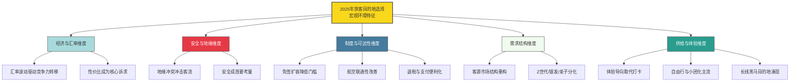

这一框架揭示了一个核心判断：**2025年的目的地选择已不再由单一因素决定，而是由"经济—安全—制度—需求—供给"五大维度多重变量的动态交互所共同塑形**。后续章节将依次深入这些维度——第2章聚焦签证政策与交通连通性，第3章剖析经济汇率与安全地缘，第4章探讨气候因素，第5章解构数字技术与品牌营销，第6章分析文化体验与可持续发展，第7章拆解客群结构差异化，第8章构建综合决策模型，最终在第9章归纳结论与展望2026年趋势。

需要指出的是，本章数据梳理过程中也发现了**若干口径差异与不确定性**：例如UN Tourism的国际游客到访量口径（4%增速）与WTTC的旅游产业GDP口径（4.1%增速）虽方向一致但内涵不同，前者为人次统计，后者为经济贡献统计；又如赴日游客数据在不同来源间存在差异，泰国市场表现在城市榜单（曼谷仍居全球第一）与中国客流变化（赴泰人次大幅下滑）之间也形成有趣反差[^6][^22]。这些口径差异与统计窗口的差别，本研究将在后续章节中按主流权威口径选用，并在涉及关键论断时进行必要的多源交叉验证，以确保分析结论的稳健性。

# 2 签证政策与交通连通性因素

如果说第1章勾勒出的"K型分化""体验导向""客源重构"构成了2025年全球旅游格局的骨架，那么签证政策与交通连通性则是支撑这一骨架的**底层基础设施**——它们决定了"游客能否抵达"以及"以何种成本抵达"，是所有其他影响因素得以发挥作用的前提条件。第1章的总览数据已暗示了这一逻辑：中国入境外国人同比增长26.4%、免签入境同比激增49.5%、上海入境游客同比增长39.58%等爆发式增长背后，是240小时过境免签、单方面免签扩容、国际航班恢复、第七航权落地、跨境支付互通等一系列制度型开放与基础设施供给的协同结果。本章将从"软"的签证政策与"硬"的交通连通性两条主线切入，配以支付与服务等"最后一公里"配套，系统验证**"制度开放度+交通可达性+消费便利化"三位一体协同机制**对游客流入量的放大效应，并通过中美、中泰、中欧、中日、中韩等不同政策导向案例的横向对照，揭示制度方向选择对目的地客流命运的决定性影响。

## 2.1 免签政策扩容的红利释放与客流转化效应

2025年中国免签政策的多维扩容，构成了入境游爆发的最核心制度变量。截至2025年底，**中国单方面免签国家增加至48国、互免签证国家扩大至29国、对中国单方面免签国家增至28国**[^24][^25]，加上240小时过境免签覆盖的55国，免签政策覆盖国家总数扩大至77个[^26]。这一密集的政策矩阵从根本上重塑了外国游客来华决策路径——出游计划不再受签证申请周期与材料门槛的硬性约束，"买张机票就能飞过来"的低成本决策模式开始普及[^27]。

**最直接的红利体现在客流量的跃升**。国家移民管理局数据显示，2025年免签入境外国人达**3008万人次、占入境外国人73.1%、同比上升49.5%**[^24][^28][^25]——这一数字意味着**每4个入境外国人就有3个免签**[^28]，免签已从政策选项升级为入境的主流通道。商务部研究院国际服务贸易研究所的报告进一步印证了这一结构性变化：2025年中国旅行服务出口规模升至551.6亿美元、同比大幅增长49.1%、是2019年的1.6倍，**增速远高于同期我国服务出口整体13.9%的水平**[^26]，旅行服务贸易逆差同比下降7.2%[^26]。

**免签对客源结构的重构作用尤为深刻**。从客源国排序看，韩国、泰国、新加坡、马来西亚、日本位列前五大来源地——**全部为免签国家**[^26]，这一巧合性证据本身即印证了免签的引流效应。在远程客源市场，2025年6月1日起中国单方面免签"朋友圈"首次拓展至拉美和加勒比地区，**巴西、阿根廷等5国公民可免签来华30天**[^29]；6月9日起对沙特、阿曼、科威特、巴林试行免签，加上此前已与中国全面互免签证的阿联酋、卡塔尔，**中方已实现对海合会国家免签"全覆盖"**[^29]。这一区域性突破的市场效应在客流数据中得到了快速验证——2024年通过单方面免签政策来华的外国人总人次多达339.1万、同比增长**1200.6%**[^29]，"五一"假期适用免签政策入境38万人次、同比增长**72.7%**[^29]。

**俄罗斯市场是免签红利最具戏剧性的样本**。在线旅游平台数据显示，2024年韩国、新加坡、马来西亚为前三客源国，但**俄罗斯客源年增幅高达205%**[^27]；2025年9月和12月，中俄先后向对方试行免签政策后[^30]，三亚酒店2024年接待俄罗斯入境游客约17万人、**2025年增至35万人**[^30]，俄游客占三亚入境游客的40%以上、中俄互免签证实施刚满一个月三亚大东海旅游区日均接待俄游客超过3000人次[^30]；上海2025年俄罗斯入境游客实现超50%的同比增长、海南2025年俄罗斯贡献了超过三分之一的入境客源、超50万人次、同比增长超120%[^31][^25]。携程《2026马年春节旅游市场预测》显示，**俄罗斯游客入境预订单同比激增471%**[^28]，俄罗斯旅游运营商协会预测2026年夏季中国赴俄旅游人数将比去年同期增长约30%[^30]。

将2025年中国免签政策矩阵与对应的客流响应整合，可清晰呈现免签作为"流量引擎"的因果链条：

| 免签政策类型 | 2025年覆盖范围 | 关键客流响应 |
|------------|--------------|------------|
| 单方面免签 | 48国（新增巴西、俄罗斯、瑞典等11国） | 单方面免签来华人次同比增1200.6%（2024口径） |
| 互免签证 | 29国（含海合会全覆盖） | 中俄互免后三亚俄客单月超3000人次/日 |
| 对中国单方面免签 | 28国 | 中国护照通行度升至全球第60位 |
| 240小时过境免签 | 55国60口岸 | 过境免签人数同比增60.8% |
| 海南区域免签 | 86国 | 入境免签旅客占比88.9% |
| 西双版纳东盟免签 | 东盟10国旅游团 | 磨憨口岸验放东盟旅游团超160个 |

数据来源：综合国家移民管理局、商务部研究院、各地文旅局公告

值得注意的是，**免签红利并非无差别普惠**。商务部研究院数据显示，2025年来自俄罗斯、意大利、澳大利亚的远程客源增速尤为突出，**上海一地的俄罗斯游客单月平均增幅在免签政策落地后迅速攀升至80%以上**[^26]——这与第1章观察到的上海第四季度俄客增幅一致。与此同时，免签政策红利在**周边亚洲国家与新兴市场（中亚、中东欧、拉美）**之间形成了双轮驱动：携程平台数据显示2025年东南亚游客赴华呈现多元化趋势，**重庆年浏览量增长率359%、张家界等自然景区搜索量同比增长110%、故宫等文化地标热度增幅超80%**[^32]；上海更凭借免签红利成为泰国游客首选目的地，**预订量同比增长334%**——已超越东京（增长71%）、大阪（增长132%）、香港（增长52%）[^32]。这意味着免签不仅在打开"流量水龙头"，更在重塑全球旅游地图中亚洲城市的相对位置。

## 2.2 过境免签与区域性免签的精准引流作用

如果说全国性免签政策构成了入境游的"主水管"，那么240小时过境免签与海南、西双版纳、黑河等区域性免签则发挥着**精准引流**的"分支管道"作用——它们不仅放大了门户城市的接待量，更将客流引向此前难以触达的非门户目的地与边境腹地，实现了入境游的下沉与扩散。

**240小时过境免签的"流量倍增"效应**最具代表性。该政策从原有72小时和144小时统一延长至240小时（约10天），覆盖范围从24个省（区、市）的60个口岸进一步扩展至65个口岸，并实施跨区域通行[^33][^34]。政策实施一周年时（2024年底至2025年底），**全国各口岸入境外国人达4060万人次、同比增长27.2%，其中适用240小时过境免签人数较政策优化前同比大幅增长60.8%**[^33][^34]。从口岸分布看，效应高度不均衡——**厦门口岸相关入境人数增长超3倍、辽宁口岸增长5.7倍、长沙与张家界口岸的免签外国人数已超此前近九年总和**（前文已述），表明240小时窗口期足以支撑一次跨区域多城市行程，从根本上拓宽了游客的"地理选择半径"。

**地理半径的拓宽直接带动了非门户城市的崛起**。携程海外平台数据显示，**中国四五线城市目的地入境游规模年均增速高达134%**，黔南、黑河、湘西等地2025年增长尤为亮眼；**重庆凭借独特城市地貌和国际社交媒体热点效应，入境客流同比增长170%；山西大同云冈石窟相关票量同比激增7倍**[^26]。景德镇案例尤为典型——2025年接待入境游客**15.08万人次、同比增长39.63%**，入境旅游花费8996.41万元、同比增长44.59%[^35]；240小时过境免签政策在景德镇落地实施后，自由行及深度体验类游客停留时间延长至4-7天，景德镇平均停留时间达**2.73天、较2024年增长0.53天**[^35]，入境游客中**18-35岁占比达55%**[^35]。这一案例验证了240小时窗口期对深度文化体验型目的地的特殊适配性。

**区域性免签则展现出政策精细化的差异化威力**。三大区域性免签呈现三种不同的引流逻辑：

第一，**海南86国免签**构成了最为开放的区域性政策窗口。截至2025年底海南"免签朋友圈"扩大至86个国家[^36]，海南2025年接待入境游客超过150万人次、同比增长35.2%[^25]，**入境免签旅客占比高达88.9%**——已远超全国73.1%的平均水平，三亚入境过夜游客规模首次突破百万大关达106.14万人次、同比增长41.38%。

第二，**云南西双版纳东盟旅游团免签**面向特定客群与区域。2025年2月10日起对马来西亚、泰国、老挝等10个东盟国家实施旅游团入境西双版纳免签政策，**作为政策核心枢纽的磨憨口岸验放东盟10国出入境旅游团超160个**[^37]，叠加中老铁路等基础设施，形成了"铁路+免签+旅游团"的精细化产品链条。来自老挝和泰国的游客通过中老铁路四日游西双版纳的模式开始普及，"中国的自然风光和中国文化"成为吸引东盟游客的核心标签[^37]。

第三，**黑河等边境口岸对俄免签**聚焦邻国短途客流。黑河口岸对俄免签后，**2025年9月至10月入境俄籍旅客达4.6万人次、同比增长28.4%**，174人的旅游团借助高效通关服务**20分钟即可完成查验**[^37]。

这三类区域性免签对全国免签矩阵形成有效补充。中国旅游研究院院长戴斌指出"免签政策极大提升游客潜在的出游意愿，降低游客来华旅游的成本"[^27]，复旦大学张朝枝则补充"中国的国际形象不断改善、国际影响力不断提高，这是最底层的原因"[^27]——可见**政策红利之所以能转化为客流红利，最终仍需软实力作为底层支撑**。这也部分解释了为何同样的过境免签政策对不同目的地的拉动效应差异巨大：景德镇凭借陶瓷文化IP、重庆凭借城市地貌+社交媒体热点、大同凭借云冈石窟世界遗产，均能在政策窗口期内实现客流的指数级增长，而部分缺乏独特资源禀赋的口岸城市则难以充分捕获这一红利。

## 2.3 通关便利化与口岸服务能力升级

签证政策从"纸面规则"转化为"实际客流"的关键，在于口岸通关环节的执行效率与服务体验。2025年中国移民管理领域推出的一系列**通关便利化举措**，使签证开放的制度红利得以无障碍地传导至游客的入境体验，构成了"近悦远来"环境的关键一环。

国家移民管理局披露的2025年制度型开放清单系统勾勒了这一升级路径：**内地居民换发补发出入境证件"全程网办"试点城市增至50个；扩大24小时直接过境免办查验手续适用口岸；在全国旅检口岸统一实施过境免签临时入境许可受理签发和入境边检手续一次办结；在上海市试点推行电子口岸签证；推行外国人入境卡网上填报；推广应用"刷脸"智能通关；在云南河口等部分口岸试点建设车辆快捷通关系统；支持二连浩特等公路口岸货运通道试行7×24小时通关**[^24]。这些举措共同将通关从传统的"行政管控环节"重构为"服务体验环节"。

具体到核心枢纽口岸的实战效果，第1章已提到北京首都国际机场3号航站楼推行"双排并检"模式使**入境高峰时段外籍人员通关效率提升约30%**，上海启用电子填报自助终端与多语种服务等。这些软硬件升级的边际效应在春运、清明等高峰期尤为显著——2025年春运期间，**全国口岸日均出入境人员预计超230万人次、较去年同期增长11.1%**[^34]；2026年一季度全国累计查验出入境人员**1.85亿人次、同比上升13.5%**[^38]。**杭州在清明期间出入境客运航班超250架次、较去年同期增长5.5%；出入境旅客日均峰值达1.6万人次、总流量近4.5万人次、同比增长超16%**[^34]——其中港澳台地区、新加坡、马来西亚入境旅客同比增加超30%，这一增量在没有通关效率提升的前提下是难以承接的。

值得关注的是，**通关便利化与免签政策呈"乘数效应"而非"加法效应"**。免签政策降低了"是否来华"的决策门槛，通关便利化则降低了"是否再次来华"的复购门槛——根据UN Tourism及行业调研，外国游客对入境的"程序友好度"敏感度极高，一次糟糕的通关体验可能足以抵消整个旅程的正面印象。国际旅游行业媒体《旅行与旅游世界》明确指出"中国出入境便利化政策红利的不断释放是实现增长的主要推力，对跨境旅游和消费的促进作用显著"[^34]，**中国作为全球领先旅游目的地的地位比以往更加稳固**[^34]。这一外部第三方视角的判断，对通关便利化与免签政策的协同价值给予了客观确认。

## 2.4 全球签证政策导向的差异化对比

要准确评估签证政策对目的地选择的影响权重，仅有中国案例的纵向数据是不够的——必须通过**横向对比不同政策导向下的市场后果**，才能验证"政策方向→客流命运"的因果链条。2025年全球主要客源地与目的地的签证政策呈现出鲜明的**"开放-收紧"光谱**，其市场结果的强烈分化构成了关于这一命题最直观的自然实验。

**中国处于光谱的"持续开放"端**，已如前述以免签扩容带动入境外国人同比增长26.4%、免签入境同比增长49.5%。**韩国紧随其后，向中国游客推出阶梯式签证便利化**：2025年9月对中国团体游客实施临时入境免签[^39]、3月30日起向有访韩记录的中国公民发放5年多次往返签证、对中国14个主要城市（北京、上海、广州、深圳、苏州、厦门、天津、南京、杭州、宁波、武汉、长沙、青岛、重庆）的居民签发**10年多次往返签证**[^40]。政策效应立竿见影——**2025年赴韩中国游客约570万人次**[^41]（2023年200万、2024年460万）、2025年第一季度赴韩中国游客145万人次同比增长29%[^42]、2025年10月单月访韩中国游客47.2万人次同比增加20%[^39]。韩国旅游业界已正式提议将免签政策延长，韩国文化体育观光部部长崔辉永明确提出"力争使2027年（中韩建交35周年）成为开启两国人员交流'千万时代'的元年"[^40]。

**泰国处于光谱的"反向收紧"端**，构成最具警示意义的对照案例。泰国曾于2024年7月将免签计划扩大至93个国家、单次停留期最长60天[^43]，但运行不到一年负面问题集中暴露——**部分外籍人士非法务工、逾期滞留、灰色产业链钻空、低消费游客挤占资源**[^44][^43]。2025年泰国旅游与体育部长素拉萨明确启动政策评估，**消息人士称免签适用国家数量可能从93个回调至最初的57个、甚至进一步收紧**[^44][^43]。政策反转的市场代价是直接的：泰国旅游与体育部数据显示，**2025年上半年赴泰外国游客累计1668.5万人次、同比减少4.66%、创收同比减少2.31%**[^45]，泰国旅行社协会估计2025年中国赴泰游客可能仅有500万人次、其中真正团体游客只有约100万人次[^45]，泰国正式转向"高价值、长停留"（high-value, long-stay）战略[^44]。这一案例表明：**免签的边际效应可能因游客质量参差而出现拐点，目的地若无法解决"流量与秩序"的平衡问题，反而可能因过度开放而被迫收紧**。

**美国处于光谱的"全面收紧"端**，构成移民政策导向冲击旅游业的典型案例。WTTC数据显示，**受美国政府收紧移民政策等因素影响，2025年赴美外国游客同比下降6%、相关消费同比下降7%**[^46][^47][^48]。"包括哥伦比亚人和墨西哥人在内的拉丁美洲游客赴美次数减少，仍赴美的墨西哥游客行程趋于缩短"——年轻人改赴西班牙（接待逾9650万人次）、法国（接待1.05亿人次）等欧洲国家旅游[^46][^47]，使法、西成为2025年全球最受欢迎的旅游目的地。

**欧盟正进入"数字筛查升级"阶段**，构成中长期影响力潜在变量。欧盟出入境系统（EES）于**2025年10月12日开始在申根区外部边境分阶段引入，预计到2026年4月10日全面实施**[^49]——该系统将自动登记非欧盟旅客的姓名、证件、出入境信息及生物识别数据（面部图像和指纹），数据保存3年零1天[^49]。**ETIAS（欧洲旅行信息与授权系统）则计划于2026年第四季度推出**[^50][^51]，免签证的非欧盟国家公民（如美国、加拿大、澳大利亚、日本等国旅客）在进入申根区前必须申请ETIAS授权，授权有效期为3年或至护照到期，**申请费用为20欧元（早期版本为7欧元）**[^50][^51]。该系统通过与申根信息系统、签证信息系统、欧洲刑警组织和国际刑警组织数据库交叉核对进行风险评估，"性质类似于美国的ESTA系统"[^50]。虽然欧盟设置了至少6个月的过渡期与6个月的宽限期[^51]，但ETIAS对赴欧旅客（尤其是亚洲免签国家公民）将构成新增的程序性门槛，可能在2026-2027年阶段性影响赴欧旅游决策。

**日本则呈现"客群筛选"的另一类收紧导向**。2025年10月16日日本实施近十年最严经管签新政——**资本金从500万日元飙升至3000万日元（约145万人民币）、强制雇佣本地人、日语N2成硬指标、需3年管理经验或经营相关硕士学历、商业计划需专业人士背书**[^52]。新政落地后的6个月内，**月均申请量从1700件骤降至70件、跌幅约96%**[^52]。这一案例虽聚焦于经营管理签证而非旅游签证，但反映了日本对"以居留为目的的伪旅游/伪经营"的系统性收紧倾向。叠加2025年11月中国外交部发布的赴日旅游风险提示，**大阪府内约20家酒店12月底前的中国游客订单取消率已达50%-70%**[^39]、**日本观光厅数据显示2025年1-9月中国内地游客消费额为1.6443万亿日元（占入境消费23%）、经济学家估算中国游客减少可能给日本造成1.79万亿日元的经济损失**[^39]——这一案例从反向印证了客源大国与目的地国双边关系紧张如何在签证、消费、客流多个维度叠加传导（详细的地缘维度分析将在第3章展开）。

将上述五类政策导向整合，可形成"政策方向→客流命运"的清晰对照图谱：

| 政策导向 | 典型国家/地区 | 2025年关键政策 | 市场结果 |
|---------|------------|--------------|---------|
| 持续开放扩容 | 中国 | 单方面免签48国、240h过境免签55国 | 入境外国人+26.4%、免签入境+49.5% |
| 阶梯式定向开放 | 韩国 | 14城10年多次签证、团体免签 | 赴韩中国游客570万人次 |
| 反向收紧重置 | 泰国 | 拟将免签从93国回调至57国 | 上半年外国游客-4.66% |
| 移民政策传导 | 美国 | 边境管控收紧 | 赴美游客-6%、消费-7% |
| 数字筛查升级 | 欧盟 | EES（2025.10起）+ETIAS（2026Q4） | 非欧盟旅客新增程序性门槛 |
| 客群质量筛选 | 日本 | 经管签3000万日元门槛 | 经管签申请量-96% |

这一对照清晰揭示：**签证政策方向与目的地客流量呈强相关关系**——开放即流量，收紧即流失。但同时也提醒决策者，单纯的"数量开放"若无配套的质量管控（如泰国案例），可能因社会承载力问题被迫反转；而单纯的"质量筛选"若过于严苛（如日本经管签案例），又可能错杀潜在的高价值客源。**最优解似乎指向"开放扩容+精细管理"的中国模式**——这也是中国免签政策能在2025年实现量与质双重突破的关键。

## 2.5 国际航空网络恢复与航权开放的可达性重塑

签证政策解决了"能否来"的制度门槛，国际航空网络则解决了"如何来"的物理可达性。2025年中国国际航空市场的恢复与扩张，构成了入境游爆发的另一根支柱。**2025年我国国际航班恢复至2019年90%以上、国际旅客运输量同比增长21.6%**[^53][^54][^55][^56]，运输规模连续12个月保持回升[^54]，全行业完成**旅客运输量7.7亿人次同比增长5.5%**、民航总体实现盈利65亿元[^55]，**2025年中国成为全球第一航空人口大国**（航空总人口超5亿）[^55]。

**区域航线表现呈现鲜明的方向性分化**。民航局披露的2025年数据显示，**中亚、西亚、非洲、拉美方向旅客运输量同比分别增长59.3%、33.4%、39.0%、108.6%**[^53][^54][^55][^56]——拉美方向超过翻倍的增长尤为亮眼，主要由"南向通道"新航线开通带动客流翻倍所驱动；中印定期客运航班正式复航，每周新增32班[^54]。这一分化与第1章观察到的"亚太增长极、欧洲稳定、美洲疲软"区域格局高度同频。从全球航协口径看，**2025年国际航空客运量同比增长7.1%、运力增长6.8%**，其中**亚太航空公司全年国际客运量同比增长10.9%为各区域中最高、客座率达84.4%**，欧洲6.0%、中东6.7%，**北美仅增长2.1%为各区域最低**[^57]——这一分化与签证政策导向的分化形成"政策—航空"的双重共振。

**第七航权落地海南**则是2025年中国航空开放史上最具突破意义的事件。2025年12月22日，**由哈萨克斯坦斯卡特航空公司执飞的"三亚⇌布拉格"航线DV482航班顺利抵达三亚凤凰国际机场——这是海南自贸港开通的首条第七航权航线，也是中国首条第七航权客运航线**[^58][^59]。第七航权作为"完全第三国运输权"，允许"A国的航空公司在B国和C国之间经营独立的航线业务，而无需返回本国"[^58]，被业内人士形象地比喻为**"海外开店权"**[^59]。在此之前，"我国仅对个别国家在个别城市开放货运第七航权，但同时放开客运、货运第七航权尚属首次，海南因此成为我国第一个全面开放第七航权的省份"，海南省交通运输厅民用航空办公室主任贺邦称这是**"中国民航史上力度最大的一次航权开放"**[^58][^59]。

第七航权对目的地选择的实质意义在于：捷克游客维罗妮卡的话最为直观——**"以前如果要来海南，我们得先去中东的机场中转，花的钱更多，耗时也更长"**[^58][^59]，这一直飞航线让她可以"说走就走"。海南作为整体的航空枢纽地位也因此跃升：**2025年海南累计开通国际及地区客运航线92条、旅客吞吐量超240万人次同比增长33.64%、通达23个国家及港澳地区45座城市**，形成基本覆盖RCEP国家、连接"一带一路"的"两洋枢纽"格局[^36]。海南"免签朋友圈"扩大至86个国家、累计开通**14条第五航权客货运航线和1条第七航权客运航线**[^36]，正加速从国内旅游"终点站"转变为链接太平洋与印度洋的"世界级枢纽"。哈萨克斯坦阿斯塔纳航空公司开通的"三亚⇌阿斯塔纳""三亚⇌阿拉木图"两条国际航线**平均客座率超过90%**[^58][^59]，验证了第七航权航线的市场可持续性。

**国际货运航线的扩张**则补充了航空连通性的另一维度。2025年全年中国民航新开通货运航线累计达**247条，其中国内航线38条、国际航线209条**；新开通货运国际航线中亚洲102条、欧洲81条、北美17条、非洲3条、大洋洲3条、南美洲3条；目前已通航50个国家的106个城市[^60]。**我国航空企业国际货运市场份额达44%、同比提高3个百分点**[^53][^55][^56]——这虽不直接对应客流，但货运网络的密度提升通常预示着客运网络的潜在扩张。

将2025年国际航空网络的关键变化与目的地可达性的重构整合：

```mermaid
graph LR
    A[2025国际航空网络扩张] --> B[航班数量恢复]
    A --> C[航权制度突破]
    A --> D[新方向网络开拓]
    
    B --> B1[国际航班恢复至2019年90%+]
    B --> B2[国际客运量+21.6%]
    
    C --> C1[海南第七航权落地]
    C --> C2[第五航权14条+第七航权1条]
    C --> C3[海南"两洋枢纽"]
    
    D --> D1[中亚+59.3%]
    D --> D2[西亚+33.4%]
    D --> D3[非洲+39.0%]
    D --> D4[拉美+108.6%]
    D --> D5[中印复航+32班/周]
    
    B1 --> E[目的地可达性重塑]
    C1 --> E
    D5 --> E
    
    style A fill:#f9d71c,stroke:#333
    style E fill:#2a9d8f,stroke:#333,color:#fff
    style C fill:#e63946,stroke:#333,color:#fff
```

民航局规划，"十五五"时期将"扎实推进空中丝绸之路建设走深走实，不断优化'3+7+N'国际航空枢纽功能体系，统筹推进'一圈六廊五通道'国际航线网络建设"[^55]，**2026年力争完成旅客运输量8.1亿人次**[^55]。这意味着航空连通性这一基础设施级要素将继续成为目的地竞争的关键变量。

## 2.6 高铁网络扩展与铁旅融合的国内目的地重构

如果说国际航空网络重塑了入境游的全球可达性，那么国内高铁网络的密织则深刻重构了国内旅游的目的地格局，并通过"高铁+免签+入境游"的链式反应，间接放大了外国游客的中国行半径。**2025年中国高铁营业里程突破5万公里**[^61][^62]，"八纵八横"高铁网加密成型，中国铁路旅客发送量超过46亿人次创下新纪录、**高铁承担了超过七成的运输任务**[^63]，2026年春节假期全国铁路累计发送旅客**1.21亿人次同比增长11.5%**[^63]。

**新线开通对目的地格局的重塑作用是直接的**。2025年12月26日西安至延安高铁开通运营（标志中国高铁营业里程突破5万公里）、包银高铁全线贯通使银川与石嘴山、乌海等沿线城市形成"2小时文旅圈"、**沈白高铁结束了通化、白山两市不通高铁的历史，让东北的冰雪风光、红色文化、民俗风情加速"出圈"**[^64]、太子城至锡林浩特铁路项目将打通北京与内蒙古快速客运通道[^63]。这些新线的核心价值不在于"提速"本身，而在于**"将核心城市的庞大消费力，导入藏在深闺的旅游目的地"**[^64]——曾经的偏僻村落，凭借快捷的铁路网成为热门旅游目的地。

**贵州案例验证了"市市通高铁"对全域旅游的撬动效应**。从2014年贵广高铁正式运营到2025年盘兴高铁通车迎客，贵州用11年时间成为**西南首个实现市（州）行政中心所在地高铁全覆盖的省份**[^65]。重庆、成都、昆明、长沙、南宁均在贵州的3小时高铁圈内，从贵阳到各市州主要城镇最快20分钟、最慢2小时以内[^65]——满足了"5小时旅游经济圈"黄金标准下"高铁行程在5小时以内的目的地，对游客的吸引力呈指数级上升"的规律[^65]。市场结果立竿见影：**2026年春节假期贵州省累计接待游客3269.24万人次、实现旅游总花费217.35亿元，按可比口径同比分别增长14.62%、15.08%**[^65]；兴义万峰林300余家民宿"春节前的订单已经排到正月十五，其中七成是通过高铁线路而来的游客"，**盘兴高铁开通不足两月、民宿预订量较去年同期暴涨150%**[^65]。

**铁旅融合的新业态**则将单纯的"交通运输"升级为"消费场景"。2025年呈现四类典型创新：第一，**银发旅游列车**——商务部、文化和旅游部等九单位联合出台《关于增开银发旅游列车 促进服务消费发展的行动计划》后，全国多地开出银发旅游列车，"多点串联、在途观光、车随人走、昼游夜行"，对灯光、扶手、座椅、厕所等进行了适老化升级[^64]。第二，**主题旅游列车**——"熊猫专列·成都号"**超过70%的客人是入境游客**，深度融合文化IP、提供全包式高端体验[^64]，"星光燕赵号""津旅时光号"聚焦省域短线，"彩云之南·昆明号"贯穿"大滇西旅游环线"。第三，**特定兴趣社群专列**——"球迷专列""歌迷专列""研学专列"将交通运输转变为充满仪式感的特色场景[^64]。第四，**计次票与套票**——长三角"畅游沪宁杭"等旅游计次票以"1次购买、分段乘坐"模式，"通过价格联动降低游客综合成本，延长了游客停留时间，释放了更深层的消费潜力"[^64]。

**高铁站本身也在功能升级**——山西大同南站建起了旅游集散中心、贵州黔东南三穗高铁站建成游客服务中心整合全州旅游信息[^64]，使高铁站从旅程的"过路点"升级为区域旅游的"会客厅"。

**外媒视角下的中国铁路旅游**已具有引领性意义。全球知名旅游媒体平台《旅行与旅游世界》明确指出"**铁路网络不再仅仅是交通工具，更成为中国旅游业的重要驱动力，推动中国成为全球铁路旅游的领军者**"[^63]，文章特别提到"前往作为联合国教科文组织认定的世界文化与自然双重遗产黄山风景名胜区变得更加便捷"[^63]。规划层面，**到2030年中国铁路营业里程将达到18万公里左右，其中高铁里程约6万公里**[^63]，将继续支持中国的经济增长和可持续旅游发展。

值得强调的是，**高铁网络的重塑作用在入境游与国内游之间形成了良性传导**：以西安陕西历史博物馆为例，**入境游订单占比接近50%**[^26]，这种深度文化体验目的地能够吸引海外游客，正是依赖于"上海/北京口岸入境→高铁直达西安→历史文化深度游"的完整可达性链条。同理，景德镇、大同等内陆城市的入境游爆发，也得益于"门户城市免签入境+高铁延伸至腹地"的复合型可达性。

## 2.7 支付便利化与多语种服务的配套生态

签证开放与交通可达只是入境游的"前两公里"，**支付便利化、多语种服务、退税系统等配套生态**则构成了决定流量价值变现的"最后一公里"。2025年中国在这一维度的系统性升级，将"游客愿意来"转化为"游客花得爽、回得去还推荐"的完整闭环。

**跨境支付互联互通迎来实质性突破**。微信支付2026年初宣布**韩国、斯里兰卡、泰国、马来西亚、新加坡五个国家的支付二维码接入微信支付**——这并非零散商户的单点合作，而是与相关国家的支付基础设施实现了**合规化全面互通**[^38][^66]。中国游客在这五国"无需切换多款支付软件或提前兑换外币，只需携带一部手机、打开微信，就能轻松实现相关国家线下多场景消费"[^38][^66]。截至发布时点，**微信跨境支付已覆盖全球78个国家和地区、支持36种货币；蚂蚁国际旗下的全球钱包整合网关Alipay+连接了全球40多个电子钱包，2025年已与10多个国家二维码网络达成合作，覆盖全球100多个市场超过1.5亿商户和18亿消费者账户**[^38][^66]。

**入境支付的双向便利化同样关键**。中国一方面推动**"外卡内绑"**（境外银行卡可绑定支付宝或微信在境内商户消费），另一方面支持**"外包内用"**（越来越多境外电子钱包通过与境内支付机构合作可在国内使用）[^38][^66]。**2025年全年超1000万入境用户使用支付宝"外卡内绑"和Alipay+"外包内用"两类便利支付服务，相关入境消费同比增长超100%**[^38][^66]。这一数据直接破解了入境游"消费转化"的核心痛点——**携程《2025入境游调研报告》指出外国游客在酒店入住过程中仍面临"支付不便、语言沟通障碍、无烟环境执行不严"三大痛点**[^67]，其中支付不便居首；当外国游客无需绑定中国手机号、无需开通中国账户、无需兑换大量现金即可完成酒店、餐饮、交通、购物的全场景支付时，免签红利才能完整转化为消费红利。

**离境退税"即买即退"的全国推广**则在出境环节进一步释放消费潜能。第1章已援引数据显示离境退税"即买即退"措施推广满一年来全国办理人数同比增长**12.96倍**、退税销售额和退税额同比增长9.35倍。中国旅游集团在第六届消博会上披露的更精确数据显示，**2025年中国银行在全国23个省区市代理离境退税业务达12.27万笔、退税销售额高达41.23亿元、同比增长42.43%**[^68]，中国银行还推出"即买即退异地互认机制"、创新"来华通"一站式综合服务APP[^68]。"过境免签+离境退税"组合拳成为入境游消费转化的标配——景德镇也"积极打造支付便利示范区，拓展外卡受理重点商户1007户、外币兑换点68个，投放标准化'零钱包'22301个"[^35]。

**酒店业的多语种与AI化升级**则补齐了住宿环节的体验短板。位于上海人民广场的珍宝酒店使用携程商家助手搭载的AI多语言客服系统后，**日均外宾咨询处理时间从半天缩短至30分钟**，**2025年上半年入境客流订单量占比已经提升到75%**——即每4位住客中就有3位来自境外[^67]。上海南新雅皇冠假日酒店"通过参与OTA平台的机酒打包套餐和海外大促等活动，**2025年第二季度入境订单同比增幅达到90%**"[^67]。北京、上海、广州等枢纽口岸开设专用通道、推行"一站式办理"，为入境游打造**"AI客服+多语言+全球营销"**的服务闭环。

**痛点仍存但改善方向清晰**——携程报告指出经济型酒店多语言服务能力有限、餐厅菜单未有外文版本、特殊饮食需求难以满足、部分酒店对非吸烟楼层执行不严等问题仍待破解[^67]。但行业整体趋势清晰：**"酒店是外国游客接触中国的'第一站'，服务是否国际化、细节是否到位，直接影响他们对中国的第一印象"**[^67]。

## 2.8 制度开放度与交通可达性的协同效应验证

将本章前述各节的数据与机制整合，可清晰构建出**"签证便利化×交通连通性×支付服务化"三维协同分析框架**——三者并非独立作用于客流，而是形成乘数效应共同放大目的地的吸引力。本节通过典型城市样本验证这一协同机制。

**上海是协同效应最具说服力的样本**。作为"中国入境游第一站"，上海2025年入境游客**936.02万人次同比增长39.58%、外国游客713.9万人次同比增长近五成**[^31][^25]——其增长背后是240小时过境免签覆盖、对俄/拉美/海合会等多轮免签扩容、国际航班加密、上海试点电子口岸签证、外卡内绑+离境退税即买即退、AI多语言酒店服务等一系列举措的同时发力。客源结构呈现"亚洲基本盘+远程增长极"格局——**韩国90.9万人次同比增长103.6%、泰国70.16%、印度尼西亚与意大利等增速超50%**[^31][^25]，每一项增长都能在政策矩阵中找到对应支撑。

**北京呈现类似但侧重不同的协同模式**——2025年北京接待入境游客**548万人次同比增长39%、入境旅游花费505.6亿元同比增长44.7%**[^28][^25]，亚洲游客同比增长43%、欧洲与美洲分别增长47.9%和35.6%[^25]。北京模式的特色在于其"大额刷卡、小额扫码、现金兜底"的入境游客友好型支付生态——截至2025年底全市约1.8万家重点商户实现外卡受理全覆盖[^69]，叠加首都机场"双排并检"通关效率提升30%，构成了门户城市的标准化协同范式。

**景德镇案例则验证了协同效应在非门户城市的下沉可能**。这座"千年瓷都"2025年接待入境游客**15.08万人次同比增长39.63%、实现入境旅游花费8996.41万元同比增长44.59%**[^35]——增长率甚至略高于上海。其核心驱动包括：240小时过境免签政策落地、外卡刷卡与扫码支付全覆盖、外卡受理重点商户1007户与外币兑换点68个、机场和高铁站电话卡流量卡便捷办理、邮政与顺丰双语服务点（**2025年景德镇市国际/港澳台快递业务量超4万件同比增长277.8%**）[^35]。值得强调的是，**入境游客平均停留时间达2.73天较2024年增长0.53天，自由行及深度体验类游客停留时间延长至4-7天，入境游客中18-35岁占比55%**[^35]——这意味着协同生态不仅吸引了客流，更显著提升了停留质量与消费深度。

**贵州、海南、海南三亚则呈现交通连通性主导的协同模式**。贵州凭借"市市通高铁"+"5小时高铁圈"实现2026年春节假期旅游总花费同比增长15.08%[^65]；海南凭借86国免签+第七航权落地+92条国际航线，构建"两洋枢纽"，三亚入境过夜游客突破百万大关[^36][^25]。新加坡作为入境目的地的对照案例同样验证了这一逻辑——中新互免签证使**2024年中国游客达308万人次同比增长126%**、**2025年中国大陆以310万人次稳居新加坡第一大客源国、贡献旅游收入36.8亿新元**[^70]。

将上述协同机制的核心逻辑可视化：

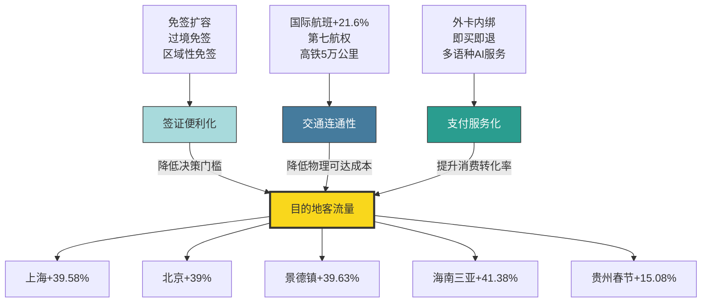

这一协同框架与第1章观察到的UN Tourism判断高度同频——**"航空联通性改善和签证便利化措施的加强，是2025年国际旅游强劲增长的有力支撑"**。截至2025年10月全球国际航空运力和国际航空客运量均增长7%[^57]，这一全球趋势在中国市场以更显著的方式展现：免签入境占比73.1%、国际航班恢复90%以上、入境消费同比增长超100%——三组数据共同构成了"制度开放度+交通可达性+消费便利化"三位一体协同机制的实证。

**本章的核心结论可归纳为三点**。**第一，签证政策是2025年目的地客流量的最显著外生变量**——开放即流量、收紧即流失，中国免签扩容、韩国14城10年签、美国移民收紧、泰国免签反转、欧盟ETIAS上线、日本经管签新政等案例形成了清晰的政策方向→市场结果对照图谱。**第二，交通连通性是签证红利得以转化的硬约束**——国际航班恢复90%、第七航权落地、高铁5万公里里程构成了从全球到区域的多层次可达性网络。**第三，支付服务化是流量价值变现的"最后一公里"**——五国二维码接入微信支付、外卡内绑覆盖超1000万入境用户、即买即退退税销售额增长9.35倍，使免签客流真正转化为消费贡献。

**这一基础设施级要素的协同机制，将作为后续各章因素分析的基准变量参照**——第3章经济汇率与安全地缘因素、第4章气候因素、第5章数字技术与品牌营销、第6章文化体验与可持续发展、第7章客群结构差异化等所有维度的影响力，最终都需在签证可达、交通可达、支付可达的协同框架内才能完整释放。换言之，**没有制度型开放与交通基础设施作为底盘，其他因素再有吸引力也难以转化为实际的客流变现**——这是2025年中国入境游爆发与美国入境游下滑给出的最直观的政策启示，也是后续章节展开的逻辑起点。

需要指出的是，本章数据梳理过程中也发现**若干口径差异**：例如赴美游客降幅在不同来源间存在5.5%（第1章WTTC口径）与6%（本章WTTC较新口径）的细微差异，本研究选用最新口径；240小时过境免签客流增长口径（27.2%为口岸全部入境外国人增长，60.8%为过境免签人数增长）需明确区分；ETIAS费用在不同来源间存在7欧元（早期）与20欧元（最新）的差异，本研究采用最新口径。这些差异提醒后续章节在引用本章数据时须保持口径一致性，并以最权威、最新的官方公告为准。

# 3 经济汇率与安全地缘因素

第2章揭示了"制度开放度+交通可达性+消费便利化"作为目的地选择的基础设施级底盘，但即使签证开放、航班充足、支付便利，旅客最终是否成行仍取决于两个更具决定性的"门槛性变量"——**经济门槛**（这趟旅行我花得起吗、值不值）与**安全门槛**（这趟旅行我回得来吗、安不安心）。2025年这两类变量的剧烈波动，是全球旅游格局发生"K型分化"的直接推手：人民币温和升值与日元、越南盾、林吉特相对疲软之间的汇率剪刀差，重新分配了出境游的性价比版图；泰柬边境冲突、中日关系骤然紧张、美国边境收紧、俄乌冲突外溢、中东地缘动荡等安全冲击，则在数月之内重塑了多个目的地的客流命运。本章沿"经济变量—安全变量—交互机制"三条主线展开，重点对照第1章观察到的曼谷下滑、东京日本旅游"熄火"、北京俄客飙升、洛杉矶下行等典型现象背后的微观因果链条，验证经济与安全两类因素如何在2025年成为目的地选择权重排序中的"第一梯队"变量。

## 3.1 人民币汇率走势与出境/入境游的反向效应

要理解2025年中国旅客的目的地选择逻辑，必须从人民币汇率的结构性变化切入。第一财经研究院《2025年人民币汇率年报》显示，2025年人民币表现出较强的韧性，**人民币有效汇率指数呈现"先降后升"的走势**——第一财经研究院人民币有效汇率指数由年初99.4下降至年内最低点93.2后于年末回升至97.4,CFETS人民币指数由年初102.1下降至最低95.3后回升至98;人民币对美元汇率在前四个月相对"克制",自5月起呈现单边上涨趋势,出现明显的"补涨"行情[^71]。从货币对维度看,2025年人民币**对美元升值4.4%、对日元升值4.7%、对韩元升值2.5%、对印度卢比升值7.3%、对越南盾升值5.4%**,但对欧元贬值7.3%、对瑞士法郎贬值8.5%、对墨西哥比索贬值10.2%[^71]。

这一汇率结构形成了**对中国出境游极不均衡的"性价比再分配"**。一方面,人民币对亚洲主流目的地货币(日元、韩元、越南盾、印度卢比)集体升值,叠加这些目的地本币疲软,使日本、韩国、越南、东南亚等周边目的地对中国游客形成"双重折扣";另一方面,人民币对欧元、瑞郎大幅贬值,使欧洲尤其是西欧、瑞士的旅游成本相对抬升。结合国家外汇管理局发布的2024.12—2025.12世界主要货币对美元变动情况[^72],可勾画出2025年中国游客眼中的"汇率地图":

| 目的地货币 | 2025年对人民币变化 | 对中国出境游性价比影响 |
|----------|------------------|---------------------|
| 日元 | 贬值4.7% | 提升,放大日本"低价旅游"窗口 |
| 韩元 | 贬值2.5% | 提升,叠加签证便利化形成共振 |
| 越南盾 | 贬值5.4% | 显著提升,助推"穷游神话" |
| 林吉特 | 走弱 | 提升,叠加免签扩容效应 |
| 泰铢 | 兑美元升值约8% | 显著降低,加剧泰国"涨价感" |
| 欧元 | 升值7.3% | 降低,西欧旅行成本抬升 |
| 瑞士法郎 | 升值8.5% | 显著降低,确立避险溢价 |
| 美元 | 贬值4.4% | 提升,但被边境政策抵消 |

数据来源:第一财经研究院《2025年人民币汇率年报》[^71]、国家外汇管理局[^72]

**与出境游形成镜像的是入境游侧的"汇率红利"**。入境游客通过将外汇兑换成人民币支付酒店、餐饮和购物等费用,直接推高对人民币的需求。据国家外汇管理局数据,**2025年前三季度入境旅游为中国带来了创纪录的382亿美元资本流入**[^73]。北京、江苏、广东等主要旅游目的地海外游客均激增约40%,带来旅游相关资金流入的双位数增长——**北京2025年接待外国游客消费达到创纪录的506亿元人民币(73亿美元),同比增长45%;广东省接待游客超过9000万人次,消费超过2000亿元人民币,较2024年激增54%**[^73]。

这一"汇率—入境游—人民币需求"循环正在形成自我强化的正反馈。BBVA香港首席亚洲经济学家Xia Le指出"入境旅游未来可能会更加火爆,这可能导致人民币进一步走强";法国农业信贷银行经济学家Xiaojia Zhi补充"入境旅游将持续增长,投资者对中国资产情绪的改善也将推动商务旅行需求"[^73]。从结构性视角看,**这构成了2025年人民币升值的"第二条主线"**——除中国宏观政策落地后经济预期改善之外,中国出口贸易顺差与入境旅游服务出口共同支撑了人民币的强势[^71][^73]。

由此可以提炼出**"人民币升值情景下的反向效应"**这一核心机制:在出境侧,人民币对周边货币的相对升值放大了亚洲短途目的地(日韩、东南亚)的性价比优势,但人民币对欧元贬值则削弱了西欧目的地的相对竞争力;在入境侧,即使人民币升值,中国对欧美及"一带一路"国家游客而言仍因消费水平相对较低、产品丰度高而具有强吸引力,反而因免签扩容、退税便利、汇率结算便捷度提升等因素加速涌入。**这种"出境差异化扩张+入境普遍性爆发"的反向效应,是2025年中国跨境旅游"双向奔赴"格局的微观经济基础**。

## 3.2 性价比驱动:东南亚目的地的洗牌与重排

汇率因素并非孤立作用,而是与目的地物价水平、旅游产品质量共同合成"性价比"这一综合变量,在2025年东南亚目的地的洗牌中表现得淋漓尽致。第1章已勾勒出曼谷虽以3030万人次居全球榜首但中国客流大幅下滑的反差,本节将通过越南逆袭泰国、马来西亚崛起、老挝补位等典型案例,系统解构性价比驱动的微观机制。

**越南"逆袭"泰国是2025年东南亚最具标志性的目的地洗牌事件**。劲旅网整理的公开数据显示:**2025年越南共接待中国游客530万人次同比暴涨41.3%、泰国共接待中国游客447万人次同比暴跌33.6%**[^74][^75]。早在2025年一季度,越南就以160万人次的中国游客接待规模超越泰国的133万人次,并在随后三个季度持续保持领先,最终在全年获得碾压式胜利[^74]。从客源国整体看,**越南2025年接待外国游客总量突破2100万人次创历史新高,旅游收入冲上新高**[^76][^75]。

越南崛起的核心动能呈"三位一体"结构:**第一,航班量爆发式增长**——中越往返航班量从2024年的3万班次猛增至2025年的4.3万班次,**同比暴涨45.23%**,北上广加密与河内、胡志明市、芽庄等越南城市的航线,成都、西安、昆明等内陆城市开辟直飞越南航线[^76][^74][^75]。航班供给放大直接压低了机票价格——经营越南旅游产品的从业者透露"充足的航班量让自由行的客人在某些月份1000元左右就能拿下好时段、好仓位的往返机票,越南'机+酒'类的产品因为超高性价比经常卖爆"[^74]。**第二,极致性价比下沉**——越南成为社交媒体上"穷游神话"的代名词,小红书、抖音上"2500块玩半个月""600块看玻璃海"的分享层出不穷,青旅一晚三四十元、一碗牛肉粉十块钱、景区门票几十元封顶的消费水准,使中国年轻人的"极致穷游"成为可能[^76][^74][^75]。**第三,签证与支付配套**——越南对中国游客实施免签政策、建立跨境二维码支付系统、隆城国际机场预计2026年初投入运营、连接中越的标准轨铁路有望2025年底前开工[^77]。

**泰国失守的逻辑则呈现性价比与安全两类因素的复合冲击**。从经济维度看,**泰铢2025年兑美元升值约8%是亚洲货币中升值幅度第二大的货币**(同期越南盾贬值3%)[^77],这一升一贬直接体现在游客的消费账单上:疫情后泰国酒店、餐饮本就涨价,加上货币升值,**以前人均五千能舒舒服服玩一周,现在没七千块下不来**[^77];开泰研究中心预测2025年泰国酒店收入将萎缩4.5%、入住率下降[^77]。社交媒体上的吐槽更具感染力——"以前在普吉吃顿海鲜人均一两百,现在随便点几个菜就要五六百,快赶上国内一线海滨城市了""在曼谷街头点一碗普通的猪肉末方便面,竟然要价70元人民币"[^75][^77]。

从安全维度看,泰国2025年负面舆情连绵不绝——**1月的"王星事件"、3月的北部地震、6月的总理罢免案、7月的泰柬边境冲突、10月的多地暴雨、11月的南部洪灾**(更详尽的安全冲击在3.4节展开)[^74][^75]。Dragon Trail 2025年4月调查数据显示,**中国人对泰国安全的信心已降至仅19%、有多达51%的人认为泰国不安全**[^77];泰国旅行社协会估计今年预计来的500万中国游客里"真正来休闲度假的可能就100万左右"[^77]。这种"价格上去了+安全感下来了"的双重夹击,使泰国从中国游客心中的"性价比天堂"瞬间跌落,2025年泰国外国游客入境量整体放缓至3300万人次、**同比下降7.2%、为除疫情时期外泰国十年来首次年度下滑**[^78]。

**马来西亚则凭借免签红利+语言优势构建第二条性价比通道**。2025年4月中马互免签证协定正式生效后,**两国公民可免签停留不超过30日**,马来西亚旅游部门2025年的目标是吸引500万中国游客[^77];2024年中马互免签证试行后赴马中国游客已较2023年翻了一倍多[^77]。在语言层面,**吉隆坡、槟城等旅游城市普通话、粤语通行无阻,大大降低了中国游客的出行门槛和陌生感**[^77];林吉特相对走弱也使当地消费对中国游客更具吸引力。马来西亚旅游部进一步推出**2026年"国家旅游年"**,力争吸引4700万国际游客到访,目标提升近三成,通过吉隆坡国际机场试点"无申报快速通关"通道压缩通关时间40%以上、开发医疗旅游与生态探险等高端产品组合[^79]。

将2025年东南亚主要目的地中国客流变化与核心驱动因素整合对照:

| 目的地 | 2025年中国客流 | 同比变化 | 核心驱动 |
|-------|-------------|---------|---------|
| 越南 | 530万人次 | +41.3% | 航班+45%、极致性价比、文化亲近 |
| 泰国 | 447万人次 | -33.6% | 泰铢升值、物价上涨、安全危机 |
| 马来西亚 | 目标500万人次 | 大幅增长 | 互免签证、语言优势、林吉特弱势 |
| 印尼 | — | 26%下降(冲突期) | 边境冲突外溢冲击 |
| 老挝 | — | 48%下降(冲突期) | 边境冲突外溢冲击 |

数据来源:综合劲旅网、第一财经、越南/泰国/马来西亚官方数据[^76][^74][^75][^77][^79]

**这一洗牌的深层启示在于:性价比并非永恒优势,而是一个动态平衡**。越南2025年接待外国游客超2100万人次创历史新高,但产业观察者也敏锐指出隐忧——**"酒店档次参差,交通配套跟不上,服务标准也不统一。多数游客图便宜来一次,但很难成为回头客"**[^76][^74][^75]。如果只靠低价吸引人,迟早会被同类目的地的反向竞争(泰国、马来西亚、印尼正在简化签证、给旅行社返佣、向三四线城市打广告)所"卷"下去。**真正可持续的性价比逻辑,是"流量暴涨期同步升级基础设施、酒店、培训服务,把'便宜'变成'值'"**[^76][^75],这也是后续第6章可持续发展因素需要进一步展开的命题。

## 3.3 消费能力分层与出境游的"双线分化"

性价比因素在中国出境游市场中的作用并非单一指向"低价目的地",而是与**消费能力分层**叠加产生了复杂的"双线分化"——预算敏感型客群涌向越南等极致性价比目的地,高净值客群则继续向欧洲、邮轮、长线深度游迁移,中间客群则在"快行慢游"理念下趋向理性。这一分化深化了第1章关于"体验导向取代打卡导向"的判断,使经济变量在不同客群中的作用权重呈现差异化结构。

**预算敏感型客群以Z世代和年轻自由行群体为主**。携程酒店半年度数据显示,**近8成Z世代偏好300元以下的酒店**[^80],年轻人在境外当地玩乐服务上的平均客单价同比去年增长近20%——但这种客单价提升集中在"该花花"的体验项目而非住宿等"该省省"的环节[^81][^82]。这一"该省省该花花"的消费哲学,与越南"600元看玻璃海""1500元玩13天7城"的分享形成精确匹配[^76]。Booking《2025中国旅客出境游趋势报告》进一步验证Z世代偏好"小众体验,渴望获得契合自身需求的个性化资讯与精选行程"[^83]。

**高净值客群则呈现完全不同的消费图谱**。华凯营销2025年第一季度《中国出境游情绪调查》显示,**预计2025年中国出境游客将达1.55亿人次超过疫情前水平**,**28%的游客每次旅行的预算已超过5万元人民币、49%的游客每次旅行至少花费2.5万元人民币**[^84]。一线城市的游客在奢侈消费方面支出最高,主要集中在购物、美食和高端旅行体验上,旅行费用中最高的是住宿(19%)、机票(17%)和饮食(16%)[^84]。**72%的中国游客今年计划多次出国旅行**,**76%的中国旅客现在提前不到一个月才开始预订行程**——这种"灵活、自发、最后一刻预订"的特征在年轻和高净值旅行者中尤为明显[^84]。从消费目的地看,**欧洲已攀升至第五大旅游目的地超过泰国**(后者从2024年第四季度的第四位跌至2025年第一季度的第七位)[^84],这与人民币对欧元贬值7.3%的"反性价比"逻辑似乎矛盾,但实际反映了**高净值客群对欧元升值并不敏感、更看重稀缺体验与奢侈品供给**的消费弹性差异。

**银发客群与亲子家庭客群形成第三类支线**。Booking报告指出银发一族**容易被熟人"种草"、出发时间自由、旅游时间宽松、旅行时间大多超过一周、住宿方面会倾向选择豪华酒店**[^83];飞猪数据显示**亲子家庭更愿意购买舒适、省心的服务,如邮轮、包车——平台上带娃家庭预订的出境邮轮、出境包车游订单增速均大幅超越大盘**[^81][^82]。这两类客群的共同特征是"为省心溢价支付能力强",汇率波动对其决策权重显著低于Z世代。

将三类客群的经济敏感度差异整合:

| 客群类型 | 汇率敏感度 | 价格敏感度 | 典型偏好目的地 | 决策驱动 |
|---------|---------|---------|-------------|---------|
| Z世代/年轻自由行 | 高 | 极高 | 越南、东南亚、近邻 | 极致性价比+体验稀缺 |
| 高净值客群 | 低 | 低 | 欧洲、长线、邮轮 | 稀缺奢华+独特体验 |
| 亲子家庭 | 中 | 中 | 邮轮、包车、亲子设施 | 省心舒适+服务溢价 |
| 银发客群 | 中 | 中低 | 长线、品质酒店 | 时间宽松+品质保障 |
| 商务客群 | 低 | 极低 | 与业务匹配 | 商务需求驱动 |

这一分层验证了一个关键判断:**"性价比"并非作用于全部客群的单一变量,而是在不同客群权重矩阵下呈现差异化作用力**。研究目的地选择影响因素时,若不区分客群层级,简单宣称"中国游客越来越关注性价比"将丢失大量决策细节——更准确的表述是,**"性价比对Z世代和价格敏感型客群的决策权重持续上升,但对高净值客群与银发客群的决策权重相对稳定甚至下降"**。这一分层框架将在第7章客群结构差异化因素中进一步深化。

值得补充的是,**俄罗斯出境游市场的"军事凯恩斯主义"现象**为消费能力分层提供了一个国际对照。bne IntelliNews报道指出,虽然经济受到制裁,但俄罗斯军费开支推动的军事凯恩斯主义造就了一个**收入急剧增长的中产阶级**,带动了出国旅游[^85]。**俄罗斯2024年出境旅游人数增长25%、超过2900万,其中旅游人数为1150万**;尽管莫斯科到巴黎的旅行从几小时几百欧元变为约12小时约2000欧元,**意大利春季酒店预订量同比激增三分之一,法国增长45%、西班牙增长65%,Yandex Travel上意大利预订量增长6.5倍、法国增长近7.5倍、西班牙增长7.6倍**[^85]。这一现象提示**消费能力变化对目的地选择的影响,在地缘约束严苛的环境下反而可能放大**——当大门被半关上时,愿意付出溢价穿越障碍的"努力旅行者"反而会涌现。

## 3.4 安全与地缘冲突对目的地客流的瞬时冲击

如果说经济变量是影响目的地选择的"慢变量",安全与地缘变量则是足以在数月内颠覆目的地命运的"快变量"。Booking《2025中国旅客出境游趋势报告》明确显示**53%的中国旅行者将安全视为选择出境目的地的关键决策因素**[^83],这一比例已超越传统的价格、距离等变量,跃居选择因素之首。2025年泰柬边境冲突、中东地区动荡、俄罗斯战场外溢、美国边境收紧、菲律宾治安恶化等多重安全事件,集中演绎了"安全冲击如何在瞬时重塑客流"的典型案例。

**泰柬边境冲突是2025年最戏剧性的安全冲击案例**。冲突源起于2025年7月16日泰方指控柬埔寨在争议地区新埋地雷导致士兵受伤,**7月24日清晨泰国乌隆空军基地6架F-16挂弹起飞越境轰炸柬埔寨柏威夏寺周边4.6平方公里争议区,柬军463门BM-21火箭炮齐射反击**[^86][^87][^88]。冲突导致**泰国平民9死14伤、柬方报告至少32人死亡**,7月28日在马来西亚总理安瓦尔主持下双方同意停火,但29日深夜柬方再次发动袭击,8月7日柬泰边界总委员会达成停火共识,直至2025年12月27日双方才在两国边境检查站签署停火联合声明[^86]。

冲突对泰国旅游业的瞬时冲击触目惊心。泰国国家旅游局局长塔帕妮披露,**2025年7月28日至8月3日期间(冲突首周),赴泰外国游客人数较前一周下降约5%、与2024年同期相比下降18%**;**柬埔寨游客人数下降89%、越南下降53%、老挝下降48%、印度尼西亚下降26%、马来西亚下降14%、新加坡下降8%;东北亚国家平均下降30%,其中中国下降40%、香港下降33%、韩国和台湾下降17%**[^89]。Forwardkeys全球提前预订分析平台数据显示,**截至2025年7月29日(冲突发生后),前往泰国的预订量较冲突前(2025年7月21日)0.4%的增幅下降了约3%**[^89]。

冲突的影响并未随停火协议而消散。泰国酒店协会北部分会主席派桑指出,**边境争端尤其是冲突画面在境外传播,导致外国游客对赴泰安全产生普遍担忧;由于相关报道常未说明冲突仅限于局部地区,游客难以准确判断赴泰旅游的实际风险,这种负面影响在局势未缓和之前将持续压制旅游业发展,不仅冲击年末及新年传统旺季,也将拖累2025年整体旅游经济**[^90]。叠加2025年北部南部接连遭遇严重洪灾及地震、政府国会突然解散令各方对未来政策走向感到困惑、素万那普机场入境通关需耗时两小时以上等多重不利因素,泰国2025年外国游客入境量3300万人次同比下降7.2%,创下除疫情时期外十年来首次年度下滑[^78][^90]。**值得警惕的是,派桑直接将通关便利性、汇率条件低劣的泰国与越南竞争对手对比,警告"若不能尽快改善,可能导致游客未来选择其他目的地"**[^90]——这与第2章关于"开放即流量、收紧即流失"的判断完全吻合。

冲突的深层逻辑则远超安全本身。据公开报道,**冲突导火索是稀土——2024年勘探报告显示争议区蕴藏重稀土氧化物6000亿美元,相当于柬埔寨20年GDP**;**1907年法国手绘地图把寺庙划给柬埔寨却把唯一上山通道留在泰国,1962年海牙国际法院只判了寺庙周边4.6平方公里悬而未决**[^88]。这一"殖民地图原罪+资源博弈+大国角力"的复合背景,意味着**泰柬之间的安全风险并未在2025年彻底解除,可能在2026年继续作为变量影响中南半岛目的地选择**。

**中东地缘冲突则展现安全冲击的"全球外溢效应"**。据《日本经济新闻》援引英国睿思誉(Cirium)统计,自美以于2026年2月28日对伊朗采取军事行动开始至3月13日,**原定进出中东地区的约9.8万架次航班中已有超过5.2万架次被取消、比例高达53%,约600万前往或途经中东地区的旅客受到影响**[^91]。中东地区拥有多个联通欧洲和亚洲的重要航空枢纽,**全球14%的国际航班中转旅客在这里转机**[^91]。航空燃油价格从2025年2月25日的每桶99美元飙升至3月12日的每桶190美元,部分航空公司已开始上调票价[^91]。

旅游经济学公司分析显示,**如果冲突能在几周内平息,赴中东游客人数的同比降幅维持在11%、由此造成的经济损失估计约340亿美元;如果冲突持续两个月,游客人数可能暴跌27%、导致预估损失激增至约560亿美元**[^91][^92]。具体到迪拜——其旅游业在危机前曾展现出强劲韧性(2025年迪拜共接待国际过夜游客1959万人次较2024年增长5%连续三年创下历史新高),但路透社报道在最初的袭击发生后,**阿联酋当地时间2月28日被取消的度假房屋租赁数量增加了一倍多达到约8450套,其中大多数原本计划在3月入住**[^92]。冲突也正在重塑全球旅游流向——**西欧国家前往中东的旅游人数正在上升,而亚洲地区对前往欧洲和中东旅游的兴趣也在增长**[^93][^94]。

**以色列则呈现安全冲击的长期叠加效应**。以色列旅游业战前(2019年)峰值时全年接待入境游客455万人次、旅游收入约160亿美元、占全国GDP的3.5%;但2023年10月爆发的"铁剑战争"使行业遭遇毁灭性打击——**2024年入境游客降至97.4万人次仅为2019年峰值的21%,2025年缓慢复苏至约130万人次仅恢复至2019年峰值的28.6%**;客源结构高度单一化,**2025年前三大客源国为美国(40万人次占比30.8%)、法国(15.9万人次占比12.2%)、英国(9.5万人次占比7.3%)**,大众休闲游复苏近乎停滞[^95]。这一案例提示安全冲击可能将目的地的客源结构压缩至少数"刚需型"客群(探亲访友、宗教朝圣),而完全失去大众休闲市场。

**俄罗斯入境游则演绎了"战场外溢的旅游成本"**。2025年第三季度,**俄罗斯接待中国游客数量暴跌13.3%、整体国际游客减少12.1%**,这场"游客退潮"直接带走超过10亿美元的收入[^96]。冲击的传导机制并非传统的炸弹威胁,而是**乌克兰"蜘蛛网"无人机攻势对民用基础设施的"蚊子战术"消耗**——俄罗斯交通部报告显示**航班延误率超过七成,北京飞莫斯科、哈尔滨飞伊尔库茨克的航班不是取消就是临时改线**;被誉为"诗与远方"的"跨西伯利亚之旅"在贝加尔湖段频频因袭击停运[^96]。更关键的是**数字管控政策的"失联效应"**——为应对无人机精准定位,俄罗斯2025年启动外国SIM卡入境24小时内无法联网的"隔离期",中国游客的微信支付、支付宝、高德地图、携程预订全部"打回原形"[^96];"俄罗斯旅游风险"关键词搜索热度光2025年8月一个月就涨了50%[^96]。

将2025年主要安全冲击事件与目的地客流影响整合:

| 安全事件 | 时间 | 主要受冲击目的地 | 客流影响 |
|--------|-----|--------------|---------|
| 泰柬边境冲突 | 2025.7.24起 | 泰国、柬埔寨 | 柬游客-89%、越南-53%、中国-40% |
| 美以对伊朗军事行动 | 2026.2.28起 | 中东全境 | 53%航班取消、600万旅客受影响 |
| 巴以冲突延续 | 2023.10起 | 以色列 | 2025年入境客流仅为2019年的28.6% |
| 乌克兰无人机攻势 | 2025年起 | 俄罗斯 | Q3国际游客-12.1%、损失10亿美元 |
| 菲律宾台风暴雨 | 2025年7月 | 菲律宾 | 多地暴雨红色预警 |
| 多国领事提醒 | 2025—2026年 | 日本、伊朗、马里、委内瑞拉等 | 客流断崖下滑 |

数据来源:泰国旅游局、Cirium、以色列旅游部、俄罗斯旅游运营商协会、外交部领事服务网[^89][^95][^91][^92][^96][^97][^98]

外交部领事保护中心提醒中明确呼吁中国公民"**避免前往安全风险高以及近期发生过恐袭、骚乱、大规模游行的国家和地区**"[^99],体现了国家级旅行警告对目的地选择的官方信号作用。截至2026年3月,外交部领事服务网安全提醒列表中**针对日本的提醒密集出现于2025年7月31日、11月15日、12月11日、2026年1月26日和3月26日,密度远超其他目的地**[^97],这一连续高频警示直接传递了赴日旅游的高风险信号。

## 3.5 中日关系紧张:政治风险如何在数月内重塑客流

如果说泰柬冲突展示了"区域性安全冲击"的影响力,2025年下半年开始的中日关系紧张则演绎了"双边政治风险"对目的地客流的颠覆性重塑——这一案例的特殊价值在于,**它既不涉及战争、自然灾害,也不涉及汇率、性价比的剧烈变化,而是纯粹由政治选择触发的市场撤离**,因此最适合用以验证"地缘外交关系"作为独立影响因素的作用力。

**事件的导火索是2025年11月7日日本首相高市早苗的国会答辩**。她在参议院会议上公然宣称"若中国大陆对台湾使用武力,这种情况可被认定为日本的'存亡危机事态',日本可依据新安保法行使集体自卫权"——这是二战结束以来日本现任首相首次在正式场合将台湾问题与日本集体自卫权绑定[^100][^101]。中方反应迅速——2025年11月13日中国外交部副部长孙卫东紧急召见日本驻华大使金杉宪治提出严正交涉,11月14日中国驻日本大使吴江浩约见日本外务事务次官船越健裕,同日中国外交部和驻日本使领馆联合发布公告**郑重提醒中国公民近期避免前往日本**(这是中方罕见发布的国家级赴日旅游警示)[^102][^100][^101]。

**市场反应在数小时内启动**。2025年11月15日国航、南航、东航等多家中国航司发出通知,涉及日本航线的客票出行日期在12月31日之前的可以免费退改;**自11月15日以来中国航司记录了约49.1万张飞往日本的机票被退订,约占飞往日本总预定量的32%**[^101]。事件演绎了从"政治表态"到"市场行动"的最快传导路径——客票退订潮在政府公告发布同日开始,预订平台搜索量、酒店取消率、机场预订量等多项指标在两周内全面变色。

**到2025年12月数据全面坍塌成既成事实**。日本政府观光局2026年1月21日公布报告显示:**2025年12月中国内地访日游客数量为33.04万人次比上年同期大幅下降45.3%**;自2025年11月日本首相高市早苗发表涉台错误言论后中国内地赴日游客开始明显减少——**11月为56.26万人次、10月为71.57万人次**[^103]。航班管家DAST数据显示**2026年1月中国大陆赴日本航班取消率达47.2%、截至1月26日2026年2月已有49条航线取消全部航班**[^101];关西机场株式会社预测**2026年1月至3月关西国际机场往返中日之间的航班将平均减少28%**[^101]。

**经济损失的连锁反应触目惊心**。在消费端——**2025年第四季度中国游客在日消费额同比下降17.6%——而同期访日外国人整体消费额同比增长10.3%创下单季新高**[^104][^105];**中国春节期间中国内地赴日游客较2025年春节暴跌50%、日本全国免税店面向中国游客的销售额同比下滑41%、人均购物金额从巅峰期的近20万日元骤降至7.9万日元缩水超六成**[^104][^106]。在住宿端——**春节期间日本酒店行业来自中国的预订取消率高达53.6%、本州岛静冈县部分酒店因"零住客"直接关闭、关西京都大阪等地旅游经济受到严重冲击**[^104][^106];大阪观光局调查显示**截至2025年12月底其旗下20家会员酒店中50%至70%的中国游客订单已取消**[^101];东日本国际旅行社社长谢善鹏说**该旅行社所有来自中国大陆的修学旅行团、企业和政府交流团等团体订单已全部取消,2026年1月几乎"零问询"**[^101]。在就业端——**日本厚生劳动省数据显示2025年1月住宿和餐饮服务业新增招聘人数同比减少13.8%、部分企业已因中国游客减少而开始控制招聘规模**[^104][^106]。

**宏观影响估算同样令人震撼**。日本最大旅行社日本交通公社旗下研究所预测**由于中国游客访日前景变得不透明,日本入境游可能出现停滞,中国游客减少或使2026年日本入境游人数下降3%**[^103];**野村研究所测算若当前趋势持续一年,日本将损失1.79万亿日元至2.2万亿日元,拖累国内生产总值(GDP)增速0.36个百分点**——对于长期徘徊在1%增长线上的日本经济而言,**这意味着全年增长成果的近四成可能被一笔勾销**[^104][^106]。法巴证券全球市场部副会长中空麻奈直言"去年年中,达成2030年6000万海外游客目标尚被认为不成问题,现在情况发生了变化"[^104]。

**这一案例的研究价值在于呈现了多重反差**:

**第一,在访日外国人整体创新高的背景下中国游客成为唯一显著下滑的群体**。日本观光厅数据显示**2025年第四季度访日外国人整体消费额同比增长10.3%创下单季新高,全年突破9.4万亿日元,日元贬值、住宿天数增加、人均消费微增几乎所有"观光利好因素"都在发挥作用**——但中国大陆游客的消费却出现近两成下滑[^105]。这种背离不可能仅用"经济周期"或"消费意愿变化"来解释,**正如日本华侨报蒋丰所指出的"这是社会对政治风险的即时反馈,不是市场对价格的反应"**[^105]。

**第二,反差还体现在不同客群的政治敏感度**。同样是2026年3月数据,日本单月接待外国游客达361.89万人次创历年3月新纪录(同比增长3.5%);其中**中国游客暴跌55.9%(连续四个月大幅下滑前三个月累计跌幅也超过54%)**——但**韩国游客79.56万人次增长15%、中国台湾地区游客65.33万人次增长24.9%、美国游客增长9.7%、越南游客暴涨43.5%、俄罗斯游客增长26%**[^107]。值得玩味的是**俄罗斯与中国的对比反差**——两国在政治立场上对日本军国主义倾向均持反对态度,但俄罗斯游客逆势暴涨26%、连续多月保持高增长、2025年全年数量较之前翻了一倍超过疫情前最高水平[^107]。原因在于**俄乌冲突后俄罗斯游客赴欧受到限制,日本对俄罗斯签证政策相对宽松、办理快、日元贬值性价比高**——这一案例验证了**"政治冷淡—经济旅游热"是可能的,前提是双边政治选择没有触及客源国民众的核心利益与情感红线**[^107]。

**第三,反差最终体现在中日关系的结构性失衡**。**2025年日本对华出口占其出口总额比重接近20%、而中国对日出口在中国外贸整体结构中占比已低于5%——双方市场依存度差距十分明显**[^108]。**日本最大旅行社日本交通公社的春节问询"零问询"、49.1万张机票退订、关西机场航班减28%、餐饮就业减13.8%**等数据共同表明,日本的"观光立国"战略对中国市场的依赖远超此前认知,而**日本将旅游视为"去政治化"的经济工具的结构性误判被市场迅速纠正**——正如《日本华侨报》分析所言"跨国旅游从来不是纯粹的经济行为,而是高度依赖政治氛围与情绪稳定的敏感产业。尤其是来自中国大陆的游客,其出行决策往往与舆论环境、政策信号、社会安全感高度相关"[^105]。

**这一案例对全球目的地竞争的启示具有普遍性**:**当一个客源大国与目的地国之间的政治关系骤然紧张时,即使经济基本面不变、汇率有利、产品供给优越,目的地仍可能在数月内失去30—50%的该国客流**——这种风险无法通过价格折扣或营销活动对冲,只能通过外交关系的恢复来缓解。第7章将进一步从客群差异化角度展开:**不同代际、不同收入水平、不同既往出游经验的中国游客对中日政治紧张的敏感度也存在显著差异**,但整体而言赴日旅游已从"刚需型"转向"政治敏感型",这一性质的改变对未来日本入境游战略有结构性影响。

## 3.6 美国边境收紧与软实力受损的客流流失

如果说中日关系展示了"政治选择"的瞬时冲击,美国2025年的客流下滑则呈现了"政策导向叠加形象损耗"的中期影响——这一案例验证了第2章提到的"美国处于政策光谱的'全面收紧'端"如何在客流端被持续放大,以及国家形象受损如何与签证政策形成共振。

**美国2025年成为全球唯一国际游客显著下滑的主要发达经济体**。WTTC数据显示**受美国政府收紧移民政策等因素影响,2025年赴美外国游客同比下降6%、相关消费也有所减少**[^109]。美国商务部统计则显示,**2025年1月至11月赴美外国游客数量同比下降5.4%至6237万人次,这是自2020年以来首次出现负增长**——而同期联合国世界旅游组织统计的全球游客数量增长了4.2%[^93][^94]。来自加拿大、非洲、大洋洲、西欧和亚洲的游客数量均有所减少,**其中来自加拿大的游客下降了20%**[^93][^94]。

**下滑的核心驱动是签证政策与移民执法的双重收紧**。**2025年6月特朗普政府暂停或限制向包括阿富汗、老挝在内的19个国家发放签证,2026年1月受签证限制的国家数量扩大到75个**[^93][^94]。除签证限制外,**美国移民与海关执法局(ICE)加强执法**也直接拖累了游客信心——据《卫报》报道**2025年9月一名英国女子以游客身份入境美国后,因其随行丈夫的签证过期而被拘留6周,尽管她自己的签证仍然有效**[^93][^94]。这类执法过激事件被全球媒体放大后,直接将"赴美旅游=不确定的法律风险"植入潜在客群心智。

**国家形象与外交关系的损耗则放大了边境政策的负面效应**。**关税问题和政治关系紧张导致加拿大和欧洲游客赴美旅游意愿下降**;关税冲突和特朗普将加拿大称为美国"第51个州"等言论加剧了两国关系的恶化[^93][^94]。**加拿大环球新闻电视台和益普索联合民调显示约60%的受访加拿大人表示他们不再像以前那样信任美国人,约75%的受访者表示他们将避免前往美国旅行**[^93][^94]。这一民意数据揭示了**国家间外交摩擦如何在数月内转化为旅游需求的结构性塌陷**——加拿大2024年还是美国最大的海外游客来源国(占赴美游客的28%),美国旅游协会估计**如果加拿大游客数量下降10%将给美国旅游业造成21亿美元的损失、导致1.4万个工作岗位流失**[^93][^94]。

**地区性冲击同样触目惊心**。与加拿大接壤的佛蒙特州**2025年1月至11月间从加拿大进入佛蒙特州的车辆数量比去年同期下降了约30%、使用加拿大支付地址的信用卡在佛蒙特州的消费也下降了48%**[^93][^94];内华达州拉斯维加斯**2025年游客数量较上年下降7.5%——这是自新冠疫情以来的首次下滑**[^93][^94];希尔顿在美**RevPAR在2025年10月至12月间同比下降1.6%,与此同时其全球RevPAR增长了0.5%——凸显了区域差异**[^93][^94]。

**值得关注的是流失客流的"再分配"路径**。CNBC报道指出**虽然赴美旅游人数有所下降,但西欧国家前往中东的旅游人数正在上升,而亚洲地区对前往欧洲和中东旅游的兴趣也在增长**[^93][^94];Booking调研也显示**意大利、西班牙和荷兰是未来两年最受关注和增速最快的三大目的地**[^83]。这表明美国失去的客流并未全部"消失",而是流向了欧洲、中东等替代目的地,**形成了从"美国独大的西方旅游格局"向"欧洲—中东多极化"的微观再分配**。

**值得对照的是日本赴美游客的逆势增长**。**2025年日本赴美游客数量达到约180万人次,比去年同期增长6%**[^93][^94]——这一数据显示在美国整体游客下滑的大背景下,日本游客成为少数仍在增长的客源,反映出**日美安保关系紧密度对民间旅游决策的正向溢出**,与中日关系紧张导致的赴日游客暴跌形成镜像对照。这两个案例共同验证了**"双边政治关系"作为目的地选择的独立变量,其作用力可能超过单纯的签证开放或经济利好**。

## 3.7 俄罗斯软实力转向与中国市场的重构红利

与上述安全风险冲击相对应,俄罗斯案例则演绎了**"地缘外溢的另一面——客源市场再分配的红利可以被精准接住"**。当俄罗斯出境游客被欧洲、北美等传统目的地"半关上大门"时,中国凭借免签政策、签证便利、航线扩张与软实力提升,迅速成为吸纳这一外溢客流的主要受益者。

**中俄互免签证的双向激发**已在第2章铺垫:2025年9月15日起中方对俄罗斯持普通护照人员实施30天免签入境,2025年12月1日起俄方对中国公民实施对等免签政策[^110][^111]。**俄罗斯赴华游客数量2025年达2469020人次同比增长30.1%、中国是2025年第二大受俄罗斯游客欢迎的目的地仅次于土耳其**;**2024年中国内地接待俄罗斯入境游客150.35万人次同比增长115.1%——免签之前就已经这么猛了**[^112][^110][^111]。

**俄客涌入的特殊背景在于"出行选择被严重压缩"**。2025年多个因素共同冲击俄罗斯人的出行选择:**航班取消、机场临时关闭事件频发,外国银行卡在俄罗斯不能使用,外国SIM卡受限,旅行成本大幅上涨**;**欧美国家的大门对俄罗斯普通人基本关死了,签证难拿、航线断裂、消费受限**[^112];**俄罗斯到欧洲的旅行从过去几小时几百欧元变为约12小时约2000欧元**[^85]。在这一背景下,中国"免签+直飞+卢布兑换便利+移动支付"的组合恰如及时雨——"等于在一堵高墙上凿了个大窗户"[^112]。

**目的地下沉的效果显著**。**海南三亚已对莫斯科、圣彼得堡、喀山等10个俄罗斯主要城市开通直达国际航线,2026年还将新增至秋明、伊尔库茨克等地的航线;成都拥有83条国际及地区定期直飞航线构建起"洲际10小时、亚洲5小时"的航程圈**[^110][^111];三峡机场2026年3月14日开通宜昌⇌俄罗斯符拉迪沃斯托克直飞航线[^110];353/354次国际旅客列车2026年3月8日正式恢复运行,路线延伸至伊尔库茨克[^110]。**截至2026年2月24日东宁口岸2026年累计出入境人员2.5万人次同比增长45.6%,"周末跨境游"现象出现**[^110]。

**软实力震撼是俄罗斯游客赴华的深层心理动因**。报道指出"苏联解体后俄罗斯人的心态一直挺微妙——他们承认中国经济在增长但骨子里觉得自己是老牌大国比中国至少'高半截',西方媒体常年把中国描绘成一个灰蒙蒙的、拥挤的、充满管控的地方"[^112]。但俄罗斯人到达中国后看到的现实却完全不同——**"手机扫码买早餐、扫码坐地铁、扫码付小摊上一碗面这套在中国连七八十岁大爷大妈都玩得溜的操作在莫斯科街头根本不存在;高铁四五个小时把两座相距上千公里的城市连起来票价还比飞机便宜;城市里的新能源汽车满大街跑安静得几乎听不见声音"**[^112];**2025年前8个月上海边检机关共查验俄罗斯籍入境旅客19.6万人次较去年同期增长超56%**[^112]。这种"印象/现实落差"产生的强烈震撼,反而使俄罗斯赴华游客成为中国软实力最有效的传播者——通过社交媒体形成"二次传播"效应。

**经济基本面的对比则强化了这一软实力优势**。**2025年中国GDP达到140万亿元增长5.0%,而俄罗斯GDP增速从2024年的4.1%骤降至1%、进入2026年1月GDP同比下滑2.1%、工业产出下降0.8%**[^112];**人民币兑卢布汇率从十几年前的1:5翻倍到约1:11.15——同样一兜卢布来中国购买力缩水了一大半**[^112]。这种购买力对比使俄罗斯游客在中国的消费体验既有"被服务"的尊严感,又有"看到差距"的反思空间。

**这一案例的研究价值在于呈现"客源市场再分配的精准接住机制"**:当某客源国因地缘冲突被传统目的地"半关上大门"时,**愿意在签证、航线、支付、语言服务上做配套投入的目的地,可以以相对较低的成本快速获取这一外溢客流**。与之对照的是俄罗斯入境游同期下滑——2025年第三季度俄罗斯接待中国游客数量暴跌13.3%、整体国际游客减少12.1%[^96],**反映出俄罗斯作为目的地未能有效缓解战场外溢的不确定性,与作为客源国的爆发形成镜像反差**——这种"客源国爆发、目的地坍塌"的双向反差,深刻揭示了**地缘冲突中"流入"与"流出"的非对称性**。

## 3.8 经济与安全因素的交互机制与权重排序

将本章前述各节的数据与机制整合,可以构建出**"经济变量×安全变量"的交互分析框架**。两类变量并非简单叠加,而是在特定条件下相互放大、相互抵消,共同决定目的地客流的最终走向。

**第一种交互模式是"双重利好共振"——汇率/性价比有利+安全感稳定**。这一组合产生最强劲的客流爆发,以越南、马来西亚为典型案例:越南盾贬值5.4%(性价比升)+航班量增45%(可达性升)+免签(便利性升)+无重大安全事件(安全感稳)→中国游客同比+41.3%[^76][^74][^75];马来西亚林吉特走弱(性价比升)+互免签证(便利性升)+语言优势(适应性升)+治安良好(安全感稳)→2025年目标500万中国游客[^77]。

**第二种交互模式是"经济利好被安全冲击对冲"**——目的地虽然汇率/性价比有利,但被安全风险所抵消。日本是最具代表性的案例:**日元贬值(性价比应升)+免签长期实施(便利性应稳)→但被中日关系紧张所完全对冲,中国赴日游客在2025年12月骤降45.3%、2026年3月暴跌55.9%**[^103][^107]。这一案例中,**经济利好的边际效应在政治风险面前几乎归零**,验证了Booking调研数据"53%的中国旅行者将安全视为选择出境目的地的关键决策因素"——安全权重已实质性高于价格[^83]。

**第三种交互模式是"安全恶化与经济恶化复合"——双重压力下的客流坍塌**。泰国是这一模式的典型:**泰铢升值(性价比降)+物价上涨(性价比降)+泰柬冲突(安全恶化)+网红失联事件(安全恶化)+地震洪灾(自然风险升)→2025年外国游客同比-7.2%为十年来首次下滑、中国客源-33.6%**[^78][^74][^75][^77]。在这种复合压力下,目的地的客流坍塌往往是断崖式的,且短期难以通过单一政策修复。

**第四种交互模式是"安全风险压制下的客源结构压缩"**。以色列、俄罗斯入境游属此类——**安全风险将客源结构从"大众休闲"压缩至"刚需型"**(探亲、宗教朝圣、商务必需),客流量虽未归零但客源单一化、消费深度变浅、复苏时间被大幅拉长。以色列2025年前三大客源国(美国、法国、英国)合计占比超50%、复苏至2019年峰值的28.6%[^95];俄罗斯失去欧美大众休闲客流后入境游持续低位徘徊。

将四种交互模式与典型目的地的对照可视化:

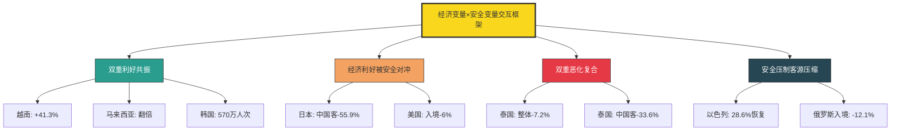

**基于这一交互框架,可对2025年经济与安全因素的权重排序提出三点核心判断**:

**第一,在重大安全冲击下,经济因素让位于安全因素**。当目的地发生战争、恐袭、外交断裂等"硬冲击"时,无论汇率、价格如何有利,都难以挽回客流——日本赴日游客暴跌即是明证。携程发布的数据显示**外交部一旦发布国家级安全提醒,目的地客流可在两周内坍塌30%以上,且修复时间往往以年计**。

**第二,在常态化情景下,经济与安全形成"加权综合评分"**。游客对目的地的最终选择是经济(汇率、物价、性价比)、安全(治安、地缘、自然)、便利(签证、航班、支付)、体验(文化、自然、品牌)等维度的综合权衡;Booking数据显示**安全权重(53%)+放松/文化/美食三大旅行目的(主流诉求)>购物观光等传统诉求**[^83]——意味着2025年游客的目的地选择函数已发生结构性调整。

**第三,客群差异化使权重排序呈现弹性**。Z世代对极致性价比的敏感度高于安全(愿意承担一定风险换取低价穷游),银发客群与亲子家庭则对安全的敏感度高于性价比(愿意支付溢价换取省心安全),高净值客群对二者敏感度都偏低(更看重稀缺体验);商务客群则受业务地理决定。这种差异化将在第7章进一步展开。

**值得在本章末尾点出的是,经济与安全因素与第2章基础设施级要素之间存在"乘数关系"而非"替代关系"**。即使签证开放、航班充足,若汇率不利+安全恶化,目的地仍会失去客流(泰国);反之,即使签证收紧+移民执法严苛,若汇率有利+品牌强势,目的地仍可保留部分客流(美国虽下滑但仍是主要目的地)。**真正可持续的目的地竞争力,需要"基础设施开放+经济性价比稳定+安全可预期+体验差异化"的多重支撑**——这一判断将在第8章综合决策模型中以系统化方式呈现。

最后需要补充的不确定性来源:本章涉及的部分数据存在**口径与时间窗口差异**——例如赴日中国游客降幅在不同月份(11月、12月、2026年1月、3月)呈现不同水平,本研究优先采用最新月度数据;赴美游客降幅在WTTC口径(-6%)与美国商务部口径(-5.4%)间存在细微差异,本研究分别注明出处;泰柬冲突的客流影响首周数据(冲突首周-5%)与全年数据(-7.2%)反映不同时间窗口,需注意区分;**部分单一来源的极端数据(如俄罗斯春节赴华预订单+471%、日本中国游客春节-50%)需结合更多渠道交叉验证**。这些不确定性提醒本章结论在引用时须保持必要的口径敏感性,后续章节将在涉及关键论断时进行交叉印证,以确保分析结论的稳健性。

# 4 气候与自然环境因素

第3章揭示了经济与安全两类"门槛性变量"如何在2025年塑造目的地客流的命运分化，但即使签证开放、汇率有利、安全可预期，旅客最终前往哪个具体目的地，仍取决于一个更具感官冲击力的核心变量——**气候**。在全球高温常态化、极端天气频发的2025年，"凉不凉""暖不暖""有没有雪""会不会被台风困住"这些看似朴素的问题，正在以前所未有的权重进入游客的决策函数。携程《2025年暑期出游市场报告》明确将"清凉"列为暑期出游的"第一关键词"[^113]，途牛《2025—2026冬季旅游趋势预测》则将"南下避寒"刻画为北方用户的刚性需求[^114]——气候在2025年已不再仅是出行的"背景条件"，而是直接驱动目的地选择的"前景变量"。本章将沿"气候吸引力—气候独特性—气候风险—气候适应"四条主线展开，通过暑期避暑游的版图重塑、冬季避寒旅居的双向流动、冰雪与极光旅游的差异化变现、极端天气的瞬时冲击等典型场景，系统解构气候因素的多重作用机制，并在末节归纳其与签证、经济、安全等其他变量的交互定位，为第8章综合决策模型提供气候维度的关键参数。

## 4.1 气候适宜性作为目的地核心吸引力的兴起

2025年是全球气候异常对旅游决策产生**结构性影响**的标志性年份。携程《2025年暑期出游市场报告》开篇即指出，今年7月全国平均气温刷新同期纪录，"清凉游"成为游客出行的首要考量[^115][^113]；消费日报援引同一报告的数据进一步强调"今年暑期，全国平均气温屡刷同期纪录，'清凉'成为人们暑期出游的第一关键词"[^113]。这一判断在多家OTA平台的搜索与订单数据中得到了高度一致的印证——美团旅行数据显示7月以来美团App首页"酒店住宿"搜索量同比增长48%、"机票"搜索量增长99%、"旅游团"搜索量增长42%、"周边游"搜索量增长48%[^116]，而其中关键词"避暑"的搜索热度成为整个暑期最显著的拉动因素。

**气候适宜性的"权重抬升"在两个层面体现得淋漓尽致**。第一个层面是**目的地筛选阈值的上移**——平均气温不超过30℃成为携程口碑榜"暑期十大玩水避暑目的地"入选的硬性指标，威海、黔东南、秦皇岛、大连、青岛、烟台、安吉、桂林、大理白族自治州、贵阳等十地的共同特征即是夏季均温的"凉爽阈值"[^115][^113]。这意味着无论一个目的地的文化深度、产品丰度如何出色，若不能跨越"凉爽"这一门槛，在2025年暑期市场中便难以进入主流游客的备选清单。第二个层面是**气候溢价的实质显现**——飞猪《2025暑期出游快报》显示今年暑期旅游订单均价同比增长9.9%，**大学生"特种兵"旅游热度下降，其订单均价反而上升15.1%**[^115]，"玩得好一点"的共识背后实则是游客愿意为更舒适的气候、更优质的住宿、更深度的体验支付溢价，而气候舒适度本身已成为这种溢价构成的核心要素之一。

**气候因素的作用机制可从三重逻辑加以拆解**。**其一是"避害"逻辑**——当客源地高温达35℃以上甚至突破40℃时，游客的出行决策从"想去哪"转变为"必须离开"，避暑从可选项升级为刚需项；上海游客的真实体验最具代表性："8月上海还是37度的高温，而我已经在新疆赛里木湖赏起秋景了"[^113]。**其二是"趋利"逻辑**——舒适气候本身即构成稀缺资源，游客愿意为"19℃夏天""25℃夏天"这种气候标签支付时间与金钱成本；六盘水"19℃夏天"作为城市品牌的成功，正是气候资源被精准包装为产品卖点的典范。**其三是"健康"逻辑**——高温对老人、儿童、慢性病患者构成实质健康风险，气候适宜性成为银发客群、亲子家庭目的地选择的硬约束。这三重逻辑共同推动气候适宜性在2025年目的地选择权重排序中跃升至与安全、性价比并列的"第一梯队"。

值得指出的是，**气候权重的抬升与第1章观察到的"体验导向取代打卡导向"形成深度共振**——单纯的"打卡"型游客对天气状况容忍度较高（毕竟核心目标是"到此一游"的证明），但深度体验型游客（漂流、徒步、户外摄影、长时间停留）对气候舒适度的敏感度显著更高，因为体验质量本身高度依赖气候条件。这也部分解释了为何2025年小众避暑目的地的崛起速度远超传统观光城市——前者的产品形态(漂流、溯溪、草原徒步、星空观测)对气候依赖度极高，而气候资源恰恰是这些目的地的核心竞争力。

## 4.2 清凉避暑游的爆发与目的地版图重塑

2025年暑期避暑游市场的爆发，最直观地体现在**目的地版图的结构性重塑**——传统观光城市的份额相对稳定，而以贵州、东北、新疆、陕西小城为代表的"清凉小众目的地"出现了指数级增长。这一重塑不仅是"哪里凉爽哪里火"的简单逻辑，更折射出气候资源、玩水业态、民族文化、基础设施四重要素的深度耦合。

**贵州是2025年暑期避暑游版图重塑的最具说服力的样本**。美团《2025暑期热点及趋势报告》"小众避暑目的地增速排行榜"显示，**坐拥"漂流、村超、苗寨侗寨风情"的黔东南苗族侗族自治州以197%的暑期文旅热度增速位列榜首，远超第二名江西上饶**，铜仁、毕节也跻身前十[^116][^117]。携程数据则从订单量端验证了这一爆发：**贵阳酒店订单量同比增长21%、贵州酒店订单量同比增长17%**[^118][^117]，贵阳冲进携程口碑榜"暑期十大玩水避暑目的地"，并位列国内亲子游目的地TOP14、登榜"暑期国内自驾热门城市"[^118][^117]。飞猪数据进一步显示**今年暑期贵州定制游订单量同比增长63%，其中六盘水、毕节的定制游订单量分别同比增长超7倍、超5倍**[^117]——这一爆发性增长已远超大盘平均水平。

贵州案例的深层启示在于**"凉爽气候+玩水体验+民族文化"三元复合**的成功公式。气候层面，七月盛夏全国多地气温突破35℃之际，**贵州多地仍保持着20-28℃的舒适温度，得天独厚的地理条件造就天然的"大空调"**[^118]；六盘水夏季平均气温19℃被授予"中国凉都"称号，"中国避暑之都·贵阳"夏季平均气温23℃[^119][^118]。玩水体验层面，**杉木河"漂流"搜索量环比暴涨247%、高过河漂流"话题播放量达9.6亿次"、杉木河话题播放5202.7万次、00后游客占比超60%**[^118]；贵阳桃源河魔幻漂流自2025年7月1日以来累计接待游客29万人次，魔幻漂流项目接待超21万人次，**省外客户占比超70%、30岁以下客户占比超85%**[^117]。文化层面，黔东南苗族侗族自治州拥有侗族大歌、苗族刺绣、银饰锻造等国家级非物质文化遗产项目达20余项[^118]，肇兴侗寨"村歌电音秀"将侗族大歌与现代电音融合成为年轻游客打卡新热点[^117]，海坪村千户彝寨依托彝族火把节构建夜间狂欢场景[^119]。**这一三元复合的成功表明，单一的气候优势在2025年市场中已不足以独立支撑目的地的爆发性增长，必须与体验业态、文化独特性形成耦合**。

**毕节案例则演绎了"气候+地质奇观"的另一变体**。毕节市以**20℃出头的夏季气温和世界级地质奇观**成为四川、重庆游客的重要避暑选择，从成都出发最快高铁2.5小时就能抵达毕节；**织金洞拥有"中国溶洞之王"的美誉，洞内常年保持16℃左右，是绝佳的天然空调房**；铜仁市松桃苗族自治县盘石镇的黔东草海**盛夏均温仅20摄氏度左右，自旅游旺季以来已接待游客16万余人次，游客量同比增长65%**[^118]。**毕节模式的关键在于将"洞内16℃"这一极端凉爽资源与喀斯特地质奇观、阿西里西草原野韭菜花海等多元自然资源整合**，构成在30℃外部气温下"洞内即避暑"的差异化体验，这种"地表+地下"的复合凉爽度难以被沿海城市复制。

**贵州省委、省政府推动的国际化战略进一步放大了气候资源的市场半径**。2024年贵州接待游客人次增长10.4%，**2024年12月中国全面优化过境免签政策后贵州成为新增适用省份；截至2025年6月18日仅安顺市黄果树景区就接待境外（含港澳台）游客82440人次同比增长39.71%**[^119]。"去贵州 GO清凉——2025夏季国际博主贵州行"活动邀请英国、法国、德国、马来西亚、白俄罗斯、伊拉克等国国际博主走进贵阳、安顺、六盘水、毕节，将气候卖点向国际客群延伸[^119]。**这一战略与第2章观察到的"过境免签政策落地+腹地高铁延伸"的协同机制完全一致**——气候资源若无制度型开放与交通可达性的支撑，难以转化为国际客流；反之有了基础设施支撑后，气候独特性即成为入境游客深度体验的差异化卖点。

**美团"小众避暑目的地增速排行榜"则从更宽广的视角呈现了2025年气候导向型目的地的版图轮廓**。该榜单依次列出贵州黔东南苗族侗族自治州、江西上饶、山东烟台、浙江湖州、四川阿坝藏族羌族自治州、湖北神农架、青海西宁、贵州铜仁、山东威海、贵州毕节[^116]——十个目的地中贵州独占三席，山东（烟台、威海）、四川阿坝、湖北神农架、青海西宁、浙江湖州等地共同特征是夏季均温显著低于客源地、且具有差异化的水体或山林资源。从增速规模看，**吉林、黑龙江、辽宁、新疆成为"避暑游增速大省"**[^116]，这一格局印证了气候因素在长线异地游决策中的核心作用——东北三省与新疆距离主要客源地距离遥远，但凭借气候差与独特自然资源仍能驱动客流。

**新疆案例则展现了"清凉+影视IP"的双重驱动**。携程数据显示**新疆赛里木湖跳伞、帆船搜索量暴增600%，带热赛里木湖酒店热度上涨476%；新疆旅游订单同比增长超20%、乌鲁木齐增长11%**[^116][^115]，电视剧《凡人修仙传》的取景使新疆那拉提景区热度上涨68%[^115]。江浙沪南方游客占据新疆主要客源地前五中的三个席位，另两席为北京与广东[^113]——**这一客源结构精确反映了"高温源头—低温目的地"的气候迁徙路径**。甘肃"沙漠露营基地"搜索量上涨226%、"沙漠妆造"搜索量上涨超204%[^116]，宁夏腾格里沙漠"五湖穿越"搜索量同比上涨近90%、带热"五湖穿越附近酒店"搜索量上涨293%[^116]——这些西北目的地虽不属传统"凉爽"范畴，但凭借早晚温差大、夜间星空清凉的独特性形成了差异化避暑路径。

**陕西宜君则代表了"小而美"避暑业态的新兴模式**。这座地处渭北高原的小城依托**97%的植被覆盖率和夏季平均19℃的清凉气候两大优势**，2025年7月以"清凉避暑+音乐营地"为核心举办彭祖药谷景区音乐节，**累计吸引游客10万余人次，景区内一名经营小吃摊的村民2个月净赚3万余元**[^120]。宜君模式的特殊价值在于**将气候优势与音乐节、村厨大赛、康养小院、研学线路等业态深度融合**，构建了不依赖大型旅游集团而以"农文旅融合"为核心的"小而美"业态——彭祖药用植物园、秦酒酒业、老蜂农基地等被串联进研学线路，花溪谷景区、旱作梯田景区被命名为"陕西省中小学劳动教育实践基地"[^120]。这一模式的政策支撑是从2024年中央一号文件"加快构建农文旅融合的现代乡村产业体系"到2026年中央一号文件"发展'小而美'文旅业态"的连续政策指引[^120]，**意味着气候资源的变现路径已从大景区开发模式向乡村振兴+研学+康养的复合模式延伸**。

将2025年暑期主要避暑目的地的核心数据与驱动要素整合：

| 目的地 | 2025年关键数据 | 气候卖点 | 复合驱动要素 |
|-------|-------------|---------|------------|
| 黔东南州 | 文旅热度+197%（榜首） | 平均≤30℃ | 漂流+苗寨+村超 |
| 贵阳 | 酒店订单+21% | 夏均23℃ | 玩水+亲子+夜经济 |
| 贵州整体 | 酒店订单+17%、定制游+63% | 多地20-28℃ | 山水+民族文化+免签 |
| 六盘水 | 定制游+7倍 | 19℃凉都 | 草原+火把节 |
| 毕节 | 定制游+5倍 | 织金洞16℃ | 喀斯特+花海 |
| 黔东草海 | 游客+65% | 盛夏20℃ | 边境草原 |
| 新疆 | 旅游订单+20% | 早晚温差大 | 跳伞+影视IP |
| 大同 | 旅游订单+40% | 凉爽+古建 | 浪浪山动画+云冈 |
| 宜君 | 音乐节10万人次 | 夏均19℃ | 音乐节+康养+研学 |

数据来源：综合携程、美团、飞猪平台报告及地方文旅披露

**这一版图重塑深刻揭示了气候因素与其他变量的交互机制**。气候适宜性是基础吸引力，但若缺乏玩水、地质、民族文化、影视IP、户外运动等差异化业态，单纯的"凉爽"难以驱动数倍增长；反之，若仅有业态而无气候支撑，在2025年高温常态化背景下也难以形成爆发。**贵州、宜君、新疆、大同的共同成功公式可归纳为"凉爽气候×差异化资源×基础设施改善×营销破圈"四要素同时发力**，这一公式将在4.6节进一步深化为气候资源与文旅业态的融合路径。

## 4.3 冬季避寒旅居的兴起与南北双向流动

如果说暑期避暑游构成了气候导向型旅游的"上半场"，冬季避寒旅居则构成了2025—2026冬季的"下半场"，二者共同形成了气候因素对中国旅游市场全年的双向塑形。途牛《2025—2026冬季旅游趋势预测》明确显示**12月以来北方用户预订"南下避寒"旅游产品的热度持续增长，三亚、海口上榜避寒游热门目的地TOP10**[^114]——这一趋势不仅是季节性消费现象，更折射出"避寒地"向"旅居地"的功能跃迁。

**避寒游的目的地格局呈现出"海南双城+广东三城+云南四城"的清晰结构**。途牛报告披露**海南三亚、海口，广东广州、深圳、珠海，以及云南昆明、西双版纳、丽江、大理等地备受青睐，成为北方用户"南下避寒"的理想之选**[^114]。北京、天津、西安、哈尔滨等北方用户构成了避寒游的核心客源，**60岁以上年长者占据了较高比例，成为避寒游的主力人群之一**[^114]——这一客群结构与第3章观察到的"银发客群对气候敏感度高、价格敏感度中等"的判断完全一致，气候健康刚需在60岁以上群体中表现得尤为突出。

**三亚作为避寒旅居标杆的地位在2025年得到了俄罗斯客流的全方位印证**。海南日报披露的数据显示，**2025年1月三亚每周接待俄罗斯游客逾5000人次，大东海区域俄罗斯游客占比高达七成**[^121][^122]。三亚的吸引力机制呈现"气候+免签+服务+康养"四元复合：

**第一，气候资源构成基础门槛**。当俄罗斯本土处于零下20℃甚至更低的极寒中，三亚冬季平均气温20℃以上的椰风海岸构成了几乎绝对的"气候反差红利"——来自圣彼得堡的游客娜塔莉娅形容"在这里，我们找到了冬天最好的打开方式"[^121][^122]。

**第二，免签政策放大了客流爆发**。第2章已述及2025年9月15日中国对俄罗斯持普通护照人员试行30天免签政策正式生效，**俄罗斯旅游运营商协会数据显示政策实施首月俄罗斯赴海南的旅游需求猛增76%、85%的预订都集中在海南；仅三亚凤凰国际机场2025年第四季度俄籍旅客入境量便同比增长400%**[^121][^122]。每周从莫斯科、圣彼得堡、叶卡捷琳堡等14个俄罗斯城市直飞三亚的航班逾20班次，"曾经'说走就走'的奢侈变成了'抬脚就到'的日常"[^121][^122]。

**第三，停留时间延长印证"避寒地"向"旅居地"的功能跃迁**。海南日报披露的最具结构性意义的数据是：**俄罗斯游客的平均停留时间从过去的5天延长至10天以上，不少家庭选择在三亚度过整个冬季**[^121][^122]。这与俄罗斯人平均28天的年假制度相契合，"过去是团队游为主，现在自由行、家庭式度假成为主流"——三亚正从"观光打卡地"转型为"生活旅居地"[^121][^122]。这种"长停留+家庭化+生活化"的特征，意味着客单消费结构从一次性观光支出转向住宿、餐饮、医疗、康养、教育的多维持续支出，对目的地的GDP贡献远超短期观光客流。

**第四，城市服务体系的全方位重塑承接了旅居客流**。这一升级远超传统的"会说外语"层面：**大东海旅游区周边的餐厅九成以上配备了俄语菜单；商场收银台普遍支持卢布结算或俄罗斯银行卡支付；海滩安全提示牌、景区广播采用中俄双语循环播放；街角药店的药师也能用简单俄语说明用药剂量**[^121][^122]。三亚金融机构积极提供卢布兑换服务，"海南放心付"App实现俄语版移动支付兼容[^121][^122]——这些细节级的服务适配，正是承接"旅居客流"而非"观光客流"的基础设施差异。

**第五，"医疗+旅游"复合模式将三亚从"避寒地"升级为"康养城"**。亚龙湾某康养中心来自新西伯利亚的退休教师阿伊丽娜接受为期三周的中医调理，"在俄罗斯，中医针灸一次要花费3000卢布，这里不仅价格亲民，医生的手法更地道"[^121][^122]。**三亚目前拥有20余家面向国际游客的中医康养机构，提供从体检、理疗到药膳调理的全链条服务**；针对俄罗斯游客偏好"一价全包"的消费习惯，三亚的旅游企业推出包含住宿、餐饮、疗养的套餐产品[^121][^122]。大东海酒店副总经理符秀刚坦言"俄罗斯客人对中医养生有着近乎痴迷的热爱，这成为我们区别于东南亚其他度假地的核心竞争力"[^121][^122]——**这一陈述精准点出了气候资源转化为差异化竞争力的关键机制：单纯的阳光沙滩在三亚、巴厘岛、普吉岛、芽庄之间没有本质差异，但叠加中医康养的本土化深度后即形成不可复制的目的地特色**。

**避寒旅居的更深层意义在于功能重构的"软着陆"逻辑**。三亚正规划建设"国际游客服务专区"，**整合政务、法务、医疗、文化适应等多元功能，打造外籍人士的"soft landing"（软着陆）平台**[^121][^122]——这一规划标志着避寒目的地的定位已从"短期度假地"升级为"长期生活基地"，承载的功能从娱乐扩展至医疗、教育、商务、社交、文化适应等全方位生活场景。**这种功能升级将气候资源的边际效用从"几天的舒适"放大为"整个冬季的生活品质"**，对目的地的持续吸引力构成了量级跃迁。

**冬季避寒游与跨年游、寒假出境游形成了多层次的冬季出行格局**。途牛数据显示**12月后元旦跨年游、寒假出境游预订热度升温，"80后"、"90后"亲子家庭以及"00后"年轻游客更注重跨年的仪式感与氛围感，在跨年游用户中的出游人次占比超过80%**；境内游方面北京、广州、三亚、上海等目的地预订热度领先，**冰雪旅游、主题乐园、避寒游、传统文化体验等主题的旅游产品深受游客青睐**[^114]。预计**寒假旅游市场将从2026年1月下旬开始逐步升温，出游热潮将持续到春节假期之后；寒假出游高峰则将从2月12日开启并一直延续到2月22日（大年初六），形成节中集中出游的浪潮**[^114]。这一时间结构表明气候导向型旅游已形成"暑期避暑—冬季避寒+冰雪+跨年"的全年化布局，而非传统意义上的"两端淡季+暑期旺季"格局。

**冬季旅游市场的整体特征可归纳为"多点开花、分段错峰、主题鲜明"**[^114]——无论是"北上追雪""南下避寒"还是跨年迎新，游客都能找到契合自己节奏与偏好的旅游方式及体验。这一描述精准刻画了2025—2026冬季气候因素塑造旅游市场的全景：**南向避寒、北向追雪、跨年场景、寒假亲子构成四类并行的细分市场，各自服务于不同客群与气候偏好，共同支撑了冬季旅游的繁荣**。

## 4.4 冰雪旅游与极光旅游的气候独特性变现

如果说避暑、避寒是气候适宜性作为"基础吸引力"的体现，冰雪与极光旅游则代表了气候独特性作为"差异化卖点"的极致变现——这类目的地的核心吸引力恰恰在于"极端气候"本身（寒冷、冰雪、极光等只在特定纬度与季节出现的自然现象），将本应被规避的"不适气候"转化为不可替代的稀缺体验资源。

**吉林市作为国内冰雪旅游标杆的2025—2026年雪季表现，最具说服力地呈现了气候独特性如何被系统化变现**。吉林市2025—2026年雪季文旅工作书写新答卷的关键数据令人瞩目[^123]：

**第一，斩获"三大荣誉"——11年蝉联"中国冰雪旅游十佳城市"、入选国家第一批高质量户外运动目的地、位列2026春节假期热门冰雪游目的地TOP10第5位**，城市品牌影响力持续攀升[^123]。

**第二，创下"两项佳绩"——北大湖、中旅松花湖雪场双双提前破百万游客接待量，蝉联国内唯一拥有两家百万级雪场的城市**，龙头引领地位持续巩固[^123]。北大湖滑雪度假区市场总监闫帅指出"我们今年破百万的时间比去年提前了近两周"，这得益于近万张床位和不断优化的服务保障系统[^123]。

**第三，实现"三大突破"——新增北山、东大旺山两家滑雪场使雪场供给体系更加完善；推出全国首列氢能文旅观光列车丰富文旅新业态；创下"最多人穿京剧服饰滑雪一公里"吉尼斯世界纪录使冰雪与文化融合实现新跨越**[^123]。2025年11月21日266人穿京剧服饰滑雪破吉尼斯纪录，参与者丁宁感慨"'冰雪国潮'的魅力让文化自信变得具体可感"[^123]。

**冰雪旅游市场的整体运行特征呈现"六增、两稳、三优、一升"**——**游客接待量、旅游总花费、雪场接待人次、雪场营业收入、酒店平均入住率、省外到达旅客数量持续增长；铁路旅客发送量、高速公路车流量总体平稳；客源结构、产品业态、服务环境持续优化；城市冰雪品牌影响力与综合竞争力大幅提升**[^123]。"从规模扩张向质效双升、从单点发力向体系化发展、从季节性火爆向全季化运营，冰雪旅游的发展韧性、带动力、竞争力全面增强"[^123]。

**客源结构数据揭示了冰雪旅游的"长距离引流"特征**。本雪季两大雪场的省外客源占比分别高达**73.12%和75.93%，全市雪场接待省内游客占32.48%、省外游客占66.15%，客源地集中在长三角、珠三角等地区**[^123]——超过2/3的游客来自外省，且核心客源是长三角、珠三角等温暖地区。这一结构精确印证了气候独特性的引流机制：**对长三角、珠三角的游客而言，雪、雾凇、滑雪是本地完全无法获得的稀缺体验，因此愿意支付长途跨省的时间与金钱成本**——而这一逻辑与南方游客避暑赴新疆的"高温源头—低温目的地"路径形成镜像。来自深圳的雪友贾涛感慨"精准公示的雪质、气温信息，全程周到细致的服务"使他感受到一站式滑雪体验的完善与贴心[^123]，而首次到访的香港游客蔡婷和陈红赞叹"雪景壮美、设施齐全、交通便捷、食宿舒心"[^123]——这些来自远离冰雪地区客群的反馈，揭示了冰雪资源对差异化客群的强大吸引力。

**冰雪旅游的产业升级路径呈现从"单一观光"向"户外运动+文化IP+全季运营"的多维拓展**。北大湖滑雪度假区**继续稳居全国滑雪类APP"滑呗"排行榜首位，连续6个雪季接待游客人次位列全国雪场第一**；中旅松花湖度假区**9年蝉联世界滑雪大奖**，两大雪场在2025国际冬季运动博览会上双双斩获"中国冬季旅游目的地""冰雪金石·中国十大雪场奖"两项大奖[^123]。"以前满世界追雪，如今世界级雪场就在家门口"——阔别三年回到家乡的郑建峰试滑后感慨"城市日新月异、文旅有声有色"[^123]。这一从"中国雪场"向"世界级雪场"的品牌升级，意味着冰雪资源的变现已不再局限于国内市场，而是开始与北美、欧洲、日本的传统冰雪目的地形成竞争态势。

**冰雪旅游的"全季化运营"则代表了气候独特性变现的进一步突破**。"从季节性火爆向全季化运营"的转变[^123]，意味着冰雪城市正在通过推出夏季避暑、秋季雾凇预热、春季登山等多元业态，化解传统冰雪目的地仅能在3-4个月雪季产生收入的结构性缺陷——这一转型方向与4.7节将讨论的"气候适应"路径一脉相承。

**斯堪的纳维亚的极光旅游则演绎了气候独特性在国际市场的变现路径**。观察者网援引的多重数据揭示了2024—2025年北欧旅游的爆发态势[^124]：

**第一，欧洲整体格局中的领跑表现**。欧洲旅游委员会的报告显示**2024年初以来斯堪的纳维亚地区的国际游客过夜量显著上升：挪威增长18%、瑞典增加12%、丹麦也实现9%的增幅；短期租赁市场同样表现活跃，挪威需求上升37%、瑞典为32%、丹麦为24%**[^124]。Skift报道更指出**2024年第一季度斯堪的纳维亚地区的游客到访量已超越土耳其、希腊等传统热门目的地，同年夏季该地区的国际旅游预订量亦呈现激增态势**[^124]。

**第二，中国市场的爆发式增长**。挪威国家旅游局、瑞典国家旅游局向观察者网提供的最新数据表明：**2025年1月至8月，中国赴挪威的商旅和休闲游客过夜量同比增长超过一倍、恢复至2019年同期的75%；赴瑞典的客夜量同比增长超过51%**[^124]。中青旅遨游公司数据显示**2024年以来中国游客赴欧盟国家旅游订单同比翻倍**，**2025年上半年北欧等部分欧盟国家旅游热度也迅速增长，暑期北欧系列产品预订人数已与西欧持平**[^124]。

**第三，气候独特性的产品化表达**。北欧旅游产品体系深度依赖气候独特性——**午夜阳光与漫长的夏季白昼、冬季的北极光，以及原始而迷人的自然风光**[^124]；瑞典、挪威和丹麦的旅游体验以户外活动为主，**如北极探险、高山草甸徒步、皮划艇及峡湾游轮等**[^124]。这些产品形态的共同特征是**与寒冷高纬度气候、极昼极夜现象、独特地形地貌深度绑定**，难以被低纬度目的地复制。

**第四，目的地的精准客群战略**。瑞典近期推出"瑞典处方目的地"的全新概念，**倡导游客利用该国广袤的自然环境与松弛的生活方式，实现身心疗愈，让旅行不再匆忙，而成为一次深度的滋养之旅**[^124]——这一营销概念精准契合中国游客对"治愈系""慢节奏"的需求转型。挪威国家旅游局则**通过内容营销持续向中国消费者展示挪威秋冬季的自然景观与文化体验**，经典的短途线路"挪威缩影"将挪威东部风情与大西洋海岸的壮丽峡湾完美串联[^124]。

**第五，交通连通性的硬支撑**。第2章提及的"航空联通性"在北欧路径中体现为**北京与斯德哥尔摩之间的直航已稳定运营三十余年、2025年3月海南航空重启北京—奥斯陆航线（夏季每周三班、冬季每周一班）**[^124]——这种连通性的恢复直接降低了赴北欧的物理可达成本。**两国旅游局联合主办的"2025斯堪的纳维亚路演"先后在上海、成都、北京举行，来自挪威、瑞典及斯堪的纳维亚地区其他国家的40余家旅游供应商与近400家经营北欧出境游的中国旅行社共同交流2025–2026年最新北欧产品与市场动态**[^124]——这一B2B生态的搭建是流量持续转化的基础。

**国际旅游行业媒体《旅行与旅游世界》对此现象的判断颇具洞察力**：中国游客赴欧洲尤其是北欧国家人数的持续增长，**清晰反映了全球旅游格局的演变趋势。这一变化不仅限于欧洲，也将对全球旅游目的地产生影响，推动其不断适应中国游客日益多元的出行偏好；随着中国成为全球旅游市场的重要客源国，斯堪的纳维亚地区持续推进面向中国游客的个性化旅游战略，不仅将重塑区域旅游格局，也将为未来全球旅游合作奠定重要基础**[^124]。这一观察从外部视角验证了**气候独特性作为差异化卖点在全球旅游格局中的崛起逻辑**。

将冰雪与极光两类气候独特性变现的核心机制对照：

| 维度 | 国内冰雪（吉林市） | 北欧极光（挪威/瑞典） |
|------|----------------|-----------------|
| 气候稀缺资源 | 雾凇、寒江雪柳、滑雪 | 极光、午夜阳光、峡湾 |
| 关键数据 | 两大雪场破百万、省外占66% | 中国客夜量+1倍/+51% |
| 客群引流逻辑 | 长三角珠三角→东北 | 中国→北欧 |
| 业态升级方向 | 文化国潮+全季运营 | 处方目的地+治愈疗愈 |
| 基础设施支撑 | 高铁+雪场千张床位 | 直航复航+B2B路演 |
| 差异化护城河 | 难以被南方复制 | 难以被低纬度复制 |

数据来源：吉林市文旅局、挪威/瑞典国家旅游局、中青旅遨游、Skift

**这一对照揭示了气候独特性变现的两条共同规律**。**第一，气候稀缺资源本身构成不可复制的护城河**——南方城市无法生产雾凇、低纬度国家无法生产极光，这种地理决定的稀缺性使相关目的地在气候导向型市场中具有近乎垄断的竞争地位。**第二，气候资源必须通过"业态化、产品化、品牌化"才能实现充分变现**——单纯的"这里很冷"或"这里有极光"只是自然条件，必须经由滑雪场建设、城市冰雪节、极光观测套餐、户外运动IP等业态包装，才能转化为游客愿意支付的旅游产品。**这两条规律将在4.6节进一步深化为气候资源与文旅业态的融合路径**。

## 4.5 极端天气频发对目的地客流的瞬时冲击

气候变化带来的不仅是平均气温的缓慢抬升，更是极端天气事件的频发与强化。2025年加勒比飓风梅丽莎、泰国北部南部洪灾与地震、菲律宾红色暴雨预警、中东高温热浪等极端天气，成为继地缘冲突之后影响目的地客流的另一类"快变量"——其特殊性在于**事件突发性强、恢复期较长、可控性低**，往往能在数日至数周内重塑相关目的地的客流轨迹。

**加勒比飓风梅丽莎是2025年最具代表性的极端天气冲击案例**。第1章已援引UN Tourism数据指出**美洲2025年接待国际游客2.18亿人次同比仅增长1%、且第三、第四季度出现回落，其中加勒比地区受飓风梅丽莎影响整体增长为零**——这意味着**一场飓风将整个加勒比区域的旅游业增长归零**，其冲击力相当于将该区域全年的努力悉数抹去。这一案例的特殊价值在于呈现了**单一极端天气事件如何对一个旅游高度依赖区域产生"系统性归零"效应**——加勒比经济高度依赖游客消费，飓风对酒店、海滩、机场、邮轮港的物理破坏直接转化为旅游业的全行业打击。

**泰国2025年的极端天气链则呈现"连环冲击"的复合效应**。泰国酒店协会北部分会主席派桑指出，叠加在泰柬冲突之上的不利因素包括"**北部南部接连遭遇严重洪灾及地震、政府国会突然解散令各方对未来政策走向感到困惑、素万那普机场入境通关需耗时两小时以上**"等多重打击。具体到时间线，2025年泰国遭遇了**1月的"王星事件"、3月的北部地震、6月的总理罢免案、7月的泰柬边境冲突、10月的多地暴雨、11月的南部洪灾**等密集负面事件——其中地震、暴雨、洪灾均属极端天气或地质灾害类。这种"几乎每月一次"的负面事件密度，使得即使每次事件的物理冲击不算极端严重，累积起来仍能严重侵蚀游客对泰国安全的信心——Dragon Trail调查显示**中国人对泰国安全的信心已降至仅19%、有多达51%的人认为泰国不安全**（第3章已援引）。**这一案例验证了极端天气与地缘风险的复合放大效应——当一个目的地连续遭遇自然灾害与人为冲突时，其安全感损耗远超单一事件的简单叠加**。

**菲律宾2025年7月的暴雨预警则展现了极端天气对周边目的地的瞬时冲击**。菲律宾多地2025年7月暴雨红色预警的发布，使部分地区进入紧急状态，旅游目的地的可达性与体验质量受到直接影响。虽然本研究的搜索结果未提供详细的客流数据，但东南亚作为以海岛和沙滩为核心吸引力的区域，**其整体经验是雨季的拉长与极端降雨的频发正在压缩传统的"旺季窗口"**——这与第3章观察到的越南、马来西亚、泰国等东南亚目的地的客流波动密切相关。

**中东地区则演绎了"地缘冲突+极端高温"的双重压力**。第3章已援引《日本经济新闻》数据指出，自美以于2026年2月28日对伊朗采取军事行动开始至3月13日，**原定进出中东地区的约9.8万架次航班中已有超过5.2万架次被取消、比例高达53%、约600万前往或途经中东地区的旅客受到影响**。在这一地缘冲击之外，中东地区夏季高温的常态化（部分地区夏季气温超过50℃）使该区域的旅游季节窗口进一步收窄至秋冬两季——**地缘风险与气候风险的两端挤压，使中东地区的旅游业不得不依赖更精准的季节调度与气候避险策略**。

**极端天气的研究价值在于呈现了气候因素的"风险面"**。如果说前述章节的清凉避暑、避寒旅居、冰雪极光属于气候因素的"机会面"——通过气候资源的舒适性或独特性吸引游客；那么极端天气则属于气候因素的"风险面"——通过自然灾害的发生或威胁驱离游客。这两面共同构成了气候因素的完整图谱，且二者并非孤立存在——许多以气候资源为卖点的目的地（如沿海海岛、山地度假区、热带森林）恰恰是极端天气的高暴露区域，气候机会与气候风险在同一目的地内部形成共生关系。

**风险传导的缓冲机制在2025年呈现出多层次结构**。**第一层是航司退改与保险机制**——第3章已述及2025年11月15日以来中国航司记录了约49.1万张飞往日本的机票被退订（虽因政治原因），同样的退改机制在极端天气事件中也广泛适用，绝大多数航司允许极端天气导致的航班变更免费改签。**第二层是OTA平台的预警与重新匹配能力**——携程、美团等平台已具备实时对接气象数据并向用户推送预警的能力，使游客可在出行前调整目的地选择。**第三层是行程改签与替代目的地引导**——当某目的地因极端天气不可达时，平台可向用户推荐气候相似但未受灾的替代目的地。**第四层是旅游保险的赔付机制**——专门覆盖极端天气取消、延误、医疗的旅游险产品在2025年市场渗透率持续提升，构成了风险末端的保障。

**值得强调的是，极端天气事件与第3章安全风险事件存在结构性差异**。安全风险（恐袭、外交冲突、暴力事件）的影响范围相对局部、可通过避开特定区域规避；而极端天气（飓风、洪水、热浪）的影响范围更广、影响周期更长、且难以通过个体避险措施完全规避。**这意味着在2025—2030年极端天气频次持续上升的趋势下，气候风险将逐渐与传统安全风险并列成为目的地选择的核心负向门槛之一**——这一趋势的长期影响将在4.7节进一步展开。

## 4.6 气候资源与文旅业态的深度融合路径

气候作为目的地选择的核心吸引力，其变现的关键在于**与文旅业态的深度融合**——单纯的"凉爽""温暖""有雪"等气候标签难以独立支撑可持续的客流，必须通过业态创新将气候资源转化为可消费、可分享、可重复的产品体验。2025年涌现的多类融合案例，已形成可归纳的发展路径。

**路径一：气候+户外运动的极致体验融合**。贵州杉木河漂流、高过河漂流、贵阳桃源河魔幻漂流构成了这一路径的典范——在20-28℃的凉爽气温下，漂流体验既有刺激性又能实现物理降温，气候舒适与玩水刺激形成天然搭配。**桃源河魔幻漂流接待超21万人次、省外客户占比超70%、30岁以下客户占比超85%**[^117]的客群结构，以及**杉木河"漂流"搜索量环比暴涨247%、高过河漂流话题播放量9.6亿次**[^118]的传播声量，验证了这一融合路径在Z世代中的爆发力。江西大觉山漂流"清凉漂"订单数量同比增长超4倍、江苏常州茅山森林公园"银河夜漂"以出片美景出圈、浙江湖州安吉云上草原"窝囊蹦极"等创新形态[^113]，进一步丰富了"气候+户外"的体验光谱。

**路径二：气候+民族文化的差异化叠加**。贵州黔东南案例最具代表性——**侗族大歌、苗族刺绣、银饰锻造等国家级非物质文化遗产项目达20余项**[^118]，西江千户苗寨的吊脚楼、肇兴侗寨的鼓楼与侗族大歌、海坪村千户彝寨的火把节[^119][^118]，将凉爽气候下的避暑停留转化为深度文化沉浸。**肇兴侗寨"村歌电音秀"将侗族大歌与现代电音融合成为年轻游客打卡新热点**[^117]——这一创新展现了民族文化的现代表达如何与气候卖点形成双重吸引力。这一路径的核心机制是**通过文化深度延长游客停留时间**——单纯避暑可能停留2-3天，叠加民族文化体验后可延长至5-7天甚至更久，客单消费随之放大数倍。

**路径三：气候+地质奇观的复合凉爽变现**。毕节织金洞"洞内常年保持16℃"[^118]构成了对外部高温的极致避险，**九洞天景区"洞中有洞、洞里有天"集伏流、洞穴、天桥、天坑、峡谷于一体的喀斯特地质博物馆**[^118]提供了独特地下空间体验，**赫章县阿西里西草原"百万亩野韭菜花带、4万亩紫色花海"**[^118]则在每年8月底、9月初提供季节限定的视觉奇观。这一路径的特殊价值在于**将气候舒适性与不可复制的地质景观深度绑定**——游客无法在沿海平原城市获得同样的"洞穴避暑+地下河漂流+紫色花海"复合体验，从而构成毕节的差异化竞争力。

**路径四：气候+音乐节/赛事的IP驱动融合**。陕西宜君彭祖药谷景区音乐节是最典型的案例——**以"清凉避暑+音乐营地"为核心举办，累计吸引游客10万余人次，景区内一名经营小吃摊的村民2个月净赚3万余元**[^120]。"村民的话语道出了当地群众对这个发展模式的认可，也印证了宜君农文旅融合之路走得通"[^120]。这一路径将气候卖点与年轻人偏好的音乐节业态结合，使一个原本默默无闻的渭北小城在暑期成为热门目的地。第1章已援引的"苏超"赛事案例、库里品牌亚洲行重庆站案例[^125]亦属此类——赛事IP将地方目的地的气候、文化、餐饮、住宿等要素串联为一个集中爆发的消费场景。

**路径五：气候+康养医疗的健康复合**。三亚的中医康养机构20余家+针对俄罗斯游客的"住宿+餐饮+疗养"一价全包套餐[^121][^122]，将冬季避寒的气候优势与中医针灸、推拿、拔罐、药膳等本土化医疗服务深度绑定，构成"区别于东南亚其他度假地的核心竞争力"[^121][^122]。陕西宜君彭祖养生院、"药膳宫"康养小院将"科技+文旅+康养"为核心串联起科技馆、彭祖药用植物园、秦酒酒业、老蜂农基地等点位[^120]，形成了内陆小城的康养业态。这一路径的核心是**将气候健康优势从"几天的舒适"放大为"系统的健康服务"**，对银发客群与高净值客群具有特殊吸引力。

**路径六：气候+小而美乡村业态的复合**。从2024年中央一号文件"加快构建农文旅融合的现代乡村产业体系"，到2026年中央一号文件"发展'小而美'文旅业态"，政策指引明确指向乡村振兴与气候资源的融合[^120]。宜君县**美食为媒（村厨大赛）、康养为核（药膳宫小院、彭祖养生院）、研学为翼（科技+自然生态研学线路入选陕西省十大科普研学线路）**[^120]构成了完整的"小而美"业态矩阵。哭泉梯田民宿"白墙黄瓦散落于青山绿水间，清晨可赏梯田日出、傍晚能观落日余晖"[^120]、君乐谷研学教育、彭祖中医养生文化等共同构筑了一个"避暑+研学+康养+美食"的乡村复合产品。这一路径的特殊价值在于**让气候资源的红利下沉至县域、镇域乃至村庄层级**，避免大型景区"一城独大"的资源垄断，让乡村振兴与气候导向型旅游形成正向互动。

**路径七：气候+全季化运营的破解季节约束**。这一路径主要针对冰雪等强季节性目的地——吉林市从"季节性火爆向全季化运营"的转型[^123]即为代表，通过夏季避暑、秋季雾凇预热、春季登山等多元业态，化解传统冰雪目的地仅3-4个月雪季的结构性缺陷。对吉林、哈尔滨等北方城市而言，**夏季气候同样具有"东北凉爽"的差异化卖点**——吉林作为"避暑游增速大省"之一[^116]，与冬季冰雪形成了双季节运营的可能。这一路径将在4.7节"气候适应"部分进一步深化。

将上述七条融合路径整合为一个清晰的框架：

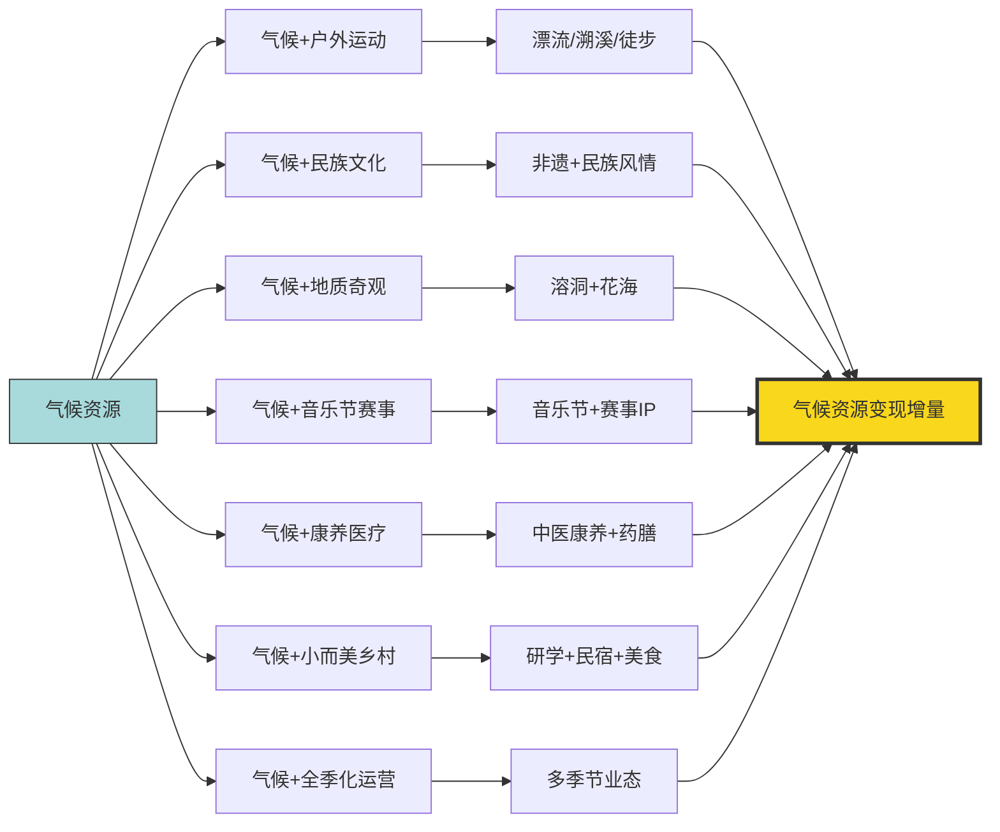

**这一框架揭示了气候资源变现的核心规律：单纯的气候资源是"原矿"，必须经由业态加工才能成为"成品"**。气候适宜性提供了基础吸引力的"地基"，而文旅业态创新则提供了竞争力差异化的"楼层"——只有地基没有楼层，目的地难以建立可持续的市场地位；只有楼层没有地基，目的地在2025年高温常态化背景下又难以跨越基础阈值。**贵州、宜君、吉林等案例的共同成功密码，正是在两者之间实现了精准匹配与深度耦合**。

## 4.7 气候变化长期趋势下目的地的脆弱性与转型

2025年的气候导向型旅游虽然呈现繁荣态势，但深层次看，全球气候变化的长期趋势正在重塑各类目的地的脆弱性图谱——一些今日的热门目的地可能在未来十年面临生存性挑战，而一些今日的边缘目的地可能因气候变化获得新的机遇。本节基于2025年已显现的初步信号，探查三类典型脆弱性目的地的转型方向。

**第一类是沿海低海拔目的地，面临海平面上升与飓风加剧的双重威胁**。加勒比地区2025年因飓风梅丽莎导致区域增长归零的案例（第1章），是这一类脆弱性的最直观警示。马尔代夫、太平洋岛国（如图瓦卢、斐济）、印尼巴厘岛沿海、泰国普吉岛等以海岛沙滩为核心吸引力的目的地，长期面临三重压力：海平面上升导致海滩面积缩减与海水入侵、飓风/台风频次与强度增加导致基础设施周期性破坏、海水温度上升导致珊瑚白化与海洋生态退化。这些压力在2025年虽未集中爆发，但已通过保险费率上升、酒店重建周期缩短、客流季节窗口压缩等形式逐步显现。**沿海低海拔目的地的转型方向可能包括：基础设施抬升与海岸防护工程、向内陆与高地的客流引流、生态旅游与海洋保护教育的深度融合、错峰季节窗口的精准营销**。

**第二类是山地目的地，面临雪线上移与雪季缩短的挑战**。全球阿尔卑斯山区、日本北海道、北美落基山脉等传统冰雪目的地都在不同程度上经历着雪季的缩短与雪量的减少。中国吉林市2025—2026年雪季"提前两周破百万"[^123]虽属正面信号，但其背后的"全季化运营"转型恰恰反映了对单一雪季依赖的主动破解。**山地目的地的转型方向可见三条**：一是**人工造雪与雪场升级**——通过技术手段延长可滑雪时间窗口；二是**全季业态拓展**——夏季高山徒步、秋季观秋色、春季登山等多季节产品组合；三是**向更高海拔迁移**——开发高海拔区域以应对雪线上移的长期趋势。吉林市"从季节性火爆向全季化运营"的实践[^123]为山地目的地提供了可借鉴的转型路径。

**第三类是干旱地区目的地，面临极端高温与水资源短缺的压力**。中东、北非、地中海南岸等地区夏季气温持续突破50℃的常态化，使这些地区的传统夏季旅游窗口几近关闭——第3章已述及中东地区因冲突与高温双重压力，2025年航班取消率达53%、约600万旅客受影响。**这类目的地的转型方向已开始显现**：一是**季节窗口重构**——从夏季向秋冬季节迁移，将旅游高峰从7-8月调整至10月-次年4月；二是**室内业态升级**——博物馆、购物中心、康养中心等室内场景的扩张以应对极端高温；三是**夜间经济强化**——将主要旅游活动从白天移至夜间时段，规避高温暴露；四是**气候适应基础设施投入**——空调系统、遮阳设施、绿化降温等城市级气候适应改造。

**值得指出的是，气候变化对目的地的影响呈现显著的地区分化**——在沿海与干旱地区面临挑战的同时，**部分高纬度地区正成为气候变化的"相对受益者"**。北欧旅游业的崛起（4.4节已述）部分受益于全球变暖使北欧夏季更加适宜旅游、冬季雪量虽下降但极光观测条件改善；中国东北、内蒙古、新疆部分地区也在传统气候资源基础上获得了夏季避暑游的新机遇。**这一"南北分化"正在悄然重塑全球旅游目的地的相对竞争力，部分原本不为人知的高纬度小众目的地可能在2030年前后成为新的热门**。

**目的地从"被动暴露"走向"主动转型"的关键路径**可归纳为四个维度：

**第一是气候适应的基础设施投入**——海岸防护、遮阳系统、人工造雪、室内场景等硬件升级，需要长期持续的资本投入与政府规划支持。

**第二是季节窗口与业态的弹性调整**——将传统的"夏季独大"或"冬季独大"模式转向多季节运营，通过业态多元化分散气候风险。这一转型在国内已有清晰案例——吉林市的全季运营、贵州的全年文旅、海南的"避寒+冰雪+亲子"复合等。

**第三是低碳基础设施与绿色认证**——降低旅游业自身的碳排放，提升目的地对欧美年轻客群的吸引力（这一维度将在第6章可持续发展因素中深化展开）。

**第四是气候避难地理位置的战略选择**——对一些受气候变化影响最严重的目的地，可能需要考虑从核心海岸/低地区域向更高海拔、更内陆地区的功能迁移。这种"地理重选址"虽极为困难，但已在某些极端案例（如部分太平洋岛国的整体迁移讨论）中进入决策视野。

**联合国旅游组织在2026年首份《世界旅游业晴雨表》中的判断为这一长期趋势提供了权威背书**——第1章已援引该机构指出"约50%的受访专家认为全球经济因素、旅行成本与地缘政治风险将是2026年旅游业面临的主要挑战"。虽然气候因素未被明确列为前三大挑战，但极端天气、气候变化对旅游业的长期冲击已开始进入主流议程，**目的地管理者越早启动气候适应转型，越能在2030年代的市场格局中占据有利位置**。

需要承认的是，**本节关于气候变化长期趋势的分析受限于本研究的搜索结果范围**——具体目的地的脆弱性评估、转型策略案例、气候适应投资数据等更细致的论据相对有限，本节的判断更多基于2025年已显现的初步信号与逻辑推演。后续研究若能获取更多权威机构（如UN Tourism气候报告、WTTC可持续发展研究等）的专项数据，本节论断可进一步深化与验证。

## 4.8 气候因素在目的地选择权重中的综合定位

将本章前述各节的数据与机制整合，可以构建出**气候因素在目的地选择权重排序中的综合定位框架**。这一框架不仅是对气候因素的横向梳理，更为第8章综合决策模型提供了气候维度的关键变量参数。

**核心定位可归纳为"三层框架"**：

**第一层：气候适宜性是基础吸引力**。这是气候因素的"门槛性作用"——在2025年高温常态化、极端天气频发的背景下，目的地若无法跨越基础的气候舒适度阈值，便难以进入主流游客的备选清单。携程口碑榜"暑期十大玩水避暑目的地"以"夏均≤30℃"作为入选标准[^115][^113]，途牛避寒游TOP10以"冬季温暖"为基础筛选[^114]——这些都是气候适宜性作为基础吸引力的市场化表达。这一层的特征是**"准入门槛"性质**——满足者获得入场资格，但仍需依靠其他要素竞争客流。

**第二层：气候独特性是差异化卖点**。这是气候因素的"竞争性作用"——目的地可通过独特的气候资源（极端凉爽、极端寒冷、极光、雾凇、午夜阳光、季节限定花海等）构建不可复制的差异化竞争力。六盘水"19℃凉都"、毕节"洞内16℃"、吉林"两大百万级雪场"、北欧"极光与午夜阳光"、阿西里西"野韭菜花海"等，都是气候独特性变现的典范。这一层的特征是**"溢价空间"性质**——独特性越强，目的地越能在同类竞品中获得溢价定价能力与客群粘性。

**第三层：气候风险是负向门槛**。这是气候因素的"驱离作用"——极端天气事件、气候变化长期趋势可能成为驱离客流的负向因素。加勒比飓风梅丽莎使区域增长归零、泰国2025年极端天气链与地缘冲突复合冲击客流-7.2%、中东高温叠加冲突使航班取消率53%——这些都是气候风险作为负向门槛的实证表现。这一层的特征是**"瞬时冲击+长期侵蚀"性质**——既能在数日内造成爆发式客流坍塌，也能通过保险费率、季节窗口压缩等方式持续侵蚀目的地的长期竞争力。

**三层框架的可视化表达**：

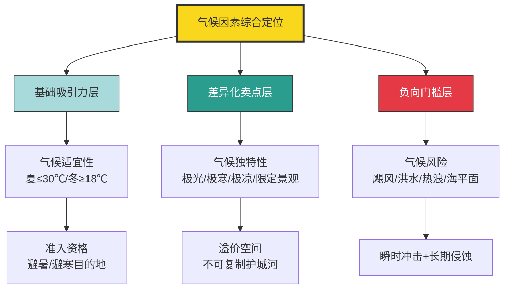

**气候权重在不同客群中的差异化排序**则进一步丰富了这一框架。结合第3章已构建的客群分层与本章观察到的现象，可对气候权重进行客群分化的深度刻画：

| 客群类型 | 气候权重 | 典型偏好 | 关键诉求 |
|---------|--------|---------|---------|
| 银发客群 | 极高 | 避寒（三亚、海口）、避暑（贵州、宜君） | 健康刚需、长停留 |
| 亲子家庭 | 高 | 避暑玩水（贵阳）、避寒亲子（三亚） | 舒适省心、安全 |
| Z世代 | 高（差异化） | 极致凉爽（漂流）、影视取景地、冰雪 | 体验稀缺、社交分享 |
| 高净值客群 | 中高 | 北欧极光、瑞士滑雪、长线品质避寒 | 稀缺溢价、独特体验 |
| 商务客群 | 低 | 与业务匹配 | 业务地理决定 |

**这一客群分化揭示了气候因素权重的弹性结构**——气候并非对所有客群都是头号变量，而是在不同客群中呈现差异化的权重排序：

**对银发客群而言**，气候权重接近"决定性"水平——高温对老年人健康构成实质风险，避寒成为冬季出行的硬性需求，三亚俄罗斯游客平均停留10天以上、不少家庭整个冬季都在三亚度过[^121][^122]，60岁以上年长者占据避寒游主力人群[^114]——这些都是气候健康刚需的市场化体现。

**对亲子家庭而言**，气候权重略低于银发客群但仍处第一梯队——儿童对极端天气的耐受度较低，家长对气候舒适度敏感度高；同时亲子家庭对玩水、玩雪等气候依赖型业态偏好显著，贵阳跻身国内亲子游TOP14[^117]、寒假亲子游对冰雪与避寒的偏好[^114]都印证了这一点。

**对Z世代而言**，气候权重呈现"差异化"特征——他们既追求极致凉爽（漂流、溯溪），也愿为独特气候体验（极光、冰雪、影视取景地）跨越长距离；同时他们对气候舒适度的"绝对值"敏感度低于体验稀缺性的"相对值"敏感度——可以承受沙漠的高温只为体验"五湖穿越"[^116]，可以承受北方寒冷只为追逐雾凇与雪[^123]。

**对高净值客群而言**，气候权重处于中高水平——他们追求气候独特性的稀缺溢价（北欧极光、瑞士雪山、巴厘岛海岛），但对气候舒适度的"基础阈值"已被其消费能力跨越（高级酒店、私人定制等可对冲气候不适）。

**对商务客群而言**，气候权重最低——业务地理决定了出行目的地，气候舒适度仅是选择附属酒店、餐饮的参考因素，不构成目的地选择的主导变量。

**气候因素与其他变量的交互机制**则进一步丰富了综合定位的复杂性：

**与签证政策的交互**：气候独特性在签证开放后释放更强引流能力——贵州黄果树景区境外游客同比+39.71%[^119]、贵阳定制游覆盖马来西亚、新加坡、欧洲入境客人[^117]，都得益于240小时过境免签政策落地。气候资源与签证开放形成"乘数效应"。

**与经济性价比的交互**：气候资源是性价比公式中的"价值端"——同样的住宿价格在凉爽小城（如宜君、六盘水）能换取的体验价值远高于高温拥堵的大城市，气候舒适度本身即构成"性价比"的隐性溢价。三亚俄罗斯客流爆发的部分原因，也包括俄罗斯本土"中医针灸一次3000卢布"vs三亚"价格亲民"的性价比对比[^121][^122]。

**与安全风险的交互**：气候风险与传统安全风险在2025年呈现叠加特征——泰国洪灾+地震+冲突的复合冲击、中东高温+地缘冲突的双重压力、加勒比飓风等都展现了这一交互机制。当气候风险与安全风险同时发生时，目的地客流的坍塌往往呈非线性放大。

**与文化体验的交互**：气候资源若不与文化深度结合，难以形成持续吸引力——黔东南"凉爽气候+苗侗文化"、宜君"清凉避暑+音乐营地+康养"、三亚"温暖海滩+中医康养"等成功案例都印证了这一交互机制。气候是"皮"，文化是"骨"——只有皮没有骨的目的地难以建立长期粘性。

**与数字技术的交互**：OTA平台对气候导向型搜索的精准匹配（如"避暑""漂流""玩水""避寒"等关键词的搜索热度指数）放大了气候因素在目的地选择中的可见度——美团"小众避暑目的地增速排行榜"、携程"暑期十大玩水避暑目的地"、途牛"避寒游热门目的地TOP10"等榜单本身即是气候因素被数字化、可视化、排序化的产物，进一步降低了游客的决策成本。

**本章核心结论可归纳为五点**：

**第一，气候因素在2025年已从"背景条件"跃升为"核心变量"**。携程将"清凉"列为暑期出游第一关键词、"避寒地"向"旅居地"功能跃迁、冰雪经济从单一观光向全季运营升级——这三大信号共同标志着气候因素权重的结构性抬升。

**第二，气候导向型旅游呈现暑期避暑、冬季避寒、冰雪极光三大主线并行**。三大主线分别对应不同客群的气候需求——避暑对应高温源头客群、避寒对应北方与高纬度客群、冰雪极光对应低纬度客群——共同构成全年化的气候导向型旅游格局。

**第三，气候资源必须通过业态融合才能充分变现**。七大融合路径（户外运动、民族文化、地质奇观、音乐节赛事、康养医疗、小而美乡村、全季化运营）共同丰富了气候资源的产品化形态，单纯的气候标签难以独立支撑可持续客流。

**第四，气候风险已成为与安全风险并列的负向门槛**。加勒比飓风、泰国极端天气链、中东高温等案例验证了气候风险的瞬时冲击力；气候变化的长期趋势则对沿海、山地、干旱地区目的地形成结构性压力，推动目的地从被动暴露走向主动转型。

**第五，气候因素与其他变量呈强交互关系**。气候适宜性是基础门槛、气候独特性是差异化卖点、气候风险是负向门槛——这三层定位与签证、经济、安全、文化、技术等其他变量在不同客群中形成差异化的权重排序，共同决定目的地客流的最终走向。

**这一综合定位框架将作为第8章综合决策模型的关键输入参数**——气候因素并非孤立作用于客流，而是与第2章基础设施级要素、第3章经济与安全因素、以及后续第5—7章的数字技术、文化体验、客群结构等变量在综合权重函数中协同发挥作用。在第5章中，本研究将进一步探查数字技术与品牌营销如何放大气候因素的市场可见度，使"凉爽""温暖""有雪"等气候卖点通过短视频、KOL、OTA算法等渠道触达更广泛的潜在客群——届时气候因素的影响半径将与传播渠道的覆盖能力进一步耦合。

需要补充说明本章的若干**不确定性来源**：第一，关于具体目的地的搜索量、订单量增速数据来源于OTA平台报告，可能存在平台口径差异（美团、携程、飞猪、去哪儿等平台的客群基础与统计方法不完全一致），本研究在引用时已标注来源以供交叉验证；第二，俄罗斯赴三亚客流的极端增长数据（如+400%、+76%）多源自旅游局或单一来源，需结合移民局、机场口岸等多渠道数据进一步交叉验证；第三，关于气候变化长期趋势对目的地脆弱性的判断，本节论据相对有限，更多基于逻辑推演而非详尽实证，后续章节及报告的局限性部分将进一步说明。这些不确定性提醒后续章节在引用本章论断时须保持必要的口径敏感性。

# 5 数字技术与品牌营销因素

第2、3、4章已系统揭示了签证、交通、汇率、安全、气候等"门槛性变量"如何决定目的地客流的基础格局——但即使一个目的地同时具备签证开放、汇率有利、安全可预期、气候舒适等所有硬性条件，仍需回答两个看似柔性却足以决定胜负的问题:**游客是否"看得见"这个目的地?游客是否"想得起"这个目的地?** 前者关乎决策入口的技术重塑,后者关乎认知溢价的品牌制造。2025年这两个维度都发生了结构性变革——生成式AI将旅游决策链路从四步压缩为两步、AI推荐结果在主流平台已垄断超八成预订流量、OTA平台的多语言翻译引擎让县域景区被全球游客发现;与此并行的是,"China Travel"席卷海外社交平台、淄博烧烤与天水麻辣烫的爆款公式被反复复刻、莫斯科文化节四天吸引285万人次、澳大利亚旅游局借KOL合作单帖互动率激增120%。**数字技术作为"决策入口重构"的力量、品牌营销作为"认知溢价制造"的力量**,在2025年形成了双轮驱动的目的地竞争新格局。本章将沿"AI重塑决策—平台连接全球—智慧赋能体验—品牌建立软实力—社交触发种草—爆款转化长红"六条主线展开,最终在末节归纳二者的协同机制与客群分化逻辑,为第6—8章提供关键输入参数。

## 5.1 生成式AI与智能体重构目的地决策入口

如果说2024年AI在旅游业仍处于"概念探讨与单点测试"阶段,那么2025年则是中国旅游报评论员邓宁所定义的**"AI在旅游行业'场景落地'的元年"**[^126]。这一定位并非夸饰——飞猪、马蜂窝、携程、同程等主流平台披露的数据,共同呈现了一个决策链路被结构性压缩的新时代。

**最具冲击力的数据来自飞猪发布的《行走的Token——2025年旅行AI指数》**。报告披露飞猪AI平台目前已累计接入214个大模型,在用户侧**Token消耗量同比增长20倍、用户日均调用次数同比增长7.7倍**;面向消费者的AI产品"问一问"上线后,行程规划成为占比近30%的热门交互场景;用户与旅行AI的交互高峰出现在晚上10点以后,且覆盖了**包括88岁高龄用户在内的多个年龄段**,其中银发族更倾向于在上午9点至12点使用[^127]。在商家侧,2025年平台商家调用AI运营工具的次数同比增长2.4倍,其中AI发品助手的使用次数同比增长达13倍[^127]。

**决策链路的压缩则在春节场景中以更具说服力的方式呈现**。一份景点视角的行业观察援引飞猪数据指出,"2026年春节假期,**用户通过AI下单的订单量比节前增长超过800%,其中用AI订景区门票的订单量更是陡增超过24倍**"——用户不再需要自己筛选信息、对比价格、组合产品,AI根据对用户意图的理解,从海量实时库存中打包出最优方案[^128]。同程旅行平台数据显示,在用户的众多提问中,景点游玩相关内容占比约20%,仅次于交通票务;**携程的大数据则表明2025年使用AI规划旅行的用户比例提升了270%,而深度使用AI的用户规模更是暴涨367%**[^128]。

**马蜂窝《2026人工智能+旅游趋势报告》提供了另一组同样震撼的数据**。该平台AI旅行助手从2025年10月正式上线至年底,**已生成131.5万余份深度旅行攻略,覆盖55个国家超416个城市,累计为用户节省约471万小时规划时间,相当于537年的"查资料人生"**;在服务能力上,AI不仅能精准规划行程,还帮用户预订了16631家餐厅、酒店砍价累计帮用户节省345万余元,同时完成81万句跨国翻译[^129]。携程方面则披露,2025年8月发布的新版AI行程助手**为旅行者节省约50%的决策时间;自上线以来页面访问量同比增长180%、用户停留时长大幅提升108%、用户可直接出行的线路创建量增长了43%**[^130]。

将上述四大平台的AI决策链路重构数据整合对照,可清晰呈现"提问→预订"两步决策的产业级变革:

| 平台 | 关键AI数据 | 决策影响 |
|------|----------|---------|
| 飞猪 | Token消耗+20倍、日均调用+7.7倍 | 春节AI下单+800%、AI订门票+24倍 |
| 马蜂窝 | 131.5万份攻略、覆盖55国416城 | 节省471万小时规划时间 |
| 携程 | AI行程助手节省50%决策时间 | 页面访问+180%、停留时长+108% |
| 同程 | 景点游玩咨询占比约20% | 仅次于交通票务 |

数据来源:综合飞猪《行走的Token》、马蜂窝《2026人工智能+旅游趋势报告》、携程财报与公开披露

**这一数据矩阵背后的结构性变革,可以归纳为三重跃迁**。**第一重是"决策步骤的压缩"**——OTA时代的"搜索→筛选→比价→预订"四步链路在AI时代被压缩为"提问→预订"两步,用户只需告知大致需求,AI即可反推适配目的地、生成涵盖"食住行游购娱"的全流程可执行方案[^129]。**第二重是"决策主权的转移"**——传统模式下用户掌握最终决策权,AI仅作辅助;而马蜂窝《2026人工智能+旅游趋势报告》明确指出"AI为旅行者提供的核心价值快速跃迁,从'帮你查'的被动辅助,升级为'替你想'的主动决策"[^129]——这意味着部分目的地选择决策权已实质性让渡给AI算法。**第三重是"需求表达的升级"**——马蜂窝披露AI被询问最多的关键词TOP10为"**便宜、小众、不踩雷、行程安排、人少、亲子、躺平、性价比、一天怎么玩、值不值得**",折射出用户从"看有什么"到"找适合我"的需求升级;更具代表性的是,当AI能高效解决标准化需求,用户开始提出各类"非标准问题",如"适合社恐的旅行目的地""带爸妈不排队的名胜打卡方案"等,推动小众玩法与目的地出圈[^129]。

**这三重跃迁对目的地选择的影响是深远的**。第一,**目的地的"被看见率"不再由广告投放决定,而由其在AI推荐结果中的排序决定**——一份景点视角的行业观察援引数据指出,"2026年生成式人工智能用户规模突破6亿,**主流AI平台答案页前三位的推荐结果,垄断了超过81.6%的旅游预订量。未能进入AI推荐名单的景区,官网流量平均下跌67.3%**"[^128]。这一数据虽属预测性判断,但已揭示出AI推荐生态的"赢家通吃"特征——**在AI关键决策场景中失声的目的地,即使具备优质资源也将面临"数字隐形"的风险**。第二,**目的地的"被选中率"开始受用户偏好数据反哺**。马蜂窝AI旅行助手"沉淀的数据反哺景区优化资源调度与产品迭代",其打造的"AI游西江"智能体围绕游客"行前—行中—行后"全流程提供服务,案例已入选中国互联网协会数智创新应用案例[^129]。第三,**目的地选择的客群基础正在扩展至非传统数字原生人群**——飞猪数据显示AI使用覆盖"包括88岁高龄用户在内的多个年龄段"[^127],马蜂窝披露"80后与90后构成核心用户群占比达73%,70后及更年长用户占比26%,打破AI'年轻人专属'的刻板印象;**新一线及以下城市用户合计占比近七成**,说明AI在信息获取成本较高的区域更具价值"[^129]。

值得指出的是,**AI对决策入口的重构与第4章观察到的气候因素权重抬升形成深度共振**。当用户在AI对话框中输入"夏天哪里凉快""适合带爸妈不晒的目的地"时,AI算法本身就在以气候为关键变量进行筛选——气候适宜性通过AI推荐机制被系统性放大;同样,"想去看雪""极光观测攻略"等查询则将冰雪极光等气候独特性资源精准匹配给目标客群。**AI算法实质上成为了气候资源、文化资源、性价比资源等多维变量的"权重分配器"**,这一重构作用将在5.7节进一步与品牌营销协同机制整合。

## 5.2 OTA数字平台的跨境枢纽作用与多语言破壁

如果说生成式AI重构了目的地决策的"前端入口",OTA数字平台则承担了将这一入口与全球供给资源连接的"跨境枢纽"角色。2025年携程、Booking、Expedia等头部OTA的实践,共同验证了平台经济在入境游与出境游双向流动中的不可替代作用。

**携程"智译未来"AI翻译引擎构成了入境游"破壁"的核心基础设施**。第1章已勾勒中国入境游突破8000万人次的爆发态势,但搜狐财经的深度报道揭示了一个常被忽视的痛点:**"对于一个从未涉足中国的外国游客,阻碍他们的最大恐惧往往不是签证的繁琐,而是面对中文互联网的手足无措。很多外国游客想去大理、想去淄博、想去四川看熊猫,但在海外主流攻略网站上,能搜到的信息极其有限。中国大部分的优质旅游资源,从小城的特色民宿、胡同深处的苍蝇馆子再到某个县城的非遗体验,往往都只存在于中文网页里"**[^131]。

携程对此的解决方案是**AI翻译引擎"智译未来"——一年产出了60亿词的内容,覆盖25种核心语种**[^131]。这一规模的翻译产出意义不仅在于"翻译得多、快",更在于"翻译得准"——以前一个县级景区的介绍若要翻译成地道的英文、法语或韩语,需要专业人工翻译,成本高且效率低,**很多小景区直接就放弃了海外市场,外国游客也往往被拦在了语言这一步**[^131]。携程利用AI帮助景点门票和玩乐产线多语言覆盖后,**"原本只有中文介绍的二三线城市小众景点,也能被全球游客搜索和预订"**——这正是入境游下沉至非门户城市的技术基础。

**市场结果的验证是直接而有力的**。携程财报印证了"China Travel"热潮的火爆——**2024年第四季度携程国际OTA平台酒店和机票预订同比增长60%**[^131];外国游客的足迹逐步从一线城市向三四线甚至更低线城市"下沉",**湖南张家界凭借奇山峻岭吸引了大批韩国游客,入境酒店热度涨幅超2倍;新疆伊犁、四川阿坝州、广东清远等特色目的地,也开始进入国际游客视野**[^131]。这一下沉趋势与第2章观察到的"重庆入境客流+170%、大同云冈石窟相关票量+7倍、景德镇入境客流+39.63%"高度同频——**240小时过境免签政策提供了"地理半径",而OTA的多语言翻译引擎则提供了"信息半径",二者协同释放了入境游下沉的市场潜力**。

**垂直行业大模型则解决了"敢支付"的关键问题**。一个显著的行业痛点是:通用AI虽然能翻译字面意思,却很难解释复杂的商业规则。**尤其是面对中国特色的"退改签政策"和酒店亮点描述,任何一点语义的模糊都可能让外国游客们因"看不懂产品规则"而不敢下单**[^131]。携程的AI是基于集团自有海量旅游数据资产"喂养"长大的,这意味着它"不仅懂语言,更懂旅游、懂业务";**经过体验,让携程AI行程助手帮自己规划去大理市的旅游,该助手会了解需求、查找目的地、查询热门景点、挑选合适酒店、规划交通路线等等,再整理成一个完整的行程规划——它不是在机械地排列景点,而是给出一个包含酒店、车票、门票的闭环方案**[^131]。

**OTA平台的"技术+营销+文化"融合服务则将单纯的预订平台升级为入境游消费转化的放大器**。携程2025Q3财报背后的故事呈现了三个具有代表性的协同案例:

**第一,TASTE OF CHINA·味沉浸式餐厅**——位于上海外滩的这家携程合作沉浸式餐厅,**截至2025年10月开业仅三个月已累计接待游客超过1300位、客源覆盖全球21个国家和地区;随着俄罗斯免签政策的实施,其游客订单占比已达约16%;十月第三周餐厅单周销售额突破30万元**[^130]。来自巴西的Rhayssa Braz体验后感叹"穿着这套'中国风'的衣服吃饭感觉像来到了电影中的一个场景,一切都美的不可思议"——餐厅将美食体验与数字化的视觉、听觉沉浸技术相融合,创造出独具匠心的多维感官体验[^130]。

**第二,北京丽思卡尔顿酒店与平台合作模式**。酒店总经理Alfonso介绍,**今年以来酒店入境客源呈现多元化增长,来自美国、新加坡、土耳其等地的旅客数量均有提升;在与携程等平台的合作中,酒店通过机酒套餐、在热门景区页面展示等方式精准触达境外游客,并在暑期收获了三位数的间夜量增长**[^130]。Alfonso的总结颇具启发——"当国际酒店集团的服务标准,与平台的营销洞察和目的地的文化资源深度融合时,我们能为全球旅行者创造更多价值"。上海南新雅皇冠假日酒店"通过参与OTA平台的机酒打包套餐和海外大促等活动,2025年第二季度入境订单同比增幅达到90%"——这一数据(已在第2章援引)与北京丽思卡尔顿的"三位数间夜增长"形成相互印证。

**第三,"First Go China"首乘专享项目**——携程机票联合中国航司(含港澳)推出的项目,**通过整合平台流量与航司资源,为外籍旅客提供最高15%的票价优惠**,旨在帮助中国航司做好"东道主",让更多海外旅客从踏上航班伊始就能提前感受中餐的暖意与中式服务的周到,让中国航司升维为展示大国形象的"云端名片"[^130]。澳大利亚游客David感慨"从踏上航班的那一刻起,我的东方之旅就已经开始了。通过座椅屏幕提前了解了目的地风光,贴心的服务也让我对这次旅行充满了期待"[^130]。

**OTA平台的全球三足鼎立格局与数智化、绿色化、ESG投入趋势**则提供了横向对照。世界旅游城市联合会与中国社会科学院联合发布的《世界旅游经济趋势报告(2025)》指出,**2024年全球在线旅游市场规模可达6584亿美元,较疫情前的2019年增长34.6%,预计2028年市场规模将达到8079亿美元;中国、美国以及西欧三大市场占据全球在线旅游市场近七成的份额,三大传统OTA龙头Booking、Expedia和携程分别在欧洲、美国和中国占据着在线旅游行业主导地位**[^132]。在ESG投入层面,**Booking.com选择与采用节能措施、使用可再生能源、减少废物产生的环保酒店进行合作,向用户推广绿色住宿选项;Trip Advisor建立了环保评价体系**[^132]——这一绿色化趋势将在第6章可持续发展因素中进一步展开。

**携程出海路径的延展同样值得关注**。携程商旅2026年4月23日在上海举办首届全球商旅伙伴大会,正式发布"携程商旅AI生态"全景图及《2025-2026商旅管理市场白皮书》;数据显示**中企出海平均跨境订单量已连续三年保持30%以上增长;携程商旅的供应链资源可以覆盖99%的国家和地区,采购范围目前已覆盖全球120万家酒店,可帮助企业优化7%-15%的酒店成本**[^133]。商旅维度虽不是本研究核心命题,但OTA平台对中企出海差旅服务的深度介入,也从侧面验证了平台型企业在跨境旅游中的枢纽地位。

**这一节的核心结论是**:OTA平台不再仅仅是预订工具,而是将"AI翻译+垂直大模型+酒店合作+航司合作+沉浸场景"整合为完整的跨境旅游基础设施。**对入境游而言,OTA平台是中国小众目的地"被全球看见"的关键媒介;对出境游而言,OTA平台是中国游客"敢去陌生地"的信任背书**。这一枢纽作用与第2章基础设施级要素、第4章气候资源变现机制共同构成了2025年目的地竞争的多层支撑体系。

## 5.3 智慧旅游与沉浸式技术对目的地体验的升级

OTA平台解决了"看到"与"预订",但游客抵达目的地后的实际体验,则越来越依赖于AR/VR/XR/AI智能体等沉浸式技术的赋能。2025年是这一技术矩阵集中落地的元年——AI已不再只是藏在OTA后台的"无形之手",而是悄然走进了每一位游客的行李箱、相册甚至朋友圈文案中,变成了贴身向导、智能摄像师、轻体力助手,甚至是最默契的"旅伴"[^134]。

**外骨骼机器人与机器狗代表了"轻体力"与"陪伴感"的硬件级突破**。澎湃湃客科技栏目的报道呈现了几个生动场景——95后女生"小乔"在五一期间挑战夜爬泰山,租用了景区推广的"外骨骼机器人",**3小时80元,从红门一路走到玉皇顶,不仅没出汗,还一路刷抖音直播**;**仅泰山一地清明节期间外骨骼机器人日均出租超3000套,用户满意度超95%**[^134]。这一类由AI控制的助力装备原本用于康复医疗和工业作业,如今"降低了游客游览的体力门槛,尤其对老年游客与亲子用户更具吸引力,具备商业潜力"[^134]。机器狗则承担了"陪伴+巡逻+内容生成"的复合功能——"它比男朋友更懂我"的张家界机器狗、武功山的负重爬坡机器狗、雁荡山能记住游客路径的机器狗,**这些"社牛机器人"正在承担起"社交打卡"的内容生成器角色,可内置高分辨率AI相机实时分析游客面部表情与环境背景,生成定制Vlog片段并自动剪辑上传**[^134]。

**AI数字人与AR眼镜则代表了"文化导览"与"实时翻译"的软件级突破**。在滕王阁,游客可以遇到能吟诗的"王勃"数字人;在敦煌,通过"莫高窟数字孪生技术",在AR眼镜里观看一场沉浸式壁画修复讲解——"比听录音讲解器好多了,像跟穿越时空的朋友聊天"[^134]。西安大唐不夜城的"唐小宝"、峨眉山试点的"峨眉武侠数字导游",这些AI数字人不仅讲解,还能与游客互动交流。**有着杭州"第七小龙"之称的灵伴科技带来Rokid Glasses——"带显示的"AI眼镜不仅支持全球多种语言实时翻译,还融合了AI识物问答、声纹识别支付、导航、拍照等实用功能**[^135]。

**景区智能体则将AI能力深度嵌入特定目的地的运营生态**。2025年广东省文化和旅游厅联合广东省工业和信息化厅发布的"人工智能+文旅"应用场景典型案例,展示了从腾讯音乐"天琴实验室"AI技术创新平台到趣丸千音、INZLAB全球数字内容AI创作平台等丰富的实践图谱[^136]。在景区层面,**贵州西江千户苗寨的"AI游西江"智能体小程序用户量已突破20万、访问量超过130万人次**;贵州文旅数字形象代言人"黄小西"基于贵州旅游大模型打造,除行程规划外还支持一键订购、AI伴游、游记生成等多种功能[^135][^128]。各地文旅主管部门也纷纷尝试在文旅信息服务平台加入AI功能——**杭州"杭小忆"、上海"沪小游"、广西"刘三姐"等都是AI在旅游信息服务方面的具体形态**[^126]。

**痛点导向型智慧旅游则代表了从"功能堆砌"到"问题破解"的方向转向**。江苏无锡惠山古镇景区的"慧游惠山"小程序提供了一个生动样本——"小惠小惠,附近有适合老人的无障碍路线吗?"游客张阿姨向AI管家"小惠"提问后即刻得到回复:"为您推荐无障碍路线,全程无台阶,距离1.2公里,沿途有休息驿站";打开小程序,**停车、寄存、厕所、讲解等游客出行最为关心又常常难以解决的事项,在首页最显眼位置"一键即达"——"便捷停车"实时显示景区6个停车场及周边信息,7处自助寄存点、30个厕所精准导航**[^137]。文化和旅游部资源开发司司长满宏卫的总结极具方向感——**"智慧旅游的发展不是追求功能堆砌,而是优先解决行业发展的共性难题和游客出行的痛点堵点。这不仅是'以人为本'发展理念的重要实践,更是一个地区旅游治理能力和发展水平的综合体现"**[^137]。

**数据治理与系统协同则将智慧旅游升维至"目的地治理"层面**。第4章已援引哈尔滨"冰雪文旅云平台打通18个部门数据,实现客流监测、交通调度一体化管理"——这一数据底座也是"智慧协同+情感浸润"双轨服务体系的核心。惠山古镇的转变堪称典型案例——**今年年初景区及周边成堵点景区管理人员拿着大喇叭喊无济于事,今年国庆景区车流人流虽多但秩序良好;转变源于治理之功——搭建数智治理平台,依托江苏省智慧文旅平台**[^137]。黄山景区的伴游体可根据携带老人还是携带孩子,结合天气和人流情况定制精细化路线,实现"千人千面"服务升级;山东台儿庄古城的智慧景区建设让银发旅游适老又悦老——**线上导览图、线下实景图解决老人"寻路焦虑","紧急报警"既能找回丢失物品也能快速锁定走散老人**[^137]。

**沉浸式技术对气候与文化资源的变现放大作用**则与第4章逻辑形成深度耦合。哈尔滨各大景区引入气象感知系统实时调节冰雕温湿度,开发AR冰雪地图与智能迎宾机器人;**"数字冰焰"投影秀和AI语音导览系统(支持东北话、粤语、英语)极大地提升了游客的游览体验**[^138]。武功山、雁荡山、张家界等山地目的地通过机器狗陪伴打卡形成"AI流量入口"[^134]。**这些技术应用实质上将气候资源(冰雪)、文化资源(苗寨/侗寨/敦煌)、自然资源(山地)从"静态展示"升级为"动态交互",大幅提升了目的地的体验深度与社交分享潜力**——这一升级正是第4章"气候资源必须经由业态加工才能成为成品"判断的技术化诠释。

**值得强调的不确定性与争议**——一份景点视角的行业观察明确提出"AI旅行助手,真的是你的智能知己,还是高价低能的科技噱头?"的反思[^134]。环球旅讯&飞猪等机构联合发布的《2025上半年中国AI旅游应用趋势报告》更系统揭示了行业渗透的不均衡性——**全行业AI应用率53%、1000人以上大企业达80.6%、50人以下中小企业仅45.7%;互联网平台(83.3%)、航司(75%)、景区(75%)为第一梯队,酒店业仅25%**[^139]。从用户侧看,**"近7成企业差旅经理未使用AI商旅工具,仅31%尝试";付费意愿呈"年龄倒挂"——18岁以下未成年群体74.28%明确表示愿意为个性化AI旅游服务付费,而56岁及以上群体仅7.35%**[^140]。这些数据提示智慧旅游虽已在头部平台与示范景区取得突破,但**在中小酒店、四线及以下城市、银发付费意愿等维度仍存在显著的"数字鸿沟"**——这一不均衡将在5.7节客群分化部分进一步展开。

## 5.4 国家形象与城市品牌的软实力建设

数字技术降低了游客的触达成本,但游客最终选择前往哪个目的地,仍受国家形象与城市品牌这一更高维度的"认知溢价"影响。2025年中国、阿联酋迪拜、莫斯科三类典型路径的软实力建设实践,共同呈现了从国家级、城市级到事件级的品牌运营方法论。

**"China Travel"的全球破圈是2025年国家形象建设最具说服力的成果**。一份综合报道援引数据指出,**2025年中国入境旅游人次突破1.5亿、同比增长17%,国际游客在华花费超过1300亿美元、增幅高达40%**;2026年清明节假期期间免签入境的外国人达到31.9万人次、同比增长30.7%[^141]。在YouTube、TikTok、Instagram等海外社交平台上,**"China Travel"已经成为一个现象级的传播标签**;一位来自法国的旅行博主在视频中感叹"中国和我之前想象的完全不同,这里安全、现代、友善,每一个城市都有独特的魅力"[^141]。需要说明的是,本研究第1章已援引2025年入境旅游突破8000万人次(国家移民管理局口径)的数据,而本节1.5亿人次涉及更广义的入境旅游人次统计口径——两组数据并不矛盾,前者为外籍人员入境人次,后者包含港澳台居民等更广义口径。

**博主自媒体形成的"去滤镜化"传播效应,实质性改变了西方对中国的刻板印象**。2025年3月,美国顶流网红"甲亢哥"(IShowSpeed)开启中国行,在上海外滩、北京798、成都宽窄巷子及少林寺等地进行全程直播,**YouTube与TikTok总观看量突破9000万**;"甲亢哥"惊叹于中国城市夜间的治安、地铁的准点率和移动支付的便捷,并直言"这里比美国安全多了"[^142]。《环球时报》评论称,**"当'甲亢哥'举着手机与中国年轻人即兴合唱《阳光彩虹小白马》,当外国'草根素人'通过镜头分享中国的美食、美景以及有趣经历见闻,全球观众在笑声中感受着中国的友善与亲近;这种'去滤镜化'的呈现击中了一些西方政客和媒体刻意设置的认知盲区,打破了他们人为制造的'寒蝉效应'和'信息茧房'"**[^142]。

哈桑·阿比、"无语哥"等海外网红的中国行进一步放大了这一效应——**哈桑·阿比在中国行后不仅穿着定制中山装亮相美国"流媒体颁奖礼"红毯,还在直播中直言"我爱中国,中国就是未来,这里简直像活在2050年,西方媒体的抹黑完全是带有偏见的谎言"**[^142]。这种第一视角的真实记录之所以具有强大穿透力,核心在于"相比以往西方媒体对中国的选择性报道,这些由外国游客自己创作的旅行视频更加真实、接地气"[^141]——这一传播机制实质上绕过了传统主流媒体的叙事框架,直接在客源地年轻人心智中重塑中国形象。

**汉服热与文化深度游则代表了软实力建设的"文化共鸣"层次**。截至2025年6月,**TikTok上"汉服"话题视频已近30万条,引发大量海外用户对中国传统服饰的兴趣**;一名南非留学生在成都拍摄的古风视频获近4万点赞,她感慨"我感觉自己就像中国古装剧中的女主角"[^142]。专家指出"外国游客选择汉服并非仅出于猎奇,而是基于对中华文化的认同与喜爱;服饰作为文化的重要外在载体,正在成为跨文化对话的新媒介"[^142]。与此同时,**以体验地道地方文化为核心的旅游模式日益兴盛,尤其受到国外千禧一代和Z世代青睐**——他们不再满足于打卡热门景点,而是深入街头巷尾,品尝四川火锅、山东饺子、新疆羊肉串等地道风味,寻求与中国多元历史和习俗的真实连接[^142]。

**配套的便利化措施则将软实力转化为可操作的现实体验**。中国持续优化的入境便利化措施为"China Travel"的走红创造了条件——**移动支付国际化不断推进,支付宝、微信支付已支持多种外币绑定;多语种服务在景区和交通枢纽日益完善;12345多语种服务热线为外国游客提供咨询帮助**[^141]。这些细节上的改进,让外国游客在中国的旅行体验越来越顺畅舒适——**"China Travel"的破圈,本质上是签证开放(第2章)+支付便利+多语种服务+真实体验+博主传播的多维协同的结果,而不仅是单一传播事件的偶然爆发**。

**迪拜则提供了城市级软实力建设的另一典范路径**。东方网"城市软实力观察"专栏指出,**迪拜大概330万常住人口中其中约八成来自境外**——多元化、稳定的社会环境为来到迪拜工作生活的国际消费群体不断提供动力[^143]。迪拜的成功密码呈现"硬+软"双轮驱动:

**硬件层面**——迪拜在基础设施建设方面投入巨资,如成立阿联酋航空公司、建成迪拜国际机场;迪拜政府还打造了一批以帆船酒店、亚特兰蒂斯、太阳之门沙漠酒店为代表的豪华酒店,**"不胜枚举的豪华度假村和五星级酒店已成为迪拜的标签之一"**[^143]。

**软件层面**——迪拜对不少国家旅客采取了免签、落地签等方式,不断强化机场通关便利;**"在迪拜机场、大型商场和博物馆,同时可以看到阿拉伯语、英文、汉语和印度地方语等多种语种标识的指示牌"**;商场内设置了银行、电信运营商甚至移民局的办事柜台,游客可以在休闲购物的同时办理延期签证、外币兑换等业务[^143]。**阿联酋副总统兼总理兼迪拜酋长谢赫·穆罕默德在社交媒体上的总结颇具启发——"阿联酋真正的软实力在于其融合东西方的发展模式。它没有歧视地汇集了所有文化中最好的想法、思想、人,和世界上最好的发展经验"**[^143]。市场结果亦印证了这一战略——前文已援引第3章数据,2025年迪拜共接待国际过夜游客1959万人次较2024年增长5%、连续三年创下历史新高。

**莫斯科市旅游委员会则提供了"文化节+数字传播"的事件级城市品牌建设范本**。2025年6月12日至15日在北京成功举办的"莫斯科文化节"获得中国国际公关协会第二十一届最佳案例大赛政府关系类银奖,**活动吸引了285万人次参与,获得了广泛的社会与媒体反响,成为2025年中俄人文交流领域的亮点事件之一**[^144]。莫斯科市旅游委员会新闻与传播事务首席执行官玛丽亚·尼卡诺罗娃分享的方法论值得系统拆解:

**第一,数字优先策略**——"中国游客的群体正在不断年轻化。如今,来到莫斯科的已不仅仅是二三十年前来访的年长团体游客,而是越来越多喜欢个性化旅行的年轻独立游客。正是基于这一趋势,我们在传播策略上秉持'数字优先'的原则"[^144]。

**第二,青年形象大使体系**——"目前莫斯科高校中有超过6000名中国学生,其中许多人是我们播客和社交媒体内容的嘉宾。**可以说他们已经成为莫斯科的'青年形象大使',用自己的语言向充满活力的中国年轻群体展示俄罗斯首都的旅游魅力**"[^144]。

**第三,沉浸式公共空间打造**——"让其他国家的游客真正了解莫斯科的最佳方式之一,就是打造能够让他们沉浸式体验城市氛围的公共空间。一个典型的例子是今年夏天首次在北京举办的'莫斯科文化节'庆祝活动";活动为期四天,**游客欣赏了现代与古典音乐会、参与舞蹈课程、品尝俄罗斯美食、学习制作具有民族特色的玩具与纪念品**;还能在"莫斯科茶会"和"莫斯科庄园节"的打卡区合影,或在数字科技互动区体验"沉浸式云游莫斯科"[^144]。

**第四,商务对接与媒体放大**——"此次节庆还设有商务活动板块。**来自中国与莫斯科的企业家及市政府代表共签署了七项合作协议**,双方将在贸易、旅游和文化等领域展开合作";"在活动开幕式上,**共有来自中国的62家媒体代表出席。在中国国内,包括新华社在内的主流媒体纷纷报道,共计发布了360篇新闻稿,覆盖数以亿计的受众**"[^144]。

将莫斯科文化节的方法论提炼为可复制的城市品牌建设框架:

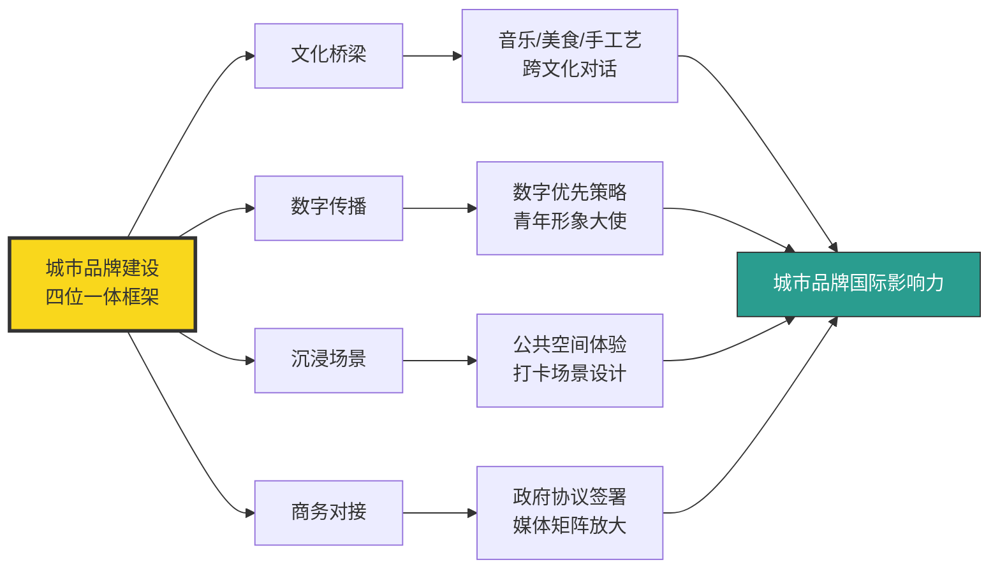

**这一框架的可借鉴性在于其方法论的系统性而非单一事件的偶然性**——文化桥梁负责"破冰",数字传播负责"扩散",沉浸场景负责"体验",商务对接负责"沉淀"。**中国、迪拜、莫斯科三类路径的共同启示是:国家形象与城市品牌不能依赖单一爆款,而需要"硬基础设施(签证/航班/酒店)+软文化内容(节庆/IP/博主)+数字传播渠道(社交媒体/留学生/媒体矩阵)"的多维协同**——这一综合机制将在5.6节通过中国本土城市的爆款案例进一步深化。

## 5.5 社交媒体、网红效应与KOL推荐的种草链条

如果说国家形象与城市品牌建立了目的地的"基础认知",社交媒体与KOL推荐则是将这种认知转化为实际预订决策的"种草链条"。2025年小红书、抖音、TikTok、视频号、YouTube等平台共同构成了游客目的地发现的核心入口,KOL分层与平台分工的精细化,深刻塑造着不同客群的目的地选择路径。

**小红书作为"目的地种草"主阵地的地位在2025年得到全方位巩固**。东方财富援引的小红书数据显示,**2024年小红书的旅游兴趣月活用户超过1亿,月均新增旅行笔记达到14万+,而月均产生旅行相关搜索高达16亿次**[^145]。这一数据规模使小红书成为旅游决策前最重要的"信息搜索引擎"——人们对旅行需求的旺盛以及深度追求旅行体验,使小众目的地通过小红书获得了前所未有的爆发机会。**根据小红书的数据,2024年搜索同比增速最快的国内城市中徐州、泉州等城市赫然在列,其搜索增速分别达到了111%和190%**[^145]——这些"曾经被低估的小城,如今正以其独特的历史文化、美食美景吸引着越来越多的游客"。

**Dragon Trail International《小红书榜单报告》则从国际目的地营销视角提供了深度洞察**。该报告追踪并分析各国家旅游局(NTO)、目的地营销组织(DMO)、航空公司、邮轮公司、博物馆及景区、酒店等机构的账号表现,核心指标为单帖活跃粉丝互动率。**2025年第一季度国家旅游局运营表现榜单显示——澳大利亚旅游局蝉联榜首,自2024年第一季度起持续领跑;同比表现呈跨越式增长——总互动量激增237%(从11197次跃升至37766次)、周均互动率从1.90%跃升至4.39%**[^146]。

**澳大利亚旅游局的爆款方法论值得深入解构**——该机构包揽当季度最热门帖文前十名中的七席,**其中表现最佳的内容是由演员于适为昆士兰州拍摄的宣传片;该宣传活动的专属Tag #于适的昆士兰假期# 在小红书累计收获25.05万浏览和1.08万篇互动笔记**[^146]。其他被广泛分享转发的帖子集中展示于适的旅行路线,重点推介了**黄金海岸、大堡礁、可伦宾野生动物园、伯利角以及冲浪者天堂等目的地**——这些内容带动游客跟随于适的脚步共同去探索澳大利亚[^146]。**全类别NTO账号运营增长态势同样亮眼——行业总互动量暴涨173%(从33307次跃升至90899次),单帖活跃粉丝互动率同样实现翻倍以上增长、增长率达120%**[^146]。

**这一KOL合作案例的研究价值在于揭示了国际目的地营销的"明星KOL+地方文旅+精准传播"成功模型**——澳大利亚旅游局并非简单投放广告,而是通过为明星KOL定制旅行路线、串联多个目的地、配合专属标签运营,使一次营销活动同时实现品牌曝光、目的地推广与互动转化的三重目标。**这一模式与5.4节莫斯科文化节"青年形象大使"机制形成有趣呼应——本质上都是借助具有跨文化影响力的KOL或学生群体,以"他们的语言、他们的视角"向目标客群传递目的地价值**。

**银发KOL的崛起则代表了KOL生态的代际扩展**。AgeTravel观察到的现象颇具结构意义——**爱玩敢玩的中老年网红正在旅游赛道花式种草;以视频号、抖音、小红书为代表的社交平台成为日常生活不可或缺的一部分**;QuestMobile《2024中国互联网核心趋势报告》显示**银发人群月活跃用户规模达到3.29亿,月人均使用互联网时长129小时、同比提升5.3%**[^147]。

具体案例中——**60岁博主"徽子墨的旅途见闻"凭借接地气的拍摄风格和真诚的内容分享,从年轻人扎堆的旅游赛道脱颖而出、吸粉无数;目前全平台粉丝数已超过百万、其中抖音平台粉丝数超过50万,在视频号上几乎每条视频都能获得万赞,已成为旅游赛道的头部博主**[^147]。58岁旅游博主"外婆姐姐"在小红书拥有4w+粉丝,通过短视频向网友分享自己过往的旅行经历,**强调中老年出游时选择旅行搭子的重要性——这条视频吸引了数千名网友点赞留言,从留言内容来看大多数网友都与"外婆姐姐"属于同龄人**[^147]。这一KOL生态的代际扩展,意味着银发客群的目的地选择不再仅依赖传统电视广告或子女推荐,而是开始通过同龄KOL的真实分享形成"圈层种草"——这与第3章观察到的"银发客群对气候敏感度高、对人情味敏感度高"形成了渠道层面的共振。

**KOL分层与平台分工的精细化,深刻塑造着不同客群的目的地选择路径**。综合本节及前述章节的数据观察,可勾画出2025年KOL生态的分层结构:

| 客群层级 | 主要平台 | KOL类型 | 内容形态 | 决策影响 |
|---------|--------|--------|---------|---------|
| 海外大众 | YouTube/TikTok/Instagram | 国际顶流网红 | 直播+Vlog | "中国比想象的好" |
| Z世代国内 | 小红书/抖音 | 明星+腰部博主 | 汉服/打卡/攻略 | 小众目的地破圈 |
| 80后90后 | 小红书/微博 | 旅游KOL+素人 | 深度攻略+经验分享 | 性价比+品质平衡 |
| 银发客群 | 视频号/抖音/小红书 | 同龄银发KOL | 真实Vlog+生活分享 | 圈层种草+情感共鸣 |
| 国际入境客群 | TikTok/Instagram/YouTube | 海外博主+国际明星 | 第一视角真实记录 | 去滤镜化认知重塑 |
| NTO/DMO国际营销 | 小红书 | 明星KOL定制合作 | 专属Tag+目的地串联 | 互动率倍增 |

数据来源:综合小红书、Dragon Trail、AgeTravel等机构报告

**KOL与社交媒体作用机制的核心特征可归纳为三点**:

**第一,真实性优先于专业性**。无论是甲亢哥的直播、于适的昆士兰假期、还是徽子墨的旅途Vlog,共同特征都是"真实记录"而非"精致包装"——传统旅游宣传片往往过度美化目的地,而KOL第一视角的内容反而以"接地气"赢得信任。

**第二,圈层化优先于普适化**。澳大利亚旅游局选择于适面向小红书Z世代女性、莫斯科市旅游委员会借助中国留学生面向年轻群体、银发KOL面向同龄人,**这种"圈层精准匹配"使一次营销投入能够获得远超无差别投放的转化率**。

**第三,平台分工日益清晰**。社交媒体营销策略研究报告援引的数据显示**短视频用户规模达10.53亿、用户使用时长占比达35.7%,成为网民最主要的互联网应用之一;社交媒体已从单纯的社交工具演变为集内容消费、互动交流、交易转化于一体的综合平台,用户对旅游信息的获取路径从传统的搜索引擎、官方网站转向社交媒体推荐**[^148]。Z世代及千禧一代成为旅游消费主力群体,**其决策高度依赖KOL/KOC内容、用户评价及社交互动**——这一趋势倒逼旅游行业加速营销模式转型,社交媒体营销已成为连接用户、提升品牌影响力、实现精准获客的核心渠道[^148]。

**乡村振兴与小众目的地的网红打卡点经济**则是社交媒体效应的下沉延伸。2025年研究显示**网红打卡点根据其特色和功能可分为自然景观类、人文景观类、美食体验类、休闲娱乐类四大类型;通过网红的推荐和分享,迅速在网络上走红、吸引大量游客前来体验**[^149]。这一逻辑也将在5.6节通过淄博、天水、太原等城市爆款案例得到更充分的展开。

**值得指出的是,KOL生态的快速扩张也带来了若干隐忧**。AgeTravel观察到银发KOL群体的两类分化——**与一些通过数字人"坑老"、在直播间推销低价劣质产品的网红不同,这些50+博主们在平台上分享自己的真实旅行经历,他们不以商业变现为唯一目的,也没有吸引眼球的文案,而是以写日记一般的虔诚感记录旅途中的点滴感悟**[^147]。这一对比提示**KOL生态的健康度高度依赖内容真实性,商业过度渗透可能反噬种草效应的可信度**——这也是5.6节探讨"网红到长红"转化机制时需要进一步审视的命题。

## 5.6 城市营销爆款公式与流量到留量的转化

社交媒体的种草链条最终在城市层级催生了一系列现象级爆款——淄博烧烤、哈尔滨冰雪、天水麻辣烫、太原"歌迷之城"+《黑神话:悟空》、三亚消费提级,这些城市以差异化的"小切口"撬动了全国级的目的地热度。本节通过这些典型案例,归纳爆款营销的"三步公式"与"网红到长红"的破局路径。

**金错刀对天水复刻淄博的深度观察,揭示了爆款城市营销的"剧本化"特征**。报道指出"仔细梳理就会发现,**天水麻辣烫火爆的状况几乎是像素级复刻了去年淄博烧烤的打法——从大V引爆话题、腰部博主带起流量,再到市政府'躬身入局'做'听劝城市'**"[^150]。具体到执行层面:

**第一步,品类差异化**。天水从淄博学到的第一招是品类出圈——"淄博先用小饼+葱卷烤串的形式打开了形式差异,又因为博主B太的实地验秤,把从不缺斤短两的名声打了出去;天水麻辣烫则相对简单一点,瞄准了一个竞争对手——麻辣烫刺客";"在一线城市里吃一顿麻辣烫竟然得花费50元以上的价格,'麻辣烫刺客'的话题开始爆红,**而天水麻辣烫突然出现以10多元左右的客单价和'更麻更辣更实惠'的方式迅速爆火**"[^150]。

**第二步,听劝型城市运营**。"过年期间一位抖音只有数千粉的博主'一杯梁白开'发布的天水麻辣烫视频爆火,天水积攒了数个月的话题终于被引爆,搜索量翻番;为了迎接流量和游客,天水接下来开启了对淄博的'像素级'模仿——**淄博修建'烧烤专线',天水就把火车站的6路公交车改装成了'麻辣烫专线';淄博用3天修缮了一条750米长的道路,天水也终于填平了被吐槽多年的羲皇大道**"[^150]。**所有操作只为了做一个淄博式"听劝+亲民+好客"的网红城市**[^150]。

**第三步,人情味的情感锚点**。城市营销研究指出"城市中那些无法量化的人情味与烟火气,正是触动人们心灵的锚点;**当人们踏上异乡的土地他们追求的不仅仅是新奇的风景和美味的食物,更是那份来自心灵的共鸣与触动**;以天水为例,麻辣烫不仅是一种美食,更是一种情感的寄托——通过美食,城市的温度与善意得以在人们心中留下深刻的印象"[^151]。

**爆款公式的理论提炼则可追溯至福格行为模型**。城市营销研究指出"福格行为模型告诉我们,行为的发生需要动机、能力和提示三者共同作用;**当动机和能力一定时,'提示'就成为了关键。网红城市们正是通过精心策划的营销活动,将'提示'做到了极致,从而成功吸引了游客的目光**"[^151]。**这一分析将城市爆款营销从"运气说"升维至"方法论说"——成功并非偶然,而是"独特小切口+精准提示+情感共鸣"的三步公式可复制**。

**太原案例则展现了"演艺经济+游戏IP"双驱动的爆款变体**。今年上半年太原频频跻身旅游热门目的地榜单——**4月22日新京智库发布《新京报网红城市潜力榜50强(2025)》太原市名次飙升23位、位列第二名;2月10日同程旅行发布的2024年度TOP50旅游目的地榜单太原市位列第六名**[^152]。

**演唱会经济的撬动作用极为显著**——**2024年太原举办的32场演唱会带动消费41亿元,其中门票收入10.4亿元、住宿7亿元、餐饮3.39亿元、购物娱乐11.88亿元、市内交通1.94亿元、其余6.34亿元**[^152]。"歌迷之城太原宠你"相关话题阅读量突破千万、讨论量超百万,形成现象级传播;暖心增值服务则强化了情感联结——**演出开始前3天到结束后3天歌迷可凭演唱会门票免晋祠天龙山景区、蒙山景区等景区首道门票,凭演唱会门票可免费乘坐市内公交、地铁**[^152]。**这一"演唱会+免景区+免公交"的服务组合,本质上是将单次演艺消费转化为"演唱会+城市深度游"的复合消费场景**。

**《黑神话:悟空》的IP借势则呈现游戏与文旅深度融合的新模式**。"去年8月20日国产游戏《黑神话:悟空》在全球上线,主要取景地山西受到全球玩家关注,山西古建筑热度持续飙升,成为文旅业的流量明星;**该游戏上线第一周太原市文物景区、文博场馆人山人海,共接待游客近40万人次**;**去年市文物局直属文博场馆全年接待游客1212.18万人次同比增长37.06%、实现门票收入14832.14万元同比增长56.51%**"[^152]。这一案例的特殊价值在于,**目的地的爆款引爆点从传统的美食、节庆扩展至游戏IP、电视剧、综艺等内容产品**——这与第4章新疆"凡人修仙传"取景地热度上涨68%、大同"浪浪山动画"加持等案例形成完整生态。

**哈尔滨则演绎了"冰雪+春晚效应"的国际化爆款路径**。2026年春节"借助中央广播电视总台春晚哈尔滨分会场的'春晚效应',这座城市进一步实现了从'国内网红'向'国际名片'的跃升;**2026年春节假期哈尔滨全市累计接待游客1366.3万人次同比增长12.4%、实现旅游总花费211.8亿元同比增长10.6%**"[^138]。国际客流爆发数据更具结构意义——**中俄免签政策落地后俄罗斯游客总数同比激增136%、消费规模同比上涨150%;2025年1月至10月全市接待入境游客达99.2万人次;2025年10月以来港澳游客增长45%、东南亚游客增长90%;携程网数据显示冰雪季开启后东南亚游客预订哈尔滨旅游产品的订单量同比增长57%、俄罗斯游客方面2026年新年伊始抵哈总人次同比激增173%**[^153][^154]。

**爆款延展性则体现在"二次消费"的全链条变现**。哈尔滨冰雪大世界第二十七届"**园区累计接待游客达306万人次、单日入园最高突破12万人次;令人瞩目的是园区人均消费约550元、其中门票收入仅占约三分之一,其余三分之二的营收均来自餐饮、住宿、文娱演艺等二次消费项目;园区总营收约15亿元、直接拉动哈尔滨GDP增长1.2个百分点**"[^138]。**这种"低门槛引流、高频次复购"的漏斗模型标志着景区商业运营的成熟**——单一门票经济被全链条体验经济取代。

**三亚则代表了"消费提级+免税+景区免票"的高维爆款路径**。2025年三亚市社会消费品零售总额同比增长12.7%、达573.1亿元、其中**免税消费贡献率超过37%,成为经济增长的核心引擎**;新一轮离岛免税政策实施的前三个月,三亚4家离岛免税店销售额达68.58亿元、同比增长近两成[^155]。**封关运作后的第一个月三亚出入境旅客同比增长23.5%、外籍旅客占比81.2%、免签入境占比97.9%——两项指标均居全省首位、全国前列**[^155]。

景区免票的"自我革命"逻辑尤其值得关注——"鹿回头景区免门票前的年客流量最高为2018年的98.2万人次,**而免门票后2023年景区客流量即实现翻倍增长达到217.98万人次,实现营业收入6808万元、双双创下历史新高**;免门票之前该景区连续几年经营处于亏损状态,而免门票之后每年经营利润接近2000万元;2024-2025年鹿回头的年客流量均超过220万人次,春节期间甚至能达到一天近5万人次"[^155]。**这一案例的深刻启示是——当门票被取消后,游客不必再纠结"门票到底值不值",而是将更多时间花在咖啡馆的闲谈与拍照中**;鹿回头景区"汇聚了多家网红餐厅,还有'蛟龙'号模拟深潜器VR体验、音乐会、快闪演出等业态,游客不再匆匆而过而是愿意停留、愿意消费"[^155]。

**从"网红"到"长红"的破局逻辑则是本节最具研究价值的命题**。区域餐饮观察明确指出"**区域美食爆红易,长红难!**"——爆红源于"文化符号的社交货币化+政府推手的催化效应+情感共鸣的底层逻辑"三因素,但扩张困境则源于"地域文化的不可复制性+供应链与成本的硬约束+品牌认知的错位风险"[^156]。**长红之道则需要"文化基因的深度挖掘+场景创新的体验升级+供应链与数字化的双轮驱动+政府与企业协同共生"四维支撑**[^156]。

天水的"长红"实践提供了具体路径——**当地迅速启动文旅高质量发展三年攻坚行动,编制伏羲始祖文化传承创新区规划,推进伏羲庙古建筑修缮、麦积山石窟安防升级,打破单一景点发展壁垒,构建全域文旅融合体系,让游客从"只为一碗麻辣烫而来"转变为"深入读懂羲皇故里";同时围绕麻辣烫特色产业延伸产业链条,带动作为麻辣烫灵魂调料的甘谷辣椒产业腾飞——2025年甘谷辣椒种植面积达12万亩、全产业链产值突破11.36亿元**[^157][^158]。"流量不再是昙花一现的热度,而是转化成了持续增长"的留量[^158]。

哈尔滨的"长红"目标则更具雄心——"**哈尔滨冰雪旅游的目标不仅是吸引游客到访,更要打造全球冰雪要素集聚配置枢纽;未来哈尔滨将不再局限于冬季旅游目的地的定位,而是朝着集艺术、科技、运动与国际交流于一体的世界级冰雪旅游度假胜地稳步迈进**"[^153][^154]。**从"冰雪名城"向"国际冰雪价值链中心城市"跨越的定位,意味着城市品牌建设的终局思维已从"网红打卡"升维至"全球价值链节点"**。

**中国旅游研究院《城市文旅品牌发展报告2025》的判断为本节提供了理论闭环**——"**城市旅游休闲集聚区是'旅游城市'走向'城市旅游'的典型实践;通过场景营造、业态更新、文化融合、技术赋能等方式,城市旅游休闲集聚区正在将'旅游流量'转化为'发展增量',成为城市更新与文旅高质量发展的重要驱动力**;既要重视网红打卡地的打造、讲好城市故事,更要融旅游于生活、加强与游客的情感链接"[^159]。

将爆款公式与长红逻辑整合为完整框架:

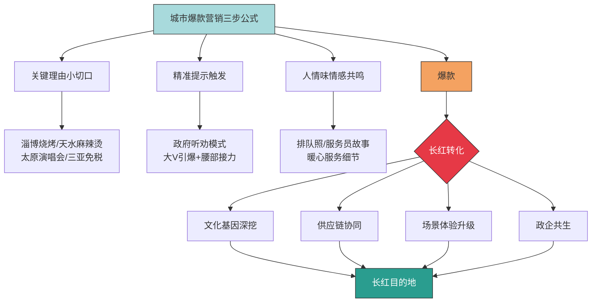

**这一框架的核心启示在于:爆款是流量的瞬时聚集,长红是流量的可持续转化**——天水从"麻辣烫之城"升级为"羲皇故里全域文旅"、哈尔滨从"冰雪城"升级为"国际冰雪价值链中心"、三亚从"避寒地"升级为"国际旅游消费中心",共同特征都是在爆款热度退去之前完成了"文化深度+产业链协同+体验升级+政企协同"的四维补强。**未能完成这一补强的目的地往往昙花一现,而完成补强的目的地则能将一次性流量转化为长期发展增量**——这是2025年城市营销最具方法论价值的实践沉淀。

## 5.7 数字技术与品牌营销的协同机制及客群分化

将本章前述各节的实践与机制整合,可构建出**"技术放大品牌、品牌承接流量"的协同分析框架**。数字技术与品牌营销并非两条独立的影响线,而是在2025年目的地竞争中形成乘数效应的双轮驱动:**数字技术(AI推荐、OTA算法、多语言翻译、智慧导览)负责降低决策成本与触达成本,品牌营销(国家形象、城市IP、网红口碑、KOL种草)负责制造认知溢价与情感联结,二者共同决定目的地的"被看见率"与"被选择率"**。

**协同机制的核心逻辑可归纳为四类典型组合**:

**第一类是"AI推荐+城市IP"的组合**。城市品牌建设积累的认知溢价(淄博=烧烤、天水=麻辣烫、哈尔滨=冰雪)成为AI推荐时的关键标签,当游客在飞猪问"找一个有烟火气的小城"时,AI算法实质上调用的是城市品牌资产;反之没有强势城市IP的目的地难以在AI推荐中获得排序权重。这一逻辑印证了第2章观察到的"具有独特资源禀赋的城市能在240小时过境免签政策窗口期内实现客流的指数级增长,而部分缺乏独特资源禀赋的口岸城市则难以充分捕获这一红利"——**AI推荐放大了具有强品牌资产的目的地,而进一步压缩了无品牌资产目的地的可见度**。

**第二类是"OTA翻译+海外KOL"的组合**。携程"智译未来"的60亿词翻译产能将中国小众景区信息推向全球,但单纯翻译并不足以促成预订决策——还需要海外KOL(甲亢哥、于适等)的真实记录建立"我也想去"的情感动机。**OTA翻译解决"信息可获得",KOL口碑解决"情感想去",二者协同才能完成从"被看见"到"被选择"的转化**。澳大利亚旅游局借于适合作单帖互动率激增120%、莫斯科文化节吸引285万人次背后360篇媒体稿——这些都是平台技术与KOL内容协同的典范。

**第三类是"智慧导览+沉浸场景"的组合**。Rokid AR Glasses的实时翻译+敦煌莫高窟的数字孪生、惠山古镇"小惠"AI管家+古镇人情味、贵州"AI游西江"+苗寨非遗体验——这些组合的共同特征是**将"硬技术"嵌入"软体验",使技术不再是炫技噱头而是文化深度的放大器**。第4章已强调"气候是皮、文化是骨"——本节的延伸是"技术是器、品牌是道",二者只有融合才能形成可持续吸引力。

**第四类是"短视频引爆+全产业链承接"的组合**。天水麻辣烫的爆红始于抖音视频,但持续爆火依赖的是甘谷辣椒12万亩种植规模与11.36亿元全产业链产值;哈尔滨冰雪的爆火始于春晚镜头,但持续运营依赖的是冰雪文旅云平台打通18个部门数据。**短视频负责"流量爆点",产业链协同负责"流量沉淀"**——缺前者无声量,缺后者无留量。

**客群分化敏感度则进一步丰富了协同机制的细节**。基于飞猪、马蜂窝、小红书等平台数据,可勾画出不同客群在数字技术与品牌营销中的差异化敏感度:

| 客群类型 | 数字技术敏感度 | 品牌营销敏感度 | 主要决策渠道 |
|---------|------------|------------|------------|
| Z世代 | 极高 | 高(KOL/明星种草) | 小红书+AI助手 |
| 80后90后 | 高(占AI用户73%) | 中高(深度攻略) | 马蜂窝/小红书+AI |
| 银发客群 | 中(上午9-12点使用) | 高(同龄KOL+熟人) | 视频号/抖音+口碑 |
| 高净值客群 | 中 | 极高(国际品牌+定制) | 国际媒体+OTA |
| 入境外国客群 | 高(依赖翻译) | 极高(国家形象+博主) | TikTok/YouTube+OTA |
| 新一线及以下城市 | 高(占AI用户近七成) | 中 | AI助手+短视频 |

数据来源:综合马蜂窝《2026人工智能+旅游趋势报告》、飞猪AI数据、QuestMobile、Dragon Trail等

**这一分层的关键洞察体现在三个反直觉发现**:

**第一,新一线及以下城市用户占AI用户近七成**——马蜂窝数据明确指出"新一线及以下城市用户合计占比近七成,说明AI在信息获取成本较高的区域更具价值"[^129]。这一发现颠覆了"AI是一线城市精英工具"的传统认知——**恰恰是因为下沉市场缺乏专业旅游顾问、缺乏丰富的线下信息源,AI对这些用户的边际价值反而更高**。这意味着AI技术的普及实质上促进了旅游决策的"去中心化"——下沉市场用户也能获得与一线城市相同质量的目的地推荐。

**第二,80后90后是AI核心用户而非Z世代**——马蜂窝数据指出"**80后与90后构成核心用户群占比达73%**,70后及更年长用户占比26%,打破AI'年轻人专属'的刻板印象"[^129]。这一结构反映出AI助手在"复杂决策场景"中的优势——80后90后多承担家庭出行决策的复杂任务(亲子+老人+夫妻多重诉求),AI对这些复杂需求的处理能力恰好匹配,而Z世代独行旅行的诉求相对简单,反而对AI依赖度低于复杂家庭决策。

**第三,银发客群对AI的接纳度高于预期**——飞猪数据显示AI使用覆盖"包括88岁高龄用户在内的多个年龄段,银发族更倾向于在上午9点至12点使用"[^127]。但需注意付费意愿的"年龄倒挂"现象——**18岁以下未成年群体74.28%明确表示愿意为个性化AI旅游服务付费,而56岁及以上群体仅7.35%**[^140]——银发客群虽然使用AI,但更多是"免费功能用户"而非"付费用户",这一差异对商业变现路径有重要影响。

**Simpleview《2025年中期目的地销售季报》的"量降质升"判断为本章的趋势预判提供了横向参照**。报告显示**北美218个目的地营销机构数据呈现"量降质升"新特征——潜在客户量同比下降6.1%、Q1下降9.6%、Q2改善至下降3.8%、确定预订量基本持平(-0.1%)、参会人数增长6.1%**[^160]。这组看似矛盾的数据揭示了一个重要趋势——**市场正在从"广撒网"向"精准投"转变;虽然询盘数量减少,但每个项目的含金量在提升,这表明客户决策更加谨慎、需求更加明确**[^160]。**这一判断与AI推荐、KOL精准种草、城市品牌深耕的趋势高度同频——目的地竞争已从"流量规模竞争"转向"流量质量竞争"**。

**展望2026年的关键判断可归纳为三点**:

**第一,AI推荐生态的"赢家通吃"特征将进一步强化**。前文援引的"主流AI平台答案页前三位的推荐结果垄断了超过81.6%的旅游预订量、未能进入AI推荐名单的景区官网流量平均下跌67.3%"虽属预测性数据[^128],但揭示的趋势是真实的——**目的地若不主动适配AI推荐生态(优化在AI知识库中的呈现方式、与平台深度合作、积累高质量用户评论数据等),将面临"数字隐形"的系统性风险**。中国旅游报评论员邓宁的判断更进一步——"2026年AI技术将深入肌理,推动旅游行业从服务连接向情感交互、从人力密集向人机协同的深层次生态重构,成为驱动智慧旅游新一轮创新发展的重要引擎"[^126]。

**第二,品牌营销将从"流量爆款"升维至"长红价值链"**。天水从"麻辣烫之城"到"羲皇故里"、哈尔滨从"冰雪城"到"国际冰雪价值链中心"、三亚从"避寒地"到"国际旅游消费中心"——这些城市的进化轨迹共同指向**"短视频引爆→全产业链承接→文化深度沉淀→国际价值链节点"的四阶演进路径**。2026年更多城市将沿这一路径推进,缺乏长红规划的目的地难以从"网红"升级为"长红"。

**第三,数字技术与品牌营销将与气候、文化、客群等其他变量进一步深度融合**。气候资源(第4章)需要通过AI推荐、KOL种草放大可见度、需要通过OTA平台触达国际客群;文化体验与可持续发展(第6章)需要通过沉浸式技术增强体验深度、通过品牌叙事建立溢价能力;客群结构差异化(第7章)需要通过数字技术实现千人千面的精准匹配、通过KOL分层实现圈层精准触达。**这些变量在第8章综合决策模型中将进一步整合为多维权重函数**。

**本章核心结论可凝练为五点**:

**第一,数字技术在2025年已从"辅助工具"跃升为"决策入口"**。飞猪AI日均调用+7.7倍、马蜂窝131.5万份AI攻略、携程节省50%决策时间、AI春节订门票+24倍——四组数据共同标志着"提问→预订"两步决策链路的产业级形成。

**第二,OTA平台是入境游与出境游的双向枢纽**。携程"智译未来"60亿词翻译让县域景区被全球看见、张家界入境酒店+2倍、TASTE OF CHINA俄客占16%、北京丽思卡尔顿暑期+3位数间夜量——这些都是平台技术+营销+文化融合的协同成果。

**第三,智慧旅游与沉浸式技术从"功能堆砌"转向"痛点破解"**。外骨骼机器人、机器狗、AI数字人、AR眼镜、智慧导览小程序等矩阵的核心价值在于解决游客的体力门槛、语言门槛、文化门槛、信息门槛——技术成为目的地体验深度的放大器。

**第四,国家形象与城市品牌的软实力建设是认知溢价的核心来源**。中国"China Travel"破圈、迪拜"融合东西方"战略、莫斯科文化节四位一体方法论,共同呈现了"文化桥梁+数字传播+沉浸场景+商务对接"的城市品牌建设系统方法论。

**第五,从爆款到长红的转化依赖"流量+留量"的双重补强**。天水甘谷辣椒11.36亿元产业链、哈尔滨国际冰雪价值链中心定位、三亚免税37%贡献率+鹿回头免票后利润2000万元——这些都是流量沉淀为发展增量的实证。

**本章所构建的协同机制与客群分化框架,将作为第6章文化体验与可持续发展、第7章客群结构差异化、第8章综合决策模型的关键输入参数**。在第6章中,本研究将进一步探查文化独特性、非遗活化、可持续认证等软性因素如何在数字技术与品牌营销的放大下成为目的地差异化竞争的关键变量;同时,反向旅游、慢充式旅游、情绪价值等新兴需求与本章观察到的"小众、不踩雷、性价比、躺平"AI关键词形成深度共振——届时数字技术与品牌营销的影响半径将与文化与可持续维度进一步耦合。

需要补充说明本章的若干**不确定性来源**:第一,AI推荐垄断81.6%预订量的数据属预测性判断而非已实现数据,本研究在引用时已注明出处与时间窗口;第二,关于2025年中国入境游规模存在多种统计口径(8000万、1.5亿、外国人8203万等),不同数据反映不同口径而非互相矛盾,本研究在引用时已说明口径差异并优先采用国家移民管理局等官方数据;第三,关于KOL传播效应的数据多来自平台或单一来源(如澳大利亚旅游局借于适合作的25.05万浏览),需结合更多渠道交叉验证才能避免单一来源偏差;第四,部分案例数据(如太原32场演唱会带动41亿元、哈尔滨冰雪大世界15亿元营收)依赖地方文旅局披露,统计口径与方法可能与全国性数据不完全一致。这些不确定性提醒后续章节在引用本章论断时须保持必要的口径敏感性,后续章节及报告局限性部分将进一步说明。

# 6 文化体验与可持续发展因素

第2章至第5章已系统勾勒出签证、交通、汇率、安全、气候、技术、品牌等门槛性与赋能性变量如何重塑2025年全球旅游格局——但当所有"硬条件"都被满足之后，旅客真正做出"去哪里"决策时，往往诉诸于一组更为柔软却也更具决定性的"内在变量"：**这个目的地能让我"感受"到什么？这趟旅程能否"治愈"我的疲惫？这种消费是否对得起我所信奉的价值观？** 2026年五一假期的OTA数据揭示了一个重要拐点——"特种兵旅游"在两年高歌猛进之后突然退潮，单目的地深度游同比+67%、本地酒店度假+124%、用户停留时长从1.8晚增至2.6晚——这些数字并非简单的消费形态切换，而是旅游消费逻辑从"向外证明"到"向内满足"的深层转变[^161]。与此同时，《2025年可持续旅游报告》披露78%受访者认为可持续旅游重要、50%愿为环保住宿支付溢价[^162]，巴塞罗那2万人街头抗议、威尼斯被迫收取入城费、爱彼迎被罚6400万欧元[^163]，则从反向警示了过度旅游对目的地长期吸引力的侵蚀。**文化体验的深度与可持续发展的承载力，正在共同构成2025—2026年目的地竞争的"软性护城河"**——它们既是Z世代和欧美年轻客群目的地选择的硬指标，也是热门目的地从"网红"走向"长红"的必经之路。本章将沿"需求转向—文化变现—生活化场景—情绪价值—可持续转型—承载平衡—增量转化"七条主线展开，最终在末节归纳软性变量在客群分化矩阵中的权重排序，为第7章客群结构差异化与第8章综合决策模型提供文化与可持续维度的关键参数。

## 6.1 从打卡到深度体验：旅游消费逻辑的结构性转向

2026年五一假期是中国旅游消费逻辑发生结构性转向的标志性时间节点。三大OTA平台在4月25—26日陆续发布的预订数据，呈现出高度一致的"反向"信号——**携程数据显示五一假期国内游预订量同比增长32%，但"多城市联游"产品预订量同比下降18%、"单目的地深度游"产品同比增长67%；飞猪数据显示高星级酒店(四星及以上)五一期间预订量同比增长89%，其中"酒店+景点"套餐中选择"仅酒店不含景点"的用户占比从2025年的23%提升到2026年的41%；美团数据显示五一期间"本地酒店度假"订单量同比增长124%，用户平均入住时长从1.8晚增加到2.6晚**[^161]。这三组来自不同平台的数据共同指向同一个结论——**年轻人不再追求"去了多少地方"，而是"待得有多舒服"**[^161]。

要理解这一转向的深度，须回溯"特种兵旅游"作为2024—2025年主流出游方式的兴衰逻辑。根据艾瑞咨询《2025年中国旅游消费行为报告》，**2025年国庆假期62%的18-30岁游客采用"特种兵式"旅游方式，平均每天打卡8.3个景点、步行2.7万步**[^161]——这一数字勾勒了"周末2天跨3个城市、夜车硬座省住宿费、朋友圈九宫格社交驱动"的典型图谱。但仅仅半年之后，这一模式遭遇了**身体、审美、经济三重维度的同步反噬**：

**第一重是身体成本的透支**。社交媒体上开始出现"特种兵旅游后遗症"的密集讨论，膝盖损伤、免疫力下降、上班后一周缓不过来等真实身体反馈成为讨论热点；一位旅游博主在小红书发帖"3天5城特种兵旅游，我进了急诊室"获得12万点赞，评论区大量用户分享类似经历[^161]。

**第二重是审美疲劳与社交边际效应衰减**。打卡式旅游的核心是"拍照-发圈-获赞"，但当朋友圈充斥着相似的九宫格、相似的滤镜、相似的打卡点，社交货币的边际效应急剧下降——一位95后受访者的自述极具代表性："去年国庆我发了9条朋友圈，今年回头看，根本不记得去了哪里，只记得很累"[^161]。

**第三重是性价比的重估**。中国旅游研究院《2026年Q1旅游消费趋势报告》提供了最具说服力的对比数据——**特种兵旅游用户平均每次旅行花费2800元，但满意度仅6.7分(满分10分)；而度假式旅游用户平均花费4200元，满意度达8.9分**[^161]。当将时间成本、健康成本、体验成本一并计入，"省钱式特种兵"的实际性价比远低于"投入式度假"——**这是一笔被重新计算后的经济账**。

**与"特种兵退潮"形成镜像的是"躺平式度假"的兴起**。携程《2026年五一假期旅游趋势预测》显示，**2026年五一假期选择"单目的地深度游"的用户占比达58%，较2025年同期提升21个百分点**[^161]。其核心特征可归纳为四点——单目的地（一个城市待3-5天甚至一个酒店待全程）、行程宽松（每天1-2个活动+大量自由时间）、体验优先（注重住宿品质、餐饮体验、休闲活动）、内在满足（不追求社交展示，注重自我放松）[^161]。

这一转向并非Z世代独有现象，而是呈现明显的**代际分化谱系**。《2025年轻人旅游趋势报告》通过1243份问卷的调研发现：**00后倾向于特种兵式旅游和Citywalk，为兴趣奔赴演唱会、漫展等活动；95后、90后更偏好躺平式度假和反向旅游，追求轻松与惬意；85后和80后则热衷近郊度假和工厂游，注重家庭体验**[^164][^165]。整体而言，"拼好假"成为2025年最受欢迎的旅游方式占比54.2%，"反向旅游、去冷门目的地"超4成人向往，**"错峰出行"成为关键词，旅游也越来越日常化、成为一种生活方式的体现**[^164][^165]。

**这一消费逻辑的转向恰好印证了文旅消费市场更深层的二元结构跃迁**。一份《2021—2025中国文旅市场时代演进与消费洞察》系统梳理指出，**硬性消费（交通、住宿、餐饮、门票等基础消费）占比从约70%降至约50%，软性消费（文化体验、沉浸式体验、疗愈康养、研学教育等体验型消费）占比从约28%升至约42%，软性消费成为消费增长核心引擎**[^166]。在五维分类视角下，**2025年康养旅游市场规模超过4500亿元、文化体验型消费规模超过1.2万亿元、夜间文旅消费规模超过1.5万亿元、文旅文创产品销售额超过3500亿元**——多维度叠加消费成为主流，"文化性+审美性""保健性+享乐性"等组合成为消费常态[^166]。

将上述结构性转向的核心数据整合为对照：

| 维度 | 2024—2025趋势 | 2026转折后 | 变化幅度 |
|------|------------|------------|---------|
| 单目的地深度游占比 | 37%（2025同期） | 58% | +21百分点 |
| 多城市联游预订量 | — | 同比 | -18% |
| 本地酒店度假订单量 | — | 同比 | +124% |
| 用户平均停留时长 | 1.8晚 | 2.6晚 | +44% |
| "仅酒店不含景点"占比 | 23% | 41% | +18百分点 |
| 特种兵旅游满意度 | 6.7/10 | — | — |
| 度假式旅游满意度 | 8.9/10 | — | — |
| 硬性消费占比 | ~70% | ~50% | -20百分点 |
| 软性消费占比 | ~28% | ~42% | +14百分点 |

数据来源：综合携程/飞猪/美团 2026五一报告、艾瑞咨询、中国旅游研究院、《2021—2025中国文旅消费洞察》

**这一转向与第5章观察到的AI关键词高度共振**。第5章已援引马蜂窝披露的AI被询问最多的关键词TOP10——"便宜、小众、不踩雷、行程安排、人少、亲子、躺平、性价比、一天怎么玩、值不值得"——其中**"小众""不踩雷""人少""躺平"四个关键词直接指向深度体验需求**，而非"打卡"诉求。换言之，**消费需求侧的"躺平化"与AI技术侧的"小众化推荐"形成双向匹配**——用户提出"找一个适合躺平的小众目的地"，AI算法则将单目的地深度游、本地酒店度假、文化体验型小城等供给精准推送至用户决策入口，二者协同放大了2026年五一的转向规模。

**这一转向对目的地选择的深刻影响在于**：**那些以"打卡数量+网红景观+九宫格出片"为核心卖点的目的地，正在面临结构性的客流流失风险**；而**那些能够提供"住下来+慢节奏+文化深度+情绪疗愈"复合价值的目的地，正在赢得新一轮的客流增量**。后续各节将沿这一主线展开——文化独特性如何成为深度体验的内核（6.2节）、城市生活化场景如何承载"慢节奏"需求（6.3节）、情绪价值如何放大支付意愿（6.4节）、可持续性如何成为新的支付变量（6.5节）、过度旅游如何反噬"慢节奏"承载力（6.6节）、最终如何实现从流量到增量的转化（6.7节）。

## 6.2 文化独特性与非遗活化作为差异化护城河

当旅游消费从"打卡数量"转向"深度体验"，目的地的差异化竞争核心便从"有什么景观"升维至"有什么文化"——而文化独特性作为不可复制的稀缺资源，正成为2025年目的地最具防御力的"护城河"。**敦煌是这一逻辑最具说服力的样本**。

**敦煌2025年的市场表现呈现出文化深度变现的全方位突破**。该市2025年接待国内外游客**2439.3万人次同比增长16.6%、旅游花费229亿元同比增长21.1%**，游客接待量、旅游花费分别是2020年的3.7倍、2.7倍[^167]。另一份分析则指出敦煌2025年游客突破**2254万人次、旅游花费超209亿元**[^168]，两组数据虽存在敦煌全市与核心景区的口径差异，但共同印证了敦煌作为"国内旅游天花板"的地位——**这座屹立于河西走廊最西端的城市，已从单一景点目的地跃升为集文化厚度、自然奇观、产业能级与国际影响力于一体的复合型目的地**[^168]。

敦煌的核心竞争力，根植于其作为"四个文化体系汇流之地"的不可复制性。著名学者季羡林曾精辟指出"世界上历史悠久、地域广阔、自成体系、影响深远的文化体系只有4个：中国、印度、希腊、伊斯兰，再没有第五个；而这4个文化体系汇流的地方只有1个，就是中国的敦煌和新疆地区，再没有第二个"[^167]。**莫高窟现存735个洞窟、4.5万平方米壁画、2400多身彩塑，1000多年不间断的营建历程，堪称一部可视化的中国古代史**[^167]——这种由地理、历史、文明叠加的稀缺性，是任何后发目的地都难以追赶的基础禀赋。

但仅有文化资源还不足以构成市场竞争力，**敦煌的真正突破在于将文化资源系统转化为"可看、可感、可共创"的体验产品矩阵**。具体而言：

**第一层是"文化+科技"的沉浸铺垫**。**莫高窟数字展示中心二期竣工，通过《千年莫高》《梦幻佛宫》两部超高清球幕电影，实现历史叙事与沉浸体验双重铺垫，有效缓解实体洞窟压力**[^168]。这一安排既保护了脆弱的实体洞窟（莫高窟内严禁拍照、刚性要求文明规范），又使游客在进入洞窟前已建立文化认知框架，提升了实地参观的体验深度。

**第二层是"文化+生活"的城市改造**。敦煌打造了**"敦煌书局""敦煌印局""敦煌无界"等主题空间，游客可参与壁画临摹、印章DIY、泥板画制作等非遗手作，将文化从"观赏"转化为"共创"**[^168]。游客不再是文化的旁观者，而是文化的参与者——这一身份转变深刻改变了消费心理与停留时长。**第五章已援引敦煌"局""界"系列文旅新场景引领潮流的政府表述**，本节进一步揭示这些场景背后的"参与共创"机制，正是文化深度变现的关键。

**第三层是"演艺+夜经济"的全时闭环**。**《又见敦煌》《乐动敦煌》等常态化演艺年均演出超千场，带动游客停留时间延长至2.7天**[^168]；2026年春节灯会更以**22组大型灯组活化飞天、九色鹿等IP，免费开放至3月底**，形成"白天看壁画、夜里逛丝路"的全时体验闭环[^168]。**敦煌夜市已升级为国家级夜间文旅消费集聚区，集非遗美食、手作、演艺于一体**[^168]——这一从晨到夜的体验设计，将原本可能"半日打卡"的客流硬性拉长至两至三天的停留。

将敦煌"文化+科技+生活"三位一体体验体系的关键节点与停留延长效应整合：

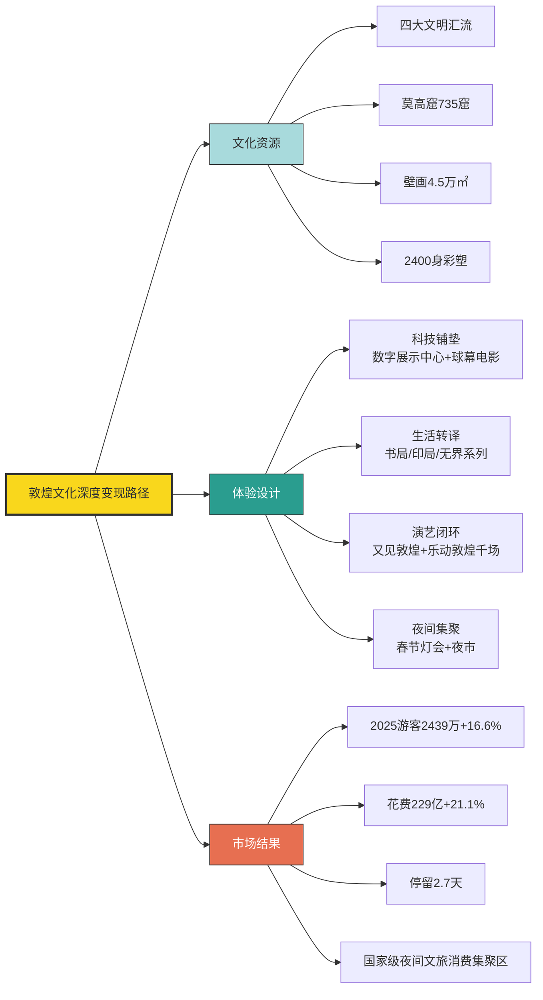

**敦煌之外，甘肃全省的文旅产业整体爆发进一步验证了文化深度作为发展引擎的省级效应**。2025年甘肃省接待游客**5.02亿人次同比增长11.3%、旅游花费4036亿元同比增长16.9%**；这两项核心指标较"十三五"时期分别跃升132.9%和141.6%[^169]。其中，**敦煌研究院推进60余个重点洞窟保护展示及数字化项目，"数字藏经洞"数据库（一期）全球上线，11.8万余张流失海外敦煌文物的数字化高清图片被精准采集**[^169]——这一文化保护与数字化的深度结合，使甘肃文化资源的可达半径从地理意义上的"河西走廊"扩展至全球数字空间。**入境游层面，2025年甘肃入境游客达39.39万人次同比增长60.8%**[^169]——这一增速明显高于全国入境游平均增速（第1—2章已述及外国人入境同比+26.4%），印证了文化独特性对国际客群的特殊吸引力。

**从产业层面看，2025年中国文化体验型消费规模超过1.2万亿元、文创工艺产品市场规模达3540亿元（2024年数据）**[^166][^170]。文创工艺产品的演进路径尤其值得关注——**"国潮"文化兴起唤醒年轻群体文化认同，非遗活化与现代设计融合的产品持续走俏；2024年中国文创工艺产品行业市场规模稳步攀升至3540亿元，消费者对兼具文化内涵、美学价值与情感共鸣的产品需求升级，推动行业向原创化、品牌化转型**[^170]。从产品结构看，**塑胶树脂材质以25.3%占比位居首位，竹木、石玉、陶瓷黏土材质各占13.9%、13.9%和13.7%；其中竹木材质依托可持续理念崛起，FSC认证木材使用率显著提升；石玉与陶瓷黏土则凭借非遗工艺赋能保持优势**[^170]——文创产业的可持续转向与下文6.5节的可持续旅游趋势形成深度共振。

**故宫文创、《黑神话:悟空》、汉服热则代表了非遗活化的不同路径**。第5章已援引中国文化出海数据——**故宫文创通过AR互动、数字藏品、国际品牌联名等创新模式，将厚重的文物符号转化为全球年轻人追捧的"东方生活美学"标识，实现了传统文化的当代转译**[^171]；**国产3A大作《黑神话:悟空》上线仅3天销量便突破千万份，一举创下中国买断制游戏历史销量第一、全球年度销量第一的纪录；作品通过对《西游记》精神内核的现代表达，将东方哲学的深邃魅力传递给全球玩家**[^171]；**TikTok上"汉服"话题视频已近30万条，引发大量海外用户对中国传统服饰的兴趣**——这些文化出海案例共同形成了"游戏IP→目的地引流→城市文旅破圈"的链式反应。**山西大同、新疆那拉提景区因影视游戏IP带动入境客流爆发**（第4章已述大同入境票量+7倍、新疆那拉提热度上涨68%），即是这一链条的具象化呈现。

**清迈案例则提供了国际目的地中文化深度变现的经典样本**。在全球顶级旅游与生活方式杂志《Travel + Leisure》最新发布的**"2025年亚洲最佳城市"排行榜中，泰国清迈荣登榜首、曼谷位列第三**——这项榜单来自近18万名全球旅者的投票，根据城市魅力、文化底蕴、自然风光、美食人文等多个维度综合评分[^172]。Travel + Leisure对清迈的评价精确点明了文化深度的市场价值——**"清迈是泰国北部一个气候凉爽、被山峦环抱的城市。这里拥有丰富的历史遗迹、精美的寺庙建筑、与大象亲密接触的自然体验、琳琅满目的本地集市，以及让人流连忘返的泰北美食——尤其是招牌菜'Khao Soi'。更重要的是，当地人热情友好，让每一位旅者都宾至如归"**[^172]。这一评价的关键词——历史遗迹、寺庙建筑、自然体验、本地集市、美食、人情味——共同构成了与"特种兵打卡"完全相反的"沉浸式文化体验"图谱。

**泰国2025年的旅游战略转型更系统地呈现了从"流量逻辑"向"文化价值逻辑"的国家级跃迁**。在2025泰国旅游交易会（TTM+ 2025）上，泰国国家旅游局副局长尼提·西贝公开表示——**"2025年泰国旅游发展将重点打造文化、康养和可持续发展的高价值体验，旨在提升泰国旅游品质、进一步推动旅游业惠及游客和当地社区"**[^173]。具体的产品形态包括——**"以泰北融入兰纳文化遗产的康养旅游体验为例，游客可通过草药芳香疗法等传统理疗，结合当地本土健康膳食，进行五感疗愈；将于年底开业的AWC集团'Lannatique'综合体将呈现艺术、文化、美食以及生态设计的沉浸式体验；于2025年11月启程的'蓝茉莉铁路之旅'将带来串联五府的高端文化美食体验"**[^173]。东亚司司长李文华更明确指出——**"泰国还有很多未被中国游客发现的宝藏目的地。虽然泰国是中国游客熟知的旅游目的地，但仍有非常多新体验值得中国游客尝试，特别是正在开发的沉浸式主题旅游产品"**[^173]。

**这一战略转型的逻辑值得在第3章基础上进一步审视**。第3章已剖析泰国2025年因泰铢升值、安全危机等多重因素导致中国客源-33.6%、整体外国游客-7.2%——传统的"低价大众游"模式已不可持续；而TTM+ 2025释放的"高价值长停留"信号，表明泰国正在主动从规模竞争转向质量竞争。**这一转型方向虽方向正确，但执行成效仍待观察**——一方面，兰纳文化、康养疗愈、五感体验等高价值产品确实能吸引高净值客群与文化体验型客群；另一方面，TTM+ 2025的可持续旅游主题（185家环保型旅游运营商参与、获STGs国际认证机构、参与TAT"碳中和酒店"计划成员单位）也为目的地形象注入了新的认知溢价[^173]——这一可持续维度将在6.5节进一步展开。

将文化独特性作为差异化护城河的核心机制凝练为三点判断：

**第一，文化独特性的护城河效应来源于其不可复制性**。敦煌四大文明汇流、清迈兰纳文化、京都千年古都、巴黎圣母院哥特艺术——这些资源是地理、历史、文明长期积淀的产物，无法通过短期投资追赶；这种稀缺性使具备文化深度的目的地在AI推荐生态、社交媒体种草、品牌传播等所有渠道中享有"先发优势"。

**第二，文化资源必须经由"科技转译+生活共创+演艺闭环"三层加工才能充分变现**。敦煌的"数字展示中心+局界系列+又见敦煌千场演出"三层加工，将一座洞窟博物馆变为可停留2.7天的复合目的地；故宫AR互动、《黑神话:悟空》游戏化转译、汉服热的可穿戴文化、清迈AWC集团Lannatique综合体的艺术+文化+美食+生态设计——这些案例的共同公式都是"文化原矿×当代表达=市场溢价"。

**第三，文化深度直接转化为停留时长与客单消费的双重提升**。敦煌停留2.7天、敦煌花费同比+21.1%（高于游客量同比+16.6%）的对比表明，文化深度不仅吸引客流，更显著放大客单价值；甘肃文化文旅2025年营业收入达3540亿元、文化体验型消费1.2万亿元等产业级数据，证明文化变现已从"景区门票经济"升维为"全产业链价值经济"。

**这一节的核心结论是**：**文化独特性已成为2025—2026年目的地竞争中最具防御力的护城河**——它既是流量获取的引爆点，又是停留延长的稳定器，还是支付溢价的来源。下一节将进一步探查城市生活化场景如何将文化深度从"景区物理空间"延伸至"城市生活全域"。

## 6.3 城市生活化场景与休闲集聚区的崛起

如果说文化独特性是目的地的"灵魂"，那么城市生活化场景就是承载这一灵魂的"血肉"。当游客追求"住下来+慢节奏+融入感"时，目的地的吸引力载体便从博物馆、景区等"封闭文化空间"向街区、商圈、滨水带等"开放生活场域"延展——**"宜居即宜游"的理念正在重塑2025年的城市目的地竞争**。

**世界旅游城市联合会发布的《世界旅游目的地竞争潜力指数报告(2025)》提供了这一转向的国际参照系**。该报告**从文化吸引力、基础设施、可持续性等十大维度对全球城市进行评估，其中中国城市表现突出，北京与上海双双跻身全球旅游竞争潜力城市前十名，分别位列第五和第九**[^174]。值得关注的是，**报告与同期发布的《世界旅游城市发展报告(2024-2025)》共同反映出全球旅游业的前沿趋势——在可持续发展这一核心支柱外，倡导在旅游增长与居民生活质量之间取得平衡的"宜居即宜游"，数字化与智慧旅游正重塑旅游体验，会展与商务旅游(MICE)能有效提升全年游客流量与城市韧性等，都围绕"可持续"的核心词，为各地推进国际旅游目的地建设提供了有益参考**[^174]。**这意味着"宜居"已与"可持续""数字化""文化吸引力"并列，成为城市旅游竞争力的核心维度之一**。

**中国旅游研究院《城市文旅品牌发展报告2025》进一步将这一趋势提炼为"从旅游城市走向城市旅游"的定位升维**。第5章末节已援引该报告判断——**"城市旅游休闲集聚区是'旅游城市'走向'城市旅游'的典型实践；通过场景营造、业态更新、文化融合、技术赋能等方式，城市旅游休闲集聚区正在将'旅游流量'转化为'发展增量'，成为城市更新与文旅高质量发展的重要驱动力；既要重视网红打卡地的打造、讲好城市故事，更要融旅游于生活、加强与游客的情感链接"**。**这一定位的核心区别在于：传统"旅游城市"以景区为中心、游客为主体、外来者为对象；而"城市旅游"以生活为中心、市民与游客共享、本地者与外来者共构**——后者天然消解了游客与居民的对立关系（这恰是6.6节将深入探讨的"过度旅游"困境的反向解药）。

**中国夜间经济的爆发式发展为"城市旅游"提供了最具数据说服力的实证**。中国旅游研究院联合良业科技集团发布的《2025中国夜间经济发展报告》披露——**2025年1—10月，全国游客夜间消费金额占全天消费金额的比重为32.9%，夜间消费笔数占比为28.3%**[^175][^176]。这一数据意味着**全国旅游业的近三分之一收入来自夜间时段**——夜间不再是白天观光的"附加项"，而是与白天并列的核心消费场域。

**夜间消费的需求侧呈现"多元、求新、社交"三大价值维度**[^176]。具体而言：

**第一，多元场域**——追求更多的可选择性和可及性，满足不同圈层与情景的诉求；尽管游客的夜间活动更多选择在城市的公共与商业空间，但从细分场景的偏好分布中可以观察到体验层次正变得日趋丰富多元[^176]。

**第二，求新内容**——探索追求独特记忆点、惊喜与新奇，打破日常惯性；游客愿为深度文化感知、创新互动及精准情绪满足的夜间旅游新体验付费；**非遗成为游客在夜间景区、场馆、夜市集市场景中普遍体验的内容**[^176]。

**第三，社交连接**——追求被见证、分享、共鸣，从个人感受到集体认同；**游客夜间出游动机调研中，家人亲友聚会、参与社群活动位居前列；越来越多游客青睐剧本解谜、非遗手工等协作型活动，游客在更加丰富的夜间场景中发现并融入兴趣社群，由此获得归属感**[^175][^176]。

**夜间经济的供给侧则呈现从"光影亮化"向"全链条覆盖"的系统性升级**。报告披露——**2025年5A级旅游景区夜间开放率为66.9%、4A级旅游景区夜间开放率显著增长；夜间开放的5A级旅游景区中47.5%已实现"食住行游购娱"全链条覆盖，景区正在系统性搭建夜间消费生态**[^175][^176]。**景区夜间业态从单一"光影亮化"向"食住行游购娱"全链条发展，致力于构建综合的夜间微型目的地**[^176]——这一升级标志着夜间经济从"补充时段"向"独立目的地"的功能跃迁。

具体案例方面：

**前门大街呈现传统街区夜化升级**——"大灯笼、小灯串交织成璀璨星河"，90后北京游客陈悦怡的体验"我和朋友经常在夜晚来前门，逛老字号、看时尚京剧、听音乐会……古香古色的氛围非常棒，夜景美轮美奂，不少年轻人都喜欢这儿"[^175]，将老字号、京剧、音乐会等多元业态融入夜间街区。

**江西婺源篁岭则呈现古村夜游的"全龄友好"模式**——长桌宴呈上地道徽州美味、祠堂广场"篝火小村晚"上演舞仙鹤、滚灯舞、非遗板凳龙灯轮番上演；篁岭文旅营销总监谢巧娟的总结——**"古村夜游带游客从舌尖到眼底，感受不一样的古村夜生活"**[^175]精准点明了夜间体验的多感官设计原则。

**柯桥古镇则呈现历史街区与当代潮流的深度融合**——作为浙江省首批省级历史文化街区，深度融合历史文脉与当代潮流，已成为长三角地区夜间文旅消费的标杆之一；2025年古镇以宋代十二月市为母本，创新推出全新的"柯桥十二月市"主题活动[^175]。

**夜间产品的"全龄友好"设计则呈现客群细分的精细化**——**面向亲子的自然科普、农事采摘、非遗手作；面向青年的潮流社交、星空帐篷；面向老年的杂技曲艺、文化演艺**[^175]——这种细分恰好对应第7章将深入探讨的客群差异化逻辑。

**广东省2025年的夜间文旅消费数据则提供了省级层面的更精细对照**。该省**国庆中秋假期夜间文旅关键词全网发布量达11.84万条位居全国第一；前三季度全省20个夜间文旅消费集聚区代表性文旅商户夜间接待人次增速达11.41%，高于全天增速近一倍，夜间消费已成为文旅增长的主引擎；国庆中秋假期15个国家级夜间文旅消费集聚区夜间客流同比增长6.79%，平均每个集聚区每晚接待游客9.48万人次**[^177]。**国庆中秋假期夜间文旅消费占全天文旅消费支出的六成，"昼短夜长"成为新常态**[^177]——这一比例显著高于全国平均的32.9%，反映出广东作为夜间经济发达省份的领先地位。

**消费时段与时长结构则进一步揭示夜间经济的体验深度**。广东数据显示——**20点至22点是消费"黄金时段"，超七成游客和六成本地居民选择此时段消费；单次夜间消费时长约3小时，停留时间持续延长**[^177]。**单次3小时的消费时长意味着游客对夜间场景的深度参与而非"匆匆打卡"**——这种深度恰是6.1节"特种兵退潮、躺平兴起"转向在夜间时段的具体投射。

**城市级别的"无边界融合"则代表了城市生活化场景的最新形态**。《2025中国夜间经济发展报告》系统刻画了商圈街区的演进——**"夜间商圈街区的无边界融合与社交枢纽化趋势明显。部分商圈街区呈现从传统线性、封闭式购物中心向公园化、漫步式空间转变的趋势"**[^176]。具体案例包括：

- **公园化商业**——上海EKA·天物，打造人文艺术美学社区公园[^176]；
- **公共空间融合**——北京亮马河通过优化水岸节点商业，将滨水公共空间转化为重要消费廊道[^176]；
- **垂直社群聚集地**——北京三里屯MUSIC STREET、上海徐汇"元界Neo World"，以强主题业态催化兴趣社群的线下联结[^176]。

**这三类形态的共同特征在于"打破封闭物理边界、融合公共与商业空间、催化兴趣社群链接"**——它们不再是"商场+游客"的二元结构，而是"市民+游客+艺术+商业+休闲"的多元生态。这一形态恰好回应了第3章观察到的"体验导向取代打卡导向"判断——**当游客追求的是城市生活的真实感与融入感时，公园化商业、滨水商圈、垂直社群空间才能提供"我也在这里生活"的代入感**。

将城市生活化场景的演进路径与夜间经济的核心数据整合：

| 维度 | 关键数据 | 演进方向 |
|------|---------|---------|
| 全国夜间消费占比 | 32.9% | 已成为旅游收入主引擎 |
| 5A景区夜间开放率 | 66.9% | "标杆引领→系统性扩容" |
| 5A夜游全链条覆盖率 | 47.5% | 从单一光影向食住行游购娱 |
| 广东夜间文旅占比 | 60% | 昼短夜长成新常态 |
| 黄金时段 | 20—22点 | 七成游客集中此时段 |
| 单次夜间停留时长 | 约3小时 | 深度参与而非打卡 |
| 城市生活化场景类型 | 公园化/滨水/垂直社群 | 打破封闭、融合多元 |

数据来源：《2025中国夜间经济发展报告》、广东省夜间文旅消费分析报告

**这一城市生活化场景崛起的深层意义可从三个维度提炼**：

**第一，重塑了目的地竞争力的内涵**。传统目的地竞争以"景区数量+知名度"为指标，而城市生活化场景的竞争以"街区活力+生活气息+社群密度"为指标——**这意味着没有顶级景区的城市仍可凭借生活化场景成为目的地**（如成都、长沙、西安等），而仅有顶级景区却缺乏生活化场景的城市可能被快速边缘化。

**第二，缓解了游客与居民的潜在对立**。当景区与城市分离时，游客是"外来侵入者"，居民是"被打扰者"，二者关系紧张；当游客融入城市生活化场景时，游客成为"临时市民"，与居民共享公共空间，这一身份转化在结构上缓解了过度旅游的部分压力（虽然在巴塞罗那、威尼斯等极端案例中仍不足以化解，详见6.6节）。

**第三，与第5章的智慧旅游、第4章的气候资源融合形成多维协同**。城市生活化场景需要智慧导览、AR增强、AI助手等技术支撑，需要凉爽气候、舒适环境等基础条件，需要文化深度作为内核——这些维度的协同正是2025—2026年目的地竞争从"单点突破"向"生态构建"演进的具体体现。

**这一节的核心结论是**：**城市生活化场景与休闲集聚区已成为2025年目的地吸引力的新载体**——它们以"宜居即宜游"为理念基础、以夜间经济为重要时段、以公园化滨水化垂直社群化为主要形态，将旅游融入城市生活，将游客转化为临时市民，从而在"特种兵退潮、躺平兴起"的需求转向中获得结构性增长。下一节将进一步探查情绪价值如何成为这些场景背后的"内核驱动力"。

## 6.4 情绪价值与社交分享：体验经济的内核驱动

如果说文化独特性是体验经济的"实体内容"、城市生活化场景是体验经济的"空间载体"，那么**情绪价值就是体验经济的"内核驱动"**——它解释了为什么游客愿意为某种特定体验支付溢价、为什么相同景观在不同情境下能催生天差地别的支付意愿、为什么"性价比"逻辑正在被"情价比"逻辑替代。云南2025年消费市场的转型，提供了这一内核机制最具说服力的实证。

**云南消费市场已经历了从"买实用"到"买感受"的深刻变革，情绪价值已成为撬动消费增长的核心密码**[^178][^179]。具体数据呈现了这一变革的规模——**春节假期云南接待游客超5293万人次，旅游花费突破708亿元，景迈山古茶林等小众目的地一房难求；2025年斗南花市接待游客超千万人次，旅游花费同比增长43%**[^178][^179]。**鲜花从商品升级为"治愈、浪漫"的情绪载体；大理、丽江的民宿从住宿变为"慢生活、疗愈"的情绪空间；民族节庆从民俗活动变成"文化认同、归属感"的情绪盛宴**[^178][^179]——文旅消费的本质已成为情绪体验消费。

**云南情绪价值的产品化路径呈现"四元结构"**：

**第一元是文旅情绪载体化**——大理、丽江=慢生活疗愈，景迈山=远方与宁静，斗南花市=治愈与浪漫，民族节庆=文化认同与归属感。**第二元是特色产品IP化**——云南咖啡、茶叶、野生菌、鲜花等特色农产品正从"地域特产"转向"情绪符号"；茶咖场景适配"松弛、文艺"情绪，成为热门打卡点；鲜花饼、菌子火锅等美食承载"浪漫、新奇"情感需求；非遗手作、民族文创因"独特、匠心、文化归属感"成为"悦己消费"的热门选择[^178][^179]。**第三元是结构升级悦己化**——文创、潮玩、体验类商品增速显著；"彩云消费券"覆盖文旅、电影、健身等"悦己消费"领域；夜间消费、市集经济、赛事消费等新业态通过场景营造满足消费者"放松、社交、愉悦"的情绪诉求[^178][^179]。**第四元是节庆情绪IP化**——云南的策略包括"打造节庆情绪IP，突出彝族火把节的'狂欢、团圆'和傣族泼水节的'祝福、吉祥'；做强生态情绪IP，依托热带雨林、高原湖泊打造'疗愈、松弛'的生态消费场景；升级茶咖情绪IP，将普洱茶的'养生'、云南咖啡的'治愈'融入产品设计"[^178][^179]。

**情绪旅游的崛起则从代际维度深化了这一逻辑**。一份《关注情绪价值，塑造2025文旅体验新场景》的行业分析指出，**情绪旅游是一种以情感体验为核心、旨在满足特定情绪需求的出游方式；与传统旅游关注景点景物不同，情绪旅游更加关注游客的心理需求和情感释放，追求的是内心深处的情感满足**[^180]。**Z世代面临着工作、生活与社交的巨大压力，旅行成了他们暂时逃离喧嚣、恢复平衡的重要途径；情绪旅游的核心特征在于满足体验者的"情绪释放"和"自我匹配"双重需求**[^180]。

**情绪旅游的典型形态印证了6.1节"特种兵退潮、躺平兴起"的转向**。该报告指出——**"在很长的时间里，'说走就走'的旅行是很多人向往的生活，这既是一种价值理念也是一种生活需求，但是文旅发展到今天，新市场群体的需求可不止于此，他们不但追求说走就走的洒脱，更追求出游过程中'想停就停'的松弛感，一切都要围绕自己的情绪而来，'愉悦自己'成了当前出游市场的核心需求"**[^180]。**无论是直接到位的"特种兵式旅游"，还是大街小巷自由溜达的"Citywalk"，或是拨开人群寻找超脱的"反向旅游"，这些新的形式都是Z世代回应自我"情绪"的直接呈现**[^180]——但其中"特种兵式"恰是已被2026年五一数据证伪退潮的形态，而Citywalk、反向旅游、慢充式度假等更精细的情绪形态正在崛起。

**这一情绪价值崛起的深层逻辑可从需求驱动、情感共鸣、营销变化三个层次拆解**[^180]：

**需求驱动层次**——随着生活节奏的加快，Z世代面临着工作、生活压力也在持续加大，情感需求已成为他们生活中不可忽视的一部分；与传统出游方式尤其是跟团游那种赶场子的快节奏不同，情绪旅游更关注的是如何缓解心理压力，通过短期旅行活动让人们暂时获得一段时间的松弛感；**Z世代游客倾向于选择慢节奏、重体验、能带来情感慰藉的目的地，如自然景区和疗愈性质的度假村，通过与自然亲密接触，让游客得到内心的平静**[^180]。

**情感共鸣层次**——社交媒体的普及使得旅游不仅是放松和休闲，更成为一种社交行为；游客通过分享旅行中的美好瞬间来获取认同和社交资本，这种现象促进了情绪旅游的流行；**近两年，我们看到不少目的地或旅游点开始调整自身的旅游形象定位，把自己包装成"心灵疗愈"的圣地，吸引寻求情感共鸣的游客**[^180]。

**营销变化层次**——传统的旅游营销多聚焦于观光线路和景点介绍，而如今的旅游营销则更加注重对游客服务和游客体验的呈现[^180]——这一转向与第5章城市爆款营销的"人情味+情感共鸣"逻辑完全一致。

**Booking 2025中国旅客出境游趋势报告则从国际市场视角验证了情绪价值的普遍性**。报告披露——**"放松"以57%的比例成为出国旅游的首要动力，突显出旅行作为调适身心的重要方式，帮助旅客暂时抽离日常轨迹、以更轻盈的状态回归生活**[^181]。**紧随其后，当地文化体验与舌尖上的美食探索亦不断激发着出国旅行的热情；报告显示42%的旅客因希望"体验当地文化"开启旅途，39%则将"体验当地美食"作为出行动力**[^181]。**值得注意的是，54%的中国旅客表示美食是影响目的地选择的关键因素之一；50%将品尝美食列为旅行中的必要体验；更有55%乐于在旅程结束后在社交媒体上分享美食体验，体现出"美食"作为旅行体验重要维度的巨大吸引力**[^181]。

**这组数据揭示了情绪体验—社交分享—二次种草的闭环逻辑**。具体而言：旅客出发时的核心动机是"放松"（情绪诉求）；旅途中的核心体验是"文化+美食"（具象化情绪载体）；旅程结束后的核心行为是"社交媒体分享"（情绪固化与传播）；他人接收到分享后被"种草"（二次情绪触发）——**整个闭环的每一环都以情绪为内核驱动，而非以"打卡数量"或"价格优势"为内核**。

将情绪价值的核心机制与五大情绪诉求—目的地资源—产品化路径整合：

| 情绪诉求 | 目的地资源耦合 | 产品化路径 | 典型案例 |
|---------|------------|----------|---------|
| 放松 | 自然景区、慢节奏小城 | 度假村、民宿、Citywalk | 大理、丽江、清迈 |
| 治愈 | 鲜花、茶咖、温泉、康养 | 疗愈系民宿、中医康养 | 斗南花市、三亚中医康养、泰北兰纳康养 |
| 悦己 | 文创、非遗手作、潮玩 | 体验工坊、定制产品 | 敦煌印局/书局、云南文创 |
| 归属 | 民族节庆、社群活动 | 沉浸式节庆、剧本解谜 | 火把节、泼水节、村超 |
| 社交 | 美食、夜经济、市集 | 共享场景、打卡点 | 重庆夜景、长沙夜市、北京三里屯 |

数据来源：综合云南消费分析、Booking 2025报告、《2025文旅体验新场景》分析

**这一框架揭示了情绪价值变现的核心规律**：**情绪不能孤立存在，必须依附于具体的目的地资源；目的地资源也不能孤立存在，必须激活特定的情绪锚点**——二者通过"产品化路径"才能完成耦合并形成市场价值。**云南"以情绪价值破局，以'情价比'升级'性价比'"的发展路径**[^178][^179]，本质上是在"性价比"红海中找到了"情价比"蓝海，使云南消费市场避免了陷入单纯的价格战，转而通过情绪价值实现差异化定价能力。

**情绪旅游的形态多元性也验证了第6.1节"代际偏好分化"的判断**。00后偏好特种兵和Citywalk反映"刺激/活力"情绪、95后90后偏好躺平和反向旅游反映"松弛/治愈"情绪、85后80后偏好近郊度假和工厂游反映"陪伴/家庭"情绪——**不同代际并非绝对偏好某类情绪，而是在不同人生阶段对情绪诉求的权重排序不同**。这一代际差异将在第7章客群结构差异化中获得更系统的展开。

**值得引入的反思视角是Dictionary.com 2025年度词汇"67"的现象**[^182]——**这个来源于美国嘻哈新星思凯拉(Skrilla)歌曲"Doot Doot (6 7)"的爆红俚语，"是一个爆红的、含义模糊的俚语，大体上没有明确意义。有些人认为它表示'就那样吧'或'也许是这样，也许是那样'"**[^182]——它揭示了Z世代社交语言的一个重要特征：**"'67'既无意义、又泛滥，还荒诞离谱，可以说是典型的脑腐式词汇。但该网站也强调，对用它的人来说，它依然有意义，因为它建立了人与人之间的联系。'它揭示了我们讲述的自己的故事，以及这一年我们发生的改变'"**[^182]。这一年度词汇的深层意义在于——**Z世代追求的"意义"已从"宏大叙事"退缩到"圈层连接"**，这种代际心理转变恰好与情绪旅游的"圈层化、社群化、情感共鸣化"特征形成深度共振。**情绪价值的市场底层逻辑，不仅是"个人情绪满足"，更是"圈层身份认同"——通过共同的情绪体验建立人与人之间的弱连接**。

**这一节的核心结论是**：**情绪价值已成为2025—2026年体验经济的内核驱动**——它通过"放松、治愈、悦己、归属、社交"五大诉求，将文化资源、自然资源、城市场景转化为可定价的情绪产品；通过"情绪体验—社交分享—二次种草"的闭环，将单次消费放大为持续传播；通过"情价比升级性价比"的逻辑，使具备情绪价值的目的地获得差异化定价能力。下一节将进一步探查可持续旅游如何成为新的支付变量与价值观维度。

## 6.5 可持续旅游的代际崛起与绿色支付意愿

当文化体验、城市场景、情绪价值共同构成体验经济的内核时，一个更宏大的价值观维度正在悄然进入目的地选择函数——**可持续旅游正从"理念倡导"跃升为"支付变量"，从"附加项"转变为"必需项"**。世界旅游联盟（WTA）、亚太旅游协会（PATA）、野生救援（WildAid）、中国绿色碳汇基金会低碳旅游基金、首都经济贸易大学中国ESG研究院、南宁师范大学与Airbnb爱彼迎中国联合发布的《2025年可持续旅游报告》，提供了这一跃升的核心证据。

**这份报告深入分析了中国出境旅行者在可持续旅游领域的主要趋势，重点关注出境游客在可持续旅游方面的认知、态度及相关实践**[^162]。核心数据呈现了一个清晰的"理念—行动—支付"递进梯度：

**第一层：理念认同**——**78%的受访者认为"可持续旅游"重要**[^162]。这一比例远超传统的小众价值观议题，意味着可持续理念已突破环保人士小圈层，进入主流游客认知。

**第二层：实践参与**——**85%的人积极践行目的地环保规定，59%会主动了解可持续运营措施，66%在选择住宿时关注其可持续性表现**[^162]。这一组数据表明可持续不再停留于口头认同，而是已转化为具体行为。

**第三层：价值认同**——**84%的人认为可持续旅游有助于保护地球，72%的人认为它能够促进与当地人及文化的联系，67%的人认为这能带来更优质的旅游体验**[^162]。这一组数据揭示了可持续旅游的**多重价值——环保、文化连接、体验质量并列**，而非单一的环保维度。

**第四层：支付意愿**——**50%的受访者愿意为环保住宿支付溢价，66%充分了解其社会积极作用**[^162]。这一**50%的溢价支付意愿是从理念到市场的关键转化指标**——它意味着可持续认证已开始具备实质的商业价值，环保住宿可以以溢价产品的形态获得市场回报。

**第五层：品牌认同**——**74%的出境旅行者认同践行可持续旅游的企业富有担当，69%认为这是企业应尽的责任**[^162]。这一组数据反向激励企业方将可持续作为品牌建设的核心要素而非形象工程。

**报告最具结构意义的发现是代际差异——年轻一代（35岁及以下）对可持续旅游的重视程度显著高于年长群体，他们不仅认同其必要性，更将其视为旅行的核心价值**[^162]。**这一代际差异印证了"可持续旅游"在Z世代和年轻千禧一代中已从"附加项"升级为"核心价值"——他们不是"愿意"践行可持续，而是"必须"践行可持续，否则与自我身份认知产生冲突**。

**Booking.com 2025年的全球研究则提供了跨市场的横向印证**。该平台**自2016年首次开展可持续旅行消费者态度研究以来，已在35个市场调查了近23万名旅行者**[^183]——这一数据规模使其结论具备全球代表性。报告披露的关键数据——**2016年时只有不到一半（40%）的澳大利亚旅客认为自己以可持续方式旅行；到2025年几乎所有旅客（91%）都表示希望做出更可持续的旅行选择**[^183]。**澳大利亚旅客对支持目的地经济的承诺日益增强，77%希望他们花的钱能回流到当地社区**[^183]。**这一从40%到91%的跃迁、77%希望消费回流社区的表态，揭示了可持续旅游已从"少数人选择"演进为"主流共识"**。

**报告同时披露了一个重要的"双重视角"——首次有超过一半的澳大利亚旅客（51%）现在意识到旅游业对当地社区以及环境的影响**[^183]。**这种"双重意识"将旅客从"消费者"重新定位为"目的地共建者"——他们不仅关心自己的旅行体验，也关心自己的旅行行为对当地社区的影响**。Booking.com关于Booking可持续旅游战略的官方表述也呈现了同样的逻辑：**"我们相信旅行是一种向善的力量——促进经济增长、促进文化交流和加深共同理解；通过我们的三大支柱可持续发展战略，我们旨在通过提供透明度、提供更多可持续旅行选择、通过支持更可持续的旅游业来培养信任，从而赋能旅行选择"**[^184]。

**北欧实践则提供了可持续旅游目的地端的典范样本**。一份关于"可持续旅行成潮流"的报道援引数据——**全球知名的酒店预订平台缤客发布的《2023年可持续旅行报告》显示，89%的中国旅行者表示会在未来选择更为低碳、环保的可持续旅行方式**[^185]。具体的北欧实践包括：

**丹麦哥本哈根**——**"垃圾焚烧发电站、有机餐厅处处可见，骑行是全民推荐的旅行方式，不管在城市还是郊外，都能看到人与自然和谐相处的画面"**[^185]。

**芬兰拉普兰省**——**"大部分热门滑雪度假村都采用碳中和住宿、地热能供暖、绿色电力等可持续发展措施"**[^185]——这一具体的"碳中和+地热能+绿色电力"组合，使滑雪度假本身从"高耗能享受"转变为"低碳体验"，对环保意识强的年轻客群形成关键吸引力。

**瑞典哥德堡**——**"95%的酒店通过了环保绿色认证，65%的公共交通工具使用可再生能源，各大餐厅以获得生态标签为荣，环保设计融入城市的方方面面"**[^185]。**95%的酒店环保认证率意味着旅客几乎"不可能选择不环保"，这种系统性而非选择性的可持续，是高级别可持续目的地的标志**。

**马蜂窝则展示了OTA平台在可持续旅游中的引导角色**。该平台**近年来推出了"徒步清山""循环周末"等一系列新项目；近日马蜂窝携手丹麦、芬兰、瑞典三国旅游局，发起"如风般去旅行"推广计划，通过可持续旅行指南，引导更多旅行者注重环保**[^185]；**为去丹麦、芬兰、瑞典的游客设计了定制化的可持续旅行线路——在丹麦，游客可通过Citywalk或城市骑行的方式参访小美人鱼雕像、腓特烈教堂等地标景点；在芬兰，游客可参观获"可持续性特别嘉奖"的哈尔提亚自然中心，也可以入住芬兰人的湖畔小木屋；在瑞典，游客可沿着地铁打卡世界上最长的艺术长廊**[^185]。**马蜂窝相关负责人的总结颇具启发——"希望能有机会和更多目的地深度合作，共同打造可持续旅行产品，让更多人有机会参与其中"**[^185]——这一表述将可持续从"游客单向选择"升级为"平台、目的地、游客三方共建"。

**Booking.com与Trip Advisor等OTA平台的可持续筛选与认证体系**则进一步放大了可持续支付意愿。第5章已援引《世界旅游经济趋势报告(2025)》披露——**"Booking.com选择与采用节能措施、使用可再生能源、减少废物产生的环保酒店进行合作，向用户推广绿色住宿选项；Trip Advisor建立了环保评价体系"**。这些平台级的认证与筛选体系，使**绿色酒店从"理念产品"变为"可搜索可筛选可预订的具体产品"**，大幅降低了游客践行可持续的决策成本。

**中国绿色出境游的偏好结构则值得专门审视**。Booking 2025中国旅客出境游趋势报告披露——**84%的旅客在旅途中关注可持续性，其中以18-40岁群体的责任意识尤为突出。在可持续旅行实践层面，旅客将交通、住宿与餐饮视为三大核心环节——交通领域占比达72%，住宿选择占68%，饮食消费占67%**[^181]。**这一18-40岁群体责任意识尤为突出的结构，与《2025年可持续旅游报告》关于35岁以下年轻一代显著高于年长群体的判断完全一致**——形成了从中国到全球、从平台到行业的多源印证。

将可持续旅游从理念到支付的演进路径与代际差异、目的地实践整合：

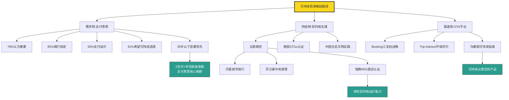

**这一节需要审视的若干不确定性**：

**第一，关于支付溢价数据的稳健性**。多数报告披露的"50%愿意支付溢价"是问卷自陈意愿，与实际购买行为之间可能存在差距——心理学称之为"意愿-行为差距"。在购买决策的关键时刻，价格、便利性、紧迫感等因素仍可能压倒可持续偏好。这一不确定性意味着**可持续支付意愿的实际转化率可能低于自陈数据所示**，目的地与酒店在投入可持续认证时仍需谨慎评估市场回报。

**第二，关于代际差异是否会持续**。35岁以下年轻一代对可持续的高重视度可能是"代际现象"（这一代人的特殊价值观），也可能是"年龄现象"（年轻时关注更广价值观、年长后关注更具体利益）。如果是前者则随着这一代成为主流消费群体，可持续溢价空间将持续放大；如果是后者则可能在他们步入中年后回落。本研究的搜索结果不足以判断这一问题，需后续长期追踪。

**第三，关于"可持续"标签的认证统一性**。当前"碳中和酒店""绿色认证""STGs认证""FSC认证"等多套认证体系并存，标准不统一、认证机构权威性差异较大、greenwashing（漂绿）现象频发——这可能导致游客对认证的信任度下降，进而压制支付意愿。这一问题的解决依赖于全球统一的可持续认证标准的形成，目前仍处于探索阶段。

**这一节的核心结论是**：**可持续旅游已从"附加项"跃升为"必需项"——尤其在35岁以下年轻一代和欧美主流客群中**。50%的支付溢价意愿、91%的可持续旅行偏好、北欧95%酒店认证率、Booking三支柱战略等多维证据共同验证了这一跃升。**但需注意支付意愿与购买行为的差距、代际现象与年龄现象的不确定性、以及认证标准统一性问题**——这些不确定性提示目的地在可持续转型时需要"务实路径+长期投入+真诚执行"，避免陷入漂绿陷阱。下一节将从反向视角探查"过度旅游"如何反噬目的地的承载力。

## 6.6 过度旅游与承载力平衡：目的地的脆弱性管理

如果说可持续旅游是目的地的"主动选择"，**过度旅游则是目的地的"被动受害"**——当签证、交通、营销等正向因素持续放大客流时，缺乏承载力管理的目的地终将面临反噬。2025年7月西班牙马略卡岛约2万名抗议者走上街头、12月15日西班牙消费者事务部对爱彼迎处以逾6400万欧元罚款、威尼斯被联合国教科文组织世界文化遗产委员会建议列入"濒危世界遗产名录"等事件[^186][^163][^187]，标志着**过度旅游已从学术概念升级为现实治理危机，并开始反向塑造旅客的目的地选择**。

**巴塞罗那案例是过度旅游负向反噬的最具代表性样本**。2025年7月6日**约2800名巴塞罗那居民发起示威游行，他们举着写有"你们的奢华，我们的痛苦""让游客回家去"等内容的标语牌，用胶带"封锁"了一些酒店和餐厅的大门，甚至用水枪喷射游客**[^186][^187]。游行结束后抗议队伍发表演讲称——**"随着生活成本、租金的增加，公共服务压力增大，城市当地特色丧失，当地居民直接承受旅游业过热带来的后果"**[^186][^187]。这一表述精准点明了过度旅游的核心症结——**旅游业的经济收益由产业方获取，但其外部性成本（住房成本、公共服务压力、文化原真性流失）由本地居民承担，二者的不对称引发了实质对立**。

**住房危机是过度旅游最紧迫的影响**。**《环球时报》驻西班牙特约记者长期居住于该国首都马德里，首都的房租和酒店住宿价格在本国已是较高水平。但记者多次赴巴塞罗那发现，在同等房屋条件、类似地段的情况下，巴塞罗那的房租均价往往比马德里还要高100欧元至300欧元，巴塞罗那市中心的食品、日用品价格也明显高于首都**[^186][^187]。这一**首都vs旅游热门城市的房租反转**，揭示了过度旅游对房地产市场的扭曲——大量住宅被转化为短租房（民宿、爱彼迎等），挤压了本地居民的居住空间。

**经济权重的两难**则使过度旅游治理愈加复杂。**巴塞罗那市议会的数据显示，去年约2300万游客给当地带来了127.5亿欧元的消费，约占当地经济总量的15%；西班牙Caixa银行6月的数据显示，预计今年西班牙旅游业收入将继续增长，并占全国GDP的13%**[^186][^187]。**当旅游业贡献15%的经济总量时，"赶走游客"在政治与经济上都是不现实的；但维持当前规模又会持续放大社会成本——这是过度旅游目的地共同面临的两难抉择**。

**威尼斯案例则展现了过度旅游对古城承载力的极端冲击**。**威尼斯绝大部分景点坐落在亚得里亚海边的小岛上，面积有限，不像其他在大陆上的城市一样方便疏解游客**[^186][^187]。**即使在淡季的2月，游客相对于其他地方来说还是多了不少；至于旺季人就更多了，总督宫、圣马可大教堂等主要景点的排队时间都在半个小时以上，运河上也全都是游客**[^186][^187]。结构性数据显示——**威尼斯常住居民已不足5万，并且大部分是老人，其他人都将自己的住房改造成民宿，自己搬到岸边的新城居住**[^186][^187]。**这种"古城被腾空给游客、居民迁往新城"的现象，标志着过度旅游已实质改变了城市的人口结构与社会肌理**。

**与当地居民交谈时，记者可以感受到他们的矛盾心理——"一方面游客带来了大量收入，但另一方面大部分商店根据游客需求被改造成餐厅和纪念品店，日常购物场所基本消失。过度旅游还造成老城物价奇高，基本达到全意大利最高水平。加之老城本就交通不便，日常交通和物流只能靠船和人力，大量游客使当地交通状况进一步恶化。此外，大量游客还对古建筑造成严重影响，桥梁、道路都被过度使用，修复的频率和成本都大大增加"**[^186][^187]。**这一描述揭示了过度旅游对目的地原真性的全方位侵蚀——从店铺业态到日常生活、从物价水平到古建筑保护，每一个维度都因游客密度而扭曲**。

**日本镰仓与富士山打卡地则提供了亚洲过度旅游的样本**。**日元贬值让越来越多的外国人将日本作为旅游目的地，当地政府2024年5月在一处眺望富士山的打卡地挂起黑幕的举措登上社交媒体热搜**[^186][^187]。**以神奈川县镰仓市为例，该市车站周边就有许多景点，导致车站附近拥挤不堪。镰仓站和藤泽站之间的江之岛电车铁路周边地区尤其受到游客青睐，这里是日本人气漫画《灌篮高手》的取景地，来拍照的游客络绎不绝**[^186][^187]。"挂黑幕"这一极端措施虽显被动，但生动呈现了**当目的地承载力达到极限时，地方政府不得不"主动遮挡景观"以减少游客密度**——这是对"打卡式旅游"的反向回应。

**北京大学吴必虎教授对过度旅游的理论分析为治理提供了系统框架**。**《环球》杂志记者采访的吴必虎指出——"何为'过度旅游'，并没有一个统一的标准。旅游业发展经历了不同阶段，依次是观光旅游、度假旅游再到休闲旅游"**[^163]。**"观光旅游阶段，经济欠发达地区希望借助当地自然景观及文化资源吸引外来游客，带动就业和收入，游客旅游是为了去'看一看'；度假旅游兴起后，当地高端设施投入随之加大，游客出门游玩变成'住下来度几天假'；如今世界各地致力于建设'休闲城市'，强调本地居民与外来游客共享休闲空间，共同提升生活质量，是想'把旅行当成生活的一部分'。正是这一阶段，产生了新的矛盾，过度旅游问题随之凸显"**[^163]。

**吴必虎进一步从多元利益相关方视角剖析了过度旅游的复杂性**。**"对旅游地居民来说，因游客大量涌入带来物价上涨、生活成本攀升等新情况，容易产生抵触心理，也叫'憎畏感'。从生态角度看，当地环境和基础设施承受不了长期超负荷的消耗，特别是那些本来就很脆弱的自然保护区。站在游客的立场，他们期待一个好环境和舒适的体验，如果旅游目的地过度商业化，旅行也就失去了意义。一些旅游地，像北非的摩洛哥、墨西哥的坎昆、印度尼西亚的巴厘岛等，会把游客集中在特定区域，试图减少对本地居民生活的打扰，但这种做法也被批评为'削弱地方原真性'"**[^163]。**"过度旅游从来不是一个简单的是非题。不同的人看问题的立场不同，投资者希望得到回报，当地居民希望生活安稳、不被过度打扰，环保人士希望生态免受破坏，学者担心地方文化不被污染。因此，需要在经济、生活与生态之间找到平衡点，旅游业才能健康发展"**[^163]。

**过度旅游的"动态标准"则提示了治理的复杂性**。吴必虎指出——**"过度旅游不能一概而论。不同的资源禀赋、环境承载力、基础设施和社区结构，决定了各地应对旅游压力的方式存在差异。有些曾经单纯追求游客数量的地方，如今也开始注重旅游质量和可持续发展，当地民众对旅游的认知与容忍度也随之发生变化"**[^163]。**"过度旅游并不只是因为外来游客与旅游地本地之间的文化碰撞。更深层次的原因在于，游客的文化背景、行为方式和价值诉求与本地社区间存在'文化位差'。这种差异既能激发游客对不同文化的渴望，也可能引发文化冲突"**[^163]。

将过度旅游的多维症状与典型应对策略整合：

| 症状维度 | 具体表现 | 典型案例 | 应对策略 |
|---------|--------|--------|---------|
| 住房危机 | 短租挤压住宅、房租飙升 | 巴塞罗那房租高马德里100—300欧元 | 西班牙短租管控+爱彼迎6400万欧元罚款 |
| 物价飙升 | 食品/日用品/餐饮全面上涨 | 威尼斯老城物价全意最高 | 入城费+控制游客密度 |
| 文化原真性流失 | 商店变餐厅纪念品店 | 威尼斯日常购物场所消失 | 业态保护+本地经营激励 |
| 古建过度使用 | 桥梁道路修复成本上升 | 威尼斯古建修复频率上升 | 限流+预约制 |
| 居民憎畏感 | 抗议游行、水枪喷射 | 巴塞罗那2万人抗议 | 社区参与+收益分享 |
| 生态超负荷 | 自然保护区承载超限 | 自然保护区脆弱受损 | 容量控制+生态修复 |
| 体验降级 | 游客排队/拥挤/失望 | 圣马可教堂排队半小时 | 分流+错峰+预约 |

数据来源：综合《环球时报》《环球》杂志报道、巴塞罗那市议会、Caixa银行数据

**应对策略的具体执行情况则呈现进展不一**。威尼斯采取**收取"入城费"**——希望在保证本地居民福祉、游客利益和旅游收入之间寻得平衡[^163]；**西班牙2025年12月15日对国际短租房平台美国爱彼迎公司处以逾6400万欧元罚款，因其发布大量违反西班牙租房市场规范的房源广告；西班牙此举旨在遏制过度旅游给相关地区居民带来的住房成本上涨等问题**[^163]；日本镰仓挂黑幕分流游客；巴塞罗那加强短租房管控等。这些应对策略虽各有局限，但共同体现了**目的地从"被动受害"向"主动治理"的转变趋势**。

**与过度旅游相对应的是泰国TTM+ 2025"高价值长停留"战略转型**。第6.2节已援引泰国国家旅游局副局长尼提·西贝的表态——**"2025年泰国旅游发展将重点打造文化、康养和可持续发展的高价值体验，旨在提升泰国旅游品质、进一步推动旅游业惠及游客和当地社区"**[^173]。**TTM+ 2025的可持续主题表现尤其值得关注——本届展会以"可持续发展理念"为核心主题，在450家泰国参展企业中共有185家环保型旅游运营商参与，涵盖泰国旅游奖获奖企业、获得可持续旅游目标(STGs)国际认证的机构，以及参与泰国国家旅游局(TAT)"碳中和酒店"(CF Hotels)计划的成员单位等**[^173]。**在业界人士看来，这为泰国进一步提升国际旅游目的地形象具有重要意义**[^173]——**这一从"低价大众游"向"高价值长停留"的国家级战略转型，本质上是承载力管理与品质升级在国家层面的整合实践**。

**过度旅游对旅客目的地选择的反向影响则呈现两面性**。**正面看**——过度旅游的曝光使部分旅客主动避开高拥挤目的地，转向小众目的地（这正是反向旅游兴起的部分原因）；**反面看**——巴塞罗那、威尼斯等城市的世界遗产地位仍吸引大量首次旅客（"明知人多还要去看一眼"的心理）。**这一两面性使过度旅游目的地的客流并不会因抗议事件而崩溃，而是呈现"高端客群转移、大众客群仍在"的结构性变化**——这一变化可能进一步加剧目的地的承载力压力（大众客流不减、高端客流转移意味着客单价下降但人数不减）。

**这一节需要承认的若干**不确定性**：第一，关于过度旅游对目的地客流的具体冲击规模，缺乏长期跟踪数据，难以判断巴塞罗那等城市未来是否会因社会冲突而真正失去客流。第二，关于"入城费""限流""预约制"等措施的实际效果评估，本研究搜索结果不足以系统比较各类策略的有效性。第三，对过度旅游的判断本身具有"立场依赖"——投资者、居民、环保人士、学者、游客各自的立场导致评估结论不同，本节呈现的是综合视角而非单一立场判断。

**这一节的核心结论是**：**过度旅游已成为热门目的地长期吸引力的负向变量**——通过住房危机、物价飙升、文化原真性流失、居民憎畏感等多维症状反向驱离游客与本地居民。**应对策略需要在经济、生活、生态三方平衡中寻找适合本地禀赋的方案**——威尼斯入城费、西班牙短租管控、京都游客分流、泰国"高价值长停留"战略等案例呈现了不同路径，但共同特征都是从"流量逻辑"转向"质量逻辑"。下一节将进一步整合本章前述各节，构建从"流量到留量到增量"的可持续发展模型。

## 6.7 流量到留量到增量：可持续目的地建设的转化机制

将本章前述各节的分析整合，可构建出**"流量引爆—留量沉淀—增量转化"的三阶可持续发展模型**——这一模型不仅是对本章内容的逻辑收敛，更为目的地管理者提供了一套可操作的建设框架，并为第7章客群差异化与第8章综合决策模型提供软性维度的关键参数。

**世界旅游城市联合会《世界旅游目的地竞争潜力指数报告(2025)》提供了这一模型的国际坐标**。该报告**从文化吸引力、基础设施、可持续性等十大维度对全球城市进行评估，其中中国城市表现突出，北京与上海双双跻身全球旅游竞争潜力城市前十名，分别位列第五和第九**[^174]。**这一十大维度的综合评估框架与本研究第1—6章的多维变量分析高度同构**——文化吸引力对应本章6.2节、可持续性对应6.5节与6.6节、基础设施对应第2章、数字化与智慧旅游对应第5章——形成了从国际机构评估到本研究分析的相互印证。

**报告指明的"十五五"国际旅游目的地建设方向**则系统勾勒了三阶模型的具体路径——**"面向'十五五'的可持续国际旅游目的地建设应聚焦以下三个核心维度：第一，可持续的基础设施改善。当前国内许多城市已在交通、住宿等硬件设施上达到国际水准。进入城市更新与'新基建'阶段，建设重点应从满足基本需求的物理设施，转向服务于数字经济和绿色发展的科技与生态设施。这要求城市在维护现有设施品质的基础上，积极建设适应气候变化的基础设施，发展低碳交通系统，并推动智慧化、包容性升级，实现基础设施的绿色转型；第二，贯彻'以访客为中心'的可持续服务理念。这一理念涵盖'可访问性''可体验性'与'可参与性'。建设者需从三方面入手——一是增强内容吸引力与文化真实性，让国际游客不仅能'看到'风景遗迹，更能获得深度的文化体验；二是全面提升可访问性，包括在大交通、'最后一公里'以及多语种服务上进一步畅通，特别是借助AI翻译等技术破除语言障碍；三是优化落地后服务，精准响应国际游客对深度体验、小团化、沉浸式的需求，并关注'文旅+体育''文旅+美食'等融合消费新趋势，实现服务的可持续迭代；第三，可持续的品牌形象与文化氛围建设。如今的旅行者更加注重深度体验与遗产的真实性，因此目的地必须强化可识别性，塑造亲民且鲜明的品牌形象，并将文化遗产置于城市政策的核心。中国城市和景区应善用融媒体与国际传播资源，通过高质量内容生产与精准推广，在国际舆论场持续发声。同时必须确保旅游发展的收益能公平地惠及当地居民与社区，在'烟火气''原滋味'和便利、规整间取得平衡，让'宜居'与'宜游'相辅相成，实现品牌与社区的协同可持续发展"**[^174]。

**这三大核心维度为本章的三阶可持续发展模型提供了系统化的国家级战略框架**：

**第一阶：流量引爆**——通过基础设施改善（第2章签证、交通、支付、第5章数字化）+品牌引爆（第5章城市营销+本章6.2文化独特性）实现初始流量积累。**敦煌2025年游客同比+16.6%、甘肃全省+11.3%即是这一阶的典型成果**。但单纯的流量引爆不足以形成可持续竞争力——若无后续承接，流量会因审美疲劳、配套不足、过度旅游等因素流失。

**第二阶：留量沉淀**——通过文化深度（6.2）+城市生活化场景（6.3）+情绪价值（6.4）+承载力管理（6.6）实现停留延长与客单价提升。**敦煌停留2.7天、本地酒店度假停留2.6晚、广东夜间文旅占比60%等数据，是这一阶的实证**。留量沉淀的核心在于将"一次性消费"转化为"沉浸式体验"，将"过路游客"转化为"临时市民"。

**第三阶：增量转化**——通过可持续认证（6.5）+品牌长红（5.6）+社区共益（6.6应对策略）实现长期发展增量。**敦煌2025年游客花费同比+21.1%（高于游客量+16.6%）、甘肃全省花费+16.9%（高于游客+11.3%）的差额，正是增量转化的直观体现——客单消费的增长速度超过游客数量的增长速度**[^169]。**这一"花费增速>游客增速"的剪刀差，是可持续目的地建设最具说服力的核心指标**——它意味着目的地不再依赖"以量取胜"，而是通过"以质取胜"实现单位流量价值的提升。

将三阶模型的核心节点与代表性数据整合：

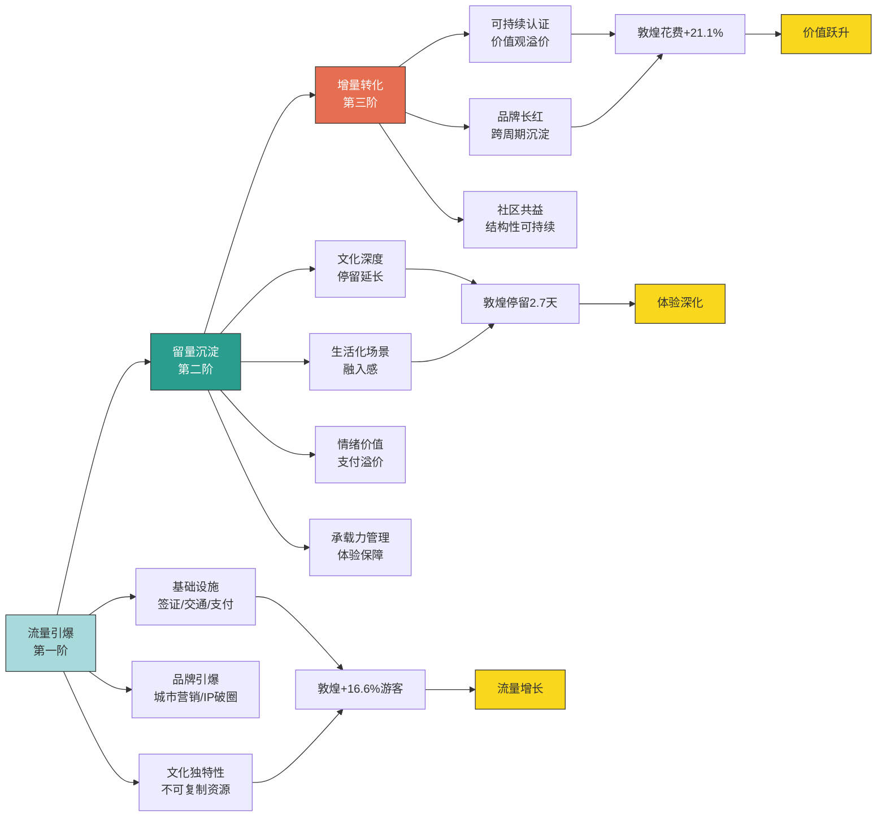

**本章六大软性变量在客群分化矩阵中的权重排序**则为第7章客群结构差异化分析提供关键参数：

| 客群类型 | 深度体验 | 文化独特性 | 城市生活化 | 情绪价值 | 可持续认证 | 承载力关注 |
|---------|--------|----------|----------|---------|----------|----------|
| Z世代 | 高 | 高 | 极高（Citywalk） | 极高 | 高 | 中 |
| 95后90后 | 极高（躺平主力） | 高 | 高 | 极高 | 高 | 中高 |
| 85后80后亲子 | 高 | 中高 | 高（亲子场景） | 中高 | 中 | 高 |
| 银发客群 | 高 | 极高（深度文化） | 中（适老化） | 中（陪伴/养生） | 中低 | 高 |
| 高净值客群 | 极高 | 极高（稀缺溢价） | 高（高端商圈） | 高 | 高 | 高 |
| 入境外国客群 | 极高 | 极高（差异化首位） | 高（生活化代入） | 中 | 极高（欧美） | 高 |
| 商务客群 | 中 | 中 | 高 | 中 | 中 | 中 |

数据来源：综合本章各节数据与代际偏好分析

**这一权重矩阵揭示了三个关键洞察**：

**第一，深度体验、文化独特性、情绪价值在大多数客群中均处高权重**——这印证了本章核心判断"软性变量已成为目的地竞争核心护城河"。**第二，可持续认证在Z世代、入境外国客群（尤其欧美）中权重显著高于其他客群**——这意味着目的地的可持续转型对国际化战略与年轻客群战略具有特殊价值。**第三，城市生活化场景在Z世代、95后90后中权重最高**——这与6.1节"特种兵退潮、躺平兴起"的代际转向逻辑一致。

**整合本研究第1—6章的核心发现，可勾画出2025年目的地选择的"硬+软"双维度框架**：

| 维度 | 硬性变量（第1—5章） | 软性变量（第6章） |
|------|----------------|----------------|
| 准入门槛 | 签证开放、交通可达、支付便利、安全可预期、气候适宜 | 文化基础、城市可游性 |
| 差异化竞争 | 汇率性价比、技术赋能、品牌营销、气候独特性 | 文化深度、生活化场景、情绪价值、可持续认证 |
| 长期粘性 | 服务标准化、平台连接 | 留量沉淀、增量转化、承载力平衡 |

**这一双维度框架的核心启示是——硬性变量决定"能否到达"，软性变量决定"为何选择与持续选择"**。在2025—2026年的市场中，**硬性变量已逐步收敛（签证、交通、支付、技术等基础设施在主流目的地间差距缩小），软性变量的差异化能力正在成为目的地竞争的决定性力量**。这也解释了为何敦煌、清迈、北欧等具备文化深度与可持续基因的目的地能在2025年获得超额增长——它们的竞争力来源于难以复制的软性变量积累，而非短期可优化的硬性条件。

**面向2026年及"十五五"期间的趋势预判可凝练为五点**：

**第一，"特种兵退潮、躺平兴起"的需求转向将持续深化**——单目的地深度游、本地酒店度假、长停留模式将进一步主流化，多城市联游模式可能持续承压。

**第二，文化独特性与非遗活化将成为目的地差异化竞争的核心**——具备深厚文化资源的目的地将通过"科技转译+生活共创+演艺闭环"实现进一步变现，缺乏文化深度的目的地可能陷入同质化竞争。

**第三，城市生活化场景将进一步从"商业空间"扩展至"公共空间"**——公园化商业、滨水商圈、垂直社群空间等新形态将持续涌现，"宜居即宜游"理念将更深入地融入城市规划。

**第四，可持续旅游将从"附加项"全面跃升为"必需项"**——35岁以下年轻客群与欧美主流客群对可持续认证的支付意愿将持续放大，OTA平台的绿色筛选体系将进一步完善，可持续将从理念层面下沉至产品与渠道层面。

**第五，过度旅游治理将从"事后应对"转向"前置规划"**——更多目的地将主动设置承载力上限、引入预约制与限流措施、推动游客分流与社区共益，以避免巴塞罗那、威尼斯式的危机重演。

**本章核心结论可凝练为六点**：

**第一，旅游消费逻辑已从"打卡"转向"深度体验"**——2026五一单目的地深度游+67%、本地酒店度假+124%、停留时长从1.8晚增至2.6晚、特种兵满意度6.7vs度假式8.9等数据共同验证了这一结构性转向[^161]。

**第二，文化独特性已成为目的地差异化竞争的核心护城河**——敦煌2025年游客+16.6%、花费+21.1%、停留2.7天、文化体验型消费规模超1.2万亿元等数据印证了文化深度的市场价值[^166][^167][^168]。

**第三，城市生活化场景与休闲集聚区正在重塑目的地竞争力内涵**——全国夜间消费占比32.9%、5A景区夜间开放率66.9%、广东夜间消费占比60%、单次夜间停留3小时等数据揭示了"宜居即宜游"的实证基础[^175][^176][^177]。

**第四，情绪价值已成为体验经济的内核驱动力**——云南斗南花市旅游花费+43%、旅行放松动机57%、文化体验42%、美食39%、社交分享55%等数据共同支撑"情价比升级性价比"的逻辑[^181][^178][^179]。

**第五，可持续旅游已从理念跃升为支付变量与代际共识**——78%认为重要、85%践行规定、50%支付溢价、Booking 91%希望可持续选择、瑞典哥德堡95%酒店认证等数据印证了这一跃升，35岁以下年轻一代显著领先[^162][^185][^183]。

**第六，过度旅游已成为热门目的地长期吸引力的负向变量**——巴塞罗那2万人抗议、爱彼迎被罚6400万欧元、威尼斯居民迁出、京都黑幕措施等案例标志着承载力平衡已从理论议题升级为现实治理危机[^186][^163][^187]。

**这六大结论与本章构建的"流量—留量—增量"三阶可持续发展模型、本章软性变量在客群分化矩阵中的权重排序，将共同作为第7章客群结构差异化与第8章综合决策模型的关键输入参数**。在第7章中，本研究将进一步基于本章呈现的代际偏好分化（00后特种兵+Citywalk、95后90后躺平+反向、85后80后近郊+亲子）、付费意愿差异（年轻一代可持续支付溢价显著）、文化资源敏感度（入境外国客群对文化独特性权重最高）等结构，对Z世代、银发、亲子、商务、入境外国客等不同客群的目的地选择逻辑展开系统拆解。

**最后需要补充说明本章的若干不确定性来源**：第一，2026五一数据来自三大OTA平台报告，时间窗口较短，是否反映长期趋势仍需后续季度数据验证；第二，云南斗南花市等单一案例的极端增长数据多源自地方文旅局披露，统计口径可能与全国性数据不完全一致；第三，可持续旅游支付意愿的自陈数据与实际购买行为之间可能存在差距，需结合后续实际市场数据进行验证；第四，过度旅游治理策略的实际效果评估，本研究搜索结果不足以系统比较各类策略的有效性；第五，关于代际偏好的描述（00后/95后90后/85后80后等）是基于平台调研的统计趋势，个体差异显著，须避免过度类型化。这些不确定性提醒后续章节在引用本章论断时须保持必要的口径敏感性，第9章局限性部分将进一步说明。

# 7 客群结构差异化因素

第1—6章已沿"宏观格局—签证交通—经济安全—气候自然—技术营销—文化可持续"六条主线，系统拆解了2025年影响目的地选择的多维变量。但每一章的分析都不可避免地反复触及一个共同的问题——**同一项影响因素，在不同人群中的作用力为何如此不同？** 第3章观察到Z世代愿意为越南"600元看玻璃海"奔赴而高净值客群仍执着于欧洲奢华长线；第4章看到银发客群将三亚冬季20℃视为健康刚需而年轻人将新疆赛里木湖跳伞作为社交货币；第5章揭示马蜂窝AI用户中80后90后占比73%而56岁以上付费意愿仅7.35%；第6章发现Z世代和欧美年轻客群对可持续认证溢价支付意愿显著高于其他群体。这些散落在各章中的客群差异化信号，共同指向一个无法回避的研究命题——**目的地选择影响因素的权重排序并非客观恒定，而是随客群结构发生显著弹性变化**。本章即承担这一关键的"视角转换"任务，从前六章的"变量视角"切换至"人群视角"，依托携程、飞猪、马蜂窝、去哪儿、爱彼迎、Booking等平台2025年客群专项数据，系统比较Z世代年轻群体、银发群体、家庭客群、商务与新商旅客群、入境外国游客、高净值客群六大典型人群在目的地偏好、决策逻辑、消费结构、信息渠道上的本质差异，最终在末节构建客群权重矩阵，为第8章综合决策模型提供核心输入参数。

## 7.1 客群分层框架与差异化逻辑总览

要系统比较不同客群的目的地选择逻辑，须先建立一套清晰的分类坐标。结合前六章已观察到的差异化信号与本章引用的多源平台数据，本研究构建一个**"年龄代际×收入水平×出行目的×地理来源"四维客群分层框架**——这四个维度并非彼此独立，而是在实际决策中相互交叉、共同塑造个体的目的地偏好。

**年龄代际维度**是本章最具结构性的分类基础。基于第6.1节已援引的《2025年轻人旅游趋势报告》代际偏好数据——00后倾向于特种兵式旅游和Citywalk、95后90后偏好躺平式度假和反向旅游、85后80后热衷近郊度假和工厂游——可识别出四个年轻代际亚类。在此之上叠加去哪儿《2025"新银发一族"飞行报告》定义的55—70岁"新银发一族"，以及国家统计层面60岁以上传统银发群体，形成年龄代际维度的完整谱系。**收入水平维度**则借助华凯营销2025年第一季度《中国出境游情绪调查》数据展开——28%游客每次旅行预算超5万元、49%至少花费2.5万元、72%计划多次出国——区分预算敏感型、中产、高净值三层,并交叉文化和旅游部公布的2025年城镇居民出游花费5.30万亿元(占84.13%)vs农村居民1.00万亿元(同比+21.4%增速反超)的城乡格局[^188]。**出行目的维度**涵盖休闲、商务、研学、康养、探亲五大主类,其中"商务"在2025年因新商旅场景兴起而进一步细分为传统差旅、长期派驻、游学陪读、数字游民、亲友康养、短期展会六类[^189]。**地理来源维度**则区分国内一线/新一线、新一线及以下下沉市场、入境外国客三类,后者再按客源国细分为亚洲近邻(韩日东南亚)、欧美远程、俄罗斯及"一带一路"三个亚类[^190][^191]。

**为何要按客群拆解?** 答案的核心可凝练为一句话——**"同一影响因素在不同客群中的作用权重,差异往往大于因素本身的客观变化幅度"**。第3章已部分揭示这一规律——Booking调研数据显示53%的中国旅行者将安全视为选择出境目的地的关键决策因素,但这一权重在银发客群与亲子家庭中接近"决定性",在Z世代与年轻自由行群体中则可能低于"性价比"权重(后者愿意为低价穷游承担一定风险)。第4章进一步深化了这一判断——气候权重对银发客群"接近决定性"、对亲子家庭"高"、对Z世代"差异化"(既追求极致凉爽也愿为极光跨越长距离)、对商务客群"低"。第5章则呈现了AI使用频率与付费意愿的代际倒挂——80后90后构成马蜂窝AI核心用户73%而18岁以下未成年群体74.28%愿为个性化AI付费vs56岁以上仅7.35%。**这些散落在各章的差异化信号汇聚起来,呈现出一个清晰的结论——离开客群结构谈影响因素权重,任何排序都是失真的;只有引入客群分层,才能准确刻画"对谁而言什么因素更重要"的微观决策逻辑**。

**不同客群对硬性变量与软性变量的敏感度差异**则是本章最重要的总体规律。综合前六章已观察的现象,可初步勾画客群权重矩阵的总体轮廓:

| 客群类型 | 硬性变量敏感度 | 软性变量敏感度 | 决策核心特征 |
|---------|--------------|--------------|-----------|
| Z世代/年轻群体 | 性价比极高、安全中等 | 情绪价值/可持续/社交极高 | 反向旅游+情绪驱动 |
| 银发群体 | 气候/安全极高、价格中等 | 文化深度/陪伴中高 | 候鸟旅居+品质长住 |
| 亲子家庭 | 安全/气候/便利高 | IP/出片率/省心高 | IP驱动+全龄包容 |
| 商务新商旅 | 配套服务/可达性高、价格低 | 工作友好/宽敞合住中 | 出行频次升+边界延伸 |
| 入境外国客 | 签证/语言/翻译极高 | 文化独特性/可持续高 | 深度文化+下沉腹地 |
| 高净值客群 | 价格低、可达性中 | 稀缺溢价/独特体验极高 | 长线奢华+定制化 |

数据来源:综合本研究第3—6章已援引各平台数据初步整合

**这一总体框架揭示了三点关键判断**。**第一,客群差异化是一种结构性现象,而非偶然的个体差异**——它源于不同代际、不同收入、不同出行目的、不同地理背景的客群在生活方式、消费能力、价值观、信息渠道上的系统性差异,因此即使在外部环境完全相同的情况下,不同客群仍会做出不同的目的地选择。**第二,硬性变量与软性变量的敏感度呈现"此消彼长"的反相关趋势**——对价格高度敏感的客群(Z世代)往往对体验价值的支付意愿也较高(因为他们以极致性价比换取深度体验的预算腾挪);对价格不敏感的客群(高净值)则将稀缺溢价、独特体验作为核心追求。**第三,客群权重矩阵的不确定性边界客观存在**——代际类型化偏差(并非所有Z世代都偏好反向旅游)、跨代际个体差异(部分银发客群对AI接受度高于平均)、客群边界模糊化(高净值Z世代既具备年轻代际特征又具备高收入特征)等因素,意味着本章的客群刻画只能呈现"统计意义上的趋势"而非"个体决策的全貌"。

带着这一总体框架,后续各节将依次深入六大典型客群的具体决策逻辑——7.2节聚焦Z世代年轻群体的反向旅游与情绪驱动、7.3节系统分析银发群体的候鸟旅居与康养偏好、7.4节剖析家庭与亲子客群的IP驱动与省心溢价、7.5节展开商务与新商旅的出境新需求、7.6节拆解入境外国游客的客源结构重构、7.7节引入收入与城乡来源的交叉维度,最终在7.8节构建完整的客群权重矩阵并提出目的地差异化竞争策略启示。

## 7.2 Z世代与年轻群体:情绪驱动与反向旅游的目的地偏好

Z世代与年轻群体(本节主要指18—30岁人群)是2025年中国旅游消费最具结构性变革力的客群——他们既是携程口碑榜"暑期十大玩水避暑目的地"的核心客群,又是飞猪境外当地玩乐套餐+30%的主力推手,更是反向旅游、Citywalk、躺平式度假等新兴形态的发起者。要理解这一客群的目的地选择逻辑,须从一个看似简单却被广泛误解的现象切入——**反向旅游**。

**反向旅游并非简单的"去冷门地方",而是一场针对传统旅游"内卷模式"的系统性反叛**。一份《中国兴起"反向旅游"热!年轻人到底在"反"什么?》的深度观察精辟指出——**"它真正'反'的是传统旅游的内卷模式——反人挤人的拥挤场景,反走马观花的打卡式行程,反千篇一律的商业化体验"**[^192]。在黟县的青石板路上,游客不用为拍照排队,能安安静静看一场原汁原味的鱼灯表演;在新疆乌恰边境,**00后游客追逐的不是热门景点,而是远离都市喧嚣的落日余晖和治愈时刻**[^192]。这一观察直击Z世代目的地偏好的核心特征——**他们对"网红打卡地"已经审美疲劳,转而追求那些没有被商业化彻底改造的原生态生活场景**。

**市场数据则从规模端验证了反向旅游的爆发**。该报告披露——**2025年县域旅游接待人次和总收入均实现两位数增长,福建长汀、江西奉新等小城的高端酒店订单增速甚至突破1000%**[^192]。这一组小城高端酒店"+1000%"的数据具有特殊结构意义——它表明反向旅游并非"低消费旅游",而是"低拥挤+高品质"的复合诉求。年轻人愿意为远离都市喧嚣的高品质住宿支付溢价,但拒绝为人挤人的网红景区门票排队——这种**"反方向支付意愿"**正是反向旅游的核心标识。

**新京报贝壳财经联合中国旅游协会休闲度假分会发布的《2025中国"宝藏小城"旅游报告》则提供了更系统的小城旅游全景**。50座小城脱颖而出的格局背后,是五大核心趋势——**从"资源驱动"向"内容驱动"转型、"高原—边疆流量带"集体爆红、非遗/旅拍/康养/研学成"四大消费主轴"、年轻人旅游行为从"看风景"走向"进生活"、Z世代/亲子家庭与银发人群成为消费主力**[^193]。**Z世代在50座小城中的标记尤为显著**——湖南通道的"侗锦夜宴"、山西蒲县的"皮影+露营"、新疆阿合奇的"高原牧区旅拍"等案例,都是Z世代圈层文化深度参与的产物;**"远"不再是劣势,而成为旅行社交中的'象征资本'。尤其对Z世代而言,'能讲出一个别人没讲过的旅行故事',远比'去过大景点'更有意义"**[^193]。

**性价比敏感度极高叠加情绪价值溢价显著,构成Z世代目的地偏好的"两极"特征**。携程酒店半年度数据(第3章已部分援引)显示——**近8成Z世代偏好300元以下的酒店;"打卡式旅行"已然成为年轻人的社交货币;为一场演出奔赴一座城,携程全球节演用户平均年龄低于携程大盘3—5岁**[^194]。这一组数据呈现了Z世代的**"该省省该花花"消费哲学**——住宿能省则省(三四十元青旅、特种兵式硬座过夜),但为了一场演唱会、一场漫展、一处特殊体验则愿意支付远超同龄人平均水平的价格。这种消费结构在第3章已部分体现——年轻人在境外当地玩乐服务上的平均客单价同比去年增长近20%,但这种增长集中在"该花花"的体验项目上而非"该省省"的住宿环节。

**Booking《2025中国旅客出境游趋势报告》进一步揭示了Z世代的"小众体验+个性化资讯"偏好**——Z世代偏好"小众体验,渴望获得契合自身需求的个性化资讯与精选行程"。这一偏好与第5章观察到的AI关键词TOP10中"小众""不踩雷""人少""躺平"高度共振,印证了Z世代既是反向旅游的发起者,也是AI推荐生态最精准的目标客群。

**节演赛事的跨城驱动力则呈现Z世代目的地选择的另一独特维度**。第5章已援引的"苏超""库里品牌亚洲行重庆站"等赛事案例、太原"歌迷之城"32场演唱会带动41亿元消费、《黑神话:悟空》带动太原文物景区一周40万人次等案例,共同验证了**Z世代目的地选择的"内容驱动"逻辑——他们不是去某个地方"看风景",而是为某场演出、某个游戏IP、某场赛事"奔赴一座城"**。携程数据显示节演用户平均年龄低于大盘3—5岁,精准定位了这一客群的代际归属。这一逻辑与传统观光型旅游形成根本区别——传统模式下目的地是核心,内容是附加;而Z世代模式下内容是核心,目的地是承载内容的物理空间。这种"内容主导"使得目的地的"被选择"高度依赖其IP承接能力、演艺资源吸纳能力、网红场景营造能力。

**信息渠道上,AI助手与小红书构成Z世代的"双轨决策入口"**。第5章已援引马蜂窝《2026人工智能+旅游趋势报告》数据,80后与90后构成核心用户群占比达73%——这一数据看似与"Z世代主导"相左,但其背后的逻辑是**Z世代独行旅行的诉求相对简单(往往是单目的地深度游、城市Citywalk),对AI综合规划的依赖度低于复杂家庭决策的80后90后**。在小红书层面,Z世代女性用户构成了核心受众——**澳大利亚旅游局借助演员于适为昆士兰州拍摄的宣传片,在小红书累计25.05万浏览和1.08万篇互动笔记**[第5章已述],典型印证了"明星KOL+小红书+Z世代女性"的精准触达组合。短视频平台上的"穷游神话"分享更是形成了Z世代独特的信息生态——小红书、抖音上"2500块玩半个月""600块看玻璃海"的分享层出不穷,直接驱动越南2025年中国游客同比+41.3%的爆发(第3章已述)。

**可持续与社交分享权重双高**则呈现Z世代目的地偏好的价值观维度。第6.5节已援引《2025年可持续旅游报告》数据——**35岁及以下年轻一代对可持续旅游的重视程度显著高于年长群体,他们不仅认同其必要性,更将其视为旅行的核心价值**;Booking 2025中国旅客出境游趋势报告则披露**18—40岁群体对可持续责任意识尤为突出**。Booking数据进一步显示**55%中国旅客乐于在旅程结束后在社交媒体上分享美食体验**——而Z世代正是这一社交分享行为的核心驱动力。这种"可持续认同+社交分享"的双高权重,使Z世代目的地选择不仅关注"我喜欢什么",更关注"我去了之后怎么呈现给社交圈"——目的地的"可分享性"(出片率、独特性、话题性)直接进入选择函数。

**Z世代客群的内部亚类分化则进一步丰富了这一图谱**。基于第6.1节援引的《2025年轻人旅游趋势报告》——**00后倾向于特种兵式旅游和Citywalk,为兴趣奔赴演唱会、漫展等活动;95后90后更偏好躺平式度假和反向旅游,追求轻松与惬意**。这一代际细分揭示了Z世代内部的两类亚态:**00后亚类**仍保留较强的"打卡+证明自我"心理,愿意通过特种兵式高密度行程展示青春活力,但同时通过Citywalk追求城市生活的真实质感;**95后90后亚类**则已经历过特种兵的"反噬"(第6.1节已援引"3天5城特种兵旅游进急诊室"获12万点赞),转而追求躺平+反向的"内向满足"。**这一亚类分化对目的地的启示是**——00后客群仍可通过IP内容、网红场景、社交话题驱动短停留高频次访问;而95后90后客群则需要单目的地深度游、本地酒店度假、慢节奏体验等长停留产品来承接,正是2026五一携程数据"单目的地深度游+67%、本地酒店度假+124%"的核心客群基础。

将Z世代年轻群体的目的地选择核心特征整合:

| 决策维度 | Z世代偏好特征 | 典型数据/案例 |
|---------|------------|------------|
| 价格敏感度 | 极高(住宿为主) | 近8成偏好300元以下酒店 |
| 体验支付意愿 | 极高(玩乐为主) | 境外当地玩乐客单价+20% |
| 目的地偏好 | 反向旅游+小众宝藏 | 县域+1000%、长汀奉新酒店+1000% |
| 内容驱动力 | 极高(节演/IP/赛事) | 节演用户低大盘3—5岁 |
| 情绪诉求 | 极高(放松/治愈/独特) | 反人挤人+反打卡+反千篇一律 |
| 信息渠道 | 小红书+短视频+AI | "穷游神话"分享驱动越南+41.3% |
| 可持续偏好 | 显著高于其他客群 | 35岁以下显著领先 |
| 社交分享驱动 | 极高 | 55%旅后社交分享 |
| 亚类分化 | 00后特种兵/95后90后躺平 | 单目的地深度游+67% |

数据来源:综合携程酒店半年度数据、Booking 2025、新京报贝壳财经2025宝藏小城报告等[^192][^193][^194]

**这一节的核心结论是**——Z世代年轻群体的目的地选择呈现"性价比硬约束+情绪价值软驱动+反向旅游主流化+内容主导深度化+可持续社交双权重"的复合特征。**对目的地管理者而言,赢得Z世代的关键不在于建造更多大景区,而在于深耕小众内容、营造网红场景、放大社交可分享性、嵌入可持续叙事**——这正是福建长汀、江西奉新、湖南通道、新疆阿合奇等小城在2025年实现指数级增长的底层逻辑。

## 7.3 银发群体:候鸟旅居、康养避寒与品质长住偏好

如果说Z世代代表了旅游消费的"创新力",银发群体则代表了旅游消费的"沉淀力"——他们是中国老龄化进程中最具购买力、最具时间自由度、也最具"重生意愿"的客群。截至2024年末**中国60岁及以上老年人口数量达3.1亿**[^195],这一规模本身即决定了银发群体不可能被任何目的地战略所忽视。本节聚焦55—70岁"新银发一族"与60岁以上传统银发群体两个亚类,系统刻画其目的地选择逻辑。

**去哪儿旅行《2025"新银发一族"飞行报告》提供了55—70岁亚类最具结构性的飞行行为画像**。报告披露——**55周岁至70周岁的"新银发一族"今年乘坐飞机打卡了全国255个城市,他们出行最高峰出现在寒暑假和开学季,女性乘客购买的机票数量比男性高近一成**[^196]。这一组数据呈现了几个反直觉的结构特征:

**第一,新银发一族的"双峰出行"模式**。报告指出——**"55—70岁'新银发一族'的飞行高峰出现在1月、3月、7月、9月,正值每年的开学季和寒暑假。2025年3月和9月,他们乘坐的热门航线目的地集中在一线、新一线城市,包括北京、广州、上海、深圳、成都等,出行目的更多是帮助子女带娃;而1月和7月,他们出门'放风',旅游目的地更为多元,热门目的地包括三亚、海口、乌鲁木齐、芒市、南宁、北海、惠州等"**[^196]。**这种"3月/9月帮娃 vs 1月/7月放风"的双峰模式,精准呈现了新银发一族目的地选择的"双重身份"——既是儿女的支持者,也是自己的享受者**;前者驱动他们前往子女所在的一线/新一线城市,后者驱动他们前往气候宜人、自然风光独特的休闲度假目的地。

**第二,女性主导与独行兴起**。报告披露——**"今年乘坐飞机的老年群体中,女性乘客的机票预订量比男性高近一成。其中,60—64岁的女性旅客,机票票量增幅最快;2025年也有越来越多的'新银发'开始选择独自出行,在去哪儿平台上,有超过三成老年人选择Solo Trip;在所有独自出行的55—70岁的人中,有超过一半的人年龄在55—59岁"**[^196]。**这一组数据颠覆了"银发出行=老两口结伴"的传统认知**——超过三成银发独行、女性领先男性、55—59岁刚步入银发期的群体最具独行勇气,这种结构性变化对目的地的住宿、安全、社交配套提出了新的要求。

**第三,小众目的地的崛起**。报告进一步披露——**"2025年55—70岁的群体乘坐飞机打卡了全国255个城市,其中拥有独特自然风光或历史古迹的小城,越来越受到老人的青睐。今年去哪儿平台上,'新银发一族'预订机票增长最快的小城包括内蒙古乌兰察布、河北邢台、新疆奇台等,分别增长了9.4倍、8.6倍和5.5倍。此外,河南安阳、湖南湘西、湖北十堰等目的地也开始吸引更多的老年旅客"**[^196]。**这一小众目的地崛起趋势与7.2节Z世代的反向旅游趋势在表面相似但内核不同**——Z世代追求的是"反内卷+反打卡",而银发追求的是"独特历史+静谧风光+错峰避堵";二者共同推动小城旅游接待量两位数增长(第6章已述),但驱动力来源完全不同。

**60岁以上传统银发群体则更具结构性地呈现"候鸟旅居"特征**。一份《避寒康养需求增加 银发族"候鸟"开启秋冬旅居》的深度报道揭示了这一现象的全景——**"随着北方多地气温骤降,不少银发一族纷纷选择提前开启秋冬旅居,踏上'向南避寒'、康养疗愈的旅途。在线旅游平台数据显示,中秋国庆假期后,来自北京、沈阳、天津等北方城市的避寒游预订量显著攀升。从目的地来看,广州、三亚、桂林、珠海、深圳、西双版纳、厦门等国内城市较受欢迎,泰国、马尔代夫、印度尼西亚、新西兰、马来西亚等国家和地区成为出境避寒游的热门目的地"**[^195]。**这一组目的地清单的特殊价值在于其"国内+出境"的并列结构**——银发候鸟旅居已不局限于国内,而是延展至东南亚、大洋洲、印度洋等出境目的地,呈现客群结构升维。

**三亚作为银发候鸟旅居标杆的承载力数据令人震撼**。**三亚2024年末全市常住人口110.6万人,其中60岁及以上人口15.05万人,占常住人口13.61%(低于全国22%、全省17.46%);全市户籍人口约76.38万人,60岁以上10.02万人,占户籍总人口的13.1%。此外,每年到三亚过冬"候鸟"老年人20万人,"候鸟"老人与常住老人人口比例超过2:1,加大了养老服务供需矛盾**[^197]。**这一2:1的"候鸟vs常住"比例,意味着冬季三亚的实际老年人口远超户籍数据**——**这是任何其他城市都难以企及的银发承载规模,也使三亚成为研究银发候鸟旅居的"全球级样本"**。

**云南旅居自然村的爆发则呈现银发候鸟旅居的"乡村下沉"路径**。报道披露——**"长三角地区已成为云南旅居的第一大客源地;银发族'候鸟'的旅居需求,为云南农村带来了更旺的人气。截至今年8月,云南从事旅居业务的自然村超过630个,比2024年增长了11.5倍,盘活闲置房屋10543栋。越来越多的'空心村'成为乡村旅居样板,带动当地村民增收致富"**[^195]。**这一"+11.5倍"的爆发增速,在2025年所有客群相关增长数据中居于前列——它意味着银发旅居正在从"城市酒店+三亚海滩"的固定形态,扩展至"云南乡村+空心村激活"的全新生态**。来自上海的封老先生已经是第三次来到云南曲靖旅居,他的反馈具有代表性——**"这里气候温和,像我们这样60岁以上的老人出门还能免费乘坐公交,特别适合冬天来住一段时间;自己租住的社区推出了'候鸟食堂'等适老服务,让银发一族住得舒适又舒心"**[^195]。这一反馈凝练了银发旅居的三大核心诉求——**气候温和(健康刚需)+免费公交(适老福利)+候鸟食堂(生活配套)**,缺一不可。

**银发旅游专列则代表了交通供给端对银发候鸟旅居的精准响应**。报道披露——**"近日,国铁沈阳局开行今年首趟昆明方向银发旅游专列。列车从乌兰浩特站出发,载着700多名旅客开启为期15天的彩云之南暖秋之旅。本趟专列采用'车随人走、夜行昼游、游景停车'的模式,沿途经过云南昆明、大理、丽江、西双版纳等多地核心景区,带领银发旅客在滇池湿地、大理古城、玉龙雪山等景点'慢节奏深度游'"**[^195]。**这一"车随人走、夜行昼游、游景停车"的模式,精准回应了银发客群的"长停留+慢节奏+深度游"诉求——专列既是交通工具,又是流动旅居平台**;沈阳铁道文旅集团相关负责人表示**"后续还将根据季节变化,陆续开行至海南、广西等方向的银发专列,持续完善覆盖全国的特色旅游线路体系"**[^195]——这一规划预示着银发旅游专列将形成全国级的"冬南夏北"交通网络。专家进一步指出——**"银发旅游专列不仅能够提升沿线景区客流量、增加民宿入住率,还能拉动文化体验课程等体验型消费;这种旅游交通产品受到青睐,是银发群体从观光旅游转向文化深度体验、康养旅居的直接体现"**[^195]——精准点明了银发客群的消费升级方向。

**政策供给端的"冬南夏北"机构服务平台则系统化地承接了银发旅居需求**。报道披露——**"目前,北京、天津、河北、内蒙古、云南、海南、黑龙江、吉林8省份已共同建立'冬南夏北'旅居养老机构服务平台工作机制,有需求的老年人可以通过相关服务平台查询旅居目的地的地理位置、收费标准等,进行旅居服务咨询和预订;广东、云南、贵州、海南等地依托优越的气候资源禀赋,创新推出适老化旅游服务及相关线路产品,因地制宜推动康养社区、旅居养老综合体等业态发展"**[^195]。**这一8省份"冬南夏北"协同机制是中国银发候鸟旅居最具系统性的政策创新**——它不再是单一目的地的孤立尝试,而是从客源地(北方四省)到目的地(南方四省)的全链条对接,使银发旅居从"自助探索"升级为"政策保障下的标准化产品"。

**康养医疗融合则是银发旅居最具差异化竞争力的维度**。三亚2024年**民营医疗机构服务量达142万人次,业务收入6.48亿元,有效满足高端旅居人群康复理疗、慢病管理等个性化需求**[^197];三亚还**先后引入解放军总医院、上海儿童医学中心等国内顶尖医疗资源合作办医,组建2个城市医疗集团辐射全城,累计打造4个省级临床医学中心、33个临床重点专科,形成"琼南特色疾病诊疗+旅游急救"的服务高地**[^197]。**这种"医、养、游"深度融合的产业集聚区,使三亚不仅是冬季避寒地,更是"全季康养基地"**——这一定位与第4章观察到的三亚俄罗斯客群"中医针灸一次3000卢布vs三亚价格亲民"的康养性价比逻辑形成深度共振。商务部、文化和旅游部等九部门近日联合发布《关于促进住宿业高质量发展的指导意见》,**明确提出推动住宿与旅游、健康等产业融合发展,打造"康养酒店""度假酒店""康养旅居"等业态和产品**[^195]——政策端正在系统化地放大康养维度的重要性。

**银发客群的决策逻辑核心特征可整合如下**:

| 决策维度 | 银发偏好特征 | 典型数据/案例 |
|---------|------------|------------|
| 气候敏感度 | 极高(健康刚需) | "冬南夏北"机制+三亚20万候鸟老人 |
| 安全敏感度 | 极高 | 银发专列"夜行昼游"安全设计 |
| 价格敏感度 | 中等 | 高品质酒店偏好+独行Solo Trip三成 |
| 停留时长 | 极长(旅居化) | 三亚整冬+15天专列 |
| 信息渠道 | 视频号+同龄KOL+口碑 | "徽子墨"百万粉丝 |
| AI使用 | 上午时段集中 | 飞猪88岁高龄用户 |
| 付费意愿 | 偏低 | 56岁以上仅7.35% |
| 出行结构 | 双峰(帮娃vs放风) | 1月/7月vs3月/9月分化 |
| 独行兴起 | 三成 | 55—59岁占独行过半 |
| 康养融合 | 显著 | 三亚20+中医康养机构 |

数据来源:综合去哪儿《2025新银发一族飞行报告》、《避寒康养需求增加》报道、三亚市政协答复、第5章AgeTravel数据等[^197][^195][^196]

**这一节的核心结论是**——银发群体的目的地选择呈现"气候健康刚需+长停留旅居化+康养医疗融合+慢节奏深度游+双峰出行结构+独行兴起"的复合特征。**对目的地管理者而言,赢得银发客群的关键不在于打造网红打卡点,而在于构建适老化基础设施、提供康养医疗融合服务、支持长停留旅居业态、建立"冬南夏北"客源对接机制**——这正是三亚、云南、海南在2025年银发旅居市场建立结构性优势的底层逻辑。专家李闯的总结具有方向性意义——**"未来,还应推动旅游产品供给从'青年友好型'向'全龄包容型'转型,在基础设施层面持续推进适老化改造,在产品体系上开发更多符合银发群体文化品位的高附加值产品,让银发旅游不再局限于'老年人出去玩',而是向着旅居慢游、体验生活的新形态发展"**[^195]。

## 7.4 家庭与亲子客群:IP驱动、安全省心与全龄包容

家庭与亲子客群是2025年中国旅游消费规模最大的细分市场之一——以亲子家庭为核心、扩展至三代同游的家庭旅游,在数量、消费、影响力上均居于前列。**2025年暑期亲子游人群占比升至35%,在线亲子度假市场交易规模预计达3000亿元;2026年4月,清明假期遇上春假,家庭亲子游的需求集中释放,数据显示,亲子游订单金额占全国旅游总订单金额的37%**[^198]。这一从35%人群占比到37%订单金额占比的数据梯度,精确勾勒了家庭客群在旅游消费中的核心位置。

**家庭客群目的地选择的第一大驱动力是顶流IP**。中国游艺机游乐园协会和美团联合发布的相关报告明确指出——**"顶流IP成为亲子度假的新宠;上海迪士尼度假区、北京环球度假区的迪士尼人物,以及哈利·波特等IP尤其受到亲子家庭的喜爱;这些顶流IP往往承载着几代人的童年记忆,形成跨代际的情感连接,触发家长和孩子的共同回忆;父母更愿意为'情怀'买单,愿意带着孩子一起参与IP活动、购买IP联名产品等"**[^199]。**这一"跨代际情感共鸣"机制是家庭客群目的地选择的深层逻辑——单纯的儿童取向产品对家长缺乏吸引力,单纯的成人取向产品对孩子缺乏参与度,只有承载几代人共同记忆的顶流IP才能同时打动家庭中的多个决策者**。

**市场数据呈现了IP驱动的爆发式增长**。具体披露——**"今年五一假期,亲子市场规模连续两年呈现高速增长,广州、成都、北京等城市'亲子度假'搜索热度上涨超300%,亲子乐园搜索量同比增长124%"**[^199]。这一组"亲子度假+300%、亲子乐园+124%"的搜索热度数据,与上文35%人群占比+3000亿市场规模、37%订单金额占比形成多维印证,共同揭示家庭客群的IP驱动力在2025年达到历史峰值。

**上海迪士尼、北京环球影城、上海乐高乐园三大顶流IP构成2025年家庭客群目的地选择的"金三角"**。报道呈现了三者的差异化定位——

**上海迪士尼度假区**——**"今年暑假,上海迪士尼度假区迎来了国内首个皮克斯故事沉浸式互动展'皮克斯奇旅';该展览以《头脑特工队》《怪兽电力公司》《海底总动员》《寻梦环游记》《飞屋环游记》《青春变形记》等七部经典影片为灵感,打造了七个主题世界,用角色雕塑、光影音效等,把银幕奇幻世界搬进现实;如在《头脑特工队》展厅和情绪角色合影,操控情绪控制台;《海底总动员》展厅仿佛置身海底花园;《青春变形记》展厅还原教室,和小熊猫美美同框,每一步都是大片背景,非常适合喜爱拍照打卡的年轻人"**[^199]。

**北京环球度假区**——**"也启动了全新升级的'环球酷爽夏日'活动;电影《马达加斯加》中的朱利安国王、《功夫熊猫》中的阿宝等人气角色组成五大乐队轮番出战,《变形金刚》中的角色威震天首次加入演出;多块超大LED光幕、水效系统与灯光秀将舞台的沉浸感拉满;观演区域也有着多层分区设计:'湿透区'玩家将在百次喷水互动中全情投入;'水花飞溅区'为轻体验人群提供社交舒适区;'无水区'则让干爽党也能安心享受盛夏氛围"**[^199]。

**上海乐高乐园度假区**——**"近日,专为2至12岁亲子家庭打造的乐高主题乐园和酒店综合度假区——上海乐高乐园度假区进入公众试运营阶段,并将于7月5日正式开园;这座占地面积31.8万平方米的乐园,包含24"**[^199]。**乐高乐园的"专为2至12岁亲子家庭打造"定位,精准锁定了家庭客群中的核心年龄段**,这种精准锁定使其与覆盖全龄的迪士尼/环球影城形成差异化错位竞争。

**寒假分龄选择法则则呈现家庭客群目的地选择的"年龄硬指标"**。一份《寒假带娃去哪里旅游?2025实测》深度观察精辟概括——**"年龄是硬指标:3岁看体力,7岁看兴趣;不同年龄段的娃,对旅行的'耐受度'天差地别"**[^200]。具体的分龄逻辑——

**3—6岁幼童组**——**"注意力最多维持1.5小时,体力堪比'充电5分钟暴走2小时'的神兽;优先选'轻松无压力'的目的地,主题乐园、海洋馆、短途自然风光是首选,千万别挑战'每天3万步'的特种兵行程;上次带个4岁娃去爬名山,结果爬了20分钟就要抱,最后家长扛着娃上下山,回家直呼'再也不带娃出门'"**[^200]。

**7—12岁学龄组**——**"开始对历史、科学产生兴趣,能接受半天的文化体验;可以安排博物馆、非遗工坊、轻度研学项目,但要避免'纯听课式'枯燥行程,得有'玩中学'的互动环节才管用"**[^200]。

**12岁以上少年组**——**"体力和认知双在线,能挑战冰雪运动、徒步探险等项目,甚至可以参与行程规划,给他们一定的自主权,旅行体验会翻倍"**[^200]。

**这一三段式分龄逻辑的研究价值在于——它揭示了"家庭客群"内部存在结构性细分,不存在"通用亲子产品"**;不同年龄段的儿童对应的目的地、行程密度、活动类型完全不同,目的地若不进行分龄精准匹配,会被特定年龄段的家庭客群直接淘汰。

**避寒vs冰雪vs文化都市的季节适配**则是家庭客群在寒假/暑假时期的另一关键决策维度。该报告进一步剖析——**"怕冷星人首选避寒游:三亚、西双版纳、厦门稳居2025避寒热门榜前列,平均气温20℃+,穿薄外套就能出门,娃能在海边撒欢,家长能晒太阳,堪称'过冬续命神器';活力家庭锁定冰雪游:哈尔滨、北京的冰雪项目人气爆棚,冰雕、滑雪、雪地温泉应有尽有,但要注意'保暖+时长',别让娃在户外冻超过2小时,否则很容易感冒;平衡派选文化都市游:西安、南京这类城市,室内博物馆多,户外景点有暖气或避风处,既能感受历史底蕴,又不用受严寒折磨,适合'怕冷又想长见识'的家庭"**[^200]。**这一三类分流的本质是家庭客群对"气候舒适度+体力强度+认知吸收"三重诉求的不同权重排序**——避寒游优先气候、冰雪游优先体力体验、文化都市游优先认知吸收。

**寒假亲子游的目的地数据则印证了这一分流逻辑**。**2025年12月22日报道:随着中小学寒假时间公布,亲子游搜索量环比增长超2倍。热门国内目的地包括哈尔滨、三亚、西安、北京等,出境游目的地包括新加坡、韩国、马来西亚等;中高端定制游关注度较高,国内线路一般以5至7天的行程最受欢迎,出境游线路一般在5至10天之间**[^198]。**国内目的地中哈尔滨(冰雪)、三亚(避寒)、西安/北京(文化都市)的并列出现,精确印证了三类分流逻辑;而"5至7天/5至10天"的行程长度,则反映出家庭客群对深度体验的偏好已显著高于传统的"3天小长假"模式**。

**性价比陷阱与"住景区附近vs市区"的权衡**则呈现家庭客群预算管理的精细化。该报告披露——**"住宿别贪'景区近':比如三亚亚龙湾的酒店比市区贵2倍,其实住市区打车15分钟就能到海滩,一晚能省500元;餐饮找'本地人食堂':避开景区门口的'天价餐厅',用本地生活APP搜'家常菜''小吃街',不仅味道正宗,人均能省一半;门票提前订"**[^200]。**这种"省+精"双轨预算管理体现了家庭客群对"性价比"的精明权衡——既不像Z世代追求极致穷游,也不像高净值客群完全不计成本,而是在保证体验质量的前提下精打细算**。

**亲子家庭对邮轮包车的省心溢价支付意愿**则是其与其他客群的核心差异。第3章已援引飞猪数据——**"亲子家庭更愿意购买舒适、省心的服务,如邮轮、包车——平台上带娃家庭预订的出境邮轮、出境包车游订单增速均大幅超越大盘"**[^194]。**这一"省心溢价"机制反映了家庭客群"为父母减负"的核心诉求——一旦带娃,父母自身的旅游体验质量取决于"是否被各种琐事拖累",因此愿意为消除这些琐事的服务支付显著溢价**。这种支付意愿在邮轮(全包式封闭环境)、包车(免去公共交通+酒店切换的折腾)等高单价服务中尤为明显。

**家庭客群的另一重要细分是"近郊度假"——这一形态主要由85后/80后家庭主导**。第6.1节已援引《2025年轻人旅游趋势报告》——**85后和80后则热衷近郊度假和工厂游,注重家庭体验**。这种近郊度假偏好与亲子IP驱动的远程出行形成互补——前者满足周末/短假期的轻量需求,后者满足寒暑假的重投入需求。

**入境亲子游的兴起则呈现家庭客群结构的"客源升维"**。报道披露——**"2024年10月5日报道消息:记者在采访中发现,外国游客除了喜欢深度游、小众游外,在旅游人群上也有变化,'银发游''亲子游'等成为入境游新热潮;入境旅游热度持续升高,'一老一小'来中国成为新流行,亲子游的家庭旅行团随处可见,还有很多青少年来中国研学"**[^198]。**这一"一老一小"入境组合的兴起,意味着家庭客群已不再仅是中国本土现象,而是全球性的客群结构——目的地若能同时承接国内亲子家庭与入境亲子家庭,可形成双向客流支撑**。

将家庭与亲子客群的目的地选择核心特征整合:

| 决策维度 | 家庭亲子偏好特征 | 典型数据/案例 |
|---------|------------|------------|
| IP驱动力 | 极高(顶流主导) | 亲子乐园搜索+124% |
| 跨代情感共鸣 | 极高 | 迪士尼/环球/哈利波特跨代记忆 |
| 出片率诉求 | 高 | 跟拍摄影师产业兴起 |
| 分龄适配 | 硬指标 | 3岁体力/7岁兴趣/12岁自主 |
| 季节分流 | 三类典型 | 避寒/冰雪/文化都市 |
| 行程长度 | 5—7天/5—10天 | 寒假亲子游搜索+2倍 |
| 性价比管理 | 精细化 | 市区vs景区差异500元/晚 |
| 省心溢价 | 显著(邮轮/包车) | 出境邮轮/包车增速超大盘 |
| 安全敏感度 | 极高 | 寒假分龄+怕冷怕累 |
| 决策结构 | 多人共同决策 | 父母+孩子+老人三代 |
| 入境延伸 | 兴起 | "一老一小"来华成新流行 |

数据来源:综合美团/中国游艺机游乐园协会2025报告、《寒假带娃去哪里旅游》深度观察、飞猪数据、亲子游词条等[^198][^200][^194][^199]

**这一节的核心结论是**——家庭与亲子客群的目的地选择呈现"IP驱动+跨代共鸣+分龄硬指标+季节分流+省心溢价+多人共决"的复合特征。**对目的地管理者而言,赢得家庭客群的关键不在于追求单一卖点,而在于构建"IP内容+分龄产品+季节适配+全龄包容+省心服务"的多维体系**——这正是上海迪士尼、北京环球影城、上海乐高乐园在2025年构建结构性优势的底层逻辑,也是三亚、哈尔滨、西安等目的地能在亲子家庭客流上实现持续爆发的核心原因。

## 7.5 商务与新商旅客群:出境新需求与混合化趋势

商务客群在传统认知中往往是"目的地选择影响因素"研究中的"边缘客群"——其出行目的地由业务决定,似乎不存在显著的主动选择空间。但2025年的市场实践表明,**这一传统认知已被"新商旅"现象彻底颠覆**——商务旅行的边界正在快速延伸,从"差"向"旅"的混合化趋势使商务客群成为目的地竞争的新增量来源。

**爱彼迎《2026重新定义商旅:解锁出境新商旅的多元可能报告》系统刻画了这一变革**。报告披露——**"2026年,传统意义上拎着公文包匆匆往返的差旅模式,正在被更丰富更多元的出行形态所取代。数据显示,2025年中国商务旅行支出达到3730亿美元;派驻、游学、陪读、康养等新兴出境需求集中涌现,商旅的边界正在从'差'向'旅'快速延伸"**[^189]。**这一"3730亿美元商旅支出+边界延伸"的双重判断,标志着商务客群从过去单一的"差旅"形态扩展为多元的"新商旅"形态,目的地竞争维度随之倍增**。

**新商旅的核心结构特征是"长停留+多人出行+多元目的地"**。报告披露的关键数据呈现了这一结构——**"调研显示,2025年围绕新商旅场景的预订增速领跑中国出境游业务大盘;出境商旅停留时间更长了,51.7%的出境商旅单次停留时长为6天以上;同时出行频次也在提升,51.9%的旅行者预期2026年出境商旅频次会增加;多人出游正在成为新商旅的主流;新商旅预订中三人及以上的多人出行占比约一半,这一比例显著高于出境游大盘;人们对住宿空间的要求也随之提高;2人同行所订房源平均可容纳5人,3人同行所订房源平均可容纳6人;宽敞舒适的居住环境,成为新商旅人群的核心诉求之一"**[^189]。**这一组"6天以上51.7%+多人出行50%+宽敞合住高于实际人数"的数据组合,精确揭示新商旅与传统商务出差的根本区别——传统商务以"短停留+单人+酒店标间"为主,新商旅以"长停留+多人+宽敞合住空间"为主**。

**目的地选择的分散化是新商旅的另一核心特征**。报告披露——**"目的地选择也呈现出明显的分散化趋势;新商旅出行不再局限于传统的国际大都市,而是深入到更多元的目的地;2025年爱彼迎平台上新商旅预订同比增速最快的十大目的地包括雅加达、巴塞罗那、槟城、布里斯班、胡志明市、大阪、吉隆坡、巴厘岛、东京"**[^189]。**这一目的地清单的特殊价值在于其"亚洲新兴枢纽+欧洲文化重镇+东南亚宜居城市+大洋洲教育中心"的多元结构**——它表明新商旅客群的目的地选择已脱离传统"伦敦/纽约/东京"三巨头框架,扩展至雅加达、槟城、胡志明、布里斯班等"新兴节点城市"。

**五大新商旅场景则构成新商旅客群的内部细分**。爱彼迎报告系统提出了五大场景的分化逻辑:

**第一场景:长期派驻**——**"是其中增长最快的场景之一;中国企业加速设立海外总部或分支机构,派遣员工执行长期任务;越南胡志明市、印度尼西亚雅加达、马来西亚吉隆坡、日本东京,凭借逐步成熟的营商环境与市场活力,成为2025年新商旅预订中同比增速最快的海外驻点城市;长期派驻人群对住宿的需求集中在三个方面,可团队合住的空间随时协作,工作友好的环境高效办公,生活便利的社区解决衣食住行"**[^189]。

**第二场景:短期展会**——**"同样热度不减;因商务目的参加全球盛会、行业会议、展览等,以及在此基础上延长个人行程,成为越来越普遍的出行方式;依托全球贸易枢纽及顶级展会聚集地双重优势,世界移动通信大会主办城市西班牙巴塞罗那,2025世博会主办城市日本大阪,2026年冬奥会主办城市意大利米兰等盛会举办地在2025年的预订热度明显提升;这部分人群最看重靠近展馆交通便利,以及在住宿高峰期能获得更优的性价比"**[^189]。

**第三场景:数字游民**——**"远程办公模式的兴起,催生了数字游民这一全新的商旅场景;亚洲目的地在这一领域表现尤为突出;印度尼西亚巴厘岛、泰国清迈和曼谷,凭借距离友好、时差协同以及签证便利等优势,成为中国数字游民的热门选择;工作友好高效远程办公,灵活长住自由决定行程,深入当地融入目的地生活方式,是数字游民对住宿的核心要求"**[^189]。

**第四场景:游学陪读**——**"正在成为阶段性家庭出游的重要组成部分;越来越多的家庭前往海外居住,陪伴子女就读国际语言学校或参加寒暑假学校,以学习语言和体验多元文化;马来西亚吉隆坡成为游学陪读家庭的热门目的地,澳大利亚布里斯班则是同比热度增长最快的游学目的地;国际化教育高地凭借多元的教育体系、宜居环境和成熟的华人社区,持续吸引着这类家庭;区位优势靠近优质教育资源,空间充足适配家庭合住,生活便利社区配套完善,是这类住宿需求的共同特点"**[^189]。

**第五场景:亲友康养**——**"反映了中国旅行者健康投资、自我投资需求的旺盛;因健康规划或陪伴家人探望亲属而进行的中长期海外停留,正在成为新商旅的重要组成部分;马来西亚槟城、吉隆坡、泰国曼谷、韩国首尔,因疗愈康养行业成熟成为热门选择;支持家庭合住长期陪伴,生活便利满足康养与生活所需,安静宜居利于身心恢复,是这类住宿的核心需求"**[^189]。

**"工作友好"是新商旅住宿的核心标识**。报告精炼指出——**"工作友好是新商旅房源最重要的特征之一;有空间专注工作,有连接保持高效,有住宿选址自由,这三点构成了工作友好的核心内"**[^189]。**这一"专注空间+连接高效+选址自由"三要素,使新商旅客群的住宿偏好与传统商务/休闲住宿形成显著差异——传统商务酒店强调标准化服务但缺乏灵活长住适应性,传统度假酒店强调休闲场景但缺乏工作场景支持,而新商旅住宿必须兼顾"办公专注度+生活便利度+长住空间感"**。

**传统商旅平台市场则呈现"技术穿透+场景深耕"的双轮驱动**。一份《2025年商旅平台深入分析报告》披露——**"2025年中国商旅市场呈现'技术穿透+场景深耕'的双轮驱动特征,市场规模预计突破4062亿美元,恢复至疫情前水平;全球市场同步复苏,支出达1.57万亿美元,中国与美国合计贡献58%的市场份额;行业竞争格局呈现'头部引领、多元发展'态势:合思商旅以98.5分位居榜首,携程商旅(97.5分)、阿里商旅(97.6分)紧随其后,形成技术驱动型头部阵营;美团、飞猪等平台则在各自擅长的细分场景中稳步发展"**[^201]。**4062亿美元的中国商旅市场规模与3730亿美元出境商旅支出形成口径互补**——前者为整体商旅市场,后者聚焦出境商旅,二者共同验证了商务客群在2025年的规模能级。

**生成式AI重塑商旅决策范式**则进一步压缩了商务客群的决策成本。报告披露——**"合思商旅通过GenAI技术实现'消费即报销'的L4级无需报销体系,员工口述'下周二去深圳出差,预算500元'即可自动生成包含高铁+酒店的标准化方案,预订耗时从15分钟降至6分钟;其AI海外票据识别支持73国语言解析,准确率达98.7%,某跨境电商企业应用后跨境报销效率提升75%"**[^201]。**这一"15分钟降至6分钟+73国语言解析"的决策效率提升,使商务客群的目的地选择从"被动业务决定"逐步转向"AI辅助主动优化"——员工可在多个候选目的地间快速比较,选择业务+生活双优解**。

**外企vs央企的商旅政策分化**则呈现客源端的结构性差异。报告披露——**"外企境内外差旅频次分别增长56.84%和44.21%,合思的多语言客服(支持12种语言)和增值税智能合规系统(对接200+国家税务规则)成为其首选;央企受政策导向影响,差旅预算普遍收缩,国网商旅云通过鸿蒙原生平台实现'三免'(免垫付、免取票、免贴票)体验,服务能源、金融等集团化企业"**[^201]。**外企+56.84%与央企"普遍收缩"的反差,深刻揭示了商务客群内部的"逆势分化"——同一时点上不同企业类型客群的差旅活跃度可能呈相反走向**。

**低空经济催生的新商旅场景**则代表了商务客群目的地选择的最前沿延伸。报告披露——**"飞了网开通国内首个低空OTA服务,整合150+航司、140+起降点资源,推出'机票+低空飞行'套餐,某新能源企业通过该平台完成跨省商务考察,行程效率提升40%;政策层面,国务院鼓励开发低空飞行旅游产品,商旅平台正加速与低空服务商合作,构建'空中+地面'立体化差旅网络"**[^201]——这一"+40%效率提升"的低空商旅新形态,与第2章观察到的海南第七航权落地共同标志着航空可达性的"立体化升级"。

**绿色差旅与可持续价值创造**则呼应第6.5节的可持续旅游趋势。报告披露——**"合思的碳排放展示功能覆盖机票、酒店全场景,某上市公司通过电子凭证数字化减少纸张消耗超10吨,获北京绿色交易所认证;滴滴企业版与西门子合作,通过新能源车优先派单和拼车功能,碳排放量下降18%,并生成'节能减排分析报表'"**[^201]——**碳排放管理从"概念"到"量化"的转变,使商务客群的可持续诉求获得数据支撑,这一支撑将在ESG报告披露日益严格的趋势下进一步放大**。

**AI商旅工具渗透率的代际倒挂**则呈现商务客群内部的另一结构性差异。第5章已援引《2025上半年中国AI旅游应用趋势报告》数据——**"近7成企业差旅经理未使用AI商旅工具,仅31%尝试"**——而个人侧18岁以下未成年群体74.28%愿为个性化AI付费vs56岁以上仅7.35%。**这一"企业端尝试率仅31%+个人端付费意愿存在代际倒挂"的双重数据,意味着商务客群的AI使用呈现"机构滞后+代际倒挂"特征——年轻员工已有较强AI使用意愿,但企业差旅政策与差旅经理的接受度仍处探索阶段**。

将商务与新商旅客群的目的地选择核心特征整合:

| 决策维度 | 商务/新商旅偏好特征 | 典型数据/案例 |
|---------|------------|------------|
| 出行频次 | 持续提升 | 51.9%预期2026频次增加 |
| 停留时长 | 长停留(6天+) | 51.7%停留6天以上 |
| 多人出行 | 主流(三人及以上) | 占比约一半 |
| 目的地分散度 | 高(脱离三巨头) | 雅加达/槟城/胡志明等 |
| 住宿核心诉求 | 工作友好+宽敞合住 | 5人房/6人房 |
| 价格敏感度 | 低 | 业务报销主导 |
| 配套服务敏感度 | 高 | 多语种/AI/合规 |
| 信息渠道 | 平台决策+企业流程 | 携程/合思/阿里商旅 |
| AI使用渗透率 | 偏低(企业仅31%) | 企业政策滞后 |
| 五大新场景细分 | 派驻/展会/数字游民/游学/康养 | 各自目的地清单 |
| 可持续偏好 | 显著(ESG驱动) | 碳排-18%数据化 |

数据来源:综合爱彼迎《2026重新定义商旅》、《2025商旅平台深入分析报告》、第5章AI数据[^201][^189]

**这一节的核心结论是**——商务与新商旅客群的目的地选择已从传统的"业务被动决定"扩展为"业务+居住+学习+康养+休闲"的多维主动选择,呈现"长停留+多人出行+多元目的地+工作友好住宿+技术驱动+可持续转型"的复合特征。**对目的地管理者而言,赢得新商旅客群的关键不在于商务酒店供给,而在于构建"工作友好型长住空间+多元业态融合+多语种合规服务+技术化决策支持"的新生态**——这正是雅加达、槟城、胡志明、布里斯班等"非传统商务都市"在2025年获得新商旅高速增长的底层逻辑。

## 7.6 入境外国游客:客源结构重构与深度文化偏好

如果说前述四类客群主要是中国本土客源,那么入境外国游客则是2025年中国旅游业最具结构性变革力的"外生客群"——其客源结构、目的地偏好、决策逻辑均与本土客群存在系统性差异,需独立拆解。第1章已援引核心数据——**2025年外国游客出入境达8203.5万人次同比增长26.4%、入境外国游客3517万人次同比增长30.6%、免签入境外国游客占比超过七成**[^191][^190]。本节聚焦这8203.5万人次的客群差异化偏好。

**客源结构的"前五全免签"现象是2025年最具说服力的政策—市场印证**。第3章已援引专家研判——**"2025年入境旅游前十大客源国分别是:韩国、马来西亚、泰国、日本、美国、新加坡、俄罗斯、澳大利亚、加拿大、印度尼西亚;免签政策推动马来西亚与俄罗斯排名分别上升1位和2位"**[^190]。**这一"前五大客源国全部为免签国家"的现象本身即是免签红利的最直接证据**(第2章已部分论证)。商务部研究院进一步指出——**"从客源结构看,韩国、泰国、新加坡、马来西亚、日本位列前五大来源地,全部为免签国家;与此同时,来自俄罗斯、意大利、澳大利亚的远程客源增速尤为突出,上海一地的俄罗斯游客单月平均增幅在免签政策落地后迅速攀升至80%以上"**[^191]。

**入境客群的"年轻化"趋势是2025年最具结构性意义的客群变化**。专家研判明确指出——**"2025年入境游客呈现更加多元化和年轻化趋势;国际社交媒体传播成为重要变量,例如美国网络创作者'甲亢哥'来华直播内容在海外平台引发关注,一定程度上推动了年轻群体对'中国行'的兴趣;与2024年相比,18—24岁和25—34岁群体占比分别提升1.8和1个百分点,显示出新生代客源正在逐步形成"**[^190]。**这一"+1.8和+1个百分点"的年轻群体占比提升,虽然单年绝对值不大,但作为多年低位的反弹具有结构性意义——它意味着中国入境游正在从"传统商务+银发观光"的双主导模式转向"商务+银发+年轻人"的三驱模式**,与第5章观察到的"China Travel"在TikTok/YouTube上的爆款传播形成深度共振。

**目的地选择的"双层结构"则呈现入境客群的差异化偏好**。专家研判精辟概括——**"从目的地选择看,外国游客最青睐的前二十城市包括上海、北京、广州、深圳、成都、杭州、重庆、厦门、昆明、青岛、西安、南京、珠海、福州、哈尔滨、武汉、海口、长沙、大连、金华;一线城市仍承担入境旅游门户功能,新一线城市与特色旅游城市吸引力持续增强"**[^190]。**这一"上海/北京/广州/深圳门户+成都/杭州/重庆/厦门特色"的双层结构,呈现入境客群对中国目的地的认知由"四大门户"向"多元节点"扩展的演进**。

**客群与目的地的精细对应则呈现客源国偏好的鲜明差异**。专家研判进一步披露——**"在城市层面,广州、深圳、成都、厦门、重庆、杭州等地,马来西亚游客已成为最大入境客群,占比均超过20%;上海与青岛仍是韩国游客的重要目的地,其中韩国游客在青岛入境市场占比超过60%"**[^190]。**这一"马来西亚客群主导华南华西核心城市+韩国客群主导华东沿海城市"的精细对应,意味着不同客源国的入境客群对中国目的地有显著的"亲缘偏好"——这种偏好往往源于地理邻近性、文化相似度、旅游产品适配度等多重因素**。

**入境游下沉至四五线城市与文化深度偏好**则呈现入境客群最具结构性差异的特征。第2章已援引商务部研究院数据——**"我国四五线城市目的地入境游规模年均增速高达134%;西安陕西历史博物馆入境游订单占比接近50%;潮汕地区入境游占比是全国平均水平的两倍,英歌舞、潮绣、潮剧等非遗项目成为吸引海外游客的重要载体"**[^191]。**这一"四五线城市+134%增速+西安博物馆订单近50%入境+潮汕入境占比双倍"的复合数据,精准呈现入境客群与本土客群的核心差异——入境客群对中国文化独特性、非遗体验、历史深度的偏好显著高于本土客群**。这一现象的深层逻辑是:**对外国游客而言,北京/上海等门户城市的"现代化都市感"与他们的本土城市相似度高,差异化体验有限;而西安/潮汕/景德镇/大同等具有鲜明文化IP的目的地,则提供了"独特中国"的不可替代体验**。

**入境客群的三大亚类细分**则进一步丰富了这一图谱:

**第一亚类:韩日东南亚近邻客群**——以前五大客源国(韩国/马来西亚/泰国/日本/美国)中的亚洲国家为主,呈现"性价比+短停留+免签敏感"的核心特征。第2章已援引数据——上海凭借免签红利成为泰国游客首选目的地,**预订量同比增长334%**。这一亚类客群对地理邻近性、签证便利性、价格性价比的敏感度显著高于其他亚类。

**第二亚类:欧美远程客群**——以美国/澳大利亚/英国/法国/德国等远程国家游客为主,呈现"文化独特性+可持续认证+OTA翻译依赖"的核心特征。第6.5节已援引《2025年可持续旅游报告》数据——35岁以下年轻一代显著领先且18—40岁责任意识尤为突出。结合第5章携程"智译未来"60亿词翻译产能等数据,欧美客群对OTA多语言服务、文化深度产品、可持续认证的依赖度显著高于亚洲客群。

**第三亚类:俄罗斯及"一带一路"客群**——以俄罗斯/中亚国家为主,呈现"软实力震撼+长停留旅居+免签红利"的核心特征。第3章已详尽分析俄罗斯赴华客流的爆发机制,本节进一步指出俄罗斯入境客群的"长停留"特征(三亚平均停留时间从5天延长至10天以上、不少家庭整冬旅居)使其在客单消费上接近银发候鸟旅居客群。

**入境客群的住宿、餐饮、支付痛点**则反向揭示了配套服务的关键性。第2章已援引携程《2025入境游调研报告》——**"外国游客在酒店入住过程中仍面临'支付不便、语言沟通障碍、无烟环境执行不严'三大痛点"**;**经济型酒店多语言服务能力有限、餐厅菜单未有外文版本、特殊饮食需求难以满足、部分酒店对非吸烟楼层执行不严等问题仍待破解**。这些痛点的存在意味着入境客群在硬件维度(签证/航班/支付)取得突破的同时,在软件维度(住宿/餐饮/语言)的体验仍处于持续优化阶段。

**入境客群的目的地选择新趋势——从一线门户向腹地深入**——则系统呈现这一客群的"再分配"特征。携程平台数据(第5章已援引)显示——**"湖南张家界凭借奇山峻岭吸引了大批韩国游客,入境酒店热度涨幅超2倍;新疆伊犁、四川阿坝州、广东清远等特色目的地,也开始进入国际游客视野"**。**这种"门户客流持续+腹地客流爆发"的双轨增长,使入境游对中国整体经济的拉动力远超传统认知**——商务部研究院数据显示**旅游业每收入1元,可带动相关产业收入4.3元;2025年入境游直接和间接带动就业岗位超1430万个**[^191]。

**入境亲子游与银发游的兴起**则呼应7.4节家庭客群与7.3节银发客群的全球性扩展。报道披露——**"2024年10月5日报道消息:记者在采访中发现,外国游客除了喜欢深度游、小众游外,在旅游人群上也有变化,'银发游''亲子游'等成为入境游新热潮"**[^198]。这一"一老一小"入境组合的兴起,使中国目的地的客群承接能力进一步多元化。

将入境外国游客的目的地选择核心特征整合:

| 决策维度 | 入境客群偏好特征 | 典型数据/案例 |
|---------|------------|------------|
| 客源国结构 | 前五全免签 | 韩/马/泰/日/美 |
| 年轻化趋势 | 显著 | 18—24/25—34占比+1.8/+1pp |
| 双层目的地结构 | 一线门户+特色城市 | 前20城市清单 |
| 文化独特性偏好 | 极高 | 西安博物馆入境订单近50% |
| 下沉腹地趋势 | 134%增速 | 张家界韩国客+2倍 |
| 三亚类细分 | 近邻/欧美/俄一带 | 各自目的地+诉求 |
| 配套服务依赖 | 极高 | 多语言/支付/翻译 |
| 一老一小延伸 | 兴起 | 入境亲子+银发新热潮 |
| 可持续偏好 | 欧美客群极高 | OTA环保认证 |
| 客单经济效应 | 1元带动4.3元 | 全产业链拉动 |

数据来源:综合商务部研究院、文化和旅游部、专家研判、携程入境游调研等[^191][^190]

**这一节的核心结论是**——入境外国游客的目的地选择呈现"客源结构政策驱动+客群结构年轻化+目的地结构双层化+文化深度核心吸引力+腹地下沉爆发+配套服务硬约束"的复合特征。**对目的地管理者而言,赢得入境客群的关键不在于复制本土爆款,而在于构建"政策开放+航线连通+多语种支付+文化深度产品+可持续认证"的多维系统**——这正是西安/景德镇/大同/潮汕等内陆城市能在2025年实现入境游爆发的底层逻辑,也是上海/北京/广州等门户城市持续保持入境游领先地位的核心原因。

## 7.7 收入分层与城乡来源对客群偏好的交叉影响

前述五节主要按"年龄代际+出行目的"两个维度展开客群差异化分析,本节引入"收入水平+地理来源"两个交叉维度,进一步深化客群细分。这两个维度并非取代前述维度,而是与之叠加,共同塑造个体的具体决策——一个高净值Z世代女性的目的地偏好,既包含Z世代代际共性,又包含高净值收入特征,二者交互决定其最终选择。

**收入分层维度首先呈现"高净值客群"的独特决策逻辑**。第3章已援引华凯营销2025年第一季度《中国出境游情绪调查》——**预计2025年中国出境游客将达1.55亿人次超过疫情前水平;28%的游客每次旅行的预算已超过5万元人民币、49%的游客每次旅行至少花费2.5万元人民币;一线城市的游客在奢侈消费方面支出最高,主要集中在购物、美食和高端旅行体验上;旅行费用中最高的是住宿(19%)、机票(17%)和饮食(16%);72%的中国游客今年计划多次出国旅行;76%的中国旅客现在提前不到一个月才开始预订行程——这种"灵活、自发、最后一刻预订"的特征在年轻和高净值旅行者中尤为明显**。**这一组数据揭示了高净值客群的几个核心特征**:

**第一,预算规模显著高于平均**——5万元单次预算已是Z世代"600元玩玻璃海"穷游模式的80倍以上;

**第二,消费集中在住宿/机票/饮食三项核心体验**——而非购物礼品等可携带商品;

**第三,目的地偏好欧洲长线**——第3章已述"欧洲已攀升至第五大旅游目的地超过泰国"且高净值客群对欧元升值不敏感;

**第四,出行频次密集**——72%计划多次出国;

**第五,预订模式灵活**——76%最后一刻预订,这种灵活性与年轻客群的"穷游计划性"形成有趣反差。

**高净值客群的目的地偏好可归纳为"欧洲/邮轮/长线/稀缺溢价"四大方向**。结合第3章和第6章的数据综合判断,该客群对目的地的核心诉求是"独特体验+稀缺性+品质保障",对价格的边际效用极低,对汇率波动的敏感度也低于Z世代——这意味着即使欧洲货币(欧元)对人民币升值7.3%,高净值客群仍会选择欧洲长线;反之即使越南盾贬值5.4%,也很难吸引高净值客群。**这一价格敏感度的客群分化,使目的地的"性价比"卖点对高净值客群基本失效,而"稀缺溢价"卖点反而成为关键吸引力**。

**城镇中产客群则呈现"个性化定制+科技体验+文化认同"的核心特征**。第1章已援引文化和旅游部数据——**2025年城镇居民出游花费5.30万亿元(占84.13%)、人均消费达1061元**。结合《2025年中国旅游市场:65.22亿人次背后的城乡消费新格局》分析——**"城镇旅游市场正从'量'的积累转向'质'的提升;消费特征:个性化需求爆发——定制游、主题游、深度游占比提升至38%,冰雪旅游、邮轮旅游、低空旅游等新兴业态成为新宠;科技赋能体验——AR导览、智能酒店、无接触服务等数字化应用普及,推动旅游消费向'智慧化'升级,例如,敦煌莫高窟的虚拟现实体验项目,使游客停留时间延长至4小时以上;文化认同驱动——非遗旅游、红色旅游、博物馆游等文化类消费增长显著,2025年文化主题景区接待量突破12亿人次,同比增长25%"**[^202]。**这一"38%定制+科技赋能+文化认同+12亿文化主题景区"的复合数据,精确呈现城镇中产客群从规模消费向价值消费的升级**。

**农村客群则呈现"出游意愿觉醒+乡村振兴目的地+增速反超"的结构性特征**。第1章已援引数据——**2025年农村居民国内旅游人次15.26亿同比增长22.6%、出游花费1.00万亿元同比增长21.4%、增速首次反超城镇居民、农村居民出游意愿高达81%、对全国出游人数增长贡献率31.8%**。报告进一步分析——**"农村居民出游:从'边缘群体'到'增长极';2025年,农村居民出游人次达15.26亿,同比增长22.6%,增速是城镇居民的1.6倍;出游花费1.00万亿元,同比增长21.4%,消费增速领跑全国;这一数据颠覆了传统认知——农村市场不再是中国旅游的'补给站',而是成为拉动行业增长的核心动力;驱动因素:基础设施完善——全国农村公路里程突破460万公里,高铁网络覆盖95%的百万人口城市,使'快进慢游'成为可能;收入水平提升——2025年农村居民人均可支配收入达2.3万元,较2020年增长68%,旅游消费能力显著增强;政策红利释放——乡村旅游重点村建设、旅游扶贫专项资金等政策,催生出大量'家门口的景点';例如,浙江安吉的民宿集群、贵州千户苗寨的非遗体验项目,成为农村旅游消费的热门目的地"**[^202]。**这一农村客群的爆发与第6章观察到的"小而美乡村业态崛起"、第4章观察到的"贵州黔东南苗侗文化爆发"形成深度共振——农村客群既是出游主体,又是部分乡村振兴目的地的承接对象,呈现"双向流动"的特殊结构**。

**新一线及以下下沉市场用户则在AI使用上呈现独特优势**。第5章已援引马蜂窝数据——**"新一线及以下城市用户合计占比近七成,说明AI在信息获取成本较高的区域更具价值"**——这一发现颠覆了"AI是一线城市精英工具"的传统认知。**恰恰是因为下沉市场缺乏专业旅游顾问、缺乏丰富的线下信息源,AI对这些用户的边际价值反而更高**。这意味着AI技术的普及实质上促进了旅游决策的"去中心化"——下沉市场用户也能获得与一线城市相同质量的目的地推荐,这种"信息平权"将进一步释放下沉市场客群的出游潜力。

**收入×地理交叉的二维客群矩阵**可初步勾画为四大典型亚类:

| 收入×地理亚类 | 核心特征 | 典型目的地偏好 |
|------------|--------|------------|
| 一线/新一线高净值 | 欧洲长线+稀缺溢价 | 欧洲/邮轮/北欧/瑞士 |
| 一线/新一线中产 | 个性化+科技+文化认同 | 敦煌/小众宝藏/冰雪/邮轮 |
| 下沉市场AI用户 | AI驱动+性价比+下沉 | 通过AI推荐的小城+周边游 |
| 农村客群 | 家门口+乡村振兴目的地 | 浙江安吉/贵州千户苗寨/家门口景点 |

数据来源:综合华凯营销2025、文化和旅游部、马蜂窝AI数据、《2025城乡消费新格局》[^202]

**这一二维矩阵揭示的关键洞察**:

**第一,收入越高,目的地偏好越长线、越国际化**。一线高净值偏好欧洲长线,中产偏好国内深度+部分出境,下沉市场AI用户偏好周边小众,农村客群偏好家门口——这一"地理半径与收入正相关"的规律是收入分层最直接的表现。

**第二,城乡来源决定客群与目的地的"双向"关系**。农村客群既是出游主体,又是部分目的地(如乡村振兴示范村)的承接对象;城市客群则主要是出游主体,较少作为目的地。这种"双向流动"使乡村振兴与农村旅游消费形成自我强化的正反馈循环。

**第三,信息渠道的代际差异在城乡间进一步放大**。一线城市用户更依赖小红书/Booking等国际化渠道,新一线及以下城市用户更依赖AI助手等技术化渠道,农村客群可能更依赖熟人口碑+短视频。这一渠道差异决定了目的地营销的精准触达策略——同一个目的地若想覆盖全部客群,需要在多个渠道布局差异化内容。

**这一节需要承认的不确定性**:第一,关于"高净值"的定义在不同来源中差异较大,本节采用华凯营销"5万元单次预算"作为参考标准,但与"年收入"等其他定义存在口径差异;第二,城乡来源的统计存在"户籍vs常住"的差异,本节优先采用文化和旅游部"城镇居民vs农村居民"的统计口径,但需注意这一口径与实际旅游决策主体可能存在偏差;第三,新一线及以下城市的AI使用占比约70%是单一来源数据,需后续多源验证。

**这一节的核心结论是**——收入分层与城乡来源构成了客群差异化的两个交叉深化维度,其与年龄代际、出行目的的复合作用,使客群权重矩阵从"一维线性"扩展为"四维立体"。**对目的地管理者而言,理解这一立体矩阵的关键不在于追求"全客群覆盖",而在于精准识别核心客群亚类、聚焦差异化产品供给**——这正是7.8节将展开的目的地差异化竞争策略的逻辑起点。

## 7.8 客群权重矩阵与目的地差异化竞争策略启示

将本章前述七节的分析整合,可构建出**2025年六大典型客群在十余项核心变量上的客群权重矩阵**——这一矩阵不仅是对本章的逻辑收敛,更为第8章综合决策模型提供核心输入参数。

**整合本研究第2—6章的核心影响因素维度,可勾画出十二项关键变量**:签证可达、交通连通、汇率性价比、安全地缘、气候舒适、文化深度、城市生活化、情绪价值、可持续认证、智慧体验、品牌认知、配套服务。**这些变量在六大客群中的权重排序**整合呈现:

| 核心变量 | Z世代 | 银发 | 亲子家庭 | 商务新商旅 | 入境外国 | 高净值 |
|--------|------|-----|--------|---------|--------|------|
| 签证可达 | 中高 | 中 | 高 | 高 | 极高 | 中 |
| 交通连通 | 高 | 高 | 高 | 极高 | 极高 | 中 |
| 汇率性价比 | 极高 | 中 | 高 | 低 | 中 | 极低 |
| 安全地缘 | 中 | 极高 | 极高 | 高 | 高 | 高 |
| 气候舒适 | 高(差异化) | 极高 | 高 | 中 | 中 | 中高 |
| 文化深度 | 高 | 极高 | 中高 | 中 | 极高 | 极高 |
| 城市生活化 | 极高 | 中 | 高 | 高 | 高 | 高 |
| 情绪价值 | 极高 | 中(陪伴) | 中高 | 中 | 中 | 高 |
| 可持续认证 | 高 | 中低 | 中 | 中(ESG) | 高(欧美极高) | 高 |
| 智慧体验 | 高 | 中 | 中 | 高 | 高(翻译) | 中 |
| 品牌认知(IP) | 高 | 中 | 极高 | 中 | 中 | 高 |
| 配套服务 | 中 | 极高(适老) | 极高(省心) | 极高 | 极高 | 极高 |

数据来源:综合本章前七节客群分析整合

**这一权重矩阵揭示了三组关键的双向规律**:

**第一组规律:同一变量在不同客群中的权重弹性显著**。**汇率性价比**对Z世代权重"极高"、对高净值客群权重"极低",权重梯度跨越四个档次;**气候舒适**对银发权重"极高"(健康刚需)、对入境外国客权重仅"中",权重差异同样显著;**文化深度**对入境外国客与高净值客群权重"极高"、对Z世代仅"高",反映出文化稀缺性对国际客群与高消费客群的更高溢价能力;**情绪价值**对Z世代权重"极高"、对银发仅"中",代际差异鲜明;**可持续认证**对Z世代和入境欧美客群权重"高"、对银发"中低",代际与地理双重分化。**这种权重弹性意味着——任何"统一刻画游客偏好"的论断都是失真的,只有引入客群分层,才能准确预测影响因素的市场作用力**。

**第二组规律:同一目的地对不同客群吸引力差异显著**。**敦煌**——对入境欧美客群与银发深度文化客群是"极高吸引力",对Z世代是"中高吸引力"(更倾向反向旅游小众目的地),对亲子家庭是"中等吸引力"(分龄适配中博物馆游适合7—12岁组)。**三亚**——对银发客群与入境俄罗斯客群是"极高吸引力"(避寒康养),对Z世代是"中等"(更倾向Citywalk小众),对亲子家庭是"高"(寒假避寒+海洋馆+亚特兰蒂斯水族馆)。**上海迪士尼**——对亲子家庭是"极高",对Z世代女性是"高"(穿迪士尼裙拍照),对银发是"中低",对商务新商旅是"低"。**这种"同一目的地多元客群差异化吸引力"现象,意味着目的地战略必须基于核心客群定位展开,无法追求"通吃全客群"**。

**第三组规律:客群权重排序具有相对稳定性,但客群边界呈模糊化趋势**。如7.7节已指出,高净值Z世代女性既具备年轻代际特征又具备高收入特征,其权重排序是两类亚类的复合体——既追求情绪价值/反向旅游/可持续认证,又能接受欧洲长线/稀缺溢价/品质住宿。**这种"复合客群"的存在使权重矩阵需要保持动态调整,避免简单类型化偏差**。

**基于权重矩阵,目的地差异化竞争策略可凝练为三类典型路径**:

**第一类:单客群深耕型——聚焦核心客群、构建结构性优势**。**典型案例:三亚针对银发候鸟客群**——构建20+中医康养机构、康养社区、旅居养老综合体、20万候鸟老人承接能力,使三亚成为银发候鸟旅居的"全球级标杆"。**典型案例:上海迪士尼针对亲子家庭**——以IP内容为核心、跨代情感共鸣为驱动、出片率为加分项,构建亲子度假的不可替代性。**这一战略的核心是"放弃通吃幻想,建立单客群护城河"**——目的地若能在某一核心客群中建立全国乃至全球级的竞争地位,则可在其他客群中保持中等吸引力即可,形成主从结构。

**第二类:多客群协同型——建立多元产品矩阵、覆盖多客群需求**。**典型案例:敦煌覆盖银发深度文化+Z世代研学+入境欧美客群**——通过"文化+科技+生活+演艺"四元结构,使莫高窟既能承接深度文化型银发客群、又能吸引文化研学Z世代、又能满足欧美对中国独特文明的认知需求,在多客群中均建立"高吸引力"地位。**这一战略的核心是"以核心资源为支点,通过产品矩阵覆盖多元客群"**——但其前提是目的地具备真正的不可复制核心资源(如敦煌的四大文明汇流),否则可能陷入"什么都想做、什么都做不精"的同质化陷阱。

**第三类:客群升级型——主动转型客群结构、放弃低价值客群**。**典型案例:泰国从大众游客向高价值客群转型**——TTM+ 2025"高价值长停留"战略明确放弃部分低消费大众游客,转向兰纳康养、文化深度、可持续旅游等高价值客群。**这一战略的核心是"承认承载力上限,主动结构性升级"**——当目的地面临过度旅游、社会成本上升等承载力问题时,主动放弃部分客群、聚焦高价值客群是平衡发展的必要选择。但这种转型存在显著风险——若高价值客群增长不足以抵消大众客群流失,目的地可能陷入"中间地带"困境。

**展望2026年及"十五五"期间,客群权重矩阵的演化趋势可凝练为三点**:

**第一,客群分层将进一步精细化、动态化**。年龄代际、收入水平、出行目的、地理来源四个基础维度将进一步交叉,衍生出更多微观亚类(如"高净值Z世代女性""新一线中产亲子家庭""下沉市场AI重度银发用户"等)。目的地战略需要从"四类客群"细化至"十数类微观亚类"。

**第二,客群边界的模糊化将加剧**。新商旅的兴起已模糊了商务与休闲的边界、银发独行的兴起模糊了银发与年轻自由行的边界、入境亲子游的兴起模糊了客源国与客群目的的边界。目的地需要构建"灵活的客群承接能力",而非僵化的"客群细分"。

**第三,客群权重的动态调整频率将加快**。AI推荐生态、社交媒体爆款、地缘政治冲击、汇率波动等因素都可能在数月内重塑特定客群的权重排序。目的地需要建立"客群权重动态监测机制",及时调整产品供给与营销重点。

**本章核心结论可凝练为六点**:

**第一,客群分层是研究目的地选择影响因素的"必要视角"**——离开客群结构谈影响因素权重,任何排序都是失真的。

**第二,Z世代年轻群体呈现"性价比硬约束+情绪价值软驱动+反向旅游主流化+内容主导深度化+可持续社交双权重"的复合特征**——县域旅游+1000%、福建长汀奉新酒店+1000%、近8成偏好300元以下酒店、节演用户低大盘3—5岁等数据共同验证。

**第三,银发群体呈现"气候健康刚需+长停留旅居化+康养医疗融合+慢节奏深度游+双峰出行结构+独行兴起"的复合特征**——三亚20万候鸟老人、云南旅居自然村+11.5倍、银发专列15天暖秋之旅、独行三成等数据共同验证。

**第四,家庭与亲子客群呈现"IP驱动+跨代共鸣+分龄硬指标+季节分流+省心溢价+多人共决"的复合特征**——亲子度假搜索+300%、亲子游订单金额占37%、迪士尼/环球/乐高三大顶流IP、寒假分龄选择法则等数据共同验证。

**第五,商务新商旅客群呈现"长停留+多人出行+多元目的地+工作友好住宿+技术驱动+可持续转型"的复合特征**——3730亿美元支出、6天以上停留51.7%、三人及以上出行约一半、五大新商旅场景细分等数据共同验证。

**第六,入境外国客群呈现"客源结构政策驱动+客群结构年轻化+目的地结构双层化+文化深度核心吸引力+腹地下沉爆发+配套服务硬约束"的复合特征**——8203.5万人次+26.4%、前五全免签、四五线增速134%、西安博物馆入境订单近50%等数据共同验证。

**本章构建的客群权重矩阵将作为第8章综合决策模型的核心输入参数**——在第8章中,本研究将进一步基于本章呈现的客群分层与变量权重弹性,构建2025年旅客目的地选择的综合决策框架,识别核心驱动因素与边际影响因素,揭示因素叠加产生的目的地"超车"或"失宠"现象。

**最后需要补充说明本章的若干不确定性来源**:第一,**代际类型化偏差**——00后/95后90后/85后80后的偏好描述基于平台调研的统计趋势,个体差异显著,本章的描述只能呈现"统计意义上的趋势"而非"个体决策的全貌";第二,**跨代际个体差异**——同一代际内部的个体差异可能大于代际间的均值差异,本章的客群刻画存在过度类型化风险;第三,**客群边界模糊化**——新商旅、入境亲子游、银发独行等新现象正在模糊传统客群边界,本章基于2025年数据的客群分层在2026年可能需要进一步调整;第四,**数据口径差异**——不同OTA平台(携程/飞猪/马蜂窝/去哪儿/爱彼迎/Booking)的客群定义、统计口径、年龄区间存在差异,本章在引用时已尽量注明来源;第五,**收入分层定义差异**——"高净值"在不同来源中定义差异较大,本章的"5万元单次预算"标准是参考值而非严格界定。这些不确定性提醒第8章在引用本章客群权重矩阵时须保持必要的口径敏感性,第9章局限性部分将进一步说明。

# 8 综合因素交互与决策模型

第1—7章已沿"宏观格局—基础设施—经济安全—气候自然—技术营销—文化可持续—客群结构"七条主线，系统拆解了2025年影响旅客目的地选择的多维变量。但变量的逐项罗列，并不足以回答这一研究的核心命题——**当所有这些因素同时作用于目的地市场时，它们以何种结构相互交织、如何动态相互影响、又怎样在不同客群中产生弹性的差异化作用？为何越南、北京、敦煌、三亚能在2025年实现"超车"，而泰国、日本、美国、加勒比却同步陷入"失宠"？这些表面差异的背后，是否存在一个统一的解释框架？** 本章承担的正是这一系统性收敛与建模任务——既对前七章的变量分析进行逻辑整合，又通过"层级排序—交互机制—客群弹性—典型案例—模型构建"五步推进，呈现2025年旅客目的地选择的综合决策框架，为第9章结论展望与策略建议提供方法论基础。

## 8.1 多维因素的层级结构与权重排序

将前七章已识别的全部影响因素整合并系统分类，是构建综合决策模型的首要步骤。综合本研究的实证数据与机制分析，可清晰识别出**"门槛性变量—竞争性变量—溢价性变量"的三层结构**——这一层级并非简单的重要性排序，而是基于各因素在目的地选择函数中的不同作用机制：门槛性变量决定"能否被选择"、竞争性变量决定"为何被选择"、溢价性变量决定"为何被持续选择并支付高价"。

**第一层是门槛性变量（Threshold Variables）——决定目的地的"准入资格"**。这一层包含五大核心要素：**签证可达性**（第2章揭示2025年中国免签入境占比73.1%、同比+49.5%）、**交通连通性**（国际航班恢复至2019年90%以上、海南第七航权落地、高铁突破5万公里）、**安全可预期性**（Booking调研53%中国旅行者将安全列为首要因素）、**气候基础适宜度**（携程口碑榜以"夏均≤30℃"作为暑期避暑目的地入选硬性指标）、**支付便利性**（外卡内绑覆盖超1000万入境用户、相关消费同比+100%）。门槛性变量的核心特征是**"一票否决"**——任何一项严重恶化均足以使目的地从游客备选清单中直接淘汰。日本2025年Q4在"汇率有利+免签长期+航班充足+气候舒适+支付便利"的情况下仍因中日关系骤紧导致中国客流-45.3%（第3章），即是"安全可预期性"门槛被击穿的最直观证据；同样，泰国虽具备签证、航班、气候等优势，但因泰柬冲突+物价上涨+泰铢升值的三重恶化，2025年外国游客整体-7.2%、中国客源-33.6%（第3章），是多个门槛同时受损的典型。

**第二层是竞争性变量（Competitive Variables）——决定目的地的"差异化竞争力"**。这一层包含五大核心要素：**汇率与性价比**（第3章人民币对越南盾+5.4%、对日元+4.7%驱动东南亚周边客流爆发）、**文化深度与独特性**（第6章敦煌2025年游客+16.6%、花费+21.1%、停留2.7天）、**城市生活化场景**（第6章广东夜间消费占比60%、单次停留约3小时）、**品牌认知与营销破圈**（第5章天水麻辣烫"像素级复刻"淄博公式带动文旅订单+18倍）、**数字技术体验**（第5章飞猪AI春节订门票+24倍、携程"智译未来"60亿词翻译）。竞争性变量在所有目的地都已跨过门槛之后才发挥作用——它们决定**在多个"合格目的地"中选择哪一个**。这一层的特征是"边际效用递增"——目的地在竞争性变量上的优势越显著，其相对吸引力越被放大；越南2025年逆袭泰国、北京2025年因俄客激增同比+43.2%，都是竞争性变量上"以快打慢"的典型。

**第三层是溢价性变量（Premium Variables）——决定目的地的"高端市场溢价能力"**。这一层包含四大核心要素：**情绪价值**（第6章云南斗南花市旅游花费+43%、Booking 57%旅行者将"放松"列为首要动力）、**可持续认证**（第6章瑞典哥德堡95%酒店通过环保认证、50%旅客愿支付环保住宿溢价）、**稀缺独特性**（第4章北欧极光、敦煌四大文明汇流的不可复制资源）、**定制化与省心服务**（第7章爱彼迎数据显示新商旅"宽敞合住空间高于实际人数"+亲子家庭对邮轮包车支付溢价）。溢价性变量的作用机制不在于决定"能否被选择"，而在于**当被选择之后能否定价更高、停留更久、复购更频**——它们对应的是目的地从"流量经济"向"价值经济"跃迁的能力。三亚俄客平均停留时长从5天延长至10天以上（第4章）、敦煌花费增速+21.1%超过游客量增速+16.6%形成的"剪刀差"（第6章），正是溢价性变量充分发挥作用的实证。

将三层结构的核心特征、判断标准与典型变量整合呈现：

| 层级 | 作用机制 | 判断标准 | 典型变量 | 失效后果 |
|------|---------|---------|---------|---------|
| 门槛性变量 | 准入过滤 | 任一项严重恶化即淘汰 | 签证、交通、安全、气候、支付 | 客流断崖式坍塌 |
| 竞争性变量 | 差异化排序 | 跨过门槛后比较优劣 | 汇率、文化、生活化、品牌、技术 | 客流增长乏力 |
| 溢价性变量 | 价值跃迁 | 决定客单与停留质量 | 情绪、可持续、稀缺、定制 | 沦为低价大众目的地 |

**这一层级结构对目的地战略的核心启示是"先求生存、再求差异、后求溢价"**——目的地若门槛性变量未稳，投入再多营销与文化建设都难以见效（如美国2025年签证收紧导致入境游-6%，旅游品牌再强也难补救）；门槛稳固后才进入竞争性变量比拼（如越南凭借汇率+航班+性价比逆袭泰国）；竞争稳定后再聚焦溢价性变量构建（如三亚从"避寒地"升级为"康养旅居地"实现客单价大幅提升）。**这种递进式的战略路径，与第6章"流量—留量—增量"三阶可持续发展模型完全同构，形成了从因素维度到战略维度的双向印证**。

## 8.2 因素之间的交互机制与协同放大效应

层级结构刻画了变量的"静态分类"，但2025年目的地竞争最深刻的洞察恰恰来自变量之间的"动态交互"——单一变量的孤立影响往往有限，多个变量的特定组合却能产生指数级放大或非线性抵消。综合前七章的实证数据，可识别出**四类典型交互机制**。

**第一类：乘数协同（Multiplicative Synergy）——"1+1>2"的指数放大**。这一机制在多个变量同时向利好方向变化时出现，单个变量的边际贡献被其他变量"激活"或"放大"。最具代表性的案例是**第2章揭示的"签证便利化×交通连通性×支付服务化"三位一体协同**——上海2025年入境游客同比+39.58%、北京+39%、景德镇+39.63%（注意这三个量级相近的增长率绝非巧合），其背后正是"240小时过境免签+国际航班加密+外卡内绑+离境退税即买即退+多语种AI服务"多重要素同时发力的结果。任何单一要素都难以驱动接近40%的增长，但三者协同却能产生跨越式跃升。第4章观察到的"贵州黔东南文旅热度+197%"同样印证这一机制——20-28℃凉爽气候+苗侗文化+漂流业态+高铁可达性+短视频破圈五要素同时激活，形成了远超单一要素的爆发力。

**第二类：对冲抵消（Offsetting Trade-off）——经济利好被非经济因素中和**。这一机制在某一变量利好但另一变量恶化时出现，二者作用方向相反、相互削弱。**最具研究价值的案例是日本2025年的客流变化**——第3章详尽分析了在日元贬值4.7%（性价比利好）+免签长期实施（便利利好）+网红营销热度（品牌利好）+航班充足（可达利好）的多重正面条件下，仅因高市早苗11月7日涉台错误言论这一单一政治因素，便导致赴日中国游客12月-45.3%、49.1万张机票退订、2026年1月赴日航班取消率47.2%。**这一案例的特殊价值在于它精确量化了"安全/政治变量"对其他正面变量的对冲能力——在双边政治关系骤然恶化的情境下，经济利好的边际效应在政治风险面前几乎归零**。Booking调研数据"53%的中国旅行者将安全视为首要因素"在此获得了实证印证：当游客的安全权重被某一事件激活至"决定性"水平时，其他维度的优势全部失效。

**第三类：复合恶化（Compound Deterioration）——多个负向变量同时叠加**。这一机制是对冲抵消的极端版本——不是单一变量恶化抵消其他利好，而是多个变量同步恶化、相互放大。**泰国2025年是这一机制的典型样本**——第3章已系统分析"泰铢升值8%（性价比恶化）+物价全面上涨（性价比再次恶化）+泰柬冲突（安全恶化）+王星事件等负面舆情（安全持续恶化）+地震洪灾（气候/自然恶化）+免签滥用引发治理压力（政策反向）"的六重恶化，最终导致中国客源-33.6%、整体外国游客-7.2%（除疫情外十年来首次年度下滑）。**复合恶化的危险在于其非线性放大特性——若仅有泰铢升值，可能客流下降5—8%；若仅有泰柬冲突，可能下降10—15%；但二者叠加之后，下降幅度远超简单相加，因为游客的"风险感知"被多重负面信息共同强化**。Dragon Trail调查显示中国人对泰国安全的信心已降至仅19%、51%认为泰国不安全，正是复合恶化情境下"信任崩塌"的市场化表达。

**第四类：单向压制（Unilateral Suppression）——重大冲击因素压制其他全部变量**。这一机制是交互关系的极端形态——某一因素以足够强的冲击力，使其他所有变量的影响力都被边缘化。**以色列2025年的客流情况是这一机制的极端案例**——第3章已述以色列入境游客仅恢复至2019年峰值的28.6%，且客源结构高度单一化（前三大客源国合计超50%且全部为"刚需型"客群——美国、法国、英国的探亲访友与宗教朝圣群体）。在这一情境下，无论以色列在其他维度做什么努力（汇率优势、文化资源、技术升级、品牌营销），都难以撼动"持续战争状态"这一压倒性负向变量的影响。**单向压制与对冲抵消的关键区别在于：对冲抵消下其他变量仍发挥部分作用（只是被削弱），而单向压制下其他变量基本失效（只剩下少数"风险无关"的刚需客群）**。

将四类交互机制的核心特征与典型案例整合：

| 交互类型 | 作用方向 | 典型案例 | 量化效应 | 启示 |
|---------|---------|---------|---------|------|
| 乘数协同 | 多正向叠加 | 上海/北京入境+39% | 单一要素难达，三位一体跃升 | 协同投入产出最大 |
| 对冲抵消 | 一负压一正 | 日本中国客流-45.3% | 政治冲击对冲经济利好 | 安全权重不可低估 |
| 复合恶化 | 多负向叠加 | 泰国整体-7.2% | 非线性放大、信任崩塌 | 风险管控需系统性 |
| 单向压制 | 极端冲击主导 | 以色列28.6%恢复 | 其他变量基本失效 | 重大冲击下战略被迫收缩 |

**这一交互框架进一步揭示了三点深层规律**。**第一，因素之间不是独立加和而是动态耦合**——这意味着分析目的地选择不能简单地"打分排序"，而必须考察变量组合的整体性。**第二，交互机制本身具有"客群依赖性"**——同样是日元贬值+中日紧张的对冲组合，对Z世代特种兵客群的对冲程度可能高于对高净值奢侈购物客群（后者对政治风险的敏感度更高），但实际呈现的市场结果是综合所有客群权重后的总和效应。**第三，交互机制随时间窗口而演化**——短期内"对冲抵消"可能呈现为"信号噪音"（如政治表态的瞬时退订潮），中期内可能演化为"结构性失宠"（如客源国民众对目的地的长期信任损耗），长期内可能演化为"客源结构永久性改变"（如以色列从大众休闲游向探亲宗教游的客源压缩）。**这种时间维度的演化提醒目的地管理者：危机不仅要看"瞬时冲击"，更要警惕"长尾损耗"——日本案例中野村研究所测算"若当前趋势持续一年将损失1.79万亿日元至2.2万亿日元"正是长尾损耗的量化警示**。

## 8.3 客群差异化下的决策路径比较

层级结构与交互机制都是从"目的地视角"展开的分析，但目的地选择的实际主体是**具有异质偏好的客群**——同样的因素组合在不同客群中可能触发完全不同的决策路径。本节基于第7章构建的客群权重矩阵，通过三组具体场景模拟，验证"客群分层是研究目的地选择的必要视角"这一核心命题。

**场景一：日元贬值+中日关系紧张，不同客群的取舍逻辑**。这一组合是2025年最具代表性的"对冲抵消"情境——日元相对人民币贬值4.7%（性价比利好）与中日关系恶化（安全/政治负向）同时作用。从前述章节的实证数据看，赴日中国游客整体在2025年12月-45.3%、2026年3月-55.9%，但这一总和数字掩盖了客群内部的差异化决策：

对**Z世代特种兵客群**而言，日元贬值带来的"穷游红利"具有相当吸引力（与越南"600元玻璃海"逻辑相似），但中日关系紧张引发的舆论环境、家长劝阻、社交媒体警示等多重压力，使该客群虽然汇率敏感度极高，仍倾向于避开日本而转向韩国（韩国凭借14城10年签+赴韩中国游客570万人次承接）、东南亚等替代选项。**对银发深度文化客群**而言，安全敏感度本身就接近"决定性"水平（第7章已明确银发对安全权重"极高"），中日紧张直接将日本从其备选清单中删除，无论日元如何贬值都难以改变。**对高净值奢侈购物客群**而言，政治风险敏感度同样很高（涉及社交圈层信号与品牌声誉），但部分商务必需访日仍会保留，体现为"减少可选行程、保留刚需行程"的结构压缩——这与日本观光厅披露的中国游客在日消费额-17.9%（2025Q4）但仍有相当客流的数据完全吻合。**对在日华人探亲客群**而言，政治风险的影响最弱，因为出行属"刚需"而非"可选"——这一客群构成了-45.3%大背景下日本从中国保留的主要"基本盘"。

**这一场景的研究价值在于**——同一组外部变量在不同客群中触发了从"完全规避"（银发）到"减少访问"（高净值）到"基本不变"（探亲刚需）的连续光谱响应。**整体客流-45.3%的总和数字背后，是不同客群权重×不同决策响应的加权平均**——任何忽视客群分层的总和分析，都无法准确解释这一数字的形成机制。

**场景二：越南性价比+泰国安全危机，东南亚目的地的客群再分配**。这是2025年东南亚最具说服力的客群再分配场景——越南盾贬值+航班量+45%+免签红利构成的"性价比利好"，叠加泰国泰铢升值+泰柬冲突+王星事件等"安全恶化"，使中国客源在两个目的地间发生结构性迁移（越南+41.3%、泰国-33.6%）。但这一迁移并非全客群均匀分布：

**Z世代年轻自由行客群**是迁移的"主力部队"——他们对汇率与价格的敏感度极高（"该省省该花花"消费哲学），同时对安全风险有一定容忍度（愿为低价穷游承担一定风险），二者叠加使该客群呈现最高的迁移比例：原本可能赴泰的Z世代客流，在2025年大量改赴越南。**亲子家庭客群**的迁移路径则不同——他们对安全的敏感度"极高"（"怕冷怕累怕险"），泰国安全恶化使其几乎完全规避泰国，但越南的住宿品质、亲子设施、医疗保障成熟度仍不足以承接亲子家庭的"省心溢价"诉求，因此该客群更可能选择**马来西亚**（中马互免签证+林吉特弱势+语言优势+旅游设施成熟）作为替代。**银发候鸟客群**则呈现"双重规避"——既不去泰国（安全），也较少去越南（基础设施与医疗保障不足以支撑长停留旅居），更多回流至**国内三亚**（康养医疗集聚+免签朋友圈+航线密度），这一回流也部分解释了三亚2025年俄客+400%背后的"国内+国际"双重客源支撑。**高净值客群**则可能在"安全恶化的泰国"与"基础设施欠成熟的越南"之间双向回避，转而选择新加坡（旅游收入36.8亿新元、中国游客310万）或返回欧洲长线市场。

**这一场景的研究价值在于**——东南亚目的地客群再分配并非简单的"泰国流失=越南承接"，而是基于客群权重矩阵的差异化路径。**越南承接了Z世代主体客流但难以接住亲子家庭与银发客群，马来西亚和新加坡承接了部分高质量客群，三亚回流了银发客群——这种"多目的地共同承接、客群类型化分配"的格局，远比"东南亚整体替代"更精确地刻画了2025年的市场动态**。

**场景三：中国免签扩容+欧盟ETIAS上线，入境出境双向流动的客群响应**。这一组合是2025—2026年东西方政策导向的鲜明对照——中国免签持续扩容（48国单方面+29国互免+240小时过境55国）vs欧盟ETIAS预计2026Q4实施（增加程序门槛与20欧元费用）。这一对照在不同客群中触发的响应差异极大：

对**入境中国的外国客群**而言（第7章重点分析），免签红利在亚洲近邻客群（韩泰马新日）中呈现"最强响应"——客流爆发+预订暴涨+目的地下沉至四五线城市；在远程欧美客群中呈现"中等响应"（受地理距离与航班成本制约）；在俄罗斯及"一带一路"客群中呈现"政策红利+地缘外溢双驱动"，使其成为2025年增速最快的客源细分。对**出境的中国客群**而言，欧盟ETIAS的程序门槛对Z世代影响最大（既增加成本、又增加不确定性、与"自由灵活"出行偏好冲突），可能驱动该客群进一步集中于"近程免签目的地"（日韩东南亚）而推迟欧洲计划；对中产个性化定制客群影响中等（多一道程序但仍可接受）；对高净值客群影响最小（其旅行预订往往依赖专业旅行社或商旅平台代办，程序门槛被服务方吸收）。

**这一场景的研究价值在于**——签证政策的"开放"与"收紧"并非对所有客群产生均质效应，而是与客群的预算敏感度、时间灵活性、决策自主性等特征深度耦合。**ETIAS上线对欧盟入境游的实际冲击规模，将主要由Z世代和价格敏感型客群的转移决定，而非所有客群的均匀流失**——这一判断也提醒目的地管理者，政策评估必须基于客群分层而非整体平均。

将三组场景的客群差异化决策路径整合呈现：

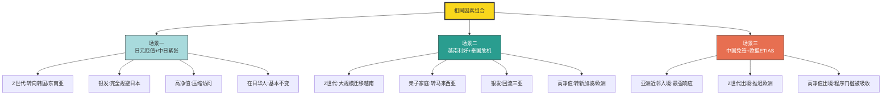

**这一节的核心结论是**——客群差异化使因素分析从"统一刻画市场反应"升维至"分层预测客群响应"。同样的外部变化在不同客群中触发的决策路径差异显著，而市场上观察到的总和数字只是客群权重×差异化响应的加权平均。**对目的地管理者而言，理解这一客群差异化逻辑的关键意义在于——在重大外部冲击下，目的地不应试图"挽回所有客流"（这往往是不可能的），而应聚焦"识别哪些客群最可能保留、哪些客群最值得重新争取、哪些客群已结构性流失需要新源补充"，从而将危机管理资源精准投向最具回报的客群细分**。

## 8.4 核心驱动因素与边际影响因素的识别

层级结构与客群分层共同决定了影响因素的"权重排序"，但目的地管理者面临的现实挑战是——在资源有限的前提下，应优先投入哪些因素以获得最大客流回报？回答这一问题需要进一步将影响因素区分为**核心驱动因素（Core Drivers）与边际影响因素（Marginal Modifiers）**，并通过敏感性分析刻画各因素对客流变化的边际贡献度。

**核心驱动因素是"决定性变量"——其变化能在数月内重塑目的地客流命运**。基于本研究第2—7章的实证数据，可识别出六大核心驱动因素：

**第一，签证政策开放度**。第2章已通过中国免签矩阵带动入境外国人+26.4%、美国签证收紧导致入境游-6%、泰国免签反转预期、欧盟ETIAS新增程序门槛、日本经管签申请量-96%等多重案例，验证了签证政策对客流的"开关式"作用。其敏感性体现在——免签实施后客流响应通常在3—6个月内显现（俄罗斯赴海南旅游需求政策实施首月+76%即是极端案例），收紧政策的客流影响则可能在数周内启动。

**第二，双边政治关系**。第3章日本案例的极端清晰度使这一因素的核心地位无可置疑——从11月7日高市早苗言论到12月赴日中国游客-45.3%，时间窗口仅约一个月；2026年3月赴日中国游客-55.9%进一步显示损耗具有持续性。**双边政治关系是少数几个能在数周内将其他所有变量"压制为无效"的因素**，其权重在客源国民意敏感的目的地（如中国对日、加拿大对美）中尤为突出。

**第三，汇率与性价比**。第3章人民币对越南盾+5.4%驱动越南赴华游客同比+41.3%、泰铢升值8%叠加物价上涨导致中国赴泰客流-33.6%等案例，验证了汇率作为"性价比再分配器"的核心作用。汇率因素的特殊性在于——它不是"开关式"而是"梯度式"作用，每1%的汇率变动通过"日元贬值1%→赴日中国游客+1.5%"等弹性系数线性传导至客流变化。

**第四，安全风险等级**。第3章泰国安全危机（信心降至19%）、第4章加勒比飓风（区域增长归零）、以色列与中东冲突（28.6%恢复vs9.8万航班53%取消）等案例，验证了安全风险作为"门槛性变量"的核心地位。Booking 53%中国旅行者将安全列为首要因素的调研数据，是这一权重的市场化测量。

**第五，气候基础适宜度**。第4章已通过2025年7月全国高温214万km²影响面积+携程"清凉"成为暑期出游第一关键词等数据，验证了气候因素在2025年从"背景条件"跃升为"核心变量"的结构性变化。气候因素的核心性主要体现在对银发、亲子等气候敏感客群的"决定性"作用。

**第六，文化独特性**。第6章敦煌"四大文明汇流"、清迈兰纳文化+《Travel + Leisure》亚洲最佳城市第一、北欧极光+处方目的地等案例，验证了文化独特性作为"差异化护城河"的核心地位。文化因素的特殊性在于其"长期累积、短期不可替代"——目的地无法通过短期投资追赶其他城市的文化深度，这种不可替代性使其成为高权重的核心驱动因素。

**边际影响因素是"调节性变量"——其作用在核心驱动因素稳定的前提下显现**。这一类因素包括住宿品质、餐饮多样性、夜间经济活力、二次消费场景、通关效率、多语种服务、智慧导览深度、特定IP内容、KOL合作热度等。这些因素的特征是——**单独作用力有限，但在核心驱动因素稳定的前提下能够"锦上添花"显著放大目的地的吸引力**。第5章天水麻辣烫"听劝型城市运营"+第6章敦煌"科技+生活+演艺三层加工"+三亚"鹿回头免门票后利润2000万元"等案例，都呈现了边际影响因素在核心驱动稳定前提下的放大效应。

**边际贡献度的敏感性分析可初步勾画为"前低后高"的非线性曲线**——核心驱动因素的边际贡献度遵循递减规律（一个目的地从"门槛失败"到"门槛通过"的跃升远大于从"门槛优秀"到"门槛卓越"的跃升），而边际影响因素的边际贡献度遵循"先低后高再饱和"的S曲线（在核心驱动因素稳固前几乎不发挥作用，但一旦核心稳固，边际投入能产生显著的额外回报，直至达到饱和点）。

将核心驱动因素与边际影响因素的特征对照：

| 维度 | 核心驱动因素 | 边际影响因素 |
|------|------------|------------|
| 变化时间窗口 | 数周至数月 | 数月至数年 |
| 单独作用力 | 决定性 | 调节性 |
| 投入回报曲线 | 递减 | S型先低后高再饱和 |
| 失效后果 | 客流断崖 | 客流增长乏力 |
| 典型案例 | 日本-45.3%、越南+41.3% | 天水麻辣烫+18倍订单 |
| 战略优先级 | 第一优先 | 核心稳固后再投入 |

**对目的地管理者的核心启示是"先稳门槛、再优竞争、后做溢价"的资源分配原则**。在签证、安全、汇率、气候、文化等核心驱动因素未达基础水平之前，过度投入边际影响因素（如花巨资请明星KOL、投资大型主题乐园）可能产生远低于预期的回报；反之，目的地若已具备稳固的核心驱动因素优势（如敦煌的文化深度、三亚的气候康养），则边际影响因素的精细化投入（如智能导览、夜间业态、IP内容）能产生显著的"流量+留量+增量"全链条提升。**这一原则与第6章"流量—留量—增量"三阶模型再次形成同构验证——核心驱动因素对应"流量基础"、边际影响因素对应"留量+增量"的精细化运营**。

## 8.5 目的地"超车"现象的因素叠加机制

在掌握了层级结构、交互机制、客群弹性、核心边际识别等分析工具之后，本节通过2025年最具说服力的"超车"案例，呈现因素叠加效应的具象化机制——这些案例不是单一因素作用的产物，而是多重因素同时正向叠加的结果。"超车"的共同公式可凝练为"**基础设施开放×差异化资源×客源市场重构×营销破圈**"四要素同时发力。

**案例一：越南逆袭泰国——汇率+航班+免签+性价比+客源外溢的五重叠加**。第3章已系统呈现越南2025年中国游客同比+41.3%、首次超越泰国成为东南亚第一中国客源目的地的现象。其超车机制可拆解为：**第一，航班量爆发**——中越往返航班量从3万班次猛增至4.3万班次（+45.23%），北上广加密+成都西安昆明开辟直飞航线；**第二，汇率红利**——越南盾贬值5.4%叠加泰铢升值8%形成"双向剪刀差"；**第三，免签便利**——越南对中国游客实施免签政策、跨境二维码支付互通；**第四，极致性价比**——青旅一晚三四十元、一碗牛肉粉十块钱、"600元玻璃海""1500元玩13天7城"的社交分享形成穷游神话；**第五，客源外溢**——泰国安全危机使部分泰国客源结构性流向越南。**这五重要素任何一项都不足以独立驱动41.3%的暴涨，但五者协同形成了"基础设施开放（航班+免签+支付）×差异化资源（极致低价+异国风情）×客源市场重构（泰国外溢）×营销破圈（穷游神话社交传播）"的完整公式**。

**案例二：北京俄客飙升——免签+航线+地缘外溢+软实力震撼的四重叠加**。第3章已述北京2025年因俄罗斯游客激增同比+43.2%、上海俄罗斯入境游客同比+50%以上的现象。其超车机制可拆解为：**第一，免签政策**——2025年9月15日起中方对俄罗斯持普通护照人员实施30天免签、12月1日俄方对中国对等免签；**第二，航线密集**——三亚已对莫斯科、圣彼得堡、喀山等10个俄罗斯城市开通直达国际航线；**第三，地缘外溢**——俄乌冲突后欧美对俄半关上大门，使俄罗斯出境游客寻找替代目的地，中国凭借"免签+直飞+卢布兑换便利+移动支付"组合恰如及时雨；**第四，软实力震撼**——俄罗斯游客到达中国后看到的现实（移动支付普及、高铁便利、新能源汽车、城市现代化）与西方媒体描绘的中国形成强烈反差，进一步通过社交媒体形成二次传播。**这四重要素的叠加使北京、三亚、上海等中国城市成为承接俄罗斯外溢客流的最大受益者，俄客成为2025年中国入境游增速最快的客源细分**。

**案例三：敦煌文化深度爆发——免签+高铁+科技+品牌+夜间经济的五重叠加**。第6章已详尽分析敦煌2025年游客+16.6%、花费+21.1%、停留2.7天的爆发数据。其超车机制可拆解为：**第一，免签政策**——240小时过境免签使外国游客可深度访问敦煌（甘肃省入境游+60.8%）；**第二，高铁可达**——西安至敦煌的高铁与航空网络改善使其从"西部偏远"目的地变为"可达性优良"；**第三，科技转译**——莫高窟数字展示中心二期+《千年莫高》《梦幻佛宫》球幕电影既保护洞窟又提升体验；**第四，品牌运营**——"敦煌书局""敦煌印局""敦煌无界"等主题空间将文化转化为可参与共创的体验；**第五，夜间经济**——《又见敦煌》《乐动敦煌》年均超千场演出+春节灯会22组大型灯组+国家级夜间文旅消费集聚区。**敦煌案例的特殊价值在于它呈现了"基础设施开放×差异化资源（四大文明汇流）×品牌运营（局界系列）×营销破圈（夜间经济）"四要素的完整闭环，是中国文化深度型目的地"流量—留量—增量"三阶可持续发展的最佳样本**。

**案例四：景德镇入境游崛起——过境免签+陶瓷IP+高铁+多语种支付的四重叠加**。第2章已述景德镇2025年入境游客+39.63%、入境旅游花费+44.59%、平均停留时间2.73天的爆发。其超车机制可拆解为：**第一，过境免签政策落地**让景德镇这座陶瓷小城首次进入国际游客的"地理半径";**第二,陶瓷文化IP**——千年瓷都的文化稀缺性使其成为深度文化体验首选;**第三,高铁可达性**——降低了从上海等门户口岸抵达的物理摩擦;**第四,多语种支付与服务**——外卡刷卡与扫码支付全覆盖+外卡受理重点商户1007户+外币兑换点68个+邮政与顺丰双语服务点+国际/港澳台快递业务量+277.8%。**景德镇案例的特殊价值在于它证明了"非门户城市"也能在多重因素叠加下实现入境游爆发——这一逻辑使中国入境游的增长动能从一线城市扩展至腹地县域,印证了第2章"地理半径×信息半径"协同的机制**。

**案例五:三亚俄客旅居——气候+免签+康养+航线+服务适配的五重叠加**。第4章已述三亚俄罗斯游客平均停留时间从5天延长至10天以上、不少家庭整冬旅居、俄客占大东海旅游区的70%以上的现象。其超车机制可拆解为:**第一,气候反差**——三亚20℃+暖冬vs俄罗斯-20℃以下严寒形成绝对气候差;**第二,免签便利**——中俄互免签证政策实施;**第三,康养医疗融合**——20+中医康养机构+针对俄罗斯游客的"住宿+餐饮+疗养"一价全包套餐;**第四,航线密集**——14个俄罗斯城市直飞三亚、每周20多班次;**第五,服务适配**——大东海旅游区周边餐厅九成以上配备俄语菜单、商场支持卢布结算、海滩中俄双语广播、街角药店俄语用药说明。**三亚案例的特殊价值在于它呈现了"门槛性变量+竞争性变量+溢价性变量"的三层全覆盖——气候和免签是门槛、航线和康养是竞争、服务适配和长停留旅居是溢价,使三亚从"避寒地"成功跃迁为"康养旅居地"**。

将五大超车案例的因素叠加机制整合呈现:

| 案例 | 关键数据 | 五重要素叠加 |
|------|---------|------------|
| 越南逆袭泰国 | 中国客+41.3% | 航班+45%×汇率剪刀差×免签×极致性价比×泰国外溢 |
| 北京俄客飙升 | 同比+43.2% | 免签×航线密度×俄乌外溢×软实力震撼 |
| 敦煌文化爆发 | 花费+21.1%、停留2.7天 | 免签×高铁×科技转译×品牌×夜间经济 |
| 景德镇入境游 | 客流+39.63%、花费+44.59% | 过境免签×陶瓷IP×高铁×多语种支付 |
| 三亚俄客旅居 | 停留10天+、占比70% | 气候×免签×康养×航线×服务适配 |

**这五大超车案例的共同启示可凝练为三点**:**第一,超车是"门槛+竞争+溢价"三层结构的全覆盖**,缺失任何一层都难以驱动跨越式增长;**第二,超车是"基础设施开放×差异化资源×客源市场重构×营销破圈"四要素的乘数协同**,任何单一要素均不足以独立超车;**第三,超车的可持续性取决于溢价性变量的持续投入**——三亚从避寒地升级为康养旅居地、敦煌从单日打卡升级为停留2.7天的深度体验,都是溢价性变量持续投入将"流量"沉淀为"增量"的实证。**对其他目的地管理者的启示是——盲目模仿单一爆款公式（如复制天水麻辣烫的"听劝模式"）难以可持续,真正的超车需要在自身资源禀赋基础上构建多要素协同生态**。

## 8.6 目的地"失宠"现象的因素叠加机制

与超车案例形成镜像对照的是"失宠"案例——这些目的地在2025年经历了客流下滑、市场份额流失、形象受损等多重负面变化。失宠的共同特征可凝练为"**门槛性变量恶化×竞争性变量失效×负向反噬累积**",且需进一步区分**短期失宠与结构性失宠**的不同恢复路径。

**案例一:泰国整体下滑——汇率升值+物价上涨+泰柬冲突+自然灾害的复合恶化**。第3、4章已系统分析泰国2025年外国游客整体-7.2%(除疫情外十年来首次年度下滑)、中国客源-33.6%的现象。其失宠机制是典型的"复合恶化"——**第一,经济门槛恶化**——泰铢兑美元升值约8%叠加物价全面上涨,泰国从"性价比天堂"跌落为"亚洲不便宜的目的地";**第二,安全门槛恶化**——王星事件、北部地震、泰柬冲突、南部洪灾等密集负面事件使中国对泰安全信心降至19%;**第三,政策反向**——免签滥用引发的灰色产业链问题使免签政策不得不从93国回调至57国,反向压制客流;**第四,竞争失效**——泰铢升值使其性价比优势失效、安全恶化使其文化独特性优势难以发挥、KOL在社交媒体上的负面舆情进一步压制品牌认知。**这一复合恶化的特殊危险性在于其"信任崩塌"的非线性放大——即使停火协议达成、自然灾害平息,游客的信任修复仍需较长时间**。

**案例二:日本中国客流断崖——双边政治关系单向压制经济利好**。如前述章节所述,这是2025年最具"对冲抵消"色彩的案例。其失宠机制的特殊性在于——**几乎所有其他变量都在向利好方向变化**(日元贬值、免签长期、网红营销、航班充足、支付便利、文化深度), 仅因高市早苗一次涉台错误言论导致中日关系紧张, 即触发了赴日中国游客12月-45.3%、2026年3月-55.9%的断崖式下滑。**这一案例的研究价值在于它精确量化了"双边政治关系"作为单一压制变量的极端权重——其影响力足以使其他所有正面变量边缘化**。日本案例还呈现了客群差异化效应——中国客流暴跌的同时,韩国游客、中国台湾地区游客、美国游客、越南游客、俄罗斯游客均逆势增长(俄罗斯增长26%、越南暴涨43.5%),这种"中国客单一暴跌、其他客源仍增"的格局,使日本入境游整体仍创新高,但客源结构发生了深刻的"去中国化"调整。

**案例三:美国入境疲软——签证收紧+移民政策+国家形象受损的结构性失宠**。第3章已述美国2025年入境游客同比-6%、加拿大游客-20%、损失157亿美元的现象。其失宠机制是"结构性失宠"的典型——**第一,签证收紧**——2025年6月暂停或限制向19国发放签证,2026年1月扩大至75国;**第二,移民执法过激**——ICE加强执法+游客被拘留事件被全球媒体放大;**第三,国家形象受损**——关税战、特朗普"加拿大第51个州"言论、加拿大民调60%受访者不再信任美国人、75%表示将避免赴美;**第四,客源结构性流失**——加拿大、欧洲、墨西哥客流分别向欧洲(西班牙、法国)、中东(迪拜、沙特)等替代目的地迁移。**美国案例与泰国案例的关键区别在于:泰国是"短期复合恶化"(冲突、灾害、汇率波动多为可恢复因素),而美国是"政策导向结构性失宠"——只要现行移民、外交、签证政策框架不变,客流恢复就难以实现。这种结构性失宠的恢复周期远长于短期事件冲击**。

**案例四:加勒比飓风冲击——单一极端天气事件归零区域增长**。第1、4章已述加勒比2025年因飓风梅丽莎导致整体游客增长归零、整个区域全年增长被一场飓风抹去的现象。这是"单一极端事件"对目的地的"瞬时归零"机制——**第一,飓风的物理破坏**直接摧毁酒店、海滩、机场等核心基础设施;**第二,基础设施重建周期**通常以年计,客流恢复滞后于物理修复;**第三,保险费率上升+气候风险预期**使部分客群结构性转向气候相对稳定的替代目的地;**第四,沿海低海拔区域**面临海平面上升与飓风加剧的长期叠加压力,使加勒比的脆弱性具有结构性特征(第4章已展开)。**这一案例的特殊启示在于——气候风险作为目的地选择的"负向门槛",其影响在2025年已开始与传统安全风险并列**。

**案例五:巴塞罗那威尼斯过度旅游反噬——承载力侵蚀长期吸引力**。第6章已详尽分析这两个案例的过度旅游困境。其失宠机制是最隐蔽也最棘手的"负向反噬累积"——**第一,住房危机**(巴塞罗那房租高马德里100—300欧元、爱彼迎被罚6400万欧元);**第二,本地居民抗议**(巴塞罗那2万人街头抗议、水枪喷射游客);**第三,文化原真性流失**(威尼斯日常购物场所消失、商店变餐厅纪念品店);**第四,世界遗产风险**(联合国教科文组织建议威尼斯列入"濒危世界遗产名录")。**与前述四类失宠不同,过度旅游反噬呈现"客流不减但品质下降"的特殊形态——巴塞罗那、威尼斯仍有大量游客访问(因为其世界遗产稀缺性仍在),但游客的体验质量、本地社会的承载状态、目的地的长期吸引力都在持续侵蚀**。这种"温水煮青蛙"式的失宠,可能在数年后突破临界点形成爆发性危机(如威尼斯被列入濒危名录将对其品牌造成结构性损害)。

将五大失宠案例的核心机制整合呈现:

| 案例 | 核心机制 | 短期vs结构性 | 恢复路径 |
|------|---------|------------|---------|
| 泰国整体下滑 | 复合恶化+信任崩塌 | 短期为主 | 安全稳定+性价比修复 |
| 日本中国客流 | 单向压制+对冲抵消 | 短期(政治依赖) | 双边关系修复 |
| 美国入境疲软 | 政策导向结构性失宠 | 结构性 | 政策框架转变 |
| 加勒比飓风 | 单一极端事件归零 | 短期物理+长期气候 | 基础设施重建+气候适应 |
| 巴塞罗那威尼斯 | 承载力反噬累积 | 结构性慢性 | 治理转型+承载平衡 |

**五大失宠案例的共同启示可凝练为三点**:**第一,失宠并非单一原因,而是多重负向因素叠加的产物**——泰国的复合恶化、日本的单向压制、美国的结构性政策、加勒比的极端天气、巴塞罗那威尼斯的承载力反噬,各自呈现不同形态但共同特征是"门槛失守";**第二,短期失宠与结构性失宠的恢复路径截然不同**——前者依赖具体冲击因素的消退,后者依赖政策框架或治理模式的根本性转变;**第三,失宠的危险性往往滞后于其触发因素**——日本Q4政治冲击的真正损耗在2026年Q1才完整呈现、巴塞罗那过度旅游的危机在2025年才被广泛关注却已积累多年、加勒比飓风的影响通过保险费率与气候预期持续延伸至未来季度。**对目的地管理者的核心启示是——危机管理需要前瞻性而非反应性,在门槛性变量出现初步恶化迹象时即启动干预,远比等待客流断崖后再行动更有效**。

## 8.7 综合决策模型的构建与应用

整合前述六节的层级结构、交互机制、客群弹性、核心边际识别、超车与失宠案例分析,可构建出**"硬性变量门槛+软性变量竞争+客群权重弹性+交互机制调节"四元综合决策模型**——这一模型既是对前七章所有变量分析的逻辑收敛,又为第9章结论展望与策略建议提供方法论基础。

**综合决策模型的核心框架**可表述为:

**目的地竞争力 = (门槛性变量准入过滤) × (竞争性变量差异化排序) × (溢价性变量价值跃迁) × (客群权重弹性匹配) × (交互机制动态调节)**

模型的运行逻辑可分解为四步:

**第一步:门槛性变量过滤**——目的地首先需要通过签证可达、交通连通、安全可预期、气候基础适宜、支付便利五大门槛的"准入过滤"。任何一项严重恶化都将使目的地从游客备选清单中被剔除(如日本2025Q4因中日紧张被中国主流客群剔除、泰国因复合恶化被部分客群剔除、美国因签证收紧被加拿大欧洲客群部分剔除)。

**第二步:竞争性变量排序**——通过门槛过滤的合格目的地之间,通过汇率性价比、文化深度、城市生活化、品牌认知、数字技术体验五大竞争性变量进行差异化排序。这一阶段决定客流的"主要分配"——越南胜出泰国、北京胜出洛杉矶、清迈在亚洲城市榜单胜出曼谷,都是竞争性变量排序的结果。

**第三步:溢价性变量定价**——在排序结果之上,目的地的客单价、停留时长、复购频次、客群质量等"价值维度"由情绪价值、可持续认证、稀缺独特性、定制化服务等溢价性变量决定。三亚停留时长翻倍、敦煌花费增速超游客增速、北欧极光的处方目的地战略,都是溢价性变量发挥作用的实证。

**第四步:客群权重匹配与交互调节**——前三步的"目的地视角"评分,需要根据具体客群的权重矩阵进行重新加权,并根据交互机制(乘数协同/对冲抵消/复合恶化/单向压制)进行动态调整,最终形成"特定客群在特定时点对特定目的地的具体决策概率"。

**模型的可视化呈现**:

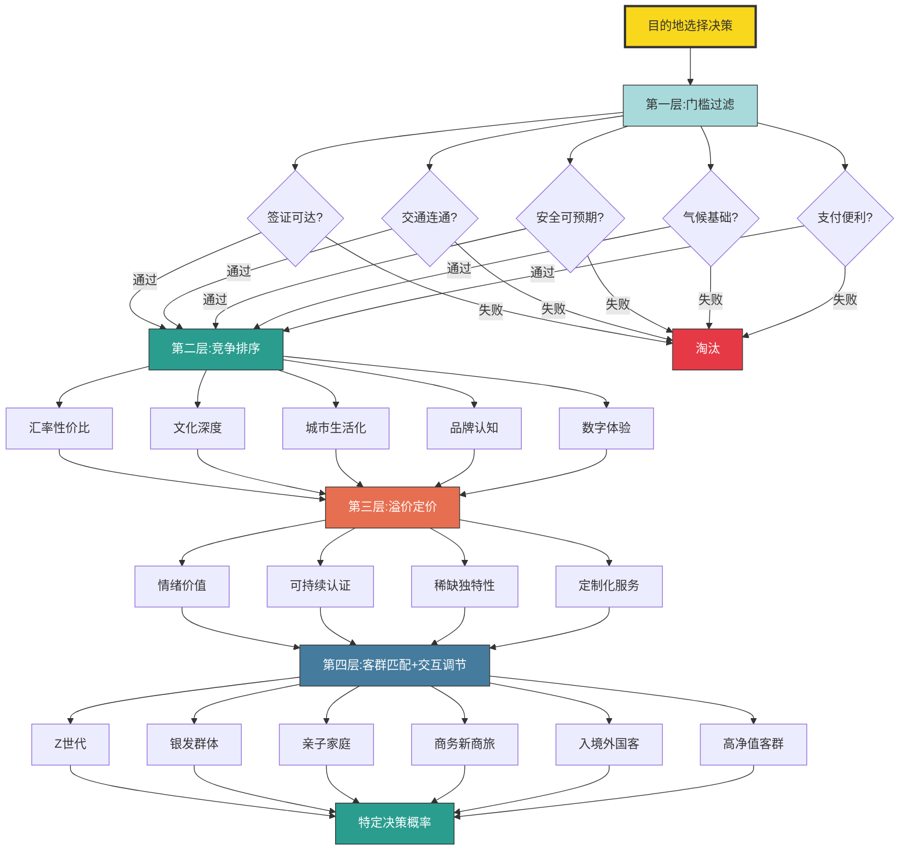

**模型的应用验证可通过四组典型目的地对比展开**:

**对比一:曼谷vs胡志明市**。第1章已述曼谷以3030万人次居全球榜首、胡志明市处于增速最快目的地之列。两城对比的核心结论:曼谷在门槛性变量上仍占优(签证、航班、传统旅游基础设施成熟),但在竞争性变量上正被胡志明市侵蚀(性价比逆转、安全感损耗);胡志明市虽然门槛性变量略弱(基础设施成熟度待提升),但竞争性变量上优势显著(汇率红利+航班暴涨45%+免签+极致性价比);溢价性变量上两者均处发展中阶段。模型预测:**短期内曼谷规模仍领先,但中长期客流增速曼谷将持续低于胡志明市,二者差距将持续缩小**——这与2025年实际市场表现完全一致。

**对比二:东京vs首尔**。东京在门槛性变量上处境复杂——签证、航班、气候良好但中日关系导致安全/政治维度恶化;首尔在所有门槛性变量上稳固;在竞争性变量上,东京日元贬值优势被中日紧张对冲,首尔凭借14城10年签+赴韩中国游客570万人次承接东京流失客流。模型预测:**东京赴日中国客流将持续承压,首尔将持续受益于客源转移,这一格局至少在中日关系实质性修复前难以反转**——这与2025年实际市场表现一致。

**对比三:洛杉矶vs巴黎**。洛杉矶在签证、安全、形象等多个门槛性变量上恶化(签证收紧+ICE执法过激+国家形象受损),竞争性变量上优势(好莱坞文化IP)被对冲;巴黎门槛稳固,竞争性变量上文化深度+品牌认知优势显著,2025年法国接待逾1.05亿游客成为全球最受欢迎的旅游目的地之一(第3章已述年轻人改赴西班牙、法国旅游的客流外溢)。模型预测:**洛杉矶国际客流将持续流失,巴黎将持续受益于美国客源外溢**——这与2025年实际市场表现一致。

**对比四:北京vs迪拜**。北京在多重门槛性变量上持续突破(免签扩容、航班加密、外卡支付、多语种服务),在竞争性变量上文化深度(故宫等)+城市生活化(亮马河商圈)+数字体验(支付与AI)优势显著;迪拜在硬基础设施(机场、酒店)+软服务(多语种、免签、退税)+城市品牌(融合东西方)上构建系统优势。模型预测:**两城均处于持续上升通道,但北京凭借文化深度优势在中国客源市场+俄罗斯外溢市场具备结构性优势,迪拜凭借枢纽位置在中东、欧洲、印度客源市场具备结构性优势**——两城将在不同区域客源市场各擅胜场。

将四组对比的模型预测与市场实际表现对照:

| 对比组 | 模型预测 | 2025市场表现 | 验证度 |
|--------|---------|------------|-------|
| 曼谷vs胡志明 | 胡志明增速持续超曼谷 | 越南+41.3%、泰国整体-7.2% | 高度一致 |
| 东京vs首尔 | 中国客流持续向首尔转移 | 赴日中国客-45.3%、赴韩+29% | 高度一致 |
| 洛杉矶vs巴黎 | 洛杉矶流失、巴黎吸纳 | 洛杉矶排名下滑8.9%、法国接待1.05亿 | 高度一致 |
| 北京vs迪拜 | 区域客源各擅胜场 | 北京+39%俄客飙升、迪拜过夜+5%连续创纪录 | 高度一致 |

**模型对2026—2027年的趋势预测可凝练为五点**:

**第一,门槛性变量收敛趋势**——主流目的地的签证、交通、支付等基础设施差距将持续缩小,使竞争性变量与溢价性变量的相对重要性进一步抬升。**第二,客群权重的进一步精细化**——AI推荐生态使"千人千面"决策成为可能,目的地的"通吃型战略"难度加大,聚焦核心客群的战略将成为主流。**第三,交互机制的复杂度持续上升**——气候变化、地缘冲突、技术变革、可持续转型等多重变量同时演化,交互组合从"乘数协同+对冲抵消"扩展至更多新形态。**第四,溢价性变量的权重持续抬升**——情绪价值、可持续认证、文化深度等"软实力"维度将成为目的地差异化竞争的核心战场,流量经济向价值经济的跃迁将持续深化。**第五,失宠风险的早期识别与超车机会的精准捕捉**——具备综合决策模型分析能力的目的地管理者将获得显著的战略优势,而依赖单一爆款公式或经验直觉的目的地将面临持续的市场份额流失。

**模型的局限性与应用边界**也需要在本章末尾明确指出:

**第一,数据获取的局限性**。模型的实际应用依赖于多维度、多时点、多客源的数据支撑,但目前公开数据存在口径差异(如赴日中国游客的统计窗口差异、入境游客的"外国人"vs"含港澳台"口径差异)、滞后性(部分官方统计季度发布)、覆盖不全(部分小众目的地缺乏精细数据)等问题,可能影响模型的精度。

**第二,客群边界的模糊化**。第7章已指出新商旅模糊了商务与休闲边界、银发独行模糊了银发与年轻自由行边界、入境亲子游模糊了客源国与客群目的的边界。这些边界模糊化使客群权重矩阵的应用需要保持动态调整,避免简单类型化。

**第三,长期趋势预测的不确定性**。模型主要基于2025年实证数据构建,对2026—2027年的趋势预测依赖于"当前结构性变量保持稳定"的假设。但气候黑天鹅、地缘政治转折、AI颠覆速度、可持续临界点等因素都具有较高不确定性,可能在数月内重塑模型参数。

**第四,因果推断的边界**。模型识别的多数关系是"统计相关性"而非"严格因果性"——例如"日元贬值1%→赴日中国游客+1.5%"的弹性系数,在中日关系紧张情境下完全失效,提示因果关系可能存在条件依赖性。模型应用时需结合具体情境而非机械套用历史弹性。

**第五,制度与文化变量的简化**。模型对部分隐性变量(如目的地国民对外国游客的友善度、当地服务从业者的多语种素养、社会信任与治安细节等)进行了简化处理,这些变量虽难以量化但在客群体验中至关重要。

**本章核心结论可凝练为六点**:

**第一,2025年目的地选择已升维为"门槛性变量+竞争性变量+溢价性变量"的三层结构竞争**——任何单一变量的孤立分析都不足以解释市场动态。

**第二,因素之间呈现"乘数协同+对冲抵消+复合恶化+单向压制"四类典型交互机制**——多变量动态耦合远比静态相加更能预测客流变化。

**第三,客群权重弹性使同一外部变化在不同客群中触发差异化决策路径**——离开客群分层的"统一刻画"必然失真。

**第四,核心驱动因素与边际影响因素的差异化作用要求目的地"先稳门槛、再优竞争、后做溢价"的资源分配原则**——盲目模仿单一爆款公式难以可持续。

**第五,"超车"与"失宠"是同一框架下的镜像现象**——超车是"基础设施开放×差异化资源×客源市场重构×营销破圈"四要素正向叠加,失宠是"门槛性变量恶化×竞争性变量失效×负向反噬累积"。

**第六,综合决策模型作为系统化分析框架,在四组典型目的地对比中均获得高度验证**——曼谷vs胡志明、东京vs首尔、洛杉矶vs巴黎、北京vs迪拜的模型预测与市场表现均高度一致,证明了模型的解释力与应用价值。

**这一综合决策模型将作为第9章结论展望与策略建议的方法论基础**——在第9章中,本研究将基于本章构建的层级结构、交互机制、客群弹性、超车与失宠机制,前瞻2026年及"十五五"期间的关键变量演化趋势,对目的地管理者、旅游企业、政策制定者提出有针对性的策略建议,并指出研究的局限性与后续深化方向。**模型的最终价值不在于提供"放之四海皆准的标准答案",而在于为复杂的目的地竞争提供一套可分析、可解释、可应用的系统化思维框架——让目的地管理者能在2025年这个变革密集的时代里,既看清当下,又预见未来**。

# 9 结论与趋势展望

经过前八章对2025年全球与中国旅游格局、签证交通、经济安全、气候自然、数字营销、文化可持续、客群结构、综合决策模型的层层拆解，本研究已基本回答了"2025年有哪些因素影响着旅客选择前往不同目的地旅游"这一核心命题。但一项深度研究的价值，不仅在于对当下的精确刻画，更在于对未来的合理前瞻与对实践的有效指引。本章作为全报告的收官之笔，将沿"核心结论收敛—关键趋势前瞻—战略机遇与挑战—三类主体策略建议—研究局限性与后续深化—系统思维收尾"六重逻辑展开，既对前八章的多维变量分析、客群差异化逻辑与综合决策模型进行最终收敛，又基于已识别的结构性变量与交互机制对2026年及"十五五"期间的趋势演化做出前瞻判断，最终面向目的地管理者、旅游企业、政策制定者三类核心主体提出可操作的差异化策略建议，使本研究既能为当下决策提供参考，又能为长期研究奠定方法论基础。

## 9.1 2025年目的地选择影响因素的核心结论

经由前八章对UN Tourism、WTTC、移民局、文旅部、携程、飞猪、马蜂窝、Booking、爱彼迎等多源数据的系统梳理与交叉验证，本研究已积淀出五点最具结构性的核心发现，构成对2025年目的地选择影响因素这一研究命题的最终回答。

**第一，2025年全球旅游业进入"K型分化"结构性新阶段，复苏叙事终结、变量驱动主导**。第1章已系统呈现的全球15.2亿人次国际游客到访量、4%同比增速回归疫情前长期均值、1.9万亿美元旅游收入、11.6万亿美元产业GDP贡献等核心指标，共同标志着全球旅游业从"报复性复苏"切换至"常态化增长"赛道。但这一总量繁荣的表象之下，是前所未有的区域结构性分化——欧洲7.93亿人次稳健、亚太3.31亿人次以8.1%产业增速领跑、美洲2.18亿人次仅+1%且美国入境-5.4%(商务部口径)/-6%(WTTC口径)、中东相对2019年高出39%、非洲北非领跑+11%。**这种"亚太崛起、欧洲稳定、美洲疲软、中东中非新兴"的K型格局，本身就是签证、汇率、地缘、气候、技术等多重变量相互作用的最终产物——它从全球宏观层面验证了"目的地选择不再由单一因素决定，而是由多重变量动态交互所共同塑形"的核心判断**。

**第二，目的地选择已升维为"门槛性—竞争性—溢价性"三层结构竞争，任何单一变量的孤立分析均不足以解释市场动态**。第8章构建的三层结构模型——门槛性变量（签证、交通、安全、气候、支付）决定准入资格、竞争性变量（汇率、文化、生活化、品牌、数字）决定差异化排序、溢价性变量（情绪、可持续、稀缺、定制）决定价值跃迁——为整个研究提供了系统化的分析框架。**这一三层结构的实证支撑遍布全书**：日本2025Q4在汇率、免签、航班、气候多重利好下仍因中日紧张导致赴日中国客流-45.3%（门槛失守的典型）；越南通过汇率+航班+免签+性价比+客源外溢实现+41.3%反超泰国（竞争稳固后的典型）；敦煌通过文化+科技+生活+演艺四层加工实现花费增速+21.1%超越游客增速+16.6%（溢价跃迁的典型）。三层结构不是简单的优先级排序，而是不同作用机制的差异化呈现——**只有先求生存、再求差异、后求溢价的递进式战略，才能使目的地的竞争力构建获得稳固根基**。

**第三，因素之间呈现"乘数协同+对冲抵消+复合恶化+单向压制"四类典型交互机制，多变量动态耦合远比静态相加更能预测客流变化**。第8章已通过详尽的案例剖析验证了这一交互框架——上海/北京/景德镇入境+39%量级增长背后是"签证×交通×支付"三位一体的乘数协同；日本案例的-45.3%是"双边政治"对其他全部正面变量的单向压制；泰国案例的-7.2%是"汇率升值+物价上涨+泰柬冲突+自然灾害+免签反转"的复合恶化；以色列28.6%恢复率是"持续战争"的极端单向压制。**这一交互框架的研究价值在于，它使因素分析从"加和式罗列"升维至"组合式建模"——一个目的地的市场命运，不仅取决于其在各变量上的得分，更取决于这些变量的相互组合方式与动态调节机制**。第8章构建的"目的地竞争力 = (门槛性变量准入过滤) × (竞争性变量差异化排序) × (溢价性变量价值跃迁) × (客群权重弹性匹配) × (交互机制动态调节)"五元模型，正是这一交互机制的形式化表达。

**第四，客群权重弹性使同一外部变化在不同客群中触发差异化决策路径，离开客群分层的"统一刻画"必然失真**。第7章已通过Z世代年轻群体、银发群体、家庭亲子客群、商务新商旅客群、入境外国客群、高净值客群六大典型客群的系统拆解，验证了"同一影响因素在不同客群中的作用权重，差异往往大于因素本身的客观变化幅度"这一核心命题。**汇率性价比对Z世代权重"极高"（近8成偏好300元以下酒店）、对高净值客群权重"极低"（28%游客单次预算超5万元）；气候因素对银发权重"极高"（"冬南夏北"机制+三亚20万候鸟老人）、对商务客群仅"中等"；文化深度对入境欧美客群权重"极高"（西安博物馆入境订单近50%）、对Z世代仅"高"（更倾向反向旅游小众目的地）；可持续认证对Z世代和欧美客群权重"高"（35岁以下显著领先）、对银发客群仅"中低"**。第8章三组场景模拟——日元贬值+中日紧张、越南利好+泰国危机、中国免签+欧盟ETIAS——进一步呈现了相同外部变化在不同客群中触发的从"完全规避"到"基本不变"的连续光谱响应。**这一客群弹性的研究意义在于，它将目的地战略从"通吃所有客群的幻想"拉回至"识别核心客群、聚焦差异化产品供给"的现实路径**。

**第五，超车与失宠是同一框架下的镜像现象——越南、北京、敦煌、三亚的崛起与泰国、日本、美国、加勒比的失宠共同验证了多要素叠加机制的解释力**。第8章已通过五大超车案例（越南逆袭泰国、北京俄客飙升、敦煌文化爆发、景德镇入境游崛起、三亚俄客旅居）与五大失宠案例（泰国整体下滑、日本中国客流断崖、美国入境疲软、加勒比飓风冲击、巴塞罗那威尼斯过度旅游反噬）的对照，揭示了超车与失宠的本质统一性——**超车是"基础设施开放×差异化资源×客源市场重构×营销破圈"的正向四要素叠加，失宠是"门槛性变量恶化×竞争性变量失效×负向反噬累积"的负向三要素叠加，二者共享同一套综合决策模型，仅在因素叠加方向上呈现镜像关系**。这一镜像关系的实践意义在于，目的地若能精准识别自身处于哪一种叠加状态、识别哪些变量正向贡献、哪些变量构成隐患，就能在变量演化的早期阶段做出针对性调整，而非等到客流断崖或同质化困局形成后才被动应对。

**这五点核心结论共同构成了对研究主命题的系统化回答**。回到本研究开篇所提出的问题——"2025年有哪些因素影响着旅客选择前往不同目的地旅游"——答案不再是一份"影响因素清单"，而是一套"层级化、交互式、客群弹性、动态演化的综合决策框架"。本研究的根本贡献，正是将原本零散的"变量罗列"升维至"系统思维"，使复杂的目的地竞争获得了可分析、可解释、可应用的方法论工具。

## 9.2 2026年关键变量演化趋势前瞻

基于第8章综合决策模型识别的结构性变量及其交互机制，本节前瞻2026年六大演化趋势——这些趋势既是2025年已显现信号的延伸，也是新拐点可能出现的关键观察窗口。

**第一，签证政策开放与收紧的全球分化将进一步加剧**。中国侧持续扩容路径已较为清晰——2025年已建成的"48国单方面免签+29国互免+28国对中单方面免签+240小时过境免签55国"矩阵，将在2026年继续向"一带一路"沿线、拉美、非洲等区域深化拓展；海南86国免签的区域试点经验可能向其他自贸港复制；过境免签口岸数量与适用省份将继续扩展。与此形成对照的是欧美侧的"程序门槛抬升"——**欧盟EES已于2025年10月12日开始分阶段引入、预计2026年4月10日全面实施，ETIAS则计划于2026年第四季度推出，免签证的非欧盟国家公民进入申根区前必须申请ETIAS授权、20欧元费用、3年有效期**——这一程序门槛的叠加将对赴欧旅游决策产生阶段性压制，尤其对Z世代和价格敏感型客群的影响最大。**美国签证收紧从19国扩展至75国的趋势，叠加ICE执法过激事件的全球传播，将使美国入境游持续承压，2026年若移民政策框架不变，赴美游客可能进一步流失**。泰国免签反转节奏、日本经管签新政影响范围、印度签证政策走向等亚洲国家的政策变化，也将构成2026年签证维度的新观察点。**核心判断：签证政策的"开放—收紧"分化将形成2026年全球客流再分配的最主要外生变量，中国凭借持续开放的制度型优势将进一步巩固入境游领跑地位**。

**第二，地缘政治风险常态化，多个热点事件的演变将持续重塑客流**。2026年最值得关注的四大地缘观察点包括——**中日关系修复进度**（赴日中国游客2026年1月、3月分别同比-60.7%、-55.9%的数据已显示损耗具有持续性，野村研究所测算若趋势持续一年将使日本损失1.79万亿至2.2万亿日元，二者关系实质性修复时点是日本入境游能否止跌的关键变量）；**泰柬边境后续**（2025年12月27日双方虽签署停火联合声明，但稀土资源争议+殖民地图原罪+大国角力的深层背景使风险并未根本解除）；**中东冲突外溢**（美以对伊朗军事行动期间53%航班取消、约600万旅客受影响的极端冲击若再次发生，将使中东在2026年继续承压）；**俄乌冲突演变**（俄罗斯入境游2025Q3-12.1%的数据反映了战场外溢的旅游成本，若冲突走向有重大变化，俄罗斯作为客源国与目的地的双向影响都将重新评估）。**核心判断：地缘风险已从"偶发事件"转变为"常态化变量"，目的地的危机管理前瞻能力将成为2026年差异化竞争的关键能力——具备多元客源结构、稳健安全声誉、灵活产品线的目的地将在风险事件中获得相对优势**。

**第三，气候变化与极端天气频次上升使气候因素权重持续抬升**。第4章已展示2025年7月全国高温214万km²影响面积、加勒比飓风梅丽莎使区域增长归零、泰国2025年北部南部接连遭遇严重洪灾及地震、中东高温常态化等多重信号。**2026年气候因素的演化将呈现三条主线**——主线一是**避暑避寒目的地的市场结构进一步固化**，贵州、新疆、东北、宜君等内陆清凉小城与三亚、海南、云南等避寒目的地的客流将进一步爆发；主线二是**沿海低海拔与山地目的地的脆弱性持续显现**，海平面上升、飓风加剧、雪线上移等长期趋势将通过保险费率、季节窗口压缩、基础设施重建周期延长等形式持续侵蚀这类目的地的竞争力；主线三是**气候适应型基础设施投入需求快速上升**，包括人工造雪、海岸防护、室内业态扩展、夜间经济强化等。UN Tourism在2026年首份《世界旅游业晴雨表》中已援引专家判断"约50%受访专家认为全球经济因素、旅行成本与地缘政治风险将是2026年旅游业面临的主要挑战"——气候因素虽未明确列入前三大挑战，但其与经济成本、保险定价、基础设施等的隐性关联使其权重在实际决策中持续抬升。**核心判断：气候因素已从"背景条件"完全升维至"前景变量"，2026年具备气候适应能力与气候独特资源的目的地将持续受益，缺乏气候应对的目的地将面临结构性脆弱性**。

**第四，AI推荐生态进入"赢家通吃"阶段，目的地的"被看见率"与算法适配能力深度绑定**。第5章已援引行业观察预测——**2026年生成式人工智能用户规模突破6亿，主流AI平台答案页前三位的推荐结果垄断超过81.6%的旅游预订量，未能进入AI推荐名单的景区官网流量平均下跌67.3%**。这一预测虽属趋势性判断而非已实现数据，但其指向的方向已被飞猪AI春节订单+800%、马蜂窝131.5万份AI攻略、携程AI节省50%决策时间等多源信号所验证。**2026年AI生态的演化将沿三条路径展开**——一是**AI从"辅助工具"完全升维至"决策入口"**，"提问→预订"两步链路成为主流，目的地若不主动适配AI推荐生态（优化在AI知识库中的呈现、与平台深度合作、积累高质量评论数据）将面临"数字隐形"风险；二是**OTA平台与AI能力深度融合**，携程"智译未来"、飞猪AI、马蜂窝AI助手等垂直行业大模型将进一步降低跨境旅游的语言、信息、支付门槛；三是**AI鸿沟问题凸显**，中小企业（50人以下AI应用率仅45.7%）、酒店业（AI渗透率仅25%）、银发付费意愿（56岁以上仅7.35%）等维度的不均衡将形成"AI头部目的地越来越强、AI尾部目的地越来越弱"的马太效应。**核心判断：2026年的目的地竞争已不再仅是物理空间的竞争，更是数字推荐生态的竞争——目的地的AI适配能力将成为与签证开放、交通连通并列的"新基础设施级要素"**。

**第五，可持续旅游从"附加项"全面跃升为"必需项"，Z世代与欧美客群驱动绿色支付意愿规模化**。第6章已通过《2025年可持续旅游报告》的78%认为重要、85%践行规定、50%支付溢价、Booking 91%希望可持续选择、35岁以下显著领先等多维证据验证了这一跃升。**2026年可持续转型的演化将沿四条路径展开**——一是**支付溢价从"自陈意愿"向"实际购买"加速转化**，绿色酒店、低碳交通、生态认证产品的市场渗透率持续提升；二是**OTA平台的绿色筛选与认证体系进一步成熟**，Booking三支柱战略、Trip Advisor环保评价、马蜂窝可持续指南等将形成更完整的"理念—产品—渠道"闭环；三是**可持续认证标准统一性问题逐步缓解**，全球性认证体系的建立有助于降低"漂绿"风险、提升认证可信度；四是**目的地从"被动应对过度旅游"向"主动可持续治理"转型**，威尼斯入城费、巴塞罗那短租管控、京都游客分流、泰国"高价值长停留"战略等案例为其他目的地提供了治理模板。**核心判断：可持续旅游已成为2026年目的地获取Z世代与欧美年轻客群、构建长期品牌资产的"必经之路"，缺乏可持续基因的目的地将在这两大客群中持续失去竞争力**。

**第六，"特种兵退潮、躺平兴起"的需求转向持续深化，单目的地深度游与本地酒店度假成主流**。第6章已援引2026年五一假期的关键转折数据——单目的地深度游同比+67%、多城市联游-18%、本地酒店度假+124%、用户停留时长从1.8晚增至2.6晚、特种兵满意度6.7vs度假式8.9。**2026年这一需求转向的演化将沿三条路径深化**——一是**深度体验型产品持续扩容**，文化深度（敦煌模式）、城市生活化（夜间经济+休闲集聚区）、情绪疗愈（云南情绪IP）、康养复合（三亚中医康养）等业态将进一步成熟；二是**反向旅游与小众宝藏继续主流化**，新京报贝壳财经2025宝藏小城50强中的高原边疆流量带、湖南通道、新疆阿合奇、福建长汀等目的地将持续承接Z世代"反内卷+反打卡"需求；三是**消费逻辑从"性价比"向"情价比"全面转型**，云南"以情绪价值破局、以情价比升级性价比"的发展路径将被更多目的地借鉴。**核心判断：2026年具备"住下来+慢节奏+文化深度+情绪疗愈"复合价值的目的地将继续赢得增量客流，仅以"打卡+网红+九宫格"为核心卖点的目的地将面临结构性客流流失**。

将六大演化趋势及其关键观察指标整合呈现：

| 趋势维度 | 2026年关键演化方向 | 核心观察指标 |
|---------|----------------|-----------|
| 签证政策 | 开放与收紧分化加剧 | ETIAS Q4实施效果、中国免签矩阵扩容 |
| 地缘政治 | 风险常态化、多点演变 | 中日修复进度、泰柬后续、中东走向 |
| 气候变化 | 权重持续抬升 | 极端天气频次、气候适应投入规模 |
| AI生态 | 赢家通吃阶段 | AI推荐占预订比、AI适配差距 |
| 可持续转型 | 全面跃升必需项 | 绿色支付实际转化率、认证统一进展 |
| 需求转向 | 深度体验主流化 | 单目的地深度游占比、停留时长 |

**这六大趋势并非彼此独立，而是在2026年共同作用、相互强化**——签证开放放大AI推荐生态的可视目的地范围，气候变化推动可持续转型加速，需求转向倒逼AI推荐算法升级，地缘风险使客群结构差异化进一步重要。**对所有目的地利益相关方而言，2026年的关键议程不是"应对单一趋势"，而是"在多重趋势交织中找到自身的战略锚点"——这正是综合决策模型的最终应用价值**。

## 9.3 "十五五"期间中国旅游业发展的战略机遇与挑战

立足中国市场的特殊地位，本研究展望"十五五"期间（2026—2030）中国旅游业面临的战略机遇与挑战，既回应UN Tourism关于2026年三大挑战的判断，又提供中国视角的差异化战略响应。

**机遇层面，"十五五"期间中国旅游业站在五大结构性红利的交汇点上**。

**机遇一：入境游突破8000万人次后向亿级目标迈进**。第1—2章已述2025年外国人出入境8203.5万人次同比+26.4%、免签入境占比73.1%、商务部研究院测算2025年中国旅行服务出口规模达551.6亿美元同比+49.1%。在中国免签矩阵持续扩容、海南第七航权开放、过境免签口岸增至65个的政策红利之下，**入境游有望在"十五五"末期向"亿级"目标迈进**——这一目标若实现，将使中国成为与法国、西班牙等传统入境游大国并列的全球顶级目的地国，具有重大战略象征意义。

**机遇二：国内游65亿人次基础上的质量升级**。第1章已援引文化和旅游部数据，2025年国内居民出游人次超过65亿同比增长16%以上、花费6.3万亿元同比+9.5%、农村居民出游意愿81%且增速反超城镇居民。**"十五五"期间国内游的核心机遇不在量的进一步爆发，而在质的全面升级**——城镇中产个性化定制、农村客群乡村振兴目的地、银发候鸟旅居、Z世代反向旅游等多元客群的差异化产品供给，将使国内游从"规模红利"转向"价值红利"。中国旅游研究院预测2026年国内旅游人数将达69.49亿人次同比+6.0%，这一增速虽低于2025年的+16%，但伴随客单价、停留时长、复购频次的提升，整体经济效益仍将持续增长。

**机遇三："双向爆发"格局下的全球最大旅游经济体目标**。WTTC数据显示2025年中国旅游产业对GDP贡献额达1.75万亿美元同比+9.9%、远超全球平均水平、带动8460万就业岗位、国际游客消费1350亿美元+10.5%、国内旅游消费8900亿美元+10.7%。**这一"境内外消费双轮驱动"格局是中国独有的战略优势**——大多数旅游大国要么是客源国（如美国出境强但入境弱）、要么是目的地国（如泰国入境强但出境弱），中国则同时作为巨大的客源地与日益重要的目的地，这种双向地位使中国对全球旅游格局具有放大效应。"十五五"期间，中国凭借稳健向好的发展态势朝着全球最大旅游经济体的目标稳步迈进，将进一步巩固这一双向枢纽地位。

**机遇四：中俄/中东盟/中海合会等新兴客源市场结构性红利**。第2、3、5章已分别呈现俄罗斯赴华游客+30.1%、东盟客群进入前五大客源国（韩马泰日美中四个为亚洲免签国家）、海合会全覆盖免签等新兴市场红利。**"十五五"期间中国入境游的客源结构将从"亚洲近邻为主"扩展至"亚洲核心+俄罗斯+东盟+中亚+中东欧+拉美+海合会"的多元矩阵**——这种多元化既能放大客源总量，又能降低对单一国家依赖的风险，与"十五五"国家发展战略中的多边合作理念深度契合。

**机遇五：城乡客群消费升级与农村出游意愿觉醒**。农村居民2025年出游花费1万亿元同比+21.4%、出游意愿81%、增速首次反超城镇居民、对全国出游人数增长贡献率31.8%。**这一农村客群的爆发与乡村振兴目的地的崛起形成了双向流动的特殊结构**——农村客群既是出游主体，又是部分目的地（浙江安吉、贵州千户苗寨等乡村振兴示范）的承接对象。"十五五"期间，"小而美"乡村文旅业态、农文旅融合现代乡村产业体系、县域旅游高端酒店等领域将获得持续政策支持与市场红利。

**挑战层面，"十五五"期间中国旅游业同样面临五大结构性挑战**。

**挑战一：过度旅游承载力压力前置显现**。第6章已警示巴塞罗那、威尼斯等国际目的地过度旅游反噬的教训。在中国国内，部分热门目的地（如部分5A景区、网红古镇、节假日核心城市）已开始显现承载力压力——节假日交通拥堵、住宿价格暴涨、本地居民抱怨等信号已在多个城市出现。**"十五五"期间需前置建立承载力监测、流量预警、社区共益、错峰分流等系统性治理机制**，避免重蹈巴塞罗那式"经济高度依赖+社会冲突激化+治理被动应对"的覆辙。

**挑战二：客源结构对单一国家依赖的风险管控**。日本2025—2026年中国客流暴跌的反向案例提示中国——**作为客源大国，中国出境游对单一目的地的依赖会形成对该目的地的潜在影响力，但作为目的地国，中国入境游若过度依赖某一客源国（如曾经的韩国、未来可能的俄罗斯），同样面临该国政治、经济、外交因素冲击的风险**。"十五五"期间需通过免签矩阵多元化、国际航线网络多向化、品牌营销多语种化等方式持续优化客源结构。

**挑战三：气候适应型基础设施投入需求**。极端高温、洪灾、台风、海平面上升等气候风险对中国沿海、华南、华北等多个区域的旅游基础设施都构成长期压力。"十五五"期间需在交通、住宿、景区、城市公共空间等多维度推进气候适应型改造——这一投入规模可能达到数千亿元量级，需要财政、市场、社会资本的协同。

**挑战四：可持续认证标准统一性问题**。当前"碳中和酒店""绿色认证""STGs认证""FSC认证"等多套体系并存，标准不统一、认证机构权威性差异大、漂绿现象频发，可能压制可持续支付意愿的实际转化。"十五五"期间需推动建立中国主导或参与的全球性可持续旅游认证标准，提升认证可信度。

**挑战五：AI鸿沟下的中小企业与下沉市场赋能**。第5章已揭示企业差旅经理AI使用率仅31%、酒店业AI渗透率仅25%、56岁以上付费意愿仅7.35%、50人以下中小企业AI应用率仅45.7%等结构性差距。"十五五"期间若不能在中小企业、下沉市场、银发客群等维度填补AI鸿沟，将形成"头部赢家通吃、尾部加速边缘化"的两极分化，影响整体旅游业的均衡发展。

UN Tourism在2026年首份《世界旅游业晴雨表》中提出"约50%受访专家认为全球经济因素、旅行成本与地缘政治风险将是2026年旅游业面临的主要挑战"——**中国视角的战略响应可凝练为"以制度型开放对冲全球经济不确定性、以基础设施降低旅行成本压力、以多元客源结构对冲地缘政治风险"的三条主线**。这三条主线既是2025年中国入境游爆发的核心经验，也是"十五五"期间中国旅游业持续领跑的战略锚点。

## 9.4 对目的地管理者的策略建议

基于综合决策模型的"先稳门槛、再优竞争、后做溢价"原则，本节对目的地管理者（包括地方政府文旅部门、景区运营商、城市品牌组织等）提出五项核心策略。这些策略既适用于中国国内的省、市、县三级目的地，也对国际目的地具有借鉴意义。

**策略一：门槛稳固优先——签证可达、交通连通、安全可预期、气候基础、支付便利的系统性投入**。门槛性变量任一项的失守都将抵消其他维度的努力——日本2025Q4虽具备汇率、免签、航班、文化、技术多重利好，仅因双边政治关系单一恶化即触发-45.3%的客流断崖；美国虽是全球最大旅游市场，仅因签证收紧+移民执法即导致入境游-6%、加拿大客-20%。**目的地管理者应将门槛性变量的稳固视为第一优先级**——主动争取上级签证开放政策（如争取被纳入过境免签适用城市、240小时窗口期适用范围）、推进国际航线开拓（重点关注中亚、中东欧、拉美、非洲等新兴客源方向）、强化口岸通关便利化（参照北京"双排并检"使外籍通关效率+30%、上海电子口岸签证试点经验）、构建支付兼容生态（外卡内绑、即买即退、扫码支付全覆盖）、维护安全声誉（应急响应机制、安全信息透明发布、负面事件危机公关）。

**策略二：差异化护城河构建——基于自身资源禀赋聚焦核心竞争性变量**。目的地的差异化竞争力来源不应是对其他城市的模仿（盲目复制淄博烧烤、天水麻辣烫的"听劝模式"难以可持续），而应是基于自身不可复制资源的深度变现。**敦煌的成功公式是"四大文明汇流的文化稀缺性+科技转译+生活共创+演艺闭环"，三亚的成功公式是"冬季20℃气候反差+中俄免签+中医康养+航线密集+服务适配"，越南的成功公式是"航班+45%+汇率红利+免签+极致性价比+文化亲近"——三者的核心资源完全不同，但都通过聚焦自身禀赋实现了护城河构建**。目的地管理者需在文化深度（如敦煌、清迈）、气候独特（如三亚、贵州、北欧）、地缘位置（如海南第七航权枢纽、迪拜东西方融合）、城市生活化（如成都、长沙、北京三里屯）等维度选择1—2个核心竞争性变量重点投入，避免在所有维度平均用力。

**策略三：聚焦核心客群而非通吃**。第8章已揭示三亚针对银发候鸟、上海迪士尼针对亲子家庭、敦煌针对深度文化客群的"单客群深耕模式"——这些目的地通过聚焦特定客群构建结构性优势，而非追求"通吃所有客群"的不切实际目标。**目的地管理者需基于客群权重矩阵识别自身的核心客群定位**——若资源禀赋适合银发客群（气候健康+康养医疗+长停留承接能力），则聚焦"冬南夏北"机制对接、银发专列引入、适老化基础设施改造；若适合亲子家庭（IP内容+分龄产品+省心服务），则聚焦顶流IP引入、分龄业态设计、邮轮包车服务；若适合入境外国客群（文化深度+多语种+可持续认证），则聚焦OTA翻译合作、多语种酒店服务、文化IP国际传播。**单客群深耕的核心价值在于使目的地能在该客群中建立全国乃至全球级的竞争地位，在其他客群中保持中等吸引力即可，形成主从结构而非均匀竞争**。

**策略四：从流量到留量到增量的三阶可持续发展**。第6章已构建"流量引爆—留量沉淀—增量转化"的三阶模型，敦煌花费增速+21.1%超越游客量增速+16.6%形成的"剪刀差"是这一三阶发展的最佳实证。**目的地管理者应主动规划三阶演进路径**——第一阶（流量引爆）通过基础设施改善+品牌引爆+文化独特性实现初始流量积累；第二阶（留量沉淀）通过文化深度+城市生活化场景+情绪价值+承载力管理实现停留延长与客单价提升；第三阶（增量转化）通过可持续认证+品牌长红+社区共益实现长期发展增量。**三阶演进的关键节点是花费增速超越游客量增速——这一"剪刀差"是流量沉淀为价值的最直观指标**。天水从"麻辣烫之城"升级为"羲皇故里全域文旅"、哈尔滨从"冰雪城"升级为"国际冰雪价值链中心"、三亚从"避寒地"升级为"国际旅游消费中心"，都是三阶演进的成功样本。

**策略五：危机管理前瞻化——在门槛性变量出现初步恶化迹象时即启动干预**。第8章已警示泰国"复合恶化"（汇率+物价+冲突+灾害+政策反向五重叠加导致-7.2%）、美国"结构性失宠"（政策导向使客流持续承压）、巴塞罗那"承载力反噬累积"（住房危机+居民抗议+文化原真性流失多年累积）等失宠案例的共同特征——**危机的真正损耗往往滞后于触发因素，等到客流断崖时再行动已为时过晚**。目的地管理者需建立"早期信号识别—预警机制—干预方案—执行能力"的完整危机管理体系——警惕单一负向事件演变为复合恶化（泰国教训）、警惕政策反复对客流稳定性的伤害（泰国免签反转、美国签证收紧教训）、警惕过度旅游承载力压力的长尾累积（巴塞罗那威尼斯教训）。**前瞻性危机管理的核心理念是"宁可早动、勿待断崖"，这一理念既适用于安全/政治风险，也适用于过度旅游、品牌损耗、客源结构脆弱化等慢性问题**。

将五项策略与对应的实施重点整合：

| 策略层级 | 核心要求 | 实施重点 |
|---------|--------|--------|
| 门槛稳固 | 五大门槛任一不可失守 | 签证、航班、口岸、支付、安全 |
| 差异化护城河 | 聚焦核心竞争性变量 | 1—2个核心维度深度投入 |
| 聚焦核心客群 | 单客群深耕避免通吃 | 客群权重矩阵识别+产品聚焦 |
| 三阶可持续发展 | 流量沉淀为价值 | 花费增速超越游客增速 |
| 危机管理前瞻化 | 早期信号识别+预警 | 复合恶化与长尾损耗双警惕 |

## 9.5 对旅游企业与平台的策略建议

针对OTA平台、航空公司、酒店、旅行社等市场主体的差异化角色与能力定位，本节提出五项具体策略建议。

**策略一：OTA平台需深化"AI推荐+多语言翻译+垂直大模型+跨境支付"四位一体能力**。第5章已展示飞猪、马蜂窝、携程在AI能力上的领跑——飞猪Token消耗+20倍、AI春节订门票+24倍、马蜂窝131万份AI攻略、携程"智译未来"60亿词翻译产能。**OTA平台2026年的核心战略议程是把握"前三推荐位垄断81.6%预订"的赢家通吃趋势**——这意味着平台需要在AI算法精度、多语言覆盖广度、垂直行业理解深度、跨境支付兼容性四个维度持续投入。**对头部平台**（携程、飞猪、Booking、Expedia）而言，构建覆盖全球的"AI翻译+垂直大模型+跨境支付+目的地合作"全链条能力是关键；对中小平台而言，则需要在特定细分市场（如银发旅游、亲子家庭、研学游、商旅平台）中找到差异化定位。**OTA平台的特殊战略价值在于它们既是技术供给方又是流量分配方——既能放大优质目的地的可见度，也能成为目的地与客群之间的精准匹配器**。

**策略二：航司应抓住第七航权落地、新兴客源市场拉美/中亚/中东欧等机会扩展国际网络**。第2章已述2025年国际航班恢复至2019年90%以上、国际旅客+21.6%、海南第七航权落地、拉美方向+108.6%、中亚+59.3%、非洲+39%等关键数据。**航司2026年的核心战略议程包括三方面**——一是**抓住新兴客源市场**，重点关注中亚、中东欧、拉美等增速最快方向，配合中国免签矩阵扩容布局新航线；二是**关注绿色航空与可持续运营要求**，参考国际市场ESG投入趋势（Booking与采用节能措施、可再生能源的环保酒店合作；中国民航局规划"十五五"时期"3+7+N"国际航空枢纽功能体系），将碳排放管理纳入战略议程；三是**深化与目的地、OTA平台的协同合作**，参照携程"First Go China"首乘专享项目（机票联合中国航司向外籍旅客提供最高15%票价优惠）、北京丽思卡尔顿"机酒套餐+暑期+三位数间夜增长"等案例，构建"航司+OTA+目的地"的三位一体生态。

**策略三：酒店业需构建"工作友好型长住空间+多语种AI客服+康养复合业态"承接新商旅、银发旅居、入境长停留三类增量客群**。第7章已揭示新商旅客群51.7%停留6天以上、三人及以上多人出行约一半、爱彼迎数据显示宽敞合住房源平均可容纳5—6人；银发候鸟客群三亚停留10天以上、不少家庭整冬旅居；入境游客群增速134%向四五线城市下沉。**酒店业2026年的核心战略议程是从传统的"标准化短住"向多元化长住业态转型**——一是**改造工作友好型长住空间**（专注空间+连接高效+选址自由的三要素）以承接新商旅；二是**升级适老化与康养复合业态**（中医康养、药膳、疗愈、社区配套）以承接银发旅居；三是**构建多语种AI客服与文化适配服务**（参照上海珍宝酒店携程AI客服将外宾咨询时间从半天缩至30分钟、上海南新雅皇冠假日酒店2025Q2入境订单+90%）以承接入境长停留客群。**酒店业的战略转型本质上是从"住宿提供方"升维至"生活承载方"——这一升维既是市场需求倒逼，也是构建差异化竞争力的核心路径**。

**策略四：旅行社从"打卡式跟团"转向"小团化+定制化+深度体验"产品矩阵**。第3、6章已揭示出境跟团商品中小团类增速突出、Z世代用户出境跟团旅行+52%、单目的地深度游+67%、本地酒店度假+124%、亲子家庭对邮轮包车支付溢价等需求转向。**旅行社2026年的核心战略议程是产品矩阵的全面升级**——服务躺平度假需求（精品酒店+城市Citywalk+本地餐厅深度推荐）、反向旅游需求（小众宝藏目的地+非遗体验+原生态村落）、情绪疗愈需求（康养疗愈+森林浴+心灵静修）、亲子省心需求（邮轮全包+包车专属+分龄活动）、新商旅复合需求（工作+生活+学习+康养复合行程）。**旅行社的战略价值在于其"产品策划+地接资源+应急保障"的综合能力——这一能力恰好回应了AI推荐生态下"标准化决策容易、个性化执行困难"的市场缺口**。

**策略五：所有企业主体需将ESG与可持续认证嵌入产品设计**。第6章已系统呈现可持续旅游从"附加项"向"必需项"跃升的多维证据，Z世代和欧美客群的绿色支付意愿（50%愿支付溢价、35岁以下显著领先、Booking 91%希望可持续选择）已使可持续认证成为目的地与产品的差异化竞争力。**所有旅游企业（OTA、航司、酒店、旅行社等）2026年都需将ESG嵌入战略议程**——从产品设计端（绿色产品线、低碳旅行套餐、生态旅游路线）、运营端（节能措施、可再生能源、废物减量）、披露端（碳排放数据化、ESG报告标准化）多维度推进。**ESG投入对中国旅游企业的战略意义不仅在于满足客群偏好，更在于构建国际化扩张所需的"价值观通行证"——在全球资本市场与跨境合作中，ESG表现已成为企业能否获得长期合作的隐性门槛**。

## 9.6 对政策制定者的策略建议

面向中央与地方政策制定者，本研究基于第2—8章的实证数据与机制分析，提出六维政策建议——这些建议既呼应"十五五"国家发展战略，又对接UN Tourism、WTTC等国际机构的全球性议程。

**建议一：签证与通关持续开放——免签朋友圈深化、过境免签优化、口岸通关效率提升的"制度型开放"继续推进**。2025年中国免签政策的市场效果已被充分验证——免签入境占比73.1%、同比+49.5%、入境外国人+26.4%、相关旅游服务出口规模达551.6亿美元。**"十五五"期间应继续推进免签矩阵深化扩容**——重点考虑增加"一带一路"沿线国家、海合会成员国、东盟其他成员国、拉美与非洲新兴市场国家进入免签朋友圈；深化240小时过境免签的口岸覆盖与配套服务；推进区域性免签试点（如海南86国免签、云南西双版纳东盟免签、黑河等边境对俄免签）的经验复制；持续提升口岸通关效率（参照北京首都国际机场3号航站楼"双排并检"经验、上海电子口岸签证试点）。**这一政策的关键启示是——制度型开放是中国旅游业最具放大效应的政策工具，每一项开放措施都能通过签证×交通×支付的乘数协同产生远超投入的市场回报**。

**建议二：交通基础设施协同升级——"空中丝绸之路""3+7+N枢纽体系""高铁+腹地"网络与第七航权扩容**。第2章已援引民航局"十五五"规划——"3+7+N"国际航空枢纽功能体系、"一圈六廊五通道"国际航线网络、2026年力争完成旅客运输量8.1亿人次。**政策制定者应在三方面持续推进**——一是**第七航权适度扩展**，将海南成功经验向其他自贸港、自贸区复制（注意吸取海南"两洋枢纽"经验避免低端航权竞争）；二是**高铁网络向腹地延伸**，参照贵州"市市通高铁"+"5小时高铁圈"经验对其他西部省份提供支持，配合"门户城市免签入境+高铁延伸至腹地"的入境游下沉模式；三是**铁旅融合与银发专列**，推广"车随人走、夜行昼游、游景停车"模式覆盖更多省份与季节，建设"冬南夏北"全国级专列网络。

**建议三：支付与服务便利化下沉——"外卡内绑"与"即买即退"向二三线城市与县域延伸**。2025年全年超1000万入境用户使用外卡内绑、相关消费+100%、离境退税"即买即退"销售额+9.35倍——这些数据验证了支付与服务便利化对入境游消费转化的关键作用。**政策制定者应推动这两类政策从一线门户城市向二三线乃至县域下沉**——参照景德镇外卡受理重点商户1007户+外币兑换点68个、北京约1.8万家重点商户外卡受理全覆盖等经验，扩大至全国二三线城市；推广多语种菜单、AI翻译、外籍人士便民服务等软性配套；持续推进"码上退"等数字化退税服务。**这一下沉的战略价值在于使入境游红利能从一线门户城市延伸至腹地县域，破解"被看见"与"敢消费"的双重痛点**。

**建议四：过度旅游前置治理——参照西班牙短租管控、威尼斯入城费、京都游客分流经验，建立承载力监测与社区共益机制**。第6章已警示巴塞罗那、威尼斯过度旅游反噬的教训。**中国部分热门目的地虽未达到欧洲极端水平，但已开始显现初步信号**——节假日交通拥堵、住宿价格暴涨、本地居民抱怨等。政策制定者应**前置建立四类机制**——承载力监测机制（实时客流数据+预警阈值）、流量分流机制（预约制、分时段入园、错峰激励）、社区共益机制（旅游收益向当地居民分配、公共服务保障、文化原真性保护）、短租与平台监管机制（参照西班牙爱彼迎处罚案例、防止住宅过度短租化）。**前置治理的关键理念是"宁可早动、避免欧洲式被动应对"——一旦本地居民抗议、世界遗产风险等极端信号出现，治理成本将远高于前置投入**。

**建议五：气候适应与可持续转型政策支撑——绿色基础设施投入、碳中和酒店认证、低碳旅游产品开发的财政与税收支持**。第4、6章已展示气候因素权重抬升与可持续旅游需求规模化的双重趋势。**政策制定者应在四方面提供系统性支撑**——一是**绿色基础设施财政投入**（沿海防护、人工造雪、室内业态、夜间经济）；二是**碳中和酒店认证体系建设**（建立中国主导的全球性可持续旅游认证标准，提升认证可信度，应对漂绿现象）；三是**低碳旅游产品开发税收优惠**（对推出低碳交通、生态住宿、绿色餐饮的企业给予税收减免）；四是**与北欧等可持续目的地国际合作**（学习挪威、瑞典、丹麦的可持续旅游成熟经验）。**气候适应与可持续转型的政策投入虽规模庞大，但其战略回报体现在Z世代与欧美客群的吸引力提升、ESG资本市场的认可、长期品牌价值的累积——这些回报往往不能通过短期GDP数据衡量**。

**建议六：客源市场多元化战略——降低对单一客源国依赖、强化新兴客源市场的政策支持**。本研究多次警示客源结构单一化的风险——日本2025—2026年中国客流暴跌的反向案例、以色列客源结构压缩至前三大占比超50%的极端案例、加勒比受单一国家飓风事件冲击区域增长归零的案例。**中国作为目的地国，需通过政策手段持续优化客源结构**——重点支持俄罗斯、东盟、中亚、中东欧、拉美等新兴客源市场的政策（航线开通、多语种服务、品牌营销）；维护与传统大客源国（韩国、日本、美国、欧洲）的关系稳定；建立客源结构动态监测机制，避免对任一国家的依赖度超过特定阈值（如15%或20%）。**客源多元化的战略价值不仅在于规模拓展，更在于风险分散——当某一客源国发生政治、经济、外交波动时，多元结构能使整体客流保持稳定，避免日本2025年Q4式的断崖**。

将六维政策建议与对应的实施抓手整合：

| 政策维度 | 核心方向 | 关键抓手 |
|---------|--------|--------|
| 签证通关 | 制度型开放深化 | 免签扩容+过境优化+通关效率 |
| 交通基础 | 空铁协同升级 | 第七航权+高铁腹地+银发专列 |
| 支付服务 | 便利化下沉县域 | 外卡内绑+即买即退+多语种 |
| 过度旅游 | 前置治理机制 | 监测+分流+共益+短租监管 |
| 气候可持续 | 绿色转型支撑 | 财政+认证+税收+国际合作 |
| 客源多元化 | 风险分散战略 | 新兴市场+传统稳定+动态监测 |

## 9.7 研究局限性与后续深化方向

任何严肃的研究都应坦诚面对自身的边界与不足。本研究虽尽力做到全面、深度、严谨，但仍存在五类主要局限性，需要在最后明确指出，并提出后续研究的深化方向。

**局限一：数据口径差异**。本研究汇集了UN Tourism、WTTC、国家移民管理局、文化和旅游部、商务部研究院、携程、飞猪、马蜂窝、Booking、爱彼迎、Dragon Trail、Euromonitor等数十类机构的数据，但不同机构的统计口径存在客观差异——UN Tourism的国际游客到访人次口径与WTTC的旅游产业GDP口径方向一致但内涵不同；中国入境游客存在"外国人"（移民局口径8203.5万人次）与"含港澳台"（更广义口径1.54亿人次）的差异；赴日中国游客数据在不同月份与来源间存在差异（2025全年909.63万vs Q4起暴跌vs 2026年1月-60.7%vs 3月-55.9%）；泰国中国游客存在官方447万与旅行社协会预计100万真团客的口径差。**本研究已尽量在引用时标注口径并交叉验证，但仍有部分数据未能完全统一**。后续研究可在数据治理层面进一步深化，建立跨机构、跨时段、跨国别的口径转换标准。

**局限二：时间窗口限制**。本研究主要基于2025年至2026年初的数据，部分判断（如2026年五一"特种兵退潮、躺平兴起"的需求转向）基于较短时间窗口的数据，是否反映长期趋势仍需更长周期数据验证；2026年下半年至"十五五"末期的趋势预测建立在"当前结构性变量保持稳定"的假设之上，但气候黑天鹅、地缘政治转折、AI颠覆速度、可持续临界点等因素都具有较高不确定性，可能在数月内重塑模型参数。**后续研究可建立长期面板数据库**，对2025年的关键判断进行2027—2030年的连续追踪验证，识别哪些是"年度现象"、哪些是"代际转向"、哪些是"长期结构"。

**局限三：因果推断边界**。本研究识别的多数关系是"统计相关性"而非"严格因果性"——例如"日元贬值1%→赴日中国游客+1.5%"的弹性系数在中日关系紧张情境下完全失效，提示因果关系存在条件依赖性；越南赴华游客+41.3%是航班+45%、汇率+5.4%、免签等多重因素叠加的产物，难以严格分离单一因素的因果贡献。**后续研究可借助计量经济学的因果推断工具**（断点回归、双重差分、合成控制法等）对关键政策（如免签扩容、第七航权落地）的客流影响进行更严格的因果识别，提升弹性系数估计的可信度。

**局限四：客群类型化偏差**。第7章基于平台调研构建的客群权重矩阵（00后特种兵+Citywalk、95后90后躺平+反向、85后80后近郊+亲子等）反映了统计意义上的趋势，但个体差异显著、客群边界模糊化趋势使分类需要保持动态调整——同一代际内部的个体差异可能大于代际间的均值差异、新商旅模糊了商务与休闲边界、银发独行模糊了银发与年轻自由行边界、入境亲子游模糊了客源国与客群目的的边界、高净值Z世代女性既具备年轻代际特征又具备高收入特征。**后续研究可在客群微观决策建模层面深化**，借助大规模问卷调研、行为实验、平台行为数据等多源信息，构建更精细的"个体—客群—决策"映射模型，避免简单的代际类型化偏差。

**局限五：部分变量简化处理**。本研究主要关注可量化、可观察的变量（签证、汇率、客流、消费等），对部分难以量化但影响重大的隐性变量进行了简化处理——目的地国民对外国游客的友善度、当地服务从业者的多语种素养、社会信任与治安细节、目的地的"软实力震撼"（如俄罗斯游客对中国现代化的认知冲击）等，这些变量在客群体验与目的地长期吸引力中至关重要，但本研究仅做了定性提及而未深入量化。**后续研究可在跨学科融合层面深化**，借助社会学、人类学、文化研究的方法论，对这些隐性变量进行更系统的研究。

**基于上述五类局限性，本研究提出后续研究的五个深化方向**：

**深化方向一：长期面板数据建设**。对2025年关键判断进行2027—2030年的连续追踪验证，建立全球目的地竞争力面板数据库。

**深化方向二：客群微观决策建模**。从"统计型客群分层"升维至"个体—客群—决策"映射模型，更精确地刻画客群边界模糊化与跨代际个体差异。

**深化方向三：气候适应案例深度追踪**。对沿海低海拔目的地、山地冰雪目的地、干旱地区目的地的气候适应转型进行长期案例追踪，验证转型策略的实际效果。

**深化方向四：AI推荐生态对目的地竞争的实证测量**。从"前三推荐位垄断81.6%预订"的预测性判断转向实证测量，量化AI推荐生态对不同规模、不同类型目的地的差异化影响。

**深化方向五：过度旅游治理跨国比较**。系统比较巴塞罗那、威尼斯、京都、富士山等过度旅游目的地的治理策略与实际效果，为中国目的地的前置治理提供更精细的国际经验借鉴。

## 9.8 结语：从变量分析到系统思维

本研究开篇所提出的核心命题是——"2025年有哪些因素影响着旅客选择前往不同目的地旅游"。经过九章的系统拆解与综合建模，这一命题的答案已远超一份简单的"影响因素清单"。

如果说传统的旅游研究往往停留在"列举变量、分别讨论、平均加和"的分析模式，本研究的根本贡献则在于提供了一套**"层级结构+交互机制+客群弹性+综合决策模型"的系统化分析框架**——它使复杂的目的地竞争从"变量罗列"升维至"系统思维"，使原本看似杂乱的市场现象（越南逆袭、北京飙升、敦煌爆发、三亚旅居、泰国失宠、日本断崖、美国疲软、加勒比归零）获得了统一的解释逻辑。**这一系统思维框架的核心要点可凝练为五个相互嵌套的层次**——**门槛性—竞争性—溢价性的三层结构**决定了变量的分类与作用机制；**乘数协同—对冲抵消—复合恶化—单向压制的四类交互**决定了变量组合的动态效应；**Z世代—银发—亲子—商务—入境—高净值的六大客群**决定了变量权重的弹性差异；**核心驱动—边际影响的双层识别**决定了战略资源的优先级分配；**超车与失宠的镜像机制**决定了目的地市场命运的演化路径。

在2025年这个签证开放、地缘震荡、气候异常、技术革命、需求转向多重变量交织的变革密集时代，**任何单一视角的目的地分析都难以把握全貌**——只看签证开放则错过中日关系对客流的颠覆性重塑；只看汇率经济则错过气候健康刚需对银发客群的决定性作用；只看技术营销则错过文化深度作为差异化护城河的不可替代性；只看客群偏好则错过交互机制对市场总和效应的动态调节。**只有引入多维交互、客群分层、动态演化的系统思维，才能既看清当下又预见未来**。

回望全书的研究历程，从第1章勾勒2025年全球K型分化格局，到第2章揭示制度开放与基础设施协同，到第3章剖析经济汇率与安全地缘交互，到第4章探查气候因素的多重作用机制，到第5章解构数字技术与品牌营销的协同放大，到第6章呈现文化体验与可持续发展的内核驱动，到第7章拆解六大客群差异化逻辑，到第8章构建综合决策模型——每一章都既是独立的深度分析，又是整体框架的有机组成。**这种从变量到系统、从局部到整体、从静态到动态的研究路径，本身就是对"系统思维"在旅游研究中应用的最好诠释**。

UN Tourism在2026年首份《世界旅游业晴雨表》中预测2026年国际游客到访量将增长3—5%，达到15.7亿至16.0亿人次；WTTC预计旅游业仍将是全球经济扩张的核心引擎；中国旅游研究院预测2026年国内旅游人数将达69.49亿人次同比+6.0%；马蜂窝、Booking、携程等平台共同指向"深度体验、可持续、AI化、客群多元"的趋势主线。**在这些总和数据的背后，是一个个目的地、一家家企业、一位位游客在多重变量交织中做出的具体选择**——本研究构建的系统化分析框架，正是为了让这些选择能够获得更清晰的方法论指引。

**对目的地管理者而言**，本研究提供的"先稳门槛、再优竞争、后做溢价"递进战略、"流量—留量—增量"三阶可持续发展模型、"聚焦核心客群"差异化竞争原则、"危机管理前瞻化"风险防控理念，共同构成了一套可操作的战略工具箱——使目的地能在2025—2030年的变革密集时代里，既看清自身处于何种叠加状态、又识别哪些变量正向贡献、哪些变量构成隐患、又能在变量演化的早期阶段做出针对性调整。

**对旅游企业与平台而言**，本研究提供的"AI+多语言+垂直大模型+跨境支付"四位一体能力构建、"工作友好+多语种+康养复合"业态升级、"小团化+定制化+深度体验"产品矩阵、"ESG嵌入产品设计"价值观投资，共同回应了2026年市场需求转向的核心议程——使企业能在与目的地、客群、技术的多重协同中找到差异化定位。

**对政策制定者而言**，本研究提供的"制度型开放+基础设施协同+支付便利化+过度旅游前置治理+气候可持续转型+客源多元化"六维政策框架，与"十五五"国家发展战略、"一带一路"倡议、共同富裕、生态文明等宏观议程深度契合——使旅游业能在国家战略全局中找到自身的战略锚点。

**对每一位读者而言**——无论是学者、从业者、政策制定者，还是简单的旅行爱好者——本研究的最终价值期许是提供一面**既能照见现实、又能映射未来的"分析之镜"**。在这面镜子中，我们既能看到2025年全球旅游格局的K型分化与多重变量博弈，也能看到2026年及"十五五"期间签证、地缘、气候、技术、可持续、客群结构等关键变量的演化方向；既能看到越南、北京、敦煌、三亚等超车样本背后的多要素叠加机制，也能看到泰国、日本、美国、加勒比等失宠案例背后的复合恶化与单向压制；既能看到Z世代反向旅游、银发候鸟旅居、亲子IP驱动、商务新商旅延展、入境文化深度、高净值稀缺溢价等客群的差异化决策路径，也能看到这些路径背后的代际心理、收入分层、价值观演化、信息渠道变迁。

**在"流量—留量—增量"的可持续发展之路上，中国与全球旅游业正在共同书写高质量发展的新篇章**。这一篇章的核心主题，不再是疫情后的报复性复苏，也不仅是规模上的持续扩张，而是从"流量经济"向"价值经济"、从"打卡式旅游"向"深度体验式旅游"、从"单一客群通吃"向"多元客群精准匹配"、从"短期爆款营销"向"长期品牌建设"、从"忽视承载力"向"可持续治理"的全方位跃迁。**在这一跃迁中，2025年既是承前启后的转折点，也是面向未来的新起点——它验证了多重变量驱动的复杂性，也展示了系统思维分析的可能性**。

本研究至此告一段落，但旅游业作为人类追求美好生活、连接不同文明、推动全球流动的重要载体，其变革与演化永无止境。**愿本研究构建的系统化分析框架，能在未来的研究、实践、决策中持续发挥参考价值，与旅游业的所有利益相关方一起，迎接2026年及"十五五"期间的新机遇、新挑战、新可能**。这是本研究最终的期许，也是对"2025年有哪些因素影响着旅客选择前往不同目的地旅游"这一研究命题，所能给出的最完整、最系统、最具前瞻性的回答。

# 参考内容如下：
[^1]:[联合国旅游组织:2025年全球国际游客到访量刷新纪录 达15.2亿人次](https://baijiahao.baidu.com/s?id=1854910883765220729&wfr=spider&for=pc)
[^2]:[国际游客到访量2025年增长4% 反映全球旅游需求强劲](https://news.un.org/zh/node/1141495)
[^3]:[2025世界旅游业:超过全球整体经济增长率近50%,中国有望成为全球最大旅游经济体](https://mp.weixin.qq.com/s?__biz=MzI2NDE1MDQ1OA==&mid=2247507652&idx=1&sn=78f30273fc4d7cb82fed2d9578a8a2a1&chksm=eb93e59851b993b87fed2a16939b1ea1be6e68253a0167a0ef92d691d8ad3e9c89ba38de9604&scene=27)
[^4]:[WTTC全球峰会罗马盛典:大美旅游](https://baijiahao.baidu.com/s?id=1847122049074996370&wfr=spider&for=pc)
[^5]:[全球旅游目的地TOP100|全球游客都去了哪?【附排行榜】 ](https://www.sohu.com/a/992400280_121340436)
[^6]:[2025全球游客量前十城市,曼谷位居第1️⃣](https://post.smzdm.com/p/a26w2dzq)
[^7]:[文旅部部长:2025年国内居民出游人次超65亿,花费6.3万亿元,创历史新高](https://baijiahao.baidu.com/s?id=1858971093838595444&wfr=spider&for=pc)
[^8]:[中国旅游经济蓝皮书:旅游经济进入繁荣发展新周期](https://baijiahao.baidu.com/s?id=1861253981255904937&wfr=spider&for=pc)
[^9]:[2025年近7亿人次出入境 同比上升14.2%](https://www.mps.gov.cn/n2254314/n6409334/c10385035/content.html)
[^10]:[6.97亿人次、同比上升14.2% 2025年出入境人数创新高](http://www.xinhuanet.com/travel/20260129/ba903fbe0fae4bc8ae567a99f66d03dd/c.html)
[^11]:[2025年近7亿人次出入境——双向奔赴,开放型经济活力足](https://tradeinservices.mofcom.gov.cn/article/news/gnxw/202602/181695.html)
[^12]:[创历史新高!2025年上海入境游接待总量超936万人次,解读来了](http://news.cnr.cn/native/gd/20260124/t20260124_527505120.shtml)
[^13]:[2025年入境游大爆发 飞猪:机票翻倍增长,上海稳居入境游目的地榜首](https://baijiahao.baidu.com/s?id=1851856978924477523&wfr=spider&for=pc)
[^14]:[自由行成主流 泰国、韩国、马来西亚位列热门海外客源地前三丨封面有数](https://baijiahao.baidu.com/s?id=1851913195196050994&wfr=spider&for=pc)
[^15]:[离境退税销售额和退税额一年增9倍多](https://baijiahao.baidu.com/s?id=1863591543903520956&wfr=spider&for=pc)
[^16]:[世界旅游联盟发布入境游消费榜:上海、广州、北京、深圳、成都、杭州排名前列 ](https://difang.gmw.cn/sc/2025-12/28/content_38504402.htm)
[^17]:[国家移民管理局:240小时过境免签政策带动入境游](https://baijiahao.baidu.com/s?id=1829456646304058389&wfr=spider&for=pc)
[^18]:[240小时过境免签,增至55国!](https://baijiahao.baidu.com/s?id=1834701551516534685&wfr=spider&for=pc)
[^19]:[畅游240小时,解锁“宝藏中国”燃旺入境经济](http://www.nbs.cn/news/7/202512/t20251219_773130.html)
[^20]:[2025年哈萨克斯坦入境游客持续增长 中国为第四大来源国](https://news.cri.cn/20260324/7e84c0a6-281b-e876-e9bf-6807ac1a4ad5.html)
[^21]:[“五一”出境游,“南亚断崖式下滑,客人担心飞过去回不来”,俄罗斯远东、澳新、中亚成热门](https://baijiahao.baidu.com/s?id=1863489679313855905&wfr=spider&for=pc)
[^22]:[2025出境游十大榜出炉,第1名实至名归,末名太意外!](https://baijiahao.baidu.com/s?id=1841665462181223832&wfr=spider&for=pc)
[^23]:[携程发布2025年端午假期出游趋势:重庆境内热门目的地、入境游双双入围全国前十](https://baijiahao.baidu.com/s?id=1832559776028406224&wfr=spider&for=pc)
[^24]:[2025年近七亿人次出入境 与我国互免签证国家扩大至二十九个 ](https://www.gov.cn/lianbo/202601/content_7056468.htm)
[^25]:[73.1%外国人免签来华,上海领跑中国入境游市场](https://baijiahao.baidu.com/s?id=1855569865753859780&wfr=spider&for=pc)
[^26]:[万亿增长空间待释放:中国入境游开启“量质齐升”黄金十年](https://baijiahao.baidu.com/s?id=1858360138994380901&wfr=spider&for=pc)
[^27]:[免签红利释放 入境游持续升温](https://baijiahao.baidu.com/s?id=1860976436304653308&wfr=spider&for=pc)
[^28]:[2025年出入境人次创新高,每4个入境外国人就有3个免签](https://baijiahao.baidu.com/s?id=1855550108647741849&wfr=spider&for=pc)
[^29]:[免签“名单”变长 我国入境游活力持续释放](https://tradeinservices.mofcom.gov.cn/article/yanjiu/pinglun/202506/176304.html)
[^30]:[中俄互免签证下的“新鲜事”](http://www.xinhuanet.com/world/20260220/6206e79c2d10409993b2de067983e446/c.html)
[^31]:[超936万人次!2025年上海接待入境游客量创新高](http://www.xinhuanet.com/20260123/be18fefae9bc4f178fc844ecccf9706a/c.html)
[^32]:[东南亚赴华旅游热度飙升,中国入境游巨大潜力有待释放](https://baijiahao.baidu.com/s?id=1851806086133056410&wfr=spider&for=pc)
[^33]:[公安部:240小时过境免签政策实施一年来,各口岸入境外国人同比增长27.2%](https://baijiahao.baidu.com/s?id=1853716123414369800&wfr=spider&for=pc)
[^34]:[「中国那些事儿」外媒点赞中国出入境便利化:政策红利成旅游经济“强引擎”](https://baijiahao.baidu.com/s?id=1861456817417059705&wfr=spider&for=pc)
[^35]:[让世界感受“china”的温度](https://baijiahao.baidu.com/s?id=1863587356273140868&wfr=spider&for=pc)
[^36]:[海南去年累计开通国际及地区客运航线92条](https://www.hnftp.gov.cn/xwzx/ywsd/202604/t20260424_4065006.html)
[^37]:[免签“组合拳”发力 2025年入境外国人超8200万人次](https://baijiahao.baidu.com/s?id=1855545667013502219&wfr=spider&for=pc)
[^38]:[跨境支付互联互通再“上新” 五国支付二维码接入微信支付](https://baijiahao.baidu.com/s?id=1863391532434433084&wfr=spider&for=pc)
[^39]:[自中国外交部发布赴日旅游风险提示以来,韩泰等国发力承接中国游客](http://korea.people.com.cn/n1/2025/1208/c407366-40619680.html)
[^40]:[今日起韩国向中国14城发放十年签,中韩交流 “千万时代”来了?](https://news.southcn.com/node_47a8059d6c/4134fa0f96.shtml)
[^41]:[中国游客回来了,韩国开始加速放开](https://baijiahao.baidu.com/s?id=1863267616588388455&wfr=spider&for=pc)
[^42]:[四大力量驱动中韩民间交流加速](https://baijiahao.baidu.com/s?id=1863604387452606530&wfr=spider&for=pc)
[^43]:[泰国免签国从93砍到57!游客太多惹事,非法经商乱套了](https://www.163.com/dy/article/KR8JHPJH0556BW7N.html)
[^44]:[突发信号!从“随便来”到“筛着来”,泰国拟取消免签](https://view.inews.qq.com/a/20260424A09AV100)
[^45]:[中马免签正式生效:东南亚旅游格局将会重构?](https://baijiahao.baidu.com/s?id=1838308000600587908&wfr=spider&for=pc)
[^46]:[世界旅游及旅行理事会:2025年赴美游客减少](https://tradeinservices.mofcom.gov.cn/article/news/gjxw/202601/181244.html)
[^47]:[世界旅游及旅行理事会:2025年赴美游客减少](https://baijiahao.baidu.com/s?id=1854369648166115576&wfr=spider&for=pc)
[^48]:[世界旅游及旅行理事会:2025年赴美游客减少](https://baijiahao.baidu.com/s?id=1854350018664954044&wfr=spider&for=pc)
[^49]:[非欧盟旅客](https://baike.baidu.com/item/非欧盟旅客/67155339)
[^50]:[欧洲旅行信息与授权系统ETIAS](https://baike.baidu.com/item/欧洲旅行信息与授权系统ETIAS/67398749)
[^51]:[赴欧请前注意!欧洲旅行信息与授权系统ETIAS将于2025年实施 ](https://mp.weixin.qq.com/s?__biz=MzAwNzIxOTA1Ng==&mid=2247520815&idx=1&sn=56789857d96c70c852105f8f895e7742&chksm=9b03a030ac7429265a1873dfcb48e210a87f7e4d4f5512baf8b0b0dcd4c444d1d86ecccd04ce&scene=27)
[^52]:[暴跌96%!日本经营管理签证正式落幕](https://www.163.com/dy/article/KRA4O2SJ055616X5.html)
[^53]:[2025年我国国际航班恢复至2019年90%以上 ](https://www.sohu.com/a/973224881_255783)
[^54]:[2025年中国国际航班量恢复至2019年九成以上](https://new.qq.com/rain/a/20260106A03M8I00)
[^55]:[2025年我国民航旅客运输量达7.7亿人次](https://baijiahao.baidu.com/s?id=1853583866200710468&wfr=spider&for=pc)
[^56]:[2025年我国国际旅客运输量同比增长21.6%](https://baijiahao.baidu.com/s?id=1853538139949343851&wfr=spider&for=pc)
[^57]:[国际航空运输协会:2025年国际航空客运量同比增长7.1% 运力同比增长6.8%](https://baijiahao.baidu.com/s?id=1856827595207681012&wfr=spider&for=pc)
[^58]:[“三亚⇌布拉格”通航开启中国首条第七航权客运航线——“中国最开放航权”为何落地海南?](http://baijiahao.baidu.com/s?id=1853927628820934875&wfr=spider&for=pc)
[^59]:[“中国最开放航权”为何落地海南?](http://baijiahao.baidu.com/s?id=1853926761738985058&wfr=spider&for=pc)
[^60]:[2025年中国民航新开通国际货运航线达209条](https://tradeinservices.mofcom.gov.cn/article/news/gnxw/202601/181245.html)
[^61]:[2025年,多条新线开通,哪一条经过你的家乡? ](https://jtyst.shanxi.gov.cn/jtzx/qgyw1/202601/t20260104_10031091.shtml)
[^62]:[视频丨2025年,多条新线开通,哪一条经过你的家乡?](https://baijiahao.baidu.com/s?id=1853393089252116938&wfr=spider&for=pc)
[^63]:[全球媒体聚焦|知名行业媒体:中国正在成为全球铁路旅游领军者](https://baijiahao.baidu.com/s?id=1859660828759819026&wfr=spider&for=pc)
[^64]:[坐着火车游中国体验更丰富 ](https://www.sohu.com/a/977497434_362042)
[^65]:[旅游产业井喷——贵州高铁带来的加速度](https://baijiahao.baidu.com/s?id=1863620018139985398&wfr=spider&for=pc)
[^66]:[跨境支付互联互通再“上新” 五国支付二维码接入微信支付](http://www.enshi.cn/2026/0423/1253215.shtml)
[^67]:[入境游强势回暖,酒店业想“接住流量”更需“练好内功”](https://baijiahao.baidu.com/s?id=1842334491594333627&wfr=spider&for=pc)
[^68]:[“免签朋友圈”扩容成效显著:2025年入境外国人超8200万人次,离境退税销售额暴增超42%](https://baijiahao.baidu.com/s?id=1862406167501127416&wfr=spider&for=pc)
[^69]:[我国入境旅游实现新跨越](https://baijiahao.baidu.com/s?id=1861792856374550751&wfr=spider&for=pc)
[^70]:[中新旅游业深度联动](http://www.ce.cn/xwzx/gnsz/gdxw/202602/t20260209_2760533.shtml)
[^71]:[第一财经研究院《2025年人民币汇率年报》发布!](https://baijiahao.baidu.com/s?id=1856901833179709079&wfr=spider&for=pc)
[^72]:[出口企业如何应对汇率变动?(附2025年中国主要出口目的地货币汇率盘点)](https://ccpit.taian.cn/art/2026/2/9/art_101359_10306477.html)
[^73]:[海外游客激增40%!“中国入境游”火爆,或推动人民币继续走强](https://baijiahao.baidu.com/s?id=1855972699643610823&wfr=spider&for=pc)
[^74]:[干掉泰国问鼎东南亚,越南旅游业这把赢麻了?](https://baijiahao.baidu.com/s?id=1854201161364319963&wfr=spider&for=pc)
[^75]:[越南靠低价抢530万中国游客,逆袭泰国成性价比之王](https://www.163.com/dy/article/KJB25V2P0556BP6N.html)
[^76]:[越南逆袭泰国!靠低价抢530万中国游客,成新晋“性价比之王”?](https://travel.sohu.com/a/976336019_122434967)
[^77]:[旅游新趋势:7千预算选越南?泰国遇冷,越马为何受宠?](https://baijiahao.baidu.com/s?id=1844140826824413215&wfr=spider&for=pc)
[^78]:[泰国2025年外国游客入境量十年来首次下滑](https://www.163.com/dy/article/KI73BL1A0519QIKK.html)
[^79]:[马来西亚2025年入境游客超4200万人次 旅游业拉动经济增:;长](http://m.ding.wzok88.com/nzjnews/blog/823_75659.shtml)
[^80]:[携程2025半年度数据报告 | 供给增加消费回落,慢节奏深度游更受青睐](https://mp.weixin.qq.com/s?__biz=MzA5ODA0ODE3NQ==&mid=2649627701&idx=3&sn=c528c7a659a63106db365f6aebd52dda&chksm=8945a19952fc91727a63046294fde54a9959f527b11a45f8f88789ac9753901dbc238697acdd&scene=27)
[^81]:[2025年入境游市场大爆发 出境游消费倾向进一步分化](https://baijiahao.baidu.com/s?id=1852212212622187672&wfr=spider&for=pc)
[^82]:[2025年入境游市场大爆发 出境游消费倾向进一步分化](https://baijiahao.baidu.com/s?id=1852212590854768441&wfr=spider&for=pc)
[^83]:[从“买买买”到“慢慢慢”,中国游客出境游偏好正在发生根本性转变 ](https://www.nbd.com.cn/articles/2025-08-21/4022342.html)
[^84]:[华凯营销发布最新中国出境游情绪调查 | Latest China Outbound Travel Survey ](https://mp.weixin.qq.com/s?__biz=Mzg2MjU2MzQwOA==&mid=2247498237&idx=6&sn=2f5f330a068bcb1219a359750af5998a&chksm=cf3a1ae17bb66157078699a65facadf495bcebde96e9a8b17f14859fc2a5ec2116d7fd162163&scene=27)
[^85]:[军事凯恩斯主义下的俄罗斯旅游业复苏:经济韧性催生公民出境潮](https://baijiahao.baidu.com/s?id=1824387097838546176&wfr=spider&for=pc)
[^86]:[7·24柬泰边境冲突](https://baike.baidu.com/item/7·24柬泰边境冲突/66244204)
[^87]:[2025年7月24日,泰国与柬埔寨在边境争议地区爆发武装冲突,双方互相指责对方率先开火。泰国出动F-16战机摧毁柬方两处军事设施,冲突导致泰国平民9死14伤,柬方未公布具体伤亡‌12。冲突前24小时,两国已因边境地雷事件互相驱逐大使并降级外交关系至代办级‌。](https://weibo.com/2657837537/PCGsvg3Ta)
[^88]:[2025年7月24日06:12...@李公子说阿的动态](http://mbd.baidu.com/newspage/data/dtlandingsuper?nid=dt_4885741573070867633)
[^89]:[柬泰冲突僵持重创旅游业:柬游客降90% ](http://www.sohu.com/a/922912283_121123919)
[^90]:[泰国边境冲突叠加政治不稳,酒店协会直言泰国旅游遭多重打击!](https://baijiahao.baidu.com/s?id=1852121939132773218&wfr=spider&for=pc)
[^91]:[日媒:全球旅游业复苏势头面临威胁](https://baijiahao.baidu.com/s?id=1859806166087171612&wfr=spider&for=pc)
[^92]:[中东旅游业坠崖,“波及范围之广、卷入国家之多实属罕见”](https://baijiahao.baidu.com/s?id=1859268520837951763&wfr=spider&for=pc)
[^93]:[赴美游客多年来首现负增长](https://baijiahao.baidu.com/s?id=1858200011626902314&wfr=spider&for=pc)
[^94]:[赴美游客多年来首现负增长](https://www.163.com/dy/article/KMNH06ND0514BQ68.html)
[^95]:[以色列的旅游业发展现状如何?](https://baijiahao.baidu.com/s?id=1861073613454415026&wfr=spider&for=pc)
[^96]:[战争外溢效应惊人!旅游寒冬,俄罗斯旅游业损失超10亿美元](https://www.163.com/dy/article/KEJAPOAO05567RFW.html)
[^97]:[安全提醒](https://cs.mfa.gov.cn/gyls/lsgz/lsyj/)
[^98]:[近期重点领事保护信息及海外安全提醒(2025年7月) ](http://www.cqbn.gov.cn/ztzl_252/hwaq/aqtx/202507/t20250731_14862460.html)
[^99]:[外交部领事保护中心提醒海外中国公民元旦、春节假期加强安全风险防范](https://www.gqb.gov.cn/news/2024/1225/59525.shtml)
[^100]:[高市早苗走投无路,求中国重启谈判,中国亮剑:卖光日本都不够赔](http://k.sina.com.cn/article_7879923854_1d5ae188e02001r1tq.html)
[^101]:[高市早苗真的没有想到,中国说外交冻结中日关系就真的进入了寒冬,现在别说是政客了,就连外贸团队都进不来,“政冷经热”那套行不通了](https://baijiahao.baidu.com/s?id=1863401750077662189&wfr=spider&for=pc)
[^102]:[#提醒中国公民近期避免前往日本#2025年11月... 来自大事研究研究 - 微博](https://weibo.com/6394380956/QdVb2gLL3)
[^103]:[日本观光局:2025年12月中国内地访日游客数量同比大降](https://baijiahao.baidu.com/s?id=1854938144330784510&wfr=spider&for=pc)
[^104]:[日本旅游经济明显“熄火”](https://baijiahao.baidu.com/s?id=1861421651143111366&wfr=spider&for=pc)
[^105]:[中国游客在日消费下滑背后的政策信号](https://baijiahao.baidu.com/s?id=1855454123718872674&wfr=spider&for=pc)
[^106]:[日本旅游经济明显“熄火”](https://baijiahao.baidu.com/s?id=1861425768093289679&wfr=spider&for=pc)
[^107]:[极大反差:中国人暴跌55%,日本外国游客又创新高,俄罗斯人增26%](https://m.163.com/dy/article/KQV8U9QD0556IK61.html)
[^108]:[反击成功!日本宣告降级对华关系后,中方立即追责,上万日企倒闭只是开始?](https://www.163.com/dy/article/KRHPEK1F0553V8H7.html)
[^109]:[世界旅游及旅行理事会发布的最新数据显示,受美国政府收紧移民政策等](https://baijiahao.baidu.com/s?id=1854373929289305875&wfr=spider&for=pc)
[^110]:[中俄互免签证政策](https://baike.baidu.com/item/中俄互免签证政策/67426923)
[^111]:[中俄互免签证让两国民间交流更深入](https://baijiahao.baidu.com/s?id=1858350922342531332&wfr=spider&for=pc)
[^112]:[俄罗斯人大量涌入中国,却发现中俄差距越来越大](https://www.163.com/dy/article/KRHJ61QO0553TKFR.html)
[^113]:[暑期旅游市场大热,消费活力持续释放](https://baijiahao.baidu.com/s?id=1841667334263055125&wfr=spider&for=pc)
[^114]:[海南两地上榜避寒游热门目的地TOP10 ](https://lwt.hainan.gov.cn/ywdt/zwdt/202512/t20251206_3984206.html)
[^115]:[2025暑期出游报告:品质游走高,“玩得好一点”成共识](https://baijiahao.baidu.com/s?id=1841706616804352937&wfr=spider&for=pc)
[^116]:[贵州多地上榜!美团旅行发布《2025暑期热点及趋势报告》](https://baijiahao.baidu.com/s?id=1839226711396911158&wfr=spider&for=pc)
[^117]:[OTA平台2025暑期旅游报告出炉|贵州避暑游热力十足 贵阳黔东南双双上榜](https://baijiahao.baidu.com/s?id=1841582421592066317&wfr=spider&for=pc)
[^118]:[贵州4地跻身2025年避暑旅游“顶流” ](https://sdxw.iqilu.com/share/YS0yMS0xNjcxNTEzMA.html)
[^119]:[去贵州 GO清凉:一批国际博主即将抵达,解锁奇山秀水间的避暑新玩法](http://whhly.guizhou.gov.cn/xwzx/tt/202507/t20250722_88319468.html)
[^120]:[宜君:“小而美”文旅业态显活力](https://www.sanqin.com/2026-04/23/content_11586849.html)
[^121]:[从极光之地到椰风海岸 俄罗斯游客因何青睐旅居三亚 ](https://www.sanya.gov.cn/sanyasite/hnzmgmtgz/202602/7ae164da7ba5497da5867fb64cfd4969.shtml)
[^122]:[从极光之地到椰风海岸 俄罗斯游客因何青睐旅居三亚 ](https://www.sanya.gov.cn/sanyasite/syyw/202602/7ae164da7ba5497da5867fb64cfd4969.shtml)
[^123]:[白山松水春潮涌 寒江热土锦绣生——吉林市2025—2026年雪季文旅工作书写新答卷](https://mp.weixin.qq.com/s?__biz=MzAxMjQ5NzA2MQ==&mid=2650288679&idx=1&sn=81390f32f4aafb1dfd6bc5bc73822555&chksm=823040e3ca5a9d57a3c711cda6feb38be1c113a8fb8cdd8c694effecaad4178327494dfb4e16&scene=27)
[^124]:[翻倍增长!斯堪的纳维亚成为中国游客的“新秘境”?](https://baijiahao.baidu.com/s?id=1847751601996988712&wfr=spider&for=pc)
[^125]:[回首 展望|2025十大旅游热词](https://new.qq.com/rain/a/20251231A0356800)
[^126]:[人工智能驱动智慧旅游发展](https://baijiahao.baidu.com/s?id=1853520181280820565&wfr=spider&for=pc)
[^127]:[飞猪2025年旅行AI数据:用户日均调用次数同比增长近8倍](http://www.100ec.cn/index/detail--6655554.html)
[^128]:[航见锐评:AI×游客体验=你的专属智能旅伴——景点视角的行业深度观察](https://baijiahao.baidu.com/s?id=1859270205037828350&wfr=spider&for=pc)
[^129]:[马蜂窝发布《2026人工智能+旅游趋势报告》:AI化身决策助手,重塑旅行全场景体验](https://baijiahao.baidu.com/s?id=1858814876324237959&wfr=spider&for=pc)
[^130]:[场景无界,文旅共生:携程集团2025Q3财报背后的故事](http://xueqiu.com/3682944694/362116238?_ugc_source=ugcbaiducard)
[^131]:[当8000万外国人涌入中国,携程靠什么让外国人留下来?](https://baijiahao.baidu.com/s?id=1858230059425725231&wfr=spider&for=pc)
[^132]:[世界旅游经济趋势报告(2025)(五) ](https://mp.weixin.qq.com/s?__biz=MzA4NTgyODcxOQ==&mid=2651048620&idx=1&sn=78a369d3692d07c2ffeccaa1bf1f588c&chksm=859552f12994917e69a7ff51b36efe103e11823df102f88783e45708d7dc539fc1751c625fe3&scene=27)
[^133]:[携程商旅加码AI,中企出海走进“提效时代”](https://finance.sina.cn/2026-04-27/detail-inhvxpia9126448.d.html)
[^134]:[AI重塑“远方”:六个热词解锁旅行新未来](https://m.thepaper.cn/newsDetail_forward_30822571)
[^135]:[从AI、AR、VR、XR等新技术,看科技给文旅带来的革新变化](https://www.wuhan.gov.cn/sy/whyw/202509/t20250914_2647291.shtml)
[^136]:[2025年广东“人工智能+文旅”应用场景典型案例和孵化项目详情(第二期)](https://whly.gd.gov.cn/news_newzwhd/content/mpost_4772659.html)
[^137]:[数字潮涌 文旅新生——智慧旅游高质量发展观察](https://tradeinservices.mofcom.gov.cn/article/difang/maoydt/202511/179837.html)
[^138]:[冰雪旅游对冰雪经济的促进](https://www.bbtnews.com.cn/2026/0427/591817.shtml)
[^139]:[2025上半年中国AI旅游应用趋势报告-环球旅讯&飞猪旅行&众信旅游&途灵旅游&马蜂窝 ](https://www.sohu.com/a/902772760_121880955)
[^140]:[2025年中国AI旅游应用趋势分析:渗透率达68%的智能化革命如何重塑行业生态](https://www.vzkoo.com/read/202506122a26513ca4d37e62f9a1b278.html)
[^141]:[外国人来中国旅游更火了,“China Travel”席卷海外社交平台](https://baijiahao.baidu.com/s?id=1861866751470489934&wfr=spider&for=pc)
[^142]:[2025,他们来中国了 ](https://world.gmw.cn/2025-12/29/content_38506764.htm)
[^143]:[城市软实力观察丨迪拜:打造全球旅游消费中心 ](https://www.yidaiyilu.gov.cn/info/iList.jsp?info_id=288474)
[^144]:[从文化节到城市战略:莫斯科的中俄文化与品牌影响力建设](http://www.xinhuanet.com/finance/20251126/ab8c453a639349d3854a27b3b8ba96f6/c.html)
[^145]:[2025年小红书文旅灵感出游种草指南 ](https://caifuhao.eastmoney.com/news/20250217153511135317930)
[^146]:[2025年第一季度小红书榜单报告中提到... 来自于适-YOSH能量站 - 微博](https://weibo.com/2145415054/PFkkC8jhZ)
[^147]:[50+达人进军旅游市场,银发KOL的商业价值正在被更多人看见](http://cbndata.com/information/294030)
[^148]:[社交媒体营销策略在旅游行业的应用2025年研究报告](https://www.renrendoc.com/paper/480588011.html)
[^149]:[2025年网红打卡点打造对乡村旅游营销的影响研究.docx](https://m.book118.com/html/2025/1119/6213014225012013.shtm)
[^150]:[像素级复刻淄博!天水麻辣烫爆火,谁是背后推手?](https://baijiahao.baidu.com/s?id=1794193130166696054&wfr=spider&for=pc)
[^151]:[城市营销的成功之道:如何打造爆款?](https://baijiahao.baidu.com/s?id=1820700600427992977&wfr=spider&for=pc)
[^152]:[从网红到长红 太原文旅多措并举破解流量密码](http://wlt.shanxi.gov.cn/xwzx/sxdt/202507/t20250714_9917156.shtml)
[^153]:[热度持续攀升!哈尔滨冰雪旅游“圈粉”全球 ](https://wlt.hlj.gov.cn/wlt/c114172/202601/c00_31906154.shtml)
[^154]:[热度持续攀升!哈尔滨冰雪旅游“圈粉”全球](https://baijiahao.baidu.com/s?id=1854337247082148025&wfr=spider&for=pc)
[^155]:[三亚新未来③|从旅游城市奔向国际旅游消费中心,一批高端项目加速而来](https://www.thepaper.cn/newsDetail_forward_32529716)
[^156]:[餐饮洞察:区域美食爆红易,长红难!再谈“淄博烧烤”与“天水麻辣烫”](https://baijiahao.baidu.com/s?id=1827144563440654633&wfr=spider&for=pc)
[^157]:[从一碗麻辣烫到一城文旅潮——“网红”天水何以“长红”?](https://baijiahao.baidu.com/s?id=1863251391684829876&wfr=spider&for=pc)
[^158]:[从一碗麻辣烫到一城文旅潮!“网红”天水何以“长红”?](https://baijiahao.baidu.com/s?id=1863248967925729213&wfr=spider&for=pc)
[^159]:[从“旅游流量”到“发展增量”的休闲集聚空间——中国城市文旅品牌发展报告2025 ](https://mp.weixin.qq.com/s?__biz=MjM5OTM1NzY2Mg==&mid=2650474955&idx=1&sn=cb7323929157c8bfd7244ee7d6a0a65c&chksm=be9d344bf39053edbd10aee240626c2e3d5ba40dd0cd94fdb7844243bd0c47642452788f9e58&scene=27)
[^160]:[Simpleview 2025年中期目的地销售季报(上半年)深度解读:目的地营销的转型契机与战略重构](https://www.31huiyi.com/newslist_article/article/2354601493)
[^161]:[五一前夜,年轻人抛弃「特种兵旅游」](https://finance.sina.cn/2026-04-27/detail-inhvxatn9287621.d.html)
[^162]:[《2025年可持续旅游报告》:年轻一代引领绿色旅行新浪潮](https://m.yangtse.com/wap/news/4633965.html)
[^163]:[求解“过度旅游”](https://www.xinhuanet.com/globe/20260109/830eab216c1d44e59dd453138c8a2f7c/c.html)
[^164]:[和创分享|今年五一,比“反向旅游”更火的趋势出现了 ](https://mp.weixin.qq.com/s?__biz=MzU5MDAyNTMxMg==&mid=2247511187&idx=1&sn=d650d2d42f9d7805122949ab374cbe6b&chksm=fcb7101218ab6ee33920cbbd26745d2cf54f448206e3e721b4c1036217cb6d80ee4bccfc812d&scene=27)
[^165]:[2025年轻人旅游趋势报告 ](https://travel.sohu.com/a/890846638_121814531)
[^166]:[重构、迭代与新生:2021-2025中国文旅市场时代演进与消费洞察(中)](https://dy.163.com/article/KQVOIDNK0519B14G.html)
[^167]:[微信公众平台](https://mp.weixin.qq.com/s?__biz=MjM5NjEyMzYxMg==&mid=2657778937&idx=1&sn=d1978c3b513c8d27e2fa48391978ec0e&chksm=bcbb806cd7e701702dc88f70bd1bb84d949c74242779cfa389ea4aa1f709e54d1671d4de2610&scene=27)
[^168]:[2025年敦煌游客破2254万人次,政策基建与文化体验双轮驱动 tourism 升级 ](https://post.smzdm.com/p/a8w4gwwq/)
[^169]:[2025年甘肃接待游客5.02亿人次 ](https://news.sohu.com/a/980826262_362042)
[^170]:[2025年全球及中国文创工艺产品(文化创意工艺品)行业现状及趋势分析,非遗活化与IP赋能深度融合「图」](https://www.163.com/dy/article/KPO80SH105387IEF.html)
[^171]:[瞭望|文化出海动能澎湃](https://baijiahao.baidu.com/s?id=1863058966503138412&wfr=spider&for=pc)
[^172]:[清迈荣登2025亚洲最佳城市榜首,必寻... 来自泰旅局成都办事处 - 微博](https://weibo.com/2654150187/PBbPm7A25)
[^173]:[中国赴泰旅游何去何从?2025泰国旅游交易会释放了这些信号](https://baijiahao.baidu.com/s?id=1834170235681963258&wfr=spider&for=pc)
[^174]:[国际旅游目的地建设,“可持续”是核心词](http://views.ce.cn/view/ent/202510/t20251020_2527353.shtml)
[^175]:[从“看夜景”到“享夜境”](https://baijiahao.baidu.com/s?id=1855151486173811898&wfr=spider&for=pc)
[^176]:[《2025中国夜间经济发展报告》显示:游客夜间消费金额占全天比重达32.9%](https://baijiahao.baidu.com/s?id=1854097095534406879&wfr=spider&for=pc)
[^177]:[广东省2025年1—3季度及国庆中秋假期夜间文旅消费分析报告](https://whly.gd.gov.cn/special/xy/yw/content/post_4789923.html)
[^178]:[情绪价值成云南消费增长核心驱动力 文旅消费向情感体验深度转型](http://news.10jqka.com.cn/00000000/c675979697.shtml)
[^179]:[「云视网评」以情绪价值为抓手,促云南消费新增长](https://baijiahao.baidu.com/s?id=1861341272585542691&wfr=spider&for=pc)
[^180]:[关注情绪价值,塑造2025文旅体验新场景 ](https://mp.weixin.qq.com/s?__biz=MzA3NTAyNDcxNw==&mid=2651257461&idx=6&sn=100bbc57e8e62393060772cbd9b1b819&chksm=84848a57b3f30341babcc0ee3c3a298a4264df715da7a5baf828315be6ab41d8790bbb5d9feb&scene=27)
[^181]:[Booking.com缤客首次发布2025中国旅客出境游趋势报告](https://mp.weixin.qq.com/s?__biz=MzA3MzEzMjAyOQ==&mid=2650082701&idx=2&sn=8a77db4ba94bd60aafd90b4eac4eb33a&chksm=86dd892f8b6a8adf35040a42cd13514e36e88b0c2e5df0be9dc4f452f7b222f89933b3b88069&scene=27)
[^182]:[谭词|2025年度热词:Dictionary网站选了啥?](https://mp.weixin.qq.com/s?__biz=MzA5NDI3MzcyMA==&mid=2651727121&idx=1&sn=38ae953945171077f16c416b9cc85af1&chksm=8ab59476face7a9bd8384cba07caef90827cd9bad6b10ceb95266d9c949630c68b1b9b7ad89a&scene=27)
[^183]:[Booking.com's 2025 Sustainable Travel Research Reveals Growing Awareness of Tourism's Impact on Communities](https://en.prnasia.com/releases/apac/booking-com-s-2025-sustainable-travel-research-reveals-growing-awareness-of-tourism-s-impact-on-communities-487648.shtml)
[^184]:[Home | Sustainability Booking.com](https://www.sustainability.booking.com/)
[^185]:[“可持续旅行”成潮流 ](http://paper.people.com.cn/hwbwap/html/2023-09/25/content_26018900.htm)
[^186]:[【环时深度】“过度旅游”被热炒,欧洲日本如何应对?](https://world.huanqiu.com/article/4Incic2UsDs)
[^187]:[【环时深度】“过度旅游”被热炒,欧洲日本如何应对?](https://www.163.com/dy/article/J88CH1D60514R9OJ.html)
[^188]:[2025年中国旅游市场分析报告](https://baijiahao.baidu.com/s?id=1860796435759401553&wfr=spider&for=pc)
[^189]:[2026重新定义商旅:解锁出境新商旅的多元可能报告 ](https://news.sohu.com/a/1012023674_120855974)
[^190]:[专家解读 | 2025年我国入出境旅游市场观察与趋势研判](https://www.163.com/dy/article/KN8U57HS05505AV6.html)
[^191]:[万亿增长空间待释放,中国入境游展现“乘数效应”](https://baijiahao.baidu.com/s?id=1858358778016001523&wfr=spider&for=pc)
[^192]:[中国兴起“反向旅游”热!年轻人到底在“反”什么?](https://baijiahao.baidu.com/s?id=1851633695386530217&wfr=spider&for=pc)
[^193]:[2025中国“宝藏小城”旅游报告](http://cxgh.xynu.edu.cn/info/1004/1366.htm)
[^194]:[携程2025半年度数据报告 | 供给增加消费回落,慢节奏深度游更受青睐](https://mp.weixin.qq.com/s?__biz=MzUxNzc4MTEyMw==&mid=2247593169&idx=1&sn=0e1c7ea7c781793e63a6df38f15bea07&chksm=f8a0b1ec93c461c3e254977622b848227854f16ed0dc339a795913bf17af2669e9297ae4104b&scene=27)
[^195]:[避寒康养需求增加 银发族“候鸟”开启秋冬旅居](http://www.xinhuanet.com/fortune/20251027/6288b650c15a42d3a65ac3b320b222d1/c.html)
[^196]:[去哪儿旅行发布《2025“新银发一族”飞行报告》,海口三亚上榜热门目的地](https://www.hndnews.com/p/728385.html)
[^197]:[对政协第八届三亚市委员会第五次会议第 0044 号提案的答复](https://www.sanya.gov.cn/mzjsite/zdlyxxgkxx/202602/326c20637ce74c40b317f38f0603ff9d.shtml)
[^198]:[亲子游](https://baike.baidu.com/item/亲子游/7180185)
[^199]:[暑期亲子游火爆 顶流IP成家庭度假流量密码](https://baijiahao.baidu.com/s?id=1836490020651437936&wfr=spider&for=pc)
[^200]:[寒假带娃去哪里旅游?2025 实测:分龄选对目的地,躺平遛娃不踩雷](https://baijiahao.baidu.com/s?id=1846686083026376476&wfr=spider&for=pc)
[^201]:[2025 年商旅平台深入分析报告](https://baijiahao.baidu.com/s?id=1840870224501584581&wfr=spider&for=pc)
[^202]:[2025年中国旅游市场:65.22亿人次背后的城乡消费新格局](https://baijiahao.baidu.com/s?id=1855396581500674250&wfr=spider&for=pc)
