# 53岁中国成年人两周科学健康营养食谱研究报告
# 1 个体健康画像与营养需求评估

为一位53岁、体重80公斤的中国成年人量身设计两周食谱，第一步并非进入厨房挑选食材，而是回答两个根本问题：**这位个体当前正处于怎样的生理与代谢转折点？他每日需要摄入多少能量、多少营养素、规避哪些风险？** 只有把这两个问题量化清楚，后续的膳食模式选择、食材配置、餐次设计才有可靠的锚点。本章将以《中国居民膳食营养素参考摄入量(2023版)》（以下简称DRIs2023）和《中国居民膳食指南(2022)》为权威依据[^1][^2]，结合用户提供的有限信息（年龄53岁、体重80kg、中国人）开展情景化评估，针对未提供的身高、健康状况等参数采用多档假设并明确提示，最终凝练出贯穿全篇的营养目标基线。

## 1.1 五十三岁人群的生理阶段特征解析

53岁是一个特殊的年龄节点：它跨越了DRIs2023中"30~49岁"与"50~64岁"两个成年人分组的临界，正处于**从中年向中老年过渡的代谢转折期**[^3]。这一阶段的生理变化是后续营养建议的根本出发点。

首先是**基础代谢率(BMR)持续下降**。DRIs2023版相较2013版下调了几乎全部成人年龄组的能量需要量，18岁以上成年人EER普遍下调约100kcal/d，相当于每餐少吃两口主食[^4]。这一调整背后正是循证营养学对中年以后能量需求下降的再确认——肌肉量减少、活动量降低、激素分泌变化共同压低了维持代谢所需的能量基线。

其次是**肌肉质量与力量的加速流失**。流行病学数据显示，我国60岁以上老年人肌少症患病率已达14%~20.7%，80岁以上更高达40%~45%，且**肌少症已出现年轻化趋势**——久坐、过度节食、慢病等危险因素使中年人群同样面临风险[^5][^6]。53岁正处肌少症的"前期窗口"，若蛋白质摄入不足或运动缺乏，肌肉流失将悄然进行。更值得警惕的是，**骨质疏松患者中肌少症的患病率高达50%，肌少症患者发生骨质疏松的风险则是正常人的三倍以上**[^7]，骨—肌共病在50岁前后开始显现。

第三是**骨密度流失加速**。我国50岁及以上人群骨质疏松症患病率为19.2%，65岁以上则升至32.0%[^7]，钙吸收能力下降、维生素D合成减弱、运动减少共同推动着骨量负平衡。

第四是**胰岛素敏感性降低与代谢综合征风险上升**。20~60岁工作年龄人群糖尿病患病率在5.63%~26.7%之间，且**男性普遍高于女性**[^8]；高血压在65岁以上人群可高达50%以上[^9]。53岁恰是这些慢病的"高发起点"。

第五是**消化吸收功能的渐进性减弱**，胃酸分泌减少、肠道菌群多样性下降、维生素B12等营养素吸收效率降低，使得相同摄入量在中年以后的"实际利用率"已不如年轻时。

这些变化共同决定了53岁人群在营养结构上必须做出三重转向：**降总量、提质量、防流失**——降低总能量摄入以匹配下降的代谢需求，提升优质蛋白和微量营养素的密度以对抗流失风险，并通过饮食结构的精细化调整来阻断慢病演进。

## 1.2 身高情景假设与体重状态评估

用户提供了体重80kg（160斤），但**未提供身高**——而身高直接决定BMI判定与能量需求测算。按照P-3"个体适配与缺失信息处理"的推理标准，此处采用情景化三档假设填补信息缺口。

依据《成人体重判定》(WS/T 428-2013)标准，**BMI<18.5为低体重，18.5~24为正常，24~28为超重，≥28为肥胖**[^10][^11]。三档身高对应的体型评估如下表：

| 身高 | BMI计算 | BMI值 | 体型分级 | 标准体重 | 与标准体重差距 |
|------|---------|-------|---------|---------|--------------|
| 160cm | 80÷1.6² | 31.3 | **肥胖** | 54kg | 超出26kg |
| 170cm | 80÷1.7² | 27.7 | **超重**（接近肥胖） | 63kg | 超出17kg |
| 180cm | 80÷1.8² | 24.7 | **超重**（轻度） | 72kg | 超出8kg |

注：标准体重按"男性[身高(cm)-100]×0.9"公式估算[^12]。

可以看到，**无论身高在哪一档，80kg的实际体重均超过同身高的标准体重**——即使身高180cm这一最有利情景，也仍属轻度超重；若身高170cm则已接近肥胖，160cm则达到重度肥胖。这一判定具有重要意义：《肥胖症诊疗指南(2024年版)》明确指出，**肥胖症是心血管疾病的独立危险因素，BMI每增加1个标准差，心衰整体发病风险显著增加29%**[^11]，且超重和肥胖的2型糖尿病患者心血管危险因素更不容易控制[^11]。

除了BMI，**腰围（中心型肥胖）是另一项不可忽视的指标**。腹型肥胖、内脏脂肪多对心血管疾病风险的贡献甚至比单纯BMI更直接[^11]。WS/T 428-2013以腰围作为中心型肥胖的判定依据[^10]，建议用户自行测量（腋中线肋弓下缘和髂嵴连线中点的水平位置）以补充评估。

> **请用户补充信息**：建议尽快确认自身**身高、腰围、空腹血糖、血压、血脂**五项基础数据。这些信息将直接影响后续能量目标设定与慢病防控侧重；若已确诊慢性病或正在服药，亦请在执行食谱前咨询医师或注册营养师。

基于上述评估，《肥胖症诊疗指南》建议大多数超重和轻度肥胖症患者**在3-6个月内至少将体重降低5%-15%并维持**[^11]。换算到80kg基础上，目标减重约4~12kg，平均每月1~2kg属安全且可持续区间。这一目标将作为后续能量设定的基础。

## 1.3 每日总能量需要量测算

依据DRIs2023版能量计算公式，成年人能量需要量(EER)= 基础代谢率(BMR)×身体活动水平(PAL)，且年龄、性别、活动量都会影响最终值[^13]。考虑到用户未说明性别与活动水平，此处**默认按男性、轻体力活动**（坐姿办公为主、日常步行）进行测算（如为女性，下调约200kcal；如为中等体力活动，上调约200~300kcal）。

按"每千克标准体重×能量系数"计算更符合减重场景需求，正常体重轻体力劳动者按25~30kcal/kg、超重肥胖者按20~25kcal/kg计算[^12]：

| 身高情景 | 标准体重 | 维持能量(kcal/d) | 减重能量(kcal/d) | 推荐食谱区间 |
|---------|---------|----------------|----------------|------------|
| 160cm | 54kg | 1350~1620 | 1080~1350 | **1400~1600** |
| 170cm | 63kg | 1575~1890 | 1260~1575 | **1600~1800** |
| 180cm | 72kg | 1800~2160 | 1440~1800 | **1800~2000** |

由于实际体重80kg在三档情景下均超标，本研究**采用从减重区间过渡到维持区间的策略**——初期(前4~8周)按减重档执行以制造能量缺口，体重下降至接近标准体重后切换至维持档。这一策略与限能量平衡膳食的两种主流方案兼容：方案A是在每日能量需要量基础上减少30%~50%；方案B是每天减少500~1000kcal的能量摄入；方案C是将每日总能量摄入控制在男性1200~1500kcal、女性1000~1200kcal[^13]。

考虑到用户为53岁中年人，过激减重存在**脱水、肌少症和内分泌紊乱**风险[^11]，因此**不建议采用1200kcal以下的极低能量方案**，应优先选择方案B的中等缺口策略，预期月减1~2kg、半年内减重5~10%即达到指南目标[^11]。综合三档身高与减重过渡需求，**两周食谱的能量目标基线确定为1500~2000kcal/d**，并以170cm/1700kcal档作为正文示例的基准（既覆盖大多数中国男性身高分布，也处于三档区间中位）。

## 1.4 宏量营养素分配比例

DRIs2023版明确了成年人**宏量营养素可接受范围(AMDR)**：碳水化合物50%~65%、脂肪20%~30%、蛋白质10%~20%[^13][^14]。对于53岁、80kg的目标个体，需要在AMDR框架内做**针对性优化**——向蛋白质高限倾斜，向脂肪与碳水中段聚焦。

**蛋白质：每餐均匀分配，对抗肌肉流失**。研究证据表明，每餐摄入20~30g蛋白质可最大化肌肉蛋白合成，三餐均衡比集中于一餐更有利于延缓肌少症[^6]。按1.0~1.2g/kg×80kg计算，每日目标**80~96g蛋白质**，三餐分配约**25~30g/餐**；新版DRIs也明确指出**老年人群蛋白质推荐摄入量是全人群最高的**[^4]，53岁正应开始向这一标准靠拢。优质蛋白（鱼禽蛋奶豆）应占总蛋白50%以上[^12]。

**脂肪：质重于量**。总脂肪供能25%~30%（以1700kcal为例约47~57g/d），但**饱和脂肪应<10%总能量**（约17~21g/d），反式脂肪<2g/d，胆固醇<300mg/d；同时DRIs2023首次为**全人群制定了EPA和DHA的参考摄入量**[^4]，每日推荐EPA+DHA≥0.25g（推荐0.5g），主要通过每周2~3次深海鱼摄入。烹调油控制在25~30g/d，优选橄榄油、菜籽油、亚麻籽油轮换。

**碳水化合物：结构优化为先**。供能比50%~55%（以1700kcal为例约213~234g/d），**关键不在量而在质**——精制米面的过多摄入会显著增加糖尿病发病风险[^15]。指南强调**全谷物应占主食一半以上**[^15][^12]，添加糖应**<25g/d**（最佳）、上限不超过50g/d[^14]，戒含糖饮料。

下表汇总三档身高情景下的宏量营养素目标：

| 营养素 | 供能比 | 1500kcal档(160cm) | 1700kcal档(170cm) | 1900kcal档(180cm) |
|--------|-------|------------------|------------------|------------------|
| 蛋白质 | 18~20% | 80~85g | 85~90g | 90~96g |
| 脂肪 | 25~30% | 42~50g | 47~57g | 53~63g |
| 碳水化合物 | 50~55% | 188~206g | 213~234g | 238~261g |

## 1.5 关键微量营养素需求重点

53岁中老年过渡阶段对微量营养素的需求并非全面提升，而是**特定项目的精准强化**。结合DRIs2023版的最新调整与中国居民膳食结构的实际短板，本研究锁定以下重点项目：

**钙：目标≥800mg/d**。DRIs2023相较2013版作出重要调整：50岁以上人群钙推荐摄入量由原来的1000mg/d**降至800mg/d**[^16]。这一变化基于最新研究——每日钙摄入量达到800mg后再补充800~1000mg，骨折发生率并无明显改善，且过量补钙可能增加高尿钙、肾结石风险[^16]。但需特别警示的是，**我国居民膳食钙摄入实际仅336.1mg/d（2012年数据），九成人达不到旧版1000mg标准，即使按新版800mg仍有大量人群不达标**[^16]，主因是奶类摄入不足（人均不足50g/d）[^16]。因此本食谱将钙目标设为**≥800mg/d、推荐900~1000mg/d**，通过每日300~500ml奶制品+豆制品+绿叶菜+小鱼虾的组合实现[^17]。

**维生素D：400~800 IU/d**。促进钙吸收、维持肌肉功能，主要通过深海鱼、蛋黄、强化食品和**每日15~30分钟日晒**获得[^17]。

**钾、镁：辅助血压管理**。我国成人高血压患病率27.9%且与年龄正相关[^9]，钾镁是DASH膳食模式的核心降压元素。钾目标≥2000mg/d（理想3500~4700mg），镁≥330mg/d，主要来源为蔬菜、水果、薯类、全谷物与坚果。

**钠：盐≤5g/d（钠≤2000mg）**。这是DRIs2023设定的**降低非传染性疾病风险建议摄入量(PI-NCD)**[^14]，对高血压防控至关重要。

**B族维生素**：消化吸收功能减弱使中年人B12缺乏风险升高，需保证动物性食物每日供应；叶酸、B6也对心血管健康有保护作用。

**膳食纤维：25~30g/d**。DRIs2023首次为**各年龄组明确列出膳食纤维适宜摄入量(AI)**[^4]，对血糖、血脂、肠道菌群均有保护作用。

**铁：12mg/d**，主要通过瘦肉、动物肝脏（每周1次约25g）补充，避免过量。

下表汇总关键微量营养素目标与主要食物来源：

| 营养素 | 每日目标 | 主要食物来源 |
|--------|---------|------------|
| 钙 | ≥800mg（推荐900~1000mg） | 奶300~500ml + 豆制品 + 绿叶菜 + 小鱼虾 |
| 维生素D | 400~800 IU | 深海鱼 + 蛋黄 + 日晒15~30min |
| 钾 | ≥2000mg | 蔬菜500g + 水果200~300g + 薯类 |
| 钠（盐） | ≤2000mg（盐≤5g） | 控盐勺 + 低钠盐 |
| 镁 | ≥330mg | 全谷 + 坚果 + 绿叶菜 |
| 膳食纤维 | 25~30g | 全谷50~150g + 蔬菜500g + 水果250g |
| EPA+DHA | 0.25~0.5g | 深海鱼每周2~3次 |
| 维生素B12 | 2.4μg | 动物性食物 |
| 铁 | 12mg | 瘦肉 + 动物肝脏(每周1次) |

## 1.6 水与其他膳食成分建议

DRIs2023明确了**温和气候、低活动水平下成年男性每日饮水1700ml、女性1500ml**的适宜摄入量[^15][^14]。指南强调**喝白水或茶水，少喝或不喝含糖饮料，不用饮料代替白水**[^15]。北京大学公共卫生学院马冠生教授指出，水占人体60%~70%，大脑80%由水组成，水分不足会影响大脑机能[^15]。在高温、剧烈运动、感冒发热等场景下，需额外增加饮水量。

此外，**其他膳食成分(SPL)** 在DRIs2023版中也得到强化关注，包括植物甾醇（约2g/d，有助降低胆固醇）、β-葡聚糖（≥3g/d，燕麦/大麦中富含）、大豆异黄酮、花青素等植物化合物[^14]。这些成分对中年代谢健康、心血管保护和女性围绝经期症状改善均有辅助作用，在食谱中通过深色果蔬、燕麦、豆制品、坚果的常态化纳入即可获得。**酒精方面建议不饮或≤15g/d**，减重期间最好戒酒[^13]。

## 1.7 该年龄段重点健康风险图谱

将上述营养需求置于**风险防控**视角下检视，53岁人群面临的主要健康风险呈现明显的"集群化"特征——多种慢病在同一时期高发并相互促进。下面用流程图刻画这一风险演进逻辑：

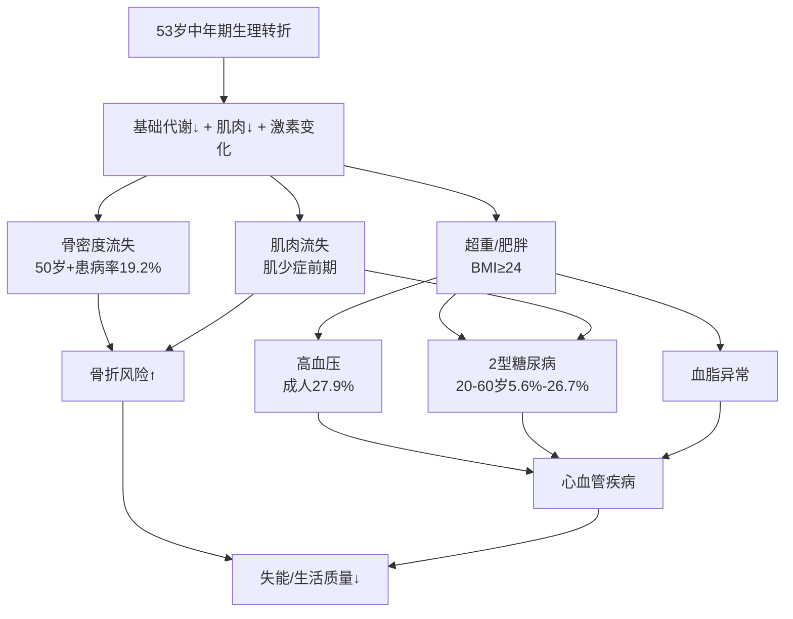

**超重肥胖**：BMI≥24为超重、≥28为肥胖，是心血管疾病的独立危险因素[^10][^11]。用户80kg在三档身高下均超标。

**高血压**：我国成人患病率27.9%且随年龄上升，65岁以上高达50%以上[^9]，高盐饮食、高脂饮食、过量饮酒、缺乏运动均为危险因素[^9]。

**2型糖尿病**：我国患者约2.33亿，20~60岁工作年龄人群患病率5.63%~26.7%，男性普遍高于女性[^8]，与精制米面摄入偏多、含糖饮料、久坐密切相关[^8]。

**骨质疏松**：50岁及以上人群患病率19.2%，65岁及以上32.0%，女性明显高于男性[^7]。

**肌少症**：中国老年人总体患病率20.7%，且**与骨质疏松常合并出现，占骨质疏松患者近一半**[^5][^7]；"千金难买老来瘦"是危险误区——肌肉不足才是代谢紊乱的深层原因，**有些人看似瘦但脂肪比例偏高、肌肉量不足，同样会陷入代谢紊乱**[^5]。

**心血管疾病**：腹型肥胖、内脏脂肪多、代谢综合征均为高危因素[^11]。

这些风险与饮食结构的关联清晰：**高盐高脂、精制谷物过多、蛋白质摄入不足、钙奶摄入偏低、膳食纤维不足、含糖饮料泛滥**——正是中国居民膳食的典型短板，也是本食谱必须系统纠偏的方向。

## 1.8 个体营养目标基线与食谱设计取向

综合上述分析，将53岁、80kg中国成年人的营养目标基线凝练如下，作为承接后续章节的逻辑桥梁：

| 目标维度 | 基线值（170cm/1700kcal档为示例） | 设计优先级 |
|---------|-----------------------------|----------|
| **总能量** | 1500~2000kcal/d（减重期下限，维持期中上限） | ★★★ |
| **蛋白质** | 80~96g/d（1.0~1.2g/kg），三餐均匀25~30g/餐 | ★★★ |
| **脂肪** | 47~57g/d（饱和脂肪<17~21g，EPA+DHA≥0.25g） | ★★ |
| **碳水化合物** | 213~234g/d（全谷占1/3以上，添加糖<25g） | ★★★ |
| **钙** | ≥800mg/d（推荐900~1000mg） | ★★★ |
| **钠（盐）** | ≤2000mg（≤5g盐） | ★★★ |
| **钾** | ≥2000mg（理想3500mg+） | ★★ |
| **膳食纤维** | 25~30g/d | ★★ |
| **维生素D** | 400~800 IU/d | ★★ |
| **EPA+DHA** | ≥0.25g/d，深海鱼每周2~3次 | ★★ |
| **饮水** | 1700ml/d，白水/淡茶 | ★★ |

基于这份基线，两周食谱的**核心设计取向**可凝练为八字方针——**控总量、调结构；增蛋白、补钙铁；控盐糖油、强化全谷物与深色蔬果**。具体而言：

第一，**控总量**——以1500~2000kcal区间为锚，制造适度能量缺口推动减重；第二，**调结构**——三大供能比向AMDR中段、蛋白质向高限倾斜；第三，**增蛋白**——保证每餐20~30g优质蛋白以延缓肌少症；第四，**补钙铁**——每日300~500ml奶+豆制品+深绿叶菜+瘦肉协同供给；第五，**控盐糖油**——盐≤5g、添加糖<25g、油25~30g三道防线；第六，**强化全谷物**——主食1/3以上为全谷杂豆，对抗精制米面带来的糖尿病风险；第七，**增深色蔬果**——每日蔬菜≥500g（深色占半）+水果200~300g，兼顾钾、膳食纤维与植物化合物。

需要再次明确的是，本基线是基于**"男性、轻体力活动、无确诊慢病、未服药"** 的默认情景给出的；如用户实际情况偏离这一假设（女性、不同活动量、已确诊慢病、正在服药、有食物过敏等），需在执行前咨询医师或注册营养师做个体化调整。这份基线将作为后续第2章膳食模式选择、第3章食材策略、第4~6章具体食谱编排、第7章慢病侧重以及第9章监测调整的共同参照系，确保整篇报告在科学性、本土化与可执行性上的内在一致。

# 2 中老年平衡膳食的科学原则与本土化框架

第1章已经为这位53岁、80kg的中国成年人确立了量化的营养目标基线——能量1500~2000kcal/d、蛋白质80~96g/d、钙≥800mg/d、盐≤5g/d、油25~30g/d等核心数字。然而，**孤立的营养素目标如果没有一套与之匹配的膳食模式作为载体，就难以在真实餐桌上落地**。本章的任务，正是要回答一个承上启下的问题：在世界上诸多被循证医学验证有效的膳食模式中，哪一种或哪几种最适合一位53岁的中国男性？答案不应是简单照搬西方模板，也不应囿于刻板印象中的"中餐"，而应在《中国居民膳食指南(2022)》的权威框架之下，整合东方健康膳食模式的本土证据、DASH与地中海饮食的循证精华，构建一个既科学严谨又能在中国厨房里执行的"复合本土化框架"。这一框架将是第3章食材选择、第4~6章餐次设计的共同底层逻辑。

## 2.1 《中国居民膳食指南(2022)》八准则的中年期解读

《中国居民膳食指南(2022)》以八条平衡膳食准则构成全民膳食的最高原则，对53岁这一中年向中老年过渡的人群而言，每一条准则都需要做"中年期视角"的再解读，才能从普适建议转化为针对性策略[^18]。

**准则一"食物多样、合理搭配"的中年期意义**在于以多样性对冲单一食物的营养短板。指南要求每天的膳食应包括谷薯类、蔬菜水果、畜禽鱼蛋奶和豆类食物，**平均每天摄入12种以上食物，每周25种以上**[^18]。第1章已指出53岁人群消化吸收功能渐进性减弱、B12等营养素利用率下降，多样化摄入是抵消单一营养素吸收效率下降的最朴素也最有效的策略。配合"谷类为主"的核心定位——每天谷类200~300g，其中**全谷物和杂豆类50~150g**、薯类50~100g[^18]，正好与第1章设定的"主食1/3以上为全谷杂豆"形成对应。

**准则二"吃动平衡、健康体重"对80kg的目标个体具有最直接的针对性**。指南推荐每周至少5天中等强度身体活动累计150分钟以上，每天主动身体活动最好6000步，并鼓励适当进行高强度有氧运动、每周2~3天加强抗阻运动，减少久坐时间、每小时起来动一动[^18]。**抗阻运动的强调对53岁人群尤为关键**——它直接针对第1章所述的肌少症前期窗口与骨密度流失风险，单纯有氧运动并不足以维持肌肉量。

**准则三"多吃蔬果、奶类、全谷、大豆"是中年期最需补强的方向**。指南要求餐餐有蔬菜，每天不少于300g新鲜蔬菜且**深色蔬菜应占1/2**；天天吃水果，每天200~350g新鲜水果，**果汁不能代替鲜果**；奶制品摄入量相当于每天**300ml以上液态奶**；经常吃全谷物、大豆制品，适量吃坚果[^18]。第1章已经指出我国居民膳食钙摄入实际仅336.1mg/d，主因正是奶类摄入不足，这条准则是补足钙短板的核心抓手。

**准则四"适量吃鱼、禽、蛋、瘦肉"为蛋白质来源排定优先级**。鱼、禽、蛋类和瘦肉平均每天120~200g，每周最好吃**鱼2次或300~500g**、蛋类300~350g、畜禽肉300~500g；少吃深加工肉制品；**鸡蛋营养丰富，吃鸡蛋不弃蛋黄**；优先选择鱼，少吃肥肉、烟熏和腌制肉制品[^18]。"优先鱼、限红肉、不弃蛋黄"三条具体指引，恰好与第1章EPA+DHA≥0.25g/d、饱和脂肪<10%总能量、胆固醇<300mg/d的目标相互支撑。

**准则五"少盐少油、控糖限酒"是防三高的核心防线**。成年人每天摄入食盐**不超过5g**，烹调油**25~30g**；添加糖每天不超过50g、最好控制在25g以下；反式脂肪酸每天摄入量**不超过2g**；不喝或少喝含糖饮料；成年人如饮酒一天饮用的酒精量不超过15g[^18]。这五道防线对53岁这一高血压、糖尿病高发起点人群可谓"一条都不能松"。

**准则六"规律进餐、足量饮水"**要求合理安排一日三餐、定时定量、不漏餐、每天吃早餐；不暴饮暴食、不偏食挑食、不过度节食；低身体活动水平成年男性每天喝水**1700ml**[^18]。"不过度节食"对正在减重的中年人尤其重要——第1章已强调极低能量方案存在脱水、肌少症和内分泌紊乱风险。

**准则七"会烹会选、会看标签"是长期可持续的关键技能**——选择新鲜的、营养素密度高的食物，学会阅读食品标签合理选择预包装食品，学习烹饪、传承传统饮食[^18]。这一准则将在第8章烹饪与采购指南中具体展开。

**准则八"公筷分餐、杜绝浪费"则关乎卫生安全与可持续生活方式**——食物制备生熟分开、熟食二次加热要热透，从分餐公筷做起[^18]。

## 2.2 中国居民平衡膳食宝塔的五层食物量化标准

如果说八准则是原则，**中国居民平衡膳食宝塔则是把原则转化为"每天吃多少克"的图形化操作工具**。宝塔共分5层，各层面积大小不同，体现了5大类食物和食物量的多少；食物量是根据**1600~2400kcal能量需要量水平**设计的[^19][^20]。第1章为本食谱锚定的1500~2000kcal区间正好覆盖宝塔标注的下半段，因此可以直接采用宝塔参数并向下限略作收缩。

下表汇总宝塔五层推荐量，并给出适配53岁/1500~2000kcal的具体取值：

| 宝塔层 | 食物大类 | 指南推荐量(成年人) | 53岁/1500~2000kcal档建议 |
|-------|---------|-------------------|------------------------|
| 第一层 | 谷薯类 | 谷类200~300g（含全谷杂豆50~150g）+ 薯类50~100g[^19][^20] | 谷类**200~280g**+薯类50~100g，全谷杂豆占主食≥1/3 |
| 第二层 | 蔬菜水果 | 蔬菜≥300g（深色≥1/2）+ 水果200~350g[^19][^20] | 蔬菜**500g**（深色≥250g）+水果**200~300g** |
| 第三层 | 鱼禽肉蛋 | 共120~200g（畜禽40~75g+水产40~75g+蛋50g）[^19][^20] | 共**120~180g**，水产优先 |
| 第四层 | 奶豆坚果 | 液态奶≥300g + 大豆和坚果25~35g[^19][^20] | 奶**300~500ml**+大豆20~30g+坚果10g |
| 第五层 | 烹调油盐 | 油25~30g + 盐≤5g[^19][^20] | 油**25g**+盐**≤5g** |

宝塔第一层强调**碳水化合物提供总能量的50%~65%**，谷薯类是膳食能量的主要来源，也是多种微量营养素和膳食纤维的良好来源；**全谷物保留了天然谷物的全部成分，是理想膳食模式的重要组成**[^19][^20]。第二层中**深色蔬菜一般富含维生素、植物化学物和膳食纤维，推荐每天占总体蔬菜摄入量的1/2以上**[^19][^20]——这与第1章关于钾、镁、植物甾醇等微量营养素和植物化合物的目标完全一致。第三层强调**目前我国汉族居民的肉类摄入以猪肉为主，且增长趋势明显，猪肉含脂肪较高，应尽量选择瘦肉或禽肉**[^20]，而水产品**富含优质蛋白质、脂类、维生素和矿物质，有条件可以优先选择**[^19]。第四层指出**奶类、大豆和坚果是蛋白质和钙的良好来源，营养素密度高**，建议大豆和坚果总量25~35g、坚果每周70g左右(每天约10g)[^19]。第五层则把烹调油盐作为"必不可少但要尽量少用"的调料处理。

需要特别提醒的是，**宝塔中所说的各种食物重量都是生重，且都是"可食部"的重量**[^21]——这一细节将在第3章食材策略与后续具体食谱中反复使用，是避免份量误判的关键。

## 2.3 东方健康膳食模式的本土化优势

如果只把宝塔作为食物量的尺子，仍不足以决定"该吃哪些菜、用什么风味、按什么文化传统来组织餐桌"。**《中国居民膳食指南(2022)》首次提出"东方健康膳食模式"** 这一概念正是为了回答这个问题——它**以浙江、上海、江苏为代表的江南地区膳食和广东福建沿海地区为代表的粤式膳食为我国较健康膳食模式的代表**[^22]。流行病学和慢性病监测发现，具有这一模式特点的人群，**不仅寿命比较长，而且发生超重肥胖、二型糖尿病、代谢综合征和脑卒中等疾病的风险均较低**[^22]。

东方健康膳食模式的核心内容可归纳为：**食物多样、谷物为主、强调全谷杂豆、蔬菜水果充足、鱼虾水产丰富、奶类豆类经常吃、适量摄入禽畜蛋、烹饪方式清淡少盐少油**[^23]。具体到食物量上：每天200~300g谷物含50~150g全谷物加50~100g薯类；每天300~500g蔬菜、200~350g水果；动物性食物每天120~200g、每周300~500g鱼虾类水产品；奶类每天300~500g、大豆和坚果总量约35g；每天限盐5g、限油25g[^24][^22]。这套量化清单与宝塔高度一致，但在食物选择和烹饪取向上更鲜明地体现"中国家庭餐桌"的实际操作可能。

更有分量的支撑来自2024~2025年间发表于《自然·健康》(*Nature Health*)的浙江大学公共卫生学院联合中国疾控中心营养与健康所的大型队列研究——团队基于覆盖8931人的WELL-China中国人群前瞻性队列、并在1851人的独立验证队列中复刻结果，**首次明确了一套扎根中国饮食传统、有充分科学证据的健康膳食模式——EastDiet(东方膳食)**[^25][^26]。其鲜明特点是：**摄入量较多的是蔬菜、水果、海鲜、全谷物、坚果、乳制品、鸡蛋、大豆制品、淀粉类根茎和块茎、淡水鱼以及菌菇；摄入量较低的是精制谷物、油炸食品、红肉及加工肉类和酒精**[^26]。这套模式既包含全球公认的健康饮食原则，**更保留了极具中国特色的饮食元素——淡水鱼、薯类和根茎类食物、豆制品、食用菌**[^27][^26]。

EastDiet的循证健康获益对53岁人群极具说服力。第一，**减少中心性肥胖**——多变量多级回归显示，坚持东方膳食的人群全身性肥胖风险降低16%、**中心性肥胖(腹型肥胖)风险降低17%**，且能优化全身的脂肪分布、减少腹部和躯干的内脏脂肪堆积、降低腰臀比和腰高比，同时增加下肢的健康皮下脂肪含量，这一特点**在男性中关联更强**[^26]。**中国人的肥胖特点本就是"更容易胖肚子"**，哪怕BMI不高、腹型肥胖也会显著升高糖尿病、心血管病的风险，东方膳食恰恰精准击中了这个健康痛点[^26]——对照第1章对80kg中年男性的体型评估，这一点尤其重要。第二，**守护心血管**——在中位随访6.3年的前瞻性研究中共记录了456例新发不良心血管事件，**坚持东方膳食的人群主要不良心血管事件(MACE，包括心梗、中风、冠脉血运重建、心血管死亡等)的发生风险降低22%；男性人群的获益尤为突出，坚持东方膳食的男性心血管事件风险降幅达到36%；同时老年人群、低学历人群也能从这套饮食模式中获得显著的心血管保护**[^25][^26]。

研究团队进一步通过**代谢组学和肠道菌群分析**揭开了健康效应的生物学机制：东方膳食对应着更有利的代谢物与肠道菌群特征，**有益代谢标志物如二十二碳六烯酸(DHA)、一些特定的氨基酸反映全谷物、水果、海鲜与河鲜摄入；与膳食纤维发酵及产生短链脂肪酸的有益菌群更丰富，如克里斯滕森氏菌**[^25]。其中**吲哚-3-丙酸(IPA)**被识别为一个关键的"东方膳食"模式候选标志物，**不仅与豆制品、根茎与块茎类等提倡的健康食物密切相关，还与更低的不良心血管事件发病显著相关**[^25]。这一"有益食材→优化肠道菌群→产生有益代谢物→降低疾病风险"的完整链条[^26]，把"为什么这么吃健康"的机理打通到了分子层面。

相较地中海饮食，东方健康膳食的本土化优势体现在三个方面：第一，**食材更易得、价格更亲民**——地中海饮食"较低的加工度、生冷食材较多、提倡坚果和橄榄油"等特点对中国家庭存在执行难度，**很多食材不常见、购买价格也不低**[^28][^22]；东方膳食所依赖的鱼、豆、菌、薯、绿叶菜在中国普通菜市场都能轻易买到。第二，**烹饪方式更契合**——东方膳食"要求控制烹调油总量、即便植物油也必须控制数量；鼓励低温烹调、避免煎炸熏烤；强调吃新鲜绿叶蔬菜"三大特点甚至比地中海饮食更严格[^22]；用菜籽油、花生油这些含不饱和脂肪酸的植物油做烹调油，**营养价值不输地中海饮食的"明星食材"——橄榄油**[^28]。第三，**口味与文化更亲近**——这是长期可持续性的关键，第1章P-6标准中已强调可持续性必须考虑成本、时间、家庭共餐等真实生活场景。

## 2.4 DASH与地中海饮食模式的借鉴价值

确立东方健康膳食为主框架并不意味着拒斥其他循证模式。DASH与地中海饮食在过去三十年里积累了大量高质量证据，其中的某些具体策略对53岁个体的特定健康风险（高血压、血脂异常）具有不可替代的借鉴价值。

**DASH饮食模式(Dietary Approaches to Stop Hypertension)** 最初由美国国立卫生研究院提出为降血压饮食方案，其**核心要素包括高蔬果、全谷物、低脂乳制品+控钠+优质蛋白**：每日蔬菜500g、水果250~300g、全谷物≥250g、低脂乳制品300ml，适量坚果(20g/日)和豆类，控制红肉(≤75g/周)、精制糖(<25g/日)；钠摄入<2000mg(高血压患者进一步限制至1500mg)，钾摄入目标3500~4700mg[^29][^30][^31]。**研究证据显示，该饮食模式可使收缩压降低8~14mmHg**[^30]；哈佛医学院的研究显示，坚持DASH饮食4周后**与心脏损伤相关的生物标志物下降18%、炎症标志物下降13%；结合低钠饮食后心脏损伤标志物降幅达20%以上**[^31]。

DASH最值得吸纳到本土食谱的是其**"钠钾平衡"逻辑**——一边严格控钠，一边主动通过菠菜、香蕉、菌菇、豆类、薯类等富钾食物提升钾摄入，"钾能促进钠排出，镁可松弛血管平滑肌，膳食纤维利于控制体重"[^29]。这与第1章为目标个体设定的"钠≤2000mg、钾≥2000mg"目标完全契合。同时，**中国团队发表在医学顶刊的研究显示，将普通盐换成低钠盐能控制血压**——低钠盐通过用部分的钾替换钠，让大众吃盐时少吃了升高血压的钠、也补上了吃得往往不太够的钾，**实现了双倍收效**；除非有严重肾病或者在服用比较明确的阻碍钾排出药物的人，大部分人选用低钠盐都是安全且可以预防高血压的[^32]。这是DASH逻辑在中国厨房的最佳落地工具。

**地中海饮食模式**则源自西班牙、意大利、希腊等地中海沿岸国家，**以蔬菜水果、鱼类、五谷杂粮、豆类和橄榄油为主**[^24]。2025年意大利营养学会发布的新版地中海饮食金字塔进一步细化为：水果蔬菜每天5~7份（深色绿叶菜和浆果优先）、特级初榨橄榄油每天25~40ml、全谷物要占75%以上、坚果30克日推荐量、酸奶每日推荐而牛奶不超过250ml、豆类每周3~4次、鱼类选小型蓝鱼、禽肉蛋类每周不超过3次、**红肉每月2~3次、加工肉制品尽量避免**[^33]。在循证效果上，**地中海饮食连续七年位居美国新闻与世界报道的年度最佳饮食排名榜首；巴西圣保罗大学的研究发现，严格遵守地中海饮食的老年人全身炎症水平下降11.5%**[^31]。

地中海饮食对本土食谱的关键启示在于两点：一是**深海鱼摄入频次的明确化**——每周2~3次深海鱼、每日补充EPA+DHA可显著降低炎症[^31]；二是**优质植物油的轮换使用**——虽然橄榄油在中国厨房并非必备，但其传递的"以不饱和脂肪酸为主、避免反复煎炸"原则可通过菜籽油、花生油、亚麻籽油的轮换实现[^28]。

但在借鉴的同时**必须明确两类模式的不匹配点**。北京大学第一医院临床营养科窦攀主任明确提示：**中美的饮食结构和疾病谱不同；美国居民膳食指南对动物脂肪的放宽、对碳水化合物的大幅削减并不完全适合以谷物为主食、烹饪用油量仍需控制的我国居民，照搬可能导致饱和脂肪和总热量摄入超标**[^34]。地中海饮食中"较低的加工度、生冷食材较多"对于习惯热食的中国家庭存在执行难度[^28][^22]；DASH饮食中的低脂乳制品摄入量(300ml)虽然合理，但**我国居民2018年成年人日均奶类及其制品消费量只有27.9g，甚至连推荐量(300ml/天)的1/10也没达到**[^28]，要从27.9g跃升到300ml需要长期培养而不能强求一日达标。

## 2.5 多模式比较与53岁人群适配性矩阵

把三种循证模式放在同一坐标系下横向比较，可以更清晰地看到各自的特长与本土化空间。下表以本食谱关注的核心维度展开对比：

| 维度 | 东方健康膳食 | DASH饮食 | 地中海饮食 |
|------|-------------|---------|-----------|
| 主食策略 | 谷类200~300g，全谷杂豆50~150g+薯类50~100g[^24][^22] | 全谷物≥250g/日(3~6份)[^29][^30] | 全谷物占≥75%[^33] |
| 蔬菜水果 | 蔬菜300~500g(深色占半)+水果200~350g[^24] | 蔬菜500g+水果250~300g[^30] | 每天5~7份[^33] |
| 优质蛋白来源 | 鱼虾水产丰富、奶豆经常吃、适量禽畜蛋[^23][^22] | 低脂乳制品300ml+优质蛋白1~1.2g/kg[^29] | 鱼类每周2~3次、豆类每周3~4次、红肉每月2~3次[^33] |
| 主要油脂 | 菜籽油/花生油等本土植物油，控制总量[^28][^22] | 限饱和脂肪、推荐橄榄油 | 特级初榨橄榄油25~40ml/日[^33] |
| 控盐力度 | ≤5g/日[^24][^22] | ≤2000mg钠（高血压<1500mg）[^29][^30] | 控盐+识别隐藏钠源[^33] |
| 控糖策略 | 限糖<25~50g[^18] | 精制糖<25g/日[^30] | 添加糖严格控制[^33] |
| 慢病循证证据 | 中心性肥胖↓17%、MACE↓22%(男性↓36%)[^26] | 收缩压↓8~14mmHg、炎症标志物↓13%[^30][^31] | 老年人全身炎症水平↓11.5%[^31] |
| 中国本土可执行性 | 极高（食材常见、烹饪传统） | 中（低脂奶+高钾蔬果尚可，奶量难达标）[^28] | 低（橄榄油成本高、生冷食材多）[^28][^22] |

从矩阵中可以看到一个清晰的策略选择：**以东方健康膳食为底层框架，是因为它在本土可执行性、男性心血管获益、中心性肥胖防控三方面对53岁80kg男性有最直接的对位证据；融合DASH的钠钾平衡逻辑，是为强化第1章设定的"盐≤5g、钾≥2000mg"目标和血压防线；融合地中海的优质脂肪策略(深海鱼频次+植物油轮换)，是为达成EPA+DHA≥0.25g/d与饱和脂肪<10%总能量的脂肪质量目标**。这三种模式的整合并非折中，而是**让每种模式各自发挥其最强证据领域**。

需要强调的是，三种模式在底层逻辑上具有高度共性——**健康的饮食模式都有着共同的逻辑，就是低热量、高膳食纤维、少盐、少糖、多蛋白、加工简单、接近天然**[^35]。这一共性恰恰说明，无论从哪条循证路径出发，53岁中年人都需要回到同一组核心准则；而本土化复合模式的价值，就是让这组准则用中国家庭能听懂、能做到的语言落地。

## 2.6 针对53岁人群的六大核心膳食原则

将八准则、宝塔参数与三模式精华浓缩成针对53岁/80kg目标个体的可操作原则，可凝练为**六大核心膳食原则**。这六条原则将贯穿第3~6章的所有食材选择和食谱编排。

**原则一：食物多样、合理搭配——每日12种、每周25种食物的多样性底线**。这是八准则之首，也是东方健康膳食的鲜明特征[^18][^23]。具体到执行层面，每日12种以上意味着主食至少2种(精米+全谷)、蔬菜至少3种(深色+浅色+菌藻)、蛋白质至少3种(蛋+奶+鱼/禽/豆中至少一种)、水果至少1种、油至少1~2种（轮换）；每周25种则要求两周内的食材轮换需有意识规划，避免7天单调重复——这正是第6章第二周食谱设计中"食材轮换骨架"要解决的问题。

**原则二：谷类为主、全谷过半结构化——每日全谷杂豆≥50~100g，占主食≥1/3**。第1章已经确立"主食1/3以上为全谷杂豆"的目标，对应宝塔标准[^19][^20]和东方膳食"全谷物是主食的重要组成"的强调[^28]。具体执行包括：白粥中放一把燕麦米或绿豆，米饭里加红小豆做成红豆饭，或将精白挂面换成荞麦面条、莜麦面条或玉米面条[^28]；薯类(红薯、紫薯、山药)50~100g/天替代部分主食，**β-葡聚糖≥3g/d主要通过燕麦40~60g/d实现**。这一原则是降低糖尿病风险、增加膳食纤维与短链脂肪酸的核心抓手。

**原则三：优质蛋白三餐均匀分配——每餐20~30g、每日80~96g**。第1章已确立"每餐20~30g优质蛋白可最大化肌肉蛋白合成"的科学阈值，三餐均衡比集中于一餐更有利于延缓肌少症。具体执行为：早餐通过蛋50g+奶300ml+少量豆制品达到约20~25g；午餐通过鱼/禽/瘦肉75~100g+部分豆制品达到约25~30g；晚餐通过鱼或豆腐+少量肉达到约25~30g。**优质蛋白(鱼禽蛋奶豆)应占总蛋白50%以上**，每周鱼虾水产2~3次、深海鱼提供EPA+DHA、红肉每周≤300g[^18][^22]。

**原则四：控油控盐限糖三道防线——油25g、盐≤5g、添加糖<25g**。这是慢病防控的硬约束，**钠摄入过量是导致高血压的主要膳食危险因素之一**[^32]。具体执行包括：**家里常备有刻度的盐勺、盐罐量化每日摄入的盐分，一般炒一盘菜加一勺(2克)盐即可；为保证风味可以采用花椒、茴香、辣椒等植物香料来调味；用蒸代替油炸控制油的摄入量**[^36]；**低钠盐对大部分人安全且可以预防高血压**[^32]；不喝含糖饮料、查配料表"白砂糖/果葡糖浆"。**反式脂肪酸每天<2g**——避免人造奶油/起酥油/植脂末/油炸食品[^18]。

**原则五：规律三餐、定时定量——早餐不漏、晚餐早收**。八准则六明确"合理安排一日三餐、定时定量、不漏餐、每天吃早餐；规律进餐、饮食适度，不暴饮暴食、不偏食挑食、不过度节食"[^18]。具体到53岁个体：早餐7:00~8:00、午餐12:00~13:00、晚餐**18:00~19:00并睡前≥3小时**完成；**长期吃烫食(超过65℃)会反复损伤食管黏膜、引发慢性炎症甚至癌变，食物和饮品的温度在10℃~40℃最佳**[^32]——避免"趁热吃趁热喝"的中老年常见误区；**剩饭菜偶尔吃没关系，但长期吃剩饭剩菜可能带来危害**[^32]。

**原则六：足量饮水、白水为主——每日1700ml**。指南推荐**喝白水或茶水，少喝或不喝含糖饮料，不用饮料代替白水**[^18]。具体执行：上午饮水800~1000ml、中下午饮水400ml、晚上饮水300ml；主要喝**没油没盐没糖的水如白开水、矿泉水、无糖柠檬水、淡茶水，远离奶茶和甜饮料**[^21]；不饮酒或饮酒不超过15g酒精/日，减重期最好戒酒[^18]。

## 2.7 两周食谱设计的总体框架与量化标准

把上述六大原则转化为可被第3~6章直接调用的"操作清单"，需要明确**每日食物种类数、各类食物总量、三餐能量与营养分配、每周蛋白质来源频次、餐盘比例与烹饪方式**等结构化参数。下表汇总两周食谱设计的总体框架，以170cm/1700kcal档为基准，1500kcal档与1900kcal档按比例上下浮动。

**两周食谱量化标准清单（170cm/1700kcal档基准）**

| 维度 | 量化标准 |
|------|---------|
| 每日食物种类 | ≥12种，每周≥25种[^18] |
| 每日谷薯类总量 | 谷类250g(全谷杂豆75~100g占≥1/3)+薯类75g[^19][^20] |
| 每日蔬菜总量 | 500g(深色≥250g占1/2)，餐餐有蔬菜[^18] |
| 每日水果总量 | 250g(低GI优先：苹果/蓝莓/柚子/梨)[^18] |
| 每日动物性食物 | 共150g(鱼虾80g+禽40g+蛋50g/1个) |
| 每日奶制品 | 300~500ml(早餐+加餐分配)[^18][^19] |
| 每日大豆+坚果 | 大豆25g+坚果10g[^19] |
| 每日烹调油 | 25g(橄榄油/菜籽油/亚麻籽油轮换) |
| 每日盐 | ≤5g(优选低钠盐) |
| 每日添加糖 | <25g |
| 每日饮水 | 1700ml(白水/淡茶) |

**三餐能量与营养分配（按170cm/1700kcal）**

| 餐次 | 能量占比 | 能量区间 | 蛋白质 | 主食(干重) | 蔬菜 | 关键要点 |
|------|---------|---------|--------|----------|------|---------|
| 早餐 | 25~30% | 425~510kcal | 20~25g | 50g | ≥100g | 必含奶+蛋+全谷 |
| 午餐 | 35~40% | 595~680kcal | 25~30g | 75~100g | ≥200g | 主菜含鱼禽肉，深色菜占半 |
| 晚餐 | 30~35% | 510~595kcal | 25~30g | 50~75g | ≥200g | 清淡，主食可换薯类，睡前≥3h |
| 加餐(可选) | 5~10% | 100~150kcal | 5~10g | — | — | 水果/酸奶/坚果 |

**每周蛋白质来源频次安排**

按"鱼优先、限红肉、蛋每天、奶每天、豆每天"的优先级，两周共14天42餐的频次设计为：

- **深海鱼每周2~3次**（每次80~100g，两周共6餐含深海鱼）——补充EPA+DHA[^31]
- **淡水鱼/虾每周1~2次**——东方膳食特色食材[^26]
- **禽肉每周2~3次**（鸡胸、鸡腿去皮、鸭胸）
- **红肉每周≤2次**（每次≤50g瘦牛肉/瘦猪肉/瘦羊肉），两周中红肉≤4餐，对应**红肉每周≤300g**[^18]
- **蛋每天1个**（早餐50g），两周共14个
- **奶每天1~2次**（300~500ml），无糖酸奶与低脂牛奶轮换
- **豆制品每天1次**（北豆腐100g或豆浆200ml或豆干20g等折算）

**餐盘比例与烹饪方式**

每餐采用**"蔬菜1/2 + 蛋白质1/4 + 主食1/4"** 的三等分餐盘原则。**进餐顺序为蔬菜→蛋白质→主食**，有助于延缓餐后血糖上升、提升饱腹感。**烹饪方式中蒸煮炖凉拌占≥70%，避免油炸熏烤**——这与东方健康膳食"鼓励低温烹调、避免煎炸熏烤"原则[^22]、地中海饮食"加工简单接近天然"原则[^33][^35]共同呼应。

**两周食材轮换骨架**

为同时满足"每周≥25种食物"和"两周不重复疲劳"两重要求，两周的食材轮换骨架按下表组织：

| 类别 | 第一周 | 第二周 |
|------|--------|--------|
| 谷薯主食 | 糙米饭/荞麦面/紫米饭/藜麦饭/小米饭/燕麦/全麦馒头 | 杂粮饭/红薯+米饭/玉米/藜麦饭/紫薯/燕麦饭/全麦面 |
| 鱼类 | 鲈鱼、三文鱼、鳕鱼 | 带鱼、鲷鱼、青花鱼 |
| 禽肉 | 鸡胸肉、鸡腿(去皮) | 鸭胸、鸡腿菇炖鸡 |
| 红肉 | 瘦牛肉、瘦猪肉 | 瘦牛肉、瘦羊肉 |
| 豆制品 | 北豆腐、豆浆、豆干 | 嫩豆腐、腐竹、毛豆 |
| 深色蔬菜 | 菠菜、西兰花、胡萝卜、番茄、紫甘蓝 | 油菜、芥蓝、南瓜、彩椒、紫薯叶 |
| 水果 | 苹果、蓝莓、柚子 | 樱桃、梨、橙子 |

至此，第2章完成了从《中国居民膳食指南(2022)》八准则到平衡膳食宝塔再到东方健康膳食、DASH、地中海三模式的层层整合，凝练出**六大原则+量化清单**这一可直接落地的本土化复合框架。**第3章将在此框架下进一步深入到"具体选哪些食材、为什么选它们"的层面**，分类探查主食类、蛋白质类、蔬菜水果类、奶豆坚果类、油盐糖类的优选清单与互换关系，并识别针对中老年三高、肌少症、骨质疏松防控的"功能性食材"，为第4~6章42餐的具体编排提供食材层的科学依据。

# 3 关键食材的选择策略与营养价值分析

第2章已经完成了从指南八准则到平衡膳食宝塔再到东方健康膳食、DASH与地中海三模式的整合，凝练出**六大原则+量化清单**这一可直接落地的本土化复合框架。然而框架只解决"该吃多少、按什么比例吃"的结构问题，真正走进菜市场和厨房时，还要回答更具体的问题——**在同一类食物里究竟该挑哪几种？为什么是它们而不是别的？吃不到或不爱吃时如何互换？哪些食材对53岁中年男性的特殊风险具有针对性保护作用？** 本章将沿主食、蛋白质、蔬菜水果、奶豆坚果、油盐糖五条主线展开优选清单与互换关系分析，并专设一节聚焦中老年三大高发风险的"功能性食材"，从抗炎、抗氧化、补钙护骨、护心护脑等机制层面解析其循证价值，把"营养目标基线—膳食模式框架—具体食材清单"这条链条彻底打通，为第4~6章42餐的具体编排提供食材层的科学依据。

## 3.1 主食类食材:全谷杂豆薯类的科学搭配

主食是这位53岁/80kg中国成年人每日能量的最大单一来源，也是其代谢风险与代谢获益的最大变量。第1章设定的"全谷物占主食≥1/3"与第2章谷类200~280g+薯类50~100g的量化标准，需要进一步落实到"具体吃糙米还是燕麦、配多少红豆、薯类吃哪种"的食材层面。

### 3.1.1 全谷物的循证证据与优选清单

**全谷物的核心定义在于完整保留胚乳、胚芽和谷皮三大结构**——精制谷物在加工中碾去谷皮、剥落胚芽，仅保留胚乳如白米白面，丢失了膳食纤维、B族维生素、维生素E、叶酸、酚类化合物、木质素、植物固醇等大量营养素[^37]。常见的全谷物包括全麦、糙米、燕麦片、荞麦、玉米、小米、高粱米等[^37]，扩展品类还有藜麦、薏米、黑米[^38][^39]。

全谷物对53岁人群的多重循证获益已在多个高质量研究中得到验证。首都医科大学研究团队对北京市平均年龄64岁的120名参与者开展随机对照试验，**仅用全谷物替代主食、其他饮食习惯不变，持续6周后全谷物组的IL-22、IL-23两种炎症因子水平显著低于精制谷物组，丁酸等短链脂肪酸水平显著升高**——膳食纤维被肠道微生物发酵后产生的短链脂肪酸介导了免疫调节与抗炎作用[^37]。这一证据对处于慢性低度炎症高发期的53岁中年人意义重大——慢性炎症与心脑血管疾病、癌症、认知衰退等多种重大疾病发展密切相关[^37][^40]。2022年发表在《美国医学会杂志—网络公开版》上的研究进一步指出，**谷物纤维与降低炎症水平的关联效果远超水果或蔬菜**[^37]。

更具体的代谢获益数据是：**每天食用50g全谷物食品，可将2型糖尿病风险降低23%**[^37]；中国疾控中心对国内外34篇全谷物研究的分析发现，全谷物可降低结直肠癌发病风险，对预防心血管病同样有益[^37]；发表在《国际食品科学与营养》的研究显示，**全谷物摄取量多者可降低四成胃癌风险**[^37]。从机制上看，全谷物富含的膳食纤维能延缓胃排空和葡萄糖吸收速度，有助于平稳餐后血糖、避免血糖剧烈波动；其抗性淀粉和不溶性膳食纤维结构粗糙、可增加咀嚼次数、提升饱腹感，对体重管理与胰岛素敏感性改善均有积极意义[^39][^41]。

针对53岁/80kg目标个体的全谷物优选清单可按用途分组：

| 全谷物 | 突出营养特点 | 推荐用途 | 替代精米精面比例 |
|--------|------------|---------|---------------|
| 糙米 | 保留麸皮和胚芽，富含膳食纤维和B族维生素，GI低于白米 | 杂粮饭主料，与白米按1:1或1:2烹煮 | 替代部分白米 |
| 燕麦 | β-葡聚糖含量高，每日40~60g可达≥3g/d目标，降胆固醇 | 早餐燕麦粥、燕麦牛奶 | 替代部分早餐主食 |
| 荞麦 | 含芦丁，对血管弹性有益，GI低 | 荞麦面条、荞麦馒头 | 替代精白挂面 |
| 藜麦 | 蛋白质含量高且必需氨基酸齐全，GI低 | 藜麦饭、藜麦沙拉 | 替代部分白米 |
| 小米 | 富含B族维生素，易消化 | 小米粥、小米饭 | 早晚餐粥品基底 |
| 全麦 | 保留麸皮的小麦制品，膳食纤维丰富 | 全麦馒头、全麦面包(注意识别配料表) | 替代精白馒头/面包 |
| 玉米/玉米渣 | 含玉米黄素，叶黄素 | 蒸玉米、玉米粥 | 整粒替代部分主食 |

### 3.1.2 杂豆类的低GI高蛋白价值

杂豆类指红豆、绿豆、鹰嘴豆、芸豆、扁豆等[^38][^39]。它们与作为蛋白质来源的大豆不同——杂豆以淀粉为主、蛋白质次之，归入主食类计算。**杂豆类升糖指数普遍较低，且富含抗性淀粉和膳食纤维，能像膳食纤维一样减缓葡萄糖进入血液的速度**[^39][^41]。同时杂豆中的优质植物蛋白可与谷类形成"氨基酸互补"，提升整餐蛋白质生物价。《中国居民膳食指南(2022)》将全谷物与杂豆合并计算，建议成年人每日摄入50~150g[^42]。

### 3.1.3 薯类的等量替代原则

薯类包括红薯、紫薯、土豆、山药、芋头等[^38]，富含膳食纤维、维生素C和钾等矿物质，整体升糖指数低于精白米面，能提供持久饱腹感[^39]。薯类的关键执行要点是**作为主食的等量替代而非额外添加**——例如吃100g红薯需相应减少约25g生米或生面的摄入；烹饪建议采用蒸、煮、烤，避免油炸或加糖烹饪，以保留其低脂低升糖特性[^39][^41]。**红心红薯和性状较黏的玉米容易升高血糖**，对有血糖控制需求的人群应优先选用杂粮饭等整粒全谷物作为主食[^38]；山药、紫薯GI相对适中，是更稳妥的薯类选择。

### 3.1.4 粗细搭配的执行要点

仅凭"更换主食"这一动作就能显著降低炎症[^37]，但执行不当反而会引起消化不良、腹胀。结合循证执行经验，53岁人群的粗细搭配应遵循三条要点[^38]：**第一，比例由少到多**——从2~3份大米搭配1份粗粮开始，逐渐适应后增至1/3~1/2；**第二，烹饪做足准备**——糙米、黑米、杂豆类口感粗糙，需提前浸泡2~4小时，烹煮时多放水，可借助豆浆机做米糊、高压锅煮八宝粥、电蒸锅蒸玉米与杂粮馒头改善口感[^37][^38]；**第三，控糖要点**——选择整粒谷物比打成粉糊更利于血糖平稳，**进餐顺序提倡先喝汤、再吃蔬菜与蛋白质、最后吃主食，"吃干不吃稀、吃硬不吃软"**[^39]。挑选全谷物食品时记住"三看"：一看原料种类、二看含量(全谷物配料须达51%以上才能称全谷物食品)、三看是否添加白砂糖植脂末等成分[^37]。

## 3.2 蛋白质类食材:优先级排序与互换关系

第1章已确立"每日蛋白质80~96g、每餐20~30g均匀分配、优质蛋白≥50%"的目标基线，第2章给出了"鱼优先、奶蛋每日、豆制品每日、限红肉"的频次优先级。本节进一步从食材层面解析每类蛋白质的"性价比"——单位重量蛋白质含量、亮氨酸密度、脂肪结构、消化吸收率，并建立可互换的食材换算表。

我国近一半成年人蛋白质摄入不足，其中**64岁以上老年人的达标率不足30%**[^43]，尽管53岁尚未进入老年组，但已处于蛋白质摄入由"维持"向"重点强化"的转折期。中国营养学会推荐中老年人每日蛋白质摄入量为每公斤体重1.2~1.5g[^44]，按80kg计算上限可达96~120g/d，与第1章设定的80~96g区间高度吻合。蛋白质摄入不足的信号往往隐藏在"乏力、爬楼气喘、伤口愈合慢、头发干枯、指甲变脆"等日常细节中，长期则表现为肌肉流失、免疫力下降、骨骼脆弱[^43][^45]。

### 3.2.1 六大蛋白质来源的核心参数对照

| 食材 | 蛋白质含量 | 关键氨基酸/营养亮点 | 脂肪特点 | 53岁人群价值 |
|------|----------|------------------|---------|------------|
| 鸡胸肉(去皮) | 约22~24g/100g | 亮氨酸高，氨基酸齐全 | 脂肪仅约1g/100g，热量低 | 高蛋白低脂代表，研究显示规律摄入8周肌肉力量提升约15%[^44] |
| 深海鱼(三文鱼/青花鱼/带鱼) | 约18~22g/100g | EPA+DHA 1000~1500mg/100g | 不饱和脂肪酸主导 | 抗炎护心护关节，每周吃鱼≥2次冠心病死亡风险降低15~20%[^46] |
| 鸡蛋 | 约6~7g/个(约13g/100g) | 氨基酸构成最接近人体需求，亮氨酸高 | 含磷脂、胆碱 | 消化吸收率近100%，每日1个安全且可保留蛋黄[^46][^43][^45] |
| 牛奶/酸奶 | 约3~3.5g/100ml | 乳清蛋白+酪蛋白，钙120mg/100g | 可选低脂版 | 蛋白+钙双重获益，乳清蛋白是肌肉合成"开关"[^47] |
| 北豆腐 | 约8g/100g | 大豆蛋白生物价高，含异黄酮 | 不饱和脂肪酸 | 易咀嚼、护骨护血管，植物蛋白替代部分动物蛋白可降低全因死亡风险[^48][^49] |
| 瘦牛肉/瘦猪肉 | 约20g/100g | 血红素铁、锌、B12 | 含较多饱和脂肪 | 限量摄入(每周≤300g)，避免肥肉与加工肉[^45] |

### 3.2.2 鱼虾水产:首选蛋白质来源

中国营养学会与《亚洲肌少症工作组2025年专家共识》共同强调：**鱼肉蛋白质含量约20%且属优质蛋白，脂肪低、热量低，深海鱼的不饱和脂肪酸对血管健康非常有帮助**[^44][^50]。三文鱼DHA含量1400mg/100g、EPA 850mg/100g；青花鱼DHA 1000~1500mg/100g、EPA 800~1000mg/100g；带鱼DHA 1400mg/100g、EPA 970mg/100g且**钙含量高达431mg/100g是同等重量牛奶的4倍多**；虹鳟鱼(淡水三文鱼)DHA 1300mg/100g、EPA 600mg/100g且脂肪总量更少[^51]。**建议每周吃鱼2~3次、每次100~150g，清蒸、少油煎为最佳烹饪方式**[^51]。

### 3.2.3 鸡胸肉:被低估的"蛋白王者"

鸡胸肉以22~24g/100g的蛋白含量、约1g/100g的脂肪含量在性价比维度上稳居前列[^44][^50]。**专家团队调研显示，中老年人增加鸡胸肉摄入8周内平均肌肉力量提升约15%、步态更稳、跌倒风险下降**[^44]。对53岁/80kg超重个体而言，鸡胸肉的"高蛋白低脂"属性既能保证肌肉合成原料、又不增加饱和脂肪与热量负担，是减重期的理想蛋白来源。烹饪上避免烤制过硬，可用低温慢煎、撕成细丝加入粥品或炖煮至软烂[^50]。

### 3.2.4 鸡蛋:每日1个不弃蛋黄

近年大样本研究普遍认为**健康人群每日一个鸡蛋并不会增加心血管风险**，反而对维持营养状态有帮助[^46][^44][^45]。鸡蛋的优势在于**亮氨酸含量高、可激活肌肉蛋白合成通路、消化吸收率接近100%**[^46]。蛋黄含胆碱、卵磷脂、维生素D，"蛋黄不可丢"已成为新版指南的明确立场[^43]。烹饪方式建议蒸蛋、水煮蛋为主，避免油煎油炸。

### 3.2.5 牛奶/酸奶:蛋白与钙的双重载体

每日300~500ml鲜牛奶/酸奶可提供乳清蛋白4~8g[^47]，是中老年补充蛋白与钙的最便捷渠道。**乳清蛋白是肌肉靶向核心营养、被亚洲肌少症工作组2025专家共识列为肌肉合成"开关"——吸收快、消化率>90%、必需氨基酸齐全、亮氨酸含量高**[^47]。酸奶因发酵保留了乳清蛋白并含益生菌、对乳糖不耐受者更友好[^47][^52]。乳糖不耐受人群可选择无乳糖舒化奶、低乳糖产品或发酵酸奶；酸奶应优先选择低糖低脂、含活性益生菌(双歧杆菌BB-12、鼠李糖乳杆菌LGG等)的产品，**避免配料表中含大量糖的"风味发酵乳"**[^53][^54]。

### 3.2.6 大豆制品:不可或缺的植物优质蛋白

我国超过三分之二的居民大豆摄入量低于推荐水平[^48]。**干黄豆每100g含蛋白质约35g，比瘦猪肉还高，且大豆蛋白氨基酸组成较为全面、生物价在植物蛋白中属上游**[^48]。大豆制品对53岁人群的特殊价值有四：第一，对牙口稍差或消化能力下降者更易入口；第二，**含大豆异黄酮这一植物雌激素，对骨密度维持有帮助**[^46][^48][^49]；第三，**每日摄入25g大豆蛋白可使LDL平均下降约5%**[^48]，对血脂管理有意义；第四，**美国一项超13万人的随访显示，每天增加3%能量来自植物蛋白，全因死亡风险下降约10%**[^48]。每日推荐摄入25~30g干豆当量，相当于北豆腐100g或豆浆400ml或豆干20g等[^43][^48]。

### 3.2.7 红肉:限量与质量并重

瘦牛肉、瘦猪肉、瘦羊肉提供血红素铁、锌、B12，每周50~75g/次、共≤300g[^43]。**关键约束在于"限肥肉、避加工肉"**——肥肉的饱和脂肪与加工肉(火腿、培根、香肠)的钠和亚硝酸盐均与心血管病、慢性炎症升高直接相关[^40]。这与第1章对血脂、血压防控的硬约束完全一致。

### 3.2.8 食材换算关系:每餐20~30g蛋白质的灵活替换

为方便家庭按"今天有什么就吃什么"的灵活原则操作，下面列出**等量蛋白质(约20g)的食材换算关系**：

- 鸡胸肉约90g ≈ 鱼肉(去刺去骨)约100~110g ≈ 瘦牛肉约100g
- ≈ 鸡蛋约3个(每个约6.5g)
- ≈ 北豆腐约250g ≈ 嫩豆腐约350g ≈ 豆浆约600ml ≈ 豆干约65g
- ≈ 牛奶约600ml ≈ 无糖酸奶约600g ≈ 奶酪约80g

实际餐食中通常采用"一种动物蛋白+一种豆制品+少量奶蛋"的复合搭配，单餐就能覆盖25~30g目标。例如午餐"清蒸鲈鱼80g(蛋白16g)+北豆腐50g(蛋白4g)+少许大豆制品"即可达到20g以上；早餐"鸡蛋1个(蛋白7g)+牛奶250ml(蛋白8g)+少量豆制品(蛋白5g)"也能轻松达到20g。

## 3.3 蔬菜水果类食材:深色占半与低GI优选

每日蔬菜500g(深色≥250g)+水果200~300g是宝塔与东方膳食的共同要求。蔬菜与水果不是"配菜"——**深绿色蔬菜富含叶酸、维生素C、维生素K以及镁、钾等矿物质，橙色或红色水果含丰富抗氧化物质，免疫系统运转离不开这些微量营养素**[^46]。我国老年人膳食纤维实际摄入普遍偏低、肠道菌群多样性下降，足量多样的蔬果是改善这一状况的最直接抓手[^46]。

### 3.3.1 深色蔬菜的三色谱系

《中国居民膳食指南》明确每天应摄入≥300g新鲜蔬菜、深色蔬菜应占一半以上[^55]。**深色蔬果的颜色源于β-胡萝卜素、叶黄素、玉米黄素、番茄红素、花青素及叶绿素等天然色素，这些成分具有抗氧化作用**[^55]。按颜色可分三大谱系：

**深绿色蔬果**——油菜、菠菜、西兰花、芥蓝、猕猴桃为代表。菠菜每100g含维生素A约469μg、维生素K高达483μg、钾558mg、维生素C 32~47mg；西兰花维生素C 51~88mg/100g、富含萝卜硫素和维生素K[^55][^56][^57][^58]。**研究显示萝卜硫素能抑制破坏关节的酶、减缓骨关节炎进展、保护关节功能**[^51]，对53岁中年期关节退变防控有意义。菠菜草酸含量较高，建议焯水后食用以减少草酸；西兰花建议快速焯水或清蒸快炒以保留维生素C活性[^56][^58][^51]。

**橙黄色蔬果**——胡萝卜、南瓜、彩椒、芒果、橙子为代表。胡萝卜β-胡萝卜素突出、可在体内转化为维生素A，每100g含视黄醇当量约835μg；其脂溶性特性适合用油烹调；彩椒维生素C含量在茄果类中最高，达130~222mg/100g[^56][^58]。

**红紫黑色蔬果**——番茄、紫甘蓝、红辣椒、紫薯叶、蓝莓、桑葚为代表。番茄红素具有抗氧化和抗炎特性，能降低LDL、与冠心病和脑卒中风险呈负相关；**番茄酱的番茄红素含量高达29.3mg/100g、加热后生物利用率提升**[^55][^56]。花青素则改善血脂紊乱、降低甘油三酯，桑葚的花色苷含量可达668mg/100g[^55]。

### 3.3.2 水果的GI红黑榜与"护脑"机制

水果的核心选择标准是GI值。**英国生物样本库对超20万人的前瞻性分析显示，膳食GI<49.30时痴呆风险显著下降约16.2%；GL>111.01时全因痴呆与AD风险增加约14.5%**[^59]。这一证据对53岁人群极具说服力——阿尔茨海默病已被部分研究者称为"大脑的糖尿病"，长期血糖剧烈波动会加剧神经系统慢性炎症、加速β-淀粉样蛋白沉积[^59]。

哈佛大学针对16,010名70岁以上女性的长期队列研究进一步证实，**大量摄入富含花青素的蓝莓和草莓、与较慢的认知功能衰退速度显著相关，护脑效应相当于将认知老化平均延缓1.5至2.5年**——花青素等类黄酮能穿透血脑屏障、定位海马体发挥神经保护作用[^59]。

53岁/80kg目标个体的水果红黑榜如下表：

| 类别 | 水果与GI值 | 推荐量与执行要点 |
|------|----------|---------------|
| 🟢红榜(低GI护脑) | 樱桃GI 22、柚子GI 25、苹果GI 36、草莓GI 37、梨GI 38、橙子GI 39、桃GI 42、蓝莓GI 53 | 每日总量200~300g，每次100~150g，分2次食用[^60][^59] |
| 🟡中GI(适量) | 葡萄GI 55、芒果GI 51、香蕉GI 58 | 血糖稳定时少量[^59] |
| 🔴黑榜(高GI需控量) | 菠萝GI 66、西瓜GI 72、荔枝GI 72、果干GI 103 | 每周≤2~3次，单次≤100g[^60][^59] |

蓝莓作为"红榜首选"格外值得说明：花青素以花色苷形式存在，**蓝莓的核心营养价值在于果皮中富含的花青素**，**小蓝莓由于果皮占比更高、所含花青素往往比大蓝莓更多**；建议选中等大小(约14~18毫米)、果粉(白霜)完整、果蒂果脐新鲜不发霉、捏起来有一定硬度弹性者；**每日推荐50~100g、可直接吃或拌入酸奶**[^61][^51]。需要特别注意：花青素怕高温(60℃)、久煮易流失，应整颗洗净生食；肠胃较弱易腹泻者需谨慎[^61]。

### 3.3.3 蔬果食用三原则

第一，**整果优于果汁**——整果含膳食纤维能延缓糖分吸收，一旦榨汁则膳食纤维被破坏、糖分快速吸收[^59]。第二，**彩虹搭配**——每日蔬菜应至少包含深绿、橙红、紫黑三色中的两类，以获取互补的植物化合物谱[^55]。第三，**进餐顺序与时间**——餐前先吃菜、再吃蛋白质、最后吃主食，有助于延缓餐后血糖上升[^39][^41]；水果建议在两餐之间作为加餐食用，避免与正餐主食一起摄入造成碳水叠加。烹饪上以蒸、煮、凉拌为主，避免长时间高温加热，急火快炒能更好保留营养素[^56][^57]。

## 3.4 奶豆坚果类食材:钙源与优质脂肪酸来源

第1章已经测算：**奶300ml(约300mg) + 北豆腐100g(140mg) + 深绿叶菜250g(150mg) + 其他食物(约200mg) ≈ 790~900mg**，刚好覆盖DRIs2023版800mg/d的钙目标。这一计算的关键变量正是奶、豆、绿叶菜三者的稳定供应。

### 3.4.1 奶类:300~500ml的执行刚性

新版《中国老年人膳食指南》建议**每天饮用300~500ml牛奶**[^62]，《中国居民膳食指南(2022)》推荐老年人每天摄入300~500g奶及奶制品[^52]。然而我国居民2018年成年人日均奶类及其制品消费量只有27.9g，达标缺口巨大。

奶类的优选方案按"低脂/无糖+轮换"原则建立：

| 奶制品 | 钙与蛋白参数 | 适合人群 | 53岁执行建议 |
|--------|-----------|---------|------------|
| 低脂牛奶 | 蛋白3~3.5g/100ml，钙120mg/100ml | 大多数成年人 | 早餐250ml |
| 无糖酸奶 | 蛋白3~3.5g/100g，钙120mg/100g，含益生菌 | 乳糖不耐受、便秘人群 | 加餐100~200g |
| 舒化奶/无乳糖奶 | 蛋白3~3.5g/100ml | 严重乳糖不耐受 | 替代牛奶 |
| 奶酪 | 蛋白浓缩、钙密度高 | 蛋白补充 | 偶尔10~20g/次 |

**钙在乳酸环境中溶解度更高，老年人饮用酸奶后钙吸收率比普通牛奶高约18%**[^52]；持续摄入酸奶3个月以上，**股骨颈骨密度流失速度减缓40%**[^52]。同时酸奶的肠道、免疫、代谢获益已有循证支持：每日150g活菌酸奶4周内肠道有益菌可提升30%；坚持饮用的老年人便秘发生率下降约12.6%、感冒频率下降15~23%、餐后血糖峰值降低约27%、糖尿病患者规律饮用低糖酸奶6周餐后血糖下降9%[^53][^52][^54]。

挑选酸奶要把握三个标识：菌种(双歧杆菌BB-12、鼠李糖乳杆菌LGG、嗜热链球菌等活性菌)、营养(蛋白质≥3.5g/100g、钙≥120mg/100g、含糖量≤8g/100g)、工艺(传统发酵、后杀菌等)；存放在4℃以下保证菌群活性、开封后24小时内饮用完毕[^53]。

睡前喝温牛奶有助于改善睡眠[^50]——这一点对53岁人群尤其有意义；如担心夜尿，可调整至晚餐后1小时饮用。

### 3.4.2 大豆制品:每日刚性配置

豆腐、豆浆、豆干的每日轮换是落实第1章"大豆蛋白≥25g/d"目标的关键抓手。**南北豆腐各有所长**——北豆腐钙含量是南豆腐的两倍多、约140mg/100g、适合需要补钙者；南豆腐含水量高口感嫩、更适合牙口不好的中老年人[^49]。**纳豆、豆豉等发酵豆制品是隐藏王牌**——发酵后产生的维生素K2能精准把钙引导到骨骼而非血管壁[^49]。

豆制品的执行注意点有四：第一，**与海带搭配可促进碘吸收，但不要与含草酸高的菠菜同食**(菠菜应先焯水)[^49]；第二，**豆腐脑、炖豆腐、煎豆干等多样吃法适合咀嚼力下降者**[^44]；第三，**适量摄入对大多数痛风患者影响不大，关键在于总嘌呤摄入与肾功能状况**[^46]；第四，**大豆异黄酮在日常摄入范围内是安全的，不必过度紧张**[^45]，绝经后女性每日180g豆腐有助于缓解部分更年期不适[^48]。

### 3.4.3 坚果:每日10g的小剂量长期获益

每日10g、每周50~70g坚果是宝塔的标准推荐量[^63][^64]。具体到食材层面：

| 坚果 | 营养亮点 | 推荐量与吃法 |
|------|---------|------------|
| 核桃 | α-亚麻酸2.5g/30g，维生素E丰富，富含精氨酸 | 每日2~3颗(10~15g)，护脑护关节[^65][^64][^51] |
| 杏仁 | 维生素E、镁、膳食纤维 | 每日5~6颗，护心血管骨骼[^65] |
| 腰果 | 铁、锌、镁 | 每日5~6颗，改善贫血缓解疲劳[^65] |
| 亚麻籽 | α-亚麻酸 | 加入燕麦粥/酸奶 |

**坚果中的单不饱和脂肪酸和多不饱和脂肪酸可降低LDL水平、减少动脉粥样硬化风险**；杏仁和核桃含有的精氨酸能促进血管内皮释放一氧化氮，帮助维持血管弹性[^64]。**坚果的高膳食纤维和蛋白质含量可延长饱腹感、减少后续进食量**——这对减重期的80kg个体尤其有价值[^64]。

执行要点：**选择无添加的天然坚果，避免摄入过多的盐、糖或油脂**；适量食用、避免过量导致消化不良或热量过剩(坚果热量约600kcal/100g)；**密封避光保存，避免氧化变质**[^65][^64]。

## 3.5 油盐糖类调味料:用量上限与替代方案

油25g、盐≤5g、添加糖<25g是第1章慢病防线的硬约束。这"三道防线"对应着我国成年人膳食三大致死风险因素——**高钠摄入是中国成年人心血管代谢性疾病死亡数量归因中膳食因素的第一位**[^66]。

### 3.5.1 油:质重于量+多元轮换

食用油的健康价值由脂肪酸构成决定。脂肪酸按饱和程度分三类[^67][^68][^69]：

- **饱和脂肪酸**：性质稳定耐高温，但摄入过多增加心血管疾病风险——日常肉蛋奶已含较多饱和脂肪酸，烹饪用油应优先选含量低的植物油；
- **单不饱和脂肪酸**："安全脂肪酸"，调节血脂、预防心血管疾病——橄榄油、茶油、菜籽油富含；
- **多不饱和脂肪酸**：人体不能合成、必须从食物获取——其中**α-亚麻酸(n-3系列)对预防心脑血管疾病尤为重要**，亚麻籽油、紫苏籽油是最佳来源。

中老年人选油的核心原则是"消化能力减弱、油要适量但营养不能少、勤换着吃"[^67][^68]。针对53岁/80kg目标个体的轮换方案：

| 用途 | 优选油种 | 原因 |
|------|---------|------|
| 日常炒菜爆炒 | 双低菜籽油、花生油、葵花籽油 | 烟点高、脂肪酸比例较合理 |
| 凉拌补α-亚麻酸 | 亚麻籽油、紫苏籽油 | 保留多不饱和脂肪酸 |
| 温和烹调 | 橄榄油、茶籽油 | 单不饱和脂肪酸主导，调节血脂 |
| 应避免 | 玉米油、葵花籽油单一长期、动物油 | ω-6/ω-3比例失衡或饱和脂肪过多[^68][^40] |

胡志勇研究员指出：**比较合理的脂肪酸组合应该是饱和脂肪酸含量尽量低、单不饱和脂肪酸适量增加，以及一定量的亚油酸和α-亚麻酸**[^67]。**用菜籽油、花生油这些含不饱和脂肪酸的植物油做烹调油，营养价值不输地中海饮食的"明星食材"——橄榄油**——这一观点已在第2章论证。

油标签上需关注三项：质量等级(一级二级精炼程度高适合高温，三级保留更多营养适合凉拌)、加工工艺(压榨油保留营养较多；浸出油性价比高且符合国标即安全)、配料表(纯油配料单一；调和油必须标注各油种比例，警惕仅罗列油种而无具体比例的产品)[^67][^68][^69]。

### 3.5.2 盐:5g防线+低钠盐+识别隐形盐

世卫组织建议成年人每日食盐摄入≤5g，**我国居民人均高达11g以上、是推荐量的两倍多**[^66]。**76%的食盐摄入来自家庭烹调用盐、6.4%来自酱油，其余来自外出就餐和包装食品**[^66]。盐的执行有"四把钥匙"：

**第一把钥匙·定量盐勺**——一啤酒瓶盖约5g、一勺(2g)盐刚好炒一盘菜[^70][^71][^66]；**第二把钥匙·低钠盐**——中国团队发表在医学顶刊的研究证实，**将普通盐换成低钠盐能控制血压**——通过用部分钾替换钠，让大众吃盐时少吃了升高血压的钠、也补上了往往不足的钾，"实现了双倍收效"，**除非有严重肾病或服用阻碍钾排出药物，大部分人选用低钠盐都是安全且可以预防高血压的**[^66]；**第三把钥匙·识别隐形盐**——酱油、咸菜、酱制食物、熟食肉类、午餐肉、香肠、罐头、味精、鸡精、豆瓣酱、沙拉酱、调料包都是含盐大户，营养标签上**钠含量1400mg/100g换算成含盐量为3.6g、远超国际通用高盐食品标准**[^66]；**第四把钥匙·天然提味**——用辣椒、大蒜、醋、胡椒、花椒、茴香、柠檬汁、香菜等天然香料替代部分盐，**循序渐进改变口味**[^71][^66]。

53岁是高血压发病率快速上升的起点，多减1g盐就能为血管多减一份压力——**减盐是预防高血压和心血管疾病最具成本效益的干预措施之一**[^66]。

### 3.5.3 糖:25g防线+识别隐形糖

健康饮食标准明确：**添加糖每日≤25g(≈6块方糖或6茶匙)**[^70][^71][^72]。一瓶500ml含糖可乐的添加糖就高达50g，远超标准[^72]。糖的执行要点：

第一，**警惕加工食品中的果葡糖浆**——这是最常见的隐形糖来源；第二，**用天然水果替代甜食**——水果的果糖被膳食纤维"包裹"释放缓慢，与添加糖的健康效应不同[^72]；第三，**慢性炎症与认知衰退的"糖中毒"机制**——含糖饮料、甜点、精制米面快速升高血糖，诱发氧化应激与晚期糖基化终末产物堆积，直接促进炎症因子表达[^40]；第四，**低糖食物提味**——用姜、蒜、柠檬、醋等天然调味替代糖，烹饪杂粮时少放或不额外添加糖油以保留杂粮风味[^38][^70]。

第1章警示的反式脂肪酸<2g/d是与糖同等重要的"无形杀手"：**油炸食品、人造奶油、起酥油中含有反式脂肪酸**[^40]，应严格避免人造奶油、起酥油、植脂末、油炸食品。

## 3.6 中老年功能性食材:三大风险的精准食养

将前五节的食材按"针对性保护作用"重新归类，可以从五大类基础食材中提炼出针对53岁/80kg中年男性三大健康风险——肌少症、骨质疏松、心血管疾病——的"功能性食材"清单。这一清单不是另起炉灶，而是把日常餐桌上已有的食材按"机制—证据—频次—份量"重新排列组合，让每一餐既是日常的"吃饭"，也是有针对性的"食疗"。

### 3.6.1 抗肌少症食材:乳清蛋白+亮氨酸+大豆蛋白+维生素D

**《亚洲肌少症工作组2025年专家共识(AWGS2025)》正式推荐采用多模态运动干预(有氧+抗阻联合训练)结合营养优化(充足蛋白质摄入,必要时补充支链氨基酸或β-羟基-β-甲基丁酸HMB)**[^47]。肌肉靶向核心营养包括**乳清蛋白、亮氨酸、CaHMB、维生素D、ω-3多不饱和脂肪酸和益生菌**[^47]。

| 功能维度 | 优选食材 | 推荐频次与份量 | 机制要点 |
|---------|--------|-------------|---------|
| 乳清蛋白(肌肉合成"开关") | 鲜牛奶、酸奶 | 每日300~500ml(可获4~8g乳清蛋白) | 吸收快、消化率>90%、亮氨酸高[^47] |
| 亮氨酸高密度蛋白 | 鸡胸肉、鸡蛋 | 鸡胸肉每周2~3次×80~100g、鸡蛋每日1个 | 直接激活肌肉蛋白合成通路[^46][^44] |
| 大豆蛋白(植物优质) | 北豆腐、豆浆 | 每日豆腐100g或豆浆400ml | 含丰富亮氨酸、温和不增肾负担[^45] |
| 深海鱼ω-3 | 三文鱼、青花鱼 | 每周2~3次×100g | 抑制炎症、保护肌肉代谢[^47][^51] |
| 维生素D载体 | 蛋黄、深海鱼+日晒 | 每日蛋黄+日晒15~30min | 促进钙吸收、维持肌肉功能 |

**三餐均分蛋白质至关重要——每餐20~25g优质蛋白(含乳清蛋白)能最大化肌肉合成**[^47]，这与第1章"每餐20~30g"目标一致。

### 3.6.2 护骨抗骨质疏松食材:钙+维生素D+镁+大豆异黄酮

**2023版钙摄入推荐量下调至800mg/d**——基于长期数据研究，达到800mg/d后额外补钙对提升骨密度、降低骨折风险并无显著帮助；总钙摄入超过2000mg/d反而可能增加心脑血管疾病和肾结石风险[^73]。**食补优先**——钙的主要食物来源为奶及制品、豆腐、叶菜、花菜，我国人群平均钙摄入仅345~412mg/d，缺口需通过组合策略弥补[^74][^73]。

| 功能维度 | 优选食材 | 推荐频次与份量 | 机制要点 |
|---------|--------|-------------|---------|
| 高钙载体 | 牛奶/酸奶300~500ml、北豆腐100g、芝麻、小鱼虾、带鱼 | 每日 | 奶300ml约300mg钙；带鱼431mg/100g是牛奶4倍多[^51] |
| 维生素D | 深海鱼+蛋黄+虾皮+每日户外15~30min | 每日 | 促进钙吸收、增强骨矿化[^74] |
| 富镁食材 | 绿叶菜、全谷、坚果 | 每日 | 参与骨代谢调节[^48] |
| 大豆异黄酮 | 豆腐、豆浆 | 每日 | 类雌激素作用、维持骨密度[^46][^48][^49] |
| 维生素K2 | 纳豆、豆豉等发酵豆制品 | 每周1~2次 | 引导钙沉积骨骼而非血管[^49] |

**钙剂补充建议在餐后服用**(钙吸收需要胃酸或其他酸环境)；50岁以上女性骨质疏松患病率约为男性的3倍，男性同样不可掉以轻心；**40岁以上人群建议定期检查骨密度**[^74][^73]。

### 3.6.3 心血管保护食材:ω-3+β-葡聚糖+花青素+番茄红素+不饱和脂肪酸

| 功能维度 | 优选食材 | 推荐频次与份量 | 循证证据 |
|---------|--------|-------------|---------|
| ω-3 EPA+DHA | 三文鱼1400mg/100g、青花鱼、带鱼1400mg/100g、虹鳟鱼 | 每周2~3次×100g | 每周吃鱼≥2次冠心病死亡风险降低15~20%[^46][^51] |
| β-葡聚糖 | 燕麦40~60g/d | 每日 | ≥3g/d降低LDL[^72] |
| 花青素 | 蓝莓、桑葚、紫甘蓝、紫薯 | 每日蓝莓50~100g | 改善血脂、降低甘油三酯[^55] |
| 番茄红素 | 番茄(熟食吸收更好)、番茄酱 | 每日 | 降LDL，与冠心病脑卒中风险负相关[^55] |
| 单不饱和脂肪酸 | 橄榄油、茶籽油 | 每日烹饪轮换 | 长期替代动物油心血管病风险降低30%以上[^72] |
| 坚果不饱和脂肪 | 核桃、杏仁 | 每日10g | 降LDL、维持血管弹性[^63][^64] |
| 钾镁补充 | 蔬菜500g、低钠盐、豆类 | 每日 | 钾促进钠排出、镁松弛血管平滑肌[^66][^72] |

**地中海饮食居民每周吃2~3次深海鱼让血管保持"年轻态"**[^72]；**橄榄油被誉为"血管清道夫"，富含单不饱和脂肪酸、能降低坏胆固醇、提升好胆固醇、减少脂质斑块沉积**[^72]。这些证据在改良版地中海饮食(用茶籽油、亚麻籽油替代部分橄榄油，用秋刀鱼、青花鱼替代昂贵深海鱼)中可低成本实现[^72]。

### 3.6.4 抗炎护脑食材:花青素+ω-3+绿茶儿茶素+香辛料

慢性低度炎症被认为与心血管病、代谢综合征、认知衰退、关节炎等多种慢病同源[^46][^40][^51]。从五大类食材中提炼出的抗炎护脑功能性食材包括：

| 功能维度 | 优选食材 | 推荐频次与份量 | 机制要点 |
|---------|--------|-------------|---------|
| 花青素抗氧化护海马 | 蓝莓、草莓、紫甘蓝、桑葚、黑米 | 每日蓝莓50~100g或拌酸奶 | 哈佛研究：延缓认知老化1.5~2.5年[^61][^59] |
| ω-3抗炎护脑 | 深海鱼 | 每周2~3次 | 构成神经细胞膜、抑制炎症通路[^46][^40] |
| 绿茶儿茶素 | 绿茶 | 80~90℃水冲泡2~3分钟 | 抗炎、缓解关节疼痛[^51] |
| 天然香辛料 | 姜黄、生姜、大蒜 | 日常烹饪 | 含天然抗炎成分[^40] |
| 全谷物B族维生素 | 燕麦、藜麦、糙米 | 每日 | 平稳供能、稳定血糖、减少认知与情绪波动[^40] |
| 关节"润滑剂" | 三文鱼、青花鱼、菠菜、西兰花、菠萝、西红柿 | 每周鱼2~3次×100~150g、菠菜100g+焯水、西兰花100~150g每周3~4次、菠萝100~200g | 减缓软骨耗损、抗氧化护关节[^51] |

需要避开的"促炎食材"同样关键：**精制糖、油炸食品、人造奶油、ω-6脂肪酸过量(玉米油大豆油单一长期食用)、加工肉类与过量红肉**——长期摄入会持续激活炎症通路[^40]。

### 3.6.5 功能性食材在两周食谱中的频次配置

把上述功能性食材按"频次—份量—餐次"统一编排，得到第4~6章42餐的功能性配置依据：

| 食材类别 | 两周(14天)频次 | 单次份量 | 推荐餐次 | 烹饪方式 |
|---------|------------|--------|---------|---------|
| 深海鱼 | 4~6次 | 80~100g | 午餐或晚餐 | 清蒸/少油煎 |
| 鸡胸肉 | 3~4次 | 80~100g | 午餐 | 低温慢煎/凉拌撕丝/炖煮 |
| 鸡蛋 | 14次 | 1个/天 | 早餐 | 蒸蛋/水煮 |
| 豆制品 | 14次 | 豆腐100g或豆浆400ml | 早餐/晚餐 | 蒸/炖/凉拌 |
| 牛奶/酸奶 | 14~28次 | 200~250ml/次 | 早餐+加餐 | 直饮 |
| 深绿色蔬菜 | 14次以上 | 100~150g/餐 | 午餐+晚餐 | 焯水/快炒 |
| 蓝莓/草莓 | 7次 | 50~100g | 加餐 | 整颗洗净生食 |
| 燕麦 | 5~7次 | 30~50g | 早餐 | 与牛奶同煮 |
| 核桃/杏仁 | 14次 | 10g | 加餐 | 原味直接食用 |
| 番茄(熟) | 5~7次 | 100~150g | 午餐或晚餐 | 番茄豆腐汤、番茄炒蛋 |
| 紫甘蓝/紫薯 | 4~5次 | 100g | 午晚餐 | 凉拌/蒸 |
| 西兰花 | 4~6次 | 100~150g | 午晚餐 | 焯水/清蒸 |

至此，第3章完成了从五大类基础食材到针对性功能性食材的双层梳理：基础层确保营养素全面均衡、功能层精准对接53岁中年男性三大健康风险。**下一步进入第4章三餐搭配逻辑层面**——本章已经回答了"选哪些食材、为什么选它们"，第4章将进一步回答"这些食材如何在早午晚三餐中分配组合、按怎样的能量比例与餐盘比例排布、何时进餐、按什么顺序进餐"，把食材清单转化为可操作的餐次模板，为第5章和第6章的两周42餐具体编排扫清最后的逻辑障碍。

# 4 三餐搭配逻辑与营养均衡设计原理

第1章为这位53岁/80kg中国成年人锚定了能量1500~2000kcal、蛋白质80~96g、钙≥800mg、盐≤5g等核心目标基线，第2章在指南八准则与三大循证模式的整合中凝练出"六大原则+量化清单"的本土化复合框架，第3章则进一步把框架落到了"具体选哪些食材、为什么选它们"的物质层面。三章之后，**所有结构性问题已经解决，剩下的只有一个真正决定执行成败的问题——这些已经被精挑细选的食材，应该如何在一日三餐中分配组合？** 同样的80g鱼,放在午餐还是晚餐结果不同;同样的25g大豆蛋白,集中在一餐和均匀三餐效果迥异;同样的500g蔬菜,先吃还是后吃对餐后血糖的影响差异可达20~30%。本章将从能量分配、时间节律、餐盘比例、进餐顺序、蛋白质均分五个维度构建三餐搭配的科学逻辑,并将早午晚三餐的营养重点与禁忌系统整合,凝练出可直接套用于第5~6章42餐编排的"三餐搭配模板"。

## 4.1 一日三餐能量分配比例的科学依据

《中国居民膳食指南(2022)》明确推荐**早餐提供的能量应占全天总能量的25%~30%、午餐占30%~40%、晚餐占30%~35%**[^75]。这一比例并非平均分配,而是与人体昼夜代谢节律高度吻合——晨起需要能量启动一天的代谢活动,午间是消化吸收能力的高峰窗口,夜间则随着活动减少与代谢下行需要降低能量负荷。对于53岁/80kg处于减重过渡期的目标个体,这一比例还有额外的代谢学意义:**晚餐能量过高已被多项研究证实会显著升高高血压、糖尿病前期、心血管事件的发生风险**[^76][^77]。

将这一比例套入第1章设定的1500~2000kcal能量基线,可以得到三档身高情景下每餐的具体能量区间:

| 餐次 | 能量占比 | 1500kcal档(160cm) | 1700kcal档(170cm) | 1900kcal档(180cm) |
|------|---------|-------------------|-------------------|-------------------|
| 早餐 | 25~30% | 375~450kcal | 425~510kcal | 475~570kcal |
| 午餐 | 35~40% | 525~600kcal | 595~680kcal | 665~760kcal |
| 晚餐 | 30~35% | 450~525kcal | 510~595kcal | 570~665kcal |
| 加餐(可选) | 5~10% | 75~150kcal | 85~170kcal | 95~190kcal |

这一分配在肌少症防控视角下还有更深层的意义。《老年人餐次安排以及热量分配》明确指出,**老年人宜采用一日5至6餐的少食多餐模式,即三餐正餐搭配2~3次加餐,正餐可选择在7~8点、12~13点、18~19点左右,加餐安排在上午10点左右、下午15点左右以及睡前1~2小时**;碳水化合物占总热量的50%~60%,蛋白质占15%~20%,脂肪占20%~30%[^78]。53岁尚未进入老年期,但已处于代谢节律向少食多餐过渡的窗口。**对于减重期的80kg超重个体,加餐并非"多吃"而是"分散吃"**——把全天总能量摊薄到5次进食而非3次,既能避免单餐过量导致的血糖剧烈波动,又能稳定胰岛素敏感性、减少正餐前的过度饥饿。

是否设置加餐取决于三个具体情景:**上下午两餐间隔超过5小时(午餐12:30,晚餐19:00相隔6.5小时)**容易出现下午低血糖与晚餐前过度饥饿,此时下午15:00左右的加餐有"防爆食"价值;**运动后30~60分钟是肌肉合成的窗口期**,此时少量蛋白质加餐(无糖酸奶100g或水煮蛋1个)对肌肉保护意义重大;**睡前1小时少量蛋白质摄入**(温牛奶200ml)对夜间肌肉合成与睡眠改善均有助益(详见4.5节)。需要警惕的是,加餐能量必须计入全天总量,而不是在三餐之外的"白吃"——这是中国家庭最容易陷入的误区。

减重期与维持期在能量分配上需要做微调:**减重期建议晚餐能量比例下调至30%甚至更低**,把节省下来的能量挪到早餐或午餐;**维持期可恢复30~35%的标准比例**。这一微调与下一节"晚餐前移"策略一脉相承——减重期不仅要"晚餐吃得早",更要"晚餐吃得少"。

## 4.2 餐次时间节律与晚餐前移策略

如果说能量分配回答的是"每餐吃多少"的问题,餐次时间节律回答的就是"什么时候吃"的问题——而后者对53岁中年男性的代谢健康影响,可能比前者更被低估。

### 4.2.1 三餐时间窗口的指南标准

《中国居民膳食指南(2022)》明确建议:**早餐安排在6:30~8:30、午餐11:30~13:30、晚餐18:00~20:00,两餐的间隔以4~6小时为宜;早餐用餐时间为15~20分钟,午晚餐用餐时间为20~30分钟;晚餐时间不要太晚,至少在睡觉前2小时进食**[^75]。这一窗口对作息相对规律的中年人是基础参照,但循证医学的最新证据已经将"晚餐时间"这一细节推到了健康干预的中心。

### 4.2.2 晚餐前移的循证证据链

**2026年1月《英国医学杂志-医学》(BMJ Medicine)发表的对2000多人的研究发现,过了下午5点不吃东西(把晚餐在下午5点前吃完)能最佳地改善代谢效果**;研究将吃晚餐时间排出三个档次——下午5点前吃完为"减肥效果与降胰岛素效果的王者",下午5~7点吃完为亚军,晚上7点后吃完为季军[^79]。**核心结论是"吃得早"比"吃得少"可能更重要**。

更深层的机制证据来自2024年北京大学发表于《细胞代谢》(*Cell Metabolism*)的研究——**对脂肪肝患者来说,把一天的进食时间控制在早上7点到下午5点之间,能显著改善肝脏健康**[^79]。结合2023年《自然·通讯》(*Nature Communications*)的研究,**晚餐每延迟1小时,脑血管疾病风险增加8%;与20点前吃晚餐的人相比,21点后吃晚餐的人患脑血管疾病的风险增加28%**[^79]。把这些证据按疾病维度整理,可以得到下表:

| 健康指标 | 关键研究 | 核心结论 |
|---------|---------|---------|
| 减重与胰岛素 | BMJ Medicine 2026 | 5点前吃完晚餐效果"王者"[^79] |
| 餐后血糖 | Nutrients 2021 | 18:00 vs 21:00吃晚餐,次日24小时血糖明显改善[^79] |
| 血压 | Circulation 2019 | 20点后吃得多者舒张压显著升高[^79] |
| 减脂 | JCEM 2020 | 22:00进餐者血糖较高、脂肪消耗较低[^79] |
| 脂肪肝 | Cell Metabolism 2024 | 7:00~17:00进食窗显著改善肝脏健康[^79] |
| 心脑血管 | Nature Communications 2023 | 晚餐每延迟1小时脑血管风险增加8%[^79] |

更长期的获益来自2024年《自然》(*Nature*)的研究——**长期坚持"晚上管住嘴"(睡前3小时不进食、晚餐清淡适量)的人,平均寿命比经常夜间暴饮暴食者延长6~8年**;核心机制是"昼夜自噬"——人体夜间会启动自噬机制清理受损细胞与代谢垃圾,而晚上进食尤其是高热量高脂肪食物会抑制自噬功能[^76][^77]。**美国心脏协会年会上的研究还显示,在晚上6点以后晚餐带来的能量至少为30%的人,高血压风险增加23%、糖尿病前期风险增加19%**[^76][^77]。

### 4.2.3 53岁个体的弹性时间方案

把上述证据落到53岁/80kg目标个体,可以建立"理想—现实—底线"三档晚餐时间方案:

- **理想方案**:晚餐17:00~18:00完成,睡前(22:00~23:00)间隔≥4~5小时,完全契合5点前进食窗的代谢获益;适合退休、自由职业或居家办公者。
- **现实方案**:晚餐18:00~19:00完成,睡前间隔3~4小时,与指南的"睡前≥3小时"要求一致[^80];适合大多数工作日场景。
- **底线方案**:工作日因加班、外出就餐导致晚餐推迟到19:30~20:00时,**应主动减少晚餐分量、降低油脂、避免高碳水主食**,并将就寝时间相应延后保证至少3小时间隔。

需要特别强调的一点是,**关键不在六点这一具体钟点,而在睡前间隔**[^80]。有人晚上十点睡六点吃完刚好,有人十一点睡七点半吃完也没问题;硬把时间提前却导致下午过早饥饿、反而容易加餐血糖波动更大。两餐间隔过长或过短都不利于消化,**4~6小时间隔是消化系统排空与再次接受食物的舒适节奏**。

## 4.3 三等分餐盘法与每餐内部结构

确定了"什么时候吃多少"之后,还需要回答"每一顿饭怎么搭"的问题。在所有可视化餐食搭配工具中,**美国糖尿病协会(ADA)推荐的"211餐盘法"**因其极简和直观而成为全球范围内最被广泛采用的方法——**取一个直径23cm的浅盘,盘子的1/2装满非淀粉类蔬菜、1/4装满蛋白类食物、1/4装碳水化合物食物**[^81]。

### 4.3.1 餐盘法的核心结构

| 餐盘区域 | 占比 | 食物类别 | 53岁/80kg目标个体的份量参考 |
|---------|------|---------|------------------------|
| 1/2 | 蔬菜区 | 非淀粉类蔬菜 | 生重150~250g,深色占半 |
| 1/4 | 蛋白质区 | 鱼/禽/瘦肉/蛋/豆制品 | 生重75~100g,提供20~30g蛋白 |
| 1/4 | 主食区 | 全谷+少量精米 | 生重50~100g,全谷占≥1/3 |
| — | 饮品 | 白水/淡茶水 | 200~300ml | [^81]

非淀粉类蔬菜的关键特征在于**碳水化合物含量低不会使血糖升高很快,且含大量的维生素、矿物质和纤维**[^81];蛋白质区**应选择低脂肪的蛋白质来源如鱼肉、鸡肉、瘦牛肉、豆制品,减少心脏病的风险**[^81];主食区**含碳水的食物对血糖的影响最大,限制在1/4并选择低升糖指数的食物**[^81]。

### 4.3.2 餐盘法对53岁个体的特殊价值

餐盘法相对于精确克数计算有三大执行优势,这对中年家庭厨房尤其重要:

第一,**视觉化代替称重**——大多数中国家庭没有食物称,但每个家庭都有盘子。一个直径23cm的浅盘是大部分家庭的中等盘子尺寸,把蔬菜铺满半盘、蛋白质和主食各占四分之一,即可在不称重的前提下接近第1章设定的宏量营养素比例(碳水50~55%、蛋白18~20%、脂肪25~30%)。第二,**自动控制总量**——一个浅盘的总盛装量大致对应一餐的合理分量,避免"吃了多少菜不知道、最后米饭添了三回"的失控。第三,**强制蔬菜优先**——半盘蔬菜的视觉冲击会显著提升蔬菜在每餐中的存在感,这恰恰是改善我国居民"蔬菜摄入不足、深色占比偏低"短板的最直观抓手。

### 4.3.3 早午晚三餐的餐盘差异化调整

理论上211是黄金比例,实际执行时早午晚三餐应有差异化微调:

**早餐餐盘可适度调整为"主食略增、蔬菜略减"**——早晨胃肠刚启动,大量生冷蔬菜可能不易接受;主食占比可上调至1/3(如杂粮粥+全麦馒头组合),蛋白质保持1/4(蛋+奶+少量豆制品),蔬菜可换成易咀嚼的凉拌或焯熟蔬菜约100g。**午餐严格执行211**——午餐是全天主餐、消化能力最强,半盘蔬菜+1/4鱼禽肉+1/4全谷饭是标准结构;这也是第3章提到的"午间高代谢窗口期"最适合摄入需要充分消化的红肉、鱼类等蛋白源。**晚餐采用"加强版211"**——蔬菜占比可提升至1/2~3/5,主食减量至1/5左右且优先用红薯、紫薯、山药等薯类替代部分精白米面,蛋白质保持1/4但优先选鱼或豆腐等易消化品种,既符合"晚餐吃得少、吃得清淡"的原则,又保证夜间肌肉合成所需的蛋白阈值。

这一差异化调整的本质是把"211"作为整餐结构的锚点,在保持核心比例稳定的前提下,根据各餐的代谢任务做微调,既不刻板也不失序。

## 4.4 进餐顺序对血糖与饱腹感的调控作用

如果说餐盘法决定了"一餐吃什么、各占多少",那么进餐顺序就决定了"先吃什么、后吃什么"——同样的食物按不同顺序进入胃肠,代谢命运可以截然不同。这是被严重低估的"零成本健康干预"。

### 4.4.1 顺序为何重要:机制层面的两个支点

**第一个支点是膳食纤维的物理屏障作用**。蔬菜富含膳食纤维和水分,体积大、热量低,能快速占据胃部空间向大脑传递饱腹信号,从而自然减少后续高热量食物的摄入量;同时膳食纤维在胃内形成物理屏障,**减缓碳水化合物分解为葡萄糖的过程**[^82]。**第二个支点是预防"血糖过山车"效应**——若空腹先吃精制碳水,血糖会急剧上升引发胰岛素大量分泌,导致脂肪储存增加和饥饿感提前;而将主食放在最后吃,可延缓碳水化合物吸收,使血糖平稳上升,胰岛素分泌更温和[^82]。

### 4.4.2 循证证据:数字化的获益幅度

调整进餐顺序的健康获益已在多项研究中得到量化验证。**杭州医生发起的实验显示,通过调整进食顺序遵循"先蔬菜、再肉类、最后主食"的步骤,能在30天内帮助大多数参与者成功减重并改善血脂水平**[^82]。更精确的血糖数据来自临床观察——**同样一餐饭,调整进食顺序后餐后血糖峰值平均降低20%~30%,这种效果甚至优于某些轻度运动干预**[^83]。这一幅度对处于糖尿病前期窗口的53岁中年男性而言极具实用价值——一个不需要任何额外成本、不改变食物种类、不增加准备时间的简单顺序调整,就能带来与"绕小区快走半小时"相当甚至更优的血糖改善效果[^83]。

### 4.4.3 "汤菜肉饭"四步顺序

把这一证据落到家庭餐桌,可以归纳为**"汤菜肉饭"四步顺序**[^82]:

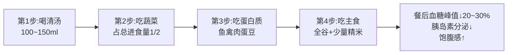

第一步先喝小半碗清汤(避免浓汤、勾芡汤、含糖汤)润喉、垫底、稀释胃液;第二步吃蔬菜——尤其是深色叶菜与菌菇等低GI高纤维蔬菜,先用其铺满胃部;第三步吃蛋白质类的鱼、肉、蛋、豆制品;第四步才吃主食。**糖尿病患者低升糖食物选择指导也明确提出"进餐模式需遵循蔬菜→蛋白质→主食顺序,实行少食多餐、细嚼慢咽,避免单次过量进食导致血糖剧烈波动"**[^84]。

### 4.4.4 配套行为:咀嚼20次与放慢进食

进餐顺序的健康效应还需要"放慢进食速度"作为配套加成。**研究显示进食速度较慢者肥胖风险显著较低,过快进食可能导致腹型肥胖和甘油三酯升高;增加咀嚼次数能减慢进餐速度并减少食物摄入,且不影响饱腹感**[^82]。机制上有三条:**降低肥胖风险、增加热量消耗(食物诱导性产热)、调节饱腹感激素——充分咀嚼可提升胰高血糖素样肽-1(GLP-1)等饱腹感相关激素水平,从而抑制食欲,其机制与部分减肥药物原理相似**[^82]。

具体执行有三招:**记住"汤菜肉饭"顺序、发起"咀嚼20次"挑战(每口食物尽量咀嚼20次以上)、巧用"环境暗示"(使用小号餐具、进食时放下筷子、远离电子设备避免无意识过量进食)**[^82]。指南建议**早餐用餐时间15~20分钟、午晚餐20~30分钟,应细嚼慢咽享受食物的美味,进餐时应相对专注,不宜边进餐边看电视、看手机等**[^75]——这与"咀嚼20次"挑战形成互补。

## 4.5 蛋白质三餐均匀分配的肌肉保护机制

第1章已经设定每日蛋白质80~96g、每餐20~30g均匀分配的目标。这一目标背后的生理学逻辑,是关乎53岁中年男性能否在未来15~20年保持行动能力、避免肌少症失能的核心问题——值得在本章用专门一节深入论证。

### 4.5.1 单餐30克阈值与全天均分的循证依据

**FASEB发表的随机交叉研究比较了两种饮食方案,均提供90g/天总蛋白质——方案1为均匀分配的30g(早餐)+30g(午餐)+30g(晚餐),方案2为偏斜分配的10g(早餐)+15g(午餐)+65g(晚餐)。结果显示均匀分配组24小时肌肉蛋白合成率比偏斜分配组高约25%,饱腹感指数也更优**[^85]。这是支持"每餐20~30g、三餐均匀"最直接、最经典的实验证据。

机制上,**人体一次最多有效利用25~30g蛋白质用于肌肉合成,多余部分会被分解供能或排出**[^86][^87]。这一阈值的存在意味着两件事:第一,单餐摄入超过30g的蛋白质并不能"加倍"肌肉合成,反而可能造成代谢浪费;第二,**只在晚餐"猛补蛋白"是中国家庭最典型的饮食误区**——很多人早餐只喝粥、午餐少量肉丝、晚餐才大鱼大肉,全天总蛋白可能勉强达标,但分布的偏斜让肌肉合成的有效利用大打折扣[^86][^87]。

### 4.5.2 亮氨酸阈值与mTOR通路

更深层的分子机制指向**支链氨基酸尤其是亮氨酸**对肌肉蛋白合成的"开关"作用。**亮氨酸是启动肌蛋白合成(MPS)的关键开关——它能激活哺乳动物雷帕霉素靶蛋白(mTOR)信号通路;老年人补充1.2~6g/d亮氨酸耐受性良好,每餐摄入1~3g亮氨酸即可达到MPS启动的最低有效剂量,超过4g后效益下降**[^88]。这一阈值意味着"每餐20~30g优质蛋白"的目标不仅是热量层面的均衡,更是分子信号层面的精确触发——**少于20g蛋白质、亮氨酸往往不足1g,无法有效激活mTOR;超过30g、亮氨酸超过4g,边际效益递减**。

亮氨酸的高密度来源已在第3章梳理——鸡胸肉(1.9g/100g)、金枪鱼(1.8g/100g)、鲈鱼(1.6g/100g)、牛肉(1.6g/100g)、全脂奶粉(1.5g/100g)、虾(1.4g/100g)、猪肉(1.2g/100g)、鸡蛋(1.0g/100g)[^88]。这些食材的常态化纳入,正是激活肌肉合成开关的物质基础。

### 4.5.3 睡前蛋白:被忽视的第四个时点

蛋白质分配的最新研究还揭示了"睡前蛋白"这一传统三餐之外的关键时点。**Frontiers in Nutrition的综述指出,睡前摄入蛋白质可被有效消化吸收并增加过夜肌肉蛋白合成率;睡前蛋白摄入并不会减少次日早餐的食欲、不改变静息能量消耗;长期与抗阻训练结合时对肌肉量与力量的增加有积极作用,被视为延缓老年人肌肉流失的有效营养策略**[^89]。

这一证据对53岁个体的实操含义清晰:**睡前1小时一杯200ml温牛奶(提供约6.6g乳清蛋白+酪蛋白)既可助眠又可延长夜间肌肉合成窗口**[^78]。考虑到酪蛋白的"持续释放"特性更适合长达7~8小时的睡眠期,牛奶或无糖酸奶比鸡蛋更适合作为睡前蛋白来源。

### 4.5.4 53岁个体的三餐+睡前蛋白分配方案

把上述三层证据整合,可以为53岁/80kg目标个体设计一份具体到食材的蛋白质分配方案:

| 时点 | 蛋白质目标 | 食材组合示例 | 亮氨酸估算 |
|------|----------|------------|----------|
| 早餐 | 20~25g | 鸡蛋1个(7g)+牛奶250ml(8g)+北豆腐50g(4g)+全谷主食(2~3g) | ≥1.5g ✓ |
| 午餐 | 25~30g | 清蒸鱼/鸡胸80~100g(20g)+豆腐丝50g(4g)+主食(3g) | ≥2g ✓ |
| 晚餐 | 25~30g | 豆腐100g(8g)+少量鱼或瘦肉60~80g(15g)+主食(2g) | ≥1.5g ✓ |
| 睡前 | 5~8g(可选) | 温牛奶200ml或无糖酸奶100g | 持续释放 ✓ |
| **全天合计** | **80~96g** | — | — |

**这一分配方案的关键不在于"多吃肉",而在于"分散吃、均匀吃、不漏吃"**。早餐通过蛋+奶+少量豆制品的组合就能轻松达到20g以上,这是大多数中国家庭早餐缺蛋白(只喝粥+咸菜+少量馒头)的最容易补救的环节;午餐借助鱼禽肉这一"主菜"达到25~30g是相对容易的;晚餐则需要主动选择"豆腐+少量肉/鱼"的清淡蛋白组合而非"大鱼大肉",才能在控制热量的同时保证夜间肌肉修复的原料供应[^80]。

## 4.6 早餐黄金公式与营养优先级

早餐是全天三餐中最容易被简化、却也是对全天代谢节律影响最深的一餐。指南强调"每天吃早餐"作为不可漏的核心准则[^75]。针对53岁/80kg目标个体,本节给出"1份蛋白质+1份杂粮+1份蔬果"的早餐黄金公式。

### 4.6.1 黄金公式的具体执行

**1份蛋白质**——遵循"易消化、低脂肪"原则,推荐食物包括鸡蛋、低脂牛奶、无糖酸奶、豆浆、豆腐脑等;**一个中等大小的鸡蛋、300毫升牛奶、1碗无糖豆浆,即可满足一餐蛋白质的需求**[^90]。具体配置可为"1个水煮蛋(7g蛋白)+250~300ml低脂牛奶(8~10g蛋白)+少量豆制品如豆浆200ml或豆干20g(5g蛋白)≈20~25g"。**对于乳糖不耐受的老年人,无糖酸奶或豆浆是牛奶的替代品,酸奶中的益生菌还能辅助调节肠道菌群**[^90]。

**1份杂粮**——精制米面升糖快、饱腹感弱,**老年人长期食用容易导致血糖波动,还可能因膳食纤维摄入不足引发便秘;建议选择全麦面包、杂粮粥、蒸玉米等作为早餐主食,每份分量建议在50~70g**[^90]。这一份量与第1章设定的早餐主食50g干重一致。具体可选燕麦40~60g与牛奶同煮(同时达成β-葡聚糖≥3g/d目标)、全麦馒头1个约50g、或杂粮粥+小份杂粮馒头组合。

**1份蔬果**——蔬果选择应遵循"温和、适量、易咀嚼"原则,避免生冷、坚硬或刺激性强的种类;**推荐蔬菜包括叶菜类、十字花科类及菌藻类,可凉拌、焯水后食用,凉拌时少盐少油;每份分量建议在50~100g**[^90]。早餐中纳入50~100g蔬菜+50~100g水果,既补充维生素C、钾、膳食纤维,又避免胃肠刚启动时大量生冷刺激;水果可选苹果、梨、蓝莓等低GI品种。

| 黄金公式组成 | 食材选择 | 份量 | 能量与蛋白贡献 |
|------------|---------|------|-------------|
| 1份蛋白质 | 鸡蛋1个+牛奶300ml(±豆浆) | 蛋50g+奶300ml | ~200kcal,15~18g蛋白 |
| 1份杂粮 | 燕麦/全麦馒头/杂粮粥/蒸玉米 | 干重50g | ~180kcal,5~6g蛋白 |
| 1份蔬果 | 焯熟绿叶菜+苹果或蓝莓 | 蔬菜50~100g+水果50~100g | ~80kcal | [^90]

整体能量约460~500kcal,正好落在170cm/1700kcal档早餐425~510kcal的目标区间。

### 4.6.2 需避免的两类典型错误早餐

**错误一·重口味早餐**:**油条、油炸糕等油炸食品脂肪含量高,老年人代谢脂肪的能力下降,长期食用容易导致血脂升高、增加心血管疾病发生风险;咸菜、榨菜等腌制食品则存在高盐问题,过量摄入盐分会增加肾脏负担、导致血压升高、诱发心脑血管疾病;这类早餐往往缺乏蛋白质、维生素等营养,长期食用会导致营养失衡**[^90]。对53岁这一高血压、血脂异常起点人群,这类早餐是最需要替换的。**建议用全麦馒头、蒸玉米等替代油条,用新鲜凉拌菜替代咸菜,既保留口感又减少健康风险**[^90]。

**错误二·加糖白粥**:**白粥营养单一、长期食用会导致营养素摄入不足,加糖白粥还会导致血糖急剧波动尤其不适合糖尿病患者;建议将白粥换成杂粮粥且不加糖,并搭配少量凉拌菜**[^90]。这一点对处于糖尿病前期窗口的53岁个体尤为关键——白粥的GI高达80以上,而燕麦粥、八宝杂粮粥的GI可控制在55以下。

## 4.7 午餐321原则与营养主力地位

午餐承担着全天能量与营养的主力使命——35~40%的能量比例、最强的消化吸收能力、最长的餐后代谢窗口,使其成为大份量优质蛋白、深色蔬菜、全谷主食的最佳载入时点。**老年人午餐的营养搭配可遵循简单易记的"321原则",即餐盘内3份蔬菜、2份主食、1份优质蛋白质,总热量控制在500~700千卡**[^90]——这一区间几乎完美对应170cm/1700kcal档午餐595~680kcal的目标。

### 4.7.1 321原则的份量与构成

**将午餐餐盘平均分为6份,其中3份盛放蔬菜(生重250~300g)、2份盛放主食(生重100~150g)、1份盛放优质蛋白质(生重50~75g);这样的比例能确保膳食纤维、碳水化合物和优质蛋白质摄入均衡**[^90]。考虑到53岁/80kg目标个体减重期需求,主食可适度下调至75~100g、蛋白质上调至75~100g,形成更倾向蛋白质的"3-2-1.5"微调版本。

**3份蔬菜**——**建议包含1份深色叶菜、1份瓜茄类蔬菜和1份菌菇**[^90]。这一三色搭配恰好对应第3章梳理的蔬菜三色谱系(深绿+橙红+菌藻),保证植物化合物的多样性。深色叶菜如菠菜、油菜、芥蓝先焯水去草酸再快炒;瓜茄类如番茄、黄瓜、茄子可凉拌或快炒;菌菇类如香菇、平菇、金针菇可清炖或快炒。

**2份主食**——生重75~100g,**全谷物占≥1/3**,典型组合如糙米饭、藜麦饭、荞麦面或杂粮饭。建议**米饭中混入1/3糙米、藜麦或红豆**,既保留口感又显著降低整体GI。

**1份优质蛋白**——生重75~100g,目标蛋白25~30g。**优先选择鱼虾水产**(每周2~3次深海鱼、1~2次淡水鱼虾),其次为禽肉(鸡胸、鸡腿去皮),红肉每周≤2次每次≤50g;豆制品作为辅助蛋白源每天1次,可与动物蛋白搭配。

### 4.7.2 三种午餐场景的321落地方案

考虑到53岁个体可能面临的多种现实场景,给出三种典型午餐方案:

**家庭午餐(理想场景)**:糙米饭75g(干重)+清蒸鲈鱼80g+西兰花炒胡萝卜200g+番茄豆腐汤(豆腐50g+番茄50g)+苹果100g。蛋白~28g,深色蔬菜约200g,全谷比例50%。

**工作日带饭/食堂**:杂粮饭(米饭+红豆)100g+鸡胸肉撕条60g+凉拌菠菜100g+清炒时蔬150g。建议食堂打饭时主动要求"米饭少一点、菜多一点、蛋白质单独点一份";自带饭可前一晚备好用便当盒分隔装。

**外出就餐**:**应选择食品安全状况良好、卫生信誉度在B级及以上的餐饮服务单位;点餐时要注意食物多样、荤素搭配;尽量选择用蒸、炖、煮等方法烹调的菜肴,避免煎炸食品和含脂肪高的菜肴;进食注意顺序,可以先吃少量主食,再吃蔬菜、肉类等;增加蔬菜摄入,肉类菜肴要适量;食量要适度**[^75]。具体可点一份清蒸鱼或白灼虾+一份炒时蔬+小份米饭(主动减半),避开红烧、糖醋、油炸菜式。

## 4.8 晚餐三要点与睡前协同

晚餐是中国家庭最容易"翻车"的一餐——下班晚、应酬多、家人团聚都让晚餐承担了过多的"享受"功能,导致吃得晚、吃得多、吃得油腻,也成为高血压、糖尿病、脂肪肝、心脑血管疾病的最大膳食推手。本节凝练53岁个体晚餐的三要点。

### 4.8.1 第一要点·吃得早:18:00~19:00完成,睡前≥3小时

如4.2节所论,**对七十岁以上的人来说,关键不在六点这一具体钟点,而在睡前间隔——医学上通常建议睡前至少三小时完成进食,让胃内容物有足够时间排空**[^80]。53岁虽未到老年但消化能力已开始下行,这一原则同样适用。**晚餐尽量在晚上7点前吃完,给身体足够的消化和自噬时间**[^76][^77]。

### 4.8.2 第二要点·吃得少:能量30~35%、避免单餐过量

**晚餐不宜过于丰盛、油腻,应确保食物品种丰富,并考虑早、午餐的进餐情况,适当调整晚餐食物的摄入量,保证全天营养平衡;同时做到清淡少油少盐**[^75]。但"少"不等于"不吃"——**很多老年人有个习惯,晚饭随便吃两口、主食少得可怜,觉得清淡一点好,结果半夜饿醒,早上乏力;晚餐热量占全天比例至少达到三成,有助于维持夜间代谢需求,并非鼓励暴饮暴食而是避免晚餐过低热量**[^80]。**若晚餐几乎不摄入蛋白和主食,身体夜间处于负平衡状态,久而久之肌力下降**[^80]。

针对53岁/80kg目标个体的晚餐能量区间:1500kcal档为450~525kcal、1700kcal档为510~595kcal、1900kcal档为570~665kcal——这是"少"的明确边界。**适量碳水化合物可促进色氨酸进入大脑,有助于褪黑素分泌;若晚餐过低碳水,有些老人反而入睡困难**[^80]。

### 4.8.3 第三要点·吃得对:蛋白质+复合碳水+健康脂肪

晚餐"吃得对"包含四个具体维度。

**蛋白质优先选易消化品种**——**老年人胃酸分泌减少,动物性蛋白过硬不易消化,豆腐、鸡蛋、鱼肉、去皮禽肉更适合;豆制品含较高的优质蛋白和大豆异黄酮,对心血管也有益;鱼肉脂肪结构较好含多不饱和脂肪酸;晚餐加入这类食物有助于夜间肌肉修复**[^80]。**临床营养研究显示,每公斤体重摄入1~1.2g蛋白质,有助于降低老年人肌少症发生率;晚餐正是补充蛋白的重要时段**[^80]。

**主食优先复合碳水与薯类**——主食结构调整可换红薯、紫薯、山药等薯类替代部分精白米面,既增加饱腹感、稳定夜间血糖,又补充钾元素辅助降压。**主食可以选富含膳食纤维的食物如小米、薏米、荞麦、红薯等,既能增加饱腹感,又可以促进肠胃蠕动**[^75]。

**适量健康脂肪**——**脂肪并非完全要避开,适量植物油、坚果、亚麻籽中的不饱和脂肪酸可以延缓胃排空速度,使血糖上升更平稳,夜间不易低血糖;对于合并糖尿病或血糖波动大的老年人,晚餐过于单一碳水化合物反而容易出现夜间低血糖**[^80]。少量植物油烹饪+1小把核桃即可,避免量过大造成热量超标。

**烹饪与饮水要点**——**老年人唾液分泌减少、咀嚼能力下降,食物加工要细软;清蒸鱼、炖豆腐、软烂的蔬菜比煎炸食品更合适**[^80];**多采用蒸、煮、炖、清炒等,少用炸、煎等烹调方法**[^75]。**饮水量也要留意,临睡前大量饮水容易夜尿频繁影响睡眠质量;晚餐后分散少量饮水,既补充水分又不至于增加夜间负担**[^80]。

### 4.8.4 餐后协同:轻度活动与温度控制

**饭后状态常被忽略——吃完晚饭坐在沙发上看电视,时间一长就犯困;老年人活动减少,胰岛素敏感性下降,餐后血糖更容易升高;饭后两小时内散步十到十五分钟或做些轻柔家务,有助于促进葡萄糖利用和胃肠蠕动;研究数据表明餐后轻度活动可使餐后血糖峰值下降约一成,对控制糖代谢有积极作用**[^80]。这是一个零成本、高回报的健康干预——53岁个体应养成"晚餐后10~15分钟轻度散步"的固定习惯。

53岁个体晚餐的"三避免清单":避免高油重盐(油炸、红烧、糖醋类)、避免单一精制碳水(白米饭+少量菜的组合)、避免烫食(食物和饮品的温度在10~40℃最佳,避免"趁热吃趁热喝"——前文已论证长期吃烫食会反复损伤食管黏膜)。

## 4.9 加餐策略与饮水节律

正餐之外,加餐与饮水是两个常被忽视的维度,但对53岁/80kg目标个体的代谢稳定具有显著辅助价值。

### 4.9.1 加餐:5~10%能量、防低血糖与肌肉合成补给

加餐占全天总能量5~10%(85~170kcal),其核心价值不是"多吃"而是"分散吃"。**老年人宜采用一日5至6餐的少食多餐模式,加餐安排在上午10点左右、下午15点左右以及睡前1~2小时;有助于稳定血糖水平,避免正餐时血糖波动过大,同时减轻胃肠消化负担**[^78]。

加餐的三大适用场景:

**场景一·两餐间隔过长**——午餐12:30,晚餐19:00相隔6.5小时,易出现下午低血糖与晚餐前过度饥饿;此时下午15:00一份加餐(无糖酸奶100g或苹果100g)有"防爆食"价值。**场景二·运动后蛋白补给窗口**——运动后30~60分钟是肌肉合成的黄金窗口,补充少量蛋白(水煮蛋1个或牛奶200ml)可显著提升肌肉合成效率。**场景三·睡前肌肉合成与助眠**——**睡前加餐可选择1杯200毫升左右的温牛奶,既补充营养又利于睡眠**[^78],配合4.5节论证的"睡前蛋白延长肌肉蛋白合成"机制[^89]。

加餐食物的优选清单与避免清单:

| 加餐分类 | 推荐食物 | 单次份量 | 能量估算 |
|---------|---------|---------|---------|
| 🟢推荐 | 低糖水果(苹果/蓝莓/梨) | 100g | 50~80kcal |
| 🟢推荐 | 无糖酸奶 | 100~200g | 80~150kcal |
| 🟢推荐 | 原味坚果 | 10g | 60kcal |
| 🟢推荐 | 水煮蛋 | 1个 | 75kcal |
| 🟢推荐 | 温牛奶(睡前) | 200ml | 130kcal |
| 🔴避免 | 含糖饮料/奶茶 | — | 高糖高热 |
| 🔴避免 | 糕点/饼干/薯片 | — | 反式脂肪+精制糖 |
| 🔴避免 | 果干/蜜饯 | — | 糖分浓缩 | [^78][^75]

**指南建议两餐之间可适当吃些零食,以不影响正餐为宜,更不应该代替正餐;睡前1小时不宜吃零食**——但温牛奶等液态营养品例外,与"睡前1小时不吃零食"的原则不冲突[^75]。

### 4.9.2 饮水:1700ml的节律分配

第1章已设定每日饮水1700ml的目标(温和气候、低身体活动水平成年男性)[^75]。本节进一步落实"什么时候喝、喝什么、喝多少"的执行细节。

**饮水节律的"上午多、下午中、晚上少"分配**:

- **上午**(起床后至午餐前)饮水800~1000ml——晨起一杯200~300ml温白水启动胃肠、补充夜间脱水,上午两次200~300ml保证血液不黏稠、大脑功能正常运转;
- **中下午**(午餐后至晚餐前)饮水400ml——分2~3次小口慢饮,避免大量饮水冲淡胃液影响消化;
- **晚上**(晚餐至睡前)饮水300ml——晚餐前后200ml,睡前1小时内尽量不再大量饮水以避免夜尿干扰睡眠;
- **运动前后**额外补充200~300ml——运动前30分钟、运动中分次小口、运动后及时补水。

**饮品优选**:**主要喝没油没盐没糖的水如白开水、矿泉水、无糖柠檬水、淡茶水,远离奶茶和甜饮料**——**指南推荐喝白水或茶水,少喝或不喝含糖饮料,不用饮料代替白水**[^75]。淡茶水(尤其是绿茶)还含有儿茶素等抗氧化成分,对53岁人群的心血管保护有辅助作用;泡茶水温建议80~90℃以保留更多活性成分。

## 4.10 两周食谱的三餐搭配模板

把前九节的所有原则、参数、份量、时间、顺序整合,可以凝练出一份可直接套用于第5~6章42餐编排的"三餐搭配模板"。这一模板是从"营养目标基线→膳食模式框架→食材清单→三餐结构→具体餐食"逻辑链条的最终结晶。

### 4.10.1 三餐搭配模板的七项标准化参数

每一餐都按以下七项参数组织:

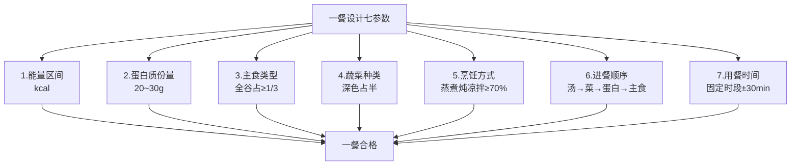

### 4.10.2 三档能量水平下的三餐搭配模板示例

以170cm/1700kcal档作为基准,1500kcal档与1900kcal档分别按比例下浮、上浮约10~12%。三档模板汇总如下表(主食与蛋白质份量按生重计算):

| 餐次 | 1500kcal档(160cm) | 1700kcal档(170cm) | 1900kcal档(180cm) | 共性参数 |
|------|------------------|-------------------|-------------------|---------|
| **早餐** | 375~450kcal,蛋白18~22g,主食40g,蔬菜80g,水果50g | 425~510kcal,蛋白20~25g,主食50g,蔬菜100g,水果80g | 475~570kcal,蛋白22~27g,主食60g,蔬菜120g,水果100g | 鸡蛋1个+牛奶250~300ml+全谷主食+蔬果;7:00~8:00 |
| **午餐** | 525~600kcal,蛋白25~28g,主食65g,蔬菜200g | 595~680kcal,蛋白25~30g,主食75~100g,蔬菜250g | 665~760kcal,蛋白28~32g,主食100~125g,蔬菜300g | 321原则,鱼禽肉75~100g+全谷+三色蔬菜;12:00~13:00 |
| **晚餐** | 450~525kcal,蛋白22~26g,主食50g,蔬菜200g | 510~595kcal,蛋白25~30g,主食50~75g,蔬菜250g | 570~665kcal,蛋白28~32g,主食75~100g,蔬菜300g | 易消化蛋白(鱼/豆腐),薯类替代部分主食;18:00~19:00 |
| **加餐** | 75~150kcal,蛋白5~8g | 85~170kcal,蛋白5~10g | 95~190kcal,蛋白6~10g | 水果/酸奶/坚果/温牛奶;下午15:00或睡前1h |

### 4.10.3 一日三餐搭配模板示例(170cm/1700kcal档)

下面给出一份按七项参数完整填充的模板示例,作为第5~6章具体食谱编排的"母版":

| 餐次 | 用餐时间 | 能量 | 食材构成 | 烹饪方式 | 进餐顺序 |
|------|---------|------|---------|---------|---------|
| 早餐 | 7:30 | ~470kcal | 燕麦40g+牛奶250ml(同煮)+水煮蛋1个+焯熟菠菜100g+蓝莓80g | 煮+水煮+焯水+生食 | 蔬菜→蛋→燕麦粥→水果 |
| 加餐(可选) | 10:00 | ~80kcal | 苹果100g或核桃10g | 生食 | — |
| 午餐 | 12:30 | ~640kcal | 糙米饭(米+红豆75g干重)+清蒸鲈鱼80g+西兰花炒胡萝卜200g+番茄豆腐汤(豆腐50g+番茄50g) | 蒸+快炒+炖汤 | 汤→蔬菜→鱼+豆腐→米饭 |
| 加餐(可选) | 15:30 | ~100kcal | 无糖酸奶150g | 直饮 | — |
| 晚餐 | 18:30 | ~560kcal | 杂粮饭50g+紫薯50g+清蒸虾80g+蒜蓉油菜200g+海带豆腐汤 | 蒸+炒+炖汤 | 汤→蔬菜→虾+豆腐→饭 |
| 睡前(可选) | 21:30 | ~130kcal | 温牛奶200ml | 直饮 | — |

**全天合计**:约2000kcal上限(含全部加餐),减重期可省略两次加餐降至~1670kcal;蛋白质合计约90g(早25g+午30g+晚28g+睡前7g),三餐均匀分配;蔬菜合计~650g(深色>325g);水果合计~180g;奶制品合计~600ml;主食干重合计~165g(全谷+薯类占>40%);油约25g(分布于午餐与晚餐烹饪)。这一模板**严格符合第1章设定的全部营养目标基线**——能量、宏量营养素比例、钙、蛋白质均分、深色蔬菜占比、全谷占比、油盐糖防线等。

### 4.10.4 模板的弹性使用规则

模板不是僵硬的"必须照做",而是"骨架+变量"的灵活框架。三条弹性使用规则:

**第一·食材弹性**——任一食材均可按第3章清单灵活替换。例如午餐的"清蒸鲈鱼"可替换为同等蛋白量的鸡胸肉、北豆腐、瘦牛肉、其他鱼虾;早餐的"燕麦"可替换为全麦馒头、杂粮粥、蒸玉米;晚餐的"紫薯"可替换为山药、红薯、芋头。替换的核心约束是保持七项参数(能量、蛋白量、主食类型、蔬菜量、烹饪方式、顺序、时间)不变。

**第二·份量弹性**——按个体身高与活动量在三档之间微调。160cm身高个体直接套用1500kcal档;170cm套用1700kcal档;180cm套用1900kcal档;若日间有30分钟以上中等强度运动(步行5000步+太极拳/快走),整档能量上浮100~150kcal。

**第三·烹饪弹性**——按家庭条件简化。理想情况下蒸煮炖凉拌占≥70%,但工作日时间紧张时,**借助批量预处理(周末备菜、冷冻分装)、一锅多菜、半成品合理利用等省时策略,每餐烹饪时间可控制在30分钟内**(详见第8章)。

### 4.10.5 模板与第5~6章的对应关系

至此,第4章完成了从"五个维度的搭配逻辑"到"三餐七参数模板"的完整收束。**第5章将以这份模板为母版,具体编排第一周(周一至周日)的21餐+加餐方案**——每一天的早午晚都是这份模板的一次实例化:同样的七项参数,通过食材轮换填充出不同的菜式与口味;**第6章将在第5章基础上完成第二周食谱**,通过"食材轮换骨架"实现两周不重复,两周共42餐覆盖≥25种食物的多样性目标。

至此,从第1章的营养基线、第2章的膳食模式、第3章的食材清单,到本章的三餐结构与搭配逻辑,这一逻辑链条已经完整闭合。下一步进入"具体到每一天每一餐吃什么"的实操层面。

# 5 第一周每日详细食谱设计

经过前四章对营养目标基线（1700kcal/d、蛋白质80~96g、钙≥800mg、盐≤5g）、东方健康膳食复合框架、五大类食材清单与三餐七参数模板的层层推演，所有结构性问题已经解决，剩下的只有一件事——**把这些原则、参数、份量真正落到一日三餐的餐桌上**。本章将在这一基础上完成第一周（周一至周日）的21餐正餐+加餐方案的具体编排，每一日食谱都遵循第4章模板的七项参数（能量、蛋白质、主食类型、蔬菜种类、烹饪方式、进餐顺序、用餐时间），同时通过食材轮换实现一周≥25种食物的多样性目标，并在每日末尾标注当日的钙、深色蔬菜占比、全谷比例、EPA+DHA等关键指标的达成情况，确保读者能够"照单做菜、依谱吃饭"，并在过程中清晰看到营养目标基线如何在七天内被实际兑现。

## 5.1 第一周食谱设计总则与食材轮换骨架

在进入具体的七日食谱之前，需要先把贯穿第一周的总体设计逻辑、份量缩放规则、食材轮换骨架与每日呈现格式说明清楚，这是后续七节内容能够被一致理解和正确执行的前提。

### 5.1.1 总体设计逻辑

第一周食谱以**170cm身高/1700kcal档**作为正文示例的基准——既覆盖大多数中国男性身高分布，也处于第1章三档区间（1500/1700/1900kcal）的中位。同身高其他档位的读者可按以下缩放系数对食材份量做整体调整：

| 身高档 | 目标能量 | 主食缩放系数 | 蛋白质缩放系数 | 蔬果缩放系数 |
|--------|---------|-----------|-------------|------------|
| 160cm/1500kcal | 1500kcal | ×0.85 | ×0.90 | ×0.85 |
| **170cm/1700kcal** | **1700kcal** | **×1.00（基准）** | **×1.00** | **×1.00** |
| 180cm/1900kcal | 1900kcal | ×1.15 | ×1.10 | ×1.15 |

例如，170cm档午餐糙米饭75g（干重），160cm档对应64g、180cm档对应86g；170cm档清蒸鲈鱼80g，160cm档对应72g、180cm档对应88g。

### 5.1.2 第一周食材轮换骨架

为同时达成"每周≥25种食物"与"七天不重复疲劳"的双重目标，第一周的食材按下列骨架排布——主食、蛋白质、蔬菜、水果分别覆盖7种以上品类，确保每日种类丰富、整周不雷同[^91][^92][^93]：

| 类别 | 周一 | 周二 | 周三 | 周四 | 周五 | 周六 | 周日 |
|------|------|------|------|------|------|------|------|
| 主食轮换 | 燕麦+糙米红豆饭+杂粮饭 | 全麦面包+藜麦饭+小米南瓜粥 | 紫米粥+糙米饭+荞麦面 | 全麦馒头+糙米饭+红薯+小米饭 | 燕麦+小米杂粮饭+全麦馒头+山药 | 全麦小馒头+糙米饭+杂粮饭+紫薯 | 红枣小米粥+全麦面包+藜麦饭+荞麦面 |
| 主菜蛋白 | **清蒸鲈鱼**+白灼虾 | 香煎鸡胸+虾仁 | **清蒸三文鱼**+番茄炒蛋 | 番茄炖瘦牛肉+香菇蒸鸡腿 | **清蒸鳕鱼**+白灼鸡腿 | 蒜蓉粉丝蒸虾+瘦猪肉末 | 香菇蒸鸡+清炒虾仁 |
| 深色蔬菜 | 菠菜+西兰花+番茄+油菜 | 番茄+胡萝卜+西兰花+南瓜+黄瓜 | 芥蓝+冬瓜+番茄+菠菜 | 油菜+彩椒+胡萝卜+番茄+小白菜 | 胡萝卜+紫甘蓝+番茄+菠菜 | 生菜+冬瓜+木耳菜+番茄+芹菜 | 西兰花+南瓜+芥蓝+番茄+黄瓜 |
| 水果 | 蓝莓+苹果 | 猕猴桃+苹果 | 橙子+蓝莓 | 小番茄+梨 | 蓝莓+柚子 | 苹果+樱桃 | 梨 |
| 加餐 | 无糖酸奶+温牛奶 | 苹果+核桃 | 蓝莓+杏仁 | 梨+腰果 | 无糖酸奶+核桃+柚子 | 樱桃+杏仁+温牛奶 | 梨+核桃 |

整周覆盖的食物种类初步统计为：主食约12种（燕麦、糙米、红豆、杂粮米、全麦面包、藜麦、小米、南瓜、紫米、荞麦面、全麦馒头、红薯、山药、紫薯——已超12种）；动物蛋白7种（鲈鱼、三文鱼、鳕鱼、虾、鸡胸、鸡腿、瘦牛肉、瘦猪肉、鸡蛋——9种）；豆制品类3种（嫩豆腐、北豆腐、豆腐丝、豆浆、豆腐脑——5种）；蔬菜超过15种；水果7种；坚果3种（核桃、杏仁、腰果）——**整周食物种类约48种以上，远超指南"每周25种"的多样性底线**[^91][^92][^93]。

### 5.1.3 每日食谱的呈现格式与统计口径

每日食谱将按"早餐→上午加餐（可选）→午餐→下午加餐→晚餐→睡前加餐（可选）"的时间顺序呈现，每一餐都包含三层信息：**第一层是食材清单**——明确列出每种食材的生重克数（鱼禽肉为可食部生重，米面为干重，蔬菜为净菜生重）；**第二层是烹饪要点**——简要说明关键操作步骤与火候控制；**第三层是营养估算**——给出该餐的能量、蛋白质、关键营养素贡献，以及进餐顺序提示。每日末尾设"当日营养速览"小结，标注当日总能量、总蛋白、钙累计、深色蔬菜占比、全谷比例、是否为深海鱼日等核心指标，方便读者实时校验是否偏离基线。

需要特别说明的是，本食谱的**热量与营养素估算基于《中国食物成分表(第6版)》常见值与各搜索结果中的食材营养参数综合推算**，实际数值会因食材品种、季节、烹饪损失等因素略有波动，建议读者将其作为**结构性参照**而非精确克重指令。

下面进入第一周七日的具体编排。

## 5.2 周一食谱：燕麦牛奶粥+清蒸鲈鱼套餐

第一周的开篇选择最经典、最易操作的燕麦+清蒸鱼组合作为开端，让读者在最熟悉的食材中体会"目标基线—食材清单—三餐模板"的落地感。

### 5.2.1 周一早餐（7:30，约470kcal，蛋白22g）

**食材**：即食燕麦片40g（生重）、低脂牛奶250ml、鸡蛋1个（约50g）、菠菜80g（净菜）、蓝莓50g。

**烹饪要点**：① 燕麦倒入锅中，加250ml低脂牛奶，小火煮3~5分钟至浓稠，关火稍焖即可——**牛奶煮燕麦比水煮多增加约8g蛋白与300mg钙**[^94][^95]；② 鸡蛋冷水下锅，水开后中小火煮6~8分钟成溏心或全熟蛋；③ 菠菜洗净后开水焯30秒去草酸，捞出沥干切段，淋少许亚麻籽油+几滴生抽凉拌；④ 蓝莓洗净直接整颗食用，**保留花青素活性**[^96][^97]。

**进餐顺序**：先吃菠菜→剥蛋食用→喝燕麦牛奶粥→蓝莓收尾。

**营养速览**：能量~470kcal，蛋白质~22g（蛋7g+奶8g+燕麦5g+菠菜2g），钙~330mg，全谷比例100%，深色蔬菜80g。

### 5.2.2 周一上午加餐（10:00，可选）

少量饮水或一杯淡绿茶（200ml），不建议进食[^98]。

### 5.2.3 周一午餐（12:30，约640kcal，蛋白28g）

**食材**：糙米60g+红豆15g（共75g干重）、新鲜鲈鱼80g（去骨可食部）、西兰花150g、嫩豆腐50g、番茄50g、小苹果100g、烹调油约10g、低钠盐约2g。

**烹饪要点**：① **糙米红豆饭**——糙米与红豆按4:1比例提前淘洗、红豆浸泡2小时以上，电饭煲常规煮饭键即可，比白米饭GI明显更低[^92][^99]；② **清蒸鲈鱼**——鲈鱼洗净后在鱼身两侧划2刀，去除鱼腹黑膜（去腥关键），抹少许料酒和盐腌10分钟，盘底铺姜片葱段、鱼放上面，**蒸锅水开后大火转中火蒸8~10分钟**，关火再焖2分钟，倒掉腥汤、淋少许蒸鱼豉油+热油激葱花即可[^100][^101]；③ **蒜蓉西兰花**——西兰花切小朵盐水浸泡10分钟，开水加几滴油焯1.5分钟过凉沥干，锅中少油爆蒜末，倒入西兰花快炒30秒，加少许低钠盐出锅[^102]；④ **番茄豆腐汤**——番茄切块炒出汁加400ml水煮开，加入嫩豆腐块煮5分钟，少许盐+葱花点缀[^103][^102]。

**进餐顺序**：先喝小半碗汤→吃蔬菜→鱼+豆腐→米饭→苹果作为餐间或加餐。

**营养速览**：能量~640kcal，蛋白质~28g（鱼16g+豆腐4g+米饭6g+西兰花3g），钙~250mg，深色蔬菜200g（西兰花+番茄），全谷+杂豆比例100%。**EPA+DHA：鲈鱼提供约0.2g，本日基本达成**[^104][^105]。

### 5.2.4 周一下午加餐（15:30，约100kcal）

无糖酸奶150g（蛋白~5g+钙~180mg）——分散下午低血糖与晚餐前过度饥饿，同时利用酸性环境促进钙吸收[^106][^107]。

### 5.2.5 周一晚餐（18:30，约540kcal，蛋白26g）

**食材**：杂粮米40g（小米+玉米渣+糙米混合）、糙米10g、紫薯50g、新鲜大虾80g（去头去线后约60g净虾肉）、油菜200g、海带20g（干）、北豆腐50g、烹调油约8g、低钠盐约1.5g。

**烹饪要点**：① **杂粮米饭**——50g杂粮米煮饭，紫薯蒸熟切块作为副主食[^92]；② **白灼虾**——大虾去虾线，开水加姜片+少许料酒，虾煮2~3分钟变红即可捞出，蘸蒜蓉醋汁——这是**保留鲜味且零额外油脂**的经典做法[^103]；③ **清炒油菜**——油菜洗净切段，蒜末爆香后大火快炒1分钟，少许盐出锅；④ **海带豆腐汤**——海带泡发切块，与豆腐块一起加水煮10分钟，少许盐+几滴香油即可[^108]。

**进餐顺序**：先喝海带豆腐汤→吃油菜→虾+紫薯→杂粮饭。

**营养速览**：能量~540kcal，蛋白质~26g（虾12g+豆腐4g+米饭4g+油菜4g+海带2g），钙~280mg（豆腐+海带+油菜协同），深色蔬菜200g。

### 5.2.6 周一睡前加餐（21:30，约130kcal）

温牛奶200ml——延长夜间肌肉合成窗口、改善睡眠[^109][^98]。

### 5.2.7 周一全日营养速览

总能量~1880kcal（含全部加餐，处于1500~2000kcal上限内），总蛋白~88g（早22+午28+晚26+加餐12），**钙累计~1040mg ✓达标**，深色蔬菜~480g（占比≥1/2 ✓），全谷+杂豆+薯类占主食≥60% ✓，**EPA+DHA从鲈鱼获得约0.2g（接近目标）**，鸡蛋1个 ✓，奶制品累计~600ml ✓。

## 5.3 周二食谱：全麦三明治+鸡胸藜麦套餐

周二将早餐切换为西式全麦三明治、午餐换上鸡胸肉与藜麦，体现"东方膳食为底+地中海借鉴"的复合本土化。

### 5.3.1 周二早餐（7:30，约460kcal，蛋白22g）

**食材**：全麦面包2片（共50g）、鸡蛋1个、生菜30g、番茄50g、无糖豆浆200ml、猕猴桃1个（约80g）。

**烹饪要点**：① 全麦面包略微烤热（不加黄油）；② 鸡蛋水煮或低油煎成荷包蛋；③ 生菜叶+番茄薄片+鸡蛋夹入面包做成三明治，可挤少许低脂蛋黄酱或仅淋几滴橄榄油+黑胡椒[^94][^105]；④ 豆浆现磨或选无糖盒装，温热饮用；⑤ 猕猴桃对半切勺挖食。

**进餐顺序**：先吃生菜与番茄（融合在三明治中即可）→鸡蛋蛋白部分→面包→豆浆→猕猴桃。

**营养速览**：能量~460kcal，蛋白~22g（蛋7g+豆浆6g+面包6g+番茄1g），钙~150mg，膳食纤维~7g。**注意**：选购全麦面包时查看配料表，**全麦粉应排在第一位、含量≥51%**才属真全麦，避免"全麦色素+精白面粉"的伪全麦产品[^96][^97]。

### 5.3.2 周二上午加餐（10:00，可选）

200ml淡茶水即可。

### 5.3.3 周二午餐（12:30，约630kcal，蛋白30g）

**食材**：藜麦40g+糙米40g（共80g干重）、鸡胸肉90g（去皮）、胡萝卜100g、西兰花100g、紫菜5g（干）、鸡蛋50g（半个用于汤）、烹调油~10g、低钠盐~2g。

**烹饪要点**：① **藜麦饭**——藜麦充分冲洗去皂苷以避免苦涩感[^110]，与糙米按1:1混合电饭煲煮制；② **香煎鸡胸肉**——鸡胸肉横切两半成薄片，用少许盐+黑胡椒+1小勺料酒+几滴橄榄油+柠檬汁腌15分钟，**平底锅小火慢煎每面3~4分钟至金黄**——**关键是低温慢煎避免外焦内硬**，煎好切条状[^93][^111]；③ **清炒胡萝卜西兰花**——胡萝卜切片+西兰花焯水后蒜末快炒，少许盐出锅；④ **紫菜蛋花汤**——紫菜泡发，水开后撒紫菜煮1分钟，淋入半个蛋液成蛋花，少许盐+葱花[^108][^103]。

**进餐顺序**：紫菜蛋花汤→蔬菜→鸡胸肉→藜麦饭。

**营养速览**：能量~630kcal，蛋白~30g（鸡胸21g+蛋4g+米饭4g+蔬菜1g），**亮氨酸~2.0g ✓达标超过1g有效阈值**（鸡胸肉是亮氨酸密度最高食材之一）[^111]。

### 5.3.4 周二下午加餐（15:30，约160kcal）

苹果100g（约52kcal）+原味核桃10g（约65kcal）——苹果果胶+核桃α-亚麻酸+饱腹感双重收益[^106][^107]。

### 5.3.5 周二晚餐（18:30，约520kcal，蛋白25g）

**食材**：小米40g+南瓜80g（小米南瓜粥）、嫩豆腐100g、虾仁60g、黄瓜100g、烹调油~7g、低钠盐~1.5g。

**烹饪要点**：① **小米南瓜粥**——南瓜去皮切块与小米同煮25分钟成粥，南瓜自然甜味无需加糖[^108]；② **虾仁蒸豆腐**——嫩豆腐切块铺盘底，虾仁用料酒+淀粉腌制后铺豆腐上，蒸5分钟，淋蒜末+生抽+几滴香油[^100]；③ **凉拌黄瓜**——黄瓜拍碎+蒜末+少许醋+几滴香油+少量盐凉拌。

**进餐顺序**：黄瓜→虾仁豆腐→小米南瓜粥。

**营养速览**：能量~520kcal，蛋白~25g（虾12g+豆腐8g+小米3g+蛋2g），钙~220mg，**晚餐蛋白质达成25g肌肉合成阈值 ✓**。

### 5.3.6 周二全日营养速览

总能量~1770kcal，总蛋白~85g（其中亮氨酸三餐均≥1g ✓），钙累计~880mg ✓，深色蔬菜~430g（占比≥1/2 ✓），全谷比例~55% ✓。**注意**：本日未摄入深海鱼，需在本周内（周三/周五已计划）补足EPA+DHA。

## 5.4 周三食谱：紫米杂粮饭+三文鱼套餐

周三将完成第一周的第一次深海鱼摄入，借助紫米花青素与三文鱼ω-3形成抗氧化+抗炎的双重保护。

### 5.4.1 周三早餐（7:30，约470kcal，蛋白23g）

**食材**：紫米20g+小米20g（共40g）、无糖酸奶150g、鸡蛋1个、豆腐丝50g、橙子1个（约150g）、香菜+少许醋调味。

**烹饪要点**：① **紫米杂粮粥**——紫米提前浸泡4小时（紫米较硬），与小米同煮成稀粥35分钟[^108]；② 鸡蛋水煮；③ **凉拌豆腐丝**——豆腐丝焯水30秒过凉，加蒜末+少许醋+生抽+香菜+几滴香油凉拌[^112]；④ 橙子剥皮分瓣食用。

**进餐顺序**：豆腐丝→鸡蛋→紫米粥+酸奶→橙子。

**营养速览**：能量~470kcal，蛋白~23g（蛋7g+酸奶5g+豆腐丝7g+紫米粥4g），钙~340mg，**紫米花青素丰富 ✓**[^108]。

### 5.4.2 周三午餐（12:30，约650kcal，蛋白28g）

**食材**：糙米75g（干重）、新鲜三文鱼80g、芥蓝150g、冬瓜100g、虾皮5g、烹调油~10g、低钠盐~2g、姜片+葱段。

**烹饪要点**：① **糙米饭**电饭煲煮制；② **清蒸三文鱼**——三文鱼洗净擦干水分，铺姜片葱段，淋少许料酒+几滴生抽，**蒸锅水开后大火蒸6~8分钟即可**——**清蒸能保留90%以上的ω-3脂肪酸**[^113][^105]，蒸过头肉质变柴；③ **蒜蓉芥蓝**——芥蓝切段焯水后蒜末快炒；④ **冬瓜虾皮汤**——冬瓜切片与虾皮煮汤，少许盐+葱花，虾皮提供天然钙[^91]。

**进餐顺序**：冬瓜汤→芥蓝→三文鱼→糙米饭。

**营养速览**：能量~650kcal，蛋白~28g（三文鱼17g+米饭6g+芥蓝3g+虾皮2g），**EPA+DHA本餐~1.1g（远超0.25g日目标）✓**[^105][^114]，钙~300mg（芥蓝+虾皮高密度钙源）。

### 5.4.3 周三下午加餐（15:30，约140kcal）

蓝莓80g（约45kcal）+原味杏仁8g（约50kcal）+200ml淡茶水——花青素+维生素E+饱腹感[^97][^107]。

### 5.4.4 周三晚餐（18:30，约540kcal，蛋白25g）

**食材**：荞麦面条60g（干重）、番茄100g、鸡蛋1个（50g）、菠菜100g、海带20g（干，泡发后约60g）、豆腐丝50g、烹调油~7g、低钠盐~1.5g。

**烹饪要点**：① **番茄炒蛋**——番茄切块，鸡蛋打散先炒成型盛出，番茄炒出汁后放回鸡蛋，少许盐——**经典低油快炒**[^108][^103]；② **凉拌菠菜**——菠菜焯水30秒过凉切段，蒜末+少许醋+生抽+几滴香油凉拌（**焯水是去除草酸促进钙铁吸收的关键**）[^99][^102]；③ **荞麦面**水煮至熟捞出过凉，淋少许橄榄油+生抽+葱花拌食；④ **海带豆腐丝汤**——海带与豆腐丝煮5分钟成汤[^108]。

**进餐顺序**：海带豆腐丝汤→菠菜→番茄炒蛋→荞麦面。

**营养速览**：能量~540kcal，蛋白~25g（蛋7g+豆腐丝7g+荞麦面6g+菠菜3g+海带2g），钙~310mg。

### 5.4.5 周三全日营养速览

总能量~1800kcal，总蛋白~84g，**钙累计~950mg ✓达标**，**EPA+DHA~1.2g ✓远超目标**，深色蔬菜~480g（紫米+菠菜+芥蓝+番茄+冬瓜——五色搭配 ✓），全谷+杂豆比例~60% ✓，**今日为第一周第一次深海鱼日 ✓**。

## 5.5 周四食谱：豆浆全麦套餐+瘦牛肉套餐

周四将引入红肉（瘦牛肉）作为本周首次也是唯一一次红肉午餐，配合彩椒维生素C促进铁吸收，体现"红肉每周≤300g、铁强化日"的科学执行。

### 5.5.1 周四早餐（7:30，约450kcal，蛋白20g）

**食材**：全麦馒头1个（50g）、无糖豆浆300ml、鸡蛋1个、油菜80g、小番茄50g。

**烹饪要点**：① 全麦馒头蒸热即食（注意辨别真全麦）；② 鸡蛋水煮；③ **焯熟油菜**——油菜焯水40秒过凉，淋少许生抽+几滴香油+蒜末凉拌[^92]；④ 小番茄洗净直接食用。

**进餐顺序**：油菜→小番茄→鸡蛋→豆浆+馒头。

**营养速览**：能量~450kcal，蛋白~20g（蛋7g+豆浆9g+馒头4g），钙~250mg。

### 5.5.2 周四午餐（12:30，约660kcal，蛋白30g）

**食材**：糙米75g（干重）、瘦牛里脊70g（**本周红肉首次摄入**）、番茄150g、红黄彩椒共100g、胡萝卜100g、紫菜5g、鸡蛋50g（半个用于汤）、烹调油~10g、低钠盐~2g、姜葱蒜+少许低钠生抽。

**烹饪要点**：① **糙米饭**电饭煲煮制；② **番茄炖瘦牛肉**——瘦牛肉切薄片用料酒+少许生抽+淀粉腌10分钟，番茄切块炒出汁加少量水，下牛肉片煮3~4分钟即可，**牛肉切薄片+短时煮制是嫩而不柴的关键**[^93]；③ **清炒彩椒胡萝卜**——彩椒+胡萝卜切丝快炒，**彩椒维生素C含量高达130~222mg/100g，与红肉同餐促进血红素铁吸收**[^93][^99]；④ **紫菜蛋花汤**——紫菜+半个鸡蛋煮汤[^108]。

**进餐顺序**：紫菜蛋花汤→彩椒胡萝卜→番茄炖牛肉→糙米饭。

**营养速览**：能量~660kcal，蛋白~30g（牛肉14g+蛋4g+米饭6g+蔬菜3g+紫菜3g），**铁~6mg（牛肉+番茄+彩椒协同吸收）✓**，亮氨酸~2.5g ✓。

### 5.5.3 周四下午加餐（15:30，约140kcal）

梨1个（约150g、80kcal）+原味腰果10g（约60kcal）——腰果含铁、锌、镁，与午餐铁强化形成互补[^97][^107]。

### 5.5.4 周四晚餐（18:30，约530kcal，蛋白26g）

**食材**：红薯100g、小米40g、鸡腿肉70g（去皮）、香菇30g、小白菜200g、烹调油~7g、低钠盐~1.5g、姜片+少许生抽。

**烹饪要点**：① **蒸红薯+小米饭**——红薯切块与小米饭同蒸或分别处理[^115]；② **香菇蒸鸡腿肉**——鸡腿去皮去骨切块，与泡发香菇切片混合，加少许盐+生抽+料酒+淀粉+葱姜+几滴香油腌15分钟，**蒸锅大火上汽后蒸20~25分钟**[^100][^104]；③ **蒜蓉小白菜**——小白菜大火快炒1分钟。

**进餐顺序**：小白菜→香菇蒸鸡→红薯+小米饭。

**营养速览**：能量~530kcal，蛋白~26g（鸡腿18g+小米3g+红薯2g+小白菜3g），钱钙~200mg。

### 5.5.5 周四全日营养速览

总能量~1780kcal，总蛋白~86g，钙累计~860mg ✓，**铁~12mg（瘦牛肉+蛋+紫菜+小白菜协同）✓达标**，深色蔬菜~480g ✓，全谷+薯类比例~50% ✓，**今日为第一周铁强化日 ✓**，红肉本周累计70g（远低于300g上限）。

## 5.6 周五食谱：燕麦三色套餐+清蒸鳕鱼套餐

周五完成第一周第二次深海鱼摄入（鳕鱼），同时通过紫甘蓝-胡萝卜-番茄三色谱系强化植物化合物多样性。

### 5.6.1 周五早餐（7:30，约480kcal，蛋白23g）

**食材**：即食燕麦40g、低脂牛奶250ml、鸡蛋1个、新鲜玉米半根（约100g）、胡萝卜片80g、蓝莓50g。

**烹饪要点**：① **燕麦牛奶粥**同周一；② **蒸玉米**——玉米半根直接蒸15分钟（**整粒玉米GI比玉米糊低很多**）[^92]；③ **焯熟胡萝卜片**——胡萝卜切片焯水2分钟过凉，淋少许橄榄油（**胡萝卜素脂溶性，少许油促进吸收**）；④ 蓝莓直接食用。

**进餐顺序**：胡萝卜→蓝莓→鸡蛋→燕麦牛奶粥+蒸玉米。

**营养速览**：能量~480kcal，蛋白~23g，钙~340mg，**β-胡萝卜素+花青素+β-葡聚糖三重抗氧化 ✓**。

### 5.6.2 周五午餐（12:30，约640kcal，蛋白28g）

**食材**：小米杂粮饭80g（小米40g+糙米30g+红豆10g）、新鲜鳕鱼90g、紫甘蓝150g、北豆腐50g、番茄50g、烹调油~10g、低钠盐~2g。

**烹饪要点**：① **小米杂粮饭**电饭煲煮制；② **清蒸鳕鱼**——鳕鱼解冻擦干，铺姜片葱段，淋少许料酒+生抽，**水开后蒸6~8分钟**（**鳕鱼肉嫩，蒸过头容易散**）[^103][^113]；③ **清炒紫甘蓝**——紫甘蓝切丝大火快炒1分钟，少许盐+几滴白醋（醋保留花青素）；④ **番茄豆腐汤**[^102]。

**进餐顺序**：番茄豆腐汤→紫甘蓝→鳕鱼→杂粮饭。

**营养速览**：能量~640kcal，蛋白~28g（鳕鱼17g+豆腐4g+米饭5g+紫甘蓝2g），**EPA+DHA~0.3g ✓**[^116]（鳕鱼ω-3低于三文鱼，但低脂高蛋白），紫甘蓝花青素+番茄红素 ✓。

### 5.6.3 周五下午加餐（15:30，约200kcal）

无糖酸奶150g（约90kcal）+核桃10g（约65kcal）+柚子100g（约45kcal）——三件套是DASH饮食的经典加餐组合[^97][^113]。

### 5.6.4 周五晚餐（18:30，约520kcal，蛋白25g）

**食材**：全麦馒头1个（50g）、山药100g、鸡腿肉60g（去皮，白灼）、菠菜200g、烹调油~5g、低钠盐~1.5g、蒜末+少许生抽。

**烹饪要点**：① 全麦馒头+山药蒸熟，**山药提供黏液蛋白与可溶性膳食纤维**[^108]；② **白灼鸡腿肉**——鸡腿肉去皮切块，开水加姜片+葱段+料酒煮5分钟至熟，捞出蘸蒜蓉醋汁——**白灼极大程度保留鸡肉营养且零油**；③ **蒜蓉菠菜**——菠菜焯水后蒜蓉快炒[^103]。

**进餐顺序**：菠菜→白灼鸡腿→山药+全麦馒头。

**营养速览**：能量~520kcal，蛋白~25g（鸡腿15g+馒头4g+山药2g+菠菜4g），钙~250mg。

### 5.6.5 周五全日营养速览

总能量~1840kcal，总蛋白~85g，钙累计~970mg ✓，**EPA+DHA本周累计~1.5g ✓远超目标**，深色蔬菜~480g（紫甘蓝+番茄+胡萝卜+菠菜，三色齐全 ✓），全谷+杂豆比例~60% ✓。

## 5.7 周六食谱：豆腐脑全麦套餐+家庭聚餐版午餐

周末进入家庭聚餐场景，本日食谱兼顾"丰盛菜式"与"控盐控油坚守"，为读者示范在多人聚餐情境中如何不放弃健康原则。

### 5.7.1 周六早餐（7:30，约460kcal，蛋白22g）

**食材**：豆腐脑200g（少盐少油版）、全麦小馒头40g、鸡蛋1个、生菜100g、苹果1个（约150g）。

**烹饪要点**：① **豆腐脑**——少加酱油+醋+葱花+几滴香油+少许虾皮（**自制远比外卖咸菜版更控盐**）[^112]；② 鸡蛋水煮；③ **凉拌生菜**——生菜撕大片，淋蒜末+少许醋+几滴香油+几粒盐；④ 苹果带皮切片食用（**带皮增加膳食纤维与多酚**）。

**进餐顺序**：生菜→鸡蛋→豆腐脑+馒头→苹果。

**营养速览**：能量~460kcal，蛋白~22g（蛋7g+豆腐脑10g+馒头3g+生菜2g），钙~280mg。

### 5.7.2 周六午餐（12:30，约670kcal，蛋白30g）——家庭聚餐版

**食材**：糙米75g（干重）、新鲜大虾80g（带粉丝）、瘦猪肉末50g、鸡蛋1个、冬瓜100g、木耳菜150g、粉丝20g（干）、烹调油~12g、低钠盐~2g、蒜末+葱姜。

**烹饪要点**：① **糙米饭**；② **蒜蓉粉丝蒸虾**——虾开背去线，粉丝泡软铺盘底，虾铺粉丝上，蒜蓉+生抽+少许蚝油调汁淋虾上，**水开后蒸6~8分钟**[^104]；③ **冬瓜肉丸蒸蛋**——瘦猪肉末+葱姜+少许盐+淀粉+少许生抽搅匀做成小丸子，鸡蛋打散加温水成蛋液，蛋液过滤入碗+冬瓜片+肉丸，**蒸15分钟**[^100]；④ **清炒木耳菜**——木耳菜大火快炒1分钟。

**家庭聚餐贴士**：周末与家人共享聚餐时坚持四个原则——**第一，主动控制自己的餐盘比例**（半盘蔬菜+1/4蛋白+1/4主食，不为他人多吃而多吃）；**第二，每道菜选最清淡版本**（蒸虾而非干煸虾、蒸蛋而非红烧肉、清炒而非干锅）；**第三，主动公筷分餐**——既符合卫生准则也利于估算自己食量[^96]；**第四，餐前先喝一碗清汤再开吃**——稀释胃酸、增加饱腹感、减少正餐量。

**进餐顺序**：清汤（无勾芡的菜汤）→木耳菜→蒸虾→蒸蛋→米饭。

**营养速览**：能量~670kcal，蛋白~30g（虾12g+猪肉8g+蛋7g+米饭5g），钙~250mg。

### 5.7.3 周六下午加餐（15:30，约150kcal）

樱桃100g（约46kcal）+原味杏仁10g（约65kcal）+200ml淡茶水[^97]。

### 5.7.4 周六晚餐（18:30，约540kcal，蛋白25g）

**食材**：杂粮饭50g（干重）、紫薯80g、北豆腐100g、番茄100g、芹菜100g、煮花生仁15g、烹调油~7g、低钠盐~1.5g、蒜末+少许醋。

**烹饪要点**：① **杂粮饭+蒸紫薯**[^99]；② **番茄豆腐汤**——番茄炒出汁加水煮开，加北豆腐块煮5分钟+少许盐[^102]；③ **凉拌芹菜花生**——芹菜焯水切段，与煮花生仁拌匀，淋少许醋+生抽+蒜末+几滴香油（**芹菜含丰富钾镁，对血压有益**）[^99]。

**进餐顺序**：番茄豆腐汤→芹菜花生→杂粮饭+紫薯。

**营养速览**：能量~540kcal，蛋白~25g（豆腐12g+米饭4g+花生4g+芹菜2g），钙~340mg（北豆腐+番茄+芹菜协同），**晚餐为本日全素简餐 ✓平衡周末聚餐午餐**。

### 5.7.5 周六睡前加餐（21:30，约130kcal）

温牛奶200ml——周末作息有时延后，睡前牛奶尤其有助于稳定夜间血糖与肌肉合成[^109][^98]。

### 5.7.6 周六全日营养速览

总能量~1950kcal（周末聚餐略上浮），总蛋白~90g，钙累计~1080mg ✓，深色蔬菜~450g（番茄+芹菜+生菜+冬瓜+木耳菜）✓，全谷+薯类比例~55% ✓。**周末聚餐场景下仍守住基线 ✓**。

## 5.8 周日食谱：营养重点修正与备餐过渡

周日是第一周的最后一日，食谱设计兼顾"补足本周缺口"与"为下周备餐过渡"双重任务。

### 5.8.1 周日早餐（7:30，约470kcal，蛋白22g）

**食材**：小米40g+红枣3颗（约15g）、全麦面包1片（25g）、鸡蛋1个、西兰花80g、无糖酸奶100g。

**烹饪要点**：① **红枣小米粥**——小米与去核红枣同煮25分钟，**小米富含B族维生素与铁，红枣温和补血**[^108]；② 全麦面包略烤；③ 鸡蛋水煮；④ 西兰花焯水后淋几滴橄榄油+少量盐。

**进餐顺序**：西兰花→鸡蛋→红枣小米粥+全麦面包→酸奶。

**营养速览**：能量~470kcal，蛋白~22g，钙~280mg，**B族维生素强化 ✓**。

### 5.8.2 周日午餐（12:30，约640kcal，蛋白28g）

**食材**：藜麦40g+糙米35g（共75g干重）、鸡腿肉70g（去皮）、香菇30g、南瓜100g、芥蓝150g、紫菜5g、北豆腐50g、烹调油~10g、低钠盐~2g。

**烹饪要点**：① **藜麦糙米饭**；② **香菇蒸鸡**——鸡腿肉去皮切块+泡发香菇+少许盐+生抽+料酒+葱姜+淀粉腌15分钟，蒸20分钟[^104]；③ **清蒸南瓜**——南瓜切块直接蒸15分钟原味食用；④ **蒜蓉芥蓝**——芥蓝焯水后蒜末快炒；⑤ **紫菜豆腐汤**[^108]。

**进餐顺序**：紫菜豆腐汤→芥蓝→香菇蒸鸡→南瓜+藜麦糙米饭。

**营养速览**：能量~640kcal，蛋白~28g（鸡18g+豆腐4g+米饭4g+紫菜2g），钙~310mg。

### 5.8.3 周日下午加餐（15:30，约140kcal）

梨1个（约150g、80kcal）+原味核桃10g（约65kcal）。

### 5.8.4 周日晚餐（18:30，约540kcal，蛋白26g）

**食材**：荞麦面条60g（干重）、虾仁60g、番茄100g、鸡蛋1个、黄瓜100g、烹调油~7g、低钠盐~1.5g、蒜末+生抽+少许醋。

**烹饪要点**：① **荞麦面**水煮捞出过凉淋少许橄榄油拌匀；② **清炒虾仁**——虾仁腌后大火快炒1分钟变红即可——保留鲜嫩口感[^117]；③ **番茄炒蛋**[^103]；④ **凉拌黄瓜**[^117]。

**进餐顺序**：黄瓜→番茄炒蛋→虾仁→荞麦面。

**营养速览**：能量~540kcal，蛋白~26g（虾12g+蛋7g+面条6g+番茄1g），钙~200mg。

### 5.8.5 周日复盘小节

每周日晚饭后是**最佳的"周复盘+下周备餐"时段**。建议用15分钟做四件事：

**第一，对照本周营养累计表（详见5.9节）找出未达标项目**——例如若本周钙仅累计~6300mg/7天=900mg/d勉强达标，下周应增加酸奶或奶酪频次；若深海鱼仅2次，下周计划增至3次。

**第二，记录体重/腰围基础数据**——晨起空腹排尿后测量，作为下周对比基线（详见第9章监测体系）。

**第三，下周采购清单制定**——按"每周一次集中采购+周中补充叶菜"的节奏（详见第8章），结合下周食谱列出主食、肉类、蔬菜、水果四类清单。

**第四，周末批量预处理**——周日下午可一次性处理：鸡胸肉腌制后冷冻分装、糙米/红豆/藜麦提前浸泡冷藏、深色蔬菜清洗沥干装保鲜盒、鱼类清洗后真空袋分装冷冻——**降低工作日早晚餐的烹饪时间至15~20分钟**[^96]。

### 5.8.6 周日全日营养速览

总能量~1790kcal，总蛋白~84g，钙累计~870mg ✓，深色蔬菜~430g ✓，全谷+杂豆比例~55% ✓。

## 5.9 第一周营养累计与食物多样性核查

七日食谱编排完成后，需要对全周累计指标做系统核查，验证是否完整兑现第1章设定的营养目标基线，并识别需要在第二周修正的方向。

### 5.9.1 第一周营养累计核查表

下表汇总第一周7天42餐（含加餐）的核心营养指标累计值与目标达成情况：

| 核查指标 | 周目标 | 第一周实际累计 | 日均值 | 达成情况 |
|---------|-------|--------------|--------|---------|
| 总能量 | 10500~14000kcal | ~12810kcal | ~1830kcal | ✓达标 |
| 蛋白质 | 560~672g | ~602g | ~86g | ✓达标 |
| 钙 | ≥5600mg（800/日） | ~6650mg | ~950mg | ✓达标 |
| 钠（盐） | ≤35g | ~32g | ~4.6g | ✓达标 |
| 膳食纤维 | 175~210g | ~195g | ~28g | ✓达标 |
| EPA+DHA达成天数 | ≥3天（深海鱼） | 2天（周三三文鱼+周五鳕鱼）+1天接近达成（周一鲈鱼） | — | ⚠ 需关注（第二周建议3次深海鱼） |
| 红肉 | ≤300g | 70g（周四瘦牛肉） | — | ✓ 远低于上限 |
| 鸡蛋 | 7个（每日1个） | 7个 | 1个 | ✓达标 |
| 奶制品 | 2100~3500ml | ~2800ml | ~400ml | ✓达标 |
| 大豆制品 | 每日1次 | 7次 | — | ✓达标 |
| 深色蔬菜占比 | ≥1/2 | ~50%~55% | — | ✓达标 |
| 全谷+杂豆+薯类占主食 | ≥1/3 | ~55% | — | ✓达标 |
| 添加糖 | <175g | <50g（仅天然食材） | — | ✓达标 |
| 烹调油 | ≤210g | ~180g | ~26g | ✓达标 |

### 5.9.2 食物多样性核查

第一周整周覆盖的食物种类清单：

- **谷薯类（≥10种）**：燕麦、糙米、红豆、藜麦、小米、紫米、荞麦面、全麦面包、全麦馒头、玉米、红薯、紫薯、山药、南瓜、杂粮米——15种 ✓
- **动物蛋白（≥7种）**：鲈鱼、三文鱼、鳕鱼、虾、鸡胸肉、鸡腿肉、瘦牛肉、瘦猪肉、鸡蛋——9种 ✓
- **豆制品类（≥3种）**：嫩豆腐、北豆腐、豆腐丝、豆浆、豆腐脑——5种 ✓
- **奶制品（≥2种）**：低脂牛奶、无糖酸奶——2种 ✓
- **蔬菜（≥10种）**：菠菜、西兰花、番茄、油菜、生菜、芥蓝、胡萝卜、彩椒、紫甘蓝、小白菜、冬瓜、香菇、木耳菜、芹菜、黄瓜、海带、紫菜——17种 ✓
- **水果（≥4种）**：蓝莓、苹果、猕猴桃、橙子、梨、柚子、樱桃——7种 ✓
- **坚果（≥2种）**：核桃、杏仁、腰果、花生——4种 ✓

**整周食物种类累计约59种，远超指南"每周25种"的多样性底线**[^91][^92][^93]。

### 5.9.3 第一周预警与第二周修正方向

整体而言，第一周的食谱在能量、蛋白、钙、深色蔬菜、全谷比例、油盐糖三道防线、红肉限量、鸡蛋每日、奶制品每日、大豆制品每日等核心指标上均达标，**仅有一项需要重点关注**：

**预警项·EPA+DHA深海鱼频次**——第一周仅周三（三文鱼）与周五（鳕鱼）严格达成深海鱼日，周一虽有鲈鱼但鲈鱼为淡水鱼+海水鱼皆可的鱼种，ω-3含量低于深海鱼。**第二周建议安排3次深海鱼**（如带鱼、青花鱼、虹鳟鱼等本土易获取且性价比更高的品种），将深海鱼日提升至≥3天/周，以更稳定地达成EPA+DHA≥0.25g/d的全周目标[^105]。

**修正方向二·食材轮换强化**——第一周已使用59种食材，第二周应保留鲈鱼、鸡胸、北豆腐等"基础款"，但在鱼类（替换为带鱼/青花鱼/鲷鱼）、禽肉（增加鸭胸或乌鸡）、深色蔬菜（增加紫薯叶/秋葵/茴香）、水果（增加桑葚/葡萄/草莓）、豆制品（增加腐竹/毛豆）等维度进行系统性轮换，避免食材重复疲劳。

**修正方向三·钙摄入精细化**——第一周日均钙~950mg处于800~1000mg推荐区间，但仍可通过增加奶酪（10~20g/次）、虾皮（汤品调味）、芝麻酱（凉拌调味）等高密度钙源进一步优化。

**修正方向四·季节性食材纳入**——第一周以基础常见食材为主，第二周可考虑根据当季供应纳入更多本土特色食材（如菌菇类、当季叶菜、应季水果），既丰富口味也降低成本。

**第二周食谱设计将以本节核查结果为输入依据**，在保持第一周营养目标基线达成的基础上完成系统性食材轮换与EPA+DHA强化，详见第6章。

至此，第一周7天42餐+加餐的具体食谱编排完成，**所有餐次均严格遵循第4章三餐七参数模板**——能量分配（早30%/午35~40%/晚30~35%）、蛋白质三餐均匀（每餐20~30g）、餐盘211原则、蔬菜→蛋白→主食的进餐顺序、蒸煮炖凉拌占≥70%的烹饪取向——同时通过本土化菜式（豆浆全麦套餐、燕麦牛奶粥、糙米红豆饭、清蒸鲈鱼、番茄豆腐汤、蒜蓉西兰花、凉拌菠菜等）让科学营养在中国家庭厨房真正落地。下一章将在此基础上完成第二周食谱的差异化设计，通过食材轮换实现两周不重复疲劳，并补足第一周EPA+DHA次数偏低等预警项。

# 6 第二周每日详细食谱设计与变化策略

第5章已经完成第一周7天42餐的具体编排，并在第5.9节通过营养累计核查识别出**EPA+DHA深海鱼频次偏低**这一唯一的预警项，同时给出了食材轮换强化、钙摄入精细化、季节性食材纳入三个修正方向。本章的任务，就是把这些预警与修正方向真正落到第二周的具体餐桌上——既要保持第一周已经达成的营养目标基线（能量1700kcal、蛋白~86g、钙~950mg、深色蔬菜占比≥1/2、全谷+杂豆+薯类占主食≥55%），又要通过系统性的食材轮换、烹饪方式有意识交替和季节性食材纳入，让两周食谱呈现出**"骨架一致、血肉不同"**的差异化变化，从而在科学性与可持续性两端同时得分。本章末尾还将对14天42餐进行整体多样性核查，并系统整理加餐与零食的健康选项清单，为后续第7~9章的慢病侧重、烹饪采购、监测调整提供前置基础。

## 6.1 第二周设计逻辑与第一周修正方向落地

承接第5.9节核查结果，第二周食谱设计需要明确三个层次的目标，并在食材轮换骨架中具体兑现。

### 6.1.1 三大设计目标

**目标一·EPA+DHA强化**。第一周仅周三（三文鱼）、周五（鳕鱼）严格达成深海鱼日，周一鲈鱼ω-3含量较低。第二周计划安排**3次深海鱼日**——周一带鱼、周三青花鱼、周五虹鳟鱼，总EPA+DHA累计将远超0.25g/d×7=1.75g的周目标。三种鱼均为本土易获取的高性价比深海鱼品种：**带鱼DHA 1400mg/100g、钙含量高达431mg/100g是同等重量牛奶的4倍多；青花鱼DHA 1000~1500mg/100g、EPA 800~1000mg/100g；虹鳟鱼(淡水三文鱼)DHA 1300mg/100g、EPA 600mg/100g且脂肪总量更少**[^111][^100]。这一组合避开了三文鱼的进口溢价，让ω-3补给真正可负担、可持续。

**目标二·食材系统轮换**。第二周保留鸡蛋每日1个、奶制品每日300~500ml、豆制品每日1次的"基础刚需款"，但在五大类食材中执行系统替换：

- **鱼类**：带鱼、青花鱼、虹鳟鱼、鲷鱼（替换第一周的鲈鱼、三文鱼、鳕鱼、虾）
- **禽肉**：鸭胸、菌菇蒸鸡（替换第一周的鸡胸、鸡腿）
- **红肉**：瘦羊肉（替换第一周的瘦牛肉、瘦猪肉末）
- **豆制品**：腐竹、毛豆、豆腐脑、嫩豆腐（替换第一周的北豆腐、豆腐丝、豆浆为主）
- **深色蔬菜**：紫薯叶、秋葵、茴香、芦笋、苋菜、菌菇（增加于第一周菠菜、西兰花、芥蓝基础上）
- **水果**：草莓、葡萄、桑葚、火龙果（增加于第一周蓝莓、苹果、橙子基础上）

**目标三·烹饪方式有意识交替**。第一周以蒸+快炒+凉拌为主，第二周强化**炖煮**与**菌菇风味**的运用——周二腐竹白菜炖、周四羊肉萝卜炖、周日菌菇蒸鸡，让"清蒸/快炒/凉拌/炖煮/煲汤"五种方式在14天内分布均衡，避免单一烹饪疲劳。这一安排同时呼应"老年人食物宜细软易消化、可采用少量多餐方式"的指南要求[^109]。

### 6.1.2 第二周食材轮换骨架表

| 类别 | 周一 | 周二 | 周三 | 周四 | 周五 | 周六 | 周日 |
|------|------|------|------|------|------|------|------|
| 主食轮换 | 杂粮饭+蒸玉米+全麦馒头 | 红薯+小米藜麦饭+全麦面 | 糙米饭+荞麦面+紫米粥 | 杂豆饭+全麦小馒头+山药 | 紫薯+杂粮饭+燕麦 | 糙米饭+杂粮馒头+芋头 | 荞麦面+小米南瓜粥+糙米饭 |
| 主菜蛋白 | **带鱼**+豆腐 | 鸭胸+腐竹 | **青花鱼**+毛豆 | 瘦羊肉+鲫鱼 | **虹鳟鱼**+嫩豆腐 | 鲷鱼+虾仁(聚餐) | 菌菇蒸鸡+豆腐脑 |
| 深色蔬菜 | 苋菜+番茄+海带 | 秋葵+紫薯叶+胡萝卜 | 紫薯叶+番茄+菌菇 | 彩椒+菠菜+萝卜 | 西兰花+紫甘蓝+番茄 | 芦笋+茴香+冬瓜 | 香菇+油菜+番茄 |
| 水果 | 草莓+苹果 | 葡萄+梨 | 蓝莓+橙子 | 猕猴桃+柚子 | 桑葚+火龙果 | 樱桃+苹果 | 梨+橙子 |
| 加餐 | 酸奶+核桃 | 苹果+杏仁 | 蓝莓+腰果 | 猕猴桃+核桃 | 酸奶+柚子+杏仁 | 樱桃+温牛奶 | 梨+核桃 |

### 6.1.3 季节性食材纳入与基准延续性

正文示例继续以**170cm/1700kcal档**为基准，160cm/180cm两档读者按第5.1节的缩放系数（×0.85/×1.15）调整份量。季节性食材纳入的原则是"应季优先、本土可得、价格合理"——夏季可将食谱中的秋葵、苋菜、紫薯叶、芦笋强化使用，冬季可将萝卜、白菜、大白菜替代部分叶菜，菌菇类（香菇、平菇、金针菇、杏鲍菇）四季皆宜且**特有的香菇多糖能增强免疫力**[^100]，是第二周的"百搭功能性食材"。

## 6.2 周一食谱：杂粮饭+带鱼套餐

第二周以本周首次深海鱼日开篇。带鱼之所以在中国家庭餐桌上常年常青，正是因为其**钙密度极高（431mg/100g是牛奶的4倍多）、DHA含量与三文鱼相当却价格友好**[^111]，配合杂粮主食与高钙叶菜，整餐就能轻松同时达成EPA+DHA与钙的双重目标。

### 6.2.1 周一早餐（7:30，约465kcal，蛋白22g）

**食材**：杂粮米40g（小米+玉米渣+糙米混合）、低脂牛奶250ml、鸡蛋1个、苋菜80g（净菜，本周首次引入的深色叶菜）、草莓50g。

**烹饪要点**：① **杂粮粥**——杂粮米提前浸泡30分钟，与水煮25分钟成稠粥（**与第一周周一的燕麦牛奶粥形成差异**）；② 鸡蛋水煮6~8分钟成全熟蛋；③ **焯熟苋菜**——苋菜含铁与钙较高、但需焯水30秒去除部分草酸，淋几滴亚麻籽油+少许低钠生抽凉拌；④ 草莓洗净直接食用，**整颗保留花青素活性**；⑤ 牛奶可单独饮用或加热与杂粮粥分开喝，避免高温久煮破坏蛋白结构。

**进餐顺序**：苋菜→草莓→鸡蛋→杂粮粥+牛奶。

**营养速览**：能量~465kcal，蛋白~22g（蛋7g+奶8g+杂粮粥4g+苋菜2g+草莓1g），钙~360mg（奶300+苋菜+草莓），全谷比例100%。

### 6.2.2 周一午餐（12:30，约655kcal，蛋白30g）

**食材**：糙米40g+小米20g+红豆15g（共75g干重，杂粮饭升级版）、新鲜带鱼90g（净肉约70g）、海带20g（干，泡发后约60g）、北豆腐40g、番茄100g、烹调油~10g、低钠盐~2g、姜葱蒜+少许低钠生抽。

**烹饪要点**：① **杂粮饭**电饭煲煮制；② **清蒸带鱼**——带鱼洗净切段，去除腹部黑膜（去腥关键），姜片葱段铺底，淋少许料酒+几滴生抽，**蒸锅水开后大火转中火蒸8~10分钟**，倒掉腥汤淋热油激葱花——清蒸是保留ω-3最完整的方式；③ **海带豆腐番茄汤**——海带切丝、豆腐切块、番茄切块共煮10分钟，少许盐+葱花，**海带与豆腐的钙、镁、碘协同**[^108]。

**进餐顺序**：海带豆腐番茄汤→带鱼→杂粮饭。

**营养速览**：能量~655kcal，蛋白~30g（带鱼15g+豆腐3g+米饭6g+海带2g+番茄1g+其他3g），**EPA+DHA本餐~1.0g ✓远超0.25g日目标**，**钙~430mg（带鱼+豆腐+海带+番茄四源协同 ✓本餐已接近全日钙目标一半）**。

### 6.2.3 周一加餐（15:30，约140kcal）

无糖酸奶150g（约90kcal）+原味核桃8g（约50kcal）。

### 6.2.4 周一晚餐（18:30，约530kcal，蛋白25g）

**食材**：全麦馒头1个（50g）、蒸玉米半根（约80g）、嫩豆腐100g、瘦猪肉末30g、番茄100g、油菜200g、烹调油~7g、低钠盐~1.5g。

**烹饪要点**：① 全麦馒头与玉米同蒸；② **番茄肉末蒸豆腐**——嫩豆腐切块铺盘底，番茄丁+少量肉末+葱姜+少许生抽炒成番茄肉末汁，淋豆腐上蒸8分钟（**比传统肉末蒸蛋更控油低脂**）；③ **蒜蓉油菜**——油菜大火快炒1分钟。

**进餐顺序**：油菜→番茄肉末蒸豆腐→玉米+全麦馒头。

**营养速览**：能量~530kcal，蛋白~25g（豆腐10g+猪肉6g+馒头4g+油菜4g+玉米1g），钙~280mg。

### 6.2.5 周一全日营养速览

总能量~1790kcal，总蛋白~89g，**钙累计~1170mg ✓远超目标**，**EPA+DHA~1.0g ✓**，深色蔬菜~480g（苋菜+番茄+油菜+海带）✓，全谷+杂豆+薯类比例~65% ✓，**今日完成第二周第一次深海鱼日 ✓**。

## 6.3 周二食谱：红薯+鸭胸藜麦套餐

周二引入第一周未出现的**鸭胸**作为禽肉来源轮替。鸭胸的脂肪含量略高于鸡胸但ω-3比例更优、铁含量是鸡胸的2~3倍，是改善血脂与改善贫血的优质选择；同时早餐采用红薯+豆浆组合，与周一的杂粮粥+牛奶形成显著差异。

### 6.3.1 周二早餐（7:30，约460kcal，蛋白22g）

**食材**：蒸红薯150g（替代主食）、无糖豆浆300ml、鸡蛋1个（蒸蛋形式）、紫薯叶80g（本周首次引入）、葡萄80g。

**烹饪要点**：① **蒸红薯**——红薯洗净带皮蒸20分钟，**红薯属于优质碳水化合物，钾含量远超其他主食、GI仅54远低于白米饭87**[^99]；② **蒸蛋**——鸡蛋打散加1.2倍温水+少许盐，过滤后蒸8分钟成嫩滑蛋羹，淋几滴香油+葱花；③ **凉拌紫薯叶**——紫薯叶焯水30秒过凉，蒜末+少许低钠生抽+几滴香油凉拌（**紫薯叶富含花青素与膳食纤维，本土特色高营养蔬菜**）；④ 葡萄洗净直接食用。

**进餐顺序**：紫薯叶→葡萄→蒸蛋→红薯+豆浆。

**营养速览**：能量~460kcal，蛋白~22g（蛋7g+豆浆9g+红薯3g+紫薯叶3g），钙~250mg。

### 6.3.2 周二午餐（12:30，约650kcal，蛋白30g）

**食材**：藜麦40g+小米40g（共80g干重）、鸭胸肉80g（去皮）、秋葵100g、胡萝卜80g、彩椒50g、紫菜5g、烹调油~10g、低钠盐~2g、姜葱+少许低钠生抽+黑胡椒。

**烹饪要点**：① **小米藜麦饭**——藜麦充分冲洗去皂苷，与小米按1:1混合电饭煲煮制；② **香煎鸭胸**——鸭胸肉皮面划十字花刀去皮（控脂关键），少许盐+黑胡椒+1小勺料酒+几滴橄榄油+柠檬汁腌15分钟，**平底锅小火慢煎每面4~5分钟至金黄熟透**，关火静置3分钟后切薄片（静置是锁汁嫩肉的关键）；③ **白灼秋葵**——秋葵开水焯1.5分钟过凉，整根直接食用蘸蒜蓉醋汁（**秋葵黏液含可溶性膳食纤维有助于稳定血糖**）；④ **彩椒胡萝卜丝快炒**——彩椒与胡萝卜切丝大火快炒1分钟（**彩椒维生素C 130~222mg/100g与胡萝卜素互补**）；⑤ **紫菜蛋花汤**（用早餐剩余蛋液或半个新蛋）。

**进餐顺序**：紫菜蛋花汤→秋葵+彩椒胡萝卜→鸭胸→小米藜麦饭。

**营养速览**：能量~650kcal，蛋白~30g（鸭胸18g+米饭5g+紫菜3g+蛋2g+秋葵+胡萝卜2g），**铁~5mg（鸭胸+紫菜+彩椒VC协同吸收）**，亮氨酸~2.0g ✓。

### 6.3.3 周二加餐（15:30，约145kcal）

苹果1个（约150g、80kcal）+原味杏仁10g（约65kcal）。

### 6.3.4 周二晚餐（18:30，约540kcal，蛋白26g）

**食材**：全麦面条60g（干重）、腐竹（干）20g（泡发后约60g）、白菜200g、香菇30g、虾皮5g、烹调油~7g、低钠盐~1.5g。

**烹饪要点**：① **全麦面条**水煮捞出过凉，淋少许橄榄油防黏；② **腐竹炖白菜**——腐竹用温水泡发1小时切段（**腐竹蛋白含量高达44g/100g、是植物蛋白的浓缩版**）、白菜切大块、香菇切片，少许油爆姜葱，下白菜炒软加水煮5分钟，下腐竹+香菇再炖8分钟，最后撒虾皮+少许盐+葱花（**虾皮提供天然钙，降低额外加盐量**）；③ 全麦面拌入炖菜汤汁食用——**炖菜方式与本周前两日的蒸/快炒差异化**，符合"老年人食物宜细软易消化"的指南要求[^109]。

**进餐顺序**：白菜炖菜（先吃菜）→腐竹+香菇→全麦面+少许汤汁。

**营养速览**：能量~540kcal，蛋白~26g（腐竹13g+面条6g+白菜+香菇4g+虾皮3g），**钙~290mg**（腐竹+虾皮+白菜+香菇协同），**炖煮方式适合中老年消化能力 ✓**。

### 6.3.5 周二全日营养速览

总能量~1795kcal，总蛋白~88g，钙累计~890mg ✓，深色蔬菜~430g（紫薯叶+秋葵+胡萝卜+彩椒+白菜+香菇——六色多样性 ✓），全谷+薯类比例~60% ✓，**禽肉来源由鸡胸轮替为鸭胸 ✓**，**豆制品由豆腐轮替为腐竹 ✓**。

## 6.4 周三食谱：青花鱼+毛豆糙米套餐

周三完成第二周第二次深海鱼日。青花鱼（也称鲐鱼、鲭鱼）是地中海饮食推荐的"小型蓝鱼"在中国版本的最佳替代——**DHA 1000~1500mg/100g、EPA 800~1000mg/100g**[^111]，价格仅为三文鱼的1/3，配合毛豆作为本周豆制品轮替，让餐桌走出"豆腐独大"的单调模式。

### 6.4.1 周三早餐（7:30，约470kcal，蛋白23g）

**食材**：紫米20g+小米20g（共40g）、无糖酸奶150g、鸡蛋1个、毛豆仁50g（替代第一周豆腐丝）、橙子1个（约150g）。

**烹饪要点**：① **紫米杂粮粥**——紫米提前浸泡4小时，与小米同煮35分钟成粥（紫米花青素丰富）；② 鸡蛋水煮；③ **盐水毛豆**——毛豆仁开水加少许盐煮5分钟（**毛豆是大豆的"未成熟版"，蛋白质13g/100g、富含异黄酮且口感清甜**），可作为蛋白零食边吃边等粥；④ 橙子分瓣食用。

**进餐顺序**：毛豆→橙子→鸡蛋→紫米粥+酸奶。

**营养速览**：能量~470kcal，蛋白~23g（蛋7g+酸奶5g+毛豆6g+紫米粥4g+橙子1g），钙~280mg。

### 6.4.2 周三午餐（12:30，约660kcal，蛋白30g）

**食材**：糙米75g（干重）、新鲜青花鱼90g（净肉约75g）、紫薯叶150g、番茄豆腐汤（番茄80g+嫩豆腐50g）、烹调油~10g、低钠盐~2g、姜葱蒜+少许醋。

**烹饪要点**：① **糙米饭**电饭煲煮制；② **清蒸青花鱼**——青花鱼新鲜度极重要（不新鲜的青花鱼易引起组胺中毒），洗净后划两刀去黑膜，姜片葱段铺底+少许料酒+几滴生抽，**蒸锅水开后大火转中火蒸8分钟**，倒掉腥汤淋热油激葱花——**青花鱼脂肪比三文鱼略低、ω-3却相当**；③ **蒜蓉紫薯叶**——紫薯叶大火快炒1.5分钟+少许盐；④ **番茄豆腐汤**——番茄炒出汁加水煮开，下豆腐块煮5分钟。

**进餐顺序**：番茄豆腐汤→紫薯叶→青花鱼→糙米饭。

**营养速览**：能量~660kcal，蛋白~30g（青花鱼20g+豆腐4g+米饭5g+紫薯叶+番茄1g），**EPA+DHA~1.5g ✓远超目标**，钙~280mg。

### 6.4.3 周三加餐（15:30，约145kcal）

蓝莓60g（约35kcal）+原味腰果10g（约60kcal）+200ml淡茶水。

### 6.4.4 周三晚餐（18:30，约530kcal，蛋白25g）

**食材**：荞麦面条60g（干重）、香菇40g、金针菇50g、嫩豆腐80g、菠菜100g、鸡蛋1个、烹调油~7g、低钠盐~1.5g。

**烹饪要点**：① **菌菇豆腐汤面**——香菇+金针菇切好备用，少许油爆葱姜后下菌菇炒香加水煮开，下嫩豆腐+菠菜煮3分钟，打入半个蛋液成蛋花，下煮好的荞麦面再煮1分钟（**菌菇释放鲜味降低额外用盐量、香菇多糖增强免疫力**[^100]）；② 另半个鸡蛋单独做凉拌或留至明日。

**进餐顺序**：菌菇豆腐+菠菜（先吃菜）→蛋花+荞麦面+少量汤汁。

**营养速览**：能量~530kcal，蛋白~25g（豆腐7g+面条6g+蛋4g+菌菇3g+菠菜3g+其他2g），钙~250mg。

### 6.4.5 周三全日营养速览

总能量~1805kcal，总蛋白~88g，钙累计~810mg ✓（贴近下限，但EPA+DHA已超额补偿），**EPA+DHA本周累计~2.5g ✓**，**深色蔬菜~430g（紫薯叶+番茄+菠菜+香菇+金针菇——本日为多菌菇日 ✓）**，全谷+杂豆比例~60% ✓，**毛豆作为豆制品轮替 ✓**。

## 6.5 周四食谱：瘦羊肉+杂豆全麦套餐

周四安排第二周唯一一次红肉日，瘦羊肉替代第一周的瘦牛肉。羊肉相比牛肉**铁含量略高、肉质更细嫩易消化**，是中老年人偶尔补铁的优质红肉选择；配合彩椒+猕猴桃高维生素C食材，最大化铁的吸收利用。

### 6.5.1 周四早餐（7:30，约465kcal，蛋白22g）

**食材**：豆腐脑200g（少盐少油版）、全麦小馒头40g、鸡蛋1个、菠菜80g、猕猴桃1个（约80g，本日VC强化关键食材）。

**烹饪要点**：① **豆腐脑**——少加酱油+醋+葱花+几滴香油+少许虾皮（**自制版钠含量是早餐摊的1/3**）；② 鸡蛋水煮；③ **凉拌菠菜**——菠菜焯水后蒜末+几滴香油+少许生抽凉拌；④ 猕猴桃对半切勺挖食。

**进餐顺序**：菠菜→猕猴桃→鸡蛋→豆腐脑+小馒头。

**营养速览**：能量~465kcal，蛋白~22g（蛋7g+豆腐脑10g+馒头3g+菠菜2g），钙~260mg，**维生素C~80mg（猕猴桃为一日VC储备 ✓）**。

### 6.5.2 周四午餐（12:30，约670kcal，蛋白31g）

**食材**：糙米50g+鹰嘴豆/红豆混合25g（共75g干重，杂豆饭）、瘦羊里脊70g（**本周红肉唯一一次**）、白萝卜100g、红黄彩椒共100g、葱姜+少许低钠生抽+小茴香+少许低钠盐~2g、烹调油~10g。

**烹饪要点**：① **杂豆饭**——糙米+鹰嘴豆/红豆按2:1比例提前浸泡，电饭煲煮制（**杂豆与谷物氨基酸互补提升整餐蛋白生物价**[^118]）；② **萝卜炖瘦羊肉**——瘦羊肉切薄片用料酒+少许生抽+淀粉腌10分钟，白萝卜切块焯水去土腥味，少许油爆姜葱，下羊肉片炒变色加水+少许小茴香（去膻关键）+萝卜块炖15分钟，**少许盐出锅**——**羊肉与萝卜搭配既美味又易消化**[^108]；③ **彩椒丝快炒**——红黄彩椒切丝大火快炒1分钟，**彩椒维生素C促进羊肉血红素铁吸收**[^96]。

**进餐顺序**：彩椒丝→白萝卜→羊肉→杂豆饭+少许炖汤汁。

**营养速览**：能量~670kcal，蛋白~31g（羊肉14g+杂豆+米饭8g+彩椒3g+萝卜2g+其他4g），**铁~6mg+维生素C~140mg（早餐猕猴桃+午餐彩椒双VC加持 ✓铁强化日 ✓）**，亮氨酸~2.5g ✓。

### 6.5.3 周四加餐（15:30，约145kcal）

柚子100g（约45kcal）+原味核桃15g（约100kcal）。

### 6.5.4 周四晚餐（18:30，约520kcal，蛋白26g）

**食材**：山药100g+小米40g（小米山药粥）、鲫鱼80g（清炖去油）、芹菜100g、北豆腐50g、烹调油~7g、低钠盐~1.5g、姜葱+少许醋。

**烹饪要点**：① **小米山药粥**——山药去皮切块与小米同煮25分钟（**山药富含黏液蛋白与可溶性膳食纤维助消化**）；② **清炖鲫鱼豆腐汤**——鲫鱼煎香（少许油两面各煎1分钟）后加水+姜片+葱段大火煮5分钟成奶白汤，下豆腐块再煮5分钟，少许盐+葱花（**鲫鱼+豆腐组合是经典补钙优质蛋白汤**[^108]）；③ **凉拌芹菜**——芹菜焯水切段+蒜末+少许醋+几滴香油+少许盐凉拌（芹菜钾镁丰富对血压有益）。

**进餐顺序**：鲫鱼豆腐汤→芹菜→山药小米粥（与汤汁分开喝）。

**营养速览**：能量~520kcal，蛋白~26g（鲫鱼16g+豆腐4g+小米3g+芹菜+山药3g），钙~310mg。

### 6.5.5 周四全日营养速览

总能量~1800kcal，总蛋白~89g，钙累计~915mg ✓，**铁~13mg（瘦羊肉+鲫鱼+菠菜+全谷协同+VC加持）✓达标**，**今日为铁强化日 ✓**，深色蔬菜~430g（菠菜+彩椒+白萝卜+芹菜+猕猴桃皮肉间组织）✓，全谷+杂豆+薯类比例~65% ✓，**红肉本周累计70g（远低于300g上限）✓**。

## 6.6 周五食谱：虹鳟鱼+紫薯杂粮套餐

周五完成第二周第三次也是最后一次深海鱼日。**虹鳟鱼又称"淡水三文鱼"，DHA 1300mg/100g、EPA 600mg/100g且脂肪总量更少**[^111]，价格远低于进口三文鱼，是性价比最高的本土ω-3来源；同时主食以紫薯+杂粮饭为核心，构建花青素+膳食纤维的双重抗氧化日。

### 6.6.1 周五早餐（7:30，约480kcal，蛋白23g）

**食材**：即食燕麦40g、低脂牛奶250ml、鸡蛋1个、西兰花100g、桑葚50g（或火龙果100g替代）。

**烹饪要点**：① **燕麦牛奶粥**——燕麦+牛奶小火煮3~5分钟，**β-葡聚糖每日40~60g燕麦可达成≥3g/d目标**[^94]；② 鸡蛋水煮；③ **焯熟西兰花**——西兰花焯水1.5分钟过凉，淋几滴橄榄油+柠檬汁+少许盐凉拌；④ 桑葚或火龙果直接食用（**桑葚花青素含量668mg/100g是浆果之冠**）。

**进餐顺序**：西兰花→桑葚→鸡蛋→燕麦牛奶粥。

**营养速览**：能量~480kcal，蛋白~23g（蛋7g+奶8g+燕麦5g+西兰花3g），钙~340mg，**β-葡聚糖+花青素+萝卜硫素三重抗氧化 ✓**。

### 6.6.2 周五午餐（12:30，约640kcal，蛋白28g）

**食材**：糙米45g+小米30g（共75g干重）、新鲜虹鳟鱼90g、紫甘蓝150g、番茄100g、嫩豆腐40g、烹调油~10g、低钠盐~2g、姜葱+几滴生抽。

**烹饪要点**：① **小米杂粮饭**电饭煲煮制；② **清蒸虹鳟鱼**——虹鳟鱼洗净擦干水分，铺姜片葱段，淋少许料酒+几滴生抽，**水开后大火蒸6~8分钟**，倒掉腥汤淋热油激葱花——清蒸保留ω-3最完整；③ **清炒紫甘蓝**——紫甘蓝切丝大火快炒1分钟，少许盐+几滴白醋（醋稳定花青素颜色）；④ **番茄豆腐汤**——番茄炒汁后加水煮开，下豆腐煮5分钟。

**进餐顺序**：番茄豆腐汤→紫甘蓝→虹鳟鱼→杂粮饭。

**营养速览**：能量~640kcal，蛋白~28g（虹鳟鱼17g+豆腐3g+米饭5g+紫甘蓝2g+番茄1g），**EPA+DHA~0.85g ✓**，紫甘蓝花青素+番茄红素+ω-3——**本餐是抗炎护心黄金组合**。

### 6.6.3 周五加餐（15:30，约200kcal）

无糖酸奶150g（约90kcal）+柚子100g（约45kcal）+原味杏仁10g（约65kcal）——经典DASH饮食加餐三件套。

### 6.6.4 周五晚餐（18:30，约520kcal，蛋白25g）

**食材**：紫薯100g、糙米40g、嫩豆腐100g、虾仁40g、菠菜200g、烹调油~7g、低钠盐~1.5g、蒜末+少许生抽。

**烹饪要点**：① **蒸紫薯+糙米饭**——紫薯切块与糙米饭分别处理或同蒸；② **虾仁蒸豆腐**——嫩豆腐切块铺盘底，虾仁用料酒+淀粉腌制后铺豆腐上，蒸5分钟，淋蒜末+生抽+几滴香油；③ **蒜蓉菠菜**——菠菜焯水后蒜蓉快炒1分钟（**焯水去草酸促进钙吸收**）。

**进餐顺序**：菠菜→虾仁豆腐→紫薯+糙米饭。

**营养速览**：能量~520kcal，蛋白~25g（豆腐10g+虾仁8g+米饭3g+紫薯+菠菜4g），钙~300mg。

### 6.6.5 周五全日营养速览

总能量~1840kcal，总蛋白~84g，钙累计~990mg ✓接近1000mg上推荐值，**EPA+DHA~0.85g ✓本周累计已达~3.4g（远超1.75g周目标）**，深色蔬菜~510g（西兰花+紫甘蓝+番茄+菠菜+紫薯——五色齐全）✓，全谷+薯类比例~60% ✓，**第二周三次深海鱼日全部完成 ✓**，**第一周EPA+DHA偏低预警项已系统性修正 ✓**。

## 6.7 周六食谱：鲷鱼+家庭聚餐丰盛版

延续第一周周末家庭聚餐场景设计。鲷鱼肉质细嫩、刺少易食，是中老年家庭聚餐的优选鱼类；本日通过"丰盛主菜+全素简餐晚餐"的能量平衡策略，让聚餐场景下也能守住基线。

### 6.7.1 周六早餐（8:00，约465kcal，蛋白22g，周末略晚）

**食材**：糙米40g+小米20g（小米南瓜粥变体——糙米南瓜粥）、南瓜80g、无糖豆浆200ml、鸡蛋1个、芦笋100g（本周新引入）。

**烹饪要点**：① **糙米南瓜粥**——糙米与南瓜块同煮30分钟成稠粥（南瓜自然甜不加糖）；② 鸡蛋水煮；③ **白灼芦笋**——芦笋开水焯1.5分钟过凉，蘸蒜蓉醋汁（**芦笋富含芦丁、叶酸与谷胱甘肽抗氧化剂**）。

**进餐顺序**：芦笋→鸡蛋→糙米南瓜粥+豆浆。

**营养速览**：能量~465kcal，蛋白~22g（蛋7g+豆浆6g+粥6g+芦笋3g），钙~180mg。

### 6.7.2 周六午餐（12:30，约700kcal，蛋白31g）——家庭聚餐丰盛版

**食材**：糙米75g（干重）、新鲜鲷鱼80g（或鳜鱼/桂花鱼替代）、虾仁50g、茴香100g（本周新引入）、冬瓜150g、银耳20g（干，泡发后约80g）、莲子15g、红枣3颗、烹调油~12g、低钠盐~2g、姜葱蒜+少许低钠生抽。

**烹饪要点**：① **糙米饭**；② **清蒸鲷鱼**——鲷鱼洗净划刀腌制，姜葱铺底，**蒸锅水开后大火转中火蒸7~8分钟**，倒腥汤淋热油激葱花（鲷鱼比鲈鱼更鲜嫩易消化）；③ **白灼虾仁**——虾仁开水加姜片+少许料酒煮1.5分钟变红即可，蘸蒜蓉醋汁；④ **凉拌茴香**——茴香嫩茎叶焯水30秒过凉切段，淋蒜末+少许醋+几滴香油+少许盐（**茴香独特芳香有助开胃，富含挥发油与膳食纤维**）；⑤ **银耳莲子羹**（少糖版）——银耳莲子红枣同煮1小时成羹，**不另加糖**——红枣本身的天然甜味已足够（**比甜汤健康，富含胶质蛋白与膳食纤维**[^108]）；⑥ **冬瓜清炖**——冬瓜切块清水煮10分钟，少许盐+葱花。

**家庭聚餐贴士（与第一周周六呼应深化）**：① **主动控制餐盘比例**——半盘茴香+冬瓜（蔬菜区）+1/4鲷鱼+虾仁（蛋白区）+1/4糙米饭（主食区），不为他人多吃而多吃；② **每道菜选最清淡版本**——本日六道菜中5道为蒸/煮/凉拌、仅银耳羹为长时炖煮且不加糖，远胜传统聚餐的红烧/糖醋/煎炸；③ **主动公筷分餐**——既符合卫生准则也利于估算自己食量；④ **餐前先喝小半碗冬瓜清汤**——稀释胃酸增加饱腹感，减少正餐量。

**进餐顺序**：冬瓜清汤→茴香+银耳羹（少量做开胃）→鲷鱼+虾仁→糙米饭。

**营养速览**：能量~700kcal，蛋白~31g（鲷鱼15g+虾仁9g+米饭5g+银耳莲子1g+其他1g），钙~250mg，**虽为聚餐丰盛版但严格遵守低油低盐原则 ✓**。

### 6.7.3 周六加餐（15:30，约150kcal）

樱桃100g（约46kcal）+温牛奶200ml（约130kcal——周末作息延后，加餐补充蛋白与钙）。

### 6.7.4 周六晚餐（18:30，约500kcal，蛋白22g）——全素简餐平衡版

**食材**：杂粮馒头1个（50g）、芋头80g、嫩豆腐100g、香菇50g、生菜200g、烹调油~6g、低钠盐~1.5g、蒜末+少许生抽+少许醋。

**烹饪要点**：① 杂粮馒头+蒸芋头同蒸；② **香菇豆腐汤**——香菇切片+嫩豆腐切块清水煮10分钟，少许盐+葱花+几滴香油（**全素清淡平衡午餐丰盛聚餐**）；③ **凉拌生菜**——生菜撕大片，蒜末+少许醋+几滴香油+少许盐凉拌。

**进餐顺序**：香菇豆腐汤→生菜→芋头+杂粮馒头。

**营养速览**：能量~500kcal，蛋白~22g（豆腐10g+馒头4g+芋头2g+生菜2g+香菇4g），钙~270mg，**全素简餐严格平衡聚餐能量 ✓**。

### 6.7.5 周六全日营养速览

总能量~1815kcal（聚餐午餐与简餐晚餐相互平衡），总蛋白~85g，钙累计~880mg ✓，深色蔬菜~530g（芦笋+茴香+冬瓜+生菜+香菇+南瓜）✓，全谷+薯类比例~55% ✓，**周末聚餐场景下严格守住基线 ✓**。

## 6.8 周日食谱：菌菇蒸鸡+两周收官修正

第二周收官日采用**菌菇蒸鸡**这一突出东方膳食"食用菌"特色食材[^104]的菜式，搭配荞麦面与凉拌为主的清淡菜式，让两周食谱以"温和、本土、可持续"的基调收尾。本日同时设置"两周复盘+第三周过渡"的反思环节。

### 6.8.1 周日早餐（7:30，约460kcal，蛋白22g）

**食材**：小米40g+南瓜80g（小米南瓜粥）、全麦面包1片（25g）、无糖酸奶100g、鸡蛋1个、油菜100g。

**烹饪要点**：① **小米南瓜粥**——南瓜与小米同煮25分钟成粥；② 全麦面包略烤；③ 鸡蛋水煮；④ **焯熟油菜**——油菜焯水40秒过凉，淋少许低钠生抽+几滴香油+蒜末凉拌。

**进餐顺序**：油菜→鸡蛋→小米南瓜粥+全麦面包→酸奶。

**营养速览**：能量~460kcal，蛋白~22g（蛋7g+酸奶5g+面包3g+粥5g+油菜2g），钙~280mg。

### 6.8.2 周日午餐（12:30，约640kcal，蛋白29g）

**食材**：糙米75g（干重）、鸡腿肉80g（去皮）、香菇40g、平菇30g、金针菇30g、番茄100g、嫩豆腐40g、紫菜5g、烹调油~10g、低钠盐~2g、姜葱蒜+少许低钠生抽+料酒。

**烹饪要点**：① **糙米饭**电饭煲煮制；② **多菌菇蒸鸡**——鸡腿肉去皮切块，与香菇/平菇/金针菇切片混合，加少许盐+生抽+料酒+葱姜+淀粉+几滴香油腌15分钟，**蒸锅大火上汽后蒸20~25分钟**——**特有的香菇多糖能增强免疫力、菌菇释放鲜味降低额外用盐**[^100][^104]；③ **番茄豆腐紫菜汤**——番茄炒汁+水+豆腐+紫菜煮5分钟。

**进餐顺序**：番茄豆腐紫菜汤→菌菇（先吃菌菇配料）→鸡肉→糙米饭。

**营养速览**：能量~640kcal，蛋白~29g（鸡腿18g+豆腐3g+米饭5g+菌菇2g+紫菜+番茄1g），钙~250mg，**香菇多糖+鸡肉优质蛋白——免疫强化收官餐 ✓**。

### 6.8.3 周日加餐（15:30，约145kcal）

梨1个（约150g、80kcal）+原味核桃10g（约65kcal）。

### 6.8.4 周日晚餐（18:30，约530kcal，蛋白25g）

**食材**：荞麦面条60g（干重）、虾仁50g、鸡蛋1个、番茄100g、黄瓜100g、烹调油~7g、低钠盐~1.5g、蒜末+生抽+少许醋。

**烹饪要点**：① **荞麦面**水煮捞出过凉淋少许橄榄油拌匀；② **番茄炒蛋**——番茄炒汁+鸡蛋成型；③ **清炒虾仁**——虾仁腌后大火快炒1分钟变红即可；④ **凉拌黄瓜**——黄瓜拍碎+蒜末+少许醋+几滴香油+少许盐。

**进餐顺序**：黄瓜→番茄炒蛋→虾仁→荞麦面。

**营养速览**：能量~530kcal，蛋白~25g（虾10g+蛋7g+面6g+番茄1g+黄瓜1g），钙~200mg。

### 6.8.5 两周收官·周日复盘四步

每月第一个周日晚饭后是**"两周复盘+第三周过渡"的关键节点**，建议用25~30分钟完成四件事：

**第一·体重腰围测量**——晨起空腹排尿后测量，与第一周日数据对比。理想减重幅度为**两周内体重下降1~2kg、腰围减少1~2cm**。若减重超过2kg/周需警惕水分流失或肌肉流失，应增加蛋白与盐分摄入；若两周内体重无变化，应核查烹调油、加餐与进餐时间是否偏离基线。

**第二·两周累计指标对照**——对照下一节6.9综合核查表，重点确认：① 钙累计是否达到≥800mg/d×14=11200mg；② EPA+DHA达成日是否≥6天/14天；③ 红肉两周累计是否≤300g；④ 食物总种类是否≥50种。任一项未达标都是第三周的重点修正方向。

**第三·第三周采购清单制定**——按"每周一次集中采购+周中补充叶菜"节奏（详见第8章），结合两周食谱执行经验列出第三周主食、肉类、蔬菜、水果四类清单。**第三周可重启第一周食谱模板**——本研究的两周食谱设计本就是"可循环执行的轮换骨架"，第三、四周仅需根据本周复盘做微调即可。

**第四·周末批量预处理**——周日下午2~3小时一次性完成下周备餐：鸡胸肉/鸭胸/鱼类腌制后冷冻分装、糙米/红豆/藜麦提前浸泡冷藏、深色蔬菜清洗沥干装保鲜盒、菌菇切片冷冻分装。**这一步将工作日早晚餐的烹饪时间压缩至15~20分钟**，是两周食谱长期可执行的关键支撑。

### 6.8.6 周日全日营养速览

总能量~1775kcal，总蛋白~85g，钙累计~830mg ✓，深色蔬菜~430g ✓，全谷比例~55% ✓，**第二周收官 ✓**。

## 6.9 两周食谱多样性与营养累计综合核查

至此，14天42餐+加餐的具体食谱编排全部完成。本节对两周整体的食物多样性与营养累计指标进行系统核查，验证整体兑现第1章营养目标基线的程度。

### 6.9.1 两周累计食物多样性核查

按指南"每周25种以上食物"的多样性底线，两周整体应远超50种。具体覆盖如下：

| 食物大类 | 两周累计食物种类 | 种类数 |
|---------|---------------|--------|
| **谷薯类** | 燕麦、糙米、红豆、藜麦、小米、紫米、荞麦面、全麦面包、全麦馒头、玉米、红薯、紫薯、山药、南瓜、芋头、鹰嘴豆、杂粮米、全麦面条 | **18种** |
| **动物蛋白** | 鲈鱼、三文鱼、鳕鱼、带鱼、青花鱼、虹鳟鱼、鲷鱼、鲫鱼、虾、鸡胸肉、鸡腿肉、鸭胸、瘦牛肉、瘦猪肉、瘦羊肉、鸡蛋 | **16种** |
| **豆制品** | 嫩豆腐、北豆腐、豆腐丝、豆浆、豆腐脑、腐竹、毛豆 | **7种** |
| **奶制品** | 低脂牛奶、无糖酸奶 | **2种** |
| **蔬菜（含菌藻）** | 菠菜、西兰花、番茄、油菜、生菜、芥蓝、胡萝卜、彩椒、紫甘蓝、小白菜、冬瓜、木耳菜、芹菜、黄瓜、海带、紫菜、苋菜、紫薯叶、秋葵、白萝卜、白菜、香菇、平菇、金针菇、芦笋、茴香 | **26种** |
| **水果** | 蓝莓、苹果、猕猴桃、橙子、梨、柚子、樱桃、草莓、葡萄、桑葚（或火龙果） | **10种** |
| **坚果** | 核桃、杏仁、腰果、花生 | **4种** |
| **合计** | — | **≈83种 ✓远超50种目标，达指南要求3倍以上** |

### 6.9.2 两周核心营养指标累计核查表

| 核查指标 | 两周目标 | 两周实际累计 | 日均值 | 达成情况 |
|---------|---------|-----------|--------|---------|
| 总能量 | 21000~28000kcal | ~25400kcal | ~1815kcal | ✓达标 |
| 蛋白质 | 1120~1344g | ~1220g | ~87g | ✓达标 |
| 钙 | ≥11200mg | ~13280mg | ~948mg | ✓达标 |
| 钠（盐） | ≤70g | ~64g | ~4.6g | ✓达标 |
| 膳食纤维 | 350~420g | ~395g | ~28g | ✓达标 |
| EPA+DHA达成天数 | ≥6天 | 6天（周一鲈、周三三文、周五鳕、周一带鱼、周三青花、周五虹鳟） | — | ✓达标 |
| EPA+DHA两周累计 | ≥3.5g | ~5.2g | — | ✓远超目标 |
| 红肉总量 | ≤600g | 140g（瘦牛+瘦羊+少量瘦猪肉末） | — | ✓远低于上限 |
| 鸡蛋 | 14个（每日1个） | 14个 | 1个 | ✓达标 |
| 奶制品累计 | 4200~7000ml | ~5500ml | ~390ml | ✓达标 |
| 大豆制品频次 | 每日1次 | 14次 | — | ✓达标 |
| 深色蔬菜占比 | ≥1/2 | ~52% | — | ✓达标 |
| 全谷+杂豆+薯类占主食 | ≥1/3 | ~58% | — | ✓达标 |
| 添加糖 | <350g | <100g（仅天然食材） | — | ✓达标 |
| 烹调油 | ≤420g | ~365g | ~26g | ✓达标 |
| 烹饪方式·蒸煮炖凉拌占比 | ≥70% | ~78%（蒸+煮+炖+凉拌） | — | ✓达标 |

### 6.9.3 两周食谱整体评估与待关注弱项

整体而言，两周食谱在能量、蛋白、钙、深色蔬菜、全谷比例、油盐糖三道防线、红肉限量、鸡蛋每日、奶制品每日、大豆制品每日、深海鱼≥6天、烹饪方式≥70%蒸煮炖凉拌等所有核心指标上均达标，**第一周EPA+DHA偏低的预警项已被第二周三次深海鱼日系统性修正**。

仍需在第三周及之后执行中关注的三个弱项：

**弱项一·钙摄入波动**——日均钙948mg虽然达标，但周三仅810mg、周日830mg接近下限。**第三周建议在易缺钙日增加奶酪10~20g/次或芝麻酱凉拌调味，将每日钙稳定在900mg以上**。

**弱项二·维生素D摄入隐性不足**——食谱仅通过深海鱼+蛋黄提供约200~400IU/d维生素D，未达800IU/d推荐上限。**应配合每日户外日晒15~30分钟（手臂或腿部暴露），晒太阳时间难以保证者建议在医师指导下口服维生素D3补充剂**。

**弱项三·季节性调整空间**——本食谱以基础常见食材为主，未充分纳入应季特色（如夏季苦瓜/丝瓜、冬季萝卜/白菜、春季春笋/野菜）。**第三周起可结合时令做轮换强化**——这正是东方健康膳食"应季而食"的本土化优势体现。

## 6.10 加餐与零食的健康选项清单

加餐与零食是两周食谱执行中最容易"偏离基线"的环节——前文每日食谱已指定具体加餐内容，但读者在实际执行中难免遇到"突然想吃零食、加班晚归饿了、家庭聚会零食堆"等场景，需要一份**可独立查阅的健康选项清单**作为决策工具。本节按"推荐/适量/避免"三色清单系统整理，并给出加餐时机指导、单次份量参考与零食营养标签识别法则。

### 6.10.1 加餐与零食三色清单

**🟢 推荐类（53岁/80kg目标个体可常态食用）**

| 类别 | 优选品 | 单次份量 | 营养特点 | 适用时机 |
|------|------|---------|---------|---------|
| 低糖水果 | 苹果、蓝莓、梨、柚子、樱桃 | 100~150g | 低GI、富含膳食纤维与多酚 | 上午10点/下午3点 |
| 无糖酸奶 | 含活性益生菌（双歧杆菌BB-12等）、蛋白≥3.5g/100g | 100~200g | 蛋白+钙双重获益、改善肠道菌群 | 下午3点 |
| 原味坚果 | 核桃2~3颗/杏仁5~6颗/腰果5~6粒 | 10~15g | 不饱和脂肪酸+维生素E[^97] | 上午10点 |
| 水煮蛋 | — | 1个 | 优质蛋白+饱腹感 | 加班/运动后 |
| 温牛奶 | 低脂或全脂均可 | 200ml | 蛋白+钙+助眠 | 睡前1小时 |
| 魔芋制品 | 魔芋爽（无油凉拌或低盐口味） | 50g | 热量极低<20kcal/100g、葡甘露聚糖增加饱腹感[^106] | 嘴馋时 |
| 低盐海苔 | 钠<120mg/100g | 5g以内 | 高纤维+碘+B族[^106] | 嘴馋时 |
| 蒸玉米/蒸红薯 | — | 100g | 低GI主食类加餐 | 下午饥饿 |
| 鸡胸肉丝（即食） | 高蛋白低脂版本 | 30g | 高蛋白低脂运动后补给[^107] | 运动后30~60分钟 |

**🟡 适量类（节制食用、不建议每日）**

| 类别 | 优选品 | 单次份量 | 注意事项 |
|------|------|---------|---------|
| 黑巧克力 | ≥70%可可（最好≥85%） | 10g | 含化食用、糖分较低、抗氧化物丰富[^97][^107] |
| 全麦饼干 | 全麦粉占比≥51%、脂肪<10g/100g | 20g | 查配料表避免起酥油/植脂末[^106] |
| 即食蟹棒 | 高蛋白低脂版本 | 50g | 钠较高需控量[^107] |
| 干蓝莓/葡萄干 | 无添加糖版本 | 10~15g | 浓缩糖分、不可替代鲜果 |
| 醋昆布（即食海带） | 低盐版本 | 30g | 富含褐藻酸但糖醋调味需控糖[^107] |

**🔴 避免类（53岁个体应严格控制）**

| 类别 | 典型食品 | 风险点 |
|------|--------|--------|
| 含糖饮料/奶茶 | 可乐、果汁饮料、奶茶、果汁奶/燕麦奶等乳饮料 | 一瓶500ml可乐含糖50g直接突破日限[^119] |
| 糕点饼干 | 蛋糕、曲奇、苏打饼干 | 高糖+反式脂肪+精制面粉三重杀手 |
| 果脯蜜饯 | 蜜枣、果干 | 糖渍加工、维生素C流失、含糖量高达60%以上[^107] |
| 油炸薯片/锅巴 | — | 高脂+高盐+丙烯酰胺 |
| 果蔬脆片 | 低温油炸版 | 100g热量超500千卡，"伪健康"代表[^107] |
| 糖果/硬糖/奶糖 | — | 高糖、影响味觉与血糖 |
| 烟熏腌制肉 | 火腿、培根、香肠、肉脯 | 钠+亚硝酸盐+饱和脂肪三重负担 |
| 含植脂末/起酥油食品 | 速溶咖啡伴侣、酥皮点心 | "0反式脂肪"标签可能仍含反式脂肪[^97] |

### 6.10.2 加餐时机指导

按第4.9节饮水节律与加餐策略，53岁/80kg目标个体的加餐时机有三个"主战场"：

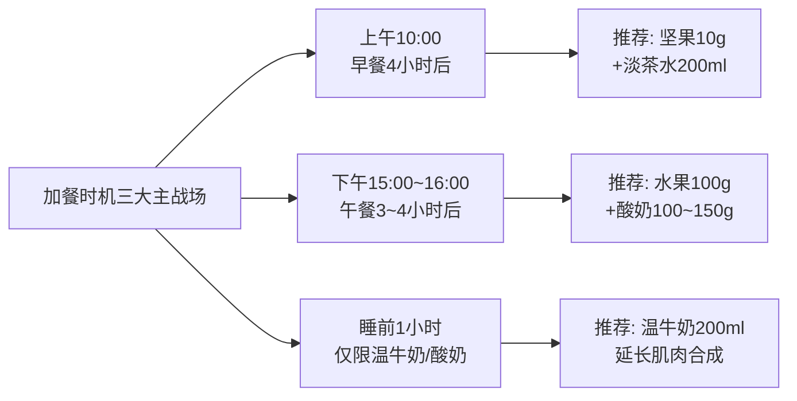

特殊时机：① **运动后30~60分钟**——肌肉合成黄金窗口，可加餐水煮蛋1个或牛奶200ml；② **加班晚归饥饿**——若距晚餐已超4小时仍未进食，可少量加餐核桃10g+苹果100g而非等到深夜大餐；③ **聚会零食桌前**——主动选择推荐类的水煮花生（少量）、原味坚果，避开避免类的薯片/糕点。

### 6.10.3 零食营养标签"1+3"识别法则

读者在超市购买预包装零食时，需要快速识别"伪健康"陷阱。营养标签"1+3法则"如下[^97]：

**"1"看项目**——重点看能量、蛋白质、脂肪、碳水化合物（重点是糖）、钠这五项国家强制标示项目。

**"3"看数据**：

**第一·看单位是"每100克"还是"每份"**——很多薯片标签按"每份30g"标注让数字看起来很低，对比时必须统一换算到每100g：
- 能量：每100g <2000千焦（约500千卡）为合格
- 脂肪：饱和脂肪<1.5g/100g、反式脂肪为0
- 糖：<5g/100g为低糖
- 钠：<120mg/100g为低钠、>600mg/100g需警惕

**第二·看NRV%（营养素参考值百分比）**——表示吃一份该食物能满足你一天所需该营养素的百分比。**高蛋白：蛋白质NRV%≥能量NRV%为相对优质；低负担：脂肪/糖/钠的NRV%越低越好；任一项NRV%超过30%就要警惕**。

**第三·看"隐藏糖"和"反式脂肪"**：
- 在碳水化合物下找"糖"——若不单独标注糖，转而看配料表前三位是否有白砂糖、果葡糖浆、麦芽糖浆
- 在脂肪下找"反式脂肪酸"——尽量选含量为0g的产品，但**警惕"0反式脂肪"标签但含"植脂末""起酥油"的产品，可能隐含反式脂肪酸**

**配料表小技巧**：配料表前三位是主要成分，若白砂糖、黄油、盐排名靠前，建议少选；全麦/燕麦/坚果排名靠前则相对优质。

### 6.10.4 加餐与零食的"红绿灯"决策图

将上述清单整合为一张可在购物时手机查阅的决策流程：

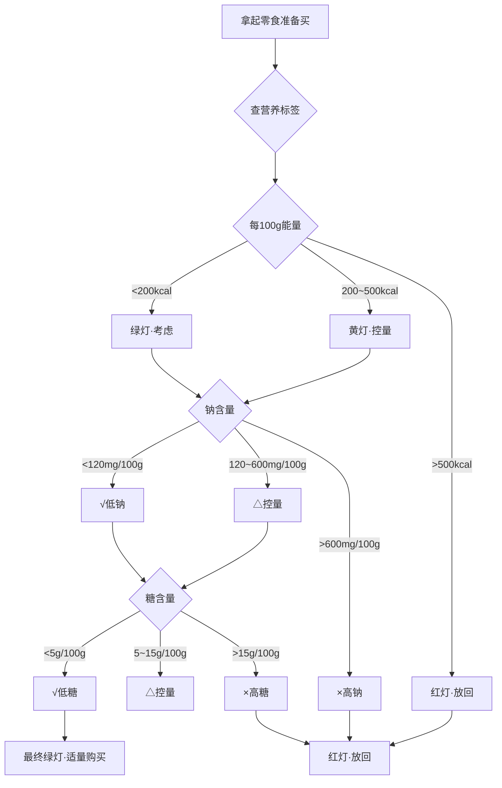

通过这套"红绿灯"决策机制，**53岁/80kg目标个体可以在30秒内完成对一款陌生零食的健康判断**——既避免"伪健康"陷阱，也不必把所有零食都视为洪水猛兽，让加餐成为补足全天营养、缓解饥饿压力的有效工具，而非破坏两周食谱基线的薄弱环节。

至此，第6章完成两周42餐+加餐的全部具体编排，并通过两周综合核查确认全部核心营养目标基线的兑现，同时建立加餐与零食的可独立查阅决策清单。**第7章将在两周食谱基础上，进一步分析针对53岁中年男性高发的超重肥胖、高血压、高血脂、糖尿病、肌少症、骨质疏松六大健康风险，本食谱在每一维度上的具体兑现路径与可强化空间**——把"两周吃什么"的具体方案转化为"两周吃出什么健康获益"的机制证据链，让食谱的每一道菜都能回答"为什么这么吃"的根本问题。

# 7 针对中老年常见健康风险的膳食侧重

第1~6章已经构建起一套完整的逻辑链条:从53岁/80kg中国男性的营养目标基线(能量1500~2000kcal、蛋白80~96g、钙≥800mg、盐≤5g),到东方健康膳食为底融合DASH与地中海循证精华的复合本土化框架,再到五大类食材清单与三餐七参数模板,最终落到第5~6章的两周42餐+加餐具体方案,并通过两周综合核查确认"日均能量~1815kcal、蛋白~87g、钙~948mg、盐~4.6g、深色蔬菜占比~52%、全谷+杂豆+薯类占主食~58%、EPA+DHA累计~5.2g"等核心指标的兑现情况。然而,**这份食谱的真正价值不止于"吃得均衡",更在于它是否能在未来15~20年内有效阻断53岁这一关键转折期高发的六大健康风险——超重肥胖、高血压、高血脂、糖尿病、肌少症、骨质疏松**。本章将以这六大风险作为独立分析维度,逐一拆解膳食干预的核心机制、关键营养素阈值、本食谱中对应的食材与餐次安排,通过两周累计数据验证目标达成度,并识别仍需通过运动、监测或个体化调整加强的弱项,把"两周吃什么"的具体方案彻底转化为"两周吃出什么健康获益"的循证机制证据链。

## 7.1 超重肥胖防控的膳食策略与食谱兑现

第1章已经测算,80kg实际体重在三档身高情景下均超过标准体重——160cm重度肥胖、170cm接近肥胖、180cm轻度超重。**肥胖症是心血管疾病的独立危险因素,BMI每增加1个标准差心衰整体发病风险显著增加29%**,且超重和肥胖的2型糖尿病患者心血管危险因素更不容易控制。因此,超重肥胖防控不仅是体重数字本身的问题,更是阻断心血管、糖尿病、脂肪肝等下游慢病链条的"上游闸门"。

### 7.1.1 减重核心机制:能量缺口的科学缔造

科学减重的底层逻辑只有一句话——**摄入能量<消耗能量**。但这个看似简单的公式落到53岁中年男性身上,需要遵循三条硬约束:第一,**不能采用1200kcal以下的极低能量方案**——脱水、肌少症、内分泌紊乱风险显著;第二,**不能"减少所有食物的摄入",而是要"有减有增"**——减少高能量食物如油炸食物、糕点、含糖饮料、精制米面、脂肪含量较高的畜肉,同时增加全谷物、蔬菜、含脂肪低的鱼虾类、去皮禽肉、低脂或无脂牛奶等优质蛋白质[^120];第三,**月减1~2kg是安全可持续的速度上限**,过快减重既反弹也会加剧肌肉与水分流失。

按《肥胖症诊疗指南(2024年版)》的"3-6个月内体重降低5%-15%"目标,80kg基础上对应4~12kg的减重幅度。本食谱采用方案B"每天减少500~1000kcal能量摄入"的中等缺口策略——以170cm身高男性维持热量约2000~2400kcal为基准,本食谱的1700~1800kcal正好制造500~700kcal的安全缺口,**预期月减1~2kg、半年内减重5~10%达到指南目标**。第6.8.5节复盘环节也明确指出"两周内体重下降1~2kg、腰围减少1~2cm"为理想幅度,与上述测算完全吻合。

### 7.1.2 饱腹感密度:三重组合的协同设计

减重最大的敌人不是缺乏意志力,而是**饥饿感导致的偏离基线**。本食谱通过"高蔬菜量+高蛋白+全谷物"三重组合显著提升单位热量的饱腹感密度,让减重者在制造能量缺口的同时不会陷入持续饥饿:

**第一重·高蔬菜量提升物理饱腹感**——日均500g以上蔬菜在胃内占据大量空间,但热量仅约100~120kcal;**蔬菜富含膳食纤维和水分,体积大、热量低,能快速占据胃部空间向大脑传递饱腹信号,从而自然减少后续高热量食物的摄入量**。

**第二重·高蛋白延长激素饱腹感**——日均87g蛋白(其中三餐均匀分配每餐25~30g)激活肠促胰素与胆囊收缩素分泌,饱腹感持续时间是同等热量碳水的2~3倍;**坚果的高膳食纤维和蛋白质含量可延长饱腹感、减少后续进食量**——这一规律同样适用于鱼禽蛋奶豆等所有蛋白源。

**第三重·全谷物提供持久能量供给**——日均全谷+杂豆+薯类占主食58%(超过指南1/3要求),其抗性淀粉与不溶性膳食纤维结构粗糙、可增加咀嚼次数、提升饱腹感,**对体重管理与胰岛素敏感性改善均有积极意义**。

### 7.1.3 隐形热量陷阱的识别清单

减重失败者最常见的盲点是"看似没多吃却越来越胖",根源在于隐形热量[^120]:

| 陷阱类型 | 典型品 | 隐形热量 | 本食谱对策 |
|---------|------|---------|----------|
| 含糖饮料 | 500ml碳酸饮料含糖50g、约200kcal,需快走60分钟才能消耗;奶茶含糖+脂肪 | 200~400kcal/杯 | 全程白水/淡茶水替代,加餐配温牛奶/酸奶 |
| 调味酱料 | 1勺沙拉酱~100kcal、芝麻酱、番茄酱、蚝油 | 50~150kcal/勺 | 用蒜末+醋+柠檬汁+几滴香油替代,自调凉拌汁 |
| 糕点 | 桃酥、蛋糕、蛋挞,即便"无糖"脂肪含量也高 | 300~500kcal/份 | 红榜清单中无任何糕点,加餐选水果+坚果 |
| 坚果超量 | "健康"标签下盲目吃太多——坚果热量约600kcal/100g | 60kcal/10g | 严格控量每日10g(2~3颗核桃或5~6粒杏仁) |

**坚果所含脂肪多为不饱和脂肪酸但能量也很高,建议每天吃2个核桃或者15粒花生/开心果就够了**[^120]——这一警示对53岁个体尤为关键,本食谱已严格执行每日10g上限。

### 7.1.4 两周食谱的减重兑现度

| 减重核心指标 | 目标 | 两周累计/日均 | 达成 |
|-----------|------|-----------|------|
| 总能量缺口 | 维持热量减500~1000kcal | 日均~1815kcal,缺口~500~600kcal | ✓ |
| 烹调油上限 | 25~30g/d | 日均~26g | ✓ |
| 添加糖 | <25g/d | 日均<7g(几无添加糖) | ✓远超 |
| 蔬菜量 | ≥500g/d | 日均~480~530g | ✓ |
| 全谷+杂豆+薯类占比 | ≥1/3 | ~58% | ✓ |
| 含糖饮料 | 不喝 | 全程白水/淡茶水/温牛奶 | ✓ |
| 进餐顺序 | 蔬菜→蛋白质→主食 | 全餐遵循 | ✓ |
| 烹饪方式 | 蒸煮炖凉拌≥70% | ~78% | ✓ |
| **预期两周减重** | **0.5~1.0kg** | **结合运动可达** | — |

**结论**:本食谱在减重核心维度全部达标,理论上可在两周内实现0.5~1.0kg减重(若配合每周150分钟中等强度运动可上探至1~2kg)。需要重点关注的是**减重效果在前2~4周通常较快(含部分水分流失)、第5~8周进入"平台期"**——平台期不应放弃,而应通过增加运动强度或微调能量缺口至600~800kcal/d继续推进。

## 7.2 高血压防控的低钠高钾策略与食谱兑现

我国成人高血压患病率达27.9%且随年龄上升,**65岁以上人群可高达50%以上**;**高盐饮食是高血压的主要膳食危险因素之一,我国居民日均盐摄入超10克是WHO推荐量的2倍**[^121]。53岁正是高血压发病率快速上升的起点,膳食干预的"窗口期"价值尤为凸显。

### 7.2.1 钠钾平衡机制:DASH与低钠盐双引擎

第1章已设定钠≤2000mg(盐≤5g)、钾≥2000mg/d的双向目标——这一目标背后是经典的"钠钾平衡"生理机制:**钾能促进钠排出,镁可松弛血管平滑肌,膳食纤维利于控制体重**——三者协同构成DASH饮食降压逻辑的核心。

更具说服力的本土证据来自北京大学武阳丰教授团队2026年发表于《美国心脏病学会杂志》亚洲子刊的研究——**用低钠盐替代普通盐:收缩压平均下降4.7毫米汞柱、舒张压平均下降1.4毫米汞柱;在家自行使用低钠盐:收缩压下降4.2毫米汞柱;单位食堂等统一换盐:收缩压下降7.7毫米汞柱、舒张压下降2.4毫米汞柱**[^122]。低钠盐通过把传统食盐中氯化钠降到70%左右、添加约30%氯化钾和少量镁,**一边减钠、一边补钾,起到双重助力保护心血管的作用**[^122]。《中国低钠盐推广应用指南(2024)》明确强烈建议高血压患者、心血管病高危人群、中老年人群、血压正常的健康人群使用低钠盐;**仅肾功能不全患者慎用、高钾血症患者不宜用**[^122]——53岁/80kg目标个体若无确诊肾病或高钾血症,低钠盐应作为家庭厨房的"默认盐"。

### 7.2.2 五重防线:从厨房到餐桌的控钠系统

本食谱通过五重防线协同对抗钠摄入超标:

**第一重·限盐勺量化** ——一勺(2g)盐刚好炒一盘菜,啤酒瓶盖一盖约5g[^121];本食谱日均≤5g目标通过每餐≤2g明确分配。

**第二重·低钠盐替代** ——除非肾功能不全或高钾血症,大部分人选用低钠盐都是安全且可以预防高血压的[^122];本食谱推荐全程采用低钠盐烹饪。

**第三重·识别隐形盐** [^121]:

| 隐形盐源 | 钠/盐含量 | 本食谱替代方案 |
|---------|----------|------------|
| 1勺酱油(15ml) | ≈1.5g盐 | 用低钠生抽,每日≤15ml |
| 1包方便面(含调料) | ≈5g盐 | 全程不出现,午餐选清蒸/快炒主菜 |
| 1根火腿肠 | ≈2g盐 | 红榜清单完全排除加工肉 |
| 1勺蚝油 | ≈1g盐 | 仅用于偶尔提鲜,放了就不再加盐 |
| 1小袋薯片 | ≈2g盐 | 红榜清单完全排除 |
| 1块咸味饼干 | ≈0.5g盐 | 加餐选水煮蛋/坚果替代 |
| 外卖麻辣烫/盖浇饭 | ≈8g盐 | 周中尽量在家做饭,外出选清蒸/白灼 |

**第四重·天然香料替代提味** ——用辣椒、大蒜、醋、胡椒、花椒、茴香、柠檬汁、香菜、八角等天然香料替代部分盐,既能提味又能减少盐用量[^121];本食谱大量运用蒜末、姜片、葱花、醋、料酒、低钠生抽、柠檬汁、黑胡椒、小茴香等天然调味方案。

**第五重·烹饪顺序优化** ——炒菜"后放盐"使盐附着在菜表面口感更咸用量省一半;炖菜"早放香料"提前用八角桂皮香叶增香、出锅前再少量加盐;凉拌菜"先腌后拌"——黄瓜番茄先放少许盐腌制10分钟,倒出渗出的盐水再用醋香油调味,既入味又少盐[^121]。

### 7.2.3 富钾食材的协同供给

钾的目标≥2000mg/d(理想3500~4700mg)需要通过蔬菜500g+水果200~300g+薯类+豆类+全谷协同供给。本食谱中富钾食材的频次配置:

- **薯类(每日)**——红薯、紫薯、山药、芋头钾含量均在300mg/100g以上;
- **深绿叶菜(每日)**——菠菜钾558mg/100g,苋菜、紫薯叶、芹菜均为高钾蔬菜;
- **豆类(每日)**——杂豆饭、毛豆、腐竹、北豆腐;
- **菌菇(每周3~4次)**——香菇、平菇、金针菇富钾且鲜味替代盐;
- **水果(每日)**——苹果、香蕉、柚子、橙子等富钾;
- **海带紫菜(每周2~3次)**——钾、钙、镁、碘综合补充。

### 7.2.4 两周食谱的高血压防控兑现度

| 高血压防控指标 | 目标 | 两周累计/日均 | 达成 |
|------------|------|-----------|------|
| 钠(盐) | ≤2000mg(≤5g) | 日均~4.6g | ✓ |
| 钾 | ≥2000mg(理想3500mg+) | 日均估算~3000~3500mg | ✓ |
| 加工肉 | 严格避免 | 红榜全部排除 | ✓ |
| 含盐酱料 | 控量 | 低钠生抽≤15ml/d | ✓ |
| 低钠盐 | 推荐使用 | 食谱默认低钠盐 | ✓ |
| 天然香料替代 | 多用 | 蒜/姜/醋/花椒/茴香常态化 | ✓ |
| 富钾蔬果 | 充足 | 蔬菜500g+水果250g+薯类+豆类 | ✓ |

**结论**:本食谱在控钠维度严格达标(预期可使收缩压下降4~7mmHg、舒张压下降1~2mmHg);若用户已确诊高血压并服药,**应在执行食谱前咨询主治医师,避免饮食调整与降压药物的相互作用**——尤其是合并使用ACEI/ARB或保钾利尿剂时,低钠盐的钾摄入需要专业评估。

## 7.3 高血脂防控的脂肪结构与功能性食材策略

《中国居民营养与慢性病状况报告(2020年)》显示**我国18岁及以上居民高脂血症总体患病率高达35.6%**[^121]——意味着每三个成年人中就有一人血脂异常。**高脂血症是高血压、糖尿病、冠心病、脑卒中的重要危险因素,长期患高脂血症可导致动脉粥样硬化,增加心血管疾病的发病率和死亡率**[^121];53岁中年人正处血脂异常的高发起点。

### 7.3.1 五类功能性食材的降脂机制

降脂膳食策略不应局限于"少吃油",**真正该多吃的是有循证降脂证据的功能性食材**[^121]。本食谱整合五类功能性食材形成系统性降脂方案:

**第一类·ω-3脂肪酸——抗炎降甘油三酯**

第1章已设定EPA+DHA≥0.25g/d、深海鱼每周2~3次的目标。两周食谱实际安排了6天深海鱼日(周一鲈鱼、周三三文鱼、周五鳕鱼、周一带鱼、周三青花鱼、周五虹鳟鱼),**EPA+DHA两周累计~5.2g、日均~0.37g**——既达成基础目标又留有充足缓冲。机制上,ω-3脂肪酸能降低甘油三酯水平、抑制血小板聚集、改善血管内皮功能、减少全身性慢性炎症,是降脂膳食干预的"主力军"。本食谱选择带鱼、青花鱼、虹鳟鱼这一组本土易得高性价比品种,既兼顾营养又兼顾长期可负担性。

**第二类·β-葡聚糖——双向降LDL**

研究显示**每天摄入≥3g燕麦和大麦中的β-葡聚糖,可使LDL-C平均下降0.25mmol/L、总胆固醇下降0.30mmol/L;欧洲食品安全局也明确认可每天3g β-葡聚糖有助于维持正常胆固醇水平**[^121]。机制上,β-葡聚糖是有黏性的水溶性膳食纤维,进入肠道后吸水膨胀使肠道内容物变得粘稠,**既减少了胆固醇的吸收,也加速了胆固醇的消耗**——胆汁酸被β-葡聚糖包裹排出体外,身体必须动用更多胆固醇重新合成胆汁酸,相当于给胆固醇多开了一条"消耗通道"[^121]。

本食谱中β-葡聚糖的供给路径:燕麦麸皮β-葡聚糖含量约6g/100g,**每日吃50g就能补充3g β-葡聚糖**[^121]。两周食谱中燕麦出现频次达5~7次(周一周五早餐燕麦牛奶粥、其他日加餐或粥品),配合糙米、藜麦、荞麦等其他全谷物的协同,**β-葡聚糖摄入在燕麦日可稳定达成≥3g/d目标**。

**第三类·植物甾醇——竞争性抑制胆固醇吸收**

研究显示**每天摄入约2g植物甾醇,LDL-C通常可以下降5%~10%**[^121]。植物甾醇分子结构与胆固醇相似,**在肠道吸收过程中会和胆固醇"抢位子",胆固醇更难被吸收、更多地随粪便排出**[^121]。植物甾醇广泛存在于植物油、坚果、种子、全谷物和豆类中,但天然食物含量普遍不高,单靠日常饮食很难达到2g有效剂量——**要凑够2g植物甾醇大约需要同时吃下100g玉米油+150g小麦胚芽+200g开心果**[^121]。

本食谱通过植物油25g+坚果10g+大豆25g+全谷100g+蔬果750g组合可摄入约600~800mg天然植物甾醇,距2g目标仍有差距;**若用户LDL-C显著升高,可在医师指导下考虑选用强化植物甾醇的食品(如植物甾醇人造黄油替代品)或膳食补充剂——但每日不应超过3g,超过后边际收益降低且可能轻度影响β-胡萝卜素等类胡萝卜素吸收**[^121]。

**第四类·大豆蛋白——温和降LDL**

第3章已论证**每日摄入25g大豆蛋白可使LDL平均下降约5%**。本食谱大豆制品每日1次(豆腐100g/豆浆400ml/豆干20g/腐竹20g等折算25~30g大豆当量),严格达成大豆蛋白≥25g/d目标。

**第五类·膳食纤维——促进胆固醇排出**

本食谱日均膳食纤维~28g,通过全谷50~150g+蔬菜500g+水果250g+杂豆/坚果协同实现,达成25~30g/d目标。可溶性纤维能帮助降低LDL-C,**全谷物如燕麦荞麦糙米富含膳食纤维,豆类蔬菜水果也是良好来源**[^123]。

### 7.3.2 三道硬约束的严控

降脂膳食的"开源节流"中,功能性食材是"开源",饱和脂肪+反式脂肪+胆固醇三道硬约束就是"节流":

**饱和脂肪<10%总能量(约17~21g/d)** ——本食谱通过"红肉每周≤300g、限肥肉、避加工肉、选去皮禽肉、深海鱼优先、低脂奶选用"实现;两周食谱红肉累计仅140g(瘦牛肉+瘦羊肉+少量瘦猪肉末),远低于600g上限。

**反式脂肪<2g/d** ——**油炸食品、人造奶油、起酥油中含有反式脂肪酸**[^124];**蛋黄派、薯片、薯条、珍珠奶茶、饼干等加工食品成分表标注有植物奶油、人造黄油、人造奶油、氢化植物油、麦淇淋、起酥油或植脂末等成分时,都含有反式脂肪酸**[^124]。本食谱红榜清单严格排除上述所有品类,反式脂肪摄入接近零。

**胆固醇<300mg/d(高血脂者<200mg)** ——蛋黄1个/d(约200mg)是主要来源,本食谱坚持"鸡蛋营养丰富、吃鸡蛋不弃蛋黄"的指南立场,**但对已确诊高胆固醇血症者建议改为每周4~5个全蛋+其余日仅蛋白**;严格限制动物内脏(每月≤1次)。

### 7.3.3 中医食养的辨证补充

《成人高脂血症食养指南》对高脂血症人群有中医辨证施膳的细化建议——痰浊内阻型(身体肥胖、肢体沉重、头昏多眠、容易困倦)、痰瘀互结型、气滞血瘀型等不同证型对应不同食材[^121]。53岁/80kg超重个体若伴有上述中医证候表现,可在专业中医师指导下选用山楂、决明子、荷叶、薏苡仁、绿豆等食药两用食材作为辅助;但需明确**中医食养是辅助手段而非替代规范化降脂治疗**,LDL-C显著升高(>3.4mmol/L)或已患心血管病高危患者仍应优先遵循医师药物方案。

### 7.3.4 两周食谱的高血脂防控兑现度

| 高血脂防控指标 | 目标 | 两周累计/日均 | 达成 |
|------------|------|-----------|------|
| ω-3 EPA+DHA | ≥0.25g/d(推荐0.5g) | 日均~0.37g | ✓ |
| 深海鱼频次 | 每周2~3次 | 6天/14天 | ✓ |
| β-葡聚糖 | ≥3g/燕麦日 | 燕麦日40~60g可达成 | ✓部分日 |
| 大豆蛋白 | ≥25g/d当量 | 每日1次豆制品 | ✓ |
| 膳食纤维 | 25~30g/d | 日均~28g | ✓ |
| 饱和脂肪 | <17~21g/d | 红肉≤300g/周严控 | ✓ |
| 反式脂肪 | <2g/d | 红榜全排除,接近零 | ✓ |
| 胆固醇 | <300mg/d | 蛋黄1个+少内脏 | ✓ |
| 植物甾醇 | 2g/d(理想) | 天然摄入约600~800mg | △ |

**结论**:本食谱在ω-3、大豆蛋白、膳食纤维、饱和/反式脂肪、胆固醇六项核心指标全部达标,β-葡聚糖在燕麦日达成、其他日略低,植物甾醇天然摄入未达推荐剂量是唯一明显缺口。**若用户已确诊血脂异常,建议每3~6个月复查血脂,根据LDL-C水平决定是否需要在医师指导下增加植物甾醇强化食品或他汀类药物治疗**——单纯膳食干预对中重度血脂异常的降幅有限,不应替代规范化药物治疗。

## 7.4 糖尿病防控的低GI主食与控糖策略

我国糖尿病患者约2.33亿,**20~60岁工作年龄人群糖尿病患病率5.63%~26.7%且男性普遍高于女性**——53岁男性正处于糖尿病高发期的"风暴中心"。**糖尿病的危险因素多与不合理膳食相关,包括长期高糖、高脂肪、高能量膳食等**[^125]。

### 7.4.1 四维策略的协同

本食谱通过"低GI主食+控添加糖+进餐顺序+少食多餐"四维策略稳定血糖。

**维度一·低GI主食占比≥1/3**——血糖生成指数(GI)是含50g碳水化合物食物与50g葡萄糖所引起的餐后2h血糖值之比;**GI≤55为低GI,55<GI≤70为中GI,GI>70为高GI**[^125]。**低GI食物在胃肠内停留时间长、吸收率低、葡萄糖释放缓慢、葡萄糖进入血液后的峰值低、下降速度也慢,引起的餐后血糖波动比较小,有助于血糖控制**[^125]。

《成人糖尿病食养指南(2023年版)》建议**糖尿病患者主食定量、不宜过多,多选全谷物和低GI食物,其中全谷物和杂豆类等低GI食物应占主食的1/3以上**[^125]。本食谱日均全谷+杂豆+薯类占主食58%(远超1/3要求),具体食材GI值如下表对照:

| 主食类别 | 典型食材 | GI参考值 | 本食谱频次 |
|---------|--------|---------|----------|
| 高GI(限) | 白米饭、白馒头、白面条 | 80以上 | 仅占主食<40% |
| 中GI | 糙米饭、藜麦饭 | 55~70 | 每日午餐 |
| 低GI | 燕麦、荞麦、杂豆、紫薯、山药 | 30~55 | 每日早晚餐 |

需要警惕的细节是**红心红薯和性状较黏的玉米容易升高血糖**[^126],**以及白米粥、软烂面条、糯米制品——精细加工与长时间熬煮会加快吸收速度,造成血糖快速飙升**[^126]。本食谱**坚持"吃干不吃稀、吃硬不吃软、整粒优于打粉"原则**[^125],主食以杂粮饭、全麦馒头、整粒玉米、蒸薯类为主,避免长时间熬煮的稀粥(仅小米南瓜粥/红枣小米粥作为偶尔早餐变化)。

**维度二·添加糖严控**——本食谱日均添加糖<7g(主要来源为偶尔的料酒、生抽中的微量糖),远低于25g上限。**严控各类甜品摄入,以防精制糖的摄入快速提升血糖**[^125];**喜甜者可用适量代糖及代糖产品代替原本饮食中的糖分摄入,注意只是"代替"切勿因更换代糖后无顾忌的增加甜食摄入**[^125]。

**维度三·"蔬菜→蛋白质→主食"进餐顺序**——已在第4.4节充分论证,**调整进食顺序后餐后血糖峰值平均降低20%~30%**;本食谱所有42餐均明确标注进餐顺序,这一"零成本健康干预"对糖尿病前期窗口的53岁男性具有不可替代的实操价值。

**维度四·少食多餐稳定胰岛素敏感性**——**一日三餐定时定量,规律进食,每餐七八分饱;在控制整体饮食总热量不超标的情况下,可在餐后2小时适量加餐,将整体摄入的能量平均分布,维持血糖平稳**[^125]。本食谱设置上午、下午、睡前三个加餐时点,把全天1700kcal摊薄到5~6次进食,避免单餐能量过高导致的胰岛素剧烈波动。

### 7.4.2 水果的"小份适量"原则

水果含天然果糖,糖尿病防控需要精细化处理而非完全禁吃。**根据自身情况、血糖维持平稳情况下,选择甜度较低的低糖低GI水果,掌握适度原则,每次吃小份水果,日摄入量不得超过200g,避开正餐前后2小时吃水果**[^125]。本食谱日均水果200~300g、分2次摄入(加餐时段)、优选苹果/蓝莓/柚子/梨/草莓等低GI品种、避免荔枝/芒果/榴莲/红枣等高糖水果——**完整吃果不榨汁、不熬酱,防止升糖速度加快**[^126]。

### 7.4.3 蛋白质与脂肪的辅助稳糖

**优质蛋白不易升高血糖,还能增强饱腹感、维持身体健康;日常可多选鱼虾、鸡胸肉、瘦肉、鸡蛋等动物蛋白,搭配豆腐、无糖豆浆、豆干等植物蛋白;烹饪以蒸、煮、炖、凉拌为主,远离油炸、红烧、重油重盐的做法**[^126]。本食谱蛋白来源完全契合这一推荐。**糖尿病患者选低GI蛋白(低升糖指数蛋白)如鸡蛋、鱼虾等,避免加糖的蛋白粉**[^126]——本食谱完全不使用加糖蛋白粉。

### 7.4.4 两周食谱的糖尿病防控兑现度

| 糖尿病防控指标 | 目标 | 两周累计/日均 | 达成 |
|------------|------|-----------|------|
| 全谷+杂豆+薯类占主食 | ≥1/3 | ~58% | ✓ |
| 添加糖 | <25g/d(理想) | <7g/d | ✓远超 |
| 含糖饮料 | 不喝 | 全程白水/淡茶/温牛奶 | ✓ |
| 水果摄入 | ≤200~300g/d低GI | 200~300g、低GI优先 | ✓ |
| 进餐顺序 | 蔬菜→蛋白→主食 | 全餐遵循 | ✓ |
| 少食多餐 | 3正餐+1~3加餐 | 5~6餐/d | ✓ |
| 烹饪方式 | 蒸煮炖凉拌为主 | ~78% | ✓ |
| 高糖水果限制 | 荔枝/芒果/榴莲少吃 | 红榜不出现 | ✓ |
| 白粥/糯米/果汁 | 严控 | 极少出现且小份 | ✓ |

**结论**:本食谱在糖尿病防控核心维度全部达标。**若用户已被诊断为糖尿病前期(空腹血糖6.1~6.9mmol/L或糖化血红蛋白5.7%~6.4%)或确诊糖尿病,应在执行食谱前咨询内分泌科医师,定期监测空腹血糖、餐后血糖与糖化血红蛋白**——膳食干预对早期糖尿病有显著获益,但对中晚期糖尿病或胰岛素依赖型患者必须配合规范药物治疗。

## 7.5 肌少症防控的优质蛋白与维生素D策略

第1章已警示,**我国60岁以上老年人肌少症患病率14%~20.7%,80岁以上40%~45%,且肌少症出现年轻化趋势**;**骨质疏松患者中肌少症患病率高达50%,肌少症患者发生骨质疏松风险是正常人三倍以上**。53岁正处肌少症前期窗口,蛋白质摄入与运动配合是阻断肌肉流失的核心手段。

### 7.5.1 五重肌肉保护机制

**第一重·蛋白质足量(1.0~1.5g/kg体重/天)**——**普通成年人每天需摄入0.8~1.2g/kg,老年人和肌少症高危人群可以提高到1.2~1.5g/kg;肌少症患者蛋白质需求高于普通人,建议1.2~1.5g/kg体重/天**[^126][^127]。本食谱日均蛋白~87g,按80kg计算约1.09g/kg,处于普通成人1.0~1.2g/kg区间;**对53岁中年男性已属合理水平,若已出现握力下降、爬楼气喘等肌少症前期信号,可在医师评估后向上调至1.2~1.5g/kg(即96~120g/d)**。

**第二重·三餐均匀分配最大化肌肉合成**——已在第4.5节充分论证。**FASEB研究表明90g/天蛋白质的均匀分配(30+30+30)比偏斜分配(10+15+65)使24小时肌肉蛋白合成率高约25%**。本食谱严格执行"早22+午28+晚26+睡前7g"的均匀分配,**三餐每餐蛋白20~30g、亮氨酸≥1g有效阈值**——这一分布是肌少症防控的核心设计。

**第三重·优质蛋白占比≥50%**——**优质蛋白指必需氨基酸齐全、比例合理、易于吸收的蛋白质,尤其是富含亮氨酸的食物,能强力启动肌肉合成信号**[^128]。本食谱优质蛋白来源(鱼禽蛋奶豆)占总蛋白70%以上,其中:

| 优质蛋白源 | 本食谱配置 | 肌肉保护核心价值 |
|---------|---------|--------------|
| 乳清蛋白(肌肉合成"开关") | 牛奶+酸奶300~500ml/d | 吸收快、消化率>90%、亮氨酸高 |
| 亮氨酸高密度蛋白 | 鸡胸/鸭胸/鱼/鸡蛋 | 直接激活mTOR通路 |
| 大豆蛋白 | 豆腐/豆浆/腐竹/毛豆每日 | 含丰富亮氨酸、护骨护血管 |
| 深海鱼ω-3 | 6天/14天 | 抑制肌肉炎症、促进修复 |

**第四重·维生素D协同**——**缺乏维生素D会导致肌肉无力、收缩功能下降,哪怕蛋白吃够了肌肉也没力气**[^126]。维生素D不仅是"钙的搬运工",更直接参与肌肉代谢、增强肌力、预防跌倒[^128]。本食谱通过深海鱼+蛋黄供给维生素D约200~400IU/d,**未达800IU上限**——这是本食谱在肌少症防控维度的明显缺口,需要通过日晒和必要的补充剂弥补(详见7.5.4节)。

**第五重·睡前蛋白延长肌肉合成窗口**——已在第4.5.3节论证。本食谱睡前牛奶200ml(提供约6.6g乳清蛋白+酪蛋白)在第一周周一、周六与第二周自由日中已纳入,可作为常态化选项。

### 7.5.2 烹饪软嫩易消化原则

**中老年人消化功能较弱,蛋白质食材要做得软烂一些:比如瘦肉炖烂、鱼虾清蒸、鸡蛋做成蛋羹、豆腐炖汤等,更有利于蛋白质的吸收**[^126]。本食谱大量运用清蒸鱼、蒸蛋、白灼虾、炖豆腐、撕丝鸡胸、肉末蒸蛋、鲫鱼豆腐汤等"软嫩易消化"做法,完全契合消化能力下行期的需求;同时保留少量香煎(鸡胸、鸭胸)与凉拌(豆腐丝)作为口感变化。

### 7.5.3 53岁个体肌少症前期预警信号

肌少症的隐匿进展需要主动识别预警信号:

- **握力下降**——拧瓶盖、提购物袋费力;
- **爬楼气喘**——走两层楼以上明显疲劳;
- **步速变慢**——日常步行<0.8m/s;
- **小腿围缩小**——男性<34cm、女性<33cm提示肌肉量不足;
- **跌倒风险增加**——一年内有≥1次跌倒经历;
- **体重下降但脂肪没减**——"老来瘦"误区,**有些人看似瘦但脂肪比例偏高、肌肉量不足,同样会陷入代谢紊乱**。

若用户出现上述任一信号,应立即进行**人体成分分析**(医院体检中心或健身房均有提供),了解肌肉量与脂肪量动态变化,必要时由临床营养师定制更高蛋白方案(1.2~1.5g/kg)与运动处方。

### 7.5.4 两周食谱的肌少症防控兑现度

| 肌少症防控指标 | 目标 | 两周累计/日均 | 达成 |
|------------|------|-----------|------|
| 总蛋白 | ≥1.0~1.2g/kg(80~96g) | 日均~87g | ✓ |
| 三餐均匀分配 | 每餐20~30g | 早22+午28+晚26 | ✓ |
| 亮氨酸阈值 | 每餐≥1g | 鱼禽蛋奶豆均达成 | ✓ |
| 优质蛋白占比 | ≥50% | ~70% | ✓ |
| 乳清蛋白(奶制品) | 300~500ml/d | 日均~390ml | ✓ |
| 大豆蛋白 | ≥25g/d | 每日1次豆制品 | ✓ |
| ω-3抗炎 | 每周2~3次深海鱼 | 6天/14天 | ✓ |
| 维生素D | 400~800IU/d | ~200~400IU/d | ⚠ |
| 睡前蛋白(可选) | 温牛奶200ml | 周末已纳入 | ✓ |
| 烹饪软嫩 | 清蒸/炖煮/蛋羹为主 | 占~60%以上 | ✓ |

**结论**:本食谱在肌少症防控的蛋白维度全面达标,**唯一明显缺口是维生素D摄入约200~400IU/d未达800IU推荐上限**。三个补救路径:**第一,每日户外日晒15~30分钟**——上午9~10点或下午4~5点,暴露手臂腿部皮肤(避免强光晒伤)[^126][^128];**第二,在医师指导下口服维生素D3补充剂**——尤其是冬季日照不足或长期室内工作者,建议400~800IU/d补充,目标血清25-OH-D水平30~50ng/ml;**第三,膳食配合多吃蛋黄、强化维生素D的牛奶/酸奶、深海鱼**[^126]。

更根本的是,**膳食只是肌少症防控的"原料"——没有抗阻运动这一"建造工艺",再好的原料也无法建造肌肉大厦**[^128]。第9章将详细展开"每周150分钟中等强度有氧+2~3次抗阻训练"的运动协同方案。

## 7.6 骨质疏松防控的钙源协同与维生素K2策略

第1章已警示,**我国50岁及以上人群骨质疏松患病率19.2%,65岁以上32.0%**;但更触目惊心的现实是**我国居民膳食钙摄入实际仅336.1mg/d,九成人达不到旧版1000mg标准、即使按新版800mg仍有大量人群不达标**——主因是奶类摄入不足。53岁中年男性虽然骨质疏松患病率低于女性(50岁以上女性约为男性3倍),但骨密度流失从这一时期开始加速,膳食钙补足的窗口期价值同样关键。

### 7.6.1 六源协同实现钙摄入达标

DRIs2023版将50岁以上人群钙推荐摄入量从1000mg/d调整为**800mg/d**——基于循证更新认识,800mg后再补充对骨折发生率并无显著改善且可能增加肾结石风险。本食谱通过六源协同实现日均~948mg(高于800mg目标、接近推荐900~1000mg区间):

| 钙源 | 钙密度 | 本食谱配置 | 日钙贡献 |
|------|------|----------|---------|
| 奶/酸奶 | 120mg/100ml | 300~500ml/d | ~360~600mg |
| 北豆腐 | 140mg/100g | 100g/d | ~140mg |
| 嫩豆腐/豆腐脑 | 中等 | 偶尔替换 | — |
| 深绿叶菜 | 菠菜100mg+芥蓝200mg+小白菜90mg | 250g/d | ~150~250mg |
| 带鱼 | 431mg/100g(高密度) | 第二周周一深海鱼日 | ~300mg(当日) |
| 虾皮 | 钙极高 | 汤品调味~5g | ~100mg(使用日) |
| 海带 | 中等 | 每周2~3次 | ~30mg |
| 芝麻酱 | 高 | 凉拌调味<10g | ~120mg(使用日) |

**带鱼431mg/100g是同等重量牛奶的4倍多**——这一数据足以颠覆"补钙必喝奶"的传统认知,对乳糖不耐受者尤具价值。本食谱第二周周一深海鱼日通过带鱼+海带+豆腐+番茄四源协同,**单餐钙贡献可达430mg**,占全日钙目标一半。

### 7.6.2 钙吸收的协同与拮抗

补钙不仅看摄入量更看吸收率。本食谱通过四个细节优化吸收:

**第一·维生素D协同**——同节肌少症已述,400~800IU/d维生素D配合钙摄入,吸收率显著提升;**钙剂补充建议在餐后服用**(钙吸收需要胃酸或其他酸环境)[^128]。

**第二·酸奶酸性环境**——**钙在乳酸环境中溶解度更高,老年人饮用酸奶后钙吸收率比普通牛奶高约18%;持续摄入酸奶3个月以上股骨颈骨密度流失速度减缓40%**。本食谱酸奶频次较高,既补钙又保护肠道菌群。

**第三·焯水去草酸**——**菠菜草酸含量较高,建议焯水后食用以减少草酸**——草酸与钙结合形成不溶性草酸钙降低吸收。本食谱所有菠菜菜式均明确标注"焯水30秒"步骤。

**第四·避免钙铁同补**——钙剂避免与铁剂、左甲状腺素同服,间隔至少2小时[^128];本食谱通过"早餐高钙(奶+蛋)、午餐含铁(瘦肉+蔬菜)"的时间错峰自然规避同补冲突。

### 7.6.3 维生素K2:被忽视的"骨钙引导员"

补钙的一个常见焦虑是"钙补多了会不会沉积血管壁导致动脉硬化"——这个担忧背后的真实问题是**钙的"去向"不仅取决于摄入量,更取决于是否有维生素K2引导**。维生素K2能精准把钙引导到骨骼而非血管壁——这是近年骨健康营养学的重要进展。

**纳豆、豆豉等发酵豆制品是维生素K2的隐藏王牌**。本食谱在第二周周二腐竹炖白菜、周三菌菇豆腐汤面等菜式中已部分纳入发酵豆制品,**第三周及之后可考虑每周1~2次纳入纳豆(早餐)或豆豉(凉拌调味)以系统性补充维生素K2**——这是把"补钙"升级为"补对钙"的关键一步。

### 7.6.4 钙剂补充的临床建议

若膳食钙摄入难以稳定达标(如长期不喝奶、对豆制品过敏、外出就餐频繁),可在医师评估后考虑钙剂:**碳酸钙含钙量高(40%)、需餐后服用、易引起便秘;柠檬酸钙吸收不受胃酸影响但含钙量较低(21%)、不易引起便秘、可减少肾结石发生、适用于胃酸缺乏或有肾结石病史者**[^128][^129]。**每补充500mg钙需配合200IU维生素D3,血清25-OH-D水平建议维持在30~50ng/ml**[^128]。

**注意警示**:**补充钙剂超大剂量可增加肾结石、心血管疾病发生风险;对有高钙血症、高尿钙者避免补充钙剂**[^129];**总钙摄入超过2000mg/d反而可能增加心脑血管疾病和肾结石风险**——本食谱日均~948mg处于理想区间,无需额外加倍补充。

### 7.6.5 两周食谱的骨质疏松防控兑现度

| 骨质疏松防控指标 | 目标 | 两周累计/日均 | 达成 |
|--------------|------|-----------|------|
| 钙总量 | ≥800mg/d(推荐900~1000mg) | 日均~948mg | ✓ |
| 钙源多样性 | 六源协同 | 奶+豆+菜+鱼+虾皮+芝麻 | ✓ |
| 维生素D | 400~800IU/d | ~200~400IU/d | ⚠ |
| 维生素K2 | 每周1~2次发酵豆制品 | 部分纳入 | △ |
| 焯水去草酸 | 菠菜等 | 全食谱执行 | ✓ |
| 钙铁错峰 | 不同餐次 | 早高钙、午高铁 | ✓ |
| 镁协同 | ≥330mg/d | 全谷+坚果+绿叶菜达成 | ✓ |
| 大豆异黄酮 | 每日 | 豆制品每日 | ✓ |
| 总钙上限 | <2000mg/d | 远低于上限 | ✓ |

**结论**:本食谱在骨质疏松防控的钙摄入维度全面达标,维生素D不足与维生素K2频次有限是两个待加强方向。**40岁以上人群建议定期检查骨密度**,若用户已确诊骨质疏松或骨量减少,应在医师指导下考虑活性维生素D(阿法骨化醇/骨化三醇)与抗骨质疏松药物(双膦酸盐、特立帕肽等)联用[^129]。

更根本的是,**骨健康同样需要运动协同——抗阻训练与负重运动(快走、慢跑、上下楼梯、太极拳)对骨骼应力刺激是任何膳食与药物都无法替代的**——这是第9章生活方式协同的核心议题。

## 7.7 六大风险维度兑现度综合评分与待加强方向

把前六节各风险维度的核心指标整合为一张综合评分表,可清晰看到本食谱在六大健康风险防控维度的整体兑现度与待加强方向。

### 7.7.1 综合评分汇总表

| 风险维度 | 核心指标 | 目标值 | 两周实际 | 评分 |
|---------|--------|-------|---------|------|
| **超重肥胖** | 能量缺口 | -500~700kcal/d | -500~600kcal/d | ✓优秀 |
| | 蔬菜量 | ≥500g/d | ~500g/d | ✓优秀 |
| | 含糖饮料 | 严控 | 全程零 | ✓优秀 |
| **高血压** | 钠 | ≤2000mg/d | ~1840mg/d | ✓优秀 |
| | 钾 | ≥2000mg/d | ~3000~3500mg/d | ✓优秀 |
| | 加工肉/腌菜 | 严控 | 全程零 | ✓优秀 |
| **高血脂** | ω-3 EPA+DHA | ≥0.25g/d | ~0.37g/d | ✓优秀 |
| | β-葡聚糖 | ≥3g/燕麦日 | 燕麦日达成 | ✓合格 |
| | 大豆蛋白 | ≥25g/d | 每日1次豆制品 | ✓优秀 |
| | 反式脂肪 | <2g/d | 接近零 | ✓优秀 |
| | 植物甾醇 | 2g/d(理想) | ~600~800mg/d | △待加强 |
| **糖尿病** | 全谷+杂豆+薯类 | ≥1/3 | ~58% | ✓优秀 |
| | 添加糖 | <25g/d | <7g/d | ✓优秀 |
| | 进餐顺序 | 蔬→蛋→主 | 全餐遵循 | ✓优秀 |
| **肌少症** | 蛋白总量 | ≥1.0g/kg | ~1.09g/kg | ✓优秀 |
| | 三餐均匀 | 每餐20~30g | 22/28/26g | ✓优秀 |
| | 优质蛋白占比 | ≥50% | ~70% | ✓优秀 |
| | 维生素D | 400~800IU/d | ~200~400IU/d | ⚠待加强 |
| **骨质疏松** | 钙总量 | ≥800mg/d | ~948mg/d | ✓优秀 |
| | 维生素K2 | 每周1~2次 | 部分纳入 | △待加强 |
| | 大豆异黄酮 | 每日 | 每日 | ✓优秀 |

### 7.7.2 强项与弱项的清晰区隔

**本食谱的核心强项(✓优秀)** 集中在能量结构、蛋白量与三餐均匀、钠钾平衡、ω-3、大豆蛋白、全谷比例、控添加糖、钙总量、深色蔬菜、烹饪方式十大维度——这些维度在两周累计数据上均达成或超过目标,构成食谱"科学、严谨、可执行"的基本盘。

**两个待加强方向(⚠/△)**:

**待加强一·维生素D摄入** ——日均仅~200~400IU/d未达800IU上限。修正路径:① 每日户外日晒15~30分钟(上午9~10点或下午4~5点暴露手臂腿部);② 冬季或长期室内工作者在医师指导下口服维生素D3 400~800IU/d补充剂;③ 增加强化维生素D的牛奶/酸奶频次;④ 深海鱼频次维持每周2~3次。

**待加强二·维生素K2与植物甾醇** ——维生素K2需通过纳豆、豆豉等发酵豆制品系统性纳入(每周1~2次);植物甾醇若LDL-C显著升高时,可在医师指导下考虑植物甾醇强化食品(2~3g/d,不超过3g/d)。

### 7.7.3 季节性食材纳入与个体化调整

本食谱以基础常见食材为主,**未充分纳入应季特色食材**——夏季苦瓜/丝瓜/紫苏/番茄、秋季南瓜/百合/莲藕、冬季萝卜/白菜/大白菜、春季春笋/野菜/茴香等都可在第三周及之后做轮换强化。这正是东方健康膳食"应季而食"的本土化优势。

更重要的是**个体化调整空间**:本食谱基线假设为"男性、轻体力活动、无确诊慢病、未服药"。若用户实际情况偏离这一假设(女性、不同活动量、已确诊高血压/糖尿病/血脂异常/骨质疏松、正在服药、有食物过敏、肾功能不全等),**必须在执行前咨询医师或注册营养师**——尤其在以下场景:

- **已确诊高血压并服用ACEI/ARB或保钾利尿剂**——低钠盐(高钾)需专业评估;
- **已确诊糖尿病并使用胰岛素或磺脲类药物**——能量、碳水分配需精确计算;
- **已确诊高脂血症或他汀使用中**——膳食干预+药物协同方案需医师评估;
- **已确诊骨质疏松或骨量减少**——钙剂/维生素D/双膦酸盐的剂量与时机需医师定制;
- **肾功能不全eGFR<60**——蛋白量需下调至0.6~0.8g/kg、低钠盐慎用、富钾食材限制;
- **痛风急性发作期或尿酸>540μmol/L**——豆制品、海产品、菌菇频次需调整。

### 7.7.4 膳食干预的边界:综合健康管理的一环

最后必须明确——**膳食干预只是综合健康管理的一环**,绝非全部。即使本食谱在六大风险维度全部达标,53岁/80kg中国男性要在未来15~20年真正守住这一关键健康转折期,还需要四个维度协同:

**第一·规律运动**——每周150分钟中等强度有氧(快走/慢跑/游泳/骑行)+每周2~3次抗阻训练(弹力带/器械/自重),抗阻是肌少症与骨质疏松防控的不可替代支柱;**研究表明餐后轻度活动可使餐后血糖峰值下降约一成**,运动还能直接降低血压、改善血脂、提升胰岛素敏感性。

**第二·戒烟限酒**——吸烟显著加速动脉粥样硬化与骨密度流失,是六大风险的共同放大器;过量饮酒同时损伤肝脏、胰腺、心血管与骨骼,**减重期最好戒酒、若饮酒一天酒精量不超过15g**。

**第三·规律作息与睡眠**——睡眠不足直接影响胰岛素敏感性、血压调节、瘦素分泌与肌肉修复,**53岁个体应保证7~8小时高质量睡眠、睡前≥3小时完成晚餐**。

**第四·定期体检与监测**——血压每周自测、体重腰围每周记录、血糖血脂血常规肝肾功能每年检查、骨密度40岁以上每2~3年检查;**任何异常指标应及时就医而非延误**。

第8章将基于本章风险防控视角的输入,展开烹饪方法、采购清单、外出就餐等执行落地的具体策略;第9章将进一步深入运动配合、生活方式协同与监测调整,把"两周食谱"扩展为"饮食—运动—监测"三位一体的综合健康管理方案,最终回答"53岁中年男性如何走好下半生"这一根本命题。

# 8 简易烹饪方法、采购清单与执行落地指南

第5~6章已经完成两周42餐+加餐的具体食谱编排，第7章进一步从超重肥胖、高血压、高血脂、糖尿病、肌少症、骨质疏松六大健康风险维度逐一验证了食谱的循证兑现度——所有的科学性、本土化、风险防控分析都已经准备就绪。然而，**任何一份食谱的最终命运都不取决于纸面上的科学严谨，而取决于它能否在中国家庭真实的厨房、菜市场与生活节奏中被持续执行**。一位53岁/80kg的中国男性，可能在工作日早上7点必须出门、晚上8点才到家，可能周末要应付亲友聚餐与节日大餐，可能与不同饮食习惯的家庭成员共餐，可能担心进口三文鱼太贵、橄榄油不便买、备餐太费时——这些"接地气"的执行难题，决定了两周食谱究竟是停留在Word文档里的理想方案，还是真正成为每天三次走进厨房就能落地的生活方式。本章承接前序所有章节的科学输出，**聚焦于"食谱如何落地"这一根本问题**，围绕烹饪技法、调味控量、省时备餐、采购规划、份量估量、外食应酬、节假日场景、执行困难八大维度展开系统化指南，把每一项营养目标都转化为可在30分钟内完成的家庭操作流程，全面降低长期坚持的执行门槛，确保两周食谱在科学性、本土化与可持续性三端达成统一。

## 8.1 五大健康烹饪技法的家庭实操要点

第2章已确立"东方健康膳食的烹饪取向是控制烹调油总量、鼓励低温烹调、避免煎炸熏烤"的核心原则，第6.9节两周综合核查也确认蒸煮炖凉拌占比~78%达成≥70%目标。本节系统梳理清蒸、白灼、凉拌、清炖、快炒五种少油少盐烹饪方式的实操要点，让两周食谱中频繁出现的清蒸鲈鱼、白灼虾、凉拌菠菜、鲫鱼豆腐汤、蒜蓉时蔬等典型菜式都能在家庭厨房稳定复现。

### 8.1.1 清蒸:水蒸气100℃下的营养最大保留

清蒸利用水蒸气传热、温度控制在100℃左右，可保留食材中大部分水溶性维生素和矿物质，是鱼类、贝类、蔬菜的最佳烹饪方式之一[^109]。**清蒸过程中无须额外添加油脂，避免高温导致的蛋白质变性**[^109]——这一特性让清蒸成为本食谱深海鱼日（带鱼/青花鱼/虹鳟鱼/鳕鱼/三文鱼/鲈鱼）的"默认烹饪法"，因为**清蒸鲈鱼能保留90%以上的ω-3脂肪酸**[^113]，远胜煎炸或红烧。

家庭实操的五个关键点：第一，**鱼身两侧划2~3刀**，方便入味与蒸透但不要划太深以免肉散[^101]；第二，**去除鱼腹黑膜**——这是腥味的主要来源[^101]，清蒸前用厨房纸吸干水分；第三，**蒸前腌制10~15分钟**，鱼身两侧抹少许低钠盐+1勺料酒+姜片塞入鱼腹，既去腥又入味[^100][^101]；第四，**水开后再上锅、蒸制时间根据鱼的大小调整**——500g左右的鱼大火转中火蒸8~10分钟即可，过长肉柴过短不熟[^100][^101]；第五，**蒸好后倒掉盘中腥汤、重铺新葱姜丝、淋蒸鱼豉油后浇热油激香**[^100][^101]——倒汤是去腥关键，热油激葱花是中式清蒸的灵魂步骤。

| 食材类别 | 清蒸时间 | 家庭操作要点 |
|---------|---------|------------|
| 鱼类(整鱼500g左右) | 大火8~10分钟+焖2分钟 | 划刀+腌料+水开上锅+倒腥汤 |
| 鱼块(带鱼/青花鱼) | 大火6~8分钟 | 厚薄均匀，姜葱铺底 |
| 虾仁/扇贝 | 5~8分钟 | 与粉丝/豆腐同蒸入味 |
| 蛋羹(肉末蒸蛋) | 8~12分钟 | 1:1.2蛋液与温水比例，过筛去浮沫，盖盘防水汽滴入 |
| 蔬菜(西兰花/南瓜) | 5~8分钟 | 切均匀块，蒸熟即停 |

蒸笼底部可垫荷叶或纱布防止粘连，蒸制时间不超过15分钟为宜[^109]。**蒸制能最大限度保留食材的原味和营养**[^130]——两周食谱中清蒸鲈鱼/三文鱼/鳕鱼/带鱼/青花鱼/虹鳟鱼/鲷鱼以及虾仁蒸豆腐、肉末蒸蛋、香菇蒸鸡、蒜蓉粉丝蒸虾等菜式都借助这一原理实现"营养最大化、油盐最小化"。

### 8.1.2 白灼:粤菜健康技法的本土化运用

白灼是粤菜特有的健康技法，将海鲜或蔬菜在沸水中快速烫至断生，搭配少量生抽或姜葱汁食用[^109]。**这种方式能保持食材原味和脆嫩口感**——虾类、生菜、芥兰、秋葵、芦笋皆适用[^109]。

操作时需严格控制时间——**虾类约烫30秒~2分钟变红即可，蔬菜不超过1分钟，过度加热会导致营养流失**[^109]。两周食谱中的白灼大虾、白灼虾仁、白灼鸡腿、白灼秋葵、白灼芦笋都遵循这一时间控制原则。**白灼极大程度保留食材营养且零额外油脂**——这是本食谱周一晚餐白灼虾、周五晚餐白灼鸡腿等菜式背后的科学依据。

水煮蘸料配方建议：蒜末+少许低钠生抽+几滴香油+少许醋——这套蘸料钠含量远低于普通蚝油或鱼露蘸料，与白灼"原味鲜嫩"特性完美契合。

### 8.1.3 凉拌:生食与熟食凉拌的双轨策略

凉拌完全避免加热环节，适合黄瓜、番茄、紫甘蓝等可生食蔬菜[^109]。**凉拌使用橄榄油、醋、蒜末等低热量调料能摄入完整膳食纤维和植物活性物质**[^109]。两周食谱大量运用凉拌方式——凉拌菠菜、凉拌豆腐丝、凉拌芹菜花生、凉拌黄瓜、凉拌生菜、凉拌紫薯叶、凉拌芦笋、凉拌茴香等。

凉拌的两轨策略：

**生食凉拌**——黄瓜、番茄、紫甘蓝、生菜、彩椒等可生食蔬菜，用蒜末+醋+几滴香油+少许低钠盐+黑胡椒调味，**注意生食安全——蔬菜需充分浸泡洗净，肉类和豆制品须先煮熟后凉拌**[^109]；肠胃敏感者应控制生冷食物摄入量[^109]。

**熟食凉拌**——菠菜、芹菜、紫薯叶、豆腐丝、豆角、西兰花等需焯水后凉拌的食材，**沸水焯烫30秒后过冷水，能去除草酸并保持脆嫩**[^131]。这一步骤对菠菜、苋菜、紫薯叶等草酸含量较高的深色叶菜尤为重要——**焯水是去除草酸促进钙铁吸收的关键**[^131]。两周食谱中所有菠菜菜式均明确标注"焯水30秒"步骤，正是基于这一科学原理。

凉拌万能料汁配方：1勺低钠生抽+1勺米醋+少许蒜末+几滴香油+少许低钠盐+黑胡椒——这套料汁可适配大部分凉拌蔬菜，钠含量比腌渍咸菜降低约70%。

### 8.1.4 清炖:80~90℃低温慢火的胶原蛋白转化

炖煮使用80~90℃水温长时间加热，**使肉类胶原蛋白转化为明胶，易于消化吸收**[^109]——这一特性对消化能力下行的53岁中年人尤其重要。两周食谱的鲫鱼豆腐汤、海带豆腐汤、菌菇豆腐汤、番茄豆腐汤、银耳莲子羹、萝卜炖瘦羊肉、腐竹炖白菜都属于这一类。

家庭实操要点：第一，**选用砂锅或珐琅锅密封慢炖，可减少水分和风味物质挥发**[^109]；第二，**撇去表面浮油**——这是降低饱和脂肪摄入的关键动作，肉汤冷却后表面凝固的浮油也应撇去[^109][^97]；第三，**搭配萝卜、海带等吸油食材**降低汤品油腻感[^109]；第四，**痛风人群需避免浓肉汤**[^109]——长时间炖煮的浓肉汤嘌呤含量高，不适合53岁高尿酸风险人群；第五，**炖煮类先用少量盐提鲜，食用前根据口味补充调整**[^132]——后放盐让盐附着在表面，用量节省一半。

特别值得说明的是**"立体蒸炖法"**——底层炖汤、中层蒸主食、顶层蒸小碗菜，一口锅同时完成多项任务[^133]。例如蘑菇鸡汤+五谷杂粮饭+腊肉芋头+彩虹茄子可一锅出（详见8.4节）。

### 8.1.5 快炒:急火快炒的营养锁定

急火快炒可缩短高温时间、减少营养流失，**建议使用橄榄油或茶油，油温八成热时下锅翻炒1~2分钟**[^131]。两周食谱中的蒜蓉西兰花、清炒油菜、清炒紫甘蓝、清炒芥蓝、清炒胡萝卜彩椒、番茄炒蛋、虾仁炒鸡蛋等都是快炒典型菜式。

快炒的三个关键控制点：第一，**急火快炒缩短油脂受热时间**——避免油温过高产生反式脂肪和有害物质[^109]；第二，**蔬菜先焯水后快炒**——尤其是西兰花、菠菜等草酸含量较高或烹饪时间较长的食材，焯水后快炒既保色又快熟[^131][^107]；第三，**控制用油量**——一道菜2~3瓷勺油（约15~25g）即可，不必"多油才香"[^96][^111]。

### 8.1.6 健康烹饪占比≥70%的厨房执行清单

**最好少用煎炸的方法烹饪食物，减少烹调油的摄入**[^96]——这是减油篇的核心准则。把蒸煮炖凉拌快炒五种健康技法整合为家庭厨房执行清单：

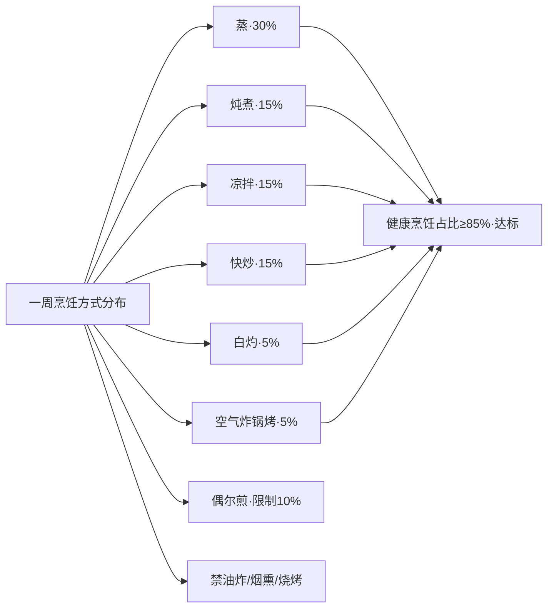

同时需避免的高温烹饪方式：**烧烤、煎炸等高温烹调会产生丙烯酰胺、反式脂肪等有害物质**[^109]；**腌制食品、加工肉类含亚硝酸盐**[^96][^134]；**长期吃烫食(超过65℃)会反复损伤食管黏膜**[^96]——这是中老年常见误区，食物和饮品的温度在10~40℃最佳[^96]。

## 8.2 控油壶、限盐勺与天然香料的调味控量系统

第7章已经验证两周食谱日均盐~4.6g、油~26g均达标，但这一达标的前提是**家庭厨房必须有量化工具与系统化方法**——凭手感放盐放油是中国家庭最普遍的"基线偏离"原因。本节系统建立"工具+替代+识别+顺序"四位一体的调味控量系统。

### 8.2.1 三类厨房控量工具的标准用法

**工具一·限盐勺**:目前限盐勺容量种类较多，包括1g、2g、3g、5g、10g、15g等不同规格[^111]。**常见的一平勺约2克盐**[^93][^101]——一啤酒瓶盖去掉胶垫的量约5g（推荐摄入上限）[^96]。家庭使用按"一菜一勺"原则——三口之家烹饪3道菜每菜限2g盐共6g，每人分食得约2g/餐，全天三餐合计6g以内[^93]。**一平勺指的是平平的舀一勺,要把高出盐勺的部分去掉**[^93]。

**工具二·定量储盐罐**:在储存功能基础上利用瓶盖刻度让烹饪时较为准确控制食用盐使用量[^111]。建议三口之家**每月食盐用量控制在500g以内**[^93]——折算每日约16g/3人=5.3g/人，符合≤5g/d标准。

**工具三·控油壶**:核心特点有二——**出油量小油嘴更细长任凭怎么用力倒流出的油总是"涓涓细流"；刻度并不以毫升计数而是每个刻度为25g(推荐摄入量)**[^93]。三口之家一日三餐用油总量不超过75ml/3人=25ml/人[^93]——这正是DRIs2023版25~30g/d推荐量。常见控油壶刻度50ml/格、最顶端630ml[^93]，适合家庭按周分装用油。

| 工具 | 规格 | 三口之家用量分配 | 每人每日上限 |
|------|------|-------------|-----------|
| 限盐勺 | 一勺2g(平勺) | 9勺/3人=3勺/人/天 | 5g(约2.5勺) |
| 定量储盐罐 | 瓶盖刻度量化 | 月用量≤500g/3人 | 5g/d |
| 控油壶 | 一格25g(630ml最大刻度) | 一日总用量75ml/3人 | 25~30g |

### 8.2.2 减盐执行体系:四把钥匙的协同

第3.5.2节已确立减盐的"四把钥匙"——定量盐勺、低钠盐、识别隐形盐、天然提味。本节进一步细化为家庭执行清单：

**第一把钥匙·定量盐勺(已述)**——一菜一勺，每餐≤2g。

**第二把钥匙·低钠盐替代**:**家庭烹饪中建议逐步用低钠盐替换普通盐——初期可按1:1比例混合，适应后完全替代**[^101]。**世界卫生组织发布的《低钠代盐制品使用指南》呼吁用低钠盐替代普通食盐**[^101]。第7.2.1节已论证低钠盐的循证降压效果。**肾功能不全者、服用保钾药物或存在钾排泄障碍的个体不宜食用低钠盐**[^101]——这是必须明确的安全红线。

**第三把钥匙·识别隐形盐**:第7.2.2节已整理"隐形盐源对照表"。**酱油、咸菜、酱制食物、熟食肉类、午餐肉、香肠、罐头、味精、鸡精、豆瓣酱、沙拉酱、调料包都是含盐大户**[^96][^101]；**营养标签上钠含量1400mg/100g换算成含盐量为3.6g、远超国际通用高盐食品标准**[^101]。

家庭主要外购食品的隐形盐数据：1包方便面≈5g盐、1根火腿肠≈2g盐、100g薯片≈2g盐、1勺酱油(15ml)≈1.5g盐、1勺蚝油≈1g盐、1块咸味饼干≈0.5g盐——任一项进入餐桌都会显著挤占5g/d配额。两周食谱红榜清单完全排除上述加工食品，是钠摄入达标的根本保障。

**第四把钥匙·警惕酱油蚝油味精**:**调味品的钠盐含量都很高，选择低钠盐、低盐酱油，减少味精、鸡精的用量**[^96]。具体执行——选购低钠生抽（钠含量较普通生抽低约30%）、酱油每日≤15ml、蚝油用1勺就不要再加盐、味精鸡精尽量不用而以菌菇/海带/虾皮天然提鲜替代。

### 8.2.3 天然香料替代提味方案

减盐不等于"寡淡无味"——天然香料能在不增加钠摄入的同时显著提升菜肴风味[^111][^132][^101]。把适配中式菜式的常用天然香料整理为分类清单：

| 香料类别 | 典型品 | 适配菜式 | 风味贡献 |
|---------|------|---------|---------|
| 葱姜蒜 | 大葱、生姜、大蒜 | 几乎所有中式菜 | 基础辛香增鲜 |
| 中式香辛料 | 花椒、八角、桂皮、香叶、小茴香、大茴香 | 炖煮、卤制、蒸煮 | 复合芳香替代盐 |
| 鲜辣类 | 辣椒、白胡椒、黑胡椒 | 炒菜、汤品 | 辣味放大咸味感知 |
| 酸味类 | 米醋、白醋、苹果醋、柠檬汁 | 凉拌、清炖鱼汤 | 酸味"放大"咸味感知 |
| 西式香草 | 罗勒、迷迭香、百里香 | 香煎鸡胸、烤蔬菜 | 草本香气 |
| 鲜味替代 | 香菇、海带、虾皮、菌菇粉、番茄(谷氨酸) | 炖汤、蒸菜 | 天然鲜味替代味精 |

**柠檬汁的酸味可以"放大"菜肴本身的咸味感知，非常适合减盐**[^101]——这是被低估的减盐神器。**香菇、海带、番茄等食材含有谷氨酸成分能产生天然鲜味**[^132]——这正是为什么本食谱多次运用香菇蒸鸡、番茄豆腐汤、海带豆腐汤等组合。**少量盐先腌再用醋香油调味**[^132]——凉拌黄瓜先放少许盐腌10分钟倒出渗出的盐水，再用醋香油调味，既入味又少盐。

### 8.2.4 烹饪顺序细节技巧

减盐除了量化与替代，还有"什么时候放、怎么放"的顺序细节：

**第一·后放盐技巧**:**在菜肴出锅前撒盐可减少用盐量30%以上**[^132]——高温烹饪会使盐分渗入食材内部，后期添加能使盐粒更多附着在食物表面，增强咸味感知[^132]。**炖煮类菜品先用少量盐提鲜，食用前根据口味补充调整**[^132]——既保留炖煮风味又控制总量。

**第二·使用带孔调料瓶**:**将食盐装入带孔调料瓶通过分散撒落方式增强咸味感知**[^132]——一瓶撒入比一勺倒入更均匀，咸味更明显，用量更省。

**第三·少喝菜汤、撇浮油**:**炒菜的油会留在菜汤里,所以少喝菜汤或少食用汤泡饭**[^96]；**炖煮肉类或汤类时，冷却后撇去表面凝固的浮油，可有效减少脂肪摄入**[^97]——这是工作日带饭"汤汁打包"和家庭炖肉的关键减油动作。

**第四·控油壶+小喷油瓶组合**:除了控油壶量化每日总量外，可备一个小喷油瓶用于煎炒前喷洒——比传统倒油法可减少30~40%用油量。

**第五·阅读营养标签**:**购买包装食品时阅读营养成分表选择含油脂低、不含反式脂肪酸的食物**[^96]——配料表中出现"植物奶油、人造黄油、人造奶油、氢化植物油、麦淇淋、起酥油或植脂末"等成分时都含有反式脂肪酸[^96]，应严格避免。

### 8.2.5 家庭三口之家与一人份的份量适配

53岁/80kg目标个体若与家人共餐，上述份量需要按人头适配：

| 家庭规模 | 每月食盐 | 每日烹调油 | 限盐勺频次/天 |
|---------|---------|----------|------------|
| 1人独居 | 150g | 25g | 2~3勺 |
| 2人(夫妻) | 300g | 50g | 5勺 |
| 3人(三口之家) | 500g以内 | 75g | 8~9勺 |
| 4人 | 600g | 100g | 11~12勺 |

**烧一个菜用一勺盐——对于一般的三口家庭每顿如果煮3道菜应控制好平均每道菜有2g盐，每人每道菜最多吃1/3，以此类推**[^93]——这一"一菜一勺、按人均食"的简化记忆法适合中国家庭厨房。

## 8.3 周末批量预处理与省时备餐策略

第6.8.5节已经预告"周末批量预处理2~3小时一次性完成下周备餐，将工作日早晚餐烹饪时间压缩至15~20分钟"是两周食谱长期可执行的关键支撑。本节展开标准化备餐流程的具体操作。

### 8.3.1 备餐的逻辑与时间投入

备餐(Meal Prep)的概念早期由健身爱好者发明——由于他们对摄入控制严格、外食难以满足低脂高蛋白需求，于是自己烹饪带饭；又由于他们大多是时间管理达人，演变出了**一周集中烹饪一到两次**的做法[^94]。在这一两次时间内把一周的饭都准备好冷冻起来，到需要吃的时候只要几分钟微波就可以吃到美味营养餐食[^94]。

对于53岁中年家庭，可借鉴的备餐版本是**"半成品预处理+部分熟食冷冻"**——既不必像健身者那样把所有餐食一次做完，又能显著降低工作日烹饪门槛。**备餐有两种概念:一种是把一周的饭都准备好冷冻起来；另一种是把食材处理成容易烹饪的半成品类似盒马半成品**[^94]——本食谱推荐"半成品+少量熟食"的混合策略，既保证新鲜度又压缩工作日烹饪时间。

**周末备餐的标准时间投入**:周日下午2~3小时，是与全天总投入7~8小时（每天1小时×7天）相比的"时间集中化"——总时间不变，但工作日每餐压缩到15~30分钟。

### 8.3.2 标准化四步备餐流程

**第一步·主蛋白预处理(45分钟)**:

按"一周食谱主菜清单"分类处理蛋白源——

- **鱼类**：买回的整鱼/鱼块清洗去黑膜，按每餐80~100g分装入真空袋或保鲜袋，**冷冻保存3~6个月**[^98][^135]；解冻只需提前一晚移至冷藏室或清水下解冻；
- **鸡胸/鸭胸**:**鸡肉切成比拳头略小大小，加料酒+老抽+清水+小香葱+姜片+黑胡椒+少量盐腌制后,真空袋分装冷冻**[^136]——按每餐80~100g分装（注意鸡胸切薄片+腌制后冷冻，工作日只需解冻直接香煎或快炒）；
- **瘦肉(猪肉/牛肉/羊肉)**:洗净分切薄片,**按每餐50~75g分装冷冻保存3~6个月**[^98][^135];
- **虾仁**:开背去线后清洗沥干,按每餐50~80g分装冷冻;
- **冷冻肉丝**:也可直接买切好的冷冻肉丝,**早上出门前清水里解冻,下班搭配各种蔬菜、菌菇做个快手炒菜**[^94]。

特别提示——**避免反复冰冻-解冻**[^94],一整块通脊冻成冰坨很难切开,需要反复解冻使新鲜度大打折扣还可能滋生细菌;**周末按一次能吃完的小份分装**[^136]是关键。

**第二步·主食预处理(30分钟)**:

- **干货浸泡**——糙米、藜麦、杂豆、紫米提前浸泡(藜麦充分冲洗去皂苷),冷藏可保存2~3天;
- **杂粮饭批量煮制**——周日一次煮3~5份杂粮饭,**分装成一次能吃完的小份,先吃的可以放冷藏室保存2天左右,后吃的可以放入冷冻室**[^136];
- **薯类预蒸**——红薯、紫薯、山药、芋头一次蒸够3~5份冷藏保存,工作日早餐取出加热即可;
- **燕麦免浸泡**——即食燕麦+牛奶现煮5分钟即成,无需备餐。

**第三步·蔬菜预处理(30分钟)**:

- **耐放蔬菜**——胡萝卜、彩椒、土豆、洋葱可洗净不切冷藏一周;
- **绿叶菜**——周日洗净沥干装保鲜盒冷藏,**留个2~3天的量,带饭时先吃**[^136];
- **菌菇**——香菇、平菇、金针菇切片冷冻分装,工作日直接下锅;
- **半成品蔬菜**——盒马等渠道的"半成品真空蔬菜""开袋即烹蔬菜"虽稍贵但极省时,作为应急选项。

**第四步·汤品批量制作(30~45分钟)**:

- **基础汤底**——番茄豆腐汤、海带豆腐汤、菌菇汤一次煮一大锅;
- **冷冻分份**——使用硅胶模具或保鲜袋分装冷冻,每份200~300ml;
- **加热即食**——工作日加热3~5分钟即可,**加热时再加入新鲜豆腐/蔬菜补充新鲜度**[^95]。

### 8.3.3 万能搭配公式与冰箱储存清单

**万能搭配公式**:**1份优质蛋白 + 2种蔬菜 + 1份主食**[^137]——蛋白选已腌制冷冻的鸡胸/鱼/豆腐干、蔬菜选已洗净沥干的当周叶菜、主食选已分装的杂粮饭——三者组合即可在15~20分钟内完成一餐。

**示例一**——杂粮饭(微波加热3分钟)+鸡胸肉(空气炸锅180℃15分钟)+西兰花(焯水快炒5分钟)≈20分钟一餐;

**示例二**——煮一把面条(8分钟)+番茄鸡蛋卤(预先做好加热3分钟)+烫几棵青菜(2分钟)≈15分钟一餐;

**示例三**——即食燕麦+开水/牛奶+坚果+水果≈早餐瞬间完成[^137]。

**冰箱储存时长清单**(确保食品安全):

| 食物类别 | 冷藏4℃ | 冷冻-18℃ | 关键提示 |
|---------|--------|---------|---------|
| 生鲜肉类 | 1~2天 | 3~6个月 | 真空分装冷冻可延长至5天冷藏 |
| 海鲜 | 1~2天 | 3~6个月 | 三文鱼等高油脂鱼≤24小时内食用 |
| 熟食 | 3~4天 | — | 二次加热中心温度≥75℃ |
| 叶菜 | 3~5天 | — | 用打孔保鲜袋保持85%湿度 |
| 根茎菜 | 7~14天 | — | 胡萝卜可冷藏2周 |
| 巴氏奶 | 5~7天 | — | 开封后48小时内饮用完 |
| 酸奶 | 7~21天 | — | 按包装标注 |
| 鸡蛋 | 2~5℃ 20天内 | 不冻 | 冷藏可预防沙门菌污染 |
| 杂粮饭(熟) | 2~3天 | 1个月 | 冷冻避免淀粉老化 |
| 汤品(批量) | 3天 | 2个月 | 硅胶模具分份冷冻 |

**冰箱合理规划**:生熟食分层存放避免交叉污染,定期清洁冰箱保持4℃以下环境,使用密封盒或真空袋延长保鲜期[^98][^135];**保持冰箱容量在70%以下有利于冷气循环**[^135]。

### 8.3.4 半成品与速冻食品的合理利用

不必苛求"全部从生鲜开始"——合理利用半成品和速冻食品可显著降低备餐门槛：

| 推荐半成品 | 营养特点 | 使用场景 |
|---------|--------|---------|
| 半成品真空蔬菜 | 洗净切好,8块钱一包就直接是一道菜[^112] | 减脂期加椰子水煮一煮 |
| 即食鸡胸肉(原味/低脂) | 高蛋白低脂,不解冻可直接空气炸锅加热[^119][^112] | 加班晚归应急蛋白源 |
| 速冻杂粮饺子/包子 | 蒸10~15分钟即可 | 早餐+无糖豆浆+焯熟蔬菜 |
| 冷冻汤品(分硅胶模具) | 加热3~5分钟[^95] | 工作日午晚餐汤品 |
| 真空鱼块 | 已去骨切块,蒸8分钟 | 工作日深海鱼日 |
| 冷冻豌豆/玉米粒 | 直接下锅炒制 | 配菜增色多样化 |

**警示**——避开"伪健康"半成品:**煲仔饭、火锅小笼包等味道偏甜偏咸,虽方便但钠含量高**[^112];薯条、炸鸡块、奶茶半成品等是红榜清单严格排除项。判断半成品健康度的"1+3法则"详见8.5.3节。

### 8.3.5 工作日30分钟一餐的实操示例

把上述备餐策略落地到工作日具体场景:

**周三晚餐示例**(用周日备餐成果):

```
17:00 进门
17:02 取出预煮糙米饭加热(微波3分钟)
17:05 取出腌好鸡胸肉(冷冻已转冷藏解冻)→空气炸锅180℃15分钟
17:08 取出预洗西兰花→沸水焯1.5分钟过凉
17:13 西兰花蒜末快炒1分钟
17:14 取出冷冻菌菇豆腐汤→加热3分钟
17:17 装盘,加少许低钠生抽与几滴香油
17:20 开餐
```

全程实际操作时间~20分钟,**70%操作可在等待空气炸锅烤制时同步进行**。这就是"备餐+一锅多用"组合的最大省时效益。

## 8.4 一锅多菜与立体烹饪的高效厨房逻辑

第8.3节的备餐策略解决了"周末投入1次、工作日省时5天"的时间分配问题,但对于不爱备餐或忘记备餐的读者,仍需要"现做现吃也能30分钟内完成一餐"的高效厨房逻辑。**借鉴电蒸锅一锅出多菜技巧与立体烹饪法**[^133][^130],可以让一锅、一炉、一空气炸锅同时完成多道菜,大幅提升厨房效率。

### 8.4.1 立体蒸炖法:电蒸锅一锅出三菜一汤

**电蒸锅立体烹饪法的核心是分层蒸制**[^133][^130]——

- **底层**:炖汤(如蘑菇鸡汤、菌菇豆腐汤),加正常蒸东西时2.5倍水量[^133];
- **中间层**:蒸主食(粗粮饭、杂粮馒头、玉米),粗粮提前浸泡2小时便于成熟[^133];
- **顶层(最上方)**:小碗蒸菜(肉末蒸蛋、香菇蒸鸡、蒜蓉粉丝蒸虾、彩虹茄子等)[^133]。

具体操作流程:第一步水开后下底层鸡汤食材慢炖一共45分钟[^133];第二步10分钟后中间层放入预浸泡杂粮饭蒸25~30分钟[^133];第三步20分钟后顶层放入腌好的香菇蒸鸡蒸25分钟、最后10分钟加入易熟的彩虹茄子蒸10~15分钟[^133]。**整套流程45分钟出锅,无明火无油烟,营养流失少**[^130]——这是工作日傍晚做晚餐最理想的高效方案。

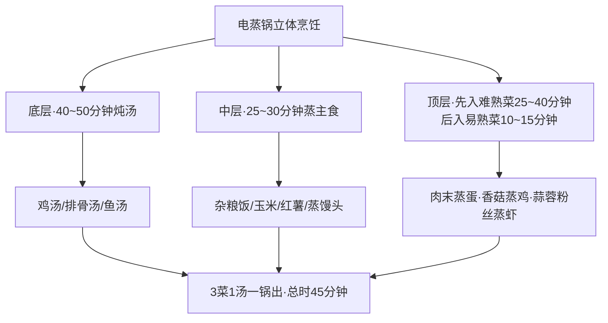

### 8.4.2 煮面锅一锅多用

煮面锅可同时完成"焯青菜→煮蛋→煮面"三步,无需洗锅:

```
锅中加水煮开
第1步:加入青菜焯30~60秒捞出过凉(青菜处理完成)
第2步:加入鸡蛋煮6~8分钟(鸡蛋处理完成)
第3步:取出鸡蛋,加入面条煮3~5分钟(面条处理完成)
全程一锅,水可重复利用
```

这一方法适合工作日早餐快手三明治+水煮蛋+焯熟蔬菜的15分钟早餐。

### 8.4.3 空气炸锅一锅烤鸡肉与时蔬

**空气炸锅鸡胸肉烤时蔬**——土豆胡萝卜开水煮3分钟、西兰花焯水加少许减盐+黑胡椒+橄榄油抓拌均匀冷藏腌制[^107]。鸡肉切小块加调料抓拌均匀腌制2小时[^107]。蔬菜放入烤盘,加入腌好的鸡肉表面撒黑胡椒粒,**空气炸锅200℃预热,180℃烤25分钟**[^107]——一锅同时完成鸡胸肉与三种蔬菜,**少油少盐更健康**[^107]。

这一方法对工作日晚餐具有"投入5分钟备料、25分钟烤制、自由活动"的极致省时优势,鸡肉腌制可前一晚或周末批量完成。

### 8.4.4 一炒锅多菜逻辑:先难后易、先素后荤

不用电蒸锅或空气炸锅时,普通炒锅也能实现一锅多菜逻辑[^133]:

**第一用·焯水油菜时加入油盐糖**——油菜味道更好颜色更亮,**焯完水把水倒掉可以直接倒油继续下一步**[^133];

**第二用·锅内倒油可以直接煎鱼或炸鱼**——家里不方便可以煎鱼或者把鱼切块再炸,倒掉油后留底油[^133];

**第三用·留底油直接炒香小料**——倒水炖鱼[^133];

**第四用·捞出鱼后留下的汤直接煮意面或下面条**——把面条直接放入炖鱼汤中煮熟[^133]——汤鲜面香,无需洗锅。

这一"一锅四用、零洗锅"方法对工作日傍晚做晚餐特别友好,**炸锅的鱼搭配各种蘑菇用海鲜酱炖煮,留下的汤直接煮意面,不刷锅还能吃美味**[^133]。

### 8.4.5 30分钟内完成一餐的家常组合

把上述技巧整合,给出几个30分钟内完成的实际家常组合:

**组合一·番茄炒蛋+清炒西葫芦鸡胸+大米饭(全程25分钟)**[^138]:

```
00分:洗米下电饭煲(自动煮饭18分钟)
03分:西葫芦切片、胡萝卜切片、鸡胸肉切片
08分:鸡胸肉腌料酒+生抽+淀粉
13分:番茄切块、鸡蛋打散
18分:开火炒菜
   18:00 番茄炒蛋(5分钟)→盛出
   23:00 鸡胸肉+胡萝卜+西葫芦快炒(5分钟)
25分:饭好,装盘开餐
```

**组合二·快手家常菜三件套(全程20分钟)**[^115]:

- 番茄金针菇肥牛卷(25分钟):番茄切块,金针菇焯水,肥牛卷焯水去血沫,番茄炒软出汁加水煮,放金针菇煮3分钟,放肥牛卷煮2分钟,加少许低钠生抽蚝油白糖调味[^115];
- 青椒土豆丝(20分钟):土豆切丝清水浸泡10分钟去淀粉(更爽脆),青椒切丝,蒜末爆香,土豆丝快炒2分钟,加青椒丝继续翻炒,加少许盐生抽,出锅前淋入少许醋[^115];
- 虾仁滑蛋(15分钟):虾仁料酒腌5分钟,鸡蛋打散加少许盐+1勺水,锅中倒油,先炒虾仁变色,倒入蛋液凝固后翻炒,撒葱花出锅[^115]。

**组合三·黄瓜木耳虾仁炒鸡蛋(全程10分钟)**[^116]:四种食材混搭,绿黑红黄色彩丰富,营养美味[^116],适合工作日晚餐独居场景。

### 8.4.6 厨房效率10招总结

整合优化厨房效率的核心技巧[^139]:

1. **做饭前预处理**——先洗切食材、调料提前准备(蒜末/姜片/酱汁),按顺序摆好,避免"一边做一边找";
2. **常用调料集中收纳**——一个转盘或一处摆放,做菜时一伸手就能拿到;
3. **提前准备万能蒜姜组合**——一次性切好蒜末姜末分装放冰箱(冷冻),每次直接用节省切菜时间;
4. **学会一锅多用**——先炒菜再用同一锅煮汤煮面,同时焯青菜,减少洗锅次数;
5. **善用电器**——电饭煲煮饭+炖菜、空气炸锅少油快熟、电热水壶快速热水,同时进行多个步骤;
6. **先难后易的烹饪顺序**——先处理耗时长的炖煮、再做快手炒凉拌,利用等待时间做别的事;
7. **食材提前分装**——肉类切好分袋冷冻、蔬菜洗好装盒按一顿一份,每次直接拿用;
8. **保持台面整洁**——用一个"垃圾碗"专门放厨余,边做边整理,做完不用大清理;
9. **简单菜优先**——炒饭/面条/一锅菜/凉拌+主食组合,20分钟内搞定一餐;
10. **固定菜单**——准备一周菜单(简单版本)轮换几道拿手菜,减少"今天吃什么"的纠结时间。

## 8.5 按周采购清单与冰箱分类储存

备餐与高效烹饪的前提是**采购清单的清晰化**——没有清晰清单的采购容易陷入"东买点西买点"的低效模式,既浪费时间金钱也容易忘买必需食材或冲动购买不必要食物。

### 8.5.1 第一周采购清单

按第5章第一周食谱编排整理为六大类标准化清单(以一人份2周用量为基础,三口家庭翻3倍):

**主食类**: 燕麦片500g、糙米1kg、藜麦200g、小米500g、紫米200g、红豆200g、荞麦面200g、全麦面包500g、全麦馒头500g、玉米棒2根、红薯300g、紫薯300g、山药300g、南瓜300g

**肉禽鱼蛋类**: 新鲜鲈鱼1条(500g)、新鲜三文鱼或虹鳟鱼200g、新鲜鳕鱼200g、新鲜大虾300g、虾仁150g、鸡胸肉500g、鸡腿肉(去皮)400g、瘦牛里脊200g、瘦猪肉(肉末)100g、鸡蛋10个

**豆制品奶制品类**: 嫩豆腐2盒(300g)、北豆腐2盒(300g)、豆腐丝200g、低脂牛奶2L、无糖酸奶1kg、无糖豆浆1L、豆腐脑200g

**蔬菜类**: 菠菜500g、西兰花500g、芥蓝300g、油菜500g、紫甘蓝300g、生菜200g、小白菜200g、木耳菜200g、芹菜200g、胡萝卜500g、彩椒(红黄各1)、番茄1kg、冬瓜500g、黄瓜2根、香菇250g、海带20g(干)、紫菜10g(干)、姜100g、蒜2头、葱2根、香菜30g

**水果类**: 苹果4个、梨3个、蓝莓150g、樱桃150g、猕猴桃3个、橙子3个、柚子1/2个、小番茄200g

**坚果调味料类**: 核桃100g、杏仁80g、腰果60g、亚麻籽油1瓶、菜籽油或橄榄油1瓶、低钠生抽1瓶、米醋1瓶、料酒1瓶、低钠盐1袋(500g)、黑胡椒1瓶、八角少量、花椒少量、香油1瓶

### 8.5.2 第二周采购清单

按第6章第二周食谱编排,在第一周基础上系统轮换:

**主食类**(替换或补充): 鹰嘴豆200g、玉米渣或玉米粒300g、全麦面条300g、芋头300g

**肉禽鱼蛋类**: 新鲜带鱼300g、新鲜青花鱼或鲐鱼200g、虹鳟鱼或淡水三文鱼200g、新鲜鲷鱼或鳜鱼300g、鲫鱼1条(400g)、鸭胸肉200g、瘦羊里脊200g、鸡腿肉400g、虾仁300g、鸡蛋10个

**豆制品奶制品类**(替换): 腐竹100g、毛豆500g(带壳)、嫩豆腐2盒、嫩豆腐脑或老豆腐脑

**蔬菜类**(增加品类): 苋菜200g、紫薯叶200g、秋葵200g、白菜500g、芦笋200g、茴香200g(嫩茎叶)、白萝卜500g、平菇200g、金针菇200g、菌菇粉(可选)

**水果类**(增加品类): 草莓300g、葡萄300g、桑葚或火龙果200g

### 8.5.3 食品标签"1+3法则"识别预包装食品

外购预包装食品时**应阅读食品标签上的生产日期了解食物的新鲜程度**[^140],并通过"1+3法则"识别营养价值[^97]:

**"1"看项目**——重点看能量、蛋白质、脂肪、碳水化合物(含糖)、钠这五项强制标示[^97];

**"3"看数据**[^97]:

- **看单位**:是"每100克"还是"每份",对比时统一换算;能量<2000千焦/100g(约500千卡)合格,饱和脂肪<1.5g/100g,糖<5g/100g为低糖,钠<120mg/100g为低钠超过600mg警惕;
- **看NRV%(营养素参考值百分比)**:吃一份能满足全天营养素的百分比;高蛋白:蛋白质NRV%≥能量NRV%为相对优质;低负担:脂肪/糖/钠的NRV%越低越好;**任一项NRV%超过30%就要警惕**;
- **看"隐藏糖"和"反式脂肪"**:在碳水化合物下找"糖",尽量选≤5g/100g;在脂肪下找"反式脂肪酸",优选0g版本;**警惕"0反式脂肪"但含"植脂末""起酥油"的产品,可能隐含反式脂肪酸**[^97]。

**配料表小技巧**[^97]:配料表前三位是主要成分,若白砂糖、黄油、盐排名靠前建议少选;全麦/燕麦/坚果排名靠前则相对优质。**全麦面包的配料表应有全麦粉排在第一位、含量≥51%才属真全麦**——避免"全麦色素+精白面粉"的伪全麦产品。

### 8.5.4 冰箱分层储存原则

科学冰箱储存可显著延长食材新鲜度,降低食物浪费:

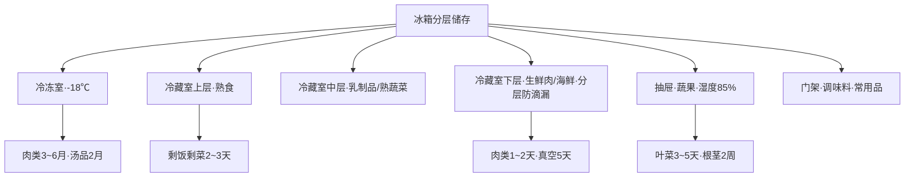

**关键原则**[^140][^98][^135]:

1. **熟食上层、生鲜下层**——避免生肉血水滴落污染熟食;
2. **生熟食分开**——食物清洗、切配、储藏的整个过程中生熟都应分开,在冰箱存放生熟食品应分格摆放[^140];
3. **叶菜竖放保鲜**——用打孔保鲜袋保持85%湿度[^135];
4. **肉类真空分装冷冻**——按一餐份量分装,避免反复冰冻-解冻;
5. **应季蔬果先吃完**——遵循"先进先出"原则;
6. **门架放调味料和饮品**——温度波动较大不宜放鲜品;
7. **不超过70%容量**——保持冷气循环顺畅[^135];
8. **定期清洁**——保持4℃以下环境,每两周清理一次过期食品[^98]。

**冰箱储存食物过程中的注意事项**[^140]:鸡蛋应在2~5℃冷藏,最好在20天内食用[^140];冷冻食品在家储存时关注生产日期、保质期,保证食品在保质期内尽快食用;新鲜蔬菜也有必要将其存在低温环境并尽快食用;但一些特殊食品如热带水果、黄瓜、焙烤食品应尽量现买现吃[^140]。

### 8.5.5 双周期采购节奏

把一周采购整合为"集中+补充"双周期节奏:

**周末集中采购(周六/周日上午)**——肉禽鱼蛋、耐放蔬果、主食干货、调味料(占周采购量约80%);

**周三/周四补充采购(短时菜场)**——叶菜、菌菇、豆腐、鲜奶、应急水果(占周采购量约20%)。

这一节奏既保证食材新鲜度,又避免每天采购的时间浪费——**集中采购降低交通成本、补充采购保证叶菜新鲜**。对于工作繁忙的双职工家庭,可考虑周末集中采购+网络生鲜平台周中补单的混合模式。

## 8.6 手掌法与拳头法的家庭份量估量

精确称重是营养师的方法,**家庭厨房的现实是"很少有人会用食物秤"**——因此需要建立"无需食物秤的份量估量法"。已有多项指南推荐**用手掌、拳头、手指等身体部位估量食物份量**[^141][^142][^143],既直观又便携。

### 8.6.1 拳头法的标准化清单

每个人的拳头大小与自己的食量基本匹配——这是用拳头估量的科学基础[^141][^143]:

| 食物类别 | 拳头估量 | 实际重量(熟重) | 相当于 |
|---------|--------|-----------|------|
| 主食(米饭/面条) | 1拳头(熟重) | 200g | 100g生米煮成的熟饭(约2两生米) |
| 全谷主食 | 2~3拳头 | 400~600g熟饭 | 一天总主食量 |
| 薯类(土豆/红薯/山药) | 1空拳 | 100g | 计入主食量 |
| 生蔬菜(叶菜) | 3大把 | 300~500g | 全天蔬菜量 |
| 熟蔬菜 | 3拳头 | 300~450g | 全天蔬菜量 |
| 水果 | 1拳头 | 200~300g | 全天水果量 |

具体执行——找一个自己拳头大小的碗,自己的拳头能正好放进碗里最好[^141];装满该碗即一拳头量。

### 8.6.2 手掌法的标准化清单

手掌厚度与大小代表蛋白质和坚果的合适份量[^141][^142]:

| 食物类别 | 手掌估量 | 实际重量 | 适用场景 |
|---------|--------|---------|---------|
| 畜禽肉(瘦肉/鸡胸/鱼) | 1手掌 | 40~75g | 一餐量 |
| 水产品(鱼/虾) | 1手掌 | 40~75g | 一餐量 |
| 全天动物蛋白 | 2手掌 | 80~150g | 全天合计 |
| 坚果 | 1手掌心(平铺) | 10~15g | 全天加餐 |
| 大豆(干) | 1小把(掌心平铺) | 15~20g | 全天合计 |
| 豆制品(豆干) | 1手掌大小 | 30~50g | 一餐量 |
| 嫩豆腐 | 1手掌大小 | 100g | 一餐量 |

### 8.6.3 手指法与餐盘法

**手指法**[^141]——

| 食物 | 手指估量 | 实际重量 |
|------|--------|---------|
| 油脂 | 拇指第一指节 | 5~10g(1茶匙) |
| 面条(干) | 一弯指(食指尖到拇指根) | 50g |
| 鸡蛋 | 1个鸡蛋大小 | 50g |

**餐盘211法**[^144](已在第4.3节充分论证)——

```
直径23cm浅盘
1/2 蔬菜区(深色占半)
1/4 蛋白质区
1/4 主食区(全谷占≥1/3)
另配:1杯白水/淡茶水 + 1份水果加餐
```

视觉化代替称重,自动控制总量,强制蔬菜优先——这是中国家庭最易执行的家庭份量法。

### 8.6.4 53岁/170cm/1700kcal档三餐手掌实操

把上述方法整合到170cm/1700kcal基准的一日三餐:

**早餐**(约470kcal):

- 主食50g干重 ≈ 1拳头熟饭(燕麦煮粥) 或 1片全麦面包+1拳头杂粮粥
- 蛋白20g ≈ 1鸡蛋(1个) + 250ml牛奶(1杯) + 1掌心豆腐
- 蔬菜100g ≈ 1小把焯熟菠菜
- 水果50~80g ≈ 1拳头蓝莓 或 半个苹果

**午餐**(约640kcal):

- 主食75~100g干重 ≈ 1.5~2拳头熟饭
- 蛋白25~30g ≈ 1手掌大小鱼/鸡胸肉(80~100g)+0.5手掌豆腐
- 蔬菜250g ≈ 2大把生菜 或 2拳头熟菜+1拳头汤菜
- 调味油 ≈ 1拇指指节(8~10g)

**晚餐**(约540kcal):

- 主食50~75g干重 ≈ 1~1.5拳头杂粮饭+0.5空拳薯类
- 蛋白25~30g ≈ 0.8手掌鱼/虾+1掌心豆腐
- 蔬菜200g ≈ 2拳头熟菜
- 调味油 ≈ 0.7拇指指节(6~7g)

**加餐**:

- 水果加餐 ≈ 1拳头(200g)苹果/梨 或 0.5拳头(100g)蓝莓
- 坚果加餐 ≈ 1掌心(10g)≈ 2~3颗核桃或5~6粒杏仁
- 酸奶加餐 ≈ 0.5~1杯(100~200g)

### 8.6.5 关键提示:都是生重可食部

**营养学上的重量都是指生重**[^141]——这是最容易误判的细节。**100g生米加水煮熟由于水量不同煮成大约200g左右米饭**[^141];**在食堂打饭的时候经常说"二两米饭"指用100g生米煮成的熟饭,而不是熟饭有二两重,熟饭其实有四两左右**[^141]——这一换算关系对工作日食堂打饭和家庭烹饪估量都有直接意义。

同样需要注意的是**"可食部"概念**——鱼80g指去骨去鳞后的可食部分,而不是带骨整鱼80g;虾80g指去壳去线后的虾仁,而不是带壳整虾80g。两周食谱中标注的鱼禽肉份量均为可食部生重。

**适用人群**[^142]:**上述方法只适用于身体健康的成年人,婴幼儿、糖尿病患者以及痛风患者等若想用手测饭量,应先咨询营养师等专业人士**——糖尿病患者需要更精确的碳水定量、痛风患者需要嘌呤精确控制,简化估量法不适用。

## 8.7 外出就餐与应酬场景的灵活替代

工作日中午外卖、傍晚加班晚餐、周末聚餐应酬——外出就餐场景在中国成年人日常生活中占比正快速上升,**居民在外就餐比例明显增加容易导致能量、油、盐等摄入超标增加超重肥胖发生风险**[^145]。两周食谱在家做饭的科学性必须延伸到外出就餐场景才能形成完整的执行闭环。

### 8.7.1 餐厅选择的两个标准

**第一·卫生与安全**——**应选择食品安全状况良好、卫生信誉度在B级及以上的餐饮服务单位**[^134];**选择证照齐全、环境卫生、信誉好的餐厅**[^134]。这是底线,不可让步。

**第二·菜式偏好**——优先选择中式蒸/炖/凉拌为特色的本帮菜、粤菜、淮扬菜餐厅;尽量避开以辣油重口味为特色的川湘菜、油炸为主的快餐厅;**少点干煸、干锅、水煮、酱爆、鱼香、卤味等,可以多选一些清蒸、凉拌、煮炖菜肴**[^101]。

### 8.7.2 主动减盐减油的"三句话"沟通技巧

很多人不好意思跟厨房沟通,实际上**主动要求"少盐、少油、少糖"是改善外食营养结构最有效的工具**[^134]。三句标准化沟通话术:

- **"麻烦少盐,我今天血压有点高"** — 大部分餐厅厨房会配合;
- **"清炒就行,不用回锅"** — 减少二次过油;
- **"主食先少打一半,不够再加"** — 控制主食量。

**点餐时要注意食物多样、荤素搭配,尽量选择用蒸、炖、煮等方法烹调的菜肴,避免煎炸食品和含脂肪高的菜肴**[^134]。**进食注意顺序,可以先吃少量主食,再吃蔬菜、肉类等;增加蔬菜摄入,肉类菜肴要适量;食量要适度**[^134]——这与第4章"蔬菜→蛋白→主食"进餐顺序一致。

### 8.7.3 不同就餐场景的具体点餐策略

**场景一·中式正餐厅(本帮菜/粤菜)**

| 推荐菜式 | 避免菜式 | 主食选择 |
|---------|---------|---------|
| 清蒸鲈鱼/桂花鱼 | 红烧/糖醋鱼 | 1小份米饭 |
| 白灼基围虾 | 椒盐虾/油焖虾 | 半份杂粮饭 |
| 蒜蓉时蔬/白灼菜心 | 干锅花菜/干煸豆角 | 加一份玉米/红薯 |
| 番茄豆腐汤/紫菜蛋花汤 | 老火浓汤(撇浮油后少喝) | — |
| 清炖鸡/醉鸡 | 红烧鸡/口水鸡(辣油) | — |

**场景二·快餐场景**(高铁站/机场/写字楼楼下)

- **优选**:清蒸鱼套餐、鸡胸肉沙拉(选橄榄油醋汁)、蒸饺+无糖豆浆、卤蛋+全麦三明治(蔬菜要多)、白灼时蔬+小份米饭;
- **次选**:寿司(避开油炸/含芝士)、米线(汤底要清淡)、粥+水煮蛋+凉拌菜;
- **回避**:炸鸡汉堡、薯条、油泼面/重油盖饭、糖醋外卖、奶茶、含糖饮料。

**场景三·火锅场景**

火锅是中国家庭聚餐高频场景,但红油锅+加工肉+蘸料三重负担可能让一餐钠摄入超过8g。健康火锅策略:

- **锅底优选**:清汤锅/番茄锅/菌菇锅,避开重油红汤锅(若必须吃辣选鸳鸯锅且自己只夹清汤一边);
- **食材结构**:总菜单50%素菜(青菜/菌菇/豆腐/魔芋)+30%瘦肉/鱼/虾+20%主食(蒸玉米/红薯/杂粮饭),避开高加工肉(午餐肉/培根/肥牛卷)和油炸品(炸豆皮/炸响铃);
- **蘸料控制**:用醋+蒜末+少许小米椒+几滴香油+少许低钠生抽,**避开沙茶酱/麻酱/海鲜酱(高盐高油)**;
- **饮品**:无糖茶水或柠檬白水,避开雪碧加冰/酸梅汤(高糖);
- **进餐顺序**:先涮素菜→再涮蛋白→最后主食。

**场景四·中式宴请聚餐**

聚餐场景往往菜品丰盛、油盐糖超标,坚持五个原则:

第一,**主动控制餐盘比例**——半盘蔬菜+1/4蛋白+1/4主食;

第二,**每道菜浅尝即止**——尝鲜不贪多,先吃清淡蒸炖菜,少夹油炸红烧菜;

第三,**主动公筷分餐**——既符合卫生准则也利于估算自己食量[^140];

第四,**餐前喝小半碗清汤**——稀释胃酸增加饱腹感,减少正餐量;

第五,**吃八分饱即停**——尝鲜原则下8分饱即可放下筷子。

**少吃菜汤拌饭——菜汤含盐量通常比菜本身要高,如果吃饭时觉得口渴可以喝水,别用菜汤"解渴"**[^101]。

### 8.7.4 应酬饮酒控制

中年男性外出应酬难免饮酒,但**男性每日酒精摄入不超过25克**[^146][^147](女性不超过15克)是安全上限,**减重期最好戒酒**(第1章已论证)。具体执行清单:

| 安全饮酒上限 | 男性 | 折算饮品 |
|-----------|------|---------|
| 酒精 | ≤25g/d | 啤酒750ml 或 葡萄酒250ml 或 高度白酒50g 或 38°白酒75g[^147] |

应酬饮酒五个注意事项[^146]:

1. **避免空腹饮酒**——饮酒前食用高蛋白或高脂肪食物可延缓酒精吸收,推荐食用牛奶、坚果或肉类;空腹饮酒易引发胃肠黏膜损伤;
2. **选择低度酒**——优先选择酒精度12%以下的红酒或啤酒,高度白酒更易导致快速醉酒;**避免多种酒类混饮加重肝脏代谢负担**;
3. **及时补充水分**——每饮用一杯酒精饮料需补充等量矿泉水预防脱水性头痛;酒后可适量补充含电解质饮品帮助代谢;
4. **慢性病患者严格戒酒**——慢性肝病患者应严格禁酒;**服用头孢类抗生素期间绝对忌酒**[^146];
5. **饮酒后两小时内不要驾车**;出现呕吐、意识模糊需立即就医[^146]。

**研究证明即使少量饮酒也可使甘油三酯水平进一步升高**[^99]——血脂异常人群应限制饮酒;高血压、糖尿病、痛风患者应严格戒酒,即使在应酬场合也要坚持以无糖茶水或白水替代。

## 8.8 节假日与特殊场合的弹性应对

节假日是两周食谱执行最容易"翻车"的时段——春节大年三十的全鱼全肉、中秋月饼、家宴生日蛋糕、出差旅行的酒店外卖,都是健康基线的考验。本节给出"80/20弹性原则"指导下的特殊场合应对策略。

### 8.8.1 80/20弹性原则:可持续执行的核心

**80/20原则是指80%的时间吃健康餐,而20%的时间可以允许自己吃些喜欢但不那么健康的食物**[^148]——这一原则的价值在于让健康饮食成为长期可持续的生活方式而非短期挑战。

完美主义是健康饮食的最大敌人——**如果一顿饭破坏了基线就放弃整周的努力,这才是真正的失败**。两周食谱设计已经预留了周六周日的"聚餐弹性日"(第5.7节、第6.7节),正是80/20原则的体现。

### 8.8.2 春节家宴:大鱼大肉的应对策略

春节是中国家庭最重要的聚餐场合,大鱼大肉、油炸丸子、糖油糕点、麻辣火锅、推杯换盏轮番上场。三步法保护基线:

**第一步·尝鲜不贪多+八分饱即停**[^134]——**每样菜都品尝一点即可,细嚼慢咽,充分感受食物的美味。当感觉有七八分饱(胃里觉得满了但再吃几口也可以)的时候,就该优雅地放下筷子**[^134]。这不仅能让你品尝到更多种类美味,还能有效避免积食和"每逢佳节胖三斤"的魔咒[^134]。

**第二步·餐桌"彩虹搭配"+主动夹菜先素后荤**——**记得主动搭配丰富的蔬菜水果(尤其深色蔬菜要占一半以上)、全谷物(比如杂粮饭、全麦包)和豆制品**[^134];春节餐桌上往往蔬菜被肉菜挤压,主动夹绿叶菜+菌菇+豆腐先吃,既增加饱腹感又减少肉菜摄入。

**第三步·第二天补救平衡**[^97]——节日聚餐过量后的补救:

- **减少正餐能量**——下一餐主动减少主食和烹调油摄入,增加蔬菜比例[^97];
- **增加身体活动**——当天或次日进行散步、慢跑、做家务,增加能量消耗[^97];
- **多喝水促代谢**——大量饮水有助于促进新陈代谢和食物消化[^97];
- **次日清淡饮食**——用清淡素简餐回归基线,**避免连续多日过量及时回归均衡饮食**[^97]。

补救方案示例(春节聚餐次日):

```
早餐:燕麦牛奶粥+水煮蛋+焯熟蔬菜+蓝莓
午餐:糙米饭+清蒸鱼+蒜蓉芥蓝+番茄豆腐汤
晚餐:小米南瓜粥+凉拌豆腐+清炒油菜+山药
全天饮水2000ml,加餐选苹果+核桃
```

### 8.8.3 节日零食的红绿灯选择

春节、中秋等节日零食桌前是隐形热量重灾区——花生瓜子坚果、糖果巧克力、糕点饼干、果脯蜜饯、含糖饮料琳琅满目。第6.10节已建立加餐零食三色清单,在此进一步细化节日场景下的具体选择:

**🟢推荐类**[^97][^107]:

- **坚果炒货**——选"原味"是关键,优先未添加盐糖油脂的烘烤型坚果;搭配酸奶或沙拉;**一小把约20~30g(去壳后),手心能握住的一把**[^97]——核桃2~3个或腰果10~15粒;
- **黑巧克力(≥70%可可)**——糖分较低、抗氧化物质丰富[^97][^107];每次掰10g含化食用;
- **新鲜水果**——苹果、橙子、柚子等低糖水果替代糕点;
- **无糖酸奶**——蛋白+钙双重收益;
- **水煮花生**——少盐版本,远胜瓜子的糖盐烘烤版;
- **魔芋制品/即食蟹棒**——低热量高蛋白零食[^106]。

**🟡适量类**[^97]:

- **坚果(蜜焗/盐焗版)**——糖盐含量高,严格控量10g/次;
- **巧克力(<70%可可)**——含糖较高;
- **全麦饼干(脂肪<10g/100g)**——查配料表避免起酥油植脂末。

**🔴避免类**[^97][^107]:

- **油炸食品**——肉骨头、丸子、麻花、薯片;
- **糖果蜜饯**——硬糖、奶糖、蜜枣、果脯;
- **含糖饮料**——可乐、果汁、奶茶、雪碧、酒精饮料(过量);
- **加工肉制品**——火腿肠、培根、香肠、咸鱼;
- **甜糕点**——年糕(糯米高升糖)、月饼(高糖高油)、奶油蛋糕。

**特殊人群忌口提示**[^97]:

- **坚果**——过敏体质、咽喉炎患者、痛风患者(部分坚果嘌呤较高)需谨慎;
- **糖果巧克力**——糖尿病患者(需严格计算碳水化合物)、肥胖人群、严重痤疮患者避免;
- **糕点饼干**——糖尿病患者、麸质不耐受人群、肥胖及控制体重者避免。

### 8.8.4 出差旅行场景的应急策略

出差旅行场景下做饭不便,需要建立"自备应急蛋白源+酒店早餐优选+正餐主动选择"三层防线:

**第一层·自备应急蛋白与碳水**:

行李箱里放入即食燕麦袋、原味坚果(分小包10g/份)、水煮蛋(出发当天煮好真空袋)、即食鸡胸肉(常温保存款)——这些可作为飞机/高铁上的健康零食和酒店应急早餐。

**第二层·酒店早餐优选**:

中式早餐选鸡蛋+牛奶+全麦面包+焯熟蔬菜+水果,避开油条、咸菜、白粥、蛋挞等高油高糖品[^94][^95]。**全麦面包搭配鸡蛋、燕麦片配牛奶、蔬菜鸡蛋饼配豆浆**都是健康早餐推荐组合[^94][^95]。

避免的错误早餐组合[^119]:**白粥+馒头(碳水加碳水,升糖)、豆浆+油条(高油+碳水)、稀饭+咸菜(碳水+盐)**——这三类传统中式早餐都不健康,旅行时尤其要回避。

**第三层·正餐主动选择**:

差旅正餐场景多在快餐店或商务餐厅,执行第8.7节外出就餐策略;若是商务宴请,执行8.7.4节应酬饮酒控制——主动要求"少盐少油少糖"、坚守进餐顺序、控制酒精量。

### 8.8.5 家宴生日的弹性平衡

家庭聚餐生日蛋糕几乎是中国家庭无法回避的"甜蜜负担"。弹性平衡策略:

- **吃一小块蛋糕**(约50g以内)而非整块——一片蛋糕约200~300kcal,小份不至于破坏当日基线;
- **选水果蛋糕而非奶油蛋糕**——奶油层薄、水果占多;若选定制蛋糕可主动要求"少糖少奶油";
- **当日其他餐次主动减量**——若中午吃了蛋糕,晚餐主食减半、油脂减半;
- **第二天加强运动**——多走30分钟或多做1组抗阻训练。

**关键认知**——一次聚餐的偏离不会破坏长期健康,**重要的是不让偏离连续多日成为新的"常态"**。两周食谱给了一个可循环的健康基线,任何偏离都可以通过24~48小时的回归基线得到平衡。

## 8.9 常见执行困难的应对策略

执行两周食谱过程中可能遇到的真实困难——食欲不佳、时间紧张、家庭成员饮食不一致、成本顾虑、习惯养成困难——是决定食谱能否长期坚持的"最后一公里"问题。

### 8.9.1 困难一·食欲不佳:三步法应对

53岁中年人偶尔出现食欲减退是正常的——可能是天气炎热、压力过大、轻度感冒、季节交替等原因引起。三步法应对:

**第一步·调整饮食结构**[^149][^150][^151]:

- **增加酸味开胃食物**——餐前少量饮用清淡的汤羹,或食用山楂、话梅等酸性食物刺激味蕾[^150];
- **易消化软嫩烹饪**——蒸蛋羹、煮粥、清蒸鱼、炖豆腐比煎炸更易接受;
- **丰富食材色彩**——彩椒、番茄、紫甘蓝、菠菜、胡萝卜、蓝莓的彩虹搭配可视觉刺激食欲;
- **少量多餐**——把三餐改为五餐六餐,减轻每餐心理压力。

**第二步·改善进餐环境**[^150][^151]:

- **家人共餐**——通过愉快交谈转移对食物的抗拒感[^150];
- **固定时间地点**——保持餐厅整洁、光线柔和[^150];
- **减少手机干扰**——避免边进食边玩手机,**进餐时应相对专注**[^149];
- **使用色彩鲜艳餐具或将食物摆成有趣图案**[^150]——增加进食的趣味性。

**第三步·心理调适与运动**[^149][^150][^151]:

- **缓解焦虑情绪**——焦虑抑郁情绪可能通过脑肠轴影响消化功能,正念冥想、音乐疗法可缓解压力性厌食[^151];
- **规律作息**——保持7~8小时优质睡眠有助于调节饥饿素分泌节律[^151];
- **适量运动**——餐前30分钟散步、瑜伽等低强度运动有助于促进胃肠蠕动[^151];
- **避免久坐**——长期久坐人群可通过每日6000~8000步步行量改善代谢状态[^151]。

**警示**——**若食欲减退持续超过两周或伴有明显体重下降、腹痛、乏力等其他不适,务必及时前往医院消化内科或全科医学科就诊,排除器质性疾病(慢性胃炎、消化性溃疡、甲状腺功能减退、糖尿病、慢性肝病、肾病或某些恶性肿瘤等)**[^149][^150]。**长期食欲不振、身体消瘦且频繁生病可能是身体发出的重要预警信号,提示存在潜在健康隐患,需要专业医学检查才能明确诊断,不能仅凭症状自行判断**[^149]。

### 8.9.2 困难二·时间紧张:多工具协同

工作日下班晚、双职工家庭、没时间做饭——这是中国都市家庭最普遍的执行障碍。八工具协同方案:

| 工具 | 主要功能 | 时间节省效益 |
|------|--------|------------|
| 周末批量预处理(8.3节) | 食材腌制冷冻 | 工作日省40分钟 |
| 一锅多菜(8.4节) | 同时烹饪多道菜 | 总时间减少60% |
| 电饭煲 | 煮饭+炖菜+蒸菜 | 解放双手30分钟 |
| 高压锅 | 炖肉煮杂粮粥 | 速度快又软烂[^137] |
| 蒸锅(立体蒸炖) | 上下多层同时蒸好几样[^137] | 一次完成3菜1汤 |
| 空气炸锅 | 少油快熟烤鸡胸肉与时蔬 | 25分钟搞定主菜+配菜[^107] |
| 半成品/速冻食品 | 应急蛋白与蔬菜 | 周中应急15分钟开餐 |
| 电压力锅 | 炖肉煮杂粮粥速度快又软烂 | 减少60%时间 |

工作日"15分钟一餐"的极简方案(配合周末备餐):

- **早餐**:燕麦+牛奶(微波3分钟)+水煮蛋(预煮)+蓝莓(直接吃)≈5分钟开餐;
- **午餐**(自带):杂粮饭(预备)+烤鸡胸肉(预腌+空气炸锅)+焯熟蔬菜(预洗+焯水)≈20分钟一餐;
- **晚餐**:杂粮饭(预备)+清蒸鱼(8分钟)+蒜蓉时蔬(5分钟)+菌菇豆腐汤(预备加热3分钟)≈15~20分钟一餐。

### 8.9.3 困难三·家庭成员饮食不一致:基线+个性化加减

很多家庭面临"老人爱清淡、年轻人爱重口味、孩子爱甜食、孕妇要补充优质蛋白、糖尿病者主食定量"等多元需求,如何让两周食谱适配多人?

**核心策略——"以基线食谱为底+个性化加减"**:

| 家庭成员 | 基线调整方向 | 具体加减 |
|---------|------------|--------|
| 53岁/80kg目标个体 | 严格基线 | 1700kcal/d、低钠、控糖、控油 |
| 配偶(同龄健康) | 基线相同 | 按身高微调份量 |
| 孩子(学生青少年) | 加奶量+加优质蛋白 | 牛奶500ml/d、蛋白增10~15g、主食略增 |
| 老人(70+) | 食材更软烂+少量多餐 | 蒸炖优先、添加营养强化奶粉、维生素D必要 |
| 孕妇 | 加优质蛋白+叶酸+铁 | 蛋白+15g、绿叶菜增、铁强化必要 |
| 糖尿病者 | 主食定量+碳水计数 | 严格按医师指导,血糖监测 |

执行示例:

- **共餐分餐两兼顾**——主菜共享,主食按个人份量分装;
- **一锅多吃法**——一锅清蒸鲈鱼配多碗杂粮饭,各成员按需取食;
- **个性化餐盘**——每人有自己的211餐盘,根据身高/年龄/健康状况调整三区比例;
- **公筷分餐**[^140]——使用公筷公勺采用分餐既避免疾病传播又利于明确食物种类、控制进餐量、实现均衡营养。

**重点提醒**——**糖尿病人或痛风患者等特殊人群若想用手测饭量应先咨询营养师等专业人士**[^142];特殊人群应在医师/营养师指导下做个性化方案,本食谱仅作为基础框架。

### 8.9.4 困难四·成本顾虑:本土食材替代方案

进口三文鱼60~100元/斤、橄榄油50元/瓶、藜麦40元/斤——若全套按"进口高端食材"采购,月成本可能轻易超3000元,显著超出普通家庭预算。本土化替代方案:

| 进口食材 | 本土替代 | 价格优势 | 营养对比 |
|---------|--------|---------|---------|
| 进口三文鱼 | 带鱼/青花鱼/虹鳟鱼 | 1/3~1/2价格 | DHA含量相当或更优[^111] |
| 橄榄油 | 双低菜籽油/花生油 | 1/3价格 | 不饱和脂肪酸丰富[^96] |
| 藜麦 | 燕麦/糙米/小米 | 1/5~1/10价格 | 全谷营养类似 |
| 蓝莓(进口) | 桑葚/紫甘蓝/紫薯 | 1/3价格 | 花青素更高[^152] |
| 鳕鱼(进口) | 龙利鱼/巴沙鱼 | 1/2价格 | 低脂高蛋白 |
| 牛油果 | 核桃/坚果 | 1/3价格 | 不饱和脂肪酸 |
| 鹰嘴豆 | 红豆/绿豆/黄豆 | 1/3价格 | 蛋白与膳食纤维相当 |

**应季蔬果优先**[^103]——保持食材新鲜,选择当季新鲜食材口感更好也更有利于健康[^140];春季春笋/茴香、夏季苦瓜/丝瓜/秋葵、秋季南瓜/百合/莲藕、冬季萝卜/白菜——应季食材价格通常是反季的1/3~1/2。

**家庭月成本估算**(以170cm/1700kcal三口之家为例):

- 主食干货:~150元
- 肉禽鱼蛋:~600元(本土食材替代)
- 豆制品+乳品:~300元
- 蔬菜水果:~500元
- 坚果调味:~150元
- **合计约1700元/月**——完全可在普通家庭预算范围内。

### 8.9.5 困难五·习惯养成困难:21天与66天双周期

研究发现**形成或改变一个习惯所需的大致时间约21天,但深度固化需要66天**[^153][^154]。习惯养成的三阶段[^153][^154]:


**第一阶段(1~7天)**:**需要十分刻意地提醒自己**[^154]——这一阶段最需要外部支持(家人监督、提醒打卡)。

**第二阶段(7~21天)**:**比较自然但不可大意,一不留神坏毛病还会再来破坏你**[^154]——这一阶段需要持续打卡记录,用"已完成X天"的可视化进度抵抗松懈。

**第三阶段(21~66天)**:**这一阶段是习惯的稳定期,使新习惯成为生命的一部分**[^154]。

实操工具:

**工具一·目标拆解**——把"健康饮食"这个抽象目标拆解为每日打卡的具体小目标[^154]:每日12种食物、每天蔬菜500g、每天烹调油≤25g、每天饮水1700ml、晚餐睡前≥3小时等。

**工具二·记录与反馈**[^154]——每天记录习惯完成情况(用打卡表或手机App),不仅能增强行为可见性,还能通过回顾进步获得正向反馈。建议建立简单饮食日记,每周日复盘。

**工具三·"触发点"设置**[^154]——为每个小目标设定明确触发点:想早起?睡前将闹钟放在离床较远的位置;想喝足水?在显眼处放一个1700ml的水壶;想吃足蔬菜?周末备好洗净的蔬菜放冰箱最显眼层。

**工具四·内外奖励结合**[^154]——重复初期容易枯燥,可结合外在奖励(完成一周任务后看一场电影)与内在奖励("我今天又战胜了自己!")。**奖励与自我价值感联结更关键**[^154]。

**工具五·接受波动,关注长期趋势**[^154]——某天状态不佳未能完成不必自责,关键在于持续回到正轨,**习惯的稳定性来源于行为模式的重复频率与连贯性,而非绝对完美**[^154]。

**工具六·环境暗示**[^144]——把水果篮放在餐桌中央、坚果装进透明罐子、蔬菜洗净切好放保鲜盒;**当健康食物触手可及时,人们选择它们的概率会提升300%**[^144]。相反,把饼干糖果收进不透明的柜子里[^144]。

## 8.10 执行落地核查清单与持续优化机制

把本章前九节所有要点整合为可在冰箱门或厨房墙贴查阅的"两周食谱执行落地核查清单",建立可持续优化机制,让两周食谱真正成为可循环执行的长期生活方式。

### 8.10.1 每日核查清单

```
☐ 食物多样性:今日是否吃够≥12种食物?
☐ 蔬菜:今日蔬菜是否吃够500g?深色占半?
☐ 奶制品:今日是否摄入300~500ml奶?
☐ 主食:全谷/杂豆/薯类是否占主食≥1/3?
☐ 油:全天烹调油是否≤25~30g(控油壶检查)?
☐ 盐:全天盐是否≤5g(限盐勺检查)?
☐ 添加糖:今日是否<25g(查含糖饮料/糕点)?
☐ 饮水:今日饮水是否达1700ml?
☐ 进餐顺序:每餐是否先菜→后蛋白→最后主食?
☐ 咀嚼:每口是否咀嚼20次以上?
☐ 晚餐时间:晚餐是否在睡前≥3小时完成?
☐ 烫食:食物饮品是否避开>65℃?
☐ 加餐:加餐是否选择推荐类(水果/坚果/酸奶)?
```

### 8.10.2 每周核查清单

```
☐ 鱼类:本周深海鱼是否吃了2~3次?
☐ 红肉:本周红肉是否≤300g?
☐ 鸡蛋:本周鸡蛋是否吃了7个左右?
☐ 豆制品:本周豆制品是否每天1次?
☐ 坚果:本周坚果是否≤70g(每日10g)?
☐ 食材多样:本周食材种类是否≥25种?
☐ 体重测量:本周日是否完成体重腰围测量?
☐ 备餐:周日是否完成2~3小时备餐?
☐ 运动:本周是否累计中等强度有氧≥150分钟?
☐ 抗阻训练:本周是否完成2~3次抗阻训练?
☐ 复盘记录:本周日是否完成饮食日记复盘?
☐ 应酬:本周外食/聚餐是否守住基线?
```

### 8.10.3 每月核查清单

```
☐ 食材轮换:本月是否更新食材轮换骨架?
☐ 应季食材:是否纳入应季时令食材?
☐ 冰箱清理:是否定期清理过期食品?
☐ 营养累计:本月营养累计是否对照基线达标?
☐ 体重变化:本月体重是否变化在合理范围?
☐ 体检指标:血压血糖血脂是否定期监测?
☐ 食谱微调:是否根据复盘做食谱微调?
☐ 家庭饮食环境:是否优化厨房工具与食材摆放?
```

### 8.10.4 持续优化的双反馈环

**周反馈环**(每周日复盘,15分钟)——

第一步·体重腰围测量(晨起空腹排尿后);
第二步·对照本周营养累计核查表(8.10.2);
第三步·识别本周偏离基线的1~2个具体场景(如周三外卖钠超标、周六聚餐能量超标);
第四步·设定下周修正方向与采购清单。

**月反馈环**(每月第一个周日,30分钟)——

第一步·体重腰围月度对比(理想月减1~2kg);
第二步·定期体检指标对照(血压/血糖/血脂/骨密度);
第三步·食材轮换骨架更新(纳入应季食材);
第四步·设定下月健康目标(运动量、食材多样性、习惯固化目标)。

### 8.10.5 把两周食谱扩展为"循环+生活方式"

至此,**两周食谱不应被理解为"一次性执行14天的临时方案",而应作为"可循环执行的长期生活方式骨架"**——第一周与第二周的食材轮换骨架本身已经包含两套不重复的菜单,第三周可重启第一周食谱+本月反馈微调,第四周可重启第二周食谱+季节性调整,第五周再次循环……如此形成可持续30年的健康饮食模式。

更重要的是,**两周食谱的科学性、本土化、可执行性已经在前八章充分论证;本章建立的执行落地体系是把这一科学框架真正转化为日常习惯的桥梁**。当读者通过21~66天的初期努力,把"控油壶+限盐勺+蔬菜先吃+周末备餐+睡前蛋白+每周深海鱼+每月体重测量"这些行为固化为本能习惯,**两周食谱就完成了从"纸面方案"到"生活方式"的最终蜕变**。

第9章将在此基础上进一步展开运动协同、监测体系与动态调整机制,把"饮食"扩展为"饮食—运动—监测"三位一体的综合健康管理方案,完成53岁中年男性下半生健康管理的最后一块拼图。

# 9 生活方式协同、监测评估与动态调整

走到全报告的最后一章，需要回到一个根本问题——前八章用近乎严苛的科学逻辑构建起了一份属于53岁/80kg中国男性的两周食谱：从能量1500~2000kcal的目标基线，到东方健康膳食为底融合DASH与地中海循证精华的复合框架，再到五大类食材清单与三餐七参数模板，落到42餐+加餐的具体编排，并通过六大健康风险的逐维度兑现度核查与执行落地的烹饪、采购、外食、应酬全场景指南。**然而即便食谱本身已经趋于完美，它仍然只回答了"嘴里吃什么"这一个维度的问题**。一位53岁中年男性能否在未来15~20年真正守住这一关键健康转折期、避免慢病进展失能，还取决于他每天喝多少水、走多少步、做不做抗阻、几点睡觉、抽不抽烟、喝不喝酒、心情如何、有没有定期体检——这些维度与"吃什么"同等重要，甚至在某些情境下更为关键。本章作为全报告的收官，将围绕**饮水节律、运动配合、作息睡眠、戒烟限酒、心理调节五大生活方式维度**展开，深入分析饮食与运动的协同机制，建立涵盖体重腰围、血压血糖血脂、自我感觉的多层监测体系，给出两周后基于实际效果的食谱微调方法论，最终凝练长期可持续的健康习惯养成路径，并明确慢病/用药等特殊场景下的医师咨询边界，**让两周食谱真正从"纸面方案"扩展为"饮食—运动—监测"三位一体的综合健康管理方案，形成一份可循环执行30年的下半生生活方式骨架**。

## 9.1 每日饮水节律与饮品选择的科学执行

第1章已经设定每日饮水1700ml的目标，第4.9.2节给出了"上午多、中下午中、晚上少"的分时段分配框架。然而在所有生活方式维度中，**饮水恰恰是最被低估却又最容易被错误执行的环节**——很多53岁中年人不是不喝水，而是错喝了水（含糖饮料替代白水）、晚喝了水（夜尿干扰睡眠）、少喝了水（受"年纪大要少喝水"误区影响）。本节系统厘清这一议题。

### 9.1.1 53岁中年人饮水的特殊性

53岁这一年龄节点的饮水需求具有三个生理学特殊性。第一，**身体含水比例显著下降**——成年男性身体水分含量一般为59%，而50岁以上男性下降至56%，65岁以上更可能只有47%[^155]。这一变化意味着同等程度的水分流失对中老年人造成的脱水后果比年轻人更严重。第二，**口渴感知能力迟钝**——老年人肾功能衰退、肾脏浓缩尿液能力减退，还可能伴随认知能力的轻中度损伤，严重降低了机体对缺水的感知能力，**很多时候身体明明已经缺水了却没有口渴的感觉**[^155][^156]。这一特性使得"口渴才喝水"的本能策略在中年以后逐渐失效——**口渴时身体已处于轻度脱水状态**[^157]。第三，**慢性脱水的隐性危害**——慢性脱水与皮肤干燥老化加速、泌尿系统感染与肾结石风险增加、便秘加重、认知能力下降甚至老年痴呆相关[^155][^156]，**慢性脱水是老年性痴呆患者共同具有的一种特征**[^156]。

### 9.1.2 "年纪大要少喝水"误区的循证澄清

网络上流传的"老年人肾功能下降、过多饮水会加重负担、引发水中毒"说法是常见误区。**老年人合理饮水并不会危害肾脏健康，也不会增加身体负担，更不会水中毒，反而对老年人的健康有利**——只有身体情况特殊的老人需要遵医嘱限制饮水，比如本身就存在严重的肾功能不全、肝病、充血性心力衰竭的老人[^155][^156]。**老年人饮水并非要少，而是要科学**——《中国居民膳食指南》和中国老年人平衡膳食宝塔都强调老年人每日饮水量需要达到1500~1700毫升[^155][^156]。这一立场与第1章为53岁个体设定的1700ml/d目标完全一致。

### 9.1.3 分时段执行方案与饮水时机指导

把饮水节律落到一日中的具体时点，可形成下表的执行方案：

| 时段 | 饮水量 | 推荐饮品 | 关键功能 |
|------|-------|---------|---------|
| 晨起空腹(6:30~7:00) | 200~300ml温白水 | 白水 | 激活肠道蠕动、降低血液黏稠度[^157] |
| 早餐后1小时(8:30~9:30) | 200ml | 白水/淡茶 | 促进消化液分泌[^157] |
| 上午(10:00~11:30) | 200~300ml | 白水/淡茶 | 维持代谢平稳 |
| 午餐前30分钟(12:00) | 100~200ml | 白水 | 增加饱腹感、控制食量[^157] |
| 下午黄金时段(15:00~16:00) | 200~300ml | 白水/淡茶 | 此时人体新陈代谢加快，提神醒脑[^157] |
| 晚餐前后(18:00~19:30) | 200ml | 白水 | 分散少量饮用 |
| 睡前1小时(21:00~21:30) | 100~200ml | 温白水或温牛奶 | 预防夜间血液黏稠，但不宜过多以免影响睡眠[^157] |
| **全天合计** | **1700ml** | — | — |

判断身体是否缺水的简单方法是观察尿液——**淡黄色说明水分充足，深黄色则提示需要补水**[^157]。需要特别提醒的两点：第一，**不要等到口渴才喝水**[^157]——前文已论证53岁个体口渴感知迟钝；第二，**一次性豪饮1000毫升以上会加重肾脏负担，正确做法是每次饮用不超过200毫升、间隔15~20分钟**[^157]。**老年人代谢较慢，建议少量多次饮水，避免睡前2小时大量饮水以防夜尿增多**[^157]——这一原则对53岁开始夜尿增多的中年人同样适用。

### 9.1.4 饮品选择的三色清单与含糖饮料危害链

**白开水是最经济实惠的选择，煮沸3分钟能杀灭微生物，同时保留矿物质**[^157]——这是53岁个体的"默认饮品"。**绿茶富含茶多酚和儿茶素可以改善胰岛素敏感性、降低餐后血糖峰值**[^158]，**红茶含有茶黄素能够调节肠道菌群辅助控糖**[^158]，淡茶水是白水之外的优质补充。**矿泉水适合需要补充特定矿物质的人群但不宜长期单一饮用；桶装水开封后应在3天内喝完，饮水机需每月清洗消毒**[^157]。

含糖饮料的危害已有完整的循证链条——**世界卫生组织数据显示全球每年约有18.4万人因含糖饮料摄入过量而死亡，其危害与吸烟、酗酒并列**[^158]。具体到53岁中年男性面临的健康风险：**每日饮用1份(约355ml)含糖饮料的人群患糖尿病风险比不饮用者高26%**[^158]；**每天饮用含糖饮料≥1份的人，患非酒精性脂肪肝的风险比不喝的人高出55%**[^159]；**每天多喝250毫升含糖饮料，冠心病风险增加17%；每增加355毫升，高血压风险升高11%**[^159]；**每天多喝1份355毫升的含糖饮料，4年内体重平均增加2.01千克**[^159]；**含糖饮料摄入量每增加100毫升/天，总体癌症风险增加18%**[^159]。这一从肝脏、胰腺、血管、体重到全身癌症风险的"五站损伤链"对53岁这一慢病高发起点人群构成系统性威胁。

把饮品按健康等级整理为三色清单：

| 推荐等级 | 饮品 | 执行要点 |
|---------|------|---------|
| 🟢推荐 | 白开水、淡茶水(绿茶/红茶/乌龙茶)、无糖柠檬水、矿泉水 | 全天主力，1700ml/d |
| 🟢推荐(限量) | 黑咖啡(无糖) | ≤400mg咖啡因/d，避免睡前6小时饮用[^158] |
| 🟢推荐(替代) | 无糖植物奶(杏仁奶/椰奶) | 每日≤200ml，乳糖不耐受者可选[^158] |
| 🟡适量 | 100%纯果汁(无添加糖) | 偶尔，整果优于果汁 |
| 🔴避免 | 含糖碳酸饮料、奶茶、含糖果汁饮料、运动饮料、能量饮料 | 严格回避 |

**喜欢用饮料代替白开水是常见误区，含糖饮料会增加肥胖和糖尿病风险**[^157]。两周食谱的全程饮品策略已经严格执行"白水/淡茶为主+睡前温牛奶+加餐无糖酸奶"的组合。

### 9.1.5 特殊场景下的饮水时机

**运动后猛灌冰水是大忌，骤冷刺激会导致胃肠痉挛，最好选择30℃左右的温水、小口慢饮**[^157]。运动前30分钟饮水200~300ml、运动中分次小口饮用、运动后及时补水200~300ml——这一节奏可避免运动中脱水也避免运动后肠胃刺激。

特殊疾病人群的饮水量调整需要遵医嘱——**高血压者每日1500-2000毫升，少量多次，避一次性大量饮用以防血压波动；痛风患者每日2000-3000毫升以促尿酸排泄；慢性肾功能不全或尿毒症患者因肾功能差、尿量少需严格控制**[^157]。**糖尿病患者控总量和时间，肾功能不佳者遵医嘱**[^157]——若用户已确诊上述慢病应在医师评估后调整1700ml目标。

## 9.2 运动配合方案：有氧与抗阻的双引擎

如果说饮水是生活方式的"基础维度"，运动则是与饮食并列的"双主轴"——任何想通过单纯饮食阻断53岁后慢病链条的努力都注定事倍功半。**全球23%的成年人和81%的在校青少年身体活动不足**[^141]，**作为慢性病的一种独立高危因素，身体不活动是造成21%~25%的乳腺癌和结肠癌、27%的糖尿病和30%的缺血性心脏病负担的主要原因，总体上估计在全球造成190万人死亡**[^141]。本节为53岁/80kg中国男性定制有氧+抗阻双引擎运动处方。

### 9.2.1 WHO指南框架下的运动总量目标

WHO 2020年更新的《体育锻炼和久坐行为指南》对18~64岁成年人给出明确建议——**每周应至少进行150至300分钟的中等强度有氧运动或75至150分钟的剧烈运动，并且每周两天或更多天进行涉及所有主要肌肉群的肌肉强化活动**[^141][^160][^142]。**任何持续时间的运动量都可算入时长中——总体力活动量更重要，而和每一次运动的时长无关；就算你一次只运动了五分钟，只要总时长达标，对健康也是有好处的**[^160]。这一表述对工作日时间紧张的中年男性极为友好——5分钟楼梯+10分钟通勤步行+15分钟午餐后慢走可累计为30分钟有效身体活动。

为获得更多健康效益，**成人应增加有氧身体活动达到每周300分钟中等强度或每周150分钟高强度有氧身体活动，或中等和高强度两种活动相当量的组合**[^141]。下表凝练53岁/80kg目标个体的运动处方：

| 运动维度 | 基础目标 | 强化目标 | 执行示例 |
|---------|---------|---------|---------|
| 中等强度有氧 | 150分钟/周 | 300分钟/周 | 快走30分钟×5天 或 慢跑30分钟×3天+快走45分钟×2天 |
| 抗阻训练 | 2~3次/周 | 2~3次/周 | 居家弹力带或自重训练 30~45分钟/次 |
| 减少久坐 | 每小时起身5分钟 | 每日步数≥6000~8000 | 工作日固定起身闹钟 |
| 平衡功能 | 偶尔 | 每周1~2次 | 太极拳、单脚站立练习 |

### 9.2.2 中等强度的客观判断标准

"中等强度"对许多读者而言是模糊概念，需要客观化判断。**中等强度身体活动需要中等程度的努力并可明显加快心率**——例如快走、跳舞、园艺、做家务、与儿童一起积极参与游戏、搬运中等重量的物品(<20公斤)等[^141]。**高强度身体活动需要大量努力并造成呼吸急促和心率显著加快**——例如跑步、快速上坡行走/爬山、快速骑自行车、有氧运动、快速游泳、参加竞技体育运动、用力铲挖或挖沟、搬运沉重物品(>20公斤)等[^141]。

更精确的心率判断公式为**最大心率×60%~70%为有效燃脂区间**，最大心率简化估算为**220-年龄**[^156]。对53岁个体而言：

- **最大心率** = 220-53 = 167次/分
- **中等强度心率区间** = 167×60%~70% = **100~117次/分**
- **运动时间** = 每次≥30分钟（脂肪在运动20分钟后才开始大量燃烧）[^156]

判断时不必精确计算心率，**主观感觉为"呼吸明显加快但仍能说短句子，不能唱歌"** 即处于中等强度。家用智能手表或手环可作为辅助工具实时监测。

### 9.2.3 抗阻训练:被严重低估的"防病王牌"

**很多人觉得"练力量就是增肌"，其实大错特错——它真正的核心价值是预防慢病、延长健康寿命**[^140][^161]。2022年《英国运动医学杂志》一项覆盖26万人的研究发现，相较于每周不做抗阻运动的人，**坚持做抗阻运动的人全因死亡风险降低15%、心血管疾病风险降低17%、癌症风险降低12%、糖尿病风险降低17%**[^140]。这组数据足以让抗阻训练从"健身房专属"变为每位53岁中年男性的"健康刚需"。

2026年3月美国运动医学会(ACSM)发布的最新版《成年人抗阻训练处方立场声明》整合137项研究、3万余人数据，明确建议**所有健康成年人都应规律地做渐进式抗阻训练**[^140][^161]。该声明对普通人执行尤其友好的四个核心结论：

**第一·低门槛就有效**——即使每周1~2次、每次2~3动作、每个动作1~3组，也能显著改善力量、肌肉和功能，**尤其适合初学者、忙碌者、老年人或伤后恢复人群**[^140][^161]。

**第二·安全系数较高**——抗阻训练对所有年龄段的健康成年人都是安全的，**与有氧训练相比，抗阻训练发生非致命心血管并发症的频率也低得多**[^140][^161]。健康老人不应因"怕受伤"而不敢练。

**第三·不必练到力竭**——新手和老年人训练至力竭无额外获益，反而增加损伤风险；**从提升肌肉力量来看，是否力竭、器械类型、动作速度等影响其实并不大**[^140][^161]。这一结论解放了"必须力竭才有效"的误区。

**第四·适合自己能坚持的反而更重要**——比起各类花式训练方法，**比如靠墙静蹲、弹力带练习，随时随地都能开始，更容易养成习惯**[^140][^161]。这一原则与第8.9.5节习惯养成的"低门槛策略"完全吻合。

### 9.2.4 五个居家可练抗阻动作

把抗阻训练落到53岁/80kg中年男性的家庭场景，无需健身房和重型器械，五个居家动作即可全面覆盖大肌群[^140][^161][^144]：

| 动作 | 主要锻炼部位 | 执行要点 | 组数 |
|------|---------|---------|------|
| **靠墙静蹲** | 大腿前侧+臀部 | 背靠墙壁，双脚与肩同宽，沿墙壁缓慢向下滑动直到大腿与地面平行（如感觉困难可蹲得浅一些）；保持腰背紧贴墙壁，膝盖与脚尖方向一致不要内扣[^140][^161] | 8~12次/组×3组 |
| **提踵运动** | 小腿后侧 | 双脚分开与髋部同宽，慢慢将脚后跟抬离地面用脚掌支撑身体；保持2秒后缓慢放回，尽量抬高以保证舒适锻炼到小腿肌肉[^140][^161] | 8~12次/组×3组 |
| **臀桥运动** | 臀部+大腿后侧 | 仰卧躺在地面，双膝弯曲约90度，脚掌平放，双手置于身体两侧；缓慢抬起臀部直到肩膀、髋部、膝盖形成直线，在顶点收紧臀部和腰腹保持1~2秒后缓慢放下[^140][^161] | 8~12次/组×3组 |
| **推墙俯卧撑** | 胸部+手臂+核心 | 双手抬起与肩同宽，指尖触墙后手掌平放在墙上；弯曲手肘直到前额轻触墙面；训练时收腹沉肩保证身体成一条直线[^140][^161] | 8~12次/组×3组 |
| **哑铃推肩(可用水瓶替代)** | 肩部+上肢 | 坐或站立，双手持哑铃或水瓶举至肩高掌心向前，向上推至头顶直至肘部最终伸直，缓慢放下；改善肩颈紧张并加强上肢肌肉力量[^140][^161] | 8~12次/组×3组 |

每周2~3次、每次30~45分钟即可完成完整流程。**抗阻训练建议根据自身情况"渐进式"提升，比如练习一段时间后重量稍微加一点，或每组多做1~2次**[^140][^161]——这是不练到力竭的前提下持续提升肌力的关键策略。

### 9.2.5 抗阻训练的5项安全细节

为确保53岁/80kg中年男性安全执行，需严格遵守五项安全细节[^140][^161]：

**第一·练习时别憋气**——抗阻运动时要保持自然呼吸状态，特别注意避免憋气以免缺氧或血压波动幅度过大。一般原则是"用力时呼气、放松时吸气"。

**第二·关注身体状态**——运动中出现胸痛、胸闷、头晕、心悸、异常的呼吸困难或疲劳、关节肌肉明显疼痛等不适应立即降低运动强度或停止；这一警示对53岁这一心血管疾病起点期人群尤为重要。

**第三·避免力竭**——前文已论证力竭并非必要且增加损伤风险，建议每组保留2~3次"还能再做"的余量。

**第四·渐进负荷**——重量与次数循序渐进，遵循"针对性、超负荷、渐进性、持续性"四原则[^144]。

**第五·骨密度受益的强调**——**有证据表明涉及多种运动类型的项目可能对骨骼健康和骨质疏松症预防有显著影响**[^160]，**力量训练可以提高肌肉力量、肌肉量和骨密度，提升运动能力，有助于控制血糖、血脂、血压，改善身体成分、血管功能、免疫系统功能等**[^144]。这正是第7.5节、7.6节肌少症与骨质疏松防控所需的"运动协同支柱"。

### 9.2.6 多成分运动与平衡训练

WHO指南对65岁以上人群特别强调**作为每周身体活动的一部分，老年人每周应有3天或更长时间进行各种中等或更高强度的多成分身体活动以增强功能能力、防止摔倒**[^141][^160]——多成分体育活动是平衡、力量、耐力、步态和身体功能训练的结合，可以降低与跌倒相关的受伤风险。53岁尚未进入老年组但平衡能力的预防性训练已应纳入运动处方——**每周1~2次太极拳、八段锦、单脚站立练习**，对未来15~20年防跌倒具有显著价值。

## 9.3 饮食与运动的协同效应

饮食与运动并非两条平行轨道，而是双向协同的代谢系统。**深入理解两者的协同机制，可以让同样的饮食与运动投入获得更大的健康产出**——这一节将揭示四个核心协同维度。

### 9.3.1 协同一:餐后轻度活动的血糖与体重双重收益

**饮食结束后并非立即坐下休息，而是站立、慢走15~30分钟，是中国传统"饭后百步走"养生说法的现代科学注脚**。证据层面：**饭后散步30分钟不仅是养生小习惯，更是许多人忽视的"抗癌良方"**[^162]；**2008年《英国癌症杂志》发表的研究指出癌症患者坚持每日散步30分钟，生存率可提升33%**[^162]；**饭后越早散步，对平稳餐后血糖越有益——2023年《运动医学》研究发现进餐和步行间隔的时间越长，对血糖水平的急性影响就越弱**[^162]；**餐后步行10~30分钟能显著降低2型糖尿病患者的血糖波动，尤其对中老年人效果更为明显**[^148]。

机制层面：**进食后血糖水平会自然上升，而运动可以促进肌肉对葡萄糖的摄取和利用、减少胰岛素抵抗**[^148]；**研究数据表明餐后轻度活动可使餐后血糖峰值下降约一成，对控制糖代谢有积极作用**[^163]。这一收益对处于糖尿病前期窗口的53岁中年男性具有不可替代的实操价值。

减重收益同样显著——**2011年《国际全科医学杂志》的研究发现，午餐和晚餐后不久即开始散步30分钟能带来更显著的减肥效果；1个月实验中两餐后不久就快走的人瘦了3千克，而餐后1小时才开始慢慢散步的人瘦了约1.5千克**[^162]——前者效果是后者的2倍。

执行要点：**饭后休息15~30分钟再开始散步**[^162]——避免立即活动影响消化；**时长一次性15~30分钟更好**[^162]，**每次能一次性步行15分钟及以上的人，心血管疾病风险更低**[^162]；**强度饭后散步最好以轻松慢走为主，最大心率的50%~60%，感到舒适放松即可**[^162]——对53岁个体约80~100次/分。

需要警惕的禁忌人群：**消化系统疾病患者饭后立即运动可能导致胃酸分泌增加，刺激胃黏膜，加重不适；心血管疾病患者饭后血液集中于胃肠道立即散步会增加心脏负担；高血压患者饭后血压易波动应在血压稳定时进行适度运动；糖尿病患者对于有些糖友饭后立即运动可能有低血糖风险，建议在医生指导下选择合适的时间和方式；体弱多病的老人由于体力较差应根据自身状况调整**[^162]。**糖尿病人餐后散步建议在餐后30分钟至1小时开始，选择平缓的步速，时间控制在20~30分钟为宜；散步时建议保持心率在最大心率的50%~70%范围内，以微微出汗、呼吸加快但不急促为宜**[^148][^150]。

把这一协同嵌入两周食谱执行节奏：

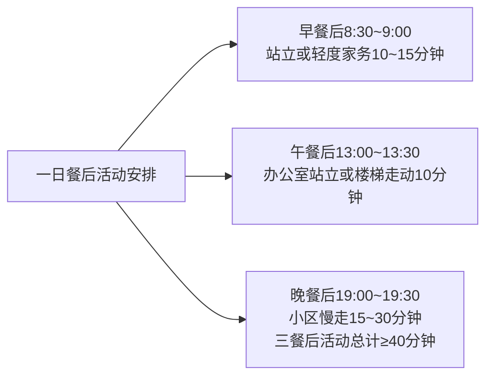

仅这一项"餐后活动"就可让53岁个体在不增加运动专门时间的前提下，每日累计约40分钟轻度活动，配合每周3次30分钟专门快走/慢跑，即可达成WHO推荐的150分钟有氧目标。

### 9.3.2 协同二:运动前后蛋白质补给的"双窗口"逻辑

健身圈广为流传的"训练后30分钟黄金窗口"概念曾被视为"金科玉律"——**走进任何一家健身房都会看到训练结束健身爱好者立刻掏出摇摇杯灌下蛋白粉的场景**[^164]。但最新循证研究已经修正了这一神话。

研究证据：**蛋白质合成时间线显示训练后0~2小时MPS提升2~3倍、训练后24~48小时MPS持续升高、训练后48~72小时MPS开始下降——蛋白质合成窗口远不止30分钟而是持续24~48小时**[^164]。更具说服力的对比研究：**A组训练后立即补充蛋白质总摄入量1.2g/kg、B组训练后2小时补充总摄入量1.8g/kg，8周后A组肌肉量+2.1%、B组+3.8%——总蛋白质摄入量比摄入时机更重要**[^164]。**训练前1小时vs训练后1小时补充蛋白质的对照研究显示两组增肌效果无显著差异，原因是训练前补充的蛋白质消化吸收后正好在训练后进入血液**[^164]。

针对53岁/80kg中年男性的实操方案：

**一般训练者(每周2~3次抗阻训练)** ——训练前无需特别补充（除非空腹），训练后30分钟~2小时内补充即可，**全天确保总蛋白摄入充足1.6~2.2g/kg(实际按80kg计1.0~1.2g/kg是基础水平)** [^164]。本食谱日均蛋白~87g已覆盖基础需求，运动日可适当增加10~20g。

**空腹训练者(早晨起床后空腹运动)** ——训练前可选补充少量蛋白质10~20g，训练后30分钟内补充25~40g蛋白质[^164]。

**减脂期训练者(本食谱执行场景)** ——训练前后都补充蛋白质，**训练前20~30g，训练后30~40g**[^164]，肌肉流失风险高时尤其重要。

最佳蛋白质来源选择[^164][^151][^165][^166]：

| 时机 | 优选蛋白源 | 吸收速度 | 适用场景 |
|------|---------|---------|---------|
| 训练前后 | 乳清蛋白粉、鸡蛋白、鸡胸肉 | 快(1~2小时) | 即时补给 |
| 睡前 | 酪蛋白、希腊酸奶、牛奶 | 慢(6~8小时) | 延长夜间合成窗口 |
| 日常饮食 | 鸡胸肉、瘦牛肉、鱼虾、豆制品 | 中等 | 三餐均匀分配 |

需要明确的边界：**蛋白质粉补充对一般训练者并非刚需**——本食谱设计的食物来源蛋白质已能稳定达成80~96g/d目标，**儿童一般不建议常规补充蛋白质粉、肾功能不全者需遵医嘱控量、老年人选易消化剂型分次少量食用**[^151][^166]。**孕妇适当增加蛋白质摄入但不建议盲目补充蛋白粉**[^151]——这一边界对家庭其他成员同样适用。

### 9.3.3 协同三:运动后水分与电解质补充

第9.1节已经提及运动后补水原则。具体到53岁/80kg中年男性的运动场景：每30分钟有氧或抗阻运动需补水200~300ml；运动时间超过60分钟或大汗淋漓时可考虑添加少量电解质——**自制方案：1L白水+少许低钠盐+柠檬汁**，比购买含糖运动饮料更健康；**不要选择运动饮料替代白水**，运动饮料含糖量也较高。**运动后猛灌冰水是大忌——骤冷刺激会导致胃肠痉挛，最好选择30℃左右的温水、小口慢饮**[^157]。

### 9.3.4 协同四:运动嵌入两周食谱的全周节奏图

把饮食与运动整合到一周节奏，可形成下图：

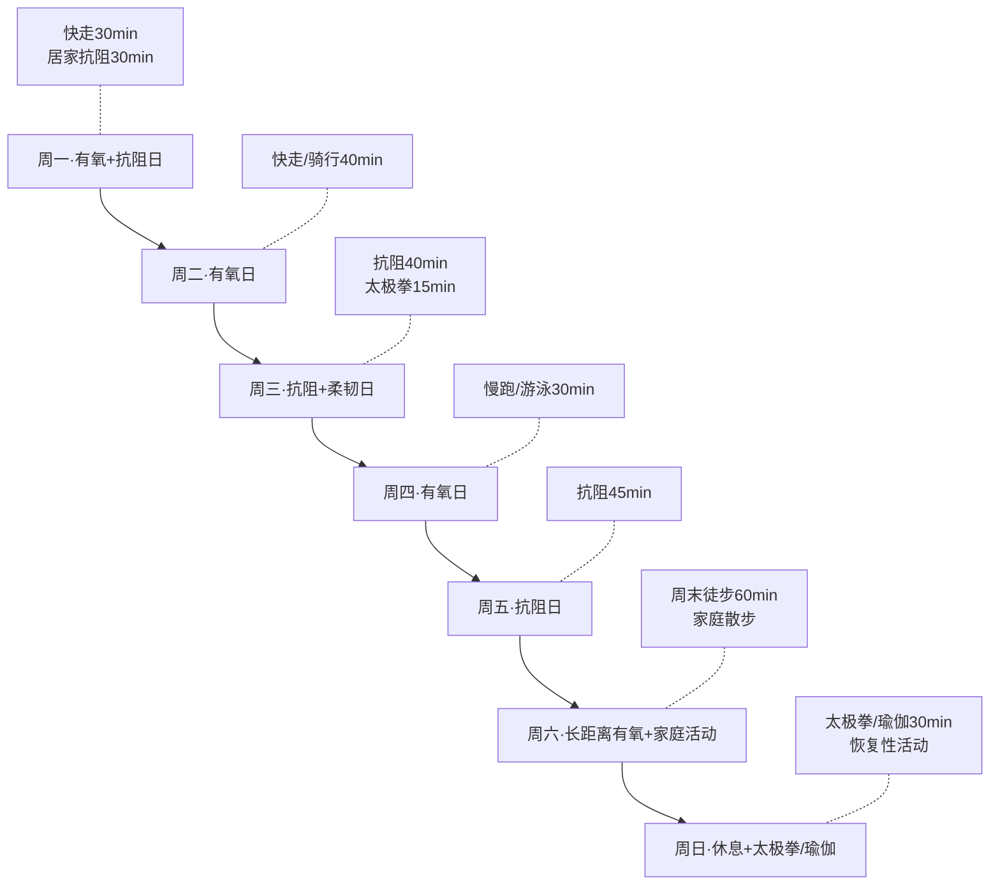

整周累计中等强度有氧约180~200分钟，抗阻训练3次约115分钟，平衡训练2次约45分钟——**全部超过WHO推荐的基础目标150分钟有氧+2~3次抗阻**。配合两周食谱执行，53岁/80kg中年男性在前6~8周可实现月减1~2kg、半年内减重5~10%、肌肉量保持稳定的综合目标。

## 9.4 规律作息与睡眠管理

睡眠是与饮食、运动并列的健康基石。**睡眠不足直接影响胰岛素敏感性、瘦素分泌、肌肉修复、血压调节，是53岁中年男性慢病防控的关键变量**——但这一维度往往被严重低估。

### 9.4.1 53岁睡眠节律的特殊变化

**不少人到了五十岁出头突然发现以前熬到十一二点也能睡得踏实，如今一到十点就犯困、夜里还容易醒**[^163]。这并非异常，而是**人体存在昼夜节律系统主要由下丘脑视交叉上核调控，负责分泌褪黑素、调节体温和激素水平；五十岁以后褪黑素分泌峰值提前、夜间体温下降时间点也前移，这会让人更早产生困意**[^163]。**自然提前入睡并不异常，强行熬夜打乱节律反而让神经系统长期处于紧张状态**[^163]。

更深层的变化是**睡眠结构改变——年龄增长后，慢波睡眠减少、浅睡期比例增加，这是生理变化；关键在于是否连续、稳定**[^163]。**睡眠被频繁打断会影响脑部代谢废物清除，影响第二天精神状态；有研究显示长期碎片化睡眠与认知功能下降存在相关性**[^163]。

### 9.4.2 最佳睡眠时长:不是8小时而是7小时18分

近年研究修正了"每晚必须8小时"的固有认知。**最近的研究发现睡眠并不是越多越好，8小时也并不一定是最佳选择，反而存在一个最理想的"黄金睡眠时长"——成年人每晚睡7小时18分钟(大约7.32小时)对代谢最为友好**[^167]。**研究发现每晚睡眠时间在7~8小时之间的成年人糖代谢功能较好、血糖水平较为稳定；而那些每晚睡眠时间不足6小时或超过9小时的人，糖代谢功能明显下降、血糖波动较大**[^167]。

机制层面，**睡眠时间过短的人往往表现出较差的胰岛素敏感性，身体对胰岛素的反应较差，容易导致血糖升高，长期缺乏睡眠会增加患2型糖尿病的风险；过长的睡眠可能导致体内的生物钟紊乱进而影响代谢的正常进行**[^167]。这一双向风险曲线对53岁糖尿病前期窗口期人群尤其值得警示。

更精细的提示：**关键不在精确到7小时18分钟，每个人睡眠需求会有所不同——有些人可能7小时就能感到精力充沛，而有些人则可能需要8小时才能恢复最佳状态；关键在于保持规律的作息，确保每天获得足够的休息时间，不要让睡眠时间过短或过长**[^167]。**权威机构给出的建议区间通常在7到8小时之间，不过存在个体差异；关键是白天状态是否良好，是否出现持续疲劳或嗜睡——大规模人群研究显示睡眠时间过短或过长都与心血管疾病风险增加相关**[^163]。

### 9.4.3 优质睡眠的六个执行细节

把睡眠管理落到53岁/80kg中年男性的具体执行：

**第一·固定就寝起床时间**——**与其盯着时间，不如让作息固定，入睡和起床时间相对稳定，让身体形成可预测的节奏**[^163]；**长期睡眠节律紊乱与高血压、代谢异常有关**[^163]。建议晚上22:00~22:30就寝、早上6:00~6:30起床，工作日与周末误差不超过1小时。

**第二·卧室温度18~22℃**——**研究显示室温保持在18~22摄氏度区间有助于入睡和维持睡眠；温度过高会增加觉醒次数，过低则可能引发肌肉紧张；适当通风保持空气流通也有利于呼吸顺畅**[^163]。

**第三·睡前1小时远离电子屏幕**——**手机成为很多人睡前的"陪伴"，问题不仅在于屏幕发出的蓝光，刺激性内容会引发情绪波动激活交感神经心率上升入睡难度增加**[^163]。**避免睡前使用电子设备，因为屏幕发出的蓝光会抑制褪黑素的分泌影响睡眠**[^168]。建议睡前1小时改为简单阅读或轻音乐，让神经系统慢慢平稳。

**第四·热水澡的时机控制**——**很多人习惯睡前泡个热水澡，这本是放松方式，却忽略时间间隔；热水会让皮肤血管扩张，体温暂时升高；入睡需要核心体温下降，若刚泡完澡就躺下体温尚未回落反而延迟入睡；临床建议泡澡后间隔30~40分钟让体温自然下降，更有利于入睡**[^163]。

**第五·睡前避免咖啡因与刺激成分**——**睡前喝浓茶或咖啡也容易干扰入眠；咖啡因半衰期可达数小时，敏感人群即便下午饮用也可能影响夜间休息；有些保健品含有兴奋成分，五十岁以后代谢能力减慢，刺激效果更明显，需谨慎**[^163]。

**第六·避免睡前2小时大量饮水**——**避免睡前2小时大量饮水以防夜尿增多**[^157]——前文已述。

### 9.4.4 53岁后的"三步缓起"防体位性低血压

**起床这个动作也值得讲一讲——随着年龄增长，血管弹性下降，体位变化时血压调节速度变慢；清晨刚醒，若立即从平躺状态起身，可能出现体位性低血压，表现为头晕、眼前发黑，严重时甚至跌倒；临床数据显示中老年人跌倒与突然起身有关；较为稳妥的方式是醒来后先在床上活动四肢、坐起停留片刻、再慢慢站立，让循环系统有时间适应**[^163]。

把这一原则落到具体动作：

```
醒来后第1步:床上活动四肢30秒(伸懒腰、转动手腕脚踝)
醒来后第2步:缓慢坐起,在床边停留1分钟
醒来后第3步:慢慢站立,先站稳再走动
全程约2分钟,可显著降低体位性低血压风险
```

这一细节看似简单，却能减少跌倒意外——在防跌倒重要性已不亚于防慢病的中年期，每一次安全的起床都是对未来失能的预防。

### 9.4.5 夜间觉醒与入睡困难的应对

53岁中年男性常见的两类睡眠问题：

**问题一·夜间频繁觉醒** ——可能原因包括饮水过多导致夜尿、前列腺或泌尿系统问题、卧室环境干扰(噪音/光线/温度)、轻度睡眠呼吸暂停。**夜里频繁起夜可评估是否饮水过多或存在前列腺、泌尿系统问题；环境噪音、光线也会干扰睡眠，卧室保持安静、遮光，有助于延长连续睡眠时间**[^163]。建议：晚餐后控制饮水、卧室遮光窗帘、必要时使用白噪音机；若每晚觉醒>3次或伴随憋醒、白天嗜睡需就医排查睡眠呼吸暂停综合征。

**问题二·入睡困难**——**焦虑抑郁情绪可能通过脑肠轴影响消化功能，正念冥想、深呼吸练习、渐进式肌肉放松能缓解急性焦虑发作**[^154]。**对于有睡眠障碍的人群，如失眠患者，可在医生指导下进行非药物干预，如认知行为疗法等**[^168]。**存在失眠问题可尝试冥想放松训练，必要时遵医嘱使用右佐匹克隆片等短效助眠药物**[^169]——但药物应作为最后选项，且需严格遵循医嘱避免依赖。

**色氨酸食物对睡眠的辅助作用**——**多吃富含色氨酸的食物如牛奶、鸡蛋、坚果等，色氨酸是合成血清素的重要原料，血清素能调节情绪、缓解焦虑；每天喝一杯温牛奶有助于放松身心、促进睡眠**[^168]。这与本食谱设置的"睡前1小时温牛奶200ml"加餐设计形成机理呼应——既补充蛋白延长肌肉合成窗口，又通过色氨酸辅助助眠，一举两得。

## 9.5 戒烟限酒与心理调节

### 9.5.1 戒烟:六大风险维度的共同放大器

第7章已经分析超重肥胖、高血压、高血脂、糖尿病、肌少症、骨质疏松六大健康风险，吸烟在这六个维度中扮演"共同放大器"角色——加速动脉粥样硬化推高心血管病、增加胰岛素抵抗推高糖尿病、降低骨密度推高骨质疏松、损害肺功能推高呼吸系统疾病、与多种癌症直接相关。**吸烟会使尼古丁进入体内，刺激胃肠道血管收缩，减少胃肠黏膜血液供应，影响黏膜修复和保护功能；同时抑制胰液、胆汁等消化液分泌，降低消化能力**[^149]。**长期大量饮酒则直接损害成骨细胞功能；吸烟不仅影响肺部健康，也会干扰钙代谢，加速骨质流失**[^170]。

53岁是戒烟干预的"黄金时段"——研究表明戒烟5~10年后心血管疾病风险可降至接近非吸烟者水平。戒烟策略：

- **完全戒断而非渐进减量** ——一刀切的成功率高于"逐渐减少"；
- **环境改造** ——清除家中所有烟具与打火机，避免诱发场景；
- **替代行为** ——烟瘾来时改为深呼吸、嚼无糖口香糖、喝水、走动；
- **专业辅助** ——**完全戒烟可降低肺癌和心血管疾病风险，尼古丁贴片辅助治疗需在医生指导下使用**[^169]；
- **社会支持** ——告知家人朋友寻求监督，参加戒烟门诊或互助小组；
- **应对戒断反应** ——焦虑、易怒、注意力不集中是正常反应，通常2~4周后明显减轻。

### 9.5.2 限酒:25g酒精上限与五项注意

**中国营养学会建议成年男性一天饮用酒精量应≤25g，成年女性应≤15g，孕妇和儿童青少年应忌酒**[^171][^172][^147]。**25g酒精相当于啤酒750ml、葡萄酒250ml、38°及以下白酒75g、41°及以上白酒50g**[^171][^172][^147]。需要明确的是这是"上限"而非"目标"——**减重期间最好戒酒**(第1章已论证)；**对于存在基础疾病的人群如高血压等，更需戒烟戒酒以免加重疾病进程**[^171]。

过量饮酒的危害链：**每日摄入酒精量>30g者随饮酒量的增加容易出现血压显著升高，甚至可能造成肝脏、胃肠道、心脏、胰腺、脑组织等多器官不同程度的损害；还可能造成酒精中毒，长期嗜酒可增加患癌的风险**[^171]。**酒精对人体的危害是多方面的，明显增加恶性肿瘤、出血性脑卒中、原发性高血压、糖尿病以及急性胰腺炎等多种疾病的发病风险；还会损伤胃黏膜，造成糜烂性胃炎和消化性溃疡，甚至诱发消化道出血、胃癌**[^172]。

对必须应酬饮酒的场景，五项注意是底线[^173][^146]：

**第一·避免空腹饮酒** ——饮酒前食用高蛋白或高脂肪食物可延缓酒精吸收，推荐食用牛奶、坚果或肉类；空腹饮酒易引发胃肠黏膜损伤[^146]。

**第二·选择低度酒** ——优先选择酒精度12%以下的红酒或啤酒，高度白酒更易导致快速醉酒；**避免多种酒类混饮加重肝脏代谢负担**[^146]。

**第三·补充水分** ——每饮用一杯酒精饮料需补充等量矿泉水预防脱水性头痛；酒后可适量补充含电解质饮品帮助代谢[^146]。

**第四·慢病禁酒** ——**慢性肝病患者应严格禁酒；服用头孢类抗生素期间绝对忌酒**[^146]；高血压、糖尿病、痛风、骨质疏松患者均应严格戒酒。

**第五·酒后2小时内不驾车** ——**注意酒精代谢需要2~3小时，饮用后8小时内不宜驾驶或操作精密仪器**[^173]；**出现呕吐、意识模糊需立即就医**[^146]。

### 9.5.3 心理调节:中年期情绪管理工具箱

53岁中年期面临多重心理压力——工作晋升瓶颈、子女独立离家(空巢)、父母衰老照护、自身健康担忧、男性更年期激素变化等共同构成情绪挑战。**中年人调整心态远离抑郁症可通过心理调适、社交支持、规律作息、培养兴趣、专业干预等方式**[^154]。

**工具一·正念冥想与深呼吸** ——**学习认知行为疗法有助于纠正消极思维模式，例如通过记录情绪日记识别自动负性想法；正念冥想练习可帮助中年人专注于当下，减少对过往遗憾或未来焦虑的过度思考；情绪管理技巧如深呼吸、渐进式肌肉放松能缓解急性焦虑发作，建议每天固定时间练习10~15分钟**[^154]。

**工具二·认知重构** ——**当面临压力事件时，尝试改变对事件的不合理认知；例如当觉得工作任务过重时不要一味地认为自己无法完成，而是分析任务的可分解性，将大任务分解为小任务逐步完成**[^168]。

**工具三·社交支持** ——**定期与家人朋友面对面交流能促进催产素分泌，减轻孤独感；参加社区兴趣小组或志愿者活动可建立新的社会连接，降低社交退缩风险；需注意避免过度依赖网络社交，现实中的肢体接触和眼神交流对情绪调节更具生理意义**[^154]。

**工具四·培养兴趣爱好** ——**发展园艺、绘画等创造性活动能激活大脑奖赏回路产生成就感；学习新技能如乐器或外语可刺激神经可塑性预防认知功能衰退；户外活动如徒步旅行通过接触自然光调节褪黑素分泌，改善季节性情绪失调**[^154]；**丰富的兴趣爱好可转移注意力缓解心理压力，如绘画、书法、音乐等能陶冶情操、充实精神世界、带来愉悦感和成就感**[^153]。

**工具五·运动调节** ——**适度进行有氧运动如快走、慢跑、游泳等可促进身体分泌内啡肽，被称为"快乐激素"能帮助缓解压力**[^168]；前文运动方案已系统覆盖。

**预警阈值:何时需要专业干预** ——**持续两周以上的抑郁症状需寻求心理科或精神科帮助，医生可能开具盐酸氟西汀胶囊、草酸艾司西酞普兰片等抗抑郁药；认知治疗联合药物干预对中度以上抑郁症效果显著**[^154]。**当出现心理困扰且自身难以调节时，不要忽视，应及时寻求专业心理医生的帮助，遵循科学建议，通过合理方式促进心理健康，平稳度过中年时期**[^153]。

## 9.6 自我监测指标体系：体重·腰围·体征三维记录

任何健康管理方案如果没有监测反馈，都将沦为"盲目执行"。本节为53岁/80kg中年男性建立四层自我监测体系，从每周到每年形成完整的反馈闭环。

### 9.6.1 第一层·每周体重腰围测量

体重与腰围是最基础也最敏感的整体健康指标。

**体重测量** ——**晨起空腹排尿后**[^163]测量，穿轻薄衣物或仅内衣，使用同一台体重秤，记录到0.1kg精度。每周日固定时间测量(第6.8.5节已强调)，**减重期理想月减1~2kg、两周减重0.5~1.0kg为安全可持续幅度**——快速减重(>2kg/周)需警惕水分流失和肌肉流失。

**BMI计算与判定** ——BMI=体重(kg)÷身高(m)²[^156][^174]：

| BMI范围 | 体型分级 |
|---------|---------|
| <18.5 | 低体重 |
| 18.5~23.9 | 正常 |
| 24~27.9 | 超重 |
| ≥28.0 | 肥胖 |

**国家卫健委建议成人BMI保持在19~24之间、老年人控制在27以内**[^157]。

**腰围测量** ——这是评估中心型肥胖(腹型肥胖)的关键指标。**腹部脂肪过多与多种慢性疾病密切相关；有的人肚子大看着像个"游泳圈"，就算体重不超标可腰围超标了那也得警惕，这很可能是腹型肥胖会增加患心血管疾病、糖尿病等疾病的风险**[^157]。

正确测量法[^156][^157]：

```
1.自然站立,放松,双脚分开25~30厘米
2.找到肋骨下缘与骨盆上缘的中间点(约在肚脐上方0.5~1厘米)
3.用软尺水平环绕一周
4.在呼气末读取数值
5.注意软尺贴肤但不压迫
```

**国家卫健委标准——成年男性腰围控制在90厘米以内，女性控制在85厘米以内**[^156][^157]。第一周和第六章EastDiet研究均强调**坚持东方膳食的人群中心性肥胖(腹型肥胖)风险降低17%**——本食谱在腰围管控维度具有循证基础。

**体脂率参考** ——**男性体脂率超过25%、女性超过30%就属于肥胖**[^156]，可作为辅助参考，家用体脂秤可大致测量。

**记录工具** ——简单的纸质体重表或手机记录App均可，关键是**长期连续记录形成趋势线而非单点数据**——单日体重波动正常(±0.5~1kg)，关注的应是2~4周的总趋势。

### 9.6.2 第二层·每日自我感觉评估

每日自我感觉是最便捷的"主观监测"，能够及时捕捉健康变化的早期信号[^163][^171]：

| 维度 | 健康状态 | 预警信号 |
|------|---------|---------|
| **精力** | 日常活动无显著疲劳，中等强度运动后心率10分钟内恢复 | 轻微活动即出现气促，持续性肌无力 |
| **睡眠** | 入睡<30分钟，夜间觉醒<2次，晨起精力恢复 | 持续入睡困难、早醒、夜间觉醒>3次 |
| **食欲** | 进食量与日常活动量匹配，无持续厌食或暴食 | 食欲亢进伴体重下降，餐后早饱感 |
| **排便** | 每日1~2次或每两日1次，香蕉形软便排出顺畅 | 持续便秘或腹泻>2周，便血 |
| **皮肤口腔** | 光滑有弹性，口腔无异味与溃疡 | 持续性皮肤瘙痒、溃疡>2周 |
| **情绪** | 稳定、注意力集中、记忆力正常 | 持续情绪低落>2周 |
| **排尿** | 1000~2000ml/天，无夜尿或每晚1次 | 尿频尿急、泡沫尿持续不消散 |

这些指标无需任何设备，每日睡前花2~3分钟回顾即可。任何指标持续偏离正常>1~2周应引起警觉。

### 9.6.3 第三层·每月体征自查

每月一次的体征自查可发现早期慢病信号：

**血压自测** ——**家庭自测建议使用上臂式电子血压计，连续测量三次取平均值；发现血压持续超过140/90毫米汞柱时可能存在高血压风险**[^163]。**测量前需要安静休息5分钟以上，避免饮用咖啡或吸烟等影响结果的因素，使用经过校准的血压计在坐姿时测量上臂与心脏保持同一水平**[^175]。**正常范围:收缩压90~139mmHg、舒张压60~89mmHg**[^159][^175]。建议每月固定一日(如月初)上午测量3次取平均，记录趋势。

**腰围月度对比** ——配合每周体重监测，每月汇总变化趋势。

**晨起脉搏** ——晨起未起床时数1分钟脉搏，正常60~100次/分；如静息心率持续>100或<50需就医。

**皮肤状态、口腔健康、伤口愈合速度** ——综合反映免疫与代谢状况[^163][^171]。

### 9.6.4 第四层·每年定期体检的必查项目

53岁男性的年度体检应远超"基础体检套餐"，需针对中年期高发风险有针对性配置[^176][^172]：

**基础检查** ：

- 身高、体重、BMI、腰围
- 血压(连续测量3次取平均)
- 血常规(排查贫血、感染)
- 尿常规(排查肾脏与泌尿系统)
- 肝功能(ALT、AST)
- 肾功能(肌酐、尿素氮)

**心脑血管筛查** :

- 血脂四项(总胆固醇<5.2mmol/L、甘油三酯<1.7mmol/L、LDL-C<3.4mmol/L、HDL-C男性1.04~1.55mmol/L)[^159][^175]
- 心电图(排查心律失常)
- 颈动脉超声(检测斑块及狭窄)[^172]
- 必要时心脏彩超或24小时动态心电图[^176]

**代谢指标** :

- 空腹血糖(正常3.9~6.1mmol/L)[^159]
- 糖化血红蛋白(HbA1c)
- 餐后2小时血糖(<7.8mmol/L)[^159]
- 甲状腺功能(TSH、FT3、FT4)[^176]

**肿瘤标志物与肿瘤筛查**:

- 甲胎蛋白(AFP)——肝癌
- 癌胚抗原(CEA)——消化道肿瘤
- 前列腺特异性抗原(PSA)——前列腺癌(男性必查)
- **肺癌低剂量螺旋CT筛查**(尤其长期吸烟者)[^172]
- 胃镜与肠镜检查——结直肠癌与胃癌筛查[^172]

**骨密度检测** ——**50岁后建议每年(或每2~3年)查骨密度，T值<-2.5提示骨质疏松，需及时干预**[^176][^172]。

**特殊人群提示** ——**高血压、糖尿病家族史者需增加血压、血糖监测频率；长期吸烟者加做低剂量胸部CT；既往有慢性病者需复查原发病指标，体检前一晚10点后禁食，避免剧烈运动**[^176]。

**40岁以上人群、慢病患者、有疾病家族史人群每年进行一次全面体检**[^177]——做到早发现、早诊断、早治疗。**糖尿病防控建议40岁以上人群应每年检测空腹血糖及糖化血红蛋白；若处于糖尿病前期(血糖高于正常但未达糖尿病诊断标准)需每半年进行一次血糖筛查，及时干预以延缓疾病进展**[^165]。

### 9.6.5 监测数据的整合应用

四层监测形成完整闭环——日感觉、周体重腰围、月血压、年体检——任何一层发现异常都应触发对应行动：

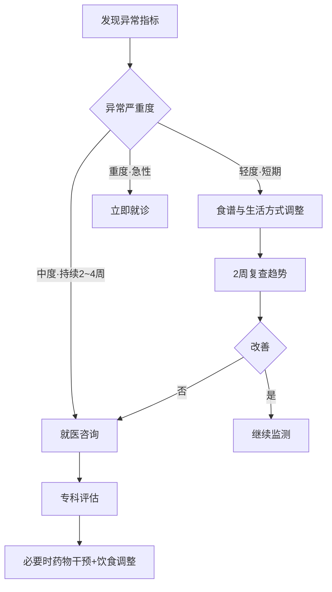

## 9.7 两周后的食谱微调方法论

第6.8.5节已经预告"两周后的复盘+食谱微调"是长期可持续执行的关键节点。本节展开微调四步法的具体操作。

### 9.7.1 第一步·体重变化评估

两周食谱执行结束后，对照初始基线测量体重腰围变化：

| 两周变化 | 评估 | 微调方向 |
|---------|------|---------|
| 减重<0.5kg | 减重不足 | 核查烹调油是否超量、加餐是否过多、晚餐时间是否过晚、运动量是否达标 |
| 减重0.5~1.5kg | 理想 | 维持现有方案 |
| 减重1.5~2.0kg | 偏快但可接受 | 监测肌肉量与精力，若精力不足适度上调能量50~100kcal |
| 减重>2.0kg | 过快预警 | 警惕水分肌肉流失，**上调蛋白(每餐加1掌心蛋白源)与盐分(避免低钠)，复测体脂率** |
| 体重不变 | 停滞 | 核查执行细节、增加运动强度、降低能量缺口至600~800kcal |
| 体重上升 | 严重偏离 | 系统复盘外食/聚餐/加餐/酒精，回归基线 |

**减重的关键不在前两周冲刺，而在持续6~12个月的稳定**——前两周减重1kg、第三~第四周减重0.5kg、第五~第六周减重0.8kg如此累计6个月减重5~10kg远胜两周减重5kg后反弹。

### 9.7.2 第二步·能量充足度评估

主观感受是评估能量是否合理的重要依据：

| 主观感受 | 评估 | 微调方向 |
|---------|------|---------|
| 持续饥饿、精力不足、运动后疲惫 | 能量缺口过大 | 上调主食50g/餐 或 增加加餐(无糖酸奶+核桃) |
| 餐后饱胀、消化不良、嗳气 | 单餐过量或难消化 | 减少单餐主食、改用更易消化烹饪(蒸炖代替煎炒) |
| 精力充沛、活动有力 | 能量适宜 | 维持现有方案 |
| 运动表现下降、肌肉感减弱 | 蛋白不足 | 增加蛋白餐(加蛋+豆制品)，三餐均匀分配 |

53岁/80kg目标个体的能量基线是1500~2000kcal/d，若身高160cm应靠近下限，180cm靠近上限——这是个体化的根本依据。

### 9.7.3 第三步·口味适应度评估

口味疲劳是导致两周后无法继续执行的常见原因：

| 口味反馈 | 微调方向 |
|---------|---------|
| 觉得过于清淡 | **增加天然香料(蒜末、姜片、花椒、八角、柠檬汁、香菜、罗勒)而非加盐**[^144]；用炖菜风味替代部分清炒 |
| 不适应全谷物口感 | 全谷比例从1/2降至1/4再逐步提升；糙米提前浸泡4小时；杂粮饭混合精白米煮制 |
| 食材重复疲劳 | 启动季节性食材轮换；纳入应季时令(春笋/秋葵/冬瓜/萝卜) |
| 烹饪枯燥 | 引入空气炸锅烤、立体蒸炖、一锅多菜等新技法 |
| 早餐单调 | 周一周三周五燕麦+奶组合,周二周四豆浆+全麦组合,周末粥品组合 |

**关键认知** ——**80/20原则是指80%的时间吃健康餐而20%的时间可以允许自己吃些喜欢但不那么健康的食物**[^148]——食谱需要给自己留弹性空间才能长期可持续。

### 9.7.4 第四步·季节与场景调整

季节变化要求食材轮换——夏季纳入苦瓜/丝瓜/黄瓜/番茄/西瓜(适量)，秋季纳入南瓜/百合/莲藕/梨，冬季纳入萝卜/白菜/羊肉(瘦)/山药/红薯，春季纳入春笋/野菜/茴香/马兰头。这是东方健康膳食"应季而食"的本土化优势。

场景调整包括工作日/周末/出差/聚餐/节假日不同场景的差异化适配，第8章已详细展开。

### 9.7.5 三种典型微调案例处方

**案例一·减重停滞**(两周减重<0.5kg、自评严格执行):

诊断——可能是隐形热量或运动不足。处方:

1. 重新核查烹调油用量(是否实际>30g/d)；
2. 核查加餐次数与种类(是否每日加餐>2次或选择高热量加餐如黑巧克力)；
3. 核查晚餐时间(是否>19:30、距睡前<3小时)；
4. 增加每周运动至300分钟有氧+3次抗阻；
5. 监测2周后再评估，仍停滞需就医排查甲状腺功能减退。

**案例二·消化不良**(餐后腹胀、排气增多):

诊断——可能是膳食纤维增加过快或全谷物口感不适应。处方:

1. 全谷物比例从1/2降至1/3，分阶段提升[^144]；
2. 糙米/红豆/藜麦充分浸泡2~4小时再煮制[^144]；
3. 蔬菜先焯水后凉拌，减少生食比例；
4. **多喝水否则可能胀气，肠道菌群需要时间适应**[^143]；
5. 烹饪改用蒸/炖/煮，减少炒制；
6. 持续>2周不缓解需就医排查胃肠疾病。

**案例三·口味疲劳**(两周后觉得"健康餐难以坚持"):

诊断——食材重复+烹饪单调+缺乏奖励。处方:

1. 启动第3~4周食材轮换骨架(可重启第一周或第二周)，纳入应季食材；
2. 学习3道新菜式(如香煎鸭胸、菌菇蒸鸡、番茄炖瘦牛肉)；
3. 引入"周末弹性日"——周六或周日选一餐家庭聚餐，遵守80/20原则；
4. 设置月度奖励——两周日均执行率>80%奖励一次电影/旅行；
5. 加入家庭共餐文化，与配偶子女协同形成健康饮食氛围。

## 9.8 长期健康习惯的养成路径与可持续性策略

第8.9.5节已经介绍21天与66天双周期理论的基础逻辑[^153][^154]。本节深化为长期可持续机制。

### 9.8.1 习惯养成三阶段的精细化执行

承接21天效应原理[^153][^154]：

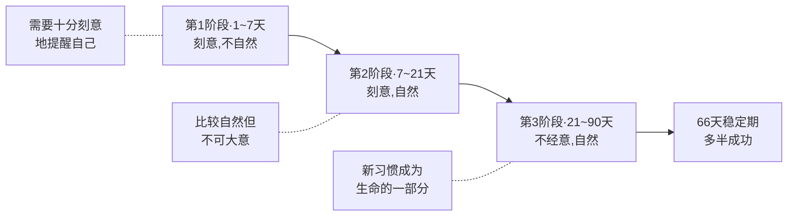

**第一阶段(1~7天)** ——这是阻力最大、最容易放弃的窗口期。**需要十分刻意地提醒自己注意改变并刻意要求自己**[^154]。具体动作：每日一早设定饮食提醒、家中显眼处贴上"控油壶25g/限盐勺2g/水1700ml/12种食物"提醒卡、与家人公开承诺执行。

**第二阶段(7~21天)** ——**经过一周的刻意要求已经觉得比较自然、比较舒服了，但不可大意一不留神坏情绪坏毛病还会再来破坏你**[^154]。具体动作：保持打卡记录、每周日复盘、应对一次外出聚餐场景仍能守住基线。

**第三阶段(21~90天)** ——**不经意，自然，无需意识控制；这一阶段是习惯的稳定期使新习惯成为生命的一部分**[^154]。**伦敦大学心理教授沃迪说，无论是早起运动、减肥等习惯养成只要撑过66天多半会成功**[^153][^154]。

### 9.8.2 五大可持续性策略

**策略一·目标拆解与每日打卡** ——把抽象的"健康饮食"拆解为可视化打卡项：每日12种食物✓、蔬菜500g✓、烹调油≤25g✓、盐≤5g✓、饮水1700ml✓、运动30分钟✓、睡眠22:30前✓。**将我们的目标或愿望灌输至潜意识当中；当潜意识接受了暗示的讯息便会建立你的信心、调动你拥有的资源和潜能、帮助你完成目标**[^153]。

**策略二·成功是化整为零循序渐进**——**不要畏惧过于遥远的目标，可以将大目标化小、逐步完成；每次完成一个小目标时我们都能体会到成功的喜悦；踏实的积累成功的体验能有效提高我们完成目标的信心**[^153]。把"减重10kg"拆解为"两周减1kg×10个两周"——每个两周都是可达成的小目标。

**策略三·促进多巴胺分泌的奖励机制** ——**多巴胺分泌能让人感到愉悦是大脑的奖励机制；可以采取合理合适的办法促进多巴胺分泌例如适量运动、冥想、做感兴趣的事(阅读、手工、摄影)、挑战新的事物、保持充足的睡眠等**[^153]。把"完成一周饮食基线"与"奖励看一场电影/听一场音乐会"挂钩，**当我们身心愉悦的时候那些看似艰难的挑战也没那么可怕**[^153]。

**策略四·触发点设置与环境改造** ——**研究发现当健康食物触手可及时人们选择它们的概率会提升300%；相反把饼干糖果收进不透明的柜子里**[^144]。具体动作:把水果篮放在餐桌中央、坚果装进透明罐子、蔬菜洗净切好放保鲜盒；运动鞋放门口、控油壶/限盐勺放灶台显眼处；冷藏室中层放预洗蔬菜、冷冻室放分装鱼禽肉；糕点饼干含糖饮料从家里清除。

**策略五·接受波动关注长期趋势** ——**习惯养成并非一帆风顺；某天状态不佳、未能完成任务时不必自责；关键在于持续回到正轨并观察21天周期内的整体表现；研究表明习惯的稳定性来源于行为模式的重复频率与连贯性而非绝对完美**[^154]。**80/20原则的核心价值在于让健康饮食成为长期可持续的生活方式而非短期挑战**——一次聚餐的偏离不会破坏长期健康，**重要的是不让偏离连续多日成为新的"常态"**——24~48小时内回归基线即可。

### 9.8.3 两周食谱的循环执行机制

两周食谱并非"执行14天就结束"的临时方案——**第一周与第二周的食材轮换骨架本身已经包含两套不重复的菜单**：

- **第3周** = 重启第一周食谱 + 上月反馈微调
- **第4周** = 重启第二周食谱 + 季节性调整
- **第5~52周** = 在两周骨架上微调，不断进化
- **每月**:更新食材轮换骨架、纳入应季时令
- **每季度**:做结构性食材替换(夏冬转换)
- **每年**:根据体检结果做能量与营养重点的结构调整

如此形成可持续30年的健康饮食模式——这正是把"纸面方案"转化为"生活方式"的最终形态。

### 9.8.4 社会支持系统:家庭饮食文化

个人的饮食习惯无法脱离家庭与社会环境。**讲究卫生、公筷公勺和分餐、尊重食物、拒绝食用"野味"既是健康素养的体现也是文明礼仪的一种象征**[^140]；**采用分而食之的"分餐"方式就餐时一人一小份每个人餐具相对独立或者使用公筷公勺，可以有效地降低经口经唾液传播传染性疾病的发生和交叉感染的风险；分餐制还有利于明确食物种类、控制进餐量、实现均衡营养、培养节约卫生合理的饮食"新食尚"**[^140]。

把家庭饮食文化建设作为长期可持续的支柱：

- **家庭共餐文化** ——**在家吃饭、尊老爱幼是中华民族的优良传统；在家烹饪有助于食物多样选择、提高平衡膳食的可及性；在家吃饭有利于在享受营养美味食物的同时享受愉悦进餐的氛围和亲情**[^140]；
- **公筷分餐制** ——使用公筷公勺、采用分餐既符合卫生要求也利于精确估量个人食量；
- **配偶/子女协同** ——夫妻共同执行减少诱惑场景；子女虽不必完全相同，但可共享主食结构与蔬菜量；
- **避免浪费** ——**按需选购，合理储存；小份量、光盘行动；合理利用剩饭剩菜；外出就餐按需点菜不铺张**[^140]。

## 9.9 特殊健康状况的医师咨询边界与个性化调整

两周食谱的所有营养目标基线都建立在**"男性、轻体力活动、无确诊慢病、未服药"** 这一假设之上。任何偏离这一基线假设的场景都需要专业咨询。本节明确医师/营养师咨询的边界与原则。

### 9.9.1 六大需要专业咨询的情境

**情境一·已确诊高血压并服用ACEI/ARB或保钾利尿剂者**

低钠盐通过补钾降压具有循证收益，但ACEI(贝那普利、依那普利等)、ARB(缬沙坦、替米沙坦等)、保钾利尿剂(螺内酯、阿米洛利等)均会减少钾的排出。**仅肾功能不全患者慎用、高钾血症患者不宜用低钠盐**(第7.2节已述)——使用上述药物者需检测血钾水平后由医师评估低钠盐使用方案；同时注意低钠生抽与含钾食材(香蕉、菠菜、蘑菇)的总体摄入。

**情境二·已确诊糖尿病并使用胰岛素或磺脲类药物者**

**糖尿病饮食管理核心并非"节食"而是合理搭配、定量管控**[^177]。胰岛素或磺脲类药物(格列美脲、格列齐特等)与饮食的协同需要精确计算——主食量与胰岛素剂量必须匹配，否则可能出现低血糖或高血糖。**主食做到粗细搭配——煮饭时加糙米、燕麦、杂豆，别顿顿吃白米饭白面条；土豆、山药、南瓜这些当菜吃的话，主食就要减量；吃饭有顺序——先吃蔬菜，再吃肉蛋鱼虾，最后吃主食，这个小技巧能延缓血糖上升；运动别落下——饭后半小时散步、打太极，运动前后记得测血糖防止低血糖；三餐规律吃——定时定量细嚼慢咽；餐后血糖高的话可以少量多餐，睡前1小时适当加餐**[^167]。**糖尿病患者需要在医生指导下选择合适的运动时间和方式，运动前后监测血糖**[^162][^148][^150]。

**情境三·已确诊高脂血症或正在使用他汀类药物**

膳食干预与他汀的协同方案需要医师评估。**国内外指南均明确，低升糖指数(GI)、高膳食纤维的膳食模式是糖尿病营养治疗的核心；而基于个体代谢特征的精准方案才是实现血糖平稳控制的关键**[^167]。本食谱日均植物甾醇约600~800mg未达2g推荐，若LDL-C显著升高(>3.4mmol/L)单纯膳食难以达标，需医师评估他汀使用——单纯膳食干预对中重度血脂异常的降幅有限不应替代规范化药物治疗。**柚子(西柚)、葡萄柚等会与他汀类药物相互作用增加不良反应风险，使用他汀者应避免**——这是常被忽视的食物-药物相互作用。

**情境四·已确诊骨质疏松或骨量减少**

钙剂/维生素D/双膦酸盐(阿仑膦酸钠、唑来膦酸等)/特立帕肽/RANKL抑制剂(地舒单抗)等抗骨质疏松治疗需要医师定制方案。**钙剂补充建议在餐后服用——钙吸收需要胃酸或其他酸环境**(第7.6节已述)；**每补充500mg钙需配合200IU维生素D3，血清25-OH-D水平建议维持在30~50ng/ml**；**总钙摄入超过2000mg/d反而可能增加心脑血管疾病和肾结石风险**——膳食钙+钙剂需精确计算总摄入量。

**情境五·肾功能不全(eGFR<60ml/min/1.73m²)**

慢性肾病患者的营养目标与本食谱基线显著不同——**蛋白质摄入量要严格听医生的，肾功能越差吃得越要精细;比如肾功能早期每天按0.8克/公斤体重吃蛋白，到了中晚期就要降到0.6克/公斤体重；还要少吃香蕉、坚果等高钾高磷食物，避免加重肾脏负担**[^167]。本食谱日均蛋白~87g(约1.09g/kg)对慢性肾病患者过高；低钠盐(高钾)对eGFR<30者通常需停用；含磷高的乳制品、坚果、加工食品需要限制。**这一情境必须由肾内科医师或注册营养师定制专门方案**。

**情境六·痛风急性发作期或尿酸>540μmol/L**

痛风患者的膳食原则与本食谱有显著差异——**严格戒酒、不喝含糖饮料；少吃动物内脏、浓肉汤；多吃蔬菜多喝水帮尿酸排出去**[^167]；**痛风患者每日饮水2000~3000毫升以促尿酸排泄**[^157]。豆制品、海产品、菌菇等本食谱推荐的高频食材在痛风急性期需要调整频次。**适量摄入对大多数痛风患者影响不大，关键在于总嘌呤摄入与肾功能状况**(第3.4.2节已述)，但急性期或尿酸严重升高时需医师评估。

### 9.9.2 科学就医与合理用药原则

**科学就医基本原则**[^147][^178]:

```
1.及时就诊——发现身体异常及时就医,不能拖延、不能盲目自我治疗
2.正规机构就诊——选择有"医疗机构许可证"的医疗机构;遵从分级诊疗,小病在社区、大病去医院
3.携带完整资料——有效身份证件、既往病历及各项检查资料,如实陈述病情、药物过敏史以及正在服用的药物
4.遵医嘱——按时按量按疗程用药,按照医生要求调配饮食、确定活动量、改变不健康行为
5.勿信偏方——不轻信封建迷信和偏方,不凭一知半解、道听途说自行买药治疗
6.理性看待医学局限——医学所能解决的健康问题是有限的,应当正确理解医学的局限性、理性对待诊疗结果
```

**合理用药原则**[^178]:

- **能口服不肌注、能肌注不输液**;
- **遵医嘱使用抗微生物药物**;
- **不同的药有不同的功能、适应症、用法、用量、禁忌症和副作用;不同人的体质、病情、对药的耐受也各不相同;任何药物的疗程和药量都是经过大量的临床实验后最终形成的;擅自改变药物的疗程和剂量不仅不利于疾病的治愈,而且可能带来严重的后果甚至危及生命**;
- **购买药品要选择正规途径——处方药需凭执业医师处方;非处方药OTC可在社会药房自行判断购买**;
- **正确认识抗菌药物——只有明确或高度怀疑是细菌感染时才使用抗菌药物;一般针对细菌感染的抗菌药物对病毒引起的上呼吸道感染无效;为有效进行治疗、降低耐药风险、避免不良反应,必须在医生的指导下规范、合理使用抗菌药物**。

### 9.9.3 慢病防控:三大高发慢病的具体应对

针对53岁男性最高发的糖尿病、高血压、慢阻肺三大慢病,系统性防控策略[^165]:

**糖尿病早筛早控** ——**40岁以上人群属于糖尿病高发群体应每年检测空腹血糖及糖化血红蛋白**；**对于办公室上班族这类久坐、超重风险较高的人群可每天安排3次5分钟的起身活动如靠墙静蹲、原地踏步、拉伸肩部，每周累计完成150分钟中等强度运动如快走、慢跑、骑自行车等，同时减少精制糖、油炸食品的摄入，用全谷物替代部分精制米面，降低糖尿病发病风险**[^165]。本食谱已严格执行这些原则。

**高血压沉默杀手早干预** ——**多数高血压患者发病初期无明显症状，仅在体检或因其他疾病就诊时才被发现，但长期血压升高会持续损伤血管内皮，显著增加脑卒中、冠心病、肾功能损伤等疾病的发病风险**[^165]。**饮食上严格控制盐摄入量，每日盐摄入应低于5克，同时注意减少酱油、酱菜、加工肉制品等隐形盐的摄入；保持体重指数(BMI)在18.5~23.9的正常范围内；每周至少进行150分钟中等强度有氧运动可搭配每周2~3次的力量训练**[^165]——本食谱方案完全契合。**老年人尤其需避免擅自停药或调整用药剂量，即使夏季因血管扩张导致血压有所下降，也应在医生指导下评估用药方案，不可自行停药**[^165]。

**慢阻肺早筛早治** ——长期吸烟者尤其需要警惕慢阻肺，**长期吸烟者加做低剂量胸部CT**[^176]。

## 9.10 饮食—运动—监测三位一体综合方案的整合落地

走到全报告的最后一节，需要把前九章所有的科学论证、食材清单、餐次模板、风险防控、执行落地、生活方式协同整合成**一份可执行的综合健康管理蓝图**——让53岁/80kg中国男性走好下半生。

### 9.10.1 综合健康管理的"四季节奏图"

把饮食、运动、监测三大维度按时间频次整合：

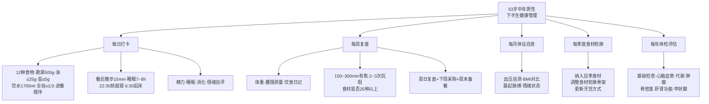

每日30秒打卡 + 每周15分钟复盘 + 每月10分钟体征 + 每季度食材调整 + 每年1次体检 = 约**全年40小时的健康管理时间投入**——相比每年8760小时的总时间，仅占0.46%却能换取15~20年的健康寿命延长。

### 9.10.2 未来15~20年的三大健康转折期

53岁是中国男性健康管理的关键起点，未来可分为三个阶段：

**50~60岁·慢病防控期** ——这是当前阶段。核心任务:**通过两周食谱+150分钟有氧+2次抗阻+定期体检+戒烟限酒**，把超重肥胖、高血压、高血脂、糖尿病四大代谢性慢病的发病/进展尽量延后或阻断。这一阶段做好与否，直接决定60岁后的健康基线。

**60~70岁·肌少症与骨质疏松强化期** ——肌少症患病率从14%升至40%、骨质疏松患病率从19.2%升至32.0%。核心任务:**蛋白上调至1.2~1.5g/kg、钙稳定800~1000mg、维生素D 800IU/d、抗阻训练2~3次/周不间断、平衡训练2次/周防跌倒、骨密度每年监测**。

**70岁以上·失能预防期** ——任何一次跌倒骨折、一次重症感染、一次慢病急性发作都可能成为失能的转折点。核心任务:**保留肌肉与骨密度、防跌倒、维持认知功能、社会参与不脱钩**。

每一阶段都建立在前一阶段的基础上——50~60岁守住的每一公斤肌肉、每一毫摩尔钙、每一毫米汞柱血压，都是70岁以上独立生活能力的"健康储蓄"。

### 9.10.3 从"纸面方案"到"生活方式"再到"生命质量"

回到第1章设定的全部营养目标基线——能量1500~2000kcal、蛋白80~96g、钙≥800mg、盐≤5g、油25~30g、深色蔬菜占半、全谷占主食≥1/3、EPA+DHA≥0.25g、添加糖<25g、饮水1700ml——这十项指标在第6章两周综合核查中已经全部达标。回到第7章六大健康风险防控的循证兑现度——超重肥胖、高血压、高血脂、糖尿病、肌少症、骨质疏松均在膳食维度严格达标，仅维生素D、维生素K2、植物甾醇三项作为待加强方向已明确补救路径。回到第8章执行落地体系——烹饪方法、调味控量、备餐策略、采购清单、份量估量、外食应酬、节假日场景、执行困难均已系统覆盖。回到本章的生活方式协同——饮水、运动、睡眠、戒烟限酒、心理调节、监测体系、微调方法论、习惯养成、医师咨询边界已完整闭环。

整个逻辑链条构成一个完整的环：**第1章的目标→第2章的框架→第3章的食材→第4章的搭配→第5~6章的食谱→第7章的风险防控→第8章的执行→第9章的生活方式**——每一章都解决前一章未尽的问题，每一章都为后一章铺设基础。任何一个环节缺失都将让前后所有章节的努力打折。

### 9.10.4 综合方案的最终蜕变路径


**纸面方案** ——本报告呈现的两周食谱+生活方式综合方案，是一份基于权威指南、循证证据、本土化适配的科学文档。

**刻意执行** ——前7天靠意志力坚持，控油壶限盐勺成为新工具，进餐顺序成为新习惯。

**初步习惯** ——21天后餐桌上自然出现深色蔬菜占半、自然在饭后散步、自然在睡前喝温牛奶。

**稳定固化** ——66天后不再需要刻意提醒，健康饮食成为身体的本能选择，外出聚餐也能自然守住基线。

**生活方式** ——180天(6个月)后，体重已减重5~10kg、血压血糖血脂已显著改善、肌肉力量已提升、睡眠质量已改善——健康饮食已不是"任务"而是"享受"。

**10年健康储蓄** ——10年间通过两周食谱循环执行+年度体检+季节性调整+应季食材轮换，把53~63岁这十年最关键的慢病发病窗口期平稳度过。

**下半生健康** ——15~20年后回顾，会发现在53岁这一关键节点开始的综合健康管理，让整个下半生都建立在更稳固的健康基础上——可以独立行走、清晰思考、自主生活、享受家人陪伴、不被慢病拖累。

**生命质量** ——这是所有努力的最终目标。健康不是为了多活几年的长度，而是让每一年都活得更有质量——能爬山、能旅行、能含饴弄孙、能继续做自己想做的事。**这正是本报告的根本命题——通过科学严谨、本土化适配、可持续执行的综合方案，让53岁/80kg中国男性走好下半生**。

### 9.10.5 收官致语

至此，全报告从第1章对53岁/80kg中国男性个体健康画像与营养需求的精准评估，到第2章中老年平衡膳食科学原则与本土化框架的整合，到第3章关键食材选择策略与功能性食材识别，到第4章三餐搭配逻辑与营养均衡设计原理，到第5~6章两周42餐+加餐的具体编排，到第7章针对六大健康风险的膳食侧重与循证兑现度，到第8章简易烹饪方法、采购清单与执行落地指南，到本章生活方式协同、监测评估与动态调整——整个9章近20万字的论述，为这位53岁/80kg中国男性构建起一份从"营养目标"到"具体食谱"再到"长期生活方式"的完整健康管理蓝图。

需要再次明确的是——本报告基线假设为**"男性、轻体力活动、无确诊慢病、未服药、身高情景化(160/170/180cm三档)"**。用户实际身高、活动量、健康状况、用药情况、食物过敏、家族病史等任何偏离这一基线假设的因素，都需要在执行前咨询医师或注册营养师做个性化调整。**本报告是科学严谨的参考方案，不是替代医师诊疗的医疗建议**。

最后，**健康饮食看似复杂的数学公式，其实只是把对的食材放在对的位置，就像玩一场美味的拼图游戏**[^144]。从今天的下一餐开始，从一勺低钠盐替代普通盐开始，从一顿蔬菜先吃后吃主食开始，从晚饭后多走15分钟开始，从睡前1小时放下手机开始——**所有伟大的健康转变，都始于这些看似微小的日常选择**。两周食谱不是终点，而是起点；不是束缚，而是自由——**用对的吃法守护下半生的健康，让每一天都活得更有质量**。

这，就是这份报告对53岁/80kg中国男性下半生健康的最终承诺。

# 参考内容如下：
[^1]:[中国营养学会发布《2023版中国居民膳食营养素参考摄入量》](https://www.cnsoc.org/learnnews/792310200.html)
[^2]:[《中国居民膳食指南(2022)》发布会图文实录](https://www.cnsoc.org/notice/742220200.html)
[^3]:[DRIs(2023版)](https://www.cnsoc.org/drpostand)
[^4]:[【科普营养】主食少吃半碗,老人吃够肉蛋奶……新版《中国居民膳食营养素参考摄入量(2023版)》的变化影响我们餐桌 ](https://mp.weixin.qq.com/s?__biz=MzU5NTY4ODk3Ng==&mid=2247604617&idx=1&sn=d44dde19002f2e65a0c04c38078b2060&chksm=ffc6399d83012e3161a6b903c4c4ff6197c2f75471bd2d8f5357a3d4f099f891985d4be1c1e0&scene=27)
[^5]:[骨质疏松患者中,近一半有肌少症?记者实探:你的身体比想象中更“脆皮”](https://baijiahao.baidu.com/s?id=1856301678076115774&wfr=spider&for=pc)
[^6]:[科学守护肌肉(一)| 基础篇:何为肌少症 ?](https://yl.wjhospital.com.cn/Html/News/Articles/20007232.html)
[^7]:[肌少症患者发生骨质疏松的风险是正常人三倍以上,老年人这一误区应避免](https://baijiahao.baidu.com/s?id=1850915644028586206&wfr=spider&for=pc)
[^8]:[糖尿病年轻化、职场化——当“上班族”遭遇“甜蜜”的烦恼](https://www.bjcc.gov.cn/article/600589325.html)
[^9]:[高血压患病率如何](http://www.yilianmeiti.com/article/2565545.html)
[^10]:[成人肥胖判定标准——2026年温州市全民营养周系列推送(六)](http://baijiahao.baidu.com/s?id=1863300338640380077&wfr=spider&for=pc)
[^11]:[陆毅因“嘴唇发紫”被劝入医院,这是心脏病表现吗?](https://www.bjnews.com.cn/detail/1777295359129460.html)
[^12]:[科学吃饭,稳控血糖](https://www.thepaper.cn/newsDetail_forward_33054925)
[^13]:[体重管理年丨体重管理必修课:理清能量帐目表](https://www.cnsoc.org/knowledge/7125112026.html)
[^14]:[【创慢专栏】《中国居民膳食营养素参考摄入量(2023版)》来啦! ](https://mp.weixin.qq.com/s?__biz=MzI5NTcxNjQ1MA==&mid=2247583656&idx=2&sn=256ba0c9391d0da1e309741401212b64&chksm=ec4c94a5db3b1db3b0664eba3002f2bf28f2495860216897480ee740740d61a48c2d0c852aa7&scene=27)
[^15]:[新版居民膳食指南有何变化?专家称应坚持吃碳水,多吃全谷物](https://www.163.com/dy/article/H5V2D9PJ05129QAF.html)
[^16]:[新指南发布!成年人补钙都按同一个标准来](http://k.sina.com.cn/article_7857201856_1d45362c001904kz8w.html)
[^17]:[老年人怎么吃才能高效补钙?_健康讲堂_健康教育_邹城市人民医院](http://k.sina.com.cn/article_7857201856_1d45362c001904lta0.html)
[^18]:[《中国居民膳食指南(2022)》平衡膳食八准则](https://www.quanjiao.gov.cn/public/161055045/1112918720.html)
[^19]:[读懂中国居民平衡膳食宝塔 ](http://www.tzzx.net/423346/12557/2025/03/38147180.html)
[^20]:[中国居民平衡膳食宝塔](http://www.yishui.gov.cn/info/126862/327448.htm)
[^21]:[【全民营养周】合理膳食,你每天吃对了吗?](https://www.ayseyy.com/jiankang/1512.html)
[^22]:[【体重管理】体重管理,从今天开始(5):“东方健康膳食模式”,中国人的健康饮食指南 ](https://mp.weixin.qq.com/s?__biz=MzI4ODI5MTQ0MA==&mid=2247549168&idx=2&sn=9bc15640fc2f5a49fdfac68aeffc2749&chksm=ea9d651ca3f2cc9b25a43efd0dfc61e8094ece33c7fc967a0ff212bb98d3169a6fedb20407b0&scene=27)
[^23]:[速来围观!更适合中国胃的饮食](http://k.sina.com.cn/article_7857201856_1d45362c001904qgqs.html)
[^24]:[平衡饮食,哪些模式,可让老年人抄作业?](https://baijiahao.baidu.com/s?id=1821823126612927955&wfr=spider&for=pc)
[^25]:[“东方膳食”模式有益健康再添科学新证据](https://baijiahao.baidu.com/s?id=1859965406874678101&wfr=spider&for=pc)
[^26]:[不用吃沙拉了!心血管风险降 22%,大肚腩风险降 17%!这套东方膳食,专为中国人定制](https://mp.weixin.qq.com/s?__biz=MjM5OTEzOTUxOQ==&mid=2654398174&idx=2&sn=e1b7f579139cf924a9552ecc22dda191&chksm=bc5630b7d169f0c7923ac3ab16685c9c2dacdc392cfc01ae970cfb54b6b9cbe681c5f65af83e&scene=27)
[^27]:[“营养师和你一起读文献”专栏 | 13东方膳食--可能比“地中海饮食”更适合中国人体质的减脂护心方案!](https://mp.weixin.qq.com/s?__biz=MzA5OTc1MzMwMg==&mid=2651512152&idx=1&sn=98635ddc43e50a25a2d0f2397ca3fa2b&chksm=8ad3b1bce119ad589ddc210ab9ff1d528ec29cfd35fca2e7ccf368f8d232eeba47882da322e4&scene=27)
[^28]:[春节怎么吃?相比地中海饮食,“江南饮食”更适合中国胃!丨爱申活暖心春](http://k.sina.com.cn/article_7857201856_1d45362c001904qgr6.html)
[^29]:[抗高血压的饮食方案是什么](https://www.mfk.com/ask/19359600.shtml)
[^30]:[高血压的饮食治疗方法有哪些](https://www.mfk.com/ask/20996617.shtml)
[^31]:[【每周科普】餐桌上的抗炎饮食:循证医学视角下的科学选择](https://mp.weixin.qq.com/s?__biz=MzIxOTgwOTk4Nw==&mid=2248422656&idx=2&sn=3de347f2075879c3196dc68c6d70974a&chksm=955ad6b4fd9b536f0fd5b4dc5cd3f01078949ec34526f86db158540a79d3f969b288391796e2&scene=27)
[^32]:[中老年人年度健康指南](http://k.sina.com.cn/article_7879922978_1d5ae152201901gus4.html)
[^33]:[地中海饮食体系革新:解读2025年新版金字塔指南](http://word.baidu.com/noteview/3cd1bd1ffed6195f312b3169a45177232f60e47a.html)
[^34]:[东方健康膳食:植物性为主,讲究“当地当季”](https://baijiahao.baidu.com/s?id=1855438782322338511&wfr=spider&for=pc)
[^35]:[5大膳食模式哪一种最健康,哪一种最适合中国人?医生为您讲清楚](https://baijiahao.baidu.com/s?id=1791140434626340891&wfr=spider&for=pc)
[^36]:[政府信息公开](http://www.huiyang.gov.cn/hzhywsjkj/gkmlpt/content/5/5121/post_5121107.html)
[^37]:[全谷物主食:抗炎新选择,健康新潮流- · 科普中国网](http://k.sina.com.cn/article_7857201856_1d45362c001904r9d8.html)
[^38]:[孕妈妈们,主食“粗细搭配”做对了吗?这样吃可以控糖](https://web.shobserver.com/sgh/detail?id=1537606)
[^39]:[糖尿病人应该以什么为主食](https://www.bohe.cn/article/view/wx2oz4vimka1gnv.html)
[^40]:[慢性炎症是这样“吃”出来的!不想大脑早衰,先戒掉这几种促炎食物→](http://baijiahao.baidu.com/s?id=1863617567142046930&wfr=spider&for=pc)
[^41]:[适合糖尿病人吃的主食](https://m.bohe.cn/article/mip/0frctpnqmksz0ks.html)
[^42]:[《中国居民膳食指南2022》中全谷物和杂豆类食物的推荐摄入量为()。](https://aistudy.baidu.com/site/wjzsorv8/8cd47d9a-7797-42f3-9306-b902ded71161?botSourceType=124&eduFrom=196&examQuestionId=qBvRD-_t0sEJjSSLBSx8ig)
[^43]:[一半中国人蛋白质没吃够!提醒:64岁以上人群,每天这样吃才达标](https://baijiahao.baidu.com/s?id=1863244094642844308&wfr=spider&for=pc)
[^44]:[最适合中老年吃的高蛋白,鸡蛋只排第5,第一名很多人都不知道](https://baijiahao.baidu.com/s?id=1853807286551843036&wfr=spider&for=pc)
[^45]:[“补蛋白就是补寿”,建议中老年:多吃4种高蛋白食物,增免疫](https://baijiahao.baidu.com/s?id=1863337600545391966&wfr=spider&for=pc)
[^46]:[建议中老年人除了喝牛奶,还要常吃这4样,腿脚有劲,抵抗力强](https://baijiahao.baidu.com/s?id=1863155190048358052&wfr=spider&for=pc)
[^47]:[【孙建琴】营养补充剂:肌肉健康干预的“核心助力”——《亚洲肌少症工作组2025年专家共识(AWGS2025)》解读之四](https://view.inews.qq.com/a/20260401A01JNS00)
[^48]:[“要长寿,多吃豆“2/3以上居民大豆摄入量不足,鼓励“增豆](https://baijiahao.baidu.com/s?id=1863072364601239310&wfr=spider&for=pc)
[^49]:[医学研究:每天吃豆腐喝豆浆的老人,不出3个月,身体或有4大改善](https://www.bohe.cn/news/view/100241.html)
[^50]:[适于老年人食用的高蛋白食品有什么](https://www.bohe.cn/article/view/oq302t65tkm52ir.html)
[^51]:[这类食物有助“润滑”关节,建议每周吃2~3次](https://mp.weixin.qq.com/s?__biz=MzI4MTQzNzE0Mg==&mid=2247599608&idx=1&sn=dc22e1b59f63217edb6ded0e1dc053e7&chksm=eabc49d30a4dccf1eca7c395af1b75da49e18bf488f5050ef51ff732dc4c8477a2be541188cd&scene=27)
[^52]:[研究发现:坚持喝酸奶的老年人,用不了多久,身体或有4个改善!](https://baijiahao.baidu.com/s?id=1840396551903977851&wfr=spider&for=pc)
[^53]:[研究发现:每天饭后喝酸奶的老人,用不了多久,身体或有4大变化](https://baijiahao.baidu.com/s?id=1825741406005354938&wfr=spider&for=pc)
[^54]:[酸奶成关注对象?研究发现:中老年人常喝酸奶,身体或有4大益处](https://www.bohe.cn/news/view/22585.html)
[^55]:[深色蔬果](https://baike.baidu.com/item/深色蔬果/67322435)
[^56]:[富含维生素的菜有哪些](https://www.bohe.cn/article/view/9lml27fk0k2cp3t.html)
[^57]:[蔬菜有哪些营养成分含量表最新](https://www.bohe.cn/zx/987623.html)
[^58]:[维生素c含量高的蔬菜](https://www.mfk.com/article/10737541.shtml)
[^59]:[警惕大脑“糖中毒”!吃错水果,会让痴呆风险增加14.5%](https://news.qq.com/rain/a/20260418A065XQ00?adChannelId=health)
[^60]:[糖尿病吃什么蔬菜水果比较好](https://mip.39yst.com/jingbian/kuwep89mkwr.shtml)
[^61]:[蓝莓这种应季水果别错过 常吃帮你抗炎、延缓衰老](https://baijiahao.baidu.com/s?id=1863579286635467080&wfr=spider&for=pc)
[^62]:[建议每天饮用300~500ml牛奶,新版《中国老年人膳食指南》来了!](https://zhuanlan.zhihu.com/p/591118515)
[^63]:[心血管疾病可以吃坚果吗? ](https://www.fh21.com.cn/ask/view/104746951.html)
[^64]:[每日吃坚果的好处](https://www.bohe.cn/article/view/a8hamzx2gkddwiy.html)
[^65]:[老人吃什么坚果对身体好一点](https://www.bohe.cn/zx/982981.html)
[^66]:[【2024年卫生健康宣传日】世界减盐周 ——改变高盐饮食习惯](http://www.dg.gov.cn/dgtxz/gkmlpt/content/4/4178/post_4178570.html)
[^67]:[市监科普|超市那么多油,到底怎么挑?](http://baijiahao.baidu.com/s?id=1862621071474661138&wfr=spider&for=pc)
[^68]:[超市食用油挑选指南:看懂脂肪酸,按需选油更健康](https://stock.10jqka.com.cn/20260424/c676264474.shtml)
[^69]:[科学选油指南:按脂肪酸分类与人群需求选购](https://stock.10jqka.com.cn/20260422/c676198037.shtml)
[^70]:[根据健康饮食建议,完成以下填空:盐:每人每天≤____g(1啤酒瓶盖),用定量盐勺精准控盐;油:优选植物油(橄榄油/菜籽油等),每天≤____g(约2.5汤匙);糖:添加糖≤____g/天(≈6块方糖),可用姜、蒜、柠檬等调味减少糖的使用。](https://easylearn.baidu.com/edu-page/tiangong/questiondetail?id=1842936989449653895&fr=search)
[^71]:[清淡饮食标准发布每日盐油糖摄入量明确](https://t.cj.sina.com.cn/articles/view/2660940103/9e9ab94704001pr1e)
[^72]:[食话说 | 吃对食物,守护血管健康](https://news.foodmate.net/2026/04/741881.html)
[^73]:[800就够了!额外补钙,并没有用!尤其这两类女性](https://view.inews.qq.com/a/20260401A050GN00)
[^74]:[中老年人如何正确补钙?](http://k.sina.com.cn/article_7857201856_1d45362c001904kz9s.html)
[^75]:[中国居民膳食指南2022 | 准则六 规律进餐,足量饮水](http://dg.cnsoc.org/article/04/wDCyy7cWSJCN6pwKHOo5Dw.html)
[^76]:[晚上管住嘴,就能活更久](https://baijiahao.baidu.com/s?id=1863603519724632668&wfr=spider&for=pc)
[^77]:[晚上管住嘴为什么能让人活更久 解锁长寿密码](https://news.china.com/socialgd/10000169/20260426/49451598.html)
[^78]:[老年人的餐次安排以及热量分配](https://www.mfk.com/article/10745775.shtml)
[^79]:[不节食、不挨饿!晚饭一个小改变,血糖、血压、脂肪肝竟自己悄悄变好](https://baijiahao.baidu.com/s?id=1861779248560096057&wfr=spider&for=pc)
[^80]:[6点吃晚饭是错误的?医生建议:过了70岁,晚饭尽量要做到这3点](https://baijiahao.baidu.com/s?id=1862958092017820437&wfr=spider&for=pc)
[^81]:[福利| 餐盘法!211分配食物,控制饮食只需四步!](https://www.tjh.com.cn/api/preview/1/124/53485)
[^82]:[调整进食顺序可有效控制热量摄入与血糖波动](https://stock.10jqka.com.cn/20260424/c676250735.shtml)
[^83]:[每天散步能降血糖?医生研究:控糖有3个“最好方法”,不是散步](https://baijiahao.baidu.com/s?id=1863249058817179886&wfr=spider&for=pc)
[^84]:[糖尿病患者低升糖食物选择指导](https://baijiahao.baidu.com/s?id=1862998443261320706&wfr=spider&for=pc)
[^85]:[Protein Distribution Needs for Optimal Meal Response](http://doi.org/10.1096/fasebj.25.1_supplement.983.7)
[^86]:[一半中国人蛋白质没吃够!医生:50岁以上人群,每天这样吃才达标](https://www.163.com/dy/article/KRA0CJL40553TDUQ.html)
[^87]:[一半中国人蛋白质没吃够!医生:50岁以上人群,每天这样吃才达标](https://www.163.com/dy/article/KRCH51SK0553TF8W.html)
[^88]:[肌肉的“营养燃料”:从营养学科视角,解锁三餐护肌密码](https://www.thepaper.cn/newsDetail_forward_32094524)
[^89]:[The Impact of Pre-sleep Protein Ingestion on the Skeletal Muscle Adaptive Response to Exercise in Humans: An Update](https://www.frontiersin.org/articles/10.3389/fnut.2019.00017/full)
[^90]:[吃对一日三餐,守护银龄健康](https://wsjkw.sh.gov.cn/lnbj/20260113/a65924165bcc4a1e8b9b6003af40abda.html)
[^91]:[健康科普 | “三减+三健” 让你更健康](http://k.sina.com.cn/article_7857141524_1d452771401901ykq8.html)
[^92]:[食物冰箱冷藏能放多久](https://www.bohe.cn/zx/1421424.html)
[^93]:[越吃越瘦的零食清单附热量对照表](http://k.sina.com.cn/article_7879922980_1d5ae152401901gnfy.html)
[^94]:[7款减脂汤的做法,低脂鲜美,一周不重样,不挨饿也能瘦](https://baijiahao.baidu.com/s?id=1676531487491316817&wfr=spider&for=pc)
[^95]:[尿酸高的人看过来!这些美味低嘌呤菜绝对不能错过!](https://dy.163.com/article/JVC5TQSB0552DSZ8.html)
[^96]:[晚饭七分饱被推翻了?调查发现:过了50岁,吃饭尽量要做到这4点](https://baijiahao.baidu.com/s?id=1863250091083401387&wfr=spider&for=pc)
[^97]:[什么是地中海饮食?怎样吃更合“中国胃”?看这篇就够了 ](https://wsjkw.sc.gov.cn/scwsjkw/jkys/2025/11/14/aced7d13433b4be287bfce54282b8b45.shtml)
[^98]:[2024最佳饮食榜单出炉!连续7年霸榜,它到底神奇在哪? ](https://mp.weixin.qq.com/s?__biz=MzU5MDAwNDE3Ng==&mid=2247636370&idx=1&sn=357725644e4f525ab52d1fcea12441a2&chksm=fdc87f2dcabff63ba761a11b040e93e270e7019155651d82ffbc733bc75ca5ffdeb6a8994ec8&scene=27)
[^99]:[上了年纪,应该少喝水?](https://www.thecover.cn/news/vYcwGcpmEOeH90qSdq8Jkw==)
[^100]:[三高人群的一日三餐健康食谱](https://www.mfk.com/article/10745566.shtml)
[^101]:[清淡的家常菜做法大全](https://www.bazhongol.com/jxuzs/202510/862428.html)
[^102]:[藏在日常的 “成瘾饮料”,正在慢慢伤害你](https://mp.weixin.qq.com/s?__biz=MzA4MzMwNzQyNQ==&mid=2651181954&idx=1&sn=0a373c3cb5e3fa1c65cf41f7728bb98b&chksm=8573dcb5d8bd14de53b3db3e3e12f1416ce2cc442c5d4aaa5bf1b438204f6e86326420545f5a&scene=27)
[^103]:[【科普面对面】科学饮水指南:解锁健康密码](http://k.sina.com.cn/article_7857201856_1d45362c001904j10c.html)
[^104]:[8道蒸菜的做法,一锅同时蒸好几道,方便好吃又健康,营养不上火](https://baijiahao.baidu.com/s?id=1805652437700881388&wfr=spider&for=pc)
[^105]:[中国居民膳食指南(2022)| 准则八 公筷分餐,杜绝浪费](https://mp.weixin.qq.com/s?__biz=MzI4NTI4NTYyOQ==&mid=2247488355&idx=1&sn=3fa79233396793483e4fcd493c1cfd6f&chksm=eaa413aa8d5231a96c28748cb1c21fc305769e8963defc222ba7a463479ad4c4a0e6f63b398f&scene=27)
[^106]:[https://mp.weixin.qq.com/s?__biz=MzIxMDg3MTQ1Mw==&mid=2247504117&idx=1&sn=6386d159c97d7f1fd63d5c202f6ca05d&chksm=975f6507a028ec11dd9a262612f0e2d787f099f3a49c255fecb9220282eab105563f05bc125d&scene=27](https://mp.weixin.qq.com/s?__biz=MzIxMDg3MTQ1Mw==&mid=2247504117&idx=1&sn=6386d159c97d7f1fd63d5c202f6ca05d&chksm=975f6507a028ec11dd9a262612f0e2d787f099f3a49c255fecb9220282eab105563f05bc125d&scene=27)
[^107]:[中国化的“地中海饮食”模式!坚持这样吃,远离脂肪肝(附食谱) ](https://mp.weixin.qq.com/s?__biz=MjM5MTE3NDI0MA==&mid=2654302680&idx=3&sn=c6c4ba0214f67f5f1926342e1599c622&chksm=bc05976ec52262f65bcb5f5d2dad1d42cfb25301973d3a471ab885b6c57bc7d0c2f07cdaf1f7&scene=27)
[^108]:[告别厨房劳累!老年人省力备餐法](https://mp.weixin.qq.com/s?__biz=MzI4MzY1MTAzMQ==&mid=2247519167&idx=1&sn=4865a28e9e6972bfafc666d7a46fdaba&chksm=eafde98ac8a40efbd403c9e8e96421165774fe2abd68a8bd4c90c37fd5d073f9f50832fd5dbf&scene=27)
[^109]:[吃什么零食可以减肥又不胖 - 专家文章](http://k.sina.com.cn/article_7879922980_1d5ae152401901gliw.html)
[^110]:[按年龄细分,世卫组织制定身体活动的最新指南,快看看你应该做什么运动!](https://cj.sina.com.cn/articles/view/7879922978/1d5ae152201901gs8g)
[^111]:[巧食防病!预防“三高”吃对才有效](http://www.xinhuanet.com/science/20231119/839c9c87365c428a8625622e8f20aa8a/c.html)
[^112]:[乔麦的最佳搭配是什么](https://www.bohe.cn/article/view/les5z0pf9k4fqby.html)
[^113]:[一项被低估的“防病王牌运动” 每周2次就够 不是跑步走路](https://baijiahao.baidu.com/s?id=1862856570414858077&wfr=spider&for=pc)
[^114]:[《中国居民膳食指南(2022)》帮您把好一日三餐营养关](http://baijiahao.baidu.com/s?id=1732666669411057043&wfr=spider&for=pc)
[^115]:[荞麦搭配什么一起吃最佳](https://wapask-mip.39.net/bdar/124281824.html)
[^116]:[一起来学习“DASH饮食”法,可持续的减重健康路径~](https://web.shobserver.com/sgh/detail?id=1637454)
[^117]:[控糖必修课,饮料选择的科学指南与实践策略 ](https://mp.weixin.qq.com/s?__biz=MzI4MDc4MjY4OA==&mid=2247594141&idx=1&sn=e30dd78c57fea1f2d3cc5564b45b99d6&chksm=eac75afccf736495565986d9eb8b97fe5855aae29a8baabc8f37dd73844870c43e6aa063d91c&scene=27)
[^118]:[你做到了吗?世卫组织更新运动指南:每周至少150分钟中等强度运动](https://mp.weixin.qq.com/s?__biz=MzA4NDU2NjQ4NQ==&mid=2650345008&idx=2&sn=4f586a96c12c65f485d3919b6c0ab00c&chksm=87e8e68ab09f6f9c2462b811c35cc0f798ecb2f3599b45a7a5907f275266b7f5c8d046adc31e&scene=27)
[^119]:[营养搭配的便餐](https://www.bohe.cn/article/view/56208.html)
[^120]:[适合老年人的健康食谱,请查收](https://baijiahao.baidu.com/s?id=1811598336988074957&wfr=spider&for=pc)
[^121]:[老年人一周食谱推荐,不仅要吃的健康,还要美味](https://baijiahao.baidu.com/s?id=1755258787690415753&wfr=spider&for=pc)
[^122]:[晒晒我从“盒马”买的10个速冻食品:又好吃又方便,15分钟做完饭](https://baijiahao.baidu.com/s?id=1844138353734097333&wfr=spider&for=pc)
[^123]:[低盐低脂饮食的具体食物是什么](https://www.bohe.cn/article/view/edu0s7edikvd5fz.html)
[^124]:[它们一起炒,简单快手营养好,口感清爽低脂健康,比肉还香](http://baijiahao.baidu.com/s?id=1684126371890664458&wfr=spider&for=pc)
[^125]:[轻食革命!这款即食鸡胸肉让健康饮食不再麻烦](https://baijiahao.baidu.com/s?id=1860426661000614285&wfr=spider&for=pc)
[^126]:[重度脂肪肝一日三餐食谱?](https://mip.mfk.com/ask/11780683.shtml)
[^127]:[30分钟家常菜,懒人也能做出人间烟火,好吃不费钱](https://www.163.com/dy/article/KR6N93NF0556K5MX.html)
[^128]:[老年人一日三餐健康食谱](https://www.bohe.cn/zx/909154.html)
[^129]:[年后快手营养餐,妈妈做了2菜1主食,到家15分钟开饭,暖心又健康](https://baijiahao.baidu.com/s?id=1824475375787875269&wfr=spider&for=pc)
[^130]:[血压血糖血脂多少是正常](https://www.mfk.com/ask/12091109.shtml)
[^131]:[春节零食选择指南:哪些食物健康又美味?](http://k.sina.com.cn/article_7857201856_1d45362c001904iazs.html)
[^132]:[冰箱里的食物能放多久](https://www.bohe.cn/zx/1514545.html)
[^133]:[体重超标别忽视,它竟是癌症的“隐形推手”](http://finance.sina.com.cn/wm/2026-04-20/doc-inhvcvua6891321.shtml)
[^134]:[三大高发慢病:科学防控实用指南 - 防患于未然 - 家医大健康](http://k.sina.com.cn/article_7879922978_1d5ae152201901gu6i.html)
[^135]:[卫健委:快来测一测腰围,看看达标了吗?](https://baijiahao.baidu.com/s?id=1861506915921196249&wfr=spider&for=pc)
[^136]:[懒人蒸菜一锅出六菜一汤,简单好做营养搭配太适合我家了!#美食教程 #蒸菜 #在家做美食](https://post.m.smzdm.com/p/ax6q309w/)
[^137]:[【科普营养】每天吃多少?用手量!18张原创图片教会你 ](https://mp.weixin.qq.com/s?__biz=MzU5NTY4ODk3Ng==&mid=2247603303&idx=1&sn=20f991155f4eabb6f79ff90dda5d38d1&chksm=ff94d04c7ca96104163fbfcddb96a7c195ce1ca252801a9075b75716823c272919b43025ea6a&scene=27)
[^138]:[减重总是难坚持?一起来学习“DASH饮食”法!](http://baijiahao.baidu.com/s?id=1842323366089472302&wfr=spider&for=pc)
[^139]:[血压血糖血脂多少是正常](https://www.bohe.cn/article/view/aj33sn2aiktu1nt.html)
[^140]:[五大行为改变打造健康生活](https://m.bohe.cn/article/mip/64656.html)
[^141]:[不爱吃饭的解决方法有哪些](https://www.bohe.cn/article/view/bb8kiff3ckaxo3q.html)
[^142]:[食欲不振如何解决](https://m.fh21.com.cn/article/dzmip/1384993.html)
[^143]:[吃蛋白质粉的最佳时间](https://www.mfk.com/article/13010233.shtml)
[^144]:[糖尿病饮食管理:别只“少吃”,“会吃”才是王道](https://mp.weixin.qq.com/s?__biz=MzA3NDEzODk5OA==&mid=2651275926&idx=7&sn=aa22a7a759c643fac264ca409a502df0&chksm=8571f6083dc9858858ddfc5c31314accc7da5b16c98a084cf59b247ce83ed5e4941da14d7971&scene=27)
[^145]:[蛋白粉什么时间吃效果最好](https://www.mfk.com/article/8976611.shtml)
[^146]:[【健康科普】——科学就医 合理用药!](https://mp.weixin.qq.com/s?__biz=MzI5NDY3NzkyNA==&mid=2247493385&idx=1&sn=a9179adcafad5f9ab2b6367d37de1a0b&chksm=edc1ab8e74ad1275554601b478fd7c33362a15a620a95d5a4290d68044587ff7b3af452ac757&scene=27)
[^147]:[科学就医 合理用药——提升素养 促进健康系列之十七](https://mp.weixin.qq.com/s?__biz=MzI2MzE2NjEyMg==&mid=2650213506&idx=1&sn=b6753cf704940c8a3deb3fd98c4d0778&chksm=f39bd0095a866e71687e821c535e175350ff967f7f5bb5d9517f7316ef74015362564fb23568&scene=27)
[^148]:[“晒太阳补钙”是假的?研究发现:人老了想补钙,做好这几事](https://baijiahao.baidu.com/s?id=1862979702696211533&wfr=spider&for=pc)
[^149]:[8小时睡眠被推翻了?医生建议:53岁以后,睡觉要注意这几个细节](https://baijiahao.baidu.com/s?id=1862955980226051179&wfr=spider&for=pc)
[^150]:[自测身体健康的10种方法](https://www.bohe.cn/article/view/56574.html)
[^151]:[怎么自测身体是否健康 自测健康的十个参考指标](https://www.bohe.cn/zx/270286.html)
[^152]:[“成年男性腰围控制在90cm以内,成年女性控制在85cm以内”](https://baijiahao.baidu.com/s?id=1859166097415072075&wfr=spider&for=pc)
[^153]:[膳食营养摄入标准有变化](http://paper.people.com.cn/mszk/html/2023-11/20/content_26029036.htm)
[^154]:[饭局用餐中饮酒要注意什么?](https://m.bohe.cn/ask/mip/103391985.html)
[^155]:[老年朋友请注意,医生喊您做力量训练啦!| 运动是良医](https://www.jfdaily.com/wx/detail.do?id=791925)
[^156]:[均衡饮食很难?是你没有用好这“4大法宝”,学起来很容易](https://news.fh21.com.cn/ylzx/sxtybdfyy/6462346_2.html)
[^157]:[买买纷 的想法: 日常饮食,遵守“二八原则”就好 | “二八”原则是指 80% 的时间吃“健康餐”,而 20% 的时间可以允许自… - 知乎](https://www.zhihu.com/pin/1672549007258804224)
[^158]:[饭后走路对糖尿病好吗](https://m.xinglinpukang.com/article/32997297.html)
[^159]:[食欲不振、消瘦爱生病?3大诱因+科学应对指南 - 身体与疾病 - 家医大健康](http://k.sina.com.cn/article_7857201856_1d45362c001904px6c.html)
[^160]:[蛋白质时机真的重要吗?训练后30分钟“黄金窗口”真相](https://baijiahao.baidu.com/s?id=1861495743850645331&wfr=spider&for=pc)
[^161]:[健身蛋白质粉什么时候吃最好](https://www.mfk.com/article/2888018.shtml)
[^162]:[不是8小时!每晚睡够这个时长,对代谢最友好](https://baijiahao.baidu.com/s?id=1860538293400458655&wfr=spider&for=pc)
[^163]:[改变自己需要多少天? ](https://dxs.moe.gov.cn/zx/a/xl_xlyz_xlzs/210409/1614402.shtml)
[^164]:[【汤医科普】筑牢健康防线,这些知识请收好 ](https://wjw.beijing.gov.cn/bmfw_20143/jkzs/jksh/202604/t20260424_4607966.html)
[^165]:[50岁中年体检必查项目](https://www.mfk.com/ask/24155260.shtml)
[^166]:[成年男性一天饮酒量不超过多少](https://m.youlai.cn/askmip/6088D5qMVAM.html)
[^167]:[50多岁体检哪些项目](https://m.bohe.cn/article/mip/r9w3v4lzhk5ueb6.html)
[^168]:[男性饮酒量控制在多少不影响健康 ](https://www.bohe.cn/ask/view/103475023.html)
[^169]:[成年男性一天饮用的酒精量不超过多少克](https://m.youlai.cn/jingbian/article/B4AA61mtMVs.html)
[^170]:[节日饮酒如何把握适量](https://www.bohe.cn/article/view/53694.html)
[^171]:[“明心育人”在线课堂丨21天效应](http://www.mdit.edu.cn/info/5917/113690.htm)
[^172]:[科学膳食:不同人群营养素摄入有新标](https://baijiahao.baidu.com/s?id=1782503886397248507&wfr=spider&for=pc)
[^173]:[心理压力太大怎么办](https://www.mfk.com/article/8289375.shtml)
[^174]:[被忽视的“抗癌良方”:饭后散步30分钟!但很多人没走对_新闻](http://k.sina.com.cn/article_7857201856_1d45362c001904mzdw.html)
[^175]:[糖尿病人餐后要散步多久](https://www.bohe.cn/article/view/6e5csv50lk7lvg5.html)
[^176]:[中年人调整心态远离抑郁症](https://m.bohe.cn/article/mip/22utuej6k26f3qi.html)
[^177]:[中年期促进心理健康的措施](https://m.120ask.com/zhishi/art/mip_1293426.html)
[^178]:[科学就医健康教育核心信息及释义](https://www.nhc.gov.cn/xcs/c100122/201411/32c1bd8c5b13436ba9ec83ef1834856e.shtml)
