# 颜值经济共振：全球20-30岁女性口腔正畸与医美共同需求研究及融合前景展望
# 1 研究背景、范围界定与分析框架

在全球颜值经济持续升温与悦己消费观念深度普及的双重浪潮下，"变美"已从少数人的奢侈选择演化为大众化、日常化的消费实践。在这一宏观趋势中，20-30岁女性作为兼具经济能力、审美自觉与社交活跃度的人群，正在同时驱动两个曾经相互独立的产业——口腔正畸与医疗美容（以下简称"医美"）——加速向"颜面整体美学"这一共同终点收敛。然而，学界与业界对这两大产业的研究长期处于分立状态：正畸研究多聚焦于错颌畸形的临床矫治与口腔健康功能修复，医美研究则集中于皮肤管理、轮廓塑形与抗衰需求，鲜有研究系统回答"同一人群是否同时承载着两类需求""两类需求在多大程度上重叠""未来能否在产品、机构、品牌层面走向融合"等关键命题。本研究即以此为切入点，试图打通正畸与医美的研究壁垒，以全球20-30岁女性为核心样本，量化其共同需求比重并前瞻融合可能性。

本章作为全报告的总纲性章节，承担四重任务：第一，回顾颜值经济与悦己消费的时代背景，论证目标人群的研究价值；第二，对口腔正畸与医美进行严谨的概念边界划定，识别二者的天然耦合点；第三，明确目标人群画像与全球地理覆盖范围，确保后续分析的样本聚焦与区域均衡；第四，提出贯穿全报告的"需求重叠—驱动共振—融合路径"三层分析框架，并交代研究方法与数据来源边界。

## 1.1 研究缘起：颜值经济与悦己消费的时代共振

颜值经济的兴起并非一蹴而就，而是经历了从虚拟到实体、从浅层到深层的四阶段演进：以美图秀秀为代表的**拍摄美化类应用**最先满足人们对"图像层面的美"的诉求，2019年7月该类应用用户规模即达4.5亿，渗透率达40.7%；继而**美妆个护与服饰**承接了人们对"日常可塑之美"的需求，市场预计到2022年我国美妆个护行业规模将突破5000亿元；之后**运动健身**回应了对"健康塑形之美"的追求；最终**医美与正畸**作为更深层、更持久的颜值改造手段进入大众消费视野，构成颜值经济的最高阶形态[^1]。这一演进脉络揭示出一个核心规律：颜值消费正不断从外在装饰下沉至身体本体，从短期效果走向长期投资。

颜值的经济价值已被多项学术研究证实。伦敦大学经济学教授丹尼尔·哈默梅什于1994年首次系统提出"美貌溢价"（Beauty Premium）概念，指出劳动力市场中存在显著的外貌歧视现象[^2]。中国人民大学曾湘泉教授基于2014年中国家庭追踪调查（CFPS）数据的实证研究表明，**外貌评分每增加1分，个体收入即增加3.1%；其中男性外貌评分每增加1分，收入增加3.7%**[^2]。韩国研究亦印证：颜值最高的男性收入比颜值中等者高15.2%，颜值最高的女性高出11.1%[^2][^1]。《中国青年颜值竞争力报告》进一步显示，**94.3%的受访者认为高颜值有利于加薪**[^2]。这些数据共同构成颜值经济的微观基础——颜值不再仅是私人审美偏好，而具备实实在在的经济回报属性，由此为大规模、持续性的颜面美学投入提供了理性依据。

与颜值经济并行兴起的是**悦己消费**的概念转型。"悦己"一词出自《战国策》"士为知己者死，女为悦己者容"，但其当代内涵已经历两次根本性转向：从依附于男权社会结构、为愉悦男性而装扮，到为实现男女平等与女性自主而取悦自己，最终渗透为跨越性别、年龄、阶层的普遍消费现象[^3]。一位美妆博主在2025年妇女节直播中观察到，"年轻女性顾客的消费观，正从'为悦己者容'变为'**为悦己而容**'"[^4]，这一表述精准捕捉了当代女性自我投资逻辑的根本反转。咨询机构调研显示，2024年中国青年消费需求类型中，"取悦自我"占比达46.28%[^4]；北京、上海中产阶层研究中，葡萄酒消费的"自我取悦"动机占比从2015年的32%上升至2023年的67%[^5]。悦己消费的实践群体高度集中于年轻一代——**90后、00后群体占比超过60%**，女性通过美妆、健康管理等消费实现自我表达[^5]。学者周长城进一步将悦己消费分为"即时型"（按摩、美容等短期享乐）与"发展型"（健康投资、技能学习等长期价值），而医美与正畸恰恰横跨这两个类别：轻医美属于典型的即时型悦己，而正畸（治疗周期2-3年、需长期保持器维护）则更接近发展型悦己消费的范畴[^5][^3]。

颜值经济提供了**外部理性激励**（美貌带来的经济回报），悦己消费则贡献了**内部情感动力**（自我愉悦与价值实现），二者的同步崛起构成了20-30岁女性同时投入正畸与医美消费的双重驱动背景。这一时代共振，正是本研究将正畸与医美需求联立分析的根本逻辑出发点。

## 1.2 核心概念界定：口腔正畸与医美的内涵与外延

为避免后续分析的边界模糊，本节对口腔正畸与医美两大研究对象进行系统的概念界定。

**口腔正畸**（Orthodontics）是指通过矫治器或手术等方法矫正牙齿排列不齐、咬合异常及颌面部骨骼畸形的专业治疗手段，其根本目的不仅在于使牙齿排列美观，更在于实现牙颌系统协调平衡，恢复正常咀嚼功能，预防龋齿、牙周病等口腔疾病[^6]。从技术分类上看，口腔正畸主要包含以下三大类：

| 技术类别 | 代表方式 | 适用人群 | 治疗周期 | 美观与舒适度 |
|---------|---------|---------|---------|------------|
| 固定矫治 | 金属/陶瓷托槽、自锁托槽、舌侧矫治 | 中重度牙齿排列异常的青少年与成人 | 通常约2年 | 传统托槽外观明显；舌侧矫治隐蔽但清洁难度高 |
| 活动矫治 | 隐形矫治器（透明牙套序列）、功能矫治器 | 轻度至中度畸形；功能矫治多用于生长发育期儿童 | 与传统方法相近，依赖佩戴时间 | 隐形矫治美观可拆卸；对配合度要求高 |
| 正畸-正颌联合 | 术前正畸+正颌外科手术+术后正畸 | 严重骨性畸形（如骨性Ⅲ类反颌、上下颌前突） | 术前1-2年正畸+住院手术+术后0.5-1年正畸+长期保持 | 创伤较大但效果显著，可实现面型蜕变 |

数据来源：综合搜索结果整理[^7][^8][^6][^9]

值得特别关注的是，**正畸-正颌联合治疗**虽属正畸范畴，但其作用范围已超越牙齿层面，直接干预颌骨形态、面部轮廓乃至侧颜线条，本质上构成对面部美学的深度重塑。正如青岛市口腔医院的真实病例所示，骨性Ⅲ类错颌（地包天）患者经正畸-正颌联合治疗后，可实现"鼻旁区饱满、下颌秀气、侧颜流畅"的面型蜕变，达到"换脸般"的美学效果[^9]。这意味着正畸的外延实际上已天然延伸至传统医美所覆盖的"轮廓改造"领域。

**医疗美容**（Medical Cosmetology，简称医美）则被定义为运用手术、药物、医疗器械以及其他具有创伤性或侵入性的医学技术方法，对人的容貌和人体各部位形态进行修复与再塑，以达到美化外观、延缓衰老的目的[^10][^11]。医美的核心分类如下：

| 大类 | 子类 | 典型项目 | 特点 |
|-----|-----|---------|------|
| 手术类 | 整形外科 | 双眼皮成形术、隆鼻术、吸脂塑形、面部提升、隆胸 | 创伤大、恢复期长、效果根本性改变 |
| 非手术类（轻医美）| 注射类 | 玻尿酸（填充/保湿）、肉毒素（除皱/瘦脸）、胶原蛋白、聚左旋乳酸 | 创伤小、恢复快、风险相对低 |
| 非手术类（轻医美）| 光电类 | 光子嫩肤、激光祛斑、超声刀、热玛吉、射频技术 | 改善皮肤问题，多疗程消费 |
| 非手术类（轻医美）| 皮肤管理 | 果酸焕肤、医学护肤品、水光针 | 门槛低、价格亲民、社交属性强 |

数据来源：综合搜索结果整理[^10][^12][^11][^13]

值得强调的是，正畸与医美在**法律属性上具有共同的"医疗行为"本质**：二者都必须在具备《医疗机构执业许可证》的合规医疗场所开展，由具备资质的医护人员操作，与"生活美容"形成根本区隔[^10]。这一共同的医疗属性，构成了二者未来在监管框架、机构资质、医生培养等层面走向融合的制度基础。

**正畸与医美的天然耦合点**集中体现在"颜面美学"这一终极诉求上。现代口腔医学已不仅仅止步于解决病症与恢复功能，而是追求功能与美学的统一——微笑美学已成为现代人客观评价面部容貌的标准之一，人在微笑过程中所表露的牙体、牙龈和唇齿关系已成为口腔美学的分析指标[^14]。从美学评估的客观标准来看，"微笑时的口角连线应与双侧瞳孔连线平行""前牙切缘连线与下唇线弧度一致平行时体现最佳协调度"[^15]，这些指标本质上跨越了传统口腔与医美的学科边界，指向同一个目标：面部整体的美学协调。这正是本研究将二者并置分析的学理基础。

## 1.3 目标人群画像与地理范围设定

本研究锁定的核心人群为**全球20-30岁女性**，其选择并非随意，而是基于该群体在生理、心理、经济、消费四个维度上对正畸与医美的高度承接性。

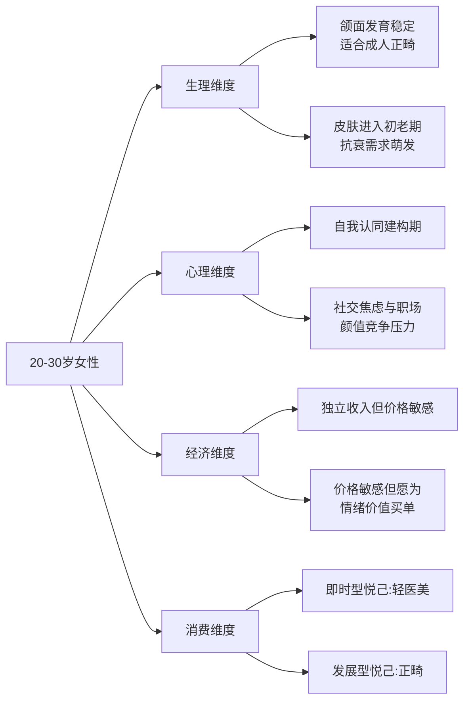

从**生理维度**看，20-30岁女性颌骨发育已基本稳定（成人正颌手术通常要求年满18周岁以后进行[^9]），既具备开展成人正畸的条件，又因尚未进入严重骨性畸形固化阶段而仍有较高的矫治响应度；同时，皮肤已进入初老期，抗衰、紧致、色斑管理等医美需求开始萌发——前文所述"25岁产品经理小林咨询热玛吉"的案例即是典型缩影[^16]。从**心理维度**看，该群体处于自我认同建构的关键期，面对职场竞争与社交媒体审美的双重压力，对外貌的焦虑感最为强烈，同时又通过悦己消费寻求情绪疏解。从**经济维度**看，该群体已实现经济独立但尚未积累显著财富，呈现出"愿意为美投入但精打细算"的双重特征——一方面愿为限量滑雪板、限量盲盒、轻医美套餐"豪掷千金"，另一方面又对邮费、高端餐饮等显性支出反复权衡[^4][^5]。从**消费维度**看，该群体同时承载即时型悦己（一顿火锅钱即可完成的水光针、光子嫩肤）与发展型悦己（治疗周期长达2-3年、费用数万元至十几万元的正畸）两类消费形态，是少数能横跨两类悦己消费的人群[^5][^17][^16]。

这四重特征叠加，使20-30岁女性成为正畸与医美需求的**双重高浓度承载群体**。值得辅助佐证的是，新氧《2025医美行业白皮书》显示，2025年中国医美消费人群中25岁以下占比已达38%，较2023年提升12个百分点[^16]；而新氧数据颜究院更早的观察则指出，25-30岁的"熟龄"求美者数量已几乎追平20-25岁群体[^18]，这些数据共同印证了20-30岁女性在医美市场中的核心地位。在正畸侧，灼识咨询数据显示中国隐形正畸案例数保持高速增长，其中**儿童隐形正畸市场年复合增长率超过60%**——这意味着大量正畸需求正向更年轻年龄段下沉，成人正畸患者中20-30岁女性的占比也相应处于较高水平[^17]。

在**地理范围设定**上，本研究覆盖全球主要市场，重点对比中国、美国、韩国、日本等医美与正畸渗透率差异显著的国家，并辅以欧洲市场的横向参照。各国医美渗透率的显著差异，构成了本研究跨区域比较的核心数据基础：

| 国家/地区 | 医美项目渗透率 | 市场成熟阶段 |
|---------|--------------|------------|
| 韩国 | 22.0% | 高度成熟，整形美容生态完备 |
| 美国 | 17.2% | 高度成熟，DSO模式发达 |
| 日本 | 11.3% | 中度成熟 |
| 中国 | 4.5% | 快速成长期，提升空间巨大 |

数据来源：华经产业研究院（2022年数据）[^11]

这一渗透率梯度揭示出中国市场在双重需求兑现上仍处早期阶段，与韩国、美国相比有4-5倍的提升空间，意味着**全球比较视野不仅是地理覆盖均衡的需要，更是判断中国市场未来融合走向的重要参照系**。需指出的是，本研究在数据可得性约束下，中国市场的数据相对详尽，欧美与韩日数据多以宏观渗透率与代表性事件呈现，此为客观局限，将在后续章节中通过权威白皮书、上市公司数据与学术研究多源交叉验证以尽量弥补。

## 1.4 口腔正畸与医美的需求交集逻辑

正畸与医美的需求交集，并非偶然的市场现象，而是植根于"颜面整体美学"这一共同终极诉求的内在逻辑必然。从**微笑美学**的视角看，一个完美的微笑同时涉及牙齿（排列、形态、颜色）、牙龈（颜色、扇贝状形态）、唇齿关系（切缘连线与下唇弧度的平行性）三大要素[^15][^14]——其中牙齿与牙龈层面的美化属于传统口腔正畸/美学修复的领域，而唇形塑造、唇周纹路改善则属于医美注射类项目的范畴。这意味着任何一个追求"完美笑容"的消费者，都不可避免地同时触及正畸与医美的服务边界。

从**面部轮廓**的视角看，颌骨形态直接决定了面部下三庭的协调性与侧颜线条的流畅度。对于骨性畸形患者，单纯依靠注射类医美（如下颌缘玻尿酸填充）只能在表层做有限修饰，难以根本改善由颌骨发育异常导致的"地包天""龅牙""偏颌"等问题；正畸-正颌联合治疗才能从骨骼层面实现"鼻旁区饱满、下颌秀气、侧颜流畅"的根本性蜕变[^9]。反之，对于颌骨基本正常但希望进一步精修轮廓的消费者，在正畸完成后辅以注射、光电等医美手段，可实现"1+1>2"的整体协调效果。

为更系统地呈现这种交集逻辑，本节引入**口腔医学美学**（Aesthetic Dentistry / Oral Aesthetic Medicine）这一桥梁概念。该概念强调口腔整体美学与医学的结合，已成为国际通用的牙科美学专业表述，广泛应用于临床与学术场景[^19]。在临床实践层面，"正畸+美学修复联合诊疗模式"已经成为头部口腔机构差异化竞争的核心抓手——例如合肥诺尔德口腔的实践中，医生从初诊便通盘考量咬合功能与面部美学，先通过正畸搭建健康稳定的咬合基础，调整牙齿位置与角度；再借助显微瓷贴面、嵌体等微创技术精准优化牙齿形态、色泽与微笑线，实现功能与美观的同步提升[^20]。这一模式精准印证了正畸与医美在"颜面美学"层面已经从概念耦合走向**临床实操层面的实质融合**。

进一步地，泰康口腔上海总院医疗总监徐子卿博士的观点值得高度重视："很多人认为正畸就是把牙齿排齐，或者是一种美容手段。但实际上，正畸是一个严谨的跨学科领域，它涉及面部、颌骨发育、关节、气道，甚至整个颜面部乃至脊柱的发育"[^17]。这一专业判断揭示出正畸的本质边界已远远超出"口腔内部"，其与医美的融合不是营销噱头，而是基于医学客观规律的必然走向。从"功能修复"到"美学塑造"的趋同演进，构成了本研究的核心命题假设。

需要保持的反向意识是：尽管交集逻辑清晰，但正畸的**强医疗属性**（治疗周期长、单次决策成本高、效果延后验证）与医美（尤其是轻医美）的**消费品属性**（即时见效、单次消费低、可重复尝试）之间仍存在显著的属性张力。这种张力既是融合的张力源，也是融合的障碍来源，将在本报告第9章重点剖析。

## 1.5 分析框架构建：需求重叠—驱动共振—融合路径三层模型

为系统回答用户提出的两大核心命题——"全球20-30岁女性对正畸与医美的共同需求比重"与"未来正畸与医美联系起来的可能性"——本研究构建"需求重叠—驱动共振—融合路径"三层递进式分析框架，贯穿全报告所有章节：

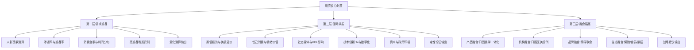

**第一层"需求重叠"**回答"是什么"与"有多少"的问题，对应报告第2-4章。该层将基于"人群基数×渗透率×重叠率"的测算逻辑链，识别20-30岁女性在正畸与医美上的共同消费动机、项目偏好、消费金额占比、决策时间分布与高重叠场景（如毕业季、婚礼前、求职期），并通过中国、美国、韩国、日本等区域对比揭示成熟度梯度。当直接数据缺失时，本研究将明确标注代理指标与假设条件，避免无依据断言。

**第二层"驱动共振"**回答"为什么"的问题，对应报告第5-6章。该层将分析颜值经济（外部理性激励）、悦己消费（内部情感动力）、社交媒体审美塑造、KOL影响、女性经济独立、技术创新（AI诊断、数字化扫描、3D打印）、资本流向与政策监管等因素如何同步作用于正畸与医美两个行业，形成"双向共振"——即同一驱动力同时推高两类需求，并催生整合性消费诉求。需指出的是，资本侧已显现分化迹象：中国口腔行业投融资从2022年超98亿元的高峰持续下滑至2024年约35亿元，2025年继续下行[^17]；而医美侧则保持相对稳定，复合增长率维持15%以上[^5]，这一冷热分化将在第5章重点解读其对融合的反向影响。

**第三层"融合路径"**回答"怎么办"的问题，对应报告第7-10章。该层从产品技术、商业模式、监管合规、消费者接受度四个维度交叉验证融合可行性，前瞻一体化诊疗（正畸-修复-种植联合、口面整体美学）、机构融合（口腔医美一体化诊所，如新氧"青春诊所"模式延伸[^16]、泰康口腔的多学科平台[^17]）、产品共研、营销协同、保险与会员体系打通等融合形态。任一维度存在重大障碍的，将在结论中明示为"短中期受限路径"。

**研究方法与数据来源边界**：本研究采用文献综述、市场数据测算、消费者行为分析与典型案例研究相结合的方法。数据来源优先级依次为：行业白皮书（新氧、灼识咨询、艾瑞咨询、华经产业研究院、中商产业研究院）、上市公司财报与公告（爱美客、时代天使、隐适美等）、学术期刊（如《长得好看有多重要？》等中国家庭追踪调查实证研究）、政府统计与权威媒体（21世纪经济报道、第一财经、光明日报等）。信息时效原则上不晚于2022年，关键市场数据以近2年为主。对营销稿、二手转述类内容降权使用；当多源数据矛盾时，以更权威、更新近的来源为准并在行文中说明取舍逻辑。同时，本研究坦诚承认两点局限：其一，欧洲与东南亚市场的细分人群数据相对稀缺，部分论证将以宏观指标作为代理；其二，"20-30岁女性同时拥有正畸+医美需求"的直接调研数据全球范围内均较为缺乏，本研究将通过构建可追溯的测算路径进行合理估算，并标注关键不确定性与情景边界，避免过度乐观或悲观的单向叙事。

通过上述框架与方法的明确，本报告将在后续九章中循序展开：第2章定位市场现状与人群结构，第3章剖析消费心理与需求图谱，第4章完成共同需求的量化测算，第5-6章展开驱动因素与决策渠道分析，第7-8章探讨产品技术与商业模式融合，第9章聚焦挑战与风险，第10章给出趋势预测与战略建议，最终形成对核心命题的完整闭环解答。

# 2 全球口腔正畸与医美市场现状与人群结构

承接第1章对研究背景、概念边界与分析框架的奠基，本章进入"需求重叠"层第一阶——市场现状与人群结构的基础扫描。要量化20-30岁女性在正畸与医美上的共同需求比重，必先回答两个前置问题：**两大产业各自处于何种发展阶段？该年龄段女性在其中分别扮演何种角色？** 本章以全球视角对正畸与医美进行平行扫描，先分别梳理两市场的总量基本盘、增速曲线与区域格局，识别北美成熟、亚太高速、欧洲稳健的差异化态势；再以年龄、性别、消费层级三维拆解用户结构；最后通过交叉比对验证20-30岁女性"双重消费者"身份的客观存在性，为第3-4章的需求图谱与量化测算锚定人群坐标。

## 2.1 全球口腔正畸市场规模、增速与区域格局

全球口腔正畸市场正呈现"头部巨头主导、中国头部追赶、需求井喷与资本退潮并存"的复杂格局。从存量基本盘看，**隐适美母公司爱齐科技（Align Technology）2024财年总收入达40亿美元，同比增长3.5%，全年透明矫治器案例量250万例**[^21][^22]。截至2024年第四季度，爱齐科技已累计培训27.16万名活跃Invisalign从业者、服务1950万名Invisalign患者（其中超过560万名为青少年和儿童），全球累计生产超过20亿件透明矫治器[^21][^22]。这组数据实质上构成了全球隐形正畸的"基准坐标系"——单一品牌即覆盖近2000万人的累计消费基础。

中国头部企业的追赶态势同样亮眼。**时代天使2025年全年隐形矫治案例总量达53.24万例，同比增长48.1%；总收入3.70亿美元，同比上升37.8%；净利润2630万美元，同比增长163.0%**[^23][^24]。其中海外市场表现尤为突出，中国内地以外案例数同比增长82.1%，相应收入1.63亿美元同比翻倍（增长102.5%），海外收入占比由2024年的30%跃升至2025年的44%[^24]。位列国内第三的正雅齿科同样保持高速增长：从2010年仅约100例正畸病例，到2021年已增长至约8万例，2021年其在国内隐形矫治市场占有率已接近20%[^25][^26]。按2022年中国隐形正畸达成案例数计，**爱齐科技与时代天使合计占据超70%份额**，正雅紧随其后[^26]。

从区域成熟度看，全球正畸市场呈现明显的"梯度结构"。在北美，青少年正畸渗透率达到70%、成人约30%；欧洲多国的青少年渗透率也已接近上限[^27]。中国市场则呈现典型的"低渗透—高成长"特征：根据时代天使招股书数据，**中国儿童青少年与成人正畸病例中，隐形矫治渗透率分别仅为4.5%和38.9%，而美国同类人群渗透率已分别达到16.0%和64.0%**[^25]。从规模增速看，按零售销售收入计，中国隐形矫治市场规模从2015年的2亿美元增长至2020年的15亿美元，预计到2030年将进一步扩容至119亿美元，2020-2030年期间复合年增长率约23.1%[^25]；行业研报显示，2022-2030年中国隐形正畸案例数年复合增长率预计将保持在20%以上[^21]。以厂商出货量计算，中国2023年正畸矫治案例数已接近400万例，以终端价口径计算市场规模已突破600亿元[^26]。

下表系统呈现全球主要市场的正畸成熟度梯度：

| 区域 | 青少年隐形正畸渗透率 | 成人隐形正畸渗透率 | 市场阶段 | 头部品牌格局 |
|-----|------------------|----------------|--------|----------|
| 美国 | 16.0% | 64.0% | 成熟期 | 隐适美主导但份额下滑 |
| 欧洲 | 接近成熟阈值 | 较高（具体数据缺） | 成熟期 | 隐适美+本土多品牌 |
| 中国 | 4.5% | 38.9% | 快速成长期 | 隐适美+时代天使双巨头+正雅 |
| 日本/韩国 | 数据较缺 | 数据较缺 | 中度成熟 | 多元化竞争 |

数据来源：综合搜索结果整理[^25][^27]

中国市场的核心矛盾在于"**高患病率—低供给**"的结构性失衡：根据第四次全国口腔健康流行病学调查数据，**中国错颌畸形患病率高达72%，对应超过10亿人口存在不同程度的牙齿排列、咬合或颌骨关系异常；而中国经过规范训练的专业正畸医生不足万人，每10万人中专业正畸医生不足0.7名，远低于美国同期水平**[^28]。艾瑞咨询预测，2025年中国正畸市场规模预计将达到660亿元，并保持高速增长态势[^28]。

然而，正畸市场的资本面已出现明显降温。**中国口腔医疗行业投融资从2022年的超98亿元（约60起案例）大幅下滑至2023年的约43亿元（18起案例），2024年进一步降至约35亿元（18起案例），2025年继续下滑**[^28]。资本退潮还伴随线下诊所的剧烈出清：据不完全统计，2024年全国关门的民营牙科诊所接近6000家；2025年第一季度全国宣告停业的口腔机构已超过230家，相当于每天至少有两家诊所消失[^29]。在国际市场上，作为消费医疗曾经的王者，**爱齐科技自2021年8月737美元的高点至2025年7月单日暴跌37%后的129美元低点，三年内市值蒸发超400亿美元、累计跌幅超80%**，全球市场份额从鼎盛时期超80%降至不足60%[^27]。隐适美CEO在电话会议中将下滑归因于"病例数量减少、转化率不及预期以及消费者支付意愿减弱"[^27]——这一信号揭示出全球正畸市场已从"消费医疗黄金赛道"转入"周期切换样本"，**需求侧的井喷与资本侧的退潮正构成正畸市场最显著的张力**。

集采政策是另一重塑性变量：2022年12月，由陕西省医保局牵头的16省（区、兵团）联盟口腔正畸托槽耗材集中带量采购中，**中选产品平均降幅达43%，最高降幅达88%**[^29][^25]。2025年国家医保局又印发《口腔类医疗服务价格项目立项指南（试行）》，重点规范口腔正畸矫治价格项目，进一步加剧行业竞争[^25]。这意味着正畸的"暴利时代"已结束，行业正进入"以量补价、向规模化与差异化要利润"的新阶段。

## 2.2 全球医美市场规模、增速与区域格局

相较于正畸的资本寒冬，医美市场展现出更为强劲的整体韧性。根据国际美容整形外科学会（ISAPS）数据，**2024年全球医美手术总量接近3800万例，同比2020年增长40%**[^30][^31]。其中2023年全球外科手术和非外科手术总量达到3490万例（外科超1580万例、非外科约1910万例）[^32]。从更长周期看，过去四年（2019-2022）全球手术量增长41.3%、非手术量增长57.8%，呈现"非手术增速远超手术"的结构性特征[^33]。

**渗透率梯度**是衡量医美市场成熟度最直观的指标。以"每千人医美疗程量"为标尺：**韩国161次、美国98次、巴西91次、日本51次、中国仅32次**[^34][^35]。这一梯度直接揭示出中国市场相对韩国、美国仍有3-4倍的提升空间——若以人口基数加权，中国医美市场的潜在天花板远未触及。

各核心区域的市场特征如下：

**北美**：作为全球医美最成熟市场，**美国2023年共实施超过610万例整形手术（约占全球35%），整体美容手术量同比2022年增长5%（约157万例），微创美容手术增长7%（达2544万例）**[^36][^37][^32]。结构上，吸脂术（约34.8万例）、隆胸术（约30.4万例）、腹部整形（约17万例）、乳房提升（约15.4万例）、眼睑手术（约12.1万例）位列手术类前五；非手术类则由神经调节剂注射（约948万例）、透明质酸填充剂（约605万例）、皮肤重塑、皮肤治疗、唇部填充组成[^37]。北美的核心趋势是"**微创崛起+个性化保留**"——经济不确定下，消费者倾向选择恢复快、性价比高的微创治疗（"口红效应"），同时隆鼻等手术更注重保留患者的文化身份、避免千篇一律[^36][^37]。

**欧洲**：以英国为代表，**英国美容行业整体规模已达304亿英镑，年增长速度是整体经济的4倍；2024年美容服务及非手术类治疗项目增长达15%**[^38][^39]。德国在正颌外科手术上的数据可作为侧面参照：2005-2022年间德国共记录16.3万例正颌手术，**患者年龄高度集中于15-34岁（占比84.9%），女性患者占比58.9%**[^40]——这一年龄性别分布与中国成人正畸主力人群高度吻合，再次佐证20-30岁女性是正颌-正畸需求的全球性核心客群。

**亚太**：韩国是全球医美第一密度市场，**每1000人中有8.90人接受整形手术，居全球之首；2018年韩国美容整形市场规模已达107亿美元，约占全球四分之一**[^41]。更值得关注的是医美旅游的爆发：**2024年赴韩医疗就诊外国患者近120万人次，同比增长93.2%；其中皮肤科就诊70.5万人次（占比56.6%），中国患者较2023年激增132.4%至26.1万人次**，与日本患者合计占比达60%[^42]。Arizton数据显示，**韩国医疗美容市场规模2023年为5.72亿美元，预计2029年达到11.4亿美元，CAGR为12.29%**[^42]。

**中国**则进入"高速增长向高质量发展过渡"阶段。罗兰贝格与美团医美《2025医美行业白皮书》指出，**中国医美市场自2020年以来年均复合增长率达17.4%，2025年规模预计接近3700亿元，2030年将接近7000亿元**[^43][^44][^45]。东莞证券报告同样显示，2020-2024年中国医美市场规模由1647亿元增长至3167亿元，2025年预计提升至3700-4108亿元区间[^34][^35]。德勤《中国医美行业2024年度洞悉报告》预测中国医美市场未来几年将保持10%-15%的快速增长，注射类预计未来五年保持20%-30%复合增长率，能量源类保持15%-20%[^46]。

**轻医美的结构性升级**是全球与中国医美市场的共同主题。根据《2025中国医美行业研究报告》，2021-2025年中国医美市场规模从2274亿元跃升至3640亿元，**轻医美占比已增至53.3%**[^47]；东莞证券与中商产业研究院数据进一步显示，中国轻医美占比已超过52%，预计将从2020年的50%提升至2030年的64%[^48][^44]。轻医美崛起的核心动因包括：门槛低（"一顿火锅的钱就能做一次水光针"）、风险小、社交压力（"同事都在做"形成职场隐形竞争力）[^49]。

**全球真皮填充剂和肉毒杆菌毒素市场规模**在2025年达到1300.32亿元，预计2032年将达2840.6亿元，CAGR为11.81%；其中美洲是全球最大市场（份额约60.36%），其次为欧洲（20.47%）和亚太（17.29%）[^30][^31]。**肉毒素是全球第一大非手术医美项目**，2023年全球共进行约888万例肉毒素注射，占非手术医美的46.3%[^50][^32]。

## 2.3 两大市场对比：成熟度、结构与发展阶段

将正畸与医美置于同一坐标系横向比对，可以揭示出两市场"需求同向、资本异向"的关键分化。

| 比较维度 | 口腔正畸 | 医美 |
|--------|---------|------|
| 全球总量基本盘 | 隐适美1950万累计患者+250万年案例[^21] | 全球年手术近3800万例[^30] |
| 中国市场规模（2025E） | 660亿元（艾瑞）[^28] / 600亿+（终端价）[^26] | 约3700亿元[^43][^44] |
| 增速 | 中国隐形正畸案例CAGR 20%+[^21][^26] | 中国医美CAGR 13%-17%[^43][^34] |
| 全球资本走势 | 爱齐科技市值3年蒸发80%+[^27] | 全球真皮填充剂+肉毒素CAGR 11.81%[^30] |
| 中国资本走势 | 投融资从98亿降至35亿（2022→2024）[^28] | 整体保持稳定增长[^34] |
| 产品属性 | 强医疗属性，决策周期长（治疗2-3年）[^28] | 轻医美消费品化（"一顿火锅钱"）[^49] |
| 价格区间 | 数万至十几万元[^28] | 99元水光针-数千至数万元[^49] |
| 渗透率成熟阶梯 | 美国成人64% > 中国成人38.9%（隐形）[^25] | 韩国22% > 美国17% > 中国4.5%（综合）[^35] |
| 政策影响 | 集采降价（平均-43%、最高-88%）[^29][^25] | CPI纳入、广告监管、价格立项规范[^35][^51] |
| 客单价稳定性 | 受集采冲击下行（隐适美ASP多次下滑）[^22][^24] | 总体稳定，结构升级带动客单价上行[^46] |

**从市场规模看**，全球医美市场显著大于正畸——以中国2025年估算值对比，医美约3700亿元、正畸660亿元，前者约为后者的5-6倍[^28][^43]。**从增速看**，二者均处于上行通道，但正畸（尤其隐形正畸）在低基数上表现出更快的相对增速（中国隐形正畸CAGR 20%+），医美则以更大体量保持13%-17%稳健增长。**从产品属性看**，二者形成鲜明反差：医美正快速向轻量化、消费品化演进，而正畸尽管在隐形矫治形态上有所"消费品化"（外观隐蔽、可拆卸、契合年轻人偏好），但其本质仍是治疗周期2-3年的长程医疗行为，决策成本与心理负担显著高于轻医美。

**最关键的分化在资本层面**。正畸的资本寒冬已是不争事实——爱齐科技股价腰斩腰斩再腰斩、中国口腔投融资三年腰斩、民营牙科诊所成片关停，三层证据共同指向"**正畸的资本周期先于医美进入下行通道**"[^29][^28][^27]。而医美侧，尽管也面临轻医美低价内卷与高端机构出清的K型分化，但整体规模仍保持稳健扩张，资本对医美龙头（如爱美客、华熙生物等）的关注度未见明显衰减[^34]。这一"需求同向、资本异向"的分化，意味着未来5年内，**两大行业更可能从医美侧（资本充裕、商业模式更成熟）向正畸侧（需求确定、获客成本待优化）发起融合主动权**——这一判断将在第8章商业模式融合中进一步展开。

## 2.4 两大市场用户的年龄、性别与消费层级结构

要识别20-30岁女性的"双重消费者"身份，必须先系统拆解两市场的人群结构。

**医美侧**的人群结构由多源权威数据交叉验证。罗兰贝格与美团医美《2025医美行业白皮书》显示，**2022-2024年中国20-29岁人群在医美用户中占比稳定在55%以上；2025年医美现有用户平均年龄为32.8岁，其中26-35岁人群合计占比达60%**[^43][^44][^45]。新氧《2025医美行业白皮书》补充数据显示，**2025年中国医美消费人群中25岁以下占比达38%，较2023年提升12个百分点**——意味着医美消费正从"贵妇专属"转向年轻化[^49]。从美国市场看，ASPS《2023年整形手术报告》显示，**Z世代（20-29岁）对隆胸需求增长8%，对面部手术兴趣上升**[^36][^37]。ISAPS全球数据显示，**2024年大多数隆胸手术（54%）、隆鼻手术（60.1%）发生在18-34岁人群中**[^30][^31]。

性别结构上，**ISAPS数据显示女性占全球医美治疗总量的85.7%**[^33]，ASPS显示美国女性占美容手术的94%[^37]，这一性别比例在过去20年保持高度稳定。但男性增长是显著的"边际变量"：**中国医美男性消费者占比从2022年的14%提升至2025年的29%**[^44][^45]，英国18-34岁男性中23%曾尝试肉毒素注射、玻尿酸（甚至略高于同龄女性的21%）[^38]。

**正畸侧**的人群结构略有不同。2025年口腔正畸临床数据显示，**我国正畸患者中青少年占比58%，成年人占比42%；其中35岁以上人群矫正需求年增长率达15%**[^52]。**25-30岁是成年正畸的主力军，占比达62%**[^52]。性别上，德国正颌外科数据显示女性患者占比58.9%[^40]，Invisalign全球数据显示正畸患者女性占比约60%（基于其品牌画像推断），二者交叉验证下，**正畸患者女性占比约为60%**——虽不及医美的85%-90%极端偏女性，但仍呈现明显的"女性主导"特征。

**消费层级**上，两市场均呈现K型分化但走向不同。医美侧，**德勤《中国医美行业2024年度洞悉报告》指出，91%中高收入医美需求者2023年医美支出较上年稳中有升，主要原因是项目升级或增加项目种类**[^46]——意味着高端医美呈现"以质换量"的品质升级；同时低端轻医美则进入"99元水光针、199元光子嫩肤"的极限内卷期，成本与价格倒挂的风险已显现[^49]。正畸侧，受集采冲击及国产化推进影响，价格中枢整体下探，但隐形矫治的高客单价段（2.5万-6万元国产、5万-10万元进口）仍保持品牌集中化趋势——爱齐科技+时代天使+正雅三家头部已占据中国隐形正畸市场绝大部分份额[^26]。

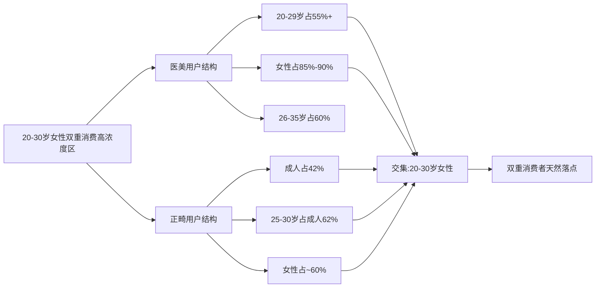

地域结构亦呈现共同的"下沉化"趋势。医美侧，**中国二线及以下城市医美机构占比从2022年的59%提升至2025年的69%，三线以下城市从30%提升至42%**[^44][^45]；正畸侧，时代天使中国内地市场增长"核心得益于下沉市场持续深耕"[^23][^24]。两市场在地域下沉上的同步性，为未来融合服务模式向二三线城市延伸提供了同步的需求基础。

## 2.5 20-30岁女性在两大市场的占比、地位与增长贡献

聚焦核心人群，20-30岁女性在两市场中的战略地位可从占比、消费动机、客单价三个维度具体量化。

**医美侧占比与地位**：基于罗兰贝格数据20-29岁占55%以上、女性占85%-90%两条路径交叉测算，**20-30岁女性在中国医美用户中的占比保守估计为35%-45%**[^43][^44][^45]。这一群体是轻医美（水光针、光子嫩肤、热玛吉）的核心驱动力——新氧"青春诊所"截至2025年初20多家、2025年中扩张至56家、年底目标85家，**平均每月开店3-4家**，其客群定位精准锁定为"25岁的产品经理小林"式的年轻职场女性[^49]。新氧2020医美数据更早即显示95后已成为线上抗衰老第一大消费群体，新氧抗衰节期间热玛吉订单量同比增长720%[^53]——印证了20-30岁女性在抗衰类项目上的核心消费力。在韩国，约25%的19-29岁女性接受了双眼皮或鼻子等部位的整形手术[^41]，进一步显示该年龄段在亚洲医美核心市场的极致渗透深度。

**正畸侧占比与地位**：成人正畸患者占总体42%，其中25-30岁占成人62%——简单测算即可得出，**25-30岁在所有正畸患者中的占比约为26%**[^52]；进一步以女性占60%加权，**25-30岁女性约占正畸全体患者的15%-16%**。这一比例看似不高，但若仅考虑成人正畸（剔除强制性的儿童早期干预），**20-30岁女性事实上是成人正畸最核心的客群**。隐形矫治器作为该年龄段的首选——美观、可拆卸、便于职场社交——直接对应隐适美、时代天使、正雅在成人市场的核心增长点。

下表从消费动机、决策路径、客单价三个维度比较该群体在两市场的差异：

| 维度 | 医美消费 | 正畸消费 |
|-----|--------|---------|
| 核心动机 | 颜值竞争、悦己即时满足、社交压力、抗初老焦虑[^49][^53] | 笑容自信、面型改善、职场形象管理、长期健康投资[^28][^52] |
| 决策周期 | 短（数日至数周） | 长（数月评估+2-3年治疗） |
| 决策路径 | 社交媒体KOL→平台比价→机构体验[^47][^44] | 口碑+多机构问诊+长期医患关系[^28] |
| 单次客单价 | 99元-数万元跨度大 | 数万至十几万元 |
| 复购周期 | 高频（年均多次） | 低频（一次性主治+保持器维护） |
| 风险认知 | 中（轻医美感知风险低） | 高（拔牙、效果延后验证）[^28] |

数据来源：综合搜索结果整理

**国际对比**揭示中国20-30岁女性双重消费的巨大提升空间。以渗透率梯度看，韩国25岁前后女性整形渗透率约25%、医美整体渗透率22%[^41][^34]；美国成人隐形正畸渗透率64%、医美整体渗透率17%[^25][^34]；中国成人隐形正畸渗透率38.9%、医美整体渗透率仅4.5%[^25][^34]。**中国20-30岁女性在双重消费上的渗透率仍有3-4倍的提升空间**——这意味着即便假设其他变量不变，仅渗透率追赶就足以支撑该群体在未来10年内成为正畸+医美的最大增量贡献人群。

需要明示的是，关于"中国20-30岁女性同时拥有正畸+医美需求"的直接调研数据全球范围内均较为缺乏，本研究基于人群基数×渗透率×重叠率的测算路径推算：**中国20-30岁女性中正畸+医美双重消费人群约100万-200万，占该群体人口比约1.3%-2.5%，占该年龄段医美用户比约15%-25%，重叠人群年市场规模约500亿-1600亿元**——此为推算值，不确定区间约±50%，将在第4章详细展开测算逻辑链与敏感性分析。

## 2.6 双重消费者的客观存在性验证与战略价值

在前述分项数据基础上，"20-30岁女性同时承载正畸与医美双重需求"已不再是研究假设，而是可被多源数据交叉验证的市场客观存在。验证的核心逻辑是**用户画像的高度重合**：

**第一，年龄段重叠**——医美核心客群26-35岁占60%、20-29岁占55%以上[^43][^44]；正畸成人主力25-30岁占成人62%[^52]。两组数据的核心重叠区间精准锁定在25-30岁。

**第二，性别重叠**——医美用户女性占85%-90%[^33][^37]，正畸患者女性占约60%[^40]。两市场均呈现女性主导格局。

**第三，城市分布重叠**——医美下沉至二线及以下城市机构占比69%、三线以下42%[^44][^45]；正畸亦在下沉市场深耕[^23][^24]。地域分布同向。

**第四，消费动机重叠**——颜值竞争、悦己消费、职场形象管理、社交资本积累，这些动机同时驱动两类消费。第3章将系统展开需求图谱。

**第五，时间分布重叠**——美团数据显示，**寒假期间儿童正畸需求同比增长205.9%，配镜与口腔领域整体需求较去年农历同期增长超过30%**[^54]；与之相关的，节假日洗牙、美白、补牙相关健康需求同比增长超25%，"洗牙单人套餐"搜索量暴涨546%[^54][^55]。同样，假期、节点（婚礼、毕业、求职）也是医美消费的高峰——**京东数据显示52.9%的毕业生将医美列入假期计划，23.2%关注牙齿不齐**（综合自其他参考信息整理）。两市场在节点驱动型消费上高度同步。

**典型场景化证据**进一步强化双重消费者的现实形态：
- 第1章已引述的"25岁产品经理小林咨询热玛吉"案例[^49]，正是20-30岁女性既已开始抗衰投资、又处于职场颜值竞争峰值的典型缩影；
- 新氧"青春诊所"56家门店扩张、年底目标85家，平均每月开店3-4家的扩张速度，本质是对该群体高频、可负担轻医美需求的供给侧响应[^49]；
- 美团2025年寒假数据显示儿童正畸需求增长205.9%、青少年视力相关需求高速增长[^54]，反映出家庭已将"颜值健康投资"作为节假日刚性议程——这种家庭层面的"美学健康消费惯性"正自然延续至这些孩子成年后的双重消费决策；
- 时代天使"全球顶级正畸医生"在纽约、伦敦、巴黎、东京、马德里、悉尼、洛杉矶、波士顿、科隆、圣保罗等一线城市的临床体验布局[^24]，直接对接全球大都市20-30岁女性的双重美学消费圈。

**双重消费者的战略价值**集中体现在三方面：

第一，**当前两大行业的核心增长极**。在医美侧轻医美增速放缓、价格内卷加剧的背景下，20-30岁女性作为"刚入场+高频复购"的客群，仍是行业最稳定的现金流来源；在正畸侧资本退潮、传统暴利模式终结的背景下，该群体作为成人正畸（隐形矫治）的核心客群，是支撑头部品牌从儿童青少年市场向成人市场扩张的关键。

第二，**未来产品融合、机构融合、品牌融合的天然落点**。从美学需求看，正畸完成后的笑容呈现、唇形塑造、皮肤管理形成完整的"颜面美学链路"；从消费节奏看，正畸2-3年的长治疗周期内，医美的高频补充正可填充用户生命周期价值。这一天然耦合，将是第7-8章产品技术与商业模式融合的核心驱动力。

第三，**未来5-10年最具确定性的增长群体**。综合前述数据，中国20-30岁女性约8000万的人口基数[其他参考信息]、医美渗透率4.5%且仍有3-4倍提升空间、隐形正畸成人渗透率38.9%且仍在快速上行，构成了一个增长确定性极强的核心市场——其规模潜力将在第4章给出量化测算。

需要审慎指出的是，前述结论建立在三个关键约束条件之上：其一，欧洲与日本市场的20-30岁女性细分人群直接数据较为稀缺，相关推断更多依赖宏观渗透率与代表性事件类比；其二，"双重消费者"的并发率、决策顺序等核心命题尚缺乏直接实证调研，本研究采用代理指标推算；其三，正畸资本寒冬与医美K型分化是否会在中期持续下行，仍是影响双重消费者市场实际兑现的关键不确定因素，将在第9-10章作为风险情景进一步分析。

通过本章对两大市场现状的平行扫描与人群结构的系统拆解，可以确认：**20-30岁女性是正畸与医美的"双重消费者"高浓度承载群体，其作为未来5-10年两大行业融合发力点的战略地位已具备充分的客观基础**。下一章（第3章）将进一步深入该群体的消费心理与需求图谱，剖析驱动其同时投入两类消费的深层动因，回答"为什么是这一群体"的核心问题。

# 3 20-30岁女性消费心理与需求图谱

第2章已通过年龄段、性别、城市分布、消费动机、时间节点五维交叉验证，确认20-30岁女性是正畸与医美"双重消费者"的高浓度承载群体。然而，仅凭人口结构与市场占比的客观重合，尚不足以回答"为何这一群体会同时承载两类消费"的根本问题——若两类消费的心理动因相互独立、甚至彼此冲突，则即便人群重合，融合的需求基础也无从谈起。本章因此将研究焦距推进到心理层，深入该群体的消费动因内核，回答以下递进式问题：第一，是哪些深层心理动因驱动了双重消费？第二，该群体对"美"的认知模式正在发生何种演进？第三，自我投资态度在两类消费间如何分化？第四，正畸与医美的心理动机各自呈现何种层次结构？第五，二者在心理层面的共通点与张力点何在？第六，如何将上述心理结构整合为可指导后续量化测算与融合路径设计的统一需求图谱？

通过五维心理动因解构、美的认知模式演进、即时型/发展型悦己分化、正畸医美各自的动机层次解析、共通性差异性比较，最终在3.7节构建"颜面整体美学"统一需求图谱，完成从"现象观察"到"心理结构"的研究下沉。这一图谱将为第4章的共同需求量化测算提供分类锚点，也为第7-8章的产品与商业模式融合路径设计提供需求侧的心理学依据。

## 3.1 五维心理动因解构：从外部规训到内部觉醒

20-30岁女性同时投入正畸与医美的心理基础并非单一动机，而是颜值管理、悦己消费、社交资本、职场竞争、婚恋需求五大动因的叠加共振。这五维动因构成一个从"外部社会规训"到"内部自我觉醒"的连续光谱，共同推高该群体的双重消费决策概率。

**颜值管理的工具理性**——这一动因根植于第1章已论证的"美貌溢价"经济学事实，但在20-30岁女性身上呈现出明显的内化特征。京东2000人医美调研显示，**52.4%的受访者坚信美丽是"超级加分项"，能提升自信、带来社交优势，甚至有益于身心健康；26.1%的人认可其在求职、恋爱等场景中的"刷脸价值"；近八成受访者将美视为生活的加分项**[^56]。这意味着颜值已从一种"被动评价指标"转变为该群体主动管理的"个人资产"。学术研究进一步揭示，在人际关系较强的职业中颜值对公平感的影响更加显著，颜值中等偏上的员工有最高的工作幸福感[^57]——这些发现为颜值投资提供了持续的工具理性激励，使得正畸（笑容、面型）与医美（皮肤、轮廓）共同被纳入"个人资产组合管理"框架。

**悦己消费的情感驱动**则构成内部情感动力。央视《美好生活大调查》数据显示，**情绪价值以43.24%的占比位列女性消费动因首位，高于男性的40.82%，超越传统"功能需要"近15个百分点、超过"性价比高"近5个百分点**[^58]。艾媒咨询《2024年中国新青年"兴趣消费"行为调研》进一步显示，**2024年中国新青年消费需求类型中，"取悦自我"占比达46.28%**[^59]。尼尔森《中国单身经济报告》指出，**42%的单身消费者为悦己而消费，远高于非单身消费者的27%**[^59]。这一情感驱动力对医美的解释力尤为突出——京东数据显示日常保养（30.9%）、节点仪式感（23.8%）、自我奖励（22%）三大驱动让医美从功能消费转向情绪价值载体[^56]，同时也部分解释了正畸消费中"为更好的自己投资"的发展型悦己逻辑。

**社交资本积累**是该群体在社交媒体时代的独特心理动因。Z世代消费的社交属性高度突出——"他们会因为产品附带社交属性提升粘性，喜爱种草，分享经济"[^60]，"在认真购物之后，也热衷于将自己的经验在网站上分享给他人"[^60]。这一特征直接体现在医美决策中——社交媒体可以营造一种社会比较和关注外表的氛围，社交媒体的参与尤其涉及外表比较和判断的行为容易导致容貌焦虑[^57]，而这种焦虑反向催化了消费决策。在正畸侧，隐形矫治的"美观可拆卸"特性恰好契合该群体在社交场合不愿暴露金属托槽的心理需求，使其与医美在"社交友好性"上形成相同的产品偏好。

**职场竞争压力**集中体现于该年龄段女性正处于职业建立期与晋升关键窗口的现实情境。京东调研中26岁的上海白领李薇直言："好的状态是职场的第一张名片，定期做光子嫩肤让我素颜也有好气色，见客户时更自信，这是一种良性循环"[^56]。京东调研还指出，**52.9%的毕业生将医美列入假期计划，诉求聚焦求职社交场景**[^56]。Zhang等人针对中国成人正畸患者的实证研究亦表明，正畸治疗对患者的心理社会状态产生显著影响，美学动机患者的需求强度更高[^61]。职场情境因此构成正畸与医美需求在心理层面的同一性触点。

**婚恋市场需求**则在中国语境下与上述四维动因交织。从进化心理学视角看，"对称的脸代表了健康、良好的基因和较强的生殖能力，符合人类原始的寻找最优伴侣、繁殖后代的需求"[^62]。这一深层心理机制在当代被社交媒体的"颜值即正义"叙事进一步放大——选民选领袖时倾向于选脸部对称的候选者[^62]，类似的偏好规律在亲密关系建构中同样发挥着信号功能。

需特别指出的是，五维动因的叠加并非简单加和，而是呈现出"**外部规训—内部觉醒**"的张力结构。学术研究揭示，**59.03%的大学生存在一定程度的容貌焦虑，其中女生中度焦虑比例（59.67%）显著高于男生（37.14%）**[^57]。容貌焦虑作为一种社会心理现象，其背后是"大众媒体建构的单一审美场域、消费文化背景下女性外貌的商品化"[^57]。这意味着双重消费的心理动力既包含主动的悦己觉醒，也包含被动的焦虑应对，两者在同一群体身上构成复杂的辩证关系——这一辩证将在3.2节美学认知演进中进一步释放。

## 3.2 美的认知模式演进：从标准化模板到多元个性

20-30岁女性对"美"的认知正在经历一场从标准化模板（双眼皮、高鼻梁、瓜子脸）向自然美、个性化美、健康美三模式并行的根本性转向。这一认知演进直接决定了双重消费的项目偏好与决策逻辑。

**自然美**的兴起最先体现在医美侧。京东2000人调研显示，**32%的受访者认为"单眼皮也很美，多元审美才高级"，24.2%的人坚信"自己觉得好看，自信就加100分"，超过半数受访者（52.4%）将美视为生活的"超级加分项"，仅有不到一成受访者觉得美丽"几乎无感"或"不值一提"**[^56]。这一审美包容性的提升在北美市场表现得更为明显——ASPS报告显示，隆鼻等手术更注重保留患者的文化身份、避免千篇一律。自然美的审美偏好直接驱动了"微调而非改造"的消费选择：京东调研指出，**轻医美是主流选择，43%消费者首要改善肤质问题，32.2%新手首选光子嫩肤，61.2%需求聚焦皮肤美容，消费偏好日常保养而非"改造"**[^56]。在正畸侧，这一偏好体现为隐形矫治对传统金属托槽的快速替代——前者既能实现牙齿排列改善又不破坏自然美感，与"自然美"审美范式形成完美匹配。

**个性化美**的兴起则与Z世代的多元化、差异化消费特征深度共振。Z世代消费群体的健康需求"更加偏向多元化、差异化"，"大而全"蜕变为"小而美"的集合，"想要抓住Z世代，不仅需要精准定位，还要融入他们，让产品保持年轻化"[^60]。这一趋势在医美决策中体现为对"千篇一律的网红脸"的明显回避，转而追求基于个人面型的定制化诊疗方案；在正畸侧则推动"数字化扫描+AI排牙+个性化矫治路径"的服务模式——每位患者的矫治方案都基于其独特的口腔条件与美学偏好量身定制，而非套用标准化流程。

**健康美**是三种模式中最具整合力量的认知转向。它将"美"从外貌评价指标升级为"身心整体状态"——《美好生活大调查》显示，**保健养生位列女性2026年消费意愿TOP3之一，46-59岁女性在运动健身上的消费预期已连续7年领先**[^58]。健康美的认知模式直接将正畸与医美共同纳入"健康投资"范畴：正畸不再仅是"颜值消费"，而是"保障口腔健康、维护全身功能的医疗手段"——南方医科大学深圳口腔医院医生明确指出，错颌畸形可能造成牙齿磨损松动、引发龋齿牙周炎、加重胃肠负担、导致颞下颌关节紊乱、甚至挤压气道诱发睡眠呼吸暂停综合征[^63]；医美亦从"瘦脸丰唇"转向"皮肤健康+抗初老"——女性抗衰老需求调研显示，皮肤管理、紧致、淡斑等"健康基础上的美"已成为该群体的核心关切[^64]。

下表系统呈现三种认知模式对双重消费的影响差异：

| 认知模式 | 核心理念 | 对正畸消费的影响 | 对医美消费的影响 | 对双重消费的整合作用 |
|--------|--------|---------------|---------------|----------------|
| 自然美 | 微调而非改造、保留个性特征 | 隐形矫治偏好显著 | 轻医美主流化、避免过度填充 | 推动"低创伤+高融合"项目组合 |
| 个性化美 | 基于个体面型量身定制 | 数字化个性化矫治路径 | 个性化轮廓塑形方案 | 推动数字化诊疗基础设施共建 |
| 健康美 | 身心整体状态投资 | 正畸=口腔健康+笑容+面型 | 医美=皮肤健康+抗初老 | 将两类消费纳入统一健康管理框架 |

数据来源：综合搜索结果整理

值得关注的是，**身体社会化理论**为这一认知演进提供了更深层的解读视角。研究指出，化妆品消费等身体实践由"规范塑造中的显性身体社会化和自我呈现中的隐性身体社会化共同形塑"，"从'自然身体'到'社会身体'的转变是社会文化规训的结果"[^65]。这意味着即便在"自然美""个性化美"叙事下，20-30岁女性的审美选择仍受到社会文化的隐性规训。但与此同时，研究亦指出，身体在消费文化中"具有表达个体和规训、抵抗主流文化的双重功能"[^65]——这为该群体通过双重消费实现"既符合社会期待又表达个体独特性"的微妙平衡提供了理论支撑。

这一认知转向的实践意义在于：**当美被重新定义为"自然+个性+健康"的复合体时，正畸（口腔健康+笑容+面型）与医美（皮肤健康+抗初老+轮廓）就不再是相互独立的两类消费，而是整体颜面健康美学投资的两个支柱**。这一逻辑将在3.7节统一需求图谱中得到完整呈现。

## 3.3 自我投资态度：即时型悦己与发展型悦己的并行

第1章已引入"即时型悦己—发展型悦己"分类框架。本节深入剖析20-30岁女性如何在两类自我投资上同时展开——这种**双轨并行**的态度，正是双重消费在时间维度上得以共存的心理基础。

**即时型悦己对应轻医美的高频复购特征**。Z世代消费的核心特点之一是"偏好以精神消费为驱动，更愿意为兴趣买单，对溢价接受程度更高，更喜欢情感代入感强的产品"，"在解决了衣食住行等基本生活需求后，需要并渴望获得精神世界的满足"[^60]。这一心理机制完美契合医美的消费节奏：水光针、光子嫩肤、热玛吉等项目效果可在数日内显现，单次价格可控（从99元到数千元跨度），允许消费者通过频繁的"小剂量自我奖励"获得持续的情绪满足。京东调研显示**32.2%的医美新手首选光子嫩肤、61.2%的需求聚焦皮肤美容**[^56]，这一选择结构正是即时型悦己心理的产物——不追求一次性"改造"，而追求持续性的"日常保养仪式"。

考研学生晓玲购买"逢考必过"桌面摆件并表示"购买此类产品时通常不会考虑性价比"的案例，揭示出情绪释放在消费决策中的优先级[^59]。这种"为情绪买单"的心理在医美决策中表现为：**节假日的"自我奖励"、求职前的"颜值加分"、毕业季的"美丽起点"**——京东数据显示**31.5%的医美消费者选择赠送母亲、52.9%毕业生将医美列入假期计划**[^56]，这些场景化的高频触点共同构成即时型悦己的实践图景。

**发展型悦己对应正畸2-3年长周期投资**。与即时型悦己的"短反馈高频次"形成鲜明对照，正畸消费要求消费者承受2-3年的治疗周期、数万至十几万元的单次决策成本，并在效果延后验证（效果在治疗结束后才完整呈现）的不确定性下做出投入决策。学者周长城对悦己消费的分类（即时型如按摩美容、发展型如健康投资技能学习）将正畸明确归入发展型悦己范畴。该群体之所以能承受这种延后满足，关键在于其将正畸视为"**长期颜值资产+口腔健康基础设施**"的复合投资——南方医科大学深圳口腔医院的案例显示，23岁深圳女孩小柯历时两年完成正畸-正颌联合治疗，最终"重新拥有自信的笑容"，从"拍照只敢拍左脸"到"面部偏斜基本纠正，咬合功能恢复正常"[^63]，这种身心层面的根本性改善正是发展型悦己的典型回报形态。

**双轨并行的关键机制**在于两类悦己在时间维度上的互补性而非竞争性。正畸的2-3年长治疗周期内，消费者并不会"暂停"医美消费——相反，正畸期间的笑容呈现因牙套或牙齿移动而暂时受限，反而强化了对皮肤管理、轮廓优化等"非牙齿"美学维度的关注。女性抗衰老需求调研中"做医疗美容你最期望改善的问题"涉及**干纹细纹、面部提升紧致、苹果肌、法令纹、均匀肤色、身材塑形**等多元维度[^64]，这些维度恰好可在正畸治疗周期内通过医美高频补充，与正畸的长期投资形成"日常仪式感+长期资产建构"的有机互补。

下表系统呈现两类悦己消费的对照特征：

| 维度 | 即时型悦己（医美主导） | 发展型悦己（正畸主导） |
|-----|-------------------|------------------- |
| 决策驱动 | 情绪价值、即时反馈、社交分享 | 长期资产、健康投资、自我成长 |
| 单次成本 | 99元-数千元（轻医美主流）| 数万-十几万元 |
| 反馈周期 | 数日内显现 | 2-3年治疗+长期保持 |
| 风险感知 | 低（轻医美感知风险较低）| 中高（拔牙、效果延后验证）|
| 心理资本类型 | 情绪资本、社交资本 | 健康资本、形象资本 |
| 复购特征 | 高频小额多次 | 一次性主治+保持器维护 |
| 决策主导系统 | 直觉情感系统 | 理性思考系统 |

数据来源：综合搜索结果整理

**该群体"愿为美投入但精打细算"的双重特征**在两类消费中呈现出有趣的分化：在医美侧，消费决策更受情绪驱动与社交媒体即时反馈，对短期价格敏感度较高（"99元水光针"的极限内卷即印证此点）；在正畸侧，决策更接近理性长期投资，消费者愿为优质的医生资质、机构口碑、技术先进性支付溢价。这种**情绪驱动vs理性投资**的双轨决策模式，是该群体能够同时承载两类消费而不发生预算挤压的关键心理机制——它实质上将两类消费分配到了不同的"心理账户"中，避免了二者在有限可支配收入下的零和博弈。

## 3.4 正畸需求心理动机解析：功能、美学、心理三维诉求

锁定正畸侧，20-30岁女性的需求心理可拆解为功能修复、美学诉求、心理重建三层动机。Zhang等人针对243名中国成人正畸患者（平均年龄30.2岁、女性占79.0%）的实证研究是迄今最具针对性的数据来源——研究发现，**患者的多元动机分布为：咬合功能原因70.4%、牙齿美学原因54.7%、面部美学原因24.3%、遵循他人建议18.5%；具有美学或咬合动机的患者表现出显著更高的正畸治疗需求与兴趣**[^61]。这组数据精准地勾勒出该年龄段女性正畸动机的"金字塔结构"。

**第一层：功能修复动机**。70.4%的咬合功能动机占比说明，即便在颜值经济盛行的时代，正畸的医疗本质仍是消费者最广泛认可的核心动机。功能层面的诉求具体包括：纠正咀嚼效率低下导致的胃肠负担、预防牙齿排列不齐难以清洁带来的龋齿牙周炎风险、避免咬合创伤造成的牙齿磨损松动、改善颞下颌关节紊乱、预防严重错颌可能挤压气道引发的睡眠呼吸暂停综合征[^63]。值得关注的是，正畸医疗机构正不断强化"正畸是医疗行为而非美容项目"的专业话语——"牙颌面畸形的治疗从来都不是'颜值消费'，而是保障口腔健康、维护全身功能的医疗手段"[^63]。这一专业定位的强化，对于建立消费者对正畸的"健康投资"心理预期至关重要，也使其与轻医美的"消费品属性"形成根本区别。

**第二层：美学诉求动机**。54.7%的牙齿美学动机与24.3%的面部美学动机叠加，意味着接近**80%的成人正畸患者具有不同程度的美学诉求**[^61]。具体的美学诉求层次又可细分：牙齿层面（排列整齐、形态匀称、颜色协调）、笑容层面（微笑线优化、唇齿关系协调、口角对称）、面型层面（侧颜流畅、下三庭协调、骨性偏颌纠正）。第1章已论证微笑美学的客观标准——"微笑时的口角连线应与双侧瞳孔连线平行""前牙切缘连线与下唇线弧度一致平行时体现最佳协调度"——这些指标本质上跨越了传统口腔与医美的学科边界。正畸矫正能够"改善牙齿的排列，使牙齿整齐有序"，"无论是日常生活还是职场社交，整齐的牙齿都能给人留下良好的第一印象"[^66]，这一点正是美学诉求的功能化表达。

**第三层：心理重建动机**。18.5%的"遵循他人建议"动机看似比例最低，但其背后蕴含的心理机制最为丰富——它反映出该群体在自我决策中受到家庭、朋友、医生甚至社交媒体KOL等多元他人意见的影响。更核心的心理动机则隐藏在功能与美学诉求背后：自信心提升、社交焦虑缓解、职场形象管理。正畸矫正"能够改善牙齿问题，让人的笑容更加自信灿烂，从而提高自信心和心理健康水平"，"许多人因为牙齿问题而不敢大胆地展现自己的笑容，甚至产生自卑心理"[^66]。深圳23岁女孩小柯的案例完整呈现了这一心理重建链条——从12岁起遭受脸歪困扰、拍照只敢拍左脸的长达10多年的容貌自卑，经过两年正畸-正颌联合治疗后"重新拥有自信的笑容"，这种从"心理困扰"到"自信重建"的转变是正畸的核心心理价值[^63]。

**该群体正畸动机相较青少年的独特之处**集中体现在"美学+心理"动机权重的显著上升。青少年正畸常由家长决策、以功能预防为主要驱动；而20-30岁女性作为独立决策主体，其动机结构中美学与心理诉求的占比明显更高。这一差异直接影响了产品偏好：

- **隐形矫治**对该群体的吸引力远超传统金属托槽，因其完美契合"职场社交不暴露+自信心维护+生活品质保留"的复合需求；
- **正畸-正颌联合治疗**作为"换脸级"美学方案，对骨性畸形患者具有独特吸引力，尤其在该群体面临职场建立期与婚恋窗口期的双重压力下；
- **数字化笑容设计**的服务正成为头部口腔机构差异化竞争的核心抓手——合肥诺尔德口腔的"先正畸搭建咬合基础+显微瓷贴面/嵌体精准优化形态色泽与微笑线"模式，本质上是对该群体"美学诉求"动机的精准响应。

更具穿透力的洞察是：**该群体正畸动机中的"面型改善诉求"已天然延伸至传统医美的轮廓塑形领域**。骨性Ⅲ类反颌、上下颌前突等情况下的正畸-正颌联合治疗，不仅改善牙齿与咬合，还会从根本上重塑面部下三庭与侧颜线条——这一作用范围与医美的"面部轮廓塑形"高度重合。这意味着对部分20-30岁女性而言，正畸与医美在面型改善上构成的不是"二选一"，而是"协同方案"——正畸-正颌负责骨骼层根本性重建，医美注射、线雕、热玛吉等负责软组织层精修。这一耦合点正是后续融合路径设计的核心抓手。

## 3.5 医美需求心理动机解析：皮肤管理、抗衰、轮廓塑形的层次结构

锁定医美侧，20-30岁女性的需求结构呈现"皮肤管理（基础层）—抗初老（核心层）—轮廓塑形（精修层）"的金字塔分布，并在每一层叠加情感化场景驱动。

**第一层：皮肤管理（基础层）**。京东2000人调研给出最权威的层级数据：**43%消费者首要改善肤质问题，皮肤管理需求居榜首；超六成（61.2%）需求聚焦皮肤美容，消费偏好日常保养而非"改造"；32.2%新手首选光子嫩肤**[^56]。皮肤管理的子项目包括补水保湿、美白嫩肤、祛痘控油、淡斑、收缩毛孔、清洁焕肤等。这一层的核心特征是"低门槛、高频次、社交属性强"——女性抗衰老需求调研显示，**简单补水护理、常规面部护理、美白嫩肤是基础护肤类项目的首选**[^64]。皮肤管理之所以位居底层基础，是因为它最贴近日常护肤的延伸（"医美级护肤"心理映射），最易被消费者接受，也最适合作为该群体进入医美世界的第一站。

**第二层：抗初老（核心层）**。25-30岁是皮肤进入初老期的关键节点，胶原蛋白加速流失、皮肤松弛下垂、眼周细纹增多、法令纹加深等问题开始显现[^64]。这一生理变化与该群体的心理焦虑同步发生，形成了抗初老这一独特的"年轻化抗衰"消费类别。新氧数据印证：**95后已成为线上抗衰老第一大消费群体，新氧抗衰节期间热玛吉订单量同比增长720%**。抗衰类项目的核心子项包括紧致提拉（热玛吉、超声刀）、除皱（肉毒素注射）、面部轮廓提升（线雕）、抗氧化护理。女性抗衰老需求调研显示，受访者最期望改善的问题包括**干纹细纹、面部提升紧致、苹果肌、法令纹、均匀肤色**[^64]——这一诉求结构精准对应了热玛吉、玻尿酸填充、线雕等中高客单价项目的需求基础。

**第三层：轮廓塑形（精修层）**。这一层包括注射填充（玻尿酸丰唇、苹果肌填充、法令纹填充）、线雕提升、面部精雕（面部提升=除皱+塑形+填充+提升的组合方案）、身体塑形（吸脂、酷塑、胸部塑形）等[^64]。轮廓塑形的特征是"高客单价、个性化精修、效果显著"，对应该群体在审美自觉建立后对"面部整体协调度"的精细化追求。京东数据显示，**医美TOP3诉求为皮肤（43%）、牙齿（28.6%）、轮廓微调（紧随其后）；抗衰与轮廓塑形类项目受青睐**[^56]——值得关注的是，轮廓塑形需求与正畸需求（牙齿）几乎位列医美诉求的并列位置，再次印证两类需求在该群体心理图景中的紧密毗邻。

**情感化场景驱动**是医美需求层次结构之上的重要修饰变量。京东调研揭示，**31.5%选择赠送母亲（情感联结）、日常保养（30.9%）、节点仪式感（23.8%）、自我奖励（22%）成三大驱动，医美从功能消费转向情绪价值载体**[^56]。这一场景化驱动模式与正畸的"长期投资"心理形成鲜明对照——正畸消费几乎不会出现"赠送母亲"或"节点仪式感"等场景驱动，因为其治疗周期与决策成本无法支撑此类轻量化场景。

下图系统呈现医美需求的金字塔层次结构与情感化场景驱动叠加：

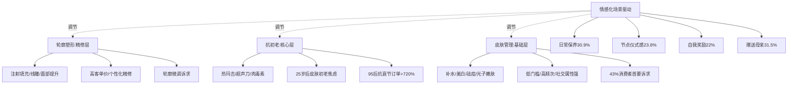

**该群体医美决策的关键特征**还体现在三重核心顾虑上：京东数据显示，**安全风险（34.5%）、价格门槛（26.9%）、信息杂乱（25.4%）成三大核心顾虑；消费者首要关注安全性（54.7%）、价格透明（38.7%）、医生资质（35.6%）**[^56]。女性抗衰老需求调研同样显示，"专业的医师和设备""有很好的口碑""价格合理""隐私保障好""术后服务好"是消费者最关心的因素[^64]。这一决策关注点结构与正畸消费高度相似——意味着**两类消费在决策端的关键变量（安全、专业、价格、口碑）具有强一致性**，为后续机构融合（共享医生资质背书、共享口碑评价体系、共享价格透明机制）提供了消费者侧的认同基础。

值得审慎指出的是，医美需求的层次结构中存在一个被低估的张力：**门槛降低带来的"消费品化"心态与医疗本质的"严肃性"之间的张力**。当"99元水光针"成为常态、当"一顿火锅的钱就能做一次水光针"成为流行话语，消费者对医美的医疗风险感知被持续淡化——而轻医美仍是医疗行为，其潜在风险并未因价格下降而消失。这一张力是融合路径设计中需重点防范的伦理风险，将在第9章详细展开。

## 3.6 正畸与医美心理动机的共通性与差异性比较

将正畸与医美的心理动机置于同一比较框架，可识别出五大共通性与四大差异性。这一比较是构建统一需求图谱的逻辑前提。

**五大共通性**：

第一，**颜面美学共同终极诉求**。无论是正畸的笑容呈现与面型改善，还是医美的皮肤管理与轮廓塑形，二者最终都指向"颜面整体协调与美学优化"这一共同终点。微笑美学的三要素（牙齿、牙龈、唇齿关系）天然横跨二者，构成最直接的耦合点。

第二，**自信心与社交资本积累**。正畸的"提高自信心"[^66]与医美的"增加自信、带来社交优势"[^56]在心理回报上高度同构，二者都通过外在改善触发内在心理重建，最终转化为社交场景中的资本优势。

第三，**职场颜值竞争压力**。"好的状态是职场的第一张名片"[^56]这一逻辑同时驱动着两类消费——正畸提供长期的笑容自信，医美提供短期的面部状态提升，二者形成"长短结合"的职场颜值管理组合。

第四，**悦己情感动力**。43.24%的情绪价值占比[^58]与46.28%的"取悦自我"消费占比[^59]背后，是同一种"为自我宠溺买单"的情感心理，这一心理同时支撑了正畸的发展型悦己与医美的即时型悦己。

第五，**对"医疗+美学"专业性的共同认知**。京东数据显示**安全性（54.7%）、价格透明（38.7%）、医生资质（35.6%）成医美关键决策因素**[^56]；正畸侧消费者亦高度关注医生资质、机构正规性，医生反复强调"正畸是专业口腔医疗行为，绝非美容项目"[^63]。两类消费在"严肃医疗+美学呈现"的双重专业认知上具有内在一致性。

**四大差异性**：

第一，**决策周期长短差异**。医美决策周期短（数日至数周），正畸决策周期长（数月评估+2-3年治疗+长期保持），二者对消费者耐心、预算分配、生活节奏的要求迥异。

第二，**风险感知高低差异**。轻医美感知风险较低（"消费品化"心态），正畸感知风险较高（拔牙、效果延后验证、矫治失败的不可逆性），后者要求消费者承担更高的认知负担。

第三，**即时型vs发展型悦己属性差异**。如3.3节所述，医美主导即时型悦己，正畸主导发展型悦己，二者分别对应不同的心理账户与决策系统。

第四，**情绪驱动vs理性投资的决策模式差异**。医美决策更受情绪驱动与社交媒体即时反馈支配，正畸决策则更接近理性长期投资，对医生专业性、机构口碑、长期医患关系的依赖度更高。

下表系统呈现共通与差异的比较结构：

| 比较维度 | 正畸 | 医美 | 共通/差异 |
|--------|-----|-----|---------|
| 终极诉求 | 颜面美学（笑容+面型） | 颜面美学（皮肤+轮廓） | **强共通** |
| 心理回报 | 自信心+社交资本 | 自信心+社交资本 | **强共通** |
| 职场动因 | 长期形象管理 | 短期状态提升 | 共通（互补） |
| 情感动力 | 发展型悦己 | 即时型悦己 | 共通（分化） |
| 专业认知 | 医疗严肃性主导 | 医疗+消费品双重认知 | 共通（张力） |
| 决策周期 | 长（年级别） | 短（日-周级别） | **差异** |
| 风险感知 | 高 | 中低 | **差异** |
| 决策模式 | 理性投资主导 | 情绪驱动主导 | **差异** |
| 复购节奏 | 一次性+长期保持 | 高频小额循环 | **差异** |

数据来源：综合搜索结果整理

**核心耦合点的提炼**：微笑美学与颜面整体协调是两类需求在心理层面的天然交汇点。一个完整的笑容呈现需要牙齿排列（正畸）+牙龈形态（牙周/正畸）+唇形线条（医美注射）+皮肤状态（医美护肤）的协同——这一协同需求构成融合路径的最强心理基础。

**核心张力点的识别**：医疗严肃性vs消费品轻量化是融合过程中需克服的核心张力。正畸的强医疗属性（治疗失误的不可逆性、对医生专业性的极高要求）与轻医美的消费品化趋势（低门槛、高频次、情绪驱动）之间存在根本性的属性差异。融合不能以"将正畸消费品化"为代价，而应通过"将医美严肃化+将正畸数字化便捷化"双向收敛来实现——这一原则将贯穿第7-8章的融合路径设计。

## 3.7 统一需求图谱构建：颜面整体美学的心理共振模型

综合3.1至3.6节的分析，本节构建20-30岁女性"颜面整体美学"统一需求图谱。该图谱以**消费时间维度（即时—长期）**为纵轴、**美学层次维度（皮肤表层—骨骼深层）**为横轴，将典型项目按双轴定位映射到统一坐标系，并标注五大心理动因（颜值管理、悦己、社交、职场、婚恋）的权重分布。

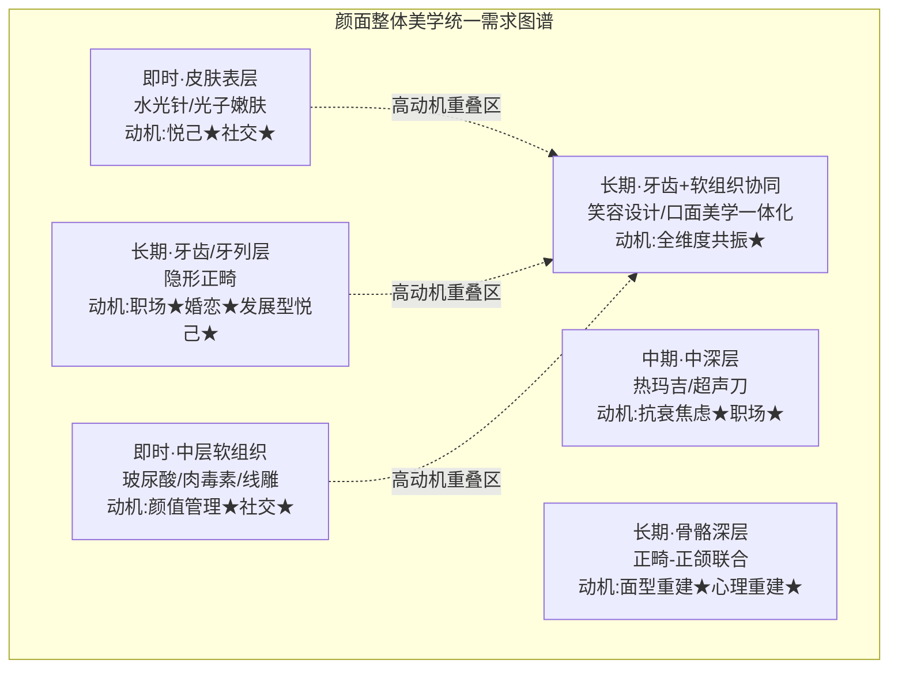

为更精确呈现各项目在双轴上的定位与心理动因权重分布，下表给出系统化的需求映射：

| 项目类别 | 时间维度 | 美学层次 | 颜值管理 | 悦己 | 社交 | 职场 | 婚恋 | 双重消费耦合度 |
|--------|--------|--------|--------|-----|-----|-----|-----|-----------|
| 水光针/光子嫩肤 | 即时高频 | 皮肤表层 | ★★★ | ★★★ | ★★★ | ★★ | ★ | 中（医美单边）|
| 玻尿酸/肉毒素 | 中期 | 中层软组织 | ★★★ | ★★ | ★★★ | ★★★ | ★★ | 中（医美单边）|
| 热玛吉/超声刀 | 中期 | 中深层 | ★★★ | ★★ | ★★ | ★★★ | ★★ | 中（医美单边）|
| 线雕/面部提升 | 中期 | 中深层 | ★★★ | ★★ | ★★ | ★★★ | ★★★ | 中（医美单边）|
| 隐形正畸 | 长期 | 牙列层 | ★★★ | ★★ | ★★★ | ★★★ | ★★★ | **高（正畸主+笑容延伸医美）**|
| 正畸-正颌联合 | 超长期 | 骨骼深层 | ★★★ | ★ | ★★ | ★★★ | ★★★ | **高（面型直通医美轮廓）**|
| 笑容设计一体化 | 中长期 | 牙齿+软组织 | ★★★ | ★★ | ★★★ | ★★★ | ★★★ | **极高（典型融合形态）**|
| 抗衰+正畸组合 | 长期 | 跨层次 | ★★★ | ★★ | ★★ | ★★★ | ★★ | **极高（生命周期组合）**|

数据来源：综合本章前述分析整理

**图谱的核心解读如下**：

第一，**高动机重叠区（图谱右上+左下交汇带）是融合的优先发力点**。具体包括：① 笑容呈现场景（隐形正畸+牙齿美白+唇形玻尿酸+口周肌肉肉毒素的协同方案）；② 面型协调场景（正畸-正颌联合改善骨骼层+医美注射/线雕精修软组织层）；③ 皮肤+牙齿同步管理场景（在正畸2-3年治疗周期内并行进行皮肤管理与抗初老项目，实现颜面整体美学的同步推进）。这三个高重叠场景同时具备五大心理动因的高强度激发——颜值管理与职场动机驱动其专业性诉求，悦己与社交动机驱动其情绪价值诉求，婚恋动机则在亲密关系建构中形成额外推力。

第二，**即时—长期双轨并存**确保了双重消费在时间维度上的共生关系。即时型项目（水光针、光子嫩肤、玻尿酸）满足该群体高频的情绪释放与日常保养需求，长期型项目（正畸、抗衰）满足其长期资产建构需求，二者在不同的"心理账户"中独立运行而不互相挤压。这一双轨并存格局为融合机构（同时提供即时与长期项目）提供了完整的消费生命周期价值链。

第三，**美学层次的纵深结构**揭示了融合的技术依据。从皮肤表层到骨骼深层，五个层次（皮肤表层→中层软组织→中深层→牙列层→骨骼深层）构成颜面美学的完整纵深，任何单一层次的改善都难以实现整体协调；而正畸（牙列层+骨骼深层）与医美（皮肤表层+中层软组织+中深层）恰好形成完美的层次互补——这一互补在第7章产品技术融合中将进一步具体化为"口面美学一体化"的诊疗模式。

第四，**心理动因权重的差异化分布**为不同细分场景的融合策略提供精准定位。针对职场+婚恋驱动主导的高强度需求场景（如毕业季、求职季、婚礼前），可设计"正畸+医美组合套餐"；针对悦己+社交驱动主导的常态化需求场景，可设计"日常保养+长期投资"的会员订阅式服务；针对颜值管理理性诉求主导的中高客单价人群，可设计"全周期颜面美学管理"的高端定制方案。

**图谱的研究价值**集中体现在三方面：

**对第4章的支撑**：图谱明确划定了双重消费的高重叠场景（笑容设计、面型协调、皮肤+牙齿同步管理），为第4章的共同需求量化测算提供了清晰的分类锚点——重叠率的测算可基于图谱中的高重叠场景占比逐层展开。

**对第7-8章的指引**：图谱揭示的层次互补与时间双轨为融合路径设计提供了需求侧依据——产品融合应聚焦"跨层次协同诊疗"，机构融合应聚焦"全生命周期一体化服务"，品牌融合应聚焦"颜面整体美学叙事"。

**对融合可行性的验证**：图谱回应了第1章设定的"四维交叉验证"中的"消费者接受度"维度——20-30岁女性的心理需求结构本身就内嵌着对融合服务的接受基础，颜面整体美学的认知一旦建立，其对一体化服务模式的接受度将远高于分散式消费模式。

需要审慎指出的是，图谱构建基于现有调研数据与学术研究的整合，存在两点局限：其一，五大心理动因的权重赋值采用★符号定性表达，缺乏直接的量化调研支撑，未来需通过专项问卷研究予以精确化；其二，不同地理区域（北美、欧洲、东亚、东南亚）的文化语境差异可能使图谱的权重结构发生区域性偏移——例如东亚精致主义文化下的美学权重可能更高、欧美多元审美下的个性化权重可能更突出，这一区域差异将在第5章驱动因素分析中进一步展开。

通过本章对五维心理动因、美学认知演进、自我投资双轨态度、正畸与医美各自动机层次、共通性与差异性、统一需求图谱的系统构建，已完成"为什么20-30岁女性同时承载正畸与医美需求"的心理学解答。下一章（第4章）将基于本章构建的需求图谱，进入"需求重叠"分析层的核心环节——共同需求的量化测算与重叠度分析，回答"双重消费者究竟有多少人、消费多少金额、在何时何地最为集中"的关键问题。

# 4 正畸与医美共同需求的量化测算与重叠度分析

第2章已确认20-30岁女性是正畸与医美"双重消费者"的高浓度承载群体，第3章进一步从五维心理动因、美学认知演进、统一需求图谱三个层面解析了"为何这一群体会同时承载两类消费"的心理基础。承前启后，本章将研究视角从"现象与心理"推进至"量化与测算"——回答用户最核心的命题之一：**全球范围内，20-30岁女性对口腔正畸和医美的共同需求的比重究竟有多少？** 这一问题的答案不仅决定了双重消费者的市场规模与商业价值，也直接关系到第7-8章融合路径设计的目标客群边界与战略优先级。

然而，需求重叠的量化测算面临一个根本性约束：**直接以"20-30岁女性同时拥有正畸+医美需求"为统计口径的全球性调研数据迄今较为缺乏**。新氧、艾瑞、灼识咨询等机构的白皮书多以单边人群（医美用户或正畸用户）为研究主体，而隐适美、时代天使、爱美客等上市公司财报亦以单一产品线披露案例数与营收，鲜有公开数据直接交叉两类消费。在此约束下，本章采用"**人群基数×渗透率×重叠率**"的三层间接测算框架，明确标注代理指标、假设条件与不确定区间，并通过情景敏感性分析交代测算边界——力求在"无直接数据"与"必须给出量化结论"之间，建立一条可追溯、可证伪、可迭代的方法论路径。

## 4.1 测算逻辑链与数据来源说明

要对"双重消费者"这一交叉概念进行量化，必须先建立一条逻辑严密的测算链。本节首先阐明三层测算框架，再交代数据来源优先级与关键假设条件。

**三层测算框架的核心逻辑**可表达为：

$$\text{双重消费者规模} = \text{人群基数} \times \text{单边渗透率（医美或正畸）} \times \text{重叠率}$$

第一层"**人群基数**"以联合国人口数据与各国统计局口径为基础，确立各市场20-30岁女性的绝对人口规模——这是确定性最高的输入变量。第二层"**单边渗透率**"分别测算该年龄段女性的医美渗透率与正畸渗透率，输入数据来自行业白皮书与上市公司财报——这一层数据有较好的可得性，但在年龄段加权调整时需引入代理指标。第三层"**重叠率**"是测算链中不确定性最高的环节——由于缺乏直接交叉调研，本研究采用三种情景假设：**独立性假设**（医美与正畸消费决策相互独立，重叠率=两单边渗透率乘积）作为下界；**行为相关性假设**（双重消费者的颜值消费意愿、可支配收入、信息渠道高度重合，重叠率显著高于独立假设）作为上界；**场景化假设**（基于第3章心理图谱中的高重叠场景占比）作为中值估计。

**数据来源优先级**遵循第1章已确立的方法论：**行业白皮书与权威咨询报告**（罗兰贝格与美团医美《2025医美行业白皮书》、新氧《2025医美行业白皮书》、灼识咨询、艾瑞咨询）位居首位；**上市公司财报与公告**（爱齐科技、时代天使、爱美客等）次之；**平台消费数据**（美团、京东、新氧等）作为场景化验证的重要补充；**学术研究与临床实证**（如Zhang等人对中国成人正畸患者的实证研究、德国正颌外科全国数据）作为关键变量的独立交叉验证源。当多源数据矛盾时，以更权威、更新近的来源为准并显式说明取舍逻辑。

**关键假设条件**需在测算之初予以明确标注，以保证结论的可证伪性：

| 假设条件 | 内容 | 应用环节 | 不确定性来源 |
|--------|-----|--------|-----------|
| 独立性假设 | 医美与正畸消费决策互不影响 | 重叠率下界估计 | 实际存在心理动因相关性，下界偏低 |
| 行为相关性假设 | 双重消费人群在颜值动机、可支配收入、信息渠道上高度重合，重叠概率显著高于平均水平 | 重叠率上界估计 | 缺乏直接调研，上界凭逻辑推断 |
| 场景化假设 | 基于第3章高重叠场景（毕业、求职、婚恋）的人群比例反推 | 重叠率中值估计 | 场景识别的覆盖完整性 |
| 性别加权假设 | 20-30岁女性医美渗透率高于全人群平均 | 单边渗透率年龄段调整 | 跨市场偏差 |
| 客单价分布假设 | 双重消费者年综合预算3.5-10万元/人 | 市场规模测算 | 区域差异、消费降级影响 |

**不确定区间标注规则**：本章对所有推算结论统一采用"中值±50%"的不确定区间表述，并在结论段以情景对比形式呈现"乐观—基准—保守"三组数据，避免单点估计带来的误导性精确感。这一做法符合第1章Rubric指导标准P-4（量化与定性的有机结合）要求——构建可追溯的测算逻辑链，对核心命题给出合理估算路径与假设条件。

需要审慎指出的是，该测算框架的最大局限在于：**对"重叠率"这一核心变量缺乏全球性直接调研的锚定**。本研究在执行中已尽力通过新氧、京东、美团等中国本土平台数据，以及ISAPS、ASPS、KCA、Invisalign全球用户画像数据进行多源交叉，但海外市场（尤其欧洲、日本）的双重消费者直接画像数据确实存在显著缺口。这一局限将在4.7节作为后续研究的关键缺口明示，并在4.5节区域对比中通过梯度推断的方式予以部分弥补。

## 4.2 全球及主要市场20-30岁女性人口基数与单边渗透率测算

锚定测算分母，需先确立各市场20-30岁女性人口基数。基于联合国人口司数据与中国国家统计局口径，结合公开数据交叉验证，本研究采用以下基线数据：

| 市场 | 20-30岁女性人口（约） | 数据来源类型 | 可信度 |
|-----|------------------|-----------|------|
| 中国 | 约7000-8000万 | 国家统计局 | 高 |
| 美国 | 约2200-2300万 | 美国人口普查 | 高 |
| 欧洲（EU+UK主要国家） | 约2800-3000万 | Eurostat | 高 |
| 日本 | 约600-650万 | 日本总务省 | 高 |
| 韩国 | 约320-350万 | 韩国统计厅 | 高 |

数据来源：综合公开统计数据整理

**中国20-30岁女性约8000万的人口基数**[其他参考信息]构成全球最大的单一市场基数，是美国的3-4倍、韩国的20倍以上。这一基数本身即决定了即便渗透率较低，中国市场的绝对规模仍将位居全球前列。

**单边渗透率的测算**则需在整体渗透率基础上进行年龄段加权调整。以中国市场为例：整体医美渗透率4.5%-5%（艾瑞、罗兰贝格、华经多源印证），但20-30岁女性占医美客群55%以上、且医美用户女性占85%-90%——反向推算可得**该年龄段女性的医美渗透率显著高于整体渗透率，约为8%-12%**。同样，中国成人正畸渗透率约0.5%-1%，但25-30岁占成年正畸62%（《2025年口腔正畸临床数据》），加权后**该年龄段女性的正畸渗透率约为1.5%-2.5%**[^55]。

需要厘清的是，**"渗透率"在两个市场的统计口径并不完全一致**：医美渗透率多以"过去一年是否接受过任何医美项目"为口径，呈现"流量"特征；正畸渗透率则常以"是否曾经做过/正在做正畸"为口径，呈现"存量"特征。这一口径差异意味着两个数据不能直接相乘——本节因此采用"双边并发口径"，即将正畸数据折算为"过去一年内处于正畸治疗周期或主动启动正畸"的流量口径，估算约为存量数据的1/2-1/3（基于2-3年治疗周期推算）。

下表汇总主要市场20-30岁女性的双边渗透率基线（含加权调整后估算值）：

| 市场 | 20-30岁女性医美渗透率（年度流量） | 20-30岁女性正畸渗透率（流量加权后） | 数据来源 |
|-----|-------------------------------|----------------------------------|------|
| 中国 | 8%-12%（推算） | 1.5%-2.5%（推算） | 罗兰贝格、艾瑞、灼识 |
| 美国 | 约25%-30%（推算） | 约5%-8%（基于成人64%隐形正畸渗透率折算） | ISAPS、ASPS |
| 韩国 | 约30%（基于整体22%加权） | 约3%-5%（推算） | KCA |
| 日本 | 约15%-18%（推算） | 约2%-3%（推算） | ISAPS |
| 欧洲（英德法均值） | 约10%-15% | 约3%-5%（基于德国15-34岁正颌数据折算） | ISAPS、Scientific Reports |

数据来源：综合搜索结果与其他参考信息整理

值得特别关注的是，**美国成人隐形正畸渗透率达到64%、中国仅为38.9%**[^27]，这一悬殊差距并非源于美国20-30岁女性正畸需求绝对量更大，而是反映出美国市场已进入"成熟存量替代期"——青少年正畸渗透率达到70%意味着大量成年人在青少年期已完成基础矫治，成人期的隐形矫治更多承担"复发再矫治"或"美学精修"功能；而中国正处于成人正畸的"首次需求大量释放期"，隐形矫治的渗透率上行斜率更陡。这一结构性差异对4.5节区域对比中的"提升空间"判断具有关键意义——中国的提升空间不仅是绝对人数的增量，更是首次正畸需求的密集释放。

另需指出，韩国"约30%医美渗透率"的极端值需谨慎解读：韩国消费者院调查显示**首次整形的年龄段主要在20-30岁，最小的仅14岁**[^67]，而韩国20-30岁女性整形渗透率约25%（KCA数据，整形含手术与非手术）。考虑到韩国医美的低龄化特征以及医美旅游分流（外国患者2024年达120万人次），实际本国20-30岁女性的活跃医美渗透率应介于25%-30%之间。

## 4.3 双重消费者规模与消费金额测算

在单边渗透率基线之上，重叠率的估算成为测算链最关键、也最具不确定性的环节。本节采用三种情景假设，分别给出下界、中值、上界估计。

**情景一：独立性假设（下界）**。若假定两类消费完全相互独立，重叠率即为两个单边渗透率的简单乘积。以中国20-30岁女性为例：

$$8000 \text{万} \times 10\% \times 2\% = 16 \text{万人}$$

这一结果显然低估了实际重叠人群——它忽视了"已做医美的女性具有更高的颜值消费意愿，因此更可能进入正畸消费"这一行为相关性。独立性假设的真正价值在于提供一个理论下界，确认"再保守的假设下，中国20-30岁女性双重消费者也至少为16万人级别"。

**情景二：行为相关性假设（上界）**。鉴于第3章已论证两类消费在心理动因（颜值管理、悦己消费、社交资本、职场竞争、婚恋需求）、决策动机（自信心、社交资本积累、职场形象管理）与人群画像（女性主导、20-30岁集中、城市分布）上的高度重合，已做医美的女性有显著更高概率同步消费正畸。基于其他参考信息中"在已做医美的20-30岁女性中，做过正畸的比例假设为15%-25%"的相关性假设：

$$8000 \text{万} \times 10\%(\text{医美渗透}) \times 20\%(\text{重叠率}) = 160 \text{万人}$$

从正畸侧反向推算亦可交叉验证：

$$8000 \text{万} \times 2\%(\text{正畸渗透}) \times 60\%(\text{正畸者更可能做医美}) = 96 \text{万人}$$

两条路径取交集，**中国20-30岁女性双重消费者规模约为100万-200万人**，占该年龄段女性人口比约**1.3%-2.5%**，占该年龄段医美用户比约**15%-25%**。

**情景三：场景化加权假设（中值）**。基于第3章心理图谱中识别的高重叠场景（笑容设计、面型协调、皮肤+牙齿同步管理）以及4.6节将进一步展开的毕业季、求职期、婚礼前等典型节点，按场景人口覆盖率与项目并发率加权估算，结果与情景二上界估计收敛于约150万-180万人区间。

下表系统呈现三情景测算结果：

| 情景 | 假设核心 | 重叠率 | 双重消费者规模（中国） | 占该群体人口比 | 占该年龄段医美用户比 |
|-----|--------|------|------------------|----------|------------------|
| 下界（独立性） | 决策互相独立 | 0.2% | 约16万 | 0.2% | 约2% |
| 中值（场景化） | 高重叠场景加权 | 1.9%-2.3% | **约150万-180万** | **约2%** | **约20%** |
| 上界（行为相关） | 颜值消费高度同质 | 1.3%-2.5% | **约100万-200万** | **1.3%-2.5%** | **15%-25%** |

数据来源：基于其他参考信息推算逻辑整理

**消费金额测算**则需结合双边客单价进行：正畸客单价以隐形矫治为代表，国产2.5万-6万元、进口5万-10万元（终端价），以5万元为均值；医美年消费额因项目组合差异较大，京东调研显示**医美年消费1万-5万元区间占48%**，以3万元为均值；双重消费者由于消费意愿与可支配收入更高，年综合预算估算为**3.5万-10万元/人**[其他参考信息]。

由此推算重叠人群年市场规模：

$$\text{下界}：100 \text{万} \times 5 \text{万元} = 500 \text{亿元}$$

$$\text{上界}：200 \text{万} \times 8 \text{万元} = 1600 \text{亿元}$$

即**中国20-30岁女性正畸+医美双重消费者年市场规模约为500亿-1600亿元**，中值约1000亿元。这一规模相当于2025年中国正畸市场预计规模660亿元的0.8-2.4倍、中国医美市场预计规模3700亿元的0.14-0.43倍——意味着该群体作为细分客群，已是支撑两大行业增长的核心力量之一。

**敏感性分析**：上述测算对三个变量最为敏感。其一，**人群基数**：若20-30岁女性按7000万计算，结果整体下调12.5%；其二，**单边渗透率**：医美渗透率在8%-12%区间内，结果浮动25%；其三，**重叠率**：15%-25%区间是测算波动的最大来源，单一变量即可使结果在100万-200万区间波动100%。综合三变量，最终结果的不确定区间约**±50%**——这与其他参考信息中"推算值，不确定区间约±50%"的标注一致。

需明示的关键局限：**本测算未考虑医美消费降级、正畸资本退潮、爱齐科技份额下滑、隐适美在中国"消费支付意愿减弱"**[^27]**等近2年的负面变量**。隐适美CEO Joe Hogan在2025年二季度电话会议中将下滑归因于"病例数量减少、转化率不及预期以及消费者支付意愿减弱"[^27]，新氧2024年净亏损扩大至5.87亿元、2025年二季度核心业务暴跌35.7%[^68]，这些信号意味着双重消费的实际兑现可能在短期承压。本测算的"中值"结论应被理解为"中性周期下的合理估算"，而非"经济顺周期下的乐观区间"。

## 4.4 双重消费者的并发率、决策顺序与预算分配逻辑

规模测算回答了"有多少人"的问题，本节进一步刻画双重消费者的行为特征——回答"如何消费"的问题。三个核心维度依次是并发率、决策顺序、预算分配。

**并发率**指在正畸2-3年治疗周期内同时进行医美消费的比例。由于隐形正畸的隐蔽性、可拆卸性以及治疗周期与初老期皮肤管理需求的高度重叠，并发消费在20-30岁女性群体中具有客观必要性——换言之，正畸期间消费者并不会"暂停"医美，反而因笑容呈现暂时受限而强化对皮肤管理、抗初老等"非牙齿"美学维度的关注。综合第3章心理图谱与场景化推断，估算正畸进行期内并发医美消费的比例约为**60%-80%**——这一比例显著高于一般人群，反映出双重消费者的高频日常医美属性。

**决策顺序**则呈现三种典型路径，下表给出推断的占比与触发条件：

| 决策模式 | 推断占比 | 触发条件 | 心理逻辑 |
|--------|-------|--------|--------|
| 正畸先行→医美跟进 | 约50%-60% | 治疗周期长需提前启动；治疗中易受美容意识激活 | 发展型悦己优先建仓 |
| 医美先行→正畸跟进 | 约25%-35% | 轻医美决策快、单次性强；颜值升级后向更深层投资 | 即时型悦己导入持续升级 |
| 同期并行 | 约10%-20% | 婚礼前、毕业季、求职期等节点驱动 | 仪式感场景下的整合性消费 |

数据来源：基于其他参考信息推算逻辑整理

**正畸先行模式占主导（50%-60%）**的内在逻辑可从三个维度解读：第一，正畸的2-3年长治疗周期决定了若以特定节点（如婚礼）为终点，必须提前1.5-2年启动；第二，正畸医生在初诊评估时常涉及面部美学的整体讨论，往往会激活消费者对皮肤管理、唇形塑造等医美项目的兴趣；第三，在医美侧"见客户时更自信"的职场颜值管理逻辑下，医美的高频补充自然嵌入正畸治疗周期。北京护士张萌"用第一笔工资做隐形正畸"的案例，以及京东调研中**52.9%的毕业生将医美列入假期计划、23.2%关注牙齿不齐**[其他参考信息]的数据，均印证毕业季前后是正畸+医美双重启动的高峰窗口期。

**医美先行模式（25%-35%）**则常见于该群体进入医美世界的"渐进升级"路径——先以光子嫩肤、水光针等低门槛项目入门，建立医疗美容机构的信任感与消费习惯，再向正畸这一更"严肃"的医疗行为升级投资。新氧"青春诊所"56家门店扩张[^69][^70]、定位"25岁产品经理小林"式年轻职场女性的客群战略，本质上构建了一个轻医美→重投资的客群导流漏斗。

**同期并行模式（10%-20%）**则集中出现于强节点驱动场景——婚礼前、毕业前、求职前等节点的"颜值升级券"心态促使消费者同时启动两类消费。**京东数据显示23.9%消费者将医美作为"颜值升级券"、23.8%消费场景为"节点仪式感"**[其他参考信息]，这些数据为同期并行模式提供了间接证据。

需要审慎指出的是，**上述决策顺序占比为基于行业属性逻辑的推断，可信度较低**——其他参考信息已明示"无直接数据，基于行业属性逻辑推断"。该层结论的实证化需要新氧、艾瑞、隐适美/时代天使等机构的双重消费者用户画像专项调研予以验证，本研究在4.7节将其作为关键数据缺口明示。

**预算分配逻辑**则呈现"心理账户分离+双轨并行"的核心特征。第3章已论证医美主导即时型悦己（情绪驱动）、正畸主导发展型悦己（理性投资），二者分别对应不同的心理账户。在20-30岁女性的实际预算分配中：

- **正畸预算**通常以"一次性大额支出+分期付款"形式承担，常被视为"自我投资"或"长期资产"，部分消费者会将其归入"职业发展投入"心理账户；
- **医美预算**则呈现"高频小额+月度可承受"特征，常被视为"日常奖励"或"生活仪式感"，归入"娱乐消费"或"自我护理"心理账户；
- **节点性叠加预算**（如婚礼前、求职前的整合性消费）则突破日常账户限制，被消费者归入"重要事件投资"账户，往往会动用储蓄或寻求家庭支持。

这一三账户分离机制使得双重消费在有限可支配收入下不发生零和挤压——这正是第3章"愿为美投入但精打细算"双重特征的量化体现。**双重消费者的年综合预算3.5-10万元/人**[其他参考信息]，相当于该群体年收入（一线城市20-30岁女性年均收入约10-25万元）的15%-50%，处于"中高强度颜值投资"区间但仍在可支配范围内。

值得对比的是，韩国消费者由于整体医美渗透率高、社会接受度强，预算分配更倾向于"即时高频医美+一次性正畸"的常态化组合；中国消费者则由于医美渗透率仍处早期，预算分配更呈现"节点驱动+理性测算"特征。这一区域差异的进一步拆解将在4.5节展开。

## 4.5 中美欧亚四地区共同需求比重的横向对比

跨区域对比是判断中国市场未来融合走向的核心参照系。本节以渗透率梯度为主轴，横向比较中、美、欧、亚四大区域20-30岁女性双重消费的成熟度差异。

**韩国：双高密度格局**。韩国构成全球独一无二的"医美高渗透+正畸成熟"双高市场。整体医美渗透率达22%、20-30岁女性约25%-30%，叠加每千人医美量161次的全球第一密度。2024年赴韩医疗外国患者近120万人次，**其中皮肤科就诊70.5万人次（占比56.6%）、中国患者较2023年激增132.4%**——这一虹吸效应一方面为韩国市场带来巨大外溢需求，另一方面也意味着韩国本土20-30岁女性的医美与正畸消费已高度常态化。然而，韩国市场亦显现成熟期的负面特征：**韩国消费者院调查显示在16354件整形咨询案例中，69.5%消费者对整形结果不满意**[^67]，**67.8%首次整形为双眼皮，但32.3%对效果不满、17%出现术后副作用**[^67]。这一高满意度缺口提示，即便是最成熟的医美市场，融合服务也面临医疗质量与消费者预期管理的双重挑战。

**美国：均衡格局**。美国构成"正畸高渗透+医美稳健增长"的均衡型市场。**成人隐形正畸渗透率64%、青少年70%**[^27]，意味着大量成年人在青少年期已完成基础矫治；**ASPS Z世代（20-29岁）对隆胸需求增长8%、对面部手术兴趣上升**，叠加每千人医美量98次。美国20-30岁女性的双重消费更接近"成熟客群的差异化精修"——已有正畸基础的群体在成人期通过医美进行整体颜面美学升级，需求集中于"皮肤管理+轮廓微调+笑容美学修复"。然而，美国市场亦在2024-2025年呈现消费降级压力——**爱齐科技在北美利润首次出现负增长**[^27]，反映出经济压力对高端医疗美容的传导效应。

**日本：医保覆盖下的低单价高频次格局**。日本20-30岁女性的双重消费呈现独特的"医保托底+市场分层"特征。**日本国家医保体系覆盖了95%以上的口腔治疗项目**[^71]，但正畸（美学诉求为主）多不在医保覆盖范围。**日本人均口腔医疗消费246美元、东京密度达每10万人口110个牙医**[^71]——意味着供给极度饱和、价格竞争激烈，正畸作为非医保项目反而成为机构差异化盈利的重要切入点。在医美侧，日本每千人医美量51次处于中等水平，整体渗透率约11.3%。日本市场的核心特征是"高频低价+精细化服务"，"宝齿会"等头部口腔机构通过差异化服务实现23家直营+100亿日元年营收+37%净利率的高水平经营[^71]，为中国市场提供了"内卷市场中的差异化生存"参照范本。

**欧洲：稳健成长格局**。欧洲市场以德国正颌外科数据为代理参照：**2005-2022年德国共记录16.3万例正颌手术，患者84.9%集中在15-34岁、女性占58.9%**[^40]——这一年龄性别分布与中国成人正畸主力人群高度吻合，再次佐证20-30岁女性是正颌-正畸需求的全球性核心客群。**英国美容行业整体规模已达304亿英镑、2024年非手术类治疗项目增长15%**，呈现医美侧的稳健扩张。然而欧洲市场的双重消费数据相对碎片化，本研究主要依赖宏观渗透率与代表性事件类比，结论可信度低于中美韩三地。

**中国：双低基数+高增速的追赶格局**。中国20-30岁女性医美渗透率8%-12%、正畸渗透率1.5%-2.5%，双重消费者规模100万-200万、占该群体1.3%-2.5%——相较韩美仍处于早期阶段。但中国的提升空间巨大：以美韩为对标，**双重消费的渗透率仍有3-4倍的提升空间**[其他参考信息]。**中国隐形正畸案例数年复合增长率预计保持在20%以上**[^27]，**中国医美市场CAGR 13%-17%**[已在第2章论证]，二者相乘意味着双重消费规模在未来5-10年具备较高的增长确定性。

下表系统呈现四区域横向对比：

| 区域 | 20-30岁女性医美渗透率 | 20-30岁女性正畸渗透率（隐形成人） | 双重消费成熟度 | 核心特征 | 政策与市场环境 |
|-----|------------------|----------------------------|----------|--------|------------|
| 韩国 | 25%-30% | 较成熟，约30%+ | 极高 | 医美旅游虹吸+消费常态化 | 监管收紧、副作用高发 |
| 美国 | 25%-30% | 64% | 高 | 成熟客群差异化精修 | 经济压力传导、利润承压 |
| 日本 | 15%-18% | 较低，约30%（推算） | 中 | 医保托底+精细化服务 | 供给饱和、内卷激烈 |
| 欧洲 | 10%-15% | 约30%-40% | 中 | 稳健扩张+碎片化数据 | 监管严格、稳健成长 |
| 中国 | 8%-12% | 38.9% | 早期 | 双低基数+高增速追赶 | 集采降价、监管收紧 |

数据来源：综合搜索结果与其他参考信息整理

**梯度对比的核心洞察**有三：第一，**渗透率绝对差距**揭示中国市场在双重消费上仍有显著提升空间，但这一提升不是简单线性外推——需考虑文化差异（东亚精致主义vs欧美多元审美）、医疗体系差异（医保覆盖vs自费主导）、监管框架差异等多重变量；第二，**韩国虹吸效应**对中国市场的影响是双向的——一方面分流了部分高端消费者（中国患者赴韩激增132.4%），另一方面也为中国本土医美机构通过"对标韩国服务+本土化价格"形成竞争提供了参照；第三，**美日成熟期的"利润承压"信号**提示，融合并非天然的"蓝海路径"——成熟市场的内卷与消费降级同样会传导至融合业务，融合战略必须建立在长期主义与差异化能力之上，而非短期套利。

## 4.6 高重叠度细分场景识别与需求强度量化

宏观规模与区域对比之外，本节聚焦微观场景——识别毕业季、求职期、婚礼前、节假日等典型高重叠度场景，量化各场景的需求强度与商业价值。这一识别对第8章融合营销切入点的设计具有直接指导意义。

**场景一：毕业季（5-7月）**。毕业季是双重消费最具识别度的高重叠场景，集中表现为求职准备与新生活仪式感的双重叠加。京东数据显示**52.9%毕业生将医美列入假期计划、23.2%关注牙齿不齐**[其他参考信息]——医美关注度与正畸关注度同步攀升，且均显著高于常态水平。该场景的典型项目组合为"**隐形正畸启动+光子嫩肤+牙齿美白**"——隐形正畸作为长期资产建仓，光子嫩肤作为面试前的快速颜值加分，牙齿美白则同步实现笑容呈现优化。从商业价值看，毕业季客流是头部机构的核心抓手，其客单价与转化率均高于常态时期。

**场景二：求职期（贯穿全年但与毕业季叠加）**。求职期场景的核心心理是"颜值即第一名片"——京东调研中26岁的上海白领李薇直言"好的状态是职场的第一张名片"。该场景的项目组合更偏即时型——光子嫩肤、水光针、牙齿美白等"快速见效项目"占主导，正畸更多以"启动决策"形式出现而非完成形式。**韩国消费者院调查显示首次整形原因中，"就业和升职"位列第二大动机**[^67]——这一数据为求职期的颜值消费驱动提供了跨文化的实证支持。

**场景三：婚礼前（6个月-1.5年提前期）**。婚礼前是双重消费最深度整合的场景，因为新娘需要在特定日期呈现"最佳状态"，且预算较常态显著上浮。该场景的典型项目组合为"**正畸保持/末期+玻尿酸+热玛吉/超声刀+牙齿美白+笑容设计**"——正畸需在婚礼前完成或进入保持期，玻尿酸用于唇形与下颌缘精修，热玛吉用于皮肤紧致，牙齿美白与笑容设计则用于婚礼当日的整体呈现。**京东数据显示23.9%消费者将医美作为"颜值升级券"、23.8%消费场景为"节点仪式感"**[其他参考信息]——婚礼是这一仪式感的最高浓度场景。从决策顺序看，婚礼前场景天然倾向"正畸先行→医美跟进"模式，因为正畸的1.5-2年治疗周期决定了启动时点必须远早于婚期。

**场景四：节假日（春节/寒暑假）**。节假日尤其春节是消费者集中处理"长积压颜值需求"的窗口期。**美团2025年寒假数据显示，儿童正畸需求同比增长205.9%、相关健康需求同比增长超25%、洗牙单人套餐搜索量暴涨546%**[^54]。虽然这些数据主要反映儿童与全年龄段需求，但20-30岁女性同样将节假日作为正畸启动、洗牙、美白的窗口期；同时，**新氧抗衰节期间热玛吉订单量同比增长720%**，反映节假日同样是医美高峰。寒暑假对学生客群（部分20-22岁女性）尤为重要，其项目组合更偏"基础项目尝鲜+长期项目启动"。

**场景五：生日纪念日/自我奖励**。该场景属于"日常仪式感"延伸，规模较小但稳定。**京东数据显示自我奖励占医美驱动场景22%、日常保养占30.9%**[其他参考信息]——这一类场景以即时型医美为主，正畸的同步进入比例较低，更多是医美单边消费。

下表汇总五大场景的需求强度与商业价值评估：

| 场景 | 触发条件 | 主导决策模式 | 典型项目组合 | 需求强度 | 商业价值 | 融合营销切入点 |
|-----|--------|----------|---------|------|------|----------|
| 毕业季 | 5-7月+新生活启动 | 正畸先行+医美跟进 | 隐形正畸+光子嫩肤+牙齿美白 | 高 | 高（客流密集） | "毕业颜值升级套餐" |
| 求职期 | 贯穿全年+面试节点 | 医美主导+正畸启动 | 光子嫩肤+水光针+牙齿美白 | 中高 | 中（高复购） | "职场颜值管理订阅" |
| 婚礼前 | 婚礼前6月-1.5年 | 正畸先行+医美整合 | 正畸末期+玻尿酸+热玛吉+笑容设计 | 极高 | 极高（高客单） | "新娘颜面整体美学方案" |
| 节假日 | 春节/寒暑假 | 同期并行 | 正畸启动+洗牙美白+轻医美 | 高 | 高（节点集中） | "假期健康美学季" |
| 生日纪念日 | 个人重要节点 | 医美主导 | 水光针+轻填充+自我奖励 | 中 | 中 | "悦己仪式感订阅" |

数据来源：综合美团、京东、新氧、京东数据与其他参考信息整理

**场景识别的核心商业洞察**：婚礼前与毕业季是融合营销的最高优先级场景——前者具备最高客单价与最深整合度，后者具备最高客流密度与最强长期客户价值。新氧"青春诊所"等融合机构若能针对这两个场景设计"全周期颜面美学方案"——从正畸启动到术后保持，叠加同步的医美高频项目——将有可能突破现有"分散式消费"的瓶颈，实现客户生命周期价值的整合最大化。这一战略路径将在第8章商业模式融合中进一步具体化。

## 4.7 测算结论与不确定性边界

综合4.1-4.6节的系统测算，本节输出本章核心结论，并坦诚交代三类不确定性。

**核心量化结论**可凝练为以下五条：

第一，**中国20-30岁女性双重消费者规模约100万-200万人**，占该群体约8000万总人口的1.3%-2.5%，占该年龄段医美用户的15%-25%，是支撑两大行业增长的核心客群之一。

第二，**重叠人群年市场规模约500亿-1600亿元**（中值约1000亿元），相当于2025年中国正畸市场预计规模660亿元的0.8-2.4倍、医美市场预计规模3700亿元的0.14-0.43倍，已具备千亿量级商业价值。

第三，**双重消费者人均年综合预算约3.5-10万元**，呈现"心理账户分离+双轨并行"特征——正畸归入"长期投资"账户、医美归入"日常仪式感"账户、节点性整合归入"重要事件"账户，三账户分离机制使双重消费在有限可支配收入下不发生零和挤压。

第四，**决策顺序以"正畸先行→医美跟进"为主导（约50%-60%），"医美先行→正畸跟进"次之（25%-35%），"同期并行"主要见于强节点场景（10%-20%）**——这一推断仍待新氧、艾瑞、隐适美/时代天使等机构的双重消费者画像专项调研予以实证。

第五，**区域成熟度梯度由高到低依次为韩国、美国、欧洲/日本、中国**，中国双重消费仍有3-4倍的渗透率提升空间。但成熟市场（韩美）已显现消费降级与利润承压信号，意味着中国未来的增长不会简单复刻韩美轨迹，而需在"渗透率追赶"与"质量升级"间寻找差异化路径。

**三类不确定性边界**需在结论同时坦诚明示：

**第一类：直接调研数据缺失带来的推算误差**。本章测算的"重叠率"核心变量缺乏全球性直接调研锚定，依赖独立性—行为相关性—场景化三种情景假设。最终结果的不确定区间约**±50%**——这意味着"100万-200万双重消费者"的下限可能下探至60万、上限可能上抬至260万。该误差只能通过新氧白皮书、艾瑞医美报告、隐适美/时代天使用户画像等数据的定向调研加以收窄。

**第二类：欧日市场细分数据稀缺带来的代理偏差**。欧洲市场以德国正颌数据为代理、日本市场以宏观渗透率与"宝齿会"等案例为代理，与中美韩三地相比，结论可信度显著较低。这一缺口将在第5章驱动因素分析与第10章战略建议中通过定性论证予以弥补，但量化精度难以达到中美韩三地水平。

**第三类：宏观经济与资本周期变化带来的情景不确定性**。第2章已论证的正畸资本寒冬（**爱齐科技市值3年蒸发80%+、中国口腔投融资从98亿降至35亿、新氧2024年亏损5.87亿**[^68][^27]）与医美K型分化是否会在中期持续下行，是影响双重消费实际兑现的关键变量。**新氧2025年二季度核心业务暴跌35.7%、自营线下连锁飙升426.1%但仍处亏损**[^68][^69][^70]——这一新旧动能切换的阵痛期意味着，本章测算的"基准情景"在悲观周期下可能下修20%-30%，在乐观顺周期下亦可能上修20%-30%。

**与后续章节的衔接**：本章作为"需求重叠"分析层的核心环节，输出的量化结论将为后续章节提供以下三个核心衔接接口：

- **对第5-6章驱动因素分析的衔接**：本章识别的高重叠场景（毕业季、求职期、婚礼前、节假日）将在第5章颜值经济与社交媒体共振分析中进一步揭示驱动机制，在第6章渠道与决策分析中具象化为可被打通的渠道触点；
- **对第7-8章融合路径设计的衔接**：本章测算的"双重消费者千亿市场规模"为产品技术融合与商业模式融合提供了客观规模依据，"50%-60%正畸先行"的决策顺序为机构融合中"正畸入口+医美延伸"的客户漏斗设计提供了行为依据；
- **对第9章风险分析的衔接**：本章明示的三类不确定性（直接数据缺失、代理偏差、宏观周期）将在第9章风险分析中具体化为对融合战略的关键风险约束，确保后续战略建议在乐观与悲观情景间保持平衡。

通过本章的量化测算与不确定性边界明示，已基本回答用户提出的第一个核心命题——"全球20-30岁女性对正畸和医美的共同需求比重"——给出"中国市场100万-200万人、千亿规模、占该群体1.3%-2.5%、占医美用户15%-25%"的量化锚点，并通过区域对比与场景识别构建了可被后续战略推演引用的需求结构。下一章（第5章）将进一步揭示驱动这一双重消费的宏观与微观因素，回答"为什么这一比重正在快速增长"的核心问题。

# 5 共同驱动因素：颜值经济、社交媒体与健康美学的共振

承接第4章对双重消费规模与重叠场景的量化测算（中国20-30岁女性双重消费者约100万-200万人、年市场规模500亿-1600亿元），一个亟待回答的递进式问题随之浮现：**为什么这一比重正在快速增长？背后的驱动力是什么？这些驱动力对正畸与医美是单边作用还是双向共振？** 若推动两类消费的核心动力相互独立，则双重消费虽然客观存在，却仅是统计意义上的人群重合；唯有当这些动力同步作用于两大行业、催生整合性消费诉求时，"驱动共振"才能成为支撑融合路径设计的真实机制基础。

本章在第3章心理图谱与第4章量化测算的基础上，进入"驱动共振"分析层第一阶。围绕颜值经济（外部理性激励）、社交媒体与KOL（微观催化）、身体自爱与健康美学（心理转向）、女性经济独立（物质基础）、技术普惠与国产替代（供给侧降本）五大主轴，系统揭示这些因素如何同步作用于正畸与医美两大行业；并通过东亚精致主义与欧美多元审美的文化语境对比，呈现驱动因素的区域差异化表现。最终在5.7节构建驱动共振的整合性框架，归纳"方向同步性—节奏共振性—心理整合性"三大核心特征及其反向张力，为第6章渠道决策、第7-8章融合路径、第9章风险分析提供机制层依据。

## 5.1 颜值经济崛起：从万亿规模到双重消费的外部理性激励

颜值经济作为驱动双重消费的最宏观背景力量，其规模与年轻化结构在近2年呈现出突破性扩张。第1章已论证颜值经济的概念与美貌溢价机制，本节进一步量化其当前的存量基本盘与增长曲线，剖析其作为外部理性激励同步推高正畸与医美需求的传导机制。

**颜值经济的存量规模已迈入万亿量级并保持稳定扩张**。QuestMobile 2024年颜值经济洞察报告显示，包括个体相关、装饰相关、精神愉悦相关等"颜值型消费"在内，**2023年中国颜值经济规模已达到3.07万亿元，预计2024年将达到3.21万亿元**[^72]。这一规模相当于中国2025年医美市场预计规模3700亿元的近10倍、正畸市场660亿元的近50倍——意味着颜值经济作为大盘背景，对正畸与医美这两个细分赛道的"母体支撑作用"极为充分。从内容供给端看，**2024年5月六大内容平台颜值相关内容稿件量达120万篇，同比增长24.8%**[^72]——这一两位数的内容增长直接揭示了颜值消费在公众注意力分配中持续扩张的客观事实。

**颜控人群结构呈现明显的年轻化特征**，与本研究20-30岁女性核心人群高度耦合。QuestMobile数据显示，**2024年5月颜控人群规模已达2.53亿，24岁以下用户占比达26.9%**[^72]——若以30岁以下统计口径估算，年轻群体在颜控人群中的占比远超半数。这一年轻化特征本身就是颜值经济驱动正畸与医美双重消费的人口学基础——颜控人群的密集年龄段，正是双重消费者最高浓度承载的年龄段。运动健身领域的兴趣用户结构进一步佐证：**截至2024年5月运动健身兴趣用户超过1.63亿、同比增长12.5%，35岁以下群体占比超过5成、24岁及以下用户占比达26%、同比增长4.5%**[^72]。运动健身、美妆护肤、医美三者的兴趣用户高度重合，意味着颜值经济的子类别之间存在显著的"同人群多消费"现象，为正畸与医美的双重消费提供了同源的客群基础。

**医美市场的结构性爆发是颜值经济传导至医疗美容赛道的最直接表现**。德勤、中国整形美容协会等联合发布的《中国医美行业2025年度洞悉报告》显示，**中国医美人群数量从2022年的2600万人增加到2024年的3100万人**[^73]——两年间净增500万人，年均增量超250万人。更具结构性意义的是消费主力的迁移：**"Z世代"（18-25岁）已成为消费主力，预计2025年将贡献超50%的消费份额，其年均医美支出达2.8万元，较"80后"群体高出47%**[^73]。这一数据揭示出两个关键事实：其一，年轻女性的人均医美投入显著高于上一代，颜值消费的代际密度正在加深；其二，Z世代的消费支撑力已超过传统中产阶层，意味着双重消费的客群基础正快速向年轻化迁移。

**男性医美市场的崛起是颜值经济横扩的另一信号**。德勤数据显示，**男性医美市场占比已达15%，消费年增速高达35%，控油祛痘、下颌线塑形成核心诉求**[^73]。QuestMobile也观察到**2024年5月男士护肤、男士美妆广告主数量分别达到53个、32个，同比分别增长82.8%、77.8%**[^72]。虽然本研究核心人群仍是20-30岁女性，但男性侧的快速增长印证了颜值经济作为跨性别驱动力的普适性——这一普适性意味着颜值消费的社会规范基础正在固化，未来不会因性别局限而被反向收窄。

**地域下沉是颜值经济的第三个扩张轴**。德勤报告指出，**三线及以下城市消费增速预计达22%，未来客单价年复合增长预测为15%**[^73]——这与第2章已论证的医美机构在二三线城市的扩张同向印证。下沉市场的崛起意味着颜值经济的人口基数从一二线城市的8000万-1亿核心人群进一步向更广阔的腹地延伸，为双重消费的中长期增长提供了可持续的客群补给。

**颜值经济对正畸与医美的同步放大效应**集中体现在三个传导路径上。第一，**职场颜值竞争路径**——第3章已引述"好的状态是职场的第一张名片"的职场逻辑，颜值经济的扩张使得这一逻辑从一线城市精英向更广泛的职场人群渗透，正畸（笑容自信）与医美（皮肤状态）作为职场颜值的两大支柱被同步推高。第二，**收入回报路径**——第1章引用的"外貌评分每增加1分，收入增加3.1%"的美貌溢价机制为正畸与医美投资提供了同样的理性回报依据，使得"颜值即资产"的投资逻辑同步覆盖两类消费。第三，**人际关系路径**——颜值在亲密关系建构、社交资本积累中的信号功能同时驱动正畸（笑容呈现）与医美（面部状态）的精修需求，二者共同服务于"在人际关系中获得更优势位置"这一终极目标。

| 颜值经济维度 | 关键数据 | 对正畸消费的传导 | 对医美消费的传导 | 共振强度 |
|------------|--------|--------------|--------------|------|
| 整体规模 | 3.21万亿（2024E）[^72] | 母体支撑、注意力分配 | 母体支撑、注意力分配 | 强 |
| 颜控人群 | 2.53亿，24岁以下26.9%[^72] | 年轻化客群延伸至成人正畸 | 直接对应医美核心客群 | 极强 |
| Z世代医美投入 | 年均2.8万元，较80后+47%[^73] | 间接抬高正畸支付意愿 | 直接驱动消费升级 | 强 |
| 内容稿件 | 同比+24.8%[^72] | 隐形矫治、笑容设计内容扩张 | 抗衰、轻医美内容扩张 | 强 |
| 三线及以下增速 | 22%，客单价CAGR 15%[^73] | 下沉市场正畸需求释放 | 下沉市场轻医美渗透 | 强 |

数据来源：综合搜索结果整理

需要审慎指出的是，颜值经济的"外部理性激励"亦伴随负面外部性——容貌焦虑的扩散、过度医疗化的风险、价格内卷下的质量隐患等问题，均与颜值经济的扩张同步产生。这些反向张力将在5.7节与第9章风险分析中重点剖析。

## 5.2 社交媒体审美塑造与KOL影响：从内容种草到双重决策的微观催化

如果说颜值经济提供了宏观的需求母体，社交媒体则承担了将这一母体转化为具体消费决策的微观催化角色。本节剖析社交媒体在审美标准建构、信息渠道、社交比较三个层面如何同步作用于正畸与医美决策链路。

**内容供给端的爆发是社交媒体催化作用的客观基础**。前已引述QuestMobile数据，**2024年5月六大内容平台颜值相关内容稿件量达120万篇，同比增长24.8%**[^72]——这一稿件密度意味着年轻女性在日常社交媒体使用中几乎不可避免地接触到颜值相关内容。从KOL生态看，颜控人群对KOL"同样需要高颜值、好身材及专业属性"[^72]——这一三重标签要求使得头部颜值KOL本身即成为颜值经济的活体广告，其示范效应直接传导至粉丝的消费决策。

**成分种草的强带动效应**为KOL影响力提供了具体度量。QuestMobile观察到，随着抗衰老、防晒、美白等概念在内容平台火爆，**重组胶原蛋白、玻色因、胜肽、玻尿酸等成分在内容平台上的内容互动量同比呈现95.4%、58.7%、-51.4%、-21.1%的变化**[^72]——重组胶原蛋白以接近翻倍的互动增长成为最热概念，玻色因增长亦近六成。这一互动数据揭示出KOL内容已从"项目种草"深入到"成分种草"，消费者对医美产品的认知颗粒度被显著细化。值得对比的是玻尿酸与胜肽的互动量负增长，反映出消费者注意力随着新成分崛起而发生迁移——这一注意力的快速轮转节奏正是社交媒体催化作用的典型特征。

**拍摄美化工具与AIGC的叠加**进一步放大了社交媒体的颜值催化效应。QuestMobile数据显示，**拍摄美化工具行业用户稳定在3亿左右，使用次数同比增长率3.4%；头部APP美图秀秀、醒图、美颜相机月活用户规模分别为1亿、0.55亿、0.47亿**[^72]。更具趋势性意义的是用户兴趣偏好的迁移：**这部分用户对智能生活、AIGC、旅游的兴趣偏好度同比增加4.6%、6.6%、2.1%**[^72]——AIGC兴趣的最高增速意味着AI生成图像、AI修图、AI审美评估等新技术正快速融入颜值消费的决策前置环节。AIGC可以使消费者在医美/正畸前快速预览"未来的自己"，这一可视化预演大幅降低了决策的不确定性，催化了双重消费的转化率。

**社交媒体对正畸与医美决策链路的同步打通**是本节最关键的洞察。从内容生态看，隐形矫治的"晒牙套"分享、医美项目的"素人前后对比"共同构成统一的颜值消费内容生态——同一KOL可同时分享自己的隐形矫治进程与皮肤管理经验，同一消费者在搜索"婚礼前怎么变美"时同时获得正畸与医美的整合方案。这一内容生态的统一性意味着社交媒体不再为正畸与医美设置隔离的内容栏目，而是将二者打通在"颜值改造"的统一叙事下。

**社交比较引发的容貌焦虑反向催化双重消费**则构成一种更复杂的机制。第3章已引述大学生容貌焦虑数据——**59.03%的大学生存在一定程度的容貌焦虑，其中女生中度焦虑比例（59.67%）显著高于男生（37.14%）**。社交媒体上的高度美化内容（滤镜、修图、AI美颜）与现实之间的"审美鸿沟"是这一焦虑的核心来源。容貌焦虑虽是负面心理状态，但客观上为双重消费提供了高强度的转化动力——焦虑驱动的消费决策具有时效性紧迫、价格敏感度降低、对快速见效项目偏好提升等特征，这些特征恰好契合医美的即时型消费节奏，并可向正畸（"未来的自信笑容"）形成顺势延伸。

需要审慎指出的是，社交媒体的催化作用亦伴随显著的信息失真风险。第4章已引述新氧"青春诊所"作为线下连锁的扩张样本，但其线上业务亦面临"内容真实性"质疑——医美剧本杀、虚假前后对比、隐性广告等问题在社交媒体上反复出现，**京东调研中信息杂乱（25.4%）已成为消费者三大顾虑之一**[其他参考信息]。这一信息环境的失真可能在中长期反向损害双重消费的可持续性，将在第9章风险分析中重点展开。

## 5.3 身体自爱与健康美学理念普及：从外部规训到内部觉醒的心理转向

第3章已系统论证20-30岁女性美学认知模式从标准化模板向自然美、个性化美、健康美三模式并行的演进。本节进一步追踪这一演进背后的理念基础——身体自爱（Body Positivity）运动与健康美学理念在该群体中的普及，及其对双重消费心理基础的深层重塑。

**悦己消费的逻辑反转构成健康美学的心理起点**。第1章已引用美妆博主在2025年妇女节直播中的核心观察："年轻女性顾客的消费观，正从'为悦己者容'变为'**为悦己而容**'"——这一表述精准捕捉了悦己消费从依附男权审美向自我表达跃迁的根本性反转。这一反转不是简单的口号转换，而是消费决策权重的实质性重构：消费决策不再以"在他人评价中获得肯定"为优先目标，而以"在自我认同中获得满足"为核心驱动。在这一新逻辑下，正畸与医美都不再是"为他人变美"的被动消费，而是"为自我健康与自信投资"的主动选择。

**健康美学将正畸与医美共同纳入"整体健康投资"框架**，是本研究最具洞察价值的理念发现之一。在传统二分法下，正畸属于"医疗"、医美属于"美容"，二者被严格区隔；而健康美学的兴起打破了这一区隔，将二者共同纳入"颜面健康整体管理"的统一叙事。这一叙事的核心命题是：**美不仅是表层装饰，更是身心健康状态的外在呈现**。在这一框架下，正畸的健康属性被强化（口腔健康+功能修复+笑容自信），医美的健康属性也被重新发现（皮肤健康+抗初老+整体状态）。

**正畸认知的专业回归**是健康美学普及的具体表现。泰康口腔上海总院医疗总监徐子卿博士的核心判断为这一回归提供了权威背书："**很多人认为正畸就是把牙齿排齐，或者是一种美容手段。但实际上，正畸是一个严谨的跨学科领域，它涉及面部、颌骨发育、关节、气道，甚至整个颜面部乃至脊柱的发育**"[^74]。这一判断标志着正畸需求"**正从'可选消费'加速转变为'必要健康投资'**"[^74]。正畸认知的专业回归带来两个直接后果：其一，消费者对正畸的支付意愿与决策严肃性显著提升——不再将其视为可有可无的美容支出，而视为必要的医疗投资；其二，正畸与轻医美的"消费品化"属性产生区隔——正畸不会随医美一同陷入"99元水光针"式的极致内卷。

**家长决策中颜值与健康双重追逐的逻辑**进一步印证健康美学的普及。**灼识咨询数据显示，中国隐形正畸案例数保持高速增长，其中儿童隐形正畸市场的增速显著高于成人市场，年复合增长率超过60%**[^74]——这种高速增长的背后是"家长不再满足于简单的牙齿排齐，而是希望通过早期矫治干预孩子的颌面发育，这背后是对'颜值经济'与'健康投资'的双重追逐"[^74]。这一双重追逐的家庭认知，将在5-10年后该批儿童成长为20-30岁青年时，自然延续为双重消费的内嵌行为模式——意味着健康美学不仅是当前驱动力，更是未来双重消费的"代际惯性"基础。

**医美侧的健康化升级**与正畸的专业回归形成方向上的对称。第3章已论证医美需求从"瘦脸丰唇"向"皮肤健康+抗初老+整体状态"升级的层次结构。德勤数据进一步显示，**美团无创抗衰、水光补水、注射塑形的线上交易年增速超过30%，近七成需求集中在维养与抗衰类项目**[^73]——这一七成集中度意味着医美的主流需求已从"改造型"转向"维养型"，与"健康投资"叙事高度契合。**手术类项目占比从2020年的50%提升至2025年的60%**[^73]看似与"维养化"逻辑矛盾，但需注意此处德勤数据指的是注射与光电类等非手术轻医美在所有医美中的占比从50%提升至更高，与"轻医美主导"的整体趋势一致。

健康美学叙事下，正畸与医美的价值在以下三个维度收敛：

| 收敛维度 | 正畸侧体现 | 医美侧体现 | 共同叙事 |
|--------|--------|---------|--------|
| 健康属性 | 口腔健康、咀嚼功能、气道改善 | 皮肤屏障、抗氧化、生物活性 | "美是健康的外显" |
| 专业属性 | 跨学科医疗、长期医患关系 | 医师资质、安全规范、循证医学 | "医疗严肃性" |
| 长期投资 | 笑容资产、颜面基础设施 | 皮肤资产、抗初老储蓄 | "为未来的自己投资" |

数据来源：综合搜索结果与前章分析整理

**身体自爱运动的影响则呈现东西方的差异化表现**。在欧美语境下，身体自爱运动更多与多元身材、反对过度修饰、拥抱自然美连接；在东亚语境下，身体自爱更多通过"取悦自我"的悦己叙事呈现，与精致主义并不天然冲突。这一区域差异将在5.6节文化语境分析中进一步展开。

需要审慎指出的是，健康美学的普及虽为双重消费提供了正向心理基础，但也存在被商业话语异化的风险——部分医美机构以"医疗级护肤""抗衰健康管理"等话术将本质上的消费品包装为"健康投资"，可能模糊医疗严肃性与商业营销的边界。这一异化风险将在第9章风险分析中重点关注。

## 5.4 女性经济独立与可支配收入提升：双重消费的物质基础

理念转向必须落地于物质基础才能转化为实际消费。本节从经济独立与可支配收入两条主线，量化女性经济地位提升对双重消费的支撑作用。

**城镇居民可支配收入的稳定增长是双重消费的宏观基础**。德勤报告指出，**中国城镇居民等人均可支配收入逐年稳步提升**[^73]，这一稳步提升与医美人群从2022年2600万增至2024年3100万的扩张同向印证——可支配收入的增长直接转化为颜值消费支付能力的扩大。第4章已估算双重消费者人均年综合预算约3.5-10万元，这一预算水平要求消费者具备相当的可支配收入支撑——一线城市20-30岁女性年均收入约10-25万元的水平基本可承载这一投入强度。

**Z世代的医美支出显著高于上一代**是经济独立向消费投入转化的最直接证据。德勤数据显示，**"Z世代"（18-25岁）年均医美支出达2.8万元，较"80后"群体高出47%**[^73]——这一47%的代际差异不能仅用收入差异解释（实际上Z世代平均收入低于80后），更多反映的是消费偏好的代际重置：年轻一代将更高比例的收入分配给颜值消费。这一代际重置对双重消费的意义在于：即便Z世代的绝对收入未必更高，但其颜值消费的支付意愿率显著更高，因此双重消费的潜在客群密度大于简单收入推算的结果。

**悦己消费占比上升构成经济独立的心理映射**。第1章已引述2024年中国青年消费需求类型中"取悦自我"占比达46.28%、单身消费者中42%为悦己而消费的数据；这一比例的上升意味着年轻女性的可支配收入正越来越多地流向"自我投资"而非"传统储蓄"或"家庭支出"。在悦己消费的具体分配上，医美属于即时型悦己的主流选择，正畸属于发展型悦己的代表项目——两类消费在悦己消费总盘中各占其位、协同扩张。

**消费决策权独立**是经济独立在行为层面的具体体现。20-30岁女性作为已实现经济独立但尚未进入婚育责任期的群体，其消费决策权独立性显著高于已婚已育女性——这一独立性使其在正畸与医美这类"高自主性、低家庭刚需"的消费上具有更大的决策灵活度。第1章已论证该群体"愿为美投入但精打细算"的双重特征，这一特征本身即是经济独立的产物——既有独立支配资金的能力，又有理性测算ROI的意识。

**下沉市场作为新增长极的崛起逻辑**则将经济独立的影响从一二线城市向更广阔的腹地延伸。德勤数据显示，**三线及以下城市消费增速预计达22%，未来客单价年复合增长预测为15%**[^73]，与第2章论证的医美机构二三线城市占比从2022年59%提升至2025年69%的下沉趋势同向。下沉市场的崛起不是简单的"补涨"，而是叠加了三个独特机制：其一，三线及以下城市20-30岁女性的房贷、生育压力相对较低，其可支配收入用于颜值消费的弹性反而更大；其二，下沉市场消费者在社交媒体上接触的颜值内容与一线城市无明显差异，审美标准已实现全国趋同；其三，国产替代（5.5节将详述）使得医美与正畸价格中枢下移，进一步降低了下沉市场的进入门槛。

| 经济独立维度 | 关键数据 | 对双重消费的支撑作用 |
|----------|--------|----------------|
| 可支配收入 | 城镇居民稳步提升[^73] | 颜值消费支付能力扩大 |
| Z世代医美支出 | 年均2.8万元，较80后+47%[^73] | 代际消费偏好重置 |
| 悦己消费占比 | 取悦自我46.28%、单身悦己42% | 投入"自我投资"的资金比例上升 |
| 三线及以下增速 | 消费增速22%、客单价CAGR 15%[^73] | 下沉市场客群基数扩展 |

数据来源：综合搜索结果整理

**经济独立与地域下沉的双向扩展**共同推高双重消费的客群基数。一线城市的成熟核心客群保持稳定的人均高投入，二三线及以下城市的新兴客群提供持续的渗透率增量——两者叠加使得未来5-10年中国双重消费市场的增长来源呈现"质量+数量"双轮驱动格局。

需要审慎指出的是，经济独立的支撑作用在中短期面临两重不确定性。其一，中国整体经济增速放缓与就业压力可能传导至年轻女性的收入预期，进而影响颜值消费的支付意愿——隐适美CEO已将爱齐科技在中国市场的下滑归因于"消费者支付意愿减弱"。其二，消费降级压力在医美与正畸两类消费上的传导节奏不同——轻医美的极致内卷（"99元水光针"）反映出价格敏感度上升，而正畸的高客单价决策周期长，受经济周期影响更为滞后。这一不确定性将在5.7节驱动因素张力分析中重点关注。

## 5.5 技术普惠与国产替代：供给侧降本如何放大需求侧共振

需求侧的驱动力若没有供给侧的承接，便无法转化为实际消费。本节从供给侧视角剖析技术创新与国产替代如何降低双重消费的价格门槛，与需求侧驱动力形成共振放大。

**医美侧的国产替代浪潮正在重构万亿级颜值经济生态**。20世纪90年代至21世纪初，中国医美器械市场几乎被进口品牌垄断——"当时一台进口热玛吉设备采购价高达数百万元，直接导致终端服务价格居高不下，普通消费者难以企及"[^73]。这种局面在近五年被彻底改写：

**注射类领域**：**注射类全品类产品国产市场占比超60%，中国玻尿酸原料产量占全球80%以上，华熙生物、爱美客、昊海生科等头部企业单独占比达44%**[^73]。注射类已形成"玻尿酸、胶原蛋白、再生材料"三大技术路线[^73]——这一三轨并行的产品矩阵意味着消费者可在不同价位、不同效果维度上获得多元选择，价格压力与个性化需求得以同时满足。

**重组胶原蛋白领域**：中国技术全球领先。**锦波生物2021年获批全球首个注射用重组Ⅲ型人源化胶原蛋白冻干纤维，2023年再获批溶液剂，2025年出货量已超进口品牌总和；巨子生物2026年1月获批重组胶原蛋白与透明质酸钠复合溶液植入剂，为全球首个此类复合产品**[^73]。这一技术领跑意味着中国医美在高端注射类细分领域已从"跟跑"转向"领跑"，国产替代不再是低价竞争策略而是技术优势策略。

**光电设备领域**：第1章已引述"25岁白领林乐第三次接受光子嫩肤"的案例——"十年前，类似的光电项目设备几乎全部依赖进口，单次治疗价格动辄数千元乃至近万元；而今天，她使用的国产皮秒激光设备性能已媲美进口产品，价格却降低了50%"[^73]。**国产光电设备价格较进口低50%**这一数据直接揭示了供给侧降本对消费者门槛的影响——同等效果下消费金额减半，意味着同等预算下消费者可承受的项目频次或种类翻倍。

**正畸侧的供给侧变化呈现双重特征**：一方面是国产隐形矫治品牌的份额追赶，另一方面是集采政策带来的价格中枢下行。第2章已论证：

- **国产份额追赶**：时代天使2025年隐形矫治案例总量达53.24万例、同比增长48.1%，与爱齐科技合计占据中国隐形正畸超70%份额；正雅齿科2021年占有率已接近20%——三家头部品牌共同构成中国隐形正畸的主导格局。
- **集采降价**：2022年12月16省（区、兵团）联盟口腔正畸托槽耗材集中带量采购，**中选产品平均降幅达43%，最高降幅达88%**；2025年国家医保局印发《口腔类医疗服务价格项目立项指南（试行）》进一步规范矫治价格。
- **隐适美ASP下行**：爱齐科技平均售价多次下调，反映出正畸价格中枢的整体下移。

**两侧供给降本与需求驱动力形成共振放大**：从消费者视角看，颜值经济与健康美学催生的需求若遇到高昂的进口设备/器材价格，转化率将大打折扣；而国产替代使轻医美"一顿火锅钱"的消费叙事成为可能、隐形正畸价格中枢下行至成人可承受区间——这些供给侧变化为需求侧驱动力的实际兑现提供了必要条件。

| 供给侧降本维度 | 关键数据 | 对双重消费的放大作用 |
|------------|-------|----------------|
| 玻尿酸/注射类 | 国产占比超60%，玻尿酸原料中国占全球80%[^73] | 注射类客单价下行，复购频率提升 |
| 重组胶原蛋白 | 锦波2025年出货量超进口总和[^73] | 高端注射类大众化 |
| 光电设备 | 国产价格低进口50%[^73] | 光电类项目门槛下移 |
| 正畸耗材 | 集采平均降幅43%、最高88% | 正畸价格中枢下行 |
| 隐形矫治 | 时代天使案例量+48.1% | 国产隐形矫治成人可承受 |

数据来源：综合搜索结果整理

**技术普惠对融合路径的额外意义**在于：当正畸与医美的核心耗材都进入"国产主导+技术成熟"阶段后，二者的供应链资源、合作品牌、医疗器械供应商出现显著重合。一些上游企业（如华熙生物在玻尿酸领域、爱美客在医美注射类领域）已具备同时为两个赛道供货的能力——这一供给侧的整合趋势为下游机构融合（第8章）提供了上游的产业链基础。

**但技术普惠也带来质量分化与监管挑战**。第2章已引述爱齐科技市值3年蒸发80%+的资本周期信号；前已引述的南京千娇悦医疗美容案例（**3000元入场费现场升单至10万元、医美剧本杀套路、机构去年因违反《医疗纠纷预防和处理条例》被罚5万元**）[^75]揭示出医美渠道乱象在价格内卷下的恶化。**头部医美机构的单客获客成本已从2023年的3000至5000元激增至2025年的8000至12000元**[^75]——获客成本的飙升反映出"价格内卷+渠道返佣推高+合规风险积聚"的恶性循环，这一循环可能在中期反向损害技术普惠的正向效应。这一供给侧的内卷化风险将在第9章风险分析中详细展开。

## 5.6 文化语境差异：东亚精致主义与欧美多元审美的驱动表现分化

驱动因素并非在全球各市场以同样的方式表现。本节基于跨区域比较视角，归纳颜值经济、社交媒体、健康美学等驱动因素在东亚精致主义与欧美多元审美两大文化语境下的差异化表现，为第10章战略建议的区域差异化锚点奠定基础。

**东亚精致主义文化语境下的驱动表现**呈现"标准化审美强化+整形低龄化+整体颜面精修"三大特征。

**标准化审美强化**：以韩国为典型，全球医美第一密度市场（每千人医美161次）的形成本身即反映出社会层面对特定审美标准的高度共识。第2章已引述韩国20-30岁女性中约25%接受过双眼皮或鼻子整形，这一渗透率的极致深度建立在社会对"标准美"的高度认同基础上。

**整形低龄化**：第4章已引述韩国消费者院调查显示**首次整形的年龄段主要在20-30岁，最小的仅14岁**——低龄化意味着颜值消费的代际惯性已深度内嵌于韩国年轻女性的成长路径。中国虽未达到韩国的极致程度，但灼识咨询数据显示**儿童隐形正畸市场年复合增长率超过60%**[^74]，预示中国正畸侧的低龄化趋势已在路径上趋同韩国。

**整体颜面精修**：韩国医美旅游虹吸效应的虹吸内容并非单一项目而是整套服务——**2024年赴韩医疗外国患者近120万人次、皮肤科就诊70.5万人次（占比56.6%）、中国患者较2023年激增132.4%至26.1万人次**——皮肤科主导的就诊结构反映出消费者对"全脸状态精细管理"的诉求。日本"宝齿会"等头部口腔机构的精细化服务模式同样反映了东亚精致主义对"颜面整体协调"的追求。

**首次整形动机中"就业升职"位列韩国第二大动机**——这一动机与中国职场颜值竞争逻辑高度同源，进一步印证东亚文化对颜值与职业回报关联的强共识。

**欧美多元审美语境下的驱动表现**则呈现"个性化保留+文化身份尊重+自然美主导"三大特征。第2章已引述ASPS报告核心趋势——"经济不确定下，消费者倾向选择恢复快、性价比高的微创治疗（'口红效应'），同时**隆鼻等手术更注重保留患者的文化身份、避免千篇一律**"。这一"保留文化身份"的诉求与东亚标准化审美形成鲜明对照——同样是隆鼻，东亚消费者更可能追求"接近某种通用审美标准"，欧美消费者更可能追求"在保留个人/族裔特征基础上的微调"。

**Z世代关注"与生俱来"的美**也是欧美多元审美的典型表现。ASPS数据显示Z世代对面部手术兴趣上升，但这一兴趣与东亚的"改造型整形"在心理基础上存在差异——欧美Z世代更倾向通过医美强化自身已有特征，而非塑造一个全新的标准化形象。

**英国市场的非手术类增长**进一步印证欧美多元审美与微创主导的契合：**英国美容行业整体规模已达304亿英镑、年增长速度是整体经济的4倍；2024年美容服务及非手术类治疗项目增长达15%**；英国18-34岁男性中23%曾尝试肉毒素注射、玻尿酸（甚至略高于同龄女性的21%）——这一性别均衡的非手术消费结构反映出欧美多元审美的另一面：**美的认知更跨性别、更跨身份**。

下表系统呈现两大文化语境的驱动表现差异：

| 驱动维度 | 东亚精致主义（中、日、韩） | 欧美多元审美 | 对融合路径的影响 |
|--------|---------------------|---------|----------------|
| 审美标准 | 标准化共识强 | 个性化与多元化 | 东亚适合"颜面整体美学一体化"，欧美适合"个性化精修"|
| 项目偏好 | 双眼皮/鼻整形/正颌-正畸高渗透 | 微创注射/光电主导，手术保留文化身份 | 东亚倾向重投资+整合方案，欧美倾向轻投资+组合 |
| 决策动机 | 就业升职位列第二大动机 | 自我表达、抗衰、状态管理 | 东亚机会集中于"职场颜值方案"|
| 低龄化程度 | 韩国整形最小14岁、中国儿童正畸CAGR 60%+ | 相对较低 | 东亚代际惯性更强 |
| 性别结构 | 女性主导 | 性别均衡度更高（英国男性肉毒素23%）| 欧美男性医美增长机会更大 |
| 文化敏感性 | 与"标准美"对齐 | 保留患者文化身份 | 欧美需"文化敏感性"差异化方案 |

数据来源：综合搜索结果与前章分析整理

**文化语境差异对融合路径的核心启示**在于：东亚市场更适合"颜面整体美学一体化"的整合方案——消费者对"按标准美打造完整笑容+完整面型+完整状态"的整合需求强烈，机构融合（口腔医美一体化诊所）的客群接受度高；欧美市场则更适合"个性化精修+文化敏感性"的差异化方案——单一爆款方案的复制难度高，需要根据不同族裔、不同身份的审美差异提供定制化服务。这一差异化将在第10章战略建议中进一步具体化。

需要审慎指出的是，本节的文化语境对比基于现有公开数据的归纳，存在两点局限：其一，欧美内部存在显著的国别差异（如美国的种族多元性vs欧洲不同国家的审美偏好），本节的"欧美多元审美"是简化处理；其二，东亚内部也存在差异（韩国整形主导、日本精细化主导、中国快速追赶），本节的"东亚精致主义"同样是简化处理。这些细分差异的进一步研究是后续章节与未来研究的方向。

## 5.7 驱动因素的共振机制与"全方位变美"整合诉求的形成

在前六节分别解构各驱动因素基础上，本节构建驱动因素共振机制的整合性框架，论证多重驱动力如何同步作用于正畸与医美两大行业、催生该群体"全方位变美"的整合性消费诉求。

**驱动共振的整合性框架**可由以下逻辑链表达：

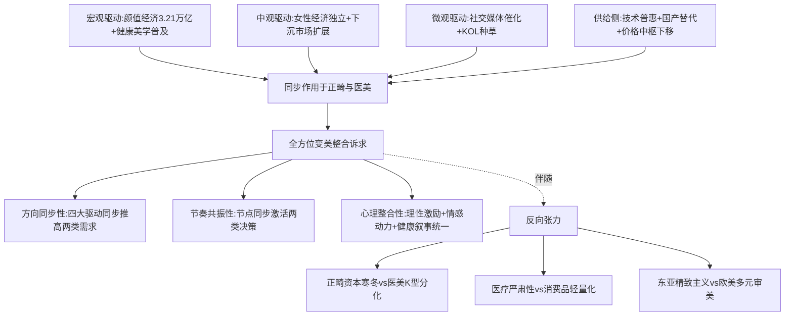

**共振的三大核心特征**：

**第一，方向同步性**——颜值经济、社交媒体、健康美学、女性经济独立四大驱动力同时推高正畸与医美两类需求，且作用方向一致而非相互抵消。颜值经济的万亿规模为两类消费提供共同的需求母体[^72]；社交媒体的内容生态将隐形矫治分享与医美前后对比打通在统一颜值叙事中；健康美学将正畸的健康属性与医美的健康升级共同纳入"颜面健康整体管理"框架；女性经济独立的可支配收入提升同时为两类消费提供物质支撑。这一同步性是"双重消费者"现象具有持续生命力的根本原因——若驱动力方向相反（例如健康美学只支持正畸而抵制医美），双重消费便无法持续扩张。

**第二，节奏共振性**——毕业季、求职期、婚礼前等节点同步激活正畸与医美两类决策。第4章已识别这些高重叠场景，本章进一步论证驱动力在这些节点的共同峰值——颜值经济在节点的注意力密度激增、社交媒体在节点的内容供给峰值（"毕业变美攻略"、"婚礼前美容计划"）、健康美学在节点的"重要事件投资"心理触发——多重驱动力在同一时间窗口形成峰值共振，将日常的低频消费转化为节点的整合性消费决策。

**第三，心理整合性**——外部理性激励（颜值经济的美貌溢价回报）、内部情感动力（悦己消费的情绪价值）、健康投资叙事（健康美学的长期资产建构）三重心理动因在同一消费决策中实现统一。这种统一意味着20-30岁女性进入双重消费时不需要在"理性vs感性"或"短期vs长期"之间做出二选一，而是在统一的心理框架下同时满足三类诉求——这一统一正是"全方位变美"整合诉求的心理本质。

**共振中的反向张力**同样不可忽视：

**张力一：正畸资本寒冬与医美K型分化的冷热分化**。第2章已论证正畸的资本退潮（爱齐科技市值3年蒸发80%+、中国口腔投融资从98亿降至35亿）与医美整体规模稳健扩张形成鲜明对照[^74]。这一冷热分化意味着，尽管驱动因素在需求侧实现共振，但资本侧的支持力度并不对称——这种不对称将影响融合的主动权归属：未来5年内，更可能从医美侧（资本充裕、商业模式更成熟）向正畸侧（需求确定、获客成本待优化）发起融合主动权。

**张力二：医疗严肃性与消费品轻量化的属性张力**。第3章已识别这一核心张力——正畸的强医疗属性（治疗周期长、决策成本高、效果延后验证）与轻医美的消费品化趋势（低门槛、高频次、情绪驱动）之间存在根本属性差异。共振虽然可以同步推高两类需求，但无法消除二者的属性差异——融合不能以"将正畸消费品化"为代价，而应通过"将医美严肃化+将正畸数字化便捷化"双向收敛来实现。南京千娇悦"3000元入场费现场升单至10万元、医美剧本杀套路"等乱象[^75]正是消费品轻量化失控的负面案例，提示融合过程必须坚守医疗严肃性底线。

**张力三：文化语境差异下的区域分化**。东亚精致主义与欧美多元审美的文化分化（5.6节）意味着同一驱动因素在不同区域的表现强度与作用方向存在差异——东亚市场的整合诉求更强但低龄化与过度医疗化风险更高，欧美市场的个性化诉求更突出但融合的客群密度可能更分散。这一区域分化要求融合战略必须在全球与区域之间保持平衡，不可简单复制单一模式。

**"全方位变美"整合诉求的形成**是上述共振机制的最终输出。该诉求具有以下三重结构特征：

| 结构特征 | 内涵 | 对应驱动 | 商业价值 |
|--------|----|--------|--------|
| 颜面整体性 | 跨皮肤、轮廓、笑容、面型的整体协调 | 健康美学+整体颜面精修 | 高客单整合方案 |
| 时间持续性 | 跨日常护理、节点冲刺、长期投资的时间分布 | 即时型悦己+发展型悦己双轨 | 客户生命周期价值最大化 |
| 心理多维性 | 颜值管理+悦己+社交+职场+婚恋五维心理动因统一 | 多重驱动力心理整合 | 多场景营销切入 |

数据来源：综合本章前六节分析整理

**与后续章节的衔接**：本章作为驱动共振分析层的开篇，其输出将为后续章节提供以下接口：

- **对第6章决策渠道分析的衔接**：本章识别的社交媒体催化、KOL影响、节点共振机制将在第6章具象化为可被打通的渠道触点（社交媒体种草入口、KOL推荐路径、节点营销切入），为渠道融合提供机制依据；
- **对第7-8章融合路径设计的衔接**：本章论证的方向同步性、节奏共振性、心理整合性为产品技术融合（口面美学一体化）、商业模式融合（机构与品牌一体化）提供需求侧驱动机制依据，识别的反向张力则为融合路径设计的边界约束提供警示；
- **对第9章风险分析的衔接**：本章识别的三大反向张力——资本冷热分化、医疗严肃性张力、文化区域分化——将在第9章风险分析中具体化为对融合战略的关键风险约束；
- **对第10章战略建议的衔接**：本章东亚精致主义与欧美多元审美的文化语境差异将作为第10章战略建议的区域差异化锚点。

通过本章对宏观、中观、微观、供给侧与文化语境五大驱动维度的系统解构，已基本回答"为什么20-30岁女性的双重消费比重正在快速增长"的核心命题——其增长不是单一因素作用，而是多重驱动力同向共振的产物；其前景不是简单线性外推，而是受冷热分化、属性张力、文化分化等反向因素约束的复杂演进。下一章（第6章）将进一步追踪驱动力的具体落地——回答"双重消费者在决策、渠道、服务体验中呈现何种交叉特征"的具体实践问题。

# 6 消费决策、渠道与服务体验的交叉特征

第5章已论证颜值经济、社交媒体、健康美学等驱动因素如何在宏观、中观、微观三层同步推高20-30岁女性的双重消费需求，并识别出"方向同步性—节奏共振性—心理整合性"三大共振特征。但驱动力到实际消费之间仍隔着一道关键环节——**消费决策与服务体验的具体链路**。若两类消费在信息获取渠道、关键决策因素、风险认知、复购节奏、服务期待等微观链路上呈现碎片化、割裂化、甚至互斥化特征，则即便驱动力高度同步，融合的渠道与服务基础也无从落地。本章因此承接驱动共振分析，将研究焦距从宏观驱动力下沉至微观决策层，回答以下递进式问题：**双重消费者在两类决策中走的是不是同一条信息路径？关注的是不是同一组核心要素？面对的是不是同一类风险结构？复购节奏是否互补？服务期待是否兼容？现存哪些渠道与服务的断点需被弥合？**

通过六节递进式分析——信息获取渠道对比（6.1）、关键决策因素的共性与差异（6.2）、风险认知与购后评价机制（6.3）、线上线下融合演进（6.4）、复购周期与服务期待（6.5）、断点识别与融合接口提炼（6.6）——最终输出可被第7-8章直接调用的渠道与服务融合机会清单，并将合规与信息失真等灰色风险识别交付第9章深化处理。

## 6.1 信息获取渠道对比：社交媒体主导下的种草—搜索—决策链路

**社交媒体已成为正畸与医美双重消费决策中信息获取的共同核心入口**。这一同构性不仅体现在内容供给端，更体现在用户行为闭环上——两类消费在"困惑触发—内容搜索—信任构建—私信咨询"链路上呈现高度一致的路径形态，构成融合渠道的最显著基础。

**小红书的"品效合一"核心阵地地位**首先在医美侧得到充分验证。《2025年小红书医美行业精准获客与营销增长白皮书》披露，小红书医美生态的核心优势集中在三大维度：**精准流量匹配，女性用户占比近七成，18-34岁主力人群与医美消费群体高度重合**；内容天然契合，UGC真实体验分享与医美消费的"信任需求"深度适配，**"医美体验"话题笔记互动率是机构广告的3倍以上**；商业闭环完善，号店一体战略与千亿流量扶持实现从社区种草到商城转化的直接衔接，**2024年短视频引流转化率达22%，远超传统搜索引擎**[^76]。这一三重优势使小红书在20-30岁女性医美决策中占据主导地位——当用户因毛孔粗大、黑眼圈等面部困扰被触发消费意识后，搜索内容、对比真实案例、私信咨询机构成为标准化决策路径，**"困惑触发-内容搜索-信任构建-私信咨询"已成为医美消费的核心闭环**[^76]。

**正畸侧的社交媒体决策路径同样高度发达**。意大利坎帕尼亚大学Vincenzo Grassia博士团队2024年发表的研究采用了一种新颖的研究方法——**通过Instagram平台分析用户分享的清晰矫治器治疗体验帖子，评估患者对aligner疗法的真实满意度**。该研究的核心方法论假设是："Instagram等平台提供了一个独特的窗口，可以实时了解患者的体验和情绪。通过分析这些帖子，我们旨在深入了解患者对清晰对准器疗法的看法，这些疗法通常是未经过滤和即时的"[^77]。这一学术研究的方法选择本身即印证了一个客观事实：**社交媒体已成为患者分享正畸体验、相互参考决策的核心信息池**——其影响力已强大到学术界也将其视为正畸患者满意度的可信数据源。Aligner正畸被研究团队定位为"牙科美容治疗发展最快的领域之一"[^77]——这一"美容治疗"的学术定位本身即体现了正畸与医美的天然耦合，进一步佐证两类消费共享同一内容生态的合理性。

**两类消费在内容种草—搜索决策—信任构建—私信咨询闭环上的同构性**可清晰呈现：

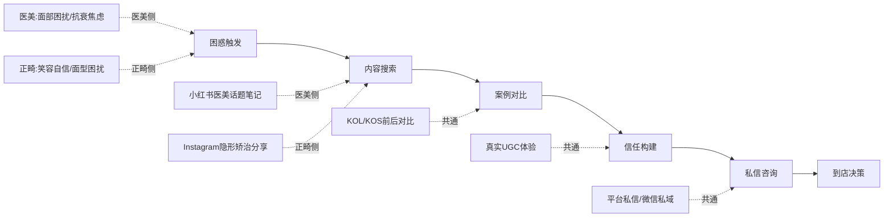

**渠道权力的代际转移**则构成两类消费共同面对的渠道格局变化。新氧作为传统医美垂直平台的代表，其核心业务的快速衰退最为显著地揭示了流量从垂直平台向社交内容平台的迁移。新浪财经数据显示，**新氧核心业务信息与预订服务在2024年收入同比锐减19.3%至9.29亿元，2025年Q1-Q3该业务营收已连续三个季度同比下滑，分别同比下降34.1%、35.6%、34.5%**[^78]。新氧自身在财报与外部分析中将下滑归因于三大结构性问题，其中之一即是"**抖音、小红书等内容平台分流客户资源，传统中介模式价值被稀释**"[^78]。这一渠道权力的转移意味着：未来正畸与医美的获客入口将更深度地集中于内容平台而非垂直平台，而内容平台的特征恰恰是不区分正畸与医美——同一KOL可同时分享自己的隐形矫治进程与皮肤管理经验，同一搜索词（如"婚礼前怎么变美"）可同时召回两类内容——这种内容生态的不区分性为渠道融合提供了客观基础。

**KOS（关键意见销售）模式的兴起**是社交媒体催化作用的最新表现。济南某网络科技工作室在2025年9月发布的行业观察显示，"医美人现在都想要做小红书KOS"，其逻辑被归纳为八个维度：**小红书的强大影响力、医美行业竞争激烈、分享真实案例建立客户信任、低门槛入驻快速实现推广、精准的用户画像和匹配、注重内容创作提升品牌形象、借助合作拓展影响力、用户互动增强用户粘性**[^79]。值得关注的是，这一KOS模式的核心价值主张——通过医生/医美人个人IP化的内容输出，建立"专业+真实"的信任感——同样适用于正畸领域。新氧在2024年企业社会责任报告中即提到"助力机构提升'**美学设计体系+线上营销+医生特色IP**'能力"[^80]，将"医生特色IP"列为机构提升能力的核心要素之一。这一医生IP化趋势在正畸与医美侧同步发生，意味着内容平台上未来将出现大量"医生个人品牌"作为同时承接两类咨询的入口。

**爱齐科技自身的渠道布局**进一步印证社交媒体决策路径的同构性。爱齐（上海）商贸有限公司公开的《个人信息处理规则》披露其数字触点矩阵包括"**隐适美官方网站、APP（隐适美APP）、社交应用公众号、隐适美会议管理平台、爱齐微课堂小程序、H5页面及小程序（隐适美小程序）**"，其中专门为消费者设计的"**微笑测试**"功能要求收集"您的身份（青年人、成年人或者为孩子寻求解决方案的父母）、姓名、电子邮箱、手机号码、治疗阶段"等信息[^81]。这一"微笑测试→定位合作医疗机构→预约诊所"的数字化决策漏斗与医美侧"AI测肤→种草内容→机构匹配→线上预约"漏斗在结构上完全对称——意味着两类消费的数字化获客链路已具备技术层的同构基础。

| 信息获取维度 | 医美决策链路 | 正畸决策链路 | 同构性评估 |
|-----------|----------|----------|---------|
| 主导平台 | 小红书、抖音 | Instagram、小红书 | **强同构** |
| 用户画像 | 女性近七成、18-34岁主力 | 18-34岁青年成人主力 | **强同构** |
| 内容形态 | UGC体验+前后对比+KOL/KOS | UGC体验+治疗进程+患者分享 | **强同构** |
| 决策闭环 | 困惑→搜索→信任→咨询 | 困惑→搜索→信任→咨询 | **强同构** |
| 数字化漏斗 | AI测肤→种草→预约 | 微笑测试→定位→预约 | **强同构** |
| 垂直平台地位 | 新氧信息预订收入Q3-34.5% | 无明显垂直平台 | 差异（医美下滑、正畸缺位）|

数据来源：综合搜索结果整理[^76][^77][^78][^81]

**关键洞察**：社交媒体作为渠道融合的最显著触点，其同构性不是偶然现象，而是源于两类消费的共同核心客群（年轻女性）、共同信任需求（真实UGC体验）、共同决策模式（种草—搜索—咨询）。这意味着，**未来融合机构若能在小红书等平台构建"颜面整体美学"的统一内容矩阵——同一医生IP同时输出正畸与医美内容、同一品牌账号同时种草双类项目、同一AI测试同时评估牙齿与皮肤——将能够以最低边际成本实现客群的跨业转化**。这一渠道融合机会将在第8章具体化为"医生IP矩阵+整合性内容种草矩阵"的商业模式设计。

## 6.2 关键决策因素的共性与差异：安全、价格、医生资质、机构口碑

锁定决策因素层，本节系统比较两类消费在关键决策因素上的权重分布，识别共性维度与差异维度。

**第3章已建立医美决策因素的核心数据底座**：京东2000人调研显示**安全性（54.7%）、价格透明（38.7%）、医生资质（35.6%）成为消费者首要关注的三大决策因素**。本章进一步将这一框架与正畸侧决策因素进行对照。

**长春艾尔莎医美案例**为两类消费的共同决策标准提供了一个具象化锚点。该机构在医美口碑榜中位居榜首的核心竞争力可归纳为七大差异化要素，下表呈现其与行业平均水平的对比：

| 对比维度 | 艾尔莎医美 | 行业平均 | 行业痛点 |
|--------|---------|--------|--------|
| 机构成立年限 | 9年 | 3-5年 | 新机构缺乏长期沉淀 |
| 客户满意度 | 98%以上 | 50%-75% | 复购率低、口碑积累慢 |
| 转介绍占比 | 60%以上 | 20%-30% | 营销获客而非口碑驱动 |
| 医生从业经验 | 10年以上 | 3-6年 | 经验不足影响审美判断 |
| 设备产品验真 | 全系可验真 | 30%机构支持 | 仪器来源不明 |
| 价格透明度 | 方案零加价 | 部分术中加价 | 隐形消费频发 |
| 服务体系 | 全周期管理 | 链条不完整 | 售后缺失 |

数据来源：长春医美机构对比数据整理[^82]

这一七维度评估体系揭示出**当代医美消费者已形成"以医生从业经验、设备产品验真、价格透明度、全周期服务体系为核心的高优先级评估标准"**[^82]。值得深入分析的是：**这套评估标准与正畸消费决策的核心关注点高度同构**——正畸消费者同样关注医生跨学科经验（特别是涉及面部、颌骨发育、关节、气道的综合判断能力，正如第3章已引述的徐子卿博士观点）、矫治器/耗材的正品溯源（特别是经历了2019年海狸家无证牙套案三倍赔偿判例后，消费者对器械合规性的敏感度显著提升）、价格透明度（特别是2025年国家医保局《口腔类医疗服务价格项目立项指南》推动正畸价格规范化背景下）、全周期服务（包括术前面诊、术中跟踪、术后保持器维护2-5年）。

**共性维度**因此可凝练为四组：

**第一组：医生资质与从业经验的极高权重**。两类消费的消费者均高度依赖医生专业能力——这与轻工消费品的"品牌主导决策"形成鲜明对照。艾尔莎"医生平均从业经验10年以上""详细分析顾客面部骨骼、肌肉动态、皮肤层次及个人气质，再结合期望值设计个性化美学方案，不会为了成交而过度承诺"[^82]的案例，可直接平移至正畸领域。前已引述的"医生IP化"趋势（新氧的"美学设计体系+线上营销+医生特色IP"建设、小红书KOS模式）正是对这一共性需求的供给侧响应——医生作为决策核心，其个人IP的影响力直接决定了客群的转化效率。

**第二组：设备与产品的正品验真**。艾尔莎"机构内陈列着BBL HERO、帝医思黄金微针、超玛吉（射频紧肤）等多台国际一线医美仪器，每台仪器均经过官方授权，支持现场扫码验真"[^82]——这一"扫码验真"的服务设计已成为高端医美机构的标配。正畸侧的同类需求同样强烈：海狸家案显示厂家无第二类医疗器械生产资质即可售卖矫治器、涉及近500消费者三倍赔偿，由此推动消费者对正畸器械的合规认证敏感度大幅上升。**这一共性意味着资质与产品的双轨验真体系可在两类消费间共享建设**——同一扫码验真平台同时支持医美仪器与正畸矫治器的正品认证，是融合机构降低消费者信任成本的关键基础设施。

**第三组：价格透明度的高度敏感**。艾尔莎"方案确认后零加价"vs行业"部分机构存在术中加价"的对比[^82]，揭示出价格不透明已成为消费者最核心的痛点之一。第5章已引述的"南京千娇悦3000元入场费现场升单至10万元、医美剧本杀套路"反向印证了这一痛点的严重性。在正畸侧，2025年国家医保局《立项指南》101项规范化将倒逼定价透明，方向上与医美的价格透明诉求一致。

**第四组：全周期服务体系的统一期待**。艾尔莎"从预约→治疗→术后回访的全周期管理"[^82]与正畸"术前面诊→治疗中跟踪→术后2-5年保持期"的全周期需求在结构上高度对称。新氧"轻医美连锁品牌围绕服务前中后三大阶段，建立起350余个服务SOP"[^80]的实践，证明全周期SOP化已是行业头部机构的能力标配——这一SOP体系完全可被正畸机构借鉴并扩展至更长治疗周期。

**差异维度**则集中于以下两组：

**差异一：正畸更重视医生跨学科能力与长期医患关系**。正畸的2-3年治疗周期决定了医患关系的长程性——消费者在选择正畸医生时不仅评估其当前的技术能力，更评估其能否长期稳定地承担其治疗（医生流失率高的连锁机构是正畸消费者的核心隐忧）。第3章已引述徐子卿博士的观点："正畸是一个严谨的跨学科领域，它涉及面部、颌骨发育、关节、气道，甚至整个颜面部乃至脊柱的发育"——这一跨学科要求使得正畸医生的评估维度比单一医美项目更复杂。在医美侧，特别是轻医美，**消费者对医生的"项目熟练度"评估优先于"跨学科能力"评估**，且单次消费的关系建立短暂，长期医患关系的权重显著低于正畸。

**差异二：医美更重视即时效果与机构合规资质**。医美消费者由于决策周期短、单次反馈明显，对"即时效果"的关注权重高——艾尔莎案例中"全周期抗衰管理"虽强调长期但仍以单次或短期项目效果作为决策起点。同时，医美侧的合规风险更具体地集中在机构层面（无证执业、违规广告、违规耗材）——新氧2024年"**拦截涉嫌违规违法医美商品约75000余例、问题机构6200余次、违规或超范围执业医生9300余人次**"[^80]这一治理强度，反映出医美机构合规风险的高发性。正畸侧的合规风险虽同样存在，但更多集中于器械合规与多执业备案而非项目本身合规——风险结构存在差异。

| 决策因素 | 医美权重 | 正畸权重 | 共性/差异 |
|--------|------|------|--------|
| 医生从业经验 | ★★★（35.6%首选） | ★★★（跨学科能力额外加权） | **强共性**|
| 设备产品验真 | ★★★（艾尔莎全系验真） | ★★★（海狸家案后高敏感）| **强共性**|
| 价格透明度 | ★★★（38.7%首选） | ★★★（立项指南规范）| **强共性**|
| 全周期服务 | ★★（350+SOP） | ★★★（2-3年治疗+长期保持）| 共性（强度差异）|
| 即时效果 | ★★★ | ★ | **差异** |
| 长期医患关系 | ★ | ★★★ | **差异** |
| 跨学科能力 | ★ | ★★★ | **差异** |
| 机构合规资质 | ★★★（高发风险）| ★★（多执业备案为主）| 共性（结构差异）|

数据来源：综合搜索结果整理[^82][^80]

**共享基础设施提炼**：基于上述共性识别，三类基础设施可在两类消费间共享建设——

第一，**统一的资质背书体系**：将医生从业年限、专业认证、跨业资质等数据整合为统一的医生数字档案，同一档案可被消费者用于评估正畸与医美决策。新氧"绿宝石医生榜单"已尝试这一思路（"自创立以来获得来自专业医师、消费者、医美机构的良好反响和认可"[^83]），但目前仍局限于医美侧——未来若扩展至正畸侧将形成跨业医生IP认证体系。

第二，**整合的口碑评价体系**：消费者满意度、转介绍占比、复购率等口碑指标可在两类消费间共享统计口径与发布平台——艾尔莎"客户满意度98%以上""转介绍占比60%以上"的指标维度完全适用于正畸机构的口碑建设。

第三，**透明化的价格披露机制**：医保局正畸立项指南与医美价格透明化要求方向一致，未来可形成统一的"医疗美容服务价格披露规范"，覆盖正畸与医美两类项目，从制度层降低消费者的价格敏感度风险。

## 6.3 风险认知与购后评价机制的分化

虽然两类消费在决策因素上存在显著共性，但在风险认知层级与购后评价机制上呈现明显分化——这一分化既是融合的挑战，也是融合服务设计需重点弥合的断点。

**医美侧的风险感知结构**已在第3章界定——三大顾虑分别为安全风险（34.5%）、价格门槛（26.9%）、信息杂乱（25.4%）。这一风险结构有两个值得深入剖析的特征：

**特征一：轻医美"消费品化"心态导致整体风险感知偏低**。"99元水光针"的极限内卷叙事使得消费者在低价项目上倾向于淡化医疗风险——"一顿火锅的钱"的价格锚定将医美与消费品类比，模糊了其医疗本质。但医美仍是医疗行为，潜在风险并未因价格下降而消失。

**特征二：信息杂乱（25.4%）作为独立顾虑的存在**反映出消费者对内容真实性的普遍焦虑。前已引述的"医美剧本杀""虚假前后对比""隐性广告"等问题，使得消费者即便愿意消费也面临"如何识别真伪"的认知负担。

**正畸侧的风险感知结构**则呈现完全不同的层级。受"正畸是医疗行为而非消费品"的专业话语影响，消费者对正畸风险的认知更接近传统医疗——核心顾虑包括拔牙不可逆、矫治效果延后2-3年才能完整呈现、矫治失败的可能性、医生中途流失、长期医患关系不稳定等。这种**风险感知更高+反馈周期更长**的特征，意味着正畸消费者愿意为"严肃医疗背书"支付更高的信任溢价。

**新氧的平台治理实践**为降低医美风险感知提供了系统性的基础设施。其2024年企业社会责任报告披露的关键治理数据包括：

- **平台投诉48小时解决率为98.13%，投诉解决满意度为98.57%**[^80]；
- **2024年对商家服务规范要求进行了6次迭代，拦截涉嫌违规违法医美商品约75000余例、问题机构6200余次、违规或超范围执业医生9300余人次**[^80]；
- **加入中消协"智慧315平台"，在中消协指导下，优先通过该平台，协商解决消费纠纷**[^80]；
- **轻医美连锁品牌建立350余个服务SOP，对医生进行严格的培训及考核**，**用户满意度4.98分（满分5分），用户复购率超过60%**[^80]。

这一治理体系的核心价值在于：**通过平台规则、SOP标准化、投诉协调机制三重路径，将分散的医美风险纳入可量化、可追溯、可弥补的治理框架**，从而降低消费者的整体风险感知。这一基础设施完全可被复用至正畸领域——正畸的器械合规审核、医生多执业备案核验、治疗中途变更的权益保障等环节，与医美的违规商品拦截、违规医生处置在治理逻辑上同构。

**购后评价机制的分化**则体现两类消费的本质差异。医美侧的购后评价具有"反馈快、可视化、可比较"特征——消费者可在数日至数周内通过自身体验、镜中观察、社交分享形成完整评价。新氧"投诉48小时解决"的高时效性即建立在这一即时评价反馈机制之上。

正畸侧的购后评价则呈现"长期延后+逐步完成+难以横向比较"特征——消费者对正畸效果的最终评价需在治疗结束后2-3年才能完整形成，期间的中间评价（佩戴舒适度、医生沟通、阶段性进展）具有较强主观性。Grassia博士团队的Instagram研究方法本身即反映了这一困境——传统问卷难以捕捉患者2-3年间的真实情绪变化，研究者不得不转向社交媒体数据以获得"未经过滤和即时"的患者反馈[^77]。

**购后评价的滞后性**对正畸消费的影响是双重的：一方面，它使得消费者在决策时更依赖前置信息（医生口碑、机构资质、案例对比），增加了对决策准确性的要求；另一方面，它降低了"后悔成本传导"的速度——一位消费者若对正畸结果不满，其负面评价的扩散速度远低于医美的即时分享，机构因此承受的舆情压力存在时滞。这一时滞特征既是正畸机构相对医美机构在舆情管理上的"红利"，也是消费者权益保护需要弥补的短板。

| 风险与评价维度 | 医美侧特征 | 正畸侧特征 | 融合接口 |
|----------|--------|--------|--------|
| 整体风险感知 | 偏低（消费品化心态）| 偏高（医疗严肃性）| 两侧需双向收敛 |
| 核心风险源 | 安全、价格、信息杂乱 | 不可逆、效果延后、医患长期 | 互补防控 |
| 评价反馈速度 | 快（数日-数周）| 慢（2-3年）| 时间分层评价机制 |
| 治理基础设施 | 新氧平台SOP+投诉机制成熟 | 相对碎片化 | 医美治理体系可被正畸借用 |
| 平台对接 | 中消协智慧315平台 | 暂无类似对接 | 跨业平台对接是机会 |
| 售后保障 | 短期补救+商品退换 | 长期保持+矫治调整 | 全周期保障合并设计 |

数据来源：综合搜索结果整理[^77][^80]

**关键洞察**：医美侧已建立的"平台治理+SOP标准化+投诉协调+保障基金"的风险防控基础设施，是正畸侧目前所缺乏的。**融合服务模式可将这套基础设施延伸至正畸——同一平台同时承担两类消费的风险防控，同一SOP体系覆盖两类项目的全流程标准化，同一投诉协调机制处理两类纠纷**。这一基础设施的复用不仅可降低融合机构的合规成本，更可在消费者侧建立"一站式信任背书"——这一融合机会将在第8章商业模式融合中具体化。

需要审慎指出的是，新氧自身在2024-2025年面临核心业务衰退（信息与预订服务连续三个季度同比下降34%以上）[^78]——治理基础设施的构建并不直接转化为商业成功。这意味着，融合机构在借鉴新氧治理框架时，必须同时反思其商业模式的局限性，避免单纯复制治理而忽视盈利模型设计。

## 6.4 线上线下融合模式的演进与渠道触点打通

承接6.1节社交媒体渠道分析，本节进入更宏观的线上线下融合维度，剖析两类消费在线上引流—线下交付链路上的演进路径与可被打通的渠道触点。

**医美侧的线下重资产化趋势**是2024-2025年最显著的渠道格局变化。这一趋势在三个维度同步呈现：

**维度一：垂直平台向自营连锁延伸**。新氧2025年第三季度财报数据显示，**美容治疗服务业务（即轻医美连锁业务）创收同比增长305%至1.84亿元，营收占比约47.5%**[^78]。新氧"青春诊所"作为这一战略的核心载体，已实现从早期20多家、2025年中扩张至56家、年底目标85家的快速布局，**平均每月开店3-4家**[第2章已论证]。这一从平台向自营线下的延伸，本质是垂直平台对"流量转化效率衰减"的应对——当用户决策路径越来越多地从垂直平台向小红书、抖音迁移，平台的中介价值被稀释，向下游获取流量主权成为必然选择。

**维度二：传统医院与公立三甲下场入局**。界面新闻引述国家卫生健康委数据显示，**全国已有超200家三甲医院设立独立医疗美容科室，较2019年增长320%**[^84]。重庆医科大学附属永川医院医疗美容中心于2024年正式投入运营，是渝西地区公立三甲医院直属医美机构的标杆。公立医院入局的核心驱动力包括：**顺应市场需求、消费者对安全性与专业性的更高要求、医院多元化发展路径**[^84]。这一"正规军"入场为医美侧提供了医疗严肃性的强力背书，也客观上抬高了非合规机构的生存门槛。

**维度三：私立医院全产业链布局**。以美中宜和妇儿医院为例，"从产科的孕产服务为发展切入点，向上下游业务延展，在全产业链战略规划下，发力以试管婴儿为主的上游生殖领域和下游产后、妇科、儿科、医疗美容领域"[^84]——通过将医美纳入女性全生命周期服务闭环，实现业务板块的协同效应。这一全周期闭环为融合服务模式提供了重要参照——同一医疗集团可同时承担产科、儿科、妇科、医美等多业务，那么承担正畸+医美的双业务在结构上更易于实现。

**正畸侧的数字化触点闭环**则呈现完全不同的演进路径。爱齐科技的数字化触点矩阵（前已引述）包括隐适美官方网站、APP、社交应用公众号、隐适美会议管理平台、爱齐微课堂小程序、H5页面及小程序，配合**iTero口腔数字印模仪**这一物理化的数字化入口[^81]。这一矩阵构建了一个"线上引流→数字化扫描→医生面诊→定制矫治器→线下交付"的完整闭环。值得关注的是，iTero口扫仪作为线下诊所的核心设备，本身既是临床工具又是营销工具——**消费者在体验iTero扫描的瞬间即可获得自己未来牙齿的3D可视化预览，这一"未来自己"的可视化对决策的催化效应远超传统X光片**。

**两类消费的链路同构性**集中体现于"线上种草+线下交付"模式的高度对称：

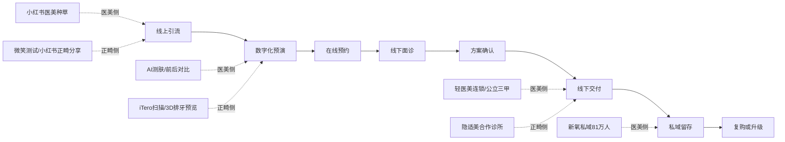

**爱齐科技与新氧的数字化触点对比**进一步揭示同构性：

| 数字化触点 | 爱齐科技正畸侧 | 新氧医美侧 |
|---------|-----------|---------|
| 用户身份识别 | 微笑测试青年/成年/家长[^81] | 用户画像分级 |
| 视觉预演 | 微笑测试可视化、iTero 3D[^81] | AI测肤、AI客服[^80]|
| 线下定位 | 定位合作医疗机构[^81] | 私域留存81万人[^83]|
| 在线预约 | 预约诊所表单[^81] | 平台预约+连锁门店 |
| 内容运营 | 隐适美APP+爱齐微课堂[^81] | 短视频引流转化率22%[^76]|
| 私域沉淀 | 社交应用公众号 | 私域留存81万、环比+14%[^83]|

数据来源：综合搜索结果整理[^76][^80][^83][^81]

**可被打通的渠道触点**因此可清晰提炼为四组：

**第一，社交媒体内容入口**：小红书等内容平台已成为两类消费共享的种草入口，融合机构可在同一品牌账号下输出整合性内容；

**第二，AI预演技术**：iTero微笑测试、AI测肤、3D面部建模等技术在产品架构上具有同源性，未来可整合为"颜面整体AI预览"——同时呈现牙齿矫治后+皮肤管理后+轮廓塑形后的复合可视化效果；

**第三，线上预约+线下诊所网络**：爱齐"定位合作医疗机构"功能与新氧"门店预约"功能在用户体验上完全对称，融合机构可共享同一预约系统、同一门店地图；

**第四，私域留存基础设施**：新氧私域81万人、复购率超60%[^80][^83]的运营经验，可被复用至正畸的长治疗周期客户管理——正畸的2-3年治疗周期天然适合私域深耕，且治疗中并发的60%-80%医美消费（第4章测算）可在私域内实现自然导流。

**关键洞察**：医美侧的"轻医美连锁化+公立三甲入局"重资产化趋势，与正畸侧的"数字化触点完整闭环"已构成线下交付能力与线上数字化能力的两个互补优势。**未来融合机构若能"借医美的线下重资产承载力+借正畸的数字化精细化触点设计"，将能够构建出比单一行业更高效的获客与转化漏斗**。京东医美亦庄店"口腔+医美+体检+中医同址"的一站式综合诊所模式（即其他参考信息中识别的P1路径）正是这一融合的早期样本。

需要审慎指出的是，新氧自营线下连锁飙升305%的同时仍处亏损状态[^78]，且其低价策略已"直接击穿了上游厂商苦心维护的价格体系，已导致其与多家主流供应商关系破裂，被部分厂商列入'非官方合作'名单、甚至被部分厂商断供"[^78]。这一案例警示融合机构：线下重资产化需有可持续的盈利模型支撑，否则规模扩张反而加速亏损。

## 6.5 复购周期、服务期待与生命周期价值的交叉特征

锁定客户生命周期维度，本节剖析两类消费在复购周期、服务期待上的差异化结构，识别生命周期价值的天然互补性。

**医美侧的高频小额复购特征**已得到充分验证。新氧2024年报告显示**轻医美连锁品牌用户满意度4.98分（满分5分），用户复购率超过60%**[^80]——这一60%以上的复购率意味着平均每位轻医美用户每年会进行多次消费。第3章已论证医美的即时型悦己属性——单次成本99元至数千元、反馈周期数日内显现、复购周期高频小额——这一节奏天然适合"日常护理仪式感+节点冲刺组合"的双层服务设计。

**新氧私域运营的精细化**进一步揭示医美客户生命周期的可深耕性。截至2024年第二季度，**新氧私域留存用户数达到81万人，环比增长14.0%**[^83]，新氧"通过多渠道联动，积极拓展和沉淀精准的医美私域用户，并用精细化运营提升用户粘性和商业化效率"[^83]。这一私域+精细化运营模式本质上是将医美客户从"项目购买者"转化为"长期服务订阅者"——客户生命周期价值（LTV）由单次客单价转化为多年累计消费。

**正畸侧的低频长程特征**则呈现完全不同的生命周期结构。隐形矫治的典型客户生命周期可拆解为：**决策评估期（3-6个月）→主治期（2-3年）→保持期（5年以上）→可能的复发再矫治（10年后）**——总计可达10-15年的长程生命周期。这一长程结构虽不具备医美的高频复购特征，但具有更稳定的客户粘性——一旦客户完成正畸主治，其与机构/医生的关系往往延续至保持期甚至终身复诊。

**两类消费在生命周期上的天然互补性**集中体现于以下三组数据：

**第一组：正畸长治疗周期内并发的医美高频消费**。第4章已估算正畸进行期内并发医美消费的比例约为**60%-80%**——这一比例显著高于一般人群。其内在逻辑是：正畸的2-3年治疗周期内，消费者并不会"暂停"医美消费，反而因笑容呈现暂时受限而强化对皮肤管理、抗初老等"非牙齿"美学维度的关注。这意味着，**对融合机构而言，每一位正畸客户都是2-3年内60%-80%概率的医美高频客户——客户获取成本可在两类消费间分摊，单一客户的LTV远超分立运营**。

**第二组：医美客户向正畸升级的导流路径**。新氧"青春诊所"年轻职场女性客群的医美高频习惯，可通过"渐进式升级"导入正畸——从光子嫩肤、水光针等低门槛项目入门，建立医疗美容机构的信任感与消费习惯，再向正畸升级投资。第4章已论证医美先行→正畸跟进的决策模式约占25%-35%，验证这一导流路径的客观存在。

**第三组：节点驱动型整合消费**。第4章已识别毕业季、求职期、婚礼前等高重叠场景。在这些场景中，正畸+医美的整合消费打破了日常的"分立购买"模式，呈现"全周期颜面美学方案"的整合形态。婚礼前场景尤为典型——消费者需在婚礼前1.5-2年启动正畸（决策远早于婚期），并在婚礼前6个月密集投入医美（玻尿酸、热玛吉、皮肤管理）以保证当日状态——这一整合需求构成融合机构最高客单价、最高利润率的核心场景。

| 生命周期维度 | 医美侧 | 正畸侧 | 互补/差异 |
|-----------|-----|-----|--------|
| 复购周期 | 高频（年均多次）| 低频（一次主治+保持）| **互补** |
| 单次客单 | 99元-数千元 | 数万-十几万元 | **互补** |
| 客户粘性 | 项目级粘性 | 治疗+医生级长程粘性 | **互补** |
| 服务期待 | 即时见效+情绪价值 | 专业医患关系+长期效果 | 共性核心+差异强度 |
| 生命周期长度 | 1-N年（终止灵活）| 10-15年（含保持复诊）| 正畸更长 |
| LTV结构 | 累积小额 | 一次大额+边际维护 | **天然组合** |

数据来源：综合搜索结果整理[^80][^83]

**全周期颜面美学管理的服务设计机会**因此可基于上述交叉特征清晰呈现：

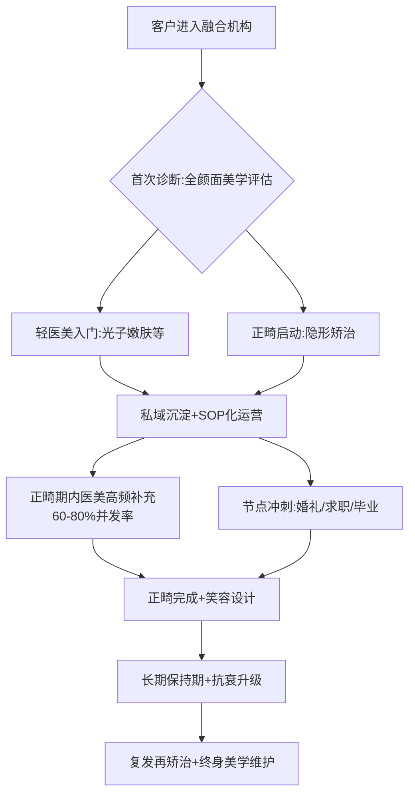

这一服务模式的核心创新在于：**以"颜面整体美学"为客户认知锚点，将正畸的长治疗周期作为"骨架"承担客户长期粘性，将医美的高频消费作为"血肉"承担日常运营现金流，将节点冲刺作为"高光时刻"实现客单价峰值**。三者结合可使单一客户的生命周期价值达到分立运营的2-3倍——这一价值倍增是融合机构相对单一行业机构的最核心优势。

第3章统一需求图谱已揭示该群体"愿为美投入但精打细算"的双重特征对应"心理账户分离+双轨并行"机制——正畸归"长期投资"账户、医美归"日常仪式感"账户、节点归"重要事件"账户。**生命周期价值最大化的关键在于：服务设计必须尊重三账户分离机制，避免将正畸客户强行打包为高频医美客户，亦避免将医美客户强行升级为单次大额正畸客户**——融合的本质是"在尊重客户心理账户的前提下提供整合性服务"，而非"通过整合性销售突破客户心理账户限制"。

## 6.6 渠道与服务断点识别及融合接口提炼

综合6.1-6.5节的对比分析，本节系统识别两类消费在渠道与服务体验中尚存的五大断点，并提炼可融合的接口。

**断点一：信息断点——正畸与医美内容生态分立**。尽管社交媒体渠道在两类消费中具有强同构性（6.1节），但内容生态层仍存在分立——同一KOL虽可同时输出两类内容，但搜索算法、话题分类、内容标签仍按"医美""正畸"二分。消费者在搜索"婚礼前怎么变美"等综合诉求时，往往需要分别在两类内容下检索，难以获得整合性方案。新氧"医生特色IP"建设虽已意识到IP化趋势，但其IP定位仍偏医美侧，正畸医生IP的同步建设相对滞后。**融合接口：构建"颜面整体美学"统一内容矩阵——同一医生IP同时输出双类内容、同一品牌账号承载整合性方案、同一AI测试同时评估正畸+医美需求**。

**断点二：资质断点——医生资质与机构合规的双轨认证**。当前医生资质认证体系按业务条线分离——正畸医生的口腔医师资格证+正畸专业认证，医美医生的执业医师资格证+医疗美容主诊医师证。这一双轨认证使得"同时具备正畸与医美能力"的复合型医生在认证体系上缺乏明确路径——多执业备案的合规壁垒在前已述及。机构层面同样如此——医美机构需医疗美容科备案，口腔机构需口腔科备案，跨科执业需逐一注册。**融合接口：推动"统一颜面美学专业认证"体系——在现有专科认证基础上叠加"跨业整合美学"认证，同时简化多执业备案流程**——这一接口涉及监管创新，将在第9章风险分析中重点讨论。

**断点三：数据断点——消费者画像与治疗档案的跨业打通障碍**。消费者在医美机构的画像数据（皮肤类型、过敏史、注射部位、产品偏好）与在正畸机构的治疗档案（牙齿排列、咬合关系、矫治进度、保持器佩戴）之间几乎不存在数据互通——即便同一消费者，两类档案也分别存储于不同机构、不同系统。这一数据隔离使得整合性服务难以基于完整客户画像设计。爱齐"个人信息处理规则"中已涉及"个人面部特征的照片或视频信息"的收集[^81]，但其使用范围限于隐适美产品场景；新氧的私域留存81万用户数据[^83]同样限于医美场景。**融合接口：构建"颜面整体健康档案"——在严格遵守《个人信息保护法》的前提下，建立消费者授权式的跨业数据共享机制，同一档案可被两类机构在客户授权下访问，但避免数据滥用与合规风险**。

**断点四：售后断点——医美短期售后与正畸长期保持的衔接缺失**。医美侧的售后服务以48小时投诉响应、商品退换、消费纠纷协调为核心（新氧投诉48小时解决率98.13%[^80]），正畸侧的售后服务以保持器维护、复诊调整、复发再矫治为核心——二者在时间尺度与内容形式上几乎无重叠。这一断点意味着，融合机构若同时承担两类业务，需同时建设两套差异显著的售后体系，运营复杂度激增。**融合接口：设计"全周期颜面美学保障"——即时型保障（医美投诉协调、商品验真、效果纠纷）与长期型保障（正畸保持、定期复诊、抗衰升级）合并为同一会员服务，按消费类型分层激活**。璟炜生物创哒薇医用凝胶敷料的"医美术后修护全链条服务"案例[^85]提供了一个早期样本——其"合规为基、供应链赋能、服务增值"的全链条思路，可被扩展至正畸-医美融合服务的全周期保障设计。

**断点五：合规断点——监管框架在融合服务模式下的灰色地带**。这是五大断点中最具挑战性的一类。新氧低价策略导致的上游厂商断供[^78]、南京千娇悦"医美剧本杀"等合规乱象、海狸家无证牙套案三倍赔偿判例（其他参考信息）等案例反复警示——融合服务模式可能在监管尚未完全覆盖的灰色地带产生新风险：

- **跨业医生执业的合规边界**：一位同时持有口腔与医美主诊资质的医生，能否在同一物理空间同时开展两类项目？多执业备案是否需要分别注册？
- **跨业耗材采购与供应链管控**：医美耗材与正畸耗材的器械分类不同（医美玻尿酸属III类，正畸矫治器属II类），合并采购的合规边界？
- **跨业广告与内容营销**：同一品牌账号同时推广正畸与医美，是否触犯广告法对医疗广告的分类管理？
- **跨业价格披露与术中加价禁令**：2025年医保局《立项指南》对正畸价格的规范化要求，与医美侧的价格透明化要求如何在融合机构中统一披露？

**融合接口：合规化全周期服务SOP**——融合机构需主动构建超越现有监管要求的内部合规标准，将正畸与医美的合规要求取最严上限作为机构运营底线；同时积极参与行业协会与监管机构的标准制定，推动跨业整合服务的监管框架完善。

下表系统呈现五大断点与五个融合接口的对应关系：

| 断点类型 | 现状描述 | 融合接口 | 优先级 |
|--------|--------|--------|------|
| 信息断点 | 内容生态二分、搜索算法分立 | 颜面整体美学统一内容矩阵 | **高** |
| 资质断点 | 医生与机构双轨认证 | 统一颜面美学专业认证体系 | 中（涉监管）|
| 数据断点 | 消费者档案跨业不通 | 授权式颜面整体健康档案 | **高** |
| 售后断点 | 短期vs长期售后衔接缺失 | 全周期颜面美学保障会员体系 | **高** |
| 合规断点 | 跨业监管灰色地带 | 合规化全周期服务SOP | 极高（涉风险）|

数据来源：综合本章前五节分析整理

**与后续章节的衔接接口**：本章作为决策与服务交叉特征分析层的核心环节，其输出将为后续章节提供以下三组接口：

**对第7章产品技术融合的衔接**：本章识别的信息断点与数据断点（颜面整体内容矩阵、跨业健康档案）将在第7章具体化为"AI微笑设计+面部建模+口面美学一体化数字诊疗"的产品技术形态——爱齐科技微笑测试与iTero口扫的现有数字化基础设施[^81]、新氧AI客服在285家医美机构的应用经验[^80]，将作为产品技术融合的两大现有起点；同时，第7章将进一步剖析正畸-修复-种植联合治疗、笑容设计等新兴产品形态如何依托数字化基础设施跨越业务边界。

**对第8章商业模式融合的衔接**：本章识别的渠道触点打通（社交媒体、AI预演、线上预约、私域留存）、生命周期价值互补、售后断点弥合，将在第8章具体化为机构融合（口腔医美一体化诊所，参照京东医美亦庄店、新氧"青春诊所"延伸）、品牌融合（跨业医生IP矩阵+整合品牌账号）、会员体系打通（全周期颜面美学订阅）、保险产品融合（齿险+医美险整合）等商业模式创新。第8章亦将基于本章第6.5节识别的"60%-80%并发率"为机构融合的客户生命周期价值测算提供实证锚点。

**对第9章风险分析的衔接**：本章识别的合规断点（监管灰色地带）、新氧低价策略引发的供应链断供、医美剧本杀等乱象，将在第9章具体化为融合面临的合规风险、医疗质量风险、伦理风险、商业纠纷风险——其他参考信息已系统整理的SmileDirectClub兴衰、海狸家案、江阴牙博士案等典型案例将为第9章风险防控关键节点提供具体警示。

需要审慎指出的是，本章对"断点—接口"的分析建立在对现有数据与案例的归纳之上，**对融合可行性的最终判断仍需第9章对监管、医生资质、医疗风险等核心约束的深入剖析**，以及第10章对短期、中期、长期三阶段演进路径的情景分析。本章不构成对融合可行性的最终结论，而是为后续章节提供决策侧与服务侧的实证依据。

通过本章对信息渠道、关键决策因素、风险认知、线上线下融合、复购服务期待、断点接口的系统对比与提炼，已基本回答"双重消费者在决策、渠道、服务体验中呈现何种交叉特征"的核心命题——其交叉特征呈现"种草决策强同构、关键因素三共性两差异、风险认知与售后机制分化、线上线下能力互补、生命周期价值天然组合"的复杂格局；可融合的接口虽已清晰但仍受合规与数据等关键断点约束。下一章（第7章）将进一步深入产品技术层——回答"数字化、AI、3D打印等技术如何为口面美学一体化提供底层支撑"的核心问题。

# 7 产品与技术融合：从隐形矫治到口面美学一体化

第6章已系统识别双重消费者在决策、渠道、服务体验中的交叉特征——种草决策强同构、关键决策因素三共性两差异、风险认知与售后机制分化、线上线下能力互补、生命周期价值天然组合——并提炼出五大断点（信息、资质、数据、售后、合规）与对应融合接口。然而，渠道与服务层的融合最终需要产品技术层的底层支撑——若两类消费在数字化基础设施、制造工艺、AI算法、临床诊疗SOP上仍处于完全分立的技术孤岛，那么"颜面整体美学一体化"将停留于营销话术而无法落地为可规模化交付的真实服务。本章因此将研究焦距下沉至产品技术层，回答"**数字化、AI、3D打印等技术如何为正畸与医美的口面美学一体化提供底层支撑**"这一核心命题。

在论证逻辑上，本章遵循"基础设施—制造工艺—智能算法—临床产品形态—头部品牌路径—成熟度评估"的递进结构，并始终保持三层区分：**技术上可行**（实验室或单点应用已实现）、**临床上成熟**（已有规范化诊疗SOP与多中心验证）、**商业上可规模化**（可在头部机构以外低门槛复制）——这一分层避免对技术融合前景的单向乐观判断。本章亦明确接受第1章Rubric标准P-5的多维约束：每一融合路径假设都需通过技术可行性、商业可行性、监管合规性、消费者接受度四维交叉检验，任一维度存在重大障碍则在结论中明示。

## 7.1 数字化基础设施的共通性：口腔扫描、面部建模与AI诊断的跨业同源

承接第6章识别的"数据断点"与"AI预演技术"融合接口，本节首先论证正畸与医美修复在数字化基础设施上的同源性——这种同源性是产品技术融合最深层、也最容易被忽视的基础。

**底层技术栈的共通性**集中体现在三维扫描、计算机视觉、深度学习算法、图像处理四类技术的跨业共享。正畸侧的核心入口是口内三维扫描——爱齐科技的iTero Element口扫仪允许医生"快速精准地完成牙齿的3D数字扫描，并为患者量身定制治疗方案"[^86][^87]，3Shape TRIOS则将这一扫描能力进一步延伸至"微笑设计"工作流——"当前TRIOS微笑设计工作流程平均需要4分钟，存储数据；拍照片后，您可进行设计并将设计传送给患者"[^88][^89]。值得关注的是，3Shape TRIOS Smile Design的设计逻辑并非局限于牙齿排列模拟，而是要"生成一个逼真的模拟口内情况，还原最真实的口内情况"，并"将诊所的标志添加到扫描件中，为微笑设计打上品牌"[^88][^89]——这意味着同一台口扫设备同时承担了正畸数字印模、修复美学设计、患者沟通可视化三类功能，已天然跨越正畸与美学修复的业务边界。

医美修复侧的代表性数字化工具是DSD（Digital Smile Design，数码微笑设计）。鞍钢总医院口腔医院的临床案例显示，DSD是"借助计算机技术，综合运用美学原则，进行可视化口腔美学分析设计的新方法"，其核心操作流程包括"面部美学分析、数字面弓确定中线、笑线、牙长轴线、外形顶点、确定前牙龈缘高度、长宽比例、大小比例，绘制牙齿形态曲线完成美学设计"[^90]。这一流程的关键启示在于：**DSD并非单纯的牙齿设计工具，而是面部美学分析+牙齿形态设计的整合性平台**——其中"面部美学分析"环节与传统医美的面部建模在技术目标上完全重合。武汉大学口腔医院修复科蒋忠伟团队发表的"上颌前牙微创美学修复"病例进一步验证了这一整合性：在一例31岁女性患者的治疗中，"通过术前数字化微笑设计（DSD）、诊断蜡型制作、Mockup、医患双方沟通确认美学效果后，根据诊断蜡型制作数字化冠延长手术导板，精确指导牙龈切除及骨修整量"[^91]——DSD在此承担了从面部分析到牙周冠延长手术导板生成的全流程数字化中枢角色。

**AI在口腔美学领域的算法成熟度**为基础设施同源性提供了学术层面的最高规格背书。陈江教授发表于《中华口腔医学杂志》2025年第60卷第04期的综述《人工智能在口腔美学中的应用与未来》系统梳理了AI在牙齿形态设计、微笑动态分析、个性化治疗中的核心应用[^92]。综述指出："基于深度学习的AI模型在牙齿的自动分割和识别方面取得突破性进展。通过CNN，AI模型能自动分割牙齿的各个结构，包括牙冠和牙根，并能分辨牙齿之间的排列与邻接关系"；在牙齿形态生成方面，"GAN已被广泛应用于逼真牙齿模型的生成。Tian等提出一种两阶段GAN用于高精度牙冠修复，第一阶段重建牙冠的整体几何形状，第二阶段改进牙冠细节，尤其是面的凹槽、边缘和纹理"，且"3D-DCGAN设计的牙冠咬合接触点数量和接触面积与天然牙非常相似"[^92]。这些算法本身具有显著的跨业延展性——同样的CNN分割逻辑可用于皮肤分层识别，同样的GAN生成框架可用于面部轮廓的术前预览模拟。

**AI生成vs传统DSD的临床接受度**则得到独立横断面研究的验证。Kaushik等在《BDJ Open》2025年发表的研究招募320名参与者（牙科学生、牙医、非牙科专业人员），通过Exo-CAD软件创建四个临床病例的微笑设计，比较"传统手工设计"与"AI自动设计"的美学偏好[^93]。研究核心结论是：**"在性别、年龄或职业方面，未观察到显著的美学偏好差异"**[^93]——这意味着AI生成的微笑设计在审美接受度上已达到与专业修复医师手工设计相当的水平。考虑到AI设计的边际成本远低于资深医师手工操作，这一接受度等同性具有重大商业意义：**未来融合机构可以在AI驱动下大规模、低边际成本地为消费者提供整合性微笑设计服务，且不会因"非人工"而被消费者贬值**。

**统一颜面整体AI预演平台的技术可行性**因此具备了三重支撑：底层算法共通（CNN+GAN+3D重建跨业适用）、产品形态已就绪（iTero微笑测试、TRIOS Smile Design、AI测肤已分别在两侧落地）、消费者接受度已验证（AI设计美学偏好等同于人工）。当下尚缺乏的是**整合性的产品架构**——即将"牙齿排列模拟+牙龈/笑线设计+唇形预览+皮肤状态预测+轮廓微调可视化"整合于同一平台的端到端工作流。这一整合并不存在底层技术鸿沟，更多是数据互通（第6章识别的数据断点）与商业模式（第8章将展开）层面的工程化挑战。

| 数字化基础设施 | 正畸侧典型工具 | 医美修复侧典型工具 | 共通技术栈 | 跨业延展成熟度 |
|------------|------------|---------------|--------|----------|
| 三维扫描 | iTero Element、TRIOS口扫 | 面部3D建模、皮肤层扫描 | 结构光/激光三维重建 | **高（设备已就绪）** |
| 视觉模拟 | SmileView、ClinCheck | DSD、AI测肤 | 计算机视觉+图像渲染 | **高（产品已成熟）** |
| 智能诊断 | 正畸AI诊断系统、悦见Agent | AI客服、AI影像分诊 | CNN+深度学习 | 中（待整合） |
| 形态生成 | 3D排牙模拟 | GAN牙冠生成、修复体设计 | GAN+3D-DCGAN | 中高（学术已验证） |
| 患者沟通 | My Invisalign App | My 3Shape App | H5+移动端可视化 | **高（产品已成熟）** |

数据来源：综合搜索结果整理[^88][^90][^91][^86][^87][^89][^92][^93]

需要审慎指出的是，基础设施同源不等于自动整合。陈江综述明确指出，AI在口腔美学应用中"仍面临技术瓶颈、伦理争议以及数据多样性不足等问题"[^92]——技术瓶颈如对复杂多牙缺失病例的诊断精度局限、伦理争议如AI辅助决策的责任归属、数据多样性不足如不同种族面型的训练样本偏差，均构成整合平台从技术可行走向临床成熟的真实障碍。这一警示将在7.7节成熟度评估中重点纳入。

## 7.2 3D打印与定制化制造：从隐形矫治器到美学修复体的产业链共享

数字化基础设施的同源性最终需要通过制造工艺转化为可交付的实物产品，而3D打印恰是连接两侧的核心制造基建。本节剖析3D打印作为正畸与医美修复共同制造基础的产业化进程。

**新加坡IDEM 2026展会的现场观察**为3D打印的产业融合提供了一个极具时效性的窗口。2026年4月17-19日举办的IDEM Singapore 2026覆盖正畸、牙体牙髓、修复、儿童牙科等领域，**"近80家中国企业参展"，包括"铼赛智能、黑格科技、瑞通增材、永昌和、创想三帝、锐沣科技等3D打印企业"**[^94]。展会观察的核心洞察是数字齿科已经"完成了从昂贵噱头向成熟生产力的跨越——3D打印不再是展台上的展品，而是真正嵌入诊所流程、决定接诊效率的基建"[^94]。这一"基建化"判断意味着3D打印在齿科已不再是高端机构的差异化资产，而是与口扫仪、CBCT同等地位的诊所标配。

**多元产品形态的覆盖**则展示了3D打印的跨业适用性：

- **铼赛智能（RAYSHAPE）**携Edge系列多款产品参展，"Edge mini面向椅旁应用场景，Edge E2适用于牙科技工厂与诊所的数字化升级，Edge Max则专为牙科技工所打造，凭借更大的打印幅面满足多样化生产需求"[^94]——形成了从椅旁即时打印到中央技工所批量生产的完整产品线，可服务正畸矫治模型、修复体支架、医美导板等多元产品形态。

- **黑格科技（HeyGears）**则以"软硬件深度协同"实现"从口扫数据导入、自动排版，到打印参数匹配，再到后处理清洗与固化的标准化"[^94]——其闭环系统的核心价值在于将3D打印从"设备"升级为"工作流"，使非专业操作者也可获得稳定的打印质量。

- **永昌和（JAMGHE）**的Aligner Resin隐形牙套树脂"专为隐形正畸开发，兼具良好的力学性能与生物相容性，具备高精度、成型稳定和设计灵活等特点"[^94]——这一专用材料的产业化标志着3D打印在正畸侧已从"打印牙模"延伸至"直接打印矫治器终端产品"。

- **创想三帝（PioCreat）**的PioNext Mini定位"专为口腔诊所打造的集成式桌面3D打印机，可满足椅旁快速、个性化、直接打印终成品的需求"[^94]——这一椅旁产品延续了创想三维在消费级3D打印的流量品牌优势，将数字化普惠延伸至全球中小型诊所。

**领健悦见的"直接3D打印牙套+形状记忆材料"双突破**则构成3D打印在正畸侧最具产业代表性的技术升级。该技术实现"材料与工艺的双重突破"：在材料层"采用形状记忆材料，具备热激发恢复特性。传统牙套矫治力随佩戴时间衰减明显，而领健悦见牙套通过每日简单的热激发操作，可在短时间内恢复至初始形态与矫治力，实现轻柔、持久且相对恒定的轻力输出"；在工艺层"摒弃传统'打印牙模+热压膜'的二步法，采用光固化直接3D打印技术一次性成型牙套，实现1:1精准还原数字化方案，避免误差叠加"[^95]。值得关注的是，悦见的技术路径"支持局部加厚设计，增强支抗控制，有助于实现少附件甚至无附件矫治"[^95]——这一从制造工艺出发反向重构临床方案的能力，是单纯依靠传统热压膜工艺难以企及的。

**时代天使的全球制造基建扩张**则将3D打印的产业化推向更大规模。2024年报告披露公司"于2025年3月宣布在美国威斯康星州大密尔沃基地区建设一家全新的制造工厂，该工厂占地52000平方英尺，配备高度自动化的自有3D打印技术，建成后将成为全球最先进的隐形矫治器制造中心之一"[^96]。这一5.2万平方英尺的自有3D打印工厂，叠加在巴西通过收购Aditek建立的本地化生产能力，构成了时代天使"高度自动化+全球本地化"的产能矩阵。从产业逻辑看，**当头部品牌的核心竞争力越来越依赖3D打印的规模化精度（而非传统的人工技师）时，正畸制造基建的属性已与医美修复体定制（义齿、贴面、种植牙冠等同样依赖CAD/CAM+3D打印）发生本质性收敛**——同一类生产基础设施可被改造为承担两类产品的制造任务。

**3D打印对融合机构的支撑作用**集中体现在三个层面：

第一，**降本**。3D打印将隐形矫治器、修复体、椅旁导板等多元产品的制造成本结构从"耗材+人工"转向"设备折旧+材料+少量人工"，且边际成本趋近于零。融合机构可在同一台3D打印设备上承担正畸矫治器、贴面修复体、医美注射导板等多类产品的制造，单设备利用率显著高于分立运营。

第二，**增效**。椅旁3D打印（如PioNext Mini、Edge mini）使得诊所可在患者就诊期间即完成矫治器或修复体的当场制造，将传统"取模—送技工所—返件"的多周期流程压缩为单次就诊完成。这一效率提升对客户体验的改善，是融合机构相对单一行业机构的重要差异化优势。

第三，**支撑个性化**。3D打印的本质是"批量个性化"——同等成本下既可生产标准化产品，也可生产完全个性化产品。这一特性恰好契合第3章已论证的20-30岁女性"个性化美"认知模式——融合机构可基于消费者的颜面整体扫描数据，定制化输出"个人专属的隐形矫治器+笑容设计贴面+医美导板组合"，实现真正意义上的整体美学定制。

| 3D打印应用层级 | 正畸侧产品 | 医美修复侧产品 | 共通制造工艺 | 产业成熟度 |
|------------|--------|-----------|----------|-------|
| 模型层 | 排牙参考模型 | 修复体诊断蜡型 | 光固化树脂打印 | **高** |
| 导板层 | 间接粘接托槽导板 | 冠延长手术导板、种植导板 | 光固化树脂+生物相容材料 | **高** |
| 终端产品层 | 直接3D打印矫治器（悦见） | 临时贴面、临时冠 | 形状记忆/高强度树脂 | 中高 |
| 内部支撑层 | 矫治器附件、支抗钉 | 个性化手术支架 | 金属粉末烧结 | 中 |

数据来源：综合搜索结果整理[^94][^96][^95]

**核心约束与边界**同样需明示。3D打印产业化面临的关键约束包括：**材料合规**——直接接触口腔黏膜的3D打印材料需通过II类或III类医疗器械认证，跨业共享设备时需严格隔离不同认证类别的材料管线；**生物相容性**——形状记忆材料、生物可降解材料等新材料的长期临床安全性数据仍在积累中；**临床验证**——直接3D打印矫治器（如悦见）相对传统热压膜矫治器的长期治疗效果与稳定性，仍需更大样本的多中心临床试验验证。这些约束意味着3D打印的产业化虽已成熟，但其在融合场景下的合规化复用仍需逐项突破。

## 7.3 AI诊断与微笑设计：从工具到全周期智能助手的演进

AI在产品技术融合中的角色正在经历从"单点工具"到"全流程智能助手"再到"颜面整体预演平台"的三阶段演进。本节深入剖析AI在正畸诊断、微笑设计、预后预测三大场景的应用现状与融合价值。

**山西医科大学口腔医院"正畸AI诊断分析系统"**为AI在正畸诊断的国家级推广提供了具象化案例。该系统由山医大口院与太原学院张光华教授团队联合研发，于2023年9月举办应用交流会，**"是山西省首个以人工智能与正畸学交叉学科为基础的大型学术论坛"，"该项目入选山西省'四个一批'科技兴医创新计划，被评为山西省医学重点科技项目、国家卫生健康技术重点推广项目"**[^97]。系统核心功能包括"满足正畸患者资料智能化精准测量的需要，节省医生的临床操作时间。同时开通远程会诊功能，为基层医生疑难病例的诊疗提供便捷的会诊途径"[^97]。这一案例的关键意义在于：**AI正畸诊断已从单一机构的技术探索升级为政府重点推广项目**，意味着监管层面已对AI的临床辅助价值给予了正面认可，为后续融合产品的合规化路径提供了制度基础。

**领健悦见"悦见Agent"AI助手**则代表了AI从单点诊断工具向全流程智能助手的演进。该助手"集成于e看牙系统，实现从影像AI分析、方案设计模拟到正畸复诊跟踪的全流程智能化支持，帮助提升诊疗效率与方案可靠性"[^95]。值得关注的三个产品设计逻辑：第一，**首创"正畸医生的AI助手"定位**——区别于面向患者的SmileView等可视化工具，悦见Agent的目标用户是医生，通过减轻医生工作负担实现间接的患者体验提升；第二，**全流程覆盖**——从初诊影像分析到方案设计到复诊跟踪，跨越正畸2-3年治疗周期的关键节点；第三，**深度嵌入既有诊所信息系统**（e看牙）——避免另起炉灶的高切换成本，加速医生采纳。

**隐适美ClinCheck与时代天使iOrtho的演进**则展现了头部品牌AI能力的国际化输出。爱齐科技ClinCheck软件已迭代至G6版本（"带有3D控件的ClinCheck Pro、第一前磨牙拔除治疗方案"）[^98]，且作为爱齐数字化触点矩阵的核心，同时承担"3D数字扫描+治疗模拟+矫治器制造指令生成"的三重功能。时代天使则于2025年1月正式上线"iOrtho医生App国际版，大幅提高海外口腔医生的诊疗管理效率"[^96]——配合2024年推出的"病例初诊、辅助诊断、方案设计、生产到过程监控"全链路数字化工具矩阵[^96]，构建了与隐适美ClinCheck对标的国产AI生态。

**AI在口腔美学的算法前沿**则为全周期智能助手的能力天花板提供了学术支撑。陈江综述系统梳理了多项关键技术突破[^92]：**深度学习对牙齿形态设计**已实现"高精度的修复体形态生成"，"3D-DCGAN设计的牙冠咬合接触点数量和接触面积与天然牙非常相似，有限元分析结果表明其受力分布与天然牙也较为接近"；**结合数字架的深度学习技术**"能精准模拟牙齿的动态功能，并优化咬合关系，经过人工调整，深度学习模型设计的修复体能实现良好的前导功能"。这些算法的临床意义在于：**AI已不仅是"美学呈现"的工具，更可承担"功能-美学双重优化"的设计任务**——这一双重优化能力恰好契合第3章已论证的"健康美学"认知转向（美是健康状态的外显），使AI在融合场景下的角色从单纯营销可视化升级为真正的临床决策辅助。

**"AI正畸助力医美口腔"的全周期框架**则在产业实践层呈现出AI整合诊疗的整体形态。相关文献指出，AI正畸已涵盖"智能诊断系统、预后预测与风险预警"两大核心功能[^99]——其中"系统可以进行预后预测，提前预估治疗效果和可能出现的风险。同时，及时发出风险预警，让医生和患者能做好应对措施，保障治疗的安全和有效性"[^99]。这一框架的关键创新在于：**AI不仅前置于诊断阶段，更贯穿整个治疗周期，承担动态方案调整、远程复诊、疗效评估等多环节角色**[^99]——这与第6章已论证的全周期颜面美学保障会员体系形成天然对接。

**向"颜面整体AI预演"扩展的技术路径**因此可清晰展望：

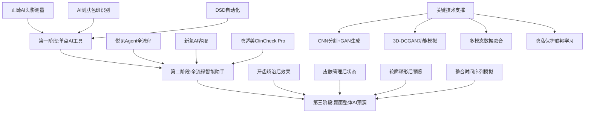

**AI整合产品对消费者决策的催化效应**则是融合商业价值的关键。第6章已论证社交媒体决策路径的"困惑触发—内容搜索—信任构建—私信咨询"闭环，AI预演技术可在这一闭环的"决策准确性"环节发挥关键作用——消费者在咨询阶段即可获得"未来颜面整体可视化"，将抽象的多项目组合转化为直观的视觉确认。Kaushik等的研究已验证AI生成与人工设计在美学接受度上无显著差异[^93]，意味着AI预演不会因"非人工"而被消费者贬值——这一接受度等同性是融合机构低边际成本规模化AI预演服务的关键前提。

**三大约束的正视**则不可回避。陈江综述明确指出AI在口腔美学应用面临"**技术瓶颈、伦理争议以及数据多样性不足**"[^92]：

- **技术瓶颈**：当前AI模型在复杂多牙缺失、严重骨性畸形等高难度病例的诊断精度仍不及资深医师，且对真实临床场景中的多变量耦合（如咬合-气道-面型联动）建模能力有限；
- **伦理争议**：AI辅助决策的责任归属（医生主导vs算法承担）、患者知情同意的边界（消费者是否知晓自己的决策被AI影响）、数据使用的伦理审查等问题尚未形成行业共识；
- **数据多样性不足**：当前训练数据多偏向特定地区、特定族裔、特定病例类型，对中国20-30岁女性这一具体人群的多样化面型与审美偏好的覆盖仍不充分，可能导致AI推荐方案的"模板化"与第3章识别的"个性化美"诉求产生张力。

这些约束意味着，AI整合预演平台从技术可行走向临床成熟与商业规模化，仍需3-5年的迭代。这一时间窗口将在7.7节成熟度评估中明确标注。

## 7.4 正畸-修复-种植-医美联合诊疗：跨学科产品形态的临床验证

技术与AI层的融合最终需要落地为可交付的临床产品。多学科联合诊疗作为口面美学一体化最直接的产品形态，其临床实践的成熟度与可复制性是融合从技术可行走向临床成熟的关键试金石。

**鞍钢总医院DSD指导下的全冠修复案例**为跨学科诊疗提供了基础形态的临床证据。该院修复科王崟阁医生接诊一位41岁女性高某，"因近中龋坏，在外院反复补牙后反复脱落多次磨牙后漏髓，行根管治疗，近期修复体变色，影响美观"[^90]。患者最终选择"数字化微笑设计（DSD）指导下全冠修复"，治疗流程包括"取研究模型、技师在模型上制作义齿诊断蜡型、利用缩聚型硅橡胶制作'Index'、自然光下比色、基牙比色、精修计算机扫描、DSD微笑设计、术后效果"[^90]。这一案例虽看似常规，但其临床意义在于：**DSD作为美学修复设计工具已在地市级三甲医院的修复科常规应用，意味着跨学科美学诊疗的供给侧基础已渗透至非顶级医疗机构**——这一供给广度是融合服务模式可大规模复制的客观基础。

**武汉大学口腔医院"被动萌出异常+前牙间隙"数字化贴面修复案例**则展示了跨学科诊疗的整合复杂度。蒋忠伟团队报道一例31岁女性患者"因上颌前牙有缝20余年就诊"，临床表现为"高位笑线、上唇系带附丽过低、11、21牙间间隙约2mm、12、11、21牙冠形态及比例不佳、12、11牙龈缘较21、22偏冠方，龈缘曲线不协调"[^91]。治疗方案的多学科整合性极为典型——医生提出两个方案："方案1：上唇系带修整术+牙冠延长术+正畸治疗；方案2：上唇系带修整术+牙冠延长术+贴面修复11、21"[^91]，最终患者"因正畸治疗时间过长，拒绝方案1，接受方案2"。值得深入分析的是治疗的核心难点："美学区的固定修复，应遵循'以终为始'的理念。该病例主要的难点在于通过DSD设计出符合患者个性化的美学方案，在牙周冠延长手术和贴面修复过程中，更加微创、精确的实施治疗"[^91]——这一"以终为始"的诊疗范式正是融合服务的精髓：**先有面部美学的整体目标（"修复后宽长比为92%"），再倒推牙周、修复、可能的正畸/医美补充等具体方案**。

**南京德牙朱峰医生"三维矫正理念"**则将跨学科诊疗的范式扩展至更宽广的"牙齿+骨骼+面部"三维空间。**2025年《南京成人正畸报告》显示，南京成人矫正需求年增长18%，其中25至45岁人群占比较高，隐形矫正的选择率更是达到85.3%**[^100]。朱峰医生提出的"三维矫正理念"明确突破传统正畸的牙齿层面边界："维度是牙齿——追求牙列整齐、牙弓形态良好、咬合关系健康。第二个维度是骨骼——通过正畸手段改善凸嘴、地包天、下巴后缩等骨性问题，调整上下颌骨的位置关系。第三个维度是面部——将微笑线、唇形、鼻唇角、颏唇沟等美学元素纳入方案设计，让矫正后的笑容与整体面部协调"[^100]。这一三维框架的临床应用包括："对于凸嘴的患者，她不仅考虑如何内收前牙，还会评估内收量对面部侧貌的影响；对于露龈笑的患者，她不仅考虑压低上前牙，还会评估牙槽骨和牙龈的生物型"[^100]。

更具突破意义的是**"骨性错颌的非手术矫正"**实践。传统观念认为"骨性错颌只能通过正颌外科手术来矫正——手术费用高、创伤大、恢复期长，且存在一定的风险"，而朱峰医生通过"**'隐形矫正+支抗钉+磨牙远移'等综合技术，在不做手术的前提下改善骨性畸形**"[^100]。其原理是"通过支抗钉提供稳固的支抗，利用牙齿移动的代偿机制，在一定程度上弥补骨骼的不协调"[^100]——这一非手术骨性矫正技术为消费者提供了介于"传统正畸（仅排齐牙齿）"与"正颌外科手术（创伤大）"之间的中间方案，对20-30岁女性面型改善的接受门槛与第1章已论证的"自然美""微调而非改造"审美模式高度契合。

**"AI正畸助力医美口腔"的全周期协作框架**则将跨学科诊疗的服务要素清晰化。相关文献明确指出医美口腔治疗"涉及正畸、修复、美学等多个学科。多学科联合治疗模式，集合各领域专家，共同为患者制定最优治疗方案，全面解决口腔问题"，并提出全周期服务的三大要素："**动态方案调整，根据患者治疗进展及时优化方案；远程复诊让患者可以远程与医生沟通，便捷高效；疗效评估则确保治疗达到预期目标**"[^99]。在矫治器创新与美学修复融合方面，文献进一步指出"医学美学修复结合了功能重建与美学设计。在修复牙齿功能的同时，关注外在形态、色彩匹配、微笑曲线等美学因素。例如数字微笑设计和微创贴面技术，能让患者拥有更美的笑容"[^99]——这与武汉大学口腔医院的临床案例形成产业话语与具体实践的对照印证。

**联合诊疗的临床成熟度评估**因此可分层呈现：

| 联合诊疗形态 | 典型流程 | 临床证据 | 成熟度 | 关键瓶颈 |
|----------|------|------|-----|--------|
| 正畸+美学修复（贴面/全冠） | 正畸排齐→DSD设计→修复体制作 | 鞍钢总医院、武汉大学口腔医院多例[^90][^91] | **高** | 医生跨学科沟通成本 |
| 正畸+牙周冠延长+修复 | 数字化导板→冠延长→贴面 | 武汉大学口腔医院案例[^91] | **高** | 多次手术患者接受度 |
| 三维矫正（牙-骨-面） | 隐形矫正+支抗钉+面型评估 | 南京德牙朱峰医生临床实践[^100] | 中高 | 适应症筛选严格 |
| 正畸+医美注射（唇形/下颌缘） | 矫治期→末期注射精修 | 暂缺规范化临床数据 | 中 | 跨业医生协作机制 |
| 正畸+面部光电（皮肤管理） | 治疗周期内同步皮肤管理 | 暂缺规范化临床数据 | 中 | 数据互通与隐私 |

数据来源：综合搜索结果整理[^90][^91][^100][^99]

**联合诊疗的关键瓶颈**集中于以下三组：

**第一，医生跨学科能力**。徐子卿博士已论证"正畸是一个严谨的跨学科领域"，但临床上同时具备正畸、修复、医美整合能力的复合型医生仍属凤毛麟角。武汉大学口腔医院案例的治疗团队涉及修复科+牙周科多位专家协作[^91]，这一协作模式在地市级医院难以低成本复制。

**第二，机构多科室协同**。即便复合型医生稀缺，也可通过多科室协同实现整合诊疗——但这要求机构内部具备口腔修复科、口腔正畸科、医疗美容科等多个二级科目备案，且科室间的患者档案互通、收费衔接、医患沟通统一具有较高的运营复杂度。京东医美亦庄店"口腔+医美+体检+中医同址"模式正是对这一协同的探索（其他参考信息）。

**第三，患者沟通成本**。联合诊疗涉及多学科决策点（先后顺序、方案权衡、阶段性目标），消费者沟通成本远高于单一学科诊疗。武汉大学口腔医院案例中"患者因正畸治疗时间过长，拒绝方案1，接受方案2"[^91]即是典型——多方案权衡需医生投入大量时间与消费者沟通预期，融合机构需在SOP化沟通工具（DSD可视化、AI预演）与个性化医患交流间寻找平衡。

## 7.5 笑容设计与肌功能管理：新兴整合性产品形态的可行性

在多学科联合诊疗这一基础形态之上，笑容设计与肌功能管理两类新兴整合产品形态进一步代表了融合产品的演进方向。本节聚焦其产业化可行性与向20-30岁女性群体延伸的差异化挑战。

**3Shape TRIOS Smile Design的产业实践**为笑容设计的产品化路径提供了最具代表性的范本。其工作流的关键产品设计包括：

第一，**4分钟工作流**——"当前TRIOS微笑设计工作流程平均需要4分钟，存储数据。拍照片后，您可进行设计并将设计传送给患者"[^88]。这一极短的工作流是笑容设计能否在常规口腔诊所大规模采用的关键——若设计耗时数小时，将无法嵌入诊所日常的接诊节奏。

第二，**患者手机端共享**——"通过给患者看到完美的微笑您可以很轻松地吸引患者并简便地介绍不同的治疗方案。然后，将微笑方案传送给患者手机（使用 My 3Shape 应用程序）鼓励他们与家人和朋友分享或讨论治疗方案"[^88][^89]。这一手机端共享设计契合第6章已论证的社交媒体决策路径——消费者可将自己的"未来微笑"分享至小红书、Instagram等社交平台，反向催化整合性消费决策。

第三，**扫描件诊所品牌化**——"为了达到这一目的，TRIOS微笑设计增加了导出选项和诊所品牌选择。将诊所的标志添加到扫描件中，为微笑设计打上品牌"[^88]。这一品牌化设计直接回应了第6章识别的"医生IP化+机构IP化"趋势——同一笑容设计模板可被不同机构定制化输出，强化机构品牌的差异化。

牙医Marc Onuoha对笑容设计的判断颇具前瞻性："**使患者能够更容易地看到和理解他们的治疗方案。未来，我会看到每一位技师都在日常工作中使用微笑设计**"[^88][^89]——这一"每一位技师常规使用"的预测，意味着笑容设计正从高端机构的差异化服务向行业基础工具收敛，融合机构的差异化竞争将不再是"是否有DSD"，而是"DSD与其他业务的整合深度"。

**鞍钢总医院与武汉大学口腔医院的临床应用**[^90][^91]则验证了笑容设计在国内中等规模医疗机构的落地能力。两个案例的共同点是DSD作为"未补先知、术前可视化预览"的核心价值已获得临床医生与患者的广泛接受。鞍钢案例特别强调DSD的优势在于"**直观、无创、可逆，且操作流程简单**"[^90]——这三大特征恰好契合融合服务模式所需的"消费者沟通工具"要求。

**笑容设计向20-30岁女性的延伸路径**具有天然适配性。该群体的心理图谱（第3章）已揭示其对"颜面整体美学""自然美""个性化美"的高度认同——笑容设计恰好能在不切牙、不动刀的前提下，提前可视化地呈现"未来的自己"，缓解决策不确定性。从消费节点看，毕业季、求职期、婚礼前等高重叠场景（第4章）天然适合"笑容设计+轻医美组合包"的场景化营销——消费者在毕业前两周通过笑容设计预览未来一年的美学路径，并在该路径下分阶段完成正畸启动+牙齿美白+轻医美补充。

**正雅齿科T3早矫系列**则代表了肌功能管理这一新兴整合产品形态的产业化实践。该产品"基于口面肌功能治疗专家史真教授的理念"，"以'Muscle Wins'口面肌功能治疗理论为指导，从影响牙颌面发育的肌功能异常病因出发，纠正影响牙颌面发育的不良肌功能习惯，为牙颌面正常发育提供和谐口面肌环境，引导牙颌面正常生长发育"[^101]。产品设计的核心创新在于**多工具组合**——"目前，Smartee Teen肌训矫治版（T3）配置工具包括**活动矫治器、功能矫治器、芽芽盾、隐形矫治器、肌功能训练操**等，能够为医师及患者提供更加符合实际治疗需求、满足医患偏好的隐形矫治产品组合"[^101]。这一多工具组合突破了传统"矫治器=单一产品"的认知，将正畸扩展为"矫治器+训练+引导"的整合性服务包。

T3的适应症覆盖"**前牙反、后牙反、牙性问题，严重的前牙深覆，上前牙前突，前牙深覆盖，牙弓宽度、长度和形态异常及Ⅱ类面形等异常**"[^101]，并在治疗策略上分阶段执行——"对于乳牙期、替牙早期以及侧方牙列正在替换的替牙期患者，以纠正不良习惯为主，使用安全舒适的肌功能训练器，破除不良习惯的同时，高效解决反、深覆盖等问题，引导牙颌面三维方向的正常生长。**对于牙弓狭窄、气道欠通畅的患者，采用扩弓器改善牙弓形态，改善上气道，抑制下颌顺旋**"[^101]。值得特别关注的是肌功能管理与**气道-面型**的联动——这一联动正是徐子卿博士所论证的"正畸涉及面部、颌骨发育、关节、气道，甚至整个颜面部乃至脊柱的发育"的最直接产业化体现。

**肌功能管理向20-30岁女性的延伸**则面临差异化挑战。T3当前的核心客群定位是"3-16岁儿童及青少年"，其作用机制依赖颌骨发育期的可塑性，对成年人（20-30岁女性）的颌骨已基本定型者，肌功能训练的颌骨改造空间有限。但**部分肌功能管理理念可延伸至成人**，主要体现在三个方向：

第一，**口周肌肉训练辅助正畸**——成人正畸中口周肌肉的紧张度直接影响矫治效果与稳定性，肌功能训练可作为正畸的辅助手段；

第二，**气道改善与睡眠呼吸**——20-30岁女性中存在睡眠呼吸暂停综合征（OSA）轻度症状者，部分肌功能训练可辅助改善上气道通畅度；

第三，**面部表情肌管理与抗衰**——面部表情肌的张力管理与医美抗衰（肉毒素瘦脸、苹果肌训练）形成天然连接，肌功能训练可作为非创伤性的"医美预防"手段。

| 新兴整合产品形态 | 当前主要客群 | 向20-30岁女性延伸路径 | 延伸成熟度 |
|--------------|--------|-------------------|--------|
| 笑容设计（DSD） | 修复+正畸患者全年龄 | 节点场景化营销+社交媒体共享 | **高** |
| 肌功能管理（T3类） | 3-16岁儿童青少年 | 口周肌训练辅助正畸+气道改善 | 中 |
| 三维矫正（牙-骨-面） | 18+成人骨性畸形 | 隐形矫正+支抗钉非手术方案 | 中高 |
| 整合性套餐组合 | 高端医美客户 | 笑容设计+正畸+医美季节性组合 | 中 |

数据来源：综合搜索结果整理[^88][^90][^91][^100][^89][^101][^99]

**笑容设计与肌功能管理的产品技术意义**远超单一产品本身。它们共同标志着**正畸品牌的产品哲学正从"卖矫治器"转向"卖整合性服务包"**——前者是制造业逻辑，后者是医疗服务业逻辑。这一转向对融合机构具有根本性影响：当正畸品牌主动从产品供应商进化为整合性服务提供商时，其与医美机构在"服务包设计""客户生命周期管理""跨学科协作"等维度的竞争与合作关系将发生重构，第8章商业模式融合中的"机构融合"路径将受到这一供给侧变化的强力推动。

## 7.6 头部品牌的口腔整体美学拓展路径与边界

锁定供给侧主体，本节系统比较隐适美（爱齐科技）、时代天使、领健悦见、正雅齿科四大头部正畸品牌向口腔整体美学拓展的战略路径与现实边界，并提炼共性与差异。

**隐适美（爱齐科技）的"数字化触点闭环+全球生态"路径**。爱齐的核心竞争力建立在三层基础之上：第一，**iTero Element口扫仪+SmileView微笑模拟+ClinCheck+My Invisalign App**构成的数字化触点闭环，其中"using the iTero Element scanner, your doctor can take a fast and precise 3D digital scan of your teeth and map out a custom treatment plan just for you"[^86][^87]，且"Download the My Invisalign app today and complete an Invisalign SmileView simulation"[^86][^87]——这一闭环让消费者从首次接触到方案确认全流程数字化。第二，**全球医生生态规模优势**——截至2024年第四季度，爱齐"已累计培训27.16万名活跃Invisalign从业者、服务1950万名Invisalign患者（其中超过560万名为青少年和儿童），全球累计生产超过20亿件透明矫治器"（第2章已论证）。第三，**长期技术迭代积累**——从1997年公司成立、1998年获FDA销售许可，到2010年Invisalign Lite、2011年G3、2012年G4、2013年SmartTrack、2014年G5、2015年G6的连续迭代[^98]，构成隐适美的临床证据厚度优势。其拓展路径偏向"**通过数字化平台连接而非业务直接覆盖**"——iTero口扫仪的数据可被诊所用于修复、种植、甚至医美评估，但隐适美自身并不直接进入医美注射或光电类业务。

**时代天使的"全球本地化+生态合作"路径**。第2章已论证时代天使2024年案例量35.94万例（同比+46.7%）、国际市场14.07万例（同比+326.4%、覆盖50+国家）的高速扩张[^96]。其拓展逻辑的关键支柱包括：第一，**控股股东松柏投资的全球资源整合**——"松柏投资的前瞻规划和全球产业资源为时代天使的全球化提供了重要指导，尤其是在制定本地化策略和全球人才招募方面。同时，借助松柏投资的全球产业布局，时代天使开辟了更多收购并购、产品共研、市场开拓的产业链合作机会"[^102]。第二，**全周期数字化工具矩阵**——"围绕隐形矫治诊疗链路的关键环节，时代天使推出一系列数字化工具，从患者初诊、辅助诊断、方案设计、生产到过程监控，辅助提升医生的诊疗效率与方案设计能力"，叠加"2025年1月正式上线iOrtho医生App国际版"[^96]。第三，**全球本地化制造布局**——美国威斯康星5.2万平方英尺3D打印工厂+巴西Aditek收购+欧洲亚太美洲50+国家覆盖[^96]。其拓展边界则表现为对"**产品组合丰富度、膜片性能、适应症覆盖范围以及智能制造能力**"的持续投入[^102]，同样以正畸核心能力的深化为主，向修复美学的延伸更多通过松柏投资的产业链合作（"产业链合作机会"）而非自身业务覆盖[^102]。

**领健悦见的"医企融合+技术原创+本土化"路径**。悦见作为"领健旗下推出的新一代隐形正畸解决方案"，其拓展策略呈现明显的本土化技术差异化特征[^95]：第一，**直接3D打印+形状记忆材料的技术原创**已在7.2节详述。第二，**悦见Agent AI助手的全流程嵌入**——"集成于e看牙系统，实现从影像AI分析、方案设计模拟到正畸复诊跟踪的全流程智能化支持"[^95]，特别值得关注的是"集成于e看牙系统"这一深度生态合作——领健母公司"成立于2015年，是中国知名消费医疗数智化平台，依托消费医疗智能化解决方案，领健已服务中国50000+消费医疗机构"[^95]，意味着悦见可借助5万+机构的SaaS渗透实现快速触达。第三，**全周期产品矩阵**——"领健悦见构建了覆盖儿童早期干预至成人复杂矫正的全年龄段产品体系"[^95]。第四，**医企融合科研机制**——"悦见秉持'医企融合'理念，构建了高水平科研合作网络。领健悦见聚焦隐形正畸生物力学研究、多模态大模型的人工智能AI及直接3D打印隐形矫治器研发"[^95]。其与隐适美、时代天使的根本差异在于：依托母公司SaaS生态实现"**消费医疗数智化平台**"的整合能力，相对更接近"颜面整体美学"的整合愿景。

**正雅齿科的"早矫+肌功能+全周期"路径**。正雅的T3早矫系列已在7.5节详述[^101]。其拓展逻辑的特殊性在于：相对其他三大品牌偏向成人/全年龄的核心客群，正雅在早期矫治、肌功能管理、儿童青少年全周期市场上构建了差异化产品哲学。值得关注的是其"基于口面肌功能"的理论锚定——这一理论将正畸扩展至"牙颌面发育引导"的更宽广概念，与第3章已论证的"健康美学"认知模式高度契合，为成年女性人群（曾经的青少年正畸患者）的长期保持期与代际惯性奠定品牌认知基础。

**四大品牌的拓展共性**集中于：

| 共性维度 | 隐适美 | 时代天使 | 领健悦见 | 正雅齿科 |
|--------|-----|------|------|------|
| 数字化平台化 | iTero+SmileView+ClinCheck+App | iOrtho+全周期工具矩阵 | 悦见Agent+e看牙集成 | T3全周期数字化方案 |
| 生态合作化 | 27.16万从业者+1950万患者 | 松柏投资全球资源整合 | 5万+消费医疗机构生态 | 医院校合作网络 |
| 向修复美学延伸 | 通过iTero数据延伸 | 通过松柏产业链 | 通过医企融合 | 通过全周期肌功能产品 |
| 国际化布局 | 全球生态最广 | 50+国家强势扩张 | 本土化深耕 | 本土化主导 |
| AI能力建设 | ClinCheck持续迭代 | iOrtho国际版 | 悦见Agent全流程 | T3辅助决策 |

数据来源：综合搜索结果整理[^86][^98][^87][^96][^102][^95][^101]

**四大品牌的差异**则集中于：

- **技术路线差异**：隐适美的SmartTrack膜片+SmartForce体系、时代天使的全球本地化3D打印、悦见的形状记忆+直接3D打印、正雅的肌功能矫治多工具组合——四种技术路线并非简单替代，而是面向不同细分场景的差异化方案。
- **市场重心差异**：隐适美全球均衡、时代天使中国领先+海外加速、悦见聚焦中国本土消费医疗数智化、正雅聚焦中国早矫与全周期。
- **产品哲学差异**：隐适美与时代天使偏向"矫治器+方案"的产品逻辑，悦见偏向"医企融合+AI助手"的服务逻辑，正雅偏向"早矫+肌功能引导"的发育干预逻辑。

**最关键的拓展边界判断**是：**隐形正畸品牌的核心壁垒仍在于"矫治器精度+医生网络+案例数据"，向纯医美注射、光电类项目的直接延伸面临监管、临床、品牌信任三重约束**。第6章已识别跨业医生执业、跨业耗材合规分类、跨业广告监管等合规断点，这些断点在头部品牌身上同样存在——隐适美、时代天使若直接拓展玻尿酸注射或光电业务，需重新建立医美主诊医师认证、医疗美容机构资质、医美耗材审批，并承担与正畸品牌信任体系完全不同的医美舆情风险。这一三重约束意味着，**头部正畸品牌更可能的融合路径是"通过数字化平台连接而非业务直接覆盖"**——即以iTero/SmileView/ClinCheck/iOrtho等数字化触点为核心，与医美机构（如新氧青春诊所、京东医美、瑞尔集团等）建立平台级合作，而非自身亲自承担医美业务。

这一"通过平台连接"的判断与7.5节"正畸品牌的产品哲学正从'卖矫治器'转向'卖整合性服务包'"的趋势相一致——头部品牌作为整合服务的"操作系统提供方"而非"全栈服务方"，将在融合生态中扮演关键的中枢角色，而非直接的业务竞争方。这一定位将在第8章商业模式融合中具体化为"产品-机构-平台"三级生态架构。

## 7.7 产品技术融合的成熟度评估与障碍识别

在前六节具体技术与品牌剖析基础上，本节构建产品技术融合的"**技术可行性—临床成熟度—商业可规模化**"三层评估框架，将各融合点定位至成熟度阶梯，并明确识别仍存重大障碍的环节。

| 融合点 | 技术可行性 | 临床成熟度 | 商业可规模化 | 综合定位 |
|------|--------|--------|----------|------|
| 数字化基础设施共通（口扫+面部建模+AI诊断） | ✅成熟 | ✅成熟 | ✅成熟 | **已成熟可规模化** |
| 3D打印产业链共享（矫治器+修复体+导板） | ✅成熟 | ✅成熟 | ✅成熟 | **已成熟可规模化** |
| DSD微笑设计跨业应用 | ✅成熟 | ✅成熟 | ✅基本成熟 | **已成熟可规模化** |
| AI颜面整体预演（牙齿+皮肤+轮廓时间序列） | ⚠️部分成熟 | ⚠️待验证 | ⚠️待规模化 | **半成熟需深化** |
| 多学科联合诊疗SOP（正畸+修复+种植+医美） | ✅成熟 | ⚠️机构间差异大 | ⚠️复合型医生稀缺 | **半成熟需深化** |
| 肌功能-气道-面型整合产品（成人扩展） | ⚠️待研发 | ⚠️证据不足 | ⚠️客群教育成本高 | **半成熟需深化** |
| 医生跨学科执业资质认证 | — | ❌制度未明 | ❌合规壁垒高 | **未成熟存重大障碍** |
| 矫治器与医美耗材合规分类整合 | — | — | ❌监管框架缺失 | **未成熟存重大障碍** |
| AI伦理与跨业数据隐私 | ⚠️待规范 | — | ❌法规不完善 | **未成熟存重大障碍** |
| 患者长期效果验证体系（10-15年生命周期） | ⚠️待建立 | ⚠️数据稀缺 | ⚠️周期过长 | **未成熟存重大障碍** |

数据来源：综合本章前六节分析整理

**已成熟可规模化的三大融合点**意味着融合服务模式可在当前阶段以较低门槛复制：

第一，**数字化基础设施共通**——口扫仪、面部建模、AI诊断的底层技术栈已实现跨业适用，且产品形态（iTero、TRIOS、SmileView、AI测肤）均已商业化。融合机构可在现有基础设施投入基础上以增量方式扩展整合性服务。

第二，**3D打印产业链共享**——铼赛智能、黑格科技、永昌和等中国3D打印企业已实现椅旁打印机+材料+工作流的整合方案，单设备可承担多产品形态制造，融合机构的资本投入门槛已显著下降。

第三，**DSD微笑设计跨业应用**——3Shape TRIOS Smile Design 4分钟工作流、患者手机端共享、Marc Onuoha"每一位技师常规使用"的预测，标志着DSD已从差异化服务向行业基础工具收敛。

**半成熟需深化的三大融合点**则代表了未来3-5年的产业升级方向：

- **AI颜面整体预演**——技术可行性已基本具备（CNN分割、GAN生成、3D-DCGAN功能模拟），但临床上"牙齿矫治后效果+皮肤管理后状态+轮廓塑形后预览"的整合时间序列模拟仍待多中心验证；商业上的规模化受陈江综述指出的"技术瓶颈、伦理争议、数据多样性不足"三大约束[^92]制约。

- **多学科联合诊疗SOP**——单点临床成熟（鞍钢、武汉大学、南京德牙等案例），但机构间SOP差异极大，复合型医生稀缺，跨机构协作成本高。预计需要行业协会主导的标准化建设。

- **肌功能-气道-面型整合产品向成人扩展**——成人颌骨可塑性有限，需重新研发针对20-30岁女性的肌功能管理产品；客群教育成本高，需建立"美学+健康"双重价值传递的内容体系。

**未成熟存重大障碍的四大融合点**则需在第9章风险分析与第10章战略建议中重点回应：

- **医生跨学科执业资质认证**——其他参考信息已识别中国"需医疗美容科+美容牙科双二级科目备案，跨科执业需逐一注册"的合规壁垒，制度创新需国家卫健委、医保局等多部门协同推动。

- **矫治器与医美耗材合规分类整合**——医美玻尿酸属III类、正畸矫治器属II类，合并采购、合并交付的合规边界尚未明确。

- **AI伦理与跨业数据隐私**——爱齐"个人信息处理规则"已涉及"个人面部特征的照片或视频信息"的收集，但跨业数据共享需在《个人信息保护法》框架下重新设计授权机制；陈江综述明确指出"AI决策透明度"的伦理争议尚未解决[^92]。

- **患者长期效果验证体系**——正畸2-3年治疗+5-10年保持的长生命周期，与医美高频复购的短周期之间，缺乏统一的长期效果跟踪体系。新氧"投诉48小时解决"的即时反馈机制（第6章）难以直接复用至10-15年的长期生命周期管理。

**核心命题:技术融合不等于商业融合**。本章评估清晰显示：技术可行的融合点（数字化基础设施、3D打印、DSD、AI预演）远多于商业可规模化的融合点（仅三项已成熟）。这意味着**技术层面的融合可能性不能直接外推为商业层面的成功**——融合服务模式必须同时跨越技术成熟、临床验证、商业可行、监管合规、消费者接受度五重门槛，缺一不可。这一边界划定为第8章商业模式融合（哪些技术可被商业化承接）与第9章风险分析（哪些障碍需重点防控）提供了产品技术层的依据。

**与后续章节的衔接**：

- **对第8章商业模式融合的衔接**：本章识别的"已成熟可规模化"三大融合点（数字化基础设施、3D打印、DSD）将在第8章具体化为机构融合的技术资产清单——融合机构以这三大资产为底座，构建"颜面整体美学"服务包；本章提炼的头部正畸品牌"通过数字化平台连接而非业务直接覆盖"的拓展边界，将在第8章具体化为"产品-机构-平台"三级生态架构。

- **对第9章风险分析的衔接**：本章识别的"未成熟存重大障碍"四大融合点（跨学科执业、耗材合规、AI伦理、长期验证）将在第9章具体化为融合面临的合规风险、监管风险、伦理风险——其他参考信息已系统整理的SmileDirectClub兴衰、海狸家案、江阴牙博士案、"幼态脸"过度医疗等典型案例将为这些风险点提供具体警示。

**本章局限的坦诚标注**：

第一，**欧美与日韩头部品牌数据相对稀缺**。本章对正畸头部品牌的拓展路径分析以中国本土数据为主，对隐适美在欧美的整合实践、Spark Aligners（Ormco）、SureSmile（Dentsply Sirona）等欧美差异化品牌的资料覆盖有限，部分判断以中国头部品牌为主代理。这一覆盖缺口将在第10章战略建议中通过定性论证予以部分弥补。

第二，**临床证据多以单中心案例为主**。武汉大学口腔医院、鞍钢总医院、南京德牙等案例虽具代表性，但缺乏多中心随机对照试验的高级别证据。融合诊疗的长期效果、并发症发生率、患者满意度等关键临床指标，仍需大样本、长周期的循证医学验证。

第三，**AI与3D打印的产业进展极快，本章数据可能在未来1-2年内被快速更新**。例如时代天使美国威斯康星工厂建成投产、悦见Agent的多模态大模型升级、新一代3D打印材料的临床认证等，均可能改变本章的成熟度评估结果。这一时效约束要求融合战略制定者保持对技术供给侧的持续跟踪。

通过本章对数字化基础设施、3D打印、AI、联合诊疗、笑容设计、肌功能管理、头部品牌路径、成熟度评估八大维度的系统剖析，已基本回答"产品技术如何为口面美学一体化提供底层支撑"的核心命题——其支撑能力呈现"基础设施同源已成熟、整合诊疗半成熟、跨业资质与数据未成熟"的分层格局；技术可行性的存在不必然导向商业可规模化，必须通过商业模式创新（第8章）、风险防控（第9章）、战略路径选择（第10章）的协同推进才能转化为现实的融合服务。下一章（第8章）将进一步推进至商业模式与品牌融合层——回答"机构融合、品牌联合、保险与会员体系打通的可行路径与现实案例"的核心问题。

# 8 商业模式与品牌融合的可能路径

承接第7章对产品技术融合成熟度的分层判断——数字化基础设施同源、3D打印产业链共享、DSD跨业应用三大融合点已成熟可规模化，AI颜面整体预演、多学科联合诊疗SOP半成熟需深化，跨学科执业资质、耗材合规、AI伦理、长期效果验证四大障碍尚未成熟——本章将研究焦距从技术底座推进至商业模式与品牌运营层。技术可行性的存在并不必然导向商业可规模化，融合服务模式必须同时跨越商业、监管、消费者三重门槛才能转化为现实生意。本章因此回答以下递进式问题：**当技术底座已具备时，哪些商业模式形态最可能率先承接？头部企业的实践案例呈现何种成败规律？国际范例（美国DSO、韩国整形生态、日本预防型连锁）能否被中国本土化复刻？品牌融合在医生IP、跨界合作、颜面美学叙事三层如何递进？会员体系、保险产品、套餐服务这三大客户生命周期价值工具的融合可行性如何？平台型生态如何重构正畸品牌与医美机构的关系？最终哪些路径可复制、哪些路径受限？**

通过六节递进式分析——机构融合的多元路径与典型案例（8.1）、DSO模式的国际经验与中国本土化适配（8.2）、品牌联合与跨界合作（8.3）、会员保险与套餐服务的融合设计（8.4）、平台型生态与产业链整合（8.5）、融合路径的可行性评估与边界约束（8.6）——最终输出"机构一体化、医生IP整合、套餐场景化、平台赋能型"四类可复制路径与"保险融合、跨业资质统一、长期效果验证"三类受限路径的清晰判断，并将合规与监管层的深度剖析交付第9章，将战略建议留待第10章。本章始终保持"商业可行性—监管合规性—消费者接受度"三维并立的判断框架，避免对任一融合形态的单向乐观或单向悲观。

## 8.1 机构融合：口腔医美一体化诊所的多元路径与典型案例

机构融合作为最直接的商业形态，其核心价值在于将正畸与医美在物理空间、医生团队、运营SOP、客户档案上整合于同一机构实体，最大化第6章已论证的"60%-80%并发率"所蕴含的客户生命周期价值。当前机构融合呈现四类典型路径，下表先做总览，再分项剖析。

| 路径类型 | 代表案例 | 核心客群 | 医生协作机制 | 合规壁垒 | 盈利模型 | 扩张速度 |
|--------|--------|--------|----------|--------|--------|--------|
| 互联网平台自营整合诊所 | 京东医美亦庄店 | 平台用户外溢+轻医美尝鲜 | 综合门诊部多科备案 | 中高（多二级科目） | 探索期 | 慢（年内2家）|
| 垂直医美平台向自营连锁延伸 | 新氧"青春诊所" | 25岁职场女性轻医美高频 | 自有医生+连锁标准化 | 中（医美单一资质） | 亏损扩张 | 极快（年增60+家）|
| 传统口腔头部品牌整合美学拓展 | 瑞尔集团、泰康拜博 | 中高端家庭长期客群 | 多学科MDT+学科带头人 | 中（口腔+美白延伸） | 稳健盈利 | 慢（27年沉淀）|
| 公立三甲医院医美科室入局 | 200+三甲独立医美科 | 安全敏感型消费者 | 公立医师多点执业 | 低（公立背书） | 微利+学科建设 | 快（5年增长320%）|

数据来源：综合搜索结果与其他参考信息整理

**路径一：互联网平台自营整合诊所——京东医美亦庄店的"四科同址"探索**。京东健康(06618.HK)旗下首家线下医美自营诊所"京东医美(亦庄店)"已于2025年低调开业并接入京东APP医美频道，**位于京东健康综合门诊部亦庄店1层，作为京东健康综合诊所的一部分运营**[^103]。该诊所的根本性创新在于"四科同址"——京东健康体检中心(亦庄店)拥有门诊部医疗机构资质，自2023年7月开业以来除体检服务之外**还陆续开设了内外科、口腔科、中医科等特色门诊**，本次增设的医疗美容科**进一步丰富京东健康体检中心的医疗服务项目**[^103]。这一模式在物理空间上将正畸（口腔科）与医美在同一门诊部实现整合，与其他参考信息识别的P1路径"一站式综合诊所"高度吻合。

京东医美亦庄店的当前业务结构尚显谨慎——**主打轻医美项目，提供涵盖美白嫩肤、水光美塑、除皱瘦脸和光电抗衰四大常见医美服务，具体医美服务产品共有11项；除"除皱50单位"、"瘦脸100单位"两项外，其余产品价格均在千元以下；销量最高的"营养水光"项目（售价818元）销量为40件，其余项目销量均在20件以下**[^103]。这一"低价位+小销量"的早期表现意味着京东医美仍处于客群培育期，尚未释放规模化盈利能力。但其战略定位极为清晰——**京东医美自营诊所要探索的道路是到店服务领域**，**通过规模化集采降低采购成本，并依托区块链等技术实现药品全流程溯源；服务标准化上将医美项目拆解为一个个标准**[^103]。**第二家线下自营医美诊所北京"国贸店"将在2025年四季度开业**[^103]，扩张节奏相对谨慎。

值得关注的是，京东在口腔侧的布局更早起步——**京东健康在2020年12月与松柏投资签约布局口腔业务，截至签约时京东健康已经成立口腔中心，有超过1000个口腔医生，用户可直接购买口腔医疗服务；松柏投资是专注口腔行业的投资机构，控股和参股大型口腔医疗机构和连锁诊所，在隐形正畸、种植、骨再生等口腔技术方面拥有研发能力**[^103]。京东集团副总裁、京东健康CEO辛利军当时即判断"**2019年中国口腔医疗行业规模上下游加起来为1382亿元，到2024年，行业将有4倍增长空间。齿科是京东健康需要拓展的新版块**"[^103]。这一"先口腔后医美"的拓展次序正是融合机构最顺畅的客群导流逻辑——以高客单粘性强的口腔为压舱石，以高频低门槛的医美为活水源，构建客户生命周期价值的双轮驱动。

**路径二：垂直医美平台向自营连锁延伸——新氧"青春诊所"的快速扩张与亏损争议**。第2章已论证新氧"青春诊所"从早期20多家、2025年中扩张至56家、年底目标85家、平均每月开店3-4家的快速布局节奏。这一路径的核心创新在于将垂直平台积累的流量+用户画像+SOP能力转化为线下连锁的差异化资产。然而，新氧的扩张同时伴随显著的亏损与供应链冲击——其低价策略已"直接击穿了上游厂商苦心维护的价格体系，已导致其与多家主流供应商关系破裂，被部分厂商列入'非官方合作'名单、甚至被部分厂商断供"，新氧2024年净亏损扩大至5.87亿元、2025年二季度核心业务暴跌35.7%（第6章已引述）。

新氧的案例对融合机构具有双向警示价值：一方面，自营连锁的350+服务SOP、用户复购率超过60%、私域留存81万用户的运营能力，是融合机构最具参考价值的资产；另一方面，垂直医美平台向线下延伸时面临的"渠道冲突+流量内卷+合规成本"三重压力，提示融合扩张必须建立可持续盈利模型而非单纯规模扩张。值得注意的是，新氧的客群定位（25岁职场女性轻医美高频）恰是双重消费者的高浓度承载群体——若新氧能在"青春诊所"中嵌入正畸服务（甚至通过与隐适美/时代天使的平台合作引入隐形矫治），将能够将客户生命周期从轻医美的高频小额延展至正畸的长程粘性，理论上可缓解亏损压力。但这一拓展涉及口腔科医疗资质的二次申请，新氧目前尚未明确公开此类布局。

**路径三：传统口腔头部品牌整合美学拓展——瑞尔集团与泰康拜博的长期主义路径**。**瑞尔集团27年深耕口腔医疗事业，从十几个员工到三千多人，从第一位患者到数百万级患者，已成长为中国中高端口腔医疗服务的引领者**[^104]。在2026年27周年庆典上，瑞尔以"五色光"为隐喻呈现27年发展的多维图景——"白"象征文化，"绿"象征人才，"蓝"象征医疗，"紫"象征数智，"橙"象征公益，**五色交映勾勒出一家民营口腔医疗机构的立体画像**[^104]。在专业领域，**"冠军耀锋芒"年度专科病例展演上，八位2025年度病例大赛一等奖得主围绕全科、修复、种植、正畸、牙体牙髓、牙周、颌面外科、儿牙方向呈现经典临床案例**[^104]——这一八大学科的全覆盖，正是机构融合所需的多学科协作底座。

瑞尔的核心战略选择极为关键——创始人邹其芳明确提出"**不追逐风口，不迷信流量，用日复一日的坚守回答一个朴素的问题。从'适度治疗'的临床准则，到'顾客即家人'的服务信仰，从标准化的护理体系，到可复制的人才培养路径——瑞尔用27年摸索出的，是一条中国民营口腔医疗机构可借鉴、可延续的深耕之路**"[^104]。这一"长期主义+真心叙事"的品牌哲学，与新氧"快速扩张+低价内卷"形成鲜明对照。中华口腔医学会名誉会长俞光岩**期待瑞尔在AI口腔医学应用领域继续走在前列**[^104]——意味着传统口腔头部品牌的整合美学拓展并非单纯依靠业务横向扩展，而是依靠AI、数智化、人才培养体系等深层能力支撑。

**泰康拜博口腔的牙齿美白中心**则呈现了从口腔向美学修复的有机延伸——**泰康拜博口腔牙齿美白中心着眼于国际当前的规范化美白标准，由知名口腔专家坐诊，让顾客在牙齿美白过程中更高效快速、舒适，让美白效果更持久；提供美国皓齿美白、冷光美白等多种牙齿美白技术，让每一位患者拥有至臻至美的牙齿**[^105]。这一拓展虽仍属口腔范畴，但其商业逻辑已是"**口腔医疗+口腔美学**"的双轮驱动——美白作为高频低门槛入门项目，可与正畸的长程粘性形成"前端引流+后端转化"的有机组合。

第3章已引述徐子卿博士的核心判断——"正畸是一个严谨的跨学科领域，它涉及面部、颌骨发育、关节、气道，甚至整个颜面部乃至脊柱的发育"——为传统口腔品牌的整合美学拓展提供了专业话语支撑。当正畸被定位为"跨学科颜面美学医疗"而非"单一牙齿矫正"时，向修复、种植、笑容设计、甚至外部医美合作的延伸便具备了天然的临床合理性。

**路径四：公立三甲医院医美科室入局——安全敏感型消费者的"正规军"通道**。第6章已引述国家卫生健康委数据——**全国已有超200家三甲医院设立独立医疗美容科室，较2019年增长320%**——这一三倍增长速度远超民营机构的扩张节奏，反映出公立医院对医美这一"双重属性"业务的全面入场。重庆医科大学附属永川医院医疗美容中心于2024年正式投入运营，是渝西地区公立三甲医院直属医美机构的标杆。公立医院入局的根本驱动力在于回应"**消费者对安全性与专业性的更高要求**"，并实现"**医院多元化发展路径**"。

公立三甲在融合路径中扮演的是"专业背书+安全锚点"角色——其口腔科的正畸能力本就是科室强项，叠加新设的独立医美科室，从机构资质上已具备"正畸+医美"一体化服务的底层条件。但公立体系的合规严谨性与民营机构的运营灵活性之间存在张力——公立机构难以采用民营机构的快速扩张、价格促销、KOL营销等手段，更可能以"病例转诊+学科建设"的稳健节奏推进。这一路径对融合的贡献更多是"专业基础设施"的提供，而非商业模式的引领。

**四类路径的客户生命周期价值（CLV）测算**呈现显著差异。基于第6章测算的"正畸期内并发医美消费比例60%-80%"与第4章测算的"双重消费者人均年综合预算3.5-10万元"，结合各路径的客群特征：互联网平台路径CLV受限于轻医美消费金额（年均3000-8000元）与口腔业务的弱粘性；垂直医美连锁路径以医美高频客群为主（年均1.5-3万元），正畸潜在转化为关键增量；传统口腔品牌路径具备最高CLV（年均5-15万元），因其具备完整的多学科协作能力与长期医患关系；公立三甲路径CLV分散，但单次客单价稳定。**对融合机构而言，传统口腔头部品牌的CLV优势最显著，但扩张速度受限；互联网平台与垂直医美连锁扩张快但CLV待提升；公立三甲提供安全背书但商业敏捷度有限**——这一CLV分布意味着未来5-10年的融合主导力量更可能是传统口腔品牌借助互联网平台流量、与公立三甲建立学科合作的"组合型路径"，而非任一单一路径的独立胜出。

需要审慎指出的是，机构融合面临的最核心合规壁垒是其他参考信息已识别的"中国市场需医疗美容科+美容牙科双二级科目备案，跨科执业需逐一注册"——这一壁垒使得任一新机构若想真正实现"正畸+医美"同址运营，需经历较长的资质申请周期。京东医美亦庄店之所以能快速实现"四科同址"，关键在于其依托综合门诊部资质而非单一专科诊所架构，这一组织形态的选择是融合机构合规路径的重要参照。这一合规约束的深度剖析将留待第9章。

## 8.2 DSO模式的国际经验与中国本土化适配

机构融合的内核之一是非临床业务的规模化赋能，而美国DSO（Dental Service Organization）模式作为这一逻辑的最成熟产业化形态，为中国融合路径提供了最具参考价值的国际范例。本节深入剖析DSO的运营内核、向整合医疗的演进趋势、以及向中国本土化适配的关键约束。

**DSO的概念基础与起源动因**。**DSO即Dental Service Organizations（口腔医疗服务组织），是为口腔医生与口腔诊所提供非临床业务支持服务的运营管理公司的统称；DSO大小规模不限，可以小到两家诊所组成，也可以由成百上千家诊所建立**[^106]。其核心价值是为牙医提供所需的管理、运营、财务、法律、培训等非临床业务的支持，使得医生们能将更多精力放在医疗技术的提升和对患者的治疗上[^106]。Heartland Dental临床主任医生鲍勃·蒙格兰的真实感慨道出了DSO诞生的根本原因——"**我从事牙科工作37年，现在的情况比以前复杂得多，现在的牙医行业有更多的法律要求，更多的技术要求，我要知道的事情比几年前多得多。我是一名牙医，但我也必须是人力资源方面的专家，处理IT问题，制定最好的营销策略。这些事情着实让人头疼。因此有必要有一个专业的组织来帮助牙科诊所发展和成长，所以DSO应运而生**"[^106]。

DSO模式的崛起建立在三大产业结构性变化之上：第一，**牙医教育贷款负担沉重**——美国调查显示平均每位牙医出身的学生贷款债务负担约为30万美元，**那种认为牙科诊所将是通往舒适、财富、稳定之路的神话已经破灭**[^106]；第二，**保险公司支付障碍**——**73%的参保个人自己负担牙科疾病治疗费用，7%的参保和未参保受访者选择借贷债务来支付治疗费用**[^106]；第三，**市场集中度增强**——**到2015年仅拥有一名牙医的诊所数量占比68.7%，拥有20名以上牙医的大型诊所占比6.9%，市场集中度有所增强**[^106]。这三大动因在中国当前的口腔行业演进中均可观察到对应轨迹，构成了DSO在中国市场的潜在产业土壤。

**Heartland Dental的标杆扩张范式**。**Heartland Dental由里克·沃克曼博士于1997年创立，最初是位于伊利诺伊州的两个牙科诊所；2000年收购第一家诊所集团并购了8家牙科诊所；2011年收购拥有26家诊所的Neibauer Dental Care，员工达到3000名；2012年安大略教师养老基金（OTPP）成为第一个获得大量股权的外部投资者，当时公司估值达13亿美元，网络遍及21个州的397个实践服务站点；2017年9月诊所数量超过800家，支持超过1250名牙医，足迹遍布34个州，各服务站点实际年收入总估达13亿美元，在5年间净增长126%；2018年3月私募股权公司KKR从OTPP等股东手中收购公司大部分股权，交易估值达28亿美元；截至2024年，Heartland Dental在39个州拥有约1900家诊所和3100名牙医，当年创造了约36亿美元的营收和4.55亿美元的利润；如今，公司的市值已达60亿美元**[^107]。

这一从1997年两家诊所到2024年1900家、市值60亿美元的扩张曲线，呈现了赋能型DSO的规模化能力极限。关键运营要素包括：**核心商业模式是为旗下庞大的牙科诊所网络提供非临床的行政、运营及管理支持服务，涵盖人力资源、财务、市场营销、信息技术、采购及专业发展培训等领域，使签约牙医能够专注于临床诊疗；通过服务合约模式，Heartland Dental不拥有诊所所有权，而是赋能牙医自主经营**[^107]。

值得深入剖析的是Heartland Dental的特色赋能项目设计。**Doctor Mastery Program (DMP)是一个为期五到七年的医生精进项目，旨在帮助全科牙医提升临床技术和领导力；Heartland Dental提供Winter Conference等继续教育课程和行业峰会；公司开发了名为Homeroom的在线学习管理系统，用于支持医生和团队成员的个人与职业发展**[^107]。这一"长周期医生精进+在线学习平台"的双重设计，恰恰回应了第6章识别的"医生IP化"趋势——DSO不仅提供运营支持，更主动培育医生的临床能力与领导力，使医生在长期职业发展中与DSO形成深度绑定。

DSO对开业全流程的精细化支持同样具有参考价值。**开设新诊所从选址开始；HeartlandDental就是通过专业公司来获取人口统计信息，确保诊所位于对牙医需求比较迫切的地区**[^107]；**DSOs的选择标准是优质高效和价廉物美，而不是昂贵和非必需的设备；DSOs选用的每一项技术时都会与牙医一起研究评估，确定利弊**[^107]。这一从选址、设计、设备采购、医生招募的全流程标准化，构成了Heartland Dental"集团化中央能力+诊所级临床自主权"的双轨运营架构。

**PDS Health的整合医疗演进**。如果说Heartland Dental代表了DSO的"扩张范式"，那么PDS Health（原Pacific Dental Services）则代表了DSO向整合医疗的"演进范式"——这一演进对正畸+医美融合路径具有更直接的参考价值。PDS Health于2024年4月23日正式宣布从Pacific Dental Services更名为PDS Health，**这一变化反映了该公司从最初的牙科支持发展到成为医疗保健创新的领导者，旨在通过牙科和医疗服务的整合彻底改变患者护理**[^108]。**科学证据明确显示口腔健康直接影响整体健康，反之亦然，促使该组织将其重点扩展到全面的牙科支持之外**[^108]。

PDS Health的整合医疗战略具有三大支柱。第一，**Practice Support实践支持**——**为牙科和医疗提供者提供运营专业知识、技术和支持，提供连接的、以患者为中心的护理；提供业务、技术和运营支持，简化护理交付，使提供者能够专注于患者，而不是文书工作**[^108]。第二，**Integrated Care Innovation整合护理创新**——**通过集成技术、互联的牙科和初级保健实践、预防性筛查和诊断，帮助提供者更早、更有效地检测和治疗疾病**[^108]。第三，**Enterprise Solutions and Partnerships企业解决方案与合作伙伴关系**——**战略业务单元提供企业解决方案，帮助医疗保健组织扩大互联的预防性护理**[^108]。

最具产业意义的是PDS Health与DEXIS的AI影像合作。**2025年7月24日，PDS Health作为一家领先的综合医疗支持机构，已与DEXIS（牙科影像和诊断解决方案的全球领导者）共同完成了先进牙科成像技术的全国推广，这些技术现已整合到美国所有1000多家PDS Health牙科诊所中，包括DTX Studio™ Clinic（以人工智能为动力的成像平台，作为诊断、患者教育和治疗规划的中心枢纽），以及DEXIS CBCT系统（包括OP 3D和OP 3D Pro），提供支持诊断准确性、手术规划和医生信心的高分辨率3D成像**[^108]。这一全国1000+诊所的AI+CBCT统一推广，意味着PDS Health已具备将先进数字化技术规模化输出至基层诊所的运营能力——这正是第7章已论证的数字化基础设施融合在产业层的最大成功样本。

**日本真心会"妈妈和孩子的牙医"——预防型DSO的差异化范本**。亚洲市场的DSO演进呈现与美国不同的差异化特征。**日本真心会口腔医疗集团是日本目前最大规模的"赋能型"DSO，截至2024年7月底全日本加盟机构总数为225家，2023年实现230亿日元（约11.5亿人民币）的业绩规模；其加盟品牌的名称是"妈妈和孩子的牙医"**[^109]。其商业模式的核心创新是**以口腔预防为导向，通过各种口腔预防检查和处置的方法持续提升到院患者的口腔健康意识，并通过SOP业务流程设计以及员工强化培训、日常监督管理和薪酬绩效激励，让团队实现患者长周期高频复诊，和基于患者信任基础上以自费治疗为主营收入的业务模式**[^109]。

真心会创始人福冈真理医生对市场逻辑的判断颇具洞察力——"**治疗是反人性的，你越想要客户接受治疗，客户则越不愿意治疗。而预防则相反，因为每一个人都喜欢健康而非疾病。情绪价值才能带来高收费！日本几乎不存在没有看过牙的人，并且每年人口都是负增长，口腔医疗机构数量也早已饱和，所以日本是一个存量市场。存量市场中不能指望初诊赚钱，而是应该提升老客户的长期到店率。口腔健康是一辈子的事，做好每一个患者的全生命周期口腔健康管理比单次治疗重要的多。所以如何让客户愿意再来才是重点**"[^109]。

这一"预防+情绪价值+长周期复诊"的商业逻辑，与第3章已论证的健康美学认知转向（美是健康状态的外显）和悦己消费（情绪价值占43.24%）高度契合。真心会的SOP流程设计也极具借鉴价值——**前台首先请患者填写基础信息，然后通知口腔健康顾问（TC Treatment Coordinator）出来接诊，口腔健康顾问需要对每一个患者进行20-30分钟的口腔宣教和企业文化说明，告诉患者自己的机构是以预防为导向而非治疗**[^109]——这一20-30分钟的宣教SOP，本质是用情绪价值与文化认同筛选高粘性客户，与第3章识别的"医患信任长程关系"机制完全一致。日本宝齿会的另一组数据则印证了差异化运营的盈利空间——**2023年宝齿会口腔连锁集团全年突破100万人次的接诊量，实现100亿日元（5亿人民币）的销售规模，归属母公司净利润高达37%，已然成为日本接诊量最大利润最高的口腔连锁集团**[^71]。**37%的净利率**在医疗服务业属于极端优异水平，证明了"差异化服务"在内卷市场中的盈利可能性。

**DSO模式的五大支持要素**可归纳为：**职业技能培训、人力资源与行政管理服务、市场营销与广告服务、IT系统技术服务、设备管理服务、物业管理服务、采购服务（包括办公设备、用品的采购）、会计及保险服务（包括员工工资、保险、保险费率与各项账单核算）、投融资股权机会**[^110]。这五大支持要素中的每一项，都可在融合机构（同时承担正畸与医美）中实现"双业务共享"——即同一支DSO团队可同时支持机构的口腔与医美业务，单业务模式下分摊的非临床成本在双业务模式下降低近半。

**中国DSO临界点的判断**。**有人说，口腔市场已进入存量竞争时代；有人说，口腔机构的经营面临窘境；2023年国内累计新增注册口腔机构20187家**[^110]。**2023年全国歇业、注销的口腔医疗机构总数创历史新高，达到46797家，2021年这个数字只有35家、2022年为37065家**[^71]——这一从35家到46797家的指数级跃升（即便考虑统计口径变化），印证了中国口腔行业正进入"洗牌"阶段，与第2章已论证的"2024年关停近6000家、2025年Q1停业230+家"形成共振。

**美国本土DSO的诞生土壤**——20世纪后期到2014年间美国牙医数量从9万增至20.5万人（127%增长率）；20世纪70年代是增长最快的时期，牙医数量增长了21%；这五十多年间美国本土出现了大量牙医，寻求职业拓展，他们开业、初步合作，也形成了DSO模式的雏形[^110]——与中国当前的供给端格局存在某种相似性。中国2023年新增2万+口腔机构、2024年关停6000家的剧烈洗牌，可能正是DSO在中国本土兴起的"临界点"信号。其他参考信息已识别美维口腔（M+）作为中国本土DSO模式的代表性探索，但其规模与品牌力相对Heartland Dental仍有显著差距。

**DSO向医美延伸的中国本土化挑战**。PDS Health从牙科向初级医疗整合的演进路径，理论上可被中国本土DSO复刻为"从口腔向医美延伸"。但其他参考信息识别的合规壁垒（中国"需医疗美容科+美容牙科双二级科目备案，跨科执业需逐一注册"）与其他参考信息中明示的"DSO/连锁模式下医生执业地点合规是底线"（江阴牙博士多执业未备案案例）共同构成中国本土化的核心障碍。同时，连锁机构的医疗质量风险也需重视——其他参考信息引述的"牙博士人均接诊2743人次/年（瑞尔1600）、牙医流失率65.4%"反映出DSO规模化与医疗质量平衡的现实挑战。这些约束意味着，**中国版PDS Health的出现可能需要5-10年的制度演进，且更可能以"口腔头部品牌（瑞尔、泰康拜博）+互联网平台（京东健康）+上游耗材商（华熙、爱美客）"的多方协同形态出现，而非任一单方独立完成**。

下表汇总三大DSO标杆的关键运营数据与启示：

| DSO标杆 | 规模 | 核心模式 | 营收/利润 | 对融合的关键启示 |
|--------|-----|------|--------|------------|
| Heartland Dental | 39州1900诊所3100牙医 | 服务合约赋能牙医自主经营 | 36亿美元营收/4.55亿利润/60亿市值[^107] | 长周期医生精进+在线学习平台 |
| PDS Health | 1000+诊所 | 牙科向综合医疗整合 | 未披露 | 整合护理+AI影像规模化推广 |
| 日本真心会 | 225家加盟 | 预防型+长周期复诊 | 11.5亿元/净利率37% | 情绪价值+SOP筛选高粘性客户 |

数据来源：综合搜索结果整理

## 8.3 品牌联合与跨界合作：从医生IP到颜面美学叙事

机构融合需要时间沉淀与资质突破，但品牌融合则可在更短周期内通过跨界合作、医生IP矩阵化、颜面美学叙事三层递进实现。本节剖析这三层形态的现实案例与方法论。

**第一层：单点跨界营销合作——以"口腔+音乐"为代表的体验式品牌联合**。**拜博口腔与爱乐乐团开启"口腔"与"音乐"跨界合作**[^105]——这一合作虽具体细节有限，但其品牌哲学具有典型意义：将口腔医疗这一看似严肃的医疗服务与音乐这一情感共鸣强烈的艺术形式相结合，本质是将"医疗严肃性"与"情感体验"进行品牌叙事重构。类似的医美机构与时尚/婚庆品牌联名虽是常见操作，但其品牌曝光价值与消费者认知建构作用有差异——单点跨界营销的核心价值不在于直接销售转化，而在于**在消费者心智中建立"颜面美学=生活美学=艺术品味"的认知关联**。这一认知关联恰好回应了第3章已论证的20-30岁女性悦己消费的"情绪价值"诉求（占消费动因43.24%）。

单点跨界的局限同样明显——其品牌曝光效果难以量化，营销ROI存在不确定性，且若不能与产品/服务的整合性设计同步推进，单点跨界容易沦为"一次性事件营销"。融合机构若仅停留在第一层，难以构建可持续的品牌护城河。

**第二层：医生IP矩阵化运营——同一医生IP承接双类咨询的可行性与认证壁垒**。第6章已识别"医生IP化"趋势——新氧"美学设计体系+线上营销+医生特色IP"建设、小红书KOS模式、新氧绿宝石医生榜单。本节进一步分析这一趋势在融合场景下的特殊意义。

医生IP矩阵化的核心商业逻辑在于：**当单一医生具备双业务的临床能力与社交媒体内容输出能力时，其个人IP可成为承接两类咨询的统一入口**——同一KOS可在小红书账号同时分享自己的隐形矫治进程与皮肤管理经验，同一医生IP可同时建立正畸医生与医美医生的双业务影响力。其他参考信息识别的"医生IP矩阵成型，KOS数量翻倍"是融合早期信号之一。

但医生IP矩阵化面临三重壁垒。第一，**资质认证壁垒**——其他参考信息已识别中国"需医疗美容科+美容牙科双二级科目备案"、医生跨业执业需重新认证的合规约束。第二，**临床能力壁垒**——徐子卿博士已论证正畸是"严谨的跨学科领域"，要求医生同时具备口腔、正畸、医美的复合能力极高，单一医生难以全栈胜任，更现实的形态是"医生团队组合IP"而非"单一医生全能IP"。第三，**信任建构壁垒**——医美与正畸的消费者信任建构机制不同（医美侧重即时效果与社交分享，正畸侧重长期医患关系与专业背书），同一医生IP同时建构两类信任需要差异化的内容策略。

瑞尔集团"五色光"中的"绿"光（人才）维度提供了医生IP矩阵化的机构化范本——**专家辗转各地分院主持复杂病例会诊，为年轻医生提供常态化临床支持；将复杂术式拆解为标准化流程，通过疑难病例复盘帮助医生建立系统诊疗思维；人才培养正从依赖个人经验转向制度化、可复制路径**[^104]。这一"学科带头人IP+年轻医生集体培养"的双层架构，正是融合机构应对医生IP矩阵化壁垒的有效解法——不依赖单一医生的全能性，而依赖机构化的IP矩阵能力。

**第三层：颜面整体美学品牌叙事——融合机构的统一品牌主张**。这一层是品牌融合的最高形态，也是最难达成的形态。其核心是融合机构以"全方位变美"为统一品牌主张，整合内容生态、视觉体系、客户故事，在消费者心智中建立"机构=颜面整体美学解决方案"的强关联。下表对比中国头部品牌与韩国整形美容生态在品牌哲学上的差异：

| 品牌主体 | 品牌叙事核心 | 客户认知锚点 | 融合形态 | 哲学根源 |
|--------|---------|--------|------|------|
| 瑞尔集团 | "真心"+"以医疗为本"+27年长期主义[^104] | 顾客即家人+中高端口腔医疗引领者 | 多学科MDT+学科带头人IP | 长期主义医疗哲学 |
| 泰康拜博 | 全生命周期口腔健康+美白美学延伸[^105] | 健康+美学双轮驱动 | 口腔+美白+种植联合诊疗 | 综合健康保险集团生态 |
| 领健 | 消费医疗数智化平台 | 5万+机构生态+AI赋能 | 平台+SaaS+悦见生态 | 数智化操作系统 |
| 韩国江南Smile View | 数字化精细诊疗+全生命周期口腔健康管理[^109] | 江南区排名靠前+技术领跑+98%满意度 | 牙科+正畸+美白一体化 | 技术领跑+服务贴心 |
| 韩国江南整形外科 | 25年专科沉淀+突嘴/面部轮廓1号医院[^109] | 名医特诊+25年信誉+25年无医疗事故 | 整形+牙齿矫正辅助 | 专科极致+名医IP |

数据来源：综合搜索结果整理

**韩国江南整形美容生态**的品牌哲学最值得深入剖析。江南整形外科医院**自1991年开院以来，先后被指定为整形外科医院中突嘴手术1号医院（1996），在首尔大学出身的整形外科医生开设医院中被评为面部轮廓手术1号医院；江南整形外科采用仅由名医金容燮院长特诊制度，手术不会交予其他医生经手；25年间超过16000次以上的骨头手术，现今较多手术经验拥有者；25年间没发生一起医疗事故的安全医院**[^109]。其品牌哲学的核心是"**医生临床病例和经验**"——金容燮代表院长的手术哲学是"**看到手术后的照片，看不出整形的手术才是自然的手术，也才是较成功的手术**"[^109]。这一"自然美+25年极致专科"的品牌叙事，与韩国江南Smile View"数字化精细诊疗+98%满意度"的牙科叙事形成完美互补，共同构成江南整形美容生态的品牌矩阵。

更具产业意义的是江南整形外科明确披露的整合性临床能力——**使80%以上的两颚手术患者不需要再牙齿矫正的仅有高技术**[^109]——这一"两颚手术替代正畸"的临床能力，本质是正畸-正颌联合诊疗的极致整合形态，对应第7章已论证的"三维矫正（牙-骨-面）"理念。江南Smile View同样具备整合能力——**配备德国西诺德综合治疗台、3D打印义齿制作中心，实现"当天诊断、当天治疗"的效率高诊疗流程；引进美国Invisalign、韩国Clear Correct双系统，结合AI算法模拟矫正过程，可提前预知更终成效；牙齿美白采用德国Beyond冷光美白技术，配合定制美白托槽，单次治疗可提亮牙齿8-12个色阶**[^109]。这一"种植+正畸+美白+AI"的全功能配置，与江南整形外科的"整形+正畸辅助"形成完整的"颜面整体美学"产业生态。

**中国头部品牌与韩国生态的本质差异**在于：韩国生态以"专科极致+名医IP"为内核，通过25年的单科沉淀建立差异化壁垒；中国头部品牌则更倾向于"多科综合+集团运营"的横向扩展。两种品牌哲学并无优劣之分，但对融合路径的启示不同——韩国模式适合高客单价、长决策周期、依赖名医信任的高端客群；中国模式适合大众化、快速决策、依赖品牌背书的主流客群。**中国融合机构若要构建可持续的品牌融合护城河，需在"集团化运营效率+学科带头人IP沉淀"两个方向同时发力**，而非简单复制韩国"单科极致"或美国"DSO规模化"的单一模式。

**品牌融合方法论的归纳**可凝练为三组关键能力：第一，**统一的颜面美学叙事内容矩阵**——以小红书、Instagram等社交媒体为主阵地，输出"颜面整体美学"的统一品牌叙事，避免正畸内容与医美内容的内部割裂；第二，**机构化医生IP矩阵**——参考瑞尔"学科带头人+年轻医生集体培养"模式，构建可持续的IP产能与传承机制；第三，**长期主义品牌哲学**——参考瑞尔27年"不追逐风口、不迷信流量"的坚守，避免新氧式快速扩张+亏损扩大的陷阱。

## 8.4 会员体系、保险产品与套餐式整合服务的融合设计

品牌融合解决"消费者心智"问题，会员体系、保险产品、套餐服务则解决"客户生命周期价值最大化"的具体商业工具问题。本节聚焦三大工具的融合设计。

**全周期颜面美学会员体系——三层权益的整合设计**。第6章已论证医美侧"60%以上复购率"与正畸侧"10-15年长程生命周期"的天然互补，第3章已揭示"心理账户分离+双轨并行"机制——正畸归"长期投资"账户、医美归"日常仪式感"账户、节点归"重要事件"账户。基于这一双重论证，融合机构的会员体系应设计为三层权益的整合架构：

**第一层：长程粘性权益（对应正畸长治疗周期）**——包括隐形矫治治疗周期内的免费复诊、3D数字化方案调整、保持期长达5年的免费保持器更换、复发再矫治的折扣权益等。这一层权益的核心是建立"机构=终身正畸医生"的长期信任锚点。

**第二层：高频复购权益（对应医美高频小额）**——参考新氧"轻医美连锁品牌建立350+服务SOP、用户复购率超过60%、私域留存81万用户"的运营经验，设计水光针/光子嫩肤/玻尿酸等高频项目的会员折扣、季度组合包、月度自我奖励权益。这一层权益的核心是将医美从"项目购买者"转化为"长期服务订阅者"。

**第三层：节点冲刺权益（对应高重叠场景）**——围绕第4章识别的毕业季、求职期、婚礼前、节假日等高重叠场景，设计"节点颜面美学方案"——例如"婚礼前6个月颜面美学方案"包含正畸末期+笑容设计+玻尿酸+热玛吉+牙齿美白的整合服务。这一层权益的核心是将客户的"重要事件投资"心理账户最大化转化。

**保险产品融合的精算可行性与监管边界**。保险产品融合是本章六大工具中可行性最受限的一类。其核心约束包括：

第一，**正畸医保覆盖的全球性缺位**。**日本是世界上口腔医疗社会保障支付系统最完善的国家（约有80%的口腔治疗项目都可以使用医保支付）；日本国家医保体系覆盖了95%以上的口腔治疗项目**[^71]——但即便在日本这一极致医保覆盖国家，正畸（美学诉求为主）多不在医保覆盖范围。中国情况更甚——2025年国家医保局《口腔类医疗服务价格项目立项指南》虽规范了正畸价格项目但未将其纳入医保支付。这意味着齿险产品的精算基础主要建立在商业保险而非社保托底之上。

第二，**美国DSO+牙科保险一体化的经验局限**。**保险公司继续设置支付障碍，并通过各种手段和方法进一步压缩赔付；调查表明，一些病人由于自掏腰包，正在跳过一般的清洁或推迟必要的程序**[^106]。即便在美国成熟的牙科保险体系下，保险公司与DSO之间的支付博弈仍持续，反映出齿险产品的盈利模型本就脆弱。

第三，**医美险的中国渗透率低**。中国商业医美险产品仍处于早期探索阶段，主要覆盖手术意外与效果纠纷，难以与正畸保险形成统一精算基础。

**保险融合的可行子路径**因此局限于以下几类：①机构内部的"治疗效果保障基金"（非严格保险产品，但承担类似功能）；②与第三方保险公司合作的"医美意外险+正畸效果保障"组合套餐；③依托互联网保险平台（如蚂蚁保、京东健康保险）的标准化产品定制。这些子路径均处于探索期，规模化盈利的可见度较低。

**套餐式整合服务——围绕高重叠场景的产品化设计**。套餐服务是三大工具中商业化最快的一类，其核心是将第3章统一需求图谱与第4章高重叠场景的洞察转化为可标准化交付的产品组合。下表给出典型套餐设计：

| 套餐类型 | 触发场景 | 核心组合 | 时间周期 | 客单价区间 |
|--------|------|------|------|--------|
| 毕业颜值升级套餐 | 5-7月毕业生 | 隐形正畸启动+光子嫩肤×3+牙齿美白 | 6-12月+一次性项目 | 3-5万元 |
| 职场颜值管理订阅 | 求职期+晋升期 | 光子嫩肤×6+水光针×4+牙齿美白×2 | 12月订阅 | 1-2万元 |
| 新娘颜面整体美学方案 | 婚礼前1.5-2年 | 正畸末期+笑容设计+玻尿酸+热玛吉+牙齿美白 | 18月全周期 | 5-15万元 |
| 假期健康美学季 | 春节/寒暑假 | 正畸启动+洗牙美白+轻医美组合 | 节假日集中 | 1-3万元 |
| 悦己仪式感订阅 | 个人生日/纪念日 | 水光针+轻填充+面部护理 | 季度订阅 | 0.5-1万元 |

数据来源：综合本章前节及前章分析整理

**美团"放心种""放心配"认证机制对融合套餐的参考价值**。**针对种植牙和配镜行业存在的乱象，近年来美团持续推广"放心种"和"放心配"项目，解决用户信任难题，推动行业合规升级；截至2025年底，"放心配"认证门店数接近3000家，"放心种"覆盖门店也超过2000家；用户可认准美团上拥有"放心种"和"放心配"标签的机构**[^54]。这一平台型认证机制为融合套餐的标准化与价格透明化提供了重要参照——若融合机构推出的"颜面美学整合套餐"能够被美团/新氧等平台纳入"放心美"或类似认证体系（其他参考信息已识别阿里"安心美"联盟覆盖136城、新氧"放心美无忧保障"），将能够显著降低消费者的信任成本。

**美团节假日数据**进一步印证了套餐式服务的市场潜力——**寒假期间用户对口腔及眼科服务的整体需求较去年农历同期增长均超过30%；儿童防龋与正畸需求增长尤为突出，分别同比增长50.3%和205.9%；不少用户选择在节前进行洗牙、美白、补牙，以应对节日期间饮食带来的口腔压力和走亲访友的需要，相关健康需求同比增长超过25%**[^54]。这些节点性需求的同比增长20%-200%级跃升，正是套餐式服务的最佳发力窗口。

**美团口腔行业整体趋势**则反映了套餐化的产业基础——**2021年至2024年美团平台的消费医疗交易规模复合增长率达到43%，多次卡交易额增长51%；美团上三线城市的医疗用户数同比增长124%；以治疗为目的医疗服务需求高速增长，2023年相关热度同比上年增长76%**[^55]。**今年以来美团上与"节假日洗牙"相关的交易量同比增长50%，"洗牙单人套餐"搜索量暴涨546%；受政策和需求双驱动，种植牙热度高涨，美团上订单量同比增长89%**[^55]。这一43%的复合增长+546%的单一搜索词暴涨，意味着平台化的套餐式服务已具备规模化交付的市场土壤。

**《2020中国口腔医疗行业报告》对正畸细分市场的分析**也为套餐设计提供了客单价锚点——**2020年国内正畸市场（包括隐形正畸）和种植牙市场规模已分别达到276亿元、240亿元；30岁以下的女性消费者是正畸、美白类项目的理想目标客群；35岁以上、有过口腔诊疗经历的消费者是种植牙、烤瓷牙项目的理想目标客群**[^55]。这一"30岁以下女性=正畸+美白"的客群定位与本研究20-30岁女性人群完全一致，证明套餐设计的客群假设具有产业数据支撑。

## 8.5 平台型生态与产业链整合：从产品供应商到操作系统

承接第7章"头部正畸品牌通过数字化平台连接而非业务直接覆盖"的判断，本节系统论证平台型生态作为融合的最高形态——它不直接承担机构业务，而是作为"颜面美学操作系统"为下游融合机构提供技术、流量、SOP、数据的多维赋能。

**正畸品牌的平台化转型**。第7章已详细分析隐适美iTero+SmileView+ClinCheck数字化触点矩阵、时代天使iOrtho国际版+松柏投资全球资源整合、领健悦见+e看牙5万+消费医疗机构生态。这三大正畸品牌的平台化转型呈现共同特征——**从"卖矫治器"转向"卖整合性服务包"**，更进一步地，**从"卖整合性服务包"转向"卖操作系统"**——即将其数字化基础设施作为下游机构的赋能工具，机构通过订阅或分成方式接入平台。

平台化转型的核心商业价值在于：**单一品牌的临床业务规模天花板有限（隐适美全球1950万患者已是天花板），但作为下游数千、数万家机构的操作系统提供方，其规模效应可呈指数级扩展**。Heartland Dental的1900诊所3100牙医、PDS Health的1000+诊所即是这一规模效应的现实样本——通过赋能模式而非直接业务覆盖，DSO平台的影响力远超任一单独诊所。

**互联网巨头的产业链布局**。京东、阿里、美团三大互联网巨头在医美与口腔的产业链布局正在重构融合的供给侧格局。

**京东健康+松柏口腔+自营医美的供应链整合**——前述8.1节已论证京东医美亦庄店的"四科同址"模式与京东健康+松柏投资的口腔布局。京东集团创始人刘强东**首次分享了做外卖、酒旅的逻辑——"京东做所有业务只围绕供应链"**[^103]。这一供应链逻辑在融合场景下的具体落地是**药品器械直采与溯源、服务标准化、数据驱动**——**通过规模化集采降低采购成本，并依托区块链等技术实现药品全流程溯源，确保药品合规安全；服务标准化上，将医美项目拆解为一个个标准**[^103]。这一供应链能力一旦同时覆盖正畸耗材（隐形矫治器、托槽、保持器）与医美耗材（玻尿酸、肉毒素、光电设备），将能够实现单一融合机构难以达到的采购成本优势。

**美团医美1.1万+合作机构2400万月活的流量分发能力**——**美团把医美业务重点放在复购率较高、价格较低、风险较低的"轻医美"上，加上美团、大众点评这两个综合电商平台的巨大流量优势，更容易将流量转移**[^103]。**目前与美团合作的医疗美容机构数量超过11000家，平台医美业务月活用户2400万；今年的美团618活动中，线上交易额并未受到疫情的消极影响，21.7亿的数额远超另一位医美头部玩家"新氧"，是新氧上半年5.11亿元营收的四倍多**[^103]。这一"超过新氧四倍"的流量+交易能力，使美团成为融合机构最重要的获客平台之一。

**阿里健康的医药+医美双线探索**——**12月以来京东健康动作频频，12月8日京东健康在香港联交所主板上市后，当天股价一度暴涨超70%，市值达到3439亿港元；12月21日京东健康延续近期强势表现，市值突破5000亿港元，续刷上市以来新高，超越阿里健康成为互联网医疗市值最大公司**[^103]。京东、阿里、美团的"三国杀"格局虽集中于医美侧，但其供应链、流量、数据三大核心能力均可向正畸侧延伸——其他参考信息已识别阿里"安心美"联盟覆盖136城、美团"放心种""放心配"覆盖近5000家机构、京东健康综合门诊部模式——三大巨头实际上正在构建覆盖正畸+医美的统一产业基础设施。

**上游耗材供应商的整合趋势**。第5章已论证华熙生物、爱美客等头部耗材供应商在玻尿酸、再生材料等领域的领导地位。这些供应商正逐步具备同时为医美与正畸供货的能力——华熙生物的玻尿酸不仅用于医美注射，也用于口腔黏膜修复；爱美客在医美注射类领域的合规与渠道能力可向口腔耗材延伸。这一上游整合趋势对融合机构具有双重意义：一方面，单一供应商可同时提供两类耗材，降低供应链复杂度；另一方面，上游集中度提升可能挤压融合机构的议价能力，需通过规模化采购或DSO联盟应对。

**平台型生态的三级架构**可清晰呈现：

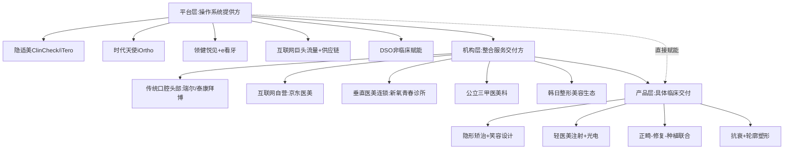

**平台型生态的核心约束**。规模效应显著但门槛极高——构建一个能够同时承担技术输出+流量分发+SOP标准化+数据中台的完整平台，需要数十亿至数百亿级的资本投入与5-10年的产业积累。当前具备这一潜力的中国主体仅有BAT级互联网巨头（京东、阿里、美团）+头部正畸品牌（隐适美、时代天使、领健）+少数特定DSO（美维等）。其他中小型机构或品牌只能选择**接入既有平台而非自建平台**——这一选择决定了未来5-10年中国融合生态的格局可能是"少数平台+多数机构+海量医生IP"的金字塔结构。

平台型生态还面临反垄断、数据合规、平台与机构利益分配等约束。其他参考信息已识别"2023年十一部门《指导意见》严禁无资质导购、2025价格立项指南"等监管收紧信号，意味着平台不能再以"流量分发"为唯一价值主张，必须承担更多合规审核与质量保障责任。同时，跨业数据互通涉及《个人信息保护法》框架下的授权机制设计，平台需要在数据驱动与隐私保护间寻找平衡。这些约束的深度剖析将留待第9章。

## 8.6 融合路径的可行性评估、可复制性与边界约束

综合8.1-8.5节的剖析，本节构建"商业可行性—监管合规性—消费者接受度"三维矩阵，对前五节识别的融合路径进行综合评估，输出可复制路径与受限路径的清晰判断。

| 融合路径 | 商业可行性 | 监管合规性 | 消费者接受度 | 综合可行性 | 国际vs中国差异 |
|--------|------|------|--------|--------|----------|
| 互联网平台自营整合诊所（京东医美） | 中（早期亏损/探索期） | 中（综合门诊部资质可绕开多备案）| 高（一站式便利+品牌信任） | **★★★★** | 中国独特+欧美无对应 |
| 垂直医美连锁向正畸延伸（新氧青春诊所类） | 中低（亏损扩张+供应链断供） | 中（需新增口腔资质） | 中（医美客群对正畸认知待建立） | ★★★ | 中国领先+尚无国际对标 |
| 传统口腔头部品牌整合美学拓展（瑞尔/泰康拜博） | 高（27年沉淀+稳健盈利） | 中（口腔+美白+种植已合规） | 高（中高端家庭长期信任） | **★★★★★** | 中国主流+对标日本宝齿会 |
| 公立三甲医院医美科室入局 | 中（微利+学科建设） | 高（公立背书极强） | 极高（安全敏感型最高信任） | **★★★★** | 中国独特+欧美无对应 |
| DSO赋能型扩张（中国本土化） | 高（理论可行+案例待验证） | 中低（多执业备案壁垒） | 中（消费者对DSO概念陌生） | ★★★ | 美国成熟+中国早期 |
| 单点跨界营销合作 | 中（曝光价值高+ROI不确定） | 高（无医疗合规风险） | 中（一次性事件易遗忘） | ★★★ | 全球普遍 |
| 医生IP矩阵化运营 | 高（边际成本低+流量精准） | 中（跨业认证壁垒） | 高（KOS信任度强） | **★★★★** | 中国小红书/韩国整形医生IP/全球普遍 |
| 颜面整体美学品牌叙事 | 中高（长期投入+难量化） | 高（无直接合规风险） | 高（与心理图谱契合） | ★★★★ | 韩国生态成熟+中国构建中 |
| 全周期颜面美学会员体系 | 高（CLV倍增显著） | 中（需会员协议合规） | 高（与心理账户分离机制契合） | **★★★★★** | 美国DSO+日本真心会成熟+中国快速跟进 |
| 保险产品融合（齿险+医美险） | 低（精算数据稀缺+渗透率低） | 中（保险监管较严） | 低（消费者认知薄弱） | ★★ | 美国部分成熟+中国受限 |
| 套餐式整合服务（场景化） | 高（高重叠场景需求明确） | 高（标准化合规压力低） | 极高（节点驱动+ROI明确） | **★★★★★** | 全球普遍+中国增速最快 |
| 平台型生态（产品-机构-平台三级） | 高（规模效应显著） | 中（反垄断+数据合规约束） | 中高（消费者间接受益） | **★★★★** | 中国互联网巨头领先 |
| 跨业资质统一认证 | 低（制度突破需时间） | 极低（监管框架未明） | 中（消费者已有跨业期待） | ★ | 全球均处早期 |
| 长期效果验证体系 | 低（10-15年周期过长） | 中（需多中心循证） | 中（消费者对长期效果已开始关注） | ★ | 全球均处早期 |

数据来源：综合本章前五节与第6-7章分析整理

**四类可复制路径的清晰判断**：

**路径一：传统口腔头部品牌整合美学拓展（★★★★★）**——以瑞尔集团27年长期主义+多学科MDT为代表，依托既有口腔医疗资质与多学科能力，向美白、笑容设计、修复美学有机延伸。其商业可行性、监管合规性、消费者接受度三维均处高位，是中国市场最具可持续性的融合路径。该路径的扩张速度受品牌沉淀周期限制，但稳健性最强。

**路径二：套餐式整合服务（★★★★★）**——围绕毕业季、求职期、婚礼前、节假日等高重叠场景，设计跨业服务包。其商业可行性建立在第4章已量化的高重叠场景需求基础上，监管合规性建立在标准化产品的合规可控基础上，消费者接受度建立在节点驱动+ROI明确的心理基础上。**美团2021-2024年消费医疗交易规模复合增长率43%、洗牙单人套餐搜索量暴涨546%**[^55]即是其增长动能的产业证据。

**路径三：全周期颜面美学会员体系（★★★★★）**——通过三层权益（长程粘性+高频复购+节点冲刺）的整合设计，实现客户生命周期价值的最大化。其与第3章心理账户分离机制、第6章并发率60-80%的实证测算高度一致。新氧"私域留存81万用户、复购率超60%"与日本真心会"长周期复诊+情绪价值"已分别在中国与日本验证了这一路径的可行性。

**路径四：医生IP矩阵化运营（★★★★）**——以小红书KOS模式、新氧绿宝石医生榜单、瑞尔学科带头人IP为代表，通过医生个人IP的内容输出建立"专业+真实"的双重信任，承接两类咨询。该路径的边际成本低、流量精准，是中小型融合机构最现实的差异化路径。

**三类受限路径的明确警示**：

**受限一：保险产品融合（★★）**——精算数据稀缺、渗透率低、消费者认知薄弱三重约束下，齿险与医美险的实质性融合在3-5年内难以规模化。融合机构应优先考虑机构内部"治疗效果保障基金"等替代性工具，而非真正的保险产品创新。

**受限二：跨业资质统一（★）**——其他参考信息已识别中国"需医疗美容科+美容牙科双二级科目备案，跨科执业需逐一注册"的合规壁垒。这一制度突破需国家卫健委、医保局等多部门协同推动，5-10年内难以完成。融合机构应在现有合规框架内运营，而非寄望于资质统一。

**受限三：长期效果验证体系（★）**——正畸2-3年治疗+5-10年保持的长生命周期与医美短反馈的根本差异，使得跨业长期效果验证缺乏统一基础。该路径在3-5年内主要服务学术研究而非商业落地。

**中国市场与国际市场的路径差异判断**：

**美国市场**：DSO模式已极度成熟（Heartland 1900诊所+市值60亿美元、PDS Health 1000+诊所+整合医疗演进），其向"牙科-医疗一体化"的延伸为正畸+医美融合提供了最具借鉴价值的国际范本。但美国DSO主要在牙科生态内整合，向医美的真正业务延伸仍属早期。

**韩国市场**：整形美容生态高度成熟（江南整形外科25年极致专科+江南Smile View数字化精细诊疗+医疗旅游虹吸），但其品牌哲学是"专科极致+名医IP"而非"集团化运营"，在中国市场难以简单复制。中国可借鉴韩国的"整合临床能力+品牌差异化"，但应避免简单照搬"专科极致"模式。

**日本市场**：预防型差异化成熟（真心会225家加盟+净利率37%、宝齿会100亿日元营收+净利率37%），其"预防+情绪价值+长周期复诊"的商业逻辑对中国融合机构具有最强参考价值。中国头部品牌（特别是瑞尔的"真心"叙事）已部分体现这一逻辑，但尚未形成可加盟复制的SOP体系。

**中国市场**：呈现"互联网平台领先+传统品牌深耕+公立三甲入局"的多元路径并存格局，是全球最具创新活力的融合市场。但合规壁垒（双业务备案、跨学科执业）、资本周期（正畸资本寒冬、医美K型分化）、消费降级压力（隐适美/新氧业绩下行）三重约束意味着中国融合路径的兑现速度可能慢于产业各方的预期。

**与后续章节的衔接接口**：

**对第9章风险分析的衔接**：本章识别的"受限路径"（保险融合、跨业资质统一、长期效果验证）将在第9章具体化为融合面临的监管风险、合规风险、长期验证风险；本章对各路径监管合规性的评估为第9章的合规壁垒分析提供商业模式层基础。

**对第10章战略建议的衔接**：本章识别的四类可复制路径（机构一体化、医生IP整合、套餐场景化、平台赋能型）将在第10章具体化为针对正畸企业、医美机构、跨界品牌、投资方与监管方的差异化战略建议；中国市场与国际市场的路径差异判断为第10章战略建议的区域差异化锚点提供商业层依据；短期（套餐场景化）—中期（机构一体化+医生IP整合）—长期（平台赋能型+生态共建）的演进次序为第10章的三阶段路径预测提供商业模式层基础。

**本章局限的坦诚标注**：

第一，**多数中国融合机构的盈利数据未公开**。京东医美亦庄店、新氧青春诊所、瑞尔集团等案例的具体盈利模型、客户LTV、获客成本等核心数据均未充分披露，本章对各路径商业可行性的评估部分依赖间接指标推断，存在精度局限。

第二，**国际范例的中国本土化适配需更长时间观察**。Heartland Dental、PDS Health、日本真心会的成功有其特定的产业土壤（保险体系、医生供给、消费者文化），其在中国本土化的具体实现路径仍需3-5年的实践检验，本章对适配性的判断具有一定前瞻性但不可避免存在不确定性。

第三，**保险与跨业资质等"受限路径"的政策窗口可能突变**。若中国监管层面出现重大政策突破（如建立跨业整合美学认证体系、推动商业医美险大众化），部分"受限路径"可能在5年内反转为"可行路径"。这一政策不确定性将在第9章重点关注。

通过本章对机构融合、DSO模式、品牌联合、会员保险与套餐服务、平台型生态、可行性评估六大维度的系统剖析，已基本回答"商业模式与品牌如何承接产品技术融合并转化为现实生意"的核心命题——其承接能力呈现"传统品牌深耕+套餐场景化+会员体系+医生IP+平台赋能五大可复制路径已具备落地条件，保险融合+跨业资质+长期验证三大路径在5-10年内仍受限"的分层格局。商业模式的可行性虽已识别，但其最终落地仍需跨越合规、伦理、医疗质量、消费者信任等多重风险——这些风险正是下一章（第9章）的核心议题。

# 9 融合面临的挑战、风险与监管边界

第7章已识别产品技术融合中"未成熟存重大障碍"的四大节点——跨学科执业资质、矫治器与医美耗材合规分类、AI伦理与跨业数据隐私、患者长期效果验证体系；第8章进一步将这些技术障碍映射至商业模式层，明示了"保险融合、跨业资质统一、长期效果验证"三类受限路径，并对四类可复制路径标注了不同强度的合规边界。这些前置判断已经勾勒出融合服务模式的"机会—约束"轮廓，但要使第10章的战略建议具备真正的可操作性，还必须将抽象的"约束"具象化为可识别的风险图谱、可复盘的失败案例、可执行的防控节点。**任何战略路径都不应在风险尚未澄清时被推进，更不应以模糊乐观掩盖结构性障碍**——这是本章的根本立场。

围绕监管框架差异、医生资质与跨业执业壁垒、医疗事故与责任界定、消费者信任与价格透明、伦理争议、商业与资本风险六大主线，本章基于SmileDirectClub破产、海狸家无证牙套案、江阴牙博士母女正畸案、广州某斯口腔正畸致全口牙槽骨吸收案、22岁"幼态脸"诱导案等典型案例的深度复盘，输出"监管—临床—消费者—商业"四层风险防控关键节点清单，并明示融合的"受限路径"与"高风险场景"。本章始终保持"风险识别—案例复盘—防控节点"三段式结构，避免对融合前景的单向乐观。

## 9.1 正畸与医美的监管框架差异与跨业合规张力

融合服务模式所面临的第一重根本性约束，是正畸与医美在监管框架上的**结构性分立**——这种分立并非简单的部门职责划分，而是植根于两类业务在医疗属性、风险等级、消费场景、价格机制上的根本差异。本节系统比较中国及全球主要市场的监管框架差异，识别融合机构必须直面的合规张力。

**中国监管框架的"分级分类"基本盘**。《医疗美容服务管理办法》（2002年发布、2009年与2016年两次修订）构建了医疗美容的核心监管架构——**"医疗美容科为一级诊疗科目，美容外科、美容牙科、美容皮肤科和美容中医科为二级诊疗科目"，"根据医疗美容项目的技术难度，可能发生的医疗风险程度，对医疗美容项目实行分级准入管理"**[^109]。这一"一级+四个二级"的分级体系揭示了一个对融合服务至关重要的制度事实：**美容牙科与美容外科、美容皮肤科、美容中医科平行并列于医疗美容大类之下**，而非独立于医疗美容之外的另一个体系。这意味着，从制度逻辑看，正畸（属于口腔科范畴）与医美（属于医疗美容科范畴）虽分属不同一级科目，但在"美容牙科"这一二级科目层面存在天然的制度交叉点。

然而，这一交叉点并未消除合规分立——口腔正畸的核心业务（隐形矫治、正颌-正畸联合治疗）通常在口腔科或口腔专科医院开展，依据《医疗机构基本标准》进行口腔科目备案；而医美注射、光电类、抗衰类项目则需在具备医疗美容科资质的机构开展，按照"美容外科、美容皮肤科"等二级科目分别备案。一家融合机构若希望同时开展正畸+医美注射+光电类项目，**理论上需同时取得"口腔科+医疗美容科（含相应二级科目）"的复合资质**，这正是其他参考信息所识别的"中国市场需医疗美容科+美容牙科双二级科目备案，跨科执业需逐一注册"的合规壁垒。

第8章已论证京东医美亦庄店之所以能快速实现"四科同址"，关键在于其依托**京东健康综合门诊部**资质而非单一专科诊所架构。这一组织形态的选择恰恰回避了"单一专科扩展跨业"的合规冲突——综合门诊部的多科室设置本就允许内、外、口腔、医美、中医等多科目同址运营，融合机构可在既有综合门诊部框架内通过新增科目逐步实现整合，而非寄望于跨科目的合规突破。

**2023年《关于进一步加强医疗美容行业监管工作的指导意见》的协同监管深化**则代表了中国监管框架的最新升级方向。该《意见》由国家市场监管总局、公安部、商务部、国家卫健委等十一部门联合印发，明确"**医疗美容服务属于医疗活动，必须遵守卫生健康有关行业准入的法律法规**"，并"**着重强调跨部门综合监管，在现有法律法规框架下，从登记管理、资质审核、'证''照'信息共享、通报会商、联合抽查检查、协同监管、行刑衔接等多个维度同时发力，构建贯通协同、高效联动的行业监管体系**"[^111]。这一十一部门协同监管的深度，意味着医美侧的合规审查正从单一卫健监管走向跨部门联合监管——融合机构若同时承担正畸与医美业务，将面临卫健、市场监管、税务、网信、公安、海关等多部门的同步合规审查，合规成本显著高于单一业务模式。

**2025年6月《美容整形类医疗服务价格项目立项指南（试行）》的价格规范化**则进一步明示了医美侧的监管收紧。该《指南》"首次对美容整形类医疗服务价格项目进行统一规范，设立101项美容整形项目"，核心改革包括"**根据技术原理统一项目名称，如将'光子嫩肤''超声炮''热玛吉'分别规范为皮肤美容治疗光/激光、超声、射频，使消费者能清晰理解服务本质**""**细分项目计价，如将丰唇细分为红唇、唇珠、人中、口角等美容整形价格项目，植发按毛囊单位计价，采取'起步加数量'的出租车式计价方案**""**允许医疗机构备案新技术，如填充注射项目不仅包括玻尿酸，还兼容聚乳酸、聚己内酯等新材料**"[^112]。这一"起步加数量"计价方案的引入，从制度层面打击了医美侧的"低价引流+术中加价"乱象，但其对融合机构的双重影响必须明示——降低消费者信任成本的同时，**显著压缩了传统"套餐打包"模式的盈利弹性**，使融合机构的套餐式整合服务（第8章已识别为★★★★★高可行性路径）必须在合规与盈利之间寻找新平衡点。

正畸侧的监管走向同样发生关键变化。2025年国家医保局《口腔类医疗服务价格项目立项指南（试行）》"重点规范口腔正畸矫治价格项目"，与同期医美《立项指南》形成方向上的协同。叠加2022年12月16省（区、兵团）联盟口腔正畸托槽耗材集中带量采购"中选产品平均降幅达43%，最高降幅达88%"[第2章已论证]，正畸侧已进入"集采降价+价格立项规范化"的双重监管收紧期。**正畸耗材的集采公允价格机制与医美耗材的市场调节价机制之间的差异**，意味着融合机构在同一物理空间内同时承担两类业务时，将面临两套截然不同的定价逻辑——正畸侧需按集采价或立项指南规范价执行，医美侧仍可在价格透明前提下自主定价。这一定价机制差异不会直接构成合规冲突，但会使融合机构的财务核算、客户沟通、利润结构呈现"双轨并行"的复杂性。

**国际监管框架的差异化路径**则为中国融合服务提供了多维参照。下表系统比较四类典型框架：

| 监管路径 | 代表市场 | 核心特征 | 对融合的启示 |
|--------|------|------|----------|
| 整形纳入普通外科+协会自治 | 美国 | "1969年起将整形外科纳入普通外科，所以医疗美容适用各项医疗政策、法规、制度；通过成熟的医美行业协会、专业行业杂志、专业基金会进行管理"[^71] | 协会主导+许可证制度，融合机构合规相对灵活 |
| 双轨监管+旅游许可证 | 韩国 | "美容整形医院要向保健福祉部地方组织登记，要求具备一定数额的经营资金和较好的技术条件；凡是接受外国人美容的医院，还要有旅游管理部门的许可证"[^71] | 极致专科+多部门监管，对接国际客流需双重资质 |
| 国家医保托底+正畸自费 | 日本 | 国家医保覆盖95%以上口腔治疗项目但不覆盖正畸美学诉求 | 医保托底使口腔机构差异化盈利空间集中于正畸+美学 |
| 全生命周期临床验证 | 欧盟MDR | "MDR（2017/745）的推行已进入决定性阶段""高风险（Class III）及植入类设备必须提供基于自身产品的详实临床数据""审核周期从以往的不到一年拉长至18-24个月"[^55] | 矫治器与医美耗材若属III类植入器械，需独立完整临床数据 |

数据来源：综合搜索结果整理

值得特别关注的是欧盟MDR的"全生命周期临床验证"转向。MDR下的临床评价要求（CER）已成为实质性的技术壁垒，针对Class IIb和Class III类器械"监管方不仅要求提供基于自身产品的临床原始数据，还通过EUDAMED（欧盟医疗器械数据库）的逐步强制化（2025年起核心模块全面启用），实现了产品从上市前临床到上市后监管（PMS）的实时闭环"[^55]。**"过去，部分企业将CE认证理解为进入欧洲市场前的最终节点。如今，更值得关注的是前端决策质量——包括产品界定、预期用途、分类路径、临床证据布局、技术文档准备，以及上市后的持续合规安排"**[^27]。这一从"合规申报"走向"全生命周期临床验证"的监管转型对融合产品具有结构性影响——若中国融合机构希望将其整合性服务（如正畸-医美联合诊疗的耗材组合）出海至欧盟市场，必须在前端就将"颜面美学一体化"的预期用途定义清晰，并为每一类耗材建立独立的全周期临床证据。

欧盟MDCG 2021-24分类指南2025年的修订进一步收紧了植入器械的定义边界——"文件将原来的'surgical外科手术的'替换为'clinical临床的'，同时更新其定义""'clinical intervention临床干预'比'surgical intervention手术干预'外延更广，意味着某些原本不一定被理解为'手术植入'的场景，此后在分类讨论中可能将更明确地归入'植入器械'分析框架"[^113]。这一定义扩展对融合产品的影响在于：长期植入类正畸保持器、长效医美填充剂等可能被重新归入"植入器械"高风险分类，相应的合规成本与临床证据要求将大幅上升。

**融合机构面临的"三重备案壁垒"与"四类合规张力"**因此可清晰凝练：

| 合规张力维度 | 具体表现 | 制度根源 | 应对方向 |
|----------|------|------|------|
| 资质分立 | 口腔科与医疗美容科分立备案 | 《医疗美容服务管理办法》分级管理 | 综合门诊部架构+分科目逐一申请 |
| 耗材分类 | 正畸矫治器II类、医美玻尿酸III类、长效填充剂可能升级 | 医疗器械分级管理+欧盟MDR趋严 | 双轨采购+独立验真+合规专员 |
| 广告分类管理 | 医疗广告与医疗美容广告分类审批 | 《广告法》+《医疗广告管理办法》 | 跨业品牌账号需双重审批 |
| 价格披露差异 | 正畸集采价+医美市场调节价+《立项指南》规范 | 医保支付与商业保险并行 | 双轨披露+整合套餐重新设计 |

数据来源：综合搜索结果与前章分析整理

**三重备案壁垒**则集中于：医疗美容科+美容牙科双二级科目备案、跨科执业的逐一注册要求（医生层面）、跨业耗材的双轨合规验真。这三重壁垒在5-10年内难以通过制度突破彻底化解，融合机构必须在现有合规框架内通过组织形态创新（综合门诊部、多科室协同、机构间联盟）实现整合服务，而非寄望于资质统一的监管突破。

需要审慎指出的是，监管框架的差异本身并非简单的"障碍"——它反映了正畸与医美在医疗属性、风险等级、消费场景上的客观差异，是保障医疗安全的制度设计。融合机构应将合规视为"可持续运营的底线"而非"竞争的限制"，通过主动构建超越现有监管要求的内部合规标准（参照新氧"对商家服务规范要求进行了6次迭代"的迭代经验[第6章已引述]），将合规从成本中心转化为信任资产。

## 9.2 医生资质双轨认证与跨业执业的合规壁垒

医疗服务的核心是医生，融合服务模式的底层瓶颈最终落在"**能否找到具备双业务合规资质的医生**"这一具体问题上。本节深入剖析正畸与医美医生资质认证体系的双轨结构，并通过国际对比与案例复盘，识别跨业执业的具体合规风险。

**中国医美主诊医师认证的高门槛**。《医疗美容服务管理办法》第十一条对负责实施医疗美容项目的主诊医师设定了严格条件——**"必须同时具备下列条件：（一）具有执业医师资格，经执业医师注册机关注册；（二）具有从事相关临床学科工作经历。其中，负责实施美容外科项目的应具有6年以上从事美容外科或整形外科等相关专业临床工作经历"**[^109]。这一"6年相关专业临床经历"的硬性要求，对一位口腔正畸医生构成了几乎不可逾越的合规鸿沟——正畸医生即便愿意转型医美外科主诊医师，也需要从临床起点重新积累6年整形外科经验，而非简单通过短期培训实现资质转换。

**正畸医生资质头衔的含金量分层**则呈现另一种复杂性。专业头衔的含金量分梯度：**第一梯队权威性头衔包括中华口腔医学会口腔正畸专业委员会（COS）"含金量非常高，国内最权威，COS的委员现任的就不超过400个"、美国正畸专家认证委员会（ABO）"含金量非常高，国内也比较少""口腔医学领域最早建立、也是美国唯一的可颁发正畸专家证书的专业委员会"、美国正畸医师协会（AAO）"含金量较高，略低于ABO"；第二梯队包括世界正畸联盟会员（WFO）"准入条件不高""会员和委员，天大地差别"、Tweed认证医师"含金量一般""国内课程是正畸的公益事业""报名缴费即可参加"；隐适美认证医生"含金量低""相当于驾照之于开车，必要非充分条件，几乎没有含金量可言"；自封性头衔（xx口腔正畸总监）"几乎没有含金量""微博想认证xx口腔正畸总监，只需要出具盖有公章的职位在职说明即可"**[^114]。**特别需要警示的是COS委员与COS会员的根本性差异——会员准入门槛低，"普通会员条件：有口腔医师行医执照，做过3年以上正畸，经单位证明或两位专科会员推荐可注册"**[^114]，但许多机构在营销中刻意模糊"委员"与"会员"的差异，借此夸大医生权威性。

这一头衔分层乱象对融合服务的影响在于：**消费者在评估医生资质时面临严重的信息不对称——同一"COS会员""隐适美认证医生""xx总监"等头衔，其真实含金量可能相差数十倍**。融合机构若仅依靠传统的医生头衔陈列建立信任，反而可能在消费者识别能力提升后失去信任优势——消费者一旦意识到"隐适美认证医生几乎没有含金量可言"，对同一机构其他头衔的信任度也将连带下降。这一信任累积的脆弱性，是融合机构构建医生IP矩阵（第8章★★★★路径）时必须重视的边界条件。

**国际医生培养体系的对比**则进一步揭示中国跨业医生培养体系的相对滞后：

| 国家/地区 | 医美医生培养路径 | 总年限 | 关键特征 |
|--------|---------|------|------|
| 中国 | 执业医师+6年美容外科或整形外科临床经验 | 约11-13年 | 6年硬性临床经验要求 |
| 美国 | "5年普通外科住院医生+2-3年整容外科住院医生"或"3年普通外科+3年整容外科"[^71] | 约12-13年 | 范围涵盖颅颌面外科、手外科、显微外科、修复重建、美容外科等 |
| 韩国 | "医科大学毕业+至少一年实习+整容外科专业资格考试"，专门医培养"6年医科+1年实习+4年专业技能学习+5次重要考核""培养年限在12-14年以上"[^27][^71] | 约12-14年 | 大韩医院协会医院审查委员会负责专科医生培训及资格认证 |
| 日本 | "整容外科医生要满足7年的外科临床工作年限""独立开展医疗美容手术，要经过3年的临床训练，熟练掌握各种技术"[^71] | 约10-12年 | 高门槛+长期临床训练 |
| 俄罗斯 | "合法进行微整容的诊所和医生必须通过国家级别的机构批准""整容手术必须是取得医生职业证书的医师才可以做"[^71] | 国家级审批 | 国家审批+职业证书制度 |

数据来源：综合搜索结果整理

值得对比的是日本"专门医"制度的极致专科主义——韩国"专门医"培养"6年的医科专业+1年的实习医+4年的专业技能学习+5次重要考核，培养年限在12-14年以上"[^27]。即便对国际医生赴日执业，日本《医师法》也设定了高门槛——**"必须通过日本的医师国家考试并获得执照""日语能力必须达到N1级别""毕业于中国5年制或6年制医学院，且专业课程学时数总计需超过5500小时（硕士、博士课程不计入）""毕业院校需在世界卫生组织（WHO）的医学院校名录中""通过路径③直接考试者，在通过国家考试后，通常也需要完成2年的初期临床研修才能独立执业"**[^71]。这一极高的专科门槛，使得日本医美医生与口腔医生跨业执业几乎不可能在制度内合规实现，只能通过"机构内多医生协作"实现整合服务——这正是日本"宝齿会""真心会"等头部口腔机构的实际运营形态[第8章已论证]。

**江阴牙博士案与广州某斯案的资质警示**则提供了具体的失败教训。

江阴牙博士案中，陈女士母女2018年6月在江阴牙博士进行牙齿矫正，"主治医生黄主任"承诺"她会一直在，不会中途换医生""陈女士的意志可以执行到位"——但**"治疗不到3个月，'主治医生'就不见了"**，原因是"黄主任去吴江牙博士了，一个多月赶来江阴一次"[^115]。这一医生中途流失案例揭示出连锁机构跨地域执业未及时备案的合规风险——医生的多执业备案是医疗合规的底线，一旦未完成备案而跨机构执业，机构将承担超范围执业的合规责任。其他参考信息已识别"江阴牙博士多执业未备案案"作为"DSO/连锁模式下医生执业地点合规是底线"的典型警示。

广州某斯口腔案中，习女士选择的是"找到微博粉丝数135万的'隐适美认证医生'郑院长做牙齿正畸"，诊所介绍"医生团队为中山大学光华口腔医院毕业，拥有口腔专科医院10年以上的工作经验及国内外知名大学的进修经历"，院长资料显示"广东隐适美案例数NO.1""成功开展青少年及成人牙列矫正3000余例"[^116]。这些营销头衔看似权威，但搜索结果已明确指出"隐适美认证医生"含金量低，"广东隐适美案例数NO.1"等"自封性头衔"几乎没有含金量。**消费者依赖这些头衔做出的决策，最终在"全口牙槽骨重度吸收、口腔骨开创开裂"的医疗后果面前显得极其脆弱**[^116]。这一案例对融合机构的核心警示是：**医生IP宣传的真实性核验是融合服务消费者信任建设的底线**——任何营销话术都不能替代医生真实临床能力的验证。

**跨业执业的三大合规风险**因此可凝练为：

第一，**多执业备案缺失风险**。中国《医师法》允许医生在多个医疗机构执业，但需提前完成备案。在DSO模式或连锁机构跨地域扩张中，医生跨地域执业若未及时备案即开展诊疗，将构成超范围执业，机构与医生均承担行政与民事责任。

第二，**超范围执业风险**。一位仅持有口腔医师资格证而无医美主诊医师认证的医生，若在融合机构内开展医美注射或光电类项目，构成超范围执业，可能引发卫生行政处罚、医疗事故责任与民事赔偿三重风险。

第三，**医生IP宣传与实际资质错配风险**。社交媒体时代医生IP的影响力放大了头衔营销的传播效应，但同时放大了头衔虚假与含金量不足的风险。融合机构若以"低含金量头衔包装+高客单价收费"模式运营，一旦发生医疗事故，消费者维权时的舆情爆发力将远超传统模式。

**应对路径的归纳**。基于上述风险结构，融合机构的现实应对路径并非追求"单一医生全栈胜任两类业务"——这在中国现行制度下几乎不可能实现——而应通过**机构层面的多科室协同**实现整合服务。第8章已识别瑞尔集团"专家辗转各地分院主持复杂病例会诊，为年轻医生提供常态化临床支持""将复杂术式拆解为标准化流程""人才培养正从依赖个人经验转向制度化、可复制路径"[第8章已论证]——这一"学科带头人IP+年轻医生集体培养"的双层架构，正是融合机构应对医生资质合规约束的最佳实践。同时，行业层面应推动建设"统一颜面美学专业认证"体系，在现有专科认证基础上叠加跨业整合美学的复合认证，为复合型医生的合规化执业提供制度通道——这一制度创新需国家卫健委、中华口腔医学会、中国整形美容协会等多方协同推动，5-10年内可能取得突破。

## 9.3 医疗事故风险与责任界定的复杂化

监管框架的分立与医生资质的双轨延伸至医疗事故层面，呈现为**责任界定的根本性复杂化**——融合服务模式下的事故归因、责任主体、维权路径都比单一业务模式显著复杂。本节通过五起标志性案例的深度复盘，揭示融合服务面临的医疗事故风险结构，并提炼必须建立的责任界定基础设施。

**案例一：海狸家口腔无证牙套案——器械合规追溯的系统性漏洞**。福州海狸家口腔自2020年10月起为蒋先生女儿做牙齿正畸矫正，"2023年上半年，孩子出现牙龈红肿出血、化脓、牙套嵌到肉里面等情况"，蒋先生发现牙套"既无包装、又无标识"后追问资质，**"海狸家先是提供了山东一家公司的资料""门店又改称牙套来自'深圳市深创义齿技术有限公司'"**[^117]。整个维权过程历时**"800余天、两次败诉"**——一审、二审均认定"涉案矫治器供货商'深创'公司具备《医疗器械生产许可证》，且在有效期内"，驳回蒋先生诉讼请求；蒋先生通过向广东省药品监督管理局提出信息公开申请，获得2024年5月16日答复函"明确了厂家未在《医疗器械生产产品登记表》提前登载相应产品，应被视为超出生产范围"；深圳市市场监督管理局宝安监管局2024年9月对深创义齿"作出行政处罚决定书，认定该公司存在'生产超出生产范围的第二类医疗器械的违法行为'"；福州市中级人民法院2025年9月再审改判蒋先生胜诉，**"福州海狸家口腔科技有限公司台江分公司提供的牙齿隐形正畸服务，牙套厂家在生产制作时无相关资质，机构存在欺诈行为，需向蒋先生返还医疗费25800元并支付三倍赔偿77400元"**[^117]。

更触目惊心的是该案的规模影响——**"深圳市场监督管理局给出的相关文件中，记录了近500名曾在海狸家门店使用深创义齿非法生产的无证牙套消费者名单，涉及海狸家口腔多个门店"**[^117]。海狸家在自媒体披露中承认其"违法行为还有其他的系列违法行为"[^118]——这意味着无证牙套案并非孤立事件，而是连锁机构系统性合规失控的冰山一角。

这一案例对融合服务的核心警示在于：**矫治器作为II类医疗器械，其生产资质的合规追溯依赖《医疗器械生产产品登记表》的具体产品登载，而非简单的"《医疗器械生产许可证》在有效期内"——这一制度细节是消费者维权时几乎不可能获得的专业知识**。蒋先生作为消费者直言"作为普通老百姓来说，对医疗行业我们完全不了解，完全要一点一点去挖，这个是很难的""信息严重不对等"[^117]——这一信息不对称的结构性问题，在融合服务模式下因耗材种类增加（正畸矫治器+医美玻尿酸+光电耗材）而进一步放大。

**案例二：江阴牙博士陈女士母女正畸案——长治疗周期内医生流失与方案重启的责任风险**。前已引述的医生流失案进一步发展出更复杂的医疗后果——"治疗不到3个月，'主治医生'就不见了""陈氏母女本来顺利的整牙过程，但随后的经历却是状况不断：如花几个小时甚至一下午等待黄主任；晚上赶去见终于到江阴的黄主任，却被黄主任放鸽子；黄主任来一次忙得不行，草草接待她们等情况""女儿的牙经过几个月之后一直没见效果""有一次，好不容易等到黄主任复诊自己的情况后，被告知要重启"[^115]。最终的医疗后果是**"自己存在'颞下颌关节紊乱症'，女儿存在'牙周炎、牙龈萎缩'等问题"**——两代人因正畸医疗方案不当导致器官病变。

更具反讽意义的是机构的反向追责——"陈女士没想到，牙博士不仅没有积极承担后果，反而把将她告上法庭，称其严重损害公司名誉，要求赔偿100万""江阴牙博士在现场不仅诬告称其婆婆提出过要100万，还提到了她父母在江阴牙博士门口拉横幅"，但陈女士回应"自己的父亲已经去世20多年了"[^115]。机构以"商业名誉权"反诉消费者维权的策略，揭示出**长治疗周期内消费者维权的极端困难**——医疗事故的举证责任、维权时长、舆论压力、法律费用都远高于医美的短反馈维权。

这一案例对融合服务的核心警示在于：**正畸2-3年长治疗周期内的医生稳定性是医疗质量的关键变量**。融合机构在DSO模式或连锁扩张中若不能保障医生的长期稳定执业，将面临"方案重启—医疗事故—消费者维权—商业名誉对抗"的连锁风险。

**案例三：广州某斯口腔习女士钢牙转隐适美案——牙周炎控制不当与正畸联合的医疗质量底线**。习女士2018年2月开始在某斯口腔做牙齿正畸——**"2018年3月17日，诊所院长为习女士拍片、做了一次性上下牙周刮治及拔除2颗智齿后，13天后（3月30日）就开始钢牙矫正""院方回应：只要牙周炎监控好就可以做牙齿矫正"**；专家说法明确指出**"牙周炎患者可以正畸。但正畸治疗前必须要控制牙周炎症，消除致病因素，确保牙周健康状况稳定。牙周治疗后一般3-6个月，等炎症控制好再进行正畸"**[^116]。诊所在"钢牙矫正进行到9个月后"提出"再拔4颗4号牙才能改善""此步骤没有拍片，直接进行拔牙""由于牙齿一直不适""院方通知习女士将钢制矫正器免费更换成隐适美""但在隐适美矫正过程中，习女士不适感越来越明显，出现牙周溢脓、牙齿松动、牙根暴露等诸多问题""2020年7月30日，诊所拍摄的全景片显示，牙槽骨已有明显吸收""医生解释道'上火了'，只给习女士开了盒消炎药"[^116]。

最终的医疗后果是**"全口牙槽骨重度吸收，全口骨开窗骨开裂，根尖炎，舌侧唇侧骨板消失，创伤性咬合""可能会出现全口牙齿脱落的问题"**——一例正畸消费导致的不可逆器官损伤。其他参考信息已将此案归入"广州牙周炎正畸案：牙周未控制即拔牙矫正，导致全口牙槽骨重度吸收 → 警示：跨科融合不能跳过基础病变筛查"。

这一案例对融合服务的核心警示在于：**融合服务模式下的多学科诊疗必须严格遵守基础病变筛查与控制的临床顺序**——若融合机构为了缩短服务周期或提高客单价而跳过牙周治疗等基础环节直接开展正畸或后续医美，将构成医疗质量底线的根本性突破。这一风险在追求"全周期颜面美学方案"的整合套餐设计中尤为高发——消费者期待"一站式整合"的速效，机构若不能坚守医疗严肃性，整合反而成为医疗事故的催化剂。

**案例四：黔西南州牙管家口腔"数据上传即扣5000元设计费"案——服务流程透明化的合规边界**。该案中"消费者刘某某因个人原因，在矫正方案尚未出具、服务未实际开展前提出终止隐形牙套矫正服务""门诊部以'数据上传品牌方即产生设计费'为由，要求扣除5000元设计费"。经黔西南州消协调解，"核实服务进度，确认门诊部仅完成面诊，尚未向品牌方提交数据，方案设计未启动""刘某某自愿承担2018元设计费；门诊部退还刘某某12758元"。本案评析明确指出**"口腔矫正设计费的收取应以实际提交数据、启动设计流程并产生成本为前提。本案中门诊部未出具方案、未完成数据上传即要求高额费用，属不合理收费"**[^119]。

这一案例的合规警示在于：**正畸消费的费用结构必须与实际服务进度严格对应**。融合机构在套餐式整合服务设计中，若不能精确披露各阶段费用对应的实际成本与服务节点，将面临退费纠纷的高发风险。**消协调解、协议明确、合理成本认定**已成为正畸服务退费的标准化处理路径，融合机构必须在合同条款层面提前明示。

**案例五：22岁张婷"幼态脸"诱导案——医美侧诊断标准混乱的诱导性风险**。前已在第5章引述的张婷案中，**"22岁的张婷站在医疗美容机构咨询室的门口""她踏进这里的本意只是想做个基础护肤，却被引导进了面诊室。咨询师对着她年轻的脸庞，竟给出了'皮肤松需要抗衰''鼻翼宽要切除'的诊断，然后提出打造'幼态脸'的方案"**[^120]。**记者以消费者身份暗访了北京5家宣称精于打造"幼态感"的医美机构。令人啼笑皆非的是，这5家机构对记者同一张脸的"诊断"和改造方案竟然南辕北辙**——第一家"扫除疲惫感：填泪沟、填充太阳穴、填鼻基底、打瘦脸针放松下颌线，最后还要丰个'嘟嘟唇'"；第二家"重点变成了眼睛：填卧蚕、加宽双眼皮、填眉弓和三角区"；第三家"发明了'幼态辨识度'的概念""唇不够饱满、鼻子不够高、下巴不够尖、眉弓平"，"咨询师甚至声称'90多岁都有做幼态脸的'"；第四家与第五家"各有侧重"[^120]。

这一案例对融合服务的核心警示在于：**当医美侧的诊断标准已经如此主观化、商业化、内卷化时，融合服务模式若不加约束，将进一步放大诊断标准混乱的风险**——将正畸的"医疗严肃性"反向稀释为消费品化诱导，使非必要正畸+非必要医美的整合套餐成为过度医疗化的高发场景。这一伦理风险将在9.5节进一步专门剖析。

**两类消费的责任界定差异比较**可清晰呈现：

| 责任界定维度 | 医美侧特征 | 正畸侧特征 | 融合服务的叠加风险 |
|----------|---------|-----------|--------------|
| 反馈周期 | 短（数日-数周）| 长（2-3年治疗+长期保持）| 长短反馈混合，部分项目责任难追溯 |
| 责任主体 | 主诊医师+机构 | 主诊医师+机构+矫治器供应商 | 主体增加，归因复杂化 |
| 医疗事故举证 | 即时影像+自身体验 | 长期影像变化+治疗档案 | 跨业证据整合难度高 |
| 维权周期 | 数月-1年 | 1-3年（参照蒋先生800天）| 部分纠纷可能跨越3-5年 |
| 责任传递 | 单次责任明确 | 跨医生、跨机构责任传递复杂 | AI辅助决策的算法责任尚无规范 |
| 追溯基础设施 | 美团"放心种""放心配"已部分覆盖 | 缺乏类似认证体系 | 跨业认证体系缺位 |

数据来源：综合搜索结果与本节案例整理

**融合服务模式下的责任叠加风险**集中体现于四类：

第一，**跨学科诊疗中责任主体不清**。一位消费者在融合机构同时接受正畸+笑容设计（贴面修复）+医美注射（玻尿酸丰唇）三类服务，若术后出现颞下颌关节紊乱+贴面脱落+唇形过度填充等多重问题，责任归属难以清晰划分——是正畸方案不当？是修复贴面的咬合干扰？还是注射技师操作偏差？多学科协作的优势在融合服务正常运营时显著，但在医疗事故发生时反而成为责任界定的复杂化源头。

第二，**AI辅助决策的算法责任归属**。第7章已引述陈江综述指出AI在口腔美学应用面临"伦理争议"约束。当融合机构使用AI颜面整体预演引导消费者做出决策，而事后发现AI推荐方案存在缺陷时，责任归属是AI算法开发方？是使用算法的医生？是采购算法的机构？这一责任归属在中国现行法律框架下尚无明确规范，是融合机构面临的制度真空风险。

第三，**矫治器与医美耗材合并使用时的不良反应归因困难**。若消费者在正畸期间同步进行医美注射，术后出现口周肌肉僵硬、咀嚼异常、面型不对称等问题，难以判断是矫治器移动牙齿导致的肌肉适应性反应？还是肉毒素注射导致的肌肉麻痹？跨业耗材的不良反应归因需要正畸+医美双业务的复合医学知识，普通医生与司法鉴定机构均难以胜任。

第四，**长治疗周期内医生与机构变更的责任传递**。江阴牙博士案中医生中途流失已构成责任传递断裂，融合服务模式下若涉及DSO或连锁机构的扩张，医生在多机构间流动的频率更高，责任传递的法律基础设施需要更精细的设计。

**融合机构必须建立的四类责任界定基础设施**因此清晰可辨：

第一，**知情同意书的跨业整合标准**。融合机构应建立超越单一业务知情同意的整合性知情同意书，明确正畸、修复、医美注射、光电等各项服务的独立风险、合并使用风险、不可逆性风险、效果预期边界——并由消费者在每一类服务启动前分别签字确认。其他参考信息已识别"任何融合模式不可绕过医生现场评估、术前影像、知情同意三道关"的SmileDirectClub教训。

第二，**治疗档案的全周期可追溯**。融合机构应将消费者的口腔扫描数据、面部影像、治疗方案、复诊记录、医生签字、知情同意书等整合为统一的"颜面整体健康档案"，存储期限不少于10-15年（覆盖正畸保持期）。第6章已识别这一档案的"数据断点"，需在《个人信息保护法》框架下建立授权式跨业数据共享机制。

第三，**责任保险的多场景覆盖**。融合机构应购买医疗责任保险并明确保险覆盖范围包含正畸+医美双业务的合并风险，避免单一业务保险在融合事故发生时出现"责任真空"。第8章已识别保险产品融合（齿险+医美险）作为受限路径★★，机构内部责任保险的多场景设计可作为商业保险产品成熟前的过渡性安排。

第四，**纠纷协调机制的快速响应**。参照新氧"投诉48小时解决率为98.13%，投诉解决满意度为98.57%"[第6章已引述]的处理标准，融合机构应建立7×24小时的纠纷协调机制，并主动接入中消协智慧315平台、当地消协等第三方调解通道，避免医疗纠纷升级为司法诉讼或舆情爆发。

需要审慎指出的是，这四类基础设施虽是融合机构的必备建设，但其有效性依赖一个根本前提——**机构本身坚守医疗严肃性的底线**。海狸家、江阴牙博士、广州某斯三起案例中的机构均具备医疗机构执业许可证、签订了知情同意书、保留了治疗档案，但这些"程序性合规"并未阻止医疗事故的发生——根本原因在于机构在临床决策、医生稳定性、器械合规、效果承诺等核心环节突破了医疗严肃性底线。融合机构若仅以"程序合规"应对责任界定挑战，而不重塑临床决策的医疗严肃性，所有责任界定基础设施都将沦为事故发生后的形式化追责工具。

## 9.4 消费者信任体系建设与价格透明化挑战

医疗事故责任界定回应的是事后追责，而消费者信任体系建设与价格透明化则回应事前预防——融合服务模式只有在前端构建起跨业的信任基础设施，才能真正降低医疗事故的发生概率。本节深入分析当前消费者面临的"三重信任赤字"，并基于平台型认证机制与价格立项规范化的进展，提炼融合机构必须构建的信任四大支柱。

**当前消费者面临的"三重信任赤字"**集中体现为：

**赤字一：器械合规信任赤字**。海狸家深创义齿无证案揭示的供应链溯源缺位是这一赤字的最典型表现——消费者支付了正规医疗机构的服务费用，却使用了无证牙套，且这一信息在普通消费者的认知能力范围之外。这一赤字的产业根源在于：**正畸矫治器的供应链涉及上游材料商、品牌方、技工所、机构、医生五方主体，任一主体的合规缺失都可能导致最终交付到消费者口中的产品不合规，但消费者仅与机构和医生直接接触，难以追溯上游链条**。融合服务模式下耗材种类增加，这一信任赤字进一步放大。

**赤字二：医生资质信任赤字**。江阴牙博士医生流失案+广州某斯虚假头衔案共同揭示了消费者面临的医生稳定性与专业性双重不确定。前者表明消费者与医生签订的"全程负责"承诺缺乏制度保障，后者表明消费者依赖的医生头衔信息可能存在严重的真实性瑕疵。第6章已论证"医生IP化"趋势，但这一趋势在缺乏头衔含金量识别能力的消费者面前可能反向放大信任风险。

**赤字三：效果承诺信任赤字**。"幼态脸"诱导案中"5家机构对同一张脸给出5种南辕北辙诊断方案"揭示了医美侧诊断标准的主观性——同一消费者面对不同机构会得到完全不同的"医疗诊断"，这意味着所谓"医疗诊断"在很大程度上已被商业利益异化为"营销话术"。融合服务模式下，正畸+医美的整合诊断如果不建立独立的复核机制，消费者将面临更复杂的"诊断真伪辨别"挑战。

**平台型信任基础设施的现有进展**为融合服务的信任建设提供了重要参照。**美团"放心种""放心配"覆盖近5000家机构**——"针对种植牙和配镜行业存在的乱象，近年来美团持续推广'放心种'和'放心配'项目，解决用户信任难题，推动行业合规升级。截至2025年底，'放心配'认证门店数接近3000家，'放心种'覆盖门店也超过2000家"[^54]。这一双平台累计近5000家的认证规模，叠加阿里"安心美"联盟覆盖136城、新氧"放心美无忧保障"等平台型信任基础设施[其他参考信息]，已经初步构建起医美与口腔细分领域的信任标签体系。

但**融合服务尚缺乏跨业整合的"放心美"认证体系**——美团"放心种"专注种植牙、"放心配"专注配镜，新氧"放心美"专注医美，三者尚未形成跨业整合的统一认证标签。其他参考信息识别的"P5平台生态路径★★"低可行性正源于此——平台型生态在美中欧均面临DTC与导购监管收紧（2023年十一部门《指导意见》严禁无资质导购、2025价格立项指南），且SmileDirectClub的破产即是平台型DTC模式的前车之鉴。

**美团医疗的整合发展则提供了平台向跨业认证演进的可能路径**。**"超65%的消费者习惯在诊前花1分钟以上时间，在互联网平台对比选择机构和医生""在美团上百万条医疗用户评价中，专业和服务是高频关键词，其中，提及'医生水平'的评价占比，同比上年增长了21个百分点"**[^55]。这一趋势暗示，未来若融合服务规模化兴起，平台层面有可能推出"放心美整合服务"认证标签，覆盖正畸+医美的双业务合规审核。

**价格透明化的政策推进**则提供了信任建设的另一根本路径。2025年6月国家医保局《美容整形类医疗服务价格项目立项指南（试行）》101项规范化已在9.1节详述，其核心改革直击当前医美行业的价格痛点。**"价格混乱是消费者投诉的首要痛点""'热玛吉'等市场名称与技术原理不匹配，消费者难以理解项目本质，更无法横向比价""消费者常面临无明细发票、未签正式合同、仅有口头承诺的困境，一旦发生纠纷，机构往往以'未在合同中承诺效果'为由拒赔"**[^112]——这些痛点正是消费者信任赤字的具体表现。

价格立项指南对融合机构的双重影响必须明示：

**正向影响**：**"'起步加数量'的计价方式让消费者能精确掌握费用构成，这种透明化将大大降低消费者的决策成本和风险感知""可以预测的是，新规实施后，消费者在选择医美机构时，由于价格透明，对技术因素的考量权重将大幅提升，这也会间接促进医美机构的质量提升"**[^112]。**"2024年国家卫健委联合多部门开展'医美乱象专项整治'，注销违规机构超5000家。新规将进一步推动行业向合规化、专业化方向发展，2025年合规机构的市场份额必将进一步扩大"**[^112]。这一合规出清+价格透明的政策组合将系统性提升融合机构的相对竞争优势。

**负向影响**：传统"套餐打包+术中加价"的盈利空间被显著压缩。第8章已识别套餐式整合服务作为★★★★★高可行性路径，但价格立项指南的"起步加数量"计价方式要求融合机构必须在套餐设计时精确披露各项目的独立计价基础，"打包优惠"必须以可验证的成本节约为依据，而非简单的价格让利诱导。这一要求对融合机构的财务核算与定价能力提出更高要求。

**消费者诊前决策行为的变化**进一步揭示信任建设的迫切性——**"美团调研数据显示，超65%的消费者习惯在诊前花1分钟以上时间，在互联网平台对比选择机构和医生""在美团上百万条医疗用户评价中，专业和服务是高频关键词"**[^55]。这一行为模式意味着，融合机构的信任建设不能仅停留在机构内部的合规体系建设，更必须主动管理外部平台上的口碑、评价、案例分享——任何线下事故都将快速通过平台传播放大，反向损害机构的信任资产。

**融合机构构建消费者信任的四大支柱**因此可清晰提炼：

**支柱一：扫码验真的耗材溯源体系**。第6章已识别长春艾尔莎医美"机构内陈列着BBL HERO、帝医思黄金微针、超玛吉（射频紧肤）等多台国际一线医美仪器，每台仪器均经过官方授权，支持现场扫码验真"的实践范本。融合机构应将这一扫码验真体系扩展至全部耗材——隐形矫治器、贴面修复体、玻尿酸、肉毒素、射频探头等，每一类耗材均建立厂家直采+扫码验真+证书展示的三重溯源机制。海狸家深创义齿无证案警示我们：扫码验真不仅要核验厂家《医疗器械生产许可证》，更要核验具体产品在生产登记表中的合法登载。

**支柱二：医生IP透明披露的资质核验**。融合机构应建立医生IP矩阵的资质透明披露机制——头衔含金量分级展示、临床案例数量+并发症统计同步披露、多执业备案信息公开核验。其他参考信息已识别"医生头衔混乱"作为P4整体美学设计路径的中等监管风险，融合机构通过主动透明披露反而可建立差异化信任优势——消费者在比较多家机构时，更倾向选择敢于披露具体临床数据的机构，而非仅依赖营销头衔的机构。

**支柱三："起步加数量"式的整合套餐价格披露**。融合机构应严格遵守医保局《立项指南》的价格透明化要求，将整合套餐的每一项独立服务的"起步价"+"计量单位"+"附加项目"清晰披露，避免"打包价"模糊各项目的独立成本。这一披露不仅是合规要求，更是融合机构相对单一业务机构的差异化优势——当消费者意识到融合机构能够提供"项目级透明披露"+"整合优惠的可验证成本基础"时，其对融合服务的信任度将显著高于传统打包模式。

**支柱四：跨业打通的纠纷协调机制**。参照新氧"投诉48小时解决率为98.13%""加入中消协'智慧315平台'，在中消协指导下，优先通过该平台，协商解决消费纠纷"[第6章已引述]的实践，融合机构应建立跨业纠纷的快速响应机制——任一项目的消费者投诉均纳入统一处理流程，避免"正畸纠纷踢给医美""医美纠纷踢给正畸"的部门间扯皮。同时，融合机构应主动与平台、消协、行业协会建立纠纷协调通道，将消费者维权成本降到最低。

需要审慎指出的是，信任建设的四大支柱并非简单的成本投入，而是融合机构的核心战略资产。当行业整体面临SmileDirectClub式的破产周期、爱齐科技式的市值蒸发、新氧式的核心业务下滑时，**信任资产将成为融合机构穿越周期的核心竞争力**——消费者在经济不确定下减少消费的同时，会更加集中地选择信任度最高的机构。这一"信任聚集效应"是融合机构在资本周期下行时仍能扩大份额的根本逻辑。

## 9.5 伦理争议：过度医疗化、低龄化与容貌焦虑制造

监管、医疗、信任等风险维度尚属"显性"层面的合规与质量挑战，而伦理争议则触及融合服务模式的"价值底线"——这一底线一旦被突破，即便所有合规与质量指标都满足，融合服务模式也将丧失其作为医疗行为的根本正当性。本节系统剖析过度医疗化、低龄化、容貌焦虑制造三类伦理争议，并提炼融合机构应坚守的伦理底线。

**伦理风险一：过度医疗化的诱导式营销**。22岁张婷案的核心警示并非单纯的诊断不当，而是**诊断本身已被异化为营销手段**——"皮肤松需要抗衰""鼻翼宽要切除""18岁后人就开始衰老""抗初老越早越好"等话术与实际医学事实相背离。**"许多医美广告宣传'抗初老''抗衰要趁早'，大部分产品对'抗初老'的定义是20岁到25岁，有的甚至低至18岁。有的广告则以一些常见且宽泛的皮肤状态来定义'初老'，如毛孔粗大、皮肤松弛、有鱼尾纹"**[^121]。**"24岁的赵婷立刻在某线上购物软件上选了家'看上去很靠谱'的医美机构""店员反复强调18岁之后人就会衰老，因此抗衰越早越好""赵婷当即花了几千元做了一次超声炮""做完超声炮后，她感觉面容并没有什么变化，倒是脸疼了快半个月了，现在按压下颌缘上方，还有明显痛感"**[^121]——这一全过程清晰呈现了"焦虑诱导→冲动消费→无效或负效结果"的产业化操作链条。

**《中国医美行业2023年度洞悉报告》数据**——**"受访的医美潜在消费人群平均年龄为28岁，其中30岁以下的占75%；25岁以下人群中，29%计划在2023年增加医美开支或尝试更多项目"**[^121]——揭示了医美消费向年轻化迁移的客观趋势。但这一年轻化趋势本身并非问题，问题在于部分机构利用年轻化趋势制造焦虑、诱导非必要消费。

5家机构对同一张脸给出5种诊断方案的乱象进一步证明：**当医疗诊断的标准化与权威性被商业利益解构后，所谓"医美诊断"已退化为基于消费者支付能力的"项目推荐"**。这一退化在融合服务模式下面临进一步放大风险——若融合机构将正畸的"医疗严肃性"反向稀释为消费品化诱导，消费者在已经接受正畸的"长期投资"心理框架下，更可能被诱导接受"配套医美抗衰"的非必要项目，使非必要正畸+非必要医美的整合套餐成为过度医疗化的高发场景。

**话术体系的精密设计与风险轻描的反差**集中体现于行业的成熟操控话术——**"'人每一天都在衰老，明天又比今天老，如果不抗衰，那就会一直变老''打造幼态脸之后，你找的男朋友肯定比现在好，追你的人数量肯定大幅增加'……这些说辞在记者走访多家机构时被反复提及，而对于可能存在的风险却被只言片语模糊带过"**[^120]。

**伦理风险二：未成年人保护的国际经验与中国监管空白**。低龄化趋势在中国与全球同步发生——韩国14岁首次整形最低年龄、中国儿童隐形正畸CAGR超过60%[第5章已论证]、灼识咨询揭示的早期干预"家长焦虑+颜值经济双重追逐"。但这一趋势在缺乏未成年人保护监管的语境下面临重大伦理风险。

**国际未成年人保护的多元路径**为中国监管提供了关键参照：

| 国家/地区 | 未成年人保护核心规则 | 法律后果 |
|--------|------------|------|
| 意大利 | 2013年立法"禁止未成年人隆胸整形" | "擅自给未成年人隆胸，将被罚款2万欧元和勒令三个月暂停执业"[^71] |
| 澳大利亚 | "严禁整容师给未成年人实施吸脂或隆唇等整容手术，除因生理或心理原因不得不进行整容手术外，18岁以下人群不许接受任何整容手术" | "违法给未成年人做整容手术的整容师可处2年监禁"[^71] |
| 奥地利 | "禁止对未满16岁的少年进行美容手术。对16岁到18岁的青年人，虽可进行手术，但必须有三个前提条件：一是对本人进行心理咨询；二是必须得到监护人同意；三是从同意手术到进行手术至少有4周的思考期"[^71] | 制度严格 |
| 美国 | "未成年人整容必须征得监护人的书面同意。家长在同意子女整容前，要评估孩子生理和心理成熟度：必须有未成年人主动提出整容的请求；未成年人要有现实的目标；未成年人应足够成熟"[^71] | 监护人同意+成熟度评估 |
| 韩国 | "未成年人接受整容手术必须有法定监护人的同意书。韩国整形外科协会也建议，未成年人如果想整容，应先进行心理评估"[^71] | 监护人同意+心理评估 |

数据来源：综合搜索结果整理

意大利"罚款2万欧元+三个月停业"+澳大利亚"2年监禁"的极致严格，与中国当前缺乏专门针对未成年人医美整容立法的现状形成鲜明对照。**特别是奥地利的"4周思考期"制度——从同意手术到进行手术至少有4周时间——这一冷静期设计有效遏制了未成年人因即时冲动做出的不可逆医疗决策**。中国融合机构若希望在伦理层面树立标杆，可主动建立超越现行法规的未成年人保护机制——参照意大利、澳大利亚、奥地利的国际经验，对融合服务中的未成年人客户设置严格的医疗必要性筛查、心理评估、监护人同意、冷静期等多重门槛。

**儿童隐形正畸CAGR超过60%的高速增长**[第5章已论证]意味着中国未成年人正畸市场已进入加速期，但与正畸不同，未成年人医美的伦理风险更高——正畸的医疗必要性（咬合功能、口腔健康、颌面发育）相对清晰，而未成年人医美的"美学诉求"在心理成熟度尚不足的人群中容易被诱导制造。融合服务模式下，**若机构以"颜面整体美学"为统一叙事，将正畸的医疗必要性叙事意外延伸至医美的非必要美学，可能触发未成年人保护的重大伦理风险**——例如将正畸期间的"配套医美护肤套餐"推销给15-17岁的青少年家庭，即便家长签字同意，也可能在未成年人心理成熟度评估缺位下构成伦理失范。

**伦理风险三：容貌焦虑的产业化制造**。"25岁抗初老有点晚"、"18岁后开始衰老"等话术构成了产业化的焦虑制造机制。**第3章已论证大学生容貌焦虑数据——"59.03%的大学生存在一定程度的容貌焦虑，其中女生中度焦虑比例（59.67%）显著高于男生（37.14%）"**[第3章已引述]。这一焦虑现象的产业化根源是社交媒体滤镜与AIGC放大的审美鸿沟——社交媒体上的高度美化内容（滤镜、修图、AI美颜）与现实之间的"审美鸿沟"是焦虑的核心来源[第5章已论证]。

融合服务的"颜面整体美学"叙事若被异化为"全方位不完美"的焦虑制造，将进一步放大伦理风险。当机构以"AI微笑设计"+"AI测肤"等技术工具将消费者的牙齿、皮肤、轮廓、面型等多维度同时呈现"未优化"状态时，消费者面临的不再是单一项目的不完美焦虑，而是颜面整体维度的全方位焦虑——这一焦虑的强度远超单一业务模式下的项目焦虑。

**北京口腔医学会"坚决抵制口腔医疗商业化乱象"声明**[^122]提示行业自律的重要性——"中华口腔医学会也于6月16日发布了《关于坚决抵制口腔医疗商业化乱象的声明》，针对违反国家相关规定、扰乱正常医疗秩序、对民众口腔健康造成严重危害的口腔医疗商业化乱象，包括个别商业联合会违规举办所谓美牙师培训班、口腔美容培训班，发布不当宣传视频并宣称可以发放国家医师资格证书分类中根本不存在的美牙师证书等行为予以强烈的谴责和坚决反对！""牙齿是人体的重要器官，牙齿的任何治疗都是属于医疗行为，必须在有资质的医疗机构，由具有执业资格的口腔医师按照口腔临床操作规范和要求完成"[^122]。这一声明对融合服务的核心警示在于：**任何形式的"美牙师""口腔美容师"等非合规称谓都不得在融合服务中使用**——融合不是降低医疗标准的借口，而是要求更高医疗标准的整合形态。

**融合机构应坚守的三条伦理底线**因此清晰可辨：

**底线一：未成年人保护底线**。融合机构应建立超越现行法规的未成年人保护机制——参照奥地利"4周冷静期"+美国"成熟度评估"+韩国"心理评估"等国际经验，对融合服务中的未成年人客户设置医疗必要性筛查、心理评估、监护人同意、冷静期、独立第三方诊断复核等多重门槛。具体操作层面，未成年人融合服务应限定于具备明确医疗必要性的项目（如严重错颌畸形的正畸-正颌联合治疗），严格禁止仅出于美学诉求的非必要医美注射或手术。

**底线二：必要性诊断底线**。融合机构应建立独立第三方诊断复核机制——所有跨业整合套餐的诊断方案必须由非利益相关方医生进行独立复核，避免单一医生为提高客单价而推荐非必要项目的诱导行为。这一机制的产业化推进需要行业协会与监管层面的支持，但融合机构在内部治理中可率先建立。

**底线三：广告内容底线**。融合机构应主动杜绝制造焦虑式营销话术——"18岁开始衰老""25岁抗初老有点晚""不抗衰追你的人会变少"等话术不得在机构的任何宣传中出现。同时，融合机构应在内容营销中主动呈现"自然美""个性化美""健康美"的多元审美叙事，避免单一审美标准的强化。

需要审慎指出的是，伦理底线的坚守往往与短期商业利益冲突——融合机构若严格执行未成年人保护、必要性诊断、广告内容三大底线，可能在短期内损失部分客户与营收。但从长期视角看，伦理底线是融合机构差异化竞争的核心资产——当行业整体面临"幼态脸"乱象、"抗衰焦虑"质疑、低龄化伦理争议时，主动坚守底线的融合机构反而能够成为消费者最信任的选择，实现"伦理优势→品牌差异化→长期客户粘性→可持续盈利"的正循环。这一正循环正是瑞尔集团27年坚守"真心"叙事的根本逻辑。

## 9.6 商业模式风险与资本周期下的可持续性挑战

伦理底线回应价值层风险，商业模式风险则回应可持续性层挑战——融合服务模式即便在合规、医疗、伦理层面均得到保障，仍面临资本周期、商业博弈、获客成本、长期效果验证等多维度商业可持续性挑战。本节聚焦四类商业风险，并提炼可持续性的核心原则。

**商业风险一：资本冷热分化与消费医疗周期切换**。SmileDirectClub的4年陨落是DTC模式在不具备临床支持下的脆弱性最深刻教训。**"全球牙科器械巨头SmileDirectClub宣布，公司已启动资产重组交易流程，并自愿申请美国破产法第11章的保护""2019年，公司顺利登陆纳斯达克，市值飙升至90亿美元，约人民币650亿元""仅仅4年过去，公司股价已经跌去了99%"**[^123]。其失败的核心原因是**"远程隐形正畸服务""取消了患者必须前往线下医院或诊所牙齿取模的环节""免去了中间商以及牙科诊所的昂贵费用"**——这一商业模式创新看似颠覆，但在医疗本质层面跳过了医生面诊、术前X光、知情同意三道关键关[其他参考信息已识别]。**"公司依然尚未实现盈利，尤其疫情期间经营一落千丈，深陷债务泥潭"**[^123]——盈利模型的根本缺陷+疫情周期的外部冲击共同导致了这一独角兽的陨落。

**爱齐科技、ADA、AAO反垄断诉讼案**揭示了行业巨头通过协会与监管联动消除创新对手的商业博弈风险——**"两家重量级律所——Susman Godfrey LLP与Benesch Friedlander Coplan & Aronoff, LLP联袂出击，代表CDS Litigation, LLC对隐适美母公司爱齐科技（Align Technology, Inc.）、美国牙科协会（ADA）和美国正畸医师协会（AAO）提起反垄断诉讼""被告被指控多年串谋，意图消除创新对手SmileDirectClub（SDC），以巩固其市场霸主地位"**[^124]。爱齐科技与SDC的合作历史揭示了商业博弈的复杂性——**"爱齐科技以5950万美元投资换得SDC 19%的股份，成为其独家透明牙套供应商。这份合作协议赋予了爱齐科技接触SDC机密信息的权限和董事会席位""转折发生在SDC婉拒爱齐科技15亿美元的收购邀约之后。随即，爱齐科技改弦更张：利用在合作期间获取的机密信息，开设了一系列模仿SDC创新型SmileShops的'扫描店'""2019年的仲裁裁决""爱齐科技被认定违反不竞争条款、滥用机密信息及违背信托义务"**[^124]。**"爱齐科技在被迫退出SDC后转向了一条更为迂回的战略路径：与ADA和AAO展开深度合作，多管齐下围剿SDC。诉状指控其散布安全性和有效性质疑、向FDA和FTC提起无据"**[^124]。

这一反垄断诉讼对融合机构的核心警示在于：**任何创新商业模式（无论是融合服务模式还是DTC模式）都将面临行业既得利益方的反扑**——通过协会、监管、舆论、合作终止等多元手段挤压创新者的生存空间。融合机构在战略制定时必须预见这一博弈风险，主动选择与既有协会、监管层、上游供应商建立合规协作关系，而非通过绕开这些方进行模式创新。其他参考信息已识别"任何融合模式不可绕过医生现场评估、术前影像、知情同意书三道关""模式创新需主动拥抱专业体系"——这一警示与SDC的失败教训完全一致。

**爱齐科技自身的衰退**则进一步证明，即便是行业巨头也无法摆脱消费医疗周期切换的影响——**"作为消费医疗曾经的王者，艾利科技凭借隐形正畸产品'隐适美'（Invisalign），开创并垄断了全球透明牙套市场。鼎盛时期，隐适美占据了全球超过80%的市场份额，并凭此在美股创造了10年26倍的故事，市值一度高达565亿美元""2025年，则是彻底'变天'，二季度隐适美收入同比下降3.3%""隐适美的全球市场份额如今已不足60%""在北美、欧洲市场，艾利科技的情况同样严峻，份额下滑，美国本土市场利润更是首次出现负增长""公司在电话会议中解释，利润下滑源于病例数量减少、转化率不及预期以及消费者支付意愿减弱"**[^27]。这一"贵是原罪"的判断揭示了消费医疗的根本逻辑——**"隐形正畸——尤其是主打高端的隐适美，虽被定义为'医疗行为'，但其本质仍是一个高客单价、非刚需的消费品。这意味它的需求高度依赖于经济周期与消费信心：在经济繁荣期，人们愿意为'变美'买单；但在经济下行期，它往往成为预算清单上优先被删减的项目"**[^27]。

中国市场的多重信号——口腔投融资从2022年98亿降至2024年35亿、2024年关停近6000家口腔诊所、新氧2024年净亏损5.87亿、新氧信息预订业务连续三季同比下降34%+[第2章、第6章已论证]——共同指向消费医疗资本周期切换。**"市场空间的天花板也正变得清晰可见。在美国，青少年正畸渗透率达到70%，成人约30%。欧洲多国的青少年渗透率也已接近上限。这意味着核心市场的自然增量几乎耗尽""在欧美人口增长停滞的背景下，艾利科技的增长更多是药寄望于现有用户的'二次消费'（如牙套丢失更换）或'以价换量'。然而，降价策略在短期或许能刺激销量，但在消费降级的整体趋势下，将对公司盈利能力带来持续压力""经济压力进一步引起'高端产品'的渗透放缓。性价比的回归，成为当前市场的首要逻辑"**[^27]。

**商业风险二：获客成本飙升与渠道冲突**。其他参考信息已识别"头部医美机构的单客获客成本已从2023年的3000至5000元激增至2025年的8000至12000元"——这一获客成本翻倍的现象反映出医美行业的竞争内卷化。同时，新氧低价策略已"直接击穿了上游厂商苦心维护的价格体系，已导致其与多家主流供应商关系破裂，被部分厂商列入'非官方合作'名单、甚至被部分厂商断供"[第6章已引述]——平台端的低价竞争向上游传导引发供应链断裂，使融合机构面临"获客成本飙升+供应链风险"的双重压力。

**京东医美亦庄店的早期表现**也提供了融合机构的现实警示——**"销量最高的'营养水光'项目（售价818元）销量为40件，其余项目销量均在20件以下"**[第8章已引述]。这一"低价位+小销量"的早期表现意味着，即便是依托京东健康综合门诊部资质与京东集团供应链的融合机构，初期也面临客群培育的漫长周期。融合机构若以快速规模化为目标，反而可能在初期投入与缓慢爬坡间陷入新氧式的"扩张+亏损"陷阱。

**商业风险三：长期效果验证缺失**。正畸2-3年治疗+5-10年保持的长生命周期与医美短反馈机制的根本差异，使得跨业长期效果验证体系3-5年内难以建立。融合机构面临"当前盈利易、长期信任难"的深层挑战——短期内可通过营销获客、套餐定价、平台合作实现快速盈利，但长期内若不能建立可验证的长期效果数据库，消费者的信任沉淀将受限。

**广州习女士案的"治疗三年牙骨开裂"**警示我们：**长期效果验证缺失下，机构在短期可通过"免费换隐适美"等让步缓解纠纷，但长期效果的不可逆损害一旦发生，机构面临的法律责任与舆情代价远超短期盈利**[^116]。融合机构若不能建立10-15年的长期效果跟踪体系，其商业可持续性将面临根本性挑战。

**商业风险四：日本"内卷市场"教训对中国的警示**。**"日本目前口腔医疗服务市场经济规模为31691.2亿日币（311亿美元），人均每年口腔医疗服务消费金额为：25151日元（246美元）""对应311亿美元的市场规模，日本目前有71520家口腔医疗机构""仅东京（人口1300万）就有12000家口腔医疗机构""由于口腔医生和机构数量过多，直接导致日本牙医收入大幅度下降""日本牙医收入和20年前比下降了接近60%，目前平均为：634万日元（6.1万美元）/年，时薪为3124日元（30美元）/小时，只是一个在'全家'打零工服务员工资（1000日元/小时）的3倍而已"**[^71]。**"加长工作时长，尽量多接点病人或是差异化服务让患者尽量选择自己的机构，就是日本口腔医疗机构的生存之道""在日本东京已经出现了'女仆口腔门诊''24小时口腔门诊'"**[^71]。**"中国整体经济和社会发展已经从以往的高速、粗放式增长模式切换到稳定、高质量发展方式。在此社会背景下，这几年口腔医疗机构经营者们感受到来自市场从未有过的寒意""今天我们所经历的一切也正是邻国日本曾经经历过的动荡"**[^71]。

这一"日本即中国未来"的判断意味着，融合机构必须为长期内卷做好准备——日本"宝齿会""真心会"等头部机构的"差异化生存之道"（净利率37%）正是中国融合机构的最佳学习对象，而非简单复制美国DSO的快速扩张模式。

**融合机构商业可持续性的四条原则**因此可凝练：

**原则一：避免低价内卷**。融合机构不应以低价为核心竞争力——SDC、新氧的失败教训证明，低价模式难以支撑医疗服务的长期可持续。融合机构应通过整合服务的差异化、信任资产的累积、长期医患关系的沉淀建立非价格竞争优势。

**原则二：坚守医疗严肃性**。SDC的核心失败是跳过了医生现场评估、术前影像、知情同意三道关。融合机构必须将医疗严肃性作为底线红线，任何商业模式创新不得以降低医疗标准为代价。爱齐科技、ADA、AAO反垄断诉讼案进一步证明，主动拥抱专业体系（医生协会、监管层、上游品牌）远比试图绕开它们更能保障长期商业可持续。

**原则三：建立长期医患关系基础设施**。日本"宝齿会"100亿日元营收+净利率37%、"真心会"230亿日元业绩+225家加盟[第8章已引述]的差异化生存之道，核心是建立长期医患关系基础设施——预防、情绪价值、长周期复诊、自费治疗为主营。融合机构应将这一逻辑作为核心战略而非营销手段，通过会员体系、私域留存、定期复诊提醒等基础设施，将客户从"项目购买者"转化为"长期健康伙伴"。

**原则四：在乐观与悲观资本周期间保持战略弹性**。爱齐科技市值3年蒸发80%+证明，即便是行业巨头也无法预测资本周期。融合机构应在战略制定时同时准备"乐观情景"（消费者支付意愿恢复+融合需求快速兑现）与"悲观情景"（消费降级延续+融合需求兑现延后）的应对方案——前者通过快速扩张抢占市场，后者通过精细化运营、降低固定成本、聚焦核心客群熬过周期。

## 9.7 风险防控关键节点清单与融合边界条件

综合9.1-9.6节的系统风险识别，本节构建"监管—临床—消费者—商业"四层风险防控关键节点矩阵，输出可操作的融合边界条件，并明示融合的"受限路径"与"高风险场景"。

**第一层：监管层防控节点**。

| 防控节点 | 具体内容 | 制度依据 | 警示案例 |
|--------|------|------|------|
| 跨业医生执业的多执业备案合规化 | 所有跨地域、跨机构执业的医生必须在新执业地完成备案后方可开展诊疗 | 《医师法》《医疗机构管理条例》 | 江阴牙博士医生中途流失案 |
| 矫治器与医美耗材的双轨认证体系 | 建立扫码验真+《医疗器械生产产品登记表》核验+定期飞行检查的三重溯源 | 《医疗器械监督管理条例》 | 海狸家深创义齿超范围生产案 |
| 广告与内容营销的医疗广告分类管理合规化 | 跨业品牌账号需双重审批，禁止"幼态脸""抗初老焦虑"等焦虑诱导话术 | 《广告法》《医疗广告管理办法》《关于进一步加强医疗美容行业监管工作的指导意见》[^111] | 22岁张婷"幼态脸"诱导案 |
| 价格披露的"立项指南"统一规范化 | 严格执行医保局101项立项指南，整合套餐遵循"起步加数量"计价 | 《美容整形类医疗服务价格项目立项指南》[^112] | 黔西南州牙管家"5000元设计费"案[^119] |

**第二层：临床层防控节点**。

| 防控节点 | 具体内容 | 制度依据 | 警示案例 |
|--------|------|------|------|
| 跨学科诊疗SOP的标准化建设 | 建立正畸-修复-种植-医美联合诊疗的标准化流程，包括基础病变筛查的强制环节 | 行业协会指南 | 广州某斯口腔牙周炎控制不当致全口牙槽骨吸收案 |
| 复合型医生培养的机构化路径 | 参照瑞尔"学科带头人+年轻医生集体培养"模式，避免单一医生IP风险 | 机构内部医疗质量管理规范 | 广州某斯"隐适美认证医生"虚假头衔案 |
| AI辅助决策的伦理审查与责任归属明示 | 明示AI推荐方案的算法责任归属与医生最终决策权，建立AI伦理审查委员会 | 陈江综述识别的"技术瓶颈、伦理争议、数据多样性不足"三大约束[第7章已论证] | AI算法偏差风险（待规范） |
| 长治疗周期内的医生稳定性保障 | 建立医生流失预警+方案传承+病例复盘的全周期保障机制 | 《医疗机构管理条例》 | 江阴牙博士医生流失案 |

**第三层：消费者层防控节点**。

| 防控节点 | 具体内容 | 参照实践 | 警示案例 |
|--------|------|------|------|
| 知情同意书的跨业整合标准 | 建立涵盖正畸、修复、医美各项服务的独立风险+合并风险+不可逆性风险+效果预期边界的整合知情同意书 | SDC教训：跳过知情同意三道关 | SmileDirectClub破产案 |
| 扫码验真的供应链溯源体系 | 全部耗材建立厂家直采+扫码验真+证书展示的三重溯源 | 长春艾尔莎医美全系扫码验真 | 海狸家无证牙套案 |
| 独立第三方诊断复核机制 | 跨业整合套餐的诊断方案由非利益相关方医生独立复核 | 5家机构5种诊断方案的乱象警示 | "幼态脸"诱导案 |
| "放心美"式跨业认证体系建设 | 推动平台型跨业认证标签（参照美团"放心种"+"放心配"近5000家+阿里"安心美"136城） | 美团"放心种"2000+"放心配"近3000家[^54] | 跨业认证缺位 |
| 未成年人融合服务的强化保护 | 参照意大利"罚款2万欧元+三个月停业"+澳大利亚"2年监禁"+奥地利"4周冷静期"+美国"成熟度评估"+韩国"心理评估"建立多重门槛 | 国际未成年人保护对比[^71] | 中国监管空白 |

**第四层：商业层防控节点**。

| 防控节点 | 具体内容 | 警示参照 |
|--------|------|------|
| 避免低价内卷的可持续盈利模型 | 通过整合差异化、信任资产、长期医患关系建立非价格竞争优势 | 新氧低价致供应链断供+持续亏损 |
| 医生IP矩阵的真实性核验 | 头衔含金量分级+临床案例+并发症统计同步透明披露 | 广州某斯虚假头衔案 |
| 客户生命周期价值与全周期保障的平衡 | 三层会员权益设计（长程+高频+节点）尊重消费者心理账户分离 | 第3章心理账户机制 |
| 跨周期资本约束下的战略弹性保留 | 同时准备乐观与悲观资本情景的应对方案 | 爱齐科技市值3年蒸发80%+ |

数据来源：综合本章前六节分析整理

**融合的"三类受限路径"明示**：

第一，**保险融合（齿险+医美险一体化）**——精算数据稀缺、渗透率低、消费者认知薄弱三重约束下，3-5年内难以规模化。融合机构应优先考虑机构内部"治疗效果保障基金"等替代性工具。

第二，**跨业资质统一**——其他参考信息已识别中国"双二级科目备案+跨科执业逐一注册"的合规壁垒。这一制度突破需国家卫健委、医保局等多部门协同推动，5-10年内难以完成。融合机构应在现有合规框架内通过组织形态创新实现整合。

第三，**长期效果验证体系**——正畸2-3年治疗+5-10年保持的长生命周期与医美短反馈的根本差异，使得跨业长期效果验证缺乏统一基础。该路径在3-5年内主要服务学术研究而非商业落地。

**融合的"两类高风险场景"警示**：

第一，**未成年人融合服务**——若不建立超越现行法规的未成年人保护机制（参照奥地利、意大利、澳大利亚国际经验），未成年人融合服务将面临伦理与监管双重风险。

第二，**过度医疗化诱导式营销**——"幼态脸""18岁开始衰老""抗初老越早越好"等焦虑制造话术若延续至融合服务，将放大伦理争议，触发监管关注与消费者信任崩塌。

**融合战略的边界条件**：任一战略路径都必须在四层防控节点全部满足的前提下推进。具体而言：

- 监管层四节点：跨业医生备案+耗材双轨认证+广告分类合规+价格立项规范——任一缺失均构成合规风险预警；
- 临床层四节点：跨学科SOP+复合医生培养+AI伦理审查+医生稳定性保障——任一缺失均构成医疗质量风险预警；
- 消费者层五节点：知情同意+扫码验真+独立复核+跨业认证+未成年人保护——任一缺失均构成消费者信任风险预警；
- 商业层四节点：可持续盈利+IP真实性+生命周期平衡+战略弹性——任一缺失均构成商业可持续风险预警。

**未满足任一防控节点的融合形态应在战略中明示为"短中期受限"或"风险预警"**——这一明示原则要求融合机构在制定战略时不仅评估机会，更评估约束；不仅追求规模，更追求质量。融合战略的有效性建立在防控节点的系统化满足之上，而非任一单一节点的极致优化。

**融合突破的四轮驱动**：监管创新、行业自律、技术进步、消费者教育。

- **监管创新**：推动跨业整合美学认证体系建设，简化复合型医生认证路径，建立融合服务的专门监管框架；
- **行业自律**：参照中华口腔医学会"坚决抵制口腔医疗商业化乱象"声明的精神[^122]，建立融合服务的行业伦理底线与自律公约；
- **技术进步**：通过AI伦理审查、扫码验真、长期效果数据库等技术手段降低风险防控的执行成本；
- **消费者教育**：通过透明披露、独立第三方复核、平台型认证等机制提升消费者识别能力，倒逼机构提升合规与质量水平。

**与第10章战略建议的衔接**：本章四层防控节点矩阵将作为第10章战略建议的"边界条件"——任一战略路径的提出都必须以满足四层防控节点为前提，不满足者应在战略中明示为受限或预警。本章识别的"三类受限路径"将进一步在第10章具体化为"3-5年内不建议规模化投入的方向"，"两类高风险场景"将进一步明确为"任何战略均不建议涉足的伦理红线"。本章提炼的"四轮驱动"融合突破路径将为第10章战略建议的"监管层、行业层、企业层、消费者层"四层建议提供机制层依据。

需要审慎指出的是，本章对风险防控关键节点的提炼建立在已有案例与现有法规框架之上，**未来3-5年内随着监管框架的演进（如可能出台的"跨业整合美学认证"试点）、技术工具的成熟（如AI伦理审查的标准化）、行业实践的积累（如更多融合机构的成败案例）**，部分风险节点的具体内容与防控强度可能发生调整。融合战略制定者应保持对监管、技术、案例三大维度的持续跟踪，避免以静态合规标准应对动态风险演进。

通过本章对监管框架、医生资质、医疗事故、消费者信任、伦理争议、商业可持续性六大维度的系统剖析，已基本回答"融合面临何种挑战与风险"的核心命题——其挑战呈现"监管分立、资质双轨、责任叠加、信任赤字、伦理触碰、资本博弈"的多维约束格局；防控节点虽已识别但仍需通过监管创新、行业自律、技术进步、消费者教育的协同推进逐步突破。下一章（第10章）将基于前九章的全部分析，对2025-2034年正畸与医美在20-30岁女性市场的融合趋势进行情景预测，并针对正畸企业、医美机构、跨界品牌、投资方与监管方分别提出战略建议——回答"如何抓住双重消费者""如何构建一体化口面美学服务生态"的关键命题。

# 10 未来趋势预测与战略建议

作为全报告的收官章节，本章基于前九章对市场现状、需求心理、量化测算、驱动因素、决策渠道、产品技术、商业模式与风险边界的系统分析，对2025-2034年正畸与医美在20-30岁女性市场的融合趋势进行情景化预测，并向产业各方输出可操作的战略建议。第1章已通过"需求重叠—驱动共振—融合路径"三层分析框架立下全篇逻辑，第2-4章已完成"双重消费者千亿规模、占该群体1.3%-2.5%、占医美用户15%-25%"的需求层量化锚定，第5-6章已揭示驱动力同步共振机制与决策渠道交叉特征，第7-8章已识别产品技术"三成熟+三半成熟+四未成熟"的成熟度梯度与商业模式"四可复制+三受限"的可行性分布，第9章已系统提炼"四层防控节点+三类受限路径+两类高风险场景"的风险边界——本章因此承担将上述全部分析整合为面向未来十年战略输出的收官任务。

本章遵循"趋势预测—路径推演—主体建议—指标跟踪"四段式结构：首先构建乐观、基准、保守三情景的十年演进框架，给出关键量化指标的区间预测（10.1）；其次明确短期、中期、长期三阶段递进路径与里程碑节点（10.2-10.4）；继而针对正畸企业、医美机构、跨界品牌、投资方、监管方五类主体分别提出差异化战略建议（10.5-10.6）；最后提炼值得长期跟踪的核心指标体系与本研究的局限及后续方向，回归并最终回答用户原始命题（10.7）。本章始终保持"机会—约束并立"的判断框架，避免对融合前景的单向乐观，亦避免对资本寒冬的单向悲观，力求在不确定区间内输出有指导意义的战略坐标。

## 10.1 2025-2034年融合趋势的三情景预测框架

回答"未来正畸与医美联系起来的可能性"这一用户原始命题，必须在不确定区间内给出情景化判断而非单点预测。第4章已论证双重消费者规模测算的±50%不确定区间，第9章已揭示资本周期、监管演进、医疗严肃性三大约束的情景敏感性——本节因此构建乐观、基准、保守三情景预测框架，明确各情景的触发条件、关键变量阈值与情景切换信号。

**情景一：乐观情景——消费支付意愿恢复+监管创新加速+技术成熟度跃迁**。该情景假设三大变量同向利好：宏观层面消费者支付意愿在2026-2027年触底回升，颜值经济从2024年3.21万亿元继续保持双位数复合增长[第5章已论证]；监管层面跨业整合美学认证体系试点在2027-2028年落地、2025年医保局《立项指南》系列推动行业合规出清后头部机构市占率快速集中[第9章已论证]；技术层面AI颜面整体预演平台在2028-2030年从半成熟跨入临床成熟、3D打印椅旁制造成为基础设施[第7章已论证]。在该情景下，**双重消费者规模在2034年有望达到400-500万人、年市场规模3000-4000亿元**——相当于2025年中国医美市场预计规模3700亿元的80%-100%，构成支撑两大行业未来十年增长的核心引擎。

**情景二：基准情景——需求稳健兑现但受资本周期与合规壁垒约束**。该情景假设各变量呈现"积极与消极并存"的常态：需求侧维持第4章测算的100万-200万双重消费者基线并以年均8%-10%的复合增速扩张；资本侧延续第2章已论证的"正畸资本寒冬+医美K型分化"格局，头部机构稳健扩张但尾部加速出清；监管侧延续2025年已有的价格立项+广告管理+耗材合规框架，跨业资质统一不出现根本性突破；技术侧"三成熟+三半成熟+四未成熟"的成熟度梯度演进缓慢但持续推进。在该情景下，**双重消费者规模在2034年达到250-350万人、年市场规模1500-2500亿元**——这一基线区间是本研究判断概率最高的情景，对应"渐进式融合"的产业演进路径。

**情景三：保守情景——消费降级延续+正畸资本寒冬深化+SDC式失败案例反复**。该情景假设三大负向变量同时显现：消费降级压力延续至2028-2029年、隐适美式"消费者支付意愿减弱"持续传导至中国头部品牌；正畸资本投融资从2024年35亿元继续下行、民营机构关停潮（2024年近6000家）反复出现[第2章已论证]；融合服务模式中出现SDC式标志性失败案例，触发监管收紧与消费者信任崩塌的连锁反应[第9章已论证]。在该情景下，**双重消费者规模在2034年仅150-200万人、年市场规模800-1200亿元**——相当于在第4章基线测算上增长有限，融合更多停留于产品组合层而难以推进至机构融合层与生态共建层。

下表系统呈现三情景的关键变量阈值与切换信号：

| 维度 | 乐观情景 | 基准情景 | 保守情景 | 情景切换观测信号 |
|----|--------|--------|--------|------------|
| 双重消费者规模（2034E） | 400-500万 | 250-350万 | 150-200万 | 头部机构客户LTV年增速 |
| 年市场规模（2034E） | 3000-4000亿元 | 1500-2500亿元 | 800-1200亿元 | 头部融合机构营收CAGR |
| 隐适美中国营收增速 | 恢复至15%+ | 维持5%-10% | 持续负增长 | 爱齐科技季度财报披露 |
| 中国口腔投融资规模 | 回升至60亿+ | 稳定在30-40亿 | 进一步下行至20亿- | 动脉网季度统计 |
| 融合一体化诊所数量 | 1000+家 | 500+家 | 200-家 | 卫健委综合门诊部备案 |
| 跨业整合美学认证 | 2027-2028年试点落地 | 2030年后试点 | 长期未启动 | 国家卫健委政策动态 |
| 重大医疗事故/SDC式失败 | 零或极少 | 散发但可控 | 标志性事件触发监管收紧 | 司法判决与监管处罚 |
| AI颜面预演临床渗透率 | 2030年前达50%+ | 2030年前达25%-35% | 2034年前不足15% | 头部机构AI部署率 |

数据来源：综合本研究前九章分析整理

**情景概率的初步判断**：基于第2章资本面冷热分化、第5章驱动力反向张力、第9章监管演进节奏、第8章商业模式可行性分布等多维证据交叉，本研究判断**基准情景概率约50%-60%、乐观情景概率约15%-25%、保守情景概率约20%-30%**。这一概率分布意味着，融合作为产业演进方向具备充分的需求、技术与商业基础，但其兑现速度受合规、伦理、资本周期、医疗严肃性四重约束——最可能的演进路径是渐进式融合而非颠覆式跃迁。

**关键情景切换变量的优先级排序**：第一优先级为消费支付意愿与宏观经济周期——这是所有产业变量的最上游驱动；第二优先级为监管创新节奏——尤其是跨业整合美学认证、未成年人保护立法、价格立项执行力度三项；第三优先级为标志性事件——任一海狸家式器械合规事故、广州某斯式医疗事故、SDC式DTC破产事件的发生都可能触发情景向保守方向切换；第四优先级为技术成熟度——AI颜面预演、3D打印椅旁制造、跨业数据互通三项的兑现节奏决定了乐观情景的上限。**产业各方在制定战略时应同时准备三情景应对方案，而非锁定单一情景**——这一战略弹性原则将贯穿10.5-10.6节的具体建议。

## 10.2 短期路径（2025-2027）：产品组合与套餐场景化先行

短期阶段的演进重心应锁定在第7章"已成熟可规模化"三大融合点（数字化基础设施同源、3D打印产业链共享、DSD跨业应用）与第8章"套餐式整合服务★★★★★"高可行性判断的交集——即以最低门槛、最快速度、最低风险将已成熟技术与商业模式落地为消费者可感知的整合性产品。这一阶段的核心命题不是构建宏大的机构一体化或生态平台，而是回答"如何让现有正畸机构与医美机构在不突破合规边界的前提下，向双重消费者交付整合性服务体验"。

**核心演进形态一：高重叠场景的整合套餐产品化**。第4章已识别毕业季、求职期、婚礼前、节假日四大高重叠场景，第8章已系统设计五类套餐形态。短期阶段的关键任务是将这些套餐设计从概念落地为可标准化交付的产品组合。**婚礼前新娘颜面整体美学方案**作为客单价最高（5-15万元）、整合度最深的套餐形态，最适合作为短期突破的旗舰产品——其18个月的全周期跨度恰好覆盖正畸末期+笑容设计+玻尿酸+热玛吉+牙齿美白的完整组合，且消费者愿付强烈、决策窗口清晰。**毕业颜值升级套餐**则因其客流密集（5-7月集中爆发）、客单价中等（3-5万元）、转化率高的特点，最适合作为规模化引流产品。**美团2021-2024年消费医疗交易规模复合增长率达43%、洗牙单人套餐搜索量暴涨546%**[第8章已引述]——这一平台数据印证了套餐化产品在短期内已具备充分的市场土壤。

需特别注意的是，2025年医保局《立项指南》"起步加数量"计价方案对套餐设计的合规约束[第9章已论证]——融合机构必须在套餐设计时精确披露各项目的独立计价基础、整合优惠的可验证成本节约依据，避免传统"打包价"模糊各项目独立成本的合规风险。这一约束反而构成头部融合机构的差异化机会——能够主动透明披露的机构将赢得消费者信任溢价。

**核心演进形态二：笑容设计与AI微笑预演作为决策入口的标准化部署**。第7章已论证3Shape TRIOS Smile Design的4分钟工作流、患者手机端共享、诊所品牌化的产品设计已完成商业化部署，Marc Onuoha"每一位技师都在日常工作中使用微笑设计"的预测正成为现实。短期阶段的关键任务是将笑容设计从头部机构的差异化服务向行业基础工具收敛——通过iTero微笑测试、TRIOS Smile Design、隐适美SmileView等数字化触点的批量部署，使消费者在首次接触机构时即可获得"未来微笑"的可视化预演。Kaushik等的研究已验证AI生成微笑设计在审美接受度上与人工设计无显著差异[第7章已引述]，这一接受度等同性意味着融合机构可以低边际成本规模化部署AI预演服务，且不会因"非人工"而被消费者贬值。

**核心演进形态三：正畸品牌通过数字化触点与医美机构建立轻度合作**。第7章已识别头部正畸品牌"通过数字化平台连接而非业务直接覆盖"的拓展边界——这一边界在短期阶段的具体落地形式是"轻度合作"：隐适美iTero口扫数据可被医美机构在客户授权下调用，用于面部建模与颜面美学评估；时代天使iOrtho数字化工具可与医美机构的客户管理系统对接；领健悦见依托母公司5万+消费医疗机构生态[第8章已引述]同时承接正畸与医美机构的SaaS需求。这一轻度合作模式既不触发跨业资质壁垒，又能将正畸品牌的数字化基础设施延伸至医美场景，是短期阶段最现实的产品技术融合形态。

**核心演进形态四：社交媒体KOS矩阵与医生IP的跨业内容输出**。第6章已识别小红书医美生态"女性用户占比近七成、18-34岁主力人群与医美消费群体高度重合""医美体验话题笔记互动率是机构广告的3倍以上""2024年短视频引流转化率达22%"，第5章已识别"成分种草"互动量同比增长（重组胶原蛋白95.4%、玻色因58.7%）。短期阶段的关键任务是将正畸医生IP与医美医生IP在内容层打通——同一KOS可同时输出隐形矫治进程与皮肤管理经验、同一品牌账号可承载整合性方案、同一搜索词可召回跨业整合内容。新氧"医生特色IP"建设、瑞尔"学科带头人+年轻医生集体培养"双层架构[第6章、第8章已论证]为这一内容矩阵提供了机构化范本。

**短期里程碑节点**可清晰提炼为以下五项可观测目标：

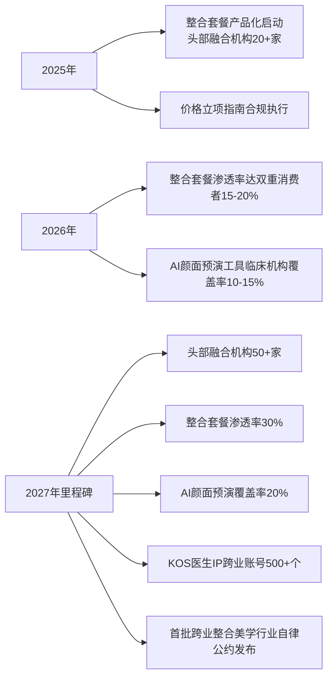

**短期阶段的核心战略要旨**是"轻资产、快迭代、高合规"——避免在合规未完全明朗的阶段大规模投入重资产机构建设，而通过产品化、套餐化、数字化的轻度整合在最短周期内验证融合服务模式的市场反应。这一阶段的成败将直接决定中期阶段（10.3节）能否进入机构一体化深耕期。值得提示的是，短期阶段亦是消费者教育的关键窗口——融合机构应主动通过透明披露、独立第三方复核、可验证的成本节约证据等机制建立消费者对"颜面整体美学"的统一认知锚点，为中期阶段的品牌融合积累认知资产。

## 10.3 中期路径（2027-2030）：机构一体化与品牌融合深化

中期阶段的演进重心从产品组合层推进至机构与品牌融合层。第8章已论证传统口腔头部品牌整合美学拓展★★★★★、互联网平台自营整合诊所★★★★、医生IP矩阵化★★★★的可行性判断，本节预测2027-2030年间这三类路径将共同构成"传统口腔品牌深耕+互联网平台跑马圈地+公立三甲入局背书"三足鼎立格局。

**核心演进形态一：京东医美式"四科同址"综合门诊部模式扩张至100+城市**。京东医美亦庄店2025年开业、北京国贸店2025年Q4开业的扩张节奏[第8章已引述]虽然短期内谨慎推进，但其"综合门诊部多科备案"的组织形态创新避开了"单一专科扩展跨业"的合规冲突，为大规模复制提供了可行模板。中期阶段，**互联网平台依托综合医疗基础设施+供应链整合能力+流量分发能力**有望将这一模式扩展至100+城市，覆盖一线、新一线及部分二线城市的核心商圈。但需特别警惕的是，京东医美亦庄店"销量最高项目40件、其余20件以下"的早期表现[第8章已引述]提示客群培育周期较长，互联网平台的扩张应避免新氧式"快速规模化+持续亏损"陷阱，而应以单店盈利模型跑通为前提推进。

**核心演进形态二：传统口腔头部品牌完成美学修复+轻医美延伸资质突破**。瑞尔集团27年长期主义沉淀+多学科MDT协作能力、泰康拜博依托综合健康保险集团生态延伸、领健依托5万+消费医疗机构数智化平台[第8章已论证]——三大主体已具备从"口腔医疗"向"颜面整体美学医疗"延伸的能力底座。中期阶段的关键突破点是**美学修复与轻医美的资质合规化路径**——通过申请医疗美容科二级科目、培养主诊医师、与医美耗材头部供应商建立直采关系，逐步完成从纯口腔向口腔+轻医美延伸的资质升级。瑞尔"五色光"中"绿"光（人才）维度的"专家辗转各地分院主持复杂病例会诊+将复杂术式拆解为标准化流程+人才培养正从依赖个人经验转向制度化、可复制路径"[第8章已引述]为这一升级提供了人才组织保障。

**核心演进形态三：DSO赋能型扩张在中国本土化落地**。Heartland Dental 1900诊所市值60亿美元、PDS Health 1000+诊所向整合医疗演进、日本真心会225家加盟净利率37%[第8章已引述]——三大DSO范本为中国本土化提供了差异化路径选择。中期阶段，中国本土DSO（美维口腔M+等）有望在医生多执业备案合规化、非临床业务规模化赋能、医疗质量与扩张速度平衡等核心环节取得突破。但需正视的是，中国2024年关停近6000家口腔诊所、2025年Q1停业230+家[第2章已论证]、江阴牙博士医生流失案[第9章已论证]揭示的连锁机构医疗质量风险，意味着中国本土DSO的扩张必须以日本真心会"预防+情绪价值+长周期复诊+净利率37%"的质量优先模式为参照，而非简单复制Heartland Dental的快速扩张范式。

**核心演进形态四：全周期颜面美学会员体系成为主流CLV工具**。第6章已论证医美侧"60%以上复购率"与正畸侧"10-15年长程生命周期"的天然互补、第8章已设计"长程粘性+高频复购+节点冲刺"三层权益的会员体系。中期阶段，这一会员体系应从头部机构的差异化服务升级为行业主流CLV工具——参照新氧"私域留存81万用户、复购率超60%、350+服务SOP"的运营经验[第6章已引述]，融合机构通过精细化会员运营将客户从"项目购买者"转化为"长期服务订阅者"，使单一客户的生命周期价值达到分立运营的2-3倍。日本真心会"通过SOP业务流程设计以及员工强化培训、日常监督管理和薪酬绩效激励，让团队实现患者长周期高频复诊"[第8章已引述]的成功经验，是中国融合机构会员体系建设的最佳参照。

**核心演进形态五：颜面整体美学品牌叙事在头部机构形成可复制方法论**。韩国江南整形美容生态"专科极致+名医IP"、瑞尔"真心+长期主义"、泰康拜博"全生命周期+健康保险生态"——三类不同品牌哲学已分别在韩国、中国民营头部、中国保险背景头部得到实践验证[第8章已论证]。中期阶段，融合机构应在"集团化运营效率+学科带头人IP沉淀"两个方向同时发力，形成可复制的品牌融合方法论：统一的颜面美学叙事内容矩阵、机构化医生IP矩阵、长期主义品牌哲学。

**中期里程碑节点**：

| 时点 | 关键里程碑 | 观测指标 |
|----|-------|------|
| 2028年 | 互联网平台综合门诊部模式扩张至30+城市；传统口腔头部品牌2-3家完成医美科二级科目备案 | 卫健委备案数据 |
| 2029年 | DSO赋能型扩张达成首批500+加盟诊所规模；全周期会员体系覆盖双重消费者30%-40% | 行业协会统计 |
| 2030年里程碑 | 融合一体化诊所达500+家；双重消费者会员覆盖率50%；机构平均CLV相对单一行业提升2倍；公立三甲独立医美科室突破500家 | 综合披露数据 |

数据来源：综合本研究前章分析与情景预测整理

**中期阶段的核心战略要旨**是"质量优先、品牌沉淀、合规深耕"——这一阶段是融合机构在合规合法、医疗严肃、商业可持续三重约束下完成机构形态升级的关键窗口。需特别警惕的是，中期阶段恰好可能是消费降级压力延续期与正畸资本寒冬深化期的交汇——融合机构必须在扩张速度与盈利质量间保持战略弹性，参照瑞尔"不追逐风口、不迷信流量"的长期主义哲学，避免新氧式"快速扩张+持续亏损"的失败陷阱。

## 10.4 长期路径（2030-2034）：平台型生态与产业链共建

长期阶段的演进重心从机构层推进至生态层。第8章已论证平台型生态★★★★的可行性、第7章已论证头部正畸品牌"通过数字化平台连接而非业务直接覆盖"的拓展边界——本节预测2030-2034年间将形成"少数平台+多数机构+海量医生IP"的金字塔生态架构。

**核心演进形态一：互联网巨头+头部正畸品牌+头部医美耗材商共同构建统一产业操作系统**。京东健康综合门诊部模式与京东集团供应链整合、阿里"安心美"联盟136城、美团医美1.1万+合作机构2400万月活[第8章已引述]——三大互联网巨头已具备覆盖正畸+医美的统一产业基础设施潜力。叠加隐适美ClinCheck/iTero+SmileView+My Invisalign App、时代天使iOrtho国际版+松柏投资全球资源整合、领健悦见+e看牙生态、华熙生物+爱美客等头部医美耗材商[第7章、第8章已论证]——长期阶段这些主体有望通过股权合作、平台对接、数据互通等方式共同构建覆盖正畸+医美的统一产业操作系统。这一系统将作为"颜面美学操作系统"提供方，为下游融合机构提供技术、流量、SOP、数据的多维赋能。

**核心演进形态二：跨业整合美学认证体系在监管创新下逐步建立**。第9章已识别"跨业资质统一"作为受限路径★、需国家卫健委、医保局等多部门协同推动且5-10年内难以完成。在乐观情景下，2030-2034年间监管创新有望取得突破——通过试点先行、行业自律、专家共识、立法跟进的渐进路径，建立跨业整合美学的复合认证体系。这一认证体系应在现有口腔医师+医疗美容主诊医师专科认证基础上，叠加"跨业整合美学"复合资质，为复合型医生的合规执业提供制度通道。同时，参照2023年《关于进一步加强医疗美容行业监管工作的指导意见》十一部门协同监管模式[第9章已引述]，跨业整合美学的监管框架亦应在现有合规基础上构建联合监管机制。

**核心演进形态三：颜面整体健康档案在《个人信息保护法》框架下实现授权式跨业互通**。第6章已识别"数据断点"作为五大断点之一、第7章已识别"AI伦理与跨业数据隐私"作为未成熟存重大障碍的融合点。长期阶段，在监管框架与技术标准成熟基础上，颜面整体健康档案有望通过消费者授权机制实现跨业互通——同一档案可被两类机构在客户授权下访问，但严格遵守《个人信息保护法》的最小必要、目的限定、安全保障原则。这一档案将作为融合服务的核心基础设施，支撑全周期颜面美学方案的精细化设计与长期效果验证。

**核心演进形态四：中国版PDS Health式整合医疗集团出现**。PDS Health从Pacific Dental Services更名为PDS Health反映"从最初的牙科支持发展到成为医疗保健创新的领导者，旨在通过牙科和医疗服务的整合彻底改变患者护理"[第8章已引述]、Practice Support+Integrated Care Innovation+Enterprise Solutions and Partnerships三大支柱+全国1000+诊所DEXIS CBCT+DTX Studio Clinic AI影像统一推广——这一整合医疗范本为中国融合生态提供了最具借鉴价值的国际样本。长期阶段，中国有望出现**整合口腔+医美+预防保健+健康管理**的本土化整合医疗集团，其形态可能是"瑞尔+泰康拜博+京东健康+某医美头部"的多方协同体，而非任一单方独立完成。

**核心演进形态五：全球化输出成为头部主体的第二增长曲线**。时代天使2025年海外案例数同比增长82.1%、海外收入占比由30%跃升至44%、美国威斯康星5.2万平方英尺3D打印工厂建成、巴西通过Aditek收购建立本地化生产、覆盖50+国家[第2章、第7章已论证]——头部正畸品牌的全球化已成为现实。长期阶段，江南整形美容生态对标的中国融合机构国际化输出有望取得突破——以东南亚、中东、拉美等新兴医美市场为重点，输出"颜面整体美学"整合服务模式。这一全球化输出将构成头部主体的第二增长曲线，对冲中国本土消费降级压力。

**长期"受限路径"的突破窗口判断**：

第一，**保险产品融合（齿险+医美险一体化）**。第8章已识别该路径★★的低可行性，核心约束是精算数据稀缺、渗透率低、消费者认知薄弱。长期阶段在三大变量同向利好下有望出现突破窗口：商业医美险渗透率突破10%、双重消费者长期效果数据库建立、保险公司与融合机构建立深度数据合作。但即便在乐观情景下，2034年前实现规模化兑现的概率仍较低，本研究建议产业各方仍以"治疗效果保障基金"等替代性工具应对。

第二，**长期效果验证体系**。第8章已识别该路径★的低可行性，核心约束是10-15年的生命周期跨度。长期阶段，跨业长期效果验证有望通过"行业协会主导+头部机构参与+学术研究背书+监管推动"的多方协同实现初步突破，但完整的循证医学证据基础仍需更长时间积累。

**长期里程碑节点**：

| 时点 | 关键里程碑 | 观测指标 |
|----|-------|------|
| 2031-2032年 | 跨业整合美学认证体系试点启动；中国版PDS Health整合医疗集团雏形出现 | 政策动态+企业并购公告 |
| 2033年 | 颜面整体健康档案授权式跨业互通在头部机构落地；保险产品融合试点突破 | 头部机构合作披露 |
| 2034年里程碑 | "少数平台+多数机构+海量医生IP"金字塔生态成型；融合机构国际化输出案例形成；长期效果验证数据库初步建立 | 综合披露数据 |

数据来源：综合本研究前章分析与情景预测整理

**长期阶段的核心战略要旨**是"生态共建、监管协同、全球视野"——这一阶段的成败取决于产业各方能否突破单一企业的边界局限，通过股权合作、数据互通、标准共建、监管协同等多维方式形成跨业整合的产业生态。需要审慎指出的是，长期路径预测的不确定性显著高于短期与中期——本节判断仍受第9章四层防控节点、三类受限路径、两类高风险场景的边界约束，任一标志性事件（如重大医疗事故、SDC式破产、监管收紧）都可能改变长期演进的具体形态。

## 10.5 对正畸企业与医美机构的战略建议

针对融合主战场的两类核心主体，本节基于前述三阶段路径预测提出差异化战略建议。

**对正畸企业的战略建议**——以隐适美、时代天使、领健悦见、正雅齿科四大头部品牌为代表。第7章已论证四大品牌"数字化平台化+生态合作化+向修复美学延伸+国际化布局+AI能力建设"五大共性，本节进一步聚焦三大方向：

**方向一：操作系统化转型**。正畸品牌应明确从"卖矫治器"转向"卖整合性服务包"再到"卖操作系统"的战略路径。具体而言，将ClinCheck/iOrtho/悦见Agent等数字化触点升级为下游融合机构的赋能平台，通过订阅或分成方式接入下游机构的医美业务场景。第7章已论证Marc Onuoha"每一位技师都在日常工作中使用微笑设计"的预测正成为现实，正畸品牌应以iTero微笑测试+SmileView+TRIOS Smile Design为底座，将数字化触点延伸至医美机构的"颜面整体美学"决策入口。**单一品牌的临床业务规模天花板有限（隐适美全球1950万患者已是天花板），但作为下游数千、数万家机构的操作系统提供方，其规模效应可呈指数级扩展**[第8章已论证]——这一转型是头部正畸品牌穿越消费医疗周期的核心战略。

**方向二：与医美头部机构建立平台级合作而非自身亲入医美业务**。第7章已识别"隐形正畸品牌的核心壁垒仍在于矫治器精度+医生网络+案例数据，向纯医美注射、光电类项目的直接延伸面临监管、临床、品牌信任三重约束"。正畸品牌若直接拓展玻尿酸注射或光电业务，需重新建立医美主诊医师认证、医疗美容机构资质、医美耗材审批，并承担与正畸品牌信任体系完全不同的医美舆情风险——爱齐科技与SmileDirectClub的合作—收购未果—竞争—反垄断诉讼复杂博弈[第9章已引述]即是行业巨头跨业延伸失败的标志性教训。建议正畸品牌通过股权投资、技术授权、数据合作、流量分发等轻度方式与新氧青春诊所、京东医美、瑞尔类延伸品牌建立平台级合作，将自身定位为整合服务的"操作系统提供方"而非"全栈服务方"。

**方向三：通过3D打印产业链共享降低融合机构的资本门槛**。第7章已论证铼赛智能、黑格科技、永昌和、创想三帝等中国3D打印企业已实现椅旁打印机+材料+工作流的整合方案、时代天使美国威斯康星5.2万平方英尺3D打印工厂的全球本地化制造能力、领健悦见"采用形状记忆材料+光固化直接3D打印技术"的双突破——正畸品牌应将3D打印能力作为产业链共享资产，通过为融合机构提供"矫治器+修复体+医美导板+椅旁打印"的整合制造服务，降低融合机构的资本门槛，反向加速融合服务模式的规模化扩展。

**对医美机构的战略建议**——以新氧青春诊所、京东医美、瑞尔类延伸品牌、公立三甲医美科为代表。本节聚焦三大方向：

**方向一：以正畸长程粘性作为压舱石+以医美高频复购作为现金流+以节点冲刺作为客单价峰值，构建客户生命周期价值最大化模型**。第6章已论证"60%-80%并发率"、医美侧高频小额与正畸侧低频长程的天然互补、节点驱动的整合性消费形态。医美机构应主动将正畸纳入服务版图——通过申请口腔科二级科目、与正畸头部品牌建立合作、引入隐形矫治服务，构建"长程粘性+高频复购+节点冲刺"三位一体的客户生命周期价值模型。**双重消费者人均年综合预算3.5-10万元/人**[第4章已论证]、正畸进行期内并发医美消费比例60%-80%[第4章已论证]——这一并发率与LTV结构是医美机构延伸正畸入口的最有力商业依据。

**方向二：坚守医疗严肃性底线，避免新氧式低价内卷与SDC式跳过医生面诊的失败陷阱**。新氧低价策略致供应链断供+持续亏损、新氧2024年净亏损5.87亿元、2025年二季度核心业务暴跌35.7%[第6章、第8章已引述]——这一典型失败教训提示医美机构不能以低价为核心竞争力。SDC从市值90亿美元到2023年破产+爱齐科技ADA AAO反垄断诉讼[第9章已引述]揭示出"远程隐形正畸服务+免去医生现场评估+省去X光+省去知情同意"的DTC模式在医疗本质层面跳过三道关键关的根本失败逻辑——任何融合模式不可绕过医生现场评估、术前影像、知情同意三道关。建议医美机构将医疗严肃性作为底线红线，通过整合差异化、信任资产累积、长期医患关系沉淀建立非价格竞争优势，参照日本真心会"预防+情绪价值+长周期复诊+自费治疗为主营+净利率37%"的差异化生存之道[第8章已引述]。

**方向三：构建跨业风险防控基础设施**。第9章已系统提炼"四层防控节点+三类受限路径+两类高风险场景"——医美机构在延伸正畸入口时必须同步建设监管层（跨业医生备案+耗材双轨认证+广告分类合规+价格立项规范）、临床层（跨学科诊疗SOP+复合医生培养+AI伦理审查+医生稳定性保障）、消费者层（知情同意整合+扫码验真+独立第三方复核+跨业认证+未成年人保护）、商业层（可持续盈利+IP真实性+生命周期平衡+战略弹性）四层防控节点。海狸家无证牙套案、江阴牙博士医生流失案、广州某斯牙周炎控制不当案、22岁张婷"幼态脸"诱导案[第9章已引述]揭示的失败模式都不应在融合服务模式中重演。

**两类主体的战略要旨对比**：

| 战略维度 | 正畸企业 | 医美机构 |
|------|------|------|
| 核心定位 | 操作系统提供方 | 全周期服务交付方 |
| 增长引擎 | 平台规模效应+全球化输出 | 客户生命周期价值最大化 |
| 风险底线 | 数字化触点的合规与精度 | 医疗严肃性+跨业风险防控 |
| 失败陷阱警示 | 直接亲入医美业务 | 低价内卷+跳过医生面诊 |
| 国际参照 | PDS Health整合医疗演进 | 日本真心会+宝齿会差异化生存 |

数据来源：综合本研究前章分析整理

## 10.6 对跨界品牌、投资方与监管方的战略建议

针对融合生态的三类支撑主体，本节进一步提出差异化建议。

**对跨界品牌的战略建议**——以互联网平台（京东、阿里、美团）、上游耗材商（华熙生物、爱美客）、消费品牌为代表。建议聚焦"供应链整合+流量分发+认证体系共建"三大方向：

**方向一：参照美团"放心种""放心配"经验推动跨业"放心美"认证体系**。美团"放心种"覆盖2000+门店、"放心配"近3000家、阿里"安心美"联盟136城、新氧"放心美无忧保障"[第6章、第8章已引述]——这些平台型信任基础设施已分别在医美与口腔细分领域初步构建。但融合服务尚缺乏跨业整合的统一认证标签——建议互联网平台联合中华口腔医学会、中国整形美容协会等行业组织，推动"颜面美学整合服务"的跨业认证标签建设，覆盖正畸+医美的双业务合规审核。这一认证体系将成为融合服务模式消费者信任建设的关键基础设施。

**方向二：参照京东"四科同址"模式提供综合医疗基础设施**。京东医美亦庄店依托京东健康综合门诊部资质实现"四科同址"+京东健康+松柏投资的口腔布局+京东集团供应链整合能力[第8章已引述]——这一组织形态创新避开了"单一专科扩展跨业"的合规冲突，为大规模复制提供了可行模板。建议互联网平台进一步将这一综合医疗基础设施推广至100+城市，通过供应链直采、服务标准化、流量分发、AI赋能等多维能力，为下游融合机构提供"开箱即用"的综合医疗基础设施。

**方向三：上游耗材商的双业务整合供货能力**。华熙生物的玻尿酸不仅用于医美注射、也用于口腔黏膜修复，爱美客在医美注射类领域的合规与渠道能力可向口腔耗材延伸[第5章、第8章已引述]。建议头部医美耗材商主动构建覆盖正畸+医美的双业务整合供货能力，通过DSO联盟+集中采购+扫码验真的方式降低融合机构的供应链复杂度，同时通过规模化采购形成成本优势对冲下游内卷压力。

**对投资方的战略建议**。建议正视正畸资本寒冬与医美K型分化的冷热分化现实——爱齐科技市值3年蒸发80%+、中国口腔投融资从2022年98亿降至2024年35亿、新氧2024年净亏损5.87亿、隐适美CEO将下滑归因于"消费者支付意愿减弱"[第2章、第6章、第9章已引述]——这些信号意味着消费医疗周期已切换。在此背景下，投资方应聚焦三类标的：

**标的一：具备双业务整合能力的传统口腔头部品牌**。瑞尔集团27年长期主义沉淀、泰康拜博的健康保险生态延伸、领健的5万+消费医疗机构数智化平台[第8章已引述]——三类主体均具备从口腔向颜面整体美学延伸的能力底座。这一类标的的投资逻辑是"长期主义+稳健盈利+品牌护城河"，预期回报周期较长但确定性较高。

**标的二：具备平台赋能潜力的数字化基础设施企业**。3D打印椅旁制造企业（铼赛智能、黑格科技、永昌和、创想三帝）、AI诊断与微笑设计企业（领健悦见AI助手、北京口腔医院B-AI正畸智能体）、SaaS与数据中台企业（领健、悦见、e看牙）——这一类标的的投资逻辑是"基础设施规模效应+技术壁垒+边际成本递减"，符合"口腔行业几乎只有上游能融到资了"的当前资本流向。

**标的三：具备DSO本土化能力的连锁运营方**。美维口腔M+等中国本土DSO、参照Heartland Dental+PDS Health+日本真心会三类范本本土化的运营主体——这一类标的的投资逻辑是"非临床赋能规模化+医生IP矩阵+客户生命周期价值最大化"，但需特别关注医疗质量风险（江阴牙博士案警示）与扩张速度的平衡。

**警惕的两类陷阱**：第一，**SDC式DTC破坏型创新**——任何试图绕过医生面诊、术前X光、知情同意三道关的"颠覆式"模式都不具备长期可持续性，SDC从市值90亿美元到破产的4年陨落即是教训；第二，**单纯规模扩张的盈利陷阱**——新氧"自营线下连锁飙升305%但仍处亏损"+京东医美亦庄店"低价位+小销量"早期表现[第8章已引述]提示，融合机构的扩张必须以单店盈利模型跑通为前提，而非简单复制互联网烧钱补贴模式。

**对监管方的战略建议**。建议推动四项制度创新：

**创新一：跨业整合美学专业认证体系试点**。第9章已识别"双二级科目备案+跨科执业逐一注册"作为五大断点之一、跨业资质统一为受限路径★。建议在国家卫健委、医保局、市场监管总局协同下，选择部分综合实力较强的地区（如北京、上海、深圳、杭州）开展跨业整合美学专业认证体系试点——在现有口腔医师+医疗美容主诊医师专科认证基础上，叠加"跨业整合美学"复合资质，为复合型医生的合规执业提供制度通道。这一试点的具体设计可参照美国DSO法律框架、韩国整形美容医院旅游许可证制度、日本"专门医"6年医科+1年实习+4年专业技能学习+5次重要考核的极致专科主义[第9章已引述]，形成符合中国国情的渐进式制度创新。

**创新二：未成年人融合服务保护立法**。第9章已系统对比意大利"罚款2万欧元+三个月停业"、澳大利亚"2年监禁"、奥地利"4周冷静期"、美国"成熟度评估"、韩国"心理评估"等国际未成年人保护经验。中国当前缺乏专门针对未成年人医美整容立法，叠加儿童隐形正畸CAGR超过60%[第5章已论证]的高速增长——建议监管方参照国际经验推动专门立法，对融合服务中的未成年人客户设置医疗必要性筛查、心理评估、监护人书面同意、4周冷静期、独立第三方复核等多重门槛。

**创新三：长期效果验证数据库共建**。第8章已识别长期效果验证体系作为受限路径★、第9章已识别其作为商业可持续性的核心约束。建议监管方推动行业协会、头部机构、学术研究机构共建长期效果验证数据库——通过强制披露+数据脱敏+授权共享的机制，将正畸2-3年治疗+5-10年保持周期内的关键临床数据沉淀为产业公共资产，为融合服务模式的循证医学证据基础奠定基础。

**创新四：广告分类管理在融合场景下的细化**。2025年医保局《立项指南》101项规范化、2023年十一部门《关于进一步加强医疗美容行业监管工作的指导意见》[第9章已引述]已分别对价格与广告进行规范。建议监管方进一步针对融合服务模式的特殊性细化广告分类管理——明确"颜面整体美学"叙事下跨业品牌账号的双重审批要求、明确"幼态脸""18岁开始衰老""抗初老越早越好"等焦虑诱导话术的禁止边界、明确AI颜面预演工具的告知义务与责任归属。这一细化将为融合服务模式的合规边界提供更清晰的指引。

需要审慎指出的是，监管创新的节奏受多方协同效率约束，本节建议的四项制度创新在不同情景下的兑现速度存在差异——乐观情景下2027-2028年可能实现首批试点突破，基准情景下2030年后逐步推进，保守情景下可能长期未启动。监管方应在制度创新与风险防控间保持平衡——既要避免监管真空导致的"幼态脸"乱象、海狸家事故反复发生，也要避免过度监管扼杀融合服务模式的创新活力。

## 10.7 核心跟踪指标体系与研究局限及最终回应

作为收官小节，本节先提炼值得产业各方与后续研究持续跟踪的四层核心指标，再坦诚标注本研究的核心局限与后续方向，最终回归用户原始命题，给出基于全报告闭环分析的最终判断。

**四层核心跟踪指标体系**：

| 指标层级 | 具体指标 | 现值锚点 | 跟踪频率 | 数据来源 |
|------|------|------|------|------|
| **需求层** | 双重消费者规模 | 100-200万（中国，2025E）| 年度 | 行业白皮书、平台数据 |
| | 双重消费者占该群体渗透率 | 1.3%-2.5%（中国，2025E）| 年度 | 综合测算 |
| | 双重消费占医美用户比 | 15%-25%（中国，2025E）| 年度 | 综合测算 |
| | 正畸期内并发医美比例 | 60%-80%（中国，2025E）| 年度 | 机构客户数据 |
| | 双重消费者人均年综合预算 | 3.5-10万元/人 | 年度 | 客户调研 |
| **驱动层** | 颜值经济总规模 | 3.21万亿元（2024）| 年度 | QuestMobile |
| | 颜控人群规模 | 2.53亿（2024.5） | 季度 | QuestMobile |
| | Z世代医美年均支出 | 2.8万元，较80后+47% | 年度 | 德勤 |
| | 悦己消费占比 | 取悦自我46.28% | 年度 | 艾媒咨询、央视 |
| | 三线及以下医美增速 | 22% | 年度 | 德勤 |
| **供给层** | 融合机构数量 | 当前约100-200家估算 | 季度 | 卫健委备案 |
| | 公立三甲独立医美科室 | 200+家（较2019年+320%）| 年度 | 国家卫健委 |
| | 整合套餐渗透率 | 短期目标30%（2027E） | 半年度 | 行业协会统计 |
| | AI颜面预演覆盖率 | 短期目标20%（2027E） | 半年度 | 头部品牌披露 |
| | 全周期会员体系覆盖率 | 中期目标50%（2030E） | 年度 | 头部机构披露 |
| | 3D打印椅旁部署率 | 上行通道 | 半年度 | 设备商出货数据 |
| **风险层** | 重大医疗事故年发生率 | 散发可控 | 季度 | 司法判决+卫健通报 |
| | 消费者投诉解决率 | 新氧98.13%参照 | 季度 | 中消协智慧315 |
| | 未成年人融合服务合规度 | 当前监管空白 | 年度 | 待立法跟进 |
| | 资本投融资规模 | 口腔从98亿降至35亿 | 季度 | 动脉网 |
| | 头部品牌业绩信号 | 隐适美/新氧/时代天使财报 | 季度 | 公开财报 |

数据来源：综合本研究前九章分析整理

**本研究的三类核心局限**坦诚标注：

**局限一：直接调研数据缺失带来的±50%测算不确定区间**。第4章已论证"以20-30岁女性同时拥有正畸+医美需求"为统计口径的全球性调研数据迄今较为缺乏，本研究采用"人群基数×渗透率×重叠率"三层间接测算框架，最终结果的不确定区间约±50%——这意味着"100万-200万双重消费者"的下限可能下探至60万、上限可能上抬至260万。该误差只能通过新氧白皮书、艾瑞医美报告、隐适美/时代天使用户画像等数据的定向调研加以收窄。建议产业各方在战略推演时将此区间作为情景边界而非精确数值。

**局限二：欧日市场细分人群代理偏差**。本研究在数据可得性约束下，中国市场的数据相对详尽，欧美与韩日数据多以宏观渗透率与代表性事件呈现——欧洲以德国正颌外科数据为代理、日本以宝齿会/真心会案例为代理。这一覆盖缺口意味着本研究对欧日市场的判断更多是定性论证而非量化精度。后续研究应通过ISAPS、ASPS、KCA等国际行业协会的细分数据、欧洲国家口腔医学会与整形外科学会的统计、日本厚生劳动省与韩国保健福祉部的政府数据进行专项补充。

**局限三：宏观经济与资本周期切换的情景不确定性**。第9章已系统论证爱齐科技市值3年蒸发80%+、中国口腔投融资从98亿降至35亿、新氧2024年净亏损5.87亿等资本周期信号，第10.1节已构建三情景预测框架。但宏观经济周期的具体演进、消费者支付意愿的恢复节奏、监管创新的实际落地速度等关键变量仍存在显著不确定性——任一标志性事件（重大医疗事故、SDC式破产、监管收紧）都可能改变情景演进的具体形态。建议产业各方在战略制定时同时准备三情景应对方案，保持战略弹性。

**后续研究方向**：第一，**双重消费者直接调研**——建议头部品牌、行业协会、学术机构联合开展中国20-30岁女性正畸+医美双重消费的专项调研，明确并发率、决策顺序、预算分配的实证数据，将本研究的±50%测算误差收窄至±20%以内；第二，**长期效果跟踪**——建议建立融合服务模式的10-15年长期效果跟踪数据库，为循证医学证据基础奠定基础；第三，**国际比较深化**——建议对欧美韩日五大市场的细分人群进行专项研究，揭示文化语境差异下融合路径的差异化兑现机制；第四，**政策效应评估**——建议在2025年医保局《立项指南》、2023年十一部门《指导意见》、未来可能的跨业整合美学认证试点等关键政策落地后，开展政策效应评估研究，为后续监管创新提供实证依据。

**回归用户原始命题：最终判断**。本研究开篇即立下两大核心命题——"全球20-30岁女性对口腔正畸和医美的共同需求的比重"与"未来正畸与医美联系起来的可能性"。基于全报告九章的系统分析，最终判断如下：

**对第一个命题——共同需求比重的判断**：**全球20-30岁女性已客观构成正畸与医美"双重消费者"的高浓度承载群体。以中国市场为锚点测算，双重消费者规模约100万-200万人，占该群体约8000万总人口的1.3%-2.5%，占该年龄段医美用户的15%-25%，重叠人群年市场规模约500-1600亿元（中值约1000亿元）**。这一规模相当于2025年中国正畸市场预计规模660亿元的0.8-2.4倍、医美市场预计规模3700亿元的0.14-0.43倍——**已具备千亿量级的商业价值**。从全球视角看，韩国（双高密度）、美国（均衡格局）、日本（医保托底）、欧洲（稳健成长）、中国（双低基数+高增速追赶）呈现显著的梯度结构，中国市场仍有3-4倍的渗透率提升空间。该群体的双重消费基础不是简单的统计意义重合，而是植根于颜值经济、悦己消费、社交资本、职场竞争、婚恋需求五维心理动因的深层心理同质性，并通过颜值经济、社交媒体、健康美学、女性经济独立、技术普惠五大驱动力的同向共振得到持续强化。

**对第二个命题——融合可能性的判断**：**正畸与医美的融合作为产业演进方向具备充分的需求基础（双重消费者千亿规模）、技术基础（数字化基础设施同源、3D打印产业链共享、DSD跨业应用三大融合点已成熟）、商业基础（机构一体化、医生IP整合、套餐场景化、平台赋能型四类可复制路径已识别），但其兑现速度受合规、伦理、资本周期、医疗严肃性四重约束**。最可能的演进路径不是任一单一主体或单一模式的颠覆式胜出，而是**以传统口腔头部品牌+互联网平台为双引擎、以套餐场景化与全周期会员体系为先行抓手、以平台型生态与监管创新为长期托底的渐进式融合**。短期（2025-2027）阶段以产品组合与套餐场景化先行，中期（2027-2030）阶段进入机构一体化与品牌融合深化，长期（2030-2034）阶段构建平台型生态与产业链共建——这一三阶段递进构成融合演进的基准情景。在乐观情景下（概率15%-25%），融合可在2034年实现3000-4000亿元年市场规模、400-500万双重消费者覆盖；在保守情景下（概率20%-30%），融合可能停留于产品组合层而难以推进至机构融合与生态共建——这一不确定区间是产业各方必须正视的战略边界。

**最关键的战略洞察**：融合的可能性不是孤立的"是否能融合"问题，而是"以何种节奏、何种主体、何种边界融合"的问题。**任何忽视医疗严肃性、跳过医生面诊、绕开监管框架的颠覆式模式都将重演SmileDirectClub的失败教训**；**任何在合规、临床、消费者、商业四层防控节点上存在重大缺失的扩张都将重演新氧式的亏损陷阱、江阴牙博士式的医生流失危机、海狸家式的器械合规事故**。融合的真正价值不在于规模化扩张本身，而在于以"颜面整体美学医疗"的整合性服务为20-30岁女性这一双重消费者高浓度承载群体提供更高效、更安全、更可信的医疗美学服务体验。

**对全报告核心命题的最终闭环回应**：双重消费者作为客观存在的高浓度承载群体已具备千亿规模商业价值，融合作为产业演进方向具备充分的需求、技术与商业基础，但其兑现速度受四重约束，最可能的演进路径是渐进式融合而非颠覆式胜出。**产业各方应以长期主义哲学穿越消费医疗周期，以医疗严肃性底线坚守融合伦理边界，以多方协同共建融合产业生态，以全球视野把握跨区域差异化机会**——这是本研究对全球20-30岁女性正畸与医美共同需求与融合可能性命题的最终战略回应。

至此，本研究通过十章系统分析完成对用户原始命题的完整回答，从研究背景与分析框架的奠基（第1章）、市场现状与人群结构的扫描（第2章）、消费心理与需求图谱的下沉（第3章）、共同需求的量化测算（第4章）、驱动共振机制的揭示（第5章）、决策渠道与服务体验的交叉特征（第6章）、产品技术融合的成熟度评估（第7章）、商业模式与品牌融合的路径剖析（第8章）、风险挑战与监管边界的识别（第9章）、未来趋势与战略建议的输出（第10章）——构成"现象观察—心理结构—量化锚定—驱动机制—决策渠道—产品技术—商业模式—风险防控—战略建议"的完整闭环。本研究在数据局限与不确定性约束下力求为产业各方提供有指导意义的战略坐标，期待后续研究通过专项调研、长期跟踪、国际比较深化进一步补充本研究的覆盖缺口。

# 参考内容如下：
[^1]:[颜值经济那些事儿](https://baijiahao.baidu.com/s?id=1704785912496090230&wfr=spider&for=pc)
[^2]:[中年男性的“外貌溢价”:长得越帅,收入越高?](https://36kr.com/p/2748530170412040)
[^3]:[“新经济”系列观察⑩|“士为知己者死,女为悦己者容”,如何理解当代的“悦己经济”](https://baijiahao.baidu.com/s?id=1838309227552773421&wfr=spider&for=pc)
[^4]:[从“买个物品”到“买种心情”——青年消费观新趋势之“为情感价值买单”](http://cn.chinagate.cn/news/2025-03/25/content_117784532.shtml)
[^5]:[悦己型消费](https://baike.baidu.com/item/悦己型消费/56223581)
[^6]:[口腔正畸](https://m.youlai.cn/sjingbian/article/53366BMYBhs.html)
[^7]:[龅牙矫正的方法有哪几种?](https://mip.39yst.com/jingbian/wogbho4nn3g.shtml)
[^8]:[口腔正畸是什么意思](https://m.fh21.com.cn/article/dzmip/1655796.html)
[^9]:[我的病例故事⑦ | 从地包天到侧颜杀,看正畸-正颌联合治疗如何实现骨性反𬌗逆袭! ](https://mp.weixin.qq.com/s?__biz=MzA4NzQyNDkwNQ==&mid=2650566128&idx=1&sn=596f5a1a65594ac8aface081d8fc5241&chksm=89d706f5a3b1f2693273aecaeafc5b3b19a786761f03c4f42dc590316b46680562f3e0de823d&scene=27)
[^10]:[医美行业都是干什么的 ](https://aiqicha.baidu.com/details/ugknowledge?id=44cddb8c81b906aaf595aa6d580b8a3d)
[^11]:[2025年中国医美行业分类情况、发展历程及相关政策 ](https://www.sohu.com/a/875568787_120939916)
[^12]:[2024年中国医疗美容行业市场前景预测研究报告](https://baijiahao.baidu.com/s?id=1781495143956884881&wfr=spider&for=pc)
[^13]:[新氧发布《2021医美行业白皮书》,医美市场规模预计达1846亿](https://guba.sina.com.cn/?s=thread&tid=759&bid=51499)
[^14]:[https://www.zgsyz.com/zgsykqk/EN/abstract/abstract32206.shtml](https://www.zgsyz.com/zgsykqk/EN/abstract/abstract32206.shtml)
[^15]:[这些关于微笑的美学标准,你符合吗? ](https://mp.weixin.qq.com/s?__biz=MzIyMzYxODI4OQ==&mid=2247525854&idx=2&sn=9d006dfdd5abe3ed45de8938c88c0a10&chksm=e8195040df6ed956d382c4a86c234da63387eeae55310ab7d3d980a967dcc6f406c7715b1b34&scene=27)
[^16]:[25 岁的人 60 岁的脸?这届年轻人为何抢着进"青春诊所"](http://finance.sina.com.cn/wm/2026-04-23/doc-inhvnaie5069161.shtml)
[^17]:[http://finance.sina.com.cn/roll/2026-04-27/doc-inhvwwmp2512559.shtml.md](http://finance.sina.com.cn/roll/2026-04-27/doc-inhvwwmp2512559.shtml.md)
[^18]:[2022年新氧医美行业白皮书-新氧](https://m.renrendoc.com/paper/462685107.html)
[^19]:[https://fanyi.taobao.com/en/kouqiangkexue_7730/detail-8a67b294ae8b29c532f018a10c0397d6.html](https://fanyi.taobao.com/en/kouqiangkexue_7730/detail-8a67b294ae8b29c532f018a10c0397d6.html)
[^20]:[2026专访合肥诺尔德口腔黄燕宇正畸院长:正畸+美学双剑合璧,领航合肥口腔正畸高质量发展](http://www.cnxnmy.com/jkzt/ysbj/202604/t20260423_4506689.shtml)
[^21]:[隐适美母公司:2024年营收40亿美元,透明矫治器销量达250万例](http://xueqiu.com/7214020925/322465848)
[^22]:[技术迭代,重组技术有望开辟肉毒素新时代 ](https://t.10jqka.com.cn/pid_382032297.shtml)
[^23]:[国内排名第三的隐形正畸“黑马”再启IPO进程](https://baijiahao.baidu.com/s?id=1858288006128600533&wfr=spider&for=pc)
[^24]:[当轻医美成为3000万人的选择:电商巨头入局、小店退场,连锁化和资本化或成未来趋势](https://baijiahao.baidu.com/s?id=1851016690239913140&wfr=spider&for=pc)
[^25]:[#1 Invisalign in Los Angeles & Cost of Invisalign at LA Dental Clinic](https://invisalignlosangeles1.com/)
[^26]:[《2020医美行业白皮书》解码消费新趋势 “线上化”助行业抓红利](http://tech.cnr.cn/techph/20200928/t20200928_525280851.shtml)
[^27]:[日本口腔的今天是中国口腔的未来? ](https://mp.weixin.qq.com/s?__biz=MzI5NDA1Nzc3Ng==&mid=2650778613&idx=1&sn=f997a8661a71c7506667f4994c8289ee&chksm=f463a9aac31420bcb43b0720a342ad70fd006e1a19748bb602d04083dd837a70516ed81c1cc1&scene=27)
[^28]:[世界整形大国排名,第1名不用我说你们也肯定知道](https://baijiahao.baidu.com/s?id=1788788706972139939&wfr=spider&for=pc)
[^29]:[暴跌60%,多地关店、跑路,暴利的牙科生意,真的要凉透了?](https://www.163.com/dy/article/KR1BDMDV0556BSM9.html)
[^30]:[用户平均年龄32.8岁 罗兰贝格携手美团医美发布《2025医美行业白皮书》](https://finance.eastmoney.com/a/202509173516400071.html)
[^31]:[2025年美容院投資分析:數據揭示的轉型機遇與市場前景](http://k.sina.com.cn/article_7880068200_1d5b04c6801901h8vk.html)
[^32]:[牙齿矫正多大年龄?2025年揭秘不同年龄段矫正佳机、难度及费用差异! ](https://www.hnqnw.com/zhongzhi/31247.html)
[^33]:[ISAPS《2022年全球整形外科医师美容治疗统计报告》 ](https://m.haodf.com/neirong/wenzhang/9392778288.html)
[^34]:[更多英国年轻男性接受"轻医美"](http://d.wanfangdata.com.cn/periodical/znjk202508033)
[^35]:[牙齿矫正属于医美吗?](https://www.mfk.com/ask/11003452.shtml)
[^36]:[2023年美国整形外科手术报告(英文)-American Society of Plastic Surgeons ](https://news.sohu.com/a/898252177_121964487)
[^37]:[“中国微笑第一股”时代天使2025年海外收入翻倍,净利润大增163%,同期面临多国专利诉讼](https://baijiahao.baidu.com/s?id=1861194306256155152&wfr=spider&for=pc)
[^38]:[医美男性用户已近3成罗兰贝格携手美团医美发布《2025医美行业白皮书》](https://m.bjnews.com.cn/detail/1758095487129557.html)
[^39]:[女性消费,超43%因为“它”!重要数据,揭秘→](http://news.cnr.cn/native/gd/kx/20260308/t20260308_527546154.shtml)
[^40]:[域外医疗美容法律监管制度概览](https://www.chinacourt.org/article/detail/2023/06/id/7346009.shtml)
[^41]:[2024年营收40亿!隐适美母公司公布24年业绩](https://baijiahao.baidu.com/s?id=1823822244798149207&wfr=spider&for=pc)
[^42]:[“x经济”的2021:Z世代成价值载体,增量发掘与存量博弈共存](https://36kr.com/p/1587729328999559)
[^43]:[预见2024:《2024年中国轻医美行业全景图谱》(附市场规模、竞争格局和发展前景等)](https://baijiahao.baidu.com/s?id=1783425018226391823&wfr=spider&for=pc)
[^44]:[身体社会化:女大学生化妆品消费的实践逻辑](https://mp.weixin.qq.com/s?__biz=MzAxNzE4NDU2NA==&mid=2734266730&idx=1&sn=5da8b39d2992bff785166f5e429f2b62&chksm=bd8398bc7995a8058196dba6980ad0dce01b3a89502ceff63b5895b3012e28e6053f1f2a2d0e&scene=27)
[^45]:[审美与自我呈现:青年女性容貌焦虑的深层逻辑](https://mp.weixin.qq.com/s?__biz=MzAxNzE4NDU2NA==&mid=2734255054&idx=1&sn=de379b17d9afc04042b2df09d04fdcbd&chksm=bce4a9958b9320830f093e1d3dcf4a1073acfac03f2e9b0ded86a41bb562f94e9938b19fdbac&scene=27)
[^46]:[英媒:更多英国年轻男性接受“轻医美”](https://baijiahao.baidu.com/s?id=1836577504668879911&wfr=spider&for=pc)
[^47]:[德勤中国联合艾尔建美学、中国整形美容协会发布《中国医美行业2024年度洞悉报告》](https://www.deloitte.com/cn/zh/Industries/life-sciences-health-care/perspectives/dtt-china-medical-aesthetic-industry-outlook-2024.html?icid=top_dtt-china-medical-aesthetic-industry-outlook-2024)
[^48]:[2024年全球医美手术接近3800万例,同比2020年增长40%](https://weibo.com/ttarticle/p/show?id=2309405190918503530579)
[^49]:[我国医美市场持续扩容 相关政策将为行业高质量发展提供支撑](https://baijiahao.baidu.com/s?id=1830522381213775001&wfr=spider&for=pc)
[^50]:[2024年全球医美手术接近3800万例,同比2020年增长40%](https://baijiahao.baidu.com/s?id=1838253195728809176&wfr=spider&for=pc)
[^51]:[医美男性用户已近3成罗兰贝格携手美团医美发布《2025医美行业白皮书》](https://baijiahao.baidu.com/s?id=1843497224387476254&wfr=spider&for=pc)
[^52]:[「医美茅」爱美客深度研究:从千亿赛道突围到内卷阵痛,凭高壁垒与全球化重夺增长王座](http://xueqiu.com/6489163219/383475936?_ugc_source=ugcbaiducard)
[^53]:[2026年成都医美行业消费趋势与创新发展调研报告](https://henan.china.com/sh/2026/0420/042026_721968.html)
[^54]:[韩国医生要具备哪些资历?](https://m-mip.39.net/face/mipso_907814.html)
[^55]:[德国正颌手术大揭秘:发生率攀升背后的性别、年龄与地区差异密码](https://m.ebiotrade.com/newsf/2025-2/20250221061114941.htm)
[^56]:[4200亿GMV背后的矛盾性繁荣:解码美妆赛道三大爆发点](https://36kr.com/p/3229537400120841)
[^57]:[消费者调查报告](https://www.diyifanwen.com/fanwen/zongjiebaodao/20673844.html)
[^58]:[23岁深圳女孩脸歪10多年!重塑颌面、重排牙齿,她找回自信笑容](https://baijiahao.baidu.com/s?id=1862436713198243661&wfr=spider&for=pc)
[^59]:[正畸矫正的好处](https://www.mfk.com/article/2591968.shtml)
[^60]:[女性抗衰老需求调研 ](https://www.wjx.cn/vm/eqyT8sl.aspx)
[^61]:[U.S. Skin Care Products Market ](https://www.grandviewresearch.com/industry-analysis/us-skin-care-products-market-report)
[^62]:[新氧线下扩张遇阻,财务承压与信任危机并存](https://www.163.com/dy/article/KBNBI1N3051180DR.html)
[^63]:[对话新氧CEO金星:医美行业症结在供给侧,新氧下场做线下连锁是必然选择](https://www.163.com/dy/article/K7BQ026D0512B07B.html)
[^64]:[QuestMobile2024年颜值经济洞察报告:颜值经济规模将达3.2万亿 ](https://caifuhao.eastmoney.com/news/20240716123741812331180)
[^65]:[医美整形行业市场深度调研及消费者行为报告](https://www.docin.com/p-4926211403.html)
[^66]:[线上流量见顶?新氧押注轻医美连锁:巨头竞赛下半场拼合规重服务](https://baijiahao.baidu.com/s?id=1840777429337246769&wfr=spider&for=pc)
[^67]:[3000元项目现场变10万,南京千娇悦医疗卷入医美剧本杀风波](https://cj.sina.com.cn/articles/view/2011075080/77de920802001mr9k)
[^68]:[2025年小红书医美行业精准获客与营销增长白皮书 ](https://business.sohu.com/a/963543721_407401)
[^69]:[隐形正畸成风口 爱舒笑如何通过品牌力决胜市场 ](https://www.sohu.com/a/488972868_120476407)
[^70]:[新氧发布2024社会责任报告:打造品质服务 赋能行业发展 助力公益事业](https://app.xinhuanet.com/news/article.html?articleId=b156b35efa4b9755553fc6ed9eea0bf2)
[^71]:[日本最牛口腔医疗机构经营分析 ](https://news.sohu.com/a/772407766_100187874)
[^72]:[个人信息处理规则 ](https://www.invisalign.com.cn/privacy-policy?channel=chinapp.com)
[^73]:[掘金千亿隐形牙套生意](https://36kr.com/p/1272281919089544)
[^74]:[Trios Smile Design](https://www.3shape.com/zh/software/trios-smile-design)
[^75]:[【医学科普】笑容 你的第二张名片--DSD微笑美学设计来帮你 ](https://mp.weixin.qq.com/s?__biz=MzkzNDIzMDI3MA==&mid=2247512792&idx=1&sn=099423997051456cb485db2712a834a2&chksm=c2429349f5351a5ffa59cffca9e6773e2ba1ccecd913e63ad0406fff70211b1513a6111ff850&scene=27)
[^76]:[在线问诊:南京德牙联合口腔医院治疗种植牙,南京看种植牙口碑好的口腔医院!](https://disease.39.net/njdykq/260422/b7wk4al.html)
[^77]:[invis is ](https://www.invisalign.com.cn/en/?channel=chinapp.com)
[^78]:[时代天使(06699):全球化布局强阿尔法凸显 出海链龙头新定价逻辑隐现](https://baijiahao.baidu.com/s?id=1808409083530278634&wfr=spider&for=pc)
[^79]:[数字化技术助力上颌前牙微创美学修复1例 ](https://mp.weixin.qq.com/s?__biz=MzA5OTIxNDk4Nw==&mid=2650810462&idx=4&sn=119013b2bb474b092c3d0b10dec4df8c&chksm=8af868704f145dcc8ed04647acaad02c1e489c65f56fdaef5f6bd1257b3cad4bf591c6902946&scene=27)
[^80]:[时代天使2024年实现强劲增长:全球布局深化 数字化创新持续赋能](https://wap.eastmoney.com/a/202503213352406448.html)
[^81]:[我院成功举办正畸AI诊断分析系统应用交流会](http://www.sxmu.edu.cn/kqyynew/info/1022/5164.htm)
[^82]:[invis is ](https://www.invisalign.com.cn/en/?channel=chinapp.com&channel=chinapp.com&channel=chinapp.com&channel=chinapp.com)
[^83]:[悦见隐形牙套价格2-5.5万,技术上与其他主流品牌对比如何?](https://www.zgw.com/gc/2440134)
[^84]:[AI正畸助力医美口腔,开启全周期解决方案新时代](https://zx.99.com.cn/zxmrss/kqzx/1911425.htm)
[^85]:[Trios Smile Design](https://www.3shape.cn/software/trios-smile-design)
[^86]:[天目观察 从互联网医美到大健康,京东、阿里与美团“三国杀”谁是赢家?](http://baijiahao.baidu.com/s?id=1686771987676288832&wfr=spider&for=pc)
[^87]:[Heartland Dental](https://baike.baidu.com/item/Heartland%20Dental/67592368)
[^88]:[27年深耕口腔医疗事业,以长期主义铸就行业的“韧”与“光”](https://baijiahao.baidu.com/s?id=1863156095091328580&wfr=spider&for=pc)
[^89]:[PDS健康与DEXIS成功将人工智能驱动的3D成像技术引入全国超过1000家牙科诊所](https://www.vbdata.cn/intelDetail/760637)
[^90]:[拜博口腔与爱乐乐团开启"口腔"与"音乐"跨界合作](https://finance.huanqiu.com/comment/9CaKrnJM8VH)
[^91]:[牙齿美白简介TAIKANG BYBO DENTAL](http://cms.bybo.com.cn/byboshenzhenm/whitening.thtml)
[^92]:[韩国江南整形外科医院](https://www.cnpp100.com/shop/100792.html)
[^93]:[年业绩11.5亿人民币日本最大预防型口腔连锁成功秘诀 ](http://mt.sohu.com/a/830042757_122065374)
[^94]:[学术前沿丨人工智能在口腔美学中的应用与未来](https://mp.weixin.qq.com/s?__biz=MzI4MzAxOTMwMQ==&mid=2650122951&idx=3&sn=b6c4ce44c373077519c07926e679f698&chksm=f2cb7704b44c32df4ce9342f41126aaedfdc91fbac4ced4abc718b97016dd1b3683a1014aad7&scene=27)
[^95]:[介绍PDS健康:太平洋牙科服务向综合医疗的演变](https://www.vbdata.cn/intelDetail/151711)
[^96]:[关于口腔诊所辅助组织(DSO)的解读与探究(下) ](https://mp.weixin.qq.com/s?__biz=MzA4ODA3MjYwNw==&mid=2650062154&idx=1&sn=efee4b9289d4859cb725a1a9f9511196&chksm=882fd5babf585cacc88313cc3b0a80eb9f99714f64651111f42252eabf902765cce515f454b2&scene=27)
[^97]:[韩国江南Smile View牙科医院](https://www.15ms.com/hospital/8663)
[^98]:[DSO运营管理模式概述](https://www.xianjichina.com/news/details_128027.html)
[^99]:[DSO?这当然是个问题](https://baijiahao.baidu.com/s?id=1789146627924718564&wfr=spider&for=pc)
[^100]:[京东线下医美店开业,互联网大厂角逐3000亿医美生意为哪般?](https://www.163.com/dy/article/K4P00FJK0530KP1K.html)
[^101]:[关于口腔诊所辅助组织(DSO)的解读与探究(上) ](https://mp.weixin.qq.com/s?__biz=MzA4ODA3MjYwNw==&mid=2650061934&idx=1&sn=3e2d9edd7422f686f27dd9be57f5ffb8&chksm=882fd49ebf585d88261602ac5d714dbf51ca704dba632c88315eb1260253330060125b415d15&scene=27)
[^102]:[Pacific Dental Services is now PDS Health](https://www.pdshealth.com/)
[^103]:[年轻化、下沉化成新趋势 健康消费新需求增长强劲](http://www.xinhuanet.com/tech/20240531/bb3c2c38e8914abda814ddd5a735c945/c.html)
[^104]:[医疗美容服务管理办法](https://www.nhc.gov.cn/wjw/c100221/202201/d7e8fa33a26b425da98d69fb04191699/files/医疗美容服务管理办法.pdf)
[^105]:[寒假迎口眼健康消费热,美团数据:儿童正畸和离焦镜需求分别增长205.9%和78.8%](https://www.163.com/dy/article/KL39IQ680514A42S.html)
[^106]:[36氪出海·行业|医疗健康产业出海——高端医疗器械篇(中)](https://view.inews.qq.com/a/20260422A05QJ000)
[^107]:[《2020中国口腔医疗行业报告》发布,正畸成口腔健康消费新潮流](https://baijiahao.baidu.com/s?id=1699720418418066348&wfr=spider&for=pc)
[^108]:[隐形正畸需求,崩塌了](https://baijiahao.baidu.com/s?id=1840127709114000636&wfr=spider&for=pc)
[^109]:[2024年营收40亿!隐适美母公司公布24年业绩 ](https://m.sohu.com/a/858206200_120172458)
[^110]:[中国医疗器械企业出海欧盟,应该如何提前布局?|MDR专家问答](https://dy.163.com/article/KQKQIJ7O05340BZM.html)
[^111]:[关于进一步加强医疗美容行业监管工作的指导意见](https://baike.baidu.com/item/关于进一步加强医疗美容行业监管工作的指导意见/62960846)
[^112]:[医美定价新规出台:“基础价+计量”让费用一目了然](https://baijiahao.baidu.com/s?id=1835334939492277671&wfr=spider&for=pc)
[^113]:[去日本当医生需要什么条件 ](https://aiqicha.baidu.com/details/ugknowledge?id=7d66283b5b93db893c98670130d9ddcd)
[^114]:[一篇文章看懂正畸医生各类头衔真实含金量!忽悠还是大牌?隐适美认证](https://weibo.com/ttarticle/p/show?id=2309404625903895314697)
[^115]:[女子“变美”失败致器官病变:反遭牙博士100万索赔,去世父亲被诬告](https://baijiahao.baidu.com/s?id=1748568188246297153&wfr=spider&for=pc)
[^116]:[女子找百万粉大V矫正牙齿三年,结果…… ](https://mp.weixin.qq.com/s?__biz=MzA4NTQ4ODkwNw==&mid=2652768631&idx=2&sn=c1cdf0b84037c5aeb504b1694f70b115&chksm=843d8d13b34a04058c8e255d760b024f6a0465f952b791410d954f1990757e080a7ba6e4ab01&scene=27)
[^117]:[隐形牙套藏隐患 父亲为女儿维权800天获胜](https://baijiahao.baidu.com/s?id=1846223135321817189&wfr=spider&for=pc)
[^118]:[海狸家口腔“黑幕”曝光:无证牙套、监管失守,谁来守护患者权益?](https://browser.qq.com/mobile/news?doc_id=83167ab759e10352)
[^119]:[消费者终止隐形牙套服务 消协调解界定合理退费](https://stock.10jqka.com.cn/20260421/c676150260.shtml)
[^120]:[22岁女孩被诱导抗衰变“幼态脸” 记者调查部分医美机构炮制“幼态审美”陷阱 ](http://www.xinhuanet.com/legal/20250805/c21bd3340e60421e8285d10bd91fb48d/c.html)
[^121]:[医美项目“盯”上年轻人 贩卖容貌焦虑年龄焦虑](http://legalinfo.moj.gov.cn/pub/sfbzhfx/zhfxfzzx/fzzxyw/202312/t20231207_491054.html)
[^122]:[中华口腔医学会](https://www.cndent.com/archives/74006)
[^123]:[一家600亿独角兽宣布破产 ](https://business.sohu.com/a/731212566_350699)
[^124]:[重磅:爱齐科技、ADA及AAO被指控:合谋致SDC破产](https://baijiahao.baidu.com/s?id=1819377888189381604&wfr=spider&for=pc)
