# 守护成长：儿童青少年身心健康发展与自我实现路径研究
# 1 身心健康成长的理念基础与现实挑战

当一个孩子在凌晨一点仍趴在书桌前与奥数题搏斗，当四个孩子里就可能有一个正经历"情绪的严冬"，当每两个孩子里至少有一个戴上了眼镜，关于"什么是真正的成长"这一根本性问题，已经无法回避。儿童青少年身心健康，既是每一个家庭最朴素的期盼，也是国家人才战略的根基所系。本章作为全篇研究的逻辑起点，将先确立"健康第一"的价值坐标，再呈现当前儿童青少年面临的突出健康问题图景，进而剖析功利化育儿对成长的深层挤压，最后归纳重塑健康优先理念的必要性与基本原则，为后续围绕身体、心理、学习、兴趣、目标五大维度的路径探索奠定认知基础。

## 1.1 "健康第一"教育理念的内涵演进与战略意义

"健康第一"并非一句口号，而是一条经过近十年政策迭代、逐步从理念走向刚性制度的清晰路线。2020年，中共中央办公厅、国务院办公厅印发《关于全面加强和改进新时代学校体育工作的意见》，明确要求"开齐开足上好体育课"，并首次提出保障学生"每天校内、校外各1个小时体育活动时间"，标志着"健康第一"进入制度化、课程化的新阶段[^1]。2025年，教育部等五部门出台《关于实施学生体质强健计划的意见》，再次以量化目标的方式明确"中小学生每天综合体育活动时间不低于2小时""鼓励有条件的中小学校上下午各安排一次不少于30分钟有质量的大课间体育活动"[^1]。2026年开年，教育部以"新春第一会"的高规格召开"健康第一"工作部署会，并发布《关于全面推进健康学校建设的指导意见》，明确推行"课间15分钟"，将工作视野从单一的体质健康进一步扩展至全方位身心健康[^2][^1]。这一系列环环相扣的政策，共同绘制出一条**从加强体育、到强健体质、再到建设健康学校的清晰路线图**，体现出工作的系统性深化。

与教育系统的部署相呼应，卫生健康系统则从疾病防治的角度形成另一条主轴。2026年，国家卫生健康委、国家疾控局等13部门联合制定《儿童青少年"五健"促进行动计划(2026—2030年)》，围绕体重、视力、心理、骨骼、口腔五大方面构建"防、筛、诊、治、康"一体化服务链条，并明确提出"医校协同、卫体融合、家校共育、社会共治"的工作机制[^3][^4]。教育条线的"健康学校建设"与卫生条线的"五健行动"在方向上高度契合，**共同形成了"健康优先"的双轮驱动制度框架**。

从理念内涵看，"健康第一"在新时代五育融合的视野下被赋予了远超"体质达标"的丰富含义。习近平总书记指出，"健康是幸福生活最重要的指标，健康是1，其他的都是后面的"，这一论述以最朴素的语言揭示了健康在个体成长、民生福祉、国家发展中的根基地位[^2]。具体而言，"健康第一"承担三重战略使命：其一，**它是落实立德树人根本任务、筑牢接班人身心根基的长远大计**；其二，**它是厚植人民幸福底色、回应群众关切的民生基石**；其三，**它是夯实现代化建设人才基础、激活人才资源活力的战略投资**[^2]。在五育并举的框架内，体育不仅强健体魄，更承担着"以体育德、以体益智、以体健美、以体促劳"的整体育人功能[^1]。

从落地成效看，这一理念的制度化推进已经积累出可量化的实践经验。"每天体育2小时、课间15分钟"已在所有省份部署推开；义务教育阶段体育、美育教师总量较2012年分别增长超70%和60%；"互联网+明厨亮灶"覆盖率达99.9%；2024年抽测中，大中小学生体质健康总体优良率较2016年提升9.3个百分点，全国学生总体近视率实现"四连降"[^2]。2024年中小学生《国家学生体质健康标准》达到优良的比例为56.9%，比2023年提高0.3个百分点[^5]。这些数字背后，**是"健康第一"从理念话语走向刚性制度、再走向育人共识的一段实质性进程**。也正因为此，理解儿童青少年身心健康成长，必须以这一战略坐标作为价值起点：健康并非教育的"附属品"，而是教育的"第一性"。

## 1.2 儿童青少年突出健康问题的现实图景

理念的紧迫性，根植于现实问题的严峻性。近年来，儿童青少年肥胖、近视、心理行为异常、脊柱弯曲异常、龋齿等健康问题日益突出，《儿童青少年"五健"促进行动计划(2026—2030年)》正是在这一背景下，将上述五类问题列为国家级专项行动重点[^3][^4]。下表系统梳理了五个核心维度的现状指标、政策目标与突出特征，可作为理解全局问题图景的"仪表盘"。

| 健康维度 | 现状关键数据 | 2030 年政策目标 | 突出特征 |
|---------|------------|----------------|---------|
| 体重（肥胖） | 6–17 岁青少年儿童肥胖率 7.9%（1982 年仅 0.2%）；超重率 11.1%；6 岁以下儿童肥胖率 3.6%[^6][^7] | 中小学生体质健康标准达标优良率达 60% 以上[^3] | 城市率高、农村增速快；超加工食品高摄入使风险增加 63%[^8] |
| 视力（近视） | 我国儿童青少年总体近视率 51.9%[^9]；超过半数儿童存在近视[^10] | 6 岁儿童近视率控制在 3% 左右，小学生降至 32% 以下，初中生 60% 以下，高中阶段 70% 以下[^4] | 低龄化趋势明显，低龄发病往往导致高度近视比例上升[^9] |
| 心理 | 儿童青少年精神疾病整体患病率 19.3%；抑郁症状检出率约 26.17%；6–16 岁在校生精神障碍总患病率约 17.5%[^11][^12][^13] | 学校配备专（兼）职心理健康教育教师全覆盖[^3] | 隐蔽性强、低龄化加剧，小学 9.8%→初中 28.6%→高中 37.2% 抑郁检出率随学段急升[^12] |
| 脊柱 | 青少年脊柱弯曲异常患病率 1.23%；AIS 患者超 500 万，每年新增约 30 万；已成继肥胖、近视之后儿童青少年第三大高发疾病[^14][^15] | 推动中小学脊柱弯曲异常筛查普遍开展，加强评估和干预[^3] | 13–15 岁高发，女性高于男性，青春发育期易快速进展[^14][^15] |
| 口腔 | 龋齿成为儿童青少年常见健康问题之一[^3] | 协助学校为在校学生每年开展 1 次口腔健康检查[^3] | 主要源于护齿习惯不足，需家庭长期督促[^3] |

从这张"仪表盘"延伸观察，可以提炼出三个层层递进的关键洞察。

**第一，问题的低龄化趋势正在改写传统认知。** 近视方面，近视低龄发病往往导致高度近视比例上升，给防控、尤其是低龄儿童的进展控制提出更高要求[^9]；心理方面，非自杀性自伤、拒绝社交、长期厌学等极端行为也愈发低龄化[^12]；脊柱侧弯则常在青春期生长高峰期快速进展，10岁的孩子若已出现胸椎轻度弯曲与5°旋转角，进入快速长高阶段后侧弯极易短时间加重[^14][^16]。**这意味着干预窗口已从中学前移至小学甚至学龄前，"等长大再说"的逻辑已经失效**。

**第二，问题的隐匿性使其极易错过最佳干预时机。** 脊柱侧弯隐匿性极强，早期无明显症状，易被家长忽视，仅能通过双肩高低、肩胛骨对称、腰部褶皱、弯腰单侧隆起等细节识别[^14]。心理疾病的隐蔽性同样突出：初期往往表现为情绪低落、沉默寡言、食欲下降、抗拒上学，不易被察觉，等到出现极端行为时，往往已发展为重度心理障碍，错失最佳干预时机[^12]。家长群体中"小孩子有什么好烦的，你就是想太多"这类回应，恰恰反映出**社会普遍存在的心理认知误区——把心理疾病当成"思想问题"**[^11][^12]。

**第三，五类问题并非孤立存在，而是相互交织、共因致病。** 《五健行动计划》明确指出，五类健康问题存在共同的危险因素，因此提出"多病同防共管"，强调强化体育锻炼、健康饮食、充足睡眠、健康宣教等综合干预[^3][^4]。换言之，**户外活动不足既增加近视风险，又减少能量消耗加剧肥胖；课业负担过重既导致体态不良，又造成情绪压抑；睡眠剥夺既影响生长发育，又削弱情绪调节能力**——同一组生活方式因素，在多个健康维度上同时发力，形成系统性风险。这一认知决定了下文将进一步剖析的功利化育儿模式，为何会成为儿童青少年健康问题的"总开关"之一。

需要特别说明的是，关于心理健康有两组数据需作严谨区分：一是19.3%的"精神疾病整体患病率"，二是26.17%的"抑郁症状检出率"——前者为临床诊断口径，后者为筛查量表自评口径，二者性质不同、不可混用[^11][^12]。本报告统一以"症状检出率"与"临床患病率"分别表述，避免读者误读。

## 1.3 功利化育儿观念对健康成长的深层挤压

如果说现实图景揭示的是"症状"，那么功利化育儿则可能是隐藏在症状之下的"病因"之一。"鸡娃"现象，即父母给孩子"打鸡血"、不断安排学习和活动任务以期赢得未来竞争，已从个别教育策略演变为大面积的全民焦虑[^17][^18]。当焦虑成为家庭育儿的底色，功利化逻辑便会渗透到孩子的时间、关系、价值观乃至身体的每一个细节中。

**功利化育儿的成因，是社会、资源、观念、媒体多重因素的合力。** 社会竞争压力、优质教育资源不均衡、"望子成龙"的传统观念、社交媒体上"牛娃"故事的持续曝光，共同构成了家长焦虑的多重源头[^18]。北京大学陈平原教授对当下中国"阅读的敌人"的批评，将"过分功利化"列为首位[^19]——2025年开卷少儿图书销量榜上，排名前五的书籍大多是《成大事者：我命由我不由天》《赢在破局思维》等成功学、思维训练类作品，直到第57位才出现第一本儿童文学著作[^19]。这一现象本身就是社会心态的一个切片：**童书已不再是滋养心灵的载体，而成为缓解家长焦虑的"解药"**[^19]。

从作用机制看，功利化育儿对儿童青少年身心健康的挤压，并非简单的"压力大→不开心"，而是通过多条相互交织的路径同时发力。下图归纳了这一系统性损害的传导链条：

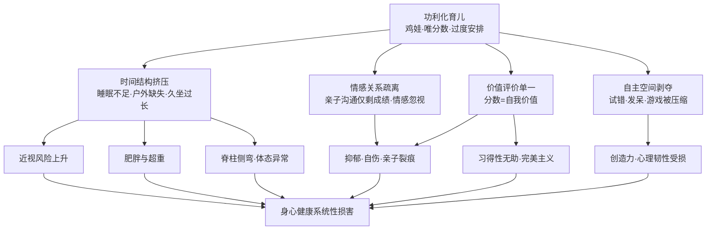

具体到每条传导路径，均能在参考资料中找到对应的实证支撑。

**第一条路径：时间结构挤压直接诱发身体健康问题。** 当孩子的时间表被切割成"清晨六点早读、放学后无缝衔接补习班、深夜十一点台灯仍亮"的精确方格，玩耍和发呆成为奢侈品[^11]。这一时间结构，恰恰对接了五类健康问题的共同危险因素：户外活动不足直接增加近视发生率，温龙波医生明确指出春季阳光充足时应多带孩子户外活动、近距离用眼单次不超过半小时[^9]；屏幕前久坐与睡眠不足是中国12—15岁青少年肥胖的重要危险因素[^8]；超加工食品（薯片、含糖饮料、快餐）高摄入使青少年超重肥胖风险增加63%，2024—2025年最新研究显示风险已升至2.09倍[^8]；长期偏斜坐姿、每日电子设备使用超3小时、课桌椅高度不匹配则是脊柱弯曲异常的核心诱因[^15]。

**第二条路径：情感关系疏离与价值评价单一直接诱发心理问题。** 在"鸡娃"家庭中，餐桌上的交流只剩下"作业写完了吗""考试考了多少分"，34%的中学生宁愿向游戏网友倾诉烦恼，也不愿与父母沟通[^11][^17]。研究揭示了触目惊心的对比：在经常与孩子进行心理健康沟通的家庭里，孩子出现抑郁风险的比例只有6.7%；而在那些从来不谈这些的家庭，这个数字飙升到了46.2%[^11]。当评价体系被压缩为"分数"这一唯一标尺，一次考试失利、一次排名下滑，便可能引发"自我价值崩塌"——重点高中"火箭班"男孩因排名下滑被当众宣读而诱发惊恐障碍，初二女生晓月因考试波动整夜失眠、暴食与厌食交替，13岁女孩晓晓因考全班第五而拿美工刀划向手臂，都是这一机制的真实写照[^11]。《柳叶刀》追踪研究更指出，**一个人在15岁时感知到的学业压力，其导致的抑郁症状影响可以一直持续到22岁**[^11]。

**第三条路径：自主空间剥夺造成创造力与心理韧性的双重受损。** 当孩子连看云发呆的时间都被奥数班填满，社会正在批量生产"高级答题机器"[^17]。北京某创新大赛中，小学生科幻作品充斥着"量子力学""基因编辑"等术语，却鲜有天马行空的想象[^17]；过度注重知识灌输和考试成绩，会限制创造力和想象力的发展，孩子缺乏自主探索和创新的机会，难以培养独立思考与解决问题的能力[^18]。"直升机父母"的密不透风与"放任不管"的两种极端，都让孩子失去了在风雨中锤炼心理韧性的机会[^11]。

**功利化育儿最深的悖论在于：它以"为孩子的未来"为名，却在系统性地伤害孩子的当下与未来。** 行为遗传学研究显示，12岁后基因对智力的影响远超家庭干预，那些砸钱堆砌的培训班，可能更多是家长的自我安慰[^17]；而某三甲医院数据显示，青少年抑郁症就诊量5年增长300%，其中67%与学业高压直接相关[^17]。当傅首尔在综艺节目中怒批"考不上大学当司机"式的功利逻辑，所引发的全民失眠式讨论，恰恰说明社会已开始反思：**"以未来牺牲当下"的逻辑，在儿童发展规律面前并不成立——被牺牲的"当下"，正是构成未来的全部砖石**[^20]。

## 1.4 重塑健康优先理念的必要性与基本原则

直面问题、反思偏差之后，必须回答的下一个问题是：我们应当以怎样的理念框架去支撑儿童青少年的身心健康成长？答案并非简单地"回到健康"，而是要完成一次从"被动应对"到"主动建设"、从"分数第一"到"健康第一"、从"局部治理"到"系统协同"的整体理念转向。

**第一，必要性：理念转向是回应问题严峻性与代际传递的唯一选择。** 一方面，前文呈现的五类问题相互交织、低龄化、隐匿化、不可逆，已经无法通过单点干预解决；另一方面，肥胖、近视等问题存在明显的代际传递与持续效应——孕期体重管理与0–6岁儿童体重管理被列入"五健行动"首要任务，正是为了"减少肥胖代际传递"[^4]；而15岁时感知到的学业压力可一直影响到22岁的抑郁症状[^11]。这意味着，**任何单纯的"末端治理"都已远远不够，必须从理念源头重新校准育人方向**。教育部在"新春第一会"中明确强调，要推动学校健康工作由"被动应对"向"主动建设"转变，正是对这一必要性的回应[^2]。

**第二，基本原则：在政策、理论、实践三层证据的交汇处，至少可以提炼出五条统领性原则。** 下表对这五条原则进行了结构化呈现，作为后续各章节路径设计的统一价值底座：

| 基本原则 | 核心内涵 | 政策与实践依据 |
|---------|---------|---------------|
| 预防为主、关口前移 | 从"治已病"转向"治未病"，在孕期、学龄前、小学阶段即建立监测与干预机制 | "五健行动"明确"预防为主、多病同防共管"，强调防、筛、诊、治、康一体化[^3][^4] |
| 多病同防共管、五育融合 | 针对共同危险因素综合发力，将健康素养有机融入德智体美劳各方面 | 强化体育锻炼、健康饮食、充足睡眠、健康宣教四项共管举措[^3]；五育融合下"以体育德、以体益智、以体健美、以体促劳"[^1] |
| 家校社医协同共治 | 健全政府统筹、部门协作、学校主体、家庭参与、社会支持的多方协同机制 | "教联体"建设、医校协同、卫体融合、家校共育、社会共治[^2][^3][^4] |
| 过程性与增值性评价 | 以过程努力替代分数结果，引导学校与家庭把"健康成长"作为衡量首要标准 | 高校体育实施"日常锻炼过程性评价"与"增值性评价"[^21]；将健康学校建设成效纳入教育督导[^2] |
| 尊重发展规律与个体差异 | 分龄差异化施策，尊重儿童发展节奏与天赋倾向，避免拔苗助长 | "五健行动"按孕期/0–6岁/中小学分阶段部署[^3][^4]；近视防控强调"严格临床评估、个体化方案"[^9] |

**第三，价值取向：在五条原则之上，还有四个更深层的价值取向需要被明确——身心一体、发展性、个体差异性、长期投资性。** "身心一体"意味着身体健康与心理健康不可割裂，强健体质本身就是培养阳光自信心态的重要路径，"以体益智""以体健美"正是这一取向的直接体现[^1]；"发展性"意味着评价应面向孩子的成长轨迹而非静态分数，过程性与增值性评价是其制度化表达[^21]；"个体差异性"意味着拒绝一刀切的"标准化人才"模板，尊重孩子在兴趣、节奏、潜能上的差异，正如清华大学副教授刘瑜所提出的"各美其美"[^17]；"长期投资性"意味着将健康视为最具复利效应的投资——习近平总书记"健康是1，其他的都是后面的0"这一论断的深层含义，**正是健康作为乘数因子的不可替代性**[^2]。

至此，本章的逻辑闭环已经形成：从"健康第一"理念的政策演进与战略意义出发，确立了健康优先的价值坐标；通过五大维度的现实图景，揭示了问题的紧迫性与系统性；通过对功利化育儿的深层剖析，定位了诸多问题背后的共同病因；最后以五条基本原则与四个价值取向，搭建起后续章节的统一认知框架。**真正让"每一个孩子身上有汗、眼里有光、心中有梦、脚下有力"**[^2]——这一愿景的实现，需要在身体、心理、学习、兴趣、目标五大维度上展开具体路径设计，也需要家庭、学校、社会、医疗形成协同合力。这正是本报告后续八个章节将逐一探查的核心命题。

# 2 身体健康的科学守护：运动、营养、睡眠与体态管理

承接第一章确立的"健康第一"价值坐标与"多病同防共管"原则，本章作为五大维度路径设计的首个落点，将"健康"这一抽象概念落实为儿童青少年日常生活中可操作的四个支点——**吃、动、睡、姿**。这四个看似平凡的生活细节，却是承载身体健康的"四根承重柱"：膳食决定能量与营养的输入结构，运动决定能量与体能的输出能力，睡眠决定生长发育与记忆巩固的修复深度，体态决定骨骼肌肉系统的力学平衡。任何一根柱子的倾斜或断裂，都会沿着第一章揭示的"共因致病"链条，传导至肥胖、近视、脊柱侧弯乃至心理状态等多个维度。本章将依次展开四个支点的科学守护要点，并在此基础上聚焦肥胖、近视、脊柱侧弯三大高发问题的针对性防治，最后回归"多病同防共管"的系统视角，搭建起一个家庭、学校、医疗机构均可参照执行的整合性身体健康管理方案。

## 2.1 分龄科学运动：从游戏化探索到自主体能管理

运动是身体健康的"第一处方"。世界卫生组织数据显示，全球81%的在校青少年身体活动不足，身体活动缺乏作为慢性病独立高危因素，已造成全球约190万人死亡[^22]。对儿童青少年而言，科学运动的价值远不止于消耗能量与控制体重——它能改善身体成分、提高心肺耐力、促进肌肉骨骼健康，同时**有助于促进认知功能并提升学习成绩，有益于心理健康和社交技能**[^23]。运动时大脑分泌的内啡肽这种"快乐激素"能有效缓解焦虑情绪，"一个能在跑道上坚持跑完800米的孩子，收获的不仅是体能进步，更是'我能行'的自我认同"[^24]。

### 总体要求：每天60分钟中高强度活动是底线

世界卫生组织与中国营养学会均给出了高度一致的核心标准：**5—17岁的儿童青少年每天应累计至少60分钟中等到高强度身体活动，以全身有氧活动为主，其中每周至少3天进行高强度身体活动，并包括每周至少3天增强肌肉力量和/或骨健康的运动**[^22][^25]。《基于体卫融合的儿童青少年运动指南(2024)》进一步细化为"每天至少60min中等到高强度有氧运动，或每周最少3天、每次20—60分钟高强度有氧运动；不建议只做中等强度运动"[^26]。这一标准的内涵需要厘清两个关键概念：所谓**中等强度活动**指"需要中等程度的努力并可明显加快心率"，如快走、跳舞、与儿童一起的游戏运动、带宠物散步等；**高强度活动**则是"需要大量努力并造成呼吸急促和心率显著加快"，如跑步、快速骑自行车、足球、篮球、排球等竞技运动[^22]。

科学的"运动处方"由三类核心"药物"组成，缺一不可：**有氧运动**（走步、慢跑、游泳、骑车、球类）提高心肺功能、改善代谢；**抗阻运动**（俯卧撑、引体向上、弹力带、自重深蹲）增强肌肉力量、提升基础代谢；**柔韧性运动**（瑜伽、普拉提、自我牵伸）增加关节活动度、降低受伤风险并舒缓情绪[^27]。

### 分龄运动重点：从"玩"到"练"的渐进进阶

不同年龄段儿童青少年在生理发育、神经成熟度、注意力时长、运动技能掌握上差异显著，运动的形式与重点也需要随之调整。下表系统对比三个学段的分龄运动方案：

| 学段 | 核心定位 | 总活动时长 | 中高强度时长 | 推荐运动形式 | 家长角色 |
|------|---------|-----------|-------------|------------|---------|
| 学龄前(3—6岁) | 游戏化探索 | 每天≥3小时 | 其中≥1小时 | 平衡车、小自行车、轮滑、捉迷藏、跑跳追逐、攀爬等多样化游戏 | 玩伴而非教练，以示范引导帮助孩子学会正确坐姿、站姿、跑姿 |
| 小学段(6—12岁) | 广撒网塑习惯 | 每天≥1小时中高强度 | 同左 | 6—8岁通过游戏掌握跑跳投接基本动作；9—12岁加入跳绳、踢毽、丢沙包、球类，每周3次核心与下肢力量训练 | 共同制定运动计划，把运动变为亲子项目，限制屏幕时间 |
| 中学段(12—18岁) | 自主管理强体能 | 每天≥1小时中高强度 | 课间3—5分钟快走/拉伸/深蹲；适当参与团队项目 | 篮球、足球、网球、羽毛球等团队项目；自重训练、弹力带等力量练习 | 引导制订运动计划，从"要我动"变成"我要动" |

学龄前阶段的运动核心是"快乐运动、游戏化探索"。这一阶段的孩子不需要接受正规运动训练，而应在多样化游戏中自由探索——**在追逐躲闪中锻炼反应和协调能力，在平衡攀爬中锻炼控制和稳定能力**[^24]。北京儿童医院内分泌遗传代谢科主任医师吴迪强调，对于3—6岁学龄前儿童，运动应以培养兴趣、安全为主，"不要强迫孩子参与那些超出自身能力的大人的运动"[^28]。一般而言，平衡车、小自行车、轮滑，以及和同伴捉迷藏、跑跳等活动，更适合这一年龄段的孩子，**家长是孩子的运动伙伴，不是"教练"**[^28]。

进入小学段，孩子学业压力逐渐增加，久坐不动情况越来越普遍，**7—12岁正是打好体能基础的关键期**[^28]。运动重点是养成规律运动习惯，兼顾有氧运动与基础力量练习。低年级孩子可以通过跳绳、踢毽子、丢沙包等方式巩固跑、跳、投、接等基本运动能力；高年级孩子要避免长时间久坐，每节课间花3—5分钟拉伸、深蹲，或到走廊上简单走动[^28]。家长可以和孩子一起制订运动计划，比如周末一起打羽毛球、游泳，让运动成为固定的亲子项目。这一阶段的关键是**尝试多种项目，找到兴趣所在**[^24]——这一发现也将在第5章兴趣培养路径中得到呼应。

中学段的运动安排，已不仅关乎体能，更直接影响青春期身心健康发育。中学阶段学生学业压力大，**运动对缓解压力、促进认知和心理健康尤为重要**[^28]。鼓励这个年龄段的孩子每节课间进行3—5分钟快走、拉伸或深蹲；每天进行1小时中高强度运动，可适当参与篮球、足球等团队项目；适当增加自重训练、弹力带等力量练习。

### 抗阻训练的安全边界

抗阻运动可以促进肌肉力量增强、改善代谢，对多数儿童青少年推荐进行抗阻训练[^26]。但儿童骨骼和肌肉尚未发育成熟，过度的抗阻运动可能产生骨骼畸形或关节损伤等问题[^26]。指南推荐的科学方案为：**抗阻运动应作为不少于60min/d运动的一部分，隔天进行，每周不少于3天，以自身负重或≤60% 1RM的小负荷开始，训练量1—2组，每组8—12次慢/中速度重复至中度疲劳；熟练后以5%—10%的增量增加负荷并减少重复次数**[^26]。儿童可采用原地起跳、单脚/双脚跳等动态热身作为抗阻训练的开始；青少年可应用弹力带、举重、俯卧撑、引体向上和平板支撑等训练[^26]。需要特别注意的是，**癫痫控制不佳、各类疾病导致血压异常、心率异常等血流动力学不稳定的儿童青少年不建议进行抗阻运动**[^26]。

### 走出三大常见误区

第一，**"运动越累越好"是危险的误区**。专家特别提醒，青春期孩子运动一定要把握好强度，切忌过量。吴迪医生分享的临床案例颇具警示意义：曾有一个孩子前一天跳街舞跳了5个小时，肌酸激酶正常应小于200，而他达到了3000—4000，"这就是骨骼肌过度疲劳引起的"——**适度运动、微微出汗、身心能够耐受，才是最好的状态**[^28]。

第二，**"渴了再喝水"会埋下健康隐患**。孩子运动时如果全程不喝水、不吃补充食物，一场大运动量下来很容易引发低血糖、头晕目眩等不适。运动过程中应当随时补充水分、适当补充热量，**对于小学生、中学生尤其是高中生，要在运动中及时补充水分和电解质**[^28]。

第三，**"肥胖孩子不能运动"违背科学规律**。不少家长认为肥胖孩子一动就容易受伤，干脆不让孩子运动，这种"因噎废食"的观念并不科学[^28]。正确做法是**科学、安全、循序渐进地锻炼**——从快走、骑行、游泳等低冲击运动开始，做好防护，尽量避免跳跃、长跑等高冲击动作以减少关节损伤[^28]。这一原则将在2.5节肥胖防控中进一步展开。

此外，关于运动前医学评估，《基于体卫融合的儿童青少年运动指南(2024)》明确指出：**大多数健康的儿童青少年不需要额外医学评估即可开始中等强度运动；但部分患有慢性疾病及心理疾病的儿童青少年建议进行医学评估，慢性疾病急性期不建议参加运动；存在胸痛、心悸、晕厥等心脑血管症状或心脑血管疾病家族史的儿童青少年运动前需特别注意医学评估**[^26]。

## 2.2 均衡膳食结构：能量需求与三餐合理搭配

如果说运动是能量"输出"端的科学管理，那么膳食就是能量与营养"输入"端的科学配置。《中国学龄儿童膳食指南(2022)》指出，"学龄期是建立健康信念和形成健康饮食行为的关键时期，从小养成健康的饮食行为和生活方式将使其受益终生"[^25]。

### 分龄能量需求与饮水标准

依据2022年中国营养学会发布的指南，6—17岁学龄儿童按生长发育阶段被划分为三个组别，每日能量需求与饮水量随年龄递增[^25]：

| 年龄段 | 能量需求 | 男童每日饮水量 | 女童每日饮水量 | 总水摄入(含食物) |
|--------|---------|---------------|---------------|----------------|
| 6—10岁 | 1400—1600 kcal/d | 6岁≥800ml；7—10岁≥1000ml | 同男童 | 1600—1800ml |
| 11—13岁 | 1800—2000 kcal/d | ≥1300ml | ≥1100ml | 男2300ml/女2000ml |
| 14—17岁 | 2000—2400 kcal/d | ≥1400ml | ≥1200ml | 男2500ml/女2200ml |

值得注意的是，三个年龄段在身体活动建议上是统一的：**每天累计至少60分钟中高强度身体活动，以全身有氧活动为主，其中每周至少3天高强度活动；身体活动要多样，包括每周3天增强肌肉力量和/或骨健康的运动，至少掌握一项运动技能**[^29][^25]。这与上一节运动指南完全一致，体现出"膳食—身体活动"在指南体系内的系统协同。

### 早餐：被严重低估的"基础设施"

早餐不是"可选项"，而是"必选项"。经过一夜睡眠，孩子的血糖水平已降到低谷，大脑急需"启动燃料"。研究表明，**经常吃早餐的孩子在注意力、记忆力和学习成绩上明显优于不吃早餐的孩子；饿着肚子上课，孩子容易烦躁、走神，长期不吃早餐还会增加超重肥胖风险**——因为身体会在后续进食中"报复性"摄取能量[^30]。

根据《指南》，早餐应提供全天25%—30%的能量和营养素[^30]。如果孩子一天需要2000千卡能量，早餐就要提供500—600千卡。更关键的是早餐的食物结构：《指南》明确要求**早餐应包括谷薯类、蔬菜水果、动物性食物以及奶类、大豆和坚果四类食物中的三类及以上**[^30][^25]，用通俗语言概括即"主食+肉蛋+蔬果+奶豆"四样里至少选三样。下表给出每类食物的实操要点：

| 食物类别 | 角色定位 | 推荐选择 | 实操要点 |
|---------|---------|---------|---------|
| 谷薯类 | 能量主力军 | 馒头、全麦面包、红薯、玉米、燕麦、杂粮粥 | 粗细搭配，少选油条、油饼、蛋糕等高油高糖；可晚上预约杂粮粥 |
| 动物性食物 | 优质蛋白宝库 | 鸡蛋、牛奶、酸奶、瘦肉、鱼 | 每天1个鸡蛋；每天≥300ml液态奶；少选火腿肠、培根等加工肉 |
| 蔬菜水果 | 维生素矿物质加油站 | 番茄、黄瓜、生菜、苹果、香蕉、橙子、猕猴桃 | 整个水果优于果汁；前一晚洗好小番茄、黄瓜，早上直接吃 |
| 奶类大豆坚果 | 营养加分项 | 牛奶、豆浆、豆腐脑、核桃、杏仁 | 豆浆需煮熟且选无糖；坚果每日一小把(约10g) |

### 青春期关键营养素强化

11—17岁少年正经历生长发育的第二个高峰期，对能量与营养素的需要量大幅增加。青少年膳食每日蛋白质需要量为55—75克，**应有一半为优质蛋白质，膳食中应含有充足的动物性及大豆类食物，以满足加速生长及智力发育的需要**[^31]。具体到关键营养素，青春期需特别关注以下五项[^32]：

**蛋白质**：每日需求量为每公斤体重1—1.2克，优质蛋白来源包括瘦肉、鱼类、鸡蛋和豆制品；**钙**：每日需求达1200—1500毫克，是儿童期的1.5倍，奶制品、深绿色蔬菜和豆腐含钙丰富，配合维生素D可提升吸收率；**铁**：女孩月经初潮后每日需18毫克，男孩需11毫克，动物肝脏、红肉和菠菜富含血红素铁，搭配维生素C可提高植物性铁吸收率；**锌**：每日需要量约9—11毫克，对性腺发育和第二性征出现具有促进作用；**维生素D**：每日需要600—800IU以促进钙吸收，日照不足时可补充鱼肝油或强化食品。青少年缺铁性贫血较为普遍，建议**每周吃半两到一两动物肝脏即有预防缺铁性贫血的作用**[^31]。

需要特别警示的是，青少年尤其是女孩"往往为了减肥而盲目节食，从而导致体内新陈代谢紊乱，对健康极为有害"[^31]——正确做法是**均衡膳食、积极身体活动，使能量摄入和消耗达到平衡**[^31]。

### 健康零食与"交通灯饮食法"

零食在儿童青少年膳食结构中始终是高敏感议题。中国营养学会针对不同年龄段给出差异化推荐：2—5岁学龄前期"吃好正餐，适量加餐，少量零食，零食优选水果、奶类和坚果"；6—12岁学龄儿童"正餐为主，早餐合理，零食少量，课间适量加餐"；13—17岁青少年"吃好三餐，避免零食替代，学习营养知识合理选择零食"[^23][^33]。三个年龄段的核心共性是：**少吃高盐、高糖、高脂肪零食；不喝或少喝含糖饮料；保持口腔清洁，睡前不吃零食**[^23]。

针对超重肥胖儿童的饮食调整，"交通灯饮食法"提供了一种简洁直观的工具——将食物分为绿灯、黄灯、红灯三类[^34]：**绿灯食物**鼓励多吃，包括所有蔬菜（尤其是深色绿叶菜）、大部分水果、杂粮杂豆、瘦肉、低脂奶制品、鸡蛋、水等；**黄灯食物**需适量，如精制主食、坚果、全脂奶等；**红灯食物**应尽量少吃，包括油炸食品、甜点、含糖饮料等，建议家中尽量不购买，每周最多吃1次。配合"膳食餐盘"进行视觉化份量控制——蔬菜水果占一半，优质蛋白和主食各占四分之一，每天喝奶；进餐顺序按"蔬菜→鱼禽肉蛋及豆类→谷薯类"，不喝荤汤[^34]。这一方法将抽象的营养学概念转化为家长一眼可辨的视觉信号，显著降低了家庭执行难度。

## 2.3 充足睡眠保障：时长、质量与睡眠节律重建

睡眠是机体复原整合和巩固记忆的重要环节，**对促进中小学生大脑发育、骨骼生长、视力保护、身心健康和提高学习能力与效率至关重要**[^35]。然而，第一章揭示的功利化育儿正在系统性挤压孩子的睡眠时间，"小学生平均睡眠9.5小时、初中生8.4小时"的现状，距离国家睡眠令的硬性标准仍有差距[^36]。

### "睡眠令"确立的硬性标准

2021年3月30日，教育部办公厅发布《关于进一步加强中小学生睡眠管理工作的通知》（俗称"睡眠令"），围绕**学生必要睡眠时间、学校作息时间和晚上就寝时间**三个"重要时间"作出明确规定[^35]：

| 学段 | 睡眠时长 | 上课时间 | 就寝时间 |
|------|---------|---------|---------|
| 小学 | ≥10小时 | 不早于8:20 | 一般不晚于21:20 |
| 初中 | ≥9小时 | 不早于8:00 | 一般不晚于22:00 |
| 高中 | ≥8小时 | （参照中学） | 一般不晚于23:00 |

为保障睡眠时间不被侵占，"睡眠令"还建立了配套的"中断机制"：**校外培训机构培训结束时间不得晚于20:30，线上直播类培训不得晚于21:00，且不得以课前预习、课后巩固、作业练习、微信群打卡等任何形式布置作业**[^35]。山东省寿光市等地落实"一生一床位"宿舍建设、可躺睡课桌椅配备和共享午休间等措施，江苏省南京市多所中小学取消早读、将到校时间调整至8点后，是地方实践的代表性案例[^36]。

### 三大干扰因素与异常表现识别

2021年监测数据显示，影响中小学生睡眠的主要干扰因素依次为**课业压力(67%)、电子产品使用(41.9%)和家长作息影响**[^36]。其中电子产品的危害具有双重性：一方面沉迷电子产品直接占用睡眠时间，另一方面**电子产品大部分发出的是蓝光，蓝光进入视网膜会引起褪黑素分泌的减少，从而导致睡眠潜伏期延长，睡眠效率降低，深睡眠减少、容易觉醒**[^37]。

睡眠不足或质量低下，会向身体发出多种异常信号，需要家长及时识别。云南省第一人民医院睡眠医学科主治医师黄代金特别强调，**"半夜3点前的深睡眠，是儿童、青少年的黄金睡眠时间，此时会分泌大量的生长激素，不仅用来长个头，还能修复白天受损的皮肤细胞"**——很多孩子由于学习、娱乐等原因熬夜晚睡，剥夺了自己的深睡眠时间[^37]。临床中常见三类异常表现需警惕：

**第一，睡够了仍想睡——警惕阻塞性睡眠呼吸暂停**。如果孩子睡觉时常常张口呼吸，呼吸不均匀，有一会儿很响一会儿又没声的呼噜声，那就很有可能是阻塞性睡眠呼吸暂停。这种情况的孩子扁桃体和（或）腺样体往往肿大，**伴有腺样体面容，比如牙齿"飞"出来了，整个面部肌肉相对比较僵硬，发现这些问题一定要及早干预**[^37]。

**第二，睡眠中"拳打脚踢"——警惕快动眼相关性行为障碍**。正常情况下我们做梦时肌肉张力处于一天中最低，但有些孩子梦境中的动作会被实际表现出来，称为梦境扮演[^37]。睡行症（俗称"梦游症"）则更为危险，往往在睡眠中做出一系列出人意料的行为，甚至开门外出行走——首先要保护好孩子安全，然后尽早就医[^37]。

**第三，入睡困难、晨起难醒——警惕厌学—睡眠的恶性循环**。湖南中医药大学第一附属医院儿童医学中心副主任谢静指出，**厌学常常与睡眠问题密切相关**[^38]。从偶尔不愿上学到明显回避学习，一般会经历预警期、困难期、崩溃期、耗竭期四个阶段，睡眠问题贯穿始终：预警期偶尔入睡困难、晨起不易唤醒；困难期入睡困难加重、作息不规律、日间精神较差；崩溃期睡眠节律明显异常、睡眠质量偏低；耗竭期睡眠问题较为突出、睡眠结构受到影响[^38]。其作用机制为：**当孩子压力较大时，大脑可能持续处于紧张状态，易出现白天焦虑、夜间失眠，夜间休息不佳又会加重日间疲惫与焦虑，形成相互影响的循环**[^38]。这一发现，将在第3章心理健康章节中进一步深化讨论。

### 睡眠节律重建路径

针对睡眠不足或质量不佳，可遵循"固定作息—睡前仪式—屏幕管控—环境优化"的四步重建路径[^39][^38]：

**固定作息**：固定每日入睡与起床时间（含周末），可强化生物钟；儿童每日保证1—2小时户外活动，可促进褪黑素夜间分泌。**睡前仪式**：建立20分钟左右的稳定流程，如温水浴、亲子阅读，帮助孩子从兴奋状态过渡到放松状态。**屏幕管控**：睡前2小时避免电子屏幕（蓝光抑制褪黑素），睡前1小时避免咖啡因（奶茶、巧克力等）。**环境优化**：睡眠环境需黑暗（褪黑素分泌关键）、安静（<50分贝）、温度20—24℃；选择硬度适中的床垫。对于已出现厌学—睡眠循环的孩子，可分步重建：固定作息→建立睡前流程→调整日间补觉→逐步恢复学习节奏[^38]。**长期睡眠低于推荐下限（如5岁<8小时、小学生<9小时）的孩子，需儿科就诊，排查睡眠障碍或心理问题**[^39]。

## 2.4 正确体态培养：坐姿、书包与课桌椅的科学配置

体态健康是儿童青少年身体健康中最容易被忽视，却最具复利效应的一环。2026年发布的《儿童青少年"五健"促进行动计划》将"骨骼更强壮"列为五大目标之一，明确要求**指导中小学生选用合适的双肩书包、定期调整课桌椅高度和座位间距，学校每年为10—16岁儿童青少年开展1次脊柱弯曲异常筛查和评估**[^40]。本节围绕脊柱健康构建"装备—姿势—环境"三维体态管理方案。

### 装备：书包的科学选择与正确背负

不良的背负姿势容易致使肌肉失衡，**诱发功能性脊柱侧弯、驼背、骨盆倾斜、高低肩等不良体态，严重者可能发生结构性损伤**[^41]。科学选包遵循四大要点[^42]：

**第一，尺寸匹配身高，双肩背负最科学**。单肩包、手提包都会造成脊柱受力不均，参考《中小学生书包卫生要求》，身高128厘米及以下选30×28×10厘米，128—144厘米选33×30×12厘米，144—166厘米选38×30×14厘米，166厘米及以上选42×32×16厘米；**身高144厘米以下，可选择配有腰带和胸带的书包**以分散重力[^42]。

**第二，重量控制是关键**。**书包自重应控制在0.5—1.0千克内，总重量(含物品)不超过孩子体重的10%**[^42]。如果重量过大，孩子为了保持平衡会通过前倾身体代偿，长期会出现含胸头前倾体态[^41]。

**第三，结构设计与材质安全**。书包内部应有清晰分区和隔层；背面采用聚氨酯棉、聚氯乙烯泡沫塑料等支撑材料分散压力；肩带宽度不应低于40mm；避开有刺鼻气味的书包以避免邻苯二甲酸酯、甲醛等有害物质[^42]。

**第四，正确背负与日常调整**。务必双肩带同时使用，调节长度使书包紧贴背部，扣好胸带和腰带；调整时让书包底部与腰部齐平，肩带松紧以能放入2—3根手指为宜[^41][^42]。对于使用拉杆包的孩子，上下楼时收起拉杆手提或背负防绊倒，左右手交替拉包以防脊柱侧弯[^42]。

### 姿势："三个90度"与"一尺一拳一寸"

姿势的核心是两套口诀。**坐姿遵循"三个90度"原则**：坐下时膝盖弯曲90度，腰部与大腿呈90度，手肘放在桌面上呈90度，同时背部挺直，双脚平放地面（必要时使用脚踏板），避免翘二郎腿[^41]。**读写姿势遵循"一尺一拳一寸"标准**：眼睛离书本一尺，胸口离书桌一拳，手指离笔尖一寸，不躺卧、不歪头看书[^43]。行走时目视前方，不低头玩手机，保持头部和脊柱在一条直线上[^41]。

### 环境：课桌椅按身高匹配

不少家长忽视了一个事实：**如果课桌和课椅的高度和孩子的身高不匹配，那么孩子就难保证采用正确的坐姿读书学习；坐姿长期不良，不仅容易引发和加深近视，还可能会脊柱侧弯**[^44]。国家推荐标准《学校课桌椅功能尺寸及技术要求》（GB/T 3976-2014）按身高给出了11档课桌椅型号，下表节选了最常见的几档[^44]：

| 学生身高(cm) | 课桌高度(cm) | 课椅高度(cm) | 型号 |
|------------|------------|------------|------|
| 113—127 | 52 | 29 | 9号 |
| 120—134 | 55 | 30 | 8号 |
| 128—142 | 58 | 32 | 7号 |
| 135—149 | 61 | 34 | 6号 |
| 143—157 | 64 | 36 | 5号 |
| 150—164 | 67 | 38 | 4号 |
| 158—172 | 70 | 40 | 3号 |

匹配的核心原则是：**孩子坐下、背部挺直、大腿与上半身垂直、大腿与小腿垂直、上臂自然下垂时，手肘在桌面以下3—4厘米**[^44]。家中书桌椅无法调节时，可"人工调试"——书桌过高时尽可能选用高一点的椅子并加垫脚垫保证脚不悬空；书桌过矮时在书桌下方垫稳固物品提高高度；**最好不要用成人办公桌椅、餐桌椅替代书桌椅**[^44]。

### 不良体态的针对性矫正训练

针对已出现的高低肩、驼背、圆肩等问题，可结合靠墙站立、小燕飞、平板支撑、猫式伸展、游泳等训练逐步改善[^45][^46]：

**靠墙站立**强化背部肌群——双脚与肩同宽，后脑勺、肩胛骨、臀部、小腿肚及脚跟紧贴墙面，每日5—10分钟[^46]；**小燕飞**针对竖脊肌——俯卧吸气时同时抬起头部、双臂及双腿，保持2—3秒后回落，每日10—15次分2—3组[^46]；**平板支撑**强化核心肌群——以俯卧撑姿势支撑，初始15—30秒逐步增至1分钟，确保髋部不下塌或上抬[^46]；**猫式伸展**增加脊柱柔韧性——跪姿吸气塌腰抬头、呼气拱背低头，每次8—10个循环[^46]；**游泳**是综合性最强的护脊运动，**蛙泳与仰泳姿势需伸展背部肌群并打开胸腔，水的浮力能减轻脊柱负荷**，每周2—3次每次30分钟左右[^46]。

预警信号的家庭自检不可或缺：衣服总向一侧滑落、背包后单侧肩背酸痛、站立时双侧肩胛骨不对称凸起、走路向一侧偏，**出现这些信号请预约专科检查**[^41]。

## 2.5 肥胖防控："运动+营养"双处方与生活方式干预

第一章已经揭示了肥胖问题的严峻性：6—17岁儿童青少年肥胖率从1982年的0.2%飙升到2024年的7.9%，超重肥胖率约19%；6岁以下儿童肥胖率3.6%[^47][^40]。肥胖不仅会增加青少年在生长发育中患呼吸类、心血管类、精神类疾病的概率，**也会对青少年心理健康造成重大影响**[^47]。本节落实国家卫健委《儿童青少年肥胖食养指南（2024年版）》的六条原则与生活方式干预的四大策略。

### 总目标："匀速生长、增肌减脂"

儿童正处于生长发育期，肥胖防控的目标不是简单的"减重"，而是**让身高增长的速度超过体重增长的速度，从而使BMI逐渐回归正常**[^34]。具体到下降速度：≥2岁、2—5岁、6—11岁轻中度肥胖儿童，体重下降速度建议不超过0.5kg/月；6—11岁重度肥胖、12—18岁所有肥胖儿童，体重下降速度建议不超过0.9kg/月；**对体重下降过快的超重和肥胖儿童需进一步评估原因**[^34]。

### 饮食干预"三步法"

饮食干预的核心原则是"先树立观念，再改变行为"，**家庭共同参与是关键，父母应以身作则带动整个家庭饮食习惯的改善**[^34]。实操可采用"一看、二调、三支持"三步法：

**一看：识别食物类别**（即2.2节介绍的"交通灯饮食法"）。**二调：调整饮食结构与习惯**——采用膳食餐盘视觉化份量控制；烹饪方式宜多采用蒸、煮、凉拌、快炒，减少红烧、油炸、糖醋等高油高糖做法；戒断所有含糖饮料，鼓励饮用白开水；**改变进餐顺序，按蔬菜→鱼禽肉蛋及豆类→谷薯类，不喝荤汤**[^34]。**三支持：家庭与环境**——按绿灯食物清单采购食材，将健康零食置于显眼处，避免储存不健康食品；外出就餐时选择清淡餐厅，主动要求少油少盐；**家长记录孩子三餐情况，不每天称体重避免焦虑，每月测量一次身高体重并记录，关注BMI趋势而非短期数字变化**[^34]。

此外，《儿童青少年肥胖食养指南》还强调**"肥胖儿童青少年进餐时建议先吃蔬菜，然后吃鱼禽肉蛋及豆类，最后吃谷薯类。同时还要控制进餐量和进餐时间"**[^47]。这一进餐顺序与第三步家庭支持相结合，能够显著降低饮食干预的家庭执行难度。

### 运动干预的风险分层方案

肥胖儿童青少年的运动干预要遵循**安全第一、循序渐进、趣味性与多样性、减少静坐、贯穿全天以及个体化**六大核心原则[^34]。基层医生通过快速计算BMI并询问关键问题（如运动时是否有关节疼痛、胸闷、心慌等），可将儿童分为低、中、高三类风险，差异化制定运动方案[^34]：

**低风险儿童**（超重或轻度肥胖、无关节痛）：可进行大部分运动，需注意动作规范和质量，推荐快走、健步走、慢跑、骑行、游泳、羽毛球、健身操等中等强度有氧运动，以及靠墙静蹲、臀桥、平板支撑、弹力带等所有力量训练[^34]。

**中风险与高风险儿童**：**应先进行医学评估排除运动风险，初期以游泳、骑车等低冲击有氧运动为主，逐步增加日常活动；体能改善后再引入坐姿抗阻、弹力带等低负荷力量训练，避免跳跃、跑步等高冲击动作，以保护关节、建立信心**[^24]。

总体而言，《指南》建议**有氧运动持续30分钟以上，强度为最大心率(220-年龄)的60%—70%；超重或肥胖儿童青少年每周应至少进行3—4次、每次20—60分钟中高强度运动，包括每周至少3天强化肌肉力量和/或骨健康的高强度/抗阻运动**[^47]。在进行力量训练时，可采取一些抗阻力和较轻的负重练习如俯卧撑、自重深蹲等，**儿童青少年不易过早从事力量型练习**[^47]。

为保障儿童健康，建议**2—5岁儿童每日屏幕时间不超过1小时，6—11岁不超过2小时**[^34]——这一标准与睡眠管理中的屏幕管控形成呼应。

### 关口前移：从源头减少肥胖代际传递

《儿童青少年"五健"促进行动计划》明确将体重管理纳入早孕关爱和孕产期保健服务，落实0—6岁儿童健康管理服务，强化体格检查、生长发育等健康指导[^40]。此外，行动计划明确要求**在中小学校推进健康食堂、健康餐厅建设，培养儿童青少年运动兴趣**[^40]，**多方合作创造社会支持环境**[^47]。这意味着肥胖防控不再是单一家庭的独立任务，而是孕期—婴幼儿期—学龄期—青春期全链条、家校社医多主体的系统工程。

## 2.6 近视防控：远视储备守护与综合干预

近视已成为我国儿童青少年面临的全球性挑战。第一章引用的国家卫健委数据显示，**我国儿童青少年总体近视率达51.9%，且呈低龄化趋势，低龄发病往往导致高度近视比例上升**[^48]。《儿童青少年"五健"促进行动计划》提出明确的2030年目标：6岁儿童近视率控制在3%左右，小学生降至32%以下，初中生60%以下，高中阶段70%以下[^40]。

### 远视储备：孩子的"抗近视基金"

理解近视防控，首先要理解"远视储备"这一关键概念。每个孩子刚出生时眼球较小、眼轴较短，外界平行光线进入眼睛后成像在视网膜后方，这种状态即为"远视"。**这种与生俱来、适度的远视度数不影响孩子视力发育，是儿童眼部正常的生理状态，也就是"远视储备"**——可以把它想象成父母在"视力银行"里给孩子存入的一笔"抗击近视基金"[^49]。各年龄段远视储备参考值[^49]：

| 年龄段 | 远视储备参考值 |
|--------|--------------|
| 新生儿期 | 250—300度 |
| 3—5岁 | 200—250度 |
| 6—7岁 | 150—250度 |
| 8—10岁 | 100—150度 |
| 12—15岁 | 接近正视(0至+0.50D) |

**如果6岁前消耗完远视储备，孩子在小学阶段极易发展为近视。因此，0—6岁是孩子眼球结构和视力发育的关键时刻，也是保护远视储备的"黄金窗口期"**[^49]。

值得家长警惕的是，远视储备不足并非只与电子产品有关。某8岁孩子小明从未频繁看手机，却在体检中发现已有100度近视——医生问诊后发现，他从三四岁开始就喜欢看书一两个小时，特别喜欢搭微型积木，周末"宅"在家里很少户外，"日间户外活动不足、持续近距离用眼时间过长，都是远视储备消耗过快、加快近视发展的重要原因"[^49]。

### "监测—行为—光学—药物"四级防控体系

构建近视综合防控，需要从监测、行为、光学、药物四个层次同步发力。

**第一层：建档监测**。儿童在24月龄、36月龄时应开展屈光筛查，**3岁起建立屈光发育档案，已建档儿童每半年开展一次视力检测、屈光检查、眼轴检查；学龄期远视储备消耗较快的儿童青少年建议每3个月进行一次检查**[^49]。建档时需了解父母是否近视特别是高度近视、孩子是否早产等高危因素[^49]。

**第二层：行为干预**。这是预防近视最经济、最有效的环节[^43][^48]：

| 行为干预要点 | 核心标准 |
|-------------|---------|
| 户外活动 | 每天至少2小时户外阳光活动；阳光促进多巴胺分泌，有效抑制眼轴增长 |
| 屏幕管理 | "20-20-20"法则：每看屏幕20分钟，远眺20秒6米外物体；单次≤15分钟，每日累计≤1小时 |
| 读写姿势 | "一尺一拳一寸"标准；近距离用眼距离≥33厘米，单次≤30分钟 |
| 充足睡眠 | 小学生每天保证10小时睡眠，让眼部肌肉充分放松 |
| 控制甜食 | 避免甜食促进眼轴增长 |

**第三层：光学干预**。包括科学验配近视防控眼镜、角膜塑形镜（OK镜）等。爱尔眼科建议**每学期带孩子进行2次专业视力检查，重点监测远视储备和眼轴变化，早发现苗头早干预**[^43]。

**第四层：药物干预**。低浓度阿托品是近年来基于大量循证医学证据、在临床上应用较为广泛的近视控制药物[^48]。但需要明确两点：**第一，"近视防控没有'神药'，必须药物、光学手段与用眼行为习惯等多管齐下，才能实现'1+1>2'的效果"**[^48]；**第二，该药物并非人人适用——"在严格实施科学光学干预方案后，若近视控制效果仍不理想，经医生评估排除禁忌症，方可考虑联合使用低浓度阿托品"**[^48]。具体用药方案高度个体化：浓度选择因人而异，使用频率各不相同，所有方案均需由专业医生评估确定，**不可自行决定，绝不能通过非正规渠道擅自使用**[^48]。

**第五层：环境支持**。《儿童青少年"五健"促进行动计划》明确要求**深入实施"学校明亮工程"，中小学校教室照明应全面达标；建立完善儿童青少年视力健康电子档案，实施分级分类干预**[^40]。

## 2.7 脊柱侧弯防治：早筛早干预的黄金窗口期管理

脊柱侧弯已成为继肥胖、近视之后我国儿童青少年第三大高发疾病[^50][^42]。中华预防医学会脊柱疾病预防与控制委员会数据显示，**我国中小学生发生脊柱侧弯人数已经超过500万，并以每年30万左右的速度递增；浙江省30万中小学生筛查中，发病率为2%—3%**[^50]。临床表现具有"高发于10—16岁青春期、女孩发病率为男孩的1.57倍、月经初潮前后快速进展"三大特征[^51][^52]。

### 抓住黄金窗口期：发病低龄化的新挑战

宁波市自2019年在全国率先开展中小学生脊柱侧弯普查，发现"超半数孩子都存在高低肩、圆肩驼背等体态问题，其中10%的孩子存在脊柱侧弯患病风险"，且**发病逐渐变得低龄化——以前是初中生居多，现在小学生数量明显增多**[^50]。浙江省中医院推拿科主任杜红根指出，**0到10岁和青春期是孩子发育最快的两个阶段，也是脊柱侧弯度数增长最快时期，对于发育高峰期的青少年如果不进行干预，通常侧弯度数会每月增加1度左右**[^50]。这意味着一旦错过早期发现的窗口，侧弯进展速度可能远超家长预期。

浙江"正脊行动"是地方政策响应的代表案例。2023年浙江省将"为300万名义务教育阶段学生开展正脊筛查"列入民生实事项目，2025年全省层面筛查完成；杭州入选全国脊柱侧弯中医药干预试点地区，宁波落地全国首个青少年脊柱侧弯综合防控基地；**从2025年开始，每年定向抽取小学4年级、初中8年级的学生开展常态化筛查**[^50]。《儿童青少年"五健"促进行动计划》进一步明确：**学校每年为10—16岁儿童青少年开展1次脊柱弯曲异常筛查和评估，妇幼保健机构、疾控机构、有条件的基层医疗卫生机构加强技术支持；学校将脊柱健康状况记入学生健康档案**[^40]。

### 家庭自测三步法

家长可每3—6个月帮孩子做一次自测，几分钟即可完成[^51][^52]：

**第一步：站立观察**——让孩子自然站立，从后方观察双肩是否等高、肩胛骨是否对称、两侧腰部皮肤皱褶是否一致。**第二步：弯腰试验**——让孩子双腿伸直、弯腰90度，双手自然下垂，家长从后方平视背部；**如发现一侧背部明显隆起（"剃刀背"），需高度警惕**[^51]。**第三步：步态观察**——留意孩子走路时是否出现跛行、身体向一侧倾斜或骨盆摆动不对称[^51]。

若发现以上任何异常，应及时到正规医院就诊，进行**全脊柱X光检查（站立位）**，以明确侧弯角度（Cobb角）和旋转程度[^51]。

### 按Cobb角分级的阶梯化干预方案

基于Cobb角与骨骼成熟度，国内临床实践已形成清晰的分级干预体系。两份资料的标准略有差异（中医医院方案与广东省中医院方案），下表综合呈现[^51][^52]：

| Cobb角 | 干预重点 | 核心方法 |
|--------|---------|---------|
| <10° | 预防为主 | 指导正确姿势；核心肌群训练（游泳、平板支撑）；八段锦等导引功法调理气血 |
| 10°—20° | 中医干预黄金窗口期 | 针灸+手法调理（夹脊穴、足三里、肾俞穴）；个性化矫形体操；每3—6个月复查 |
| 20°—40° | 支具治疗+康复 | 定制支具每天16—23小时；结合保守康复训练；针灸推拿改善肌肉失衡 |
| >40° | 专科评估手术 | 必要时手术矫正；中医作为围手术期调理 |

中医视角下，脊柱侧弯多与"筋出槽、骨错缝"有关，根源在于气血失调、筋骨失衡。青少年正值生长发育期，若长期姿势不良、阳气不足、筋肉失养，则容易导致脊柱两侧受力失衡，逐步形成侧弯。**中医干预的核心在于"调筋正骨、疏通气血"，通过针灸、推拿、导引等方法恢复脊柱两侧的力学平衡，在轻中度侧弯阶段具有较好的干预价值**[^51]。《儿童青少年"五健"促进行动计划》也明确要求**充分发挥中医药干预儿童青少年脊柱弯曲异常的特色和优势，提升干预效果**[^40]。

家长需破除四大常见误区[^52]：误区1认为"姿势问题长大就好"——脊柱侧弯无法自行矫正；误区2认为"戴支具会让孩子自卑"——现代支具轻便隐蔽，错过黄金期可能需手术；误区3认为"戴支具会让骨骼变弱"——支具治疗专业定制，正确使用不会影响发育；误区4认为"脊柱侧弯是缺钙导致"——病因复杂，**盲目补钙无效**[^52]。

### 日常预防闭环

脊柱侧弯的预防与第2.4节体态管理高度同源——书包重量≤体重10%、双肩背包、"三个90度"坐姿、按身高匹配课桌椅；同时**建议游泳、攀岩、普拉提、瑜伽等对称性运动以增强背部肌肉力量；建议每学期为孩子做一次脊柱自查，青春期女孩尤其需重视**[^52]。这一闭环再次印证了第一章揭示的"共因致病"逻辑——同一组生活方式因素同时影响多个健康维度。

## 2.8 四位一体协同：身体健康管理的整合路径

回顾本章前七节的展开，"吃—动—睡—姿"看似四个独立维度，实则共享一组**共同危险因素**，并在肥胖、近视、脊柱侧弯三大问题之间发生交叉传导。这正是第一章揭示的"多病同防共管"原则在身体健康层面最直接的体现。

### 共因致病：四个维度间的传导网络

下图揭示了四个维度之间的相互作用与共因致病机制：

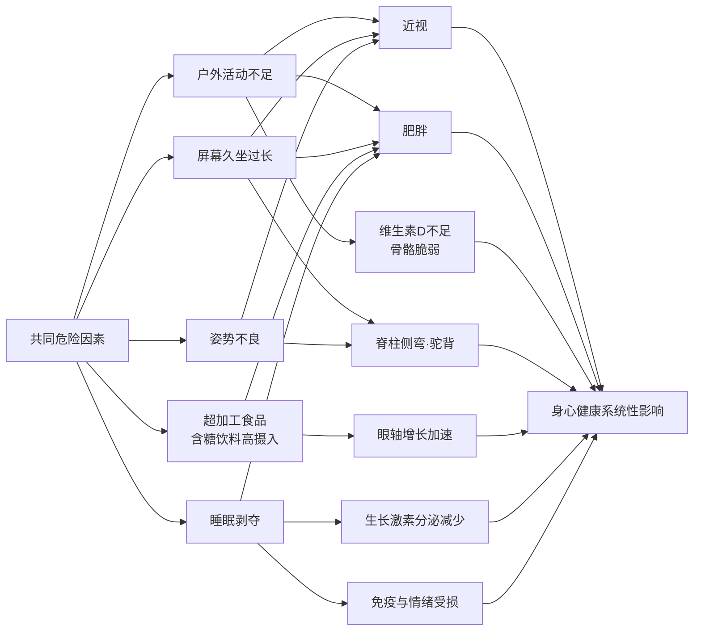

具体而言：户外活动不足同时增加近视风险与肥胖发生率；屏幕久坐既导致眼轴增长又造成脊柱受力失衡；含糖饮料与超加工食品既诱发肥胖又"促进眼轴增长"[^48]；睡眠剥夺则同时削弱生长激素分泌、增加肥胖风险、降低情绪调节能力。**这意味着任何单点干预都难以奏效，必须围绕共同危险因素展开协同干预**——增加户外活动一项，就能同时为近视、肥胖、骨骼健康、心理健康四个维度"增加存款"。

### 家校社医的角色分工

身体健康管理是一个多主体协同系统，下表梳理四方角色与协同机制：

| 主体 | 监测预警 | 行为塑造 | 专业干预 |
|------|---------|---------|---------|
| 家庭 | 每3—6个月脊柱自检；每月身高体重BMI记录；睡眠与屏幕时间监督 | 父母以身作则坚持运动；亲子运动项目固定化；健康食材采购；屏幕时间约定 | 配合医疗机构方案；督促完成训练计划与佩戴支具/眼镜 |
| 学校 | 每年1次脊柱侧弯筛查（10—16岁）；每年口腔检查；体质健康标准测试 | 落实"每天体育2小时""课间15分钟"；课桌椅按身高匹配；健康食堂建设 | "学校明亮工程"教室照明达标；体育课规范开足；心理与身体协同 |
| 社区 | 公共健身设施开放；社区体检点 | 建设免费安全的儿童运动场地 | 链接专业医疗资源 |
| 医疗卫生机构 | 24/36月龄屈光筛查；3岁起屈光发育档案；学龄期每3—6个月监测 | 个性化"运动处方"；个性化食谱；中医辨证调理 | 医院、学校、社区联动建立学生健康档案，形成"筛查—干预—管理"闭环 |

这一角色分工的核心制度安排是：**医院、学校、社区要加强联动，建立学生健康档案，形成"筛查—干预—管理"的闭环，让每个孩子都能在科学指导下健康成长**[^24]。"卫体融合"的理念正在推广——医院和体育部门联手，**用运动处方替代部分药物处方，防病于未然**[^24]。

### 整合行动清单：四位一体的家庭执行方案

基于本章七节内容，可以提炼出一份家庭可直接执行的"吃—动—睡—姿"四位一体清单：

**吃**：早餐占全天能量25%—30%，含三类及以上食物（主食+肉蛋+蔬果+奶豆）；每天≥300ml液态奶+1个鸡蛋；按"交通灯饮食法"采购，戒断含糖饮料；进餐顺序蔬菜→蛋白→主食；**6岁≥800ml/7—10岁≥1000ml/中学男1300—1400ml女1100—1200ml**饮水量[^25]。

**动**：每天≥60分钟中高强度活动；每周≥3天高强度活动+≥3天力量与骨骼训练；每天≥2小时户外活动（兼顾近视防控）；至少掌握一项运动技能；微微出汗即止，避免过度训练。

**睡**：**小学≥10小时、初中≥9小时、高中≥8小时**[^35]；睡前2小时停止屏幕；固定就寝时间（小学不晚于21:20、初中22:00、高中23:00）[^35]；卧室黑暗安静、温度20—24℃。

**姿**：双肩书包总重≤体重10%；坐姿"三个90度"、读写"一尺一拳一寸"；课桌椅按身高匹配；每3—6个月家庭脊柱自检；每周2—3次游泳、靠墙站立、小燕飞等护脊训练。

需要特别强调的是，本章构建的"吃—动—睡—姿"四位一体身体健康管理方案，并非孤立的生理工程。**身体健康与心理健康从来不是平行的两条线，而是同一棵生命之树的根与枝**——运动时分泌的内啡肽缓解焦虑[^24]、睡眠剥夺加剧情绪失调[^38]、肥胖影响心理健康[^47]、脊柱侧弯外观异常引发自卑社交退缩[^51]——这些贯穿全章的实证证据，已在生理层面铺垫了"身心一体"的事实基础。从下一章开始，本报告将以这一事实基础为起点，进入心理健康的呵护与情绪发展支持这一同等关键的维度，继续延展"健康第一"的整体育人路径。

# 3 心理健康的呵护与情绪发展支持

第二章在身体健康守护的最后一节已揭示一个不容忽视的事实：运动时大脑分泌的内啡肽缓解焦虑、睡眠剥夺直接削弱情绪调节能力、肥胖与脊柱外观异常引发自卑与社交退缩——身体与心理从来不是平行的两条线，而是同一棵生命之树的根与枝。当一个孩子的身体被科学守护，他才有了承载情绪发展的生理基础；而当一个孩子的心理被悉心呵护，他才有了让健康习惯持续运转的内在动力。本章作为五大维度路径设计的第二个落点，将从儿童青少年心理健康问题的本体因素与多元诱因切入，引入埃里克森八阶段理论搭建分龄理解框架，逐层展开早期识别信号、有效亲子沟通、心理安全感构建、污名化破除与专业资源链接，最终形成"**认知—识别—沟通—干预—资源**"五位一体的心理守护体系。

需要在开篇厘清两组易被混淆的关键数据：截至2020年，《中国国民心理健康发展报告(2019—2020)》显示**17.2%的受访青少年存在轻度抑郁风险，7.4%存在重度抑郁风险**[^53]；2022年教育部数据显示我国**儿童青少年抑郁检出率达24.6%，其中重度抑郁7.4%**[^54];而国家卫健委公布的青少年**抑郁症患病率约为2%**[^55]。两组数据并不冲突——前者是"抑郁情绪"或"抑郁状态"的筛查检出率，"是几乎每一个人都体验过、或者都会体验到的正常情绪"，**后者则是按严格诊断标准确诊的临床患病率**[^55]。本报告延续第一章建立的口径，将"症状检出率"与"临床患病率"分别表述，避免误读。

## 3.1 心理健康问题的本体因素与多元诱因解析

要回答"孩子为什么会出现心理问题"这一根本问题，必须超越"抗压能力差"或"思想脆弱"的简单归因，回到生物学、家庭、学校、社会四个层面的系统化病因学解析。研究明确指出，青少年的心理困境"并非简单的'脆弱'或'抗压能力不足'，而是复杂的社会、家庭和个体多重因素交织的结果"[^55]。

**第一，生物学层面：遗传易感性与大脑发育不完善构成本体基础**。遗传学研究表明，青少年的心理健康问题具有一定的遗传易感性——若家族中有抑郁症、焦虑症等精神疾病的遗传史，青少年患相关心理健康问题的风险相对较高。其作用机制在于**基因可影响神经递质（如5-羟色胺、多巴胺）的合成、转运和代谢，而神经递质失衡与心理健康问题密切相关**[^56]。比生物遗传更具青春期特异性的是大脑发育因素：青少年时期是大脑快速发育阶段，**前额叶皮层在青少年时期还在不断发育成熟，而前额叶皮层与情绪调节、冲动控制等功能密切相关**[^56]。这意味着青春期孩子出现的情绪不稳定、行为冲动、决策短视，并非单纯的"叛逆"或"道德问题"，而具有真实的神经生物学基础——这一认识对家长理解青春期心理特征具有根本性意义。

**第二，家庭层面：教养方式与家庭关系是最深远的影响源**。研究将家庭因素细分为教养方式与家庭关系两条作用链。在教养方式上，**过度专制型**家庭让青少年长期处于紧张压抑氛围中，"焦虑水平显著高于其他家庭教养方式下的学生"；**过度溺爱型**则使孩子形成以自我为中心的心理，"遇到挫折时容易出现心理失衡"；**忽视型**家庭则让青少年因缺乏情感支持而产生孤独感、自卑等心理问题[^56]。在家庭关系上，父母婚姻冲突频繁的家庭中的青少年，"心理健康问题的发生率明显高于父母婚姻关系和谐的家庭中的青少年"[^56]。一项广泛的因素分析进一步指出，**温暖、支持性的家庭环境有助于儿童形成安全感和自信心，而冷漠或高压的家庭环境可能导致儿童出现焦虑或行为问题**[^57]。第一章中芊芊案例正是这一机制的真实写照——单亲、专制型教养、"鸡娃式"超前培养，最终在10岁孩子身上诊断出"中度抑郁"。

**第三，学校层面：学业压力与同伴关系交叠施压**。学业压力的累积效应在中学阶段尤为突出，"过度的考试焦虑会影响青少年的学习效率和心理健康，严重时可能发展为焦虑症等心理疾病"[^56]。而同伴关系——尤其是其极端形式校园欺凌——已成为不可忽视的诱因。校园欺凌指"以校园为背景，一个或多个欺凌者施加于受欺凌者的有意、反复、持续的刻意伤害行为"，包括肢体性、言语、性、关系、网络五种主要形式[^53][^58]。基于11762名青少年的大样本研究揭示了一条具有重要理论与实践价值的**链式中介路径**：

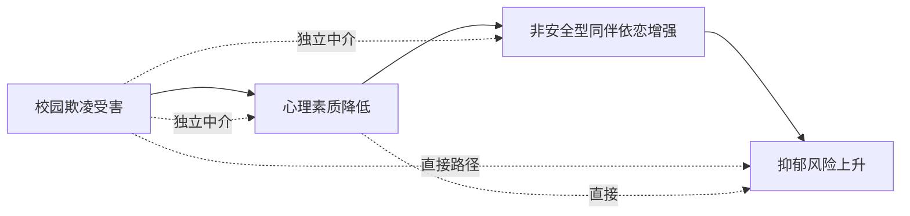

研究证实"心理素质与非安全型同伴依恋在校园欺凌受害与抑郁之间既存在独立的中介作用，也存在链式中介作用，**即欺凌受害会降低心理素质进而增强非安全型同伴依恋，最终增加抑郁风险**"[^53]。从临床表现看，校园霸凌"会对受害人构成心理问题，影响健康，甚至影响人格发展……陷入低自尊状态，出现精神心理问题，如焦虑、抑郁情绪，甚至出现自伤、自杀行为，还可能罹患创伤后应激障碍"[^58]。这一发现的重大意义在于：**干预校园欺凌不能仅停留在事件层面，更需要同步修复孩子的心理素质与同伴依恋质量**——这为后续3.4节亲子沟通与3.7节多方协同提供了理论支撑。

**第四，社会文化层面：成功标准单一化与网络环境的双重侵蚀**。社会文化中"对于成功、外貌、物质等方面的过度强调，会给青少年带来巨大的心理压力"；媒体过度宣扬的"成功标准"会让青少年觉得自己难以达到，从而产生自卑、焦虑等心理问题；网络成瘾、暴力色情等不良信息也会对心理健康产生消极影响[^56]。这一层面与第一章揭示的功利化育儿形成共振——当社会评价体系、媒体话语与家庭期望形成单一价值合流，孩子便失去了"另一种活法"的精神出口。

四个层面并非孤立作用，而是通过资源保存视角的"个体—环境互动"机制相互强化：生物学的脆弱性会被家庭的高压放大，家庭的情感忽视会加剧学校同伴关系的剥夺感，社会文化的单一标准则为这一切提供了合法化背景。**这一系统性认识，正是后续所有干预设计的病因学起点**。

## 3.2 埃里克森心理社会发展八阶段理论的分龄应用

如果说3.1节回答了"为什么会出现心理问题"，那么埃里克森心理社会发展理论则回答了"在每个年龄段，心理发展应当达成什么"。这位将"同一性危机"概念引入人格领域的发展心理学家，将人的一生从婴儿期到成人晚期划分为八个发展阶段，**"每一阶段的冲突都可以称为'危机'……成功解决一个阶段的危机会让人们对下一阶段的同一性问题做好准备"**[^59]。本节聚焦与儿童青少年密切相关的前五个阶段，将抽象理论转化为父母可参照的分龄养育导航。

下表系统呈现五个阶段的核心冲突、形成品质、关键养育要点与常见误区：

| 阶段 | 年龄 | 核心冲突 | 形成品质 | 关键养育要点 | 常见误区 |
|------|------|---------|---------|-------------|---------|
| 婴儿期 | 0–1.5岁 | 基本信任 vs 不信任 | 希望 | 哭或饿时父母及时回应，建立稳定回应关系 | 误以为"婴儿不懂事，吃饱不哭即可" |
| 儿童期 | 1.5–3岁 | 自主 vs 害羞/怀疑 | 意志 | 在如厕、进食等自主行为上把握"度"——既不放任也不严苛 | 过度控制伤害自主感；放任自流不利社会化 |
| 学龄初期 | 3–6岁 | 主动 vs 内疚 | 目的 | 鼓励主动探究行为与想象力 | 讥笑独创行为，让孩子退缩到他人安排的圈子里 |
| 学龄期 | 6–12岁 | 勤奋 vs 自卑 | 能力 | 在学校与家庭中创造"完成任务获得正反馈"的体验 | 把工作/学习当成唯一价值标准；过度比较诱发自卑 |
| 青春期 | 12–18岁 | 自我同一性 vs 角色混乱 | 忠诚 | 给予探索空间，允许孩子尝试不同身份与价值观 | 控制过严阻碍同一性建构 |

理论与中国育儿场景的对接，需要在每个阶段提炼出更具操作意义的细节。

**婴儿期的核心命题是回应**。埃里克森指出，"信任在人格中形成了'希望'这一品质……具有信任感的儿童敢于希望，富于理想，具有强烈的未来定向；反之则不敢希望，时时担忧自己的需要得不到满足"[^59][^60]。这一阶段父母最容易掉入的认知陷阱，是把婴儿当作"不懂事的小动物"，认为只要满足生理需求即可——而事实上，婴儿哭泣时父母是否出现，正在塑造孩子对世界最底层的认知。

**儿童期是第一个反抗期**。这一时期儿童"开始'有意志'地决定做什么或不做什么……反复应用'我'、'我们'、'不'来反抗外界控制"[^60]。养育的核心难点在于"度"：父母一方面必须承担起控制儿童行为使之符合社会规范的任务，另一方面又必须保护孩子萌芽的自主感。**"如果父母对儿童的保护或惩罚不当，儿童就会产生怀疑，并感到害羞"**[^60]——这一时期形成的意志品质，将成为孩子未来"不顾不可避免的害羞和怀疑心理而坚定地自由选择或自我抑制的决心"[^60]。

**学龄初期的核心是保护好奇心与想象力**。这一阶段如果幼儿表现出的主动探究行为受到鼓励，就会形成主动性，"为他将来成为一个有责任感、有创造力的人奠定了基础"；反之，**"如果成人讥笑幼儿的独创行为和想象力，那么幼儿就会逐渐失去自信心，这使他们更倾向于生活在别人为他们安排好的狭窄圈子里，缺乏自己开创幸福生活的主动性"**[^60]。这一警示对当下许多"赢在起跑线"式的过度规划、过度评价具有直接的批判意义。

**学龄期是中国家庭最易出现误区的阶段**。这一阶段儿童"在学校接受教育……如果他们能顺利地完成学习课程，他们就会获得勤奋感，这使他们在今后的独立生活和承担工作任务中充满信心；反之，就会产生自卑"[^60]。但埃里克森同时给出了一个深刻警示：**"如果他把工作当成他惟一的任务，把做什么工作看成是惟一的价值标准，那他就可能成为自己工作技能和老板们最驯服和最无思想的奴隶"**[^60]。这一警示与第一章所述功利化育儿形成精确呼应——把分数当成唯一标尺、把考试当成唯一战场，恰恰违背了勤奋vs自卑阶段健康发展的内在要求。健康的勤奋感需要在多元任务（学习、家务、运动、兴趣、人际）的成功体验中累积，而非压缩在单一学业评价上。

**青春期是同一性建构的关键期**。这一阶段青少年"本能冲动的高涨会带来问题"[^60]，同时面临"我是谁""我将成为什么样的人"的根本性追问。这一阶段的家长最常见的两个误区，**一是控制过严，把孩子的探索边界封锁在自己设定的"标准答案"里，导致孩子无法完成自我同一性的内在整合，只能表面顺从、内心混乱；二是放任不管，让孩子在缺乏价值锚点的处境下任由网络、同伴话语主导身份建构**。健康的做法是给予探索空间但保留稳定的情感联结——这与3.5节"既不放任也不控制"的边界原则直接呼应，也为第6章自我认知与目标方向探索奠定理论基础。

将八阶段理论与第二章的分龄运动方案并置观察，可以发现一个更深刻的规律：**身心发展遵循同样的分龄节律**——学龄前是身体游戏化探索的阶段，也是心理"主动vs内疚"的探究期；小学段是身体广撒网塑习惯的阶段，也是心理"勤奋vs自卑"的能力建构期；中学段是身体自主管理强体能的阶段，也是心理同一性建构的关键期。**身体维度与心理维度在同一节律下同步展开，这正是"身心一体"原则在发展心理学层面的实证**。

## 3.3 早期识别：儿童青少年情绪困扰信号的识别框架

埃里克森理论解决了"应该达成什么"的问题，3.3节则要回答"什么时候出了问题"。北京安定医院儿童精神科的统计揭示了一个令人痛心的事实：**首次确诊的中重度抑郁患者，平均病程已达2.3年**[^54]。两年多的延迟，意味着大量孩子在沉默中独自承受了本可以被及早接住的痛苦。早期识别因此具有不可替代的预后价值。

**第一，建立科学认知：分清"日常情绪"与"病理状态"**。世界卫生组织的数据显示，"在10至19岁的青少年中，每七人就有一人患有某种精神障碍"[^61]。但需要明确，**"并非所有烦躁不安都是警示信号——生活规律改变时，变化就会发生；关键在于观察其模式、强度和持续时间。当这种情况成为一种常态，并开始影响睡眠、食欲、社交或日常活动的意愿时，就需要仔细审视"**[^61]。识别的核心不是发现"情绪波动"，而是判断波动的**频率、强度、持续时间和功能影响**。

**第二，多维信号识别框架**。儿童的情绪痛苦"并不总是以悲伤的形式出现……由于没有成熟的心智去解码这种感受，这种痛苦更多地表现为易怒、躁动、系统性对抗行为"[^61]，甚至会"转化为身体上的症状，例如在某些情况下出现以前从未有过的胃痛或头痛、恶心和极度疲劳"[^61]。下表系统梳理四个维度的预警信号：

| 维度 | 具体表现 | 识别要点 |
|------|---------|---------|
| 行为模式 | 变得更易怒、更具攻击性，或更封闭、内向；系统性对抗行为；行为倒退（重新尿床、像婴儿般说话） | 关注**模式、强度、持续时间** |
| 生理表现 | 睡眠变化（不想睡或睡得过多、入睡难、频繁夜醒、做噩梦）；食欲变化（不吃或暴饮暴食）；频繁喊头疼腹痛却查无身体异常 | 警惕"身体在替孩子说话" |
| 社交学业 | 拒学、拒社交，刻意回避同伴；注意力不集中、成绩下滑；对喜欢的事提不起兴趣 | 与既往状态的明显反差是关键 |
| 玩耍变化 | 玩耍方式与情绪表达方式的改变 | "玩耍是孩子表达自我的一种方式" |

需要叠加家长警惕的预警清单：**频繁哭闹脾气暴躁持续数周且加重；情绪爆发后半小时以上难冷静；多种引导方式均无效仍频繁崩溃**[^62]。"芊芊案例"中一系列信号——肚子疼头疼、不愿上学、目光呆滞、整夜失眠、情绪持续低落——正是这四个维度同时报警的典型体现[^63]。

**第三，区分"高敏感气质"与"情绪调节困扰"**。家长最容易陷入的判断陷阱，是将天生高敏感气质误判为情绪问题，或反之将早期情绪困扰当作"孩子娇气"。**"高敏感是与生俱来的气质，约每5个孩子就有1个，不是缺点、坏习惯或心理疾病，只是感知力比普通孩子更敏锐"**[^62]。下表对照四个核心维度的差异：

| 对比维度 | 高敏感气质 | 情绪调节困扰 |
|---------|-----------|-------------|
| 哭闹诱因 | **有明确诱因**（噪音、委屈等），避开刺激可缓解 | **常莫名哭闹**，小事也剧烈崩溃 |
| 情绪强度 | 情绪与事情**匹配**，易平复 | 反应**夸张**，强度与事件不匹配 |
| 安抚难易 | 被共情后**易平复** | **难安抚**，哭闹时间长 |
| 长期发展 | 经引导可提升情绪控制能力 | **不干预会愈发严重** |
| 人格特质 | 细心善良、有同理心 | 易孤僻、自卑、退缩 |

资料同时提供了不同年龄段"哭闹多少算正常"的参考框架：**0–1岁哭闹是唯一表达方式；1–3岁因自我意识觉醒、抗挫力弱而哭闹有合理原因可安抚；3–6岁随语言能力提升哭闹次数减少、有明确原因；6岁以上情绪管理能力成熟，无故哭闹少且哭后可正常沟通**[^62]。

**第四，行动逻辑：行为是表象，环境与情境才是关键**。专家的方法论极具启发：**"行为只是表象，行为背后总有原因。是什么导致孩子出现这种行为？为什么会发展到这一步？因此，了解环境至关重要，尤其是日常生活是否发生了变化。也可以引导孩子，让他们说出自己的情绪。问一句：'你在学校是不是更难过了？发生什么事了？'"**[^61]——这一从"行为—情境—感受"层层追溯的思路，正是下一节亲子沟通的逻辑起点。**孩子需要意识到，可以在你这里找到一个被接纳、有安全感的地方**[^61]，这一安全感既是识别的前提，也是干预的基础。

## 3.4 有效亲子沟通：从非暴力沟通到高质量陪伴

中国青少年研究中心2024年调查显示，**68%的中小学生因父母命令、指责语气产生矛盾，34%的孩子坦言"最怕爸妈开口"**[^64]。这意味着沟通——这一本应是亲子关系最基础的纽带——已成为大量家庭中最大的关系破口。研究进一步揭示了沟通频率的差异：**"在经常与孩子进行心理健康沟通的家庭里，孩子出现抑郁风险的比例只有6.7%；而在那些从来不谈这些的家庭，这个数字飙升到了46.2%"**——这一对比已在第一章引用，本节将其延伸为可操作的沟通方法论。

**第一，颠覆常识的核心顺序：先接住情绪，再解决问题**。沟通失败的最大根源，是90%的家长都搞反了顺序。一种常见的错误反应模式是：孩子说怕上台演讲忘词，家长立刻说"多练几遍不就好了"；孩子说怕被同学孤立，家长立刻说"你主动跟别人玩不就行了"——**"你以为这是在帮孩子，可在孩子眼里，这句话翻译过来就是：你的害怕是错的，你的感受是多余的，你太脆弱、太矫情了"**[^65]。当孩子被焦虑情绪包裹时，**他的大脑完全被情绪脑掌控，这时候你讲的任何道理、任何方案，他根本听不进去**[^65]。"他跟你说'我好怕'，从来不是在问你'我该怎么办'，而是在跟你求救：我现在很难受，我需要你看见我的害怕"[^65]。

针对这一误区，可套用"复述情绪—表达共情—询问需求"三步话术：

```text
第一步 复述情绪：让孩子知道"你被看见了"
"宝贝，妈妈听到了，你特别担心明天的考试，怕考不好被批评、被笑话，
心里又慌又乱，对不对？"

第二步 表达共情：让孩子知道"你的感受是正常的"
"妈妈特别理解，换做是妈妈要面对一场这么重要的考试，也会紧张、会害怕，
这太正常了。"

第三步 询问需求：再决定要不要给解决方案
"你愿意跟妈妈说说，你最担心的是哪一部分吗？要是你需要，
妈妈可以陪你一起捋一捋，好不好？"
```

[^65]

**第二，非暴力沟通"四步法"：观察—感受—需要—请求**。心理学家马歇尔·卢森堡历经40年研究的"爱的语言"，简单说就是通过"观察、感受、需要、请求"四步，让孩子听见父母的爱，也让父母听懂孩子的心[^64]：

| 四步 | 核心要义 | 暴力沟通示例 | 非暴力沟通示例 |
|------|---------|-------------|---------------|
| 观察 | 说事实，不说评价；避免"总是""从来" | "你又在玩手机！天天就知道玩，一点都不自律！" | "我看到你现在在刷手机，数学卷子还有两道题没写。" |
| 感受 | 说情绪，不说指责 | "你考成这样，太让我失望了！数学学不好，怎么考大学？" | "看到你数学卷子，妈妈知道你的心里不好受，妈妈担心你，咱们一起分析下问题在哪。" |
| 需要 | 说目标，不说命令；避免"不许""必须" | "看什么电影？先把卷子写完！现在玩得开心，高考哭都来不及！" | "妈妈知道你和小雨约了很久，没去成会有点失落。但妈妈希望：下午3点前写完卷子，无所顾虑去好好看电影，好吗？" |
| 请求 | 说方法，不说否定；给出具体行动步骤 | "你能不能长点记性？天天丢三落四！" | "咱们试试这个方法：今晚9点你列个明天要带资料的清单，晚上睡觉前核对以后再休息。" |

[^64]

**第三，开放式提问替代封闭式审问**。孩子情绪不对时，家长第一反应往往是追着问"你是不是又紧张了？""你是不是在学校被欺负了？"——这些**封闭式提问要么只能用"是/不是"回答，要么带着强烈的审问语气；孩子一听就会竖起防备，只会敷衍说"没有"、"不知道"，然后彻底闭上嘴**[^65]。开放式提问则把对话的主动权交还给孩子，让他可以从任何一个他愿意进入的切口讲述自己的世界。

**第四，从"鸡娃式专制"到"高质量陪伴"——芊芊案例的双向警示**。第一章已介绍的芊芊案例，是亲子沟通失效与功利化育儿叠加的典型悲剧[^63]。心理咨询师的分析直击要害：**"妈妈则焦虑、好强，在专制型教育模式下，孩子一路按照'超前培养、突出特长、挤进名校'这一规划好的'鸡娃'成功路径成长起来"**——而孩子虽然能理解妈妈一个人带大自己的不易，"会一味讨好妈妈，向着妈妈的期待努力；但现实中她觉得自己怎么付出都难以达到妈妈的要求，内心充满了自卑、绝望，情绪持续低落"[^63]。这一案例的双向警示在于：单向的"为你好"沟通模式，会让孩子在表面顺从中累积内心的耗竭。

**第五，高质量陪伴的核心是"人在心也在"**。**"高质量陪伴，不是简单'待在一起'，而是真正'看见孩子'。不少家长陪伴时忙着看手机、催作业、问成绩，人在身边，心却不在；孩子感受不到重视，就容易转向手机、网络寻找安慰"**[^66]。可操作的做法是：每天留一段不被打扰的时间，**对学龄前和小学低年级的孩子可以是一起搭积木、读绘本、进行角色扮演；对小学高年级和青春期的孩子可以一起散步、做饭、并排坐着听音乐**[^66]。重要的是在这个时间段里"不谈成绩、不批评、不教育，只享受相处。哪怕十几分钟，也能让孩子感受到：我在父母心里很重要"[^66]。

## 3.5 心理安全感构建：接纳、边界与情绪稳定的家庭土壤

如果说沟通是亲子关系的"流动血液"，那么心理安全感就是支撑这一切的"骨架结构"。**"温暖、稳定、信任的亲子关系，是孩子一生心理免疫力的重要来源，也是守护心灵的第一道防线"**[^66]——良好的亲子关系可被视为孩子心理健康的"定海神针"。本节从五个层次构建家庭心理安全基地。

**第一层：接纳孩子最真实的一面，破除"管教化亲子关系"**。许多家长把亲子关系异化成"管教关系"——紧盯学习、纠正错误、批评不足、频繁比较——**"家不再是避风港，反而成了让孩子紧张的'压力场'"**[^66]。真正健康的亲子关系，不是苛求孩子完美，而是让孩子确信："**无论我好坏对错、成绩高低，都能被接纳、被理解、被爱**"[^66]。这种安全感会直接决定孩子的心理状态：**被理解的孩子更自信，被尊重的孩子更自律，被接纳的孩子更能扛挫折；反之，长期被否定、忽视和控制的孩子，更容易出现情绪敏感、自我怀疑、社交恐惧，甚至抑郁焦虑**[^66]。

**第二层：尊重边界与独立性，区分"放任"与"控制"**。进入青春期，孩子渴望独立、隐私、自主选择权。**"很多冲突不是孩子叛逆，而是他们在争取被当作大人对待。好的亲子关系，既不放任，也不控制，而是有温度、有边界——允许孩子有自己的想法，允许犯错，给予适度选择权；不偷看日记，不强行干涉，不事事包办"**[^66]。这一原则与3.2节埃里克森理论中"青春期同一性建构需要探索空间"形成精确对应——**被尊重的孩子，才会自尊自爱，内心更稳定、更成熟**[^66]。

**第三层：父母以稳定情绪做榜样**。"没有不吵架的家庭，没有完美的父母"，但**父母的情绪是孩子心理成长的土壤——"家长焦虑，孩子就紧张；家长易怒，孩子就恐惧；家长温和稳定，孩子才能从容自信"**[^66]。这一规律意味着，家长自身的情绪管理本身就是给孩子最重要的心理课。当家长在工作压力、经济焦虑或夫妻冲突中难以自持时，需要先寻求自身的情绪支持，而不是把情绪倾倒给孩子。

**第四层：亲子冲突的及时修复**。"父母与孩子出现冲突不可怕，可怕的是不愿修复亲子关系。**家长主动道歉、耐心倾听、放下固执，就是在教孩子如何面对情绪、修复关系。能及时修复的关系，才是真正健康的亲子关系**"[^66]。一句真诚的"对不起，妈妈刚才态度不好"远比沉默或硬撑权威更具教育力量——它在向孩子示范：成年人也会犯错，重要的是承认与修复。

**第五层：家庭中允许犯错的成长氛围**。这一层与第一层相呼应，但更具体地落在日常的错误处理方式上。当孩子打翻牛奶、考砸一次、丢了东西，家长的反应模式正在塑造孩子未来面对失败的内在脚本。如果每一次错误都伴随责骂与羞辱，孩子内化的将是"犯错=羞耻=不被爱"的链条；如果每一次错误都伴随接纳与共同应对，孩子内化的将是"犯错=成长机会"的成长型思维——这一思维将在第7章执行力培养中再次展开。

**第六层：心理沟通频率的复利效应**。一项关键研究数据揭示了家庭心理生态对抑郁风险的根本性影响：经常与孩子进行心理健康沟通的家庭，孩子出现抑郁风险的比例只有6.7%；而从不谈心的家庭，这个数字飙升至46.2%。这意味着**家庭的"心理对话浓度"，本身就是最具复利效应的心理免疫力投资**——每一次接情绪、每一次共情、每一次真诚交流，都是在为孩子的心理免疫系统增加一层抗体。

## 3.6 破除心理问题污名化：从"贴标签"到"可防可治"的认知转变

即使家庭已建立起良好的沟通与安全感，如果整个社会的认知土壤仍弥漫着对心理问题的污名化，孩子的求助之路依然布满隐形障碍。**"当我们的身体生病了，很多人第一时间都会想到要去医院医治；但当我们心理上有了问题，我们却羞于表达，甚至是感到羞耻，藏着掖着不想让其他人知道"**[^67]——这种集体心理是心理问题污名化的真实写照。

**第一，污名化的两种极端表现**。当前对心理问题的错误认知呈现两极化：**"要么过分轻视，认为他们只是无病呻吟，'有什么可抑郁的啊，过一阵就好了'；要么夸大甚至戏剧化，'听说他们家有亲戚是精神病，这病肯定是遗传的，你也离他远点！'"**[^67]。这两种极端共同造成了"心理问题=道德缺陷或人格残缺"的错误认知框架。心理问题污名化可被划分为**两个层面：来自外界的社会污名，以及被患者感知到并内化的病耻感**[^67]——后者更具破坏性，因为它把外部偏见转化成了自我攻击。

**第二，污名化对求助延迟的危害**。当心理问题成为"不能说的秘密"，三个层面的支持系统会同时失效：

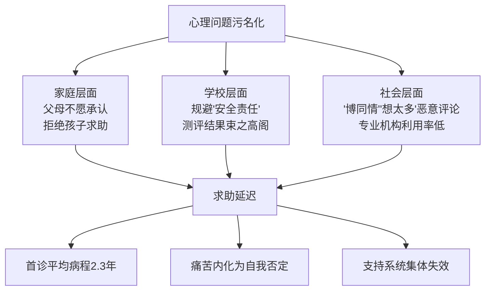

某重点中学心理教师坦言：**"每月接待的学生中，近三成是被家长'押'来的，孩子哭着说'说了也没用，爸妈觉得我装病'"**[^54]。北京安定医院儿童精神科统计显示，**首次确诊的中重度抑郁患者，平均病程已达2.3年**[^54]——这两年多本应是治疗效果最佳的时期。"病耻感"更像无形的封条，封印了社会支持系统的介入：学校为规避"安全责任"将心理测评结果束之高阁；社区心理服务站门可罗雀，家长宁可信"民间大师"也不愿走进专业机构；网络平台上"抑郁症"相关话题下仍充斥着"博同情""想太多"的恶意评论[^54]。

对儿童青少年的危害尤其严重："有一些孩子的抑郁或焦虑程度很严重，但因为在情感上不能接受自己被划分为'疯子'，所以不承认自己的病情，拒绝寻求专业的心理帮助；或者向家人求助时，由于家长存在'心理问题污名化'的问题，而拒绝孩子的求助，**最终耽误了治疗的最佳时期，不断承受疾病一遍遍发作的痛苦**"[^67]。

**第三，认知重构：心理问题是"心灵的感冒"**。**"通过沟通，你会逐渐意识到，心理问题就像感冒发烧一样普遍，它并不是你的错，更不意味着你'失败'"**[^68]。这一认知重构需要在家庭、学校、社会三个层面同步推进：

| 层面 | 具体路径 |
|------|---------|
| 家庭去病耻 | "父母的养育是儿童心理健康的基础，面对孩子心理问题的首要步骤是认识并接受问题的存在，父母应该尽早采取行动，并寻求专业的帮助和支持"[^67] |
| 学校去标签 | "为老师和家长提供一些培训和辅导，充分利用同龄人之间的天然共情，达到一种同辈互助的效果"[^67]；上海推行的"心理漫画进校园"项目，通过情绪管理小故事让"求助不是软弱"的理念入脑入心[^54] |
| 社会去偏见 | "通过教育、媒体宣传、社会支持、政策制定和公开对话，减少儿童青少年心理问题污名"[^67]；媒体多传播"走出抑郁的95后志愿者"等正向案例，重塑"心理问题是可防可治的常见病"的社会共识[^54] |

**第四，"分层信任圈"告知策略：让沉默不再是隐形枷锁**。一旦决定告知，策略与智慧尤为重要。可绘制一个三层"信任圈"：**核心圈（父母、至亲）——必须知晓且最能提供支持的人；中间圈（一两位真正理解你、值得信赖的挚友）——他们的支持在社交层面无可替代；外围圈（班主任、学校心理老师等）——告知主要是为了获取必要的制度性支持**[^68]。在告知方式上，"不必一开始就全盘托出所有痛苦，可以先从具体的小事说起，比如'我最近晚上总是睡不着'或'这次考试没考好，我觉得很沮丧'，慢慢打开话匣子"[^68]。

打破沉默的回报是显著的："**说出口，不仅是寻求帮助的开始，更是对自己负责任的勇敢之举**"[^68]——一个理解的眼神、一个陪伴的午后、一句"没关系，我在这里"都可能成为黑暗中的灯塔。

## 3.7 专业资源链接：四位一体心理健康服务体系与转介路径

破除污名化的同时，必须为孩子提供清晰、可达、可信的专业支持网络。教育部等十七部门2023年印发的《全面加强和改进新时代学生心理健康工作专项行动计划(2023—2025年)》，构建了**"健康教育、监测预警、咨询服务、干预处置'四位一体'的学生心理健康工作体系"**，并明确"2025年配备专(兼)职心理健康教育教师的学校比例达到95%，开展心理健康教育的家庭教育指导服务站点比例达到60%"[^69]。这一框架与第一章的"健康学校建设""五健行动"形成系统协同，为本节资源链接提供了顶层制度依据。

**第一，四位一体框架的角色矩阵**。下表系统梳理学校、医疗、社会、家庭四类主体在四位一体体系中的具体角色：

| 主体 | 健康教育 | 监测预警 | 咨询服务 | 干预处置 |
|------|---------|---------|---------|---------|
| 学校 | 心理健康课程；五育并举"以德育心" | 心理筛查与档案建设；专兼职心理教师全覆盖 | 校内心理咨询室 | 转介机制对接 |
| 医疗 | 心理健康科普 | 屈光—心理一体监测 | 心理诊疗 | 药物治疗、心理治疗、危重个案快速干预 |
| 社会 | 媒体宣传、公益讲座 | 12355热线工单系统 | 12355青少年服务热线、社区心理驿站、青少年心理云平台 | 转介通道、志愿服务 |
| 家庭 | 家庭教育指导服务站点（覆盖率≥60%） | 早期信号识别 | 亲子沟通、安全感建设 | 配合专业方案 |

[^69][^54][^70][^71]

**第二，地方实践案例："家校社医"协同的中国方案**。三个地方案例呈现了不同的协同切入点：

**海南省青少年心理干预"专门转介就诊通道"**采取的是**热线—医院的工单派发模式**：团省委和省卫健委联合给省安宁医院开设12355软件系统账号，遇到青少年心理个案能快速工单派发转介处理；通道提供心理咨询客服电话(66890120)、心理咨询与治疗中心电话(66986552)、24小时心理援助热线(96363)三层服务[^70]，"为青少年打造快速转介流程，减少行政和文书工作，通过预先的信息交流共享，让从12355省青少年服务台到省安宁医院的转介更顺畅；而且还提供药物治疗、心理治疗等综合医疗支持"[^70]。

**重庆忠县"家校社医"协同服务体系**则更进一步构建了**全链条管理模式**：团县委负责心理疏导前沿阵地接待来访咨询，卫健部门提供中期专业心理干预与诊断，民政、妇联等部门为困难青少年提供兜底保障，公安、司法部门提供法律援助，教育部门负责后期日常跟踪和回访[^72]。其医校联动建立了"**预防—干预—转介—治疗—康复—随访**"六位一体服务模式：医院与学校签订合作协议，定期派遣心理医师赴校开展心理健康筛查评估，对有严重心理问题的孩子进行一对一线下复核访谈[^72]。同时盘活国企闲置资源，建设线下"**去标签化**"的青少年心理咨询疏导室——这一细节直接呼应3.6节去污名化的诉求[^72]。

**陕西西咸新区心理健康"绿色通道"**则突出了**学—医—咨三方联动**：联合4家定点医疗机构构建线下问诊渠道，依托12355热线提供24小时不间断心理咨询服务；其服务内容明确覆盖"家庭教育、自我管理、学习成才、人际交往、交友早恋、人格发展、受挫解压和情绪调节"，并强调"安全、隐私的服务原则……由具有专业资质和丰富咨询经验的心理学专业人员提供免费咨询辅导服务"[^71]。

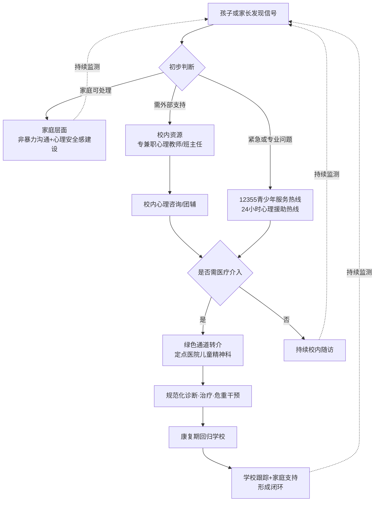

**第三，浙江"青少年心理云平台"的科技赋能模式**。"浙江试点的'青少年心理云平台'，通过线上咨询、AI心理评估、线下转介闭环，**使求助便捷度提升60%**"[^54]——这一案例表明，数字化工具可以有效降低心理求助的物理与心理门槛，特别是对青春期孩子"既渴望帮助又害怕被发现"的复杂心理具有独特适配性。

**第四，对家长的清晰行动地图**。综合上述资源体系，可以为家长提炼出一份从初步识别到专业转介的分层行动清单：

**层级一·家庭自助**（适用于轻度情绪波动）：执行3.3节信号识别框架；运用3.4节"先接情绪后讲道理"三步话术；落实3.5节心理安全感建设五层；持续观察一至两周变化。

**层级二·校内资源**（适用于明显但未影响功能）：与班主任沟通孩子在校状态；预约学校专兼职心理教师；参加学校心理团辅活动；同步监测情绪、睡眠、食欲、学业。

**层级三·热线咨询**（适用于不愿当面沟通或需即时支持）：拨打12355青少年服务热线（多省份开通）；24小时心理援助热线（如海南96363）；信息保密、免费、由专业心理咨询人员接听。

**层级四·医疗转介**（适用于持续两周以上、影响日常功能或出现自伤念头）：通过12355工单或学校转介至定点医院儿童精神科；接受规范化诊断（注意区分"抑郁情绪"与"抑郁症"）；遵医嘱进行药物治疗与/或心理治疗；危重个案启动快速干预响应。

**层级五·康复随访**（适用于出院或治疗稳定期）：学校配合制定灵活学业要求与请假便利[^68]；家庭维持稳定情绪环境；定期回访避免复发；社区资源（如忠县"情绪盲盒"等树洞类专栏[^72]）作为日常情感出口。

特别需要强调的是，资料中明确"心理咨询热线为志愿公益性服务，主要开展心理疏导，**如需要专业治疗，请到正规的专科医院或专业的服务机构进行咨询、治疗**"[^71]——家长需要清晰认识到热线与诊疗的边界，避免延误真正需要医疗介入的孩子。

---

回顾本章七节内容，从生物—家庭—学校—社会四维诱因解析，到埃里克森八阶段分龄导航，再到信号识别、有效沟通、安全感建设、污名化破除与资源链接，**"认知—识别—沟通—干预—资源"五位一体的心理守护体系**已经完整成形。这一体系的核心信念是：**心理问题不是"孩子的脆弱"，而是多重因素交织的可防可治的健康议题；每一个发出求救信号的孩子，都应当被及时接住**。

值得强调的是，心理健康并不是孤立的"心灵工程"——本章一再印证了与第二章身体健康守护的深度互嵌：睡眠不足直接削弱情绪调节、运动分泌的内啡肽缓解焦虑、肥胖与体态异常引发自卑社交退缩、躯体化的头痛腹痛是心理痛苦的"身体语言"。这意味着，下一章即将进入的"学习、生活与休闲的科学平衡"——作为孩子日常时间结构的核心议题——既会同时影响身体（睡眠、运动）与心理（压力、自主感），也将直接决定本章建立的心理安全基地能否在日常节律中持续运转。在功利化育儿与"双减"政策博弈的现实背景下，如何让学习成为成长的"营养"而非"消耗"，将是下一章核心命题。

# 4 学习、生活与休闲的科学平衡

第二章构建了"吃—动—睡—姿"四位一体的身体守护方案，第三章搭建了"认知—识别—沟通—干预—资源"五位一体的心理呵护体系。两章的内在共识是：身体节律与心理安全感都需要一种**稳定而有弹性的日常时间结构**作为载体——睡眠时间被挤占，再科学的运动指南也是空谈；亲子陪伴被作业焦虑碾压，再温暖的非暴力沟通也难以落地。换言之，**时间结构是儿童青少年身心健康成长的"操作系统"**，它决定了第二、三章的所有"应用程序"能否真正运转。

然而，正是这个最基础的"操作系统"，正在双重压力下被反复扭曲：一端是功利化育儿主导的"过度安排"——清晨六点早读、放学无缝衔接补习班、深夜十一点台灯仍亮；另一端是网络娱乐主导的"报复性放松"——周末瘫床刷短视频、周日深夜赶作业的恶性循环。"双减"政策自2021年落地以来，正是在系统性回应这一时间结构的失衡问题，并在2026年迎来了进一步的刚性升级。本章作为五大维度路径设计的第三个落点，将以"双减"政策的演进路径为政策坐标，以脑科学揭示的大脑黄金档期为科学坐标，构建"**原则—节律—管理—工具—边界**"五位一体的时间平衡框架，回答一个核心问题：在政策博弈与家庭焦虑的夹缝中，如何让学习真正成为成长的"营养"而非"消耗"。

## 4.1 "双减"背景下学习与生活平衡的政策坐标与核心原则

理解儿童青少年的时间结构问题，必须先理解过去四年间"双减"政策所重塑的制度基底。这一政策不仅是教育治理的转折点，更深刻改写了"什么是合理的学习负担"这一根本性认知。

### 政策演进：从初步减负到系统性调整的四年路径

2021年7月，中共中央办公厅、国务院办公厅印发《关于进一步减轻义务教育阶段学生作业负担和校外培训负担的意见》，标志"双减"政策全面落地。其总体定位是"**着眼学生身心健康成长，保障学生休息权利**"，工作目标是"学生过重作业负担和校外培训负担、家庭教育支出和家长相应精力负担1年内有效减轻、3年内成效显著"[^73]。从政策内涵看，2021年版"双减"已搭建起作业总量、作业指导、课后服务、培训治理四大支柱：小学一二年级不布置家庭书面作业，三至六年级书面作业平均完成时间不超过60分钟，初中不超过90分钟；严禁给家长布置或变相布置作业，严禁要求家长检查批改作业；引导学生放学回家后从事力所能及的家务劳动、开展适宜体育锻炼、开展阅读和文艺活动[^73]。

四年实施已形成可量化的成效。北京师范大学2025年全国双减成效调查报告显示，**83.5%的受访学生未参加校外学科培训，75.3%的学生明确感受到作业量显著减少**[^74]。一项基于教育教学实践的研究亦指出，政策实施"显著降低学生日均作业时长35%，家庭校外培训支出减少40%以上，学校课后服务参与率达92%，学生综合素质评价优良率提升18%"[^75]。但同期出现的"明减暗增"现象同样不容忽视：部分学校"暗地里却将非中高考科目的课时替换为语文、数学、英语等'重要科目'，或将延时服务变相转换为额外的学科辅导"；一些家长"通过高额经济投入购买学科辅导服务，为子女提供额外教育资源"[^76]。教育部2025年数据进一步显示，**46.25%的家长表示政策后教育投入反而增加，隐形私教、线上违规培训等现象屡禁不止**[^74]。

正是基于上述四年实践的精准复盘，2026年4月，教育部印发《关于开展中小学阳光招生专项行动(2026年)的通知》，配套发布基础教育规范管理负面清单，**双减政策迎来系统性调整，于2026年9月1日秋季学期全国统一执行**，覆盖小学至高中全学段，公办与民办学校一视同仁，"无试点、无缓冲、无豁免"[^74]。

### 四大维度的刚性标准：2026年升级版核心条款

下表系统梳理升级版"双减"在作业、考试、作息、培训四个维度的刚性条款，作为本章后续所有时间设计的政策底座：

| 维度 | 2026年升级版核心标准 |
|------|--------------------|
| 作业管理 | 小学一二年级**全面取消**书面作业与纸笔考试；三至六年级作业时长不超过60分钟；初中不超过90分钟；严禁重复性、惩罚性作业；严禁家长批改作业 |
| 考试制度 | 考试频次严格管控，**取消成绩排名，全面推行等级评价**，减少考试焦虑 |
| 作息保障 | 小学上课不早于8:20，初中不早于8:00；**小学生每日睡眠不少于10小时、初中生不少于9小时**；小学放学不早于17:30，初中不早于18:00 |
| 校外培训 | 负面清单明确**20条严禁条款**，严查隐形变异学科培训、非学科类培训超范围经营、天价收费 |

注：上述作息标准与第二章2.3节"睡眠令"完全一致——小学≥10小时、初中≥9小时、高中≥8小时——这一全报告统一口径再次得到强化。

教育部2025年学业压力调研数据进一步显示，**政策优化后学生平均每周考试次数降至1.1次，78%的学生表示考试焦虑明显减轻**[^74]。这些刚性条款的深层用意，正如政策原文所述——**"遵循教育规律，着眼学生身心健康成长"**[^73]。

### 减负促进发展的实证证据：减负与提质并不对立

许多家长的深层焦虑来自一个根本性疑问：减负会不会让孩子在学业竞争中"吃亏"？江苏省2023年义务教育学生学业质量监测数据为这一焦虑提供了实证回应。该研究基于五年级37215份、九年级51107份样本，从认知能力（标准化学业成绩）与社会情感能力（任务表现、情绪调节、开放思维、协作能力、人际交往五维度）两个维度评估减负政策对学生发展的实际影响[^76]。研究将"普遍将学业成绩作为学生认知能力的重要指标"作为认知能力代理变量，并参考OECD框架以社会情感能力作为非认知能力代理变量，社会情感能力量表的Cronbach's α系数达到0.875—0.947，**测量工具具备充分的可靠性与适用性**[^76]。这一研究的方法论严谨性，为"减负是否影响发展"这一争议性议题提供了较为可靠的实证锚点。

### 学习与生活平衡的四条核心原则

整合"双减"政策导向与减负实证研究，可提炼出儿童青少年时间结构设计的四条核心原则，作为后续节律设计的价值底座：

**第一，保障休息权利**。这是"双减"政策的首要原则——"保障学生休息权利"被明确写入工作原则[^73]。睡眠、户外活动、自由支配时间不是奖赏，不是孩子"做完任务后的恩赐"，而是与学习同等重要的成长权利。这一原则与第二章睡眠令、户外活动2小时形成同一价值闭环。

**第二，回归育人本质**。政策深层价值在于"打破功利化教育模式，促进学生德智体美劳全面发展"[^75]。学习不是为了竞争中超越他人，而是为了完整人格的形成；时间结构设计的标准应是"是否服务于全面发展"，而非"是否最大化分数产出"。

**第三，自主权与责任对等**。"双减"在压减作业总量的同时，明确要求"引导学生合理使用电子产品""家长要积极与孩子沟通，关注孩子心理情绪，帮助其养成良好学习生活习惯"[^73]——这一表述背后的逻辑是：减负不是减责任，而是把时间安排的自主权与对应责任**逐步交还给孩子本人**。这一原则将在4.4节阶梯化时间管理与4.6节边界管理中具体展开。

**第四，张弛有度的节律性**。学习与休息不是非此即彼，而是相互滋养的循环——学习是"充电"、休息是"蓄能"、运动是"激活"，三者缺一不可[^77]。这一节律性原则将在4.2节脑科学黄金比例中获得科学支撑。

直面"明减暗增"现实困境，需要看到家长焦虑反复的深层成因：教育资源不均衡的客观存在、社会成功标准的单一化、社交媒体上"牛娃"故事的持续曝光（参见第一章功利化育儿成因分析）。**单纯依靠政策刚性约束并不足以根除焦虑，必须同步赋予家庭以科学化的时间设计能力**——这正是本章后续六节要回答的核心命题。

## 4.2 学习—休息—运动黄金比例：基于脑科学的日常节律设计

如果说"双减"政策为学习时长设定了"上限边界"，那么脑科学研究则揭示了同样长的学习时间在不同时段会产生**截然不同的效率**——这一规律意味着，时间结构的合理性不仅体现在"学多久"，更体现在"何时学"。

### 大脑的三大高效档期

脑科学研究颠覆了"勤奋等于时长"的传统认知。一项典型对比是：**"深夜死磕数学题，第二天记忆留存率可能不到10%；但换成晨间黄金90分钟，同样的内容能记住200%"**[^78]。这一差距背后是大脑生物节律的深层规律，可归纳为三大高效档期：

| 时段 | 档期定位 | 神经科学机制 | 适配任务 |
|------|---------|------------|---------|
| 6:30—8:00 | 晨间清醒期 | 前额叶皮层"运行速度拉满"；**海马体活跃度是下午的1.5倍** | 记忆编码：背单词、记公式、文言文、导数题等强逻辑任务 |
| 14:00—16:00 | 午后联想期 | 右脑α波活跃；马普研究所发现**午后3点做创意类任务，灵感迸发概率比早晨高150%** | 创造力任务：写作文、议论文、做实验报告、物理推导 |
| 20:30—21:30 | 睡前巩固期 | 睡眠初期大脑"会把白天学的知识分类归档"；**哈佛实验显示睡前1小时复习错题，第二天记忆强度提升300%** | 记忆固化：复习错题、画知识导图、亲子共读 |

需要特别说明的是，这些数据来源于科普性表述，具体倍数可能存在传播过程中的简化与放大，但**晨间记忆编码效率高、午后创造性思维活跃、睡前记忆巩固强**这一基本节律规律已在脑科学领域获得广泛共识[^78]。

### 三大伪勤奋时段：越学越亏的陷阱

与高效档期对应的是三个"自我感动式"的低效时段：

**饭后1小时**：血液集中于消化系统，**脑供氧量暴跌30%**，做题错误率飙升[^78]。这意味着许多家庭"吃完饭立刻写作业"的安排，实际上是在最低效的时段消耗孩子最宝贵的学习意愿。

**傍晚17:00—18:00**：人体温度最高点，"困得能站着睡着——这是基因决定的，别硬扛"[^78]。这一时段恰好是大量学生放学后的"过渡期"，强迫学习反而效率低下。

**深夜23:00后**：熬夜1小时相当于第二天反应速度打六折[^78]。一个真实警示案例是："**有个初三学生每天熬夜到1点，三个月后成绩反而倒退20名。调整到21:30睡觉+6:00晨学后，期末考进了年级前十**"[^78]——这一对比鲜明地说明了"大脑的节律，比努力时长重要100倍"。

### 分龄学习时间表：科学版"作息黄金模板"

基于上述节律规律，可为不同学段构建分龄学习时间表：

| 时段 | 小学生(6—12岁) | 初高中生(13—18岁) |
|------|--------------|-----------------|
| 早晨 | 7:00—8:00 晨读+口算（前额叶"开机速度"） | 6:30—7:30 文言文+导数题（早晨逻辑脑无敌） |
| 下午 | 15:00—16:00 科学小实验（右脑创意高峰期） | 14:30—16:00 写议论文/做物理推导（灵感喷泉期） |
| 睡前 | 20:00—20:30 亲子共读（睡前记忆像用胶水粘过） | 21:00—21:45 画知识导图（睡眠会自动帮你补全细节） |

需要强调的是，这些时间表的核心价值不在于"复制照搬"，而在于揭示一条根本逻辑——**学习任务的类型应与大脑当下的状态相匹配**：早晨的逻辑脑适合处理需要严谨推理的任务，午后的发散脑适合处理需要灵感的任务，晚间的整合脑适合处理需要记忆固化的任务。家长需要做的，不是把孩子的时间表填满，而是协助孩子识别自身的高效档期，把核心任务"嵌入"对应时段。

### 周末黄金配比：学习—休息—运动三要素的平衡艺术

工作日的节律相对简单，周末的时间结构却最容易出现两个极端。一位深耕教育15年的老师在亲身陪伴儿子初一期间总结出深刻的反思：曾经把儿子周末"排得满满当当：周六上午数学补习班，下午英语刷题，晚上写学校作业；周日上午物理预习，下午错题整理"，结果"孩子变得越来越叛逆，写作业磨磨蹭蹭，甚至偷偷躲在房间里玩手机，成绩不仅没提升，反而出现了下滑，情绪也变得暴躁易怒"[^77]。

经过"上百个家庭测试"后总结出的核心结论是：**"周末不是'要么学要么玩'的二选一，而是'学习—休息—运动'三要素的科学配比……就像营养餐需要碳水化合物、蛋白质、蔬菜的合理搭配，才能滋养身体一样，高效充电的周末，也需要学习、休息、运动的黄金比例，三者缺一不可——学习是'充电'，休息是'蓄能'，运动是'激活'"**[^77]。这一隐喻极具价值：把时间结构理解为"营养配比"而非"竞争压榨"，本身就是育儿观念的范式转换。

### 两类极端陷阱的神经机制

**陷阱一：报复性放松——越玩越累，周日陷入恐慌**。家长一旦放任不管，孩子"会本能地选择最低能耗的娱乐方式——瘫在床上刷短视频、打游戏，一看就是大半天"[^77]。其神经机制是：**"2025年最新脑科学研究发现，持续刷短视频会让大脑多巴胺受体变得迟钝，需要更强的刺激才能获得同等愉悦感，就像'上瘾'一样，越刷越停不下来，越刷越疲惫"**[^77]。这一机制解释了一个反直觉现象——孩子周末刷了两天手机，周一反而比上学还累——这不是"懒"，而是大脑奖赏系统被反复透支后的真实疲惫。这一机制也与第三章3.6节"沉迷电子产品占用睡眠+蓝光抑制褪黑素"形成双重叠加。

**陷阱二：填鸭式学习——堆时长不重效率，越学越抵触**。与报复性放松相反的另一极端是"把周末变成第二课堂"，结果是孩子"写作业磨磨蹭蹭、偷偷玩手机、情绪暴躁易怒"[^77]——这正是上述教师的亲身教训。其神经机制可由前述"伪勤奋时段"解释：在大脑低效档期堆砌时长，不仅记忆留存率低，还会持续累积厌学情绪，**透支孩子对学习本身的内在兴趣**。

### 90分钟周期法：贴合大脑节奏的学习单位

针对学习时段的具体安排，脑科学家推荐一种简单工具——**"90分钟周期法：学1.5小时休息20分钟（匹配大脑天然节奏）"**[^78]。这一周期与人类基本休息活动周期（BRAC，Basic Rest-Activity Cycle）的研究发现一致。配合两项辅助技巧：**"气味锚定术：薄荷味嚼着学数学，迷迭香闻着背课文（记忆关联）"**与"冷暴露疗法：学习前用冷水拍脸（瞬间清醒）"[^78]，可形成具体可执行的微观时间管理工具。

这一节的核心启示是：**真正的高效不是"多学一小时"，而是"在对的时间学对的内容"**——这一原则将直接服务于下一节"作业与娱乐顺序"的差异化策略。

## 4.3 分龄作业—娱乐顺序策略：从"先玩后学"到"先学后玩"的进阶

"放学回家先写作业还是先玩"，这一看似琐碎的家庭议题，实际上是检验家庭育儿观念的精确标尺。家长们的观点基本可分为两类：一类主张"先学再玩，培养自律性和自制力"，另一类主张"先玩再学，让孩子放松心情、激发学习动力"[^79]。两种主张各有支持者，但都隐含一个共同前提——**把"写作业"视为沉重的责任或义务，把"玩"视为可以让步的次要活动**。

### 重新定义作业与玩耍：双重价值的辩证统一

要破解这一议题，必须先重新理解两件事的本质。**写作业**的真正目的是"对当天所学知识的复习巩固，还是学习过程中的一个关键环节，旨在帮助孩子查漏补缺、提升自我"[^79]——它不是惩罚，不是义务的负担，而是学习闭环中不可或缺的一环。**玩耍**对孩子而言意味着什么？它"被视为孩子们探索世界、激发探索欲、想象力和决策能力的重要途径"[^79]——它不是学习的对立面，而是与学习同等重要的发展场域。

理解了这一双重价值后，结论便不证自明：**"只要孩子能妥善处理这两件事，那么它们的先后顺序其实并不那么重要。关键在于引导孩子认识到，'写作业'与'玩'都是他们自己的责任，因此需要自主地做出合理安排"**[^79]。换言之，决定时间结构合理性的不是"先做哪个"，而是孩子是否在自主规划中既完成了学习任务，又获得了真正的休息与探索。

### 分龄差异化策略：协助制定到自主完成的阶梯

不同年龄段孩子的认知能力与自我管理水平差异显著，作业—娱乐顺序的安排策略也需要相应分化：

| 学段 | 主导策略 | 家长角色 | 核心要点 |
|------|---------|---------|---------|
| 小学低中年级 | **家长协助制定计划** | 共同规划者 | 让孩子参与而非被动接受；可灵活选择"先玩后学"或"先学后玩"，重在养成"放学后有计划"的意识 |
| 小学高年级 | **孩子自主制定+家长适度监督** | 引导者与监督者 | 培养孩子在"玩"结束前15—20分钟自设闹钟过渡的习惯 |
| 初中及以上 | **完全自主** | 鼓励者与支持者 | 孩子"已经有足够的能力自行完成"计划制定，家长退到背后 |

资料明确指出："对于小学低年级和中年级的孩子，家长可以协助他们制定计划；而对于高年级以及中学的孩子，他们已经有足够的能力自行完成这一任务"[^79]——这一分龄阶梯与4.4节将展开的时间管理三阶段培养模型形成内在呼应。

### 实施过程中的四条关键原则

无论哪种顺序，在执行过程中都需要遵循以下四条原则：

**第一，每天的计划不必拘泥于一种模式**。"孩子的精力分配每天都会有所不同，而且晚上并非他们的'工作时间'，无需遵循刻板的计划"[^79]——这一观察非常重要：刻板的时间表会把孩子变成"精确执行机器人"，而真正的时间管理能力恰恰需要在弹性中练就。

**第二，"截止式管理"优于"刻板式管理"**。具体做法是"**只需为孩子设定一个'10点睡觉'这样的截止时间，其余部分则可由孩子自行决定**"[^79]。这一管理哲学与前述的睡眠令底线（小学≥10小时、初中≥9小时）完全一致——家长守住底线（睡眠不被剥夺），中间过程交由孩子自主。

**第三，提醒次数与方式提前约定**。"家长应提前与孩子约定好提醒的次数和方式，并注意提醒时的语气。可以与孩子共同商定，如**每天最多提醒三次**，若提醒后仍未完成，就不再过多干预，让孩子自行承担后果"[^79]。这一原则将在4.6节"避免两端"中进一步深化。

**第四，自主过渡的微技术——15—20分钟自设闹钟**。"当孩子进入小学高年级或中学阶段时，家长可以进一步培养他们的自主性。建议孩子在'玩'的时间结束前的15—20分钟内，自行设定闹钟作为提醒。这样，当时间到时，孩子就能迅速调整自己，进入学习状态"[^79]。这一看似简单的技术，实际上是把"时间感知"与"任务过渡"的责任内化到孩子身上的关键设计。

### 自由支配时间不可被剥夺：维护内在动力的核心原则

整个分龄策略中最具洞察力的一条原则是：**"务必保障孩子拥有自由支配的时间"**[^79]。具体内涵是：**"若孩子迅速完成了作业，余下的时光，家长不应强迫其投入与学习相关的事务，例如预习、阅读或额外作业。这些活动若需进行，应在前一步骤中与孩子共同商定，让他明确今日的任务量。避免在孩子兴致勃勃地准备玩耍时，再增加学习任务，这可能会挫伤其积极性，加剧对写作业的抵触情绪"**[^79]。

这一原则的深刻意义在于：**它直接守护了学习的内在动力**。当孩子高效完成任务后，"奖励"应当是真正的自由时间，而非"再加点别的学习任务"——后者实质上是对效率的惩罚，会让孩子在下一次任务中本能选择"磨蹭"作为自我保护。这一机制与第一章揭示的功利化育儿"自主空间剥夺"路径完全对应——许多家庭的"鸡娃"困局，正是从一次次"既然这么快就做完了，那再做点……"开始累积的。

### 计划未完成时的反思引导，而非惩罚

针对计划执行不到位的情况，资料给出的建议同样克制而智慧："若计划未能如期完成，**应引导孩子进行反思**。例如，他们是否为作业预留了足够的时间？若作业时间不确定，是否应考虑设置一些机动时间？"[^79]。这一处理方式把"未完成"转化为时间规划能力的学习契机，而非引发情绪冲突的导火索——这与第三章3.4节非暴力沟通"先接住情绪、再讨论问题"的原则形成精确呼应。

## 4.4 时间管理能力的阶梯化培养：起步、参与、自主三阶段

4.3节的分龄策略隐含了一个更深层的命题：**时间管理能力本身就是儿童青少年成长过程中需要专门培养的核心能力**。"培养一个具有较强时间管理能力的孩子，能够高效地利用校外学习时间，合理地安排自己的休闲时间，学得轻松、玩得快乐，可能是每一个家长的愿望"[^80]。但这种能力"并非一蹴而就，需要家长在日常生活中循序渐进地渗透和引导，更需要家长耐心地陪伴和鼓励"[^80]。

### 三阶段培养模型：从指导到放手的清晰路径

根据孩子的年龄特点和认知规律，时间管理能力的培养可分为三个递进阶段：

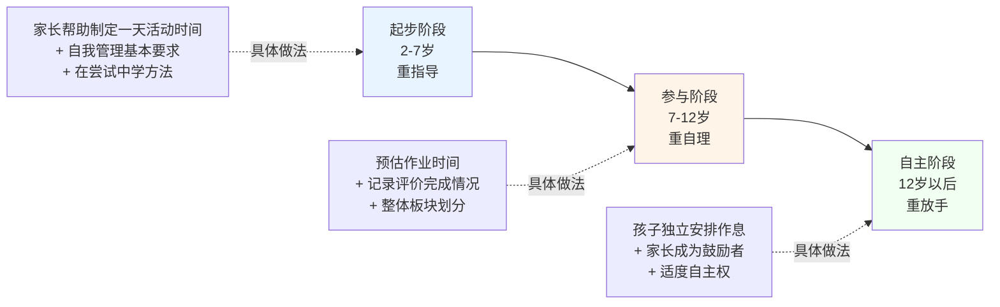

下表系统呈现三个阶段的具体培养内容与家长角色：

| 阶段 | 年龄 | 核心定位 | 具体培养内容 | 家长角色 |
|------|------|---------|------------|---------|
| 起步阶段 | 2—7岁（至小学一二年级） | 重指导 | 由家长帮助制定一天活动时间：几点起床、几点吃饭、几点活动；同时对相关活动提出要求（自己穿衣整理、独立专心吃完、认真自主完成） | 主导规划者，重在鼓励"在尝试中学会方法" |
| 参与阶段 | 7—12岁（贯穿小学） | 重自理 | 鼓励孩子参与安排：预估完成每项作业的时间并记录评价；预估查阅资料时间；预估拓展活动时间，提供宽裕自主安排时间 | 共同规划者+复盘陪伴者 |
| 自主阶段 | 12岁以后 | 重放手 | 孩子独立安排作息时间，包括起床、用餐、休闲、作业、运动、睡眠时间，给予一定自主权 | "从指导者的角色慢慢变成鼓励者和支持者，以关心孩子的生活为主旨" |

### 起步阶段(2—7岁)：在尝试中体会益处

这一阶段的孩子"模仿性强、自制力弱，要做好起步的指导"[^80]。具体做法上，家长可以"帮助孩子来制定一天的活动时间：几点起床，大约用多少时间；几点吃饭，大约用多少时间；几点活动，大约用多少时间……同时也要对相关活动提出一定的要求，如起床时自己穿衣整理，吃饭时独立专心吃完，活动时认真自主完成"[^80]。

这一阶段最容易被忽视的是"激发兴趣"的重要性。"兴趣是最好的老师，要从小激发孩子参与时间管理的兴趣，帮助孩子有意识地整体规划时间"——具体方法是"**和孩子一起了解、研究时间管理得当而使事情处理得高效优质的事例，打开孩子的视野，激发其向往之心**"[^80]。同时，家长本身要发挥示范作用，让孩子"感受到家长在时间安排方面比较得当，处理家庭事务高效优质，因而能腾出更多的时间进行亲子活动"[^80]——这与第三章3.5节"父母以稳定情绪做榜样"的逻辑一脉相承：**家长本身的时间管理质量，就是孩子最早学习的范本**。

### 参与阶段(7—12岁)：从预估到反观的整体规划

这一阶段孩子"对时间管理已经有了一定的认知基础和实践经验"，因此可以鼓励孩子一起来参与安排每项活动的时间[^80]。这一阶段的关键技能是"**预估**"——预估完成每一项作业所用的时间，预估查阅资料需要的时间，预估拓展活动的时间。预估之后还要"在完成作业时进行记录评价"[^80]，让预估值与实际值的差距可见——这正是培养时间感知精确度的核心训练。

更深层的能力是"**有意识地将自己的业余时间划分成一个个板块，也能更好地反观任务的完成情况**"[^80]。"板块化"思维是时间管理从粗放到精细的关键跃迁——孩子学会把混沌的"放学后时间"切分为可识别的功能段落（如运动板块、作业板块、阅读板块、自由板块），就具备了重新组合时间结构的元能力。

### 自主阶段(12岁以后)：家长角色的根本转换

这一阶段最关键的变化是**家长角色的根本转换**。"这个阶段的孩子有了一定的自主性和独立性，不喜欢听从家长的说教，因而可以鼓励孩子独立进行时间管理……同时，家长要转换角色，从指导者的角色慢慢变成鼓励者和支持者，以关心孩子的生活为主旨，亲切地陪伴孩子，让孩子体会到家长的关爱"[^80]。

这一角色转换的难点在于：**许多家长无法接受"权力下放"，依然把自己定位为"任务监督者"**——这种角色滞后会引发青春期最常见的家庭冲突。从埃里克森理论（第三章3.2节）来看，12岁以后正是同一性建构的关键期，时间安排的自主权恰恰是同一性建构的重要载体；从"双减"政策核心原则（4.1节）来看，自主权与责任对等也要求家长在这个阶段把"决策权"真正交还给孩子。

### 阶梯衔接的关键节点与常见误区

三阶段衔接处最容易出现两类误区：

**误区一：阶段滞后**。孩子已进入参与阶段，家长仍以起步阶段的方式事无巨细地安排——这会让孩子失去预估与反观的练习机会，永远停留在"被动执行者"状态。

**误区二：阶段跳跃**。在没有起步阶段基础积累的情况下，直接对青春期孩子说"你自己的事自己安排"——这种突然的"放手"实质上是放任，孩子缺乏自主管理的工具与经验，结果只会是周末瘫床刷屏与周日深夜赶作业的恶性循环（即4.2节的"报复性放松"陷阱）。

正确的做法是把握每个阶段的关键过渡：起步到参与的过渡是**"开始让孩子预估一项任务的时间"**；参与到自主的过渡是**"逐步把作息表的设计权交给孩子"**。每一次过渡都不是断崖式的，而是渐进的——家长退一步、孩子前进一步，最终完成"完整作息自主权"的交接。

资料强调："孩子时间管理的意识和能力需要在每天的生活中得以规范和完善，才能逐渐内化成良好的习惯"[^80]——这意味着，**时间管理能力的培养不是某个特定时点的一次性任务，而是贯穿整个童年与青春期的长期工程**。

## 4.5 SMART原则与过程性评价：让目标可执行可衡量

时间管理能力的内核是**目标管理**——没有清晰目标，再精细的时间板块也会流于空转。在儿童青少年的成长过程中，许多家庭的目标设定要么模糊（"好好学习""听话懂事"），要么过高（"考全班第一"），结果都是孩子无法获得清晰的成就反馈，最终丧失内在动力。SMART原则提供了一套系统化解决方案。

### SMART原则的五个维度

SMART原则由管理学大师Peter Drucker在1954年出版的《管理的实践》中首次提出，包括明确性(Specific)、可衡量性(Measurable)、可实现性(Attainable)、相关性(Relevant)、时限性(Time-based)五个维度[^81]。下表系统梳理五个维度在儿童目标设定中的具体含义：

| 维度 | 核心要义 | 儿童目标设定中的具体应用 |
|------|---------|----------------------|
| 明确性(S) | "用具体的语言清楚地说明要达成的行为标准" | "少看电视"→"周一至周五不超过30分钟；周末看电视不超过1个小时" |
| 可衡量性(M) | "能量化的量化，不能量化的质化" | 阅读"每天读半小时"而非"多读书"；运动"每周3次跳绳"而非"多运动" |
| 可实现性(A) | 通过努力可以达成，但需要踮脚 | 不一开始就要求"考第一名"，而是从49名到21名循序渐进 |
| 相关性(R) | 与孩子整体成长目标关联 | 兴趣目标与天赋倾向匹配；学习目标与发展阶段匹配 |
| 时限性(T) | 设定明确截止时间 | "今天晚饭前完成数学作业"而非"今天找时间完成" |

### 经典案例解析：从板凳1分钟到考重点高中

资料中一个跨越十余年的妈妈鼓励故事，淋漓尽致地展示了SMART原则的力量[^81]。这位妈妈先后经历了三次令人沮丧的家长会：

```text
第一次（幼儿园）：
老师告知"你的儿子有多动症，在板凳上连三分钟都坐不了"
妈妈对儿子说："老师表扬了你，说宝宝原来在板凳上坐不了一分钟，
现在能坐三分钟了。其他的妈妈都非常羡慕妈妈……"

第二次（小学）：
老师告知"全班50名同学，这次数学考试，你儿子排49名……怀疑他智力有些障碍"
妈妈对儿子说："老师对你充满信心，他说了，你并不是个笨孩子，
只要能细心些，会超过你的同桌的，这次你的同桌排在第21名。"

第三次（初中）：
老师告知"按你儿子现在的成绩，考重点高中有点危险"
妈妈对儿子说："班主任对你非常满意，他说了，
只要你努力，很有希望考上重点高中。"
```

这位妈妈在不被察觉的情况下精确运用了SMART原则中的明确性、可衡量性与可实现性。**"在板凳上坐1分钟到坐3分钟；从全班倒数第二到超过排名在21位的同桌；从差等生到再加把劲就可以考上重点高中。这些都表明了这位妈妈使用了SMART原则中的明确性和可衡量性。目标是明确的，具体的语言清楚地说明要达成的行为标准；并且遵循了'能量化的量化，不能量化的质化'的可衡量性原则"**[^81]。

更深层的智慧在于可实现性的拿捏：**"这位妈妈一开始没有要求一直安静的坐在板凳上，而是说可以安静坐在板凳上1分钟，到坐3分钟；没有一开始就要求考第一名，而是从49名到21名，一次次循序渐进，让孩子一步一步努力就可以达到目标"**[^81]。这一阶梯式的目标设计，让每一次小成功都成为下一次努力的内在动力。

### 模糊目标 vs SMART目标的对比效果

下表对比了同一目标在模糊版与SMART版下的执行效果差异：

| 模糊目标 | SMART化改造 | 执行差异 |
|---------|------------|---------|
| "你要少看电视" | "周一至周五不超过30分钟；周末不超过1个小时；提前5分钟提醒" | 边界清晰，孩子可以自主把握，无须每次靠对抗 |
| "你要好好学习" | "今天晚饭前完成数学第3—5题，每周三、五各阅读30分钟科普书" | 任务可量化，完成可反馈 |
| "你要多运动" | "每天放学后跳绳200个，每周末与爸爸打一次羽毛球" | 频次明确，易于坚持 |
| "你要早睡觉" | "小学生每晚10:00前必须上床（睡眠令）；睡前1小时不接触电子屏幕" | 时间锚定+行为锚定，易于评估 |

### 过程性评价机制：具体表扬与未完成时的反思引导

SMART目标只有在"过程性评价"机制的配合下才能持续运转。这一评价机制有两个核心要点：

**第一，具体表扬，而非泛化表扬**。当孩子按计划完成任务时，"应给予具体而明确的表扬，而非泛泛之词"[^79]。资料给出的范例极具示范价值：

```text
"你在4—5点间尽情玩耍了一个小时，之后稍作准备，便在晚饭前
高效完成了作业。晚饭后，你又玩起了心爱的游戏，并在10点
准时就寝，与你的计划表完全吻合，真是值得庆祝！"
```

这段表扬精确指向了孩子做对的每一个具体行为节点——玩耍的时段、过渡的方式、作业的完成、就寝的准时——而不是简单的"你真棒"。**"这样的表扬既具体又明确，为孩子提供了正面反馈，有助于培养他们的成就感，进而促使他们持续改进"**[^79]。

**第二，计划表的留存与回看机制**。资料建议"妥善保存孩子的计划表也是一个好方法，让他们能够看到自己的成长与进步，从而获得更多的鼓励"[^79]。这一长期视角的过程性记录，本身就构成了"增值性评价"——孩子不是与他人比较，而是与过去的自己比较，每一次的微小进步都被看见、被记录。

**第三，未完成时的反思引导**。如4.3节末段所述："若计划未能如期完成，应引导孩子进行反思"[^79]——这一反思不是追责，而是把"未完成"转化为下一轮规划的输入。这与第三章3.5节"家庭中允许犯错的成长氛围"形成精确呼应：成长型思维的核心，正是把每一次"未完成"视为下一次更好的起点。

将SMART原则与过程性评价整合，可以构建"**目标设定—执行—反馈—调整**"的完整闭环：

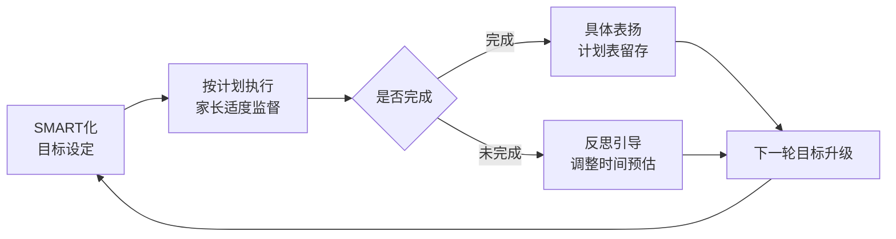

这一闭环的反复运转，本质上是把"目标管理"内化为孩子的元能力——从被动执行家长的目标，到学会为自己设定目标、监控目标、调整目标、欣赏目标的实现。

## 4.6 避免两端："过度安排"与"过度放任"之间的中道智慧

回顾前五节，从政策原则到脑科学节律、从分龄顺序策略到三阶段培养模型、再到SMART原则与过程性评价，所有路径设计的共同前提是：**家长既不过度干预，也不彻底放手**。然而在真实的家庭场景中，家长往往在两端之间剧烈摇摆——一边是"鸡娃式"过度安排，一边是"反鸡娃"过度放任。本节聚焦如何在两端之间找到中道。

### 两端的共同损害：剥夺与失序的双重失败

第一章已系统揭示了"过度安排"的危害——剥夺自主空间、损伤创造力与心理韧性、引发抑郁与亲子裂痕。本章4.2节又揭示了"过度放任"的另一面——报复性放松透支多巴胺奖赏系统，最终引发周日的"作业恐慌症"与周一的精神萎靡。两端看似相反，实则都指向同一个失败：**孩子失去了在合理边界内自主管理的机会**——前者是边界过紧到无处呼吸，后者是边界过松到无所依凭。

这一困境的破解之道，正是教育心理学反复强调的"既不放任，也不控制"原则——这一原则在第三章3.5节亲子边界中已有阐述，本节将其具体化为时间管理领域的四条家庭实践。

### 四条家庭实践原则

**原则一：自主权与责任绑定**。"在实施监督之前，家长应与孩子达成共识：**完成作业是孩子自己的任务**"[^79]。这一共识表面看是简单的认知澄清，实质上是把"作业完成"的所有权从家长转移到孩子身上——家长不再是"作业警察"，而是支持者。这一转换是"双减"政策原则——"严禁要求家长检查、批改作业"[^73]——在家庭层面的具体落地。

**原则二：提醒次数与方式提前约定**。"家长应提前与孩子约定好提醒的次数和方式，并注意提醒时的语气。可以与孩子共同商定，如**每天最多提醒三次**，若提醒后仍未完成，就不再过多干预，让孩子自行承担后果"[^79]。这一规则的精妙之处在于：**提醒次数本身就是一个明确的边界**——不是"我永远不管你"（过度放任），也不是"我每分钟都管你"（过度安排），而是"我们事先约定3次"。这一可数化的边界，让孩子知道家长的关心在哪里、自己的责任又在哪里。

**原则三：自然后果替代过度干预**。这是与原则二紧密关联的关键设计——三次提醒后仍未完成，**让孩子"自行承担后果"**[^79]。可能的后果包括：第二天上学被老师批评、未完成作业带来的焦虑感、错过游戏时间的失落。这些自然后果是孩子真实的学习材料——只有亲身体验过"不规划时间的代价"，孩子才会真正理解时间管理的价值。这一原则需要家长极强的克制力，因为最痛苦的不是孩子被老师批评，而是家长目睹孩子被批评的过程；但只有忍住替孩子承担后果的冲动，孩子才能完成从"被管理"到"自管理"的内在跃迁。

**原则四：亲子共识替代单方命令**。无论是任务量的设定、提醒次数的约定、还是计划表的制定，资料反复强调一个动词——"**共同商定**"[^79]。"这些活动若需进行，应在前一步骤中与孩子共同商定，让他明确今日的任务量"[^79]——共同商定的本质是把孩子从"决策对象"变为"决策主体"，这一过程本身就是培养自主权的重要场景。

### 具体场景的边界管理工具

下表展示了几种典型家庭场景中"两端"与"中道"的对比：

| 场景 | 过度安排版 | 过度放任版 | 中道版 |
|------|-----------|-----------|---------|
| 放学后时间 | 6:00数学班、7:30英语班、9:00家庭作业、10:30背单词 | "你想干啥就干啥" | 共同商定：4—5点自由玩，5—7点作业+晚饭，7—9点自主安排，10点睡 |
| 周末安排 | 周六补习班3场+周日错题整理1天 | 全程刷手机、瘫床 | 学习+休息+运动黄金配比；上午高效学习，下午运动+休闲，晚上家庭时间 |
| 作业未完成 | 守在旁边逐题盯写 | 完全不闻不问 | 提前约定最多提醒3次，未完成时按时就寝、第二天承担自然后果 |
| 玩到忘记时间 | 强制夺手机/关电视 | 放任玩到深夜 | 高年级孩子自设结束前15—20分钟闹钟，过渡入下一项任务 |
| 表扬反馈 | "考第一才表扬，否则不行" | 从不评价 | 具体表扬完成的每一个行为节点，留存计划表回看进步 |

这些工具的共同特征是：**它们既不依赖家长的高压强制，也不依赖孩子的自发自觉，而是依赖一套事先达成共识的规则**——规则一旦确立，执行的难度就大大降低。这与第三章3.5节"心理安全感建设"中"亲子冲突的及时修复"形成深层呼应：好的家庭关系不是没有冲突，而是有一套大家都认可的处理冲突的规则。

### 家长心态的根本转变：从控制者到陪伴者

四条原则背后是一种更深的心态转变。第三章3.5节强调"父母的情绪是孩子心理成长的土壤"，本章则进一步指出：**父母对时间的态度，是孩子时间管理能力的土壤**。如果家长本身把时间视为竞争资源（"别人都报了3个班，我们不能落后"），孩子内化的就是焦虑感；如果家长把时间视为成长资源（"科学规划让孩子高效充电"[^77]），孩子内化的就是从容感。

那位陪伴儿子初一走过弯路的教师在反思中写道："**没有空洞的理论，全是可直接跟做的模板、接地气的对话话术，还有我踩过的坑**"[^77]——这一坦诚的姿态本身，就是家长心态转变的范本：承认自己也会犯错，承认教育是一场持续学习的过程，而不是一开始就掌握所有"正确答案"。这一姿态与第三章3.4节"主动道歉、耐心倾听、放下固执"的亲子修复智慧形成深度共振。

## 4.7 张弛有度的成长节奏：家庭可执行的整合方案

回顾前六节，本章已先后建立了政策原则（4.1）、节律科学（4.2）、顺序策略（4.3）、阶梯培养（4.4）、目标工具（4.5）、边界管理（4.6）六个支柱。本节将这些要素整合为一套覆盖工作日与周末、贯通学习—休息—运动—睡眠的家庭执行清单，让前六节的洞察真正"落地到一周的每一天"。

### 工作日整合方案：嵌入大脑节律的高效模板

工作日的核心命题是：**在校学习时间已固定的情况下，如何让放学后的有限时间发挥最大效益**。基于4.2节大脑节律与4.1节睡眠令底线，可构建以下工作日模板：

| 时段 | 小学生 | 初高中生 | 设计依据 |
|------|--------|----------|---------|
| 早晨 6:30—7:30 | 起床+晨间口算/晨读 20分钟 | 起床+文言文/导数题 30分钟 | 晨间清醒期，记忆编码黄金档 |
| 上学+在校 | 8:20后到校 | 8:00后到校 | 双减作息令保障 |
| 放学—晚饭 | 17:30放学+30分钟自由玩+30分钟运动 | 18:00放学+30分钟运动+晚饭 | 户外活动2小时（兼顾近视防控）；运动激活情绪 |
| 晚饭后 19:00—20:30 | 完成作业（≤60分钟）+亲子共读 | 完成作业（≤90分钟）+错题整理 | 晚间在精力恢复后进入学习 |
| 睡前 20:30—21:20 | 复习+亲子阅读 | 21:00—21:45 知识导图 | 睡前巩固期，记忆固化黄金档 |
| 就寝 | 不晚于21:20 | 不晚于22:00（高中23:00） | 睡眠令底线 |

需要警惕的是工作日中两个最容易"塌陷"的节点：**一是放学到晚饭之间的时段**——许多家庭为"赶时间"压缩这一段，结果挤压了运动与户外活动；**二是睡前1小时**——许多家庭因白天作业未完成而把这段宝贵的"记忆固化窗口"用于赶作业，最终既未充分利用睡前巩固期，又侵蚀了睡眠时间。守住这两个节点，是工作日时间结构成败的关键。

### 周末整合方案：学习—休息—运动黄金配比的具体落地

周末是最考验家庭时间管理智慧的场景。基于4.2节"学习是充电、休息是蓄能、运动是激活"的三要素配比[^77]，可构建以下周末模板：

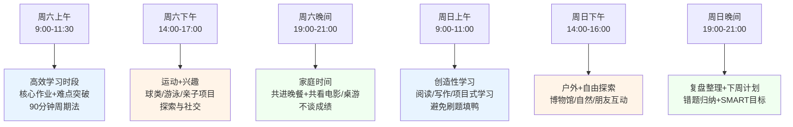

周末方案的核心避坑要点：

**避开"第二课堂"陷阱**：周末不是工作日的延续，不应继续堆砌补习班与刷题任务（4.2节填鸭式学习陷阱）。

**避开"瘫床刷屏"陷阱**：周末不是无限放松，应主动安排运动与户外活动来"激活"大脑（4.2节报复性放松陷阱）。

**保留"无用"的自由时间**：周末最珍贵的不是被高效填满的时段，而是允许孩子发呆、闲聊、看云的自由空间——这是创造力与心理韧性的孵化器（呼应第一章功利化育儿的"自主空间剥夺"批判）。

### 不同学段的差异化重点

将前六节的工具串联起来，可形成不同学段差异化的整合执行方案：

| 学段 | 时间管理重点 | 顺序策略 | SMART应用 | 边界管理 |
|------|------------|---------|-----------|---------|
| 学龄前(2—7岁) | 起步阶段：建立基础作息感知 | 家长协助计划，作业极少（一二年级无书面作业） | 简单可衡量目标（如"把玩具放回箱子里"） | 截止时间为主（"7点开始洗澡") |
| 小学低年级(7—9岁) | 起步—参与过渡：开始预估时间 | 家长协助制定计划 | 引入小目标记录与具体表扬 | 提醒次数约定（最多3次） |
| 小学高年级(10—12岁) | 参与阶段：板块化整体规划 | 自主制定+家长监督 | SMART完整闭环，计划表留存 | 自设闹钟过渡，自然后果承担 |
| 初中(13—15岁) | 自主阶段初期：完整作息自主权 | 完全自主 | 自我目标管理，长短期目标分层 | 家长退为支持者，关注情绪>关注任务 |
| 高中(16—18岁) | 自主阶段成熟：自我效能塑造 | 完全自主 | 与生涯方向关联（衔接第6—7章） | 家长仅在关键节点介入 |

### 整合视角：时间结构是身体与心理的共同载体

回到本章开篇提出的命题——时间结构是儿童青少年身心健康成长的"操作系统"。本章的所有具体设计，最终都服务于这一根本命题：

**时间结构是身体节律的载体**——睡眠令保障的10/9/8小时（第二章2.3节）、每天2小时户外（2.6节近视防控）、每天60分钟中高强度活动（2.1节运动指南）、合理的三餐时段（2.2节膳食指南），这些第二章的所有"应用程序"，都需要本章构建的时间结构作为运行环境。当时间被功利化育儿撕裂、被报复性放松吞没、被填鸭式学习挤占，第二章的科学守护方案就只能停留在纸面。

**时间结构是心理安全感的载体**——第三章3.5节强调的"高质量陪伴""每天留一段不被打扰的时间""不谈成绩、不批评、不教育"，需要本章构建的时间结构来真实地"创造"出这段时间。一个被作业、补习班、家长焦虑塞满的工作日里，没有空间存在所谓的"高质量陪伴"；一个完全无序的周末里，亲子情感联结也难以稳定建立。

**时间结构是兴趣与目标探索的载体**——本章反复强调的"自由支配时间""保留无用的空白""周末运动+兴趣板块"，正是下一章兴趣发现与培养、第六章自我认知与目标方向探索的时间空间基础。**没有大块的、自主的、不被功利目的占据的时间，就不可能有真正的兴趣深耕，也不可能有自我探索与目标锁定**。这一逻辑链条将在后续章节中逐步展开。

本章构建的"原则—节律—管理—工具—边界"五位一体框架，最终指向一个朴素而深刻的愿景：**让每一个孩子在每一天里，既有充分的学习挑战、又有充足的休息恢复、还有自由的探索空间——这种张弛有度的成长节奏，正是身心健康成长最需要的"操作系统"**。下一章将进入兴趣爱好的发现、培养与深耕路径——当时间结构留出了空白，兴趣的种子才有发芽的土壤；当时间管理培养出了自主能力，兴趣的深耕才有持续的内驱力。从"科学的时间结构"走向"丰盈的兴趣世界"，正是本报告整合性成长支持框架的下一段自然延展。

# 5 兴趣爱好的发现、培养与深耕路径

第四章在结尾处已埋下一条关键伏笔：当时间结构留出了空白，兴趣的种子才有发芽的土壤；当时间管理培养出了自主能力，兴趣的深耕才有持续的内驱力。换言之，前四章已经完成了"地基工程"——身体的承重柱、心理的安全屋、时间的操作系统——而兴趣爱好正是在这片被精心守护的土壤上长出的"成长之树"。它既是孩子在压力世界中自我修复的"恢复性利基"[^82]，又是优势智能被识别与发展的天然舞台[^83]，更是连接当下生命体验与未来人生方向的桥梁。

然而在功利化育儿的现实图景中，兴趣往往被异化为两种极端形态：要么被压缩为"考级证书—升学加分"的工具化路径，要么被放任为"三分钟热度—不断换班"的浅尝辄止。本章作为五大维度路径设计的第四个落点，将依次回答四个递进性问题：兴趣爱好对孩子究竟意味着什么（5.1）？如何科学识别每个孩子独特的天赋倾向（5.2）？兴趣从萌发到深耕需要经过怎样的阶段化路径（5.3）？家长应当以怎样的分寸参与其中（5.4）？最终如何让童年的兴趣升华为可持续一生的优势领域（5.5）？这五节将共同构建一个"**价值认知—天赋识别—阶段培养—边界把握—长期深耕**"的兴趣发展整体框架，为第六章自我认知与目标方向探索奠定能力基础。

## 5.1 兴趣爱好的多重价值：从心理充电到综合素养塑造

要理解兴趣爱好对儿童青少年的真实价值，必须先突破一个根深蒂固的认知误区：**兴趣不是学习的对立面，也不是"做完正事后的奖赏"，而是孩子心理健康与综合素养发展的"基础设施"**。第三章已揭示当代儿童青少年面临的多重压力源——学业压力、人际冲突、家庭期望、社会评价；正是在这一压力背景下，兴趣爱好的"充电"价值愈发凸显。

### 兴趣爱好的神经心理学机制：四大理论的交叉验证

临床心理咨询领域的一项重要观察是：拥有长期、稳定兴趣爱好（如乐器演奏、体育运动、绘画创作等）的孩子，"在面临学业压力、人际冲突、家庭变故或创伤性事件时，往往展现出一种独特的'反脆弱'特质……能够更快地从负面情绪的泥沼中抽离，重新找回心理平衡"[^82][^84]。这一现象被形象地比喻为"充电"机制——孩子在日常生活中通过爱好积累正向能量，以抵消外界压力带来的负面消耗[^82]。

这一直观隐喻的科学性，可由四大心理学理论共同验证：

| 理论框架 | 核心机制 | 对兴趣爱好价值的诠释 |
|---------|---------|------------------|
| 资源保存理论(COR) | 个体处于"心理能量持续支出"状态，当支出大于收入便出现心理危机；需通过资源积累抵御"损失螺旋" | 兴趣爱好是关键的资源补给来源，使孩子在压力中维持心理资源的正循环[^82] |
| 扩展—建构理论 | 积极情绪扩展认知边界、建构长期心理资源 | 兴趣活动激发的愉悦体验，扩展认知与社交资源储备[^82] |
| 多迷走神经理论 | 自主神经系统状态决定情绪调节能力 | 兴趣爱好通过节律性、可控性活动调节迷走神经张力，恢复"安全感"基线[^82] |
| 自我决定理论(SDT) | 自主性、胜任感、关联感是三大基本心理需要 | 自主选择的兴趣同时满足三大心理需要，成为内在动机的核心源泉[^82] |

更深层的神经生物学证据表明，兴趣爱好的"充电"作用并非心理感受的隐喻，而是真实的神经调节过程——它能够"补充认知资源、调节自主神经系统、促进神经可塑性(BDNF分泌)以及构建社会心理资本"[^82][^84]。**这意味着踢球不仅仅是锻炼身体，画画不仅仅是涂鸦，它们实则是大脑进行自我修复和能量重置的精密过程**[^82]——这一论断从根本上改变了对"课余活动"的理解：兴趣不是"消耗时间的次要事物"，而是大脑维持健康运转的必要程序。

### 兴趣爱好对压力调节的实证表现

发表于《生物精神病学》的研究指出，"压力会使孩子学习和行为变得更加困难"，而健康的爱好如手工制作、跳舞、园艺等"可以帮助孩子们暂时忘记烦恼，清醒头脑，同时还能培养新技能"[^85]。三类典型爱好的差异化心理价值，下表系统梳理：

| 爱好类型 | 心理调节作用 | 综合素养塑造 |
|---------|------------|------------|
| 手工制作 | 让孩子"安静地坐着，专注于手头的任务，并用自己的双手创造一些东西"，缓解压力 | 提高精细运动技能与创造力[^85] |
| 跳舞 | "通过动作表达情绪并缓解压力"；在团体环境中释放情绪 | 培养纪律性、改善身体素质、促进社交、积累自信[^85] |
| 园艺 | 大自然的舒缓作用；亲子共同照顾植物的情感联结 | 教育意义（生命周期认知）；耐心培养[^85] |

这些证据将第二章身体健康章节中"运动激活内啡肽缓解焦虑"的洞察，进一步拓展为更广义的"**任何形式的自主性爱好都具有心理调节价值**"——身体运动只是其中一类，手工、艺术、自然探索同样具有不可替代的"恢复性利基"作用[^82]。

### 综合素养塑造：兴趣爱好的三重发展价值

除了心理充电，兴趣爱好还在三个维度上塑造孩子的综合素养。**第一，技能与能力的累积**——当孩子在感兴趣的活动中专注投入时，"会更专注、更主动，这能激活大脑的奖励系统，增强学习效果"[^83]，这种基于内在动机的能力建构，远比外部驱动的技能训练更扎实持久。**第二，自我效能感的建立**——心理学家班杜拉的研究指出，"个性化教育能增强孩子的自我效能感(self-efficacy)，也就是'我能行'的信念……当孩子在自己擅长的领域取得小成功时，这种自信会'传染'到其他领域，让他们更敢于尝试新挑战"[^83]。**第三，社交资本与归属感**——团体性兴趣活动（如舞蹈课、球队、合唱团）成为孩子结识同伴、建立友谊、体验团队协作的重要场域[^85]，这与第三章揭示的"非安全型同伴依恋"风险形成正向对冲。

### 兴趣爱好的"和谐热情"前提

需要特别强调的是，兴趣爱好的"充电"作用并非无条件成立，**只有在自主性支持下的爱好才能发挥积极的充电作用，否则可能成为新的压力源**[^82][^84]。心理学领域将兴趣分为"和谐热情(harmonious passion)"与"强迫热情(obsessive passion)"两种本质不同的形态——前者出于内在喜爱与自主选择，后者源于外部期望与身份绑架。这一区分将在5.4节家长参与边界中详细展开，但在此需要先确立其前提地位：**兴趣是否真正成为"恢复性利基"，关键不在于兴趣的"内容"是什么，而在于兴趣的"性质"是自主的还是被强加的**。

回顾本节，兴趣爱好已不再是"附属性的课余活动"，而是孩子身心健康成长的核心组成部分——它既是对抗压力消耗的神经心理学"充电机制"，又是综合素养孵化的"实战场域"，更是自我效能感与内在动力的孕育之所。这一价值定位，为后续讨论"如何识别孩子真正的兴趣天赋"奠定了根本性的认知基础。

## 5.2 多元智能理论框架下的天赋倾向识别

确立了兴趣爱好的核心价值后，下一个关键问题是：每个孩子的兴趣天赋究竟从何而来？为什么同样的活动，有的孩子如鱼得水，有的孩子却兴趣寡然？要科学回答这一问题，需要引入儿童发展心理学中最具影响力的理论框架之一——霍华德·加德纳的多元智能理论。

### 多元智能理论：颠覆"单一智商"的认知革命

1983年，美国哈佛大学教育研究院心理学家霍华德·加德纳在《智力的结构》（《心智的架构》）一书中首次系统提出多元智能理论，挑战了当时主流的"以语言和数学逻辑能力为核心的智商测验观"[^86][^87][^88]。这一理论"起源于加德纳对脑部受创伤病人、神童及不同文化个体的研究"[^87]，并在20世纪90年代得到进一步补充完善。加德纳将智能定义为"**在某种社会或文化环境的价值标准下，个体用以解决自己遇到的真正难题或生产及创造出有效产品所需要的能力**"[^86][^87][^88]。

理论的核心观点可概括为四个突破：**第一，智能是多元的**——人类智能"由多种相对独立的能力构成"，而非单一可量化的指标[^86]；**第二，每个孩子都同时拥有多种智能**——但"以不同方式、不同程度的组合"，使每个人的智能结构独一无二[^87]；**第三，各种智能同等重要**——加德纳"从始至终坚持，不给智能排座次"[^86]；**第四，智能是动态可发展的**——"智能的发展并非完全与文化无关，其发展受个体文化背景影响"，且通过适当的引导和练习可以增强[^86][^83]。

需要客观指出的是，多元智能理论"也被部分研究者视为缺乏强有力科学证据支持的'神经神话'，因为加德纳宣称每种智能对应特定脑区的说法与当代脑科学认为每种智能涉及多个脑区的研究结论不符"[^87]。这一学术争议提示家长在使用该理论时应持工具性态度——**它的最大价值不在于"精确划分孩子属于哪类智能"，而在于打破"分数=聪明"的单一评价框架，为家长识别孩子的多元天赋提供一个开放性的观察视角**。

### 八大智能的核心特征与典型表现

加德纳最初提出七种智能，1995年补充自然观察智能形成"八大智能"基本结构，后续又探讨了"存在智能（生存智慧）"作为可能的第九种[^86][^89]。下表系统梳理八大智能的核心特征、日常场景线索与典型职业表现：

| 智能类型 | 核心能力 | 日常场景观察线索 | 典型职业表现 |
|---------|---------|----------------|------------|
| 语言智能 | 有效运用口头语言或文字表达自己的思想并理解他人，灵活掌握语音、语义 | 爱讲故事、词汇丰富、喜欢阅读与写作；常用语言描述事件、表达思想 | 作家、演说家、记者、编辑、节目主持人、播音员、律师[^89] |
| 逻辑数学智能 | 有效运用数字和推理，"靠推理来进行思考，喜欢提出问题并执行实验以寻求答案" | 爱问"为什么"、对数字与规律敏感、喜欢分类整理、对科学新发展有兴趣 | 数学家、科学家、工程师、程序员[^89] |
| 空间智能 | "对色彩、线条、形状、形式、空间及它们之间关系的敏感性很高"，能用意象与图像思考 | 爱画画、爱搭积木、识路认方向能力强；对几何、立体造型感兴趣 | 画家、建筑师、几何学家、设计师[^89] |
| 身体运动智能 | "善于运用整个身体来表达想法和感觉"，身体协调控制能力强 | 跑跳投接动作协调、爱跳舞、爱模仿动作；运动学习快 | 运动员、舞蹈家、外科医生、工匠 |
| 音乐智能 | 强调节奏旋律感知，对音高、音色、节拍敏感 | 爱哼旋律、能记住歌曲、对节奏自然反应；听到音乐手脚会动 | 音乐家、作曲家、指挥家[^89] |
| 人际智能 | 包含社交协作能力，理解他人情绪、动机与意图 | 朋友多、能协调小伙伴的争执、关心他人感受、组织能力强 | 教师、心理咨询师、销售、领导者[^89] |
| 内省智能（自我认知） | 涉及自我认知规划，了解自己的优缺点、情绪与价值观 | 喜欢独处思考、能描述自己的情绪、对自我目标有清晰认识 | 哲学家、心理学家、规划师[^89] |
| 自然观察智能 | "关注环境识别"，对动植物、自然现象敏感 | 爱观察小动物与植物、能记住物种名称、对自然规律好奇 | 生物学家、园艺师、地质学家[^89] |

需要进一步说明的是，**每个孩子都同时拥有这八种智能，只是"组合和优势领域各不相同"**[^86]——任何"测试"都无法把孩子精确归类为某一种智能类型，多元智能更像一张"光谱图"，每个孩子在每条光谱上都有自己的位置。

### 破除"分数=聪明"的单一智力观

多元智能理论对当代家庭最具颠覆性的启示，是从根本上挑战了"分数=聪明"的单一评价框架。资料中的两段话精准点出了这一挑战的核心：

**第一段视角**："孩子的智力不只有一种，不是只看成绩、分数、聪明不聪明，每个人身上至少包含八种相对独立的智能……每个孩子天生优势不同，有的擅长表达，有的擅长运动，有的擅长思考，有的擅长动手，**没有绝对的'聪明'与'笨'，只是优势智能不一样**"[^90]。

**第二段视角**："基于这一理论，孩子在学习上出现偏科、擅长某些科目是非常正常的，这正是他优势智能的体现。家长要做的，是发现并守住孩子的优势科目，让他在擅长的领域不断获得成就感。**孩子通过优势科目建立起来的，不只是分数，更是自信心、自我价值感和学习内驱力**。当他坚信'我能学好'，就会更有勇气和信心面对不擅长的科目。先让孩子在长处上发光，有了底气，再补短板才更有力量"[^90]。

这一"先在长处上发光，再补短板"的策略，与第一章批判的功利化育儿"用单一标准衡量所有孩子"形成鲜明对照。**传统教育常常把"聪明"等同于"会读书、考高分"**[^83]，但若以八大智能的视角看，一个数学不出色但能哼出动听旋律的孩子并非"笨"，而是音乐智能更突出；一个语文一般但能用积木搭出复杂结构的孩子并非"差"，而是空间智能更发达。

一个生动的比喻是："孩子的潜能就像一个'百宝箱'，里面装着不同的'宝贝'——语言、音乐、运动……传统教育只打开了'语文数学'这一个抽屉，但其他抽屉里可能藏着更耀眼的宝藏！我们的任务是帮孩子把整个百宝箱打开，找到他们的'专属宝物'"[^83]。

### 关键期识别：3—6岁是智能显现的黄金窗口

研究表明，"孩子在3—6岁时，各种智能开始显现。比如，爱画画的孩子可能有很强的空间智能，擅长跳舞的孩子可能在运动智能上突出"[^83]。这一时期与第三章3.2节所述的埃里克森"主动vs内疚"阶段（3—6岁）高度重合——这一阶段的核心发展任务是"鼓励主动探究行为与想象力"，形成"目的"这一品质。**多元智能的早期识别，恰恰是"主动性"建构的天然载体**——当孩子在自由探索中找到让自己持续投入的活动，他既在发展某项智能，也在建立"我能主动选择并完成"的自我效能感。

由此可推导出一个对家长极具行动指导意义的判断原则：**早期识别不是为了"提前锁定专业方向"或"找到天才苗子"，而是为了让孩子在自己擅长的领域获得早期成功体验，奠定一生的自信基底**。一个孩子在6岁前体验过"我能"的感觉，他在面对未来学习生活中不擅长的领域时，也更有勇气尝试。

### 家长观察清单：从日常场景中发现"闪光点"

科学心理学家进一步指出，"孩子的天赋往往藏在他们的兴趣里。研究发现，孩子在感兴趣的活动中会更专注、更主动"[^83]。父母与教师的观察是发现这些"闪光点"的第一步——**孩子的兴趣就像一盏"小灯"，照亮他们的天赋所在；父母就像"探宝者"，要细心观察孩子喜欢做什么，然后帮他们把这盏灯**[^83]点亮。

基于八大智能的核心特征，可为家长提供一份日常观察清单：

```text
孩子在以下场景中是否表现出超出同龄人的专注或反复偏好？

【语言智能信号】
□ 喜欢听故事、讲故事，词汇量明显大
□ 自然学会复杂表达，常使用同龄孩子少用的词
□ 对绘本、阅读保持长时间专注

【逻辑数学智能信号】
□ 反复问"为什么"，对因果关系着迷
□ 对数字、规律、分类有自然兴趣
□ 喜欢拼图、棋类、推理类游戏

【空间智能信号】
□ 爱画画，画面构图与空间关系清晰
□ 搭积木能搭出复杂立体结构
□ 识路认方向能力强，记忆视觉细节

【身体运动智能信号】
□ 跑跳投接动作协调，运动学习快
□ 爱跳舞、爱模仿动作
□ 用身体表达情绪超过用语言

【音乐智能信号】
□ 听一两遍就能哼出旋律
□ 对节拍、节奏自然反应
□ 听到音乐手脚会跟着动

【人际智能信号】
□ 朋友多，能调解小伙伴争执
□ 关心他人感受，能"看穿"别人情绪
□ 在群体中自然表现出组织或协调能力

【内省智能信号】
□ 喜欢独处思考,表达自己感受清晰
□ 对"我喜欢什么""我不喜欢什么"有明确判断
□ 能反思自己的行为与后果

【自然观察智能信号】
□ 对动植物、昆虫、天气有持续好奇
□ 能记住众多动植物名称
□ 喜欢户外探索、收集自然物品
```

需要强调的是，**清单的目的不是"打勾分类"，而是帮助家长建立有意识的观察习惯**——很多孩子的天赋信号本就存在，只是常常被忙碌的日常或"分数焦虑"的视野所遮蔽。同时也需要清醒认识到：8岁孩子小明从未频繁看手机却已100度近视、童年时期看似的"专注"也可能只是阶段性偏好，因此识别天赋应保持耐心与开放，不轻易锁定结论。

## 5.3 兴趣培养五阶段路径：从观察引导到实践深耕

天赋识别提供了"在哪里找"的方向，下一个问题是"怎么培养"。从兴趣的最初萌发到成熟深耕，并非一步到位，而是需要经过一个递进式的发展过程。结合心理学研究与家庭教育实践，可构建"**观察引导—多元体验—自主选择—实践深耕—成就反馈**"五阶段兴趣培养路径。

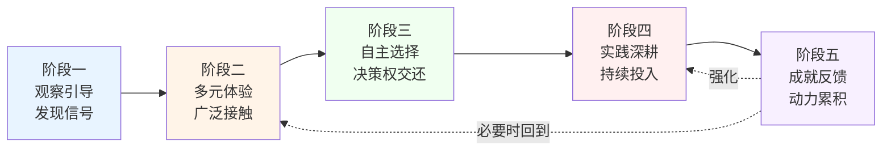

### 阶段一：观察引导——从专注与兴奋点中辨识天赋信号

这一阶段的核心任务是**建立有意识的观察习惯**。基于5.2节的多元智能观察清单，家长在孩子的日常游戏、自由活动与亲子互动中，重点关注两类信号：**专注信号**（孩子在某类活动中能保持远超平均水平的注意力时长）与**兴奋信号**（孩子谈起某类话题或活动时眼神发亮、情绪高涨）。"父母和老师的观察是发现这些'闪光点'的第一步"[^83]。

这一阶段的关键原则是**"看见而不评判"**——不急于把孩子的偏好"翻译"成某种特长班，也不急于做出"这孩子可能是个画家苗子"的过早判断。许多家长容易掉入"过度解读"的陷阱：孩子刚显示出对昆虫的兴趣，就立刻报名昆虫学夏令营、买齐昆虫标本套装；这种"加速反应"反而可能让原本自然的好奇心变成"必须完成的任务"。健康的做法是先记录、再观察、最后再行动——给天赋足够的时间去自然显现，而非在第一个信号出现时就急切扑上去。

### 阶段二：多元体验——避免过早锁定的"广撒网"策略

观察识别到初步信号后，第二阶段的任务是**为孩子提供广泛的体验机会**——艺术、运动、科学、自然探索等多个领域均可适度接触。这一阶段对应第二章2.1节"小学段广撒网塑习惯"的运动指南——"这一阶段的关键是尝试多种项目，找到兴趣所在"——但范围更广，不局限于运动。

多元体验的核心价值在于**避免过早锁定**。心理学研究表明，孩子的兴趣并非在初次接触某一活动时就完整呈现，许多深层偏好需要在多种活动的对比中才能浮现。一个例子：孩子最初表现出对画画的偏好，但接触陶艺后才发现真正吸引他的不是平面绘画而是"用手塑造立体形状"——后者对应空间智能与身体运动智能的结合，与单纯的视觉艺术指向不同的发展路径。

实操层面，多元体验可分为三类入口：**家庭内入口**——通过家长共同参与的活动初步接触（如一起园艺、一起做手工、一起跳舞）[^85]；**社区入口**——参加社区开放性活动（图书馆故事会、科技馆活动、自然观察日等），低成本、低承诺地试错；**正式课程入口**——在前两者积累出明显偏好后，再考虑短期试听课程，不轻易长期报名。

需要警惕的是这一阶段的两类异化：**异化一：体验=堆砌兴趣班**——把"多元体验"变成"周末赶场子"，孩子从一个班奔到另一个班，疲惫不堪；**异化二：体验=家长意志的延伸**——只让孩子接触家长认为"有用"的领域（如英语、奥数、编程），刻意回避家长不熟悉或"无用"的领域（如戏剧、园艺、手工）。健康的多元体验应当尽可能贴近孩子表现出的自然偏好，而非家长心目中的"重要领域"。

### 阶段三：自主选择——把决策权交还孩子

经过广泛体验后，孩子会逐渐显示出对某一两个领域的稳定偏好。第三阶段的核心是**把"选什么"的决策权交还给孩子**——这一阶段的设计直接对应自我决定理论(SDT)中"自主性"这一基本心理需要[^82]，是兴趣能否真正成为"和谐热情"而非"强迫热情"的分水岭。

研究指出："心理学家发现，孩子的天赋和兴趣如果被认可和培养，他们会更自信、更愿意学习。反之，如果强迫孩子学他们不擅长的东西，可能会让他们失去动力，甚至产生挫败感"[^83]。例如"一个擅长音乐的孩子如果被逼着天天学奥数，可能会觉得自己'笨'，而实际上，他可能只是还没找到适合自己的舞台"[^83]。

自主选择的具体操作包含三个层次：**选择内容**——孩子决定主修哪一项兴趣（在体验过的领域中选）；**选择强度**——孩子决定每周投入的时长与频率（在家庭可承担的范围内）；**选择阶段**——孩子决定何时进入更深层的学习（如从兴趣班到考级、从兴趣到比赛）。家长的角色是**提供信息与边界，而非替代决策**——例如可以告诉孩子"我们家庭周末可以支持一项稳定的兴趣班"，但具体选哪一项由孩子决定。

资料中一个深刻的隐喻：**"每个孩子都是一棵独特的'小树'，有的会长成高大的松树，有的会开出绚烂的樱花。强迫每棵树都长成一个模样，不仅不现实，还可能让它们'长歪'"**[^83]——自主选择，正是让每棵树以自己的方式生长的根本前提。

### 阶段四：实践深耕——从浅尝兴趣进入持续投入

确定了主修方向后，第四阶段进入持续投入与技能积累。这一阶段最具挑战性的任务是**穿越"三分钟热度"——许多孩子会在初始的新鲜感消退后出现"想放弃"的瞬间**。这一现象本身并非"孩子不行"的信号，而是所有深层学习都会经历的"平台期"——技能进步从快速曲线进入缓慢曲线，每次练习的"立刻可见的进步"减少，孩子的内在动机受到挑战。

深耕阶段的家长支持，关键是**区分"暂时倦怠"与"根本不适合"**。如果孩子只是在练习中遇到具体困难（如某段乐曲反复弹不好、某个动作总是做不出），可以陪伴度过；如果孩子在多次尝试后仍持续抵触、缺乏任何愉悦体验，则应回到第三阶段，重新选择更契合的方向。资料中提到，"研究还表明，孩子的智能不是固定不变的。通过适当的引导和练习，他们可以在某些领域变得更强"[^83]——这一论断为深耕提供了科学依据，但也提示家长不要把"坚持"误解为"无视孩子真实感受的强迫"。

实践深耕中可借鉴第四章4.2节的"90分钟周期法"与4.5节的SMART原则——把宏大的"学好钢琴"目标拆解为"本月掌握某一首曲目"的可衡量小目标，让每次练习都有明确指向，在小成功的累积中建立长期动力。

### 阶段五：成就反馈——让小成功累积为持续动力

第五阶段是兴趣进入良性循环的关键。当孩子完成阶段性目标（学会一首新曲、画完一幅作品、跑完一个小目标距离），家长需要给予**具体表扬而非泛化表扬**——这一原则与第四章4.5节SMART过程性评价机制完全一致。

具体表扬的范例：**不是"你弹得真棒"**，**而是"你这首曲子开头那段连音处理得比上周流畅多了，能听出你这一周练习的进步"**。前者是空洞的鼓励，后者精准指向孩子付出努力的具体节点，让孩子真正感受"我的努力被看见"。这种具体反馈在神经心理学上能够激活更深层的内在动机——孩子不仅获得情绪奖赏，更建立起"努力—进步—被认可"的因果联结。

成就反馈的另一种重要形式是**作品留存与回看**——把孩子不同时期的画作、录音、运动记录妥善保存，定期一起回看。这一做法能让孩子直观看到自己的成长轨迹，形成"增值性评价"——不是与他人比较，而是与过去的自己比较，每一次的微小进步都被看见、被记录。

### 五阶段的分龄要点

下表整合本章前述五阶段路径与分龄差异，提供一份家长可参照的分龄行动表：

| 学段 | 阶段一观察 | 阶段二体验 | 阶段三选择 | 阶段四深耕 | 阶段五反馈 |
|------|----------|----------|----------|----------|----------|
| 学龄前(3—6岁) | 重点期，关注自由游戏中的偏好 | 家长共同参与的家庭式体验为主 | 简单二选一（"周末想做手工还是去公园"） | 不强求深耕，保持游戏化 | 大量具体表扬，作品留存为主 |
| 小学低年级(6—9岁) | 持续观察智能光谱位置 | 多元尝试关键期，控制总数（≤2项稳定） | 在体验过的领域中自主选择主修 | 进入初步技能积累 | SMART小目标+作品留存 |
| 小学高年级(10—12岁) | 关注偏好的稳定性 | 从广撒网转为聚焦 | 自主决策权显著增加 | 进入平台期穿越 | 引入阶段性比赛/展示作为反馈 |
| 初高中(13—18岁) | 兴趣与自我同一性结合 | 与生涯方向初步关联 | 完全自主选择 | 深度技能积累，可能进入专业领域 | 与第6章自我认知探索整合 |

## 5.4 家长适度参与的科学分寸：30%—50%的边界艺术

五阶段路径回答了"如何培养"，但贯穿其中的隐含变量是"家长应当参与多少"。这一问题的答案，是兴趣培养中最考验家长智慧、也最容易出错的部分。

### "和谐热情"与"强迫热情"的本质区别

心理学研究将兴趣区分为两种本质不同的形态：**和谐热情(harmonious passion)**与**强迫热情(obsessive passion)**。前者建立在自主性支持下，孩子出于真正的喜爱而投入，兴趣成为"恢复性利基"与"充电机制"；后者源于父母期望、考级证书、升学加分等外部目标，兴趣成为新的压力源，反而消耗孩子的心理资源[^82][^84]。

资料明确指出："只有在自主性支持下的爱好才能发挥积极的充电作用，否则可能成为新的压力源"[^82][^84]。这一区分将兴趣培养中最深的悖论揭示得淋漓尽致：**一项活动的"内容"是相同的（同样的钢琴、同样的绘画、同样的足球），但因家长参与方式的不同，可以变成孩子的"充电站"，也可以变成新的"消耗源"**——区别不在于做什么，而在于为什么做、由谁决定做、做得不好时如何回应。

### 30%—50%参与度：边界艺术的科学分寸

家长在兴趣培养中的合理参与度，可被概括为**30%—50%的边界**——既非完全放任（参与度<30%），也非全程主导（参与度>50%）。这一范围并非精确量化指标，而是对家长角色定位的整体把握：**家长应当是资源提供者、鼓励陪伴者、必要支持者，而非决策替代者、强度施加者、结果监督者**。

下表对比"过度参与"与"适度参与"的具体行为差异：

| 维度 | 过度参与（>50%）：强迫热情倾向 | 适度参与（30%—50%）：和谐热情倾向 |
|------|-------------------------|---------------------------|
| 选择决策 | 家长决定学什么、上什么班、考什么级 | 家长提供信息与候选项，孩子自主选择 |
| 练习强度 | 家长设定每日练习时长，监督完成 | 家长协助建立基础节律，强度由孩子调整 |
| 失败回应 | "你怎么又错了""你这样下去不行" | "这次哪里让你觉得困难？我们一起看看" |
| 成功定义 | 考级通过、比赛获奖、超过同伴 | 孩子获得真实的愉悦与进步感 |
| 情绪基调 | 焦虑、催促、比较 | 接纳、好奇、共同探索 |
| 家长角色 | 教练、监督者、评判者 | 资源提供者、陪伴者、鼓励者 |

### 家长的四项核心角色

基于30%—50%的边界原则，家长在兴趣培养中可以承担四项明确的角色：

**第一，提供资源**——为孩子的兴趣提供必要的物质与机会支持。"如果您很忙并且没有太多手工制作经验，可以考虑订阅每月或更短时间送达的订阅盒。订阅盒里装满了儿童友好的手工制作材料和手工制作说明"[^85]——这一具体例子展示了家长如何在不主导内容的前提下提供持续支持。

**第二，鼓励尝试**——在孩子犹豫时给予温暖的推动，而非命令式的施压。当孩子第一次想报名某个兴趣班却又害怕时，家长的"我们先去试一节课，不喜欢可以不去"就是一种鼓励性参与；而"你必须坚持三个月才能放弃"则是过度参与。

**第三，接纳挫折**——当孩子在兴趣中遇到瓶颈与失败时，提供情感支持而非批评指责。这与第三章3.4节的非暴力沟通"先接情绪再谈问题"完全一致：孩子说"我弹不好"，家长回应"你这首曲子练了好多遍还是不熟，确实有点挫败"——先接住情绪，再讨论方法。

**第四，不替代决策**——这是边界中最关键的一条。当孩子说"我不想再学钢琴了"，家长的本能反应往往是评判（"你怎么这么没毅力"）或替代决策（"那我们换学画画"）；健康的做法是与孩子真诚对话："你最近不想学钢琴，是觉得无聊，还是哪里遇到了具体困难？我们一起看看是要调整方法、暂停一段时间、还是真的换方向。"——决策权依然在孩子手上，家长只是支持者。

更根本地，家长本身的兴趣示范也是重要的"参与方式"——"当您和孩子一起享受爱好时，您可能会发现自己也放松了。此外，您还可以与您的孩子或大孩子建立联系"[^85]。这一视角值得特别强调：**让孩子看到家长自己也在认真投入某项兴趣（而不只是工作与监督孩子学习），本身就是对"兴趣有价值"这一信念最有力的言传身教**。

### 警惕兴趣异化的典型路径

在功利化育儿的现实压力下，兴趣培养最容易掉入两条异化路径：

**异化路径一：兴趣班→第二课堂**。把兴趣班变成另一种学科竞争的延伸——"别的孩子都在学钢琴，我们也要学；别的孩子都过了八级，我们也要赶上"。这种参与逻辑剥离了兴趣的内在愉悦，把"和谐热情"挤压成"强迫热情"——孩子获得的不再是充电体验，而是新一轮的压力源。这一异化与第一章批判的"鸡娃逻辑"在底层完全一致——不同的只是从"学科分数"换成了"考级证书"。

**异化路径二：考级证书→新分数竞赛**。把"考级"或"比赛获奖"作为兴趣是否成功的唯一指标。这种评价方式直接违背了多元智能理论"各种智能同等重要"[^86]的核心精神，也违背了第四章过程性评价"与过去的自己比较"的增值性原则。健康的兴趣评价应当回到三个根本问题：**孩子是否在这项兴趣中获得真实的愉悦？孩子的相关能力是否在持续增长？孩子的整体心理状态是否因这项兴趣而更稳定？**——这三个问题的答案，远比任何外在证书更重要。

### 边界管理的家庭对话范例

为让30%—50%的边界更具可操作性，下面给出几个典型场景中"过度参与版"与"适度参与版"的对话范例：

```text
场景一：孩子犹豫想报名某个兴趣班

【过度参与版】"这个班别的孩子都报了，你必须报。学了你才知道好不好。"
【适度参与版】"你想试试看吗？我们可以先去体验一节课，
          回来再决定要不要长期学。"

场景二：孩子练习中遇到困难想放弃

【过度参与版】"花了那么多钱学这个，你不能说放弃就放弃！"
【适度参与版】"我看到你最近练琴时不太开心，能跟我说说是哪里
          让你觉得难吗？我们一起想想是调整方法还是换个节奏。"

场景三:孩子表现出新的兴趣方向

【过度参与版】"你已经学了钢琴五年了，怎么能现在突然要学画画？"
【适度参与版】"你最近对画画很感兴趣，跟我说说你被什么吸引了？
          要不要我们先在家做点小尝试，看看是不是真的喜欢？"
```

这些对话范例的共同特征是：家长不是放任孩子（"那你想干啥就干啥"），也不是强制孩子（"你必须按我说的来"），而是**通过提问、共情、共同探索的方式，把决策权与责任感同时交还给孩子**。这一姿态本身，就是和谐热情得以滋长的关键土壤。

## 5.5 从浅尝到深耕：兴趣升华为终身优势的进阶机制

回顾前四节，价值认知（5.1）、天赋识别（5.2）、阶段培养（5.3）、参与边界（5.4）共同构成了兴趣培养的横向支柱；本节将从纵向维度回答最后一个问题：**如何让童年的兴趣跨越"三分钟热度"，走向真正的深耕，最终升华为可持续一生的优势领域？**

### 平台期：兴趣深耕的第一道关卡

任何兴趣的深入发展，都不可避免地会经历"平台期"——技能进步从初学时的快速曲线进入缓慢曲线，每周的明显进步减少，努力与回报似乎不再成正比。许多孩子在这一阶段萌生放弃念头，许多兴趣也在此节点被迫中断。

平台期的本质是**学习曲线的自然规律**。从神经心理学视角看，初学阶段大脑通过快速建立新的神经连接获得明显提升；进入平台期后，大脑转入更深层的"巩固与重组"过程，这一过程从外部不易感知，但实际上正是技能从"表层掌握"走向"内化精熟"的关键期。

家长在这一阶段的支持，关键不是简单的"坚持"，而是**帮助孩子识别"看不见的进步"**。例如，钢琴学习的某段时期表面上"没什么变化"，但实际上孩子的乐感、双手协调、情绪表达都在悄然成熟；运动训练的某段时期成绩似乎"原地踏步"，但实际上孩子的体能基础、动作精细度、心理稳定性都在持续累积。家长需要协助孩子把这些"隐性进步"显性化——通过录像对比、定期回看、与初学时的对比，让孩子看到自己确实"长高了"，只是这一阶段的"长高"发生在不易察觉的维度。

### 瓶颈期：方法调整重于"硬扛"

平台期之后可能进入更具挑战性的"瓶颈期"——孩子在某个具体能力点上反复无法突破，挫败感累积。这一阶段的关键不是"硬扛"，而是**方法调整**。

具体路径包括：**寻求外部指导**——更换或增加专业老师，从新视角发现盲区；**回到基础重练**——许多瓶颈源于早期某个基本功不够扎实；**横向扩展**——暂时放下"难点"，先发展相关但不直接相邻的能力（如钢琴瓶颈时尝试视唱练耳）；**降低强度恢复兴趣**——必要时主动降低练习时长，重新回到享受状态。

资料中提到的一个原则极有启发：**"研究还表明，孩子的智能不是固定不变的。通过适当的引导和练习，他们可以在某些领域变得更强"**[^83]——这一表述强调"适当的引导和练习"，而非"加倍的努力"——瓶颈期需要的是更聪明的方法，而非更猛烈的强迫。

### 资源螺旋上升：深耕本身产生新的心理资源

资源保存理论(COR)提供了深耕进阶的核心机制——**资源螺旋上升**[^82][^84]。这一概念的洞察是：当兴趣进入持续深耕阶段，它不仅消耗资源，更在源源不断地产生新的资源——技能资源（越熟练越能自信应对挑战）、社交资源（在兴趣社群中建立同伴关系）、自我资源（"我能在这件事上持续投入"的自我认同）、情绪资源（每次成功体验带来的愉悦累积）。

这一机制解释了一个重要的发展现象：**深耕到一定程度后，兴趣开始"反哺"孩子的整体心理生活**——一个在足球中持续深耕的孩子，会把球场上的坚持迁移到学习中；一个在绘画中深耕的孩子，会把对美的敏感迁移到生活的方方面面；一个在科学探索中深耕的孩子，会把"提出问题—验证假设"的思维迁移到所有领域。**深耕的兴趣不再只是"一项爱好"，而成为孩子人格的一部分**。

### 童年兴趣→青少年特长→成年优势的进阶路径

兴趣发展的纵向轨迹，并非每个孩子都会走完完整路径，但理解这一进阶的可能性，有助于家长在不同阶段做出合适的支持。下表呈现典型的进阶路径：

| 阶段 | 兴趣形态 | 核心特征 | 家长支持重点 |
|------|---------|---------|------------|
| 童年(3—12岁) | 兴趣萌发与多元体验 | 探索性、游戏性、易变 | 观察、提供资源、保护愉悦感 |
| 青少年(12—18岁) | 兴趣聚焦为特长 | 持续投入、技能成熟、与自我同一性结合 | 适度退后、链接更专业资源、衔接生涯方向 |
| 成年早期 | 特长发展为优势领域或职业方向 | 深度专业化、社会价值显现 | 转为支持性陪伴 |
| 终身阶段 | 优势领域或可持续爱好 | 心理健康基础设施 | 不再"参与"，而是共同享受 |

资料中明确指出："孩子们需要爱好的原因有很多，其中包括缓解压力。培养兴趣爱好的孩子也能发现自己真正热爱什么。**有时，童年的爱好会成为成功而充实的职业**"[^85]。这一论断指向了兴趣发展的最高可能性——**童年中那个让孩子眼神发亮的活动，可能正是他未来人生方向的最早信号**。这一可能性将在第6章自我认知与目标方向探索中进一步展开。

但需要清醒认识到：**并非每个童年兴趣都需要发展为职业，事实上大多数童年兴趣不会成为职业方向**——这一点同样重要。一个孩子童年时热爱园艺，成年后即便从事其他职业，**这份园艺爱好仍然可以作为他一生的"恢复性利基"，在工作压力中提供持续的"充电"**[^82]——这一价值丝毫不亚于"成为职业"的可能性。

### 终身爱好作为心理健康基础设施的长期价值

回到第三章建立的心理健康框架，可持续一生的爱好本身就是**最深层、最稳定的心理健康基础设施**[^82]。这一论断的深刻之处在于：心理健康不仅依赖危机时的干预（如咨询、治疗），更依赖日常的"心理免疫力维护"——而长期稳定的爱好，正是这种免疫力维护最自然、最不引人注目却最有效的工具。

一个研究案例的视角：**"成人在户外享受大自然的放松，孩子也是如此，那么为什么不让您的孩子参与创建或维护家庭花园呢？这种活动是完美的亲子活动，因为它对所有年龄段的人都具有舒缓和教育意义"**[^85]——园艺这一具体例子背后，是一种贯穿全生命周期的智慧：**那些能够陪伴一个人从童年到老年的爱好，就是这个人最持久的心理资源**。

将这一视角延伸到本章的总体逻辑：

**对兴趣价值的重新认识**——兴趣不只是为了"成才"，更是为了"成人"；不只是为了"赢得未来",更是为了"丰富当下"。这与第一章批判的"以未来牺牲当下"的功利化逻辑形成根本对照。

**对家长责任的重新定位**——家长在兴趣培养中的最大成就，不是"培养出某个领域的专家"，而是"让孩子拥有一份能够陪伴他/她一生的爱好"。这种长远眼光下的兴趣培养，远比短期内的"是否考过几级、是否获得几个奖"更重要。

**对孩子未来的真实祝愿**——希望每一个孩子在长大成人后，都能在生活的某个角落保有一份让自己眼神发亮的事——可能是周末的瑜伽、可能是夜晚的阅读、可能是阳台的几盆花、可能是周末的足球——**这些看似"无用"的爱好，恰恰是支撑他们走过一生的真正资源**。

---

回顾本章五节内容，从兴趣的多重价值（5.1）、天赋识别（5.2）、五阶段培养路径（5.3）、参与边界（5.4）到深耕进阶机制（5.5），构成了"**价值认知—天赋识别—阶段培养—边界把握—长期深耕**"的兴趣发展整体框架。这一框架的核心信念是：**兴趣不是学习的对立面，不是未来的工具，不是分数的延伸——它是孩子身心健康成长不可替代的"基础设施"，是连接当下生命体验与未来人生方向的桥梁**。

值得特别强调的是，本章揭示的兴趣发展路径与前四章构成了深度互嵌的整体生态。**第二章身体健康的运动维度，本身就是兴趣培养的天然舞台**——一个找到自己热爱的运动项目的孩子，会自然完成第二章2.1节"每天60分钟中高强度活动"的目标；**第三章心理健康的"充电机制"，正是通过本章揭示的兴趣爱好实现的**——拥有稳定爱好的孩子在面对压力时表现出的"反脆弱"特质[^82]，是第三章心理安全感建设的重要补充；**第四章时间结构的"自由支配时间"原则，为本章的兴趣探索提供了时间空间基础**——没有大块自主的时间，就不可能有真正的兴趣深耕[^82]。

更重要的是，本章为下一章自我认知与目标方向的探索奠定了关键基础。**当孩子在多年的兴趣探索中识别出自己的优势智能，体验过自主选择的内在动力，经历过深耕过程中的平台期与瓶颈期，他便已经积累起足够的"自我素材"来回答下一阶段的根本问题——"我是谁？我擅长什么？我想成为什么样的人？"**。这种从"兴趣"到"自我认知"的自然过渡，正是健康成长路径中最珍贵的内在逻辑——下一章将进入这一关键议题，探讨如何让兴趣的"种子"长成自我认知与目标方向的"参天大树"。

# 6 自我认知与目标方向的探索

第五章在结尾处揭示了一条关键的内在逻辑：当孩子在多年的兴趣探索中识别出自己的优势智能、体验过自主选择的内在动力、经历过深耕中的平台期与瓶颈期，他便已经积累起足够的"自我素材"来回答下一阶段的根本问题——**"我是谁？我擅长什么？我想成为什么样的人？"** 这三问，是青少年成长中最深层、也最难以回避的精神追问，是埃里克森理论中"自我同一性vs角色混乱"危机的直接显现，也是第五章兴趣的"种子"能否长成第七章执行力的"参天大树"的关键中介。

然而在功利化育儿与放任型教育的双重夹击下，这一追问正以前所未有的尖锐方式撞击着当代青少年——19.3%的青少年存在心理健康问题，相当一部分根源指向"我不知道自己想要什么"的方向感真空[^91]。本章作为五大维度路径设计的第五个落点，将先剖析自我认知模糊与目标感缺失的多重成因（6.1），再引入霍兰德、多元智能、MBTI等主流工具及其使用边界（6.2），构建"择心所向、择己所长、择势所需"三维生涯规划模型（6.3），系统验证兴趣广度体验、心流信号捕捉、试错迭代、价值感联结四类方向锁定方法（6.4），归纳从兴趣到目标、从目标到行动的完整转化逻辑（6.5），最终梳理家校社协同的生涯教育实践路径（6.6），为第七章自驱力与执行力培养奠定方向性基础。

## 6.1 自我认知模糊与目标感缺失的成因解析

要理解当代青少年为何在"我是谁"这一根本问题前频繁失语，必须从生理心理发育的内在矛盾、家庭育儿的两端极化、社会评价生态的结构性挤压三个层面展开系统性解构。这一节并非简单罗列现象，而是要揭示自我同一性建构所需的探索时间、试错机会、价值澄清，是如何在当下教育生态中被层层剥夺的。

### 内在矛盾：身心发育的"剪刀差"

自我认知模糊的第一重成因，是青少年自身生理与心理发育的**结构性不同步**。研究指出，"现代青少年生理发育较20年前提前1—2年，但心理成熟却相对滞后：自我意识膨胀与思维片面性并存，情绪冲动性与自控力不足冲突"[^91]。这一"剪刀差"造就了一种独特的内在矛盾——一方面，青春期生理变化与社会角色转换催生出强烈的"我是独立个体"的自我意识；另一方面，前额叶皮层尚在发育（参见第三章3.1节）使思维呈现极强的片面性、情绪化与短视性。

这种失衡的直接后果是：**青少年既渴望回答"我是谁"的根本问题，又缺乏足够的认知工具去稳定地回答它**。"这种失衡使他们在面对外界压力时，易陷入自我怀疑或极端情绪，成为心理问题的种子"[^91]。一个典型表现是青少年常在两种极端自我认知中剧烈摇摆——某次考试失利就觉得"我什么都不行"，某次比赛获奖又瞬间觉得"我无所不能"，自我评价系统极度依赖外部即时反馈而难以建立稳定锚点。

### 家庭层面：功利化育儿与放任型教育的双向损害

第一章已系统批判过功利化育儿对孩子自主空间的剥夺，本节进一步指出**功利化育儿的另一重隐性损害——对自我探索时空的系统性挤压**。当一个孩子的时间表从清晨六点到深夜十一点被精确切割为补习班与作业方格，他便没有任何"无用"的时间来进行自我探索——发呆、闲逛、漫无目的地阅读、与朋友天马行空地聊天，这些看似"低效"的活动恰恰是自我认知最原始、最不可替代的孵化场。功利化育儿挤掉的不仅是娱乐时间，更是**自我对话的内在空间**。

但与功利化育儿相对的"放任型教育"，并非自我探索的解药——它甚至可能是更隐蔽的伤害。一个具有警示价值的真实案例：上海某重点高中任教的张老师，与丈夫均985毕业，对儿子学业"零要求"，反复说"你上不上大学都可以，只要健康快乐就好"——结果"本应轻松快乐的儿子却越来越沉默，甚至出现了轻度抑郁症状"[^92]。

这一悖论的背后，是放任型教育的三重隐性损害：

**第一，目标感的缺失**。"心理学研究表明，青少年时期是建立自我认同和目标感的关键阶段。当父母说'你做什么都可以'时，孩子感受到的往往不是自由，而是方向感的缺失。他们内心会产生疑问：'如果父母对我没有任何期待，是不是因为我不够好？'"[^92] 青少年的自我认知建构需要外部"锚点"作为参照——这一锚点既不是高压的强制目标，也不是空洞的"随便你"，而是稳定而合理的关切与期待。

**第二，虚假的"无条件接纳"**。研究发现，"许多这样的家庭存在微妙的成就期待。一位心理专家指出，允许型教养方式实际上与大学生更大的学业压力、更差的幸福感相关。孩子能敏锐感知到父母隐藏在'无所谓'态度下的真实期待"[^92]。一位高知家庭的孩子坦言："我爸爸说考多少分都没关系，但当他看到朋友孩子被名校录取时，那种羡慕的眼神让我窒息"[^92]——**口头的"无所谓"与神态的"很在意"之间的落差，比直接的高压期待对孩子的心理伤害更深**。

**第三，情感联结的断裂**。"许多高知父母忙于事业，用'宽松政策'来补偿自己陪伴时间的不足，却忽视了孩子需要的是深度情感联结而非表面上的放任自由"[^92]。"血≠亲"的心理学观点指出，"亲子关系的纽带不是靠血缘自动建立的，而是通过日常琐碎的陪伴和情感支持形成的"[^92]——这一观点与第三章3.5节"高质量陪伴"的论述形成精确呼应。

下表对比功利化育儿与放任型教育对自我认知建构的双向损害：

| 育儿模式 | 表面特征 | 对自我认知的损害 | 孩子的内在体验 |
|---------|---------|----------------|--------------|
| 功利化育儿 | 高压期待、过度安排、唯分数论 | 自我探索时空被剥夺；价值评价单一化 | "我只有考好才有价值" |
| 放任型教育 | "你随便""只要快乐就好" | 目标锚点缺失；隐性期待与显性表态错位 | "如果父母对我没期待，是不是因为我不够好" |
| 健康支持 | 脚手架式陪伴、合理期待、深度联结 | 提供探索空间+稳定锚点+情感支持 | "我被看见、被支持、有方向" |

### 社会层面：比较压力、单一评价与"完美人设"的三重侵蚀

社会层面的成因可被概括为三组互相强化的力量。**第一，社会期待的无形枷锁**——"学业成绩、社交能力、未来规划的过高标准，将青少年置于长期竞争压力中。中考、高考的'独木桥'效应，社交媒体上'完美人设'的对比，让他们时刻处于紧张状态，焦虑、抑郁等情绪问题随之而来"[^91]。

**第二，"唯分数论"对自我评价系统的占领**。当家庭、学校、社会都以分数作为衡量孩子的核心标尺，孩子的自我评价系统便被简化为一维线性结构——分数高=我好，分数低=我差。这种简化的代价是巨大的：**它让八大智能光谱（参见第五章5.2节）中的七条都失去了被看见的机会，让孩子的自我认知严重偏离真实的多维潜能**。

**第三，社交媒体上"完美人设"的对比**。高知家庭的孩子尤其面临这一挑战——"父母可能是大学教授、科研专家，家庭聚会中叔叔阿姨都是各行各业的精英。孩子潜意识中会将自己与父母的社会成就进行比较，即使父母从未施加压力。这种无形的对比会让孩子产生'我不够好'的自我认知"[^92]。社交媒体进一步把这种比较从"亲戚邻居"扩展到全球——孩子每天看到的是被精心筛选过的"别人家的孩子"的高光时刻，自我形象被持续地与一个永远达不到的"完美样板"进行不公平比较。

### 个体认知的短板放大效应

在上述外部压力之下，**个体认知与应对能力的短板，会进一步放大压力**。研究指出："完美主义倾向使他们对失败零容忍，情绪管理技巧不足让负面情绪积累，缺乏社会支持系统则让他们在困境中孤立无援。这些个体因素如同放大镜，将外部压力转化为心理创伤"[^91]。

更值得警觉的是，"这些因素并非孤立存在，而是形成协同效应：家庭压力加剧学业焦虑，生理失衡放大社会压力的冲击，最终形成恶性循环。例如，激素波动的青少年在家庭冲突后，更易对学校的小挫折产生极端反应"[^91]。

回到本节开篇的命题，自我同一性建构所需的三个核心条件——**探索时间、试错机会、价值澄清**——正在这一系统性压力网络中被层层剥夺：探索时间被功利化育儿挤占，试错机会被"一次失利定终身"的评价压力消解，价值澄清被"唯分数论"与"完美人设"的双重侵蚀替代。这意味着，要破解青少年的自我认知危机，不能只在"工具"层面发力，更需要在家庭育儿模式、社会评价生态、个体认知能力三个层面同步重建——这正是本章后续五节展开的逻辑起点。

## 6.2 自我探索工具的应用价值与使用边界

理解了自我认知模糊的成因后，下一个问题是：青少年与家庭可以借助哪些工具加速自我探索？市面上自我探索工具种类繁多，从专业心理量表到大众化的人格测试遍地开花。本节将聚焦霍兰德职业兴趣测试、多元智能评估、MBTI人格类型三类最具代表性的工具，辨析其理论基础、核心维度、应用价值与使用边界，引导家长与青少年以开放性、过程性视角使用工具，避免落入"标签化归类"的陷阱。

### 霍兰德职业兴趣测试：人格—环境匹配的经典模型

霍兰德职业兴趣理论（人格类型理论）由美国职业指导专家约翰·霍兰德于1959年创立，"是一种在特质—因素理论基础上发展起来的人格与职业类型相匹配的理论"[^93]，被认为是"最具影响力的职业发展理论和职业分类体系之一"[^93]。

理论的**核心思想**可被概括为"**人和环境的匹配**"——"个体的职业选择是基于个人兴趣、性格特征与工作环境的匹配程度"[^93]。霍兰德将人格分为六种"人格性向"，对应六种职业环境类型：

| 类型 | 简称 | 人格特点 | 适配职业领域 |
|------|------|---------|------------|
| 现实型 | R(Realistic) | 愿意使用工具从事操作性强的工作；动手能力强；不善言辞 | 技术性工作、工程、机械、农业 |
| 研究型 | I(Investigative) | 思辨型，喜欢提问与探究 | 科研、学术、医学研究 |
| 艺术型 | A(Artistic) | 追求创造性表达 | 艺术、设计、写作、音乐 |
| 社会型 | S(Social) | 擅长服务与教育，关心他人 | 教师、心理咨询、社会工作 |
| 企业型 | E(Enterprising) | 偏好管理与决策，富有领导力 | 管理、销售、政治、法律 |
| 传统型/常规型 | C(Conventional) | 适应程式化事务，注重规则 | 会计、行政、文书、数据处理 |

霍兰德"用正六边形模型(六角形模型)标示六种人格类型的关系，分为相邻、相隔、相对三种关系"[^93]，由此形成著名的**RIASEC模型**。该理论的基本假设包括："大多数人的兴趣类型可分为六种；职业环境类型也相应分为六种；人们都在追求能够发挥个人能力的职业环境；一个人的行为是由其职业兴趣类型和职业环境的交互作用所决定"[^93]。霍兰德1971年首次出版《职业自我探索量表》(SDS)用于测量人格类型，1973年提出六角形模型理论[^93]。

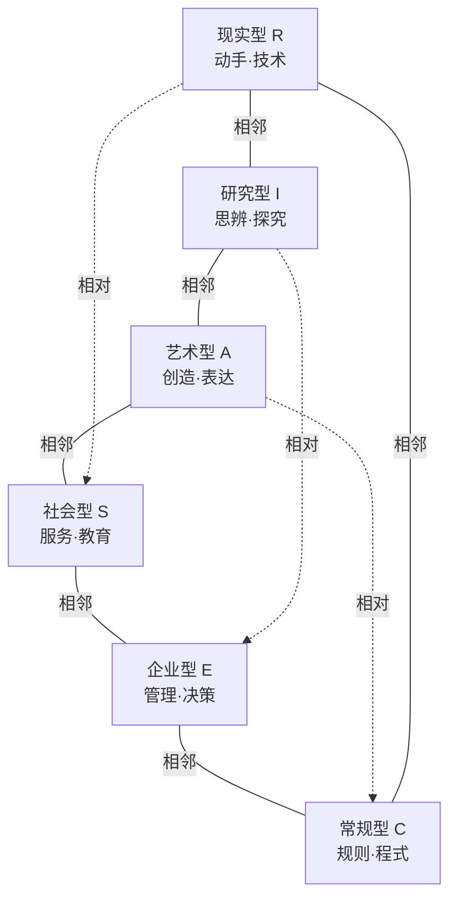

霍兰德六角形中，相邻类型相似度高（如R与I、A与S），相对类型差异最大（如R与S、I与E）。一个人的人格往往不是单一类型，而是某几种类型的组合（如RIA、SEC等三字母代码）——这种组合模式比单一类型更能反映真实自我。中国已有学校开展"RIASEC模型下初中生生涯教育实践研究"[^93]，将该工具引入基础教育阶段。

### 多元智能评估：兴趣识别向自我认知深化的桥梁

第五章5.2节已系统介绍加德纳多元智能理论的八大智能类型——语言、逻辑数学、空间、身体运动、音乐、人际、自我认知（内省）、自然认知[^94]。在自我认知探索的语境下，多元智能扮演着**兴趣识别向自我认知深化的桥梁**角色。

加德纳的核心观点对自我探索具有三重启示：**第一，"每个人具备所有的八种智能"**[^94]——这意味着自我认知不应是"我属于哪一类"的归类游戏，而是"我在八条光谱上分别处于什么位置"的多维定位；**第二，"大多数人有可能将任何一种智能发展到令人满意的水平"**[^94]——这意味着发展性视角胜过固定性视角；**第三，"智能之间通常是以复杂的方式共同起作用"**[^94]——这意味着任何具体的目标方向都需要多种智能的协同，而非单一智能的孤立运用。

将多元智能评估与霍兰德测试对比，可以发现两者形成互补：霍兰德回答的是"**我倾向于在什么样的工作环境中工作**"，多元智能回答的是"**我天生在哪些能力维度上更具优势**"。前者偏向"环境匹配"，后者偏向"能力底色"——两者结合，能从"想做什么"与"能做什么"两端共同逼近真实的自我画像。

### MBTI：广泛流行的人格测试及其科学局限

MBTI（迈尔斯-布里格斯类型指标）是当下最广为流行的人格测试之一，"在商业和教育领域广泛应用"[^95]，将人格分为四对二分维度共16种类型。然而，"其科学性备受争议"[^95]，使用时必须清醒认识其局限。

MBTI的主要局限可归纳为五点：

| 局限维度 | 具体问题 |
|---------|---------|
| 缺乏科学证据支持 | "测量结果在不同时间和情境下可能存在较大变化，缺乏稳定性和一致性"[^95] |
| 二分法过于简化 | "将人格分为四对二分法，这种分类方式可能过于简化复杂的人类个性。实际上，人的个性是多维的，无法简单地用四对维度来描述"[^95] |
| 类型划分局限性 | "将人格划分为16种类型，但实际上每个人的个性都是独特的，难以用有限的类型来概括。很多人可能并不完全符合任何一种类型"[^95] |
| 忽略环境因素 | "主要关注个体的内在特质，但忽略了外部环境对个性的影响。个人的行为和特质往往受到社会文化背景、家庭教育等外部因素的影响"[^95] |
| 用途局限性 | "MBTI更适用于个人发展和团队建设等领域，但并不适合用于招聘选拔等重要决策"[^95] |

这些局限并非否定MBTI完全无用，而是提示家长与青少年在使用时应当**保持工具性态度**：MBTI可以作为一次有趣的自我对话起点，引发"我是这样的人吗""为什么我会被某些描述击中"的反思；但绝不应被当作"终身定型"的诊断书，更不应据此排除或锁定职业方向。

### 工具使用的核心原则：探索辅助而非终身定型

整合上述三类工具的应用价值与局限，可提炼出自我探索工具使用的四条核心原则：

**第一，工具是镜子，不是判决书**。所有工具的根本作用是让青少年获得"另一种看自己的视角"，引发自我反思与对话——而不是给出"你就是这样的人"的最终结论。一个孩子做完霍兰德测试得到"SAE"组合，正确的反应不是"原来我适合做老师"，而是"为什么我在社会型与艺术型上得分高？这与我日常的兴趣偏好一致吗？这种偏好如何在未来的探索中进一步检验？"

**第二，多工具交叉验证胜过单工具锁定**。任何单一工具都有其局限——霍兰德重职业环境匹配但不涉及具体能力底色，多元智能重能力维度但不直接指向职业，MBTI重人格风格但稳定性存疑。**真正的自我画像，应是多个工具结果与日常生活观察的交叉验证**——当一个孩子在霍兰德上偏向社会型，在多元智能上人际智能突出，在日常生活中也表现出关心他人、协调群体的偏好，三组证据相互印证，自我画像的可信度才足够高。

**第3，过程性视角胜过静态结论**。青少年期的人格、兴趣、能力都处于持续发展中——14岁的测试结果与18岁的可能差异巨大。健康的做法是把工具作为"成长记录"而非"终身判决"——每隔1—2年重新测试，观察自己的变化轨迹，本身就是宝贵的自我认知素材。

**第四，警惕标签化的反向锁定**。最危险的不是工具结果错误，而是工具结果被孩子内化为"标签"后形成的反向锁定——"我是INFP，所以我不擅长……"这种把测试结果当成自我设限理由的现象，恰恰违背了所有自我探索工具的初衷。家长在协助孩子使用工具时，应当反复强调：**结果是你当下的自我画像之一，而不是你未来的天花板**。

## 6.3 "择心所向、择己所长、择势所需"三维生涯规划模型

工具提供了认识自我的入口，但真正的方向锁定还需要一个整体性的思考框架。在生涯规划领域，**"择心所向、择己所长、择势所需"** 三维模型提供了这一整体框架——它把"我想做什么""我能做什么""时代需要什么"三个核心问题整合为一个递进而又交互的决策结构，既呼应第五章兴趣发现的成果，又承接6.2节自我探索工具的产出，更引入了"时代需求"这一被前述章节较少触及的关键维度。

### 三维模型的内涵与递进逻辑

第一维"**择心所向**"聚焦兴趣探索、价值观塑造与梦想追求。"在成长的道路上，青少年首先需要了解自己，包括兴趣、价值观和梦想。了解自我是生涯规划的首要且关键步骤"[^96]——这一维度强调内在驱动力的识别与确认。

第二维"**择己所长**"强调客观自我评估、优势智能识别与技能持续提升。"每个人都有自己的长处和短处，认识到自己的优势并学会发挥这些优势，不仅能够帮助青少年在学习中取得更好的成绩，还能在未来的职业道路上脱颖而出"[^96]。这一维度承接多元智能理论——只有真正契合天赋开发和优势发展的生涯规划，才能帮助孩子走得更轻松、更顺畅[^96]。

第三维"**择势所需**"引导青少年关注社会发展趋势、新兴行业格局与时代价值需求。资料明确指出："社会在不断变化，新的行业和……"[^96]——青少年的生涯方向不能在"真空"中设计，必须放在所处时代的产业格局、技术变迁、社会需求中校准。

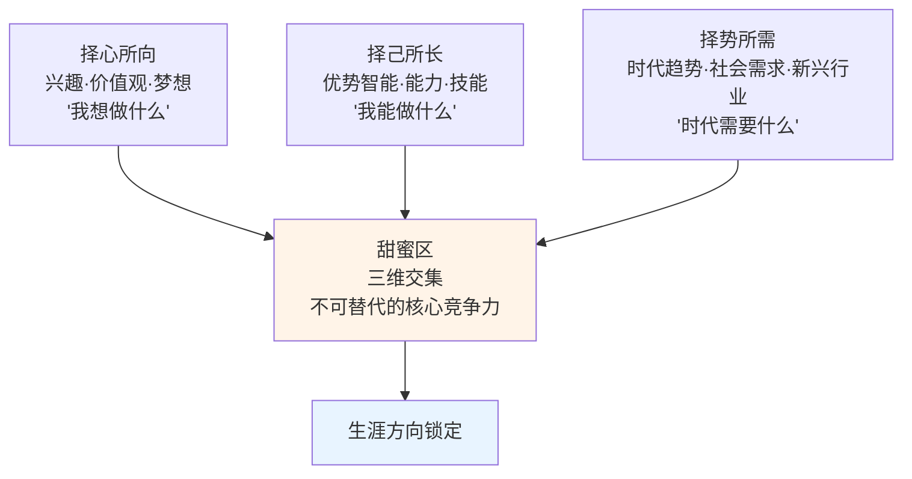

三维模型的精妙之处在于它揭示了**单一维度均不足以支撑健康生涯规划**的深层逻辑：仅有"心所向"而无"己所长"，会陷入空洞的梦想；仅有"己所长"而无"心所向"，会陷入无意义的技能堆积；仅有"心所向"和"己所长"而无"势所需"，会陷入与时代脱节的孤立深耕；只有三维交集形成的"**生涯甜蜜区**"，才是真正可持续的方向所在。

### 第一维"择心所向"的实操路径

"择心所向"的实操核心是**通过广泛体验发现并培养兴趣**。具体路径包括三个层次：

**兴趣探索层**：**鼓励青少年通过参与各类兴趣小组和社团活动，接触不同的领域，从而发现自己的兴趣所在。例如，对科学感兴趣的孩子，可以加入学校的科学俱乐部，利用寒暑假参加高校的研学营、科创营，以增加参与科学实验的机会；对艺术有热情的孩子，可以从小参加绘画或音乐课程，提升艺术修养**[^96]。这一路径与第五章5.3节"多元体验"阶段直接呼应。

**价值观塑造层**：在日常的生涯咨询实践中，咨询师"发现有些学生认为'医生'这一职业非常神圣，而有些家庭和孩子坚决不接受'过于劳累'的工作"[^96]——这种对职业的初步价值判断，本身就是价值观的早期显现。家长与生涯指导者的角色不是替孩子决定"什么职业有价值"，而是"针对来询者的关注点，帮助他们拓宽视野，理解更多职业的工作内容和性质，助力他们在成长过程中逐渐形成自己的价值观，并学会将个人信念与社会价值观相结合"[^96]。

**梦想追求层**：帮助青少年学会设定短期和长期目标，并制定相应的计划去实现这些目标。资料给出的具体范例：**有志于成为医生的学生，可以在高中甚至初中阶段就开始准备相关知识和深入体验活动。除了重视化学、生物等的学习基础，初、高中阶段还应深化这些知识，并提前进行手指灵活度训练，为未来的职业生涯做好准备**[^96]——这一例子精准展示了"梦想"如何通过具体可行的早期准备转化为脚下的台阶。

### 第二维"择己所长"的实操路径

"择己所长"的核心是**客观自我评估与优势开发**。资料明确指出一个深刻的洞察：学生在某个科目上"成绩不佳，可能有多种原因，如学习习惯不良、学习方法不当。我们发现，很多学生共有的一个原因是不喜欢某位老师，因此不愿在该科上努力。相反，能在某个科目上取得好成绩，可能是因为老师教学方式温和、有朋友帮助、家长监督得力等原因"[^96]——这一洞察提示家长不要轻易把"学得不好"等同于"没有天赋"，**真实的优势识别需要剥离环境噪音**。

具体路径包括：**自我评估**——"通过自我反思、接受他人评价以及进行专业的潜能和优势测评等方式，可以了解自己的优势和劣势"[^96]，这与6.2节工具使用形成衔接；**技能提升**——"青少年应抓住每一个学习和实践的机会，无论是课堂学习还是课外活动，都是提升个人技能的宝贵机会。例如，通过参加学校的辩论队，可以锻炼自己的逻辑思维和表达能力；具有领导力的学生可以在学生会中担任职务，发挥自己的组织和协调能力"[^96]；**目标聚焦**——"通过生涯探索，可以帮助孩子们明确自己的意向方向，了解哪些技能是必需的，从而尽早明确自己的提升空间和提升重点"[^96]。

### 案例验证：张雪从修车学徒到机车冠军的三维闭环

张雪机车崛起案例为三维模型提供了一个跨越25年的完整验证。2026年3月，张雪机车820RR-RS赛车在葡萄牙波尔蒂芒赛道WSBK世界超级摩托车锦标赛中"以压倒性优势夺得SSP组别连夺两回合冠军，一举打破欧美日品牌数十年垄断"[^97]。从"湖南山村的辍学修车学徒，到缔造中国机车工业传奇的企业家"，这一跃迁的底层逻辑恰恰可由三维模型解读。

**心所向——使命驱动的热爱锚定**。张雪1987年生于湖南麻阳贫困山村，14岁初中辍学在车行当修车学徒。但他的生涯觉醒"始于热爱的火种与使命的锚定。电视上的达喀尔拉力赛，在他心中埋下'造中国人自己的高性能机车'的种子。别人修车是为了糊口，他拆修每一辆车、钻研每一颗螺丝，是为了读懂机车的机械灵魂；别人下班娱乐，他抱着发动机研究到深夜，把结构原理烂熟于心。19岁，他骑着攒钱买来的二手摩托，冒雨追逐节目组100多公里，只为争取一个展示车技的机会"[^97]——这份"近乎偏执的热爱"正是择心所向的极致体现。

**己所长——能力闭环的持续构建**。张雪的能力体系经历了清晰的两阶段迭代：**第一阶段(14—21岁)深耕基础**——"白天拆修车辆、吃透机械结构，晚上自学理论，3年时间练就'蒙眼盲装发动机'的绝技，对机车核心技术的理解，达到'如身体发肤'般熟悉"[^97]；**第二阶段(21—30岁)跨界拓展**——构建"T型能力结构"[^97]，从单一修车技能扩展到研发、赛事的全链条能力。这一过程精准印证了"把单一技能做到极致，是立足行业的根基"[^97]。

**势所需——填补国内技术空白的时代切口**。张雪的方向选择不是孤立的"我想造车"，而是精准对接了**填补国内高性能机车技术空白的时代需求**[^97]。当中国制造业从低端走向高端、当国民对高性能消费品的需求从依赖进口走向追求国产，张雪所深耕的领域恰好处于"势所需"的浪潮之上。

三维交集形成了张雪不可替代的核心竞争力："**以'造中国顶级机车'的热爱为内核，以机车维修、研发、赛事的全链条能力为支撑，以填补国内高性能机车技术空白的时代需求为方向，三者闭环形成不可替代的核心竞争力**"[^97]。

### 对青少年生涯规划的核心启示

张雪案例对当下青少年生涯规划至少给出三条核心启示：

**第一，警惕"功利型选择"陷阱**。"当下青少年(及家长)极易陷入'唯分数、唯热门、唯高薪'的误区，高考志愿跟风选计算机、金融，就业追逐风口行业，却忽视自身兴趣与能力，最终陷入'干一行厌一行'的职业倦怠。张雪的经历证明：没有热爱的支撑，再光鲜的职业也只是无源之水"[^97]——这一警示与第一章批判的功利化育儿在底层完全一致。

**第二，找到"热爱—能力—价值"的交集**。"对青少年而言，生涯规划不是'选什么专业赚钱'，而是探索自我：我热爱什么？我擅长什么？时代需要什么？三者契合，方能走得长远"[^97]——这正是三维模型的精确表达。

**第三，早期"试错与探索"是生涯觉醒的关键**。"张雪的热爱并非天生，而是在修车、赛车、改装的实践中逐步清晰。青少年阶段，应鼓励多领域尝试、实践体验，而非过早锁定'标准答案'——在体验中发现热爱、在试错中明确方向，是生涯规划的第一步"[^97]。这一启示直接通向下一节将展开的四类方向锁定方法。

需要特别说明的是，张雪案例的极端性（辍学、白手起家、行业冠军）并非可以被多数青少年简单复制，但其中**"热爱锚定—能力闭环—时代同频"的底层逻辑**具有普适价值。对绝大多数青少年而言，三维交集未必是"开创一个时代"，而可能是找到一个让自己"持续投入而不感到耗竭、持续进步而不感到迷茫、持续创造而不感到虚无"的方向——这本身就是生涯成功的本质。

## 6.4 四类方向锁定方法的实践路径

三维模型提供了"在哪里寻找方向"的整体框架，但具体到操作层面，青少年与家长还需要四类相互补充的方法工具——**兴趣广度体验、心流信号捕捉、试错迭代、价值感联结**。这四类方法分别对应方向锁定中"广度探索""深度信号""动态调整""意义联结"四个核心环节，共同构成方向锁定的方法论体系。

### 方法一：兴趣广度体验——在多领域尝试中明确方向

兴趣广度体验是方向锁定的起点。其核心理念是：**真实的方向感无法在书桌前凭空想象，只能在亲身体验中逐渐显现**。这一方法直接呼应第五章5.3节"多元体验"阶段，并在此基础上向"职业体验"层面延伸。

具体实践路径包括：**校内兴趣小组**——通过参与学校的兴趣小组和社团活动接触不同领域[^96]；**校外研学体验**——"对科学感兴趣的孩子，可以加入学校的科学俱乐部，利用寒暑假参加高校的研学营、科创营"[^96]；**职业体验项目**——成都市建立的职业体验合作联盟"统筹安排中小学生到职业学校进行职业体验，拓展实践路径"[^98]，1300余所中小学校、27所职业学校参与联盟活动，"职业认知体验教育活动服务师生共计30余万人次。职业学校教师送教到中小学校400余次"[^99]。

兴趣广度体验的两个常见误区需要警惕。**误区一：把广度体验异化为"赶场子"**——周末从一个班奔到另一个班，每个领域都浅尝即止，反而失去深度感受的机会。健康的广度体验应当遵循"少而精"原则——同一时期不超过2—3个稳定的体验渠道，每个体验给予足够的浸入时间。**误区二：把广度体验局限于家长认为"有用"的领域**——只让孩子接触STEM、英语、编程，刻意回避戏剧、园艺、手工等"无用"领域。然而**真正的方向锁定恰恰常常发生在家长意料之外的领域**——张雪的人生方向并非从"被认为体面"的职业中产生，而是从"修车学徒"这一被传统观念视为"底层"的领域中萌发[^97]。

### 方法二：心流信号捕捉——识别天赋与热爱交汇的内在指针

如果说兴趣广度体验回答的是"在哪里找"，那么**心流信号捕捉**则回答了"如何识别真正的方向"——在众多体验过的活动中，哪一种值得深耕？心理学家米哈里·契克森米哈赖提出的"心流"理论提供了一个精确的内在指针。

心流的英文是"flow"，又译为福流、沉醉感、沉浸感、流畅感，"是指人们在当下的一种情绪体验，此时此刻，人们对某一活动或事物表现出浓厚的兴趣并完全投入其中"[^100]。"心流是你从当前所从事的活动中直接获得的情绪体验，回忆或想象等不能产生这种体验"[^100]——这一界定具有重要意义：心流不是"我以为我喜欢"，而是身体与神经系统在当下给出的真实信号。

心流体验的产生具有重要的**适用普遍性**——"研究发现，心流体验的产生具有跨阶层性、跨性别性、跨年龄性、跨活动性和一定的跨文化性"[^100]。这意味着任何阶层、性别、年龄、文化背景的青少年都有可能在自己适合的活动中体验心流。

进入心流状态的人通常表现出以下九大特征[^100]：

| 序号 | 心流特征 |
|------|---------|
| 1 | 体验活动本身成为活动的内在动机（自成目标） |
| 2 | 注意力高度集中于当前活动，外在引诱仅造成暂时分心 |
| 3 | 自我意识暂时丧失（忘记身份地位、饥饿疲劳） |
| 4 | 行动与意识相融合 |
| 5 | 出现暂时性体验失真（觉得时间过得比平常要快） |
| 6 | 对当前活动具有较好的控制感 |
| 7 | 具有直接的即时反馈 |
| 8 | 个体感知到的活动挑战性与自身技能水平之间具有平衡性 |
| 9 | 有明确的活动目标 |

理解心流的关键是**心流八通道模型**——"心流处在技能适中、挑战适中的理想区域"[^100]。"当你心中有个目标，这个目标对你来说有一定难度，而你的技能可以初步胜任这个目标的时候，你开始投入心力，你的注意力被立即的反馈攫住，而环境也逼迫着你做出回应。就像乒乓球高手相互对打，小球成为两人之间意识流动的媒介。你会体验到人类最美妙的感觉——心流。反之，在低挑战、低技能区域是焦虑、冷漠、厌倦……"[^100]

```mermaid
quadrantChart
    title 挑战-技能匹配的心流模型
    x-axis 低技能 --> 高技能
    y-axis 低挑战 --> 高挑战
    quadrant-1 心流(高挑战·高技能)
    quadrant-2 焦虑(高挑战·低技能)
    quadrant-3 冷漠(低挑战·低技能)
    quadrant-4 厌倦(低挑战·高技能)
```

米兰大学的研究进一步细化为八种挑战—技能组合：高挑战和中等技能为唤醒；**高挑战和高技能为心流**；中等挑战和高技能为掌控等[^101]。这一精细划分提示家长：**心流不是任何"快乐"或"沉迷"都算——刷短视频时的"沉迷"恰恰是低挑战高刺激带来的多巴胺过量，与心流的"高挑战—高技能匹配"截然不同**。

对青少年方向锁定的实操启示是：**家长可以引导孩子记录"心流时刻日志"——每天回顾当天哪些活动让自己进入了心流状态，时间一长，反复出现心流的活动领域便是天赋与热爱交汇的真实信号**。一个孩子在做数学题时常常进入"忘记时间"的状态，在画画时也是如此，但在打球时从不进入——这种差异化的心流模式比任何测试结果都更精确地指向方向。

### 方法三：试错迭代——"体验—反思—调整"的渐进闭环

第三类方法直面一个核心现实：**真正的方向锁定不是一次性决策，而是反复迭代的过程**。生涯规划师强调的核心原则是"**在体验中发现热爱、在试错中明确方向，是生涯规划的第一步**"[^97]。

试错迭代的具体闭环可被描述为"**尝试—反思—调整**"三步循环：**尝试**——选择一个感兴趣的领域投入一段时间（如一个学期的课程或一个寒暑假的研学）；**反思**——结束后系统回顾：我在其中获得了什么样的体验？是否多次进入心流？我是否愿意在这个领域继续深耕？我对它的兴趣是真实的还是被新鲜感放大的？**调整**——基于反思结果决定下一步：继续深耕、调整投入方式、还是切换到相邻领域重新探索。

试错迭代的两个关键认知：

**第一，"试错"不等于"失败"**。许多家长担心孩子尝试某个方向"试错"就是浪费时间，但事实上**每一次试错都在生成宝贵的自我认知数据**——孩子发现"原来我并不真的喜欢编程"本身就是重要的认知收获，让他在下一次选择时更接近真实方向。健康的家庭氛围应当把"试错"视为投资而非损失。

**第二，试错应有时间盒边界**。试错也不能无限延展——每个领域应给予足够的体验时间（至少3—6个月）才能做出有效判断，但也不应在已明确不适合的领域无限消耗。建议设立"季度复盘"机制，每个学期末进行一次系统反思，决定下一阶段的方向调整。

试错迭代与第四章4.5节SMART原则的过程性评价机制形成精确同构——目标设定→执行→反馈→调整的闭环，在生涯探索领域同样适用。区别仅在于这里的"目标"是探索方向本身，而非具体任务的完成度。

### 方法四：价值感联结——通过有意义的实践锚定目标

如果说前三类方法解决的是"我喜欢什么、我擅长什么、我合适什么"，那么**价值感联结**回答的是更深层的问题：**为什么这个方向值得我投入一生？**

资料指出："让孩子参与家务、社区服务等有意义的活动。当孩子能够关心他人、承担家务，他们的自我价值感和快乐感会显著提升"[^92]。这一论断揭示了一个常被忽视的成长机制：**自我价值感不是通过他人的肯定获得的，而是通过亲身参与对他人有价值的实践积累的**。

价值感联结的三个层次：

**第一层：家庭参与**。最基础也最日常的价值感联结，发生在家庭内部——孩子参与家务劳动，看到自己的付出让家人受益。这一看似简单的活动，实际上是**自我价值感最早的源泉**——"我的存在对他人有用"这一基本认知，将成为后续所有目标感的心理基底。

**第二层：社区服务**。当孩子从家庭走向社区，参与志愿服务、公益活动、互助项目，他便开始体验**自我价值与社会价值的联结**。一个孩子在养老院陪伴老人后获得的内在感动，一个孩子在环保活动中亲手清理一片河岸的成就感——这些体验都在向他传递一个重要信号：**我能为比自己更大的事物贡献力量**。

**第三层：使命级目标**。当价值感的累积达到一定深度，孩子开始有可能产生"我希望通过自己的方式让这个世界变得更好"的使命级追问——这一追问看似宏大，但正是成熟生涯目标的内在动力。张雪的"造中国人自己的高性能机车"[^97]、有志医生的"治病救人"——这些超越个人功利的使命感，正是支撑长期主义深耕的精神核心。

需要特别强调的是，**价值感联结是避免目标感建立在空洞理想之上的关键防线**。没有价值感联结的"目标"，往往是社会标签的复制（"考上名校""赚很多钱"），孩子内心其实并不真正认同；只有经过价值感联结的目标，才能在挫折与平台期中持续提供内在动力。

### 四类方法的整合应用

四类方法并非孤立存在，而是相互补充的方法论体系：

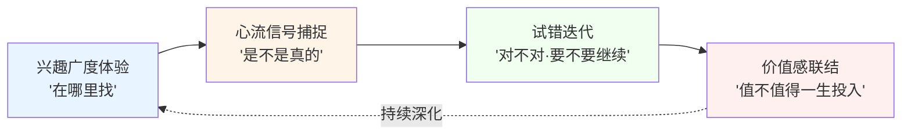

四类方法共同回答方向锁定的不同层次：广度体验扩展可能性边界，心流信号捕捉真实偏好，试错迭代修正方向偏差，价值感联结提供深度动力。**任何单一方法都不足以独立完成方向锁定，但四者结合便能形成一个相对完整的内在导航系统**——这正是从功利化育儿与放任型教育的双重困境中走出的可行路径。

## 6.5 从兴趣到目标、从目标到行动的转化逻辑

四类方法回答了"如何找到方向"，但找到方向不等于到达终点——青少年还需要把模糊的兴趣转化为清晰的目标，把清晰的目标转化为可持续的行动。这一节将系统归纳从兴趣到目标、从目标到行动的完整转化链条，为下一章自驱力与执行力培养提供方向锚点。

### 转化链条的四个阶段

从兴趣萌发到方向落地，可被描述为一个清晰的四阶段链条：

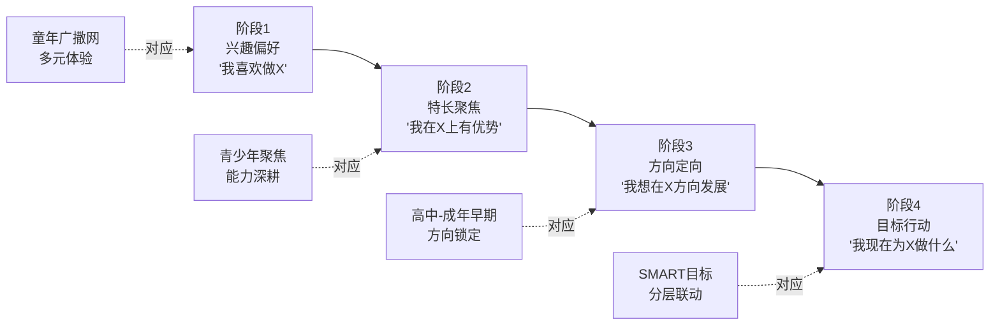

**第一阶段：兴趣偏好**——童年期的多元体验积累，关键是保护愉悦感、不过早功利化。**第二阶段：特长聚焦**——青少年期通过深耕将兴趣转化为相对突出的能力，这一阶段对应第五章5.3节的"实践深耕"。**第三阶段：方向定向**——通过6.2节工具、6.3节三维模型、6.4节四类方法的综合运用，从特长中识别出可能的生涯方向。**第四阶段：目标行动**——把方向转化为可衡量的目标，并落实为日常行动。

每一阶段的过渡都不是断崖式的，而是渐进的、有可能反复的。一个青少年可能在第三阶段后又回到第一阶段重新探索——这并不是"倒退"，而是更成熟的方向选择必经的过程。

### SMART化的分层联动机制

第四阶段"目标行动"的核心工具，正是第四章4.5节系统介绍过的**SMART原则**。在生涯规划语境下，SMART原则需要进一步拓展为**短期目标与长期梦想的分层联动机制**。

具体路径资料给出了清晰范例："帮助来询者学会设定短期和长期目标，并制定相应的计划去实现这些目标。例如，有志于成为医生的学生，可以设定……，并在高中甚至初中阶段就开始准备相关知识和深入体验活动。除了重视化学、生物等的学习基础，初、高中阶段还应深化这些知识，并提前进行手指灵活度训练，为未来的职业生涯做好准备"[^96]。

这一范例展示了一个典型的分层联动结构：

| 时间维度 | 目标层级 | 具体内容（以"成为医生"为例） |
|---------|---------|----------------------|
| 终身梦想 | 使命级目标 | 通过医学帮助他人减轻病痛 |
| 10—15年长期 | 职业级目标 | 进入医学院、完成临床训练、成为某专科医生 |
| 3—5年中期 | 阶段级目标 | 高考成绩达到医学院录取线、相关学科竞赛获奖 |
| 1年短期 | 学期级目标 | 化学、生物达到年级前10%；参加一次医学相关研学营 |
| 1月—1周近期 | 行动级目标 | 本周完成生物章节复习；本月参加一次医院志愿服务 |

这一分层结构的核心价值在于：**它把"成为医生"这一可能让13岁孩子望而却步的宏大愿景，分解为今天、本周、本月可执行的具体行动**——孩子每完成一项行动级目标，都在实质性地接近终身梦想，每一次小成功都成为长期主义的内在动力。

### "热爱为锚、技术为基、长期主义破局"的行动逻辑

回到张雪案例，可以提炼出一条具有普适性的行动逻辑——**"热爱为锚，技术为基，长期主义破局"**[^97]。

**热爱为锚**强调的是行动的方向性——所有的努力都需要锚定一个孩子真正认同的方向，而不是被外部期待或社会标签牵着走。"没有热爱的支撑，再光鲜的职业也只是无源之水；唯有热爱，才能让人在低谷时坚守、在诱惑时笃定、在重复中精进"[^97]。

**技术为基**强调的是行动的实质性——再美好的方向也需要扎实的技能积累作为支撑。张雪"3年时间练就'蒙眼盲装发动机'的绝技"[^97]的细节，揭示了技术深耕的不可替代价值——**没有任何捷径可以替代真实的能力构建过程**。

**长期主义破局**强调的是行动的持久性——真正的方向锁定不是一时的热情，而是5年、10年、20年的持续投入。张雪用"25年时间完成了一场近乎不可能的人生跃迁"[^97]——这一时间维度提示青少年与家长，对生涯发展的预期应当从"几个月"调整为"几年""十几年"，从而获得真正的从容与定力。

### 目标感作为内在心理资源

本节最深层的洞察是：**目标感本身就是抵御功利焦虑、社会比较压力与方向迷茫的内在心理资源**。

回顾6.1节剖析的青少年自我认知危机——身心发育剪刀差、家庭育儿两端极化、社会评价单一化，这些外部压力的共同作用，是让孩子在"我是谁、我要去哪里"的追问前陷入瘫痪。而一个**已经初步建立目标感的孩子**，对外部压力的免疫力会显著提升：

**对功利焦虑的免疫**——当孩子有自己锚定的方向，他便不需要通过追逐"风口行业""热门专业"来缓解焦虑，因为他知道自己在做什么、为什么做。

**对社会比较压力的免疫**——当孩子有自己的内在评价坐标，他便不需要通过"超过同学""赢过他人"来确认自我价值，因为他与自己比较的是过去的自己。

**对方向迷茫的免疫**——当孩子有清晰的目标分层，他便不会陷入"未来会怎样"的虚无感，因为他知道今天该做什么、本周该做什么。

这一洞察具有重要的衔接意义：**目标感不仅是生涯规划的产物，更是心理健康的基础设施**——它把第三章心理健康章节建立的"心理安全感"延展到了未来维度，让孩子既有"当下被爱"的安全感，又有"未来有方向"的笃定感。这两种安全感的叠加，构成了青少年最坚实的内在心理资源。

下一章将进入"目标设定与执行力培养：从迷茫到行动"——本节归纳的从兴趣到目标、从目标到行动的转化逻辑，正是下一章SMART原则落地、执行力培养、抗挫力塑造的方向锚点。**没有方向的执行力是盲目的努力，没有执行力的方向是空洞的梦想**——两者结合，方能构成完整的成长动力系统。

## 6.6 家校社协同的生涯教育实践路径

最后一节回到一个根本问题：自我认知与目标方向的探索，不能只靠青少年个体的自我觉察或某一方主体的努力，必须形成家庭、学校、社会三方协同的支持生态。本节将依次梳理三个层面的实践路径，并以此呼应本报告整体框架，将本章定位为连接前五章身心健康成长基础与下一章自驱力执行力培养的关键枢纽。

### 家庭层面：脚手架式家长的角色与四项关键行动

家庭是自我认知与目标探索的最早土壤。心理学家建议，"父母应该做'**脚手架式家长**'——既不是全权掌控，也不是完全放任，而是提供适度支持，在孩子需要时给予帮助，随着孩子能力增长逐步撤去支持"[^92]。这一比喻精准化解了6.1节揭示的功利化育儿与放任型教育的双向困境——既不是密不透风的"承重墙"，也不是无所支撑的"空地"，而是**根据孩子能力变化动态调整的支持结构**。

脚手架式家长的具体行动可归纳为四项[^92]：

**第一，明确表达合理期待**。"可以说'我们相信你能找到适合自己的道路，需要帮助时我们都在'，而不是'做什么都无所谓'"[^92]——这一对照精确区分了"合理期待"与"放任表态"。合理期待传递的是稳定的信任与支持，放任表态传递的是隐含的疏离与忽视。

**第二，分享失败经历**。"父母应坦诚分享自己求学和工作中的挫折经历，让孩子明白成功不是唯一标准。心理韧性的培养比成就本身更重要"[^92]——这一行动具有双重价值：一方面让孩子看到"成功者"也有挫折，破除完美主义压力；另一方面通过父母的真实经历，让孩子理解长期主义的真实形态。

**第三，培养成长型思维**。"赞扬努力而非天赋，强调学习过程而非结果。让孩子明白能力是可以通过努力提升的"[^92]——这一原则与第七章即将展开的成长型思维议题形成精确接续。

**第四，建立深度情感联结与无压力沟通环境**。"真正的支持不是一句'快乐就好'，而是每天15分钟的高质量陪伴——放下手机，专注倾听孩子的喜怒哀乐"[^92]；"每天固定时间与孩子聊天，不评判、不说教，专注倾听。可以问'今天有什么有趣的事吗？'而非'今天学了什么？'"[^92]——这一行动与第三章3.4节非暴力沟通、3.5节心理安全感建设形成深度同构。

四项行动的整体目标是"**帮助孩子找到热情所在**——当孩子沉浸在自己真正热爱的事物中时，真正的快乐会自然产生"[^92]。

### 学校层面：分学段生涯教育体系与典型实践案例

学校是生涯教育最系统化、最规模化的实施主体。成都市教育局自2020年起系统构建中小学生涯规划教育体系，提供了一个具有参考价值的政策实践样本。

成都市2020年12月印发《成都市中小学生涯规划教育实施方案》，"明确了中小学生涯规划的总体要求、原则、内容、学段任务、实施途径及保障措施"[^98]。其核心特色之一是**分学段差异化设计**——"小学阶段侧重职业生涯启蒙，指导学生发现兴趣特长，了解常见的职业与分工。初中阶段侧重生涯探索，指导学生实践和发展爱好特长，探索职业理想，指导学生了解升学、就业的多样化途径。高中阶段侧重职业生涯规划与行动，普高指导学生做好学业规划及新高考改革实施后的选科选考规划，职高指导学生充分认识专业及就业趋势"[^99]。

下表系统梳理三学段生涯教育的核心定位与课时安排：

| 学段 | 核心定位 | 课时标准 | 主要内容 |
|------|---------|---------|---------|
| 小学 | 职业生涯启蒙 | 不低于每学期4课时 | 发现兴趣特长，了解常见职业与分工 |
| 初中 | 生涯探索 | 不低于每学期6课时 | 实践和发展爱好特长，探索职业理想，了解升学就业多样化途径 |
| 普通高中 | 职业生涯规划与行动 | 三年不少于2学分（其中专门课程不少于1学分），重点在高一、二学段每周1课时 | 学业规划、新高考选科选考规划，参考四川省地方教材《生涯规划与心理健康教育》 |

成都市的实施路径也颇具启发性：**统筹设置课时**——"小学、初中统筹使用综合实践活动、劳动与技术、心理健康教育课时"[^99]；**生涯课程三类型**——"生涯专题课程、生涯始业课程和生涯行走课程三种类型，分别指向生涯规划通识性教育、学科融合教育以及体验性的实践教育"[^99]；**专题课程六模块**——"包含生涯意识唤醒、自我认识探索、职业世界探索、大学专业探索、生涯决策、生涯准备六大模块内容"[^99]。

除政策层面，国内一些重点中学的实践案例也提供了可借鉴模板。**衡水中学的"一二三生涯规划计划"**[^102]——其中"一"是建立一个生涯规划教育指导中心，负责"学校生涯规划教育顶层设计、课程开发和实施以及打造生涯规划教育团队等方面的工作"[^102]；"三"是三类导师，"包括生涯导师(学校专职生涯教育教师)，主要负责生涯课程的研发和开设"[^102]。衡水中学还在战略上"打造一支业务过硬的生涯规划教师队伍"，将"全员培训"与"骨干培养"相结合，"2016年7月，衡水中学花费14万元，对学校57名教师进行职业生涯规划培训"[^102]，并将"学校教师定位为生涯规划教育的重要角色"，"通过对教师的全面动员来提高全校内生涯规划教育的氛围和实践能力"[^102]。

**学军中学的"143生涯教育模式"**[^102]——其特色是"将心理老师的角色提高到了生涯规划教育的重要位置。比如，学军中学的生涯教育课一般由心理教师承担，利用心理老师的学科优势，在课堂主阵地和职业体验中对学生加以积极引导"[^102]；同时"建立学科生涯导师制，学校根据自身优势，充分调动身边一切优质资源，比如优秀教师、资深校友、优质家长等，实行学科生涯导师制，打造'学军真人图书库'，建立校内校外生涯教育实践基地"[^102]。

### 社会层面：多元资源整合与"家校社企"协同新格局

社会层面的支持包括职业体验基地、AI智能生涯探索工具、研学营、行业导师等多元资源。

**职业体验合作联盟**：成都市"统筹安排中小学生到职业学校进行职业体验，拓展实践路径"[^98]，并"依托'成都市职普融通课程'，形成以服务性劳动为主、生产劳动为辅，职业院校为主阵地、社会资源为支持的职业体验课程支撑体系"[^98]。

**AI赋能的生涯探索工具**：2026年4月，华南师大附中（知识城校区）落地由纬英科技象导生涯打造的"**AI智能静音生涯探索舱**"[^103]——"该探索舱以AI科技为支撑，为华附学子搭建科学实用的生涯规划平台，助力学生清晰规划成长路径、明确未来发展方向"[^103]。其设计理念体现了"**过程性陪伴、长期化引导**"[^103]——"不是通过单次测评或一次性咨询为学生'定义终身'，而是借助AI技术，陪伴学生在持续探索中认识自我、逐步明晰人生方向"[^103]。这一理念恰恰回应了6.2节工具使用的核心原则——避免标签化归类，强调过程性视角。

讲座中，华南师大附中科研与教师发展处副主任李之宁老师"引导家长从'教育监工'转变为孩子的'生涯合伙人'，以科学的'导航思维'陪伴孩子完成选科、升学及未来职业发展的全流程规划"[^103]——这一"生涯合伙人"的角色定位与本节脚手架式家长的理念高度一致。彭斌校长在剪彩仪式上强调"生涯教育的核心是助力学生认识自我、规划成长，最终实现有方向、有温度的幸福成长"[^103]，进一步把生涯教育从工具化使用提升到了育人本质的高度。

**家庭教育指导服务体系**：成都市开发《成都市家庭教育指导手册》，举办"家长开学第一课"、首届成渝双城家长节，"建设1050节优质网络教育教育课程(含职业规划课程)，有针对性帮助家长提升职业生涯规划的意识和能力"[^98]；并"打造'熊猫智慧家长'家庭教育指导科普宣传品牌"[^98]。各区也形成自己的特色——"青羊区设立'生涯规划教育指导中心'，研发'637'家庭教育系列课程，发放《青羊家长读本》。武侯区开设'诸葛家长学堂'，依托'三顾云'平台建设网上家长学校，提供生涯规划等课程"[^98]。

**新高考改革配套要求**：与生涯教育呼应的是新高考改革的政策导向。山东省《关于做好2026年普通高校招生工作的通知》明确要求"各市要坚持协同联动，进一步深化高中育人方式改革，构建贯穿高中全过程的指导体系，指导中学严格落实普通高中课程方案，开齐开足国家规定课程，**引导学生结合国家发展需要和自身优势，科学选科选考**"[^104]——这一表述精确对应"择心所向、择己所长、择势所需"的三维模型，把"自身优势"与"国家发展需要"作为选科选考的双重坐标，从政策层面把生涯规划纳入高考选科的核心环节。

### 本章总结：自我认知与目标方向作为关键枢纽

回顾本章六节内容，从成因解析（6.1）、工具应用（6.2）、三维模型（6.3）、四类方法（6.4）、转化逻辑（6.5）到家校社协同（6.6），构成了一个完整的"**问题诊断—工具配置—框架建构—方法落地—行动转化—生态支持**"的自我认知与目标探索体系。

这一体系在本报告整体框架中处于关键枢纽位置：

**对前五章的承接**：本章"择心所向"承接第五章兴趣识别成果——童年期的多元体验、心流时刻、深耕经验，为青少年期的方向锁定提供了原始素材；"择己所长"承接第五章多元智能识别——优势智能的早期发现，为生涯规划提供了能力底色；本章贯穿的"价值感联结"承接第三章心理安全感建设——只有内心稳定的孩子才有可能向外探索方向；本章强调的"自由探索时间"承接第四章时间结构设计——只有保留了自主时间，自我探索才有发生空间；本章奠定的目标感本身，又反过来巩固了第二、三章身心健康的基础——目标感是抵御焦虑、压力、迷茫的内在心理资源。

**对下一章的开启**：本章解决的是"方向"问题，下一章将进一步解决"行动"问题——SMART原则的精细落地、抗挫力的系统培养、成长型思维的深度建构、即时反馈与奖励系统的科学运用，将让本章锁定的方向真正转化为日复一日的可持续行动。**没有方向的执行力是盲目的努力，没有执行力的方向是空洞的梦想——两者结合，方能构成完整的成长动力系统**。

最深的启示或许在于：**自我认知与目标方向的探索，本身就是一个孩子从"被安排的人生"走向"自主选择的人生"的关键转折**。当一个孩子能够说出"我了解自己的优势与局限，我知道自己想要去哪里，我愿意为此付出长期努力"时，他便真正完成了埃里克森理论中"自我同一性"的初步建构——这一建构，是成年人格的真实开始。每一个家庭、每一所学校、每一个社会主体所能贡献的，正是为这一转折提供必要的支持、必要的工具、必要的耐心，让每一个孩子都有机会找到属于自己的"心所向、所长、所需"的甜蜜区。

# 7 目标设定与执行力培养：从迷茫到行动

第六章在结尾处给出了一个深刻而朴素的判断：**没有方向的执行力是盲目的努力，没有执行力的方向是空洞的梦想——两者结合，方能构成完整的成长动力系统**。本章作为五大维度路径设计的最后一个落点，将聚焦后半句——当方向已经初步锁定，如何让方向真正转化为日复一日的可持续行动？这一命题在当代家庭中尤为紧迫：一边是"计划写得满满当当、两天后彻底崩盘"的执行困局，一边是"催促说教—物质激励—边际效应递减"的恶性循环。

要回答这一问题，必须先突破一个根本性的认知误区——**执行力不是性格，而是可以被科学设计与培养的系统能力**。本章将依次回答八个递进性问题：执行力困局的真实根源是什么（7.1）？SMART原则如何在儿童语境下真正落地（7.2）？不同学段的目标规划重点有何差异（7.3）？支撑执行力的内在思维引擎是什么（7.4）？反馈与奖励机制如何科学设计（7.5）？抗挫力如何系统培养、延迟满足应当如何被正确理解（7.6）？规划能力作为元能力如何渐进培养（7.7）？家校社如何协同形成执行力培养的生态（7.8）？这八节将共同搭建"**目标拆解—执行系统—思维内核—反馈激励—抗挫坚持**"五位一体的执行力培养框架，让前六章建立的成长基础真正落地为持续的成长动力。

## 7.1 执行力困局的深层解构：计划满分与执行零分的鸿沟

要理解执行力困局，必须先突破"孩子就是懒"这一最容易脱口而出的归因。一位长期辅导青少年学习的教师分享过一个高度典型的案例：高二男生每次制定学习计划"都极为认真：用彩笔标出'今日目标''复习重点''错题回顾'。可两天后，就彻底崩盘"。当被问及原因时，男生叹气说：**"一开始特别有动力，但写到一半发现太多，根本完不成，就越来越想逃避"**[^105]。这一回答揭示了执行困局的真实底层——不是不想做，而是面对一份"看似清晰、实则失衡"的计划，孩子在自我感动的规划与无从下手的现实之间反复挣扎，最终选择放弃。这种现象有一个准确的名字——"**计划型拖延**"——**"表面在规划，其实在自我安慰"**[^105]。

### 三重失衡：执行系统未建好的真实根源

将"计划型拖延"进一步解构，其本质是**"执行系统"缺乏三个关键环节：目标不清晰→没有动力支撑；任务没拆解→觉得无从下手；缺乏反馈→无法感受进步**[^105]。这三重失衡形成了一个相互强化的负反馈循环——**目标模糊导致"意义感真空"**，**反馈延迟引发"动力耗竭"**，**自我效能感薄弱形成"负面循环"**[^106]。

下表系统展示三重失衡的作用机制与典型表现：

| 失衡维度 | 心理机制 | 典型表现 |
|---------|---------|---------|
| 目标模糊 | 儿童认知发展水平决定"长远目标"感知能力较弱；宏大目标无法与当下学习行为建立直接关联，形成"学习意义感真空"，最终产生"习得性无助"[^106] | "好好学习""考个好大学"——孩子不知道今天该做什么 |
| 反馈延迟 | 学习"投入与产出不同步"的特性与儿童"即时性心理需求"存在天然矛盾；"缺乏即时反馈的行为，其发生频率会逐渐降低"[^106] | 努力一周看不到分数变化，热情迅速消退 |
| 自我效能薄弱 | 多次挫折或长期被否定后形成"我不行"的负面认知；面对挑战首先产生退缩心理，导致"动力缺失—表现不佳—自我否定"的恶性循环[^106] | "反正我数学就是学不好""我不是这块料" |

正如一位心理咨询师所形容的：**"这就像让一个人爬山，却不给地图、不设休息点、不告诉他离山顶多远，他自然中途放弃"**[^105]。这一隐喻精准点出了执行力困局的本质——**孩子缺的不是意志力，而是从"想学"到"能学"之间的可执行系统**。

### 拖延蔓延的现实图景与心理代价

中国青少年研究中心的一项调查触目惊心：**89%的初中生因长期作业拖延出现焦虑症状**[^107]。北京某三甲医院数据显示，因作业压力就诊的10—12岁儿童在2024年同比增长42%[^107]。心理学发现，**当孩子出现"写作业=被控制"的心理认知时，内驱力将下降63%**[^107]——这一数据直接呼应第一章揭示的功利化育儿"自主空间剥夺"路径。

需要特别警示的是，拖延的代价远不止"作业没写完"这么简单。教育专家明确指出，**"磨蹭不是习惯问题，而是家长教育模式的预警信号"**[^107]——当家长把拖延简单归因为"孩子懒""不自律"，便错失了真正干预的窗口。一位ADHD多动症孩子的家长描述过类似处境："写作业吧，小动作就不停，抠手、抠脚、掏耳朵、拿纸巾抠鼻子等；做事情启动慢，说个三五遍他就跟没听见似的，或者嘴上答应了，然而还是待在原地"[^108]——这些行为表面看是"不听话"，深层却可能与孩子的执行功能尚未发育完全有关，需要的不是责骂，而是科学的脚手架。

### 神经科学视角：执行功能比智商更能预测未来

要从根本上理解执行力，必须引入认知神经科学的核心发现——**执行功能(Executive Functions, EFs)** 这一概念。AMI培训师张晶引用《Science》期刊上Adele Diamond教授的综述指出，执行功能是大脑的"管理中枢"，主要包括**工作记忆**（暂时保存并操作信息）、**抑制控制**（抵制冲动、延迟满足、自我调节）、**认知灵活性**（转换视角、适应变化、创造性思维）三大核心能力[^109]。

研究证据显示一个颠覆传统认知的结论：**执行功能比智商更能预测孩子的学业准备和未来成功**[^109]。这一论断绝非夸张——Moffitt团队在《PNAS》上发表的著名纵向研究"追踪了约1000名儿童从出生到32岁的发展轨迹，结果发现：**'童年自控力的梯度差异，预测了成年后的健康、财富与公共安全'**……这种影响是'线性梯度'的——也就是说，不是'好'与'坏'的两极分化，而是每一点微小的改善，都可能带来人生的显著不同"[^109]。Diamond教授甚至明确指出："**即使只是轻微改善个体的自我控制，也可能为整个国家带来健康、财富和犯罪率的显著改善**"[^109]。

执行功能的不足并非孩子的"道德缺陷"。一位儿科医生的临床观察极具洞察力：**"很多时候，这不是我们的错，也不是我们故意这样做，而只是我们大脑的'执行功能'(EF)掉线或罢工了"**[^110]——许多ADHD或其他执行功能受影响的孩子，**"明知道一些行为是不好的或者错误的，但是难以控制地去做让别人感到不舒服的事情，父母和其他人可能也会错误地认为孩子就是不遵守纪律或者故意为之，但很多时候，这些孩子不是故意这样做，他们的抑制功能在这时候'掉线'了"**[^110]。

这一神经科学视角对家长具有根本性启示：**孩子的执行困局，更多是大脑发育尚未成熟与执行系统设计不当的双重结果，而非品格问题**。要改善执行力，需要在两个层面同步发力——一方面通过日常练习促进执行功能发育，另一方面通过科学的目标拆解与反馈机制，搭建外部"脚手架"来弥补内部能力的不足。需要特别提醒的是，**"仅靠EF培训和练习不会达到最佳效果，还需要帮助儿童减轻过度的压力或负面情绪带来的影响，并给予积极的正反馈和正性支持"**[^110]——这一论断与第三章心理安全感建设、本章后续的反馈机制设计形成深度呼应。

由此推导出本章后续路径设计的科学起点：**执行力培养不是"逼迫孩子坚持"，而是设计一套与孩子大脑发育水平相匹配的、循序渐进的支持系统**。

## 7.2 SMART原则的儿童化落地：从宏大理想到微行动单元

针对7.1节揭示的"目标模糊—无从下手"困局，最有效的破解工具是SMART原则。第四章4.5节已系统介绍了SMART原则的五个维度，第六章6.5节已将其延伸为生涯规划的分层联动机制。本节将进一步深入儿童青少年目标管理的具体落地——把SMART从一套抽象框架，转化为孩子真正"能看见、能摸到、能检查"的微行动单元。

### 五维度的儿童化对照改造

SMART原则要在儿童青少年身上发挥作用，关键不在于家长记住"五个英文单词"，而在于把每一个抽象维度都转化为孩子能立刻识别、立刻执行的具体表述。下表系统呈现"模糊目标"到"SMART目标"的对照改造：

| 维度 | 模糊目标 | SMART化目标 |
|------|---------|------------|
| 具体(Specific) | 提高英语成绩 | 每天背20个英语单词，每周做3篇阅读理解[^111] |
| 可衡量(Measurable) | 多做数学题 | 每周解决10道数学应用题，并整理错题本[^111] |
| 可实现(Achievable) | 期末考试全科95分以上 | 在上学期的基础上，每科提高5—10分[^111] |
| 相关性(Relevant) | 初一就定下考清华的目标 | 这学期掌握初一数学几何证明的基本方法[^111] |
| 时限性(Time-bound) | 学好英语口语 | 3月底前能流利朗读英语课本对话[^111] |

资料明确指出："**生活经验告诉我们，符合SMART原则的目标实现起来要容易得多**"[^111]。这一改造不仅是表述的精细化，更是把"抽象焦虑"转化为"具体可执行"的根本性转变——前者让孩子被压垮，后者让孩子知道"今天该做什么"。需要特别说明的是，可衡量性的核心是**"能量化的量化，不能量化的质化"**[^112]——学习能力等不易直接量化的目标，可通过"完成多少篇练习""掌握多少种题型"等行为量化。

### 三级目标体系：从灯塔到行动的金字塔分解

单一的SMART目标还不足以应对复杂的成长任务。一个更完整的工具是**"三级目标体系"**——长期目标、中期目标、短期/行动目标的金字塔分解模型[^106]。

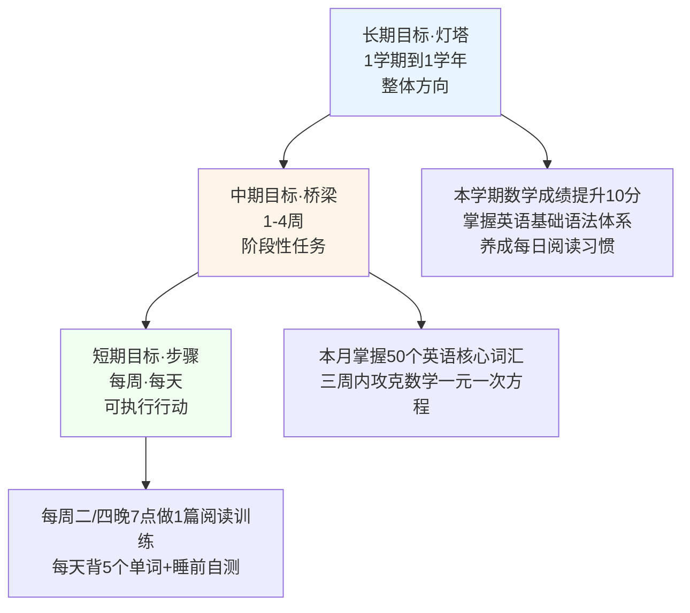

下表系统呈现三级目标的核心定位与儿童化范例：

| 层级 | 周期 | 核心定位 | 儿童化范例 |
|------|------|---------|-----------|
| 长期目标 | 1学期—1学年 | "聚焦孩子的整体发展，由家长与孩子共同制定，使其成为孩子学习路上的'方向灯塔'，避免盲目学习"[^106] | 本学期语文成绩提升到A级 |
| 中期目标 | 1—4周 | "将长期目标分解为阶段性任务，需具备一定的挑战性"[^106] | 掌握阅读理解答题技巧；本月完成10篇记叙文专项训练 |
| 短期/行动目标 | 每周/每天 | 可立即执行的具体行动 | 每周二、四晚7点做1篇阅读训练 |

一份典型的"目标树"分解示范：**"大目标：本学期语文成绩提升到A级 ├ 季度：掌握阅读理解答题技巧（2—5月）│ ├ 月：完成10篇记叙文专项训练（3月）│ └ 周：每周二、四晚7点做1篇训练 └ 季度：作文结构优化（6—9月）"**[^111]——这种树状结构让孩子清晰看见"今天的1篇阅读练习"如何最终通向"本学期的A级目标"。

### 可实现性的阶梯艺术：板凳1分钟到考重点高中

第四章4.5节已经介绍过那位跨越十余年的妈妈鼓励故事，本节聚焦其在"可实现性"维度上的精妙拿捏：**"在板凳上坐1分钟到坐3分钟；从全班倒数第二到超过排名在21位的同桌；从差等生到再加把劲就可以考上重点高中"**[^112]——这一阶梯的核心智慧是：

**"这位妈妈一开始没有要求一直安静的坐在板凳上，而是说可以安静坐在板凳上1分钟，到坐3分钟；没有一开始就要求考第一名，而是从49名到21名，一次次循序渐进，让孩子一步一步努力就可以达到目标"**[^112]——这就是可实现性的真正含义：**目标既不能低到没有挑战感（导致厌倦），也不能高到完全无望（导致放弃），而应处于"踮起脚尖能够到"的临界点**。这一拿捏与第五章5.5节"心流八通道模型"中"挑战适中—技能适中"的最佳区域形成精确同构——**SMART的"A"维度，本质上就是为孩子创造心流体验的条件**。

### 不同年龄段的目标设定案例：从游戏化到逆袭

SMART原则在不同年龄段需要差异化的具体形式。下表整合三个真实案例：

| 学段 | 案例 | 起点 | SMART化设计 | 结果 |
|------|------|------|------------|------|
| 学前班 | 朵朵的识字游戏[^111] | 5岁半，坐不住超过5分钟，对识字卡片没兴趣 | "恐龙识字探险地图"——每天玩15分钟"恐龙识字游戏"，每周集齐7枚贴纸就能周末去动物园 | 3个月后认识120个字 |
| 小学高年级 | 小雨的英语突破[^111] | 五年级，英语不及格，单词常错9个以上 | 配合《原神》游戏设计"英语冒险者手册"——每天完成3个"语音副本"（跟读评分80分以上），每周解锁1个"神秘宝箱" | 学期末英语85分，主动报名英语戏剧社 |
| 初中生 | 轩轩的物理逆袭[^111] | 初二，物理20分，觉得"理科没用" | 带去科技馆VR航天展+《三体》物理素材；每周收集3个"科幻素材"，写小故事用上2个物理知识点 | 兴趣被勾起，开始自主探索物理 |

三个案例展现了SMART在不同发展阶段的灵活变形：学前阶段以**游戏化**激发兴趣，小学高年级以**情境绑定**激活动机，初中阶段以**意义重构**打破偏见。其共同特征是：**家长不是用"你必须学"压迫孩子，而是用孩子已经热爱的事物，作为通往目标的桥梁**。

### OKR目标法的儿童版：让目标看得见

近年兴起的OKR(Objectives and Key Results，目标与关键成果法)为SMART原则提供了一个具有强烈视觉化特征的儿童版工具。其核心是把抽象的学习目标转化为"**能看见、能摸到、能检查**"的具体行动[^113]。

一个典型范例：**"五年级朵朵的OKR计划表，目标栏用蓝色马克笔写着'本月提升语文阅读理解得分'，下面三个关键成果用黄色便签贴成一排：'每天做1篇阅读理解练习（用时不超过20分钟）''每周整理3个阅读答题模板（写在活页本上）''月末模拟考阅读理解得分从65分提到80分'，便签旁边还贴着她自己画的小树苗，每完成一个关键成果的小项，就给树苗画一片叶子"**[^113]。

OKR儿童版的三个核心设计：**第一，目标的视觉化呈现**——白墙上的便签、活页本上的模板、自己画的小树苗，让目标从抽象概念变成视觉锚点；**第二，关键成果的可量化验证**——"做1篇阅读"能通过练习册上的完成痕迹验证，"整理3个模板"能通过活页本字数检查[^113]；**第三，过程性反馈的累积**——每完成一项就给小树苗画一片叶子，"看着方框从空白变成彩色块，视觉上的成就感会推动他继续往下走"[^113]。

### 衔接生涯方向：分层联动的具象化

回到第六章6.5节的分层联动机制，本节可以将其具体化为更加贴近孩子日常的层级表达。以"成为医生"这一终身梦想为例：

```text
终身梦想（使命级）：通过医学帮助他人减轻病痛
   ↓
10—15年长期：进入医学院、完成临床训练、成为某专科医生
   ↓
3—5年中期：高考成绩达到医学院录取线、相关学科竞赛获奖
   ↓
1年短期：化学、生物达到年级前10%；参加一次医学相关研学营
   ↓
1月—1周近期：本周完成生物章节复习；本月参加一次医院志愿服务
   ↓
今天行动：晚上7—8点完成生物第3章习题；睡前回顾错题
```

这一分层结构最深的价值在于：**它把可能让13岁孩子望而却步的宏大愿景，分解为今天、本周、本月可执行的具体行动**——孩子每完成一项行动级目标，都在实质性地接近终身梦想。这与7.1节揭示的"目标模糊导致动力耗竭"困局形成精确对症之策——**把宏大叙事拆解为微行动单元，本身就是抗拒拖延、维持执行力的最有效工具**。

## 7.3 分学段目标规划的差异化重点

SMART原则与三级目标体系提供了通用工具，但不同学段的孩子在认知能力、学习内容、生涯阶段上差异巨大，目标规划的核心定位也需要相应分化。

### 小学阶段：习惯养成与兴趣培育的"陪跑期"

小学阶段最容易被家长低估的真相是：**"被忽视程度最高的、于小学阶段而言，是关于习惯以及兴趣的培育"**[^114]。许多家庭把目光过早投向"提分""刷题"，反而错失了奠定一生学习根基的黄金窗口。

**低中年级（一二年级）的核心定位是"陪跑"**——"在一、二年级的时候，全力狠抓书写速度以及专注力，每日有规定的30分钟用于阅读，这比盲目去刷题要重要十倍"[^114]。这一阶段的家长心态是"陪跑"——"此时期其关键词乃是'陪跑'，即家长需盯紧作业效率以及错题本，以便让孩子内心觉得学习是能够掌控的、是存有成就感的"[^114]。需要特别警示的是关于英语启蒙的常见误区——"在小学毕业以前，搞定自然拼读以及八百个基础词汇，借助碎片时间听读分级绘本，如此能够为初中省下大量靠死记硬背的时间，要记住，**小学规划的关键并非抢跑，而是把跑道铺平整**"[^114]。

**高年级（三至六年级）开始介入思维训练**——"到三年级时开始着手介入思维训练，不过不要强行塞入奥数内容，首先要确保校内的计算不存在失误"[^114]。下表系统梳理小学阶段不同年级的好习惯养成重点[^115]：

| 年级 | 重点习惯 |
|------|---------|
| 一年级 | 书写规范、坐姿正确、按时完成作业 |
| 二年级 | 主动阅读、专注力时长延长、整理学习用品 |
| 三年级 | 思维训练介入、错题整理意识、计算准确性 |
| 四年级 | 学习方法初步形成、独立完成日常任务 |
| 五年级 | 主动预习与复习、建立思维导图意识 |
| 六年级 | 时间管理能力、学科联动思维、迎接初中过渡 |

### 初中阶段：学习方法升级与"预习—听课—复盘"闭环

初中阶段最关键的发展任务是**学习方法的升级换代**。许多家长困惑：为什么孩子小学成绩不错，初一却突然掉队？答案在于：**"初一出现的那种'掉队'状况，其本质在于学习方法未曾得到升级，小学阶段凭借记忆以及听话就能够获取高分，然而到了初中，突然增添了物理、历史这些学科，这便对逻辑以及归纳能力提出了硬性要求"**[^114]。

初中阶段的目标规划应围绕三大核心展开。**第一，构建"预习—听课—复盘"闭环**——"在这个时候就要马上协助孩子构建起'预习—听课—复盘'这样的闭环，而且每到周末还要运用思维导图去梳理各个章节的框架"[^114]。这一闭环具体可分解为五个环节[^115]：

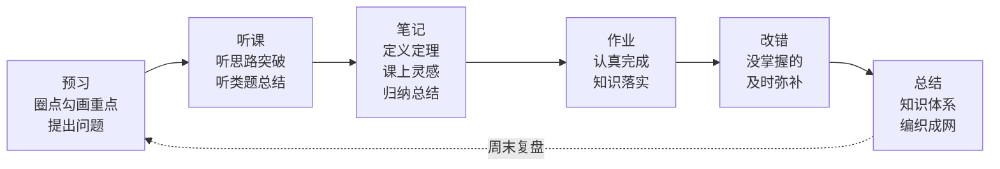

**第二，思维能力的系统培养**。八年级特别强调"会听、会做、会讲、会变"四会：**会听**（听老师讲课的关键点）、**会做**（把会的做成对的）、**会讲**（能把自己会的东西讲解出来）、**会变**（题目形式变化，能发现本质准确解答）[^115]。同时通过"一题多解、多题一解、一题多变"训练思维灵活性[^115]。

**第三，偏科与中期目标的拆解**。"又有一个会带来严重后果的问题是存在偏科现象，当数学成绩一旦下降至70分以下时，就一定要停止所有拓展内容，转身回去弥补计算方面以及基础概念方面的不足"[^114]——这是"抓大放小"原则在初中的初步应用。家长可指导孩子按SMART原则把"提升数学"拆解为：每周掌握3种题型（选择/应用/计算各1种），使用错题本记录、周清错题率<15%，每日20分钟专项训练，紧扣课本单元重点，8周达成目标——**"这种'游戏副本式'目标让儿子主动要求增加练习量"**[^116]。

九年级则进一步强调**自学习惯**的养成——"七、八年级可能每晚督促孩子写作业、阅读、写读书笔记，到了九年级，必须让孩子自觉有意识地做这些事。周末的时候让孩子自己安排学习和生活，根据自己的需求查漏补缺，家长只要做好最后的审查工作就好"[^115]。这一转变与第四章4.4节时间管理"自主阶段（12岁以后）"完全同步——**初三正是从"参与阶段"全面进入"自主阶段"的关键节点**。

### 高中阶段："抓大放小"的学科战略与冲刺期专项突破

高中阶段的目标规划进入更具战略性的层次。"从高一开始的上学期就决定了三年的基调，九门功课是同时开设的，时间根本就不够用，最快的提分策略乃是'抓大放小'，也就是先得确保语数英这三大科不会拉胯"[^114]。

高一、高二阶段的核心策略是**主科稳基础+选科深耕**：

| 学科类别 | 战略重点 |
|---------|---------|
| 语数英主科 | 数学每天坚持雷打不动地进行40分钟专项训练；英语重点攻克阅读理解长难句[^114] |
| 选科物化生/史地政 | 选科确定之后必须做到"课本例题全默写"，这是80%基础分的来源[^114] |

这一阶段还要密切衔接第六章建立的生涯方向。新高考"3+1+2"模式下的选科决策本身就是一次重大的SMART化过程——崇左市高级中学的生涯规划讲座中"详细解读12种选科组合的专业覆盖率、优劣势，清晰梳理物理/历史选科方向对应的专业选择范围，明确公安学类、临床医学等热门专业的选科硬性要求，避免孩子因选科不当错失心仪专业"[^117]。家长可推荐霍兰德职业兴趣测试等工具帮助孩子"找准兴趣、能力与价值观的契合点"[^117]。

**高三冲刺期**则转入精细化突破——"高三处于冲刺阶段时，刷题这种方式比不上刷真题。近五年的高考卷子的每一道题目都得去剖析考点、探究陷阱以及把握解题节奏。还有更厉害的一招名为'讲题法'：要让孩子把做错的题目讲给你听，那些讲不清楚的地方便是知识盲区所在"[^114]。这一阶段的家长角色应当避免"盲目地去报全科辅导班"——"哪一门学科薄弱就着重攻克哪一门学科，将时间投入到提分空间最大的模块上面"[^114]。

### 分学段重点的整体闭环

回顾本节，三大学段的目标规划重点与全报告整体的分龄框架形成了最后闭环：

| 学段 | 第二章身体 | 第四章时间 | 第五章兴趣 | 第七章目标规划 |
|------|----------|-----------|-----------|--------------|
| 小学 | 广撒网塑习惯 | 起步—参与 | 多元体验 | 习惯养成+陪跑+游戏化目标 |
| 初中 | 自主管理强体能 | 参与—自主过渡 | 聚焦深耕 | 学习方法升级+中期目标拆解 |
| 高中 | 自主管理强体能 | 完全自主 | 与生涯方向关联 | 战略选科+冲刺精细化 |

这种全维度的分龄一致性绝非偶然——它反映的是儿童青少年发展的内在规律：**身体、时间、兴趣、目标四个维度都在沿着"指导→参与→自主"的同一节律展开**。家长理解这一节律，便能避免在某个维度上严重错位（如初中已应进入自主阶段却仍按小学方式管控）。

## 7.4 成长型思维：执行力的内在引擎

工具与节律是执行力的"硬件"，但要让执行力真正持续运转，还需要一个内在的"软件引擎"——**思维模式**。卡罗尔·德韦克斯坦福大学40年的研究证明，**思维模式决定了一个人面对挑战时的根本态度，进而决定了执行力能否持续维持**。

### 成长型思维vs固定型思维：能力观的本质分野

德韦克教授毕业于耶鲁大学，获得心理学博士学位，自2004年起在斯坦福大学教授心理学，凭借【成长型思维方式】荣获全球最大的教育单项奖之一"一丹教育研究奖"[^118]。她最先研究和提出了**固定型思维模式(fixed mindset)以及成长型思维模式(growth mindset)**[^118]。

两种思维模式的核心区别在于**个体对能力的认知差异**[^119]：

| 维度 | 固定型思维 | 成长型思维 |
|------|----------|-----------|
| 能力本质观 | 能力是固态的、难以改变的（实体观） | 能力是动态可发展的，通过努力可使能力增长（增长观） |
| 任务情境感知 | 任务是对自身能力的检验，目标是"证明自己" | 任务是提供能力增长的机会，目标是"提升自己" |
| 努力的意义 | 需要努力说明能力不足 | 努力可以提升能力 |
| 失败归因 | 归因为能力不足（"我不够聪明"） | 归因为努力不够或策略不当 |
| 心理弹性 | 弱，面对失败易产生焦虑、抑郁、羞愧 | 强，面对失败能保持积极情绪 |
| 行为模式 | 无助导向：低自我评价、放弃努力 | 掌握导向：寻求挑战、坚持尝试 |

固定型思维的影响远超学业，渗透到人生的每一个领域——在感情中，"固定型思维模式的人会觉得，'最理想的情况是完美永恒的和谐相处。如果需要为其努力，说明它注定不属于你。'所以他们会很快很轻易的放弃感情"[^118]。**当一个孩子内化了"能力天生固定"的认知，他不仅会在学习上回避挑战，也会在友谊、爱情、工作等所有需要持续投入的领域中过早放弃**。

### 经典拼图实验：评价语言塑造选择行为

德韦克最具影响力的实证证据是著名的**拼图实验**[^120][^121][^122]。她和团队将400名五年级学生随机分成A、B两组，进行前后三轮拼图测试：

**第一轮**：所有孩子完成简单拼图，A组得到"你很聪明，刚才拼的非常快"的智商表扬，B组得到"我看到你刚才拼的很认真、很努力，所以你的成绩很出色"的努力表扬[^120]。

**第二轮**：让孩子在两种不同难度的拼图中自由选择。结果令人震惊——**"被夸奖努力的孩子，有80%选择了难度相对较大的任务。而那些被表扬聪明的孩子，则大部分选择了相对简单的任务"**[^120]。被夸聪明的孩子"为了保持聪明的形象，也就尽可能的不要犯错，不然就不聪明了"[^120]。

**第三轮**：所有孩子参加难度较大的相同挑战，可以预想，大部分孩子失败了。但解题细节呈现巨大差异：**"A组孩子，也就是被表扬聪明的那组，他们认为在经过几次尝试后，就放弃了。而B组孩子，也就是被表扬努力的孩子，他们则一直在努力尝试完成任务"**[^120]。

更进一步的二十年追踪调查发现，"那些'努力组'孩子的成就普遍高于'聪明组'——不是因为他们更勤奋，而是因为他们拥有不同的思维操作系统"[^121]。这一研究最深刻的启示是：**评价语言不仅是当下的反馈工具，更是孩子内在思维模式的塑造器**——一句习惯性的"你真聪明"，可能正在悄悄关闭孩子未来面对挑战的勇气。

### 神经科学基础：思维模式物理改变大脑

成长型思维并非心灵鸡汤，它有着扎实的神经科学基础。脑科学研究发现：**"认为'智力可塑'的人，犯错时大脑更活跃；面对挑战时，他们的前额叶皮层（负责规划）和anterior cingulate cortex（错误监测）协同工作；这形成了一个'挑战—错误—学习'的良性循环——简单说：思维模式能物理改变你的大脑连接方式"**[^121]。这一发现把"成长型思维"从哲学层面拉到了生理层面——这与7.1节神经科学执行功能的论述形成深度呼应。

### 成长型思维可被有效培养：本土化干预的实证证据

一个长期困扰教育实践的根本问题是：**成长型思维到底能不能被有效培养？尤其是在东亚文化背景下能否培养？** 这一争议在国际学术界长期存在——"近年来的一些实证研究削弱甚至否定了该干预策略的正向推动作用，且该领域在东亚文化情境中缺乏本土化的干预实验证据"[^123]。

南京大学教育研究院助理研究员张军凤及其团队的一项里程碑式研究为这一争议提供了坚实的中国本土证据。该研究于**2021—2024年在长三角地区的一所农村小学开展为期三年的随机干预实验与追踪调查**[^124][^123]。研究发表于教育学权威刊物《华东师范大学学报（教育科学版）》2025年第4期[^124]。

研究的核心发现可概括为四点[^124][^125][^123]：

**第一，本土化的成长型思维培养方案显著提高了农村学生的成长型思维水平，并具有长期效应**。

**第二，干预对年龄越小或初始思维水平越低的学生效应越大**。这一发现具有重要的教育公平意义——成长型思维干预不是"锦上添花"，而是对处境不利学生的"雪中送炭"。

**第三，课程所带来的成长型思维的提升有效地改善了学生的学习行为**——具体表现为"抑制消极学习动机、弱化能力型归因、提高过程型同伴反馈以及强化努力型归因"[^123]。**这意味着思维模式的改变能直接传导到日常学习行为的改变**——孩子开始把注意力从"我聪明不聪明"转移到"我努力的过程怎么样"。

**第四，成长型思维干预不仅可以本土化，还能产生与西方研究略有不同的作用机制**。香港考试及评核局秘书长魏向东教授团队在中国11所学校48个班级开展的另一项研究发现：**情绪可塑性（implicit theories of emotion）而非智力可塑性，更可能在成长型思维干预对内在动机和数学成就的影响中发挥作用**[^126]。这一发现提示中国家长——**在本土文化中谈论成长型思维，强调"情绪也可以学习与调节"可能比单纯强调"智力可塑"更有效**。

研究的政策启示明确指出：**"学校、家庭和社会应当通力合作，共创成长型教育文化环境，强化成长型育人理念，尽早且持续地对处境不利学生进行成长型思维的培养，通过心理资本培育实现学业差距弥合与教育公平推进"**[^123]。

### 17个家庭场景的成长型思维话术库

理论与实证证据要真正落地，必须转化为家庭日常对话中的具体话术。基于美国学校广泛使用的17张成长型思维海报[^127]，下表整理出最常见的四类家庭场景话术对照：

| 场景 | 固定型思维表达 | 成长型思维表达 |
|------|--------------|--------------|
| 这件事有难度 | 我不擅长做这件事 | 如果我不尝试，我会错过什么呢？ |
| 这件事有难度 | 这太难了！ | 我可以做到的，只是要多花一些时间 |
| 看到他人成功 | 我的朋友可以做这件事，我就不做啦 | 我的朋友可以做这件事，我要看看他是怎么做的，跟他学习学习 |
| 我犯错误了 | 唉，我犯错了！ | 没关系，每一次失误都让我得到成长 |
| 我犯错误了 | 我总是这个样子，不可能变得聪明了 | 我相信我可以学会怎么去解决这个问题！ |
| 尝试了但失败 | 我就是做不到！ | 太好了，我要开动我的大脑啦 |
| 尝试了但失败 | 我的方法行不通！ | 方案A行不通，那试试方案B吧 |
| 尝试了但失败 | 我放弃了！ | 这个方法行不通，那我再尝试另一种方法吧 |
| 已完成尝试 | 我觉得这样足够好了 | 我还能做得更好吗？ |
| 已完成尝试 | 我尽力了，只能做成这样了 | 下一次，我肯定能做得更好！ |

需要特别提醒的是，**"成长型思维并非盲目自信，有策略的努力才值得称道"**[^127]——成长型思维不是简单的"加油打气"，而是对**"努力+方法+反思"**的综合肯定。一个具体技巧是："**当孩子说'我做不来'时，用'试着去做'，鼓励孩子寻找解决问题的新办法**"[^127]。

更深的洞察来自一句被广为引用的成长型思维口号——**"乘电梯快速到达目的地不能称之为'成功'，必须踏着阶梯一步一步往上走，才有意义。现在不知道怎么做没关系，但是如果不敢尝试，就已经失败了"**[^127]。这句话精准点出了成长型思维与功利化育儿的根本对立——**功利化育儿追求"最快到达终点"，成长型思维珍视"一步一步走过的每一阶"**。

The power of yet——"还未发生的力量"，是德韦克对成长型思维最具诗意的表达："因为还未发生，因为只是暂时的，所以一切皆有可能"[^118]。当家长把"我做不到"扩展为"我**还**做不到"，仅仅一个字的差别，便为孩子打开了无限的成长可能性。

## 7.5 即时反馈与奖励机制的科学应用

成长型思维提供了执行力的内在引擎，但仅有内在引擎还不够——执行力的持续运转需要外部的"反馈—激励系统"形成闭环。本节聚焦三个关键问题：游戏化反馈如何让进步可见？即时反馈的神经科学机制是什么？物质奖励为何会反噬内在动机？

### 游戏化反馈：让抽象进步变成可见成就

7.1节揭示的"反馈延迟引发动力耗竭"困局，在游戏化反馈机制中得到了精彩破解。游戏化反馈的核心是**把抽象的进步转化为视觉化、可累积、有惊喜的成就系统**。下表整合多类典型的游戏化反馈工具：

| 工具类型 | 具体设计 | 实施效果 |
|---------|---------|---------|
| 错题银行 | 用彩色贴纸标记并整理错题，存满10枚贴纸可兑换"游戏时间券"[^107] | 把"错题"从负担转为资产 |
| 积分兑换墙 | 提前完成作业的时间可兑换"免做家务券""睡前故事加时卡"[^107] | 自由支配时间作为奖励 |
| 段位晋级表 | 连续3天准时完成作业升"青铜"段位，7天无拖延解锁"黄金"段位[^107] | 持续性激励的可视化阶梯 |
| 怪兽关卡命名法 | 把数学应用题、英语单词、语文背诵画成三座"作业城堡"，每完成一项打败一只怪兽贴一颗成功闯关贴纸[^107] | 任务的游戏化重构 |
| 诗词大陆探险 | 每日默写=收集"文字碎片"；周记=解锁"故事秘境"；单元测试=挑战"BOSS关卡"[^116] | 学科任务的整体游戏化设计 |
| 成长树叶子 | 完成一个OKR关键成果的小项就给小树苗画一片叶子[^113] | 长期成长的视觉化累积 |

某重点小学采用"诗词大陆探险"机制三个月后，"实验组作业完成率从62%提升至89%，83%的学生表示'像打游戏一样想通关'"[^116]。深圳某重点中学的跟踪研究中，将书桌面朝白墙、移除所有干扰物的实验组学习专注度提升47%[^116]。

游戏化反馈的本质不是"用游戏哄孩子学习"，而是**借助孩子已经熟悉的认知模式（成就感、晋级感、收集感、竞争感），把分散的努力转化为可感知的进步**。这一机制对7.1节"自我效能感薄弱"困局具有直接对症作用。

### 即时反馈的神经科学机制：0.5秒决定突触连接

游戏化反馈为何如此有效？答案藏在脑科学研究中。北京师范大学的脑科学实验证明：**"正确行为后0.5秒内的反馈，能强化神经突触连接"**[^116]。这一发现具有根本性意义——**反馈的"时机"比反馈的"内容"更重要**。一句迟到一周的表扬，远不如一句及时的"对了，就是这样！"具有神经塑造价值。

心理学研究进一步表明：**"及时反馈通过强化正确行为模式、促进认知校准，可提升40%—60%的学习效能"**[^107]。具体到家庭日常，"三色笔纠错法"是一个简单而有效的即时反馈工具：**"黑色笔记录、红色笔改错、蓝色笔总结规律。这种视觉反馈让学习效果提升31%，孩子称'看着红色错误越来越少很有成就感'"**[^116]。

### 短期激励的两种模式：任务奖励与积累奖励

针对ADHD多动症等执行功能较弱的孩子，"打破拖延的恶性循环"特别需要"通过短期奖励机制为孩子提供即时满足感，激活'多巴胺系统'"[^128]。具体可设计两种激励模式：

**任务奖励模式**："如果他能够按时坐下来开始写作业，或者专注写5分钟不走神，就可以获得一个小奖励。这个奖励不一定局限于实物奖励，也可以是一次口头上的积极肯定，例如说：'你刚刚能立刻开始，真的很棒，做事速度又加快了！'或者：'哇，刚才专注了整整5分钟，太厉害了！'"[^128]

**积累奖励模式**：鼓励连续完成形成"成就感"叠加。比如"连续5次按时完成作业，就能兑换一次更大激励，比如周末去游乐园、买一个喜欢的玩具、吃一次喜欢的餐厅、安排一次短途旅行，或自由支配时间1小时"[^128]。

资料给出的关键提示是：**"奖励不是'家长说了算'，而是家长和孩子共同商定的激励协议。当孩子参与制定奖励内容和规则，会更有执行意愿、责任感和成就感"**[^128]。

### 警钟：德西效应与物质奖励对内在动机的侵蚀

然而，奖励机制并非"越多越好"——这正是本节最重要的警示。**心理学史上最颠覆认知的实验之一——"过度辩护效应"证明：奖励，有时比惩罚更可怕**[^129]。

1971年，心理学家爱德华·德西做了一个看似简单的实验：让两组大学生玩解谜游戏，A组每解一题得1美元（在1970年代很值钱），B组纯粹出于兴趣。第二天，研究者"意外"离开房间，偷偷观察谁还会继续玩。**结果震惊学界：拿钱的学生立刻放弃，而没拿钱的人反而玩得更投入**[^129]。这就是著名的"**德西效应**"——又称"过度理由效应"或"过度合理化效应"——指的是**当一个人对某项活动原本就抱有内在兴趣时，提供外部物质奖励反而会降低他参与这项活动的积极性**[^130][^131]。

其作用机制在于：**当外部奖励（如金钱、夸奖）强行介入原本发自内心的兴趣时，大脑会重新解释动机："我原来是为了钱/表扬才做这个！"一旦奖励消失，行为也随之消失**[^129]。德西通过三阶段实验验证该效应——**奖励组在无报酬阶段解题兴趣下降，而无奖励组持续保持热情**[^131]。

一个真实而沉痛的中国案例：北京海淀区张女士的儿子小宇从小爱数学，常主动钻研难题。初二时，张女士为"激励"他冲竞赛一等奖，承诺："得奖就给你5000元买游戏机！"小宇果然获奖，但从此变了：**"拿到奖金后，他再不愿碰奥数题：'反正比完赛了，还做这个干嘛？'甚至对数学课也敷衍了事：'我妈又没给钱，认真听有啥用？'原本的'我喜欢数学'被扭曲为'我为钱学数学'，内在动机被外部奖励彻底替代"**[^129]。最新研究指出，**频繁用物质奖励孩子的家庭，孩子成年后抑郁风险增加23%**[^129]。

### 言语肯定vs物质奖励：差异化的内在动机效应

并非所有奖励都同等危险。2024年的一项验证研究将喜欢画画的孩子分为四组：**金钱奖励组（画画后奖励20美分）、荣誉奖励组（画画后奖励一个"优秀画手"奖章）、言语肯定组（绘画过程中给予"这张画真的很好""你很擅长这个"等鼓励）以及对照组（自由画画）**[^131]。

后续观察结果意味深长：**"接受过金钱奖励的孩子，后续自发画画的动力明显下降；而接受过言语肯定的孩子，画画频率显著高于其他组（包括对照组）"**[^131]。研究表明：**"金钱和荣誉性奖励都会降低内在动机，而积极的言语强化则会增加内在动机。金钱奖励对内在动机的侵蚀作用可能比荣誉奖励更显著，因为金钱是对行为的直接和明确的要求，而荣誉奖励则具有更圆滑的性质"**[^131]。

这一发现具有根本性的实践指导价值：

| 奖励类型 | 对内在动机的影响 | 使用建议 |
|---------|----------------|---------|
| 金钱奖励 | **显著削弱**（动机被解读为"为钱而做"） | 避免使用，尤其在孩子已有内在兴趣的领域 |
| 荣誉性物质奖励 | **削弱**（虽不如金钱明显） | 谨慎使用，频率不宜过高 |
| 描述性言语肯定 | **增强**（强化对过程的认可） | 大力推荐，是日常激励首选 |
| 自由支配时间 | 中性偏正向 | 推荐使用，不直接绑定具体行为 |

### 科学激励四原则

整合德西效应的警示与正向激励的研究证据，可提炼出科学激励的四条核心原则：

**第一，描述性夸奖替代物质奖励**[^129]。错误示范："考100分就带你去迪士尼！"正确示范："你解题时的专注让我想起科学家！"——前者把动机锚定在外部奖励，后者把动机锚定在过程品质。

**第二，制造"自主选择"幻觉**[^129]。错误示范："你必须每天练琴1小时！"正确示范："你想先练《致爱丽丝》还是《卡农》？"——心理学研究发现，**自主选择权能激活孩子大脑的前额叶皮质，使决策效率提升35%**[^107]。

**第三，警惕"奖励通胀"**[^129]。"一旦开始用钱激励学习，未来可能不得不不断提高价码——最终破产也填不满欲望"[^129]。

**第四，区分内在动机活动与无内在动机活动**[^130]。德西效应的关键前提是"个体对某项活动原本就抱有内在兴趣"——**对孩子已经热爱的活动（画画、阅读、奥数等），物质奖励反而是毒药**。

最深刻的隐喻或许来自一段诗意的表达：**"真正的热爱，从来不需要理由；就像森林不需要贿赂阳光，花朵不需要收买春天"**[^129]。家长在设计奖励机制时，最应当时刻自问的是：**我的奖励，是在为孩子的内在动力添柴，还是在悄悄抽走它的氧气？**

## 7.6 抗挫力培养：金斯伯格7C模型与延迟满足的修正解读

无论目标多么科学、思维多么积极、反馈多么及时，孩子在执行过程中必然会遭遇挫折——考试失利、比赛失败、被同伴拒绝、努力不见效。**孩子能否在挫折中爬起来、继续前行，决定了执行力能否真正变成长期的成长动力**。本节系统阐述抗挫力培养的整体框架，并对广为流传却常被误读的"棉花糖实验"进行严谨修正。

### 抗挫力的本质：从挫折中复原的能力与品质

要培养抗挫力，必须先准确理解它是什么。美国宾夕法尼亚大学经过30多年的研究发现：**"决定一个人成败与否的关键在于抗挫力——在挫折中恢复和振作的能力"**[^132]。

抗挫力**"通常被定义为：一种从挫折中恢复和振作的能力，抗挫力也是一种心态"**[^133]。其核心特征包括："有抗挫力的人把挑战当作机遇。他们不纠结于问题本身，明白这些问题会让自己更坚强。他们没有自我怀疑、忧心忡忡或者抱怨连天，相反，他们在思考解决问题的办法"[^133]。

需要破除的两个常见误解：**第一，抗挫力不是均衡的**——"一个人在生活中某一方面可能有极高的抗挫力，在其他方面却需要别人的帮助"[^133]。**第二，抗挫力也不是"完美主义者"的特点**——"因为这些人害怕犯错，他们表现很好却不敢冒险去尽力做到最好"[^133]。更深的理解来自《抗挫力》一书的提问：**"如果我们能用魔术棒施魔法让痛苦远离孩子，那培养出的孩子岂不是个个冷漠无情？"**[^133]——抗挫力的培养必然要求孩子经历适度的挫折体验，"通过亲身实践获得的掌控感，比一百句'你真棒'更有力量"[^134]。

### 7C抗挫力模型：金斯伯格博士的系统化框架

美国儿科学会的金斯伯格博士基于30多年儿科临床与研究经验，提出了培养抗挫力的**7C要素**——能力(Competence)、信心(Confidence)、联系(Connection)、品行(Character)、贡献(Contribution)、应对(Coping)、掌控(Control)，专门"指导家长发现并塑造2~18岁孩子的抗挫力"[^132]。

下表系统呈现7C模型的核心内涵与家庭实践要点：

| 要素 | 核心定义 | 家庭实践要点 |
|------|---------|------------|
| 能力(Competence) | "知道如何有效处理不同状况的才能"——是7C要素之首，是形成抗挫力的基石[^132] | 不是模糊的"我可以做到"，而是从"建沙堡再建一次"等真实经历中获得 |
| 信心(Confidence) | "对个人能力很坚定的信仰"——归根结底来自人的能力[^132] | 在帮助孩子寻找到身上的核心竞争力并加以培养的过程中，让孩子积累自信 |
| 联系(Connection) | "孩子和家庭、朋友、学校以及一些团体联系紧密会让他们有牢固的安全感"[^132] | "低产出"时间增进亲子关系——不仅了解表现，还要理解感受 |
| 品行(Character) | "品行好的孩子拥有强烈的自我价值感，也更自信"[^132] | 坚持自己的价值观，关心他人 |
| 贡献(Contribution) | "当哪天孩子意识到这个世界，可以因为他的存在而更加美好，这堂课意义非凡"[^132] | 参与家务事是培养贡献感的最容易切入点 |
| 应对(Coping) | 学会有效应对压力和挑战的策略 | 在适度挑战中练习应对技巧 |
| 掌控(Control) | 对自己生活、选择、命运的掌控感 | 提供合理的自主选择权 |

下面对四个最具实践价值的要素展开详细说明：

**能力**作为7C之首具有特殊地位——"孩子学会在沙滩上建一座沙堡，这是一种能力；海浪冲走沙堡之后他能再建一次，这是一种坚韧"[^132]。这一比喻揭示了能力培养的真实路径——**不是在"零失败"环境中训练，而是在"反复重建"的过程中积累**。

**信心**的关键洞察是："**每次我们努力帮助孩子解决问题，其实是在削弱他们的成就感。这样的'帮助'，其实削弱孩子的自信**"[^132]——这一警示直接指向许多中国家庭"事事代劳"的育儿模式。同时，金斯伯格博士对"成功"的重新定义具有深刻意义——它包括**"幸福（找到所做事情的意义）、抗挫力、慷慨、同情心、奉献精神、建立并保持有意义的人际关系能力、努力工作、提出建设性意见的能力、改革创新精神"**[^132]——这一多元定义将"成功"从分数与名校解放出来，让每个孩子都有机会在多个维度上"成功"。

**联系**强调"独立与相互依赖并不矛盾"——"抗挫强的孩子非常自主，独立，但他们与其他人也互相依赖"[^132]。其中最具操作性的工具是"**'低产出'时间增进亲子关系**"——区别于"高产出"的"问成绩、问分数、问结果"，"低产出"是"不仅了解孩子们的表现，还要理解他们的感受；不仅知道分数，还要明白孩子们的烦恼"[^132]——一个简单的实践是"每天对孩子道晚安，或者让他在睡前对你说晚安"[^132]。

**贡献**则颠覆了把孩子视为"被服务对象"的传统观念——"个人可以有所为，会激励孩子做事更有目标。参与家务事，也是一种贡献"[^132]——**孩子是在"为他人创造价值"的体验中获得自我价值感的，而不是被反复夸赞获得的**。

### 考艾岛40年研究：一个无条件接纳的人就是关键

如果7C模型回答了"培养什么"，考艾岛研究则回答了"最关键的是什么"。这是一项震撼性的纵向研究——美国夏威夷考艾岛上一群"风险儿童"（父母教育程度低、工作压抑、收入低、健康问题、酗酒、暴力、离婚等），社会学家维尔纳对其进行了**长达四十年的跟踪**[^135]。

结局令人惊讶："**他们中有三分之一过着成功的生活，许多人甚至比岛上非贫困家庭的孩子还要有出息**"[^135]。这群海岛孩子之所以能成功，是因为有着不同一般的"抗逆力"——美国芝加哥家庭健康中心联合创始人Fromea Walsh博士定义为**"从逆境中复原，并变得更加强大和善于利用资源的能力"**[^135]。

考艾岛研究最关键的发现，是抗逆力的核心要素只有一条：**"在生命中至少有一个人能无条件地接纳他们，不管他们是否发脾气，以及在外表或智力方面是否具有吸引力。他们需要知道有一个人可以依靠，需要一个人激发和增强他们的努力、能力和自我价值感"**[^135]。

这一发现至少有三层启示：**第一，孩子成长并非完全由母亲，或者父母来塑造**——叔叔、阿姨、姥姥、姥爷或其他亲人，"只要是支持性的人际关系，在孩子每个年龄段都起着非常重要的角色作用"[^135]。**第二，早期生活经历不能对孩子"盖棺定论"**——"人，在一生任何时段都可以发展出抗逆力。突发事件、新的人际关系都可以打断负面锁链，并激发新的成长"[^135]。**第三，家庭负面事件的影响并没有想象中深远**——"更重要的，是成为那个无条件接纳、支持孩子的人，或者帮助孩子链接到这样一位师长"[^135]。

这一研究对当前广为流传的"原生家庭决定论"提供了强有力的修正——**真正决定孩子命运的，是他们身边是否存在至少一个无条件接纳他们的成年人**。这一启示与第三章3.5节"心理安全感建设"中"接纳孩子最真实的一面"形成完整闭环。

### 棉花糖实验的修正解读：破除简单化迷思

在所有抗挫力相关的心理学概念中，**"延迟满足"**或许是被误读最深的一个。许多家长把"棉花糖实验"奉为育儿圣经，对孩子展开各种忍耐训练，相信"延迟满足能力强=未来成功"。然而，这一流行认知与心理学的最新证据存在严重落差。

**经典实验回顾**：1966—1970年代早期，美国斯坦福大学心理学家沃尔特·米歇尔在斯坦福大学幼儿园（宾幼儿园）开展了著名的"棉花糖实验"——让4—6岁儿童单独在房间里，桌上放一颗棉花糖，告知如果等待15—20分钟不吃就能得到双倍奖励。**约1/3的孩子成功延迟满足，多数孩子在平均不到3分钟内放弃**[^136][^137]。后续追踪研究发现，"在幼年时能够等待更长时间的孩子，在青少年时期和成年后，往往在学业成绩（如SAT分数更高）、社交能力、健康管理（如体质指数更低）等方面表现更佳"[^137][^138]。

**误读图景**：实验结果"似乎证明了孩子从小形成的自控力能影响他将来的成败，于是'要让孩子学会延迟满足'这种教育理念应运而生，立刻风靡全球。不少教育机构宣称要尽早训练孩子延迟满足的能力，而一些父母会刻意营造不及时满足孩子的情景，让孩子学会等待"[^139]。

**严谨的修正解读**——后续多项研究对"棉花糖实验"提供了重要的修正性证据：

**第一，2018年罗彻斯特大学—纽约大学的优化版重做研究**[^137][^140][^139]。"该研究样本量超过900名儿童，且在种族、民族和父母教育程度等方面更具人口代表性。当控制了家庭收入、母亲教育水平和家庭环境等因素后，**延迟满足能力与孩子之后的学业成绩、行为发展之间的关联性显著减弱甚至不再显著**"[^137]。后续研究强调："孩子是否愿意等待很大程度上受其家庭社会经济背景和成长环境影响，而不仅仅是个人意志力"[^137]。

**第二，2012年罗彻斯特大学环境可信度实验**[^137]。"通过改良实验验证了环境可信度的关键影响。在'棉花糖实验'前增加'可信/不可信成人'预热环节，由'可信成人'主导的孩子后续平均等待时间可达12分钟，而由'不可信成人'主导的孩子平均仅等待3分钟"——**这一实验颠覆性地证明：所谓"延迟满足能力"，很大程度上不是孩子的天赋，而是孩子对环境是否可信的判断**。

**第三，2022年跨文化研究**[^137]。"对比了美国与日本儿童在等待棉花糖和礼物时的差异。**日本儿童可等待棉花糖约15分钟，但等待礼物时不足5分钟；美国儿童对棉花糖平均等待时间不足4分钟，却能等待礼物约15分钟**"——这种差异被认为与不同文化下的日常礼仪和习惯有关。

**第四，米歇尔本人的反对**[^139]。"米歇尔本人对媒体的过分解读也很不满，他认为不能如此简单地推论试验结果，有很多其它因素会影响孩子的等待时间"。米歇尔强调，**棉花糖实验是一种解码自控力的研究方法，而非预测个体未来的测试**[^136]——"米歇尔认为自控力根植于大脑的冷静认知系统，是一项可以通过认知策略习得和加强的技能"[^136]。

### 正确理解延迟满足：可习得的认知策略而非天赋测试

经过修正解读，延迟满足的真实含义可被准确表达为：

**第一，延迟满足不是天赋，而是可习得的认知策略**。米歇尔本人强调延迟满足"根植于大脑的冷静认知系统，是一项可以通过认知策略习得和加强的技能"[^136]。具体策略包括"注意力转移"（捂眼、唱歌、踢桌子等）[^136][^137]、"将棉花糖想象成云朵"的"冷却现在，加热未来"原则[^136]、"如果—就"计划[^136]等。

**第二，延迟满足受环境可信度的根本性影响**——**家长长期不守承诺的家庭，孩子的"延迟满足能力"必然较弱，这不是性格问题而是合理的策略选择**。"孩子延迟满足能力的高低很大程度上取决于家长日常是否信守承诺，为孩子创造一个稳定、可信赖的环境"[^137]。

**第三，延迟满足训练绝不等于"压抑需求"**。资料明确警示："心理学家指出，**如果孩子过早被要求忍耐超出能力范围的欲望，可能导致反效果。他们可能因此变得更加焦虑，甚至对未来的挑战失去信心**。因此，父母需要做的是创造一个适合的'成长温室'"[^141]。

**第四，延迟满足应在合理范围内逐步培养**。一个具体的实践范例：**"孩子想要一件玩具，可以与他约定条件：当完成一周的家务后，便能获得奖励。通过这种方式，孩子既能感受到努力的意义，又不会被完全剥夺当下的满足感"**[^141]。

**第五，家长自身的延迟满足能力是孩子最重要的范本**。"如果父母总是无法抵挡即时满足的诱惑，比如沉迷于手机、冲动购物等，孩子自然也会模仿类似行为。反之，当孩子看到父母在生活中愿意为更重要的目标而延迟满足，比如存钱、坚持运动等，他们会潜移默化地学会这些品质"[^141]。

### 家庭抗挫力培养"三不"原则与四步法

整合上述理论与实证证据，可提炼出家庭抗挫力培养的具体操作框架。

**"三不"原则——把握"干预尺度"**[^134]：

**第一，不包办代替**：如孩子自己能整理书包时，就不必代劳。
**第二，不急于安慰**：允许孩子短暂哭闹，情绪平复后再一起分析问题。
**第三，不回避失败**：用"这次没做好，我们看看哪里能改进"代替"没关系，你已经很棒了"。

这"三不"看似消极，实则是给孩子留出**真实经历挫折与自主复原的成长空间**。

**抗挫力构建"四步法"**[^134]：

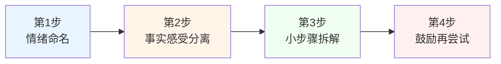

**第一步·情绪命名**：当挫折发生时，"压抑情绪会削弱心理韧性，允许孩子情绪表达和流动，引导孩子说出'我现在很生气''我感到失望'，将模糊的情绪转化为具体语言，**这一步能激活大脑的语言中枢，降低杏仁核的过度兴奋**，同时帮助孩子建立情绪觉察能力"[^134]。

**第二步·区分事实与感受**："比如考试失利，事实是'成绩低于预期'，感受是'觉得自己没用'，帮助剥离情绪化认知，回归理性视角"[^134]。这一步直接对应7.4节成长型思维——把"我能力不足"的固定型归因转化为"这次结果未达预期"的成长型归因。

**第三步·小步骤拆解**：心理学中的"最近发展区"理论指出，当挑战难度略高于现有能力时，最能促进心理成长。"将'克服挫折'分解"为可操作的小步骤[^134]——这与7.2节SMART原则的金字塔分解机制完全同构。

**第四步·鼓励再尝试**：引导孩子用新方法重新尝试，而不是放弃。这一步可借助7.4节的成长型思维话术——"方案A行不通，那试试方案B吧"[^127]。

需要补充的是，金斯伯格在小明英语演讲获三等奖案例中展示的关键路径[^142]：父母**静心倾听**（情感支持）→**肯定努力**（让孩子知道付出值得肯定）→**共同分析**（鼓励思考改进方法）→**支持鼓励**（让孩子明白失败是成长的一部分）。这一完整路径，正是抗挫力四步法在具体场景中的真实展开。

回到本节最深的洞察：**真正的抗挫力不是避免跌倒的能力，而是跌倒后能识别资源、调整姿态、再次奔跑的终身成长力**[^134]。这与7.4节成长型思维的"还未发生的力量"形成精确互补——**思维内核相信"我可以变得更好"，抗挫力支撑"我能够再次站起来"，两者共同构成执行力在长期主义中持续运转的内在保障**。

## 7.7 规划能力的渐进培养：从依赖到自主的执行系统

前六节分别讨论了执行困局的根源、目标拆解工具、分学段重点、思维内核、反馈激励、抗挫力培养。本节将这些要素整合为一个连贯的命题：**规划能力本身作为元能力，应当如何被渐进培养？** 答案不是"等孩子长大自然就会了"，而是通过精心设计的外部脚手架，让孩子在日常实践中逐步内化为自我管理的能力。

### 四大基础工具：构建执行力的物理与心理环境

让我们从最基础的环境设计开始。当代孩子面临的首要执行挑战之一，是注意力被电子产品、多任务、多干扰严重切割。在这一背景下，**环境设计本身就是规划能力的第一道脚手架**。

**第一类工具：环境隔离术——打造沉浸式"作业堡垒"**[^107]：

```text
第一步·物理清场：
书桌上仅保留台灯、作业本、计时器，减少分心的几率

第二步·视觉管理：
用透明文件盒分类收纳教辅资料，分别贴上卡通标签
比如"数学魔法屋""语文冒险岛"

第三步·听觉屏障：
播放轻音乐或白噪音，降低环境干扰
```

某小学实验班尝试这套"环境隔离术"后，仅仅实施3周，孩子们的作业完成效率就提升了42%[^107]。更进一步的"三无学习角"设计——**无零食（设置2米外零食区）、无电子产品（手机调至勿扰模式放入收纳盒）、无杂物（仅保留当前学习资料）**[^116]——其底层逻辑同样是降低执行所需的"意志力消耗"。

**第二类工具：任务拆解游戏——把"作业山"变成"闯关地图"**[^107]。这一工具综合应用了7.2节的SMART原则与7.5节的游戏化反馈：黄金公式是"**怪兽关卡命名法+进度可视化贴纸**"——**让孩子学会把任务分解为有意义的"关卡序列"，本身就是规划能力的重要训练**。

**第三类工具：心理操控术——用"选择权"瓦解拖延意志**[^107]。心理学研究发现：**自主选择权能激活孩子大脑的前额叶皮质，使决策效率提升35%**[^107]。具体的"高段位话术"对照：

| 错误示范 | 高段位话术 |
|---------|-----------|
| "赶紧写完作业！" | "你是想先写数学应用题，还是先背英语单词？" |
| "你还不开始！" | "今天用番茄钟，还是沙漏计时？" |
| "不许玩手机！" | "你想先完成作业再玩，还是先玩30分钟再开始？" |

这一工具的精妙之处在于：**它没有取消"必须做某事"的边界，但在执行细节上让孩子获得真实的选择权**。

**第四类工具：时间锚点效应——10分钟启动法**[^116]。"杭州李女士创造的'10分钟启动法'值得借鉴：**每天固定19:00—19:10为'作业预备时间'，孩子只需整理书桌、列出任务清单即可**。这个仪式如同游戏加载界面，让大脑进入准备状态。实施两周后，孩子主动学习时长从日均38分钟增至92分钟"[^116]。

10分钟启动法的关键洞察是：**"启动"本身比"持续"更难——而启动的仪式化能够把"难启动"转化为"自动启动"**。

### 抑制控制的日常游戏化训练

除了上述四类工具，还有一类被广泛低估却价值巨大的训练方式——**通过日常游戏锻炼大脑的执行功能本身**。其中最具代表性的是抑制控制训练。

**抑制控制(Inhibitory Control)**是执行功能的重要组成部分——"它指的是孩子能否控制冲动行为，抑制不合适的反应，专注于当前任务——抵制诱惑，在说话或行动之前思考，并抑制冲动"[^110]。良好的抑制控制能力可以帮助孩子"在课堂上专注听讲，而不是随意插话或走神；在游戏中遵守规则，而不是抢先行动或作弊；在遇到挫折时控制情绪，而不是大哭大闹或发脾气"[^110]。

经典的抑制控制训练游戏"红灯绿灯"（适合3—10岁）[^110]：

```text
怎么玩：
让孩子站在起点，家长在终点。
家长喊"绿灯"，孩子可以往前跑；
家长喊"红灯"，孩子必须立即停下。
如果孩子在"红灯"状态下移动了，就要回到起点重新开始。

目标：练习等待、控制冲动行动
```

这类游戏看似简单，却是在直接训练大脑的抑制控制能力——**它把"延迟满足""自我控制"这些抽象概念，转化为孩子身体可以反复练习的真实动作**。Diamond教授的研究综述明确指出，这类游戏化的执行功能训练对4—12岁儿童具有显著效果[^109]。

### 衔接时间管理三阶段：脚手架的渐进迁移

第四章4.4节已系统阐述时间管理的"起步—参与—自主"三阶段培养模型。本节进一步细化每个阶段中规划工具的具体应用，展现脚手架从外部到内部的迁移路径。


下表系统呈现三阶段中四类规划工具的差异化应用：

| 工具 | 起步阶段(2—7岁) | 参与阶段(7—12岁) | 自主阶段(12岁以后) |
|------|---------------|----------------|------------------|
| 环境隔离术 | 家长主导设计学习角 | 共同改造学习环境，孩子参与"三无"原则执行 | 孩子自主负责书桌秩序，家长不干预 |
| 任务拆解游戏 | 家长设计任务卡牌，孩子参与游戏 | 孩子开始自主拆解小型任务，家长协助大型任务 | 孩子完全自主拆解，家长仅在拆解失败时提供支持 |
| 心理操控术 | 简单二选一（"先穿衣还是先洗漱"） | 中度选择（"先做哪科作业"） | 全权选择（孩子自定每日任务顺序） |
| 时间锚点 | 家长固定每日时段（"7点开始洗漱"） | 共同商定时间锚点，孩子自设闹钟 | 孩子自主管理整体时段，家长仅守住底线（如睡眠时间） |

这一迁移路径的核心特征是：**脚手架的内容不变（依然是环境、拆解、选择、锚点），但脚手架的所有者从家长逐步转移到孩子**。当孩子12岁后能够自主管理这四类工具时，他便完成了从"被规划"到"自规划"的根本性跃迁——这正是元规划能力的真正含义。

### "自然后果替代过度干预"：让孩子在试错中真正内化

回到第四章4.6节"避免两端"原则的核心机制——**自然后果**。这一机制在执行力培养中具有特殊重要性：**只有当孩子真实承担了"未规划好"的后果，他才会真正理解规划能力的价值**。

具体的边界设计包括：**第一，自主权与责任绑定**——"在实施监督之前，家长应与孩子达成共识：完成作业是孩子自己的任务"[^111]。**第二，提醒次数提前约定**——"每天最多提醒三次，若提醒后仍未完成，就不再过多干预，让孩子自行承担后果"[^111]。**第三，自然后果替代过度干预**——三次提醒后让孩子"自行承担后果"——可能的后果包括：第二天上学被老师批评、未完成作业带来的焦虑感、错过游戏时间的失落。

这一原则需要家长极强的克制力。最痛苦的不是孩子被老师批评，而是家长目睹孩子被批评的过程；但只有忍住替孩子承担后果的冲动，孩子才能完成从"被管理"到"自管理"的内在跃迁。**许多家长的"事事代劳"，本质上是在剥夺孩子最重要的成长机会——通过真实后果学习真实规划**。

### 21天执行力重塑挑战清单

整合本章前六节的洞察与本节四类工具，可以提炼出一份家庭可直接执行的**"21天执行力重塑挑战清单"**[^107]：

**第一阶段·习惯启动（第1—7天）**：

```text
□ 第1天：与孩子共同设计"三无学习角"，物理清场
□ 第2天：建立"10分钟启动法"——每天固定预备时段
□ 第3天：开始用"高段位话术"替代命令式催促，至少3次
□ 第4天：引入计时器或番茄钟，孩子自选工具
□ 第5天：开始"错题银行"或"成长树叶子"等可视化反馈机制
□ 第6天：与孩子共同设定本周第一个SMART目标
□ 第7天：周复盘——哪些做到了？哪些需调整？
```

**第二阶段·机制成型（第8—14天）**：

```text
□ 第8—14天：连续3天用"心理操控术"开启作业时间
□ 每日记录作业耗时，并绘制效率曲线图
□ 用错题银行兑换至少1次奖励
□ 引入"段位晋级表"——连续3天准时升"青铜"，7天升"黄金"
□ 第14天：第二周复盘——执行系统初步成型情况
```

**第三阶段·内化迁移（第15—21天）**：

```text
□ 第15—17天：家长尝试逐步退后，让孩子自主拆解任务
□ 第18—19天：实施"自然后果"原则——三次提醒后不再干预
□ 第20天：与孩子共同回顾21天的"成长档案"，留存计划表
□ 第21天：庆祝仪式+下一阶段目标设定
```

整个21天清单的设计逻辑，是把本章前六节的洞察整合为可落地的家庭行动序列——从外部脚手架开始，逐步迁移到内部自主管理，最终让执行力从"被支撑的能力"变成"自然运转的本能"。需要清醒认识到的是，21天只是"重塑"的起点，真正的执行力内化需要数月乃至数年的持续打磨。但21天的意义不在于"立竿见影"，而在于**让家庭真正体验一次科学的执行力培养——只要尝试过一次，家庭就具备了在更长时间里持续优化的能力**。

## 7.8 家校社协同的执行力培养生态

执行力培养不是家庭的孤立任务，而是需要家庭、学校、社会三方协同形成完整生态。本节作为本章收束，整合三方角色，并将本章定位为五大维度路径的最后落点，呼应本报告的整体框架。

### 家庭层面：脚手架式家长的四项核心行动

第六章6.6节已提出"脚手架式家长"的概念——既不是全权掌控，也不是完全放任，而是提供适度支持，**在孩子需要时给予帮助，随着孩子能力增长逐步撤去支持**。在执行力培养语境下，脚手架式家长有四项具体行动：

**第一，明确表达合理期待**——告诉孩子"我们相信你能找到适合自己的道路，需要帮助时我们都在"，而不是"做什么都无所谓"。这一表述与执行力培养的关系是：**期待提供方向，方向激发动力，动力支撑执行**。无方向的执行力是盲目的努力，无期待的孩子是失锚的小船。

**第二，分享失败经历**——父母坦诚分享自己求学和工作中的挫折经历。**当孩子看到父母也有挫折、也曾迷茫、也在努力，"长期主义"便从抽象概念变成可触摸的家庭文化**。

**第三，培养成长型思维**——"赞扬努力而非天赋，强调学习过程而非结果"——这一行动要求家长在每一次日常对话中践行7.4节的17个场景话术，让成长型思维成为家庭的"语言基底"。

**第四，深度情感联结**——"每天15分钟的高质量陪伴——放下手机，专注倾听孩子的喜怒哀乐"。这与考艾岛研究的"无条件接纳的成年人"形成深度呼应。**执行力的最终支撑，不是技巧而是关系——一个被深度爱着的孩子，才有勇气在挫折中爬起、在迷茫中坚持**。

家庭层面具体可参照的对话话术包括：

| 场景 | 错误话术 | 推荐话术 |
|------|---------|---------|
| 孩子拖延 | "怎么还不开始！" | "你是想先做哪一项？我可以帮你列个清单。" |
| 孩子失败 | "我就说你不行。" | "这次没成功，我们看看哪一步可以改进。" |
| 孩子犯错 | "你怎么这么笨！" | "犯错并不可怕，它意味着你正在努力哦。"[^127] |
| 孩子放弃 | "你就是没毅力。" | "方案A行不通，那试试方案B吧。"[^127] |
| 孩子完成任务 | "考第一了吗？" | "你这一周练习的进步我看见了，特别是XX部分。" |

### 学校层面：本土化成长型思维家校共育实践

学校是执行力培养最规模化、最系统化的实施主体。福建省福州市麦浦小学的实践案例提供了一个极具参考价值的本土化模板[^143]。

这所学校"近96%的学生为随迁子女"[^143]，正是张军凤研究中"处境不利学生"的典型代表。学校通过系统化的成长型思维家校共育实践，"一点一滴地改变着孩子们对自我、对困难、对成长的认知，提高他们的心理韧性"[^143]。

具体实践包括三个核心载体：

**第一，"小橘灯"错题集**——错题集"不叫'错题本'，而是被赋予了温暖的名字——'小橘灯'。这个充满诗意的名字，来自冰心的散文《小橘灯》"[^143]。其育人逻辑是：**"我们希望通过这种方式，让孩子们对错误产生积极的认知。错误不是失败的标志，而是成长的阶梯"**[^143]。一位六年级学生的真实表达：**"以前我害怕考试，因为每次做错题会让我觉得自己很笨。现在打开'小橘灯'的时候我会想，这些错题也许是宝藏，能够让我们看到前进的方向"**[^143]——这一表达精准展示了成长型思维如何在日常学习器物中悄然内化。

**第二，"夸夸墙"具体表扬实践**——"教室里色彩鲜艳的墙面上贴满了老师和同学们互相鼓励的话语，每当孩子们感到沮丧或迷茫时，他们可以走到'夸夸墙'前，看看别人对自己的肯定，找回信心"[^143]。学校教师王效鸿的观察："孩子们看到墙上的夸奖，眼睛里会发光。**特别是那些平时不太被关注的孩子，当他们发现自己也能被看见、被认可时，整个人都变得自信起来**"[^143]。

**第三，"大脑像肌肉"的具象化教学**——挂职副校长戴翕昀"常常在心理课上用哑铃做实验，让孩子们感受肌肉的力量，告诉他们：'**大脑就像肌肉一样，是可以锻炼的**'"[^143]。这一具象化教学法把"成长型思维"从抽象理论转化为孩子身体可感的真实体验。

在2025年9月举办的中国心理学会学术年会上，麦浦小学项目"以墙报和口头汇报的形式展示，获得全国心理学专家学者的关注"——研究成果显示**"以'成长型思维'作为指导，坚持每天科学的心理训练，孩子们在情绪状态、幸福感、学习动机等方面发生着可喜的变化"**[^143]。这一实证证据再次印证了张军凤研究的核心发现——**成长型思维干预对处境不利群体效应更大，是教育公平的有力工具**。

### 社会层面：国际项目经验与执行功能科学训练

社会层面的支持包括两类核心资源：基于循证证据的抗挫力项目与执行功能训练专业资源。

**Penn Resilience Program（宾夕法尼亚大学抗挫力项目）**是国际上最具循证证据的抗挫力培养项目之一[^144]。该项目由Jane Gillham、Karen Reivich和Martin E.P. Seligman等心理学家于1990—2007年间开发，"是一项以学校为基础的认知—行为干预，旨在预防中学生抑郁和焦虑"[^144]。

项目的核心特征包括：**第一，循证证据扎实**——"迄今为止，已对Penn Resilience Program(PRP)进行了大约20项对照研究，由Penn研究团队和其他研究小组进行，这些研究包括了数千名9—14岁的学生"[^144]；**第二，效果显著**——"综合来看，这些研究表明Penn Resilience Program可以预防和减少抑郁和焦虑症状"[^144]；**第三，可复制扩展**——"我们使用了培训培训师的模式……这种模式使得抗挫力技能能够大规模传播"[^144]。这一项目对中国家校社协同的启示是：**抗挫力培养可以通过专业化、可复制的循证项目大规模实施，不必停留在个别家庭的零散尝试**。

**执行功能科学训练资源**则以蒙特梭利教育为代表[^109]。AMI培训师张晶引用Adele Diamond教授对4—12岁儿童执行功能干预的综述指出，已被科学验证的有效干预方式包括"电脑化训练（如CogMed）"等多种类型[^109]。Diamond教授特别强调：执行功能"比智商更能预测孩子的入学准备和未来的数学、阅读能力"[^109]——这一论断把执行功能训练从"辅助性教育内容"提升为"核心育人内容"。

蒙特梭利教育对执行功能培养的深刻反思是：**"在传统教育中，我们在教室里花了大量时间教孩子认字、数数、拼音，但有没有同样多地关注他们如何集中注意力、如何管理情绪、如何坚持完成一项任务？"**[^109]——这一反思直击当前中国教育实践中的盲区。

### 三方协同的整体生态

家校社三方在执行力培养中并非各自为战，而是形成有机协同的整体生态：

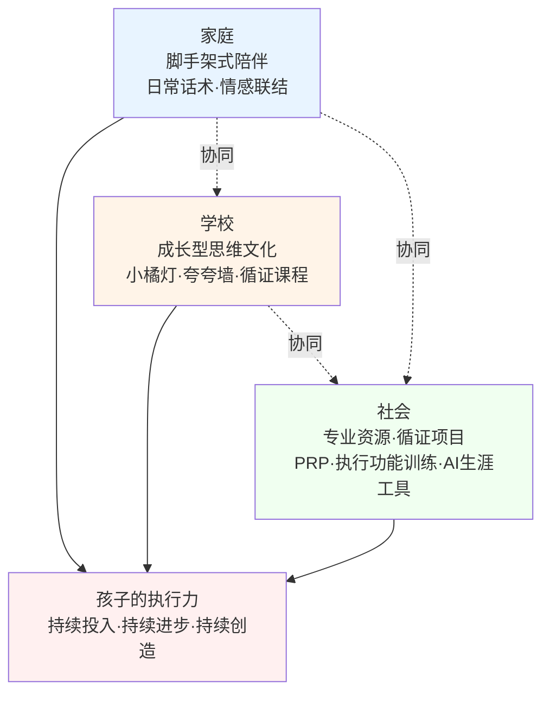

家庭提供日常细节的反复练习，学校提供系统化的循证干预，社会提供专业化的资源支持——三方缺一不可，但任何一方的有效行动都能为孩子的执行力培养带来真实改变。重要的不是等待"完美的协同"，而是从家庭、学校或社会的任何一个入口开始具体行动。

### 本章总结：执行力作为前六章成果的具象化与日常化

回顾本章八节内容，从执行困局解构（7.1）、SMART落地（7.2）、分学段重点（7.3）、成长型思维内核（7.4）、反馈激励机制（7.5）、抗挫力培养（7.6）、规划能力渐进培养（7.7）到家校社协同生态（7.8），构成了一个完整的"**目标拆解—执行系统—思维内核—反馈激励—抗挫坚持**"五位一体执行力培养框架。

这一框架在本报告整体框架中处于"**最后落点**"的关键位置：

**对前六章的承接**：本章解决的是"如何让前六章建立的成长基础真正落地为日复一日的可持续行动"这一根本问题。**第二章**身体健康守护需要每天60分钟运动、10/9/8小时睡眠的执行力支撑——本章的SMART化目标与游戏化反馈让这些标准从"应该"变为"能够"；**第三章**心理健康呵护需要日常的非暴力沟通、"低产出"陪伴、四步抗挫法的持续实践——本章的成长型思维话术与7C抗挫力模型让这些方法从"知道"变为"做到"；**第四章**时间结构科学平衡需要长期的计划制定、目标拆解、自主管理——本章的三阶段渐进培养与21天挑战清单让这些能力从"被规划"变为"自规划"；**第五章**兴趣深耕需要穿越平台期与瓶颈期的持续投入——本章的成长型思维与抗挫力为这一过程提供了内在引擎；**第六章**自我认知与目标方向需要从兴趣到目标、从目标到行动的完整转化——本章的SMART分层联动让生涯方向从"心向往之"变为"足下可及"。

**对下一章的开启**：本章的完成意味着五大维度路径设计全部就位——身体、心理、学习、兴趣、目标五大维度都已建立科学的支持框架。下一章将作为本报告的整合性总结章节，把这五大维度的洞察整合为一份覆盖学龄前、小学、初中、高中四阶段的完整成长支持框架，让前七章的所有探索最终凝结为家长、教师与孩子可参照执行的分龄行动清单与长期陪伴策略。

最深的启示或许在于：**执行力培养的本质，不是把孩子培养成"自律的执行机器"，而是让孩子在科学的支持系统中逐步建立"我有方向、我有方法、我能坚持、我能复原"的内在确信**。当一个孩子在多年的成长中真正内化了SMART目标的拆解能力、成长型思维的语言习惯、即时反馈的自我激励、抗挫力的复原模式、规划能力的元能力——他便不仅获得了应对当下学业挑战的工具，更获得了支撑一生持续成长的核心动力系统。

正如本章贯穿始终的一个根本判断：**执行力不是天赋，而是可以被培养的能力；执行力的培养，最终指向的不是某次考试的成功，而是一个孩子从"被推着走"到"自己走"的人格独立**。这一独立，正是儿童青少年身心健康成长的真正归宿——也是本报告所有章节共同指向的核心命题。

# 8 家庭、学校与社会的协同育人机制

回望前七章的叙事脉络，本报告已经在身体（第二章）、心理（第三章）、学习（第四章）、兴趣（第五章）、目标（第六章）、执行力（第七章）五大维度上，分别构建了"吃—动—睡—姿""认知—识别—沟通—干预—资源""原则—节律—管理—工具—边界""价值认知—天赋识别—阶段培养—边界把握—长期深耕""择心所向—择己所长—择势所需""目标拆解—执行系统—思维内核—反馈激励—抗挫坚持"等系统化路径。这些路径设计虽然各有侧重，却共享同一个隐含前提：**每一条路径都需要家庭、学校、社会三方共同搭建的支持生态来承载**。家庭独自摸索的路径，无论多么科学，都可能在政策刚性、社会评价、学校教学的现实压力下被反复扭曲；学校单独发力的改革，无论多么先进，也可能在家庭功利化育儿与社会单一评价的反向拉扯中事倍功半。

本章作为本报告的整合性收束章节，将回到育人主体的协同视角，回答一个根本性命题：**当家庭、学校、社会三方真正形成同向合力，前七章所有路径设计才能从"家庭独自摸索"走向"生态共同支撑"**。本章以《中华人民共和国家庭教育促进法》、教育部等十三部门《关于健全学校家庭社会协同育人机制的意见》、《家校社协同育人"教联体"工作方案》三大政策为制度坐标，依次展开父母作为"第一任老师"的责任边界（8.1）、学校落实"健康第一"与规范办学的典型做法（8.2）、家校社三方协同的有效模式与国际经验（8.3）、构建尊重个体差异与激发内驱力的综合育人生态（8.4），让本报告的整体框架在"谁来育人、如何协同"这一根本问题上完成闭环。

## 8.1 《家庭教育促进法》框架下父母作为"第一任老师"的责任边界

要理解家庭在协同育人中的位置，必须从一个根本性的法律转变说起——**2022年1月1日起施行的《中华人民共和国家庭教育促进法》，把家庭教育从传统的"家事"正式纳入国家教育事业法治化轨道**。这一转变的深意在于：父母对孩子的教育不再仅仅是一种道德义务或文化习俗，而是一种受国家法律调节、由社会共同支持、被纳入公共服务体系的法定责任。

### 法律定位：从"家事"到"国是"的根本转变

习近平总书记对未成年人思想道德建设作出重要指示强调："坚持把未成年人思想道德建设作为战略性、基础性工作来抓""合力为未成年人健康成长营造良好社会环境"[^145]。在这一战略定位下，《家庭教育促进法》于2021年10月23日由第十三届全国人民代表大会常务委员会第三十一次会议通过，自2022年1月1日起施行[^146][^147]。

法律对家庭教育的内涵给出了清晰界定：**"本法所称家庭教育，是指父母或者其他监护人为促进未成年人全面健康成长，对其实施的道德品质、身体素质、生活技能、文化修养、行为习惯等方面的培育、引导和影响"**[^146]。这一界定具有三重突破：第一，把家庭教育的主体明确为"父母或者其他监护人"，划定了责任承担的法定主体；第二，把目的明确为"促进未成年人全面健康成长"，与本报告"健康第一"的总基调形成精确同构；第三，把内容明确为"道德品质、身体素质、生活技能、文化修养、行为习惯"五大维度，覆盖了儿童青少年发展的核心议题。

法律进一步在第三条、第四条中确立了"家庭教育以立德树人为根本任务"，明确"未成年人的父母或者其他监护人负责实施家庭教育。国家和社会为家庭教育提供指导、支持和服务。**国家工作人员应当带头树立良好家风，履行家庭教育责任**"[^146][^147]。这一表述的深层意义在于：家庭教育既是父母不可推卸的法定责任，也是国家与社会必须为之提供支持的公共事业——**它打破了"父母可以凭个人喜好随意教育孩子"的传统认知边界**。

### 五项基本要求：法律对家庭教育质量的底线规定

《家庭教育促进法》第五条对家庭教育应当符合的要求作出五项规定，这五项要求构成了家庭教育质量的法律底线[^146][^147]：

| 要求 | 核心内涵 | 与本报告的对应章节 |
|------|---------|------------------|
| 尊重未成年人身心发展规律和个体差异 | 不同年龄段、不同个体的差异化施策 | 第二章分龄运动指南；第三章埃里克森八阶段；第五章多元智能识别 |
| 尊重未成年人人格尊严，保护未成年人隐私权和个人信息，保障未成年人合法权益 | 反对辱骂、暴力、控制、监视等不当方式 | 第三章心理安全感建设；第四章亲子边界 |
| 遵循家庭教育特点，贯彻科学的家庭教育理念和方法 | 反对凭经验、凭直觉的随意教育 | 第三章非暴力沟通；第七章成长型思维 |
| 家庭教育、学校教育、社会教育紧密结合、协调一致 | 三方同向合力 | 本章8.3节、8.4节 |
| 结合实际情况采取灵活多样的措施 | 反对僵化、教条、一刀切 | 第六章择心所向；第七章SMART个性化目标 |

值得特别关注的是第二项要求中"**保护未成年人隐私权和个人信息**"——在数字时代，这一条具有日益重要的现实意义。家长翻看孩子日记、监控孩子社交账号、未经同意公开孩子照片等行为，看似是"出于关心"，实则可能违反法律规定，更会破坏孩子的心理安全感（参见第三章3.5节"尊重边界与独立性"）。

### 六大育人维度与本报告路径的整合性映射

法律明确的"道德品质、身体素质、生活技能、文化修养、行为习惯"五大维度，加上《预防未成年人犯罪法》新增的"法治意识"维度，共同构成了家庭教育的核心内容版图[^145]。下表系统展现六大维度与本报告前七章路径设计的整合性映射：

| 法定育人维度 | 核心内涵 | 本报告对应路径 |
|------------|---------|--------------|
| 道德品质 | 良好社会公德、家庭美德、个人品德 | 第三章心理健康呵护；第六章价值感联结；第七章7C抗挫力中的"品行" |
| 身体素质 | 强健体魄、健康习惯、运动能力 | 第二章"吃—动—睡—姿"四位一体身体守护方案 |
| 生活技能 | 自理能力、家务参与、社会适应 | 第四章时间管理三阶段；第七章规划能力渐进培养 |
| 文化修养 | 阅读、艺术、传统文化、审美能力 | 第五章兴趣培养五阶段路径 |
| 行为习惯 | 作息、学习、交往、自律 | 第二章身体习惯；第四章时间结构；第七章执行力培养 |
| 法治意识 | 规则意识、权利义务观念、自觉守法 | 本章8.1节、第六章自我认知与目标方向 |

法律明确要求"培养其良好社会公德、家庭美德、个人品德意识和法治意识"[^145]，《预防未成年人犯罪法》也规定"国家、社会、学校和家庭应当对未成年人加强社会主义核心价值观教育，开展预防犯罪教育，增强未成年人的法治观念"[^145]。这一要求把法治教育从"学校的事"扩展为"家庭的核心责任"，对当前父母责任意识不强、法治素养不足等现实问题给出了明确的法律回应。

### 当前家庭教育的典型问题与履职的边界原则

直面现实，当前我国家庭教育在协同育人中的履职存在一系列突出问题。从已有研究与实践观察看，这些问题主要集中在五个方面：**一是父母责任意识不强，法治教育不够；二是父母法治素养不足，难以有效引导；三是重智育轻德育，忽视价值观塑造；四是教育方式简单粗暴，甚至放任纵容、体罚打骂；五是亲子情感联结薄弱，缺乏深度沟通**[^145]。这些问题与第一章揭示的功利化育儿、第三章揭示的亲子沟通失效、第六章揭示的放任型教育隐性损害形成多重叠加，提示家庭履职需要明确的边界原则。

整合前七章的洞察与法律规定，可以提炼出父母履职的"**不缺位、不越位、不错位**"三项边界原则：

**第一，不缺位**——家庭教育是父母的法定责任，不能简单"外包"给学校、培训机构或祖辈。深圳教师群体的调研发现"34%的中学生宁愿向游戏网友倾诉烦恼，也不愿与父母沟通"（参见第一章），其本质是家庭情感教育的缺位。福州市教育局的家庭教育调研深刻指出："新时代家长育儿焦虑凸显、育人方式深刻变革"——破解这一时代课题的关键，正是父母责任意识的重新唤醒[^148]。

**第二，不越位**——父母不能以"为孩子好"的名义剥夺孩子的自主选择权、隐私权与人格尊严。第三章揭示的功利化育儿"自主空间剥夺"路径、第四章批判的"过度安排"陷阱、第五章警示的"强迫热情"异化，都是越位的不同形态。**法律明确规定"尊重未成年人人格尊严"，这一规定为父母行为划出了不可逾越的红线**。

**第三，不错位**——父母的角色应随孩子年龄发展而动态调整，不能一直停留在"全权掌控者"的角色上。第四章4.4节时间管理三阶段、第七章7.3节分学段重点都揭示了同一规律：**学龄前家长是"主导规划者"，小学是"共同规划者+监督者"，初中以后逐步转变为"鼓励者+支持者"**——这种角色的渐进迁移，正是脚手架式家长的核心精髓。

需要特别强调的是，《家庭教育促进法》在第十三条规定"每年5月15日国际家庭日所在周为全国家庭教育宣传周"[^146]，这一安排提示家庭教育不是孤立的家庭内部事务，而是受国家关注、被社会支持的系统工程。父母履行第一任老师的责任，既需要个人的觉醒与学习，也需要充分利用国家与社会提供的指导服务资源——这正是下一节将展开的协同育人机制的逻辑起点。

## 8.2 学校落实"健康第一"与规范办学的典型做法

如果说家庭是协同育人链条的最初一环，那么学校就是这一链条的核心枢纽——**它既是孩子日常生活时间最集中的场域，也是协同育人机制中"教育主阵地作用进一步强化"的承担者**[^149]。本节从"健康第一"落地与规范办学治理两条主线展开，系统呈现学校在协同育人中的具体实践。

### 主线一："健康第一"理念落地的多地实践

第一章已经确立了"健康第一"作为本报告的根本价值坐标，本节将这一理念在学校层面的落地实践进行系统化梳理。

**青岛市的"一天一节体育课"刚性落地**为全国学校体育改革提供了可复制范本。2022年青岛市政府办公厅印发《青岛市全面加强和改进新时代学校体育工作三年行动计划(2022—2024年)》，明确提出"基础教育阶段学校每天开设1节体育课、学生每天校内中等以上强度体育锻炼不少于1小时的目标"[^146]。其落地的核心机制是"**扎实的制度闭环**"：

```text
青岛"一天一节体育课"刚性落地的制度闭环：

第一环·课表备案公示：
建立体育课表备案公示制度

第二环·定期督查：
市、区两级构建定期督查—通报—整改—反馈机制

第三环·考核倒逼：
将体质健康纳入高质量发展考核

第四环·监测闭环：
实行区市普测与市级整班抽测相结合的"监测—反馈—改进"闭环管理
```

这一闭环机制带来了实实在在的健康获得：**"青岛中小学生体质健康抽测合格率、优良率2023年和2024年连续两年位居全省首位；2025年学生体质健康优良率较上年度又提高了8.73个百分点。'一项体育技能'落实率达到100%，每位中小学生至少参加1个体育社团、掌握2项运动技能"**[^146]。从即墨二中的初三学生王玉豪以14秒13夺冠、青岛六十八中的孔翔骏打破22年纪录，到2026年亚洲滑板锦标赛上青岛德县路小学孟令妍斩获女子碗池冠军、城阳区国科实验学校15岁小将姜依依入选国家乒乓球队一队——"赛场上的刹那光芒，从来不是平地惊雷"，而是"从课程到场地、从制度到文化的'以体育人'深耕之路"的真实注脚[^146]。

**济南市"健康校园十大行动"**则提供了从单一体育向全方位健康学校建设跃迁的典型案例。2025年4月济南市深入落实"健康第一"工作部署暨健康学校建设推进会上提出，"将开展新时代好学校'健康校园十大行动'，切实促进学生健康成长"[^150]。下表系统呈现这十大行动的核心内容：

| 行动 | 核心内涵 |
|------|---------|
| 一是动起来 | 刚性落实每天体育活动不少于2小时、课间15分钟，义务教育阶段每天开设一节体育课 |
| 二是美起来 | 美育浸润行动；高校开设高质量公共艺术课程，每名大学生至少掌握一项艺术技能 |
| 三是做起来 | 劳动教育进课程进课堂进生活；分层施教制定劳动清单 |
| 四是强起来 | 中小学按标准配齐心理健康教育专职教师；高校师生比不低于1:4000；健全四级预警网络 |
| 五是亮起来 | 抓早抓小保护远视储备；严控电子产品使用时长；近视率每年降低1个百分点以上 |
| 六是瘦下来 | 全面摸排超重肥胖学生底数；脊柱侧弯筛查纳入体检；科学制定营养带量食谱 |
| 七是护起来 | 校园欺凌零容忍；落实晨午检；按标准配备AED设备；防溺水、消防、禁毒等生命安全教育 |
| 八是吃放心 | 校园餐专项整治；校长陪餐、食材溯源、卫生消毒、食品留样制度；落实减盐减油减糖 |
| 九是减负担 | 刚性落实"双减"和"五项管理"；小学≥10小时、初中≥9小时、高中≥8小时睡眠 |
| 十是联起来 | 健全家校沟通机制；引导家长放下手机陪孩子运动、少点外卖给孩子做饭 |

济南市委教育工委常务副书记、市教育局党组书记、局长王纮的表态尤具战略高度："**必须要从'唯分数、唯升学'的怪圈中跳出来，把促进每一个孩子的健康成长作为最大政绩。要坚决守住办学行为底线，决不允许以牺牲学生健康为代价换取所谓的'升学率'**"[^150]——这一表态精准呼应了第一章对功利化育儿的批判，也为学校层面的价值重置提供了官方话语支持。

**拉萨"每天2小时+课间15分钟"**展现了"健康第一"在边疆地区的扎实落地。2026年4月22日，"拉萨市中小学'健康第一'体质强健工作推进会在拉萨北京实验中学举行，标志着拉萨市正式按照教育部2026年学生身心健康工作最新要求，全面落实'每天校内外体育锻炼不少于2小时、课间延长至15分钟'的规定"[^147]。拉萨北京实验中学构建了"三阶融合课程"，"以体育课为主体，结合艺体类校本课程、实践课程"；高中阶段开设涵盖球类、田径、武术等多元体育项目，"在体育课上实现了自主选课，分项走班教学，让每位学生能择己所爱，练己所长，因材施教"[^147]。墨竹工卡县扎西岗乡南京希望小学的五年级学生洛桑罗布的真切感受是："现在课间时间长了，除了上厕所、喝水外，还可以跟同学们一起在操场上玩跳绳、丢沙包，特别喜欢现在的课间时间"[^147]。

**博州15分钟大课间全覆盖**则呈现了多维度健康保障的系统协同。"博州在全疆率先刚性落实'每天一节体育课、课间15分钟、每天综合体育活动不低于2小时'要求，全州102所学校实现15分钟大课间全覆盖，开放40个户外体育场地"[^150]。除体育外，博州在心理健康方面"构建'医教协同'体系，完成4.7万名学生心理健康测试，建立'一生一策'档案，配齐专兼职心理教师"；在校园食品安全方面"实现'三防'设施配备率与合规率100%，邀请家长参与陪餐"[^150]——这一系统协同精确呼应了第二章"四位一体"与第三章"四位一体"心理健康服务体系。

**上海宝山顾村科技园学校的九年一贯制健康体系**为城市学校提供了精细化设计样本。该校"立足九年一贯制办学特色，系统构建了融合体育锻炼、劳动实践、卫生防护、心理护航与美育浸润的校园健康工作体系"[^151]。其分层运动设计颇具借鉴意义：

```text
小学：10分钟早操+30分钟校园体育游戏+35分钟体育课+45分钟大课间
中学：30分钟早操+40分钟体育课+50分钟大课间活动
```

学校还在卫生健康与视力保护方面"联合社区医院开展屈光检测"，在心理健康教育上"立足教师、学生、家长三大主体"构建多维体系——"为教师开展减压活动；为学生打造特色心育活动；为家长搭建亲子沟通与科学育儿指导平台，实现家校协同护航"[^151]。这一精细化的"分层+协同"设计，为不同发展阶段孩子的差异化需求提供了具体回应。

### 主线二：规范办学的治理实践

如果说"健康第一"是学校育人的价值方向，那么规范办学就是这一方向得以落地的制度保障。规范办学治理涉及"双减"五项管理、均衡编班、规范招生、家访制度等多个维度。

**上海闸北一中心小学的"五项管理"工作方案**为基层学校的精细化治理提供了具体范本。学校"成立以校长牵头的'五项管理'工作领导小组，明确职责、分工"，作业管理细化到"一、二年级不布置书面回家作业，三、四、五年级学生书面回家作业时间总量应控制在1小时以内（以中等水平学生完成作业时间为基准）"[^151]。其作业设计体现了高度的专业性：

```text
作业设计六原则：
1. 依据学科课程标准设定的目标
2. 立足单元，整体设计作业
3. 加强基础巩固，体现知识衔接
4. 融入体验、感知等实践活动，提高学生学习的质量和水平
5. 不断提高各学科校本作业的质量，形成体系
6. 加强作业设计中体现对高阶思维的考查

作业管理三层监控：
- 班主任每天根据各科作业总量的实际情况进行协调
- 年级组长每周对本年级组的作业总量进行监控
- 教导处每月对各班作业进行备案
```

特别值得肯定的是其对差异化教学的明确支持："学习困难学生，学科教师可选择偏基础的、适合他们练习的作业，并可适当减量；资优生作业则可根据其学习情况，采用免做基础题、适当增加拓展练习的方式进行"[^151]——这一做法精确呼应了第五章多元智能、第七章SMART个性化目标的核心理念。

**江西省《普通中小学办学基本规范》**则展现了省级层面规范办学的制度建构。该规范由江西省委教育工委、省教育厅制定，"根据《中华人民共和国教育法》《中华人民共和国教师法》《中华人民共和国义务教育法》《中华人民共和国未成年人保护法》《未成年人学校保护规定》精神和党中央、国务院关于教育改革和'双减'工作部署要求"制定[^152]。其核心机制包括"建立督办机制""实施通报制度""强化责任追究"三层保障——"省教育厅将通过'四不两直''双随机、一公开''专项督导'等方式，对各地规范办学线索核实、督查整改、实际成效等情况进行随查随访"，并"每月进行一次工作通报，每年汇总进行一次年度工作通报"[^152]。这一刚性问责机制为规范办学从"规定动作"转化为"实际行动"提供了制度保障。

**教育部"阳光招生专项行动"（2026年）**进一步把规范办学的边界拓展到招生环节。《通知》明确"义务教育学校严禁设立或变相设立重点班、实验班、快慢班。推进师资均衡配置、学生随机分班，全面实施均衡编班。学校编班方案、过程及结果应向社会公开。编班结果一经公示确定，不得擅自变更"[^153]。同时严禁"通过'意向登记''预录取协议''保底录取协议''分班保证协议'等名义变相提前招生，严禁在招生环节收取所谓的'择校费''意向金'"[^153]。这些刚性规定从源头上压缩了"分数至上""超前选拔"的运作空间，为孩子在公平起点上获得健康成长创造了制度条件。

### 学校作为家庭教育指导主阵地的角色

学校在协同育人中不仅承担教育教学职责，还是家庭教育指导服务的核心主阵地。教育部等十三部门《关于健全学校家庭社会协同育人机制的意见》明确要求："学校要把做好家庭教育指导服务作为重要职责，纳入学校工作计划，充分发挥学校专业指导优势"[^154]。

**家长学校"六有"标准**是这一职责落地的具体形态。安徽省的实施意见明确要求："中小学幼儿园家长学校日常管理做到'十有'（有负责人、有牌子、有教室、有教材、有教学计划、有教师、有活动经费、有工作制度、有考核评估、有档案材料）、教学做到'五落实'（落实教学计划、落实教学内容、落实教学管理、落实教师队伍、落实教学科研）"[^155]。

**家访常态化制度**是建立家校信任的关键机制。《意见》要求："学校领导要带头开展家访，班主任每学年对每名学生至少开展1次家访，鼓励科任教师有针对性开展家访"[^154]。青岛的实践更进一步："组织7.6万名教师利用寒暑假对125万学生家庭开展全员大家访，针对心理困扰、学习困难、行为偏差、辍学风险等七类重点学生群体，组建'班主任+心理教师'专业小组开展入户指导"[^156]。

**教师家庭教育指导能力培训**是确保指导质量的专业基础。安徽要求"切实加强教师家庭教育指导能力建设，将家庭教育工作纳入教师培训，**将教师家庭教育指导水平与绩效纳入教师考评体系**"[^155]——这一刚性挂钩，让"家庭教育指导"从教师的"可选职责"变为"必选职责"。

**家校沟通机制创新**则是日常协同的具体载体。《意见》要求"积极创新日常沟通途径，通过家庭联系册、电话、微信、网络等方式，保持学校与家庭的常态化密切联系"[^154]。这些创新沟通机制与第三章亲子沟通、第七章成长型思维家校共育（如福州麦浦小学"小橘灯"错题集、"夸夸墙"实践）形成深度协同，让"健康第一"从学校制度延伸到家庭日常。

学校层面的所有这些实践，共同回应了第一章所提出的"被动应对到主动建设"的理念转向——**学校不再仅仅是"管学习的地方"，而是承担起促进孩子全面发展、指导家庭科学育儿、链接社会优质资源的多重使命**。这种角色拓展为下一节家校社三方协同提供了核心枢纽。

## 8.3 家庭示范引领、学校系统支持、社区资源补充的三方协同模式

家庭与学校的双轮驱动已经能够覆盖大部分育人场景，但要真正形成完整的成长支持生态，还需要社区与社会资源的"第三空间"补充——博物馆、社区驿站、心理热线、研学基地、志愿服务、文化场馆等。本节以教育部等十三部门《关于健全学校家庭社会协同育人机制的意见》[^149][^154]与《家校社协同育人"教联体"工作方案》[^157]为政策框架，深入比较三方协同的有效模式。

### 一、家庭示范引领：链条最初一环的不可替代价值

家庭在协同链条中的核心价值是"**示范引领**"——父母以身作则的隐性榜样作用，是任何外部教育都无法替代的成长基底。**"父母设定的家庭规则、处理违规行为的方式等，构成未成年人心中最早的法治观念；父母对法律权威的尊崇与践行，形成未成年人对法律实效性的最初判断；亲子之间天然的情感依恋，使父母传达的规则更易被接受和内化"**[^145]。这种"情、理、法的融合"，为孩子价值观的内化提供了情感基础与认知起点。

家庭法治教育的长效机制可被具体化为四条路径："**通过明确家庭行为规范，引导子女树立规则意识；通过尊重未成年人物品所有权、隐私权，建立物权观念；通过家庭事务民主协商、共同决策，培育程序意识；通过权利义务对等的家风熏陶，建立正确的权利义务观**"[^145]。这四条路径把抽象的"法治意识"转化为家庭日常的具体实践——孩子不是通过课本学会规则意识，而是通过家庭的"民主协商""共同决策"亲身体验。

针对网络时代的新挑战，**"必须高度重视网络时代的家庭法治教育，针对网络隐私、知识产权、网络安全等新议题，结合新闻事件、身边案例等，着力提升未成年人网络法治素养，引导其成为负责任的数字公民"**[^145]。这一要求与本报告反复强调的电子产品管理（第二章2.3节睡眠章节、第四章4.6节边界管理）形成精确呼应。

家风建设与法治教育的深度融合是另一条关键路径——"以优良家风涵养法治精神，并将家风家规与国家法律、道德规范有效衔接"[^145]。福州的实践提供了"三坊七巷家风家训馆"等典型场域[^148]，让家风传承从抽象概念变成可触摸的文化体验。

### 二、学校系统支持：地方典范的资源整合与机制创新

在家庭示范引领之上，学校承担系统支持的核心职责。本节梳理几个具有典型示范意义的地方案例。

**青岛市"四项创新"模式**为家校社协同提供了系统化的省级样本。青岛市以"教联体"建设为关键抓手，创新实施"全域统筹、需求引领、专业领航、多元参与"四大维度改革[^156]。其核心机制包括：

| 创新维度 | 具体做法 |
|---------|---------|
| 全域统筹 | 将健全协同育人机制纳入《教育强市建设规划纲要》；制定家长学校、家长委员会、家庭教育服务站等建设标准；推动"有形覆盖"向"长效运行"转型 |
| 体系贯通 | 市、区两级设家庭教育处（科）和家校社协同育人指导中心，配专职教研员；校级层面成立协同育人工作小组 |
| 品牌引领 | 市级"爱润成长"品牌；各区子品牌如市南区"相伴最优成长"实施"大实践、大科学、大阅读、大融合"四项工程 |
| 课程主渠道 | 分学段研发《陪伴成长——青岛市中小学生家长手册》，作为每学年4次8课时家庭教育指导课程的统一教材，免费发放 |
| 师资培训 | 覆盖4万名班主任的专题授课能力培训；探索"面上需求调研、集中备课教研、班级个性打磨"机制 |
| 平台赋能 | "爱润成长"APP集成3000余节本地化家庭教育课程；"语你'青'心"微课堂；年累计受众超200万人次 |
| 面对面 | "三长（家长、校长、局长）见面会""家长节""祖辈家长会"等品牌活动 |
| 全员家访 | 7.6万名教师对125万学生家庭全员大家访 |

青岛"关爱心理热线"的14年坚守，则展现了协同育人在心理健康领域的深耕。"自2011年7月由青岛市慈善总会、市关心下一代工作委员会联合主办，市青少年心理健康研究会承办以来，关爱心理热线项目以专业坚守为近5000人次青少年及家长驱散心理困扰，成为岛城守护青少年心理健康的'温暖港湾'"[^158]。"团队规模从最初的30人壮大至130余人，服务格局从单一热线升级为'一条热线+五个工作基地'的多元化模式","14年间，热线累计运行10400多小时，接听咨询电话近万通"[^158]。

**成都武侯区"一个专班+两个阵地+三类智库+四位一体"模式**展现了基层治理的精细化设计：

```text
一个专班：
区委分管领导兼任家长学校校长
区教育局主要负责人兼任执行校长
区文明办、区妇联等负责人兼任副校长

两个阵地：
"家长学堂"——间周举办专题讲座；依托"智汇云"开通"网上家长学校"
"指导中心"——开发300门家庭教育课程；累计开展活动240余场
                          参与家长2万余人次

三类智库：
"家庭教育专家+家庭教育指导师+家庭教育志愿者"

四位一体：
党政齐抓、学校主导、家庭参与、社会协同
```

**成华区"4C家长制度"**则把家庭教育的核心能力具体化——"作为一名称职的合格家长，应具备4个关键的核心能力，即'**和谐关系''关爱身体''维护心理''引导学习**'"[^159]。这一"4C"能力清单与本报告的五大维度形成精确同构——"和谐关系"对应第三章亲子沟通、"关爱身体"对应第二章身体守护、"维护心理"对应第三章心理呵护、"引导学习"对应第四章时间结构与第七章执行力培养。

**福州"全国首创网络家长学校"**展现了规模化覆盖的可能性。福州"成立家长学校2100余所，社区家长学校实现城市全覆盖、农村覆盖率达94.85%，**全国首创的网络家长学校累计服务家长超2710万人次**，形成具有鲜明福州辨识度的家庭教育支持模式"[^148]。其特色"一核六联"协同育人模式实现了"12个县（市）区教联体全覆盖"。福州市妇联进一步"完善市、县两级13个家庭教育指导服务中心，同步在城乡搭建2600多个线下家庭教育指导服务站点，推动服务触角延伸至社区、村落"[^148]。

**衡水"一核六联"教联体**展现了协同育人在思想道德建设领域的深度。衡水"为全市806所中小学配齐2300名专兼职思政课教师，让每所学校都有'引路人'……围绕学校教育，大力推动大中小幼一体、校内外融合、家校社协同的德育共同体建设，57所学校纳入市内德育共同体建设范围"[^158]。"全市4万余名中小学生化身'红色研学小达人'，走进场馆听革命故事、看历史实物","全市60余处非遗传承基地，如同一个个文化'加油站'"[^158]——这种把德育从课堂延伸到社会场馆的实践，正是教联体最生动的体现。

**长沙湘阴小学"做梦—耘梦—圆梦"三维推进**则呈现了乡村学校的家校社协同创新。这所"七年来全校仅100名学生、9位教师"的乡村小学，通过"锚定育人目标、链接家校社资源、落地实践活动"三阶段推进[^157]：

```text
做梦：将"让每个乡村孩子都能仰望星空、触摸未来"作为核心目标
      9位教师形成共识，主动一人多能、跨学科承担多门课程

耘梦：课堂启智+生活践学+向外借力+向内深耕
      校长主动对接县教育局；联系县科技志愿者协会
      邀请其到校开展科技科普小课堂

圆梦：科技馆"搬"进校园；师生"走出去"到长沙航空科技体验中心
      孩子们亲身体验"目睹真机器人""坐一回飞机""当宇航员"的梦想
```

这一案例深刻揭示了一个原则：**协同育人不是只有大城市才能做的"高端事业"，而是任何乡村学校都可以通过主动链接资源开展的扎实工作**——关键在于"主动对接""主动联系""主动协调"的行动力。

### 三、社区资源补充：成长的"第三空间"

在家庭与学校之外，社区与社会资源构成了孩子成长的"第三空间"。这一空间在协同育人中有着家庭与学校都难以替代的独特价值。

**社区驿站：日照盛阳社区"阳光小屋"模式**展现了社区作为前沿阵地的实践。"在日照高新区盛阳社区的新时代文明实践站内，有几间被孩子们亲切称为'阳光小屋'的房间——这里没有严肃的课桌黑板，而是舒适的沙盘、放松的阅读角以及专业心理辅导老师温和的笑容"[^159]。社区"将'12355线下青少年服务站'心理辅导服务嵌入实践站，实现阵地共建、资源共享"，并通过"社区微信群、电话或现场登记"实现"专业服务触手可及"。"今年以来，'阳光小屋'已接待青少年及家长咨询56人次，开展各类活动32场，化解家庭沟通矛盾13起"[^159]。社区还推出"公益课程+实践活动"双线服务——"开设少儿舞蹈、编程启蒙、书法绘画等12门课程，并与市内高校合作"[^159]。

**梅县区"校外未成年人心理健康辅导站"**则展现了"家校社协同护童心"的县域实践。"梅县区于2020年启动校外未成年人心理健康辅导站建设，着力解决心理健康覆盖不足、专业力量不均衡以及社会治理的迫切需求三大关键问题"[^157]。"五年来，该平台多次联动校园与社区开展心理健康知识普及活动，**累计提供个体咨询372人次、团体辅导78场、心理健康讲座124场，服务覆盖未成年人及家长5.2万人次，完成心理测评建档1.2万份**"[^157]。其与学校的协同机制非常清晰——"学校作为一个前端筛查与日常支持的阵地，校外心理健康辅导站，作为专业干预与深度支持的后盾"[^157]。

**余杭径山镇"共富教育·心光守护"项目**进一步展示了"成长顾问陪伴计划"的创新模式。"以'早预防、早发现、早支持'为核心要义……以经过系统培训的高校志愿者为核心力量，在资深心理咨询师的专业督导下，为有需要的学生提供一对一深度陪伴服务"[^154]。"经过三个月的扎实推进，'共富教育·心光守护'项目已顺利完成从筛查、干预到系统支持的首轮服务闭环……完成首轮心理评估工作，覆盖学生近900名","已有20名学生纳入该计划，累计接受深度陪伴服务超160小时"，"针对4名需临床干预的学生，成功对接专业医疗机构，打通'日常支持—专业诊疗'的完整服务链条"[^154]。这一案例印证了第三章构建的"四位一体"心理健康服务体系在基层的可行性。

**志愿服务：三明"青春萤火学堂"模式**展现了大学生志愿者参与课后服务的创新。"三明市三元团区委联合三明学院团委、辖区街道打造'青春萤火学堂'教育关爱帮扶项目，创新构建'团区委牵头、高校支撑、街道落地'的三方联动机制，以校地联动志愿服务模式，为社区未成年人打造安全、温馨、多彩的'第二课堂'"[^160]。"目前，我们在全区7个街道同步设立了16个教学点，依托社区党群服务中心和新时代文明实践站，实现了城区服务网络的全覆盖"[^160]。

**商河县"花香妈妈"四阶段全链条关爱服务体系**则展示了对留守和困境儿童的全周期支持。商河县妇联2026年"创新构建覆盖学龄前、小学、初中、高中四个关键阶段的全链条关爱服务体系，融合'稚趣时光、苔花绽放、领航课堂、请你吃饭'四大特色服务板块"[^161]：

| 阶段 | 服务板块 | 具体做法 |
|------|---------|---------|
| 学龄前 | 稚趣时光 | 200余场次"稚趣时光"活动；家庭教育讲座、绘本阅读、亲子手工 |
| 小学 | 苔花绽放 | 累计培训"花香妈妈"1700余人次；开展集中陪伴活动65场、分散关爱340次；累计服务时长突破8400小时 |
| 初中 | 领航课堂 | 青春期专属成长课堂；构建"三维赋能"课程体系（家长群体+中学生群体+青春期女生群体） |
| 高中 | 请你吃饭 | 高考前学生饭卡里悄悄多了1000元助餐费用；无声守护关爱护航梦想 |

第三方测评数据显示"约79%的'苔花少年'对'花香妈妈'非常信任，培养出了亲近感"[^161]。这一案例呼应了考艾岛研究的核心发现（参见第七章7.6节）——**"在生命中至少有一个人能无条件地接纳他们"**正是抗挫力的关键来源。

**博物馆研学：家校社馆四位一体的文化育人**为协同育人开辟了文化深度。**故宫博物院与东城区教委的"读懂中轴 阅见成长"项目**——"通过馆校深度合作，探索'阅读+实践'的全新育人模式，将故宫丰富的文物资源转化为青少年成长的生动实践教材"[^162]。**上海桃浦"家校社馆"协同机制**——"近20组桃浦亲子家庭共同创作的装置，以'国宝探索'为主题，融合青铜器纹样、陶俑造型等元素……被观众称为'会讲故事的亲子艺术展'"[^152]。**隆平水稻博物馆"稻作文化浸润，三维实践育人"**——"案例实施以来累计接待未成年人研学团队483批次，覆盖全国各区域，相关项目获评湖南省博物馆教育十佳案例"[^153]。**国博"古代中国"通史与通识系列冬令营**——"两个系列课程均包含展厅讲解、教室教学、实践探索、互动体验等多种授课形式，孩子们可以在博物馆沉浸式感受历史、艺术与文化的魅力"[^163]。

复旦大学文物与博物馆学系副教授周婧景对家长的提醒颇具价值："**很多博物馆展教资源丰富，且大多数是免费的，家长花点儿心思便能用起来**"[^164]。这一提醒打破了"博物馆研学=报昂贵研学团"的迷思——博物馆资源是公共财富，关键在于家长的主动用心。

**新疆乌苏一中"四馆融合"模式**展现了科学教育的协同创新。"乌苏市第一中学与博物馆、科技馆、体育馆、图书馆'物理毗邻+功能联动'，形成'步行5分钟科学教育圈'"[^162]。其与高校合作"邀请大学专家进校园，还积极组织师生走出校园……仅2025年乌苏市第一中学组织学生去6所大学研学，邀请近20位大学教授给学生做各类讲座，学生参与近2000人次"，并"与青少年活动中心及乌苏啤酒厂、污水处理厂、发电厂等企事业单位签订长期合作协议……每年邀行业领军人才开展10—15场科技前沿"[^162]。

**阅读推广：泾川县十年坚守**为县域阅读生态建设提供了样本。"十年来，甘肃省平凉市泾川县将阅读摆在育人核心位置，不断强化顶层设计、整合多方资源、健全推进机制，打造有温度、有内涵、有影响力的阅读品牌，构建学校引领、家庭主体、社区支撑、社会参与的协同体系"[^165]。其核心做法包括"践行全科阅读理念，让阅读融入课堂教学、校园生活与成长全程；坚持'晨诵、午读、暮省'的日常节奏"，并"把阅读工作纳入学校办学评价、校长履职考核与教师绩效考核"[^165]。

**长沙博物馆"三点半博物馆"课后教育**则展示了博物馆与课后服务的深度融合——"博物馆联合学校构建'红色文化+历史传承+地方文脉'三大板块课程体系，开发《王震将军的家书》《浏阳为什么这么红》《古人的'高级定制'——青铜器》等特色课程"[^153]。

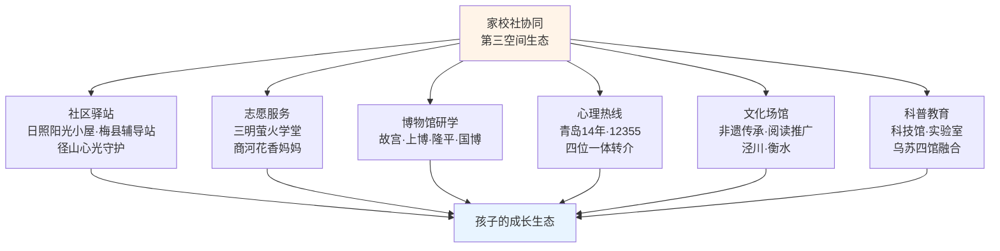

### 四、国际经验比较：四类模式的差异化特征

放眼全球，"通过创新'教联体'方式，出台了种类繁多的倡议、项目、活动、指南等，尤其在心理健康教育、环境可持续发展教育、劳动教育、体育锻炼、文化艺术教育、STEM教育、特殊教育等领域，充分挖掘社会、家庭与学校资源，通过'联责任''联资源''联空间'，协同促进学生'全人发展'"[^149]。当前世界各国校家社协同实践模式可归纳为四种类型：

| 模式类型 | 典型国家 | 核心特征 |
|---------|---------|---------|
| 政府主导下的多元主体参与 | 英国、美国、新加坡 | 以研究为基础、以法律引导和规范、以学校和社会公益性组织为平台、共同指向儿童成长的基本规律和特征 |
| 家庭主导的教师家长互动 | 法国、德国 | 市民社会发育成熟；儿童教育更多属于家庭的私人事务；政府只在虐待、遗弃儿童等极端情况下才会主动干预 |
| 改革过渡期类型 | 日本、韩国 | 推动教育改革的同时，着力重构校家社关系；政策、机制、平台等方面仍待完善 |
| 放任分离类型 | 个别经济欠发达国家 | 学校和家庭各自为政、互不干涉 |

参考资料[^156]

**美国NNPS全国家长教师协会模式**——"美国在1987年成立了全国家长教师协会联合会。不同级别的家长教师协会有不同的分工，但他们的共同使命是致力于改善学校与家庭之间的关系"[^156]。美国通过《初等与中等教育法》《2061计划》《2000年目标：美国教育法》《不让一个儿童落后》等系列法规政策"共同推动了美国校家社协同育人成效的提升"[^156]。

**芬兰"现象式学习—社会即课本"模式**展现了协同育人的最高境界。"芬兰国家教育委员会于2016年更新基础教育国家核心课程，以'现象式学习'(Phenomenon-based Learning，简称PhBL)作为未来教育新方案"[^149]。其核心实践包括：

```text
延伸学习场域，挖掘多元教育资源：
- 依托当地自然场域（森林、湖泊）设计"现象式"主题探索课程
- 实现校内知识和校外实践的完美融合
- 为家长和孩子提供探究性的亲子类运动与自然探索活动

深挖社会资源，赋能个性化职业发展：
- 学校与周边社会资源开展合作
- 给学生提供实地考察和工作见习的多种机会
- 邀请社会上相关领域的专家一起参与探究活动
```

芬兰教育的成功离不开"高度协调合作的教育系统"——"家、校、社会，教师和学生，课内和课外都达到了高度协调，共同为促进孩子的发展而努力"[^165]。**芬兰学生每周用于学习时间较少，"以7岁至16岁接受的基础教育为例，1—6年级相当于其他国家的60%且没有学科区别，老师教全科，7—9年级相当于其他国家的70%"**[^165]。"芬兰的教育形式十分灵活，可以根据学生的爱好、兴趣和要求，'**以整个社会为课堂**'，走入实际生活去学习"——这与第四章学习—生活平衡、第五章兴趣深耕、第六章自我探索形成深度共振。

**日本"区域学校协作活动"模式**为本土实践提供了另一种参考。"文部科学省自2017年起，提出了'区域学校协作活动'，鼓励社区广泛的居民和家长参与其中，共同支持儿童的学习和成长"[^155]。截至2024年5月1日，"区域学校协作本部共设立4,527校，占全部学校的13.2%"，"区域学校协作活动推进员等总人数为34,613人"[^155]。

**国际经验对中国本土实践的启示**主要有三：**第一，不断完善政策法规，推动校家社协同制度化、规范化**——"国家及地方政府基本上是通过制定政策和法规提供协同育人的价值导向、合法性和政策空间"[^156]；**第二，构建系统化的组织机构和平台，加强校家社沟通**[^156]；**第三，在教师职业发展体系中加强培训，提高其家校沟通与合作能力**——"在教育实习环节加入与家庭合作的相关内容""将与家庭协作相关的能力纳入教师职业准入门槛或专业标准"[^156]。

需要客观说明的是，国际经验的借鉴不能脱离本土文化与制度环境——芬兰的协同育人成功"离不开制度的支持""芬兰社会贫富差距小""芬兰从学前教育到大学都免学费"等社会结构性条件[^165]。中国的协同育人建设需要在借鉴国际智慧的同时，立足本土实际、发挥制度优势。

## 8.4 构建尊重个体差异、保护成长节奏、激发内驱力的综合育人生态

经过8.1节家庭责任边界、8.2节学校系统支持、8.3节家校社三方协同与国际经验的层层展开，本节作为本章与全报告的整合性归纳，将回归育人本质，提炼综合育人生态的整体路径，并完成全报告的逻辑闭环。

### 一、尊重个体差异：从"标准化人才"到"各美其美"

本报告反复强调的一个核心理念是——**反对一刀切的标准化人才模板**。这一理念在本节作为协同育人生态的第一支柱被正式确立。

整合前章成果可以看到："尊重个体差异"在多处贯穿全报告——第二章按身高匹配课桌椅、按风险分层制定运动方案；第三章埃里克森八阶段差异化养育要点；第五章多元智能"每个孩子都同时拥有八种智能，但以不同方式、不同程度的组合"；第六章"择心所向、择己所长、择势所需"三维生涯规划；第七章成长型思维强调"赞扬努力而非天赋"。**这些路径设计的共同信念是：每一个孩子都是独一无二的个体，没有适用于所有孩子的"最优方案"，只有适合这一个孩子的"个性化方案"**。

法律层面也确立了这一原则——《家庭教育促进法》第五条明确要求"**尊重未成年人身心发展规律和个体差异**"[^146][^147]。芬兰教育的核心理念是"芬兰要为每一个孩子提供优质公平的教育，而教育的目的是促进每一个孩子全面、丰富、个性的发展"[^165]——这一表述把"个性化"作为教育目的的核心组成。

家校社三方在尊重个体差异中的角色分工：**家庭层面**——通过日常陪伴敏锐识别孩子的独特天赋与节奏；**学校层面**——在课程、作业、评价中提供差异化设计（如上海闸北一中心小学对学习困难学生与资优生的差异化作业设计[^151]）；**社会层面**——提供多元化资源与场景（博物馆、研学营、兴趣社团、心理热线），让每一个孩子都能找到适合自己的"第三空间"。

### 二、保护成长节奏：分龄差异化与张弛有度

本报告反对功利化育儿对成长节奏的扭曲挤压。"保护成长节奏"作为综合育人生态的第二支柱，整合了多章成果：

| 维度 | 分龄差异化要点 |
|------|--------------|
| 身体（第二章） | 学龄前游戏化探索；小学广撒网塑习惯；中学自主管理强体能 |
| 心理（第三章） | 婴儿期信任、儿童期自主、学龄初期主动、学龄期勤奋、青春期同一性 |
| 时间（第四章） | 起步阶段（2—7岁）重指导；参与阶段（7—12岁）重自理；自主阶段（12岁以后）重放手 |
| 兴趣（第五章） | 观察引导→多元体验→自主选择→实践深耕→成就反馈 |
| 目标（第六、七章） | 小学习惯养成；初中方法升级；高中战略选科与冲刺 |

这一节律的核心是**"指导→参与→自主"的同步迁移**——身体、时间、兴趣、目标四个维度都在沿着同一节律展开。家校社三方对这一节律的协同保护体现在：**家庭层面**——避免"过度安排"与"过度放任"两端，把握脚手架式参与的科学分寸；**学校层面**——刚性落实睡眠令、双减政策、运动指南，从制度层面守住底线；**社会层面**——通过"双减"政策严格规范校外培训，避免学龄孩子被超前学习和题海训练耗竭。

需要特别强调的是，**保护成长节奏与"关口前移"并不矛盾**——前者反对的是"超前学习挤占成长空间"，后者强调的是"在关键窗口期及时干预防控"。第二章远视储备、骨骼发育、口腔健康均强调早期保护；第三章心理问题强调早期识别；第六章生涯探索强调"早期试错与探索是生涯觉醒的关键"。**关口前移针对的是健康监测与预防干预，保护成长节奏针对的是学习负担与情感空间——两者并行不悖**。

### 三、激发内驱力：守护内在动机的家校社共识

本报告反复警示外部驱动对内在动机的侵蚀——第五章"和谐热情"vs"强迫热情"、第六章功利型选择陷阱、第七章德西效应警示。"激发内驱力"作为综合育人生态的第三支柱，要求家校社三方共同守护孩子的内在动机、自主选择权与自我效能感。

**家庭层面的核心行动**：第一，**自主选择权**——把"选什么、何时学、学多久"的决策权逐步交给孩子；第二，**描述性夸奖替代物质奖励**——避免德西效应对内在动机的侵蚀；第三，**情感联结优先于成绩关注**——"低产出"陪伴比"问成绩"更重要；第四，**成长型思维语言习惯**——"你还做不到"代替"你做不到"。

**学校层面的核心行动**：第一，**多元评价**——济南"健康校园十大行动"明确"建立多元评价体系"[^150]；第二，**兴趣社团与个性化选课**——拉萨北京实验中学"高中阶段开设了涵盖球类、田径、武术等多元体育项目，在体育课上实现了自主选课，分项走班教学，让每位学生能择己所爱，练己所长"[^147]；第三，**家校社协同的成长型思维文化**——福州麦浦小学"小橘灯"错题集、"夸夸墙"等本土实践已证明其有效性。

**社会层面的核心行动**：第一，**社会评价生态的重塑**——超越"唯分数、唯升学、唯文凭"的单一标准；第二，**多元成功故事的传播**——媒体从"鸡娃成功学"转向"多元发展故事"；第三，**公共资源的丰富供给**——博物馆免费开放、社区驿站、心理热线、研学基地等让每一个孩子都能触摸到多元的可能性。

这三个支柱并非孤立——**尊重个体差异是前提，保护成长节奏是基础，激发内驱力是核心**。三者共同构成综合育人生态的"三维支撑"。

### 四、协同生态的运行保障：五位一体运行机制

理念与原则要落地为现实，需要可操作的运行机制。整合教育部等十三部门《意见》[^149][^154]、十七部门《教联体方案》[^157]、各地实践经验，可提炼出"**政府统筹—部门联动—学校主导—家庭尽责—社会支持**"的五位一体运行机制：

```mermaid
flowchart TD
    A[政府统筹<br/>顶层设计·制度保障·财政支持]
    B[部门联动<br/>教育·妇联·卫健·宣传·关工委·共青团等13部门]
    C[学校主导<br/>家长学校·家访·教师培训·家校沟通]
    D[家庭尽责<br/>第一任老师·法定责任·示范引领]
    E[社会支持<br/>社区驿站·博物馆·热线·志愿服务·研学基地]
    
    A --> B
    B --> C
    B --> D
    B --> E
    C -.协同.-> D
    C -.协同.-> E
    D -.协同.-> E
    
    F[孩子的全面健康成长]
    
    A --> F
    C --> F
    D --> F
    E --> F
    
    style A fill:#e8f4ff
    style F fill:#fff4e8
```

这一机制的四大支柱包括：

**第一，制度保障**——《家庭教育促进法》《关于健全学校家庭社会协同育人机制的意见》《家校社协同育人"教联体"工作方案》构成法律与政策的"四梁八柱"。安徽省的实施意见明确要求各级政府"将家庭教育指导服务纳入城乡公共服务体系和政府购买服务目录，将相关经费列入财政预算"[^155]——这一财政保障是协同机制可持续运行的物质基础。

**第二，专业队伍**——青岛"家庭教育名师工作室建设"、福州"专业人才培养"、衡水"2300名专兼职思政课教师"、芬兰"教师必须经过五年师范专业培养，取得硕士学位后才能当老师"[^165]，都指向同一个核心：**协同育人的质量取决于专业队伍的厚度**。

**第三，资源平台**——青岛"爱润成长"APP、福州"网络家长学校2710万人次服务"、武侯"智汇云"教育平台、华南师大附中"AI智能静音生涯探索舱"（参见第六章），共同构成数字化时代的协同资源平台。

**第四，评价督导**——江西"督办机制""通报制度""责任追究"[^152]、教育部"阳光招生专项行动"[^153]、青岛"将体质健康纳入高质量发展考核"[^146]共同构成督促协同机制落地的刚性保障。

### 五、回望与展望：守护成长是全社会的共同责任

回望本报告，从第一章确立"健康第一"价值坐标，到第二章"吃—动—睡—姿"四位一体身体守护、第三章"认知—识别—沟通—干预—资源"五位一体心理呵护、第四章"原则—节律—管理—工具—边界"五位一体时间平衡、第五章"价值认知—天赋识别—阶段培养—边界把握—长期深耕"五位一体兴趣发展、第六章"择心所向—择己所长—择势所需"三维生涯规划、第七章"目标拆解—执行系统—思维内核—反馈激励—抗挫坚持"五位一体执行力培养，再到本章"家庭—学校—社会"三方协同的综合育人生态——**九章构成了一个相互嵌套、彼此支撑、最终汇聚于综合育人生态的整体框架**。

这一框架的内在逻辑可被简化为一条递进路径：

```text
第一章·价值坐标
    ↓ 确立"健康第一"
第二、三章·身心基础
    ↓ 守护身体与心理
第四章·时间结构
    ↓ 创造成长空间
第五章·兴趣深耕
    ↓ 找到天赋舞台
第六章·目标方向
    ↓ 锁定生涯方向
第七章·执行力培养
    ↓ 转化为行动
第八章·协同生态
    完成育人闭环
    ↓
第九章·整合行动建议
    凝结为可参照的成长路线图
```

每一章的成果都是下一章的基础，每一章又都需要本章构建的协同生态作为承载——**没有家校社协同，每一条路径设计都可能在功利化竞争与单一评价的反向拉扯中被扭曲**；**没有前七章的科学路径，协同机制也会沦为形式化的部门联动，缺乏真正的育人内涵**。

回到第一章那句愿景——**"让每一个孩子身上有汗、眼里有光、心中有梦、脚下有力"**。这一愿景的实现，需要每一个家长真正承担起"第一任老师"的法定责任与情感担当，需要每一所学校真正把"健康第一"从口号落实为日常的课程、作业、评价、关怀，需要全社会真正认识到孩子的健康成长不仅仅是某个家庭的"私事"，而是国家未来、民族复兴、社会和谐的根本所系。

正如习近平总书记所深刻指出的——"**坚持把未成年人思想道德建设作为战略性、基础性工作来抓**""**合力为未成年人健康成长营造良好社会环境**"[^145]。这句话精准把握了协同育人的本质——**它既是战略性的（关乎民族未来），也是基础性的（从每一个日常细节做起）；既需要"合力"（家庭、学校、社会的同向而行），也需要"营造"（持续的、耐心的、长期的环境塑造）**。

守护一个孩子的成长，是每一个家庭最朴素的期盼，是每一所学校的核心职责，更是全社会的共同责任。**当家庭以爱与智慧示范引领，当学校以专业与规范系统支持，当社会以丰富与开放提供"第三空间"，三方真正形成同向合力的那一刻，孩子的身心健康成长便不再是某个家庭独自摸索的辛苦旅程，而是整个社会为之精心搭建的成长舞台**。这正是本报告所有探索的最终归宿，也是下一章"整合行动建议与成长路线图"将要展开的最后画卷——把九章的所有洞察，凝结为家长、教师与孩子可以直接参照执行的分龄行动清单与长期陪伴策略，让"健康第一"从理念真正走入每一天的家庭日常。

# 9 整合行动建议与成长路线图

经过前八章的层层展开，本报告已经在身体、心理、学习、兴趣、目标五大维度上完成了系统化的路径设计，并在第八章把这些路径设计置于家校社协同育人生态的整体框架下加以承载。然而，如果一份研究报告止步于"学理框架的搭建"，而无法转化为家长晚饭后可以做的一件事、教师周一可以推进的一项工作、孩子睡前可以记下的一句话，那么再精致的洞察也只是停留在书页之间。本章作为全报告的整合性收束章节，将完成一次根本性的"语言转换"——**把前八章的科学路径转化为家庭日常的具体行动**。

本章的展开遵循"**核心发现—分龄对比—路径验证—行动清单**"的递进结构：先以9.1节归纳五大维度的整合性框架与底层信念，再以9.2节横向比较四个学段的关键任务与家长角色迁移，进而以9.3节系统验证"理念重塑—习惯养成—兴趣深耕—自我探索—目标实现"的递进路径内在逻辑，然后以9.4、9.5两节分别给出家长与教师/学校的可执行清单，最后以9.6节提炼贯穿全周期的长期陪伴策略，回归报告愿景。这一结构的设计意图是让本章既具备理论收束的整合性，又具备实践指南的可操作性——**让前八章的所有探索，最终凝结为可直接落地的成长路线图**。

## 9.1 五大维度整合性成长支持框架的核心发现

回望前八章的展开，本报告在身体、心理、学习、兴趣、目标五大维度上构建的路径并非简单并列，而是构成一个**相互嵌套、彼此支撑的整合性成长支持框架**。本节首先归纳每一维度的核心发现，再揭示五维之间的内在协同关系，最后凝练贯穿全报告的四大底层信念。

### 五大维度的核心发现

下表系统呈现五大维度在前八章中的核心发现与其支撑路径：

| 维度 | 核心发现 | 支撑路径 |
|------|---------|---------|
| 身体 | "吃—动—睡—姿"四位一体共因致病、共因防控；五类高发问题（肥胖、近视、心理、脊柱、口腔）需多病同防共管 | 分龄运动指南、均衡膳食结构、睡眠令底线、体态科学管理、肥胖/近视/脊柱侧弯三大专项 |
| 心理 | 心理问题不是"孩子的脆弱"，而是生物—家庭—学校—社会四维诱因交织；早期识别与无条件接纳是关键 | 埃里克森八阶段、信号识别、非暴力沟通、心理安全感建设、污名化破除、四位一体专业资源链接 |
| 学习 | 时间结构是身心健康的"操作系统"；脑科学黄金档期决定效率；阶梯化时间管理培养自主性 | "双减"政策原则、学习—休息—运动黄金比例、分龄作业顺序策略、SMART化过程性评价、避免两端边界管理 |
| 兴趣 | 兴趣不是学习的对立面，而是心理免疫力的"基础设施"；和谐热情vs强迫热情决定兴趣的真实价值 | 多元智能识别、五阶段培养路径、30%—50%家长参与边界、平台期穿越、终身爱好深耕 |
| 目标 | 自我同一性建构需探索时间、试错机会、价值澄清三大条件；执行力不是性格而是可设计的系统能力 | 三维生涯规划模型、四类方向锁定方法、SMART三级目标体系、成长型思维、7C抗挫力、规划能力渐进培养 |

### 五维协同的内在逻辑

五大维度并非孤立运转，而是通过深层的因果链条相互支撑、相互滋养。这一协同逻辑可被具象化为下图：

```mermaid
flowchart TD
    A[身体·根基<br/>吃-动-睡-姿]
    B[心理·土壤<br/>认知-识别-沟通-干预-资源]
    C[学习·载体<br/>原则-节律-管理-工具-边界]
    D[兴趣·养分<br/>价值-天赋-培养-边界-深耕]
    E[目标·方向<br/>拆解-思维-反馈-抗挫]
    
    A -.支撑.-> B
    A -.支撑.-> C
    B -.滋养.-> D
    B -.滋养.-> E
    C -.承载.-> D
    C -.承载.-> E
    D -.孵化.-> E
    E -.反哺.-> A
    E -.反哺.-> B
    
    F[孩子的全面健康成长]
    A --> F
    B --> F
    C --> F
    D --> F
    E --> F
    
    style A fill:#e8f4ff
    style B fill:#fff4e8
    style C fill:#f0fff0
    style D fill:#fff0f0
    style E fill:#f8f0ff
    style F fill:#ffe8f0
```

具体而言：**身体是根基**——没有充足的睡眠、运动、营养，再科学的心理建设也无生理承载，运动时分泌的内啡肽缓解焦虑、睡眠剥夺直接削弱情绪调节、肥胖与脊柱外观异常引发自卑社交退缩，这些贯穿前章的实证证据已在生理层面铺垫了"身心一体"的事实基础。**心理是土壤**——稳定的心理安全感、成长型思维、抗挫力是孩子敢于探索兴趣、试错方向的内在底气，被无条件接纳的孩子才会真正向外探索方向。**时间是载体**——没有合理的时间结构，前两章的所有"应用程序"都无法运转，第二章每天60分钟运动、10/9/8小时睡眠、第三章高质量陪伴、第五章兴趣深耕、第六章自我探索都需要时间结构来真实"创造"出空间。**兴趣是养分**——它既是身体运动的天然舞台，又是心理压力的"恢复性利基"，更是自我认知的最早信号源。**目标是方向**——它把当下的努力锚定在长期意义上，反过来又为身体习惯、心理韧性提供持续的动力。

更深层的洞察是：**任何单一维度的过度发展，都会反噬其他维度乃至整体**。功利化育儿对学习维度的过度投入，会同时挤压身体（睡眠不足、户外缺失、肥胖近视）、心理（情感疏离、压力抑郁）、兴趣（强迫热情异化）、目标（功利型选择陷阱）四个维度；放任型教育看似"释放"，实则同时损害身体（无规律作息）、心理（隐性期待落差）、学习（执行力崩塌）、目标（方向感真空）。**唯有五维协同共进，才能形成完整的成长动力系统**。

### 贯穿全报告的四大底层信念

整合前八章的价值判断，可凝结出四大底层信念，作为后续行动建议的价值底座。

**第一，身心一体**。身体健康与心理健康从来不是平行的两条线，而是同一棵生命之树的根与枝。第二章2.8节的共因致病图谱、第三章3.7节的医校协同闭环、第七章7.6节的"情绪调节"切入都共同印证了这一信念。落到行动层面，这意味着家长在关注孩子心理状态时，要同步关注睡眠、运动、饮食这些看似"身体"的维度；在关注身体健康时，也要看到躯体化症状背后可能的心理诉求。

**第二，发展性**。孩子的能力、兴趣、性格、人格都不是"一锤定音"的固定特质，而是在与环境互动中持续发展的开放过程。第三章埃里克森八阶段、第五章多元智能"通过适当的引导和练习，他们可以在某些领域变得更强"、第七章成长型思维"power of yet"——这些洞察共同支撑了发展性信念。落到行动层面，这意味着家长在评价孩子时应当关注"过去的自己"而非"别人家的孩子"，关注"努力的过程"而非"瞬时的结果"。

**第三，个体差异性**。每一个孩子都是独一无二的个体，没有适用于所有孩子的"最优方案"，只有适合这一个孩子的"个性化方案"。第二章按身高匹配课桌椅、第三章高敏感气质识别、第五章八智能光谱、第六章三维甜蜜区——这些路径都共同捍卫了个体差异性。落到行动层面，这意味着家长要警惕"标准化人才"模板的诱惑，警惕用单一指标衡量孩子的所有维度。

**第四，长期投资性**。健康成长是一项最具复利效应的长期投资，无法用短期分数或证书衡量其真实价值。"健康是1，其他的都是后面的0"这一论断在第一章已经确立，第五章终身爱好作为心理健康基础设施、第六章张雪25年生涯跃迁、第七章21天挑战清单只是"重塑起点"——都共同支撑了长期投资性信念。落到行动层面，这意味着家长要把目光从"这次月考""这场比赛"拉回到"5年后""20年后"，从"我现在能让孩子赢什么"转向"我现在能为孩子的一生奠定什么"。

这四大底层信念不仅是认知上的共识，更应当成为家长每一次具体决策时的"对照锚点"——**每当面临"要不要让孩子再多上一节补习班""要不要因为这次失利责骂孩子""要不要逼孩子坚持已经厌恶的兴趣班"等具体抉择时，回到这四大信念检验一次，往往就能避免大多数育儿误区**。

## 9.2 分学段关键任务与家长行动重点

整合性框架解决了"做什么"的问题，但具体到不同年龄段的孩子，"做什么"的具体内容差异巨大。本节沿学龄前(3—6岁)、小学(6—12岁)、初中(13—15岁)、高中(16—18岁)四个学段，横向比较各学段在五大维度上的关键发展任务与家长行动重点，清晰呈现"指导→参与→自主"的家长角色迁移轨迹。

### 学龄前(3—6岁)：游戏化探索与基础习惯奠基

学龄前阶段的孩子正处于埃里克森"主动vs内疚"阶段，核心发展任务是"鼓励主动探究行为与想象力"，形成"目的"这一品质；同时也是各种智能开始显现的关键窗口，家庭的核心任务是帮助孩子适应与父母部分分离、培养独立性。这一阶段家长是**主导规划者**——家长帮助孩子制定一天活动时间，对相关活动提出具体要求，重在鼓励孩子"在尝试中学会方法"。

下表归纳学龄前阶段五大维度的关键任务：

| 维度 | 关键任务 | 家长行动重点 |
|------|---------|------------|
| 身体 | 平衡车、轮滑、捉迷藏、跑跳追逐等多样化游戏；每天总活动≥3小时其中中高强度≥1小时；建立正确坐姿站姿 | 家长做"运动伙伴"而非"教练"；不强迫超出能力的运动 |
| 心理 | 哭或饿时及时回应，建立稳定信任关系；鼓励主动探究而非讥笑独创行为；保护好奇心与想象力 | 大量具体表扬；不给"高敏感气质"贴负面标签 |
| 学习 | 一二年级取消书面作业；起步阶段帮助孩子制定基础作息感知 | "兴趣是最好的老师"，激发参与时间管理的兴趣；家长做时间管理示范 |
| 兴趣 | 八智能信号期重点观察；家庭内入口与社区入口为主，避免过早锁定 | "看见而不评判"；不急于把偏好"翻译"成特长班 |
| 目标 | 自理能力培养（自己穿衣、整理玩具、独立用餐）；社交规则与情绪管理基础 | 简单可衡量目标如"恐龙识字探险地图"游戏化设计 |

学龄前阶段最关键的认知是：**这一阶段不是"提前学知识"，而是帮孩子筑牢"终身发展的能力根基"**。家长最常见的误区是把"赢在起跑线"提前到这一阶段，反而错失了能力根基的奠定窗口。京学幼儿园的实践智慧值得借鉴——通过日常引导让孩子学会"用勺子—用筷子—叠袜子—摆碗筷"，"不用追求'完美'，重点是让孩子感受'我能行'，避免事事包办"。

### 小学(6—12岁)：广撒网塑习惯与多元体验

小学阶段对应埃里克森"勤奋vs自卑"阶段，孩子在学校接受教育中通过完成学习课程获得勤奋感，同时社会交往能力增强、开始有较为稳定的同伴关系。这一阶段是时间管理"参与阶段"——孩子开始预估完成每一项作业的时间、参与安排学习与休闲。家长角色从主导规划者过渡到**共同规划者+监督者**。

下表归纳小学阶段五大维度的关键任务：

| 维度 | 关键任务 | 家长行动重点 |
|------|---------|------------|
| 身体 | 每天≥1小时中高强度活动；养成跳绳、踢毽、球类等基础项目习惯；保护远视储备 | 把运动变为亲子项目；限制屏幕时间；3岁起每半年眼科建档 |
| 心理 | 自我评价系统建立；同伴关系稳定化；抗挫力初步训练；7C要素中"能力"与"信心"奠基 | 警惕过度比较诱发自卑；用"先在长处发光，再补短板"策略 |
| 学习 | 一二年级"陪跑"重点是书写速度与专注力，每日30分钟阅读优于盲目刷题；三年级起思维训练介入；学龄期"睡眠令"≥10小时 | 共同制定计划；引入SMART过程性评价与计划表留存 |
| 兴趣 | 多元体验关键期；从"广撒网"逐步聚焦到稳定主修方向（≤2项） | 给予自主选择权；具体表扬而非泛化表扬；作品留存 |
| 目标 | 习惯养成重于提分；游戏化目标设计（"恐龙识字探险""英语冒险者手册"） | 高段位话术替代命令式催促；引入"10分钟启动法" |

小学阶段最容易被低估的真相是：**习惯与兴趣的培育，比"刷题提分"重要十倍**。一二年级"全力狠抓书写速度以及专注力，每日有规定的30分钟用于阅读"——这些看似"无关于分数"的基本功，恰恰是初中、高中爆发力的真实来源。"小学规划的关键并非抢跑，而是把跑道铺平整"——这一论断对每一位小学家长都具有警示意义。

### 初中(13—15岁)：学习方法升级与自我同一性建构

初中阶段对应埃里克森"自我同一性vs角色混乱"危机的初步显现期，孩子生理与心理发育的"剪刀差"导致情绪波动加剧、自我意识膨胀与思维片面性并存。同时学习内容增加（物理、历史等），对逻辑与归纳能力提出硬性要求。家长角色应当**逐步退为引导者**——从"包办者"转变为"观察者"，允许孩子自主制定学习计划，即使初期计划不够合理也要给孩子机会去尝试和调整。

下表归纳初中阶段五大维度的关键任务：

| 维度 | 关键任务 | 家长行动重点 |
|------|---------|------------|
| 身体 | 自主管理强体能；每节课间3—5分钟拉伸/快走；适当参与团队项目；睡眠≥9小时 | 引导制订运动计划，从"要我动"变成"我要动" |
| 心理 | 自我同一性初步建构；青春期情绪稳定性培养；同伴依恋质量决定抗欺凌能力 | 用"提问"代替"命令"；情绪稳定做沟通范本；及时修复亲子冲突 |
| 学习 | 构建"预习—听课—复盘"闭环；思维导图梳理章节；偏科及时干预；初三建立自学习惯 | 守住睡眠底线，过程不过度干预；"自然后果替代过度干预" |
| 兴趣 | 兴趣聚焦为特长；穿越平台期与瓶颈期；可能进入考级/比赛阶段 | 区分"暂时倦怠"与"根本不适合"；警惕兴趣班→第二课堂异化 |
| 目标 | 自我探索关键期；引入霍兰德、多元智能等工具；价值感联结（家务、社区服务） | 脚手架式陪伴；"我们相信你能找到适合自己的道路，需要帮助时我们都在" |

初中阶段最关键的转折是：**家长权力的真正下放**。第六章揭示的放任型教育悖论提示家长，"下放"不等于"放任"——下放的是决策权与执行权，保留的是合理期待与情感联结。一位高知母亲的反思具有深刻启示："本应轻松快乐的儿子却越来越沉默，甚至出现了轻度抑郁症状"——口头的"无所谓"与神态的"很在意"之间的落差，比直接的高压期待对孩子的心理伤害更深。

### 高中(16—18岁)：战略性选择与生涯方向锁定

高中阶段是自我同一性建构的关键完成期，也是生涯方向初步锁定的战略期。新高考"3+1+2"模式下的选科决策本身就是一次重大的SMART化过程。家长角色**完全转为支持者**——这一阶段的孩子"已经有足够的能力自行完成"计划制定，家长退到背后做鼓励者与支持者。

下表归纳高中阶段五大维度的关键任务：

| 维度 | 关键任务 | 家长行动重点 |
|------|---------|------------|
| 身体 | 维持每天1小时中高强度活动；睡眠≥8小时；高三压力期更需保障基础健康 | 守住底线（睡眠、三餐、户外），不挤占健康换分数 |
| 心理 | 自我同一性整合完成；高考压力期心理保护；目标感作为内在心理资源 | 分享自己的失败经历；建立深度情感联结；关键节点链接专业资源 |
| 学习 | 高一定调"抓大放小"——主科稳基础+选科深耕；高三冲刺期"刷真题+讲题法" | 不"盲目报全科辅导班"；攻克薄弱学科与提分空间最大模块 |
| 兴趣 | 兴趣与自我同一性结合；与生涯方向初步关联 | 转为支持性陪伴；不再"参与"而是共同享受 |
| 目标 | 三维生涯规划"心所向、己所长、势所需"；选科决策；SMART分层联动 | "生涯合伙人"角色；推荐霍兰德测试等工具；信任孩子的最终选择 |

高中阶段最深的智慧是：**不抢戏、不缺位**。"不抢戏"意味着把生涯决策的最终选择权真正交还给孩子；"不缺位"意味着在孩子需要专业信息、情感支撑、关键资源时第一时间出现。这一平衡是脚手架式陪伴的最高境界。

### 角色迁移轨迹的整体可视化

四个学段的家长角色迁移可被具象化为下图：

```mermaid
flowchart LR
    A[学龄前<br/>3-6岁<br/>主导规划者]
    B[小学<br/>6-12岁<br/>共同规划者+监督者]
    C[初中<br/>13-15岁<br/>引导者+鼓励者]
    D[高中<br/>16-18岁<br/>支持者+合伙人]
    
    A -->|家长100%参与| B
    B -->|家长60-70%参与| C
    C -->|家长40-50%参与| D
    D -.->|家长20-30%参与| E[成年期<br/>亲子平等]
    
    style A fill:#e8f4ff
    style B fill:#fff4e8
    style C fill:#f0fff0
    style D fill:#fff0f0
    style E fill:#f8f0ff
```

这一迁移轨迹的核心是**家长参与度的渐进递减**——从学龄前的100%全程主导，到高中的20%—30%关键支持，最终在孩子成年后过渡到平等的成人关系。**许多家庭育儿冲突的根源，恰恰在于家长角色的滞后——孩子已经进入参与阶段甚至自主阶段，家长仍以学龄前的方式事无巨细地安排**。理解并主动完成角色迁移，本身就是优秀家长的核心素养之一。

## 9.3 递进式成长路径的内在逻辑

分龄行动指南解决了"什么年龄做什么"的问题，但贯穿18年成长全程，还有一条更深层的路径——**理念重塑—习惯养成—兴趣深耕—自我探索—目标实现**。这五个阶段并非简单的时间顺序，而是有着深刻内在逻辑的递进路径。本节系统验证这一路径的内在逻辑与阶段性特征。

### 阶段一：理念重塑——破除迷思,确立价值坐标

理念重塑是一切成长路径的起点。如第一章所揭示，当前儿童青少年成长面临的诸多问题——肥胖、近视、抑郁、脊柱侧弯、目标感缺失、执行力崩塌——其深层根源往往不在孩子身上，而在家长内化的功利化育儿迷思中。**没有理念的重塑，再多的科学方法都会被旧有观念扭曲变形**。

理念重塑的核心包括三个层面：**第一，破除"分数=未来"的迷思**——分数只是单一智能光谱的一个切片，不是孩子全部价值的衡量；**第二，破除"以未来牺牲当下"的迷思**——被牺牲的"当下"，正是构成未来的全部砖石；**第三，破除"父母全权掌控"的迷思**——孩子的人生最终是孩子自己的人生，父母的角色是脚手架而非建筑师。

这一阶段的关键时间窗口是**孩子出生前与学龄前**——许多家长在孩子出生后才开始焦虑育儿问题，常常在情绪化反应中累积错误模式；如果能够在孩子出生前或出生不久就完成理念重塑，便能为后续成长奠定健康基底。但**理念重塑也并非"一次性完成"**——它需要在每一次具体决策中反复确认、反复校正，才能真正内化为家庭的"操作系统"。

### 阶段二：习惯养成——身体、时间、学习的核心习惯奠基

理念是方向，习惯是脚下的路。第二章的"吃—动—睡—姿"、第四章的时间结构、第七章7.7节的执行力工具，本质上都是在搭建可持续的习惯系统。**习惯养成的核心时段是学龄前与小学阶段**——这一时期孩子模仿性强、可塑性高，是终身习惯的奠定窗口。

习惯养成的三大核心包括：**身体习惯**——每天60分钟运动、10/9/8小时睡眠、均衡膳食、正确体态；**时间习惯**——固定作息、任务拆解、自主规划、自然后果承担；**学习习惯**——专注力、阅读、错题整理、预习—听课—复盘闭环。

习惯养成最容易被低估的真相是：**习惯不是"逼出来的",而是"陪出来的"**。儿童期家长以身作则的隐性榜样作用远超任何说教——一位常常深夜刷手机的家长，无论多么强调"早睡早起"都难以建立孩子的睡眠习惯；一位从不阅读的家长，无论多么强调"读书重要"都难以让孩子爱上阅读。习惯养成的最佳路径是"亲子共习"——一起运动、一起阅读、一起规划时间。

### 阶段三：兴趣深耕——优势智能的舞台与心理免疫力的孵化

习惯是基础，兴趣是养分。第五章的兴趣发展五阶段——观察引导、多元体验、自主选择、实践深耕、成就反馈——构成了兴趣深耕的完整路径。**兴趣深耕的核心时段是小学中后期到初中阶段**——这一时期孩子已具备足够的认知能力进行深度投入，又尚未被高考压力全面挤压。

兴趣深耕的关键不是"找到一个未来能赚钱的方向"，而是让孩子在某个领域获得**真实的内在动机、心流体验、成就累积**。这些体验不仅滋养孩子的当下，更将成为他/她终身的"恢复性利基"——支撑他/她在工作压力、情感挫折、人生低谷中持续"充电"的内在力量。

兴趣深耕阶段最需要警惕的是**异化**——把"和谐热情"挤压成"强迫热情"，把内在动机替换为外在证书。家长30%—50%的参与边界、描述性夸奖、计划表留存、平台期穿越的方法识别，都是抵抗异化的具体工具。

### 阶段四：自我探索——同一性建构与方向锁定

兴趣深耕到一定程度后，孩子开始追问"我是谁、我擅长什么、我想成为什么样的人"——这便进入了自我探索阶段。第六章的霍兰德测试、多元智能评估、三维生涯规划模型、四类方向锁定方法，构成了自我探索的工具箱。**自我探索的核心时段是初中到高中阶段**——这一时期对应埃里克森"自我同一性vs角色混乱"的关键期。

自我探索阶段的家长角色发生根本性转变——从前三阶段的"主导/参与/陪伴"，转为"提供工具、提供信息、提供情感支持，但不替代决策"。这一转变是许多家庭最难跨越的关卡，但也是孩子真正完成人格独立的必要前提。

自我探索阶段最深的智慧是**接受"试错"的合理性**——每一次方向调整都不是"浪费时间"，而是在生成宝贵的自我认知数据。一个孩子在高一选科后发现"我并不真的喜欢理科"，及时调整反而是成熟的方向锁定能力的体现。

### 阶段五：目标实现——SMART拆解、成长型思维、抗挫力的综合行动

方向已经锁定，剩下的是把方向转化为持续行动。第七章的SMART三级目标、成长型思维、即时反馈、7C抗挫力、规划能力，构成了目标实现的完整工具箱。**目标实现的核心时段是高中到成年早期**——这一时期孩子既有清晰方向，又面临高考、大学、职业等真实挑战。

目标实现阶段最深的洞察是：**目标不是终点，而是过程**。考上理想大学不是终点，找到理想工作不是终点，建立理想家庭不是终点——每一个阶段性目标的达成，都只是下一个目标的起点。**真正成熟的目标实现能力，是把"持续设定—持续执行—持续复盘—持续调整"这一闭环内化为终身习惯**。

### 五阶段的递进逻辑与时间分布

下表系统呈现五阶段的核心时段与递进逻辑：

| 阶段 | 核心时段 | 关键任务 | 家长重心 |
|------|---------|---------|---------|
| 理念重塑 | 学龄前及之前 | 破除功利化迷思，确立"健康第一"价值坐标 | 家长自我学习与价值观校正 |
| 习惯养成 | 学龄前—小学 | 身体、时间、学习核心习惯奠基 | 以身作则与亲子共习 |
| 兴趣深耕 | 小学—初中 | 多元体验—自主选择—平台期穿越 | 30%—50%参与边界 |
| 自我探索 | 初中—高中 | 同一性建构与方向锁定 | 提供工具与情感支持，不替代决策 |
| 目标实现 | 高中—成年早期 | SMART化执行与抗挫力培养 | 鼓励者与生涯合伙人 |

这一递进路径的核心特征是**早期阶段是后期阶段的基础，后期阶段是早期阶段的归宿**——没有理念重塑，习惯养成会被功利化扭曲；没有习惯养成，兴趣深耕会缺乏持续动力；没有兴趣深耕，自我探索会失去原始素材；没有自我探索，目标实现会陷入功利型选择陷阱。**这条递进路径的最终归宿，是一个孩子从"被推着走"到"自己走"的人格独立旅程**。

## 9.4 家长可执行的分龄行动清单

前三节构建了整合性框架、分龄角色迁移、递进路径的整体地图。本节将这些抽象路径转化为家长可直接执行的分龄行动清单。每个学段下分别列出身体、心理、学习、兴趣、目标五大维度的核心行动要点，以及家庭沟通、家校协同、社会资源链接的具体做法。

### 学龄前(3—6岁)行动清单

```text
【身体维度】
□ 每天保证≥3小时身体活动，其中中高强度≥1小时
□ 每天≥2小时户外活动（兼顾视力保护）
□ 平衡车、轮滑、捉迷藏等多样化游戏，避免超龄运动训练
□ 24/36月龄屈光筛查；3岁起建立屈光发育档案，每半年监测
□ 每天≥300ml液态奶+1个鸡蛋；早餐含三类以上食物
□ 睡眠11—13小时；睡前1小时无屏幕
□ 选择按身高匹配的桌椅；建立"三个90度"坐姿意识

【心理维度】
□ 哭/饿时及时回应，建立稳定信任
□ 大量具体表扬（"你刚才搭积木专注了10分钟，妈妈看到了"）
□ 鼓励主动探究行为，不讥笑独创想象
□ 警惕高敏感气质被误判为"娇气""玻璃心"
□ 每天≥15分钟无干扰高质量陪伴（不看手机，专注倾听）

【学习维度】
□ 起步阶段重指导：帮助孩子建立基础作息感知
□ 不进行书面"作业"训练，重在游戏化能力培养
□ 引入简单时间感知（"我们玩15分钟就吃饭哦"）
□ 自理能力培养：自己穿衣、整理玩具、独立用餐

【兴趣维度】
□ 八智能信号期重点观察日常自由游戏中的偏好
□ 家庭内入口为主：一起园艺、手工、跳舞、阅读
□ 不轻易报名长期兴趣班；社区免费活动优先
□ "看见而不评判",不急于把偏好"翻译"成特长班

【目标维度】
□ 简单可衡量小目标（"今天把玩具放回箱子里")
□ 完成后给予具体表扬和拥抱
□ 不做长期规划，活在当下游戏化探索

【家庭沟通】
□ 用"提问"代替"命令"
□ 不在孩子面前激烈争吵，用语言示范情绪表达
□ 主动道歉修复冲突

【家校协同】
□ 选择践行"拒绝小学化"的幼儿园
□ 关注学校健康检查与每日户外活动安排
□ 参加家长开放日，了解孩子在园状态

【社会资源】
□ 社区图书馆故事会
□ 博物馆儿童活动（如国博"古代中国"通识系列）
□ 自然探索类研学（如隆平水稻博物馆）
```

### 小学(6—12岁)行动清单

```text
【身体维度】
□ 每天≥1小时中高强度活动，每周≥3天高强度
□ 每天≥2小时户外活动（近视防控核心）
□ 跳绳、踢毽、丢沙包、球类基础项目轮换
□ "20-20-20"法则；屏幕时间每日累计≤1小时
□ 睡眠≥10小时；就寝不晚于21:20
□ 三餐"主食+肉蛋+蔬果+奶豆"四样取三
□ 双肩书包总重≤体重10%；按身高匹配课桌椅
□ 每3—6个月家庭脊柱自检（弯腰试验）
□ 每学期2次专业视力检查

【心理维度】
□ 警惕过度比较诱发自卑
□ "先在长处发光，再补短板"——守住优势科目
□ 教情绪命名（"你是不是觉得有点失望")
□ 抗挫力四步法：情绪命名→事实感受分离→小步骤拆解→鼓励再尝试
□ 每天15分钟"低产出"陪伴：不问成绩、不批评、只聊感受

【学习维度】
□ 一二年级取消书面作业；重点抓书写速度与专注力
□ 每日30分钟阅读优于盲目刷题
□ 三年级起思维训练介入
□ 共同制定计划，引入SMART过程性评价
□ 计划表留存，定期回看进步
□ 每周90分钟周期法学习
□ "10分钟启动法"——固定预备时段
□ 错题银行/成长树叶子等可视化反馈

【兴趣维度】
□ 多元体验关键期：稳定主修≤2项
□ 给予自主选择权（"周末想做手工还是去公园")
□ 30%—50%参与边界：提供资源、鼓励尝试、接纳挫折，不替代决策
□ 具体表扬而非泛化表扬
□ 作品留存，成就反馈累积

【目标维度】
□ 习惯养成重于提分
□ 游戏化目标设计（"诗词大陆探险""英语冒险者手册"）
□ OKR儿童版：把目标视觉化（白墙便签、活页本模板）
□ 高段位话术替代命令催促
□ 自然后果承担——三次提醒后不再干预

【家庭沟通】
□ 非暴力沟通"四步法"：观察—感受—需要—请求
□ 开放式提问替代封闭式审问
□ 复述情绪—表达共情—询问需求三步话术

【家校协同】
□ 每学年至少1次班主任家访
□ 参加家长学校培训
□ 关注学校"双减"与"五项管理"落地
□ 与班主任建立稳定沟通渠道

【社会资源】
□ 12355青少年服务热线（情绪困扰即时支持）
□ 社区驿站如日照"阳光小屋"模式
□ 博物馆研学（故宫、国博、地方博物馆免费资源）
□ 三明"青春萤火学堂"等课后服务
□ 商河"花香妈妈"等关爱项目（针对困境儿童）
```

### 初中(13—15岁)行动清单

```text
【身体维度】
□ 维持每天1小时中高强度活动
□ 课间3—5分钟拉伸/快走
□ 适当参与篮球、足球等团队项目
□ 自重训练、弹力带等力量练习
□ 睡眠≥9小时；就寝不晚于22:00
□ 关注青春期营养：每日蛋白质55—75g，钙1200—1500mg，铁11—18mg
□ 警惕女孩盲目节食；男孩超量训练
□ 关注脊柱侧弯高发期（13—15岁），每年学校筛查后及时跟进

【心理维度】
□ 用"提问"代替"命令"（"你觉得每天玩多久合适？")
□ 用"我信息表达"代替"你信息指责"
□ 情绪稳定做沟通范本
□ 及时修复亲子冲突——主动道歉、耐心倾听
□ 观察非自杀性自伤、拒学等极端信号
□ 必要时主动链接学校心理教师

【学习维度】
□ 构建"预习—听课—复盘"闭环
□ 周末用思维导图梳理章节框架
□ 偏科及时干预（数学<70分停止拓展，回补基础）
□ "会听、会做、会讲、会变"四会训练
□ 初三建立完全自学习惯，家长仅审查
□ 守住睡眠底线，过程不过度干预

【兴趣维度】
□ 兴趣聚焦为特长
□ 区分"暂时倦怠"与"根本不适合"
□ 平台期穿越：识别"看不见的进步"
□ 警惕兴趣班→第二课堂异化
□ 警惕考级证书→新分数竞赛

【目标维度】
□ 引入霍兰德职业兴趣测试、多元智能评估
□ "择心所向、择己所长、择势所需"三维探索
□ 心流时刻日志记录
□ 价值感联结：参与家务、社区服务
□ SMART三级目标体系：长期(学期)—中期(月)—短期(周/天)

【家庭沟通】
□ 脚手架式陪伴：合理期待+情感支持+稳定边界
□ 分享自己的失败经历
□ 每天15分钟"低产出"对话
□ 不偷看日记，不强行干涉，不事事包办

【家校协同】
□ 主动与班主任沟通孩子情绪与学业状态
□ 关注学校生涯教育课程
□ 中考志愿不"跟风"，结合三维模型理性决策

【社会资源】
□ 12355热线、24小时心理援助热线
□ 校外心理健康辅导站（如梅县模式）
□ 高校研学营、科创营
□ 职业体验合作联盟
□ 主题博物馆研学
```

### 高中(16—18岁)行动清单

```text
【身体维度】
□ 维持每天1小时中高强度活动（高考压力期更需保障）
□ 睡眠≥8小时；就寝不晚于23:00
□ 警惕"以牺牲健康换分数"
□ 周末整段运动+学习+休息黄金配比

【心理维度】
□ 高考压力期心理保护
□ 目标感作为内在心理资源
□ 关键节点链接专业资源
□ 接纳孩子最真实的一面，无条件接纳基底

【学习维度】
□ 高一定调"抓大放小"
□ 主科稳基础+选科深耕
□ 高三冲刺期"刷真题+讲题法"
□ 哪门薄弱攻克哪门，不"盲目报全科辅导班"

【兴趣维度】
□ 兴趣与自我同一性结合
□ 与生涯方向初步关联
□ 转为支持性陪伴，不再"参与"

【目标维度】
□ 三维生涯规划完整运用
□ 选科决策（参考12种组合的专业覆盖率）
□ "热爱为锚、技术为基、长期主义破局"
□ 完整SMART闭环+复盘机制
□ 成长型思维"还未发生的力量"

【家庭沟通】
□ "我们相信你能找到适合自己的道路，需要帮助时我们都在"
□ "生涯合伙人"角色定位
□ 不抢戏、不缺位

【家校协同】
□ 关注学校生涯规划课程（如学军中学"143"模式）
□ 利用学校生涯探索工具（如AI生涯探索舱）
□ 高考志愿决策与孩子充分沟通

【社会资源】
□ 高校研学与专业体验
□ 职业体验基地、行业导师
□ 心理热线随时可达
□ 必要时医疗机构转介
```

清单的设计逻辑遵循"**底线性硬指标+差异化弹性空间**"的双层结构——底线指标（如睡眠时长、运动时长、屏幕时间）必须坚守，弹性空间（如具体兴趣项目、目标设定细节）由家庭根据自身情况灵活适配。家长在使用清单时应保持两条原则：**第一，不追求一次性100%执行**——21天能落实其中10项就是巨大进步；**第二，不与他人家庭比较**——每个家庭的资源、孩子特质、节奏不同，清单是参照而非考核。

## 9.5 教师与学校的协同支持策略

家庭行动清单解决了"家长怎么做"的问题，但协同育人的另一关键主体——教师与学校——同样需要可执行的行动指南。本节为教师与学校提供协同家庭、链接社会的具体支持策略。

### 家庭教育指导主阵地的四大行动模板

学校作为家庭教育指导服务的核心主阵地，可参照以下四大行动模板：

**模板一：家长学校建设的"六有"标准**——有负责人、有牌子、有教室、有教材、有教学计划、有教师、有活动经费、有工作制度、有考核评估、有档案材料；教学做到"五落实"——落实教学计划、落实教学内容、落实教学管理、落实教师队伍、落实教学科研。可参照青岛"爱润成长"模式，分学段研发本地化《陪伴成长家长手册》，作为每学年4次8课时家庭教育指导课程的统一教材。

**模板二：家访制度的常态化落地**——学校领导带头开展家访；班主任每学年对每名学生至少开展1次家访；鼓励科任教师有针对性开展家访。可参照青岛"全员大家访"模式——针对心理困扰、学习困难、行为偏差、辍学风险等七类重点学生群体，组建"班主任+心理教师"专业小组开展入户指导。

**模板三：教师家庭教育指导能力培训**——将家庭教育工作纳入教师培训；将教师家庭教育指导水平与绩效纳入教师考评体系；可参照青岛"覆盖4万名班主任的专题授课能力培训"模式与"面上需求调研、集中备课教研、班级个性打磨"机制。

**模板四：家校沟通创新**——通过家庭联系册、电话、微信、网络等方式保持常态化密切联系；可建立网上家长学校（如福州网络家长学校累计服务2710万人次模式）；定期举办家长开放日、"三长见面会"、家长节等品牌活动。

### "健康第一"课堂落地的具体做法

**分学段课程设计**——可参照济南"健康校园十大行动"框架：动起来（每天体育活动≥2小时、课间15分钟、每天一节体育课）、美起来（美育浸润）、做起来（劳动教育）、强起来（心理健康专职教师配齐）、亮起来（远视储备保护）、瘦下来（超重肥胖摸排）、护起来（校园安全与急救）、吃放心（校园餐专项整治）、减负担（双减刚性落实）、联起来（家校社合力）。

**作业管理精细化**——参照上海闸北一中心小学方案：一二年级不布置书面回家作业；三至五年级书面作业总量≤1小时；班主任每天协调各科作业总量；年级组长每周监控；教导处每月备案。同时支持差异化教学——学习困难学生选择基础作业并适当减量，资优生免做基础题、增加拓展练习。

**心理筛查与四级预警网络**——按标准配齐心理健康教育专职教师（中小学全覆盖、高校师生比不低于1:4000）；健全市—区—校—班四级预警网络；全面落实"一生一策"；针对各学段易发问题精准施策。

**运动保障的制度闭环**——参照青岛模式建立"课表备案公示—定期督查通报—考核倒逼—监测反馈"四环闭环；将体质健康纳入高质量发展考核；保障"一项体育技能"落实率与"至少1个体育社团、掌握2项运动技能"。

**规范办学的"五项管理"细化**——作业、睡眠、手机、读物、体质五项管理同步落地；严禁设立或变相设立重点班、实验班、快慢班；推进师资均衡配置、学生随机分班；编班方案、过程及结果向社会公开。

### 协同育人生态对接路径

学校作为协同育人的核心枢纽，应主动链接社会资源：

**与社区驿站对接**——学校前端筛查与日常支持，社区驿站作为专业干预与深度支持后盾（参考梅县"分层干预和无缝衔接"模式）；建立从发现问题到解决问题的全链条覆盖。

**与博物馆、文化场馆深度合作**——参考故宫"读懂中轴 阅见成长"、隆平水稻博物馆"稻作文化浸润"、长沙博物馆"三点半博物馆"模式；与本地博物馆签订馆校合作协议；将场馆资源转化为常态化课程；组建"博物馆主导、学校主体、多方参与"的协同育人格局。

**与心理热线和医疗机构建立绿色通道**——参考海南省"专门转介就诊通道"、重庆忠县"家校社医协同"模式；学校发现需医疗介入的学生时，可通过既定通道快速转介；打通"日常支持—专业诊疗"完整服务链条。

**与高校、企事业单位合作**——参考新疆乌苏一中"四馆融合"+"请进来+走出去"模式；建立长期合作协议；为学生提供研学、见习、行业讲座机会。

### 班主任与心理教师的实操工具

**识别预警信号的关键清单**——情绪、生理、社交学业、玩耍四维度信号；区分"高敏感气质"与"情绪调节困扰"；警惕"睡够了仍想睡""睡眠中拳打脚踢""入睡困难晨起难醒"等异常表现；及时与家长进行密切沟通。

**对接专业资源的转介流程**——按情绪困扰程度分层（家庭自助→校内资源→热线咨询→医疗转介→康复随访）；明确学校在每一层级的角色；建立稳定的本地资源库（心理热线号码、定点医院、社区驿站联系方式）。

**引导家长合理参与的话术工具**——避免"批判家长"模式，转向"协作家长"模式；用具体案例和共情话语帮助家长理解孩子状态；推荐高质量陪伴的具体做法（每天15分钟、不谈成绩、专注倾听）；推荐SMART过程性评价、非暴力沟通四步法等工具。

学校作为协同育人核心枢纽的最大价值，不在于替代家庭，而在于**通过专业指导帮助家庭成为更好的家庭，通过资源链接帮助孩子获得更广阔的成长生态**。这一定位的厘清，是学校在协同育人中真正发挥主阵地作用的前提。

## 9.6 长期陪伴策略与孩子自主成长指引

行动清单是阶段性的工具，但儿童青少年的成长是一场跨越18年甚至更长时间的旅程。本节超越分阶段的具体行动，提炼贯穿整个成长周期的长期陪伴策略，并为孩子提供随年龄递增可逐步内化的自主成长指引，最终回归报告愿景。

### 家长的四大长期陪伴姿态

**第一，脚手架式陪伴**——既不是全权掌控，也不是完全放任，而是根据孩子能力变化动态调整支持结构。这一姿态的核心要求是：**家长本身具备识别孩子发展阶段、感知孩子内在需求、调整自身参与度的元能力**。脚手架的精髓不在"搭建"而在"撤除"——撤得太早孩子无所依凭，撤得太晚孩子无法独立。

**第二，深度情感联结**——超越"做得好不好""考得怎么样"的功能性关心，建立"我永远在这里"的存在性陪伴。考艾岛40年研究的核心发现已经证明：**在生命中至少有一个无条件接纳的成年人，是抗挫力最关键的来源**。这一发现解放了许多家长——你不需要成为完美的家长，你只需要成为"那个无条件接纳的人"。

**第三，成长型思维语言习惯**——把"还未发生的力量"内化为家庭日常对话的底色。每当孩子说"我做不到"，家长的第一反应是"你还没做到"；每当孩子失败，家长的第一反应是"这次没成功，我们看看哪一步可以改进"；每当孩子成功，家长的第一反应是描述性表扬具体的过程节点。这些日常语言的累积，将塑造孩子终身的思维操作系统。

**第四，稳定情绪示范**——家长的情绪稳定性，是孩子心理成长的土壤。"家长焦虑，孩子就紧张；家长易怒，孩子就恐惧；家长温和稳定，孩子才能从容自信"。这一姿态对家长本身提出了根本性要求——**家长在关注孩子身心健康之前，必须先关注自己的身心健康**；当家长在工作压力、经济焦虑或夫妻冲突中难以自持时，需要先寻求自身的情绪支持，而不是把情绪倾倒给孩子。

### 孩子的分龄自主成长指引

下表呈现一份可在不同年龄段递交给孩子本人的简明成长指引，让孩子在成长中逐步内化自我管理的能力：

| 学段 | 给孩子的话 |
|------|-----------|
| 学龄前 | 你的世界很大，可以尽情去玩、去看、去摸；想做什么就告诉爸爸妈妈，他们会陪你一起 |
| 小学 | 学习是你自己的事，爸爸妈妈陪你而不是替你；多读书、多运动、多交朋友；做错了没关系，下次再试一次 |
| 初中 | 你正在长成一个独立的人，有自己的想法很正常；遇到困难可以求助但不必依赖；找到自己真正喜欢做的事，并坚持下去 |
| 高中 | 你的人生最终是你自己的人生；想清楚"我喜欢什么、我擅长什么、我想成为什么样的人"；脚下的每一步小行动，都在塑造你的未来 |

这份指引的核心精神是：**让孩子在每一个年龄段都意识到，自己是成长的主体而非被塑造的对象**。这一意识的早期植入，将为孩子终身的自主成长奠定心理基础。

### 五位一体协同的最终愿景

回望全报告，从第一章"健康第一"价值坐标的确立，到本章分龄行动清单的展开，九章构成了一个完整的探索旅程：

```text
第一章·破除迷思,确立价值坐标
       ↓
第二、三章·守护身体与心理的根基
       ↓
第四章·搭建时间结构这一"操作系统"
       ↓
第五章·让兴趣成为终身爱好的种子
       ↓
第六章·完成自我认知与方向锁定
       ↓
第七章·将方向转化为持续行动
       ↓
第八章·凝聚家校社协同育人合力
       ↓
第九章·凝结为可执行的成长路线图
```

每一章既是独立的维度，又是整体的环节；每一个家长既是孩子人生的第一任老师，又是协同育人生态中不可或缺的核心节点；每一所学校既是教育主阵地，又是家庭教育指导服务的关键枢纽；每一个社会主体既是育人的支持力量，又是孩子成长的"第三空间"。

回到第一章那句愿景——**"让每一个孩子身上有汗、眼里有光、心中有梦、脚下有力"**。"身上有汗"是身体的强健，"眼里有光"是心理的光明，"心中有梦"是目标的笃定，"脚下有力"是执行的扎实——这四个看似朴素的形容，恰恰对应了本报告反复强调的身体、心理、目标、执行力四大核心维度（兴趣作为养分内嵌其中），也对应了一个孩子真正全面健康成长的完整图景。

这一愿景的实现，从来不是任何一方的孤军奋战。它需要每一个家长真正承担起"第一任老师"的法定责任与情感担当，把每一次晚饭桌上的对话、每一次睡前的拥抱、每一次面对挫折的回应都当作育人的具体场景；它需要每一所学校真正把"健康第一"从墙上的标语落实为课表里的体育课、作业本上的批注、心理咨询室里的对话；它需要全社会真正认识到孩子的健康成长不仅仅是某个家庭的"私事"，而是国家未来、民族复兴、社会和谐的根本所系，让每一座博物馆、每一条心理热线、每一个社区驿站都成为孩子成长的资源。

**当家庭以爱与智慧示范引领，当学校以专业与规范系统支持，当社会以丰富与开放提供"第三空间"，三方真正形成同向合力的那一刻，孩子的身心健康成长便不再是某个家庭独自摸索的辛苦旅程，而是整个社会为之精心搭建的成长舞台**。

正如习近平总书记的深刻论断："健康是1，其他的都是后面的0"——健康作为乘数因子的不可替代性，决定了"健康第一"必须成为家庭育儿、学校教育、社会支持的共同底色。也正如本报告反复强调的——成长不是一场比赛，而是一段旅程；不是为了赢过他人，而是为了成为最好的自己；不是用未来换取当下，而是把每一个当下都过成构成未来的坚实砖石。

愿每一位家长在阅读本报告之后，能够放下一些焦虑，多一些笃定；放下一些功利，多一些温柔；放下一些控制，多一些信任。愿每一所学校在协同育人的探索中，能够多一些专业，少一些应付；多一些温度，少一些机械。愿每一个孩子在这片由家庭、学校、社会共同搭建的成长土壤上，都能够找到属于自己的"心所向、所长、所需"的甜蜜区，都能够拥有一份让自己眼神发亮的事业，都能够在某个夏夜回望童年时，因被爱、被支持、被尊重而由衷微笑。

这便是本报告所有探索的最终归宿——**让"健康第一"从理念走入每一天的家庭日常，让每一个孩子都拥有一个有汗、有光、有梦、有力的成长岁月**。

# 参考内容如下：
[^1]:[让“健康第一”成为教育的最美底色](https://baijiahao.baidu.com/s?id=1861795988385781540&wfr=spider&for=pc)
[^2]:[落实“健康第一”教育理念要成为行动自觉](https://baijiahao.baidu.com/s?id=1863592051375417474&wfr=spider&for=pc)
[^3]:[《儿童青少年“五健”促进行动计划(2026-2030年)》解读](https://www.nhc.gov.cn/fys/c100077/202512/156aee28a1f543f1a3301ab92580a48b.shtml)
[^4]:[儿童青少年“五健”促进行动计划(2026—2030年)](https://hc.jiangxi.gov.cn/jxswsjkwyh/ghjh117/pc/content/content_2033387744361177088.html)
[^5]:[2024年《中国儿童发展纲要(2021—2030年)》统计监测报告 ](https://www.gov.cn/lianbo/202512/content_7053103.htm)
[^6]:[这么吃能减肥!国家卫健委发文,儿童肥胖患者注意这几点→](https://baijiahao.baidu.com/s?id=1793407578746685966&wfr=spider&for=pc)
[^7]:[中国超重和肥胖人群的患病率呈持续上升趋势](https://baijiahao.baidu.com/s?id=1859516738194541961&wfr=spider&for=pc)
[^8]:[肥胖风险飙升63%!15.5万人数据揭示青少年发胖的隐秘推手](https://new.qq.com/rain/a/20260426A05SAU00)
[^9]:[年赚近7亿,号称儿童“近视神药”的阿托品真有那么神吗?专家强调:综合防控才是关键](https://baijiahao.baidu.com/s?id=1863359212629956005&wfr=spider&for=pc)
[^10]:[为什么它能成为青少年近视防控的“放心典范”](https://baijiahao.baidu.com/s?id=1863346800934918030&wfr=spider&for=pc)
[^11]:[为什么青少年抑郁的人数越来越多?不是矫情,是时代病在蔓延](https://news.qq.com/rain/a/20260423A04SKF00)
[^12]:[现在的中小学生有多少抑郁成疾?](https://www.163.com/dy/article/KRCRJ87S05562IKE.html)
[^13]:[全民心理困扰数据科普:青少年,情绪,婚姻高频问题与科学解决指南](https://www.163.com/dy/article/KR2HUV2E05568UEX.html)
[^14]:[青少年脊柱侧弯高发且隐匿,应早发现早干预](http://www.yilianmeiti.com/article/2953635.html)
[^15]:[脊柱弯曲异常](https://baike.baidu.com/item/脊柱弯曲异常/22612633)
[^16]:[《儿童青少年脊柱弯曲异常防控技术指南》及编写说明](https://www.nhc.gov.cn/jkj/c100062/202111/fbb103397fab4a1c9541bdcf3988dad6.shtml)
[^17]:[“鸡娃”背后:那些被成绩单压垮的童年,谁来买单?](https://baijiahao.baidu.com/s?id=1825908473698005280&wfr=spider&for=pc)
[^18]:[当今社会父母“鸡娃”现象研究报告](https://www.jianshu.com/p/1608677146b7)
[^19]:[北大教授痛批:当下中国要讲“阅读的敌人”,首推过分“功利化”](https://m.163.com/dy/article/KRA5FBDQ05566SCV.html)
[^20]:[傅首尔怒批 “考不上大学当司机”,这场育儿理念对决为何让全网失眠? ](https://mp.weixin.qq.com/s?__biz=MzUyNTYyNzg2Nw==&mid=2247565092&idx=1&sn=93b3dc6d00b580fa4ff34ca540ca16d5&chksm=fba68a580e6d2aa7ec3f221da3754eaa4afecdce9629ed3362e62b6ee9ceac3b883d1c3e4921&scene=27)
[^21]:[海大这项工作,获教育部官网报道!](https://baijiahao.baidu.com/s?id=1863618709906534776&wfr=spider&for=pc)
[^22]:[按年龄细分,世卫组织制定身体活动的最新指南,快看看你应该做什么运动!](https://cj.sina.com.cn/articles/view/7879922978/1d5ae152201901gs8g)
[^23]:[全民健康素养宣传月 | 儿童青少年健康指导方案(含运动、饮食、睡眠)](http://baijiahao.baidu.com/s?id=1836386395772075160&wfr=spider&for=pc)
[^24]:[不同年龄段的孩子,如何科学运动?](https://baijiahao.baidu.com/s?id=1861418722250967871&wfr=spider&for=pc)
[^25]:[中国学龄儿童膳食指南](https://baike.baidu.com/item/中国学龄儿童膳食指南/61115423)
[^26]:[科学运动助力成长,儿童青少年运动指南看这里! ](https://mp.weixin.qq.com/s?__biz=MjM5NDQzMTI2MA==&mid=2650199738&idx=1&sn=47f6a73c75b7f5a3fb89bf65b96d2271&chksm=bfe2da288a2d75c2aea8f9a5aad0a2d31e04fd58f41b16575aa02a48cba7be4078c79e81b4e1&scene=27)
[^27]:[“运动处方”是什么?有哪些分类?](http://ty.shandong.gov.cn/wap/qmjs/jszd/202211/t20221114_4130093.html)
[^28]:[儿童、青少年如何科学分龄运动?这份指南给家长划重点](https://baijiahao.baidu.com/s?id=1863605730253797428&wfr=spider&for=pc)
[^29]:[“5·20”中国学生营养日丨中国学龄儿童平衡膳食宝塔图示解析 ](https://mp.weixin.qq.com/s?__biz=MzI0Nzg4MzY5OA==&mid=2247524980&idx=2&sn=c5b391408b9c9ba32bedd73414db0e82&chksm=e8bc0cdf032df6896ec6f131493cad0337db601081529bf6a0c0f59765d1be324c889e5241b5&scene=27)
[^30]:[吃对早餐,给孩子满格续航](http://k.sina.com.cn/article_7857201856_1d45362c001904kqa0.html)
[^31]:[政策问题库](http://zwfwhdsj.jingzhou.gov.cn/gzhd/zcwtk/202604/t20260421_1083945.shtml)
[^32]:[小孩子青春期发育要补什么营养](https://www.bohe.cn/zx/1432907.html)
[^33]:[儿童青少年健康指导方案(含运动、饮食、睡眠)](http://www.gxnd.gov.cn/ggfw/ztfw/ylws/ylwscjwt/t19955975.shtml)
[^34]:[儿童超重/肥胖不容忽视,来看四大生活方式干预策略!](https://mp.weixin.qq.com/s?__biz=MjM5NDQzMTI2MA==&mid=2650205716&idx=2&sn=96efe18d44eb5635a49c03fa9505b433&chksm=bfeb271fa283fe52cd33924bd149707ab3277dae310023f48c37e91a13766edcedbe4cd263d7&scene=27)
[^35]:[关于进一步加强中小学生睡眠管理工作的通知](https://baike.baidu.com/item/关于进一步加强中小学生睡眠管理工作的通知/56568522)
[^36]:[睡眠令](https://baike.baidu.com/item/睡眠令/57984044)
[^37]:[【世界睡眠日】关注孩子的睡眠 他们真的睡好了吗? ](https://mp.weixin.qq.com/s?__biz=MzA3NjcyNjMxNw==&mid=2653943081&idx=2&sn=beea885e5bd271dcf4af2b671b07d5de&chksm=8487bc6bb3f0357d32b39112db0c95a131b9ac8be5a4edce038c8d56d29ad0ff7c9d6d3d8929&scene=27)
[^38]:[孩子突然厌学?警惕这个苗头](https://news.qq.com/rain/a/20260424A07GJ500)
[^39]:[小孩子睡眠时间多长](https://www.mfk.com/ask/21367089.shtml)
[^40]:[让孩子身心“棒棒的”!13部门发文启动“五健”促进行动 ](https://www.gov.cn/lianbo/202512/content_7053251.htm)
[^41]:[开学护脊丨良好学习姿势,守护健康成长的脊梁](https://weixin.91160.com/h5/wecontent/doctorarticle/detail.html?id=678415)
[^42]:[书包选不对,脊柱很“受罪”](http://baijiahao.baidu.com/s?id=1835842331782610857&wfr=spider&for=pc)
[^43]:[开学季视力保卫战,爱尔眼科教您守住孩子“视”界](https://baijiahao.baidu.com/s?id=1863149494512532297&wfr=spider&for=pc)
[^44]:[调好课桌椅高度,近视、脊柱侧弯一起防!怎么调?看过来! ](https://mp.weixin.qq.com/s?__biz=MzU0OTM0NDYxOQ==&mid=2247491182&idx=2&sn=e2201b0f222776608ee34876a573697b&chksm=fbb01a6accc7937cdf0cb2b47faea8f03c8ff1ac22aa976ce28360ae9a7be4e10948e2490426&scene=27)
[^45]:[小孩高低肩怎么纠正简单方法](https://www.bohe.cn/article/view/dyhxsh07ukn059n.html)
[^46]:[小朋友驼背的最好锻炼方法](https://www.bohe.cn/article/view/4v8psmxsqk647sj.html)
[^47]:[新学期动起来 预防肥胖和超重 ](https://www.sport.gov.cn/n20001280/n20001265/n20067664/c28086954/content.html)
[^48]:[年赚近7亿,号称儿童“近视神药”的阿托品真有那么神吗?](https://baijiahao.baidu.com/s?id=1863397919484872857&wfr=spider&for=pc)
[^49]:[不只是电子产品!这些习惯正在悄悄透支孩子的视力](https://content-static.cctvnews.cctv.com/snow-book/index.html?item_id=12223411452215036661)
[^50]:[浙江日报:浙江为义务教育段学生开展正脊筛查,推进正脊行动 孩子们,挺直脊梁 ](http://jyt.zj.gov.cn/art/2025/5/26/art_1532836_58943905.html)
[^51]:[孩子脊柱侧弯不只不好看!中医分阶干预,抓住黄金矫正期](https://baijiahao.baidu.com/s?id=1863514184048652059&wfr=spider&for=pc)
[^52]:[【世界脊柱健康日】关爱孩子脊柱,守护健康未来](http://bsszyyy.cn/health/healthjbfz/4849.html)
[^53]:[校园欺凌受害对青少年抑郁的链式中介机制:心理素质与非安全型同伴依恋的作用](https://mp.weixin.qq.com/s?__biz=MzAxMDI2MTE5Mg==&mid=2650194371&idx=1&sn=d4547f365eb5ad81a1c03fde9f65ed01&chksm=82f2fa503702ebfd301a5deaeaa33984140a96ed0da2cd719b5327373fb604836a174a7a44a6&scene=27)
[^54]:[破除“心霾”需共治 守护童心向...@天目狼4N的动态](http://mbd.baidu.com/newspage/data/dtlandingsuper?nid=dt_4620646231718547525)
[^55]:[【青少年心理健康】青少年心理问题多维剖析:现状透视、根源探寻,精准识别与应对策略](https://mp.weixin.qq.com/s?__biz=MjM5MjMyODczNw==&mid=2650203509&idx=2&sn=b6133dc5b4303636733d101ea6901235&chksm=bf8090746e01a0cc26c5664e839f8fffee3f8baa5ae9f71521a2e41a4955c9f81bf8df76cb70&scene=27)
[^56]:[青少年心理健康问题形成的原因](https://www.mfk.com/article/7733724.shtml)
[^57]:[影响儿童心理发展的因素是什么](https://www.bohe.cn/article/view/gz0928tk7kx8ids.html)
[^58]:[校园霸凌的心理学解读与对策](https://bsey.org.cn/index.php?c=show&id=1261)
[^59]:[埃里克森心理社会发展理论](https://baike.baidu.com/item/埃里克森心理社会发展理论/17634835)
[^60]:[一套理论讲清楚所有人一生的心理历程——埃里克森八阶段理论 ](https://mp.weixin.qq.com/s?__biz=MzA3MTYwOTczOQ==&mid=2653110961&idx=4&sn=0c7da99ab2a1a0c6ca158cdde16c806e&chksm=84fd1e55b38a9743ac1d120fd2f2d54edab511f88375b10124d04c247d1c788f61c0aa3dc470&scene=27)
[^61]:[如何识别儿童情绪困扰信号?](https://baijiahao.baidu.com/s?id=1863588894637871249&wfr=spider&for=pc)
[^62]:[孩子爱哭:高敏感与情绪问题的科学引导](http://k.sina.com.cn/article_7857201856_1d45362c001904rnzg.html)
[^63]:[儿童抑郁:10岁小孩中度抑郁?!“鸡娃”为何变成“坑娃”?](https://www.thepaper.cn/newsDetail_forward_33057886)
[^64]:[慧语润心:掌握“非暴力沟通”,轻松收获和谐亲子关系,家长必备!](https://mp.weixin.qq.com/s?__biz=MzA3MDg4NTE1NQ==&mid=2652635603&idx=8&sn=74dffa7edf8151bd484118153ef80313&chksm=852a79c853e74bc31482fc49e053653b8b34b741e65164c97b0824c45c2ca85b65ef1ad75bcf&scene=27)
[^65]:[面对焦虑的孩子,家长最该掌握的4个沟通技巧,越用亲子关系越近](https://news.qq.com/rain/a/20260417A08QTD00)
[^66]:[良好的亲子关系是孩子心理健康的“定海神针”](http://finance.sina.com.cn/jjxw/2026-04-08/doc-inhtttam6628187.shtml)
[^67]:[谈心理问题色变?拒绝心理问题的污名化 ](https://sdxw.iqilu.com/w/article/YS0yMS0xNTMyMDg2NA.html)
[^68]:[心理加油站](https://www.pkuh6.cn/Html/News/Articles/6801.html)
[^69]:[教育部等十七部门关于印发《全面加强和改进新时代学生心理健康工作专项行动计划(2023—2025年)》的通知 ](https://www.eol.cn/zhengce/wenjian/202305/t20230511_2403800.shtml)
[^70]:[海南青少年专属福利!心理干预“专门转介就诊通道”来啦 ](https://mp.weixin.qq.com/s?__biz=MzU2MTU0NDg5Mg==&mid=2247523329&idx=8&sn=b63c6bccb64549d77ffe7e14dd43bb84&chksm=fd4d37dc170edb1ab1d4259cc06497c77ca9ecc890c9a7466097300047c3d2bcac93d82d733f&scene=27)
[^71]:[给你“心力量”|西咸新区心理健康“绿色通道”已开通](http://www.xixianxinqu.gov.cn/xwzx/tzgg/1995682398079557634.html)
[^72]:[12355权益维护 | 忠县健全青少年心理疏导机制改革:打造“家校社医”协同服务体系 共筑青少年心理健康防线](https://mp.weixin.qq.com/s?__biz=MzIzNzgxOTg1Mg==&mid=2247806553&idx=3&sn=7f7e3e112c8b95580c352554590caf4a&chksm=e9b409bc7c96e9ef9aa0d7122c95fbf612684b0464e2005d3e0eeebf4b1cbe1ac62ca123a275&scene=27)
[^73]:[中共中央办公厅 国务院办公厅印发《关于进一步减轻义务教育阶段学生作业负担和校外培训负担的意见》 ](https://www.xjbc.gov.cn/zwgkml/msxx/zdzczz/20241025/i1103200.html)
[^74]:[教育部下发通知,双减政策迎来调整,预计9月开始执行](https://baijiahao.baidu.com/s?id=1862937889796415601&wfr=spider&for=pc)
[^75]:[双减”政策的实践路径、成效评估 与优化策略研究](https://schoolspace.eszedu.com/news/detail/10009525/5709/4835107)
[^76]:[“减负”推动“提质”:减负政策促进中小学生发展的实证证据](https://mp.weixin.qq.com/s?__biz=MzIzMTUzNjcxOQ==&mid=2247501029&idx=2&sn=09e39cc2f3813b8274d7e4f211b85b88&chksm=e9d1761df0bcdb89bef487f1ceb12354572a87178f24ff4b90c5610ece5a791942473e6b2d5a&scene=27)
[^77]:[周末家庭“学习‑休息‑运动”黄金比例:科学规划让孩子高效充电](https://baijiahao.baidu.com/s?id=1857073395473689833&wfr=spider&for=pc)
[^78]:[颠覆认知:最新脑科学研究揭示孩子最佳学习时间表](https://baijiahao.baidu.com/s?id=1834973394325341568&wfr=spider&for=pc)
[^79]:[如何正确引导孩子安排学习与娱乐时间?](https://baijiahao.baidu.com/s?id=1821170610954451733&wfr=spider&for=pc)
[^80]:[这样教孩子时间管理,不用催促第二遍,简单还有效 ](https://mp.weixin.qq.com/s?__biz=MjM5NTQ3MDkwNg==&mid=2649769768&idx=3&sn=0f22558972aea431c48b14f893a248a4&chksm=bf6b56c6f890c046ae0532995e9b134261920eb99b717068625a0441b9a0845427a729d5e2bc&scene=27)
[^81]:[SMART原则——妈妈必备的育儿神器](https://weibo.com/p/1001603903568162763652)
[^82]:[心理复原力的能量模型:论兴趣爱好作为儿童心理困扰的“充电”机制及其神经心理学基础](https://www.jianshu.com/p/116b5a0abf1e)
[^83]:[每个孩子都是独一无二的:用科学发现孩子的“闪光点”](https://www.jianshu.com/p/17f2914f0428)
[^84]:[心理复原力的能量模型:论兴趣爱好作为孩子心理困扰的“充电”机制](https://weibo.com/ttarticle/p/show?id=2309405256477643768440)
[^85]:[爱好帮助孩子缓解压力](https://baijiahao.baidu.com/s?id=1807005828285933218&wfr=spider&for=pc)
[^86]:[八大智能](https://baike.baidu.com/item/八大智能/648667)
[^87]:[先天智能](https://baike.baidu.com/item/先天智能/785413)
[^88]:[多元智力理论](https://baike.baidu.com/item/多元智力理论/7084205)
[^89]:[多元智能开发](https://baike.baidu.com/item/多元智能开发/22129066)
[^90]:[微信公众平台](https://mp.weixin.qq.com/s?__biz=MzI0ODU3NDU0Mg==&mid=2247509409&idx=1&sn=e1a967a571fefd2d584607d5be69a418&chksm=e8b7d744e84b0642bce5cc2dcbe6f71e66d8706129bcd68badc0cb730c82adcc3fe242c4f18a&scene=27)
[^91]:[青少年心理健康危机:数据背后的根源追问](https://baijiahao.baidu.com/s?id=1863070701254592742&wfr=spider&for=pc)
[^92]:[高知父母放任教育,孩子为何反而不快乐?](https://study.bjwomen.gov.cn/thought/health/2025/06/13/16290.shtml)
[^93]:[人格类型理论](https://baike.baidu.com/item/人格类型理论/5070282)
[^94]:[简述加德纳的多元智能理论。](https://easylearn.baidu.com/edu-page/tiangong/questiondetail?id=1820538600521021328&fr=search)
[^95]:[MBTI人格理论有哪些局限性?](https://www.mbalib.com/ask/question-fee6f74d7b1dabfe6d5226f170a17075.html)
[^96]:[如何做好青少年生涯规划?--择心所向,择己所长,择势所需!](https://www.jiaoyubao.cn/news/n147293.html)
[^97]:[热爱为锚,技术为基,长期主义破局——从张雪机车崛起看青少年生涯规划的底层逻辑](https://www.jianshu.com/p/79d329a27d17)
[^98]:[成都市教育局关于对市十八届人大三次会议第183273号建议答复的函 ](https://edu.chengdu.gov.cn/cdedu/c112988/2025-10/11/content_3cf3eccd29a94d90837621754ffc7e0b.shtml)
[^99]:[成都市教育局关于对市政协十六届二次会议第379号提案协办意见的函 ](https://edu.chengdu.gov.cn/cdedu/c112988/2024-10/29/content_42f7273476e84e4a94d99ca1d1c3b329.shtml)
[^100]:[心流是什么?如何生发心流?心流理论极简入门版](https://36kr.com/p/1456660202751105.html)
[^101]:[心流](https://baike.baidu.com/item/心流/9824097)
[^102]:[生涯规划实践案例分析 | 河北衡水中学和浙江学军中学](https://www.applysquare.com/topic-cn/qv09WNfdw/)
[^103]:[象导生涯“AI智能静音生涯探索舱”落地华附,护航学子生涯成长](https://www.163.com/dy/article/KR49U7U30556GJ9Z.html)
[^104]:[山东省招生考试委员会关于做好2026年普通高校招生工作的通知](https://gaokao.chsi.com.cn/gkxx/zc/ss/202604/20260427/2293468747.html)
[^105]:[学业规划帮助中高考提分!关键是家长帮助孩子提升执行力 ](https://news.sohu.com/a/944924460_122504024)
[^106]:[解构学习动力困局:以“目标拆解+及时奖励”激活儿童内在学习引擎](https://baijiahao.baidu.com/s?id=1848053584875023554&wfr=spider&for=pc)
[^107]:[作业终结术!4招游戏化反拖延,让孩子抢着写作业](https://baijiahao.baidu.com/s?id=1825839158597709088&wfr=spider&for=pc)
[^108]:[多动症孩子“浑身是毛病”,父母该怎么办?SMART目标教给你](https://baijiahao.baidu.com/s?id=1766146725198084189&wfr=spider&for=pc)
[^109]:[孩子的未来,藏在大脑的“执行功能”里:AMI培训师对儿童核心能力发展的思考 ](https://learning.sohu.com/a/1009345632_120801976)
[^110]:[孩子不好好学习别急着批评 可能你需要训练孩子的执行功能](https://m.thepaper.cn/newsDetail_forward_30708209)
[^111]:[抄作业!亲子共育的终身管理秘诀,解决99%家长的痛点](https://baijiahao.baidu.com/s?id=1826932609873591605&wfr=spider&for=pc)
[^112]:[教出好孩子 | 火花三小家庭教育优秀案例分享专栏第8期:培养抗挫折能力 ](https://mp.weixin.qq.com/s?__biz=MzIxNzEwODQwMg==&mid=2652986513&idx=1&sn=5bf2f69b365604411bb61ebc7aa73d00&chksm=8c2b264cbb5caf5a232928d975370be5f4ee087898da89011a62aef84c8955a53152b5f9d274&scene=27)
[^113]:[孩子目标管理工具:OKR目标法在学习中的应用,提升执行力!](https://baijiahao.baidu.com/s?id=1843219689254406029&wfr=spider&for=pc)
[^114]:[从小学到高考,一站式规划决定孩子未来! ](https://learning.sohu.com/a/1006289301_122492160)
[^115]:[先抓习惯,再谈成绩!学生1—9年级“好习惯”一览表](https://new.qq.com/rain/a/20260427A069UM00)
[^116]:[用了这些方法,孩子竟然主动学习了:从“鸡飞狗跳”到“母慈子孝” ](https://www.sohu.com/a/915984958_121882899)
[^117]:[南疆家育 |“家校携手,共筑高中生涯规划新篇章”——崇左市“家校共筑成长路”系列活动第八站走进市高级中学](http://baijiahao.baidu.com/s?id=1854891228437547665&wfr=spider&for=pc)
[^118]:[斯坦福大学教授:全网播放超千万的演讲,你一定要看!教会父母和孩子直面成长 ](https://mp.weixin.qq.com/s?__biz=MzUyMDE1MzU2Mw==&mid=2247652428&idx=1&sn=15a0d8a24428b6ed9adcebf658f3ff03&chksm=f82a95c06311c374cd1a2db8687b03846a7cdde0b9c3a47424cab548e8a8a8bbccce7fe8433b&scene=27)
[^119]:[远离消极行为与情绪,培养终身受益的成长型思维模式 ](https://mp.weixin.qq.com/s?__biz=MzUyOTc5OTI5Ng==&mid=2247513371&idx=2&sn=83daa6747b5d3456eba8234bd86c2fc8&chksm=fa5974f4cd2efde29771bbc914acd8f8395ba3444379cb2ca89644b9254572788c23d8295ddf&scene=27)
[^120]:[父母看看斯坦福大学的这个心理实验,掌握正确的表扬孩子方式](http://baijiahao.baidu.com/s?id=1650810632023367361&wfr=spider&for=pc)
[^121]:[斯坦福研究发现:真正拉开人与人差距的,是这3种思维模式](https://baijiahao.baidu.com/s?id=1861762310817952276&wfr=spider&for=pc)
[^122]:[心理学实验揭示:如何夸出孩子成功的关键—成长型思维](https://baijiahao.baidu.com/s?id=1615212827575120233&wfr=spider&for=pc)
[^123]:[张军凤 云如先 | 青少年的成长型思维可以有效培养吗? ——基于一所农村学校为期三年的干预追踪调查 ](https://mp.weixin.qq.com/s?__biz=MjM5NTcxNTQ3MA==&mid=2651810159&idx=1&sn=f0f12033c2f7dc1dc589ddddd6851b68&chksm=bc4395c006151bcb0553b232fad81e00483311eac822696fc97ff23e2ed5c05fdfeac9b02a7c&scene=27)
[^124]:[我院张军凤在教育学权威刊物《华东师范大学学报(教育科学版)》上发表研究成果](https://edu.nju.edu.cn/c2/5d/c8781a770653/page.htm)
[^125]:[如何培养青少年的成长型思维?实证研究揭示有效干预策略! ](https://www.sohu.com/a/882643886_121956425)
[^126]:[讲座| 成长思维干预对非西方文化背景学生学习效果的影响:基于中国的实验证据 ](https://mp.weixin.qq.com/s?__biz=MzA4OTA5MjA4MA==&mid=2652738932&idx=1&sn=ffb48d4effc293509be6b6fb5440c0a5&chksm=8bc90febbcbe86fd641857e4a2263063d6f05618f3010b460827ce2e2ad563cbb7d297c6bd26&scene=27)
[^127]:[https://mp.weixin.qq.com/s?__biz=MzU5ODQ2OTI0Nw==&mid=2247484003&idx=1&sn=84b4da6537ac3ca92596e5a9870f6fb7&chksm=fe42fd73c93574650f3d1e5a097aeaad910a82bee94dbcce1b2a6469df0c225dba93ffe9a7d6&scene=27](https://mp.weixin.qq.com/s?__biz=MzU5ODQ2OTI0Nw==&mid=2247484003&idx=1&sn=84b4da6537ac3ca92596e5a9870f6fb7&chksm=fe42fd73c93574650f3d1e5a097aeaad910a82bee94dbcce1b2a6469df0c225dba93ffe9a7d6&scene=27)
[^128]:[孩子学习动机不足的破解之道:外挂“多巴胺”,构建动机系统](https://weibo.com/2733835981/PFjECv78W)
[^129]:[心理学上有过一个实验叫:过度辩护实验](https://baijiahao.baidu.com/s?id=1837955150652400566&wfr=spider&for=pc)
[^130]:[心理专栏 | 心理小百科——德西效应](http://xsgzc.jlufe.edu.cn/info/1039/5511.htm)
[^131]:[过渡理由效应](https://baike.baidu.com/item/过渡理由效应/168203)
[^132]:[提升生命高度,美国儿科教授教你塑造孩子的抗挫力](https://baijiahao.baidu.com/s?id=1750719788479342578&wfr=spider&for=pc)
[^133]:[《抗挫力》:让孩子善待困境、笑对挫折。](https://www.douban.com/note/792395976/)
[^134]:[家庭中的挫折教育:如何在逆境中培养孩子的心理韧性](https://www.ynjs.com.cn/gyzx/mobile/zhongxinxinwen/detail/3047.html)
[^135]:[父母才是东亚孩子最深的毒药?这部大尺度国产电影真敢说!](https://www.163.com/dy/article/IMKM19IA05268AGI.html)
[^136]:[棉花糖实验](https://baike.baidu.com/item/棉花糖实验/15659236)
[^137]:[延迟满足实验](https://baike.baidu.com/item/延迟满足实验/2928144)
[^138]:[延迟满足:培养掌控人生的超强意志力](https://baijiahao.baidu.com/s?id=1819380221715164397&wfr=spider&for=pc)
[^139]:[被曲解的“延迟满足”坑了多少孩子?别再用错方法,把孩子害了!](https://mp.weixin.qq.com/s?__biz=MzA4NjgwMzM4NA==&mid=2652918566&idx=3&sn=15025ddf3028f18fb8b1b8041c691e78&chksm=8581676ca444e905e15c1e87cfd54ea601e108a5793db89d5c9613f280ddbc90f7bdca433649&scene=27)
[^140]:[延迟满足能力强就会成功?拨开史上最著名儿童心理学实验的迷雾 | 关注 ](https://mp.weixin.qq.com/s?__biz=MzAxOTE1NzE2Ng==&mid=2651535444&idx=1&sn=fc7de8d00ca770c7ee822747c8c4b3e5&chksm=8034c195b743488359767aa9ed4b24e507b28e4f296ee7b64ec90dc3c695a2cbfe97d24de827&scene=27)
[^141]:[孩子越早学会“延迟满足”,未来越能扛住生活的风浪](https://baijiahao.baidu.com/s?id=1818059053198863690&wfr=spider&for=pc)
[^142]:[家庭教育|4个好方法,培养孩子的抗挫折能力→](https://mp.weixin.qq.com/s?__biz=MzU1MzA0OTE4NA==&mid=2247600682&idx=5&sn=0193bd2bcc19e138af5ffb7032daa523&chksm=fadba32107075998215db5fc3111a4b1fc39bfee819ae3b30a402238ffde43217007659eeaeb&scene=27)
[^143]:[用“成长型思维”重塑孩子的心理韧性——一所小学的家校共育实践](http://psy.china.com.cn/2025-12/10/content_43300154.htm)
[^144]:[Resilience in Children](https://ppc.sas.upenn.edu/research/resilience-children)
[^145]:[滴水学堂 | 小学时期孩子的家庭教育该怎么做?](https://mp.weixin.qq.com/s?__biz=MjM5NTA5MTgzMg==&mid=2649629783&idx=1&sn=1061b4f0d3465c9aa343b5d21b32a937&chksm=bf0855c766272031d0595e9d1217dc7ef15b611a82b940037c4d30676f4a5634e2f8531612a9&scene=27)
[^146]:[三明:“青春萤火学堂”托起家门口的安心课堂](https://baijiahao.baidu.com/s?id=1863633814310121388&wfr=spider&for=pc)
[^147]:[初中生高效学习策略:家长助力,共筑高中梦想](https://baijiahao.baidu.com/s?id=1813166916766156823&wfr=spider&for=pc)
[^148]:[从国际经验看校家社协同育人 ](https://theory.gmw.cn/2024-01/07/content_37075290.htm)
[^149]:[教育资讯 | 日本“区域学校协作活动”推进家校社育人 ](https://mp.weixin.qq.com/s?__biz=MzIyNzE1OTk2Mw==&mid=2650127567&idx=2&sn=39875c74274a453d87fae2997f2fa979&chksm=f10e7621a5bffa4dcf2f278ad55cd5bdcf65545f9dbce6a03098bb1f0123b3d863bd563c0beb&scene=27)
[^150]:[加压奋进开新局|商河“花香妈妈”品牌构建四阶段关爱服务体系](https://baijiahao.baidu.com/s?id=1863630055418650269&wfr=spider&for=pc)
[^151]:[家长课堂:青春期孩子,家长如何引导学习‌? ](https://mp.weixin.qq.com/s?__biz=MzI5NTc1MDY1Mg==&mid=2247491904&idx=2&sn=efdeaa778adfb7401c296dfca2fc2dff&chksm=edf35d425291ba2a49680f44a3183446797f73fb6b5d63bda03584fbc66fdef71390f1ae74ef&scene=27)
[^152]:[家长如何助力初中生茁壮成长? ](https://mp.weixin.qq.com/s?__biz=MzA3MjExNTIzOQ==&mid=2650729730&idx=1&sn=5b2295a891bcb9ec9d68c7aadaf0c572&chksm=86f1daf2b4e0470edb038ef66e0631fd26a3168cc1d487014e2e006fe85ce6ffaf424611df20&scene=27)
[^153]:[构建家校共育“心”模式!他们有妙招 ](https://mp.weixin.qq.com/s?__biz=MzIzMjQ0MTIzOQ==&mid=2247616183&idx=1&sn=a4f6ef195fd40c6ed8473ad81c7c7db6&chksm=e897924fdfe01b595b9bb7dc4eee48185871a6f9afaf4ce11ca2d3aff2990651cc45d06cfaf7&scene=27)
[^154]:[安徽省教育厅等十二部门关于进一步健全](https://jyt.ah.gov.cn/public/7071/40759745.html)
[^155]:[借鉴与重构:学校,家庭,社会协同育人的国际经验与本土化实践路径](http://d.wanfangdata.com.cn/periodical/gxsfdxxb-zxsh202505012)
[^156]:[教育部等十三部门关于健全学校家庭社会 协同育人机制的意见](http://www.pkjx.com/bjfx/jydd/20260109/i422.html)
[^157]:[关于健全学校家庭社会协同育人机制的意见](https://baike.baidu.com/item/关于健全学校家庭社会协同育人机制的意见/62594901)
[^158]:[教育资讯 | 芬兰推动“社会即课本”的广泛学习 ](https://mp.weixin.qq.com/s?__biz=MzIyNzE1OTk2Mw==&mid=2650127577&idx=2&sn=82c97ed70fe784119c23e935bc91a81b&chksm=f135c8ff4ef9010758d6cf39a72dba142d89c4f03d1dcc96f227b0104ea8f6b1244ad87627df&scene=27)
[^159]:[青岛市以“四项创新”推动学校家庭社会协同育人走深走实](http://www.moe.gov.cn/jyb_sjzl/s3165/202512/t20251210_1423068.html)
[^160]:[芬兰教育启示录:为何全球都在学习他们的成功之道? ](https://mp.weixin.qq.com/s?__biz=MzAxNjAxNTgzNQ==&mid=2650177149&idx=1&sn=8d6105fe0ea44d505fd565cc25045aee&chksm=8276f04652da57b6aa4fcf2fd900fbe0a35984b22612a738223d1693fdf4c83f68cf56f84544&scene=27)
[^161]:[甘肃平凉泾川县:深耕阅读推广,让书香成为教育发展的鲜明底色|与书共度好时光②](https://new.qq.com/rain/a/20260427A05N0Q00)
[^162]:[山东日照:打造青少年成长“暖心港”](http://ccpd.china.com.cn/2025-10/14/content_43249132.html)
[^163]:[文明中国·河北 | 衡水:培根铸魂砺少年 家校社协同育新人](http://www.xinhuanet.com/government/20250917/52064246f35d4fbabf049467e40af815/c.html)
[^164]:[一条热线,抚慰五千心灵!青岛关爱心理热线暖心服务14年 成为守护青少年心理健康的“温暖港湾”](https://baijiahao.baidu.com/s?id=1849269806670834412&wfr=spider&for=pc)
[^165]:[家校社协同护童心 余杭径山镇探索青少年心理健康新路径](https://baijiahao.baidu.com/s?id=1852469218928818718&wfr=spider&for=pc)
