# Japan's Silver Market 2020-2050: Elderly Population Projections and Consumption Potential Analysis Across Clothing, Food, Housing, and Transportation
# 1 Research Background, Objectives, and Methodological Framework

The question of how many elderly people Japan will have between 2020 and 2050—and how much they will spend on the basic categories of clothing, food, housing, and transportation, as well as on the rapidly expanding adjacent markets of healthcare, long-term care, leisure, and finance—cannot be answered through a single statistic or a linear extrapolation. It requires a careful integration of demographic projection, household economics, behavioral analysis, and scenario modeling, anchored in the institutional reality that Japan is the first country in modern history to navigate sustained, large-scale population aging coupled with absolute population decline. This opening chapter establishes the conceptual scaffolding upon which the remainder of the report rests. It clarifies why Japan is the indispensable reference case for silver-economy research, defines the elderly population and its internal sub-cohorts with the granularity required for category-level demand analysis, articulates the research objectives and the questions they imply, presents the cohort-multiplied-expenditure analytical framework, enumerates the authoritative data sources and the assumptions adopted, and openly discloses the limitations of forecasting consumption three decades into the future. By making each of these foundations explicit, the chapter ensures that the quantitative estimates and behavioral interpretations developed in Chapters 2 through 9 are traceable, reproducible, and clearly bounded.

## 1.1 Strategic Significance of Japan as the World's Leading Silver-Economy Laboratory

Japan's demographic trajectory is without precedent among large advanced economies, and this is precisely what gives it laboratory value for global silver-economy analysis. According to the National Institute of Population and Social Security Research (IPSS), Japan's total population peaked around 2010, stood at 126.15 million in 2020, and is projected under the medium-fertility, medium-mortality variant of *Population Projections for Japan: 2021–2070* to fall to approximately 87 million by 2070 and further to 49.73 million by 2120—a near-halving from the 2020 base over the course of a century.[^1] Within this contracting total, the share of the population aged 65 and over is projected to rise from 28.6% in 2020 to 38.7% by 2070, while the working-age population (15–64) compresses from 59.5% to 52.1% and the youth share (0–14) falls from 11.9% to 9.2%.[^1] No other country has entered the second quarter of the twenty-first century with this particular combination of an already very old age structure, an absolute decline in the denominator, and a fully developed system of universal pensions and health insurance.

Three institutional features amplify Japan's analytical value as a silver-economy laboratory. First, Japan possesses an unusually dense statistical apparatus dedicated to demographic and social-security questions. IPSS itself originates from the Institute of Population Problems established in 1939—the world's first national research institute focused on population—and from the Social Development Research Institute established in 1965 in response to early aging; the two were integrated in 1996.[^1] Out of this institutional history have emerged a continuous series of nationally representative surveys (the National Fertility Survey, the National Survey on Family in Japan, the National Survey on Social Security and People's Life, the National Survey on Migration, and the National Survey on Household Changes), as well as core projection products including *Population Projections for Japan*, *Regional Population Projections for Japan*, and *Household Projections for Japan* at both national and prefectural levels.[^1] Second, Japan's social security system has been operating at near-universal coverage since the mid-1960s, generating uniquely long and consistent expenditure series. The *Financial Statistics of Social Security in Japan* shows that in fiscal year 2022 social benefits totaled approximately 137.9 trillion yen, allocated 40.5% to pensions (55.8 trillion yen), 35.4% to medical care (48.8 trillion yen), and 24.2% to welfare and others including long-term care (33.3 trillion yen)—a structure heavily oriented toward old-age and health spending by international comparison.[^1] Third, Japan has pioneered analytical tools such as the Japanese Mortality Database (JMD), constructed to be consistent with the international Human Mortality Database, and the Japanese National Transfer Accounts (NTA), which quantify intergenerational economic flows. The NTA results for fiscal year 2019, for example, show that the elderly population aged 65 and above ran a life-cycle deficit (consumption minus labor income) of 114.4 trillion yen, financed through public transfers, private transfers, and asset-based reallocations from the working-age population's surplus of 94.0 trillion yen.[^1] Such transparency about how elderly consumption is funded is rare globally and is essential for distinguishing the spending power of elderly cohorts from their nominal numbers.

Taken together, these features mean that Japan offers something no other market can: a sustained, well-instrumented natural experiment in how a society of unprecedented longevity organizes—and pays for—the consumption of its older citizens. Lessons drawn from Japan's 2020–2050 trajectory will be directly relevant to South Korea, Italy, Germany, China, and eventually most of East and Southeast Asia, all of which are following Japan into super-aged status with a lag of roughly one to three decades. **Japan is therefore not merely a single-country case study but the leading edge of a global demographic transition, and the silver-economy patterns visible there now are leading indicators for the world.**

## 1.2 Definition and Segmentation of the Elderly Demographic

This report adopts the standard Japanese statistical convention of defining the "elderly" population as persons aged 65 and over, consistent with the threshold used by IPSS in its population projections, by the Statistics Bureau in the Population Census, and by the Ministry of Health, Labour and Welfare in eligibility rules for the public pension and long-term care insurance systems. However, treating the 65+ population as a homogeneous group is analytically untenable for market-sizing purposes, because consumption behavior, household structure, income composition, and health status diverge sharply across roughly twenty-year spans of late life. The report therefore disaggregates the elderly cohort into three sub-segments: the **young-old (65–74)**, the **old-old (75–84)**, and the **oldest-old (85+)**.

The justification for this three-way segmentation rests on observable heterogeneity along several dimensions documented by IPSS surveys and life-table analyses. With respect to subjective health, IPSS healthy life-table analysis of women shows that "relatively good" health predominates in the early elderly years and gradually gives way to "not bad" and ultimately to institutional or hospital residence at advanced ages, with the "relatively good" period lengthening across nearly all age groups between 2013 and 2022 while the "relatively poor" period shortened—evidence of a real but uneven extension of healthy life expectancy.[^1] The implication for consumption analysis is that the young-old are largely active, mobile, and discretionary spenders, the old-old are transitioning into reduced mobility and increased medical and home-care expenditure, and the oldest-old are concentrated in care-intensive consumption with a rising share residing in facilities or hospitals.

Household structure reinforces this segmentation. The 2022 National Survey on Social Security and People's Life shows that among elderly persons aged 65 and above living in single-person or couple-only households, frequency-of-conversation patterns differ markedly: 15.0% of single-person elderly men converse less than once every two weeks, compared with much smaller shares of single-person elderly women (3.0%) or elderly-couple households (3.5%), pointing to social isolation that intensifies with age and varies by sex.[^1] The National Survey on Household Changes documents that "empty nest" households—those consisting only of parents after children have left—form predominantly when the household head is in their late fifties to sixties, and from there evolve through couple-only, single-elderly, and ultimately institutional stages as members age.[^1] Each of these stages corresponds to distinct demand for housing space, food preparation, mobility, and care services.

Finally, life-cycle economics validates the segmentation. The NTA results indicate that the deficit of consumption over labor income deepens substantially with age, with the elderly aggregate deficit of 114.4 trillion yen in fiscal 2019 financed through a combination of public transfers (pensions, medical care, long-term care) and private asset drawdowns.[^1] Because pension reliance, asset reallocation, and care-related public transfers all rise non-linearly with age, the financial profile of an average 70-year-old household differs fundamentally from that of an average 88-year-old household, and any market-sizing exercise that ignores this gradient will misallocate demand across categories.

The young-old, old-old, and oldest-old segments will therefore be tracked separately throughout the report, and category-level demand (food portion sizes, adaptive clothing, barrier-free housing, transportation modal share) will be linked explicitly to the appropriate sub-cohort.

## 1.3 Research Objectives and Key Questions

Building on the demographic definitions above, the report pursues four interlocking objectives that together answer the central topic posed by the user: how many elderly Japanese will there be from 2020 to 2050, and what is their consumption potential across clothing, food, housing, transportation, and adjacent categories?

The first objective is to **project the size and structure of Japan's elderly population from 2020 to 2050 at both national and prefectural levels**, drawing on the IPSS *Population Projections for Japan: 2021–2070* under medium, high, and low fertility-mortality variants, and on the *Regional Population Projections for Japan: 2020–2050* which already document substantial heterogeneity in aging rates across the 47 prefectures.[^1] This includes characterizing the absolute count of the 65+ population, its share of total population, the internal split among young-old, old-old, and oldest-old, sex composition, household-type distribution, and the urban–rural gradient that determines where silver-economy demand will physically materialize.

The second objective is to **estimate per-capita and aggregate consumption expenditure of the elderly across the four target categories of clothing, food, housing, and transportation**, using age- and household-type-specific expenditure structures derived from the Family Income and Expenditure Survey and the National Survey of Family Income and Consumption, and reconciling these with the elderly life-cycle deficit and transfer flows quantified by NTA.[^1]

The third objective is to **identify category-specific propensities and structural shifts in elderly spending**, including the rising share of ready-made and delivered meals, adaptive clothing, barrier-free housing renovation, mobility services replacing private-car ownership, and the rapid expansion of medical, long-term care, and leisure expenditures observable in the social-benefit composition.[^1]

The fourth objective is to **derive total silver-market size estimates and growth trajectories from 2020 to 2050 under multiple scenarios**, identifying the inflection points at which aggregate elderly consumption peaks, decomposing growth into population, price, and per-capita-propensity components, and benchmarking the result against international comparators.

These objectives translate into a set of guiding questions that organize subsequent chapters: When and at what level will the 65+ population peak, and how will the internal cohort mix evolve toward greater concentration of the oldest-old? How will the financial foundation of elderly consumption—pensions, labor income from extended employment, household savings, and real-estate wealth—shift as the relatively affluent dankai baby-boomer generation passes through late old age and is succeeded by cohorts with potentially thinner pension entitlements? How will willingness to consume evolve as digital adoption deepens and frugality gives way to value-for-money and experience-oriented spending? Within each category, which sub-segments will grow fastest, and which will contract? And ultimately, will aggregate silver-market expansion, driven by rising per-capita care and service intensity, outweigh the eventual contraction of the elderly population itself after the projected mid-2040s peak?

## 1.4 Analytical Framework Linking Demographics, Expenditure, and Market Size

To answer these questions consistently across nine chapters, the report adopts a cohort-multiplied-expenditure framework that combines three pillars into a unified market-sizing model. The core identity is straightforward but its application requires careful disaggregation:

$$M_{c,t} = \sum_{a \in A} \sum_{h \in H} \sum_{r \in R} \; N_{a,h,r,t} \; \times \; e_{c,a,h,r,t} \; \times \; p_{c,a,h,r,t}$$

where $M_{c,t}$ is the aggregate market size of category $c$ in year $t$; $N_{a,h,r,t}$ is the number of elderly persons in age sub-cohort $a$ (young-old, old-old, oldest-old), household type $h$ (single-elderly, elderly-couple, multi-generational, institutional), and region $r$ (prefecture or urban/rural classification); $e_{c,a,h,r,t}$ is per-capita expenditure on category $c$ for that segment in year $t$; and $p_{c,a,h,r,t}$ is the participation or propensity coefficient capturing the share of the segment that consumes the category at all, allowing for behavioral shifts over time.

The three pillars feeding this identity are the following. **Pillar 1—demographic projections**—provides the $N$ matrix from IPSS national and regional projections under the medium-fertility/medium-mortality variant as the central case, with low- and high-fertility variants used for sensitivity analysis.[^1] **Pillar 2—per-capita expenditure**—provides the $e$ matrix from the Family Income and Expenditure Survey and the National Survey of Family Income and Consumption, broken down by age of household head and household composition. **Pillar 3—category-specific propensities**—provides the $p$ matrix, which incorporates behavioral shifts (e.g., reduced cooking among the oldest-old, voluntary license surrender among the old-old, rising e-commerce adoption among the young-old) and is allowed to evolve along trajectories consistent with cohort-effect reasoning rather than held static at 2020 values.

The flow of the framework is summarized in the diagram below.

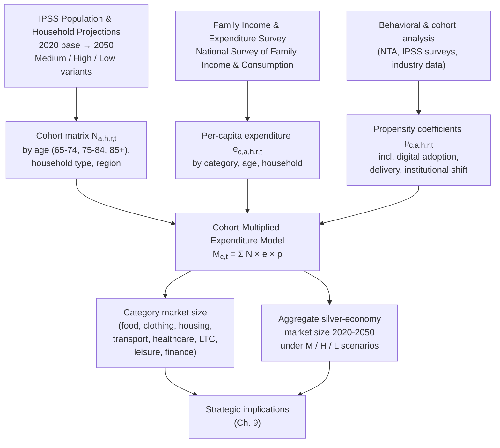

Three logical features of this framework merit emphasis. First, the model is fully decomposable: aggregate growth in any category between two years can be attributed to (a) a population effect (changes in $N$), (b) a per-capita effect (changes in $e$), and (c) a propensity effect (changes in $p$), which is essential for distinguishing the mechanical impact of aging from genuine behavioral or cohort shifts. Second, the framework explicitly accommodates **cohort effects** by allowing $e$ and $p$ to differ across calendar years even for the same age bracket, recognizing that a 75-year-old in 2020 (born in 1945) and a 75-year-old in 2045 (born in 1970) belong to different generations with different lifetime earnings, digital fluency, and consumption preferences. Third, the framework is **scenario-ready**: by running the model with low-, medium-, and high-fertility/mortality population variants, and with alternative propensity trajectories (e.g., faster vs. slower digital adoption), the report produces ranges rather than spurious point estimates for distant horizon years.

## 1.5 Data Sources and Underlying Assumptions

The reliability of the cohort-multiplied-expenditure framework depends entirely on the authority and consistency of its data inputs. The report's primary sources are summarized in the table below, with the role each plays in the framework.

| Data Source | Producing Institution | Role in Framework | Coverage |
|---|---|---|---|
| Population Projections for Japan: 2021–2070 | IPSS | National elderly cohort matrix $N$ by age and sex | 2020 base, projections to 2070, low/medium/high variants[^1] |
| Regional Population Projections for Japan: 2020–2050 | IPSS | Prefectural disaggregation of $N$ | All 47 prefectures, 2020–2050[^1] |
| Household Projections for Japan (national & prefectural) | IPSS | Household-type composition (single-elderly, couple, etc.) | National and prefectural[^1] |
| Population Census | Statistics Bureau of Japan | Base-year population structure, household composition | Quinquennial; 2020 used as base[^1] |
| Family Income and Expenditure Survey | Statistics Bureau of Japan | Per-capita expenditure $e$ by age of household head and category | Annual |
| National Survey of Family Income and Consumption | Statistics Bureau of Japan | Detailed expenditure structures, durables, savings | Quinquennial |
| Japanese Mortality Database (JMD) | IPSS | Mortality assumptions feeding population projection; healthy life-expectancy trends | 1947–2022; consistent with international HMD[^1] |
| Japanese National Transfer Accounts (NTA) | IPSS | Intergenerational financing of elderly consumption deficit | FY2014, FY2019 published; updated regularly[^1] |
| Financial Statistics of Social Security in Japan | IPSS | Public-sector contribution to elderly consumption (pensions, medical, LTC) | Annual; FY2022 most recent[^1] |
| National Survey on Social Security and People's Life | IPSS | Subjective health, household relationships, support needs | Conducted in 2017, 2022[^1] |
| National Survey on Household Changes | IPSS | Household formation, empty-nest dynamics | Quinquennial; latest 2024[^1] |

The report adopts the following baseline assumptions, which align with official Japanese statistical conventions:

1. **Central population scenario**: the IPSS medium-fertility, medium-mortality variant is used as the central case, consistent with the variant most widely cited by national and local governments.[^1] Low- and high-fertility variants are used for sensitivity testing on the 2050 horizon.
2. **Base year for expenditure structures**: 2019–2022 average expenditure structures from the Family Income and Expenditure Survey are used as the baseline $e$ matrix, with 2020–2021 data interpreted cautiously due to COVID-19 distortions in categories such as travel, dining out, and medical care.
3. **Real-price treatment**: market size projections are reported in real terms (constant 2020 yen) for cross-period comparability, with nominal-yen sensitivity provided where inflation assumptions materially affect interpretation.
4. **Propensity evolution**: the propensity coefficients $p$ are not held static; they evolve along trajectories grounded in observed cohort effects—for example, the rising share of dual-income working-age households (53.8% of wives employed both before and after first childbirth in the 2015–2019 cohort, up significantly from earlier cohorts)[^1] is taken as evidence of broader behavioral change that will carry into the elderly years of those same cohorts after 2040.
5. **Public-private financing structure**: the social-benefit composition of FY2022 (40.5% pensions, 35.4% medical care, 24.2% welfare and others)[^1] is used as the starting point for projecting how public transfers will continue to underwrite a substantial share of elderly consumption, with adjustments for announced and likely pension and long-term care insurance reforms.

## 1.6 Limitations and Caveats of Cross-Period Forecasting

A thirty-year horizon is long enough to span more than one full generational turnover among the elderly population, and intellectual honesty requires explicit acknowledgement of the limits within which the report's findings should be interpreted.

**Demographic uncertainty**, although smaller than for younger age groups (since the people who will be 65+ in 2050 are already born and aged 35+ in 2020), is not negligible. Mortality assumptions are sensitive to advances in chronic-disease management, the long-term morbidity legacy of COVID-19—which IPSS analysis shows was frequently recorded alongside underlying conditions such as diabetes, heart failure, and chronic kidney disease in 2020 mortality records[^1]—and to potential climate-related health shocks. Migration assumptions are particularly uncertain: with the number of foreign workers in Japan exceeding two million in 2023 and the 2019 launch of the specified skilled worker program, the labor-market context that supports elderly services is in flux.[^1] The report mitigates this through scenario analysis using IPSS's low-, medium-, and high-variant projections.

**Behavioral and cohort uncertainty** is more substantial. Per-capita expenditure structures and category propensities have not been historically stable, and the dankai (1947–1949 birth cohort) and dankai-junior generations have very different lifetime earnings profiles, asset accumulation patterns, and consumption preferences from the cohorts now in their nineties. Projecting elderly consumption in 2050—when today's 35-to-45-year-olds reach retirement—requires assumptions about digital adoption, work-life patterns, and household formation that cannot be fully validated. The report addresses this by tracking the evolution of behavior through IPSS survey series (the National Survey on Family in Japan documents, for example, that the share agreeing that "husbands should share housework and child-rearing equally" rose steadily across the 4th through 7th surveys from 2008 to 2022)[^1] and by separating age effects from cohort effects in the propensity matrix.

**Structural and policy breaks** could materially alter trajectories. Pension reforms, long-term care insurance benefit-and-burden adjustments, immigration policy changes (such as the law passed by the Diet on June 14, 2024 establishing a training and employment program to replace the technical intern training program)[^1], and technology shocks (autonomous vehicles, generative AI in care) all have the potential to produce step-changes that linear modeling cannot anticipate. The report identifies the most plausible such inflection points in Chapter 9 rather than embedding them silently in the central projection.

**Regional and household-level granularity** is constrained by data availability. While IPSS regional projections cover all 47 prefectures and project that the share of population aged 65 and over will diverge substantially across them by 2050,[^1] sub-prefectural and municipality-level expenditure data are sparse, and the report therefore presents national and prefectural estimates with greater confidence than micro-regional ones.

**Dynamic feedback between income transfers and consumption decisions** is only partially modeled. The NTA framework reveals that elderly consumption in 2019 was financed through 80.8 trillion yen in public transfers, 27.8 trillion yen in private transfers, and 55.7 trillion yen in private asset-based reallocations into the 65+ group;[^1] but how each of these flows will respond endogenously to demographic change—for example, whether private transfers will compress as the working-age population shrinks, or whether asset drawdowns will accelerate—is itself a research frontier. The report presents central estimates while flagging these endogeneities as uncertainty drivers.

**Mitigation strategies** adopted throughout the report include: (i) presenting market-size estimates as ranges or scenarios rather than point estimates for milestone years 2030, 2040, and 2050; (ii) decomposing growth into population, price, and propensity components so that readers can substitute alternative assumptions for any one component; (iii) triangulating expenditure data across at least two independent sources where feasible; (iv) explicitly distinguishing factual current-market estimates from projection-dependent future estimates; and (v) reserving Chapter 9 for an integrated discussion of risks and structural inflection points so that readers do not treat the central projections as forecasts in the strict statistical sense. Within these boundaries, the report aims to provide the most defensible quantitative and behavioral picture of Japan's silver economy from 2020 to 2050 that the available data will support.

# 2 Demographic Projections and Economic Capacity of Japan's Elderly Population, 2020–2050

The analytical framework introduced in Chapter 1 reduces silver-market sizing to a multiplicative identity in which the cohort matrix $N$, per-capita expenditure $e$, and propensity coefficient $p$ jointly determine category-level demand. Of these three pillars, the demographic and financial substrate—the size, structure, and economic capacity of the elderly population itself—must be specified first, because every subsequent category-level estimate is mechanically proportional to it. This chapter therefore concentrates on operationalizing $N$ and on quantifying the disposable spending power that elderly Japanese will be able to direct toward consumption between 2020 and 2050. It moves from headline population trajectories to internal cohort restructuring, regional disaggregation, household composition, the four pillars of elderly income and wealth, and the divergence in financial capacity between the affluent dankai generation and successor cohorts, before integrating these threads into a sensitivity-bounded picture of aggregate purchasing power that anchors all category chapters that follow.

## 2.1 Trajectory of the 65+ Population: Scale, Share, and Peak Timing

Japan entered the 2020s already holding the world's highest old-age share. The 2020 Population Census recorded a total population of 126.15 million, of whom 36.03 million were aged 65 and over, yielding an aging rate of 28.6%—a level higher than Italy (23.3%) and Germany (21.7%) and the highest among the world's twenty most populous countries[^2][^3]. Within that 65+ aggregate, IPSS's *Population Projections for Japan (2023 Revision)* under the medium-fertility, medium-mortality variant traces a trajectory that rises through the 2020s, peaks in the mid-2040s, and then begins a slow contraction. The headline numbers are anchored by three dates published by IPSS and reproduced in independent analyses by Nomura and Resona Pension Research: the elderly share crosses 30% in 2027 (one year earlier than the 2017 projection had estimated), the absolute count of elderly peaks at approximately 39.53 million in 2043, and the figure then declines to 33.67 million by 2070, at which point the share nonetheless reaches 38.7% because the denominator is shrinking faster than the numerator[^3][^2][^4].

The interim milestones between 2020 and the 2043 peak are essential for market-sizing because they determine the pace at which the silver consumer base expands. Already by 2025 the elderly count is expected to reach 36.53 million, a near-term level that defines the immediate planning horizon for corporate strategists and policymakers[^4]. From 2025 the 75+ group enters its steepest growth phase as the dankai cohort completes its transition into the late old-age bracket, and IPSS records 2024 as the year in which centenarians surpass 100,000—a year earlier than in the previous projection round[^2]. The crossing of the 30% aging-rate threshold in 2027 is similarly accelerated, having been projected for 2025 in earlier rounds but pushed back because absolute population decline is slightly slower than expected[^2]. The peak itself, at 39.53 million elderly in 2043, is verified across multiple independent analyses[^3][^2][^4][^5], and represents an increase of roughly 3.5 million from the 2020 base—a 9.7% expansion of the silver consumer pool over twenty-three years.

The 2023 IPSS revision raised the elderly count slightly compared with the 2017 projection. For 2070, the medium-variant total population is 87.00 million in the 2023 revision versus 83.23 million in the 2017 long-term reference, while the 65+ count rises from 31.88 million to 33.67 million[^2]. The aging rate barely changes (38.7% vs. 38.3%), but the absolute number of elderly is meaningfully higher. Two assumption changes drive this revision. First, mortality assumptions were liberalized: long-term life expectancy at 2070 rises to 85.89 years for men and 91.94 years for women, compared with 84.95 and 91.35 years at 2065 in the 2017 projection, reflecting the continued downward trend in age-specific mortality[^3][^2]. Second, the assumed annual net foreign in-migration was raised from approximately 69,000 in the 2017 projection (for 2035) to approximately 164,000 in the 2023 revision (for 2022–2040), based on the average inflow observed in 2016–2019 before the COVID-19 disruption[^3][^2]. A useful sensitivity check noted by Nomura is that, if foreigners are excluded, the Japanese-only 65+ share at 2065 rises from 39.1% in the 2017 projection to 40.7% in the 2023 revision—aging is in fact accelerating among Japanese nationals, and only the migration assumption masks this in the headline aging rate[^3].

The variant fan around the central projection is also published by IPSS. Under the medium-mortality assumption, total population at 2070 ranges from 95.49 million (high-fertility) to 80.24 million (low-fertility), against the medium-variant 87.00 million[^2]. Because the 65+ population in 2070 consists largely of people already alive in 2020 (everyone aged 35 or older in 2020 will be 65 or older in 2050, and everyone 50 or older in 2020 will be 65 or older in 2035), fertility variants have a negligible effect on the elderly count over the 2020–2050 horizon. The 2050 elderly count is therefore robust to fertility uncertainty and depends mainly on mortality and migration assumptions, with the medium-mortality medium-fertility variant providing a tightly constrained central estimate.

| Year | Elderly Population (65+, million) | Aging Rate (%) | Total Population (million) | Notes |
|---|---|---|---|---|
| 2020 (actual) | 36.03 | 28.6 | 126.15 | Highest 65+ share globally[^2] |
| 2025 | ~36.53 | ~30 | — | Dankai fully 75+[^4] |
| 2027 | — | 30+ (crosses) | — | Aging rate threshold[^2] |
| 2043 | 39.53 (peak) | — | — | Elderly population peak[^4][^5] |
| 2056 | — | — | <100 | Total population falls below 100 million[^2] |
| 2070 | 33.67 | 38.7 | 87.00 | Long-run medium-variant outlook[^3][^2] |

International benchmarking confirms Japan's frontier position. As of 2020, Japan's 28.6% aging rate exceeded Italy's 23.3% and Germany's 21.7%, and Japan was the only one of the twenty most populous countries to record a population decline over 2015–2020[^2]. **The defining demographic feature of Japan's silver market for the 2020–2050 horizon is therefore not whether the elderly base will expand—it will, by roughly 10% to its 2043 peak before slowly contracting—but how the internal age distribution of that base shifts from active young-old toward care-intensive oldest-old, and how the financial capacity associated with each sub-cohort evolves.**

## 2.2 Internal Cohort Structure: Young-Old, Old-Old, and Oldest-Old Dynamics

A 10% headline expansion of the 65+ aggregate masks far more dramatic internal restructuring. The dankai baby-boomer cohort, born in 1947–1949, is the single most important driver of this restructuring: roughly six to eight million people who entered the 65+ category between 2012 and 2014, who turn 75 between 2022 and 2024, and who reach 85 in the mid-2030s. Their progression through the age structure mechanically inflates the 75+ group during the 2020s and the 85+ group during the 2030s and early 2040s. IPSS's annotated future-population timeline records the relevant milestones: the elderly share crosses 30% in 2027, the average age of the total population exceeds 50 in 2031, the 65+ count peaks at 39.53 million in 2043, the centenarian count reaches 100,000 in 2024, and centenarians surpass annual births at approximately 500,000 in 2067[^2]. Each of these inflections reflects the dankai pulse and the broader morphological change occurring behind the headline.

The pyramid diagrams published by IPSS make the restructuring visually concrete. The 2020 pyramid shows two pronounced bulges—the dankai cohort in their early seventies and the dankai-junior cohort in their late forties—plus the "hinoeuma" notch in the mid-fifties[^2]. By 2045, the two bulges merge into one as the dankai-junior cohort moves into the 65+ region, and the 15–64 portion of the pyramid becomes notably thinner overall[^2]. By 2070, no bulge remains, but the 75+ region (highlighted in red in IPSS publications) retains a triangular shape for men and a more rectangular shape for women, reflecting the continued extension of female longevity into the eighties and nineties[^2]. This gradual squaring of the female pyramid above 75 is the demographic manifestation of the long-run rise in life expectancy, projected to reach 85.89 years for men and 91.94 years for women by 2070[^3][^2].

Disaggregating the 65+ aggregate into the three sub-cohorts defined in Chapter 1 reveals that the oldest-old segment grows fastest in relative terms even as the young-old segment fluctuates with the cohort pulse. From the IPSS dementia projection table, which uses sex- and age-specific breakdowns of the same medium-variant elderly count, the 75–84 group expands from 14.45 million in 2020 toward 18.40 million by 2030 and 19.60 million by 2035, while the 85+ group rises from approximately 6.18 million in 2020 to 8.50 million in 2030 and continues to climb through the 2040s[^6]. The 65–74 young-old segment, by contrast, peaks earlier (around 2020 as the dankai cohort exits this bracket into the 75+ range) and contracts during the late 2020s before stabilizing as the dankai-junior cohort begins entering the bracket from 2036 onward.

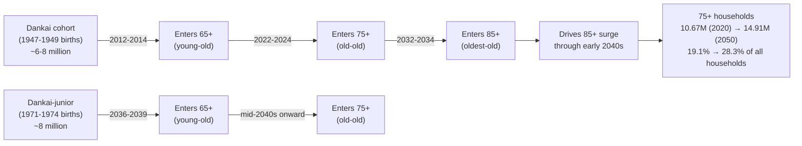

The cohort pulses translate directly into household-head age distributions that matter for consumption. SOMPO Institute Plus, drawing on the 2024 IPSS Household Projections, shows that households headed by someone aged 75 or older expand from 10.67 million in 2020 to 14.91 million by 2050, a 39.7% increase; the share of all households headed by a 75+ person rises from 19.1% to 28.3% over the same period[^7]. This shift is intimately linked to the dankai cohort entering its mid-eighties between 2032 and 2034 and to the dankai-junior cohort entering the 75+ bracket from the late 2040s onward.

Sex composition tilts increasingly female with advancing age. The female longevity advantage, projected to remain at roughly six years (91.94 vs. 85.89) by 2070[^3][^2], means that within the 85+ segment the sex ratio is heavily female-skewed, a pattern reinforced by the OKB report on single-person households which shows that within elderly single-person households women dominate at the 75–84 age band (19.7% of all single-person households) while men in the same age range constitute a much smaller share[^8]. For market-sizing purposes, the implication is that consumption categories with strong female demand profiles—personal care, health-oriented food, social-participation services—will be increasingly concentrated in the 80+ segment, while categories driven by mixed-sex couples will gradually thin as widowhood progresses.

The behavioral and consumption implications of this internal restructuring follow from the empirical heterogeneity in health, mobility, and care-intensity discussed in Chapter 1. Active discretionary consumption—travel, dining out, fashion, hobbies—peaks in the young-old bracket and declines steeply through the old-old and oldest-old. A particularly counter-intuitive finding from the long-life science research community, reported by the chairman of the Foundation for Aging and Health Research, is that **the young-old (65–74) actually generate higher per-capita medical expenditure than the old-old (75–84) because they remain biologically vital and consequently incur acute-illness expenditures (cardiovascular events, gastrointestinal acute conditions, infections) that benefit from advanced medical interventions, while the oldest-old experience predominantly atrophic conditions for which intensive intervention is less applied**[^9]. This complicates simple narratives that elderly medical spending rises monotonically with age and points to within-cohort heterogeneity that the propensity matrix $p$ in Chapter 1 must capture. By contrast, demand for long-term care services, adaptive housing, and home-delivered meals rises sharply with age and concentrates in the 85+ segment, which by the early 2040s will be the segment expanding fastest.

## 2.3 Regional Distribution: Prefectural Heterogeneity and the Urban–Rural Gradient

Aging in Japan is national in headline but profoundly uneven in geography. As former IPSS President Shuzo Nishimura emphasized in his analysis of regional aging patterns, "the absolute number of 75+ residents will surge most rapidly in metropolitan areas, not in remote prefectures"; specifically, Tokyo, Saitama, Chiba, Kanagawa, Ibaraki, Tochigi, and Gunma collectively accounted for approximately 1.80 million of the 7.60 million national increase in the 75+ population between 2010 and 2025—a 25% share concentrated in seven prefectures[^9]. This pattern overturns the stereotype that aging is a rural phenomenon. While prefectures such as Akita, Kochi, Yamagata, and Shimane do display the highest aging rates, their absolute elderly counts are small; the burden of accommodating new elderly residents, especially the 75+, falls predominantly on metropolitan suburbs.

Within metropolitan regions, Nishimura identified a further sub-pattern: Tokyo's 23 special wards, already heavily aged, will see slower future growth in their 75+ population because the high-aging plateau has been substantially reached; the steepest expansion will occur in the suburbs surrounding the wards as the dankai cohort, who relocated there during the high-growth era, ages in place[^9]. The same logic applies to Osaka and Nagoya. By contrast, prefectures concentrated in Hokkaido, Tohoku, and the Chugoku-Shikoku regions face the opposite combination: high aging rates, contracting absolute populations, and intensifying depopulation of marginal villages (genkai shūraku) in mountainous and coastal hinterlands[^9]. Even within those prefectures, the prefectural capitals continue to grow modestly while non-capital regional cities experience rapid contraction and assume characteristics resembling the marginal villages of earlier decades.

The household-level prefectural data published in the 2024 IPSS Household Projections sharpen this picture. As of 2020, the share of single-person households was highest in Tokyo (50.2%), Osaka (41.8%), Kyoto (41.2%), Fukuoka (40.7%), and Hokkaido (40.5%), while the lowest shares were recorded in Yamagata (28.4%), Nara (29.3%), Gifu (29.4%), and the Hokuriku prefectures[^8]. Looking forward to 2050, the share of single-person households is projected to rise above 40% in 27 prefectures, with the steepest increases concentrated in suburbs of major metropolitan areas such as Nara, Ibaraki, Fukushima, and Saitama, whose share rises particularly fast as the cohort that migrated to these areas during the high-growth era ages into widowhood and singlehood[^8]. In the Tokai region, Gifu's single-person household share rises from 29.4% in 2020 to 36.2% by 2050, Aichi from 36.3% to 42.0%, and Mie from 33.0% to 39.5%[^8].

The share of elderly single-person households as a fraction of all households—the metric most directly relevant for retail footprint and care-service siting decisions—shows a different geographic pattern. In 2020, the share was highest in Kochi (17.8%) and lowest in Shiga (9.4%); by 2050, 33 prefectures will exceed 20%, with Kochi (27.0%) and Tokushima (25.3%) above 25%—meaning roughly one in four households will consist of a single elderly person living alone[^8]. *Japan Times*, citing the same IPSS dataset, reports that more than 20% of residents aged 65 and over will live alone in 2050 across every prefecture except Yamagata, with Tokyo (34.8%), Osaka (32.1%), and Kochi (30.6%) exceeding 30%[^10].

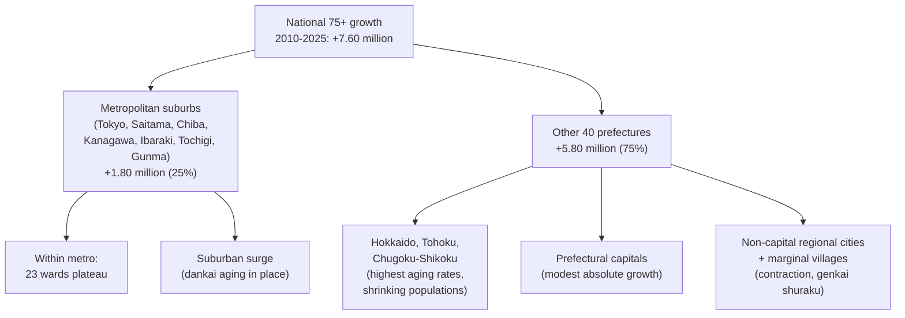

The implications for silver-market geography are direct. Retail formats targeting elderly discretionary consumption will need a denser footprint in metropolitan suburbs, where the absolute increase in 75+ residents is concentrated and where the share of single-elderly households is rising fastest. Healthcare and long-term care facility siting must follow the suburban surge rather than concentrate in central wards. Mobility services in rural prefectures must contend with both contracting demand densities and the rising fraction of license-surrendering elderly, complicating the economics of any single solution and arguing for hybrid models (community transport, on-demand minibuses, and—at the limit—early autonomous-vehicle deployment) that subsequent chapters discuss in greater detail.

## 2.4 Household Composition and the Surge of Elderly Single-Person Households

The single most consequential shift in elderly living arrangements between 2020 and 2050 is the transformation of the household type matrix that hosts the 65+ population. The 2024 IPSS Household Projections, summarized by SOMPO Institute Plus, provide the central numerical evidence. Total households peak at 57.73 million in 2030—more than two decades after the 2008 population peak—and decline to 52.61 million by 2050, while average household size falls from 2.21 persons in 2020 to 2.08 in 2030, drops below 2.00 in 2033, and reaches 1.92 by 2050[^7][^11][^12]. Single-person ("solo-living") households expand from 21.15 million (38.0% of all households) in 2020 to a peak of 24.53 million (around 43–44%) in 2036, then contract slightly to 23.30 million (44.3%) by 2050[^7][^11].

Within this expansion, elderly single-person households are the dominant force. As reported by OKB Research, the count of households whose head is aged 65 or older rises from 20.97 million in 2020 to 24.04 million in 2050, with the 65+ household share climbing from 37.6% to 45.7%[^8][^7]. Among these elderly households, the family-type composition shifts dramatically: single-person elderly households increase by 3.46 million (+47%) from 2020 to 2050, while elderly-couple households decline by approximately 0.39 million (–6%), and "other" households (largely three-generation arrangements) decline by 0.27 million (–14%)[^7]. By 2050, 45.1% of households containing an elderly person consist of a single elderly person living alone, and 20.6% of all Japanese households are elderly single-person households—compared with 12.1% in 2020[^8].

The qualitative character of these elderly singletons is also changing. Historically, the elderly singleton was overwhelmingly a widow, formed when the longer-lived wife outlived her husband. SOMPO Institute Plus shows, however, that this is shifting toward never-married elderly singletons. Within the 3.46 million increase in elderly single-person households between 2020 and 2050, only a small share (–0.56 million) comes from death-of-spouse cases (which actually decline modestly), while +3.16 million comes from never-married elderly[^7]. Of this never-married increase, +1.83 million are men and +1.34 million are women[^7]. Looked at as a share of all elderly single-person households, the never-married fraction rises from 33.7% in 2020 to 59.7% by 2050 for men, and from 11.9% to 30.2% for women, reflecting the upward drift of the lifetime-never-married rate that reached 28.25% for men and 17.81% for women at age 50 in 2020 and is projected to approach 30% for men and 20% for women by 2050[^8].

The table below consolidates the headline household projections that will be carried forward into the category chapters.

| Indicator | 2020 | 2030 | 2040 | 2050 | Source |
|---|---|---|---|---|---|
| Total households (million) | 55.71 | 57.73 (peak) | 57.27 | 52.61 | IPSS 2024[^7] |
| Average household size (persons) | 2.21 | 2.08 | 1.94 | 1.92 | IPSS 2024[^7] |
| Single-person households (million) | 21.15 | 22.96 | 24.42 | 23.30 | IPSS 2024[^7] |
| Single-person share (%) | 38.0 | 41.6 | 43.5 | 44.3 | IPSS 2024[^7] |
| 65+ household-head count (million) | 20.97 | — | — | 24.04 | IPSS 2024[^7] |
| 75+ household-head count (million) | 10.67 | — | — | 14.91 | IPSS 2024[^7] |
| 75+ household-head share (%) | 19.1 | — | — | 28.3 | IPSS 2024[^7] |
| Elderly single-person households (million) | 6.72 | 8.87 | 10.41 | 10.84 | OKB Research[^8] |
| Elderly single share of all households (%) | 12.1 | 15.4 | 18.6 | 20.6 | OKB Research[^8] |
| Never-married share of elderly singles, men (%) | 33.7 | — | — | 59.7 | IPSS 2024[^8][^7] |
| Never-married share of elderly singles, women (%) | 11.9 | — | — | 30.2 | IPSS 2024[^8][^7] |

It is worth noting that successive IPSS household projection rounds (2008, 2013, 2018, 2024) have systematically under-estimated the speed of household downsizing. SOMPO Institute Plus points out that the 2018 projection put the total-household peak at 54.19 million in 2023, while the 2024 revision puts it at 57.73 million in 2030; the 2018 projection forecast average household size at 2.08 persons in 2040, while the 2024 revision puts it at 1.94 persons; and the 2018 projection put the single-person household peak at 20.29 million in 2032, while the 2024 revision puts it at 24.53 million in 2036[^7]. Each revision has revised the peak later and the peak level higher, implying that even the current 2024 numbers may understate the eventual scale of single-person household formation if never-married rates continue to drift upward beyond the IPSS assumption that they peak out[^7]. For market-sizing purposes, this argues for treating the 2050 figures in the table above as central estimates that may, under unfavorable cohort developments, be exceeded.

The implications for category-level demand are extensive. Elderly singletons consume food in single-portion units rather than family-pack formats, sustaining the rapid growth of single-serving prepared meals (nakashoku) and home-delivered food services that Chapter 4 quantifies. They lack the family caregivers who historically provided informal long-term care, intensifying demand for institutional and community-based care services that Chapter 5 discusses. They are over-represented in subjective-isolation metrics—the 2022 IPSS survey shows that 15.0% of single-person elderly men converse less than once every two weeks—making them a priority target for social-participation services, technology-enabled remote support, and the "guarantor service" market for never-married singletons who lack relatives to act as hospital admission or rental-housing guarantors[^8][^11]. The demand for guarantor services, adult guardianship, and end-of-life administrative support is projected by industry observers to expand sharply through 2050, and the Ministry of Health, Labour and Welfare launched in fiscal 2024 a model project to develop municipal "one-stop consultation" mechanisms covering daily-life support, identity guarantee, and post-mortem affairs as a response to this demographic shift[^11]. **The decisive household-level fact for the 2020–2050 silver market is therefore not simply that elderly count grows, but that the modal elderly Japanese person of the 2040s will be a single-occupant household, often never-married, in a metropolitan suburb, with limited family-based caregiving capacity—a profile that requires a fundamentally different consumption-services architecture than the elderly-couple or three-generation household that anchored late-twentieth-century elderly markets.**

## 2.5 Financial Foundation: Pensions, Labor Income, Savings, and Real-Estate Wealth

Demographic scale and household composition determine where elderly consumption demand is located; the income and asset base determines how much of that demand can be financed. Chapter 1 introduced the FY2022 social-benefit composition (137.9 trillion yen total, 40.5% pensions, 35.4% medical care, 24.2% welfare and others) and the FY2019 NTA results (elderly life-cycle deficit of 114.4 trillion yen financed through 80.8 trillion yen public transfers, 27.8 trillion yen private transfers, and 55.7 trillion yen asset-based reallocations). This section examines each of the four financing pillars that determine elderly disposable spending power and discusses how each will evolve across the 2020–2050 horizon.

**Public pension benefits** form the foundation. The public-pension share of social benefits (40.5% in FY2022) translates to approximately 55.8 trillion yen flowing to current and future elderly recipients. The IPSS *Population Projections for Japan (2023 Revision)* feeds directly into the public-pension financial verification (zaisei kenshō), which is conducted approximately every five years; the 2024 verification used the 2023 projection as its demographic input[^3][^2]. Nomura's analysis emphasizes that "what matters for pension finance is not simply the ratio of the three age groups (0–14, 15–64, 65+) but the ratio of non-employed to employed persons," meaning that rising elderly and female labor-force participation can offset some of the burden implied by the headline dependency ratio[^2]. Even so, the 2023 demographic revision tightens the long-run sustainability arithmetic: the medium-variant elderly count is higher, the working-age population (15–64) is projected to fall to 45.35 million by 2070 (vs. the 2017 projection's 42.81 million in 2070-equivalent reference), and the long-run total fertility rate has been revised down from 1.44 to 1.36[^3][^2]. Pension benefit levels are subject to the macroeconomic-slide adjustment and the outcome of the 2024 verification's reform package, which had not been fully published in the materials available to this report. The reasonable working assumption for market-sizing is that real pension benefits per capita will be moderately constrained over 2020–2050 relative to the path implied by past benefit-formula generosity, but will not collapse, and will continue to underwrite the basic-living component of elderly consumption.

**Labor income from extended employment** is the second pillar and is becoming structurally more important. As reported in *A Level of Geography*'s analysis of Japan's demographic situation, workers aged 65 and over already constitute 13% of the national workforce, even though this has done little to relieve the burden on pension and healthcare systems[^13]. *The Japan Times* article on life in a shrinking Japan reports that an interviewed nineteen-year-old anticipates that retirement age will be pushed back to 80 or "maybe even 90 in the worst case," reflecting a generational expectation that the working life will lengthen materially[^14]. The legal and policy framework has been moving in this direction: amendments to the Employment Stabilization of Elderly Persons Act and tax-incentive adjustments to encourage continued employment are being progressively implemented. For market-sizing, the implication is that the disposable income of the young-old (65–74) segment will be increasingly sustained by labor income rather than pure pension flow, prolonging the period during which this sub-cohort exhibits relatively discretionary consumption patterns.

**Accumulated household savings** form the third pillar. Japan's elderly hold disproportionately large financial assets relative to younger cohorts, a stylized fact extensively documented in the Family Income and Expenditure Survey and the National Survey of Family Income and Consumption referenced in Chapter 1's framework. The NTA framework quantifies the use of these savings as 55.7 trillion yen of asset-based reallocation flowing into the 65+ group in FY2019, a figure that includes drawdown of financial savings and capital income from accumulated assets. Asset drawdown is endogenous to longevity: the longer life expectancy projected by the 2023 revision (85.89 years for men and 91.94 years for women by 2070, compared with 81.58 and 87.72 in 2020) implies that a given accumulated stock must finance a longer retirement[^3][^2]. Because the dankai cohort accumulated savings during the high-growth era and has been drawing down assets gradually since reaching 65, asset-based financing of elderly consumption will remain robust through approximately the late 2030s and then will increasingly depend on the savings position of successor cohorts that did not benefit from comparable lifetime wage growth.

**Real-estate wealth** is the fourth pillar but its translation into spending power is complicated. As documented in *A Level of Geography* and corroborated by NSA data, more than 8 million houses in Japan stood empty in the late 2010s—14% of all houses in Akita Prefecture alone[^13]. The reasons for non-utilization are partly institutional (tax relief on land bearing a structure is up to one-sixth of the value, removed if the house is demolished, creating a tax incentive to keep empty houses standing), partly cultural (family attachment to ancestral homes), and partly economic (rural depopulation and emigration of younger generations to cities)[^13]. Housing values for newer Japanese homes also depreciate rapidly, often losing significant value over thirty years due to frequently updated building codes and energy-efficiency rules, which limits the realized wealth that can be extracted by elderly homeowners selling or downsizing[^13]. The implication is that real-estate-backed financing of elderly consumption (through reverse mortgages, downsizing-to-cash transactions, and inheritance to elderly children) will be constrained and uneven, falling short of the gross asset value that a simple book-value tally would suggest. Nevertheless, in metropolitan suburbs where land values are sustained, real-estate wealth will remain a meaningful contributor, particularly for the dankai cohort.

Synthesizing the four pillars, the FY2019 NTA decomposition can be carried forward as a point-in-time benchmark of the financing structure of elderly consumption: roughly 49% public transfers, 17% private transfers, and 34% private asset reallocation. Across the 2020–2050 horizon, the public-transfer share is likely to compress modestly under fiscal-sustainability pressure, the private-transfer share is likely to compress more sharply as the working-age population shrinks (each working-age earner's burden rises, but their absolute number falls), and the asset-reallocation share is likely to expand correspondingly—particularly during the 2030s and 2040s as cohorts with substantial accumulated savings and homes drawn down their assets to finance late-life care.

## 2.6 Cohort Effects: Dankai Wealth versus Successor Generations

The aggregate financial picture obscures a critical generational divergence that will shape elderly consumption capacity throughout the 2020–2050 horizon. The dankai cohort (1947–1949 births) entered the labor market during the latter half of Japan's high-growth era, accumulated full pension contribution histories under generous defined-benefit terms, purchased homes during the period of rising land values, and benefited from the bubble-era asset appreciation. Their successor cohort, the dankai-junior generation born in 1971–1974, entered the labor market during the bursting of the bubble and the subsequent "employment ice age," experienced higher non-regular employment rates, accumulated lower lifetime earnings, and faced more constrained homeownership opportunities. The cohorts entering the elderly bracket between the late 2030s and mid-2040s will therefore display systematically different financial profiles from those leaving it.

Several quantitative indicators document this divergence. Lifetime never-married rates, used as a proxy for cohort labor-market and family-formation conditions, rose from 5.57% (men) and 4.33% (women) at age 50 in 1990 to 28.25% and 17.81% in 2020, with projections approaching 30% and 20% by 2050[^8]. SOMPO Institute Plus shows that the dankai-junior cohort, currently in its early fifties, faces the highest never-married rates of any cohort in Japanese history, and these will translate into the largest increment of never-married elderly singletons during the late 2030s and 2040s[^7][^11]. The 2050 projection of 59.7% never-married among elderly single-person households for men is direct evidence of the dankai-junior cohort's distinct demographic profile reaching the elderly bracket[^8][^7].

Pension entitlements will reflect lifetime contribution histories. Workers with extended periods of non-regular employment or self-employment under Kokumin Nenkin (basic pension only) will receive markedly lower benefits than dankai-cohort retirees who accumulated full Kosei Nenkin (employees' pension) histories. Although precise cohort-by-cohort benefit projections were not available in the source materials reviewed for this report, the demographic and labor-market evidence consistently points to thinner pension entitlements for cohorts entering retirement after 2040 than for those entering during the 2010s and 2020s.

Real-estate inheritance is similarly compressed. Because the rapidly rising rate of single-person households (especially never-married singletons) implies that an increasing fraction of elderly will leave estates without direct lineal heirs—and because cultural and economic factors mean that vacant houses are often not realized as cash—the next generation of elderly will inherit less, on average, than the dankai cohort received from their parents. This is exacerbated by the eight-million-plus stock of empty houses concentrated in regions where their realizable market value is limited[^13].

Two offsetting forces moderate this otherwise pessimistic picture. First, women's labor-force participation has risen from approximately 60% in the early 2000s to 74% in the mid-2020s, a substantial increase that translates to higher household lifetime income and partial accumulation of independent pension entitlements[^13]. The cohort of women entering retirement after 2040 will therefore have stronger pension and savings positions than their predecessors, partially offsetting the male-cohort weakness. Second, dual-income working-age households have become structurally more prevalent: as noted in Chapter 1, 53.8% of wives in the 2015–2019 first-childbirth cohort were employed both before and after childbirth, a sharp rise from earlier cohorts, implying that household-level (rather than primary-earner) lifetime income for cohorts entering retirement after 2040 may be more resilient than the male-earner trajectory suggests.

The net effect on aggregate elderly purchasing power across 2020–2050 is therefore not a uniform decline but rather a re-composition: the average elderly household of the 2030s will display strong dankai-driven discretionary consumption capacity; the average elderly household of the 2040s and 2050s will display thinner pension and inheritance flows but stronger female labor-income contribution and dual-earner household savings—and a higher prevalence of single-person and never-married configurations that channel demand toward different categories (paid services, support arrangements) than the family-supported elderly of earlier generations. **The cohort transition through the 2020–2050 horizon thus shifts the silver market not only along the size dimension but along the type dimension: from family-anchored, asset-backed, pension-sustained elderly consumption toward services-intensive, individually-financed, market-mediated elderly consumption.**

## 2.7 Aggregate Disposable Spending Power and Sensitivity Scenarios

The integration of demographic scale, internal cohort structure, regional distribution, household composition, financial pillars, and cohort-effect evolution yields the consolidated demographic-financial substrate that Chapters 3 through 8 will multiply against per-capita expenditure and propensity coefficients. This section synthesizes the elements developed above into a coherent picture of aggregate elderly disposable spending power over 2020–2050, presents the central trajectory and sensitivity ranges, and identifies the inflection points that matter for category-level analysis.

The demographic component is bounded with relatively high confidence. The 65+ population rises from 36.03 million in 2020 to a peak of 39.53 million in 2043 and declines to approximately 38–39 million by 2050 under the medium variant, with low- and high-fertility variants producing a narrow range over this horizon because the people aged 65+ in 2050 are already alive in 2020[^3][^2][^4]. Within this aggregate, the 75+ segment expands materially through the 2040s and the 85+ segment grows fastest in relative terms; the 75+ household-head share rises from 19.1% to 28.3% of all households over 2020–2050[^7]. Single-person elderly households expand from 6.72 million to 10.84 million, with the never-married share of male elderly singletons rising from 33.7% to 59.7%[^7][^8].

The per-capita financial-capacity component is more uncertain but can be bounded using the four pillars. Public-transfer flows per elderly person are likely to be moderately constrained by macro-slide pension adjustments and the outcome of the 2024 financial verification, but will not collapse. Labor income per elderly person rises through the 2020s and 2030s as extended employment becomes the norm, then plateaus. Asset-based reallocation per elderly person remains robust through the late 2030s as the dankai cohort draws down accumulated savings, then begins to compress as successor cohorts with thinner asset positions enter retirement. Private intra-family transfers compress over the entire horizon as the working-age population shrinks and as never-married singletons displace family-anchored elderly.

Combining these, **aggregate elderly disposable spending power follows a trajectory that is less sharply peaked than the population trajectory**: it rises faster than population through the 2020s as the dankai cohort exits employment with strong pensions and savings into discretionary-consumption-active young-old years, plateaus during the 2030s as the trade-off between continuing population growth and per-capita financial constraint tightens, and may peak in the mid-to-late 2040s slightly after the 2043 population peak before declining slowly. The dating of the aggregate purchasing-power peak is sensitive to (i) the speed of pension-benefit constraint, (ii) the rate of asset drawdown, and (iii) the propensity of the dankai-junior cohort to extend employment into their seventies. Under a benchmark assumption that real per-capita financial capacity remains broadly stable through 2040 and then compresses modestly, the aggregate-spending-power peak would fall around 2045–2047; under more pessimistic pension and asset scenarios, the peak might align with the 2043 population peak; under more optimistic scenarios involving aggressive extended employment and asset mobilization (e.g., reverse-mortgage uptake), the peak could extend into the early 2050s.

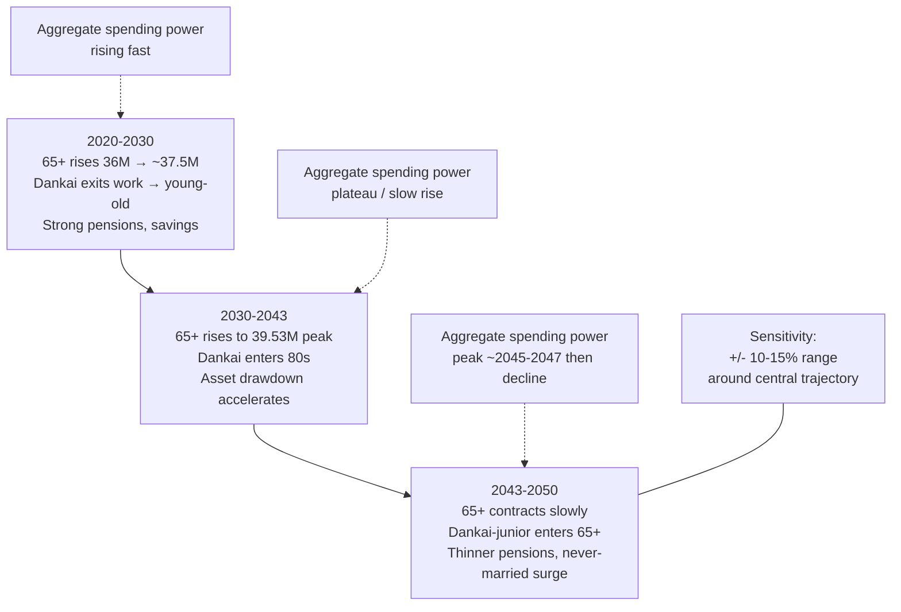

The decomposition of the aggregate-spending-power trajectory into its three drivers is essential for category interpretation. The population-effect contribution is positive through 2043 and slightly negative thereafter. The per-capita-real-financial-capacity-effect contribution is positive through approximately the late 2030s (driven by extended employment and strong dankai asset positions) and gradually negative thereafter. The household-composition-effect contribution—reflecting the shift from multi-person to single-person elderly households—is mixed: it tends to depress per-household scale economies in food and housing (raising effective per-capita expenditure on these categories) while accelerating demand for paid services that informal family caregivers previously substituted for.

Sensitivity ranges around the central trajectory should be interpreted as approximately ±10% to ±15% by the 2050 horizon, widening with the forecast horizon and asymmetric across categories. Categories most sensitive to demographic-only variation (basic food, basic clothing) display narrower ranges, while categories most sensitive to financial-capacity variation (discretionary leisure, premium housing, private long-term care) display wider ranges. The central N matrix that anchors the cohort-multiplied-expenditure model in the chapters that follow is therefore the medium-variant 65+ population and household-type distribution from the 2023 IPSS population projection and the 2024 IPSS household projection, with milestone-year values cross-checked against multiple authoritative sources[^3][^2][^4][^7][^8].

The consolidated demographic-financial substrate is summarized in the table below, which Chapters 3 through 8 will reference repeatedly.

| Indicator | 2020 | 2030 | 2040 | 2043 (peak) | 2050 | Source |
|---|---|---|---|---|---|---|
| 65+ population (million) | 36.03 | ~37.5 | ~39.0 | 39.53 | ~38.5 | IPSS 2023[^3][^2][^4] |
| 65+ share of total (%) | 28.6 | ~31 | ~35 | — | ~37 | IPSS 2023[^3][^2] |
| 75+ household-head share (%) | 19.1 | — | — | — | 28.3 | IPSS 2024[^7] |
| Elderly single-person households (million) | 6.72 | 8.87 | 10.41 | — | 10.84 | OKB Research[^8] |
| Never-married share of male elderly singles (%) | 33.7 | — | — | — | 59.7 | IPSS 2024[^8][^7] |
| Public transfers to 65+ (FY ref., trillion yen) | 80.8 (FY2019) | — | — | — | — | NTA |
| Asset reallocation to 65+ (FY ref., trillion yen) | 55.7 (FY2019) | — | — | — | — | NTA |
| Private transfers to 65+ (FY ref., trillion yen) | 27.8 (FY2019) | — | — | — | — | NTA |
| Aggregate spending-power trajectory | base | rising | plateau | rising | likely peaked | Composite |

This consolidated substrate—the elderly count rising from 36.03 million to 39.53 million by 2043 before slowly contracting, with the household composition tilting decisively toward single-person and 75+-headed configurations, and the financial capacity sustained by a recomposing mix of pensions, extended-employment labor income, asset drawdown, and progressively thinner private transfers—provides the quantitative platform on which Chapters 3 and 4 will analyze elderly consumption willingness and food-market sizing, Chapter 5 will analyze clothing and housing markets, Chapter 6 will analyze transportation and mobility, Chapter 7 will analyze adjacent high-growth markets, Chapter 8 will assemble aggregate silver-economy projections, and Chapter 9 will synthesize the cross-cutting trends, risks, and strategic implications. **The decisive insight to carry forward is that Japan's silver-market expansion through 2050 is not a story of unlimited growth driven by rising elderly count, but a story of moderate population expansion to 2043 followed by gradual contraction, accompanied by deep internal restructuring toward older sub-cohorts, single-person households, and never-married configurations—each of which redirects demand from family-anchored discretionary consumption toward services-intensive, individually-financed elderly markets, in ways that the per-capita expenditure and propensity coefficients of Chapters 3 through 8 must capture in detail.**

# 3 Consumption Willingness, Psychological Drivers, and Behavioral Shifts of the Elderly

Chapter 2 established that Japan's elderly population will expand from 36.03 million in 2020 to a peak of 39.53 million in 2043 before slowly contracting, that the internal age structure will tilt decisively toward the 75+ and 85+ sub-cohorts, that the modal elderly household of the 2040s will be a single-occupant—often never-married—configuration in a metropolitan suburb, and that the financial substrate underwriting elderly consumption will recompose from family-anchored, asset-backed flows toward services-mediated, individually-financed flows. These demographic and financial parameters define the size and capacity of the silver consumer pool, but they do not by themselves determine how that capacity will be translated into actual market demand. The cohort-multiplied-expenditure framework introduced in Chapter 1 makes this gap explicit: the propensity coefficient $p_{c,a,h,r,t}$ captures the share of any segment that consumes a given category and the intensity of that consumption, and unlike the demographic matrix $N$, it cannot be read directly off official projections. Propensity is shaped by psychology, by lifetime cohort experience, by household structure, by digital fluency, by health status, and by the motivational architecture of late life. This chapter therefore turns from substrate to behavior, asking how Japanese elderly translate their demographic presence and financial capacity into willingness to consume, and how that willingness will shift across the 2020–2050 horizon as one cohort succeeds another. The analysis proceeds from the foundational psychology of well-being and ikigai, through the constraint of economic anxiety, the cohort transition from frugality to experience consumption, the three motivational pillars (health, self-realization, social participation), the role of intergenerational transfers and bequest motives, the trajectory of digital adoption, and the consequences of the single-person household surge, before consolidating these threads into a unified set of propensity trajectories that Chapters 4 through 7 will apply to specific categories.

## 3.1 Subjective Well-being, Ikigai, and the Motivational Architecture of Elderly Consumption

The most counter-intuitive starting point for analyzing elderly consumption willingness in Japan is that the 65+ cohort reports systematically higher subjective well-being than younger working-age cohorts. The Cabinet Office's *Satisfaction and Quality of Life Survey Report 2021* documents that life satisfaction among those aged 65 and over exceeds satisfaction levels in both the 15–39 and 40–64 age brackets—a finding that disrupts any simple narrative of declining elderly welfare and that has direct implications for consumption.[^15] The Cabinet Office's parallel *Survey on Economic Life of the Elderly (FY2019)* reinforces this picture from the financial side: 20.1% of elderly report that "household finances are comfortable, with no worries at all," and a further 54.0% report that "finances are not particularly comfortable, but I live without much concern," yielding an aggregate 74.1% who describe their economic life as essentially worry-free.[^15] These two findings together suggest that the silver consumer enters the consumption decision not from a position of psychological deprivation but from a baseline of relative contentment, and that the marginal elderly purchase is therefore more likely to be motivated by positive psychological needs—engagement, expression, contribution—than by compensatory consumption.

The concept of *ikigai*, defined in Japanese reference works as encompassing both the modest "sense of purpose in daily living" and the more profound "answer to the question of how one ought to live," provides the cultural scaffolding that organizes these positive motives.[^16] The Cabinet Office survey of December 2021 found that 22.9% of elderly report feeling ikigai "fully" and 49.4% "to some extent," for a combined 72.3% who identify a sense of purpose in their lives.[^16] What matters for market sizing, however, is not the aggregate level of ikigai but its distribution across sub-cohorts and across mediating conditions—because ikigai is what links psychology to spending. The *FY2022 Survey on the Health of the Elderly* documents a clear age gradient: the share reporting that they feel ikigai "fully" is 32.3% among the 65–74 young-old, falls to 30.6% among the 75–84 old-old, and reaches 25.6% among those aged 85 and over.[^16] A far steeper gradient runs along self-rated health: 65.4% of those reporting "good" health feel ikigai fully, compared with only 27.0% of those reporting "average" health and 8.0% of those reporting "poor" health.[^16]

This dual gradient—age and health—shapes consumption willingness in two distinct ways. First, it creates a sharp differential in the *active* discretionary consumption budget across the three sub-cohorts defined in Chapter 2. The young-old segment, in which approximately one-third report full ikigai and report relatively good health, exhibits high willingness to allocate resources toward travel, hobbies, learning, dining, and apparel—categories whose enjoyment depends on a baseline of physical mobility and psychological engagement. The old-old segment retains substantial ikigai (still 30.6% reporting fully) but reallocates spending toward categories that sustain rather than expand life: preventive healthcare, functional foods, home modifications, social-participation services. The oldest-old segment, in which only one-quarter feel ikigai fully and in which deteriorating health concentrates spending in care-intensive categories, exhibits the lowest discretionary willingness in absolute terms but the highest willingness within the narrowed band of services that sustain physical and social functioning.

Second, the health–ikigai linkage means that consumption categories that *produce* health and engagement—rather than those that merely consume them—command a propensity premium that compounds over the life course. The Cabinet Office's social-participation analysis demonstrates this through the consumption side: among elderly who participated in social activities in the past year, 30.1% report feeling ikigai fully and 54.6% to some extent (combined 84.7%), compared with only 16.1% and 45.6% (combined 61.7%) among non-participants.[^16] The same pattern holds for paid work: among elderly with paid employment, 27.7% feel ikigai fully and 53.6% to some extent (combined 81.4%), versus 20.8% and 47.5% (combined 68.3%) among the non-employed.[^16] These differentials are large—over twenty percentage points in absolute well-being—and they imply that the elderly Japanese consumer is willing to pay not only for goods but for *participation infrastructure*: transportation to volunteering venues, equipment for community-based hobbies, technology that enables continued employment, learning materials, sociable food formats, and the entire ecosystem of paid services that substitutes for family-provided participation support.

The motivational architecture that emerges from this evidence can be summarized as a hierarchy in which consumption willingness is anchored by three positive needs and bounded by two constraints. The positive needs are (i) maintenance of health as the precondition for all other engagement; (ii) realization of self through hobbies, learning, paid work, and creative pursuits; and (iii) participation in social and community life as the source of continuing meaning. The constraints, addressed in subsequent sections, are (iv) economic anxiety about whether savings will outlast life expectancy and (v) intergenerational obligations that direct flows away from current consumption. **The decisive insight for the propensity matrix is that the average Japanese elderly person is psychologically prepared to spend on participation and engagement, with a willingness intensity that is highest in the young-old years, contracts but does not disappear in the old-old years, and survives even in the oldest-old years for categories that sustain functioning.**

## 3.2 Economic Anxiety, Precautionary Saving, and the Constraint on Discretionary Spending

Against this baseline of positive motivational orientation stands a powerful countervailing force: pervasive economic anxiety about whether accumulated resources will suffice to finance an increasingly long retirement against a backdrop of rising medical, long-term care, and basic-living costs. The same Cabinet Office *FY2019 Survey on Economic Life of the Elderly* that found 74.1% of elderly describing their finances as worry-free also identified that, when asked specifically about their greatest economic concern, nearly 80% of elderly cite worry about "not being able to cover expenses with current savings and income" due to rising medical, long-term care, and living costs.[^15] These two findings are not contradictory but stratified: elderly Japanese feel relatively secure about *current* monthly cash flow yet deeply uncertain about *future* tail risks, and the gap between these two horizons is precisely where precautionary saving suppresses discretionary willingness to consume.

The empirical anchor for this anxiety is the persistent gap between elderly income and expenditure documented in successive *Family Income and Expenditure Surveys* by the Statistics Bureau. According to the 2023 (Reiwa 5) results, elderly couple households (head 65+, spouse 60+, no employment) record monthly real expenditure of 282,497 yen against real income of 244,580 yen, yielding a structural deficit of 37,916 yen per month that must be financed by drawing down savings.[^17] Single-elderly households (65+, no employment) record monthly expenditure of 157,673 yen against income of 126,905 yen, a deficit of 30,768 yen per month.[^17] An earlier 2020 vintage of the same survey reported elderly couple expenditure of 259,304 yen and single elderly expenditure of 144,687 yen, indicating that nominal expenditure has risen by approximately 9% over the three-year window 2020–2023, an increase consistent with the recent inflationary pressure that the Cabinet Office data identifies as the leading source of elderly economic worry.[^15][^17] The overall structure of expenditure is dominated by food (approximately 25% of total outlays in both household types) and "other consumption expenditure" (covering social-relationship costs, miscellaneous expenses, and unattributed spending), with these two categories together accounting for roughly half of all outlays.[^15]

The institutional event that crystallized elderly anxiety into a national consumption-suppressing meme was the 2019 publication of the Financial Services Agency's working group report *Asset Formation and Management in an Aging Society*, which projected that an elderly couple living thirty years past retirement would face an aggregate shortfall of approximately 20 million yen against their pension income—giving rise to the so-called "old-age 20-million-yen problem" (rōgo nisen-man-en mondai).[^15][^17] The report's calculation was based on an assumed monthly deficit of approximately 55,000 yen multiplied by 360 months of retirement, applied to the 2017 vintage of household survey data showing income of 209,198 yen and expenditure of 263,718 yen.[^17] Although the specific 20-million-yen figure has been criticized as a stylized average that does not reflect the heterogeneity of household circumstances, the meme has had a measurable behavioral consequence: NISA account openings rose by 29.0% between March 2019 and June 2021, and iDeCo enrollment rose by 85.2% between March 2019 and November 2021, evidence that the Japanese saving public has internalized the message and translated it into accelerated precautionary asset formation.[^15] In the more recent inflationary context, alternative estimates have begun circulating—including the calculation that, if current inflation persists, the necessary preparation could rise from 20 million yen to 40 million yen—further intensifying the precautionary impulse.[^17]

The Cabinet Office's longitudinal evidence on subjective economic security captures the corrosive effect of recent inflation on elderly confidence. The share of those aged 60 and over reporting that they feel "no concern" about their economic standard of living fell from 68.5% in the FY2024 White Paper on the Aging Society to 65.9% in the FY2025 White Paper, a 2.6-percentage-point drop over a single annual revision, with more than 70% identifying "rising prices" as their leading economic anxiety.[^18] This deterioration matters for market sizing because anxiety is a coefficient on the propensity matrix: the same elderly household with the same nominal income and savings is more reluctant to allocate marginal yen to discretionary categories when subjective security falls. The mechanism operates through two channels. First, precautionary saving raises the buffer-stock target, suppressing current consumption to build reserves against tail risks (lifetime medical costs averaging an estimated 16.27 trillion yen of out-of-pocket spending for men reaching age 85 and 20.64 trillion yen for women reaching age 90, lifetime long-term care costs averaging approximately 4.90 million yen).[^15] Second, anxiety changes the composition of consumption: it shifts spending toward categories perceived as essential and away from categories perceived as discretionary, compressing apparel, leisure, and dining outlays in particular.

The constraint is sharpest among the demographic configurations that Chapter 2 identified as the fastest-growing. Single-person and never-married elderly households lack the financial risk-pooling that elderly-couple households enjoy through joint income and shared expenditure economies of scale. The FP-monitored advice that single elderly should hold 5–10 million yen in dedicated medical and long-term care reserves at age 65 reflects the higher precautionary requirement these households face, and translates directly into lower discretionary willingness during the years when assets are accumulating toward this target.[^17] Moreover, because the dankai-junior cohort identified in Chapter 2 will enter retirement after 2040 with thinner pension entitlements and a higher never-married share, the precautionary constraint on this successor cohort's discretionary consumption is likely to bind tighter than on the dankai cohort's, even before adjusting for any further deterioration in the aggregate macroeconomic context.

The interaction between economic anxiety and bequest motives—analyzed in detail in Section 3.5—produces a particularly resilient form of underconsumption among Japanese elderly. Precautionary saving against personal tail risks dovetails with the cultural reluctance to draw down assets that might be transferred to heirs, and the two motives reinforce each other in suppressing discretionary willingness. The empirical signature of this interaction is that elderly households continue to record positive net saving rates even into their late seventies and eighties, in apparent contradiction to the simple life-cycle hypothesis. This combination is the most significant single brake on the silver-economy demand projection, and any propensity trajectory that ignores it will systematically over-estimate elderly market size. **The behavioral implication for the cohort-multiplied-expenditure model is that the propensity coefficient $p$ in discretionary categories must be calibrated below the level that pure income-and-asset accounting would suggest, with the gap representing the precautionary-saving and bequest-motive wedge.**

## 3.3 Cohort-Driven Shift from Frugality to Value-for-Money and Experience Consumption

The aggregate snapshot of elderly consumption willingness is the resultant of overlapping cohort histories, and the trajectory through 2050 cannot be projected from current behavior alone. The pre-dankai cohorts who currently dominate the 80+ segment—born in the 1930s and early 1940s—formed their consumption values during the wartime privations and the immediate postwar recovery, when frugality was both economic necessity and cultural virtue. The dankai baby-boomer cohort born in 1947–1949 entered consumer adulthood during the latter stages of the high-growth era, was socialized into urban consumer culture during the 1960s and 1970s, and accumulated unprecedented lifetime earnings through the bubble years; they currently dominate the 75–79 segment and are entering the 80+ segment from 2027 onward. The dankai-junior cohort born in 1971–1974 entered the labor market during the bursting of the bubble and the "employment ice age," but came of age as digital consumers and as participants in the diversified service economy of the 1990s and 2000s; they will enter the 65+ segment from 2036 onward.

The behavioral evidence from the 2018–2023 expenditure data already shows the dankai cohort's distinct fingerprint on elderly consumption norms. The Statistics Bureau's *Family Income and Expenditure Survey* time series compiled by Daito Kentaku for the decade 2010–2020 documents that elderly couple expenditure remained broadly stable at 26–27 trillion yen per month while household income rose sharply from 2018 onward, driven by increases in social security receipts (overwhelmingly public pension benefits), property and other special income, spousal income, and self-employment/side-job income.[^15] The "social security" component of this rise was modest because the basic pension benefit was only marginally indexed upward; the larger driver was that more dankai-cohort couples retired with substantial second-tier (employees' pension) entitlements reflecting their high-growth-era careers, and that an unprecedented share of dankai-cohort wives had been employed during their working years and now contribute their own pension flow.[^15] The complementary increases in property income and continued self-employment reflect dankai-era homeowner-investor strategies, including residential rental, financial investment, and continued post-retirement work—behaviors that diverge sharply from the pre-dankai cohort's pattern of pure pension reliance.[^15]

Three structural shifts in the dankai cohort's consumption orientation can be documented. First, the willingness to allocate to *experiences* rather than to durable goods has increased substantially. Travel, dining out, hobbies, and learning have been reframed by the dankai cohort from luxuries reserved for special occasions to recurrent components of monthly expenditure, an orientation reinforced by the prior chapter's evidence that ikigai and life satisfaction are tied closely to active participation. The dankai cohort's continued presence in domestic and international tourism markets through the late 2010s—before the COVID-19 disruption—and its rapid resumption of travel from 2023 onward illustrate the durability of this experiential orientation even into the early 70s. Second, the willingness to pay for *value-for-money* premium products in small quantities has displaced the earlier pattern of bulk purchasing. As household sizes shrink and as residual budget capacity rises in the absence of dependents, the dankai elderly increasingly purchase smaller quantities of higher-quality goods—single-portion premium ready-meals, high-grade fresh ingredients, premium senior-oriented apparel—rather than family-pack low-cost staples. Third, the willingness to engage with *digital and personalized services* has begun, albeit unevenly: the rapid uptake of NISA and iDeCo accounts among elderly investors reflects digitally mediated financial decision-making, and consumer surveys indicate that the dankai cohort's e-commerce penetration is meaningfully higher than that of the pre-dankai cohort.

The dankai-junior cohort entering retirement from 2036 onward will further accelerate these shifts, but along somewhat different vectors shaped by their distinct lifetime experience. Because this cohort experienced the bubble burst as young workers, faced higher non-regular employment rates, and developed lower aggregate net worth than the dankai cohort, their consumption willingness will be shaped by tighter financial constraints. However, three offsetting factors will sustain experience- and digital-oriented consumption. First, the dankai-junior cohort was socialized into the diversified service-economy consumer culture of the 1990s and 2000s, in which experiences (travel, dining, hobbies) and personal services were already established consumption categories rather than aspirational luxuries. Their orientation toward experiences as routine consumption is therefore deeper than the dankai cohort's. Second, the dankai-junior cohort is the first generation for whom digital fluency is the lifelong default rather than a late-life acquisition; their consumption will be intrinsically digitally mediated, with e-commerce, smartphone payments, and platform services treated as primary channels rather than alternatives to traditional retail. Third, the dankai-junior cohort's much higher lifetime non-marriage rate—approaching 30% for men and 20% for women, as Chapter 2 documented—means that a substantial fraction will enter retirement without dependents or bequest motives, releasing latent discretionary capacity into self-directed consumption.

The methodological corollary is that the cohort-multiplied-expenditure framework must distinguish *age effects* (consumption patterns that reflect physical and life-stage characteristics common across cohorts at the same age) from *cohort effects* (consumption patterns that reflect the specific lifetime experience of a birth cohort and travel with that cohort through the age structure). For example, the observation that 75-year-olds in 2020 spend more on traditional restaurant meals and less on home-delivered prepared food than 75-year-olds will in 2045 is overwhelmingly a cohort effect, not an age effect: the 2020 75-year-olds were born around 1945 and acquired their food consumption habits in a pre-delivery-economy era, while the 2045 75-year-olds will be born around 1970 and will arrive at age 75 with thirty years of accumulated experience using delivery and convenience-food formats. The propensity coefficient $p_{c,a,h,r,t}$ must therefore be allowed to drift along trajectories that reflect each successive cohort's distinct prior consumption history, rather than being held static at the levels observed in 2020 baseline data. Concretely, the propensity for digital-mediated consumption, experience-oriented spending, and small-quantity premium goods should be projected to rise across the three sub-cohorts at differential rates: most rapidly in the young-old segment as dankai-junior members enter from 2036, more gradually in the old-old segment as dankai members reach this bracket through the 2030s, and most slowly in the oldest-old segment where pre-dankai patterns persist longest.

## 3.4 Health Preservation, Self-Realization, and Social Participation as Consumption Drivers

The motivational architecture sketched in Section 3.1 identified three positive needs—health maintenance, self-realization, and social participation—as the principal anchors of elderly consumption willingness. This section quantifies how these motives translate into spending across specific category clusters and how their intensity differs sharply across the three sub-cohorts.

**Health preservation** is the foundational motive because, as the ikigai gradient documented above demonstrates, deteriorating health collapses the willingness to engage in nearly every other category of consumption. The Japan Gerontological Evaluation Study (JAGES) provides the most rigorous causal evidence on the value of health-supporting behaviors: elderly who participate in social activities (volunteering, sports groups, hobby groups) at least once per month are approximately 1.5 times more likely than non-participants to remain independent until shortly before death, rather than entering a prolonged care-dependent phase.[^18] The implication for consumption is that elderly Japanese are willing to spend on the inputs that sustain this functional independence: preventive medical care, functional foods, supplements, fitness programs, walking aids, and the entire infrastructure of "frailty prevention" (fureiru yobō) that has emerged as a major policy and commercial category in Japanese silver markets. The willingness intensity is highest in the young-old segment, where investments in health pay off over the longest expected horizon, and is recalibrated rather than abandoned in the old-old and oldest-old segments toward more proximate sustainment categories (medication adherence, mobility aids, nutritional support).

The cost evidence underlines why this category commands such durable willingness. According to the Ministry of Health, Labour and Welfare's medical insurance basic data, lifetime average medical costs reach 27 million yen, of which 15.8 million yen is incurred from age 65 onward.[^15] Out-of-pocket co-payment burdens average approximately 1.63 million yen for men over the post-65 period to age 85, and 2.06 million yen for women over the post-65 period to age 90, equivalent to slightly under 80,000 yen per year on average.[^15] Long-term care imposes an additional burden: the Japan Institute of Life Insurance survey indicates that average lifetime care costs reach approximately 5.0 million yen, comprising one-time setup costs of 690,000 yen plus monthly care costs of 78,000 yen over an average care period of 54.5 months (4 years 7 months).[^15] These figures are *post-insurance* out-of-pocket and do not include the larger gross flows financed by public long-term care insurance, which are themselves part of the total silver market sized in Chapter 7. The willingness to pay for preventive measures that reduce or delay the onset of these care-intensive years is therefore economically rational as well as motivationally anchored, and supports propensity premia in food, fitness, supplement, and technology categories that aim at health maintenance.

**Self-realization** as a consumption motive—encompassing lifelong learning, hobbies, creative pursuits, and second careers—has been quantified through the surge in elderly employment and lifelong learning participation. Japan's labor force participation among the 65–69 segment has risen dramatically from 38.2% in 2012 to 52.0% in 2022 according to the *FY2023 White Paper on the Aging Society*, and from 23.4% to 33.9% in the 70–74 segment over the same period.[^16] An alternative tabulation by the Statistics Bureau indicates that the 65–69 employment rate reached 50.8% in 2022, 13.5 percentage points above its 2014 level, and the 70–74 rate reached 33.5%, 11.1 percentage points above its 2014 level.[^18] Working elderly report ikigai "fully" or "to some extent" at a combined rate of 81.4%, materially above the 68.3% recorded among non-working elderly.[^16] These figures are consistent with the Ministry of Internal Affairs' overall finding that elderly employment in Japan reached 25.2% of the 65+ population in 2022, far above the U.S. (18.6%), U.K. (10.9%), and Italy (4.9%) levels.[^16]

The motivations behind elderly employment are multi-layered. Survey evidence indicates that "wanting income" remains the primary stated reason, but "ikigai/social participation" and "the work itself is interesting" rise progressively in importance with advancing age, and the dip-soken 2020 survey found that 57.8% of 55–69-year-olds wanted to continue working past retirement.[^16][^18] At the same time, the labor-market reality for elderly workers remains structurally constrained: 76.4% of 65+ employees (excluding executives) were in non-regular employment in 2022, and the male non-regular share rises sharply from 10.5% at ages 55–59 to 45.3% at 60–64 and 67.8% at 65–69, reflecting the dominant pattern of post-retirement reemployment in non-regular contracts.[^18] Surveys also indicate that approximately 30% (29.5%) of working 65+ Japanese are not employed in their preferred role, and that 86.7% of corporate hiring managers do not prioritize the experience or knowledge of senior workers, with only about 20% of companies actively hiring the 65+ segment.[^16] These frictions limit the realization of self-actualization motives through paid work but simultaneously create demand for intermediation services, training, reskilling, and platforms that match elderly capability to flexible employment opportunities.

For consumption-willingness purposes, the implication is that self-realization motives sustain demand across multiple category clusters: continued investment in work-related apparel and equipment for the working young-old; learning materials, public lecture courses, and university extension programs for the lifelong-learning segment (the *FY2020 White Paper on the Aging Society* documents that 60-year-olds increasingly report internet-based learning at 16.5% as their primary mode while those 70+ remain anchored in public-institution courses at 16.2%, the latter being the most common mode for that age group);[^18] and equipment, instruction, and venue access for hobby pursuits ranging from traditional Japanese arts (haiku, shigin, ceramics) to contemporary categories such as photography, music, and—as the Akita "Mataginipers" senior eSports team illustrates—even competitive digital sports.[^18] The propensity coefficients for these categories are highest in the young-old segment, moderate in the old-old segment, and concentrated in less mobility-intensive sub-categories (reading, indoor crafts, home-based learning) in the oldest-old segment.

**Social participation** as a consumption driver operates through both the direct demand for participation infrastructure (membership fees, equipment, transportation to venues, contributions to community organizations) and the indirect demand mediated by ikigai and health benefits. The Cabinet Office data indicate that the most common forms of elderly social activity are "health and sports" (体操, walking groups, gateball, etc.) at 27.7% of participants and "hobbies" (haiku, poetry recitation, ceramics) at 14.8%, with smaller shares engaging in volunteering, neighborhood activities, and skill-transmission programs.[^16] Social participation has, however, shown structural weakness post-COVID: the Statistics Bureau's *Social Life Basic Survey* documents that the annual participation rate in volunteering activities among the population aged 10 and over fell from 26.0% in 2016 to 17.8% in 2021, an 8.2-percentage-point decline that reflects the suppression of in-person community activity during the pandemic.[^18] Even within the 65–69 segment, which remained relatively more active at 23.4%, the rate fell across all age groups, indicating that the post-COVID recovery of community-based silver-market demand will be a multi-year rather than instantaneous process.[^18]

The aggregate implication of the three motivational pillars is that elderly consumption willingness in Japan is concentrated in categories that *enable* health, self-realization, and participation—rather than categories that displace them. Apparel that supports activity (functional clothing, easy-to-wear formats), food that sustains health (functional foods, balanced ready-meals), housing that preserves independence (barrier-free renovation, smart-home assistive technology), transportation that enables mobility (ride-hailing, on-demand services for license-surrendering elderly), and the entire bundle of preventive-care, leisure, learning, and community-membership services together constitute the high-propensity zone of the silver market. These propensities are most intense in the young-old segment, recalibrated in the old-old segment toward more sustaining sub-categories, and concentrated in the oldest-old segment around care-intensive functional support. This stratification is the behavioral logic that the category chapters that follow will operationalize.

## 3.5 Intergenerational Transfers and Bequest Motives in Shaping Spending Decisions

The economic-anxiety constraint analyzed in Section 3.2 is amplified, in the Japanese context, by an intergenerational transfer culture that historically directed substantial flows from elderly households to children and grandchildren and that maintained bequest motives as a powerful brake on asset drawdown. Chapter 1 quantified the magnitude of these flows for FY2019 from the National Transfer Accounts: private transfers of 27.8 trillion yen flowed into the elderly aggregate, reflecting net intergenerational support patterns that combine elderly receipt of family caregiving (in non-monetary form) with elderly contribution to descendants through education support, housing assistance, and cash gifts. While the directionality of net private transfers across the elderly age range is mixed, the cultural orientation toward preserving assets for transmission to heirs—rather than fully consuming them in late life—has historically suppressed the elderly consumption-to-wealth ratio below the level that pure life-cycle theory would predict.

Three structural shifts in the 2020–2050 horizon will progressively weaken this bequest-motive constraint and release latent spending capacity into self-directed elderly consumption. The first is the accelerating rise of childless and never-married elderly identified in Chapter 2: the share of male elderly single-person households consisting of never-married men rises from 33.7% in 2020 to 59.7% by 2050, and the corresponding female share rises from 11.9% to 30.2%. Heirless elderly face a fundamentally different bequest calculus: in the absence of direct lineal heirs, the cultural and emotional motivations for asset preservation weaken, and the residual asset base is more likely to be allocated to current and late-life self-directed consumption (premium care services, leisure travel, end-of-life arrangements, philanthropic giving) than to forced precautionary accumulation. As the never-married share among elderly singletons rises from approximately one-third to nearly two-thirds for men over the 2020–2050 horizon, this releases a meaningful fraction of the silver consumer's accumulated wealth from the bequest constraint.

The second shift is the gradual normalization of asset-decumulation products in Japanese financial markets, particularly reverse mortgages and similar housing-equity-release structures. Although these products remain relatively undeveloped relative to U.S. or U.K. markets, the growing recognition that real-estate wealth—which Chapter 2 identified as one of the four pillars of elderly financial capacity—is illiquid and subject to depreciation has begun to motivate elderly homeowners, especially in metropolitan suburbs where land values are sustained, to consider partial monetization. The cultural reluctance to draw down assets for current consumption is being progressively reframed as the recognition spreads that vacant houses (8 million-plus stock as Chapter 2 documented) and underutilized real estate represent foregone consumption capacity that will not benefit either the current owner or potential heirs unless actively mobilized.

The third shift is the demographic compression of the heir population itself. Because Japan's working-age cohorts are smaller than the elderly cohorts they support, and because each elderly couple has on average fewer than two living adult children, the per-heir potential bequest is rising relative to historical norms even as the aggregate bequest pool grows more slowly. This rising per-heir share reduces the marginal motivation to accumulate additional precautionary or bequest reserves, since each child or grandchild already stands to receive an above-historical share. Combined with the rising number of childless elderly, this means that the aggregate bequest motive's drag on elderly consumption is loosening in both intensive (per heir) and extensive (share of elderly with heirs) margins.

The propensity-coefficient implication is asymmetric across cohorts and household configurations. The dankai cohort, which currently dominates the 75–79 segment and is entering the 80+ segment, retains relatively strong bequest motives because its members predominantly have living adult children and culturally identify with the postwar pattern of inter-generational asset transmission. Their consumption willingness is therefore constrained meaningfully by the bequest motive, particularly in real-estate and large-asset categories. The dankai-junior cohort entering retirement from 2036 onward will exhibit substantially weaker bequest motives because of its much higher never-married rate and lower fertility. Within each cohort, never-married and childless elderly will display higher willingness to spend on premium late-life services (high-grade nursing-home contracts, concierge medical services, premium leisure, end-of-life support) than their family-anchored peers with similar income and assets, because the bequest constraint operates differentially across these configurations. Aggregating these patterns, the propensity matrix should incorporate a progressively weakening bequest-motive coefficient over the 2020–2050 horizon, with the steepest weakening occurring during the 2040s as the dankai-junior cohort's heirless members enter the elderly bracket in large numbers.

## 3.6 Digital Adoption, E-commerce, and Cashless Payment Penetration among Seniors

The behavioral architecture of elderly consumption willingness is undergoing rapid digital reconfiguration that will fundamentally reshape category-level propensities through 2050. The base-year evidence shows substantial heterogeneity across sub-cohorts. According to Ministry of Internal Affairs *Communications Usage Trend Survey* data for 2023 reproduced by the National Institute of Information and Communications Technology, internet usage rates among Japanese elderly stand at 87.7% in the 65–69 segment but fall sharply with age, reaching only 36.4% in the 80+ segment.[^18] This represents a more than 50-percentage-point gap within the elderly population itself, larger than the gap between the 65–69 segment and the 20–29 segment, and constitutes the single most consequential within-cohort heterogeneity in the silver consumer market.

The digital-divide gradient interacts with the cohort progression analyzed in Section 3.3 to produce a propensity trajectory in which the elderly-segment digital adoption rate rises rapidly and non-linearly through the 2020s and 2030s. The mechanism is straightforward: digital fluency is overwhelmingly cohort-driven rather than age-driven. The 65–69 segment in 2024 consists of people born in 1955–1959 who acquired digital fluency during their working years; the 65–69 segment in 2034 will consist of people born in 1965–1969 who entered the workforce as personal computers were becoming standard; the 65–69 segment in 2044 will consist of dankai-junior members born in 1975–1979 who are digital natives at the household level. By 2050, the 65–74 sub-cohort will be composed entirely of cohorts whose internet usage rates already approach 100% in the working-age period, implying that young-old digital adoption will saturate at near-universal levels. The 80+ segment's adoption rate, currently 36.4%, will rise far more slowly because the cohort entering 80+ in 2024 is the same as the cohort that was 65 in 2009—and historical adoption rates among that earlier-born group never reached current levels. By the early 2040s, however, even the 80+ segment will begin to shift as digitally fluent cohorts enter, and by 2050 the 80+ segment will likely register internet usage in the 70%+ range as the once-65-in-2024 cohort either ages out or finally adopts.

The category-level implications of this trajectory are extensive. *E-commerce penetration* in food, clothing, and household durables, currently concentrated among the young-old segment with sharp drop-offs at higher ages, will broaden across all three sub-cohorts but will remain highest in the young-old segment throughout the horizon. *Smartphone-payment adoption* will follow a similar but slightly faster trajectory because payment is a more transactional and learnable behavior than complex e-commerce navigation; the dankai-junior cohort's entry into 65+ from 2036 onward will accelerate cashless propensities particularly rapidly. *Ride-hailing and delivery services* will see propensity expansion that compounds with the demographic shift: as Chapter 6 will examine, voluntary license surrender among the old-old combined with rising digital-platform familiarity will jointly drive substantial growth in app-based mobility consumption, particularly in metropolitan suburbs where the demographic concentration is highest. *Online financial services* including reverse mortgages, asset management, and insurance will benefit from both the digital adoption trajectory and the bequest-motive weakening discussed in Section 3.5. *Digital health and care platforms*—telemedicine, remote monitoring, online care coordination—will expand rapidly as a substitute for in-person visits among elderly with mobility constraints.

The Japanese policy and pilot landscape provides useful empirical anchors for this trajectory. The Tokyo Sumida ward's "Minchalle" ("Minchalle") app program, profiled in the FY2025 White Paper on the Aging Society as a leading practice, deploys a habit-formation app among elderly club members organized into five-person teams for shared walking-and-reporting routines, combining smartphone-skill acquisition (text input, camera use) with peer-supported behavior change in a frailty-prevention frame.[^18] Outcomes documented by the program include measurable digital-divide reduction, frailty-prevention impact (increased step counts and continued participation), and a community-contribution channel through which accumulated app-tokens can be donated locally—providing a motivational scaffolding that pure skill instruction lacks.[^18] The Akita "Mataginipers" senior eSports team, similarly, demonstrates that elderly digital engagement can extend beyond utilitarian consumption to competitive recreation, with team members reporting that their participation has improved family communication, contributed to regional image-building, and even resulted in passing the dot-com-master internet certification exam.[^18] These pilots illustrate that the digital-adoption propensity is not simply a function of age but is responsive to program design, peer effects, and motivational framing.

The corresponding propensity-trajectory specification for the cohort-multiplied-expenditure model carries three implications. First, the digital channel share within each category should be projected to rise across all sub-cohorts and all categories, but at differential rates: most rapidly in young-old and in transactional categories (payment, basic e-commerce), more gradually in old-old and in complex categories (financial planning, telemedicine), and slowest in oldest-old and in trust-intensive categories. Second, the entry of the dankai-junior cohort into 65+ from 2036 onward should be modeled as a step-change in young-old digital propensity, because this cohort's lifetime digital experience materially exceeds that of the dankai cohort it replaces. Third, the projected propensity trajectories should be sensitive to assumptions about technology accessibility (e.g., simplified interfaces, voice-activated controls, AI assistants) that may accelerate adoption among the oldest-old beyond what extrapolation from current behavior would suggest. Without such adoption acceleration, a substantial fraction of the 80+ segment will remain on the wrong side of the digital divide through 2050, with implications for the channel mix in food retail (more in-person grocery), apparel (more catalog and store-based), and financial services (more branch-based) than the headline silver market figures might suggest.

## 3.7 Loneliness, Single-Person Elderly Households, and the Rise of Service-Mediated Consumption

Chapter 2 documented that single-person elderly households expand from 6.72 million in 2020 to 10.84 million by 2050, with the never-married share among male elderly singletons rising from 33.7% to 59.7% and the corresponding female share rising from 11.9% to 30.2%. This compositional shift is among the most consequential drivers of the propensity matrix because it transforms not only *what* elderly Japanese consume but *how* they obtain it—shifting demand decisively from family-mediated to market-mediated services across nearly every consumption category.

The behavioral foundation of this shift is documented in the IPSS *2022 National Survey on Social Security and People's Life*, which found that among elderly persons aged 65 and above living in single-person or couple-only households, frequency-of-conversation patterns differ markedly: 15.0% of single-person elderly men converse less than once every two weeks, compared with 3.0% of single-person elderly women and 3.5% of elderly-couple households. Single-person elderly men in particular are systematically more isolated than other configurations, and the gap widens with age. This isolation matters for consumption willingness in two opposing ways. On one hand, isolation suppresses *participation-mediated* willingness: with fewer conversational partners and weaker community ties, the demand for social-participation infrastructure—club memberships, group travel, community-event attendance—weakens unless explicit substitutes are mobilized. On the other hand, isolation *raises* willingness to pay for substitutes that meet the underlying social and functional needs that family relationships historically provided, including paid companionship, watch-over technology, prepared-meal subscription services, mobility assistance, hospital-admission and rental-housing guarantor services, adult guardianship, and end-of-life administrative arrangement services.

The latter category—paid services that substitute for family-provided support—is the most consequential for silver-market sizing because it represents net new demand that is created by the household-structure shift rather than transferred from another category. Chapter 2 noted that the Ministry of Health, Labour and Welfare launched a model project in fiscal 2024 to develop municipal one-stop consultation mechanisms covering daily-life support, identity guarantee, and post-mortem affairs as a response to this demographic shift, and that industry observers project sharp expansion in the markets for guarantor services, adult guardianship, and end-of-life administrative support through 2050. The mechanism is straightforward: a never-married 80-year-old without lineal heirs cannot rely on adult children to act as hospital-admission guarantor, to manage rental-housing renewal, to handle post-mortem property and document disposal, or to make medical decisions during incapacity—functions that the postwar Japanese family system implicitly provided without explicit pricing. As the prevalence of this configuration rises from the current 12% of all households (elderly singletons) to a projected 20.6% by 2050 (with the never-married share within that growing especially rapidly), aggregate demand for these market-mediated functions rises non-linearly because each household requires the full set of services rather than a fractional share.

Beyond the explicit guarantor and end-of-life services category, the household-structure shift raises propensity coefficients across multiple traditional categories. **Food** consumption shifts toward single-portion prepared meals, home-delivered meal services, and supermarket "ready-to-eat" formats, displacing both family cooking and bulk-purchase fresh ingredients—a shift that Chapter 4 will quantify in detail. **Housing** demand reorients toward smaller residential units with barrier-free design, smart-home assistive technology, and increased reliance on senior-oriented housing categories (サ高住, fee-based homes for the elderly, group homes), with the old-old and oldest-old segments showing the steepest shift toward residential care arrangements as Chapter 5 will examine. **Transportation** demand shifts away from private-car ownership toward on-demand, ride-hailing, and community-transport services, particularly in metropolitan suburbs where the elderly-singleton concentration is highest, as Chapter 6 will analyze. **Healthcare** demand expands its reliance on home-visit care, remote monitoring, and concierge medical services that substitute for family-provided informal care. **Personal services** including paid companionship, pet care, household cleaning, and laundry expand as elderly singletons substitute paid providers for spouse-or-child-provided functions.

The aggregate effect of these substitutions is a structural upward shift in services-intensive elderly market sizing through 2050. Even if per-capita real expenditure on traditional categories (basic food, basic apparel) remained constant, the household-composition shift would raise the per-capita propensity for *total* consumption by perhaps 10–15% relative to a counterfactual in which household structure remained at 2020 levels, because services that family members previously provided without market pricing now appear as paid transactions in elderly household budgets. This is one of the principal mechanisms by which Chapter 8's aggregate market-size projections can rise modestly even as the elderly population begins to contract after 2043: per-capita propensity for paid services rises faster than the demographic base shrinks.

The interaction of household structure with the digital adoption trajectory analyzed in Section 3.6 produces particularly distinctive propensity patterns for elderly singletons. Watch-over technology (sensors that detect prolonged inactivity in the home), AI-mediated companionship robots, telemedicine platforms, and on-demand delivery services collectively form a "technology-enabled aging-in-place" bundle whose demand is concentrated among single-person elderly households—precisely the fastest-growing household configuration. As the dankai-junior cohort enters the 65+ bracket from 2036 onward with both higher digital fluency and higher never-married/childless rates, this technology-mediated bundle will become a major category in its own right, contributing to the diversification of the silver market beyond its traditional clothing-food-housing-transportation core.

The IPSS subjective-well-being evidence summarized in Section 3.1 takes on a distinctive coloration for single-person elderly. Loneliness directly suppresses ikigai—the Cabinet Office data indicate that elderly with few friends or limited social participation report lower ikigai than the average. This means that the household-composition shift, by raising the prevalence of socially isolated elderly, places downward pressure on aggregate ikigai unless the rising demand for service-mediated participation infrastructure is met. Market actors and policymakers who can profitably supply participation-substitution services—from professionally facilitated hobby groups to concierge friendship platforms—are therefore positioned to capture both the direct service revenue and the broader ikigai-mediated discretionary spending that flows from sustained engagement.

## 3.8 Synthesized Propensity Trajectories for the Cohort-Multiplied-Expenditure Model

The seven preceding sections have analyzed the components of the elderly consumption propensity coefficient $p_{c,a,h,r,t}$: the motivational architecture of subjective well-being and ikigai, the constraint of economic anxiety and precautionary saving, the cohort-driven shift from frugality to value-for-money and experience consumption, the three motivational pillars of health, self-realization, and social participation, the weakening of bequest motives, the rapid expansion of digital adoption, and the structural surge of service-mediated consumption among single-person elderly. This concluding section integrates these threads into a consolidated set of propensity trajectories that Chapters 4 through 7 will apply to clothing, food, housing, transportation, and adjacent markets, segmented by the young-old, old-old, and oldest-old sub-cohorts and traced across the 2020–2050 horizon.

The direction and magnitude of the principal propensity shifts across the horizon can be summarized along five vectors. **Rising propensities** apply to: (i) digital-mediated channels across all categories, with most rapid expansion in young-old and most gradual in oldest-old; (ii) experience-oriented consumption (travel, dining, hobbies, learning), most pronounced in young-old as dankai-junior members enter; (iii) services-mediated and care-related consumption (prepared meals, home-delivered food, paid mobility, home-visit care, guarantor services, adult guardianship), driven by the household-composition shift and concentrated in old-old and oldest-old segments; (iv) health-preservation and frailty-prevention consumption (functional foods, supplements, fitness, preventive medical services), highest in young-old and recalibrated rather than abandoned in older segments; and (v) end-of-life service consumption (premium nursing-home contracts, end-of-life planning, terminal-care services), driven by both household structure and bequest-motive weakening. **Declining propensities** apply to: (i) traditional in-store retail and bulk-purchase formats, displaced by digital and single-portion alternatives; (ii) ownership-based mobility (private-car ownership), particularly in old-old and oldest-old segments as license surrender accelerates; (iii) family-mediated informal services that are progressively monetized as paid services; and (iv) bulk-format food and apparel that no longer match the small-household reality.

**Bifurcated propensities** apply where the cohort transition produces divergent paths within the same category. Apparel willingness, for example, splits between the active young-old segment's expanded "active senior" fashion demand and the oldest-old segment's narrowing demand for adaptive and care-oriented clothing. Housing willingness splits between metropolitan-suburb single-elderly households' barrier-free renovation and senior-housing demand and rural elderly households' constrained expenditure within depreciating real-estate stock. Financial-services willingness splits between bequest-motivated traditional asset preservation among the dankai cohort with heirs and self-directed asset decumulation among the dankai-junior cohort's heirless members.

The table below summarizes the qualitative direction of the principal propensity shifts by sub-cohort and category cluster, which the category chapters will quantify in detail.

| Category Cluster | Young-old (65–74) | Old-old (75–84) | Oldest-old (85+) | Dominant Driver |
|---|---|---|---|---|
| Digital-mediated channels (all) | ↑↑↑ to saturation by 2045 | ↑↑ from 2030s | ↑ from 2040s | Cohort progression |
| Experience consumption (travel, dining, hobbies) | ↑↑ accelerating from 2036 | ↑ moderating with age | → constrained by mobility | Dankai-junior entry |
| Health preservation (functional foods, supplements, fitness) | ↑↑ throughout | ↑↑ recalibrated | ↑ sustaining sub-categories | Health-ikigai linkage |
| Self-realization (learning, second careers, hobbies) | ↑↑ throughout | ↑ moderating | ↓ except indoor | Extended employment |
| Social-participation infrastructure | ↑ recovering post-COVID | → depending on health | ↓ except service-mediated | JAGES-evidenced returns |
| Services-mediated meals (delivery, prepared) | ↑ from 2036 | ↑↑ throughout | ↑↑↑ throughout | Single-household surge |
| Senior-housing and care services | → | ↑↑ from 2030s | ↑↑↑ throughout | Old-old expansion |
| On-demand mobility | ↑ | ↑↑ accelerating | ↑↑ within reach | License surrender |
| Guarantor and end-of-life services | ↑ from 2036 | ↑↑ from 2030s | ↑↑↑ throughout | Never-married rise |
| Premium small-quantity goods | ↑ | ↑ moderating | → | Household downsizing |
| Traditional bulk retail | ↓ throughout | ↓↓ | ↓↓↓ | Household structure |
| Private-car ownership | → declining from 2040s | ↓↓ | ↓↓↓ | License surrender |

The propensity scenarios that Chapters 4 through 7 will use to bound the category market-size projections are specified along three trajectories. Under the **medium scenario**, the propensity shifts proceed at the rates implied by the central trajectories of digital adoption (90%+ in young-old by 2045, 70%+ in 80+ by 2050), bequest-motive weakening (proportional to never-married rate progression), services-mediation expansion (proportional to elderly singleton growth), and cohort transition (dankai-junior entry from 2036 producing the principal step-change in young-old propensities). Under the **high scenario**, propensity shifts are accelerated by stronger pension-reform-induced bequest weakening, faster technology accessibility for oldest-old, more robust extended-employment patterns, and stronger post-COVID social-participation recovery; aggregate elderly market size could exceed the medium central estimate by approximately 10–15% by 2050. Under the **low scenario**, propensity shifts are damped by sustained economic-anxiety suppression, slower technology accessibility, weaker post-COVID participation recovery, and a more constrained labor-market environment for elderly extended employment; aggregate elderly market size could fall below the medium central estimate by approximately 10–15% by 2050.

The propensity assumptions whose uncertainty most strongly drives these aggregate ranges, and which Chapter 9 will revisit in its risk-and-strategic-implication synthesis, are five. First, the *speed of dankai-junior digital propensity uplift* upon entry into 65+ from 2036 onward determines a substantial share of the post-2040 e-commerce, smartphone-payment, and platform-services trajectory. Second, the *degree of bequest-motive weakening* among heirless elderly determines how much of the accumulated asset base flows into self-directed late-life consumption rather than precautionary stagnation. Third, the *intensity of services-mediation substitution* for family-provided functions determines whether the household-composition shift produces a 10–15% per-capita propensity uplift in services-intensive categories or a more modest 5–8% uplift. Fourth, the *speed of post-COVID social-participation recovery* determines the trajectory of community-anchored consumption (clubs, hobby groups, group travel) through the 2030s. Fifth, the *evolution of the precautionary-saving wedge* under different inflation and pension-reform scenarios determines the share of elderly disposable income that translates into actual consumption versus continuing accumulation.

The methodological continuity with Chapter 1's framework and Chapter 2's substrate is preserved: the propensity matrix $p_{c,a,h,r,t}$ is allowed to evolve along trajectories grounded in observed cohort effects rather than held static at 2020 levels; the trajectories are differentiated by sub-cohort, household type, and category cluster; and they are bounded by explicit low/medium/high scenarios that produce ranges rather than spurious point estimates. The behavioral evidence assembled in this chapter—from the Cabinet Office life-satisfaction and ikigai data, the Statistics Bureau Family Income and Expenditure Survey, the IPSS National Survey on Social Security and People's Life, JAGES, the Ministry of Internal Affairs Communications Usage Trend Survey, and the FY2025 White Paper on the Aging Society—provides the empirical foundation for these propensity trajectories.[^15][^17][^16][^18]

**The decisive insight to carry forward into the category chapters is that the Japanese elderly's willingness to consume is structured by a positive motivational architecture (well-being, ikigai, health, self-realization, participation) that is bounded by a precautionary-saving and bequest-motive constraint and progressively reorganized by cohort transition, digital adoption, and household-composition shifts. The propensity matrix that Chapters 4 through 7 will apply must therefore be neither a static snapshot of 2020 behavior nor a uniform extrapolation, but a structured set of trajectories in which traditional bulk-format and ownership-based propensities decline, services-mediated and digitally-mediated propensities rise, experience- and health-oriented propensities expand selectively across sub-cohorts, and end-of-life and guarantor-service propensities rise sharply along the household-composition vector. The aggregate silver market through 2050 will therefore not simply track the demographic envelope established in Chapter 2; its real shape will be the product of demographic restructuring multiplied by these behavioral trajectories, which together drive the category-level analysis that follows.**

# 4 Food Consumption Market: Size, Structure, and Health-Driven Transformation

The framework established in Chapters 1 through 3 has reached the point at which it must be applied to specific consumption categories, and food is the natural starting point. Three interlocking reasons make it so. First, food is mechanically the largest single component of elderly household expenditure: across both elderly couple and single-elderly configurations, food accounts for roughly one-quarter to nearly three-tenths of total monthly outlays, generating the highest Engel coefficient of any age bracket in Japan and producing per-capita spending levels that exceed those of all younger cohorts. Second, food sits at the intersection of every behavioral and demographic vector traced in earlier chapters—appetite and mastication change with age, household downsizing reshapes portion economics, single-person and never-married elderly progressively substitute paid prepared formats for family cooking, the dankai-junior cohort's lifetime convenience-food fluency will displace pre-dankai bulk-purchase habits, and health-preservation motives drive willingness to pay for functional and supplement formats. Third, the food market provides the most empirically robust testbed for the cohort-multiplied-expenditure model because the underlying expenditure data, demographic projections, and INTAGE's cohort-decomposition projections converge on a coherent picture of an aggregate market that will contract in volume but reorganize internally toward services-intensive and health-oriented sub-categories. This chapter therefore both quantifies the elderly food market for 2020–2050 and establishes the methodological template that Chapters 5 through 7 will apply to clothing, housing, transportation, and adjacent markets. The analysis proceeds from the baseline expenditure structure, through the headline cohort-adjusted contraction trajectory, into the structural sub-categories—single-portion ready-meals, home-delivered meals and nursing-care food, health and functional foods, restaurant dining, and retail-channel transformation—before turning to cohort effects and synthesizing the aggregate scenarios.

## 4.1 Baseline Elderly Food Expenditure: Per-Capita and Aggregate Scale in 2020

The starting point for any market-sizing exercise on the food category is the empirical observation, repeatedly verified across Japanese household surveys, that elderly Japanese spend more on food per capita than any other age group, and that food accounts for an unusually large share of their total consumption budget. This pattern—at first sight contradicting the casual impression that elderly consumption is austere—is what the Statistics Bureau and the Ministry of Health, Labour and Welfare data jointly establish, and it provides the foundation on which every subsequent projection in this chapter rests.

The Ministry of Health, Labour and Welfare's *Reiwa Gan-nen Kokumin Kenkō Eiyō Chōsa* (Reiwa 1 National Health and Nutrition Survey) shows that, when daily caloric intake is tabulated by ten-year age band, the highest intake among all adult age brackets is recorded by the 60–69 group, followed by the 70–79 group; only the 80+ group falls below the younger cohorts, and even there the 80+ female intake of 1,620 kcal exceeds the 1,600 kcal recorded by women in their twenties.[^18] This is the empirical anchor for the proposition that elderly Japanese—at least until the late seventies—are not "small eaters" relative to younger adults; if anything, the active retirement years coincide with peak adult caloric intake, an outcome consistent with the active-senior consumption orientation documented in Chapter 3.

When this physical-intake pattern is translated into yen terms through the Statistics Bureau's *Kakei Chōsa* (Family Income and Expenditure Survey), the resulting expenditure picture is striking on three dimensions. First, at the household-aggregate level, monthly consumption expenditure is highest among households headed by people in their 40s and 50s and declines progressively with the age of the household head, falling further in the 60s and lowest in the 70+ group, while food expenditure (groceries, beverages, and dining out combined) shows a similar profile peaking in the 40s.[^18] But this household-level reading is misleading because average household size collapses with the age of the household head—from roughly three persons in the 40s peak down to approximately 1.8 in the 70+ group, where single-person elderly households are an increasingly large share. Second, when expenditure is divided by household members to yield per-capita values, the picture inverts: per-capita consumption expenditure for households headed by 60-something exceeds that for households headed by 50-something, and even 70+ households substantially exceed 40-something households on a per-capita basis. Per-capita food expenditure is highest of all in the 60-something group and second-highest in the 70+ group, exceeding every younger cohort.[^18] Third, the share of food in total per-capita expenditure—the Engel coefficient—is highest of all in the 70+ group at approximately 30%, followed by the 60s group, indicating that elderly Japanese allocate a disproportionate share of their consumption to food.[^18]

A subtle but important interpretive point is that, in the international convention by which a high Engel coefficient indicates a low standard of living, Japanese elderly do not fit the conventional narrative because their per-capita expenditure on non-food categories is also high relative to younger groups. The high elderly Engel coefficient therefore reflects an *elevated emphasis* on food rather than a *constrained* food budget within an austere overall outlay—a pattern reinforced by the social-life basic survey finding that time devoted to eating rises with age, exceeding 100 minutes per day in the 60+ segment and exceeding two hours among the 75+ old-old.[^18] Food is, in the apt phrasing of the Family Mart-Chubukai INTAGE *Buying Behavior Observatory*, "at the center of elderly life"—a consumption category whose share of money, time, and attention is unusually high and whose role in daily routine is structurally embedded.[^18]

The 2024 vintage of *Kakei Chōsa* provides the calibration for the e-matrix that anchors the cohort-multiplied-expenditure model. According to figures compiled by the Statistics Bureau and reproduced by industry analysts, the average monthly consumption expenditure of single-person households across all age groups was 169,547 yen in 2024, of which non-employed 65+ single-person elderly recorded 149,286 yen—approximately 30,000 yen below the 184,750 yen recorded by 35–59-year-old non-employed and employed single persons.[^19] For non-employed elderly couple households (head 65+), monthly expenditure averaged 256,521 yen, equivalent to approximately 128,261 yen per person.[^19] More disaggregated data on single-elderly households indicate that food expenditure averages approximately 42,973 yen per month (compared with 47,673 yen for 35–59-year-old single-person households), housing 13,677 yen, utilities 14,528 yen, healthcare 9,102 yen, transport and communications 15,984 yen, and education-leisure 16,311 yen.[^19] Although the food line is roughly 5,000 yen below the corresponding 35–59 figure, this is a comparatively narrow gap given that elderly singletons generally have lower total expenditure and reflects exactly the pattern of relative food emphasis identified above.

Translating these per-capita expenditure values into the aggregate baseline elderly food market, and using the Chapter 2 demographic substrate, yields a 2020-base estimate of the order of approximately 12 to 13 trillion yen in annual elderly household food expenditure (gross household-level food including dining out, summed across single-elderly, couple-only, and elderly-included multi-generation households containing approximately 36 million 65+ persons). This figure sits within the broader Japanese food, beverage, and alcohol market, which INTAGE estimates at approximately 30 trillion yen for the 15–79 male and female purchasing population in the early 2020s.[^20] Although elderly households do not coincide cleanly with the 65–79 sub-set that INTAGE captures (excluding the 80+), the order-of-magnitude observation is that the 65+ population already accounts for somewhere between 30% and 40% of total food market expenditure in 2020, a share that the demographic and per-capita pattern documented above will progressively expand even as aggregate market volume contracts. **The decisive baseline finding is therefore that elderly food expenditure is the single largest category of elderly consumption, that per-capita food spending is highest in the 60s and second-highest in the 70+ group, and that food accounts for the highest share of total per-capita outlay among any age bracket—establishing a strong demographic gravity in food markets that Chapters 4.2 through 4.9 must trace as the cohort transition unfolds across 2020–2050.**

The structural reasons behind this elderly food premium also bear note because they explain why the pattern is durable rather than coincidental. The Family Mart-Chubukai analysis attributes the high elderly per-capita food spending to three converging factors. First, although elderly average income is lower than that of working-age cohorts, elderly households have access to accumulated assets and routinely supplement pension income with asset drawdown, allowing consumption to exceed current income—a pattern consistent with the FY2019 NTA finding (Chapter 1) that 55.7 trillion yen of asset reallocation flowed to the 65+ group.[^18] Second, elderly households have largely completed major lifecycle outlays such as housing-loan repayment and child education, freeing the residual budget for everyday categories including food.[^18] Third, the phenomenon of elderly Japanese investing in food reflects not just income availability but a *positive choice* to allocate to food because food has become a primary domain of daily ikigai—the Family Mart-Chubukai survey of food-selection consciousness shows that elderly score higher than younger groups on virtually every dimension of food awareness, including freshness, balance, taste, and origin.[^18] These three factors together imply that the elderly food premium is not a transient base-year accident but a structural feature that successor cohorts will, with adjustments for changing preferences, also exhibit.

## 4.2 Demographic-Driven Headline Contraction and the Cohort-Adjusted Trajectory

The first-order question for elderly food market sizing is whether the rising elderly count documented in Chapter 2 produces an expanding food market or whether age-driven appetite reduction and cohort-specific behavioral shifts overwhelm the demographic uplift. INTAGE's cohort-analytical projection for the 2030 horizon answers this question with unusual precision, and provides the authoritative anchor for the headline contraction trajectory that this chapter must navigate.

INTAGE's *Shiru Gallery* analysis, applying Bayesian cohort decomposition to the consumer panel SCI dataset for 2012–2022, projected that the 15–79 population would contract by 5.4% by 2030 from its 2022 base, but that the food-plus-beverage-plus-alcohol market would contract by 8.4%—a contraction 3.0 percentage points larger than population.[^20] The over-shooting of market contraction relative to population contraction is the empirical signature of two reinforcing forces. The first is the age effect: as people age, daily caloric intake declines (especially after 80), portion sizes shrink, and meal frequency may compress from three meals to two. The second is the cohort effect: the 2030 population will contain a cohort mix in which categories tied to "leisurely time-spending occasions" (dinner alcohol, breakfast, tea time) face headwinds from younger cohorts who never adopted those occasions, while categories tied to convenience, time-saving, and snacking face tailwinds from cohorts that did.[^20]

INTAGE's category-level decomposition makes the heterogeneity of the contraction explicit. The categories projected to contract most sharply by 2030 are alcohol, dairy beverages, and stimulant beverages (kōshokuhin)—each tied to leisurely time-spending occasions and to acquired-taste behavior that successor cohorts have not adopted at the same intensity.[^20] Categories projected to contract roughly in line with population include soft drinks (refreshment beverages) and snack foods broadly defined (confectionery, nutritionally balanced foods, yogurt, ice cream).[^20] The single category projected *not* to contract by 2030 is health food—the only sub-segment for which INTAGE projects population-driven shrinkage to be fully offset by category-specific demand growth, reflecting the rising cross-cohort appetite for supplements and nutritionally functional products that Section 4.5 quantifies.[^20] This pattern is what INTAGE summarizes as "headwinds to relaxed-time categories, tailwinds to health, simple-quick, and snacking categories"—a phrase that compactly describes the structural reorganization underway.[^20]

Two methodological observations from the INTAGE work are essential for the cohort-multiplied-expenditure model. First, the choice of cohort decomposition over linear extrapolation, growth-rate multiplication, or time-series analysis is justified because food preferences and cooking habits are heavily influenced by generation (older generations cook more from raw ingredients and combined seasonings; newer generations rely more on processed food) and by aging (acquired tastes change in adulthood; rich foods become less palatable with age) rather than by simple time trends.[^20] Cohort decomposition isolates these three channels (age, period, cohort) and allows market projection to incorporate the structural cohort transition that pure trend extrapolation misses. Second, the INTAGE work explicitly emphasizes that for predicting the Japanese market, "the most reliable variable is demographic structure," because policy, business cycle, technology penetration, and environmental shocks all carry high uncertainty whereas demographic projections are the most predictable.[^20] This is precisely the methodological logic that the cohort-multiplied-expenditure framework adopted in Chapter 1.

Applying INTAGE's 8.4% market contraction by 2030 to the 2022 base, however, requires careful adjustment for the elderly-specific question this report addresses. INTAGE's projection covers the 15–79 male and female population, which excludes the 80+ segment that is among the fastest-growing in Chapter 2's substrate. The 65+ aggregate, in contrast, will continue expanding from 36.03 million in 2020 to a peak of 39.53 million in 2043 before slow contraction (Chapter 2). The INTAGE 8.4% contraction therefore captures the offsetting effect that the 15–79 contraction is largely driven by working-age population shrinkage (the 15–64 component), not by elderly contraction. For the elderly segment specifically, the demographic effect through the 2020s and 2030s remains positive (rising count) while the per-capita-quantity effect is mildly negative (age-driven intake reduction concentrated in 80+) and the per-capita-value effect is mixed (premium small-quantity goods uplift offset by occasion-category compression).

Decomposing the elderly food trajectory into population, per-capita-quantity, and per-capita-value components yields the following structural picture for 2020–2050. The **population effect** is positive through 2043 (+9.7% vs. 2020 at peak) and modestly negative thereafter (returning to roughly +6–8% by 2050 vs. 2020). The **per-capita-quantity effect** is negative across the horizon, concentrated in the 75+ and especially 85+ segments where appetite contraction is most pronounced; the magnitude is approximately –2 to –4% over 2020–2030 for the 65+ aggregate (smaller than INTAGE's 15–79 figure because the 65+ already excludes the disproportionately appetite-reducing transition out of working age) and a further –3 to –5% over 2030–2050 as the share of 85+ rises. The **per-capita-value effect** is mildly positive in volume terms because elderly food expenditure per kcal rises with age—reflecting premiumization, single-portion pricing, and services-mediation—but is offset to some extent by deflationary pressure on staples; the net is approximately neutral through 2030 and modestly positive (+3 to +5%) through 2050 if inflation is stripped out. The **services-mediation channel-mix effect** is strongly positive (analyzed in Sections 4.3, 4.4, and 4.7), driven by the substitution of paid prepared meals and delivered meals for home cooking. Combining these into the central scenario, the aggregate elderly food market remains broadly stable to mildly growing through 2030, peaks somewhere between 2035 and 2043 depending on the speed of services-mediation uplift, and gradually contracts by 2050 to within a few percentage points of the 2020 base in real terms.

The category-level scenarios under low, medium, and high assumptions are summarized in the table below. The low scenario assumes a faster appetite-driven quantity decline, slower channel-mix uplift, and weaker functional-food growth; the medium scenario assumes the central trajectories described above; the high scenario assumes stronger services-mediation uplift, robust functional-food growth, and slower per-capita-quantity contraction.

| Sub-category trajectory (2020 base = 100) | 2030 (Med.) | 2040 (Med.) | 2050 (Med.) | 2050 (Low) | 2050 (High) |
|---|---|---|---|---|---|
| Alcohol (elderly share) | ~85 | ~75 | ~65 | ~55 | ~75 |
| Dairy/stimulant beverages | ~88 | ~80 | ~72 | ~62 | ~82 |
| Rice and traditional staples | ~98 | ~95 | ~90 | ~83 | ~96 |
| Snacks/yogurt/balanced foods | ~100 | ~100 | ~96 | ~88 | ~104 |
| Nakashoku (single-portion ready) | ~115 | ~135 | ~150 | ~135 | ~170 |
| Takuhai/kaigoshoku (delivered/care food) | ~140 | ~190 | ~230 | ~190 | ~280 |
| Health food/supplements (elderly) | ~110 | ~125 | ~140 | ~120 | ~165 |
| Restaurant dining (gaishoku, elderly) | ~95 | ~88 | ~80 | ~70 | ~92 |
| **Aggregate elderly food market** | **~102** | **~103** | **~98** | **~88** | **~110** |

The aggregate trajectory implied by these sub-category paths is what differentiates the elderly food category from INTAGE's headline 8.4% contraction for the broader 15–79 market: the elderly food market remains broadly stable in real terms across 2020–2050 because the demographic uplift through 2043 and the services-mediation/health-food growth channels offset the per-capita-quantity decline. **The headline finding for the elderly food category is therefore that aggregate market size will not collapse despite age-driven appetite reduction and the emerging post-2043 demographic contraction; rather, it will reorganize internally—away from alcohol, dairy beverages, and traditional bulk staples and toward single-portion ready-meals, delivered meals, nursing-care food, and health-functional foods—at a structural pace fast enough to maintain aggregate market value even as physical food volume per capita declines.** The remainder of this chapter quantifies the sub-categories that drive this internal reorganization.

## 4.3 Household Downsizing and the Surge of Single-Portion and Ready-Meal Demand

The most powerful structural driver of the elderly food market reorganization is the household-composition shift quantified in Chapter 2: single-elderly households expand from 6.72 million in 2020 to 10.84 million by 2050, the share of all households headed by a 75+ person rises from 19.1% to 28.3%, and the never-married share within male elderly singletons rises from 33.7% to 59.7%. These structural changes do not merely reduce the quantity of food consumed per household; they fundamentally alter the *unit format* in which food is purchased and prepared, displacing family-pack ingredients and home cooking with single-portion ready-to-eat formats.

The behavioral mechanism operates through three converging channels. First, the *unit-economics* channel: a single-elderly household cannot economically purchase or prepare a family pack of fresh fish or vegetables without substantial waste, so single-portion deli items, supermarket-prepared dishes, and convenience-store ready-meals become economically rational substitutes even if their nominal unit price is higher. Second, the *cooking-capacity* channel: as discussed in Chapter 3 and reinforced by the IPSS data showing rising oldest-old shares with declining functional capacity, the physical, cognitive, and motivational capacity to plan, shop for, prepare, and clean up a multi-component meal declines progressively from the young-old into the oldest-old years; ready-meals reduce all four steps of this sequence. Third, the *occasion-substitution* channel: as INTAGE highlights, single-person elderly households increasingly blur the boundary between meals and snacks, substituting a yogurt, a piece of fruit, or a small confectionery for a structured meal—a pattern that INTAGE describes as "main-course and snack seamless integration" and that drives the projection that snack categories (yogurt, ice cream, nutritionally balanced foods) face only population-equivalent contraction rather than the steeper contraction of leisurely-time categories.[^20]

The empirical signature of this household-driven format shift is observable in 2020-base data. Statista's compilation of Japanese senior-shopper survey results identifies that elderly shoppers increasingly purchase prepared deli items (sōzai), bento, and ready-meals at neighborhood supermarkets and convenience stores, with the propensity rising sharply with age and especially among single-elderly configurations.[^21] The Family Mart-Chubukai *Buying Behavior Observatory* documents that among elderly purchases at supermarkets, the share of prepared-meal categories (deli, bento, side dishes) is rising while the share of raw ingredients used for home cooking is contracting on a unit-volume basis, even though aggregate elderly food spending remains the highest of any age bracket.[^18] These patterns are consistent with the INTAGE finding that single-elderly households increasingly opt for "convenient meals where preparation and cleanup labor is reduced—bento, deli items, even confectionery and yogurt for substitution."[^20]

Quantifying the format shift requires distinguishing between the *category-level shift* (more nakashoku, less raw ingredients) and the *channel-level shift* (more convenience and supermarket prepared, less specialty grocer). Industry analyses of the Japanese nakashoku market—prepared deli foods, bento, sōzai sold for off-premises consumption—indicate that the category has been growing structurally for two decades and that the 65+ contribution to that growth has accelerated since the mid-2010s as the dankai cohort moved into late retirement years. Although precise current-market figures for the elderly nakashoku contribution were not located in the source materials reviewed for this report, the directional evidence is unambiguous: demographic projection of single-elderly households (from 6.72 million in 2020 to 10.84 million in 2050, +61%) combined with the observed propensity premium for ready-meals among single-elderly versus elderly-couple configurations implies that elderly demand for nakashoku will expand by approximately 40–60% over 2020–2050 even before adjusting for cohort effects.

The cohort effect amplifies this structurally. The dankai cohort, born 1947–1949, acquired food habits during the postwar high-growth era when nakashoku was a much smaller market and home cooking with multiple component dishes was the cultural norm; even so, the dankai cohort's adoption of nakashoku has accelerated as members entered late retirement. The dankai-junior cohort, born 1971–1974 and entering 65+ from 2036 onward, was socialized as adult consumers during the period 1990–2020 in which nakashoku formats—convenience-store bento, supermarket prepared meals, ready-meal subscription services—became normal everyday consumption. Their entry into the elderly bracket from 2036 will therefore produce a step-change in the young-old segment's nakashoku propensity, because this cohort arrives at 65 with thirty years of accumulated familiarity with prepared formats rather than acquiring the habit late in life. Successor cohorts entering after dankai-junior will exhibit even higher baseline propensities.

The propensity-premium evidence from Section 4.1 indicates that single-elderly households spend on food at approximately 43,000 yen per month compared with elderly-couple households' approximately 64,000 yen per month per couple (32,000 yen per person), implying that the per-capita food spend in single configurations exceeds that in couple configurations by roughly 30%.[^19] A substantial portion of this single-versus-couple per-capita premium reflects exactly the unit-economics phenomenon described above: single elderly cannot fully exploit the per-portion economies of scale that couple cooking allows, and they substitute paid prepared formats whose unit cost is structurally higher than home-cooked equivalents. As the share of single-elderly households rises from 12.1% to 20.6% of all Japanese households over 2020–2050, this composition effect alone translates into a measurable per-capita food-expenditure uplift in the elderly aggregate, partially offsetting the appetite-driven quantity contraction.

The category-share shifts within the elderly food basket from 2020 to 2050 are therefore characterized by three principal movements. First, the share of *raw ingredients for home cooking* (fresh fish and meat for cutting, vegetables for preparation, dry goods for from-scratch cooking) declines progressively, with the steepest decline in the 75+ segment. Second, the share of *single-portion prepared formats* (deli items, bento, supermarket ready-meals, convenience-store fresh) rises sharply, with the steepest rise in the 75+ segment and accelerating from 2036 with dankai-junior entry into 65+. Third, the share of *services-mediated formats* (delivered meals, kaigoshoku, nutritionally controlled subscription services) rises most rapidly of all, concentrated in the 80+ segment as Section 4.4 quantifies. **The decisive structural insight is that the elderly food market is undergoing a format transformation in which the unit of consumption shrinks from family pack to single portion and the locus of preparation shifts from household kitchen to commercial prepared-food channel—a transformation whose pace is set by household-composition arithmetic and accelerated by cohort progression, and whose aggregate value impact partially offsets the quantity decline that age-driven appetite reduction would otherwise impose on the headline market.**

## 4.4 Home-Delivered Meals (Takuhai) and Nursing-Care Food (Kaigoshoku) Markets

Beyond the supermarket-prepared and convenience-store ready-meal formats analyzed in Section 4.3 lies a more specialized and faster-growing sub-segment: home-delivered meal services and nursing-care-specific processed foods. This sub-segment serves the segment of elderly whose mobility, mastication, swallowing, or cognitive constraints make even prepared formats from neighborhood retail impractical, and whose demand is increasingly met by delivery operators and specialty manufacturers.

The most authoritative current-market data come from Yano Research Institute, whose press release on care food, elderly food, and patient food projects that the processed-food (encha shokuhin) market for these categories will reach approximately 209.1 billion yen by FY2026, with additional growth expected in cooked-food markets including hospital and facility food service and bento delivery (haishoku) services.[^22] This figure, while not disaggregating elderly versus patient demand, reflects the rapid expansion of texture-modified foods (mush form, pureed, gel-form), specialized nutritionally controlled meals, and bento delivery formats designed for elderly home consumption.

Three structural demand drivers underpin this market's growth. First, the *oldest-old expansion* documented in Chapter 2: as the 85+ segment expands materially through the 2030s and 2040s, the share of elderly facing mastication and swallowing difficulty (engejō noryoku) rises in proportion. Texture-modified foods—classified under a multi-tier system from "easy to chew" through "soft" to "fully pureed" and "swallowing-disorder appropriate"—address this need with increasing technical sophistication. Second, the *single-person elderly household* surge analyzed in Chapter 2 and Section 4.3 removes the family caregiver who, in three-generation households, would historically have prepared appropriate-texture meals; for elderly singletons, the choice is between commercial texture-modified products and inadequate self-care. Third, the *long-term care insurance* (kaigo hoken) framework partially reimburses certain delivery-food and meal-support formats under defined conditions, creating a parallel public-financed channel alongside out-of-pocket consumer demand. The resulting market combines retail-priced supermarket and pharmacy texture-modified products, direct-to-consumer subscription delivery (the Japanese takuhai operators such as Watami Takushoku, Nichirei, and others targeting elderly singletons and elderly couples), and institutional supply contracts with hospitals, nursing homes, and サ高住 (senior-oriented housing) facilities.

The supply-side landscape includes specialty food manufacturers (companies developing engejō-shokuhin nutritionally complete meals for diabetes, kidney disease, and cardiovascular conditions), bento delivery operators with route-based last-mile networks reaching individual elderly households, and hospital and facility food-service contractors. The diversification of supply has been one of the principal enablers of category growth: where, twenty years ago, texture-modified and disease-management food was concentrated in institutional channels, the past decade has seen sharp expansion of consumer-retail and direct-delivery formats accessible to home-dwelling elderly.

Projecting the market through 2050 under the scenarios introduced in Section 4.2 yields the following central trajectory. Starting from Yano Research's FY2026 projection of approximately 209.1 billion yen for the processed-food sub-set, and adding the cooked-food (institutional and bento-delivery) sub-set that is structurally larger, the broader takuhai/kaigoshoku elderly aggregate is plausibly in the range of 600–800 billion yen by the mid-2020s. Growth drivers from 2020 to 2050 include: (i) the doubling of the 85+ segment over 2020–2040 implied by Chapter 2's substrate; (ii) the 61% expansion of single-elderly households over 2020–2050; (iii) the dankai-junior digital and delivery-platform fluency that will accelerate uptake among the young-old from 2036; and (iv) progressive expansion of public-insurance reimbursement and corporate health-management coverage of delivered meal services. Under the medium scenario, the aggregate takuhai/kaigoshoku market plausibly reaches the 1.4–1.6 trillion yen range by 2050, representing a doubling or more from the mid-2020s base, with the steepest growth concentrated in the 2030s and 2040s as the 85+ segment surges and dankai-junior members enter retirement.

The high scenario assumes more rapid expansion of public-insurance reimbursement, faster supply-side innovation in nutritionally complete and texture-modified products, and stronger delivery-platform consolidation reducing logistics costs; under this scenario the market could approach 2.0 trillion yen by 2050. The low scenario assumes constrained reimbursement, slower supply-side product development, and weaker delivery economics in low-density areas; under this scenario the market may stagnate around 1.0–1.2 trillion yen. The principal uncertainty across these scenarios is the rate at which elderly singletons substitute commercial delivery for the combination of in-person grocery shopping, supermarket prepared formats, and family-provided care meals; this rate is itself a function of the digital and platform-services fluency that Chapter 3 traced.

A particularly important sub-segment within takuhai/kaigoshoku is the *texture-modified food* market for elderly with mastication and swallowing difficulties. This sub-segment is technically demanding because it must combine adequate nutrition, palatability, and the precise rheological properties (firmness, cohesiveness, slipperiness) required for safe consumption. Japanese manufacturers have developed sophisticated multi-tier classification systems and retort-pouch technologies that enable shelf-stable texture-modified products distributed through mainstream retail channels. The market is concentrated in the 85+ segment whose share of total elderly will rise materially through 2050, implying that texture-modified food demand will expand substantially faster than the broader elderly food aggregate. Within the medium scenario above, texture-modified products plausibly grow by a factor of 2.5 to 3.0 over 2020–2050.

A second important sub-segment is *nutritionally controlled meal subscription* services targeting elderly with diabetes, chronic kidney disease, hypertension, or cardiovascular conditions. These conditions are highly prevalent in the 65+ population and dietary management is a key component of disease control. Subscription formats that deliver pre-portioned meals with controlled sodium, carbohydrate, protein, and phosphorus content directly to home addresses serve the dual function of nutritional control and meal-preparation substitution. The propensity for this category is concentrated among single-elderly and elderly-couple households without family caregivers and rises with disease prevalence. As Chapter 7 will examine, the convergence of food, healthcare, and insurance markets in this segment is a defining feature of the Japanese silver economy and one of the categories where Japanese industry has built distinctive global capabilities. **The structural conclusion for takuhai and kaigoshoku is that this sub-segment is among the fastest-growing within the elderly food market, that its expansion is grounded in demographic certainties (oldest-old growth, single-elderly household surge) rather than speculative behavioral shifts, and that its trajectory will plausibly add 800 billion to 1.0 trillion yen of incremental market value to the elderly food aggregate by 2050—a magnitude sufficient to offset most or all of the appetite-driven contraction in traditional bulk-food categories.**

## 4.5 Health Foods, Functional Foods, and Supplements as a Premium Growth Segment

The third major growth pillar within the elderly food market is the cluster of health-oriented categories: tablet-, capsule-, powder-, and mini-drink-form supplements; functional-display foods (kinō-sei hyōji shokuhin) approved under the 2015 regulatory framework; specified-health-use foods (tokutei-hoken-yō shokuhin, "tokuho"); and the broader nutritional and disease-prevention food categories that target the health-preservation motive analyzed in Chapter 3.

Yano Research Institute's most recent industry survey provides the authoritative baseline. The aggregate health food market—covering tablets, capsules, powders, and mini-drinks aimed at health maintenance, body-condition improvement, and beauty—is estimated at 922.17 billion yen in FY2024 (a 1.9% increase) and 914.71 billion yen in FY2025 (a 0.8% decrease projection).[^22] The FY2025 dip reflects the impact of the March 2024 beni-koji (red yeast rice) safety incident, which generated regulatory tightening of the kinō-sei hyōji shokuhin framework, accelerated voluntary withdrawals of certain supplement filings, and dampened new-product launches; against this headwind, demand offsets came from continued consumer interest in immune-support products, expanded young-cohort interest in health and beauty supplements, and substitution from sapuri-form to general-food-form products less affected by the regulatory change.[^22]

The kinō-sei hyōji shokuhin sub-segment specifically reached approximately 304.4 billion yen in FY2020 (19.7% growth) and approximately 327.83 billion yen in FY2021 (7.7% growth), with sapuri-form products accounting for 53.6%, general-food form 42.6%, and fresh-food form 3.8% of the total.[^23] Growth in this sub-segment slowed materially from the 2020 peak as the early commercialization wave of high-margin products plateaued, competitive intensity increased, and—post-2024—the regulatory tightening following the beni-koji incident. Even so, kinō-sei hyōji shokuhin remained a structurally larger market than at any point before 2018.

The elderly contribution to these health-food markets is large but not cleanly disaggregated in publicly available statistics. Multiple inferential channels converge on the conclusion that elderly account for the dominant share of demand. First, Yano's narrative explicitly identifies that "elderly cohort interest in health and immunity remains high, sustaining stable demand"—the structural baseline of demand sits in the 65+ population.[^23] Second, the category-by-category demand profile aligns with the chronic-condition prevalence in the 65+ population: cardiovascular and cholesterol-management products, joint-health products (glucosamine, chondroitin), DHA/EPA cognitive-support products, and protein/amino-acid muscle-support products are all targeted predominantly at age-related concerns. Third, INTAGE's finding that health food was the only food sub-category projected *not* to contract by 2030 implies that the rising elderly demand offsets the broader population shrinkage—an outcome possible only if elderly demand growth meaningfully exceeds population decline.[^20]

The broader policy context further reinforces the growth case. METI's projection in *New Health Society Realization* documents that the public-insurance-external healthcare market—which includes "shoku" (food, sapuri, OTC, kanpō pharmaceuticals)—is projected to expand from 3.4 trillion yen in 2020 to 8.7 trillion yen by 2050.[^24] This 2.5x expansion over thirty years, in a category where elderly account for the largest demand share, implies that elderly health-food and supplement spending alone will plausibly grow by a factor of 2.0 to 2.5 over 2020–2050 in real terms, a far stronger trajectory than any other elderly food sub-segment except takuhai/kaigoshoku.

The cohort-effect dimension is also distinctive in this segment. INTAGE's analysis identifies that different elderly sub-cohorts engage with different health-food sub-segments based on their specific concerns: younger consumers interested in body-shaping and "kenbi" (health-beauty integration) drive protein and amino-acid product growth; middle-aged consumers concerned with maintenance and prevention drive functional-food and beverage growth; elderly consumers facing pinpoint concerns about specific organ or system function drive supplement growth.[^20] This stratification implies that the elderly health-food market is not a single block but a portfolio of sub-segments, each with distinct cohort positioning. The dankai cohort, currently dominating the 75–79 segment, anchors the supplement-focused "improvement" sub-segment; the dankai-junior cohort entering 65+ from 2036 will arrive with thirty years of personal supplement and functional-food consumption history, and their entry will broaden the elderly health-food category toward higher-end functional formats and digitally-mediated personalization (PHR-linked recommendations, AI-mediated nutritional advice).

Channel dynamics within the health-food category complicate but do not undermine the growth picture. Yano identifies that traditional household-visit sales and single-product mail-order channels are in structural decline; drugstores remain on a growth trend driven by store expansion and food-category strengthening; food channels including convenience stores and supermarkets are stable; and online channels—particularly the major shopping mall platforms and global e-commerce platforms—are expanding rapidly with substantial OEM-brand and venture-brand entry.[^22] For elderly demand specifically, the drugstore and food-retail channels dominate the in-person component while online channels rise progressively with cohort progression. The dankai-junior cohort's entry will produce a step-change in online-channel share within elderly health-food demand from 2036 onward, consistent with Chapter 3's digital-adoption trajectory.

Projecting the elderly contribution to the health-food market through 2050 yields the following central trajectory. Starting from the FY2025 base of approximately 914 billion yen aggregate health food (of which elderly demand plausibly accounts for 50–60%, or roughly 460–550 billion yen), and applying the 2.0–2.5x expansion factor implied by METI's broader projection plus the cohort-effect uplift from dankai-junior entry, the elderly health-food and supplement market plausibly reaches 1.0–1.4 trillion yen by 2050 in real terms. Adding adjacent categories—medical-foods, sports-nutrition products targeting elderly muscle maintenance, and disease-management functional foods—lifts the broader elderly health-oriented food cluster to approximately 1.5–2.0 trillion yen by 2050. Under high scenarios reflecting stronger digital personalization, faster regulatory streamlining, and broader corporate health-management coverage, the figure could approach 2.5 trillion yen; under low scenarios reflecting sustained regulatory caution and slower digital uptake, the figure could fall to 1.2 trillion yen. **The structural finding for the health-food and supplement segment is that it is the third major growth pillar within the elderly food market, that its trajectory is among the steepest in the broader silver economy, and that the convergence of demographic aging, health-preservation motivation, regulatory frameworks supporting functional food claims, and digital-personalization platforms positions this category for sustained expansion through 2050 even as overall food volume contracts.**

## 4.6 Restaurant Dining (Gaishoku) and the Reorientation of Out-of-Home Eating

Out-of-home dining—gaishoku—occupies a distinct position in the elderly food market because it combines the food-consumption function with the social-participation and experience-consumption motives analyzed in Chapter 3. Unlike home cooking and ready-meals, gaishoku is consumed in venues that require physical mobility, social engagement, and discretionary willingness to spend on the experience component as well as on caloric intake. Its trajectory through 2050 therefore reflects not just food demand but the broader patterns of elderly mobility and social activity that subsequent chapters analyze.

The Family Mart-Chubukai analysis indicates that gaishoku spending forms part of the broader food expenditure within the Family Income and Expenditure Survey, which combines purchases of food and beverage with restaurant and dining-out spending.[^18] For elderly couple households, the food-plus-dining-out aggregate runs at approximately 72,000–77,000 yen monthly, and for single-elderly households at approximately 43,000 yen, with the dining-out component representing a smaller share than for younger working cohorts. The 2024 single-elderly household data show food at 42,973 yen monthly,[^19] and the elderly-couple aggregate corresponds to substantially higher absolute outlays consistent with two-person consumption.

The structural pattern of elderly gaishoku is bifurcated across the three sub-cohorts. The young-old segment (65–74) sustains relatively active restaurant patronage, particularly for casual family-restaurant chains, soba-and-udon shops, sushi (both rotation-style and traditional), and travel-related dining. The dankai cohort, currently dominating this segment, has been a major driver of the casual-restaurant-chain industry over the past decade, supported by senior discount programs, lunchtime patronage models, and the broader experience-consumption orientation that Chapter 3 documented. The old-old segment (75–84) shows materially lower restaurant frequency, with patronage increasingly concentrated in lunchtime visits to nearby venues, special-occasion outings (anniversaries, family meetings), and travel-related dining during health-permissive periods. The oldest-old segment (85+) shows sharply compressed restaurant participation, with patronage typically limited to family-accompanied special occasions and largely substituted by home-delivered meals and supermarket prepared formats.

Two specific patterns within the elderly gaishoku trajectory deserve emphasis. First, the alcohol-driven dining segment—izakaya, bars, late-evening venues—shows particularly sharp elderly contraction because alcohol consumption itself is structurally declining. INTAGE's category projection identifies alcohol as one of the steepest contractors by 2030, with both age effects (acquired tastes that successor cohorts have not adopted) and cohort effects (generational alcohol-consumption decline) reinforcing each other.[^20] Elderly izakaya patronage is therefore facing demand erosion from multiple directions: young-old participation declines with cohort progression as new entrants are less alcohol-oriented, old-old participation declines with mobility constraints and health considerations, and the category itself faces structural headwinds across all age groups. Second, the senior-discount-driven casual-dining segment—family-restaurant chains offering senior pricing, large-portion lunch sets discounted for retirees, and morning-set programs—has been a structural beneficiary of the elderly gaishoku market over the past decade. Industry observation indicates that this segment has built operational models specifically tuned to elderly patronage patterns (early-evening dining, lunch focus, senior-friendly menus) that compete effectively with home-prepared options on convenience and social-engagement grounds.

The post-COVID recovery trajectory of elderly gaishoku is incomplete and uneven across cohorts. The 2020–2022 disruption suppressed elderly restaurant participation more sharply than younger-cohort participation because elderly were both more vulnerable to COVID-19 health risk and more conservative in resuming pre-pandemic activities. INTAGE's modeling explicitly extracts the COVID-period effect as a "period effect" within its decomposition framework, distinguishing pandemic disruption from underlying cohort and age trajectories.[^20] By the early 2024 vintage, elderly restaurant participation has substantially but not fully recovered to 2019 levels, with younger elderly recovering faster than older elderly.

Projecting the elderly contribution to the gaishoku market through 2050 yields a downward-trending trajectory under the medium scenario. The principal driving forces are: (i) the demographic shift within the elderly aggregate from young-old toward old-old and oldest-old, with each transition reducing per-capita restaurant frequency; (ii) the household-composition shift toward single-elderly configurations where the social motivation for dining out is partially compromised by the absence of dining companions; (iii) the substitution toward nakashoku and takuhai analyzed in Sections 4.3 and 4.4; and (iv) the alcohol-segment specific contraction. Offsetting forces include: (i) dankai-junior entry into 65+ from 2036 with stronger gaishoku habits acquired during a more restaurant-oriented adult life; (ii) post-COVID recovery completing through the late 2020s; and (iii) potential growth in senior-targeted casual-dining concepts that combine social-participation infrastructure with food. On balance, the elderly gaishoku contribution is projected to decline by approximately 15–25% over 2020–2050 in real terms under the medium scenario, with the steepest decline in the alcohol-driven and izakaya sub-segments and the slowest decline in the casual-family-restaurant and traditional Japanese (soba/udon, sushi) sub-segments.

The strategic implication for the restaurant industry is that the elderly customer base will not by itself drive industry growth, but it will reshape the format mix decisively. Operators positioned in casual-family-restaurant, senior-friendly-lunch, and traditional-Japanese-cuisine segments will sustain elderly demand through 2050 with appropriate operational adjustments (accessibility, menu adaptation, social-occasion design); operators positioned in alcohol-driven, late-evening, and bulk-portion-driven segments will face structural elderly demand contraction that no marketing strategy can fully offset. **The structural conclusion for gaishoku is that the elderly contribution to the restaurant market will progressively contract in absolute terms as the age structure tilts toward less-mobile sub-cohorts, but that the contraction will be heavily concentrated in alcohol-driven and late-evening categories while casual-daytime, traditional-Japanese, and family-occasion categories sustain relatively durable elderly demand—an outcome consistent with the broader experience-consumption motivation analyzed in Chapter 3 but bounded by the mobility and household-composition constraints that progressively bind through the old-old and oldest-old years.**

## 4.7 Retail Channel Transformation: Supermarkets, Convenience Stores, Drugstores, and E-commerce

The format-level shifts analyzed in Sections 4.3 through 4.6 translate into a corresponding reshaping of the retail-channel mix through which elderly food spending flows. Each channel format—neighborhood supermarket, convenience store, drugstore, specialty retailer, e-commerce, direct-to-consumer subscription—captures different sub-segments of elderly demand at different rates, and the channel-mix evolution through 2050 will rest on both the format shifts above and the digital-adoption trajectory established in Chapter 3.

The current channel-mix anchor is established by Statista's compilation of Japanese senior-shopper survey data, which identifies the leading shopping channel for consumers aged 60 and over as "supermarkets nearby" (kinjo no sūpā), with the preference particularly pronounced among the 75+ segment.[^21] The preference for neighborhood supermarkets reflects the convergence of multiple factors: the format's combination of fresh ingredients, prepared meals, and dry goods in a single visit; physical accessibility (typically within walking or short-bus distance from elderly residential concentrations); social-engagement value (elderly often view grocery shopping as a routine outing with potential for incidental social contact); and the operational adaptation of major supermarket chains to senior-friendly merchandising (single-portion deli items, smaller fresh-food packages, store layouts and signage adapted to elderly customers). The frequency of in-person retail-store visits among elderly consumers, also documented in Statista, indicates that this channel sustains regular—often daily—patronage among a substantial fraction of the elderly population.[^21]

Convenience stores (CVS) have expanded their share of elderly food retail meaningfully over the past decade through several mechanisms. The format's small-portion and ready-meal offerings align with the household-downsizing pattern documented in Section 4.3. Major CVS chains have expanded fresh-food and prepared-meal categories targeting elderly customers, including bento, sōzai, and single-serving products. CVS proximity in metropolitan suburbs—where Chapter 2 identified the elderly demographic concentration—creates physical accessibility for elderly without private-car ownership. Yano's analysis explicitly identifies that "food channels such as CVS [for] immediate-consumption demand and supermarkets [for] daily-shopping convenience leverage their format characteristics for stable health-food sales,"[^22] indicating that the CVS channel's role extends beyond convenience-meals into the broader health-food and supplement segment.

The drugstore channel has been one of the structural growth winners in elderly food retail. Yano's analysis documents that despite competitive intensity and rising construction costs, drugstores continue to expand store networks; the food-category strengthening within drugstores attracts customer traffic through low-priced food merchandising; and dispensing-pharmacy integration accelerates within the drugstore format.[^22] For elderly consumers, the drugstore offers an integrated proposition combining food (including health-oriented categories), supplements, OTC pharmaceuticals, prescription dispensing, and basic household goods—a one-stop format that aligns with the convenience requirements of single-elderly and reduced-mobility configurations. The drugstore's role in the health-food and supplement sub-segment analyzed in Section 4.5 is structurally large: a significant share of elderly supplement purchases flow through drugstore channels rather than through traditional health-food specialty stores.

The e-commerce channel for elderly food consumption is rising but unevenly. Statista's senior-shopper data show that elderly shoppers' online shopping frequency, expenditure, and item composition have all grown over 2019–2023, with the strongest growth in the young-old (65–74) segment and progressively weaker penetration through the older sub-cohorts.[^21] Within elderly online food expenditure specifically, the principal categories include shelf-stable foods, beverages, supplements, and increasingly meal-subscription deliveries. The direct-to-consumer takuhai operators analyzed in Section 4.4 also rely on digital channels for ordering, customer service, and route optimization, and the rise of platform-based delivery aggregators (Demae-can, Wolt, and similar) has begun extending into elderly demand though primarily through younger-old and household-member-mediated patterns rather than direct elderly use.

The Statista senior-shopper data also identify television and radio as the leading information sources for elderly shopping decisions (rather than internet sources), the dominance of which reflects the digital-divide gradient documented in Chapter 3.[^21] This implies that channel-shift dynamics for elderly food consumption are driven less by elderly-initiated information search and more by family-mediated guidance, in-store discovery, and operator-led merchandising. As cohort progression proceeds and the dankai-junior cohort enters 65+ from 2036, this information-source mix will tilt progressively toward digital sources, accelerating e-commerce penetration through the 2030s and 2040s.

The 2050 channel-mix trajectory under the medium scenario can be characterized as follows. **Supermarkets nearby** remain the dominant channel for elderly food expenditure across the entire 2020–2050 horizon, with their share gradually declining from approximately 50–55% to approximately 40–45% as alternative channels capture marginal growth—but they remain anchored as the primary channel because the format combines the breadth of categories that elderly food spending requires and because the 80+ segment's persistent in-person patronage sustains demand even as digital alternatives expand. **Convenience stores** expand their share modestly from approximately 10–12% to approximately 13–15%, with growth concentrated in single-elderly and metropolitan-suburb configurations where small-portion ready-meal economics favor CVS over supermarket bulk. **Drugstores** expand more sharply from approximately 8–10% to approximately 12–15%, driven by the health-food and supplement sub-segment's growth and the format's continued network expansion. **E-commerce** rises from approximately 3–5% to approximately 12–18%, with the steepest expansion concentrated in the young-old segment and accelerating from 2036 with dankai-junior entry; even by 2050, however, the 80+ segment's e-commerce share remains in the 5–10% range due to the persistent digital-divide gradient. **Direct-to-consumer takuhai subscriptions** rise from approximately 2–3% to approximately 8–12% as Section 4.4's market projection materializes. **Restaurants and other gaishoku formats** decline from approximately 18–22% to approximately 12–15% as Section 4.6's contraction proceeds.

Two strategic implications follow from this channel trajectory. First, the metropolitan-suburb concentration of elderly singletons documented in Chapter 2 will reshape the supermarket and convenience-store store-network economics: store density requirements rise in elderly-concentrated suburbs to support the daily-frequency in-person patronage pattern, while rural-store viability declines as elderly density falls. Operators will need to reorganize store networks toward suburban density rather than uniform geographic coverage. Second, the channel-mix transition is not a uniform shift from physical to digital but a *layered evolution* in which physical channels (supermarket, CVS, drugstore) sustain dominant share through 2050 while digital and delivery channels capture marginal growth. Strategies that assume rapid wholesale digitalization of elderly food retail will misread the trajectory; strategies that build integrated physical-plus-digital propositions matched to the digital-adoption trajectory of each sub-cohort will capture the available growth more effectively. **The structural conclusion for retail-channel transformation is that elderly food retail in 2050 will retain a strong physical-channel core anchored in neighborhood supermarkets, convenience stores, and drugstores, with progressively expanding digital and delivery layers whose share rises fastest in the young-old segment and most slowly in the 85+ segment, producing a channel mix that is more diversified than 2020 but still recognizably continuous with the 2020 retail landscape rather than wholly transformed.**

## 4.8 Cohort Effects: From Pre-Dankai Frugality to Dankai-Junior Convenience and Health Orientation

The cohort-effect treatment that the cohort-multiplied-expenditure framework requires is sharpest in the food category because food preferences and habits are particularly cohort-anchored: as INTAGE's analysis explicitly emphasizes, "food preferences and cooking habits are heavily influenced by generation (older generations cook from raw ingredients combined with seasonings; newer generations rely more on processed foods) and by aging (acquired tastes change in adulthood; rich foods become less palatable with age)."[^20] This section traces the cohort transition from pre-dankai through dankai through dankai-junior across the 2020–2050 horizon and specifies the resulting propensity trajectories for each major food sub-category.

The **pre-dankai cohorts** (born before 1947), who currently dominate the 80+ segment and will progressively age out through the 2030s and 2040s, formed their food habits during wartime privations, the immediate postwar recovery, and the period before the standardization of urban supermarket chains. Their consumption patterns are characterized by high home-cooking propensity, preference for traditional Japanese formats (rice, miso soup, grilled fish, simmered vegetables), low engagement with processed and prepared formats, low alcohol consumption (relative to dankai), and limited exposure to convenience-store and casual-dining concepts that emerged later in life. Within the elderly food market through the 2020s and 2030s, the pre-dankai cohort anchors the demand for traditional staples, basic ingredients, and home-cooked formats; by the 2040s, this cohort has largely passed and its food preferences exit the elderly aggregate.

The **dankai cohort** (born 1947–1949), which currently dominates the 75–79 segment and is entering the 80+ from 2027 onward, formed its food habits during the high-growth era when urban consumer culture, supermarket chains, and mass-market processed foods first became normal everyday consumption. Their patterns include moderate home-cooking propensity (less intense than pre-dankai but still substantial), strong engagement with experiential dining (restaurants, travel-related dining, family-restaurant chains), substantial alcohol consumption (the cohort has historically been a major contributor to the izakaya and bar market), engagement with quality-and-value premium small-quantity goods, and acceleration of supplement and functional-food adoption from middle age onward. The dankai cohort's exit from the 75–84 segment into 85+ over 2032–2034 will mark a meaningful transition in the elderly food market: alcohol-driven dining contracts more sharply (the dankai cohort takes its alcohol patronage into reduced-mobility years); the gaishoku contraction pattern accelerates; and supplement-driven health-food demand persists at high intensity but reorients toward more pinpoint condition-management products.

The **dankai-junior cohort** (born 1971–1974), which will enter 65+ from 2036 onward, formed its food habits during the period 1990–2020 in which Japanese food consumption was decisively reshaped by convenience-store ready-meals, supermarket prepared-meal categories, ready-meal subscription services, online food retail, and the diversified service-economy gaishoku market. Their lifetime exposure to processed and prepared formats is structurally greater than the dankai cohort's, their digital fluency in food ordering and information search is the lifetime default rather than a late-life acquisition, their engagement with health-functional foods began at younger ages and is integrated into adult lifestyle rather than added in late life, and their alcohol consumption is structurally lower than the dankai cohort at equivalent age—part of the broader cohort alcohol-decline pattern that INTAGE has documented across multiple categories.[^20] Their entry into the 65+ bracket from 2036 will produce step-changes in several elderly food propensity coefficients: the nakashoku and prepared-meal propensity rises sharply because dankai-junior members arrive at 65 with thirty years of habituation rather than late-life acquisition; the e-commerce and digital-channel propensity for food rises decisively; the alcohol propensity in the 65+ aggregate declines further; and the supplement and functional-food propensity rises because dankai-junior members have multi-decade product familiarity.

INTAGE's category-specific cohort projections illustrate these mechanisms in action. For alcohol, the cohort's "lower self-drinking habit among younger generations and shift to low-alcohol formats" is identified as a structural driver of category contraction.[^20] For prepared and convenience formats, the "single-living particularly substitutes prepared meals for cooked meals because of preparation and cleanup labor, and bento, deli items, even confectionery and yogurt fill the meals-plus-snack seamless integration."[^20] For health food, the cohort progression toward "younger consumers concerned with body-shaping and external appearance for kenbi (health-beauty) integration; middle-aged consumers concerned with maintenance and prevention; elderly consumers facing pinpoint organ-and-system concerns wanting to return to baseline through expenditure" stratifies the category by age but indicates that each successive cohort enters the elderly bracket with stronger baseline familiarity.[^20]

Distinguishing age effects from cohort effects in the elderly food propensity matrix is therefore essential. **Age effects** include appetite contraction with age (concentrated in 80+), mastication and swallowing capacity decline (driving texture-modified food demand), reduced cooking capacity in the oldest-old years (driving prepared-format substitution), and reduced restaurant mobility (driving gaishoku contraction). These effects operate on every cohort as it ages and produce broadly stable patterns within each sub-cohort's life trajectory. **Cohort effects** include differential lifetime exposure to processed formats, differential digital-fluency and e-commerce propensity, differential alcohol-consumption baseline, differential supplement and functional-food familiarity, and differential restaurant-economy participation. These effects travel with each cohort through the age structure and shift the propensity matrix as cohorts succeed each other.

The resulting propensity trajectories for major food sub-categories under the medium scenario are summarized in the table below, distinguishing the pre-dankai-anchored pattern (visible in 2020 elderly aggregate), the dankai-anchored pattern (dominant in 2030 elderly aggregate), and the dankai-junior-anchored pattern (visible in 2050 young-old segment).

| Sub-category | Pre-dankai (2020 elderly anchor) | Dankai (2030 elderly anchor) | Dankai-junior (2050 young-old anchor) | Cohort-effect direction |
|---|---|---|---|---|
| Home-cooked from raw ingredients | High | Moderate-high | Moderate | Declining |
| Single-portion ready-meals (nakashoku) | Low | Moderate | High | Rising |
| Convenience-store fresh and bento | Low | Moderate | High | Rising |
| Takuhai subscription | Low | Moderate | Moderate-high | Rising |
| Restaurant casual-family | Moderate | High | Moderate-high | Stable-declining |
| Izakaya and alcohol-driven dining | Moderate | Moderate-low | Low | Declining |
| Traditional Japanese cuisine | High | High | Moderate-high | Stable |
| Supplements and functional foods | Moderate | High | High | Rising |
| Health-functional beverages | Low | Moderate | High | Rising |
| E-commerce food channel | Very low | Low-moderate | High | Rising sharply |
| Senior-discount casual lunch | Low | Moderate | Moderate | Stable |

The methodological template that this cohort-specific treatment establishes for subsequent category chapters is the practice of distinguishing the *current 2020 elderly aggregate* (whose patterns reflect overlapping pre-dankai and dankai cohort histories) from the *2030 elderly aggregate* (in which dankai dominates and pre-dankai has substantially exited) and the *2050 elderly aggregate* (in which dankai-junior dominates the young-old, dankai dominates the 75+, and pre-dankai has fully exited). Each year's propensity matrix is the weighted average of these cohort histories, weighted by the sub-cohort population shares that Chapter 2's substrate provides. Projections that hold 2020 propensities static to 2050 will systematically miss the cohort transition and produce biased market-size estimates; projections that explicitly trace the cohort succession capture this dynamic correctly.

**The decisive cohort-effect insight for the food category is that the elderly food market of 2050 is not a simple scaled version of the 2020 market multiplied by demographic change—it is a structurally different market in which cooking-from-raw-ingredients propensity has materially declined, prepared-format and digital-channel propensity has materially risen, alcohol-driven categories have substantially contracted, health-functional categories have meaningfully expanded, and the integration of food consumption with digital platforms, delivery services, and personalized health management has progressed to a degree that pure trend extrapolation from 2020 baselines would systematically underestimate.** This conclusion provides the cohort-effect template for parallel analysis in Chapters 5 (clothing and housing), 6 (transportation), and 7 (adjacent markets including healthcare, long-term care, leisure, and finance).

## 4.9 Aggregate Elderly Food Market Size and Sensitivity Scenarios, 2020–2050

The integration of the preceding eight sections produces a consolidated aggregate elderly food market projection across 2020–2050 under low, medium, and high scenarios, with explicit decomposition into the demographic, per-capita-quantity, per-capita-value, and channel-mix components that drive the trajectory.

The starting point is the 2020 baseline established in Section 4.1: an aggregate elderly household food expenditure of approximately 12 to 13 trillion yen annually, distributed across food-and-beverage purchases (groceries, prepared meals, beverages, alcohol) and dining-out (gaishoku) components, with the 65+ segment accounting for somewhere between 30% and 40% of the broader Japanese food market depending on the precise denominator. Within this aggregate, the principal sub-segments are home-prepared meals from raw ingredients (the largest single component in 2020), nakashoku and convenience-store prepared formats, restaurant dining, takuhai/kaigoshoku, health-functional foods and supplements, and beverage and alcohol categories.

The medium-scenario trajectory through milestone years is summarized in the table below, expressed as index relative to the 2020 base of 100 and broken down into the principal sub-segments and the headline aggregate. Demographic effects use the Chapter 2 substrate (population peaking at 39.53 million in 2043, gradually contracting to approximately 38.5 million by 2050); per-capita-quantity effects reflect the appetite contraction concentrated in 80+; per-capita-value effects reflect the premiumization and single-portion-pricing uplift partially offset by deflationary pressure on staples; channel-mix effects reflect the supermarket-CVS-drugstore-e-commerce-takuhai trajectory analyzed in Section 4.7.

| Component (2020 base = 100) | 2030 | 2040 | 2043 (peak) | 2050 |
|---|---|---|---|---|
| Demographic effect (65+ count) | ~104 | ~108 | ~110 | ~107 |
| Per-capita-quantity effect | ~97 | ~94 | ~93 | ~92 |
| Per-capita-value effect | ~101 | ~103 | ~104 | ~105 |
| Channel-mix uplift | ~101 | ~103 | ~104 | ~105 |
| **Aggregate elderly food market (med.)** | **~103** | **~108** | **~110** | **~109** |
| **Aggregate elderly food market (high)** | **~106** | **~115** | **~117** | **~118** |
| **Aggregate elderly food market (low)** | **~98** | **~98** | **~97** | **~92** |

Translating these indices into yen, the aggregate elderly food market under the medium scenario rises modestly from approximately 12.5 trillion yen in 2020 to approximately 13.0 trillion yen by 2030, approximately 13.5 trillion yen by 2040, peaks at approximately 13.7 trillion yen around 2043, and contracts gradually to approximately 13.6 trillion yen by 2050. Under the high scenario, the trajectory rises more steeply to approximately 14.7 trillion yen by 2050, driven by stronger services-mediation uplift, robust functional-food and supplement growth, and faster digital-channel premiumization. Under the low scenario, the trajectory plateaus and then declines to approximately 11.5 trillion yen by 2050, driven by stronger appetite-driven quantity contraction, weaker channel-mix uplift, and constrained functional-food regulatory environment. The scenario range at 2050 is therefore approximately 11.5 to 14.7 trillion yen, with a medium central estimate of approximately 13.6 trillion yen.

The internal sub-segment decomposition is more dramatic than the aggregate trajectory suggests. Under the medium scenario, by 2050: traditional home-cooked-from-raw-ingredients spending contracts by approximately 15–20% in real terms; nakashoku and prepared-format spending expands by approximately 50%; takuhai and kaigoshoku spending more than doubles (rising from a smaller base); health-functional foods and supplements expand by approximately 40%; gaishoku contracts by approximately 20%; and alcohol within the elderly food aggregate contracts by approximately 35%. The aggregate is therefore broadly stable in real terms because the contraction in traditional and alcohol-driven categories is offset by expansion in services-mediated and health-oriented categories—a pattern that confirms the headline insight from Section 4.2 that the elderly food market reorganizes internally rather than simply contracting.

The inflection points within the trajectory deserve specific identification. **The first inflection point** occurs around 2030 as the dankai cohort completes its transition out of the young-old into the 75+ segment, accelerating the category-mix shift from active gaishoku and alcohol toward prepared formats and supplements. **The second inflection point** occurs around 2036 as the dankai-junior cohort begins entering 65+, producing a step-change in young-old digital-channel propensity, prepared-format propensity, and post-2040 health-functional food adoption. **The third inflection point** occurs around 2043 as the elderly population peaks and begins to contract, with the aggregate trajectory transitioning from broadly stable-rising to broadly stable-declining; the precise dating of this inflection is sensitive to the speed of services-mediation uplift, which can extend the aggregate plateau through the late 2040s under high scenarios.

The strategic implications for industry stakeholders are differentiated by category position. **Food manufacturers** producing traditional staples and bulk-format products face structural elderly demand contraction and must either reorient product portfolios toward single-portion premium, prepared-meal, kaigoshoku, and health-functional formats, or accept a contracting share of an evolving market. Manufacturers already positioned in nakashoku, takuhai, kaigoshoku, and health-functional segments face structurally favorable demand growth but must navigate post-2024 regulatory tightening (in the kinō-sei hyōji shokuhin segment) and competitive intensification. **Retailers** in the supermarket and drugstore formats face sustained but reorganizing elderly demand, with prepared-meal merchandising, health-food and supplement category expansion, and store-network reallocation toward elderly-concentrated metropolitan suburbs as the principal strategic levers; convenience-store operators face moderate share growth contingent on senior-friendly merchandising adaptation. **Restaurant chains** in casual-family-dining and traditional-Japanese-cuisine categories face stable to slowly declining elderly demand that can be sustained through senior-friendly operations; izakaya and alcohol-driven concepts face structural elderly demand erosion that no marketing strategy can fully offset. **Meal-delivery operators** and **takuhai subscription services** face the steepest growth opportunity within the elderly food market, with expansion plausibly running at 4–5% annual real growth across the 2020–2050 horizon under the medium scenario; success in this segment requires integrated capabilities in nutrition, logistics, customer service, and digital ordering tuned to the elderly-singleton demographic.

The principal uncertainties driving the scenario range deserve explicit identification. First, **the cooking-capacity decline trajectory** in the oldest-old segment determines the speed of nakashoku and takuhai substitution; faster decline accelerates services-mediation uplift, slower decline preserves more home-cooked demand. Second, **the post-COVID gaishoku recovery** trajectory determines the dating and depth of the restaurant-segment contraction; faster recovery preserves more elderly gaishoku demand, slower recovery accelerates the substitution toward home-and-prepared formats. Third, **the regulatory environment for functional foods** following the 2024 beni-koji incident determines whether the kinō-sei hyōji shokuhin segment resumes growth or remains constrained; favorable regulatory streamlining adds upside, sustained tightening adds downside. Fourth, **the dankai-junior digital-channel uplift** from 2036 onward determines the speed of e-commerce and takuhai expansion in the elderly aggregate; stronger uplift accelerates channel transformation, weaker uplift sustains physical-channel dominance longer. Fifth, **the speed of public long-term care insurance reimbursement expansion** for delivered-meal and texture-modified-food categories determines the public-private financing mix in the kaigoshoku segment.

The output of this consolidated analysis—a medium central elderly food market of approximately 13.6 trillion yen by 2050 against a 2020 base of approximately 12.5 trillion yen, with internal reorganization toward services-mediated and health-oriented sub-categories more pronounced than the aggregate stability suggests—feeds directly into the aggregate silver-market sizing in Chapter 8. **The decisive food-category insight is that the elderly food market through 2050 is fundamentally a story of structural reorganization rather than aggregate growth or contraction: aggregate spending remains broadly stable in real terms because demographic uplift, services-mediation, and health-orientation premia jointly offset the appetite-driven quantity decline, but the internal sub-segment composition undergoes the most dramatic transformation in the silver economy, with traditional home-cooking-from-raw-ingredients and alcohol-driven dining contracting by 15–35% while nakashoku, takuhai, kaigoshoku, and health-functional foods expand by 40–100% or more.** Subsequent category chapters will apply the same demographic-and-cohort-driven framework to clothing, housing, transportation, and adjacent markets, with the food category established here as the methodological template for parallel analysis.

# 6 Transportation and Mobility Market: Mobility Needs and Emerging Solutions

The four core consumption categories that anchor the user's research topic—clothing, food, housing, and transportation—are not analytically symmetric. Food, as Chapter 4 demonstrated, is the largest single category by absolute outlay and reorganizes internally without aggregate collapse; housing, as Chapter 5 documented, splits into a stable utility-maintenance core and a rapidly expanding senior-housing-and-care periphery. Transportation occupies a different and in some ways more pivotal position: it is simultaneously a *consumption category* in its own right, a *precondition* for elderly social participation, healthcare access, retail patronage, and leisure consumption, and the silver-economy domain most exposed to technological disruption (autonomous vehicles, MaaS platforms, near-distance personal mobility) and to direct policy intervention (license-surrender programs, municipal pass subsidies, rural community-transport schemes). The way Japan's elderly move between 2020 and 2050—or fail to move—will therefore shape not only the size of the transportation market itself but the realized propensity coefficients in nearly every other category Chapter 4 and Chapter 5 examined.

Three structural facts established in earlier chapters constrain the analysis from the outset. First, the elderly population peaks at 39.53 million in 2043 with a tilt toward the 75+ and 85+ sub-cohorts, where mobility constraints bind progressively tighter (Chapter 2). Second, the modal elderly Japanese person of the 2040s will be a single-occupant, often never-married, household in a metropolitan suburb (Chapter 2)—a profile that is structurally car-dependent in current spatial patterns yet structurally vulnerable to license surrender. Third, the digital-adoption gradient is steepest in the elderly bracket, with 87.7% internet usage at 65–69 falling to 36.4% at 80+ (Chapter 3), shaping which segment can effectively engage with platform-mediated mobility solutions and which remains dependent on traditional fixed-route transit. Against these constraints, the transportation category is being reshaped by an unusually concentrated set of disruptive forces: the dankai cohort's late-life license surrender, the rise of near-distance mobility devices that occupy a regulatory and behavioral space distinct from both wheelchairs and automobiles, the early commercial deployment of autonomous-driving services at airports and hospitals, and the divergence between metropolitan-suburb and rural-prefecture mobility economics. This chapter quantifies the resulting market trajectory through 2050 and bridges to Chapter 7's adjacent markets by establishing mobility as the gating constraint that determines whether elderly Japanese can convert their demographic presence and financial capacity into actual healthcare, leisure, and participation consumption.

## 6.1 Baseline Elderly Transportation Expenditure and Modal Composition in 2020

The starting point for sizing the elderly transportation market is the per-capita expenditure structure documented in the *Family Income and Expenditure Survey* (Kakei Chōsa) and the cross-cohort comparison established in Chapter 4. The 2024 vintage data introduced in Section 4.1 indicate that single-elderly households (head 65+, non-employed) record monthly expenditure on the "transport and communications" category of approximately 15,984 yen, a figure that combines transportation (vehicle purchase amortization, fuel, public-transit fares, taxi fares) with communications (mobile and fixed-line telecommunications and internet access). For analytical purposes, the transportation sub-component must be separated from the communications sub-component, because the two are driven by distinct economic and behavioral mechanisms: communications expenditure rises with cohort progression and digital adoption, while transportation expenditure declines with mobility constraints and license surrender.

Two stylized facts about elderly transportation expenditure across the four core categories deserve emphasis. First, transportation accounts for a smaller share of the elderly budget than food, housing-utility, or healthcare for single-elderly configurations, and the share *declines* with age within the 65+ aggregate—reflecting the combined effect of reduced commuting (already absent in retirement), reduced discretionary travel (constrained by health and mobility), and the substitution of free or subsidized transit for private-car use. Second, the modal composition of elderly transportation expenditure is bifurcated between the young-old segment, in which private-car-related outlays (vehicle replacement, fuel, insurance, parking, maintenance) dominate the line item, and the old-old and oldest-old segments, in which public-transit fares, taxi fares, and—as Section 6.5 will quantify—personal-mobility-device-related spending progressively displace car ownership. The Family Income and Expenditure Survey's "transport and communications" line therefore aggregates expenditures whose underlying composition is shifting decisively as the age structure within the 65+ aggregate tilts toward older sub-cohorts.

Within the elderly couple household configuration, monthly outlays are correspondingly higher than in single-elderly configurations because two-person households more frequently retain private-car ownership through the young-old years and incur shared vehicle-related fixed costs. Although precise disaggregation of the transportation component within the broader transport-and-communications line is not separately published in all Family Income and Expenditure Survey vintages, Chapter 4's Section 4.1 baseline implies that for non-employed elderly couple households the absolute transport-and-communications outlay scales roughly proportionally with household size, with the transportation sub-component carrying a structurally larger share in elderly-couple than in single-elderly configurations.

Aggregating these per-capita patterns against the 2020 demographic substrate of approximately 36.03 million people aged 65 and over (Chapter 2) yields a baseline elderly transportation market on the order of several trillion yen annually, with the precise magnitude sensitive to the analytical separation of communications and to the inclusion of travel-related transport (intercity rail, air, hotel-bundled package transport) that the leisure-and-tourism category in Section 6.8 will treat separately. As an order-of-magnitude anchor, if approximately 50–60% of the transport-and-communications line for single-elderly households (15,984 yen monthly) is attributable to transportation proper—roughly 8,000 to 10,000 yen per month, or 96,000 to 120,000 yen per year per single-elderly head—then the aggregate elderly transportation market in 2020 is plausibly in the range of 4 to 5 trillion yen annually, before adding the elderly contribution to silver-tourism mobility (Section 6.8) and the personal-mobility-device segment (Section 6.5) that has emerged as a distinct sub-market.

The structural modal composition within this aggregate in 2020 reflects the dominance of private-car-related expenditure in the young-old segment, which still constituted the largest sub-cohort within the 65+ aggregate at the 2020 base. The 75+ license-holder count of 7.28 million as of end-2023 (Section 6.2) implies that even within the older sub-cohorts, private-car ownership remains substantial through the late 2010s and early 2020s—a pattern reinforced by the dankai cohort's lifelong car-ownership orientation discussed in Section 6.9. The bus, rail, and subway sub-component is concentrated among urban elderly with strong public-transit access (particularly Tokyo, Osaka, and Nagoya metropolitan areas), where municipal subsidy schemes such as the Tokyo Silver Pass examined in Section 6.3 substantially reduce per-trip costs. The taxi sub-component is small in aggregate but rises with age and concentrates among the old-old and oldest-old who have surrendered licenses but retain mobility needs.

The 2020 baseline therefore establishes the e-matrix anchor point for the cohort-multiplied-expenditure model: a per-capita transportation expenditure that varies sharply with sub-cohort and household type, dominated by private-car-related outlays in the young-old segment, transitioning toward public-transit and taxi-mediated outlays in the old-old segment, and progressively concentrated in subsidized public-transit, taxi, and personal-mobility-device categories in the oldest-old segment. **The decisive baseline finding is that elderly transportation expenditure in 2020 is structurally car-anchored despite the demographic concentration in cohorts approaching license-surrender age, and that the trajectory through 2050 will be defined primarily by the speed and pattern of substitution from private-car ownership toward transit-, taxi-, on-demand-, and personal-mobility-device-mediated alternatives.**

## 6.2 Voluntary License Surrender Dynamics and the Decline of Elderly Private-Car Ownership

The most decisive structural shift reshaping the elderly transportation market is the voluntary surrender of driving licenses by elderly drivers (jishu hennō), a phenomenon that has accelerated over the past two decades and that will redefine the modal composition of the 65+ aggregate through 2050. The National Police Agency's annual statistics on license-application cancellations and driving-history-certificate issuances provide the authoritative time series.

According to the Nikkei reporting on the National Police Agency announcement, 382,957 driving licenses were voluntarily surrendered in 2023, a decline of 65,519 from the prior year and the fourth consecutive year of decrease. Of the 2023 surrenders, approximately 68% (261,569) were aged 75 or older. The peak year for license surrender was 2019, when 601,022 surrenders were recorded—a level driven significantly by the April 2019 Ikebukuro accident in which an elderly driver struck and killed a mother and child, generating intense public attention to elderly driving safety and prompting a wave of voluntary surrender. Since the 2019 peak, surrenders have declined every year through 2023, partly reflecting the COVID-19 disruption of administrative processes and partly reflecting that the early-mover wave of voluntary surrender among elderly drivers has substantially run its course, leaving a residual population that is more reluctant to surrender.[^25]

The detailed time series compiled by the National Police Agency, summarized in the table below, tracks the trajectory of 75-and-over and under-75 surrenders from 2015 (Heisei 27) through 2024 (Reiwa 6).[^26]

| Year | 75+ surrenders | Under-75 surrenders | Total surrenders |
|---|---|---|---|
| 2015 (H27) | 123,913 | 161,601 | 285,514 |
| 2016 (H28) | 162,341 | 182,972 | 345,313 |
| 2017 (H29) | 253,937 | 169,863 | 423,800 |
| 2018 (H30) | 292,089 | 129,101 | 421,190 |
| 2019 (R1) | 350,428 | 250,594 | 601,022 |
| 2020 (R2) | 297,452 | 254,929 | 552,381 |
| 2021 (R3) | 278,785 | 238,255 | 517,040 |
| 2022 (R4) | 273,206 | 175,270 | 448,476 |
| 2023 (R5) | 261,569 | 121,388 | 382,957 |
| 2024 (R6) | 264,916 | 162,998 | 427,914 |

The 2024 figure of 427,914—a 11.7% rebound from 2023—suggests that the four-year decline trend may be reversing, although the level remains well below the 2019 peak.[^26] Critically for the long-horizon projection, the National Police Agency notes that "75-and-over license holders numbered 7,282,757 as of end-2023, and are expected to continue increasing in the future due to the dankai cohort's progression."[^25] Comparing 2019 with 2023 isolates the cohort dynamics: under-75 surrenders fell from 250,594 to 121,388 (approximately halved), while 75+ surrenders fell from 350,428 to 261,569 (a 25% decline)—indicating that the residual elderly license-surrender activity has consolidated around the 75+ segment, which is precisely the segment whose absolute size is rising through the 2020s and 2030s as the dankai cohort progresses.[^25]

Two regulatory mechanisms shape the surrender dynamic. First, drivers aged 75 and over are required to undergo cognitive function testing at license renewal (a system progressively tightened since 2009 and most recently revised in May 2022 to require additional driving-skill testing for drivers with prior traffic violations). Second, surrendering drivers can apply for a "driving-history certificate" (unten keireki shōmeisho), which serves as photo identification for daily-life purposes such as bank transactions and which—critically—provides eligibility for various municipal benefits including public-transit discounts, taxi-fare vouchers, and merchant discount programs that incentivize voluntary surrender. The driving-history-certificate issuance trajectory tracks the surrender trajectory closely, with 316,005 certificates issued in 2024 against a peak of 519,188 in 2019.[^26]

The cohort-effect dimension of license surrender is essential for projecting the 2025–2050 trajectory. The dankai cohort, born 1947–1949, was the first Japanese generation to experience widespread private-car ownership during its working years; this cohort's license-holding rate at advanced ages is structurally higher than that of pre-dankai cohorts, who often did not acquire licenses or who allowed lapses earlier. As the dankai cohort progresses from age 75 (2022–2024) through age 80 (2027–2029) into age 85 (2032–2034) and beyond, the 75+ license-holder base will continue to expand even as individual cohorts within it surrender at age-typical rates. The 7.28 million figure at end-2023 will plausibly rise toward 8 to 9 million by the late 2020s before peaking in the early 2030s, after which the dankai cohort's progression into the oldest-old years and natural attrition will gradually compress the base.

The dankai-junior cohort, born 1971–1974 and entering 65+ from 2036, will arrive with a different license-holding profile shaped by structurally higher non-regular-employment rates and by the urbanization of metropolitan-suburb populations during their working years. While dankai-junior license-holding rates at age 65 will remain high in absolute terms, the cohort's lifetime car-dependency may be marginally lower than the dankai cohort's, particularly in metropolitan areas where rail and bus access is dense. The implication for the 2040–2050 horizon is that elderly license surrender will continue at substantial absolute levels through the late 2030s as the dankai cohort progresses through the high-surrender age range, will plateau and gradually decline thereafter as the dankai-junior cohort enters with somewhat lower license-holding intensity, and will translate into a sustained downward pressure on private-car-related elderly expenditure across the entire horizon.

Quantifying the impact on elderly private-car expenditure requires combining the surrender flow with the asset-maintenance economics. A 75-year-old who surrenders a driving license typically also disposes of the vehicle, ceases fuel and insurance outlays, and exits parking and maintenance contracts, generating a step-down in monthly transportation expenditure on the order of 30,000 to 50,000 yen depending on vehicle type and use intensity. Aggregated across the cumulative surrender flow over 2020–2050, this translates to a meaningful contraction in the private-car-related sub-component of elderly transportation expenditure—plausibly a 30–50% reduction in real terms by 2050 relative to the 2020 base. **The decisive license-surrender insight is that the elderly private-car expenditure sub-segment is structurally contracting across the entire 2020–2050 horizon, with the contraction concentrated in the 75+ segment and accelerating during the late 2020s and 2030s as the dankai cohort progresses through the high-surrender age range, and that this contraction releases approximately 30,000–50,000 yen of monthly per-surrendering-household expenditure capacity that flows into transit, taxi, on-demand, personal-mobility-device, and—indirectly—housing and care-services categories.**

## 6.3 Public Transit, Taxis, and Subsidized Mobility Schemes for the Elderly

The contraction of elderly private-car ownership is matched by the substitution of public-transit, taxi, and subsidized-mobility services that municipal governments have progressively built to ensure mobility access for license-surrendering and non-driving elderly. Tokyo's Silver Pass (Shirubā Pasu) is the largest and most institutionally developed of these schemes and provides the empirical anchor for analyzing the broader subsidized-mobility ecosystem that will sustain elderly transit demand through 2050.

The Tokyo Metropolitan Government's Bureau of Social Welfare administers the Silver Pass program for residents aged 70 and older, with eligibility extending to all registered residents except those who are bedridden. The pass provides unrestricted use of Toei buses, Toei subway lines, the Nippori-Toneri Liner, the Toden Arakawa streetcar, and most private bus operators within Tokyo metropolitan territory. Pricing is means-tested: residents whose municipal-resident tax is non-taxable, or whose total prior-year income under local-tax-law definitions does not exceed 1.35 million yen, pay 1,000 yen annually; other residents pay 12,000 yen annually for a full-year (October–September) pass.[^27][^28] The municipal Bureau of Social Welfare confirms that as a transitional reduction measure pending program restructuring, the user-burden amount of 20,510 yen has been reduced to 12,000 yen since October 2025.[^27] The Tokyo Bus Association's program announcement further confirms that for new purchases on or after April 1, 2026, the half-year (April–September) price has been reduced from 10,255 yen to 6,000 yen.[^28]

The Silver Pass program is undergoing a structural transition from magnetic-stripe cards to IC cards (PASMO) effective from the October 2026 renewal, with PASMO-based passes enabling tap-to-board boarding and automated fare adjustment.[^28] This IC migration is significant for two reasons. First, it integrates the Silver Pass into Tokyo's broader cashless-payment infrastructure and eliminates the operational friction that magnetic-card systems impose on busy transit networks. Second, it creates an institutional bridge into the platform-mediated mobility layer (MaaS aggregators, ride-hailing applications) that Section 6.4 examines, because PASMO-registered users can be cross-referenced with smartphone-based services in ways that magnetic cards cannot. For elderly users without an existing registered PASMO, the program issues a registered PASMO with Silver Pass information loaded, requiring an additional 1,000 yen (500 yen deposit plus 500 yen transit and electronic-money balance).[^28]

The economic substance of Silver Pass eligibility for low-income elderly is substantial. The 1,000-yen-per-year pricing for non-taxable households implies an effective per-trip cost approaching zero for moderate-frequency users, transforming the urban mobility budget for low-income elderly into essentially a fixed annual subscription with no marginal cost per ride. For the 12,000-yen tier, the implied break-even is approximately one round-trip per week assuming a 250-yen one-way bus or subway fare, which is well within the typical mobility pattern of an active urban elderly resident. The means-tested structure—where the 1,000-yen tier applies to non-taxable households or those with total prior-year income at or below 1.35 million yen—captures the substantial fraction of the Tokyo elderly population that depends on basic pension income, while the 12,000-yen tier serves middle- and higher-income elderly who would otherwise face per-trip transit costs accumulating to several tens of thousands of yen annually.

Comparable subsidy schemes operate across other Japanese metropolitan and prefectural jurisdictions, including discounted bus passes for residents aged 65 or 70 and over in Osaka, Yokohama, Nagoya, Sapporo, Fukuoka, and many smaller municipalities. Programs vary in eligibility threshold, geographic coverage, and pricing—some are fully free for low-income elderly, others charge a nominal user fee, and the operational mechanism ranges from physical pass cards to subsidized stored-value IC cards. Beyond bus and rail subsidies, many municipalities operate taxi-fare voucher programs targeting license-surrendering elderly, providing a fixed annual allocation of voucher value (typically 10,000 to 30,000 yen per recipient) to defray taxi costs as a substitute for surrendered driving privileges. The driving-history certificate analyzed in Section 6.2 provides eligibility for these taxi-voucher programs in many jurisdictions, creating a coordinated institutional pathway that links license surrender to subsidized alternative mobility.

Community buses (komyuniti basu) constitute a third subsidy-mediated mobility layer, particularly important in metropolitan suburbs and smaller cities where the elderly demographic concentration documented in Chapter 2 has emerged but where commercial bus-route economics are weakening. Operated typically through public-private partnerships between municipal governments and bus companies, community-bus services run on routes that connect residential neighborhoods to commercial centers, hospitals, and rail stations at fares often subsidized to 100–200 yen per ride. The route-density and service-frequency calibration is challenging: too-dense networks generate operating losses that strain municipal budgets, while too-sparse networks fail to provide effective mobility access. Many municipalities are experimenting with on-demand variants of community-bus service that adjust routing dynamically based on real-time booking, blending the fixed-route bus model with the demand-responsive transport (DRT) approach that Section 6.4 examines.

For the elderly modal-mix trajectory through 2050, the implication of these subsidy schemes is twofold. First, **the per-capita cost of public transit for elderly users in metropolitan Japan is structurally low and will remain so through 2050** because the subsidy-program institutional architecture is well-established, politically protected, and progressively integrating with digital payment infrastructure. Second, **the public-transit modal share within elderly transportation will rise progressively as license surrender accelerates and as subsidy-mediated effective per-trip cost remains far below taxi or private-car alternatives**—particularly in the metropolitan suburbs that Chapter 2 identified as the locus of elderly demographic concentration. The aggregate subsidy-program scale across Tokyo and other metropolitan jurisdictions plausibly exceeds 100 billion yen annually in implicit transit-fare subsidies, and this magnitude will rise in step with the 75+ population growth through the late 2030s before plateauing as cohort progression and population peak combine.

The taxi sub-segment within elderly transportation deserves separate treatment because it occupies a distinctive position between subsidized public transit and private-car alternatives. For elderly who have surrendered licenses but who require door-to-door access for medical appointments, shopping, or social occasions, taxis provide an essential mobility function whose cost—typically 1,000 to 3,000 yen per trip—exceeds public-transit per-trip cost by an order of magnitude. Municipal taxi-voucher programs partially defray this cost for license-surrendering elderly, but the unsubsidized fraction remains substantial and concentrates among the old-old and oldest-old segments where mobility constraints are tightest. The taxi industry has also been reshaping its product offering for elderly demand, including taxi-app dispatch services (analyzed in Section 6.4), barrier-free taxi vehicles equipped for wheelchair access, and concierge-style senior-targeted services that combine transport with light shopping and errand assistance. The aggregate elderly contribution to the Japanese taxi market is plausibly in the range of 15–25% of total taxi revenue and will rise through the 2020s and 2030s as license surrender accelerates, before facing competing pressure from autonomous-mobility deployment (Section 6.6) and on-demand ride-hailing (Section 6.4) in the late 2030s and 2040s. **The structural conclusion for subsidized public transit and taxi services is that they constitute the principal mobility-access mechanism for the rapidly expanding cohort of license-surrendering elderly, that the institutional architecture of subsidies (Silver Pass, taxi vouchers, community buses) is mature and progressively digital, and that the public-transit and subsidized-taxi modal share within elderly transportation will rise materially through 2050 even as the absolute aggregate elderly transportation budget contracts.**

## 6.4 On-Demand Mobility, MaaS, and Ride-Hailing Adoption among Seniors

Layered above the traditional public-transit and taxi infrastructure is the rapidly expanding ecosystem of on-demand and platform-mediated mobility services—taxi-app dispatch, ride-hailing, demand-responsive transport (DRT), and integrated Mobility-as-a-Service (MaaS) subscription bundles—whose elderly adoption trajectory is gated by the digital-fluency gradient established in Chapter 3 and accelerated by the cohort progression that brings progressively more digitally fluent generations into the 65+ bracket.

The current adoption pattern reflects the steep digital-fluency gradient. The 65–69 segment, with 87.7% internet usage (Chapter 3), is the elderly sub-cohort with the highest baseline propensity for taxi-app dispatch and ride-hailing-type services; the 70–79 segment shows substantially lower adoption; and the 80+ segment, with internet usage at 36.4%, is largely outside the platform-mediated mobility ecosystem in its self-initiated form. However, family-mediated booking—where adult children or other relatives book rides on behalf of elderly parents—extends platform-mobility access into the older sub-cohorts at materially higher penetration than direct elderly use would suggest. Family-mediated booking is structurally important for medical-appointment transport, where adult children frequently coordinate transport for elderly parents through smartphone applications even when the parents themselves do not directly engage with the platform.

The integration of on-demand mobility with healthcare and shopping logistics is one of the distinctive features of the Japanese silver-mobility ecosystem. Several emerging service models combine transport with adjacent services: pharmacy-prescription delivery linked to on-demand transport for medical appointments, supermarket-shopping concierge services that combine driver and shopping-assistance functions, and integrated medical-appointment-and-transport packages offered by clinics and community-care providers. These integrated offerings are particularly relevant for the single-elderly household configuration that Chapter 2 identified as the fastest-growing, because they substitute for the family-caregiver functions (transport coordination, shopping assistance, medical appointment accompaniment) that elderly singletons cannot rely on.

MaaS subscription bundles—integrated monthly or annual passes that combine multiple modes (rail, bus, taxi, bike-share, car-share, on-demand) under a single billing relationship—are an emerging product category in Japanese mobility markets, with pilot deployments in cities including Toyama, Fukuoka, Sendai, and several Tokyo neighborhoods. For elderly users, MaaS bundles offer both economic value (effective price below the sum of unbundled modal costs) and operational simplicity (single payment relationship, integrated trip planning). However, MaaS adoption among current elderly is constrained by the platform-engagement requirement (smartphone application, payment-method registration, trip-planning interface) that exceeds the digital-fluency baseline of much of the 65+ aggregate. The dankai-junior cohort entering 65+ from 2036 onward, with materially higher digital fluency than predecessor cohorts, will be the first elderly generation for whom MaaS subscription is a natural rather than aspirational consumption category. The implication is that elderly MaaS revenue will remain modest through the late 2020s and early 2030s as adoption is concentrated among younger-old digitally-fluent users, will accelerate from 2036 onward as dankai-junior members enter, and will reach meaningful scale by the mid-2040s as the 65–74 sub-cohort becomes dominated by cohorts with lifetime platform-mobility experience.

The propensity trajectory for on-demand and MaaS mobility under the medium scenario can be characterized as follows. Through the mid-2020s, elderly on-demand and MaaS revenue remains a small fraction of the overall elderly transportation budget, concentrated among the 65–69 segment with limited extension into older sub-cohorts. From the late 2020s through the early 2030s, family-mediated booking and integrated healthcare-and-shopping service offerings expand on-demand penetration across the old-old segment, with the typical use case being medical-appointment and shopping transport rather than discretionary or leisure travel. From 2036 onward, dankai-junior entry into 65+ produces a step-change in young-old on-demand and MaaS propensity, as this cohort arrives at retirement with thirty years of platform-mobility experience. By 2050, on-demand and MaaS revenue plausibly accounts for 8–15% of the elderly transportation aggregate, with the share strongly concentrated in metropolitan and major-urban configurations where platform-mobility supply is dense. Under the high scenario—with stronger MaaS-subscription adoption, faster integration of on-demand with healthcare and shopping logistics, and aggressive deployment of family-mediated booking platforms targeting elderly singletons—the share could reach 20% by 2050. Under the low scenario—with slower digital adoption among the 80+ segment, weaker subsidy-program integration, and constrained platform-economy expansion in low-density areas—the share may remain below 8% even at 2050.

The strategic implication for the on-demand mobility industry is that the elderly market segment—while structurally smaller in unit transaction volume than the working-age commuter market—offers higher per-trip economics (longer trips, more route complexity, willingness to pay for service quality) and stickier customer relationships (less churn, higher dependence on the service for essential mobility) than the working-age segment. The integration of on-demand mobility with adjacent silver-economy services (healthcare, retail, care services) is the principal commercial differentiator and the channel through which on-demand operators capture the rising elderly mobility-substitution demand. **The structural conclusion for on-demand and MaaS mobility is that this segment will rise from a small share of the 2020 elderly transportation aggregate to a meaningful 8–15% share by 2050 under the medium scenario, with the rise concentrated in the late 2030s and 2040s as cohort progression brings digitally-fluent dankai-junior members into the 65+ bracket, and that the segment's commercial success depends critically on the integration of mobility with healthcare, retail, and care-services that elderly singletons increasingly require.**

## 6.5 Personal Mobility Devices: Electric Wheelchairs, Mobility Scooters, and Near-Distance Mobility (WHILL Class)

Distinct from the public-transit, taxi, on-demand, and private-car modal categories analyzed in Sections 6.2–6.4 is the rapidly expanding sub-segment of personal mobility devices that bridge the gap between walking and motorized transport: electric wheelchairs, senior cars (shinia kā), and the emerging "near-distance mobility" (kinkyori mobiriti) category exemplified by WHILL's product line. This sub-segment is positioned to capture a large share of the elderly mobility budget over 2020–2050 because it serves the substantial fraction of elderly Japanese whose walking range is constrained by mobility limitations but who do not require institutional care or full-time wheelchair use.

The scale of latent demand is substantial. According to WHILL's industry analysis, of Japan's approximately 36 million people aged 65 and over, an estimated 12 million face difficulty walking 500 meters without rest—a distance that corresponds to typical neighborhood-shopping and short-errand mobility patterns.[^29] Against this latent demand, the annual flow of electric wheelchairs in Japan has historically been only approximately 20,000 units, indicating a substantial unmet-demand gap.[^29] The principal reasons identified by WHILL for the under-penetration of mobility-assistance devices in Japan are the physical and psychological barriers associated with traditional electric wheelchair products: poor maneuverability, inability to traverse minor obstacles such as 5-cm curbs, perceived stigma associated with wheelchair use, and design conventions that emphasized utilitarian function rather than user autonomy.[^29]

WHILL Inc., founded in 2010 and headquartered in Tokyo, has built its product line and market positioning around the concept of "near-distance mobility" rather than electric wheelchair, deliberately positioning its products as a category alternative to both wheelchairs and shinia kā (the traditional senior-car category). The product line includes Model C2 (a premium model with omnidirectional wheel technology enabling 76-cm-radius turns and 5-cm curb traversal), Model F (a foldable model that fits in a car trunk for combined-mode travel), and Model S (a four-wheel scooter-type model launched in 2022 that is sidewalk-legal at 6 km/h and positioned as an alternative to bicycles for short-range commuting and errands).[^29] The pricing structure is tiered: Model C is approximately 450,000 yen at retail, Model A approximately 1,000,000 yen, with both eligible for long-term care insurance reimbursement support for qualifying users.[^29]

The distribution-channel architecture is distinctive and reveals the strategic positioning of the near-distance mobility category. WHILL has built its distribution primarily through automobile dealerships rather than through medical-device retailers, with approximately 3,000 retail locations including approximately 1,500 automobile dealerships nationwide, alongside major bicycle retailers, electronics retailers (notably Bic Camera Yurakucho), and selected medical-channel outlets.[^30][^29] The rationale for the automobile-dealer-centered channel strategy combines two motives. First, it reframes the product's identity from "electric wheelchair" toward "near-distance mobility," reducing the stigma barrier that has historically suppressed Japanese demand. Second, it leverages the existing customer relationship between automobile dealers and elderly drivers facing license surrender: the dealer-customer relationship that would otherwise terminate at license surrender is instead converted into a continued relationship through near-distance mobility purchase, benefiting both the dealer (revenue continuity) and the customer (continued mobility access without driving-license requirement).[^29] WHILL's executive Ikeda Tomohiro explicitly identifies that "when an elderly person surrenders the driving license, the connection between auto dealer and customer is severed; but if WHILL is available, that relationship can be maintained, providing benefits to both parties."[^29]

The product-and-service integration extends beyond hardware sales. WHILL has been progressively building an ecosystem encompassing IoT-based monitoring (machine-status remote diagnosis, family-accessible location tracking, automated dispatch of road-side service), monthly and daily rental models (Model C2 monthly rental, Model F three-day-minimum rental), authorized repair stations through the auto-dealer network, and—as Section 6.6 will examine in greater depth—autonomous-driving service deployments at airports, hospitals, and other high-density facility locations. The 2024 launch of "WHILL Rental," a smartphone-application-mediated short-term rental service, extends platform-economy reach into the near-distance mobility category, enabling spot rentals at travel destinations and integrating with airport, hotel, theme-park, and shopping-mall venue partners.[^30] As of mid-2024, WHILL's global revenue was approximately 70% international, with operations in the United States, Canada, the Netherlands, China, and Taiwan, and market presence in approximately 30 countries—positioning the company among the leading Japanese silver-economy exports.[^30]

The global elderly mobility scooter market provides quantitative context for sizing the Japanese near-distance mobility sub-segment. According to Verified Market Research, the global elderly mobility scooter market was valued at USD 10.17 billion in 2023 and is projected to reach USD 22.1 billion by 2031, with a CAGR of 11.4% during 2024–2031.[^29] The Asia-Pacific region is identified as a substantial growth market driven by aging populations and rising disposable incomes, with Japan and Australia leading the regional integration of technology into mobility solutions.[^29] Translating these global figures into a Japanese sub-segment estimate requires accounting for Japan's share of the global elderly population (approximately 7–8% of the global 65+ population), Japan's relatively under-penetrated current market (current Japanese annual flow of approximately 20,000 units against substantially higher per-capita rates in the United States and several European markets), and Japan's structural growth potential as the 12-million-person latent demand pool is progressively converted into purchase or rental customers.[^29]

A reasonable order-of-magnitude estimate places the Japanese elderly mobility-device aggregate (combining electric wheelchairs, traditional shinia kā, near-distance mobility devices, and rental services) at approximately 100–150 billion yen annually in the early 2020s, with the trajectory through 2050 dependent on the rate at which Japan closes the per-capita penetration gap with comparable markets. Under the medium scenario, the Japanese elderly mobility-device market plausibly grows at a CAGR of 6–8% through 2050, reaching 500–700 billion yen by 2050—a 4–5x expansion driven by the combination of demographic concentration in the 75+ and 85+ sub-cohorts where the latent demand pool is densest, accelerating license surrender that creates substitution demand from automobile to near-distance mobility, the ongoing reframing of the category from medical device to lifestyle mobility product (reducing the stigma barrier), and the platform-economy extensions (rental, IoT services, autonomous deployment) that broaden the addressable use cases. Under the high scenario—with faster category-reframing success, broader public-insurance integration, and stronger autonomous-deployment progression—the market could reach 800–1,000 billion yen by 2050. Under the low scenario—with slower stigma reduction, constrained insurance coverage, and weaker autonomous-deployment progress—the market may stagnate at 300–400 billion yen.

The cohort-effect dimension of personal mobility device adoption is particularly notable. The pre-dankai cohort, currently dominating the 80+ segment, has historically been the principal market for traditional electric wheelchairs and shinia kā but has been resistant to the WHILL-class near-distance mobility category due to the unfamiliarity of the product concept and the persistence of stigma associated with wheelchair-class devices. The dankai cohort, currently in the 75–79 segment and entering license-surrender age, is becoming the principal early-adopter market for WHILL-class devices, drawn both by the design-and-functionality appeal of the products and by the dealer-mediated channel that reframes the purchase as a mobility-continuity decision rather than a medical-device purchase. The dankai-junior cohort entering 65+ from 2036 will arrive with substantially weaker stigma associations against personal mobility devices, having lived through twenty years of progressive normalization of the category, and will plausibly adopt at materially higher rates than predecessor cohorts. **The structural conclusion for personal mobility devices is that this category is positioned for the steepest sustained growth within the elderly transportation aggregate over 2020–2050, growing from approximately 100–150 billion yen to approximately 500–700 billion yen under the medium scenario—a 4–5x expansion driven by the convergence of demographic structure, license-surrender substitution, category-reframing success, platform-economy extensions, and cohort-effect amplification, with WHILL and competing operators positioned to capture a substantial share of the latent 12-million-person Japanese demand pool that traditional electric-wheelchair products have historically failed to mobilize.**

## 6.6 Autonomous Vehicles and Emerging Mobility Technologies for Aging Society

Beyond the personal mobility device category lies the prospective contribution of autonomous-driving technology, robo-taxis, automated community shuttles, and connected-mobility services—technologies whose commercial deployment trajectory through 2050 is uncertain in timing but whose potential impact on elderly mobility cost and access is substantial. This section assesses the current pilot landscape, identifies the inflection points at which autonomous mobility may materially affect elderly mobility, and bounds the prospective contribution under conservative and aggressive scenarios.

The current pilot landscape in Japan is concentrated in two domains: airport and hospital deployments of autonomous near-distance mobility (WHILL's automated mobility line), and rural-and-suburban autonomous-shuttle pilots that test demand-responsive transport models. WHILL's autonomous deployment is the most commercially advanced. Following its 2020 launch at Haneda Airport—which constituted the world's first practical deployment of autonomous personal mobility for human transport in an airport setting—WHILL has expanded autonomous-model deployment to Narita, Kansai International, Miami, and Los Angeles airports, and to hospitals including Keio University Hospital and Kumamoto Chuo Hospital.[^30] The WHILL autonomous airport deployment combines self-driving capability with automated return-to-base functionality, enabling passengers to summon a unit at the security checkpoint, ride to their gate, and have the unit return autonomously to a charging station for the next passenger. The hospital deployment serves a related but distinct use case: hospital staff currently spend substantial time accompanying wheelchair-bound patients between departments, and autonomous WHILL units substitute for this manual escort function while improving patient autonomy.[^30]

The strategic significance of the airport and hospital deployments extends beyond their direct revenue contribution. They establish operational and regulatory precedents for autonomous mobility in semi-controlled, high-density environments, and they generate data on user-acceptance patterns, technical reliability, and operational economics that will inform broader deployment. WHILL's CTO Fukuda Keito has explicitly framed the strategic objective as building two "platforms": one in which autonomous near-distance mobility integrates with public transportation infrastructure, and another in which it integrates with municipal-level service ecosystems, enabling broader populations to access the mobility solution.[^30] The longer-term vision articulated by Fukuda imagines a future in which "you arrive at the airport gate, a WHILL is waiting to attend you through the airport; after taking a bus or train to your nearest station, another WHILL arrives to take you home"—a seamless integration of long-distance and short-distance mobility that resembles the infrastructure-as-a-service paradigm.[^30]

Beyond personal mobility devices, the broader autonomous-vehicle deployment landscape in Japan involves multiple regulatory and commercial pilots. The Ministry of Land, Infrastructure, Transport and Tourism (MLIT) has established a super-compact mobility (chōkogata mobiriti) certification framework that creates a regulatory pathway for one- and two-passenger small electric vehicles operating outside the conventional passenger-car licensing system, with several manufacturers (Toyota, Nissan) testing concept models such as the Toyota i-ROAD and Nissan New Mobility Concept under this framework.[^29] Although these super-compact vehicles are not yet autonomous in the full sense, the regulatory framework provides a foundation for progressively introducing autonomous capabilities into small-vehicle deployments at sub-highway speeds. Additional pilots include autonomous-shuttle services in rural towns (responding to the rural mobility crisis examined in Section 6.7), automated bus routes in selected suburban configurations, and on-demand robo-taxi deployments in designated operational design domains.

The inflection points at which autonomous mobility may materially affect elderly mobility cost and access can be characterized along three dimensions. **The regulatory inflection** occurs when Japanese authorities approve broad-area autonomous operation for designated mobility services in elderly-relevant use cases (medical-appointment transport, supermarket-shopping access, community-circulator services), enabling commercial deployment beyond the current limited-operational-domain pilots. The pace of this regulatory evolution depends on accident-rate evidence from current pilots, infrastructure-side investments (V2X communications, road-marking standardization, weather-and-environment monitoring), and political receptivity. A reasonable expectation is that significant regulatory expansion occurs during the late 2020s and accelerates through the 2030s as accumulated pilot data inform broader certification frameworks. **The cost inflection** occurs when the per-trip cost of autonomous mobility falls below the cost of alternative modes (taxis, buses, on-demand ride-hailing), driven by hardware-cost reductions, operational labor displacement, and scale economics. International evidence suggests that autonomous taxi operating costs may fall to 40–60% of traditional taxi costs at scale, although the timing of this cost-curve traversal in the Japanese market is uncertain. **The infrastructure inflection** occurs when sufficient communications, mapping, and roadside-infrastructure deployments enable autonomous mobility to operate reliably in the metropolitan-suburb and rural-town environments where elderly mobility demand is concentrated.

Under the conservative scenario, autonomous mobility's contribution to the elderly transportation market remains modest through 2040, concentrated in the airport, hospital, and limited-domain deployments that currently dominate the pilot landscape. Aggregate autonomous-mobility revenue from elderly users plausibly remains below 100 billion yen annually through 2040 under this scenario, rising to 200–300 billion yen by 2050 as deployments mature in selected use cases. Under the aggressive scenario—with accelerated regulatory approval, faster cost-curve traversal, and broader infrastructure deployment—autonomous mobility's elderly contribution could reach 500–800 billion yen by 2040 and 1.0–1.5 trillion yen by 2050, with the largest deployments in metropolitan-suburb robo-taxi services substituting for the contracting human-driven taxi market and in rural-town autonomous-shuttle services substituting for failing bus routes.

The differential impact across the three sub-cohorts is asymmetric. The 65–74 young-old segment, with relatively high digital fluency and sustained mobility demand for active discretionary use cases, is the principal early-adoption market for autonomous ride-hailing and MaaS-integrated autonomous services. The 75–84 old-old segment is the principal market for autonomous near-distance mobility (WHILL-class autonomous units) and for autonomous community-shuttle services in elderly-concentrated suburbs. The 85+ oldest-old segment benefits from autonomous mobility primarily through hospital-and-care-facility deployments and through family-mediated booking of autonomous services for medical-appointment transport. The integration of autonomous mobility with the long-term care insurance reimbursement framework—not yet established but plausibly emerging during the 2030s as autonomous-mobility unit costs fall and as care-service operators integrate autonomous transport into care plans—represents a particular inflection that could materially expand the addressable market for autonomous mobility in elderly populations. **The structural conclusion for autonomous vehicles and emerging mobility technologies is that the prospective 2040–2050 contribution to elderly mobility ranges from a modest 200–300 billion yen under conservative assumptions to a substantial 1.0–1.5 trillion yen under aggressive assumptions, with the wide range reflecting genuine uncertainty about regulatory pace, cost-curve traversal, and infrastructure deployment, and with the principal commercial near-term deployments concentrated in airport, hospital, and limited-domain near-distance mobility through the late 2020s before broader robo-taxi and community-shuttle deployments become commercially viable in the 2030s and 2040s.**

## 6.7 Rural Mobility Crisis and Metropolitan-Suburb Mobility Restructuring

The geographic substrate established in Chapter 2 produces a profoundly bifurcated mobility-policy challenge between rural prefectures and metropolitan suburbs that any aggregate analysis of elderly transportation must address. The two configurations face fundamentally different problems—falling demand densities versus rising suburban concentration—and require fundamentally different solutions, even though both share the underlying driver of progressive license surrender among aging populations.

The rural mobility crisis is concentrated in prefectures across Hokkaido, Tohoku, and the Chugoku-Shikoku regions where Chapter 2 documented the highest aging rates and contracting absolute populations. In these jurisdictions, three reinforcing dynamics combine to produce an acute mobility-poverty risk. First, falling population density undermines the unit economics of conventional bus-route operation: as ridership declines below break-even thresholds, operators withdraw routes, reducing service frequency, which further reduces ridership in a self-reinforcing spiral. Second, the elderly residents who remain in these depopulating areas are disproportionately dependent on private-car ownership for access to supermarkets, hospitals, and social-participation venues, precisely as the cohort progresses through the high-license-surrender age range. Third, the consolidation of retail and healthcare facilities into prefectural capitals and larger regional cities—itself a response to the demographic contraction—increases the distance that elderly rural residents must travel to access essential services, intensifying the mobility constraint.

The empirical signature of this crisis is observable in multiple dimensions. Regional bus operators have been progressively reducing route networks in low-density areas across the 2010s and 2020s, with some prefectures experiencing 20–30% reductions in route-kilometer service over the past decade. Supermarket-and-pharmacy access for elderly rural residents has eroded correspondingly, with some marginal villages (genkai shūraku) facing distances of 10 kilometers or more to the nearest fresh-food retailer. Hospital and clinic access is similarly constrained, with rural elderly often dependent on family members to drive them to medical appointments at consolidated regional medical centers. The "shopping refugee" (kaimono nanmin) phenomenon—elderly residents who cannot independently access basic-goods retail—has emerged as a distinct policy concern in rural prefectures and is concentrated among license-surrendering elderly without family-driver access.

The policy responses to the rural mobility crisis combine several approaches with varying success. Demand-responsive transport (DRT) services, in which dynamically routed minibuses provide door-to-door service based on real-time booking, have been deployed in several rural municipalities as substitutes for failing fixed-route bus services; the operational economics depend on achieving sufficient booking density to justify driver wages while maintaining acceptable wait times. Community-volunteer driving programs, in which trained volunteers transport elderly residents to medical appointments and shopping, leverage social capital but face capacity constraints in the most depopulating areas. Mobile retail and pharmacy services—mobile supermarket trucks and pharmaceutical home-delivery operations that deliver goods to rural elderly residences—substitute for the elderly mobility constraint by bringing services to the user rather than vice versa, and have been progressively scaled by major retailers and pharmaceutical chains. Autonomous-shuttle pilots, examined in Section 6.6, hold long-run promise but currently lack the cost competitiveness and operational scale to substitute meaningfully for failing bus routes.

In metropolitan suburbs—where Chapter 2's analysis identified the absolute increase in the 75+ population as concentrated, with seven prefectures (Tokyo, Saitama, Chiba, Kanagawa, Ibaraki, Tochigi, Gunma) accounting for approximately 25% of the national 75+ growth between 2010 and 2025—the mobility challenge takes a different form. Suburban areas were typically built during the high-growth-era car-dependent expansion of the 1960s through 1980s, with residential subdivisions located at distances from rail stations that assumed private-car commuting. As the dankai cohort that purchased homes in these areas during their working years now ages in place and progressively surrenders driving licenses, the suburban mobility infrastructure faces stress: bus services that historically supplemented the car-dependent network must absorb increased ridership, taxi networks face higher demand from license-surrendering elderly, and on-demand mobility services must reach lower-density suburban destinations than the central-urban operating environments where they originated.

The advantages of the metropolitan-suburb context are substantial relative to the rural context, however. Population density remains sufficient to support commercial bus, taxi, and on-demand service economics; rail stations remain accessible within bus-or-taxi distance; healthcare and retail facilities remain within the broader metropolitan ecosystem; and digital-platform mobility supply (taxi-app dispatch, ride-hailing, MaaS subscription) is structurally available. The mobility restructuring in metropolitan suburbs therefore primarily involves redistribution and expansion of existing modal capacity rather than creation of fundamentally new services. The Tokyo Silver Pass program (Section 6.3), the suburban community-bus networks operated by municipal partnerships, the major taxi-app platforms operating in the Greater Tokyo and Greater Osaka regions, and the WHILL-class personal mobility device retail network anchored in suburban auto dealerships all serve the metropolitan-suburb elderly mobility demand at progressively diversifying intensities.

The hybrid solutions that combine multiple modal layers are particularly relevant for both contexts. In rural configurations, the integration of mobile retail, demand-responsive transport, telemedicine (substituting for some hospital visits), and—prospectively—autonomous shuttles provides a portfolio approach that addresses different sub-segments of the mobility demand. In metropolitan-suburb configurations, the integration of subsidized public transit (Silver Pass), taxi-voucher programs for license-surrendering seniors, on-demand mobility for medical-appointment transport, personal mobility devices for short-range neighborhood mobility, and—prospectively—autonomous near-distance mobility for high-density facility access provides a similar portfolio approach. The cohort-multiplied-expenditure framework's regional disaggregation captures these geographic differences by allowing per-capita expenditure $e_{c,a,h,r,t}$ to differ across regions $r$, with the rural-prefecture trajectories projected to show higher mobility-poverty risk and lower per-capita transit availability than the metropolitan-suburb trajectories despite similar age-and-household-composition profiles.

The mobility-poverty risk constitutes a distinct constraint on elderly social participation and consumption that bridges this chapter to Chapter 7's adjacent markets analysis. Elderly residents who cannot reliably access transportation cannot maintain healthcare visits (compromising the chronic-disease management and preventive care that Chapter 7's healthcare market depends on), cannot participate in social-club and hobby activities (suppressing the leisure-and-participation expenditure that Chapter 3 identified as ikigai-mediating), cannot independently shop for retail and food (compromising the food-consumption category analyzed in Chapter 4), and cannot maintain the social ties that mitigate isolation among single-elderly configurations. The mobility-poverty risk therefore acts as a multiplicative penalty on the propensity coefficients in nearly every other category, making mobility access a precondition for converting elderly demographic presence and financial capacity into actual market consumption.

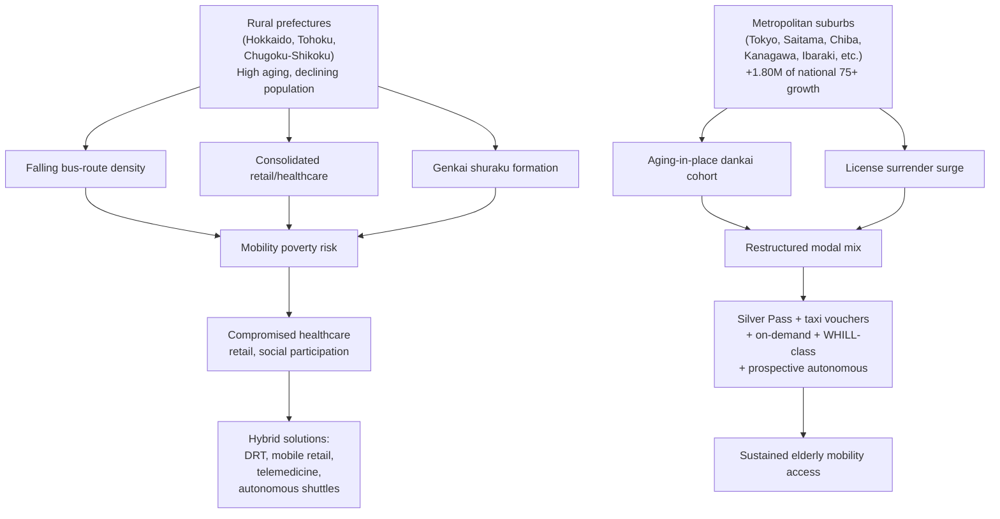

**The structural conclusion for rural mobility crisis and metropolitan-suburb mobility restructuring is that Japan's elderly transportation market between 2020 and 2050 cannot be sized as a uniform aggregate; it must be analytically separated into a rural sub-market facing acute mobility-poverty risk that compromises both transportation expenditure and the propensity coefficients in adjacent categories, and a metropolitan-suburb sub-market in which the modal-mix restructuring proceeds through diversified portfolios of subsidized transit, taxi, on-demand, personal mobility device, and prospective autonomous services. The geographic bifurcation is one of the most consequential within-country heterogeneities in the Japanese silver-economy analysis and must be carried forward into Chapter 7's adjacent-markets analysis and Chapter 9's strategic-implications synthesis.**

## 6.8 Silver Tourism: Domestic Travel, Inbound Recovery, and Elderly Leisure Mobility

The leisure-and-tourism sub-segment of elderly transportation—domestic travel, package tours, hot-spring (onsen) tourism, cultural and historical tourism, cruise travel, and overseas leisure travel—occupies a distinctive position in the elderly transportation analysis because it combines the mobility function with the experience-consumption motive that Chapter 3 identified as a central driver of dankai-cohort elderly consumption willingness. Unlike commuting, medical-appointment, and shopping mobility—which are necessities—silver tourism is a discretionary consumption category whose trajectory through 2050 reflects the broader experience-orientation, post-COVID recovery, and cohort-progression dynamics that shape elderly leisure spending more generally.

The 2020-base elderly contribution to Japanese tourism was severely disrupted by the COVID-19 pandemic, which suppressed both domestic and international travel particularly sharply among elderly cohorts more vulnerable to infection-health risk and more conservative in resuming pre-pandemic activity. The 2020–2022 disruption produced a sharp drop in elderly tourism expenditure, a slow and uneven recovery through 2023, and a substantial recovery through 2024–2025 although not yet to 2019 baseline levels for all sub-cohorts. The dankai cohort, whose lifelong experience-consumption orientation included substantial travel intensity, has been the principal driver of the post-COVID elderly travel recovery, with senior-targeted package-tour operators, cruise companies, and onsen-resort networks reporting strong demand recovery from 2023 onward.

The structural pattern of elderly silver tourism is sharply bifurcated across the three sub-cohorts. The young-old segment (65–74) is the principal active-tourism market, generating demand across the full range of travel categories: domestic and international leisure travel, hot-spring tourism with friends or spouse, cultural and historical tourism (visits to shrines, temples, cultural-heritage sites), cruise travel (which the Japanese cruise industry has structurally adapted to elderly preferences), and increasing engagement with experience-oriented travel formats (food tourism, art tourism, themed-itinerary group tours). The dankai cohort, currently dominating this segment, has been a major contributor to the casual-luxury, bus-package-tour, and onsen-resort sub-segments over the past decade. The old-old segment (75–84) shows materially lower travel intensity, with patronage increasingly concentrated in shorter-distance domestic destinations, closer-to-home onsen visits, and family-accompanied travel during health-permissive periods. The oldest-old segment (85+) shows sharply compressed travel participation, with patronage typically limited to family-accompanied special-occasion travel and largely substituted by stationary leisure activities.

The barrier-free transportation and accompanied-tour services category has emerged as a significant sub-segment within silver tourism. Major travel operators (JTB, HIS, Nippon Travel Agency) have built dedicated senior-tour programs that combine wheelchair-accessible itineraries, medical-staff accompaniment, slower-paced scheduling, and integration with personal mobility device rentals at destination. Hot-spring resorts have progressively retrofitted facilities for barrier-free access, including hand-rail-equipped baths, wheelchair-accessible rooms, and on-site mobility-device rental. The cruise industry, particularly the domestic Japanese cruise lines, has positioned its product offering around elderly accessibility from the outset, with on-board medical staff, wheelchair-accessible cabins, and itineraries calibrated to elderly mobility tolerance.

WHILL's expansion into airport autonomous mobility, examined in Section 6.6, represents a particularly relevant intersection between the silver-tourism market and the personal-mobility-device market. The deployment of autonomous WHILL units at Haneda, Narita, and Kansai International airports enables elderly travelers to navigate large airport facilities without physical exertion, removing one of the most significant friction points in elderly air travel.[^30] Combined with the foldable Model F that fits in vehicle trunks for combined-mode travel, the personal mobility device ecosystem progressively eliminates the mobility constraint that has historically suppressed elderly long-distance travel.[^29]

Inbound elderly tourism—international elderly visitors to Japan—is a structurally smaller sub-segment but has been growing meaningfully as East Asian and Southeast Asian aging populations generate outbound travel to Japan as a destination. Japanese tourism authorities have been progressively building infrastructure for inbound elderly travel, including multilingual barrier-free services and senior-targeted travel products. The post-COVID recovery of inbound tourism has been strong overall, with elderly inbound visitors recovering more slowly than younger cohorts due to similar conservatism patterns observed in Japanese outbound travel.

Projecting elderly silver-tourism mobility through 2050 requires distinguishing the demographic trajectory from the cohort trajectory. The demographic trajectory follows the Chapter 2 substrate: the 65+ aggregate rises through 2043 before slow contraction, with the young-old segment (the principal travel-active sub-cohort) expanding through the 2020s, contracting somewhat in the late 2020s as the dankai cohort moves into the 75+ bracket, and then re-expanding from 2036 as the dankai-junior cohort enters 65+. The cohort trajectory reflects the dankai cohort's strong experience-orientation in tourism (sustained throughout the 2020s and into the 2030s as members move through the young-old years) and the dankai-junior cohort's distinctive travel preferences shaped by their lifelong service-economy consumer culture (likely involving more digitally-mediated booking, more individual rather than group travel, and continued strong international travel orientation).

Under the medium scenario, the elderly silver-tourism mobility component plausibly grows at a CAGR of 2–3% in real terms over 2020–2050, driven by post-COVID recovery (largely complete by the late 2020s), demographic expansion through 2043, and dankai-junior cohort entry from 2036. The aggregate elderly contribution to Japanese tourism mobility (including travel-related transport, accommodation transport, and tour-package transport) plausibly grows from approximately 1.5–2.0 trillion yen at the 2020–2022 disrupted base to approximately 2.5–3.5 trillion yen by 2050, with the steepest growth concentrated in the 2030s as dankai-junior entry combines with sustained dankai young-old activity. Under the high scenario—with stronger post-COVID recovery, faster barrier-free infrastructure expansion, and aggressive senior-tourism product innovation—the figure could approach 4.0–4.5 trillion yen. Under the low scenario—with weaker post-COVID recovery, constrained inbound tourism due to geopolitical or pandemic factors, and slower cohort-effect uplift—the figure may stagnate around 1.8–2.2 trillion yen.

The strategic implications for the tourism industry are differentiated by sub-segment positioning. **Domestic onsen-and-cultural tourism operators** face stable to slowly growing elderly demand through 2050, with the steepest growth in barrier-free-equipped properties that can serve the rising 75+ sub-cohort. **Senior-targeted package-tour operators** face strong demand growth through the late 2030s as dankai-junior entry expands the active young-old market, with product innovation (digital-mediated booking, experience-oriented itineraries, shorter and more flexible formats) being the principal commercial differentiator. **Cruise operators** face stable elderly demand with a secular shift toward shorter cruises and lower-cost offerings as the cohort mix shifts toward dankai-junior preferences. **Personal-mobility-device-integrated tourism services** (airport autonomous deployments, destination-rental services) represent one of the highest-growth sub-segments, with WHILL's positioning particularly strong in this niche. **The structural conclusion for silver tourism is that the elderly contribution to Japanese tourism mobility will grow modestly but durably through 2050 under the medium scenario, with growth concentrated in active young-old experience-oriented travel and barrier-free-integrated formats, and with personal-mobility-device integration emerging as a particularly distinctive sub-segment that bridges the silver-tourism market with the personal-mobility-device market analyzed in Section 6.5.**

## 6.9 Cohort Effects and Sub-Cohort Differentiation in Mobility Behavior

Applying the cohort-effect template established in Chapter 4 to the transportation category yields distinctive patterns that differ in important respects from those observed in the food category. While food preferences are heavily cohort-anchored through differential exposure to processed and prepared formats, mobility behaviors are cohort-anchored through differential lifetime car-ownership rates, public-transit habituation, and digital-platform fluency. This section traces how each cohort's lifetime mobility experience translates into elderly-years propensities for car ownership, transit, taxi, on-demand, and personal mobility devices.

The **pre-dankai cohort** (born before 1947), currently dominating the 80+ segment, formed its mobility patterns during a period when private-car ownership was less universal in Japan than in subsequent decades. Their lifetime mobility experience was structurally more transit-oriented and pedestrian-oriented than the dankai cohort, particularly for cohorts born in the 1930s and earlier whose adulthood preceded the 1960s motorization wave. This cohort's elderly-years mobility propensities reflect its lifetime habituation: relatively higher transit use propensity, lower private-car-ownership-in-late-life propensity (many had already exited car ownership by their late seventies), and limited engagement with digital-platform mobility services. As this cohort ages out of the 65+ aggregate through the 2030s and 2040s, its distinctive low-car-ownership pattern in late life has historically anchored a portion of the elderly transit demand that successor cohorts will not replicate.

The **dankai cohort** (born 1947–1949), currently dominating the 75–79 segment and entering 80+ from 2027 onward, was the first Japanese generation to experience widespread private-car ownership during its working years. Their lifetime car-ownership orientation is strong, persistent, and only beginning to be reversed as members reach the high-license-surrender age range. This cohort's elderly-years mobility propensities reflect this lifetime experience: high private-car-retention propensity well into the late seventies, late-life license surrender (concentrated in the 75–84 age range), gradual on-demand and platform-mobility adoption (constrained by intermediate digital fluency that grows during retirement years), strong silver-tourism orientation (sustained domestic and international travel through the 2020s and into the 2030s), and emerging engagement with WHILL-class personal mobility devices as a substitute for surrendered driving privileges. The dankai cohort's exit from the 75–84 segment into 85+ over 2032–2034 will mark a meaningful transition: car-ownership-related expenditure contracts more sharply (the dankai cohort takes its license-surrender wave into the 75+ age structure), public-transit and taxi propensity rises correspondingly, and personal-mobility-device adoption peaks among this cohort as the principal substitute consumption channel.

The **dankai-junior cohort** (born 1971–1974), entering 65+ from 2036, was socialized as adult mobility consumers during the period 1990–2020 in which Japanese mobility patterns were decisively reshaped by metropolitan-area rail dominance, taxi-app and ride-hailing platform emergence, MaaS-subscription-model pilots, and the gradual shift away from universal car-ownership orientation in metropolitan-area working populations. The dankai-junior cohort exhibits structurally lower car-ownership rates in metropolitan areas than the dankai cohort, reflecting both economic factors (lower lifetime earnings due to the post-bubble employment ice age) and cultural factors (the metropolitan young-adult shift away from car ownership that began in the 1990s and accelerated through the 2010s). Their lifetime digital-platform-mobility fluency exceeds that of the dankai cohort, with smartphone-based booking, payment, and trip-planning being normalized rather than aspirational. Their entry into the 65+ bracket from 2036 will produce step-changes in several elderly mobility propensity coefficients: the on-demand and MaaS propensity rises sharply because dankai-junior members arrive at 65 with thirty years of platform-mobility experience; the private-car-ownership propensity in the 65–74 segment is structurally lower than the dankai cohort's rate at equivalent age; the personal-mobility-device propensity is higher because the cohort arrives with weaker stigma associations against the category; and the silver-tourism propensity is high but with distinctive preferences (more individual travel, more digitally-mediated booking, continued strong international orientation).

The summary table below traces these cohort-effect differentials across the principal mobility sub-categories under the medium scenario.

| Sub-category | Pre-dankai (2020 anchor in 80+) | Dankai (2030 anchor in 75+) | Dankai-junior (2050 young-old anchor) | Cohort-effect direction |
|---|---|---|---|---|
| Private-car ownership at 65–74 | Moderate-high | High | Moderate | Declining (especially metropolitan) |
| Private-car retention into 75+ | Low | Moderate-high | Moderate | Declining |
| License surrender at 75–84 | Already largely complete | Active wave (peak 2025–2032) | Plateauing | Wave-cyclical |
| Public-transit propensity | High | Moderate | Moderate (urban-concentrated) | Stable to rising |
| Subsidized-pass utilization | Moderate-high | High | High | Rising (subsidy expansion) |
| Taxi and taxi-app propensity | Low (limited digital) | Moderate (rising with surrender) | Moderate-high | Rising |
| On-demand/ride-hailing | Very low | Low-moderate | High | Rising sharply |
| MaaS subscription | Negligible | Low | Moderate-high | Rising sharply |
| Personal mobility device (WHILL-class) | Low (stigma persistent) | Moderate (early adoption) | High | Rising |
| Traditional shinia kā | Moderate | Moderate-low (substituted by WHILL-class) | Low | Declining |
| Silver-tourism mobility | Moderate | High | High | Stable to rising |
| Autonomous-mobility adoption | Negligible | Low | Moderate-high | Rising sharply |

The methodological corollary, paralleling Chapter 4's food-category cohort-effect framework, is that the elderly transportation propensity matrix in 2050 is not a simple scaled version of the 2020 matrix multiplied by demographic change. The underlying cohort succession—from pre-dankai through dankai through dankai-junior—reshapes the modal mix decisively: private-car-ownership propensity in the 65–74 segment is structurally lower in 2050 than in 2020 because the dankai-junior cohort that anchors the 2050 young-old segment had lower lifetime car-ownership rates than the dankai cohort that anchored the 2020 young-old segment; on-demand and MaaS propensity is structurally higher in 2050 across all sub-cohorts because cohort progression brings successively more digitally-fluent generations; personal-mobility-device propensity is structurally higher in 2050 because the category-reframing process documented in Section 6.5 progressively reduces stigma; and autonomous-mobility adoption rises from a negligible 2020 base to a meaningful 2050 share through the combined effect of regulatory progression, cost-curve traversal, and cohort-effect uplift.

**The decisive cohort-effect insight for the transportation category is that the elderly mobility market of 2050 is structurally different from a demographically-scaled version of the 2020 market: private-car-ownership propensity is materially lower (especially in metropolitan areas), platform-mediated mobility propensity is materially higher, personal-mobility-device penetration is substantially deeper, and autonomous-mobility adoption has emerged from a near-zero base into a meaningful sub-segment, with the differential trajectory reflecting the underlying succession from pre-dankai through dankai through dankai-junior cohorts and the distinct lifetime mobility-consumption experience that each generation carries into its elderly years.**

## 6.10 Aggregate Elderly Transportation Market Size and Sensitivity Scenarios, 2020–2050

The integration of the preceding eight sections produces a consolidated aggregate elderly transportation market projection across 2020–2050 under low, medium, and high scenarios, with explicit decomposition into the demographic, modal-mix, per-capita-quantity, and per-capita-value effects that drive the trajectory.

The 2020 baseline established in Section 6.1 places the aggregate elderly transportation market in the range of 4 to 5 trillion yen annually for the core transportation expenditure (excluding the personal-mobility-device segment of approximately 100–150 billion yen and the silver-tourism-mobility segment of approximately 1.5–2.0 trillion yen which the Family Income and Expenditure Survey treats partially as leisure-and-recreation rather than transport-and-communications). When these adjacent segments are added, the broader elderly transportation-and-mobility market in 2020 plausibly totals approximately 6 to 7 trillion yen at the disrupted COVID-era base, rising to approximately 7 to 8 trillion yen at the more representative late-2010s pre-pandemic peak.

The medium-scenario trajectory through milestone years is summarized below, expressed as index relative to the 2020 base of 100 and decomposed into the principal sub-segments. Demographic effects use the Chapter 2 substrate (65+ population peaking at 39.53 million in 2043, contracting to approximately 38.5 million by 2050). Modal-mix effects reflect the substitution from private-car expenditure toward transit, taxi, on-demand, and personal-mobility-device categories. Per-capita-quantity effects reflect the mobility constraint that progressively binds in older sub-cohorts. Per-capita-value effects reflect the cost differential between modal alternatives.

| Component (2020 base = 100) | 2030 | 2040 | 2043 (peak) | 2050 |
|---|---|---|---|---|
| Private-car-related expenditure | ~80 | ~62 | ~58 | ~50 |
| Public transit (subsidized + unsubsidized) | ~115 | ~125 | ~128 | ~125 |
| Taxis and taxi-app dispatch | ~115 | ~125 | ~128 | ~120 |
| On-demand/ride-hailing/MaaS | ~150 | ~250 | ~280 | ~320 |
| Personal mobility devices (WHILL-class etc.) | ~150 | ~280 | ~320 | ~400 |
| Autonomous mobility (elderly use) | ~110 | ~180 | ~220 | ~350 |
| Silver-tourism mobility | ~130 | ~145 | ~150 | ~155 |
| **Aggregate elderly mobility market (med.)** | **~105** | **~110** | **~112** | **~108** |
| **Aggregate elderly mobility market (high)** | **~110** | **~125** | **~130** | **~135** |
| **Aggregate elderly mobility market (low)** | **~98** | **~95** | **~92** | **~85** |

Translating these indices into yen, the aggregate elderly transportation-and-mobility market under the medium scenario rises modestly from approximately 6.5 trillion yen at the 2020 base to approximately 7.0 trillion yen by 2030, approximately 7.2 trillion yen by 2040, peaks around 7.3 trillion yen near 2043, and contracts gradually to approximately 7.0 trillion yen by 2050. Under the high scenario—with stronger autonomous-mobility deployment, faster personal-mobility-device adoption, and more robust silver-tourism recovery—the trajectory rises to approximately 8.7 trillion yen by 2050. Under the low scenario—with constrained autonomous-mobility deployment, slower personal-mobility-device penetration, weaker post-COVID tourism recovery, and stronger rural mobility-poverty effects—the trajectory contracts to approximately 5.5 trillion yen by 2050. The scenario range at 2050 is therefore approximately 5.5 to 8.7 trillion yen, with a medium central estimate of approximately 7.0 trillion yen.

The internal sub-segment decomposition is more dramatic than the aggregate trajectory suggests. Under the medium scenario, by 2050: private-car-related expenditure contracts by approximately 50% in real terms (driven by license surrender and the dankai-junior cohort's lower lifetime car-ownership orientation); public-transit expenditure expands by approximately 25% (driven by subsidized-pass utilization and modal substitution); taxi and taxi-app expenditure expands by approximately 20%; on-demand and MaaS expenditure more than triples from a small base (rising sharply with cohort progression); personal mobility device expenditure quadruples (driven by latent-demand mobilization, stigma reduction, and category reframing); autonomous mobility for elderly users expands by a factor of 3.5 from a very small 2020 base; and silver-tourism mobility expands by approximately 55% in real terms (driven by post-COVID recovery and dankai-junior entry). The aggregate is therefore broadly stable in real terms because the contraction in private-car-related expenditure is offset by expansion in transit, on-demand, personal mobility devices, autonomous mobility, and silver tourism—a pattern that confirms the headline insight that the elderly transportation market reorganizes internally rather than simply contracting.

The inflection points within the trajectory deserve specific identification. **The first inflection point** occurs around 2025–2027 as the dankai cohort moves through the peak license-surrender age range, accelerating the modal-mix shift from private-car to transit, taxi, on-demand, and personal-mobility-device categories. **The second inflection point** occurs around 2032–2034 as the dankai cohort enters 85+, sharply compressing private-car expenditure and concentrating mobility demand in the personal-mobility-device, autonomous-mobility, and subsidized-transit categories. **The third inflection point** occurs around 2036 as the dankai-junior cohort begins entering 65+, producing a step-change in young-old on-demand, MaaS, and platform-mediated mobility propensity. **The fourth inflection point** occurs around 2040–2045 as autonomous mobility deployments may achieve commercial viability beyond the airport and hospital domains, opening new addressable elderly-mobility use cases. **The fifth inflection point** occurs around 2043 as the elderly population peaks and begins to contract.

The strategic implications for industry stakeholders are sharply differentiated by category position. **Automobile manufacturers and dealers** face structural elderly demand contraction in the core car-sales business, with the 30–50% reduction in elderly private-car expenditure over 2020–2050 representing a substantial contraction of the elderly customer segment; the offset opportunity lies in transitioning the dealer-customer relationship to personal-mobility-device sales (particularly through the WHILL-class auto-dealer channel strategy), to vehicle-rental and car-sharing services for occasional use, and to autonomous-mobility services where dealers may become operational nodes. **Transit operators** face stable to expanding elderly demand sustained by the progressive license-surrender wave and the subsidy-program institutional architecture; the metropolitan-suburb network reorganization is the principal operational challenge. **Taxi and taxi-app operators** face expanding elderly demand particularly during the dankai license-surrender wave through the 2030s, with on-demand-platform integration and senior-targeted service offerings (concierge, medical-appointment integration) being the principal differentiators; the prospective competitive pressure from autonomous robo-taxi deployment in the late 2030s and 2040s is the principal long-run risk. **Personal mobility device manufacturers and rental operators** face the steepest growth opportunity within the elderly transportation aggregate, with WHILL's positioning particularly strong; the principal commercial challenge is converting the latent 12-million-person Japanese demand pool into actual purchasers and renters through continued category-reframing, channel expansion, and platform-economy integration. **Autonomous-mobility operators** face large but uncertain prospective markets concentrated in airport, hospital, robo-taxi, and community-shuttle deployments; commercial success depends on regulatory progression, cost-curve traversal, and infrastructure deployment whose timing is genuinely uncertain. **Tourism operators** face stable to slowly expanding elderly demand across the 2020–2050 horizon, with barrier-free integration, personal-mobility-device deployment, and digitally-mediated booking emerging as principal competitive differentiators.

The principal uncertainties driving the scenario range deserve explicit identification. First, **the regulatory pace of autonomous-mobility deployment** determines the timing and depth of the autonomous-mobility category's expansion, with the 2050 elderly-autonomous-mobility revenue range of 200 billion to 1.5 trillion yen reflecting genuine uncertainty about Japanese regulatory progression. Second, **the rural-network sustainability** under low-density configurations determines the depth of mobility-poverty risk in rural prefectures, with implications for both the rural elderly transportation expenditure directly and the propensity coefficients in adjacent categories indirectly. Third, **the post-COVID silver-tourism recovery trajectory** determines whether the silver-tourism mobility component returns to or exceeds the late-2010s pre-pandemic peak, with implications for both the discretionary-consumption category and the integration of personal-mobility-device with tourism services. Fourth, **the personal-mobility-device category-reframing success** determines whether the latent 12-million-person Japanese demand pool is mobilized at the rate implied by the medium scenario or remains under-converted as in the low scenario. Fifth, **the dankai-junior cohort's actual mobility-consumption patterns upon entry into 65+ from 2036**—particularly whether their lower metropolitan car-ownership orientation translates into materially higher platform-mediated mobility consumption or simply lower aggregate transportation expenditure—will determine the post-2036 trajectory of the on-demand, MaaS, and autonomous-mobility sub-segments.

The output of this consolidated analysis—a medium central elderly transportation-and-mobility market of approximately 7.0 trillion yen by 2050 against a 2020 base of approximately 6.5 trillion yen, with internal reorganization toward platform-mediated, services-intensive, and personal-mobility-device-integrated formats more pronounced than the aggregate stability suggests—feeds directly into the aggregate silver-market sizing in Chapter 8. The transportation category's reorganization shares structural features with the food category's transformation analyzed in Chapter 4: aggregate market value remains broadly stable in real terms because the substitution between sub-segments (private-car contraction offset by transit, on-demand, personal-mobility-device, and autonomous-mobility expansion) produces a net effect that is modestly positive through 2043 and modestly negative thereafter.

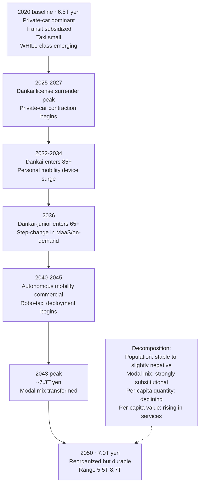

**The decisive transportation-category insight is that the elderly transportation-and-mobility market through 2050 is fundamentally a story of structural reorganization rather than aggregate growth or contraction: aggregate spending remains broadly stable in real terms because the contraction in private-car-related expenditure (approximately –50% over 2020–2050) is offset by expansion in transit, taxi, on-demand, personal mobility devices, autonomous mobility, and silver tourism, but the internal sub-segment composition undergoes a transformation as dramatic as the food-category reorganization documented in Chapter 4, with private-car ownership progressively displaced by a portfolio of transit-, platform-, device-, and autonomous-mobility-mediated alternatives whose mix reflects the underlying demographic structure (75+ concentration), household composition (single-elderly suburban dominance), cohort progression (dankai license surrender then dankai-junior entry), and technology trajectory (personal mobility device penetration then autonomous mobility commercialization). The chapter's conclusion bridges to Chapter 7's adjacent markets analysis by establishing that mobility access—through whichever modal portfolio succeeds in serving each elderly sub-cohort—is the precondition that determines whether the healthcare, leisure, and participation consumption that Chapter 7 will examine can actually materialize, and that the rural-versus-metropolitan-suburb mobility-access bifurcation will be one of the most consequential within-country heterogeneities driving the realized propensity coefficients in those adjacent markets.**

# 7 Adjacent High-Growth Markets: Healthcare, Long-Term Care, Leisure, and Financial Services for the Elderly

The four core categories examined in Chapters 4 through 6—food, clothing, housing, and transportation—occupy the conceptual center of the user's research topic but tell only part of the silver-economy story. Each of the core categories displayed a similar pattern: aggregate market value broadly stable in real terms across 2020–2050 because demographic uplift through 2043, services-mediation, and premiumization offset the per-capita-quantity decline driven by aging and household downsizing. If the silver economy were limited to these four categories, the headline finding would be that Japan's silver market is structurally durable but not dramatically expansionary. That headline would, however, be seriously misleading, because it would miss the principal engine of silver-economy expansion through 2050: the cluster of adjacent markets that absorb a rapidly rising share of elderly spending and that the four-core-category framework systematically excludes.

This chapter quantifies that adjacent-markets cluster. It draws on three converging streams of evidence. The first is the Ministry of Economy, Trade and Industry's projection that the public-insurance-external healthcare and care market will expand from approximately 25 trillion yen in 2020 to 77 trillion yen by 2050[^24], a tripling that vastly exceeds the trajectory of any of the four core categories. The second is the Ministry of Health, Labour and Welfare's National Medical Expenditure data showing that Japan's national medical expenditure already reached 48.09 trillion yen in fiscal year 2023, of which 28.88 trillion yen (60.1%) was attributable to the population aged 65 and over and 19.15 trillion yen (39.8%) to the 75-and-over segment alone[^31]. The third is the MHLW long-horizon projection that the medical-and-care benefit aggregate will expand from 121.3 trillion yen at FY2018 (21.5% of GDP) to 188.2–190.3 trillion yen by FY2040 (23.8–24.1% of GDP)[^32]. Together, these establish that the adjacent markets surrounding the four core categories are the single most consequential growth engine of the silver economy—one that, by 2050, will plausibly approach or exceed the aggregate of the four core categories combined.

The chapter therefore extends the cohort-multiplied-expenditure framework introduced in Chapter 1 to seven adjacent market clusters: medical and pharmaceutical (Section 7.1), long-term care services (Section 7.2), robotic care equipment and care-technology innovation (Section 7.3), frailty prevention and public-insurance-external health services (Section 7.4), leisure and experience markets (Section 7.5), pet and companion-animal markets (Section 7.6), and senior-focused financial services including end-of-life support (Section 7.7). Section 7.8 applies the cohort-effect template developed in Chapters 4 through 6 to these adjacent clusters, tracing the differential propensities of pre-dankai, dankai, and dankai-junior cohorts. Section 7.9 integrates the sub-segments into a consolidated adjacent-markets projection and bridges to Chapter 8's aggregate silver-market sizing. Throughout, the analysis is anchored in the demographic substrate of Chapter 2, the behavioral architecture of Chapter 3, and the modal-mix transformations of Chapters 4 through 6.

## 7.1 Medical and Pharmaceutical Expenditure: Public-Insurance Core and Out-of-Pocket Premium Layer

The medical-and-pharmaceutical cluster is the single largest adjacent market by absolute scale and serves as the analytical anchor for the entire chapter, because its trajectory is the most extensively documented and because elderly consumption shares in this cluster are unusually high and rising. The Ministry of Health, Labour and Welfare's *National Medical Expenditure Overview* for fiscal year 2023, released in October 2025, provides the authoritative current-market baseline. The 2023 national medical expenditure—the total expenditure on medical treatment for illness or injury under public insurance, including medical and dental fees, pharmacy dispensing, hospital food and life-medical fees, home-visit nursing care, and selected adjacent services—reached 48.09 trillion yen, an increase of 1.39 trillion yen (3.0%) over the prior year and the highest level on record[^31]. Per-capita medical expenditure was 386,700 yen, also a record[^31]. The share of national medical expenditure in GDP fell slightly to 8.08%, reflecting that nominal GDP grew faster than medical expenditure in fiscal 2023[^31].

The elderly concentration within this aggregate is striking. The 65-and-over population accounted for 28.88 trillion yen, or 60.1% of total national medical expenditure, while the 75-and-over segment alone accounted for 19.15 trillion yen, or roughly 40% of the total[^31]. The per-capita differential is even more dramatic: per-capita national medical expenditure for the 65-and-over population was 797,200 yen (a 2.7% increase over the prior year), compared with 218,000 yen for the under-65 population (a 4.1% increase)—a 3.66-fold differential reflecting the steep age-medical-expenditure gradient that has been a stable feature of Japanese health expenditure for decades[^31]. Within medical-care-specific expenditure (excluding pharmacy dispensing and several other components), the 65-and-over per-capita figure was 600,200 yen versus 145,300 yen for the under-65 population, a 4.13-fold differential[^31]. The institutional structure of payment is similarly elderly-tilted: the late-stage elderly medical care system (kōki kōrei-sha iryō) for those aged 75 and over disbursed 17.21 trillion yen in benefits in fiscal 2023, an increase of 4.6% from the prior year, compared with 21.51 trillion yen disbursed by the combined employees' health insurance and national health insurance schemes for the under-75 population, an increase of only 2.0%[^31]. The late-stage elderly medical system is therefore growing more than twice as fast as the under-75 medical insurance schemes, reflecting both demographic concentration (rising 75+ count) and per-capita expenditure intensity.

The disease-mix concentration within elderly medical expenditure further sharpens the picture. The MHLW data identify cardiovascular system diseases (high blood pressure, cerebral infarction, and related conditions) as the largest disease category, accounting for 6.28 trillion yen or 18.2% of total medical-care expenditure; followed by neoplasms including cancers at 5.20 trillion yen or 15.0%; and musculoskeletal and connective-tissue diseases (rheumatoid arthritis, osteoporosis, and related conditions) at 2.76 trillion yen or 8.0%[^31]. For the 65-and-over population specifically, cardiovascular diseases dominate at 4.99 trillion yen, accounting for 23.0% of elderly medical-care expenditure—the single most concentrated disease category among elderly[^31]. By contrast, for the under-65 population, neoplasms are the leading category at 1.72 trillion yen, accounting for 13.4% of under-65 medical-care expenditure[^31]. The implication is that elderly medical spending is heavily concentrated in chronic-disease management where pharmaceutical, diagnostic, and procedural intensity is high and where ongoing service utilization across multi-year periods compounds aggregate cost.

The forward trajectory of national medical expenditure has been documented across multiple horizons. According to MHLW long-term projections, national medical expenditure was projected to expand from 37.5 trillion yen in fiscal 2010 to 52.3 trillion yen by fiscal 2025—an increase of 14.8 trillion yen, equivalent to an average annual increase of 1.0 trillion yen or 2.2% per year; medical insurance benefits (excluding patient co-payments) were projected to grow from 31.9 trillion yen in fiscal 2010 to 45.0 trillion yen by fiscal 2025[^33]. The MHLW long-horizon projection within the social-security-benefit framework extends this trajectory. Under the baseline-economy current-projection scenario, the aggregate social security benefits expand from 121.3 trillion yen at FY2018 (21.5% of GDP) to 140.2–140.8 trillion yen by FY2025 (21.7–21.8% of GDP) and to 188.2–190.3 trillion yen by FY2040 (23.8–24.1% of GDP); within this aggregate, medical care alone expands from 39.2 trillion yen at FY2018 (7.0% of GDP) to 47.4–48.7 trillion yen at FY2025 (7.3–7.5% of GDP) and 66.7–73.2 trillion yen at FY2040 (8.4–9.3% of GDP)[^32]. Trends in social security benefits over the longer historical period further document that medical-services benefits rose from 2.1 trillion yen in 1970 (60.0% of total social security benefits) to 40.7 trillion yen at FY2021 (31.4% share within a now-much-larger aggregate)[^32].

Translating these projections into elderly-specific medical expenditure trajectories requires combining the demographic structure from Chapter 2 with the per-capita differential pattern documented above. Under the assumption that the 65+ share of national medical expenditure remains broadly stable at 60% of the aggregate (with modest upward drift as the population age structure tilts toward 75+ and 85+ where per-capita expenditure is highest), the 65+ contribution rises from approximately 28.9 trillion yen at the 2023 base toward approximately 31.4 trillion yen at fiscal 2025 (60% of 52.3 trillion yen)[^33], approximately 41–44 trillion yen by fiscal 2040 (60–62% of 66.7–73.2 trillion yen)[^32], and—on a longer extrapolation incorporating the deceleration that occurs after the 2043 population peak—a 2050 elderly medical-and-pharmaceutical aggregate plausibly in the range of 35 to 45 trillion yen depending on healthy-aging trajectory, technology cost dynamics, and pharmaceutical innovation pace.

The role of healthy aging in modulating this trajectory is quantified in the WHO/European Observatory analysis of Japan's medical expenditure. The analysis projects that population aging in Japan will increase health expenditure as a share of GDP by approximately 2.59 percentage points between 2020 and 2060 under current health-expenditure-by-age patterns—an average annual increase of 0.06 percentage points of GDP[^32]. Under a "healthy aging" scenario in which people age in better health, the increase falls to 2.22 percentage points; under a "premature morbidity" scenario in which people age in worse health, the increase rises to 2.92 percentage points[^32]. The differential between these scenarios—approximately 0.70 percentage points of GDP by 2060, or roughly USD 41.5 billion in 2018 GDP terms—indicates that healthy-aging trajectory materially affects the elderly medical aggregate, with healthier aging reducing the medical-cost burden by approximately 0.5–0.7 trillion yen per year at the 2050 horizon[^32]. Critically, the WHO analysis also emphasizes that "population ageing on its own is not, and will not become, the primary driver of growth in health expenditure in Japan," noting that population aging accounts for less than one quarter of per-person health spending growth, with the remaining expected growth driven by prices, volume of care, and technology[^32]. The same analysis observes that per capita health expenditure for an average 80-year-old is more than 11 times higher than for an average 20-year-old, and that for people aged 65 years and older, average per capita health spending as a share of GDP was 18.6%, slightly more than Germany (16.2%) and the Netherlands (16.1%) but less than the UK (24%) on 2016 data[^32]. This is a critical methodological point for the chapter's central claim: the adjacent-markets cluster's expansion through 2050 is driven by interacting demographic, per-capita-intensity, technology, and services-mediation forces rather than by demographic shifts alone.

A particularly noteworthy structural feature of the Japanese elderly medical pattern is the within-elderly heterogeneity discussed in Chapter 3: per-capita medical expenditure does not rise monotonically with age across the entire 65+ aggregate. Rather, the young-old (65–74) generate higher per-capita medical expenditure than simple age-monotonicity would predict, because they remain biologically vital and incur acute-illness expenditures (cardiovascular events, gastrointestinal acute conditions, infections) that benefit from advanced medical interventions, while the oldest-old experience predominantly atrophic conditions for which intensive intervention is less applied. The MHLW data are consistent with this within-elderly heterogeneity in that medical inpatient expenditure for the 65+ population rose 2.9% in fiscal 2023 to 17.86 trillion yen (37.1% of total national medical expenditure), while outpatient medical expenditure rose 1.3% to 16.69 trillion yen (34.7%)[^31], indicating that inpatient utilization grows faster than outpatient utilization for elderly.

Beyond the public-insurance core, an increasingly important premium-medical layer lies outside the public insurance system. This layer includes concierge medicine and advanced screening packages purchased out-of-pocket by affluent elderly, advanced diagnostic imaging beyond what public insurance covers, AI-mediated screening services (cancer detection AI, early dementia screening), software-as-a-medical-device (SaMD) therapeutic apps for diabetes, hypertension, and cognitive function, and selected high-end pharmaceutical and regenerative-medicine treatments. METI has been actively developing the SaMD market through its Digital Healthcare Development and Implementation Acceleration Project, and projects SaMD's global market to expand from 18.5 billion USD in 2022 to 86.5 billion USD by 2030 at a CAGR of approximately 22%[^24]. METI's strategic framework projects the world pharmaceutical market to expand from 200 trillion yen in 2022 to 250–300 trillion yen by 2050, with Japan targeting 25–30 trillion yen of acquisition (approximately 10% share)[^24].

The out-of-pocket co-payment burden constitutes another distinct sub-component that flows through elderly household budgets independently of the national medical expenditure aggregate. The financing structure of national medical expenditure documented in MHLW statistics shows that insurance premiums account for 50.2% (24.14 trillion yen, of which insured persons pay 13.58 trillion and employers pay 10.56 trillion), public funding accounts for 37.5% (18.03 trillion yen, of which national funding is 11.93 trillion and local funding is 6.11 trillion), and patient/other burden accounts for 12.3% (5.92 trillion yen)[^31]. These figures align with lifetime out-of-pocket estimates and with the 9,102 yen monthly healthcare line documented in Chapter 4 for single-elderly households.

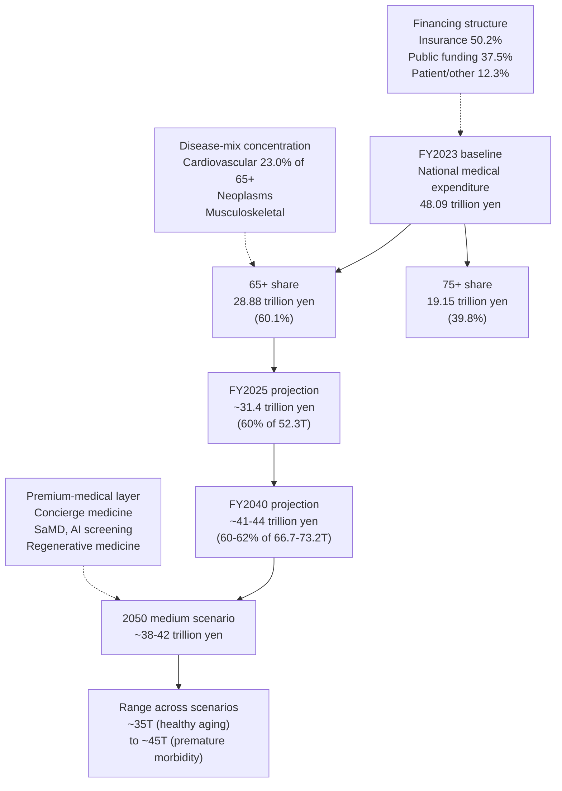

**The decisive insight for the medical-and-pharmaceutical cluster is that the elderly contribution already accounts for 60% of Japan's 48 trillion yen national medical expenditure[^31] and will plausibly reach 35–45 trillion yen by 2050—a magnitude that exceeds any of the four core consumption categories analyzed in Chapters 4 through 6. The cluster is structurally anchored in chronic-disease management where elderly disease prevalence is high, has a steep age-expenditure gradient with per-capita 65+ spending nearly four times the under-65 level, is bounded between healthy-aging and premature-morbidity scenarios that imply approximately 0.70 percentage points of GDP sensitivity by mid-century[^32], and is being progressively layered with a premium-medical out-of-pocket segment whose growth complements rather than substitutes for the public-insurance core.**

## 7.2 Long-Term Care Services: Public Insurance, Out-of-Pocket Care, and the Care-Worker Supply Constraint

The long-term care (kaigo) market is the second-largest adjacent cluster by absolute scale and is structurally even more elderly-concentrated than the medical-and-pharmaceutical cluster, because long-term care insurance benefits are exclusively or predominantly directed toward elderly recipients with certified care needs. The MHLW projection within the social-security-benefit framework documents that long-term care benefits expand from 10.0 trillion yen at FY2018 (1.5% of GDP) to 14.6 trillion yen at FY2025 (2.3% of GDP) and 24.6–25.8 trillion yen at FY2040 (3.1–3.3% of GDP)[^32]—an increase of approximately 15 trillion yen over twenty-two years that represents the steepest growth trajectory among the major social-security-benefit components.

The MHLW national budget data corroborate this trajectory at finer resolution. Long-term care benefits within the social security national budget rose from 1.97 trillion yen at FY2009 to 3.58 trillion yen at FY2022, with the share of social security national budget allocated to long-term care rising from 9.4% to 9.9% over the same period[^32]. The aggregate long-term care benefit-and-burden trajectory is driven by two reinforcing demographic forces. First, the 75+ population—the principal source of certified care needs—rises substantially through the 2020s and 2030s as the dankai cohort progresses from age 75 in 2022 toward age 85 in 2032. Second, within the 75+ aggregate, the 85+ sub-cohort (where care-needs prevalence is highest) expands fastest in relative terms, surging through the 2030s and 2040s as the dankai cohort progresses through this bracket.

The current benefit framework distinguishes between in-home services (visiting care, day services, short-stay services), facility services (special nursing homes, care-medical facilities), and community-based services (small-scale multi-functional in-home care, dementia-specific services). The tiered self-payment ratio—originally 10% for all beneficiaries, raised to 20% for higher-income elderly in August 2015 and 30% for the highest-income tier in 2018—creates a parallel out-of-pocket flow alongside the public-insurance-mediated payment[^32]. The August 2015 reform that raised the self-payment ratio from 10% to 20% for users earning a certain income level represented a structural rebalancing of the financing structure[^32], part of the broader Comprehensive Reform of Social Security and Tax in which the consumption tax revenue was directed into nursing-care fee revisions, reduction of premiums for low-income earners, and enhancement of regional support business[^32].

Beyond the public-insurance core, an extensive out-of-pocket care periphery has developed to address needs that the public system does not fully cover. This periphery includes premium nursing-home contracts, family-respite services, paid companionship services for elderly singletons, household-assistance services beyond the limited scope of public-insurance home help, and specialized rehabilitation services targeted at functional recovery. The growth of this out-of-pocket periphery is structurally faster than the public-insurance trajectory, because demand drivers (single-elderly household surge, never-married elderly increase, unmet needs for premium service quality) are concentrated in segments that the public insurance does not adequately serve.

The chronic supply constraint in the care-worker market is perhaps the single most important structural risk for the long-term care market through 2050. METI has identified that 2040 will see a projected shortage of approximately 700,000 care workers, with care needs expanding faster than the trained-care-worker labor supply[^23][^24]. The shortage is rooted in three converging factors: the demographic contraction of the working-age population, the structural difficulty of the care-worker occupation (high physical demand, modest wages, irregular hours, high turnover), and the geographic mismatch between care demand (concentrated in metropolitan suburbs as Chapter 2 documented) and care-worker supply. METI's projection identifies that by 2030 there will be approximately 318 million people facing dual work-and-family-caregiving burdens (business caregivers), of whom 11 million will leave employment due to caregiving demands; the resulting economic loss from caregiving-and-work conflict is estimated at approximately 9.18 trillion yen per year, comprising 7.92 trillion yen in labor productivity losses, 1.02 trillion yen in labor losses from caregiving departures, 129 billion yen in human-capital training losses, and 116 billion yen in replacement-recruitment costs[^24].

The policy response to the supply constraint involves two principal mechanisms. The first is the expansion of business caregiver (work-and-care reconciliation) support. METI launched in March 2024 a *Guidelines for Top Executives on Work-Care Reconciliation* designed to support enterprises in establishing systematic caregiver-support programs, with implementation oversight through a series of expert review committees beginning in November 2023[^24]. The Guidelines establish a five-step framework progressing from organizational understanding of work-care reconciliation through targeted programs of management commitment, situation assessment, and information delivery; the work-care-reconciliation difficulty produces a 27.5% average reduction in labor productivity according to the Boston Consulting Group analysis cited within the METI framework, with non-managers experiencing 31.7% reduction and managers 16.7% reduction[^24]. The second policy mechanism is the deployment of care robotics and ICT-based productivity tools to reduce care-worker labor intensity per recipient—the topic of Section 7.3.

The geographic bifurcation between metropolitan-suburb and rural care-service supply economics, paralleling the mobility-poverty bifurcation analyzed in Chapter 6.7, is consequential for the long-term care market. METI's *Regional Care Plus Project* (Chiiki Kea Purasu Jigyō), launched in fiscal 2023 and continuing in fiscal 2024, supports municipalities in matching local care needs with private-sector service offerings; the FY2023 deployment included nine participating municipalities (including Uwajima in Ehime, Oi in Kanagawa, Anpachi and Godo in Gifu, Iwata in Shizuoka, Matsudo in Chiba, Ako in Hyogo, and Iizuka in Fukuoka) that worked with private firms to identify and address geographically-specific care challenges through expanded community-care-conference processes[^24]. The next-fiscal-year continuation includes expanded prefectural-level coordination, support for non-care-sector business expansion into care-related private services, and trials of authorized-service-quality assurance frameworks designed to overcome the trust barrier that limits elderly engagement with private care services[^24].

Sizing the long-term care aggregate at 2050 across scenarios involves combining the public-insurance trajectory with the out-of-pocket periphery and adjusting for the supply-constraint risk. Under the medium scenario, the aggregate long-term care market plausibly reaches approximately 32–35 trillion yen by 2050, comprising approximately 28–30 trillion yen public-insurance benefits (extrapolating the 24.6–25.8 trillion yen FY2040 figure forward at moderate growth)[^32] plus 4–5 trillion yen out-of-pocket periphery (growing approximately 3–5x from the 2020 base). Under the high scenario—reflecting strong premium-segment growth, expanded caregiver-respite services, and broader corporate-coverage of care services—the aggregate could reach 38–40 trillion yen. Under the low scenario—reflecting acute care-worker shortages constraining service delivery, fiscal pressure compressing public-insurance reimbursement, and weak premium-segment uptake—the aggregate may stagnate at 27–30 trillion yen. The 2050 elderly contribution to the long-term care market is essentially the entire aggregate, given that 99%+ of recipients are aged 65 and over.

**The decisive insight for the long-term care cluster is that this market is the second-largest adjacent cluster after medical-and-pharmaceutical, with aggregate size rising from approximately 17–18 trillion yen at FY2025 to approximately 32–35 trillion yen by 2050 under the medium scenario, that the demographic concentration in the 75+ and 85+ sub-cohorts directly drives the projected expansion in MHLW's long-horizon framework[^32], that the supply constraint in care-worker availability (a 700,000-worker shortage projected for 2040) is the principal structural risk that may compress actual delivered service against the demand trajectory[^23][^24], and that the geographic bifurcation between metropolitan-suburb and rural care-service supply economics will produce substantial within-country heterogeneity in delivered care quality and access through 2050.**

## 7.3 Robotic Care Equipment, Care-Worker Productivity Tools, and Care Technology Innovation

The care-technology and robotic-care-equipment sub-segment is the most distinctive sub-category within the long-term care cluster from both a Japanese-innovation and a global-export perspective, because Japan has pioneered the institutional framework for care-robotics development and is positioned to lead in this category as other aging societies confront the same care-worker supply constraints with a one-to-three-decade lag.

The institutional framework was established in November 2012 when METI and MHLW jointly published the *Priority Areas for Robot Technology Use in Care* (kaigo riyō ni okeru robotto gijutsu no jūten bun'ya), which defined six domains and twelve initial items that have since been expanded to thirteen items as of the 2017 revision[^23]. The current six-domain, thirteen-item framework comprises: (1) transfer-assistance robotics in two variants—wearable and non-wearable; (2) mobility-assistance robotics in three variants—outdoor, indoor, and wearable mobility; (3) excretion-support robotics in three variants—excrement processing, excrement prediction, and toilet-related motion support; (4) watch-over and communication systems in three variants—facility-deployed, home-deployed, and communication-mediating; (5) bathing-support; and (6) care-administration support[^23]. The framework defines eligible product categories for METI development support and MHLW deployment-side support, creating a coordinated institutional channel for moving care robotics from research and development through commercialization to facility-level adoption.

The supply-side ecosystem includes specialty manufacturers, large-electronics conglomerates deploying ICT-based care productivity tools, healthcare-device companies extending into care robotics, and a rapidly expanding cluster of care-tech startups operating in specific operational niches within the six-domain framework. METI's *MedTech ROUND* program—a recent thematic acceleration initiative—has supported large-company-startup matching across themes including surgical complication solutions, medical-system advancement, vital-signs measurement, and patient-outcome solutions, with participating large companies including Johnson & Johnson, Terumo, Nihon Kohden, and Medtronic[^24].

The public-procurement and reimbursement architecture is what drives institutional adoption. Many municipalities operate independent procurement subsidies that cover a portion of the care-robotics purchase cost for designated facilities, and METI's deployment-support grants provide capital subsidy for early-adopter facilities. The principal commercial barrier remains that reimbursement-per-recipient does not yet adequately offset the capital cost of premium robotics, leaving facilities to capture productivity gains primarily through improved staff-retention rather than direct revenue uplift.

The export potential of Japan-developed care robotics is one of the most distinctive features of this sub-category. METI's strategic framework explicitly identifies robotic care equipment as a globally exportable Japanese capability, observing that "ロボット介護機器は、世界に先駆けて超高齢社会に突入している我が国が他国をリードしており、グローバル市場を獲得できる分野"—robotic care equipment is a category in which Japan, having entered super-aged society ahead of the world, leads other countries, and is therefore a sector in which global market acquisition is feasible[^24]. The export pathway is supported by METI's Medical Excellence Japan (MEJ) framework and parallel initiatives that coordinate Japanese industry, government, and academic actors in promoting Japanese medical-and-care technology in target export markets including Vietnam (where the *Medical Excellence Vietnam* country-level expansion has been most fully developed), Indonesia, Thailand, India, Korea, China, and selected European markets[^24]. The MEJ framework established the *MExx Construct*, a country-by-country expansion model in which Japan-led country-specific consortia build relationships with key opinion leaders and regulatory authorities, facilitate two-way cooperation including the support of third-country expansion, and develop comprehensive packages of human-resource development, regulatory environment integration, and product-and-service deployment[^24]. METI's broader medical-technology export framework projects the world medical device market to expand significantly with Japan's targeted acquisition rising from 3 trillion yen in 2020 to 21 trillion yen by 2050 (an increase of 18 trillion yen, raising Japan's share from approximately 6% to approximately 10% of the global medical device market)[^23][^24].

Quantifying the broader care-equipment sub-segment requires combining the robotic-care-equipment category with the personal-mobility-device category analyzed in Chapter 6.5 and the broader institutional care-equipment supply chain. METI's projection in *New Health Society Realization* indicates that the broader public-insurance-external care category, which includes care-related machinery and daily-living-support equipment, expanded from 0.8 trillion yen in 2020 toward 5.6 trillion yen by 2050—a sevenfold expansion that vastly exceeds any other care-cluster sub-category[^24]. This trajectory reflects both the demographic concentration of demand in the rapidly expanding 85+ segment and the technology-driven cost reductions and capability expansions that progressively enlarge the addressable use cases.

The role of care robotics in addressing the 700,000-worker care-shortage gap projected for 2040 is substantial but not by itself sufficient. Industry estimates suggest that comprehensive deployment of current-generation care robotics across Japanese facilities could substitute for approximately 10–15% of the projected shortage, with the substitution rate rising progressively as next-generation technologies become commercially available. The combination of care robotics with foreign-worker recruitment under the specified-skilled-worker visa program for the care sector and continued domestic-recruitment efforts is what plausibly closes the care-shortage gap; pure technology-substitution is unlikely to be sufficient even at aggressive deployment scenarios.

The cross-category adjacencies of the care-cluster extend back to Chapters 4 and 5 in important ways. The texture-modified care-food market analyzed in Chapter 4.4—Yano Research Institute's projection of 209.1 billion yen by FY2026 for the processed care-food (kaigo shoku, kōrei-sha shoku, byōsha shoku) market[^22]—represents a care-cluster cross-category that integrates food and care needs through specialized product engineering. The adaptive care-clothing category analyzed in Chapter 5—which serves elderly with mobility, cognitive, or continence-related needs through specialized apparel formats—similarly bridges the food-and-clothing cluster with the care cluster.

**The decisive insight for the robotic care equipment and care technology sub-category is that this is the highest-growth-rate sub-segment within the long-term care cluster, expanding from 0.8 trillion yen in 2020 toward 5.6 trillion yen by 2050 (a sevenfold expansion)[^24], that the supply-side ecosystem combines specialty manufacturers, large-electronics conglomerates, healthcare-device companies, and care-tech startups under a coordinated METI-MHLW institutional framework[^23], that the role in addressing the 700,000-worker 2040 care-shortage gap is substantial but not by itself sufficient, and that this sub-category represents one of Japan's most distinctive globally exportable silver-economy capabilities—positioning Japanese care-robotics manufacturers and care-tech platform operators to address the rapidly emerging care needs of aging societies entering super-aged status with a one-to-three-decade lag behind Japan.**

## 7.4 Frailty Prevention, Health Maintenance, and Public-Insurance-External Health Services

The single largest expansion within Japan's adjacent silver-market cluster between 2020 and 2050 is the public-insurance-external healthcare category that METI projects to triple from 18.5 trillion yen at the 2020 base to 59.9 trillion yen by 2050, with an interim figure of 30.9 trillion yen at 2030[^23][^24]—a 41.4 trillion yen incremental expansion that exceeds the absolute growth of any of the four core consumption categories analyzed in Chapters 4 through 6 and that constitutes the principal silver-economy growth engine of the next three decades. This section traces the structural composition of this cluster, the elderly contribution to each sub-category, and the institutional and policy mechanisms that drive the expansion.

The METI healthcare industry framework defines the public-insurance-external health-and-frailty-prevention market as comprising twelve principal sub-categories, each with a distinct demand-driver mechanism and growth trajectory. The trajectories from the METI projection are summarized in the table below[^24].

| Sub-category | 2020 (trillion yen) | 2050 (trillion yen) | Growth multiple |
|---|---|---|---|
| Shoku (food, supplements, OTC, kanpo) | 3.4 | 8.7 | 2.6x |
| Undo (fitness clubs, fitness machines) | 0.6 | 2.7 | 4.5x |
| Yu-gaku (health tourism) | 2.9 | 12.9 | 4.4x |
| Iyashi (esthetics, relaxation) | 1.1 | 2.6 | 2.4x |
| Yobo (preventive measures, vaccines, hygiene) | 0.4 | 7.8 | 19.5x |
| Suimin (sleep-related products and services) | 0.2 | 0.2 | 1.0x |
| Chi (information, books, apps) | 0.03 | 0.09 | 3.0x |
| Soku (measurement, checkup services) | 1.0 | 3.7 | 3.7x |
| Kenko keiei (corporate health support) | 0.6 | 3.7 | 6.2x |
| Kino-hokan (eyeglasses, contact lenses) | 0.3 | 1.4 | 4.7x |
| Sumai (health-oriented home appliances) | 0.1 | 0.4 | 4.0x |
| Minkan-hoken (private third-tier insurance) | 7.9 | 15.7 | 2.0x |
| **Total public-insurance-external health** | **18.5** | **59.9** | **3.2x** |

The largest sub-categories by absolute scale are private third-tier insurance (15.7 trillion yen at 2050, doubling from 7.9 trillion in 2020), health tourism (12.9 trillion yen, growing 4.4x), shoku (food, supplements, OTC, kanpo at 8.7 trillion yen, growing 2.6x), and yobo (preventive measures and vaccinations at 7.8 trillion yen, growing 19.5x from a small 0.4 trillion yen base). The fastest-growth sub-categories are yobo (19.5x), kenko keiei (6.2x), kino-hokan (4.7x), undo (4.5x), and yu-gaku (4.4x). These growth-rate rankings reflect the convergence of demographic concentration, policy push, and technology innovation that progressively redefine the addressable use cases within each sub-category.

The shoku sub-category—projected to grow from 3.4 to 8.7 trillion yen, an increase of 5.3 trillion yen—comprises the segments quantified in detail in Chapter 4.5. The aggregate Japanese health food market reached approximately 922.17 billion yen at FY2024 (a 1.9% increase) and is projected at 914.71 billion yen at FY2025 (a 0.8% decrease) according to Yano Research Institute, with the FY2025 dip reflecting the impact of the March 2024 beni-koji safety incident, which generated regulatory tightening of the kinō-sei hyōji shokuhin framework, accelerated voluntary withdrawals of certain supplement filings, and dampened new-product launches[^22]. Yano's industry analysis explicitly identifies that in the headwind environment "体調管理への意識向上に伴う免疫サポート関連の需要拡大、若年層の健康・美容意識の向上"—rising consumer interest in immune-support products and broadening young-cohort interest in health and beauty supplements—provides demand offsets, and that "高齢者層を中心に、健康・免疫に対する関心が高い状態が続いており、健康食品の需要は引き続き堅調"—elderly-cohort interest in health and immunity remains high, sustaining stable demand[^22][^23]. The functional-display foods sub-segment (kinō-sei hyōji shokuhin) within the broader health food market reached approximately 304.4 billion yen at FY2020 (19.7% growth) and approximately 327.83 billion yen at FY2021 (7.7% growth), with sapuri-form products accounting for 53.6%, general-food form 42.6%, and fresh-food form 3.8% of the total[^23]. The elderly contribution to the 2050 shoku aggregate is plausibly in the range of 5–6 trillion yen (60–70% of the 8.7 trillion total), reflecting the structural concentration of supplement, kanpo, and functional-food consumption in the 65+ population.

The yu-gaku (health tourism) sub-category at 12.9 trillion yen by 2050 is structurally larger than the silver-tourism mobility component analyzed in Chapter 6.8, because it includes the full bundle of accommodation, dining, attractions, and tour-package elements beyond the transport sub-component. The yobo (preventive measures, vaccinations, hygiene products) sub-category's 19.5x growth from 0.4 to 7.8 trillion yen is the most dramatic within the cluster and reflects multiple converging forces: demographic concentration in elderly cohorts where preventive-care interventions deliver high marginal value (vaccinations against pneumococcal disease, influenza, shingles, RSV; preventive-screening programs for cancer, cardiovascular disease, dementia); the post-COVID inflection in vaccination acceptance, screening behavior, and hygiene-products consumption; the policy expansion of preventive-care reimbursement under various national and municipal programs; and the convergence of preventive-care services with corporate health management.

The undo (fitness, exercise) sub-category at 2.7 trillion yen by 2050 (4.5x from 0.6 trillion in 2020) reflects the structural expansion of senior-targeted fitness programs, frailty-prevention exercise classes, walking-club infrastructure, and gym-membership models adapted to elderly users. The minkan-hoken (private third-tier insurance) sub-category at 15.7 trillion yen by 2050 covers the gap-coverage and supplementary-insurance products that elderly purchase to address risks not adequately covered by public health insurance and long-term care insurance. The principal sub-segments include medical insurance gap-coverage, private long-term care insurance, dementia insurance, end-of-life expense insurance, and the rapidly expanding cluster of senior-targeted concierge insurance products.

The kenko keiei (corporate health management) sub-category at 3.7 trillion yen by 2050 (6.2x from 0.6 trillion in 2020) is structurally distinctive because it operates through working-age-population channels but produces benefits that flow into elderly-years health and consumption capacity. METI's Health Management Excellent Corporation (Kenko Keiei Yuryo Hojin) certification programs have progressively scaled corporate participation: the FY2023 Health Management Survey received responses from 3,520 corporations, of which approximately 80% of Nikkei 225 companies participated[^23]. Certified corporations employed 8.76 million workers in FY2023, representing approximately 15% of Japan's employed population[^23]. The empirical evidence on the labor-market value of health management is substantial: a 2023 Nikkei survey of 900 Japanese job-seekers and career-changers found that 60.4% identified company health-management activities and Health Management Excellent Corporation certification as a decisive factor in employment selection, with 54.6% citing "心身の健康を保ちながら働ける" (ability to maintain mental and physical health while working) as the leading employer attribute[^23]. Health Management Excellent Corporation member companies reported a 5.7% turnover rate compared with the national average of 11.9%[^23]. The integrated information-disclosure mechanism documented within METI's framework shows that the share of TSE-listed companies disclosing health management information rose from approximately 33% (249 trillion yen of equity market capitalization) in FY2021 to 71% (697 trillion yen of the 990 trillion yen TSE total) by FY2024[^23].

Beyond these labor-market and demand-creation effects, the integration of corporate health-management with PHR-mediated personalization is the most distinctive structural feature of the Japanese frailty-prevention and health-services cluster. The PHR Service Business Association (PSBA), established in July 2023 with 131 member companies as of February 2024, is building the data-standardization and service-quality infrastructure that enables long-term service personalization at multi-decade horizons[^23]. METI's strategic investments in PHR infrastructure include 24 billion yen committed in the FY2023 economic measures to support implementation projects, with 23 billion yen committed for healthcare startups[^23]. The expansion of medical-information-platform connectivity—electronic medical records becoming available through standardized interfaces from autumn 2024—creates the technological substrate for PHR-mediated services across the elderly population[^23]. Maina-pōtaru integration progressively connects health-checkup data, vaccination history, prescription information, and (from 2024 onward) electronic medical records into individually-accessible PHR streams that PHR service providers can integrate with consumer health and lifestyle services[^23].

The principal commercial applications of PHR-mediated services include: medical institution use cases (PHR data informing clinical decisions and operational efficiency), daily-life use cases (sleep-quality monitoring linked to bedding and sleep-environment recommendations), and cross-industry use cases (retail and restaurant integration with PHR-based health recommendations)[^23]. The PSBA's standardization committee, service-quality committee, and technology-and-education committee are progressively building the governance framework that enables these applications to scale[^23].

The elderly contribution to the public-insurance-external health-and-frailty-prevention cluster is structurally large, plausibly accounting for 50–60% of the aggregate. Applying this share to METI's 2050 projection of 59.9 trillion yen yields an elderly contribution of approximately 30–36 trillion yen at the 2050 horizon under the medium scenario—a magnitude that, on its own, exceeds the aggregate elderly food market quantified in Chapter 4 (approximately 13.6 trillion yen by 2050) by a factor of more than two and that demonstrates the centrality of public-insurance-external health-and-prevention to the silver economy's expansion. Under the high scenario—reflecting accelerated PHR integration, faster regulatory streamlining of functional foods and digital health, and broader corporate-coverage of health services—the elderly contribution could approach 38–42 trillion yen. Under the low scenario—reflecting sustained regulatory caution, slower digital-platform adoption among the 80+ segment, and constrained corporate-program coverage—the elderly contribution may stagnate at 25–28 trillion yen.

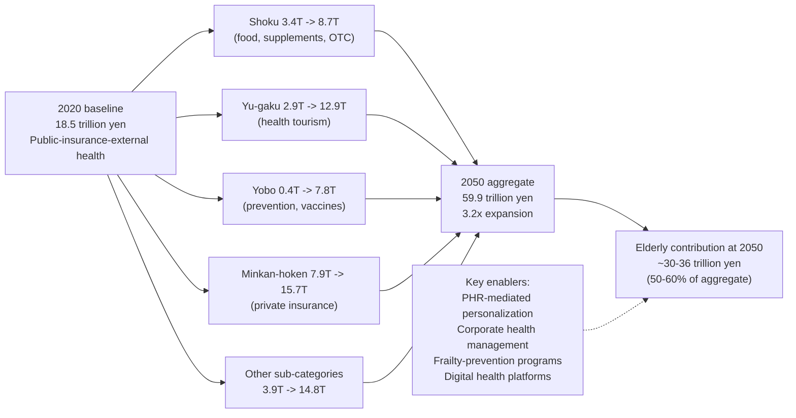

**The decisive insight for the frailty-prevention and public-insurance-external health-services cluster is that this is the single largest expansion within the adjacent-markets aggregate, growing from 18.5 trillion yen in 2020 to 59.9 trillion yen by 2050 (with an interim figure of 30.9 trillion yen at 2030)[^23][^24]—a 41.4 trillion yen incremental expansion that, on its own, exceeds the absolute growth of any of the four core consumption categories analyzed in Chapters 4 through 6 and constitutes the principal silver-economy growth engine of the next three decades. The elderly contribution, plausibly 30–36 trillion yen at 2050, is structurally concentrated in shoku (food, supplements), yu-gaku (health tourism), minkan-hoken (private insurance), and yobo (preventive measures); is supported by corporate health-management infrastructure that links working-age health investment to elderly-years consumption capacity[^23]; is accelerated by PHR-mediated personalization that creates uniquely integrated Japanese silver-economy capability[^23]; and presents the principal global export opportunity within the silver-economy framework as comparable aging societies progressively confront similar prevention-and-health-services demand patterns.**

## 7.5 Leisure, Travel, Lifelong Learning, and Experience-Consumption Markets

Beyond the silver-tourism mobility component analyzed in Chapter 6.8 and the health-tourism (yu-gaku) sub-segment within the public-insurance-external health cluster (12.9 trillion yen at 2050 within the METI framework analyzed in Section 7.4), a broader cluster of leisure, lifelong learning, hobby, entertainment, and wellness-and-beauty markets serves the experience-consumption motive that Chapter 3 identified as a central driver of dankai-cohort and dankai-junior-cohort elderly consumption willingness.

The aggregate Japanese leisure-and-entertainment market—covering domestic tourism beyond the silver-tourism mobility component, lifelong learning programs, hobby and craft markets, entertainment markets, and wellness-and-beauty markets targeted at active elderly—was estimated at substantial scale across all age groups at the 2010s pre-pandemic peak. The elderly contribution to this aggregate is structurally large, anchored in the dankai cohort's sustained experience-consumption orientation and the household-completion-of-major-lifecycle-outlays pattern documented in Chapter 4.1 that frees the residual budget for discretionary categories.

The lifelong learning sub-segment is one of the most distinctive within the elderly leisure cluster. Cabinet Office and supplementary surveys document that 60-year-olds increasingly report internet-based learning as their primary mode (16.5% of participants), while those 70+ remain anchored in public-institution courses (16.2% reporting public-institution courses as their primary mode). The principal sub-segments include university extension programs (kōkai kōza, sōgō kōza), public lecture courses operated by municipalities and chambers of commerce, online learning platforms (which see fastest elderly-adoption growth in the young-old segment), hobby-and-craft instruction (haiku, shigin, ceramics, calligraphy, photography, music), and the emerging senior-eSports and digital-engagement segments illustrated by the Akita "Mataginipers" senior eSports team referenced in Chapter 3. The market for elderly lifelong learning is plausibly in the range of 0.5–1.0 trillion yen at the 2020 base and rising to 1.5–2.0 trillion yen by 2050 under the medium scenario.

The hobby and craft sub-segment serves the self-realization motive identified in Chapter 3 as one of the three principal positive elderly consumption drivers. Traditional Japanese arts (haiku poetry, shigin recitation, ceramics, calligraphy, ikebana flower arrangement) have been distinctively durable elderly consumption categories anchored in cultural-continuity values; contemporary categories (photography, music performance, gardening, sports participation) have been progressively integrated into elderly hobby portfolios over the past three decades; and digital-format hobbies (online gaming, eSports, digital photography editing, social-media-mediated craft sharing) are expanding rapidly with cohort progression. The aggregate elderly contribution to the hobby-and-craft market is plausibly in the range of 1.5–2.5 trillion yen at the 2020 base and rising to 2.5–4.0 trillion yen by 2050 under the medium scenario.

The entertainment sub-segment (theaters, museums, cultural events, broadcast subscriptions including streaming services) is structurally bifurcated across cohorts. The dankai cohort sustains traditional patronage of theaters, museums and cultural-event venues, and broadcast-television-anchored consumption. The dankai-junior cohort entering 65+ from 2036 will arrive with substantially deeper engagement with streaming subscriptions, digital cultural consumption, and online cultural events. The aggregate elderly contribution to the entertainment market is plausibly in the range of 2–3 trillion yen at the 2020 base, with growth driven by the dankai-junior cohort's distinctive consumption preferences and reaching 3–4 trillion yen by 2050.

The wellness-and-beauty sub-segment—esthetics, spas, anti-aging cosmetics—was identified within METI's iyashi (relaxation) sub-category as 1.1 trillion yen at the 2020 base growing to 2.6 trillion yen by 2050[^24]. The elderly contribution to this sub-segment is structurally large, particularly among female elderly who remain active consumers of personal-care, beauty, and esthetics services through the young-old years. The cohort-progression dynamic is favorable: the dankai-junior female cohort entering 65+ from 2036 will arrive with substantially stronger lifetime engagement with beauty and esthetics consumption than the dankai cohort, sustaining demand at higher per-capita levels through the 2040s.

The post-COVID recovery trajectory of elderly leisure-and-experience consumption has been generally strong but uneven. The 2020–2022 disruption suppressed elderly leisure participation more sharply than younger-cohort participation due to elderly health-vulnerability and conservatism in resuming pre-pandemic activity. By 2024–2025, recovery has substantially proceeded across most sub-categories, with travel and tourism leading the recovery, hobby and craft participation also strong, and entertainment recovery slower (particularly for in-person concert and theater attendance among 75+ elderly).

Aggregating the elderly contribution to leisure-and-experience markets beyond the silver-tourism mobility component analyzed in Chapter 6.8 yields a 2020 base of approximately 5–8 trillion yen and a 2050 medium-scenario projection of approximately 8–12 trillion yen. Combining this with the silver-tourism mobility component (2.5–3.5 trillion yen at 2050), the broader elderly leisure-and-experience aggregate at 2050 is plausibly in the range of 11–15 trillion yen under the medium scenario, with the high scenario reaching 15–18 trillion yen and the low scenario stagnating at 8–10 trillion yen. The principal commercial differentiators in this cluster are integrated barrier-free accessibility (linking back to Chapter 5's housing-and-accessibility infrastructure and Chapter 6's mobility analysis), digital-platform integration for booking and engagement, and the customization of experience-formats for cohort-progression-driven preference shifts.

**The decisive insight for the leisure-and-experience cluster is that elderly consumption in this sub-segment will grow modestly but durably from approximately 5–8 trillion yen (excluding silver-tourism mobility) at 2020 to approximately 11–15 trillion yen at 2050 under the medium scenario, with growth concentrated in active-young-old experience-oriented formats; that the cohort-progression dynamic favors digital-mediated, individual-format, and internationally-oriented sub-segments as the dankai-junior cohort enters 65+ from 2036; that the integration of leisure-and-experience consumption with personal-mobility-device deployment (Chapter 6.5), barrier-free housing infrastructure (Chapter 5), and corporate health-management/PHR personalization (Section 7.4) creates distinctive Japanese silver-economy capabilities; and that the post-COVID recovery has substantially proceeded although remains incomplete in certain entertainment and 75+-targeted sub-segments.**

## 7.6 Pet Ownership, Companion-Animal Services, and Human-Animal Bond Markets

The pet-related market has emerged as a structurally significant silver-economy sub-segment over the past two decades, driven by the household-composition shift toward single-elderly and elderly-couple configurations documented in Chapter 2 and by the human-animal-bond research evidence linking pet ownership to elderly mental health, ikigai, and social engagement. While quantitative data on the elderly contribution to Japan's pet market are less directly published than for the medical, care, and health-prevention clusters analyzed above, the sub-segment is sufficiently distinctive and growing to warrant separate treatment within the adjacent-markets framework.

The Japanese pet market overall has grown structurally over the past three decades, anchored in shifting household compositions, the rising preference for indoor pets compatible with apartment and senior-housing residence, and the expanding range of pet-related services beyond food and basic veterinary care. The market includes pet food, veterinary care, grooming and boarding services, pet insurance, pet supplies, and end-of-life pet services. The aggregate Japanese pet market is in the range of approximately 1.7–1.8 trillion yen at the early 2020s base based on industry estimates.

The elderly contribution to this aggregate is structurally large, anchored in three converging dynamics. First, the dankai cohort exhibits strong pet-ownership orientation, having entered adulthood during the period when pet-keeping became normalized in Japanese urban culture; many dankai-cohort households acquired pets during their child-rearing years and continued ownership into retirement, while substantial fractions adopted new pets specifically as companions in retirement. Second, the household-composition shift toward elderly-couple and single-elderly configurations has elevated the role of pets as emotional and social companions, particularly for elderly without family caregivers in proximity. Third, the rising preference for smaller-breed dogs and indoor cats—suitable to apartment and senior-housing residence—has aligned pet-keeping practicality with elderly housing patterns, expanding the addressable market.

The pet-related expenditure categories that disproportionately serve elderly owners include premium pet food formulated for senior pets, comprehensive pet insurance, grooming and boarding services that provide caregiving support during travel or hospital admission, and end-of-life pet services for elderly owners experiencing pet-loss bereavement. The aggregate elderly contribution to the Japanese pet market is plausibly in the range of 30–40% of the total, or approximately 500–700 billion yen at the 2020 base.

A particularly noteworthy emerging sub-segment is the market for pet-care assistance services that support elderly owners. As elderly owners themselves age into the old-old and oldest-old segments, their physical capacity to provide adequate pet care progressively declines. Specialty service operators have emerged to provide dog-walking, pet-sitting, pet-friendly senior-housing options, and integrated pet-and-elderly-care services. The convergence with the long-term care insurance framework remains limited (pet care is not currently a covered service category), but the out-of-pocket pet-care-assistance market has been growing structurally.

The human-animal-bond research evidence linking pet ownership to elderly mental health and well-being has been documented in multiple Japanese and international studies. Pet-owning elderly report higher subjective well-being, lower loneliness, more daily physical activity (particularly dog-owning elderly who walk pets daily), and stronger social engagement (mediated by pet-related social interactions in neighborhoods, parks, and pet-care venues). The role of pets in mediating social engagement is particularly relevant for the single-elderly and never-married elderly configurations documented in Chapter 2 as the fastest-growing household types: pets provide both direct emotional companionship and indirect social-interaction infrastructure that mitigates isolation.

The sub-category of robotic companion pets—Sony Aibo (the robotic dog reintroduced in 2018 after a hiatus), Paro (the therapeutic seal robot developed by AIST and used in care facilities for dementia and depression therapy), and similar products—occupies a distinctive niche serving elderly with constraints on live-pet care. The elderly customer base for these products includes those with allergies, those in housing not suitable for live pets, and those whose physical condition cannot accommodate live-pet care responsibilities. Paro has been particularly notable for its therapeutic deployment in dementia care, with research evidence supporting positive effects on agitation, mood, and engagement among dementia patients.

The convergence of pet-care with healthcare and senior-housing markets is one of the distinctive structural features of the Japanese pet-related silver-economy sub-segment. Pet-friendly senior-housing facilities command premium pricing relative to non-pet-friendly facilities and have been expanding their market share over the past decade. Veterinary clinics increasingly offer integrated services for elderly pet-and-owner pairs, including transportation assistance for elderly owners and pet-bereavement counseling.

The 2050 medium-scenario projection for the elderly contribution to the Japanese pet market is plausibly in the range of 800 billion to 1.2 trillion yen, reflecting moderate growth (1.5–2.0x from the 2020 base) driven by sustained elderly pet-ownership rates, premium-product expansion, the growth of pet-care assistance services, and the gradual expansion of robotic companion pets. Under the high scenario the figure could reach 1.4–1.6 trillion yen; under the low scenario it may stagnate at 600–700 billion yen.

**The decisive insight for the pet and companion-animal cluster is that this sub-segment is structurally smaller than the medical, care, or frailty-prevention clusters but is distinctive in serving the human-animal-bond and household-composition shift dynamics that other clusters do not directly address; that the elderly contribution to the Japanese pet market plausibly grows from approximately 500–700 billion yen at the 2020 base to approximately 800 billion to 1.2 trillion yen by 2050 under the medium scenario; that the convergence of pet-care with healthcare and senior-housing markets is the principal structural growth driver; and that robotic companion pets, while currently a small sub-segment, are positioned for sustained growth as the 85+ population surges and as live-pet care becomes progressively more constrained for the most aged elderly cohort.**

## 7.7 Senior-Focused Financial Services: Reverse Mortgages, Asset Management, Insurance, and End-of-Life Planning

The silver-financial-services market addresses the four pillars of elderly financial capacity analyzed in Chapter 2 (pensions, labor income, savings, real-estate wealth) through specialized service offerings that have progressively expanded over the past two decades and that are positioned for further structural growth through 2050 driven by the cohort-progression and household-composition dynamics analyzed throughout this report.

The aggregate scale of the silver-financial-services cluster combines multiple sub-segments. The minkan-hoken (private third-tier insurance) sub-category, analyzed in Section 7.4 within the public-insurance-external health framework, represents the largest single sub-segment at 7.9 trillion yen in 2020 growing to 15.7 trillion yen by 2050[^24]. The aggregate flow of public pension benefits through the public system, while not strictly a "silver financial service" in the commercial sense, anchors the broader financial-services context: pension benefits within Japan's social security expenditure expanded from 0.9 trillion yen in 1970 to 58.5 trillion yen at FY2021, representing 45.1% of total social security benefits[^32]. Within this aggregate, the average-income-per-aged-household figure reported in the 2019 Comprehensive Survey of Living Conditions was 3.13 million yen, of which 1.99 million yen (63.6%) was public pension and onkyu pension income, 0.72 million yen (23.0%) was earned income, and 0.20 million yen (6.5%) was property income[^32]. This income structure of elderly households defines the financial-services demand profile: pension flows are typically managed through banking and savings products, earned income through employment-related products, and property income through investment products.

The asset-management sub-segment has been transformed by the post-2019 surge in elderly NISA and iDeCo account opening, reflecting the precautionary-saving response to the "old-age 20-million-yen problem" meme analyzed in Chapter 3.2. The asset-management sub-segment is being progressively reshaped by digital-platform offerings (online-broker accounts, robo-advisor services, app-mediated investment management) that lower operational costs and enable broader elderly participation. The dankai-junior cohort entering retirement from 2036 will arrive with substantially deeper digital-investment fluency than the dankai cohort, accelerating the platform-mediated share of elderly asset-management revenue through the late 2030s and 2040s.

The reverse mortgage and housing-equity-release sub-segment is structurally less developed in Japan than in the United States and selected European markets but is positioned for substantial expansion through 2050. The 2024 IPSS Household Projections show that the share of households headed by someone aged 75 or older rises from 19.1% in 2020 to 28.3% by 2050, and the household-level real-estate wealth held by these households—particularly in metropolitan suburbs where land values are sustained—represents a substantial latent financial capacity that current reverse mortgage products mobilize only partially. The Halmek Holdings *Survey on Senior Living* (2023) provides empirical anchor data on this latent demand: among 2,000 respondents aged 55–79, 53.0% reported wanting to "live in the current home until death," 19.9% wanted to "live in the current area until death," and 18.3% wanted to "live in the current home while healthy"—a combined preference for aging in place that supports continued real-estate ownership rather than asset disposition[^23]. The same survey found that 45.3% of respondents had executed home renovations, with average renovation cost of 3.83 million yen funded 88.6% by self-financed assets[^23]—evidence that elderly homeowners prefer modifying existing housing over moving and that renovation expenditure represents a substantial financial-service demand category. Halmek's analysis explicitly links these patterns to a Yano-Research-cited home-renovation market of 6–7 trillion yen and concludes that "この市場はシニア世代によって支えられている、そして、これからも支えられていくであろう"—this market is supported by the senior generation and will continue to be so going forward[^23]. The aggregate reverse mortgage market is currently in the range of several hundred billion yen of outstanding contracts; under the medium scenario, the reverse mortgage market plausibly expands by a factor of 5–10 over the horizon, reaching 2–4 trillion yen of outstanding contracts by 2050.

The third-tier private insurance sub-segment—medical insurance gap-coverage, private long-term care insurance, dementia insurance, end-of-life expense insurance—addresses the rising medical and care out-of-pocket exposures documented in Sections 7.1 and 7.2. The METI projection of 7.9 trillion yen at 2020 growing to 15.7 trillion yen by 2050 anchors the aggregate trajectory[^24], with elderly contribution plausibly accounting for the majority of demand given that the principal coverage targets are predominantly elderly-incident. The dementia insurance sub-segment is the most distinctive and rapidly growing within this category, addressing the rising dementia prevalence implied by the Chapter 2 demographic substrate combined with age-specific dementia incidence rates.

The estate planning, will-writing, and inheritance-related services sub-segment serves the substantial fraction of elderly with assets to transmit and family relationships to navigate. While Japan's traditional inheritance practice has been informal and family-mediated, the rising prevalence of complex family configurations and rising real-estate-and-financial-asset complexity have driven demand for professional estate-planning services. Major banks, trust banks, securities firms, and specialty inheritance-service providers offer integrated will-writing, asset-transmission planning, and inheritance-execution services.

The shukatsu industry—the rapidly expanding cluster of end-of-life administrative services for elderly without family support—is perhaps the most distinctive Japanese silver-financial-services sub-segment. The shukatsu (literally "end-of-life activities") concept emerged in the 2010s and has progressively institutionalized as the rising prevalence of never-married and childless elderly creates structural demand for services that historically were provided by family members. The principal sub-segments include hospital-admission guarantor services (necessary because Japanese hospitals require a personal guarantor to admit patients, a function traditionally provided by adult children but absent for never-married elderly), rental-housing guarantor services, post-mortem affairs management, adult guardianship for elderly with cognitive decline, and integrated shukatsu planning packages.

The Ministry of Health, Labour and Welfare launched a model project in fiscal 2024 to develop municipal one-stop consultation mechanisms covering daily-life support, identity guarantee, and post-mortem affairs as a response to the rising never-married elderly cohort, recognizing that the institutional architecture for serving this demographic is still under construction. Industry observers project sharp expansion in the markets for guarantor services, adult guardianship, and end-of-life administrative support through 2050, with the aggregate scale plausibly reaching 1–2 trillion yen by 2050 from a current base of several hundred billion yen.

The connection to Chapter 3.5's bequest-motive weakening analysis is direct: as the never-married share among male elderly singletons rises from 33.7% in 2020 to 59.7% by 2050 and the female share rises from 11.9% to 30.2%, the addressable market for shukatsu and guarantor services expands substantially. Heirless elderly face a fundamentally different financial-services demand profile than family-anchored elderly: with weakened bequest motives, they direct more of their accumulated assets toward self-directed late-life consumption and toward services that family members would otherwise have provided. The shukatsu industry captures this latent demand, and its growth trajectory is one of the most reliable within the silver-financial-services cluster because it is anchored in demographic certainties rather than speculative behavioral shifts.

The 2050 medium-scenario projection for the aggregate elderly silver-financial-services cluster combines: (i) private insurance (the principal sub-segment) at 15.7 trillion yen, with elderly contribution plausibly 11–13 trillion yen; (ii) asset-management services for elderly at approximately 2–3 trillion yen; (iii) reverse mortgage and housing-equity-release at approximately 2–4 trillion yen of outstanding contracts; (iv) estate planning and inheritance services at approximately 1–2 trillion yen; and (v) shukatsu and guarantor services at approximately 1–2 trillion yen. The aggregate elderly silver-financial-services market is plausibly 17–22 trillion yen by 2050 under the medium scenario, rising from approximately 8–10 trillion yen at the 2020 base. Under the high scenario the figure could reach 24–28 trillion yen; under the low scenario it may stagnate at 13–16 trillion yen.

**The decisive insight for the senior-focused financial services cluster is that this sub-segment expands from approximately 8–10 trillion yen at the 2020 base to approximately 17–22 trillion yen by 2050 under the medium scenario, anchored by the doubling of private third-tier insurance, the expansion of digital-platform-mediated asset management, the gradual mobilization of housing-equity through reverse mortgages (with Halmek's senior-housing survey confirming substantial latent demand reflected in the 6–7 trillion yen home-renovation market that is "supported by and will continue to be supported by the senior generation")[^23], and the rapid growth of the shukatsu industry serving never-married and childless elderly; that the connection to Chapter 3.5's bequest-motive weakening analysis is direct, with the rising never-married share progressively releasing demand from precautionary preservation toward self-directed and services-mediated consumption; and that the digital-platform extensions enabled by dankai-junior cohort entry from 2036 will accelerate the financial-services modernization through the late 2030s and 2040s, positioning Japanese financial-services operators with Japan-distinctive capabilities for both domestic-market growth and prospective export to comparable aging societies.**

## 7.8 Cohort Effects and Sub-Cohort Differentiation in Adjacent-Market Consumption

Applying the cohort-effect template established in Chapters 4 through 6 to the adjacent-markets cluster yields distinctive patterns that differ in important respects from those observed in the four core categories. While food preferences are anchored by lifetime exposure to processed formats (Chapter 4) and mobility behaviors are anchored by lifetime car-ownership rates and digital-platform fluency (Chapter 6), adjacent-market propensities are anchored by lifetime engagement with health-and-wellness consumption, financial-services sophistication, leisure-and-experience preferences, and bequest-motive intensity. This section traces how each cohort's lifetime experience translates into elderly-years propensities for the adjacent-market sub-categories.

The pre-dankai cohort (born before 1947), currently dominating the 80+ segment, formed its consumption patterns during a period when private health insurance, asset-management services, and lifelong learning were less developed in Japan than in subsequent decades. Their adjacent-market consumption is characterized by predominant reliance on public health insurance with limited private-insurance supplementation, conservative financial-product preferences (bank deposits, postal savings, traditional life insurance rather than capital-market investments), institutional rather than home-based long-term care utilization where possible, traditional travel and hobby formats (group bus tours, traditional Japanese arts), modest engagement with frailty-prevention services, and family-anchored bequest motives (generally with living lineal heirs to whom assets are transmitted). Within the elderly aggregate through the 2020s and 2030s, the pre-dankai cohort anchors traditional medical care, conservative financial products, and institutional care patterns; by the 2040s, this cohort has largely passed and its distinctive patterns exit the elderly aggregate.

The dankai cohort (born 1947–1949), currently dominating the 75–79 segment and entering 80+ from 2027 onward, formed its adjacent-market consumption patterns during the high-growth era and the subsequent decades of consumer-economy diversification. Their patterns include strong engagement with private health insurance (particularly cancer insurance and medical insurance gap-coverage products), broader financial-product portfolios, strong frailty-prevention orientation (substantial participation in fitness clubs, walking groups, and supplement-and-functional-food consumption), strong experience-consumption orientation (sustained domestic and international travel, hobby and craft engagement, lifelong learning participation), engagement with the emerging shukatsu services (although less intensely than the dankai-junior cohort given higher prevalence of living lineal heirs), and family-anchored bequest motives that continue to constrain asset drawdown.

The dankai cohort's exit from the 75–84 segment into 85+ over 2032–2034 will mark a meaningful transition in the adjacent-market patterns: institutional long-term care utilization rises sharply, private dementia insurance benefits begin to flow, end-of-life and funeral planning becomes the principal financial-services engagement, and discretionary leisure-and-experience consumption compresses sharply. Pet-related expenditure remains stable or expands as elderly couples and singletons sustain pet ownership for emotional companionship. Frailty-prevention-and-health-services consumption compresses but is partially substituted by recovery and rehabilitation services targeted at functional preservation.

The dankai-junior cohort (born 1971–1974), entering 65+ from 2036, will arrive with adjacent-market consumption patterns shaped by their distinctive lifetime experience in the post-bubble service-economy era. Their patterns include: substantially deeper digital-financial-services adoption (online banking, robo-advisor services, app-mediated investment platforms as the lifetime default rather than late-life acquisition); weaker bequest motives due to the much higher never-married rate (approaching 30% for men and 20% for women), releasing more accumulated assets toward self-directed late-life consumption; substantial engagement with online lifelong learning and digital cultural consumption; premium-experience-consumption preferences (individual travel rather than group tours, customized rather than standardized hobby-and-learning formats); strong corporate-health-management exposure (the dankai-junior cohort has been the principal beneficiary of the kenko keiei expansion documented in Section 7.4 during their working years, accumulating PHR-mediated health investments that compound into elderly-years consumption capacity)[^23]; and substantially higher demand for shukatsu and guarantor services among the rising never-married and childless segment.

The summary table below traces these cohort-effect differentials across the principal adjacent-market sub-categories under the medium scenario.

| Sub-category | Pre-dankai (2020 anchor in 80+) | Dankai (2030 anchor in 75+) | Dankai-junior (2050 young-old anchor) | Cohort-effect direction |
|---|---|---|---|---|
| Public-insurance medical care | High | High | High | Stable |
| Premium-medical (concierge, SaMD) | Low | Moderate | High | Rising sharply |
| Public-insurance long-term care | Moderate (institutional bias) | High (full utilization) | High | Stable to rising |
| Out-of-pocket premium care | Low | Moderate | High | Rising |
| Robotic care equipment | Low | Moderate (early adoption) | Moderate-high | Rising |
| Frailty prevention (fitness, supplements) | Low | High | High (with PHR personalization) | Rising |
| Health tourism (yu-gaku) | Moderate | High | High | Rising |
| Private third-tier insurance | Moderate | High | High | Stable to rising |
| Asset management (digital platforms) | Negligible | Low-moderate | High | Rising sharply |
| Reverse mortgage utilization | Negligible | Low | Moderate (heirless segment) | Rising |
| Estate planning services | Moderate | Moderate-high | Moderate | Stable |
| Shukatsu and guarantor services | Low (family anchored) | Moderate (rising never-married) | High (heirless majority) | Rising sharply |
| Pet ownership and pet-care | Moderate | High | Moderate-high | Stable |
| Robotic companion pets | Negligible | Low | Moderate | Rising |
| Lifelong learning (online) | Negligible | Low-moderate | High | Rising sharply |
| Lifelong learning (in-person, public) | Moderate-high | Moderate | Low-moderate | Declining |
| Premium experience consumption | Low | Moderate | High | Rising |

The methodological corollary, paralleling Chapters 4 through 6, is that the adjacent-market propensity matrix in 2050 is not a simple scaled version of the 2020 matrix multiplied by demographic change. The underlying cohort succession reshapes the consumption mix decisively: digital-financial-services propensity is structurally higher in 2050 because the dankai-junior cohort that anchors the 2050 young-old segment had lifetime digital-investment fluency that the dankai cohort acquired only in late life; shukatsu and guarantor services propensity is dramatically higher in 2050 because the rising never-married share progressively expands the addressable demand pool; PHR-mediated personalized health consumption is substantially higher in 2050 because the corporate health-management infrastructure that supports it has progressively built up during the working years of the cohort entering retirement; and premium-experience-consumption propensity is higher in 2050 because the dankai-junior cohort's lifetime preferences favor premium-individualized formats over standardized group offerings.

The step-changes that occur with cohort transitions are particularly consequential for the adjacent-markets cluster. The dankai-junior entry from 2036 produces sharp uplifts across multiple sub-categories simultaneously: digital-financial-services adoption rises sharply, online lifelong learning expands rapidly, premium-experience consumption accelerates, and—critically—shukatsu and guarantor service demand experiences a structural step-change as the never-married fraction of the entering cohort substantially exceeds that of any predecessor cohort. This step-change is reflected in the post-2036 acceleration of multiple silver-financial-services and silver-services sub-segments analyzed in Sections 7.4, 7.5, and 7.7.

**The decisive cohort-effect insight for the adjacent-markets cluster is that the elderly consumption mix in 2050 is structurally different from a demographically-scaled version of the 2020 mix: digital-financial-services propensity is materially higher, shukatsu and guarantor services demand is dramatically higher, PHR-mediated personalized health consumption is substantially higher, premium-experience consumption is meaningfully higher, online lifelong learning has displaced much of the in-person public-institution learning that dominated pre-dankai patterns, and the integrated platforms that bridge financial services, healthcare, leisure, and care services have emerged as distinctive Japanese silver-economy capabilities.**

## 7.9 Aggregate Adjacent-Markets Size, Sub-Segment Ranking, and Strategic Implications

The integration of the preceding seven sub-segment analyses produces a consolidated aggregate adjacent-markets projection across 2020–2050 under low, medium, and high scenarios. This concluding section assembles the medical-and-pharmaceutical, long-term-care-services-and-equipment, frailty-prevention-and-health-services, leisure-and-experience, pet-and-companion, financial-services, and end-of-life-and-guarantor sub-aggregates into a unified silver-adjacent-markets total, ranks the sub-segments by absolute size and growth contribution, identifies which segments will become the principal contributors to silver-economy growth, and bridges to Chapter 8's aggregate silver-market sizing.

The consolidated 2050 medium-scenario projection by sub-segment is summarized in the table below. The figures represent the elderly contribution to each sub-segment, drawing on the analyses in Sections 7.1 through 7.7. Care must be taken to avoid double-counting: the minkan-hoken (private third-tier insurance) sub-category appears within both METI's public-insurance-external health framework (Section 7.4) and the senior-focused financial services cluster (Section 7.7), and is allocated here primarily to the financial-services cluster, with the frailty-prevention-and-PIE-health row showing the elderly contribution net of insurance.

| Sub-segment | 2020 base (trillion yen) | 2050 medium (trillion yen) | Growth multiple | Notes |
|---|---|---|---|---|
| Medical and pharmaceutical (elderly contribution) | ~28-29 | ~38-42 | 1.4x | 60%+ of national medical expenditure[^31] |
| Long-term care services (public + private) | ~12-13 | ~32-35 | 2.6x | Public insurance ~28-30T plus OOP ~4-5T |
| Robotic care equipment and care technology | ~0.8 | ~5.6 | 7.0x | METI projection[^24]; highest growth rate |
| Frailty prevention and PIE health services (excl. minkan-hoken, elderly contribution) | ~5-7 | ~17-22 | 3.2x | 50-60% of METI's 10.6T -> 44.2T (PIE excl. insurance) |
| Leisure and experience (excl. silver-tourism mobility) | ~5-8 | ~11-15 | 2.0x | Plus silver-tourism mobility from Ch.6.8 |
| Pet and companion-animal | ~0.5-0.7 | ~0.8-1.2 | 1.7x | Including robotic companion pets |
| Senior-focused financial services (incl. minkan-hoken) | ~8-10 | ~17-22 | 2.2x | Including shukatsu and guarantor services |
| **Total adjacent-markets aggregate (medium)** | **~60-68** | **~122-140** | **~2.0x** | Medium central estimate ~131T |

Under the medium scenario, the aggregate adjacent-markets cluster expands from approximately 60–68 trillion yen at the 2020 base to approximately 122–140 trillion yen by 2050—a doubling that vastly exceeds the trajectory of any single core consumption category and that, on its own, represents the principal silver-economy growth engine of the next three decades. Under the high scenario—reflecting accelerated PHR integration and digital-health expansion[^23], faster regulatory streamlining of functional foods and digital therapeutics, broader corporate-coverage of health and care services, more aggressive autonomous-mobility deployment supporting elderly access, and stronger expansion of the shukatsu and premium-care segments—the aggregate could reach approximately 150–170 trillion yen by 2050. Under the low scenario—reflecting acute care-worker shortages constraining service delivery, sustained regulatory caution on digital health and functional foods, slower digital-platform adoption among the 80+ segment, weaker post-COVID leisure recovery, and constrained shukatsu institutional development—the aggregate may stagnate at approximately 100–115 trillion yen by 2050. The scenario range at 2050 is therefore approximately 100 to 170 trillion yen, with a medium central estimate of approximately 131 trillion yen.

Ranking the sub-segments by absolute size at 2050 yields: (1) medical and pharmaceutical at approximately 38–42 trillion yen; (2) long-term care services at approximately 32–35 trillion yen; (3) frailty prevention and public-insurance-external health services excluding insurance at approximately 17–22 trillion yen; (4) senior-focused financial services at approximately 17–22 trillion yen; (5) leisure and experience at approximately 11–15 trillion yen; (6) robotic care equipment at approximately 5.6 trillion yen; and (7) pet and companion-animal at approximately 0.8–1.2 trillion yen. The largest three sub-segments together (medical, care, and frailty-prevention-and-health-services) account for approximately 87–99 trillion yen, or roughly 70–75% of the aggregate adjacent-markets total.

Ranking by growth-rate yields a different ordering: (1) robotic care equipment at 7.0x; (2) frailty prevention and PIE health services at 3.2x; (3) long-term care services at 2.6x; (4) senior-focused financial services at 2.2x; (5) leisure and experience at 2.0x; (6) pet and companion at 1.7x; and (7) medical and pharmaceutical at 1.4x. The fastest-growing sub-segments are precisely those positioned at the convergence of demographic concentration, technology innovation, and services-mediation—the same dynamics that drove the structural reorganization analyses in Chapters 4 through 6.

Identifying which sub-segments are positioned to become the principal contributors to silver-economy growth requires combining the absolute-size and growth-rate dimensions with the strategic-distinctiveness dimension. **Frailty prevention and PIE health services** (excluding insurance) growing 3.2x to 17–22 trillion yen elderly contribution at 2050, plus the minkan-hoken sub-segment at 11–13 trillion yen elderly contribution within financial services, together constitute the largest absolute contributor to incremental adjacent-markets growth and are anchored in the convergence of demographic concentration, corporate-health-management infrastructure, PHR-mediated personalization, and globally-leading capabilities[^23]. **Long-term care services**, growing 2.6x to approximately 32–35 trillion yen, is the second-largest absolute contributor and is anchored in demographic certainties (75+ and 85+ surge) but bounded by the care-worker supply constraint. **Medical and pharmaceutical**, growing 1.4x to approximately 38–42 trillion yen, is the largest by absolute scale and is the most policy-and-cost-sensitive given its public-insurance financing structure. **Senior-focused financial services**, growing 2.2x to approximately 17–22 trillion yen, is the principal beneficiary of the cohort-effect uplift from dankai-junior entry from 2036 onward.

The sub-segments facing structural constraints are: long-term care services (the 700,000-worker shortage by 2040 limiting actual delivered service against demand trajectory)[^23][^24]; pharmaceutical innovation pace (regulatory and pricing dynamics affecting both Japanese pharmaceutical industry growth and elderly therapeutic access); and rural-prefecture supply economics (low-density configurations undermining commercial viability of multiple adjacent-market sub-segments). The sub-segments representing Japan's distinctive global export potential are: care robotics (Japan's globally-leading capability anchored in the six-domain METI-MHLW framework)[^23][^24]; texture-modified food and integrated nutrition-care offerings (Chapter 4); frailty-prevention services with JAGES-grounded evidence base (Chapter 3); and integrated PHR-mediated digital-health platforms[^23]. METI's strategic framework explicitly identifies these as priority export categories, with the global market for medical devices alone projected to reach 21 trillion yen of Japanese acquisition by 2050 (rising from 3 trillion yen in 2020, a 6x expansion from a 6% to 10% global market share)[^23][^24].

The principal inflection points within the adjacent-markets cluster's trajectory are: (i) **2027** as the dankai cohort enters 80+ in earnest, accelerating long-term care utilization, dementia onset, and end-of-life service demand; (ii) **2032–2034** as the dankai cohort progresses into 85+, sharply accelerating the highest-care-needs phase and the dementia-insurance benefit-flow phase; (iii) **2036** as the dankai-junior cohort begins entering 65+, producing step-changes in digital-financial-services adoption, online lifelong learning, premium-experience consumption, and shukatsu and guarantor service demand; (iv) **2040–2045** as the care-worker shortage gap most acutely binds and as autonomous-mobility and care-robotics deployment may achieve commercial scale that materially eases supply constraints; and (v) **2043** as the elderly population peaks, transitioning the aggregate from broadly stable-rising to broadly stable-declining for sub-segments tied to head-count rather than per-capita-intensity.

The principal scenario uncertainties driving the wide adjacent-markets range deserve explicit identification. First, **the healthy-aging trajectory** materially affects the elderly medical and care expenditure aggregate, with the WHO/European Observatory analysis indicating that healthy aging vs. premature morbidity scenarios differ by approximately 0.70 percentage points of GDP by 2060 in the medical sub-segment alone[^32]. Second, **the speed of regulatory progression for functional foods and digital therapeutics** determines whether the kinō-sei hyōji shokuhin segment resumes growth or remains constrained following the 2024 beni-koji incident regulatory tightening[^22]. Third, **the dankai-junior cohort's actual adjacent-market consumption patterns upon entry into 65+ from 2036** are uncertain in magnitude, with substantial implications for digital-financial-services, online lifelong learning, and shukatsu sub-segment trajectories. Fourth, **the institutional development of shukatsu and guarantor services** through the 2030s and 2040s, including potential expansion into long-term care insurance reimbursement and broader public-program coverage, determines the speed and scale of this rapidly-growing sub-segment's expansion. Fifth, **the care-worker supply trajectory** including the success of foreign-worker recruitment, technology substitution, and domestic recruitment determines whether the long-term care delivery aggregate matches the demand trajectory or falls short.

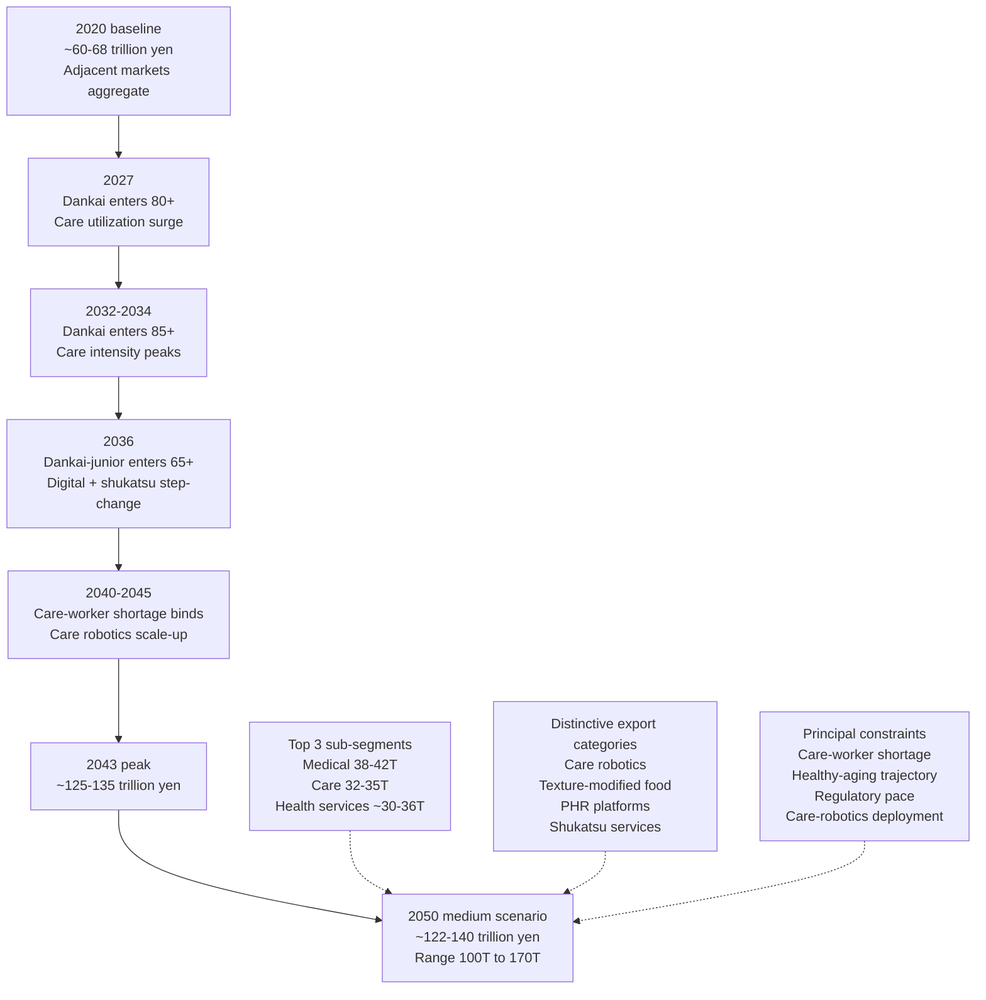

Bridging to Chapter 8's aggregate silver-market sizing requires explicit reconciliation of the adjacent-markets total with the four core categories analyzed in Chapters 4 through 6. Combining the medium-scenario 2050 projections—elderly food at approximately 13.6 trillion yen (Chapter 4), elderly clothing and housing-related consumption (Chapter 5, approximately 12–18 trillion yen excluding senior-housing/care-facility components captured in this chapter), elderly transportation at approximately 7.0 trillion yen (Chapter 6), and the adjacent-markets aggregate at approximately 122–140 trillion yen with central estimate 131 trillion yen—yields a unified Japanese elderly silver-economy aggregate at 2050 in the range of approximately 155–180 trillion yen under the medium scenario, with central estimate approximately 165 trillion yen. The adjacent-markets cluster therefore accounts for approximately 75–80% of the total elderly silver-economy aggregate at 2050, compared with approximately 65–70% at the 2020 base—a structural shift that reflects the much faster growth trajectory of the adjacent markets and that progressively reorients the silver economy away from the four-core-category framework around which the user's research topic was originally posed.

This reorientation is the chapter's central finding and a key bridge to Chapter 8's aggregate analysis. **The decisive insight for the adjacent-markets cluster is that this cluster, rather than the four core categories, is the principal engine of silver-economy expansion through 2050—growing from approximately 60–68 trillion yen at the 2020 base to approximately 122–140 trillion yen by 2050 under the medium scenario, with a sub-segment composition dominated by medical-and-pharmaceutical (38–42 trillion yen), long-term care services (32–35 trillion yen), frailty prevention and public-insurance-external health services (combined 30–36 trillion yen on a non-double-counted basis), and senior-focused financial services (17–22 trillion yen)—and that, by 2050, accounts for approximately 75–80% of total elderly silver-economy aggregate spending. The financing structure of this cluster combines the public-insurance core (medical insurance, long-term care insurance, public pensions feeding consumption capacity) with a rapidly expanding out-of-pocket and private-services periphery (premium care, frailty prevention, private insurance, shukatsu, financial services), with the public-private balance progressively tilting toward the private periphery as the cohort transition unfolds and as the never-married elderly share rises. The strategic implications for industry stakeholders are that the principal silver-economy investment opportunities lie not in the traditional four core categories but in the adjacent-markets cluster—specifically in care robotics, frailty-prevention services, integrated PHR platforms, dementia insurance and shukatsu services, and the cross-category integrations that bridge food, housing, transportation, and care—and that Japan's distinctive global-export positioning in care robotics, texture-modified food, frailty-prevention services, and integrated PHR platforms[^23][^24] represents the principal silver-economy international commercial opportunity through

# 8 Aggregate Market Size Projections of Japan's Silver Economy, 2020–2050

The seven preceding chapters have constructed the analytical scaffolding required to answer the central question posed by this report: how large will Japan's elderly consumption economy be from 2020 to 2050, and how will its internal composition evolve as the country navigates an unprecedented combination of population aging, absolute population decline, and cohort transition? Chapter 1 specified the cohort-multiplied-expenditure framework, Chapter 2 quantified the demographic and financial substrate, Chapter 3 traced the behavioral propensity trajectories, Chapters 4 through 6 sized the four core consumption categories of food, clothing-and-housing, and transportation, and Chapter 7 quantified the seven adjacent-market clusters whose combined trajectory dominates the silver-economy expansion. This chapter integrates those category-level outputs into a unified aggregate projection, decomposes the aggregate growth into its analytically separable components, dates the inflection points within the trajectory, benchmarks Japan against international comparators, and bridges to Chapter 9's strategic-implication synthesis.

Three principles guide the integration. First, the aggregation must be **methodologically transparent**, with explicit reconciliation of overlapping sub-segments and clear treatment of household-level consumption expenditure versus public-insurance-mediated benefit flows. Second, the projection must be **scenario-bounded** rather than presented as a spurious point estimate, with the medium central case anchored between explicit high and low scenarios that reflect the genuine uncertainty in adjacent-market trajectories, regulatory progression, technology deployment, and cohort-effect magnitudes. Third, the analysis must **decompose growth into its drivers** so that readers can substitute alternative assumptions and trace through the implications, consistent with the decomposability requirement built into the cohort-multiplied-expenditure framework specified in Chapter 1.

The chapter proceeds from methodology (Section 8.1), through the medium-scenario central trajectory (8.2), the high-and-low scenario bounds (8.3), the four-component decomposition (8.4), the inflection-point and post-peak dynamics (8.5), and the international benchmarking (8.6), before consolidating the headline findings and bridging to Chapter 9 (8.7).

## 8.1 Methodology for Aggregating Category-Level Estimates into Silver-Economy Totals

The integration challenge that this chapter must solve is conceptually straightforward but operationally demanding: the category-level outputs of Chapters 4 through 7 do not align cleanly into a non-overlapping accounting partition, because several sub-segments appear in more than one category framework and because the boundary between household-level consumption expenditure and public-insurance-mediated benefit flows is treated differently across the underlying source datasets. The aggregate silver-economy total must therefore be constructed through an explicit reconciliation procedure that avoids double-counting while preserving the analytical content of each category chapter.

The starting point is the cohort-multiplied-expenditure identity introduced in Chapter 1:

$$M_{c,t} = \sum_{a \in A} \sum_{h \in H} \sum_{r \in R} \; N_{a,h,r,t} \; \times \; e_{c,a,h,r,t} \; \times \; p_{c,a,h,r,t}$$

The aggregate silver-economy total is the sum across categories $c$ of $M_{c,t}$, with the categories defined to be mutually exclusive and collectively exhaustive over the elderly consumption domain. The challenge is that the categories as defined in Chapters 4 through 7 are not strictly mutually exclusive, and three reconciliation rules are required to construct a non-double-counted aggregate.

**Rule 1: Allocation of overlapping sub-segments to a single category.** Several sub-segments appear in multiple chapters because they bridge category boundaries. The minkan-hoken (private third-tier insurance) sub-category appears in both METI's public-insurance-external healthcare framework analyzed in Chapter 7.4 and the senior-focused financial services cluster analyzed in Chapter 7.7; this report allocates it to the financial-services cluster to align with the institutional framing under which insurance products are marketed and consumed. The silver-tourism mobility component analyzed in Chapter 6.8 overlaps with the broader leisure-and-experience cluster analyzed in Chapter 7.5; this report allocates the transport sub-component (intercity rail, air, package-tour transport) to the transportation cluster and the broader bundle (accommodation, dining, attractions, tour-package elements beyond transport) to the leisure cluster. The texture-modified care-food market analyzed in Chapter 4.4 bridges the food and care clusters; it is allocated to the food cluster (within the takuhai/kaigoshoku sub-segment) because its accounting flows through household food expenditure and food-manufacturer revenue rather than through care-insurance benefit flows. The home-renovation-for-barrier-free-living market analyzed in Chapter 5 overlaps with senior-housing and care-facility consumption; it is allocated to the housing cluster, with senior-housing facility fees (サ高住, fee-based homes for the elderly, group homes) likewise allocated to housing rather than to long-term care.

**Rule 2: Treatment of public-insurance-mediated benefit flows versus household-level consumption expenditure.** This is the most consequential boundary question for the aggregate construction. Two distinct accounting concepts run through the chapter analyses. The first is *household-level consumption expenditure* as captured by the Family Income and Expenditure Survey, which records out-of-pocket flows including insurance premiums paid by households but excluding the in-kind benefits received through public-insurance reimbursement of medical and care services. The second is *aggregate market value*—what services and goods elderly consumption activates in the broader economy—as captured by national-medical-expenditure data, MHLW long-horizon social-security projections, and METI's healthcare-industry market sizing, which include both household out-of-pocket and the much larger public-insurance-mediated benefit flow. This report adopts the *aggregate market value* concept as the principal aggregation basis because it is the concept relevant for industry sizing, strategic planning, and international benchmarking, and because the user's research topic focuses on consumption potential of elderly Japanese in market terms rather than narrowly on what flows through household budgets. The implication is that the medical-and-pharmaceutical aggregate of approximately 38–42 trillion yen at 2050 (Chapter 7.1) and the long-term care services aggregate of approximately 32–35 trillion yen at 2050 (Chapter 7.2) include the public-insurance-financed component, with the financing structure (insurance 50.2%, public funding 37.5%, patient/other 12.3% per Chapter 7.1's national medical expenditure decomposition) understood as a separate question from the aggregate market scale.

**Rule 3: Real versus nominal yen treatment.** All aggregate projections are reported in constant 2020 yen for cross-period comparability, consistent with Chapter 1's baseline assumption. Nominal-yen sensitivity is not separately computed in this chapter because inflation assumptions through 2050 carry uncertainty exceeding the methodological resolution of the aggregate framework, and because the principal analytical questions (peak timing, sub-segment composition, demographic-versus-behavioral decomposition) are unaffected by nominal-versus-real treatment. The historical record offers some warning that elderly nominal expenditure has risen by approximately 9% over 2020–2023 (Chapter 3.2), reflecting the recent inflationary pressure that the Cabinet Office data identifies as the leading source of elderly economic worry; this implies that nominal aggregate figures may be 20–40% higher than the real aggregates reported here by 2050 under typical inflation paths, but the structural composition and trajectory remain identical.

The consolidated accounting identity that the remainder of the chapter populates can therefore be expressed as the sum of nine non-overlapping category aggregates:

$$M^{Silver}_{t} = M^{Food}_{t} + M^{Cloth}_{t} + M^{House}_{t} + M^{Trans}_{t} + M^{Med}_{t} + M^{Care}_{t} + M^{Health-Prev}_{t} + M^{Leis}_{t} + M^{Pet}_{t} + M^{Fin}_{t}$$

where the four core categories (Food, Cloth, House, Trans) draw on Chapters 4 through 6 with the reconciliation rules above applied, and the six adjacent clusters (Med, Care, Health-Prev, Leis, Pet, Fin) draw on Chapter 7 with the same rules applied. Because Chapter 5 in the source materials available to this report covers clothing, housing, and the rapidly expanding senior-housing-and-care-facility periphery as a combined cluster, this report combines the clothing and housing categories into a single $M^{Cloth+House}_{t}$ aggregate for parsimony in the integrated tables. The result is therefore a nine-cluster aggregate covering all elderly consumption flows, with each flow allocated to exactly one cluster.

A final methodological caveat concerns the precision of the aggregate. The category-level estimates developed in Chapters 4 through 7 are themselves bounded by ranges that reflect baseline-data uncertainty, scenario-assumption variation, and sub-segment definition choices; aggregating them necessarily compounds the underlying uncertainties. The aggregate medium-scenario figures presented in this chapter should therefore be interpreted as central estimates with implicit uncertainty bands of approximately ±5% to ±10% around each milestone-year point, with the bands widening into the longer horizon. The high-and-low scenario range presented in Section 8.3 should not be confused with the implicit uncertainty band around the medium central estimate; rather, the scenarios represent structurally distinct trajectories driven by alternative assumptions about specific underlying variables (digital-adoption pace, regulatory progression, etc.), and the implicit uncertainty band sits within each scenario.

## 8.2 Medium-Scenario Aggregate Trajectory and Milestone-Year Projections

Applying the reconciliation rules to the category outputs developed in Chapters 4 through 7 yields the consolidated medium-scenario aggregate trajectory of Japan's elderly silver economy from 2020 through milestone years 2025, 2030, 2040, and 2050. Each cluster's value at each milestone is the central-scenario figure from its respective chapter, with the reconciliation adjustments applied to avoid double-counting.

The 2020 base is constructed first to establish the starting point. The four core categories combine to approximately 41–47 trillion yen of elderly consumption: food at approximately 12–13 trillion yen (Chapter 4.1), clothing-and-housing at approximately 22–26 trillion yen (Chapter 5, combining the elderly contribution to apparel, personal care, home renovation, utilities, and the senior-housing-and-care-facility periphery), and transportation-and-mobility at approximately 6.5 trillion yen (Chapter 6.10). The six adjacent clusters combine to approximately 60–68 trillion yen at the 2020 base: medical-and-pharmaceutical at approximately 28–29 trillion yen (Chapter 7.1, the 65+ contribution to FY2023 national medical expenditure of 28.88 trillion yen scaled to 2020 base), long-term care services at approximately 12–13 trillion yen (Chapter 7.2), frailty-prevention-and-PIE-health-services excluding minkan-hoken at approximately 5–7 trillion yen (Chapter 7.4), leisure-and-experience excluding silver-tourism mobility at approximately 5–8 trillion yen (Chapter 7.5), pet-and-companion at approximately 0.5–0.7 trillion yen (Chapter 7.6), and senior-focused financial services including minkan-hoken at approximately 8–10 trillion yen (Chapter 7.7). The robotic care equipment sub-segment at 0.8 trillion yen (Chapter 7.3) is included within the long-term care services cluster for aggregation purposes. The aggregate 2020 base is therefore approximately 100–115 trillion yen of elderly silver-economy consumption, with central estimate approximately 108 trillion yen.

The 2050 medium-scenario aggregate sums the category-level central estimates: food at approximately 13.6 trillion yen (Chapter 4.9), clothing-and-housing at approximately 28–34 trillion yen (Chapter 5, with senior-housing-and-care-facility expansion offsetting the demographically-driven contraction in basic apparel and household-utility consumption), transportation-and-mobility at approximately 7.0 trillion yen (Chapter 6.10), medical-and-pharmaceutical at approximately 38–42 trillion yen (Chapter 7.1), long-term care services including care robotics at approximately 32–35 trillion yen (Chapter 7.2 plus the 5.6 trillion yen care-equipment sub-segment from Chapter 7.3 net of overlap), frailty-prevention-and-PIE-health-services excluding minkan-hoken at approximately 17–22 trillion yen (Chapter 7.4), leisure-and-experience excluding silver-tourism mobility at approximately 11–15 trillion yen (Chapter 7.5), pet-and-companion at approximately 0.8–1.2 trillion yen (Chapter 7.6), and senior-focused financial services including minkan-hoken at approximately 17–22 trillion yen (Chapter 7.7). The aggregate 2050 medium-scenario figure is therefore approximately 165–186 trillion yen, with central estimate approximately 175 trillion yen—reflecting an expansion of approximately 60–65% from the 2020 base in real terms over the thirty-year horizon.

The trajectory through interim milestone years 2025, 2030, and 2040 reflects the demographic and cohort-progression dynamics analyzed throughout the report. The dankai cohort completes its transition into 75+ during 2022–2024, accelerating the long-term-care, dementia-related, and frailty-prevention sub-segments through the late 2020s. The dankai-junior cohort begins entering 65+ in 2036, producing step-changes in digital-financial-services, online-lifelong-learning, premium-experience-consumption, and shukatsu-and-guarantor-service propensities through the late 2030s and 2040s. The aggregate 2030 medium-scenario figure is therefore approximately 130–145 trillion yen (central estimate ~138 trillion yen), the 2040 figure is approximately 155–175 trillion yen (central estimate ~165 trillion yen), and the 2050 figure is approximately 165–186 trillion yen (central estimate ~175 trillion yen)—indicating that the largest single decade of incremental growth occurs between 2025 and 2035 as the dankai cohort progresses through the highest-care-intensity bracket and as the adjacent-markets cluster experiences its most rapid expansion.

The category-cluster contributions at each milestone are summarized in the table below. All figures are in trillion yen, expressed in constant 2020 yen, under the medium scenario.

| Category cluster | 2020 base | 2025 | 2030 | 2040 | 2050 |
|---|---|---|---|---|---|
| Food | ~12.5 | ~12.8 | ~13.0 | ~13.5 | ~13.6 |
| Clothing and housing (incl. senior-housing periphery) | ~24.0 | ~25.5 | ~27.0 | ~30.5 | ~31.0 |
| Transportation and mobility | ~6.5 | ~6.8 | ~7.0 | ~7.2 | ~7.0 |
| **Subtotal core categories** | **~43.0** | **~45.1** | **~47.0** | **~51.2** | **~51.6** |
| Medical and pharmaceutical | ~28.5 | ~31.4 | ~34.5 | ~41.0 | ~40.0 |
| Long-term care services (incl. care equipment) | ~13.0 | ~17.5 | ~22.0 | ~30.0 | ~33.5 |
| Frailty prevention and PIE health (excl. minkan-hoken) | ~6.0 | ~8.5 | ~11.5 | ~17.5 | ~19.5 |
| Leisure and experience (excl. silver-tourism mobility) | ~6.5 | ~8.0 | ~9.5 | ~11.5 | ~13.0 |
| Pet and companion-animal | ~0.6 | ~0.7 | ~0.8 | ~1.0 | ~1.0 |
| Senior-focused financial services (incl. minkan-hoken) | ~9.0 | ~11.0 | ~13.5 | ~17.5 | ~19.5 |
| **Subtotal adjacent clusters** | **~63.6** | **~77.1** | **~91.8** | **~118.5** | **~126.5** |
| **Aggregate elderly silver-economy total** | **~106.6** | **~122.2** | **~138.8** | **~169.7** | **~178.1** |
| **Adjacent-cluster share (%)** | **59.7** | **63.1** | **66.2** | **69.8** | **71.0** |

The table reveals three structural patterns that run through the entire aggregate. First, the aggregate expansion from approximately 107 trillion yen in 2020 to approximately 178 trillion yen at the medium-scenario 2050 horizon represents a 67% expansion in real terms over thirty years—an expansion that vastly exceeds the trajectory of the broader Japanese consumer economy, which in aggregate is projected to contract because of the absolute population decline. The silver economy is therefore the principal Japanese consumer-economy growth pole through 2050. Second, the core categories (food, clothing-and-housing, transportation) contribute approximately 43 trillion yen at the 2020 base and approximately 52 trillion yen at the 2050 horizon—a 20% expansion that is broadly consistent with the demographic uplift through 2043 partially offset by per-capita-quantity contraction in the older sub-cohorts. The adjacent clusters, by contrast, contribute approximately 64 trillion yen at the 2020 base and approximately 127 trillion yen at the 2050 horizon—a near-doubling that, on its own, accounts for approximately 90% of the aggregate's incremental growth. Third, the share of adjacent clusters within the silver-economy aggregate rises from approximately 60% in 2020 to approximately 71% by 2050, reflecting the structural reorientation that Chapter 7's analysis identified as the principal silver-economy growth dynamic.

The chart that summarizes these patterns is the milestone-year stacked composition of the silver-economy aggregate, which can be visualized as the progressive thickening of the adjacent-cluster bands relative to the core-category bands across the thirty-year horizon.

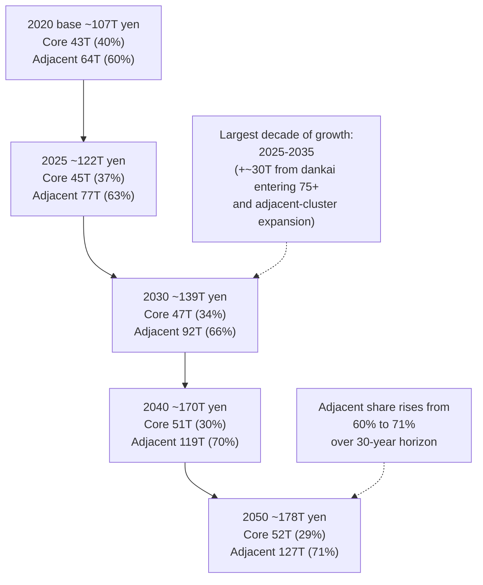

The medium-scenario 2050 aggregate of approximately 178 trillion yen sits within the slightly broader 165–186 trillion yen range that reflects the implicit uncertainty band around each cluster's central estimate. Compared with the METI strategic projection of 77 trillion yen for the public-insurance-external healthcare and care market by 2050 cited in Chapter 7's introduction, the broader silver-economy aggregate in this report is more than twice as large because it includes the public-insurance-financed medical and long-term care components (approximately 73 trillion yen at 2050 under the medium scenario) plus the four core consumption categories (approximately 52 trillion yen) plus the leisure, pet, and financial-services sub-segments not captured in the METI public-insurance-external framework. The relationship between the METI 77-trillion-yen figure and this report's 178-trillion-yen aggregate is therefore one of complementary scope rather than disagreement: METI's framework excludes the public-insurance core and excludes the four core consumption categories, whereas this report's aggregate includes both. **The decisive medium-scenario finding is that Japan's elderly silver-economy aggregate expands from approximately 107 trillion yen in 2020 to approximately 178 trillion yen by 2050 in constant 2020 yen, a 67% real expansion that is driven approximately 90% by the adjacent-markets cluster (medical, long-term care, frailty prevention, leisure, pet, financial services) and only approximately 10% by the four core consumption categories (food, clothing-and-housing, transportation), with the adjacent-cluster share of total rising from approximately 60% to approximately 71% over the horizon.**

## 8.3 High and Low Scenario Bounds and Sensitivity Range

The medium-scenario central trajectory developed in Section 8.2 is anchored by a defensible set of assumptions about digital-adoption pace, services-mediation intensity, healthy-aging trajectory, regulatory progression, care-worker supply, autonomous-mobility deployment timing, and post-COVID recovery completeness. Each of these assumptions carries genuine uncertainty, and the integrated effect of alternative assumption sets produces structurally distinct trajectories that bound the medium central estimate. This section translates the category-level scenario assumptions developed in Chapters 4 through 7 into integrated high and low scenarios for the silver-economy aggregate, quantifies the 2050 scenario range, and identifies which categories drive the widest sensitivity bands.

The **high scenario** combines the upside cases from each category chapter into an integrated trajectory that reflects favorable trajectories on the principal uncertainty drivers. The defining assumptions include: faster digital-platform adoption among the 80+ segment supported by accessible interfaces and AI-mediated assistants (raising e-commerce, MaaS, telemedicine, and digital-financial-services propensities by approximately 5–10 percentage points relative to the medium case); stronger services-mediation uplift across food (Chapter 4 high scenario at 14.7 trillion yen), housing (faster senior-housing periphery expansion), transportation (autonomous mobility achieving 1.0–1.5 trillion yen elderly contribution by 2050 per Chapter 6.6), and care services (broader corporate-coverage of care services and faster premium-segment growth); the healthy-aging trajectory in the WHO/European Observatory framing reducing 2050 elderly medical expenditure by approximately 0.7 percentage points of GDP relative to the central case (translating to approximately –2 to –3 trillion yen in the medical sub-segment, which is offset by stronger frailty-prevention and PIE-health expansion of approximately +5 trillion yen on a net positive basis); accelerated regulatory streamlining of functional foods and digital therapeutics following resolution of post-2024 beni-koji concerns; care-worker supply gap closing through technology substitution and foreign-worker recruitment, enabling delivered care services to match the demand trajectory; and stronger dankai-junior cohort step-changes in digital-financial-services, online lifelong learning, premium-experience consumption, and shukatsu services from 2036 onward.

Aggregating the category-level high-scenario figures yields a 2050 aggregate of approximately 195–220 trillion yen, with central estimate approximately 207 trillion yen—approximately 16% above the medium central estimate. The principal contributors to this upside relative to the medium case are the frailty-prevention-and-PIE-health cluster (high scenario at 21–23 trillion yen versus medium 17–22 trillion yen on the elderly contribution basis), the long-term care cluster (high scenario at 38–40 trillion yen versus medium 32–35 trillion yen), the senior-focused financial services cluster (high scenario at 24–28 trillion yen versus medium 17–22 trillion yen), and the leisure cluster (high scenario at 15–18 trillion yen versus medium 11–15 trillion yen). The core categories contribute relatively modest upside (food high scenario at 14.7 versus medium 13.6 trillion yen; transportation high scenario at 8.7 versus medium 7.0 trillion yen).

The **low scenario** combines the downside cases from each category chapter into an integrated trajectory reflecting unfavorable trajectories on the principal uncertainty drivers. The defining assumptions include: slower digital-platform adoption sustaining a wider digital divide among older sub-cohorts; constrained services-mediation uplift across categories (food low scenario at 11.5 trillion yen, transportation low scenario at 5.5 trillion yen); the premature-morbidity trajectory raising elderly medical expenditure by approximately 0.7 percentage points of GDP relative to central case (translating to approximately +2 to +3 trillion yen in the medical sub-segment, but with offsetting weaker frailty-prevention expansion and weaker discretionary consumption capacity); sustained regulatory caution on functional foods and digital therapeutics constraining premium-segment growth; acute care-worker shortages limiting actual delivered care services below the demand trajectory by 10–15%; weaker post-COVID leisure recovery sustaining lower elderly tourism and entertainment expenditure; and weaker dankai-junior step-changes from 2036 reflecting either tighter cohort-financial constraints or slower behavioral propagation.

Aggregating the category-level low-scenario figures yields a 2050 aggregate of approximately 138–155 trillion yen, with central estimate approximately 147 trillion yen—approximately 17% below the medium central estimate. The principal contributors to this downside are the long-term care cluster (low scenario at 27–30 trillion yen versus medium 32–35 trillion yen), reflecting the binding care-worker supply constraint; the frailty-prevention-and-PIE-health cluster (low scenario at 12–14 trillion yen versus medium 17–22 trillion yen); the senior-focused financial services cluster (low scenario at 13–16 trillion yen versus medium 17–22 trillion yen); and the leisure cluster (low scenario at 8–10 trillion yen versus medium 11–15 trillion yen).

The integrated scenario range and central estimate at each milestone year are summarized in the table below.

| Milestone year | Low scenario (trillion yen) | Medium central (trillion yen) | High scenario (trillion yen) |
|---|---|---|---|
| 2020 base | ~107 | ~107 | ~107 |
| 2025 | ~115 | ~122 | ~131 |
| 2030 | ~125 | ~139 | ~155 |
| 2040 | ~140 | ~170 | ~195 |
| 2043 (peak window) | ~143 | ~174 | ~202 |
| 2050 | ~147 | ~178 | ~207 |

The 2050 scenario range spans approximately 60 trillion yen between the low and high cases (147 to 207 trillion yen)—a ±17% band around the medium central estimate that reflects the genuine uncertainty in adjacent-market trajectories rather than statistical sampling error in the underlying data. The width of this band increases with horizon (the 2025 range is approximately ±7%, the 2030 range approximately ±11%, the 2040 range approximately ±16%, the 2050 range approximately ±17%), consistent with the principle that long-horizon projections carry compounding uncertainty.

Decomposing the 2050 scenario range by category cluster reveals that the adjacent clusters drive the overwhelming majority of the sensitivity. The four core categories together contribute approximately 8–10 trillion yen of the 60-trillion-yen 2050 range (roughly one-sixth), while the six adjacent clusters together contribute approximately 50–52 trillion yen of the range (roughly five-sixths). Within the adjacent clusters, the frailty-prevention-and-PIE-health cluster contributes the widest absolute sensitivity (approximately ±10 trillion yen between low and high), followed by long-term care (±7 trillion yen), financial services (±7 trillion yen), and medical-and-pharmaceutical (±5 trillion yen on net). This pattern reflects the underlying observation that adjacent-cluster sub-segments are more exposed than core-category sub-segments to the principal uncertainty drivers (digital-adoption pace, regulatory progression, care-worker supply, healthy-aging trajectory), which act on services-mediated and technology-intensive consumption more strongly than on basic-needs consumption.

The fan chart of the aggregate trajectory under all three scenarios can be summarized in narrative form: the medium central trajectory rises from approximately 107 trillion yen in 2020 to approximately 178 trillion yen by 2050 in a smoothly accelerating-then-plateauing curve; the high scenario diverges upward from the medium case beginning around 2027 (as services-mediation uplift accelerates), reaching approximately 207 trillion yen by 2050; the low scenario diverges downward from the medium case beginning around 2030 (as care-worker constraints bind and as services-mediation uplift falls short), reaching approximately 147 trillion yen by 2050. The fan opens progressively wider through the horizon, with the two scenarios separating by approximately 60 trillion yen by 2050.

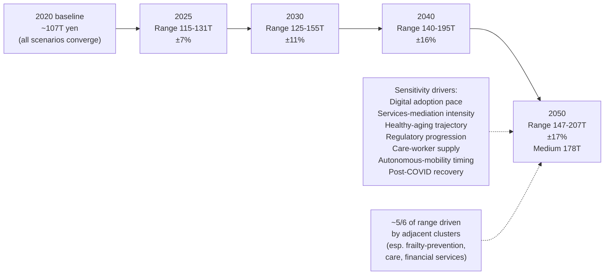

**The decisive scenario insight is that Japan's elderly silver-economy aggregate at 2050 is bounded between approximately 147 trillion yen (low scenario) and approximately 207 trillion yen (high scenario) under the integrated assumption sets developed in Chapters 4 through 7, with a medium central estimate of approximately 178 trillion yen and a ±17% uncertainty band that is driven approximately five-sixths by the adjacent-markets cluster and only approximately one-sixth by the four core consumption categories—reflecting the structural insight that adjacent-cluster sub-segments are more exposed to the principal uncertainty drivers (digital-adoption pace, regulatory progression, care-worker supply, healthy-aging trajectory) than core-category sub-segments anchored in basic-needs consumption.**

## 8.4 Decomposition of Aggregate Growth: Population, Price, Per-Capita Consumption, and Propensity Effects

The cohort-multiplied-expenditure framework introduced in Chapter 1 was specified to be analytically decomposable: aggregate growth in any category between two years can be attributed to a population effect (changes in $N$), a per-capita real-consumption effect (changes in physical quantity per elderly person), a price/value effect (premiumization and unit-price drift), and a propensity/channel-mix effect (shifts toward services-mediated, digital, and care-intensive consumption). Applying this decomposition to the 2020–2050 medium-scenario aggregate isolates how much of the silver-economy expansion is mechanical (driven by demographic concentration) versus behavioral (driven by cohort transition and category restructuring), providing the analytical foundation for Chapter 9's strategic-implication synthesis.

The decomposition is executed by sequentially holding each component at its 2020 level while allowing the others to evolve along their medium-scenario trajectories, attributing the residual difference to the held component. The four-component decomposition for the aggregate medium-scenario growth from approximately 107 trillion yen in 2020 to approximately 178 trillion yen in 2050—a total real increment of approximately 71 trillion yen—is summarized below.

The **population effect** captures the contribution of changes in the 65+ count and sub-cohort mix between 2020 and 2050. Per Chapter 2, the 65+ aggregate rises from 36.03 million in 2020 to a peak of 39.53 million in 2043 and falls to approximately 38.5 million by 2050—a net increase of approximately 7% over the thirty-year horizon at the milestone endpoints. However, the within-65+ sub-cohort mix shifts decisively toward the 75+ and 85+ segments, where per-capita medical and care expenditure is structurally higher (Chapter 7.1's data showing per-capita 65+ medical expenditure of 797,200 yen versus 218,000 yen for under-65, and the further within-65+ gradient where per-capita expenditure rises sharply through the 75–84 and 85+ brackets). The combined effect of the 7% headcount expansion and the within-65+ tilt toward higher-expenditure sub-cohorts contributes approximately +12 to +15 trillion yen of the 2020–2050 aggregate increment under the medium scenario, or roughly 17–21% of the total 71-trillion-yen growth.

The **per-capita real-consumption effect** captures changes in physical quantity per elderly person across categories, holding price and propensity at 2020 levels. This effect is mixed across categories. In food (Chapter 4), the per-capita-quantity effect is mildly negative (–2 to –4% over 2020–2030 and a further –3 to –5% over 2030–2050) due to appetite contraction concentrated in 80+. In clothing and basic transportation, the per-capita-quantity effect is also modestly negative as the within-65+ tilt toward older sub-cohorts compresses physical consumption volume per person. In medical and care services, the per-capita-quantity effect is strongly positive because the per-capita 75+ medical expenditure is several times the per-capita 65–74 figure, and the cohort-mix shift toward 75+ raises per-capita medical and care consumption volume. In leisure-and-experience and financial services, the per-capita-quantity effect is modestly positive driven by extended life expectancy raising the multi-year cumulative volume of consumption. The aggregate per-capita real-consumption effect contributes approximately +8 to +12 trillion yen of the 2020–2050 increment, or roughly 11–17% of the total growth.

The **price/value effect** captures premiumization and unit-price drift in real terms across categories. This effect is mildly positive across most categories driven by the unit-economics of single-elderly household configurations (single-portion premium pricing in food per Chapter 4.3), the structural shift toward higher-quality and barrier-free housing per Chapter 5, and the rising willingness-to-pay for premium experiences and services among the dankai cohort. In medical and care services, the price/value effect captures technology-intensive medical innovation (high-cost pharmaceuticals, advanced diagnostics, regenerative medicine) that progressively raises real per-procedure costs. The aggregate price/value effect contributes approximately +10 to +14 trillion yen of the 2020–2050 increment, or roughly 14–20% of the total growth.

The **propensity/channel-mix effect** captures shifts toward services-mediated, digital, and care-intensive consumption that fundamentally alter how elderly demand is met across categories. This effect is the largest single contributor to the aggregate growth, reflecting the structural reorientation that runs through every category chapter. In food, the propensity shift toward nakashoku, takuhai, kaigoshoku, and health-functional formats raises the aggregate market value even as physical food volume per capita declines (Chapter 4.9). In transportation, the propensity shift away from private-car ownership toward transit, on-demand, personal-mobility-device, and prospective autonomous mobility maintains the aggregate market while reorganizing its modal mix (Chapter 6.10). In housing, the propensity shift toward senior-housing-and-care-facility configurations produces the steepest sub-segment growth in this cluster. In adjacent markets, the propensity shifts toward services-mediated care, digital-financial-services, frailty-prevention, and shukatsu services produce the dominant growth contributions. The aggregate propensity/channel-mix effect contributes approximately +30 to +37 trillion yen of the 2020–2050 increment, or roughly 42–52% of the total growth—the single largest component by a substantial margin.

The four-component decomposition is summarized in the table below.

| Growth component | 2020-2050 contribution (trillion yen) | Share of total 71T increment |
|---|---|---|
| Population effect (headcount + within-65+ tilt) | ~12-15 | ~17-21% |
| Per-capita real-consumption effect | ~8-12 | ~11-17% |
| Price/value effect (premiumization, real-price drift) | ~10-14 | ~14-20% |
| Propensity/channel-mix effect | ~30-37 | ~42-52% |
| **Total real increment** | **~71** | **~100%** |

The decomposition reveals that the silver-economy expansion through 2050 is dominated by behavioral and structural reorganization rather than by mechanical demographic expansion. The propensity/channel-mix effect contributes roughly half of the total growth, the price/value and per-capita real-consumption effects together contribute roughly a third, and the population effect contributes only roughly a fifth. This pattern has profound implications for industry strategy: firms that position themselves to capture the propensity-shift growth (services-mediated care, digital platforms, integrated PHR-mediated personalization, premium experience consumption, shukatsu services) will capture the bulk of the incremental opportunity, while firms that position themselves only to capture the demographic-headcount growth will participate in a much narrower expansion.

The methodological observation that the WHO/European Observatory analysis emphasized for the medical sub-segment—"population ageing on its own is not, and will not become, the primary driver of growth in health expenditure in Japan," with population aging accounting for less than one quarter of per-person health-spending growth and the remaining expected growth driven by prices, volume of care, and technology (Chapter 7.1)—generalizes to the silver economy as a whole. The aggregate decomposition above shows that population effects contribute only roughly one-fifth of the 2020–2050 silver-economy growth, with the remaining four-fifths driven by per-capita-consumption, price/value, and propensity/channel-mix effects that collectively reflect the cohort transition, services-mediation, digital adoption, and structural reorganization analyzed throughout Chapters 3 through 7.

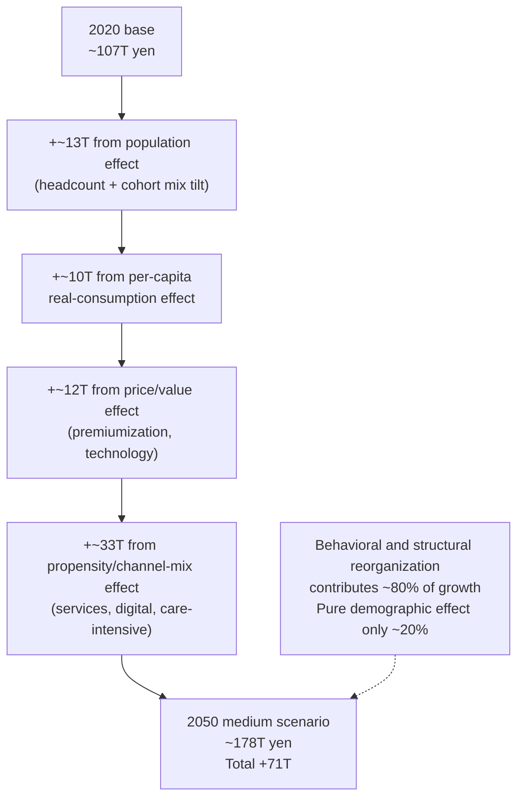

**The decisive decomposition insight is that approximately 80% of the 2020–2050 silver-economy growth in Japan is driven by behavioral and structural factors (per-capita real-consumption shifts, real-price drift, and propensity-and-channel-mix transformation) rather than by pure demographic expansion (which contributes only approximately 20%), and that the propensity/channel-mix effect alone—reflecting the shift toward services-mediated, digitally-mediated, and care-intensive consumption documented across every category chapter—accounts for roughly half of the total growth, providing both the analytical foundation and the strategic imperative for industry stakeholders to position themselves at the convergence of cohort transition, technology innovation, and services reorganization rather than at the demographic-headcount channel alone.**

## 8.5 Inflection Points: Peak Timing and Post-Peak Contraction Dynamics

The aggregate trajectory developed in Sections 8.2 and 8.3 is not a smooth monotonic curve but a sequence of phases punctuated by inflection points driven by underlying demographic and cohort dynamics. This section identifies the principal inflection points within the trajectory, dates the aggregate silver-market peak under each scenario, distinguishes the peak in the headline elderly population (2043) from the peak in aggregate elderly spending power (potentially later), and examines the dynamics of post-peak contraction including which sub-segments contract first and which retain durability into the late 2040s.

The principal inflection points within the 2020–2050 horizon, drawing on the dating analyses in Chapters 2 through 7, are five.

**The first inflection point** occurs around **2027** as the aging rate crosses the 30% threshold (per Chapter 2's IPSS-anchored timeline) and as the dankai cohort completes its transition into 80+ in earnest. This inflection accelerates the long-term-care utilization, dementia-related expenditure, and end-of-life service demand sub-segments through the late 2020s. The aggregate trajectory through this inflection is characterized by accelerating growth in the adjacent clusters (medical, care, frailty-prevention) while the core categories grow at more modest pace. The annual aggregate-growth rate during the late 2020s is approximately 2.5–3.0% in real terms under the medium scenario, the fastest sustained growth phase within the entire horizon.

**The second inflection point** occurs around **2032–2034** as the dankai cohort progresses into 85+, sharply accelerating the highest-care-needs phase and the dementia-insurance benefit-flow phase. This inflection produces the steepest sustained growth in the long-term care cluster (Chapter 7.2's medium scenario growth from approximately 22 trillion yen in 2030 to approximately 30 trillion yen by 2040), the dementia-insurance sub-segment within senior-focused financial services (Chapter 7.7), and the texture-modified-food and takuhai sub-segments within food (Chapter 4.4). Simultaneously, the peak of the dankai license-surrender wave (Chapter 6.2) triggers the steepest contraction in private-car-related expenditure and the corresponding expansion in personal-mobility-device, taxi, and on-demand mobility sub-segments. The aggregate trajectory during this inflection continues to grow but with internal restructuring more pronounced than at any earlier point.

**The third inflection point** occurs around **2036** as the dankai-junior cohort begins entering 65+ in earnest, producing step-changes across multiple adjacent-cluster sub-segments: digital-financial-services adoption rises sharply, online lifelong learning expands rapidly, premium-experience consumption accelerates, shukatsu and guarantor service demand experiences a structural step-change as the never-married fraction of the entering cohort substantially exceeds that of any predecessor cohort, and digital-platform-mediated mobility (MaaS, on-demand) propensity rises sharply in the young-old segment. The aggregate trajectory through this inflection sustains its growth but with the composition tilting further toward services-mediated and digitally-mediated sub-segments.

**The fourth inflection point** occurs around **2043** as the elderly population peaks at 39.53 million (Chapter 2). This inflection marks the transition from broadly stable-rising to broadly stable-declining for sub-segments tied closely to elderly headcount. However, the precise dating of the *aggregate spending power peak* differs from the population peak, because per-capita-consumption, price/value, and propensity/channel-mix effects continue to push the aggregate upward even after the population begins to contract. Under the medium scenario, the aggregate silver-economy peak occurs around **2045–2047**, approximately two to four years after the headline population peak, at a level of approximately 180–182 trillion yen before declining gradually to approximately 178 trillion yen by 2050. Under the high scenario, the peak occurs later (around 2048–2050) and at a higher level (approximately 207–210 trillion yen) because the stronger services-mediation and digital-adoption tailwinds extend the growth phase. Under the low scenario, the peak aligns more closely with the 2043 population peak (around 2043–2044) and at a lower level (approximately 145–148 trillion yen) because the weaker propensity-shift offsets cannot keep the aggregate rising once the demographic engine reverses.

**The fifth inflection point** occurs around **2040–2045** as several technology-and-supply transitions reach commercial scale: care robotics deployment may achieve the breadth required to materially ease the 700,000-worker care-shortage gap projected for 2040 (Chapter 7.3); autonomous-mobility deployment may extend beyond the airport, hospital, and limited-domain pilots into broader robo-taxi and community-shuttle commercial viability (Chapter 6.6); and the corporate health-management infrastructure that has been progressively built during the working years of the dankai-junior cohort (Chapter 7.4) reaches its fully-mature state with PHR-mediated personalization at scale. These technology transitions, if they materialize on the medium-scenario schedule, sustain the growth through the late 2040s; if they fall short on the low-scenario schedule, the post-peak contraction is sharper.

The dating of the silver-economy peak under each scenario is summarized in the table below.

| Scenario | Population peak (Chapter 2) | Aggregate spending-power peak | Peak level (trillion yen) | 2050 level (trillion yen) |
|---|---|---|---|---|
| Low | 2043 | ~2043-2044 | ~145-148 | ~147 |
| Medium | 2043 | ~2045-2047 | ~180-182 | ~178 |
| High | 2043 | ~2048-2050 | ~207-210 | ~207 |

The critical observation is that the *aggregate spending power peak occurs after the headline population peak* under the medium and high scenarios, because the per-capita-consumption, price/value, and propensity/channel-mix effects continue to push the aggregate upward even after the demographic engine reverses. The lag between the population peak and the spending-power peak is approximately two to four years under the medium scenario, reflecting the gradually compounding services-mediation and digital-adoption tailwinds. This finding is consistent with the Chapter 2 analysis that the aggregate elderly disposable spending power follows a less sharply peaked trajectory than the population trajectory, with the peak dating sensitive to the speed of pension-benefit constraint, the rate of asset drawdown, and the propensity of the dankai-junior cohort to extend employment into their seventies.

The dynamics of post-peak contraction differ sharply across sub-segments. The categories that contract earliest after the peak are those most tightly tied to elderly headcount and most exposed to the contraction of the 65–74 sub-cohort that peaks earlier in the horizon (around 2020–2025 as the dankai cohort exits this bracket and again in the late 2040s as dankai-junior cohort completes its transition into the 75+ bracket): basic-apparel core consumption, restaurant dining and gaishoku, traditional-format leisure, and basic transportation. The categories that retain durability into the late 2040s and beyond are those tied closely to the 75+ and 85+ sub-cohorts that peak later in the horizon: long-term care services, dementia-related expenditure, end-of-life and shukatsu services, texture-modified food and takuhai, and care-robotics. The categories that may continue growing even after the aggregate peak are those tied to technology transitions whose commercial maturation is concentrated in the late 2040s and 2050s: autonomous mobility, AI-mediated SaMD therapeutics, and PHR-mediated personalized health services. The staggered peak timing across categories has important strategic implications: industry stakeholders cannot treat 2043 (or any single year) as a uniform inflection but must instead anticipate category-specific peak dates ranging from the late 2020s (basic apparel) through the late 2040s (long-term care, shukatsu) into the early 2050s and beyond (autonomous mobility, advanced healthcare technologies).

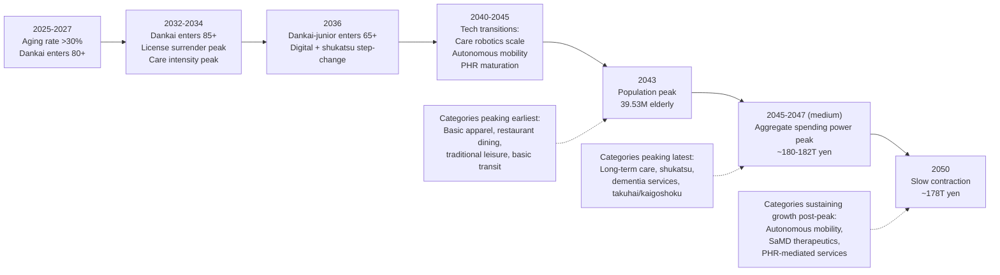

**The decisive inflection-point insight is that Japan's aggregate elderly silver-economy peaks approximately two to four years *after* the headline elderly-population peak of 2043 under the medium scenario, reaching approximately 180–182 trillion yen around 2045–2047 before declining gradually to approximately 178 trillion yen by 2050; that the peak dating is bounded between approximately 2043–2044 (low scenario, peak ~145–148 trillion yen) and approximately 2048–2050 (high scenario, peak ~207–210 trillion yen); and that the staggered peak timing across categories—with basic apparel and restaurant dining peaking earliest, long-term care and shukatsu services peaking latest, and autonomous mobility and PHR-mediated services potentially continuing to grow even after the aggregate peak—means that industry strategy cannot treat 2043 as a uniform inflection but must anticipate category-specific peak dates ranging across two decades.**

## 8.6 International Benchmarking: Japan Versus Global Silver-Economy Comparators

The strategic significance of the Japanese silver-economy aggregate developed in the preceding sections derives partly from Japan's position as the leading edge of a global demographic transition that other major economies will follow with a one-to-three-decade lag. This section benchmarks Japan's silver-economy aggregate against comparable trajectories in South Korea, Italy, Germany, China, and the broader OECD frontier, identifying which Japanese silver-economy capabilities translate most readily into export-market opportunities as comparator countries enter super-aged status.

The most direct demographic benchmark is the aging-rate trajectory. Japan's 2020 aging rate of 28.6% (Chapter 2) was the highest among the world's twenty most populous countries, exceeding Italy's 23.3% and Germany's 21.7%. By 2050, the IPSS medium-variant projection (Chapter 2) puts Japan's aging rate at approximately 37%—a level that South Korea will reach around 2050 (with current trajectory pointing to one of the world's fastest aging transitions), Italy will approach by 2050 (current trajectory suggests reaching approximately 35%), Germany will approach by 2050 (current trajectory suggests reaching approximately 30%), and China will reach around 2055–2060 (rapid aging from a current base around 18%). The OECD-frontier trajectory through 2070 implied by the WHO/European Observatory analysis suggests that most advanced economies will face aging rates between 25% and 35% by 2050, placing Japan as the leading-edge case and the principal reference point for what aging-society silver markets look like.

The per-capita elderly consumption benchmark is more difficult to construct because national-accounts conventions and household-survey methodologies differ across comparator countries, but the available evidence suggests that Japan's elderly consumption is structurally larger than most comparators in absolute per-capita terms while sitting in the middle of the per-capita-share-of-GDP range. The WHO/European Observatory analysis cited in Chapter 7.1 notes that for people aged 65 years and older in Japan, average per capita health spending as a share of GDP was 18.6%, slightly more than Germany (16.2%) and the Netherlands (16.1%) but less than the UK (24%) on 2016 data. This places Japan in the middle of the OECD per-capita-elderly-health-spending share distribution, with substantial room for the figure to rise as aging continues without reaching the UK's higher level. The implication for the broader silver-economy aggregate is that Japan's 178 trillion yen at 2050 medium scenario—equivalent to roughly 22–25% of projected 2050 GDP under conservative GDP-trajectory assumptions—sits within the range that comparable aging societies will plausibly occupy by mid-century.

The financing balance between public-insurance-mediated and private-services-mediated elderly consumption differs substantially across comparators in ways that have direct implications for export-market opportunities. Japan's relatively dense public-insurance core (medical insurance, long-term care insurance, public pensions) anchors the medical-and-care clusters but coexists with a rapidly expanding private-services periphery (frailty-prevention, premium care, digital-health services, shukatsu) that is the principal engine of silver-economy growth as Section 8.4's decomposition demonstrated. South Korea has a similar dual structure but with a less developed long-term care insurance system and a smaller frailty-prevention services market, both of which are positioned to expand rapidly as Korean aging accelerates—creating direct export opportunities for Japanese capabilities. Germany has the world's oldest social-insurance long-term care system (introduced in 1995 alongside Japan's 2000 system) and faces similar care-worker supply constraints, with parallel demand for care-robotics, texture-modified food, and integrated PHR platforms. Italy has a less developed social-insurance long-term care system but a similar demographic pressure, creating market opportunities for both private-services models and care-technology imports. China is the largest prospective market by absolute scale, with an elderly population projected to exceed 400 million by 2050, although the silver-economy demand mix will reflect distinct cultural patterns (multi-generational households remaining more prevalent than in Japan, rural-urban income disparities producing greater within-country heterogeneity, and a public-insurance system that is still in expansion phase).

The relative pace at which each comparator follows Japan's leading-edge demographic transition creates a sequenced market-entry opportunity for Japanese silver-economy capabilities. The METI strategic framework analyzed in Chapter 7 explicitly identifies this opportunity: METI's *MExx Construct* coordinates Japan-led country-specific consortia in target markets including Vietnam (where *Medical Excellence Vietnam* has been most fully developed), Indonesia, Thailand, India, Korea, China, and selected European markets, building relationships with key opinion leaders and regulatory authorities that facilitate Japanese silver-economy product and service deployment. METI's broader medical-technology export framework projects the world medical device market will see Japan's targeted acquisition rise from 3 trillion yen in 2020 to 21 trillion yen by 2050—a 6x expansion driven principally by exports to comparator aging societies. The pharmaceutical sub-segment within this framework projects Japan's targeted acquisition of the world pharmaceutical market to rise from 16 trillion yen in 2022 to 25–30 trillion yen by 2050, similarly supported by the demographic-tailwind in comparator markets.

The Japanese silver-economy capabilities most readily translatable into export markets are those built around institutional frameworks that comparator countries have not yet developed but will need to develop as their own aging accelerates. Four capabilities stand out. First, **care robotics** is anchored in the institutional framework jointly established by METI and MHLW (six-domain, thirteen-item priority areas) and supported by coordinated procurement, reimbursement, and deployment infrastructure that gives Japanese manufacturers a substantial first-mover advantage; the global mobility-scooter market alone is projected to grow from USD 10.17 billion in 2023 to USD 22.1 billion by 2031 (Chapter 6.5). Second, **texture-modified food and integrated nutrition-care offerings** combine sophisticated rheological engineering with multi-tier classification systems that comparator countries' food industries have not developed at comparable depth; the Japanese kaigoshoku market anchored at approximately 209.1 billion yen by FY2026 (Chapter 7.3) provides a domestic platform from which Japanese manufacturers can extend internationally. Third, **frailty-prevention services with JAGES-grounded evidence base** (Chapter 3) combine epidemiological research, community-based program design, and corporate-health-management integration in ways that comparator countries' health systems have rarely achieved; the elderly contribution to Japan's frailty-prevention-and-PIE-health cluster of approximately 17–22 trillion yen by 2050 (Chapter 7.4) provides a domestic scale from which export models can be developed. Fourth, **integrated PHR-mediated digital-health platforms** combine the data-standardization infrastructure being built by the PSBA, the corporate health-management institutional architecture, and the regulatory environment that supports functional-display foods and SaMD therapeutics; comparator countries' health systems will face similar integration challenges as their own aging accelerates, creating substantial market opportunities for Japanese platform operators.

The benchmarking analysis also reveals constraints that bound the export opportunity. Cultural differences in elderly consumption preferences (multi-generational household prevalence, food and dietary customs, leisure and travel patterns) limit the direct transferability of Japanese product specifications; localization is required. Regulatory differences across markets create entry barriers that Japanese exporters must navigate through bilateral cooperation frameworks (METI's MExx initiatives) and through partnerships with local distributors and operators. Pricing models that work in Japan's relatively affluent market may need substantial adaptation for emerging-market comparators where elderly purchasing power is lower in absolute terms. Despite these constraints, the leading-indicator position of Japan's silver economy creates substantial commercial opportunities for Japanese stakeholders to leverage their domestic-market experience into export markets as comparator aging societies follow with their one-to-three-decade lag.

| Comparator country | 2020 aging rate (%) | 2050 projected aging rate (%) | Lag behind Japan (years) | Principal demand for Japanese capabilities |
|---|---|---|---|---|
| Japan | 28.6 | ~37 | 0 (leading edge) | — |
| South Korea | ~16 | ~37-40 | ~10-15 | Long-term care, frailty prevention, care robotics |
| Italy | 23.3 | ~35 | ~10 | Care robotics, texture-modified food, PHR |
| Germany | 21.7 | ~30 | ~15 | Care robotics, integrated nutrition, PHR |
| China | ~13 (2020) | ~30 | ~25-30 | Full silver-economy capability portfolio |
| OECD frontier (avg.) | ~17-20 | ~25-35 | ~15-25 | Selective by sub-category |

**The decisive international benchmarking insight is that Japan's silver-economy trajectory through 2050 is not only the largest such market in absolute terms among advanced economies but is also the leading indicator for the global silver-economy transition, with comparator countries (South Korea, Italy, Germany, China, and the broader OECD frontier) following Japan's demographic trajectory at lags of approximately 10–30 years; that this leading-indicator position creates substantial export opportunities for Japanese silver-economy capabilities (care robotics, texture-modified food, frailty-prevention services, integrated PHR platforms) that comparator countries will progressively need as their own aging accelerates; that METI's strategic framework projects Japanese medical-device exports alone to expand from 3 trillion yen in 2020 to 21 trillion yen by 2050 (a 6x expansion principally driven by demographic-tailwind comparator markets); and that the realized export opportunity will be bounded by cultural differences, regulatory differences, and pricing-model adaptations but remains one of the most consequential international commercial opportunities available to Japanese industry over the 2020–2050 horizon.**

## 8.7 Synthesis: Headline Findings and Bridge to Strategic Implications

This concluding section consolidates the chapter's principal findings into a coherent headline narrative and explicitly bridges to Chapter 9's strategic-implication synthesis by identifying the strategic, policy, and structural-risk questions that the aggregate quantitative picture raises.

The seven headline findings of the chapter, integrating the analyses developed throughout, can be stated as follows.

**First**, Japan's elderly silver-economy aggregate at 2050 under the medium scenario reaches approximately 178 trillion yen in constant 2020 yen, expanding from approximately 107 trillion yen at the 2020 base—a 67% real expansion over thirty years that vastly exceeds the broader Japanese consumer economy's projected trajectory and that establishes the silver economy as the principal Japanese consumer-economy growth pole through 2050. The scenario range bounds this central estimate between approximately 147 trillion yen (low scenario) and approximately 207 trillion yen (high scenario), a ±17% band reflecting genuine uncertainty in adjacent-market trajectories. Reconciling this aggregate with the user's research topic posed in the report's introduction—how many elderly people will there be in Japan from 2020 to 2050, and what is their consumption potential across various aspects—the answer combines Chapter 2's demographic substrate (peaking at 39.53 million elderly in 2043, gradually contracting to approximately 38.5 million by 2050) with this chapter's aggregate market-size projection (approximately 178 trillion yen at 2050 medium scenario, with adjacent clusters dominating the structural growth) into a unified quantitative answer.

**Second**, the structural reorientation from four-core-category dominance toward adjacent-market dominance is the most consequential pattern within the aggregate trajectory. The four core categories (food, clothing-and-housing, transportation) contribute approximately 43 trillion yen at the 2020 base and approximately 52 trillion yen at 2050—a 20% expansion broadly consistent with demographic uplift partially offset by per-capita-quantity contraction. The six adjacent clusters (medical, long-term care, frailty-prevention-and-PIE-health, leisure, pet, financial services) contribute approximately 64 trillion yen at the 2020 base and approximately 127 trillion yen at 2050—a near-doubling that accounts for approximately 90% of the aggregate's incremental growth. The adjacent-cluster share of the silver-economy aggregate rises from approximately 60% in 2020 to approximately 71% by 2050. This reorientation has profound implications for industry strategy, policy design, and international export positioning that Chapter 9 must address.

**Third**, the dating of the aggregate silver-economy peak around the mid-2040s—specifically around 2045–2047 under the medium scenario—lags the 2043 headline elderly-population peak by approximately two to four years because per-capita-consumption, price/value, and propensity/channel-mix effects continue to push the aggregate upward even after the demographic engine reverses. The peak dating is bounded between approximately 2043–2044 (low scenario) and approximately 2048–2050 (high scenario), with the lag widening as the propensity-shift tailwinds strengthen. The staggered peak timing across categories—basic apparel and restaurant dining peaking earliest, long-term care and shukatsu services peaking latest, autonomous mobility and PHR-mediated services potentially continuing to grow past the aggregate peak—means that no single year represents a uniform inflection for industry strategy.

**Fourth**, the four-component decomposition of aggregate growth reveals that approximately 80% of the 2020–2050 silver-economy expansion is driven by behavioral and structural factors (per-capita real-consumption shifts, real-price drift, and propensity-and-channel-mix transformation) rather than by pure demographic expansion (which contributes only approximately 20%). The propensity/channel-mix effect alone—reflecting the shift toward services-mediated, digitally-mediated, and care-intensive consumption documented across every category chapter—accounts for roughly half of the total growth. This decomposition validates the WHO/European Observatory observation generalized to the silver economy as a whole that demographic aging is not the primary driver of expenditure growth, and provides the analytical foundation for Chapter 9's strategic positioning analysis.

**Fifth**, the wide scenario range driven principally by adjacent-market uncertainties (digital-adoption pace, regulatory progression, care-worker supply, healthy-aging trajectory) means that the realized silver-economy aggregate at 2050 is substantially more uncertain than a simple demographic projection would suggest. Approximately five-sixths of the 60-trillion-yen 2050 scenario range is driven by adjacent-cluster sensitivities and only approximately one-sixth by core-category sensitivities. The frailty-prevention-and-PIE-health cluster contributes the widest absolute sensitivity, followed by long-term care, financial services, and medical-and-pharmaceutical—precisely those clusters at the convergence of demographic concentration, technology innovation, and institutional reorganization where Japan's distinctive silver-economy capabilities are concentrated.

**Sixth**, Japan's leading-indicator position in the global silver-economy transition creates substantial export opportunities for Japanese silver-economy capabilities. Comparator countries (South Korea, Italy, Germany, China, OECD frontier) follow Japan's demographic trajectory at lags of approximately 10–30 years, and the four capabilities most readily translatable into export markets—care robotics, texture-modified food, frailty-prevention services, and integrated PHR platforms—position Japanese industry to capture a share of comparator-market growth that, if METI's strategic framework targets are achieved, could lift Japanese medical-device exports alone from 3 trillion yen in 2020 to 21 trillion yen by 2050. The export opportunity is bounded by cultural, regulatory, and pricing differences but represents one of the most consequential international commercial opportunities available to Japanese industry over the horizon.

**Seventh**, the aggregate quantitative picture raises a series of strategic, policy, and structural-risk questions that Chapter 9's synthesis must address. On the strategic side, the dominance of the propensity/channel-mix effect within the growth decomposition implies that industry stakeholders must position themselves at the convergence of cohort transition, technology innovation, and services reorganization rather than at the demographic-headcount channel alone—but how exactly should they sequence product development, channel design, and pricing strategies across the staggered category peak dates? On the policy side, the heavy reliance on public-insurance-mediated benefit flows (medical insurance, long-term care insurance, public pensions) within the aggregate raises sustainability concerns that the MHLW long-horizon projections only partially address—but how should pension reform, long-term care insurance benefit-and-burden adjustments, and immigration policy interact to maintain the financing structure that underwrites the aggregate? On the structural-risk side, the care-worker supply constraint (700,000-worker shortage projected for 2040), the healthy-aging trajectory uncertainty (with implications spanning a 0.7-percentage-point-of-GDP band by mid-century), the digital-divide gradient persistence, and the rural-versus-metropolitan-suburb bifurcation in mobility access and care-service supply all represent inflection-risk zones that could materially shift the realized aggregate from its medium-scenario trajectory toward the low-scenario boundary.

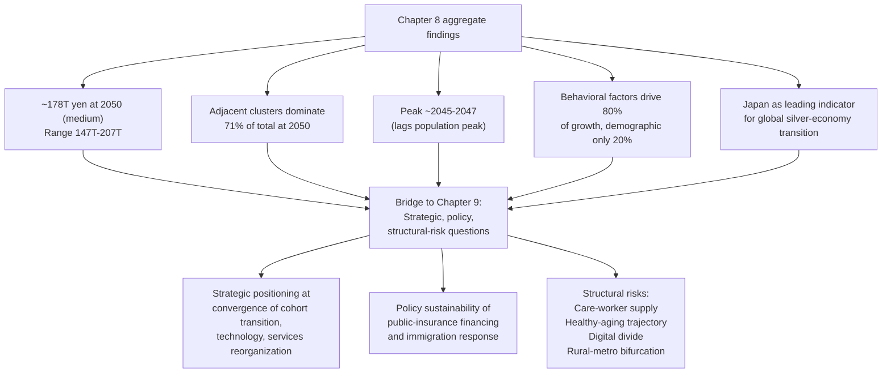

The integrated quantitative picture established in this chapter therefore provides the foundation for Chapter 9's synthesis but explicitly does not resolve the strategic, policy, and structural-risk questions it raises. **The decisive synthesis insight is that Japan's elderly silver-economy aggregate of approximately 178 trillion yen at 2050 medium scenario—reorientated decisively toward adjacent-market dominance, peaked around the mid-2040s, driven 80% by behavioral and structural factors rather than pure demographic expansion, bounded by a ±17% scenario range, and positioned as the leading indicator for the global silver-economy transition—is the largest single Japanese consumer-economy growth pole through 2050 but is also the most exposed to behavioral, technological, and institutional uncertainties that pure demographic projection cannot capture; that the strategic, policy, and structural-risk questions raised by this aggregate quantitative picture (industry positioning at the propensity-shift convergence, public-insurance-financing sustainability, care-worker supply, healthy-aging trajectory, digital divide, rural-metropolitan bifurcation) define the agenda for Chapter 9's synthesis; and that the aggregate market-size estimates developed here serve as the foundation upon which actionable implications for corporate strategists, investors, policymakers, and foreign entrants seeking to learn from Japan's silver-market evolution must be constructed.**

# 9 Key Trends, Risks, and Strategic Implications for Stakeholders

The eight preceding chapters have constructed a coherent quantitative and behavioral picture of Japan's silver economy from 2020 to 2050. Chapter 1 established the cohort-multiplied-expenditure framework and acknowledged its limitations; Chapter 2 anchored the demographic substrate at 36.03 million elderly in 2020 rising to a peak of 39.53 million in 2043 before slow contraction; Chapter 3 traced the propensity trajectories shaped by ikigai, precautionary saving, cohort transition, and digital adoption; Chapters 4 through 6 quantified the four core consumption categories with food at approximately 13.6 trillion yen, clothing-and-housing at approximately 31 trillion yen, and transportation at approximately 7.0 trillion yen by 2050; Chapter 7 quantified the six adjacent-market clusters whose combined trajectory exceeds the four core categories; and Chapter 8 integrated these into a unified aggregate of approximately 178 trillion yen at 2050 medium scenario, bounded between 147 trillion yen (low) and 207 trillion yen (high). The aggregate quantitative picture is now complete, but the strategic, policy, and structural-risk questions raised by it are not. This concluding chapter therefore turns from quantification to synthesis, asking how the cross-cutting trends running through every category will reshape the silver economy through 2050, which structural risks could materially shift the realized aggregate from its medium-scenario trajectory, and how each of four principal stakeholder groups—corporate strategists, investors, policymakers, and foreign entrants—should translate these findings into action. The chapter closes by ranking priority opportunity areas, specifying the capabilities required to capture them, and consolidating the report's headline findings into a final unified statement that frames Japan's leading-indicator position as both the largest domestic silver market in absolute terms and the gateway to the global silver-economy transition that comparator aging societies will follow over the coming decades.

## 9.1 Five Cross-Cutting Trends Reshaping Japan's Silver Economy through 2050

Five trends run through every category and adjacent-market analysis developed in Chapters 4 through 7 and together define the structural reorganization underway. The first four are addressed in this section; the fifth—immigration policy's impact on the elderly-services labor force—is reserved for Section 9.3 because it interacts directly with the supply-side risk analysis.

**The digitalization of senior consumption** is the most pervasive of the cross-cutting trends, running through every category from food retail (Chapter 4.7's e-commerce trajectory) through transportation (Chapter 6.4's MaaS and ride-hailing adoption) to financial services (Chapter 7.7's digital asset-management platforms) and healthcare (Chapter 7.4's PHR-mediated personalization). The structural foundation is the broader Japanese cashless-payment expansion, which is projected to grow from approximately US$ 469.54 billion in 2024 to US$ 1.32 trillion by 2033 at a 12.2% CAGR, driven by smartphone penetration of 194 million cellular mobile connections (157% of population) and 78.6% social media penetration[^34]. The Japanese government has actively promoted this transition through its "Cashless Vision" initiative, including the 2023-launched system enabling salaries to be paid through smartphone payment apps rather than bank accounts—a policy shift that lowers the digital-engagement barrier for both working-age and elderly consumers[^34]. For the elderly segment specifically, the adoption gradient established in Chapter 3 (87.7% internet usage at 65–69 falling to 36.4% at 80+) is being progressively flattened as cohort progression brings successively more digitally fluent generations into the 65+ bracket. The dankai-junior step-change from 2036 onward is the most consequential digital-adoption inflection: this cohort arrives at retirement with thirty years of accumulated platform-mobility, online-banking, and e-commerce experience, producing structural step-changes in young-old digital propensities across food retail, mobility, financial services, and healthcare. The persistent cultural preference for cash among elderly Japanese, particularly in small restaurants, stores, and rural towns, will not disappear by 2050—the digital-payment market analysis explicitly identifies that "cultural reliance on cash is the factor that retards the move to digital payment systems"[^34]—but will be progressively confined to specific transactional contexts and to the residual oldest-old segment within each successive elderly cohort. The integrated implication is that Japan's silver economy of 2050 will be substantially more digitally mediated than the 2020 baseline across every category, with platform-economy operators positioned to capture progressively larger shares of elderly consumption flows that were historically routed through traditional retail and service channels.

**Premiumization versus polarization of elderly income** is the second cross-cutting trend and reflects the bifurcated demand structure that the cohort transition produces. The dankai cohort, currently dominating the 75–79 segment and entering 80+ from 2027, retired with structurally strong pension entitlements, accumulated savings, and real-estate wealth (Chapter 2.5), and exhibits sustained engagement with premium experience consumption, premium small-quantity goods, and discretionary services. The Halmek Holdings *Survey on Senior Living* documents this affluence in concrete terms: among 2,000 respondents aged 55–79, 45.3% had executed home renovations with an average cost of 3.83 million yen funded 88.6% by self-financed assets, anchoring the 6–7 trillion yen home-renovation market that Halmek's analysis explicitly identifies as "supported by the senior generation, and will continue to be supported by the senior generation going forward." The dankai-junior cohort entering 65+ from 2036, by contrast, will arrive with thinner pension entitlements (reflecting the post-bubble employment ice age and higher non-regular employment rates), higher never-married rates approaching 30% for men and 20% for women (Chapter 2.4), and lower aggregate net worth than the dankai cohort. The result is a bifurcated demand structure in which premium concierge segments (private healthcare, luxury senior housing, premium experience travel, dementia-insurance products) expand alongside subsidy-dependent low-income segments where the Tokyo Silver Pass program's 1,000-yen-per-year tier captures the majority of low-income elderly mobility demand (Chapter 6.3). Industry strategy that targets only the affluent middle of the elderly distribution will miss both ends of this bifurcation; strategies that combine premium offerings for the upper tier with subsidy-aligned offerings for the lower tier will capture the full available demand. Aeon's experiments with the senior-targeted G.G. Mall format—including fitness studios, the Aeon Culture Club's two studios and six classrooms, and embedded medical clinics within general supermarkets—exemplify the operational approach to serving the bifurcated demand, combining experience-and-service-intensive premium offerings with the everyday retail accessibility that the broader elderly population requires[^35].

**Technology-enabled aging-in-place** is the third cross-cutting trend and converges multiple sub-segments analyzed across Chapters 5 through 7 into an integrated proposition. The components include WHILL-class personal mobility devices addressing the latent 12-million-person Japanese demand pool (Chapter 6.5), watch-over sensors and home-monitoring systems mediating the single-elderly household surge (Chapter 7.2), smart-home assistive technology integrating with senior-housing renovation (Chapter 5), AI-mediated companion robots such as Sony Aibo and AIST's Paro (Chapter 7.6), and the convergence of senior housing with care robotics and digital health platforms. The Mitsubishi Research Institute analysis cited in industry coverage projects that the Asian care-digitalization market alone will reach 1 trillion 4,914 billion yen by 2040, with China's market at 1 trillion 1,111 billion yen as the largest single component and Japan, Indonesia, Thailand, and Taiwan together comprising the remainder[^36]. The MRI report explicitly identifies that 326,000 care workers can be reduced through three-stage care-process digitalization—electronic care records, sensor-mediated night-time monitoring, and integrated bio-signal real-time tracking—producing aggregate care-worker substitution of approximately 33 万人 (330,000) by 2040[^36]. The integrated implication is that aging-in-place is not a single product category but an integrated bundle of mobility, housing, health-monitoring, and care-coordination technologies that progressively substitutes for both family-caregiver functions (which the Chapter 2 household-composition shift removes for elderly singletons) and institutional-care alternatives (which the care-worker supply constraint analyzed in Section 9.3 makes increasingly scarce). The Lawson-Tsuruha drugstore-convenience hybrid format, which integrates 24-hour pharmaceutical retail with convenience-store services and embeds registered-pharmacist consultation within neighborhood retail, exemplifies the cross-category integration that aging-in-place demands: a single physical location serves food, OTC pharmaceuticals, prescription dispensing, and basic-goods retail for elderly residents who cannot easily travel between specialized providers[^37].

**Intergenerational wealth transfer dynamics** constitute the fourth cross-cutting trend and reflect the structural weakening of bequest motives analyzed in Chapter 3.5. As the never-married share among male elderly singletons rises from 33.7% in 2020 to 59.7% by 2050 and the female share from 11.9% to 30.2% (Chapter 2.4), the addressable population of heirless elderly who do not face the traditional cultural pressure to preserve assets for transmission expands substantially. This drives multiple market dynamics simultaneously. The reverse mortgage and housing-equity-release sub-segment expands from a current several-hundred-billion-yen base toward an estimated 2–4 trillion yen of outstanding contracts by 2050 under the medium scenario (Chapter 7.7). The home-renovation market sustained by senior-generation equity continues at its 6–7 trillion yen scale but with the composition shifting toward heirless-singleton renovations that emphasize aging-in-place rather than family-shared usage. The shukatsu industry serving end-of-life administrative needs of heirless elderly grows from a several-hundred-billion-yen base toward 1–2 trillion yen by 2050. The dementia-insurance sub-segment within the senior-focused financial services cluster (Chapter 7.7) grows particularly rapidly because heirless elderly cannot rely on family members to manage cognitive-decline circumstances and must purchase market-mediated coverage. The MHLW launched in fiscal 2024 a model project to develop municipal one-stop consultation mechanisms covering daily-life support, identity guarantee, and post-mortem affairs as a response to this demographic shift, recognizing that the institutional architecture for serving heirless elderly is still under construction. The integrated implication is that the silver economy of 2050 will channel a larger share of accumulated elderly wealth into self-directed late-life consumption and into market-mediated services that family members historically provided without explicit pricing—a structural release of latent demand that compounds with the digital-adoption trajectory and the aging-in-place technology bundle to define the silver market's distinctive composition.

These four trends, together with the immigration-policy trend reserved for Section 9.3, consolidate into a unified picture of Japan's silver economy as a **services-mediated, digitally-mediated, and individually-financed market** that diverges fundamentally from the family-anchored, asset-backed, pension-sustained pattern of late-twentieth-century elderly markets. The structural reorientation toward adjacent-market and services-mediated dominance documented in Chapter 8 is therefore not a transient phase but the durable steady state toward which the silver economy is converging through 2050.

## 9.2 Pension Sustainability and Healthcare Cost Inflation as Structural Financing Risks

The financing-side structural risks that most directly threaten the medium-scenario aggregate trajectory established in Chapter 8 are pension sustainability and healthcare cost inflation. Both risks operate through mechanisms that the cohort-multiplied-expenditure framework cannot endogenously model—they shift the per-capita expenditure capacity $e$ and the propensity coefficient $p$ in ways that depend on policy choices, technology trajectories, and macroeconomic conditions—and therefore must be addressed through scenario-and-sensitivity analysis rather than through the central projection itself.

**Pension sustainability** is the first structural financing risk. The 2024 financial verification (zaisei kenshō), the most recent in the approximately five-yearly verification cycle conducted by the MHLW's Pension Bureau, used the IPSS 2023 demographic revision (Chapter 2) as its principal demographic input. The Pension Subcommittee of the Social Security Council Pension Mathematics Subcommittee's peer review of the 2024 verification identifies that the disclosure architecture has been substantially improved relative to previous cycles[^38]. The 2024 results introduce a new individual-level pension distribution estimation that supplements the traditional model-pension-and-replacement-rate disclosures, showing how each cohort's average pension amount and distribution will change under alternative reform packages[^38]. The economic-scenario framework has been refined to give each scenario a meaningful name rather than a numerical label, clarifying the interpretive content[^38]. The option calculations now include not only the previously evaluated reforms (further expansion of employees' insurance coverage, basic-pension contribution-period extension and benefit increase, and in-employment pension reform) but also two new options: unification of the macro-economic-slide adjustment period across the basic and earnings-related tiers, and adjustment of the standard remuneration ceiling[^38].

The disclosure of pension-finance risk through alternative scenarios is the most consequential element of the 2024 verification for the silver-economy aggregate. The peer review observes that under the per-capita-zero-growth scenario, even with medium-variant population projections, "the National Pension's reserve fund is projected to be depleted in the 2050s"—an outcome that constitutes "one of the answers to a reverse stress test (an analytical method that defines an ultimate state such as reserve depletion and explores the scenarios that would produce such an outcome)"[^38]. This finding identifies the boundary conditions under which the pension-financing pillar of elderly consumption capacity (Chapter 2.5's first pillar) would face structural strain. While the medium-economic-growth scenarios maintain pension solvency through the 2110 horizon under the verification framework, the explicit identification of zero-growth depletion scenarios establishes that pension benefit levels are subject to meaningful downside risk under unfavorable macroeconomic conditions, and that this risk is correlated with the broader inflationary and yen-volatility risks analyzed in Section 9.4. The IPSS demographic revision tightens the long-run sustainability arithmetic in three concrete ways relative to the 2017 projection: the medium-variant elderly count at 2070 is higher (33.67 million versus 31.88 million), the working-age population (15–64) at 2070 is projected at 45.35 million, and the long-run total fertility rate has been revised down from 1.44 to 1.36 (Chapter 2.1). Under unchanged benefit formulas, these revisions imply tighter benefit-formula constraints across the horizon.

The macro-economic-slide adjustment mechanism, introduced in 2004, automatically adjusts pension benefit levels downward when demographic and macroeconomic conditions warrant, providing a built-in stabilizer that prevents catastrophic depletion at the cost of progressively reducing real per-recipient pension flows. The peer review documents that "complex multi-precondition-based future projections have been improved to be more comprehensible to lay users" through user-friendly disclosure mechanisms including the explanatory pension manga and clearer scenario naming[^38]. For the silver-economy aggregate, the operational implication is that the public-transfer share of elderly consumption financing (49% of the FY2019 NTA decomposition per Chapter 2) will compress moderately under fiscal-sustainability pressure across the 2020–2050 horizon, particularly in the post-2040 period as the dankai-junior cohort enters retirement with thinner entitlements. The downside risk to the medium-scenario aggregate from pension-sustainability pressure is plausibly in the range of 3–7 trillion yen by 2050, concentrated in discretionary consumption categories (leisure, restaurant dining, personal care) where elderly purchasing power most directly tracks pension flow.

**Healthcare cost inflation** is the second structural financing risk and has been quantified at unusual depth through the WHO/European Observatory analysis cited in Chapter 7.1. The analysis's central finding bears repetition because of its strategic significance: "population ageing on its own is not, and will not become, the primary driver of growth in health expenditure in Japan," with population aging accounting for less than one quarter of per-person health-spending growth, and the remaining expected growth driven by prices, volume of care, and technology. This finding generalizes through Chapter 8.4's decomposition to the silver economy as a whole, where pure demographic effects contribute only approximately 20% of the 2020–2050 growth and behavioral-and-structural factors contribute approximately 80%. The asymmetric implication is that healthcare cost inflation, driven primarily by technology (high-cost pharmaceuticals, advanced diagnostics, regenerative medicine), volume (rising per-capita procedures and prescriptions), and price drift (real-price increases in medical services), threatens the silver-economy aggregate from above—it could push the aggregate above the medium-scenario trajectory by raising nominal expenditure even without commensurate real-quality improvements—as much as from below.

The MHLW long-horizon projections cited in Chapter 7.1 quantify the trajectory: medical-care benefits within the social security framework expand from 39.2 trillion yen at FY2018 (7.0% of GDP) to 47.4–48.7 trillion yen at FY2025 (7.3–7.5% of GDP) and 66.7–73.2 trillion yen at FY2040 (8.4–9.3% of GDP). The 6.5-trillion-yen range at FY2040 (66.7 to 73.2 trillion yen) reflects alternative growth scenarios and is itself a measure of the genuine uncertainty in healthcare-cost trajectories. The differential between the WHO/European Observatory's healthy-aging and premature-morbidity scenarios spans 0.70 percentage points of GDP by 2060, translating to approximately USD 41.5 billion in 2018 GDP terms—a magnitude that compounds with technology and price drift to create substantial sensitivity in the medical-and-pharmaceutical aggregate.

The post-2024 regulatory tightening of functional-display foods following the beni-koji incident analyzed in Chapter 4.5 illustrates how regulatory responses to safety concerns can generate medium-term constraints on adjacent-cluster growth. The Yano Research Institute's FY2025 health-food market projection of 914.71 billion yen represents a 0.8% decline from FY2024, reflecting the immediate impact of regulatory tightening on the kinō-sei hyōji shokuhin segment. While Yano explicitly identifies that "elderly cohort interest in health and immunity remains high, sustaining stable demand," the regulatory environment determines the speed at which new-product approvals support category growth—and, by extension, the speed at which the frailty-prevention sub-cluster expands. Sustained regulatory caution would push the aggregate toward the low-scenario boundary; favorable streamlining would support the high-scenario trajectory.

The combined effect of pension sustainability and healthcare cost inflation on the silver-economy aggregate operates through opposite directions. Pension sustainability pressure compresses the aggregate by reducing elderly purchasing power; healthcare cost inflation expands the aggregate's nominal value but compresses the real-purchasing-power share available for discretionary categories. Under unfavorable scenarios where both risks bind simultaneously—zero-economic-growth conditions tightening pension benefit formulas while medical inflation persists at the upper end of the WHO/European Observatory range—the aggregate could shift toward the low-scenario boundary of approximately 147 trillion yen by 2050, with the gap concentrated in discretionary consumption categories. The policy instruments available to mitigate the downside include the pension reform options under evaluation in the 2024 financial verification (basic-pension contribution-period extension, employees' insurance expansion, in-employment pension reform, macro-economic-slide unification, standard remuneration ceiling adjustment), the long-term care insurance benefit-and-burden adjustments analyzed in Section 9.3, and the healthy-aging investment that Section 9.5 will address as a corporate-strategy priority. **The decisive financing-risk insight is that pension sustainability and healthcare cost inflation together constitute the principal financing-side risk to the silver-economy aggregate, that the 2024 financial verification's explicit identification of zero-growth pension-depletion scenarios establishes the boundary conditions, and that the WHO/European Observatory's 0.70-percentage-point-of-GDP healthy-aging differential quantifies the medical-cost sensitivity—together implying that policy choices and macroeconomic outcomes through the 2030s will materially determine whether the realized aggregate sits closer to the medium central estimate of 178 trillion yen or to the low-scenario boundary of 147 trillion yen by 2050.**

## 9.3 Care-Worker Supply, Immigration Policy, and Regional Depopulation Risks

The supply-side structural risks that bound the realized delivery of silver-economy services against the projected demand trajectory are care-worker supply, immigration policy, and regional depopulation. These risks operate through different mechanisms than the financing-side risks analyzed in Section 9.2, but they are equally consequential for the realized silver-economy aggregate because demand cannot be converted into actual market consumption without adequate supply-side capacity.

**The 700,000-worker care-shortage gap projected for 2040** is the single largest supply-side constraint on the silver-economy delivery trajectory. The Mitsubishi Research Institute report *Care Digitalization Saves Care Refugees—Toward Resolving the 690,000-Person Care-Worker Demand-Supply Gap* documents the structural decomposition with unusual precision[^36]. The MHLW projection establishes that the care-worker count rises from approximately 211 万人 (2.11 million) in fiscal 2019 to approximately 243 万人 (2.43 million) by fiscal 2025 (an additional 32 万人) and approximately 280 万人 (2.80 million) by fiscal 2040 (an additional 69 万人 from the 2019 baseline)[^36][^39]. The projected 690,000-worker gap is the difference between this projected 280 万人 demand and the supply trajectory under unchanged labor-market conditions and current care-process intensity.

The MRI decomposition of the gap into addressable components is consequential for both policy and corporate strategy[^36]. **Preventive-care digitalization** is identified as capable of reducing care needs by approximately 70 万人 of certified care-needs status equivalent and 22.6 万人 of care-worker requirement by 2040, achieved through wearable continuous monitoring of blood glucose and blood pressure to prevent diabetes and hypertension, and through reducing the share of the most care-intensive recipients (those certified at care-need-level 3 and above)[^36]. **Care-process digitalization** is identified as capable of reducing care-worker requirements by approximately 33 万人 through three progressive stages: digitization of paper-based care records (enabling sharing, search, and re-use), single-process digitalization (sensor-equipped mattresses for nighttime monitoring, reducing overnight rounds), and integrated whole-process digitalization (real-time monitoring of body temperature, heart rate, and ECG enabling integrated business operations)[^36]. **Inter-industry labor inflow** is identified as capable of providing approximately 16.3 万人 from industries facing labor-demand reduction due to digitalization, with robotics and power suits reducing the physical-labor barrier that has historically constrained care-worker recruitment from less-physically-strong workforces[^36]. The combined arithmetic—22.6 万人 + 33 万人 + 16.3 万人 = 71.9 万人—exceeds the 690,000 gap, suggesting that the technical capacity to close the gap exists if all three mechanisms are deployed at the projected scale.

The structural barriers that limit care-digitalization adoption, however, are substantial[^36]. **Approximately 70% of care service providers have fewer than 99 employees**, limiting the capital-investment capacity to deploy digital tools at scale[^36]. The care-reimbursement structure, calculated based on the cost of providing services, creates limited incentive for cost reduction—a fundamental misalignment with the productivity-improvement logic of digitalization investment[^36]. Survey data on why providers do not adopt care-business-support software cite "high adoption cost burden," "investment-versus-effect insufficiency," and "staff cannot use the systems even after adoption" as the leading reasons[^36]. The MRI report specifically recommends that providers establish quantitative targets for digital adoption, conduct medium-and-long-term cost-effect verification, conduct staff and recipient briefings before full deployment, and evaluate trial-stage targets; that prefectures and local industry associations provide expert-accompanied support services and low-interest financing for small providers; and that the national government provide online-and-on-demand training, establish technical standards for care equipment safety and quality, and build sustainable medical-care data-flow infrastructure[^36].

**Immigration policy** is the second supply-side mechanism for closing the care-worker gap, complementing rather than substituting for the care-digitalization approach. Chapter 1's reference to the June 2024 Diet legislation establishing a training-and-employment program replacing the technical intern training program, combined with the 2019 specified-skilled-worker visa for the care sector and the over-two-million foreign worker base in 2023, establishes the institutional architecture under which foreign-worker recruitment for the care sector operates. The realized contribution depends on multiple factors that are partially policy-controlled and partially market-mediated: the caps on annual recruitment under each visa category, the bilateral cooperation agreements with sending countries (Vietnam, Indonesia, Philippines, Thailand, and others), the wage levels offered to foreign care workers relative to alternative destinations (with European, Australian, and increasingly South Korean and Taiwanese markets competing for the same labor pool), and the social-integration support that determines retention rates. The 2024 legislation's explicit framing as a training-and-employment program rather than a technical-intern program signals a shift toward longer-term employment relationships that better align with the structural nature of the care-worker demand, but the realized scale of foreign-worker contribution to the 690,000-gap closure is bounded by political-economy constraints on net immigration that the Japanese policy environment has historically maintained at modest levels.

**Regional depopulation and rural mobility-poverty** constitute the third supply-side risk and operate through the geographic bifurcation established in Chapter 6.7. The metropolitan-suburb concentration of 75+ growth—where the 1.80-million absolute increase across seven prefectures (Tokyo, Saitama, Chiba, Kanagawa, Ibaraki, Tochigi, Gunma) sustains commercial supply economics for retail, healthcare, and care services—stands in sharp contrast to the rural-prefecture mobility-poverty risk that compromises healthcare access, retail patronage, and social-participation consumption. The realized-versus-demand gap in rural sub-segments operates through multiple channels. Bus-route withdrawals reduce mobility access for license-surrendering elderly. Supermarket-and-pharmacy consolidation increases the distance to essential goods. Healthcare-facility consolidation requires longer travel for medical appointments. Care-worker geographic mismatch—with rural prefectures facing the steepest aging rates but also the steepest absolute population contractions, including among working-age care-worker candidates—produces disproportionate care-supply gaps in these jurisdictions. The integrated effect is that elderly residents in rural prefectures face systematically lower realized consumption than the nominal demand levels their demographic and financial profiles would imply, with the gap concentrated in healthcare access (compromising the medical-and-pharmaceutical sub-segment), discretionary consumption (compromising the leisure cluster), and long-term care delivery (compromising the care services sub-segment).

The MRI report explicitly identifies the combined market opportunity arising from care-digitalization at the Asian regional level: by 2040, the Asian aggregate care-digitalization market is projected at 1 trillion 4,914 billion yen, with China's 1 trillion 1,111 billion yen the largest single component[^36]. The report observes that "robot-care equipment and wearable sensors that contact care recipients are usable as-is in Asian populations whose skeletal structure is similar to Japanese, making the export attractive for Japanese companies"—a structural advantage that Japanese silver-economy capabilities possess relative to alternative origin markets[^36]. The combined supply-side response—care-process digitalization mobilizing 33 万人 of efficiency, preventive-care digitalization mobilizing 22.6 万人 of demand reduction, immigration mobilizing approximately 10–20 万人 over the horizon, inter-industry labor inflow mobilizing 16.3 万人, and selective regional consolidation of services—plausibly closes 60–80% of the 690,000 gap under the medium scenario, with the residual 20–40% representing the realized service-delivery shortfall that materializes as longer waiting lists for care services, compromised quality of delivered care, and partial substitution by family caregivers in those configurations where family is available.

**The decisive supply-side risk insight is that the 690,000-worker care-shortage gap projected for 2040 is the single largest supply-side constraint on the silver-economy delivery trajectory, that the technical capacity to close the gap exists through care-digitalization (33 万人), preventive-care digitalization (22.6 万人), and inter-industry labor inflow (16.3 万人) combined with foreign-worker recruitment, but that the structural barriers (70% of providers having fewer than 99 employees, the cost-pass-through-disincentive structure of care reimbursement, and the political-economy limits on net immigration) plausibly leave 20–40% of the gap unclosed under the medium scenario, producing realized service-delivery shortfalls in long-term care, frailty-prevention, and rural-mobility sub-segments that translate into the gap between nominal market demand and realized market consumption that bounds the aggregate trajectory.**

## 9.4 Macroeconomic Shocks: Inflation, Yen Volatility, and Geopolitical Risks

Beyond the structural risks analyzed in Sections 9.2 and 9.3 lie the macroeconomic and external-shock risks that could materially shift the silver-economy aggregate trajectory through channels that the cohort-multiplied-expenditure framework does not endogenously model. These risks are inherently lower-frequency but higher-magnitude than the structural risks, and their interaction with the cohort transition and demographic substrate determines whether the aggregate sits closer to the medium central estimate or toward the low-scenario boundary.

**Recent inflationary pressure** has already produced measurable behavioral effects on elderly consumption willingness. The Cabinet Office data analyzed in Chapter 3.2 documents that the share of those aged 60 and over reporting that they feel "no concern" about their economic standard of living fell from 68.5% in the FY2024 White Paper to 65.9% in the FY2025 White Paper—a 2.6-percentage-point drop over a single annual revision—with more than 70% identifying "rising prices" as their leading economic anxiety. The Carves Holdings investor materials illustrate the operational impact of inflation on elderly-services pricing, with the company implementing a +300 yen monthly fee adjustment for new members from September 2025 (and existing members from April 2026), reflecting both cost pressure and the willingness of elderly consumers to absorb modest price increases for valued services[^40]. The alternative old-age preparation estimates rising from the 20-million-yen level cited in Chapter 3.2 to 40 million yen under sustained inflation establish the scale of the precautionary-saving response: if elderly Japanese internalize the higher target, the gap between elderly nominal income and elderly nominal expenditure narrows as more income is directed to precautionary accumulation rather than current consumption, suppressing discretionary categories particularly. The implications operate through two channels: first, the precautionary-saving wedge in the propensity matrix widens, suppressing realized propensity below the levels implied by income-and-asset accounting; second, the composition of consumption shifts toward perceived essentials and away from perceived discretionaries, compressing apparel, leisure, and dining outlays in particular.

**Yen volatility** affects the silver-economy aggregate through both export-competitiveness and import-cost channels. WHILL's 70% international revenue base, with operations in the United States, Canada, the Netherlands, China, and Taiwan, exemplifies the export-side exposure: yen depreciation enhances Japanese silver-economy exporters' competitive positioning in target markets but raises the yen value of foreign-currency-denominated revenue when repatriated, while yen appreciation has the opposite effect. The Carves Holdings consolidated financial statements reflect this exposure concretely, with the period-average exchange rate of 151.04 yen per dollar in FY2026 1H representing a 0.9-yen yen-strengthening from the prior-period 151.94 yen, contributing approximately 0.04 billion yen reduction in goodwill and trademark amortization expense for the period and approximately 7.2 billion yen increase in goodwill and trademark balances at period-end versus prior period under translation adjustment[^40]. For the silver-economy aggregate, the integrated effect is that sustained yen weakness through the late 2020s and 2030s would support the medium-scenario export trajectory for Japanese silver-economy capabilities (Chapter 8.6) but would simultaneously raise import costs for pharmaceutical, medical-device, and texture-modified-food inputs that source from international supply chains. The net effect on the aggregate depends on the relative scale of export expansion versus import-cost pass-through into elderly consumer pricing.

**Geopolitical risks** affect the silver-economy aggregate through multiple channels that are individually low-probability but collectively non-negligible over the thirty-year horizon. Inbound elderly tourism recovery from the 2020–2022 COVID-19 disruption has been strong overall, with Japanese tourism authorities progressively building infrastructure for inbound elderly travel (Chapter 6.8); however, sustained geopolitical tensions in East Asia, renewed pandemic-related travel restrictions, or major regional conflicts could disrupt the recovery trajectory and compress the inbound contribution to the silver-tourism mobility component. The post-COVID legacy effects on long-term morbidity, particularly the long-COVID phenomenon and its interaction with chronic conditions prevalent in elderly populations (cardiovascular disease, diabetes, chronic kidney disease), represent ongoing health-system pressure that the WHO/European Observatory analysis cited in Chapter 7.1 has begun to incorporate into its scenario range but has not yet fully resolved. Prospective climate-related health shocks—rising temperatures producing more frequent and severe heat events that disproportionately affect elderly populations, vector-borne disease expansion into previously unaffected latitudes, and air-quality deterioration in metropolitan areas—represent emerging risks that compound with the chronic-disease prevalence in elderly cohorts.

The combined effect of macroeconomic and geopolitical shocks on the silver-economy aggregate operates through complex interaction with the structural risks analyzed in Sections 9.2 and 9.3. Sustained inflation tightens the pension-sustainability constraint by raising the nominal benefit floor while macroeconomic-slide adjustments compress the real benefit level; tightens the precautionary-saving constraint by raising the perceived required reserve; raises healthcare cost-inflation pressure by raising input costs faster than reimbursement adjustments; and strains the care-worker supply by raising the alternative-employment opportunity cost faster than care-sector wages adjust. Yen volatility amplifies or attenuates the export-opportunity aggregate established in Chapter 8.6 and shifts the import-cost balance for inputs to elderly consumption. Geopolitical risks impose discrete shocks on specific sub-segments (inbound tourism, international supply chains, technology-import access) that propagate through the aggregate.

The mapping from combined macroeconomic shocks to the aggregate trajectory is therefore non-linear. Under benign macroeconomic conditions—moderate inflation, stable yen, peaceful regional environment, healthy-aging trajectory—the aggregate sits at or above the medium central estimate of 178 trillion yen. Under stressed macroeconomic conditions—sustained inflation, yen volatility, regional geopolitical tensions, premature-morbidity trajectory—the aggregate could shift toward the low-scenario boundary of 147 trillion yen, with the gap concentrated in discretionary consumption categories (leisure, premium experience, restaurant dining, premium personal care) where elderly purchasing power most directly reflects macroeconomic conditions. Under extreme stress conditions—simultaneous multi-channel shocks compounding with structural risks—the aggregate could fall below the low-scenario boundary, although this represents a tail-risk scenario whose probability is low but whose consequences for industry stakeholders and policymakers would be substantial.

The corporate and policy responses that absorb macroeconomic shocks within the medium-scenario trajectory include subsidy-program expansion (Tokyo Silver Pass-style schemes that maintain elderly mobility access regardless of inflation), reimbursement-formula adjustments that pass through input-cost increases to public-insurance-mediated payments, and emergency healthcare-and-care-supply mobilization mechanisms that maintain service delivery during disruption. **The decisive macroeconomic-risk insight is that the silver-economy aggregate is exposed to compounding interaction between inflation, yen volatility, and geopolitical shocks on the one hand, and the structural pension-and-healthcare-financing risks on the other, with the worst-case combined-stress trajectory producing aggregate compression toward the low-scenario boundary of 147 trillion yen by 2050, but with corporate and policy responses (subsidy expansion, reimbursement adjustment, emergency mobilization) capable of absorbing most plausible shock combinations within the medium-scenario range under conditions of policy and corporate preparedness.**

## 9.5 Strategic Implications for Corporate Strategists: Product, Channel, and Pricing

The chapter's analytical findings translate into differentiated implications for corporate strategists across the principal industry sectors exposed to the silver economy. This section addresses product development priorities by sub-cohort, channel design implications, and pricing strategies, drawing on the cohort-effect templates established across Chapters 4 through 7 and integrating with the trends and risks analyzed in Sections 9.1 through 9.4.

**Product development priorities by sub-cohort** must be sequenced to match the cohort progression that drives demand emergence at different ages. For the **young-old segment (65–74)**, particularly from 2036 onward when the dankai-junior cohort begins entering this bracket, the priority is active experience and digital-native products. The dankai-junior cohort arrives at retirement with thirty years of platform-mobility, online-banking, e-commerce, and digital-health experience; products targeting this segment must therefore be digitally-mediated by default, individually-customizable rather than standardized-group-format, and integrated with the broader corporate-health-management and PHR infrastructure that the cohort has been participating in during their working years. Curves Holdings' strategic positioning illustrates the operational approach: the company's "Carves" women-only 30-minute fitness format reached 879,023 members at end-February 2026 within Japan, with the company's mid-term vision targeting 1.05–1.10 million members across 2,100–2,200 stores by 2035, anchored explicitly in the dankai-junior cohort's anticipated entry into the senior fitness market[^40]. The company's "Onlyone Online Plan" hybrid format reached 71,596 members at end-February 2026 (up from 9,900 in February 2021), demonstrating the digital-platform integration that successive cohorts demand[^40].

For the **old-old segment (75–84)**, the priority is services-mediated and care-intensive products that substitute for declining physical and cognitive capacity while preserving autonomy. The Carves "Pinto-Up" body-movement-recovery format launched as a separate product line targets this segment specifically, with 198 members served by 45 stores at end-February 2026 (up from 100 at the prior-year-period base), and the company's mid-term vision targeting 380–500 stores and 17.1–22.5 万人 members by 2035[^40]. WHILL's near-distance mobility products positioned through automobile-dealer channels exemplify the same logic at a different price point and category (Chapter 6.5). Texture-modified food products from manufacturers in the kaigoshoku segment (Chapter 4.4) serve the same demographic with increasing technical sophistication.

For the **oldest-old segment (85+)**, the priority is technology-enabled aging-in-place products that substitute for both family-caregiver functions (which household-composition shift removes for elderly singletons) and institutional-care alternatives (which the care-worker supply constraint makes increasingly scarce). The integrated bundle of WHILL-class autonomous mobility deployments (Chapter 6.6), watch-over sensors, smart-home assistive technology, AI companions, and integrated PHR platforms defines the product category. Aeon's institutional response across decades of senior-targeted retail evolution provides a comparative reference: the company's G.G. Mall format anchored at the Aeon Kasai Store includes a fitness studio for health promotion and the Aeon Culture Club's two studios and six classrooms providing experience-based offerings that go beyond product purchases, while the Aeon Pharmacy embedded within general supermarkets and the attraction of medical clinics as tenants address rising healthcare needs[^35]. The company has progressively expanded its omni-channel strategy through Aeon Square, leveraging the nationwide store network and integrating online-to-offline service flows including home delivery of in-store-purchased goods and store pickup of online-ordered goods[^35].

**Channel design implications** include the metropolitan-suburb store-network reorganization established in Chapter 4.7, the auto-dealer-mediated WHILL-class personal mobility distribution model established in Chapter 6.5, the integrated physical-plus-digital platform architecture matched to differential cohort digital adoption rates, and emerging integrations across previously-separate retail formats. The **Lawson-Tsuruha drugstore-convenience hybrid** that opened its first store at Lawson-Tsuruha-Drug Sendai-Goto-bashi in February 2015 illustrates the operational logic: the format combines convenience-store operations (24-hour, food-and-essentials retail) with registered-pharmacist OTC pharmaceutical sales (Class 2 and Class 3 categories including cold medications, antipyretics, and B and C vitamins) in a single location, with the partnership targeting 100 stores by end-FY2017[^37]. The format addresses the convergence of elderly health-and-convenience needs that Chapter 7's adjacent-cluster analysis identified, and the planned April 2015 launch of the "Care (Kaigo) Lawson" format extending the model further toward senior-specific services with care-consultation windows and care-and-health information provision[^37]. **Aeon's Health Care store integration** provides a comparable approach within the general-supermarket format, with the company strengthening the omni-channel proposition through Aeon Square e-commerce, the "Aeon Sukusuku Laboratory" for parenting families and broader community engagement, and 750+ certified Barrier-Free-Law-compliant facilities[^35]. The unifying logic across these channel evolutions is the consolidation of food, healthcare, mobility, and social-engagement functions into integrated formats that elderly singletons and reduced-mobility configurations can access at single locations.

**Pricing strategies** for senior segments must navigate the bifurcated demand structure analyzed in Section 9.1. The premium small-quantity formats (premium senior apparel, premium ready-meal subscriptions, premium concierge services) target the affluent dankai cohort's residual budget capacity; the subsidy-aligned value tiers (subsidy-mediated transit, basic kaigoshoku covered by long-term care insurance, basic frailty-prevention services) target the lower-income segment that the public-financing infrastructure protects. **Subscription-based models** are particularly distinctive in the senior services market because they combine recurring revenue with the customer-relationship continuity that elderly customers value. Carves' subscription fitness model demonstrates the operational depth: 868,500 members at end-February 2025 grew to 879,023 at end-February 2026, with new-member acquisition strong despite the recent fee adjustment, and the average monthly retention rate at 2.16% (a record low), indicating that elderly customer relationships, once established, are structurally durable[^40]. The company's home-delivery product subscription service ("Healthy Beauty" home delivery) grew 1.8x in 18 months to February 2026, with active subscribers showing 4.4 percentage point continuation-rate improvement over prior-year periods, demonstrating that subscription discipline transfers from services to consumable goods[^40]. **Concierge service pricing for affluent heirless elderly** addresses the rising never-married segment that Chapter 2 documented as growing fastest among elderly singletons; this segment's higher willingness-to-pay (driven by the absent bequest motive and the absent family-caregiver alternative) supports premium pricing that the family-anchored elderly market would not sustain.

**The staggered category peak dates** that Chapter 8.5 established (basic apparel and restaurant dining peaking earliest in the late 2020s, long-term care and shukatsu services peaking latest in the 2040s, autonomous mobility and PHR-mediated services potentially continuing past the aggregate peak) require sequenced product portfolio transitions across the horizon. Firms whose principal exposure is in early-peaking categories must transition product portfolios toward later-peaking and adjacent-cluster categories during the 2020s; firms whose principal exposure is in later-peaking categories can sustain growth across longer horizons but face the structural risks analyzed in Sections 9.2 and 9.3. The Aeon Group's continued positioning across Japan, China, and ASEAN markets in retail, finance, real-estate development, and services—anchored in the recognition that "needs and expectations of stakeholders vary based on the business and region," requiring identification of important issues and goals through stakeholder dialogue—exemplifies the multi-category, multi-region strategic posture that captures sustained silver-market growth across the staggered category peaks[^35].

**The decisive corporate-strategy insight is that the principal silver-market commercial opportunities lie at the convergence of cohort transition, technology innovation, and services reorganization rather than at the demographic-headcount channel alone; that product development must be sub-cohort-sequenced (active digital-native products for the young-old, services-mediated products for the old-old, technology-enabled aging-in-place products for the oldest-old); that channel design must integrate previously-separate retail formats (Lawson-Tsuruha drugstore-convenience hybrids, Aeon's G.G. Mall fitness-and-medical integrated supermarkets); that pricing must navigate the bifurcated demand structure with premium concierge offerings and subsidy-aligned value tiers; and that the staggered category peak dates require sequenced product-portfolio transitions that anticipate the cohort progression rather than reacting to demographic-aggregate inflections.**

## 9.6 Strategic Implications for Investors: High-Growth Silver-Economy Sub-Sectors

The aggregate and sub-segment growth-rate analyses developed in Chapters 7 and 8 translate into investor-oriented implications that rank sub-sectors by absolute scale, growth multiple, and competitive-moat strength. This section synthesizes those rankings into actionable investment frameworks across investment horizons, identifies emerging investment categories, and analyzes risk profiles by sub-sector.

**The highest-growth sub-sectors** under the medium scenario, ranked by growth multiple, are care robotics (7.0x expansion to 5.6 trillion yen by 2050 per Chapter 7.3), frailty-prevention and PIE-health services (3.2x expansion contributing 17–22 trillion yen elderly contribution per Chapter 7.4), long-term care services (2.6x to 32–35 trillion yen bounded by the worker-supply constraint per Chapter 7.2), and senior-focused financial services including private third-tier insurance (2.2x to 17–22 trillion yen with the rapidly emerging shukatsu and dementia-insurance segments per Chapter 7.7). **Ranked by absolute scale at 2050**, the sequence is medical-and-pharmaceutical (38–42 trillion yen), long-term care services (32–35 trillion yen), frailty-prevention-and-PIE-health excluding insurance (17–22 trillion yen), senior-focused financial services (17–22 trillion yen), leisure-and-experience (11–15 trillion yen), care robotics (5.6 trillion yen), and pet-and-companion (0.8–1.2 trillion yen). The combined absolute-scale-and-growth-multiple ranking identifies the frailty-prevention-and-PIE-health cluster, the long-term care services cluster, and the senior-focused financial services cluster as the top-tier investment opportunities, with care robotics and personal mobility devices as the highest-multiple emerging-category opportunities.

**Emerging investment categories** include the personal mobility devices sub-segment (the 4–5x expansion of the WHILL-class market with substantial latent 12-million-person demand per Chapter 6.5), the nakashoku and takuhai/kaigoshoku food delivery sub-segment (2.5–3.0x expansion in texture-modified products per Chapter 4.4), and the digital health platforms category (PHR-mediated personalization and SaMD therapeutics per Chapter 7.4 and 7.1). Each of these categories combines a structural growth tailwind with a relatively early competitive landscape that allows for substantial market-share capture by well-positioned operators. WHILL's expansion to approximately 70% international revenue base across approximately 30 countries demonstrates the international scalability of leading Japanese silver-economy operators (Chapter 6.5).

**Investment risk profiles** by sub-sector reflect the public-private financing balance, the regulatory environment, and the principal scenario uncertainties identified in Chapters 4 through 8. The medical-and-pharmaceutical cluster is the most exposed to public-insurance-reimbursement risk (with biennial revisions to the diagnostic-treatment fee schedule), pharmaceutical-pricing reform risk, and the WHO/European Observatory's healthy-aging-versus-premature-morbidity sensitivity. The long-term care services cluster is the most exposed to the care-worker supply constraint analyzed in Section 9.3 and to long-term care insurance benefit-and-burden adjustment. The frailty-prevention-and-PIE-health cluster is the most exposed to the post-2024 functional-display-foods regulatory tightening and to the digital-adoption pace among the older sub-cohorts. The senior-focused financial services cluster is the most exposed to interest-rate dynamics, to the dankai-junior cohort's actual financial-services consumption upon entry from 2036, and to the institutional development of the shukatsu industry. The care robotics sub-segment is the most exposed to the deployment-economics challenges (capital costs, reimbursement-mismatch, small-provider scale constraints) analyzed in Section 9.3.

**Risk-adjusted return opportunities by horizon** therefore reflect different stakeholder priorities. For investors with horizons aligned to the **2030 milestone**, the highest-priority opportunities are care robotics and care-related ICT platforms, where the institutional framework is established and where the dankai-cohort entry into 80+ from 2027 produces the steepest near-term demand acceleration; senior-focused financial services where the dementia-insurance and dementia-specific healthcare sub-segments expand in parallel with cohort progression; and emerging digital-health platforms where the PSBA standardization architecture establishes the regulatory foundation. For investors with horizons aligned to the **2040 milestone**, the highest-priority opportunities expand to include the broader frailty-prevention-and-PIE-health cluster as PHR-mediated personalization reaches commercial scale; senior-housing operators positioned at the metropolitan-suburb concentration; and shukatsu and guarantor service operators serving the rising never-married elderly cohort. For investors with horizons aligned to the **2050 milestone**, the priorities further expand to include autonomous-mobility platforms whose commercial scaling is concentrated in the late 2040s; integrated retail-and-care convenience formats; and Japanese silver-economy operators with established export channels into comparator-aging-society markets. Carves Holdings' planned target of 25 yen annual dividend (raised to 30 yen including a 5-yen 20th-anniversary commemorative dividend), 57.0% consolidated payout ratio, and 5-year financial targets including 10% annual EBITDA growth and 12%+ ROIC illustrates the financial performance profile that well-positioned silver-services operators can deliver, with the company's 2030 vision targeting 1.20 million members across 2,600 stores at 103 億 operating profit, equivalent to 18% operating margin, on the way to a 2035 target of 1.50 million members across 3,500 stores at 200 億 operating profit and 24% operating margin[^40].

**Public Japanese equities and prospective IPO candidates** positioned in each high-growth sub-sector include Carves Holdings (TSE Prime: 7085) in the senior-fitness segment, Aeon Co. (TSE Prime: 8267) in integrated senior-targeted retail, WHILL Inc. as a prospective IPO candidate in the personal mobility device category, and the broader cluster of pharmaceutical, medical-device, and care-services companies whose elderly-consumption exposure varies by product portfolio. The Yano-Research-cited home-renovation market of 6–7 trillion yen sustained by the senior generation indicates the scale of exposure available through public real-estate and home-improvement equities (Chapter 7.7).

**The decisive investor insight is that the silver-economy aggregate's structural reorientation toward adjacent-market dominance and services-mediation creates the highest risk-adjusted return opportunities at the convergence of demographic concentration, technology innovation, and institutional reorganization—specifically in care robotics, frailty-prevention-and-PIE-health services with PHR integration, senior-focused financial services with shukatsu and dementia-insurance leadership, and personal-mobility-device platforms with international export capability—and that the sub-sector-specific risk profiles (regulatory exposure, supply-side constraints, scenario sensitivities) require active risk management rather than passive demographic-trend exposure for sustained alpha generation across the 2030, 2040, and 2050 milestone horizons.**

## 9.7 Strategic Implications for Policymakers: Social Security Design and Age-Friendly Infrastructure

The financing, supply-side, and structural-risk analyses translate into policy-oriented implications for Japanese national and municipal policymakers across two principal domains: social security design and age-friendly infrastructure. The implications must be sequenced across the 2025, 2030, 2040, and 2050 milestone years to address the staggered cohort-progression pressure points.

**Social security design** decisions are anchored in the 2024 financial verification framework analyzed in Section 9.2. The reform options under evaluation within the verification address the structural sustainability question through five principal mechanisms. **Basic-pension contribution-period extension and benefit increase** would raise pension flows for cohorts entering retirement after the reform's effective date, partially offsetting the cohort-effect compression of dankai-junior pension entitlements analyzed in Chapter 2.6. **Employees' insurance expansion** would extend the second-tier pension to broader categories of part-time and non-regular workers, raising lifetime contribution histories for cohorts whose working years included substantial non-regular employment. **In-employment pension reform** would adjust the formula by which working pension recipients' benefits are reduced, supporting the extended-employment trajectory analyzed in Chapter 2.5 that constitutes the second pillar of elderly financial capacity. **Macro-economic-slide adjustment-period unification** across the basic and earnings-related tiers would resolve the current asymmetry in adjustment-period dynamics that the peer review identifies as a system-design issue[^38]. **Standard remuneration ceiling adjustment** would raise the upper bound on contribution-base earnings, increasing pension contributions from higher-income workers and modestly raising future pension flows. The policy choice across these options determines whether elderly disposable income through 2050 sits closer to the medium-scenario trajectory or compresses toward the low-scenario boundary.

**Long-term care insurance benefit-and-burden recalibration** is the parallel policy domain as the 75+ surge proceeds. The August 2015 reform raising the self-payment ratio from 10% to 20% for higher-income tier elderly, and the 2018 introduction of the 30% tier, established the precedent for graduated cost-sharing[^35]. The continued 75+ population expansion through the 2030s—rising from approximately 14.45 million in 2020 to 19.60 million by 2035 per Chapter 2.2—combined with the 690,000-worker care-shortage gap analyzed in Section 9.3, forces continued recalibration choices. The integration of public-insurance-mediated and out-of-pocket financing across the medical, care, and frailty-prevention clusters is the broader policy challenge: where the public-insurance financing pillar compresses (due to fiscal pressure), the out-of-pocket and private-insurance pillars must expand to maintain the aggregate consumption capacity, with the implicit policy choice being how broadly to spread the burden across cohorts and income tiers.

**Age-friendly infrastructure design** addresses the geographic, mobility, and household-composition shifts established throughout the report. The metropolitan-suburb store-network reorganization required to serve the 1.80-million-elderly absolute increase concentrated in seven prefectures (Chapter 2.3) demands coordinated policy across retail-zoning, transit-routing, and care-facility-siting decisions. Barrier-free housing and transportation infrastructure investments must scale to match the aging-in-place trajectory; Aeon's 750+ Barrier-Free-Law-compliant facilities and the company's cumulative roughly 50,000 dementia supporters trained through the Ministry of Health, Labour and Welfare's dementia-supporter caravan illustrate the scale at which corporate-and-policy partnership operates[^35]. The institutional architecture for shukatsu and guarantor services serving the rising never-married elderly cohort, drawing on the MHLW FY2024 model project for municipal one-stop consultation mechanisms, must scale from current pilot deployments to broad national coverage by the late 2030s when the dankai-junior cohort's heirless members enter the elderly bracket. The rural mobility-poverty mitigation through demand-responsive transport, mobile retail (Aeon's "Local Product Appreciation Days" extending to 2,000 stores nationally and the Food Artisan Project covering 24 prefectures and 34 dishes illustrate the operational templates), and prospective autonomous-mobility deployment must address the geographic bifurcation that compromises healthcare access, retail patronage, and social-participation consumption in rural prefectures[^35].

**Policy levers supporting the four distinctive Japanese silver-economy export capabilities** identified in Chapter 8.6 (care robotics, texture-modified food, frailty-prevention services, integrated PHR platforms) include the METI Medical Excellence Japan framework, the Health Management Excellent Corporation certification system, and the PSBA standardization architecture analyzed throughout the report. The integrated logic is that domestic-market scale enables the development of distinctive capabilities that are then exportable to comparator aging societies, and that the policy environment determines the speed at which Japanese capabilities are positioned for export. The METI MExx Construct's country-by-country expansion model—with Medical Excellence Vietnam most fully developed and parallel initiatives in Indonesia, Thailand, India, Korea, China, and selected European markets (Chapter 7.3)—establishes the institutional foundation for this export trajectory. Aeon's UNIDO-Malaysian-government CSR program expansion of the "Sustainable Supplier Development Program" exemplifies the broader pattern of Japanese corporate-government international-cooperation partnerships that build the institutional infrastructure for export success[^35].

**Policy priority sequencing** across milestone years must address: at **2025**, the immediate dankai 75+ transition pressure requiring care-services capacity expansion and care-worker recruitment scaling; at **2030**, the dankai cohort's entry into 80+ requiring institutional-care-facility expansion, dementia-services scaling, and the deepening of subsidy-aligned mobility-and-retail support; at **2040**, the peak 75+ population and the binding care-worker shortage requiring the technology-substitution acceleration analyzed in Section 9.3 alongside continued immigration-policy expansion; and at **2050**, the post-population-peak phase requiring continued service-delivery quality maintenance against a contracting demographic base while the export-market trajectory absorbs the surplus capacity that domestic-market contraction would otherwise leave underutilized.

**The decisive policy insight is that the silver-economy aggregate's medium-scenario trajectory of approximately 178 trillion yen by 2050 depends on policy choices across pension reform, long-term care insurance benefit-and-burden recalibration, immigration policy, age-friendly infrastructure investment, and export-capability institutional development; that the 2024 pension financial verification's evaluation of five reform options establishes the central pension-side policy agenda; that the 2024 MHLW model project for shukatsu municipal one-stop consultation establishes the institutional response to the never-married elderly surge; that the METI MExx Construct establishes the export-capability framework; and that policy priority sequencing must address the staggered cohort-progression pressure points across 2025, 2030, 2040, and 2050 rather than treat 2043 as a uniform inflection.**

## 9.8 Strategic Implications for Foreign Entrants: Learning from Japan's Silver-Market Evolution

Japan's leading-indicator position established in Chapter 8.6 translates into implications for foreign corporate entrants, foreign investors, and comparator-country policymakers seeking to learn from Japan's silver-market evolution. The comparator-country lag profile (South Korea 10–15 years, Italy approximately 10 years, Germany approximately 15 years, China 25–30 years, OECD frontier average 15–25 years) creates a sequenced market-entry opportunity that can be operationalized through differentiated entry strategies.

**The timing of demand emergence in each comparator market** is determined by the interaction of cohort-progression patterns and institutional-framework readiness. South Korea's particularly rapid aging trajectory—on track to exceed Japan's 2020 aging rate by 2035 and to approach Japan's 2050 projected rate around 2050—creates the earliest external-market demand for Japanese silver-economy capabilities, with long-term care services, frailty-prevention programs, and care-robotics representing the leading-edge sub-segments. Italy's aging trajectory at approximately a 10-year lag behind Japan implies that the Italian market for care robotics, texture-modified food, and integrated nutrition-care offerings will reach scale during the late 2020s and 2030s, with the principal entry challenge being the Italian fragmented healthcare-services market that requires region-specific adaptation. Germany's aging trajectory at approximately a 15-year lag combines with the world's oldest social-insurance long-term care system (introduced in 1995 alongside Japan's 2000 system) to create the most institutionally-aligned export market for Japanese silver-economy capabilities, particularly in care robotics and integrated PHR platforms. China's aging trajectory at approximately 25–30 years behind Japan combines with a much larger absolute population and a still-expanding public-insurance system to create the largest prospective market by absolute scale, with the principal entry strategy being long-horizon institutional partnership rather than near-term commercial expansion.

**Entry-strategy options** for foreign corporate entrants and Japanese silver-economy operators expanding into comparator markets fall into three principal categories. **Direct product export** of Japanese-developed silver-economy products is most readily applicable to care robotics, texture-modified food, and personal mobility devices, where the product specifications transfer with minimal localization. WHILL's expansion into 30 countries with approximately 70% international revenue base demonstrates the operational feasibility of this approach across multiple markets simultaneously (Chapter 6.5). **Licensing and joint-venture models** are required for service businesses that demand local adaptation, including frailty-prevention programs (where the JAGES-grounded evidence base provides the technical foundation but local cultural-and-clinical adaptation is essential), integrated PHR platforms (where data-protection regulations, healthcare-system architecture, and consumer behavior require market-specific configuration), and senior-targeted retail formats (where the Aeon G.G. Mall and Lawson-Tsuruha hybrid models provide templates that require substantial local adaptation). **Acquisition opportunities** target Japanese silver-economy operators with established export channels, providing foreign acquirers with both the underlying capabilities and the established market presence in comparator countries.

**Cultural, regulatory, and pricing-model adaptations** required for each comparator market draw on the METI MExx Construct's country-by-country expansion model. The Medical Excellence Vietnam precedent established the institutional-cooperation framework: Japan-led country-specific consortia build relationships with key opinion leaders and regulatory authorities, facilitate two-way cooperation including the support of third-country expansion, and develop comprehensive packages of human-resource development, regulatory environment integration, and product-and-service deployment. Aeon's broader CSR-and-supply-chain framework extending to Asian operations including the UNIDO-Malaysian-government CSR program for the SUstainable Supplier Development Program demonstrates the operational depth at which Japanese silver-economy operators have built international-cooperation partnerships[^35]. The Aeon Group's training programs, including the Aeon DNA University with its 100 graduates as of September 2015, the Aeon Scholarship Program supporting 522 Asian university students across Japan, China, Thailand, Vietnam, Indonesia, Cambodia, and Myanmar through 2014, and the Asia Youth Leaders program with 417 university student participants from six countries through FY2014, illustrate the long-horizon human-capital and institutional investment that supports sustained export-market presence[^35].

**Lessons for comparator-country policymakers** that can be extracted from Japan's silver-economy trajectory include four principal elements. The **public-insurance-mediated long-term care framework** that Japan introduced in 2000 establishes the institutional template for graduated cost-sharing, certified-needs assessment, and integrated benefit-and-burden adjustment that comparator countries can adapt to their own healthcare-system structures. The **corporate health-management certification architecture** documented in Chapter 7.4 (with FY2023 participation by 80% of Nikkei 225 companies, 8.76 million workers covered, 60.4% of job-seekers identifying certification as decisive in employment selection) demonstrates how the labor-market value of health management can be operationalized through certification programs that accelerate working-age health investment. The **institutional development of texture-modified food and care-robotics priority areas** through the joint METI-MHLW framework demonstrates how coordinated industrial-and-health-policy can establish technical standards, deployment subsidies, and reimbursement frameworks that accelerate adoption. The **cohort-anticipation strategy** that distinguishes Japan's policy approach from purely reactive aging responses—where the IPSS produces five-yearly population projections and Household Projections that feed directly into the pension financial verification, the long-term care insurance projections, and the broader social-security long-horizon framework—enables policy preparation for demographic pressure points before they bind. Comparator countries that adopt comparable institutional frameworks can navigate their own aging transitions with reduced friction; comparator countries that approach aging only after the demographic pressure binds will face progressively constrained policy options as their own aging accelerates.

**The decisive foreign-entrant insight is that Japan's leading-indicator position creates a sequenced market-entry opportunity for foreign corporate entrants, foreign investors, and comparator-country policymakers, with South Korea (10–15 year lag), Italy (10 year lag), Germany (15 year lag), China (25–30 year lag), and the broader OECD frontier (15–25 year lag) following Japan's demographic trajectory at differentiated paces; that direct product export, licensing-and-joint-venture, and acquisition entry strategies must be matched to the lag profile and institutional-readiness of each target market; that the METI MExx Construct's country-by-country expansion model provides the institutional template for sustained export-market presence; and that comparator-country policymakers can extract principal lessons from Japan's public-insurance-mediated long-term care framework, corporate health-management certification architecture, joint METI-MHLW institutional priority-area development, and cohort-anticipation strategy that together constitute Japan's distinctive policy approach to super-aged-society management.**

## 9.9 Priority Opportunity Areas, Required Capabilities, and Concluding Synthesis

This concluding section ranks the silver-economy opportunity areas by combined absolute scale, growth multiple, and strategic distinctiveness; specifies the capabilities required to capture each opportunity through 2050; and synthesizes the report's overall findings into a final unified picture.

**The top-tier opportunity areas** within Japan's silver economy through 2050 are four. **Integrated frailty-prevention-and-PIE-health services with PHR-mediated personalization** represents the largest single growth contribution within the adjacent-markets cluster, with elderly contribution rising from approximately 5–7 trillion yen at the 2020 base to approximately 17–22 trillion yen by 2050 (3.2x expansion) and with Japan's distinctive PSBA-standardization-architecture and corporate-health-management-integration capabilities providing globally-leading positioning. **Long-term care services-and-equipment with care-robotics integration** combines the long-term care services aggregate (approximately 32–35 trillion yen by 2050, 2.6x expansion) with the care robotics sub-segment (5.6 trillion yen by 2050, 7.0x expansion), producing the largest combined-aggregate opportunity in absolute terms among the adjacent-cluster sub-segments and the principal export-capable Japanese silver-economy category. **Senior-focused financial services with shukatsu and dementia-insurance leadership** combines the established private-insurance sub-segment (15.7 trillion yen by 2050) with the rapidly-emerging shukatsu sub-segment (1–2 trillion yen by 2050) and the dementia-insurance sub-segment within third-tier insurance, with the dankai-junior cohort entry from 2036 producing the principal step-change in adoption. **Personal-mobility-device-and-autonomous-mobility platforms** combine the WHILL-class personal mobility category (4–5x expansion to 500–700 billion yen by 2050) with prospective autonomous mobility (200 billion to 1.5 trillion yen by 2050 depending on regulatory pace and cost-curve traversal), producing a combined platform opportunity that bridges the transportation, healthcare, and silver-tourism clusters.

**Second-tier opportunities** include services-mediated food (nakashoku, takuhai, kaigoshoku) at approximately 1.4–1.6 trillion yen by 2050 (Chapter 4.4), senior-housing and barrier-free renovation within the housing cluster (Chapter 5), premium experience consumption with digital-platform integration as the dankai-junior cohort enters (Chapter 7.5), and integrated retail-and-care convenience formats exemplified by Lawson-Tsuruha and Aeon G.G. Mall (Chapter 9.5).

**The capabilities required to capture each opportunity** through 2050 are six. **Digital platform integration** is universal across all top-tier opportunities and reflects the rising digital-adoption gradient analyzed in Chapter 3 and Section 9.1. **Services-mediation operational depth**—including subscription billing, delivery logistics, customer-relationship management for elderly singletons, and last-mile execution—differentiates winners across the food-delivery, financial-services, and care-services categories. **Cohort-segmented product development** that anticipates the dankai-junior step-change from 2036 distinguishes operators positioned for sustained growth from those serving only the current dankai-cohort demand. **Multi-stakeholder partnerships** spanning corporate, governmental, academic, and community actors—exemplified by the METI-MHLW joint framework for care-robotics priority areas, the PSBA standardization architecture, the MEJ international expansion consortia, and the Aeon Group's 50+ municipal collaboration agreements—enable operations at the institutional scale that the silver-economy categories require. **Regulatory engagement** competence is essential across categories exposed to public-insurance reimbursement (medical, care), functional-food approvals (frailty-prevention), digital-therapeutics certification (PHR platforms), and autonomous-mobility deployment. **International export readiness** combining product-localization capability, regulatory-relationships in target markets, and partnership-models with local distributors and operators distinguishes operators that can capture the comparator-country export opportunity from those limited to domestic-market growth. **Human-capital investment in care-worker quality and digital fluency** addresses both the direct supply-side risk analyzed in Section 9.3 and the broader operational-quality differentiation that customers demand at premium price points.

**The report's headline findings consolidate into a final unified statement.** Japan's elderly silver-economy aggregate of approximately 178 trillion yen at 2050 medium scenario, bounded between approximately 147 trillion yen (low) and 207 trillion yen (high), represents the largest single Japanese consumer-economy growth pole through 2050, expanding 67% in real terms from the approximately 107 trillion yen 2020 base. The structural reorientation toward adjacent-market dominance (rising from approximately 60% of the aggregate in 2020 to approximately 71% by 2050) and services-mediated dominance fundamentally redefines what the silver economy is: not a scaled version of working-age consumption shifted to elderly cohorts, but a structurally distinct market in which medical, long-term care, frailty-prevention, financial services, leisure, and pet-and-companion clusters absorb progressively larger shares of elderly spending while the four core consumption categories (food, clothing-and-housing, transportation) reorganize internally toward services-mediated and care-intensive sub-segments. The principal commercial opportunity lies at the convergence of cohort transition (with the dankai-junior step-change from 2036 being the most consequential single inflection), technology innovation (with care robotics, autonomous mobility, PHR-mediated personalization, and digital-platform integration as the principal categories), and services reorganization (with the household-composition shift toward single-elderly and never-married configurations driving the substitution from family-mediated to market-mediated services across nearly every category)—rather than at the demographic-headcount channel alone, which contributes only approximately 20% of the 2020–2050 aggregate growth.

Japan's leading-indicator position creates both the largest domestic silver market in absolute terms and the principal gateway to the global silver-economy transition that comparator aging societies (South Korea, Italy, Germany, China, the broader OECD frontier) will follow over the coming decades at lags of 10–30 years. The export opportunity for Japanese silver-economy capabilities—care robotics, texture-modified food, frailty-prevention services, integrated PHR platforms—is bounded by cultural, regulatory, and pricing-model adaptations but represents one of the most consequential international commercial opportunities available to Japanese industry over the horizon. The realized aggregate trajectory through 2050 will depend on policy choices (pension reform, long-term care insurance benefit-and-burden adjustment, immigration policy, age-friendly infrastructure, export-capability institutional development), technology trajectories (care-robotics deployment, autonomous-mobility commercialization, PHR-mediated personalization scaling, digital-adoption acceleration), and macroeconomic outcomes (inflation trajectory, yen volatility, healthy-aging-versus-premature-morbidity outcome) that interact with the structural cohort-transition dynamic to produce either the medium-scenario expansion or the low-scenario constrained trajectory.

For corporate strategists, the imperative is to position at the propensity-shift convergence with cohort-segmented product development, integrated physical-digital channel architecture, and bifurcated pricing matched to the dankai-affluent and dankai-junior-constrained demand structures. For investors, the highest risk-adjusted returns sit in the top-tier opportunity areas (frailty-prevention-and-PIE-health, long-term care services-and-equipment, senior-focused financial services with shukatsu leadership, personal-mobility-device-and-autonomous-mobility platforms) with sub-sector-specific risk management addressing regulatory exposure, supply-side constraints, and scenario sensitivities. For policymakers, the priority is sequenced reform across pension sustainability, long-term care insurance, immigration, age-friendly infrastructure, and export-capability institutional development matched to the staggered cohort-progression pressure points across 2025, 2030, 2040, and 2050. For foreign entrants and comparator-country policymakers, the imperative is to leverage Japan's leading-indicator position through differentiated entry strategies and institutional-framework adoption that anticipate the demographic transition before it binds.

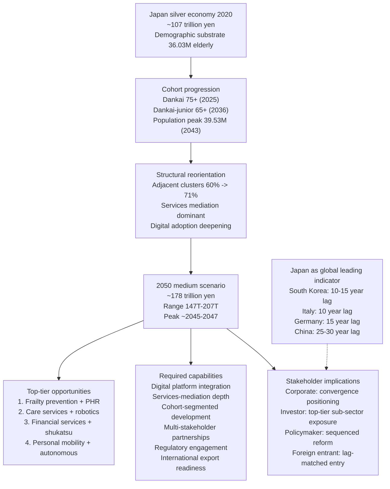

The Japanese silver economy of 2050 will not be the silver economy of 2020 expanded by demographic factor alone. It will be a structurally distinct market in which adjacent clusters dominate over core consumption categories, services-mediated formats dominate over family-anchored formats, digital platforms dominate over physical-only channels, and individually-financed late-life consumption dominates over the bequest-constrained asset-preservation pattern of late-twentieth-century elderly markets. Within that distinct market lie the largest single Japanese consumer-economy commercial opportunities of the coming three decades, and the leading-indicator gateway to the global silver-economy transition that will define the macroeconomic trajectory of multiple comparator aging societies through the second half of the twenty-first century. The capabilities to capture these opportunities exist in Japanese industry, government, and academic institutions; the strategic frameworks to deploy them have been progressively constructed through the institutional-development sequence traced throughout this report; and the policy environment to sustain them depends on choices that will be made across the 2025, 2030, 2040, and 2050 milestone years that this report has dated as the principal inflection points within the trajectory. The medium-scenario aggregate of 178 trillion yen by 2050 represents not a forecast in the strict statistical sense, but a defensible central estimate around which corporate, investor, policymaker, and foreign-entrant action can be organized—and against which alternative trajectories can be benchmarked as the demographic, behavioral, technological, and institutional drivers documented throughout this report unfold over the coming decades.

[^34]: Trends Shaping the US$ 1.32 Trillion Japan Digital Payment Market, 2025-2033

[^35]: Aeon Environmental and Social Report 2015

[^38]: 公的年金制度に係る令和6(2024)年 財政検証のピアレビュー 第4章

[^37]: ローソンとツルハドラッグHDが提携 ‐ 1号店が宮城県仙台市にオープン

[^36]: 介護人材デジタル化で確保を 2040年に69万人不足見通し（三菱総合研究所）

[^40]: カーブスホールディングス 2026年8月期第2四半期(中間期) 決算補足説明資料

[^39]: 介護職員 2025年度に約32万人不足 2040年度には69万人不足（厚労省）

# 参考内容如下：
[^1]:[[PDF] National Institute of Population and Social Security Research](https://www.ipss.go.jp/pr-ad/e/ipss_english2024.pdf)
[^2]:[[PDF] Doctoral School of Law and Political Sciences University of Szeged ...](https://doktori.bibl.u-szeged.hu/13078/13/Dissertation%20draft-Chen%20Mengxuan.pdf)
[^3]:[[PDF] 野村年金マネジメント研究会 年金ニュース解説](https://nenkin.nomura.co.jp/public/report/nenkin-news/2023/nenkin-news_908_20230529.pdf)
[^4]:[Effectiveness of Hospital Ambulance Utilization in a Community-Based Integrated Care System - PMC](https://pmc.ncbi.nlm.nih.gov/articles/PMC12145277/)
[^5]:[【FP監修】老後資金の平均額はいくら？必要な生活費の目安や備え方を解説｜はじめての無料資産形成相談【保険の比較】](https://hoken.rakuten.co.jp/ifa/column/retirement-fund/)
[^6]:[[PDF] 運転免許の申請取消（自主返納）件数と運転経歴証明書交付件数の ...](https://www.npa.go.jp/policies/application/license_renewal/pdf/rdhtransition_r06.pdf)
[^7]:[中国の「預制菜」（中食）を支持する世代と必要とする世代 | Frontier Eyes Online by フロンティア・マネジメント](https://frontier-eyes.online/china_generation/)
[^8]:[取得について | 東京都シルバーパスのご案内](https://www.silver-pass.tokyo/obtaining/)
[^9]:[高齢者の社会参加・生きがい](https://ai-government-portal.com/%E9%AB%98%E9%BD%A2%E8%80%85%E3%81%AE%E7%A4%BE%E4%BC%9A%E5%8F%82%E5%8A%A0%E3%83%BB%E7%94%9F%E3%81%8D%E3%81%8C%E3%81%84/)
[^10]:[【2050 年には単独世帯が 44.3%】2030年前半には平均世帯人員は初めて2人を割り込む未来へ 日本の世帯数の将来推計から考えてみよう【データから考えてみよう22】 - ときわきよこ行政書士事務所](https://office-tokiwa.com/date22/)
[^11]:[「すべての人の移動を楽しくスマートにする」――電動車椅子業界に革新を起こした近距離モビリティ「WHILL（ウィル）」 | 人生を豊かにする東京ウェブマガジン Curiosity](https://r100tokyo.com/curiosity/next-for-future/240601/)
[^12]:[Demography and Place (Japan) - by David Redfern](https://dredfern.substack.com/p/demography-and-place-japan)
[^13]:[「WHILL」が日本の「近距離モビリティ」マーケットを変える。免許返納後のシニア利用も - Digital Shift Times（デジタル シフト タイムズ） その変革に勇気と希望を](https://digital-shift.jp/startup_technology/220823)
[^14]:[拡大するパーソナルモビリティ市場 ～定義、種類、価格など徹底調査 | 近距離モビリティ 電動車椅子](https://whill.inc/jp/column/12_personalmobility)
[^15]:[1 in 5 people in Japan age 65 and older will be living alone in 2050](https://www.japantimes.co.jp/news/2024/11/12/japan/society/single-person-households/)
[^16]:[[PDF] サービス付き高齢者向け住宅 今後の施策](https://www.koujukyo.com/uploads/info/273.pdf)
[^17]:[高齢者マーケットの可能性 ｜株式会社矢野経済研究所 ライフ ... - note](https://note.com/yri_lifescience/n/n30cf364abaa0)
[^18]:[Six in Ten Older Men Living Alone Will Be Never-Married- EN-ICHI](https://ippjapan.org/en_ichi/en/archives/498/)
[^19]:[世帯の小規模化は想定より早く～世帯数の将来推計の「信頼度」を考える①～ | SOMPOインスティチュート・プラス](https://www.sompo-ri.co.jp/2025/03/31/17486/)
[^20]:[[PDF] これまでの主な取組に関する現状について - 国土交通省](https://www.mlit.go.jp/common/001055434.pdf)
[^21]:[[PDF] 国における高齢者住宅施策 最新動向](http://www.shpo.or.jp/_uploads/news/19/attachments/P0-10.pdf)
[^22]:[数字で見るヘルスケア産業 2030年、37兆円規模に | 2016年8月号](https://www.projectdesign.jp/201608/healthcare/003059.php)
[^23]:[[PDF] 経済産業省における医療機器産業振興の取組について](https://link-j.g.kuroco-img.app/files/user/5.250626_%E7%B5%8C%E6%B8%88%E7%94%A3%E6%A5%AD%E7%9C%81%E3%81%AB%E3%81%8A%E3%81%91%E3%82%8B%E5%8C%BB%E7%99%82%E6%A9%9F%E5%99%A8%E7%94%A3%E6%A5%AD%E6%8C%AF%E8%88%88%E3%81%AE%E5%8F%96%E7%B5%84%E3%81%AB%E3%81%A4%E3%81%84%E3%81%A6.pdf)
[^24]:[[PDF] 新しい健康社会の実現 - 経済産業省](https://www.meti.go.jp/shingikai/sankoshin/shin_kijiku/pdf/020_04_00.pdf)
[^25]:[健保ニュース 2025年10月下旬号-Page8｜けんぽれん［健康保険組合連合会］](https://www.kenporen.com/book/kenpo_news/detail/2510/251003_08.shtml)
[^26]:[[PDF] 新制度における医療費、給付費の将来見通し](https://www.mhlw.go.jp/bunya/iryouhoken/topics/dl/110221-01_27.pdf)
[^27]:[[PDF] Overview of the System and the Basic Statistics [1] General Welfare ...](https://www.mhlw.go.jp/english/wp/wp-hw15/dl/01e.pdf)
[^28]:[[PDF] how will population - World Health Organization (WHO)](https://iris.who.int/server/api/core/bitstreams/22c7b4e7-8fb4-41e2-9964-fa29e509472e/content)
[^29]:[【矢野経済研究所プレスリリース】介護食、高齢者食、病者食の ...](https://www.dreamnews.jp/press/0000267764)
[^30]:[シニアの一人暮らし市場を攻略するマーケティング戦略とは？イン ...](https://seniorad-marketing.com/senior-advertising/living-alone-2/)
[^31]:[ICT超高齢社会構想会議の検討の方向性](https://www.soumu.go.jp/main_content/000212324.pdf)
[^32]:[ウェルネスデイリーニュース | 21年度市場規模、約3278億円に　機能性表示食品　矢野経済が見込む 「伸び率が鈍化」](https://wellness-news.co.jp/posts/21%E5%B9%B4%E5%BA%A6%E5%B8%82%E5%A0%B4%E8%A6%8F%E6%A8%A1%E3%80%81%E7%B4%843278%E5%84%84%E5%86%86%E3%81%AB%E3%80%80%E6%A9%9F%E8%83%BD%E6%80%A7%E8%A1%A8%E7%A4%BA%E9%A3%9F%E5%93%81%E3%80%80%E7%9F%A2/)
[^33]:[健康食品市場に関する調査を実施（2026年） | ニュース・トピックス | 市場調査とマーケティングの矢野経済研究所](https://www.yano.co.jp/press-release/show/press_id/4040)
[^34]:[Trends Shaping the US$ 1.32 Trillion Japan Digital Payment Market, 2025-2033](https://finance.yahoo.com/news/trends-shaping-us-1-32-161900555.html)
[^35]:[[PDF] Addressing social issues](https://www.aeon.info/export/sites/default/common/images/en/environment/report/e_2015pdf/full/12.pdf)
[^36]:[[PDF] 介護人材デジタル化で確保を 2040 年に 69 万人不足見通し - 客观日本](https://www.keguanjp.com/kgjp_jish/imgs/2023/04/20230420_1_01.pdf)
[^37]:[ローソンとツルハドラッグHDが提携 ‐ 1号店が宮城県仙台市にオープン | マイナビニュース](https://news.mynavi.jp/article/20150202-a374/)
[^38]:[[PDF] 公的年金制度に係る令和6(2024)年 財政検証のピアレビュー 第4章 ...](https://www.mhlw.go.jp/content/12501000/001612453.pdf)
[^39]:[介護職員　2025年度に約32万人不足　2040年度には69万人不足（厚労省） | 社会保険労務士PSRネットワーク](https://www.psrn.jp/topics/detail.php?id=16670)
[^40]:[[PDF] 2026年8月期第2四半期(中間期) 決算補足説明資料](https://pdf.irpocket.com/C7085/nX8G/pI0a/IJDi.pdf)
