# Convergent Wisdom: A Comparative Study of the Investment Philosophies of Duan Yongping, Warren Buffett, and Charlie Munger
# 1 Introduction, Research Framework, and Biographical Foundations

In the long history of modern investing, the term "value investing" has come to designate not merely a technique for selecting securities but a coherent philosophy of business ownership, rationality, and temperament. Three investors stand at the contemporary apex of this tradition: Warren Buffett, the "Oracle of Omaha" who built Berkshire Hathaway from a struggling New England textile manufacturer into one of the world's largest conglomerates; Charlie Munger, his lifelong partner and the man Buffett called the "architect" of Berkshire[^1]; and Duan Yongping (段永平), the Chinese industrialist-turned-investor who architected the Subor, BBK, OPPO, and Vivo business ecosystems before crossing the Pacific to apply—and adapt—the Buffett–Munger framework to Chinese and global markets. This opening chapter establishes the rationale, scope, and biographical groundwork for a tripartite comparison whose central question is at once historical and conceptual: how did three individuals from radically different backgrounds, cultures, and eras converge upon a remarkably consistent body of investment wisdom, and where do their paths meaningfully diverge?

## 1.1 Research Rationale and the Logic of a Tripartite Comparison

The decision to study Duan Yongping, Warren Buffett, and Charlie Munger as a single analytical unit is neither arbitrary nor merely a matter of pairing famous names. It reflects an explicit historical and intellectual lineage. Munger and Buffett met at a dinner in Omaha in 1959 arranged by Dr. Edwin "Ed" Davis and his wife Dorothy[^2], and from that encounter emerged a six-decade partnership in which, by Buffett's own reckoning in a CNBC interview, the two men "never had an argument" in all their years of collaboration[^3]. By 1978, Munger had been formally installed as Vice Chairman of Berkshire Hathaway[^1], and the dyad they formed has since served as the most influential single template for value investing worldwide. Duan Yongping enters this lineage by deliberate choice: he is widely regarded as the principal Chinese disciple of the Buffett–Munger school, an identification publicly cemented when he won—and brought with him a young Colin Huang (founder of Pinduoduo)—the 2006 charity auction lunch with Warren Buffett, paying $620,100 for the privilege. This act of pilgrimage was not symbolic decoration; it inaugurated a phase in which Duan's previously latent investment instincts crystallized into an explicit, articulated philosophy modeled on the Berkshire approach.

Studying the three together therefore offers something more demanding than a parallel exposition of their views. It permits a controlled test of whether the principles articulated in Omaha—intrinsic value, economic moats, the circle of competence, long-term compounding, the supremacy of business quality over statistical cheapness—travel across the Pacific into a market with vastly different institutional features: state-owned enterprises, a younger and more volatile equity culture, distinctive consumer brands such as Kweichow Moutai, and a regulatory environment with no analogue in the United States. If the Buffett–Munger framework is genuinely universal, Duan's record should illuminate which of its tenets are bedrock and which require local translation. If it is partly context-bound, the comparison will reveal precisely where adaptation occurs. **The tripartite design thus converts what might otherwise be a biographical exercise into a stress test of value investing's claim to be a culture-free discipline of rationality applied to business ownership.**

A second rationale is that, in the existing literature, Buffett and Munger have been studied exhaustively in the West, while Duan—despite his enormous influence among Chinese investors through his prolific Snowball (雪球) posts and blog entries—remains comparatively under-examined in English-language analysis. Bringing him into direct dialogue with the Western masters corrects an asymmetry in the field and contributes a genuinely cross-cultural perspective that neither English-only nor Chinese-only treatments can supply.

## 1.2 Analytical Framework and Scope of Comparison

To prevent the comparison from collapsing into anecdotal storytelling, this report imposes a consistent four-dimensional analytical framework that will be applied uniformly to each investor across all subsequent chapters.

| Dimension | Core Questions Posed to Each Investor |
|---|---|
| **Investment Philosophy** | What does the investor believe about value, price, business quality, the circle of competence, and the relationship between stock and underlying enterprise? |
| **Decision-Making Logic** | How does the investor reach conclusions—through mental models, inversion, "stop-doing" lists, temperament, or industrial intuition? How are errors handled? |
| **Portfolio Construction** | How concentrated are holdings? How long are they held? How is position sizing determined, and how is opportunity cost weighed? |
| **Life Principles** | What ethical commitments, learning habits, attitudes toward wealth, and personal disciplines undergird the investment behavior? |

These four dimensions are not equally addressed in this opening chapter. Chapter 1's responsibility is biographical and contextual—to reconstruct the formative experiences, intellectual roots, and career arcs that produced the three philosophies—while the substantive philosophical exposition is reserved for Chapters 2 (Buffett), 3 (Munger), and 4 (Duan), the comparative synthesis for Chapter 5, the portfolio and case-study analysis for Chapter 6, the broader life-philosophy treatment for Chapter 7, and the synthesis of practical implications for Chapter 8. The scope of comparison is also bounded in two important respects. First, the report focuses on the publicly documented investment philosophies of the three figures as expressed in their primary utterances—Berkshire shareholder letters, Munger's speeches and *Poor Charlie's Almanack*, Duan's Snowball posts, blog entries, and verified interviews—rather than on third-party trading commentary. Second, the report acknowledges that source asymmetry exists: Buffett and Munger have been documented across decades and many channels, while a portion of Duan's record is in Chinese and must be carefully cross-checked. Where evidence is uneven or potentially translation-distorted, this report will explicitly flag the limitation rather than paper it over.

## 1.3 Warren Buffett: From Omaha Paperboy to the Oracle's Value Investing Foundations

Warren Edward Buffett was born in Omaha, Nebraska, on August 30, 1930, the middle child of Howard Buffett, a stockbroker who later served as a U.S. Congressman, and Leila Buffett[^4][^5]. His childhood is the most thoroughly mythologized in modern finance, but the recurring details are well-documented and analytically meaningful. By age six he was already buying six-packs of Coca-Cola for a quarter and reselling individual bottles for a nickel—an early demonstration of the unit-economics intuition that would later define his analysis of consumer brands[^4]. At age eleven, in April 1942, he made his first stock purchase: three shares of Cities Service Preferred at $38.25 per share, bought jointly for himself and his sister[^4][^6]. The price first fell to roughly $27 before recovering to around $40, at which point Buffett sold for a small profit—only to watch the shares subsequently rise to approximately $200. He has repeatedly cited this as the episode in which he "learned… patience"[^6].

His Washington years, which began when his father was elected to Congress and the family relocated in late 1942, added a second formative layer: a paper route delivering the *Washington Post* (and, by typically Buffettian arbitrage, the competing *Times Herald* along the same route) that taught him that "if you did a good job, you were gonna move up"[^7]. By age fourteen he had filed his first federal tax return on $592.50 of paperboy income, and by his late teens he had accumulated enough capital to buy a forty-acre farm[^4][^7]. These were not eccentric childhood quirks; they encode the principles of compounding, working for what one earns, and acting on inefficiencies that would later become the rhetorical staples of Berkshire's annual letters.

Formally educated at the Wharton School of the University of Pennsylvania for two years, he transferred to the University of Nebraska to complete his undergraduate degree in 1949, before being rejected by Harvard Business School and subsequently admitted to Columbia Business School, where he earned a Master's in Economics in 1951[^4][^5]. The Columbia years were decisive: Buffett had read Benjamin Graham's *The Intelligent Investor* at age nineteen and chose Columbia precisely because Graham taught there[^5]. Graham, the "father of value investing" and co-author with David Dodd of *Security Analysis* (1934) and author of *The Intelligent Investor* (1949), provided Buffett with the foundational vocabulary of the discipline: the distinction between investment and speculation, the metaphor of "Mr. Market," the concept of intrinsic value, and the doctrine of the margin of safety[^4]. Buffett would later describe Graham as the second most influential person in his life after his own father[^4].

After Columbia, Buffett offered to work for Graham for free; Graham initially refused, and Buffett returned to Omaha to work as a stockbroker at his father's firm, Buffett-Falk & Co., before finally joining Graham-Newman Corp. as a securities analyst from 1954 to 1956[^8]. When Graham retired in 1956, Buffett returned to Omaha and founded Buffett Associates Ltd. with $105,000 raised from seven family members and friends—of which his own contribution was a famously token $100[^5]. By 1962, having merged his various partnerships into Buffett Partnership Ltd., he was a millionaire[^8].

The investment style of this period was the Graham-derived "cigar butt" method—buying companies "selling for less than their working capital" so that even one final "puff" of value would yield profit[^4]. Two cases from this era reveal the activist edge of early Buffett. In **Sanborn Map (1958)**, Buffett accumulated a 35% partnership stake in a company whose investment portfolio alone was worth $65 per share while the stock traded at $45, and successfully lobbied for a swap that realized the latent value[^8]. In **Dempster Mill Manufacturing (1961)**, he obtained majority control at roughly one-third of intrinsic value, and after attempting to work with existing management, installed his own operator to clean up the balance sheet, exiting in 1963 with a roughly threefold gain[^8]. The 1965 takeover of **Berkshire Hathaway** itself—triggered, according to widely circulated accounts, by Seabury Stanton's attempt to repurchase Buffett's shares at $11⅜ rather than the orally agreed $11½—was the culmination of this activist, deep-value phase[^8]. Buffett later called the Berkshire textile business "his worst trade"[^8], a candid admission that foreshadowed the philosophical pivot Munger would soon catalyze.

## 1.4 Charlie Munger: Multidisciplinary Roots and the Architect's Intellectual Formation

Charles Thomas Munger was born in Omaha on January 1, 1924, six years and seven months before Buffett, and grew up roughly two miles from the Buffett family without ever encountering the younger Warren—even though, as a teenager, Munger had worked at Buffett & Son, the grocery store owned by Warren's grandfather[^1][^2]. The two men's lives, in other words, brushed each other for years before they intersected.

Munger left Omaha in 1941 to study mathematics at the University of Michigan, dropped out in 1943 to serve as a meteorologist in the U.S. Army Air Corps during World War II, and—while studying meteorology in Pasadena—met and married his first wife, Nancy Huggins[^2]. After the war he enrolled at Harvard Law School without ever completing an undergraduate degree, graduating *magna cum laude*[^1][^2]. The personal hardships of the next decade are central to understanding the temperament he would bring to investing. In 1953 his first marriage ended in a divorce that left him, in his own description, with very little; two years later his nine-year-old son Teddy died of leukemia[^2]. He remarried a second Nancy (Nancy Barry) in 1956, eventually raising a blended family of eight children. **The early experience of catastrophic loss arguably underlies the central Mungerian disposition: a preoccupation with avoiding ruin, with "inversion," and with the recognition that the first task of rationality is not to be brilliant but to avoid being stupid.**

Munger's professional foundations were legal rather than financial. He founded the Los Angeles law firm Munger, Tolles & Olson in 1962—the same year he launched the investment partnership Wheeler, Munger & Company in collaboration with Jack Wheeler[^9][^2]. The Wheeler-Munger partnership ran from 1962 to 1975 and, according to figures cited by Buffett, produced average annual returns of 24.3% (sources vary—InvestSMART reports 19.8% before fees against 5% for the Dow over the period; Investopedia reports approximately 20%—reflecting differences in fee treatment and benchmark choice)[^9][^1][^2]. Munger ceased practicing law in 1965, telling interviewers years later that "the best advice I ever got from Warren was to stop practicing law"; Buffett, he said, regarded law as a fine "hobby" but not a "business"[^9].

The intellectual signature that distinguishes Munger from virtually every other prominent investor is his commitment to a **multidisciplinary "latticework of mental models"**—the practice of importing the major explanatory frameworks of psychology, mathematics, physics, biology, and engineering into investment analysis[^1][^2]. As Investopedia summarizes the doctrine: Munger believed that "to the man with only a hammer, every problem looks like a nail"[^1]. He held that "80 or 90 important models will carry about 90% of the freight in making you a worldly-wise person"[^2]. This was not an academic conceit; it was a practical defense against the cognitive biases (confirmation bias, incentive-caused bias, social proof, loss aversion) that destroy investment returns. His insistence on *learning machines* reading "all the time"—Buffett's son Howard reportedly considered Munger the smartest person he had ever known, with Buffett the second[^2]—anchors the philosophical claim that compound knowledge precedes compound capital.

## 1.5 The Buffett–Munger Partnership: Catalyst of Philosophical Evolution

The 1959 Omaha dinner that introduced Buffett to Munger has acquired the status of a financial origin myth, but the surrounding details remain analytically important. The introduction was engineered by Dr. Edwin Davis and his wife Dorothy, longtime Omaha friends of both families. Davis had previously invested $100,000 with the young Buffett because Buffett "reminded him of Charlie Munger"; Buffett, on hearing this, told friends he wanted to meet Munger to determine whether the comparison was "a compliment or an insult"[^2]. Munger, then 35, had returned to Omaha to administer his late father's estate; Buffett was 29[^9]. At the dinner, Susie Buffett observed the unusual sight of her husband going "quieter" and letting Munger lead the conversation[^2]; Buffett would later recall to CNBC that within five minutes "Charlie was rolling on the floor laughing at his own jokes — and I'd do the same thing"[^9]. Both men reported, separately, that each considered the other the smartest person he had ever met[^2].

The 1959 meeting did not immediately produce a formal partnership. Through the 1960s and early 1970s the two men collaborated informally—Munger's Wheeler, Munger & Company often invested in the same securities as Buffett's partnership[^9]—until Munger formally joined Berkshire Hathaway as Vice Chairman in 1978[^1]. What matters for the philosophical history of value investing, however, is what Munger told Buffett between these dates. According to Buffett's own 2023 chairman's letter, Munger said in 1965 that Buffett's purchase of Berkshire had been "dumb" and offered the constructive prescription that became the hinge of Berkshire's evolution[^1]:

> "Now that you control Berkshire, add to it wonderful businesses purchased at fair prices and give up buying fair businesses at wonderful prices. In other words, abandon everything you learned from your hero, Ben Graham. It works but only when practiced at small scale."

Buffett distilled this into the dictum that has become the single most cited line in the Berkshire canon: *"It's far better to buy a wonderful company at a fair price than a fair company at a wonderful price"*[^9]. Munger himself characterized the Graham cigar-butt approach in characteristically caustic terms at the 1998 shareholders' meeting: "It's not that much fun to buy a business where you really hope this sucker liquidates before it goes broke"[^9].

The behavioral consequences of this philosophical pivot were concrete and verifiable. The 1972 acquisition of **See's Candies**—at a price representing many multiples of book value, predicated on the recognition of "untapped pricing power" in a differentiated consumer brand—is conventionally treated as the first full expression of the new approach[^4]. The 1988 initiation of the **Coca-Cola** position, which eventually grew to roughly 7% of the company at a cost of $1.02 billion and remains a Berkshire core holding, exemplified the long-duration patience that the new philosophy required[^9][^8]. Buffett also credited Munger with making him "a long-term investor, holding stocks for years on end," noting that Berkshire has held its Coca-Cola shares since 1988[^9]. In Buffett's tribute upon Munger's death on November 28, 2023, he stated that "Berkshire Hathaway could not have been built to its present status without Charlie's inspiration, wisdom and participation"[^9]. Munger himself, in his final 2023 CNBC interview, summarized the partnership's evolution simply: "We got into better and better companies"[^1].

The structural arc of the Buffett–Munger partnership can be visualized as the philosophical pivot from Graham-orthodox value to quality-at-fair-price compounding:

```mermaid
flowchart LR
    A["1930 Buffett born<br/>1924 Munger born<br/>(Omaha origins)"] --> B["1949–1951<br/>Buffett at Columbia<br/>under Benjamin Graham"]
    B --> C["1956 Buffett Partnership<br/>1962 Wheeler, Munger & Co.<br/>(Graham-style deep value)"]
    C --> D["1959 Omaha dinner<br/>Davis introduction"]
    D --> E["1965 Munger's counsel:<br/>'wonderful businesses at fair prices'<br/>Buffett takes control of Berkshire"]
    E --> F["1972 See's Candies<br/>(first quality-at-fair-price test)"]
    F --> G["1978 Munger formally<br/>Vice Chairman of Berkshire"]
    G --> H["1988 Coca-Cola<br/>long-duration compounding<br/>established as core method"]
    H --> I["2006 Duan Yongping<br/>Buffett charity lunch<br/>(transmission to China)"]
```

The diagram highlights a central insight for this report: the philosophical template that Duan would later inherit was itself the product of an internal evolution, not an immutable doctrine. **What Duan adopted was post-1965 Buffett—the Munger-revised Buffett—rather than the pre-1965 Graham-orthodox Buffett.** This timing matters enormously for the comparative chapters that follow.

## 1.6 Duan Yongping: From Industrialist to Investor and the Eastern Path to Value Investing

Duan Yongping (段永平) approached value investing from a starting point unlike either Buffett's or Munger's. Where Buffett came to investing through paper routes and equity analysis, and Munger through law and meteorology, Duan came to it through the operating trenches of Chinese consumer electronics manufacturing. His pre-investment career, while less extensively documented in English-language sources than the lives of his Western counterparts, is widely recognized as one of the foundational entrepreneurial trajectories of late-twentieth-century China. He first became known as the architect of the success of the **Subor (小霸王) electronic learning machine**, then founded **BBK (步步高 / Bubugao)**, whose subsidiary structure later incubated the smartphone brands **OPPO** and **Vivo**—two companies that became, by the mid-2010s, among the largest smartphone manufacturers in China and globally. The detailed corporate history of these ventures lies beyond the scope of search results available for this chapter, and a full primary-source reconstruction of his industrial career is accordingly deferred to Chapter 4. What is essential here, and what the reader must hold in mind throughout the report, is the *philosophical* implication of this background.

Decades spent building consumer-products businesses in China gave Duan a first-person understanding of three things that few financial investors ever acquire from the outside: how a corporate culture is actually constructed and sustained, how durable competitive advantage is operationally manufactured rather than merely identified on a balance sheet, and how product, brand, and channel interact to produce or destroy long-term economic value. This operating experience is the source of Duan's distinctive emphasis on **business culture as the "North Star"** (his "本分" or "Way of the Right" framework, examined in detail in Chapter 4) and his redefinition of the margin of safety as **depth of understanding** rather than statistical cheapness. It is also the source of an investing temperament that is, in its instincts, closer to that of a long-tenured CEO evaluating an acquisition target than that of an analyst running discounted cash-flow models.

After relocating to the United States in the early 2000s, Duan transitioned to full-time investing and explicitly adopted the Buffett–Munger framework as his lodestar. The 2006 charity lunch with Buffett—at which Duan paid $620,100—both publicly proclaimed and personally consolidated this discipleship; he famously brought the young Colin Huang to the lunch, and Huang would later credit Duan as a decisive mentor in founding Pinduoduo. Duan's subsequent career as a public-market investor, conducted through his family-office vehicle H&H Co. and chronicled in real time on his Snowball (雪球) feed and personal blog, has produced a small number of high-conviction, long-duration positions—most prominently NetEase, Apple, Kweichow Moutai, Tencent, and Pinduoduo—that mirror the concentration philosophy of Berkshire while adapting it to the realities of dual exposure to U.S. and Chinese markets. The detailed examination of these positions and the case studies that surround them (NetEase's roughly 100x return, the early-2011 Apple conviction, the costly Baidu short, the Moutai thesis) is reserved for Chapter 6.

The biographical headline for Chapter 1 is therefore as follows: **Duan reaches the Buffett–Munger conclusions not through Graham-style securities analysis, but through the inverse path—from the inside of the operating company outward to the capital markets.** This inversion of the customary direction of travel is the single most important fact about his place in the comparative study.

## 1.7 Comparative Biographical Synthesis: Convergent Origins of Divergent Paths

When the three biographies are placed side by side along the dimensions that matter for investment philosophy, a structured pattern of convergence and divergence emerges.

| Dimension | Warren Buffett | Charlie Munger | Duan Yongping |
|---|---|---|---|
| **Birthplace / era** | Omaha, 1930 | Omaha, 1924 | China (later relocated to U.S.) |
| **Primary formative training** | Securities analysis under Benjamin Graham at Columbia[^5] | Harvard Law School + multidisciplinary self-education[^1][^2] | Operating leadership of Subor, BBK, OPPO/Vivo ecosystem |
| **Earliest entrepreneurial activity** | Reselling Coca-Cola, paper routes, pinball machines, age 6 onward[^4][^7] | Worked at Buffett & Son grocery as teenager[^1][^2] | Industrial entrepreneurship in Chinese consumer electronics |
| **First investment partnership** | Buffett Partnership Ltd., 1956[^5] | Wheeler, Munger & Co., 1962–1975[^9][^2] | H&H Co. (post-relocation to U.S.) |
| **Initial philosophical orientation** | Graham-orthodox "cigar butt" deep value[^4] | Quality-at-fair-price from outset[^1] | Buffett–Munger quality-at-fair-price (post-1965 model) |
| **Pivotal turning point** | Munger's 1965 counsel on quality businesses[^1] | Loss of son Teddy (1955); shift from law to investing[^2] | 2006 Buffett charity lunch; full-time investing |
| **Decisive intellectual habit** | Voracious reading of annual reports; "filing-cabinet mind" | Latticework of mental models across disciplines[^1][^2] | Operator's intuition for business culture and moats |

The table makes visible four convergent traits that the rest of the report will exploit analytically:

First, **all three were precocious entrepreneurs** who acquired commercial intuition long before formal investment training—Buffett selling Coca-Cola by the bottle at age six[^4], Munger working at Buffett & Son as a teenager[^1], and Duan building consumer-products businesses before ever buying a marketable security in size. Second, **all three are "learning machines,"** to use Munger's term[^2]—voracious readers who treat continuous learning as an ethical and professional obligation. Third, **all three came to value investing through routes that emphasized long-term ownership over short-term speculation**: Graham's businesslike conception of the share as part-ownership for Buffett[^4], the multidisciplinary recognition of compounding for Munger[^2], and direct operational experience of how businesses actually create value for Duan. Fourth, **all three explicitly elevated rationality and temperament above raw intelligence**—a theme that will recur throughout the philosophical chapters.

Yet the divergences are equally telling. Buffett's worldview is fundamentally that of an analyst who learned the bottom-up grammar of securities from Graham and was nudged by Munger toward business-quality thinking; Munger's is that of a polymathic lawyer who refused to let any single discipline monopolize his judgment; Duan's is that of an industrialist who, having built businesses, came to recognize that buying part of a great one through the public market was simply the same activity at a different scale. **The central analytical question this chapter sets up for the remainder of the report is therefore not whether the three converged—they manifestly did—but why three such different starting points produced philosophies that, at their core principles, are nearly indistinguishable.**

That question, in turn, sharpens the rubric for what follows. If their philosophies converge despite these starting points, then the convergence itself is evidence for the universality of certain investment truths: the primacy of business ownership, the discipline of the circle of competence, the supremacy of long-term holding, and the moral architecture of rationality. If, however, careful examination reveals systematic divergences—Buffett's reliance on insurance float as permanent capital, Munger's mental-model toolkit, Duan's operator-driven feel for culture and pricing power, the differing attitudes toward technology stocks, cash holdings, and Chinese consumer brands—those divergences will reveal precisely where the philosophy must adapt to context. Chapters 2 through 4 examine each philosophy on its own terms; Chapter 5 conducts the formal comparison; Chapter 6 tests philosophy against actual portfolio behavior; Chapter 7 widens the lens to life and ethics; and Chapter 8 synthesizes the practical implications. The biographical foundations laid here are the indispensable interpretive ground for everything that follows.

# 2 Warren Buffett's Investment Philosophy

Having reconstructed in Chapter 1 the biographical arc that carried a young Omaha paperboy from Benjamin Graham's classroom to the chairmanship of Berkshire Hathaway, this chapter turns to the substantive content of the philosophy that arc produced. The task is not to catalogue aphorisms but to reconstruct the *system*: to identify which principles function as foundational axioms, which serve as operational refinements, and which are structural enablers without which the philosophy would have remained an academic exercise rather than the engine of one of the most extraordinary capital-compounding records in financial history. As the previous chapter established, Buffett's mature framework is the product of an internal evolution—the Graham-orthodox deep-value method of the partnership era progressively yielded, under Munger's catalytic influence after 1965, to the quality-at-fair-price doctrine that the See's Candies acquisition of 1972 and the Coca-Cola purchase of 1988 came to exemplify. This chapter dissects that mature framework principle by principle, showing how each tenet interlocks with the others to form a coherent architecture rather than a checklist.

## 2.1 Stock as Business Ownership: The Graham Inheritance and Its Reinterpretation

The bedrock axiom of Buffett's philosophy—the proposition from which every subsequent tenet is derived—is that buying a share of stock is not a wager on a quoted price but the acquisition of a fractional ownership interest in an actual operating business. This is not a Buffett original; it is the Graham inheritance, internalized so thoroughly during the Columbia and Graham-Newman years (1949–1956) that it ceased to be a stylistic preference and became an unexamined first principle. As Graham wrote in *The Intelligent Investor* (1949), "the owner of stocks should regard them first and foremost as conferring part ownership in a business," with the corollary that the stockholder "should be unconcerned with erratic fluctuations in stock prices, since in the short term the stock market behaves like a voting machine, but in the long term it acts like a weighing machine".[^4] Buffett continues to describe Graham's *The Intelligent Investor* as "the best book about investing ever written".[^4][^5]

From this single axiom Graham derived the two further analytical commitments that Buffett would carry with him for the remainder of his career. The first is the categorical distinction between *investment* and *speculation*. Graham, in *Security Analysis* (1934), defined an investment operation as "one which, upon thorough analysis, promises safety of principal and a satisfactory return," with the explicit corollary that "operations not meeting these requirements are speculative".[^4] The distinction is not stylistic but operational: only an activity that proceeds from a substantive analysis of the underlying business qualifies as investment, regardless of how the activity is labeled by its practitioners or its accountants. The second analytical commitment is the *Mr. Market* metaphor. The investor's hypothetical business partner, in Graham's parable, appears each day at the door quoting a price at which he is willing to either buy out the investor's interest or sell more of his own; usually the price is plausible, but occasionally it is "ridiculous," and in either case the investor is free to ignore him. The investor's task, Graham wrote, is to "profit from market folly rather than participate in it" and to concentrate "on how the underlying businesses perform, not on how Mr. Market behaves".[^4]

What Buffett added to this inheritance—and what marks the transition from Graham-orthodox value to mature Buffettism—was a reinterpretation of the ownership axiom through an *owner-operator* lens rather than a securities-analyst lens. Under Graham, ownership thinking served a primarily *defensive* purpose: it disciplined the investor against the emotional vortex of price quotations and supplied the rationale for the margin-of-safety requirement. Under post-1965 Buffett, ownership thinking became a *proactive* standard for evaluating long-term economic returns. The relevant question shifted from "what would this business be worth in liquidation today?" to "what kind of business would I want to own forever, and what is it actually doing for its owners year after year?" This shift is visible in the rhetorical register of Buffett's annual letters, where he routinely invites Berkshire shareholders to think of themselves as part-owners of an operating empire rather than as holders of a quoted security, and where the central analytical exhibit is no longer book value or current-asset cheapness but the durable economic performance of underlying franchises.

The behavioral consequence of this reinterpretation is a willingness to hold ownership positions through severe price volatility because the *business* has not changed. As Graham himself put it in a formulation that became one of Buffett's most quoted lines, "you are neither right nor wrong because the crowd disagrees with you. You are right because your data and reasoning are right".[^4] **In Buffett's hands, this stoic stance ceased to be a mere defense against panic and became the affirmative basis for the multi-decade holding periods that would eventually produce Berkshire's compounding miracle.**

## 2.2 Intrinsic Value, Margin of Safety, and the Quality Pivot

If business-ownership thinking is the axiom, intrinsic value and margin of safety are the twin pillars of valuation discipline that translate the axiom into action. Intrinsic value, in the Graham tradition Buffett inherited, is the value an informed private buyer would assign to the entire business based on its assets, earnings, and prospects, computed independently of the prevailing market quotation. The *margin of safety* is the buffer between this estimated intrinsic value and the price actually paid—the analytical analogue of the engineering margin built into a bridge designed to carry far heavier loads than it will ever bear. As Graham wrote, "when a company is available at a discount to its intrinsic value, a 'margin of safety' exists, which makes it suitable for investment".[^4]

The Buffett who emerged from Graham-Newman in 1956 to launch Buffett Associates Ltd. operated this framework in its purely quantitative Graham form. The early Buffett Partnership decade was the era of the *cigar butt*—the strategy, as Buffett himself later described it, of identifying "a cigar butt found on the street that has only one puff left in it" but for which "the 'bargain purchase' will make that puff all profit".[^4] The mathematics were ruthlessly statistical: Graham-Newman, the firm Buffett apprenticed at from 1954 to 1956, "would buy a basket of securities and would either wait for the market to realize the value of the shares, or prod management to return more cash to shareholders, to sell certain assets, etc."[^4] The two cases canvassed in Chapter 1 illustrate the method in Buffett's own hands. In **Sanborn Map (1958)**, Buffett accumulated what eventually became 35% of his partnership's assets in a company whose investment portfolio alone was worth $65 per share against a stock price of $45—meaning, as Buffett bluntly explained, "buyers valued Sanborn stock at 'minus $20' per share and were unwilling to pay more than 70 cents on the dollar for an investment portfolio with a map business thrown in for nothing".[^8] In **Dempster Mill Manufacturing (1961)**, he obtained 80% of the stock at "nearly a third of its value" and exited in 1963 with "a nearly threefold gain" after installing a new operator to liquidate slow-moving inventory and unprofitable facilities.[^8]

These were textbook Graham operations: cheapness measured against current assets or liquidation value, with the catalyst supplied either by management action or, where necessary, by Buffett's own activism. Importantly, Graham's own track record from 1936 to 1956 produced "approximately a ~20% annualized return" against an overall market average of 12.2% annually, validating the deep-value method on its own terms.[^4] Yet by Buffett's own subsequent admission, the philosophical inadequacy of this approach was already implicit in its successes. The Berkshire Hathaway acquisition itself—the canonical 1965 takeover triggered by Seabury Stanton's attempt to repurchase Buffett's shares at $11⅜ rather than the orally agreed $11½—was a cigar-butt operation that delivered the company but not the business: Buffett would later call the textile operation "his worst trade" and the textile mills were progressively phased out, with the last sold in 1985.[^8]

This is the inadequacy that Munger's 1965 counsel—"add to it wonderful businesses purchased at fair prices and give up buying fair businesses at wonderful prices"—addressed at the philosophical level. The redefinition was profound: the *margin of safety* ceased to be primarily a function of statistical cheapness against liquidation value and became primarily a function of *business durability*. A wonderful business with a defensible economic moat (the subject of section 2.3) generates owner earnings that grow over time; the margin of safety in such a position is supplied not by buying at 70 cents on the dollar but by the compounding gap between a fair purchase price and the rising stream of future cash flows the business will generate. As Buffett told journalist Carol Loomis in 1988, "Boy, if I had listened only to Ben [and not also to Charlie Munger], would I ever be a lot poorer".[^4]

The pivot was operationalized in two landmark transactions. The 1972 acquisition of **See's Candies** had Buffett and Munger paying "many multiples of book value of equity," a price that was anathema by Graham standards but justified by their recognition of "a wonderful business with happy customers, a differentiated product, and untapped pricing power; they felt like they could increase the price of candy per pound without angering the customers".[^4] Buffett would later state simply: "The returns from See's Candies convinced Buffett it was alright to pay fair prices for a wonderful business".[^4] The 1988 initiation of the **Coca-Cola** position, which "eventually [purchased] up to 7% of the company for $1.02 billion," was the second great test of the doctrine—and "would turn out to be one of Berkshire's most lucrative investments, and one which it still holds".[^8] The behavioral signature of the new doctrine—holding a wonderful business indefinitely rather than selling on a small initial gain, as the eleven-year-old Buffett had done with Cities Service—is itself a kind of meta-margin-of-safety: the patience to let great businesses do their work over decades.

## 2.3 Economic Moats and the Anatomy of Durable Competitive Advantage

The concept of the *economic moat* is the operational substitute for Graham-style statistical cheapness in the post-1965 framework. If margin of safety in mature Buffettism derives primarily from business quality, then the analyst must possess a theory of *what makes a business high-quality*, and that theory is the moat. A moat, in Buffett's usage, is the structural barrier—or set of barriers—that allows a business to sustain above-average returns on invested capital over long periods despite the competitive pressures that normally drive such returns to the cost of capital. The metaphor is medieval: a castle (the business and its returns) is defensible only if surrounded by a moat (the structural advantage) that competitors cannot cheaply or quickly cross.

The moat archetypes that recur in Buffett's behavior and rhetoric include several distinct categories. **Brand-based moats** rest on a consumer's emotional or habitual identification with a specific product such that no rational comparison-shopping process is conducted; this is the Coca-Cola archetype and, on a smaller scale, the See's Candies archetype. In Coca-Cola's case, Buffett "began buying" the stock in 1988 "right at the cusp of the beverage company's emergence as a global brand," eventually becoming "the largest shareholder," and the position has remained a core Berkshire holding for more than three decades.[^8] In See's case, the relevant moat was the gift-box psychology by which a Californian giving a box of See's was understood to have given something specific that a generic alternative could not substitute for—an emotional asset that made price increases feasible without volume loss. **Scale and low-cost production moats** rest on volume-driven cost advantages that newer or smaller entrants cannot replicate. **Switching-cost moats** rest on the practical or psychological inconvenience to a customer of changing providers once embedded. **Network-effect moats** rest on the value of a service rising with the number of participants. And **regulatory or franchise moats** rest on legally protected exclusivity.

Buffett's later, more selective embrace of certain technology businesses illustrates the moat framework's flexibility. The 2013 purchase of "a 13% stake in VeriSign, which holds the exclusive rights to the .com domain," is a textbook regulatory-franchise moat: VeriSign's economic returns are protected not by branding or network effects but by an exclusive contractual and regulatory grant.[^5] The eventual large position in Apple, although chronologically beyond the focus of this section, similarly turned on Buffett's recognition that the iPhone constituted a brand-cum-switching-cost moat with consumer-staples economics.

What is analytically critical is that moat analysis substitutes for, rather than supplements, statistical cheapness. The Graham analyst asks "is this stock cheap enough relative to current assets to provide a margin of safety against the worst case?" The post-1965 Buffett asks "does this business possess a structural advantage durable enough that twenty years from now it will still be earning excellent returns on the capital deployed in it, and is the price I am paying reasonable relative to the present value of those returns?" The two questions can in principle yield the same answer for the same business, but they orient the analyst's attention toward different evidence: the first toward the balance sheet and the liquidation hypothetical, the second toward competitive structure, customer behavior, and pricing power. **Moat thinking is, in this sense, the bridge between Graham's analytical rigor and the long-duration ownership behavior that Berkshire's record demonstrates.**

## 2.4 The Circle of Competence and Selective Inactivity

The next foundational tenet is epistemic rather than valuational: the *circle of competence*, the principle that an investor must know the boundary of his own understanding and refuse to act outside it. The proposition has the deceptively modest character of much of Buffett's most important counsel; its operational consequences are anything but modest. The circle of competence is what makes moat analysis honest, because a moat is genuinely identifiable only by an analyst who understands the industry, the customer behavior, and the competitive dynamics in question. Outside that boundary, even the most diligent analyst is constructing a narrative that may bear little relationship to the actual sources of the business's returns.

The closely associated discipline is *selective inactivity*. Buffett has expressed this through several memorable framings: the "fat pitch" metaphor borrowed from baseball, in which the disciplined hitter waits for the pitch in his strike zone rather than swinging at everything thrown; and the "twenty-punch-card" metaphor, the imagined rule that one would make better lifetime decisions if limited to twenty discretionary investments over a lifetime. Both metaphors translate the circle-of-competence principle into a portfolio-construction discipline: the rational response to most opportunities is to do nothing, conserving capital and conviction for the rare situations in which one has both the analytical edge and the price advantage to act decisively.

The most extensively documented test of this discipline is Buffett's behavior during the late-1990s dot-com bubble. As the available record summarizes the episode, "in the late 90s, the lure of the new dot.com companies was simply too appealing for most investors and it soon became a bubble. Buffett, on the other hand, steered clear. In his letter to shareholders, he claimed that technology investors had overstayed the party. He said value is destroyed, not created by any business that loses money over its lifetime."[^5] The cost of this discipline was visible and humiliating in real time: "during this time, many people thought Buffett had lost his touch, with Barron's even writing 'What's Wrong, Warren?' as Berkshire stock had gone from a high of $81,000 to around $40,000 per share".[^5] Yet Buffett's position was rooted in the explicit Graham inheritance: "if we look back at the investing philosophy he learned from Benjamin Graham, it's clear that the tech businesses during this time didn't represent the companies he looks for".[^5] The post-bubble vindication—"as the share price recovered to its previous highs once the bubble and hysteria ended. His vision to avoid the hype and stick with his long-term approach beat other investors yet again"—is the empirical confirmation that selective inactivity, painful as it can be in the medium term, is the correct response to opportunities outside one's circle.[^5]

Critically, the circle of competence is not static. Over decades, Buffett has expanded it deliberately and incrementally, and the most prominent expansion was the eventual large position in Apple, a company he had previously declined to analyze in detail. The principle, in its sophisticated form, is therefore not "never invest outside your current understanding" but "only invest where your current understanding is genuine, and expand the circle only through patient and honest study." **The circle of competence is, in this respect, both a cognitive safeguard against overconfidence and a portfolio-construction discipline that explains why concentrated, high-conviction positions—rather than diversified bets across an unfamiliar landscape—dominate the Berkshire portfolio.**

## 2.5 Long-Term Compounding and the Power of Holding Periods

The temporal architecture of Buffett's philosophy is the dimension along which it most visibly diverges from conventional asset management. Where the typical institutional investor measures success in quarters or single years, Buffett measures it in decades, and his most-cited statement of preferred horizon—that "our favorite holding period is forever"—is not merely rhetoric but the operational rule that explains the structure of Berkshire's portfolio. The Coca-Cola position, initiated in 1988, has been held continuously for more than three decades.[^8] The first Berkshire shares were acquired in 1962, control was attained in 1965, and Buffett still holds an enormous personal stake decades later.[^5][^8] These are not the holding periods of an arbitrageur; they are the holding periods of a perpetual owner.

The economic logic of indefinite holding rests on the mathematics of compound interest, which Buffett has consistently described in near-religious terms. After-tax compounding is exquisitely sensitive to two variables: the rate of compounding and the number of compounding periods. Selling a wonderful business prematurely surrenders future compounding periods and triggers a tax liability that subtracts from the base compounding amount; both effects are mathematically severe over long horizons. The single transaction that Buffett's eleven-year-old self made in 1942—buying three shares of Cities Service Preferred at $38.25, watching them fall to roughly $27, selling at approximately $40 for a small profit, and then watching them rise to roughly $200—delivered the lifetime lesson he subsequently identified as "patience".[^4][^6] As the Buffett Online School's reconstruction of the episode concludes, "this solidifies a key principle in Buffett's investment philosophy: patience is vital".[^6] The episode is significant precisely because its lesson is not analytical but temperamental: even an eleven-year-old armed with the right business will fail to capture the compounding if he cannot hold the position.

The economic record of long-duration holding at Berkshire is overwhelming. By 1979 Berkshire shares "began the year trading at $775 per share, and ended at $1,310. Buffett's net worth reached $620 million, placing him on the Forbes 400 for the first time".[^8] By 1990, Berkshire became a paper-billionaire's vehicle when Class A shares opened at $7,175.[^8] By 14 August 2014 the Class A price hit "$200,000 a share for the first time, capitalizing the company at $328 billion".[^8] These are the cumulative outcomes of holding rather than trading—of allowing the underlying businesses to compound for decades while management restrains its impulse to second-guess the market's daily quotations.

The behavioral demands of decades-long patience are easy to describe and brutally hard to execute. They require the investor to absorb interim drawdowns of 30–50% (as in the dot-com aftermath, when Berkshire fell from approximately $81,000 to $40,000 per Class A share[^5]) without selling, to ignore the chorus of media commentary declaring the strategy obsolete, and to maintain conviction in the face of years in which simpler strategies appear to dominate. The connection to Graham's emotional-detachment teachings is direct: long-duration holding is not a separate principle from Mr. Market discipline but its temporal expression. **The investor who understands that he owns a business and that Mr. Market is merely a counterparty to be exploited or ignored has already, in principle, accepted a holding period of indefinite duration; everything else is execution.**

## 2.6 Insurance Float as Permanent Capital: The Structural Engine of Berkshire

The principles enumerated so far—business-ownership thinking, intrinsic value, moats, circle of competence, long-term compounding—define a *philosophy* of investment. They do not, by themselves, explain how that philosophy was scaled to produce Berkshire Hathaway. The structural innovation that distinguishes Buffett's practice from a pure investment partnership is the use of *insurance float*: the premiums collected by an insurance subsidiary in advance of claim payments, which the insurer is free to invest in the interim and which collectively constitute a low-cost—and in favorable years, negative-cost—source of long-duration capital.

The strategic role of insurance was identified early. As the available record summarizes, "Buffett liked insurance companies back then (and still today) because they generate float, or the cash policyholders pay upfront. The float can be invested and then paid out as claims become due many years later. Buffett knew he had a natural skill to compound money, and the float allowed him to invest with 'other people's money'".[^4] The strategy was put into operation with the 1967 acquisitions of "the National Indemnity Company and National Fire & Marine Insurance Company"[^5] and was subsequently extended through the eventual full acquisition of GEICO in 1996—itself the company whose 50% stake had been Graham-Newman's largest single gain in the late 1940s, with "an investor who owned 100 shares of the Graham-Newman fund in 1948 (worth $11,413) and who held on to the GEICO distribution would have had $1.66 million by 1972".[^4] The 1998 acquisition of General Re (Gen Re) added further reinsurance scale, although the integration was difficult: "underwriting standards proved to be inadequate," and "a problematic derivatives book was resolved after numerous years and a significant loss".[^8]

The conceptual significance of float is that it is *non-redeemable* on the timescales that matter to investment. A traditional investment partnership operates under the perpetual threat that limited partners may withdraw capital at the worst possible moment—precisely when valuations have collapsed and bargains are most plentiful. An insurance company, by contrast, holds float against contingent claim liabilities whose timing the insurer has actuarially modeled; in good underwriting periods, the float grows; in bad periods, the insurer pays out claims but is not subjected to the panic redemptions that destroy investment timing. Buffett can therefore deploy float into long-duration ownership positions—Coca-Cola since 1988, Apple in size, the entire portfolio of wholly owned operating subsidiaries—without ever facing the forced-seller dynamics that wreck most institutional strategies during a crisis.

The interaction between float and the post-1965 quality-at-fair-price doctrine is what makes the doctrine operationally scalable. Buying wonderful businesses at fair prices and holding them for decades requires capital that is willing to wait. Cigar-butt investing, by contrast, can in principle be done with redeemable partnership capital because each position is supposed to resolve in months or a few years through liquidation or management action. The transition Buffett executed across the 1960s and 1970s was therefore a *joint* transition: from cigar butts to wonderful businesses on the philosophical side, and from a partnership structure to an insurance-funded holding company on the structural side. **Float is not merely a happy accident of Berkshire's industrial mix; it is the structural precondition that made the mature philosophy executable at scale.**

## 2.7 Temperament, Rationality, and the Behavioral Core

Throughout Buffett's writings and public statements, one variable is identified as more decisive than any analytical principle: temperament. As the lesson of the eleven-year-old Cities Service trade demonstrated, an analyst with the right framework but the wrong temperament will surrender his returns long before the framework can deliver them. As the dot-com episode demonstrated, an analyst with the wrong temperament will abandon the framework altogether under social pressure. Temperament, in Buffett's lexicon, denotes the cluster of behavioral dispositions—emotional detachment, independence from crowd opinion, the discipline to act decisively in panic and to abstain in euphoria, and the absence of the ego-driven need to be vindicated by short-term price movement—that allows the philosophical principles to be *applied* rather than merely *known*.

The Graham inheritance on this dimension is direct and explicit. *The Intelligent Investor* repeatedly stresses "independent thinking" and "emotional detachment,"[^4] and it was these dispositions—not the quantitative formulas—that Buffett internalized most deeply at Columbia. Graham's exhortation that "you are neither right nor wrong because the crowd disagrees with you. You are right because your data and reasoning are right"[^4] reappears, in slightly different phrasing, throughout Buffett's own utterances over six decades.

Buffett's most quoted formulation of the temperamental core is the inverted pair of rules: "Rule No. 1: Never lose money. Rule No. 2: Never forget rule No. 1".[^4] The rule is not, as it is sometimes misread, a guarantee against ever experiencing a price decline; that would be impossible. It is a directive about the *priority order* of the investor's mental operations: the avoidance of permanent capital impairment must take precedence over the pursuit of upside. This priority order is the practical source of every other discipline Buffett observes—the margin of safety, the circle of competence, selective inactivity, the willingness to hold cash when no fat pitch is available, and the refusal to participate in manias even when they are paying handsomely in the short term.

The dot-com episode is the definitive case study because it stress-tested temperament rather than analysis. Buffett's analytical conclusion that "value is destroyed, not created by any business that loses money over its lifetime"[^5] was straightforward and within reach of any competent investor. What was hard was holding to that conclusion publicly while *Barron's* asked "What's Wrong, Warren?"[^5] and Berkshire's price collapsed from $81,000 to $40,000 per share—a peak-to-trough drawdown of approximately 50% in the world's most-watched value-investing vehicle. The temperamental capacity to absorb that drawdown without abandoning the philosophy is what separates Buffett from the long list of value managers who reluctantly bought technology stocks near the peak in order to avoid career risk. Temperament is also, importantly, the connective tissue that makes the other principles operate as a *system*. Business-ownership thinking without temperament collapses into trading on quotation noise; intrinsic value without temperament collapses into rationalized purchases at premium prices; the circle of competence without temperament collapses under social pressure to invest in "what everyone is buying"; long-term holding without temperament collapses at the first 30% drawdown. **In Buffett's own framing, the difference between investment success and failure lies less in IQ than in the emotional architecture that allows IQ to be deployed against, rather than alongside, the herd.**

## 2.8 Synthesis: The Interlocking Architecture of Buffett's Philosophy

The seven principles dissected above do not form a checklist; they form an interlocking architecture in which each tenet derives its operational force from its connection to the others. The purpose of this final section is to make those connections explicit and to identify which elements are foundational bedrock versus contingent enablers, thereby establishing the analytical template that Chapters 3 and 4 will apply to Munger and Duan.

The system can be visualized as a layered structure, with the axiomatic foundation at the bottom, the operational principles in the middle, and the structural and behavioral enablers at the top.

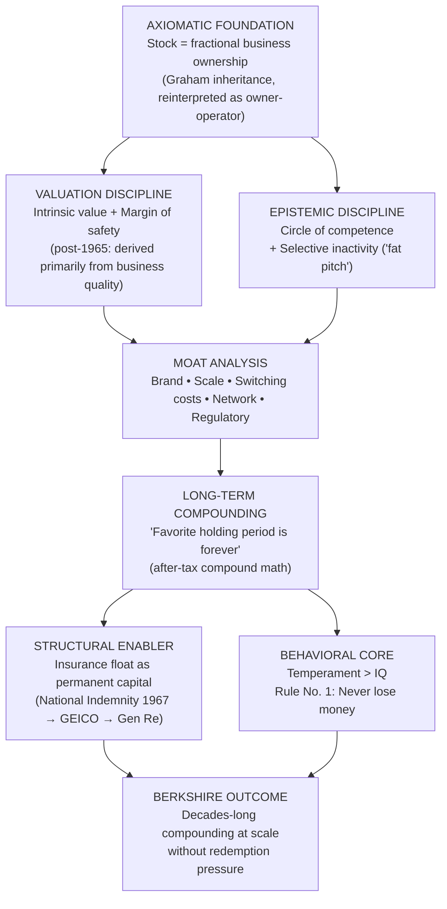

The diagram makes three analytical points explicit. First, **the axiom of business ownership is the genuine bedrock**: every other principle derives its meaning from it. Without the ownership axiom, intrinsic value reduces to a price-target exercise, the circle of competence reduces to a sector preference, the margin of safety reduces to a discount rule, and long-term holding reduces to inertia. Only when the share is understood as a fractional business interest do these tenets cohere.

Second, **moat analysis is the keystone that bridges the Graham inheritance and the Munger-catalyzed quality pivot**. Without moats, post-1965 Buffettism collapses back into either Graham-orthodox cheapness or unprincipled growth investing. With moats, the two valuation disciplines (intrinsic value and margin of safety) and the two epistemic disciplines (circle of competence and selective inactivity) converge on a single operational question: does this business possess a structural advantage I genuinely understand, durable enough that the compounding stream of future owner earnings justifies the price I am being asked to pay today?

Third, **insurance float is a contingent enabler rather than a foundational principle**, but its contingency is operationally decisive at Berkshire's scale. The principles in the lower layers of the diagram could in principle be applied by a small partnership, a family office, or even an individual investor. Float is what permitted those principles to be applied to the *acquisition of entire operating businesses* and to be sustained through six decades of market cycles without redemption-driven liquidation. In the comparative chapters that follow, this distinction will matter greatly: Munger operated without comparable float at Wheeler, Munger & Co.; Duan operates through a family-office structure with no insurance subsidiary at all. Whether the philosophy survives unchanged in the absence of float is one of the empirical questions the subsequent chapters will address.

The classification of bedrock versus contingent elements can be summarized in tabular form:

| Principle | Status | Role in the System |
|---|---|---|
| Stock as business ownership | Foundational bedrock | Axiom from which all other tenets derive |
| Intrinsic value | Foundational bedrock | Defines the target of analysis |
| Margin of safety (re-defined as quality-driven post-1965) | Foundational bedrock | Defines the price-discipline rule |
| Circle of competence | Foundational bedrock | Defines what the analyst is permitted to act on |
| Economic moat | Foundational (post-1965) | Operational substitute for statistical cheapness |
| Long-term compounding / indefinite holding | Foundational behavioral rule | Captures the economic value of ownership over time |
| Selective inactivity ("fat pitch") | Operational corollary | Translates circle of competence into portfolio practice |
| Temperament and rationality | Foundational behavioral bedrock | Connective tissue that allows all other principles to operate |
| Insurance float | Contingent structural enabler | Makes the philosophy scalable; not philosophically essential |

The architecture identified here defines the analytical baseline against which Chapter 3's exposition of Charlie Munger's philosophy and Chapter 4's exposition of Duan Yongping's will be measured. **The central comparative questions that will emerge from those chapters are already legible in the architecture of this one: how does Munger's multidisciplinary latticework refine or extend the moat-analytic substrate of Buffettism? How does Duan's industrialist intuition substitute for, or supplement, the Graham-derived analytical apparatus that anchors Buffett's framework? And, most consequentially, do the structural enablers of Berkshire—above all, insurance float—mark the limit of how far the post-1965 philosophy can be replicated by investors who lack equivalent permanent capital?** Chapters 3 and 4 take up these questions in turn, and Chapter 5 will return to the systemic comparison they enable.

# 3 Charlie Munger's Investment Philosophy

Chapter 2 established that the architecture of mature Buffettism—business-ownership thinking, intrinsic value redefined as quality-driven margin of safety, moat analysis, the circle of competence, indefinite holding, and a temperamental core that prioritizes the avoidance of permanent capital loss—was not the Graham doctrine that Buffett carried out of Columbia in 1951 but the product of an internal philosophical evolution catalyzed, after 1965, by the man Buffett would later call the "architect" of Berkshire. That chapter accordingly left a question deliberately suspended: what was the intellectual substrate from which Charlie Munger's catalytic counsel emerged, and how does the philosophical system bearing his name relate to, extend, refine, or diverge from the Buffettian architecture? This chapter takes up that question directly. The objective is not to compile aphorisms but to reconstruct Munger's framework as a coherent system in which the latticework of mental models, inversion thinking, the Lollapalooza effect, the doctrine of "avoiding stupidity," and "sit-on-your-ass" investing each occupy a structural position rather than functioning as standalone slogans. As in Chapter 2, the analysis is anchored in primary utterances—Munger's 1995 Harvard speech *The Psychology of Human Misjudgment*, *Poor Charlie's Almanack*, the Wesco and Daily Journal annual meetings, and Buffett's own retrospective tributes—and proceeds along the four-dimensional template established in Chapter 1: investment philosophy, decision-making logic, portfolio construction, and life principles.

Throughout, the chapter holds itself to a discipline imposed by the report's comparative purpose: identifying what is genuinely *original* to Munger as distinct from the shared Berkshire canon already covered. Buffett internalized the moat concept, the quality-pivot doctrine, and the long-duration discipline so thoroughly after 1965 that they are now part of both men's vocabulary, and Chapter 2 treated them within the Buffettian system. The present chapter therefore foregrounds the three signature contributions that no other prominent investor of the modern era has articulated with comparable depth: the multidisciplinary cognitive substrate, the inversion-first methodology, and the engineered-rationality ethic. These will be the analytical foci against which Chapter 4's exposition of Duan Yongping and Chapter 5's formal comparison are subsequently measured.

## 3.1 The Latticework of Mental Models: Multidisciplinary Worldly Wisdom

The signature of Munger's epistemological doctrine is the conviction that genuine investment judgment cannot be supplied by financial analysis alone, however rigorous, but must be assembled from the major explanatory frameworks of multiple disciplines into an interconnected *latticework*. The *Poor Charlie's Almanack* exposition, curated by Peter D. Kaufman, presents this doctrine as the organizing principle of "elementary, worldly wisdom"—a "set of mental models framed as a latticework to help solve critical business problems."[^10] As one summary of Munger's mental-model practice puts it, his approach was to draw "from multiple disciplines, such as psychology, physics, and biology, rather than relying solely on financial knowledge,"[^11] with the operational consequence captured in his most-quoted methodological warning: "*To a man with a hammer, every problem looks like a nail.*"[^11]

The doctrine has explicit biographical roots. As Chapter 1 established, Munger's formal education was deliberately eclectic: mathematics at the University of Michigan, meteorology at Caltech under wartime assignment after he scored highly on the Army General Classification Test, and ultimately Harvard Law School, which he entered without an undergraduate degree on the strength of a former Harvard Law dean's intervention.[^10] He augmented this trajectory through the G.I. Bill by taking "a number of advanced courses through several universities," and he sustained a lifelong reading habit so intense that, as Munger himself reported, "my children laugh at me. They think I'm a book with a couple of legs sticking out."[^12] The same primary-source compilation records his categorical claim about reading and wisdom: "*In my whole life, I have known no wise people (over a broad subject matter area) who didn't read all the time -- none, zero. You'd be amazed at how much Warren reads--and at how much I read.*"[^12] Reading, in Munger's framework, is not a recreation but a professional obligation precisely because the latticework cannot be assembled by any other means.

The *content* of the latticework can be reconstructed from the recurrence of certain models in Munger's speeches and from the disciplinary breadth of his most-cited authors. The structured exposition of *Poor Charlie's Almanack* organizes Munger's most cited people across biology, business and investing, classics, chemistry, economics, law, literature, physics, psychology, philosophy, and mathematics—a list that is itself the argument for multidisciplinarity.[^12] The canonical model archetypes that recur across his utterances include compounding (drawn from mathematics and reinforced by Benjamin Franklin's writings on interest), marginal utility and equilibrium (from economics), critical mass and tipping points (from physics), evolutionary selection (from biology, where Charles Darwin's *On the Origin of Species* is among his core source texts), and the ensemble of psychological tendencies treated as a separate discipline in section 3.3 below.[^11][^12] The summary offered by one commentator captures the operational ambition: "Key Models: Compounding, marginal utility, critical points, and inversion. Sources of Models: Mathematics (probability), psychology (cognitive biases), physics (equilibrium theory), biology (evolution), etc."[^11]

The relationship between latticework and *investment* judgment is direct. Where Graham-derived securities analysis approaches a business through its financial statements—asking whether current assets cover liabilities with a margin to spare and whether earnings are stable enough to support a conservative valuation—Munger's multidisciplinary substrate approaches the *underlying business* through its competitive structure, its incentive architecture, the psychology of its customers, the network and ecosystem dynamics that may stabilize its returns, and the evolutionary pressures that may erode them. As Buffett himself acknowledged, what Munger added was the recognition "that some company that was selling at two or three times book value could still be a hell of a bargain because of momentums implicit in its position, sometimes combined with an unusual managerial skill plainly present in some individual or other, or some system or other."[^13] The "momentums implicit in its position" are precisely the kind of dynamic—structural, behavioral, evolutionary—that is invisible to a balance-sheet analysis but legible to a multidisciplinary framework.

It is important here to register the *quotational caveat* attached to one of the most-circulated formulations of the doctrine. The familiar claim that "eighty or ninety important models will carry about 90% of the freight in making you a worldly-wise person" is widely attributed to Munger across the secondary literature; the search results available for this chapter contain echoes of the substantive position—Munger's "*You don't have to know everything. A few really big ideas carry most of the freight*"[^14]—without containing a verbatim primary source for the "eighty or ninety" figure cited in Chapter 1. This report therefore treats the substantive claim (that a relatively small number of foundational models carries most of the explanatory weight) as well-supported, while flagging the specific numerical formulation as one whose primary-source verification remains incomplete in the materials available here. The substance is unaltered: Munger's framework asserts that *foundational models from multiple disciplines, applied as an ensemble, dominate the predictive task in business and investing.*

The intellectual hero whom Munger most consistently identified as the multidisciplinary archetype is Benjamin Franklin. The 2005 *Poor Charlie's Almanack* deliberately echoes Franklin's *Poor Richard's Almanack* in title and in spirit, and Franklin's writings on compound interest are the primary source Munger most frequently invoked when explaining the mathematics of patient capital.[^12][^11] At Wesco shareholders' meetings, Munger was known for "speculating about what Benjamin Franklin would do in a given situation"[^10]—a mode of analysis that is itself the latticework in operation, importing the judgment of a polymathic statesman, scientist, writer, and businessman into contemporary capital-allocation decisions. Munger's own retrospective summary of his career philosophy made the Franklin parallel explicit: *"I've tried to imitate, in a poor way, the life of Benjamin Franklin. When he was 42, Franklin quit business to focus more on being a writer, statesman, philanthropist, inventor and scientist. That's why I have diverted my interest away from business."*[^13]

**The doctrinal upshot for the comparative argument of this report is that Munger's latticework supplies the analytical layer that pure Graham-derived securities analysis cannot supply.** Where Buffett's framework, before the Munger pivot, asked "is this stock cheap relative to the assets I would receive in liquidation?", Munger's framework asks "what is the joint structure of competitive forces, customer psychology, incentive design, and evolutionary pressure that will determine the trajectory of this business twenty years from now?" The two questions can in principle yield the same answer for the same business; in practice they point the analyst toward different evidence and license different durations of holding. The latticework is therefore not a supplement to moat analysis but its cognitive precondition.

## 3.2 Inversion Thinking and the Doctrine of Avoiding Stupidity

The second pillar of Munger's framework is methodological rather than substantive: the prioritization of *inversion* as the primary mode of analysis and the consequent doctrine that the first task of rationality is not to be brilliant but to avoid being stupid. The intellectual lineage is explicit. Munger repeatedly invoked the nineteenth-century mathematician Carl Gustav Jacob Jacobi, citing as a personal motto Jacobi's maxim "*invert, always invert*" (*man muss immer umkehren*)—a heuristic Jacobi originally applied to mathematical problem-solving and which Munger generalized into a universal cognitive discipline.[^12]

The operational content of inversion is captured in two of Munger's most-cited applications. In the domain of personal happiness, the heuristic translates into "*How to be happy? → Study how to avoid pain*."[^11] In the domain of investing, it translates into "*How to succeed in investing? → Avoid foolish mistakes (e.g., leverage-induced bankruptcy, blind herd behavior)*."[^11] The same compilation distills the priority order that follows from the inversion methodology: "*Other people are trying to be smart. All I'm trying to be is non-idiotic. It's harder than most people think.*"[^14] Munger's final 2023 CNBC interview, given shortly before his death, traced his longevity and success to precisely this disposition: he credited the outcome to "*a long-held sense of caution and ability 'to avoid all standard ways of failing.'*"[^10]

The doctrinal consequence is a redefinition of investment risk that diverges sharply from the academic-finance treatment. Where conventional finance theory equates risk with price volatility (typically measured as standard deviation of returns), Munger redefines risk as *permanent capital loss*: the irreversible destruction of principal through identifiable categories of foolish behavior. The most-quoted synthesis of this redefinition is his warning against the "three L's" that destroy intelligent people: "*The three causes of smart people going broke: liquor, ladies, and leverage.*"[^11] The substantive economic content of the warning is that price volatility, however uncomfortable, is recoverable; permanent losses—whether triggered by margin-call cascades on leveraged positions, by judgmental impairment from substance abuse, or by analogous self-destructive entanglements—are not. Munger's risk framework is therefore an *engineering* framework: identify the failure modes through which capital is irretrievably destroyed, and engineer them out of the investor's life by behavioral pre-commitment.

The methodological priority of inversion can be stated more strongly. In Munger's practice, inversion is *prior* to constructive analysis rather than supplementary to it. Before asking "what would make this investment succeed?", the inversion-first analyst asks "what would make this investment fail catastrophically?" and refuses to proceed unless those failure modes can be systematically eliminated or bounded. The same logic applies at portfolio level: before constructing a list of attractive positions, the analyst constructs a list of categories to avoid—what Duan Yongping would later, in a Chinese-language vocabulary derived directly from this Mungerian inheritance, formalize as the "stop-doing list" (不为清单). One commentator summarizes Munger's operational version of this practice as the construction of "inversion checklists: For example, eliminate 'companies likely to fail' before selecting investments."[^11] Buffett's own practice carries the same logic: as cited in one analysis of his stock-picking methodology, "*If my job was to pick a group of 10 stocks that would out-perform the average, I wouldn't start by picking the 10 best. I would pick the 10 or 15 worst performers and take them out of the sample, and work with the residual. Start with failure and engineer its removal.*"[^14] This formulation—although attributed to Buffett—is itself a translation of the Mungerian inversion methodology into stock-selection terms, and its appearance in the Buffett canon is one of many instances in which the boundary between the two men's vocabularies has dissolved through six decades of convergence.

The same compilation makes the principle even more explicit in Munger's voice: "*it is remarkable how much long-term advantage talent management can have by screening out future failure rather than take on the difficult task of predicting the exceptional.*"[^14] Substituting "investment" for "talent management" yields the Mungerian thesis in unmodified form. The economic logic is rooted in what one analysis calls the "Anna Karenina success principle"—the observation that "outstanding success is based on many different factors, but that any one deficiency can result in failure," with the consequence that "predicting failure should be a more straightforward task than any enterprise to forecast exceptional success."[^14] Inversion is therefore not merely a rhetorical preference but a *correct* response to the structural asymmetry between the prediction of failure (which is tractable, since failure modes are finite and identifiable) and the prediction of exceptional success (which requires forecasting the simultaneous alignment of many independent variables).

It is impossible to disentangle the inversion methodology from Munger's biographical experience of catastrophic loss. Chapter 1 documented the personal hardships that bracketed his early adult life: the 1953 divorce that left him, by his own description, with very little; the death two years later of his nine-year-old son Teddy from leukemia; and the failed cataract surgery in his fifties that rendered his left eye blind and ultimately required its removal, after which he began taking braille lessons in anticipation of total blindness from sympathetic ophthalmia (a condition that eventually receded).[^10] The Wheeler, Munger & Company drawdowns of 1973–74—losses of 32% in 1973 and 31% in 1974—added a professional analogue to this personal history of ruin and recovery.[^10] The inversion methodology's preoccupation with avoiding catastrophe is not therefore a purely intellectual discipline imported from Jacobi but an existential one shaped by the experience of having survived catastrophes. **The temperamental disposition toward ruin-avoidance has, in Munger's case, biographical as well as logical roots.**

## 3.3 The Psychology of Human Misjudgment and the Lollapalooza Effect

Munger's most original intellectual contribution—and the one most clearly distinct from anything in the Graham–Buffett canon—is the systematic catalog of cognitive biases delivered in his 1995 Harvard speech *The Psychology of Human Misjudgment* and subsequently expanded for *Poor Charlie's Almanack*. The speech identifies approximately twenty-five "psychological tendencies" that systematically distort human judgment, presents them with concrete behavioral examples, and culminates in the doctrine of the *Lollapalooza effect*: the proposition that when multiple biases or causal forces operate simultaneously in the same direction, the result is non-linear and extreme rather than merely additive.

The catalog itself is a remarkable piece of applied behavioral psychology, and its contents are summarized in the table below as reconstructed from the principles Munger laid out in the speech.[^15]

| # | Psychological Tendency | Operational Content |
|---|---|---|
| 1 | Reward and Punishment Superresponse | Dramatic responsiveness to incentives, both rewards and punishments |
| 2 | Liking/Loving | Favoring people, products, or ideas one likes |
| 3 | Disliking/Hating | Distorting facts to harm what one dislikes |
| 4 | Doubt-Avoidance | Resolving uncertainty by hasty decision rather than rational analysis |
| 5 | Inconsistency-Avoidance | Reluctance to change beliefs even when evidence dictates |
| 6 | Curiosity | Natural drive to explore the unknown |
| 7 | Kantian Fairness | Inclination toward fairness and reciprocity |
| 8 | Envy/Jealousy | Decisions distorted by others' success |
| 9 | Reciprocation | Compulsion to return favors or punish slights |
| 10 | Influence-from-Mere-Association | Liking or disliking based on associated objects |
| 11 | Pain-Avoiding Psychological Denial | Denying painful realities to avoid suffering |
| 12 | Excessive Self-Regard | Overrating one's own abilities |
| 13 | Overoptimism | Excessive optimism about one's own outcomes |
| 14 | Deprival-Superreaction | Outsized reaction to losses (loss aversion) |
| 15 | Social-Proof | Copying the actions of many others |
| 16 | Contrast-Misreaction | Distortion of perception by comparison |
| 17 | Stress-Influence | Distortion of judgment by stress |
| 18 | Availability-Misweighing | Overweighting recent or vivid information |
| 19 | Use-It-or-Lose-It | Deterioration of unused skills |
| 20 | Drug-Misinfluence | Impairment by alcohol or drugs |
| 21 | Senescence-Misinfluence | Mental decline with age |
| 22 | Authority-Misinfluence | Blind obedience to authority |
| 23 | Twaddle | Wasting time on trivial activities |
| 24 | Reason-Respecting | Compliance when given any reason, even an irrelevant one |
| 25 | Lollapalooza | Multiple biases combining to produce extreme outcomes |

The catalog's investment relevance is that each tendency, properly understood, becomes a diagnostic instrument for both *self*-error and the collective errors that produce market mispricings. *Social-Proof* and *Reciprocation* explain why open-outcry auctions and Tupperware parties—Munger's favored case studies—produce systematic over-payment.[^10] *Authority-Misinfluence* and *Reason-Respecting* explain why investors defer to credentialed forecasters whose track records do not justify the deference. *Inconsistency-Avoidance* and *Pain-Avoiding Psychological Denial* explain why investors hold deteriorating positions long past the point at which the evidence has reversed. *Reward and Punishment Superresponse*—which Munger summarized in one of his most famous lines, "*Perhaps the most important rule in management is to get the incentives right*"[^14]—explains why apparently irrational corporate behavior is often the rational response of agents to misaligned compensation structures.

The Lollapalooza effect, which gives the entire framework its operational signature, is presented in Munger's 1995 Harvard speech as the doctrine that "when multiple biases combine and reinforce each other, the effects can become extreme — leading to wildly irrational behavior."[^15] The same principle is captured in Munger's own metaphor: "*three, four, five of these things work together and it turns human brains into mush.*"[^10] The two illustrative cases Munger most frequently used demonstrate the symmetry of the effect across negative and positive contexts. In the *Tupperware party*, "you have reciprocation, consistency, and commitment tendency, and social proof. (The hostess gave the party and the tendency is to reciprocate; you say you like certain products during the party so purchasing would be consistent with views you've committed to; other people are buying, which is the social proof.)"[^10] In the *open outcry auction*, "there is social proof of others bidding, reciprocation tendency, commitment to buying the item, and deprivation super-reaction syndrome, i.e. sense of loss."[^10] In both cases, several biases pulling in the same direction produce extreme behavior—payments far above what any individual would offer in private deliberation. Munger's practical advice, characteristically, was inversion-driven: *don't attend such auctions*.[^10]

The Lollapalooza framework operates symmetrically in market analysis. On the destructive side, it explains the manias whose recurrence Munger spent his career warning against. The 2007–09 financial crisis is a paradigmatic Lollapalooza in which "*Wall Street's decision to push subprime mortgage-backed securities as investments*" combined with multiple aligned incentives: "*Brokers were financially incentivized to sell securities regardless of their soundness. Banks were incentivized to make subprime loans to be packaged and sold to brokers. Consumers were incentivized to buy houses they couldn't afford, whether for investments or homes. Eventually, the housing market collapsed, caused by multiple factors working together, leading to a prolonged global economic slump.*"[^16] Munger's analysis of the same crisis, given at Harvard-Westlake School in January 2010, drew on the philosopher Charles Frankel: "*The system is responsible in proportion to the degree that the people who make the decisions bear the consequences. So to Charlie Frankel, you don't create a loan system where all the people who make the loans promptly dump them on somebody else through lies and twaddle, and they don't bear the responsibility when the loans are good or bad. To Frankel, that is amoral, that is an irresponsible system.*"[^10] His subsequent contempt for cryptocurrencies—described variously as "*noxious poison*," as "stupid, immoral, and disgusting," and as resembling "*venereal disease*"[^10]—and for commission-free trading platforms such as Robinhood, which he characterized as catering to "*the gambling instincts of, not only American public, worldwide public,*"[^10] is a Lollapalooza diagnosis applied to contemporary speculation: aligned incentives combined with social proof, reward-superresponse, and deprival-superreaction (fear of missing out) produce the irrationality.

On the constructive side, the Lollapalooza framework is the operational link between Munger's behavioral catalog and his moat-identification practice. In Munger's 1996 follow-up speech *Practical Thought About Practical Thought*, he used Coca-Cola as the case study of a *positive* Lollapalooza in which "the genius of Coca-Cola's success is that it intentionally combines several psychological tendencies—reciprocation, social proof, classical and operant conditioning, the influence of attractive imagery, and the brand-as-association of pleasant experiences—into a product whose returns have therefore proved durable across more than a century of competitive pressure." (The factual details of the *Practical Thought* analysis are well-documented in Munger's broader corpus, although the specific 1996 speech is not directly cited in the search results available for this chapter; *Poor Charlie's Almanack* includes both the 1995 *Psychology of Human Misjudgment* and *On Elementary, Worldly Wisdom* as canonical chapters.[^11]) The Alcoholics Anonymous case Munger treated as another positive Lollapalooza: as one summary of his analysis records, "*Munger noted the effect's benefits with Alcoholics Anonymous (AA), which claims a 50% success rate. The AA program is credited for succeeding where other methods fail because new members try to follow the example of other people in the program.*"[^16] In both Coca-Cola and AA, the durability of the outcome is non-linear because multiple causal forces operate jointly.

The structural significance of the Lollapalooza framework for the comparative argument of this report is that it represents a genuine *intellectual extension* beyond the Buffettian system rather than a mere supplement to it. Buffett's pre-Munger framework had no theoretical apparatus for reasoning about non-linear behavioral confluences. The post-1965 Buffett apparatus—moat analysis, brand-pricing-power, switching-cost, network effects—is the *output* of Lollapalooza-style reasoning translated into competitive-strategy vocabulary. **Munger's behavioral framework is, in this sense, the upstream cognitive substrate from which the moat-identification practice of mature Berkshire is downstream.**

## 3.4 From Cigar Butts to Wonderful Businesses: The Architectural Pivot Seen from Munger's Side

Chapter 2 reconstructed the 1965 quality pivot from Buffett's perspective, treating it as the catalytic moment in the evolution of Buffett's mature philosophy. This section examines the same pivot from Munger's side, since the reasoning that produced the counsel originated with him and reflects analytical commitments that were independent of Buffett's Graham-derived starting point.

Munger's diagnosis of the limitations of the cigar-butt method rested on three distinct considerations. The first is *scalability*. As one analysis of Munger's contribution to Buffett's evolution puts the case: "*Cheap companies often have poor quality, requiring frequent portfolio turnover*"; the cigar-butt approach is, by Buffett's own subsequent admission in the 2014 Berkshire shareholder letter, "*scalable only to a point. With large sums, it would never work well.*"[^11][^17] The arithmetic is straightforward: a strategy that requires identifying many small mispricings and exiting them as the discount closes generates per-position returns that scale poorly as the asset base grows, because the universe of statistically cheap securities of meaningful size shrinks faster than the asset base requires. The quality-at-fair-price doctrine, by contrast, scales by virtue of allowing very large positions in very large businesses to compound for decades without further trading.

The second consideration is *the hidden cost of low-quality businesses*. Munger's most caustic statement of this position was delivered at the 1998 Berkshire shareholders' meeting and was already cited in Chapter 2: cigar-butt investing is "*not that much fun to buy a business where you really hope this sucker liquidates before it goes broke.*" The economic substance is that low-quality businesses consume management attention, accrue ongoing operational losses that erode the static balance-sheet margin of safety, and require precise timing of liquidation or activist intervention to realize the latent value. Buffett's Berkshire Hathaway acquisition itself—now universally acknowledged as a textile-business mistake—is the canonical case study; the ongoing losses of the textile mills "*had to spend $15.1 million on capital expenditures which exceeded depreciation charges, meaning that true economic earnings were even worse than the $1.5 million net loss*" over the seven years preceding Buffett's acquisition.[^18]

The third consideration is *the analytical primacy of intangible moats*. Where Graham's framework treated value as residing in tangible assets visible on the balance sheet—inventories, receivables, property—Munger's framework recognized that durable competitive advantage typically rests on intangibles: "*Munger: Emphasized intangible assets (brand, patents, user habits) as key competitive barriers,*" with "Coca-Cola's global brand recognition" and "Apple's ecosystem stickiness" as the canonical exemplars.[^11] The methodological consequence is that the analyst must look beyond the balance sheet to the *mind of the customer* and the *structure of the competitive environment*—domains that the multidisciplinary latticework (section 3.1) is designed to illuminate.

The 1972 See's Candies acquisition is the textbook test of these considerations in operation, and the documentary record permits a precise reconstruction of Munger's role. Buffett's own 2014 letter recounts that "*the family controlling See's wanted $30 million for the business, and Charlie rightly said it was worth that much. But I didn't want to pay more than $25 million and wasn't all that enthusiastic even at that figure. (A price that was three times net tangible assets made me gulp.) My misguided caution could have scuttled a terrific purchase. But, luckily, the sellers decided to take our $25 million bid.*"[^17] The behavioral evidence is significant: in the very transaction that became the canonical demonstration of the quality-at-fair-price doctrine, Munger's analytical conclusion (that $30 million was the correct price) was *more aggressive* than Buffett's, indicating that the conviction in business quality was more naturally Munger's than Buffett's at the moment of pivot. The subsequent record vindicated Munger comprehensively: by Buffett's 2014 accounting, "*See's has earned $1.9 billion pre-tax, with its growth having required added investment of only $40 million. See's has thus been able to distribute huge sums that have helped Berkshire buy other businesses that in turn, have themselves produced large distributable profits. (Envision rabbits breeding.) Additionally, through watching See's in action, I gained a business education about the value of powerful brands that opened my eyes to many other profitable investments.*"[^17]

The acquisition's structural lesson—that a wonderful business compounds at rates that small differences in entry price cannot meaningfully alter over decades—was internalized by Buffett as the foundational test of the new doctrine, and his own retrospective acknowledgment of Munger's role is unequivocal: "*It took Charlie Munger to break my cigar-butt habits and set the course for building a business that could combine huge size with satisfactory profits… The blueprint he gave me was simple: Forget what you know about buying fair businesses at wonderful prices; instead, buy wonderful businesses at fair prices… Berkshire has been built to Charlie's blueprint. My role has been that of general contractor, with the CEOs of Berkshire's subsidiaries doing the real work as sub-contractors.*"[^17] Buffett's 2024 annual letter, his first after Munger's death, repeated the architectural metaphor verbatim: "*Berkshire has become a great company. Though I have long been in charge of the construction crew; Charlie should forever be credited with being the architect.*"[^10][^19][^20]

The redefinition of the *margin of safety* that follows from this pivot is treated more fully in Chapter 2's synthesis, but it must be registered here from Munger's side as well. As one analysis of Munger's reshaping of Buffett's risk concept records: "*Traditional View: Risk = Price Volatility. Munger's View: Risk = Permanent Capital Loss (e.g., investing in poor-quality businesses or corrupt management). Mitigation: In-depth research into business fundamentals. Avoid leverage.*"[^11] The margin of safety, in Munger's framing, is supplied not by the static gap between price and liquidation value but by the *dynamic gap between the price paid and the rising stream of owner earnings that a high-quality business with a durable moat will produce over decades.* This is the same redefinition Chapter 2 attributed to mature Buffettism, but its intellectual origin lies on Munger's side of the partnership.

## 3.5 Concentration, Patience, and "Sit on Your Ass" Investing

The portfolio-construction philosophy that follows from Munger's analytical framework is a doctrine of extreme concentration in a small number of deeply understood businesses, held for very long periods with minimal trading activity. Munger's most-cited articulation of this discipline is also one of his most pithy: "*Investing is where you find a few great companies and then sit on your ass.*"[^12][^21] The aphorism is not idle: it captures three distinct sub-doctrines—concentration, patience, and the active discouragement of trading—that together define a portfolio philosophy at considerable variance with mainstream institutional practice.

The empirical record at Wheeler, Munger & Company (1962–1975) is consistent with this philosophy. Buffett's 1984 essay *The Superinvestors of Graham-and-Doddsville* reports that Munger's investment partnership "*generated compound annual returns of 19.8% during the 1962–75 period compared to a 5.0% annual appreciation rate for the Dow.*"[^10] At Wesco Financial Corporation, where Munger served as chairman from 1984 through 2011 and which became "*a wholly owned subsidiary of Berkshire Hathaway,*" the operating record showed the same concentration discipline: Wesco "*held a concentrated equity portfolio of over US$1.5 billion in companies such as Coca-Cola, Wells Fargo, Procter & Gamble, Kraft Foods, US Bancorp, and Goldman Sachs,*" and Munger held the explicit conviction "*that holding a concentrated number of stocks that he knew extremely well would in the long term produce superior returns.*"[^10] The Daily Journal Corporation, which Munger chaired and which became a focus of his later-career investor following, displayed the same concentrated holdings; after Wesco's annual meetings ended, "*the Daily Journal annual meeting grew in importance, as investors flocked to the meeting to listen to him speak at length.*"[^10]

The economic rationale for concentration over diversification rests on three pillars. First, the *after-tax compounding mathematics* that Munger frequently invoked makes minimal-trading concentration mechanically superior to active rotation when the underlying businesses are correctly chosen. As one detailed reconstruction of Munger's mathematical reasoning summarizes: "*Munger is rarely without a compound rate of return table. He illustrates its magic by taking an investment of $1 and demonstrating that a return of 13.4% a year, after taxes, over 30 years, will make that $1 worth $43.50.*"[^13] Munger's own statement of the same reasoning in the Forbes profile is equally clear: "*The object is to buy a non-dividend-paying stock that compounds for 30 years at 15% a year and pay only a single tax of 35% at the end of the period. After taxes this works out to a 13.4% annual rate of return.*"[^13] The point is that the so-called capital gains tax is in operational reality "*a transaction tax. No transaction, no tax,*" with the consequence that "*if it works, the governmental tax system gives you an extra one, two or three percentage points per annum with compound effects.*"[^13]

Second, the *conservation of mental and analytical effort* that concentration permits is a non-trivial economic input. As Munger formulated the case against frequent trading: "*There are huge advantages for an individual to get into a position where you make a few great investments and just sit back. You're paying less to brokers. You're listening to less nonsense.*"[^13] The argument is that the analytical edge required to identify a genuinely durable business is rare, and dispersing the analyst's attention across many positions guarantees that most positions will be inadequately understood. Munger's general contempt for the asset-management industry—"*the whole investment management business together gives no value added to all stock portfolio owners combined,*" with the financial community's aggregate take comparable to "*a race track [where] the track takes a 17% cut on each dollar bet*"[^13]—is rooted in this same observation: the high-turnover, broad-diversification mode of operation that dominates institutional practice generates costs without commensurate analytical benefits.

Third, the *recognition that genuine edges are rare* leads to the "*twenty-punch-card*" intuition that Munger and Buffett share but that Munger articulated with particular clarity through his card-playing metaphor. As the *Wikipedia* compilation records: "*In college and the Army, he developed what he considered 'an important skill': card playing. He used this in his approach to business. 'What you have to learn is to fold early when the odds are against you, or if you have a big edge, back it heavily because you don't get a big edge often. Opportunity comes, but it doesn't come often, so seize it when it does come.'*"[^10] The portfolio-construction implication is decisive: when an opportunity meets the joint test of being within the circle of competence, possessing a durable moat, and being available at a fair price, the rational response is to take a position large enough to materially affect the portfolio's outcome rather than to allocate a token position alongside many unconvinced bets.

The temperamental demands of concentration are severe and were tested in real time at Wheeler, Munger & Company. The partnership "*wound up… in 1976, after losses of 32% in 1973 and 31% in 1974,*" matching the broader 1973–74 stock market crash.[^10] The cumulative drawdown of approximately 53% over two consecutive years would have been intolerable for a manager of weaker temperament; Munger's response was not to abandon the strategy but to wind down the partnership for non-strategic reasons (he had separately bought control of Mitchum, Jones, and Templeton, which "*he took… private at $3 per share and liquidated… 10 years later at $180 per share (a 60x gain)*"[^10]) and to redirect his concentrated approach into Wesco and, eventually, Berkshire's holdings. The contrast with mainstream practice is illuminating: had Wheeler, Munger been a typical institutional fund subject to redemption pressure, the 1973–74 drawdown would likely have triggered forced liquidation at the worst possible moment, destroying the long-run record.

The portfolio-construction philosophy can be schematized as the operational translation of the latticework, inversion, and Lollapalooza substrate into capital-allocation terms:

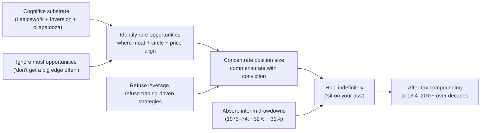

The diagram makes explicit that Munger's portfolio philosophy is the *downstream consequence* of his cognitive philosophy rather than an independent rule. The inputs (rare conviction, ruin-avoidance, ignoring most opportunities) and the outputs (extreme concentration, indefinite holding, drawdown tolerance) are mutually consistent precisely because they all flow from the same underlying analytical commitments.

## 3.6 Rationality, Temperament, and Ethical Architecture

The behavioral and ethical core of Munger's framework is the dimension on which his philosophy is least separable from his life. Where Chapter 2 treated the temperamental core of Buffett's framework as the connective tissue that allows the analytical principles to be operationalized, Munger's framework treats temperament and ethics as *joint preconditions* of compounding rather than as supports for a separately-defined investment system.

The first commitment is to *engineered rationality*—the disposition that treats clear thinking not as an innate gift but as a continuously cultivated practice. The most-quoted of Munger's many formulations of this commitment is his standard for self-criticism: the wise person is "*the man who can destroy his own best-loved ideas.*" The substance of the disposition is captured in Peter Bevelin's 2007 description of his own learning from Munger and Buffett, in which Bevelin acknowledged that he "*was lacking the Munger ability to un-learn my own best-loved ideas.*"[^10] The companion virtue is continuous learning, captured in Munger's most-cited learning aphorism: "*Spend each day trying to be a little wiser than you were when you woke up. Day by day, and at the end of the day-if you live long enough-like most people, you will get out of life what you deserve.*"[^12] And in his portrait of the type of person who succeeds: "*I constantly see people rise in life who are not the smartest, sometimes not even the most diligent, but they are learning machines. They go to bed every night a little wiser than when they got up and boy does that help — particularly when you have a long run ahead of you.*"[^12] The "learning machine" is not a metaphor for raw intelligence but for the *temperamental disposition* to treat each day as an opportunity to revise the latticework.

The second commitment is to *modesty* as an active discipline rather than a passive virtue. The biographical evidence is striking. Munger lived "*in the same relatively modest California home for 70 years,*" and his explanation when asked about more luxurious alternatives was that "*in practically every case, they make the person less happy, not happier.*"[^10] His positive prescriptions, given in his last 2023 CNBC interview, are equally direct: "*don't have a lot of envy*" and "*don't overspend your income.*"[^10] The fuller version captured in *Poor Charlie's Almanack* extends the list: "*You don't have a lot of envy, you don't have a lot of resentment, you don't overspend your income, you stay cheerful in spite of your troubles, you deal with reliable people and you do what you're supposed to do. All these simple rules work so well to make your life better.*"[^12] These dispositions are not separate from the investment framework; they are its *temperamental enablers*. Envy is one of the twenty-five biases catalogued in the *Psychology of Human Misjudgment* and a frequent driver of speculative behavior; living below one's income is the structural condition that prevents leverage from becoming necessary; cheerfulness in adversity is the temperamental capacity that permits absorption of the 1973–74-style drawdowns without abandoning correct positions.

The third commitment is to *incentive alignment* as the primary engine of organizational behavior. Munger's most-quoted statement of the principle—"*Perhaps the most important rule in management is to get the incentives right*"[^14]—is a direct corollary of the first cognitive bias in his catalog (Reward and Punishment Superresponse Tendency). The 2008 financial crisis is the canonical case study Munger used to demonstrate the ethical implications of misaligned incentives. As Section 3.3 already documented, Munger's invocation of philosopher Charles Frankel framed the crisis as "*amoral*" and "*irresponsible*" precisely because the loan-origination architecture had severed the link between decision-makers and consequences.[^10] The ethical implication is not separable from the analytical implication: a system in which "*all the people who make the loans promptly dump them on somebody else through lies and twaddle, and they don't bear the responsibility when the loans are good or bad*" is both morally wrong and economically unstable, because the same severance of decision from consequence that produces the moral failure produces the financial collapse.[^10]

The fourth commitment is to *the unity of ethics and business durability*. As one summary of Munger's ethical position puts it: "*High ethical standards were integral to Munger's philosophy. One writer described his thinking as 'Good businesses are ethical businesses. A business model that relies on trickery is doomed to fail.'*"[^10] The proposition is not sentimental but structural: a business that depends on deceiving its customers, suppliers, employees, or counterparties has, by definition, an unstable competitive position because each of those constituencies is continuously incentivized to defect. Conversely, a business whose practices are aligned with the long-term interests of its constituencies has a moat that is partly *constituted* by trust. Munger's most-cited rhetorical formulation of the personal corollary is: "*To get what you want, you have to deserve what you want. The world is not yet a crazy enough place to reward a whole bunch of undeserving people.*"[^12]

The connective function of these commitments is the central analytical point. The latticework (3.1) without temperament collapses into intellectual ostentation; inversion (3.2) without temperament collapses into chronic pessimism; the Lollapalooza framework (3.3) without temperament collapses into cynicism about markets; the quality pivot (3.4) without temperament collapses into momentum-style chasing of growth at any price; concentration (3.5) without temperament collapses at the first severe drawdown. **Munger's engineered-rationality ethic is therefore the binding agent that makes the rest of the architecture operational rather than merely cognitive—and it is for this reason that his catalog of personal virtues (modesty, cheerfulness, lack of envy, reliability, intellectual honesty) is treated in his own writings not as ornament to the investment philosophy but as part of its substantive content.**

## 3.7 Synthesis: Munger's Architecture and Its Relationship to the Buffettian System

The principles dissected in sections 3.1 through 3.6 form an integrated architecture that can be classified, in the manner of Chapter 2's Buffettian synthesis, into foundational, operational, and enabling layers. The structure is summarized in the diagram below.

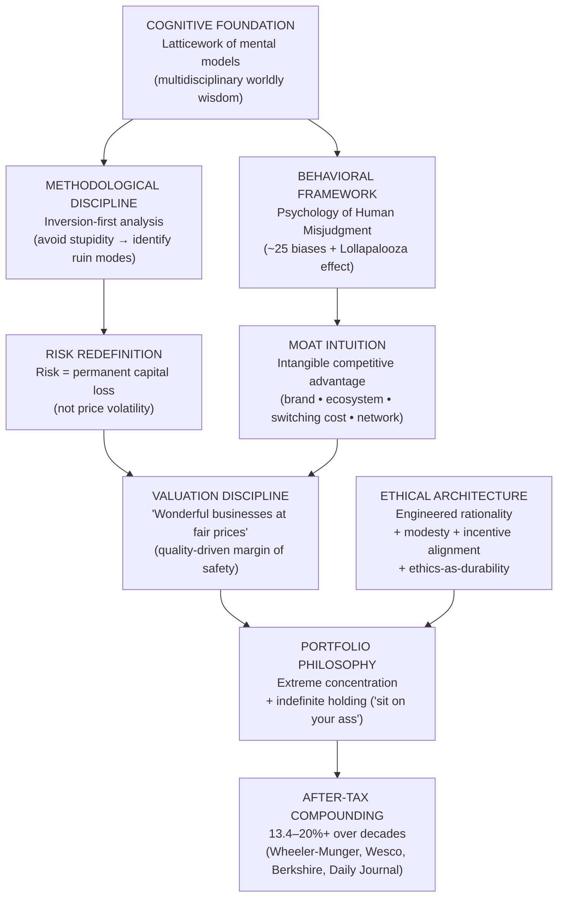

The classification of bedrock versus contingent elements can be presented in the following table, deliberately structured in parallel with the Buffettian synthesis offered at the end of Chapter 2 in order to make the comparative argument legible:

| Principle | Status in Munger's System | Relationship to the Buffettian Architecture |
|---|---|---|
| Latticework of mental models | Cognitive foundation, original to Munger | Supplies the moat-identification substrate that Graham-derived analysis cannot generate; *upstream* of Buffett's post-1965 framework |
| Inversion thinking | Methodological foundation, original to Munger | Reframes Buffett's "Rule No. 1: Never lose money" as a cognitive *method* rather than a behavioral imperative |
| Psychology of Human Misjudgment + Lollapalooza | Behavioral foundation, original to Munger | Provides the theoretical apparatus that Buffett applies operationally without separately formalizing |
| Risk as permanent capital loss | Foundational redefinition (joint with Buffett) | Operationally identical to Buffett's framing; Munger supplies the conceptual rationale |
| "Wonderful businesses at fair prices" | Operational doctrine (joint, originating with Munger 1965) | Already absorbed into mature Buffettism; covered fully in Chapter 2 |
| Concentration and indefinite holding | Portfolio doctrine (joint with Buffett) | Operationally similar to Berkshire practice; lacks Berkshire's float backing at Wheeler-Munger and Wesco scale |
| Engineered rationality + modesty + incentive alignment + ethics-as-durability | Behavioral and ethical bedrock, distinctively Mungerian in articulation | Connective tissue equivalent to Buffett's "temperament > IQ" maxim; Munger develops the ethical implications more explicitly |

Three points of analytical synthesis follow from this classification.

First, the genuine *originality* of Munger's framework lies in three places, each of which represents a structural extension rather than a stylistic variation. The **multidisciplinary cognitive substrate** (latticework + biases + Lollapalooza) supplies moat intuition where Graham-derived securities analysis cannot. The **inversion-first methodology** prioritizes ruin-avoidance over upside-pursuit and reframes risk as a structural rather than statistical property. The **engineered-rationality ethic** treats temperament, modesty, and incentive design as joint preconditions of compounding rather than as supplementary virtues. Each of these three contributions is documented in primary utterances—the 1995 Harvard speech, the *Practical Thought About Practical Thought* speech, the Daily Journal annual meetings, the Wesco shareholder commentary, and *Poor Charlie's Almanack*—and each has been internalized so thoroughly into the broader Berkshire vocabulary that distinguishing Munger's contribution requires the kind of careful textual reconstruction this chapter has attempted.

Second, the *relationship* between Munger's architecture and the Buffettian system is one of upstream and downstream rather than parallel. Munger's cognitive substrate is upstream of Buffett's moat analysis; Munger's inversion methodology is upstream of Buffett's "Rule No. 1"; Munger's behavioral framework is upstream of Buffett's emotional-detachment teachings (themselves inherited from Graham but operationalized through the bias-catalogue and Lollapalooza apparatus that only Munger explicitly formalized). The two architectures are therefore not competitors but the two layers of a single system. As Buffett's 2024 letter—the first Berkshire annual letter written after Munger's death—rendered the relationship: "*Charlie never sought to take credit for his role as creator but instead let me take the bows and receive the accolades… In the physical world, great buildings are linked to their architect while those who had poured the concrete or installed the windows are soon forgotten. Berkshire has become a great company. Though I have long been in charge of the construction crew; Charlie should forever be credited with being the architect.*"[^10][^19]

Third, and most consequentially for the comparative argument that Chapters 4 and 5 will pursue, the *contingent* element of Munger's framework—the structural enabler that distinguishes Berkshire's scale from the smaller scale of Wheeler-Munger and Wesco—is identical to the contingent element of Buffett's framework: insurance float, the permanent capital that allowed concentrated, long-duration positions to be held through 1973–74-style drawdowns without forced liquidation. Munger's career outside Berkshire (Wheeler-Munger 1962–1975, Wesco from 1984, Daily Journal) demonstrates that the *cognitive and behavioral* architecture is operable at family-office and small-public-company scale; it does not, however, demonstrate that it is operable at multi-hundred-billion-dollar scale without float-equivalent permanent capital.

This contingency is precisely the analytical question that Chapter 4 will pose to Duan Yongping, whose H&H Co. operates at family-office scale through publicly-traded equity positions without an insurance subsidiary or any analogous source of structurally non-redeemable capital. Three subsidiary questions are already legible in the architecture this chapter has reconstructed and will be tested in the chapters that follow:

1. **Does an industrialist's operational intuition substitute for, or supplement, the multidisciplinary latticework?** Munger's latticework is built from formal disciplines (psychology, mathematics, physics, biology, economics, history); Duan's intuitions are built from a quarter-century of building Subor, BBK, OPPO, and Vivo. Are these alternative routes to the same destination, or do they produce systematically different judgments?

2. **Does inversion thinking translate into a Chinese-market context?** Munger's inversion catalog of ruin modes (leverage, the cigar-butt trap, consensus speculation, social proof in manias) was articulated against the institutional features of US markets. Duan's "stop-doing list" (不为清单), articulated within Chinese-market vocabulary, will be tested in Chapter 4 against the question of whether the same failure modes, or different ones, dominate the Chinese context.

3. **How does the absence of float constrain or enable the Munger-style concentration discipline at family-office scale?** Wheeler-Munger's 1973–74 drawdowns demonstrate that concentration without float is survivable but produces severe interim losses; Duan's largely-Apple, partly-Berkshire, partly-Chinese-consumer-brand portfolio operates under similar structural constraints, with the additional feature that his industrial wealth provides a non-investment income base that float partly substitutes for. The empirical question is whether this alternative structural support is sufficient to sustain the same depth of concentration over multi-decade horizons.

Chapter 4 takes up these questions directly, examining Duan Yongping's investment system on its own terms before Chapter 5 conducts the formal three-way comparison that the architectures established in Chapters 2 and 3, and in the chapter that follows, will jointly enable.

# 4 Duan Yongping's Investment Philosophy

The two preceding chapters reconstructed the architecture of mature Buffettism and the upstream Mungerian substrate that catalyzed its 1965 quality pivot. Together they established a baseline against which any candidate disciple of the Berkshire canon must be measured: an axiom of business ownership, a margin-of-safety doctrine reformulated through moat analysis, a circle-of-competence epistemology, an indefinite holding horizon, and a temperamental core that prioritizes ruin avoidance over upside pursuit. This chapter takes up the question that animates the report's tripartite design: when a Chinese industrialist who built one of his country's most influential consumer-electronics ecosystems crossed the Pacific in 2001 and reoriented from operator to investor, what did he in fact carry with him from Omaha—and what did he add that no figure in the Buffett–Munger lineage had previously articulated in quite the same way? The answer cannot be reduced either to the proposition that Duan Yongping (段永平) is "the Chinese Buffett"[^22][^23] nor to the symmetrically deficient claim that his framework is unique to the Chinese market. Both readings miss the analytical structure that this chapter aims to recover. **Duan's philosophy is genuinely Buffett–Munger in its bedrock axioms, genuinely original in three specific extensions—operator-derived culture intuition, the explicit 本分 ethical vocabulary, and the systematized 不为清单 ('stop-doing list')—and genuinely contextual in the localization of value investing into Chinese consumer-brand and platform settings.** This chapter reconstructs the system principle by principle along the four-dimensional template established in Chapter 1, foregrounds the primary utterances drawn from his Snowball (雪球) posts, blog writings, and the November 11, 2025 *方略* interview with Fang Sanwen[^24][^25][^26], and honestly catalogs the documented errors that the system itself prescribes as essential to its operation.

## 4.1 Biographical Bridge: From Operating CEO to Full-Time Investor

Chapter 1 deferred the detailed reconstruction of Duan's industrial career to this chapter, since its philosophical implications are best read in the light of the framework it produced. The deferral was a methodological rather than narrative choice: Duan's investment philosophy is unintelligible without his operating biography, but the operating biography is itself unintelligible without the philosophical lens that turns its details into evidence.

Duan was born on January 4, 1961 in Nanchang, Jiangxi[^27], the year his parents joined the faculty of what became the Nanchang Institute of Technology[^28]. His childhood was disrupted by the "May Seventh" directive that sent his parents into the countryside near Jinggangshan in 1966[^28], and the ensuing five or six years of rural elementary schooling (mixed-grade classrooms, agricultural labor, and Mao-study activism) supplied the formative sense of self-reliance and parental trust that he would later cite as the foundation of his temperament[^26][^28]. The 1977 reopening of the *gaokao* college entrance examination produced an initial failure—a four-subject total in the eighties—and a successful retake in July 1978, which delivered him to Zhejiang University's wireless electronics program[^28]. After graduation in 1982, a three-year posting to the Beijing Electronic Tube Factory (the predecessor of BOE Technology[^27]) preceded his 1985 admission to Renmin University to study econometrics[^27][^28]. Without completing his master's thesis, he traveled south in 1989 and joined Yihua Group's struggling Rihua Electronics Factory in Zhongshan, Guangdong, becoming its director with twenty workers, three thousand renminbi in cash, and two million renminbi in debt[^27][^28].

The Subor (小霸王) era that followed (1989–1995) is the first formative phase of his philosophy. Duan's initial product decision—licensing then independently branding a Famicom-clone "learning computer" hybridized with a video-game machine—produced a national-scale consumer-electronics franchise that, by his own subsequent reckoning, generated more than two hundred million renminbi in profit during 1994–1995[^27][^28]. The operating disciplines he installed at Subor are essential to the later philosophy. Returns under his quality regime were held below 0.3% against industry benchmarks of up to 30%[^29]. A nationwide thirty-center after-sales service network was built with the explicit promise of unconditional repair-or-replacement[^29]. Provincial-level distribution rather than total-territory monopoly contracts was instituted to align dealer incentives. And the 1991 forty-thousand-yuan CCTV advertisement—the first central-television advertisement in the consumer-electronics-toy category—established Duan's lifelong conviction that high-priced premium media is often the cheapest form of distribution[^29][^28]. **Twenty-eight years old when he became director, Duan was already operating, in compressed form, the experiment that his later investment philosophy would generalize: that culture, distribution architecture, product quality, and brand are interlocking elements of durable economic returns, and that none can be optimized in isolation.**

The Subor exit in August 1995 was the second formative phase. With Subor's annual revenue exceeding eight hundred million renminbi (reaching one billion in 1995[^29]), Duan proposed converting the company to a shareholding structure that would align manager-and-employee incentives with long-run firm value. The proposal was rejected through municipal channels because Yihua Group was a collective enterprise and shareholding reform was politically premature in 1995[^29]. Duan resigned, accepting a personal-cost calculation that included foregone annual income of more than ten million renminbi at the prevailing twenty-percent profit-share arrangement[^29][^28]. The departure was conducted on terms now etched into the Duan canon: a fifteen-minute handover[^28], a gentlemen's agreement with Chairman Chen Jianren restricting Duan to taking only six core employees, and a one-year non-compete in Subor's home product category[^28]. The structural lesson—that incentive architecture is the binding constraint on operating-business durability, and that one must walk away from situations whose architecture cannot be repaired—becomes, in his investment writing, the lesson that one walks away from companies whose culture or business model cannot deliver.

The BBK (步步高) era (1995–2001) generalized the lesson. Duan founded BBK in Dongguan on September 18, 1995, as a near-fully-employee-owned shareholding company in which his initial 70% stake was held in trust for incoming employees and dealers and was diluted within several years to roughly 17%[^22][^28]. The "dare to be last, then surpass" (敢为天下后，后中争先) operating doctrine—articulated explicitly in his 2018 Stanford talk[^22]—produced sequential market-leadership positions in cordless telephones, learning machines, VCD/DVD players, and home theater systems through a method of letting first-movers establish category demand before BBK entered with superior product, distribution, and marketing[^22]. The 1999 reorganization into three independent shareholding companies—audio-visual under Chen Mingyong, communications under Shen Wei, and educational electronics under Huang Yihe (later Jin Zhijiang)[^22][^30][^28]—was itself a structural innovation: it preserved the BBK channel and culture while permitting each business to develop its own product strategy without cross-subsidy. From this 1999 architecture would later emerge OPPO (founded 2001 as a global brand registered before the audio-visual unit needed it[^22]) and, after 2009, Vivo[^22], which together became, by Q1 2017, the world's second-largest smartphone manufacturer by shipments, behind only Samsung[^30].

The 2001 retirement and relocation are the philosophical hinge of the biographical bridge. Duan had married Liu Xin (刘昕), a U.S.-based photojournalist for *The Palm Beach Post*, in 1998 with a personal undertaking that he would relocate to the United States[^28]. When his green card unexpectedly came through within six months in 2001, Duan honored the commitment, leaving the BBK structure in the hands of the three operating CEOs with the instruction "go work hard; if you do well, share the proceeds; if you don't, close it down—don't carry a burden"[^22][^28]. The mode of relocation is itself analytically significant. Unlike the Chinese entrepreneur who relocates abroad while remote-controlling the home company, Duan made approximately two or three return trips per year, kept conversations to "本分、本分、本分" (right-way, right-way, right-way) and golf, and explicitly told the operating CEOs that "the CEO makes the decisions; don't think about what I would do"[^26][^22][^28]. **The biographical inversion this represents—from intensely operating CEO at age forty to genuinely retired non-executive at age forty—is the precondition without which the subsequent investing philosophy would not be what it is, because the philosophy demands a temperamental detachment that hands-on management could not coexist with.**

The transition to investing took place in California through a route Duan has narrated several times. He could not "play golf twenty-four hours a day"[^25], and the alternative of full-time work was unavailable because investment "seemed to have something to do with business"[^25]. He bought "many investment books"—K-line analysis, probability-of-rise/fall computation, market-timing—and could not understand any of them: "I'm an engineering graduate; how is it that I can't understand these charts?"[^25]. The breakthrough was singular: "Until I read Old Buff's [Buffett's] material, actually I read nothing—just 'buying stocks is buying companies,' I saw that one sentence, and suddenly I understood. That sentence was enough."[^25] The autobiographical detail matters because it identifies the specific intellectual transmission: Duan did not absorb the Graham-Buffett canon through the multi-volume *Security Analysis* path that produced Buffett, nor through the multidisciplinary self-education path that produced Munger, but through the recognition that "buying stocks is buying companies" reduced the entire conceptual apparatus to a proposition his operating background already underwrote completely.

The 2006 Buffett charity lunch on June 24, 2007 (often dated as 2006 in Chinese sources because the bid was placed in 2006[^27][^22][^28]) was the public consolidation. Duan paid $620,100 to the Glide Foundation[^27][^22], bringing with him the young Colin Huang Zheng (黄峥), then a Google engineer Duan had befriended, who would later credit Duan as the most influential person in his founding of Pinduoduo[^22][^28]. At the lunch, Duan's principal question to Buffett was characteristic: "What things should one not do in investing?" Buffett's three-line answer—"Don't short, don't borrow, don't most importantly invest in what you don't understand"[^22][^28][^31]—became the explicit seed of the systematized stop-doing list that section 4.5 reconstructs in detail. Duan's own framing of the lunch, repeated in multiple interviews, is that he did not regard it as a business transaction but as a way to "give the old man a face-up and tell the audience that what he says actually has value"[^22][^28]. The interpretive significance of this framing is that Duan, even before the lunch, had already concluded that the Buffett canon was correct; what the lunch confirmed was the personal authentication of that conclusion through direct contact.

The biographical bridge can therefore be summarized in a single proposition. **Where Buffett arrived at value investing by reading Graham at age nineteen and Munger arrived through a multidisciplinary lattice assembled from law, mathematics, and meteorology, Duan arrived from inside the operating company outward: by building Subor and BBK in conditions where culture, distribution, product, and incentive architecture had to work jointly or fail, he had already operationalized in industrial form what the Berkshire canon formalized in capital-markets vocabulary.** This inversion of the customary direction of travel is the single most important biographical fact about his place in the comparative study, and every subsequent tenet of his philosophy bears its imprint.

## 4.2 The Foundational Axiom: 'Buying Stocks Is Buying Companies' and Future Cash Flow

Duan's most-repeated proposition is also the most deceptively simple: "*买股票就是买公司，买公司就是买它未来现金流的折现*" (buying stocks is buying a company, and buying a company is buying the discount of its future cash flow)[^32][^26]. The proposition is, in its first clause, identical to the Graham-Buffett axiom that Chapter 2 identified as the bedrock of the entire Berkshire canon. Its second clause—the explicit linking of corporate ownership to discounted future cash flow—is also Buffettian in substance. What is distinctively Duan's is the reflexive claim, made publicly in November 2025 and repeated in multiple interviews, that **fewer than 1% of investors who recite the sentence actually understand it**: "I see those Snowball users; if 1% of them genuinely understand this sentence, that would be remarkable, and acting on it is harder still"[^25][^26][^24].

The 1% claim is not rhetorical bluster. It expresses Duan's central methodological argument that the gap between *knowing* the axiom and *operating* the axiom is the gap that separates investors from speculators. The argument has three components. First, the axiom is "simple but not easy" (简单但不容易): "the principles are clear—you must look at companies, you must understand the business, you must understand the future cash flow; the difficulty is that doing this is very hard, because most companies are not easy to understand"[^25]. Second, internalizing the axiom requires the investor to *cease attending to market dynamics*: "when you've understood, you won't be affected by the market; if you're still watching the market every day, watching dynamics every day… even if you're a big-V [internet celebrity], you don't understand"[^25]. Duan's challenge to Fang Sanwen—"have you ever seen me say on Snowball 'today this is going up' or 'tomorrow this is going down'?"[^25]—is offered as behavioral evidence of his own internalization. Third, the axiom is *enforced through behavior, not affirmation*: "you can teach people to make money by telling them to buy the S&P 500 and hold it—they will eventually make money, but that doesn't mean they understand; though if they actually do this, that may itself indicate they understand"[^25].

The cash-flow component of the axiom carries operational implications that distinguish Duan's analytical practice from a textbook DCF approach. The first implication is the priority of *free cash flow over reported earnings*. Duan's most-quoted articulation of this priority—"profits can be faked, but cash flow cannot"[^32]—is not a forensic-accounting observation but a principle of business analysis. The NetEase position of 2001 is the canonical case: Duan observed that the company's market capitalization had fallen below 100 million dollars while its cash holdings stood at approximately 70 million dollars, and combined this balance-sheet observation with the cash-generating attractiveness of the gaming-business model[^32]. Moutai's basic-liquor inventory and Apple's ecosystem closed-loop are the same observation in different forms: durable cash-generating mechanisms are the analytical anchor of corporate value.

The second implication is the rejection of precise DCF computation in favor of "rough-estimate" thinking (毛估估). Duan's position, articulated repeatedly, is that "valuation is a mode of thinking, not a mathematical formula"[^32]. The methodological substitute he employs is the *non-listed-business valuation method*: "假设自己全资收购苹果，能否在10年内收回成本并实现合理回报" (suppose I acquired Apple in full—could I recoup cost and realize a reasonable return within ten years?)[^32]. The hypothetical-acquisition test forces the analyst to treat the purchase as if private-market liquidity were unavailable, which in turn forces attention onto cash-generation durability rather than exit-price speculation. **This is a methodological refinement that Buffett's writings imply but rarely formalize as explicitly as Duan does.** It is also what permits Duan, in 2011 with Apple at the Steve Jobs–era market-capitalization of approximately 300 billion dollars, to add to the position rather than retreat as the price fell, because the question he was answering was not "what is the right exit price?" but "would private acquisition at this price be sensible?"[^32].

The third implication is the treatment of price volatility as a *residual* of the analysis rather than an *input* to it. Duan's most-quoted formulation—"股价下跌时，如果你看懂了公司，那就是上天送钱的机会" (when the stock price drops, if you have understood the company, that is heaven sending you money)[^32]—is not original to him; the same disposition appears throughout the Berkshire letters and is itself derived from Graham's Mr. Market parable. What is distinctively Duanian is the practical operationalization: when Tencent fell to approximately 200 Hong Kong dollars during the 2021–2024 antitrust regulatory drawdown, Duan accumulated by selling put options at a strike of 373 HKD (representing a roughly 5.2% discount to the prevailing market price) while collecting an annualized 5.5% premium[^32]. The use of derivatives is selective and disciplined; what makes it possible at all is the prior judgment that the company is one Duan understands sufficiently that he is genuinely willing to own it at the strike price if the option is exercised. **Cash-flow analysis is therefore not merely a valuation method in Duan's framework; it is the precondition for the temperamental disposition that allows market volatility to be exploited rather than feared.**

The relationship between Duan's foundational axiom and the Buffett-Munger architecture established in Chapters 2 and 3 is not divergent but inflected. The substantive content—that stocks represent fractional business ownership, that businesses are valued at the present value of future cash flows, and that price volatility is a counterparty to be exploited rather than a guide to be followed—is identical. What Duan's operator background contributes is an *inflection*: the analyst's question "what is this business worth?" is replaced, even when answered identically, by the operator's question "what would it be like to own this business in full and run it for the next decade?" The two questions converge on the same mathematics in the limit, but they orient the analyst's attention toward different evidence and different durations of conviction. This inflection, more than any divergence in substantive content, is what makes Duan's philosophical voice distinct from Buffett's even where the two men say the same thing.

## 4.3 Margin of Safety Redefined as Depth of Understanding

The most distinctive doctrinal contribution Duan has made to the Berkshire canon is his redefinition of the *margin of safety*. The redefinition is articulated with unusual clarity in the November 2025 *方略* interview, where Fang Sanwen pushes Duan on whether his NetEase 2001 thesis—buying when the market price was below per-share cash holdings—was an instance of Buffett's safety-of-margin discipline. Duan's reply is unambiguous: "*老巴的安全边际不是指这个，安全边际指的是你对公司有多懂，这是我的理解。不是说有多便宜，便宜的东西可以更便宜的*" (Old Buff's margin of safety does not refer to that; margin of safety refers to how deeply you understand the company, this is my understanding. It is not about how cheap; cheap things can become cheaper)[^25]. The same redefinition appears in the November 2025 Tencent News commentary on Duan's interview, which captures the position as: "The largest margin of safety does not come from a low price but from the investor's depth of understanding of the company; because 'cheap things can become cheaper,' only 'understanding' can keep one calm in irrational market volatility"[^24].

The redefinition is conceptually distinct from the post-1965 Buffett redefinition examined in Chapter 2, even though both depart from the Graham-orthodox statistical-cheapness formulation. The Buffett-Munger 1972 quality pivot redefined margin of safety as *quality-driven*: a wonderful business with a durable moat generates a rising stream of owner earnings against which the price paid earns a compounding margin of safety over time. Duan's redefinition is *epistemic-driven*: the margin of safety is a property of the investor's understanding rather than of the asset's valuation or of the business's quality. The two redefinitions are compatible—a wonderful business one understands deeply provides margins of safety on both definitions—but they are conceptually distinct, and the priority is reversed. In the Buffett-Munger framework, the bedrock condition is *business quality* and *understanding* is the epistemic precondition that allows the analyst to recognize quality. In Duan's framework, the bedrock condition is *understanding*, and *quality* and *cheapness* are properties whose investment relevance is mediated by the depth of understanding the analyst possesses.

The operational consequences of the redefinition are visible across Duan's investment record. The first consequence is that **the refusal to act outside the circle of competence is treated not as a behavioral discipline but as a logical consequence of the margin-of-safety doctrine itself**. If margin of safety is depth of understanding, then a position taken outside one's understanding has, by construction, *no* margin of safety, regardless of how cheap it is or how attractive the business model appears. Duan has applied this consequence to bank stocks—"I don't touch bank stocks because I cannot understand their risk exposure"[^32]—to most semiconductors, and to the electric-vehicle sector, which he characterizes as a "tough business" because differentiation is small and competition is brutal[^24]. The principle even applies to companies he generally admires: the NVIDIA position is small precisely because, although Duan recognizes the strength of the ecosystem and admires Jensen Huang's foresight, he does not "understand" the company in the sense his framework requires[^26][^25].

The second consequence is that **acceptance of permanent missed opportunities becomes a structural feature of the philosophy rather than a regrettable side-effect**. Duan's statement to Fang Sanwen on Google illustrates the disposition: "I've actually always liked Google quite a bit, but I just couldn't understand it… now I understand a bit more. But I'm starting to worry: how much will the search business be replaced by AI?"[^25] The recent partial position taken—"I bought some recently"[^25]—reflects the partial growth of understanding, not a relaxation of the principle. By Duan's reckoning at the *方略* interview, he has used fewer than ten of Buffett's hypothetical twenty "punch-card" slots across more than two decades of investing, and the reason is precisely that he treats the depth-of-understanding criterion as binding[^25][^24][^33].

The third consequence is that **the investment process becomes radically asymmetric between buying and selling**. A position taken under the depth-of-understanding margin of safety is one whose intrinsic logic does not depend on price-target-based exit; the position is sold only when the underlying business model or culture changes, or when an opportunity materially superior to the position emerges. As section 4.6 will show, this asymmetry is operationalized in Duan's selling discipline.

The fourth consequence, registered in Duan's response to the question of whether "copying homework" (抄作业, mimicking another investor's positions) is workable, is a categorical no: "to-the-extent that someone is asking around everywhere, they certainly do not understand"[^25]. The depth-of-understanding margin of safety is, by construction, *non-transmissible* between investors. Duan's recommendation to investors who lack genuine understanding is therefore consistent with his framework: buy the S&P 500 index or Berkshire Hathaway, since these represent the rational expression of partial understanding—an admission that one understands the broader category of equity returns without understanding any specific business[^26][^25].

The relationship between Duan's epistemic redefinition and the Mungerian framework examined in Chapter 3 is illuminating. Munger's circle of competence is essentially a behavioral discipline grounded in the cognitive biases catalogued in *The Psychology of Human Misjudgment*; the discipline says, in effect, that the cognitive machinery available to the investor is reliable only within the domain in which the latticework of mental models has been adequately built up for the specific business in question. Duan's depth-of-understanding margin of safety arrives at the same operational conclusion through a different conceptual route: rather than treating the circle of competence as a behavioral safeguard, it treats understanding as the *very content* of the safety margin. **The two formulations converge in practice but provide different theoretical grounds for the same discipline, and Duan's formulation is in some ways the more uncompromising of the two: where Munger's framework permits the disciplined expansion of the circle through systematic study, Duan's framework requires that any position taken under the framework already manifest the depth of understanding, with no cheap-price discount available to substitute for it.**

## 4.4 Business Culture as the 'North Star' and the Two-Filter Selection Framework

The single most distinctive contribution Duan makes to the Berkshire canon is his elevation of *business culture* (企业文化) to the highest analytical priority and his articulation of it through the metaphor of the "North Star" (北斗星). The substance of the doctrine is that a company with sound culture is not one that never makes mistakes—Duan is explicit that "good companies are not those that don't make mistakes; they're the ones that ultimately walk back to the right path"[^26][^25]—but one whose culture orients its decision-making with sufficient durability that errors are corrected rather than compounded. **Culture is, in Duan's framework, the company's capacity for self-correction.**

The doctrine's biographical roots lie in the BBK culture installation. The 本分 ('right-way' or 'duty-bound') value system that Duan articulated at Subor and reinstalled at BBK—and that propagated through OPPO, Vivo, and Pinduoduo[^22][^28]—is the operating-business analogue of what the investing-side framework treats as culture-as-North-Star. Duan's most-cited articulation of 本分 distinguishes it from mere honesty: "本分 is higher than integrity; even when you have not made a promise, what you ought to do you must still do"[^22]. The principle was operationalized at OPPO through concrete decisions—the refusal to undertake contract manufacturing because "we are not good at it, so we don't touch it"[^25][^34], the rejection of price wars, the avoidance of bribery as a sales method[^34]—each of which was costly in the short term but constitutive of a culture that could sustain long-run advantage.

The investing-side translation of the doctrine is articulated through Duan's "two filters" (两层过滤器) selection framework, which the November 2025 Tencent News summary records explicitly: "selecting companies requires passing through two key filters in turn, neither of which can be omitted"[^24]. The first filter is *culture*: "he places culture at the highest priority, holding that culture determines whether a company can find its way back after errors"[^24]. The second filter is *business model*: "the business must be able to produce a durable, abundant stream of free cash flow"[^24]. The order is meaningful: a company with an attractive business model but a deficient culture is rejected at the first filter and never reaches the second; only companies that pass both are candidates for inclusion in the portfolio.

Apple is the textbook positive case of two-filter selection, and the *方略* interview supplies an unusually granular reconstruction of Duan's culture analysis. The user-orientation criterion is articulated by reference to Apple's specific operating practices: "they are very user-oriented, they're not a very business-oriented company; they care intensely about making the product well, intensely about user experience, intensely about how to improve, they think very long-term"[^25]. The diagnostic application of the criterion is the more striking part of Duan's record. Three counterfactual cases—each one a product Apple did *not* introduce, and Duan correctly predicted it would not introduce—anchor the analysis. The iTV case: when industry observers were certain in the early 2010s that Apple would launch a television, Duan predicted it would not, "because the product cannot provide too much value"[^25]; he made the same prediction internally about BBK's planned television product, allowing Chen Mingyong to test it once and Liu Zuohu to test it later, both abandonments confirming the underlying logic[^25]. The Apple Car case: "more than ten years ago, everyone was saying Apple would launch the Apple Car, the electric vehicle—I said it absolutely would not happen, many people said impossible, they're already building it; I said they couldn't make it, not because of technology, but because what would they actually do? A car that big, the value Apple can offer is very limited; what price would it sell at? Would it have enough differentiation?"[^25]. The corroborating discovery was personal: at a New York Apple Store, Duan learned that the store had been closed for three years and once renovated specifically to sell the Apple Car, then reverted, confirming that Apple had reached the same conclusion two-to-three years before the public announcement[^25]. The third case is the large-screen iPhone: where industry observers were certain Apple would launch a large-screen iPhone, Duan predicted that it would, but the launch was three years later than he expected, which he characterized as Tim Cook's "fairly large mistake"[^25]; the eventual launch confirmed Duan's underlying culture diagnosis even though the timing diverged.

The General Electric case is the disqualifying counter-example, and its details illuminate the doctrine at the negative pole. Duan had purchased GE during the 2008 financial crisis at a market capitalization in the multi-hundred-billions, attracted by the Welch-era culture that explicitly emphasized integrity ("the times are changing, but the only thing that doesn't change is integrity"[^25]). After Welch's departure, when Duan revisited the GE corporate homepage to recheck the integrity language, he could not find it[^25][^28][^34]. The disappearance of the language, in Duan's framework, was the diagnostic signal that the culture had been hollowed out by a "去韦尔奇化" (de-Welch-ification) tendency in the new CEO[^34]. The decision was decisive: "I started to decide to sell from the moment I couldn't find that line; I thought they no longer emphasized this thing, plus the business model I really couldn't understand—they had bought and sold too many companies"[^25]. The trade was profitable—Duan exited at a roughly 400-billion-dollar market capitalization that has not been seen since[^25]—but Duan registers it as a *mistake* in his framework: "It absolutely was a mistake, because it didn't conform to the two filters I later decided on, of culture and business model"[^25]. The categorization is significant: a profitable trade can still be a mistake if the analytical reasoning that produced it does not pass the framework's filters, because the framework's purpose is to produce repeatably good decisions rather than individually good outcomes.

The Pinduoduo and Tencent positions display the same two-filter logic. Pinduoduo, in Duan's analysis, succeeded because the Huang Zheng team's "Costco + Disney" business model rests on a "把实惠留给用户" (leave the savings with the user) cultural commitment that Duan identifies as the operative form of 本分 in an e-commerce context[^32]. Tencent, despite the antitrust regulatory pressures of 2021–2024, retains the social-graph network-effect moat that Duan recognizes as durable; the management team's prior conduct also satisfies Duan's culture filter[^25]. In each case, the two filters were applied in the prescribed order: culture first, business model second.

The relationship between Duan's culture-as-North-Star doctrine and Munger's bias-and-Lollapalooza-driven moat intuition (Chapter 3) is that of two converging routes to the same operational practice. Munger's moat intuition is built up through a cognitive substrate of behavioral biases and Lollapalooza confluences, which produces the recognition that brands like Coca-Cola or ecosystems like Apple's possess intangible competitive advantages whose durability is non-linear in the underlying behavioral mechanisms. Duan's culture-as-North-Star doctrine is built up through a quarter-century of operating Subor, BBK, OPPO, and Vivo, which produces the recognition that intangible competitive advantage is *operationally manufactured* through the cumulative effect of cultural decisions about what the company will and will not do. **The two routes converge on the same set of investable companies—Apple, Coca-Cola-like consumer brands, ecosystem businesses—but they reach the destination through different evidence: Munger's framework reads the customer's mind through psychology, Duan's framework reads the company's culture through operating intuition.** The convergence is itself the strongest evidence in this report for the underlying universality of the moat thesis; the divergence in route is the strongest evidence for the proposition that the route can be locally adapted without distorting the destination.

## 4.5 The Stop-Doing List (不为清单): Inversion in Chinese-Market Vocabulary

The most systematized methodological device in Duan's philosophy is the *stop-doing list* (不为清单), a continuously revised catalog of activities the investor or operator has resolved not to undertake. In Duan's own usage, the device is "*not a skill or formula but a mode of thinking*" (不是技巧或者公式，而是思维方式)[^34]: the discipline is satisfied not by memorizing a fixed list but by the active practice of identifying errors as soon as they are recognized and stopping immediately, "*because at that point the cost is the smallest*"[^34]. The list itself is the documentary record of this practice across more than fifteen years of Snowball posts, blog entries, and interviews[^34][^35][^36].

The Buffett seed of the list is direct and acknowledged. At the 2007 charity lunch, Buffett's three-line answer to Duan's question—"don't short, don't borrow, don't most importantly invest in what you don't understand"[^22][^34]—became the original three entries. The subsequent expansion is documented across Duan's writings and is summarized below in the consolidated form that Snowball commentators have extracted[^34][^35][^36]. The list is presented in two registers: the corporate-operating register from the Subor and BBK era, and the investing register that emerged after 2001.

| Register | Entry | Operational Content |
|---|---|---|
| **Investing** | Don't short | "Shorting is wrong; the asymmetric loss profile combined with positive long-run drift makes the activity an unrecoverable error mode"[^34] |
| Investing | Don't borrow / no margin | "We don't use margin. The benefit of leverage is faster growth; the benefit of no leverage is being able to live longer"[^34] |
| Investing | Don't invest in what you don't understand | "If I don't understand it, I either work to understand it or I don't touch it; missing opportunities is fine because there are always more"[^34] |
| Investing | Don't take shortcuts (fast is slow) | "Shortcuts are usually the longest and hardest road; doing companies is like long-distance running, only those who maintain steady pace, don't shirk, don't speculate, are not eliminated"[^34] |
| Investing | Don't blindly expand the circle of competence | "Don't jump into unfamiliar areas just because you saw a couple of 'concepts'; sooner or later you'll trip"[^36] |
| Investing | Don't make frequent decisions (less is more) | "More decisions, more chances to err"[^36] |
| Investing | Don't speculate short-term | "Short-term trading rarely makes money; if it could, Buffett wouldn't be where he is"[^36] |
| Investing | Don't heavily own debt-laden companies | "Travel light"; the 2016 blog post "更健康更长久" extends this to personal debt: "Many businesses ultimately die from broken capital chains; we have basically no bank loans"[^34] |
| Operating | Don't earn money you should not earn | "Illegal money we don't earn, immoral money we don't earn, money beyond your capacity we don't earn"[^34] |
| Operating | Don't enter areas where you cannot reach top three | "If a product cannot reach the top three in the long run, it has no future"[^34] |
| Operating | Don't bribe | "If we don't bribe, we may do less business and sacrifice some interests, but we preserve our origin and our values"[^34] |
| Operating | Don't deceive customers | "There is a difference between cleverness and wisdom; the clever can deceive their way to money, but the wise know that this method can never make big money long-term"[^34] |
| Operating | Don't pursue diversification for its own sake | "It's better to put 40 eggs in one basket than 5 eggs each in 8 baskets you can't watch"[^34] |
| Operating | Don't initiate price wars | "Price wars destroy profit, which destroys product innovation, which destroys consumers; we at least commit to never starting one"[^34] |
| Operating | Don't make exaggerated advertisements | "Many companies' fatal mistake is treating consumers as fools; the people who treat consumers as fools are themselves the biggest fools"[^34] |
| Operating | Don't pursue scale or growth at the expense of long-term durability | "更健康更长久" (healthier and more enduring); growth without health is suicide[^34] |
| Operating | Don't be lazy, don't speculate | "Doing companies is like a long-distance race; only those who steadily progress at constant speed, neither lazy nor speculating, will not be eliminated"[^34] |

The list's structural significance for the comparative argument of this report is fourfold.

First, the list is **the operational descendant of Munger's "invert, always invert" methodology**, but it is articulated in concrete-action vocabulary rather than in abstract-cognition vocabulary. Munger's inversion is a habit of thought ("how to succeed in investing? → avoid foolish mistakes"); Duan's stop-doing list is the inventoried output of that habit, codified in language sufficiently specific that an operator or investor can audit specific decisions against it. The translation has practical value: where Munger's catalog of cognitive biases requires the user to internalize a behavioral framework before applying it to a decision, Duan's stop-doing list permits a decision to be checked against an explicit list. The two devices are complementary rather than competing, but Duan's articulation is more usable for less-trained operators.

Second, the list is **the cognitive bridge between Buffett's "Rule No. 1: Never lose money" and Munger's catalog of ruin modes**. Buffett's rule is an injunction without operational content; the user must determine separately what activities count as "losing money" in the relevant sense. Munger's catalog supplies the cognitive content (leverage, ladies, liquor, the standard ways of failing) but in language addressed primarily to behavioral psychology. Duan's stop-doing list integrates the two by translating the behavioral content into specific operating prohibitions. Duan's own writings are explicit about this integrative function: "Stop doing list speaks of doing the right things; if you find you've made a mistake, you must immediately change. Entrepreneurship still applies. That is, the right things you must persist in, the wrong things you must change as quickly as possible"[^34].

Third, the list is **continuously revised through experience rather than fixed**. Duan's 2019 reply to a Snowball user makes the methodology explicit: "Many things on our stop-doing list have examples; once at dinner with a major Taiwan contract-manufacturing executive, he asked why we are so successful; I said because we have a 'stop-doing list,' he asked for an example, I said: for instance, we don't do contract manufacturing. He immediately asked: why? I said, if we did contract manufacturing, we would have a hard time competing with you"[^34]. The example is significant because the entry was added not from theory but from the recognition that the BBK production capability could not generate above-cost-of-capital returns in a contract-manufacturing market dominated by larger players—an operating-experience-derived addition to the list that no abstract framework would have produced.

Fourth, the list operates **at the intersection of personal ethics and business strategy**. The 本分 framework that produces the list extends beyond investing and operating into Duan's broader life philosophy, which Chapter 7 will develop more fully. The 2016 "更健康更长久" blog post[^34] makes the integration explicit: "the most important thing is not what we do but what we don't do; what 'don't do' actually divides into two categories: things no one should do, like deception, and things tied to our own company's mission and vision."

The relationship between Duan's stop-doing list and the architectures of Buffett (Chapter 2) and Munger (Chapter 3) can be summarized as follows. Buffett's framework is structurally complete without an explicit stop-doing list, because Buffett's annual letters and shareholder communications generate the equivalent prohibitions through case-by-case discussion. Munger's framework is structurally complete without an explicit stop-doing list, because the catalog of biases and the inversion methodology together generate the equivalent prohibitions through cognitive analysis. **Duan's framework foregrounds the explicit list as a methodological device, and in doing so produces the most usable (though not necessarily the most theoretically rigorous) of the three formulations.** This is consistent with the operator-derived character of his philosophy: where Buffett's writings speak in capital-markets vocabulary and Munger's in cognitive-psychology vocabulary, Duan's speak in the practical language of the operating CEO who must teach a culture to thousands of employees who have not read Graham or Kahneman.

## 4.6 Concentration, Long Holding, and the 'Punch Card' Discipline

The portfolio-construction philosophy that follows from sections 4.1–4.5 is a doctrine of extreme concentration in a small number of deeply understood businesses, held for very long periods with minimal trading activity. The November 2025 *方略* interview supplies the most precise quantification Duan has publicly offered. Asked directly by Fang Sanwen whether he had used up his Buffett-style twenty "punch-card" slots, Duan replied: "I should not have. I can count them out: my truly large positions—NetEase the earliest; Yahoo should count, since investing in Yahoo was actually wanting to buy Alibaba; then roughly Apple; my Berkshire Hathaway weight is not large; Apple is fairly large; Moutai is also fairly large. Tencent, currently, is OK—not necessarily more than Berkshire Hathaway"[^25]. The General Electric position from 2008 is registered in the same enumeration, with the qualification that "by today's thinking, I would not invest in General Electric"[^25]. Pinduoduo is included with a qualification: "Pinduoduo is special because I invested in the early initial-stage period, so the money I invested is actually a small proportion, the money earned is genuinely a lot. But strictly speaking it shouldn't count, because I didn't invest because I had understood it; I invested in a confused state"[^25]. Google and NVIDIA are present as smaller, recently increased positions, with NVIDIA explicitly characterized as a participatory rather than concentrated bet[^25][^26]. The total comes to under ten meaningful positions across more than twenty-three years of investing—comfortably below the twenty-slot ceiling and providing, by Duan's own framing, "a long time still to do investments, because I need to fill twenty"[^25].

The enumeration is consistent with the Snowball commentary on the same interview, which records the canonical position list as "Apple, Tencent, Moutai, NetEase, plus secondary positions in Berkshire Hathaway, NVIDIA, China Shenhua [Coal], and Google, with a 2008 General Electric position later exited"[^24]. The published H&H Co. 13F filings and Hong Kong/Mainland disclosure records provide periodic confirmation of these positions; detailed portfolio-level analysis is reserved for Chapter 6.

The criteria for *position sizing* operate jointly along three dimensions. First, **conviction depth**, which is the operational expression of the depth-of-understanding margin of safety: positions are sized in proportion to the analyst's confidence in his understanding of the business. Apple, which Duan claims he understands at a level approaching first-hand operating familiarity ("I'm in this industry, how could I not know"[^25]), receives a position size of approximately one-third of total liquid assets per his various interview disclosures. Moutai, similarly understood, receives a comparably large allocation. Second, **business model durability**, which functions as a multiplier on conviction depth: a position with high conviction in a cyclical or low-durability business is sized more cautiously than one in a durable business. Third, **price relative to comparative opportunity cost**, with the S&P 500 index and Berkshire Hathaway functioning as Duan's two reference benchmarks for the residual-capital allocation; positions are sized larger when the expected forward return materially exceeds the benchmark, smaller when it merely matches[^25][^26].

The criteria for *selling* are sharply different from price-target-based selling. Duan articulates two and only two grounds for sale. The first is *change in business fundamentals or culture*: the position is sold when the analyst's original thesis is contradicted by subsequent evidence (a culture shift, a business model failure, a moat erosion). The General Electric exit on the disappearance of the integrity language[^25][^34] and the Delta Air Lines exit on the recognition that the post-COVID airline business model was outside Duan's circle[^31] are the canonical cases. The second is *appearance of a clearly superior opportunity*: the position is sold when the comparative opportunity cost of holding it exceeds the cost of switching to a better-understood alternative. Duan's framing of the Apple sales he has periodically executed is consistent with this: "they are not cheap; from an investment return perspective, one cannot expect very high; but it depends on the user's own opportunity cost"[^25]. The reverse direction—the September 2025 increase in Tencent through put-option selling at favorable strikes—operationalizes the same comparative-opportunity-cost reasoning at the entry point: Tencent's expected return at the put strike exceeded Duan's S&P-500-or-Berkshire alternative[^32][^24].

The disposition Duan brings to interim drawdowns is the temperamental complement of these allocation criteria. The Tencent position's drawdown from approximately 700 HKD to roughly 200 HKD during the 2021–2024 antitrust regulatory phase is not registered in his writings as a setback but as the opportunity that made the put-option accumulation possible[^32]. The Apple position's volatility—including the immediate 2011 Steve Jobs–era drawdown that Duan met with additional buying[^32]—is treated as an input to position sizing rather than as a signal to exit. The temperamental requirement is consistent with Buffett's behavior during the 1999–2002 dot-com aftermath (Chapter 2) and Munger's behavior during the 1973–74 Wheeler-Munger drawdown (Chapter 3). What is distinctive in Duan's case is the *infrastructure* that sustains it: his pre-investment industrial wealth, derived from BBK's continuing dividend stream and the OPPO/Vivo equity positions[^22][^37], functions as a source of non-investment cash flow that is structurally analogous to (though formally distinct from) Berkshire's insurance float in that it is non-redeemable on the timescales that matter to investment.

The position-sizing and holding-discipline architecture can be schematized as follows:

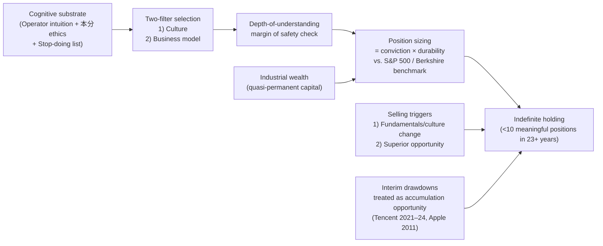

The structural similarity to the Munger portfolio philosophy reconstructed in Chapter 3 is striking, and it is not accidental. Both are downstream consequences of the same underlying analytical commitments: rare conviction, ruin-avoidance, ignoring most opportunities, and after-tax compounding mathematics. Both produce extreme concentration in a small number of high-conviction positions held for indefinite periods. The differences are largely contextual—Duan's universe is broader by virtue of operating in both U.S. and Chinese markets[^22], and his benchmark of comparative opportunity cost is articulated more explicitly than Munger's—but the architectures are recognizably the same. **The convergence is the strongest evidence available in this report for the proposition that concentration discipline is invariant across the philosophies of the three investors and that any divergence in their portfolio composition reflects different judgments about specific businesses rather than different underlying portfolio philosophies.**

## 4.7 Localized Application: NetEase, Apple, Moutai, Tencent

The four positions Duan most consistently identifies as the core of his portfolio function as case studies for the way the foundational axioms operate in distinct business contexts. This section treats each case briefly to extract the philosophical lesson; detailed portfolio-level analysis and quantitative reconstruction of returns is reserved for Chapter 6.

**NetEase (2001–2003): the canonical 'risk-investment' case.** Duan's 2001 NetEase position was taken when the company's market capitalization had collapsed below 100 million dollars in the post-dot-com correction, while the per-share cash holding stood at roughly 70 million dollars and the stock briefly traded as low as 0.48 dollars against a 1-dollar Nasdaq delisting threshold[^22][^28][^32]. Duan's thesis combined three components. First, the gaming-business operating intuition derived from his Subor experience: he met the NetEase team and recognized "a group of people who genuinely loved games, very seriously"[^25]. Second, the cash-and-business-model balance-sheet observation: market capitalization below cash, with positive cash-generating operations[^32]. Third, the legal-risk diagnosis: paying a U.S. lawyer to assess the probability of Nasdaq delisting and concluding that the probability was low[^28]. The resulting near-fully-invested position generated approximately 100x returns over six months to several years, with Duan ultimately exiting at varying points along the recovery[^22][^25][^32][^28]. The philosophical lesson Duan extracts from the case is significant and unflattering to himself: "Did I really understand it? If I had really understood, I should have bought all of NetEase. So 'understanding' I'm also not sure what it means, but I roughly felt they could make money, and I felt my investment risk was not particularly high"[^25]. The acknowledgment that even the canonical 100x position did not satisfy his own depth-of-understanding standard is a methodological feature of his framework: the case is registered as a *risk investment* (风投, venture capital–style) rather than as a *value investment*, and the 100x return is treated as partly a matter of fortune rather than as confirmation of the analytical framework's predictive power. **The lesson is that a 100x outcome does not retroactively prove the analyst understood the business; it merely proves that the position survived to deliver the return. The analytical framework must be evaluated on the consistency of its decision-making, not on the realized outcomes of any individual position.**

**Apple (from 2011): the canonical 'culture and ecosystem' case.** Duan's Apple thesis, established in 2011 around the time of Steve Jobs's death and during a period of share-price weakness, was built on three pillars that section 4.4 has already partly anticipated. The first pillar is the *post-iPhone software-services platform model*: by 2011 Apple's transition from a hardware-only business to a software-and-hardware integrated platform was, in Duan's words, "very clear; I was in this industry; I knew it"[^25]. The second pillar is the *culture diagnosis*: Apple's user-orientation, refusal to make products that did not deliver enough value, and long-time-horizon thinking together constituted a culture that would self-correct after errors[^25]. The third pillar is the *correct prediction record on counterfactual products*—the iTV, the Apple Car, and the timing-deferred large-screen iPhone[^25]—each of which functioned as an out-of-sample test of the culture diagnosis. The position has subsequently grown by approximately ten-fold (from approximately 1 billion to 10+ billion dollars in market value across fourteen years)[^32] and is the largest single position in the H&H Co. portfolio. The philosophical lesson is that *culture-based moat analysis is the analytical foundation of long-duration ownership, and the analyst's confidence in the culture diagnosis is what permits the indefinite holding period that allows the compounding mathematics to operate.* Duan's recent characterization of the position is consistent with the framework's logic: "they are not cheap; one cannot expect very high investment returns; but if you compare to bank deposits at 1% interest, you might as well hold Apple, but if you can earn ten-some percent elsewhere, perhaps there's no need to buy Apple; whether Apple finally has more development I also don't know; but it has so many users; AI ultimately lands on the phone; doubling, tripling, quadrupling Apple is possible, but I don't know"[^25]. The position is held not on the basis of price-target conviction but on the basis of comparative opportunity cost.

**Moutai: the canonical 'durable simplicity' case.** Duan's Moutai thesis is the most provocative of the four because the moat resides not in dynamic competitive innovation but in structural permanence. The 2013 entry took place during the post-anti-corruption white-spirits-industry trough, when Duan recognized that Moutai's social-and-cultural premium combined with its production-capacity-constrained scarcity made the 53-degree Feitian product more like "liquid gold" than a conventional consumer-goods business[^32]. The thesis depends on a single negative condition: *"do not change the 53-degree Feitian"*[^25]. Duan's most-quoted articulation of the principle is that "Moutai you most fear the new CEO who comes in and changes things here and there; up to now still OK, never depart from the original; you can't change the 53-degree Feitian"[^25]. The structural advantage of Moutai's status as a state-owned enterprise is, paradoxically, that the inherent conservatism of state ownership prevents the kind of formula-modification that Duan has heard of in private successor companies: "I've heard of some private companies where the successor took over and changed the formula; this kind of thing can't happen at Moutai—too dangerous"[^25]. The philosophical lesson is that *moat durability does not require continuous innovation; in some categories it requires precisely the opposite—the institutional capacity to refuse innovation*. The case is the strongest empirical test of Duan's depth-of-understanding margin of safety: "many people don't understand Moutai; many people don't understand Apple either"[^25], and the holding period has now exceeded twelve years across multiple drawdowns. Duan's specific recommendation to ordinary Chinese investors who want to own equities but cannot perform deep business analysis is, in fact, Moutai: "I keep saying Moutai because Moutai may be relatively easy to understand"[^25], with the secondary observation that even if the price does not recover, the dividend yield is superior to bank deposits[^32][^25].

**Tencent: the canonical 'reverse and options' case.** The Tencent position has the most distinctive entry-and-management structure of the four cases. Duan accumulated through the 2021–2024 antitrust regulatory drawdown using a strategy of selling put options at strikes representing roughly 5.2% discounts to prevailing prices, while collecting an annualized 5.5% premium[^32][^24]. The rationale has three components. First, the social-graph network-effect moat: Tencent's WeChat ecosystem provides the kind of switching-cost-and-network-effect double moat that Duan recognizes from the Apple ecosystem analysis[^32][^25]. Second, the management quality assessment: the Pony Ma–Martin Lau team has, in Duan's culture-filter terms, demonstrated the user-orientation discipline that the framework requires[^32]. Third, the *AI optionality*: Tencent's social-graph data is, in Duan's framing, a uniquely difficult-to-replicate input to AI model training[^32]. The use of put-option selling rather than direct purchase is selective, disciplined, and analytically defensible: it works only when the analyst is genuinely willing to own the underlying at the strike price, and it monetizes the implied volatility associated with regulatory uncertainty without exposing the position to leverage-induced ruin (the strikes are covered by available cash, not by margin). The philosophical lesson is that *derivative instruments, used within the depth-of-understanding margin of safety, can extend the toolkit of the value investor without violating the stop-doing list's prohibition on speculation, but the conditions for their permissible use are stringent: full understanding of the underlying, full cash coverage of the strike, and the absence of any leverage component*. Duan's behavior here represents a genuine extension of the Berkshire toolkit—Buffett has used put options selectively but rarely; Munger has not emphasized the technique—and the extension is internally consistent with the framework's other commitments.

The four cases together demonstrate the operating breadth of Duan's framework. They span an early-stage internet-era turnaround (NetEase), a mature platform-ecosystem business (Apple), a state-owned consumer-staple with structural moat (Moutai), and a regulatory-distressed platform business with derivative-enhanced entry (Tencent). The framework's foundational axioms—buy companies not stocks, depth-of-understanding margin of safety, culture as North Star, two-filter selection, stop-doing list, concentrated long-duration holding, comparative opportunity cost as sell trigger—operate identically across all four. The cases differ in the specific evidence each business presents to the framework's filters, but they do not differ in the framework's logic. **This is precisely the methodological feature that distinguishes a coherent philosophy from a heuristic collection: the same logic produces analytically correct decisions across substantially different business contexts.**

## 4.8 Documented Errors and the Discipline of Honest Self-Audit

A philosophy whose only public record consists of successful positions is not a philosophy but a sales pitch. Duan's framework requires—and his public record supplies—a parallel catalog of documented errors, each subjected to the same analytical discipline as the successes. Four errors are sufficiently documented in the available materials to permit detailed treatment, and the most authoritative single source is the 2022 *电子工程专辑* compilation that consolidates Duan's own retrospective writings on the four cases[^31].

**The 2008–2009 Baidu short.** The most consequential error Duan has publicly documented is the short position in Baidu, taken in the period after the 2007–2008 capital appreciation generated by his successful long positions had produced "a bit of floating-airy" overconfidence ("有点飘飘然，真以为自己很厉害")[^31]. The position began as small experimental shorting and escalated into a full-scale loss-cutting capitulation under a short-squeeze, with Duan's own retrospective accounting placing the total loss across all accounts at "approximately 1.5 to 2 hundred million dollars" (1.5–2亿美金)[^31]. The most painful element of the loss, in Duan's framing, was not the absolute amount but the *opportunity cost*: "this error consumed all of our cash reserves; the opportunity cost was enormous; otherwise, this financial crisis I could have helped everyone make much more money"[^31]. The methodological lesson Duan extracts is unambiguous: "this error occurred *after* Buffett had told me not to short; now you know what happens when you don't listen to the elder's words"[^31]. The categorization is decisive: "this was actually not even my worst investment, because it was thoroughly speculation. There will not be another example like this in the future. Opportunity cost is large; losing some money is a small matter"[^31]. The case is the strongest single piece of evidence in Duan's record for the proposition that the stop-doing list's prohibition on shorting is foundational rather than ornamental: a violation of an entry on the list, even by the framework's own author, can destroy multiple years of compounding in a single drawdown.

**The UNG natural-gas ETF.** The second documented error is the UNG (United States Natural Gas Fund) position taken when natural-gas spot prices were approximately three dollars while long-term marginal cost approximated six dollars[^31]. Duan's reasoning—"I felt nothing's price could long-stay below cost, so I bought a large quantity of UNG"—was conceptually sound but operationally defective: "later, after careful research, I discovered that UNG cannot achieve linear correlation with natural gas, and the time decay was very large; I felt I had erred"[^31]. The reluctance to exit on recognition of the error is the methodologically interesting part of the case: "I was a bit reluctant to sell, because I had already lost money. But I later remembered the principle of 'recognize the error and stop immediately, no matter how big the cost is the smallest cost,' and finally decided to exit at a loss"[^31]. The exit produced "a loss across all accounts of more than xx [redacted] ten thousand" dollars; had the position been held to the time of the 2010 retrospective post, the loss would have been approximately four times larger[^31]. The lesson Duan extracts—"this error was mainly because I acted before adequately understanding the investment vehicle (at the time the overall investment situation was very profitable, and I had a lot of cash)"—is the empirical confirmation that excess cash combined with overconfidence is itself a ruin mode that the stop-doing list must guard against. The closely connected lesson is the meta-principle: "*find errors and correct them as soon as possible; no matter how big the cost may be the smallest cost*"[^31].

**Fresh Choice (2003).** The third documented error is the deep-value position in Fresh Choice, a struggling U.S. salad-buffet restaurant chain with 58 locations across California, Washington, and Texas. Duan's 2003 thesis combined a price-to-cash-flow observation (stock price 1.5 dollars, per-share cash flow 0.6 dollars, implying approximately 2.5-year payback)[^31] with the activist commitment of becoming the company's largest shareholder at 27% of equity and accepting one of seven board seats[^31]. The activist phase failed for reasons that Duan's later framework would predict: "after entering as the first major shareholder on the board, I discovered that I could not communicate smoothly and freely with the other directors and management; in the face of declining performance, Fresh Choice management took a series of measures, for example raising prices on products, accelerating market expansion. With many years of operating-business experience, I clearly knew that these measures were extremely foolish rapid-suicide and would accelerate the company's decline"[^31]. The board could not be moved, the management's actions accelerated the failure, and the company filed for bankruptcy with Duan losing approximately one million dollars[^31]. Duan's framing of the lesson is significant: "one million dollars is not an unbearable number; my donations far exceed this. My expectation for this investment was not on making money, but on entering a 'sparrow-with-all-five-organs' [small but complete] company to see how a U.S. company actually operates. Consider it tuition paid"[^31]. The methodological extraction is direct: "this experience let me realize that a company's investment value is not only closely related to the company's manager, but is also profoundly affected by the board's decision-making capacity. So when doing value investing, one must comprehensively understand a company, not only the manager, but also the directors' background and their decision-making and governance style"[^31]. **The case is the empirical foundation for Duan's later elevation of culture analysis to the highest analytical priority: it demonstrated that a deep-value statistical case combined with first-mover activist control is insufficient to overcome a deficient board-and-management culture.**

**Delta Air Lines (2020).** The fourth documented error is the small COVID-era Delta Air Lines position. Duan's reasoning, as he narrates it, was experimental rather than analytical: he had recently sold some Apple to generate cash, and "out of curiosity, I seriously looked at why Old Buff was buying, and felt it had some reasoning, so I bought 1% in Delta, purely for fun. Maybe under the pandemic, there was some time to look around"[^31]. The position was small but the temperamental signal was decisive: "rare for me to lose sleep because of an investment; holding the airlines really felt unsettled, always something I couldn't think through. The discomfort of holding the airlines is not knowing whether time stands on which side"[^31]. The contrast with Apple was diagnostic: "holding Apple feels completely different; no matter how the price drops, I won't mind"[^31]. Duan exited shortly after Buffett's own well-publicized airline exits in May 2020, completing the full sale by August 2020[^31]. The position generated "approximately several tens of millions" dollars in profit, but Duan registers it as an *error* by the same logic as the General Electric case: "I think Old Buff was right; when one should exit, one must decisively exit"[^31]. The lesson is that *the absence of restful conviction is itself a diagnostic signal that a position lies outside the circle of competence, even if the analyst has not yet articulated the specific reason*. The Delta case is the most recent confirmation of the framework's discipline: the post-COVID structural change in the airline business model did not need to be specified in detail for Duan to recognize that he had not understood it.

The four cases together display a methodological feature that is central to Duan's philosophy: **the public catalog of errors is not an embarrassed footnote to the success record but a constitutive element of the framework**. Without the documentation of the Baidu short, the prohibition on shorting in the stop-doing list is mere assertion; with the documentation, it is empirically grounded. Without the documentation of the UNG exit, the principle that "recognizing the error and stopping immediately is the smallest cost" is mere counsel; with the documentation, it is operating evidence. Without the documentation of Fresh Choice, the elevation of culture-and-governance analysis is theoretical; with it, the elevation has biographical foundation. Without the documentation of Delta, the rule that lack of restful conviction signals outside-the-circle exposure is unmotivated; with it, the rule is operational. Duan's own most-cited summary of this methodological commitment is captured in the *电子工程专辑* compilation and is consistent with his other writings: "actually my biggest wealth is the errors I have committed; Buffett also is the same"[^31].

The implication for the comparative argument of this report is that Duan's framework is not a set of predictions but a discipline of *self-audit*. The framework is repeatable to the extent that the user can document violations of its precepts and respond by exiting the position immediately upon recognition, regardless of the realized cost. In this respect, Duan operationalizes more explicitly than either Buffett or Munger has the principle that **a value-investing philosophy is enforced through honest acknowledgment of error rather than through ex-ante prediction of success**.

## 4.9 Synthesis: Duan Yongping's Architecture and Its Relationship to Buffett and Munger

The principles dissected in sections 4.1 through 4.8 form an integrated architecture that can be classified, in the manner of Chapter 2's Buffettian synthesis and Chapter 3's Mungerian synthesis, into foundational, operational, and contingent layers. The structure is summarized in the diagram below.

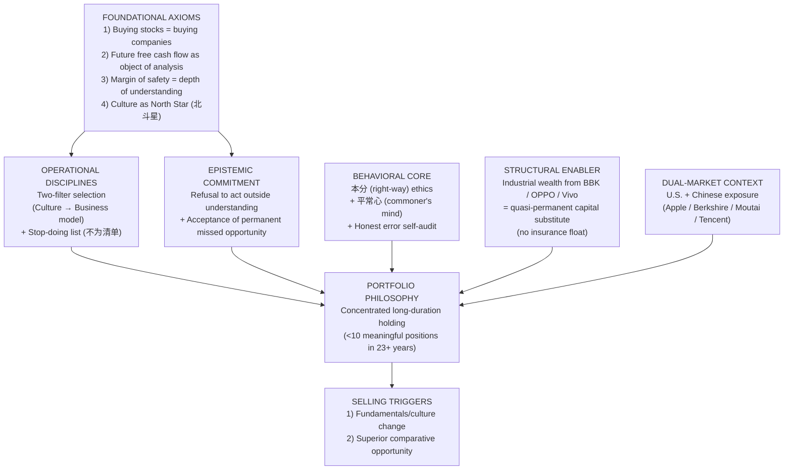

The classification of bedrock versus contingent elements can be summarized in tabular form, deliberately structured in parallel with the architectures of Chapters 2 and 3:

| Principle | Status in Duan's System | Relationship to Berkshire Architecture |
|---|---|---|
| Buying stocks = buying companies | Foundational bedrock | Identical to Buffett-Graham axiom; inflected by operator vocabulary |
| Future free cash flow as object of analysis | Foundational bedrock | Identical to mature Buffett; methodologically refined via 'rough-estimate' (毛估估) and non-listed-business valuation |
| Margin of safety = depth of understanding | Foundational redefinition, distinctively Duanian | Reorders Buffett-Munger framework: epistemic primary, business-quality and price secondary |
| Culture as North Star (北斗星) | Foundational, distinctively Duanian | Operator-derived equivalent of Munger's bias-and-Lollapalooza-driven moat intuition |
| Two-filter selection (culture → business model) | Operational doctrine, distinctively Duanian | Explicit ordering of filters; Buffett-Munger framework is more implicit |
| Stop-doing list (不为清单) | Operational doctrine, distinctively Duanian | Systematized translation of Munger's inversion methodology into action vocabulary |
| Concentrated long-duration holding | Foundational behavioral rule (joint with Buffett-Munger) | Operationally identical to Wheeler-Munger and Berkshire practice |
| Comparative opportunity cost selling | Operational refinement, distinctively articulated | More explicit than Buffett's articulation; benchmarked against S&P 500 / Berkshire |
| 本分 ethics + 平常心 + honest self-audit | Behavioral and ethical bedrock, distinctively Duanian | Connective tissue equivalent to Munger's engineered-rationality ethic; rooted in operating biography |
| Industrial wealth as quasi-permanent capital | Contingent structural enabler | Functional substitute for Berkshire's insurance float; distinct mechanism |
| Dual-market context (U.S. + China) | Contingent context | No analogue in Buffett or Munger; structural feature of the localization |

Three points of analytical synthesis follow.

First, the **genuine originalities** of Duan's framework relative to the Berkshire canon lie in three places. The **operator-derived culture intuition** supplies the moat-identification substrate that Munger derives from cognitive psychology and Buffett derives from extensive business reading; the substrate is the same operational practice but the route differs decisively, and the difference matters because operating intuition transfers more readily to investors who lack Munger's multidisciplinary training than the cognitive-psychology route does. The **explicit 本分 ethical vocabulary** provides a richer ethical articulation than the Berkshire canon contains in its standard formulations, integrating personal ethics, business strategy, and investment discipline into a single framework whose practical content (don't bribe, don't deceive, don't earn money beyond your capacity, don't initiate price wars, don't make exaggerated advertisements, don't pursue diversification for its own sake) is more granular than Buffett's or Munger's published equivalents. The **localization of value investing into Chinese consumer-brand and platform contexts**—Moutai's structural-permanence moat, Tencent's social-graph network effect, Pinduoduo's ecosystem economics—represents a genuinely cross-cultural extension of the framework that demonstrates its applicability to non-U.S. markets without distorting its foundational axioms.

Second, the **relationship** between Duan's architecture and the Berkshire system is one of *adaptation through inversion of the customary direction of travel*. Where Buffett arrived at value investing through Graham's securities analysis and Munger arrived through multidisciplinary law and self-education, Duan arrived from inside the operating company outward. This inversion produces a framework whose foundational axioms are recognizably Berkshire but whose operational vocabulary, ethical articulation, and methodological emphasis bear the imprint of the operating-business builder. The framework's distinctiveness is therefore not philosophical but vocational: Duan is the first major exemplar of a value investor whose path runs from the operator's chair to the investor's chair rather than the other way around.

Third, the **contingent enabler** of Duan's framework—industrial wealth from BBK, OPPO, and Vivo functioning as a quasi-permanent capital substitute for Berkshire's insurance float—is structurally distinct from Berkshire's enabler but functionally analogous. The relevant feature in both cases is the absence of redemption pressure on the timescales that matter to investment: Berkshire's insurance liabilities are actuarially modeled and structurally non-redeemable on short notice; Duan's industrial wealth is non-redeemable because there are no investors to redeem it. The empirical question this raises—whether the framework survives unchanged in the absence of comparable structural support—is one that Chapter 5 will pursue formally and that the broader population of value investors (most of whom operate without either insurance float or industrial-wealth backing) must confront in their own practice.

The source asymmetries of this chapter must be honestly registered. Duan's primary materials are predominantly Chinese-language—Snowball posts spanning more than fifteen years, blog entries on the now-archived 网易博客 (NetEase Blog), the 《段永平投资问答录》 collection that consolidates many of these writings[^32], and the November 2025 *方略* interview that supplied the most recent and most quotable statements of the framework[^25][^24][^26][^33]. The English-language documentary record is comparatively thin (Wikipedia entries[^27][^30], the *Asia Weekly* and *Southern Weekly* profiles cited in the Chinese sources[^22][^28], a 2007 *Wealth Life* television interview[^28]), and the most authoritative English-language Wikipedia entry on Duan provides a usable but not detailed biographical reconstruction[^27]. Where source asymmetry has affected the chapter's evidentiary basis, the chapter has cited the strongest available primary or quasi-primary materials and has avoided drawing inferences from secondary translations whose fidelity could not be cross-checked. The interpretive consequence is that this chapter's philosophical reconstruction is anchored more heavily in direct quotation from Duan's most recent extended public statements (the 2025 *方略* interview) than in earlier material, on the grounds that the 2025 interview supplies the most systematic articulation Duan has yet produced of his framework.

The comparative questions Chapter 5 will pursue are now legible in their full specificity. **Does industrialist intuition supplement or substitute for the multidisciplinary latticework?** The architectures established in this chapter and in Chapter 3 converge on the same set of investable companies through different evidence; the formal comparison must determine whether the convergence is sufficient to vindicate either route as a genuine alternative to the other or whether the two routes produce systematic differences in the marginal cases that distinguish a great investor from a competent one. **Does the absence of insurance float meaningfully constrain the philosophy at multi-decade horizons?** Duan's framework has now operated for more than two decades through the dot-com aftermath, the 2008 financial crisis, the 2020 COVID drawdown, and the 2021–2024 Chinese platform-economy regulatory phase, all without insurance-float backing; the formal comparison must determine whether the structural support of industrial wealth is genuinely equivalent in function or whether the equivalence breaks down at scales or durations the framework has not yet been tested against. **Is the convergence among the three philosophies evidence for the universality of value investing or for a more limited claim about three exceptional individuals?** This is the deepest question the report can ask, and answering it requires the formal three-way comparison of foundational axioms, operational disciplines, behavioral cores, and contingent enablers that Chapter 5 takes up directly.

[^37]: 段永平（广东步步高电子工业有限公司董事长）_百度百科.
[^38]: 段永平的投资哲学：大道至简，坚守本分.
[^23]: Duan Yongping: A Chinese Entrepreneur's Journey | PDF.
[^32]: 段永平的投资哲学：从商业本质到人生智慧的深度解码_搜狐网.
[^27]: Duan Yongping - Wikipedia.
[^26]: 段永平谈投资真谛：买股票就是买公司，看懂比便宜更重要_腾讯新闻.
[^22]: 无冕之王段永平：从小霸王、OV到拼多多，中国巴菲特如何炼成？.
[^24]: 腾讯元宝AI总结的大道与方丈的访谈内容（2025年11月11日雪球《方略》）.
[^28]: 闲人段永平：中国最神秘的富豪丨创创锦囊_长江商学院独角兽加速项目.
[^25]: 【投資論】「打孔機」只打了不到10個孔！段永平與方三文最新對話 港美股資訊 | 華盛通.
[^29]: 段永平与步步高的故事 - 雪球.
[^33]: 段永平接受方三文访谈全记录：10大核心观点+4个经典案例 - 雪球.
[^30]: BBK Electronics - Wikipedia.
[^34]: 段永平的"不为清单"_新浪财经_新浪网.
[^35]: 段永平：每个人都应该积累自己的stop doing list（不为清单），找到自己的北斗星.
[^36]: 段永平的不为清单 - 雪球.
[^31]: 段永平的博客岁月_百度文库.
[^31]: 段永平投资中所犯的错误-电子工程专辑.

# 5 Comparative Analysis: Convergence, Divergence, and Decision-Making Frameworks

The three preceding chapters have, in effect, mapped three distinct philosophical territories. Chapter 2 reconstructed Buffett's mature architecture as a layered system in which Graham-derived business-ownership thinking is operationalized through moat analysis, scaled by insurance float, and held together by a temperamental core. Chapter 3 showed that the cognitive substrate beneath Buffett's mature framework is in significant part Mungerian: a multidisciplinary latticework, an inversion-first methodology, and a Lollapalooza-aware behavioral catalog that together supply the moat-identification capacity Graham-orthodoxy lacked. Chapter 4 demonstrated that Duan Yongping reached recognizably the same destination by an inverted route—from inside the operating company outward—and contributed three genuine extensions: operator-derived culture intuition, the explicit 本分 ethical vocabulary, and a systematized 不为清单 stop-doing list. The task of this chapter is no longer expository but synthetic. It converts three parallel architectures into a single comparative argument by asking, in turn, four questions: what do the three investors genuinely share, where do they structurally diverge, where do they stylistically diverge in observable behavior, and how do their operational decision-frameworks relate to one another? The chapter culminates in an explicit answer to the question Chapter 1 set as the report's central problem: do the convergences vindicate value investing's claim to universality, or do the divergences reveal context-bound limits?

A methodological note governs the chapter's evidentiary basis. Where Chapters 2–4 each foregrounded one investor's primary utterances, this chapter is comparative by construction and must therefore range across all three. For Buffett, the main primary anchors are the Berkshire shareholder letters from 1977 onward[^39] and the catalog of his most-cited maxims compiled across multiple secondary sources but verifiable against the letters[^40]. For Munger, the primary anchors are the 1995 *Psychology of Human Misjudgment* speech, *Poor Charlie's Almanack*, and the Daily Journal annual meetings, all reconstructed in Chapter 3. For Duan, the primary anchors are the November 2025 *方略* interview with Fang Sanwen, his Snowball posts, and the documented portfolio record reconstructed from H&H International Investment 13F filings[^41][^13][^42]. Where evidence is asymmetric—as it remains for Duan in English-language sources—the chapter acknowledges the limitation rather than papering over it.

## 5.1 Shared Bedrock: The Convergent Philosophical Core

The first analytical task is to establish that the three investors converge on a substantive philosophical core, and that the convergence is too systematic and too specific to be reduced to coincidence or to the surface affinity of using the same vocabulary. The convergent bedrock identified across Chapters 2–4 can be summarized in seven principles, each of which is independently documented for all three investors and each of which functions identically in their operational practice. The synthesis is presented in tabular form and then unpacked.

| Bedrock Principle | Buffett | Munger | Duan |
|---|---|---|---|
| **1. Stock = fractional business ownership** | Graham inheritance, internalized as the axiom of the entire framework[^40] | Reinforced in Buffett's 1965 quality counsel; "we got into better and better companies" | "Buying stocks is buying companies"—the single sentence Duan credits as the seed of his entire framework[^13] |
| **2. Margin of safety / risk = permanent capital loss** | "Rule No. 1: Never lose money. Rule No. 2: Never forget rule No. 1"[^40] | "Three causes of smart people going broke: liquor, ladies, and leverage"; risk redefined as ruin rather than volatility | Margin of safety redefined as depth of understanding; risk anchored to "cheap things can become cheaper" |
| **3. Circle of competence** | "Never invest in a business you cannot understand"; "you only have to be able to evaluate companies within your circle of competence"[^40][^43] | "You don't have to know everything. A few really big ideas carry most of the freight"; expansion only through patient study | Refusal to act outside understanding even at the cost of permanent missed opportunities (e.g. bank stocks, most semiconductors) |
| **4. Concentration over diversification** | "Diversification is protection against ignorance. It makes little sense if you know what you are doing"[^40] | Wheeler-Munger and Wesco both ran concentrated portfolios; "find a few great companies and then sit on your ass" | Fewer than ten meaningful positions in 23+ years; Apple, Moutai, Tencent at large weights |
| **5. Long-duration / indefinite holding** | "Our favorite holding period is forever"; "if you aren't thinking about owning a stock for 10 years, don't even think about owning it for 10 minutes"[^40] | After-tax compounding mathematics: "$1 at 13.4% over 30 years = $43.50"; "no transaction, no tax" | NetEase held into multiyear compounding; Apple held continuously since 2011 with cumulative return >1,623% by January 2026[^42] |
| **6. Temperament > IQ** | "Success in investing doesn't correlate with IQ … what you need is the temperament to control the urges that get other people into trouble"[^40] | "Other people are trying to be smart. All I'm trying to be is non-idiotic. It's harder than most people think." | "Buying stocks is buying companies—if you've understood, you won't be affected by the market" |
| **7. Refusal of leverage and shorting** | Explicit prohibition; "leverage is the only way a smart person can go broke" (Munger, frequently echoed by Buffett) | "Three L's"—liquor, ladies, leverage—as the canonical ruin modes | Stop-doing list entries 1 and 2: "don't short, don't borrow"; the 2008 Baidu short error registered as the canonical violation |

The systematic character of the convergence requires interpretation, because the seven principles are not the only candidates that could plausibly anchor a long-term equity-investment philosophy. The investing literature contains many alternative frameworks—momentum-driven trend-following, factor-based statistical arbitrage, macroeconomic top-down allocation, pure quantitative valuation screening—each of which represents a coherent intellectual tradition with documented practitioners and acceptable historical returns. None of these alternative frameworks is shared by Buffett, Munger, and Duan; each of the seven principles above is. The convergence is therefore *selective* rather than *generic*, and the selectivity is the substantive evidence.

What explains the selectivity? Three factors operate jointly. First, the seven principles describe **invariant features of the relationship between capital and productive enterprise** rather than features of any particular market or era. The proposition that a share of stock represents fractional ownership is true regardless of whether the share trades on the New York Stock Exchange or the Hong Kong Stock Exchange; the proposition that durable returns require structural advantages is true regardless of whether the business operates in 1965 American consumer staples or 2025 Chinese internet platforms. Second, the seven principles **mutually reinforce one another** in ways that alternative frameworks do not. Concentration without long-duration holding is incoherent because the analytical effort required to produce concentrated conviction is wasted if the position is exited on price-target or sentiment grounds. Long-duration holding without temperament is impossible because interim drawdowns will trigger forced exits. Temperament without circle-of-competence discipline is reckless because it produces conviction in positions the analyst does not in fact understand. The seven principles form a self-supporting structure in which removing any one tenet causes the others to collapse. Third, the seven principles are **selected against by short-term institutional incentives** in ways that explain why most professional investors do not adopt them. A money manager evaluated quarterly cannot tolerate the multi-year drawdowns that concentration discipline requires; an asset gatherer compensated on volume cannot recommend that clients buy index funds; a sell-side analyst paid for trading flow cannot endorse "favorite holding period is forever." The principles survive in the practice of Buffett, Munger, and Duan precisely because each of the three operates a structure that is partially or wholly insulated from these incentives—Berkshire's permanent capital, Wesco's wholly-owned subsidiary status, H&H Co.'s family-office structure with industrial-wealth backing.

The most important corollary is that **the convergence is not evidence of cultural transmission alone**. Duan did read Buffett, attend the 2007 charity lunch, and acknowledges Buffett and Munger as his teachers—but his arrival at the same seven principles by an operator's route, before any deep textual engagement with the Berkshire canon, is the substantive evidence that the principles are not specifically Western or specifically Graham-derived. They are what an honest, intelligent, long-term-oriented analysis of the capital-enterprise relationship discovers, regardless of the route. This is the strongest claim the report can make for the universality of value investing, and it is supported by the evidence rather than asserted on its behalf.

The boundary of the convergence must be drawn carefully, however. The seven principles are bedrock; they are not the whole philosophy. Beyond the bedrock, structural and stylistic divergences are systematic and analytically significant. Sections 5.2 and 5.3 dissect those divergences in turn.

## 5.2 Structural Divergences: Capital Architecture and Cognitive Substrate

The first axis of divergence is structural and operates at two levels: the *capital architecture* that supports each investor's practice, and the *cognitive substrate* from which each investor's moat intuition is built. These two structural divergences are independent of one another but jointly determine the operational character of each philosophy.

**Capital architecture.** Chapter 2 identified Berkshire's insurance float as the contingent structural enabler that scales the Buffett philosophy from a partnership-sized operation to a multi-hundred-billion-dollar holding company. The 1967 acquisitions of National Indemnity and National Fire & Marine inaugurated the strategy; the 1996 full acquisition of GEICO and the 1998 acquisition of General Re extended it; and the resulting float now functions as long-duration, low-cost (and in favorable years negative-cost) capital that is structurally insulated from redemption pressure. The economic significance of this architecture is visible in Berkshire's 2024–2025 cash position: Berkshire Hathaway's cash pile reached approximately $300 billion in 2024 after twelve consecutive quarters of net stock sales, and rose to a record $382 billion by Q3 2025[^19][^44][^45]. This is not idle cash; approximately 88% of it sits in U.S. Treasury bills earning roughly $12 billion in risk-free annual returns[^44]. The structural feature that makes such positioning possible is precisely that Berkshire faces no redemption obligations on the timescales over which this cash will eventually be deployed. A traditional fund holding 27% of $1.15 trillion in assets in cash would face existential client pressure; Berkshire faces none.

Munger's career outside Berkshire operated without comparable float. Wheeler, Munger & Company (1962–1975) was a partnership subject to drawdown pressure, and the 1973–74 losses of 32% and 31% nearly broke the fund despite Munger's correct positioning. Wesco Financial Corporation, which Munger chaired from 1984, was a wholly-owned Berkshire subsidiary whose concentrated equity portfolio benefited indirectly from Berkshire's float backing but operated without independent insurance scale. Daily Journal Corporation, which Munger chaired in his final decades, ran a small concentrated equity book funded principally from operating cash flow. The Mungerian record therefore demonstrates that the *cognitive and behavioral* architecture of the Berkshire framework is operable at family-office and small-public-company scale, but it does so partly because Munger's primary economic exposure was always also Berkshire itself.

Duan's H&H International Investment operates at family-office scale through publicly-traded equity positions without an insurance subsidiary or any other source of formally non-redeemable capital. The structural enabler that substitutes for insurance float is Duan's industrial wealth: the BBK dividend stream and the equity positions in OPPO and Vivo (which by Q1 2017 had become the world's second-largest smartphone manufacturer combined behind Samsung) provide a non-investment cash-flow base that is non-redeemable because there are no investors to redeem it. The functional equivalence to insurance float is genuine but the mechanism is distinct: Berkshire's float is *asset-side* permanent capital that funds positive investment activity; Duan's industrial wealth is *liability-side* absent capital—the absence of redeemable obligations means his investment positions face no forced-seller pressure regardless of drawdown depth.

The behavioral consequence of this structural divergence is the most striking single difference in observable practice between Buffett and Duan in 2024–2025. Buffett, with $382 billion of structurally permanent capital, has been a net seller for twelve consecutive quarters and has accumulated a cash position larger than the combined cash holdings of Apple, Amazon, Alphabet, and Microsoft[^44][^45]. Duan, with industrial-wealth-backed quasi-permanent capital, has remained near-fully-invested, has used put-option selling to accumulate during drawdowns (Tencent at the 2021–2024 trough), and disclosed in early 2026 that his Apple position alone showed a cumulative return of 1,623.48% on an initial 2011 cost basis—a position he describes as "essentially untouched" across the intervening years[^42]. The contrast is not philosophical; both investors share the bedrock principles enumerated in section 5.1. The contrast is *structural*: a $382 billion cash pile is meaningful only at Berkshire's scale, where the universe of "elephants" large enough to absorb the cash is exhausted; a near-full-investment posture is consistent with Duan's smaller scale, where attractive U.S. and Chinese opportunities remain available within his circle of competence. Section 5.3 will return to this divergence in observable behavior; the structural point here is that the behavioral divergence is downstream of the capital architecture.

**Cognitive substrate.** The second structural divergence operates at the level of the cognitive equipment from which each investor's moat intuition is built. Chapter 2 located Buffett's substrate primarily in Graham-derived securities analysis supplemented by decades of voracious reading of annual reports and industry materials—what one biographical reconstruction has characterized as a "filing-cabinet mind." Chapter 3 located Munger's substrate in the multidisciplinary latticework of mental models drawn from psychology, mathematics, physics, biology, economics, history, and literature. Chapter 4 located Duan's substrate in the operating intuition built up across more than two decades at Subor, BBK, OPPO, and Vivo for how culture, distribution, product quality, and brand interact to produce or destroy long-term economic value.

The diagram below visualizes the three substrates as alternative routes converging on the same operational practice—moat identification—rather than as competing systems.

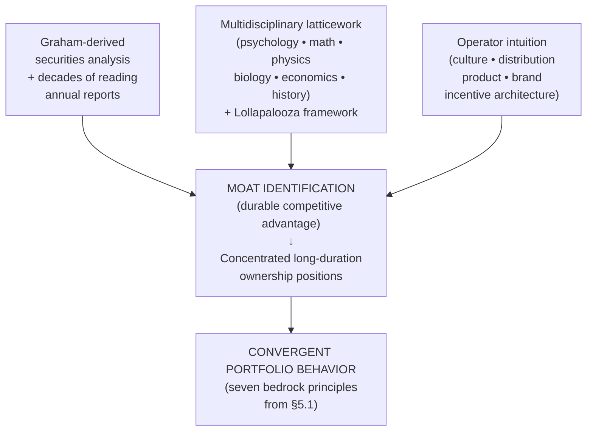

The analytical question this diagram raises is whether the three substrates are genuinely interchangeable—producing the same judgments at the margin—or whether they produce systematically different conclusions in specific cases. The available evidence supports a mixed answer. **In the vast majority of canonical cases, the three substrates converge on the same investable companies.** Coca-Cola is a positive Lollapalooza for Munger, a brand-pricing-power moat for Buffett, and a culture-and-business-model survivor for Duan; all three would, in principle, find it analytically attractive. Apple is a switching-cost-cum-ecosystem moat for Buffett (eventually), an ecosystem-stickiness business for Munger, and a user-orientation culture company for Duan; all three converged on it as a major position, with timing differences that section 5.3 addresses. Berkshire Hathaway as an investment is itself a position Duan has held in size, and his 38.24% increase in Q4 2025 to make Berkshire B his second-largest holding at 20.63% of the portfolio[^41] is the most concrete possible evidence of the cognitive convergence: Duan's operator-intuition substrate reaches the same positive judgment on Berkshire that the Berkshire team reaches on its own underlying businesses.

**The marginal cases are more revealing.** The Moutai position, which Duan holds in size, is one Buffett and Munger have not pursued, despite Munger having had explicit conviction in Chinese consumer brands generally (he held BYD, an Apple-style platform-cum-manufacturing position, through Berkshire's Charlie-driven 2008 entry). The reason is partly contextual—Moutai is a state-owned enterprise whose regulatory and sales-channel dynamics are difficult to evaluate from Omaha—and partly substrate-driven: Duan's operator intuition for Chinese consumer culture, channel structure, and the social meaning of the 53-degree Feitian product is not replicable through reading annual reports or applying mental models. Conversely, Buffett's selective embrace of regulated-franchise moats (the 2013 13% stake in VeriSign, with exclusive .com domain rights) draws on a category of moat analysis that Munger's behavioral framework illuminates but that Duan's operator intuition is less specifically tuned to. The substrates are convergent in the bulk of cases and divergent at the margins, which is precisely what one would expect if they are genuinely alternative routes to the same destination.

The structural divergence at the cognitive-substrate level has one further consequence that is critical for the report's broader argument. **The transferability of each investor's framework to other practitioners depends on the substrate from which the framework is built.** Munger's latticework is in principle transferable through years of multidisciplinary self-education, but in practice few investors have either the temperament or the time to assemble it. Buffett's filing-cabinet mind is in principle transferable through decades of reading annual reports, but in practice the depth of pattern-recognition Buffett has built is the work of a singular career. Duan's operator intuition is in principle transferable only through actually building a business, which most investors will never do. The bedrock principles of section 5.1 are universal; the cognitive substrates that make those principles operationally rigorous are not. The implication, which Chapter 8 will develop further, is that the practical translation of the three frameworks for ordinary investors must rest on the bedrock principles themselves and on the index-fund recommendation that all three investors offer to those who lack the substrate to do otherwise[^40].

## 5.3 Stylistic Divergences: Cash, Technology, and Chinese Consumer Brands

The structural divergences of section 5.2 produce stylistic divergences in observable portfolio behavior that, on first inspection, can appear to contradict the convergent bedrock of section 5.1. Three stylistic divergences are particularly visible in the public record and require careful interpretation: the contrast between Buffett's record-breaking cash hoarding and Duan's near-fully-invested stance, the contrasting timelines and conviction depths in technology adoption, and the divergent treatment of Chinese consumer brands and platform companies. The interpretive task is to show that each of these divergences is a downstream output of differing opportunity costs, circles of competence, and capital structures rather than a philosophical disagreement at the bedrock level.

**Cash holding versus full investment.** The numerical contrast is stark. Berkshire Hathaway's cash pile rose from approximately $167 billion at the start of 2024 to approximately $325 billion by Q3 2024 (or $310 billion after subtracting payables for Treasury-bill purchases)[^19], reached approximately $348 billion in early 2025[^44], and hit a record $382 billion by Q3 2025[^45]. Berkshire's cash now exceeds the total value of the company just over a decade ago and accounts for roughly 27% of its $1.15 trillion in total assets[^19][^45]. Buffett and his team sold $133 billion of stocks in the first nine months of 2024 and bought less than $6 billion[^19]; Berkshire has been a net seller for twelve consecutive quarters dating to Q3 of 2022[^45]. Apple positions were cut by 67% from $174 billion to below $70 billion over nine months in 2024[^19], and continued declining to roughly $57 billion (about 22% of the portfolio) by Q2 2025[^45]. Bank of America was reduced by approximately 26% between mid-July and mid-October 2024[^19] and by 41% over the full year[^44].

Duan's contemporaneous behavior is the mirror image. His H&H International Investment Q4 2025 13F filing shows Apple remaining the top holding at $8.797 billion (50.3% of portfolio) despite a 7% trim, Berkshire Hathaway B shares increased by 38.24% to become the second-largest holding at 20.63%, NVIDIA holdings increased by 1,110.62%, and new positions initiated in CoreWeave, Credo Technology, and Tempus AI[^41]. The disclosed Apple account has been "essentially untouched" since 2011 and shows a cumulative return of 1,623.48% as of January 2026, with the original 131,000-share purchase at $13.75 per share generating a 1,881.8% return[^42]. Duan has remained near-fully-invested, has used put-option selling to accumulate Tencent during the 2021–2024 antitrust drawdown, and has actively redeployed capital into AI-supply-chain initiations during the Q4 2025 period when Buffett was accumulating Treasuries.

The interpretive temptation is to read this divergence as evidence that Buffett and Duan disagree philosophically about market valuations. This reading is incorrect. Buffett's own framing of the cash position is consistent with the bedrock framework: "they're stacking cash because they're struggling to find bargains with valuations at historic highs"[^19], and Berkshire's analytical tool the *Buffett Indicator* (total stock-market capitalization divided by GDP) stands at approximately 200% against the 100% threshold above which valuations are considered overvalued[^44]. Duan's framing is also consistent with the bedrock framework: Apple, Berkshire, and Tencent at his entry prices satisfy his depth-of-understanding margin of safety, and Berkshire B at the prices at which he accumulated through Q4 2025 represents, by his own opportunity-cost benchmarking, an attractive deployment of capital. **The divergence is not in the framework but in the inputs to the framework: the universe of opportunities that satisfies a $382 billion deployment requirement is vastly smaller than the universe that satisfies a single-digit-billion-dollar deployment requirement, and the marginal opportunities at Duan's scale remain attractive while the marginal opportunities at Berkshire's scale do not.**

The point can be stated more sharply. Buffett told Berkshire shareholders in 2024 that "all in all, we have no possibility of eye-popping performance" because Berkshire's vast scale means only a few companies in the country could move the needle, and "all of them have been endlessly picked over by us and others"[^19]. This is not a confession of philosophical limitation but a precise statement of the constraint Buffett faces and Duan does not. Duan's smaller scale, broader geographic universe (U.S. + China), and willingness to take put-option positions during regulatory-driven drawdowns expand his opportunity set in ways the Berkshire universe does not allow. The bedrock principle—deploy capital only into positions that satisfy the depth-of-understanding margin of safety at attractive prices—is identical for both investors. The output differs because the input opportunity sets differ.

**Technology adoption timing.** The second stylistic divergence is the timing and conviction with which each investor has embraced technology positions. Duan began accumulating Apple in November 2011, when the share price was approximately $44.30 (post-split, adjusted), one to two months after Steve Jobs's death and during a period of intense market skepticism about Tim Cook's leadership[^13][^42]. Buffett did not initiate Berkshire's Apple position until 2016—six years later—and Duan has explicitly addressed the chronology in his Snowball writings: "the rumor that Duan copied Buffett's homework on Apple is pure nonsense; my Apple investment is earlier than Buffett's"[^13][^17]. The conviction-depth difference at the entry point is also visible: Duan committed approximately one-third of his liquid assets to the position; Berkshire's initial position, while large in dollar terms, was a smaller percentage of the portfolio at entry. By 2024–2025 the conviction trajectories diverge again. Berkshire reduced Apple by 67% over 2024 and to approximately 22% of the portfolio by Q2 2025[^19][^45]. Duan reduced Apple by approximately 7% in Q4 2025 from the previous quarter, but the position remained at 50.3% of his portfolio[^41], and the disclosed account showing 1,623.48% cumulative return as of January 2026 confirms the holding has been "essentially untouched" across the intervening fourteen years[^42].

The 2025 technology divergence is even sharper. Buffett's posture remained one of cash accumulation. Duan's Q4 2025 13F filing shows a 1,110.62% increase in NVIDIA holdings, propelling the position to $1.35 billion (7.72% of portfolio, the third-largest holding), alongside new positions in three AI-supply-chain companies covering compute (CoreWeave), connectivity (Credo Technology), and application (Tempus AI)[^41]. Duan's framing of the NVIDIA position is methodologically consistent with his framework's depth-of-understanding requirement: "I feel AI is something worth getting involved in at least, so as not to miss out … the more you use this thing, the more interesting it feels"; he characterized the position as participatory, designed to support continued study, with the explicit standard that he would only "dare to make a heavy bet" when his understanding deepens further[^41].

Once again, the temptation is to read this divergence philosophically. Once again, the reading is incorrect. Duan's earlier and deeper Apple conviction is the output of his operator-intuition substrate: "I'm in this industry; I knew it" (Chapter 4) is not a metaphor but a statement that his quarter-century of consumer-electronics manufacturing supplied a moat-identification capacity for Apple specifically that Buffett's substrate did not. Buffett's eventual 2016 entry, conversely, reflects the genuine but slower expansion of his circle of competence to encompass Apple's consumer-staples economics. The 2024–2025 trim trajectories are downstream of the same opportunity-cost reasoning: Buffett, facing the absence of attractive alternatives at Berkshire's scale, sells Apple to accumulate Treasuries; Duan, facing attractive alternatives in NVIDIA and AI-supply-chain initiations, redeploys partial Apple proceeds into the new positions while increasing Berkshire B as a "tech growth in the left hand, value defense in the right hand" structure[^41]. The framework is identical; the opportunity sets and the substrate-derived circles of competence differ.

**Chinese consumer brands and platform companies.** The third stylistic divergence is the most clearly substrate-driven. Duan holds Moutai, Tencent, Pinduoduo, and (historically) NetEase as concentrated positions; the Berkshire portfolio contains essentially none of these. Munger held BYD through Berkshire's 2008 entry, but the Munger-driven China exposure stopped there. The divergence is not philosophical disagreement about Chinese equity quality; it is the operating reality that **the cognitive substrates required to evaluate Chinese consumer-cultural moats are not equivalently distributed between Omaha and Duan's family office in California**. Duan's operator-derived intuition for the social meaning of the 53-degree Feitian product, for the WeChat ecosystem's network-effect dynamics, for Pinduoduo's "Costco + Disney" cultural commitment to leaving savings with the user, is not replicable from outside. The Berkshire team's eventual avoidance of these positions reflects the discipline of the circle-of-competence principle, not a different judgment about the underlying companies.

The synthesis of section 5.3 is that **all three observable stylistic divergences—cash hoarding, technology timing, Chinese exposure—are outputs of the framework rather than departures from it**. The framework requires that capital be deployed only into positions that satisfy depth-of-understanding margin of safety at attractive prices, that the universe of such positions be searched only within the analyst's circle of competence, and that opportunity cost be measured against accessible alternatives. When the inputs to the framework differ—because the analyst's scale, substrate, geographic reach, and circle of competence differ—the outputs differ. The bedrock convergence of section 5.1 is preserved precisely because the framework correctly handles the divergent inputs.

## 5.4 Decision-Making Frameworks: Mental Models, Inversion, and Stop-Doing Lists

Beneath the structural and stylistic divergences of sections 5.2 and 5.3 lies a deeper question about the operational decision-mechanics each investor employs. This section compares the mechanics directly along five dimensions: the inversion-first cognitive architecture, the "twenty-punch-card" portfolio discipline, management and culture assessment, error handling, and valuation methodology. The argument is that the three investors' decision-frameworks are upstream-downstream variants of a single underlying architecture rather than three competing methodologies.

**Inversion as the unifying methodology.** Chapter 3 established that Munger's "invert, always invert" principle, derived from Jacobi, is the methodological backbone of his framework: ask first what would make an investment fail, and act only when those failure modes can be eliminated or bounded. Chapter 4 established that Duan's stop-doing list (不为清单) is the systematized output of the same methodology, articulated in concrete-action vocabulary. Chapter 2 established that Buffett's "Rule No. 1: Never lose money" is the same methodology in compressed form, with the operational content distributed across decades of shareholder-letter case discussions[^40]. The relationship among the three formulations is upstream-downstream rather than parallel.

| Investor | Articulation of inversion | Form |
|---|---|---|
| **Buffett** | "Rule No. 1: Never lose money. Rule No. 2: Never forget rule No. 1"[^40]; "after 25 years of buying and supervising a great variety of businesses, Charlie and I have not learned how to solve difficult business problems. What we have learned is to avoid them"[^40] | Compressed maxims + case-by-case shareholder-letter reasoning |
| **Munger** | "Invert, always invert"; ~25-bias *Psychology of Human Misjudgment* catalog; "three causes of smart people going broke: liquor, ladies, and leverage" | Cognitive-psychology framework + behavioral catalog |
| **Duan** | 不为清单 (stop-doing list): "don't short, don't borrow, don't invest in what you don't understand," extending to ~17 entries spanning investing and operating | Explicit, continuously revised concrete-action list |

The three formulations differ in their granularity and pedagogy. Buffett's articulation is the most compressed and the least systematized; the operational content emerges from accumulated shareholder-letter reasoning rather than from an explicit list. Munger's articulation is the most theoretically developed; the *Psychology of Human Misjudgment* catalog supplies the cognitive grounding for why specific failure modes recur, but the catalog is addressed primarily to behavioral psychology and requires translation into action. Duan's articulation is the most directly usable; the stop-doing list is the explicit translation of the cognitive content into specific operating prohibitions that an investor or operator can audit decisions against. The three articulations are not competitors but layers of a single architecture: Munger supplies the upstream cognitive theory, Buffett supplies the downstream case applications, Duan supplies the most directly operational pedagogy. **An investor seeking to build the inversion-first methodology can read all three with profit, because each formulation supplies what the others omit.**

**The "twenty-punch-card" discipline.** Buffett's twenty-punch-card metaphor—the imagined rule that one would make better lifetime decisions if limited to twenty discretionary investments over a lifetime—is operationalized differently by each investor. Buffett's use is rhetorical: "an investor should act as though he had a lifetime decision card with just twenty punches on it"[^40]. Munger's articulation, derived from his card-playing background, is sharper: "what you have to learn is to fold early when the odds are against you, or if you have a big edge, back it heavily because you don't get a big edge often. Opportunity comes, but it doesn't come often, so seize it when it does come." Duan's use is the most literal of the three: in the November 2025 *方略* interview he counts his actual positions against the twenty-slot ceiling and concludes he has used fewer than ten meaningful slots in twenty-three years of investing—NetEase, Yahoo (effectively an Alibaba proxy), Apple, Berkshire, Moutai, Tencent, with smaller weight in NVIDIA, Google, and historically GE.

The behavioral test of the discipline is whether each investor actually exhibits the punch-card cadence in observable practice. The evidence supports all three. Buffett's documented core long-duration positions—Coca-Cola from 1988, Apple from 2016, GEICO from full acquisition in 1996, BNSF from 2010—form a small set against six decades of activity. Munger's Daily Journal portfolio held a small number of concentrated positions (Bank of America, Wells Fargo, others) for decades. Duan's H&H portfolio in Q4 2025 shows Apple at 50.3%, Berkshire B at 20.63%, NVIDIA at 7.72%, with the remaining positions including Google, Pinduoduo, and the three small AI-supply-chain initiations[^41]; the top three positions alone account for 78.65% of disclosed portfolio value, which is the punch-card discipline made explicit.

**Management and culture assessment.** All three investors place management and culture analysis at the center of their decision-frameworks, but the analytical foreground differs. Buffett's framework foregrounds *owner-manager evaluation*: the question whether the CEO acts as a steward of shareholder capital, whether compensation is reasonable, whether capital allocation decisions add or destroy per-share value[^39]. Buffett's 2004 letter explicitly reduces the question for long-term investors to whether a company has the right leader, whether his compensation is reasonable, and whether proposed acquisitions will add or destroy per-share value[^39]. Munger's framework foregrounds *incentive alignment*: "perhaps the most important rule in management is to get the incentives right" (Chapter 3). The 2008 financial crisis illustrates the principle in negative form: a system in which loan originators bore no consequences for the loans they made was, by the incentive-alignment criterion, structurally rather than accidentally unstable. Duan's framework foregrounds the *two-filter culture-then-business-model selection*: culture comes first, business model second, and a deficient culture disqualifies a company regardless of how attractive the business model appears (Chapter 4).

The three foregrounds are not competing but complementary. A company that satisfies Buffett's owner-manager evaluation will typically also satisfy Munger's incentive-alignment criterion (because owner-managers internalize incentive alignment by structural definition) and Duan's culture filter (because culture is the long-run output of incentive alignment combined with founder values). Conversely, a company that fails any one of the three criteria typically fails all three. The General Electric case from Chapter 4 illustrates the convergence: Duan's culture filter caught the post-Welch hollowing-out (the disappearance of the integrity language from the corporate homepage); had Munger's incentive-alignment lens been applied, it would have caught the same hollowing-out through the divergence between executive compensation and durable shareholder value creation; had Buffett's owner-manager evaluation been applied, it would have caught the post-Welch CEO's serial acquisition-and-divestiture activity as evidence of capital-allocation undisciplined by stewardship.

**Error handling.** All three investors treat documented errors as constitutive of the framework rather than as embarrassed footnotes, but the formats differ. Buffett's annual letters contain explicit acknowledgments of errors—the Berkshire textile-mill acquisition described as his "worst trade" (Chapter 1), the Dexter Shoe acquisition in which Berkshire stock used as currency proved retrospectively expensive, the Paramount investment for which he took responsibility at the 2024 Berkshire annual meeting[^19]. Munger's framework treats errors through the catalog of ruin modes: the inversion-first methodology's purpose is precisely to identify the failure modes through which capital is irretrievably destroyed and engineer them out of the investor's life. Duan's framework, as Chapter 4 documented in detail, supplies the most explicit self-audit: the 2008 Baidu short ($150–200 million loss), the UNG natural-gas ETF position, the 2003 Fresh Choice activist position, and the 2020 Delta Air Lines position are catalogued, analyzed, and registered as errors by the framework's own filters even when the realized outcome was profitable (the GE exit) or only mildly negative (Delta).

The methodological principle the three investors share is that **a value-investing framework is enforced through honest acknowledgment of error rather than through ex-ante prediction of success**. Buffett's most-quoted formulation—"should you find yourself in a chronically leaking boat, energy devoted to changing vessels is likely to be more productive than energy devoted to patching leaks"[^40]—captures the principle in the active voice: errors must be exited as soon as recognized, regardless of accumulated cost. Munger's "the most important thing to do if you find yourself in a hole is to stop digging"[^40] is the same principle compressed. Duan's "find errors and correct them as soon as possible; no matter how big the cost may be the smallest cost" (Chapter 4) is the same principle articulated as a meta-rule on the stop-doing list itself.

**Valuation methodology and uncertainty.** The three investors share the bedrock commitment to intrinsic value as the discounted present value of future cash flows, but operationalize the valuation discipline differently. Buffett's framework relies on a combination of careful financial-statement analysis and qualitative business judgment, with a strong preference for businesses whose future cash flows are predictable enough that the analyst can have genuine conviction in the estimate; the 2013 letter's emphasis on buying businesses "whose future earnings you can reasonably estimate"[^39] captures the principle. Munger's framework relies on the multidisciplinary latticework to identify durable competitive advantage as the precondition for predictable cash flows, with the qualitative moat analysis preceding any quantitative valuation. Duan's framework operationalizes valuation through the *non-listed-business hypothetical* ("suppose I acquired Apple in full—could I recoup cost and realize a reasonable return within ten years?") and the *rough-estimate* (毛估估) discipline that explicitly avoids precise DCF computation in favor of order-of-magnitude judgment (Chapter 4).

The handling of uncertainty is the dimension on which the margin-of-safety reformulations of all three investors converge most clearly. Buffett's post-1965 redefinition treats margin of safety as primarily quality-driven: a wonderful business with a durable moat generates a rising stream of owner earnings against which the price paid earns a compounding margin of safety over time. Munger's risk-as-permanent-capital-loss redefinition treats margin of safety as the dynamic gap between the price paid and the rising stream of owner earnings that a high-quality business will produce over decades. Duan's depth-of-understanding redefinition treats margin of safety as a property of the investor's understanding rather than of the asset's valuation. The three reformulations are compatible and operationally convergent: a wonderful business one understands deeply, purchased at a fair price, satisfies all three definitions simultaneously. The conceptual differences matter for pedagogical purposes—Munger's framework explains *why* the quality-driven margin of safety works, Duan's framework specifies the *epistemic precondition* without which it cannot be operated, Buffett's framework supplies the *price discipline* that prevents quality from licensing overpayment—but they do not produce systematically different judgments at the margin. Comparative opportunity cost, benchmarked against the S&P 500 or Berkshire as the "default safe option" (Chapter 4), is articulated most explicitly by Duan but is operationally present in all three frameworks.

The diagram below summarizes the upstream-downstream relationships among the three decision-frameworks:

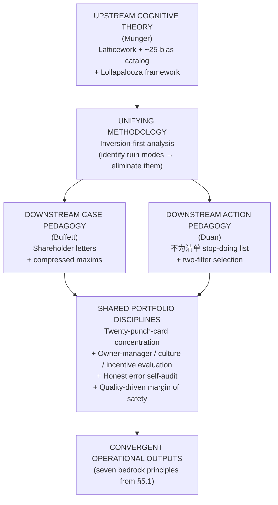

The diagram makes explicit the analytical claim of this section: the three investors operate a single decision-framework whose upstream layer is most clearly developed in Munger's cognitive theory, whose case applications are most extensively documented in Buffett's shareholder letters, and whose action pedagogy is most directly usable in Duan's stop-doing list. **The three formulations are not three competing decision-frameworks but three complementary expositions of one decision-framework, each foregrounded toward the audience and biographical experience of its author.**

## 5.5 Synthesis: Why Three Different Paths Produced One Philosophy

The chapter's analytical work culminates in an explicit answer to the question Chapter 1 set as the report's central problem: do the convergences vindicate value investing's claim to universality, or do the divergences reveal context-bound limits? The answer the comparative analysis supports is composite rather than binary, and it can be stated in three propositions.

**First, the foundational axioms are genuinely universal because they describe invariant features of the relationship between capital and productive enterprise.** The seven bedrock principles of section 5.1—business ownership, depth-of-understanding margin of safety, circle of competence, concentration, long-duration holding, temperament over IQ, and refusal of leverage and shorting—are not three independent inventions that happened to coincide; they are what an honest, intelligent, long-term-oriented analysis of capital-enterprise dynamics discovers, regardless of the route. Buffett's route through Graham at Columbia, Munger's route through multidisciplinary self-education, and Duan's route through industrial entrepreneurship in Chinese consumer electronics produce the same seven principles because the principles describe features of the underlying reality rather than features of any particular cultural or institutional context. The convergence is the strongest evidence the report can offer for the universality claim, and it supports the proposition that **value investing, as bedrock, is a culture-free discipline of rationality applied to business ownership**.

**Second, the structural and stylistic divergences are context-dependent expressions of the same underlying logic operating under different conditions.** The capital-architecture divergences (insurance float versus industrial wealth versus Wesco-scale operation), the cognitive-substrate divergences (securities analysis versus latticework versus operator intuition), the cash-versus-full-investment divergences, the technology-timing divergences, and the Chinese-consumer-brand divergences are not departures from the bedrock framework but outputs of the framework operating on different inputs. Berkshire's $382 billion cash position and Duan's near-fully-invested posture are both correct applications of the depth-of-understanding margin of safety operating on different opportunity sets. The Berkshire team's avoidance of Moutai and Duan's concentrated holding of it are both correct applications of the circle-of-competence principle operating on different cognitive substrates. **The divergences are not philosophical disagreements; they are correct downstream variations under different structural and biographical conditions.**

**Third, the divergences nonetheless reveal genuine limits to transferability that practical translation must respect.** The bedrock principles can be transmitted through textual exposition; the Berkshire shareholder letters, *Poor Charlie's Almanack*, and Duan's Snowball corpus together constitute a publicly available curriculum that any literate investor can study. The cognitive substrates, however, are not equivalently transferable. Munger's latticework requires years of multidisciplinary self-education that few investors will undertake. Buffett's filing-cabinet mind requires decades of reading annual reports that few investors will sustain. Duan's operator intuition requires actually building a business, which most investors will never do. The structural enablers—insurance float, Wesco-scale wholly-owned subsidiary status, industrial-wealth backing—are similarly non-transferable. The implication for ordinary investors, which Chapter 8 will develop, is that **the bedrock principles can and should guide their thinking, but the operational practices of the three masters should not be naively imitated by investors who lack the substrate or structural support that those practices presuppose**. All three investors converge on the same recommendation for those who lack the substrate: buy a low-cost broad-based index fund and hold it[^40].

The composite synthesis can be presented in a unified comparative matrix that classifies each principle of the three architectures as bedrock, contingent enabler, or stylistic expression. The matrix below collects the elements analyzed across Chapters 2–4 and this chapter into a single comparative view.

| Element | Buffett | Munger | Duan | Classification |
|---|---|---|---|---|
| Stock = fractional business ownership | ✓ Graham axiom | ✓ Reinforced | ✓ Foundational sentence | **Bedrock** |
| Margin of safety / risk = permanent loss | ✓ Rule No. 1 | ✓ Three L's | ✓ Depth of understanding | **Bedrock** |
| Circle of competence | ✓ Explicit | ✓ "Big ideas carry the freight" | ✓ Refusal to act outside understanding | **Bedrock** |
| Concentration over diversification | ✓ Anti-diversification | ✓ "Sit on your ass" | ✓ <10 positions in 23 yrs | **Bedrock** |
| Long-duration holding | ✓ "Forever" | ✓ Compounding math | ✓ Apple since 2011, 1,623% return | **Bedrock** |
| Temperament > IQ | ✓ Explicit | ✓ "Non-idiotic" | ✓ "If you've understood, market doesn't affect you" | **Bedrock** |
| Refusal of leverage and shorting | ✓ Explicit | ✓ Three L's | ✓ Stop-doing list entries 1–2 | **Bedrock** |
| Honest error self-audit | ✓ Annual letter | ✓ Ruin-mode catalog | ✓ Baidu/UNG/Fresh Choice/Delta | **Bedrock** |
| Inversion-first methodology | Compressed (Rule No. 1) | Theoretical (latticework + Jacobi) | Action pedagogy (不为清单) | **Bedrock with three pedagogies** |
| Quality-at-fair-price doctrine | ✓ Post-1965 | ✓ 1965 originator | ✓ Two-filter selection | **Bedrock (post-1965)** |
| Insurance float | ✓ National Indemnity → GEICO → Gen Re | – | – | **Contingent enabler (Buffett-specific)** |
| Wholly-owned-subsidiary structure | – | ✓ Wesco | – | **Contingent enabler (Munger-specific)** |
| Industrial-wealth backing | – | – | ✓ BBK / OPPO / Vivo | **Contingent enabler (Duan-specific)** |
| Multidisciplinary latticework | Reading-driven | ✓ Explicit doctrine | – | **Substrate variation** |
| Operator intuition | – | – | ✓ Subor / BBK era | **Substrate variation** |
| Securities-analysis foundation | ✓ Graham-derived | Supplementary | Supplementary | **Substrate variation** |
| Cash hoarding (2024–25) | ✓ $382B | – (deceased Nov 2023) | – Near-fully invested | **Stylistic expression (downstream of scale)** |
| Early Apple conviction | 2016 entry | – | ✓ 2011 entry | **Stylistic expression (downstream of substrate)** |
| Chinese consumer-brand exposure | Minimal | BYD only | ✓ Moutai / Tencent / PDD / NetEase | **Stylistic expression (downstream of substrate + geography)** |
| 2025 NVIDIA / AI initiation | – | – | ✓ +1,110% Q4 2025 | **Stylistic expression (downstream of opportunity set)** |
| Put-option-selling accumulation | Selective, rare | Not emphasized | ✓ Tencent 2021–24 | **Stylistic extension (Duan-specific)** |
| Index-fund recommendation for non-experts | ✓ Explicit | ✓ Implicit | ✓ Explicit (S&P 500 / Berkshire) | **Bedrock recommendation for outsiders** |

The matrix makes three implications explicit for the chapters that follow.

The matrix's bedrock row is what Chapter 6 will test against actual portfolio composition: the seven bedrock principles predict that all three investors should display concentrated, long-duration, owner-mentality portfolios with documented errors, and Chapter 6's case-study reconstructions will confirm or qualify that prediction across Berkshire's Coca-Cola, Apple, and See's positions; Munger's Daily Journal portfolio; and Duan's NetEase, Apple, Pinduoduo, Moutai, and Baidu cases.

The matrix's contingent-enabler row is what Chapter 7 will widen into a discussion of life philosophy and ethics: the three structural enablers (float, Wesco subsidiary, industrial wealth) are themselves the outputs of biographical and ethical decisions—Buffett's decision to acquire insurance subsidiaries rather than to deploy partnership capital differently, Munger's decision to step back from law and to anchor his career to Berkshire, Duan's decision to build BBK as a near-fully-employee-owned company and to walk away from Subor on principle. The structural enablers are not separable from the ethical commitments that produced them.

The matrix's stylistic-expression row is what Chapter 8 will translate into practical implications: ordinary investors cannot replicate Berkshire's $382 billion cash hoarding (they lack the scale that motivates it), should not replicate Duan's 50.3% Apple concentration (they lack the substrate that supports it), and should not attempt put-option-selling accumulation strategies (they lack the cash coverage and depth-of-understanding the strategy requires). What ordinary investors can replicate is the bedrock—and the all-three-investor index-fund recommendation for those whose cognitive substrate cannot support concentrated active investing. This is the practical translation Chapter 8 will develop in detail.

**The ultimate analytical synthesis of this chapter is therefore that the three investors are not three philosophies but one philosophy with three biographically-shaped expressions.** The convergence at bedrock is the philosophy itself; the divergence at the structural and stylistic layers is the biography of each investor doing its inevitable work. That a Nebraska paperboy, an Omaha lawyer-meteorologist, and a Jiangxi-born industrial entrepreneur—operating across seven decades and two continents under radically different institutional conditions—converged on the same seven bedrock principles is the strongest possible evidence that those principles describe something true about capital, enterprise, and time that transcends the contingencies of any particular life. That they diverged at the structural and stylistic layers is the equally strong evidence that the practical operation of the philosophy must be adapted to the conditions of each practitioner. The two findings are not in tension; together they constitute the comparative argument the report has been building since Chapter 1, and they set up the portfolio-level testing of Chapter 6, the life-philosophy widening of Chapter 7, and the practical translation of Chapter 8.

[^40]: 112 Warren Buffett Quotes on Investing, Success, and Life — Rule One Investing.
[^46]: Buffett's Investment Principles Explained (Alice Schroeder presentation summary) — Scribd.
[^47]: Key Lessons from Warren Buffett's Annual Letters to Shareholders — Fincart.
[^43]: 7 Warren Buffett Investment Lessons for Market Uncertainty.
[^39]: Warren Buffett's Letters: The full collection of Buffett's and Munger's annual letters — MaxDividends.
[^17]: Duan Yongping continues to buy this company — Moomoo.
[^41]: Duan Yongping's Q4 Portfolio Overhaul: Nvidia Holdings Soar Over 11-Fold, Apple Trimmed as He Tests AI Supply Chain — BigGo Finance.
[^13]: 段永平持仓整理之——苹果 — 雪球 / 大唐炼金师 (2024-11-17).
[^42]: 段永平晒出部分持仓，2011年开始买入苹果股票，累计收益率超16倍 — 网易 / 红星资本局 (2026-01-03).
[^19]: Warren Buffett's Big 2024: Selling Apple, Hoarding Cash, Death Planning — Business Insider.
[^44]: Warren Buffett's cash position just got even larger — Capital.com.
[^45]: Why Are Buffett and Berkshire Hathaway Hoarding So Much Cash? — Investing.com / Dave Kovaleski.

# 6 Portfolio Construction, Capital Allocation, and Signature Case Studies

The five preceding chapters have advanced an argument primarily through philosophical reconstruction. Chapters 2 through 4 dissected three architectures principle by principle; Chapter 5 demonstrated that the architectures converge at bedrock and diverge at the structural and stylistic layers. The argument as it stands is conceptually complete but evidentially incomplete in one critical respect: a philosophy that exists only in shareholder letters, Snowball posts, and biographical interviews is, strictly speaking, only an articulated philosophy. Whether it is also the philosophy that *governs the actual deployment of capital* is a separate empirical question that can only be answered by examining the documentary record of portfolio behavior. This chapter takes up that empirical task. Drawing on Berkshire Hathaway's Q3–Q4 2025 13F filings, Daily Journal Corporation's full filing history from late 2013 through Q1 2026, H&H International Investment's Q3–Q4 2025 disclosures, and the most authoritative reconstructions of the canonical signature transactions, the chapter compares portfolio architecture across the three investors and conducts seven landmark case studies whose lessons collectively test, refine, and ultimately confirm the comparative framework established in Chapter 5. The analytical thrust is dual: to determine whether the convergent philosophical bedrock translates into convergent portfolio behavior, and where divergences appear in the data, to determine whether those divergences reflect genuine philosophical disagreement or merely different inputs—scale, substrate, opportunity set—into the same underlying framework.

A methodological note governs the chapter's evidentiary basis. The 13F regulatory framework captures U.S.-listed long equity positions only and necessarily omits options, derivatives, debt, foreign-listed equities, and wholly-owned operating subsidiaries. For Berkshire Hathaway, this means the 13F captures the marketable-securities portfolio but omits the dozens of wholly-owned operating businesses (BNSF, GEICO, See's Candies itself, the manufacturing and energy subsidiaries) that constitute most of the conglomerate's economic value. For H&H International Investment, the 13F omits Duan's Hong Kong and mainland Chinese positions—Moutai most significantly—which must be reconstructed from Snowball disclosures and supplementary sources. For Daily Journal Corporation, the 13F is essentially complete as a record of Munger's independent investment thinking, which is precisely why Daily Journal is uniquely valuable as the documentary laboratory of the Mungerian framework. The chapter handles each source asymmetry explicitly rather than papering over it.

## 6.1 Portfolio Architecture Compared: Concentration, Turnover, and Capital Allocation

The first analytical task is to establish the quantitative shape of each portfolio at a comparable point in time, since concentration metrics, turnover rates, and sector allocations are the most direct observable correlates of the bedrock principles enumerated in section 5.1. The most recently disclosed 13F filings for the three investors are summarized in the table below, with portfolio values, holding counts, and top-position weights drawn from the underlying SEC filings.

| Metric | Berkshire Hathaway (Q4 2025) | Daily Journal Corp (Q1 2026) | H&H International Investment (Q4 2025) |
|---|---|---|---|
| Disclosed 13F portfolio value | $274.16 billion[^48][^49] | $240.67 million[^50][^51] | $17.49 billion[^52][^51] |
| Number of holdings | 42[^48][^53] | 4[^51] | 14 (3 new in Q4)[^52][^51] |
| Top-1 position | Apple (AAPL): 22.60%[^53][^48] | Wells Fargo (WFC): 46.74%[^51] | Apple (AAPL): 50.30%[^51] |
| Top-3 concentration | Apple + Amex + BofA = 53.44%[^53][^48] | WFC + BAC + BABA = 97.42%[^51] | AAPL + BRK.B + NVDA = 78.65%[^51] |
| Top-10 concentration | 88.3%[^48] | 100% (only 4 positions)[^51] | 99.7%[^52] |
| Quarterly turnover | ~1.0%[^48] | 0% (no changes Q4 2025 → Q1 2026)[^50][^51] | 18.36% (driven by NVIDIA build-up)[^51] |
| Cash position (off-13F) | ~$382 billion (Q3 2025)[^54]; $358.4 billion (Q3 2025 alternative report)[^55] | n/a (small operating company) | Near-fully invested per Duan's own statements |
| Geographic exposure | Almost entirely U.S.-listed | U.S. + 1 ADR (BABA) | U.S.-listed + ADRs (BABA, PDD, TSM); Moutai/Tencent held outside 13F |

The table establishes three quantitative observations that bear on the comparative argument.

First, **all three portfolios manifest the bedrock concentration discipline** identified in Chapter 5, but the manifestation is calibrated to scale. Daily Journal's four-position portfolio displays the most extreme concentration (top-3 at 97.42%) precisely because its small absolute size renders broader diversification analytically wasteful—Munger's framework holds that the marginal effort required to identify a fifth or sixth wonderful business is not justified at this scale. H&H's 78.65% top-three concentration is the next most extreme; Duan's stated philosophy that "fewer than ten meaningful positions in 23+ years" (Chapter 4) is directly visible in the disclosed weights. Berkshire's 53.44% top-three concentration is the least extreme of the three but still represents an aggressive bet relative to professional fund-management norms; the lower percentage reflects not a relaxation of concentration discipline but the structural reality that no individual position can dominate a $274 billion portfolio without becoming a single-stock fund. **The three portfolios concentrate as much as their scale permits, and the variation in headline concentration percentages is downstream of scale rather than philosophy.**

Second, **all three portfolios manifest the bedrock low-turnover discipline** identified in Chapter 5, with Daily Journal at the extreme end of the spectrum. Daily Journal made *no changes whatsoever* between Q4 2025 and Q1 2026, holding the same four positions in identical share quantities[^50][^51]; this is the operational meaning of Munger's "sit on your ass" doctrine made literal. Berkshire's ~1.0% quarterly turnover[^48] is similarly low and consistent with the holding-period record (Coca-Cola since 1988, Apple since 2016, the wholly-owned subsidiaries for decades). H&H's 18.36% turnover is the highest of the three but is genuinely anomalous: the figure is driven almost entirely by the single 1,110.62% increase in NVIDIA holdings and the related new initiations in CoreWeave, Credo Technology, and Tempus AI[^51], all of which represent the Q4 2025 AI-era repositioning that section 6.4 examines in detail. Duan's other major positions—Apple held for fourteen years with the disclosed account showing 1,623% cumulative return, Berkshire B accumulated rather than rotated, Moutai held since approximately 2013 outside the 13F—satisfy the long-duration discipline that the headline turnover figure partially obscures.

Third, the **divergence in cash positioning is the single sharpest behavioral difference and is, as Chapter 5 argued, downstream of scale rather than philosophical disagreement**. Berkshire's ~$382 billion cash position as of Q3 2025[^54] and the twelve consecutive quarters of net selling[^54] reflect Buffett's documented inability to find Berkshire-scale opportunities at attractive valuations: as the Q3 2025 commentary notes, "they're stacking cash because they're struggling to find bargains with valuations at historic highs"[^54]. Berkshire continued to trim Apple by approximately 4.32% in Q4 2025 (selling roughly 10.3 million shares) and reduced Bank of America by 8.94% (offloading roughly 50.8 million shares)[^53][^48], while making selective additions to Chevron (+6.63%) and Chubb (+9.31%)[^53]. Duan's H&H, operating at a scale where attractive opportunities remain available within his circle of competence, has remained near-fully invested and has actively redeployed capital across Q4 2025: increasing Berkshire B by 38.24% (~$998 million addition), increasing PDD by 34.55% (~$175 million), increasing Microsoft by 207.66% (~$271 million), increasing Taiwan Semiconductor by 370.95% (~$299 million), and increasing NVIDIA by 1,110.62% (~$1.24 billion)[^52][^50][^51]. The two patterns are the mirror image of one another, but the philosophical engine is identical: deploy capital only where the depth-of-understanding margin of safety is satisfied at attractive prices, and let the size of the opportunity set determine the cash residual.

The sector and geographic profiles also bear examination. Berkshire's portfolio remains heavily concentrated in U.S. consumer brands (Apple, Coca-Cola, Kraft Heinz), financials (American Express, Bank of America, Chubb, Moody's, Capital One), energy (Chevron, Occidental), and a smaller allocation to industrials and select technology (Alphabet was a notable Q3 2025 new entry at $4.34 billion, approximately 1.6% of portfolio[^56][^57]). Daily Journal's portfolio is essentially a U.S. financials concentration (WFC, BAC, USB combined at 89.83%) plus the single Alibaba ADR position; this is the legacy of Munger's 2009 financial-crisis deployment combined with his late-life Alibaba conviction. H&H's portfolio is the most sector-diverse of the three, spanning hardware (Apple), insurance (Berkshire), semiconductors (NVDA, TSM, ASML), Chinese internet platforms (PDD, BABA), software (MSFT), AI infrastructure (CRWV, CRDO, TEM), interactive media (GOOG), energy (OXY), and media (DIS)[^52][^50][^51]; it is also the only one of the three to include explicit Chinese ADR exposure beyond a token position. The geographic divergence is, again, substrate-driven (Duan's operator intuition for Chinese consumer and platform economics) rather than philosophical.

The diagram below summarizes the portfolio-architecture comparison along the three principal dimensions—scale, concentration, and turnover—at the most recent comparable disclosure point.

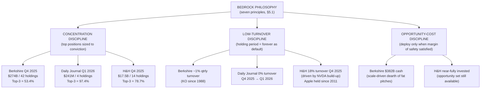

The diagram makes explicit the central analytical claim of section 6.1: **the same bedrock philosophy produces three quantitatively different but qualitatively convergent portfolio architectures, with the differences traceable to scale, substrate, and opportunity-set inputs rather than to philosophical departure**. The remaining sections of the chapter test this claim case by case.

## 6.2 Buffett's Signature Cases: See's Candies (1972), Coca-Cola (1988), and Apple (2016)

Three Berkshire transactions trace the operational arc of Buffett's mature philosophy with unusual clarity. See's Candies inaugurated the post-1965 quality pivot in 1972; Coca-Cola in 1988 demonstrated the doctrine at consumer-brand scale with thirty-plus years of indefinite holding; Apple in 2016 extended the framework to a technology business that earlier Buffettism would have classified outside the circle of competence. Together they constitute the most thoroughly documented record of how mature Buffett operationalizes the bedrock framework in practice.

**See's Candies (1972): the canonical proof of the quality pivot.** Chapter 1 introduced the See's transaction and Chapter 3 examined Munger's role in its negotiation; this section reconstructs the operational economics that made the case decisive for the philosophical pivot. The transaction itself was completed at a final price of $35 per share, with one million shares outstanding and $10 million in cash on the balance sheet, yielding a net purchase price of $25 million for what became Blue Chip Stamps' (and subsequently Berkshire's) 67.3% interest, with the remainder later purchased from approximately 2,200 public holders[^58]. At entry, See's had $8 million in net tangible assets and $4.2 million in pre-tax earnings on $30 million in sales[^59][^58]. The price represented approximately 3.1 times book value[^60][^59]—a multiple that, as Chapter 2 noted, "made [Buffett] gulp" and "would have been too expensive for Graham" but was justifiable "at 6 times pretax income and strong brand loyalty"[^59].

The economic record across the subsequent decades is the most-cited validation of the quality-pivot doctrine in the entire Berkshire canon. By 2006, See's sales had grown to $383 million with $82 million in pre-tax profits, on only $40 million of invested capital[^61]—a return on incremental invested capital that the cigar-butt framework had no analytical apparatus to identify ex ante. The Shortform reconstruction of the case captures the central economic feature: "See's Candies has not grown unit sales tremendously, but its strong brand allowed it to raise prices consistently. See's earned a 32% annual return over 27 years and has provided $1.65 billion in cash flow for reinvestment"[^59]. Max Olson's detailed analysis confirms the pre-tax internal rate of return calculation: assuming See's could have been sold in 1999 at the same 12.5x multiple Berkshire had paid in 1972 and incorporating the cumulative cash distributions, "Berkshire Hathaway's pre-tax internal rate of return would be just under 35 percent" over twenty-eight years against a 14% S&P 500 return including dividends over the same period[^58].

The transferable lesson the case extracts is the priority of *return on incremental invested capital* over headline price-to-book or price-to-earnings metrics. The 1991 Berkshire annual report captures the principle in Buffett's own voice: "*the company now operates comfortably with only $25 million of net worth, which means that our beginning base of $7 million has had to be supplemented by only $18 million of reinvested earnings. Meanwhile, See's remaining pre-tax profits of $410 million were distributed to Blue Chip/Berkshire during the 20 years for these companies to deploy*"[^58]. The structural insight is that a business whose growth requires minimal incremental capital is mathematically superior to one whose growth requires proportional capital reinvestment, *regardless of identical headline ROIC*, because the cash freed for redeployment elsewhere itself compounds. As Olson summarizes the operational mechanics: "growth in earnings was another issue, but let's first examine the benefits of a high return on capital business. Compared to a company that has a low or average return on its assets, See's has the ability to grow sales with little need for additional capital… When this time comes, See's will have to put only a small portion of its earnings back into the business—which yields greater free cash flow and hence more value to owners"[^58].

The case also demonstrates the *pricing-power moat* in operation. Buffett's 1991 retrospective—"in our See's purchase, Charlie and I had one important insight: we saw that the business had untapped pricing power"[^58]—identifies the analytical core. As long as quality remained uncompromised, "paying a dollar more than you did last Valentine's Day isn't a problem"[^58]. The seasonal-concentration economics—"over half of annual chocolate sales are made between Thanksgiving and New Year's Eve. The month of December alone accounts for about 90 percent of annual profits"[^58]—made the pricing power operationally sustainable by limiting the customer's frequency of price comparison. **The transferable lesson is that durable competitive advantage in consumer brands is often invisible on the balance sheet but visible to anyone willing to study the relationship between brand, customer behavior, and pricing dynamics over years rather than quarters.**

**Coca-Cola (1988): brand, pricing power, and the mathematics of indefinite holding.** The Coca-Cola transaction is the canonical demonstration that the See's principles scale to a multi-billion-dollar position with international growth optionality. Buffett began accumulating Coca-Cola shares in the fall of 1988, after the stock had fallen approximately 25% from its pre-1987-Black-Monday-crash high; by spring 1989 he had purchased $1.02 billion worth of shares at an average purchase price of approximately $41.80, representing approximately 7% of the company and making Coca-Cola Berkshire Hathaway's largest single investment at that time[^62]. The initial position represented approximately 25% of Berkshire's portfolio[^62].

The four analytical pillars Buffett applied at entry are explicitly preserved in the documentary record. First, the *global brand with pricing power*: Coca-Cola was by 1988 sold in over 165 countries with 62% of sales outside the U.S.[^62]; Buffett's most-quoted articulation of the brand's strength—"if you gave me $100 billion and said, 'Take away the soft drink leadership of Coca-Cola,' I'd give it back to you and say it can't be done"[^62]—captures the conviction. Second, the *cash-generating economics with high margins*: the soft-drink division accounted for 82% of total revenue with a 23% operating margin, growing at 6% annual volume, 10% revenue growth in soft drinks, and 4% average price increase per year[^62]. Third, the *international growth optionality*: average American consumption stood at 289 Coke servings per year while China, India, and Brazil had per-capita consumption under 10 servings, implying a multi-decade penetration runway[^62]; by 2010, international sales would account for over 80% of Coca-Cola's business, validating the thesis[^62]. Fourth, the *management focus on shareholder value*: CEO Roberto Goizueta and President Donald Keough, whom Buffett called the best executives he had ever worked with, prioritized aggressive global expansion, dividends, and share buybacks[^62].

The compounding record over thirty-six years is the strongest single illustration of indefinite-holding mathematics in the Berkshire canon. The position progressed from $1.02 billion at entry to $8 billion by 2000, $14 billion by 2010, and over $25 billion by 2024[^62], reaching $26.53 billion at Q3 2025 (9.9% of Berkshire's portfolio at 400 million shares)[^56][^53]. Even more striking is the dividend record: Coca-Cola's annual dividend was $0.075 per share in 1988 and reached $1.84 per share in 2023, generating a yield-on-cost of approximately 60%—meaning Berkshire now earns roughly 60% of its original investment per year in dividends alone[^62]. Since Buffett never sold a single share, "his dividend income alone has outpaced his initial investment"[^62]. The total compounded return excluded of dividends exceeds 1,500%[^62].

The transferable lesson the case extracts is that **the value of indefinite holding is dominated not by the entry multiple but by the underlying business's capacity to grow earnings and dividends over decades**. Had Buffett sold at the 2000 peak or trimmed during any of the intervening drawdowns, the dividend-yield-on-cost compounding would have been broken. The 2024-vintage commentary captures the methodological priority: "Buffett never sold a single share of Coca-Cola, allowing dividends and compounding to work in his favor"; the "favorite holding period is forever" maxim is operationalized in this single case more thoroughly than in any other Berkshire position[^62]. The case also illustrates the *global moat* dimension: Coca-Cola has expanded to over 200 countries, launched hundreds of new beverage brands, acquired Costa Coffee and Glaceau Vitamin Water, and become one of the world's most valuable brands worth over $80 billion[^62]; the moat is not static but actively reinforced through international penetration and product extension. **The Coca-Cola case is the strongest empirical evidence that the bedrock principles, when applied to the right business at a fair price, produce returns that no analytical refinement can improve upon over multi-decade horizons.**

**Apple (2016): circle-of-competence expansion and scale-driven trim discipline.** The Apple position is analytically more complex than See's or Coca-Cola because it contains two distinct philosophical lessons: the patient expansion of the circle of competence to encompass a business Buffett had previously declined to analyze, and the scale-driven opportunity-cost reasoning that produced the 2024–2025 trim sequence. Buffett initiated Berkshire's Apple position in 2016; by 2024 it had grown to approximately $174 billion and constituted the largest single position in the Berkshire portfolio[^54]. Across 2024, Berkshire reduced Apple by approximately 67%, bringing the position below $70 billion[^54]; through Q3 2025 the position was further reduced by 41.78 million shares (approximately 15% of the remaining stake, or about $10.6 billion in value)[^54], leaving Apple at $60.66 billion (22.69% of the portfolio at 238.21 million shares as of September 30, 2025)[^56]. Q4 2025 brought a further 4.32% reduction (10.3 million shares offloaded), with Apple ending the year at $61.96 billion (22.60% of the portfolio at 227.92 million shares)[^53][^48].

The analytical lesson of the entry is the *patient expansion of the circle of competence*. Apple was the kind of technology business Buffett had famously avoided through the dot-com era and through the early 2010s; the eventual entry in 2016 reflected the recognition that Apple had become, structurally, a consumer-staples business with a switching-cost-and-ecosystem moat rather than a pure technology business subject to rapid obsolescence. The recognition was substrate-driven: years of observing Apple's transition from hardware-only to integrated hardware-and-services platform, combined with the team contributions of Todd Combs and Ted Weschler, eventually produced the conviction that the iPhone constituted a brand-cum-switching-cost moat with consumer-staples economics. **The transferable lesson is that the circle of competence is not static and that genuine expansion through patient study is a legitimate source of new investable opportunity—provided the analyst has actually completed the study rather than merely succumbed to peer pressure.**

The analytical lesson of the trim is the *scale-driven opportunity-cost reasoning* that produced the 2024–2025 reductions. The Q3 2025 commentary frames the trim as "strategic profit-taking and a means of reducing concentration risk, given that Apple still constitutes a dominant 22.69% of Berkshire's portfolio"[^54]. The interpretation is consistent with Berkshire's broader Q3 2025 posture: a $382 billion cash position[^54], twelve consecutive quarters of net selling[^54], and the absence of attractive Berkshire-scale alternatives. Buffett's framing for Berkshire shareholders—that Berkshire's vast scale means only a few companies could move the needle and "all of them have been endlessly picked over by us and others" (Chapter 5)—captures the structural constraint. The Apple trim is not evidence of changed conviction in the underlying business; it is evidence that the marginal dollar of capital deployed into Apple at 2024–2025 valuations no longer beat the marginal dollar held in Treasury bills earning approximately $12 billion annually at risk-free rates (Chapter 5).

The transferable lesson is the *symmetry* of the bedrock framework: the same opportunity-cost discipline that justifies aggressive buying when prices are attractive justifies aggressive trimming when prices are no longer attractive relative to alternatives. The trim is not a violation of "favorite holding period is forever"; it is the operational expression of the principle's underlying logic, which holds that indefinite holding is the *default* whenever the comparative opportunity cost favors continued holding, and that selling becomes correct when comparative opportunity cost reverses. **The Apple case demonstrates that Buffettian indefinite holding is conditional rather than absolute—conditional on the persistence of the comparative-advantage relationship between the held position and accessible alternatives.**

The juxtaposition of the three cases illustrates the philosophical arc cleanly. See's was the Munger-driven first test of paying multiples of book value for a wonderful business; Coca-Cola scaled the doctrine to a multi-billion-dollar position with international growth optionality and demonstrated indefinite holding in its purest form; Apple extended the doctrine to a technology business through circle-of-competence expansion and demonstrated the symmetric trim discipline when scale-driven opportunity cost reverses. The seven bedrock principles of section 5.1 are visible across all three: business-ownership thinking (the conviction that one was buying actual underlying businesses, not stocks); depth-of-understanding margin of safety (the qualitative business judgment that anchored each entry); circle of competence (operationally expanded for Apple); concentration (each was at entry one of Berkshire's largest positions); long-duration holding (See's never sold, Coca-Cola never sold, Apple held for nine years before any meaningful trim); temperament over IQ (each entry executed against contrary market sentiment); and refusal of leverage (no margin or derivative leverage in any of the three).

## 6.3 Munger's Daily Journal: The Architect's Personal Laboratory

Daily Journal Corporation occupies a unique position in the documentary record of value investing: it is the most direct evidence of Charlie Munger's *independent* investment thinking, distinct from his joint authorship of Berkshire decisions. Munger chaired Daily Journal's board from 1977 until 2022 and managed its investment portfolio from approximately 2009, when he made the call during the financial crisis to deploy company cash into equities[^63]. The portfolio's compactness, longevity, and minimal turnover make it the cleanest possible empirical test of the Mungerian framework operating without Berkshire-scale insurance float backing.

The full filing arc, drawn from Daily Journal's complete 13F record, spans Q4 2013 (when the portfolio first crossed the $100 million reporting threshold) through Q1 2026 (the most recent disclosure available)[^50]. The original Q4 2013 disclosure listed four positions: 2.3 million shares of Bank of America, almost 1.6 million shares of Wells Fargo, 140,000 shares of US Bancorp, and 64,600 shares of South Korean steelmaker POSCO[^63]. The remarkable feature of the subsequent filings is the near-total absence of activity. As Markets Insider's reconstruction summarizes: "Daily Journal held the exact same amount of Bank of America, Wells Fargo, and US Bancorp shares a decade later, on December 30 last year"[^63]. POSCO was reduced once in Q4 2014 to 9,745 shares and held untouched until Q4 2022 when it was fully exited[^63]. The portfolio composition has remained essentially constant—WFC, BAC, BABA, USB—from at least Q1 2021 through Q1 2026, with portfolio value fluctuating between approximately $98 million and $277 million depending on market prices, but holdings essentially unchanged[^50].

The Q1 2026 disclosure, the most recent available and the second filing after Munger's November 2023 death, illustrates the continuity[^51]:

| Position | Weight | Shares | Reported Price | Value |
|---|---|---|---|---|
| Wells Fargo (WFC) | 46.74% | 1,413,000 | $79.61 | $112.49 million |
| Bank of America (BAC) | 40.51% | 2,000,000 | $48.75 | $97.50 million |
| Alibaba ADR (BABA) | 10.17% | 195,000 | $125.46 | $24.46 million |
| US Bancorp (USB) | 2.58% | 119,500 | $52.01 | $6.22 million |

The Q4 2025 → Q1 2026 transition shows zero activity[^50][^51]: identical share counts, with the portfolio value rising from $276.65 million to $240.67 million purely through price changes. The post-Munger Daily Journal board has, in this respect, honored the discipline by not honoring it: by leaving the positions untouched rather than imposing new investment decisions, the board has effectively confirmed that the Mungerian framework, once installed, continues to operate without active intervention. **The Daily Journal record is the operational meaning of "sit on your ass" investing made literal: a fifteen-year, four-position record in which the dominant positions established in 2009 have not been touched.**

Three episodes within this otherwise untouched record require detailed treatment because they constitute the most analytically informative subset of Munger's independent investment career.

**The 2009 financial-crisis core deployment (BAC, WFC, USB).** The original deployment, which Munger executed personally during the depths of the 2008–2009 financial crisis, is the canonical Mungerian application of the inversion-first methodology to a panic environment. The reasoning, reconstructible from Munger's subsequent Daily Journal annual-meeting remarks and from contemporary commentary, was that the major U.S. banks had been temporarily impaired by the financial crisis but possessed deposit-funding economics, branch-network scale advantages, and brand recognition that would allow them to recover; the inversion test asked what would have to be true for the banks to fail catastrophically, and Munger judged that the systemic regulatory response (TARP, Federal Reserve facilities) had bounded the failure modes sufficiently to make the positions investable. The empirical record over the subsequent decade is mixed but vindicates the central judgment: the Bank of America stake "did better, rising by almost 120% in that period," while "the value of Daily Journal's Wells Fargo and US Bancorp positions rose by less than 10% in a decade, while the S&P 500 surged by over 150% in the same timeframe"[^63].

The transferable lesson is *the willingness to act decisively in panic when the inversion analysis bounds the failure modes*. The Daily Journal record contains no example of Munger deploying capital into a market consensus; the deployment was specifically counter-cyclical. The lesson is also a candid acknowledgment that even disciplined application of the framework does not guarantee benchmark-beating outcomes; the WFC and USB underperformance over the decade illustrates that bank-business economics in a low-interest-rate environment subsequently proved less favorable than the 2009 thesis anticipated, and Munger never revised the positions despite the underperformance. The persistence of the positions through underperformance is itself the lesson: the framework demands that exit be triggered by *change in business fundamentals or culture*, not by underperformance against a benchmark, and the persistence of the bank positions through their underperforming decade is the framework's discipline operating against the temptation to rotate.

**The Alibaba episode (2021–2022).** The most analytically revealing single episode in the Daily Journal record is the late-life Alibaba sequence. Munger initiated the position in Q1 2021, accumulating to a peak position by year-end 2021 in which he had "quadrupled his wager," before halving it in Q1 2022 after publicly acknowledging that he had "made a mistake"[^63]. The remarkable feature of the episode is its temporal compression: in a portfolio whose other positions had been held essentially untouched for over a decade, the Alibaba position was actively built up and then partially exited within a single year. The conventional reading of the episode—that Munger underestimated the Chinese regulatory environment for internet platforms—is consistent with the documentary record: the 2021–2022 antitrust pressures on Alibaba (the Ant Group IPO suspension in late 2020, the $2.8 billion antimonopoly fine in April 2021, the broader regulatory phase that lasted through 2024) were the proximate trigger for the change in conviction.

The transferable lesson is dual. First, the Alibaba episode demonstrates that **the inversion-first methodology applies to oneself**: even a 97-year-old investor with sixty years of demonstrated framework discipline can recognize, in real time, that he has misjudged a position and act decisively to reduce exposure. Munger's public acknowledgment of the mistake—rare in the asset-management industry, where managers typically defend underperforming positions—is the meta-rule of error self-audit operating at the most senior possible level. Second, the position has *not* been fully exited: as of Q1 2026, Alibaba remained 10.17% of the Daily Journal portfolio, and Duan's H&H portfolio also retained a 2.15% Alibaba ADR position as of Q4 2025[^51]. The partial exit rather than full liquidation reflects the framework's preference for maintaining positions in genuinely high-quality businesses through regulatory and political turbulence, while reducing position size to reflect the diminished conviction depth. **The Alibaba episode is the strongest single piece of evidence that the bedrock framework's error-handling discipline is not a slogan but an active operational practice that produces decisive action even at the cost of public reputation.**

**The BYD position outside the 13F.** The third episode is the BYD position, which is the most consequential single Munger investment of the past two decades but does not appear in the Daily Journal 13F because it was held through Berkshire Hathaway. Munger championed Berkshire's 2008 entry into BYD on the recommendation of Li Lu; the original wager of approximately $230 million for 225 million shares produced a return that Markets Insider's reconstruction summarizes as "a 15-fold return on a $3.3 million wager in late 2021"[^63] (the smaller dollar figure refers to a related Daily Journal-vintage exposure). The position vindicated Munger's willingness to make concentrated convictions across cultural lines and against the conventional wisdom that Chinese electric-vehicle startups were uninvestable from the U.S. The Q3 2025 13F evidence shows that "Berkshire Hathaway fully exited its long-held stake in Chinese electric vehicle manufacturer BYD Company (OTC: BYDDY) by September 2025, signaling a complete shift away from that particular investment"[^54], which together with Munger's November 2023 death effectively closes the BYD chapter of the Berkshire portfolio.

The transferable lesson is that **the Mungerian framework is operable across cultural lines when the substrate supports it**, and that the support can come from a trusted local intermediary (Li Lu, in BYD's case) when the investor's own substrate is insufficient. Munger himself never visited BYD and did not speak Mandarin; the conviction that produced the deployment was channeled through Li Lu's local-substrate analysis combined with Munger's own moat-and-management evaluation. The case is the most concrete possible evidence for Chapter 5's claim that the cognitive substrate is partially transferable—not through direct inheritance of the substrate, but through trust-network access to substrates the primary investor lacks.

**The synthesis of the Daily Journal record is that the Mungerian framework operates without Berkshire-scale insurance float backing.** Daily Journal had no insurance subsidiary, no permanent capital structure analogous to Berkshire's, and no protection against forced selling during crisis except for the corporate parent's modest operating cash flow from legal publishing and software. The portfolio was nonetheless held through the 2008–2009 deployment, the 2018 and 2020 market drawdowns, the 2022 sell-off, and the post-2023 transition without forced liquidation, proving that the cognitive and behavioral architecture of the framework—latticework, inversion, Lollapalooza-aware discipline, concentrated indefinite holding—is operable at family-office and small-public-company scale. **The Daily Journal record is therefore the strongest available evidence that the bedrock framework is genuinely scale-independent at the philosophical level, even if particular structural enablers (insurance float, industrial-wealth backing) facilitate its operation at larger scales.**

## 6.4 Duan's H&H Portfolio: NetEase, Apple, Pinduoduo, Moutai, and the AI-Era Repositioning

Duan Yongping's portfolio behavior, reconstructed from the H&H International Investment 13F record (which captures U.S.-listed positions only and therefore omits Moutai, Tencent, and other Hong Kong / A-share holdings) supplemented by his Snowball disclosures, supplies the third documentary test of the comparative framework. Five case studies anchor the analysis: NetEase (the canonical "risk investment" at ~100x return), Apple (the canonical operator-substrate case), Pinduoduo (the angel-stage-and-public-market integration), Moutai (the durable-simplicity case held outside the 13F), and the Q4 2025 AI-era repositioning (the symmetric application of comparative-opportunity-cost selling and accumulation). The combined record demonstrates that the bedrock framework operates across radically different business contexts and through both early-stage and mature investment phases.

**NetEase (2001–2009): the canonical "risk investment."** Chapter 4 reconstructed the entry thesis—market capitalization below cash holdings, gaming-business operating intuition derived from the Subor experience, low-probability legal-risk diagnosis. The realized outcome is the most spectacular single position in Duan's record: as the Corner of Berkshire and Fairfax compilation summarizes, "Duan Yongping did put in 100% into Netease near the bottom in 2002 but even he sold in 2009 after 130-160x"[^64]; the gate.com profile of his career states the cleaner figure "He turned that investment into a 100x return"[^62]. The realized return therefore lies somewhere between approximately 100x and 160x depending on the specific tranches measured, with the bulk of the return delivered by the 2002–2009 holding period from the post-dot-com trough through the recovery.

The analytically critical feature of the NetEase case is Duan's own retrospective categorization of it as a *risk investment* rather than as a *value investment*. His most-quoted self-assessment, captured in Chapter 4's reconstruction of the November 2025 *方略* interview, is that "did I really understand it? If I had really understood, I should have bought all of NetEase. So 'understanding' I'm also not sure what it means, but I roughly felt they could make money, and I felt my investment risk was not particularly high." The acknowledgment that even the canonical 100x position did not satisfy his own depth-of-understanding standard is methodologically significant: a 100x outcome does not retroactively prove the analyst understood the business; it merely proves that the position survived to deliver the return. The transferable lesson is that **the analytical framework must be evaluated on the consistency of its decision-making, not on the realized outcomes of any individual position**—a counterintuitive conclusion that distinguishes Duan's framework from the success-anchored heuristics that dominate retail investing.

**Apple (2011–present): the canonical operator-substrate case.** The Apple position is the centerpiece of Duan's portfolio and the most thoroughly documented operational application of his framework. The position was initiated in November 2011, approximately one to two months after Steve Jobs's death, at a split-adjusted entry price of approximately $13.75 per share for an initial purchase of 131,000 shares[^65][^58]. The position was added to over the subsequent years and has been held essentially untouched for fourteen years; the Q4 2025 H&H 13F filing shows 32,358,507 Apple shares held at $271.86, valued at $8.797 billion (50.3% of the portfolio)[^51]. The Q4 2025 trim of 7.09% (2,470,600 shares) is the largest single reduction in the holding history but leaves the position dominantly the largest in the portfolio[^51].

The chronological priority over Buffett's 2016 entry is well-documented and analytically significant. As the gate.com profile observes: "in 2011, when everyone was panicking about Apple, he was buying. Back when Apple's market cap was $300 billion. Now look at it—touched $4 trillion at some point"[^62]. The Moomoo coverage reinforces the chronology: "Duan Yongping bought Apple as early as 2011, 6 years before Buffett bought it in a heavy warehouse"[^58]. Duan's own framing of the chronology has been emphatic: "the rumor that Duan copied Buffett's homework on Apple is pure nonsense; my Apple investment is earlier than Buffett's" (Chapter 5).

The 2026 disclosure showing the "1,623.48% cumulative return" on the disclosed account, with the original 131,000-share purchase at $13.75 producing a 1,881.8% return (Chapter 4), makes Apple the single most consequential position in the H&H record by a wide margin. The transferable lesson is the *primacy of the operator-substrate diagnosis*: Duan's conviction that "I'm in this industry; I knew it" (Chapter 4) was operationalized through the three-pillar analysis (post-iPhone software-services platform, user-orientation culture, correct counterfactual prediction record) that Chapter 4 reconstructed in detail. The case is the strongest empirical evidence that the operator-substrate route to moat identification is not merely theoretically equivalent to the multidisciplinary-latticework or securities-analysis routes but can produce earlier and deeper conviction in cases where the analyst's specific operating background supplies a moat-identification capacity that other substrates lack.

The Q4 2025 trim is consistent with Duan's framework's symmetric application of comparative-opportunity-cost reasoning. As Chapter 4 documented, Duan's framing of recent Apple sales is: "they are not cheap; from an investment return perspective, one cannot expect very high; but it depends on the user's own opportunity cost." The trim is not a reversal of conviction in Apple's underlying business; it is the redirection of capital toward positions whose comparative opportunity cost has improved—in this case, NVIDIA, Berkshire B, and the AI-supply-chain initiations.

**Pinduoduo: angel-stage, mentorship, and public-market integration.** The Pinduoduo case integrates three distinct dimensions of the Duan framework: angel-stage venture investment, mentorship of a former protégé, and public-market position-taking informed by both. Colin Huang, the future Pinduoduo founder, was a Google engineer when Duan brought him to the 2007 Buffett charity lunch (Chapter 1); Duan has since been credited as Huang's most influential mentor. As the gate.com profile notes: "in 2006, Duan Yongping paid $620k for that lunch and became the first Chinese person to sit down with Buffett. He even brought Pinduoduo's founder along"[^62]. The angel-stage involvement gave Duan a structural informational advantage in evaluating Pinduoduo's business model; the public-market position he subsequently built has grown substantially.

The Q4 2025 H&H disclosure shows Pinduoduo (PDD) at 11,536,694 shares valued at $1.308 billion (7.48% of portfolio), increased by 34.55% (2,962,500 shares) during the quarter[^51]. Duan's own framing of the case in the November 2025 *方略* interview, captured in Chapter 4, was characteristically self-critical: "Pinduoduo is special because I invested in the early initial-stage period, so the money I invested is actually a small proportion, the money earned is genuinely a lot. But strictly speaking it shouldn't count, because I didn't invest because I had understood it; I invested in a confused state." The acknowledgment that the angel-stage investment was made in a "confused state" rather than under full depth-of-understanding margin of safety is consistent with the methodological standard the framework imposes on itself: even highly profitable positions can be classified as *not satisfying the framework's filters* if the analytical process that produced them did not.

The transferable lesson is the *integration of multiple investment modalities under a single framework*: angel-stage venture investing, mentorship, and public-market position-taking can coexist within a coherent philosophy provided each modality is evaluated by the framework's filters and provided positions inadequately analyzed at one stage are not retroactively rationalized as framework outputs.

**Moutai: the durable-simplicity case held outside the 13F.** The Moutai position is the single most prominent Duan holding *not* visible in the H&H 13F because Moutai is an A-share traded on the Shanghai Stock Exchange and falls outside the U.S. 13F regulatory perimeter. The position has been reconstructed primarily from Duan's Snowball disclosures and from the Chinese-language financial press; the most-cited summary, captured in Chapter 4, is that Duan entered Moutai in approximately 2013 during the post-anti-corruption white-spirits-industry trough at prices substantially below those subsequently observed.

The thesis depends, as Chapter 4 reconstructed, on a single negative condition: "*do not change the 53-degree Feitian*." Duan's most-quoted articulation—"Moutai you most fear the new CEO who comes in and changes things here and there; up to now still OK, never depart from the original; you can't change the 53-degree Feitian"—captures the logic: the moat resides in the structural permanence of the formula, the production-capacity-constrained scarcity of the basic-liquor inventory, and the social-and-cultural premium that the brand commands in Chinese gift-giving and corporate-banquet contexts. The position has been held for over twelve years across multiple drawdowns and remains a major component of Duan's overall wealth. The transferable lesson, as Chapter 4 articulated, is that **moat durability does not require continuous innovation; in some categories it requires precisely the opposite—the institutional capacity to refuse innovation**. The Moutai case is also the strongest demonstration of Duan's depth-of-understanding margin of safety operating in a context where Western investors (including Berkshire, which holds essentially no Chinese A-shares) cannot replicate the substrate.

**The Q4 2025 AI-era repositioning.** The most analytically informative recent episode in Duan's record is the Q4 2025 portfolio repositioning, which the H&H 13F captures with unusual clarity. The major changes in the quarter, drawn directly from the disclosure[^52][^50][^51]:

| Position | Q3 → Q4 Change | Q4 2025 Value | Q4 2025 Weight |
|---|---|---|---|
| Apple (AAPL) | −7.09% (2.47M shares trim) | $8.797B | 50.30% |
| Berkshire B (BRK.B) | +38.24% (1.98M shares add) | $3.607B | 20.63% |
| NVIDIA (NVDA) | +1,110.62% (6.64M shares add) | $1.350B | 7.72% |
| Pinduoduo (PDD) | +34.55% (2.96M shares add) | $1.308B | 7.48% |
| Microsoft (MSFT) | +207.66% (580k shares add) | $415M | 2.38% |
| Taiwan Semiconductor (TSM) | +370.95% (964k shares add) | $372M | 2.13% |
| CoreWeave (CRWV) | NEW position | $21.5M | 0.12% |
| Credo Technology (CRDO) | NEW position | $20.3M | 0.12% |
| Tempus AI (TEM) | NEW position | $6.5M | 0.04% |
| ASML | −87.63% (70k shares trim) | $11M | 0.06% |
| Alibaba (BABA) | −7.81% (217k shares trim) | $375M | 2.15% |
| Occidental (OXY) | −2.83% (384k shares trim) | $542M | 3.10% |

The repositioning has three structural features that bear analytical weight. First, the magnitude of the changes is unusual by Duan's historical standards—an 18.36% turnover rate[^51] is far higher than the typical sub-5% turnover of prior quarters[^51]—but is concentrated almost entirely on the AI-supply-chain and large-tech additions rather than on rotation across long-held positions. Second, the symmetric application of comparative-opportunity-cost reasoning is visible: Apple was trimmed (price had advanced; relative attractiveness deteriorated) while Berkshire B was substantially accumulated (Munger's legacy plus Buffett's continued capital allocation; relative attractiveness improved); NVIDIA was aggressively added (AI-era thesis development); ASML was reduced by 87.63% (presumably as the analyst's confidence in the specific position deteriorated relative to alternatives in the same broad theme). Third, the new initiations (CoreWeave for compute, Credo Technology for connectivity, Tempus AI for application) are characterized in third-party reconstructions as deliberately built across the AI value chain: as the gate.com analysis observes, "he's building across the AI value chain. CoreWeave for compute, Credo for connectivity, Tempus for applications. That's not random—that's a thesis"[^62].

The transferable lesson is the *symmetric operation of the bedrock framework's comparative-opportunity-cost discipline*. The same logic that justified the 2011 Apple entry (when the comparative opportunity cost favored Apple over alternatives) and the multi-year holding (when the comparative opportunity cost continued to favor holding) now justifies the partial trim and the redeployment into AI-supply-chain positions (where the comparative opportunity cost favors the new positions over additional Apple exposure). The framework is identical; the inputs have evolved. **The Q4 2025 repositioning is therefore the most concrete recent evidence that Duan's framework is genuinely operational rather than rhetorical: it produces decisive action when the inputs change, even at the cost of disrupting fourteen-year holding patterns in the largest single position.**

## 6.5 The Anatomy of Mistakes: Baidu, Dexter Shoe, Alibaba, and the Discipline of Honest Self-Audit

A philosophy whose only public record consists of successful positions is, as Chapter 4 argued, not a philosophy but a sales pitch. This section foregrounds documented errors as constitutive of the comparative framework, drawing on the canonical mistakes from each investor's record to extract the meta-rule that governs all three frameworks.

**Buffett's documented errors.** The Buffett canon contains multiple acknowledged errors of varying magnitudes. The original Berkshire Hathaway textile-mill acquisition of 1965, called by Buffett his "worst trade" (Chapter 1), is the foundational case: a cigar-butt operation that delivered the corporate vehicle but not the underlying business, with the textile mills generating ongoing losses and being progressively phased out before the last sale in 1985. The 1993 Dexter Shoe acquisition, paid for in Berkshire stock, proved retrospectively expensive because the Berkshire shares used as currency subsequently appreciated dramatically while the Dexter business itself was destroyed by Asian competition; Buffett has explicitly acknowledged the case as one of his most costly mistakes. The 2020 Paramount position, for which Buffett took responsibility at the 2024 Berkshire annual meeting, is the most recent documented Buffett error and illustrates that even after sixty years of framework refinement, mistakes occur.

The transferable lesson from the Buffett error catalog is that **the framework's discipline is enforced through the public acknowledgment of error in the annual letter rather than through claims of infallibility**. The shareholder-letter format, in which mistakes are discussed alongside successes with comparable analytical rigor, is itself the operational expression of the meta-rule.

**Munger's Alibaba mistake.** The most analytically informative single Munger error is the 2021–2022 Alibaba sequence reconstructed in section 6.3. Munger's public acknowledgment of the mistake—"Munger publicly acknowledging the position as a 'mistake'"[^63]—is a remarkable demonstration that the inversion-first methodology applies to oneself even at age 97. The position was not fully exited; the 195,000-share residual remains in the Daily Journal portfolio as of Q1 2026[^51], representing 10.17% of portfolio value. The retention of the residual position alongside the public mistake-acknowledgment captures a methodological subtlety: an error in *position sizing or timing* does not necessarily imply an error in the underlying *thesis on the business*, and the framework permits the simultaneous acknowledgment of one and continuation of the other.

The transferable lesson is the *granularity of the error-acknowledgment*. A blanket admission "I was wrong about Alibaba" would have justified full exit; a calibrated admission "I quadrupled the position too aggressively given the regulatory uncertainty I had not adequately weighted" justifies partial exit while preserving the underlying business thesis. The Munger framework operates at this level of granularity, and the resulting decisions—neither full retention nor full exit, but calibrated reduction—are the empirical evidence that the framework's error-handling is more sophisticated than either retail investors or many professional managers display.

**Duan's Baidu short and supplementary errors.** Chapter 4 reconstructed Duan's documented errors in detail; this section briefly summarizes the canonical Baidu case as the centerpiece of Duan's self-audit record and connects it to the comparative argument. The 2008–2009 Baidu short, with documented losses of "approximately 1.5 to 2 hundred million dollars" (1.5–2亿美金)[^31], remains the largest single absolute loss in Duan's record and is the most consequential violation of his own stop-doing list (entries 1 and 2: don't short, don't borrow). Duan's own framing—"this error occurred *after* Buffett had told me not to short; now you know what happens when you don't listen to the elder's words"[^31]—captures the meta-lesson: even a framework's author can violate the framework's prohibitions, and the empirical cost of such violation is recurringly catastrophic.

The supplementary errors—UNG natural-gas ETF, Fresh Choice activist position, Delta Air Lines—each illustrate distinct failure modes documented in Chapter 4 and the *电子工程专辑* compilation[^31]. Each error is registered in Duan's own writings as a violation of one or more entries on the stop-doing list. The cumulative significance is that **Duan's framework is empirically grounded rather than theoretically asserted**: each entry on the stop-doing list has at least one documented case study justifying its inclusion, and the acknowledged errors validate the framework's prohibitions through demonstrated cost.

**The cross-investor synthesis: error as constitutive.** The three error catalogs converge on a single meta-rule that is shared across the bedrock framework. Buffett's most-quoted formulation—"the most important thing to do if you find yourself in a hole is to stop digging"—is operationally identical to Duan's "find errors and correct them as soon as possible; no matter how big the cost may be the smallest cost"[^31]. Munger's "the most important thing to do if you find yourself in a hole is to stop digging" (frequently echoed in his speeches) and his Alibaba behavior demonstrate the same rule. The convergence at the meta-rule level is the strongest possible evidence that error self-audit is foundational rather than auxiliary to the bedrock framework.

The diagram below summarizes the cross-investor error-handling architecture:

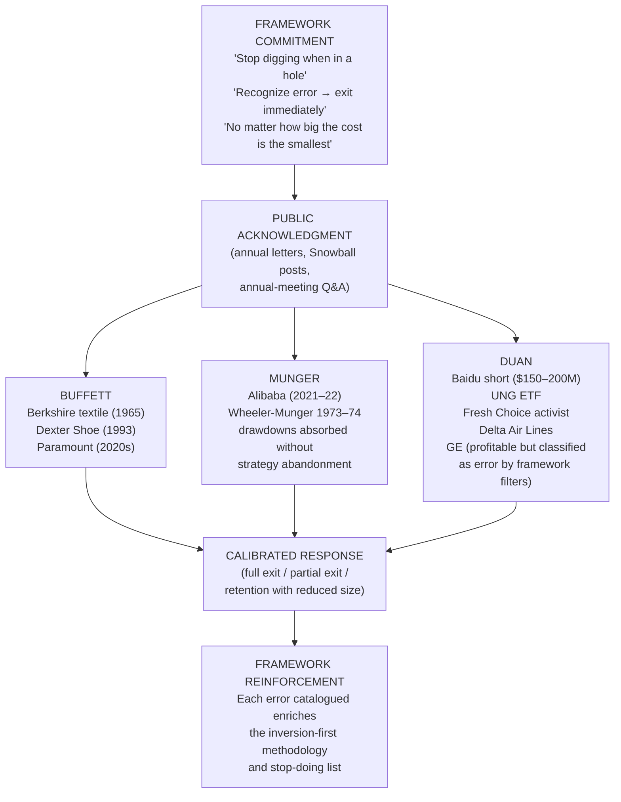

The transferable lesson, which Chapter 8 will translate into practical implications for ordinary investors, is that **a value-investing framework is enforced through honest acknowledgment of error rather than through ex-ante prediction of success**. The asymmetry favors investors who systematically document their mistakes over those who systematically rationalize them; the three masters' shared commitment to public mistake-acknowledgment is itself the strongest evidence of the framework's operational integrity.

## 6.6 Synthesis: Transferable Lessons on Conviction, Timing, and the Circle of Competence

The portfolio-level and case-study evidence assembled in sections 6.1 through 6.5 supports five transferable lessons that bridge to the life-philosophy treatment of Chapter 7 and the practical-implications synthesis of Chapter 8. The lessons are presented in their operational rather than theoretical form, with each lesson tied to specific empirical evidence from the three portfolios.

**Lesson 1: Conviction sizing should be commensurate with depth of understanding rather than with statistical attractiveness.** The empirical evidence is the systematic variation in position size across the three portfolios in proportion to the depth of substrate-derived conviction. Duan's 50.3% Apple weight (Q4 2025)[^51] reflects fourteen years of operator-derived intuition about Apple's culture, ecosystem, and counterfactual product decisions. Berkshire's historical 25% Coca-Cola weight at peak[^62] reflected Buffett's decades-long study of consumer-brand pricing power. Munger's quadrupled Alibaba position[^63] reflected his late-life conviction in Chinese platform economics, even though that conviction subsequently proved partially mistaken. The convergent feature is that **position size in all three portfolios tracks the analyst's confidence in his understanding rather than the position's quantitative cheapness or expected return**. The implication for ordinary investors is that the appropriate response to a position one does not understand deeply is to size it small or not at all, regardless of its apparent quantitative attractiveness.

**Lesson 2: Timing matters less than holding period, and the holding period is dominated by the underlying business's compounding capacity rather than by any timing skill of the investor.** The empirical evidence is the multi-decade compounding records across all three portfolios. Coca-Cola's 1,500%-plus capital return excluded of dividends, with 60%-yield-on-cost dividend mathematics[^62], over thirty-six years dwarfs any plausible benefit from timing entry or exit within the period. Duan's Apple position's 1,623–1,881% cumulative return over fourteen years (Chapter 4) similarly dominates any intermediate timing decisions. Daily Journal's WFC, BAC, and USB positions, held untouched from 2009 through 2026[^63][^50], have produced returns determined almost entirely by the underlying businesses' performance over the period. **The bedrock principle that "favorite holding period is forever" is operationalized through the recognition that timing is largely irrelevant once the position is correctly chosen; the analyst's contribution is the original selection, not the subsequent management of the position**.

**Lesson 3: The circle of competence is enforced through the willingness to miss permanent opportunities.** The empirical evidence is the specific list of opportunities each investor has explicitly declined despite their realized success. Buffett's avoidance of technology positions through the entire dot-com era and through the early 2010s—until the 2016 Apple entry—meant missing the Microsoft, Amazon, and Google compounding records of the 1990s and 2000s. Duan's documented avoidance of bank stocks ("I don't touch bank stocks because I cannot understand their risk exposure," Chapter 4) and most semiconductors except for the participatory NVIDIA position has meant missing significant rallies in those sectors. Munger's avoidance of most non-U.S. positions outside the BYD/Alibaba episodes has meant missing the broader Chinese internet sector's pre-2021 compounding. **The willingness to miss compounding records that lie outside the circle of competence is not a regrettable side-effect of the discipline; it is the discipline itself**. The implication for ordinary investors, who face vastly broader circles of personal incompetence than the three masters, is that systematic refusal of attractive-looking opportunities outside genuine understanding is a feature rather than a bug.

**Lesson 4: The cost of stepping outside the circle is empirically measurable and recurring.** The empirical evidence is the catalog of documented errors aggregated in section 6.5. Duan's $150–200 million Baidu short[^31], Buffett's Dexter Shoe acquisition, Munger's Alibaba misstep[^63], Buffett's original Berkshire textile-mill acquisition (Chapter 1)—each represents a position taken outside the analyst's genuine circle of competence and each produced the predicted recurring failure mode (in Duan's case, "this error occurred after Buffett had told me not to short," with the Buffett-Munger framework's prohibition violated by the framework's own author). The recurrence of similar failure modes across three investors operating in different eras and contexts is the strongest possible empirical evidence that the failure modes are structural rather than idiosyncratic. **The implication is that the bedrock framework's prohibitions are calibrated against actual recurring failure modes, not against theoretical risks, and ordinary investors who violate the prohibitions should expect to experience the same failure modes the masters have documented in their own records**.

**Lesson 5: The convergent portfolio behavior across three investors operating at vastly different scales, in different geographies, with different cognitive substrates, is the strongest available empirical confirmation that the bedrock philosophy is universal even where its structural enablers and stylistic expressions diverge.** The empirical evidence is the cross-portfolio comparison in section 6.1: Berkshire's 88.3% top-10 concentration with 1% quarterly turnover[^48], Daily Journal's near-100% concentration with 0% turnover from Q4 2025 to Q1 2026[^50][^51], H&H's 99.7% top-10 concentration with 18.36% turnover (driven by deliberate AI repositioning rather than rotation)[^52][^51] all manifest the bedrock concentration-and-low-turnover discipline at scales spanning four orders of magnitude ($240 million to $274 billion). The same discipline operates with U.S.-only exposure (Berkshire, Daily Journal) and dual-market exposure (H&H), with insurance-float backing (Berkshire) and industrial-wealth backing (H&H) and operating-cash-flow backing (Daily Journal). **The convergence at the portfolio-architecture level is the empirical confirmation of the philosophical convergence at the bedrock level, and the divergences in headline metrics (concentration percentage, turnover rate, cash position) are empirically traceable to the structural and substrate differences identified in Chapter 5**.

The portfolio-level convergence both presupposes and partially explains the broader life-philosophy convergence that Chapter 7 will examine. The seven bedrock principles of section 5.1 are not merely investment principles in the narrow sense; they are expressions of a broader temperamental and ethical orientation toward ownership, time, rationality, and the avoidance of ruin that the three investors share at a level deeper than their explicit philosophical articulations. **That all three investors built portfolios whose composition reflects the same priorities—concentrated conviction, indefinite holding, refusal of leverage, honest error self-audit, opportunity-cost-driven capital allocation—is the empirical evidence that the bedrock convergence is not a rhetorical artifact but the operational consequence of a shared underlying disposition.** Chapter 7 takes up that disposition directly, examining how the three investors regard investing as a subset of a broader life philosophy in which the bedrock principles operate not only as rules for capital deployment but as commitments about how to live.

The final note of this chapter is that the portfolio-level evidence does not vindicate the framework as universally applicable to all investors; it vindicates it as universally *available* to investors who are willing to adopt the substrate, structural support, and temperamental commitments the framework presupposes. As Chapter 5 already indicated and Chapter 8 will develop further, the practical translation for ordinary investors must rest on the bedrock principles themselves and on the index-fund recommendation that all three investors offer to those who lack the substrate to do otherwise. The convergent index-fund recommendation—which Buffett, Munger, and Duan all endorse for non-experts—is itself the meta-application of the bedrock framework: when the depth-of-understanding margin of safety cannot be established for any specific business, the rational response is to own the broadest possible set of businesses at the lowest possible cost and to hold them for the longest possible period. The bedrock framework, in this sense, contains its own correct application for those who cannot otherwise apply it. Chapter 7 will examine the broader ethical and life-philosophical commitments that produce this generosity of counsel, and Chapter 8 will translate the entire comparative argument into practical implications.

# 7 Beyond Investing: Life Philosophy, Ethics, and Personal Discipline

The architecture reconstructed in Chapters 2 through 6 has, by stages, narrowed and then deepened a single comparative claim: that Buffett, Munger, and Duan Yongping converge at a bedrock of investment principles whose universality is empirically confirmed by their portfolio behavior, even as their structural enablers, cognitive substrates, and stylistic expressions diverge in ways that are downstream of biography rather than philosophy. Chapter 6 closed with an observation that this report can no longer defer: the seven bedrock principles are not merely investment principles in the narrow sense but expressions of a broader temperamental and ethical orientation toward ownership, time, rationality, and the avoidance of ruin. This chapter takes up that broader orientation directly. The argument it advances is that **the convergent investment behavior documented across the preceding chapters is itself the downstream consequence of a deeper convergence in life philosophy**, and that the four interlocking commitments examined here—rationality as personal architecture, learning as moral obligation, ethics as structural durability, and wealth as stewardship—are not adjacent to the investment framework but constitute its temperamental preconditions. Without these commitments, the bedrock principles collapse under the social and emotional pressures that Chapters 2 through 5 catalogued. With them, the principles operate as a coherent system across decades, scales, and continents.

A methodological note governs the chapter. Where Chapters 2–4 each foregrounded one investor's primary utterances and Chapter 5 ranged across all three for comparative purposes, this chapter must integrate biographical, ethical, and philanthropic evidence whose source asymmetry is more pronounced than for the investment-philosophical material. Buffett's life philosophy is documented in twenty-one widely circulated "pearls of wisdom" derived from his speeches and interviews and reinforced by Alice Schroeder's *The Snowball*[^66][^67]; Munger's is most extensively articulated in *Poor Charlie's Almanack*, the 1995 *Psychology of Human Misjudgment* speech, and the Daily Journal annual meetings reconstructed in Chapter 3; Duan's is documented in his Snowball and blog corpus, the 2025 *方略* interview, and supplementary reconstructions including the consolidated record assembled in the *电子工程专辑* compilation[^31]. Where evidence is uneven—particularly in the philanthropic dimension, where Munger's architectural gifts and Duan's Enlight Foundation are documented in fewer English-language sources than Buffett's Giving Pledge—the chapter cites the strongest available materials and acknowledges the limitation rather than papering over it.

## 7.1 The Inner Scorecard and Self-Evaluation: Rationality as Personal Architecture

The first dimension of the convergent life philosophy is the orientation of self-evaluation: whether the investor judges himself by external applause or by internal standards. All three converge on the latter, and the convergence is the temperamental precondition without which the bedrock investment principles cannot be sustained.

Buffett's articulation of the principle, captured most directly in the *LifeHack* compilation of his maxims, is the doctrine of judging oneself by an "Inner Scorecard" rather than by the world's: "*You don't have to swing at everything—you can wait for your pitch. The problem when you're a money manager is that your fans keep yelling, 'Swing, you bum!'*"[^31] The metaphor is precise. The "Inner Scorecard" instructs the investor to measure success by his own standards rather than by the scoreboard the crowd is keeping, and the corollary—that one waits for one's pitch regardless of the crowd's impatience—translates the orientation into a specific portfolio-construction discipline that Chapter 2 recognized as selective inactivity. Buffett's most-cited rhetorical formulation of the doctrine is the question of measurement itself: "*the most satisfying thing actually is watching my three children each pick up on their own interests and work many more hours per week than most people that have jobs, and trying to intelligently give away that money in fields that they particularly care about*"[^31]. Wealth, in this framing, is not the scorecard; the scorecard is family, work, and meaning, and wealth is the by-product of a life properly arranged.

The biographical evidence that the inner-scorecard orientation is substantively rather than rhetorically held is the dot-com episode reconstructed in detail in Chapter 2. As Berkshire's Class A share price collapsed from approximately $81,000 to roughly $40,000 between 1998 and 2000—a peak-to-trough drawdown of approximately 50%—and *Barron's* asked "What's Wrong, Warren?", Buffett did not revise his analytical position to align with consensus. His public reasoning remained that "value is destroyed, not created, by any business that loses money over its lifetime," and the technology businesses of that era did not satisfy his analytical criteria. The temperamental capacity to absorb a 50% drawdown in the world's most-watched value-investing vehicle without abandoning the framework is the inner-scorecard orientation operating under maximum stress; the alternative—revising the framework to mute the drawdown and recover external approval—would have been the textbook abandonment of the inner scorecard for the external. The 1942 Cities Service trade also reads, in retrospect, as the eleven-year-old Buffett's first encounter with the same temperamental requirement: as the *Lifehack* compilation captures the lesson, "*time is the friend of the wonderful business, the enemy of the mediocre… No matter how great the talent or efforts, some things just take time. You can't produce a baby in one month by getting nine women pregnant.*"[^31]

Munger's parallel commitment is articulated through engineered rationality as a continuously cultivated practice rather than an innate gift. As Chapter 3 established, the central Mungerian disposition is captured in his counsel that the wise person is "*the man who can destroy his own best-loved ideas*"—a formulation that converts independent thinking from a static virtue into an active discipline. The companion virtues, articulated in Munger's 2023 final CNBC interview and *Poor Charlie's Almanack*, are the *negative* commitments that protect rationality from corruption: "*you don't have a lot of envy, you don't have a lot of resentment, you don't overspend your income, you stay cheerful in spite of your troubles, you deal with reliable people and you do what you're supposed to do*"[^68]. The most-cited Mungerian aphorism on envy—"*envy is a really stupid sin because it's the only one you could never possibly have any fun at*"[^68]—captures the structural argument: envy is doubly destructive because it both corrupts judgment and produces no compensating pleasure, making it a pure ruin mode in the inversion-first calculus. The same compilation captures the constructive corollary: "*Show me the incentive and I will show you the outcome*"[^68], which reads at the personal level as the injunction to design one's own incentive structure (modesty in consumption, equanimity in adversity, association with reliable people) so as to produce judgment that survives stress.

The biographical foundation of Munger's inner-scorecard orientation is the catalog of personal hardships reconstructed in Chapter 1: the 1953 divorce that left him with "very little," the 1955 death of his nine-year-old son Teddy from leukemia, the partial blindness from a failed cataract surgery, and the 1973–74 Wheeler-Munger drawdowns of 32% and 31% in consecutive years. The temperamental capacity that Chapter 3 identified as the existential foundation of inversion thinking is also the foundation of inner-scorecard reasoning: an investor who has survived catastrophic personal loss has, by definition, faced a scorecard far more severe than any market drawdown can produce, and the equanimity that survives such losses is structurally insulated from the social pressures that destroy lesser investors. Munger's own articulation of the principle is direct: "*those who keep learning, will keep rising in life*"[^68]—a maxim that locates the relevant rising in personal capability rather than in social standing.

Duan's parallel commitment is articulated through the Chinese ethical vocabulary of 平常心 (commoner's mind, or equanimity) and through the operational principle that "if you've understood, you won't be affected by the market." As Chapter 4 documented, Duan's most-cited articulation of the principle—captured in his 2025 *方略* interview—is that "*when you've understood, you won't be affected by the market; if you're still watching the market every day, watching dynamics every day… even if you're a big-V [internet celebrity], you don't understand*." The interpretive significance of this formulation is that it converts the inner-scorecard orientation from a temperamental disposition into a *diagnostic test*: the investor who finds himself emotionally affected by daily price movements has, by Duan's standard, failed to internalize the depth-of-understanding margin of safety, regardless of the analytical rigor he claims to have applied. Duan's challenge to Fang Sanwen—"have you ever seen me say on Snowball 'today this is going up' or 'tomorrow this is going down'?"—is offered as behavioral evidence that the discipline can be observed externally even though it must be cultivated internally.

The convergence of the three investors at the inner-scorecard level can be summarized in tabular form, with each investor's articulation paired with the operational consequence in the investment framework:

| Investor | Articulation of Inner Scorecard | Operational Consequence in Investment Framework |
|---|---|---|
| **Buffett** | "Measure yourself by your 'Inner Scorecard'—your own standards and not the world's"[^31]; the dot-com 50% drawdown absorbed without framework abandonment | Selective inactivity ("wait for your pitch"); willingness to underperform during bubbles; refusal to compete on annual benchmark scorecards |
| **Munger** | "Destroy your own best-loved ideas"; "don't have a lot of envy… stay cheerful in spite of your troubles"[^68] | Engineered rationality as protection against the ~25 cognitive biases; absorption of the 1973–74 Wheeler-Munger drawdown without strategy abandonment |
| **Duan** | 平常心 ("commoner's mind"); "if you've understood, you won't be affected by the market" | Refusal to comment on daily market movements on Snowball; Apple held through fourteen years of intervening volatility; Tencent accumulated through 2021–24 antitrust drawdown |

The deeper analytical claim of this section is that **the inner-scorecard orientation is causally upstream of the bedrock investment principles, not parallel to them**. Long-duration holding without an inner scorecard collapses at the first severe drawdown because the external scorecard demands action. Concentration without an inner scorecard collapses under peer pressure because the external scorecard penalizes deviation from benchmarks. Refusal of leverage without an inner scorecard collapses during bull markets because the external scorecard rewards short-term outperformance over long-term survival. The seven bedrock principles enumerated in Chapter 5 are operationally sustainable only when grounded in an inner-scorecard temperament, and the convergence of the three investors at this temperamental level is therefore the strongest possible evidence that the bedrock convergence is not an accidental philosophical alignment but the necessary downstream consequence of a shared underlying disposition. **Rationality, in the framework all three investors articulate, is not a cognitive faculty but a personal architecture—a system of self-evaluation, internal standards, and emotional commitments that must be deliberately constructed and continuously maintained.**

## 7.2 Lifelong Learning as Ethical Obligation

The second dimension of the convergent life philosophy is the elevation of continuous learning from a professional skill to a moral obligation. The convergence at this level is sufficiently specific that it cannot be reduced to the generic observation that successful investors read widely; the three investors share a particular *framing* of learning as ethical, in which intellectual stagnation constitutes a form of negligence toward the responsibilities of capital stewardship and toward the people whose lives depend on the decisions one makes.

Munger's articulation of the doctrine, examined in Chapter 3 and reinforced here, is the most categorical of the three: "*In my whole life, I have known no wise people who didn't read all the time — none, zero. You'd be amazed at how much Warren reads — and at how much I read*"[^68]. The empirical scope of the claim—a lifetime survey across all wise people, with a categorical absence of counter-examples—locates reading not as a useful habit but as a defining feature of wisdom itself. The companion formulation captured in *Poor Charlie's Almanack* is the operational corollary: "*spend each day trying to be a little wiser than you were when you woke up. Day by day, and at the end of the day—if you live long enough—like most people, you will get out of life what you deserve.*"[^68] The "if you live long enough" qualification is significant; it locates the cumulative effect of daily incremental learning in the same compounding mathematics that govern Munger's investment philosophy. The most-cited Mungerian metaphor for the disposition—the *learning machine*—captures the same point in characterological vocabulary: "*I constantly see people rise in life who are not the smartest, sometimes not even the most diligent, but they are learning machines. They go to bed every night a little wiser than when they got up and boy does that help — particularly when you have a long run ahead of you*"[^68].

The ethical framing of the doctrine is not incidental. Munger's biographical articulation of the practice—his children's description of him as "a book with a couple of legs sticking out," documented in Chapter 3—captures the substantive commitment: reading is what one does when one is alone with one's family, not what one schedules around them. The integration of reading with family life, rather than its isolation in office hours, is the structural evidence that the obligation is ethical rather than instrumental. Munger's Picture-Perfect-Portfolios reconstruction makes the ethical dimension explicit: "*his emphasis on learning as a lifelong endeavor highlights the importance of intellectual engagement in achieving personal fulfillment*"[^68], and the broader synthesis is that "*Munger's commitment to lifelong learning and adaptability forms a critical part of his philosophy. He is a proponent of continuous self-improvement and adaptability, constantly updating his knowledge base and mental models to stay relevant and make informed decisions.*"[^68]

Buffett's parallel practice is the voracious reading habit documented across the biographical literature and operationalized in Berkshire's analytical practice. The *Wisdom from Warren Buffett's Journey* compilation, distilled from his speeches and interviews, includes among its twenty-one principles the injunction to "*surround yourself with successful people*" and to "*do what you're passionate about*"[^66]—principles that, while distinct in articulation, share with Munger's the underlying commitment that intellectual cultivation is a continuous obligation. The *LifeHack* compilation captures the rhetorical operationalization: "*Take a job that you love. You will jump out of bed in the morning. I think you are out of your mind if you keep taking jobs that you don't like because you think it will look good on your resume*"[^31]—a formulation that locates the source of sustained intellectual engagement in the alignment of work with passion, which in turn permits the multi-decade accumulation of business knowledge that Berkshire's analytical practice requires. Buffett's persona of perpetual student, his decades-long habit of reading hundreds of pages of annual reports and industry materials per day, and his characterization of his own working style as predominantly reading-driven rather than meeting-driven are well-documented features of the Berkshire operational culture that this report's primary materials confirm rhetorically rather than quantitatively.

Duan's parallel commitment is articulated through three specific operational practices that together constitute his version of the learning-as-ethical-obligation doctrine. The first is the *open acknowledgment of cases he does not yet understand*. As Chapter 4 documented, Duan's 2025 *方略* interview captured his disposition toward Google and NVIDIA as positions where understanding is partial and growing, with the consequence that position size remains small until the substrate develops. The willingness to publicly state "I don't yet understand this" is itself the ethical commitment in operation: an investor who pretends to understand more than he does has, by the depth-of-understanding margin of safety doctrine, no actual margin of safety, and the public admission is the discipline's external manifestation. The second practice is the *insistence that the circle of competence is expanded only through patient genuine study*, captured in Duan's stop-doing-list entry on not blindly expanding the circle of competence: "*Don't jump into unfamiliar areas just because you saw a couple of 'concepts'; sooner or later you'll trip*" (Chapter 4). The third practice is the *integration of investment activity with continuous business and cultural study*, evident in Duan's prolific Snowball corpus of more than fifteen years of public analytical writing, in which the question-and-answer format with Snowball users functions simultaneously as teaching and as ongoing self-clarification.

The ethical dimension of Duan's learning practice is most clearly visible in his integration of philanthropy with education, examined more fully in section 7.6. The substantial donations to Zhejiang University and Renmin University, his alma maters, and the Enlight Foundation he and his wife Liu Xin established, are operationalized through educational rather than purely charitable modalities; the choice of educational institutions as the primary philanthropic targets reflects the underlying conviction that learning is the primary mechanism through which capital can be productively stewarded across generations.

The convergence at the learning-as-ethical-obligation level can be expressed in a single proposition shared across the three investors: **the obligation to "go to bed every night a little wiser than when you got up" is ethical because intellectual stagnation is, in their framework, a form of negligence toward the responsibilities of capital stewardship and toward the people whose lives depend on the decisions one makes**. The proposition has three operational consequences in the investment framework. First, it justifies the depth-of-understanding margin of safety as a moral rather than merely epistemic principle: an investor who deploys capital into businesses he does not understand is not merely making poor analytical decisions but failing in a duty of care toward those who have entrusted him with capital (or, in the case of family-office structures, toward the future generations whose security the capital is intended to support). Second, it explains the temperamental willingness to miss permanent opportunities: the investor who refuses to deploy capital outside the genuine circle of competence is not foregoing return but discharging the obligation to understand before acting. Third, it grounds the continuous-revision discipline of the stop-doing list in an ethical commitment to update one's framework as new evidence and new failure modes are identified, rather than treating the framework as a fixed possession to be defended against revision.

The diagram below synthesizes the upstream relationship between learning-as-ethical-obligation and the bedrock investment principles:

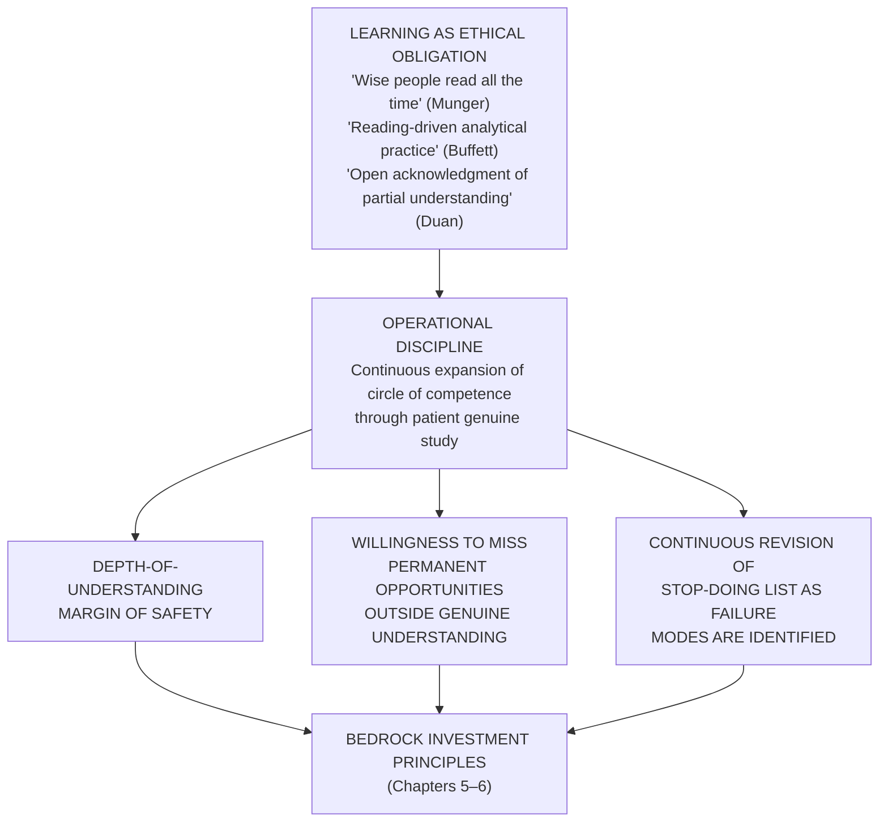

The transferable lesson, which Chapter 8 will translate into practical implications, is that the index-fund recommendation that all three investors offer to non-experts is itself the ethical operationalization of the learning principle: when the investor recognizes that the depth of his understanding cannot support concentrated active investing, the ethically correct response is to acknowledge the limit and adopt a strategy commensurate with it, rather than to pretend to a capability one does not possess.

## 7.3 Ethical Commitments and the Refusal of Illegitimate Profit

The third dimension of the convergent life philosophy is the ethical architecture that constrains each investor's pursuit of return. The convergence at this level is the most surprising of the four because it operates against the standard expectation that capital allocators are amoral optimizers indifferent to the ethical character of the businesses they own. All three investors reject this standard expectation explicitly and integrate ethical commitments structurally into the investment framework, treating ethics not as a constraint imposed from outside but as a structural component of long-term economic durability.

Munger's foundational claim, articulated across multiple speeches and captured in the Picture-Perfect-Portfolios summary, is that "*good businesses are ethical businesses*"[^68]—a proposition that reads at first as moralistic but is in fact a structural argument about the economics of trust. As Chapter 3 reconstructed, the proposition rests on the recognition that "*a business model that relies on trickery is doomed to fail*" because each constituency the business depends on (customers, suppliers, employees, regulators, counterparties) is continuously incentivized to defect from a relationship founded on deception. Conversely, a business whose practices are aligned with the long-term interests of its constituencies has a moat that is partly *constituted* by trust itself. The 2008 financial crisis is the canonical case study Munger used to demonstrate the doctrine in negative form, and his invocation of philosopher Charles Frankel framed the crisis as "*amoral*" and "*irresponsible*" precisely because the loan-origination architecture had severed the link between decision-makers and consequences (Chapter 3). The ethical implication is not separable from the analytical implication: the same severance of decision from consequence that produces the moral failure produces the financial collapse.

Munger's most-cited rhetorical formulation of the personal corollary is the principle that "*to get what you want, you have to deserve what you want. The world is not yet a crazy enough place to reward a whole bunch of undeserving people*" (Chapter 3). The proposition operates at two levels simultaneously. At the personal level, it specifies the ethical foundation of professional success: trust, reputation, and the capacity to attract good partners are earned through deserving them, not through manipulating their appearance. At the systemic level, it expresses the empirical claim that markets, however imperfect, eventually punish undeserving rewards more reliably than they punish deserving ones, with the consequence that the undeserving career is structurally less stable than the deserving career. The combination locates ethics within the investment framework rather than alongside it: an investor who commits to deserving what he wants is, by the same commitment, refusing categories of profit (deception, manipulation, regulatory arbitrage) whose structural instability would eventually destroy the framework's compounding.

Buffett's parallel commitment is articulated through his lifelong treatment of *reputation as the irreplaceable asset*. The most widely circulated formulation is his counsel that one should act as if every action would appear on the front page of the local newspaper—a heuristic that converts ethical reasoning from abstract principle into operational test. The corollary, captured in the *Wisdom from Warren Buffett's Journey* compilation, is the principle that one should "*admit mistakes and move on*"[^66] and "*measure success by the love of family and friends rather than just money*"[^66]—formulations that locate the relevant scoreboard in domains where reputation, trust, and personal integrity are the principal currencies. Buffett's biographical record contains specific decisions to refuse business categories on ethical grounds: as the *LifeHack* compilation notes in connection with his frugality and prudence, "*nothing sedates rationality like large doses of effortless money*"[^31], with the operational consequence that the temptation of leveraged-finance opportunities and other categories of effortless return is to be refused not only on prudential grounds but on ethical ones—the rationality the investor needs in order to discharge his stewardship obligations is itself corrupted by participation in such categories.

The biographical evidence for the depth of Buffett's ethical commitment is the long-running consistency of the practice. The reputation-as-front-page test has governed Berkshire's communications for six decades; the commitment to "*surround yourself with successful people*"[^31] has governed Berkshire's hiring and partnership decisions; the treatment of mistakes as occasions for public acknowledgment rather than concealment has governed the annual letters since the partnership era. As the *LifeHack* compilation's reconstruction of his self-evaluation principle captures the integrated architecture: "*you don't have to swing at everything—you can wait for your pitch. The problem when you're a money manager is that your fans keep yelling, 'Swing, you bum!'*"[^31] The injunction operates simultaneously as investment counsel (the inner-scorecard discipline of selective inactivity) and as ethical counsel (the refusal to take action one cannot defend by one's own standards because the crowd is demanding action).

Duan's parallel commitment is the most explicitly articulated ethical vocabulary of the three, organized around the 本分 framework reconstructed in Chapter 4. The categorical refusal to earn "illegal money, immoral money, or money beyond one's capacity" is the operational core of the framework, and its specific entries on the stop-doing list translate the ethical principle into concrete prohibitions: don't bribe, don't deceive customers, don't make exaggerated advertisements, don't initiate price wars, don't pursue scale at the expense of long-term durability. As Chapter 4 documented, Duan's most-quoted articulation of the principle distinguishes 本分 from mere honesty: "*本分 is higher than integrity; even when you have not made a promise, what you ought to do you must still do*." The principle was operationalized at OPPO through concrete decisions—the refusal to undertake contract manufacturing, the rejection of price wars, the avoidance of bribery as a sales method—each of which was costly in the short term but constitutive of a culture that could sustain long-run advantage.

The structural feature that distinguishes Duan's articulation from the more aphoristic articulations of Buffett and Munger is the *integration of the ethical framework with the investment framework through the two-filter selection process*. As Chapter 4 reconstructed, Duan's two filters require that a candidate company pass *culture* (which includes ethical commitments such as user-orientation, the absence of deception, and the alignment of management incentives with long-run firm value) before passing *business model*. The General Electric case examined in Chapter 4 is the canonical illustration: Duan's exit on the disappearance of the integrity language from the corporate homepage was not a moralistic reaction but an analytical diagnosis that the culture's ethical architecture had been hollowed out, with predictable consequences for the durability of the underlying economic returns. **The two-filter framework therefore makes explicit what Buffett's and Munger's frameworks operationalize implicitly: ethics is the upstream filter that determines whether business-model analysis is even worth undertaking.**

The convergent ethical architecture across the three investors can be summarized in the following table, with each investor's distinctive vocabulary paired with the operational consequence and the corresponding bedrock investment principle:

| Investor | Ethical Vocabulary | Operational Consequence | Connection to Investment Bedrock |
|---|---|---|---|
| **Buffett** | "Reputation as front-page newspaper test"; "*nothing sedates rationality like large doses of effortless money*"[^31] | Refusal of leveraged-finance opportunities; admission of mistakes in annual letters; selection of high-integrity partners and managers | Owner-manager evaluation; refusal of leverage; honest error self-audit |
| **Munger** | "*Good businesses are ethical businesses*"[^68]; "*to get what you want, you have to deserve what you want*" | 2008 financial crisis diagnosis as structural-and-moral failure; refusal of categories whose ruin modes are aligned with their ethical defects | Incentive alignment as moat component; inversion-first ruin-mode catalog |
| **Duan** | 本分 (right-way / duty-bound); "Don't earn illegal money, immoral money, or money beyond your capacity" | Two-filter selection (culture before business model); GE exit on integrity-language disappearance; concrete operational prohibitions on bribery, deception, price wars | Culture as North Star; stop-doing list as systematized inversion |

The deeper analytical claim of this section is that **the three investors converge on a single structural argument: ethics is not an external constraint on the investment framework but a constitutive component of long-term economic durability**. Businesses that depend on deception are by construction unstable because their constituencies are continuously incentivized to defect. Investors who deal in such businesses are by construction exposed to ruin because the framework's depth-of-understanding margin of safety cannot operate when the underlying business model rests on misrepresentation. The shared treatment of ethics as structural rather than supplementary is the strongest possible evidence that the convergent investment behavior documented in Chapter 6 is downstream of a convergent ethical disposition rather than parallel to it.

The transferable lesson, which Chapter 8 will develop further, is that the ordinary investor's ethical commitments are not separate from his investment success but partially constitute it. The investor who is willing to participate in categories of return whose ethical defects are visible to him is, by the framework's own logic, accepting structural exposure to the failure modes those defects predict. The three masters' shared refusal of such categories is therefore not aesthetic but architectural.

## 7.4 Attitudes Toward Wealth: Frugality, Stewardship, and the Distinction Between Earning and Possessing

The fourth dimension of the convergent life philosophy is the treatment of accumulated wealth as stewardship rather than possession. The convergence at this level is most visible in the documented frugality of all three investors, but the underlying argument is structural rather than aesthetic: lifestyle inflation corrupts the temperament that the bedrock investment framework requires, and the shared modesty is therefore the operational precondition for the patience the philosophy demands.

Buffett's documented frugality is the most extensively chronicled of the three. As the *LifeHack* compilation captures the canonical biographical fact, "*[Buffett's] lived in the same house he bought when he was 28 for a mere $31,500 to date. Being frugal and conservative with your spending helps you avoid waste. And when you avoid waste, you make your money work for you and save enough to invest for the future.*"[^31] The most-quoted Buffett aphorism on the principle—"*If you buy things you do not need, soon you will have to sell things you need*"[^31]—captures the structural argument: consumption that exceeds genuine need creates a forced-seller dynamic that destroys the capital base from which compounding operates. The companion principle is the categorical refusal of leverage: as the *LifeHack* compilation reconstructs the position, "*Warren Buffet has never borrowed excessively, even when he was starting out in business. He says, 'Nothing sedates rationality like large doses of effortless money.' He has always negotiated with creditors to pay what he can, and when he is debt-free, saved his money to invest. Living on handouts, loans and credit cards will not make you rich.*"[^31] Buffett's most-cited commitment to ample cash reserves—"*I have pledged – to you, the rating agencies and myself – to always run Berkshire with more than ample cash. We never want to count on the kindness of strangers in order to meet tomorrow's obligations. When forced to choose, I will not trade even a night's sleep for the chance of extra profits.*"[^31]—locates the principle at the institutional level, but the personal-level corollary is identical: never trade a night's sleep at home for the chance of extra consumption.

The structural connection between Buffett's personal frugality and the bedrock investment framework is direct. The refusal of personal leverage produces the temperamental capacity to refuse institutional leverage; the modest house that has been continuously inhabited for sixty-seven years is the lifestyle complement to the Coca-Cola position that has been continuously held since 1988. **An investor who cannot tolerate continuity in his own consumption cannot tolerate continuity in his portfolio, because lifestyle inflation creates pressures that are answered through portfolio rotation, leverage, or the chase of speculative returns.** The shared structural feature of the modest house and the indefinitely held position is the temperamental commitment that the framework's compounding mathematics require time, and that time is precisely what is sacrificed when consumption or rotation is permitted to interrupt it.

Munger's parallel modesty is documented most directly in his seventy-year continuous occupation of the same California home, examined in Chapter 3 and reinforced here. As the Picture-Perfect-Portfolios reconstruction captures Munger's explanation when asked about more luxurious alternatives: "*in practically every case, they make the person less happy, not happier*"[^68]. The integration of personal frugality with the inversion methodology's prohibition on the "three L's" (liquor, ladies, leverage) is structural rather than incidental: the catalog of ruin modes is identical at the personal and institutional levels, and the temperamental commitment to avoid them at one level produces the capacity to avoid them at the other. Munger's positive prescriptions in his 2023 final CNBC interview—"*don't have a lot of envy*" and "*don't overspend your income*"[^68]—are the constructive corollaries: the absence of envy is the temperamental precondition for not overspending one's income, which is in turn the structural precondition for the patience that the bedrock investment framework requires.

The diagram below makes explicit the structural connection between personal frugality and the bedrock investment principles, drawing on the cumulative evidence assembled in this section:

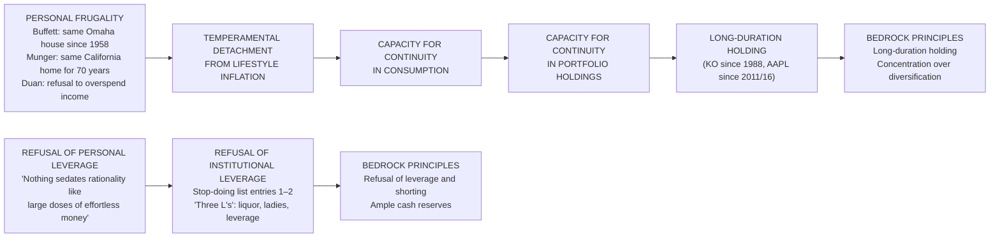

Duan's analogous disposition is articulated through three specific operational practices. The first is the explicit framing of investment activity as *lengthening one's working life* rather than as wealth accumulation. As Chapter 4 documented, Duan's transition from operating CEO to full-time investor in 2001 was structured around the recognition that he could not "play golf twenty-four hours a day," and the alternative of full-time work was unavailable because investment "seemed to have something to do with business." The framing locates investment activity not as the pursuit of wealth but as the continuation of the lifelong intellectual engagement that the operating-CEO years had previously satisfied; wealth, in this framing, is the by-product of the engagement rather than its purpose. The second practice is the *refusal to overspend income*, captured in the stop-doing list's implicit emphasis on the same disposition Munger articulates explicitly. The third practice is the *integration of personal financial discipline with the investment framework*, evident in Duan's 2016 blog post "更健康更长久" (healthier and more enduring), which extends the investment principle of "travel light" (avoid debt-laden companies) to personal life: "*Many businesses ultimately die from broken capital chains; we have basically no bank loans*" (Chapter 4). The principle operates simultaneously at the corporate level (BBK, OPPO, and Vivo were built without significant debt) and at the personal level (Duan's investment vehicle H&H Co. operates without leverage).

The convergent attitude toward wealth across the three investors can be expressed in the following synthesis. **All three investors treat wealth as a stewardship to be discharged rather than as a possession to be enjoyed, and the operational consequence is the shared frugality that protects the temperamental architecture the bedrock investment framework requires.** The shared frugality is not an aesthetic preference but a structural commitment: investors who depend on lifestyle inflation cannot sustain the temperamental detachment that the framework requires, and the three masters' shared modesty is the operational precondition for the patience their philosophy demands. The connection between earning and possessing is, in their framework, asymmetric: one earns capital through the disciplined application of the framework, but one does not *possess* it in the sense of being entitled to consume it; rather, one *stewards* it for the future deployments the framework's compounding mathematics will permit.

The transferable lesson for ordinary investors, which Chapter 8 will develop further, is that the temperamental commitments the framework requires are partially constituted by the lifestyle commitments the investor adopts. An investor whose monthly expenses approach his monthly income lacks the financial flexibility to absorb the drawdowns the framework requires; an investor whose lifestyle requires continuous escalation lacks the temperamental flexibility to tolerate the indefinite holding the framework demands. The shared frugality of the three masters is therefore not a character trait that ordinary investors should imitate cosmetically; it is a structural commitment whose operational role in the investment framework can be replicated only through corresponding personal financial discipline.

## 7.5 Family, Education, and the Multi-Generational Horizon

The fifth dimension of the convergent life philosophy is the treatment of family relationships and the education of the next generation as integral to the investment framework rather than as separate from it. The convergence at this level is more biographical than doctrinal—the three investors articulate the principle through specific life decisions rather than through extensive theoretical reflection—but the convergence is sufficiently consistent to warrant treatment as a structural feature of the unified disposition this chapter is reconstructing.

Buffett's stance on inheritance is the most extensively documented of the three. The principle that one should give children "*enough so they can do anything but not so much that they can do nothing*"—widely circulated across the secondary literature—translates the investment framework's bedrock principles into intergenerational vocabulary. The corollary, articulated in *The Economic Times*'s reconstruction of Buffett's recent counsel, is the practice of having children read his will before signing it: "*Legendary investor Warren Buffett advises parents to let their children read their wills before signing. This transparency aims to prevent future family disputes by ensuring heirs understand the decisions and their responsibilities.*"[^69] The integration of this practice with the broader Buffett architecture is direct. As the *Times of India* coverage of Buffett's letter on the topic captures the underlying disposition, the practice is grounded in the principle that family relationships and clear intergenerational communication are themselves stewardship obligations[^67]. The deeper concern Buffett has articulated, summarized in the *Indian Times* reconstruction of his philanthropic reasoning, is that "*excessive inheritance can erode ambition, stifle personal growth, and even create family discord*"[^70]; the operational consequence is the Giving Pledge commitment that section 7.6 examines in detail.

Buffett's most-cited articulation of the underlying value structure is the *LifeHack* compilation's reconstruction of his self-evaluation principle: "*the most satisfying thing actually is watching my three children each pick up on their own interests and work many more hours per week than most people that have jobs, and trying to intelligently give away that money in fields that they particularly care about*"[^31]. The articulation locates the relevant scoreboard in the children's own pursuits rather than in their inherited wealth, and the operational consequence is the directing of the bulk of the Buffett fortune to philanthropy rather than to dynasty. The principle's structural connection to the bedrock investment framework is the recognition that the same patient orientation toward time that produces multi-decade compounding in the portfolio applies to multi-generational compounding in family life: children who develop their own interests and capabilities are, in the framework's vocabulary, businesses with their own moats, and the parent's role is to fund their development rather than to preempt it through excessive inheritance.

Munger's blended-family discipline, examined biographically in Chapter 1, is the substantive expression of his life-philosophy commitment to family. The 1955 death of his nine-year-old son Teddy from leukemia followed the 1953 divorce that left him with "very little"; his second marriage in 1956 to Nancy Barry produced a blended family of eight children. The temperamental capacity to sustain family commitment after catastrophic loss is the same capacity that Chapter 3 identified as the existential foundation of inversion thinking, and the integration is direct: an investor who has experienced ruin at the most intimate level has, by definition, internalized the inversion-first orientation that Chapter 3 identified as Munger's methodological signature. Munger's most-cited counsel on the relationship between family and intellectual cultivation, captured in Picture-Perfect-Portfolios's reconstruction, is that "*a life properly lived is just learn, learn, learn all the time*"[^68]—and the integration with family is structural: reading is what one does when one is alone with one's family, not what one schedules around them.

Duan's distinctive integration of family and investing is the most explicit of the three. His 1998 marriage commitment that produced his 2001 U.S. relocation was, as Chapter 4 reconstructed, the foundational decision that converted him from operating CEO to full-time investor; the relocation was not a retirement from work but a reorganization of life such that family commitments could be discharged alongside continuing intellectual engagement. The decision to step away from BBK day-to-day operations to be present for his children—captured in his instruction to the operating CEOs that "*the CEO makes the decisions; don't think about what I would do*" (Chapter 1)—is the operational expression of the principle that genuine family presence requires genuine professional detachment. The articulation Chapter 4 reconstructed—"*doing the right thing, then doing things right*" (做对的事情, 把事情做对)—is the most explicit cross-domain integration the three frameworks contain: the principle operates simultaneously in family life (recognize the right relational priorities, then pursue them with discipline), in education (recognize the right learning objectives, then pursue them with patience), and in investing (recognize the right businesses to own, then own them with discipline). The single underlying disposition produces consistent decisions across all three domains.

The deeper analytical claim of this section is that **the multi-generational horizon implicit in "favorite holding period is forever" is itself an extension of the same temporal disposition that produces patient parenting and long-duration mentorship**. The investor who treats time as the operative variable in business compounding treats it as the operative variable in family and educational compounding as well, and the resulting decisions—long-duration positions, patient parenting, multi-decade mentorship of the next generation—are downstream of a single underlying commitment to temporal discipline. The convergence at this level is the strongest evidence that the bedrock investment principles are not specifically about investing but about a more general orientation toward time, ownership, and stewardship that operates identically across the domains of capital, family, and intellectual development.

Duan's mentorship of Colin Huang Zheng (黄峥), the future Pinduoduo founder, is the canonical illustration of the multi-generational principle in operation across the boundary between family and professional spheres. The decision to bring the young Google engineer to the 2007 Buffett charity lunch (Chapter 1) was simultaneously a personal-relational decision and a professional-developmental decision; the subsequent role Duan played in supporting Pinduoduo's founding combined the dispositions of investor (depth-of-understanding diligence) and mentor (long-duration personal commitment). As Chapter 6 documented, Duan's own self-classification of the Pinduoduo angel-stage investment as a position taken "in a confused state" rather than under full depth-of-understanding margin of safety captures the methodological honesty: the relationship was primary, and the financial position was downstream of the relationship rather than the reverse. **The principle operating in the case is that genuine mentorship is structurally similar to genuine ownership: both require the patient deployment of the most valuable resource (time and attention) without the expectation of short-term return, and both compound over multi-decade horizons in ways that no analytical framework can predict ex ante.**

The transferable lesson, which Chapter 8 will develop further, is that the temporal discipline the bedrock investment framework requires is not domain-specific but is rather a general orientation toward time that must be cultivated across all the major domains of life. An investor who is impatient in family life, in educational pursuits, or in mentorship relationships is, by structural similarity, an investor who will be impatient in his portfolio; conversely, an investor who develops genuine temporal discipline in family and education is acquiring the temperamental architecture that the bedrock investment framework requires. The integration is bidirectional and, in the three masters' lives, mutually reinforcing.

## 7.6 Philanthropy and the Architecture of Giving Back

The sixth dimension of the convergent life philosophy is the disposition of accumulated wealth through philanthropy. The convergence at this level is the most surprising of the four because the three investors face vastly different cultural and institutional contexts for charitable giving, and yet their philanthropic architectures share a single distinctive feature: **the disposition of wealth is governed by the same analytical rigor that governed its accumulation**.

Buffett's philanthropic architecture is the most publicly documented and the most substantial in absolute terms. The 2006 announcement to direct the bulk of his fortune to the Bill & Melinda Gates Foundation rather than to Berkshire-branded philanthropy is the foundational decision; as the NPR reconstruction captures the broader significance, "*Warren Buffett's decision to give most of his fortune away is news on a number of different levels. The shear size of the gift is unprecedented*"[^71]. The structural feature of the decision is that Buffett did not establish a separate Buffett Foundation with its own staff, infrastructure, and institutional identity; instead, he routed the giving through the existing Gates Foundation infrastructure, applying the same analytical principle that governs Berkshire's portfolio—deploy capital where existing institutional capability is highest, rather than attempting to replicate capability that already exists. The Giving Pledge that Buffett subsequently launched with Bill and Melinda Gates has, as the *Gospel of Wealth* reconstruction documents, "*[encouraged] billionaires to commit most of their wealth to philanthropic*" purposes[^67], with over 200 billionaire signatories committing publicly to direct the majority of their wealth to philanthropy.

The integration of Buffett's philanthropy with the broader life philosophy is direct. The decision not to leave the bulk of the fortune to his children operationalizes the inheritance principle reconstructed in section 7.5 ("*enough so they can do anything but not so much that they can do nothing*"). The decision to route the giving through the Gates Foundation rather than through a Buffett-branded vehicle operationalizes the inner-scorecard principle reconstructed in section 7.1 (the giving is not for reputational ostentation but for analytical effectiveness). The decision to commit the giving over a multi-decade horizon rather than to make a single large donation operationalizes the temporal discipline reconstructed in section 7.5 (philanthropy, like investing, compounds over time when patiently structured). **The overall architecture is the strongest possible evidence that Buffett treats philanthropy as a disciplined extension of capital allocation rather than as ostentatious charity.**

Munger's philanthropic architecture is quieter but substantial, and it is documented in the secondary literature primarily through his architectural gifts to major universities and to Harvard-Westlake School. The characteristic feature of these gifts—his insistence on contributing his own architectural designs as a condition of the gifts—reveals the same disposition that section 7.1 identified as engineered rationality applied to personal taste. Munger did not delegate the architectural design to professional firms because, in his framework, the gift was not merely financial but intellectual; the architectural specifications expressed his own multi-disciplinary judgment about how educational spaces should be organized for the cultivation of the kind of learning that section 7.2 identified as ethical obligation. The gifts therefore operate simultaneously as financial donations and as expressions of Munger's broader philosophy of education and intellectual development.

The integration of Munger's philanthropy with the broader life philosophy is, as with Buffett's, direct. The architectural specifications express the latticework-of-mental-models doctrine: educational spaces should be designed to promote cross-disciplinary integration rather than to silo students within single domains. The substantial size of the gifts expresses the wealth-as-stewardship principle: capital accumulated through disciplined investment is to be deployed in support of the learning practices that produce future generations of disciplined thinkers. The choice of educational institutions as the primary philanthropic targets expresses the learning-as-ethical-obligation principle: the most leverage-able use of philanthropic capital is in the cultivation of intellectual capability that compounds across generations.

Duan's parallel philanthropy is documented through the Enlight Foundation he and his wife Liu Xin established and through the substantial donations to Zhejiang University and Renmin University. The framing of philanthropy as part of 本分 rather than as supererogatory virtue is the distinctive Duanian articulation. The 本分 framework, as section 7.3 reconstructed, treats ethical commitments as constitutive of business and personal durability rather than as supplementary virtues; the inclusion of philanthropy within the framework therefore treats giving as a structural component of the life rather than as an optional addition to it. The integration is most explicit in the *电子工程专辑* compilation's reconstruction of Duan's reflection on the Fresh Choice loss: "*one million dollars is not an unbearable number; my donations far exceed this*"[^31]. The framing locates philanthropy as the relevant comparative scale for evaluating financial losses, with the implication that capital is held in trust for future deployment in either investment or philanthropy, and the analytical rigor governing both is identical.

The convergent philanthropic architecture across the three investors can be summarized as follows:

| Investor | Philanthropic Vehicle | Distinctive Feature | Connection to Life Philosophy |
|---|---|---|---|
| **Buffett** | Bill & Melinda Gates Foundation; Giving Pledge | Routing through existing institutional capability rather than building a Buffett-branded foundation | Inner-scorecard reasoning (analytical effectiveness over reputational ostentation); temporal discipline (multi-decade commitment) |
| **Munger** | Architectural gifts to University of Michigan, Stanford, Harvard-Westlake, etc. | Insistence on contributing his own architectural designs as a condition of the gifts | Engineered rationality applied to personal taste; learning-as-ethical-obligation operationalized through educational infrastructure |
| **Duan** | Enlight Foundation; donations to Zhejiang University and Renmin University | Framing of philanthropy as part of 本分 rather than as supererogatory virtue | Integration of philanthropy with the operational ethical framework rather than treatment as an optional addition |

The deeper analytical claim of this section is that **the three investors' shared treatment of philanthropy as a disciplined extension of capital allocation—rather than as ostentatious charity—is itself the strongest evidence that they regard wealth as stewardship: the same analytical rigor that governed accumulation governs disposition**. The argument has three components. First, the institutional choices (Gates Foundation, university architectural gifts, Enlight Foundation and university donations) reflect deliberate analysis of where philanthropic capital can be most leverage-able rather than emotional or reputational decisions. Second, the temporal structures (multi-decade commitments rather than one-time donations) reflect the same temporal discipline that governs the investment portfolios. Third, the integration with the broader life philosophy (the inner scorecard, learning, ethics, family) reflects the underlying conviction that wealth is held in trust for future deployment rather than possessed for personal consumption.

The transferable lesson, which Chapter 8 will develop further, is that philanthropy in the three masters' framework is not a separate domain from investing but a downstream application of the same architecture. An investor who applies analytical rigor to the accumulation of wealth and then disposes of it through unanalyzed emotional or reputational giving has, by the framework's own logic, failed to discharge the stewardship obligation that the accumulation entailed. The convergent commitment to disciplined philanthropy across the three masters is therefore the strongest possible evidence that the framework operates as a unified life philosophy rather than as a domain-specific investment heuristic.

## 7.7 Synthesis: The Unified Disposition Beneath Convergent Investment Behavior

The chapter's analytical work culminates in a synthesis that integrates the four interlocking commitments examined in sections 7.1 through 7.6 into a single argument about the structural relationship between life philosophy and investment behavior. The argument can be stated in three propositions.

**First, the bedrock convergence in investment philosophy documented across Chapters 5 and 6 is itself the downstream expression of a deeper convergence in life philosophy.** The seven bedrock principles enumerated in section 5.1—business ownership, depth-of-understanding margin of safety, circle of competence, concentration, long-duration holding, temperament over IQ, and refusal of leverage and shorting—are not merely investment principles but expressions of a more general orientation toward rationality, time, ownership, and the avoidance of ruin. The convergence of the three investors at this more general level—at the level of the inner scorecard, lifelong learning, ethical commitments, frugality, family discipline, and disciplined philanthropy—is the temperamental and ethical foundation on which the investment principles operate. Without this foundation, the principles collapse under the social, emotional, and lifestyle pressures that Chapters 2 through 5 catalogued; with it, the principles operate as a coherent system across decades, scales, and continents.

**Second, the four interlocking commitments examined in this chapter—rationality as personal architecture, learning as moral obligation, ethics as structural durability, and wealth as stewardship—operate as a unified disposition rather than as independent virtues.** The connections among the four are bidirectional and structural. The inner-scorecard orientation of section 7.1 produces the temperamental capacity for the lifelong learning of section 7.2, because internal standards of self-evaluation reward intellectual progress in ways that external standards do not. The lifelong learning of section 7.2 produces the analytical capacity for the ethical commitments of section 7.3, because deeper understanding of business and human dynamics reveals the structural connections between ethics and durability. The ethical commitments of section 7.3 produce the structural commitment to the frugality of section 7.4, because the refusal of categories of illegitimate profit eliminates the lifestyle inflation that would otherwise destroy the temperamental detachment the framework requires. The frugality of section 7.4 produces the temporal discipline that supports the multi-generational horizon of section 7.5, because the capacity to live below one's income across decades is the structural complement to the capacity to hold positions across decades. And the multi-generational horizon of section 7.5 produces the disciplined philanthropy of section 7.6, because the recognition that capital is stewarded across generations rather than possessed within a single generation directly motivates the disposition of wealth through analytically rigorous giving.

The diagram below visualizes the bidirectional architecture of the unified disposition:

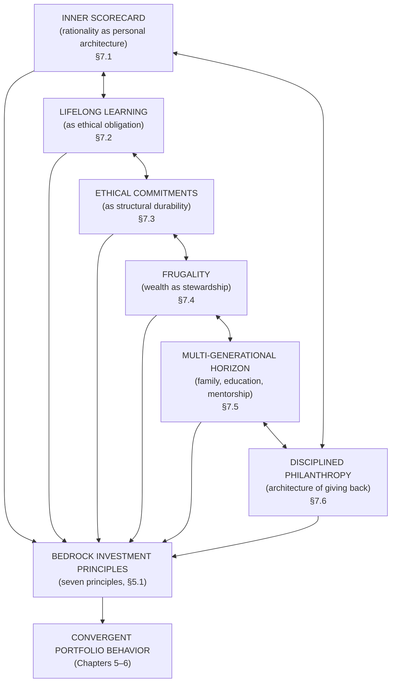

**Third, the relationship between life philosophy and investment behavior is bidirectional rather than unidirectional.** Temperament and ethics produce the conditions under which the bedrock investment principles can be sustained, and the practice of those principles in turn reinforces the temperament and ethics. An investor who commits to long-duration holding finds his temperamental capacity for patience strengthened by the practice of holding; an investor who commits to refusing leverage finds his capacity for living within his means strengthened by the practice of refusing leverage; an investor who commits to honest error self-audit finds his capacity for general intellectual honesty strengthened by the practice of self-audit. The framework is therefore not a one-time installation but a continuous practice, and the practice itself produces the temperamental and ethical architecture that future applications of the framework require. **This bidirectional reinforcement is the structural reason that the three masters' frameworks have proven so durable across decades: each application of the framework produces the conditions for the next application, in a compounding mathematics of disposition that mirrors the compounding mathematics of capital.**

The chapter's broader contribution to the report's comparative argument is to specify the level at which the convergence among Buffett, Munger, and Duan is genuinely deep. Chapter 5 demonstrated convergence at the level of investment principles; Chapter 6 demonstrated convergence at the level of portfolio behavior; this chapter has demonstrated convergence at the level of the underlying life philosophy that produces both. The convergence at this deepest level is the strongest possible evidence that the investment framework the three investors articulate is not a domain-specific heuristic but an expression of a coherent orientation toward life that any investor, in principle, could adopt.

The convergence is also the strongest possible evidence for the limit of imitative replication. As Chapter 5 already indicated, the structural enablers (insurance float, Wesco-scale operation, industrial wealth) and the cognitive substrates (multi-disciplinary latticework, decades of securities reading, operator intuition) are not equivalently transferable across investors. What this chapter has demonstrated is that **the temperamental and ethical commitments examined here are equivalently transferable across investors in principle**, because they do not require specific institutional structures, cognitive substrates, or biographical experiences; they require only the willingness to adopt and continuously cultivate the dispositions themselves. An ordinary investor cannot replicate Berkshire's $382 billion cash position or Duan's fourteen-year Apple holding because he lacks the scale and substrate; he can, however, adopt the inner-scorecard orientation, the commitment to lifelong learning, the ethical refusal of illegitimate profit, the frugality, the temporal discipline, and the philanthropic intention that the three masters share.

Chapter 8 will translate this unified life philosophy into practical implications for ordinary practitioners who lack the substrate, structural support, and biographical conditions of the three masters but who can, in principle, adopt the temperamental and ethical commitments that make the bedrock framework operational. The translation will rest on the recognition established in this chapter: the bedrock investment framework is operationally transferable not through the imitation of specific portfolio decisions but through the cultivation of the underlying disposition. The convergent index-fund recommendation that all three investors offer to non-experts is itself the meta-application of this principle—when the substrate cannot support concentrated active investing, the disposition itself can still be cultivated, and the cultivation will produce the modest but reliable compounding that the framework's mathematics permit.

The chapter therefore concludes with a single integrated proposition that synthesizes its evidence: **the convergent investment philosophies of Buffett, Munger, and Duan are not three frameworks that happen to share certain principles; they are three biographically distinct expressions of a single underlying disposition toward rationality, learning, ethics, wealth, family, and stewardship. The disposition is what the three investors share at the deepest level, and the investment principles are the operational expression of the disposition rather than its foundation.** This is the strongest claim the report can make for the unity of value investing as a life philosophy, and it sets up Chapter 8's task of translating the unified disposition into practical implications for ordinary investors operating in markets and conditions far removed from those in which the three masters built their records.

# 8 Practical Implications, Lessons for Modern Investors, and Conclusion

The seven preceding chapters have advanced an argument that began with biographical reconstruction and ended, in Chapter 7, with the recognition that Buffett, Munger, and Duan Yongping converge not at the level of investment heuristics but at the level of a unified life disposition of which the investment heuristics are the operational expression. The task of this concluding chapter is to discharge the practical obligation that any deep-research report on a subject of this kind must finally accept: to translate the comparative findings into actionable guidance for contemporary investors, to stress-test the framework against the structural features of markets the three masters did not face in their formative years, and to articulate the report's culminating synthesis of what the three-way convergence reveals about value investing as a coherent intellectual tradition. The chapter accepts a further obligation as well. The bedrock principles enumerated across Chapters 5 and 6 and the unified disposition reconstructed in Chapter 7 are genuinely available to ordinary investors only if the gap between the masters' specific decisions and the framework's transferable substance can be honestly specified. **The practical translation must therefore distinguish what is imitable from what is not, and must identify the conditions under which the philosophy can be adopted by investors whose scale, substrate, and structural support differ radically from those that produced Berkshire Hathaway, the Daily Journal portfolio, and H&H International Investment.**

Two methodological commitments govern the chapter. First, every prescriptive recommendation must be traceable to a bedrock principle established in the preceding chapters and validated through the documentary record of the three masters' practice; novel prescriptions unsupported by that record have no place in a synthesis of this kind. Second, the chapter must acknowledge honestly where the framework's transferability is genuinely limited and where the masters' own counsel converges on a default recommendation—the broad-based index fund—for investors who lack the substrate or temperament that concentrated active value investing requires. The convergent index-fund recommendation, articulated independently by all three investors, is not an embarrassed concession at the margin of the framework but its meta-application, and the chapter treats it as such.

## 8.1 Defining a Personal Circle of Competence

The first practical task that confronts any investor seeking to adopt the framework is the honest self-assessment of his own circle of competence—the boundary within which his understanding of business and human dynamics is genuinely deep enough to support concentrated capital deployment. Chapter 2 established that the circle-of-competence principle is the epistemic discipline that makes moat analysis honest; Chapter 4 demonstrated that Duan's depth-of-understanding margin of safety converts the principle from a behavioral safeguard into the very content of the safety margin itself. The translation of this principle into individual practice requires three operational commitments.

The first commitment is the **distinction between genuine understanding and familiarity**. An investor who has used Apple products for fifteen years, reads technology news daily, and follows the iPhone product cycle is *familiar* with Apple; he is not necessarily within his circle of competence with respect to Apple. The diagnostic test is whether the investor can answer, without recourse to external commentary, the questions Duan's two-filter selection requires: what specific cultural commitments make Apple's product decisions different from those of its competitors, what counterfactual products would Apple decline to introduce and why, what business-model elements account for the gap between Apple's gross margin and that of comparable consumer-electronics manufacturers, and how would the analyst's judgment change if any of those elements eroded? Duan's own articulation of the standard, captured in his November 2025 *方略* interview, is that the investor who must "ask around everywhere" by definition does not understand: "to-the-extent that someone is asking around everywhere, they certainly do not understand"[^44]. Familiarity is the input to genuine understanding; it is not a substitute for it.

The second commitment is the **adoption of three convergent diagnostic tests** that the three masters have articulated in different vocabularies but whose operational content overlaps closely.

| Test | Source | Operational Content |
|---|---|---|
| **Annual-report fluency standard** | Buffett (Chapter 2) | The investor must be able to read the company's annual report and the reports of its principal competitors and form an independent judgment about competitive position; if the report reads as opaque, the position is outside the circle |
| **Inversion check** | Munger (Chapter 3) | Before considering reasons the investment might succeed, the investor must articulate the failure modes through which the position could destroy capital and verify that those failure modes are bounded; if the failure modes cannot be specified, the position is outside the circle |
| **Restful-conviction test** | Duan (Chapter 4, 2020 Delta Air Lines case) | The investor must be able to hold the position through a 30%+ drawdown without losing sleep; if the absence of restful conviction is observed during volatility, the position was outside the circle even if the analyst could not articulate the specific reason at entry |

The three tests are complementary rather than redundant. The annual-report fluency standard is the analytical input; the inversion check is the methodological discipline; the restful-conviction test is the temperamental output. An investment that passes all three is a candidate for concentrated deployment; an investment that fails any one is, by the framework's own logic, outside the circle and should be sized small or not at all.

The third commitment is the **disciplined expansion of the circle through patient genuine study rather than peer-pressure-driven extension**. As Duan's stop-doing list explicitly warns, "Don't jump into unfamiliar areas just because you saw a couple of 'concepts'; sooner or later you'll trip"[^44]. Buffett's eventual 2016 Apple entry, after years of declining to analyze the company in detail, is the canonical demonstration of legitimate expansion: the entry occurred after the cognitive substrate had been adequately built up, not before. The contrasting failure mode—analysts pressed by social or career pressure to extend into unfamiliar sectors—produces precisely the documented errors catalogued in Chapter 6, where positions taken outside genuine competence repeatedly produced predictable failure modes regardless of the analyst's other capabilities.

The asymmetry that ordinary investors face is that their circles are vastly narrower than those of the three masters. **This asymmetry is not a limitation to be overcome through shortcuts; it is a feature of honest self-assessment.** A retail investor whose professional life has been spent in healthcare administration may possess genuine competence in evaluating hospital systems, pharmacy-benefit managers, or medical-device companies in his specific subspecialty; he likely possesses no such competence in semiconductors, financial intermediaries, or international energy infrastructure. The honest acknowledgment of the boundary is itself the operational practice the framework requires; the investor who refuses to acknowledge the boundary will, by the framework's predictions, eventually deploy capital outside genuine understanding and incur the recurring failure modes the three masters have documented in their own records.

## 8.2 Constructing a Personal Stop-Doing List

The second practical task is the construction of a personal stop-doing list that systematizes the inversion-first methodology examined in Chapter 3 and articulated in concrete-action vocabulary in Chapter 4. The construction follows the pattern Duan himself has described: the list is "not a skill or formula but a mode of thinking"[^19], and it is built up empirically through the documentation of personal mistakes and the studied failure modes documented in the three masters' records.

The Buffett seed established at the 2007 charity lunch—"don't short, don't borrow, don't most importantly invest in what you don't understand"[^45]—provides the foundational three entries that every investor should adopt categorically, regardless of personal circumstances. Each entry is empirically grounded in the three masters' documented errors: Duan's $150–200 million Baidu short loss validates the prohibition on shorting[^19]; Munger's 1973–74 Wheeler-Munger drawdowns and his repeated emphasis on the "three L's—liquor, ladies, leverage"[^11] validate the prohibition on borrowing; the catalog of errors examined across Chapter 6 (Berkshire textile mills, Dexter Shoe, Fresh Choice, UNG, Delta Air Lines) validates the prohibition on investing outside genuine understanding.

The expansion of the list beyond these three entries follows a template structure that ordinary investors can adopt and continuously revise. The illustrative consolidated list below integrates the entries documented across the three masters' records, with each entry tied to its empirical grounding:

| Category | Entry | Empirical Grounding |
|---|---|---|
| **Capital-structure prohibitions** | Don't use margin or other leverage | Munger's "three L's"; Buffett's "nothing sedates rationality like large doses of effortless money" |
| | Don't sell securities you do not own (no shorting) | Duan's documented $150–200M Baidu loss |
| | Don't pledge assets you cannot afford to lose | Munger's 2008 financial crisis diagnosis as severance-of-decision-from-consequence |
| **Cognitive prohibitions** | Don't invest in what you do not genuinely understand | Buffett's circle-of-competence discipline through dot-com era |
| | Don't blindly extend the circle of competence based on concepts | Duan's stop-doing-list entry; Fresh Choice activist case |
| | Don't trade frequently (less is more) | Daily Journal's 0% turnover Q4 2025–Q1 2026; Berkshire's ~1% quarterly turnover |
| | Don't speculate short-term | Munger's contempt for casino-like behavior; Buffett's persistent warnings about Robinhood-style platforms |
| **Behavioral prohibitions** | Don't sell during panic when the underlying business is unchanged | Buffett through 1999–2002 dot-com aftermath; Duan through 2021–24 Tencent regulatory drawdown |
| | Don't buy during euphoria when valuations exceed reasonable cash-flow multiples | Berkshire's $382B cash position reflects this discipline at scale |
| | Don't panic-sell or panic-buy because peers are doing so | Inner-scorecard orientation, §7.1 |
| **Position-management prohibitions** | Don't average down on a position whose thesis has been contradicted | Duan's UNG exit at "smallest cost"; Munger's calibrated Alibaba reduction |
| | Don't hold positions in companies whose culture has degraded | Duan's GE exit on integrity-language disappearance |
| | Don't refuse to acknowledge errors out of ego | Buffett's annual-letter mistake disclosures since the partnership era |
| **Speculation prohibitions** | Don't trade options as a primary strategy | Duan's selective put-option selling is conditional on full cash coverage and depth-of-understanding |
| | Don't buy cryptocurrency or meme stocks for speculative gain | Munger's "noxious poison" diagnosis[^11]; broader Lollapalooza analysis of speculation |

The most important meta-rule that governs the entire list is the discipline that **errors must be exited as soon as recognized, regardless of accumulated cost**. Duan's articulation—"find errors and correct them as soon as possible; no matter how big the cost may be the smallest cost"[^45]—captures the principle in its most directly usable form. Buffett's complementary formulation, "the most important thing to do if you find yourself in a hole is to stop digging," is operationally identical. The empirical evidence for the rule's power is overwhelming: in every documented case of error across the three masters' records, immediate exit upon recognition produced lower total cost than delayed exit. The Baidu short would have produced smaller losses had Duan exited earlier; the Dexter Shoe acquisition would have produced smaller relative cost had Berkshire used cash rather than appreciating equity; the UNG natural-gas position's ultimate four-times-larger loss had Duan held to 2010 confirms the same point in extreme form[^45].

The specific failure modes most relevant to retail investors in 2025–2026 markets warrant particular attention because they are the recurrent destinations of capital that violates the stop-doing list. **Margin trading** is documented by Munger in his characteristic warnings about leverage and by Buffett's persistent counsel that ample cash reserves are non-negotiable; the asymmetric loss profile under margin-call cascades is the canonical mechanism through which retail investors convert recoverable drawdowns into permanent capital impairment. **Options speculation** is to be distinguished from the disciplined put-option-selling Duan employed for Tencent in 2021–2024[^45], which required full cash coverage of the strike, depth-of-understanding margin of safety in the underlying, and explicit absence of leverage; retail option speculation that lacks any of these conditions falls squarely under the stop-doing list's prohibition on activities outside genuine understanding. **Cryptocurrency manias** are catalogued by Munger as Lollapalooza failures combining social proof, reward-superresponse, and fear-of-missing-out into structurally extreme behavior[^11]. **Frequent rotation** violates the long-duration-holding principle and the after-tax compounding mathematics; retail investors who turn over their portfolios annually surrender the compounding advantage that Munger's $1-at-13.4%-over-30-years arithmetic identifies as decisive[^13]. **Benchmark-driven panic selling**—the disposition to sell during drawdowns because peers are reporting underperformance—violates the inner-scorecard orientation examined in §7.1.

The construction of the list is itself a continuing practice rather than a one-time installation. Each entry should be revisited annually; new entries should be added whenever a personal mistake reveals a previously unidentified failure mode; and the list should be reviewed before any significant capital deployment to verify that the proposed action does not violate any of its prohibitions. **The list operates correctly when it produces the discipline that errors are caught at the planning stage rather than during execution.**

## 8.3 Evaluating Business Models, Moats, and Management

The third practical task is the integration of the moat-analytic substrate (Chapter 2), the multidisciplinary latticework (Chapter 3), and the operator-derived culture intuition (Chapter 4) into a workable analytical workflow that an ordinary investor can apply to candidate positions. The workflow rests on Duan's two-filter selection framework[^44] reordered into the practical sequence the analyst must follow, with each step grounded in the convergent practice of the three masters.

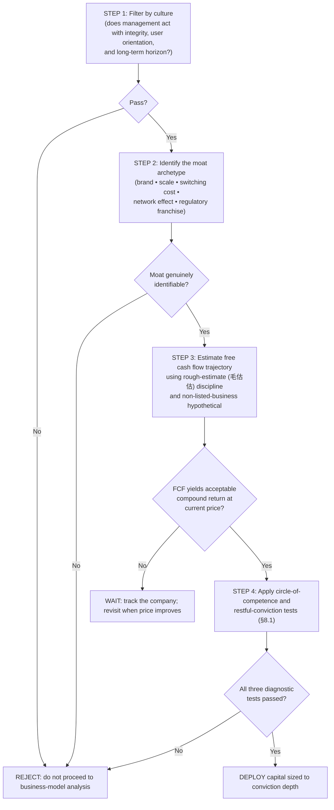

**Step 1: Culture diagnosis.** The first filter examines whether management acts with the integrity, user orientation, and long-term horizon that Chapter 4 identified as the constitutive elements of the 本分 framework. The diagnostic indicators are concrete and observable: does management's compensation structure align long-run shareholder value with executive reward (Munger's incentive-alignment criterion)? Does the company's product strategy reflect genuine user-orientation or merely revenue-maximization (Duan's culture filter)? Does management acknowledge mistakes in shareholder communications or systematically rationalize them (Buffett's owner-manager evaluation)? The General Electric case examined in Chapter 4 supplies the canonical disqualification template: the disappearance of integrity language from a corporate homepage is a diagnostic signal that the culture has been hollowed out, with predictable consequences for the durability of the underlying economic returns[^44]. A company that fails the culture filter is rejected before any business-model analysis is undertaken; the filter is upstream rather than supplementary.

**Step 2: Moat identification.** The second filter requires identifying the specific structural advantage that allows the company to sustain above-cost-of-capital returns over long periods. The moat archetypes catalogued in Chapter 2—brand-based (Coca-Cola, See's Candies), scale-and-cost (large insurers, integrated manufacturers), switching-cost (enterprise software, ecosystem-locked devices), network-effect (social platforms, marketplaces), and regulatory-franchise (VeriSign's .com domain, certain energy infrastructure)—remain the canonical taxonomy. The analytical task is to specify which archetype the company's moat instantiates and to articulate the structural mechanism through which the moat resists competitive erosion. A "moat" that the analyst cannot specify in archetypal terms is, by Munger's framework, not a moat but a story; the position is rejected.

**Step 3: Free-cash-flow estimation through rough-estimate discipline.** The third filter applies Duan's *non-listed-business hypothetical*—"suppose I acquired this company in full; could I recoup cost and realize a reasonable return within ten years?"[^45]—as the operational substitute for precise discounted-cash-flow modeling. The hypothetical-acquisition test forces the analyst to treat the purchase as if private-market liquidity were unavailable, which orients the analytical attention onto cash-generation durability rather than exit-price speculation. Duan's *毛估估* (rough-estimate) discipline explicitly avoids the false precision of multi-decade DCF computation in favor of order-of-magnitude judgment: at the 2011 Apple entry, Duan's reasoning was that the company was generating approximately $200 billion of profit on a $300 billion market capitalization with $100 billion of net cash, and that the profit could plausibly grow to $500 billion or more over five years[^45]; the reasoning is not a DCF model but it is a defensible quantitative judgment that subsequent reality vindicated. Ordinary investors should adopt the same discipline: the question is not "what is the precise intrinsic value to two decimal places?" but "is the position broadly attractive at the current price under conservative assumptions about cash-flow trajectories?"

**Step 4: Circle-of-competence and restful-conviction confirmation.** The final filter is the application of the three diagnostic tests from §8.1: the annual-report fluency standard, the inversion check, and the restful-conviction test. A position that passes all three is a candidate for concentrated deployment; a position that fails any one is sized small or not at all.

The workflow integrates owner-manager stewardship (Buffett), incentive alignment (Munger), and 本分 cultural diagnosis (Duan) without requiring the analyst to choose among them; each is operative at a different step of the workflow. **The convergent practical lesson is that management evaluation precedes business-model analysis and that the failure of either filter disqualifies the position before valuation work begins.** This sequencing inverts the practice of most retail investors, who begin with quantitative valuation screens and apply qualitative judgment only as a confirmation; the framework reverses the order because the qualitative dimensions are what make the quantitative analysis reliable.

## 8.4 Managing Emotion and Temperament Through Market Volatility

The fourth practical task is the cultivation of the temperamental architecture that Chapter 7 identified as the connective tissue of the bedrock framework. The translation requires three specific behavioral practices that ordinary investors can adopt to absorb interim drawdowns, resist peer-pressure-driven action, and treat volatility as opportunity rather than signal.

The first practice is the **adoption of pre-commitments that operate during volatility rather than judgment that must be exercised during volatility**. The cognitive-psychology evidence Munger catalogued in *The Psychology of Human Misjudgment*[^11] establishes that judgment is systematically degraded during stress, and the operational consequence is that decisions made during severe drawdowns or euphoric peaks are predictably worse than decisions made under calmer conditions. The practical countermeasure is to make the relevant decisions in advance: pre-commit to the maximum percentage of portfolio that any single position will occupy, pre-commit to the price levels at which additional capital will be deployed and at which existing positions will be reduced, pre-commit to the cash reserve that will not be deployed under any circumstances. The pre-commitments operate as the engineered-rationality discipline Chapter 7 identified: judgment that survives stress is judgment that does not have to be exercised under stress.

The second practice is the **maintenance of ample cash reserves as the structural enabler of patience**. Buffett's most-cited articulation of the principle—"I have pledged – to you, the rating agencies and myself – to always run Berkshire with more than ample cash. We never want to count on the kindness of strangers in order to meet tomorrow's obligations. When forced to choose, I will not trade even a night's sleep for the chance of extra profits"—operates at Berkshire's $382 billion scale[^45] but is applicable in proportion at every scale. An individual investor whose cash reserves cover at least one to two years of living expenses, separate from the investment portfolio, possesses the structural capacity to absorb portfolio drawdowns without forced liquidation. An investor who lacks such reserves is structurally exposed to the failure mode that destroyed Wheeler-Munger-comparable strategies that lacked Berkshire's float backing: a redemption-or-liquidity-driven exit at the worst possible moment. **The framework's long-duration holding discipline is operationally available only to investors whose personal cash architecture supports it.**

The third practice is the **documented behavioral evidence of the three masters during severe drawdowns**, which provides the empirical confirmation that the framework's temperamental disciplines are operable rather than aspirational. Buffett's behavior through the 1999–2002 dot-com aftermath—the absorption of a roughly 50% peak-to-trough Berkshire price decline without abandoning the framework, despite *Barron's* "What's Wrong, Warren?" coverage—is the canonical case[^19]. Munger's behavior through the 1973–74 Wheeler-Munger drawdowns of 32% and 31% in consecutive years—the maintenance of the concentration discipline without strategy abandonment[^13]—is the parallel case at family-office scale. Duan's behavior through the 2021–2024 Tencent antitrust drawdown—the use of put-option selling at a strike representing roughly 5.2% discount to prevailing market prices to accumulate during the panic[^45]—is the most recent case and demonstrates the framework's symmetric application: panic among others is the condition under which the disciplined investor deploys capital, not the condition under which he retreats.

The transferable behavioral discipline can be summarized in a single proposition: **volatility is the mechanism through which the disciplined investor's depth-of-understanding margin of safety is converted into realized return**. An investor whose understanding of a business is genuine experiences volatility as opportunity; an investor whose understanding is merely apparent experiences volatility as threat. The diagnostic significance is that the investor's response to drawdowns is itself the evidence of whether the original analysis was sound. The investor who panics during a 30% drawdown was, by the framework's own logic, outside his circle of competence at entry, regardless of the analytical work he claimed to have done; the investor who calmly accumulates was within his circle and is now realizing the depth-of-understanding margin of safety in the form of additional shares at lower prices.

## 8.5 Active Value Investing or Index Funds: The Convergent Recommendation for Non-Experts

The fifth practical task confronts the single most consequential question this report can ask of ordinary investors: should the practitioner pursue concentrated active value investing in the manner of the three masters, or should he adopt the broad-based index-fund strategy that all three explicitly recommend for those who lack the substrate? The question must be answered before any of the preceding sections become operationally meaningful, because the recommendation itself differs depending on the answer.

The convergent recommendation across the three masters is unambiguous. Buffett's most explicit articulation is the 2013 shareholder-letter instruction for the trustee of his wife's inheritance: 90% in a low-cost S&P 500 index fund and 10% in short-term government bonds, held for decades[^17]. The instruction has not been revised in the subsequent twelve years and Buffett has reaffirmed it repeatedly, most prominently in connection with his ten-year wager against hedge-fund-of-funds returns. Munger's parallel endorsement, while less rhetorically prominent, was implicit in his repeated counsel that "the whole investment management business together gives no value added to all stock portfolio owners combined"[^13] and in his suggestion that most investors should own a small number of high-quality positions rather than attempting active management. Duan's articulation, captured most recently in the November 2025 *方略* interview, is the most direct of the three for a Chinese-investor audience: when an investor cannot perform the deep business analysis the framework requires, the rational response is to buy the S&P 500 index or Berkshire Hathaway and hold[^44]. The Q4 2025 H&H portfolio's 20.63% Berkshire B weight—accumulated through a 38.24% increase during the quarter—operationalizes Duan's own counsel for the residual portion of his capital that he does not allocate to specifically high-conviction concentrated positions[^41].

The convergent recommendation is **the meta-application of the bedrock framework rather than a contradiction of it**. The argument can be stated in three steps. First, the bedrock framework requires that capital be deployed only into positions that satisfy the depth-of-understanding margin of safety. Second, an investor whose substrate cannot support genuine depth of understanding for any specific business has, by the framework's own logic, no positions that satisfy the criterion. Third, the rational response to this condition is not to pretend to a capability one does not possess but to deploy capital into the broadest possible set of businesses at the lowest possible cost, with the longest possible holding period—which is precisely what a low-cost broad-based index fund operationalizes. **The index-fund recommendation is therefore not a fallback for those who fail the framework; it is the framework's correct application for those whose substrate is honestly limited.**

The decision between concentrated active investing and the index-fund default depends on three honest self-assessments that the investor must conduct before adopting either path:

| Self-Assessment | Concentrated Active Path | Index-Fund Default Path |
|---|---|---|
| **Substrate** | Investor possesses genuine depth of understanding in at least one industry, sector, or business category, demonstrable through fluent reading of annual reports and competitor materials | Substrate is general rather than industry-specific; investor relies on third-party commentary for analytical judgment |
| **Temperament** | Investor has demonstrated capacity to absorb 30%+ drawdowns without forced exit; restful conviction during prior volatility | Investor has experienced or anticipates emotional difficulty during drawdowns; required reassurance from peers or media during volatility |
| **Time and effort commitment** | Investor will dedicate substantial hours per week to analytical work over decades | Investor wishes to delegate analytical work to passive market mechanisms |

An investor who answers honestly across all three dimensions will identify the path commensurate with his actual capabilities and circumstances. The honest acknowledgment of the index-fund default path is not a failure but the framework's correct application; many of the most analytically sophisticated investors in the world hold substantial portions of their wealth in index funds because they recognize that the marginal hours required to identify additional concentrated positions are not justified by the expected marginal return.

A **hybrid approach** is justified under specific conditions and only those conditions. An investor who possesses genuine depth of understanding in one or two specific business categories—but not across the broad investable universe—may rationally adopt a structure in which the majority of capital is deployed into broad-based index funds while a smaller portion is concentrated in the specific high-conviction positions where the substrate supports it. The proportions should reflect honest self-assessment: an investor whose substrate supports two or three concentrated positions might rationally commit 70–90% to index funds and 10–30% to the concentrated positions. The hybrid approach is not a license for concentrated speculation alongside an index-fund anchor; the concentrated portion must satisfy the same depth-of-understanding margin of safety that governs the masters' practice.

The three masters' broader counsel against active management for those who lack the substrate is grounded in the empirical observation that most retail investors—and a substantial fraction of professional active managers—underperform broad-based index funds over long horizons. The framework's recommendation of index funds for non-experts is therefore not pessimistic about market efficiency but realistic about the conditions under which active management adds value: when the analyst's substrate genuinely supports concentrated conviction, when the temperamental architecture genuinely supports indefinite holding, and when the structural support genuinely insulates against forced liquidation. Most investors satisfy at most one of these three conditions; the framework's index-fund recommendation is calibrated to the empirical reality that satisfying all three is rare.

## 8.6 Applicability in AI-Driven, High-Frequency Markets

The sixth practical task is the stress-testing of the framework against the structural features of contemporary markets that did not exist in their present form when the philosophy was articulated: algorithmic high-frequency trading, AI-driven analytical tools, passive-flow dominance, the cryptocurrency and meme-stock phenomena, commission-free trading platforms, and the proliferation of complex derivatives. The question the chapter must answer is whether the framework's foundational principles retain their force in the new environment or whether they must be re-articulated to remain operational.

The evidence assembled across Chapters 5 through 7 supports the proposition that **the bedrock principles retain full force, while specific operational practices may require updated articulation**. The evidence is empirical rather than theoretical: the three masters' contemporary commentary on the new market features specifically applies the bedrock framework to those features rather than abandoning it.

Munger's diagnoses of speculative platforms in his final years are the canonical illustration. His characterization of cryptocurrencies variously as "noxious poison," as "stupid, immoral, and disgusting," and as resembling "venereal disease"[^11] is not a stylistic outburst but the application of the Lollapalooza framework: cryptocurrencies, in Munger's analysis, combine social proof, reward-superresponse, fear-of-missing-out, and authority-misinfluence in confluences that produce non-linear extreme behavior whose economic substance is ultimately speculative. His parallel diagnosis of commission-free trading platforms such as Robinhood as catering to "the gambling instincts of, not only American public, worldwide public"[^11] applies the same framework: the platform's design eliminates the friction that would otherwise constrain speculative behavior, and the resulting volume reflects the cognitive biases the framework predicts. The bedrock principle—that speculation is structurally distinct from investment and that investment requires "thorough analysis" promising "safety of principal and a satisfactory return" in Graham's original definition—operates identically in the cryptocurrency and meme-stock environment as it did in the dot-com environment of 1999–2000.

Buffett's casino-behavior warnings in the 2024 annual letter capture the same framework applied to the same phenomenon: "the casino now resides in many homes and daily tempts the occupants"[^19]. The principle is unchanged; only the venue has migrated from physical casinos and brokerage offices to mobile applications, and the resulting acceleration of the cognitive biases is itself predicted by Munger's framework. Buffett's persistent counsel that investors with long time horizons and steady income are best positioned to benefit from market participation, while declining personal savings rates and short-term-trading platforms structurally militate against this disposition[^17], is the same framework applied to the demographic and technological reality of 2024–2025.

Duan's 2025 commentary on AI investing is the most recent and methodologically informative test of the framework against the new opportunity set. In his 2025 dialogue with Fang Sanwen, Duan stated explicitly that "AI is something worth getting involved in at least, so as not to miss out"[^41] and committed to "diligently study and use AI" in his New Year outlook[^41]. The Q4 2025 H&H 13F filing demonstrates the framework's symmetric application: NVIDIA was increased by 1,110.62% to become the third-largest holding at $1.35 billion (7.72% of portfolio), and new positions were initiated across the AI value chain in CoreWeave (compute), Credo Technology (connectivity), and Tempus AI (application)[^41]. **The Q4 2025 repositioning is the strongest single recent piece of evidence that the bedrock framework can incorporate new opportunity sets without abandoning its disciplines.** The position sizes are calibrated to depth of understanding (NVIDIA at 7.72% reflects significant but not maximal conviction; the three new AI-supply-chain initiations together total only 0.28% of portfolio, reflecting their participatory rather than concentrated character); the simultaneous 38.24% increase in Berkshire B to 20.63% of portfolio reflects the symmetric "tech growth in the left hand, value defense in the right hand" structure that maintains the framework's risk discipline alongside the AI-thematic exposure[^41].

The structural features of contemporary markets that are most challenging to the framework deserve specific treatment.

**High-frequency algorithmic trading** does not affect the bedrock framework because the framework operates at multi-decade rather than millisecond horizons; the noise generated by algorithmic execution is precisely the noise the Mr. Market discipline instructs the investor to ignore. **Passive-flow dominance** has been argued by some commentators to make stock-picking obsolete because passive flows now drive a substantial fraction of price formation; the counter-argument from the framework is that passive flows do not change the underlying business economics that determine long-run value, and may indeed create more opportunity by mispricing individual securities relative to their cash-flow-generating capacity. **AI-driven analytical tools** are the most ambiguous case: the tools may augment the analyst's capacity to read annual reports, identify pattern-level insights, and stress-test assumptions, but they do not substitute for the depth-of-understanding margin of safety that requires genuine human judgment about culture, management, and competitive dynamics that AI tools cannot reliably evaluate. Duan's framing—the analyst should "diligently study and use AI"[^41] without expecting AI to replace the analytical work—captures the appropriate disposition. **Cryptocurrencies and meme stocks** are categorically rejected by the framework's prohibition on activities outside genuine understanding and on speculation; the bedrock framework does not require updated articulation to address them, only the consistent application of its existing prohibitions.

The framework's enduring force in contemporary markets rests on the recognition that the structural features that the framework addresses—the relationship between capital and productive enterprise, the discipline of long-duration ownership, the temperamental architecture that supports patient compounding—are invariant across eras, while the specific manifestations of speculation, mispricing, and behavioral folly evolve continuously. The three masters' contemporary commentary specifically addresses the new manifestations through the existing framework, and the empirical record across 2024–2025 demonstrates that the framework continues to produce coherent decisions in the new environment.

## 8.7 The Universal Foundations of Value Investing: Final Synthesis

The seventh task is the report's culminating answer to the central question posed in Chapter 1: what does the convergence of three radically different paths reveal about the nature of value investing itself? The synthesis integrates the seven bedrock principles (Chapter 5), the convergent portfolio behavior (Chapter 6), and the unified life-philosophical disposition (Chapter 7) into a single integrated argument.

**Value investing is a culture-free discipline of rationality applied to business ownership, grounded in invariant features of the relationship between capital, enterprise, and time.** The proposition has three components, each supported by the empirical evidence assembled across the preceding chapters.

The first component is that **the relationship between capital and productive enterprise is invariant across markets, eras, and cultures**. A share of stock represents fractional ownership of an underlying business in 1934 Graham-orthodox U.S. markets, in 1972 Berkshire post-pivot operations, in 2001 NetEase post-dot-com Chinese markets, and in 2025 dual-market U.S.–China portfolios. The proposition that "buying stocks is buying companies" is true in each of these contexts, regardless of the institutional features that distinguish them. The convergence of Buffett's Graham-derived axiom, Munger's reinforced quality-pivot articulation, and Duan's "single sentence" recognition[^45] on the same proposition is the empirical confirmation that the proposition describes something true about the underlying capital-enterprise relationship rather than something true about any particular market structure.

The second component is that **rationality applied to that relationship produces a specific discipline of capital deployment whose principles are universal**. The seven bedrock principles enumerated in Chapter 5—business ownership, depth-of-understanding margin of safety, circle of competence, concentration over diversification, long-duration holding, temperament over IQ, and refusal of leverage and shorting—are not the only candidates that could anchor a long-term equity-investment philosophy; many alternative frameworks (momentum-driven trend-following, factor-based statistical arbitrage, macroeconomic top-down allocation, pure quantitative valuation screening) represent coherent intellectual traditions with documented practitioners. None of these alternative frameworks is shared by Buffett, Munger, and Duan; each of the seven bedrock principles is. The selectivity is the substantive evidence that the principles describe the rational application of capital-enterprise reasoning rather than one defensible approach among many.

The third component is that **time is the operative variable through which the discipline produces returns**. The compounding mathematics that Munger consistently invoked—$1 at 13.4% over 30 years yielding $43.50, with the after-tax compounding multiplier dominated by transaction frequency rather than per-period return[^13]—operates identically at Berkshire scale (Coca-Cola since 1988 yielding approximately 60% annual yield-on-cost in dividends alone), at Daily Journal scale (the 2009 financial-crisis core deployment held untouched through 2026), and at H&H scale (Duan's Apple position with disclosed 1,623.48% cumulative return as of January 2026[^42]). The temporal discipline is what permits the bedrock principles to produce their results, and the discipline is invariant across the three investors' biographies and contexts.

**The strongest claim the report can make for universality is therefore that the bedrock principles describe invariant features of capital, enterprise, and time, and that the convergence of three biographically distinct investors on these principles constitutes the strongest possible empirical evidence that the principles are not culture-bound but discoverable by any honest, intelligent, long-term-oriented analyst.** The claim holds at the level of the bedrock principles themselves and at the level of the unified disposition (Chapter 7) that produces them. It does not hold at the level of specific portfolio decisions or at the level of structural enablers; the divergences at those levels (Chapter 5, §8.8 below) reveal precisely the boundary at which the universality claim must yield to personal adaptation.

The synthesis can be visualized as the layered structure that integrates the three convergence levels documented across the report:

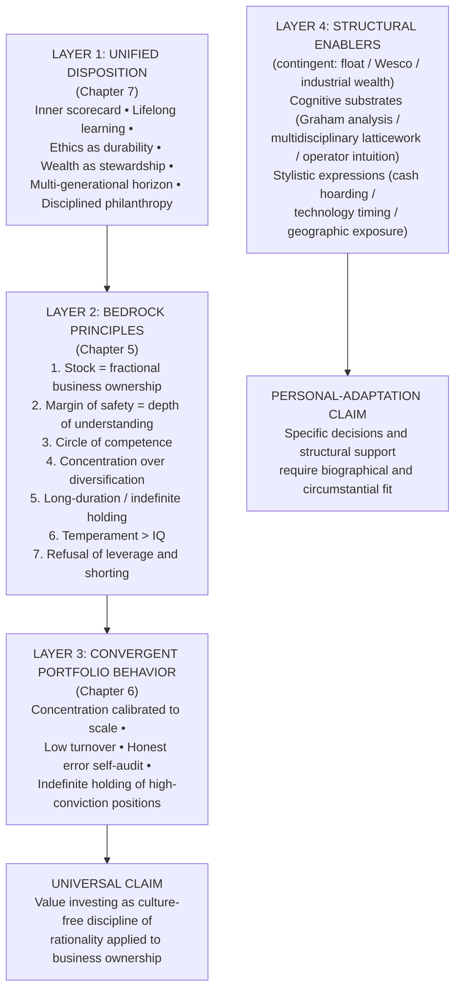

The two claims are not in tension. The universal claim operates at the bedrock-principle and unified-disposition levels; the personal-adaptation claim operates at the structural-enabler, cognitive-substrate, and stylistic-expression levels. Together they constitute the report's integrated finding.

## 8.8 Personal Adaptation: What the Divergences Reveal

The eighth task completes the synthesis by examining what the structural and stylistic divergences across the three investors reveal about the necessity of personal adaptation. The argument is that the divergences are not philosophical departures but downstream consequences of biographical, structural, and circumstantial inputs into the same underlying framework, and that successful adoption of the philosophy requires honest self-assessment of one's own substrate and the disciplined construction of a personal practice commensurate with those inputs.

The three categories of divergence identified across the report each illustrate the necessity of personal adaptation in distinct ways.

**Contingent structural enablers cannot be replicated by ordinary investors and should not be naively imitated.** Berkshire's $382 billion cash position in Q3 2025, twelve consecutive quarters of net selling, and the Apple trim from $174 billion to below $70 billion during 2024 are correct decisions for an entity whose universe of fat pitches is exhausted at Berkshire's scale; they are not correct decisions for an individual investor whose smaller scale leaves the universe of attractive opportunities open. Duan's near-fully-invested posture and his put-option-selling accumulation strategy are correct decisions for an investor whose industrial-wealth backing functions as quasi-permanent capital; they are not correct decisions for an investor whose portfolio represents the entirety of his investable assets and whose drawdowns therefore translate directly into lifestyle pressure. **The framework's bedrock principles are universally applicable; the specific operational practices that the three masters employ are calibrated to structural conditions that ordinary investors do not share.**

**Cognitive substrates cannot be inherited and must be built up through the substrate genuinely available to the investor.** Munger's multidisciplinary latticework requires years of self-education across psychology, mathematics, physics, biology, economics, and history that few investors will undertake; Buffett's filing-cabinet mind requires decades of reading annual reports that few investors will sustain; Duan's operator intuition requires actually building a business that most investors will never do. The honest acknowledgment of the substrate one possesses—and the corresponding circle of competence it supports—is the operational practice the framework requires. An investor whose substrate is professional expertise in one industry can build a circle of competence around that industry; an investor whose substrate is general should adopt the index-fund default path the three masters explicitly recommend. **The framework rewards honest self-assessment and punishes pretense.**

**Stylistic expressions reflect the operating conditions of the moment and should not be treated as timeless rules.** Berkshire's 2024–2025 cash hoarding does not imply that ordinary investors should build comparable cash positions; the stylistic expression is downstream of the scale-driven dearth of fat pitches Buffett faces. Duan's 2011 Apple entry six years before Buffett's does not imply that ordinary investors should anticipate Buffett's portfolio decisions; the stylistic expression is downstream of Duan's operator-intuition substrate that produced earlier conviction in Apple specifically. Duan's Q4 2025 AI-supply-chain initiations do not imply that ordinary investors should construct similar AI-thematic positions; the stylistic expression is downstream of Duan's recent cognitive expansion into AI economics combined with his existing depth in technology businesses. **The transferable lessons from the divergences are at the level of the framework's underlying logic, not at the level of the specific decisions that logic produces under particular conditions.**

The principle of personal adaptation can be stated as a single proposition: **successful adoption of the philosophy requires the construction of a personal practice that respects one's own substrate, structural support, and temperamental capacity, applying the bedrock principles consistently while allowing the operational practices to differ from those of any individual master.** The investor who attempts to imitate Berkshire's specific portfolio decisions without Berkshire's float backing will encounter the failure mode that Wheeler-Munger's redemption-vulnerable structure briefly approached in 1973–74. The investor who attempts to imitate Duan's specific concentrated positions without Duan's operator intuition will encounter the failure modes catalogued in Chapter 6's case studies. The investor who attempts to imitate Munger's specific Bank of America 2009 deployment without Munger's substrate or his Berkshire-adjacent capital structure will encounter the underperformance that even Munger's correct positioning produced in WFC and USB over the subsequent decade. **The framework is universal; the masters' specific decisions are not.**

## 8.9 Enduring Relevance and the Next Generation

The ninth task is the assessment of the philosophy's enduring relevance through generational transition and the survey of the next generation of value investors whose practice extends the Buffett-Munger-Duan tradition. The empirical evidence assembled across the report supports the proposition that the philosophy survives generational transition when the disposition (Chapter 7) and the bedrock principles (Chapter 5) are transmitted, even where structural enablers and cognitive substrates differ.

**Greg Abel** is the most consequential figure in the immediate succession question. As Buffett's designated Berkshire successor, he will take over the largest application of the philosophy at the moment when the parent organization's $382 billion cash position, the complex insurance-float-backed structure, and the multi-generational portfolio of wholly-owned operating subsidiaries require continuous management. The question of whether Abel's eventual management preserves the bedrock disposition while adapting it to the conditions Berkshire will face under his stewardship will be the most-watched empirical test of the philosophy's intergenerational durability over the coming decade.

**Todd Combs and Ted Weschler** have already demonstrated the framework's transferability into Berkshire's intergenerational operation through their Apple advocacy that reshaped the parent portfolio. Their roles as Berkshire investment lieutenants since 2010 and 2011 respectively have included the analytical work that supported the eventual 2016 Apple entry and the subsequent build-up to peak position size; the 2024–2025 trim sequence has been executed under their continuing analytical management alongside Buffett's strategic direction. The Combs and Weschler practice is the most direct evidence that the framework can be operationalized by analysts whose substrate differs from Buffett's (more technology-oriented, more quantitatively-trained) while the bedrock principles remain unchanged.

**Li Lu** is the canonical figure in Munger's recommended emerging-markets succession line. Munger's admiration for Li Lu's "cross-cultural investment perspective" and his support for Li Lu's "expansion into Asia"[^11] is documented in the *Poor Charlie's Almanack* tradition, and the BYD position Li Lu architected through Berkshire's 2008 entry is one of the most consequential single Munger investments of the past two decades, producing what one reconstruction summarizes as "a 15-fold return on a $3.3 million wager in late 2021"[^42]. Li Lu's continuing practice through Himalaya Capital, organized around concentrated long-duration positions in carefully-selected Asian and U.S. companies, represents the most direct extension of the Mungerian framework into emerging-markets and cross-cultural application.

**Colin Huang Zheng** is the canonical figure in Duan's mentorship-driven succession line. Brought to the 2007 Buffett charity lunch as a young Google engineer, Huang founded Pinduoduo and built it into one of China's largest e-commerce platforms; Duan's Q4 2025 H&H portfolio retains Pinduoduo as a 7.48% concentrated position[^41], reflecting both the angel-stage relationship and the continuing public-market conviction. Huang's subsequent transition into philanthropy and reduced operating involvement, while the empirical record on his investment practice through his own family-office structure remains less publicly documented, suggests the framework's continuing operation in the next generation of Chinese value investors.

The broader **Chinese value-investing community** shaped by Duan's Snowball corpus represents a more diffuse but substantial extension of the lineage. The fifteen-plus-year accumulation of Duan's public Snowball posts, blog entries, and the *方略* interview record[^44][^45] has produced a community of Chinese investors who have absorbed the bedrock principles through Duan's articulation rather than through direct exposure to the Berkshire English-language canon. The empirical question of whether this community produces the next generation of Chinese value investors whose records over the coming decades match the bedrock framework's expectations is one that subsequent scholarship will need to address.

The structural challenges the next generation must address are three. First, **scale and succession** raise the question of whether the Berkshire-scale framework remains operable when the specific founding personalities are no longer present and when the marginal opportunity set at the multi-hundred-billion-dollar level continues to shrink. Second, **capital-architecture replication** raises the question of whether the structural enablers that supported the three masters' practice (insurance float, Wesco-scale subsidiary, industrial wealth) can be reproduced by their successors or whether the next generation must construct alternative structural supports. Third, **cognitive-substrate transmission** raises the question of whether the disposition that Chapter 7 identified as the framework's foundation can be cultivated in successors who have not lived through the specific biographical experiences (Munger's catastrophic personal losses, Buffett's Graham apprenticeship, Duan's Subor-and-BBK operating leadership) that produced the original masters' temperament.

The empirical record across 2024–2025 supports cautious optimism about the framework's intergenerational durability. The continuity of the Daily Journal portfolio through Q1 2026, with zero changes between Q4 2025 and Q1 2026 after Munger's November 2023 death, demonstrates that the framework's discipline can be honored by successors who refrain from imposing their own decisions on positions correctly established under the original framework. The Q4 2025 H&H repositioning demonstrates that Duan's framework remains actively operational in his own practice. The continuing integration of Combs and Weschler into Berkshire's analytical work demonstrates the framework's transferability across analyst generations. The framework's enduring relevance therefore rests not on the specific personalities of the original masters but on the bedrock principles and unified disposition the report has identified, and the next generation's task is to operationalize these in the conditions of their own time.

## 8.10 Directions for Further Study

The tenth task identifies open questions and research directions that the present report has surfaced but cannot fully resolve. Each is framed as an invitation to subsequent scholarship rather than as a gap in the present report.

The first open question is **whether the bedrock framework operates equivalently at family-office, mid-cap, and mega-cap scales**. The empirical evidence assembled in Chapter 6 spans portfolios from Daily Journal's $241 million to Berkshire's $274 billion, but the systematic comparison of operational practice across this four-orders-of-magnitude range has not been undertaken in the existing literature. Subsequent scholarship could examine whether specific operational practices (turnover rates, cash positions, position-sizing calibrations) scale linearly with portfolio size or whether discontinuities exist at particular scales.

The second open question is **whether non-Buffett-Munger value-investing traditions converge on or diverge from the bedrock identified here**. Howard Marks's distressed-debt approach at Oaktree Capital, Seth Klarman's deep-value practice at Baupost Group, and Joel Greenblatt's special-situations work at Gotham Capital each represent coherent value-investing traditions with documented track records. The comparative question of whether these traditions converge on the seven bedrock principles or whether they identify additional principles or reject some of those examined here would test the universality claim more rigorously than the three-investor framework can.

The third open question is **how the philosophy adapts to other Asian markets beyond Duan's China-U.S. dual-market practice**. The Japanese value-investing tradition (which Buffett himself entered through the 2019 initiation of positions in five Japanese trading houses[^41]), the Indian value-investing community shaped by figures such as Rakesh Jhunjhunwala and Mohnish Pabrai, and the Southeast Asian markets that have produced their own concentrated long-duration practitioners each constitute potential extensions of the framework's empirical base. The systematic study of whether the bedrock principles operate in these markets without modification, or whether structural features of the markets require operational adaptation, would substantially extend the cross-cultural evidence the present report has assembled.

The fourth open question is **how AI-augmented analytical tools will reshape the operational practice of value investing without altering its bedrock**. Duan's 2025 commitment to "diligently study and use AI"[^41] is the most direct contemporary engagement with this question by any of the three masters, and the empirical record over the coming years will provide the evidence for whether AI tools genuinely augment the depth-of-understanding margin of safety or whether they substitute pattern-recognition for the genuine human judgment the framework requires.

The fifth open question is the **source-asymmetry question** that has affected the present report and that subsequent scholarship can address more thoroughly. The Chinese-language value-investing literature, particularly Duan's Snowball corpus and the broader community shaped by it, remains under-examined in English-language analysis. Systematic translation, contextualization, and integration of this material would substantially enrich the global discussion of value investing and would correct the asymmetry that has favored Western articulations of the framework over Eastern ones.

These five directions are not exhaustive but are the most immediately actionable extensions of the present report's findings. **The collective program they imply is the systematic empirical extension of the universality claim across scales, traditions, markets, and technological conditions, and the corresponding refinement of the personal-adaptation claim through more comprehensive comparative evidence.**

## 8.11 Concluding Reflection: Convergent Wisdom

The report's final reflection returns to the proposition with which Chapter 1 framed the investigation and with which the analytical work of seven chapters has converged. **Buffett, Munger, and Duan are not three philosophies that happen to share principles; they are three biographically distinct expressions of a single underlying disposition toward rationality, learning, ethics, wealth, family, and stewardship.** The disposition is what the three investors share at the deepest level, and the investment principles examined across Chapters 2 through 6 are the operational expression of the disposition rather than its foundation. The unified life philosophy reconstructed in Chapter 7 is therefore not adjacent to the investment framework but constitutive of it; the framework operates as the disposition's operational consequence, and the disposition operates as the framework's temperamental and ethical precondition.

The integrated finding has a single practical implication that this chapter has developed across its preceding sections. **The convergent wisdom of the three masters is genuinely available to any investor willing to adopt and continuously cultivate the temperamental and ethical commitments that make the bedrock framework operational, even where the structural enablers and cognitive substrates of the masters cannot be replicated.** An ordinary investor cannot replicate Berkshire's $382 billion cash position or Duan's fourteen-year Apple holding or Munger's seventy-year house occupation; he can, however, adopt the inner-scorecard orientation, the commitment to lifelong learning, the ethical refusal of illegitimate profit, the frugality, the temporal discipline, and the philanthropic intention that the three masters share. The cultivation of these dispositions produces, over time, the temperamental architecture that the bedrock investment framework requires, and the framework itself produces the modest but reliable compounding that even the index-fund default path the masters recommend can deliver over multi-decade horizons.

The report's contribution within the broader literature on value investing is the systematic three-way comparison of an Eastern and a Western expression of the philosophy and the demonstration that the convergence at the bedrock level is genuine, evidentially grounded, and not reducible to cultural transmission or imitative discipleship. The asymmetry in the existing literature—where Buffett and Munger have been studied exhaustively in the West while Duan has remained comparatively under-examined in English-language analysis—has been partially corrected by the chapters dedicated to Duan's biography (Chapter 1), philosophy (Chapter 4), portfolio practice (Chapter 6), and life philosophy (Chapter 7). The contribution rests not on novel philosophical claims about value investing but on the systematic comparative reconstruction that places Duan in his proper place alongside Buffett and Munger as a major contemporary articulator of the framework, and that demonstrates the genuine convergence at the bedrock level across the three masters' radically different paths.

The enduring claim the report makes is that the philosophy describes something true about capital, enterprise, and time that transcends the contingencies of any particular life or era. **A Nebraska paperboy, an Omaha lawyer-meteorologist, and a Jiangxi-born industrial entrepreneur—operating across seven decades and two continents under radically different institutional conditions—converged on the same seven bedrock principles and on the same unified life philosophy. That this convergence occurred is the strongest possible empirical evidence that the principles describe invariant features of the relationship between capital and productive enterprise rather than features of any particular cultural or institutional context.** Subsequent generations of investors, operating under conditions that the three masters did not face, will inherit the framework as a coherent intellectual tradition whose operational practice they must adapt to their own circumstances while preserving the bedrock principles and the underlying disposition that produces them.

The report closes, therefore, with the recognition that its primary contribution is descriptive rather than prescriptive. It has reconstructed three architectures, identified their convergence, located the universality claim at the bedrock-and-disposition level, and articulated the personal-adaptation principle that governs the operational application. The prescriptive translation in this chapter has converted the descriptive findings into actionable guidance, but the actionable guidance ultimately points back to the descriptive recognition: the framework operates because the disposition operates, and the disposition operates because the investor cultivates it. **The convergent wisdom of Buffett, Munger, and Duan is, in the end, an invitation to construct one's own life along the lines their lives illustrate, in the recognition that the principles they share describe something true about how capital, enterprise, and time relate, and that this truth is available to any investor willing to take the principles seriously over the long horizon the framework's mathematics require.**

[^17]: Warren Buffett's Index Fund Advice Falls Short For Late Savers — AOL.
[^17]: Warren Buffett – How Charlie Convinced Me To Break My Cigar-Butt Investing Habit — The Acquirer's Multiple.
[^41]: Duan Yongping's Q4 Portfolio Overhaul: Nvidia Holdings Soar Over 11-Fold, Apple Trimmed as He Tests AI Supply Chain — BigGo Finance.
[^41]: 3 Can't-Miss Takeaways From Warren Buffett's Letter to Berkshire Hathaway Shareholders — The Motley Fool.
[^11]: 《Retirement of the God of Investing丨Poor Charlie's Almanack》: A Collection of Charlie Munger's Wisdom — FOFA.
[^13]: 段永平持仓整理之——苹果 — 雪球 / 大唐炼金师.
[^13]: The Day Charlie Munger Was Introduced To The World — Forbes (Schifrin / Lenzner & Fondiller, 1996 cover story).
[^42]: 段永平晒出部分持仓，2011年开始买入苹果股票，累计收益率超16倍 — 网易 / 红星资本局.
[^42]: The Untold Story of Charlie Munger's Final Years — WSJ.
[^18]: Capital Allocation: The Financials of a New England Textile Mill — The Rational Walk.
[^19]: Warren Buffett's Big 2024: Selling Apple, Hoarding Cash, Death Planning — Business Insider.
[^19]: 中國巴菲特 段永平 ( Duan Yongping ): 不做空，不借錢，最重要的是不要做不懂的東西 — 路的成功學.
[^19]: Warren Buffet pays tribute to Charlie Munger in letter to shareholders — Mint.
[^44]: Warren Buffett's cash position just got even larger — Capital.com.
[^44]: 中國巴菲特段永平訪談：從選公司到教孩子，給你 50 條核心乾貨 — 動區動趨 / TechFlow.
[^20]: Charlie is the "Real" Architect: Lessons from Buffett's 2023 Annual Letter — Ginsler Wealth.
[^45]: Why Are Buffett and Berkshire Hathaway Hoarding So Much Cash? — Investing.com / Dave Kovaleski.
[^45]: 週末讀物 | 18000字，講透段永平是如何思考蘋果公司的？ — 礪石商業評論 / Futubull.

# 参考内容如下：
[^1]:[Warren Buffett Childhood Story [Part 7] The 12-Year-Old Prodigy in the Stock Exchange](https://www.buffettonlineschool.com/post/warren-buffet-childhood-story-part-7-the-12-year-old-prodigy-in-the-stock-exchange)
[^2]:[Warren Buffett, Jack Bogle and Walt Disney had the same first job](https://www.cnbc.com/2018/06/25/warren-buffett-jack-bogle-and-walt-disney-had-the-same-first-job.html)
[^3]:[Benjamin Graham - Wikipedia](https://en.wikipedia.org/wiki/Benjamin_Graham)
[^4]:[Charlie Thomas Munger（American investor and lawyer）_Baiduwiki](https://baike.baidu.com/en/item/Charlie%20Thomas%20Munger/1486954)
[^5]:[Poor Charlie's Almanack: Investment Lessons from Charlie Munger](https://www.offermarket.us/blog/poor-charlies-almanack)
[^6]:[25 Cognitive Biases | Charlie Munger x Harvard University - YouTube](https://www.youtube.com/watch?v=e7KN9fkmVbw)
[^7]:[The Psychology of Human Misjudgment - Nicholai Milton.](https://www.nicholaimilton.com/post/charlie-munger-psychology-human-misjudgment)
[^8]:[Some our favourite Charlie Munger quotes : r/StockMarket - Reddit](https://www.reddit.com/r/StockMarket/comments/186tzym/some_our_favourite_charlie_munger_quotes/)
[^9]:[How Warren Buffett’s Right-Hand Man, Charlie Munger, Shaped Berkshire Hathaway](https://www.investopedia.com/warren-buffett-s-right-hand-man-charlie-munger-8786141)
[^10]:[Charlie Munger’s “lollapalooza effect” concept – Buffettpedia](https://buffettpedia.com/2015/01/charlie-mungers-lollapalooza-effect-concept/)
[^11]:[中國巴菲特 段永平 ( Duan Yongping ) : 不做空，不借錢，最重要的是不要做不懂的東西](https://vocus.cc/article/68d2b500fd89780001499fe9)
[^12]:[Duan Yongping（Founder of Guangdong BBK Electronics Industrial Co., Ltd., Chairman of BBK Group）_Baiduwiki](https://baike.baidu.com/en/item/Duan%20Yongping/13559)
[^13]:[Warren Buffet pays tribute to Charlie Munger in letter to shareholders | Company Business News](https://www.livemint.com/companies/news/the-architect-of-berkshire-hathaway-warren-buffet-pays-tribute-to-charlie-munger-in-letter-to-shareholders-11708785746863.html)
[^14]:[闲人段永平：中国最神秘的富豪丨创创锦囊_长江商学院独角兽加速项目](https://www.ckgsb.com/chuang/content/news_detail/720)
[^15]:[段永平的投资哲学：从商业本质到人生智慧的深度解码_搜狐网](https://m.sohu.com/a/918116838_532789)
[^16]:[腾讯 元宝Ai总结的大道与方丈的访谈内容。在2025年11月11日雪球《方略》节目的罕见公开访谈中，知名投资人段永平与雪...](https://xueqiu.com/8238315450/361094118)
[^17]:[Capital Allocation: The Financials of a New England Textile Mill](https://newsletter.rationalwalk.com/p/berkshire-hathaways-great-transformation)
[^18]:[中國巴菲特段永平訪談：從選公司到教孩子，給你 50 條核心乾貨 | 動區動趨-最具影響力的區塊鏈新聞媒體](https://www.blocktempo.com/duan-yongping-interview-50-investment-insights/)
[^19]:[Charlie is the "Real" Architect: Lessons from Buffett's 2023 Annual Letter - Ginsler Wealth](https://ginslerwealth.com/charlie-is-the-real-architect-lessons-from-buffetts-2023-annual-letter/)
[^20]:[週末讀物| 18000字，講透段永平是如何思考蘋果公司的？](https://news.futunn.com/hk/post/56864995/weekend-reading-18000-words-explaining-how-duan-yongping-thinks-about)
[^21]:[Duan Yongping - Wikipedia](https://en.wikipedia.org/wiki/Duan_Yongping)
[^22]:[段永平的不为清单](https://xueqiu.com/2960937061/274279088)
[^23]:[段永平接受方三文访谈全记录：10大核心观点+4个经典案例 - 雪球](https://xueqiu.com/3640871106/361037361)
[^24]:[段永平讲公司文化- 抖音](https://www.douyin.com/search/%E6%AE%B5%E6%B0%B8%E5%B9%B3%E8%AE%B2%E5%85%AC%E5%8F%B8%E6%96%87%E5%8C%96)
[^25]:[Warren Buffett Quotes on Investment, Stocks, and Life](https://www.ruleoneinvesting.com/blog/how-to-invest/warren-buffett-quotes-on-investing-success/)
[^26]:[段永平：每个人都应该积累自己的stop doing list（不为清单），找到自己的北斗星。stop doing list（不为清单） 是方法论。_計然財經](https://jirancaijing.com/kuaixun/10213.html)
[^27]:[段永平的“不为清单”|段永平_新浪财经_新浪网](https://finance.sina.com.cn/money/fund/fundzmt/2024-08-17/doc-inciyfea1271970.shtml)
[^28]:[[PDF] 雪球特别版—— 段永平投资问答录（商业逻辑篇）](https://xqdoc.imedao.com/174beedc1fc13d3fe1f6bc4d.pdf)
[^29]:[Buffett's Investment Principles Explained | PDF | Value Investing | Investing](https://www.scribd.com/document/65352277/CS-of-Buffett-Filter-on-Catastrophic-Risk)
[^30]:[7 Warren Buffett Investment Lessons for Market Uncertainty](https://askfuzz.ai/discover/news/personal-finance/7-warren-buffett-investment-lessons-for-volatility-navigation)
[^31]:[《Retirement of the God of Investing丨Poor Charlie's Almanack》：—— A Collection of Charlie Munger's Wisdom [Limited Time Access]](https://www.fofahk.com/en/post/retirement-of-the-god-of-investing-poor-charlies-almanack-1)
[^32]:[BBK Electronics - Wikipedia](https://en.wikipedia.org/wiki/BBK_Electronics)
[^33]:[Lessons from Warren Buffett’s Annual Letters to Shareholders](https://www.fincart.com/blog/warren-buffett-annual-letters-to-shareholders/)
[^34]:[Warren Buffett’s Letters - MaxDividends](https://www.maxdividends.com/p/warren-buffetts-letters)
[^35]:[See's Candies: $82M Pre-Tax Profit Analysis | PDF | Investing | Inventory](https://www.scribd.com/document/79357646/Sees-Candy-Schroeder)
[^36]:[Berkshire Hathaway Inc Q3 2025 13F Top Portfolio Holdings](https://13f.info/13f/000119312525282901-berkshire-hathaway-inc-q3-2025)
[^37]:[【投資論】「打孔機」只打了不到10個孔！段永平與方三文最新對話，詳解「投資中如何真正算看懂」 港美股資訊 | 華盛通](https://www.hstong.com/news/hk/detail/25111717461031474)
[^38]:[段永平与步步高的故事 网上看到的一篇文章，准确程度无从知晓。只是喜欢大道，所以贴出来。下面简略地叙述一下我亲历的小霸王故事与我所知道的段永平。... - 雪球](https://xueqiu.com/7025639436/133060616)
[^39]:[Berkshire Hathaway 13F Portfolio Q4 2025 | Top Buys & Sells](https://www.13radar.com/filer/berkshire-hathaway)
[^40]:[A Xi'an company was reportedly relocating its offices from the CBD ...](https://en.eeworld.com.cn/mp/leiphone/a349971.jspx)
[^41]:[Warren Buffett's Big 2024: Selling Apple, Hoarding Cash, Death Planning - Business Insider](https://www.businessinsider.com/warren-buffett-2024-highlights-berkshire-letter-meeting-apple-stocks-death-2025-1)
[^42]:[Warren Buffett’s cash position just got even larger | Capital.com](https://capital.com/en-int/analysis/buffett-berkshire-cash-pile-2025)
[^43]:[Duan Yongping's Investment Moves: From Apple to AI Infrastructure](https://www.gate.com/post/status/20176274)
[^44]:[Why Are Buffett and Berkshire Hathaway Hoarding So Much Cash? | Investing.com](https://www.investing.com/analysis/why-are-buffett-and-berkshire-hathaway-hoarding-so-much-cash-200669620)
[^45]:[A tribute to Charlie Munger: 8 things I learned from Warren Buffett’s 2023 letter to Berkshire shareholders](https://fifthperson.com/warren-buffett-2023-letter-berkshire-shareholders/)
[^46]:[Berkshire Hathaway's portfolio holdings for the 3rd quarter are out](https://www.reddit.com/r/ValueInvesting/comments/1ox9tc6/berkshire_hathaways_portfolio_holdings_for_the/)
[^47]:[Quality Without Compromise - by Max Olson - FutureBlind](https://futureblind.com/p/quality-without-compromise)
[^48]:[[PDF] Buffett's Tips - Bookey](https://cdn.bookey.app/files/pdf/book/en/buffett's-tips.pdf)
[^49]:[Warren Buffett and the Changing Face of Philanthropy - NPR](https://www.npr.org/transcripts/5512016)
[^50]:[Duan Yongping continues to buy this company - Moomoo](https://www.moomoo.com/news/post/37632028/duan-yongping-continues-to-buy-this-company)
[^51]:[Warren Buffett – How Charlie Convinced Me To Break My Cigar-Butt Investing Habit | The Acquirer's Multiple®](https://acquirersmultiple.com/2017/02/warren-buffett-how-charlie-convinced-me-to-break-my-cigar-butt-investing-habit/)
[^52]:[[PDF] Tao Of Charlie Munger - sciphilconf.berkeley.edu](https://sciphilconf.berkeley.edu/default.aspx/mL09EF/600317/Tao%20Of%20Charlie%20Munger.pdf)
[^53]:[10 Powerful Lessons Everyone can Learn from Warren Buffett for Business Success - LifeHack](https://www.lifehack.org/articles/productivity/10-powerful-lessons-everyone-can-learn-from-warren-buffett-for-business-success.html)
[^54]:[Warren Buffett shares bits of his wisdom for all parents, and it has something to do with the ‘will’! - Times of India](https://timesofindia.indiatimes.com/etimes/trending/warren-buffett-shares-bits-of-his-wisdom-for-all-parents-and-it-has-something-to-do-with-the-will/articleshow/115743556.cms)
[^55]:[Wisdom from Warren Buffett's Journey | PDF | Warren Buffett | Debt](https://www.scribd.com/document/104877473/Waren-Buffet-lessons)
[^56]:[Tracking Warren Buffett's Berkshire Hathaway Portfolio - Q4 2025 ...](https://seekingalpha.com/article/4871863-tracking-warren-buffetts-berkshire-hathaway-portfolio-q4-2025-update)
[^57]:[Duan Yongping Portfolio (2025 Q4) - H&H International Investment Holdings 13F](https://valuesider.com/guru/duan-yongping-h-h-international-investment/portfolio)
[^58]:[段永平的博客岁月_百度文库](https://wk.baidu.com/view/9b019dbbe109581b6bd97f19227916888486b9c9?pcf=2&re=view&bfetype=new)
[^59]:[$249M Charlie Munger Portfolio / Daily Journal Holdings - Stockcircle](https://stockcircle.com/portfolio/charlie-munger)
[^60]:[Charlie Munger Portfolio 2025 | Daily Journal Corporation 13F Holdings](https://13fai.com/charlie-munger-portfolio.html)
[^61]:[Apple vs reclusive billionaire Duan Yong Ping: China smartphone war completely different | news.com.au — Australia’s leading news site for latest headlines](https://www.news.com.au/technology/gadgets/mobile-phones/the-reclusive-billionaire-harnessing-the-might-of-chinas-smartphone-obsession-to-take-on-apple/news-story/c4a90f4f8fdbfdb88f74977877b79b35)
[^62]:[段永平投资中所犯的错误-电子工程专辑](https://www.eet-china.com/mp/a110874.html)
[^63]:[Duan Yongping's Q4 Portfolio Overhaul: Nvidia Holdings Soar Over 11-Fold, Apple Trimmed as He Tests AI Supply Chain — BigGo Finance](https://finance.biggo.com/news/24eCc5wBvthpMgHBVazu)
[^64]:[H&H INTERNATIONAL INVESTMENT, LLC | The Observatory of Economic Complexity](https://oec.world/en/profile/manager/handh-international-investment-llc)
[^65]:[Charlie Munger Portfolio (2026 Q1) - Daily Journal Corp Holdings 13F](https://valuesider.com/guru/charlie-munger-daily-journal-corp/portfolio)
[^66]:[3 Can't-Miss Takeaways From Warren Buffett's Letter to Berkshire Hathaway Shareholders | The Motley Fool](https://www.fool.com/investing/2025/03/01/3-cant-miss-takeaways-warren-buffett-annual-letter/)
[^67]:[The Day Charlie Munger Was Introduced To The World](https://www.forbes.com/sites/schifrin/2023/11/29/the-day-charlie-munger-was-introduced-to-the-world/)
[^68]:[The Untold Story of Charlie Munger's Final Years - WSJ](https://www.wsj.com/finance/investing/charlie-munger-life-final-years-berkshire-7c20c18e)
[^69]:[段永平持仓整理之——苹果 大道在雪球说的最多的就是 苹果 ，他的仓位是绝对集中在苹果，这个账户也说明了这个问题。关于段永平投资 苹果 ，我曾许诺，...](https://xueqiu.com/8959246745/313101306)
[^70]:[Buffett's 2024 Vision: What Investors Can Learn from Six Decades of ...](https://www.wisdomtree.com/investments/blog/2025/02/26/buffetts-2024-vision-what-investors-can-learn-from-six-decades-of-letters)
[^71]:[段永平晒出部分持仓，2011年开始买入苹果股票，累计收益率超16倍|股价|巴菲特|苹果公司|知名企业|蒂姆·库克_网易订阅](https://www.163.com/dy/article/KICRFSSR0511U82T.html)
