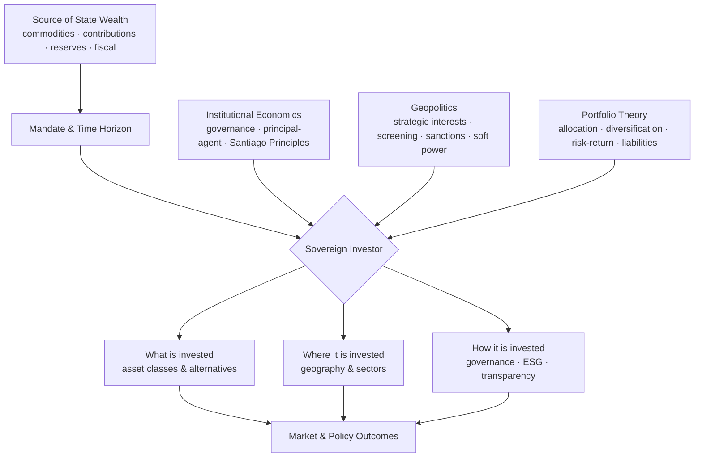
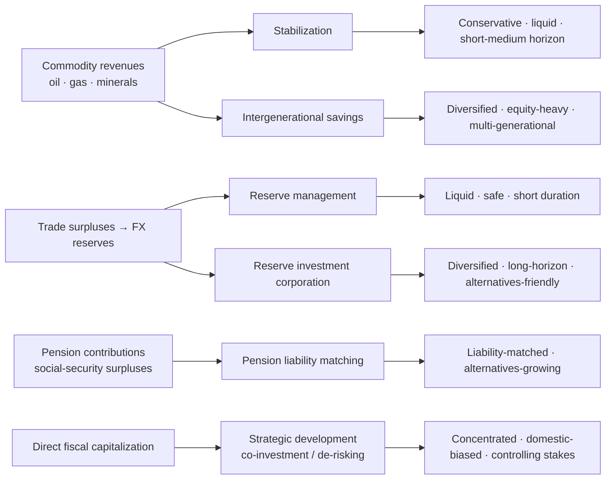
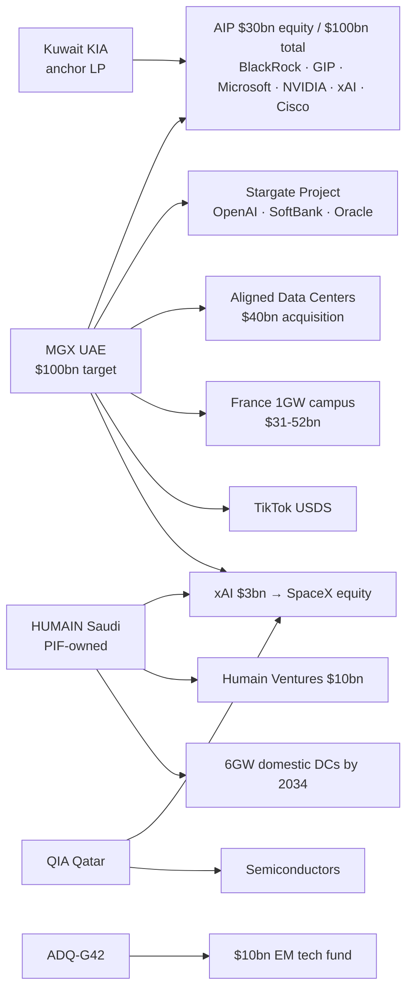
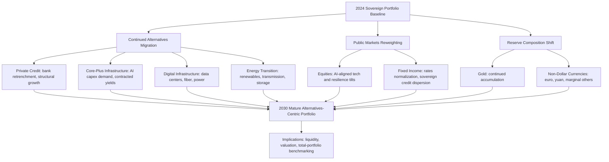

# How the World's Wealthiest Governments Invest: A Global Study of Sovereign Wealth Funds, Public Pensions and State Capital Allocation
# 1 Introduction: The Rise of State Capital in the Global Financial System

Over the past two decades, the global financial system has witnessed a quiet but profound transformation: governments — long understood primarily as fiscal authorities, regulators, and tax-takers — have emerged as some of the largest, most strategically consequential investors in the world. From oil revenues recycled into Manhattan skyscrapers and Silicon Valley equity stakes, to pension reserves underwriting trans-continental infrastructure, to central bank reserve managers quietly diversifying away from the U.S. dollar, public capital now sits at the commanding heights of nearly every major asset class. Understanding **how the world's wealthiest governments invest** therefore requires more than a recitation of league tables; it demands a careful definition of what counts as state capital, an appreciation of why it has scaled so dramatically, and an analytical framework capable of integrating finance, governance, and geopolitics. This opening chapter establishes that conceptual foundation. It first delineates the taxonomy of state-controlled investment vehicles, then traces the structural drivers behind their ascent, and finally articulates the research questions and multi-disciplinary lens that animate the chapters to follow.

## 1.1 Defining Government Investment: A Taxonomy of State Capital

The phrase "government investment" is, on closer inspection, an umbrella covering a heterogeneous set of institutions whose mandates, funding sources, and payout structures differ in economically and politically meaningful ways. A precise taxonomy is therefore the indispensable starting point for any comparative analysis, because conflating these vehicles — as is common in popular discussion — risks generalizing the behavior of, say, a stabilization fund onto a pension reserve or treating a foreign reserve portfolio as if it were a long-horizon savings vehicle. Throughout this report, the universe of state capital is decomposed into four principal categories: sovereign wealth funds (SWFs), public pension funds (PPFs) and public pension reserve funds (PPRFs), central bank foreign exchange reserves, and state-owned investment vehicles or strategic holding companies.

The first and most prominent category is the **sovereign wealth fund**. The most widely accepted definition is that codified in the Santiago Principles, developed under the auspices of the International Forum of Sovereign Wealth Funds (IFSWF), which describe SWFs as "special purpose investment funds or arrangements, owned by the general government."[^1] The IFSWF itself is structured as a voluntary forum in which member SWFs convene to exchange views on issues of common concern, signalling that the SWF community is institutionally self-conscious of its distinct identity within the broader public-investor landscape.[^2] Within this category, fund mandates vary widely — stabilization funds are designed to smooth fiscal revenues against commodity price volatility; savings or future-generation funds aim to convert exhaustible resource wealth into perpetual financial wealth; reserve investment corporations seek higher returns on excess foreign reserves; and strategic development funds use state capital to catalyze domestic industrial transformation.

The second category — **public pension funds (PPFs) and public pension reserve funds (PPRFs)** — is conceptually distinct but operationally overlaps with SWFs at the margins. The OECD's working definition distinguishes between funded pension plans in the public and private sectors (which support contractual retirement liabilities through dedicated contributions) and PPRFs, which serve as "reserves/buffers to support otherwise PAYG financed public pension systems."[^3] PPRFs themselves divide into two sub-types. The first comprises funds embedded within the social security system, where inflows are predominantly the surpluses of employee and employer contributions over current payouts, supplemented by fiscal transfers; examples include Denmark's Social Security Fund, Japan's Government Pension Investment Fund (GPIF), and the U.S. Social Security Trust Fund.[^3] The second sub-type covers funds established directly by government — entirely separated from the social security administrative apparatus — financed primarily by direct fiscal transfers and designed to meet *future* social security deficits. The Australia Future Fund, the New Zealand Superannuation Fund, France's *Fonds de Réserve pour les Retraites*, and notably the Norwegian Government Pension Fund all fit this mold, and the OECD explicitly observes that funds in this second sub-type "are also sometimes classified as sovereign wealth funds (SWFs)."[^3] The Norwegian Government Pension Fund Global (GPFG), in particular, is the canonical hybrid: it carries "Pension Fund" in its name and supports long-term fiscal sustainability of an aging society, yet it is universally tracked among the world's largest SWFs and was included in OECD survey work because of its "at least a partial pension objective."[^3] The boundary, in other words, is porous, and the taxonomy must accommodate dual classification.

The third category is **central bank foreign exchange reserves**. Although central banks are not typically described as "investors" in the same vernacular as SWFs, the reserve managers of major economies collectively control multi-trillion-dollar portfolios whose allocation across currencies, sovereign debt, gold, and — increasingly — non-traditional assets exerts a first-order influence on global capital markets. Reserves differ from SWFs and PPRFs in their primary mandate: liquidity, safety, and exchange-rate management dominate, while return is a tertiary objective. This generally constrains reserve portfolios to short-duration, high-credit-quality fixed income and gold. However, the proliferation of "reserve investment corporations" — vehicles that carve out a tranche of excess reserves for higher-return mandates — has blurred the line between central-bank reserve management and sovereign wealth investing, with China Investment Corporation (CIC), Korea Investment Corporation (KIC), and Singapore's GIC representing different points along this spectrum.

The fourth category encompasses **state-owned investment vehicles and strategic holding companies**, including national development banks, state-owned strategic investors such as Singapore's Temasek, and a new wave of sovereign holding companies designed to consolidate state-owned enterprise stakes under a portfolio-management logic. These vehicles often operate with a domestic-development bias, take controlling or significant minority stakes rather than purely financial positions, and explicitly serve industrial-policy objectives alongside financial returns.

Taken together, these four categories occupy a continuum rather than discrete silos, and the same fund can shift category over time as mandates evolve. The boundaries that matter most for the analysis to follow are not legal labels but functional attributes: **the source of capital** (commodity revenues, contributions, fiscal transfers, foreign reserves), **the time horizon** (intergenerational, multi-decade liability-matching, short-term liquidity), **the payout structure** (contractual pension obligations, discretionary fiscal drawdowns, no payout for decades), and **the strategic objective** (financial return, stabilization, development, or geopolitical influence). The table below summarizes the working taxonomy used throughout this report.

| Category | Primary Funding Source | Typical Mandate | Time Horizon | Representative Examples |
|---|---|---|---|---|
| Stabilization & savings SWFs | Commodity revenues | Smooth fiscal cycles; preserve wealth for future generations | Multi-generational | Norway GPFG, ADIA, KIA |
| Strategic / development SWFs | Fiscal transfers; SOE consolidation | National economic transformation; industrial policy | Long-term | Temasek, Mubadala, PIF |
| Reserve investment corporations | Excess FX reserves | Higher-return mandate above reserve baseline | Long-term | CIC, GIC, KIC |
| Public pension funds (PPFs) | Employee/employer contributions | Match contractual pension liabilities | Liability-driven | CPP Investments, CalSTRS, ABP |
| Public pension reserve funds (PPRFs) | Social-security surpluses; fiscal transfers | Buffer future PAYG deficits | Multi-decade | Japan GPIF, US SS Trust, NZ Super, Australia Future Fund |
| Central bank FX reserves | Balance-of-payments accumulation | Liquidity, safety, FX management | Short-to-medium | PBoC, SAFE, SNB, Fed reserve assets |
| State-owned holding companies | Fiscal capitalization; SOE dividends | Active stewardship of strategic assets | Long-term, often controlling | Temasek, Bpifrance, Indonesia's Danantara |

The remainder of this report uses the term **"sovereign investors"** or **"state capital"** as a collective shorthand for these vehicles when generalizations are warranted, but, in line with this report's analytical commitment to typological rigor, it explicitly identifies the relevant sub-category whenever conclusions depend on it.

## 1.2 The Structural Ascent of State Capital in Global Markets

Having established what counts as state capital, the next question is why it has become structurally important. The simplest and most arresting answer lies in scale. A single OECD survey of 101 large pension funds (LPFs) and public pension reserve funds (PPRFs) drawn from 40 countries found that these institutions alone managed **USD 10.3 trillion** in assets at year-end 2020, with USD 3.3 trillion held by 86 LPFs and a further USD 7.0 trillion held by 15 PPRFs and pension-mandated SWFs.[^3] This figure represents only one slice of the public-investor universe — it excludes most pure SWFs, the multi-trillion-dollar central bank reserve pools, and a long tail of state-owned strategic investors — yet on its own it dwarfs the GDP of most countries and rivals the assets of the global hedge-fund and private-equity industries combined. The structural ascent of state capital is thus not a marginal phenomenon to be footnoted in studies of private finance; it is a first-order feature of contemporary capital markets.

Several macro-drivers underpin this expansion. The first is **commodity revenue accumulation**. Hydrocarbon and mineral exporters have, since the early 2000s, used episodes of elevated prices to convert depleting natural-resource wealth into diversified financial wealth, giving rise to the dominant cohort of Gulf and Norwegian funds. The second is **demographic pressure on pension systems**. Aging populations in OECD economies have forced governments to pre-fund future pension liabilities through PPRFs, shifting capital from current consumption into long-horizon investment. The OECD frames this directly: PPRFs exist precisely "to support otherwise PAYG financed public pension systems," and many of the second-type PPRFs "are not allowed to make any payouts for decades," which, importantly for capital markets, means they accumulate net inflows for very long periods before disbursing.[^3] The third driver is the **accumulation of foreign exchange reserves** by export-led economies — a process that gathered momentum after the 1997–98 Asian financial crisis as emerging-market authorities pursued self-insurance and resulted in central bank balance sheets large enough to spawn dedicated reserve investment corporations. The fourth driver is the **search for return** itself: traditional liability-matching portfolios concentrated in domestic government bonds have proven inadequate against secular declines in real yields, pushing public investors progressively into equities, alternatives, and global markets.

The behavioral consequences of this scale are visible in how surveyed funds actually deploy capital. The OECD survey describes institutional investors as historically built around "two main asset classes (bonds and equities) and an investment horizon tied to the often long-term nature of their liabilities," but observes that they "have progressively diversified portfolios by adding allocations to alternative investments such as private equity, real estate, infrastructure and hedge funds."[^3] This shift matters at the system level because state investors bring a structurally distinctive profile: long liabilities, low leverage, a tolerance for illiquidity, and policy-determined contribution patterns that buffer them from the procyclical redemption pressures that constrain many private institutional pools. They are, in effect, the largest reservoir of genuinely **patient capital** in the global system. The OECD survey's emphasis on infrastructure, ESG investment, and green and social impact allocations is itself a recognition that policy-makers increasingly look to LPFs and PPRFs as channels to mobilize long-term finance for public-policy objectives — a use case the OECD explicitly endorses as a "priority for helping to achieve targets for investment, growth and employment."[^3]

State capital's ascent has also produced a degree of **geographic and sectoral concentration**. The OECD data reveal that several of the largest LPFs and PPRFs in OECD jurisdictions invest substantial portions of their portfolios outside their home countries; foreign exposures exceeding 80–95% of total assets are common among smaller-economy funds (e.g., several Dutch, Austrian, and Icelandic vehicles), while large-economy funds such as Norway's GPFG and Canada's CPP Investments deploy most of their assets internationally.[^3] This cross-border posture means that state-investor allocation decisions — into U.S. equities, European real estate, Asian infrastructure, or emerging-market debt — exert measurable influence on the marginal cost of capital in the receiving markets, with implications that are simultaneously financial, political, and strategic.

A final, often under-appreciated structural feature is the **embedding of public-policy objectives** into investment portfolios. The OECD survey documents that infrastructure, green investment, social impact investment, and ESG considerations have moved from peripheral disclosures to core analytical categories in tracking what these funds do.[^3] State investors are thus not merely large; they are increasingly **mandated** — implicitly or explicitly — to align portfolio decisions with national strategies on climate, technology, and industrial development. This combination of scale, patience, cross-border reach, and policy-linkage is what transforms public investors from incidental market participants into structurally consequential actors whose collective behavior shapes the architecture of global finance.

## 1.3 Central Research Questions and Analytical Framework

Against this backdrop, the report is organized around four guiding questions that, together, constitute a comprehensive framework for understanding sovereign investing:

1. **What do governments invest?** — How is state capital sourced (commodity revenues, contributions, fiscal transfers, reserves), how large is the aggregate pool, and how is it distributed across fund types and jurisdictions?
2. **Why do they invest?** — What mandates, liabilities, and political objectives drive allocation choices, and how do these mandates shape risk tolerance and time horizon?
3. **Where do they invest?** — How is capital allocated across asset classes, sectors, and geographies, and how do domestic-bias and global-diversification strategies differ across regions and fund types?
4. **How do their strategies differ?** — How do governance, transparency, ESG integration, geopolitical alignment, and performance frameworks vary across the leading sovereign investors, and what do these differences imply for outcomes?

Answering these questions requires a deliberately **multi-disciplinary analytical lens** because the behavior of state capital cannot be reduced to any single discipline. This report integrates three perspectives.

The first is **institutional economics**, which examines the funds themselves as organizations: their governance structures, the principal-agent relationships between political principals (governments, parliaments, social-security boards) and investment-management agents, the rules embedded in mandates, and the formal frameworks — most notably the Santiago Principles — that govern conduct.[^1][^2] This lens explains, for example, why two funds with similar AuM and similar national wealth bases can produce sharply different risk profiles and returns based on differences in board independence, investment horizon, and rebalancing rules.

The second lens is **geopolitics and political economy**, which treats state investors as actors whose decisions reflect — and influence — national strategic interests. Sovereign capital flows interact with FDI screening regimes, sanctions architectures, and bilateral diplomacy; sectoral choices in semiconductors, AI, and energy infrastructure carry strategic as well as financial significance; and transparency and governance variance across funds is in part a function of their political environments. This lens is essential because, unlike private investors, state investors operate at the intersection of finance and statecraft, and any account of their behavior that abstracts from this intersection will be incomplete.

The third lens is **portfolio theory and modern investment management**, which provides the technical vocabulary — asset allocation, diversification, factor exposures, risk-adjusted returns, liability-driven investing — for analyzing the actual investment decisions sovereign funds make. This lens helps explain the secular rotation toward alternatives documented in OECD survey work, the persistent home-bias-versus-global-diversification trade-off visible across funds, and the rising centrality of infrastructure and green investment in long-duration portfolios.[^3]

The diagram below depicts how these three lenses interact to shape sovereign investment behavior throughout the report.



The remainder of the report operationalizes this framework chapter by chapter. **Chapter 2** quantifies and classifies the universe of sovereign investors, mapping AuM concentration, typological splits, and the link between wealth origins and mandates. **Chapter 3** examines asset allocation, performance, and risk management, with particular attention to the rotation into alternatives and the comparative behavior of leading funds. **Chapter 4** investigates the geographic footprint of state capital and its geopolitical dimensions, including domestic-bias dynamics, screening regimes, and emerging capital corridors. **Chapter 5** turns to sectoral preferences and frontier themes — technology and AI, infrastructure, and energy transition. **Chapter 6** assesses sustainability, ESG integration, governance, and transparency, drawing on benchmarks such as the Santiago Principles and the Linaburg-Maduell Transparency Index. **Chapter 7** delivers comparative regional case analyses (Norwegian, Gulf, Asian, North American pension models) and analyzes the rapidly expanding cohort of newly established sovereign funds. **Chapter 8** synthesizes the findings, projects the trajectory of sovereign investing through the next decade, and articulates strategic implications for policymakers, market participants, and host countries.

A note on **evidentiary scope and limitations** is warranted at the outset. Because the global SWF and pension-investor landscape evolves rapidly and is unevenly disclosed, this report relies where possible on official fund disclosures, recognized industry trackers, and authoritative survey work — including the OECD's annual survey of large pension and public pension reserve funds, which provides the most granular publicly available data on a substantial slice of the universe.[^3] Where data are partial or contested, the report flags the limitation explicitly rather than smoothing over the gaps, in keeping with the analytical premise that the question of *how the world's wealthiest governments invest* is too consequential to be answered by speculation. With taxonomy, scale, drivers, and framework now established, the report turns in the next chapter to mapping the sovereign-investor universe in detail.

# 2 The Universe of Sovereign Investors: Scale, Typology, Origins and Mandates

Chapter 1 established a working taxonomy of state capital and argued that sovereign investors have become structurally consequential actors in global finance. The natural next step is to move from definition to measurement: how large is this universe, how is it composed, where is its capital concentrated, and what funding sources and mandates animate the funds at the top of the league table? This chapter answers these questions in sequence, building an empirical map of state capital that the rest of the report uses as its analytical baseline. The mapping is deliberately quantitative and typological: it pins down aggregate assets under management (AuM), profiles the leading funds, traces the geographic centers of gravity, and — crucially — links each fund's source of wealth to the mandate it operates under and the investment behavior that mandate predictably produces. By the end of the chapter, the universe is no longer a flat ranking of "the world's biggest funds" but a structured landscape on which the strategic, sectoral, and geopolitical analyses of subsequent chapters can be projected.

## 2.1 The Aggregate Scale of State Capital

The aggregate balance sheet of state-owned investors (SOIs) reached a historic high in 2024, approaching **$55 trillion**, according to Global SWF — a figure that decomposes into three principal segments: sovereign wealth funds at **$13 trillion**, public pension funds (PPFs) at **$25 trillion**, and central bank foreign reserves of **$16.9 trillion** following a 6% year-on-year increase in reserve assets[^4]. Global SWF projects the SOI universe to expand to roughly **$60 trillion in 2025** and **$75 trillion by 2030**, a trajectory underpinned by ambitious economic visions in the GCC, continued commodity-revenue accumulation, and the secular maturation of pension reserve systems[^4]. Even taken on the conservative end of available estimates, this aggregate is of an order of magnitude that places sovereign investors squarely among the dominant pools of long-term capital in the world economy.

The SWF segment in particular has grown at a pace that justifies treating it as a first-order force in markets rather than a peripheral curiosity. TheCityUK puts SWF AuM at **$6.7 trillion in 2014** rising to **$12.7 trillion in 2023**, an average annual growth rate of approximately **7%** over the decade[^5]. The IE University–ICEX 2024 *Sovereign Wealth Funds Report* corroborates this trajectory and refines it for the most recent year, documenting a **14% jump** from $11.6 trillion at end-2022 to **$13.2 trillion at end-2023**, the steepest annual expansion in several years[^6]. Global SWF's tracking through 2024 and 2025 shows the SWF segment continuing its climb past the $13 trillion mark, while PPFs and central bank reserves grew in parallel — PPF assets adding incremental contributions and investment returns, and reserves expanding as central banks accumulated further on the back of a strong dollar and elevated commodity revenues[^4]. OMFIF, in its long-running *Global Public Investor* series, reports that **160 global public investors** with a combined **~$24 trillion** in assets engaged with its 2024–25 research cycle, a useful triangulation of the addressable universe of central banks, public pension funds, and sovereign funds reachable through formal disclosure and survey channels[^7].

It is worth situating these numbers against the private asset-management industry to fully appreciate the relative weight of state capital. BCG's 2025 *Global Asset Management Report* records that the global asset-management industry reached **$128 trillion** in AuM at year-end 2024, up 12% on the year[^8]. On a like-for-like basis the SOI universe of ~$55 trillion is therefore equivalent to roughly **43%** of the global private asset-management pool — and unlike that pool, state capital is concentrated in a relatively small number of vehicles with multi-decade or multi-generational horizons. When stacked against single private players, even the largest asset managers are dwarfed in capital terms by the cumulative reserves and savings vehicles of the world's wealthiest governments, although they typically exceed any single SWF by a wide margin.

The table below consolidates the most recent published figures across segments to provide a single reference point used throughout the report.

| Segment | AuM (latest, ~2023–2024) | Key Source | Growth Trajectory |
|---|---|---|---|
| Sovereign wealth funds (SWFs) | ~$13.0 trillion (2024) | Global SWF; IE-ICEX; TheCityUK[^6][^4][^5] | 7% CAGR 2014–2023; +14% in 2023 |
| Public pension funds (PPFs) | ~$25 trillion (2024); $23.1tn (2023) | Global SWF; TheCityUK[^4][^5] | Steady, contribution + return-driven |
| Central bank FX reserves | ~$16.9 trillion (2024) | Global SWF[^4] | +6% YoY in 2024 |
| **Total state-owned investors (SOIs)** | **~$55 trillion (2024)** | Global SWF[^4] | Projected $60T (2025); $75T (2030) |
| (Memo) Global private AM industry | $128 trillion (2024) | BCG[^8] | +12% YoY in 2024 |

The headline insight is that while state capital remains smaller than the private asset-management industry, it is **growing faster and from a more diversified base of structural drivers** — commodity revenues, trade surpluses, demographic-driven pension accumulation, and explicit fiscal capitalization of new strategic vehicles — and is concentrated in patient, long-horizon mandates. This combination is precisely what allows it to act as a marginal price-setter in long-duration assets such as infrastructure, real estate, and frontier-technology equity, a theme the next chapters develop in detail.

## 2.2 Typological Split: SWFs, Public Pensions, Central Banks, and Strategic Holdings

The four-category taxonomy established in Chapter 1 — SWFs, PPFs/PPRFs, central bank reserves, and state-owned strategic holdings — maps cleanly onto the empirical scale data. PPFs are the **largest segment by AuM** at roughly $25 trillion in 2024, reflecting the cumulative effect of decades of pension contributions in OECD economies and the maturation of public pension systems in emerging markets[^4]. Central bank reserves are the second-largest segment at $16.9 trillion, while SWFs — though the most visible and analytically scrutinized cohort — are the third-largest at roughly $13 trillion[^4]. State-owned strategic holding companies (Temasek, Mubadala's holding-company superstructure, Bpifrance, the new Danantara in Indonesia) typically have their AuM counted within national SWF totals when their portfolios are funded with state capital deployed for return, although their controlling-stake posture and industrial-policy orientation distinguish them functionally from passive savings vehicles.

Within the SWF segment, the institutional density of the universe has expanded dramatically over the past two decades. Statista's compilation of Global SWF data tracks the number of SWFs founded per decade from the 1940s onward, and the current cohort of leading SWFs is dominated by funds established since the 1970s — with a particularly heavy wave of foundations during the 2000s and 2010s as commodity exporters and emerging Asian economies institutionalized their wealth-management vehicles[^9]. The 2020s have continued this trend, with new sovereign vehicles such as Indonesia's INA (2021) and its successor structure Danantara (2025), the UK's National Wealth Fund (2024), the Philippines' Maharlika Investment Fund (2023), Hong Kong's HKIC (2023), Zimbabwe's Mutapa Investment Fund (2024), and Mongolia's Chinggis Fund (2025) joining the universe — a proliferation analyzed in depth in Chapter 7. The IE-ICEX report frames the case of Indonesia's INA explicitly as illustrative of this new cohort: it was capitalized in an "innovative manner," "does not act like a traditional savings SWF," and "uses co-investment strategies to attract foreign capital in sectors such as infrastructure, green energy, and logistics," reflecting how recent SWF design has shifted from asset-accumulation toward de-risking and capital-mobilization functions[^6].

Hybrid cases occupy meaningful space in the typology. The Norwegian Government Pension Fund Global is the canonical example — formally a pension fund, universally tracked among SWFs, and the world's largest by AuM[^6][^5]. The State Oil Fund of Azerbaijan (SOFAZ), classed as a sovereign wealth fund, also holds material gold reserves and functions partially as an extension of the country's reserve-management architecture; the World Gold Council documents that SOFAZ resumed gold buying in 2024, adding 25 tonnes in the first three quarters and pushing gold to just under **18% of its investment portfolio** by the end of Q3 2024 — a cross-over behavior more typical of central banks than of return-seeking SWFs[^10]. **Reserve investment corporations** — China's CIC, Korea's KIC, and Singapore's GIC at one end of the spectrum — represent another hybrid cohort, carved out of central bank reserves but mandated to pursue higher returns across the full asset spectrum, and consequently classed within SWF AuM totals.

The PPF segment, while less subject to public attention than the SWF cohort, accounts for the bulk of state-investor balance sheet in dollar terms. TheCityUK records PPF AuM of **$23.1 trillion in 2023**[^5], and Global SWF reports the segment expanding to **~$25 trillion in 2024**[^4]. PPFs include the U.S. Social Security Trust Fund, Japan's Government Pension Investment Fund (GPIF), Korea's National Pension Service (NPS), the Canadian "Maple Eight" funds (CPP Investments, CDPQ, OTPP, and others), large European pension institutions such as the Netherlands' APG, and a range of other public pension administrators globally. Their growth dynamics differ from those of SWFs: while SWFs grow primarily through commodity-revenue inflows and investment returns, PPFs grow through a mix of contractual contributions, fiscal transfers, and asset returns, and their balance sheets are anchored to long-dated demographic liabilities. Many of the most active dealmakers among PPFs — CPP Investments, CDPQ, APG — appear repeatedly in Global SWF's top-10 global dealmaker tables, indicating that the operational behavior of large pensions increasingly mirrors that of strategic SWFs[^4].

The central bank reserve segment is institutionally distinct in mandate but has, in the most recent period, undergone a paradigm shift in composition that begins to blur its boundary with the rest of the sovereign-investor universe. OMFIF's *Global Public Investor 2024* survey of **73 central banks with $5.4 trillion** in international assets concluded that "we have entered a new normal" in which reserve managers "believe we are facing a more volatile and fragmented macroenvironment," with **80% of respondents citing geopolitics as a top-three economic factor** shaping their five- to ten-year investment approach[^7][^11]. This new posture has accelerated diversification within the reserve category itself — into gold, into limited equity and ETF positions, and into green bonds — a development examined in detail in subsequent sections.

## 2.3 League-Table Concentration and the Top Funds

The headline rankings of the SWF segment exhibit substantial concentration at the top, with a small group of mega-funds collectively holding the bulk of segment AuM. According to the IE-ICEX 2024 report, the lineup at year-end 2023 was as follows: **Norway's Government Pension Fund Global** at approximately **$1.8 trillion**, "approaching the symbolic $2 trillion mark"; **China Investment Corporation (CIC)** at **$1.3 trillion**; **State Administration of Foreign Exchange (SAFE)** at **$1.1 trillion**; **Abu Dhabi Investment Authority (ADIA)** at **~$993 billion**; **Saudi Arabia's Public Investment Fund (PIF)** at **~$978 billion**; and **Kuwait Investment Authority (KIA)** at **~$969 billion**[^6]. Statista's compilation of Global SWF data for 2025 confirms the broad ordering, with NBIM (Norges Bank Investment Management, manager of the GPFG) extending its lead at the trillion-dollar level and the two Chinese funds — SAFE Investment Company and CIC — occupying the second and third slots respectively[^9]. Singapore's GIC and Temasek, Japan's GPIF among PPFs, Hong Kong Monetary Authority's exchange fund, and Qatar Investment Authority (QIA) round out the upper tier of the league table.

A striking feature of the SWF league table — explicitly highlighted by TheCityUK — is that **seven of the ten largest SWFs originate from emerging-market and middle-income economies**, which inverts the usual pattern observed in private asset management where the top tier is dominated by U.S. and European houses[^5]. Country-level shares confirm this asymmetry: TheCityUK reports that in 2023, **China held about 21% of global SWF AuM**, the **UAE 16.9%**, and **Norway 12.6%**[^5], while Global SWF's 2024 data indicate that the **GCC region collectively manages 38% of global SWF assets**, **China 20%**, **Norway 14%**, and **Southeast Asia 10%**[^4]. The next section returns to these geographic patterns; what matters here is that the top of the league table is concentrated in a handful of state-investor systems whose individual decisions can move global asset prices.

The 2024 dealmaking data sharpen this picture by showing not only who is largest, but who is most active. Global SWF reports that **Mubadala emerged as the lead investor of 2024**, deploying **$29.2 billion across 52 deals — a 67% increase from 2023** — supported by its subsidiaries ADIC, Mubadala Capital, and the AI-focused MGX[^4]. Five of the top ten global dealmakers in 2024 were GCC SWFs — Mubadala together with ADIA, ADQ, PIF, and QIA — collectively referred to as the **"Oil Five,"** which invested **a record $82 billion** in 2024[^4]. The remainder of the top-10 list comprised Singapore's GIC and Temasek, two Canadian "Maple Eight" funds (CPP Investments and CDPQ), and the Netherlands' APG[^4]. Total SWF investments grew **7% in 2024 to $136.1 billion across 358 transactions**, while PPF investments rose **2% to $80.5 billion across 227 deals**, with average transaction size climbing to **$0.37 billion**, reflecting a marked tilt toward large infrastructure and credit transactions[^4].

PIF in particular has become a focal case in the league-table trajectory. Brand Finance's 2025 ranking identifies PIF as the **most valuable and fastest-growing SWF brand**, with brand value of **$1.2 billion (up 11% YoY)**, and notes that "PIF's assets under management have grown rapidly due to robust portfolio performance, driven by a range of key portfolio companies and long-term projects that are beginning to mature"[^12]. Industry projections, captured in coverage of PIF's 2026–2030 strategy, place the fund on a path to **~$2 trillion in AuM by 2030**, which would make it the **second-largest SWF globally** behind only NBIM[^13]. ADIA, meanwhile, retains the **strongest SWF brand** in the Brand Finance Brand Strength Index at **64.1 out of 100**, an A+ rating that reflects decades of institutional credibility[^12]. The contrast — PIF as the most valuable and fastest-growing SWF brand, ADIA as the strongest — usefully illustrates how league-table position now reflects not only AuM but reputational capital and dealmaking momentum, both of which compound.

The table below summarizes the upper tier of the SWF league as currently disclosed, drawing the most recent figures from the IE-ICEX 2024 dataset and corroborated by Statista's Global SWF compilation for 2025.

| Rank | Fund | Country/Region | AuM (2023, $bn) | Mandate Type |
|---|---|---|---|---|
| 1 | Government Pension Fund Global (NBIM) | Norway | ~1,800 | Intergenerational savings (commodity) |
| 2 | China Investment Corporation (CIC) | China | ~1,300 | Reserve investment corporation |
| 3 | SAFE Investment Company | China | ~1,100 | Reserve investment corporation |
| 4 | Abu Dhabi Investment Authority (ADIA) | UAE | ~993 | Intergenerational savings (commodity) |
| 5 | Public Investment Fund (PIF) | Saudi Arabia | ~978 (→~$2T by 2030) | Strategic development |
| 6 | Kuwait Investment Authority (KIA) | Kuwait | ~969 | Stabilization + savings |

Sources: IE-ICEX[^6]; Brand Finance[^12]; Statista/Global SWF[^9]; S&P Global Market Intelligence projection[^13].

## 2.4 Geographic Distribution of State Capital

Mapping the regional concentration of SWF AuM yields one of the most distinctive features of the sovereign-investor universe: capital is overwhelmingly **accumulated in commodity-exporter and surplus economies and deployed largely into developed-economy markets**. The GCC bloc's **38% share** of global SWF assets in 2024[^4] — driven by hydrocarbon revenues recycled through ADIA, ADQ, Mubadala, PIF, KIA, and QIA — is the largest regional cluster, followed by China at **20%** (CIC, SAFE, NSSF, CADF and other vehicles), Norway at **14%** (the GPFG alone), and Southeast Asia at **10%** (predominantly Singapore's GIC and Temasek, plus Malaysia's Khazanah and Indonesia's emerging vehicles)[^4]. North America and Europe — though hosting some of the world's largest pension funds — host comparatively few dominant SWFs, reflecting the absence of large commodity-export surpluses or trade-driven reserve accumulation in most advanced economies.

TheCityUK's analysis sharpens this picture at the country level for 2023: **China (21%)**, **UAE (16.9%)**, and **Norway (12.6%)** together account for roughly half of all global SWF AuM[^5]. That seven of the ten largest SWFs originate in emerging-market and middle-income economies[^5] is a structural fact with significant implications for the politics of global capital. It means that the most influential pools of patient long-term capital are increasingly headquartered outside the traditional Atlantic financial centers, and that decisions about deployment — into U.S. tech equities, European real estate, Indian infrastructure, or African mining — are being made in Riyadh, Abu Dhabi, Beijing, and Singapore rather than New York or London.

The deployment side of the geography tells a complementary story. Global SWF's 2024 data identify the **UK, Australia, Italy, and Germany** as standout developed markets attracting GCC capital, while **India, China, and Indonesia** continue to gain prominence in sovereign-investor portfolios[^4]. The IE-ICEX report independently observes that "investment flows are increasingly directed toward the Global South, particularly India, which benefits from strong economic growth and green transition policies," even as "the U.S. remains a top destination for SWF investments" with a slowly declining share of global flows[^6]. Spain offers a useful case study at the receiving end: seven different SWFs made 13 direct investments in Spanish companies and projects between January 2023 and June 2024, with cumulative volume of **€7.3 billion** — the country's second-strongest year on record for sovereign capital uptake — concentrated in renewable energy, digital infrastructure, real estate, and hospitality[^6]. The UK, similarly, accounts for **11% of the value of SWF deals** made between January 2022 and March 2023, and has attracted approximately **$46 billion per year on average in FDI** over the decade leading to 2023, including substantial SWF flows[^5].

The geographic asymmetry between accumulation and deployment is therefore both pronounced and economically consequential: state capital from a relatively small set of producer and surplus economies underwrites a substantial share of the marginal investment in developed-economy infrastructure, real estate, and equity markets, while increasingly competing with and partnering with private capital in emerging markets. This asymmetry sets up the geopolitical analysis of Chapter 4, in which screening regimes, sanctions architectures, and bilateral diplomatic relationships re-emerge as binding constraints on what would otherwise be a purely return-driven allocation calculus.

## 2.5 Sources of Sovereign Wealth and the Origin–Mandate Link

The single most powerful explanatory variable for understanding sovereign-investor behavior is **the source of capital**. TheCityUK estimates that **more than half of SWF assets come from commodity exports**[^5], a stylized fact that immediately conditions the mandates one observes among the largest funds. Norway's GPFG, ADIA, KIA, QIA, and the Saudi PIF were all originally seeded — and continue to be replenished — by hydrocarbon revenues, and their structural challenge is the conversion of *exhaustible* natural-resource wealth into *perpetual* financial wealth. This origin gives rise predictably to two mandate archetypes: **stabilization funds** designed to smooth fiscal cycles against volatile commodity prices, and **intergenerational savings funds** designed to compound returns over many decades for the benefit of citizens not yet born.

A second wellspring of sovereign wealth is **trade surpluses recycled into foreign exchange reserves**. China's central bank reserves — managed in large part through SAFE, with a separate carve-out into CIC for higher-return mandates — are the canonical example, and Singapore's GIC has analogous origins as the manager of the country's external reserves. Reserve-investment corporations represent a hybrid response to the macro problem of "excess" reserves: balances accumulated for self-insurance against currency crises that, once they exceed plausible insurance needs, are reallocated into longer-duration, higher-return mandates while preserving sovereign control. The OMFIF data on central bank reserve composition show the same logic at work: as **44% of survey respondents use external managers to invest in corporate bonds** and government bonds have fallen from 45% (2021) to **41% of reserve portfolios** on average, reserve managers are progressively spilling out of the strict liquidity-and-safety paradigm into a broader investable universe[^7].

A third source of state wealth is **pension contributions and social-security surpluses**, the principal funding base of PPFs and the first sub-type of PPRFs. These flows are shaped by demography, labor-market participation, and contribution rates rather than by global commodity prices. Their natural mandate is **liability-driven investment**: matching long-dated pension obligations with portfolios of equities, fixed income, and increasingly alternatives that can deliver real returns over the time horizon of the relevant cohorts. OMFIF's *Global Public Funds 2024* findings reflect this allocation logic, with **a net 40% of survey respondents expecting to add to infrastructure** allocations over 12–24 months and **35% expecting to increase exposure to green bonds and green real assets** — both of which fit liability-matching duration profiles and the ESG mandates increasingly imposed on public pension capital[^7].

A fourth source — increasingly important in the most recent wave of SWF formation — is **direct fiscal capitalization**. Vehicles such as the UK's National Wealth Fund (with a planned **£27.8 billion** capitalization aimed at leveraging private investment into green hydrogen, carbon capture, and green steel)[^5], Indonesia's INA and Danantara, the Philippines' Maharlika, and other newly created funds are seeded not by commodity windfalls or accumulated reserves but by deliberate fiscal allocations designed to anchor strategic-development mandates. Their mandates are typically **co-investment and de-risking** focused, oriented toward mobilizing multiples of private capital into national-priority sectors rather than passively compounding wealth.

The figure below summarizes the funding-source-to-mandate mapping that drives much of the analytical structure of subsequent chapters.



The mapping is not deterministic — funds evolve, mandates are amended, and hybrids are common — but the empirical regularity is strong enough that the funding-source-to-mandate logic is a workable first-cut diagnostic for any sovereign investor's likely behavior.

## 2.6 Mandates, Time Horizons, and Risk Tolerance

Mandates translate into observable investment behavior through three intermediate variables: **payout obligations**, **investment horizon**, and **permissible asset universe**. Comparing the five canonical mandate archetypes along these dimensions clarifies why two funds of similar size can deploy capital in radically different ways.

**Stabilization funds** are designed to be drawn down in periods of fiscal stress, which forces a relatively conservative allocation skewed toward liquid, high-credit-quality fixed income, with limited equity and almost no illiquid alternatives. Their effective time horizon is short-to-medium, governed by the fiscal cycle. **Intergenerational savings funds** — Norway's GPFG, ADIA, KIA — face no near-term payout obligations and are explicitly mandated to compound real wealth over multi-generational horizons; their portfolios are accordingly equity-heavy, globally diversified, and increasingly alternatives-inclusive. NBIM's roughly $1.8–2.0 trillion portfolio, anchored in global public equities and fixed income with a growing real estate and unlisted infrastructure sleeve, is the canonical exemplar.

**Strategic development funds** — PIF, Mubadala, Temasek, and the new wave including INA/Danantara — operate under hybrid mandates that combine financial-return targets with explicit industrial-policy objectives. Their portfolios feature concentrated stakes, controlling positions, domestic bias, and a willingness to accept reduced liquidity in exchange for strategic leverage over national-priority sectors. **Pension liability matching** — the GPIF, the Maple Eight, NPS, ABP — drives an allocation logic anchored in actuarial discount rates and liability duration, with growing real-asset and private-market sleeves to generate the real returns required to meet long-dated obligations. **Reserve management**, finally, operates under the most constrained mandate: liquidity and safety dominate, with return as a tertiary objective.

OMFIF's central bank survey work provides the strongest contemporary evidence on the mandate-to-allocation translation in the reserve segment. The 2024 *GPI* report found that risk appetite among reserve managers **remained low**, with only **9% intending to increase equity holdings** over two years, **3% asset-backed securities**, and **5% real estate**[^11]. **78% of respondents anticipated structurally higher rates** compared to pre-pandemic levels[^11], reinforcing the appeal of fixed income as a now-non-zero-yielding liquid anchor. **44% planned to add to 2–5 year government bonds**[^7], a tenor consistent with reserve mandate constraints. At the same time, **67% of respondents reported investing in sustainable assets** — green and other labelled bonds — up from under 50% in 2021, although mostly through *passive* exposure as labelled bonds become a normal feature of the SSA bond market rather than via dedicated green mandates[^11].

The 2025 edition revealed that this conservative posture is being recalibrated, but along very specific axes: **one-third of central banks plan to increase gold holdings** over the next 1–2 years — the highest level in at least five years — and **40% over the next decade**[^10]. The World Gold Council documents that central banks have been **net buyers of gold for 15 (now 16) consecutive years**, adding **1,082 tonnes in 2022, 1,037 tonnes in 2023, and 1,045 tonnes in 2024**, far exceeding the **473-tonne annual average between 2010 and 2021**[^10]. The **National Bank of Poland** alone added 90 tonnes in 2024 to bring its gold reserves to 448 tonnes (17% of total reserves), with public commitments by Governor Adam Glapiński to raise the gold allocation to 20% (subsequently revised to 30%)[^10]. The **Reserve Bank of India** added 73 tonnes in 2024 — more than four times its 2023 buying — and **repatriated 100 tonnes** from the Bank of England's vaults[^10]. The **People's Bank of China** added 44 tonnes, ending the year with 2,280 tonnes (5% of total international reserves)[^10]. Even **SOFAZ**, classed as an SWF rather than a central bank, added 25 tonnes in the first three quarters of 2024[^10]. This pattern reveals how a tightly constrained reserve mandate can nevertheless accommodate substantial diversification when geopolitical risk is material — a theme returned to in Chapter 4.

OMFIF's 2025 work also documents a more dramatic re-evaluation: **70% of surveyed central banks now cite the U.S. political landscape as a deterrent to dollar investments — more than double the previous year**[^10]. **A net 16% of central banks plan to boost euro holdings** over the next 12–24 months (versus 7% the prior year), and **30% plan to increase yuan holdings over the next decade**, a structurally significant shift even as the dollar retains a 57.80% share of allocated reserves on the latest IMF data[^10][^8]. **93% of central banks surveyed hold no digital assets and have no intention of doing so**, confirming the conservativism of the segment with respect to that particular asset class[^14]. The renminbi's trajectory has reversed sharply: from 30% of respondents intending to increase RMB holdings in 2021–22, to 10% in 2023, to a net reduction stance in 2024, with one reserve manager noting his institution had reduced RMB holdings to **0%** for geopolitical reasons[^11]. Mandate constraints have not loosened, but the *interpretation* of "safe" within those constraints has visibly shifted.

The contrast with intergenerational SWFs and large pension funds could not be sharper. These funds — operating under mandates that explicitly prioritize long-term real return — have moved decisively toward equities and alternatives. The IE-ICEX report records SWF investments of **$211 billion across 473 deals** in 2023–24, "almost doubling that of the previous report," with leading funds targeting **large-scale infrastructure projects in renewable energy, urban transport, and digital infrastructure"** alongside private credit, real estate, and concentrated equity stakes[^6]. OMFIF's *Global Public Funds 2024* found a **net 40% of public pension and sovereign fund respondents expecting to add to infrastructure** and substantial appetite for green bonds and green real assets[^7]. The asset-allocation patterns across mandate types are therefore not idiosyncratic preferences but predictable consequences of the underlying mandate design — a point Chapter 3 develops in detail.

The summary below consolidates the mandate-to-behavior mapping for ready reference.

| Mandate Archetype | Payout Obligation | Horizon | Risk Budget | Permissible Asset Universe (typical) |
|---|---|---|---|---|
| Stabilization | Discretionary fiscal drawdown in stress | Short-medium | Low | High-grade fixed income; cash; some equity |
| Intergenerational savings | None for decades | Multi-generational | High | Global equities, fixed income, real estate, infrastructure, private equity |
| Strategic development | None or earmarked domestic | Long-term, often controlling | Medium-high (concentration) | Concentrated equity stakes, private markets, domestic projects |
| Pension liability matching | Contractual, dated | Liability-driven (multi-decade) | Medium-high | LDI fixed income + equities + alternatives |
| Reserve management | FX/liquidity defense | Short-to-medium | Very low | Sovereign FI, gold, agency, limited green bonds, ETFs |

## 2.7 From Map to Strategy: Foundations for the Comparative Analysis

The empirical map drawn in this chapter sets the stage for the strategic, sectoral, and governance analyses that follow. The universe of state capital — **~$55 trillion across SWFs, PPFs, and central bank reserves**, growing toward a projected **~$75 trillion by 2030** — is large enough, patient enough, and concentrated enough to function as a structural force in global markets[^4]. Concentration at the top of the league table is pronounced: NBIM at the apex, two Chinese reserve-investment vehicles, and the GCC "Oil Five" together with Singapore's twin-fund system and the Canadian Maple Eight collectively dominate dealmaking, with **Mubadala's $29.2 billion deployment in 2024 and the Oil Five's record $82 billion** illustrating how a small number of funds can move markets[^4]. The geographic concentration of accumulation in commodity-exporter and surplus economies — and the asymmetric deployment into developed-economy markets and an expanding set of Global South destinations — defines the political-economic terrain on which sovereign capital operates.

Crucially, the chapter has shown that **funding source predicts mandate, and mandate predicts behavior**. Hydrocarbon-funded intergenerational savings funds compound globally diversified portfolios over generations. Reserve-funded investment corporations carve out higher-return mandates from FX accumulation. Pension-funded vehicles match liabilities and increasingly tilt into alternatives. Fiscally capitalized strategic-development funds concentrate in domestic priorities and co-investment structures. Central bank reserves remain conservative but are being progressively reshaped by gold accumulation and incipient diversification away from the dollar. These patterns yield a small set of analytical clusters — the **Norwegian model** (rules-based, transparent, intergenerational), the **Gulf strategic-development cohort** (Mubadala, PIF, ADQ, QIA), the **Asian reserve-driven and twin-fund systems** (CIC/SAFE/NSSF, GIC/Temasek, KIC/NPS), the **North American pension model** (CPP, CalPERS, OTPP, CDPQ), and the **emerging new-cohort funds** (Danantara, NWF, Maharlika, HKIC, Mutapa, Chinggis) — that structure the case-based analysis of Chapter 7.

With the universe now mapped along the four axes of scale, typology, geography, and mandate, the report turns in Chapter 3 to the question of **how this capital is actually allocated and how it performs**: across asset classes, across the alternatives spectrum, and under the macroeconomic stresses of inflation, rate cycles, and geopolitical shocks.

# 3 Asset Allocation, Performance and Risk Management

Chapter 2 closed with the observation that funding source predicts mandate, and mandate predicts behavior. This chapter operationalizes that proposition by moving from balance-sheet aggregates to portfolio mechanics: it dissects how the world's wealthiest governments actually translate trillions of dollars in public wealth into deployed capital, how they measure whether those deployments succeed, and how they protect their portfolios when the macro environment turns hostile. The analysis proceeds along four interlocking dimensions. First, it lays out the cross-sectional allocation spectrum that runs from cash-and-bond-anchored reserve portfolios to alternatives-heavy growth-seeking funds. Second, it traces the secular rotation into private markets — private equity, real estate, infrastructure, and private credit — that has reshaped sovereign portfolios over the past decade. Third, it examines how funds define and measure success, including long-horizon real-return targets, benchmark construction, and the increasingly influential "total portfolio" framework. Fourth, it inspects the disclosed risk-management architectures that govern conduct in the face of inflation, rate cycles, currency moves, and geopolitical fragmentation. Throughout, fund-level evidence from NBIM, ADIA, GIC, CPP Investments, Temasek, PIF, Mubadala, GPIF, NPS, and KIC anchors generalizations in disclosed practice rather than abstract typology.

## 3.1 The Asset Allocation Spectrum: From Conservative Reserves to Growth-Seeking Funds

The most useful first cut at sovereign-investor portfolios is to array them along a single axis defined by the share of capital committed to risk and illiquidity. At one end sit central bank reserve managers, whose mandate constraints — liquidity, safety, FX-management — confine the bulk of holdings to high-grade sovereign fixed income and gold, with only marginal allocations to equities and corporate credit. As Chapter 2 documented, government bonds have already fallen from 45% (2021) to 41% on average in OMFIF-surveyed reserve portfolios, and recent diversification has been most visible in gold rather than equities. At the other end sit the most aggressive growth-seeking strategic-development funds and state-owned holding companies, whose private-asset allocations now exceed half of total portfolio value. The middle is occupied by intergenerational savings funds and large public pensions, which combine globally diversified public-equity cores with progressively larger sleeves of private market exposure.

**The intergenerational-savings core: NBIM and ADIA.** Norway's Government Pension Fund Global, managed by Norges Bank Investment Management (NBIM), is the canonical "70/25/5" portfolio — approximately 70% equities, 25% fixed income, and 5% real estate, with a more recent allocation to renewable energy infrastructure begun in 2020.[^15] The fund's value reached approximately $1.4 trillion in 2024 and rose further to **NOK 19.6 trillion as of June 2025**, with a 10-year annualized real return of 4.5%.[^15][^16] NBIM is constrained by a parliamentary "budget rule" that limits annual fiscal withdrawals to 3% — corresponding to its expected long-term real return — which keeps the principal intact for future generations and structurally underwrites a high-equity, globally diversified posture.[^15]

ADIA's disclosed long-term strategy portfolio sits in the same intergenerational-savings family but expresses the philosophy through a wider asset menu. Its 2023 Review specifies long-term strategy ranges of **32–42% developed equities**, **7–15% emerging-market equities**, **1–5% small-cap equities**, **7–15% government bonds**, **5–10% credit**, **5–10% financial alternatives**, **5–10% real estate**, **12–17% private equity**, **7–15% infrastructure**, and **0–10% cash**, with a separate **2–7% allocation to "Government Bonds — credit"** and a residual line for emerging equities calibrated against the developed-market core.[^17] Two features distinguish ADIA's expression of the savings mandate. First, the ranges intentionally do not sum to 100%, signalling the freedom of the Total Portfolio function to flex within bands; "above-range" deviations exist between strategy and execution.[^18][^17] Second, the **allocation to private equity rose from 10–15% in 2022 to 12–17% in 2023**, a deliberate widening that the Managing Director's letter explicitly attributes to ADIA's "long-term focus and resilience to market cycles" enabling capture of opportunities during dislocation.[^17] Geographically, ADIA's long-term strategy bands point to **45–60% North America, 15–30% Europe, 10–20% emerging markets, and 5–10% developed Asia**, with the explicit policy that ADIA does not invest in the UAE.[^17][^18][^19]

**The pension-fund core: CPP Investments and GPIF.** Public pension funds operate under liability-driven mandates, but the leading "Maple Eight" pensions have over the past two decades migrated decisively into a globally diversified, alternatives-rich portfolio that resembles a large SWF more than a traditional bond-heavy pension. CPP Investments disclosed total investments of **CAD 762.4 billion** at 31 December 2023 (up from CAD 710.7 billion in March 2023), composed of **CAD 381.6 billion equities (50.0%; 25.4% public, 24.6% private), CAD 204.8 billion fixed income (26.9%), CAD 48.6 billion absolute-return strategies (6.4%), CAD 46.5 billion infrastructure (6.1%), CAD 41.4 billion real estate (5.4%), CAD 11.3 billion cash, and CAD 28.2 billion in investment receivables**.[^20] The split between public and private equity is roughly even — a striking departure from the public-market-dominant pension portfolio of the early 2000s — and infrastructure plus real estate plus absolute-return strategies together account for **CAD 136.5 billion, or about 18% of investments**, illustrating how deeply alternatives are now embedded in pension portfolios.[^20]

GPIF anchors the conservative end of the public-pension spectrum and provides a striking counterpoint. With total investment assets of **¥249.8 trillion** at end-FY2024, its policy asset mix targets a deliberate **25% / 25% / 25% / 25%** split across domestic bonds, foreign bonds, domestic equities, and foreign equities, with deviation limits of ±6–11% per asset class.[^21] Actual allocations at 31 March 2025 were **27.64% domestic bonds, 24.37% foreign bonds, 23.94% domestic equities, and 24.05% foreign equities**, with an additional 1.63% in alternatives subject to a hard 5% cap.[^21] GPIF's cumulative returns since FY2001 reached **¥155.5 trillion**, with FY2024 alone contributing ¥1.7 trillion (a 0.71% return).[^21] The contrast with CPP is illuminating: CPP runs a roughly 50/50 equity-debt-risk-equivalent profile in base CPP (84% market risk) with 24%+ in alternatives, while GPIF deliberately caps alternatives at 5% and balances domestic-and-foreign 50/50 across stocks and bonds — two highly disciplined but very differently calibrated expressions of pension liability matching.[^20][^21]

**The growth-seeking strategic-development end: Temasek, PIF, Mubadala.** Temasek's portfolio illustrates how far a state-owned strategic investor can move along the risk-and-illiquidity axis when its mandate explicitly permits commercial principles and a long horizon. Its **Net Portfolio Value reached a record S$434 billion at end-FY2025, up S$45 billion year-on-year**.[^22] Disclosed structural targets place the **TPCs / Global Direct Investments / Partnerships, Funds & Asset Management Companies (PFAs) split at roughly 40/40/20 (±5%)**, and the Chief Investment Officer described private-asset composition as approximately **30% TPCs (which are largely private), 30% private equity funds, 10% asset management companies, and the remaining one-third in direct private equity** — implying that more than half the total portfolio sits in unlisted assets.[^23] Temasek's leadership defends this concentration on the grounds of the illiquidity premium ("our private assets have given us superior returns over the long term … we should be investing as a long-term investor to get higher long-term returns") while explicitly noting that liquidity needs and portfolio resilience cap how far the tilt can go.[^23]

PIF and Mubadala illustrate the GCC variant of the growth-seeking archetype. PIF achieved a **19% year-on-year increase in AuM in 2024 to SAR 3.42 trillion (≈$913 billion)** and a 7.2% total shareholder return since 2017, with **SAR 213 billion deployed to priority sectors in 2024 alone**, taking cumulative priority-sector investment since 2021 to over SAR 642 billion.[^24] Its portfolio expanded to **225 portfolio companies, 103 of which were established by the fund** itself — a portfolio shape that reflects PIF's hybrid mandate combining national economic transformation with financial-return targets.[^24] Mubadala's 2024 disclosures show **AuM of AED 1.2 trillion (up 9.1%), capital deployment of AED 119 billion (up 34%), and a five-year annualized return of 10.1%**, with portfolio composition rebalanced to **40% private equity and 23% public markets**, alongside a private-credit book that has grown to **$20 billion** through partnerships with Apollo, Ares, Carlyle, Goldman Sachs, and KKR.[^25] Mubadala Capital's $30 billion subsidiary acquired Fortress Investment Group, established a $1 billion partnership with Silver Rock Financial, and closed Private Equity Fund IV at $3.1 billion — a level of fund-management activity that places Mubadala alongside large private GP houses in operational scope.[^25]

**The reserve-investment-corporation hybrids: GIC and KIC.** Singapore's GIC, which manages the country's foreign reserves under a higher-return mandate, disclosed a **3.8% 20-year annualized real return** in its most recent reporting, anchored in a globally diversified portfolio with rising U.S. equity exposure.[^26] Korea's NPS — the world's third-largest pension fund — has progressively diversified its private-equity portfolio since seeding domestic venture capital in 2002, adding hedge funds in 2016 and global private debt in 2019, with current exposures spread across geographies and strategies.[^27] KIC, the sovereign wealth fund carved out of Korean reserves, has tilted into direct lending for non-cyclical, high-cash-flow companies — its CEO has publicly identified direct lending as offering "high return potential" — illustrating how reserve-investment corporations have followed pensions and SWFs into private credit.[^28]

The table below consolidates these reference allocations to make the spectrum visible at a glance.

| Fund | Mandate | Equities | Fixed Income | Real Estate | Infra | PE / Private Credit | Other Alts |
|---|---|---|---|---|---|---|---|
| NBIM (Norway GPFG) | Intergenerational savings (PPRF/SWF hybrid) | ~70% | ~25% | ~5% | (within RE / new mandate) | n/a (limited unlisted) | Renewables (added 2020) |
| ADIA (long-term strategy, 2023) | Intergenerational savings | 32–42% DM + 7–15% EM + 1–5% SC | 7–15% govt + 5–10% credit | 5–10% | 7–15% | 12–17% PE | 5–10% financial alts; 0–10% cash |
| CPP Investments (Dec 2023) | Pension liability matching | 50.0% (25.4% public / 24.6% private) | 26.9% | 5.4% | 6.1% | (within PE) | 6.4% absolute return |
| GPIF (Mar 2025) | Pension liability matching | 47.99% (DM+EM stocks) | 52.01% (DM+EM bonds) | (within alts) | (within alts) | (within alts) | 1.63% alts (cap 5%) |
| Temasek (FY2025) | Strategic development | ~40% TPC + ~40% GDI; >50% private | minimal | (within PFA) | core-plus growing | 30% PE funds; private credit growing | 10% AMCs |
| PIF (2024) | Strategic development | listed minority + Saudi Tadawul holdings | minor | growing | giga-projects | 225 portfolio cos. | private credit + giga-projects |
| Mubadala (2024) | Strategic development | 23% public | minor | within PE | infra/data centres | 40% PE; $20bn private credit | MGX (AI) |

Sources: NBIM/Norges Bank disclosures via Bio-Ressources analysis;[^15] ADIA 2023 Review;[^17] CPP Investments Q3 FY2024 financials;[^20] GPIF FY2024 annual report summary;[^21] Temasek Review 2025 Media Briefing transcript;[^23][^22] PIF 2024 annual report via QNA;[^24] Mubadala 2024 results.[^25]

The cross-sectional pattern reflects three cross-cutting allocation principles. First, **diversification intensity rises with horizon**: funds with no near-term payout (NBIM, ADIA, the strategic-development cohort) hold the most diversified portfolios across asset classes and geographies, while reserve managers and stabilization funds concentrate in liquid sovereign credit. Second, **illiquidity tolerance is a function of mandate stability and balance-sheet design** — Temasek's 50%+ private allocation is sustainable because its liability profile is highly flexible, while GPIF's 5% cap on alternatives reflects the contractual rigidity of public-pension payouts. Third, **home bias varies with mandate type**: Temasek and PIF lean toward concentrated TPCs and domestic priority sectors; NBIM and ADIA explicitly diversify away from home (NBIM invests almost entirely abroad, ADIA does not invest in the UAE).[^15][^17] The spectrum therefore is not arbitrary; it is the predictable empirical projection of the funding-source-to-mandate logic established in Chapter 2.

## 3.2 The Secular Rotation into Alternatives: Private Equity, Real Estate, Infrastructure and Private Credit

Layered on top of the static cross-section is a secular trend visible across virtually all sovereign investors: a sustained migration from a traditional bonds-and-listed-equities portfolio toward a far higher allocation to alternatives — private equity, real estate, infrastructure, hedge-fund-style absolute-return strategies, and most recently private credit and core-plus infrastructure. Chapter 1 noted that the OECD has documented this rotation across its survey universe; the disclosed evidence from the world's leading sovereign funds in 2023–2025 confirms its continuing acceleration.

**ADIA's expanding private-asset stack.** ADIA's 2023 Review provides one of the clearest disclosed examples. Private equity rose from a 10–15% long-term-strategy band in 2022 to **12–17% in 2023**, and the Managing Director's letter notes that "in private equity, ADIA has leveraged its often decades-long relationships in the sector to broaden and deepen how it accesses the sector, and ultimately enhance returns".[^17] Behind that headline, the Private Equities Department's deployment skewed toward direct investments in 2023, with **more than 20 direct investments above $150 million** completed across software (Cvent take-private, TeamSystem), wealth management (Corient, Fullsteam), healthcare (Dechra take-private), industrials (INNIO, Univar Solutions take-private with Apollo), and India consumer (Lenskart, Reliance Retail).[^17] Allocation to "platform" opportunities — anchoring partnerships such as Jefferies Credit Partners' Direct Lending BDC and the Centerbridge–Wells Fargo Overland Advisors middle-market direct-lending vehicle — also rose, as did secondaries.[^17] In 2024, this momentum continued with the **$1 billion investment in data-analytics firm Qlik** acquired from Thoma Bravo, participation in the $8.4 billion consortium acquisition of Smartsheet alongside Blackstone and Vista, and a $2.5–3 billion partnership with Advent International to take a minority stake in Fisher Investments.[^19] In real estate, ADIA's RED department expanded its private-credit exposure across the U.S., Europe, Australia, and India, anchoring funds that capitalize on bank retrenchment, while in infrastructure the department actively redeployed capital from listed infrastructure into private core-plus deals at attractive entry points.[^17]

**CPP's Level-3 dominance.** CPP Investments' fair-value hierarchy disclosure provides the most granular published evidence on how deeply alternatives now sit inside a leading public pension. As at 31 December 2023, **Level 3 assets (those valued using unobservable inputs) represented CAD 363.3 billion of CAD 754.6 billion in total investments — roughly 48% of the portfolio**.[^20] Within Level 3, investments in investment-holding subsidiaries totaled CAD 332.1 billion, of which CAD 282.7 billion was itself Level 3 (predominantly private equities of CAD 176 billion, infrastructure of CAD 36.3 billion, and real estate of CAD 33.3 billion).[^20] Direct private equities are valued using EBITDA multiples ranging from **10.5x to 25.0x (weighted average 16.2x)** and discount rates of **8.2–29.4% (weighted average 11.9%)**.[^20] Infrastructure direct investments are discounted at **7.5–15.8% (weighted average 9.8%)**, and direct real estate at **5.8–13.0% (weighted average 8.1%) with terminal cap rates of 4.5–9.1%**.[^20] These disclosures are not merely accounting curiosities — they reveal that nearly half of one of the world's largest pension portfolios is now in assets whose pricing depends on internal valuation models, and that the J-curves, illiquidity, and valuation lag implications of that structure are baked into how the fund operates.

**Temasek's alternatives push: core-plus infrastructure and alternative assets.** Temasek's 2025 strategy briefing explicitly identifies **core-plus infrastructure and "alternative assets"** (private credit, hybrid solutions, multi-strategy hedge funds, and closed-block insurance) as growing pillars.[^23] On core-plus infrastructure specifically, the CIO observed that "there is a significant need for capital and there are also significant opportunities out there, particularly around AI and relatedly, energy", noting that the asset class is currently delivering "double-digit returns and actually a lot of it also with a stable cash yield" — a return profile made attractive both by AI-and-data-centre demand and by the higher base-rate environment that has lifted yields on long-duration contracted cash flows.[^23] On private credit, Temasek frames the rationale as risk-adjusted return: "If we look at Preqin, they are forecasting that in the next five years, the gap [between PE and PC returns] is probably going to be two percentage points," compared to the historical five-percentage-point gap, making private credit "an attractive asset class" with "low double-digit returns but a very high cash yield".[^23] Closed-block insurance is described as "very stable … giving us low-teens returns with a high cash yield".[^23]

**Mubadala's private-credit and AI-infrastructure expansion.** Mubadala has built one of the world's largest sovereign private-credit programs: **a $20 billion private credit portfolio** as of 2024, executed primarily through partnerships with the leading U.S. private-market platforms.[^25] Its **MGX vehicle** — co-founded with the explicit objective of scaling AI investment to **$100 billion in AuM** — participated in the $30 billion AI-infrastructure fund alongside BlackRock and Microsoft, focused on data centres and power infrastructure.[^25] Masdar, Mubadala's renewable-energy arm, expanded installed renewable capacity by 150% to 51 GW by end-2024, en route to a 100 GW target by 2030.[^25] These deployments reveal how the alternatives rotation is no longer merely about allocation percentages — it is increasingly about constructing dedicated platforms (MGX for AI, Masdar for renewables, Mubadala Capital for fund management) that enable scale execution.

**The drivers of the rotation.** The evidence across funds points to a stable set of drivers. *First*, **secular yield compression** through the 2010s pushed liability-driven investors out of pure fixed income; even at today's higher base rates, the Temasek leadership explicitly notes that "interest rates today are much higher compared to three or five years ago … so the returns you can get from the infrastructure space have also gone up in line".[^23] *Second*, the **illiquidity premium** — Temasek, ADIA, and CPP all cite the long-term outperformance of private over public assets as a primary justification for their tilt.[^23][^17] *Third*, **inflation hedging and contracted-cash-flow exposure** make real estate and core-plus infrastructure attractive in a more volatile macro regime; this is also visible in OMFIF's data showing 35% of public-pension and SWF respondents expecting to add to green real assets. *Fourth*, **AI and energy-transition capex demand** is creating an unprecedented infrastructure investment opportunity — Temasek, ADIA's Infrastructure Department, and Mubadala's MGX and Masdar are all explicit about positioning portfolios for the AI-and-energy capex super-cycle, with ADIA reporting that **renewable-energy projects supported by its capital totalled c.23 GW operating plus c.29 GW under construction or development at end-2023**.[^23][^17][^25] *Fifth*, **bank retrenchment from middle-market and real-estate lending** has opened space for sovereign capital to play a structural role in private credit; ADIA's Real Estate Department expanded its private-credit platforms in 2023 specifically to "capitalise on the retrenchment of banks from parts of the real estate sector", and Mubadala's $20 billion book and Temasek's emphasis on private credit are part of the same story.[^17][^25][^23]

**Sub-rotations within alternatives.** Within the broad alternatives bucket, several specialized rotations are visible. *Private credit* has emerged as the fastest-growing sub-segment, with sovereign investors anchoring direct-lending platforms and BDCs (ADIA with Jefferies and Centerbridge–Wells Fargo Overland) and constructing dedicated portfolios (Mubadala $20 billion).[^17][^25] *Core-plus infrastructure* has emerged as a distinct sub-class — not basic operating infrastructure but long-contracted, partially developmental infrastructure with inflation linkage, particularly in data centres, transmission, and renewable-energy build-out.[^23][^17] *Secondaries* have gained prominence as private-equity exits have slowed and GP-led liquidity solutions have proliferated; Temasek noted "we may invest into similar themes when that thesis has paid out significantly", citing partial divestments from Eternal/Zomato and Adyen as examples of redirecting capital within thematic exposures.[^23] *GP-stake and platform investing* — taking minority equity in alternative-asset managers themselves — has become a recurring theme, with Mubadala's acquisition of Fortress and partnership with Silver Rock standing out.[^25] Korean LPs have also publicly tilted to **private credit and secondaries** to seek liquidity from secondaries and steady income from credit amid heightened economic uncertainty, signalling that this is not merely a Gulf-and-Western phenomenon.[^28]

**Implications: liquidity, valuation, and convergence.** The rotation has three significant implications for sovereign-investor portfolios. *First*, **liquidity** is structurally tighter — CPP's CAD 363 billion of Level-3 assets, Temasek's >50% private exposure, and Mubadala's $20 billion private-credit book all imply that a large share of headline AuM cannot be redeployed quickly, which makes liquidity-management frameworks (discussed in §3.4) more rather than less important.[^20][^23][^25] *Second*, **valuation transparency** declines as the share of mark-to-model assets rises, requiring sophisticated governance of internal valuation processes; CPP's disclosure that "the use of valuation methods based on reasonable alternative assumptions could have a significant impact on the resulting fair values" — with a sensitivity range of **±CAD 11.4 billion** at 31 December 2023 — illustrates the stakes.[^20] *Third*, **operational convergence between SWFs and large pension funds** has become a defining feature of the dealmaking landscape: Chapter 2 noted that GIC, Temasek, CPP Investments, CDPQ, and APG all sit alongside the GCC "Oil Five" in Global SWF's top-10 dealmaker tables, and the underlying explanation is precisely this shared rotation into alternatives, where the operational capabilities required (deal origination, direct-investment teams, partner relationships) are the same regardless of fund type.

## 3.3 Performance Frameworks: Return Targets, Benchmarks and Total-Portfolio Approaches

If §3.2 documented *what* sovereign investors hold, this section examines how they define and measure success. Three observations stand out across the disclosed evidence: long-horizon real-return targets are remarkably similar across mandate archetypes; benchmark frameworks are migrating from asset-class-relative-return models toward total-portfolio approaches; and the internal-vs-external and active-vs-passive splits reveal substantial differences in operating philosophy that translate into differences in cost discipline and execution capability.

**Long-horizon real-return targets and outcomes.** A consistent finding across leading sovereign investors is that headline return targets converge in the **3–4% real / 6–7% nominal** band over multi-decade horizons, but realized returns differ by mandate. NBIM's stated long-term real-return target is **3–4%**, and its realized average annual return since inception was approximately **6%** by 2023 reporting, with a **10-year annualized real return of 4.5% as of June 2025**.[^15][^16] ADIA's published 20-year and 30-year annualized rates of return at end-2023 were **6.4% and 6.8%** respectively, modestly down from 7.1% and 7.0% in 2022 — a decline the fund attributes both to "years dropping out of the calculations" and to 2023 performance dynamics.[^17][^19] CPP Investments' FY2025 disclosure reports a **net annual return of 9.3% in fiscal 2025**, **14.2% in calendar 2024**, and **8.3% over 10 years**, with cumulative net income lifting net assets to **CAD 714.4 billion**.[^29] Temasek reports a **5% 10-year TSR and 7% 20-year TSR** as the most relevant long-horizon performance metrics for its commercially mandated portfolio, with one-year TSR explicitly de-emphasized.[^23] Mubadala's **five-year annualized return of 10.1%** and PIF's **7.2% TSR since 2017** complete the picture for the Gulf strategic-development cohort.[^25][^24] GPIF, with a far more conservative allocation, reports **¥155.5 trillion of cumulative returns since FY2001** and a **0.71% return in FY2024 (¥1.7 trillion)**.[^21]

The convergence on a 6–8% nominal long-horizon return is telling. It reflects the fact that the underlying global capital-market line — the long-run real return on a globally diversified equity-and-bond portfolio — sits in roughly that band, and that public investors with multi-decade mandates can credibly target it. The more interesting variation is **dispersion across mandates**: the most aggressive growth-seeking strategic-development funds (Mubadala 10.1% over five years) outperform conservative liability-matching pensions (GPIF 0.71% in FY2024) by margins consistent with their respective risk budgets, but at the cost of sharply higher volatility and lower liquidity.

**Benchmark construction and the total-portfolio approach.** ADIA articulates the most explicit shift in benchmark philosophy among major SWFs. Its 2023 Review states that "in recent years, ADIA has sought to emphasise total returns at a portfolio level, in contrast to the more traditional approach of tasking individual asset classes to outperform benchmarks. This has led ADIA to steadily increase its exposure at a total portfolio level to areas in which it holds natural competitive advantages".[^17] Operationally, this means asset-class teams are no longer evaluated solely against narrow indices but against their contribution to the total-portfolio risk-and-return objective, which in turn allows the fund to flex meaningfully within (and sometimes outside) the long-term strategy ranges to capture dislocations. The same ethos is evident in the language of "leveraging the full power of our total portfolio" and "increasing our organisational agility" that ADIA's Operational Review uses to describe its multi-year transformation.[^17]

CPP Investments operates a different but equally sophisticated framework, anchored on a **two-asset reference portfolio expressed as an equity/debt risk-equivalence ratio** — the proportion of equity (versus debt) in a simple two-asset reference portfolio that would produce the same market and credit risk as the actual portfolio.[^20] For base CPP this target is **85%/15%**, and for additional CPP it is **55%/45%**.[^20] At 31 December 2023, base CPP's actual ratio was **84%** (within the 80–90% limit) and additional CPP's was **54%** (within the 50–60% limit) — disclosures that allow the public to see exactly how much equity-equivalent risk the fund is running against its mandate.[^20] This reference-portfolio methodology effectively constitutes a total-portfolio benchmark: any active deviation from the reference must justify itself in terms of risk-adjusted contribution rather than narrow asset-class outperformance.

GPIF, by contrast, retains a more traditional benchmark architecture rooted in its policy asset mix (25% domestic bonds / 25% foreign bonds / 25% domestic equities / 25% foreign equities) with explicit deviation limits per asset class.[^21] The sharper rules-based discipline reflects GPIF's role as a public-pension fund managing pension reserves under tight political accountability; the fund explicitly rebalanced **¥5.3 trillion into domestic bonds, ¥1.3 trillion into foreign bonds, and ¥0.9 trillion into domestic equities while withdrawing ¥5.4 trillion from foreign equities** during FY2024 to maintain its policy mix.[^21]

**Internal vs. external and active vs. passive management.** ADIA's disclosed splits provide a striking case study in operating model. **Internal management rose from 55% in 2022 to 64% in 2023**, with the increase mostly attributable to "changes in how ADIA manages parts of its indexed equity exposures through the Core Portfolio Department, which has substantially expanded its internal capabilities in recent years".[^17][^19] Within management style, **54% of the portfolio is actively managed and 46% passively managed**.[^19][^17] The internal-vs-external shift reflects two intentions disclosed in the Operational Review: (1) gain "additional flexibility to optimise its investment activities and implement asset allocation decisions more efficiently", and (2) accelerate the build-out of quantitative capabilities, with the **Quantitative Research & Development team (QRD) now numbering approximately 100 experts** in quantitative analysis, data science, and AI, "playing a pivotal role in evolving ADIA's asset allocation process, making it increasingly responsive to fast-moving opportunities".[^17] In parallel, ADIA continues to expand external manager relationships, signalling that the internal/external split is being consciously optimized rather than resolved one-way. The Alternative Investments Department launched a managed-account platform in 2023 — a structural innovation that combines the cost efficiency of an internal infrastructure with continued access to external manager talent and that reflects the same "best of both" philosophy.[^17]

CPP Investments' segment disclosures reveal a different but complementary approach: a multi-departmental structure with distinct **Capital Markets and Factor Investing, Active Equities, Credit Investments, Private Equity, and Real Assets** segments, each with its own income statement and personnel cost line.[^20] Segment net investments at 31 December 2023 were **CAD 250.2 billion in Total Fund Management, CAD 61.4 billion in Credit Investments, CAD 147.6 billion in Private Equity, and CAD 133.0 billion in Real Assets**, with smaller balances in Capital Markets and Factor Investing and Active Equities.[^20] This explicit P&L separation enables granular performance attribution and is a hallmark of the Maple Eight pension model.

**The role of cost discipline.** Performance frameworks are inseparable from cost. CPP Investments' nine-month FY2024 expenses of **CAD 5.7 billion** included CAD 771 million in personnel, CAD 347 million in general and administrative, CAD 12 million in management fees, CAD 62 million in performance fees, CAD 147 million in transaction-related, CAD 435 million in taxes, and **CAD 3.97 billion in financing costs** (interest on debt issued by the fund and its investment-holding subsidiaries).[^20] The financing-cost line is striking: it reflects the leverage that CPP and its subsidiaries deploy to enhance returns, with **recourse leverage at 29.7% of base CPP and 18.3% of additional CPP** at 31 December 2023, well within the **45% / 30%** limits set by the Risk Policy.[^20] Adjusted for the income generated by leveraged investments, CPP's net income for the nine months reached **CAD 15.3 billion**, contrasting sharply with the **CAD 12.1 billion loss** in the comparable prior-year period.[^20] This volatility itself is a feature of an alternatives-and-leverage-rich pension model, and the framework that produces it must be evaluated over multi-year cycles.

## 3.4 Risk Management Under Macro and Geopolitical Stress

The fourth dimension of this chapter is risk management — the architecture through which sovereign investors translate mandate-level risk tolerance into operational discipline under inflation shocks, rate cycles, currency moves, and geopolitical fragmentation. Three observations dominate the disclosed evidence: leading funds operate with explicit, multi-dimensional risk-budget frameworks; risk frameworks are increasingly being recalibrated to incorporate geopolitical fragmentation as a first-order variable; and the operational responses to risk — currency hedging, gold accumulation, geographic balancing — are converging across mandate types even when allocation philosophies remain distinct.

**CPP Investments: a granular disclosed risk architecture.** CPP Investments' Risk Policy provides one of the most transparent and quantitatively detailed risk frameworks in the sovereign-investor universe. The framework is built around four interlocking dimensions:

- **Market risk** is targeted via the equity/debt risk-equivalence ratio described above (85%/15% for base CPP, 55%/45% for additional CPP), with corridor limits of **80–90% and 50–60%** respectively.[^20]
- **One-year potential investment loss** is bounded at **21% of investment value for base CPP and 15% for additional CPP**, with the standard that this loss is not expected to be exceeded "19 times out of 20"; the realized measures at 31 December 2023 were **19% and 13%**, comfortably within limits.[^20]
- **Credit value-at-risk** at 95% confidence was **3.3% of base CPP and 2.2% of additional CPP**, indicating a 5% chance that default and credit-migration losses would exceed those thresholds in a year.[^20]
- **Liquidity coverage ratio** stood at **3.8x against a 1.0x limit**, reflecting deliberate over-collateralization of liquid securities relative to investment obligations and CPP transfers over a 10-day period.[^20]

The framework also explicitly governs **leverage** through recourse and limited-recourse measures. **Recourse leverage at 31 December 2023 amounted to CAD 171.4 billion (29.7% base / 18.3% additional CPP) against limits of 45% / 30%**, and **limited recourse leverage** — debt issued through investment-holding subsidiaries with claims limited to specific assets — was **CAD 6.5 billion**.[^20] Currency exposures are similarly disclosed at the portfolio level: **U.S. dollar net exposure was CAD 318.2 billion (54%)**, euro 6%, yen 4%, Indian rupee 3%, with the Canadian-dollar share at 22% — a structurally low home-currency weight that reflects CPP's deliberate global diversification.[^20] **Unfunded commitments** to private-fund investments totaled **CAD 52.3 billion at the investment-holding-subsidiary level** as at 31 December 2023, a significant pipeline that must itself be funded over time and that constitutes a quasi-liquidity claim against the portfolio.[^20]

The CPP framework illustrates several principles worth highlighting. *First*, risk is governed through **multiple complementary measures rather than a single number**, recognizing that market, credit, liquidity, and leverage risks are distinct and that capping each separately produces a more robust portfolio than relying on a single value-at-risk figure. *Second*, **independent oversight** by the Risk department, reporting to the Chief Risk Officer and using both industry-standard and internally developed risk models, ensures that risk monitoring is not subordinated to investment decision-making.[^20] *Third*, the framework permits substantial active risk: a 21% one-year potential-loss limit translates into a portfolio that can decline 21% in a stress year without triggering a breach, which is the explicit price of the long-horizon, equity-heavy mandate.

**ADIA: total-portfolio philosophy and dislocation capture.** ADIA's risk architecture is less publicly granular than CPP's but is anchored in a different intellectual posture. The 2023 Review describes ADIA as "well positioned to capitalise on the strong gains in parts of these markets, while benefiting from dislocations in areas where conditions were more challenging".[^17] This framing — which shows up repeatedly across asset classes — reflects a risk philosophy in which the fund's long-horizon mandate and balance-sheet resilience are themselves competitive advantages that allow capital deployment when private-market liquidity is constrained. In private equity, ADIA describes "increasing participation in large take-private transactions" and using "capital solutions in the form of structured minority investments" precisely because high interest rates "complicated deal economics" and pushed private-equity managers toward alternative funding sources.[^17] In real estate, the department "continued to expand its private credit exposure, positioning itself to capitalise on the retrenchment of banks from parts of the real estate sector and improved market pricing".[^17] In infrastructure, "the Department's strong capital position and flexible investment strategy enabled it to capitalise on market dislocations and deploy capital in strategic and opportunistic investments".[^17] The total-portfolio philosophy thus has both an offensive (dislocation capture) and a defensive (resilience to drawdowns) face.

**Temasek: portfolio resilience and narrower outcome ranges.** Temasek's 2025 disclosures articulate the most explicit "resilience-as-strategy" framing among the major sovereign investors. Its CIO Rohit Sipahimalani states that "we are talking about a much more uncertain environment today than in the past decade. How do you build a portfolio that can navigate that? We need to build a portfolio that does well, regardless of high or low inflation, high or low growth, and whether or not we have trade tensions or bifurcations across all environments".[^23] This translates operationally into three practices. *First*, a tilt toward businesses with **access to large domestic markets** — hospitals, banks, consumer brands in India; domestic brands and renewables in China; software and fintech in the U.S. — and away from businesses likely to be "caught in the crosshairs of US-China tensions".[^23] *Second*, an emphasis on companies with **stronger pricing power, resilient supply chains, and operations within a single geoeconomic sphere of influence**.[^23] *Third*, a deliberate construction of portfolio components — core-plus infrastructure, private credit, multi-strategy hedge funds, closed-block insurance — with **"narrower ranges of outcomes"**, even if at the cost of accepting somewhat lower expected returns than peak-cycle private equity.[^23]

Temasek explicitly tested this resilience against the April 2025 "Liberation Day" tariff event: "When we did an assessment of our portfolio, the first order impact of the tariffs on our portfolio was very low because of these businesses".[^23] The same posture is evident in its TPC engagement model — emphasizing "stronger balance sheets to withstand exogenous shocks" — and its deliberate moderation of exposure to early-stage venture (capped at 5% of portfolio against a 6% limit, with half of that in diversified VC funds).[^23] The eFishery fraud case in 2024 prompted enhanced auditor-quality and independent-director scrutiny processes, illustrating how operational risk discipline tightens after specific incidents.[^23]

**Currency-risk management.** Currency exposure is a major and often-underappreciated risk for sovereign investors with global portfolios. CPP's disclosure of **54% U.S.-dollar net exposure** is paradigmatic of large public investors with globally diversified portfolios.[^20] Temasek's CIO addressed currency directly: "The US dollar has depreciated about 6% to 7% against the Singapore dollar (this year), but the Singapore dollar has depreciated 6% against the Euro which helps to create a balanced portfolio. We also manage our exposure to some extent by hedging, in terms of having (US dollar) liabilities against in our assets … Hence, we will need to think about it at the portfolio level and manage the risks accordingly".[^23] The use of **portfolio-level hedging**, often via dollar-denominated debt issuance against dollar-denominated assets, is a recurring tool across leading funds — Temasek's Aaa/AAA-rated bond program is itself a strategic instrument for managing both liquidity and currency risk.[^23]

**Reserve-manager re-evaluation: gold and dollar diversification.** As Chapter 2 documented, central banks have responded to the new geopolitical environment by accumulating gold at an unprecedented pace — 1,082 tonnes in 2022, 1,037 in 2023, 1,045 in 2024 — and progressively increasing intent to diversify away from the U.S. dollar over multi-year horizons. This is the reserve-manager analogue of the strategic-investor turn toward resilience: a recalibration of what counts as "safe" when geopolitical fragmentation makes formerly-paradigmatic safe assets carry political-risk premia. The conservative posture of central banks — only 9% intending to increase equities, 78% expecting structurally higher rates — does not relax, but the *composition* of permitted "safe" exposures has shifted decisively toward gold, with limited equity and green-bond expansion at the margin.

**Geopolitical risk in portfolio construction.** The most striking development across the disclosed evidence is the **explicit incorporation of geopolitical risk into portfolio construction**, no longer treated as an exogenous shock to be hedged but as a structural variable around which portfolios are designed. Temasek's CIO frames it bluntly: "I think the biggest risk is still geopolitics — those are very hard to call. You could say that some geopolitical events have no direct impact on us, but if geopolitical events cause growth to slow because of widespread uncertainty, then it will affect everybody and there is nowhere to hide. So those are the more concerning ones. But we cannot control it, so instead of worrying, we spend our time building a portfolio that is resilient and adaptive".[^23] ADIA's Managing Director similarly notes that "in recent years, financial markets have proven remarkably resilient to geopolitical events. However, this is no cause for complacency, as an unpredictable political outlook often has real-world outcomes that eventually cascade down to financial markets".[^17] The operational responses — geographic diversification, domestic-market-anchored businesses, currency-risk balancing, currency hedging through liability matching, gold accumulation, and avoidance of tariff-exposed export-oriented investments — converge across mandate types, even as allocation philosophies remain distinct.

The diagram below synthesizes the layered risk architecture observable across leading sovereign investors.

```mermaid
flowchart TD
    A[Mandate-level risk tolerance<br/>set by Board / Charter] --> B[Total-portfolio risk budget<br/>e.g. equity/debt risk-equivalence; potential investment loss]
    B --> C1[Market risk<br/>equity, rates, credit spread, currency]
    B --> C2[Credit risk<br/>credit VaR; counterparty]
    B --> C3[Liquidity risk<br/>LCR; unfunded commitments]
    B --> C4[Leverage risk<br/>recourse + limited recourse]
    B --> C5[Geopolitical risk<br/>tariff exposure; sanctions; alignment]
    C1 --> D[Operational responses]
    C2 --> D
    C3 --> D
    C4 --> D
    C5 --> D
    D --> E1[Hedging & balance-sheet design]
    D --> E2[Asset-mix rebalancing]
    D --> E3[Geographic & sector tilts]
    D --> E4[Gold & non-dollar diversification (CBs)]
    D --> E5[Resilience-oriented business selection]
    E1 --> F[Independent risk oversight<br/>CRO / Risk Committee / Board]
    E2 --> F
    E3 --> F
    E4 --> F
    E5 --> F
```

**Synthesis.** The risk-management evidence reveals that sovereign investors are not passively absorbing macro and geopolitical volatility but are actively reshaping portfolios to compound resilience rather than amplify shocks. CPP's quantitatively disclosed framework, ADIA's total-portfolio dislocation-capture posture, Temasek's narrower-range-of-outcomes selection, and central banks' gold-and-dollar diversification all express a shared underlying logic: that in a more fragmented and volatile global environment, the long-horizon mandate of sovereign investors is itself a strategic asset that must be operationally protected through multi-dimensional risk discipline. Funds that operationalize this discipline well — independent risk oversight, transparent risk budgets, balance-sheet strength, deliberate liquidity buffers, geographic and currency diversification — turn the mandate-level patience documented in Chapters 1 and 2 into realized resilience. Funds that do not — those whose risk frameworks remain implicit, politically influenced, or under-instrumented — risk converting their patience into trapped capital when conditions tighten.

This chapter has shown that the spectrum of sovereign-investor allocations, the secular alternatives rotation, the migration toward total-portfolio performance frameworks, and the new emphasis on geopolitical resilience together describe a sophisticated, multi-trillion-dollar deployment machine that translates state wealth into market influence. The next chapter takes up the geographic and geopolitical dimension of this machine in detail: how the **where** of sovereign capital — domestic versus global, U.S. versus China, Gulf-to-Asia corridors versus Atlantic flows — is being reshaped by the same forces that have driven the asset-allocation, performance, and risk-management shifts documented here.

# 4 Geographic Footprint and Geopolitical Dimensions of State Capital

Chapter 3 closed with the observation that leading sovereign investors are no longer passively absorbing macro and geopolitical volatility but actively reshaping portfolios to compound resilience. That insight invites a sharper question: *where* is state capital flowing, and *under what political constraints*? The geographic and geopolitical architecture of sovereign capital is no longer a residual of return optimization. It has become a first-order strategic variable, shaped jointly by mandate-driven domestic biases, host-country screening regimes, sanctions architectures, and the deliberate use of state capital as an instrument of diplomacy. This chapter operationalizes that argument across eight strands. It first contrasts the structural tension between domestic-anchored and globally diversified mandates. It then maps the cross-border footprint of state capital across major destination clusters, before turning to the regulatory friction imposed by Western screening regimes and the precedent set by the freezing of Russian state assets. It next investigates the most dynamic emerging axis — the Gulf–Asia corridor — and the bifurcated U.S.–China capital landscape that frames it. Finally, it analyzes how state capital is increasingly deployed as economic statecraft and soft power, before synthesizing the implications for the multipolar geography of sovereign investing that has now taken shape.

## 4.1 Domestic Bias versus Global Diversification: A Comparative Spectrum

The starkest structural divide running across the sovereign-investor universe is the spectrum between funds explicitly designed to deploy capital at home and those mandated to invest abroad. The divide is not arbitrary — it tracks closely with mandate type, as Chapter 2 anticipated. Strategic-development funds and fiscally capitalized vehicles tend to concentrate at home because their explicit purpose is national economic transformation, employment creation, and the consolidation of strategic sectors. Intergenerational savings funds and reserve investment corporations diversify globally because their mandate is the preservation and growth of national wealth across generations, which is best served by global asset diversification and minimal home-country concentration risk.

The strategic-development end of the spectrum is most visible in PIF, whose Vision 2030 alignment has made domestic deployment its defining feature. The fund deployed **SAR 213 billion to priority sectors in 2024 alone**, taking cumulative priority-sector investment since 2021 to over **SAR 642 billion**, and now operates a portfolio of **225 companies of which 103 were established by the fund itself** — figures that imply the bulk of capital deployment supports Saudi giga-projects (NEOM, Qiddiya, the Red Sea project), Saudi national champions such as Humain in AI, and Saudi tourism, entertainment, and renewables build-out.[^30] Temasek represents a more mature variant of the same logic: its Temasek Portfolio Companies, which carry largely Singapore-anchored businesses, account for roughly 40% (±5%) of its **S$434 billion** Net Portfolio Value, and the firm continues to operate as the principal stewardship vehicle for Singapore's strategic state-owned enterprises across telecoms, banking, and life sciences.[^30] The new wave of fiscally capitalized vehicles — Indonesia's Danantara (2025), the UK's National Wealth Fund (2024), the Philippines' Maharlika Investment Fund (2023), Hong Kong's HKIC (2023), Zimbabwe's Mutapa Investment Fund (2024), and Mongolia's Chinggis Fund (2025) — shares this domestic-priority orientation by design, with co-investment and de-risking models that explicitly mobilize foreign capital into national-priority sectors rather than passively accumulating financial wealth abroad.

European state-owned investors illustrate a particularly distinctive form of domestic bias that fuses strategic-development and stabilization logics. France's **Caisse des Dépôts et Consignations**, with approximately **$340 billion in financial assets and over one trillion euros in consolidated assets**, focuses on "equity participations, infrastructure, social housing finance through the Banque des Territoires, and strategic French industrial policy," making it "one of Europe's most important long-term institutional investors."[^30] Italy's **Cassa Depositi e Prestiti**, with total assets exceeding **$500 billion**, operates as Italy's national promotional institution and "deploys capital into infrastructure, PE, venture capital, real estate, and private credit," with CDP Equity holding "strategic stakes in Italian national champions across energy, telecom, and financial services, making the institution central to Italian industrial policy."[^30] These funds are not investing globally with token domestic allocations; they are state-investment vehicles whose entire reason for being is to anchor national economic strategy. China's **National Council for Social Security Fund** similarly maintains "a predominantly domestic portfolio that is gradually expanding internationally" — a deliberate concentration that reflects both the fund's pension-reserve mandate and the political economy of Chinese capital allocation.[^30]

At the opposite pole sit the canonical globally diversified funds. **Norway's GPFG**, the world's largest sovereign wealth fund, holds stakes in roughly **7,200 listed companies — about 1.5 percent of all global listed equity** — with a stated mandate to invest the country's petroleum surplus across "global equities, fixed income, real estate, and renewable energy infrastructure."[^30] By design, the fund invests almost exclusively outside Norway, both to compound real returns over a multi-generational horizon and to insulate the domestic economy from the macroeconomic effects of recycling oil revenues into the krone. **ADIA**'s long-term strategy is similarly global, with disclosed geographic ranges of **45–60% North America, 15–30% Europe, 10–20% emerging markets, and 5–10% developed Asia**, and an explicit policy that the fund does not invest in the UAE.[^30] **Kuwait Investment Authority**, the world's oldest SWF tracing its origins to 1953, "invests globally across equities, fixed income, real estate, and alternatives" and operates two pools — the Future Generations Fund and the General Reserve Fund — neither of which carries a meaningful domestic-deployment mandate.[^30] **Australia's Future Fund**, with **A$335 billion (~$235 billion USD)**, holds 33.8% in global equities and broadly diversified alternatives across international markets, mandated to "make provision for unfunded public sector superannuation liabilities" rather than to underwrite Australian domestic-development objectives.[^30]

The trade-offs along this spectrum are substantial. Domestic-bias funds capture employment, technology-transfer, and industrial-development externalities that globally diversified funds cannot — but they accept higher concentration risk, expose the portfolio to home-country macro shocks, and generally face a smaller investable universe. Globally diversified funds achieve superior risk-adjusted returns and structural insulation from home-economy shocks but forgo the strategic-development dividends that motivate the new generation of fiscally capitalized funds. Crucially, the spectrum is not static: a number of funds — Singapore's GIC, Korea's KIC, China's CIC — are explicitly globally mandated despite having domestic political principals, while strategic-development funds are increasingly building external arms (PIF's growing roster of foreign offices and stakes, Mubadala's North-America-tilted geography of 42%) that complicate any clean classification. The mandate-to-geography mapping is thus a useful first-cut diagnostic but not a deterministic rule.

## 4.2 Geographic Distribution of Sovereign Capital Flows

Layered on top of this domestic–global spectrum is a distinctive cross-border geography that reflects both the asymmetry of capital accumulation and the politics of capital deployment. As Chapter 2 documented, accumulation is concentrated in commodity-exporter and surplus economies — the GCC bloc holding 38% of global SWF assets, China 20%, Norway 14%, and Southeast Asia 10% — while deployment is heavily skewed toward developed-economy markets, particularly the United States and Europe, with a rising share into India, Indonesia, and other Global South destinations.

The U.S. continues to dominate as a destination market, both for deal-flow geography (where new transactions land) and for stock geography (cumulative AuM exposure). Global SWF's 2025 MENA Playbook reports that the **U.S. captured 34% of MENA state-backed investment over the first three quarters of 2025**, with Europe at 28% and Asia at 17%, "shy of the 20 percent it received in 2021" but well above the 12% baseline of 2022.[^31] Mubadala's published geographic allocation — **42% North America, 23% UAE, 16% Europe**, with growing exposure to Asia-Pacific — is a representative profile for a Gulf strategic investor that has internationalized through dedicated U.S. subsidiaries and partnerships.[^30]

Within Europe, the UK, Germany, Italy, and Spain are the standout receiving markets in the most recent cycle. Allen & Overy Shearman's December 2025 *Global M&A Insights* report notes that "while global M&A volumes fell in 2025, in the Middle East they rose sharply. Many of the biggest investments involved the region's sovereign wealth funds, which pursued strategic transactions in AI, semiconductors and data centers amid closer ties with the U.S."[^32] The UK has consistently absorbed a meaningful share of Gulf and Asian sovereign investment in commercial real estate, financial services, and infrastructure, while Germany has emerged from OMFIF's 2025 survey as the most attractive developed market for public pension and sovereign-wealth fund allocations, supported by its industrial strength, export orientation, and fiscal discipline.[^10]

The Asian destination cluster has expanded materially. Asia's share of MENA state-backed investment **rose to 17% in 2025 from 12% in 2022**, and Global SWF's data identify China, Hong Kong, and India as Asia's biggest magnets for Gulf SWF investment year to date.[^31] India in particular benefits from the structural alignment of Gulf capital with Indian economic growth and energy transition: ADIA opened a subsidiary in **GIFT City in Gujarat in 2024**, and Asia House notes that "investment flows with India and Africa are strong, especially in sectors such as energy and minerals," supported by "close social ties with the region thanks to the significant movement of human capital across the Arabian Sea."[^31][^33] Indonesia has emerged as a particular focal point — both QIA and PIF-controlled ACWA Power entered "multibillion-dollar investment pacts with Indonesia SWF Danantara" in 2025, anchoring a corridor that is itself reshaping ASEAN sovereign-capital dynamics.[^31]

Spain offers a useful country-level case study at the receiving end of the asymmetry. As noted in Chapter 2, **seven different SWFs made 13 direct investments in Spanish companies and projects between January 2023 and June 2024, with cumulative volume of €7.3 billion** — Spain's second-strongest year on record for sovereign capital uptake — concentrated in renewable energy, digital infrastructure, real estate, and hospitality. The Saudi Telecom Company's 2023 acquisition of a 9.9% stake in Telefónica subsequently became the subject of a European Parliament question to the Commission about the implications for EU strategic independence — illustrating that even at the deal level, the geography of state capital is now read through a political lens.[^34]

The asymmetry between deal-flow geography and stock geography is worth flagging. Deal flow is volatile, driven by individual transactions whose geographic distribution can shift sharply year to year (the **Saudi PIF's USD 55 billion acquisition of Electronic Arts** alone reshaped the U.S. share of 2025 dealmaking).[^32] Stock geography moves more slowly and reflects multi-year portfolio construction. The two metrics together reveal a system in which the U.S. continues to dominate stock exposure but the marginal deal increasingly lands in Asia, the Global South, and selected European markets, a pattern that Chapter 4.5 develops further.

## 4.3 Western Screening Regimes and Regulatory Constraints

Sovereign capital does not move in a friction-free environment. Over the past decade, host-country foreign-investment review architectures have hardened substantially across the developed world, and the 2024–2025 evidence shows that these regimes are now actively redirecting capital flows along geopolitical alignment lines.

The U.S. Committee on Foreign Investment in the United States (CFIUS) is the most consequential of these architectures, and its 2024 Annual Report documents both the maturation of the regime and a sharpening bifurcation between trusted partners and higher-risk jurisdictions. CFIUS reviewed **325 filings in 2024 (209 full notices and 116 declarations)**, a 5% decrease from 2023 and a 25% drop from the 2022 peak, broadly consistent with the contraction in U.S. M&A and inbound FDI.[^35] But the headline development is the dramatic intensification of enforcement. CFIUS imposed **five penalties totaling nearly USD 88 million — including its largest-ever single penalty of USD 60 million** — targeting violations such as failure to submit mandatory filings, breach of mitigation agreements, and material misstatements; for context, "CFIUS publicly disclosed only six penalties prior to 2024, with USD 1 million being the largest." Regulatory changes raised the maximum penalty per violation to **USD 5 million or, in some cases, the full value of the transaction**, and broadened subpoena authority.[^35] CFIUS also "investigated 98 potential non-notified deals and opened 76 formal inquiries, up from 60 inquiries in 2023," and "nearly doubled its compliance site visits, conducting 79 visits in 2024, compared to 43 in 2023."[^35]

The bifurcation between trusted and high-risk investors is the most strategically significant trend. **78% of declarations were cleared in 2024 — the highest rate on record — up from 76% in 2023 and 58% in 2022**, with **83.7% of declarations involving NATO allies or major non-NATO allies (MNNAs)**.[^35] Filings from China declined for the second consecutive year — a cumulative **27.78% decrease since 2022** — while filings from Singapore dropped sharply by 65% over the same period; filings from Japan, France, and the UAE rose, with **UAE filings up 16% in 2024**.[^35] The Trump administration's May 2025 announcement of a planned CFIUS fast-track pilot program for trusted investors, alongside the February 2025 *America First Investment Policy* memorandum which identified an intent to reduce "overly bureaucratic, complex, and open-ended" mitigation while imposing tighter scrutiny on foreign adversaries, reinforces the trajectory toward an explicit two-track regime: streamlined access for aligned sovereign capital, intensified scrutiny for capital from rival jurisdictions.[^35]

Two recent presidential blocking and divestment orders illustrate that the regulatory tail risk is real and increasingly post-closing. In May 2024, the **MineOne group — ultimately owned by PRC nationals and operating cryptocurrency mining within one mile of F.E. Warren Air Force Base in Wyoming** — was ordered to divest the property and remove specialized equipment; CFIUS had become aware of the transaction through a 16-page report from a Microsoft team working near the site rather than through the parties themselves.[^35][^36] In July 2025, President Trump ordered **Suirui Group Co., Ltd., a PRC company, to divest its 2020 acquisition of Jupiter Systems** due to concerns over Chinese control of sensitive audiovisual technologies used in the U.S. military.[^35] These cases illustrate three trends with direct implications for sovereign investors: CFIUS's authority extends post-closing, third-party tips are an active source of investigations, and high-risk jurisdiction transactions face an increasingly low threshold for unwinding.

The European Union's screening architecture has followed a similar trajectory. The **2019 FDI Screening Regulation** established a non-binding cooperation mechanism among Member States and the Commission to identify, assess, and potentially restrict FDIs threatening security or public order; under this regime the Commission and relevant Member State authorities reviewed **1,100 transactions** by mid-2023.[^34] The 2024 revision proposal moves the regime materially in the direction of the U.S. model: it would mandate national FDI screening mechanisms in all Member States (six EU Member States — Bulgaria, Cyprus, Greece, Ireland, Luxembourg, and Sweden — still have no screening mechanism, and the European Court of Auditors estimated that "approximately 42% of FDI stocks are located in Member States without a fully applicable screening mechanism"), establish harmonized criteria and timelines, and crucially **extend the legislation's scope to cover investment made through EU subsidiaries controlled by non-EU investors** — closing a loophole that had allowed investors structured through European entities to avoid screening.[^34] The third annual report identified **manufacturing (27%), ICT (24%), professional activities (12%), wholesale and retail (9%), and financial activities (8%)** as the principal targeted sectors, with the U.S., UK, China, Japan, Cayman Islands, and Canada as the top six investor sources.[^34]

Parallel UK, Australian, and Canadian frameworks complete the architecture. The Australian Foreign Investment Review Board's behavior toward Chinese capital is a particularly informative case study, examined in Chapter 4.6 below. Canada's Investment Canada Act has similarly tightened scrutiny of state-owned investor transactions in critical-minerals and high-technology sectors. Across these regimes, the operational consequence for sovereign investors is that geopolitical alignment has become a binding gate on deal access — and one that increasingly differentiates between sovereign-investor transactions on the basis of their political principal rather than their commercial logic.

The U.S. Treasury's "reverse CFIUS" outbound investment rules add a further layer that directly affects sovereign-investor co-investment structures. The **Final Outbound Rule, released on October 28, 2024 and effective January 2, 2025**, imposes notification, abstention, and prohibition obligations on U.S. persons (including U.S. limited partners and U.S. individuals serving in key management roles in non-U.S. entities) engaging in "covered transactions" with Chinese entities active in semiconductors and microelectronics, quantum information technologies, or AI.[^37] Critically for sovereign-investor vehicles, the rule extends to **passive U.S. LP investments above $2 million into non-U.S. funds** unless contractual guarantees are obtained that LP capital will not be used in prohibited or notifiable transactions; civil penalties reach the greater of approximately $368,136 or twice the transaction value, and willful violations can incur fines of up to $1 million and 20 years' imprisonment.[^37] The rule effectively forces any sovereign fund seeking U.S.-LP capital to police its China-sensitive-sector deployment — adding compliance friction to the routine cross-border co-investment structures that have become a defining feature of sovereign-investor practice (Chapter 3).

The aggregate effect of these regimes is to redirect sovereign capital flows along geopolitical alignment lines. Trusted-investor jurisdictions face streamlined screening, faster clearances, and lighter mitigation, while higher-risk jurisdictions face longer reviews, more frequent enforcement actions, and an elevated risk of post-closing unwinding. Sovereign investors are responding by recalibrating geographic deployment toward jurisdictions where their political principals enjoy aligned status, by structuring transactions through aligned co-investors, and by pre-emptively engaging screening authorities early in deal processes — a behavioral shift documented at the deal level by the increase in declarations from UAE, French, and Japanese investors and the corresponding decline from Chinese investors.

## 4.4 Sanctions, Frozen Reserves and the Politicization of State Capital

If screening regimes constrain capital deployment ex ante, sanctions and asset freezes constrain — and in extreme cases destroy — capital ex post. The most consequential recent development in the geopolitics of sovereign capital is the freezing of Russia's foreign exchange reserves and sovereign-investor assets following the February 2022 invasion of Ukraine. The episode set a precedent whose second-order effects have rippled through global reserve management and sovereign-investor risk assessment in ways that are still unfolding.

The freezing of approximately half of Russia's central bank foreign reserves — alongside the sanctioning of the Russian Direct Investment Fund and other state-owned investment vehicles — demonstrated to governments worldwide that "dollar-denominated assets held abroad can be seized or restricted during geopolitical conflicts," whereas "gold, by contrast, carries no such risk. It cannot be frozen, sanctioned, or devalued by a foreign government's policy decision."[^10] The signaling effect was systemic: it crystallized for reserve managers across emerging markets and geopolitical-rival states the fact that the dollar-denominated reserve infrastructure they had built over two decades carried a previously underappreciated political-risk premium.

The behavioral response has been documented in unprecedented detail by OMFIF's 2025 *Global Public Investor* survey, which canvassed reserve managers overseeing approximately **$5 trillion in assets** between March and May 2025. The survey found the U.S. dollar's preference ranking had **fallen to seventh place in just one year**, and **70% of surveyed central banks now cite the American political landscape as a deterrent to dollar investments — more than double the percentage from the previous year**.[^10] Max Castelli of UBS Asset Management observed that "as far as I remember, this question has never been asked before, not even after the great financial crisis in 2008," underscoring that the de-dollarization conversation has moved from periphery to mainstream of reserve-management practice.[^10] The dollar's share of allocated reserves stood at **57.80% in the most recent IMF data**, down from above 70% two decades ago and projected by OMFIF survey respondents and outside analysts to decline to approximately **52% by 2035**.[^8][^10]

Gold has been the principal beneficiary of this politicization. Central banks added **over 1,000 tonnes of gold annually for three consecutive years (2022, 2023, 2024)**, with 2022's 1,082 tonnes marking the highest level of net purchases since 1950 and 2024 recording approximately 1,045 tonnes; full-year 2025 saw 863 tonnes added globally — below the four-figure pace of recent years (partly due to record-high gold prices) but still well above the long-run historical average of approximately 473 tonnes between 2010 and 2021.[^10] The OMFIF 2025 survey found that **one-third of central banks plan to increase gold holdings over the next 1–2 years — the highest level of intended gold accumulation in at least five years** — and **40% plan to increase allocations over the next decade**.[^10] Central banks have now been net buyers of gold for **16 consecutive years**, reversing a decades-long era of selling.[^10]

The geographic breadth of gold accumulation reveals the systemic nature of the response. **Poland** added over 100 tonnes in 2025 alone, with reserves now at 550 tonnes (~28% of total international reserves), approaching an updated 30% target raised from a prior 20% target in October 2025.[^10] **India** added over 200 tonnes since 2017 and **repatriated 100 tonnes from the Bank of England's vaults in 2024** — a particularly clear signal of shifting trust in Western custodianship.[^10] **China** officially added 225 tonnes between late 2022 and 2023, with total reported reserves reaching approximately 2,300 tonnes (gold accounting for 5–7% of China's total reserve portfolio, suggesting significant room for further accumulation).[^10] **Singapore, Turkey, Kazakhstan, Brazil, and the Czech Republic** have all added meaningfully. Strikingly, **68% of central banks now store most of their gold within their own borders, up from roughly 50% in 2020** — the freezing of Russia's overseas assets having "prompted many nations to repatriate their gold rather than hold it in Western vaults."[^10]

The currency-diversification companion trend has been more measured but is structurally significant. OMFIF's 2025 survey identifies the euro as the most in-demand currency for near-term reserve increases, with **a net 16% of central banks planning to boost euro holdings over the next 12–24 months — more than double the previous year's figure of 7%**.[^10] The Chinese yuan shows stronger long-term potential, with **30% of central banks planning to increase yuan holdings over the next decade — nearly double the euro's long-term intention rate** — though capital controls, financial market access, and political considerations continue to constrain near-term adoption.[^10] Harvard professor and former IMF chief economist Kenneth Rogoff captures the underlying logic: "The euro's share of global reserves will almost surely rise over the next few years, not so much because Europe is viewed so much more favorably, but because the dollar's status is diminished."[^10]

The implications for sovereign-investor portfolio construction extend well beyond the reserve-management segment. The episode has reset the definition of "safe asset" across the entire sovereign-investor universe: long-horizon savings funds, pension funds, and strategic-development funds increasingly factor sanctions and political-risk premia into the formerly-paradigmatic asset categories — U.S. Treasuries, dollar-denominated cash, custody arrangements with Western intermediaries — that previously sat at the very core of risk-free benchmarks. The resulting recalibration is visible across multiple dimensions: physical gold accumulation by SOFAZ (now 18% of its investment portfolio, as documented in Chapter 2), the de-emphasis of RMB by reserve managers operating under Western-aligned governments (one OMFIF respondent reduced RMB holdings to 0% for geopolitical reasons, as Chapter 2 noted), and the broader Temasek-style portfolio-resilience posture that explicitly designs for "trade tensions or bifurcations" as a baseline rather than a tail scenario.

## 4.5 The Gulf–Asia Capital Corridor and the New Geography of Sovereign Investing

The most dynamic emerging axis in sovereign capital flows is the deepening Middle East–Asia corridor, which has become a defining feature of the multipolar geography of state capital. The Global SWF 2025 MENA Playbook reports that **MENA was the source of 40% (USD 56.3 billion) of state-owned investor dealmaking globally over the first nine months of 2025**, and within that flow Asia's share has climbed materially.[^31] The mechanism, scale, and strategic logic of this corridor warrant detailed examination because they illustrate how state capital is reshaping the architecture of global finance in real time.

The headline numbers reveal the corridor's accelerating velocity. **Asia's share of MENA state-backed investment rose from 12% in 2022 to 17% in 2025**, although still below the 20% level of 2021, indicating that the corridor is rebuilding from a post-2021 trough rather than progressing on a smooth upward trajectory.[^31] Within Asia, **China, Hong Kong, and India have been the biggest magnets for Gulf SWF investment year to date** in 2025.[^31] Global SWF's 2025 MENA Playbook frames the dynamic with characteristic directness: "as the U.S. imposes tariffs and Europe continues to experience minimal growth, the Middle East and Asia have become unlikely partners. Rising ties between Gulf states and China, in particular, will likely translate into more SWF-driven deals over the next few years."[^31]

The physical-presence dimension is particularly informative because office openings and senior hires are leading indicators of multi-year deal pipelines. **PIF chose Beijing for its first office in mainland China in 2025, joining Mubadala and the Kuwait Investment Authority which had recently set up shop in the country, and PIF is rumoured to be considering opening offices in Shanghai and Shenzhen as well.**[^31] **ADIA opened a subsidiary in India's GIFT City in Gujarat in 2024**, anchoring the largest Gulf sovereign in the new Indian financial-services hub.[^31] On the talent side, **ADIA's hire of Hugo Hu — formerly chief financial officer of JD.com — to head its local private equity unit** is the highest-profile of a wave of Asia-focused dealmaker hires by Gulf sovereigns.[^31] As Salar Ghahramani, president and CEO of Global Policy Advisors, observes: "A physical presence in host countries helps hone on-the-ground expertise and establish the connections needed to materialise deals," and Global SWF's managing director Diego López notes that these "hirings and office openings… make us think that these funds will drive more and more investments into Asia."[^31]

Landmark transactions illustrate the strategic diversity of the corridor. In 2025, **QIA and PIF-controlled energy group ACWA entered multibillion-dollar investment pacts with Indonesia SWF Danantara**, anchoring the most ambitious Gulf–ASEAN sovereign partnership to date.[^31] **QIA acquired a 10% stake in China Asset Manager, one of China's biggest mutual funds**, signalling a deepening of Gulf–China financial-services integration.[^31] ADIA's earlier deals — the **$1 billion investment in data-analytics firm Qlik** and ongoing exposure to Reliance Retail and Lenskart in India — illustrate how the corridor extends across financial services, AI infrastructure, and Indian consumer markets.[^31] Allen & Overy Shearman's December 2025 report confirms that the broader Asian engagement extends to Saudi Arabia's domestic AI infrastructure: **HUMAIN, the PIF-backed national tech champion launched in May 2025, plans to build up to 6GW in data center capability across Saudi Arabia by 2034, working with partners including Nvidia, AMD, Qualcomm, and Cisco, and announced a USD 3 billion domestic data center deal with Blackstone in November 2025**.[^32] The Gulf–Asia corridor thus operates simultaneously as a flow of Gulf capital into Asia and as a channel for Asian (and U.S.) technology partners to underwrite Gulf domestic AI build-out — a mutually reinforcing structure that compounds the corridor's strategic depth.

The strategic logic combines four mutually reinforcing motivations. **First, demographic exposure**: as IE University's Javier Capapé Aguilar observes, "no other megatrend is clearer than the inevitable growth of Asia," pointing to "China's economy and population expansion in India and Indonesia."[^31] **Second, technology access**: political-risk expert Rachel Ziemba notes the uptick in Asia investments is "less a geopolitical hedge… but more an attempt to leverage shifting trade patterns and technology," and "China and South Korea are beaten only by the US in developing the world's most powerful large language models, meaning SWFs focused on artificial intelligence — particularly those from the UAE — are keen to deepen investment links with the east."[^31] **Third, de-risking**: Salar Ghahramani frames it as "a sense of a need to de-risk — not decouple — from possible political risks in the U.S., whether it's concerns regarding the Fed's independence or overall predictability" of the investment climate.[^31] **Fourth, trade-pattern alignment**: as Asia House documents in its *Middle East Pivot to Asia 2024* report, **Gulf-China trade is projected to overtake Gulf-West trade by 2027, growing from US$225 billion in 2023 to US$325 billion**, while **Gulf–Emerging Asia trade is on track to reach US$682 billion by 2030 if it continues at the 7.1 per cent average annual growth rate seen between 2010 and 2023**.[^33]

Important caveats apply. The Asian share of Gulf deployment is still well below the U.S. share — at 17% in 2025 versus 34% for the U.S. and 28% for Europe — and several industry observers caution against overinterpretation. Geopolitics adviser Anshu Vats argues that "the AI wave dominating the region's SWF investment cycle — epitomised by a Mubadala vehicle backing the U.S.'s first Stargate project — means the vast majority of funds are still heading stateside."[^31] The corridor is therefore best understood as a structurally rising marginal share rather than a wholesale reorientation, and its trajectory will depend heavily on how U.S. and Chinese policy frameworks evolve over the next several years.

## 4.6 US–China Decoupling, Strategic Neutrality and Bifurcated Capital Flows

The corridor analysis above sits within a broader bifurcation of the global capital landscape driven by U.S.–China strategic competition. The bifurcation operates at multiple levels — Chinese state capital retreating from Western markets, Western capital constrained from entering Chinese sensitive sectors, and a rising "strategic neutrality" posture among Gulf and Southeast Asian sovereigns who are increasingly designing portfolios to avoid forced choices between the two superpowers.

The retreat of Chinese state capital from selected Western markets is empirically documented in two case studies. The Australian case is particularly informative because the data span 2014–2021 and capture the inflection clearly. **Approved Mainland Chinese investment in Australia (excluding residential real estate) experienced a 53.2% decrease in 2017–18, and the volume further halved over the next two years, returning to levels last seen 15 years earlier.**[^38] The KPMG/University of Sydney *Demystifying Chinese Investment in Australia* dataset confirms 2018 as the watershed: **the USD 6,243 million recorded in calendar 2018 was only 62% of the 2017 level, and shrank further in 2019 to around one-third of 2018, with a further 18% decrease in 2020**.[^38] The number of completed deals dropped from 102 in 2016 to **74 in 2018, 42 in 2019, and 20 in 2020**.[^38] CIC's experience with Sydney's Grosvenor Place is symptomatic: **CIC outbid competitors in November 2020 for a further 50% stake to add to its existing 25%, but after FIRB took six months to approve — the longest time frame under the screening mechanism — CIC ultimately did not proceed and U.S. group Blackstone instead acquired a half stake**.[^38] CASS's *Country Risk Rating of Overseas Investment from China* downgraded Australia from a long-time top-four position to **15th in its 2021 report**, attributing the downgrade to deteriorating "likelihood for an investment to be blocked" and "bilateral relations" indicators.[^38] As Diane Hu of Beijing Foreign Studies University observed, the underlying issue is "trust": "we trade with people when we need them, but we invest with people when we trust them" — and the level of trust between China and Australia, by CASS's measure, fell from 0.67 in 2018 to 0.48 in 2020.[^38]

The CFIUS data document the parallel trend at the U.S. boundary. As Section 4.3 noted, **Chinese filings declined for the second consecutive year in 2024, with a cumulative 27.78% decrease since 2022**, and Chinese filings consist almost exclusively of full notices rather than short-form declarations — indicating that virtually all such transactions are classified as higher-risk under the CFIUS bifurcation.[^35]

Against this bifurcation, "strategic neutrality" has emerged as a deliberate posture by Gulf and Southeast Asian sovereigns. Allen & Overy Shearman's December 2025 analysis frames the Gulf positioning bluntly: "while relations with the U.S. have grown closer under President Trump, Middle Eastern governments are also leveraging their strategic neutrality to pursue M&A opportunities in the PRC (including through co-investments between regional SWFs and Asia-Pacific asset managers). China has been building relationships across the Middle East for many years, and as early as 2020 had replaced the European Union as the GCC's largest trading partner."[^32] Gulf sovereigns are therefore simultaneously deepening U.S. exposure (via the unprecedented 2025 commitments examined below) and Chinese exposure (via the corridor analyzed in Section 4.5), explicitly designing portfolios that hold value across both spheres.

The Trump-era U.S. policy shifts have created an environment in which the simultaneous-deepening posture is operationally viable. The November 2025 White House visit by **Saudi Crown Prince Mohammed bin Salman** produced an agreement to sell F-35 fighter jets and tanks to the kingdom, alongside an MBS pledge of **an additional USD 400 billion of investment into American technology and infrastructure, on top of the USD 600 billion promised earlier in the year**, supplemented by signed agreements on a nuclear energy partnership, critical minerals framework, and AI memorandum of understanding.[^32] In May 2025, parallel deals were signed with the **UAE (USD 200 billion in new U.S.–UAE deals on top of accelerating a previously committed USD 1.4 trillion UAE investment package) and Qatar (a historic USD 1.2 trillion economic commitment)**.[^32] As Allen & Overy Shearman summarizes: "these deals have given Middle Eastern governments access to U.S. technologies such as AI and semiconductors in exchange for investments into 'America First' priority sectors including data centers, energy, and manufacturing. Recent sales of advanced U.S. chips to the Middle East are the result of a significant policy shift in Washington. The U.S. government has rescinded the Biden government's AI Diffusion Rule, under which licensing requirements were imposed on technology transactions with a broad swathe of countries."[^32]

Temasek's resilience-oriented portfolio construction, examined in detail in Chapter 3, is the canonical Asian response to the bifurcation. As CIO Rohit Sipahimalani articulated, the firm explicitly tilts toward businesses with "access to large domestic markets — hospitals, banks, consumer brands in India; domestic brands and renewables in China; software and fintech in the U.S." — and away from businesses likely to be "caught in the crosshairs of US-China tensions." The firm emphasizes "stronger pricing power, resilient supply chains, and operations within a single geoeconomic sphere of influence." This is the operational expression of strategic neutrality: building a portfolio whose individual investments are insulated from cross-border tariff and sanctions exposure, even as the portfolio itself spans both spheres at the aggregate level.

The bifurcation thus produces a paradox. At one level, capital flows are being reshaped by political alignment — Chinese state capital retreats from Western markets, Western capital is constrained from Chinese sensitive sectors, and U.S.-aligned sovereigns receive streamlined access through trusted-investor regimes. At another level, the most sophisticated sovereigns — Gulf, Singaporean, and selectively others — are designing portfolios to capture value across both spheres while minimizing exposure to the tariff, sanctions, and screening risks that connect them. The bifurcation is thus not simply a choice between blocs but a structural condition that sovereigns must navigate — and the funds that navigate it most effectively are those that have internalized geopolitical risk into portfolio construction as a first-order variable rather than a residual hedging consideration.

## 4.7 Sovereign Capital as an Instrument of Economic Statecraft and Soft Power

Beyond the mechanical questions of where capital lands and which screening regimes constrain it, the most important geopolitical dimension of sovereign capital is the deliberate use of state investment as a tool of diplomacy, soft power, and strategic alignment. The 2024–2025 evidence reveals an unprecedented intensity in this dimension, with sovereign investors — particularly the Gulf cohort — using deployment patterns to anchor bilateral relationships, project influence into target markets, and signal political alignment to host-country governments.

The single most prominent recent example is **PIF's USD 55 billion acquisition of videogame developer Electronic Arts alongside Silver Lake and Affinity Partners — the investment company founded by Jared Kushner, President Trump's son-in-law** — which Allen & Overy Shearman identifies as "the highest-profile SWF transaction of 2025."[^32] The choice of co-investors is itself a statecraft signal: the participation of Affinity Partners alongside a Silicon Valley megacap private-capital partner anchored the transaction in a politically aligned U.S. counterparty network, and the selection of a consumer-entertainment asset of Electronic Arts' visibility ensured that the transaction would be read as much through a soft-power lens as through a financial-return lens. The transaction sits within a broader pattern in which Gulf sovereigns have used trophy and entertainment assets to project influence — most famously QIA's acquisition of **Harrods, stakes in major European banks, and large real estate portfolios** as part of a longstanding pattern of "trophy asset" acquisition.[^30]

The MGX vehicle — Mubadala's AI-focused fund, with an explicit objective of scaling AI investment to **$100 billion in AuM** — illustrates a more strategic-bilateral form of statecraft. MGX's participation in the **$30 billion AI-infrastructure fund alongside BlackRock and Microsoft, focused on data centres and power infrastructure**, anchors UAE state capital directly in the U.S. AI infrastructure build-out, creating a political constituency in the U.S. for ongoing UAE access to advanced semiconductors and AI technology — the precise outcome that materialized with the rescinding of the Biden AI Diffusion Rule in 2025. Similarly, **a Mubadala vehicle backing the U.S.'s first Stargate project** anchors UAE capital in the OpenAI–Oracle U.S. AI infrastructure consortium.[^31] MGX's participation in these projects functions simultaneously as financial allocation, technology-access negotiation, and bilateral relationship anchor.

Co-investment with leading Western private-capital firms has emerged as a particularly important statecraft instrument. As Chapters 2 and 3 documented, sovereign investors increasingly partner with **Apollo, Ares, Carlyle, Goldman Sachs, KKR, Blackstone, and Silver Lake** as anchor LPs and co-investors. These relationships are not merely operational — they are political. By becoming critical capital sources for the largest U.S. and European private-capital platforms, Gulf sovereigns embed themselves in the political constituency that lobbies host-country governments on behalf of the financial-services industry. As Allen & Overy Shearman observes of the GCC market: "we are seeing a marked uptick in international private equity and private credit funds investing in the region. These transactions often have a dual purpose, with the largest private capital firms increasingly looking to the Middle East for capital including anchor investments from SWFs."[^32] The bilateral-capital flow is thus mutually anchoring: Western GPs get sovereign LP capital, Gulf sovereigns get political constituency in Western host countries.

Branding and reputational capital are increasingly recognized as soft-power assets in their own right. As Chapter 2 noted, **Brand Finance's 2025 ranking identifies PIF as the most valuable and fastest-growing SWF brand, with brand value of $1.2 billion (up 11% YoY), while ADIA retains the strongest SWF brand in the Brand Finance Brand Strength Index at 64.1 out of 100, an A+ rating.** The contrast is itself instructive — PIF is using its rapid AuM growth and high-profile transactions to build brand value, while ADIA's institutional credibility, accumulated over decades of disciplined investment and discreet behavior, continues to anchor its reputational standing. Both forms of brand capital translate into operational advantages: faster deal access, improved partner terms, and reduced political friction in target markets.

China's parallel use of state capital as statecraft operates through different channels. The **Belt and Road Initiative** anchors Chinese state capital in infrastructure across the Middle East, Africa, and Asia, while the **Digital Silk Road program** extends the model into telecommunications, smart-city, and data-infrastructure investment.[^32] As Asia House documents, "China's investments into the region span infrastructure (through its Belt and Road Initiative and financial cooperation arrangements), while its Digital Silk Road program — as well as its national champions — have led the charge in the tech space."[^33] These flows do not generally appear in conventional SWF league tables because they are intermediated through state policy banks and SOEs rather than through CIC or SAFE — but they constitute a parallel architecture of state-capital statecraft that complements and competes with the Gulf model.

The soft-power dimension also extends to regional infrastructure underwriting and anchor investments designed to signal political commitment to host-country development priorities. PIF's Saudi domestic deployment supports the Vision 2030 narrative; CDP and CDC anchor European industrial-policy objectives; Mubadala's renewable-energy arm Masdar's expansion to **51 GW of installed capacity by end-2024 en route to 100 GW by 2030** simultaneously generates returns and anchors UAE's climate-leadership positioning. The deployment of state capital is thus increasingly inseparable from the projection of the political principal's strategic narrative — a fusion that makes sovereign-investor behavior structurally distinct from private institutional-investor behavior and that justifies the geopolitical lens used throughout this chapter.

## 4.8 Synthesis: The Reshaped Geography of State Capital and Its Strategic Implications

Pulling together the strands of this chapter yields three structural conclusions about the new geography of sovereign investing.

**First, the geography of state capital is now multipolar rather than transatlantic.** The traditional architecture in which Gulf, Asian, and Norwegian capital flowed primarily into U.S. and European markets has not collapsed — the U.S. still captures roughly a third of MENA dealmaking, and ADIA's long-term strategy still places 45–60% of its portfolio in North America[^31][^30] — but it is being progressively complemented by a Gulf–Asia corridor, a Gulf–India relationship, and emerging Gulf–Indonesia and Gulf–ASEAN ties that are large enough to register at the system level. The corridor's velocity is structurally rising — 17% of MENA deployment in 2025 versus 12% in 2022 — and the projected Gulf–China trade overtaking of Gulf–West trade by 2027 marks the macroeconomic baseline against which the corridor will continue to develop.[^31][^33] The new geography is therefore best understood as a reweighting of a more multipolar system rather than as a wholesale displacement of the Atlantic core.

**Second, political alignment has become a binding constraint at least as material as risk-adjusted return in shaping deployment.** The CFIUS bifurcation between trusted partners (78% declaration clearance, 16% UAE filing growth, fast-track pilot for trusted investors) and high-risk jurisdictions (27.78% Chinese filing decline since 2022, presidential divestment orders, intensified enforcement); the EU FDI Screening Regulation revision closing the EU-subsidiary loophole; the Australian retreat of Chinese capital following CFIUS-style screening; and the U.S. outbound investment "reverse CFIUS" rule together reveal a regulatory environment in which sovereign investors must increasingly navigate political constraints alongside financial considerations.[^35][^34][^38][^37] The freezing of Russian state assets has reset the definition of "safe" itself, with 70% of central banks now citing the U.S. political landscape as a deterrent to dollar investments and unprecedented gold accumulation reflecting the recalibration.[^10] Sovereign investors that have internalized this constraint — through trusted-investor positioning, bilateral relationship anchoring, or strategic-neutrality portfolio construction — are operationally advantaged relative to those that have not.

**Third, the largest sovereign investors are increasingly designing portfolios for geopolitical resilience rather than pure financial optimization.** Temasek's explicit posture of building a portfolio "that does well, regardless of high or low inflation, high or low growth, and whether or not we have trade tensions or bifurcations across all environments"; ADIA's total-portfolio framework that captures dislocation while maintaining balance-sheet strength; central banks' multi-year diversification into gold and selective non-dollar currencies; and Gulf sovereigns' simultaneous deepening of U.S. and Chinese exposures all reflect this design principle. Geopolitical resilience is no longer a hedging consideration applied at the margin — it is the architecture that determines portfolio construction at the strategic level.

The implications are significant for the major actors in the system. **For receiving markets**, sovereign capital is increasingly a strategic asset whose access depends on political alignment as well as commercial terms, raising the stakes of foreign-investment policy and creating substantial advantages for jurisdictions perceived as politically aligned with capital sources. The dramatic UAE filing growth into the U.S. — a 16% increase in 2024 even as overall CFIUS filings declined — illustrates the magnitude of the prize for jurisdictions that successfully position themselves on the right side of the bifurcation.[^35] **For host-country policymakers**, the rise of sovereign-capital statecraft creates both opportunities (anchor capital for AI, energy transition, and infrastructure build-out) and risks (capture of strategic sectors by politically motivated investors, dependence on capital sources whose alignment may shift). The MineOne and Suirui divestment orders are clear signals that the U.S. policy framework will continue to use post-closing intervention as a tool, with implications for sovereign investors and host-country counterparties alike.[^35][^36] **For private-capital partners**, sovereign investors are no longer merely large LPs — they are strategic anchors whose political principals shape the legal, regulatory, and political environment in which the partner GPs operate. The two-way embedding of Gulf sovereigns and Western GPs through co-investment, anchor LP commitments, and platform partnerships has produced a structural alignment of interests that is itself becoming a feature of the global financial architecture.

The geographic and geopolitical analysis of this chapter thus sets up the sectoral analysis of Chapter 5. The destinations of sovereign capital — the U.S. AI-and-data-center build-out, Saudi giga-projects, Indian renewable energy, European infrastructure, the Gulf–Asia data-and-energy axis — are not abstractly distributed across asset classes but are concentrated in specific frontier themes whose strategic salience has risen sharply over the past five years. Technology and AI, infrastructure and energy transition, are the sectoral expressions of the geopolitical realignment documented here. Chapter 5 turns to those sectoral preferences and frontier themes in detail, examining how the largest sovereign investors are deploying capital into the build-out of the next technological and infrastructural era — and how that deployment in turn reinforces the multipolar geography that this chapter has mapped.

# 5 Sectoral Preferences and Frontier Themes: Technology, AI, Infrastructure and Energy Transition

Chapter 4 closed by identifying the destinations of sovereign capital — the U.S. AI-and-data-center build-out, Saudi giga-projects, Indian renewables, European infrastructure, the Gulf–Asia data-and-energy axis — as the geographic projection of a deeper sectoral realignment. This chapter takes up that thread directly. The geography of state capital is not abstract: it is concentrated in a small set of frontier industries whose strategic salience has risen sharply over the past five years, and whose absorption capacity for long-duration patient capital is structurally aligned with sovereign mandates. Understanding *which sectors* absorb state capital, *why* the sectoral map has shifted, and *how* the leading sovereign investors structure their frontier portfolios is therefore the natural next step in the analysis. This chapter operationalizes that examination across seven strands. It begins with the cross-sectional sectoral map and the recent inflection points reshaping it, then turns to the two megathemes that now dominate sovereign dealmaking — technology/AI and the digital-infrastructure compute build-out — before examining the renaissance of physical infrastructure as a sovereign asset class, the deployment of capital into the energy transition, and the rising prominence of healthcare, agriculture and industrials as resilience-oriented priorities. It concludes with a comparative synthesis of how the principal sovereign archetypes structure their frontier portfolios, setting up the sustainability and governance analysis of Chapter 6.

## 5.1 The Evolving Sectoral Map of State Capital

The empirical baseline for any sectoral analysis of sovereign investing in 2024–2025 must reckon with a striking inflection: financial services, long a core but rarely dominant sector, dethroned technology as the leading destination of sovereign capital. Global SWF's H1 2024 dealmaking data illustrate the shift in concrete terms. Of the top ten investments by sovereign investors in the first half of 2024, three of the largest were financial-services transactions: **Mubadala's US$3.1 billion stake in Truist Insurance Holdings**, **ADIA-Lunate's US$1.7 billion partnership investment in Fisher Investments**, and **PIF's US$1.8 billion investment in Heathrow Airport** acquired from Ferrovial and CDPQ — the latter formally a transportation deal but priced and structured as a financial transaction at a financial-services counterparty.[^39] Within the same six-month window, ADIA, ADQ-Lunate, Mubadala and PIF each executed mega-deals exceeding US$1.7 billion, and the sectoral concentration in financial services, energy infrastructure, digital infrastructure, and industrials is unmistakable.[^39]

The structural drivers behind this sectoral rotation are interpretable. *First*, the **higher-rate environment** of 2022–2024 reset the return profile of credit and financial-services assets, making asset-management stakes, insurance platforms, and private-credit BDCs structurally more attractive than during the zero-rate era. ADIA's anchor positions in Jefferies' Direct Lending BDC and the Centerbridge–Wells Fargo Overland Advisors middle-market direct-lending vehicle, documented in Chapter 3, are direct expressions of this logic. *Second*, **bank retrenchment** from middle-market and real-estate lending under tighter regulatory capital constraints has opened space for sovereign capital to assume a structural role in financial intermediation; ADIA's Real Estate Department explicitly expanded its private-credit platforms in 2023 to "capitalise on the retrenchment of banks from parts of the real estate sector,"[^39] and Mubadala's $20 billion private-credit book operates on the same thesis. *Third*, the wave of **GP-stake and platform investing** — Mubadala's acquisition of Fortress Investment Group, ADIA's stake in Fisher Investments, the broader pattern of sovereign-investor LP-to-co-owner transitions — has converted sovereign relationships with private-capital firms into balance-sheet exposures that show up as financial-services sector positions.

Even as financial services moved to the top of the sectoral league table, technology has not retreated. It has bifurcated. **Public-market tech and venture exposure** to the conventional Silicon Valley playbook has been moderated — Temasek's exposure to early-stage VC remains capped at 5% of portfolio against a 6% ceiling[^39], and several Gulf sovereigns have publicly reduced or reframed prior commitments to SoftBank's Vision Fund following its disappointing performance through 2023.[^40] But **applied AI and AI infrastructure** has emerged as a megatheme that operates as much through dedicated platforms (MGX, HUMAIN) and infrastructure (data centers, GPUs, power) as through conventional software equity. The result is that "technology" as a sector category has grown but is increasingly indistinguishable from infrastructure and financial services at the deal level — a structural feature that the rest of this chapter develops in detail.

A third strand of sectoral rotation is the **rise of healthcare, agriculture and industrials** as priority allocations. Temasek's emphasis on businesses with "access to large domestic markets — hospitals, banks, consumer brands in India" and its sustained investment in food security and life-sciences platforms reflect a deliberate posture toward resilience-oriented sectors.[^39] PIF's localization push under Vision 2030 has anchored Saudi state capital in domestic industrials (the Lenovo investment via Alat at US$2 billion in H1 2024 is a paradigmatic example),[^39] tourism, entertainment, and agricultural value chains. The combination of supply-chain fragmentation, demographic ageing in OECD pension-fund principals, and geopolitical resilience priorities has progressively elevated these sectors in sovereign portfolios.

A fourth strand is the **persistent prominence of real estate and digital infrastructure**, often blurring into a single asset class as data centers absorb a rising share of real-estate allocations. Global SWF's October 2024 analysis confirmed that "data centers have emerged as the top real estate segment for state-owned investors."[^41] AustralianSuper's US$1.5 billion investment in U.S.-based DataBank, the CPP–Equinix–GIC hyperscale joint venture, and ADIA's earlier US$2 billion data-center platform with Singapore's SC Capital all illustrate how the conventional real-estate sleeve in sovereign portfolios is being reweighted toward digital infrastructure.[^40][^41]

The 2024 H1 transaction record summarized below from Global SWF's GSR Scoreboard provides a cross-sectoral snapshot of sovereign dealmaking, which highlights the dominance of digital infrastructure, energy, financial services and transportation in the top-ten league.

| Fund/s | Investment | Industry | Value (US$bn) |
|---|---|---|---|
| ADIA, CDP Eq, CPP | NetCo (Telecom Italia) | Digital Infra | 5.6 |
| Lunate (ADQ-linked) | ADNOC Oil Pipelines | Energy | 5.0 |
| Mubadala | Truist Insurance Holdings | Financials | 3.1 |
| CPP | Allete | Utilities | 3.1 |
| PIF | TAWAL | Digital Infra | 3.0 |
| INA, ADIA, APG | Trans-Java Toll Roads | Roads | 2.8 |
| PIF | Lenovo (via Alat) | Industrials | 2.0 |
| PIF | Heathrow Airport | Transportation | 1.8 |
| ADIA, Lunate | Fisher Investments | Financials | 1.7 |
| Future Fund, QIC | EastLink toll road | Roads | 1.2 |

Source: Global SWF Data Platform, top 10 SOI investments H1 2024.[^39]

What this table makes visible is that the sectoral map of state capital is no longer a stable equilibrium. It is a system in motion, with **financial services dethroning technology, healthcare and industrials rising on resilience grounds, and digital infrastructure absorbing what would historically have been classified as real-estate or pure-tech allocations**. The remaining sections of this chapter examine the two megathemes — AI/technology and infrastructure/transition — that account for the largest share of frontier deployment.

## 5.2 Technology and Artificial Intelligence: From Venture Bets to Sovereign AI Stacks

The single most consequential sectoral development in sovereign investing over the past two years has been the deliberate construction of **dedicated AI investment platforms** by leading state investors. The pattern represents a qualitative shift away from conventional venture-capital-style technology investing — which sovereigns largely outsourced to Silicon Valley GPs through the 2010s — and toward integrated, vertically organized "sovereign AI stacks" that span semiconductors, GPUs, model developers, data centers, and power infrastructure. Two vehicles dominate this architecture: the UAE's **MGX** and Saudi Arabia's **HUMAIN**.

**MGX: building a $100 billion AI investment platform.** Established by the government of Abu Dhabi in 2024 by Mubadala and AI firm G42, MGX is mandated to manage **US$100 billion in assets** dedicated to AI investments, with reported deployment of nearly **$10 billion annually toward artificial intelligence**.[^42][^43] Its board chair is Sheikh Tahnoun bin Zayed Al Nahyan and its vice chair is Khaldoon Al Mubarak — leadership that signals the platform's sovereign weight.[^42] MGX's investment focus spans three integrated areas: **AI infrastructure (data centers and connectivity), semiconductors, and AI technology companies**.[^44]

The platform's transaction record in 2024–2026 illustrates the strategic intent. In September 2024, MGX co-founded with BlackRock, Global Infrastructure Partners, and Microsoft the **Global AI Infrastructure Investment Partnership (AIP)**, mobilizing **$30 billion of equity capital with the potential to reach up to $100 billion when including debt financing**.[^45] The partnership has expanded to include technology partners NVIDIA, xAI, and Cisco, alongside agreements with GE Vernova and NextEra Energy "to help accelerate the scaling of energy solutions for AI data centers."[^45] In June 2025, the **Kuwait Investment Authority joined AIP as the first non-founder financial anchor investor**, with KIA Managing Director Sheikh Saoud Salem Abdulaziz Al-Sabah noting that "we view AI infrastructure as an instrumental driver of future growth."[^45] The KIA accession is significant in its own right: it converts what was originally a UAE-anchored consortium into a multi-Gulf platform with cross-border sovereign endorsement.

In January 2025, MGX joined the **Stargate Project** alongside OpenAI, SoftBank and Oracle.[^42] In October 2025, a consortium involving MGX, AIP and BlackRock's GIP agreed to acquire **Aligned Data Centers for $40 billion** from Macquarie Asset Management — reported as the largest global data center deal to date.[^42][^46] In September 2025, President Trump approved a deal where TikTok in the United States would be controlled by a new U.S.-controlled entity with Oracle, Silver Lake, and MGX collectively holding around 45% of the company; the new entity, **TikTok USDS, was established in January 2026**.[^42] By July 2025, MGX was working with Mistral and Nvidia to build the largest AI data center campus in Europe, with planned investment of **US$31.2 billion to US$52 billion** in a one-gigawatt facility focused on AI in France.[^42] In March 2025, MGX made a minority investment in Binance, using World Liberty Financial's stablecoin for the **$2 billion investment**.[^42]

Taken together, MGX's portfolio architecture spans the entire AI value chain: foundation-model exposure (xAI via the SpaceX merger, OpenAI via Stargate), data center build-out (Aligned, France campus, AIP), semiconductor and connectivity (GE Vernova/NextEra power partnerships, Cisco, NVIDIA), distribution and applied software (TikTok USDS), and adjacent crypto-financial infrastructure (Binance). The platform exemplifies the **sovereign AI stack** model: integrated, vertically organized, and operating at a scale that would be impossible for any single private fund to assemble.

**HUMAIN: Saudi Arabia's parallel AI sovereign stack.** PIF launched HUMAIN in May 2025 as the kingdom's national AI champion. The fund's domestic ambitions are substantial: HUMAIN plans to **build up to 6GW in data center capability across Saudi Arabia by 2034**, working with Nvidia, AMD, Qualcomm and Cisco.[^47] The financing architecture is equally ambitious: in November 2025, HUMAIN announced a US$3 billion domestic data-center deal with Blackstone, and the company has signed agreements with Blackstone-backed AirTrunk for further data center projects in the Kingdom.[^47] In late 2025, HUMAIN signed a financing agreement of up to **US$1.2 billion with Saudi Arabia's National Infrastructure Fund** to support AI and digital-infrastructure expansion domestically.[^47]

HUMAIN's external positioning has been even more striking. The company has disclosed a **US$3 billion investment in Elon Musk's xAI during the company's Series E funding round**, shortly before xAI was acquired by SpaceX — converting HUMAIN's xAI stake into SpaceX equity following the merger and making the PIF-owned vehicle a significant minority shareholder in Musk's space business.[^47] xAI **raised $20 billion in an upsized Series E in January 2026, exceeding its initial $15 billion target**, with both **Qatar Investment Authority and MGX anchoring the mega-round**.[^47] The configuration is structurally significant: three Gulf sovereign AI vehicles — MGX (UAE), HUMAIN (Saudi), QIA — simultaneously anchored a single AI-platform mega-round, with the three together converting Gulf sovereign-capital allocation to AI into the dominant external source of growth capital for the U.S. AI ecosystem.

In mid-2025, HUMAIN CEO Tareq Amin confirmed the launch of **Humain Ventures, a $10 billion VC fund dedicated to AI startups** investing across the U.S., Europe, and Asia, with the explicit goal of "positioning Saudi Arabia at the centre of the global AI ecosystem."[^47] The deployment also has direct domestic infrastructure linkage: the partnership announced at the U.S.–Saudi Investment Forum in November 2025 commits HUMAIN and xAI to **jointly develop more than 500 megawatts of next-generation AI data center and compute infrastructure** and to deploy xAI's Grok models in Saudi Arabia.[^47]

**The complementary Gulf cohort: QIA, ADQ-G42, and the broader pattern.** Beyond MGX and HUMAIN, the broader Gulf cohort has built parallel AI exposures. QIA played catch-up to Saudi and Emirati peers with a major investment in semiconductors in May 2024, "as the global market seeks to diversify production following the chip shortage of 2020-23."[^40] In August 2022, the **Mubadala-backed AI firm G42 formed a partnership with ADQ's venture-capital arm the Abu Dhabi Growth Fund to create a US$10 billion fund with a focus on tech investments in emerging markets**, reflecting the convergence of Mubadala and ADQ on the AI theme.[^40]

**Asian sovereigns: trailblazers and selective participants.** Singapore's Temasek has been described by Global SWF as a "trailblazer among state-owned investors in the tech space," entering discussions to invest in OpenAI in early 2024.[^40] Temasek's 2025 strategy briefing identified AI explicitly as a thematic priority, and the firm's CIO commented that core-plus infrastructure investments were currently delivering "double-digit returns and actually a lot of it also with a stable cash yield" specifically because of "AI and relatedly, energy" demand. OTPP has framed generative AI as an explicit investment theme, with its 2025 spotlight on "Investing Into the Next Great AI Shift" describing how "the technology landscape is undergoing incredible transformation. Nowhere is this trend clearer than with generative artificial intelligence (GenAI) models — those that produce original content and ideas — which are scaling up in both their computing power and capabilities."[^48] CPP Investments and GIC have similarly built exposures to AI infrastructure, primarily through digital-infrastructure platforms examined in Section 5.3.

**Strategic rationale.** Four interlocking motivations drive the construction of sovereign AI stacks. *First*, **technological sovereignty** — ensuring that domestic economies retain access to compute, models, and semiconductors as AI becomes economically central. The Saudi pursuit of 6GW of domestic data-center capacity and the Emirati MGX–France campus are both expressions of this logic. *Second*, **productivity gains** — capturing the economic returns from AI-driven productivity acceleration, a theme that motivates much of the portfolio-level AI exposure of Temasek, OTPP, and CPP. *Third*, **bilateral statecraft** — as Chapter 4 documented, AI investments operate as the primary anchor of Gulf–U.S. economic alignment under the Trump-era policy reset, with Gulf access to advanced semiconductors and AI technology directly conditioned on U.S. infrastructure investment commitments. *Fourth*, **patient capital meets capex super-cycle** — the AI-and-data-center build-out requires multi-decade infrastructure investment of a scale that perfectly matches sovereign mandates, in a way that few other contemporary investment opportunities do.

The transaction architecture below summarizes the principal sovereign-AI platform structures and partnerships as of early 2026.



## 5.3 Digital Infrastructure: Data Centers, Connectivity and the Compute Build-Out

If AI is the demand-side driver of frontier sovereign investing, **digital infrastructure** is its supply-side expression — and it has become the fastest-growing real-asset category in sovereign portfolios, sitting at the intersection of technology, real estate, and core-plus infrastructure. The structural appeal is straightforward: data centers, fiber, towers, and subsea cables generate **contracted long-duration cash flows** aligned with the multi-decade AI capex super-cycle, deliver inflation-linked revenues, and require capital scale that perfectly matches sovereign patience and balance-sheet depth.

The transaction record across 2022–2026 illustrates the velocity and concentration of sovereign capital in this asset class. **CPP Investments and Equinix**, alongside GIC, anchor the leading hyperscale data-center platform in sovereign hands: in October 2024, "CPP and GIC Lead Digital Infra Revolution with Fresh Backing for Equinix" with a deal "set to break records,"[^41] and the partnership extended to **CPP Investments and Equinix's US$4 billion acquisition of atNorth**, in which CPP invested approximately US$1.6 billion for an approximate 60% controlling interest while Equinix held an approximate 40% stake.[^49] **AustralianSuper's US$1.5 billion investment in U.S.-based DataBank** in October 2024 marked a watershed for Australian-superannuation digital-infrastructure exposure.[^41] **ADIA's earlier US$2 billion data-center platform with Singapore's SC Capital**, established in November 2022, anchored the Asian growth corridor.[^40] **NIIF in India brokered a US$2 billion partnership with Digital Edge and AGP** to create an India portfolio of hyperscale data centers, starting with a greenfield 300MW hyperscale facility in Navi Mumbai.[^40]

Tower and connectivity assets have followed the same pattern. **PIF's US$3.0 billion acquisition of TAWAL from STC Group** in H1 2024, classified as digital-infrastructure rather than telecoms, illustrates how sovereigns have re-architected the conventional telecom stack into separate operating layers (towers, fiber, retail telecoms) that align differently with sovereign mandates.[^39] The largest single sovereign digital-infrastructure transaction of H1 2024 — **the US$5.6 billion ADIA, CDP Equity, and CPP investment in NetCo, the Italian fiber-network entity carved out of Telecom Italia** — represents precisely this disaggregation logic, with three sovereigns from three jurisdictions co-investing in a single regulated long-duration fiber asset.[^39]

The Aligned Data Centers transaction examined in Section 5.2 sits at the apex of this trend. The MGX–AIP–GIP **$40 billion acquisition** of Aligned, completed in October 2025, is "the largest global data center deal to date,"[^42][^46] and its scale — exceeding the entire annual investment volume of any single sovereign except Mubadala — illustrates how the digital-infrastructure asset class has scaled to a point where individual transactions move global capital flows.

**Strategic rationale.** Four reinforcing motivations explain why digital infrastructure has emerged as a dominant sovereign priority. *First*, **contracted long-duration cash flows** — hyperscale tenants typically sign 10–15-year contracts with creditworthy counterparties (Microsoft, AWS, Google, Meta), generating bond-like revenue profiles with infrastructure-asset returns. *Second*, **AI-demand alignment** — Temasek's 2025 disclosures explicitly identify AI-and-data-center demand as the principal driver of "double-digit returns" in core-plus infrastructure, and the broader sovereign cohort has internalized this view. *Third*, **co-investment with hyperscalers** is structurally simpler than co-investment in private equity, because hyperscalers value sovereign capital's patience and political-risk mitigation alongside its scale. *Fourth*, **sectoral diversification** — digital infrastructure provides exposure to the AI capex super-cycle without the concentrated venture risk of model-developer equity, which is particularly attractive for liability-driven pension funds.

**The energy-intensity tension.** A cross-cutting tension surfaces between digital infrastructure's enormous energy footprint and the ESG-aligned mandates increasingly imposed on sovereign investors. AIP's coupling with GE Vernova and NextEra Energy "to help accelerate the scaling of energy solutions for AI data centers"[^45] is a deliberate response, fusing data-center investment with renewable-power infrastructure to manage the sustainability profile of the platform. Similarly, the HUMAIN–xAI 500 MW partnership integrates compute and energy from inception. ADQ's **landmark $25 billion investment partnership with Energy Capital Partners**, announced in 2025, is targeted explicitly at "new power-generation capacity for data centres and industrial growth in the US,"[^50] illustrating the same logic. The data-center-and-power coupling thus becomes a defining feature of sovereign digital-infrastructure portfolios — and one that Section 5.5 develops in the renewable-energy context.

## 5.4 Infrastructure as a Sovereign Asset Class: Transport, Transmission, Water and Food Systems

Beyond the digital sleeve, **physical infrastructure** has emerged as one of the most strategically important asset classes in sovereign portfolios. The structural opportunity is well documented: ADQ's 2025 whitepaper cites a McKinsey forecast that **at least US$100 trillion (and possibly US$106 trillion) in global infrastructure investment will be needed by 2040** as the world pursues rapid economic transition alongside growing demand for resilient infrastructure.[^50] UNCTAD data cited in the same whitepaper show a **33-percent-plus increase in SWF allocation to infrastructure since 2019**, with the **average infrastructure transaction involving SWFs at US$700 million** — a transaction-size metric that underscores how the asset class aligns with sovereign-scale balance sheets.[^50] Closed-end infrastructure and energy funds raised **US$121.5 billion in H1 2025 alone** (Realfin), and private infrastructure assets under management grew from **US$500 billion in 2016 to US$1.5 trillion in 2024** (McKinsey), illustrating the structural deepening of the asset class.[^50]

**ADQ's platform-and-clustering model.** ADQ has articulated arguably the most explicit strategic framework for sovereign infrastructure investment among the major Gulf funds. Its 2025 whitepaper outlines a model centered on three pillars: **partnerships and platforms, long-term patient capital, and clustering company strengths**.[^50] As ADQ Group CIO Dr. Jaap Kalkman explains, "the platform model enables us to identify, develop and deliver infrastructure projects more efficiently by pairing ADQ's long-term capital with the capabilities of specialised partners."[^50] ADQ deputy group chief executive Mansour AlMulla adds: "We focus on building scalable platforms that deliver long-term value while balancing financial performance with strategic impact. ADQ's investment structure avoids the incentives that often lead to excessive financial engineering, ensuring that our focus remains on creating tangible and lasting value."[^50]

The platform record demonstrates the model in operation. Two landmark partnerships announced in 2025 anchor the strategy: **a US$25 billion investment partnership with Energy Capital Partners targeting new power-generation capacity for data centers and industrial growth in the U.S.**, and **a co-development platform with Australia's Plenary Group focusing on social and public infrastructure across the Middle East and Central Asia**.[^50] Within the existing portfolio, ADQ-overseen national champions have generated material operating performance: **Abu Dhabi Airports recorded 15.8 million passengers in H1 2025 (up 13.1% year-on-year)**, **AD Ports Group achieved a 17% YoY increase in container throughput**, and **Taqa increased revenue and continued expanding its global utility footprint with investments in flexible generation and desalination**.[^50]

The clustering dimension distinguishes ADQ's model from a conventional portfolio approach. As ADQ describes it, "instead of treating them as isolated assets, ADQ groups portfolio companies into interconnected ecosystems across sectors, with each cluster structured to capture synergies between upstream and downstream activities, linking production, logistics, and end markets."[^50] AD Ports Group's transformation from a domestic Abu Dhabi port operator to a publicly listed global logistics powerhouse operating across **40-plus countries** illustrates how the platform-and-clustering model converts initial state ownership into globally competitive operating businesses.[^50]

**The Maple Eight pension model: CPP, OTPP, and the regulated-utility book.** Canadian pensions have built one of the deepest infrastructure books in sovereign hands. CPP Investments' direct-infrastructure portfolio reached **CAD 46.5 billion at 31 December 2023** as Chapter 3 documented, with valuations conducted via multi-year discounted cash flow models at weighted-average discount rates of 9.8%. Headline transactions illustrate the deployment pattern: **CPP's US$3.1 billion acquisition of Allete in H1 2024** anchored the Minnesota-headquartered utility into the CPP infrastructure book.[^39] In the Australian transmission and distribution space, the **KKR–OTPP–PSP Investments consortium completed the A$5.2 billion (US$3.7bn) acquisition of Spark Infrastructure in 2021**, taking ownership of an Australian portfolio comprising SA Power Networks, TransGrid, Victoria Power Networks (Citipower and Powercor), and Bomen Solar Farm — assets that "serve more than five million homes and businesses" and that PSP Infrastructure described as "well-positioned to enable the clean energy transition toward a low-carbon economy" as Australia transitions away from coal.[^51]

OTPP's airport book is one of the most distinctive sovereign infrastructure portfolios. The fund disclosed in 2025 that "for nearly 25 years, airports have been a cornerstone of our infrastructure portfolio — essential assets that connect people, drive economic growth, and support global trade. Since our initial investment in 2001, we built a portfolio across five major European hubs: Birmingham, Bristol, Brussels, Copenhagen and London City."[^48] The 2025 spotlight on "Realizing Value from Airport Investments" frames OTPP's role as an active owner that "provided not only capital but strong governance and operational oversight."[^48] OTPP's electricity-distribution exposure through **SSEN Transmission** in Scotland and **Victoria Power Networks** in Australia further illustrates the regulated-utility focus; VPN reported a **32% reduction in Scope 1 and 2 carbon emissions from its 2019 baseline by 2025, exceeding its 2030 target**.[^48]

**The toll-road and transport sleeve.** Transport infrastructure has been a particularly active deployment channel. In H1 2024, **INA, ADIA, and APG** invested **US$2.8 billion in 100% of the Trans-Java Toll Roads**[^39] — a transaction that simultaneously anchored Indonesian sovereign investment partnerships, deployed Gulf and Dutch pension capital into Southeast Asian infrastructure, and demonstrated how INA's co-investment de-risking model translates into specific transaction structures. **PIF's US$1.8 billion acquisition of a 15% stake in Heathrow Airport from Ferrovial and CDPQ**[^39] illustrates the broader pattern of GCC capital entering European transportation. The **Future Fund and QIC US$1.2 billion investment in EastLink toll road** (acquired from NZSF and TIAA) further illustrates the recycling of mature infrastructure assets across sovereign hands.[^39]

**The infrastructure-gap thesis.** The strategic frame that justifies these deployments is articulated in ADQ's whitepaper: governments "often lack fiscal space to finance new developments and commercial banks have faced stricter capital requirements since the global financial crisis," limiting the impact of economic growth and societal advancement.[^50] Sovereign wealth funds, "particularly in the GCC, are increasingly shaping this landscape as capital providers and development partners. GCC sovereign investors now control US$7.3 trillion in assets — expected to rise to US$10.2 trillion by 2030 — and are emerging as formidable players in the global investment landscape."[^50] As Plenary Group's Warwick Taylor observes in the same report: "the scale of the infrastructure gap is creating new investment opportunities globally across asset classes."[^50]

**Strategic rationale and competitive advantage.** Sovereign investors enjoy a structural edge over private and bank capital in long-duration regulated infrastructure for three reasons. *First*, **mandate stability** — multi-decade horizons match the asset class's natural duration, while private equity faces fund-life pressure. *Second*, **balance-sheet depth** — single transactions of $1–5 billion are routine for sovereigns but require complex syndication for private funds. *Third*, **patient governance** — ADQ's emphasis on avoiding "excessive financial engineering"[^50] reflects an operating posture that regulators, communities, and host-country governments find reassuring relative to leveraged private-equity ownership of regulated utilities.

## 5.5 Renewable Energy and the Energy Transition Build-Out

The energy transition has emerged as one of the most concentrated themes in sovereign capital deployment, fusing the long-duration cash-flow logic of infrastructure with the decarbonization mandates increasingly embedded in sovereign portfolios. The disclosed evidence reveals an unprecedented scale of state-capital deployment into renewables, transmission, storage, EV-related infrastructure and transition-aligned conventional energy — alongside continued, if now controversial, sovereign exposure to "black" hydrocarbon assets.

**Mubadala's Masdar: a 100 GW renewable-energy platform.** Masdar, Mubadala's clean-energy subsidiary, has become arguably the world's most operationally significant sovereign renewable-energy platform. Mubadala's 2024 disclosures confirm that Masdar **doubled its portfolio capacity during 2024 from 16.5 gigawatts to 32.6 gigawatts**, with deployment progressing toward a 100 GW target by 2030.[^52] As Chapter 3 noted, Masdar's installed-renewable-capacity expansion of **150% to 51 GW by end-2024** (counting projects under construction and development alongside operating) sits at the heart of Mubadala's transition build-out.[^52] Masdar's geographic deployment spans Australia, India, Japan, the U.S. (where it acquired a **50% stake in renewable-energy company Terra-Gen in 2024**),[^53] the UK, Spain, and emerging markets across Africa.

**ADIA's renewable footprint.** ADIA has built one of the largest sovereign renewable-energy books outside the dedicated Gulf-platform model. As Chapter 3 documented, **renewable-energy projects supported by ADIA's capital totalled c.23 GW operating plus c.29 GW under construction or development at end-2023**.[^39] The deployment pattern operates across both equity and infrastructure-debt channels, anchored in long-term power-purchase agreements with creditworthy off-takers.

**NBIM's targeted unlisted-infrastructure mandate.** Norway's GPFG, as Chapter 3 documented, holds approximately 5% of its portfolio in real estate and a more recent allocation to renewable-energy infrastructure begun in 2020. The 2024 deployment cycle illustrates the deepening commitment: in April 2024, NBIM "Bolster[ed its] Iberdrola JV in Renewables and Return[ed] to British Retail Real Estate," following the Norwegian government's decision to turn down the central bank recommendation that 3-5% of the US$1.6 trillion fund be invested in private equity.[^54][^41] NBIM's investments in **British and Spanish wind and solar farms** during H1 2024[^39] illustrate how the unlisted renewable-infrastructure sleeve has scaled following the parliamentary rejection of broader private-equity mandate expansion.

**PIF's ACWA Power and the Saudi transition.** PIF-controlled **ACWA Power** has emerged as a leading global developer of utility-scale renewables and water-desalination assets, anchoring Saudi Arabia's domestic transition while expanding into Indonesia, Egypt, Uzbekistan and other emerging markets. The 2025 ACWA Power agreements with Indonesia's Danantara — described by Global SWF as "multibillion-dollar investment pacts"[^54] — illustrate how PIF's transition exposure operates as both a financial-investment platform and an instrument of Saudi-led emerging-market capital deployment.

**Decarbonization Partners: BlackRock–Temasek's $1.4 billion fund.** Temasek's most explicit transition-investment platform is **Decarbonization Partners**, a joint venture with BlackRock that **closed its inaugural late-stage venture-capital private-equity fund at US$1.4 billion in April 2024**, exceeding its initial US$1 billion target with commitments from 30 institutional investors across 18 countries including Allstate, BBVA and TotalEnergies.[^55][^56] The fund focuses on companies "driving intentional, material and measurable decarbonization outcomes" through "de-risked" technologies ready to be scaled, with six focus areas: **carbon capture, storage and utilization; bio and low-carbon products; next-generation energy; advanced mobility; carbon management services; and digital transformation**.[^55] Portfolio companies as of April 2024 included biotech firm MycoWorks, low-carbon hydrogen producer Monolith, battery companies Group14 and Ascend Elements, carbon-management firm Carbon Direct, EV fleet-management company DST, and thermal-energy-storage firm Antora Energy.[^55] As Temasek CEO Dilhan Pillay observed: "Addressing the climate crisis requires innovation at scale, as well as significant and sustained financial resources to enable that. No single entity can do it on their own."[^55]

**OTPP's PART program and green investments.** OTPP has built one of the most disclosed transition portfolios among Canadian pensions. By the end of 2024, the fund had **reduced the emissions intensity of its portfolio by 49% below a 2019 baseline, surpassing its target of 45% by 2025 a full year early**, and by end-2025 had **reached a 50% reduction**, exceeding its 2025 target.[^57][^48] Its **green investments totaled $34 billion at end-2024 and approximately $32 billion at end-2025**, the year-over-year decrease reflecting the sale of and valuation adjustments to certain green assets.[^57][^48] **Mahindra Susten** in India — a "premier independent power producer and provider of engineering, procurement and construction services… building a diversified 5.5 GW portfolio across solar, wind, energy storage and green hydrogen"[^48] — exemplifies OTPP's growth-market transition exposure. **SSEN Transmission**, the Scottish electricity-transmission operator, has implemented "energy efficiency measures, installed solar panels at its offices and substations, deployed a network of EV chargers to help electrify its vehicle fleet, and dramatically reduced the leakage of sulfur hexafluoride, a highly potent greenhouse gas," and operates as one of OTPP's most disclosed transition-aligned utilities.[^57] The fund's **PART (Paris Aligned Reduction Target) program** — examined further in Chapter 6 — engaged **30 portfolio companies by end-2024 (up from 24 in 2023) and 32 cumulatively by end-2025**, with 16 having established Paris-aligned targets representing more than CAD$30.4 billion in assets under management.[^57][^48]

**The Spark Infrastructure transition logic.** As noted in Section 5.4, the **KKR–OTPP–PSP** acquisition of Spark Infrastructure in 2021 acquired a portfolio of regulated electricity-transmission and distribution networks that PSP Infrastructure characterized as "well-positioned to enable the clean energy transition toward a low-carbon economy" as Australia transitions away from coal.[^51] This transition-aligned utility thesis — buying regulated grid assets that will absorb expanded renewable generation — has become a major theme across the Maple Eight, with CPP's Allete acquisition fitting the same pattern.

**The persistence of "black" energy investments.** A persistent counter-current in sovereign portfolios is continued exposure to hydrocarbon and other carbon-intensive assets. Global SWF's H1 2024 transaction record shows that **Lunate's US$5.0 billion buyback of 40% of ADNOC Oil Pipelines** from Blackstone and KKR was the second-largest sovereign transaction of the half — almost exactly counterbalancing green investments in the period and "could have reversed the trend" of green outpacing black, though significant green activity ultimately maintained the green-tilted aggregate.[^39] OTPP's continued ownership of significant fossil-fuel assets — including a **5.8% stake in the state-owned Abu Dhabi National Oil Company Gas Pipeline Assets LLC, a 100% ownership of HRG Royalty (one of Canada's largest private oil-and-gas royalty leaseholders), a 37.5% stake in SGN (the second largest gas distribution network in the UK), a joint 69.4% stake in Società Gasdotti Italia (the largest gas distribution network in Italy), and approximately CAD 4.86 billion in oil-and-gas exposure within its inflation-sensitive portfolio at end-2024** — illustrates how even the most ambitious decarbonization commitments coexist with substantial legacy-energy exposures.[^57]

The aggregate transaction data reveal an increasingly green-tilted but still dual-track posture. Global SWF's analysis of green vs. black energy investment flows shows that since 2021, **investments in green assets have consistently exceeded investments in black assets** in sovereign portfolios — with **2023 reaching US$26.1 billion in green versus US$12.2 billion in black, and H1 2024 at US$9.7 billion green versus US$7.2 billion black**.[^39] The green/black ratio has therefore stabilized at roughly 1.3–2.0:1 in green's favor, signaling a durable rotation rather than a one-off shift, but with continued sovereign appetite for transition-aligned conventional energy and gas infrastructure that complicates any binary "green portfolio" characterization.

**The trade-off architecture.** The trade-offs sovereigns navigate between transition leadership and fiduciary returns are increasingly explicit. OTPP's 2024 annual report captures the tension clearly: while the fund has reduced emissions intensity ahead of schedule, it "continues to obscure its fossil fuel assets in other portfolios, reporting that 7% of its $60.4 billion private equity portfolio is invested in 'sustainability and energy transition' and that 47% of its $43.2 billion infrastructure portfolio is invested in 'energy infrastructure.'"[^57] The terminology of "energy infrastructure" — which contains both transition-aligned and gas-distribution assets — illustrates the granular policy challenge. Chapter 6 takes up the broader sustainability-and-governance implications.

## 5.6 Healthcare, Agriculture, Industrials and the Diversification of Strategic Priorities

Beyond the technology-and-infrastructure megathemes, the past three years have witnessed the rising prominence of **healthcare, agriculture/food systems, and industrials** in sovereign portfolios — sectors whose strategic importance has been amplified by supply-chain fragmentation, demographic ageing, food security concerns and policy-mandated industrial-localization priorities.

**Temasek and the future-of-food thesis.** Temasek has been an early and consistent leader in food-security investing among sovereign investors. Its 2022 lead position in food-future investments was framed by Global SWF in the context that "climate change and population growth, along with the conflict in Europe's breadbasket Ukraine and soaring energy prices, are creating the ideal storm in which famines become more likely."[^40] The deployment has continued through 2023–2025 with sustained allocations to alternative-protein, food-tech, and agricultural-supply-chain platforms.

**Mubadala's healthcare and pharma exposures.** Mubadala has built one of the largest sovereign healthcare books, with stakes spanning hospital operations, pharmaceutical platforms, and life-sciences manufacturing — a portfolio that intersects with the firm's broader strategic-development mandate. The 2024 acquisition activity, alongside the Truist Insurance Holdings transaction, illustrates how Mubadala's diversification program operates across financial-services, healthcare, and industrial platforms in parallel.

**PIF's Vision 2030 industrial localization.** PIF's domestic deployment under Vision 2030 has progressively shifted from giga-projects (NEOM, Qiddiya, the Red Sea project) toward industrial localization. The H1 2024 **US$2.0 billion Lenovo investment via Alat**[^39] illustrates the localization model: the investment establishes industrial-manufacturing capacity in Saudi Arabia in exchange for sovereign capital. **PIF's gaming and entertainment expansion** — including the US$4.9 billion Savvy Games takeover of Scopely (2023), the US$1.05 billion stake in Embracer Group (2022), the US$4 billion Nintendo stake (2023) — was originally framed as financial diversification but has been progressively repositioned as part of the Saudi entertainment-and-tourism industrial localization narrative.[^40]

**The strategic-development funds: Bpifrance, CDP, ADQ.** European strategic-development funds have anchored national-champion strategies in pharma, defense-adjacent industrials, and agri-food. **Bpifrance's France 2030** program "aims to become the leader in green hydrogen and renewable energies in 2030" and "to produce in France by 2030 around 2 million electric and hybrid" vehicles, anchoring industrial-policy capital deployment.[^58] Bpifrance's 2024 partnerships with KIA, QIA and Mubadala "committing capital to French startups"[^54] illustrate how strategic-development funds increasingly operate as bilateral capital-mobilization platforms, channeling Gulf sovereign capital into French industrial priorities. CDP Equity's strategic stakes in Italian national champions across energy, telecom, and financial services follow the same logic.

**Industrial services and consumer.** The Maple Eight pensions have built substantial industrials and consumer-services exposures. CPP's H1 2024 divestments illustrate the active portfolio-management posture: **CPP divested Dorna Sports for US$1.4 billion to Bridgepoint, exited L&T IDPL for US$0.6 billion to Edelweiss, and sold IRB Infra Trust shares for US$0.8 billion to Cintra**,[^39] recycling capital from mature positions. ADQ's clustering model — combining ports, logistics, energy, food and water systems — represents the most explicit industrial-cluster strategy among sovereign investors.

**The diversification rationale.** Four motivations drive the rise of these sectors. *First*, **supply-chain resilience** — the COVID and Ukraine shocks made supply-chain fragility an investment thesis in its own right. *Second*, **demographic ageing** in OECD pension-fund principals creates structural demand for healthcare services and pharmaceuticals. *Third*, **policy-mandated localization** — Vision 2030, France 2030, and parallel programs across the GCC and emerging markets explicitly require sovereign capital to anchor domestic industrial capacity. *Fourth*, **strategic-development imperatives** — fiscally capitalized funds (INA/Danantara, Maharlika, NWF) are mandated to anchor national-priority sectors that often span healthcare, agriculture, and industrials alongside infrastructure.

## 5.7 Sectoral Strategy Comparison: How Leading Funds Structure Frontier Portfolios

The synthesis of the preceding sections reveals two distinct strategic archetypes among sovereign investors deploying frontier capital: **platform-builders** and **portfolio-diversifiers**. The distinction is operationally meaningful and has substantial implications for returns, governance, and the broader architecture of global capital flows.

**Platform-builders: integrated vertical control.** The platform-builder archetype is most clearly expressed by **Mubadala/MGX, PIF/HUMAIN, ADQ/Taqa-Masdar/AD Ports, and Bpifrance/France 2030**. These funds construct dedicated, vertically integrated investment platforms — often in partnership with leading private-capital firms or technology partners — that span the entire value chain of a target frontier theme. MGX's coverage of AI infrastructure (AIP, Aligned, France campus), models (xAI, OpenAI), distribution (TikTok USDS), and adjacent crypto-financial infrastructure (Binance) is paradigmatic. ADQ's cluster model — grouping ports, logistics, energy and food-and-water systems into "interconnected ecosystems" with "synergies between upstream and downstream activities"[^50] — is the equivalent in physical infrastructure. The platform-builder model takes **controlling or substantial minority stakes**, deploys **patient capital** at multi-billion-dollar scale per platform, and integrates **industrial-policy objectives** alongside financial-return targets.

**Portfolio-diversifiers: rules-based exposure across themes.** The portfolio-diversifier archetype is most clearly expressed by **NBIM, ADIA, GIC, CPP Investments, and OTPP**. These funds invest across the same frontier themes but through **diversified portfolio exposures** rather than dedicated platforms — direct investments alongside specialist GPs, anchor LP positions in private-capital funds, listed-equity exposure to leading sector champions, and selective co-investment platforms with hyperscalers and infrastructure operators. CPP's CAD 46.5 billion infrastructure book operating across global geographies, OTPP's cross-portfolio airport-and-utility positions, ADIA's long-term-strategy bands across asset classes, and NBIM's listed-equity-anchored Iberdrola JV all reflect this approach. The portfolio-diversifier model emphasizes **risk-adjusted return discipline**, **rules-based deviation from policy benchmarks**, and **operational separation between investment management and political principals**.

**Partner ecosystems.** The two archetypes deploy distinctive partner ecosystems. Platform-builders gravitate toward exclusive or quasi-exclusive partnerships with the largest private-capital and technology firms — MGX's anchor partnerships with BlackRock, GIP, Microsoft, NVIDIA, xAI; ADQ's deep partnership with Energy Capital Partners and Plenary Group; HUMAIN's partnerships with Nvidia, AMD, Cisco, Blackstone-backed AirTrunk. Portfolio-diversifiers maintain broader, more competitive panels of GPs and co-investors — CPP and ADIA each work with multiple private-credit, real-estate, and infrastructure managers; OTPP's airport portfolio operates through stakes alongside global infrastructure GPs and trade buyers; Temasek's PFA segment includes multiple GP relationships across geographies. The Decarbonization Partners venture, with 30 institutional investors across 18 countries,[^56] exemplifies the portfolio-diversifier model of broad-based co-investment.

**ESG, decarbonization and industrial-policy integration.** Platform-builders integrate ESG and industrial-policy objectives as design features. ADQ explicitly states that its "infrastructure investments are aligned with the UAE's long-term goals — Abu Dhabi's Economic Vision 2030 and UAE Centennial 2071,"[^50] and Masdar's renewable build-out is structurally inseparable from UAE climate-leadership positioning. Portfolio-diversifiers integrate ESG through **rules-based portfolio construction** — OTPP's PART program engaging 30+ companies, NBIM's exclusion list and Iberdrola JV, Temasek's Decarbonization Partners — that operates within investment-team mandates rather than as the design imperative.

**The contrasting trade-off profiles.** Platform-builders accept **higher concentration risk and lower liquidity** in exchange for **strategic positioning and bilateral statecraft leverage**. Portfolio-diversifiers accept **lower individual-deal influence** in exchange for **superior diversification, transparent benchmarking, and operational independence from political principals**. Neither archetype dominates the other: PIF's 7.2% TSR since 2017, Temasek's 5%/7% 10-year/20-year TSR, ADIA's 6.4%/6.8% 20/30-year returns, and CPP's 8.3% 10-year return all illustrate that both archetypes can deliver competitive returns when well-executed.[^39][^48]

The summary table below consolidates the comparative architecture.

| Fund / Archetype | Primary Frontier Themes | Structural Model | Stake Posture | Partner Ecosystem |
|---|---|---|---|---|
| Mubadala/MGX (UAE) | AI infrastructure, semiconductors, renewables (Masdar) | Platform-builder | Controlling / anchor | BlackRock, GIP, Microsoft, NVIDIA, xAI, Apollo |
| PIF/HUMAIN (Saudi) | AI build-out, gaming, industrial localization, ACWA Power | Platform-builder | Controlling / majority | Nvidia, AMD, Cisco, Blackstone, xAI |
| ADQ (UAE) | Power, data centers, ports, food & water, transport | Platform-builder (cluster) | Controlling | Energy Capital Partners, Plenary, Lunate |
| Bpifrance (France) | Green H2, EVs, semiconductors, French startups | Platform-builder (industrial-policy) | Mixed | France 2030, KIA, QIA, Mubadala |
| NBIM (Norway) | Listed equities incl. tech; renewables JV (Iberdrola) | Portfolio-diversifier | Minority (≤9.9% per company typical) | Iberdrola; broad listed-market panel |
| ADIA (UAE) | Real estate, infrastructure, PE incl. AI/data; renewables | Portfolio-diversifier | Minority co-investment | Apollo, Advent, Centerbridge, broad GP panel |
| GIC (Singapore) | Digital infra, data centers, real estate, PE | Portfolio-diversifier | Co-investor | Equinix, broad GP panel |
| CPP Investments (Canada) | Infrastructure (Allete, atNorth), PE, credit, transition | Portfolio-diversifier | Mixed (anchor + co-investor) | Equinix, KKR, broad GP panel |
| OTPP (Canada) | Airports, transmission, AI, renewables (Mahindra Susten) | Portfolio-diversifier | Controlling / minority | KKR, PSP, GP panel |
| Temasek (Singapore) | TPCs, AI, food security, decarbonization | Hybrid (TPCs + diversified) | Controlling (TPCs) / minority | BlackRock, broad GP panel |

The strategic implications for portfolio resilience, returns, and capital flows are significant. **Platform-builders** are reshaping the architecture of frontier industries by anchoring multi-decade vertical platforms, often functioning as the central organizing capital for the AI, energy-transition, and physical-infrastructure build-outs of the 2020s. Their concentration creates strategic optionality but also concentrates execution risk and political-economy exposure. **Portfolio-diversifiers** maintain disciplined exposure to the same frontier themes while preserving balance-sheet flexibility and operational independence — a posture that has proven robust through multiple cycles and that provides the structural counterweight to platform-builder concentration.

The sectoral architecture mapped in this chapter sits at the intersection of three of the most consequential macroeconomic forces of the decade: the AI capex super-cycle, the infrastructure-and-energy-transition build-out, and the supply-chain resilience reorientation. Sovereign capital, with its multi-decade horizons and trillion-dollar balance sheets, is uniquely positioned to underwrite these themes — and the platform-builder and portfolio-diversifier archetypes documented above illustrate how that positioning translates into actual deal structures, partner ecosystems, and operating models. Chapter 6 takes up the question of whether the resulting portfolios are governed and disclosed in ways that meet contemporary sustainability and transparency standards, drawing on the Santiago Principles, the GSR Scoreboard, and the practical decarbonization and ESG-integration efforts that have emerged across the leading sovereign investors.

# 6 Sustainability, ESG, Governance and Transparency

The sectoral architecture documented in Chapter 5 — sovereign capital anchoring the AI-and-data-center build-out, financing trillions of dollars of physical infrastructure, and underwriting the energy transition through dedicated platforms such as Masdar, ACWA Power, and Decarbonization Partners — places state investors at the operational core of the most consequential real-economy transitions of the decade. That positioning, however, raises a question that is at once analytical and political: are these portfolios *governed* and *disclosed* in ways that make their multi-decade compounding mandates credible to the citizens who own the capital, the regulators who screen its deployment, and the partners and host countries on whose territory it lands? This chapter takes up that question. It moves beyond the *what* and *where* of sovereign deployment to examine the *how* — the sustainability frameworks, ESG-integration practices, governance architectures, and transparency disclosures that together determine whether the trillions of dollars catalogued in earlier chapters operate as patient, rules-based capital or as opaque, politicized vehicles. The chapter unfolds in eight strands, beginning with the structural drivers of sustainability for state capital, progressing through net-zero architectures, ESG integration, exclusion-and-engagement levers, impact investing platforms, governance models, transparency benchmarks, and concluding with the empirical link between governance quality, performance, and public legitimacy that conditions sovereign investors' license to operate at the scale Chapter 5 documented.

## 6.1 The Sustainability Imperative for Sovereign Investors

The structural case for embedding sustainability in sovereign-investor strategy rests on three interlocking foundations that together distinguish state capital from private institutional money. The first is **long-horizon fiduciary alignment with systemic climate risk**. Because intergenerational savings funds and pension reserve funds operate over multi-decade and multi-generational horizons, their portfolios cannot be insulated from the cumulative real-economy consequences of unmanaged climate change. NBIM has articulated this logic with particular clarity: as a long-term, globally diversified investor, its negotiated position is that "the long-term return depends on a sustainable economy, well-functioning markets, and good corporate governance," and that the firm's "negative investment management … aims to enhance the long-term financial performance of its investments and reduce the financial risks associated with the environmental and social conduct of the companies in its portfolio."[^59] Temasek has framed the same logic in mandate-design terms, observing that its "flexibility as an investor enables us to deploy capital purposefully to catalyse solutions and contribute towards the net zero carbon transition."[^60] Climate change is not, on this analytical view, an externality to be hedged at the margin; it is a structural variable that reshapes the long-term capital-market line on which sovereign investors compound returns.

The second foundation is the **public-policy mandate increasingly imposed by political principals**. As Chapter 1 documented, sovereign investors operate at the intersection of finance and statecraft, and political principals have progressively converted that intersection into explicit policy linkage. Norway's Ministry of Finance instructs the manager of the GPFG to seek "to establish a series of actions, making the development of the companies in the investment portfolio in line with the global net zero emission target under the Paris Agreement."[^59] In Japan, the Ministry of Health, Labour and Welfare's revised *Reserve Fund Basic Policy* requires GPIF's investment funds to incorporate ESG factors into investment behavior.[^59] In California, Senate Bill 185 prohibited new investments in thermal-coal companies and required CalPERS and CalSTRS to divest existing holdings, illustrating how legislative action converts political principal intent into binding investment constraint.[^59] Even where principals stop short of statutory mandate, the proliferation of stewardship codes, expectation letters, and policy frameworks — examined in Section 6.4 — creates a soft-law architecture that renders ESG integration a *de facto* requirement of sovereign-investor practice rather than an optional posture.

The third foundation is **reputational and legitimacy capital**, a dimension that is structurally more important for state-owned investors than for private institutional pools. Sovereign investors deploy public wealth on behalf of citizens whose consent — whether direct, through pension contributions, or indirect, through fiscal transfers and commodity-revenue recycling — underwrites the multi-decade compounding mandates that Chapter 1 identified as the defining feature of state capital. CPP Investments has articulated this logic explicitly: companies that fail to manage sustainability "could face higher-than-average operational turbulence, greater legal risk, lack of community support, and reduced brand value due to reputational damage," and the fund therefore "specifically established a reputation management framework to assess the reputation of all asset classes invested in."[^59] NBIM has gone further, reasoning that companies "that do not focus on global issues such as sustainability could lose customers, face lawsuits, and may suffer reputational damage, all of which obviously have certain economic consequences."[^59] The reputational dimension also operates externally: as Chapter 4 documented, host-country screening regimes and partner trust increasingly condition sovereign capital's deal-flow access, and governance quality is a primary input to that conditioning.

These three foundations converge on the chapter's analytical proposition: **sustainability and governance are not separable compliance dimensions but intertwined determinants of sovereign-investor quality**. A fund's sustainability architecture reflects how its political principals have specified its mandate; its governance architecture determines whether that mandate can be executed independently of political-cycle interference; and its transparency disclosures provide the empirical evidence on which both internal constituencies and external counterparties evaluate the fund's credibility. Funds that integrate the three dimensions coherently — as the leading exemplars examined in this chapter do — convert sustainability commitments into operational discipline that compounds with their patient-capital advantage. Funds that decouple them risk converting their patience into trapped capital, as governance failures generate political backlash, sustainability commitments degrade into greenwashing, and host-country acceptance erodes.

## 6.2 Net-Zero Commitments and Climate Transition Strategies

The most concrete expression of the sustainability imperative is the architecture of **net-zero commitments** that leading sovereign investors have layered over their long-term-strategy portfolios since 2020. The architecture is heterogeneous in design but converges on a common structural template: a 2050 net-zero target, interim 2030 milestones, sector-specific decarbonization pathways, and quantitative tools — internal carbon prices, green-asset deployment targets, transition-finance frameworks — that translate target commitments into operational portfolio decisions.

**Temasek: a fully operationalized net-zero architecture with rising internal carbon prices.** Temasek's T2030 strategy commits the firm to "reduce the net carbon emissions attributable to our portfolio to half the 2010 levels by 2030 and achieve net zero by 2050," operationalized through three pathways: investing for a low-carbon economy through energy-transition and decarbonization solutions, encouraging decarbonization in portfolio companies through business transformation support, and enabling carbon-markets solutions including the strengthening of carbon-markets infrastructure.[^60] The most distinctive feature of Temasek's architecture is its **internal carbon price**, which is "applied to each investment to better assess the potential climate impact, thereby enabling a greater focus on the long-term climate resilience of our portfolio." The price has been ratcheted upward on a disclosed schedule: an initial **US$42 per tCO₂e set in 2021**, raised to **US$50 per tCO₂e in 2022**, raised again to **US$65 per tCO₂e from 1 April 2024**, with the firm committing to **progressively increase this to US$100 per tCO₂e by 2030**.[^60] The carbon price is reinforced by a **carbon charge applied against portfolio performance**, taken from the Wealth Added incentive pool and awarded as co-investment grants tied to carbon-emission-reduction targets — a mechanism that internalizes climate accountability directly into compensation. Temasek frames the broader logic in mandate-design terms: the firm's flexibility "enables us to deploy capital purposefully to catalyse solutions and contribute towards the net zero carbon transition."[^60]

**CPP Investments: 2050 net-zero across all scopes with a $130bn green-asset target.** Canada Pension Plan Investment Board announced in February 2022 a commitment "for our portfolio and operations to achieve net-zero greenhouse gas (GHG) emissions across all scopes by 2050."[^61] CPP's architecture is anchored on three operational pillars. First, the firm committed to **carbon neutrality across internal operations and business travel by the end of fiscal year 2023**.[^61] Second, the portfolio commitment is operationalized through a **doubling of green and transition assets from approximately US$67 billion at the time of the commitment to at least US$130 billion by 2030**.[^62] Third, CPP appointed its first Chief Sustainability Officer (Deborah Orida, then Global Head of Real Assets) — a structural innovation that places sustainability leadership at the senior executive level rather than within a compliance function.[^61] The fund's definition of "green" requires that **at least 95% of an asset's revenue be derived from green activities as classified by the International Capital Markets Association**, while "transition" assets must have "announced its commitment to net zero with a credible target and plan and is making meaningful contributions to global emissions reduction."[^62] Crucially, CPP explicitly **declined to set a short-term emissions-reduction target for its portfolio**, arguing that "inconsistent emissions data and limited disclosure on the feasibility of corporate transition plans make it imprudent."[^62] CPP also publicly rejected blanket fossil-fuel divestment, on the grounds that conventional hydrocarbons "remain a considerable share of primary energy supply for many years to come" and that wholesale divestment would "impede" the global energy transition by removing influential capital from the table.[^62] John Graham, CPP's CEO, framed the rationale in fiduciary terms: "Committing our portfolio and operations to net zero by 2050 will help us manage the risks, capture the opportunities, and deliver on our public purpose."[^61]

**OTPP's PART program: emissions intensity ahead of schedule.** Ontario Teachers' Pension Plan has built one of the most quantitatively disclosed transition architectures among Canadian pensions. As Chapter 5 documented, by end-2024 the fund had **reduced the emissions intensity of its portfolio by 49% below a 2019 baseline, surpassing its target of 45% by 2025 a full year early**, and by end-2025 had reached a 50% reduction; **green investments totaled $34 billion at end-2024 and approximately $32 billion at end-2025**. The PART (Paris Aligned Reduction Target) program engaged **30 portfolio companies by end-2024 (up from 24 in 2023)**, with 16 having established Paris-aligned targets representing more than CAD$30.4 billion in assets under management. The program's structural innovation is that it links portfolio-level emissions-intensity targets to company-level engagement workflows, converting top-down emissions-reduction commitments into specific bilateral engagement programs with named portfolio companies.

**NBIM: company-level Paris-alignment with 800+ climate engagements.** Norges Bank Investment Management's 2025 climate action plan targets a portfolio in which all investee companies' operations are aligned with the Paris Agreement's net-zero 2050 trajectory.[^59] The 2023 reporting cycle illustrates the operational architecture: NBIM "addressed climate risk in more than 800 company meetings" during 2023, and observed that "in 2023, 68 percent of emissions in the fund were from companies with net zero targets, compared to 56 percent the year before."[^63] The trajectory is moving in the right direction, but as Carine Smith Ihenacho, NBIM's Chief Governance and Compliance Officer, candidly noted: "An increasing number of companies have targets and transition plans. However, there is still a way to go before we reach our goal of net zero targets and transition plans for all the companies in the portfolio."[^63] NBIM's architecture combines three reinforcing levers: pre-screening of companies entering the benchmark index (more than 1,000 companies pre-screened in 2023, with 54 ultimately not added), risk-based divestments (86 companies divested in 2023 due to high environmental and social risks, contributing **NOK 10 billion to fund returns since 2012**), and active engagement at scale.[^63]

**The interim-target and transition-finance dimension.** Beyond the headline 2050 net-zero commitments, leading funds have introduced an increasingly sophisticated layer of interim and sectoral targets. CalPERS, drawing on the Transition Pathway Initiative, has established sector-specific carbon-intensity targets for 2025 and 2030 across energy, transport, and heavy industry: power-generation carbon intensity of **0.288 tCO₂/MWh in 2025 falling to 0.138 tCO₂/MWh in 2030**; oil-and-gas primary-energy supply intensity of 51.52 gCO₂e/MJ falling to 40.95; automobile new-vehicle emissions of 68 gCO₂/km falling to 40; aviation emissions of 1071 gCO₂/RTK falling to 616; cement of 0.43 tCO₂/t falling to 0.373.[^59] These targets are not aspirational; they are operational benchmarks against which CalPERS evaluates portfolio companies' alignment with a 1.5°C pathway and structures engagement priorities. NBIM's 2025 climate action plan similarly commits to setting **net-zero 2050 targets for the unlisted real estate portfolio with a 2030 interim target of 40% reduction in Scope 1 and 2 emissions intensity from a 2019 baseline**, integrating these targets into acquisition and asset-management practices.[^59]

**Credibility tensions: the persistence of legacy-energy exposures.** A persistent and politically charged tension in net-zero architectures is the coexistence of decarbonization commitments with substantial legacy fossil-fuel exposures. Chapter 5 documented that OTPP retains a **5.8% stake in ADNOC Gas Pipeline Assets, 100% ownership of HRG Royalty (one of Canada's largest private oil-and-gas royalty leaseholders), 37.5% in SGN (the second-largest UK gas-distribution network), 69.4% in Italy's Società Gasdotti Italia, and approximately CAD 4.86 billion in oil-and-gas exposure** — all of which sit alongside the fund's PART-program achievements. Lunate's H1 2024 **US$5.0 billion buyback of 40% of ADNOC Oil Pipelines** from Blackstone and KKR illustrates how Gulf sovereigns continue to deploy material capital into hydrocarbon-infrastructure assets even while building Masdar's 51 GW renewable platform. CPP Investments' explicit refusal to set short-term portfolio emissions-reduction targets — and to commit to fossil-fuel divestment — is in some respects the most analytically honest expression of this tension: rather than promise emissions trajectories whose execution depends on data quality the fund cannot guarantee, CPP commits to the 2050 endpoint and a binary green-asset doubling target, leaving the path explicitly ambiguous. The structural question, returned to in the chapter's conclusion, is whether the resulting hybrid architecture — net-zero commitments with continued legacy exposures — represents a credible transition strategy or a politically convenient hedge. The empirical 2023 transaction record, with green investments at US$26.1 billion versus black at US$12.2 billion (Chapter 5), suggests a durable rotation rather than a one-off shift; but the path to 2050 will require the rotation to accelerate substantially.

The matrix below consolidates the principal net-zero architectures across leading sovereigns.

| Fund | Headline Net-Zero Commitment | Interim Target | Operational Lever | Distinctive Feature |
|---|---|---|---|---|
| Temasek | 2050 portfolio net-zero | 50% reduction vs. 2010 by 2030 | Internal carbon price US$65 → US$100 by 2030 | Carbon charge against Wealth Added pool[^60] |
| CPP Investments | 2050 net-zero across all scopes | Green & transition assets US$67bn → US$130bn by 2030 | Chief Sustainability Officer at senior executive level | No short-term portfolio target by design[^61][^62] |
| OTPP | (PART program) | 45% emissions-intensity reduction by 2025 (achieved 49% by 2024) | PART engagement with 30 companies | Direct portfolio-company target alignment |
| NBIM | Paris-alignment of investee companies | 40% Scope 1+2 reduction in unlisted real estate by 2030 | Pre-screening, divestment, 800+ engagements | Transition-risk financial-loss analysis[^63][^59] |
| CalPERS | Sector-aligned with 1.5°C pathway | 2025 and 2030 sectoral carbon-intensity targets | Engagement + sector targets | TPI-aligned sector benchmarks[^59] |
| Mubadala (via Masdar) | (Sectoral) | 100 GW renewable capacity by 2030 | Dedicated platform investment | Vertical platform model |

## 6.3 ESG Integration, Disclosure Standards and Reporting Frameworks

Net-zero commitments establish portfolio-level destinations; **ESG integration** translates those destinations into operational investment processes. The architecture of ESG integration across leading sovereigns has converged on a set of common practices — pre-investment due diligence, risk-and-opportunity scoring, post-investment monitoring and engagement — but the depth and rigor with which they are executed varies substantially.

**Temasek: ESG framework spanning the full investment lifecycle.** Temasek applies "an Environmental, Social, and Governance (ESG) framework across our investment process from pre-investment due diligence to post-investment activities," with the explicit objective of better managing material risks, engaging portfolio companies to advance ESG practices, and strengthening portfolio resilience and alignment with sustainability objectives.[^60] The framework operates in conjunction with the internal carbon price and carbon charge mechanisms documented in Section 6.2, creating a coherent architecture in which ESG considerations enter both the underwriting decision (via carbon-adjusted return calculations) and the post-investment governance dialogue (via ESG-linked engagement and the Wealth Added carbon charge). Temasek's Sustainable Solutions cluster — anchored by **GenZero** as an investment platform focused on accelerating decarbonization across nature-based solutions, technology-based solutions and carbon-ecosystem enablers — operationalizes the ESG architecture at the platform level rather than purely at the deal level.[^60]

**GPIF: 100% ESG integration across asset classes.** Japan's Government Pension Investment Fund — the world's largest single pension reserve — has implemented ESG integration at structural scale. Since 2017, GPIF has tracked dedicated ESG indices, and the fund has achieved **100% ESG integration across all asset classes**.[^59] In equity investments, external asset managers' ESG activities are embedded in the manager-evaluation process, with GPIF establishing **long-term relationships exceeding five years with external managers and conducting quarterly or annual reviews** of investment performance, deliberately encouraging managers to apply long-term ESG-investing perspectives.[^59] In fixed income, GPIF "recommends ESG bond investment opportunities to external asset managers" and requires all selected external managers to be PRI signatories with documented ESG investment capabilities.[^59] The carbon-disclosure architecture is similarly comprehensive: GPIF has expanded the calculation of greenhouse-gas emissions since 2020 to include **Scope 3 emissions (sales of products and services) and upstream Scope 3 emissions** for procured products and services, and benchmarks portfolio carbon intensity against asset-class-specific indices (TOPIX for domestic equities, MSCI ACWI ex Japan for foreign equities, foreign-bond benchmarks for fixed income).[^59]

**NBIM: pre-screening, ownership integration, and structured ESG expectations.** NBIM's ESG integration architecture combines four reinforcing components. *First*, **pre-screening of companies entering the benchmark index** — more than 1,000 companies in 2023, with 54 ultimately not added on environmental and social grounds.[^63] *Second*, **structured expectations of investee companies** across nine focus areas (anti-corruption, biodiversity and ecosystems, child rights, climate change, human capital management, human rights, ocean sustainability, tax and transparency, and water management) that are publicly disclosed and serve as the basis for engagement.[^59] *Third*, **integration into investment-team mandates**: portfolio managers are required to consider ESG factors in their analysis and to maintain "a thorough understanding of NBIM's expectations on governance and sustainability."[^59] *Fourth*, structural tools that quantify climate risk at the portfolio level, including 1.5°C and other-scenario stress tests of the equity portfolio annually starting in 2025.[^59] Korea's National Pension Service has implemented a parallel architecture, developing in 2020 "an additional rating system that takes into account responsible investment factors when selecting external management companies"; if a security falls into the second-lowest ESG rating, NPS managers must provide written justification and an ESG report before adding it to the investment pool.[^59]

**CalPERS: integrated sustainability program with formal investment-process embedding.** Since 2011, CalPERS has treated ESG as a strategic priority across the entire investment portfolio, integrating ESG factors into investment decisions across asset classes.[^59] The fund's Sustainable Investment Program, supported by the dedicated Sustainable Investments team, operates as a "central hub" that promotes the development and exchange of sustainable-investment insights and methods across the organization.[^59] CalPERS has also been an institutional founder or board member of the International Corporate Governance Network, the Council of Institutional Investors, the Institutional Limited Partners Association, GRESB (Global Real Estate Sustainability Benchmark), and Climate Action 100+, and an active member in PRI, CDP, SASB, the Net-Zero Asset Owner Alliance, and Ceres.[^59] CalPERS' ESG Data Convergence Project — undertaken to standardize ESG disclosure for private equity — has by July 2023 attracted **more than 325 private-equity LPs and GPs covering more than US$27 trillion in total assets and producing a dataset of more than 4,000 portfolio companies**.[^59] The project illustrates how leading sovereigns operate not merely as adopters of ESG disclosure standards but as architects who shape the standards themselves.

**The migration toward standardized disclosure architectures.** A defining trend of 2023–2025 is the rapid consolidation of ESG-disclosure standards under a small number of converging frameworks. The IFRS Foundation's **International Sustainability Standards Board (ISSB)** released in June 2023 the final versions of two foundational standards: **IFRS S1** (general requirements for disclosure of sustainability-related financial information) and **IFRS S2** (climate-related disclosures), which became effective from January 1, 2024.[^59] The ISSB standards integrate the TCFD recommendations and significant elements of SASB's industry-specific frameworks, creating a single converging architecture. Sovereign-investor adoption has been swift. NBIM has formally supported the ISSB mission, stating that it "wants to see financially material sustainability information reported on a consistent and comparable manner in different markets," and recommending that the SEC permit foreign private issuers to use IFRS climate-related disclosure standards to fulfil U.S. climate-reporting obligations.[^59] GIC has similarly endorsed the ISSB standards, observing that "ISSB's principles-based framework is appropriate, as it is suitable for both developed countries and emerging markets" and praising the integration of TCFD recommendations.[^59] The aggregate adoption pattern is striking: TCFD supporters more than doubled between 2020 and 2022, and CDP-disclosing organizations grew **79%** over the same period.[^59]

The standards adoption among the top twenty sovereign asset owners — captured in Table 2 of the CCICED-NRDC research — illustrates the convergence: APG, CalPERS, CPP, CDPQ, NBIM, GPIF, GIC, PGGM, NPS, FRTIB and others are signatories or supporters of multiple PRI, TCFD, SASB, CDP and Climate Action 100+ frameworks, while several Middle Eastern sovereigns (ADIA, KIA, PIF, QIA) and the Saudi PIF (until recent reform pushes) have historically had more limited engagement with the international voluntary frameworks.[^59]

**The persistent data-quality and comparability challenges.** Even as the architecture converges, leading sovereigns are candid about the limitations. GIC has documented that "not all SASB metrics are material" based on its own empirical research, that "since not all companies disclose according to the SASB standards, integrating these is difficult," and that "a comprehensive sustainability reporting framework should include those sustainability factors that may not be financially material but have significant social/environmental impact."[^59] The Partnership for Carbon Accounting Financials (PCAF), to which 401 institutions managing US$92.1 trillion had committed by June 2023, continues to refine asset-class-specific allocation factors and emissions-calculation methods, particularly for the harder-to-measure Scope 3 categories that account for the bulk of emissions in industrial, consumer-discretionary and energy sectors.[^59] The granular consequence is that even sovereigns with the most rigorous ESG integration architectures — GPIF with its 100% integration, NBIM with its pre-screening and engagement, CalPERS with its data-convergence leadership — operate against a measurement infrastructure that remains substantially under-developed for the long-tail Scope 3 disclosures, the private-market portfolios, and the emerging-market exposures that constitute material shares of leading sovereign portfolios.

## 6.4 Exclusion Lists, Engagement and Active Ownership

The two principal levers through which sovereign investors translate ESG integration into portfolio behavior are **exclusion** (refusing to hold or divesting from specific companies or sectors) and **engagement** (using ownership rights and dialogue to influence company behavior). The leading sovereigns have increasingly converged on an explicit doctrinal preference for engagement over exclusion, while retaining exclusion as a backstop for cases in which engagement fails or where conduct or product norms are incompatible with mandate.

**NBIM and the Council on Ethics: the most institutionally sophisticated exclusion architecture.** Norway's GPFG operates the most institutionally sophisticated exclusion architecture in the sovereign-investor universe, anchored on a structural separation between the investment manager (NBIM) and an independent **Council on Ethics** appointed by the Ministry of Finance.[^59] The Council provides recommendations to Norges Bank to either exclude companies from the GPFG's investments or place them under observation, drawing on **product-based criteria** (manufacture of tobacco, certain weapons, thermal-coal production exceeding 30% of revenue or coal-power generation exceeding 30% of business or 20 million tonnes annual extraction or 10 GW power generation) and **conduct-based criteria** (severe environmental damage, corruption, serious human-rights violations, and acts or omissions that on an aggregate company level lead to unacceptable greenhouse-gas emissions).[^59] The criteria are deliberately forward-looking, applying to ongoing or potential unacceptable conduct rather than purely retrospective.[^59]

The empirical record demonstrates the architecture's operational scale. **As of December 31, 2022, 91 companies had been excluded based on the Council on Ethics' recommendations and 9 were under observation**, while **Norges Bank had additionally taken the initiative to exclude 72 companies under the coal criterion** and place them under observation.[^59] Over 2022 alone, the Council made recommendations on 21 companies — 17 to exclude, one to remove from exclusion, two to observe, and one to terminate observation; NBIM ultimately excluded 13 of these companies, with 9 of the recommendations reflecting changes from the 2021 ethical-guideline revisions.[^59] Crucially, before making exclusion decisions, Norges Bank evaluates "whether other measures than exclusion may be more appropriate to reduce the risk of continued violation, or whether other measures may be more appropriate for other reasons" — a procedural commitment to engagement-first that has become a defining feature of leading sovereign-investor practice.[^59]

**CalPERS: legislatively mandated divestment within fiduciary constraints.** CalPERS' divestment architecture differs structurally from NBIM's because it operates under California state legislative direction. Senate Bill 185 (2015) prohibited new investments in thermal-coal companies and required divestment of existing positions within five years, while Senate Bill 964 (2018) required mandatory disclosure of climate-related financial risks in public-market portfolios.[^59] After unsuccessful shareholder engagement in 2017, CalPERS divested from 14 thermal-coal companies in line with the SB 185 mandate.[^59] CalPERS' position on divestment, however, has been articulated with notable analytical caution: divestment is permissible only when it does not impair the board's fiduciary duty to deliver risk-adjusted returns, and the fund has emphasized that even in cases where engagement fails, "constructive engagement" with potential divestment targets to verify business-model transformation toward clean energy can serve as a basis for divestment exemption.[^59]

**The doctrinal preference for engagement.** Across leading funds, a consistent doctrinal framework has emerged: divestment may exclude particular companies but rarely changes real-economy outcomes. As GIC has articulated, "active engagement and supporting companies in their transition toward long-term sustainable development is more constructive than simply divesting from certain industrial sectors. Disinvestment or divestment of positions should be a last resort, used only when investee companies blatantly disregard sustainability risks and cause negative impacts on the company or its stakeholders, or when companies show no willingness to transform or no viable transition pathway."[^59] CPP Investments has reached the same analytical conclusion, viewing wholesale divestment from oil-and-gas companies as forfeiting "the ability to influence energy transition and exert influence" — an explicit rejection of divestment as a primary tool for decarbonization-aligned investors.[^59]

**Engagement at scale: NBIM, CPP Investments, GIC.** NBIM's engagement scale illustrates the operational depth of the leading sovereigns. In 2022, NBIM "held 797 meetings on climate change with investee companies" through its execution of the GPFG's responsible-investment mandate.[^59] In 2023, NBIM "addressed climate risk in more than 800 company meetings."[^63] The architecture is supported by a public taxonomy of expectations across nine ESG focus areas, by structured pre-meeting research, by integration with the proxy-voting program (with all listed-company votes disclosed via a public reporting platform), and by the credibility benefit of the Council on Ethics' parallel exclusion authority.

CPP Investments' engagement architecture is similarly multi-layered. The fund's Sustainable Investing group works in close cooperation with sector and asset-class teams, real-time monitoring and evaluating potential ESG risks and opportunities throughout investment decisions; this model produces "long-term relationships between the committee and departments that yield trust and make voting cease to be a simple process and instead evolve into an ongoing, important governance link of opinion exchange."[^59] CPP's March 2021 update to its proxy-voting principles and guidelines committed the fund to vote against and seek the re-appointment of board climate committees that fail to consider physical and transition climate-change impacts adequately, and similarly to oppose boards with inadequate gender diversification or governance deficiencies.[^59]

GIC integrates engagement into its broader risk-and-return framework: the firm uses regular dialogue with portfolio companies as "a tool to identify and assess sustainability risks and opportunities, monitor the company's progress in mitigating sustainability risks, evaluate and improve company governance standards, and contribute to corporate strategy according to GIC's sustainability views and global cooperative network."[^59] In specific cases, this engagement has led GIC to vote in favor of corporate restructuring to remove coal-fired generation business and to expand renewable-energy projects.[^59]

**Stewardship codes and the institutionalization of active ownership.** The third dimension of the engagement architecture is the proliferation of **stewardship codes** — soft-law frameworks that codify active-ownership obligations for institutional investors. Drawing lessons from the 2008 financial crisis, the UK Financial Reporting Council pioneered the first **UK Stewardship Code** in 2010, which has since been amended (the **UK Stewardship Code 2020**) to require pension funds, insurance companies, fund managers and other financial-services providers to publicly disclose their long-term value-maintenance and -enhancement methods, including consideration of investee companies' ESG performance.[^59] Japan's **Stewardship Code**, first issued in 2014 by the Financial Services Agency and revised in 2017 and 2020, has progressively elevated the importance of ESG factors and integrated ESG considerations into the responsibility framework.[^59] GPIF's investment decisions are explicitly bound by the *Reserve Fund Basic Policy* and the *Guidelines for the Duties of Corporate Pension Plan Managers*, the latter recommending that compliance with the Stewardship Code be a key criterion in selecting external asset managers.[^59]

The Netherlands' **Stewardship Code**, drafted by Eumedion and effective January 2019, similarly embeds best-practice principles encouraging responsible investment and ESG engagement through active voting and monitoring of investee Dutch listed companies.[^59] Korea's Financial Services Commission published a **Stewardship Code for Institutional Investors** in 2016, which the National Pension Service formally adopted in 2018; by August 31, 2022, **193 institutions had subscribed**.[^59] Singapore's Stewardship Asia Centre — established by Temasek — issued in 2022 a revised **Singapore Investor Stewardship Principles** that explicitly integrates ESG principles into investment decisions and is supported by the Monetary Authority of Singapore and Singapore Exchange.[^59] The aggregate effect of the stewardship-code architecture is that active ownership has been progressively converted from voluntary best practice into *de facto* regulatory expectation, particularly for sovereign investors that are themselves accountable to public principals.

## 6.5 Impact Investing, Climate-Solutions Funds and Sustainable-Theme Investment Partnerships

Beyond integration, exclusion and engagement, leading sovereigns have constructed dedicated **impact-investing platforms** that deploy capital directly into sustainability-aligned themes. These platforms operate as the institutional bridge between portfolio-level sustainability commitments and the real-economy decarbonization, climate-solutions and inclusive-growth investment opportunities that Chapter 5 identified as frontier themes for state capital.

**The BlackRock-Temasek Decarbonization Partners platform.** The most prominent example is **Decarbonization Partners**, a joint venture between Temasek and BlackRock that, as Chapter 5 documented, closed its inaugural late-stage venture-capital private-equity fund at **US$1.4 billion in April 2024**, exceeding its initial US$1 billion target with commitments from 30 institutional investors across 18 countries including Allstate, BBVA and TotalEnergies. The fund's six focus areas — **carbon capture, storage and utilization; bio and low-carbon products; next-generation energy; advanced mobility; carbon management services; and digital transformation** — operationalize the Temasek decarbonization investment thesis by targeting "de-risked" technologies ready for scale-up, with portfolio companies as of April 2024 spanning biotech (MycoWorks), low-carbon hydrogen (Monolith), batteries (Group14, Ascend Elements), carbon management (Carbon Direct), EV fleet management (DST), and thermal energy storage (Antora Energy). The structural innovation is that Decarbonization Partners operates as both a return-seeking fund and a real-economy decarbonization-impact platform: the fund's institutional LPs commit capital not merely as a financial allocation but as part of their own net-zero portfolio commitments, creating a multi-LP coalition that mobilizes capital substantially exceeding what any single sovereign could deploy alone.

**GIC's Sustainable Investment Fund and Electron Innoport.** GIC established the **Sustainable Investment Fund in 2020** to lead cross-asset thematic investments, "including investments in companies developing batteries, hydrogen, carbon capture and storage, and nuclear fusion technologies that help economic decarbonization."[^59] The platform also takes substantial positions in Asian sustainable-equity portfolios across "energy transition, electric vehicles, renewable energy, and sustainable materials."[^59] GIC's broader thematic-investment architecture includes **Electron Innoport**, "a dedicated portfolio within the private-equity team providing early-stage energy-transition opportunities, focusing on innovations accelerating the transition to sustainable energy with themes covering electrification, energy and resource efficiency, and decarbonization."[^59] GIC has also constructed sub-portfolios targeting **regional sustainable-equity strategies, sovereign and corporate green bonds, sustainability-linked securities, and asset-backed securities for solar, agriculture and affordable-housing loans**.[^59]

**NBIM's unlisted renewable-energy infrastructure mandate.** As Chapter 3 and Chapter 5 documented, the Norwegian parliament in 2019 passed a resolution authorizing GPFG to invest directly in unlisted renewable-energy infrastructure, with an initial cap of **NOK 60 billion subsequently raised to NOK 120 billion**.[^59] The Ministry of Finance's April 2019 approval prioritized "wind and solar projects in developed markets" and required that **at least 70% of indirect investments be allocated to OECD-country renewable-energy infrastructure**.[^59] The first investment landed in April 2021 with the acquisition of a **50% stake in the Borssele 1 & 2 offshore wind farm in the Dutch coastal waters**, a project that GRESB ranked first in Europe's offshore-wind operations-and-maintenance category in late 2022.[^59] The strategic positioning is explicit: NBIM's 2025 strategy commits to building "a high-quality renewable-energy-infrastructure asset portfolio mainly in the wind and solar power fields," to "establishing a portfolio with stable cash flows and limited principal-investment risk," to exploring "new opportunities related to the energy transition including investments in renewable-energy storage and transmission," and to investing in "renewable-energy-infrastructure funds to explore new markets and technologies."[^59]

**CalPERS: real-asset and credit deployment in sustainability-aligned investments.** CalPERS' real-asset and credit deployment provides the most quantitatively disclosed sovereign impact-investment record. The infrastructure portfolio contains **US$4.76 billion invested in renewable energy, energy-efficiency infrastructure, sustainability certifications and carbon-neutral assets, exceeding 51% of the portfolio's net asset value**; **more than 37% of real-estate assets are invested in sustainability-certified buildings**; and approximately **US$1.2 billion in corporate-credit and US$18.9 billion in public-equity portfolios are invested in companies designated as low-carbon solutions**.[^59] The aggregate scale illustrates how impact-aligned deployment has been integrated into mainstream asset-class portfolios rather than confined to a thematic side-pocket.

**Mubadala's Masdar: the renewable-energy build-out at sovereign scale.** As detailed in Chapter 5, Mubadala's clean-energy subsidiary Masdar more than doubled portfolio capacity during 2024 from 16.5 GW to 32.6 GW, en route to a 100 GW target by 2030, with installed-renewable-capacity expansion of 150% to 51 GW by end-2024 (counting projects under construction and development alongside operating). The Masdar deployment pattern operates across both equity and infrastructure-debt channels, anchored in long-term power-purchase agreements with creditworthy off-takers, and spans Australia, India, Japan, the U.S. (50% stake in Terra-Gen), the UK, Spain, and emerging markets across Africa. Masdar exemplifies the **platform-builder impact model**: rather than allocating capital across a diversified panel of renewable-energy GPs, Mubadala has constructed a vertically integrated operating company that deploys Mubadala's balance sheet at scale into specific renewable-energy assets aligned with UAE climate-leadership positioning.

**OTPP's Mahindra Susten and emerging-market transition platforms.** OTPP's Mahindra Susten platform in India — "a premier independent power producer and provider of engineering, procurement and construction services… building a diversified 5.5 GW portfolio across solar, wind, energy storage and green hydrogen" — illustrates how leading pension funds deploy directly into emerging-market transition platforms. The structural innovation is that OTPP combines anchor equity capital with active governance via board representation, aligning the fund's PART-program engagement architecture with operational stewardship of the platform's deployment trajectory.

**Beyond environmental impact: social-impact and emerging-market deployment.** Temasek's broader impact architecture extends beyond climate to encompass financial services, healthcare services, education, agriculture, and climate solutions for underserved communities across emerging markets in Asia, Africa and Latin America.[^60] The IIGCC (Institutional Investors Group on Climate Change) Net Zero Investment Framework — published in March 2021 and adopted by 57 asset owners committing US$3.3 trillion to portfolio net-zero by 2050 — provides the broader institutional-coalition architecture in which these dedicated platforms operate.[^59]

**The strategic rationale and the institutional innovations.** The strategic rationale combining return-seeking with real-world climate impact rests on three foundations. *First*, **catalytic mobilization**: dedicated platforms enable sovereigns to mobilize private capital at multiples of their own deployment, with Decarbonization Partners' 30-LP coalition illustrating the structural multiplier. *Second*, **operational specialization**: platforms such as Masdar, ACWA Power, GenZero and Decarbonization Partners build domain-specific operational capabilities that diversified portfolios cannot match, generating execution alpha alongside thematic exposure. *Third*, **transition-finance scope expansion**: institutional innovations such as transition bonds, sustainability-linked bonds (Anglo American's US$742 million 2022 SLB, with coupon adjustments tied to GHG, freshwater-extraction and employment targets), and renewable-energy infrastructure REITs are progressively expanding the asset universe beyond conventional green-equity-and-bond exposures.[^59] The G20 Sustainable Finance Working Group's 2022 *Transition Finance Framework* and parallel European, Japanese, and Chinese transition-finance frameworks have institutionalized the asset class, allowing sovereigns to deploy capital into hard-to-abate sectors without being forced into binary green-versus-black classifications.[^59]

## 6.6 Governance Models, Board Structures and Political Independence

Sustainability commitments and ESG integration architectures are only as credible as the governance frameworks that support them. The most rigorous net-zero pledge, the most sophisticated exclusion list, the most ambitious impact platform — all are vulnerable to dilution if the governance architecture permits political-cycle interference, principal-agent capture, or the conversion of investment processes into political instruments. Governance is therefore the structural underpinning of every sustainability claim sovereign investors make, and the leading exemplars examined in this section illustrate the institutional designs that have proven robust across multiple political cycles and geopolitical regimes.

**The New Zealand Super Fund: the canonical "double arm's-length" model.** The New Zealand Super Fund's governance architecture, codified in the **New Zealand Superannuation and Retirement Income Act 2001**, is the most institutionally explicit "arm's-length-from-government" structure in the sovereign-investor universe. The Fund is "a pool of assets on the New Zealand Government's balance sheet managed by an independent body, the Guardians of New Zealand Superannuation," with explicit commercial objectives and clear accountability.[^64] The Guardians is "an autonomous Crown entity, which is a type of statutory body corporate established to carry out functions in respect of the Fund at 'arm's length' from the Government," subject to the Crown Entities Act 2004 alongside its specific empowering legislation.[^64] Critically, "the Guardians is not required to give effect to Government policy in respect of the NZ Super Fund," and "the Minister of Finance's powers of direction concerning the NZ Super Fund are limited to giving directions regarding the Government's expectations as to the NZ Super Fund performance which must not be inconsistent with the Guardians' statutory investment objective."[^64]

The independence is reinforced by a structurally protected board-appointment process: "Board members are required by legislation to have substantial expertise in investment management and are appointed by the Governor General on the recommendation of the Minister of Finance," with the Minister's recommendation following "nominations from an independent nominating committee and consultation with representatives of other political parties in Parliament."[^64] The Guardians self-describes the resulting structure as operating at **"double-arm's-length" from the Government** — the first arm's-length being legal separation as an autonomous Crown entity, and the second being the multi-stakeholder, politically insulated board-appointment process.[^64] The investment objective itself is statutorily defined: the Guardians must invest the Fund "on a prudent, commercial basis" consistent with "best practice portfolio management; maximising return without undue risk to the Fund as a whole; and avoiding prejudice to New Zealand's reputation as a responsible member of the world community."[^64] This third requirement embeds reputational and ESG considerations directly into the statutory mandate.

The accountability architecture is similarly multi-layered. The Guardians is accountable to the Minister of Finance (and through the Minister to Parliament); produces a Statement of Intent (at least every three years), an annual Statement of Performance Expectations, and an Annual Report with audited financial statements; is subject to annual review by a Parliamentary Select Committee and ongoing Treasury monitoring; reports quarterly to the Minister of Finance on a "no surprises" basis; and is subject to a **statutory five-yearly independent review** of performance against specified criteria, with the most recent review (Willis Towers Watson, 2018/19) and the 2024 review both publicly disclosed.[^64] The Minister of Finance writes an annual "Letter of Expectations" to the Guardians, but this letter is "a formal but not legislative tool" whose contents the Board "must consider in the course of developing the Guardians' Statement of Intent and annual Statement of Performance Expectations" — the binding statutory mandate prevails over any expectations the Letter contains.[^64]

**Norway's three-tier governance model.** As examined in earlier sections, the GPFG's governance architecture operates across three institutional tiers. The **Storting (Norwegian Parliament)** establishes the legal framework through the Government Pension Fund Act, ensuring that the GPFG's purpose, capitalization rules, and core constraints are anchored in primary legislation rather than ministerial discretion.[^59] The **Ministry of Finance** holds formal responsibility for the Fund's management and issues the *Management Mandate for the Government Pension Fund Global*, which establishes investment-framework requirements including risk management, reporting, and responsible-management requirements.[^59] **Norges Bank**, operating through Norges Bank Investment Management (NBIM), conducts the operational management under the Mandate, with the Bank's Executive Board acting as the immediate principal of NBIM through three foundational documents: the *Executive Board Principles for Responsible Investment*, the *GPFG Investment Mandate*, and the *Norges Bank Investment Management CEO Job Description*.[^59]

The architecture is reinforced by the **independent Council on Ethics**, appointed by the Ministry of Finance to provide non-binding but high-credibility recommendations on company exclusions and observation, as documented in Section 6.4. The Council operates on the basis of guidelines that the Ministry has formally adopted (the *Guidelines for Observation and Exclusion of Companies from the Government Pension Fund Global*), but Norges Bank "generally considers, before making an exclusion decision, whether other measures than exclusion may be more appropriate to reduce the risk of continued violation."[^59] The structural separation between the Ministry (as principal), the Council on Ethics (as ethics adviser), and Norges Bank/NBIM (as investment manager) creates a system in which no single institution can unilaterally direct the Fund — a principal-agent design that has proved robust across multiple Norwegian political cycles.

**CPP Investments: independent governance with explicit arm's-length-from-government design.** CPP Investments operates under the Canada Pension Plan Investment Board Act, which establishes the organization as "governed and managed independently of the Canada Pension Plan and at arm's length from governments."[^61] The architecture pairs a professional investment-management organization "that manages the Fund in the best interest of the more than 20 million contributors and beneficiaries of the Canada Pension Plan" with a board that operates independent of federal and provincial executive direction.[^61] The CPP fund stood at **CAD 550.4 billion at December 31, 2021** (now substantially larger), with global offices in Hong Kong, London, Luxembourg, Mumbai, New York City, San Francisco, São Paulo and Sydney supporting the global investment mandate.[^61] CPP's governance innovation has been the explicit elevation of sustainability leadership to senior executive level: the appointment of Deborah Orida as the organization's first Chief Sustainability Officer in 2021 placed sustainability at the strategy table rather than within a compliance function, supporting the operational implementation of the 2022 net-zero commitment documented in Section 6.2.[^61][^62]

**The Santiago Principles: the global benchmark for SWF conduct.** For the broader SWF cohort, the **Santiago Principles** — formally the *Generally Accepted Principles and Practices (GAPP)* — provide the *de facto* global benchmark. The 24 principles cover three substantive domains: legal framework, objectives and coordination with macroeconomic policies (Principles 1–5); institutional framework and governance structure (Principles 6–17); and investment and risk management framework (Principles 18–24).[^64] Member SWFs of the **International Forum of Sovereign Wealth Funds (IFSWF)** undertake biennial self-assessments against the principles, with assessments published on the IFSWF website to "publicly demonstrate members' endorsement of the Santiago Principles."[^64][^65] The IFSWF observes that "each member implements the Santiago Principles in its own way, and that host country conditions, customs, laws, and standard practices all impact how and to what extent the Santiago Principles can be implemented," recognizing that the principles operate as a soft-law framework rather than a binding code.[^64]

The IFSWF's published self-assessment registry as of 2025 includes a substantial cross-section of leading SWFs: **Abu Dhabi Investment Authority, Agaciro Development Fund (Rwanda), Alaska Permanent Fund, Bpifrance, the Mexican Budgetary Income Stabilization Fund, CDP Equity (Italy), China Investment Corporation, COFIDES (Spain), Fondo de Ahorro de Panamá, Fonds de Réserve Constitutionnel (Monaco), FONSIS (Senegal), Fundo Soberano de Angola, the Australian Future Fund, Ghana Petroleum Funds, GIC (Singapore), Growthfund (Greece), and Indonesia Investment Authority**, alongside others not visible on the displayed registry page.[^65] The breadth of the membership — spanning developed-economy, GCC, African, Latin American and Asian funds — illustrates how the Santiago Principles have become the institutional anchor of self-disclosed SWF governance, even as implementation depth varies materially across members.

**The principal-agent and CIO/CSO architectures.** Across leading sovereigns, three structural principles consistently distinguish robust governance from weaker variants. *First*, **mandate clarity through primary legislation**: NZ Super (NZ Superannuation and Retirement Income Act 2001), the Norway GPFG (Government Pension Fund Act), CPP (CPP Investment Board Act), and Australia's Future Fund (Future Fund Act 2006) all anchor mandate, investment objective, and governance structure in primary legislation rather than ministerial regulation, providing structural protection against political-cycle re-direction. *Second*, **principal-agent separation with multi-layer accountability**: independent boards, separate investment-management entities, parliamentary or legislative oversight, statutorily mandated independent reviews, and external audit requirements together produce architectures in which no single institution can unilaterally direct portfolio decisions. *Third*, **specialist senior leadership for sustainability and risk**: the elevation of CIO, CSO and CRO roles to senior executive level — exemplified by CPP's first CSO appointment in 2021, by Temasek's Chief Sustainability Officer reporting structure, and by NBIM's Chief Governance and Compliance Officer role — embeds sustainability and risk discipline at the strategy level rather than within compliance functions.

**The contrasting opaque or politicized models.** The contrast with funds operating under tighter political control is illuminating. Sanctioned vehicles such as Russia's National Wealth Fund and the Russian Direct Investment Fund (RDIF) operate under direct executive direction with limited disclosure architecture, and as Chapter 4 documented, the freezing of RDIF assets following the 2022 invasion of Ukraine demonstrated the legitimacy and counterparty-trust costs of governance structures that fail to separate political principals from investment management. More generally, funds with limited primary-legislation mandate clarity, opaque board-appointment processes, and weak external accountability mechanisms face structurally higher political-cycle risk: changes in executive leadership can re-direct portfolios, restate mandates, or convert vehicles into instruments of bilateral statecraft in ways that undermine multi-decade compounding. The IFSWF's framing of Santiago Principles implementation as "a dynamic and continuous process" reflects the practical reality that many member funds operate at varying distances from the best-in-class architectures examined above, and that governance maturation requires sustained institutional investment over time.[^64]

## 6.7 Transparency Benchmarks: Santiago Principles, GSR Scoreboard and the Linaburg-Maduell Index

Transparency benchmarks operationalize the otherwise-abstract claim of governance quality by converting disclosure practices into quantitative comparable scores. The three principal benchmarking systems — the IFSWF Santiago Principles self-assessments, the Global SWF GSR Scoreboard, and the Linaburg-Maduell Transparency Index (LMTI) — together provide the empirical infrastructure on which markets, host countries, and counterparties evaluate sovereign-investor disclosure quality.

**The Santiago Principles self-assessment architecture.** As Section 6.6 documented, IFSWF members undertake biennial self-assessments against the 24 Santiago Principles, with assessments published openly on the IFSWF website.[^64][^65] The self-assessment is the "prime method for our members to demonstrate transparency with an international audience," and the architecture's structural strength is that it provides standardized, peer-comparable disclosure on the full sweep of governance, mandate, investment-policy, ethical-standards, and risk-management dimensions covered by the 24 principles.[^65] The 2025 cohort visible on the IFSWF registry — spanning ADIA, Bpifrance, the Australian Future Fund, GIC, Indonesia Investment Authority, China Investment Corporation, and a broad set of African, Latin American, and emerging-market funds — demonstrates how the architecture has progressively expanded from a small founding membership to a comprehensive global registry.[^65]

The methodological strength of the Santiago Principles framework is the breadth and structural rigor of the underlying principles, and the strength of the self-assessment template is that it produces directly comparable disclosures across funds. The methodological limitations are equally clear: the assessments are self-reported, not independently audited (although NZ Super has voluntarily engaged EY since 2016 to provide independent limited assurance on its self-assessment[^64]); implementation depth varies substantially across funds; and the principles are designed as soft-law guidelines rather than binding standards, allowing meaningful variation in execution among funds nominally adhering to the same framework. The result is a benchmarking system that excels at identifying funds that have engaged with the framework but is less well-suited to fine-grained discrimination among engaged participants.

**The Global SWF GSR Scoreboard.** The **Global SWF Governance, Sustainability and Resilience Scoreboard** addresses the discrimination problem by providing an independent, quantifiable, and objective assessment of state-owned investors' practices.[^66] First introduced in 2020, the GSR Scoreboard scores 200 institutions on 25 elements — 10 governance, 10 sustainability, and 5 resilience — answered binarily and converted into percentage scores, "based only on publicly available information."[^66] The 2024 edition added three new sustainability elements (exclusion lists or engagement policies; adherence to best-practice frameworks such as TCFD or SASB; and commitment to net-zero goals), reflecting the rapid convergence of sustainability-disclosure expectations.[^66]

The 2024 results illustrate both the architecture's discriminatory power and the trajectory of the sovereign-investor universe. The **average GSR score across the 200 institutions rose to 61% in 2024**, up modestly from prior years, indicating broad-based incremental improvement.[^66] **Five institutions achieved perfect scores: Canada's CDPQ and BCI, Ireland's ISIF, Singapore's Temasek, and the New Zealand Super Fund** — a cohort that maps closely to the institutional-design exemplars analyzed in Section 6.6 and that illustrates the empirical alignment between best-practice governance architectures and best-practice transparency disclosures.[^66] The most striking trajectory is in the GCC region: **Saudi Arabia's PIF achieved 96% in 2024 and Abu Dhabi's Mubadala 92%**, indicating that the Gulf cohort — historically lower-scoring — has substantially closed the gap with traditional best-in-class disclosers.[^66] Global SWF observes that "there continues to be a positive and strong correlation between best practices and the financial performance of Sovereign Investors in the long run" — a finding examined in detail in Section 6.8.[^66]

The GSR Scoreboard's methodological strength is that it is independent (not commissioned), quantifiable (allowing year-on-year comparisons), and objective (drawing solely on publicly available information), producing a score architecture that is robust to institutional self-promotion incentives.[^66] The methodological limitation is that the binary scoring of 25 elements with equal weight cannot capture all aspects of governance and sustainability quality, and the contemporaneous adjustment of the system in 2024 (re-shuffling elements into sub-categories and adding three new sustainability elements) means year-to-year comparisons require careful methodological adjustment.[^66] Nonetheless, the architecture's combination of breadth (200 institutions), independence, and quantitative discipline has made it the most widely cited benchmark in the sovereign-investor analytical community.

**The Linaburg-Maduell Transparency Index.** The **Linaburg-Maduell Transparency Index**, maintained by the Sovereign Wealth Fund Institute, provides a complementary benchmark focused specifically on transparency dimensions.[^61] The LMTI scores funds on a 1–10 scale across 10 transparency principles (covering history, ownership structure, audited annual reports, geographic and asset breakdowns, returns, governance, contact information, internet presence, and ethical-investment standards), with a minimum score of 8 generally considered adequate transparency.[^61] The index's methodological strength is its narrow focus on transparency dimensions, producing a single-axis benchmark that is straightforward to interpret and compare. The methodological limitation, mirroring the GSR Scoreboard, is that 10 binary elements cannot fully capture transparency quality, and the principles can be satisfied at varying depths.

**The persistent gap between leading disclosers and opaque outliers.** Despite the substantial improvement trajectory documented across the benchmarks, a persistent gap remains between leading disclosers and opaque outliers. The IE-ICEX dataset and broader analytical literature consistently identify a small number of large funds — notably several Gulf, Asian and African vehicles operating with limited independent oversight, restricted public-disclosure obligations, and minimal IFSWF or PRI engagement — that score materially below the 61% GSR average and that maintain LMTI scores well below the 8-point threshold for adequate transparency.[^59][^61] The gap matters strategically: as Chapter 4 documented, host-country screening regimes increasingly differentiate between trusted-investor and high-risk-investor jurisdictions, and governance and transparency benchmarks are primary inputs to that classification. Funds that close the disclosure gap convert governance investment into deal-flow access; funds that maintain the gap structurally constrain their ability to deploy capital across the screening regimes that increasingly define the global investment architecture. The trajectory of the GCC cohort — from historically opaque to PIF at 96% and Mubadala at 92% on the GSR Scoreboard — illustrates that the gap is not destiny: institutional investment in disclosure architecture, alongside engagement with the IFSWF Santiago Principles framework and progressive adoption of TCFD/ISSB-aligned reporting, can reposition funds materially within the benchmarking landscape.[^66]

The summary table below consolidates the principal sovereign-investor scores across the three benchmarking systems where data are publicly available and recent.

| Fund | GSR 2024 | Notable Governance/Disclosure Features |
|---|---|---|
| Temasek (Singapore) | 100% (perfect score) | T2030 strategy; internal carbon price; Sustainability Report 2025[^60][^66] |
| NZ Super Fund (New Zealand) | 100% (perfect score) | Double arm's-length; statutory 5-yearly independent review; EY assurance on Santiago self-assessment[^64][^66] |
| CDPQ (Canada) | 100% (perfect score) | Maple Eight; PART-style transition framework[^66] |
| BCI (Canada) | 100% (perfect score) | Maple Eight institutional design[^66] |
| ISIF (Ireland) | 100% (perfect score) | Strategic-development mandate with full disclosure[^66] |
| PIF (Saudi Arabia) | 96% | Vision 2030; Brand Finance most-valuable SWF brand[^66] |
| Mubadala (UAE) | 92% | Masdar; MGX; full Annual Review disclosure[^66] |
| ADIA (UAE) | (not publicly disclosed in extracted data; high) | Strongest SWF brand (Brand Finance 64.1); 2023 Review with disclosed long-term-strategy bands[^65] |
| GIC (Singapore) | (not publicly disclosed in extracted data; high) | Comprehensive Sustainability Report; Santiago self-assessment[^59][^65] |
| GPFG (Norway) / NBIM | (not publicly disclosed in extracted data; high) | Three-tier governance; Council on Ethics; 800+ engagements[^63][^59] |

## 6.8 Governance Quality, Performance and Public Legitimacy

The chapter's closing question is whether the governance, sustainability and transparency architectures examined above generate measurable outcomes — financial returns, public legitimacy, and host-country acceptance — that justify the substantial institutional investment required to build and maintain them. The empirical evidence accumulated by Global SWF, NBIM, and adjacent research provides three principal answers, all of which converge on the strategic implication that governance quality is not compliance overhead but a core determinant of sovereign-investor competitive position.

**Investment performance: the documented governance–performance correlation.** Global SWF's GSR Scoreboard analysis explicitly identifies "a positive and strong correlation between best practices and the financial performance of Sovereign Investors in the long run."[^66] The mechanism is multi-channel. *First*, **risk reduction**: as research cited in NBIM's responsible-investment work demonstrates, "engagement on ESG issues can significantly reduce target-company downside risk, particularly evident in environmental and climate-change areas," with NBIM's own analysis showing that **delayed adoption of sustainable-investment policies would generate larger fund financial losses than maintenance of a 2°C-aligned pathway**.[^59] *Second*, **cost discipline through independent oversight**: governance architectures with multi-layer accountability (NZ Super's parliamentary review, CPP's independent board, NBIM's three-tier structure) impose discipline on cost structures and operational efficiency that translates into higher net returns over multi-decade horizons. *Third*, **dislocation capture**: governance architectures that maintain operational independence from political principals enable funds to deploy capital opportunistically during market dislocations, as ADIA's 2023 Review documented and as Chapter 3 examined in the alternatives-rotation context.

The empirical performance record across leading sovereigns supports the correlation claim. NBIM's GPFG generated **NOK 10 billion in cumulative fund returns since 2012** specifically from its 86 risk-based divestment decisions through 2023[^63] — a quantification of the financial value of the governance–sustainability architecture. Temasek's record 5%/7% 10-year/20-year TSR (Chapter 3), CPP's 8.3% 10-year return, ADIA's 6.4%/6.8% 20/30-year returns, and the rising AuM trajectories of the GCC platform-builders all demonstrate that the leading governance-and-sustainability disclosers are simultaneously the leading long-run financial performers — a pattern that would be implausible if governance quality were a mere compliance burden rather than a structural performance driver.

**Public legitimacy in funding jurisdictions.** The second outcome dimension is **public legitimacy** — the political consent that underwrites sovereign investors' multi-decade compounding mandates. The mechanism is straightforward: citizens whose pension contributions, fiscal transfers, or commodity-revenue receipts capitalize sovereign funds will withdraw consent from vehicles whose governance and sustainability frameworks fail to demonstrate alignment with public values. Norway's GPFG illustrates the clearest case. The fund's **fiscal-rule budget cap of 3% of fund value annually for fiscal withdrawal** (Chapter 3) is sustainable politically only because the Norwegian electorate accepts that the fund is a credible intergenerational savings vehicle — and the credibility derives from the three-tier governance architecture, the Council on Ethics, the high-quality sustainability disclosures, and the demonstrated commitment to Paris-alignment of investee companies. Similar dynamics operate in New Zealand (where the statutory five-yearly review provides the public with direct accountability to performance), in Canada (where CPP's arm's-length-from-government design has anchored multi-decade contribution stability), and in Singapore (where Temasek's Sustainability Report and T2030 disclosures support political acceptance of the firm's stewardship of Singapore's strategic state-owned enterprises).

The contrasting cases reinforce the legitimacy argument. The CCICED-NRDC research documents how the political economy of Russia's NWF and RDIF — funds that operate under direct executive control with limited independent oversight — converted into structural fragility when geopolitical conditions shifted, with sanctions and asset freezes producing not merely investment losses but a fundamental questioning of the political principals' legitimacy in deploying state capital abroad.[^59] Public legitimacy is, in this sense, not separable from governance and sustainability quality; it is the political dividend that compounds with investment-process discipline over multi-decade horizons.

**Host-country acceptance: the screening-regime dividend.** The third outcome dimension — and arguably the most strategically consequential for the next decade of sovereign investing — is **host-country acceptance**, where governance quality directly conditions screening-regime treatment, deal-flow access, and partner trust. As Chapter 4 documented in detail, the CFIUS architecture has bifurcated dramatically between trusted-investor and high-risk-investor jurisdictions: **78% of CFIUS declarations were cleared in 2024 (the highest rate on record), 83.7% of declarations involved NATO allies or major non-NATO allies, UAE filings rose 16% in 2024, and Chinese filings declined 27.78% cumulatively from 2022**. The 2025 Trump administration fast-track pilot for trusted investors institutionalizes the bifurcation. The EU FDI Screening Regulation revision closing the EU-subsidiary loophole and the U.S. outbound-investment "reverse CFIUS" rule add further layers of differentiation.

The strategic implication is that **governance and transparency quality have become operational deal-flow assets**. Funds that demonstrate Santiago Principles compliance, that maintain high GSR Scoreboard scores, that integrate ISSB-aligned disclosures, and that operate under arm's-length governance architectures structurally enjoy faster screening clearance, lower mitigation requirements, and broader partner-network access than funds with weaker disclosure profiles. The empirical record bears this out: the rising filing growth from UAE and Singapore investors (Chapter 4) coincides with Mubadala's GSR score of 92%, PIF's 96%, and Temasek's 100% — illustrating that the highest-scoring funds in the benchmarking architecture are simultaneously the funds with the strongest deal-access positioning across the most consequential screening regimes. Conversely, funds with weaker governance and transparency profiles face longer reviews, more frequent enforcement actions, and the elevated risk of post-closing unwinding documented in the MineOne and Suirui divestment cases (Chapter 4).

**The strategic synthesis: governance as competitive position.** The cumulative evidence across the three outcome dimensions converges on a strategic implication that reframes the analytical proposition with which Section 6.1 opened. **Sustainability and governance are not separable compliance dimensions of sovereign-investor practice. They are core determinants of competitive position.** Funds that integrate robust governance architectures, credible sustainability commitments, rigorous ESG-integration practices, structured exclusion-and-engagement frameworks, dedicated impact platforms, and transparent disclosure benchmarks convert their patient-capital advantage into compounding strategic and financial returns. Funds that fail to integrate these dimensions risk converting their patience into trapped capital, as governance failures generate political backlash, sustainability commitments degrade into greenwashing, host-country screening tightens, and partner trust erodes.

The architecture is not static. The trajectory of the GCC cohort — from historically opaque to PIF at 96% GSR and Mubadala at 92% — illustrates that institutional investment in disclosure and governance can substantially reposition funds within the benchmarking landscape over a relatively short period. The convergence of disclosure standards under ISSB, the proliferation of stewardship codes across major jurisdictions, the institutionalization of net-zero commitments through the Net-Zero Asset Owner Alliance and IIGCC frameworks, and the documented rising scores across the GSR Scoreboard universe all point to a continued tightening of the governance-and-sustainability frontier. The funds that lead this tightening — the perfect-scoring CDPQ, BCI, ISIF, Temasek, and NZ Super; the rapidly improving PIF, Mubadala, and the broader Gulf cohort; the consistently disclosing NBIM, CPP, GIC and CalPERS — are simultaneously the funds anchoring the AI-and-energy capex super-cycle examined in Chapter 5, the funds with the strongest deal-access positioning examined in Chapter 4, and the funds most likely to compound performance over the multi-decade horizons that distinguish state capital from private institutional money.

This strategic synthesis sets up the comparative regional case analysis of Chapter 7 in two important ways. *First*, it provides the analytical lens through which the **Norwegian model** (rules-based, transparent, ethical, three-tier governance), the **Gulf model** (development-oriented, alternatives-heavy, rapidly improving on transparency and governance), the **Asian model** (Singapore's twin-fund GIC/Temasek structure, China's PBoC/SAFE/CIC/NSSF complex, Korea's NPS/KIC), and the **North American pension model** (CPP, CalPERS, OTPP) can be evaluated as integrated institutional architectures rather than as discrete fund profiles. *Second*, it provides the framework against which the rapid proliferation of newly established sovereign funds — Indonesia's Danantara, the UK's National Wealth Fund, the Philippines' Maharlika, Hong Kong's HKIC, Zimbabwe's Mutapa Investment Fund, Mongolia's Chinggis Fund — can be evaluated for their likely trajectory. The new cohort's success will turn substantially on whether they embed Santiago-Principles-aligned governance, ISSB-aligned disclosure, credible sustainability commitments, and arm's-length-from-government architectures from inception, or whether they replicate the structural vulnerabilities of weaker historical models. Chapter 7 takes up this comparative analysis directly.

# 7 Regional Models and the Next Generation of Sovereign Funds

Chapter 6 closed with the strategic synthesis that governance, sustainability, and transparency together constitute a competitive position rather than a compliance overhead, and that the empirical map of perfect-scoring funds (CDPQ, BCI, ISIF, Temasek, NZ Super) alongside rapidly improving outliers (PIF at 96%, Mubadala at 92% on the GSR Scoreboard) defines the analytical lens through which sovereign-investor archetypes can be evaluated as integrated institutional systems. This chapter operationalizes that lens by conducting a comparative case analysis of the four principal regional archetypes — the Norwegian model, the Gulf model, the Asian models (Singapore, China, Korea), and the North American pension model — and then turns to the rapidly proliferating cohort of newly established sovereign funds launched between 2023 and 2025. The analytical objective is not to repeat the descriptive material of earlier chapters but to integrate it: to show how each archetype's mandate-to-behavior logic, alternatives rotation, geopolitical positioning, and governance architecture combine into a coherent institutional system whose strengths, vulnerabilities, and transferability can be assessed as a whole. The chapter then evaluates whether the new-fund wave represents a structural shift toward state-led development finance and concludes by extracting cross-model design lessons that frame the strategic and policy implications developed in Chapter 8.

## 7.1 The Norwegian Model: Rules-Based, Transparent, Ethical Intergenerational Savings

The Norwegian Government Pension Fund Global remains the canonical intergenerational savings archetype, and its institutional architecture continues to set the global benchmark against which other sovereign investors are measured. Chambers, Dimson, and Ilmanen, writing on the basis of long association with the fund's Strategy Council, frame the underlying philosophy in terms that bear repeating here: "The Norway model is virtually the opposite of the Swensen model. Norway has relied almost exclusively on publicly traded securities, it is constrained to a low tracking error, and it has a rigorous asset allocation that allows little deviation from the policy portfolio. More generally, it depends on beta returns, not alpha returns".[^67] The result is an architecture that has earned, over more than two decades of operation, what these authors describe as "the highest ranking, a score of 97%, among 53 sovereign wealth funds in 37 countries" on the Truman scorecard, with the fund excelling additionally "in other important dimensions that are omitted from this scorecard, including investment performance and degree of professionalism".[^67]

**The three-tier governance architecture.** The Norwegian model rests on a structural separation of principal, ethics adviser, and investment manager that operates across three tiers. The **Storting (Norwegian Parliament)** anchors the fund's purpose, capitalization rules, and core constraints in primary legislation. The **Ministry of Finance** holds formal responsibility for long-term management and issues the *Management Mandate* that defines investment universe, asset-class limits, risk constraints, and responsible-management requirements. **Norges Bank Investment Management (NBIM)**, a business unit within the central bank, conducts operational management under the Mandate.[^68][^67] As Chambers, Dimson, and Ilmanen describe the resulting flow of authority: "the Ministry decides on the levels of acceptable risks, constructs the benchmark (i.e., regional allocation, asset classes), the rules and criteria (e.g., maximum ownership levels), and the overall investment universe. By presenting significant changes to investment strategy to Parliament before their implementation, the Ministry effectively seeks to earn support sufficient to help public understanding of Fund performance through subsequent financial downturns".[^67] The architecture's structural strength is that no single institution can unilaterally redirect the fund: changes to investment strategy require parliamentary debate, and a four-member Strategy Council (whose authors include Chambers, Dimson, and Ilmanen) advises the Ministry on long-term direction.

**The fiscal rule as macroeconomic discipline.** Layered onto the governance architecture is a fiscal-policy rule of equal structural significance: "withdrawals correspond to the Fund's anticipated long-run annualized real return of approximately 4%".[^67] The rule produces the effect that "in good economic conditions, when tax revenues are high, less than 4% of the Fund is spent, but during bad economic conditions, more than 4% is spent to offset the cycle. By having a long-term commitment to the 4% rule, the Fund restrains the government from overspending".[^67] As Chapter 3 documented, this expected real-return assumption has been formalized in current operating practice as a tighter cap, with NBIM reporting a 10-year annualized real return of 4.5% — below the long-run average that originally underwrote the rule's design but well within the range that justifies continued fiscal sustainability.

**The 70/25/5 benchmark and the long-term-strategy architecture.** The fund's strategic benchmark, set by the Ministry of Finance, allocates 70% to equities and 30% to fixed income, less the carve-out for unlisted real estate (capped at 7%) and unlisted renewable-energy infrastructure (capped at 2%).[^68] As NBIM articulates the underlying logic: "The fund's overall investment strategy is defined in the management mandate set by the Ministry of Finance. The mandate specifies which markets the fund can be invested in, and how much can be invested in the different asset classes".[^68] The benchmark serves a dual function: "it is a risk measurement and control tool, reflecting the level of risk, inherent in the asset allocation, regarded as acceptable by the Ministry of Finance in conjunction with Parliament. Second, the benchmark serves as a yardstick, used to measure performance and incentivize the manager".[^67] Active management is permitted but tightly constrained: NBIM's ex-ante tracking error is limited to 1.25% expected relative volatility under the current mandate.[^68] The constraint is deliberate: as Chambers, Dimson, and Ilmanen observe, "the Fund manages the fund close to the benchmark index, but all our investment processes have active elements," producing a model in which beta dominates and any alpha is harvested cheaply through enhanced indexing, security selection, and fund-allocation strategies grouped into three main categories — market exposure, security selection, and fund allocation — rather than through aggressive deviation from the policy portfolio.[^68]

**The Council on Ethics and the responsible-investment architecture.** As examined in detail in Chapter 6, the Council on Ethics provides an institutionally separated ethics-adviser layer whose recommendations on company exclusions and observation are integrated into the broader responsible-investment framework. Chambers, Dimson, and Ilmanen frame the resulting commitment in terms that emphasize its grounding in long-horizon fiduciary logic rather than mere ethical posture: "given its long horizon and highly diversified portfolio, taking such factors into account will ultimately lead to more sustainable long-term financial results".[^67] At the time of their analysis, "52 companies were excluded from the Fund's universe"; by end-2022 the cumulative figure had risen to 91 exclusions on Council recommendation plus 72 coal-criterion exclusions on Norges Bank initiative (Chapter 6). The architecture is reinforced by structured engagement: NBIM held more than 800 climate-related company meetings in 2023, with 68% of fund emissions now coming from companies with net-zero targets versus 56% the year before.

**Recent expansion: unlisted renewable-energy infrastructure.** The most significant recent strategy evolution is the addition of unlisted renewable-energy infrastructure to the asset menu, with a 2% cap formally embedded in the management mandate.[^68] As NBIM frames the rationale: "the energy transition creates substantial investment opportunities in both renewable generation and enabling infrastructure. We are building a diversified portfolio across technologies and geographies. We invest directly in wind and solar power, and will increase investments in distribution and storage as investment opportunities arise".[^68] As Chapter 6 documented, the first acquisition (50% of the Borssele 1 & 2 offshore wind farm in Dutch coastal waters) landed in April 2021, and the Iberdrola JV expansion documented in H1 2024 illustrates how the unlisted-infrastructure sleeve has scaled following the Norwegian government's decision to turn down NBIM's earlier recommendation that 3–5% of the fund be invested in private equity.

**Performance and the post-crisis rebound.** The fund's long-term performance record vindicates the rules-based discipline. As Chambers, Dimson, and Ilmanen documented at the time of their analysis, the GPFG suffered an absolute return of −23.3% and a relative return of −3.4% in 2008 — losses that "more than offset all pre-2007 gains" and "generated considerable public outcry. There were calls within Norway for de-risking the portfolio by taking fewer active bets".[^67] But the fund "recouped all its previous underperformance against the benchmark by the end of 2009 and continued to perform strongly in 2010".[^67] Norwegian Minister of Finance Sigbjørn Johnsen, addressing the Storting on the recovery, articulated the lesson directly: "The overall results of the last years show that the large losses during the financial crisis have been more than compensated by the gains made in the subsequent market upswing. One important reason is that we held on firmly to the long-term investment strategy".[^67] The episode established a durable lesson — institutional resistance to procyclical de-risking during downturns is itself a structural performance driver — that has since been internalized across the leading-sovereign-investor community.

**Transferability and the Norwegian preconditions.** The Norwegian model is widely emulated but rarely replicated in full, and the reasons illuminate the architecture's distinctive preconditions. *First*, **demographic scale**: Norway's population of approximately five million produces a per-capita fund value that is structurally larger than would be achievable in most economies, allowing the political consensus around the 4% rule to compound across generations without major fiscal stress. *Second*, **commodity-revenue persistence**: the long-duration accumulation of petroleum surpluses created a balance sheet that could be progressively diversified into international securities without competing for capital with domestic investment needs. *Third*, **mature democratic institutions**: the Storting's parliamentary oversight, the Strategy Council's independent advisory function, the Council on Ethics' institutional separation, and the high-quality public debate around fund performance together require institutional preconditions — political consensus, professional civil service, public trust in expert oversight — that emerging sovereign-investor jurisdictions cannot manufacture rapidly. *Fourth*, **transparency culture**: as Chambers, Dimson, and Ilmanen document, NBIM's commitment to open disclosure — "Our ambition is to be open about all relevant information that does not affect the fund's competitiveness or performance" — is itself a Norwegian governance norm that emerges from the broader Nordic political tradition.[^67] The model's transferability is therefore conditional: its rules-based discipline can be adopted institutionally, but its underlying political-economy preconditions are structurally Norwegian, and emerging-jurisdiction adopters typically operate variants that retain the rules-based core while accommodating different political and economic contexts. The chapter returns to this point in Section 7.8.

## 7.2 The Gulf Model: Development-Oriented, Alternatives-Heavy, Geopolitically Active

The Gulf cohort — ADIA, KIA, PIF, QIA, Mubadala, ADQ, ICD — has emerged as the most consequential single regional cluster in the sovereign-investor universe, with combined AuM that, according to the *Politique étrangère* analysis by Touazi, has more than doubled over the past decade: "Voici dix ans, ils contrôlaient collectivement environ 2 000 milliards de dollars d'actifs sous gestion. En 2025, ce montant a plus que doublé pour atteindre plus de 5 350 milliards de dollars, soit près de 40 % des AUM des fonds souverains dans le monde, estimés à 13 000 milliards de dollars. Le golfe Arabo-Persique est ainsi devenu le centre de gravité mondial des fonds souverains".[^69] The cohort is heterogeneous in mandate but converging in strategic posture, and the analytical task of this section is to dissect both the heterogeneity and the convergence.

**The "Oil Six" and the cohort's internal structure.** Touazi identifies six regional leaders — collectively termed the *Oil Six* — whose combined AuM concentrate the bulk of Gulf state-investor financial power: **Abu Dhabi Investment Authority (ADIA) at $1,129 billion, Kuwait Investment Authority (KIA) at $1,029 billion, the Saudi Public Investment Fund (PIF) at $925 billion, Qatar Investment Authority (QIA) at $557 billion, Investment Corporation of Dubai (ICD) at $400 billion, and Mubadala at $330 billion**.[^69] These figures align broadly with the league-table ordering documented in Chapter 2, and the QNA disclosure of PIF's 19% YoY AUM growth in 2024 to SAR 3.42 trillion (~$913 billion) sits within the same range.[^24] When central banks and pension funds are added, "les investisseurs institutionnels du Golfe représentent près de 40 % des transactions mondiales et géreraient aujourd'hui plus de 8,2 trillions de dollars (5,4 trillions pour les fonds souverains, 1,7 trillion pour les banques centrales et plus de 1 trillion pour les fonds de pension). En 2030, ils pourraient même dépasser les 12 trillions, dont près de 9 pour les fonds souverains, 1,9 pour les banques centrales et 1,3 pour les fonds de pension".[^69]

**The intergenerational-savings sub-archetype: ADIA and KIA.** Within the Gulf cohort, ADIA and KIA represent the canonical intergenerational-savings sub-archetype — funds whose "fonds de génération future privilégient les performances, le long terme et les investissements à l'étranger, en particulier en Europe, aux États-Unis et en Asie".[^69] ADIA, founded in 1976, is "l'un des trois plus puissants au monde" and is "alimenté par les revenus de ses investissements et par les excédents des exportations pétrolières".[^69] As Chapter 3 documented, ADIA's disclosed long-term-strategy bands span 32–42% developed equities, 12–17% private equity, 7–15% infrastructure, 5–10% real estate, with geographic ranges of 45–60% North America, 15–30% Europe, 10–20% emerging markets, and 5–10% developed Asia, and the explicit policy that ADIA does not invest in the UAE.[^70] Touazi confirms that "l'Europe et – surtout – l'Amérique du Nord représentaient jadis les trois quarts de ses actifs à l'étranger. Le fonds cible désormais prioritairement l'Asie, surtout la Chine et l'Inde, et le secteur technologique mondial. ADIA a ainsi pris des participations dans des plateformes numériques asiatiques et s'est renforcé dans les infrastructures numériques, notamment via CityFibre au Royaume-Uni ou les data centers en Europe du Nord".[^69]

KIA, founded in 1953 and "le plus ancien fonds souverain au monde," manages approximately $1,030 billion through two pools: the General Reserve Fund, which "gère la participation de l'État dans les grands groupes publics comme privés," and the Reserve Fund for Future Generations, which is "entièrement investi à l'extérieur, en particulier en Amérique du Nord, en Europe et en Asie, notamment en Chine".[^69] The fund is replenished by a statutory contribution: "Chaque année, il est abondé à hauteur de 10 % des revenus d'État, principal financement du Reserve Fund for Future Generation".[^69] Its investment posture is conservative and disciplined: "Sa stratégie consiste à rester actionnaire minoritaire en ne dépassant jamais 5 % du capital d'une société cotée, une règle interne visant à limiter les expositions directes".[^69] The State Department's investment-climate statement confirms KIA's structural mandate as the manager of "the Kuwait General Reserve Fund and the Kuwait Future Generations Fund" with statutory rules governing inflows during periods of state surplus.[^71] As Chapter 5 noted, KIA's recent accession as the first non-founder financial anchor investor in the BlackRock-MGX Global AI Infrastructure Investment Partnership — described by KIA Managing Director Sheikh Saoud Salem Abdulaziz Al-Sabah as reflecting the fund's view that "we view AI infrastructure as an instrumental driver of future growth" — illustrates how even the most conservative Gulf savings fund has tilted into the alternatives-and-AI rotation.

The two intergenerational-savings funds share a common philosophy that Touazi locates within the **"modèle de Yale"**: "les fonds les plus anciens, tels ADIA ou KIA, ont atteint un tel degré de sophistication et de performance qu'ils pourraient même se passer de la manne pétrolière et se rémunérer exclusivement grâce à leurs dividendes. […] des fonds comme ADIA ou KIA ont des stratégies similaires, en ligne avec le « modèle de Yale » qui tend à accroître leur allocation dans les actifs alternatifs, plus performants, et les partenariats avec les fund managers, en particulier anglo-saxons et européens. ADIA dédie par exemple entre 15 et 17 % de ses ressources au capital-investissement et 15 % à l'infrastructure et l'immobilier".[^69] The convergence with Norwegian intergenerational-savings logic is partial — Gulf funds tilt more heavily toward alternatives and accept higher concentration risk than the GPFG — but the underlying mandate structure (no near-term payouts, multi-generational horizon, global diversification) is structurally aligned.

**The strategic-development sub-archetype: PIF, Mubadala, ADQ.** The strategic-development sub-archetype operates under a fundamentally different mandate logic, and Touazi captures the distinction directly: "D'autres fonds ont mis en place une organisation leur permettant de poursuivre les deux objectifs, comme Mubadala à Abou Dhabi et le PIF en Arabie saoudite. Les deux fonds ont des mandats mixtes, investissant à l'international tout en participant au développement industriel local à travers l'émergence de champions nationaux ou régionaux, ou en accompagnant des projets structurels pour leurs économies locales".[^69]

PIF's role in Saudi Vision 2030 illustrates the most aggressive expression of the strategic-development logic. As Touazi describes it: "Le PIF joue un rôle important dans la réalisation de la « Vision 2030 » : d'une part il finance des investissements à rentabilité sûre et pérenne au profit des générations futures, qui ne pourront compter sur la rente pétrolière, et d'autre part il finance rapidement des projets structurants de la Vision 2030".[^69] The fund's domestic deployment is unmistakable in scale: "il porte les projets phares de la Vision 2030 : la mégacité Neom – au coût estimé à plus de 1 000 milliards de dollars –, la cité des loisirs et le projet touristique Red Sea, Diriyah Gate ainsi que les nouvelles villes futuristes The Line, Trojena et Oxagon. Il est aussi l'artisan de la mise en œuvre des stratégies économiques nationales, dans le secteur aérien (Saudia et Riyadh Air), les énergies nouvelles (Acwa Power) ou les loisirs et l'entertainment (Savvy Games Group ou Seven – parcs d'attractions et cinémas)".[^69] The 2024 disclosure data corroborate the deployment trajectory: the fund's portfolio of companies reached 225 by end-2024, including 103 companies established by PIF itself, while its contribution to non-oil GDP increased to 10%, reaching SAR 910 billion cumulatively from 2021 to 2024.[^24]

The international footprint is equally aggressive. Touazi documents that "le PIF détient désormais environ 85 % du club de football anglais Newcastle United, environ 6 % de PGA Tour Enterprises via la création de LIV Golf et 40 % du groupe de luxe Selfridges. Dans les infrastructures, il a investi dans Heathrow Airport (15 % du capital) et, dans le secteur des médias sportifs, il a engagé 1 milliard de dollars dans DAZN pour une co-entreprise dédiée au Moyen-Orient. Via Savvy Games Group, le PIF détient aussi des parts significatives dans Nintendo (7,5 %), Electronic Arts (9 %) et Embracer Group (8 %), confirmant sa stratégie de diversification dans les industries du divertissement".[^69] The 2025 acquisition of Electronic Arts, "pour un montant de 55 milliards de dollars en partenariat avec Silver Lake Partners et le fonds Affinity Partners, dirigé par Jared Kushner," sits at the apex of this entertainment-and-sport positioning and, as Chapter 4 noted, also operates as bilateral statecraft.[^69]

Mubadala's profile is similarly mixed-mandate but with a heavier tilt toward strategic technology and industrial partnerships. Touazi documents that "Mubadala est un fonds entièrement détenu par l'Émirat d'Abou Dhabi qui gérerait environ 330 milliards de dollars. Sa mission est d'investir dans des projets structurants et stratégiques pour Abou Dhabi, en particulier dans les domaines de l'énergie, des infrastructures majeures et de l'aéronautique, en coopération avec des entreprises internationales apportant expertise, technologies et capitaux".[^69] The MGX architecture documented in Chapter 5 fits within this strategic-technology framing: "En 2024, il a codirigé avec BlackRock et Microsoft le lancement de MGX, mégafonds de 30 milliards de dollars dédié aux infrastructures liées à l'IA. Basé à Abou Dhabi, ce fonds est vu comme un levier de souveraineté technologique pour les Émirats dans la compétition mondiale sur l'IA. MGX a notamment investi 7 milliards de dollars dans Stargate".[^69]

QIA occupies a distinctive position within the Gulf cohort, with $557 billion in AuM (up from $320 billion in 2020) "grâce aux énormes réserves de gaz naturel du pays" and a portfolio architecture that operates through specialized entities: "Qatar Holding (pour les participations à l'étranger), Qatari Diar (secteur immobilier), Qatar Mining (mines), Hassad Food (terres agricoles) et Katara Hospitality (hôtellerie)".[^69] The fund's UK and European exposure — "un large portefeuille au Royaume-Uni de plusieurs dizaines de milliards de livres sterling, avec des actifs emblématiques : Harrods, Canary Wharf Group ou encore Heathrow Airport (environ 20 % via la société FGP Topco)" alongside Lagardère (12.8%), Volkswagen (17%), Vinci, TotalEnergies, and Airbus — illustrates how Gulf strategic-development funds use trophy-asset acquisitions to anchor bilateral relationships and project soft power.[^69] The emerging-market tilt is also pronounced: "ce sont désormais les pays émergents qui offrent les perspectives de croissance les plus attractives. QIA leur consacre 20 % de ses actifs, avec une attention particulière à l'Asie et au Moyen-Orient/Afrique, tandis que près d'un tiers de son portefeuille est investi sur son marché interne".[^69]

**Convergent strategic posture: alternatives, AI, transition, and statecraft.** Despite the heterogeneity in mandate, the Gulf cohort has converged on a recognizable strategic posture defined by four reinforcing features. *First*, **alternatives intensification**: Touazi documents that across the cohort, sovereigns "font le pari d'une gestion plus dynamique en investissant dans des produits plus risqués et plus rémunérateurs (capital-investissement, hedge funds ou infrastructures)" with Yale-model-style allocations to private markets that progressively replaced earlier conservative postures.[^69] *Second*, **AI and technological-sovereignty platforms**: as detailed in Chapter 5 and reinforced by Touazi, "les fonds souverains de la région affichent aujourd'hui une même ambition : faire de leurs pays des pôles d'innovation dans des domaines stratégiques tels que la transition énergétique, la finance verte, l'IA, l'e-santé, l'industrie spatiale, etc. Les dernières années ont ainsi vu la création de nombreuses entités dédiées, comme Alat pour les semi-conducteurs ou Humain pour l'IA. Certaines se sont déjà fait un nom, à l'instar de G42 à Abou Dhabi, épicentre de l'IA dans le Golfe, ou de MGX, joint-venture entre G42 et Mubadala spécialisée dans l'IA, les data centers, la connectivité et les semi-conducteurs".[^69] *Third*, **energy-transition build-out**: "De champions des énergies fossiles, les pays du Golfe comptent devenir les champions des énergies renouvelables, comme l'illustre le plan qui doit porter les capacités saoudiennes de 1 gigawatt en 2023 à 130 gigawatts en 2030".[^69] The Masdar 100 GW target documented in Chapter 5 fits within the same regional framework. *Fourth*, **soft power and bilateral statecraft**: "les fonds souverains du Golfe sont les premiers artisans des stratégies de soft power des monarchies du Golfe. […] De la Coupe du monde de football (Qatar en 2022 puis Arabie saoudite en 2034) à l'Exposition universelle (Dubaï en 2021 et Riyad en 2030), en passant par les plus grands festivals […] Riyad, Dubaï, Abou Dhabi et Doha voient défiler les plus grandes stars de la planète. Ce qui n'aurait pas été possible sans l'engagement des fonds souverains qui ont érigé l'industrie des loisirs et du divertissement en priorité".[^69]

**Governance and transparency progression.** As Chapter 6 documented, the Gulf cohort has substantially closed the historical transparency gap with traditional best-in-class disclosers, with PIF reaching 96% and Mubadala 92% on the GSR Scoreboard. The institutional drivers of this progression are visible in the management transition that Touazi characterizes as a generational shift: "Le charismatique dirigeant de Mubadala, Khaldoon Al-Mubarak, et Yasir Al-Rumayyan, gouverneur du PIF, ne sont plus les seuls de leur génération – ils sont nés dans les années 1970 – à diriger un fonds souverain. Fin 2024, Cheikh Saoud Al-Sabah a été désigné directeur général de KIA. […] Sa nomination à la direction de KIA est intervenue quelques jours après celle d'un autre quadragénaire, Mohammed Saif Al-Sowaidi, à la tête d'un autre fonds souverain majeur, QIA, dont il dirigeait précédemment les opérations aux États-Unis".[^69] The professionalization extends below the chief-executive level: "Longtemps déléguée aux expatriés, la gestion des fonds régionaux est de plus en plus confiée à une génération de locaux formés et affûtés, dotés d'une parfaite connaissance des techniques d'investissement. Fait symbolique, ADIA est l'institution financière comptant le plus grand nombre d'employés certifiés Chartered Financial Analyst (CFA)".[^69] The rising prominence of women in senior management — "L'équipe dirigeante de KIA compte quatre femmes qui se sont peu à peu imposées dans l'institution phare du pays" — completes the human-capital transformation.[^69]

**The strategic-neutrality posture.** A defining feature of the Gulf model that distinguishes it from both Norwegian and Asian archetypes is the deliberate cultivation of strategic neutrality between the U.S. and Chinese spheres. Touazi captures the architectural logic: "Les Émirats arabes unis ont à cet égard une position singulière : celle d'un acteur pouvant dialoguer et investir aussi bien à l'Ouest qu'à l'Est, tout en préservant sa neutralité stratégique. Cette posture, à la fois pragmatique et visionnaire, pourrait faire des fonds souverains émiratis, et plus largement du Golfe, de véritables ponts entre les deux mondes du capital, conciliant performance financière et diplomatie économique".[^69] As Chapter 4 documented, this strategic-neutrality posture has translated into the simultaneous deepening of U.S. exposure (the Saudi $600bn pledge expanded to $1tn under MBS and Trump-era commitments; UAE's $1.4tn package; Qatar's $500bn over the coming decade)[^72] and Asian exposure (PIF's first Beijing office in 2025; ADIA's GIFT City subsidiary; QIA's stake in China Asset Management at 10%).[^69] The architecture is structurally distinct from the more constrained Norwegian and Asian-twin-fund models, and its sustainability over the next decade depends on the continued tolerance of both U.S. and Chinese policy frameworks for capital flows that span both spheres.

## 7.3 The Asian Models: Singapore's Twin Funds, China's State-Capital Complex, and Korea's NPS/KIC

The Asian sovereign-investor architecture is structurally more diverse than the Norwegian or Gulf models, encompassing three distinct national systems that each combine different mandate types, governance designs, and political-economy frameworks. The comparative analysis in this section dissects the three principal architectures — Singapore's twin-fund system, China's multi-vehicle state-capital complex, and Korea's pension-and-SWF pairing — to illustrate how mandate-to-behavior logic plays out under quite different national institutional conditions.

**Singapore's twin-fund system: GIC and Temasek as complementary architectures.** Singapore's institutional design pairs two structurally distinct vehicles operating under different mandates and governance frameworks. As Facts and Details summarizes the architecture: "Singapore has two sovereign wealth fund with billion of dollars of assets: 1) Government of Singapore Investment Corporation (GIC) […] founded in 1981; and 2) Temasek Holdings […] founded in 1974".[^73] The structural distinction that Singapore Globalist captures concisely is that "Temasek is an investment company, while GIC is a fund manager. This may sound like a subtle difference, but it is significant".[^74]

GIC's mandate is to manage Singapore's foreign reserves under a higher-return mandate. Its self-description, captured in Facts and Details, is unambiguously global: "Our aim is to achieve good long-term returns for the Government - a reasonable risk-adjusted rate above global inflation over a 20-year investment horizon. By achieving these returns, we fulfil our responsibility to preserve and enhance Singapore's foreign reserves. The reserves provide a stream of income that can be spent or invested for the benefit of present and future generations. We do not own the funds we manage. We manage these funds on behalf of the Government of Singapore, our client".[^73] The fund's geographic and asset-class diversification has been a defining feature throughout its history: as of the late 2000s, "34 percent of its portfolio was invested in the United States, another 35 percent in Europe and 23 percent in Asia. The Americas and Australasia accounted for the remainder. The state investor said 44 percent of its portfolio was in listed shares, 26 percent in fixed income and 23 in alternative investments such as real estate and hedge funds".[^73] GIC operates under explicit confidentiality discipline: "GIC does not disclose the amount of funds it manages and its annual profit and loss. Revealing the exact amount would expose the full size of Singapore's financial reserves and make it easier for speculators to attack the Singapore dollar during periods of vulnerability".[^73] The 20-year annualized real rate of return reported as 3.9% in early disclosure, alongside a 20-year nominal return of 7.2% in U.S. dollar terms, has been progressively built upon, with Reuters confirming that "returns generated by Singapore sovereign wealth fund GIC and state investor Temasek are reasonable and within expectations".[^73][^75]

GIC's governance architecture is anchored in a formal accountability framework: "As a Fifth Schedule company under the Singapore Constitution, GIC is accountable in various key areas to the President of Singapore who is empowered under the constitution to obtain information to enable him to safeguard the country's reserves. The Auditor-General, who is appointed by the President of Singapore, submits an annual report to the President and Parliament on his audit of the Government and other bodies managing public funds".[^73] The fund played a central role in the design of the Santiago Principles: "GIC is one of the key architects of the Santiago Principles, a set of Generally Accepted Principles and Practices for Sovereign Wealth Funds. The Principles were published in 2008 by the International Working Group of Sovereign Wealth Funds (IWG), made up of 23 member countries including Singapore. GIC adheres to and practises the spirit of the Principles".[^73] The fund's investment philosophy reflects a deliberate blend of beta-discipline and active flexibility: "Our Board of Directors decides on a policy portfolio which specifies the allocation of funds to eligible asset classes. The policy portfolio is based on our client's time horizon of 20 years and risk tolerance. It is kept under review but is not changed frequently. Our investment professionals are responsible for implementing the portfolios and translating asset class allocations into actual investments. Our investment decisions are based on careful analysis of fundamentals in line with our underlying emphasis of long-term sustainable performance".[^73]

Temasek's mandate is fundamentally different: it operates as a commercially oriented investment company holding stakes in Singapore's strategic state-owned enterprises and a globally diversified set of investments outside Singapore. Founded in 1974, "it was initially focused at home and still owns stakes in nearly all of Singapore's largest companies, including Singapore Airlines, the Development Bank of Singapore, Singapore Telecommunications, the power industry, the port, the shipyard. It remains biggest shareholder of six of the 10 biggest Singapore companies by market value".[^73] Its FY2025 disclosure recorded "a record Net Portfolio Value of 434 billion dollars, an increase of 45 billion dollars from the previous" year.[^22] The fund's commercial discipline is explicit in its charter: "Temasek is an active investor and shareholder. We deliver sustainable value over the long term. Temasek is a forward looking institution. We act with integrity and are committed to the pursuit of excellence. Temasek is a trusted steward".[^73]

Temasek's transformation under Ho Ching from 2002 onward illustrates how institutional design can be reshaped while preserving mandate continuity. As Facts and Details documents: "Since taking the helm at Temasek in 2002, Ho has stepped up the diversification of the fund beyond its small home market. Her goal: a portfolio split with about a third invested in Singapore, a third elsewhere in Asia and the rest in developed economies".[^73] The geographic-diversification logic was framed by external observers as strategically sound: "Temasek's declared strategy of aiming for one third of its assets in OECD countries assumes even more salience now, given the sensitivities experienced in recent years in Thailand and Indonesia. […] The Barclays investment is in line with Temasek's desire for balance between markets with differing degrees of risk".[^73] The recent trajectory has tilted further toward Asia and emerging markets: "About 23 percent of investments by value are unlisted assets. It is likely to maintain its Asia focus in the near future".[^73] The 2007 charter language — "As a long term investor, we have a stake in the lives and well-being of our community. We recognise that social, environmental and governance factors can impact them as well as the long term sustainability of companies and businesses" — anchors the sustainability commitments documented in Chapters 5 and 6 in the institutional culture itself.[^73]

The twin-fund architecture has not been free of controversy. Temasek's 2006 acquisition of Shin Corporation from the family of then-Thai Prime Minister Thaksin Shinawatra "became particularly controversial, with protestors burning effigies of Lee and Ho on the streets of Bangkok. The deal was a factor in exacerbating the Thai political crisis, which eventually led to the downfall of Thaksin and a review of the transaction's legality".[^73] The 2008–09 financial-crisis losses on Bank of America (estimated at $2.3–4.6 billion), Barclays, and Merrill Lynch positions, and GIC's $7.4 billion paper loss on UBS as that bank's stock collapsed in 2011, generated public criticism in Singapore and produced calls for greater transparency. The funds' subsequent strategic reorientation toward Asia — Temasek's 2012 acquisition of $2.3 billion in ICBC shares from Goldman Sachs alongside earlier stakes in China Construction Bank and Bank of China — reflected a deliberate response: as one analyst observed, "The belief now is that the world is not so American-centric anymore. […] It's going to be driven more and more by the Chinese economy and consumer so might as well load up more on Chinese banks than American banks".[^73] The episode illustrates how the twin-fund architecture's institutional resilience — capacity to absorb significant losses, learn from them, and reorient strategy without political-cycle disruption — itself serves as a test of the model's robustness, and one that the Singapore architecture has passed.

**China's multi-vehicle state-capital complex.** China's sovereign-investor architecture is structurally distinct from both the Singapore twin-fund and the Norwegian three-tier models. As Chapter 2 documented, China holds approximately 20% of global SWF AuM (by Global SWF's 2024 measure) or 21% (by TheCityUK's 2023 measure), making it the second-largest national accumulator after the GCC bloc. The architecture deploys this scale through multiple specialized vehicles. **The People's Bank of China (PBoC) and the State Administration of Foreign Exchange (SAFE)** manage central-bank foreign reserves, with SAFE Investment Company occupying the top three of the global SWF league table at approximately $1.1 trillion AuM (Chapter 2). **China Investment Corporation (CIC)**, established in 2007, is the canonical reserve-investment-corporation hybrid, carved out of foreign reserves with a higher-return mandate and approximately $1.3 trillion AuM. **The National Council for Social Security Fund (NSSF)** provides the pension-reserve sleeve, and as Chapter 4 noted, NSSF "maintains a predominantly domestic portfolio that is gradually expanding internationally" — a deliberate concentration that reflects both the fund's pension-reserve mandate and the political economy of Chinese capital allocation. **Specialized policy and development vehicles** including the China-Africa Development Fund (CADF) and the policy-bank investment programs of the China Development Bank and the Export-Import Bank operate alongside these core funds, anchoring infrastructure and Belt and Road Initiative investment in geographies where commercial capital alone would be insufficient.

The political-economy framework distinguishes the Chinese model from its peers. Where the Norwegian model embeds parliamentary oversight and the Singapore model anchors accountability in the Constitutional fifth-schedule and presidential-audit architecture, the Chinese complex operates under direct state-council and party leadership, with limited public disclosure of asset allocations, performance, or risk frameworks compared to the leading benchmarking standards documented in Chapter 6. Chapter 4 documented the structural consequences for cross-border deployment: Chinese filings to CFIUS declined cumulatively by 27.78% from 2022 through 2024, the Australian retreat of approved Chinese investment dropped to roughly one-third of its 2017 peak by 2020, and CASS's *Country Risk Rating of Overseas Investment from China* downgraded Australia from a long-time top-four position to 15th in 2021. The architecture's internal effectiveness — the scale and pace of domestic deployment, the integration with industrial-policy strategy, the alignment with macroeconomic-stabilization priorities — sits in tension with its external constraints: Western-aligned screening regimes increasingly differentiate between trusted-investor and high-risk-investor jurisdictions on the basis of governance and political-alignment dimensions on which the Chinese complex is structurally disadvantaged. The result is a sovereign-investor system that is large, well-capitalized, and operationally sophisticated, but whose external deployment is increasingly constrained by the bifurcation of the global capital landscape that Chapter 4 mapped.

**Korea's NPS and KIC: pension-and-SWF pairing.** Korea's architecture pairs the world's third-largest pension fund with a smaller reserve-funded sovereign wealth fund, producing a complementary system that operates across both pension-liability-matching and reserve-investment mandates. The **National Pension Service (NPS)** is the dominant institution, and its private-market diversification trajectory illustrates the broader Asian alternatives rotation. As NPS's own disclosure documents: "We began investing in private equity with domestic venture capital in 2002. Since then, we have constantly diversified the portfolio by including hedge funds in 2016 and global private debt in 2019".[^27] The fund's trajectory toward U.S.-tech buyout and venture-capital exposure has been articulated by senior leadership: as KED Global's coverage of NPS's strategy reports, "South Korea's National Pension Service (NPS), the world's third-largest pension fund, will speed up its private equity (PE) investments in the US tech sector via its San Francisco office to open in July".[^28]

KIC, the Korean sovereign wealth fund carved out of foreign reserves with a higher-return mandate, has tilted into specialized private-credit strategies: "Sovereign wealth fund Korea Investment Corporation (KIC) seeks opportunities in direct lending for companies that are not cyclically sensitive and generate high cash flow, CEO Jin Seoungho said during a keynote speech".[^28] The Korean institutional cohort has more broadly tilted toward private credit and secondaries: as KED Global summarizes the 2024 Korean institutional-investor stance, "they seek liquidity from secondaries and steady income from credit amid heightened economic uncertainty".[^28] The Public Officials Benefit Association (POBA), with AuM of "26 trillion won ($19.1 billion), is keeping a close eye on data centers, senior housing" in Europe and beyond.[^28] Hyundai Marine & Fire Insurance, Hanwha Life Insurance, the Korean Federation of Community Credit Cooperatives, and the Teachers' Pension have all been active participants in the same private-credit and secondaries deepening.[^28] The Korean cohort thus illustrates a broader Asian pattern: pension-driven growth in long-horizon balance sheets, progressive diversification into private markets and global geographies, and increasing sophistication in alternatives-execution capability — all anchored in mandate structures that emphasize liability-matching and reserve-management over the strategic-development-and-statecraft logic that defines the Gulf cohort.

**Cross-Asian comparison.** The three Asian systems illustrate the diversity that the umbrella term "Asian sovereign-investor model" obscures. Singapore's twin-fund architecture is structurally closer to the Norwegian model in transparency and governance discipline (Temasek scoring 100% on the GSR Scoreboard, GIC operating under Constitutional fifth-schedule accountability) than to either Gulf or Chinese architectures. China's complex is distinctive in scale and integration with industrial policy but constrained by external screening dynamics. Korea's pension-and-SWF pairing operates within OECD-aligned governance norms but at a smaller absolute scale. The shared features — alternatives intensification, globally diversified deployment, integration with national economic-development strategy — coexist with substantial heterogeneity in governance, transparency, and political-economy framework that any single "Asian model" characterization would obscure.

## 7.4 The North American Pension Model: CPP, CalPERS, OTPP and the Maple Eight

The North American pension-fund model, anchored by Canada's "Maple Eight" cohort and complemented by the largest U.S. public pensions, has emerged as the global benchmark for liability-driven, alternatives-rich public pension capital. The model's distinctive features — large internal investment teams, direct private-market deployment, transparent disclosure, leverage discipline, and global office networks — have made it the operational template for how publicly accountable pension capital deploys at scale, and the comparative analysis in this section dissects the architecture's institutional design and its empirical results.

**CPP Investments: the canonical Maple Eight architecture.** CPP Investments is the architectural exemplar of the North American pension model. As CNW Group's November 2025 disclosure documents, the fund "ended its second quarter of fiscal 2026 on September 30, 2025, with net assets of $777.5 billion, compared to $731.7 billion at the end of the previous quarter," producing "a 10-year annualized net return of 8.8%" and a quarterly net return of 5.4%.[^73] The disclosure architecture is itself a structural feature: "CPP Investments routinely receives more CPP contributions than required to pay benefits during the first part of the calendar year, partially offset by benefit payments exceeding contributions in the final months of the year. […] Since CPP Investments first started investing the Fund in 1999, and including the second quarter of fiscal 2026, it has contributed $539.4 billion in cumulative net income".[^73]

The fund's split between base CPP and additional CPP accounts illustrates the institutional design's mandate-specific calibration. The base CPP account ended Q2 FY2026 with net assets of $706.0 billion against the additional CPP account's $71.5 billion, with respective net returns of 5.5% and 4.2% for the quarter and 10-year annualized returns of 8.9% and (since-inception, given the additional CPP's 2019 launch) 6.3%.[^73] As CPP explains the design rationale: "The additional CPP was designed with a different legislative funding profile and contribution rate compared to the base CPP. Given the differences in its design, the additional CPP has had a different market risk target and investment profile since its inception in 2019. As a result of these differences, we expect the performance of the additional CPP to generally differ from that of the base CPP".[^73]

The portfolio's composition reflects the deeply embedded alternatives rotation that Chapter 3 documented. CPP's Q2 FY2026 disclosure emphasizes that "Returns from public equities drove performance this quarter, reflecting investor optimism around artificial intelligence, resilient corporate earnings and expectations of continued monetary easing in developed markets. Investments in private assets — particularly in credit, private equity, infrastructure and energy — also performed well. Foreign exchange movements, primarily from a stronger U.S. dollar, further enhanced overall results. CPP Investments' diversified portfolio spans multiple asset classes and geographic markets and is intentionally constructed to be less concentrated than public market indices, enhancing the Fund's resilience as it continues to grow over time".[^73]

The transaction record across Q2 FY2026 illustrates the operational depth of the model. In **credit investments**, CPP committed £550 million to support KKR's acquisition of a European consumer lender, US$205 million to a term loan credit facility for Emergent Cold Latin America (the largest cold-storage operator in Latin America, operating 110 facilities across 11 countries), £190 million in Caister Finance commercial mortgage-backed securities secured by UK holiday parks, US$100 million in CI Financial preferred equity, and C$225 million in a hyperscale data-center construction loan in Cambridge, Ontario alongside Deutsche Bank.[^73] In **private equity**, CPP entered a definitive agreement together with Stone Point Capital for a majority investment in OneDigital (valued in excess of US$7 billion), committed US$150 million to Great Hill Equity Partners IX, US$105 million to JMI Equity Fund XII, US$700 million for a minority position in NEOGOV alongside EQT, and a series of further commitments to TPG Capital Asia, Glenwood Korea Private Equity, and direct co-investments alongside Bain Capital, Clearlake, CVC and General Atlantic.[^73] In **real assets**, CPP committed US$750 million to KKR Global Infrastructure Investors V, entered a definitive agreement to acquire approximately 13% indirect equity in Sempra Infrastructure Partners (~US$3.0 billion) alongside KKR affiliates, committed US$300 million to Blue Owl Real Estate Fund VII, expanded its Build-For-Rent JV with Greystar to a US$1.4 billion equity commitment, and divested mature positions including Transportadora de Gas del Peru and the Bullring/Grand Central UK shopping centers (approximately C$615 million in net proceeds).[^73] The transaction architecture spans North America, Europe, India, Korea, and Latin America, with both anchor LP commitments and large direct equity stakes — the canonical operational template of the model.

The governance architecture provides the structural foundation for this operational scale. As CPP's own description articulates: "Canada Pension Plan Investment Board (CPP Investments™) is a professional investment management organization that manages the Canada Pension Plan Fund in the best interest of the more than 22 million contributors and beneficiaries. […] Headquartered in Toronto, with offices in Hong Kong, London, Mumbai, New York City, San Francisco, São Paulo and Sydney, CPP Investments is governed and managed independently of the Canada Pension Plan and at arm's length from governments".[^73] The independent-governance posture is reinforced by external benchmarking: "CPP Investments recognized once again for its transparency, as we ranked first among Canadian peers and second among 75 pension funds globally in the 2025 Global Pension Transparency Benchmark" published by Top1000funds.com and CEM Benchmarking.[^73] The fund's CEO, John Graham, framed the strategic posture in disciplined terms: "CPP Investments delivered good results this quarter. The Fund continues to benefit from our diversified approach and from owning high-quality assets around the world. At the same time, many markets are pricing assets at robust levels. In this environment, we remain disciplined in line with our purpose to help pay pensions not only today, but for many decades to come, through many different economic cycles".[^73]

**The long-term sustainability framework.** CPP's architecture is anchored in a structural sustainability framework that distinguishes it from many sovereign-investor peers. As CNW Group documents: "Every three years, the Office of the Chief Actuary of Canada, an independent federal body that provides checks and balances on the future costs of the CPP, evaluates the financial sustainability of the CPP over a long period. In the most recent triennial review published in December 2022, the Chief Actuary reaffirmed that, as at December 31, 2021, both the base and additional CPP continue to be sustainable over the long term at the legislated contribution rates".[^73] The Chief Actuary's projections require base CPP to earn an average annual real return of 3.69% above Canadian consumer price inflation over the 75 years following 2021, with the additional CPP requiring 3.27% real returns. Against these benchmarks, CPP's actual real returns have substantially outperformed: "Five-Year 4.3 %, 10-Year 6.1 %" for base CPP, and "Five-Year 1.1 %, Since Inception 3.0 %" for additional CPP.[^73]

**The Mapping Canadian Capital initiative.** A distinctive feature of the CPP model is its explicit articulation of the relationship between investment performance and Canadian economic development. CPP Investments Insights Institute launched *Mapping Canadian Capital*, "a case study series on Canadian investments within our portfolio. To date, the series has explored the partnerships, investment models and strategies behind five key investments: Radical Ventures, Canadian Natural Resources, 407 ETR, Northleaf Capital Partners, and Wolf Midstream. As of March 31, 2025, CPP Investments had $114 billion of total investments in Canada".[^73] The initiative operates as both a public-disclosure mechanism and a strategic articulation of how an arm's-length-from-government pension fund relates to its national economy without compromising the commercial-mandate discipline that anchors its accountability framework.

**The broader Maple Eight cohort and U.S. counterparts.** CPP Investments operates alongside seven other major Canadian pension institutions — CDPQ, OTPP, BCI, PSP Investments, AIMCo, OMERS, and HOOPP — that collectively form the Maple Eight cohort. As Chapter 6 documented, three of the Maple Eight (CDPQ, BCI, and OTPP via its PART program) achieved perfect or near-perfect scores on the GSR Scoreboard in 2024, illustrating the cohort's institutional excellence. OTPP's airport portfolio (Birmingham, Bristol, Brussels, Copenhagen, London City), regulated-utility book (SSEN Transmission, Victoria Power Networks), and emerging-market transition platforms (Mahindra Susten in India), examined in Chapter 5, illustrate the depth of the cohort's direct-investment capability. The U.S. counterparts — CalPERS, CalSTRS, and the major state and federal public pensions — operate under different state-level governance frameworks but converge on similar architectural principles. CalPERS' Sustainable Investment Program, ESG Data Convergence Project leadership, and TPI-aligned sectoral 2025 and 2030 carbon-intensity targets, documented in Chapter 6, illustrate how U.S. public pensions have adopted the integrated-sustainability and direct-investment architecture pioneered by the Canadian cohort.

**The distinctive features of the North American pension model.** Five reinforcing architectural features distinguish the North American pension model from other sovereign-investor archetypes. *First*, **independent professional governance with arm's-length-from-government design** — CPP's governance independence from federal and provincial executive direction, reinforced by external transparency benchmarking, has anchored multi-decade contribution stability and political acceptance. *Second*, **large internal investment teams** that enable direct private-market deployment without depending entirely on external GPs — the multi-departmental structure of CPP (Capital Markets and Factor Investing, Active Equities, Credit Investments, Private Equity, Real Assets), each with its own income statement and personnel cost line, illustrates the operating-model design. *Third*, **transparent disclosure architecture** — the Global Pension Transparency Benchmark ranking, quarterly reporting, segment-level financial disclosures, and explicit articulation of risk-budget frameworks (equity/debt risk-equivalence ratios, potential investment loss limits, credit VaR, liquidity coverage ratios) collectively make North American pensions the global transparency benchmark. *Fourth*, **leverage discipline** — CPP's recourse leverage at 29.7% of base CPP and 18.3% of additional CPP at 31 December 2023 against 45%/30% limits illustrates how leverage is deployed within explicit risk-policy constraints to enhance returns. *Fifth*, **global office networks** — CPP's offices in Hong Kong, London, Mumbai, New York City, San Francisco, São Paulo and Sydney enable direct origination and stewardship of investments across all major geographies, distinguishing the model from sovereign investors that rely on headquarters-only execution. The cumulative effect is a model that combines institutional independence, operational scale, transparent benchmarking, and disciplined risk management — and one that the new cohort of sovereign funds examined in Section 7.5 increasingly cites as the design template they aspire to emulate.

## 7.5 The New Wave of Sovereign Funds: Capitalization, Mandates and Governance Design

Between 2023 and 2025, a remarkable wave of newly established sovereign funds entered the global state-investor universe, drawing on a heterogeneous mix of capitalization sources, mandates, and governance designs. The cohort includes Indonesia's Danantara (2025), the UK's National Wealth Fund (2024), the Philippines' Maharlika Investment Fund (2023), Hong Kong's HKIC (2023), Zimbabwe's Mutapa Investment Fund (2024), Mongolia's Chinggis Khaan Sovereign Wealth Fund (2025), and Ethiopia's EIH. As Chapter 2 documented, Global SWF observed that all 11 new sovereign funds launched in 2025 originated in emerging markets, with the trend reinforced by the broader pattern that "private credit investors […] have started pivoting back to emerging markets in search of stronger returns and more attractive project structures".[^72] This section maps the cohort's institutional diversity and Section 7.6 evaluates its likely strategic impact.

**Indonesia's Danantara: SOE consolidation at $900 billion scale.** Danantara, established in early 2025 under President Prabowo Subianto's economic agenda, occupies the largest position in the new-cohort league table and has been positioned by the Indonesian government as a cornerstone vehicle for both domestic SOE consolidation and international capital mobilization. As Investor.id documents on the fund's first anniversary in February 2026: "Indonesia's sovereign wealth fund Danantara marked its first anniversary on Feb. 24 with an ambitious mandate: oversee the country's vast state-owned enterprise (SOE) portfolio and steer multibillion-dollar strategic projects. […] The fund aims to expand assets under management to $2.7 trillion by 2030, up from roughly $900 billion today".[^72] President Prabowo's framing of the fund's role is explicit: "all state-owned assets had been consolidated under Danantara to accelerate investment. 'We need more investment and Danantara will be a key engine in this movement'".[^72]

The mandate design combines SOE consolidation with strategic-sector deployment. As Investor.id describes the consolidation logic: "Danantara argues that many SOEs compete internally by selling similar products. To address this, it is pursuing mergers and rationalization, including a potential tie-up between Pelita Air and Garuda, and plans to consolidate seven state construction firms into three. […] The broader objective is to reduce the number of SOEs from about 1,000 to roughly 200 to improve efficiency".[^72] The strategic-sector deployment is similarly ambitious: "Danantara is leading a $5 billion waste-to-energy program across 33 cities, which it says could generate a tenfold multiplier effect and create 3,500 jobs. The fund is also developing an Indonesian Hajj Village in Mecca, securing an operating hotel and land near the Grand Mosque for $500 million, while bidding for additional plots in competitive auctions".[^72] Industrial deployment has progressed in parallel: "In the industrial sector, Danantara has launched six downstream processing projects — from bioethanol to alumina refining — worth a combined $7 billion, with 14 additional projects valued at up to $19 billion in the pipeline".[^72] The technology dimension is anchored in semiconductor capability-building: "Danantara has partnered with UK-based chip designer Arm to train 15,000 Indonesian engineers in semiconductor design, an initiative Jakarta hopes could attract global players such as Nvidia and SK Hynix".[^72]

The fund's governance and accountability architecture is articulated in commercially disciplined terms. CEO Rosan Roeslani has emphasized that "Danantara has broken down siloed operations within SOEs, promoting transparency and value creation. Yet expectations remain high. Prabowo has set a target of 7% return on assets. Investment head Pandu Sjahrir said the fund would gladly accept the challenge as it 'searches for projects that can give higher returns with the same impact while improving standards'".[^72] S&P Global's April 2025 assessment frames the fund's institutional design directly: "Danantara (Daya Anagata Nusantara Investment Management Board) is a government agency whose main purpose is to consolidate and manage current" Indonesian SOE portfolios.[^76]

**The UK's National Wealth Fund.** The UK's National Wealth Fund was established in 2024 as part of the Labour government's industrial strategy, with capitalization explicitly tied to clean-energy and growth-investment mandates. As the UK Parliament's response on the fund documents: "the government capitalised the NWF with an additional £5.8 billion to mobilise investment for growth and clean energy".[^77] As Chapter 2 documented in earlier framing, the NWF's planned capitalization extends to £27.8 billion aimed at leveraging private investment into green hydrogen, carbon capture, and green steel — making it one of the largest fiscally capitalized vehicles in the new cohort.

**The Philippines' Maharlika Investment Fund.** Maharlika, launched in November 2023, has been the most contested of the new-cohort funds in terms of capitalization architecture. As Rappler documents: "Landbank allocated P50 billion to the Maharlika Investment Fund's seed capital, while the Development Bank of the Philippines infused P25 billion".[^78] The Implementing Rules and Regulations of the Maharlika Investment Fund formally establish that "Land Bank of the Philippines - Fifty billion pesos (P50,000,000,000.00)" was allocated, with parallel mechanisms designed for Government to fund the increase in the capitalization of the Bangko Sentral ng Pilipinas (BSP).[^75] The capitalization design has produced substantial international concern: as Rappler documents, "the International Monetary Fund in its annual report asked the Philippine government to restore the capital of state-owned banks that contributed to the Maharlika fund's start-up capital. The IMF also wants the banks to exit regulatory relief — which temporarily exempts banks from minimum capital requirements — 'as soon as possible'".[^78]

Landbank itself has defended its post-Maharlika capital position: "The state-run bank has consistently met and exceeded the minimum requirements of the Bangko Sentral ng Pilipinas (BSP) for Capital Adequacy Ratio (CAR) — a critical benchmark of financial health — as it stays financially robust with no urgent need for additional capital. […] Landbank's CAR stood at 16.42% as of November 2024 — beyond the 10% requirement of the BSP. […] Landbank also said it only sought regulatory relief as a 'proactive measure to maintain resilience.' The bank said that even after sending P50 billion to Maharlika in September 2023, it maintained a 16.20% CAR — comfortably above regulatory requirements and reflecting the bank's commitment to financial stability".[^78] Operationally, however, "the MIC has yet to begin investing as of August 2024. The fund had already accrued interest income worth P1.5 billion then. […] MIC chief Rafael Consing Jr. had said the fund would begin investing in two to three months".[^78] The architecture illustrates how new-cohort funds can encounter substantial early-stage credibility challenges when capitalization design appears to compromise the fiscal soundness of upstream financial institutions.

**Mongolia's Chinggis Khaan Sovereign Wealth Fund.** Mongolia's Chinggis Khaan Sovereign Wealth Fund, "established by law in April last year, has $1.4 billion in assets and expects to finalise its" investment strategy and operational framework, according to media reporting cited in summary form as Mongolia targeting "development, transparency with sovereign wealth" priorities.[^79] The fund's positioning around development and transparency objectives aligns it institutionally with the rules-based, disclosure-focused architectures examined in Sections 7.1 and 7.4, although its scale (~$1.4 billion) places it firmly in the smaller-fund category at inception.

**The cohort's institutional summary.** The table below consolidates the principal characteristics of the new cohort.

| Fund | Country | Year | Capitalization | Mandate Type | AuM (latest) |
|---|---|---|---|---|---|
| Danantara | Indonesia | 2025 | SOE consolidation | Strategic development + SOE rationalization | ~$900 bn (target $2.7 tn by 2030) |
| National Wealth Fund | UK | 2024 | Direct fiscal (£5.8 bn additional, £27.8 bn planned) | Strategic development (clean energy, growth) | ~£27.8 bn capitalization |
| Maharlika | Philippines | 2023 | State-bank capital (Landbank ₱50 bn + DBP ₱25 bn) | Strategic development | ₱75 bn seed |
| HKIC | Hong Kong | 2023 | Direct fiscal | Strategic development | (initial capitalization disclosed) |
| Mutapa Investment Fund | Zimbabwe | 2024 | Mineral/SOE consolidation | Strategic development | (initial capitalization disclosed) |
| Chinggis Khaan SWF | Mongolia | 2024 (law) / 2025 (operational) | Mineral revenue | Development + transparency | $1.4 bn |
| EIH | Ethiopia | (recent) | SOE consolidation | Strategic development | (disclosed in national reporting) |

Sources: Investor.id, Rappler, UK Parliament, Mongolia reporting; cross-referenced with Chapter 2 framing.[^72][^78][^77][^79]

## 7.6 Strategic Objectives and Likely Impact of the New Cohort

The new-cohort funds pursue a recognizable but heterogeneous set of strategic objectives — SOE consolidation and rationalization, mobilization of foreign capital into national-priority sectors, industrial localization, infrastructure financing, and bilateral capital diplomacy — and the comparative analysis in this section evaluates their likely impact on domestic economies and global capital flows.

**The Danantara case: SOE consolidation and the 7% ROA target.** The most ambitious of the new-cohort strategic objectives is Danantara's program to reduce the number of Indonesian SOEs from approximately 1,000 to 200 while delivering a 7% ROA target. As Investor.id documents the consolidation rationale through COO Dony Oskaria: "Many of our SOEs are small-scale and loss-making. Consolidation will raise market capitalization through better efficiency and profitability. […] SOEs account for around 30% of total market capitalization on the IDX, making their performance critical to Indonesia's capital markets".[^72] The market-impact dimension is substantial: an SOE rationalization program at this scale would directly reshape the Indonesian capital market and the international-investor accessibility of Indonesian state-owned enterprises.

The challenges Danantara faces in delivering on this objective have been articulated by Indonesian observers with notable candor. As Investor.id reports: "critics say Danantara has yet to deliver a defining success. Herry Gunawan, an economist at NEXT Indonesia Center, described its first year as 'far from satisfying,' noting that its most visible actions have been capital injections into struggling SOEs such as Garuda and Krakatau Steel".[^72] The same source documents specific operational concerns: "He cited modest 0.9% year-on-year profit growth at Bank Mandiri in 2025 and a 6.6% earnings contraction at BNI, both traditionally major dividend contributors. He also warned that consolidation may not automatically eliminate inefficiencies. In plantations and forestry, entities such as PTPN, Inhutani and Perhutani overlap with newer vehicles like Agrinas. In mining, he added, the presence of MIND ID sits uneasily with plans to establish Perminas to manage seized gold assets from Agincourt Resources in North Sumatra. 'This kind of overlap undermines efficiency'".[^72] The candid assessment by Senior economist Josua Pardede captures the conditional nature of the strategic objective: "the 7% ROA target could be achieved if Danantara strengthens asset quality, applies strict discipline in investment selection, and improves governance".[^72] The comparative scale comparison Investor.id offers is striking: "Danantara's asset base is larger than Singapore's Temasek and Malaysia's Khazanah Nasional combined" — yet "critics argued it could also be the least efficient due to overlapping SOE structures".[^72]

**The NWF case: green-energy mobilization at scale.** The UK's National Wealth Fund has been positioned as a fiscally capitalized vehicle whose strategic objective is explicitly the mobilization of private capital into clean-energy and growth-investment priorities. The £5.8 billion additional capitalization noted by the UK Parliament — bringing the fund toward its £27.8 billion total capitalization target — is sized to anchor private-capital co-investment in green hydrogen, carbon capture, and green steel mandates that align directly with the UK's net-zero industrial strategy.[^77] The institutional design explicitly leverages the multiplier effect: rather than passively accumulating financial wealth, the NWF operates as a co-investment platform whose anchor capital catalyzes substantially larger private deployments into priority sectors.

**The Maharlika case: contested capital-injection model.** Maharlika illustrates the structural risks of a capitalization design that draws on state-owned bank capital. The IMF's call for the Philippine government to "restore the capital of state-owned banks that contributed to the Maharlika fund's start-up capital" and for the banks to "exit regulatory relief" reflects substantive concerns about the prudential implications of the fund's seed-capital architecture.[^78] Landbank's defense — that its 16.42% CAR remains comfortably above the 10% requirement and that regulatory relief was sought as "a proactive measure to maintain resilience" — addresses the specific concerns but does not fully resolve the broader question of whether deploying state-owned bank capital into a sovereign-investment vehicle distorts the Philippine financial-system stability framework. The fund's slow operational ramp — having "yet to begin investing as of August 2024" while having accrued P1.5 billion in interest income — further illustrates the credibility challenges that new-cohort funds face when their political launch outpaces their institutional capability development.[^78]

**The Mongolia case: development-and-transparency positioning.** Mongolia's Chinggis Khaan Sovereign Wealth Fund's positioning around development and transparency objectives, with $1.4 billion in initial assets,[^79] illustrates an alternative architectural approach in which a smaller new-cohort fund prioritizes governance and disclosure quality at inception rather than scale. The strategic objective — explicitly framing the fund as a development-and-transparency-focused vehicle — aligns it with the rules-based architectures examined in Sections 7.1 and 7.4 and positions it for credibility-building over the medium term.

**Common strategic features across the cohort.** Despite the heterogeneity of national contexts, four common strategic features distinguish the new cohort from earlier sovereign-investor generations. *First*, **co-investment and de-risking models predominate**: as Chapter 2 noted, vehicles such as Indonesia's INA (predecessor to Danantara) "use co-investment strategies to attract foreign capital in sectors such as infrastructure, green energy, and logistics," reflecting how recent SWF design has shifted from asset-accumulation toward capital-mobilization functions. *Second*, **strategic-development mandates dominate** over intergenerational savings: the cohort's national contexts (Indonesia, Philippines, UK, Mongolia, Zimbabwe, Hong Kong, Ethiopia) emphasize industrial transformation, infrastructure financing, and SOE rationalization rather than the multi-generational financial-wealth compounding that defines the Norwegian and Gulf savings archetypes. *Third*, **fiscal capitalization rather than commodity revenues** is the dominant funding source, with most new funds capitalized through direct fiscal allocation, SOE consolidation, or state-bank capital rather than the hydrocarbon-revenue accumulation that funded the Norwegian and Gulf cohorts. *Fourth*, **bilateral capital-mobilization is structurally embedded in the mandate**: Danantara's partnerships with Gulf sovereigns (the multibillion-dollar pacts with QIA and PIF-controlled ACWA Power documented in Chapter 4), the NWF's anchor role in mobilizing private clean-energy investment, and parallel arrangements across the cohort all illustrate how new-cohort funds operate as platforms for cross-border capital partnership rather than as autonomous capital pools.

**The structural-shift question.** Whether the new cohort represents a coherent structural shift toward state-led development finance or a heterogeneous set of national responses to fiscal, demographic, and geopolitical pressures is, on the available evidence, best characterized as both. The shift toward state-led development finance is real: the proliferation of fiscally capitalized vehicles with explicit industrial-policy mandates reflects a broader policy turn in which governments deploy state capital to anchor private investment into priority sectors that conventional capital markets underfund. The heterogeneity is also real: Danantara's SOE-consolidation logic, the NWF's green-mobilization architecture, Maharlika's contested capital-injection design, Chinggis Khaan's development-and-transparency positioning, and Mutapa's mineral-and-SOE consolidation all reflect distinct national contexts whose architectural choices are not fully convergent. The aggregate trajectory — 11 new sovereign funds launched in 2025 alone, all from emerging markets — points to a sustained structural rather than episodic phenomenon, but the cross-national divergence in design suggests that the cohort's long-run trajectory will depend substantially on the specific architectural choices each fund makes at inception.

## 7.7 Credibility, Performance and Governance Challenges for the Next Generation

The new cohort faces a structurally demanding set of challenges. Five binding constraints will shape whether each fund establishes credibility, delivers performance, and compounds capital over the multi-decade horizons that define successful sovereign investing. The comparative analysis in this section identifies these constraints and assesses how the principal new-cohort funds are positioned against each of them.

**Constraint 1: Governance independence from political principals.** The most binding constraint, on the empirical evidence, is governance independence. The IMF's intervention on Maharlika's bank-capital impact[^78] and the Indonesian observers' candid critique of Danantara's "overlapping SOE structures"[^72] both illustrate how the absence of structural separation between political principals and investment management can compromise credibility from inception. The Norwegian three-tier architecture (Storting–Ministry of Finance–NBIM with Council on Ethics), the New Zealand Super Fund's double-arm's-length design, and the CPP arm's-length-from-government structure (Chapter 6) have all been built over decades of institutional investment. The new cohort cannot replicate this institutional depth rapidly, but the architectural choice — embedding statutory mandate clarity, independent board appointment processes, multi-layer accountability mechanisms, and arm's-length-from-political-principal investment-management structures from inception — is available to all new funds and will substantially condition their long-run trajectory. Danantara's CEO Roeslani's emphasis on "transparency and value creation"[^72] and Chinggis Khaan's positioning around "development, transparency"[^79] both signal awareness of this constraint, but the operational test will be whether the institutional designs that emerge over the next 3–5 years embed structural independence or merely rhetorical commitment.

**Constraint 2: Santiago Principles and ISSB-aligned disclosure adoption.** The second binding constraint is disclosure architecture. As Chapter 6 documented, the Santiago Principles framework provides a structured template for sovereign-investor disclosure, and the ISSB standards (IFRS S1 and S2) provide the converging architecture for sustainability and climate reporting. The IFSWF self-assessment registry already includes a substantial cross-section of leading and emerging funds — Indonesia Investment Authority and Bpifrance among others (Chapter 6) — illustrating how new-cohort funds can embed Santiago Principles compliance from inception. The empirical record is encouraging: the rapid governance and transparency improvement of the Gulf cohort (PIF reaching 96% and Mubadala 92% on the GSR Scoreboard) demonstrates that institutional investment in disclosure can substantially reposition funds within the benchmarking landscape over a relatively short period. The new-cohort funds that adopt Santiago and ISSB frameworks at inception position themselves for credibility-compounding trajectories; those that defer adoption risk replicating the structural vulnerabilities of weaker historical models.

**Constraint 3: Talent acquisition and retention against established financial centers.** The third constraint is human capital. As Touazi observes for the Gulf cohort, "le défi du capital humain. Les fonds souverains sont devenus des institutions complexes, gérant des portefeuilles d'actifs globaux d'une diversité et d'une technicité sans précédent. […] Or, dans un environnement régional où la concurrence entre fonds s'intensifie […] la bataille pour attirer et retenir les meilleurs talents s'annonce décisive. Les transferts fréquents de cadres entre fonds témoignent d'un marché du capital humain extrêmement dynamique mais aussi volatil. Le maintien d'un haut niveau de compétence locale, la formation de nouvelles générations d'investisseurs et la capacité à créer des environnements de travail attractifs face aux grandes places financières mondiales (Londres, New York, Singapour) seront donc essentiels pour la pérennité et la souveraineté décisionnelle de ces institutions".[^69] For the new cohort, the talent constraint is even more binding because most new funds are headquartered outside the established financial centers and lack the multi-decade compensation and career-development architectures of CPP, NBIM, ADIA, or Temasek. Danantara's hire of foreign executives at Garuda Indonesia (Investor.id reports the fund "has drawn attention for installing foreign executives at flag carrier Garuda Indonesia"[^72]) illustrates one approach — direct hire of international talent at portfolio-company level — but the broader question of how new funds build sustainable internal investment teams remains open.

**Constraint 4: Execution capability in private markets and alternatives.** The fourth constraint is operational execution capability in private markets. As Chapters 3 and 5 documented, the leading sovereign-investor archetypes have built deep direct-investment capabilities across private equity, infrastructure, real estate, and private credit — and the operational sophistication required (deal origination, due diligence, governance, value-creation, and exit execution) is structurally hard to replicate. New-cohort funds typically begin with limited internal-team capability and depend heavily on external GPs or partner sovereigns for deal access and execution. Danantara's $5 billion waste-to-energy program, $7 billion downstream-processing portfolio, and partnerships with global technology firms (Arm, prospective Nvidia and SK Hynix) illustrate the deployment ambition,[^72] but the operational track record of converting deployment ambition into compounding investment returns is necessarily limited at inception. The new-cohort funds that build internal investment capability progressively — through external-partner co-investment, careful talent acquisition, and disciplined deal selection — position themselves for credible long-run performance; those that pursue rapid deployment without parallel capability investment risk early-stage performance challenges that undermine credibility.

**Constraint 5: Trusted-investor positioning under host-country screening regimes.** The fifth constraint, increasingly binding, is host-country screening-regime treatment. As Chapter 4 documented, CFIUS reviewed 325 filings in 2024 with 78% declaration clearance, and 83.7% of declarations involved NATO allies or major non-NATO allies. The bifurcation between trusted-investor and high-risk-investor jurisdictions has become a binding gate on cross-border deal access, and new-cohort funds inherit the political-alignment positioning of their political principals. The Trump-era U.S.–Saudi, U.S.–UAE, and U.S.–Qatar bilateral commitments (Chapter 4) have anchored the Gulf cohort's trusted-investor positioning; the equivalent positioning for new-cohort funds depends substantially on bilateral diplomacy and on the specific governance and transparency choices each fund makes at inception. Funds that adopt arm's-length-from-government governance, Santiago Principles compliance, ISSB-aligned disclosure, and politically aligned co-investment partnerships position themselves favorably; funds that defer these architectural choices risk compounding screening-regime constraints alongside their other early-stage challenges.

**Architectural choices that determine long-run trajectory.** The five constraints together imply a relatively narrow set of architectural choices that distinguish high-trajectory new-cohort funds from those at structural risk. *First*, **embed primary-legislation mandate clarity from inception** — the New Zealand Superannuation and Retirement Income Act 2001 model, in which the fund's purpose, governance structure, investment objective, and accountability mechanisms are anchored in statute rather than ministerial regulation, provides a transferable template. *Second*, **separate political principal from investment management** — the arm's-length-from-government architectures of CPP and NZ Super, with independent board-appointment processes and statutorily protected investment-objective frameworks, provide a transferable principal-agent design. *Third*, **adopt Santiago Principles and ISSB-aligned disclosure at inception** — embedding the disclosure architecture from day one is structurally easier than retrofitting it after governance failures generate political backlash. *Fourth*, **invest in human capital infrastructure progressively** — competitive compensation, career development, talent partnerships with global financial centers, and internal training programs are slow-compounding investments whose returns accrue over multi-decade horizons. *Fifth*, **calibrate deployment pace to capability development** — the temptation to deploy rapidly to demonstrate political progress must be balanced against the structural risk that early-stage deployment failures undermine long-run credibility. The new-cohort funds that internalize these architectural choices position themselves for the multi-decade compounding trajectories that distinguish successful sovereign investors; those that do not risk replicating the structural vulnerabilities of weaker historical models that the chapter's earlier sections have catalogued.

## 7.8 Cross-Model Synthesis and Lessons for Sovereign-Investor Design

The comparative analysis across the four established archetypes and the new cohort yields a set of architectural lessons that distinguish high-performing from underperforming sovereign-investor models. These lessons are not abstract design principles; they are empirically grounded patterns visible in the institutional records of the leading exemplars examined throughout the chapter.

**Lesson 1: Primary-legislation mandate clarity is structural, not optional.** The Norwegian GPFG (Government Pension Fund Act), the New Zealand Super Fund (Superannuation and Retirement Income Act 2001), CPP Investments (CPP Investment Board Act), and the Australian Future Fund (Future Fund Act 2006) all anchor their mandates in primary legislation rather than ministerial regulation, providing structural protection against political-cycle redirection. The empirical record demonstrates that this anchoring matters: Norwegian Minister of Finance Sigbjørn Johnsen's 2008–10 defense of the GPFG's long-term strategy against public calls for de-risking[^67] illustrates how statutorily anchored mandates enable institutional resistance to procyclical pressures that would otherwise erode long-run performance.

**Lesson 2: Principal-agent separation is structurally robust.** The Norwegian three-tier architecture (Storting–Ministry of Finance–NBIM with Council on Ethics), the Singapore twin-fund architecture (Constitutional fifth-schedule accountability with separate GIC and Temasek mandates), the New Zealand Super Fund's double-arm's-length design, and the CPP arm's-length-from-government structure all share a common principle: no single institution can unilaterally direct investment decisions. The empirical correlation between principal-agent separation and the GSR Scoreboard's perfect-scoring funds (CDPQ, BCI, ISIF, Temasek, NZ Super; Chapter 6) is not coincidental — it reflects how independent governance compounds with disclosure quality and operational discipline to produce credible institutional architectures.

**Lesson 3: Multi-layer accountability mechanisms reinforce institutional resilience.** Statutory five-yearly independent reviews (NZ Super), parliamentary oversight (Norway's Storting), Constitutional accountability (Singapore's GIC under presidential audit), independent actuarial assessment (CPP's triennial Chief Actuary review), and external transparency benchmarking (the Global Pension Transparency Benchmark, GSR Scoreboard, Linaburg-Maduell Index) collectively create accountability architectures that no single mechanism could provide alone. The CPP architecture, in particular, illustrates how multi-layer accountability — Office of the Chief Actuary, Global Pension Transparency Benchmark, segment-level financial disclosure, equity/debt risk-equivalence framework, *Mapping Canadian Capital* initiative — produces institutional resilience that compounds with the operational disciplines of leverage and risk management.[^73]

**Lesson 4: Transparent benchmarking is competitive advantage.** As Chapter 6 documented and as the Norwegian, Singapore, Canadian, and (more recently) Gulf trajectories illustrate, transparent benchmarking is not compliance overhead but a competitive position. The CPP recognition as "first among Canadian peers and second among 75 pension funds globally in the 2025 Global Pension Transparency Benchmark"[^73] anchors the fund's deal-flow access, partner trust, and political acceptance. The trajectory of the Gulf cohort from historically opaque to PIF at 96% and Mubadala at 92% on the GSR Scoreboard illustrates that institutional investment in disclosure can substantially reposition funds within the benchmarking landscape over a decade — a lesson directly applicable to the new cohort.

**Lesson 5: Alternatives capability is operational, not allocational.** The empirical record across the leading archetypes — CPP's CAD 363 billion Level-3 portfolio, Temasek's 50%+ private exposure, Mubadala's $20 billion private-credit book, ADIA's expanding private-equity bands — demonstrates that successful alternatives deployment requires sustained institutional investment in deal-origination, due-diligence, governance, value-creation, and exit-execution capability. The Yale-model alternatives intensification across the Gulf cohort that Touazi documented[^69] is sustainable because it has been accompanied by parallel investment in the operational capabilities required to execute it. The new-cohort funds face the structural challenge that allocational ambition outpaces operational capability — a challenge that can only be resolved through sustained institutional investment over multiple cycles.

**Lesson 6: Talent investment compounds over decades.** As Chambers, Dimson, and Ilmanen documented for NBIM, "Norway's long-term investment success will depend on the Fund's culture and competence, on building and retaining professionalism, and on clarity in line structures and delegated responsibilities".[^67] The CFA-certified workforce at ADIA, the multi-departmental structure at CPP, the Quantitative Research & Development team of approximately 100 experts at ADIA (Chapter 3), and the generational management transition across the Gulf cohort that Touazi documented[^69] all illustrate how talent investment is a multi-decade compounding asset rather than a recurring cost. The new cohort's talent challenge is not principally one of funding but of building career-development and compensation architectures that enable progressive capability accumulation against the structural pull of established financial centers.

**Lesson 7: Geopolitical resilience must be designed into portfolio construction.** As Chapters 3 and 4 documented, the leading sovereigns have moved from treating geopolitical risk as an exogenous shock to designing portfolios for resilience across policy regimes. Temasek's explicit design for "trade tensions or bifurcations across all environments,"[^73] the Gulf cohort's strategic-neutrality posture between U.S. and Chinese spheres,[^69] central banks' gold accumulation and dollar-diversification (Chapter 4), and the broader portfolio-resilience architectures across the leading archetypes all illustrate how geopolitical resilience is a first-order design variable rather than a residual hedging consideration. The new cohort, operating in the most fragmented global geopolitical environment in decades, faces the structural imperative to internalize geopolitical resilience from inception.

**The framework for Chapter 8.** The cross-model synthesis frames how the strategic and policy implications developed in Chapter 8 should be evaluated. The structural ascent of state capital documented in Chapter 1 — toward an aggregate state-investor universe approaching $75 trillion by 2030 — operates within the multi-archetype landscape mapped in this chapter. The trajectory of state capital over the next decade depends substantially on whether the new cohort builds the institutional architectures that the leading archetypes have demonstrated, on whether the Gulf cohort sustains its rapid governance and transparency improvement, on whether the Asian and North American models continue to compound their alternatives and disclosure leadership, and on whether the geopolitical fragmentation that Chapter 4 documented forces further architectural redesign across the universe. The seven design lessons distilled in this section provide the analytical anchor for the strategic implications that Chapter 8 develops in detail. The structural pattern is consistent: the funds that integrate primary-legislation mandate clarity, principal-agent separation, multi-layer accountability, transparent benchmarking, alternatives capability, talent investment, and geopolitical resilience into their institutional architectures are the funds most likely to compound capital over the multi-decade horizons that distinguish state capital from private institutional money — and the funds most likely to anchor the AI-and-energy capex super-cycle, the infrastructure-and-transition build-out, and the multipolar geography of capital flows that together define the next era of global finance.

# 8 Outlook and Strategic Implications

The preceding seven chapters have constructed a comprehensive empirical and analytical map of sovereign investing: the taxonomy and structural drivers of state capital, the universe of sovereign investors mapped by scale, typology, geography, and mandate, the asset-allocation spectrum and risk frameworks that translate mandates into deployed capital, the geographic footprint and geopolitical architecture in which that capital operates, the sectoral concentrations that absorb the bulk of frontier deployment, the sustainability, governance, and transparency frameworks that condition sovereign-investor legitimacy, and the comparative regional models alongside the rapidly proliferating new cohort that together define the institutional landscape. The map is now complete. What remains is to convert it into a forward-looking framework: to project where state capital is heading over the next decade, to translate that projection into prescriptive guidance for the principal stakeholders in the system, and to identify the key uncertainties whose resolution will determine which trajectory ultimately prevails.

This concluding chapter pursues that conversion across nine sections. It first synthesizes the trajectory of aggregate state-capital growth through 2030 and beyond, then examines how asset allocation and the alternatives rotation will mature, how the geopolitical architecture will continue to bifurcate, and how state capital will anchor the AI, energy-transition, and infrastructure capex super-cycles. It then turns from projection to prescription, articulating strategic implications for policymakers and political principals, for private-market managers and asset-management partners, for host countries and receiving markets, and for competing sovereign investors and the new cohort. It closes with a watch-list of macro, geopolitical, policy, and market inflection points whose resolution will shape which of the projected trajectories is actually realized — and reaffirms the report's central proposition that sovereign investors have become structurally consequential actors whose collective decisions will shape the architecture of global finance for decades to come.

## 8.1 The Trajectory of State Capital to 2030 and Beyond

The aggregate trajectory of the sovereign-investor universe over the next decade is one of sustained, broad-based expansion driven by the structural forces documented in earlier chapters. Global SWF projects that the universe of state-owned investors — comprising sovereign wealth funds, public pension funds, and central bank reserves — will expand from approximately **$55 trillion in 2024 to roughly $60 trillion in 2025 and approximately $75 trillion by 2030**, a trajectory that implies cumulative growth of nearly **36% over six years** and a compound annual growth rate of approximately 5.3%. Within this aggregate, each segment is projected to grow but along different paths shaped by the structural drivers documented in Chapter 2: commodity-revenue accumulation in the Gulf, demographic pressure on pension reserves in OECD economies, continued reserve accumulation by surplus economies, and the accelerating wave of fiscally capitalized strategic-development vehicles examined in Chapter 7.

The SWF segment is positioned for the most rapid expansion. PwC's *Asset and Wealth Management Revolution 2025*, cited in PwC's 2026 sector outlook, projects sovereign-wealth-fund AuM growth at a **6.6% compound annual growth rate**, well above the broader asset-management industry's growth trajectory[^13]. Within the SWF universe, the league-table ordering at the end of the decade is likely to look materially different from the configuration documented in Chapter 2. **Saudi Arabia's Public Investment Fund is projected to reach approximately $2 trillion in AuM by 2030, ranking second among the world's sovereign wealth bodies behind only Norway's Government Pension Fund Global**[^13]. Indonesia's Danantara, with its publicly stated target of expanding from approximately $900 billion today to **$2.7 trillion by 2030**, would — if its trajectory is realized — dwarf the Norwegian and Saudi cohorts at the apex of the league table, although the credibility tests examined in Chapter 7 condition that projection materially.

The aggregate context is sharpened by comparison with the broader asset-management industry. BCG's *Global Asset Management Report 2025* documents that the global asset-management industry reached **$128 trillion in AuM at year-end 2024**, up 12% on the year, with projected growth to **$184 trillion by 2029**[^8]. Against that baseline, the projected $75 trillion sovereign-investor universe by 2030 would constitute roughly **40% of the global private asset-management pool** — a share broadly consistent with the 43% baseline documented in Chapter 2 but achieved through faster sovereign growth than private growth. The ratio matters strategically: it means that even as sovereign capital continues to compound, it will not displace private capital but will operate alongside it as a structurally distinct pool with longer horizons, more concentrated mandates, and progressively deeper integration with the alternatives universe that Preqin projects to reach **$32 trillion by 2030 at an 8%-plus compound annual growth rate from year-end 2024 levels**[^13]. As one analytical reference frames the contemporary baseline, "sovereign funds globally manage an estimated $10–12 trillion in assets" today on a narrower SWF-only definition[^79] — a figure that converges with Chapter 2's $13 trillion SWF baseline and confirms the order of magnitude on which the projections build.

**Segment-level projections.** The public pension segment is projected to grow primarily through investment returns and contribution flows, with the OECD's documentation of multi-decade pension-reserve accumulation among PPRFs (Chapter 1) reinforced by PwC's projection of pension-fund-related AuM continuing to expand at structurally elevated rates as aging populations in OECD economies pre-fund future liabilities[^13]. The CPP Investments trajectory — net assets of CAD 762.4 billion at end-2023 expanding to CAD 777.5 billion by Q2 FY2026 with a 10-year annualized return of 8.8% (Chapter 7) — illustrates the compounding logic at the level of an individual fund. Multiplied across the Maple Eight cohort, the Japanese GPIF, the Korean NPS, the Dutch APG, and the broader OECD pension-reserve universe, the segment trajectory points to continued expansion well above the 5.3% aggregate trajectory implied by Global SWF's $55T-to-$75T projection.

The central bank reserve segment is projected to expand more modestly in dollar terms but to undergo the most consequential compositional shift. As Chapter 4 documented, OMFIF survey work indicates that the dollar's share of allocated reserves is projected to decline from approximately **57.80% currently to roughly 52% by 2035**, while the euro is projected to rise from 20% to 22–25%, the yuan to triple to approximately 6%, and gold to continue its upward trajectory as a non-currency reserve asset[^8][^10]. The dollar-share projection is supported by the IMF's Currency Composition of Official Foreign Exchange Reserves data, which records the dollar's share at 57.80% in the most recent period[^8]. As Voronoi's analysis frames the structural pattern, "the U.S. dollar remains the world's dominant reserve currency, accounting for nearly 58% of global reserves. While the dollar's share has declined over time, no single alternative currency has emerged as a clear replacement"[^8].

**The new-cohort dimension.** Layered onto the trajectory of established funds is the continued proliferation of the new cohort documented in Chapter 7. As that chapter documented, all 11 new sovereign funds launched in 2025 originated in emerging markets, indicating that the new-cohort wave is structural rather than episodic. The aggregate impact of the new cohort on the 2030 league table will depend substantially on whether vehicles such as Danantara, the UK's National Wealth Fund, Maharlika, HKIC, Mutapa, and the Chinggis Khaan Sovereign Wealth Fund execute on their stated capitalization and deployment trajectories. Even on conservative assumptions — that no more than half of stated growth targets are realized — the new cohort would add several trillion dollars to the aggregate sovereign-investor balance sheet by 2030, materially reshaping the system's institutional density even if the league-table apex remains anchored by NBIM, PIF, ADIA, and the Singapore and Chinese vehicles.

The summary table below consolidates the principal segment-level projections that anchor this chapter's strategic analysis.

| Segment | 2024 AuM | 2030 Projection | Compound Annual Growth | Key Drivers |
|---|---|---|---|---|
| Sovereign wealth funds | ~$13.0 trillion | ~$25 trillion (Global SWF) | ~12% (aggressive); ~6.6% (PwC base case) | GCC commodity revenues; new-cohort proliferation; PIF & Danantara expansion |
| Public pension funds | ~$25 trillion | $30–35 trillion (implied) | ~3–5% | Demographic pre-funding; investment returns; alternatives compounding |
| Central bank FX reserves | ~$16.9 trillion | $19–21 trillion (implied) | ~3–4% | Continued surplus accumulation; gold & non-dollar diversification |
| **Total state-owned investors** | **~$55 trillion** | **~$75 trillion (Global SWF)** | **~5.3%** | Combined drivers above |
| (Memo) Global private AM | $128 trillion | $184 trillion (BCG) | ~6.2% | Market performance; alternatives shift |
| (Memo) Global alternatives | (within above) | $32 trillion (Preqin) | 8%+ | Private credit; infrastructure; private equity |

Sources: Global SWF (Chapter 2); PwC[^13]; BCG[^8]; Preqin via Proskauer[^13]; IMF COFER[^8].

**The structural-shift question reframed.** The trajectory implied by these projections is not merely a continuation of past patterns. The composition of the universe is shifting in ways that will compound over the next decade: the GCC's already-dominant share is expanding further; the Asian SWF cohort is deepening through the Singapore twin-fund continuity, China's complex-vehicle architecture, and Korea's NPS/KIC expansion; the new cohort is adding institutional density across emerging markets; and the central bank reserve segment is undergoing its most significant compositional rebalancing in two decades. Against this backdrop, the structural ascent of state capital first identified in Chapter 1 is best understood not as a cyclical phenomenon but as the consolidating institutionalization of public wealth as a permanent and progressively more consequential pool of long-horizon patient capital in global finance.

## 8.2 Evolving Asset Allocation and the Maturation of the Alternatives Rotation

The asset-allocation trajectory through 2030 builds directly on the secular alternatives rotation documented in Chapter 3. Three reinforcing dynamics will shape how sovereign portfolios evolve: the continued migration into private credit, core-plus infrastructure, and AI-aligned digital infrastructure; the maturation of the platform-builder versus portfolio-diversifier archetypes documented in Chapter 5; and the rising structural importance of valuation, liquidity, and operational capability under conditions in which mark-to-model assets account for an ever-larger share of headline AuM.

**The continued alternatives migration.** Preqin's projection of global alternative assets reaching **$32 trillion by 2030 at an 8%-plus compound annual growth rate** establishes the macroeconomic backdrop[^13]. Sovereign investors are positioned at the structural apex of this expansion. As Proskauer documents in its analysis of private-market data businesses, "as the asset class scales, participants are increasingly looking for more comprehensive information, benchmarking metrics, and transparency. Yet there are only a handful of scaled global providers with the breadth to meet this demand"[^13]. The institutional implication is that sovereign investors with deep internal capabilities — CPP Investments, ADIA, Temasek, Mubadala, the Maple Eight cohort — are uniquely positioned to capture the marginal alpha available in alternatives markets through direct origination and platform-building, while smaller and newer-cohort funds will increasingly depend on co-investment and anchor-LP relationships with established GPs.

Within alternatives, the sub-rotations identified in Chapter 3 will continue to shape allocation patterns. **Private credit** is positioned to remain the fastest-growing sub-segment as bank retrenchment from middle-market and real-estate lending continues, with sovereign-anchored direct-lending platforms (ADIA's Jefferies and Centerbridge–Wells Fargo Overland anchor positions, Mubadala's $20 billion private-credit book, Temasek's expanding private-credit allocation) compounding scale advantages. As Temasek's CIO articulated in disclosures examined in Chapter 3, the Preqin forecast that the gap between private-equity and private-credit returns is narrowing toward roughly two percentage points compared to the historical five-percentage-point spread makes private credit "an attractive asset class" with "low double-digit returns but a very high cash yield" — a return profile that aligns precisely with sovereign mandates emphasizing patient, contracted-cash-flow exposures.

**Core-plus infrastructure** will continue its structural ascent as the AI-and-data-center demand thesis documented in Chapter 5 compounds. The McKinsey forecast of at least $100 trillion in global infrastructure investment needed by 2040 establishes the addressable market scale, and the **33%-plus increase in SWF allocation to infrastructure since 2019** documented by UNCTAD (Chapter 5) provides the trajectory baseline. The ADQ-Energy Capital Partners $25 billion infrastructure platform, the MGX-AIP $30-100 billion AI-and-power consortium, the OTPP-Mahindra Susten Indian renewables platform, and the parallel CPP, GIC, and Maple Eight infrastructure books point to a sustained sovereign deepening of physical-and-digital infrastructure exposure through 2030.

**AI-aligned digital infrastructure** — data centers, fiber, towers, subsea cables, and the power infrastructure that supports them — will continue to absorb a rising share of what would historically have been classified as real-estate or pure-tech allocations. The Aligned Data Centers $40 billion acquisition (the largest global data center deal to date), the AIP and Stargate platforms, and the HUMAIN 6GW Saudi data-center build-out documented in Chapter 5 represent the leading edge of a deployment wave whose magnitude over the 2025–2030 period is likely to exceed all prior infrastructure cycles combined.

**The platform-builder versus portfolio-diversifier divergence.** As Chapter 5 documented, the platform-builder model — most clearly expressed by Mubadala/MGX, PIF/HUMAIN, ADQ/Taqa-Masdar, Bpifrance — is positioned to compound its concentration of capital and strategic positioning over the next decade, while portfolio-diversifiers such as NBIM, ADIA, GIC, CPP, and OTPP will continue to deploy across the same frontier themes through diversified portfolios and co-investment networks. The two archetypes are not converging: each represents a distinct response to the trade-off between strategic concentration and risk-adjusted diversification, and both are likely to remain successful when well-executed. The strategic implication for the next decade is that the two archetypes will increasingly partner with each other — Gulf platform-builders anchoring U.S. and European GPs, Maple Eight portfolio-diversifiers co-investing in Gulf-led platforms, NBIM and Singapore funds providing distributed institutional capital alongside concentrated platform deployments — producing a more interconnected sovereign-investor ecosystem than the league-table snapshots of any single year suggest.

**The valuation and liquidity implications.** The alternatives rotation has structural implications that will become increasingly binding through 2030. CPP Investments' disclosure that **CAD 363 billion of CAD 754.6 billion in total investments — roughly 48% of the portfolio — was Level 3 (mark-to-model) at end-2023** (Chapter 3) illustrates how deeply private-asset valuation now sits inside the leading sovereign-pension portfolios. Temasek's >50% private exposure, Mubadala's growing private-credit book, and ADIA's expanding private-equity bands all reinforce the trajectory. Three structural consequences follow. *First*, **liquidity-management frameworks become more rather than less important** — the multi-dimensional liquidity-coverage architecture that CPP discloses, alongside Temasek's deliberate construction of "narrower ranges of outcomes" portfolio components, will be increasingly emulated across the universe. *Second*, **valuation governance assumes structural centrality** — sovereign investors with strong internal valuation capabilities (CPP's segment-level disclosed methodologies, ADIA's QRD team) will compound advantages over funds whose valuation processes remain less developed. *Third*, **performance benchmarking will migrate further toward total-portfolio approaches** — the ADIA philosophy of emphasizing "total returns at a portfolio level, in contrast to the more traditional approach of tasking individual asset classes to outperform benchmarks" (Chapter 3) is positioned to become the dominant sovereign-investor performance framework.

**Tokenization, semi-liquid evergreens, and retail-private-market structures.** Beyond the conventional alternatives rotation, the next decade will witness the maturation of structural innovations that may reshape how sovereign capital interfaces with the broader asset-management ecosystem. As BCG documents, evergreen semi-liquid funds "have grown more than fivefold" over the past four years, "reaching a net asset value of over $300 billion in 2024," and the broader experimentation with tokenized funds, automated private credit pools, tradable fractions of illiquid assets, and integration into mainstream financial vehicles is "all backed by blockchain rails"[^8]. PwC's 2026 sector outlook frames the analytical implication: leading firms are "embedding transformative technologies — such as agentic AI, tokenisation, advanced analytics, and operational intelligence — into the core of investment, distribution, and servicing to shape decisions and execution rather than simply support them"[^13].

For sovereign investors, these innovations have ambiguous implications. On one hand, semi-liquid evergreen vehicles align well with sovereign mandates that combine multi-decade horizons with periodic liquidity needs, and tokenization may eventually enable more efficient cross-border settlement and fractional ownership of assets that have historically required minimum-size constraints. On the other hand, the migration of private markets toward retail accessibility — what PwC and BCG identify as the "retailisation" trend driving 5.7% projected CAGR among retail and mass-affluent investors[^13][^8] — has the structural implication of compressing the illiquidity premium that has anchored sovereign-investor outperformance in alternatives. As private markets become more accessible to retail capital, the marginal return on incremental sovereign deployment may compress, reinforcing the strategic importance of operational capability (origination, governance, value-creation) over allocational scale alone.

The summary below frames the principal asset-allocation trajectories through 2030.



## 8.3 Geopolitical Realignment and the Multipolar Capital Architecture

The geopolitical architecture mapped in Chapter 4 will continue to evolve along trajectories that compound rather than reverse over the next decade. Three reinforcing dynamics will shape how state capital is deployed in the bifurcated global capital landscape: the continued de-dollarization of central bank reserves, the structural deepening of the Gulf–Asia capital corridor and the strategic-neutrality posture of the Gulf cohort, and the evolution of Western screening regimes toward an explicit two-track architecture differentiating trusted-investor from high-risk-investor jurisdictions.

**The dollar's continued, gradual decline.** As Section 8.1 noted, OMFIF and adjacent forecasts project the dollar's share of allocated reserves to fall from approximately **57.80% currently to roughly 52% by 2035**, with the euro rising to 22–25%, the yuan tripling to approximately 6%, and gold continuing its upward trajectory[^8][^10]. The trajectory is gradual rather than precipitous: as the analysis of central bank de-dollarization documents, "while reserve composition changes typically occur gradually, geopolitical shocks and policy shifts can accelerate transitions. Most experts project a steady rather than precipitous decline in dollar reserves over the coming decade"[^10]. The structural drivers behind the decline are the same ones identified in Chapter 4 — geopolitical fragmentation following the freezing of Russia's foreign exchange reserves, the politicization of dollar assets through sanctions, and the recalibration of "safe" itself in the new geopolitical environment. **70% of OMFIF-surveyed central banks now cite the U.S. political landscape as a deterrent to dollar investments — more than double the previous year**[^10].

The gold trajectory illustrates the structural quality of the response. Central banks have been **net buyers of gold for 16 consecutive years**, with annual purchases exceeding 1,000 tonnes in 2022, 2023, and 2024, and **863 tonnes added globally in 2025** even at record-high gold prices[^10]. The OMFIF survey indicates that **one-third of central banks plan to increase gold holdings over the next 1–2 years — the highest level of intended gold accumulation in at least five years — and 40% plan to increase allocations over the next decade**[^10]. As the World Gold Council documents, "geopolitical and economic uncertainty remains high in 2025 and it seems as likely as ever that central banks will once again turn to gold as a stable strategic asset"[^10]. The repatriation trend reinforces the systemic recalibration: **68% of central banks now store most of their gold within their own borders, up from roughly 50% in 2020**[^10], with India's repatriation of 100 tonnes from the Bank of England's vaults in 2024 being the most prominent of multiple disclosed repatriation events.

The euro's projected ascent to 22–25% of global reserves represents the most consequential currency-side rebalancing. As Harvard professor and former IMF chief economist Kenneth Rogoff articulates the underlying logic, "the euro's share of global reserves will almost surely rise over the next few years, not so much because Europe is viewed so much more favorably, but because the dollar's status is diminished"[^10]. Bernard Altschuler of HSBC frames the conditional trajectory: "It's realistic for the euro to reach 25% of global reserves within 2-3 years if Europe addresses its bond market fragmentation issues"[^10]. The dependency on European policy execution — bond-market integration, joint EU borrowing, defense-spending capacity, capital-market unification — illustrates that the euro's trajectory is not deterministic. Germany's role as Europe's economic anchor, alongside its emergence in OMFIF survey work as the most attractive developed market for public-pension and SWF allocations[^10], positions the euro structurally well; but the realization of the projected reserve share will depend on European institutional reforms whose pace remains uncertain.

The yuan's projected tripling to ~6% reflects long-term optimism alongside continuing near-term constraints. **30% of central banks plan to increase yuan holdings over the next decade**, but **capital controls, financial market access, and political considerations** continue to constrain near-term adoption[^10]. The contrast between near-term hesitation and long-term optimism captures the asymmetry of the yuan's positioning: its structural trajectory is upward, but its pace depends substantially on Chinese policy execution on financial-market liberalization that has been incremental rather than transformative.

**The Gulf–Asia corridor and strategic neutrality.** As Chapter 4 documented, Asia's share of MENA state-backed investment rose from 12% in 2022 to 17% in 2025, and the trajectory is positioned to continue through 2030. The bilateral commitments anchoring U.S.-Gulf relations under the Trump-era framework (Saudi Arabia's $1 trillion cumulative pledge, the UAE's $1.4 trillion package, Qatar's $1.2 trillion commitment) coexist with deepening Gulf engagement in Beijing, Shanghai, Hong Kong, and Mumbai. The architecture is structurally sustainable provided two conditions hold: that U.S. policy continues to differentiate Gulf trusted-investor flows from high-risk flows, and that Chinese policy continues to welcome Gulf capital into priority sectors. The Gulf-China trade trajectory — projected to overtake Gulf-West trade by 2027 with Gulf-Emerging Asia trade reaching $682 billion by 2030 — provides the macroeconomic substrate that will continue to anchor the corridor through the projection period.

**The two-track screening architecture.** The CFIUS bifurcation documented in Chapter 4 — 78% declaration clearance for trusted partners (with 83.7% involving NATO allies or major non-NATO allies), versus a cumulative 27.78% decline in Chinese filings since 2022 — is positioned to become explicitly institutionalized through the Trump administration's 2025 fast-track pilot for trusted investors. The EU FDI Screening Regulation revision closing the EU-subsidiary loophole, the Australian retreat of Chinese capital, and the U.S. outbound-investment "reverse CFIUS" rule together produce an architecture that increasingly redirects sovereign capital flows along geopolitical alignment lines. The structural implication for the next decade is that **political alignment will become at least as binding a constraint as risk-adjusted return** in shaping sovereign-investor deployment. Funds whose political principals enjoy aligned status will benefit from streamlined screening, faster clearances, and expanding deal-flow access; funds whose principals face higher-risk classification will experience longer reviews, more frequent enforcement actions, and elevated risk of post-closing unwinding.

**The compounding effect on the multipolar architecture.** The three dynamics — gradual de-dollarization, Gulf strategic neutrality, and Western screening bifurcation — compound to produce a multipolar capital architecture that is structurally distinct from the Atlantic-centric architecture of the 2000s and 2010s. The architecture is not a single bipolar bifurcation between U.S.-aligned and China-aligned blocs but a more nuanced structure in which a relatively small number of strategically positioned funds (the Gulf cohort, Singapore, and selectively others) operate across both spheres while the bulk of the sovereign-investor universe progressively aligns with one or the other. The structural dependence of frontier capex (AI, energy transition, infrastructure) on Gulf and Asian capital ensures that even amid intensifying decoupling pressures, the multipolar architecture will remain interconnected; the question for the next decade is whether the strategic-neutrality posture sustains, hardens into more explicit alignment, or fractures under specific geopolitical shocks. Section 8.9 returns to this uncertainty in detail.

## 8.4 State Capital and the Frontier Capex Super-Cycle: AI, Energy Transition and Infrastructure

The role of sovereign capital in financing the three converging frontier themes — the AI-and-data-center build-out, the energy transition, and global physical infrastructure — will be the defining feature of state-investor deployment through 2030. The structural opportunity is unprecedented: McKinsey's projection that **at least $100 trillion (and possibly $106 trillion) in global infrastructure investment will be needed by 2040** establishes the addressable infrastructure market alone, and the AI-and-data-center capex requirement layered onto this baseline creates a capital demand that no single capital pool can underwrite. The deepening fusion of compute, power, and capital that distinguishes the current capex cycle from prior infrastructure waves makes sovereign capital not merely a participant but the structural anchor.

**The AI capex super-cycle.** As Chapter 5 documented in detail, the construction of dedicated sovereign AI investment platforms — MGX with its $100 billion AuM target, HUMAIN with its $10 billion Humain Ventures plus 6 GW Saudi data-center capacity by 2034, and the broader Gulf-cohort participation in Stargate, AIP, and the xAI Series E — has converted the AI build-out into a capital-deployment vehicle structurally aligned with sovereign mandates. The Aligned Data Centers $40 billion acquisition by MGX, AIP, and BlackRock's GIP, as well as the planned $31–52 billion France campus and the parallel build-out across the Gulf, illustrates the magnitude of single-platform deployments now within sovereign reach. The pattern is reinforced by the broader sovereign-cohort participation: CPP and Equinix's atNorth platform, AustralianSuper's DataBank investment, ADIA's data-center platforms, NIIF's Indian hyperscale expansion, and PIF's TAWAL acquisition all anchor sovereign capital in the digital-infrastructure layer of the AI build-out.

The sustained AI capex demand will continue through 2030 as foundation-model training compute requirements compound, hyperscaler demand for data-center capacity expands, and the broader productivity-driven economic transformation that AI enables progressively depends on physical infrastructure that requires multi-decade financing horizons. PwC's 2026 sector outlook frames the broader implication: leading asset managers and the sovereign capital they increasingly anchor are positioned to capture an outsized share of the projected $230 billion industry-wide revenue increase by 2030, with high-net-worth and institutional segments — including sovereign wealth funds with their projected 6.6% CAGR — driving demand for "co-investment, private market access, and tailored portfolio solutions"[^13].

**The energy transition build-out.** The energy-transition capex demand parallels and increasingly converges with the AI-and-data-center demand, given the energy-intensity of compute and the structural need for renewable generation, transmission, and storage to support the AI build-out. As Chapter 5 documented, Mubadala's Masdar more than doubled portfolio capacity during 2024 from 16.5 GW to 32.6 GW with a 100 GW target by 2030, and PIF-controlled ACWA Power has built a leading global development platform spanning Indonesia, Egypt, Uzbekistan, and the broader emerging-market transition geography. NBIM's expanding renewable-infrastructure mandate, OTPP's Mahindra Susten platform, CPP's Allete acquisition, and the parallel Maple Eight transition books reinforce the cohort-wide deepening of transition exposure.

The trajectory through 2030 implies that sovereign capital will be the marginal financier of the energy transition in many emerging markets and a substantial co-financier in OECD jurisdictions. As ACWA Power's expanding multibillion-dollar pacts with Indonesia's Danantara illustrate, sovereign-to-sovereign transition partnerships are positioned to scale substantially over the projection period, anchoring renewable build-out in geographies where commercial capital alone would be insufficient. The fusion of compute and power — exemplified by the AIP coupling with GE Vernova and NextEra Energy, the ADQ–Energy Capital Partners $25 billion partnership for "new power-generation capacity for data centres and industrial growth in the US," and the HUMAIN-xAI joint development of "more than 500 megawatts of next-generation AI data center and compute infrastructure" — creates an integrated investment thesis that aligns precisely with sovereign mandates favoring patient, contracted-cash-flow deployments at multibillion-dollar scale.

**Physical infrastructure beyond digital and energy.** Alongside the AI and energy-transition deployments, the broader physical-infrastructure requirement — transport, water, waste-management, social infrastructure — continues to absorb substantial sovereign capital. The McKinsey $100-trillion-by-2040 projection, the **average infrastructure transaction involving SWFs at $700 million** documented by UNCTAD, and the **closed-end infrastructure and energy funds raising $121.5 billion in H1 2025 alone** (Realfin) together establish the magnitude of the addressable opportunity (Chapter 5). ADQ's platform-and-clustering model, the OTPP airport portfolio, the Maple Eight regulated-utility books, and the new-cohort funds' infrastructure-anchored mandates collectively position sovereign capital as the structural anchor of the global infrastructure cycle through 2030.

**The compounding implications.** The three frontier themes will not progress independently but will increasingly fuse. Data centers require power; power requires transmission; transmission integrates with the broader energy-transition build-out; and the entire architecture demands physical and institutional infrastructure (cooling water, transport corridors, regulated grid expansion) that conventional capital markets underfund. Sovereign capital, with its multi-decade horizons, balance-sheet depth, mandate stability, and increasingly sophisticated direct-investment capability, is uniquely positioned to anchor this fusion. The strategic implication is that the next decade will witness the institutionalization of sovereign capital as the structural backbone of frontier capex — a position that deepens its already-pivotal role in global finance and creates the conditions for the strategic implications developed in the remaining sections of this chapter.

## 8.5 Strategic Implications for Policymakers and Political Principals

The structural ascent of state capital documented throughout this report places significant strategic responsibilities on the political principals who establish, capitalize, and oversee sovereign investors. Five reinforcing prescriptive lessons emerge from the comparative analysis of leading and weaker institutional architectures.

**First, embed primary-legislation mandate clarity from inception.** As Chapter 7 documented, the Norwegian GPFG (Government Pension Fund Act), the New Zealand Super Fund (Superannuation and Retirement Income Act 2001), CPP Investments (CPP Investment Board Act), and the Australian Future Fund (Future Fund Act 2006) all anchor their mandates in primary legislation rather than ministerial regulation, providing structural protection against political-cycle redirection. The empirical record demonstrates that statutorily anchored mandates enable institutional resistance to procyclical pressures — the 2008–10 GPFG defense against public calls for de-risking, the durability of CPP's risk-policy framework across multiple Canadian governments, and the multi-decade continuity of the Singapore twin-fund architecture all illustrate the mechanism. For political principals establishing or reforming sovereign-investor vehicles, the prescriptive lesson is that mandate clarity must be embedded in primary legislation that specifies fund purpose, investment objective, governance structure, accountability mechanisms, and the boundary between political principal and investment-management authority.

**Second, separate political principal from investment management through arm's-length-from-government design.** The Norwegian three-tier architecture, the Singapore Constitutional fifth-schedule design, the New Zealand Super Fund's double-arm's-length structure, and the CPP arm's-length-from-government framework all share a common principle: no single institution can unilaterally direct investment decisions. The empirical correlation with the GSR Scoreboard's perfect-scoring funds (CDPQ, BCI, ISIF, Temasek, NZ Super; Chapter 6) reflects how independent governance compounds with disclosure quality and operational discipline. For political principals, the prescriptive lesson is to design institutional architectures in which boards are appointed through structurally protected processes (independent nominating committees, multi-party consultation, merit-based criteria), in which investment objectives are statutorily defined, and in which executive direction is constrained to non-binding expectations rather than binding instructions.

**Third, calibrate fiscal rules and withdrawal frameworks to mandate horizon and capitalization sustainability.** The Norwegian fiscal-rule architecture — annual fiscal withdrawals limited to the fund's expected long-term real return — has anchored Norwegian fiscal policy across multiple political cycles and underwrites the GPFG's multi-generational compounding mandate. The Maharlika capitalization controversy (Chapter 7), in which the IMF expressed concern about the impact on state-owned-bank capital, illustrates the converse: capitalization architectures that compromise upstream fiscal or financial-system stability undermine the credibility of the resulting investment vehicle from inception. For political principals, the prescriptive lesson is to design capitalization sources (commodity revenues, fiscal transfers, surplus consolidation) that do not destabilize the broader fiscal or financial architecture, and to design withdrawal rules that align fund deployment with mandate horizon — discretionary stabilization drawdowns for stabilization funds, multi-decade compounding without near-term withdrawal for intergenerational savings funds, contractual liability matching for pension reserves.

**Fourth, integrate net-zero and ESG mandates without compromising fiduciary discipline.** As Chapter 6 documented, the leading sovereigns have demonstrated that sustainability commitments and fiduciary discipline are not in tension when properly designed. Temasek's internal carbon price (ratcheting from $42 to $100 per tCO₂e by 2030), CPP's $130 billion green-and-transition-asset target without a near-term portfolio emissions-intensity target, OTPP's PART program with documented 50% emissions-intensity reduction by 2025, and NBIM's company-level Paris-alignment with 800+ engagements all illustrate architectures in which sustainability operates as a portfolio-level discipline rather than as an external constraint. For political principals — particularly those establishing new funds or reforming existing mandates — the prescriptive lesson is to embed sustainability commitments through portfolio-level frameworks (carbon pricing, green-and-transition-asset deployment targets, engagement-led decarbonization, exclusion as a backstop) rather than through binding sectoral divestment mandates that compromise fiduciary flexibility. The CalPERS legislatively mandated coal divestment alongside its broader integrated-sustainability program (Chapter 6) illustrates how legislative direction can coexist with mandate-level discipline when the legislative framework is calibrated to recognize fiduciary constraints.

**Fifth, position sovereign capital strategically as an instrument of national economic and industrial policy without compromising governance independence.** The case studies in Chapter 7 illustrate how successful strategic-development funds (Temasek, ADQ, Mubadala, PIF, Bpifrance, CDP) operate at the intersection of financial-return discipline and industrial-policy mobilization without sacrificing the governance architectures that anchor their credibility. The Danantara experience documented in Section 7.5 illustrates the converse: SOE-consolidation mandates that proceed faster than governance-and-execution-capability development risk early-stage performance challenges that undermine credibility. For political principals, the prescriptive lesson is to calibrate strategic-development ambition to operational capability, to embed transparent reporting frameworks that distinguish financial-return performance from industrial-policy impact, and to maintain structural separation between political principal direction (which legitimately specifies strategic priorities) and investment-management execution (which must retain professional discretion within those priorities).

The aggregate prescriptive framework can be summarized as five reinforcing architectural choices: **legislative mandate clarity**, **principal-agent separation**, **calibrated capitalization and withdrawal rules**, **portfolio-level sustainability integration**, and **strategic-positioning discipline**. The funds that integrate these five choices into their institutional architectures position themselves for the multi-decade compounding trajectories that distinguish successful sovereign investing; the funds that do not risk replicating the structural vulnerabilities that the comparative case analysis has catalogued.

## 8.6 Strategic Implications for Private-Market Managers and Asset-Management Partners

The trajectory of state capital has profound implications for the private-market firms, asset managers, and platform operators whose business models increasingly depend on sovereign LP and co-investor relationships. Five strategic adaptations are required for private-capital partners to compete effectively in the sovereign-capital-anchored ecosystem of the next decade.

**First, the structural rise of anchor-LP partnerships with sovereigns.** As BCG documents, the asset-management industry is in the midst of a transformation in which "consolidation we are seeing tends to revolve around strategies for broadening product offerings, expanding global presence, building technology capabilities, securing more permanent capital, and increasing proximity to clients," with a particular emphasis on "secur[ing] more permanent capital" through partnerships that provide "long-term, stable AuM and reduce reliance on fundraising"[^8]. Sovereign LPs, with their multi-decade horizons and balance-sheet depth, are the structural answer to this demand. The empirical record across Chapters 3 and 5 — ADIA's anchor positions in Jefferies' BDC and the Centerbridge–Wells Fargo Overland platform, Mubadala's $20 billion private-credit book partnerships, the broader Gulf-cohort co-investment with Apollo, Ares, Carlyle, Goldman Sachs, KKR, Blackstone, and Silver Lake — illustrates how sovereign anchor-LP relationships have become the structural foundation of leading private-capital platforms. PwC's 2026 sector outlook reinforces the trajectory: "high-net-worth and institutional segments remain important sources of growth. This is consistent with projected expansion among sovereign wealth funds (with a compound annual growth rate of 6.6%, according to PwC's *Asset and Wealth Management Revolution 2025*)... that's being driven by demand for co-investment, private market access, and tailored portfolio solutions"[^13].

For private-market managers, the strategic implication is that sovereign LPs are no longer merely large investors; they are structural anchors whose relationships compound over decades and whose capital provides the permanent base on which fund platforms scale. The competitive imperative is to build dedicated sovereign-relationship coverage, to offer co-investment access at attractive economics, to provide reporting and governance frameworks aligned with sovereign disclosure expectations, and to position the GP as a long-term strategic partner rather than a transactional capital recipient.

**Second, the structural shift toward GP-stake and platform investing.** As Chapter 3 documented, the wave of GP-stake and platform investing — Mubadala's acquisition of Fortress Investment Group, ADIA's stake in Fisher Investments, the broader pattern of sovereign LP-to-co-owner transitions — has converted sovereign relationships with private-capital firms into balance-sheet exposures rather than purely financial allocations. As Proskauer documents, "we expect continued consolidation and strategic partnerships across data vendors, index providers, and asset managers as participants seek to deliver broader and more integrated solutions spanning public and private markets"[^13]. The strategic implication for private-capital firms is that strategic partnerships with sovereign anchors — through minority-stake transactions, joint-venture platforms, or full acquisition structures — provide both stable capital and political-economy alignment that purely transactional LP relationships cannot match.

**Third, the convergence of public and private asset management.** PwC's 2026 outlook frames the broader convergence: "the firms pulling ahead by 2030 are making clearer strategic choices and aligning their organisations behind them"[^13], and BCG's analysis identifies "the growth of private markets to serve retail investors" alongside the rising prominence of "active ETFs, model portfolios, and separately managed accounts" as defining structural shifts[^8]. For private-capital firms positioned to bridge public and private markets — through tokenization, semi-liquid evergreen structures, hybrid public-private funds, and integrated wealth-management platforms — the convergence creates substantial growth opportunities. Sovereign LPs have ambivalent implications: they will continue to demand traditional private-fund structures with long lock-ups and concentrated co-investment access, but they will also increasingly participate in semi-liquid and evergreen platforms that better align with their liquidity-management frameworks (Chapter 3).

**Fourth, the operational and governance adaptations required to serve sovereign principals.** As Chapter 6 documented, sovereign investors operate under governance frameworks that combine financial-return discipline with industrial-policy and geopolitical objectives, and their disclosure expectations align with frameworks (Santiago Principles, ISSB, TCFD) that are progressively becoming the global benchmark. For private-capital firms partnering with sovereigns, the strategic implication is the need to invest in reporting capabilities aligned with these frameworks, governance structures that accommodate sovereign-LP requirements (advisory-committee participation, transparency disclosures, ESG-integration frameworks), and operational capabilities that support sovereign anchor-LP relationships (dedicated coverage teams, customized reporting, co-investment-execution support). The PwC framing of the trajectory is direct: leading firms are "1.6 times more likely to prioritise product distribution strategy" and "1.9 times more likely to be alert to non-adjacent threats, including big tech, fintech, and platform providers that can sit between manufacturers and end investors"[^13] — a competitive landscape in which sovereign-aligned private-capital firms will increasingly differentiate.

**Fifth, the political-economy embedding that distinguishes sovereign-anchored platforms.** As Chapter 4 examined in detail, sovereign LPs are not politically neutral capital pools; their political principals shape the legal, regulatory, and political environment in which the partner GPs operate. The two-way embedding of Gulf sovereigns and Western GPs through co-investment, anchor LP commitments, and platform partnerships produces a structural alignment of interests that is itself becoming a feature of the global financial architecture. For private-capital firms, the strategic implication is the need to navigate the political-economy dimensions of sovereign relationships — bilateral diplomatic alignment, screening-regime exposure, sanctions compliance, and reputational considerations — alongside the conventional financial dimensions. Firms that build sophisticated political-economy capability alongside their investment capability will increasingly differentiate; firms that treat sovereign relationships as purely financial transactions will face structural disadvantage.

The aggregate strategic adaptation can be summarized as a transition from **transactional LP fundraising** to **strategic sovereign partnership**. The private-capital firms that complete this transition successfully — building dedicated sovereign coverage, offering platform-level partnerships, integrating ESG and disclosure frameworks aligned with sovereign expectations, navigating political-economy dimensions, and delivering operational capabilities at sovereign-LP scale — will compound advantages over the next decade. The firms that maintain transactional postures will face progressive marginalization as the sovereign anchor-LP segment becomes structurally dominant in the global private-capital ecosystem.

## 8.7 Strategic Implications for Host Countries and Receiving Markets

For jurisdictions that receive sovereign capital, the strategic challenge is to attract patient long-term state capital while managing the political-economy risks of foreign-investor capture in strategic sectors. The architecture of FDI screening, trusted-investor frameworks, sectoral red lines, and bilateral investment treaties documented in Chapter 4 establishes the policy toolkit; the strategic question is how host countries calibrate these tools to maximize the benefits of sovereign anchor capital while mitigating the risks of strategic-asset control by politically motivated investors.

**First, the design of FDI screening regimes.** As Chapter 4 documented, the U.S. CFIUS architecture has matured into a sophisticated bifurcation between trusted-investor and high-risk-investor jurisdictions, with the 2024 Annual Report indicating 78% declaration clearance and 83.7% of declarations involving NATO allies or major non-NATO allies. The Trump-era fast-track pilot for trusted investors institutionalizes the bifurcation; the EU's 2024 FDI Screening Regulation revision parallels the trajectory; and Australia, Canada, and the UK operate broadly aligned architectures. For host-country policymakers, the strategic implication is that screening regimes are now operating at meaningful capacity to differentiate among sovereign-investor counterparties. The prescriptive lesson is to maintain screening rigor calibrated to genuine national-security and strategic-asset concerns while avoiding overly bureaucratic processes that deter trusted-investor capital — a balance the U.S. *America First Investment Policy* memorandum explicitly seeks to strike by reducing "overly bureaucratic, complex, and open-ended" mitigation while imposing tighter scrutiny on foreign adversaries.

**Second, the calibration of trusted-investor frameworks.** The empirical record demonstrates that explicit trusted-investor frameworks generate substantial deal-flow benefits for politically aligned sovereigns. UAE filings to CFIUS rose 16% in 2024 even as overall filings declined (Chapter 4); the parallel growth in Japanese, French, and other allied-jurisdiction filings reinforces the pattern. For host-country policymakers, the strategic implication is that trusted-investor frameworks operate as instruments of bilateral economic alignment, enabling sovereign capital to flow into priority sectors (AI infrastructure, energy transition, advanced manufacturing) at scale and velocity that conventional investment-promotion regimes cannot match. The prescriptive lesson is to design trusted-investor frameworks with clear eligibility criteria (governance quality, alignment posture, disclosure compliance), structured fast-track procedures for qualifying investors, and ongoing monitoring mechanisms that can adjust treatment as alignment circumstances evolve.

**Third, sectoral red lines and strategic-asset protection.** Even within trusted-investor frameworks, host-country policymakers must articulate sectoral red lines that distinguish investment opportunities from strategic-asset transfers. The MineOne and Suirui divestment cases (Chapter 4), the European Parliament's response to the Saudi Telecom acquisition of 9.9% of Telefónica (Chapter 2), and the broader pattern of post-closing intervention illustrate how host countries increasingly use specific sectoral and asset-level interventions even within otherwise welcoming investment regimes. For policymakers, the prescriptive lesson is to articulate red lines transparently in advance — through legislation, regulatory guidance, or formal policy frameworks — rather than through ad-hoc intervention that creates regulatory uncertainty. Clear red lines enable sovereign investors to structure transactions appropriately, reduce post-closing risk, and preserve the broader trusted-investor relationship even as specific transactions are blocked or unwound.

**Fourth, bilateral investment treaties and institutional anchoring.** The bilateral commitments anchoring U.S.-Gulf, U.S.-UAE, and U.S.-Qatar relations under the Trump-era framework (Chapter 4) illustrate how government-to-government commitments can mobilize sovereign capital at scale. The structural innovation is the linkage of bilateral commitments to specific sectoral access (AI semiconductors, advanced technology) — a model that converts sovereign capital flows into instruments of bilateral economic alignment. For host-country policymakers, the strategic implication is that bilateral investment frameworks can be designed not merely to attract capital but to integrate sovereign-investor counterparties into broader economic and strategic relationships. The prescriptive lesson is to structure bilateral frameworks with explicit linkage to priority sectors, with mutual reciprocity in market access, and with institutional mechanisms (joint commissions, dispute-resolution frameworks) that anchor the relationship across political cycles.

**Fifth, balancing sovereign anchor capital with broader economic objectives.** The benefits of sovereign anchor capital for AI, energy transition, and infrastructure are substantial: long-horizon patient capital, scale that conventional capital markets cannot match, strategic alignment that enables priority-sector deployment. The risks are equally substantial: strategic-asset control, foreign-policy leverage, market-distorting concentration. For host-country policymakers, the prescriptive lesson is to integrate sovereign-investor relationships into broader economic-policy frameworks (industrial policy, energy strategy, technology sovereignty) rather than treating them as discrete investment-promotion exercises. The most successful host-country approaches — exemplified by the UK's combination of trusted-investor reception with the National Wealth Fund anchor architecture, by Indonesia's combination of sovereign-investor partnership with Danantara as the domestic anchor, and by France's combination of selective foreign-sovereign welcome with Bpifrance's industrial-policy mobilization — embed sovereign capital within broader strategic frameworks that preserve domestic economic sovereignty while capturing the benefits of international patient capital.

The aggregate strategic posture for host countries combines **rigorous screening with calibrated openness**, **transparent red lines with predictable processes**, **bilateral institutional anchoring with sectoral discipline**, and **integration of sovereign-investor relationships into broader economic-policy frameworks**. Host countries that adopt this posture position themselves to capture the benefits of the projected $20 trillion expansion in state-owned-investor AuM through 2030; host countries that fail to develop the institutional capacity for nuanced sovereign-investor management face the dual risks of capital flight (in restrictive postures) or strategic capture (in overly permissive postures).

## 8.8 Strategic Implications for Competing Sovereign Investors and the New Cohort

For sovereign investors themselves, the trajectory mapped in earlier sections creates substantial competitive pressure. The convergence of large-scale, sophisticated, transparently governed sovereign funds at the apex of the league table — NBIM, ADIA, GIC, Temasek, CPP, the Gulf cohort, the Maple Eight — establishes a high competitive bar against which mid-tier and new-cohort funds must position themselves. Five strategic prescriptions emerge from the comparative analysis.

**First, design lessons for the new cohort.** As Chapter 7 documented in detail, the new cohort (Danantara, NWF, Maharlika, Mutapa, Chinggis Khaan, HKIC, EIH) faces five binding constraints: governance independence from political principals, Santiago Principles and ISSB-aligned disclosure adoption, talent acquisition against established financial centers, execution capability in private markets and alternatives, and trusted-investor positioning under host-country screening regimes. The prescriptive lessons are direct: embed primary-legislation mandate clarity from inception; separate political principal from investment management through arm's-length-from-government design; adopt Santiago Principles and ISSB-aligned disclosure at inception rather than retrofitting after governance failures; invest in human capital infrastructure progressively through competitive compensation and career-development frameworks; calibrate deployment pace to capability development rather than to political timelines.

The empirical record provides clear architectural templates. The New Zealand Super Fund's double-arm's-length governance design, the CPP arm's-length-from-government structure, the Norwegian three-tier architecture, and the Singapore Constitutional fifth-schedule accountability framework all offer transferable institutional designs that new-cohort funds can adapt to their specific political-economy contexts. The trajectory of the Gulf cohort — from historically opaque to PIF at 96% and Mubadala at 92% on the GSR Scoreboard within roughly a decade — demonstrates that institutional investment in disclosure and governance can substantially reposition funds within the benchmarking landscape over a relatively short period. New-cohort funds that internalize these design lessons position themselves for credible long-run trajectories; those that defer the architectural choices risk replicating the structural vulnerabilities that the comparative case analysis has catalogued.

**Second, mid-tier differentiation against the dominant archetypes.** Mid-tier funds — those operating at the $50-300 billion AuM scale, between the new cohort and the league-table apex — face the strategic challenge of differentiating against the dominant Norwegian, Gulf, Asian, and Maple Eight archetypes. The most successful mid-tier strategies exemplified by funds such as Australia's Future Fund, New Zealand Super, Ireland's ISIF, and selected European national vehicles emphasize three reinforcing differentiators: **transparent governance excellence** (NZ Super's perfect GSR score, Future Fund's Santiago self-assessment leadership), **specialized operational capability** (ISIF's strategic-development mandate execution, NZ Super's responsible-investment framework integration), and **selective alternatives focus** (concentrated capability in specific alternatives sub-segments rather than full-spectrum coverage). The prescriptive lesson is that mid-tier funds compete most effectively not on scale but on execution quality, governance sophistication, and selective specialization that creates genuine differentiation against larger competitors.

**Third, the talent and operational-capability investment imperative.** As Chapter 7 documented, the leading sovereign-investor archetypes have built deep direct-investment capabilities through sustained multi-decade institutional investment. The Quantitative Research & Development team of approximately 100 experts at ADIA, the multi-departmental structure at CPP, the CFA-certified workforce concentration at the Gulf cohort, and the broader human-capital infrastructure that anchors the leading funds are not replicable rapidly but are progressively buildable through deliberate institutional investment. For competing sovereign investors, the prescriptive lesson is to treat talent and operational-capability investment as a multi-decade compounding asset rather than a recurring cost — investing in competitive compensation, career-development frameworks, technology and data infrastructure, and partnerships with global financial centers that enable progressive capability accumulation.

**Fourth, the geopolitical-resilience imperative.** As Chapters 3 and 4 documented, the leading sovereigns have moved from treating geopolitical risk as an exogenous shock to designing portfolios for resilience across policy regimes. Temasek's explicit design for "trade tensions or bifurcations across all environments," the Gulf cohort's strategic-neutrality posture, central banks' gold accumulation and dollar-diversification, and the broader portfolio-resilience architectures across the leading archetypes illustrate how geopolitical resilience has become a first-order design variable. For competing sovereign investors, the prescriptive lesson is to internalize geopolitical risk into portfolio construction, governance design, and operational architecture from inception rather than as a residual hedging consideration. Funds that achieve genuine geopolitical resilience — through diversified deployment, balanced political-economy positioning, currency-risk management, and sanctions-compliance infrastructure — convert their patient-capital advantage into compounding strategic and financial returns.

**Fifth, the strategic-positioning question.** Each sovereign investor must ultimately answer the strategic question of where it sits on the platform-builder versus portfolio-diversifier spectrum (Chapter 5), on the domestic-bias versus global-diversification spectrum (Chapter 4), and on the alternatives-intensity versus liquid-asset spectrum (Chapter 3). The empirical record demonstrates that both archetypes (and intermediate positions) can deliver competitive returns when well-executed; the strategic imperative is for each fund to articulate its strategic position explicitly and to align its operational capability, governance design, and disclosure framework with that position. Funds that maintain ambiguous strategic positioning — pursuing platform-builder ambitions without the operational capability to execute them, or claiming portfolio-diversifier discipline while concentrating in specific deployments — risk converting their patience into trapped capital when conditions tighten.

The aggregate strategic prescription for sovereign investors can be summarized as a combination of **architectural discipline** (primary-legislation mandate clarity, principal-agent separation, multi-layer accountability), **execution-capability investment** (talent, operational infrastructure, alternatives capability, technology and data infrastructure), **transparent benchmarking** (Santiago, ISSB, GSR Scoreboard, GPTB), **geopolitical-resilience design** (diversified deployment, balanced positioning, sanctions-compliance), and **strategic-positioning clarity** (explicit articulation of platform-builder versus portfolio-diversifier orientation, domestic-bias versus global-diversification posture, alternatives-intensity versus liquid-asset balance). Sovereign investors that integrate these five dimensions into their institutional architectures position themselves for the multi-decade compounding trajectories that distinguish state capital from private institutional money; those that fail to integrate them face progressive marginalization in the increasingly competitive global state-capital ecosystem.

## 8.9 Key Uncertainties and Inflection Points to Monitor

The trajectories projected in the preceding sections are conditional rather than deterministic. Their realization depends on the resolution of a set of macro, geopolitical, policy, and market uncertainties whose evolution over the next decade will shape which of the projected pathways actually prevails. This closing section identifies the principal inflection points to monitor and articulates the empirical indicators against which observers can assess how the trajectories are unfolding.

**Macro inflection points.** Three macro variables will shape the broader environment in which sovereign capital operates. *First*, **the path of inflation and real rates** will determine the structural attractiveness of fixed-income, alternatives, and gold relative to equities — and therefore the pace of the alternatives rotation documented in Chapter 3. The OMFIF survey indication that 78% of central bank respondents anticipate structurally higher rates compared to pre-pandemic levels (Chapter 2) reinforces the case for continued alternatives deployment, but a meaningful return to lower-rate environments would compress the illiquidity premium and reshape allocation patterns. *Second*, **the dollar's reserve status trajectory** will shape the broader currency-and-asset architecture. The projected decline from 57.80% to ~52% by 2035 is gradual, but specific geopolitical shocks could accelerate the trajectory, while specific U.S. policy stabilizations could slow it[^8][^10]. The empirical indicators to monitor include the IMF COFER quarterly disclosures, central bank gold accumulation rates (particularly any deceleration below the recent 1,000+ tonne annual baseline)[^10], and the actual euro and yuan share trajectories versus OMFIF projections. *Third*, **the AI capex cycle's productivity payoff** will determine whether the unprecedented capital deployment into AI infrastructure generates the productivity gains that justify it. Disappointing productivity outcomes could trigger a substantial repricing of AI-aligned assets and reshape sovereign-investor enthusiasm for the platform-builder model.

**Geopolitical inflection points.** Three geopolitical variables will shape the bifurcated capital architecture documented in Chapter 4. *First*, **the depth of U.S.-China decoupling** will determine whether the strategic-neutrality posture sustains, hardens into more explicit alignment, or fractures under specific shocks. The empirical indicators to monitor include CFIUS Chinese-filing trends (whether the cumulative 27.78% decline since 2022 continues or stabilizes), the U.S. outbound-investment "reverse CFIUS" enforcement record, and specific sanction expansions or reductions affecting Chinese entities. *Second*, **the durability of Gulf strategic neutrality** will shape the corridor architecture between East and West. The empirical indicators include the actual realization rates of the Trump-era bilateral commitments ($1tn Saudi, $1.4tn UAE, $1.2tn Qatar), the trajectory of Gulf-China deal flow versus Gulf-U.S. deal flow, and any specific U.S. policy interventions (such as the AI Diffusion Rule rescission) that re-condition Gulf trusted-investor access. *Third*, **the sanctions architecture evolution** — specifically whether Russian-style sanctions are extended to additional sovereign-investor counterparties, and how the secondary-sanctions architecture develops — will shape the broader political-economy environment for state capital.

**Policy inflection points.** Three policy variables will shape the institutional environment for sovereign investing. *First*, **CFIUS and EU screening regime evolution** will determine the practical operating conditions for cross-border sovereign deployment. The empirical indicators include CFIUS clearance rates (whether the 78% baseline holds or tightens), EU FDI Screening Regulation implementation across previously non-screening Member States, and parallel evolution in the UK, Australian, and Canadian regimes. *Second*, **fiscal-rule sustainability in commodity-exporter economies** will shape the capitalization base for the Gulf and Norwegian cohorts. The empirical indicators include Saudi non-oil GDP trajectories under Vision 2030, UAE sovereign-balance-sheet expansion, and the Norwegian fiscal-rule discipline under demographic and political pressure. *Third*, **net-zero and ESG disclosure requirement evolution** will shape the broader sustainability framework. The empirical indicators include ISSB adoption rates across jurisdictions, EU CSRD and SFDR implementation outcomes, and the trajectory of mandatory climate-disclosure requirements across major host-country jurisdictions.

**Market inflection points.** Three market variables will shape the empirical record against which sovereign-investor trajectories are evaluated. *First*, **the energy-transition execution trajectory** — whether the renewable-and-grid build-out delivers on cost, scale, and timeline expectations — will determine whether the energy-transition investment thesis compounds or stalls. The empirical indicators include actual GW-deployment rates against announced targets (Masdar's 100 GW, ACWA Power's pipeline, the broader Gulf-to-Asia transition partnerships), grid-integration capacity, and energy-transition financing-cost trajectories. *Second*, **the credibility test facing newly capitalized funds** will determine whether the new-cohort wave consolidates as a structural addition to the sovereign-investor universe or fractures into selected successes alongside disappointing failures. The empirical indicators include Danantara's actual ROA performance against the 7% target, NWF's actual private-capital-mobilization multipliers, Maharlika's deployment trajectory and IMF-flagged capitalization concerns, and the broader new-cohort GSR Scoreboard scores over the 2025-2030 period. *Third*, **the alternatives-rotation maturation** — whether sovereign-anchored private credit, infrastructure, and AI-aligned digital infrastructure continue to deliver the return premia that have justified the rotation — will shape ongoing allocation decisions across the universe. The empirical indicators include actual realized returns from Level-3 portfolios (CPP's Level-3 valuation outcomes, Temasek's private-asset performance, Mubadala's private-credit book returns), and the broader retail-private-market accessibility's impact on illiquidity premia.

**The watch-list.** The following table consolidates the principal inflection-point indicators for ongoing monitoring through 2030.

| Domain | Indicator | Baseline | Trajectory Signal |
|---|---|---|---|
| Macro | USD share of allocated reserves | 57.80% (latest IMF COFER)[^8] | Decline toward 52% by 2035 |
| Macro | Central bank gold purchases (tonnes/yr) | 863 (2025); 1,045 (2024)[^10] | >800 tonnes/yr indicates sustained recalibration |
| Macro | Real long-term rates | Elevated vs. pre-pandemic | Sustained elevation supports alternatives rotation |
| Geopolitics | CFIUS Chinese filing share | -27.78% cumulative since 2022 | Continued decline indicates deepening bifurcation |
| Geopolitics | UAE/trusted-investor filing growth | +16% in 2024 | Continued growth indicates trusted-investor framework consolidation |
| Geopolitics | Gulf bilateral commitment realization | $1tn (Saudi), $1.4tn (UAE), $1.2tn (Qatar) | Realization rates as test of strategic-neutrality durability |
| Policy | EU FDI Screening Regulation extension | Six Member States without mechanisms | Adoption pace as test of EU regime coherence |
| Policy | ISSB adoption rates | Effective Jan 2024 | Sovereign-investor adoption as test of disclosure convergence |
| Market | New-cohort GSR Scoreboard scores | (varies; PIF 96%, Mubadala 92% benchmark) | Trajectory of new-cohort scores as credibility indicator |
| Market | Renewables capacity deployment vs. targets | Masdar 51 GW (2024) en route to 100 GW (2030) | Realization rates as test of energy-transition thesis |
| Market | Sovereign AuM trajectory | $55tn (2024) → $75tn (2030) projection | Compound growth rate vs. 5.3% baseline |

**The central proposition reaffirmed.** The empirical map constructed across the preceding seven chapters and the strategic projections developed in this concluding chapter together support a central proposition that has emerged with growing clarity throughout the report: **sovereign investors have become structurally consequential actors whose collective decisions will shape the architecture of global finance for decades to come**. The aggregate sovereign-investor universe approaching $75 trillion by 2030 is not a peripheral pool of state-owned capital operating at the margin of private finance; it is the structural backbone of the patient long-horizon capital pool that will anchor the AI capex super-cycle, the energy transition, the global infrastructure build-out, and the multipolar capital architecture that together define the next era of global finance. The funds that integrate disciplined governance, transparent disclosure, sophisticated operational capability, geopolitical resilience, and strategic-positioning clarity into their institutional architectures will compound capital and influence over the multi-decade horizons that distinguish state capital from private institutional money. The funds that fail to integrate these dimensions risk converting their patience into trapped capital. The host countries, private-capital partners, and competing sovereign investors that recognize this trajectory and adapt their strategies accordingly will capture the benefits of the structural ascent of state capital. Those that do not will face progressive marginalization in an increasingly state-capital-anchored global financial system.

The trajectory is not predetermined. The macro, geopolitical, policy, and market inflection points identified above will shape which of the projected pathways actually prevails, and the next decade will witness the empirical resolution of substantial uncertainties whose outcomes are not yet visible. But the underlying structural fact — that state capital has become a permanent and progressively more consequential pool of long-horizon patient capital in global finance — is no longer in question. The questions that remain concern not whether state capital will shape the next era of global finance, but how, by whom, under what governance frameworks, and with what consequences for markets, host countries, and citizens. The answers to those questions, as the preceding chapters have shown, depend substantially on the institutional choices made by sovereign investors, their political principals, and the broader ecosystem of partners and counterparties that operate alongside them. The structural ascent of state capital is the reality of contemporary finance; the architecture that emerges from it remains the project of the decade ahead.

# 参考内容如下：
[^1]:[Introduction 1 What is a sovereign wealth fund? - jstor](https://www.jstor.org/content/oa_chapter_monograph/j.ctv2tjdhjj.11)
[^2]:[[PDF] Appendix 1. The Santiago Principles - IMF eLibrary](https://www.elibrary.imf.org/downloadpdf/book/9781589069275/back-1.pdf)
[^3]:[[PDF] report on pension funds' long-term investments - 2021 - OECD](https://www.oecd.org/content/dam/oecd/en/publications/reports/2021/01/annual-survey-of-large-pension-funds-and-public-pension-reserve-funds-2021_230107ed/f9ef851e-en.pdf)
[^4]:[2024 marks a paradigm shift for central bank reserve management - OMFIF](https://www.omfif.org/2024/07/2024-marks-a-paradigm-shift-for-central-bank-reserve-management/)
[^5]:[The Bulletin July 2025 - OMFIF](https://www.omfif.org/btn-july-25/)
[^6]:[Sovereign Wealth Funds: Global trends and the UK’s role in the evolving landscape for Sovereign Investment Vehicles | TheCityUK](https://www.thecityuk.com/our-work/sovereign-wealth-funds-2024/)
[^7]:[Condensed Interim Consolidated Financial Statements of ...](https://www.cppinvestments.com/wp-content/uploads/2024/02/CPP-Investments-Q3-F24-Financial-Statements.pdf)
[^8]:[2025-gam-report-april-2025.pdf](https://web-assets.bcg.com/cc/0a/25876ea740168e908a8652e147d7/2025-gam-report-april-2025.pdf)
[^9]:[Global: top SWFs 2025, by AUM - Statista](https://www.statista.com/statistics/1448946/top-sovereign-wealth-funds-worldwide-by-assets-under-management/?srsltid=AfmBOoq43Ru1KfC6PJteH0yuuQx78IvAE5B5lEZNhJtHiU9ElARhnNwY)
[^10]:[Ranked: The World’s Most Powerful Reserve Currencies - Voronoi](https://www.voronoiapp.com/money/Ranked-The-Worlds-Most-Powerful-Reserve-Currencies-7504)
[^11]:[Blog Bio Ressources - The Norwegian sovereign wealth fund: a unique model for managing oil rents](https://blog.bio-ressources.com/2024/12/04/the-norwegian-sovereign-wealth-fund-a-unique-model-for-managing-oil-rents/)
[^12]:[IE University and ICEX present 2024 Sovereign Wealth Funds Report](https://www.ie.edu/university/news-events/news/sovereign-wealth-funds-managed-total-132-trillion-assets-2023-14-previous-year-according-report-ie-university-icex-invest-spain/)
[^13]:[Currency Composition of Official Foreign Exchange Reserves](https://data.imf.org/en/news/4225global)
[^14]:[adia_annual_review_2023full.pdf](https://www.adia.ae/en/pr/2023/pdf/adia_annual_review_2023full.pdf)
[^15]:[CFIUS Annual Report: Key trends, enforcement, and considerations for 2025 | DLA Piper](https://www.dlapiper.com/insights/publications/2025/08/cfius-2024-annual-report)
[^16]:[Revision of the EU Foreign Direct Investment Screening ...](https://www.europarl.europa.eu/RegData/etudes/BRIE/2024/762844/EPRS_BRI(2024)762844_EN.pdf)
[^17]:[Latest News -
 Global SWF](https://globalswf.com/news?tag_id=48&view=list)
[^18]:[Singapore's GIC ups U.S. equities exposure, reveals 3.8% long-term return - Pensions & Investments](https://www.pionline.com/institutional-investors/sovereign-wealth-funds/pi-singapore-wealth-fund-gic-annual-report-2024/)
[^19]:[34 Sovereign Wealth Funds | SWF Directory - Praxis Rock](https://praxisrock.com/resources/investors/sovereign-wealth-funds)
[^20]:[Pension Markets in Focus 2024 (EN)](https://www.oecd.org/content/dam/oecd/en/publications/reports/2024/11/pension-markets-in-focus-2024_54fb4783/b11473d3-en.pdf)
[^21]:[Why Private Market Data Businesses Are in Demand for Investors - Insights - Proskauer Rose LLP](https://www.proskauer.com/pub/why-private-market-data-businesses-are-in-demand-for-investors)
[^22]:[Chinggis Khaan Sovereign Wealth Fund - Wikipedia](https://en.wikipedia.org/wiki/Chinggis_Khaan_Sovereign_Wealth_Fund)
[^23]:[fDi Intelligence – Your source for foreign direct investment information - fDiIntelligence.com](https://www.fdiintelligence.com/content/a38bf1e1-69c9-4748-9965-f95ccf7fe0d5)
[^24]:[National Pension Service Investment Management](https://fund.nps.or.kr/eng/orinsm/ptflobrkdwn/getOHFD0009M0.do)
[^25]:[Saudi PIF on track to reach $2tn in AuM, 2nd-largest globally by 2030](https://www.arabnews.com/node/2585907/business-economy)
[^26]:[MGX, BlackRock, Global Infrastructure Partners, and Microsoft ...](https://ir.blackrock.com/news-and-events/press-releases/press-releases-details/2025/MGX-BlackRock-Global-Infrastructure-Partners-and-Microsoft-Welcome-Kuwait-Investment-Authority-KIA-to-the-AI-Infrastructure-Partnership/default.aspx)
[^27]:[Central Banks Eye Gold, Euro, Yuan as Dollar Dominance Wanes](https://discoveryalert.com.au/central-banks-moving-away-us-dollar-2025/)
[^28]:[Maharlika Investment Corporation: A Strong First Year for the Philippines’ Sovereign Wealth Fund](https://theinternationalinvestor.substack.com/p/maharlika-investment-corporation)
[^29]:[Biden Administration Unwinds Chinese Real Estate Investment Near Military Base](https://www.dechert.com/knowledge/onpoint/2024/5/biden-administration-unwinds-chinese-real-estate-investment-near.html)
[^30]:[Saudi Arabia's HUMAIN invested $3B in Musk's xAI before SpaceX acquisition, now holds SpaceX shares](https://www.fwdstart.me/p/saudi-arabia-humain-invested-3b-in-musk-s-xai-before-spacex-acquisition-now-holds-spacex-shares)
[^31]:[Abu Dhabi's state-owned utility TAQA targets US energy sector ...](http://www.msn.com/en-us/money/other/abu-dhabi-s-state-owned-utility-taqa-targets-us-energy-sector-expansion/ar-AA1FEUcN?apiversion=v2&domshim=1&noservercache=1&noservertelemetry=1&batchservertelemetry=1&renderwebcomponents=1&wcseo=1&bundles=feat-es2020-t)
[^32]:[Mahindra Group, Ontario Teachers’ co-sponsor InvIT in renewable energy space – EQ – The Leading Solar Magazine In India](https://www.eqmagpro.com/mahindra-group-ontario-teachers-co-sponsor-invit-in-renewable-energy-space-eq/)
[^33]:[From Wall Street to the Console: Inside Electronic Arts’ $55 Billion Private-Equity Revolution](https://www.bscapitalmarkets.com/from-wall-street-to-the-console-inside-electronic-artsrsquo-55-billion-private-equity-revolution.html)
[^34]:[French Cleantech Investment — France 2030 Venture Capital Ecosystem Profile — FRANCE 2030 AI](https://france2030.ai/companies/greentech-capital/investment-profile/)
[^35]:[Abu Dhabi's MGX targets $100B AI fund with $10B annual ...](https://startupmap.iamsterdam.com/news/feed/abu-dhabi-s-mgx-targets-100b-ai-fund-with-10b-annual-deployments)
[^36]:[Exclusive: BlackRock-Temasek JV raises $1.4B for first fund - Axios](https://www.axios.com/pro/climate-deals/2024/04/25/decarbonization-partners-blackrock-temasek-fund)
[^37]:[Latest News - Global SWF](https://globalswf.com/news?tag_id=12&view=list&page=3)
[^38]:[Decarbonization Partners | Investing in growth companies](https://www.decarbpartners.com/)
[^39]:[[PDF] EIT InnoEnergy invests in deeptech start-up Geolinks specialised in ...](https://innoenergy.com/uploads/2024/04/20240424_CP_Innoenergy_Geolinks_ENG.pdf)
[^40]:[Mubadala Investment Company Reports 2024 Financial Results](https://www.publicnow.com/view/0656FD32A0BDE21A871CA3C90D18DF0C49356C80)
[^41]:[GIC, Temasek investments flat at $39.8 billion in 2025 while spending by global peers rises: Report | The Straits Times](https://www.straitstimes.com/business/companies-markets/gic-temasek-investments-flat-at-39-8-billion-in-2025-while-spending-by-global-peers-rises-report)
[^42]:[Abu Dhabi sovereign wealth fund Mubadala's assets jump 9% in 2024](https://gulfbusiness.com/2025/insights/abu-dhabi-sovereign-wealth-fund-mubadalas-assets-jump-9-in-2024/)
[^43]:[[PDF] Summary Report - GIC](https://www.gic.com.sg/uploads/2024/05/GIC-Insights-2021-Summary-Report-FINAL-1.pdf)
[^44]:[National Wealth Fund: Government Response - Parliament UK](https://publications.parliament.uk/pa/cm5901/cmselect/cmtreasy/1607/report.html)
[^45]:[CVC Said to Be Interested in Buying Mubadala-Backed Fortress (1)](https://news.bloomberglaw.com/banking-law/cvc-is-said-to-be-interested-in-buying-mubadala-backed-fortress)
[^46]:[Responsible investment delivers results | Norges Bank Investment Management](https://www.nbim.no/en/news-and-insights/the-press/press-releases/2024/responsible-investment-delivers-results/)
[^47]:[Norges Bank announces 18% annual return from renewable infrastructure - Net Zero Investor](https://www.netzeroinvestor.net/news-and-views/briefs/norges-bank-announces-18-annual-return-from-renewable-infrastructure)
[^48]:[Advent and ADIA unit to acquire minority stake in Fisher Investments](https://gulfbusiness.com/2024/finance/adia-unit-to-acquire-stake-in-fisher-investments/)
[^49]:[InnoEnergy investor portfolio, rounds & team | Observatoire Deeptech](https://observatoire.lesdeeptech.fr/investors/innoenergy/portfolio/rounds)
[^50]:[ADIA acquires minority stake in Fisher Investments | AGBI](https://www.agbi.com/finance/2024/06/adia-acquires-minority-stake-in-fisher-investments/)
[^51]:[Louis Dreyfus sells 45% stake to Abu Dhabi-based ADQ | 2020-11-11  | World Grain](https://www.world-grain.com/articles/14472-louis-dreyfus-sells-45-stake-to-abu-dhabi-based-adq)
[^52]:[NZ Super Fund ramps up focus on climate impact investing - Capital Monitor](https://www.capitalmonitor.ai/analysis/nz-super-fund-ramps-up-focus-on-climate-impact-investing/)
[^53]:[Abu Dhabi Launches Comprehensive Global Investment Strategy on ...](https://www.mubadala.com/en/news/abu-dhabi-launches-comprehensive-global-investment-strategy-on-artificial-intelligence)
[^54]:[[PDF] Preserving public investment in the low-carbon transition in France](https://www.ofce.sciences-po.fr/blog2024/en/2026/20260227_MPPMFSAS/EPIO_France.en.pdf)
[^55]:[Truist announces agreement to sell remaining stake in Truist Insurance Holdings to investor group led by Stone Point Capital and Clayton, Dubilier & Rice, valuing Truist Insurance Holdings at $15.5 billion - Feb 20, 2024](https://media.truist.com/2024-02-20-Truist-announces-agreement-to-sell-remaining-stake-in-Truist-Insurance-Holdings-to-investor-group-led-by-Stone-Point-Capital-and-Clayton,-Dubilier-Rice,-valuing-Truist-Insurance-Holdings-at-15-5-billion)
[^56]:[Our Portfolio - Temasek](https://www.temasek.com.sg/en/our-investments/our-portfolio)
[^57]:[Mubadala’s assets surge to $327bn as tech and AI investments drive growth - Funds Global MENA](https://www.fundsglobalmena.com/mubadalas-assets-surge-to-327bn-as-tech-and-ai-investments-drive-growth/)
[^58]:[SINGAPORE’S SOVEREIGN WEALTH FUNDS: GIC AND TEMASEK | Facts and Details](https://factsanddetails.com/southeast-asia/Singapore/sub5_7c/entry-3792.html)
[^59]:[[PDF] implementing rules and regulations of the maharlika investment fund ...](https://bir-cdn.bir.gov.ph/local/pdf/RMC%20No.%20113-2023%20Annex%20A.pdf)
[^60]:[Saudi Public Investment Fund's Assets Under Management Grow by ...](https://qna.org.qa/en/News-Area/News/2025-8/13/saudi-public-investment-funds-assets-under-management-grow-by-19-in-2024)
[^61]:[[PDF] Presentation Notes - Temasek Review 2025](https://www.temasekreview.com.sg/downloads/Temasek-Review-2025-Presentation-Notes.pdf)
[^62]:[Norway's wealth fund screens investments with Anthropic's Claude](https://www.cnbc.com/2026/02/26/norway-sovereign-wealth-fund-nbim-investment-ai-esg-claude.html)
[^63]:[Electronic Arts’ €47 Billion Take-Private: The Largest LBO in History – Bocconi Students M&A Circle](https://bsmac.org/2025/11/28/electronic-arts-e47-billion-take-private-the-largest-lbo-in-history/)
[^64]:[[PDF] 2024 Annual Report - Mutapa Investment Fund](https://mif.co.zw/wp-content/uploads/2025/12/MIF-2024-Annual-Report-Final-Version-32-12-15.pdf)
[^65]:[Singapore defends GIC, Temasek returns as reasonable - Reuters](https://www.reuters.com/world/asia-pacific/singapore-will-measure-gic-temasek-performance-against-mandates-not-other-funds-2026-01-12/)
[^66]:[2024 Investment Climate Statements: Kuwait - State Department](https://www.state.gov/reports/2024-investment-climate-statements/kuwait)
[^67]:[Foreign Equities Spur Japan GPIF's Q3 Rebound](https://www.ai-cio.com/news/foreign-equities-spur-japan-gpifs-q3-rebound/)
[^68]:[ADIA](https://www.adia.ae/en/pr/2024/index.html)
[^69]:[Sources: Chinese sovereign fund CIC will sell US private equity investments worth $1 billion, according to sources](https://energynews.oedigital.com/mineral-resources/2025/04/30/sources-chinese-sovereign-fund-cic-will-sell-us-private-equity-investments-worth-1-billion-according-to-sources)
[^70]:[Designing Morocco's Sovereign Wealth Future: Global Lessons ...](https://medium.com/@maelmoussaoui1/designing-moroccos-sovereign-wealth-future-global-lessons-national-realities-and-a-model-for-131018d446bd)
[^71]:[[PDF] Private Equity Annual Program Review - CalPERS](https://www.calpers.ca.gov/documents/202506-invest-agenda-item06c-01/download?inline)
[^72]:[Mubadala's 2024 investments surged 34% to Dh119 billion, AUM touches Dh1.2 trillion - Finance Middle East](https://www.financemiddleeast.com/news/mubadalas-2024-investments-surged-34-to-dh119-billion-aum-touches-dh1-2-trillion/)
[^73]:[annual_report_summary_2024_en.pdf](https://www.gpif.go.jp/en/performance/32821257gpif/annual_report_summary_2024_en.pdf)
[^74]:[Candidates for the next strategic deposits » Mining Insight](https://en.mininginsight.mn/index.php?newsid=392)
[^75]:[Investments | ABP](https://www.abp.nl/english/investments)
[^76]:[A look back at Maharlika Fund two years later | GMA News Online](https://www.gmanetwork.com/news/money/economy/953584/sona-2025-maharlika-investment-fund-two-years-later/story/)
[^77]:[Supreme Court to state banks: Respond to petition vs Maharlika Fund | Philstar.com](https://www.philstar.com/business/2025/02/19/2422678/supreme-court-state-banks-respond-petition-vs-maharlika-fund)
[^78]:[ADIA: long-term investment strategy 2024 - Statista](https://www.statista.com/statistics/892989/long-term-asset-strategy-abu-dhabi-investment-authority/?srsltid=AfmBOooCeCKooG9cRwBCr2Z4fwBUdgzllmY6EbIhfYbcR8WbD3jKRXRO)
[^79]:[Central Banks | World Gold Council](https://www.gold.org/goldhub/research/gold-demand-trends/gold-demand-trends-full-year-2024/central-banks)
