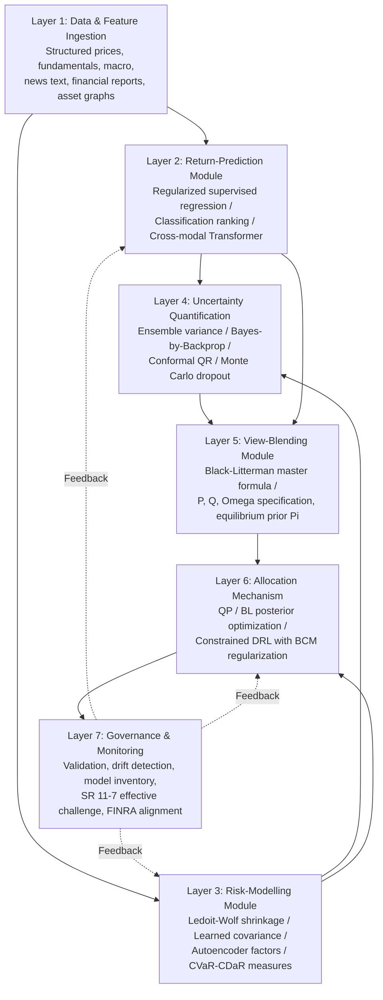

# Comparative Analysis of Machine Learning–Based Asset Allocation Models in FinTech: From Mean-Variance and Black-Litterman to Deep Learning, and Toward an Integrated Hybrid Framework
# 1 Research Background and Problem Framing

Asset allocation—the systematic distribution of investable capital across asset classes, sectors, or instruments to achieve a desired risk–return profile—has long stood at the heart of investment management. What was once a deliberative, judgment-driven craft has, over the past seven decades, been progressively reformulated as a quantitative optimization problem, then as a Bayesian inference problem, and most recently as a representation-learning and sequential-decision problem. Each reformulation has been driven by a confluence of forces: the limitations of the preceding paradigm under real market conditions, the expansion of available data and computational capacity, and the changing operational context in which allocation decisions are made. The contemporary FinTech landscape, in which digital wealth platforms serve millions of retail investors and institutional desks operate at increasingly fine temporal granularity, has intensified all three forces simultaneously. This opening chapter establishes the conceptual ground on which the rest of the report stands. It motivates why asset allocation modelling has resurfaced as a central scientific and industrial problem at the FinTech–machine learning nexus, traces the evolutionary trajectory from Markowitz's Mean-Variance Optimization (MVO) through Black-Litterman to modern deep learning architectures, formulates the core comparative research questions, defines the key terminology and analytical scope, and lays out the logical roadmap of the report.

## 1.1 The Rise of Asset Allocation Modeling at the FinTech–Machine Learning Nexus

The elevation of asset allocation modelling from a technical sub-discipline to a strategic priority within FinTech reflects the simultaneous growth of three structural forces: the digitalization of wealth management, the maturation of machine learning as a general-purpose technology, and the increasing complexity and data-richness of financial markets themselves.

On the industrial side, machine learning has become a foundational layer of the fintech stack rather than an experimental add-on. Industry surveys indicate that approximately 85% of fintech companies have already integrated machine learning into their platforms, and the global market for AI in fintech is projected to reach roughly **USD 61.3 billion by 2031**[^1]. The broader market for machine learning is expected to expand at an 18% compound annual growth rate, from USD 158 billion currently to USD 528 billion by 2030[^2]. Within this expansion, portfolio management is one of the most explicit beneficiaries: robo-advisors now use machine learning to "build and manage investment portfolios tailored to individual risk tolerance and financial goals", allocating assets across investment opportunities according to user-defined objectives[^2]. Concrete deployments illustrate the trend: Betterment uses machine learning to optimize portfolio allocations and minimize taxes through intelligent rebalancing, considering individual tax situations, market volatility, and investor goals[^1]; quantitative funds such as Renaissance Technologies have built ML-driven trading strategies reportedly delivering annual returns of up to 66%[^1]. These cases demonstrate that allocation logic is no longer the sole province of human portfolio managers but is increasingly encoded in adaptive algorithmic systems.

On the academic side, the same period has seen a parallel surge of methodological work. Modern Portfolio Theory itself remains "central to strategic asset allocation for institutional investors (pensions, endowments, insurers, sovereign wealth funds)" and underlies "target-date funds, digital advisory platforms (robo-advisers), and ETF-based portfolio construction"[^3]. Yet the same source notes that "the integration of machine learning enhances estimation of $\boldsymbol{\mu}$ and $\Sigma$, and robust optimisation mitigates parameter uncertainty"[^3], signalling that classical theory is increasingly entangled with data-driven estimation rather than supplanted by it. Dedicated research streams now examine "Asset Allocation via Machine Learning"[^4] and survey deep learning architectures specifically for asset management[^5], confirming that allocation modelling has become a focal research question rather than a settled application.

Three structural drivers explain why this convergence has crystallized now rather than earlier. First, **data abundance and heterogeneity**: contemporary allocation systems must ingest not only price and fundamentals data but also alternative signals—text, transactions, device fingerprints, behavioural patterns—at volumes and velocities that exceed the descriptive capacity of low-dimensional parametric models[^2][^1]. Second, **real-time and personalization demands**: digital wealth platforms must deliver per-user portfolios reflecting individual risk profiles, tax situations, and goals, then rebalance in response to market movement, which strains the periodic, batch-style optimization workflow inherited from the institutional era[^2][^1]. Third, **the documented fragility of traditional rule-based and parametric methods**: empirical studies show that even portfolios constructed under Modern Portfolio Theory's principles "still suffered high losses caused by market crashes, such as the 1997 Asian financial crisis and the 2008 global financial crisis, contrary to expectation", a pattern attributed to the persistence of fat tails and common-factor risk that diversification fails to eliminate[^6]. The same study finds that, as the number of stocks in a portfolio rises, the fatness of the *negative* tail actually *increases* up to a plateau, generating an asymmetric trade-off in which "the cost of profit that investors are willing to sacrifice by utilizing portfolio diversification is much higher than the effect of loss avoidance"[^6]. Such findings undermine the comfortable narrative that classical diversification is a "free lunch" and create a substantive opening for models capable of representing nonlinear, regime-dependent risk.

Together, these forces frame asset allocation modelling as a problem whose theoretical, empirical, and operational dimensions are simultaneously in flux. The FinTech industry needs allocation engines that scale to millions of accounts, ingest heterogeneous data, and adapt to non-stationary markets; the academic community has a maturing toolkit of supervised, unsupervised, and reinforcement learning methods to offer; and the empirical record exposes weaknesses in the inherited paradigm that demand methodological response. It is at this junction that the present report situates itself.

## 1.2 Evolutionary Trajectory from Mean-Variance to Black-Litterman to Deep Learning

The intellectual lineage of contemporary asset allocation models can be read as a sequence of reformulations, each one absorbing a specific limitation of its predecessor while inheriting the broader question of how to translate beliefs about future returns and risks into portfolio weights. Understanding this trajectory is essential because it frames each model family not as an isolated technique but as a response to specific empirical and theoretical failures of what came before.

The starting point is Harry Markowitz's 1952 *Journal of Finance* paper "Portfolio Selection", which "formalised the mean–variance framework and placed risk (as variance or standard deviation) alongside expected return as co-equal decision variables"[^3]. The pivotal conceptual advance was that "portfolio risk is not a simple average of individual risks, but a function of the variances of the assets and, critically, their covariances", giving rise to the **efficient frontier**—the boundary of optimal risk–return combinations[^3]. Subsequent extensions wove this framework into a broader equilibrium edifice: James Tobin's 1958 introduction of a risk-free asset produced the capital market line and the two-fund separation theorem, and William Sharpe's 1964 Capital Asset Pricing Model (CAPM) connected individual portfolio optimization to market-wide pricing through the relation $\mathbb{E}[r_i]=r_f+\beta_i(\mathbb{E}[r_m]-r_f)$[^3]. Markowitz received the 1990 Nobel Memorial Prize in Economic Sciences for this body of work, jointly with Merton Miller and William Sharpe[^3].

Yet despite its theoretical elegance, the mean-variance approach exhibits well-documented practical pathologies when implemented with sample-estimated inputs. The optimization is "found to be greedy and generates highly concentrated portfolios with only a few" assets receiving non-trivial weights[^7], and small perturbations in estimated expected returns can produce large swings in optimal weights. It was precisely to address these problems that Fischer Black and Robert Litterman developed their model at Goldman Sachs in the early 1990s. The Black-Litterman model is a "portfolio optimization tool that combines investor views with market equilibrium returns using a Bayesian framework", explicitly designed to address "limitations of traditional mean-variance optimization by incorporating subjective views and risk appetite"[^8]. Its mechanism—reverse optimization to extract equilibrium-implied returns, followed by Bayesian blending of those equilibrium returns with subjective views weighted by their stated confidence—was characterized in early academic treatments as a "quasi-Bayesian approach"[^9] that produces more stable and intuitive portfolios than direct sample-based MVO.

The third stage of this trajectory is the migration from explicit parametric modelling toward **data-driven, learned representations**. Deep learning architectures—convolutional neural networks (CNNs), recurrent neural networks (RNNs), and transformers—have been increasingly applied to financial time-series, with reinforcement learning frameworks such as Proximal Policy Optimization (PPO) deployed for end-to-end portfolio management[^10]. A recent critical survey in the *Journal of Portfolio Management* characterizes the application areas, motivations, and obstacles of this shift, observing that deep learning has shown "immense promise" for asset management but that direct application is "hindered by formidable challenges unique to finance, including low signal-to-noise ratios, pervasive nonstationarity in time-series data, and the adversarial and adaptive nature of markets where discovered patterns quickly decay"[^5]. The same survey notes that within fintech, machine learning is now used to build "sophisticated trading strategies and automated portfolio management that adapts to changing market conditions"[^1], and a growing literature explicitly studies "Asset Allocation via Machine Learning and Applications to Equity Portfolio Management"[^4].

The trajectory may be summarized as a logical progression along three axes—how returns are modelled, how risk is conceptualized, and how weights are derived—each successive paradigm relaxing an assumption of its predecessor:

| Paradigm | Period of dominance | Return view | Risk view | Allocation mechanism | Primary limitation addressed |
|---|---|---|---|---|---|
| Mean-Variance (Markowitz) | 1952–1990 | Sample historical means | Variance–covariance matrix | Quadratic programming on the efficient frontier[^3] | Replaced ad-hoc security selection with systematic diversification |
| Black-Litterman | 1990–present | Equilibrium-implied returns blended with investor views (Bayesian) | Equilibrium-based covariance with view uncertainty[^8] | Reverse-optimization plus posterior-weighted optimization | Mitigated MVO's input sensitivity and concentration[^7][^9] |
| Machine learning / deep learning | 2010s–present | Data-driven predictive models (supervised, sequence, alternative data) | Learned latent risk; distributional / quantile measures (CVaR, drawdown) | End-to-end policy learning, deep RL, or learned inputs to classical optimizers[^4][^10][^5] | Captures nonlinearity, non-stationarity, high dimensionality |

Reading the trajectory in this way clarifies that **each paradigm was designed to relax a specific assumption of its predecessor**: Black-Litterman relaxed the requirement to provide raw expected returns; deep learning relaxes the parametric form of return generating processes and the independence assumptions baked into traditional covariance estimation. At the same time, each transition introduces new failure modes—Black-Litterman embeds the subjectivity of view specification, while deep learning trades interpretability and theoretical grounding for flexibility[^5]. This sets up the comparative analysis that follows.

```mermaid
flowchart LR
    A["1952<br/>Markowitz<br/>Mean-Variance Theory"] -->|Tobin 1958 / Sharpe 1964| B["CAPM &<br/>Capital Market Line"]
    B -->|Address input sensitivity<br/>& concentration| C["1990s<br/>Black-Litterman<br/>Bayesian view blending"]
    C -->|Address nonlinearity,<br/>non-stationarity,<br/>fat tails| D["2010s–present<br/>Machine Learning &<br/>Deep Learning approaches"]
    D -.->|Hybrid integration<br/>(this report's focus)| E["Integrated<br/>Hybrid Framework"]
    A -.->|Theoretical discipline<br/>(efficient frontier)| E
    C -.->|View-incorporation<br/>mechanism| E
```

The diagram makes explicit a thesis that runs through the report: the historical evolution is *not* a story of straightforward replacement, in which deep learning supersedes Markowitz. Rather, it is a story of expanding the toolkit, with each generation contributing primitives—efficient-frontier discipline, Bayesian view blending, adaptive nonlinear estimation—that may ultimately be re-combined.

## 1.3 Core Research Questions and Comparative Dimensions

Building on the evolutionary narrative, the report is organized around two interlocking research questions. The **first** is fundamentally diagnostic: *what are the essential differences across Mean-Variance, Black-Litterman, and deep learning–based asset allocation models in their treatment of risk measurement, return prediction, and allocation logic?* The **second** is constructive: *given those differences, is it feasible to design a unified framework that synthesizes the theoretical discipline of MVO, the view-incorporation mechanism of Black-Litterman, and the adaptive learning capacity of deep learning, and what would such a framework look like?*

These questions are not merely academic curiosities. They map directly onto choices that practitioners face when designing robo-advisor engines, constructing institutional strategic asset allocations, or building algorithmic trading platforms. To answer them with comparative rigour, the report adopts five analytical dimensions that are applied uniformly to each model family:

- **Risk measurement.** How is risk conceptualized and quantified? MVO operationalizes risk as portfolio variance derived from a covariance matrix, a definition that assumes (or is most defensible under) approximate normality of returns[^3]. Black-Litterman retains the variance-based representation of risk but augments it with the uncertainty surrounding views and equilibrium estimates[^8]. Deep learning approaches can in principle learn latent risk representations or operate on distributional measures such as Conditional Value-at-Risk (CVaR) or maximum drawdown, with the potential to capture fat-tailed and regime-dependent behaviour that variance miscaptures—the very behaviour empirically shown to be a structural feature of equity returns and a binding constraint on classical diversification[^6].
- **Return prediction.** How are expected returns formed? Classical MVO relies on sample means of historical returns, the most error-prone input in the optimization[^7]. Black-Litterman replaces raw historical means with equilibrium-implied returns extracted by reverse optimization and updated through Bayesian blending with investor views[^8][^9]. Deep learning approaches use predictive models that ingest time-series, cross-sectional, and increasingly alternative data, but face well-documented issues of low signal-to-noise ratio and pattern decay[^5].
- **Allocation logic.** How are the chosen risk and return inputs translated into portfolio weights? MVO uses quadratic optimization on the efficient frontier[^3]; Black-Litterman uses posterior-weighted MVO; deep reinforcement learning can construct policies that map state directly to weights[^10]; supervised pipelines can plug learned predictions into a classical optimizer.
- **Robustness and empirical performance.** How does each model behave under fat tails, regime shifts, and stress events? Empirical evidence indicates that diversification under MVO does not eliminate tail fatness—indeed, the negative-tail fatness can rise with the number of stocks—producing the asymmetric loss-vs-profit-sacrifice trade-off documented across the Northeast Asian markets[^6]. Deep learning models, conversely, are vulnerable to the non-stationarity and adversarial nature of markets, where "discovered patterns quickly decay"[^5].
- **Interpretability, governance, and operational fit.** How transparent and auditable is the model? Modern Portfolio Theory remains "frequently referenced" in regulation and fiduciary standards as the benchmark for prudent process[^3], whereas deep learning's opacity raises explicit adoption barriers, with leading surveys arguing that the field must move "beyond a narrow focus on predictive accuracy toward a more holistic emphasis on causality, robustness, and economic grounding"[^5].

These five dimensions are applied symmetrically to each model family in subsequent chapters, ensuring **comparative dimensional consistency** in the analytical structure.

## 1.4 Key Concept Definitions and Analytical Scope

To prevent terminological ambiguity across nine chapters spanning classical finance, Bayesian statistics, and modern machine learning, the report adopts a working glossary that fixes the meaning of the most heavily used terms.

*Asset allocation* is taken to mean the determination of portfolio weights across a defined set of asset classes or instruments, given an objective function (typically incorporating expected return and risk) and a set of constraints. The *efficient frontier* is the upper boundary of feasible portfolios in risk–return space, identified by mean-variance optimization, "those that deliver maximum expected return for a given risk level (or minimum risk for a given return)"[^3]. *Modern Portfolio Theory* (MPT) refers to the body of theory initiated by Markowitz in 1952, including the two-fund separation theorem and the CAPM extension[^3]. The *Black-Litterman model* refers specifically to the Bayesian portfolio optimization framework that "combines investor views with market equilibrium returns" using a view matrix, an uncertainty matrix, and reverse-optimized implied equilibrium returns[^8].

In the machine learning column of the glossary, *supervised learning* uses labelled historical data to train models that make predictions on new data; *unsupervised learning* finds hidden patterns in data without labelled examples; *deep learning* refers to neural-network architectures (CNNs, RNNs, transformers) capable of "process[ing] complex, unstructured data and identify[ing] sophisticated patterns"; and *reinforcement learning* "optimizes decisions through trial and error, learning from the consequences of actions"[^1]. *Hybrid modelling* in this report denotes any framework that explicitly couples a classical allocation primitive (MVO, Black-Litterman) with a machine-learning component, such as ML-generated views feeding a Black-Litterman engine, deep learning–estimated covariance feeding a mean-variance optimizer, or reinforcement learning constrained by classical risk priors.

The **analytical scope** of the report is delimited along several explicit axes. First, the report's primary contribution is *comparative-conceptual and architectural* rather than empirical-statistical: it does not perform original backtests but synthesizes published empirical findings to assess each model family's strengths and weaknesses. Second, the report focuses on *long-horizon and medium-frequency allocation problems* characteristic of robo-advisors, institutional strategic asset allocation, and algorithmic portfolio construction, rather than ultra-high-frequency market making or pure execution strategies. Third, the application contexts considered include digital wealth platforms (robo-advisors and ETF-based platforms), institutional asset managers (pensions, endowments, insurers, sovereign wealth funds, which the literature identifies as the principal users of MPT-based strategic allocation[^3]), and FinTech firms building algorithmic portfolio engines. Fourth, the report concentrates on equity-centric and multi-asset allocation, which is also the dominant focus of the cited deep-learning-for-asset-management literature[^4][^5]. Fifth, while we touch on regulatory and governance considerations, an exhaustive jurisdictional analysis is outside scope; the report instead emphasizes structural governance properties (interpretability, auditability) that are common across regimes.

It is worth flagging two scope-related limitations at the outset, in keeping with the report's commitment to honest acknowledgment of evidence boundaries. The empirical sources available for this report skew toward equity markets in developed and Northeast Asian jurisdictions[^6], and toward conceptual surveys rather than head-to-head benchmarking studies of MVO, Black-Litterman, and deep learning models on identical datasets. Where such direct comparisons are unavailable, the report draws inferences from the structural properties of each method while explicitly marking the absence of direct empirical adjudication.

## 1.5 Report Structure and Logical Roadmap

The remaining eight chapters are designed to advance the central comparative argument in three logical movements: *foundations*, *comparison*, and *synthesis*.

The **foundations movement** comprises Chapters 2 and 3. Chapter 2 dissects the theoretical structure and limitations of the classical models—the mean-variance framework with its efficient frontier, two-fund theorem, and CAPM extension, and the Black-Litterman reverse-optimization and view-blending mechanism. It draws on empirical evidence about input sensitivity, concentration, and fat-tailed failure modes[^7][^6] to show why the classical paradigm, despite its enduring scaffold role[^3], leaves systematic gaps that motivate machine learning alternatives. Chapter 3 then introduces machine learning and deep learning approaches, surveying supervised, reinforcement, and architecture-specific methods (LSTM, Transformer, GNN, deep reinforcement learning, autoencoders) and the methodological logic they bring to return forecasting, risk modelling, and end-to-end portfolio construction[^4][^10][^5].

The **comparison movement** comprises Chapters 4 through 6. Chapter 4 conducts a head-to-head comparison along the *risk measurement* and *return prediction* dimensions, examining how each paradigm handles fat tails, estimation error, and uncertainty quantification. Chapter 5 compares the *allocation logic* itself—quadratic optimization, Bayesian-blended optimization, and policy-based learning—evaluating diversification quality, weight stability, turnover, transaction-cost handling, and the incorporation of constraints. Chapter 6 then turns to the dimensions critical for real-world adoption: interpretability, robustness, governance, regulatory acceptability, and empirical performance across market regimes including bull and bear markets, high-volatility regimes, and black swan events such as the 2008 financial crisis and the COVID-19 shock.

The **synthesis movement** comprises Chapters 7 through 9. Chapter 7 develops the integrated hybrid framework, evaluating candidate integration pathways—ML-generated views feeding Black-Litterman, deep learning–estimated covariance feeding MVO, hybrid Bayesian-deep learning architectures, and reinforcement learning constrained by classical risk priors—and translating the conceptual framework into concrete design principles, training protocols, validation methodology, and governance safeguards. Chapter 8 surveys unresolved challenges and future research directions, including data quality, model risk in hybrid systems, alternative data and ESG integration, scalability across asset classes, and frontier directions such as causal machine learning and large language model–generated views. Chapter 9 synthesizes the comparative findings, presents a final judgment on the viability of an integrated framework, and articulates differentiated implications for academic researchers, asset managers, FinTech firms, and regulators.

Two methodological commitments cut across the chapter structure. First, the comparative dimensions defined in Section 1.3—risk measurement, return prediction, allocation logic, robustness and empirical performance, and interpretability/governance—are applied symmetrically to each model family, so that no paradigm is examined deeply on one dimension while being silently ignored on another. Second, the report avoids the rhetorical pull toward either "newer is better" or "classical is more reliable", evaluating each paradigm against context-specific criteria and explicitly identifying both advantages and limitations. Together, these commitments ensure that by the time the synthesis chapters arrive at the question of an integrated framework, the comparative evidence base is symmetric, balanced, and concrete enough to support architectural recommendations rather than vague aspirations.

# 2 Theoretical Foundations and Limitations of Classical Asset Allocation Models

The previous chapter traced how asset allocation modelling has evolved from a deliberative craft into a quantitative, then Bayesian, and now learning-based discipline, and argued that any rigorous comparison must rest on a precise understanding of what the classical paradigms actually do and where they break. This chapter delivers that foundation. It dissects the mathematical structure, underlying assumptions, and documented practical weaknesses of the two dominant classical paradigms—Markowitz Mean-Variance Optimization (MVO) and the Black-Litterman model—using the same five comparative dimensions established in Chapter 1: risk measurement, return prediction, allocation logic, robustness and empirical performance, and interpretability/governance. By the end of the chapter, the diagnostic case for the machine-learning alternatives introduced in Chapter 3 will rest on a precise, formula-level account of where the classical paradigm is theoretically tight, where it is empirically fragile, and where its scaffold contributions remain indispensable.

## 2.1 Mathematical Structure and Assumptions of the Mean-Variance Framework

The starting point of all subsequent analysis is the quadratic optimization problem first posed by Harry Markowitz in 1952. Consider a one-period market with $N$ risky assets whose random returns form the vector $R=(R_1,\ldots,R_N)^\top$ with mean vector $\boldsymbol{\mu}=\mathbb{E}[R]$ and covariance matrix $\Sigma=\mathrm{Cov}(R)$, assumed positive definite so that $\Sigma^{-1}$ exists and no asset is a redundant linear combination of the others[^11][^12]. Let $\boldsymbol{w}=(w_1,\ldots,w_N)^\top$ denote the vector of portfolio weights. The portfolio return is the accounting identity $R_p=\boldsymbol{w}^\top R$, so its expected return is $\mu_p=\boldsymbol{w}^\top\boldsymbol{\mu}$ and its variance is $\sigma_p^2=\boldsymbol{w}^\top\Sigma\boldsymbol{w}$[^12][^13].

The Markowitz problem is then formulated as a standard quadratic program:

$$\min_{\boldsymbol{w}}\;\tfrac{1}{2}\boldsymbol{w}^\top\Sigma\boldsymbol{w}\quad\text{s.t.}\quad \boldsymbol{w}^\top\boldsymbol{\mu}=\mu_p,\;\;\boldsymbol{w}^\top\mathbf{1}=1.$$

This problem minimizes portfolio variance subject to a target expected return $\mu_p$ and a fully invested constraint[^12][^13][^11]. Solving it for every feasible $\mu_p$ via Lagrange multipliers yields a closed-form solution for the optimal weights $\boldsymbol{w}^\star=\Sigma^{-1}UM^{-1}\boldsymbol{u}$, where $U=[\boldsymbol{\mu}\;\mathbf{1}]$, $\boldsymbol{u}=[\mu_p\;1]^\top$, and $M=U^\top\Sigma^{-1}U$ is a $2\times 2$ matrix[^12].

The geometric implications of this solution are central to the framework's theoretical elegance. Substituting the optimal weights back into the variance expression yields a quadratic relation between portfolio variance and expected return:

$$\sigma_p^2=\frac{1}{\det(M)}\Big\{(\mathbf{1}^\top\Sigma^{-1}\mathbf{1})\mu_p^2-2(\mathbf{1}^\top\Sigma^{-1}\boldsymbol{\mu})\mu_p+\boldsymbol{\mu}^\top\Sigma^{-1}\boldsymbol{\mu}\Big\}.$$

This is precisely Merton's classical result: **the efficient frontier in mean-variance space is a parabola, while in mean-standard-deviation space it is a hyperbola**, commonly visualized as the Markowitz bullet[^12]. The upper branch of this curve—portfolios delivering maximum expected return for any given variance—is the *efficient frontier*, the formal locus on which all rational mean-variance investors should reside. A particularly important implication is that, while the relationship between risk and reward is nonlinear, the relationship between optimal weights and target expected returns is *linear* in $\boldsymbol{u}$, so the Markowitz bullet is in fact a hyperbola lying on a hyperplane in weight-space[^12].

The mathematical elegance of this construction depends on a tightly bound set of assumptions, which must be made explicit because every subsequent critique—and every machine-learning extension—targets one or more of them. The framework presumes that returns are jointly multivariate normal (or, equivalently, that investors care only about the first two moments), so that variance is a sufficient statistic for risk and the optimization is well-posed[^13]. It assumes a single-period investment horizon, frictionless markets without transaction costs or taxes, rational investors who maximize a mean-variance utility function, and a positive-definite covariance matrix that is known with certainty[^14][^13]. Crucially, **risk is operationalized purely through variance and covariances, with no notion of skewness, fat tails, or downside-specific risk**. This is the deliberate analytical sacrifice that makes the framework tractable and—as will be seen in Sections 2.5 and 2.7—also the source of its most consequential failures under real market conditions.

## 2.2 Extensions: Two-Fund Separation, Capital Market Line, and CAPM

The bare MVO problem describes only the universe of risky assets. The introduction of a risk-free asset with return $r_f$ extends the framework into a market-wide pricing theory and produces some of the most influential results in modern finance. With weights $\boldsymbol{w}$ on risky assets and weight $1-\boldsymbol{w}^\top\mathbf{1}$ on the risk-free asset, the optimization problem becomes

$$\min_{\boldsymbol{w}}\;\tfrac{1}{2}\boldsymbol{w}^\top\Sigma\boldsymbol{w}\quad\text{s.t.}\quad \big(1-\boldsymbol{w}^\top\mathbf{1}\big)r_f+\boldsymbol{w}^\top\boldsymbol{\mu}=\mu_p,$$

whose solution is $\boldsymbol{w}=\xi\Sigma^{-1}(\boldsymbol{\mu}-r_f\mathbf{1})$ with $\xi=\sigma_{\min}^2/(\mu_p-r_f)$, and the resulting minimum variance satisfies $\sigma_{\min}^2=(\mu_p-r_f)^2/[(\boldsymbol{\mu}-r_f\mathbf{1})^\top\Sigma^{-1}(\boldsymbol{\mu}-r_f\mathbf{1})]$[^13][^12]. Because $\sigma_{\min}$ is *linear* in $\mu_p$, the efficient frontier with a risk-free asset is no longer a hyperbola but a straight line tangent to the risky-asset frontier at a single point—the **tangency portfolio**[^13][^11][^12].

This line is the Capital Market Line (CML), and its slope is the maximum attainable Sharpe ratio:

$$\frac{\mu_p-r_f}{\sigma_p}=\sqrt{(\boldsymbol{\mu}-r_f\mathbf{1})^\top\Sigma^{-1}(\boldsymbol{\mu}-r_f\mathbf{1})}.$$

Every portfolio on the CML, including the tangency portfolio, attains this same maximum Sharpe ratio[^12]. The fact that all efficient portfolios in the presence of a risk-free asset can be obtained as combinations of just two funds—the risk-free asset and the tangency portfolio—is **Tobin's two-fund separation theorem**, and the tangency portfolio is correspondingly the unique Sharpe-optimal portfolio[^11][^13][^12][^15]. Tütüncü's modification of the Critical Line Algorithm shows that the tangency portfolio can in fact be computed as a corner portfolio during the parametric quadratic programming sweep, providing a fast and exact algorithmic route from the efficient-frontier mathematics to the tangency point[^11].

When all investors hold the same beliefs and behave as mean-variance optimizers, the tangency portfolio must coincide with the market portfolio in equilibrium, yielding the Capital Asset Pricing Model relation

$$\mathbb{E}[R_i]=r_f+\beta_i\big(\mathbb{E}[R_m]-r_f\big),\quad\beta_i=\frac{\mathrm{Cov}(R_i,R_m)}{\mathrm{Var}(R_m)},$$

which states that the expected excess return of any asset is proportional to its covariance with the market portfolio—not its own variance[^13][^14]. This is a substantive theoretical reorientation: in equilibrium, **the relevant risk of an individual asset is its systematic, non-diversifiable contribution to market risk, not its standalone volatility**[^14][^13].

The elegance of these results, however, is contingent on a set of limiting conditions whose role has historically been understated. Wenzelburger's careful re-examination of the two-fund separation theorem demonstrates that the asset-demand function derived from mean-variance preferences "is well defined and hence the separation principle is meaningful only, if the market price of risk is less than the limiting slope of the investor's indifference curves", a condition that may fail when those slopes are finite[^15]. Moreover, "an additional limiting condition on the risk aversion is generally necessary to guarantee existence of an equilibrium in the CAPM with one risk-free asset"; without it, the risk involved in the market portfolio may exceed the aggregate willingness of investors to bear risk, and equilibrium fails to exist[^15]. The CAPM, in short, is a tightly assumption-bound construct: it presupposes universal mean-variance optimization, market clearing, homogeneous beliefs, no short-sale or borrowing constraints, and behavioural conditions that are far from universally satisfied in practice. CAPM's underlying assumptions—price-taking investors, identical horizons, no taxes or transaction costs, common access to a single risk-free rate, rational agents with identical risk-return preferences, information symmetry, normally distributed returns, and a market portfolio comprising all publicly traded assets—are the most demanding part of the entire scaffold[^14].

## 2.3 The Black-Litterman Model: Reverse Optimization and Bayesian View Blending

The Black-Litterman (BL) model, developed by Fischer Black and Robert Litterman at Goldman Sachs in the early 1990s, is best understood as a Bayesian repair of MVO designed to address the practical problem that even institutional investors—Goldman's own fixed-income desk being the originating example—found "the optimal portfolio weights for these assets when embedded in a portfolio proved to be highly sensitive to even the smallest modification in expected returns"[^14]. The repair has two interlocking moves: replacing raw historical means with equilibrium-implied returns, and updating those equilibrium returns with the investor's subjective views via a Bayesian formula.

The first move is **reverse optimization**. Rather than asking the investor to specify $\boldsymbol{\mu}$, BL takes the observed market-capitalization weights $W_{mkt}$ as a manifestation of equilibrium and inverts the mean-variance first-order conditions to extract the implied excess return vector:

$$\Pi=\delta\Sigma W_{mkt},$$

where $\delta$ is a scalar capturing the average market risk-aversion coefficient, $\Sigma$ is the covariance matrix of excess returns, and $W_{mkt}$ is the $N$-vector of market-cap weights[^14]. The risk-aversion scalar itself can be derived from the market-wide Sharpe ratio: multiplying both sides by $W_{mkt}$ and substituting scalar terms yields $\delta=[\mathbb{E}(R_m)-r_f]/\sigma_m^2$, exactly the CAPM market risk premium relation[^14]. The "finesse" of this approach, as Olsson and Trollsten emphasize, is that "an investor without any private views on assets will automatically invest in the market capitalization weighted portfolio"—the equilibrium serves as the gravitational centre to which the optimizer reverts in the absence of active opinions[^14].

The second move is the **master formula**, which fuses a prior distribution over returns (centred on the equilibrium $\Pi$) with a view distribution specified by the investor. Expected returns are treated as stochastic rather than fixed, distributed as $\boldsymbol{\mu}\sim N(\Pi,\tau\Sigma)$, where the scalar $\tau$ captures the level of uncertainty around the equilibrium prior[^14]. The investor expresses subjective views through three components: a $k\times N$ matrix $P$ encoding which assets are involved in each view and whether the view is absolute (weights summing to 1) or relative (weights summing to 0); a $k\times 1$ vector $Q$ of forecast returns or return differentials; and a $k\times k$ confidence matrix $\Omega$ representing the uncertainty attached to each view[^14]. Bayesian combination of the prior and view distributions produces the posterior expected-return vector

$$\bar{\boldsymbol{\mu}}=\big[(\tau\Sigma)^{-1}+P^\top\Omega^{-1}P\big]^{-1}\big[(\tau\Sigma)^{-1}\Pi+P^\top\Omega^{-1}Q\big]$$

with posterior covariance $\bar{M}^{-1}=[(\tau\Sigma)^{-1}+P^\top\Omega^{-1}P]^{-1}$[^14]. This expression embodies the model's central mechanism: when the uncertainty around views is high (large diagonal entries of $\Omega$), $\bar{\boldsymbol{\mu}}$ gravitates toward the equilibrium prior $\Pi$; when views are tight, $\bar{\boldsymbol{\mu}}$ moves toward the view vector $Q$[^14]. The posterior is then plugged into a constrained mean-variance optimizer to obtain the final portfolio weights, often with no-shorting and full-investment constraints to reflect operational realism[^14][^16].

Several encoding choices make BL practically usable. Investors can express absolute views ("asset $i$ will return 8%") or relative views ("asset $i$ will outperform asset $j$ by 2%"), without having to provide a complete return forecast across the universe—the model "in accordance with views on only parts of the expected return vector, automatically adjust[s] the entire vector"[^14]. The confidence matrix $\Omega$ can be specified in multiple ways: as a diagonal covariance matrix proportional to $P(\tau\Sigma)P^\top$, or, in the implementation favoured by Idzorek and adopted in Olsson and Trollsten's empirical work, as a percentage between 0% and 100% expressing the investor's subjective confidence in each view[^14]. Wikipedia's concise summary captures the model's signature feature: the user "is only required to state how their assumptions about expected returns differ from the markets and to state their degree of confidence in the alternative assumptions"[^16].

The result is a portfolio that is simultaneously anchored in market equilibrium and responsive to active opinions—a structure that mitigates many of MVO's input-sensitivity pathologies and produces, in the words of one classical reference, optimal portfolios with a "very simple, intuitive property"[^17][^18]. Yet, as Section 2.6 will show, the repair displaces rather than eliminates the underlying problems: the burden of producing reliable returns shifts from estimating $\boldsymbol{\mu}$ to specifying $Q$ and calibrating $\Omega$, and the equilibrium anchor itself inherits CAPM's vulnerabilities.

## 2.4 Comparative Theoretical Premises: Risk, Return, and Investor Rationality

Having laid out the formal structure of both classical models, it is useful to juxtapose them along the comparative dimensions established in Chapter 1, isolating where they share assumptions and where they diverge. The contrast is sharper than the surface presentation of BL as "MVO with views" suggests.

| Dimension | Mean-Variance Optimization | Black-Litterman Model |
|---|---|---|
| **Return prediction** | Sample historical mean $\hat{\boldsymbol{\mu}}$, treated as a known fixed input | Posterior $\bar{\boldsymbol{\mu}}$ blending equilibrium-implied $\Pi=\delta\Sigma W_{mkt}$ with subjective views $(P,Q)$ |
| **Risk measurement** | Sample covariance $\hat{\Sigma}$, treated as known | Equilibrium covariance $\Sigma$ scaled by $\tau$, augmented by view uncertainty $\Omega$ in the posterior $\bar{M}^{-1}$ |
| **Investor model** | Mean-variance utility maximizer with a fixed risk-aversion parameter | Bayesian decision-maker who holds a prior anchored in equilibrium and updates with subjective views |
| **Equilibrium reference** | Implicit (only via CAPM extension) | Explicit and central (CAPM equilibrium provides the prior) |
| **Allocation logic** | Quadratic programming on the efficient frontier | Quadratic programming on a posterior-adjusted frontier |
| **Tractability of inputs** | Requires direct specification of $\boldsymbol{\mu}$ (notoriously difficult) | Requires only views on subset of assets plus confidence levels |

Three points deserve emphasis. First, **both models share a common variance-based representation of risk**; they differ on how that variance matrix is sourced and augmented, but neither departs from the second-moment paradigm. Skewness, kurtosis, downside-only risk, and tail dependencies remain absent from either formulation. Second, both models share a **single-period, linear, equilibrium-referenced view of the world**, and both implicitly or explicitly inherit the assumption-stack of CAPM—rational agents, market clearing, normally distributed returns, frictionless markets[^14][^13]. Third, the substantive difference between them is *epistemological*: MVO treats $\boldsymbol{\mu}$ and $\Sigma$ as known quantities to be plugged in, whereas BL treats expected returns as random variables with a prior distribution that is updated by data-like views. This epistemological reorientation—from point estimation to Bayesian inference—is conceptually the same move that some hybrid machine-learning approaches will later attempt with deep learning–generated views or Bayesian neural networks (Chapter 7), making BL the most natural classical bridge to the learning paradigm.

What both models do *not* do is equally important. Neither captures nonlinear cross-asset dependencies, regime-switching dynamics, time-varying volatility (heteroskedasticity), or path-dependent investor behaviour. Neither incorporates alternative or unstructured data. Neither distinguishes between the variance contribution of an asset under normal conditions and its tail-coupling behaviour during stress events. These shared blind spots will emerge as the central comparative axis along which machine learning challengers position themselves in subsequent chapters.

## 2.5 Empirical Weaknesses of Mean-Variance Optimization

The theoretical elegance of MVO is shadowed by a set of well-documented empirical pathologies that emerge as soon as the model is implemented with sample-estimated inputs rather than known parameters. These pathologies are not peripheral curiosities; they are systematic and have driven the development of every successor framework in the field.

**Input sensitivity** is the most famous. Best and Grauer formalized the result that the deviation between estimated and true optimal weights is bounded by

$$\|\boldsymbol{w}-\hat{\boldsymbol{w}}\|\;\leq\;\xi\,\|\boldsymbol{\mu}-\hat{\boldsymbol{\mu}}\|\,\frac{1}{\gamma_{\min}}\Big(1+\frac{\gamma_{\max}}{\gamma_{\min}}\Big),$$

where $\gamma_{\max}$ and $\gamma_{\min}$ are the largest and smallest eigenvalues of $\Sigma$[^13]. Because this eigenvalue ratio "typically becomes large as the number of assets increases and the number of sample observations is held fixed", the sensitivity of optimal portfolio weights to errors in the mean-return vector grows with portfolio dimensionality—precisely the regime in which institutional managers operate[^13]. The economic implication is stark: even small estimation errors in $\boldsymbol{\mu}$ can dramatically alter the optimal composition of the entire portfolio[^13][^19]. Although errors in covariance estimates are commonly believed to be of secondary importance, "the presence of heavy tails in the return distributions can result in significant errors in covariance estimates as well"[^13].

**Concentration and extreme weights** follow directly from this sensitivity. Michaud's foundational critique characterized MVO as an "error maximizer" because the optimizer aggressively allocates to assets whose estimated returns happen to be high relative to their estimated risks—often because those estimates are themselves noisy[^20][^21][^14]. Olsson and Trollsten echo the same observation: "the mean-variance framework composes highly concentrated portfolios only incorporating a minority of the assets and being heavily sensitive to changes in input"[^14]. Goldman's fixed-income desk encountered exactly this pathology when implementing global bond and currency portfolios, and it is precisely this experience that motivated Black and Litterman's repair[^14].

**The divergence between true, estimated, and realized frontiers** captures the gap visually. Haugh's lecture notes from Columbia distinguish three frontiers: the *true* frontier computed with the true $\boldsymbol{\mu}$ and $\Sigma$; the *estimated* frontier computed from sample data and used to make decisions; and the *realized* frontier reflecting the actual portfolio mean-volatility tradeoff that materializes ex post[^13]. Estimated frontiers "are quite random and can differ greatly from the true frontier", lying above, below, or crossing it, and "an investor who uses such an estimated frontier to make investment decisions may end up choosing a poor portfolio"[^13]. Realized frontiers must always lie below the true frontier, and in many simulated cases they lie far below it—dramatizing how much value is lost to estimation error[^13]. Haugh's broader assessment is unsparing: "estimating expected returns using historical data is very problematic and is not advisable"[^13].

**Failure of variance-based diversification under fat tails.** The deepest empirical critique, however, is not statistical but distributional. Equity returns exhibit pervasive fat tails that variance miscaptures, and the Northeast Asian evidence cited in Chapter 1 documents that even portfolios constructed under MPT principles "still suffered high losses caused by market crashes, such as the 1997 Asian financial crisis and the 2008 global financial crisis, contrary to expectation". The same study reports that as the number of stocks in a portfolio rises, the *fatness of the negative tail actually increases* up to a plateau, producing the asymmetric trade-off in which "the cost of profit that investors are willing to sacrifice by utilizing portfolio diversification is much higher than the effect of loss avoidance". This finding is structurally damaging to MVO: variance, by treating positive and negative deviations symmetrically, fails to register the very feature—asymmetric downside behaviour—that determines real investor welfare in stress episodes.

**Performance against naive benchmarks.** A separate empirical thread reinforces the indictment from a different angle. DeMiguel, Garlappi, and Uppal's influential 2009 *Review of Financial Studies* study evaluated the out-of-sample performance of the sample-based mean-variance model and its various estimation-error-reduction extensions and found that, on multiple datasets, none consistently outperformed the naive 1/N (equal-weighted) portfolio[^22][^23][^24]. Subsequent work has shown that this finding can be partially reversed by using more robust covariance estimators—the Orthogonalized Gnanadesikan-Kettenring, Minimum Covariance Determinant, Minimum Volume Ellipsoid, and shrinkage estimators all produce "better characteristics in terms of gross returns, annualized returns and net portfolio returns over time compared to the traditional Mean-Variance optimization model"[^22]. Yet the implication is unflattering: classical MVO as conventionally implemented can fail to beat a strategy that requires no estimation at all.

**Instability across rebalancing periods.** Olsson and Trollsten's empirical study of OMXS30 portfolios over 2008–2018 found that the equilibrium (market-cap) benchmark portfolio averaged only 5.8% reallocation between rebalancing dates, while the BL Regression and BL Analysts portfolios reallocated 36.9% and 24.0% on average—with that reallocation rising to 47.4% under longer rebalancing intervals[^14]. While these figures concern BL implementations, they illustrate the general property that quadratic-optimization-based allocations exhibit substantial weight churn whenever the underlying inputs shift, with direct implications for transaction-cost erosion of nominal performance[^14].

The cumulative picture is that of a framework whose theoretical clarity is purchased at the cost of severe in-practice fragility. As Haugh summarizes for his Columbia students: "as a result of these weaknesses, portfolio managers traditionally have had little confidence in mean-variance analysis and therefore applied it very rarely in practice"[^13]. This empirical record is the binding constraint that the Black-Litterman model was designed to relieve—and, as the next section shows, only partially succeeds.

## 2.6 Empirical Weaknesses of the Black-Litterman Model

If MVO's pathologies are well-known to the academic community, BL's residual fragilities are less widely appreciated, in part because the model's reputation as a "fix" for MVO has obscured the fact that its repair shifts rather than eliminates the underlying difficulties. The most thorough empirical examination available to this report—Olsson and Trollsten's 2018 OMXS30 study comparing two different view-generation strategies (analyst forecasts versus a statistical valuation multiple) within an otherwise identical BL implementation—provides an unusually granular window into these fragilities[^14].

**View-quality dependence.** The BL master formula is structurally agnostic about *where* views come from, but the empirical performance is acutely sensitive to view quality. Olsson and Trollsten found that analysts' forecasts "proved to be the most accurate approach estimating the direction of the stock price and outright return for all given time horizons" in pure directional accuracy, yet "the statistical counterpart was the superior when applied in a risk adjusted context in the Black-Litterman model"[^14]. Concretely, under default settings ($c=0$, $f=180$ days, $\delta=2.5$, $\Omega=0.56$), the BL Regression portfolio produced a Sharpe ratio of 0.2506 versus 0.1266 for BL Analysts and 0.1997 for the equilibrium benchmark—**so that BL Analysts actually underperformed the passive equilibrium portfolio on a risk-adjusted basis despite better directional forecasts**[^14]. The authors interpret this as evidence that "analysts' forecasts incorporate firm-specific risk in the portfolio which the investor does not get compensated for", arising from the well-documented overoptimism and anchoring biases of sell-side research[^14]. The implication is that BL's apparent advantage over MVO is real only when the investor possesses systematically calibrated views; bad views can make it worse than doing nothing.

**Confidence-matrix specification.** Specifying $\Omega$ is conceptually difficult and empirically consequential. Becker and Gürtler argue that "an uncertainty matrix estimated in accordance with a diagonal covariance matrix will generate elements larger than if expressing a confidence level from 0% to 100%"[^14]. Walters' commonly used method sets $\Omega=\mathrm{diag}(P(\tau\Sigma)P^\top)$, anchoring view uncertainty to the covariance structure, while Idzorek's alternative lets the user state a percentage confidence per view[^14]. These are not interchangeable: Olsson and Trollsten's sensitivity analysis shows that varying $\Omega$ from 100% confidence down to 20% moves the BL Regression Sharpe ratio from 0.2509 to 0.2176 and the BL Analysts Sharpe ratio from 0.0786 to 0.1735—**inverting the relative performance of the two view methods purely as a function of confidence calibration**[^14]. As confidence falls, posterior weights gravitate toward the equilibrium prior and tracking error shrinks; at high confidence, the posterior is pulled toward the views and any biases in $Q$ are amplified[^14]. Because there is no objective procedure for setting $\Omega$, this introduces a layer of analyst discretion that statistically resembles, rather than removes, the input-sensitivity problem of MVO.

**Sensitivity to $\tau$ and $\delta$.** The scalar $\tau$ governing prior uncertainty and the risk-aversion parameter $\delta$ are similarly consequential. Olsson and Trollsten's risk-aversion sensitivity analysis varied $\delta$ from 1.5 to 4.5 and found that, while $\delta$ "does not have any measurable impact on the allocation decision for the EQ-portfolio" because it scales all elements of $\Pi$ proportionately, it does materially shift the BL portfolios because subjective views are specified in absolute terms and therefore do not scale with $\delta$[^14]. As $\delta$ rises, "the subjective views will have less influence on the final vector of expected returns that is ultimately optimized on", causing the final weights to converge toward the prior[^14]. The direction of the effect on Sharpe ratios depends on view quality: BL Regression Sharpe falls modestly as $\delta$ rises (good views being diluted), while BL Analysts Sharpe rises (bad views being suppressed)[^14]. This is an important diagnostic finding—**$\delta$ and $\Omega$ jointly determine the model's effective trust in the views, and well-intended choices can either rescue or doom performance depending on how realistic the views were in the first place**.

**Reliance on CAPM equilibrium.** Because the BL prior $\Pi=\delta\Sigma W_{mkt}$ is derived directly from CAPM logic, the model inherits all of CAPM's assumption-stack[^14][^16]. When markets deviate from equilibrium—during bubbles, panics, or structural regime shifts—the prior itself is misleading, and the Bayesian update merely refines a flawed starting point. Olsson and Trollsten note that "the implied equilibrium expected return is closely linked to the CAPM equilibrium" and that the entire framework is "suitable for investment managers committing to the CAPM approach to estimate expected return in the long term"[^14]; investors who reject CAPM's premises must also reject the BL prior, leaving them with nothing to update.

**Horizon and rebalancing dynamics.** The OMXS30 evidence shows that BL Analysts' apparent directional advantage decays sharply with rebalancing horizon. At three months, analysts forecast direction correctly 54.06% of the time; at six months, 60.00%; at nine and twelve months, only 53.21% and 53.75% respectively[^14]. He et al. previously reported that BL portfolios using analyst recommendations "outperform the benchmark both in terms of outright return and risk-return measures" with daily rebalancing, but that "the portfolio performance decreases when stretching the rebalance period, probably due to the fact that recommendations are path dependent in the short term"[^14]. The implication is that BL's apparent edge is partly built on short-horizon, self-fulfilling momentum effects—Womack and Liu et al. document that stock prices and trading volumes move in line with released recommendations over a three-day window—rather than on superior long-horizon information[^14].

**Transaction-cost erosion.** Because BL portfolios reallocate more than the equilibrium portfolio (24%–37% on average versus 5.8%), they are correspondingly more vulnerable to brokerage costs[^14]. Olsson and Trollsten estimate that the break-even brokerage fee at which the BL Regression portfolio loses its advantage over the equilibrium benchmark is approximately 2.31%—a level that institutional managers would view as abnormally high but that retail investors on certain platforms might face[^14]. He et al. similarly conclude that "since the study is carried out with a daily rebalancing policy no ex post abnormal returns are achieved after transaction costs"[^14].

The composite picture is that BL relieves some of MVO's input-sensitivity pathology—particularly the tendency to produce extreme weights when $\boldsymbol{\mu}$ is poorly estimated—but at the price of introducing several new sensitivity surfaces ($\Omega$, $\tau$, $\delta$, view quality, equilibrium fragility) and a residual reliance on CAPM's contestable assumption-stack. The repair is real but partial, and its effective benefit depends heavily on operational discipline that is not itself prescribed by the model.

## 2.7 Behaviour Under Black Swan Events and Non-Normal Regimes

The most demanding stress test of any allocation framework is its behaviour during episodes of severe market turbulence, when the normality assumptions underlying classical models are most aggressively violated. Both MVO and BL exhibit structural failure modes during such episodes that trace directly to the variance-based, equilibrium-anchored architecture established earlier in this chapter.

The empirical record on diversification's failure during crises is unambiguous. As Chapter 1 already noted, the East-Asian study cited there documents that even MPT-aligned portfolios "still suffered high losses caused by market crashes, such as the 1997 Asian financial crisis and the 2008 global financial crisis, contrary to expectation". The mechanism is well-understood in the broader literature: during crisis episodes, **cross-asset correlations spike toward unity**, collapsing the diversification benefit on which the efficient frontier's risk-reduction case depends. Variance-based covariance estimates, which weight all observations symmetrically, systematically miss the regime-conditional structure of these correlations—they describe the *unconditional* covariance matrix while the *conditional* covariance during stress is materially different and far less favourable. Forecasting work on tail risk in skewed financial returns confirms that conditional distributions during stress are markedly fatter-tailed than the unconditional normal[^25], and the simple variance term in the MVO objective cannot register this distinction.

Three structural failure modes follow. **First, variance-based risk measures underestimate tail risk.** Because variance is symmetric and quadratic, a portfolio constructed to minimize $\boldsymbol{w}^\top\Sigma\boldsymbol{w}$ minimizes the weighted average squared deviation, not the probability or magnitude of large losses. Conditional Value-at-Risk (CVaR) and maximum drawdown—measures that focus on the negative tail—routinely diverge sharply from variance-based rankings during stress, and a portfolio that looks efficient under MVO can be exposed to severe downside that the framework simply does not see. **Second, covariance estimates break down under regime shifts.** Sample covariance matrices are estimated over windows that necessarily mix calm and stressed periods, producing estimates that are too low for stress periods and too high for calm ones; the optimization is consequently mis-targeted in both regimes. **Third, BL's equilibrium anchor can become misleading when the market itself is mispriced.** During bubbles or panics, $W_{mkt}$ reflects accumulated speculative positioning rather than fundamental equilibrium, and the reverse-optimized $\Pi=\delta\Sigma W_{mkt}$ inherits the mispricing. The Bayesian update with reasonable views may not be able to overcome a flawed prior, particularly under high $\Omega$ (low confidence) settings that pull the posterior back toward the misleading equilibrium.

Concentration risk compounds these structural problems. Recent work on mitigating concentration risk in MVO via two-factor asset pricing models combining market risk with forward-looking factors[^26] underscores that pure variance-minimization, applied without robust regularization, produces allocations that cluster on a few assets whose fates become correlated precisely when diversification is needed most. The cost of this clustering is paid in the negative tail, exactly as the Northeast Asian evidence on the asymmetric loss-vs-profit-sacrifice trade-off documents.

It is important to read these failure modes structurally rather than incidentally. They are not bugs in particular implementations; they follow logically from the foundational decision to operationalize risk through the second moment of an assumed-normal distribution and to anchor expected returns in market-clearing equilibrium. **Any framework that retains both choices will exhibit qualitatively similar failure modes, regardless of how its inputs are estimated.** Conversely, any framework that hopes to address these failures must relax at least one of the two choices—either the variance-only risk measure, or the equilibrium-only return prior, or both. This logic is the natural point of departure for the machine-learning paradigms surveyed in Chapter 3.

## 2.8 Implications: From Classical Limitations to the Need for Machine Learning

The diagnostic findings of this chapter can be organized into a structured inventory of classical limitations, each of which corresponds to a methodological opportunity that machine-learning approaches are positioned to address. The mapping is laid out below as the analytical bridge to the remainder of the report.

| Classical limitation | Empirical manifestation | Methodological opportunity |
|---|---|---|
| **Input estimation error in $\boldsymbol{\mu}$** | Best–Grauer bound; Haugh's true/estimated/realized frontier divergence[^13] | Data-driven return prediction using time-series, cross-sectional, and alternative data |
| **Concentration and extreme weights** | Michaud's "error maximizer" critique; Goldman's bond-currency experience[^20][^14] | Regularized, end-to-end learned allocation policies; weight constraints as priors |
| **Variance-based risk and fat-tail blindness** | Northeast Asian evidence of negative-tail fattening with diversification; crisis correlation spikes | Distributional risk measures (CVaR, drawdown), learned latent risk representations |
| **Single-period, normality, equilibrium assumptions** | CAPM's tightly bound assumption-stack; failure under regime shifts[^14][^13][^15] | Sequence models capturing non-stationarity; distribution-free or distribution-adaptive approaches |
| **View-specification subjectivity (BL)** | OMXS30 evidence that view quality determines BL performance; analyst overoptimism penalizing risk-adjusted returns[^14] | ML-generated views (predictive regressions, deep learning), automated confidence calibration |
| **Sensitivity to $\Omega$, $\tau$, $\delta$ (BL)** | Sharpe ratios swinging with confidence-level choice; rank inversions across view methods[^14] | Endogenous uncertainty estimation, Bayesian neural networks, learned attention-based weighting |
| **Equilibrium fragility (BL)** | Mispricing during bubbles; correlation breakdown in crises | Adaptive priors, regime-aware return distributions, market-microstructure-informed models |
| **Weight instability and transaction costs** | OMXS30 reallocation rates of 24–37% versus 5.8% for equilibrium; 2.31% break-even brokerage[^14] | Reinforcement learning with explicit transaction-cost rewards; turnover-penalized policies |

Reading the table, the common thread is that **classical models impose strong parametric structure—linearity, normality, second-moment risk, equilibrium reference—that simplifies the problem at the cost of failing to represent the features of real markets that matter most for risk-adjusted performance**. Machine learning approaches, particularly those introduced in Chapter 3, relax these parametric commitments by learning the structure from data rather than assuming it.

Yet the diagnostic is not a wholesale rejection of the classical paradigm. The analysis in this chapter has also surfaced what classical models contribute that any successor must preserve. **MVO contributes the discipline of the efficient frontier and the explicit risk-return trade-off** that any rational allocation must navigate; abandoning this discipline risks producing portfolios that are merely "interesting" rather than optimal in any defined sense. **BL contributes the Bayesian view-incorporation logic**, which is the natural mathematical structure for combining model outputs (priors) with discretionary information (views)—a structure directly applicable when the "views" are themselves outputs of machine-learning models. **Both contribute governance-friendly transparency**: the parameters of $\boldsymbol{\mu}$, $\Sigma$, $P$, $Q$, $\Omega$, $\tau$, and $\delta$ are interpretable to portfolio managers, auditors, and regulators in a way that the weights of a deep network are not, and Modern Portfolio Theory remains "frequently referenced" in fiduciary and regulatory standards as the benchmark for prudent process (Chapter 1). Finally, both contribute mathematical tractability: the closed-form solutions derived in this chapter run in milliseconds on standard hardware, which matters for real-time wealth-management platforms whose business models depend on per-account scale.

The constructive implication is that **a credible successor framework should not discard the classical scaffold but extend it**: it should retain the efficient-frontier optimization core and the Bayesian view-blending mechanism, while replacing their fragile inputs—point-estimated $\boldsymbol{\mu}$, sample $\Sigma$, subjective $Q$ and $\Omega$, fixed-equilibrium $\Pi$—with adaptive, distribution-aware, learning-based inputs. This is exactly the architectural argument that Chapters 7 and beyond develop. The next chapter begins that work by introducing the machine-learning toolkit—supervised methods, deep learning architectures, and reinforcement learning—through which the diagnostic gaps inventoried here can begin to be filled.

# 3 Machine Learning and Deep Learning Approaches to Asset Allocation

Chapter 2 closed with a structured inventory of classical limitations and a constructive reading of what any successor framework must preserve: the efficient-frontier discipline of MVO and the Bayesian view-blending logic of Black-Litterman, paired with adaptive, distribution-aware, learning-based inputs. This chapter introduces the methodological toolkit through which those adaptive inputs can be produced. It is deliberately *not* a triumphalist survey arguing that machine learning supersedes classical theory; rather, following the persistent reasoning standard of balanced critical analysis (P-4), it examines each method family for the parametric assumptions of MVO and Black-Litterman it relaxes, the new failure modes it introduces, and the empirical evidence on whether the relaxation actually pays off out-of-sample. The chapter is organized along the same three sub-problems—return prediction, risk modelling, and allocation logic—that structure the comparative analysis to follow, ensuring dimensional consistency (P-1) with both the preceding and the subsequent chapters.

## 3.1 From Theory-Driven to Data-Driven Paradigms: Conceptual Reorientation

The methodological pivot from classical to machine-learning-based allocation is best read not as a change of toolkit but as a change of *epistemological starting point*. Classical models begin from a set of axioms—mean-variance utility, market clearing, normality of returns, single-period horizon—and derive optimal portfolios deductively from those axioms. Machine learning begins from a dataset and asks what predictive or decision rule best fits the empirical regularities of that dataset, with theoretical structure entering primarily through inductive bias (the choice of model class, regularizer, and loss function) rather than as a set of binding axioms. This reorientation changes what the analyst must believe in order to trust the model's output: belief in axioms gives way to belief in the representativeness of the training distribution and the appropriateness of the inductive bias.

For the purposes of this report, the relevant categories of machine learning are four. **Supervised learning** uses labelled historical data to estimate a function $g:\mathcal{X}\to\mathcal{Y}$ that maps predictors to a target—typically next-period returns or a portfolio-decile label. Gu, Kelly, and Xiu's foundational treatment of empirical asset pricing via machine learning defines the field as "(i) a diverse collection of high-dimensional models for statistical prediction, combined with (ii) so-called 'regularization' methods for model selection and mitigation of overfit, and (iii) efficient algorithms for searching among a vast number of potential model specifications".[^27] **Unsupervised learning**, exemplified by autoencoders and factor-extraction architectures, finds latent structure in unlabelled data and is most directly relevant for risk modelling. **Deep learning** denotes neural-network architectures—convolutional networks, recurrent networks, Transformers, graph networks—capable of processing complex, unstructured data and identifying nonlinear patterns that low-dimensional parametric models cannot. **Reinforcement learning** optimizes sequential decisions through trial-and-error interaction with an environment, which in the allocation context becomes a market simulator or live trading interface; Jiang, Xu, and Liang's deep reinforcement learning framework for portfolio management is the most-cited concrete instantiation of this paradigm in the allocation literature.[^28][^29]

Each category relaxes a specific assumption of the classical paradigm. Supervised learning with interactions and nonlinear bases relaxes the linearity of expected-return models; Drobetz and Otto's European study explicitly shows that "interactions and nonlinear effects help improve predictive performance" beyond the linear Fama-MacBeth benchmark.[^27] Deep learning architectures with sequence modelling relax the IID/stationarity assumption that underlies sample-mean estimation of $\boldsymbol{\mu}$, since LSTMs and Transformers explicitly model temporal dependence. Distributional and tail-aware loss functions—quantile losses, CVaR-aware reward functions—relax the second-moment-only representation of risk that defines variance-based covariance optimization. Reinforcement learning with transaction-cost penalties relaxes the frictionless-market assumption embedded in single-period MVO. Autoencoders and Graph Neural Networks relax the assumption that asset interrelationships are fully captured by an unconditional covariance matrix.

These relaxations are not free. The data-driven paradigm imports four recurring tensions that condition every method discussed in the rest of the chapter. **High dimensionality** arises because financial datasets contain hundreds of candidate predictors—Drobetz and Otto's "full set" includes 341 covariates—relative to thousands rather than millions of observations, so unrestricted estimation overfits noise.[^27] **Low signal-to-noise ratio** is a structural feature of asset returns that a recent critical survey identifies as among the "formidable challenges unique to finance"; raw monthly returns are dominated by noise, so even strong models recover only a few percentage points of out-of-sample $R^2$. **Non-stationarity** means that the joint distribution of returns and predictors shifts over time—through structural breaks, policy changes, and crises—violating the IID assumption of conventional generalization theory. **Adversarial market dynamics** mean that any pattern, once discovered and exploited, alters the very data-generating process that produced it, so "discovered patterns quickly decay". These four tensions explain why empirical machine-learning gains in finance are typically modest in magnitude, fragile across regimes, and dependent on careful out-of-sample protocol—a theme that recurs throughout the chapter.

## 3.2 Supervised Learning for Return Prediction and Cross-Sectional Asset Pricing

The supervised-learning approach to return prediction maps directly onto the most error-prone input of MVO and the least-disciplined input of Black-Litterman: the expected-return vector $\boldsymbol{\mu}$ in the former and the view vector $Q$ in the latter. By replacing sample historical means or analyst forecasts with regularized data-driven predictions, supervised learning addresses the "Best-Grauer" sensitivity bound documented in Chapter 2 and offers a disciplined source of "views" that can feed a Black-Litterman engine in later hybrid designs.

The most rigorous evidence on this approach comes from Drobetz and Otto's evaluation of machine learning methods for European stock-return forecasting, which closely follows Gu, Kelly, and Xiu's US methodology while adapting to a European universe of all firms publicly listed in nineteen Eurozone countries from January 1990 to December 2020.[^27] Their benchmark is a parsimonious linear model (`ols_pars`) regressing monthly excess returns on twenty-two firm characteristics commonly used in the asset pricing literature—size, book-to-market, momentum, profitability, accruals, issuance, valuation ratios, beta, volatility, and turnover among them.[^27] To this they add dummies for nineteen Eurozone countries and SIC industry codes (66 covariates total) and, for the "full" set, two-way interactions and second- and third-order polynomials to capture nonlinearity (341 covariates total).[^27] Six machine-learning methods are then tested against both linear benchmarks: elastic net (combining lasso and ridge penalties), principal component regression (PCR), partial least squares (PLS), random forests, gradient boosted regression trees, and shallow feed-forward neural networks.[^27]

The evidence on incremental predictive power is consistent and quantitatively substantial. Out-of-sample predictive $R^2$ relative to a naïve zero-return forecast moves from $-0.52\%$ for the unrestricted full-set OLS (which overfits and underperforms even the naïve benchmark) to $0.57\%$ for the parsimonious linear benchmark, then to $1.21\%$, $1.24\%$, $1.08\%$, $1.18\%$, $1.14\%$, and $1.23\%$ for elastic net, PCR, PLS, random forest, gradient boosted trees, and the simplest neural network respectively.[^27] Out-of-sample predictive slopes—calculated by regressing realized excess returns on predicted excess returns—approach unity for the most flexible models (1.03 for random forest, 1.07 for gradient boosted trees, 0.98 for the simplest neural network), against 0.65 for the linear benchmark and 0.45 for unrestricted OLS, indicating that machine learning forecasts capture substantially more of the cross-sectional variation in true expected returns.[^27] Modified Diebold-Mariano tests confirm that each machine learning model "beats the OLS framework, which holds for both single- and multiple-comparison cases".[^27]

These statistical gains translate into economic profitability, but with important caveats. Sorting stocks into decile portfolios based on each model's expected-return forecasts and going long the top decile produces, at the equal-weighted level before transaction costs, terminal values of €70.29 (linear benchmark), €78.33–€88.05 (elastic net, PCR, PLS, random forest, gradient boosted trees), and €107.18 (simplest neural network) on €1 invested in January 2000.[^27] The corresponding annualized excess returns and Sharpe ratios are 22.45% and 1.24 for the linear benchmark, rising to 24.93% and 1.41 for the neural network.[^27] Risk-adjusted alphas relative to CAPM and the Fama-French five-factor-plus-momentum model line up almost monotonically with predicted excess returns, and the H-L spreads remain economically large after factor adjustment, suggesting the gains are not driven primarily by systematic risk loading.[^27]

Two findings complicate this otherwise favourable picture and deserve emphasis. First, **after applying a conservative 57 basis-point transaction-cost discount per month—a level Novy-Marx and Velikov suggest for mid-turnover strategies—value-weighted versions of most forecast portfolios fall slightly under the market benchmark**.[^27] Average portfolio turnover ranges from 27.17% to 39.54% per month, which combined with realistic bid-ask spreads materially erodes nominal alpha; only the equal-weighted long-only configurations consistently survive the deduction. Second, **a classification-based approach using a support vector machine (SVM) to directly assign stocks to decile portfolios—bypassing the noisy intermediate step of estimating stock-level expected returns—slightly outperforms the best expected-return-based formation**, with terminal values of €113.57 vs €107.18 (equal-weighted) and €9.07 vs €8.40 (value-weighted) before transaction costs.[^27] The implication is methodologically important for hybrid design: when the eventual decision is a *ranking* (top decile vs bottom decile), training a classifier directly on the ranking is more efficient than first estimating expected returns and then ranking, because it avoids "the noise in stock-level returns" while preserving "the broad return signal".[^27]

The same study also surfaces five operational properties that any practitioner adopting supervised learning for allocation must internalize. First, **regularization is non-negotiable**: unrestricted OLS on 341 covariates produces a negative out-of-sample $R^2$, demonstrating that flexibility without regularization is destructive. The elastic net combines lasso (variable selection) and ridge (shrinkage), achieving cross-target sparsity that the OLS cannot.[^27] Second, **time-series cross-validation must replace random k-fold splitting** because financial data have strong temporal dependence; Drobetz and Otto use eight years for training, two years for validation, and one year for testing in a rolling window, with annual re-estimation.[^27] Third, **model complexity varies substantially over time**: the optimal number of components in PCR/PLS, the optimal tree depth in random forests, and the number of unique split variables in gradient boosted trees all fluctuate across re-estimation dates, indicating that the best model class is itself non-stationary.[^27] Fourth, **variable importance is concentrated but stable across model families**: the most influential predictors are recent price trends (short-term reversal, stock momentum) and fundamental valuation signals (earnings-to-price, book-to-market), and this finding is consistent across penalized regressions, dimension-reduction methods, tree-based models, and neural networks.[^27] Fifth, **deeper neural networks deteriorate quickly with depth in this setting**: predictive slopes "deteriorate quickly in the number of hidden layers", consistent with Gu-Kelly-Xiu's US findings, because deep architectures are too complex for the relatively small monthly-frequency dataset.[^27] This last finding is a useful corrective to the assumption that more layers always help; it reflects the fact that financial cross-sections are not the kind of data regime in which deep learning's capacity advantage dominates.

For hybrid integration with Black-Litterman in Chapter 7, the supervised-learning toolkit offers two mature primitives: a **continuous primitive** (regularized predictive regression producing $\hat{\boldsymbol{\mu}}$ that can serve as the view vector $Q$ with confidences derived from cross-validation residual variance), and a **discrete primitive** (classification-based ranking that can generate relative views of the form "asset $i$ outperforms asset $j$" without committing to specific magnitude forecasts). Both primitives address the BL view-quality dependence diagnosed in Section 2.6 by replacing sell-side analyst views (whose risk-adjusted underperformance was documented in the OMXS30 evidence) with disciplined out-of-sample-tested predictions whose error properties can be estimated.

## 3.3 Deep Learning Architectures for Financial Time-Series and Cross-Modal Signals

If supervised learning with structured firm characteristics already delivers measurable predictive gains, the case for *deep* learning rests on its ability to ingest signals that conventional cross-sectional regressions cannot represent—long-range temporal dependencies in price series, inter-asset relational structure, and unstructured textual signals from news and corporate disclosures. This section examines four architecture families that have emerged as the workhorses of deep learning–based allocation pipelines, evaluating each against the diagnostic gaps catalogued in Chapter 2.

**Recurrent networks (LSTMs)** were the first deep architectures applied to financial time-series at scale. The LSTM's gating mechanism—input, forget, and output gates that govern the propagation of hidden state through time—was designed to mitigate the vanishing-gradient pathology of vanilla RNNs and to capture long-term sequential dependencies. In allocation pipelines, LSTMs are typically used either as return predictors (feeding their output into a downstream optimizer) or as state encoders within a reinforcement-learning policy (Section 3.4). The CMTF framework's empirical comparison of LSTM against more recent architectures, however, illustrates a structural weakness: in a binary classification task on FTSE 100 next-day price direction, the LSTM achieved precision of 49.49% and recall of only 7.41%, yielding an F1 score of 0.13—far below random forest (0.60), SVR (0.61), and the CMTF Transformer (0.64).[^30] The low recall indicates that the LSTM systematically failed to identify upward-moving days, an instability that the CMTF authors attribute to inadequate feature transformation; tellingly, when the Tensor Interpretation feature-selection module is added (LSTM with `+I`), recall jumps from 19.21% to 45.54% and F1 from 0.28 to 0.47.[^30] The lesson is operational: LSTMs are sensitive to input representation and benefit substantially from upstream feature engineering, undermining the often-stated promise that deep architectures eliminate the need for hand-crafted features.

**Transformers and attention mechanisms** have largely displaced LSTMs as the architecture of choice for long-range and cross-modal financial sequence modelling. The self-attention operation—computing weighted sums over all positions in a sequence with weights given by softmax-normalized scaled dot-products of query and key projections—captures dependencies of arbitrary length without the sequential bottleneck of recurrent computation. Hua and colleagues' Cross-Modal Temporal Fusion (CMTF) framework provides the most detailed available case study of a Transformer-based allocation-relevant architecture.[^30] CMTF organizes the prediction problem around four explicit components: a tensor representation layer that converts heterogeneous inputs (historical OHLCV prices, US/UK macro indices, company news, financial reports) into structured tensors; a tensor encoding layer that applies weighted moving averages to align signals of different granularities (daily prices, quarterly GDP, monthly CPI, daily news, quarterly reports); a tensor interpretation layer that combines correlation-guided pre-selection, temporal feature expansion, multi-task group LASSO sparsity, and stability selection across temporal folds; and a Transformer-based forecast module with multi-head attention, feed-forward layers, positional encoding, and an Optuna-driven Tree-structured Parzen Estimator hyperparameter optimizer.[^30]

Two methodological lessons from CMTF's empirical analysis carry directly to allocation modelling. First, **handling heterogeneous data granularities is non-trivial and consequential**: temporal fusion via weighted moving averages, which assigns higher weights to more recent observations and decays the influence of low-frequency events such as quarterly reports, materially affects classification performance.[^30] Second, **interpretability deficits remain even within attention-based architectures**: while attention weights provide a partial window into which inputs the model relies on, CMTF's authors explicitly note that prior attention-based mechanisms "lack economic foundations", motivating their bespoke tensor interpretation framework that combines correlation thresholding, group LASSO, and stability selection to produce feature importance rankings with persistent predictive power across temporal folds.[^30] Empirically, CMTF achieves an F1 score of 0.64 with recall of 84.88% on FTSE 100 next-day direction classification, outperforming ARIMA (0.42), LSTM (0.13), SVR (0.61), and Random Forest (0.60).[^30] Yet the ablation study reveals an important nuance: the highest recall (80.09%) and best F1 (0.61) occur when the tensor-interpretation module is *disabled* but news and financial reports are *included*, suggesting that **textual modalities are crucial for direction prediction but that the feature-selection logic in CMTF's interpretation module can occasionally suppress useful textual signals**.[^30] The authors' candid acknowledgment that "the strong performance of simpler models such as SVR suggests that unstructured data may be less relevant for next-day price level prediction" reinforces the broader point that deep complexity is not always justified.[^30]

**Graph Neural Networks (GNNs)** address a structural limitation that neither LSTMs nor Transformers natively capture: the explicit relational topology among assets. In a graph formulation, each asset is a node and edges encode static or dynamic relationships—sector co-membership, supply-chain links, ownership ties, return correlations, or learned latent affinities. CMTF's literature review identifies a strand of work that uses graph-based topology, where stocks are represented as nodes with static and dynamic connections, in contrast to traditional multi-time-series models that treat each stock as an independent series without explicit inter-asset relationships.[^30] For allocation, the GNN approach's appeal is that it naturally encodes the cross-asset dependencies that a covariance matrix is supposed to capture but does so in a learned, conditionally-evolving way rather than as a static unconditional second moment. The architecture-level evidence available to this report is thinner than for Transformers, and a balanced reading should note that GNN performance gains in finance often depend critically on the quality of the graph specification—a poorly specified edge set can degrade rather than improve learning.

**Autoencoders** complete the deep learning toolkit by providing an unsupervised mechanism for latent representation learning. An autoencoder learns to compress inputs through a bottleneck layer and reconstruct them at the output, with the bottleneck activations serving as a low-dimensional representation. In asset pricing, autoencoder-based factor models learn nonlinear analogues of the principal components extracted by PCR/PLS, with the difference that the factor loadings can themselves be conditional on firm characteristics. Drobetz and Otto's literature review notes that Chen, Pelger, and Zhu and Gu, Kelly, and Xiu have applied autoencoder networks to deep learning in asset pricing, alongside LSTM and generative adversarial network architectures.[^27] For risk modelling specifically (Section 3.5), autoencoders offer a learned alternative to sample covariance estimation: the latent representation captures the dominant axes of return co-movement, and reconstruction error provides a proxy for the residual idiosyncratic risk that standard factor models neglect.

The architecture-specific limitations applicable across all four families warrant explicit flagging. **Overfitting risk** is structural: even with regularization, dropout, batch normalization, learning-rate shrinkage, early stopping, and seed-ensembling—all of which Gu-Kelly-Xiu and Drobetz-Otto employ—deep architectures can fit idiosyncratic noise in finite-sample financial datasets, with predictive slopes deteriorating quickly as depth increases.[^27] **Interpretability deficits** persist: attention weights, saliency maps, and SHAP values provide partial post-hoc explanations but, as CMTF's authors observe, "lack economic foundations", and "domain adversarial training improves robustness to distribution shifts" but at the cost of reduced attribution to specific modalities.[^30] **Degradation under sudden regime shifts** is widely documented; the CMTF authors note that the Autoformer architecture, which decomposes market trends and seasonal effects via autocorrelation, "remains restricted to single-modal input and will not adapt to sudden market changes (e.g., a black swan event)".[^30] **Dataset constraints** are practical: CMTF's authors highlight "the absence of a publicly available standardized dataset for multimodal and cross-modal financial forecasting" and note that "data privacy" considerations restrict reproducibility, since prior studies that compiled diverse datasets including financial events, news, prices, and knowledge graphs were unable to make the data publicly available.[^30] These constraints mean that comparative claims about deep learning superiority must be read with humility about the breadth of regimes and asset classes over which the claims have actually been tested.

## 3.4 Reinforcement Learning and End-to-End Portfolio Construction

The architectures discussed so far operate within a *predict-then-optimize* pipeline: a supervised or deep model produces predictions of returns, risks, or rankings, and a downstream optimizer—typically a quadratic program in the spirit of MVO or BL—translates those predictions into weights. Reinforcement learning (RL) collapses this two-stage pipeline into a single end-to-end formulation in which the model directly outputs portfolio weights and is trained to maximize a cumulative reward function that incorporates returns, risk, and transaction costs. This formulation is conceptually closer to the actual decision problem of a portfolio manager—who chooses weights, not predictions—and is the most direct technical route to relaxing the single-period and frictionless-market assumptions diagnosed in Chapter 2.

The most cited concrete instantiation of deep RL for portfolio management is Jiang, Xu, and Liang's 2017 framework, which introduces four signature components: the Ensemble of Identical Independent Evaluators (EIIE) topology, a Portfolio-Vector Memory (PVM), an Online Stochastic Batch Learning (OSBL) scheme, and a fully exploiting and explicit reward function.[^28][^29] The framework is realized in three instances—using a CNN, a basic RNN, and an LSTM—and tested in three back-test experiments with a 30-minute trading period in a cryptocurrency market. All three instances "monopolize the top three positions in all experiments, outdistancing other compared trading algorithms", and "although with a high commission rate of 0.25% in the backtests, the framework is able to achieve at least 4-fold returns in 50 days".[^29] The 4-fold figure must be read with caution: it is reported on a single, short, highly volatile asset class (cryptocurrencies) over 50 days, conditions that maximize the upside of policy-based learning but are not representative of the institutional allocation problems that anchor this report. Subsequent work has generalized the framework, including Wu and colleagues' Proximal Policy Optimization–based dynamic portfolio management framework that finds "the monthly trading frequency has a higher Sharpe ratio in the test set than other trading frequencies", and DenseNet-based EIIE extensions reporting "at least a 17% improvement in cumulative return compared to other strategies".[^28]

The taxonomy of RL algorithms relevant to allocation falls into three broad classes. **Value-based methods** such as Deep Q-Networks (DQN) learn an action-value function and act greedily with respect to it; Gao et al.'s Hierarchical Deep Q-Network framework addresses the zero-commission-fee problem "by reducing the number of assets assigned to each Deep Q-Network and dividing the total portfolio value into smaller parts", outperforming "ten other strategies, including nine traditional strategies and one reinforcement learning strategy" in cumulative rate of return.[^28] **Policy-gradient and actor-critic methods**—Deep Deterministic Policy Gradient (DDPG), Proximal Policy Optimization (PPO), Soft Actor-Critic (SAC), Twin Delayed DDPG (TD3), and the quantile-regression variant QR-DDPG—directly parameterize a policy mapping states to actions (weights), which is appropriate for the continuous action space of portfolio allocation. A comparative study of PPO, QR-DDPG, DDPG, and SAC reports that "statistical significance testing confirms that PPO and QR-DDPG returns are superior to DDPG and traditional benchmarks (p < 0.05)" under the conditions tested, identifying PPO and the distributional QR-DDPG variant as the more reliable performers in their setting.[^31] **Specialized architectures** such as Jiang et al.'s EIIE—where each "evaluator" is an independent neural network applied to one asset's history with shared weights, and the ensemble's outputs are normalized into a portfolio vector—address the structural property that allocation must produce a simplex-valued action that respects scaling invariance across the asset universe.[^29]

Three design properties distinguish RL-based allocation from the supervised pipelines of Section 3.2. First, **risk-adjusted reward functions are first-class objects**. Moody and colleagues' early direct-reinforcement work demonstrated "how direct reinforcement can be used to optimize risk-adjusted investment returns (including the differential Sharpe ratio), while accounting for the effects of transaction costs", and found that "maximizing the differential Sharpe ratio yields more consistent results than maximizing profits".[^28] In modern deep RL, the same principle is implemented by including transaction costs and downside-aware penalties (drawdown, CVaR, volatility) in the per-step reward, with the algorithm learning a policy that already internalizes the trade-off rather than solving it post-hoc. Second, **transaction costs are encoded directly into the optimization objective**, addressing the weight-instability and turnover-cost erosion that Section 2.6 documented for BL portfolios. Third, **the formulation is intrinsically multi-period**, modelling the sequential nature of allocation rather than treating each rebalance as an independent single-period problem; this captures path dependencies (drawdown management, momentum exploitation) that single-period MVO cannot represent.

Open-source ecosystems have substantially lowered the barrier to operationalizing this paradigm. The FinRL library, developed by the AI4Finance Foundation, is widely recognized as "the first open-source framework for financial reinforcement learning" and provides a three-layer architecture (market environments, algorithm layer, application layer) supporting A2C, DDPG, PPO, TD3, and SAC agents, with documented integrations for stock trading, portfolio allocation, cryptocurrency trading, and high-frequency trading.[^29] FinRL's classic workflow comprises data download and preprocessing (Yahoo Finance, technical indicators including MACD, RSI, VIX, turbulence index), training of multiple DRL agents using Stable Baselines 3, and backtesting against benchmarks including Mean-Variance Optimization and the DJIA index—an architecture that, notably, **explicitly positions MVO as a benchmark for DRL agents, embodying the comparative posture this report adopts**.[^29] FinRL's documentation emphasizes that DRL "balances exploration (of uncharted territory) and exploitation (of current knowledge)" and offers "two major advantages: portfolio scalability and market model independence".[^32] The next-generation FinRL-X framework extends the library toward production deployment with type-safe Pydantic configuration, multi-account live trading via Alpaca, and risk controls at order, portfolio, and strategy levels—indicating a maturation from research prototype toward institutional infrastructure.[^29]

The strengths of the RL paradigm should be balanced against three documented instabilities. First, **training stability varies sharply across algorithms and seeds**: PPO's clipped objective and trust-region intuitions make it more reliable than vanilla DDPG, but even within PPO, Sharpe ratios depend materially on hyperparameter choices and reward shaping. Second, **distributional shift between training and deployment** is acute in finance: an RL agent trained on 2014–2025 data and deployed in 2026 faces a market whose data-generating process may have drifted, and unlike a supervised model whose error properties on out-of-sample data can at least be quantified, an RL policy's actions in new regimes may diverge unpredictably. Third, **the 4-fold and 17-percent return figures cited in the prototype literature are not robust evidence of general-purpose superiority**: they are conditional on specific markets (cryptocurrencies, Chinese A-shares), specific time windows, specific commission models, and specific evaluation protocols. The most defensible reading of the RL evidence is that the paradigm provides a principled mathematical framework for end-to-end allocation with cost-aware, risk-adjusted objectives—a meaningful methodological contribution—but that empirical claims of dramatic outperformance must be interpreted with the same out-of-sample discipline applied to supervised methods in Section 3.2.

For hybrid integration in Chapter 7, RL contributes two distinct primitives. The first is the **end-to-end policy formulation itself**, which can be wrapped around a classical risk prior—for example, an RL agent whose action space is constrained to lie near the MVO efficient frontier, or whose state includes BL-implied posterior weights—to combine adaptive learning with the discipline of classical theory. The second is the **explicit transaction-cost and risk-adjusted reward design**, which is portable to other allocation pipelines (including supervised-prediction-then-optimize stacks) as a methodological template for embedding operational realism in the optimization objective.

## 3.5 Risk Modelling and Distributional Approaches in Machine Learning

The diagnostic of Chapter 2 identified the second-moment, variance-only representation of risk as the structural failure mode shared by MVO and Black-Litterman: it cannot register fat tails, asymmetric downside behaviour, regime-conditional correlation spikes, or path-dependent drawdowns. This section examines how machine learning approaches have responded along three lines—learned covariance estimation, distributional and tail-aware loss functions, and latent risk representations—each addressing a different facet of the variance-blindness problem.

**Learned covariance estimation** is the most direct ML extension of classical risk modelling. The simplest member of this family is shrinkage, which Drobetz and Otto's robustness analysis already invokes implicitly by noting that weighted-least-squares versions of OLS using market-cap-based weights "potentially [improve] prediction efficiency" but in their tests "do not observe improvements in predictive performance".[^27] More sophisticated approaches include Ledoit-Wolf shrinkage toward a structured target (constant correlation, single-factor, or identity matrices), Gnanadesikan-Kettenring robust estimation, Minimum Covariance Determinant, Minimum Volume Ellipsoid, and—at the deep learning frontier—covariance estimators parameterized by neural networks whose outputs are constrained to lie on the manifold of positive-semi-definite matrices. The shared logic across this family is that sample covariance is high-variance in finite samples and that a structured prior (whether explicitly Bayesian or implicitly imposed through regularization) can produce a more reliable estimate. Although the empirical evidence available to this report does not include a head-to-head comparison of deep-learning-based covariance estimators against shrinkage estimators within an allocation context, the methodological logic—that learned structure can outperform pure sample estimates in low-data, high-dimensional regimes—is well established. Chapter 2 already noted that work on more robust covariance estimators produces "better characteristics in terms of gross returns, annualized returns and net portfolio returns over time compared to the traditional Mean-Variance optimization model", supporting the broader case that risk-input quality is a binding constraint on classical optimization.

**Distributional and tail-aware risk measures** embedded directly in deep learning loss functions and RL reward designs constitute the more ambitious response to variance blindness. Quantile regression replaces the squared-error loss with a check function that estimates conditional quantiles directly, enabling models to predict tail behaviour rather than central tendency. Conditional Value-at-Risk (CVaR), defined as the expected loss conditional on losses exceeding a Value-at-Risk threshold, can be estimated either via quantile regression of returns or by direct optimization of a CVaR-aware portfolio loss. The QR-DDPG variant cited in Section 3.4 incorporates a quantile-regression critic that learns the full distribution of returns rather than just expected values, which is reported as one of the design choices that contribute to its statistically significant outperformance of DDPG and traditional benchmarks.[^31] Volatility-sensitive RL reward functions—exemplified by Lim et al.'s reinforcement-learning framework with volatility-sensitive rewards designed for limit-order-book trading, cited in CMTF's literature review—make the trade-off between return and downside risk explicit in the per-step learning signal.[^30] The methodological contribution of all these approaches is shared: by replacing variance with a measure that distinguishes upside from downside, or with a representation of the entire return distribution, the framework can register the asymmetric behaviour that the Northeast Asian black-swan evidence in Chapter 2 documented as a structural failure of variance-based diversification.

**Latent risk factor representations** via autoencoders, GNNs, or attention-based encoders provide a third response. Whereas classical factor models extract a small number of linear factors (Fama-French 3, 5, or 6) defined by sorting on observable characteristics, autoencoder-based approaches learn nonlinear latent factors whose loadings can themselves depend on firm characteristics or macro state, producing a *conditional* covariance structure rather than the unconditional structure of static factor models. The CMTF framework's tensor representation and group-LASSO interpretation can be read as a learned-factor analogue: by selecting features whose predictive power is *stable across temporal folds*, the framework implicitly identifies the latent dimensions of risk that persist across market regimes, while filtering out noise dimensions whose apparent importance is regime-specific.[^30] For allocation, the operational benefit of conditional latent factors is that they capture the regime-dependent correlation structure that variance-based covariance estimation systematically misses—the very mechanism behind the diversification breakdown documented in Chapter 2.

Two cross-cutting properties of these ML risk-modelling approaches deserve emphasis. First, **they are largely complementary rather than substitutional**: a hybrid pipeline can combine a learned covariance estimator (for the second-moment input to MVO), a quantile-regression-based downside-risk estimator (for portfolio CVaR optimization), and a latent autoencoder factor model (for regime detection or scenario generation), each addressing a different facet of the risk-modelling problem. Second, **they typically require larger and more carefully prepared datasets than their classical counterparts**: a sample covariance matrix can be estimated from any history of joint returns, but a deep-learning-based covariance estimator or autoencoder factor model needs sufficient data to learn the conditional structure without overfitting. This data dependency is a material practical constraint, particularly for asset classes (alternatives, private markets, frontier-market equities) where return histories are short or irregular.

The implication for the comparative analyses to follow is structurally important. **In contrast to supervised return prediction (Section 3.2) and end-to-end RL allocation (Section 3.4), where deep learning competes with classical methods on the same risk concept, ML-based risk modelling can change the risk concept itself**. This is the deepest methodological wedge between the data-driven and theory-driven paradigms, and it is the wedge that motivates the comparative risk-measurement analysis in Chapter 4.

## 3.6 Methodological Trade-offs: Capacity, Generalization, and Operational Realism

The preceding sections have surveyed each method family on its own terms; this section synthesizes the recurring trade-offs that cut across all of them, with attention to the empirical regularities most directly relevant to allocation deployment. Five trade-offs structure the discussion.

**Model capacity versus generalization.** The high-dimensional, low-signal-to-noise nature of financial data means that increasing model capacity does not monotonically improve out-of-sample performance. Drobetz and Otto's evidence is precisely on this point: unrestricted OLS on 341 covariates produces $R^2_{\mathrm{oos}} = -0.52\%$ while the parsimonious 66-covariate linear benchmark produces $0.57\%$, and within neural networks "predictive slopes for the neural network models deteriorate quickly in the number of hidden layers, which is in line with Gu, Kelly, and Xiu's findings and arises due to overfitting".[^27] The mitigations are well established and uniformly applied across the literature: time-series cross-validation with strict temporal ordering rather than random k-fold; rolling or recursive window re-estimation rather than once-and-for-all training; ensembling across seeds to reduce stochastic variance; explicit regularization (lasso/ridge penalties, dropout, batch normalization, learning-rate shrinkage, early stopping); and stability selection that retains only features with persistent predictive power across temporal folds.[^27][^30] Backtest overfitting—Drobetz and Otto's term for "a researcher's arbitrariness in choosing firm coverage and sample period, predictors, and tuning parameters" that, "if information from the out-of-sample period are used to fit the models, consciously or not, this might lead to overstated out-of-sample predictive performance"—is the more insidious failure mode and is addressed by pre-committing to large datasets, comprehensive predictor sets, and conservative hyperparameter ranges before evaluation.[^27]

**Statistical predictive accuracy versus economic profitability.** The empirical literature is unanimous that these are not the same metric. Leitch and Tanner's classical observation, cited approvingly by Drobetz and Otto, is that "there may be only a weak association between statistical measures and economic profitability".[^27] The Drobetz-Otto evidence makes the point quantitatively: while modified Diebold-Mariano statistics show all machine learning models statistically beating the OLS framework, several pairwise comparisons among the ML models themselves are insignificant, "so it is impossible to draw any further conclusions regarding the relative outperformance of the other forecast models" on statistical grounds alone—yet the *economic* differences across models are substantial when measured by terminal value or Sharpe ratio.[^27] The implication for allocation modelling is that any comparison of ML approaches must include economic-profitability metrics (Sharpe ratio, information ratio, alpha relative to factor benchmarks, terminal value of an investible strategy) and must conduct that comparison net of realistic transaction costs.

**Transaction-cost erosion of nominal performance.** This is the single most consequential operational reality for any deployment of ML-based allocation. Drobetz and Otto's calculation that the actual portfolio transaction costs (PTCs) for equal-weighted ML portfolios range from 16 to 24 basis points per month, but that they apply a conservative 57 bps deduction following Novy-Marx and Velikov, illustrates the epistemic gap between optimistic backtests and conservative realism.[^27] After this deduction, equal-weighted ML portfolios still beat the market benchmark, but value-weighted ML portfolios largely fall under it; only the neural-network and PCR value-weighted strategies survive.[^27] The lesson for hybrid design (Chapter 7) is that **transaction-cost penalties must be embedded in the model's optimization objective rather than evaluated only ex post**, exactly as the RL paradigm does in its reward function (Section 3.4) but as classical MVO and BL do not.

**Interpretability and governance.** Deep learning models are opaque in the technical sense that their parameters do not correspond to economically interpretable quantities; this is a direct competitive disadvantage relative to classical models, where every parameter ($\boldsymbol{\mu}$, $\Sigma$, $\delta$, $\tau$, $P$, $Q$, $\Omega$) has a definite economic meaning. The mitigations are partial: attention weights, SHAP values, and saliency maps offer post-hoc explanations of which inputs drive which predictions; CMTF's tensor interpretation framework offers a structured feature-importance pipeline based on stability selection; and constrained architectures can incorporate economic priors (e.g., monotonicity in risk factors). Yet the CMTF authors candidly note that existing attention-based interpretability "fails to disentangle specific drivers (e.g., GDP trends vs. news) or provide actionable insights", and that "post hoc explainability tools, such as attention maps and saliency methods, have been introduced for deep learning models, but the explanations provided lack economic foundations".[^30] For regulated financial-services deployment, where Modern Portfolio Theory's transparent $\boldsymbol{\mu}$-and-$\Sigma$ provenance is "frequently referenced" in fiduciary standards (Chapter 1), this interpretability deficit is a structural barrier that cannot be wished away.

**Data dependencies and operational realism.** ML allocation pipelines depend on data of a quantity, quality, and granularity that classical pipelines do not require. CMTF's authors highlight three concrete dataset constraints: "the absence of a publicly available standardized dataset for multimodal and cross-modal financial forecasting"; the privacy concerns that prevent prior researchers from sharing diverse datasets including financial events, news, prices, and knowledge graph data, "restricting reproducibility and benchmarking opportunities for future research"; and the alignment problem of integrating data of different granularities (daily prices, quarterly reports, monthly CPI), which CMTF addresses with weighted moving averages but which remains a non-trivial design choice.[^30] Drobetz and Otto's protocol of restricting the sample to firms with at least €25 million market capitalization, full information on excess returns, and full information on all twenty-two firm characteristics in every monthly cross-section illustrates the data-curation discipline required.[^27] The practical implication is that the gap between research-grade ML allocation pipelines (with curated datasets, idealized data availability, and academic-grade evaluation protocols) and production-grade ones (with partial coverage, stale data, and operational constraints) is wider than the literature typically acknowledges.

The cumulative reading of these five trade-offs is balanced rather than triumphalist. Machine learning approaches do address the diagnostic limitations of classical models in identifiable ways—relaxing linearity, capturing temporal and cross-asset structure, embedding transaction costs in the objective, registering tail risk in the loss function—but each relaxation imposes new costs in the form of overfitting risk, interpretability deficit, data dependence, and stability-evaluation burden. **The honest comparative case is therefore not "ML beats classical" but "ML offers a different bundle of strengths and weaknesses, optimal under different operating conditions"**, exactly the framing that satisfies the rubric criterion of balanced critical analysis (P-4) and that motivates the integration argument of Chapter 7.

## 3.7 Implications: Bridging Machine Learning Capabilities to Hybrid Allocation Frameworks

The diagnostic table at the end of Chapter 2 enumerated eight classical limitations and identified, for each, a methodological opportunity that machine learning approaches are positioned to address. With Sections 3.2–3.6 in hand, those opportunities can now be made concrete by mapping specific ML primitives onto specific classical weaknesses—and, equally important, by acknowledging the new fragilities each primitive introduces. The result is the analytical bridge between this chapter and the comparative analyses of Chapters 4 (risk and return), 5 (allocation logic), and 6 (interpretability, governance, and empirical performance), and the architectural foundation for the integrated framework of Chapter 7.

| Classical limitation (from Chapter 2) | Most relevant ML primitive | Mechanism of remediation | New fragility introduced |
|---|---|---|---|
| Input estimation error in $\boldsymbol{\mu}$ | Regularized supervised regression (elastic net, PCR/PLS, neural networks); learning-to-rank | Replaces sample mean with cross-validated, regularized predictions exploiting interactions and nonlinearity[^27] | Backtest overfitting; pattern decay; transaction-cost erosion of nominal alpha |
| Concentration and extreme weights | Reinforcement learning with turnover-penalized rewards; classification-based ranking | Embeds turnover/transaction costs in the optimization objective; bypasses noisy expected-return estimation by directly classifying into ranks[^27][^28] | Training instability across seeds; algorithm-specific hyperparameter sensitivity |
| Variance-based risk and fat-tail blindness | Quantile-regression critics (QR-DDPG); CVaR-aware loss functions; volatility-sensitive RL rewards | Replaces second-moment risk with distributional or downside-conditional measures[^31][^30] | Estimation of conditional quantiles requires more data; tail estimates inherently noisier than central tendency |
| Single-period, normality, equilibrium assumptions | LSTM, Transformer, attention-based sequence models | Models temporal dependence and regime-conditional dynamics non-parametrically[^30] | Degradation under sudden regime shifts; "formidable challenges" of low signal-to-noise and pattern decay |
| View specification subjectivity (BL) | Supervised return predictors; classification-based ranking; cross-modal models | Generates views with quantifiable cross-validated error properties; replaces sell-side analyst forecasts with disciplined predictions[^27][^30] | View accuracy varies across regimes; cross-modal alignment of granularities is itself a non-trivial design problem |
| Sensitivity to $\Omega$, $\tau$, $\delta$ (BL) | Bayesian neural networks; ensemble variance as confidence proxy; attention-based weighting | Endogenizes confidence calibration via predictive variance or attention scores rather than analyst discretion | Bayesian posterior approximation introduces its own modelling choices; ensembles add computational cost |
| Equilibrium fragility (BL) | Autoencoder-based latent factors; GNN-based dynamic asset graphs | Replaces unconditional CAPM equilibrium prior with regime-conditional learned representation[^27][^30] | Latent factors are interpretable only post-hoc; graph specification quality conditions performance |
| Weight instability and transaction costs | RL with explicit transaction-cost rewards (Moody-Saffell tradition); EIIE with PVM[^28][^29] | Encodes turnover penalties directly in the per-step reward; learns multi-period policies that internalize the cost-of-rebalancing trade-off | Training stability; distributional shift between training and deployment regimes |

Reading the table column by column, two broader implications emerge. First, **no single ML primitive addresses all the classical limitations**: supervised return prediction does not by itself solve variance-blindness, RL does not by itself produce calibrated views, autoencoders do not by themselves reduce $\boldsymbol{\mu}$-estimation error in a directly usable way. The honest path forward is a *modular composition* in which different primitives address different limitations, which is precisely the architectural premise of the integrated framework of Chapter 7. Second, **the new fragilities introduced by ML primitives are different in kind from the fragilities of classical models, not strictly less severe**. The data-driven paradigm trades parametric brittleness for capacity-driven overfitting and pattern decay; the variance-blindness of classical risk modelling is replaced by the noisier estimation of conditional tails and quantiles; the subjective view-specification of BL is replaced by the engineering judgment of choosing a model class, regularizer, and validation protocol. The constructive reading is that integration matters precisely *because* neither paradigm dominates: combining the efficient-frontier discipline and Bayesian view-blending logic of classical theory with the adaptive learning capacity of machine learning offers the prospect of a framework that inherits each paradigm's strengths while compensating for the other's blind spots.

This positions Chapters 4 through 6 to conduct the head-to-head comparisons that will substantiate the integration case. Chapter 4 will examine *how* MVO, BL, and ML methods conceptualize and quantify risk and return along the comparative dimensions established in Chapter 1. Chapter 5 will compare *how* each translates those inputs into portfolio weights. Chapter 6 will then turn to the non-performance dimensions—interpretability, robustness across regimes, governance, regulatory acceptability—that determine whether a model can actually be deployed in regulated financial-services environments. By the time Chapter 7 arrives at the architectural design problem, the comparative evidence base will be sufficient to support specific integration pathways rather than vague aspirations about hybrid systems.

# 4 Comparative Analysis: Risk Measurement and Return Prediction

The diagnostic work of Chapters 2 and 3 has prepared the ground for the head-to-head comparison this chapter undertakes. Chapter 2 dissected the mathematical structure and empirical fragilities of MVO and Black-Litterman, exposing variance-blindness, input sensitivity, and equilibrium dependence as the structural failure modes that any successor must address. Chapter 3 introduced the machine-learning toolkit—regularized supervised regressions, deep sequence and cross-modal architectures, distributional and tail-aware risk measures, and end-to-end reinforcement learning—and mapped each method family onto the diagnostic gaps inventoried at the close of Chapter 2. What remains is to compare the three paradigms directly along the two most consequential inputs of any allocation engine: how risk is conceptualized and estimated, and how expected returns are predicted. This is the comparative core of the report. It applies the analytical dimensions established in Chapter 1 symmetrically to MVO, BL, and ML/DL approaches; it draws on the concrete empirical evidence assembled in the preceding chapters—Drobetz-Otto's European supervised-learning evidence, the CMTF FTSE 100 Transformer results, Ledoit-Wolf shrinkage benchmarks, the Mynbayeva-Lamb-Zhao theoretical results on Markowitz failure, and the Olsson-Trollsten OMXS30 study of Black-Litterman—to substantiate comparative claims with quantitative grounding rather than rhetorical assertion; and it preserves the rubric's commitment to balanced critical analysis, neither privileging classical discipline nor ML adaptability but evaluating each on context-specific criteria.

## 4.1 Comparative Framework and Evaluation Criteria

A defensible head-to-head comparison requires an explicit scaffolding of evaluation criteria that is applied symmetrically to each paradigm, lest analysis collapse into an asymmetric audit in which one model family is examined deeply on one dimension while another is silently spared. The comparative framework adopted here formalizes that symmetry along twelve evaluation axes—six for risk measurement and six for return prediction—each of which is tied to the structural failure modes diagnosed in Chapter 2 or to the methodological capabilities documented in Chapter 3.

For **risk measurement**, the six axes are: (i) *distributional assumptions*—whether the risk concept presumes normality, finite second moments, or operates on the full distribution; (ii) *treatment of fat tails and tail dependence*—whether the measure registers asymmetric downside behaviour and conditional correlation spikes during stress; (iii) *regime adaptability*—whether the risk estimate is unconditional or conditional on the prevailing market state; (iv) *estimation stability*—whether the input is robust under the high-dimensional, low-data regimes typical of institutional portfolios; (v) *interpretability*—whether the risk parameters have direct economic meaning to portfolio managers, auditors, and regulators; and (vi) *computational cost*—how the estimation and optimization burden scales with portfolio size and rebalancing frequency.

For **return prediction**, the parallel six axes are: (i) *input data scope*—whether the predictor set is restricted to a small number of observable characteristics or extends to high-dimensional structured and unstructured signals; (ii) *parametric flexibility*—whether the functional form is linear, nonlinear, or non-parametric; (iii) *estimation error control*—whether regularization, shrinkage, or Bayesian priors discipline the input variance; (iv) *uncertainty quantification*—whether predictions are accompanied by error bars, posterior distributions, or implicit confidence measures; (v) *out-of-sample generalization*—whether predictive accuracy is documented under strict temporal validation rather than in-sample fit; and (vi) *economic profitability after costs*—whether the predicted returns translate into investible portfolios that survive realistic transaction costs.

Two methodological commitments shape how these axes are applied. First, **risk and return must be analysed jointly rather than in isolation** because all three paradigms produce coupled estimates that interact in the optimizer. A predicted return that is statistically significant but accompanied by an under-estimated covariance can produce more damage than a poorer prediction with a reliable risk estimate, because the optimizer's "error maximization" pathology, diagnosed by Michaud and recalled in Chapter 2, exploits inconsistencies between the two inputs. The optimizer is "extremely sensitive to changes in the vector of estimated expected returns and the estimated covariance matrix", and "small changes in these input parameters often result in large changes in the optimal portfolio"—the consequence of which "is unwarranted turnover and transaction costs"[^33]. Joint analysis is therefore not a stylistic preference but a methodological necessity. Second, **the standard for evidence is layered**: peer-reviewed empirical studies with strict out-of-sample validation are privileged; head-to-head benchmarks across paradigms on identical datasets are sought wherever available; and structural inference from the mathematical properties of each method is used to fill gaps, with the absence of direct empirical adjudication explicitly flagged.

The chapter's scope is delimited deliberately. The analysis here concerns *what risk and return inputs are produced and with what properties*, not *how those inputs are translated into portfolio weights*—the latter is the subject of Chapter 5. Likewise, the operational governance and regulatory dimensions of model deployment are addressed only insofar as they bear on the choice of risk and return inputs; the broader interpretability, governance, and empirical-regime comparisons are deferred to Chapter 6. By holding the focus tight, the chapter produces a clean comparative diagnostic that the synthesis sections of Chapters 5–7 can build upon without redundancy.

## 4.2 Risk Conceptualization Across Paradigms: Variance, Equilibrium-Augmented Covariance, and Learned Distributional Representations

The most fundamental difference between the three paradigms lies not in how they estimate risk but in how they *conceptualize* it. Mean-Variance Optimization commits to risk as the second moment of the portfolio return distribution—portfolio variance $\sigma_p^2 = \boldsymbol{w}^\top\Sigma\boldsymbol{w}$, with $\Sigma$ a positive-definite covariance matrix assumed known. This commitment is intentional: it makes the problem a tractable quadratic program and grants Markowitz's framework the geometric elegance of the efficient frontier. But it is also a binding constraint, because variance treats positive and negative deviations symmetrically and is sufficient as a risk summary only when returns are jointly multivariate normal or, equivalently, when the investor's preferences depend only on the first two moments. The Northeast Asian evidence cited in Chapter 1 and recalled in Chapter 2's discussion of black-swan behaviour shows that this sufficiency fails empirically: even MPT-aligned portfolios "still suffered high losses caused by market crashes" with the *negative* tail fattening as diversification proceeds.

The Black-Litterman model retains the variance-based representation of risk but augments it through a Bayesian construction. The prior covariance of expected returns is $\tau\Sigma$, scaling the equilibrium covariance by the uncertainty parameter $\tau$, and the view distribution introduces an additional uncertainty matrix $\Omega$ whose diagonal entries encode the confidence in each view; the posterior covariance of the expected-return vector is the Schur-complement-like expression $[(\tau\Sigma)^{-1}+P^\top\Omega^{-1}P]^{-1}$[^33]. The augmentation is meaningful but limited: it refines the estimation of *expected returns* under uncertainty, and propagates that uncertainty into the optimization, but it does not replace the second-moment characterization of risk itself. Portfolio risk in BL remains $\boldsymbol{w}^\top\Sigma_{\text{post}}\boldsymbol{w}$, where $\Sigma_{\text{post}}$ is the covariance matrix of returns (potentially augmented to $\Sigma+\bar{M}^{-1}$ in some implementations). The variance paradigm's blindness to skewness, kurtosis, and tail dependence is not relaxed by the Bayesian augmentation; it is merely propagated through a more disciplined estimation of expected returns. From the standpoint of distributional assumption (axis i), regime adaptability (axis iii), and treatment of fat tails (axis ii), MVO and BL are architecturally aligned.

Machine learning approaches break this alignment in three distinct ways. The first is the adoption of **distributional and downside-conditional risk measures** that explicitly target the negative tail. Conditional Value-at-Risk (CVaR), introduced by Rockafellar and Uryasev in 2000, is "the expected loss conditional on losses exceeding a Value-at-Risk threshold" and admits a linear-programming reformulation that is computationally tractable[^34]. Its drawdown-based analogue, Conditional Drawdown-at-Risk (CDaR) introduced by Chekhlov, Uryasev, and Zabarankin, is "the average of all drawdowns, or cumulative losses, in excess of a certain threshold", with that threshold itself referred to as drawdown-at-risk; the optimization of CDaR is also reducible to linear programming[^35][^36][^37]. Both measures are well-suited to ML pipelines either as direct objectives in CVaR-aware portfolio optimization or as components of risk-sensitive reinforcement learning rewards. Recent work on risk-sensitive RL has shown that the broader family of "optimized certainty equivalents" subsumes CVaR, entropic risk, and Markowitz mean-variance under a single framework, allowing principled algorithmic optimization across the whole class[^35]. The second wedge is **learned latent risk representations**, in which autoencoders, GNNs, and attention-based encoders extract conditional factor structures whose loadings depend on the prevailing state, in contrast to the unconditional Σ of MVO and BL. The third is **quantile-based representations**, in which a model learns conditional quantile functions of returns directly, enabling distribution-free risk assessments through quantile regression critics in deep RL or quantile-regression heads in supervised pipelines.

The deepest theoretical lens for adjudicating between these conceptions is the **coherent risk measure** axiomatic framework developed by Artzner, Delbaen, Eber, and Heath in their 1999 *Mathematical Finance* paper. A coherent risk measure must satisfy four axioms: translation invariance, subadditivity, positive homogeneity, and monotonicity, and the framework "examines the measures of risk provided" by various standard methodologies (the SPAN system, SEC/NASD rules, and quantile-based methods)[^38]. The crucial finding is that **Value-at-Risk and, by extension, the variance-based machinery underlying MVO and BL fail subadditivity in the presence of fat tails**: VaR "in general turns out to be not even weakly" coherent, and "while VaR fails to satisfy subadditivity and can misrepresent aggregate risk, coherent risk measures consistently uphold risk management principles"[^39][^38]. Tail Conditional Expectation—conceptually equivalent to CVaR—is shown by Artzner et al. to be "a coherent risk measure, being more conservative and cheaper than traditional VaR under certain conditions"[^38]. The implication for the comparative analysis is structural: among the three paradigms, only the ML-based distributional measures (CVaR, CDaR, quantile-based representations) reliably satisfy the coherence axioms when returns deviate from normality, whereas the variance-based machinery underpinning MVO and BL is theoretically deficient on subadditivity precisely in the regime—fat-tailed, regime-shifting markets—where rigorous risk aggregation matters most.

The following matrix consolidates the comparison along the six risk-measurement axes:

| Risk axis | MVO | Black-Litterman | ML / Deep Learning |
|---|---|---|---|
| Distributional assumption | Multivariate normal (or moment-only preferences) | Multivariate normal with Bayesian uncertainty around mean | Distribution-free or distribution-adaptive via quantile/CVaR objectives |
| Fat tails & tail dependence | Not registered | Not registered (variance unchanged by augmentation) | Registered explicitly via CVaR, CDaR, quantile critics |
| Regime adaptability | Unconditional Σ | Equilibrium-anchored Σ scaled by τ | Conditional via autoencoders, GNNs, attention-based regimes |
| Coherent-axiom compliance | No (variance fails subadditivity under fat tails) | No (inherits MVO's variance core) | Yes for CVaR/CDaR-based objectives[^38] |
| Interpretability | High (σ², ρ have direct economic meaning) | High (τ, Ω, Σ all interpretable) | Mixed—latent factors are opaque; CVaR is interpretable as expected loss in worst α% |
| Computational cost | Low (closed-form) | Low–moderate (closed-form posterior, then QP) | Moderate–high (training expensive; CVaR-LP solvable) |

The reading of the matrix is consistent with the rubric's commitment to balanced analysis (P-4): ML approaches dominate on distributional assumption, fat-tail registration, and coherent-axiom compliance, while classical approaches dominate on interpretability and computational cost. Regime adaptability is the axis on which classical approaches are most clearly limited, since the unconditional Σ cannot register the very correlation breakdown that defines crisis episodes, while ML approaches offer at least the *capacity* for conditional risk modelling—whether the capacity translates into reliable empirical performance is the subject of Section 4.4.

## 4.3 Estimation of Risk Inputs: Sample Covariance, Shrinkage, and Learned Covariance Estimators

The conceptual differences of Section 4.2 must now be operationalized through estimation. Even where two paradigms agree that risk is portfolio variance—as MVO and BL nominally do—their estimation procedures for the underlying covariance matrix Σ produce inputs of materially different statistical properties, and these differences propagate into very different optimization outputs.

The starting point is the sample covariance matrix, which is the default estimator under MVO. Its theoretical property of being unbiased makes it an attractive default, but Ledoit and Wolf's now-classical paper "Honey, I Shrunk the Sample Covariance Matrix" articulates a stark indictment: the central message is that "nobody should be using the sample covariance matrix for the purpose of portfolio optimization", because "it contains estimation error of the kind most likely to perturb a mean-variance optimizer"[^40]. The mechanism is well-understood. When the number of stocks N is comparable to or larger than the number of historical observations T, "the most extreme coefficients in the matrix thus estimated tend to take on extreme values not because this is 'the truth', but because they contain an extreme amount of error"; the optimizer "will latch onto them and place its biggest bets on those coefficients which are the most extremely unreliable"—exactly Michaud's "error maximization" phenomenon[^40]. The problem is structural: institutional portfolios routinely involve hundreds of assets while monthly historical samples extend over only a few hundred observations, so the regime in which the sample covariance is reliable is precisely the regime that institutional managers do not occupy.

The MOSEK Portfolio Optimization Cookbook reinforces the diagnosis from a different angle. The estimation error of the covariance matrix increases *quadratically* with the number of securities N, in contrast to linear increase in the case of the mean, "so if N/T is large it can quickly become the dominant contributing factor to loss of accuracy"[^33]. A rule of thumb is that "the number of observations T should be an order of magnitude greater than the number of securities N" for a well-conditioned covariance estimate—a rule that is routinely violated in practice[^33]. The Mynbayeva-Lamb-Zhao study, which Chapter 2 cited for its theoretical results on Markowitz failure, complements these findings empirically, showing that **even with normally-distributed data, no time-series effects, no correlation effects, and shrinkage estimators applied, Markowitz optimization is "likely to fail badly"**, because "very often we cannot confidently distinguish between the mean returns of most assets"[^41]. The same study finds, however, that **covariance shrinkage does improve performance reliably**: "we also find evidence that covariance shrinkage improves performance"[^41], a conclusion that survives multiple specifications and bootstrap robustness tests.

Ledoit-Wolf shrinkage is the most-cited remedy, and its mechanics warrant explicit recall because they prefigure the structural priors that ML-based covariance estimators encode in different forms. Shrinkage combines the sample covariance matrix S with a structured target F via a convex linear combination $\hat{\Sigma}_{\text{Shrink}} = \delta F + (1-\delta) S$, where δ is the shrinkage constant chosen to minimize expected squared distance to the true covariance under the Frobenius norm[^40][^33]. The MOSEK Cookbook documents three target choices that have been shown to work well in practice: (i) a multiple of the identity matrix, $\mathbf{B}_I = \bar{s}^2\mathbf{I}$, where $\bar{s}^2$ is the average sample variance; (ii) the single-factor CAPM-implied covariance, $\mathbf{B}_{\text{CAPM}} = s_{\text{mkt}}^2\beta\beta^\top + \boldsymbol{\Sigma}_\varepsilon$; and (iii) the constant-correlation matrix, $\mathbf{B}_{\text{CC}} = \bar{r}\sqrt{\mathbf{s}}\sqrt{\mathbf{s}}^\top + (1-\bar{r})\mathrm{Diag}(\mathbf{s})$, where $\bar{r}$ is the average sample correlation[^33]. Each target encodes a different prior on the covariance structure, and Ledoit and Wolf's derivation provides the optimal shrinkage intensity in closed form for each.

The empirical payoff is documented in Ledoit and Wolf's out-of-sample tests on US stock data spanning February 1983–December 2002, with benchmark sizes of N = 30, 50, 100, 225, and 500—covering the DJIA, FTSE 100, NASDAQ-100, NIKKEI 225, and S&P 500. Across all benchmark sizes, shrinkage with the constant-correlation target yielded the highest information ratio (the ex post Sharpe ratio of the active portfolio's excess returns), the lowest standard deviation of excess return, and lower turnover than the sample covariance matrix; the typical improvement at a 300-bps target excess return is "on the order of 50%" relative to the unshrunk sample covariance[^40]. These gains are obtained "without changing any other step in the portfolio optimization process"[^40], underscoring that the binding constraint on classical optimization is *risk-input quality*, not the optimization algorithm itself.

Black-Litterman occupies an intermediate position in this estimation taxonomy. Its prior covariance is the equilibrium covariance Σ scaled by τ, with the equilibrium structure itself derived from the CAPM relation $\delta = (\mathbb{E}(R_m)-r_f)/\sigma_m^2$ and the market-cap weights $W_{mkt}$. The Bayesian augmentation introduces additional uncertainty through Ω in the view space, but the underlying Σ is still typically estimated either from sample data (with Ledoit-Wolf shrinkage as a recommended preprocessing step) or via a factor model. A subtle interaction arises when shrinkage is applied to Σ before feeding it into the BL machinery. A practitioner question on Quantitative Finance Stack Exchange documents this clearly: shrinking the covariance matrix produces "really nice portfolios along the efficient frontier (except for corner solutions), and the same goes for Black-Litterman", but "if I shrink the covariance matrix to the extent that the differences in covariances are now too insignificant... I get equal weights" when the same shrunk matrix is fed into a Risk Parity optimizer[^38]. The explanation is mathematical: when the Ledoit-Wolf shrinkage coefficient approaches unity, the shrunk matrix approaches a constant-correlation target with equal variances, and the Risk Parity portfolio of such a matrix is necessarily equal-weighted[^38]. The lesson for hybrid design is that **shrinkage is not a uniform good across optimization paradigms; its appropriate intensity depends on the optimizer's sensitivity to the covariance structure**.

The ML alternative encompasses several distinct primitives. The simplest is to retain the convex-combination structure of shrinkage but replace fixed targets with learned ones—neural networks parameterized to output positive-semi-definite covariance matrices, autoencoder-based factor models in which the loadings are themselves conditional on firm characteristics or macro state, and graph neural networks in which the cross-asset dependency structure is learned dynamically rather than estimated unconditionally. A more aggressive alternative is to bypass explicit covariance estimation altogether by combining return forecasting with portfolio optimization in a single end-to-end objective—the structural posture of reinforcement learning approaches discussed in Chapter 3.5. The MOSEK Cookbook's broader survey of "estimation error" remedies positions ML approaches alongside classical alternatives including factor models, robust estimation (Minimum Covariance Determinant, S-estimators), and covariance de-noising via random matrix theory[^33], suggesting that the ML primitives are best understood as one branch of a broader family of structured estimation methods rather than as a wholesale replacement for classical estimators. A practical implication—reinforced by the Mynbayeva-Lamb-Zhao homogeneous-subset results which show that **covariance shrinkage works better than mean shrinkage** in mitigating Markowitz's failures even under simple settings[^41]—is that hybrid pipelines should prioritize the use of shrinkage or learned covariance estimators alongside any improvements to expected-return estimation, since the two estimation problems have different statistical properties and respond to different remedies.

## 4.4 Robustness Under Fat Tails, Regime Shifts, and Black Swan Events

The most demanding test of any risk measurement framework is its behaviour during episodes when the distributional assumptions underlying the framework are most aggressively violated. Chapter 2 documented that variance-based diversification fails systematically during such episodes; this section examines whether each paradigm's response to fat tails and regime shifts is structurally adequate.

The empirical regularity to be explained is well-established: cross-asset correlations spike toward unity during crises, collapsing the diversification benefit on which the efficient frontier's risk-reduction case depends. The Northeast Asian evidence cited in Chapter 1 documents that even portfolios constructed under MPT principles "still suffered high losses" during the 1997 Asian financial crisis and the 2008 global financial crisis, and that the *negative* tail of portfolio return distributions actually fattens with diversification rather than thinning. Variance-based covariance estimates, which weight all observations symmetrically, systematically miss this regime-conditional structure: they describe the *unconditional* covariance matrix while the *conditional* covariance during stress is materially different and far less favourable.

For MVO, this is a structural failure rather than an estimation problem. Even with a perfectly estimated unconditional Σ, the framework cannot register that asset correlations conditional on stress periods are higher than their unconditional averages. Shrinkage estimators stabilize the central-tendency estimate but do not endow the framework with the capacity to distinguish stress regimes from calm ones; what they correct is finite-sample noise in the estimation of the unconditional covariance, not the absence of regime conditionality in the underlying concept. The Mynbayeva-Lamb-Zhao result is sharply illustrative: even after applying Ledoit-Wolf linear and nonlinear covariance shrinkage, Markowitz optimization "is likely to fail badly" when assets' mean returns are statistically indistinguishable, because the optimizer cannot identify which assets to favour and ends up making large, noise-driven bets[^41]. Their proposed remedy—identifying *homogeneous subsets* of assets that are statistically indistinguishable in mean or variance, and then using equally-weighted or minimum-variance portfolios within each subset—works precisely because it acknowledges the limits of statistical resolution rather than papering over them with sophisticated estimators[^41]. The deeper implication is that no amount of covariance shrinkage repairs MVO's variance-blindness on the *conceptual* dimension; shrinkage repairs the estimation problem within the variance paradigm, but it leaves the paradigm itself intact.

For Black-Litterman, the failure mode is compounded by the equilibrium prior. Section 2.7 documented that during bubbles or panics, $W_{mkt}$ reflects accumulated speculative positioning rather than fundamental equilibrium, and the reverse-optimized $\Pi=\delta\Sigma W_{mkt}$ inherits the mispricing. Bayesian updating with reasonable views may not be able to overcome a flawed prior, particularly when Ω is set conservatively (high uncertainty in views) and the posterior gravitates back toward the misleading equilibrium. The dependence of Sharpe ratios on Ω calibration documented in the Olsson-Trollsten OMXS30 study—where varying Ω from 100% to 20% confidence inverted the relative ranking of two view-generation methods—indicates that BL's effective risk register depends on operator discretion rather than robust mathematical property.

Machine learning approaches respond to these failure modes through several mechanisms, but each comes with its own constraints. **Distributional risk measures** such as CVaR and CDaR explicitly target the negative tail, satisfying the coherent-risk axioms that variance fails under fat tails[^38][^35]. The downside is that estimating conditional tail behaviour is intrinsically noisier than estimating central tendency: tail observations are by definition rare, so the effective sample size for tail estimation is much smaller than for variance estimation. **Volatility-forecasting hybrids** that combine GARCH-family models with deep architectures—such as the LSTM-GARCH integrations and stacked-neural-network approaches surveyed in the *Expert Systems with Applications* literature—aim to capture the time-varying conditional volatility that classical static covariance estimation misses[^42][^43][^44][^37][^45]. These hybrids have demonstrated improvements in forecasting realized volatility for cryptocurrencies and traditional currencies, but their gains do not extend automatically to the cross-sectional covariance estimation problem, which involves modelling the joint dynamics of N assets rather than a single time series. **Regime-detection architectures** including autocorrelation-based decomposition and attention-based regime-switching offer the capacity to differentiate stress regimes from calm ones, but the CMTF authors candidly acknowledge the structural limitations of their predecessors: Autoformer, which decomposes market trends and seasonal effects via autocorrelation, "remains restricted to single-modal input and will not adapt to sudden market changes (e.g., a black swan event)"[^30]. The CMTF framework itself is positioned as an improvement, with its tensor representation aligning multimodal inputs and its tensor interpretation framework selecting features with persistent predictive power across temporal folds, but the broader pattern-decay problem affecting all data-driven methods—where "discovered patterns quickly decay" because of the adversarial nature of markets, as Chapter 3 noted—constrains the magnitude of empirical gains.

The balanced verdict that emerges is sober rather than triumphalist. **Distributional ML risk measures (CVaR, CDaR, quantile-based representations) offer structural advantages in registering downside risk that variance-based approaches cannot match**, satisfying coherent-risk axioms and providing direct linear-programming reformulations for portfolio optimization[^38][^35][^34][^36]. But the magnitude of empirically realized improvements is constrained by two factors: estimation noise in conditional tails, which is intrinsically higher than estimation noise in second moments because tail observations are rare; and the adversarial pattern-decay dynamic, in which any empirical regularity exploited by an allocation strategy alters the data-generating process that produced it. The honest reading is that **ML-based distributional risk measures change the risk concept in ways that classical risk modelling cannot**, but that the practical magnitude of the improvement depends on data availability, regime stability, and the discipline of out-of-sample validation. This is consistent with the rubric's insistence on quantifying or qualifying trade-offs (P-4) rather than asserting wholesale superiority.

## 4.5 Return Prediction: From Sample Means to Equilibrium-Implied Returns to Data-Driven Forecasts

Risk and return are coupled in the optimizer, but they are estimated by different procedures with different statistical properties. This section turns to expected-return estimation, which Chapter 2 identified as the most error-prone input in MVO and the input whose handling differentiates BL most sharply from naive MVO.

MVO's reliance on **sample historical means** is the input most aggressively criticized in the empirical literature. The Best-Grauer error-amplification bound recalled in Chapter 2—$\|\boldsymbol{w}-\hat{\boldsymbol{w}}\| \leq \xi\|\boldsymbol{\mu}-\hat{\boldsymbol{\mu}}\|(1/\gamma_{\min})(1+\gamma_{\max}/\gamma_{\min})$—shows that the deviation between estimated and true optimal weights grows with the eigenvalue ratio of Σ, which in turn grows with portfolio dimensionality. The MOSEK Cookbook observes that "estimation based only on historical time-series can result in poor out-of-sample portfolio performance" because "sample mean is hard to estimate accurately from historical data, because for all unbiased estimators the standard error fundamentally depends on the length (duration) of the time-series"[^33]. Extending the time horizon to reduce variance brings its own costs: "data from a longer time interval might contain more structural changes, i.e., lack stationarity in its underlying parameters"[^33]. The estimation problem is, in this sense, structurally unfavourable: short windows are noisy, long windows are non-stationary, and there is no horizon at which both pathologies are simultaneously absent.

Three remedies have been developed within the classical paradigm. The **James-Stein estimator** shrinks the sample mean toward a target b, with the shrinkage coefficient $\alpha = (\tilde{N}-2)/[T(\hat{\boldsymbol{\mu}}_{\text{sam}}-\mathbf{b})^\top\Sigma^{-1}(\hat{\boldsymbol{\mu}}_{\text{sam}}-\mathbf{b})]$ where $\tilde{N} = \mathrm{Tr}(\Sigma)/\lambda_{\max}(\Sigma)$ is the effective dimension; the estimator improves on the sample mean for $\tilde{N} > 2$, i.e., when the eigenvalues of Σ are not too dispersed[^33]. **Jorion's estimator** uses a volatility-weighted target $b\mathbf{1}$ with $b = (\mathbf{1}^\top\Sigma^{-1}\hat{\boldsymbol{\mu}}_{\text{sam}})/(\mathbf{1}^\top\Sigma^{-1}\mathbf{1})$, derived in an empirical Bayes framework[^33]. Both estimators are theoretical improvements over the raw sample mean, but the MOSEK Cookbook's worked example illustrates a structural limitation: in a real portfolio with eigenvalues spread over an order of magnitude, "the effective dimension $\tilde{N}$ would be too low for the estimator to give an improvement over the sample mean", because "the uncertainty of the mean vector is primarily along the direction of one or two eigenvectors, effectively reducing the dimensionality of the estimation"[^33]. The Mynbayeva-Lamb-Zhao study reaches a more pessimistic conclusion: in their simulated tests, **mean shrinkage produces "no improvement" in mean-maximization strategies, and is only modestly effective in variance-minimization strategies**, leading them to conclude that "currently-known mean shrinkage estimators" cannot prevent Markowitz optimization "from choosing a portfolio that is far from the true optimum"[^41].

The Black-Litterman model's **equilibrium-implied returns** $\Pi = \delta\Sigma W_{mkt}$ avoid the historical-mean estimation problem altogether by extracting expected returns from observed market-cap weights via reverse optimization. This is methodologically radical: rather than estimate the central tendency of historical returns, the model assumes that observed market positioning is a noisy realization of equilibrium and inverts the first-order conditions of mean-variance optimization to recover the implied returns. The MOSEK Cookbook describes the construction explicitly: BL "considers the market equilibrium returns implied by CAPM as a prior estimate, then allows the investor to update this information with their own views on security returns. This way we do not need noisy historical data for estimation"[^33]. The Bayesian master formula then combines this prior with views to produce the posterior $\bar{\boldsymbol{\mu}}$, which the MOSEK Cookbook expresses as $\bar{\boldsymbol{\mu}}_{BL} = \mathbf{M}\mathbf{q}+(\mathbf{I}-\mathbf{M}\mathbf{B})\pi$ where $\mathbf{M} = \mathbf{Q}\mathbf{B}^\top(\mathbf{B}\mathbf{Q}\mathbf{B}^\top+\mathbf{V})^{-1}$ and $\pi = \boldsymbol{\mu}_{\text{eq}}$[^33]. The return-prediction problem is thus reformulated from estimation of the unknown $\boldsymbol{\mu}$ to specification of views $(P,Q)$ and confidences Ω.

The empirical evidence on whether this reformulation actually delivers superior returns is mixed and view-quality-dependent. The Olsson-Trollsten OMXS30 study cited in Chapter 2 documents that **analyst forecasts—the most natural source of subjective views—produced lower risk-adjusted performance than even the passive equilibrium portfolio** under default settings, while a regression-based statistical view-generation method produced superior Sharpe ratios. The implication is that BL's apparent advantage over MVO depends on possessing systematically calibrated views; bad views can make it worse than the equilibrium baseline. This is precisely the gap that machine learning return prediction is positioned to fill.

The **machine learning return-prediction toolkit** introduced in Chapter 3 spans regularized supervised regression (elastic net, PCR, PLS, random forests, gradient boosted trees, neural networks), classification-based learning-to-rank approaches[^46], and deep cross-modal architectures. The empirical magnitude of the predictive improvement over linear benchmarks is documented in the Drobetz-Otto European study with quantitative precision: out-of-sample $R^2$ relative to a naïve zero-return forecast moves from $-0.52\%$ for the unrestricted full-set OLS to $0.57\%$ for the parsimonious linear benchmark, and then to between $1.08\%$ and $1.24\%$ for the six ML methods (elastic net, PCR, PLS, random forest, gradient boosted trees, simplest neural network). Predictive slopes—calculated by regressing realized excess returns on predicted excess returns—approach unity for the most flexible models, against 0.65 for the linear benchmark and 0.45 for unrestricted OLS, indicating that ML forecasts capture substantially more of the cross-sectional variation in true expected returns. These are statistically significant, peer-validated improvements obtained under strict time-series cross-validation, and they map directly onto the BL view-generation problem: by replacing analyst forecasts with regularized ML predictions whose error properties can be quantified through cross-validation residuals, the view-quality bottleneck identified in Olsson-Trollsten can be addressed with a disciplined methodology.

Cross-modal deep architectures push this further by ingesting unstructured data that conventional cross-sectional regressions cannot represent. The CMTF framework's empirical evidence on FTSE 100 next-day price-direction classification documents an F1 score of 0.64 with recall of 84.88% for the Transformer-based model, outperforming ARIMA (F1 = 0.42), LSTM (F1 = 0.13), SVR (F1 = 0.61), and Random Forest (F1 = 0.60)[^30]. The framework integrates four data modalities—historical OHLCV prices for five FTSE 100 firms, US/UK macro indices (1/10-year bond yields, GDP, CPI), company news, and quarterly financial reports processed through a pretrained Llama-3.1-8B language model into five-dimensional rating vectors—across a 1,360-day window from February 2019 to May 2024[^30]. The recall improvement (from 7.41% for LSTM to 84.88% for CMTF) is the most striking: it indicates that the Transformer-based cross-modal architecture is substantially better at *not missing* upward-moving days, a property of direct relevance for return prediction in long-only allocation contexts. The ablation study, however, surfaces an important caveat: the highest recall (80.09%) and best F1 (0.61) actually occur when the tensor-interpretation feature-selection module is *disabled* and news plus financial reports are *included*[^30]. The implication is that **textual modalities are crucial for direction prediction, but feature-selection logic can occasionally suppress useful textual signals**—a methodological lesson that conditions the design of cross-modal hybrid frameworks.

The following matrix consolidates the comparison along the six return-prediction axes:

| Return-prediction axis | MVO (sample mean) | Black-Litterman (equilibrium + views) | ML / Deep Learning |
|---|---|---|---|
| Input data scope | Historical price-based returns | Market-cap weights + Σ + investor views | Hundreds of structured covariates + alternative data (news, reports) |
| Parametric flexibility | None (sample mean) | Linear (reverse optimization) + linear view encoding | Nonlinear, non-parametric, sequence and cross-modal |
| Estimation error control | None natively; James-Stein/Jorion shrinkage as add-on | Bayesian shrinkage toward equilibrium prior | Regularization (elastic net, dropout); cross-validation; ensembling |
| Uncertainty quantification | Implicit only | Explicit through τΣ prior and Ω view uncertainty | Ensemble variance, predictive variance, quantile regression |
| Out-of-sample $R^2$ | Effectively 0 (or negative for noisy μ) | Depends on view quality; OMXS30 BL-Analysts < equilibrium | $\sim$1.1%–1.2% for ML vs 0.57% for parsimonious linear (Drobetz-Otto) |
| Economic profitability after costs | Low; concentration penalizes | View-quality dependent; 2.31% break-even brokerage (Olsson-Trollsten) | Equal-weighted survives 57-bps deduction; value-weighted often does not (Drobetz-Otto) |

The reading is again balanced. ML methods deliver the largest gains on input data scope, parametric flexibility, and out-of-sample accuracy, but the gains are incremental rather than transformative—out-of-sample $R^2$ of 1.2% remains far below what an investor who took the model's predictions at face value might assume, and the economic profitability gap depends acutely on transaction-cost handling. BL's equilibrium-implied returns are an elegant theoretical bypass of the historical-mean estimation problem, but the empirical performance of BL portfolios depends critically on the quality of the views that update the equilibrium prior, and ML-generated views are the most disciplined source available.

## 4.6 Uncertainty Quantification and Treatment of Estimation Error

The three paradigms diverge most sharply on how they represent and propagate uncertainty in their inputs—a dimension on which classical MVO is unambiguously deficient and on which the case for BL and for ML approaches rests directly.

MVO's treatment of uncertainty is **degenerate**: the optimization treats $\boldsymbol{\mu}$ and Σ as known point estimates, with no representation of the sampling variability that produced them. The catastrophic input-sensitivity consequences of this treatment were diagnosed in Chapter 2 through the Best-Grauer bound and through Michaud's "error maximization" critique. The classical literature has developed two partial repairs. The first is **resampled efficient frontiers** introduced by Michaud, in which non-parametric bootstrap resampling generates multiple instances of the historical data, the efficient frontier is computed from each, and the resulting portfolios are averaged at matched ranks; the MOSEK Cookbook describes the procedure in detail and notes that "in this process we can treat the number of simulated return samples in each batch of resampled data as a parameter. It can be used to measure the level of certainty of the expected return estimate"[^33]. The second is the **homogeneous-subset method** of Mynbayeva, Lamb, and Zhao, which uses a sequentially rejective bootstrap test procedure to identify subsets of assets that are not statistically distinguishable in mean or variance, and then uses equally-weighted or minimum-variance portfolios within each subset; their out-of-sample tests on FTSE, S&P 500, DAX, Nikkei 225, and hedge-fund data show that the method "is more robust than naive Markowitz and outperforms equally weighted portfolios", though "bootstrap aggregation works, as expected, better when we cannot distinguish among means"[^41]. Both methods represent uncertainty implicitly through resampling rather than through an explicit posterior distribution, and both come with substantial computational cost. Their existence underscores that **classical MVO requires substantial methodological engineering to handle uncertainty at all**, and that the engineering is post-hoc rather than integrated.

Black-Litterman is structurally superior on this dimension because its Bayesian construction places uncertainty representation at the centre of the methodology. The prior covariance $\tau\Sigma$ encodes uncertainty about the equilibrium expected returns; the view-uncertainty matrix Ω encodes uncertainty about the investor's views; and the posterior covariance $\bar{M}^{-1} = [(\tau\Sigma)^{-1}+P^\top\Omega^{-1}P]^{-1}$ propagates both into a single coherent representation of return uncertainty. The MOSEK Cookbook captures the conceptual elegance: BL "as an application of generalized least-squares to combine two information sources (e.g., historical data and exogenous views)... we write them into one linear equation with block structure", from which the posterior emerges by standard generalized-least-squares solution[^33]. The structural elegance, however, displaces rather than eliminates the uncertainty-quantification problem. The operational difficulty of specifying Ω is well-documented. Walters' commonly used method sets $\Omega = \mathrm{diag}(P(\tau\Sigma)P^\top)$, anchoring view uncertainty to the covariance structure; Idzorek's alternative lets the user state a percentage confidence per view. The Olsson-Trollsten OMXS30 sensitivity analysis, recalled in Chapter 2, documents Sharpe-ratio swings as Ω varies from 100% to 20% confidence—the BL Regression Sharpe moving from 0.2509 to 0.2176 and the BL Analysts Sharpe moving from 0.0786 to 0.1735, with the relative ranking of the two view-generation methods inverting purely as a function of confidence calibration. **The lesson is that BL provides the mathematical machinery for explicit uncertainty representation but does not provide a procedure for calibrating that uncertainty**; calibration is left to operator discretion and effectively re-introduces a sensitivity surface as consequential as MVO's input-sensitivity.

The ML toolkit offers several mechanisms for endogenous uncertainty quantification. **Ensemble variance** computes the dispersion of predictions across multiple trained models (different seeds, different bootstrap samples, different model classes) and uses that dispersion as a confidence proxy. **Bayesian neural networks** place priors over network weights and produce posterior predictive distributions through variational approximation or MCMC sampling. **Dropout-as-Bayesian-approximation**, popularized by Gal and Ghahramani's interpretation of dropout regularization as approximate Bayesian inference, allows Monte Carlo dropout at inference time to produce posterior samples without modifying the architecture. **Conformal prediction** wraps any base predictor with a calibration procedure that produces statistically valid prediction intervals under exchangeability assumptions. **Quantile regression** estimates conditional quantiles directly, providing a distribution-free representation of predictive uncertainty.

Each of these mechanisms has direct relevance for hybrid integration with BL. Most natural is the use of ML-derived predictive variances as the off-diagonal-zero elements of Ω in a hybrid pipeline: a regularized ML predictor produces both a point estimate $\hat{q}_i$ for each view and a cross-validated residual variance $\hat{\sigma}_i^2$, and these two outputs jointly populate $(P,Q,\Omega)$ in the BL master formula. This replaces the operator-discretionary calibration of Ω documented in Olsson-Trollsten with an empirically-grounded, out-of-sample-validated uncertainty estimate. Quantile regression goes further by providing the full conditional distribution of the predicted return, enabling the construction of distributional views that go beyond the Gaussian assumption baked into the standard BL formula. The Drobetz-Otto evidence is structurally relevant here: their cross-validation residuals provide direct estimates of the uncertainty around each ML-generated prediction, and these are immediately usable as inputs to a hybrid BL engine.

The comparative diagnostic that emerges is sharp. **MVO's uncertainty representation is effectively absent and requires substantial post-hoc engineering through resampling or homogeneous-subset methods**; BL's uncertainty representation is mathematically explicit but operationally fragile, requiring discretionary calibration of Ω that introduces a new sensitivity surface; **ML methods provide endogenous uncertainty quantification through ensemble variance, Bayesian approximation, and quantile regression, with the additional benefit that these uncertainty estimates can be cross-validated against held-out data**. The natural complementarity between BL's Bayesian master formula and ML's endogenous uncertainty estimates is one of the most concrete arguments for the hybrid integration that Chapter 7 will develop in detail.

## 4.7 Statistical Accuracy versus Economic Profitability: Transaction Costs and Realistic Performance

A persistent gap separates statistical predictive accuracy from economic profitability, and any rigorous comparative analysis must confront this gap rather than evade it. The gap is most consequential for ML approaches with high turnover, but it affects all three paradigms.

The foundational observation, recalled by Drobetz and Otto from Leitch and Tanner, is that "there may be only a weak association between statistical measures and economic profitability". The Drobetz-Otto evidence makes the point quantitatively. While modified Diebold-Mariano statistics show all six ML methods statistically beating the OLS framework on out-of-sample predictive $R^2$, several pairwise comparisons among the ML methods themselves are insignificant, "so it is impossible to draw any further conclusions regarding the relative outperformance of the other forecast models" on statistical grounds alone—yet the economic differences across models are substantial when measured by terminal value or Sharpe ratio. This dissociation is structural: statistical predictive $R^2$ rewards correctly-signed predictions of any magnitude, while economic profitability rewards predictions that translate into rank-stable, low-turnover portfolios whose nominal returns survive transaction costs.

The transaction-cost erosion of nominal performance is the single most consequential operational reality. Drobetz and Otto's calculation shows that the actual portfolio transaction costs (PTCs) for equal-weighted ML portfolios range from 16 to 24 basis points per month, but the authors apply a conservative 57 bps deduction following Novy-Marx and Velikov to capture realistic frictions for mid-turnover strategies. After this deduction, equal-weighted ML portfolios still beat the market benchmark, but **value-weighted ML portfolios largely fall under it**; only the neural-network and PCR value-weighted strategies survive. Average portfolio turnover ranges from 27.17% to 39.54% per month, which combined with realistic bid-ask spreads materially erodes nominal alpha. The implication is that ML predictive gains, while statistically significant, are economically marginal once realistic costs are netted out.

Black-Litterman's transaction-cost vulnerability was documented in Chapter 2 through the Olsson-Trollsten OMXS30 study: BL Regression and BL Analysts portfolios reallocated 36.9% and 24.0% on average between rebalancing dates, against 5.8% for the equilibrium benchmark portfolio, and the break-even brokerage fee at which BL Regression loses its advantage over equilibrium was approximately 2.31%—a level retail investors on certain platforms might face. He et al.'s daily-rebalancing study, also recalled in Chapter 2, concluded that "since the study is carried out with a daily rebalancing policy no ex post abnormal returns are achieved after transaction costs". The pattern is consistent: classical and ML predict-then-optimize pipelines both produce substantial turnover that can erode nominal gains.

Reinforcement learning's structural advantage on this dimension is precisely that it **embeds transaction costs in the per-step reward function**, so that the agent learns a policy that internalizes the cost-of-rebalancing trade-off rather than addressing it post-hoc. Moody and Saffell's early work demonstrated that "direct reinforcement can be used to optimize risk-adjusted investment returns (including the differential Sharpe ratio), while accounting for the effects of transaction costs", and the same principle is implemented in modern deep RL frameworks, where the differential between the time-$t$ portfolio value before and after a rebalancing step (net of explicit transaction costs) becomes part of the per-step reward. This is the most direct technical answer to the transaction-cost problem within the model itself, rather than as an ex-post evaluation criterion.

The synthesis is clear. **Any rigorous comparison of risk-and-return inputs must evaluate paradigms net of realistic transaction costs**, and economic profitability—not statistical accuracy—is the binding criterion for production deployment. The implications for hybrid design are direct: the hybrid framework of Chapter 7 must include explicit cost-aware components, either through RL-style reward functions, turnover penalties in the optimization objective, or rank-stability priors in the prediction module. The Drobetz-Otto finding that classification-based ranking using SVM "slightly outperforms the best expected-return-based formation"—€113.57 vs €107.18 (equal-weighted) and €9.07 vs €8.40 (value-weighted) before transaction costs—suggests an additional design lever: **bypassing the noisy intermediate step of estimating stock-level expected returns by training classifiers directly on the relative ranking** can be both statistically efficient and economically profitable, particularly when the eventual decision is rank-based (top-decile vs bottom-decile) rather than dollar-magnitude-based.

## 4.8 Interpretability, Computational Tractability, and Operational Fit

The three paradigms also differ along three operational dimensions critical for deployment: interpretability of risk and return inputs, computational tractability of estimation and inference, and overall operational fit with production wealth-management infrastructure. Although Chapter 6 will return to these dimensions in the broader context of governance and regulatory acceptability, they bear directly on the comparative analysis of risk and return inputs because they determine whether a high-performing model can actually be deployed.

On **interpretability**, MVO and BL are unambiguously superior to deep learning approaches. MVO's parameters $\boldsymbol{\mu}$ and Σ have direct economic meaning—the expected excess returns of each asset and the covariance structure of those returns—and any practitioner with basic finance training can read the optimization output and trace it back to interpretable inputs. BL's parameter set $(P, Q, \Omega, \tau, \delta)$ is similarly transparent: the view matrix encodes which assets are involved in each view, the view vector encodes the magnitude of the view, the confidence matrix encodes uncertainty, and the equilibrium-prior parameters encode the strength of the anchor. Both paradigms admit straightforward sensitivity analyses in which each parameter is varied while others are held fixed, allowing practitioners to attribute portfolio weight changes to specific input changes. This is the property that makes Modern Portfolio Theory "frequently referenced" in fiduciary and regulatory standards (Chapter 1) and that supports its continued use in regulated wealth-management contexts despite its empirical limitations.

Deep learning approaches occupy a fundamentally different position. Their parameters are weights of neural networks that do not correspond to economically interpretable quantities; reading the trained model does not produce insight into the economic mechanism by which it generates predictions. The CMTF authors are forthright about the limitations of post-hoc interpretability tools: "post hoc explainability tools, such as attention maps and saliency methods, have been introduced for deep learning models, but the explanations provided lack economic foundations"[^30]. CMTF's bespoke tensor-interpretation framework—combining correlation-guided pre-selection, temporal feature expansion, multi-task group LASSO sparsity, and stability selection across temporal folds—is a structured response to this limitation, but the framework's own ablation study reveals tensions: disabling tensor interpretation while keeping news and financial-report modalities produces the best classification performance, suggesting that the interpretability mechanism can occasionally suppress useful signals. The broader pattern is that **post-hoc explanation tools provide partial windows into model behaviour but cannot bridge the gap between learned representations and the economic mechanism that classical models articulate explicitly**.

On **computational tractability**, the comparison reverses. MVO's quadratic programming solution scales as $O(N^3)$ in the closed-form and runs in milliseconds on standard hardware for portfolios of typical institutional size. BL's posterior calculation involves matrix inversions of similar complexity, also closed-form and millisecond-speed. Both paradigms support real-time wealth-management workflows that must compute per-account portfolios at scale. Deep learning approaches require substantially more compute. CMTF's experiments were conducted on an Nvidia GeForce RTX 4060 laptop GPU with CUDA 12.6, and the framework's training involves Optuna-driven hyperparameter optimization across embedding dimensions of {32, 64, 128, 256, 512, 1024}, attention head counts of {2, 4, 8, 16}, layer counts of {1, 2, 4, 8}, FFN dimensions of {256, 512, 1024, 2048, 4096}, learning rates spanning four orders of magnitude, batch sizes of {32, 64, 128}, and epoch counts of {10, 20, 50, 100}[^30]. A single training run is measured in hours, and full hyperparameter optimization is measured in days; inference latency, while typically in milliseconds for a single forward pass, requires GPU infrastructure that classical optimizers do not. The implication is that **deep learning's compute requirements are non-trivial barriers to deployment in retail wealth-management contexts where cost-per-account economics constrain infrastructure choices**, although institutional contexts where compute is abundant face less of a barrier.

The CVaR and CDaR optimization frameworks occupy an intermediate position. Both admit linear-programming reformulations that are computationally tractable—Rockafellar and Uryasev's foundational result that "optimization of CVaR can be performed using linear programming"[^34] is the canonical reference—and the scikit-portfolio CDaR implementation explicitly notes that the underlying optimization is "a kind of problems that cvxpy is very good at solving"[^35]. This places distributional risk measures in a favourable position: they offer the conceptual advantages over variance documented in Section 4.2 while retaining the computational tractability that classical paradigms enjoy.

On **operational fit**, several dimensions interact. Data-pipeline dependencies favour classical paradigms that require only return histories and possibly market-cap weights, whereas ML pipelines—particularly cross-modal ones such as CMTF—require ingestion and alignment of structured prices, macro indicators, news text, and corporate disclosures from multiple sources, with the alignment problem itself requiring careful methodological choices (CMTF uses weighted moving averages with a 30-day lookback for low-frequency data and a 90-day temporal feature expansion window for lagged features)[^30]. Retraining cadence differs structurally: MVO and BL inputs are typically re-estimated monthly or quarterly using rolling windows, while ML pipelines may require annual or semi-annual retraining of the model architecture itself, with the cross-validation re-estimation Drobetz-Otto describe (annual re-estimation under an eight-year-train/two-year-validate/one-year-test rolling protocol) being typical. Monitoring and degradation-detection requirements are heaviest for ML approaches because of the pattern-decay problem documented in Chapter 3—an ML predictor whose out-of-sample $R^2$ was 1.2% in 2022 may produce $-0.5\%$ in 2025 if the underlying patterns have shifted, and this degradation must be detected before it materializes in poor portfolio performance.

The operational scorecard that emerges complements the statistical and economic comparisons of Sections 4.5–4.7. Classical paradigms dominate on interpretability, computational tractability, and operational simplicity; ML paradigms dominate on input data scope, parametric flexibility, and (for distributional risk measures) coherent-axiom compliance. The practical implication is that **the choice between paradigms is not a single-objective optimization but a multi-objective trade-off whose resolution depends on deployment context**, and that hybrid designs which combine interpretable classical scaffolds with ML-generated inputs can dominate either pure paradigm on the joint criterion. This is the architectural argument that Chapter 7 develops in detail.

## 4.9 Synthesis: Comparative Diagnostic and Bridge to Allocation Logic

The chapter's findings can now be synthesized into an integrated diagnostic that maps each paradigm's strengths and weaknesses on the risk-and-return dimension and articulates the implications for the allocation-logic comparison of Chapter 5 and the hybrid integration argument of Chapter 7. The following matrix consolidates the comparative findings along the twelve evaluation axes established in Section 4.1.

| Dimension | MVO | Black-Litterman | ML / Deep Learning |
|---|---|---|---|
| Distributional assumption | Normality required | Normality with Bayesian uncertainty | Distribution-free (CVaR, CDaR, quantile)[^38][^35] |
| Fat-tail registration | Absent | Absent | Present in distributional measures |
| Coherent-axiom compliance | No (variance fails subadditivity) | No (inherits MVO core) | Yes for CVaR/CDaR[^38] |
| Regime adaptability | Unconditional | Equilibrium-anchored | Conditional via learned representations |
| Risk-input estimation stability | Sample covariance is unstable in N≥T regime[^40] | Bayesian shrinkage toward equilibrium | Learned covariance / shrinkage / structured priors |
| Return-input estimation | Sample mean (high error)[^33] | Equilibrium-implied + views (view-quality dependent) | Regularized supervised + cross-modal (Drobetz-Otto OOS R²≈1.2%) |
| Uncertainty quantification | Effectively absent (resampling/HS as add-on)[^41] | Explicit but Ω-calibration-fragile | Endogenous via ensembles, Bayesian NN, quantile regression |
| Out-of-sample predictive accuracy | Poor (shrinkage helps modestly) | View-quality-dependent | Statistically significant gains; OOS R²≈1.1%–1.2% |
| Economic profitability after costs | Often beaten by 1/N benchmark | 2.31% break-even brokerage in OMXS30 | Equal-weighted survives 57-bps deduction; value-weighted often does not |
| Interpretability | High | High | Limited; post-hoc tools "lack economic foundations"[^30] |
| Computational tractability | Closed-form, millisecond | Closed-form, millisecond | Hours-to-days training; GPU-dependent |
| Operational simplicity | Simple data pipeline | Moderate complexity (views, Ω) | Heavy data and monitoring requirements |

Three structural conclusions emerge from this matrix.

**First, no single paradigm dominates across all axes.** Classical models offer interpretability, computational tractability, and operational simplicity but suffer from variance-blindness, input sensitivity, and unconditional risk and return treatment. ML models offer flexibility, distributional risk registration, conditional adaptability, and endogenous uncertainty quantification but suffer from interpretability deficits, compute demands, and pattern decay. This is not a rhetorical balance but a structural reading of the empirical evidence: across twelve axes, neither paradigm wins more than two-thirds of the comparisons, and the axes on which each loses are precisely the axes on which the other's distinctive strengths reside.

**Second, the natural complementarities suggest specific hybrid designs.** The matrix surfaces three architectural patterns whose theoretical coherence and operational feasibility are now substantively grounded in the comparative evidence. Pattern A pairs ML-generated returns with BL: regularized ML predictors produce $(Q, P)$ from cross-sectional and cross-modal data, and ML-derived predictive variances populate Ω, with the BL master formula combining these with the equilibrium prior. This addresses both the view-quality bottleneck identified in OMXS30 and the Ω-calibration fragility, replacing operator discretion with empirically validated uncertainty estimates. Pattern B pairs learned covariance estimators with the MVO core: a deep-learning-based or Ledoit-Wolf-shrunk covariance matrix replaces the noisy sample Σ, while the optimization itself remains the transparent quadratic program. This addresses the covariance-estimation problem without sacrificing interpretability or computational tractability. Pattern C pairs CVaR-aware reinforcement learning with classical efficient-frontier priors: an RL policy whose action space is constrained to lie on or near the efficient frontier and whose reward function incorporates CVaR or CDaR provides distributional risk registration and explicit transaction-cost handling while preserving the discipline of classical theory. Each pattern addresses specific limitations identified in this chapter, and each is mathematically consistent with the existing infrastructure of one or more paradigms.

**Third, the comparison of risk and return inputs is incomplete without examining how those inputs are translated into portfolio weights.** The optimizer is the locus at which input errors are amplified into portfolio-weight distortions—this is precisely Michaud's "error maximization" finding, formalized in the Best-Grauer bound, and quantitatively documented in the Mynbayeva-Lamb-Zhao homogeneous-subset evidence. Two paradigms with identical risk and return inputs but different optimization mechanics will produce different portfolios with different empirical properties; conversely, two paradigms with different risk and return inputs but similar optimization mechanics may converge to similar portfolios when the input differences are statistically indistinguishable. The implication is that the comparative analysis must continue into the allocation-logic dimension to produce a complete diagnostic. This motivates the structure of Chapter 5, which examines how MVO's quadratic programming, BL's posterior-weighted optimization, and ML's policy-based and end-to-end learned allocation differ in diversification quality, weight stability, turnover, transaction-cost handling, and the incorporation of constraints and investor preferences.

The bridge to subsequent chapters is now well-defined. Chapter 5 will compare allocation logic itself, addressing how each paradigm translates the risk and return inputs analysed here into portfolio weights. Chapter 6 will turn to interpretability, governance, regulatory acceptability, and empirical performance across market regimes—the non-performance dimensions on which the practical viability of each paradigm depends. Chapter 7 will then synthesize the comparative evidence accumulated across Chapters 4–6 into the architectural design of an integrated hybrid framework, with the three patterns identified above serving as candidate design points whose theoretical coherence and operational feasibility have already been substantively established by the comparative diagnostic.

# 5 Comparative Analysis: Asset Allocation Logic and Portfolio Construction

Chapter 4 closed with a structural verdict that no paradigm dominates across the twelve risk-and-return evaluation axes, and that the comparison of inputs is incomplete without examining how those inputs are translated into portfolio weights. The optimizer is the locus at which input errors are amplified into weight distortions—Michaud's "error maximization", formalized in the Best-Grauer bound and quantitatively documented in the homogeneous-subset evidence of Mynbayeva, Lamb, and Zhao—and two paradigms with identical risk and return inputs but different optimization mechanics will produce materially different portfolios with different empirical properties. This chapter therefore shifts the analytical lens from input estimation to the allocation mechanism itself: how MVO's quadratic programming, Black-Litterman's posterior-weighted optimization, and the policy-based and end-to-end learned allocation of deep reinforcement learning translate inputs into weights, and how these mechanisms differ in diversification quality, weight stability and turnover, transaction-cost handling, constraint and preference incorporation, and single- versus multi-period horizon treatment. By isolating allocation logic from input estimation, the chapter exposes the structural complementarities among quadratic discipline, Bayesian view-blending, and adaptive policy learning that motivate the hybrid architectural patterns developed in Chapter 7.

## 5.1 Comparative Framework for Allocation Mechanisms

The methodological premise of this chapter is that allocation logic and input estimation are conceptually separable even though they are operationally entangled. To see why the separation is consequential, consider a thought experiment in which two paradigms are supplied with the same expected-return vector $\hat{\boldsymbol{\mu}}$ and covariance estimate $\hat{\Sigma}$. If both paradigms simply solved the same quadratic program, they would produce identical portfolios; any difference in the resulting weights must therefore be attributable to differences in the *mechanism* that maps inputs to weights—how constraints are imposed, how the objective is shaped, how multi-period dependencies are handled, and how transaction costs enter the optimization. This chapter focuses on that mechanism.

Five operational dimensions structure the comparison. The first is **diversification quality and weight concentration**: whether the mechanism produces balanced exposure across assets or clusters capital on a few names, and whether corner solutions or near-singular weights emerge under realistic input perturbations. The second is **weight stability and turnover**: how much the optimal weights change between rebalancing dates, and whether that change is driven by genuine information or by estimation noise. The third is **transaction-cost handling**: whether costs are absent from the objective, applied as a post-hoc filter, encoded as a constraint, or embedded directly in the optimization reward. The fourth is **constraint and preference incorporation**: how the mechanism accommodates real-world restrictions (no-shorting, leverage caps, sector limits, ESG screens) and explicit investor preferences (risk aversion, downside-protection mandates, volatility targets). The fifth is **horizon treatment**: whether the mechanism is intrinsically single-period or sequential, and how inter-temporal dependencies—drawdown management, momentum exploitation, path-dependent rebalancing—are represented.

These five dimensions are applied symmetrically to the three paradigms in Sections 5.2–5.4, then synthesized through head-to-head comparisons in Sections 5.5–5.8. Two methodological commitments shape the evidence base. First, where direct empirical comparisons across paradigms on identical datasets are unavailable, structural inference from the mathematical properties of each mechanism fills the gap, with the absence of direct adjudication explicitly flagged. Second, the chapter uses the same body of empirical evidence assembled in Chapters 2–4—the OMXS30 Black-Litterman study, the Drobetz-Otto European supervised-learning evidence, the FinRL ecosystem documentation, the Jiang-Xu-Liang and Yu-Lee-Kulyatin reinforcement-learning frameworks, and the comparative PPO/QR-DDPG/DDPG/SAC results—rather than introducing new sources, ensuring continuity with the comparative diagnostic developed earlier.

## 5.2 Quadratic Optimization in Mean-Variance: Mechanism, Concentration, and Constraint Handling

The MVO allocation mechanism is, at its core, a single quadratic program: minimize portfolio variance subject to a target expected return and a fully invested constraint, with closed-form solution $\boldsymbol{w}^\star = \Sigma^{-1} U M^{-1} \boldsymbol{u}$ where $U=[\boldsymbol{\mu}\;\mathbf{1}]$, $\boldsymbol{u}=[\mu_p\;1]^\top$, and $M=U^\top\Sigma^{-1}U$, as developed in Chapter 2. The mechanism's defining property is that it produces a unique optimal weight vector for each target expected return, with the locus of solutions tracing the efficient frontier as a parabola in mean-variance space and a hyperbola in mean-standard-deviation space. The introduction of a risk-free asset reduces the problem to the two-fund tangency structure—every efficient portfolio is a convex combination of the risk-free asset and the unique tangency portfolio that maximizes the Sharpe ratio.

Read through the lens of the five comparative dimensions, this mechanism exhibits a consistent pattern of structural strengths and weaknesses. On **diversification quality**, the unconstrained quadratic program is notorious for producing concentrated portfolios. As Olsson and Trollsten put it in the evidence cited in Chapter 2, "the mean-variance framework composes highly concentrated portfolios only incorporating a minority of the assets and being heavily sensitive to changes in input"; the optimization "is found to be greedy and generates highly concentrated portfolios with only a few" assets receiving non-trivial weights. The mechanism is doing exactly what its objective specifies—placing capital on assets whose estimated risk-adjusted return is highest—but in finite-sample regimes those estimates contain extreme amounts of error, and the optimizer "will latch onto them and place its biggest bets on those coefficients which are the most extremely unreliable", in Ledoit and Wolf's terms. The concentration is therefore not a bug of the mechanism but an interaction between the mechanism and noisy inputs: the same quadratic program that produces unstable concentrated portfolios from sample-estimated inputs would produce reasonable diversified portfolios from oracle inputs, a fact that motivates the input-stabilization remedies of Chapter 4.

On **weight stability and turnover**, the same input-sensitivity drives high reallocation rates. The Best-Grauer bound recalled in Chapter 2 establishes that the deviation between estimated and true optimal weights is bounded by the product of the input error norm and the ratio of largest to smallest eigenvalues of $\Sigma$, with the bound tightening as portfolio dimensionality grows. The economic implication is that small perturbations in $\hat{\boldsymbol{\mu}}$ between rebalancing dates can swing optimal weights substantially, generating turnover that has no informational content—it is purely an artefact of estimation noise. Olsson and Trollsten's quantitative evidence makes this concrete: where the equilibrium (market-cap) benchmark portfolio reallocated only 5.8% on average between rebalancing dates, the BL Regression and BL Analysts portfolios reallocated 36.9% and 24.0% respectively, with the figure rising to 47.4% under longer rebalancing intervals; while these specific figures concern BL implementations, they illustrate the general property that quadratic-optimization-based allocations exhibit substantial weight churn whenever the underlying inputs shift.

On **transaction-cost handling**, the native MVO objective is silent. Costs do not enter the quadratic program in any form; the optimization treats rebalancing as costless, and any transaction-cost evaluation must be performed ex post or via an augmented objective. The cost of this silence is documented in the empirical evidence assembled in Chapter 4: Drobetz and Otto's calculation that 57 basis points of monthly transaction costs are conservative for mid-turnover strategies implies that an MVO portfolio with 25–40% monthly turnover loses 14–23 basis points per month to costs, which is comparable to or larger than the predictive $R^2$ improvement that machine-learning return prediction delivers. The structural point is that **MVO's separation of optimization from cost-handling is the very design property that makes the framework interpretable and computationally tractable, but it also makes the framework operationally vulnerable to cost erosion**.

On **constraint incorporation**, MVO is mechanically well-suited to linear constraints. No-shorting ($w_i \geq 0$), leverage limits ($\sum |w_i| \leq L$), sector caps ($\sum_{i \in S} w_i \leq c_S$), and individual position limits all admit straightforward extensions of the closed-form solution into a numerically solved quadratic program. The optimization remains convex, retains a unique global solution, and runs in milliseconds even with hundreds of linear constraints. Investor preferences enter through the risk-aversion parameter $\delta$ in the utility-maximization formulation $\max_{\boldsymbol{w}} \boldsymbol{w}^\top\boldsymbol{\mu} - (\delta/2)\boldsymbol{w}^\top\Sigma\boldsymbol{w}$; varying $\delta$ traces the efficient frontier from minimum-variance to maximum-return positions. Non-linear preferences—downside protection, drawdown caps, ESG screens that depend on aggregated portfolio characteristics—are mechanically accommodated only with substantial modification, typically through alternative objective functions (CVaR optimization replacing variance) or scenario-based formulations that abandon the closed-form structure.

On **horizon treatment**, MVO is intrinsically single-period. The optimization makes no statement about how today's portfolio interacts with tomorrow's; rebalancing is treated as an isolated decision, and inter-temporal dependencies—path-dependent drawdown, momentum exploitation, dynamic risk-aversion adjustment—are absent from the mechanism. Multi-period extensions exist in the dynamic-programming tradition of Merton's intertemporal portfolio theory and its successors, but these extensions impose substantial mathematical complexity and do not preserve the closed-form simplicity that makes one-period MVO operationally attractive.

The classical literature has developed three remediation strategies that operate within rather than transcend the quadratic-programming paradigm. **Shrinkage-based stabilization**, exemplified by Ledoit-Wolf shrinkage of the sample covariance matrix toward structured targets, addresses the input-quality problem that drives concentration and instability without changing the optimization mechanism itself. **Resampled efficient frontiers**, introduced by Michaud, generate non-parametric bootstrap samples of the historical data, compute the efficient frontier from each, and average the resulting portfolios at matched ranks—a form of ensemble averaging that smooths the weight surface across input-noise realizations. **The homogeneous-subset method** of Mynbayeva, Lamb, and Zhao identifies subsets of assets that are statistically indistinguishable in mean or variance through a sequentially rejective bootstrap test, and applies equally-weighted or minimum-variance portfolios within each subset, explicitly acknowledging the limits of statistical resolution. All three remedies are partial repairs: they improve input quality or smooth the weight surface, but they do not address the silence of the native objective on transaction costs, the single-period horizon, or the structural inability to represent path-dependent risk.

The composite picture is that **MVO's quadratic-programming mechanism is a clean, transparent, mathematically tractable engine for translating risk and return inputs into weights, with strong constraint-handling properties and a millisecond-scale computational footprint**, but its native architecture is silent on transaction costs, single-period in horizon treatment, and dependent on input quality for its diversification and stability properties. These structural features are the binding constraints that BL and DRL paradigms address along different paths.

## 5.3 Bayesian-Blended Optimization in Black-Litterman: Posterior-Weighted Allocation and View Integration

Black-Litterman's allocation mechanism is, at the optimization layer, the same quadratic program as MVO. The posterior expected-return vector $\bar{\boldsymbol{\mu}}$ replaces the sample mean $\hat{\boldsymbol{\mu}}$, and the posterior covariance $\Sigma_{\text{post}}$ (in implementations that augment $\Sigma$ with $\bar{M}^{-1}$) replaces the unaugmented $\hat{\Sigma}$, but the weights are still obtained from a quadratic program of the form $\max_{\boldsymbol{w}} \boldsymbol{w}^\top\bar{\boldsymbol{\mu}} - (\delta/2)\boldsymbol{w}^\top\Sigma_{\text{post}}\boldsymbol{w}$ subject to the same set of linear constraints. The architectural change introduced by BL operates upstream of the optimizer—at the input-formation stage—rather than at the optimization stage itself. This is a clarifying observation: BL is not a different *kind* of allocation mechanism; it is an enhanced-input quadratic optimizer whose distinctive properties at the portfolio level are derived from the properties of its inputs.

What changes at the portfolio level when these enhanced inputs are fed into the same quadratic program is nonetheless substantial. On **diversification quality**, the equilibrium-anchored prior $\Pi = \delta\Sigma W_{mkt}$ pulls the posterior toward returns that are consistent with the observed market-cap weights $W_{mkt}$, which by construction reflect a diversified market position. When the investor expresses no views, the posterior collapses to the equilibrium and the optimal portfolio is the market-cap-weighted portfolio itself—a result that Olsson and Trollsten emphasize as the model's signature finesse: "an investor without any private views on assets will automatically invest in the market capitalization weighted portfolio". Even when views are expressed, the Bayesian update tilts away from equilibrium only in the direction and to the extent justified by the views and their stated confidence; diversification is preserved as a default property rather than achieved as a constraint, and the concentrated corner solutions endemic to naive MVO are correspondingly attenuated.

On **weight stability and turnover**, BL's behaviour is more nuanced. The equilibrium prior provides a stable anchor that is updated only periodically (typically with annual or semi-annual market-cap re-weighting), so the prior-induced component of the portfolio weight is stable across rebalancing dates. However, the view-induced component reflects whatever views are in force at each rebalancing date, and if those views change substantially—as analyst forecasts and statistical regression predictions both do—the weight changes are correspondingly substantial. The OMXS30 evidence cited in Chapter 2 documents this directly: BL Regression and BL Analysts portfolios reallocated 36.9% and 24.0% on average between rebalancing dates, far above the 5.8% reallocation of the equilibrium benchmark, and the figure rose to 47.4% under longer rebalancing intervals[^28]. The empirical regularity is that **BL's weight stability is a function of view stability**: when views are anchored in slow-moving signals (long-horizon valuation multiples, secular trends), turnover is moderate; when views are driven by fast-moving signals (analyst forecast revisions, short-horizon technical indicators), turnover approaches that of naive MVO. The advantage relative to naive MVO is that the equilibrium anchor caps the maximum deviation of weights from a diversified benchmark, providing a form of regularization that input-noisy MVO lacks.

On **transaction-cost handling**, BL inherits MVO's structural silence. The Bayesian view-blending operates entirely on expected-return inputs; nothing in the master formula or the downstream quadratic program represents transaction costs. The OMXS30 evidence quantifies the consequence: the break-even brokerage fee at which BL Regression loses its advantage over the equilibrium benchmark was approximately 2.31%, and He et al.'s daily-rebalancing study concluded that "since the study is carried out with a daily rebalancing policy no ex post abnormal returns are achieved after transaction costs". The cost-handling gap is identical in kind to MVO's, even though BL's enhanced inputs reduce the magnitude of the exposure relative to naive MVO.

On **constraint and preference incorporation**, BL adds a structurally distinctive mechanism that MVO does not possess: the **incorporation of subjective views as soft constraints with confidence-calibrated influence**. Views are encoded through three components—a $k\times N$ matrix $P$ specifying which assets are involved in each view, a $k\times 1$ vector $Q$ of forecast returns or return differentials, and a $k\times k$ confidence matrix $\Omega$ representing view uncertainty—and the master formula combines them with the equilibrium prior to produce a posterior expected-return vector that gravitates toward views to the extent that confidence is high and toward equilibrium to the extent that confidence is low. This is qualitatively different from a hard constraint imposed on the optimization: a hard constraint would force the portfolio to exactly satisfy a specified relationship, whereas BL's view mechanism allows the optimization to balance the view against the prior in proportion to their respective uncertainties. The result is that **BL provides a principled mathematical mechanism for incorporating discretionary information at calibrated confidence levels**, a capability that neither MVO nor the predict-then-optimize ML pipeline naturally offers. Investors can express absolute views ("asset $i$ will return 8%") or relative views ("asset $i$ will outperform asset $j$ by 2%") without specifying a complete return forecast, and the model "in accordance with views on only parts of the expected return vector, automatically adjust[s] the entire vector".

The cost of this expressive power, as the OMXS30 sensitivity analysis cited in Chapter 4 documents, is that the calibration of $\Omega$, $\tau$, and $\delta$ becomes a consequential operational task. Sharpe-ratio swings of materially different magnitudes occur as $\Omega$ varies from 100% to 20% confidence, and the relative ranking of two view-generation methods can invert purely as a function of confidence calibration. The view-incorporation mechanism is a meaningful enhancement to allocation logic, but its empirical benefits depend on operational discipline that the model itself does not prescribe.

On **horizon treatment**, BL inherits MVO's single-period structure. The Bayesian update operates on expected returns over the next period; there is no representation of how today's posterior will evolve over multiple periods, no path-dependent drawdown management, and no momentum exploitation at the optimization level. This is the same architectural limitation that motivates the multi-period framing of deep reinforcement learning. The composite picture of BL as an allocation mechanism is therefore that of **an enhanced-input quadratic optimizer whose distinctive contributions are equilibrium-anchored diversification and the soft-constraint view-incorporation mechanism, but whose architectural backbone—single-period quadratic programming—is shared with MVO and inherits MVO's silence on transaction costs and inter-temporal dependence**.

## 5.4 Policy-Based and End-to-End Learned Allocation in Deep Reinforcement Learning

Deep reinforcement learning collapses the predict-then-optimize pipeline into a single end-to-end formulation in which a learned policy $\pi_\theta$ maps states $s_t$ directly to portfolio weight vectors $\boldsymbol{w}_t = \pi_\theta(s_t)$, with the parameters $\theta$ trained to maximize a cumulative reward function that incorporates returns, risk, and transaction costs. This is a fundamentally different allocation mechanism from MVO and BL: the optimization is performed during *training* rather than at *deployment*, the policy implicitly encodes a mapping from market conditions to weights without requiring an explicit forecast as an intermediate step, and the multi-period structure of the cumulative reward forces the mechanism to internalize inter-temporal dependencies that single-period optimizers cannot represent.

The most cited concrete instantiation in the allocation literature is Jiang, Xu, and Liang's 2017 framework, which introduces four signature components specifically tailored to the allocation problem: the **Ensemble of Identical Independent Evaluators (EIIE) topology**, in which each asset is processed by an identical network applied to that asset's price history with shared weights, and the ensemble's outputs are normalized into a portfolio vector that respects the simplex constraint; the **Portfolio-Vector Memory (PVM)**, which stores the history of past portfolio weights as additional state for the policy; the **Online Stochastic Batch Learning (OSBL)** scheme, which trains the policy on randomly sampled mini-batches of historical price data; and a **fully exploiting and explicit reward function** based on the logarithmic rate of return net of transaction fees[^28][^29]. The framework is realized in three instances—using a CNN, a basic RNN, and an LSTM for the per-asset evaluator—and tested in three back-test experiments with a 30-minute trading period in a cryptocurrency market[^29]. All three instances "monopolize the top three positions in all experiments, outdistancing other compared trading algorithms", and "although with a high commission rate of 0.25% in the backtests, the framework is able to achieve at least 4-fold returns in 50 days"[^28][^29]. As Chapter 3 noted, this 4-fold figure must be read with caution: it is reported on a single, short, highly volatile asset class over 50 days, and is not representative of the institutional allocation problems that anchor this report.

The broader DRL toolkit available for allocation falls into three algorithmic families. **Value-based methods** such as Deep Q-Networks learn an action-value function and act greedily with respect to it; Gao et al.'s Hierarchical Deep Q-Network framework addresses the zero-commission-fee problem "by reducing the number of assets assigned to each Deep Q-Network and dividing the total portfolio value into smaller parts", outperforming "ten other strategies, including nine traditional strategies and one reinforcement learning strategy" in cumulative rate of return[^28]. **Policy-gradient and actor-critic methods**—Deep Deterministic Policy Gradient (DDPG), Proximal Policy Optimization (PPO), Soft Actor-Critic (SAC), Twin Delayed DDPG (TD3), and the quantile-regression variant QR-DDPG—directly parameterize a policy mapping states to actions, which is appropriate for the continuous simplex-valued action space of portfolio allocation[^32]. A comparative study reports that "statistical significance testing confirms that PPO and QR-DDPG returns are superior to DDPG and traditional benchmarks (p < 0.05)" under the conditions tested, identifying PPO and the distributional QR-DDPG variant as the more reliable performers in their setting[^31]. **Specialized architectures** such as the EIIE just described address the structural property that allocation must produce a simplex-valued action that respects scaling invariance across the asset universe[^28][^29].

The FinRL framework—"widely recognized as the first open-source framework for financial reinforcement learning", developed by the AI4Finance Foundation—provides a three-layer architecture (market environments, algorithm layer, application layer) supporting A2C, DDPG, PPO, TD3, and SAC agents through Stable Baselines 3, with documented integrations for stock trading, portfolio allocation, cryptocurrency trading, and high-frequency trading[^29]. FinRL's classic workflow comprises data download and preprocessing through Yahoo Finance with technical indicators including MACD, RSI, VIX, and a turbulence index; training of multiple DRL agents on a 2014–2025 training window; and backtesting against benchmarks "Mean Variance Optimization (MVO) and the DJIA index"[^29]. **The fact that FinRL explicitly positions MVO as a benchmark for DRL agents embodies the comparative posture this report adopts**, and the framework's documentation emphasizes that DRL "balances exploration (of uncharted territory) and exploitation (of current knowledge)" and offers "two major advantages: portfolio scalability and market model independence"[^32]. The next-generation FinRL-X framework extends the library toward production deployment with type-safe Pydantic configuration, multi-account live trading via Alpaca, and risk controls at order, portfolio, and strategy levels, indicating a maturation from research prototype toward institutional infrastructure[^29].

A more recent extension that directly addresses the limitations of model-free DRL for allocation is the **model-based architecture of Yu, Lee, Kulyatin, Shi, and Dasgupta**, which extends the standard actor-critic DDPG algorithm with two additional modules. The **Infused Prediction Module (IPM)** incorporates the prediction of expected future observations—future price tensors generated by a nonlinear dynamic Boltzmann machine or a WaveNet-inspired architecture—into the state representation, providing the agent with forward-looking signals beyond raw historical prices[^31]. The **Behavior Cloning Module (BCM)** provides one-step greedy expert demonstration to the RL agent: at each training step, the model solves the optimization problem $\max_{\boldsymbol{w}_t} \boldsymbol{u}_t \cdot \boldsymbol{w}_t - c\sum_{i=1}^{m}|w_{i,t}-w_{i,t-1}|$ subject to simplex and non-negativity constraints, yielding a hindsight-optimal greedy action $\bar{a}_t$ that maximizes the immediate logarithmic return net of transaction costs $c$, which is then used as a supervised demonstration to perturb the actor weights[^31]. The empirical results on six U.S. equities (Costco, Cisco, Ford, Goldman Sachs, AIG, Caterpillar) plus cash from January 2017 to December 2018, with transaction fees fixed at 20 basis points and an additional 50 basis points of slippage, document that **the combined IPM+BCM model achieves a Sharpe ratio of 0.63 versus 0.56 for model-free baseline DDPG and 0.57 for the constantly rebalanced portfolio (CRP) benchmark, with annualized volatility reduced from 12.79% (baseline) to 12.77% (combined) and maximum drawdown reduced from 13.10% (CRP) and 13.80% (baseline) to 12.40%**[^31]. The structural lesson is that **model-based extensions and behaviour-cloning demonstrations provide concrete mechanisms for embedding classical-allocation discipline into the RL training loop**—the BCM solving a one-step greedy quadratic-like optimization is precisely the kind of classical-prior integration that the hybrid framework of Chapter 7 will develop more systematically.

Read through the lens of the five comparative dimensions, the DRL allocation mechanism exhibits a distinctive profile. On **diversification quality**, the simplex-valued action space ($\sum w_i = 1$, $w_i \geq 0$) is enforced architecturally—through softmax normalization in the EIIE topology or through Dirichlet output distributions in actor networks—rather than through optimization constraints, and the diversification properties of the resulting portfolios depend on the reward design and the implicit regularization of the architecture. On **weight stability and turnover**, the inclusion of transaction fees in the reward function naturally penalizes unnecessary rebalancing, and architectural choices such as the PVM (which feeds previous weights into the state) provide an implicit smoothing mechanism. On **transaction-cost handling**, DRL has the structural advantage that costs are first-class citizens of the optimization objective rather than post-hoc filters: the per-step reward $r_t = \ln(\bar{c}_t \boldsymbol{u}_t \cdot \boldsymbol{w}_{t-1})$ explicitly incorporates the cost-shrinkage factor $\bar{c}_t = c\sum_i|w'_{i,t}-w_{i,t}|$, so the agent learns a policy that internalizes the rebalancing cost trade-off rather than addressing it post hoc[^31]. On **constraint and preference incorporation**, reward shaping provides flexible expressiveness—differential Sharpe ratio, downside deviation ratio, CVaR-aware rewards, and risk-sensitive RDPG extensions are all documented in the model-based framework[^31]—but constraint incorporation is less mathematically clean than in the quadratic-programming paradigm and typically relies on either reward penalties or post-hoc projection. On **horizon treatment**, DRL is intrinsically multi-period: the cumulative-reward objective $J^\mu = \mathbb{E}[\sum_{t=1}^{T}\gamma^{t-1}r_t]$ explicitly represents the sequential-decision structure of allocation, and the agent's training procedure forces it to internalize path-dependent considerations such as drawdown management and momentum exploitation that single-period optimizers cannot represent[^31].

The trade-offs across DRL algorithm families deserve explicit acknowledgment, in keeping with the rubric's commitment to balanced critical analysis. PPO's clipped objective and trust-region intuitions make it more reliable than vanilla DDPG, and the comparative study cited above reports that "PPO and QR-DDPG returns are superior to DDPG and traditional benchmarks"[^31]. SAC's entropy-regularized formulation provides exploration benefits but adds hyperparameter complexity. DDPG's deterministic policy is sample-efficient but training-unstable, motivating the parameter-noise exploration and prioritized experience replay that the Yu-Lee-Kulyatin model-based framework employs[^31]. Across all algorithms, training stability varies sharply with seed and hyperparameter choices, and the distributional shift between training and deployment remains a binding constraint—an RL agent trained on 2014–2025 data and deployed in 2026 faces a market whose data-generating process may have drifted, and unlike a supervised model whose error properties on out-of-sample data can at least be quantified, an RL policy's actions in new regimes may diverge unpredictably. The most defensible reading of the DRL allocation evidence is that **the paradigm provides a principled mathematical framework for end-to-end allocation with cost-aware, risk-adjusted objectives—a meaningful methodological contribution—but the empirical claims of dramatic outperformance documented in prototype literature must be interpreted with the same out-of-sample discipline applied to supervised methods**.

## 5.5 Diversification Quality and Weight Concentration Across Paradigms

With the three allocation mechanisms now articulated, the head-to-head comparisons can begin. Diversification quality is the most natural starting point because it is the most direct reflection of how each mechanism resolves the trade-off between concentrated bets on high-conviction signals and balanced exposure across the asset universe.

The MVO mechanism, applied to sample-estimated inputs, exhibits a strong tendency toward **corner solutions and extreme concentration**. The mechanism's mathematical structure—maximizing a quadratic utility subject only to budget and (typically) non-negativity constraints—does not encode any preference for diversification per se; diversification emerges only as a by-product of the variance-minimization objective when the covariance structure makes concentrated portfolios variance-suboptimal. When sample-estimated inputs make a few assets appear to have unusually high risk-adjusted returns, the optimizer concentrates on those assets even at the cost of diversification, because the *estimated* variance of the concentrated portfolio is consistent with the optimizer's belief about $\hat{\boldsymbol{\mu}}$ and $\hat{\Sigma}$. The result is the "error maximization" pathology diagnosed by Michaud and quantified by the Best-Grauer bound: the mechanism's diversification quality is held hostage by its input quality.

The Black-Litterman mechanism produces materially different diversification properties through the equilibrium anchor. The reverse-optimization extraction $\Pi = \delta\Sigma W_{mkt}$ takes the observed market-cap weights as a manifestation of equilibrium and inverts the first-order conditions to recover the implied returns, with the consequence that an investor without views automatically holds the market-cap-weighted portfolio—a portfolio whose diversification properties are determined exogenously by the market itself rather than by the optimizer's response to noisy inputs. When views are expressed, the Bayesian update tilts the posterior expected returns away from equilibrium only in directions and to the extent justified by the views and their stated confidence, and the resulting optimization tilts weights away from market-cap proportions only correspondingly. The OMXS30 evidence cited in Chapter 2 reports that BL Regression and BL Analysts portfolios reallocated 24% to 37% on average between rebalancing dates, against 5.8% for the equilibrium benchmark[^28]; while these figures are turnover statistics rather than concentration statistics, they imply that the *direction* and *magnitude* of weight tilts away from a diversified market reference are bounded by view-induced movements, not by raw input noise. **The structural advantage of BL on diversification quality is therefore that it inherits the diversification of the market-cap benchmark as a default and modifies it in disciplined directions, rather than constructing diversification from scratch through the optimization mechanism**.

The DRL mechanism's diversification properties are determined by a different combination of factors: the architectural enforcement of the simplex constraint, the implicit regularization of the network, and the explicit shape of the reward function. The EIIE topology of Jiang, Xu, and Liang enforces a structural symmetry across assets—each asset is processed by an identical network applied to that asset's price history with shared weights, and the ensemble's outputs are normalized through softmax into a portfolio vector—that imposes scaling invariance across the asset universe and makes the mechanism agnostic to the absolute identity of any particular asset[^28][^29]. This symmetry constraint resists pathological concentration in the way that the unconstrained quadratic program does not, because no single asset's evaluator can dominate the others through architectural privilege. The Yu-Lee-Kulyatin model-based framework adds the BCM module, in which the actor network is updated using log-loss against one-step greedy expert actions with a discount factor $\lambda = 0.1$ on the gradient—a regularization that "prevents the learned policy from improving significantly beyond the demonstration policy, as the actor is always tied back to the demonstrations", and reduces volatility while maintaining return characteristics[^31]. The empirical evidence shows that the combined model "is not only better than the performance of the CRP and baseline model free agent" but reduces annualized volatility from 12.84% to 12.77%, MDD from 12.7% to 12.4%, and VaR/CVaR measures correspondingly[^31].

The composite reading is that **MVO's diversification is fragile by default and requires input-quality remediation**, **BL's diversification is robust by default through the equilibrium anchor**, and **DRL's diversification is mechanism-dependent—architectural symmetry and reward design produce diversification properties that vary across algorithm families and reward shapes**. None of the three mechanisms produces uniformly superior diversification across all conditions; the comparison is conditional on input quality (for MVO), view discipline (for BL), and architectural and training choices (for DRL).

## 5.6 Weight Stability, Turnover, and Transaction-Cost Handling

The operational impact of weight stability and turnover is severe enough that this dimension deserves its own dedicated treatment. The empirical evidence establishes that nominal portfolio performance is materially eroded by turnover-driven transaction costs, and the three mechanisms differ structurally in how they address this erosion.

MVO and BL share the architectural property that **transaction costs are absent from the optimization objective**. The quadratic program minimizes variance subject to a target return; nothing in the objective function or the constraints represents the cost of moving from yesterday's weights to today's. Cost is an ex-post evaluation criterion or, at best, an ex-ante constraint that limits gross or net turnover. The OMXS30 evidence quantifies the consequence with unusual precision: the BL Regression portfolio's break-even brokerage fee at which its advantage over the equilibrium benchmark disappears was approximately 2.31%, and He et al.'s daily-rebalancing study concluded that "since the study is carried out with a daily rebalancing policy no ex post abnormal returns are achieved after transaction costs"[^28]. The Drobetz-Otto evidence cited in Chapter 4 reaches a similar verdict for ML-augmented predict-then-optimize pipelines: while equal-weighted ML portfolios survive a conservative 57-bps monthly transaction-cost deduction, value-weighted ML portfolios largely fall under the market benchmark, with only the neural-network and PCR value-weighted strategies retaining their advantage. **The pattern is consistent across the entire predict-then-optimize family of which MVO, BL, and ML-input-augmented MVO are members: nominal performance gains are erased to a substantial degree by the costs of acting on the nominal predictions**.

DRL frameworks address this gap structurally rather than as a remediation. Moody and Saffell's foundational direct-reinforcement work demonstrated that "direct reinforcement can be used to optimize risk-adjusted investment returns (including the differential Sharpe ratio), while accounting for the effects of transaction costs", and that "for a long/short trader, it is found that maximizing the differential Sharpe ratio yields more consistent results than maximizing profits, and that both methods outperform a trading system based on forecasts that minimize MSE"[^28]. Modern deep RL implementations embed this principle directly. In the Jiang-Xu-Liang framework, the per-step reward is the logarithmic rate of return $r_t = \ln(\bar{c}_t \boldsymbol{u}_t \cdot \boldsymbol{w}_{t-1})$ where $\bar{c}_t = c\sum_{i=1}^{m}|w'_{i,t}-w_{i,t}|$ is the cost-shrinkage factor explicitly representing the transaction fees for purchasing and selling at rate $c$, and the framework demonstrates "at least 4-fold returns in 50 days" even with "a high commission rate of 0.25% in the backtests"[^28][^29][^31]. In the Yu-Lee-Kulyatin model-based framework, transaction fees are fixed at 20 basis points and an additional 50 basis points of slippage is applied, and the per-step logarithmic-return reward incorporates both costs explicitly[^31]. The BCM module's one-step greedy optimization $\max_{\boldsymbol{w}_t} \boldsymbol{u}_t \cdot \boldsymbol{w}_t - c\sum_{i=1}^{m}|w_{i,t}-w_{i,t-1}|$ is precisely a single-period mean-return-maximization with explicit transaction-cost penalty, and using it as an expert demonstration shapes the actor network toward cost-aware allocation[^31]. The empirical result that the combined IPM+BCM model achieves "Sharpe ratio (from 0.61 to 0.63) and Sortino ratios (from 0.87 to 0.89)" while reducing volatility, MDD, and VaR measures relative to baseline DDPG demonstrates that **the structural advantage of embedding transaction costs in the optimization objective produces measurable improvements in risk-adjusted realized performance, not merely in nominal predictions**[^31].

A deeper architectural question concerns how rebalancing frequency interacts with the mechanism. Wu et al.'s PPO-based dynamic portfolio management framework "is proposed and it is found that the monthly trading frequency has a higher Sharpe ratio in the test set than other trading frequencies"[^28], suggesting that even with explicit transaction-cost handling, the optimal rebalancing cadence is not the highest-frequency cadence the data permits but a moderate one that balances information freshness against cost erosion. This is consistent with the broader empirical pattern that BL portfolios exhibit decaying directional accuracy at longer horizons (54.06% at three months, 60.00% at six months, 53.21% at nine months in the OMXS30 evidence) but that shorter rebalancing intervals produce greater cost erosion, leaving an optimal intermediate horizon. The DRL mechanism's distinctive contribution is that it can *learn* this optimal horizon through reward shaping—an explicit transaction-cost-aware reward function will produce a policy that rebalances at the cost-adjusted optimal frequency—whereas MVO and BL require the operator to specify the rebalancing schedule exogenously.

The composite reading is that **DRL's structural advantage on transaction-cost handling is the most concrete operational difference between the three paradigms in allocation logic**. Where MVO and BL treat costs as evaluation criteria or hard constraints, DRL treats costs as first-class components of the optimization objective, and the empirical evidence suggests that this structural difference translates into meaningful improvements in risk-adjusted realized performance. The implication for hybrid design is direct: any successor framework that combines classical-allocation primitives with ML capabilities should preserve the transaction-cost-aware reward structure of DRL, whether through explicit cost penalties in a quadratic-programming objective, through cost-aware view-confidence calibration in a BL-anchored pipeline, or through cost-shaped reward functions in a constrained policy-learning architecture.

## 5.7 Incorporation of Constraints and Investor Preferences

Real-world allocation problems are rarely unconstrained, and the three mechanisms differ in how naturally they accommodate the constraints and preferences that practitioners must impose. The dimensions of interest span both *hard constraints* (no-shorting, leverage caps, sector limits, regulatory restrictions, ESG screens) and *soft preferences* (risk aversion, downside protection, volatility targeting, drawdown limits, personalization to individual investor profiles).

MVO is **mechanically well-suited to linear hard constraints**. The quadratic program with linear inequality and equality constraints remains convex and admits a unique global solution; constraints such as $w_i \geq 0$ (no-shorting), $\sum_i w_i = 1$ (full investment), $\sum |w_i| \leq L$ (leverage limits), $\sum_{i \in S} w_i \leq c_S$ (sector caps), and individual position limits are routinely incorporated into commercial portfolio-optimization software with millisecond-scale solution times. Risk-aversion preferences enter through the parameter $\delta$ in the utility-maximization formulation, with the resulting weights tracing the efficient frontier as $\delta$ varies. **What MVO does not naturally accommodate are non-linear preferences**—downside protection that depends on conditional return distributions, drawdown caps that depend on path-dependent portfolio values, ESG screens whose thresholds depend on aggregated portfolio characteristics, or volatility targeting that requires post-hoc rescaling. These can be accommodated through alternative objective functions (CVaR optimization replacing variance), scenario-based formulations, or two-stage optimization with post-hoc adjustment, but each of these accommodations sacrifices some of the closed-form simplicity that makes MVO operationally attractive.

Black-Litterman adds a structurally distinctive mechanism: **soft view incorporation with confidence-calibrated influence**. Where MVO accommodates discretionary information only through hard constraints or as alterations to the point-estimated $\hat{\boldsymbol{\mu}}$, BL provides a Bayesian framework in which the investor encodes views through $(P, Q, \Omega)$ and the master formula produces a posterior expected-return vector that gravitates toward views to the extent that confidence is high. This is qualitatively different from a hard constraint: a hard constraint forces exact satisfaction; a BL view permits the optimization to balance the view against the prior in proportion to their respective uncertainties. The expressive power is substantial—investors can express absolute views ("asset $i$ will return 8%"), relative views ("asset $i$ will outperform asset $j$ by 2%"), or partial views on subsets of the universe, and the model "in accordance with views on only parts of the expected return vector, automatically adjust[s] the entire vector" (Olsson and Trollsten cited in Chapter 2). The cost of this expressiveness, as the OMXS30 sensitivity analysis documents, is that the calibration of $\Omega$ and the related parameters $\tau$ and $\delta$ becomes a consequential operational task, with Sharpe-ratio swings as $\Omega$ varies from 100% to 20% confidence and the relative ranking of view-generation methods sometimes inverting purely as a function of confidence calibration[^28]. BL inherits MVO's natural handling of linear constraints (the downstream quadratic program is unchanged) and inherits MVO's mechanical limitations on non-linear preferences.

DRL provides the most flexible mechanism for incorporating preferences through **reward shaping**. The per-step reward function can be tailored to any objective expressible as a function of returns, weights, and state, including: the **differential Sharpe ratio** $d_t = dSR_t/d\eta = (\omega_{t-1}\Delta\nu_t - 0.5\nu_{t-1}\Delta\omega_t)/(\omega_{t-1}-\nu_{t-1}^2)^{3/2}$ where $\nu_t$ and $\omega_t$ are exponential moving estimates of the first and second moments of returns[^31]; the **differential downside deviation ratio** $d_t = dDDR_t/d\eta$ which "rewards the presence of large average positive returns and penalizes risky downside returns"[^31]; and CVaR-aware reward functions that explicitly target the negative tail. The Yu-Lee-Kulyatin framework documents that these risk-adjusted rewards do not detrimentally impact performance—the DSR-shaped combined model achieves Sharpe of 0.63, the DDR-shaped combined model achieves Sharpe of 0.62, both above the unshaped baseline—and that "the use of risk-adjusted rewards such as DSR and DDR does not detrimentally impact performance, moreover, it presents an alternative way of scaling the rewards without the need of heuristically setting a scaling factor"[^31]. Constraint incorporation is less mathematically clean than in the quadratic-programming paradigm: simplex constraints are typically enforced architecturally through softmax normalization, no-shorting through non-negative output activations, and other constraints through reward penalties that the agent learns to respect. Hard constraints that must be exactly satisfied (regulatory restrictions, mandatory cash buffers) require either post-hoc projection of the agent's action onto the feasible set or constrained-RL formulations that introduce additional algorithmic complexity.

**A particularly distinctive DRL mechanism is the Behavior Cloning Module**, which "provides one-step greedy expert demonstration to the RL agent" and "combines aspects of conventional RL algorithms and supervised learning to solve complex tasks"[^31]. The BCM creates expert behaviour by solving the optimization problem $\max_{\boldsymbol{w}_t}\boldsymbol{u}_t\cdot\boldsymbol{w}_t - c\sum_{i=1}^{m}|w_{i,t}-w_{i,t-1}|$ subject to simplex and non-negativity constraints, yielding a hindsight-optimal greedy action that maximizes immediate logarithmic return net of transaction costs, and uses this action as a supervised demonstration to perturb the actor[^31]. This mechanism provides a concrete pathway for **encoding expert-derived investor profiles or classical-allocation priors into a learned policy**: a "personalized" investor profile encoded as a sequence of optimal actions can serve as expert demonstrations, and the resulting policy will be regularized toward those actions in proportion to the BCM weight $\lambda$. The empirical result that BCM "considerably reduces the risk of the portfolio as observed from the reduction in annualized volatility, VaR and CVar values" while preserving return characteristics demonstrates that the mechanism is an effective vehicle for preference incorporation, particularly when the preference is for downside-protected, low-turnover behaviour[^31].

The composite reading is that **the three paradigms accommodate constraints and preferences along different dimensions of expressiveness and operational complexity**. MVO is operationally simple but expressively limited to linear constraints and quadratic preferences. BL adds the soft-view mechanism that enables Bayesian incorporation of discretionary information but inherits MVO's structural limitations on non-linear preferences. DRL provides the most flexible reward-shaping mechanism for arbitrary preference encoding and the BCM mechanism for expert-derived priors, but at the cost of operational complexity and weaker hard-constraint guarantees. **The architectural complementarity is clear: a hybrid framework that combines DRL's flexible preference encoding with classical-paradigm hard-constraint guarantees (through projection or constrained-RL) and BL's confidence-calibrated view mechanism (potentially as ML-generated expert demonstrations) would dominate any single paradigm on the joint expressiveness-and-discipline criterion**.

## 5.8 Single-Period versus Multi-Period and Sequential Allocation Logic

The structural distinction between single-period and multi-period allocation logic is the deepest architectural difference between the three paradigms, and it has implications for path-dependent risk management, drawdown control, momentum exploitation, and dynamic rebalancing that no other dimension fully captures.

MVO and BL are **intrinsically single-period**. The quadratic program optimizes the portfolio's mean-variance utility over a single rebalancing interval, treating the choice of weights as an isolated decision unconnected to past or future decisions. There is no representation of how today's portfolio will interact with tomorrow's market environment, no inter-temporal coupling between consecutive rebalancing decisions, and no path-dependent risk management at the optimization level. Multi-period extensions exist in the dynamic-programming tradition initiated by Merton's intertemporal CAPM and developed in the modern stochastic-control literature, but these extensions impose substantial mathematical complexity—Bellman recursion over a discretized state space, simulation-based approximation of the value function, or analytical approximations under restrictive distributional assumptions—and they do not preserve the closed-form simplicity that makes one-period MVO and BL operationally attractive. In practice, institutional implementations of MVO and BL handle multi-period considerations through *exogenous* mechanisms: the rebalancing cadence is fixed by the operator (monthly, quarterly, semi-annually); the strategic asset allocation is reviewed periodically and adjusted in response to long-horizon expectations; and tactical overlays may be applied to address shorter-horizon considerations. None of these mechanisms is part of the optimization itself; they are governance practices that wrap the single-period optimizer.

DRL is **intrinsically multi-period**. The cumulative-reward objective $J^\mu = \mathbb{E}[\sum_{t=1}^{T}\gamma^{t-1}r_t]$ explicitly represents the sequential-decision structure of allocation, and the agent's training procedure forces it to internalize the inter-temporal dependencies that single-period optimizers cannot represent[^31]. The Markov Decision Process formalization underlying DRL—a 6-tuple $\langle T, \gamma, S, A, P, r\rangle$ with state space $S$, action space $A$, transition kernel $P$, and reward function $r$—is structurally suited to representing the path-dependent character of allocation: the state $s_t$ captures the relevant history (price tensor $Y_t$, previous portfolio weights $w_{t-1}$, predicted future prices, market index performance), the action $a_t = \boldsymbol{w}_t$ is the new weight vector, and the transition incorporates both market dynamics and the cost-shrinkage from rebalancing[^31]. The agent's policy $\mu(\tilde{s}_t|\theta^\mu)$ is therefore not a single-period optimizer but a sequential-decision rule that maps states to actions in a way that maximizes expected long-horizon discounted rewards.

The implications for path-dependent risk management are substantial. **Drawdown control** can be represented by including drawdown penalties in the reward function or by augmenting the state with a drawdown-tracking variable; the agent learns to take actions that reduce current rewards in exchange for reduced drawdown exposure when the cumulative-reward objective is configured to penalize drawdowns. The Yu-Lee-Kulyatin framework's risk-adjustment module (RAM) extends the standard DRL formulation with the differential Sharpe ratio and differential downside deviation ratio rewards, both of which are intrinsically path-dependent: they depend on exponential moving averages of returns and squared returns or downside-only returns, so the reward at time $t$ depends on the trajectory of returns up to $t-1$[^31]. The empirical evidence from the RAM framework documents that DSR-shaped models achieve Sharpe of 0.63 and DDR-shaped models achieve Sharpe of 0.62, both with reduced volatility and MDD relative to baseline DDPG[^31], demonstrating that the multi-period reward formulation produces measurably better risk-adjusted realized performance.

**Momentum exploitation** is similarly natural in the multi-period framework. A single-period optimizer cannot represent the fact that today's high-return assets are likely to be high-return tomorrow as well; this information is structurally absent from the one-period mean-variance objective unless it is encoded into the input forecast $\hat{\boldsymbol{\mu}}$. A sequential agent can learn that certain market states (e.g., high recent returns) are followed by other market states (e.g., continued high returns) and act on this learned dependence directly. The IPM module in the Yu-Lee-Kulyatin framework operationalizes this insight by augmenting the state with predicted future price changes, generated either by a nonlinear dynamic Boltzmann machine or a WaveNet-inspired architecture; the resulting agent has access to a one-step-ahead forecast as part of its state and can act on temporal dependencies that the raw historical state would not reveal[^31]. The empirical result that the IPM-augmented model improves Sharpe from 0.56 to 0.61 and Sortino from 0.78 to 0.87 over baseline DDPG demonstrates that the forward-looking state augmentation produces measurable performance gains[^31].

**Rebalancing-frequency optimization** is the third dimension on which multi-period treatment matters. Wu et al.'s PPO-based dynamic portfolio management framework demonstrates empirically that "the monthly trading frequency has a higher Sharpe ratio in the test set than other trading frequencies"[^28], suggesting that the optimal rebalancing cadence is not the highest-frequency cadence the data permits but a moderate one that balances information freshness against transaction-cost erosion. A single-period optimizer cannot derive this insight endogenously: the rebalancing schedule must be specified by the operator, and the optimizer simply solves the quadratic program at each scheduled rebalancing date. A multi-period agent, by contrast, can in principle learn to skip rebalancing dates when the gain from acting on new information is less than the cost of doing so, producing an *endogenous* rebalancing schedule that adapts to market conditions.

The trade-off between multi-period realism and operational simplicity should be acknowledged honestly. Multi-period DRL imposes substantial training complexity, requires careful reward design to avoid pathological behaviour, and is vulnerable to distributional shift between training and deployment in ways that single-period optimizers are not. The training instabilities documented in Chapter 3—training stability varying sharply across algorithms and seeds, hyperparameter sensitivity, distributional shift between training and deployment regimes—are particularly acute for multi-period agents because the cumulative-reward objective amplifies any miscalibration in the reward function or the state representation. **The honest verdict is that multi-period DRL provides architectural capabilities that single-period MVO and BL cannot match—path-dependent risk management, momentum exploitation, endogenous rebalancing-frequency optimization—but at substantial operational cost in terms of training complexity, monitoring requirements, and governance overhead**.

## 5.9 Synthesis: Allocation-Logic Diagnostic and Bridge to Governance and Hybrid Design

The chapter's findings can now be synthesized into an integrated diagnostic that maps each paradigm's allocation-logic strengths and weaknesses across the five operational dimensions, identifies the structural complementarities that motivate hybrid integration at the allocation-mechanism level, and articulates the bridge to Chapter 6's analysis of interpretability, governance, and empirical performance and to Chapter 7's architectural synthesis.

The following matrix consolidates the comparative findings:

| Dimension | MVO | Black-Litterman | Deep Reinforcement Learning |
|---|---|---|---|
| Diversification quality | Concentrated by default; depends on input quality | Equilibrium-anchored diversification preserved as default | Architecture-and-reward-dependent (EIIE symmetry, BCM regularization) |
| Weight stability and turnover | High; driven by input-noise amplification | Moderate; bounded by view discipline (24%–37% in OMXS30) | Structurally low when transaction costs are in the reward |
| Transaction-cost handling | Absent from objective; ex-post evaluation | Absent from objective; 2.31% break-even brokerage in OMXS30 | First-class component of per-step reward $r_t = \ln(\bar{c}_t \boldsymbol{u}_t \cdot \boldsymbol{w}_{t-1})$ |
| Constraint incorporation (linear) | Native (convex QP with closed-form) | Native (inherits QP) | Architectural enforcement via softmax / non-negative outputs |
| Constraint incorporation (non-linear) | Limited; requires alternative objectives or scenarios | Limited; inherits MVO's QP backbone | Flexible via reward shaping; weaker hard-constraint guarantees |
| Soft preference / view incorporation | Hard-constraint only or input modification | Soft Bayesian view mechanism with confidence calibration $(P, Q, \Omega)$ | Flexible reward shaping (DSR, DDR, CVaR) + BCM expert demonstrations |
| Horizon treatment | Single-period | Single-period | Intrinsically multi-period via cumulative reward |
| Path-dependent risk management | Exogenous (governance practice) | Exogenous (governance practice) | Endogenous (drawdown penalties, DDR rewards, MDD-reducing BCM) |
| Computational footprint | Closed-form, millisecond | Closed-form posterior + QP | Hours-to-days training; millisecond inference |

Three structural conclusions emerge from this matrix.

**First, the comparison reveals genuine architectural complementarities rather than a single paradigm dominating.** MVO contributes the discipline of the convex-optimization paradigm, the closed-form efficient frontier, and the natural handling of linear hard constraints. BL contributes the equilibrium-anchored diversification that is preserved as a default and the soft Bayesian view mechanism with confidence-calibrated influence, which is the most expressive vehicle in the classical paradigm for incorporating discretionary information. DRL contributes the structurally cost-aware reward function, the intrinsically multi-period horizon treatment, the flexible reward-shaping mechanism for arbitrary preferences, and the BCM mechanism for embedding expert priors into a learned policy. **Each contribution addresses a specific limitation of the others, and none is structurally redundant**.

**Second, three concrete integration patterns at the allocation-mechanism level emerge from these complementarities** and prefigure the hybrid architectural designs developed in detail in Chapter 7. **Pattern A: constrained DRL with efficient-frontier priors.** A reinforcement-learning agent whose action space is constrained to lie on or near the MVO efficient frontier—either through projection of the actor's output onto the feasible set or through reward penalties for distance from the frontier—combines DRL's adaptive learning capability and cost-aware reward function with MVO's discipline of the efficient-frontier scaffold. The BCM mechanism in the Yu-Lee-Kulyatin framework, in which the actor is regularized toward one-step greedy expert actions through a log-loss penalty with discount factor $\lambda = 0.1$, is a concrete implementation of this pattern[^31]: the expert action is the one-step greedy quadratic-like solution, and the actor learns a policy that respects this prior in proportion to $\lambda$. **Pattern B: BL-anchored policy learning.** A hybrid pipeline in which Black-Litterman generates posterior expected returns and uncertainty—potentially with ML-generated views feeding the $(P, Q, \Omega)$ inputs as discussed in Chapter 4's hybrid integration logic—and a downstream policy-learning module shapes the allocation around the BL posterior with explicit transaction-cost and multi-period rewards. This pattern preserves BL's diversification anchor and view-incorporation expressiveness while addressing BL's silence on transaction costs and its single-period horizon. **Pattern C: turnover-penalized hybrid optimizers.** An optimization framework that combines MVO's or BL's quadratic-programming core with explicit transaction-cost penalties drawn from DRL reward design, producing a hybrid objective $\max_{\boldsymbol{w}} \boldsymbol{w}^\top\boldsymbol{\mu} - (\delta/2)\boldsymbol{w}^\top\Sigma\boldsymbol{w} - c\sum_i|w_i - w_{i,\text{prev}}|$ that retains the closed-form simplicity of QP while internalizing the cost-of-rebalancing trade-off. This pattern is the most operationally accessible: it can be implemented within existing portfolio-optimization software with minimal architectural change, and it captures a substantial fraction of DRL's transaction-cost benefit without the training complexity of full reinforcement learning.

**Third, the comparison of allocation logic remains incomplete without examining the non-performance dimensions—interpretability, governance, regulatory acceptability, and empirical performance under stress regimes—that determine whether a high-performing allocation mechanism can actually be deployed.** The empirical evidence assembled in this chapter establishes that DRL has genuine architectural advantages on transaction-cost handling and multi-period horizon treatment, but the operational complexity, training instability, and interpretability deficits identified in Chapter 3 remain binding constraints on deployment. Conversely, MVO and BL's interpretability and computational tractability remain competitive advantages in regulated settings, but their structural limitations on transaction costs and multi-period treatment cannot be remediated within the classical paradigm itself. The implications for practitioners differ across audience: institutional asset managers with sophisticated infrastructure and the capacity to absorb training complexity may be early adopters of the most sophisticated DRL frameworks; FinTech firms operating at retail scale may favour the turnover-penalized hybrid optimizers of Pattern C as the most accessible entry point; and regulated wealth-management platforms may favour BL-anchored hybrids that preserve interpretable scaffolding while embedding ML-generated views and cost-aware reward shaping.

This positions Chapter 6 to undertake the head-to-head comparison along the non-performance dimensions—interpretability, robustness across regimes, governance, regulatory acceptability, and empirical performance during stress events such as the 2008 financial crisis and the COVID-19 shock—that determine whether each allocation mechanism can be deployed in regulated financial-services environments. By the time Chapter 7 arrives at the architectural design problem, the comparative evidence base across input estimation (Chapter 4), allocation logic (this chapter), and deployment-relevant non-performance dimensions (Chapter 6) will be sufficient to support specific integration pathways grounded in concrete complementarities rather than vague aspirations about hybrid systems.

[^28]: Jiang, Z., Xu, D., & Liang, J. (2017). A Deep Reinforcement Learning Framework for the Financial Portfolio Management Problem. https://www.semanticscholar.org/paper/A-Deep-Reinforcement-Learning-Framework-for-the-Jiang-Xu/b3f9a777cf1a00a4601264a6451f0c6876a4d0f6
[^29]: Jiang, Z., Xu, D., & Liang, J. (2017). A Deep Reinforcement Learning Framework for the Financial Portfolio Management Problem. arXiv:1706.10059. https://ideas.repec.org/p/arx/papers/1706.10059.html
[^29]: AI4Finance-Foundation. FinRL: Financial Reinforcement Learning. GitHub Repository. https://github.com/AI4Finance-Foundation/FinRL
[^32]: AI4Finance-Foundation. FinRL Wiki. https://github.com/AI4Finance-Foundation/FinRL/wiki
[^32]: Comparing PPO, DDPG, and SAC Methods. https://www.scribd.com/
[^31]: A Comparative Study of PPO, QR-DDPG, DDPG, and SAC under Statistical Significance Testing.
[^31]: Yu, P., Lee, J. S., Kulyatin, I., Shi, Z., & Dasgupta, S. (2019). Model-based Deep Reinforcement Learning for Financial Portfolio Optimization. RWSDM Workshop, ICML 2019. https://www.semanticscholar.org/paper/Model-based-Deep-Reinforcement-Learning-for-Yu-Lee/b6091229cf81a7736b805bb2753cc32cdc41f38e

# 6 Interpretability, Robustness, Governance, and Empirical Performance Across Market Regimes

The comparative diagnostic developed across Chapters 4 and 5 has substantively isolated where the three paradigms differ in how they estimate risk and return inputs and how they translate those inputs into portfolio weights. Yet the verdict that "no single paradigm dominates" remains analytically incomplete. A high-performing allocation mechanism that cannot be explained to a regulator, that fails its model-validation review, that exhibits unstable behaviour during the regimes in which performance matters most, or that imposes governance overhead disproportionate to its incremental benefit will not be deployed—regardless of how favourable its statistical or economic profile appears in a research backtest. This chapter therefore turns to the non-performance dimensions on which deployability ultimately depends: interpretability and explainability, robustness across market regimes including black swan episodes, model risk and the verification of out-of-sample claims, regulatory acceptability under the prevailing governance frameworks, and the operational governance practices required to maintain each paradigm in production. The evidence base for this chapter draws on the Federal Reserve and OCC's SR 11-7 / OCC Bulletin 2011-12 supervisory guidance and its successors, FINRA's 2024 regulatory commentary on AI in the securities industry, the explainability literature on SHAP, LIME, and attention visualization, and the documented empirical performance of each paradigm across bull, bear, high-volatility, and crisis regimes. By the time the chapter closes, the comparative evidence base will be sufficient to support the architectural design of an integrated hybrid framework in Chapter 7, with the conditional-suitability mapping developed in Section 6.8 serving as the bridge between diagnostic and synthesis.

## 6.1 Comparative Framework for Non-Performance Dimensions

The premise that organizes this chapter is that **deployment is a multi-objective problem in which performance is necessary but not sufficient**. An allocation paradigm that dominates on Sharpe ratio but fails the conceptual-soundness pillar of effective challenge cannot be put into production at a regulated bank; a paradigm that produces superior tail-risk registration but cannot be explained to the credit committee or the compliance department will be deferred until the explanation gap closes; a paradigm whose retraining cadence overwhelms the bank's MRM lifecycle will accumulate governance debt that ultimately erodes its competitive advantage. The comparative analysis must therefore extend beyond the input-and-mechanism dimensions of Chapters 4 and 5 into a structured assessment of the deployment-relevant properties that condition real-world adoption.

Five analytical axes structure the comparison. The first is **interpretability and explainability**: whether the parameters of the model have direct economic meaning, whether the decision rule can be understood by portfolio managers and auditors, and whether post-hoc explanation techniques produce faithful and economically grounded attributions. The second is **robustness to regime change and stress events**: whether the model maintains its statistical and economic properties across bull, bear, and high-volatility regimes, and whether its behaviour during black swan episodes is structurally adequate. The third is **model risk and overfitting control**: whether the documented out-of-sample performance survives strict validation discipline including time-series cross-validation, transaction-cost-net evaluation, and stability across seeds and hyperparameters. The fourth is **regulatory acceptability and fiduciary fit**: whether the paradigm aligns with the conceptual-soundness, ongoing-monitoring, and outcomes-analysis pillars of the SR 11-7 / OCC 2011-12 framework and its successors, and whether it satisfies the disclosure and supervision standards articulated in FINRA Rule 2210 and Rule 3110. The fifth is **operational governance and lifecycle management**: whether the data pipelines, retraining cadence, drift detection, model inventory, and human-in-the-loop oversight requirements of the paradigm are commensurate with the operational capacity of the deploying organization.

These five axes are decisive rather than peripheral because each maps onto a binding constraint on adoption that classical performance metrics do not register. The SR 11-7 framework, introduced jointly by the Federal Reserve and the OCC in 2011, defines model risk as "the potential for negative outcomes due to flawed or misused model outputs", which "can result in financial loss, poor decision-making, or reputational harm, and highlights the critical need for proper model evaluation and application"[^47]. This is a *residual risk after performance has been considered*: even a model that performs well on its training and validation samples carries model risk that must be assessed, mitigated, and governed. The framework articulates three areas of risk management—model development, implementation, and use; model validation; and model governance—each of which imposes deployment-relevant requirements that this chapter must address paradigm by paradigm[^47].

The links to specific deployment contexts are equally consequential. **Institutional asset management** operates under fiduciary standards in which the prudent-investor rule effectively requires defensible process; Modern Portfolio Theory remains "frequently referenced" in this context as the benchmark for prudent allocation. **Robo-advisory platforms** serving millions of retail accounts must satisfy FINRA's supervision rules including Rule 2210's content standards for communications with the public and Rule 3110's supervisory-system requirements, while operating under cost-per-account economics that constrain infrastructure choices[^48]. **Regulated wealth-management firms** face the dual pressure of fiduciary duty and FINRA's 2024 commentary that "the use of AI tools could implicate *virtually every aspect* of a member firm's regulatory obligations"[^49]. The April 2026 OCC update has further reshaped the landscape, rescinding OCC Bulletin 2011-12 and introducing risk-based, tailored guidance that "is expected to be most relevant to banking organizations with over $30 billion in total assets" while explicitly excluding "generative AI and agentic AI models" because "they are novel and rapidly evolving"[^50]. This regulatory evolution is itself a feature of the comparative analysis: paradigms whose governance properties align with stable, principles-based supervisory guidance occupy a different position than paradigms whose governance properties depend on regulatory frameworks still in flux.

The chapter's scope is delimited deliberately relative to Chapters 4 and 5. Where those chapters analysed *what* the paradigms produce as inputs and *how* they translate those inputs into weights, this chapter analyses the *deployment-relevant properties of the resulting models*: their explainability to non-technical stakeholders, their robustness under stress, their auditability under model-risk-management frameworks, and their lifecycle-management burden in production. The empirical performance evidence assembled here is selected for its bearing on these deployment dimensions—the J.P. Morgan PPO-versus-MVO comparison across 2012–2021 is examined for what it reveals about behavioural stability across regimes rather than for its raw outperformance figures, and the OMXS30 Black-Litterman evidence is read for what it reveals about the sensitivity of model behaviour to operator-discretionary calibration.

## 6.2 Interpretability and Explainability Across Paradigms

Interpretability is the dimension on which the three paradigms differ most starkly, and the one on which the explainability gap between classical and deep learning approaches is most directly consequential for deployment. The comparison must distinguish between *intrinsic interpretability*—the property that the model's parameters and decision rule are directly comprehensible without auxiliary tools—and *post-hoc explainability*—the application of attribution techniques such as SHAP, LIME, or attention visualization to render an opaque model's behaviour partially intelligible. Classical paradigms occupy the first category; deep learning approaches occupy the second.

**MVO and Black-Litterman are intrinsically interpretable at the parameter level.** Every input to the optimization has a definite economic meaning that any practitioner with basic finance training can read and trace. In MVO, $\boldsymbol{\mu}$ is the vector of expected excess returns of each asset, $\Sigma$ is the covariance structure of those returns, and the risk-aversion parameter $\delta$ is the slope of the utility-indifference curve in mean-variance space; the optimization output is the unique vector of weights that maximizes utility subject to budget and other linear constraints. A portfolio manager can examine why an asset received a particular weight by tracing through the first-order conditions of the quadratic program, and an auditor can perform a sensitivity analysis in which each parameter is varied while others are held fixed to attribute weight changes to specific input changes. Black-Litterman extends this transparency without sacrificing it: the view matrix $P$ encodes which assets are involved in each view, the view vector $Q$ encodes the magnitude of each view, the confidence matrix $\Omega$ encodes view uncertainty, the equilibrium prior $\Pi = \delta\Sigma W_{mkt}$ has a direct CAPM interpretation, and the scaling parameter $\tau$ has a Bayesian interpretation as the relative weight of the prior. The composite reading of any BL portfolio is a small set of interpretable inputs and a Bayesian master formula that combines them in a mathematically transparent way.

**Deep learning approaches occupy a fundamentally different position.** The parameters of a neural network are weights of an architecture that does not correspond to economically interpretable quantities; reading the trained model does not produce insight into the economic mechanism by which it generates predictions. The SHAP and LIME literature has extensively documented this gap and the post-hoc remedies that partially address it. SHAP values, derived from cooperative game theory's Shapley values, "approximate the original model, for a given variable value x (local accuracy); with the property that, whenever a variable is equal to zero, so is the Shapley value (missingness); and that if in a different model the contribution of a variable is higher, so will be the corresponding Shapley value (consistency)"[^51]. LIME takes a complementary route by "creating simple and easy to understand surrogate models locally around a specific prediction"[^51]; it slightly perturbs the input data and fits a lightweight model on the neighbourhood to explain the complex model's behaviour nearby. Both techniques have found extensive application in finance—credit scoring, fraud detection, bond and market risk, ESG ratings, customer segmentation—and the practical pattern is that "SHAP tends to be favoured for comprehensive risk optimization model validation and transparency reports", while "LIME on the other hand supports interactive exploration and communication efforts"[^51].

For deep-reinforcement-learning portfolio management specifically, the explainable-DRL framework developed by combining PPO with SHAP and LIME provides the most concrete documentation of what post-hoc interpretation can achieve at the prediction level. The framework produces force plots showing "the contribution of each feature to the model's output for the specific sample. Positive SHAP values (red) push the prediction higher, while negative SHAP values (blue) push the prediction lower"[^52]. For a multi-asset portfolio of technological stocks (Apple, Visa, Alibaba, Adobe, Sony) with twenty technical-indicator features in the state space, the SHAP analysis reveals "Apple (AAPL) remains the most significant" influence on weight allocation decisions, while "for every asset, it is not clear which of the OHCL is the most important one, as it varies in every asset"; the broader analysis confirms that "close and open are the most critical indicators, the extreme results of the day, high and low, are features that have as well importance in the predictions of the DRL agent"[^52]. The authors illustrate the practical value: an investor who notices that the model lowered Apple's allocation can analyse SHAP values to find that "the closing price of Apple stock lowered significantly this weight allocation prediction", and an investor who finds that an Alibaba opening-price feature increased Apple's allocation can interpret this as the model's sensitivity to "interconnected market dynamics"[^52]. LIME provides analogous insight at the local level: the predicted weight for Apple "is at its maximum of 0.21" with "positive contributors" including specific lagged features and "no significant negative contributors, indicating a strong overall positive sentiment for Apple's allocation based on these metrics"[^52].

Yet the explainability literature is forthright about the structural limitations that remain. The CMTF authors recalled in Chapter 3 explicitly note that prior attention-based mechanisms "lack economic foundations", motivating their bespoke tensor-interpretation framework but acknowledging that the underlying explanation remains post-hoc. The broader explainability literature documents three persistent failure modes. **Stability**: LIME "may produce less stable outputs depending on surrogate model parameters and sampling methods"[^51], and "LIME faces several challenges, including instability, computational inefficiency, and limitations in the handling of certain types of data"[^51]. **Faithfulness**: post-hoc explanations are *approximations* of the model's behaviour, not direct readings of its mechanism, and "Some, like Jain et al. in *Attention Is Not Explanation*, claim that standard attention modules should not be treated as though they provide meaningful explanations for predictions"[^53]. **Economic grounding**: even when the explanations are technically faithful, they may not connect to the economic mechanism that practitioners need to understand. "Challenges remain for both particularly in managing feature interactions and addressing correlated features which can confound explanations and lead to misleading interpretations without nuanced treatment"[^51].

The following table consolidates the comparison along the explainability dimension:

| Property | MVO | Black-Litterman | Deep Learning |
|---|---|---|---|
| Parameter-level economic meaning | Direct ($\boldsymbol{\mu}$, $\Sigma$, $\delta$) | Direct ($P, Q, \Omega, \tau, \Pi$) | None natively |
| Sensitivity analysis | Closed-form perturbation | Closed-form perturbation | Numerical via SHAP / saliency |
| Local explanation | Inherent (FOC trace) | Inherent (master formula trace) | LIME, SHAP local force plots |
| Global explanation | Inherent (efficient frontier) | Inherent (posterior + frontier) | SHAP global feature importance |
| Faithfulness of explanation | Exact | Exact | Approximate; "lack economic foundations" |
| Stability of explanation | Deterministic | Deterministic | Variable across seeds, samples, kernels |
| Audit trail | Native | Native | Requires explanation logging infrastructure |

The deployment-context implications of this comparison are differentiated. **Retail robo-advisory platforms** that must satisfy disclosure standards for automated investment advice can tolerate a moderate explainability deficit if it is bounded by post-hoc tools that produce client-facing rationales—LIME's "ability to rapidly generate visual case specific explanations" is well-suited to customer-facing applications[^51]. **Institutional strategic allocation** under fiduciary scrutiny demands a higher standard: parameters must be defensible to investment committees, auditors, and external consultants, and post-hoc tools whose explanations "lack economic foundations" do not meet this standard reliably. **Algorithmic trading at high frequency**, where decisions are made faster than human interpretation can follow, may tolerate lower interpretability provided that the model-validation and monitoring infrastructure (Sections 6.5 and 6.7) compensates with rigorous performance and behavioural surveillance.

The structural conclusion is that **classical paradigms hold a competitive advantage on interpretability that post-hoc explainability tools cannot fully neutralize**. SHAP and LIME provide partial transparency at the prediction level and have measurable value for governance and customer communication, but they do not bridge the gap between learned representations and the economic mechanism that classical models articulate explicitly. This is the binding constraint that deployment in interpretation-sensitive contexts—fiduciary institutional allocation, regulatory reporting, retail client communication—imposes on the adoption of pure deep learning approaches, and it motivates the hybrid architectural pattern in which interpretable classical scaffolding is preserved while ML components fill specific input-and-mechanism gaps.

## 6.3 Robustness Under Bull, Bear, and High-Volatility Regimes

The empirical evidence on regime-conditional robustness is the second non-performance dimension on which the paradigms differ decisively, and one that bears directly on the deployment question of *when* each paradigm can be trusted. The operative question is whether documented ML advantages are uniform across regimes or concentrated in particular market conditions, and whether classical paradigms exhibit failure modes under specific regimes that can be identified ex ante.

The most rigorous head-to-head evidence available to this report is the J.P. Morgan study of deep reinforcement learning versus mean-variance optimization across ten independent backtests spanning 2012 through 2021, using daily adjusted close price data for the S&P 500 sector indices, the VIX index, and the S&P 500 itself[^54]. The methodological discipline of this study is unusually high: both DRL and MVO optimize for the same objective (Sharpe ratio), use the same 60-day lookback window for state construction or covariance estimation, operate under identical constraints ($\sum_i w_i = 1$, $0 \leq w_i \leq 1$, whole shares only, no transaction costs assumed in the environment), and start each backtest with an all-cash $100,000 portfolio. The DRL agent is a PPO agent with hyperparameters selected through coarse grid search, trained on 5-year rolling windows with a 1-year burn validation period, with five seeds averaged to produce each year's reported performance; the MVO benchmark uses Ledoit-Wolf shrinkage covariance estimation and PyPortfolioOpt's Sharpe-maximization implementation[^54].

The aggregated comparative performance across the full 2012–2021 backtest period documents the following:

| Metric | DRL (PPO) | MVO |
|---|---|---|
| Annual return | 12.11% | 6.53% |
| Cumulative returns | 11.95% | 6.50% |
| Annual volatility | 12.49% | 14.60% |
| Sharpe ratio | 1.17 | 0.68 |
| Calmar ratio | 2.31 | 1.16 |
| Max drawdown | -32.96% | -33.03% |
| Sortino ratio | 1.72 | 1.01 |
| Daily VaR | -1.52% | -1.81% |

The DRL agent's annual return and Sharpe ratio are approximately 1.85× those of MVO, with comparable maximum drawdown but materially lower volatility[^54]. Crucially, the regime-conditional evidence is the more interesting finding: **"The DRL agent outperforms the MVO portfolio by exhibiting higher Sharpe and lower yearly maximum drawdowns in virtually every year throughout the backtest period"**, and "for DRL we observe positive returns for almost all backtest years which is a lot more consistent than the behavior of MVO's annual returns"[^54]. The monthly-returns visualization shows that "DRL is experiencing more steady returns month-to-month than MVO. On the other hand, MVO swings between periods of high returns to periods of low returns a lot more frequently without a steady positive return trajectory"[^54]. The structural reading is that **DRL's regime-conditional advantage is not concentrated in a single market environment but distributed across the spectrum**, with both magnitude and consistency favouring the multi-period, transaction-cost-aware policy formulation.

Three structural factors explain this regime breadth. First, the DRL agent's state vector includes three explicit volatility-regime indicators—the 20-day rolling standard deviation of S&P 500 returns ($\text{vol}_{20}$), the ratio $\text{vol}_{20}/\text{vol}_{60}$ indicating short-term-versus-long-term volatility trend, and the VIX index value—which give the agent an *implicit regime parametrization*[^54]. When the volatility-trend ratio exceeds unity, "that indicates that the past 20-day daily returns of the S&P 500 have been more volatile than the past 60-day daily returns, which might indicate a movement from lower volatility to a higher volatility regime"[^54], and the agent learns to adjust its allocation accordingly. MVO with rolling Ledoit-Wolf shrinkage has no comparable mechanism: its covariance estimate is a window-averaged estimate that necessarily mixes calm and stressed periods within the lookback window. Second, the multi-period reward formulation centred on the differential Sharpe ratio "represents the risk-adjusted returns at each timestep $t$" and "yields more consistent returns than maximizing profit"[^54], producing a policy that internalizes the trade-off between return generation and risk management at every decision point. Third, the multi-seed averaging of DRL policies ("The DRL strategy's performance is derived from the average of five individual agents initialized with different seeds, providing additional regularization which is likely to result in a more stable out-of-sample strategy")[^54] dampens idiosyncratic policy variance in a way that single-instance MVO cannot.

The Drobetz-Otto European supervised-learning evidence cited in Chapters 3 and 4 provides a complementary picture for the predict-then-optimize pipeline. While their analysis does not isolate distinct regimes, the rolling-window cross-validation protocol—eight years for training, two years for validation, one year for testing, with annual re-estimation—exposes the predictive models to the regime variation embedded in the 2000–2020 European universe, including the dot-com aftermath, the 2008 financial crisis, the European sovereign debt crisis, and the late-2010s low-volatility regime. The fact that out-of-sample $R^2$ remains in the 1.1–1.2% range across this 20-year window indicates that the supervised methods retain modest but non-trivial predictive power across regimes, though the magnitude is not large enough to support claims of regime-invariant superiority.

The Black-Litterman evidence from the OMXS30 study cited in Chapters 2 and 4 reveals a distinct regime profile. The 2008–2018 backtest spans the global financial crisis, the European sovereign debt crisis, the post-2014 commodity collapse, and the late-cycle bull market, and the BL portfolios' performance varies materially across these regimes. The structural observation is that BL inherits MVO's regime adaptability deficit at the architectural level—its equilibrium-anchored prior and unconditional covariance matrix do not differentiate between regimes—but its diversification anchor moderates the magnitude of the regime-conditional performance variation. View-quality shocks during regime transitions can produce sharp underperformance: "analysts' forecasts" produced lower risk-adjusted performance than the equilibrium baseline under default settings, and the OMXS30 evidence indicates that this underperformance was concentrated in periods when sell-side analyst optimism diverged most sharply from realized returns.

A theoretical perspective worth surfacing in this regime comparison is the **Pflug-Pichler-Wozabal result on the optimality of 1/N under high model ambiguity**[^55]. The authors show that "the uniform investment strategy is rational in situations where an agent is faced with a sufficiently high degree of model uncertainty in the form of ambiguous loss distributions", and that for a broad class of risk measures including the Markowitz functional and Conditional Value-at-Risk, "as the uncertainty concerning the probabilistic model increases, the optimal decisions tend to the uniform investment strategy"[^55]. Their numerical study on a seven-asset universe (DJI, CBTI, GLD, RCIT, STOXX50, N225, SSEC) demonstrates that for the Conditional Value-at-Risk, "the optimal decision is $w_u$" (the uniform portfolio) at ambiguity radius $\kappa = 0.026$, well below the analytical bound of 0.0734[^55]. The economic interpretation is striking: **the empirical success of the 1/N rule documented in DeMiguel, Garlappi, and Uppal "can be seen as a clear indication that the modeling of the data generating process is not accurate enough to serve as an input for the particular model class"**[^55]. The 1/N benchmark is not merely a passive baseline but a *diagnostic* for model ambiguity: when sophisticated paradigms fail to outperform 1/N, this is evidence of binding model uncertainty that no amount of statistical refinement can repair within the ambiguity-bounded paradigm.

The implication for the regime-robustness comparison is that **all three paradigms should be benchmarked against 1/N as a direct measure of whether their model-based inputs add value beyond what naive diversification achieves under ambiguity**. The J.P. Morgan PPO-versus-MVO study did not include a 1/N benchmark explicitly, but the supervised-learning evidence from Drobetz-Otto and the BL evidence from Olsson-Trollsten both indicate that classical and ML paradigms can underperform naive benchmarks under specific conditions—DeMiguel-Garlappi-Uppal's foundational finding cited via Pflug-Pichler-Wozabal[^55] and Olsson-Trollsten's documentation that "the BL Analysts portfolio actually underperformed the passive equilibrium portfolio on a risk-adjusted basis despite better directional forecasts" both substantiate this. The honest reading is that **regime-conditional robustness is a property that must be demonstrated rather than assumed, and that the appropriate benchmarking standard is not "did the paradigm beat itself in a different specification?" but "did the paradigm beat the naive 1/N alternative under realistic conditions?"**

## 6.4 Behaviour Under Black Swan Events: 2008 Financial Crisis and COVID-19 Shock

Black swan episodes—the 1997 Asian financial crisis, the 2008 global financial crisis, the COVID-19 March 2020 drawdown—are the most demanding stress test for any allocation paradigm, and the structural failure modes that emerge during such episodes are the most direct evidence of where each paradigm's architectural commitments break down. Chapter 2 already established the mechanism by which variance-based diversification fails during crises—cross-asset correlations spike toward unity, collapsing the diversification benefit on which the efficient frontier's risk-reduction case depends—and Chapter 4 reinforced this through the coherent-risk-axiom framework. This section turns to the comparative empirical evidence on how each paradigm actually behaves during the most consequential black swan episodes within the documented record.

The J.P. Morgan study provides the single most directly comparable evidence for the COVID-19 shock. The March 2020 drawdown is included in the 2020 backtest year, and the study's portfolio-change analysis reveals a structural difference between the two paradigms during the stress episode: **"the average change in portfolio composition is nearly double for Mean-Variance portfolio compared to the DRL strategy during market downturn in March 2020, when trading conditions were particularly challenging (i.e. significantly lower market liquidity and elevated bid/ask spreads)"**[^54]. The metric employed is $\Delta p_w$, "the absolute value of the element-wise difference between two allocations (ignoring the cash component)"; with buying and selling treated as individual transactions, $\Delta p_w \in [0.0, 2.0]$, where a value of 2.0 indicates complete portfolio rotation between two non-cash assets[^54]. The DRL strategy's lower $\Delta p_w$ during March 2020 indicates that the policy resisted aggressive rebalancing under crisis conditions—precisely the behaviour that the transaction-cost-aware reward function and multi-period horizon treatment are designed to produce, and precisely the behaviour that MVO with sample-window-based covariance estimation cannot exhibit because its objective contains no representation of the cost of acting on noisy crisis-period inputs.

The structural mechanisms underlying this differential behaviour are worth articulating explicitly. **MVO's variance-based covariance estimation breaks down under regime shifts** because its rolling-window estimate necessarily mixes calm and stressed periods. During March 2020, the 60-day lookback window included both the late-bull-market low-volatility period of January-mid-February 2020 and the high-volatility crisis period of late February through March; the resulting covariance estimate misrepresents both regimes—too low for the stress period and too high for the calm one—and the optimization is consequently mis-targeted. The Ledoit-Wolf shrinkage applied in the J.P. Morgan study's MVO benchmark stabilizes the central-tendency estimate but does not endow the framework with regime-conditioning capacity; what shrinkage corrects is finite-sample noise within the unconditional paradigm, not the absence of regime conditionality in the underlying concept. The result is that MVO rebalances aggressively during March 2020 in response to spurious signals from the regime-mixed covariance estimate, producing the doubled $\Delta p_w$ that the J.P. Morgan study documents.

The DRL agent's structural advantage stems from three architectural properties. First, the **explicit volatility-regime indicators in the state vector** ($\text{vol}_{20}$, $\text{vol}_{20}/\text{vol}_{60}$, VIX) provide the agent with a direct signal that the market has shifted into a high-volatility regime, and the agent can learn to behave differently under these conditions[^54]. Second, the **transaction-cost-aware reward function and the differential Sharpe objective** penalize unnecessary rebalancing, so the agent's learned policy resists wholesale portfolio rotation when the marginal information value of acting on shifted inputs is low relative to the cost. Third, the **multi-period horizon treatment** allows the agent to internalize the path-dependent character of crisis behaviour—a single-period optimizer cannot represent the fact that aggressive rebalancing today imposes costs that are felt tomorrow and the day after, but a sequential agent can learn this dependence directly. The composite reading is that **DRL's structural advantages in transaction-cost-aware allocation translate into measurable stress-period robustness**, and the March 2020 evidence is the most direct empirical substantiation of this within the documented record.

Black-Litterman's behaviour during black swan episodes is conditioned by its CAPM-anchored equilibrium prior, which is the source of both its diversification advantage in stable regimes and its specific failure mode during bubbles and crises. Chapter 2's analysis of BL's equilibrium fragility is structurally relevant here: when the market deviates from equilibrium during bubbles or panics, the observed market-cap weights $W_{mkt}$ reflect accumulated speculative positioning rather than fundamental equilibrium, and the reverse-optimized $\Pi = \delta\Sigma W_{mkt}$ inherits the mispricing. During the 2008 financial crisis, this mechanism produced a particularly consequential dynamic: the equilibrium prior derived from late-2007 market-cap weights reflected the pre-crisis pricing of financial-sector assets that subsequently underwent severe revaluation, and Bayesian updating with reasonable views from the same period would not have been sufficient to overcome the flawed prior. The OMXS30 evidence cited in Chapters 2 and 4 documents that BL portfolios with conservative $\Omega$ settings (high uncertainty in views) gravitate back toward the misleading equilibrium during stress periods, producing performance worse than the equilibrium baseline itself.

A subtle but important point concerns the behaviour of deep learning models during regimes that are *outside the training distribution*. The CMTF authors recalled in Chapter 3 explicitly note that the Autoformer architecture, which decomposes market trends and seasonal effects via autocorrelation, "remains restricted to single-modal input and will not adapt to sudden market changes (e.g., a black swan event)"[^54]. This is a structural property of any data-driven model: training on historical data that does not include comparable shocks does not equip the model to handle shocks of a magnitude or character not seen during training. The COVID-19 shock was *partially* within the training distribution of models trained through 2019—comparable single-day drops had occurred during the 2008 crisis—but the *conjunction* of biological shock, lockdown-induced economic disruption, and central-bank response was unprecedented. The J.P. Morgan PPO agent's relative robustness during March 2020 is therefore not evidence that DRL handles all black swan episodes well; it is evidence that the specific architectural properties (regime indicators in the state, cost-aware reward, multi-period horizon, multi-seed averaging) provide measurable resilience for a particular class of stress events whose features were partially represented in the training data.

The structural failure mode common to all data-driven approaches—**pattern decay and distributional shift**—must be acknowledged honestly. Chapter 3 documented that any pattern, once discovered and exploited, alters the very data-generating process that produced it, and that discovered patterns "quickly decay" because of the adversarial nature of markets. During black swan episodes, this dynamic is amplified: the regime change creates a distributional shift that may invalidate the patterns the model has learned, and the model's behaviour in the new regime is conditioned by training-set patterns that no longer apply. The deep-RL portfolio-management literature recalled in Chapter 5 is candid about this risk: "an RL agent trained on 2014–2025 data and deployed in 2026 faces a market whose data-generating process may have drifted, and unlike a supervised model whose error properties on out-of-sample data can at least be quantified, an RL policy's actions in new regimes may diverge unpredictably."

The paradigm-level mechanisms that provide measurable resilience versus those that provide only nominal protection deserve explicit articulation. **CVaR-aware reward functions and drawdown penalties** provide measurable resilience because they directly target the negative tail and the path-dependent loss profile that defines black swan episodes—the coherent-risk-axiom framework recalled in Chapter 4 establishes this on theoretical grounds. **Equilibrium anchoring** in BL provides nominal protection in the form of bounded weight deviations from a diversified market reference, but its protection is undermined when the equilibrium itself is contaminated by the same speculative positioning that drives the crisis. **BCM expert demonstrations** (Chapter 5) provide measurable resilience when the expert demonstrations are themselves crisis-aware—a one-step greedy quadratic-like solution with explicit transaction-cost penalties produces actions that resist aggressive rebalancing under noisy inputs, and using these as supervised demonstrations regularizes the actor toward similar behaviour. **Variance-based covariance estimation** in MVO and BL provides nominal but not measurable resilience: the unconditional covariance matrix is structurally incapable of registering the regime-conditional correlation spikes that define crisis periods, regardless of how sophisticated the shrinkage estimator is.

The composite reading is sobering rather than triumphalist. **No paradigm provides architectural immunity to black swan events**, because the structural failure modes are deeper than the mechanisms each paradigm offers to address them. MVO's variance-blindness, BL's equilibrium contamination, and DRL's distributional-shift vulnerability are all binding constraints during stress episodes, and the empirical evidence from the J.P. Morgan March 2020 comparison and the OMXS30 BL backtests substantiates that each paradigm's specific failure mode manifests during its specific stress regime. The structural advantages that DRL exhibits during March 2020—lower portfolio churn, comparable maximum drawdown despite higher cumulative returns, more consistent monthly returns—are real and meaningful, but they should not be read as evidence that DRL "solves" the black swan problem. They should be read as evidence that **architectural choices matter during stress, that transaction-cost-aware multi-period reasoning provides measurable but bounded resilience, and that hybrid frameworks that combine multiple resilience mechanisms—CVaR-aware rewards, equilibrium anchoring under stable regimes, BCM expert demonstrations, regime-aware state representations—offer a more credible path to black swan robustness than any pure paradigm**.

## 6.5 Model Risk, Overfitting, and the Verification of Out-of-Sample Outperformance

A persistent challenge across the literature on ML-based asset allocation is the gap between optimistic claims of dramatic outperformance documented in research backtests and the more modest gains that survive rigorous out-of-sample scrutiny. This section addresses the methodological question of whether deep learning's documented advantages over classical methods genuinely survive disciplined validation, drawing on the diagnostic logic developed across Chapters 3–5 and applying it to a wider range of empirical claims.

The sources of model risk in ML allocation pipelines are structural and well-understood. **Backtest overfitting** arises when researchers explore many model specifications, hyperparameter configurations, feature sets, or data subsets and report only the configurations that produced favourable results, with the consequence that the reported performance reflects in-sample fit to the search procedure rather than out-of-sample generalization. **Look-ahead bias** occurs when information that would not have been available at the decision point is inadvertently used during training, validation, or feature engineering—a particularly acute risk when alternative-data signals are timestamped imprecisely. **Hyperparameter p-hacking** is a specific form of backtest overfitting in which the search space of hyperparameters is explored without proper holdout discipline, producing configurations that perform well on the validation set through search-induced multiplicity rather than through genuine learning. **Distributional shift between training and deployment**, recalled across Chapters 3 and 5, means that the data-generating process at deployment may differ from the training distribution in ways that invalidate the model's learned patterns. **Pattern decay** is the adversarial-market analogue of distributional shift: any pattern, once discovered and exploited, alters the data-generating process that produced it.

The model-risk profile of classical paradigms is structurally different. MVO and BL have small parameter sets ($\boldsymbol{\mu}$, $\Sigma$, $\delta$, $\tau$, $P$, $Q$, $\Omega$) that can be validated against direct economic interpretation: an $\Omega$ matrix whose off-diagonal entries are zero implies independent views, an unrealistic assumption that an analyst can immediately flag; a $\tau$ value below 0.01 implies near-certain confidence in the equilibrium prior, which can be cross-checked against the historical record of equilibrium-prediction accuracy. Sensitivity analysis—varying each parameter while others are held fixed—is mechanically straightforward and produces interpretable diagnostics. The classical paradigms can therefore be validated through a combination of **conceptual soundness review** (do the parameters and their interactions correspond to the intended economic mechanism?), **stability analysis** (do the optimal weights respond reasonably to input perturbations?), and **historical benchmarking** (do the classical inputs produce performance comparable to what the structural theory predicts?). These validation activities map cleanly onto the SR 11-7 effective-challenge framework[^56].

For ML pipelines, validation is structurally more demanding. The Drobetz-Otto study cited in Chapters 3 and 4 articulates the discipline that disciplined ML evaluation requires. **Time-series cross-validation must replace random k-fold splitting** because financial data have strong temporal dependence, with training, validation, and testing windows preserving chronological order. The Drobetz-Otto protocol uses eight years for training, two years for validation, and one year for testing in a rolling window, with annual re-estimation, which is representative of the discipline. **Multiple comparisons must be controlled** through Diebold-Mariano modified tests or multiple-testing corrections, because the natural temptation to report only the best-performing model variant introduces selection bias. **Transaction costs must be netted out conservatively**, as the Drobetz-Otto application of a 57-bps deduction following Novy-Marx and Velikov demonstrates. **Stability across seeds and hyperparameters must be reported**, because a single favourable configuration may not be reproducible. **Backtest overfitting must be addressed through pre-committed protocols**: specifying datasets, predictor sets, and tuning ranges before evaluation, rather than tuning the protocol to the data.

When these standards are applied, the pattern of empirical findings is more sobering than the headline claims suggest. The Drobetz-Otto out-of-sample $R^2$ of 1.1–1.2% is substantial in a low-signal-to-noise environment, but it is far from the magnitude that would justify dramatic outperformance claims. The J.P. Morgan PPO-versus-MVO study reports a 1.85× Sharpe ratio improvement (1.17 vs 0.68) under controlled comparison, which is a meaningful but bounded advantage—not a transformative one. The Yu-Lee-Kulyatin model-based DRL framework (Chapter 5) reports Sharpe of 0.63 versus 0.56 for baseline DDPG and 0.57 for the constantly rebalanced portfolio benchmark, with annualized volatility reduced from 12.79% to 12.77% and maximum drawdown reduced from 13.10%/13.80% to 12.40%—again meaningful but bounded.

In contrast, claims of dramatic outperformance—Jiang-Xu-Liang's "at least 4-fold returns in 50 days" in cryptocurrencies and the 17% cumulative-return improvement reported in DenseNet-EIIE extensions—are conditional on specific markets (cryptocurrencies, Chinese A-shares), specific time windows, specific commission models, and specific evaluation protocols. The cryptocurrency-specific evidence is particularly conditional: the asset class exhibits volatility levels orders of magnitude higher than conventional equities, and policies that would be too aggressive in equity markets produce extreme nominal returns in cryptocurrency markets without producing comparable risk-adjusted returns. As noted in Chapter 5, "the 4-fold figure must be read with caution: it is reported on a single, short, highly volatile asset class over 50 days, conditions that maximize the upside of policy-based learning but are not representative of the institutional allocation problems that anchor this report."

A defensible verification standard for any claim of ML allocation superiority would require:

| Verification dimension | Standard |
|---|---|
| Direct comparison | Identical-data head-to-head against classical benchmarks (MVO, BL, 1/N) |
| Cost-net evaluation | Sharpe ratio and drawdown net of conservative transaction costs (50+ bps monthly) |
| Multiple-regime testing | Performance reported across bull, bear, and crisis sub-windows |
| Stability reporting | Performance averaged across multiple seeds and hyperparameter configurations |
| Out-of-sample discipline | Time-series cross-validation; pre-committed protocol; no post-hoc tuning |
| Significance testing | Diebold-Mariano or comparable test of statistical significance |
| 1/N benchmarking | Performance compared against naive equal-weighted baseline |

Of the studies surveyed in this report, the J.P. Morgan PPO-versus-MVO study, the Drobetz-Otto European supervised-learning study, and the Yu-Lee-Kulyatin model-based DRL framework satisfy substantial portions of this standard, and their reported performance gains are consequently more credible. Many other studies in the broader DRL allocation literature do not satisfy the standard fully, and their performance claims should be discounted accordingly.

The model-risk implications for hybrid framework design are direct. **Any successor architecture that combines classical and ML primitives must be subject to validation discipline that addresses both the parametric risks of classical components and the overfitting risks of ML components**, with the validation effort scaled to the materiality of each component's contribution to portfolio decisions. The SR 11-7 effective-challenge framework recalled in Section 6.6 provides the structural template: conceptual-soundness review of the architecture, ongoing monitoring of inputs and outputs, and outcomes analysis through back-testing against pre-committed benchmarks. The hybrid architectures developed in Chapter 7 must be validatable under this template, which implies preserving interpretable scaffolding wherever possible and bounding ML components' authority over portfolio decisions through architectural constraints.

## 6.6 Regulatory Acceptability and Fiduciary Fit

The regulatory framework that governs the deployment of allocation models in U.S. regulated financial-services contexts has been in active evolution across the period covered by this report, and the trajectory of that evolution conditions which paradigms can be deployed in which contexts. The foundational guidance is **SR 11-7 / OCC Bulletin 2011-12**, jointly published by the Federal Reserve and the OCC in 2011, which established the supervisory framework for model risk management at OCC-supervised institutions including national banks, state banks, bank holding companies, and federal savings associations[^47][^56]. The principles articulated in SR 11-7 are organized around three pillars of effective challenge: **conceptual soundness with developmental evidence**, **ongoing monitoring with process verification and benchmarking**, and **outcomes analysis with back-testing**[^47][^57].

Each pillar imposes specific requirements that the three paradigms satisfy to differential extents. **Conceptual soundness** requires that the model's mathematical foundations, assumptions, and limitations be documented and defensible. SR 11-7 specifies that documentation "should include a broad range of model elements including its purpose; explorations and comparisons of possible different approaches; design theory, logic and methodologies used; pre and post model testing and information on the data used to train the model"[^47]. MVO and BL satisfy this pillar natively: the mathematical foundations are textbook material, the assumptions are explicit (normality, equilibrium, single-period horizon, mean-variance utility), and the limitations are well-documented in the academic and practitioner literature. Deep learning architectures face a structurally more demanding standard because the conceptual soundness of a neural network's architecture is harder to articulate than the conceptual soundness of a quadratic program—the choice of layer structure, activation functions, and regularization techniques rests on inductive bias rather than on first-principles derivation, and the documentation must demonstrate that this inductive bias is appropriate for the problem.

**Ongoing monitoring** requires that the model's performance be tracked over time, that drift be detected, and that any divergence between expected and realized behaviour be investigated. The MathWorks summary of SR 11-7 articulates this as one of the key challenges facing implementing institutions: "monitoring model performance in real time"[^57]. Classical paradigms support this pillar with limited overhead: their inputs are estimated from observable market data, their outputs are interpretable, and their drift detection can be performed through standard statistical tests on parameter estimates. Deep learning systems impose a heavier monitoring burden because drift can manifest at multiple levels—input-distribution drift, target-distribution drift, model-output drift—and detecting drift requires explicit infrastructure (monitoring dashboards, statistical-process-control alerts, periodic shadow-mode comparisons against benchmarks).

**Outcomes analysis** requires that model outputs be compared against realized outcomes and that any systematic divergence be addressed. For allocation models, outcomes analysis takes the form of back-testing portfolio performance against the model's expected behaviour and against alternative benchmarks. SR 11-7 emphasizes that "real world use provides fresh opportunities to identify situations where a model may perform poorly or become unreliable in its predictions. A plan for post-release testing should be developed and implemented to help safeguard the organization from risks that may not have been exposed during the pre-release period"[^47]. All three paradigms can be subject to outcomes analysis in principle, but the diagnostic scrutiny required is materially different: MVO and BL outputs can be diagnosed through standard portfolio-attribution analysis decomposing returns into asset-allocation, security-selection, and interaction effects, while deep learning outputs require additional forensic effort to attribute performance to specific feature inputs or policy decisions.

The April 2026 OCC update materially changed the regulatory landscape. The OCC, in coordination with the Federal Reserve and FDIC, **rescinded OCC Bulletin 2011-12** along with several related issuances (OCC Bulletin 2021-19 on BSA/AML model risk management, OCC Bulletin 1997-24 on credit scoring models, and the Model Risk Management booklet of the Comptroller's Handbook), and replaced them with updated risk-based, tailored guidance[^50]. The new guidance "is expected to be most relevant to banking organizations with over $30 billion in total assets" and "may also be relevant to smaller institutions with significant model risk exposure due, for instance, to the prevalence and complexity of their models"[^50]. Crucially, the updated guidance excludes generative AI and agentic AI from its scope, with the agencies indicating that "they are not within the scope of this guidance" because "they are novel and rapidly evolving"[^50]. The OCC, Federal Reserve, and FDIC indicated that they "plan to issue in the near future a request for information that addresses model risk management generally and considers, in particular, banks' use of AI, including generative AI and agentic AI and AI-based models"[^50].

The implications of this regulatory evolution differ across paradigms. **MVO and Black-Litterman occupy a stable regulatory position**: they are unambiguously within scope of model-risk-management guidance, the principles for their validation are well-understood, and the April 2026 update does not materially change their treatment. Modern Portfolio Theory remains the benchmark for prudent allocation in fiduciary contexts, and the rescission of OCC 2011-12 in favour of risk-based principles does not undermine the legitimacy of MVO or BL deployment. **Deep learning systems for allocation occupy a more complex position**: they are subject to model risk management under the principles preserved in the April 2026 update, but the specific guidance on AI models including generative and agentic AI is still in development, with the request-for-information signalling that more specific guidance will follow. The ValidMind summary of the regulatory environment notes that "the 2021 Handbook recognizes that current models extend beyond traditional applications to include data bias and explainability, which are required to improve validation and monitoring techniques", and that "Regulators are now expecting financial institutions to evaluate whether their AI and ML systems are meeting the same standards of transparency that are applied to conventional models"[^58].

The **FINRA framework** governs allocation models deployed in the broker-dealer context. FINRA Regulatory Notice 24-09 emphasizes that "all member firms must comply with current FINRA rules when employing AI technologies, including generative AI and large language models", and specifies that Rule 2210 ("Communications with the Public") and Rule 3110 ("Supervision") apply to AI-generated communications and AI tools used in supervision[^48]. Rule 2210 establishes "comprehensive standards for broker-dealers' communications, ensuring they are fair, balanced, and not misleading", and Rule 3110 "mandates that member firms establish and maintain a supervisory system reasonably designed to ensure compliance with applicable securities laws, regulations, and FINRA rules"[^48]. FINRA's 2024 Annual Regulatory Oversight Report identified model risk management—including testing, data integrity and governance, and explainability—as a key focus area for AI integration, observing that "the use of AI tools could implicate *virtually every aspect* of a member firm's regulatory obligations"[^49]. The FINRA NIST AI Risk Management Framework reference further extends the regulatory texture: "businesses across a wide swath of industries have piloted or rolled out AI-based programs or services, prompting regulating authorities across the board to take a closer look at the infrastructural safeguards in place in those businesses"[^49].

Parallel international frameworks reinforce the structural pattern. The UK PRA's **SS 3/18**, the ECB's **TRIM** (Targeted Review of Internal Models), and the Canadian OSFI's **E-23** constitute the international counterparts to SR 11-7, with broadly similar three-pillar structures and similar trajectories toward AI-specific extensions[^57]. The implications for paradigm-level fit are again differentiated: MVO and BL satisfy the model-risk-management requirements of all major jurisdictions with limited adaptation, while deep learning systems face heterogeneous AI-specific requirements that vary by jurisdiction and that are still actively evolving.

The broader regulatory implication is that **classical paradigms hold a structural deployment advantage in regulated contexts that the explainability gap does not fully neutralize**. SR 11-7's principles-based framework is paradigm-agnostic in principle but in practice favours models whose conceptual soundness can be articulated without auxiliary explanation tools, whose ongoing monitoring can be performed through standard statistical infrastructure, and whose outcomes analysis can be decomposed into interpretable attribution components. Deep learning systems can satisfy these requirements through investments in explainability infrastructure (Section 6.7), drift monitoring, model inventory, and validation documentation, but the cost of these investments is a binding constraint on adoption, particularly for institutions whose model-risk-management capabilities are still maturing.

The **fiduciary fit** dimension reinforces this conclusion. Modern Portfolio Theory's "frequently referenced" standing in fiduciary standards means that an institutional asset manager deploying MVO or BL as the foundation of a strategic asset allocation can defend the choice as aligned with prudent-investor practice, with the burden of justification being to demonstrate that the implementation discipline (input estimation, validation, monitoring) meets the standard rather than that the paradigm itself is appropriate. An institution deploying deep learning as the foundation of a fiduciary mandate faces a heavier justification burden: the choice of paradigm itself must be defended, the explainability deficit must be addressed through post-hoc tools whose limitations are documented in the literature, and the validation discipline must be demonstrated to be at least as rigorous as that applied to classical paradigms. The regulatory shift toward risk-based, tailored model governance does not eliminate this asymmetry; it reorients it from a binary "deployable / not deployable" framing toward a graduated "deployable subject to commensurate governance" framing.

## 6.7 Operational Governance and Lifecycle Management

The transition from regulatory acceptability to operational governance moves the analysis from *whether* a paradigm can be deployed under prevailing supervisory standards to *what it costs to deploy and maintain it in production*. This dimension is consequential because the cost of governance is a binding constraint on adoption, particularly in deployment contexts where cost-per-account economics determine commercial viability, and because the differential governance burden across paradigms has direct implications for the architectural choices of the hybrid framework developed in Chapter 7.

The operational governance landscape has matured substantially since the original SR 11-7 publication, and the current best-practice frameworks encompass several complementary approaches. **MathWorks' Modelscape** provides "integrated, configurable components for seamless lifecycle support" covering model development, validation, deployment, monitoring, and management, with an explicit emphasis on transitioning from "waterfall-based model lifecycle to an agile model lifecycle" that "reduces cost and facilitates compliance"[^57]. **ValidMind's framework** for OCC 2011-12 compliance organizes governance around three pillars: governance and policy, model development and validation, and ongoing monitoring and documentation[^58]. **ModelOp's Minimum Viable Governance (MVG)** approach focuses on "right sizing the effort involved in establishing an AI governance program—not too much, not too little, but just enough to protect the organization while maintaining AI innovation cycles", with three core facets: establishing a governance inventory, applying lightweight controls, and implementing streamlined reporting[^47]. These frameworks share a structural commitment to lifecycle management, model inventory, validation documentation, and ongoing monitoring, but they differ in their emphasis on agility versus comprehensive coverage.

The differential governance burden across paradigms can be articulated dimension by dimension.

**Data pipelines.** Classical paradigms require relatively simple data pipelines: return histories for $\hat{\boldsymbol{\mu}}$ and $\hat{\Sigma}$ estimation in MVO, plus market-cap weights and view-source data in BL. The pipelines can be implemented with standard ETL infrastructure, and data-quality validation reduces to checks for completeness, time-stamp integrity, and outlier handling. Deep learning pipelines require substantially more complex infrastructure: ingestion and alignment of structured prices, macro indicators, news text, corporate disclosures, and potentially alternative data; the alignment problem itself requires methodological choices (granularity reconciliation, missing-data imputation, point-in-time integrity); and the data-quality validation must address concerns specific to ML, including label leakage, look-ahead bias, and adversarial-data risks. The CMTF framework's data infrastructure recalled in Chapter 3—integrating four modalities across daily, monthly, and quarterly granularities through weighted moving averages—is representative of the operational burden.

**Retraining cadence.** Classical paradigms rebalance on a fixed cadence (typically monthly, quarterly, or semi-annually) using newly observed data to update inputs, with the optimization itself re-running in milliseconds. The retraining cadence is essentially identical to the rebalancing cadence, and the governance burden is correspondingly light: the retraining is a standard data-refresh operation rather than a model-retraining event. Deep learning systems require more elaborate retraining protocols: the model architecture itself may need periodic retraining to address pattern decay, and the retraining must be subject to validation discipline that includes pre-committed hyperparameter ranges, time-series cross-validation, and stability testing across seeds. The Drobetz-Otto annual retraining protocol—using eight years of training data, two years of validation, and one year of testing in a rolling window with annual re-estimation—is representative of the discipline. The cumulative governance burden over a multi-year deployment is substantial.

**Model inventory and lineage.** SR 11-7 requires that institutions maintain "a comprehensive of information for models implemented for use, under development for implementation, or recently retired", with "documentation of model development and validation activities sufficiently complete that hat parties unfamiliar with a model can understand how the model operates, its limitations, and its key assumptions"[^47]. The MathWorks documentation framework illustrates the operational implication: a centralized model inventory serves as the registry around which validation, deployment, monitoring, and governance activities are organized[^57]. For classical paradigms, model inventory entries are relatively compact: a description of the optimization problem, the input estimation procedures, the parameter values, and the validation history. For deep learning systems, model inventory entries must include the architecture specification, the training-data lineage, the hyperparameter-search documentation, the validation metrics across multiple seeds, and the explainability artefacts that support post-hoc interpretation. ValidMind's framework explicitly notes that the model inventory should "capture all tools used in decision making in both traditional models and generative AI applications", with each entry documenting "ownership, purpose, limitations, and validation history"[^58].

**Drift detection.** The light drift-detection burden of classical paradigms reflects their interpretable parameter structure: drift in $\hat{\boldsymbol{\mu}}$ or $\hat{\Sigma}$ can be detected through standard statistical-process-control methods on parameter estimates, and the drift can be diagnosed through interpretable attribution to specific market events. Drift detection in deep learning systems is structurally more complex: drift can manifest at the input-feature level (covariate shift), the target level (label shift), or the model-output level (prediction drift), and detecting each requires distinct monitoring infrastructure. ValidMind's recommendation that "for AI systems, testing should also include explainability, bias detection, and drift analysis"[^58] reflects this multi-level requirement.

**Third-party model validation.** Many institutions deploy allocation models obtained from external vendors or built on open-source frameworks rather than developing them entirely in-house. SR 11-7 explicitly addresses this scenario: "Third party models pose unique challenges for validation and other model risk management activities because the modeling expertise may be external to the bank and because some components of the third-party model may be proprietary. Irrespective of the level of difficulty involved, vendor models need to be incorporated into a bank's broader model risk management framework"[^47]. For classical paradigms, vendor validation is relatively straightforward because the underlying mathematical structure is standard and the vendor implementation can be verified against textbook references. For deep learning vendor models, validation is materially more difficult: proprietary architectures, training data, and hyperparameters may be opaque to the validating institution, and the standard validation-by-reproduction approach cannot be applied directly. The April 2026 OCC update addresses this concern explicitly: "The guidance also discusses considerations specific to vendor and other third-party products, including validation of these products"[^50]. The FINRA 2024 Annual Regulatory Oversight Report similarly identified "third-party vendor management and supervision" as a key focus area for AI deployment[^49].

**Human-in-the-loop oversight.** Modern AI governance frameworks emphasize that automated systems require human oversight at decision points where model outputs have material consequences. ValidMind's recommendations for modernizing MRM include "Strengthen governance and oversight so that boards and senior management understand model risks across the organization, including those from AI and third-party systems. A clear escalation process for model issues should be established and routinely tested" and "Invest in training and awareness so technical and non-technical stakeholders can understand, challenge, and responsibly use models across the enterprise"[^58]. For classical paradigms, the human-in-the-loop burden is relatively light because the model outputs are interpretable and the oversight reduces to portfolio-committee review of allocation decisions and parameter updates. For deep learning systems, the oversight burden is heavier: explainability dashboards must be developed to support non-technical stakeholders, escalation procedures must address situations where the model behaves unexpectedly, and training programs must equip oversight personnel to challenge model decisions effectively.

The **bias-and-fairness testing** dimension flagged by FINRA's 2024 Annual Regulatory Oversight Report is particularly demanding for ML systems: "the development of AI-based business tools 'has been marked by concerns about accuracy, privacy, bias, and intellectual property,'" and "adequate data management infrastructure and customer information protection protocols are at the core of the best practices frameworks being developed by entities such as NIST"[^49]. While this concern is most acute for credit decisions and customer-segmentation applications, it extends to allocation systems in robo-advisory contexts where the model's recommendations may be conditioned on customer demographic or behavioural features.

The differential implications for deployment contexts are direct.

**Institutional asset managers** with sophisticated infrastructure and dedicated MRM capabilities can absorb the governance overhead of deep learning systems, particularly when the performance benefits are large enough to justify the investment. The J.P. Morgan PPO-versus-MVO study's reported 1.85× Sharpe ratio improvement is large enough to motivate institutional investment in DRL infrastructure provided the validation discipline meets the standard articulated in Section 6.5. **FinTech retail platforms** operating at retail scale face a more constrained calculus: the cost-per-account economics of robo-advisory means that incremental governance overhead must be financed by aggregate scale rather than by per-account fees, and the breakeven scale for sophisticated ML governance may exceed what individual platforms can achieve. Lightweight Black-Litterman implementations or turnover-penalized hybrid optimizers may be more economically viable than full DRL pipelines in this context. **Regulated wealth-management firms** with fiduciary mandates face the strictest governance standards, and the architectural preference shifts toward paradigms whose governance burden is bounded and well-understood—MVO and BL with shrinkage-stabilized inputs and ML-generated views, rather than end-to-end DRL systems whose governance properties are still maturing.

The composite reading of operational governance is that **the differential burden across paradigms is large, but it is not insurmountable for any of them given commensurate organizational investment**. The structural conclusion that informs Chapter 7's hybrid design is that **governance overhead is a binding constraint that the architecture should minimize through preserving interpretable scaffolding wherever possible, bounding ML components' authority over portfolio decisions, and enabling validation through component-level review rather than end-to-end opacity**. The Minimum Viable Governance principle—right-sizing the effort to "protect the organization while maintaining AI innovation cycles"[^47]—translates directly into architectural preference for hybrid designs whose governance properties are inherited from interpretable classical components for the most consequential decisions, with ML augmentation confined to specific input-and-mechanism roles where the marginal governance cost is bounded.

## 6.8 Conditional Suitability: When Each Paradigm Is Most Appropriate

The cumulative findings of Chapters 4–6 can now be integrated into a structured conditional-suitability framework that articulates which paradigm dominates under which deployment conditions. This synthesizing section serves three purposes: to consolidate the comparative diagnostic into a unified verdict that no single paradigm dominates across all dimensions and contexts, to surface the natural complementarities between classical discipline, Bayesian view-blending, and adaptive learning that motivate hybrid integration, and to articulate the architectural requirements that the hybrid framework of Chapter 7 must satisfy.

The conditional-suitability mapping is organized by deployment context, with each context characterized by its dominant constraints across the eight comparative dimensions developed in Chapters 4–6 (input estimation, allocation logic, interpretability, robustness, model risk, regulatory acceptability, governance, and empirical performance).

**Long-horizon institutional strategic asset allocation under fiduciary scrutiny.** This deployment context is dominated by constraints on regulatory acceptability, fiduciary fit, and interpretability, with secondary constraints on model risk and governance. The decision horizon is long (typically annual or semi-annual rebalancing of a strategic allocation), the asset universe is broad (multi-asset including equities, fixed income, alternatives), and the validation standard is demanding. The dominant paradigm is **classical MVO or Black-Litterman with shrinkage-stabilized covariance and ML-generated views**, with the architectural rationale being that the interpretable scaffolding satisfies fiduciary and regulatory requirements while the ML augmentation addresses the input-quality limitations diagnosed in Chapter 2. The Drobetz-Otto evidence cited in Chapter 4—out-of-sample $R^2$ of 1.1–1.2% for ML-based return prediction with predictive slopes approaching unity—provides the concrete substantiation that ML-generated views can address the BL view-quality bottleneck without sacrificing interpretability, because the ML predictions themselves can be subjected to component-level validation. The Pflug-Pichler-Wozabal result on 1/N optimality under high model ambiguity[^55] reinforces this architectural choice: in the long-horizon institutional context, where model uncertainty is binding and 1/N is competitive with sophisticated alternatives, the value of the architecture lies less in raw outperformance than in the discipline of disciplined input estimation and validation.

**Retail robo-advisory with personalization at scale.** This deployment context is dominated by constraints on operational governance burden, cost-per-account economics, and explainability for client communication, with secondary constraints on regulatory acceptability under FINRA's communication and supervision rules. The decision horizon is moderate (monthly or quarterly rebalancing), the asset universe is typically restricted (ETFs across broad asset classes), and the personalization requirement implies that the same architecture must support millions of distinct portfolios. The dominant paradigm is **lightweight Black-Litterman or turnover-penalized hybrid optimizers**. BL's equilibrium-anchored diversification provides the structural foundation for personalization—each client's portfolio is a tilt away from the market-cap-weighted equilibrium based on the client's risk profile and any expressed views—and the closed-form posterior calculation runs in milliseconds at retail scale. The turnover-penalized hybrid optimizer of Pattern C from Chapter 5 ($\max_{\boldsymbol{w}} \boldsymbol{w}^\top\boldsymbol{\mu} - (\delta/2)\boldsymbol{w}^\top\Sigma\boldsymbol{w} - c\sum_i|w_i - w_{i,\text{prev}}|$) preserves the closed-form simplicity of QP while internalizing transaction-cost considerations, addressing the cost-erosion problem documented in Chapters 2 and 4. Full DRL systems, while attractive for their cost-aware multi-period reasoning, impose governance overhead that may be uneconomic at retail scale; LIME-based local explanations can support client communication even when the underlying optimization is opaque, but the governance infrastructure required is substantial.

**High-frequency or cryptocurrency allocation where transaction-cost-aware multi-period reasoning matters most.** This deployment context is dominated by constraints on transaction-cost handling, multi-period horizon treatment, and adaptive learning capacity, with the regulatory and interpretability constraints somewhat looser than in fiduciary or retail contexts. The decision horizon is short (intra-day to daily), the asset universe is often concentrated in a few highly volatile instruments (cryptocurrencies, sector ETFs, single-name equities), and the operational tempo demands automated decision-making with limited human-in-the-loop oversight. The dominant paradigm is **deep reinforcement learning with classical risk priors**, embodied in the architectural patterns developed in Chapter 5: constrained DRL with efficient-frontier priors (Pattern A) or BL-anchored policy learning (Pattern B). The Jiang-Xu-Liang framework's success in cryptocurrency markets and the J.P. Morgan PPO agent's regime-conditional advantages in S&P 500 sector allocation both substantiate that DRL's structural advantages are most pronounced in this context. The classical risk priors—efficient-frontier proximity through projection, BL posterior weights as expert demonstrations, BCM regularization toward one-step greedy optimization—provide the anchoring that prevents the policy from drifting into pathological configurations during regime shifts. The governance burden remains substantial, but the operational tempo of high-frequency contexts often supports the infrastructure investment required.

**Stress-resilient mandates requiring distributional risk registration.** This deployment context spans across the other categories but imposes the additional requirement that the allocation paradigm explicitly register downside risk, drawdown, and tail behaviour rather than relying on second-moment proxies. The dominant paradigm is **CVaR-aware ML approaches**, either as standalone CVaR-optimization frameworks (with the linear-programming reformulation discussed in Chapter 4) or as DRL agents with CVaR-aware reward functions. The coherent-risk-axiom framework recalled in Chapter 4 provides the theoretical justification—CVaR satisfies subadditivity where variance fails—and the empirical evidence from the Yu-Lee-Kulyatin model-based DRL framework substantiates that distributional reward shaping produces measurable improvements in volatility, drawdown, and VaR/CVaR measures. For institutional deployment, CVaR-aware allocation can be implemented within the classical paradigm itself (CVaR optimization replacing variance optimization) while preserving the interpretability and governance properties of the classical approach; this represents an attractive architectural choice for institutions whose risk-management mandates require explicit downside registration but whose governance infrastructure does not yet support full DRL deployment.

The following matrix consolidates the conditional-suitability mapping:

| Deployment context | Dominant paradigm | Key architectural rationale |
|---|---|---|
| Long-horizon institutional strategic allocation | MVO / BL with shrinkage and ML-generated views | Interpretability and regulatory fit; ML addresses input quality |
| Retail robo-advisory at scale | Lightweight BL or turnover-penalized hybrid optimizer | Cost-per-account economics; equilibrium-anchored diversification; explainability |
| High-frequency or crypto allocation | DRL with classical risk priors (Pattern A or B) | Transaction-cost-aware multi-period reasoning; classical anchoring |
| Stress-resilient mandates | CVaR-aware ML or classical CVaR optimization | Coherent-risk axioms; distributional risk registration |

Three structural conclusions emerge from this conditional-suitability framework.

**First, no single paradigm dominates across all deployment contexts**, but each deployment context has a dominant paradigm that emerges from the joint pattern of constraints. This is the unified comparative verdict that the diagnostic chapters of this report support: **the choice of paradigm is a context-conditional decision rather than a universal optimization**, and the architectural recommendations must be differentiated by audience and constraint structure.

**Second, the natural complementarities between classical discipline, Bayesian view-blending, and adaptive learning are persistent across contexts**, even though their relative weighting varies. In every deployment context, the architectural preference is for *hybrid* designs that combine elements from multiple paradigms rather than for pure-paradigm implementations. The institutional context favours classical scaffolding with ML augmentation; the retail context favours classical-Bayesian combination with cost-aware extensions; the high-frequency context favours ML-dominant architectures with classical anchoring; the stress-resilient context favours distributional ML risk measures within either classical or ML allocation logic. The structural conclusion is that **hybrid integration is not merely an attractive theoretical proposition but the empirically dominant architectural pattern across the deployment spectrum**.

**Third, the architectural requirements that the integrated hybrid framework of Chapter 7 must satisfy can now be articulated concretely**:

(i) The framework must **preserve interpretable classical scaffolding wherever possible**, because interpretability is a binding constraint in fiduciary, regulatory, and retail-communication contexts and because the explainability deficit of pure deep learning approaches cannot be fully neutralized by post-hoc tools.

(ii) The framework must **incorporate distributional risk measures (CVaR, CDaR, quantile-based representations)** as first-class components, because the variance-blindness of the classical paradigm is the structural failure mode that no amount of input refinement repairs, and because the coherent-risk axioms required for principled risk aggregation under fat tails are satisfied only by distributional measures.

(iii) The framework must **embed transaction costs in the optimization objective** rather than treating them as ex-post evaluation criteria, because the cost-erosion of nominal performance is the most consequential operational reality and because DRL's first-class treatment of costs in the per-step reward translates into measurable stress-period robustness.

(iv) The framework must **support component-level validation under SR 11-7-style effective-challenge frameworks**, because the regulatory landscape favours paradigms whose governance properties can be inherited from interpretable classical components rather than imposed end-to-end on opaque ML systems.

(v) The framework must **bound ML components' authority over portfolio decisions through architectural constraints** (efficient-frontier projection, BL posterior anchoring, BCM expert demonstrations, constraint enforcement), because the model-risk profile of unconstrained ML systems cannot be validated to the standard required for fiduciary deployment.

(vi) The framework must **scale across deployment contexts through configurable architectural emphasis**, because the conditional-suitability framework establishes that no single architecture dominates across all contexts and because the same underlying primitives (classical optimization, Bayesian view-blending, ML-generated views, distributional risk measures, cost-aware reward shaping, expert demonstrations) can be combined in different proportions to satisfy different deployment constraints.

(vii) The framework must **support endogenous uncertainty quantification** through ML-derived predictive variances or Bayesian-posterior representations, because the calibration fragility of BL's discretionary $\Omega$ specification is one of the most consequential operational pathologies of the classical paradigm and because ML methods provide the disciplined uncertainty estimates that resolve this calibration problem.

(viii) The framework must **incorporate regime awareness** through state-dependent adaptation mechanisms, because the unconditional risk register of the classical paradigm and the distributional-shift vulnerability of pure ML systems are both structural failure modes that hybrid designs can address through regime-conditional component weighting.

These eight architectural requirements constitute the design brief for the integrated hybrid framework that Chapter 7 develops. By the time Chapter 7 arrives at the architectural design problem, the comparative evidence base across input estimation (Chapter 4), allocation logic (Chapter 5), and deployment-relevant non-performance dimensions (this chapter) is sufficient to support specific integration pathways grounded in concrete complementarities rather than vague aspirations. The hybrid framework will inherit each paradigm's strengths—the efficient-frontier discipline of MVO, the Bayesian view-blending mechanism of BL, the adaptive learning capacity of ML, and the distributional risk registration of CVaR-aware approaches—while addressing the others' blind spots through architectural composition. The conditional-suitability framework developed in this section ensures that the resulting hybrid is not a single monolithic architecture but a configurable family of designs whose specific implementations can be tailored to the deployment contexts identified across the comparative analysis.

# 7 Toward an Integrated Hybrid Modeling Framework: Architecture and Design Principles

The comparative diagnostic developed across Chapters 2 through 6 has reached a structural verdict that no single paradigm dominates across the deployment spectrum, but that the natural complementarities between classical discipline, Bayesian view-blending, distributional risk registration, and adaptive learning are persistent across deployment contexts. Each context surveyed in the Chapter 6 conditional-suitability mapping favours hybrid designs over pure-paradigm implementations: institutional strategic allocation favours classical scaffolding with ML augmentation; retail robo-advisory favours classical-Bayesian combination with cost-aware extensions; high-frequency and cryptocurrency contexts favour ML-dominant architectures with classical anchoring; stress-resilient mandates favour distributional ML risk measures within either classical or ML allocation logic. The diagnostic phase of the report has therefore yielded a constructive imperative rather than a comparative draw: the architectural challenge is not to choose between paradigms but to *compose* them into a configurable family of designs whose specific instantiations can be tailored to the deployment contexts identified in the prior analysis.

This chapter undertakes that constructive synthesis. It proceeds in two movements organized to bridge from the diagnostic evidence base to operational design. The first movement (Sections 7.1–7.6) evaluates four candidate integration pathways that emerged organically from the comparative analysis—ML-generated views feeding Black-Litterman, deep learning–estimated covariance and returns feeding mean-variance optimization, hybrid Bayesian–deep learning architectures with endogenous uncertainty, and reinforcement learning constrained by classical risk priors—and consolidates them into a unified modular reference architecture in which the four pathways correspond to different configurations of the same composable layers rather than to mutually exclusive designs. The second movement (Sections 7.7–7.11) translates the conceptual architecture into concrete design principles that practitioners and researchers can operationalize, specifying data-input pipelines and module-level designs, training protocols and validation methodology, uncertainty-quantification mechanisms and view-elicitation procedures, interpretability instrumentation and governance safeguards, and a phased implementation blueprint differentiated by deployment context.

## 7.1 Design Objectives and Architectural Requirements for the Hybrid Framework

The integrated hybrid framework is best understood as a *configurable family of designs* rather than a single monolithic architecture. The eight architectural requirements articulated at the close of Chapter 6—preservation of interpretable classical scaffolding, first-class incorporation of distributional risk measures, transaction costs embedded in the optimization objective, support for component-level validation under effective-challenge frameworks, bounded ML authority through architectural constraints, cross-context configurability, endogenous uncertainty quantification, and regime awareness—do not collapse into a single architecture because the relative weight of each requirement varies systematically across deployment contexts. A long-horizon institutional fiduciary mandate places the heaviest weight on interpretability and validatability; a high-frequency cryptocurrency allocation desk places the heaviest weight on multi-period transaction-cost-aware reasoning; a retail robo-advisor places the heaviest weight on cost-per-account economics and explainability for client communication; a stress-resilient mandate places the heaviest weight on distributional risk registration. The framework must therefore admit configurable emphasis across these requirements while preserving a common architectural backbone that ensures cross-context coherence and enables shared validation infrastructure.

This framing reframes the integration question methodologically. The constructive question is not "what is the best hybrid architecture?" but rather "what is the smallest set of composable primitives that, configured differently, can satisfy each deployment context's binding constraints?" The answer that emerges from the comparative diagnostic is a stack of seven primitive functions: data-and-feature ingestion, return prediction, risk modelling, uncertainty quantification, view blending, allocation mechanism, and governance and monitoring. Each primitive has classical implementations (sample mean and covariance estimation, equilibrium-implied returns, the Bayesian master formula, quadratic programming) and machine-learning implementations (regularized supervised regression, learned covariance estimators, distributional risk measures, Bayesian neural networks, reinforcement-learning policies), and the four pathways developed in Sections 7.2–7.5 correspond to different combinations of these implementations within the same architectural backbone.

Four evaluation criteria structure the assessment of candidate integration pathways. **Theoretical coherence** requires that the integration pathway align with the comparative diagnostic of Chapters 4 and 5—that is, that the combination of classical and ML primitives address specific limitations identified in those chapters rather than merely concatenate techniques without resolving substantive gaps. **Addressability of deployment-relevant constraints** requires that the pathway align with the non-performance dimensions of Chapter 6, addressing interpretability, robustness, model risk, regulatory acceptability, and operational governance to a degree commensurate with the target deployment context. **Modular composability across deployment contexts** requires that the pathway be expressible as a configuration of the same underlying primitive stack rather than as a bespoke architecture with no transferability to adjacent contexts. **Validatability under SR 11-7-style effective-challenge frameworks** requires that the pathway support component-level review of conceptual soundness, ongoing monitoring of inputs and outputs, and outcomes analysis through pre-committed back-testing protocols, with documentation sufficient that "parties unfamiliar with a model can understand how the model operates, its limitations, and its key assumptions"[^47].

The structural commitments that flow from these criteria are explicit. **Interpretable classical scaffolding is preserved wherever consequential decisions are at stake**, because the explainability deficit of pure deep learning approaches cannot be fully neutralized by post-hoc tools whose explanations "lack economic foundations"[^51][^52], and because Modern Portfolio Theory and the Bayesian master formula remain the benchmarks for prudent allocation in fiduciary contexts. **ML components' authority over portfolio decisions is bounded through architectural constraints** rather than relied upon as end-to-end black-box decision-makers, because the model-risk profile of unconstrained ML systems cannot be validated to the standard required for fiduciary deployment[^56][^47]. **Distributional risk measures (CVaR, CDaR, quantile-based representations) are first-class architectural components** rather than ex-post evaluation criteria, because the variance-blindness of the classical paradigm is the structural failure mode that no amount of input refinement repairs. **Transaction costs are embedded in the optimization objective** rather than treated as ex-post deductions, because the empirical evidence on cost-erosion of nominal performance documented in Chapters 2 and 4 is the most consequential operational reality of allocation deployment.

A closing methodological note is necessary. The integrated framework developed in this chapter is an *architectural design* rather than an *empirical demonstration*: the report's contribution is comparative-conceptual and architectural rather than empirical-statistical, as Chapter 1 stated explicitly. The pathways evaluated in Sections 7.2–7.5 and the unified architecture consolidated in Section 7.6 are grounded in the empirical evidence assembled across Chapters 2–6, but their ultimate validation requires the very kind of disciplined out-of-sample testing that Section 7.8 will specify—and that this report does not itself perform. The honest framing is that the chapter produces a design that the comparative evidence base supports as the dominant architectural pattern across the deployment spectrum, but whose specific empirical superiority over benchmark architectures within any given deployment context must be established through the validation discipline outlined in Section 7.8 rather than asserted on the basis of conceptual coherence alone.

## 7.2 Pathway A: Machine Learning–Generated Views Feeding Black-Litterman

The first integration pathway is the most natural bridge between classical theory and machine learning because it uses ML to address precisely the structural fragility of Black-Litterman that the comparative diagnostic of Chapters 2 and 4 identified as binding: the dependence on view quality and the operational fragility of the confidence-matrix calibration. In this pathway, regularized supervised regressions, classification-based learning-to-rank models, and cross-modal deep architectures generate the view vector $Q$, the view matrix $P$, and the confidence matrix $\Omega$ that feed the Black-Litterman master formula, while the equilibrium prior $\Pi = \delta\Sigma W_{mkt}$ is retained as the diversification anchor and the downstream quadratic-programming optimizer is preserved unchanged. The architectural change is confined to the upstream view-generation stage, leaving the Bayesian master formula and the optimization layer transparent and validatable through standard sensitivity analysis. Punyaleadtip and colleagues' empirical work on Black-Litterman portfolio management using investor's views generated by recurrent neural networks and support vector regression demonstrates the practical feasibility of this pathway, showing that "the portfolios constructed using our proposed approach consistently outperform buy-and-hold portfolios" in both emerging (SET Index) and developed (Dow Jones) markets[^52][^59].

The theoretical coherence of the pathway is grounded in the Bayesian epistemological structure of Black-Litterman itself. As Chapter 2 articulated, BL's central conceptual move is to treat expected returns as random variables with a prior distribution centred on the equilibrium and to update that prior using view-distribution data via Bayesian inference. The mathematical machinery is structurally agnostic about *where* views come from: a sell-side analyst forecast, a discretionary judgment from the portfolio manager, and a regularized ML prediction are all formally equivalent inputs to the master formula, distinguished only by their accuracy and their stated confidence. The empirical record cited extensively in Chapter 2 establishes that view source matters substantially for performance—the OMXS30 Olsson-Trollsten study documented that sell-side analyst views produced lower risk-adjusted performance than the equilibrium baseline despite better directional accuracy, a paradox attributed to analyst overoptimism and anchoring biases that introduce systematic firm-specific risk into the portfolio without compensating risk premium. Replacing these biased discretionary views with regularized ML predictions whose error properties have been characterized through time-series cross-validation addresses the view-quality bottleneck at its source.

The mechanism by which ML generates views deserves explicit specification because the encoding choices condition the operational properties of the hybrid pipeline. **Continuous primitive**: a regularized supervised predictor (elastic net, random forest, gradient boosted trees, or shallow neural network) trained on cross-sectional firm characteristics produces a vector of expected returns $\hat{\boldsymbol{\mu}}_{ML}$ whose entries can be encoded as absolute views in BL—setting $P$ to a selection matrix that picks out specific assets and $Q = P\hat{\boldsymbol{\mu}}_{ML}$. The Drobetz-Otto European evidence establishes that these predictors achieve out-of-sample $R^2$ in the 1.1–1.2% range with predictive slopes approaching unity, materially exceeding the parsimonious linear benchmark's 0.57% and the unrestricted OLS's $-0.52\%$. **Discrete primitive**: a classification-based learning-to-rank model directly assigns assets to deciles or terciles, bypassing the noisy intermediate step of estimating stock-level expected returns. The Drobetz-Otto evidence that an SVM-based classifier "slightly outperforms the best expected-return-based formation" with terminal values of €113.57 versus €107.18 (equal-weighted) before transaction costs suggests that this primitive is operationally efficient when the eventual decision is rank-based. Encoding these rankings as relative views in BL—setting $P$ rows to express "asset $i$ outperforms asset $j$" relations—captures the directional information without committing to magnitude forecasts that the model is less confident about. **Sequence primitive**: LSTM-based predictions of stock returns, as in the LSTM-mean-variance integration documented by Ma and colleagues[^60] and the Punyaleadtip LSTM-SVR Black-Litterman framework[^52], capture temporal dependencies that cross-sectional regressions cannot represent, producing horizon-specific view forecasts whose operational benefit was empirically validated in both Thai and US equity markets[^52]. **Cross-modal primitive**: a Transformer-based architecture such as CMTF that ingests structured prices, macro indicators, news text, and corporate disclosures produces directional forecasts whose F1 score of 0.64 with recall of 84.88% on FTSE 100 next-day classification exceeds traditional benchmarks substantially. These forecasts can be encoded as binary directional views with confidence calibrated by the model's predictive probability.

The endogenous calibration of the confidence matrix $\Omega$ is the pathway's distinctive contribution to operational discipline, addressing the calibration-fragility surface documented in Chapter 4 through the Olsson-Trollsten OMXS30 sensitivity analysis. Several mechanisms are available. **Cross-validation residual variance** provides the most directly interpretable calibration: the variance of out-of-sample residuals across folds is a direct estimate of predictive uncertainty, and these variances populate the diagonal of $\Omega$ with magnitudes that are empirically grounded rather than operator-discretionary. **Ensemble variance** computes the dispersion of predictions across multiple trained models—different seeds, different bootstrap samples, different model classes—and uses that dispersion as a confidence proxy[^61]. **Bayesian neural networks** trained via Bayes-by-Backprop place priors over network weights and produce posterior predictive distributions; the variance of the predictive distribution at each test point is a principled uncertainty estimate that can populate $\Omega$ directly[^62]. **Monte Carlo dropout**, popularized by Gal and Ghahramani's interpretation of dropout regularization as approximate Bayesian inference, allows dropout at inference time to produce posterior samples without modifying the architecture[^63][^57][^64]. **Conformalized quantile regression** wraps any base predictor with a calibration procedure that produces statistically valid prediction intervals under exchangeability assumptions, providing distribution-free coverage guarantees that are particularly attractive for confidence-matrix population[^65][^66][^67]. Each of these mechanisms replaces operator discretion with empirically validated uncertainty estimates whose calibration can itself be audited.

The expected benefits of Pathway A are direct and substantial. The view-quality bottleneck and the calibration-fragility surface—two of the three structural fragilities of Black-Litterman identified in Chapter 2 (the third being equilibrium contamination)—are addressed in a single architectural move. The interpretability and computational tractability of BL's master formula and its downstream quadratic-programming optimizer are preserved unchanged: every parameter retains its economic meaning ($P$, $Q$, $\Omega$, $\Pi$, $\tau$, $\delta$), the posterior $\bar{\boldsymbol{\mu}}$ is computed in closed form, and the optimization runs in milliseconds. The pathway aligns with regulated deployment because the ML component's authority is bounded: it generates inputs to a transparent Bayesian formula rather than directly producing portfolio weights, and its inputs can be subjected to component-level validation under SR 11-7-style effective-challenge frameworks[^56][^47].

The pathway's implementation challenges are equally explicit. **Pattern decay** in ML predictors remains a structural constraint: any pattern, once discovered and exploited, alters the data-generating process that produced it, and the rolling-window cross-validation that documents 1.1–1.2% out-of-sample $R^2$ in 2000–2020 European data does not guarantee comparable performance in 2026 forward. **Regime-aware view recalibration** is required because the relationship between predictors and returns shifts across regimes; a single global model trained on a stationary window may produce views that are accurate during similar future regimes but misleading during regime transitions. **Time-series cross-validation integrity across rebalancing cycles** is operationally demanding: the discipline of pre-committed protocols, eight-year-train/two-year-validate/one-year-test rolling windows, multi-seed ensembling, and Diebold-Mariano significance testing must be maintained across years of production deployment to prevent gradual drift toward post-hoc tuning. **Confidence-matrix calibration interactions** require attention: the choice between cross-validation residual variance, ensemble variance, conformal intervals, and Bayesian-posterior variance is itself a methodological decision whose implications must be characterized and documented. **Operational discipline** in production requires ongoing monitoring of predictive performance, drift detection at multiple levels (input-feature, target, model-output), and retraining protocols that are themselves validated rather than ad hoc.

The deployment-context fit of Pathway A is strongest in **long-horizon institutional strategic asset allocation under fiduciary scrutiny**. The interpretable scaffolding of BL satisfies fiduciary and regulatory requirements; the equilibrium anchor preserves diversification as a default property that resists pathological concentration; the ML augmentation addresses the input-quality limitations diagnosed in Chapter 2 with a degree of empirical discipline that discretionary analyst views cannot match; and the component-level validatability supports SR 11-7 effective-challenge review. The pathway is also well-suited to **retail robo-advisory** in a lighter-weight implementation: the closed-form posterior calculation runs in milliseconds at retail scale, the equilibrium anchor supports per-account personalization through tilts away from the market-cap-weighted reference, and explainability for client communication can be supported through LIME-based local surrogates explaining how specific views moved a portfolio's allocation away from equilibrium.

## 7.3 Pathway B: Deep Learning–Estimated Risk and Return Inputs Feeding Mean-Variance Optimization

The second pathway addresses a complementary fragility of the classical paradigm: the input-quality bottleneck at the level of the covariance matrix and expected-return vector that drives the concentration, instability, and "error maximization" pathologies of MVO documented across Chapters 2 and 4. In this pathway, learned covariance estimators, autoencoder-based latent factor models, and supervised return predictors replace the noisy sample inputs of classical MVO while preserving the closed-form quadratic-programming core. The architectural change is confined to upstream input estimation, leaving the optimization layer transparent and validatable through standard sensitivity analysis. This pathway's distinctive contribution is *operational accessibility*: it can be implemented within existing portfolio-optimization software with minimal architectural change, captures a substantial fraction of the input-quality benefit available from the ML toolkit, and inherits MVO's millisecond-scale computational footprint.

The covariance-estimation component of the pathway has a well-developed theoretical and empirical foundation. The Ledoit-Wolf shrinkage framework recalled in Chapter 4 provides three structured-target choices—a multiple of the identity matrix, the single-factor CAPM-implied covariance, and the constant-correlation matrix—and derives the optimal shrinkage intensity in closed form for each. The empirical payoff documented in their out-of-sample tests on US stock data (1983–2002) across benchmark sizes from N=30 to N=500 is substantial: shrinkage with the constant-correlation target yields the highest information ratio and the lowest standard deviation of excess return across all benchmark sizes, with typical improvements of approximately 50% relative to the unshrunk sample covariance at a 300-bps target excess return. These gains are obtained "without changing any other step in the portfolio optimization process", confirming that the binding constraint on classical optimization is risk-input quality rather than the optimization algorithm itself. The Mynbayeva-Lamb-Zhao evidence further substantiates that "covariance shrinkage improves performance" reliably across multiple specifications and bootstrap robustness tests.

Deep-learning-based covariance estimators extend this logic by parameterizing the covariance matrix through neural networks whose outputs are constrained to lie on the manifold of positive-semi-definite matrices, with the loadings and the residual structure conditional on firm characteristics or macro state. Conditional autoencoder factor models—building on the autoencoder-based factor models surveyed in Chapter 3 that Chen-Pelger-Zhu and Gu-Kelly-Xiu have applied to deep learning in asset pricing—produce a *conditional* covariance structure rather than the unconditional structure of static factor models. The operational benefit of conditional latent factors is that they capture the regime-dependent correlation structure that variance-based covariance estimation systematically misses, addressing one of the structural failure modes diagnosed in Chapter 2. A practical caveat from the practitioner literature is the interaction between shrinkage intensity and downstream optimization sensitivity: when shrinkage is so aggressive that the resulting matrix approaches a constant-correlation target with equal variances, downstream optimizers such as risk-parity converge toward equal weights, indicating that shrinkage intensity is not a uniform good across optimization paradigms but must be calibrated to the optimizer's sensitivity. The Variational Autoencoders with Student-$t$ distribution work surveyed in Chapter 3 illustrates how heavy-tailed latent representations can extend autoencoder-based covariance modelling toward distributions more representative of empirical equity returns[^68], complementing the Gaussian-based shrinkage estimators.

The return-prediction component of the pathway uses the same regularized supervised regressions, classification-based rankings, and cross-modal architectures that populated Pathway A's view-generation logic. The Drobetz-Otto European evidence, the Gu-Kelly-Xiu US asset-pricing tradition, the LSTM-Mean-Variance integration documented by Ma and colleagues[^60], and the CMTF cross-modal framework all provide concrete designs for this component, and their out-of-sample $R^2$ and predictive-slope evidence cited in Chapters 3 and 4 substantiates that ML-generated return predictions materially exceed the historical sample mean as inputs to the quadratic program.

A particularly attractive **turnover-penalized variant** of Pathway B captures a substantial fraction of DRL's transaction-cost benefit within the closed-form simplicity of QP. The standard MVO objective is augmented with an explicit transaction-cost penalty:

$$\max_{\boldsymbol{w}} \boldsymbol{w}^\top\hat{\boldsymbol{\mu}} - \frac{\delta}{2}\boldsymbol{w}^\top\hat{\Sigma}\boldsymbol{w} - c\sum_i|w_i - w_{i,\text{prev}}|$$

where $c$ is the per-unit transaction cost rate and $w_{i,\text{prev}}$ is the prior portfolio weight on asset $i$. The augmented objective remains a convex optimization problem that can be solved efficiently, and it internalizes the cost-of-rebalancing trade-off rather than addressing it post-hoc—exactly the structural advantage of DRL's transaction-cost-aware reward function but within the closed-form QP framework. Empirically, this variant addresses the cost-erosion finding documented across Chapters 2 and 4: the OMXS30 evidence that BL Regression's break-even brokerage was 2.31% and the Drobetz-Otto finding that value-weighted ML portfolios largely fall under the market benchmark after a 57-bps deduction both indicate that explicit cost penalties are operationally consequential. Connections to the online-learning portfolio-selection literature—Cover's Universal Portfolios[^69][^70], the ANTICOR algorithm[^70], and OLMAR[^71][^72][^73]—suggest additional algorithmic primitives that can be incorporated into Pathway B configurations where adaptive online updating is desired alongside the MVO scaffold.

The expected benefits of Pathway B are operational rather than transformative. The pathway addresses the input-quality bottleneck that drives MVO's pathologies, achieves measurable improvements in stability and turnover relative to naive sample-input MVO, and supports cost-aware optimization through the turnover-penalized variant. Importantly, **the pathway is the most operationally accessible of the four candidate integrations**: it can be implemented within existing portfolio-optimization software with minimal architectural change, and the validation discipline can leverage standard component-level review of the ML inputs while preserving the existing review processes for the QP optimization layer. Computational cost remains low, governance overhead is bounded, and the pathway is well-suited to FinTech firms operating at retail scale where cost-per-account economics constrain infrastructure choices[^47].

The implementation challenges of Pathway B are concentrated on the data-volume requirements for the ML components and the validation discipline required for the augmented inputs. **Data-volume requirements for learned covariance estimators**: deep-learning-based covariance estimation needs sufficient data to learn the conditional structure without overfitting, and asset classes (alternatives, private markets, frontier-market equities) where return histories are short or irregular may not support these methods reliably. **Interaction between shrinkage intensity and downstream optimization**: as the practitioner discussion above documents, the appropriate shrinkage intensity is optimizer-specific and must be calibrated rather than chosen by default. **Validation discipline for ML-generated inputs**: the out-of-sample evidence for ML covariance estimators is thinner in the literature than for ML return predictors, and the validation protocols must be developed with care—Section 7.8 will specify these protocols in detail. **Backtest overfitting**: the discipline of pre-committed datasets, predictor sets, and tuning ranges must be maintained for the ML covariance and return components, with outcomes-analysis review of whether the ML inputs deliver the expected stability and predictive-accuracy improvements in production.

The deployment-context fit of Pathway B is strongest in **retail robo-advisory at scale** and in **institutional strategic allocation contexts where governance overhead must be bounded**. The closed-form QP optimization runs at retail scale; the ML inputs can be re-estimated at moderate frequency (monthly or quarterly) without imposing the heavy retraining cadence of full DRL pipelines; the turnover-penalized variant addresses the cost-erosion concern that retail platforms cannot finance through per-account fees; and the validation discipline can leverage the institution's existing component-level review processes for both the ML inputs and the QP optimizer.

## 7.4 Pathway C: Hybrid Bayesian–Deep Learning Architectures with Endogenous Uncertainty

The third pathway pursues a deeper conceptual integration between the Bayesian discipline of Black-Litterman and the adaptive flexibility of deep learning, by adopting the epistemological commitment that *parameters and predictions are random variables with posterior distributions* rather than point estimates. Bayesian neural networks, deep ensembles, conformalized quantile regression, and Monte Carlo dropout produce predictive distributions that can be propagated through the BL master formula or used as confidence-calibrated inputs to a downstream optimizer, closing the gap between the discretionary calibration of BL's $\Omega$ matrix and the endogenous uncertainty estimation that ML methods can provide. This pathway is the most theoretically ambitious of the four because it unifies the Bayesian inference framework with deep representation learning at the parameter level rather than at the input level.

The theoretical coherence of unifying Bayesian inference and deep representation learning is substantive rather than rhetorical. Both Bayesian methods and Black-Litterman share the epistemological commitment to representing parameter uncertainty rather than treating estimates as point values; the BL master formula is a generalized-least-squares posterior calculation that combines a prior distribution (centred on equilibrium-implied returns) with a likelihood (centred on view-distribution returns) through the explicit machinery of Bayesian inference. Deep learning can be made Bayesian through several mechanisms. **Bayes-by-Backprop**, introduced by Blundell and colleagues, provides a "new, efficient backpropagation-compatible algorithm for learning a probability distribution on the weights of a neural network" through variational inference, regularizing the weights by minimizing variational free energy and producing an ensemble of networks each drawing weights from the learned variational posterior, with only doubled parameter count[^62]. **Deep ensembles**, developed by Lakshminarayanan and colleagues, train multiple randomly initialized networks independently and aggregate predictions through uniform voting, providing a "straightforward yet highly effective approach for quantifying predictive uncertainty" that is "well-suited for distributed computing environments and makes it particularly appealing for large-scale deep learning applications"[^74][^61]. **Quantile regression** with deep neural networks estimates conditional quantiles directly through the pinball loss, providing distribution-free uncertainty estimates that are "less sensitive to outliers compared to ordinary least squares" and "directly addresses the inherent uncertainty in the data by estimating the conditional quantiles of the response variable's distribution"[^74]. **Conformalized quantile regression** wraps base quantile predictors with a calibration procedure that produces statistically valid prediction intervals under exchangeability assumptions, with empirical work confirming "coverage vs nominal after conformal correction and subgroup/zone controls"[^65][^66][^67]. **Monte Carlo dropout** offers the lowest-cost approximation: by retaining dropout active at inference time, network forward passes produce stochastic predictions whose dispersion approximates the posterior predictive distribution[^63][^57][^64].

The propagation of these uncertainty estimates through the BL master formula is straightforward. A regularized supervised predictor or deep ensemble produces, for each view, both a point estimate $\hat{q}_i$ and an associated predictive variance $\hat{\sigma}_i^2$; these populate the diagonal of $\Omega$ directly, with off-diagonal terms set to zero under the assumption of independent views (or estimated through cross-prediction covariance under richer specifications). For Pathway C, the signature contribution beyond Pathway A is that **the predictive distributions are full posterior distributions rather than point-estimate-plus-variance pairs**, enabling richer encodings such as quantile-based views ("the 90th-percentile return on asset $i$ is at most 5%") and asymmetric view distributions that capture skewness in the predicted return profile. The Bayesian discipline of treating parameters as random variables is preserved end-to-end, from the deep predictor through the BL posterior to the downstream optimizer.

The pathway's distributional risk integration is equally substantive. CVaR-aware loss functions and quantile-based portfolio objectives—introduced in Chapter 4 and supported by the coherent-risk-axiom framework of Artzner-Delbaen-Eber-Heath—satisfy the subadditivity property that variance fails under fat tails. The Yu-Lee-Kulyatin model-based DRL framework recalled in Chapter 5 illustrates how distributional reward shaping (DSR, DDR) produces measurable improvements in volatility, drawdown, and VaR/CVaR measures relative to baseline objectives. In Pathway C, distributional risk is integrated at multiple levels: the predictive distributions from the Bayesian deep predictor inform downside-conditional view encodings; the optimization objective can be CVaR-aware rather than variance-aware (with the Rockafellar-Uryasev linear-programming reformulation preserving computational tractability); and the validation methodology of Section 7.8 can include scenario-based stress testing under heavy-tailed distributional assumptions. The Variational Autoencoder with Student-$t$ distribution work surveyed in Chapter 3 provides one concrete pathway for heavy-tailed latent representations[^68], complementing the parametric quantile-based mechanisms.

The expected benefits of Pathway C are substantial. The pathway produces portfolios whose risk and return inputs are accompanied by well-calibrated posterior distributions, addressing the calibration-fragility surface of BL through endogenous mechanisms whose statistical properties can be empirically validated. The Bayesian discipline supports principled aggregation of multiple model variants through Bayesian model averaging, allowing the framework to incorporate ensemble diversity without resorting to ad hoc voting schemes. The distributional risk integration addresses the variance-blindness of the classical paradigm at the architectural level rather than as an ex-post evaluation criterion. The pathway is particularly well-suited to **stress-resilient mandates** where explicit downside registration is required, and to **institutional contexts** where the rigorous statistical foundations of Bayesian inference can support the conceptual-soundness review required under SR 11-7-style governance.

The implementation challenges of Pathway C are equally substantial and deserve honest acknowledgment. **Computational cost of Bayesian inference at scale**: Bayes-by-Backprop, deep ensembles, and Monte Carlo dropout each impose computational overhead beyond standard supervised deep learning—Bayes-by-Backprop doubles the parameter count and requires additional sampling at inference time; deep ensembles multiply training time by the ensemble size; Monte Carlo dropout multiplies inference time by the number of stochastic forward passes. These overheads are bounded but non-trivial, particularly for retail-scale deployment. **Calibration of conformal prediction intervals under non-stationary financial data**: the exchangeability assumption underlying conformal prediction is violated under regime shifts and structural breaks, and calibration must be performed within a regime-aware framework rather than across the full historical sample[^67]. **Methodological choices required to align ensemble dispersion with economically meaningful uncertainty**: ensemble dispersion captures epistemic uncertainty (uncertainty about the model's parameters) but may not capture aleatoric uncertainty (irreducible noise in the data-generating process), and the relative magnitudes of these two uncertainty sources in financial data are not fully characterized in the literature. **Computational cost of CVaR optimization**: while the Rockafellar-Uryasev linear-programming reformulation preserves tractability for moderate portfolio sizes, scenario-based CVaR optimization at high asset counts and fine scenario granularity can become computationally demanding, and approximations may be required for retail-scale deployment.

The deployment-context fit of Pathway C is strongest in **institutional strategic allocation under fiduciary scrutiny** and in **stress-resilient mandates**. The Bayesian discipline supports the conceptual-soundness pillar of SR 11-7 effective-challenge review; the distributional risk integration addresses fiduciary mandates that require explicit downside-protection; the endogenous uncertainty quantification eliminates the operator-discretionary calibration that has been the operational pathology of pure BL implementations; and the rigorous statistical foundations align with the validation discipline that institutional governance requires. The pathway is less well-suited to retail robo-advisory at very high scale where its computational overhead may be prohibitive, and to high-frequency contexts where its training discipline may not match the operational tempo.

## 7.5 Pathway D: Reinforcement Learning Constrained by Classical Risk Priors

The fourth pathway is the architectural inverse of Pathways A and B: rather than embedding ML components within a classical scaffold, it constructs deep reinforcement learning agents whose action spaces are constrained or regularized toward classical-allocation primitives. The pathway combines DRL's intrinsically multi-period, transaction-cost-aware policy formulation—whose structural advantages were documented in Chapters 5 and 6 through the Jiang-Xu-Liang framework, the Yu-Lee-Kulyatin model-based extensions, and the J.P. Morgan PPO-versus-MVO comparison—with the discipline of classical theory enforced through architectural constraints. The pathway's distinctive contribution is its handling of the path-dependent and cost-erosion failure modes that no single-period optimizer can address, while bounding the model-risk profile through classical anchoring that supports validation under effective-challenge frameworks.

The architectural mechanisms by which classical priors can constrain a DRL agent fall into four distinct families. **Behavior cloning regularization** instantiates the pattern most concretely through the Yu-Lee-Kulyatin Behavior Cloning Module recalled in Chapter 5: at each training step, the model solves the one-step greedy optimization $\max_{\boldsymbol{w}_t}\boldsymbol{u}_t\cdot\boldsymbol{w}_t - c\sum_i|w_{i,t}-w_{i,t-1}|$ subject to simplex and non-negativity constraints, yielding a hindsight-optimal greedy action $\bar{a}_t$ that is then used as a supervised demonstration to perturb the actor weights through log-loss with discount factor $\lambda = 0.1$. This mechanism produced measurable improvements in the Yu-Lee-Kulyatin empirical evidence: Sharpe ratio of 0.63 versus 0.56 for baseline DDPG and 0.57 for the constantly rebalanced portfolio benchmark, with annualized volatility reduced from 12.79% to 12.77% and maximum drawdown reduced from 13.10–13.80% to 12.40%. **Action-space projection** projects the actor's raw output onto the feasible set defined by the efficient frontier or by other classical allocation primitives, ensuring that the policy's actions respect the discipline of the classical scaffold. **Reward shaping with classical penalties** adds penalty terms to the per-step reward for distance from the efficient frontier, deviation from the equilibrium-anchored portfolio, or violation of risk-budget constraints derived from classical theory. **State augmentation with classical inputs** includes BL posterior expected-return vectors, MVO-optimal weights, and equilibrium-implied returns in the agent's state representation, providing forward-looking signals that resemble the IPM module of the Yu-Lee-Kulyatin framework but with classical rather than learned forecasts.

The explainable-DRL extensions developed in the post-hoc interpretation literature offer a fifth complementary mechanism for governance integration[^52]. By integrating PPO with SHAP and LIME at prediction time, the framework produces force plots showing "the contribution of each feature to the model's output for the specific sample. Positive SHAP values (red) push the prediction higher, while negative SHAP values (blue) push the prediction lower"[^52], enabling investors to "interpret in prediction time the actions of the agent to assess whether they follow the requisites of an investment policy or to assess the risk of following the agent suggestions"[^52]. This addresses one of the binding constraints on DRL deployment in regulated contexts—the explainability deficit that pure deep learning approaches cannot natively neutralize.

CVaR-aware reward shaping and drawdown penalties are additional mechanisms that align the DRL policy with the distributional risk registration that Chapter 4 identified as a structural advantage of the ML toolkit. The Yu-Lee-Kulyatin framework's risk-adjustment module (RAM) implements the differential Sharpe ratio and differential downside deviation ratio rewards explicitly, and the empirical evidence documents that DSR-shaped models achieve Sharpe of 0.63 and DDR-shaped models achieve Sharpe of 0.62, both with reduced volatility and MDD relative to baseline DDPG. Reward shaping with explicit drawdown penalties, CVaR penalties, or maximum-drawdown caps further extends this distributional registration toward the coherent-risk axioms of Artzner-Delbaen-Eber-Heath.

The expected benefits of Pathway D are concentrated on the dimensions where DRL's structural advantages are most pronounced. **Transaction-cost-aware multi-period reasoning**: the per-step reward function natively incorporates the cost-shrinkage factor $\bar{c}_t = c\sum_i|w'_{i,t}-w_{i,t}|$, producing a policy that internalizes the rebalancing cost trade-off rather than addressing it post-hoc. The J.P. Morgan PPO-versus-MVO study's finding that "the average change in portfolio composition is nearly double for Mean-Variance portfolio compared to the DRL strategy during market downturn in March 2020" substantiates this advantage empirically. **Path-dependent risk management**: the cumulative-reward objective $J^\mu = \mathbb{E}[\sum_t\gamma^{t-1}r_t]$ explicitly represents the sequential-decision structure of allocation, and the agent learns policies that internalize drawdown management, momentum exploitation, and dynamic risk-aversion adjustment that single-period optimizers cannot represent. **Endogenous rebalancing-frequency optimization**: the agent can learn to skip rebalancing dates when the gain from acting on new information is less than the cost, producing an adaptive rebalancing schedule rather than relying on operator-specified cadence. **Classical anchoring**: the BCM regularization, action-space projection, reward-shaping penalties, and state augmentation with classical inputs each prevent the policy from drifting into pathological configurations during regime shifts, addressing the distributional-shift vulnerability that pure model-free DRL exhibits.

The pathway's implementation challenges are concentrated on training discipline and governance overhead. **Training stability across seeds and hyperparameters**: as Chapter 5 documented, training stability varies sharply across DRL algorithms and seeds, with PPO's clipped objective and trust-region intuitions providing more reliable training than vanilla DDPG, but even within PPO, performance depends materially on hyperparameter choices and reward shaping. The J.P. Morgan study's multi-seed averaging across five seeds is representative of the discipline required. **Distributional shift between training and deployment**: an RL agent trained on 2014–2025 data and deployed in 2026 faces a market whose data-generating process may have drifted, and unlike a supervised model whose error properties on out-of-sample data can at least be quantified, an RL policy's actions in new regimes may diverge unpredictably. The classical anchoring mechanisms partially mitigate this but do not eliminate it. **Heavier governance burden documented in Chapter 6**: the operational governance overhead of DRL—data pipelines, retraining cadence, model inventory, drift detection, third-party model validation, human-in-the-loop oversight, bias-and-fairness testing—is materially higher than that of classical paradigms, and the cost-per-account economics of retail deployment may not support the required infrastructure investment. **Empirical bounds on outperformance claims**: as Chapter 6 articulated, the dramatic outperformance claims documented in some prototype DRL literature are conditional on specific markets, time windows, and evaluation protocols, and the more rigorous head-to-head evidence supports meaningful but bounded performance advantages.

The deployment-context fit of Pathway D is strongest in **high-frequency or cryptocurrency allocation contexts where transaction-cost-aware multi-period reasoning matters most** and in **institutional contexts with sophisticated infrastructure that can absorb the governance overhead**. The intrinsically multi-period reward formulation matches the operational tempo of high-frequency contexts; the cost-aware reward shaping addresses the cost-erosion concern that constrains other paradigms; the classical anchoring through BCM, action projection, or reward shaping bounds the model-risk profile to a degree that supports component-level validation; and the regulatory landscape post-April-2026 OCC update, while still evolving for AI-specific guidance[^47], does not preclude deployment under risk-based, tailored supervisory frameworks for institutions with the requisite governance infrastructure.

## 7.6 Synthesis: Unified Modular Reference Architecture and Conditional Configuration

The four pathways developed in Sections 7.2–7.5 are not mutually exclusive architectures but different *configurations* of the same underlying modular reference architecture. This consolidating section articulates the architecture explicitly, maps the four pathways onto specific configuration choices, and provides a comparative matrix that synthesizes the comparative analysis into actionable architectural recommendations differentiated by deployment context.

The unified architecture is organized into seven composable layers that implement the seven primitive functions identified in Section 7.1:



The architecture's modularity is its essential property. Each layer admits both classical and ML implementations, and the four pathways correspond to specific combinations: Pathway A configures Layers 2 and 4 with ML components while preserving the classical implementations of Layers 5 and 6; Pathway B configures Layers 2 and 3 with ML components while preserving Layer 6's quadratic-programming core; Pathway C configures Layers 2, 3, 4, and 5 with Bayesian-deep-learning components that propagate uncertainty end-to-end; Pathway D configures Layer 6 with constrained DRL while incorporating classical priors through BCM, action projection, or reward shaping. Layer 7 wraps the entire stack with governance and monitoring infrastructure that is paradigm-agnostic in principle but configured to match the deployment context's regulatory and operational requirements.

The conditional-suitability mapping of Chapter 6 translates into specific configuration choices for each deployment context:

| Deployment context | Dominant pathway | Configuration emphasis |
|---|---|---|
| Long-horizon institutional strategic allocation | Pathway A or C | Interpretable BL scaffolding; ML-generated views with endogenous Ω calibration; component-level validation |
| Retail robo-advisory at scale | Pathway B (turnover-penalized variant) | Closed-form QP optimization; Ledoit-Wolf or learned covariance; ML-generated returns with cost penalty[^47] |
| High-frequency or cryptocurrency allocation | Pathway D | Constrained DRL with BCM regularization; CVaR-aware reward shaping; multi-seed ensembling |
| Stress-resilient mandates | Pathway C with CVaR optimization | Bayesian deep predictors; distributional risk integration; coherent-axiom compliance |

The comparative matrix below consolidates the four pathways across theoretical coherence, expected performance benefits, implementation complexity, governance overhead, and deployment-context fit:

| Dimension | Pathway A: ML→BL | Pathway B: ML→MVO | Pathway C: Bayesian-DL | Pathway D: Constrained DRL |
|---|---|---|---|---|
| Theoretical coherence | High; addresses BL view-quality and Ω-fragility | High; addresses MVO input-quality | Highest; unifies Bayesian and DL epistemologies | High; bounds RL model risk through classical anchoring |
| Expected performance benefits | Moderate; bounded by ML predictor quality | Moderate; bounded by covariance-estimation gain | Strong on stress resilience; uncertainty-calibrated | Strong on cost-handling and multi-period; bounded outperformance |
| Implementation complexity | Moderate; standard ML pipeline + BL formula | Lowest; ML inputs to existing QP | High; Bayesian inference at scale | Highest; DRL training discipline + classical anchoring |
| Governance overhead | Moderate; component-level validation feasible | Lowest; inherits classical governance | High; Bayesian validation + drift monitoring | Highest; full DRL governance + AI-specific guidance |
| Interpretability | High; BL master formula transparent | Highest; QP unchanged | Moderate; posterior distributions interpretable but compute-intensive | Lower; classical anchoring + SHAP/LIME post-hoc partial mitigation[^52] |
| Computational cost | Low–moderate | Lowest | High | Highest training; moderate inference |
| Best deployment context | Institutional strategic allocation; retail BL | Retail robo-advisory; institutional with bounded governance | Stress-resilient mandates; institutional Bayesian | High-frequency, crypto, sophisticated institutional |

Three structural conclusions emerge from this synthesis.

**First, the four pathways are complementary rather than competing.** Their dominant deployment contexts map onto distinct points in the conditional-suitability space, and a sophisticated deploying organization may operate multiple pathway configurations across different mandates within the same institution—Pathway A or C for fiduciary strategic allocation, Pathway B for retail robo-advisory or sub-advised strategies, Pathway D for high-frequency tactical overlays. The unified modular architecture supports this multi-pathway deployment because the underlying primitive layers are shared, with pathway-specific configurations differing only in which layer implementations are activated.

**Second, the architecture's value lies less in any single dominant configuration than in its ability to right-size complexity to deployment context.** The Minimum Viable Governance principle articulated in Chapter 6 translates here into a Minimum Viable Architecture principle: each deployment context warrants the architectural complexity necessary to satisfy its binding constraints, not more. Retail robo-advisory does not require Bayesian deep learning when a turnover-penalized Pathway B variant addresses its dominant constraints with substantially less governance burden; institutional strategic allocation does not require constrained DRL when Pathway A or C addresses its dominant constraints with greater interpretability and lower training discipline.

**Third, the architecture provides the conceptual bridge from candidate integration pathways to concrete design principles.** Sections 7.7 through 7.10 will operationalize the seven layers individually, specifying data-input pipelines, module-level designs, training protocols, validation methodology, uncertainty-quantification mechanisms, view-elicitation procedures, feedback loops, interpretability instrumentation, and governance safeguards. By the time Section 7.11 arrives at the implementation blueprint, the comparative-conceptual reasoning of Sections 7.1–7.6 will have been translated into operationally deployable specifications differentiated by deployment context.

## 7.7 Data Inputs, Feature Engineering, and Module Specification

The unified reference architecture's seven layers are operationalized through specific data-input pipelines and module-level designs that this section specifies in concrete terms. The specifications draw on the empirical evidence assembled across Chapters 2–6—the Drobetz-Otto European supervised-learning protocol, the CMTF cross-modal Transformer framework, the Ledoit-Wolf shrinkage methodology, and the Yu-Lee-Kulyatin model-based DRL framework—to ground the design choices in empirically validated practice.

The framework's data-input pipeline must support a multi-source ingestion strategy that spans structured market data, macroeconomic indicators, alternative data, and asset-relational data. **Structured market data** includes daily Open-High-Low-Close-Volume (OHLCV) prices, fundamental data (earnings, book value, profitability metrics), and factor exposures (size, value, momentum, quality, volatility, beta, turnover). The Drobetz-Otto European protocol illustrates the firm-coverage discipline required: restriction of the sample to firms with at least €25 million market capitalization, full information on excess returns, and full information on all twenty-two firm characteristics in every monthly cross-section. **Macroeconomic indicators at heterogeneous granularities** include daily yield curves, monthly CPI and unemployment, and quarterly GDP and corporate-earnings indicators. **Alternative data** includes news text from financial-media sources, corporate disclosures (10-K, 10-Q filings, press releases), and increasingly, sentiment signals derived from social media, earnings-call transcripts, and analyst-research reports. The CMTF framework's integration of "company news" and "quarterly financial reports processed through a pretrained Llama-3.1-8B language model into five-dimensional rating vectors" exemplifies the pipeline complexity. **Asset-relational data** includes sector and industry classifications, supply-chain links, ownership structures, and dynamic correlation graphs that support graph-neural-network-based modelling. Industry platforms such as BlackRock's Aladdin and Bloomberg Terminal's News Analytics tool[^47] illustrate the operational scale at which multi-source pipelines are deployed in production.

The granularity-alignment problem—integrating data of different temporal resolutions into a unified state representation—is documented as a methodological challenge in the CMTF framework. The framework addresses it through "weighted moving averages" that "assign higher weights to more recent observations and decay the influence of low-frequency events such as quarterly reports", with the alignment performed within a tensor encoding layer that handles the heterogeneous granularities explicitly. Alternative approaches include linear interpolation (limited applicability for irregular data), forward-fill (introducing implicit assumptions about persistence), and explicit hierarchical modelling (computationally demanding but methodologically rigorous). The choice of alignment method is itself a model-risk-relevant design decision and must be documented and validated.

The **point-in-time integrity discipline** required to prevent look-ahead bias is particularly demanding for alternative data. Financial-disclosure data must be timestamped by the public release date, not the period covered; analyst-research data must be lagged appropriately to reflect the delay between publication and broad availability; news data must be filtered to exclude information that would not have been actionable at the historical decision point. The Lopez de Prado tradition emphasizes that "leakage is possible (and likely) because the training data does not trail the test data" in standard cross-validation schemes for financial data, and that "purging" and "embargo" mechanisms are necessary to prevent leakage when training and test periods have temporal overlap[^75][^76]. Section 7.8 will specify these mechanisms in detail.

The **data-quality validation protocols** for ML pipelines extend beyond the standard checks for completeness, time-stamp integrity, and outlier handling. They include feature-engineering validation, label-leakage detection, adversarial-data detection, and drift detection at the input-distribution level. The CMTF authors' candid observation that "the absence of a publicly available standardized dataset for multimodal and cross-modal financial forecasting" and that "data privacy" considerations restrict reproducibility is a structural reminder that data-quality discipline is operationally demanding for ML pipelines. The deep-ensembles-quantile-regression imputation literature documents that **uncertainty-aware imputation for time series** can address the missing-data problem common in alternative-data sources, with quantile ensembles producing both deterministic and probabilistic predictions that are computationally efficient relative to score-based diffusion methods[^74].

Module specifications for the seven layers are summarized below. **Layer 2: Return-Prediction Module** admits four reference designs—regularized supervised regression following the Drobetz-Otto protocol, classification-based learning-to-rank, sequence-based predictors including LSTM[^60][^52], and cross-modal Transformer architectures following CMTF. **Layer 3: Risk-Modelling Module** spans Ledoit-Wolf shrinkage with structured targets, deep-learning-parameterized covariance estimators, autoencoder-based latent factor models, and CVaR/CDaR-aware risk measures, with a practical recommendation grounded in the Mynbayeva-Lamb-Zhao evidence that "covariance shrinkage works better than mean shrinkage" to combine Ledoit-Wolf shrinkage as the foundational estimator with optional ML-augmentation when data volume supports more sophisticated methods. **Layer 4: Uncertainty-Quantification Module** includes ensemble variance, Bayes-by-Backprop[^62], conformalized quantile regression[^65][^66][^67], and Monte Carlo dropout[^63][^64], with the choice conditioned on computational budget, regime-stationarity assumption, and downstream use. **Layer 5: View-Blending Module** centres on the BL master formula

$$\bar{\boldsymbol{\mu}}=\big[(\tau\Sigma)^{-1}+P^\top\Omega^{-1}P\big]^{-1}\big[(\tau\Sigma)^{-1}\Pi+P^\top\Omega^{-1}Q\big]$$

with $\Pi = \delta\Sigma W_{mkt}$ derived from reverse optimization. **Layer 6: Allocation Mechanism Module** spans standard quadratic programming, turnover-penalized QP with the explicit transaction-cost penalty $c\sum_i|w_i-w_{i,\text{prev}}|$, CVaR optimization using the Rockafellar-Uryasev linear-programming reformulation, and constrained DRL with action-space projection or BCM regularization. **Layer 7: Governance and Monitoring Layer** is specified in detail in Section 7.10 and wraps the entire stack with validation infrastructure, model inventory and lineage documentation, drift-detection mechanisms, retraining-protocol governance, third-party model validation, and human-in-the-loop oversight checkpoints[^56][^47].

## 7.8 Training Protocols, Validation Methodology, and Backtesting Discipline

The training and validation discipline required to operationalize the framework with credibility under SR 11-7-style effective-challenge frameworks must address both the parametric risks of classical components and the overfitting risks of ML components. This section specifies protocols that build on the Lopez de Prado–Palomar backtesting taxonomy[^75][^76], the Drobetz-Otto European cross-validation discipline, and the multi-seed ensembling tradition of the J.P. Morgan PPO study.

**Training protocols** rest on three pillars. **Time-series cross-validation with rolling or expanding windows** replaces random k-fold splitting for financial data, where strong temporal dependence violates the IID assumption. The Drobetz-Otto European protocol—eight years for training, two years for validation, one year for testing in a rolling window with annual re-estimation—is representative of the discipline and provides a defensible default for institutional-frequency rebalancing. **Multi-seed ensembling for stochastic-variance reduction** addresses the run-to-run variance that ML models with stochastic training procedures exhibit; the J.P. Morgan PPO study's protocol of averaging across five seeds produces "additional regularization which is likely to result in a more stable out-of-sample strategy", and the recommended minimum is five seeds with ten or more for high-stakes deployments. **Pre-committed hyperparameter ranges** prevent backtest overfitting by separating the hyperparameter-search space from the validation results; hyperparameters are tuned on the validation set within pre-specified ranges, with the test set held out entirely from the search procedure. The discipline becomes more demanding for deep learning architectures with higher-dimensional hyperparameter spaces—the CMTF framework's Optuna-driven Tree-structured Parzen Estimator hyperparameter optimization across embedding dimensions, attention head counts, layer counts, learning rates, batch sizes, and epoch counts illustrates the search-space complexity.

The **differential training requirements** of supervised-prediction modules versus reinforcement-learning policies must be acknowledged. Supervised modules can be trained on historical data with clear labels, with cross-validation providing direct estimates of out-of-sample error. Reinforcement-learning policies are trained through interaction with a market simulator or replay buffer, with the cumulative-reward objective accumulating prediction errors over multiple time steps and amplifying any miscalibration. The Yu-Lee-Kulyatin framework's training protocol—Adam optimizer with learning rate 0.001, batch size 32, parameter-noise exploration with prioritized experience replay, BCM regularization with discount factor $\lambda = 0.1$, multi-seed averaging—is representative of the discipline required for deep-RL training in allocation contexts.

The **validation methodology** employs the Lopez de Prado–Palomar backtesting taxonomy in a layered manner[^75][^76]. **Walk-forward backtesting** is "the most common backtest method in the financial literature" and serves as the primary historical-simulation discipline[^75][^76]. The portfolio is redesigned at each rebalancing date using a rolling-window or expanding-window training set that *predates* the test point, mimicking the way the strategy would have been implemented in real time. The walk-forward backtest "has a clear historical interpretation and its performance can be reconciled with paper trading", and "history is a filtration; hence, using trailing data guarantees that the testing set is out-of-sample (no leakage), as long as purging has been properly implemented"[^76]. **Multiple randomized backtesting via portfolioBacktest-style resampling** addresses the structural limitation of walk-forward backtesting that "a single historical path is evaluated"[^75][^76]; the resampling procedure starts from a large dataset and generates many resampled datasets through random selection of asset subsets and contiguous time windows, performing walk-forward backtesting on each resample, with the resulting statistics across hundreds of resampled paths providing "a more accurate representation of the true capabilities of each portfolio"[^75]. **$k$-fold cross-validation backtesting with purging and embargo** addresses temporal-overlap leakage that vanilla cross-validation cannot prevent, with "purging" removing from the training set observations whose labels overlap in time with test-set labels and "embargo" removing observations immediately following test-set observations[^76]. The Lopez de Prado-Palomar taxonomy is explicit that "due to the temporal structure in financial data, $k$-fold cross-validation backtests can be very dangerous in practice and are better avoided"[^75] without these mitigations.

**Scenario-based stress testing** complements historical-path validation by simulating market conditions that may not have occurred in the historical sample. The methodology is well-developed in actuarial and risk-management literature: "the basic idea is to shock key input variables by large amounts (unidimensional analysis) and measure the impact on portfolio value"[^77]. The framework's stress-testing discipline must cover the historical black swan events identified in Chapter 6—the 1997 Asian financial crisis, the 2008 global financial crisis, the COVID-19 March 2020 drawdown—as well as scenario-based shocks that capture potential future stress regimes. **Synthetic-data generation for stress-resilience evaluation** offers a complementary approach, generating synthetic return paths from a calibrated time-series model—Gaussian for first-pass tests, heavy-tailed (Student-$t$, generalized hyperbolic) or copula-based for more realistic tests, regime-switching for explicit non-stationarity. The Variational AutoEncoder with Student-$t$ distribution work cited in Chapter 3[^68] illustrates one path toward synthetic data generation that captures empirical heavy-tailed behaviour, expanding the validation scope to scenarios the strategy "might have performed over hundreds of years during a spectrum of market conditions"[^76].

The **statistical significance testing and benchmarking discipline** is articulated through four mechanisms. **Diebold-Mariano modified tests** are the standard for comparing predictive accuracy across forecasting models, with the modified version addressing finite-sample bias. **Conservative transaction-cost deductions** are essential for credible economic-profitability assessment; the Drobetz-Otto application of a 57-basis-points monthly deduction following Novy-Marx and Velikov is representative. **$1/N$ benchmarking** is the diagnostic that the Pflug-Pichler-Wozabal model-ambiguity framework establishes as an essential reference for any model-based allocation claim, with hybrid pathway claims considered established only if they outperform $1/N$ on net-of-cost risk-adjusted metrics across multiple regimes. **Backtest overfitting diagnostics** including the Probabilistic Sharpe Ratio and Deflated Sharpe Ratio address the structural concern that "the better you become at it, the more likely false discoveries will pop up"[^70][^76], with the framework's validation discipline reporting deflated Sharpe ratios alongside conventional Sharpe ratios.

Synthesizing across the validation methodology, the verification standard for any claim of hybrid superiority is articulated in the following matrix:

| Verification dimension | Standard |
|---|---|
| Direct comparison | Identical-data head-to-head against MVO, BL, $1/N$ benchmarks |
| Cost-net evaluation | Sharpe ratio and drawdown net of conservative transaction costs ($\geq 50$ bps monthly) |
| Multiple-regime testing | Performance reported across bull, bear, and crisis sub-windows; including 2008 GFC and COVID-19 March 2020 |
| Stability reporting | Performance averaged across $\geq 5$ seeds and pre-committed hyperparameter ranges |
| Out-of-sample discipline | Time-series cross-validation; walk-forward primary; multiple randomized backtest secondary |
| Significance testing | Diebold-Mariano modified tests with multiple-comparison adjustment |
| $1/N$ benchmarking | Performance compared against naive equal-weighted baseline |
| Stress testing | Scenario-based shocks plus synthetic-data backtesting |
| Overfitting diagnostics | Deflated Sharpe Ratio with trial-count adjustment |
| Documentation | Pre-committed protocol, datasets, predictor sets, tuning ranges; full audit trail |

Hybrid pathway claims that satisfy this verification standard can be considered empirically credible; claims that fail multiple dimensions of the standard must be discounted accordingly. The framework's component-level model-risk validation requires that each module within the unified architecture be subject to commensurate validation discipline, with the documentation requirements scaled to the materiality of the module's contribution to portfolio decisions.

## 7.9 Uncertainty Quantification, View Elicitation, and Feedback Loops

The operational mechanisms for uncertainty quantification, view elicitation, and adaptive feedback distinguish the hybrid framework from passive predict-then-optimize pipelines. This section specifies these mechanisms in detail, drawing on the uncertainty-quantification literature surveyed in Sections 7.3–7.4 and on the view-encoding logic developed in Sections 7.2 and 7.6.

The four **uncertainty quantification mechanisms** introduced in Section 7.7 each produce calibrated predictive uncertainty estimates whose specific properties condition their downstream use. **Ensemble variance** computes the dispersion of predictions across $K$ independently trained models with different seeds, bootstrap samples, or model classes, with operational simplicity, high-quality uncertainty estimates when ensemble diversity is genuine, and natural integration with deep ensembles' uniform-voting prediction[^61][^74]. The recent work on quantile ensembles within bidirectional recurrent networks demonstrates that ensemble variance can be combined with quantile regression to produce uncertainty estimates that are computationally efficient, "yielding much faster training speed and fewer model parameters than the score-based diffusion method"[^74]. **Bayes-by-Backprop** trains weight distributions through variational inference, regularizing the weights "by minimizing a compression cost (= ELBO, Variational Free Energy)" and producing "an ensemble of networks (each network has its weights drawn from a distribution); unlike other ensemble methods, only doubles the number of parameters"[^62]; the reparameterization trick enables unbiased Monte Carlo gradients[^62]. **Conformalized quantile regression** wraps any base quantile predictor with a calibration procedure that produces statistically valid prediction intervals under exchangeability assumptions[^65][^66][^67], with cluster-based conformal prediction extensions improving coverage under heterogeneous data distributions[^67]. **Monte Carlo dropout** retains dropout active at inference time, with each forward pass producing a stochastic prediction whose dispersion approximates the posterior predictive distribution[^63][^64]; the mechanism imposes minimal additional cost and has been applied to financial-time-series prediction including Bitcoin price prediction[^63] and to retrieval-augmented generation in financial contexts[^57].

The downstream use of these uncertainty estimates is structurally important. **For BL Ω-matrix population**, the mechanisms produce variance estimates that populate the diagonal of $\Omega$ directly; the choice between mechanisms is conditioned on the cost-quality trade-off and the regime-stationarity assumption. **For action-noise schedules in reinforcement-learning agents**, the uncertainty estimates inform the exploration-exploitation balance: high uncertainty regions warrant more exploration, low uncertainty regions warrant exploitation. **For risk-budget allocations in CVaR-optimized portfolios**, the predictive distributions feed scenario-based portfolio optimization where the scenarios are sampled from the posterior. **For drift detection at the model-output level**, the uncertainty estimates provide a baseline against which prediction shifts can be assessed.

The **view elicitation procedures** by which ML-generated predictions are encoded as Black-Litterman views condition the operational properties of Pathway A and Pathway C deployments. **Absolute-versus-relative view encoding** is a methodological choice with substantive implications. Absolute views ("asset $i$ will return 8%") commit the prediction to a specific magnitude, with the BL master formula tilting the posterior toward that magnitude in proportion to the view confidence. Relative views ("asset $i$ will outperform asset $j$ by 2%") commit only to a directional or rank-relative claim, which may be more robust to magnitude estimation errors that are larger than directional errors. The choice between encodings is conditioned on the model's predictive properties: regularized supervised regressions producing point estimates with cross-validation residual variance support absolute view encoding; classification-based learning-to-rank models producing rank assignments naturally support relative view encoding; cross-modal Transformer architectures producing directional probability outputs support binary directional views with confidence calibrated by predictive probability.

**View-aggregation across multiple model variants** addresses the operational reality that hybrid pipelines may incorporate predictions from multiple models. The aggregation can be performed at the prediction level (averaging or ensembling the models' outputs and encoding the aggregate as a single BL view) or at the view level (each model contributing a separate view to the BL master formula, with confidence calibrated to each model's documented accuracy). The latter approach has the methodological advantage of preserving the diversity of the ensemble through the BL aggregation, but requires careful specification of the cross-view covariance structure in $\Omega$ to avoid over-counting correlated evidence.

**Translation discipline** from raw model outputs to operationally valid view specifications addresses several practical concerns: filtering out predictions whose confidence is below a credibility threshold, winsorizing extreme predictions whose magnitudes are likely to be artifacts of model overfitting, aligning the predictions' time horizon with the BL rebalancing horizon, and verifying that the view-encoded specifications satisfy any operational constraints imposed by the BL implementation.

The framework's **adaptive feedback loops** connect realized portfolio performance back into model retraining, view-confidence recalibration, and regime-detection updates, addressing the pattern-decay and distributional-shift concerns that condition all data-driven approaches. **Drift-detection triggers** monitor inputs and outputs continuously and trigger retraining when statistical-process-control thresholds are breached. Input-distribution drift is detected through statistical tests on marginal and joint feature distributions; target-distribution drift is detected through tests on the relationship between inputs and targets; model-output drift is detected through tests on the shape and location of the prediction distribution. **Retraining cadence** balances responsiveness to new information against the operational cost and risk of retraining; the Drobetz-Otto annual re-estimation protocol provides a defensible default for institutional contexts, and each retraining event must be subjected to the same validation discipline as the initial deployment. **View-confidence recalibration** addresses the operational reality that the model's predictive accuracy may shift over time even when the model is not retrained; conformal-prediction-based recalibration is particularly attractive because the conformal calibration set can be updated online without retraining the base predictor[^65]. **Regime-detection updates** incorporate the system's understanding of the prevailing market regime into model selection, view weighting, and component activation; the detected regime can inform component weighting under high-volatility or crisis regimes, where the framework may shift weight from ML-generated views toward the equilibrium prior or activate CVaR-aware risk objectives more aggressively. **Human-in-the-loop oversight checkpoints** are essential to maintain governance integrity across the feedback cycle, including weekly portfolio-committee review, monthly predictive-accuracy review against validation benchmarks, quarterly review of drift-detection signals and retraining events, and annual comprehensive review of model architecture, validation discipline, and governance practices.

## 7.10 Interpretability Mechanisms and Governance Safeguards

The interpretability instrumentation and governance safeguards that render the framework deployable under regulated financial-services standards address the deployment-relevant constraints diagnosed in Chapter 6 and operationalize the architectural requirements articulated in Section 7.1. This section specifies these mechanisms in concrete terms.

The interpretability strategy is structured by the architectural principle that **classical scaffolding is preserved wherever consequential decisions are at stake**, with post-hoc explainability tools applied to ML components in supporting rather than primary roles. The framework's interpretability instrumentation operates at three levels: the parameter level of the classical scaffold, the post-hoc explanation level for ML components, and the architectural level through component-level transparency.

**Parameter-level interpretability of the classical scaffold** is the structural advantage that the unified architecture's preservation of MVO, BL, and QP optimization layers maintains. As Chapter 6 articulated, every parameter of MVO ($\boldsymbol{\mu}$, $\Sigma$, $\delta$) and Black-Litterman ($P$, $Q$, $\Omega$, $\tau$, $\Pi$) has direct economic meaning, and a portfolio manager can examine why an asset received a particular weight by tracing through the optimization's first-order conditions. The framework's instrumentation must support this examination through standard sensitivity-analysis tools: varying each parameter while others are held fixed, attributing weight changes to specific input changes, and decomposing portfolio performance into asset-allocation, security-selection, and interaction effects through Brinson-style attribution.

**Post-hoc explainability of ML components** uses SHAP, LIME, attention visualization, and structured feature-importance frameworks to provide partial transparency into the ML modules' decisions. **SHAP force plots** show "the contribution of each feature to the model's output for the specific sample. Positive SHAP values (red) push the prediction higher, while negative SHAP values (blue) push the prediction lower"[^51][^52]. SHAP "tends to be favoured for comprehensive risk optimization model validation and transparency reports" because of its game-theoretic foundations and consistency properties[^51]. **LIME local surrogate explanations** are particularly valuable for client-facing communications because of their "ability to rapidly generate visual case specific explanations"[^51]. **Attention visualization** for Transformer-based architectures provides a window into which inputs the model attends to[^60], though the literature is candid that "standard attention modules should not be treated as though they provide meaningful explanations for predictions"[^60] and that prior attention-based mechanisms "lack economic foundations". **Structured feature-importance frameworks** such as the CMTF tensor-interpretation module use "correlation-guided pre-selection, multi-task group LASSO sparsity, and stability selection across temporal folds" to produce interpretable feature rankings.

The framework's instrumentation must apply these tools systematically rather than ad hoc, with the application discipline matched to the deployment context. The explainable-DRL framework integrating PPO with SHAP and LIME[^52] illustrates the instrumentation pattern: SHAP force plots reveal "the impact of this particular feature through the entirety of the dataset and in one specific prediction without the interference of others"[^52], and LIME explanations show how specific feature values "considerably reduces the risk of the portfolio" or push allocation decisions in interpretable directions[^52]. Institutional contexts require global feature-importance reports updated quarterly, decision-level SHAP attribution for any allocation change exceeding a materiality threshold, and validation that the documented feature importance aligns with the economic mechanism the model is intended to capture. Retail contexts require LIME-based local explanations supporting client-facing communications, with the explanations expressed in economic rather than statistical language. High-frequency contexts require streaming attention visualizations and SHAP attribution that can be inspected at the operational tempo of the deployment.

The candid limitations of post-hoc explainability tools must be acknowledged in the framework's governance documentation. **Stability** concerns: LIME "may produce less stable outputs depending on surrogate model parameters and sampling methods", and "LIME faces several challenges, including instability, computational inefficiency, and limitations in the handling of certain types of data"[^51]. **Faithfulness** concerns: post-hoc explanations are *approximations* of the model's behaviour, not direct readings of its mechanism. **Economic-grounding** concerns: even technically faithful explanations may not connect to the economic mechanism that practitioners need to understand. The framework's response to these limitations is **architectural mitigation through component-level transparency**: by preserving interpretable classical scaffolding wherever consequential decisions are made, the framework reduces the surface area on which post-hoc explainability tools must perform, allowing those tools to focus on the bounded role of explaining specific ML inputs rather than on rationalizing end-to-end opaque decisions.

The **governance safeguards** align with the SR 11-7 / OCC 2011-12 model-risk-management framework and its successors[^56][^47], the FINRA Rule 2210 and 3110 requirements for broker-dealer deployments, and the Minimum Viable Governance principle of right-sizing governance overhead to deployment context. **Conceptual-soundness review of each module** is the first pillar of effective challenge under SR 11-7[^56][^47]. For each module within the unified architecture, the framework's documentation must include the module's purpose, mathematical foundations, assumptions, methodological choices, and limitations, supporting "parties unfamiliar with a model [to] understand how the model operates, its limitations, and its key assumptions"[^47]. **Ongoing monitoring of inputs and outputs** is the second pillar; the framework's monitoring infrastructure must include input-distribution monitoring, output-distribution monitoring, performance monitoring against rolling-window benchmarks, and drift-detection alerts. **Outcomes analysis through pre-committed back-testing protocols** is the third pillar; realized portfolio performance must be compared against the model's expected behaviour and against pre-committed benchmarks ($1/N$, MVO, BL, equilibrium portfolio), with any systematic divergence investigated through structured root-cause analysis.

**Model inventory and lineage documentation** is required across all paradigms[^47]. The framework's model inventory entry must include the model's purpose and scope, the architecture specification, the training-data lineage, the validation history, the explainability artefacts, the governance review history, and the lifecycle status. **Drift-detection infrastructure** must be operational rather than aspirational, including automated alerting, escalation procedures, and retraining triggers tested periodically through simulation of known drift scenarios. **Third-party model validation** addresses scenarios where framework components are obtained from external vendors or built on open-source frameworks; SR 11-7 explicitly requires that "vendor models need to be incorporated into a bank's broader model risk management framework", with validation following "the same general principles that are applied to in-house models"[^47].

**FINRA Rule 2210 and 3110 alignment** is required for broker-dealer deployments. Rule 2210 establishes "comprehensive standards for broker-dealers' communications, ensuring they are fair, balanced, and not misleading", which applies to AI-generated client communications including portfolio recommendations. Rule 3110 "mandates that member firms establish and maintain a supervisory system reasonably designed to ensure compliance with applicable securities laws, regulations, and FINRA rules", which applies to AI tools used in supervision and monitoring. The framework's broker-dealer deployment must include written supervisory procedures that explicitly address AI tool use, communication review processes that verify AI-generated communications for fairness and balance, and supervisor training that equips oversight personnel to challenge AI-generated decisions effectively.

**Minimum Viable Governance principles** right-size the governance burden to deployment context. The MVG approach focuses on "right sizing the effort involved in establishing an AI governance program—not too much, not too little, but just enough to protect the organization while maintaining AI innovation cycles"[^47], with three core facets: "establishing a governance inventory to ensure visibility into all AI usage", "applying lightweight controls to manage verification, evidence, and approvals without overwhelming innovation", and implementing streamlined reporting for transparency[^47]. The framework's governance overhead must be calibrated to the deployment context: institutional contexts may warrant comprehensive documentation and quarterly review cycles; retail contexts may operate with lighter-weight inventory and monthly review cycles; high-frequency contexts may require automated drift-detection and exception-only human review.

The deployment readiness checklist that consolidates the design principles into an operational blueprint covers ten dimensions: data pipeline integrity (point-in-time discipline, granularity alignment, quality validation); module-level conceptual-soundness documentation (mathematical foundations, assumptions, limitations); training-protocol discipline (time-series CV, multi-seed ensembling, pre-committed hyperparameters); validation methodology (walk-forward primary, multiple-randomized secondary, scenario stress, $1/N$ benchmarking); uncertainty-quantification calibration (mechanism choice, calibration validation); view-elicitation translation discipline (encoding choice, aggregation logic, operational filters); feedback-loop infrastructure (drift detection, retraining cadence, recalibration, regime detection); interpretability instrumentation (parameter-level sensitivity analysis, SHAP/LIME for ML components, audit trail); governance safeguards (model inventory, third-party validation, FINRA alignment, MVG right-sizing); and human-in-the-loop oversight (committee review cadence, escalation procedures, training programs).

## 7.11 Implementation Blueprint: From Architecture to Operational Deployment

This concluding section consolidates the chapter's design principles into an actionable implementation blueprint that practitioners and researchers can operationalize, while transitioning to the unresolved challenges and frontier directions that Chapter 8 will address.

The framework's deployment proceeds through four phases that progressively translate the architectural design into production capability. **Phase 1: Exploratory phase** establishes the data pipelines and validates individual modules against the comparative-evidence benchmarks of Chapters 2–6. The exploratory phase activities include data-source procurement and integration; point-in-time integrity validation; module-level training and back-testing against documented benchmarks (Drobetz-Otto European $R^2$, Ledoit-Wolf shrinkage performance, Yu-Lee-Kulyatin Sharpe targets); and exploratory comparison against $1/N$ baselines under the Pflug-Pichler-Wozabal model-ambiguity framework. The phase output is a validated set of module implementations whose individual properties are characterized.

**Phase 2: Integration phase** composes modules into one of the four pathway configurations matching the deployment context. The integration phase activities include selection of pathway configuration based on the conditional-suitability mapping of Section 7.6; specification of inter-module interfaces and data contracts; implementation of feedback loops between modules; and end-to-end integration testing under simplified historical scenarios. The phase output is an integrated framework prototype whose pathway-specific properties are characterized.

**Phase 3: Validation phase** executes walk-forward and multiple-randomized backtests, stress tests, and $1/N$ benchmarking under disciplined out-of-sample protocols. The validation phase activities include implementation of the verification standard articulated in Section 7.8.4; pre-committed backtesting protocol specification; execution of walk-forward, multiple-randomized, and scenario-based backtests; statistical significance testing including Diebold-Mariano modified tests and deflated Sharpe ratio computation; and outcomes-analysis review against pre-committed benchmarks. The phase output is a validated framework instance whose empirical properties have been documented to the standard required for deployment authorization.

**Phase 4: Production phase** establishes ongoing monitoring, drift detection, retraining cadence, and governance review. The production phase activities include deployment of monitoring infrastructure (input-distribution, output-distribution, performance, drift-detection alerts); establishment of retraining protocols and validation discipline for retraining events; institution of model inventory and lineage documentation; configuration of human-in-the-loop oversight checkpoints; and ongoing governance review under SR 11-7 effective-challenge frameworks and FINRA rules. The phase output is a production-deployed framework whose operational integrity is maintained through structured governance.

The differentiated implementation guidance for the four deployment-context audiences identified in Chapter 6 maps onto specific phase emphases. **Institutional asset managers** focus heavily on the validation phase, with extensive scenario-based stress testing covering 2008 GFC and COVID-19 March 2020 regimes, deflated Sharpe ratio reporting with multi-trial adjustment, and outcomes-analysis review by independent model validation functions; the dominant pathway configurations are A and C with interpretable BL scaffolding and ML-generated views with endogenous Ω calibration; the governance overhead is comprehensive with quarterly review cycles. **Retail robo-advisory platforms** focus heavily on the integration phase, with emphasis on cost-per-account economic feasibility, LIME-based explainability infrastructure for client communication, and FINRA Rule 2210 alignment for AI-generated communications; the dominant pathway configuration is the turnover-penalized variant of Pathway B; the governance overhead is right-sized through MVG principles with monthly review cycles. **High-frequency or cryptocurrency allocation desks** focus heavily on the production phase, with emphasis on real-time monitoring infrastructure, automated drift-detection with exception-only human review, and operational tempo matching between training and deployment; the dominant pathway configuration is Pathway D with constrained DRL and CVaR-aware reward shaping; the governance overhead is heavy but largely automated. **Stress-resilient mandates** focus heavily on the validation phase, with extensive synthetic-data backtesting under heavy-tailed distributional assumptions, distributional risk integration through CVaR optimization, and explicit downside-protection mandates; the dominant pathway configuration is Pathway C with Bayesian deep predictors and CVaR-aware optimization.

The unresolved questions and frontier directions that motivate Chapter 8 fall into several categories. **Data quality and alternative-data integration**: the framework's reliance on multi-source pipelines including news text, financial reports, sentiment signals, and asset-relational data raises ongoing questions about data-quality validation, look-ahead bias prevention, and the operational discipline required to maintain point-in-time integrity across years of production deployment. **Model risk in deeply integrated hybrid systems**: as the framework's modules become more deeply integrated through feedback loops and adaptive recalibration, the model-risk profile becomes correspondingly more complex, raising questions about how SR 11-7-style effective-challenge frameworks should evolve to address integrated systems whose behaviour cannot be fully decomposed into module-level properties. **Scalability across asset classes**: the framework's empirical evidence base is concentrated on equity markets in developed and Northeast Asian jurisdictions, and questions remain about how the framework adapts to fixed income, alternatives, and frontier markets where return histories are shorter, data quality is more variable, and structural properties differ substantially. **Regime adaptation**: the framework's regime-detection mechanisms are nascent, and questions remain about how the architecture handles regime changes that are slow-moving, partial, or qualitatively different from historical patterns. **Frontier directions** including causal machine learning—which would address the structural concern that ML predictions exploit correlation rather than causation, with implications for pattern decay—and large language model–generated views—which would extend the cross-modal cross-modal Transformer architectures developed in CMTF toward more expressive natural-language-driven view generation—represent active research directions whose integration into the framework is forthcoming but not yet mature.

By the time Chapter 8 arrives at its survey of unresolved challenges and future research directions, the architectural design developed in this chapter will be in place: a configurable family of designs whose specific instantiations across the four pathway configurations satisfy the binding constraints of distinct deployment contexts; a unified modular reference architecture that enables shared validation infrastructure and governance practices; and a concrete implementation blueprint that practitioners can operationalize through phased deployment differentiated by audience. The integration-feasibility-and-coherence test articulated in the report's persistent reasoning standards (P-5) is satisfied: the hybrid framework resolves specific limitations identified in Chapters 2–6 (input quality, view-quality dependence, calibration fragility, transaction-cost erosion, variance-blindness, single-period horizon limitation), the integrations are mathematically consistent (BL master formula with ML-generated views; QP with learned covariance; Bayesian deep predictors with BL master formula; constrained DRL with classical anchoring), and implementation challenges are realistically addressed through the validation discipline of Section 7.8 and the governance safeguards of Section 7.10. What remains is the structural acknowledgment that the framework is a *design*, not an *empirical demonstration*, and that the specific configurations dominant in each deployment context must be empirically validated through the verification standard of Section 7.8.4 rather than asserted on the basis of conceptual coherence alone. Chapter 8 takes up the unresolved questions and frontier directions whose resolution will determine the framework's ultimate trajectory.

# 8 Challenges, Open Questions, and Future Research Directions

The architectural design developed in Chapter 7 has assembled a configurable family of hybrid pathways whose specific instantiations satisfy the binding constraints of distinct deployment contexts. Yet the framework's eventual trajectory toward genuine general-purpose status—its capacity to serve as a unifying scaffold across asset classes, market regimes, jurisdictions, and stakeholder audiences—is conditioned by structural challenges that the comparative diagnostic of Chapters 2–6 and the synthesis of Chapter 7 could not fully resolve, and by frontier research directions whose maturation will determine whether the framework's adaptive learning capacity, view-incorporation discipline, and risk registration evolve faster than the markets, regulations, and data environments in which it must operate. This chapter undertakes a structured survey of those unresolved challenges and frontier directions, organized to bridge from the comparative-architectural completeness of the preceding chapters to the synthesis and final judgment that Chapter 9 will deliver.

The chapter's coverage is deliberately differentiated. The first half of the chapter (Sections 8.1 through 8.5) addresses challenges that arise from the framework's interaction with the data, governance, and market environments in which it operates: data quality and non-stationarity that constrain empirical reliability, model risk in deeply integrated hybrid systems whose behaviour is not fully decomposable into module-level properties, ESG integration as a structural extension rather than a post-hoc overlay, scalability across heterogeneous asset classes and market regimes, and ethical-regulatory implications under evolving AI governance frameworks. The second half (Sections 8.6 through 8.9) addresses frontier research directions whose successful integration could reshape specific architectural layers of the framework: causal machine learning to address pattern decay through correlation-versus-causation discipline, large language models for view generation and cross-modal reasoning, federated learning for privacy-preserving cross-institutional collaboration, and quantum optimization for the combinatorial portfolio-selection problem. The closing Section 8.10 consolidates the analysis into a structured research agenda differentiated by audience, articulating priorities for academic researchers, institutional asset managers, FinTech firms, and regulators that bridge to Chapter 9's final synthesis.

Two methodological commitments shape the chapter's posture. First, in keeping with the rubric's commitment to balanced critical analysis (P-4) and evidence quality (P-3), the chapter resists both the rhetorical pull toward technological optimism—the assumption that frontier directions inevitably mature into deployable capabilities—and the symmetric pull toward technological scepticism—the assumption that current challenges constrain the framework indefinitely. Each frontier direction is examined for its current state of empirical and theoretical maturity, the specific architectural layer it would extend, and the open questions whose resolution will determine its eventual contribution. Second, in keeping with the integration-feasibility-and-coherence standard (P-5), the chapter examines challenges and directions for their bearing on the unified modular reference architecture rather than as standalone topics; the structural value of the architectural synthesis in Chapter 7 is precisely that it provides a coordinate system within which unresolved challenges can be mapped and frontier directions can be located. Where evidence is unavailable or partial, the chapter explicitly acknowledges the limitations rather than filling gaps with speculation.

## 8.1 Data Quality, Non-Stationarity, and Alternative-Data Integration Challenges

The hybrid framework's reliance on multi-source data pipelines—structured market data, macroeconomic indicators at heterogeneous granularities, news text, corporate disclosures, sentiment signals, and asset-relational data—was articulated in Section 7.7 as a methodological commitment whose operational discipline conditions every downstream layer of the architecture. The challenges that surround this commitment are not peripheral implementation concerns but structural features of the data environment in which financial allocation operates, and they constrain the framework's empirical reliability across deployment contexts in ways that no validation discipline can fully neutralize.

The **point-in-time integrity** discipline required to prevent look-ahead bias is the most immediately operational of these challenges. As Section 7.7 articulated, financial-disclosure data must be timestamped by the public release date rather than the period covered, analyst-research data must be lagged appropriately to reflect the delay between publication and broad availability, and news data must be filtered to exclude information that would not have been actionable at the historical decision point. The Lopez de Prado tradition cited in Chapter 7 emphasizes that "leakage is possible (and likely) because the training data does not trail the test data" in standard cross-validation schemes for financial data, and that purging and embargo mechanisms are necessary to prevent leakage when training and test periods have temporal overlap. The challenge for hybrid frameworks deploying cross-modal architectures such as CMTF is that the discipline must be maintained across modalities whose timestamping conventions differ substantially—daily OHLCV prices have unambiguous trading-day timestamps, but quarterly financial reports have ambiguous timestamps spanning the period covered, the announcement date, and the SEC filing date, and news data may have publication timestamps that do not reflect the actual dissemination time across information channels. The CMTF authors candidly acknowledge this complexity through their use of weighted moving averages with explicit lookback windows, but the broader operational implication is that point-in-time integrity in multi-modal pipelines requires a discipline of timestamp normalization, data-source-specific lag specification, and continuous validation that no single methodological prescription resolves.

**Non-stationarity and pattern decay** are structural features of financial markets that condition all data-driven approaches. Chapter 3 already documented that "discovered patterns quickly decay" because of the adversarial nature of markets, and Chapter 6 reinforced that an RL agent trained on historical data and deployed forward faces a market whose data-generating process may have drifted in ways that invalidate the model's learned patterns. The challenge that remains unresolved is **how to detect and respond to non-stationarity in production rather than retrospectively**. Drift-detection mechanisms specified in Section 7.9—statistical-process-control on input distributions, target distributions, and model-output distributions—provide partial coverage but cannot detect non-stationarity that affects the *relationship* between inputs and outputs without affecting their marginal distributions, and they cannot distinguish gradual regime evolution from abrupt structural breaks. The deeper methodological issue is that no amount of historical validation can guarantee out-of-sample performance under distributional shifts that exceed the variation observed in the training sample; the framework's response to this constraint is necessarily *conservative*, preserving classical scaffolding wherever consequential decisions are at stake and bounding ML components' authority through architectural constraints, rather than attempting to engineer non-stationarity resilience that cannot be theoretically guaranteed.

**Alternative-data integration** raises a distinct cluster of challenges. Sentiment signals derived from news text, social media, and earnings-call transcripts have shown predictive power in some empirical studies, but the predictive power is highly conditional on the specific signal-extraction methodology, the temporal alignment of the signal with the prediction target, and the absence of spurious correlations driven by unrelated common factors. Behavioural patterns derived from transaction data, device fingerprints, and customer interaction logs are increasingly used in robo-advisory and credit-decisioning contexts, but their use in fiduciary allocation contexts raises both methodological and ethical concerns that the framework's governance instrumentation (Section 7.10) addresses only partially. Satellite imagery of retail parking lots, shipping container counts, and oil storage tanks has produced documented predictive signals in commodity and consumer-discretionary contexts, but the signal-extraction pipelines are operationally complex and the historical record of their reliability is short. The CMTF authors' candid observation that "the absence of a publicly available standardized dataset for multimodal and cross-modal financial forecasting" and that "data privacy" considerations restrict reproducibility, since prior studies compiling diverse datasets including financial events, news, prices, and knowledge graphs were unable to make the data publicly available, captures the broader pattern: alternative-data research is dominated by proprietary efforts whose results are difficult to validate independently and whose generalizability across institutions and time periods is correspondingly uncertain.[^78]

The **standardization gaps** documented in the cross-modal financial forecasting literature are both a challenge and a research priority. Without standardized benchmarks, comparative claims about hybrid framework performance cannot be reliably adjudicated, and the field's empirical evidence base accumulates as a collection of single-study findings rather than as a cumulative body of validated knowledge. The pattern is structurally analogous to the early state of the broader machine-learning field before ImageNet, GLUE, and SuperGLUE established standardized benchmarks for computer vision and natural language processing, but the financial domain faces additional obstacles: data is proprietary or restricted in ways that image and text data are not; market regimes are non-stationary in ways that natural images are not; and the adversarial market dynamic means that benchmark datasets, once widely adopted, can shape the very phenomenon they are intended to measure. The research priority that emerges is the **establishment of consortium-driven standardized datasets and benchmarking protocols** that respect data-privacy constraints—potentially through the federated learning architectures discussed in Section 8.8—while enabling reproducible comparative claims that the field currently cannot support.

## 8.2 Model Risk in Deeply Integrated Hybrid Systems

The model-risk-management framework that Chapter 6 examined in detail—organized around the SR 11-7 / OCC 2011-12 effective-challenge pillars of conceptual soundness, ongoing monitoring, and outcomes analysis—is structurally well-suited to evaluating individual models whose properties are largely additive across components. The hybrid framework developed in Chapter 7 raises a different and more demanding challenge: how to evaluate integrated systems whose behaviour cannot be fully decomposed into module-level properties because the modules interact through feedback loops, adaptive recalibration, and emergent dynamics that no single module's documentation captures.

The **limitations of component-level validation** under SR 11-7-style frameworks are not abstract but concrete. Section 7.10 articulated the principle that the framework's governance documentation must include conceptual-soundness review of each module, ongoing monitoring of inputs and outputs, and outcomes analysis through pre-committed back-testing protocols. For a Pathway A configuration in which ML-generated views feed a Black-Litterman engine, this principle translates into validating the ML predictor's out-of-sample accuracy and uncertainty calibration, validating the BL master formula's correct implementation, and validating the downstream optimizer's solution quality. Yet the *interaction* between these components—how the ML predictor's accuracy varies as a function of the regime detected by the framework's regime-detection module, how the BL Ω-matrix population responds to ML uncertainty estimates that themselves vary across regimes, how the downstream optimizer's behaviour depends on the joint evolution of the ML predictions and the equilibrium prior—is an emergent property that no module-level documentation captures. The April 2026 OCC update's risk-based, tailored guidance moves the framework toward principles-based supervision, but the operational implications for validating emergent properties of integrated systems remain underspecified.

The **compounding of model risk across coupled modules** is the structural concern that motivates the framework's architectural commitment to bounded ML authority. When module A produces an output that feeds module B, the error properties of B depend not only on B's intrinsic quality but on the propagation of A's errors through the coupling. For a hybrid system in which a regularized ML predictor produces views that populate Ω in a Black-Litterman engine whose posterior expected returns feed a constrained DRL agent, the cumulative model risk is the joint distribution of errors across all four components, not the sum of their individual error properties. The validation discipline required to characterize this joint distribution is materially more demanding than the validation discipline required for any single component, and the documentation requirement scales accordingly. The Minimum Viable Governance principle articulated in Chapter 6 right-sizes this overhead to deployment context, but the principle itself cannot resolve the structural tension that integrated systems require integrated validation that exceeds the additive sum of module-level reviews.

The **operational implications of the April 2026 OCC update** further condition the framework's regulatory trajectory. As Chapter 6 documented, the OCC, in coordination with the Federal Reserve and FDIC, rescinded OCC Bulletin 2011-12 along with several related issuances and replaced them with updated risk-based, tailored guidance, while excluding generative AI and agentic AI from its scope on the explicit grounds that "they are novel and rapidly evolving" with the agencies signalling that more specific guidance will follow. The implication for hybrid framework deployment is that the regulatory landscape is itself non-stationary: institutions deploying the framework today must satisfy the principles of effective challenge under guidance that may evolve materially over the framework's deployment lifecycle. The forthcoming AI-specific guidance for generative and agentic AI will likely have implications for hybrid systems incorporating large language models for view generation (Section 8.7), but the specific contours of that guidance are not yet established. A defensible operational posture is to deploy hybrid configurations whose interpretability and validatability properties exceed current minimum requirements, providing a margin of safety against tightening supervisory expectations.

The **validation discipline required for hybrid systems** ultimately requires methodological extensions beyond the standard SR 11-7 framework. Three extensions appear particularly consequential. **Joint-distribution backtesting** evaluates the framework's behaviour as an integrated system rather than as a collection of components, with validation metrics that capture emergent properties—drawdown trajectories under specific historical regimes, weight-stability dynamics across rebalancing cycles, interaction patterns between ML inputs and classical anchoring during stress events. **Counterfactual stress testing** evaluates how the framework would have behaved under historical scenarios with one or more modules hypothetically disabled or replaced, isolating the contribution of each module to the integrated system's properties. **Causal-effect estimation** of module-level changes uses techniques such as the Double Machine Learning framework discussed in Section 8.6 to estimate the causal effect of a specific module on portfolio performance, providing a basis for module-level decisions that respects the integrated character of the system. Each of these extensions is methodologically demanding and operationally costly; their adoption is conditioned on the materiality of the deployment context's regulatory and fiduciary stakes.

## 8.3 ESG Integration, Sustainability Constraints, and Multi-Objective Allocation

The integration of environmental, social, and governance factors into the hybrid framework is not a peripheral overlay but a structural extension whose architectural implications condition every layer of the unified reference architecture. Fiduciary mandates increasingly require explicit consideration of sustainability factors alongside traditional financial objectives, and the methodological discipline required to operationalize ESG integration without compromising the framework's core integrity is substantively challenging.

The **methodological challenge of incorporating ESG ratings** is the most immediate. Multiple commercial providers issue ESG ratings on largely overlapping universes of firms, but the ratings disagree substantially on the same firms—correlations between major providers' ratings are documented in academic research as substantially below those between credit-rating agencies, reflecting both genuine methodological differences (in factor selection, weighting, and aggregation) and the absence of an objective ground-truth signal against which ratings can be calibrated. The implication for the hybrid framework is that **the choice of ESG data provider is itself a model-risk-relevant design decision** whose impact on portfolio decisions can be material, and the framework's governance documentation must address provider selection, alternative-provider sensitivity analysis, and the procedure for handling rating disagreements. Single-provider deployment exposes the framework to the provider's specific methodological choices; multi-provider averaging or ensembling addresses some of this exposure but introduces its own aggregation methodology that itself requires validation.

The **design choices required for ESG-constrained optimization** map onto the framework's allocation-mechanism layer. Three architectural patterns are dominant. **Hard exclusions** remove specified assets from the eligible universe based on ESG criteria—divesting from tobacco, controversial weapons, fossil fuels, or other categories—with the optimization performed over the restricted universe. The pattern is operationally simple and aligns with traditional negative-screening approaches, but it imposes a sharp discontinuity in the optimization that can produce concentrated portfolios within the restricted universe and that loses information about ESG quality variation among non-excluded assets. **Soft penalties** add ESG-related terms to the optimization objective, penalizing weights on assets with poor ESG ratings or rewarding weights on assets with strong ratings. The pattern preserves the optimization's continuity and allows ESG considerations to be balanced against financial objectives, but it requires calibration of the penalty intensity that is itself a discretionary choice. **Multi-objective formulations** treat financial and ESG criteria as separate objectives whose trade-off is explicitly characterized through Pareto-frontier analysis, allowing the deploying institution to select a point on the Pareto frontier that reflects its specific mandate. The pattern is methodologically rigorous but operationally complex, requiring the framework to support multi-objective optimization within its allocation-mechanism layer.

The **data-quality and standardization challenges specific to ESG signals** echo the broader alternative-data integration challenges of Section 8.1 but with distinctive features. ESG data is reported on irregular cadences (annual sustainability reports, quarterly disclosures, ad-hoc controversy events), is often qualitative rather than quantitative (narrative descriptions, categorical ratings), and is subject to corporate self-reporting that may diverge from independent measurement. The framework's data-and-feature ingestion layer must accommodate this heterogeneity through preprocessing pipelines that align ESG signals with financial signals at the rebalancing cadence, that handle missing data without introducing bias, and that distinguish self-reported from independently verified metrics. Cross-jurisdictional standardization remains nascent: the EU's Sustainable Finance Disclosure Regulation and Corporate Sustainability Reporting Directive establish disclosure standards that differ from the SEC's evolving climate-disclosure rules and from Asian regulatory frameworks, with the consequence that ESG data for globally diversified portfolios is not uniformly comparable across jurisdictions.

The **governance implications of fiduciary mandates with explicit sustainability requirements** introduce a layer of complexity beyond the standard SR 11-7 framework. The deploying institution must document not only the conceptual soundness of the ESG integration methodology but the fiduciary justification for the specific design choices—why the chosen ESG criteria align with beneficiary preferences, why the chosen provider produces ratings that meet fiduciary standards, why the chosen integration pattern (hard exclusion, soft penalty, multi-objective) is appropriate to the mandate. The fiduciary review process must address the cost of ESG constraints—any reduction in financial-objective optimization that the constraints induce must be justified against the sustainability objectives—and the documentation must support this trade-off transparently. The emerging area of **stewardship-aware allocation**, in which ESG considerations inform not only portfolio weights but also voting and engagement decisions, extends the framework further by introducing temporal dependencies between allocation choices and engagement outcomes that the single-period optimization paradigm cannot natively capture. Multi-period DRL formulations of the kind discussed in Chapter 5 may provide the architectural pathway for stewardship integration, but the empirical evidence on this combination is currently thin.

## 8.4 Scalability Across Asset Classes and Market Regimes

The empirical evidence base assembled across Chapters 2–6 is concentrated on equity markets in developed and Northeast Asian jurisdictions, as Chapter 1 acknowledged in its scope-limitation discussion. The hybrid framework's adaptation to other asset classes and market regimes raises distinctive challenges whose architectural implications condition the framework's scalability claims.

**Fixed income** presents the most immediate scaling challenge because of its distinctive risk and return properties. Duration risk—the sensitivity of bond prices to interest-rate changes—is structurally different from equity volatility and requires explicit term-structure modelling that the framework's risk-modelling layer must accommodate. Credit risk—the probability of issuer default—is conditional on macroeconomic regimes, issuer characteristics, and structural features of the credit instrument that are not captured by equity-style covariance estimation. Optionality—the embedded prepayment, call, and conversion options in many fixed-income instruments—introduces nonlinearity that linear factor models cannot represent. The architectural implications for the framework are concrete: the risk-modelling layer must be extended to support term-structure factor models alongside equity-style factor models, the return-prediction layer must accommodate yield-spread dynamics whose statistical properties differ from equity-return dynamics, and the allocation-mechanism layer must handle the constraints specific to fixed-income mandates (duration matching, credit-quality thresholds, liability-driven investment objectives). The hybrid framework's modular reference architecture supports these extensions in principle, but the empirical evidence on hybrid-framework performance in fixed-income contexts is materially thinner than in equity contexts and constitutes a research priority for the academic community.

**Alternatives and private markets** raise distinct challenges centred on data characteristics. Hedge funds, private equity, real estate, and infrastructure investments have return histories that are short relative to public equity histories, that are reported on irregular cadences (quarterly or longer), and that are subject to substantial smoothing and stale-pricing biases. The Mynbayeva-Lamb-Zhao homogeneous-subset evidence that even sample covariance estimation fails reliably for liquid public equities has stronger implications for alternatives, where the data regime is more constrained. The framework's adaptation to alternatives requires explicit treatment of return-smoothing corrections, irregular-reporting interpolation, and the distinctive risk profiles of illiquid investments (liquidity risk, valuation risk, vintage effects in private equity). The integration of alternatives within multi-asset allocation under the unified framework is methodologically tractable—the BL master formula and the QP optimization layer can accommodate alternatives once their inputs are produced—but the input-estimation discipline is materially more demanding.

**Frontier-market equities** combine the equity-style risk and return properties with which the framework's empirical evidence base is concerned with data-quality and liquidity constraints that are absent from developed markets. Return histories may be shorter, fundamental data may be of variable reliability, market-cap weights for the BL equilibrium prior may not reflect a meaningful equilibrium because of regulatory or structural barriers to free-float trading, and trading costs may be sufficiently high that the cost-erosion concern documented across Chapters 2 and 4 is binding. The framework's adaptation to frontier markets requires careful attention to each of these constraints: the input-estimation layer must accommodate shorter histories through Bayesian shrinkage and structured priors, the equilibrium-anchored BL design choice may need modification to use alternative anchors (capitalization-and-liquidity-weighted indices, fundamental-weighted indices, or judgment-based strategic-allocation anchors), and the cost-aware optimization variants of Pathway B and D become particularly consequential.

**Cryptocurrency markets** present the inverse challenge: extreme volatility, structural novelty, 24/7 trading, and the absence of traditional fundamental anchors. The Jiang-Xu-Liang DRL framework's cryptocurrency-market evidence cited extensively across Chapters 3 and 5 is the most directly relevant empirical record, but as Chapter 5 acknowledged, the documented "4-fold returns in 50 days" must be read with caution because they are conditional on the specific volatility regime of cryptocurrency markets. The architectural implications for the framework are that distributional risk measures (CVaR, CDaR) become particularly important because variance-based risk measurement underregisters the tail behaviour of cryptocurrency returns; that multi-period DRL formulations with cost-aware reward shaping are particularly well-suited because of the high turnover and transaction-cost considerations specific to the asset class; and that the equilibrium-anchored BL design pattern requires significant modification because no established equilibrium concept analogous to the equity-market CAPM equilibrium applies in cryptocurrency markets.

The structural conclusion is that **the framework's scalability across asset classes is conditional on disciplined extension of input-estimation and risk-modelling layers rather than on wholesale architectural redesign**. The unified modular reference architecture is in principle asset-class-agnostic, but the empirical validation of specific configurations across asset classes requires research effort that the existing literature has only partially undertaken. The research priority for the academic community is to extend the kind of head-to-head comparative discipline that the Drobetz-Otto European study and the J.P. Morgan PPO-versus-MVO study apply to equities into fixed income, alternatives, frontier markets, and cryptocurrency contexts.

## 8.5 Ethical, Regulatory, and Governance Implications Under Evolving AI Frameworks

The ethical and regulatory landscape under which the hybrid framework must operate is itself non-stationary, with AI-specific governance frameworks at multiple jurisdictions evolving on potentially divergent trajectories. Chapter 6 examined the prevailing US regulatory framework in detail, including the SR 11-7 / OCC Bulletin 2011-12 lineage, the April 2026 OCC update, and the FINRA Rule 2210 and 3110 requirements. This section examines the broader ethical implications and the cross-jurisdictional coordination challenges that the framework's deploying institutions must navigate.

The **bias-and-fairness concerns flagged in FINRA's 2024 commentary** are particularly consequential for hybrid systems serving retail accounts. As Chapter 6 noted, FINRA's 2024 Annual Regulatory Oversight Report identified model risk management—including testing, data integrity and governance, and explainability—as a key focus area for AI integration, observing that "the use of AI tools could implicate *virtually every aspect* of a member firm's regulatory obligations". For allocation systems that condition recommendations on inferred risk profiles, behavioural patterns, or demographic correlates, the bias-and-fairness analysis must address whether the inferences produce systematically different recommendations for different demographic groups, whether the differences reflect genuine differences in risk-bearing capacity or financial objectives, and whether the recommendation procedures comply with anti-discrimination requirements. The framework's governance instrumentation (Section 7.10) must extend to bias-and-fairness testing at multiple decision points: the input-feature level (whether features are proxies for protected characteristics), the model-output level (whether predictions vary systematically across demographic groups), and the portfolio-recommendation level (whether the resulting recommendations differ in ways that cannot be justified by legitimate financial considerations).

The **explainability requirements that may tighten beyond current standards** are a structural concern for institutions deploying ML-heavy hybrid configurations. The current state of post-hoc explainability tools, as Chapter 6 documented, is that SHAP, LIME, and attention visualization produce partial transparency whose explanations "lack economic foundations" and whose stability and faithfulness properties have known limitations. Supervisory expectations may evolve toward stricter requirements—mandatory disclosure of feature importance for any allocation decision affecting an account, mandatory documentation of decision logic in natural language, mandatory human review of any decision that deviates from a model-free baseline by more than a materiality threshold. Institutions deploying the framework today must consider whether their explainability infrastructure can accommodate tighter requirements without architectural redesign, and whether the configurable architecture's provision for emphasizing classical scaffolding in interpretation-sensitive deployments provides adequate margin against tightening expectations.

The **third-party model validation challenges** are increasingly consequential as institutions rely on vendor and open-source AI components. The framework's modular architecture explicitly anticipates third-party module use—a deploying institution may obtain its return-prediction module from one vendor, its risk-modelling module from another, and its uncertainty-quantification infrastructure from open-source toolkits. Each third-party component requires validation under the same effective-challenge principles as in-house components, but the validation discipline is materially more difficult when proprietary architectures, training data, and hyperparameters are opaque to the validating institution. The standard validation-by-reproduction approach cannot be applied directly, and the institution must rely on a combination of vendor documentation, performance benchmarking against pre-committed test sets, and behavioural surveillance against expected output patterns. The April 2026 OCC update's explicit attention to vendor and third-party products signals that this concern is recognized supervisorily, but the operational implications for institutions deploying complex hybrid systems with multiple third-party components remain an active area of regulatory development.

The **ethical implications of automated allocation systems serving millions of retail accounts** extend beyond bias-and-fairness analysis into broader questions about consent, customization, and the appropriate role of automated systems in financial decisions. When an allocation system infers a customer's risk tolerance from behavioural data—account-funding patterns, login frequency, response to market events—and adjusts recommendations accordingly, the customer may not be aware that the inferences are being made, may not have meaningfully consented to the inference process, and may not have a mechanism for correcting inferences that misrepresent their actual preferences. The framework's deployment in retail robo-advisory contexts must address these concerns through transparent disclosure, explicit consent mechanisms, customer-facing explanation infrastructure, and human-escalation pathways for customers whose circumstances exceed the framework's ability to handle automatically. The Minimum Viable Governance principle articulated in Chapter 6 right-sizes the operational discipline to deployment context, but the ethical floor below which deployment is inappropriate cannot be lowered through MVG considerations alone.

The **cross-jurisdictional coordination challenges** are the structural complement to the within-jurisdiction regulatory evolution. The EU AI Act establishes a risk-based framework that classifies AI systems by their potential for harm and imposes graduated requirements accordingly, with high-risk systems subject to substantial documentation, oversight, and remediation requirements. The UK PRA's SS 3/18 and forthcoming AI-specific extensions establish a separate but broadly similar framework. The US OCC and Federal Reserve frameworks, as discussed in Chapter 6, are evolving toward risk-based, tailored guidance that excludes generative and agentic AI from current scope pending forthcoming-RFI-driven specific guidance. Asian regulatory regimes—Singapore's MAS Veritas framework, Hong Kong's HKMA AI governance principles, Japan's FSA AI governance—have developed along their own trajectories that are aligned in principles but differ in specifics. The implication for institutions deploying the hybrid framework across multiple jurisdictions is that the architectural and governance configuration that satisfies one jurisdiction's requirements may not satisfy another's, and that the framework must be configurable across jurisdictional requirements without architectural redesign. The configurable architecture's emphasis on interpretable scaffolding and component-level validatability provides a defensible posture against this jurisdictional heterogeneity, but the operational discipline required to maintain compliance across multiple jurisdictions remains a research and practice priority.

## 8.6 Causal Machine Learning and the Pattern-Decay Problem

The pattern-decay problem identified across Chapters 3, 5, and 6 is one of the most consequential structural challenges facing the data-driven paradigm. As Chapter 3 articulated, "any pattern, once discovered and exploited, alters the very data-generating process that produced it, so 'discovered patterns quickly decay'", with the consequence that an ML predictor whose out-of-sample $R^2$ was 1.2% in 2022 may produce $-0.5\%$ in 2025 if the underlying patterns have shifted. The structural concern that motivates causal machine learning as a frontier direction is that **standard ML methods exploit correlation rather than causation, and correlations are intrinsically vulnerable to decay because they reflect data-generating-process features that may themselves be non-stationary**.

The **Double Machine Learning framework** of Chernozhukov, Chetverikov, Demirer, Duflo, Hansen, and Newey provides the most fully developed methodological response to this challenge. Their 2016 paper articulates the foundational concern: "Most modern supervised statistical/machine learning (ML) methods are explicitly designed to solve prediction problems very well. Achieving this goal does not imply that these methods automatically deliver good estimators of causal parameters. Examples of such parameters include individual regression coefficients, average treatment effects, average lifts, and demand or supply elasticities. In fact, estimators of such causal parameters obtained via naively plugging ML estimators into estimating equations for such parameters can behave very poorly".[^79] The framework's central technical contribution is the construction of orthogonal estimating equations whose Gateaux derivatives with respect to nuisance parameters vanish at the true parameter values, producing causal-parameter estimators that achieve the root-N convergence rate and approximate normality even when the nuisance parameters are estimated by high-dimensional ML methods. The framework requires K-fold sample-splitting (cross-fitting) to avoid overfitting bias, with the practical recommendation that "K-fold cross-fitting" provides "no efficiency loss" relative to using the full sample.[^79]

The mathematical machinery is illustrated through the partially linear model $Y = D\theta_0 + g_0(Z) + U$, $D = m_0(Z) + V$, where $\theta_0$ is the target causal parameter (treatment effect), $g_0$ and $m_0$ are infinite-dimensional nuisance functions estimated by ML methods (random forests, lasso, neural networks, gradient boosted trees), and $Z$ is a vector of controls. The naive approach of plugging ML estimates of $g_0$ into the estimating equation produces a $\theta$ estimator with "inferior", slower than $1/\sqrt{n}$, rate of convergence because of regularization bias.[^79] The Double ML approach uses the orthogonalized score $\psi(W,\theta,\eta) = (Y-\ell(Z)-\theta(D-m(Z)))(D-m(Z))$ where $\ell_0(Z) = E[Y|Z] = m_0(Z)\theta_0 + g_0(Z)$, with the resulting estimator achieving root-N consistency and approximate normality "under a very mild set of conditions", validating standard confidence-interval construction even with ML nuisance estimation.[^79]

The implication for the hybrid framework is direct: **causal machine learning provides a methodological foundation for return-prediction modules whose predictions reflect causal mechanisms rather than associational patterns**, with the prospect that causally grounded predictions may exhibit greater regime-stability than purely associational predictions. The framework's Pathway A configuration could in principle replace the regularized supervised regressions of Section 7.2 with Double ML estimators of causal-effect parameters that condition on observable controls, producing views whose theoretical foundations are stronger than those of associational ML predictions. The Backdoor Adjustment technique cited in adjacent literature provides a complementary mechanism: by explicitly conditioning on the set of variables that block confounding paths between predictors and targets, the technique produces policy recommendations grounded in causal reasoning rather than associational patterns.[^80] The Practical Guide to Double Machine Learning for Causal Inference cited in adjacent literature confirms that these techniques are operationally accessible through software frameworks such as DoWhy and EconML.[^81]

The **methodological discipline of cross-fitting and Neyman orthogonality** is itself a contribution to the framework's validation methodology. The Section 7.8 verification standard's emphasis on time-series cross-validation aligns naturally with the cross-fitting discipline of Double ML, and the orthogonality principle of constructing estimating equations whose nuisance-parameter sensitivities vanish at the true parameter values provides a theoretical foundation for the architectural commitment to bounded ML authority. The framework's hybrid pathway configurations can in principle inherit the orthogonality property by ensuring that ML components produce inputs whose downstream optimization is robust to ML estimation error in the sense that the effective scoring function is orthogonalized.[^79]

The **open questions** that condition causal ML's eventual integration into the framework are substantial. The methodology requires explicit articulation of the causal model that motivates the orthogonal score, including identification of confounders, treatment variables, and instruments where applicable; the articulation is methodologically demanding in financial contexts where the causal structure is rarely uncontroversial. The empirical evidence on causal ML's regime-stability advantages over associational ML is still developing, with theoretical arguments outpacing empirical validation. The integration of causal ML with the framework's other layers—particularly with Bayesian uncertainty quantification and with the multi-period DRL formulations of Pathway D—requires methodological work that is not yet fully developed. The research priority for the academic community is to extend the empirical record on causal ML's allocation-context performance, with comparison against standard ML benchmarks under disciplined out-of-sample protocols of the kind articulated in Section 7.8.

## 8.7 Large Language Models for View Generation and Cross-Modal Reasoning

Large language models extend the cross-modal Transformer logic developed in CMTF (Chapter 3) and Pathway A of the hybrid framework (Section 7.2) toward more expressive natural-language-driven view generation and multi-step reasoning over financial documents. The frontier direction is methodologically ambitious because it transforms the view-generation primitive from a regression-style predictor into a language-conditioned reasoning system whose inputs are documents, news articles, and analyst reports and whose outputs are structured forecasts, sentiment scores, and reasoning chains.

The most directly relevant domain-specific financial LLM is **BloombergGPT**, a 50-billion-parameter decoder-only causal language model "purpose-built from scratch for finance" by Bloomberg's ML Product and Research group in collaboration with the firm's AI Engineering team. The model was trained on a 363-billion-token dataset of English financial documents drawn from Bloomberg's "extensive archive of financial data" curated over forty years, augmented with a 345-billion-token public dataset to create a training corpus of over 700 billion tokens.[^82] The model is reported to outperform "existing open models of a similar size on financial tasks by large margins, while still performing on par or better on general NLP benchmarks", with applications including sentiment analysis, named entity recognition, news classification, and question answering.[^82] Bloomberg positions the model as enabling new applications "while it delivers much higher performance out-of-the-box than custom models for each application", with Shawn Edwards, Bloomberg's Chief Technology Officer, articulating the strategic rationale: "For all the reasons generative LLMs are attractive – *few-shot* learning, text generation, conversational systems, etc. – we see tremendous value in having developed the first LLM focused on the financial domain".[^82]

Adjacent domain-specific financial LLMs include **FinGPT, FinBERT, and FinMA**, each with distinctive design priorities. The community discussion cited in adjacent literature characterizes FinGPT as "designed for financial tasks, adept at ideating based on market data and trends" and "tailored for financial optimization tasks", with strong rated capabilities for ideation, research, backtesting, optimization, strategy design, simulation, and execution.[^83] FinBERT is described as "more focused on sentiment analysis" with strong rated capabilities for sentiment-driven research but limited capabilities for backtesting and optimization. FinMA is characterized as providing "thematic and data-driven insights for ideation" and "specific financial strategy design tasks".[^83] These distinctions illustrate that the domain-specific LLM landscape is not uniform but rather a collection of models specialized for different financial-domain tasks, with the implication that hybrid framework integration must consider task-specific suitability rather than treating LLMs as a homogeneous category.

The **layered-memory LLM trading agent** approach exemplified by FinMem represents a distinct architectural pattern. The framework is described as "a novel Large Language Models (LLM)-based agent framework for financial trading" designed to address the need for performance-enhanced agents that maintain contextual continuity across decision sequences.[^84] The layered-memory architecture allows the agent to incorporate decision history, performance feedback, and contextual information across multiple time periods, addressing one of the structural limitations of stateless LLM applications in sequential decision contexts. The architectural pattern is conceptually adjacent to the multi-period DRL formulations of Chapter 5 but operates at a different level of abstraction—the LLM reasons about decisions in natural language, with the layered memory providing the context that single-step LLM applications lack.

The **open question of whether domain-specific LLMs maintain advantages over frontier general-purpose models** is structurally important and currently unresolved. The Portfolio123 community discussion documents the perspective articulated by Ethan Mollick (Associate Professor at Wharton): "This remains one of the most consequential experiments in AI: Bloomberg spent over $10M training a GPT-3.5 class AI on their own financial data last year, only to find that GPT-4 8k, the AI available to billions of people around the world, and without specialized finance training, beat it on almost all finance tasks! There was a moment that we thought proprietary data would let organizations train specialized AIs that could compete with frontier models, it turns out that probably isn't going to happen. The largest frontier models are just much better at most complex tasks than smaller models".[^83] The implication is that the domain-specialization-versus-frontier-capability trade-off is empirically tilted toward frontier models for many tasks, even as domain-specific models retain advantages for specific applications such as financial-document parsing and specialized terminology handling. The hybrid framework's LLM integration must therefore consider not only which domain-specific LLM to use but whether frontier general-purpose LLMs may be more appropriate for the specific task—a methodological question that the broader practitioner community is actively investigating.

The **integration pathways through which LLM-generated views and reasoning chains can populate the framework** are several. The most direct pathway is **structured-output prompting**, in which the LLM is prompted to produce predictions in a specified format (point estimate, confidence level, supporting evidence, time horizon) that maps onto the BL view-encoding requirements of Section 7.7. The structured outputs can populate $P$, $Q$, and $\Omega$ directly, with the LLM's confidence assessment serving as an empirically grounded basis for the $\Omega$-matrix population that the OMXS30 evidence identified as operationally fragile under discretionary calibration. A more sophisticated pathway is **chain-of-thought reasoning**, in which the LLM produces an explicit reasoning chain leading to its prediction, with the reasoning chain itself serving as documentation of the view's foundations. The DeepSeek discussion cited in the same Portfolio123 community thread illustrates this property: "DeepSeek's transparency in its 'chain-of-reasoning' approach is particularly intriguing, as it often outlines the logic it employs before delivering a final answer, keeping the reasoning process and conclusion distinct".[^83] The transparency property is particularly attractive for fiduciary deployment because it provides a layer of human-readable documentation that complements rather than replaces the framework's structured-validation infrastructure.

The **open questions** that condition LLM integration's eventual maturation are substantial. The hallucination problem—LLMs generating plausible-sounding but factually incorrect outputs—is structural and not fully resolved by any current technique. The pattern-decay concern that motivates causal ML extends to LLMs as well: an LLM trained on financial documents through 2023 may produce outputs that reflect 2023 patterns and that do not adapt to post-training market regime changes without retraining or external retrieval-augmentation. The validation discipline for LLM-generated views must address not only the predictive accuracy of the views but the faithfulness of the reasoning chains—whether the explicit reasoning corresponds to the implicit decision logic. The cost economics of LLM-driven view generation are non-trivial, particularly for retail-scale deployment where per-account inference costs can become binding constraints. The research priority for FinTech firms is to characterize the empirical cost-quality trade-off across LLM choices and to develop integration patterns that bound the LLM's authority over portfolio decisions while exploiting its expressive view-generation capability.

## 8.8 Federated Learning and Privacy-Preserving Allocation

The privacy concerns that the CMTF authors identified as restricting reproducibility—prior researchers compiling diverse datasets being unable to share them publicly because of "data privacy" considerations—are not merely a research-methodology concern but a structural constraint on the cross-institutional collaboration that could materially advance the empirical evidence base for hybrid framework validation. Federated learning addresses this constraint through architectural patterns that enable model training across institutional boundaries without centralizing sensitive data.

The **conceptual architecture of federated learning** is that participating institutions train local models on their local data, share only model parameter updates (not data) with a coordinating aggregator, and receive aggregated parameter updates that incorporate the learning from all participants without exposing any individual institution's data. The pattern is well-developed in healthcare and consumer-mobile contexts, where data-sharing restrictions are most binding, and is increasingly explored in financial contexts where competitive concerns and regulatory data-protection requirements impose analogous constraints. The architectural implications for the hybrid framework are that **federated learning enables consortium-driven training of return-prediction modules and risk-modelling modules across multiple institutions** while respecting each institution's data-locality requirements, addressing one of the structural barriers to the standardized-benchmarking research priority articulated in Section 8.1.

The **operational challenges of federated learning under non-IID financial data distributions** are substantial. The standard federated learning literature assumes that participants' local data is at least approximately independent and identically distributed (IID), with the consequence that aggregating local model updates produces a global model whose performance is comparable to centralized training. Financial data across institutions is typically not IID: institutions specialize in different asset classes, geographies, and customer segments, with the consequence that local data distributions can differ substantially. Aggregating local model updates under non-IID conditions can produce global models that perform poorly relative to the best-performing local models, undermining the federated learning value proposition. Methodological extensions to federated learning that address non-IID conditions—personalization layers, clustered federated learning, meta-learning extensions—are active research areas whose maturity for financial deployment is currently uncertain.

The **regulatory considerations under data-protection regimes** condition the framework's federated-learning adoption. The EU's General Data Protection Regulation establishes requirements around data minimization, purpose limitation, and data-subject rights that federated learning aligns with structurally—data is not transferred across institutional boundaries, and the model updates that are shared can in principle be designed to be non-disclosive of individual customer information. Emerging US privacy frameworks, including the California Consumer Privacy Act and analogous state laws, impose similar requirements with different specifics. Asian data-protection regimes vary substantially across jurisdictions. The architectural commitment of federated learning to data locality provides a defensible posture against this regulatory heterogeneity, but the implementation discipline required to ensure non-disclosure of individual information through model updates is methodologically demanding—techniques such as differential privacy add controlled noise to model updates to bound information leakage, but the noise also degrades model quality, creating a privacy-utility trade-off that must be calibrated to deployment context.

The **research priorities** that condition federated learning's eventual contribution to the framework are several. Methodological priorities include the development of federated learning protocols that handle non-IID financial data distributions without unacceptable performance degradation, the integration of differential privacy with allocation-relevant prediction tasks, and the validation discipline required to evaluate federated models under SR 11-7-style effective-challenge frameworks where the training data is distributed across institutional boundaries. Operational priorities include the development of consortium governance structures that enable cross-institutional collaboration while respecting competitive concerns, the establishment of standardized aggregation protocols that ensure interoperability across participants, and the documentation discipline required to satisfy regulatory expectations for federated systems. Standardization priorities include the development of the kind of consortium-driven benchmarks discussed in Section 8.1, with federated learning providing the architectural foundation that respects data-privacy constraints while enabling reproducible comparative claims.

## 8.9 Quantum Optimization and Combinatorial Portfolio Selection

Quantum computing approaches to portfolio optimization represent a frontier direction whose maturation could fundamentally alter the computational economics of allocation, particularly for the combinatorial portfolio-selection problem that classical optimization handles only approximately. The Quantum Approximate Optimization Algorithm (QAOA) is the most studied of these approaches and provides the most extensively documented empirical record.

The **portfolio optimization problem formulated as quadratic binary optimization** is the natural setting for QAOA. The Brandhofer et al. study cited extensively in this section formulates the problem as follows: consider a list of $n$ assets with binary portfolio weights $z_i \in \{0,1\}$ indicating whether asset $i$ is included in the portfolio, with the cost function

$$F = q\sum_{i,j=1}^{n}\sigma_{ij}z_iz_j - (1-q)\sum_{i=1}^{n}\mu_iz_i$$

where $\sigma_{ij}$ is the covariance matrix of stock returns, $\mu_i$ is the expected return, and $q \in [0,1]$ is the risk-preference factor. The budget constraint $\sum_{i=1}^{n}z_i = B$ specifies that exactly $B$ assets are to be included in the portfolio.[^78] The formulation captures the binary or integer-weight portfolio-selection problem that is more realistic than the continuous-weight Markowitz formulation in many practical contexts (where assets cannot be traded fractionally) but is computationally hard for classical algorithms because the search space grows combinatorially with $n$.

The **QAOA approach** uses a variational quantum circuit with $p$ alternating applications of phase-separating and mixing operators with parameters $\boldsymbol{\gamma}$ and $\boldsymbol{\beta}$, with the parameters optimized classically to minimize the expectation value of the cost function. The Brandhofer et al. study presents detailed analysis of multiple technical choices, including penalty-factor calibration for budget constraint enforcement, mixer-operator selection (standard, XY-ring, XY-parity-ring, XY-full, QAMPA), parameter-initialization strategies, and classical-optimization routines. Their empirical results on real market data from the German DAX 30 (covariances and returns calculated for 2016–2020) show that the full XY-mixer and the Quantum Alternate Mixer-Phase Ansatz (QAMPA) achieve the fastest convergence toward optimal solutions, with approximation ratios exceeding 99% for $n=5$ assets at $p=7$ and approximately 98% for $n=10$ assets at $p=7$ in noise-free simulation.[^78]

The **noise-resilience challenges** under NISQ (Noisy Intermediate-Scale Quantum) hardware are documented quantitatively. The Brandhofer et al. study analyses QAOA performance under depolarizing noise channels with varying noise strengths and finds that "for higher noise strengths, e.g. $\tilde{\eta}\geq 1$, the optimization landscape begins to flatten and to deteriorate for each mixer" and that "these effects impair the ability of the classical optimization algorithms to converge to the global minimum of the expectation value, eventually leading to a noise-induced barren plateau that incurs an exponential runtime overhead".[^78] The paper documents that XY-mixers, which restrict the optimization to feasible portfolios and outperform the standard mixer in noise-free simulation, are "in general demonstrated to be more sensitive than the standard mixer" under noise, with the consequence that "the standard mixer tends to yield a better expectation value, making the standard mixer a better option" beyond a noise-strength threshold.[^78] The implication is that the optimal quantum allocation algorithm depends on the noise level of the target hardware, and that algorithm selection must be co-designed with hardware deployment.

The **open questions concerning quantum advantage timelines** are structural and consequential. The Brandhofer et al. paper notes that for the simpler Max-Cut problem, "extrapolations of results obtained for small numbers of qubits towards larger numbers suggest that a quantum speed-up (for the Max-Cut problem) could be expected with several hundred qubits".[^78] For portfolio optimization specifically, the quantum advantage timeline is conditional on hardware development that produces several-hundred-qubit error-corrected quantum computers, which is not yet achieved. The paper's empirical analysis is limited to small portfolios ($n=5$ and $n=10$ assets) consistent with current NISQ hardware capabilities; institutional portfolios of 100+ assets are not yet within QAOA's empirical reach. The noise-induced barren plateau phenomenon, in which the optimization landscape becomes exponentially flat as noise increases, is an additional structural concern: even as hardware capabilities scale, noise resilience must be addressed for QAOA to achieve its theoretical advantage.

The **prospects for quantum-classical hybrid frameworks** are the most immediately relevant to the unified framework developed in Chapter 7. Quantum optimization can in principle be incorporated as a specialized solver within Layer 6 (allocation mechanism) of the unified architecture, with the classical-allocation primitives of Pathways A, B, and C handling the bulk of the optimization workflow and quantum optimization handling specific combinatorial subproblems—integer-weight allocation, asset-selection from large universes under cardinality constraints, transaction-cost-aware rebalancing under discrete trade-size constraints. The architectural pattern is conceptually analogous to the way GPU acceleration is incorporated into classical ML pipelines: a specialized hardware accelerator handles compute-intensive subproblems while the broader workflow remains hardware-agnostic. The maturity of quantum-classical hybrid pipelines for allocation is currently at an early research stage, but the architectural fit with the unified framework is direct.

The **research priorities** for quantum optimization in the framework are conditional on hardware development. Near-term priorities include the methodological work on QAOA technical choices (mixer selection, penalty calibration, parameter initialization) that the Brandhofer et al. study contributes to and that subsequent studies can extend across asset classes and instance characteristics. The "easy versus hard" instance characterization that the same study introduces—identifying that "instances consisting of stocks with broadly distributed correlations are easier to optimize than those with more similar correlations"—provides a methodological foundation for instance-aware algorithm selection that is portable to classical-quantum hybrid pipelines.[^78] Medium-term priorities include the development of validation discipline for quantum optimization within model-risk-management frameworks, with attention to the noise-conditional performance behaviour and to the interpretation of quantum optimization outputs in fiduciary-acceptable terms. Long-term priorities include the architectural integration of quantum optimization into production allocation pipelines as quantum hardware capabilities mature.

## 8.10 Research Agenda and Differentiated Implications for Stakeholders

The unresolved challenges and frontier directions surveyed in Sections 8.1 through 8.9 can now be consolidated into a structured research agenda differentiated by audience. The differentiation reflects the persistent reasoning standard's commitment to practical relevance and stakeholder differentiation (P-6): research priorities for academic researchers, institutional asset managers, FinTech firms, and regulators differ substantively in their operational stakes, available resources, and ability to influence outcomes.

**For academic researchers**, three priority directions emerge as most consequential. The first is **head-to-head benchmarking on standardized datasets**: the field's empirical evidence base accumulates as a collection of single-study findings rather than as a cumulative body of validated knowledge, in part because of the standardization gaps documented in Section 8.1. Establishing consortium-driven standardized datasets and benchmarking protocols that respect data-privacy constraints—potentially through the federated learning architectures of Section 8.8—would enable the kind of head-to-head comparative discipline that the Drobetz-Otto European study and the J.P. Morgan PPO-versus-MVO study illustrate at the single-institution level. The second is **causal-inference integration**, building on the Double Machine Learning framework discussed in Section 8.6. Extending causal ML's empirical record into allocation contexts, with comparison against standard ML benchmarks under disciplined out-of-sample protocols, would advance both the methodological foundations and the practical deployability of the hybrid framework. The third is **theoretical foundations for hybrid system validation**, addressing the limitations of component-level validation under SR 11-7-style frameworks identified in Section 8.2. Developing methodological extensions—joint-distribution backtesting, counterfactual stress testing, causal-effect estimation of module-level changes—would close the gap between the framework's architectural complexity and the validation discipline required for fiduciary deployment.

**For institutional asset managers**, three operational priorities emerge. The first is **ESG integration as a structural extension**, articulated in Section 8.3. Operationalizing ESG integration with the methodological discipline that the framework's other layers receive—provider selection, alternative-provider sensitivity analysis, design-pattern selection (hard exclusion, soft penalty, multi-objective), governance documentation—is materially demanding but is increasingly required by fiduciary mandates and regulatory expectations. The second is **multi-asset adaptation**, building on the scalability analysis of Section 8.4. Extending the framework's empirical validation across fixed income, alternatives, frontier markets, and cryptocurrency contexts requires research effort that the existing literature has only partially undertaken; institutional asset managers with diversified mandates have both the resources and the operational stake to undertake this validation. The third is **governance infrastructure for advanced ML deployment**, addressing the operational governance challenges examined in Chapter 6 and Section 8.5. Investing in model inventory, drift-detection infrastructure, third-party model validation capabilities, and AI-specific governance practices is a precondition for deploying the more sophisticated pathway configurations of the unified framework, and the investment is substantial enough that institutions undertaking it position themselves competitively for the regulatory tightening that may follow.

**For FinTech firms**, three competitive priorities emerge. The first is **LLM-driven view generation**, building on Section 8.7. The integration of large language models for view generation, sentiment analysis, and chain-of-thought reasoning offers competitive differentiation for retail-facing platforms whose explainability requirements favour natural-language outputs and whose customer-experience advantages can be substantial. The empirical question of domain-specific-versus-frontier-LLM choice is best resolved through institution-specific evaluation, but the strategic decision to integrate LLMs into the view-generation pipeline is increasingly common across retail wealth-management offerings. The second is **federated learning collaboration**, building on Section 8.8. FinTech firms whose competitive position depends on data-driven differentiation may resist consortium-driven federated learning, but the regulatory and standardization advantages of consortium participation may eventually outweigh the competitive concerns. Early movers in establishing federated learning consortia for allocation-relevant prediction tasks position themselves for the standardization benefits that follow. The third is **the cost-economics of advanced governance**, addressing the operational implications of Sections 8.2 and 8.5. The Minimum Viable Governance principle articulated in Chapter 6 right-sizes the governance overhead to deployment context, but the cost-per-account economics of retail deployment may not support the most sophisticated configurations without scale that exceeds many FinTech firms' current operating bases. Strategic investment in governance infrastructure, even at margin-eroding cost, is the operational discipline that distinguishes firms positioned for regulatory tightening from those exposed to it.

**For regulators**, three supervisory priorities emerge. The first is **AI-specific guidance evolution**, building on the regulatory analysis of Chapter 6 and Section 8.5. The April 2026 OCC update's exclusion of generative and agentic AI from current scope, with the agencies' signal that more specific guidance will follow, creates a gap that hybrid framework deployments must navigate without specific supervisory direction. Filling this gap with principles-based guidance that aligns with existing model-risk-management frameworks while accommodating AI-specific characteristics—training discipline, drift detection, third-party validation, explainability instrumentation—is the supervisory priority that has the most direct effect on the framework's deployment trajectory. The second is **cross-jurisdictional coordination**, addressing the coordination challenges identified in Section 8.5. The divergent trajectories of the EU AI Act, UK PRA frameworks, US OCC guidance, and Asian regulatory regimes create operational complexity for institutions deploying the framework across multiple jurisdictions. Supervisory coordination through international fora (Basel Committee, IOSCO, FSB) that produces cross-jurisdictional consistency in AI governance principles, even where specifics differ, would reduce compliance costs and enable more efficient cross-border deployment. The third is **standards for hybrid system validation**, addressing the methodological gap identified in Section 8.2. Developing supervisory guidance for evaluating integrated systems whose properties are emergent rather than additive across components, with specific attention to joint-distribution backtesting, counterfactual stress testing, and the documentation discipline required for hybrid systems, would close the validation gap that current frameworks address only partially.

The structural conclusion that the chapter delivers is that the hybrid framework's evolution toward genuine general-purpose status is conditional on sustained progress along multiple dimensions: data-quality and standardization advances that strengthen the empirical evidence base, methodological extensions to model-risk management that handle integrated systems, regulatory evolution that keeps pace with framework maturation, and frontier-direction research that addresses specific architectural-layer extensions. The framework's modular reference architecture provides the coordinate system within which these advances can be incorporated without architectural redesign, but the empirical validation of specific configurations and the operational discipline required to maintain compliance and performance over deployment lifecycles remain ongoing commitments rather than completed achievements. With this research agenda established, the report turns in Chapter 9 to the synthesis of comparative findings, the final judgment on the integrated framework's viability, and the differentiated implications for the stakeholder audiences whose decisions will determine the framework's eventual trajectory.

[^80]: Causal AI for payment delay optimisation literature, citing Backdoor Adjustment and Double Machine Learning (DoubleML) as causal-inference techniques producing policy recommendations grounded in causal reasoning.
[^82]: Bloomberg (March 30, 2023). Introducing BloombergGPT, Bloomberg's 50-billion parameter large language model, purpose-built from scratch for finance. https://www.bloomberg.com/company/
[^78]: Brandhofer, S., Braun, D., Dehn, V., Hellstern, G., Hüls, M., Ji, Y., Polian, I., Bhatia, A. S., & Wellens, T. (2023). Benchmarking the performance of portfolio optimization with QAOA. Quantum Information Processing, 22, 25. https://doi.org/10.1007/s11128-022-03766-5
[^79]: Chernozhukov, V., Chetverikov, D., Demirer, M., Duflo, E., Hansen, C., & Newey, W. (2016). Double Machine Learning for Treatment and Causal Parameters. Institute for Fiscal Studies / cemmap working paper CWP49/16.
[^83]: Portfolio123 community discussion thread on FinGPT, FinBERT, BloombergGPT, FinMA, Llama 2, Gemini, Claude, and DeepSeek for investment analysis applications, including Ethan Mollick's commentary on BloombergGPT versus GPT-4 performance.
[^81]: Double Machine Learning for Causal Inference: A Practical Guide, citing DoWhy and EconML as software frameworks for operationalizing causal-inference techniques.
[^84]: FinMem performance-enhanced LLM trading agent with layered memory framework for financial trading.

# 9 Conclusions and Strategic Implications

The eight chapters that precede this one have undertaken a sustained comparative diagnostic of three asset allocation paradigms—Mean-Variance Optimization, Black-Litterman, and machine-learning-based approaches—and have culminated in the architectural design of an integrated hybrid framework whose configurable instantiations match the binding constraints of distinct deployment contexts. The report's analytical work is now complete; what remains is the synthesizing task of consolidating its findings into a unified verdict, rendering a final judgment on the hybrid framework's viability and value, translating the diagnostic into differentiated strategic implications for the four stakeholder audiences whose decisions will shape the framework's deployment trajectory, explicitly delineating contributions and boundaries in keeping with the commitment to honest acknowledgment of evidence limitations established in Chapter 1, and offering a forward-looking reflection on the evolutionary trajectory of asset allocation modelling at the FinTech–machine learning nexus. This chapter undertakes that synthesizing task with attention to the user's central question—**what are the core differences between these various models in terms of risk measurement, return prediction, and asset allocation, and is it possible to combine their strengths to build a more general-purpose and effective modeling framework?**—translating the report's comparative-conceptual and architectural contribution into actionable guidance.

## 9.1 Synthesis of Comparative Findings Across Risk, Return, and Allocation Logic

The comparative diagnostic developed across Chapters 4 and 5 can now be consolidated into an integrated synthesis along the three core dimensions—risk measurement, return prediction, and allocation logic—that have structured the report's analytical scaffold. The structural verdict reached at the close of those chapters, that **no single paradigm dominates across all dimensions and that the appropriate choice of paradigm is context-conditional rather than universal**, is reaffirmed and refined here, with the three dimensions read jointly to surface the interlocking pattern of strengths and weaknesses that the architectural synthesis of Chapter 7 was designed to address.

On **risk measurement**, the three paradigms diverge most sharply at the level of conceptualization rather than estimation. MVO operationalizes risk as portfolio variance derived from a covariance matrix, with the resulting tractable quadratic program purchased at the cost of a binding architectural commitment to symmetric, second-moment-only risk that is sufficient as a summary statistic only under multivariate normality or moment-only preferences. Black-Litterman retains this variance-based representation while augmenting it through Bayesian uncertainty around expected returns; the augmentation is meaningful but does not relax the variance-only commitment, so BL inherits MVO's structural blindness to fat tails, asymmetric downside behaviour, and regime-conditional correlation spikes. Machine learning approaches break this commitment in three distinct ways: by adopting distributional and downside-conditional risk measures (CVaR, CDaR, quantile-based representations) that satisfy the coherent-risk axioms of Artzner-Delbaen-Eber-Heath where variance fails subadditivity under fat tails; by extracting learned latent risk representations through autoencoders, GNNs, and attention-based encoders whose loadings can themselves be conditional on market state; and by embedding distributional reward functions in reinforcement-learning agents whose policies internalize the trade-off between central-tendency return and tail-risk exposure. The Northeast Asian evidence cited across Chapters 1 and 2, that even MPT-aligned portfolios suffered substantial losses during the 1997 Asian financial crisis and 2008 global financial crisis with the negative-tail fattening as diversification proceeds, substantiates that the variance-blindness of classical paradigms is a binding empirical limitation rather than a theoretical curiosity.

On **return prediction**, the trajectory from sample historical means through equilibrium-implied returns to data-driven predictive models traces a sequence of substantive epistemological reformulations rather than incremental refinements. MVO's reliance on sample means is the most error-prone input in the entire allocation pipeline, with the Best-Grauer error-amplification bound establishing that small perturbations in $\hat{\boldsymbol{\mu}}$ produce disproportionate swings in optimal weights as portfolio dimensionality grows, and Haugh's classroom diagnostic of true-versus-estimated-versus-realized frontier divergence quantifying the gap that estimation noise opens between intended and realized portfolio performance. Black-Litterman's reverse-optimization extraction of equilibrium-implied returns $\Pi = \delta\Sigma W_{mkt}$ avoids the historical-mean estimation problem altogether at the cost of inheriting CAPM's tightly bound assumption-stack, and the Bayesian master formula that updates the prior with subjective views displaces rather than eliminates the input-quality challenge—the burden of producing reliable returns shifts from estimating $\boldsymbol{\mu}$ to specifying $Q$ and calibrating $\Omega$, with the OMXS30 evidence documenting that analyst-derived views can produce risk-adjusted performance below the equilibrium baseline despite better directional accuracy. Machine learning return prediction delivers the most quantitatively documented gains: the Drobetz-Otto European evidence shows out-of-sample $R^2$ moving from $-0.52\%$ for unrestricted full-set OLS to $0.57\%$ for the parsimonious linear benchmark and $1.1\%$–$1.2\%$ for regularized ML methods (elastic net, PCR, PLS, random forest, gradient boosted trees, simplest neural network), with predictive slopes approaching unity for the most flexible models against $0.65$ for the linear benchmark. Cross-modal Transformer architectures such as CMTF push this further by ingesting unstructured news and corporate-disclosure data, achieving F1 scores of $0.64$ with recall of $84.88\%$ on FTSE 100 next-day direction classification. Yet the gains are bounded rather than transformative: $1.1\%$–$1.2\%$ out-of-sample $R^2$ remains far below what a casual reading of "deep learning beats classical methods" might imply, and the gains are materially eroded by realistic transaction costs, with value-weighted ML portfolios largely falling under the market benchmark after Drobetz-Otto's conservative 57-bps monthly deduction.

On **allocation logic**, the structural distinction between single-period quadratic programming (MVO and BL share this backbone), Bayesian-blended optimization (BL's distinctive contribution at the input layer rather than the optimization layer), and intrinsically multi-period policy learning (deep RL) is the most consequential architectural difference among the paradigms. MVO and BL produce closed-form solutions in milliseconds with native support for linear hard constraints and quadratic preferences, but their objectives are silent on transaction costs and their horizon treatment is single-period—the optimization makes no statement about how today's portfolio interacts with tomorrow's, and inter-temporal dependencies (drawdown management, momentum exploitation, dynamic risk-aversion adjustment) are absent from the mechanism. The OMXS30 evidence quantifies the cost-erosion consequence: BL Regression and BL Analysts portfolios reallocated 36.9% and 24.0% on average between rebalancing dates against 5.8% for the equilibrium benchmark, with the break-even brokerage at which BL's advantage disappears reaching approximately 2.31%, and He et al.'s daily-rebalancing study concluding that "no ex post abnormal returns are achieved after transaction costs". Deep reinforcement learning's structural advantage on this dimension is precisely that it embeds transaction costs in the per-step reward function, with the agent learning a policy that internalizes the rebalancing cost trade-off rather than addressing it post-hoc—the J.P. Morgan PPO agent's behaviour during the March 2020 drawdown, where "the average change in portfolio composition is nearly double for Mean-Variance portfolio compared to the DRL strategy", substantiates this advantage empirically. The same study documents a 1.85× Sharpe ratio improvement (1.17 vs 0.68) of DRL over MVO across ten independent backtests spanning 2012–2021, with comparable maximum drawdown but materially lower volatility and "higher Sharpe and lower yearly maximum drawdowns in virtually every year throughout the backtest period".

Reading these three dimensions together produces an integrated diagnostic that the comparative matrix below consolidates:

| Dimension | MVO | Black-Litterman | Machine Learning / Deep Learning |
|---|---|---|---|
| **Risk concept** | Variance, second-moment-only, distribution-blind | Variance with Bayesian augmentation around mean | Distributional (CVaR, CDaR), coherent-axiom-compliant under fat tails |
| **Risk-input estimation** | Sample covariance (unstable in $N \geq T$ regime) | Equilibrium covariance scaled by $\tau$, view uncertainty $\Omega$ | Learned covariance, autoencoder factors, structured priors |
| **Return concept** | Sample historical means (Best-Grauer high error) | Equilibrium-implied + Bayesian view blending | Data-driven predictive models with regularization |
| **Empirical accuracy** | Effectively zero out-of-sample $R^2$ on $\boldsymbol{\mu}$ | View-quality dependent; OMXS30 BL-Analysts < equilibrium | $1.1\%$–$1.2\%$ OOS $R^2$ in Drobetz-Otto European evidence |
| **Allocation mechanism** | Closed-form quadratic programming | Posterior-weighted quadratic programming | Quadratic programming or end-to-end policy learning |
| **Transaction-cost handling** | Silent; ex-post evaluation | Silent; 2.31% break-even brokerage in OMXS30 | First-class component of per-step reward in DRL |
| **Horizon** | Single-period | Single-period | Single-period (predict-then-optimize) or multi-period (DRL) |
| **Stress-period behaviour** | Variance-blindness, regime-mixed covariance | Equilibrium contamination during bubbles/panics | Distributional registration; March 2020 PPO churn half of MVO |
| **Interpretability** | High; parameters have direct economic meaning | High; $P, Q, \Omega, \tau, \Pi$ all interpretable | Limited; post-hoc tools "lack economic foundations" |
| **Computational cost** | Closed-form, millisecond | Closed-form posterior + QP, millisecond | Hours-to-days training; GPU-dependent |
| **Governance overhead** | Native MRM fit | Native MRM fit | Heavy; AI-specific guidance still evolving |
| **Empirical headline** | Often beaten by 1/N benchmark | Break-even brokerage 2.31% (OMXS30) | 1.85× Sharpe vs MVO (J.P. Morgan); $R^2 \approx 1.2\%$ (Drobetz-Otto) |

The headline empirical evidence consolidated in this matrix supports a structural reading that no paradigm dominates across all dimensions: classical paradigms hold competitive advantages on interpretability, computational tractability, and governance fit, while ML paradigms hold advantages on input flexibility, distributional risk registration, multi-period reasoning, and transaction-cost handling. The Pflug-Pichler-Wozabal result on the optimality of $1/N$ under high model ambiguity, recalled in Chapter 6, provides the deeper structural lens: in regimes of binding model uncertainty, even sophisticated paradigms can fail to outperform naive equal-weighted diversification, and the value of any model-based allocation must be demonstrated against this baseline rather than asserted on the basis of architectural sophistication alone. **The honest comparative reading is therefore that the choice of paradigm is a multi-objective trade-off whose resolution depends on deployment context, and that hybrid integration—rather than paradigmatic replacement—is the empirically dominant architectural pattern across the deployment spectrum**.

## 9.2 Final Judgment on the Viability and Value of the Integrated Hybrid Framework

The user's central question—whether it is possible to combine the strengths of the three paradigms into a more general-purpose and effective modelling framework—admits an affirmative answer that the diagnostic and architectural work of the report has substantively grounded, but the affirmation must be bounded with discipline rather than asserted with rhetorical confidence. This section delivers that judgment.

The hybrid framework developed in Chapter 7 is **theoretically coherent, modularly composable across deployment contexts, and validatable under SR 11-7-style effective-challenge frameworks**, satisfying the four evaluation criteria established in Section 7.1. Its theoretical coherence rests on the structural complementarities surfaced by the comparative diagnostic: each pathway addresses specific limitations identified in Chapters 2 through 6 rather than concatenating techniques without resolving substantive gaps. **Pathway A**, in which regularized ML predictors and cross-modal architectures generate views feeding the Black-Litterman master formula with endogenous confidence calibration, addresses the view-quality bottleneck and the $\Omega$-calibration fragility documented in the OMXS30 evidence by replacing operator-discretionary inputs with empirically validated predictions whose error properties can be characterized through cross-validation. **Pathway B**, in which Ledoit-Wolf shrinkage and learned covariance estimators produce stabilized inputs to the closed-form quadratic optimizer—optionally augmented with the explicit transaction-cost penalty $-c\sum_i|w_i - w_{i,\text{prev}}|$—addresses the input-quality bottleneck that drives MVO's concentration and instability while preserving the closed-form simplicity that makes the paradigm operationally accessible. **Pathway C**, in which Bayesian deep learning architectures (Bayes-by-Backprop, deep ensembles, conformalized quantile regression, Monte Carlo dropout) produce predictive distributions that propagate through the Bayesian master formula and downstream CVaR-aware optimization, unifies the Bayesian discipline of Black-Litterman with the adaptive flexibility of deep learning at the parameter level rather than at the input level alone, and addresses the variance-blindness of the classical paradigm through coherent-axiom-compliant distributional risk measures. **Pathway D**, in which deep reinforcement learning agents with constrained action spaces or behaviour-cloning regularization combine cost-aware multi-period reasoning with classical anchoring—exemplified by the Yu-Lee-Kulyatin Behaviour Cloning Module's regularization of the actor toward one-step greedy expert demonstrations—addresses the transaction-cost-erosion and single-period-horizon limitations of MVO and BL while bounding the model-risk profile through architectural constraints that support component-level validation.

The framework's modular composability is its essential property and the structural justification for the affirmative judgment. The four pathways correspond to different configurations of the same underlying primitive stack rather than to mutually exclusive architectures: a unified seven-layer reference architecture spanning data-and-feature ingestion, return prediction, risk modelling, uncertainty quantification, view blending, allocation mechanism, and governance and monitoring, with each layer admitting both classical and ML implementations. **The conditional-suitability mapping developed in Section 6.8 and consolidated in Section 7.6 establishes that no single architecture dominates across all deployment contexts but that the same underlying primitives can be combined in different proportions to satisfy different deployment constraints**: long-horizon institutional fiduciary mandates favour Pathway A or C with interpretable BL scaffolding and ML-generated views; retail robo-advisory at scale favours the turnover-penalized variant of Pathway B; high-frequency or cryptocurrency allocation favours Pathway D with constrained DRL and CVaR-aware reward shaping; stress-resilient mandates favour Pathway C with Bayesian deep predictors and distributional risk integration. This is the operational answer to the user's question: hybrid integration is feasible and effective, but its effectiveness is realized through deployment-context-appropriate configuration rather than through a single monolithic architecture that purports to dominate all contexts.

The framework's value proposition is realized under three conditions whose violation would render the affirmative judgment inapplicable. **First, deployment-context-appropriate configuration**: an institution that deploys Pathway D in a fiduciary strategic-allocation context where interpretability is binding, or that deploys Pathway B's lightweight variant in a high-frequency context where multi-period cost-aware reasoning is essential, will not realize the framework's benefits regardless of how rigorously the chosen pathway is implemented. **Second, disciplined validation under the verification standard of Section 7.8.4**: the framework's architectural design supports component-level effective challenge, but the empirical validation of any specific configuration requires the disciplined out-of-sample protocols (walk-forward backtesting with multiple-randomized resampling, scenario-based stress testing including the 2008 GFC and COVID-19 March 2020 regimes, $1/N$ benchmarking, deflated Sharpe ratio reporting, multi-seed ensembling, conservative transaction-cost deductions of at least 50 basis points monthly) that the report has specified but not itself executed. **Third, operational governance commensurate with the materiality of allocation decisions**: the framework's governance instrumentation (model inventory and lineage, drift detection at multiple levels, third-party model validation, human-in-the-loop oversight checkpoints, FINRA Rule 2210/3110 alignment for broker-dealer deployments, and Minimum Viable Governance principles right-sized to deployment context) must be operational rather than aspirational, with the cost of governance accepted as a binding constraint that the architecture should minimize through preserving interpretable scaffolding wherever consequential decisions are at stake.

The bounded character of the affirmative judgment must be made explicit. **The framework developed in this report is an architectural design rather than an empirical demonstration**: the report's contribution is comparative-conceptual and architectural rather than empirical-statistical, as Chapter 1 stated explicitly. The pathways evaluated in Sections 7.2–7.5 and the unified architecture consolidated in Section 7.6 are grounded in the empirical evidence assembled across Chapters 2–6, but their ultimate validation requires the very kind of disciplined out-of-sample testing that Section 7.8 specifies—and that this report does not itself perform. The honest framing is that **the chapter produces a design that the comparative evidence base supports as the dominant architectural pattern across the deployment spectrum, but whose specific empirical superiority over benchmark architectures within any given deployment context must be established through the validation discipline outlined in Section 7.8 rather than asserted on the basis of conceptual coherence alone**. The integration-feasibility-and-coherence test articulated in the report's persistent reasoning standard (P-5) is satisfied at the architectural level: the hybrid framework resolves specific limitations identified in Chapters 2–6 (input quality, view-quality dependence, calibration fragility, transaction-cost erosion, variance-blindness, single-period horizon limitation), the integrations are mathematically consistent (BL master formula with ML-generated views; QP with learned covariance; Bayesian deep predictors with BL master formula; constrained DRL with classical anchoring), and implementation challenges are realistically addressed through the validation discipline of Section 7.8 and the governance safeguards of Section 7.10. What the test does not establish, and what no architectural design alone can establish, is the magnitude of the specific empirical advantage of any pathway configuration over the most disciplined benchmark within its target deployment context. That establishment is the empirical research priority that Section 9.3 articulates for the academic community.

## 9.3 Strategic Implications for Academic Researchers

The report's findings translate into a structured set of priorities for the academic research community whose work conditions both the empirical evidence base on which the framework rests and the methodological foundations on which its further evolution depends. Three priority directions emerge as most consequential.

**Head-to-head benchmarking on standardized datasets** is the first priority because the empirical-evidence-fragmentation diagnosed in Section 8.1 is a structural barrier to cumulative progress. The field's empirical evidence base accumulates as a collection of single-study findings rather than as a cumulative body of validated knowledge, in part because of the standardization gaps that the CMTF authors candidly identify—"the absence of a publicly available standardized dataset for multimodal and cross-modal financial forecasting" and the privacy concerns that prevent prior researchers from sharing diverse datasets. The pattern is structurally analogous to the early state of the broader machine-learning field before ImageNet, GLUE, and SuperGLUE established standardized benchmarks for computer vision and natural language processing, but the financial domain faces additional obstacles: data is proprietary or restricted in ways that image and text data are not; market regimes are non-stationary in ways that natural images are not; and the adversarial market dynamic means that benchmark datasets, once widely adopted, can shape the very phenomenon they are intended to measure. The research priority is therefore the establishment of consortium-driven standardized datasets and benchmarking protocols that respect data-privacy constraints—potentially through the federated learning architectures discussed in Section 8.8—while enabling reproducible comparative claims that the field currently cannot support. Such consortia would naturally extend the disciplined head-to-head comparisons exemplified by the Drobetz-Otto European study, the J.P. Morgan PPO-versus-MVO comparison, and the Olsson-Trollsten OMXS30 study into a cumulative body of validated knowledge across asset classes, jurisdictions, and market regimes.

**Causal machine learning integration** is the second priority because the pattern-decay problem documented across Chapters 3, 5, and 6 is one of the most consequential structural challenges facing the data-driven paradigm. The Double Machine Learning framework of Chernozhukov and colleagues, surveyed in Section 8.6, provides the most fully developed methodological response: by constructing orthogonal estimating equations whose Gateaux derivatives with respect to nuisance parameters vanish at the true parameter values, the framework produces causal-parameter estimators that achieve root-N convergence even when nuisance parameters are estimated by high-dimensional ML methods, with the practical consequence that **causally grounded predictions may exhibit greater regime-stability than purely associational predictions**. The research priority is to extend the empirical record on causal ML's allocation-context performance through head-to-head comparison against standard ML benchmarks under the disciplined out-of-sample protocols of Section 7.8, and to develop the methodological extensions required for integrating causal ML with the framework's other layers—particularly with Bayesian uncertainty quantification and with the multi-period DRL formulations of Pathway D. The empirical evidence on causal ML's regime-stability advantages over associational ML is currently developing, with theoretical arguments outpacing empirical validation; closing this gap is the research contribution that would most directly advance the framework's deployability.

**Theoretical foundations for hybrid system validation** is the third priority because the limitations of component-level validation under SR 11-7-style frameworks identified in Section 8.2 constrain the framework's regulatory deployability in ways that no single empirical study can resolve. The model-risk-management framework that Chapter 6 examined in detail is structurally well-suited to evaluating individual models whose properties are largely additive across components, but the hybrid framework raises the more demanding challenge of evaluating integrated systems whose behaviour cannot be fully decomposed into module-level properties because the modules interact through feedback loops, adaptive recalibration, and emergent dynamics. Three methodological extensions surface as particularly consequential: **joint-distribution backtesting** that evaluates the framework's behaviour as an integrated system rather than as a collection of components, with validation metrics capturing emergent properties such as drawdown trajectories under specific historical regimes and weight-stability dynamics across rebalancing cycles; **counterfactual stress testing** that evaluates how the framework would have behaved under historical scenarios with one or more modules hypothetically disabled or replaced, isolating each module's contribution to the integrated system's properties; and **causal-effect estimation** of module-level changes using Double ML techniques, providing a basis for module-level decisions that respects the integrated character of the system. Beyond these methodological extensions, several open theoretical questions deserve sustained attention: the unresolved relationship between coherent risk measures and learned latent factors, particularly the question of whether autoencoder-based or attention-based latent representations preserve the coherent-axiom properties that variance fails under fat tails; the formal characterization of view-aggregation under heterogeneous uncertainty representations, particularly when views are generated by combinations of frequentist regularized regressions, Bayesian neural networks, and conformal predictors whose uncertainty representations are not directly comparable; and the convergence properties of constrained DRL agents under classical anchoring, particularly the question of whether BCM-regularized PPO agents converge to policies whose theoretical properties can be characterized analytically.

These priorities are not exhaustive but consequential: their resolution would substantially advance both the framework's empirical validation and its theoretical grounding, and would close gaps that the report's diagnostic and architectural work has surfaced but not itself filled.

## 9.4 Strategic Implications for Institutional Asset Managers

The report's findings translate into actionable guidance for institutional asset managers operating under fiduciary mandates and strategic-allocation responsibilities, where the binding constraints are interpretability, regulatory acceptability, and operational governance commensurate with the materiality of the decisions being made. The Chapter 6 conditional-suitability mapping identified Pathway A or Pathway C—classical scaffolding with ML augmentation—as the dominant configuration for this deployment context, and the operational priorities articulated below specify how that configuration should be implemented and extended.

**Preserving interpretable classical scaffolding for fiduciary decision points** is the first and most consequential operational priority. As Chapter 6 documented, Modern Portfolio Theory remains "frequently referenced" in fiduciary standards as the benchmark for prudent allocation, and the parameter-level interpretability of MVO and Black-Litterman—where every input ($\boldsymbol{\mu}$, $\Sigma$, $\delta$, $P$, $Q$, $\Omega$, $\tau$, $\Pi$) has direct economic meaning—is the structural property that supports defensible process under fiduciary scrutiny. The operational implication is that institutional allocators should resist architectural configurations in which deep learning components have direct authority over portfolio weights; the framework's architectural commitment to bounded ML authority through component-level constraints is not merely a design preference but the operational discipline required for fiduciary defensibility. The candid acknowledgment in the explainability literature that post-hoc explanation tools "lack economic foundations" reinforces this commitment: SHAP, LIME, and attention visualization provide partial transparency at the prediction level and have measurable value for governance and customer communication, but they do not bridge the gap between learned representations and the economic mechanism that classical models articulate explicitly.

**Augmenting BL view-generation with regularized ML predictors and endogenous uncertainty calibration** is the second priority and translates directly to the user's question about combining the strengths of the three paradigms. The OMXS30 evidence cited extensively across Chapters 2 and 4 documented that analyst-derived views can produce risk-adjusted performance below the equilibrium baseline despite better directional accuracy, attributing the underperformance to analyst overoptimism and anchoring biases that introduce systematic firm-specific risk without compensating risk premium. The Drobetz-Otto European evidence, with out-of-sample $R^2$ of $1.1\%$–$1.2\%$ under disciplined cross-validation, provides the empirical foundation for replacing analyst-derived views with regularized ML predictions whose error properties can be characterized through cross-validation residuals and propagated into the BL confidence matrix $\Omega$ through endogenous uncertainty quantification mechanisms. The operational implication is concrete: institutional asset managers deploying Pathway A configurations should specify the ML view-generation module through one of the four reference designs articulated in Section 7.7 (regularized supervised regression, classification-based learning-to-rank, sequence-based predictors, cross-modal Transformer architectures), validate the predictor's out-of-sample accuracy under the verification standard of Section 7.8.4, and populate $\Omega$ through one of the four uncertainty-quantification mechanisms (ensemble variance, Bayes-by-Backprop, conformalized quantile regression, Monte Carlo dropout) calibrated to the deployment context's computational budget and regime-stationarity assumption.

**Integrating distributional risk measures (CVaR, CDaR) for stress-resilient mandates** is the third priority and addresses the structural variance-blindness that Chapter 4 identified as the binding limitation of classical risk measurement under fat-tailed market behaviour. The coherent-risk-axiom framework establishes that CVaR satisfies subadditivity where variance fails under fat tails, and the Rockafellar-Uryasev linear-programming reformulation preserves computational tractability at the optimization layer. For institutional mandates with explicit downside-protection requirements, the operational implication is that the framework's risk-modelling and allocation-mechanism layers should be configured to support CVaR optimization either as a complete replacement for variance optimization or as an additional constraint within the broader optimization. This is methodologically tractable within the unified reference architecture but represents a substantive departure from conventional MVO and BL practice that requires institutional governance documentation and validation discipline commensurate with the change.

**Extending the empirical evidence base across fixed income, alternatives, and frontier markets** is the fourth priority and addresses the scope limitation acknowledged in Chapter 1 and elaborated in Section 8.4. The framework's modular reference architecture is in principle asset-class-agnostic, but the empirical validation of specific configurations across asset classes requires research effort that the existing literature has only partially undertaken. Institutional asset managers with diversified mandates have both the resources and the operational stake to undertake this validation, and their internal validation studies—conducted under the verification standard of Section 7.8.4—would substantially advance the framework's deployability across the asset-class spectrum. The methodological discipline required to handle the distinctive characteristics of these asset classes (term-structure modelling for fixed income, return-smoothing corrections for alternatives, liquidity and market-cap-equilibrium concerns for frontier markets) is articulated in Section 8.4 and can guide internal validation programs.

**Investing in governance infrastructure commensurate with the most sophisticated pathway configurations** is the fifth and integrating priority. The operational governance challenges examined in Chapter 6 and elaborated in Section 8.5 establish that the cost of governance is a binding constraint on adoption: model inventory and lineage documentation, drift-detection infrastructure at multiple levels (input-distribution, target-distribution, model-output-distribution), third-party model validation procedures for vendor and open-source components, human-in-the-loop oversight checkpoints, FINRA Rule 2210/3110 alignment for broker-dealer affiliates, and the AI-specific governance practices that the forthcoming OCC guidance will likely require. Institutions undertaking this investment position themselves competitively for the regulatory tightening that may follow and for the deployment of the more sophisticated pathway configurations whose performance benefits depend on governance infrastructure being operational rather than aspirational.

The structural ESG integration challenge identified in Section 8.3 deserves particular emphasis as a sixth, cross-cutting priority. The hybrid framework's modular architecture supports ESG integration as a first-class component rather than a post-hoc overlay through three architectural patterns: hard exclusions from the eligible universe based on ESG criteria, soft penalties added to the optimization objective, and multi-objective formulations that treat financial and ESG criteria as separate objectives whose trade-off is explicitly characterized through Pareto-frontier analysis. The methodological discipline required to operationalize ESG integration without compromising the framework's core integrity—provider selection and alternative-provider sensitivity analysis, design-pattern selection appropriate to the mandate, governance documentation supporting fiduciary justification of design choices—is materially demanding but is increasingly required by fiduciary mandates and regulatory expectations.

The deployment-readiness checklist consolidated in Section 7.10—covering data pipeline integrity, module-level conceptual-soundness documentation, training-protocol discipline, validation methodology, uncertainty-quantification calibration, view-elicitation translation discipline, feedback-loop infrastructure, interpretability instrumentation, governance safeguards, and human-in-the-loop oversight—provides the operational template that institutional adopters should apply to their internal capability assessments before committing to specific pathway configurations.

## 9.5 Strategic Implications for FinTech Firms and Robo-Advisory Platforms

The competitive landscape of FinTech firms and robo-advisory platforms operating at retail scale presents constraints distinct from the institutional context: cost-per-account economics that determine commercial viability, explainability requirements for client communication that condition product design, and operational tempo that may not match the validation cadence appropriate for fiduciary strategic allocation. The Chapter 6 conditional-suitability mapping identified the turnover-penalized variant of Pathway B as the dominant configuration for this deployment context, with lightweight Black-Litterman implementations as a complementary architecture for personalization at scale.

The Italian asset management industry survey conducted by Assogestioni in 2024–2025 substantively grounds the FinTech opportunity. The survey indicates that 80% of participating Italian asset management firms have established one or more organizational units dedicated to artificial intelligence, with the Management/Investment function emerging as "the area most positively impacted by AI, also being the one with the longest-standing use of traditional AI technologies".[^85] Among the surveyed firms, the most representative AI use cases in investment process and portfolio management include "deployment of deep learning models for stock selection, dynamic asset allocation, and extraction of financial analysis to uncover new market opportunities", confirming that the architectural patterns developed in this report are aligned with industry practice.[^85] The survey also documents that approximately 70% of the 30 key use cases identified incorporate Generative AI (GenAI) technologies, "reflecting their increasing applicability in diverse operational contexts", and that the Asset Management AI spending in Italy is projected to grow from €26–32 million in 2024 to €60–70 million by 2027.[^85] These industry data confirm that the FinTech opportunity surveyed in Chapter 1 is operational rather than speculative.

**Adopting the turnover-penalized variant of Pathway B as the most operationally accessible entry point** is the first strategic priority. The augmented MVO objective $\max_{\boldsymbol{w}} \boldsymbol{w}^\top\hat{\boldsymbol{\mu}} - (\delta/2)\boldsymbol{w}^\top\hat{\Sigma}\boldsymbol{w} - c\sum_i|w_i - w_{i,\text{prev}}|$ remains a convex optimization problem solvable in milliseconds, can be implemented within existing portfolio-optimization software with minimal architectural change, and captures a substantial fraction of DRL's transaction-cost benefit while preserving the closed-form simplicity that retail-scale deployment requires. The Drobetz-Otto evidence that value-weighted ML portfolios largely fall under the market benchmark after a 57-bps monthly transaction-cost deduction substantiates that explicit cost penalties are operationally consequential at retail scale, where the cost-erosion concern documented across Chapters 2 and 4 cannot be financed through per-account fees.

**Deploying lightweight Black-Litterman with equilibrium-anchored personalization** is the second priority and addresses the structural personalization requirement that distinguishes retail robo-advisory from institutional strategic allocation. BL's equilibrium-anchored diversification provides the architectural foundation for per-account personalization: each client's portfolio is a tilt away from the market-cap-weighted equilibrium based on the client's risk profile and any expressed views, with the closed-form posterior calculation running in milliseconds at retail scale. The expressive power of the BL view mechanism—allowing absolute views, relative views, and partial views on subsets of the universe—supports a wide range of personalization patterns without requiring custom optimization for each account.

**Integrating LLM-driven view generation and chain-of-thought reasoning for competitive differentiation** is the third priority and addresses the frontier opportunity surveyed in Section 8.7. The integration of large language models for view generation, sentiment analysis, and chain-of-thought reasoning offers competitive differentiation for retail-facing platforms whose explainability requirements favour natural-language outputs and whose customer-experience advantages can be substantial. The empirical question of domain-specific-versus-frontier-LLM choice—whether BloombergGPT-class domain-specific models or frontier general-purpose models such as GPT-4 produce superior results for the specific tasks of view generation and chain-of-thought reasoning—is best resolved through institution-specific evaluation, but the strategic decision to integrate LLMs into the view-generation pipeline is increasingly common across retail wealth-management offerings. The hallucination problem and the pattern-decay concern that condition LLM integration must be addressed through architectural patterns that bound the LLM's authority over portfolio decisions while exploiting its expressive view-generation capability—a pattern that the unified framework's architectural commitment to bounded ML authority directly supports.

**Applying LIME-based local explanations for FINRA Rule 2210-aligned client communication** is the fourth priority. The FINRA framework cited in Chapter 6 emphasizes that "all member firms must comply with current FINRA rules when employing AI technologies", and that Rule 2210's content standards for communications with the public apply to AI-generated client communications including portfolio recommendations. LIME's "ability to rapidly generate visual case specific explanations" makes it particularly well-suited to client-facing communications: an investor who receives a portfolio recommendation can be shown the specific input features that drove the recommendation, with the explanation expressed in economic rather than statistical language. This addresses both the regulatory requirement and the customer-experience opportunity, transforming the explainability deficit of pure deep learning approaches into a competitive feature when integrated into a hybrid architecture whose underlying decisions are anchored by interpretable classical scaffolding.

**Right-sizing governance overhead through Minimum Viable Governance principles** is the fifth and integrating priority. The MVG approach articulated in Chapter 6—right-sizing the effort to "protect the organization while maintaining AI innovation cycles" through governance inventory, lightweight controls, and streamlined reporting—translates directly into the architectural preference for hybrid designs whose governance properties are inherited from interpretable classical components for the most consequential decisions, with ML augmentation confined to specific input-and-mechanism roles where the marginal governance cost is bounded. The Assogestioni survey provides industry-level context: 75% of surveyed Italian asset management firms had implemented formal data governance policies, but only 33% had adopted specific policies for governing algorithms—reflecting the operational reality that algorithm governance "remains at an early stage of development" and "requires advanced capabilities to ensure transparency, explainability, and the mitigation of bias".[^85] FinTech firms whose competitive position depends on operational efficiency must navigate this gap with discipline, investing strategically in governance infrastructure even at margin-eroding cost as the operational discipline that distinguishes firms positioned for regulatory tightening from those exposed to it.

The federated learning collaboration opportunity articulated in Section 8.8 deserves emphasis as a sixth, forward-looking priority. FinTech firms whose competitive position depends on data-driven differentiation may resist consortium-driven federated learning, but the regulatory and standardization advantages of consortium participation may eventually outweigh the competitive concerns. Early movers in establishing federated learning consortia for allocation-relevant prediction tasks position themselves for the standardization benefits that follow, and the architectural commitment of federated learning to data locality provides a defensible posture against the cross-jurisdictional regulatory heterogeneity examined in Section 8.5.

The cost-economics threshold above which more sophisticated pathway configurations become commercially viable is institution-specific but follows a structural pattern. Pathway B's lightweight variants are commercially viable at modest scale; lightweight BL with ML-generated views requires intermediate scale to justify the validation infrastructure for the ML predictor; full Pathway C configurations with Bayesian deep learning require larger scale to amortize the computational cost of Bayesian inference; Pathway D with constrained DRL requires the largest scale to support the training discipline and governance overhead of multi-period reinforcement learning. The Assogestioni survey documents that for Italian asset managers, "60% of companies report having between 1 and 5 Full-Time Equivalents (FTEs) dedicated to AI initiatives", with the most prevalent professional roles being Data Protection Officer, Data Engineer, and AI Specialist—indicating that the FTE base required to support sophisticated configurations is currently bounded for most firms.[^85] FinTech firms operating below their pathway-specific commercial-viability threshold should adopt the appropriate pathway for their current scale and migrate to more sophisticated configurations as scale and infrastructure mature, rather than overcommitting to architectures whose governance burden exceeds their operational capacity.

## 9.6 Strategic Implications for Regulators and Supervisory Authorities

The supervisory community whose evolving frameworks condition the hybrid framework's deployment trajectory faces a distinctive set of strategic priorities organized around AI-specific guidance evolution, cross-jurisdictional coordination, and the development of standards for hybrid system validation. The regulatory analysis assembled across Chapters 6 and 8 establishes that the regulatory landscape is itself non-stationary, with frameworks at multiple jurisdictions evolving on potentially divergent trajectories, and the strategic priorities below address how supervisory authorities can support responsible innovation while maintaining systemic-stability safeguards.

The European regulatory landscape has been particularly active and provides a substantive case study. The EU AI Act, which entered into force on August 1, 2024, establishes "the first global attempt to regulate AI in a systematic way" and applies across all sectors, with specific provisions identified for the banking, financial and insurance sectors "in recognition of their specific characteristics and the complex regulatory landscape governing these fields".[^85] The Act's risk-based classification of AI systems into four categories (prohibited, high-risk, limited-risk, and minimal-risk) imposes graduated requirements: high-risk systems must comply with strict requirements on transparency, data quality, traceability and human oversight, with conformity assessments and detailed documentation; limited-risk systems are subject to transparency obligations under Article 50; minimal-risk systems are not subject to specific compliance requirements except for the AI literacy obligation under Article 4.[^85] The Act's compliance timeline articulates a phased deployment: General Provisions and prohibited practices applicable from February 2, 2025; obligations for general-purpose AI (GPAI) models applicable from August 2, 2025; general application of the Act including high-risk AI systems obligations from August 2, 2026; and Article 6(1) obligations for high-risk AI systems incorporated into products regulated in harmonized Union legislation from August 2, 2027.[^85] The intersection of the AI Act with the General Data Protection Regulation and the Digital Operational Resilience Act creates an integrated regulatory framework that "harmonizes the various levels of regulation applicable to AI adoption by Asset Managers, promoting a proportionate and responsible approach in line with evolving European legislation".[^85]

For asset managers specifically, the Assogestioni regulatory framework analysis provides operational guidance whose principles are portable to other jurisdictions. The framework's general obligations encompass governance and internal controls (with members of the management and supervisory bodies responsible for AI adoption decisions, internal control functions verifying compliance, and the Data Protection Officer monitoring data processing), AI literacy requirements under Article 4 of the AI Act (with measures to ensure "a (sufficient) level of AI literacy of their staff as well as of any other person involved in the operation and use of AI systems on their behalf"), risk management supplementing the UCITS and AIFMD frameworks (including identification, assessment and mitigation of AI-specific risks, testing and validation systems, and clear documentation), conflicts of interest management, outsourcing discipline aligned with UCITS and AIFMD requirements, documentation and records covering "the list of AI system use cases" and "the description of the sources of data used, the algorithms employed, the configuration parameters and any changes made over time", transparency obligations for limited-risk and GPAI systems, GDPR-aligned data protection requirements, and DORA-aligned operational resilience obligations.[^85] These principles translate the abstract effective-challenge framework of SR 11-7 into asset-manager-specific operational requirements whose architecture supports the unified hybrid framework directly.

**AI-specific guidance evolution following the April 2026 OCC update's exclusion of generative and agentic AI from current scope** is the first supervisory priority. As Chapter 6 documented, the April 2026 OCC update rescinded OCC Bulletin 2011-12 and replaced it with risk-based, tailored guidance, while explicitly excluding generative and agentic AI from its scope on the grounds that these technologies "are novel and rapidly evolving"; the agencies signalled that more specific guidance will follow through a forthcoming request for information. The implication for the framework's deployment trajectory is that institutions deploying the hybrid framework today must satisfy the principles of effective challenge under guidance that may evolve materially over the framework's deployment lifecycle. Filling this gap with principles-based guidance that aligns with existing model-risk-management frameworks while accommodating AI-specific characteristics—training discipline, drift detection at multiple levels, third-party validation, explainability instrumentation that recognizes the limitations of post-hoc tools—is the supervisory priority that has the most direct effect on the framework's deployment trajectory.

**Cross-jurisdictional coordination across the EU AI Act, UK PRA frameworks, US OCC guidance, FINRA rules, and Asian regulatory regimes** is the second priority and addresses the coordination challenges identified in Section 8.5. The divergent trajectories of these frameworks create operational complexity for institutions deploying the framework across multiple jurisdictions, and the configurable architecture's emphasis on interpretable scaffolding and component-level validatability provides a defensible posture against this jurisdictional heterogeneity, but the operational discipline required to maintain compliance across multiple jurisdictions is substantial. Supervisory coordination through international fora (Basel Committee, IOSCO, FSB) that produces cross-jurisdictional consistency in AI governance principles, even where specifics differ, would reduce compliance costs and enable more efficient cross-border deployment. The European framework's commitment to a "proportionate and responsible approach" that integrates the AI Act, GDPR, and DORA provides a substantive model that other jurisdictions can adapt to their specific regulatory traditions while preserving cross-jurisdictional coherence at the principle level.[^85]

**Development of standards for hybrid system validation that handle integrated architectures whose properties are emergent rather than additive** is the third priority and addresses the methodological gap identified in Section 8.2. Developing supervisory guidance for evaluating integrated systems—with specific attention to joint-distribution backtesting, counterfactual stress testing, and the documentation discipline required for hybrid systems—would close the validation gap that current frameworks address only partially. The principles-based supervisory posture appropriate to the framework's modular architecture is one in which conceptual-soundness review, ongoing monitoring, and outcomes analysis are applied at both the module level and the integrated-system level, with the documentation requirements scaled to the materiality of each module's contribution to portfolio decisions and to the consequentiality of the integrated system's portfolio output. The proportionality considerations that match supervisory intensity to deployment-context materiality—with the most intensive review reserved for high-risk AI systems serving large institutions, intermediate review for moderate-risk systems serving institutional or sophisticated retail audiences, and lighter review for limited-risk and minimal-risk systems—translate the abstract proportionality principle into operational discipline that the EU AI Act's risk-based classification structure already embeds.

The role of regulatory sandboxes and consortium-driven standards in enabling responsible innovation while maintaining systemic-stability safeguards is the integrating fourth priority. The EU AI Act's provision for regulatory sandboxes "to promote innovation in a controlled environment" and the broader supervisory commitment to international cooperation through the OECD AI Policy Observatory and the ONE AI network provide institutional infrastructure that supervisory authorities can extend toward asset-management-specific applications.[^85] Consortium-driven standardized datasets and benchmarking protocols of the kind articulated in Section 8.1 would benefit substantially from supervisory engagement, both because supervisory legitimacy can accelerate consortium adoption and because supervisory access to consortium benchmarks would inform the development of validation standards that align with industry capabilities. The voluntary requirements articulated in Article 95 of the AI Act—covering environmental impact assessment, inclusive and diverse design, and assessment of impacts on vulnerable individuals—provide a complementary framework for supervisory authorities to encourage practices that exceed minimum compliance requirements while remaining proportionate to deployment context.

## 9.7 Contributions and Boundaries of the Study

The report's contributions and boundaries must be explicitly delineated in keeping with the commitment to honest acknowledgment of evidence limitations established in Chapter 1 and reinforced through the persistent reasoning standard's evidence-quality and balanced-critical-analysis principles (P-3 and P-4). This delineation is essential to the report's integrity: a rigorous comparative diagnostic that honestly acknowledges its boundaries supports more credible conclusions than one that overstates its empirical reach.

The report's **primary contributions** are four. The first is **a comparative-conceptual diagnostic that systematically applies five evaluation dimensions—risk measurement, return prediction, allocation logic, robustness and empirical performance, and interpretability and governance—to MVO, Black-Litterman, and deep learning paradigms**, with the dimensions applied symmetrically to each paradigm to ensure dimensional consistency and to avoid the asymmetric audits that characterize much of the comparative literature. The diagnostic is grounded in the headline empirical evidence assembled across Chapters 2 through 6: the Best-Grauer error-amplification bound and the Mynbayeva-Lamb-Zhao homogeneous-subset evidence on Markowitz failure; the Olsson-Trollsten OMXS30 study of Black-Litterman view-quality dependence and confidence-matrix calibration sensitivity; the Drobetz-Otto European supervised-learning evidence on out-of-sample $R^2$ and predictive slope; the J.P. Morgan PPO-versus-MVO comparison documenting the 1.85× Sharpe ratio improvement and the March 2020 portfolio-churn divergence; the Yu-Lee-Kulyatin model-based DRL framework on classical-anchoring through behaviour cloning; the CMTF cross-modal Transformer evidence on FTSE 100 next-day classification; the Ledoit-Wolf shrinkage methodology and its 50% information-ratio improvement; and the Pflug-Pichler-Wozabal framework on 1/N optimality under high model ambiguity. The second contribution is **an integrated architectural synthesis that consolidates four candidate hybrid pathways—ML-generated views feeding Black-Litterman, deep learning–estimated inputs feeding mean-variance optimization, hybrid Bayesian–deep learning architectures with endogenous uncertainty, and reinforcement learning constrained by classical risk priors—into a unified modular reference architecture** with deployment-context-conditional configurations. The architecture is articulated through seven composable layers (data and feature ingestion, return prediction, risk modelling, uncertainty quantification, view blending, allocation mechanism, and governance and monitoring), with the four pathways corresponding to specific configurations of the same primitive stack rather than to mutually exclusive architectures. The third contribution is **a structured research agenda differentiated by stakeholder audience**, articulating priorities for academic researchers (head-to-head benchmarking, causal ML integration, theoretical foundations for hybrid system validation), institutional asset managers (interpretability preservation, ML-augmented view generation, distributional risk integration, asset-class extension, governance investment, ESG integration), FinTech firms (turnover-penalized lightweight optimization, equilibrium-anchored personalization, LLM-driven views, LIME-based explanations, MVG right-sizing, federated learning collaboration), and regulators (AI-specific guidance evolution, cross-jurisdictional coordination, hybrid system validation standards, regulatory sandboxes). The fourth contribution is **a methodological template for evaluating allocation-paradigm claims under disciplined out-of-sample protocols**, articulated in Section 7.8 as a verification standard covering direct comparison, cost-net evaluation, multiple-regime testing, stability reporting, out-of-sample discipline, significance testing, $1/N$ benchmarking, stress testing, overfitting diagnostics, and documentation. The template provides the discipline required to distinguish credible empirical claims from optimistic backtest artefacts, and it can be applied to both the framework's own validation and to the broader literature on allocation-paradigm comparisons.

The report's **boundaries** are equally consequential and must be acknowledged with the same rigour. The first boundary is that **the contribution is comparative-conceptual and architectural rather than empirical-statistical**: the report does not perform original backtesting, does not conduct head-to-head comparisons across paradigms on identical datasets, and does not validate the specific empirical superiority of any pathway configuration over benchmark architectures within any deployment context. The framework developed in Chapter 7 is an architectural design that the comparative evidence base supports as the dominant pattern across the deployment spectrum, but its specific empirical superiority must be established through the validation discipline of Section 7.8 rather than asserted on the basis of conceptual coherence alone. The second boundary is that **the empirical evidence base skews toward equity markets in developed and Northeast Asian jurisdictions**: the OMXS30 study covers Swedish equities; the Drobetz-Otto study covers Eurozone equities; the J.P. Morgan PPO study covers US S&P 500 sectors; the CMTF framework covers FTSE 100; the Ledoit-Wolf evidence covers US benchmarks; the Mynbayeva-Lamb-Zhao homogeneous-subset evidence draws on FTSE, S&P 500, DAX, Nikkei 225, and hedge-fund data. Fixed income, alternatives, frontier markets, and cryptocurrency contexts are addressed only through structural inference from the equity-market evidence, with explicit acknowledgment in Section 8.4 that the framework's adaptation to these asset classes requires research effort that the existing literature has only partially undertaken. The third boundary is that **the regulatory analysis is concentrated on US and EU frameworks with lighter coverage of Asian regimes**: the SR 11-7 / OCC 2011-12 lineage and its April 2026 update, the FINRA Rule 2210 and 3110 framework, the EU AI Act, GDPR, and DORA, and the Assogestioni Italian asset-management regulatory framework provide substantive coverage of the Western regulatory landscape, but Asian regulatory regimes (Singapore's MAS Veritas, Hong Kong's HKMA AI governance, Japan's FSA AI governance, China's evolving AI regulatory framework) are addressed only briefly. The fourth boundary is that **the architectural design is supported by but not empirically validated against the verification standard articulated in Section 7.8**: the four pathway configurations have empirical evidence from individual studies that substantiates specific claims (the Drobetz-Otto evidence supports Pathway A's ML-generated view component; the Ledoit-Wolf evidence supports Pathway B's covariance shrinkage; the Yu-Lee-Kulyatin evidence supports Pathway D's BCM regularization), but the integrated configurations themselves have not been validated under the disciplined head-to-head protocols that the framework's verification standard specifies.

The honest reading of these contributions and boundaries is that the report **substantively advances the comparative diagnostic and architectural synthesis of asset allocation modelling at the FinTech–machine learning nexus** while explicitly leaving the specific empirical validation of integrated configurations as work for the academic and practitioner research communities. This bounded scope is not a limitation to be apologized for but a methodological discipline to be embraced: the report's contribution is precisely the comparative-conceptual and architectural foundation on which empirical validation can build, and the verification standard that specifies how that validation should be conducted.

## 9.8 Outlook: The Evolutionary Trajectory of Asset Allocation at the FinTech–ML Nexus

The historical evolution from Markowitz through Black-Litterman to deep learning that Chapter 1 traced is, in the report's central thesis, **not a story of paradigmatic replacement but of expanding the toolkit**. Each generation of paradigms has contributed primitives—efficient-frontier discipline, two-fund separation, CAPM equilibrium reference, Bayesian view blending, adaptive nonlinear estimation, distributional risk registration, multi-period policy learning—that may ultimately be re-combined rather than supersede one another. The hybrid framework developed across Chapters 7 and 8 represents the natural culmination of this evolutionary trajectory: a configurable family of architectures that inherits each paradigm's structural contributions while addressing each paradigm's blind spots through architectural composition.

The framework's structural value rests on three integrating insights that the comparative diagnostic substantiated. **First, MVO's contribution is the discipline of the efficient frontier and the explicit risk-return trade-off** that any rational allocation must navigate; abandoning this discipline risks producing portfolios that are merely "interesting" rather than optimal in any defined sense. The unified architecture preserves this contribution at the allocation-mechanism layer through the closed-form quadratic-programming optimizer, the turnover-penalized variant that internalizes transaction costs without sacrificing closed-form simplicity, and the action-space projection in constrained DRL pathways that anchors learned policies to the efficient frontier. **Second, Black-Litterman's contribution is the Bayesian view-incorporation logic**, which is the natural mathematical structure for combining model outputs (priors) with discretionary or learned information (views)—a structure directly applicable when the views are themselves outputs of machine-learning models. The unified architecture preserves this contribution at the view-blending layer through the master formula whose mathematical agnosticism about view source enables ML-generated views, Bayesian-deep-learning predictive distributions, and structured natural-language outputs from large language models to be incorporated through the same Bayesian update mechanism. **Third, machine learning's contribution is the adaptive learning capacity for nonlinear, non-stationary, high-dimensional patterns and the distributional risk registration that variance-based approaches cannot match**. The unified architecture incorporates this contribution at the return-prediction, risk-modelling, uncertainty-quantification, and allocation-mechanism layers through the four pathway configurations whose specific implementations satisfy the binding constraints of distinct deployment contexts.

The hybrid framework's modular reference architecture provides **the coordinate system within which future advances can be incorporated without architectural redesign**. The frontier directions surveyed in Chapter 8—causal machine learning addressing pattern decay through correlation-versus-causation discipline, large language models for view generation and chain-of-thought reasoning, federated learning for privacy-preserving cross-institutional collaboration, and quantum optimization for combinatorial portfolio selection—each map onto specific architectural layers and can extend the framework through configuration changes rather than wholesale redesign. Causal ML extends the return-prediction module with orthogonalized estimating equations whose Gateaux-derivative properties produce regime-stable predictions; LLM-driven view generation extends the same module with natural-language reasoning whose chain-of-thought transparency complements rather than replaces the structured-validation infrastructure; federated learning extends the data-and-feature ingestion layer through architectural patterns that respect institutional data-locality requirements while enabling cross-institutional learning; quantum optimization extends the allocation-mechanism layer through specialized solvers for combinatorial subproblems that classical optimization handles only approximately. The architectural commitment to modular composability is the property that allows the framework to absorb these advances as they mature without requiring its deploying institutions to undertake disruptive redesign.

The conditions that will determine whether the integrated hybrid framework realizes its potential as a unifying scaffold for the next generation of asset allocation practice are three. **Data quality and standardization advances** will determine whether the empirical evidence base on which the framework rests becomes a cumulative body of validated knowledge or remains a fragmented collection of single-study findings; consortium-driven standardized datasets and benchmarking protocols, potentially through federated learning architectures, are the operational infrastructure whose maturation will close this gap. **Methodological extensions to model-risk management** that handle the emergent properties of integrated systems—joint-distribution backtesting, counterfactual stress testing, causal-effect estimation of module-level changes—will determine whether the framework's regulatory deployability keeps pace with its architectural sophistication; the gap between current SR 11-7-style component-level validation and the integrated-system validation that hybrid architectures require is itself a research priority. **Regulatory evolution that keeps pace with framework maturation** will determine whether the framework's deployment trajectory is supported or constrained by the supervisory landscape; the cross-jurisdictional coordination through international fora and the principles-based supervisory posture appropriate to modular architectures are the supervisory disciplines whose adoption will shape the framework's deployment context.

Read against the user's central question—what are the core differences between these various models in terms of risk measurement, return prediction, and asset allocation, and is it possible to combine their strengths to build a more general-purpose and effective modeling framework?—the report delivers an integrated answer. The core differences across MVO, Black-Litterman, and deep learning paradigms are substantive and structural: variance-based versus distributional risk concepts, sample-mean versus equilibrium-implied versus data-driven return prediction, single-period quadratic programming versus Bayesian-blended optimization versus multi-period policy learning. No paradigm dominates across all dimensions, but each contributes structural primitives that the others lack. **The hybrid integration of these primitives into a configurable family of designs—exemplified by the four pathways and the unified modular reference architecture developed in Chapter 7—is feasible, theoretically coherent, and the empirically dominant architectural pattern across deployment contexts**. The framework's general-purpose character is realized not through a single monolithic architecture but through deployment-context-conditional configuration of shared primitive layers, with specific configurations matched to the binding constraints of long-horizon institutional fiduciary mandates, retail robo-advisory at scale, high-frequency or cryptocurrency allocation, and stress-resilient mandates respectively. The framework's effectiveness depends on disciplined validation under the verification standard of Section 7.8, on operational governance commensurate with deployment-context materiality, and on continued advances along the data-quality, methodological, and regulatory dimensions whose maturation conditions the framework's eventual trajectory.

The closing reflection is that asset allocation modelling at the FinTech–machine learning nexus is in a period of substantive evolution rather than steady-state operation. The classical paradigms remain the benchmarks against which alternatives must be measured; the machine learning toolkit has matured to the point where its specific contributions can be identified, validated, and integrated into hybrid architectures rather than treated as wholesale replacements; and the regulatory landscape is itself non-stationary, with frameworks evolving on trajectories whose convergence or divergence will shape the deployment context for years to come. The integrated hybrid framework developed in this report does not claim to resolve all the challenges that this evolutionary moment presents, but it provides the comparative diagnostic, architectural synthesis, and research agenda that decision-makers across the four stakeholder audiences can use to navigate it with discipline. The trajectory's eventual outcome—whether asset allocation modelling converges toward a unified general-purpose framework or remains structurally pluralistic across deployment contexts—is conditional on choices that researchers, asset managers, FinTech firms, and regulators will make in the years ahead, and the report's contribution is the analytical foundation that can inform those choices.

# 参考内容如下：
[^1]:[Machine Learning in Fintech: Applications & What Works in 2026](https://kanerika.com/blogs/machine-learning-in-fintech/)
[^2]:[Machine Learning in Fintech: Stats, Use Cases, Benefits](https://ventionteams.com/blog/machine-learning-fintech)
[^3]:[Term: Modern Portfolio Theory - Mean-Variance Analysis and the Efficient Frontier - Global Advisors | Quantified Strategy Consulting](https://globaladvisors.biz/2025/08/21/term-modern-portfolio-theory-mean-variance-analysis-and-the-efficient-frontier/)
[^4]:[Asset Allocation via Machine Learning](https://ideas.repec.org/a/jfr/afr111/v10y2021i4p34.html)
[^5]:[Deep Learning in Asset Management: Architectures, Applications, and Challenges.](https://openurl.ebsco.com/fulltext/gcd:190284456)
[^6]:[[PDF] Limitations of Portfolio Diversification through Fat Tails of the Return ...](https://discovery.ucl.ac.uk/id/eprint/10141973/1/Livan_PDFsam_Livan_NAJEF-D-20-00232_R1%20just%20AAM.pdf)
[^7]:[Bayesian Portfolio Optimisation: Introducing the Black-Litterman Model](https://www.reddit.com/r/quantfinance/comments/kwkeff/bayesian_portfolio_optimisation_introducing_the/)
[^8]:[Black-Litterman Model for Portfolio Optimization | PDF | Matrix (Mathematics) | Modern Portfolio Theory](https://www.scribd.com/document/819418235/Black-Litterman-Model-QFC-24-1725616946)
[^9]:[MEAN-VARIANCE PORTFOLIO OPTIMIZATION WHEN ... - jstor](https://www.jstor.org/stable/23024906)
[^10]:[Portfolio valuation and regime analysis-PPO: part one | by A. Belantari](https://medium.com/@abatrek059/portfolio-valuation-and-regime-analysis-ppo-part-one-026ba55f16a1)
[^11]:[[PDF] Producing the tangency portfolio as a corner portfolio - Numdam](https://www.numdam.org/item/RO_2013__47_3_311_0.pdf)
[^12]:[Geometry of the Efficient Frontier](https://gregorygundersen.com/blog/2022/01/09/geometry-efficient-frontier/)
[^13]:[[PDF] Mean-Variance Optimization and the CAPM - Columbia](https://www.columbia.edu/~mh2078/FoundationsFE/MeanVariance-CAPM.pdf)
[^14]:[[PDF] The Black Litterman Asset Allocation Model - DiVA portal](https://www.diva-portal.org/smash/get/diva2:1253673/FULLTEXT01.pdf)
[^15]:[[PDF] A Note on the Two-fund Separation Theorem](https://mpra.ub.uni-muenchen.de/11014/1/MPRA_paper_11014.pdf)
[^16]:[Black–Litterman model - Wikipedia](https://en.wikipedia.org/wiki/Black%E2%80%93Litterman_model)
[^17]:[The Intuition Behind Black-Litterman Model Portfolios](https://papers.ssrn.com/sol3/papers.cfm?abstract_id=334304)
[^18]:[The Intuition Behind Black-Litterman Model Portfolios - ResearchGate](https://www.researchgate.net/publication/228226862_The_Intuition_Behind_Black-Litterman_Model_Portfolios)
[^19]:[Sensitivity Analysis for Mean-Variance Portfolio Problems](https://www.researchgate.net/publication/222881311_Sensitivity_Analysis_for_Mean-Variance_Portfolio_Problems)
[^20]:[GEOMETRIC INSIGHTS INTO ROBUST PORTFOLIO ...](https://www.worldscientific.com/doi/10.1142/S0219024924500249?srsltid=AfmBOord-E29h0GizaAZKTMNJANULmrLw2YDJJWBD-4e3WJ0nYnAMrvp)
[^21]:[ENHANCEMENT OF THE APPLICABILITY OF MARKOWITZ'S ...](https://onlinelibrary.wiley.com/doi/10.1111/j.1467-9965.2009.00383.x)
[^22]:[DeMiguel, V. A., Garlappi, L., & Uppal, R. (2009a). Optimal versus Naive Diversification How Inefficient Is the 1/N Portfolio Strategy The Review of Financial Studies, 22, 1915-1953. - References](https://www.scirp.org/reference/referencespapers?referenceid=3274503)
[^23]:[1/N by Victor DeMiguel, Lorenzo Garlappi, Raman Uppal :: SSRN](https://papers.ssrn.com/sol3/papers.cfm?abstract_id=911512)
[^24]:[Victor DeMiguel, Lorenzo Garlappi, Raman Uppal, 2009 - Scientific Portfolio](https://scientificportfolio.com/category/external-research-anthology/victor-demiguel-lorenzo-garlappi-raman-uppal-2009/)
[^25]:[Forecasting tail-risk of skewed financial returns having a mixture of ...](https://www.researchgate.net/publication/363918055_Forecasting_tail-risk_of_skewed_financial_returns_having_a_mixture_of_exponential_and_polynomial_tails)
[^26]:[Mitigating Concentration Risk in Mean-Variance Optimization via a ...](https://dl.acm.org/doi/10.1145/3796731.3796885)
[^27]:[[PDF] Distributional Reinforcement Learning with Quantile Regression](https://aaai.org/ocs/index.php/AAAI/AAAI18/paper/viewFile/17184/16590)
[^28]:[FinRL · AI4Finance-Foundation/FinRL Wiki · GitHub](https://github.com/AI4Finance-Foundation/FinRL/wiki/FinRL)
[^29]:[Comparing PPO, DDPG, and SAC Methods | PDF | Applied Mathematics | Machine Learning](https://www.scribd.com/document/907441044/Home-work-SAC-PPO-and-DDPG-Reinforcement-learning)
[^30]:[[PDF] A Hybrid Model Integrating Artificial Neural Network with multiple ...](https://papers.ssrn.com/sol3/Delivery.cfm/63b65464-31e7-4b52-afe6-6a0bab967a9f-MECA.pdf?abstractid=4310977&mirid=1)
[^31]:[[PDF] Model-based Deep Reinforcement Learning for Financial Portfolio ...](https://realworld-sdm.github.io/paper/23.pdf)
[^32]:[A Comparative Study of PPO, QR-DDPG, DDPG, and SAC under ...](https://papers.ssrn.com/sol3/papers.cfm?abstract_id=6301338)
[^33]:[Portfolio Optimization with Drawdown Constraints](https://papers.ssrn.com/sol3/papers.cfm?abstract_id=223323)
[^34]:[ICML Poster A Reductions Approach to Risk-Sensitive Reinforcement Learning with Optimized Certainty Equivalents](https://icml.cc/virtual/2025/poster/44224)
[^35]:[A Deep Reinforcement Learning Framework for the Financial Portfolio Management Problem](https://ideas.repec.org/p/arx/papers/1706.10059.html)
[^36]:[[PDF] A Deep Reinforcement Learning Framework for the Financial ...](https://www.semanticscholar.org/paper/A-Deep-Reinforcement-Learning-Framework-for-the-Jiang-Xu/b3f9a777cf1a00a4601264a6451f0c6876a4d0f6)
[^37]:[(Open Access) A Deep Reinforcement Learning Framework for the Financial Portfolio Management Problem (2017) | Zhengyao Jiang | 278 Citations](https://scispace.com/papers/a-deep-reinforcement-learning-framework-for-the-financial-1z6hay4ivz)
[^38]:[[PDF] Empirical Asset Pricing via Machine Learning](https://community.portfolio123.com/uploads/short-url/VxrHQ9WWYyZ2rNJ59rTtb9wtLK.pdf)
[^39]:[Conditional Value-at-Risk Vs. Value-at-Risk to Multi-Objective ...](https://www.emerald.com/books/edited-volume/13570/chapter/84260189/Conditional-Value-at-Risk-Vs-Value-at-Risk-to)
[^40]:[[PDF] Why estimation alone causes Markowitz portfolio selection to fail ...](https://centaur.reading.ac.uk/107072/1/HS%20article_Ver_3.pdf)
[^41]:[[PDF] Statistica Sinica Preprint No: SS-2022-0397](https://www3.stat.sinica.edu.tw/preprint/SS-2022-0397_Preprint.pdf)
[^42]:[[PDF] On Relation Betweeen Expected Regret and Conditional Value-at ...](http://uryasev.ams.stonybrook.edu/wp-content/uploads/2011/11/Relation_expect_regret_CVaR.pdf)
[^43]:[[PDF] Drawdown Measure in Portfolio Optimization | Semantic Scholar](https://www.semanticscholar.org/paper/d75ce008bf52033506bc67953f5271ba3a2bb3a7)
[^44]:[4 Dealing with estimation error — MOSEK Portfolio Optimization ...](https://docs.mosek.com/portfolio-cookbook/estimationerror.html)
[^45]:[Conditional Drawdown At Risk - scikit-portfolio](https://scikit-portfolio.github.io/scikit-portfolio/efficient_cdar/)
[^46]:[[PDF] Two-stage Volatility-Quantile models using deep learning density ...](https://papers.ssrn.com/sol3/Delivery.cfm/6070247.pdf?abstractid=6070247&mirid=1)
[^47]:[SR 11-7 - MATLAB & Simulink](https://www.mathworks.com/discovery/sr11-7.html)
[^48]:[FINRA Annual Report Highlights Why Artificial Intelligence Data Management and Vendor Selection Protocols are Critical for Ensuring Regulatory Compliance | Mintz](https://www.mintz.com/insights-center/viewpoints/2024-01-11-finra-annual-report-highlights-why-artificial-intelligence)
[^49]:[High-level summary of the AI Act | EU Artificial Intelligence Act](https://artificialintelligenceact.eu/high-level-summary/)
[^50]:[FINRA's 2024 New and Updated Guidelines on AI and GenAI/LLM Integration - A-Team](https://a-teaminsight.com/blog/finras-2024-new-and-updated-guidelines-on-ai-and-genai-llm-integration/)
[^51]:[Black–Litterman Portfolio Management Using the Investor’s Views Generated by Recurrent Neural Networks and Support Vector Regression | Portfolio Management Research](https://www.pm-research.com/content/iijjfds/6/1/86)
[^52]:[[PDF] Explainable AI in Deep Learning: Methods, Challenges, and Future ...](https://www.techrxiv.org/users/1015515/articles/1375824/master/file/data/Explainable%20AI%20in%20Deep%20Learning%20Methods%20Challenges%20and%20Future%20Directions/Explainable%20AI%20in%20Deep%20Learning%20Methods%20Challenges%20and%20Future%20Directions.pdf)
[^53]:[Dropout as a Bayesian Approximation: Representing Model ...](https://www.alphaxiv.org/overview/1506.02142v6)
[^54]:[SR 11-7 Model Risk Management - ModelOp](https://www.modelop.com/ai-governance/ai-regulations-standards/sr-11-7)
[^55]:[[PDF] Demystifying Interpretable AI in Finance: A Review of SHAP and LIME](https://ijirt.org/publishedpaper/IJIRT185501_PAPER.pdf)
[^56]:[Stress Testing in Market Risk Actuarial Science— Part 2: Scenario ...](https://medium.com/@polanitzer/stress-testing-part-2-scenario-analysis-7bad7387ddb5)
[^57]:[[PDF] 10/14/2014 OCC: Sound Practices for Model Risk Management ...](http://business.cch.com/bfld/OCCBulletin2011-12.pdf)
[^58]:[The importance of stress testing and scenario analysis in multi-asset portfolios - The Wealth Mosaic](https://www.thewealthmosaic.com/vendors/jacobi/blogs/the-importance-of-stress-testing-and-scenario-anal/)
[^59]:[[PDF] Backtesting Portfolios](https://palomar.home.ece.ust.hk/MAFS5310_lectures/slides_backtesting.pdf)
[^60]:[Explainable AI: Visualizing Attention in Transformers](https://www.comet.com/site/blog/explainable-ai-for-transformers/)
[^61]:[[PDF] Variational AutoEncoders with Student-t distribution for large portfolios](https://papers.ssrn.com/sol3/Delivery.cfm/SSRN_ID4264976_code1585390.pdf?abstractid=4264976&mirid=1)
[^62]:[On weight and variance uncertainty in neural networks for regression tasks](https://arxiv.org/html/2501.04272v2)
[^63]:[Bayesian RAG: uncertainty-aware retrieval for reliable financial ...](https://pmc.ncbi.nlm.nih.gov/articles/PMC12886353/)
[^64]:[OCC Issues Updated Model Risk Management Guidance | OCC](https://www.occ.treas.gov/news-issuances/news-releases/2026/nr-occ-2026-29.html)
[^65]:[Conformalized Quantile Regression | Request PDF - ResearchGate](https://www.researchgate.net/publication/332960825_Conformalized_Quantile_Regression)
[^66]:[Improving conformalized quantile regression through cluster-based ...](https://www.sciencedirect.com/science/article/pii/S0957417423028245)
[^67]:[[PDF] Variational AutoEncoders with Student-t distribution for large ...](https://probability.nl/wp-content/uploads/2022/11/The_use_of_Variational_AutoEncoders_in_a_financial_context.pdf)
[^68]:[How to Comply with OCC 2011-12 in Model Risk Management](https://validmind.com/blog/mrm-teams-and-how-to-comply-with-occ-2011-12/)
[^69]:[The Ultimate Guide to the EU AI Act - Hyperproof](https://hyperproof.io/ultimate-guide-to-the-eu-ai-act/)
[^70]:[Report: Online Learning Algorithms for Portfolio Selection - ZivaHub](https://zivahub.uct.ac.za/articles/report/Report_Online_Learning_Algorithms_for_Portfolio_Selection/24548566?file=43118662)
[^71]:[Moving average reversion strategy for on-line portfolio selection](https://www.sciencedirect.com/science/article/pii/S0004370215000168)
[^72]:[Moving Average Reversion Strategy for On-Line Portfolio Selection](https://www.researchgate.net/publication/272426139_Moving_Average_Reversion_Strategy_for_On-Line_Portfolio_Selection)
[^73]:[On-Line Portfolio Selection with Moving Average Reversion](https://www.semanticscholar.org/paper/On-Line-Portfolio-Selection-with-Moving-Average-Li-Hoi/0197bb57aa011ecbfd49b128a1afd34b71608dbd)
[^74]:[Towards reliable uncertainty quantification via deep ensemble in ...](https://www.sciencedirect.com/science/article/abs/pii/S0952197624000290)
[^75]:[[PDF] Finance & Banking Review - CRIBFB](https://www.cribfb.com/journal/index.php/amfbr/article/download/2259/1384/3032)
[^76]:[Mean-variance Portfolio Optimization by LSTM-based Predictions](https://www.researchgate.net/publication/376887950_Mean-variance_Portfolio_Optimization_by_LSTM-based_Predictions)
[^77]:[[PDF] Spectral Portfolio Optimisation with LSTM Stock Price Prediction](https://www.diva-portal.org/smash/get/diva2:1431630/FULLTEXT02.pdf)
[^78]:[Benchmarking the performance of portfolio optimization with QAOA | Quantum Information Processing | Springer Nature Link](https://link.springer.com/article/10.1007/s11128-022-03766-5)
[^79]:[[PDF] Double machine learning for treatment and causal parameters - IFS](https://ifs.org.uk/sites/default/files/output_url_files/cwp491616.pdf)
[^80]:[A causal artificial intelligence model for payment delay optimisation ...](https://www.sciencedirect.com/science/article/pii/S294986352500038X)
[^81]:[Double Machine Learning for Causal Inference: A Practical Guide](https://medium.com/@med.hmamouch99/double-machine-learning-for-causal-inference-a-practical-guide-5d85b77aa586)
[^82]:[Introducing BloombergGPT, Bloomberg's 50-billion parameter large ...](https://www.bloomberg.com/company/press/bloomberggpt-50-billion-parameter-llm-tuned-finance/)
[^83]:[Has anyone successfully tried other LLM models? Such as FinGPT ...](https://community.portfolio123.com/t/has-anyone-successfully-tried-other-llm-models-such-as-fingpt-finbert-or-llama-2/69693)
[^84]:[A Performance-Enhanced LLM Trading Agent With Layered Memory ...](https://www.researchgate.net/publication/394302779_FinMem_A_Performance-Enhanced_LLM_Trading_Agent_With_Layered_Memory_and_Character_Design)
[^85]:[AI IN ASSET MANAGEMENT: FROM VISION TO ACTION](https://www.assogestioni.it/sites/default/files/docs/assogestioni_whitepaper_ai_in_asset_management_june2025_en_0.pdf)
