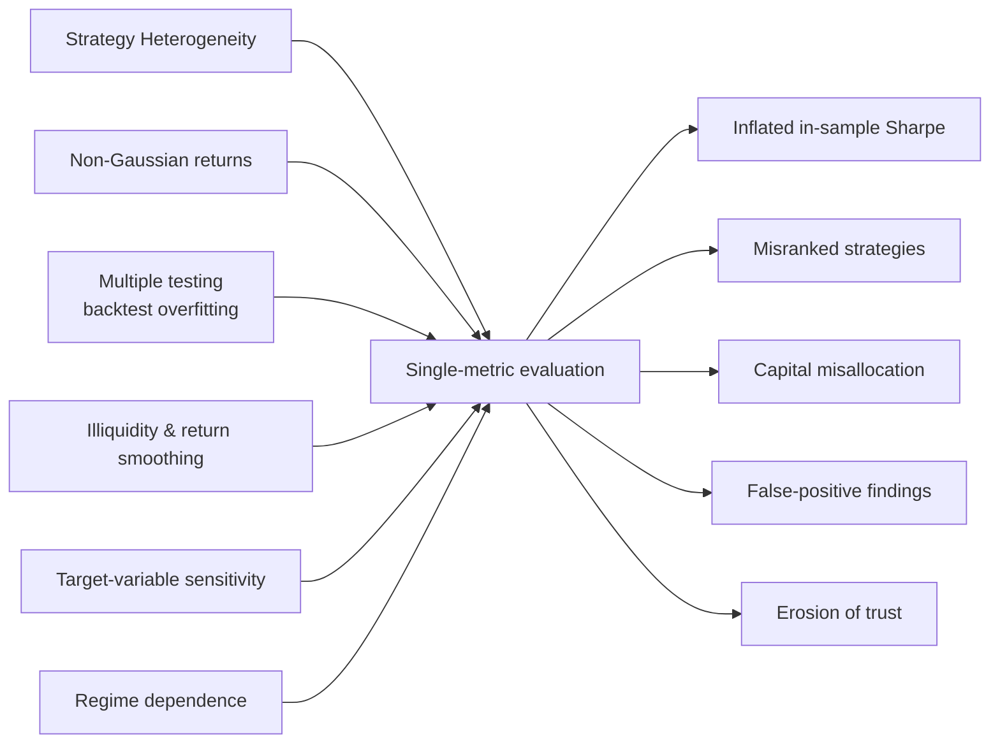
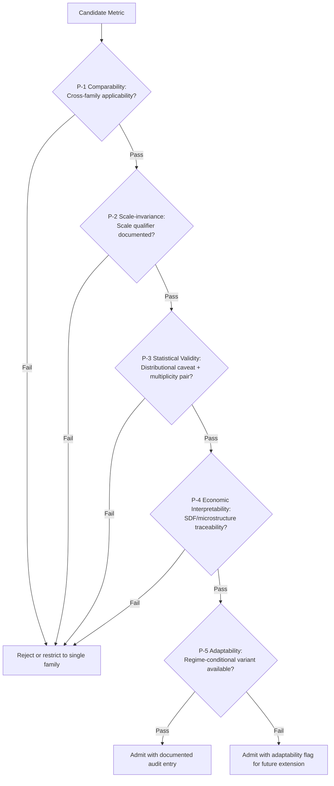
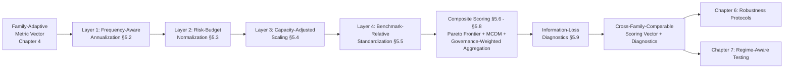
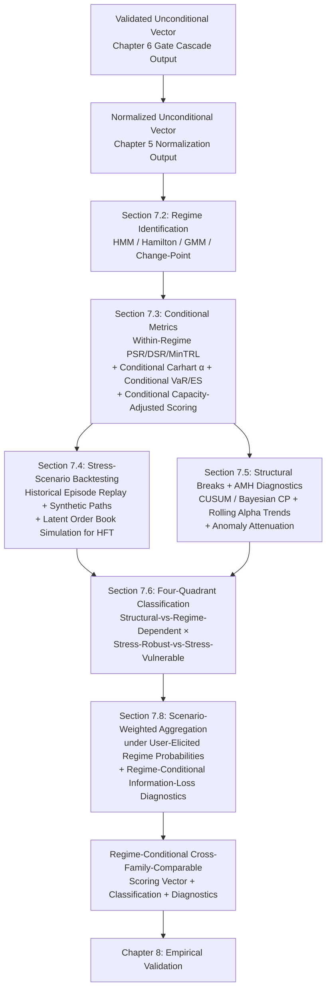
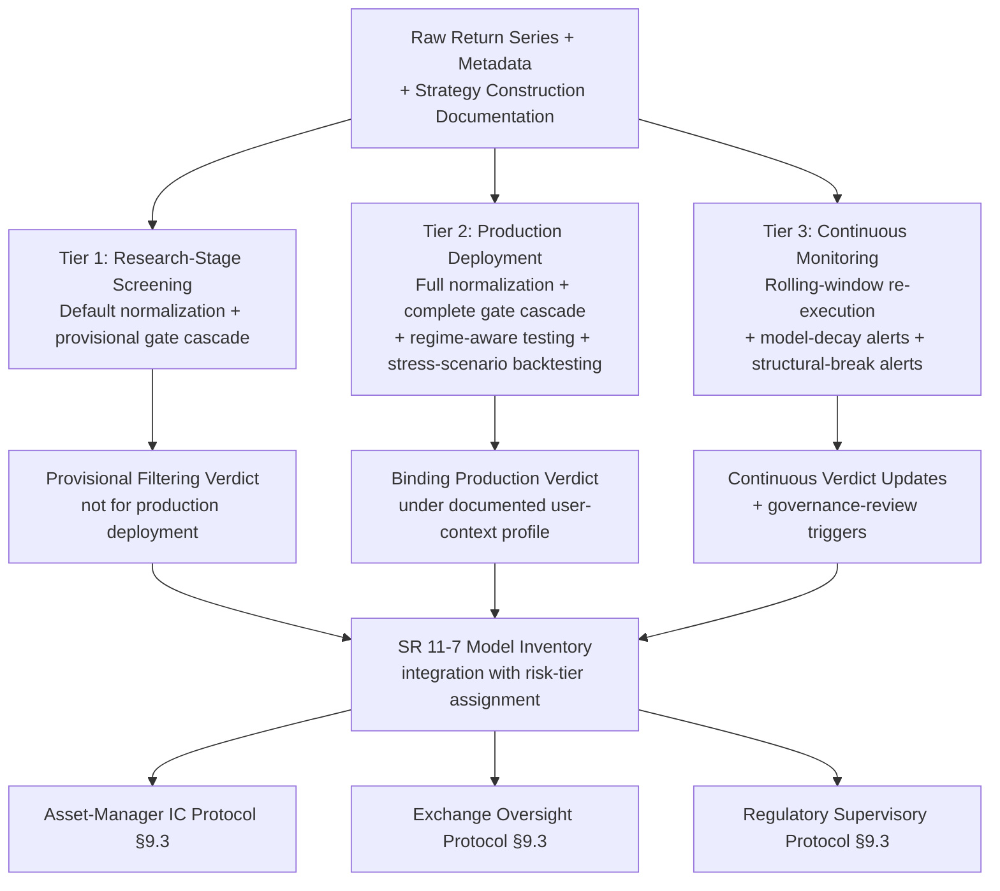

# Building a Unified Multi-Dimensional Evaluation Framework for Advanced Quantitative Trading Strategies
# 1 Research Background and Problem Statement

The past decade has witnessed an unprecedented diversification of quantitative trading strategies, propelled by advances in computational hardware, the maturation of machine learning, and the growing availability of high-frequency and alternative data. Yet the methodological apparatus through which institutional investors, academics, and regulators evaluate these strategies has not kept pace with their proliferation. Where the universe of strategies once consisted largely of factor-based equity portfolios and rule-driven statistical arbitrage, it now spans deep reinforcement learning agents, large-language-model (LLM) augmented decision systems, electronic market-making algorithms operating at microsecond resolution, and hybrid ensemble–transfer-learning architectures. Each of these families embodies distinct data dependencies, time horizons, capacity profiles, and operational constraints, and each generates returns whose statistical properties differ markedly from those assumed by classical performance metrics. The consequence is a structural mismatch: a single Sharpe ratio, drawdown statistic, or information ratio is increasingly unable to convey, much less compare, the merits of strategies that occupy fundamentally different points in the strategy design space. This chapter establishes the empirical and conceptual foundations for the rest of the report. It first documents the scale and heterogeneity of the contemporary quantitative landscape, then dissects the methodological costs incurred by fragmented evaluation practices, and finally articulates the central research question, scope, and boundary conditions that motivate the construction of a unified, multi-dimensional evaluation framework.

## 1.1 Proliferation and Heterogeneity of Advanced Quantitative Strategies

The scale of capital now intermediated by quantitatively managed vehicles is itself sufficient to underscore the importance of rigorous, comparable evaluation. According to HFR's *Global Hedge Fund Industry Report*, total global hedge fund industry capital surged past the historic 5 trillion U.S. dollar milestone for the first time in the fourth quarter of 2025, reaching a record 5.15 trillion U.S. dollars, with industry capital growing by a record 642.8 billion U.S. dollars in 2025 alone — the strongest annual performance for the HFRI composite since 2009.[^1] In the broader long-only space, the total net assets of mutual funds registered in the United States stood at approximately 28.54 trillion U.S. dollars at the end of 2024, up from 25.52 trillion in 2023 and only 5.53 trillion in 1998, reflecting a more than fivefold expansion over a quarter-century during which quantitative techniques have steadily migrated from specialty boutiques into mainstream asset management.[^2] These numbers are not merely descriptive: they imply that the cumulative effect of even small methodological errors in strategy evaluation — whether in the form of overstated Sharpe ratios, misidentified alpha sources, or under-recognized capacity constraints — translates into capital misallocations of economically material magnitude.

Behind these aggregates lies a strategy taxonomy that has become qualitatively more heterogeneous. Multi-factor and statistical-arbitrage strategies, originally rooted in linear asset-pricing theory, continue to dominate equity quantitative investing but have themselves evolved into hybrid pipelines combining traditional cross-sectional regressions with nonlinear machine-learning predictors. Empirical work in this tradition increasingly relies on ensemble architectures — gradient boosting, random forests, stacking, blending — and reports substantial heterogeneity in predictive performance across target variables, model architectures, and temporal horizons.[^3] In a representative recent study on ten major U.S. technology stocks, a hybrid framework integrating ensemble models (AdaBoost, Decision Tree, LightGBM, Random Forest, XGBoost), fusion models (Voting, Stacking, Blending), and a Dynamic-Time-Warping–based transfer learning scheme produced markedly different risk-return profiles depending on whether the prediction target was the next-day closing-price difference, moving-average difference, or exponential moving-average difference; annualized returns and maximum drawdowns varied not only across stocks but also across model variants for the same stock.[^3] Such target-variable sensitivity is a defining characteristic of the contemporary ML-based strategy family and one that conventional evaluation metrics, calibrated for stationary single-target return series, are ill-equipped to capture.

A second, structurally distinct family is that of electronic liquidity provision and high-frequency trading (HFT). The Bank for International Settlements' Markets Committee report on HFT in foreign-exchange markets observed that HFT can be **beneficial for the functioning of the FX market in normal times** but has also **changed the market's ecology with implications for its resilience in times of stress**, with HFT participants adapting differently from traditional FX participants in volatile regimes and with prime brokers and venue operators taking on quasi-self-regulatory roles.[^4] The same report noted that pure HFT — as opposed to algorithmic execution of large unidirectional orders — is **not by nature a trigger of systemic risk**, although it may **propagate shocks initiated elsewhere**, as illustrated by the May 2010 equity flash crash.[^4] These observations highlight that HFT strategies inhabit a fundamentally different evaluation space from lower-frequency factor strategies: their risk and return profile is dominated by microstructure interactions, latency-sensitive infrastructure, and liquidity provision dynamics, none of which are well represented in metrics designed around daily or monthly returns.

A third and rapidly emerging family comprises reinforcement-learning (RL) agents and LLM-augmented trading systems. Surveys of this literature note that algorithmic trading inherently requires short-term decisions aligned with long-term financial goals, and that while RL has been explored for such tactical decisions, **its adoption remains limited by myopic behavior and opaque policy rationale**; LLMs, by contrast, **demonstrate strategic reasoning and multi-modal financial signal interpretation when guided by well-designed prompts**, motivating the integration of LLM reasoning with RL execution.[^5] Cambridge University Press's recently released *Deep Learning in Quantitative Trading* (October 2025) further codifies the entrance of deep learning architectures into mainstream practitioner education.[^6] These systems pose distinctive evaluation challenges: their policies are non-stationary by construction, their effective sample sizes are often small relative to the parameter space, and their economic interpretability is limited, making the assignment of meaningful confidence intervals and the attribution of alpha to identifiable risk premia particularly difficult.

To make the heterogeneity concrete, the following table summarises the principal strategy families along the dimensions that any unified evaluation framework must accommodate. The entries are synthesized from the strategy descriptions documented in the cited literature.[^3][^5][^6][^4]

| Strategy Family | Typical Holding Horizon | Primary Signal Source | Key Capacity / Infrastructure Constraint | Dominant Statistical Pathology |
|---|---|---|---|---|
| Multi-factor / cross-sectional equity | Days to months | Fundamental + price/volume factors | Crowding, factor decay | Multiple testing, factor zoo |
| Statistical / cross-asset arbitrage | Minutes to weeks | Mean-reversion, cointegration | Liquidity of legs, financing | Regime breaks, autocorrelation |
| HFT / electronic market making | Microseconds to seconds | Order-book microstructure | Latency, co-location, queue position | Microstructure noise, adverse selection |
| ML / deep-learning prediction | Hours to days | Nonlinear price/feature mapping | Data, GPU compute, target sensitivity | Overfitting, target-variable instability |
| Reinforcement-learning agents | Variable (policy-dependent) | Learned state–action value | Simulator fidelity, sample efficiency | Non-stationarity, myopia |
| LLM-based / multimodal | Hours to days | Text + price multimodal reasoning | Inference latency, prompt brittleness | Opaque policy, evaluation scarcity |

Three observations follow. First, the *units* in which performance is naturally expressed differ across families: a market-maker's edge is measured in fractions of a basis point per round-trip, while a low-frequency factor portfolio's edge is measured in annualized alpha. Second, the *binding constraints* differ — capacity for factor strategies, latency for HFT, sample efficiency for RL — so that an evaluation framework that ignores these constraints will systematically misrank strategies. Third, the *statistical pathologies* that threaten validity are family-specific, implying that a one-size-fits-all robustness protocol is inadequate. Together, these observations establish the empirical reality that strategy heterogeneity has reached a level at which uniform single-metric assessment is no longer structurally tenable.

## 1.2 Fragmentation of Evaluation Standards and Its Practical Costs

The methodological infrastructure for evaluating quantitative strategies has not evolved at the pace of strategy innovation. Practice and a substantial body of academic work continue to lean heavily on single-dimensional summary statistics — most prominently the Sharpe ratio, annualized return, and maximum drawdown — even when the strategies being evaluated violate the statistical assumptions on which those metrics rest. The Sharpe ratio, originally introduced by Sharpe and refined in subsequent decades, is the canonical example: it is **the ratio between average excess returns on capital, in excess of the return rate of a risk-free asset, and the standard deviation of the same returns**, and a higher ratio is conventionally interpreted as indicating greater return relative to risk.[^7] However, as Lo and others have emphasized, **the major drawback of the Sharpe ratio is that it relies on normally distributed returns**, an assumption routinely violated by leveraged, optionality-bearing, and illiquid strategies.[^7] When a strategy's returns exhibit pronounced skewness, excess kurtosis, or serial correlation, the conventional Sharpe ratio overstates risk-adjusted performance, often substantially.

The problem deepens when serial correlation arises endogenously from illiquidity and return smoothing. Getmansky, Lo, and Makarov formalized this through a "smoothing profile" — a vector of moving-average coefficients fitted to reported returns under the constraint that the coefficients sum to one — and proposed a normalized smoothing index, computed analogously to the Herfindahl concentration index, in which **lower values appear to have autocorrelation structure like we might expect of "less liquid" instruments** and higher values appear "more liquid."[^8] Because hedge fund and private-asset returns are widely affected by smoothing, evaluations that ignore the induced autocorrelation systematically understate volatility and overstate Sharpe ratios; this is not an abstract concern but a recognized source of "liquidity risk" misclassification across the alternatives industry.[^8]

A second, equally consequential source of fragmentation is the multiple-testing problem inherent in modern quantitative research. Bailey, Borwein, López de Prado, and Zhu have argued that **backtest overfitting is now thought to be a primary reason why quantitative investment models and strategies that look good on paper often disappoint in practice**, because such models target the **specific idiosyncrasies of a limited dataset, rather than any general behavior**.[^7] The effect is quantitatively severe: the same authors showed that **if only five years of daily stock market data are available as a backtest, then no more than 45 variations of a strategy should be tried on this data, or the resulting strategy will be overfit, in the specific sense that the strategy's Sharpe Ratio is likely to be 1.0 or greater just by "chance."**[^7] In a financial research environment in which **it is common to conduct millions, if not billions, of tests on the same data**, and in which **financial academic journals do not report the number of experiments involved in a particular discovery**, this implies that **many published investment theories or models are false positives**.[^7] The Backtest Overfitting Demonstration Tool (BODT) and the Tenure Maker Simulation Tool (TMST), developed by the same research group, illustrate this empirically: an "optimal" strategy obtained by varying entry day, holding period, stop loss, and side parameters on a pseudo-randomly generated price series achieved an in-sample Sharpe ratio of 1.59, whereas the same strategy applied to an out-of-sample series produced a Sharpe ratio of −0.18 — that is, the strategy actually lost money.[^7] The pseudo-mathematical "tenure maker" experiment, in which econometric specifications are fit to IID Gaussian returns, achieves still higher in-sample Sharpe inflation, demonstrating that **econometric specifications are so flexible that it is even easier to generate a large number of independent trials**.[^7] These demonstrations frame overfitting not as a peripheral bias but as a first-order threat to the validity of any single-metric evaluation.

To address the multiplicity-induced inflation of in-sample performance, Bailey and López de Prado introduced the *Deflated Sharpe Ratio* (DSR), defined as a Probabilistic Sharpe Ratio against a benchmark threshold that increases with the number of trials, the variance across trial Sharpe ratios, and the skewness and kurtosis of returns; DSR is more robust **when the returns follow a non-Normal distribution, and multiple trials have taken place**.[^7] The DSR formulation is illustrative of the direction in which evaluation methodology must move:

$$\widehat{DSR} \equiv \widehat{PSR}(\widehat{SR}_0) = Z\left(\frac{(\widehat{SR}-\widehat{SR}_0)\sqrt{T-1}}{\sqrt{1-\hat{\gamma}_3 \widehat{SR} + \frac{\hat{\gamma}_4-1}{4}\widehat{SR}^2}}\right)$$

where the threshold $\widehat{SR}_0$ depends explicitly on the number of independent trials $N$ and the cross-trial Sharpe variance.[^7] Yet even DSR is a single-dimensional statistic; it disciplines the inference on Sharpe ratio but does not, by itself, integrate capacity, transaction-cost sensitivity, regime conditionality, or operational dependency.

A third pathology is target-variable sensitivity in machine-learning–based strategies. The hybrid framework of Yan et al. demonstrated that within a single modeling pipeline applied to identical input data and the same ten U.S. technology stocks, the choice among three closely related prediction targets — next-day closing-price difference, moving-average difference, and exponential-moving-average difference — produced systematically different out-of-sample errors and trading outcomes, with the smoother MA-difference target yielding both a higher annualized return and a lower maximum drawdown than the EMA-difference target across fusion and transfer-learning model classes.[^3] The associated information-entropy analysis showed that the closing-price difference exhibited entropy of 0.997 bits versus 0.985 and 0.982 bits for the MA and EMA differences respectively, providing a theoretical rationale for the observed predictability gap.[^3] The implication for evaluation is direct: a researcher who reports performance only on a single target choice can present a substantially different — and arguably misleading — picture of strategy quality, and conventional Sharpe-based comparisons will be unable to flag this sensitivity. Furthermore, capital-market anomalies themselves attenuate as liquidity and trading activity rise, so that performance comparisons drawn from older data may not generalize, a point that the broader literature on anomaly attenuation in the high-liquidity era has documented.[^4]

Finally, regime conditionality is a fourth dimension along which fragmented evaluation falls short. The Adaptive Markets Hypothesis, articulated by Lo, has prompted growing recognition that risk premia and momentum effects are state-dependent rather than constant, with **down-market betas of past losers low but up-market betas high** in bear/high-volatility regimes, so that the same strategy can switch from positive to negative risk-adjusted return as the regime changes.[^7][^8] Single-period Sharpe ratios computed over a long sample average across these regimes and therefore can mask structural fragility. Conventional evaluation, in other words, conflates strategies whose edge is robust across regimes with those whose edge is conditional on a particular market state.

The practical costs of this fragmentation are concrete. First, they generate **capital misallocation**: investors allocate to strategies whose reported metrics overstate true skill, and they avoid strategies whose true skill is obscured by metric mis-specification. Second, they generate **false-positive discoveries** in academic and practitioner research, with the multiple-testing literature suggesting that a substantial share of published findings are statistical artifacts rather than genuine economic regularities.[^7] Third, they undermine **comparability across strategy families**: an HFT desk's economic value cannot be sensibly ranked against a low-frequency factor portfolio using a single annualized Sharpe ratio, because the binding constraints, capacity, and statistical assumptions differ. Fourth, they create **governance and regulatory blind spots**, since supervisors evaluating systemic implications of strategies — for example, whether HFT participants withdraw liquidity in stress, as the BIS Markets Committee has examined — require multi-dimensional evidence that single-metric reporting cannot supply.[^4] Finally, they **erode trust in quantitative results**, both within institutions and in the broader investor community, as repeated cycles of in-sample brilliance followed by out-of-sample disappointment reinforce skepticism about quantitative methods generally.



The figure above captures the chain of causation: structural heterogeneity in strategies, combined with statistical features that violate the assumptions of conventional metrics, propagates through single-metric evaluation pipelines and ultimately produces tangible costs in capital allocation, research integrity, and institutional trust. This causal chain motivates the central research question developed next.

## 1.3 Central Research Question, Scope, and Boundary Conditions

In light of the empirical heterogeneity documented in Section 1.1 and the methodological costs analyzed in Section 1.2, this report poses the following central research question: **how can a unified, multi-dimensional evaluation framework be constructed that consistently and rigorously assesses heterogeneous advanced quantitative trading strategies — spanning multi-factor, statistical arbitrage, HFT, ML/deep-learning, reinforcement-learning, and LLM-based families — across the dimensions of return quality, risk, capacity, transaction-cost sensitivity, robustness, and regime adaptability, while preserving statistical validity, economic interpretability, and practical implementability?** The framework's task is therefore not to compress strategy quality into a single number, but to place strategies on a common comparison plane along which their distinctive merits and constraints can be coherently weighed.

The report is positioned at the intersection of three established but largely separate strands of the quantitative finance literature. The first is **performance attribution**, which decomposes returns into systematic and idiosyncratic components and into factor exposures; conventional metrics in this strand — alpha, information ratio, factor-adjusted Sharpe — assume a relatively well-specified factor model and are most natural for medium-frequency equity strategies. The second is **risk measurement**, encompassing volatility, VaR/CVaR, drawdown analytics, and tail-risk metrics; this strand is well developed for unconditional return distributions but offers limited integrated treatment of the statistical pathologies (multiple testing, smoothing) that arise endogenously in strategy research. The third is **strategy selection and meta-evaluation**, which includes deflated Sharpe ratios, probability of backtest overfitting, walk-forward validation, and combinatorial purged cross-validation; this strand has produced powerful tools for guarding against false discovery but tends to focus on the inferential validity of individual strategies rather than on cross-strategy comparability. The unified framework proposed here draws from all three but contributes a layer of *integrative architecture* — a hierarchy of dimensions, a normalization methodology, and a governance protocol — that links them into a coherent evaluation system applicable across strategy families.

Equally important is to delineate what the framework does *not* attempt to do. The framework is *not* a strategy-design or alpha-generation methodology; it does not specify factor construction, signal engineering, or model architecture. It is *not* a portfolio-optimization framework in the Markowitz tradition; allocation decisions are downstream consumers of the framework's outputs but not part of its construction. It is *not* a real-time trading risk system in the operational sense (e.g., pre-trade limits, kill switches), although its outputs can inform the design of such systems. And it is *not* a substitute for domain-specific deep-dive analysis — for instance, microstructure modeling for HFT or factor decay analysis for multi-factor — but rather a layer above such analyses that makes their conclusions cross-comparable.

The boundary conditions under which the framework is intended to operate must be made explicit, both to discipline its construction and to set realistic expectations for users. The principal boundary conditions are summarized in the table below.

| Boundary Dimension | Scope of Framework | Out-of-Scope / Deferred |
|---|---|---|
| Strategy families | Multi-factor, statistical arbitrage, HFT/market making, momentum/execution, ML/deep learning, RL agents, LLM-based systems | Discretionary fundamental, private-equity-style illiquid strategies, pure event-driven activist |
| Asset classes | Liquid public markets: equities, futures, FX, listed options (with caveats); liquid credit | Highly illiquid assets without observable market prices; bespoke OTC structures |
| Frequency range | Microsecond (HFT) through monthly (factor) rebalancing | Quarterly/annual rebalanced strategic allocation |
| Data requirements | Strategy-level return series; ideally position-level data, transaction costs, capacity estimates | Strategies for which only a single aggregated NAV is available will be evaluable only at a reduced fidelity |
| Evaluation horizon | Sample lengths sufficient for statistical inference (minimum dependent on frequency, e.g., MinBTL of Bailey et al.) | Sub-minimum samples flagged as non-evaluable rather than scored |
| Market regimes | Performance assessed conditionally across bull/bear, high/low volatility, liquidity stress | Black-swan events outside the historical regime distribution treated as stress scenarios, not backtest evidence |
| User context | Institutional asset managers, allocators, regulators, internal investment committees | Retail tactical signal selection |

These conditions are not arbitrary. The strategy-family scope reflects the report's emphasis on *advanced* quantitative strategies that are sufficiently rule-based to be subjected to rigorous statistical evaluation. The data-requirement boundary acknowledges that proprietary HFT signals and opaque ML strategies present asymmetric information availability — a constraint discussed at length in Chapter 9 — and that the framework must therefore admit modular operation: it can score strategies more comprehensively when richer data are available and more conservatively when they are not. The horizon boundary explicitly invokes the Minimum Backtest Length concept of Bailey et al., which provides a quantitative criterion for when a backtest sample is too short to support robust inference.[^7] The regime boundary reflects the recognition, drawn from the Adaptive Markets Hypothesis tradition, that strategies' edges are state-dependent and that evaluation must be conditional rather than unconditional.[^7]

The value proposition of the framework operates on three planes. *Academically*, it offers a synthesis that organizes a fragmented literature, makes explicit the axiomatic principles (comparability, scale-invariance, statistical validity, economic interpretability, adaptability) that any unified evaluation system must satisfy, and provides a testbed against which alternative metrics and aggregation rules can be benchmarked. *Practically*, it supplies institutional users — allocators, investment committees, internal risk and oversight functions — with a structured, auditable, and reproducible procedure for ranking and monitoring strategies whose heterogeneity would otherwise defeat informal judgment. *Regulatorily*, it provides a vocabulary in which supervisors can articulate concerns about systemic exposures of strategy families (for instance, the liquidity-provision role of HFT in stress regimes flagged by the BIS Markets Committee[^4]) without conflating fundamentally different types of risk.

The report's subsequent chapters operationalize this research question along the structure foreshadowed by the central question itself. Chapter 2 develops a taxonomy of strategy families that exposes the axes of variation any framework must accommodate. Chapter 3 critically reviews existing evaluation tools and synthesizes the theoretical foundations — drawn from asset pricing, market microstructure, statistical learning, and decision theory — that support the framework's axiomatic principles and aggregation logic. Chapter 4 designs the multi-layer metric system across return quality, risk, capacity, costs, turnover/crowding, and operational dependencies. Chapter 5 develops the cross-strategy normalization methodology that places strategies of different frequencies, leverages, and asset universes onto a common plane. Chapter 6 specifies the robustness and bias-mitigation protocols, embedding deflated Sharpe ratios, walk-forward analysis, combinatorial purged cross-validation, and the probability of backtest overfitting as mandatory validation layers. Chapter 7 introduces regime-aware testing modules that condition evaluation on bull/bear, volatility, and liquidity-stress states. Chapter 8 empirically validates the framework on representative strategies drawn from each family. Chapter 9 addresses implementation, governance, limitations, and the forward research agenda — including how the framework should evolve to evaluate emerging LLM-driven and multi-agent systems and incorporate ESG and alternative-data dimensions.

In summary, the rapid proliferation of advanced quantitative strategies — manifested both in the multi-trillion-dollar scale of capital deployment and in the qualitative diversification across factor, microstructure, and AI-driven families — has outstripped the reach of single-dimensional evaluation metrics. The fragmentation of evaluation standards is not a cosmetic inconvenience but a source of capital misallocation, false-positive discoveries, and erosion of trust, exacerbated by non-Gaussian return distributions, illiquidity-induced smoothing, multiple-testing inflation, target-variable sensitivity, and regime conditionality. These realities, taken together, motivate the central research undertaking of this report: the construction of a unified, multi-dimensional evaluation framework whose scope, boundary conditions, and intended user contexts have now been precisely defined. The next chapter begins this construction by developing a taxonomy of strategy families that exposes the structural dimensions along which the framework must remain invariant or adaptive.

# 2 Taxonomy and Characterization of Advanced Quantitative Strategies

Chapter 1 established that the contemporary quantitative landscape spans strategy families whose units of performance, binding constraints, and statistical pathologies differ in kind rather than in degree, and that this heterogeneity has rendered single-metric evaluation structurally untenable. To build a unified framework capable of placing such strategies on a common comparison plane, we require first an analytical scaffold: a taxonomy that resolves each family into its constituent structural elements and exposes the axes along which evaluation logic must remain invariant or adaptive. This chapter constructs that scaffold. After defining the classification axes that will organize the analysis, it dissects each principal strategy family in turn—multi-factor and cross-sectional equity, statistical and cross-asset arbitrage, electronic liquidity provision and high-frequency trading, execution and momentum algorithms, machine learning and deep-learning prediction, reinforcement-learning agents, and LLM-based multimodal systems—and then synthesizes a cross-cutting typology that directly motivates the metric design (Chapter 4), normalization methodology (Chapter 5), and robustness protocols (Chapter 6) developed later in the report. Throughout, the analysis privileges *evaluation-relevant* characterization: structural features are introduced not for taxonomic completeness but because they bear on what an honest, rigorous comparison of strategy quality must measure.

## 2.1 Classification Axes and Methodological Approach

The choice of classification axes is itself a design decision that shapes the framework that follows. A taxonomy organized purely around asset class (equity, futures, FX, fixed income) would obscure the fact that the same asset class hosts radically different strategy families; a taxonomy organized purely around mathematical technique (linear regression, neural network, MDP) would obscure the fact that techniques are increasingly hybridized within a single strategy. The taxonomy here is therefore organized along *structural axes that govern evaluation logic*, regardless of asset class or technique. Six such axes prove necessary and, taken together, sufficient.

The first axis is the **signal-generation mechanism**, which categorizes how a strategy maps observable inputs to trading decisions. Six mechanism types recur across the literature reviewed in Chapter 1: linear cross-sectional factor models in the Fama-French/Carhart tradition[^9][^10], statistical-relationship models exploiting cointegration and mean reversion[^11][^12], market-microstructure models built on order-book and queue dynamics[^13], learned nonlinear mappings from supervised ML and deep learning, learned policies from reinforcement learning[^14][^15], and multimodal reasoning combining textual and numerical signals through large language models. The relevance of this axis is that each mechanism type embeds different assumptions about the data-generating process and therefore demands different validity safeguards.

The second axis is the **holding horizon**, ranging from microseconds in HFT[^13] through days in factor strategies to weeks in cross-asset arbitrage[^11]. Horizon governs annualization conventions, the relevant volatility measure, and the appropriate frequency for transaction-cost modeling; an evaluation metric that conflates a microsecond-scale market maker with a monthly-rebalanced factor portfolio without explicit normalization will systematically misrank them.

The third axis is **capacity and scalability**, defined as the assets-under-management level beyond which a strategy's risk-adjusted return materially decays. Capacity constraints are family-specific: multi-factor strategies face crowding and factor-decay limits, statistical arbitrage faces leg-liquidity limits[^11], HFT faces queue-position and adverse-selection saturation[^13], and ML strategies face data-driven feature decay. Without capacity-aware adjustment, a small-AUM strategy with high turnover may dominate a large-AUM strategy on raw Sharpe while being economically inferior at allocation scale.

The fourth axis is **infrastructure and latency dependency**. HFT requires sub-millisecond round-trip times achieved through co-location, FPGA acceleration, and microwave transmission[^13]; deep-learning systems require GPU clusters; LLM systems require inference pipelines whose latency is itself a binding operational constraint. Infrastructure dependency translates directly into operational risk and into the asymmetry between paper backtests and live performance.

The fifth axis is the **dominant statistical pathology**—the bias or inferential failure most likely to inflate reported performance. Factor strategies face the factor-zoo multiple-testing problem[^16]; ML strategies face look-ahead bias and target-variable instability[^17]; HFT faces microstructure noise; RL faces non-stationarity and partial observability[^18]. Pathology specificity dictates which robustness protocols must be mandatory in evaluation.

The sixth axis is **interpretability and economic transparency**, ranging from fully decomposable factor models to opaque deep-learning and LLM policies. Interpretability bears on the framework's ability to attribute alpha to identifiable economic sources—an axiomatic requirement (P-4 of the rubric) that constrains aggregation rules and governance protocols.

The following sections traverse the strategy families in approximate order of methodological maturity, applying the six axes to each. Section 2.9 then collapses the family-level analyses into a cross-cutting comparison matrix that becomes the explicit input to subsequent chapters.

## 2.2 Multi-Factor and Cross-Sectional Equity Strategies

Multi-factor cross-sectional equity strategies are the methodological progenitors of modern systematic investing and remain the largest single category by deployed capital. The canonical signal-generation mechanism is a linear cross-sectional regression of next-period returns on a vector of pre-specified characteristics—size, value, momentum, profitability, investment, low-volatility—rooted in the empirical research of Fama and French and of Jegadeesh and Titman[^9]. Constructing and testing alternative factor specifications, including extensions of the Fama-French and Carhart models, has been an active line of work for over two decades, with comparative studies of model variants explicitly aimed at identifying which factor sets best capture cross-sectional return variation in particular markets[^10]. Augmented Fama-French formulations are now standard tools for institutional investors navigating what has become known as the "factor zoo," with capacity-of-smart-beta analyses examining the extent to which factor harvesting survives transaction-cost incorporation[^16].

Two structural features of this family are decisive for evaluation. First, the holding horizon is naturally days to months, with rebalancing typically monthly or quarterly to balance signal decay against turnover costs; this places returns on a frequency at which standard annualization conventions are well-defined but at which capital-market frictions—portfolio turnover, market impact, financing—materially erode the gross alpha that backtests record. Second, capacity is bounded by crowding: as more capital pursues the same factor exposures, the marginal price impact of factor-driven trades rises and the realized factor premium attenuates, a dynamic exemplified by the well-documented attenuation of classic anomalies in the post-2003 high-liquidity era. The evaluation implication is that a multi-factor strategy's quality cannot be judged from gross-of-cost backtests; it must be judged net of capacity-adjusted transaction costs and benchmarked against the residual alpha after the strategy's known factor exposures are removed.

The dominant statistical pathology is multiple-testing inflation in factor discovery. Modern signal libraries contain hundreds of candidate factors, and as Chapter 1 documented through the Bailey-Borwein-López de Prado-Zhu line of work, the in-sample Sharpe inflation under such combinatorial search is severe. This pathology affects evaluation in two ways: it inflates the estimated alpha of any strategy whose construction involved factor selection from a large pool, and it makes naive cross-strategy comparisons—where strategy A used 10 factors and strategy B used 200—structurally misleading.

The contemporary evolution of this family is hybrid. As Chapter 1 illustrated through the ten-stock U.S. technology study combining AdaBoost, Decision Tree, LightGBM, Random Forest, XGBoost with voting/stacking/blending fusion models and DTW-based transfer learning, traditional cross-sectional pipelines now routinely embed nonlinear ML predictors atop classical factor inputs. This hybridization does not eliminate the family's evaluation challenges; it amplifies them, because the multiple-testing problem now compounds across both factor selection and model selection, and because the hybrid pipeline inherits the target-variable sensitivity discussed in Section 2.6.

For this family, an evaluation framework must therefore deliver: (i) factor-adjusted alpha rather than raw return; (ii) capacity-aware net-of-cost performance; (iii) explicit multiplicity controls (e.g., deflated Sharpe ratio with a documented count of trials); and (iv) a decomposition that separates the contribution of the linear factor backbone from any nonlinear ML augmentation, so that the marginal value of model complexity is auditable.

## 2.3 Statistical and Cross-Asset Arbitrage Strategies

Statistical arbitrage occupies a distinct structural niche. Its signal-generation mechanism is the identification of stable statistical relationships—pairwise correlations, cointegration vectors, multi-factor common-component decompositions—and the systematic exploitation of temporary deviations from those relationships. The strategy emerged from Morgan Stanley's equity desk in the 1980s, evolved through pair trading in the 1990s, integrated machine-learning algorithms in the 2000s, and absorbed big-data analytics in the 2010s before transitioning to AI-driven model optimization in the 2020s[^11]. Across this evolution the structural logic has remained constant: identify highly correlated securities (typically with correlation coefficients above 0.8), monitor the price spread, take a long position in the undervalued leg and a short position in the overvalued leg when the spread exceeds two standard deviations, and exit when the spread reverts toward its historical mean[^11][^12]. Pairs trading remains the prototypical instantiation, with example positions held for two to ten trading days, position ratios maintained at market-neutral 1:1, and target annual returns of 8–15 percent reported for long-term variants[^11].

The structural commitments of this family bear directly on evaluation. The market-neutrality construction means that the strategy's economic value is measured in alpha rather than in beta-driven return; conventional benchmark-relative metrics that compare against an equity index are inappropriate, and Sharpe ratios computed against a risk-free rate must be interpreted as measuring the quality of the spread signal rather than directional exposure. Statistical arbitrage spans equities (large-cap pairs in similar sectors such as Coca-Cola/PepsiCo), ETF-versus-constituent arbitrage, fixed-income relative-value (yield-curve anomalies with 3–5 percent annual returns and 5–10 day holds; credit-spread relationships with 4–7 percent annual returns and 15–20 day holds), currency-pair correlations such as EUR/USD versus GBP/USD, and futures calendar spreads[^11]. Each application requires asset-specific risk parameters and custom execution algorithms, but all share the underlying logic of relative-value mean reversion[^11][^12].

Three statistical pathologies threaten evaluation validity. First, **correlation breakdown** during market stress is a recurring failure mode: the historical correlation that sustains the trade can collapse precisely when the trader is most exposed, with the 2-3 standard deviation threshold designed for normal regimes proving inadequate for stress events[^11]. Risk-management practice in the industry mitigates this through position size limits at 2–3 percent of capital per trade, stop-loss triggers at two standard deviations, daily correlation monitoring, diversification across 15–20 active pairs, and Value-at-Risk computed at 99 percent confidence intervals[^11]. The relevance for evaluation is that backtested Sharpe ratios from periods without stress events systematically overstate the strategy's robustness. Second, **autocorrelation-induced Sharpe inflation** arises because mean-reversion strategies with multi-day holding periods produce return series with measurable serial dependence; as Chapter 1 documented through the Getmansky-Lo-Makarov smoothing framework, such autocorrelation systematically understates volatility and inflates Sharpe. Third, **regime breaks** in cointegration relationships—shifts in the long-run equilibrium vector—can render historically validated pairs inert without producing a sharp signal of the change.

The infrastructure profile is intermediate between factor strategies and HFT. Statistical arbitrage operations require time-series databases storing five-plus years of historical price data, real-time market-data feeds processing 50,000-plus price updates per second, statistical analysis software for correlation calculations across 1,000-plus securities, machine-learning algorithms detecting patterns from 10-plus million data points daily, low-latency connections with execution speeds under 10 milliseconds, multi-asset trading capabilities across 50-plus exchanges, and order-management systems handling 1,000-plus simultaneous positions[^11]. This infrastructure positions the family as latency-sensitive but not latency-bound: the edge depends on processing speed and data quality, not on microsecond-scale physical-layer optimization.

For evaluation purposes, this family demands metrics beyond conventional risk-adjusted return. It requires explicit assessment of correlation stability across regimes, autocorrelation-corrected volatility (leading directly to the deflated Sharpe ratio framework), cointegration-test validity diagnostics, and capacity measurement that accounts for the liquidity of both legs simultaneously rather than each leg in isolation.

## 2.4 High-Frequency Trading and Electronic Liquidity Provision

High-frequency trading represents the most extreme structural departure from traditional quantitative investing and consequently the most challenging case for any unified evaluation framework. HFT is defined by Wikipedia, drawing on Aldridge and IOSCO sources, as **a type of algorithmic automated trading system in finance characterized by high speeds, high turnover rates, and high order-to-trade ratios that leverages high-frequency financial data and electronic trading tools**, with key attributes including **highly sophisticated algorithms, co-location, and very short-term investment horizons**, in which proprietary strategies move in and out of positions in **seconds or fractions of a second**[^13]. By 2016, HFT initiated **10–40% of trading volume in equities, and 10–15% of volume in foreign exchange and commodities**[^13]; in 2009 in the United States, HFT firms represented only 2 percent of the approximately 20,000 trading firms but accounted for 73 percent of all equity order volume[^13]. By value, the TABB Group estimated in 2010 that HFT made up 56 percent of U.S. equity trades and 38 percent of European equity trades[^13].

The signal-generation mechanism in HFT is fundamentally different from factor or stat-arb mechanisms: it is microstructural rather than fundamental or statistical-relational. The Wikipedia synthesis identifies the principal HFT strategy types as several variants of market making, event arbitrage, statistical arbitrage at high frequency, latency arbitrage, ticker-tape and filter trading, news-based trading, index arbitrage, and order-properties strategies that exploit features such as displayed order size and order age[^13]. Market making is the dominant variant: HFT firms place limit orders on both sides of the book to **earn the bid-ask spread**, with empirical studies indicating that this competition among liquidity providers **causes reduced effective market spreads, and therefore reduced indirect costs for final investors**, though with the crucial caveat that **true market makers don't exit the market at their discretion and are committed not to, where HFT firms are under no similar commitment**[^13]. Building HFT market-making strategies typically involves precise modeling of target market microstructure together with stochastic-control techniques[^13].

The capacity profile is unusual. Because positions are held for seconds or less and HFT firms **do not consume significant amounts of capital, accumulate positions or hold their portfolios overnight**, HFT has a **potential Sharpe ratio (a measure of reward to risk) tens of times higher than traditional buy-and-hold strategies**, with low margins offset by extremely high trade volumes[^13]. Yet the family's economic capacity is sharply limited by competition: profits from HFT in the U.S. declined from an estimated peak of $5 billion in 2009 to about $1.25 billion in 2012, according to a Purdue University estimate[^13]. The Tabb Group separately estimated annual aggregate profits of high-frequency arbitrage strategies at over $21 billion in 2009[^13], suggesting that estimates vary substantially by methodology and inclusion criteria. As Wikipedia observes, **as HFT strategies become more widely used, it can be more difficult to deploy them profitably**[^13], a capacity-decay dynamic familiar from factor strategies but operating on a vastly faster timescale.

The infrastructure dependency of HFT is qualitatively different from any other family. Co-location, ultra-low-latency direct market access, and switches from fiber-optic to microwave and shortwave transmission are fundamental rather than incidental. Microwaves traveling in air suffer **a less than 1% speed reduction compared to light traveling in a vacuum, whereas with conventional fiber optics light travels over 30% slower**, motivating massive HFT investment in microwave infrastructure for connections such as New York–Chicago and London–Frankfurt; shortwave radio carries less information but reaches longer distances, and satellite transmission of market data has also been explored[^13]. Advanced trading platforms achieve round-trip order execution speeds of 10 milliseconds or less, with full-hardware FPGA appliances delivering sub-microsecond end-to-end market-data processing[^13]. The London Stock Exchange's Millennium Exchange platform claims average latency of 126 microseconds, with off-the-shelf software allowing nanosecond-resolution timestamping using GPS clocks at 100-nanosecond precision[^13]. ESMA in 2015 proposed time standards across the 28-nation EU that would synchronize trading clocks **to within a nanosecond, or one-billionth of a second** to refine regulation of gateway-to-gateway latency[^13]. Italy was, on September 2, 2013, the world's first country to introduce a tax specifically targeted at HFT, charging a levy of 0.02 percent on equity transactions lasting less than 0.5 seconds[^13].

The systemic and statistical pathologies of HFT have been extensively documented and are central to its evaluation. The May 6, 2010 Flash Crash—in which the Dow Jones Industrial Average plunged to its largest intraday point loss in history before recovering within minutes—triggered an SEC-CFTC joint investigation that concluded a single $4.1 billion futures sale by Waddell & Reed Financial set off a cascade in which **high-frequency traders quickly magnified the impact of the mutual fund's selling**, **HFTs began to quickly buy and then resell contracts to each other – generating a 'hot-potato' volume effect**, the combined sales drove the E-mini price down 3 percent in just four minutes, and as prices fell **the liquidity in the market evaporated because the automated systems used by most firms to keep pace with the market paused** and withdrew[^13]. Subsequent regulatory enforcement actions have catalogued additional pathologies: quote stuffing (Citadel LLC fined $800,000 in June 2014 for sending bursts of 10,000 orders per second); spoofing and layering (Panther Energy Trading ordered to pay $4.5 million in July 2013, with sole owner Michael Coscia subsequently charged with six counts of commodities fraud and six counts of spoofing; Tower Research ordered to pay $67.4 million in November 2019 for spoofing from at least March 2012 through December 2013); and market manipulation (Athena Capital Research fined $1 million in October 2014 for using $40 million to rig closing prices of thousands of stocks)[^13]. The structural significance of these episodes for evaluation is that HFT strategies' performance can be path-dependent on regulatory regimes and on competitor behavior in ways that are not captured by standalone return statistics.

For evaluation purposes, HFT requires a fundamentally different vocabulary from low-frequency strategies. Return must be measured per round-trip in fractions of a basis point, not per annum in percentage points; risk must be measured through microstructure metrics (adverse-selection costs, queue-position decay, fill-rate variance) rather than through daily-return Sharpe; capacity must be measured in volume share rather than in AUM; and operational reliability—measured in latency stability, system uptime, and fault recovery—becomes a first-order evaluation dimension rather than an operational footnote. The unified framework must therefore admit a dedicated HFT evaluation track that translates these microstructure measurements into normalized scores comparable with those of low-frequency families—a translation problem addressed in Chapter 5.

## 2.5 Execution and Momentum Algorithms

Execution algorithms occupy a structurally distinct position in the strategy taxonomy: their objective is **cost minimization rather than alpha generation**. As Brenndoerfer succinctly puts it, "Unlike the alpha-seeking strategies... execution algorithms have a different objective. They take a given trading decision as input and focus purely on minimizing the cost of implementation. A portfolio manager might use machine learning to identify an undervalued stock, but the execution algorithm's job is to buy that stock as cheaply as possible, not to question whether it should be bought at all"[^19]. Although this family is sometimes treated as infrastructure rather than strategy, it merits explicit taxonomic placement because its inclusion or exclusion materially affects how evaluation accounts for the gap between paper and realized performance.

The family encompasses several distinct algorithmic types, each with its own optimality logic. **Time-Weighted Average Price (TWAP)** algorithms divide an order into equal-sized pieces executed at regular intervals; for an order of $X$ shares over duration $T$, TWAP trades at the constant rate $v_t = X/T$ regardless of intraday volume or volatility[^19][^20]. **Volume-Weighted Average Price (VWAP)** allocates shares in proportion to expected market volume in each interval, $v_n = X \cdot V_n/V_{\text{total}}$, naturally producing the U-shaped intraday execution profile that mirrors typical equity-market volume[^19]. **Implementation Shortfall (IS)** algorithms, descending from Perold's 1988 framework, target the gap between the decision (or arrival) price and the realized average execution price, decomposing this gap into explicit costs (commissions, fees, spread), temporary impact, permanent impact, timing risk (price drift while waiting), and the opportunity cost of unfilled quantity[^19][^21]. **Percentage-of-Volume (POV)** algorithms trade as a fixed fraction of observed market volume, providing natural camouflage by mimicking aggregate flow, while **pegging** algorithms post passive limit orders at midpoint, primary, or market peg references to capture rather than pay the spread[^19].

The mathematically most influential member of this family is the **Almgren-Chriss optimal execution model**, published in 2000, which formalizes the cost-minimization problem as mean-variance optimization analogous to Markowitz portfolio theory[^19][^22][^23]. Modeling the midpoint price as arithmetic Brownian motion $dS_t = \sigma dW_t$ (with deliberate absence of drift, reflecting that the alpha decision is exogenous to execution[^19]), and decomposing market impact into permanent ($\gamma$) and temporary ($\eta$) linear components, the trader's objective is

$$\min \mathbb{E}[\text{Cost}] + \lambda \cdot \text{Var}[\text{Cost}]$$

where $\lambda$ is the risk-aversion parameter. Solving the resulting Euler-Lagrange equation under boundary conditions $x(0)=X$ and $x(T)=0$ yields a closed-form optimal inventory trajectory in hyperbolic functions:

$$x_t = X \cdot \frac{\sinh(\kappa(T-t))}{\sinh(\kappa T)}, \quad \kappa = \sqrt{\frac{\lambda \sigma^2}{\eta}}$$

The risk-adjusted decay parameter $\kappa$ encodes the entire cost-risk trade-off: as $\lambda \to 0$ the optimal schedule converges to TWAP, as $\lambda \to \infty$ it collapses to immediate liquidation, and as $\sigma$ rises (greater timing risk) the schedule front-loads, while as $\eta$ rises (higher impact) it back-loads[^19][^23]. The model produces an "efficient frontier" of execution strategies in expected-cost/standard-deviation space, formally analogous to Markowitz's portfolio frontier[^19].

For the evaluation framework, the execution-algorithm family imposes three distinctive requirements. First, performance is **naturally measured in implementation-shortfall units**, not in Sharpe-like statistics. The metric, in compact form, is `implementation shortfall = realized execution cost on filled quantity + opportunity cost on unfilled quantity + explicit costs`[^21], and must include partial-fill imputation rules. Second, the **arrival-price versus decision-price benchmark choice materially shifts measured shortfall**: arrival-price benchmarks isolate the execution desk's responsibility, while decision-price benchmarks expose the full delay between portfolio construction and order release[^21]. The framework must specify which is being used, since otherwise cross-strategy IS numbers are not comparable. Third, **the cost-side metrics from this family must be integrated into the alpha-side metrics from other families**: a multi-factor strategy's gross Sharpe is meaningless without the implementation-shortfall haircut applied at realistic capacity. Brenndoerfer summarizes the practical significance: "execution quality often determines whether a profitable strategy remains profitable after accounting for real-world frictions"[^19], and "the difference between theoretical and realized performance often comes down to implementation details that academic models ignore"[^19].

The family also illustrates an evaluation principle that recurs across this report: **mathematical elegance does not equal real-world fidelity**. The Almgren-Chriss linear-impact assumption is known to be only approximate; empirical research consistently finds that impact is concave, with square-root models such as $g(v) = \eta \cdot \text{sign}(v)\sqrt{|v|/V}$ fitting data better but failing to yield closed-form trajectories[^19]. Volatility-constancy assumptions also fail during news events and stress, parameter estimation for $\gamma$ and $\eta$ is empirically difficult, and execution algorithms operate in adversarial environments where HFT participants can detect and trade against algorithmic patterns ("algo sniffing"), with TWAP's predictability making it particularly vulnerable[^19]. These caveats reinforce the rubric requirement (P-5) that framework metrics remain grounded in real-world implementability rather than theoretical optimality.

## 2.6 Machine Learning and Deep Learning Prediction Strategies

Machine-learning–based prediction strategies are the fastest-growing structural category of quantitative trading and the one whose evaluation challenges most thoroughly stress-test conventional metrics. The signal-generation mechanism is a learned nonlinear mapping from features to predicted returns or to predicted price/sign/ranking targets, with model classes spanning tree-based ensembles (random forests, gradient boosting, LightGBM, XGBoost), deep neural networks (feedforward, recurrent, convolutional), transformer architectures (Autoformer, Informer, PatchTST, temporal-fusion transformers), and ensemble fusion architectures (voting, stacking, blending), often combined with transfer-learning techniques such as DTW-based domain adaptation[^7][^4][^17].

Three structural features make this family distinct. First, the **target-variable design space is itself a hyperparameter**, as Chapter 1's discussion of the ten-stock U.S. technology study illustrated: closing-price difference, moving-average difference, and exponential-moving-average difference targets produced systematically different out-of-sample errors and trading outcomes within the same modeling pipeline, and the choice among them is rarely standardized. Second, the **effective sample size is small relative to the parameter space**: even with decade-long daily-frequency datasets, the number of independent observations available for training a high-capacity model is limited, and as one practitioner reference documents, finance presents "small effective sample sizes" as one of the unique challenges that "make naive ML application dangerous"[^17]. Third, the **statistical pathology stack is the deepest of any family**, encompassing label leakage, feature leakage, cross-validation leakage, survivorship bias, target encoding contamination, and the "bias-variance trade-off" in the presence of strong noise[^17].

The literature on validation methodology for this family has converged on several mandatory protocols. **Purged k-fold cross-validation**, attributed to López de Prado, removes from the training set those samples whose labels overlap temporally with the test set and inserts an embargo gap whose length is at least equal to the label horizon[^24][^17]. The procedure has been formalized: "Split data into k time-ordered folds; for each fold used as test, remove (purge) training samples whose labels overlap with test samples; add embargo period after each test fold before allowing training data; embargo length >= label horizon (e.g., if predicting 5-day return, embargo 5+ days)"[^17]. **Combinatorial Purged Cross-Validation (CPCV)** generalizes this to multiple test-set combinations[^24]. **Walk-forward validation** with expanding or rolling windows provides "the most realistic simulation of live trading," at the cost of using less training data for early predictions, and is "preferred for final production evaluation"[^17].

A consolidated anti-leakage checklist, drawn from the practitioner literature, exposes the breadth of the validation challenge: labels must be computed strictly from future returns with no overlap with features; all rolling features must be shifted by at least one bar; target encoding must use in-fold means only; walk-forward or purged CV must be used (no random shuffle on time series); embargo gaps must be at least the maximum of label horizon and autocorrelation lag; the universe must be point-in-time with no survivorship bias; and global scaling must be fitted on training data only and applied to test data through transform[^17]. An illustrative ML evaluation report for a LightGBM classifier predicting return signs in the S&P 500, trained 2010–2019 with 5-fold purged CV and 5-day embargo, walked forward 2022–2024, achieved AUC 0.521, accuracy 51.8 percent, rank IC 0.019, and a long-short Sharpe of 0.65 gross / 0.32 net of costs at 85 percent monthly turnover[^17]. The "Verdict: Marginal signal. Net Sharpe < 0.5. Explore feature engineering or combination with existing alpha before production deployment"[^17] is exemplary of how multi-dimensional evaluation surfaces conclusions that any single metric would obscure.

The capacity profile of this family is bounded by data, compute, and feature decay. Training large transformer architectures or deep ensembles requires substantial GPU compute, with optimizer choices governed by problem characteristics (Adam at $10^{-3}$–$10^{-4}$ for most cases, AdamW at $10^{-4}$–$10^{-5}$ for transformers with weight decay, SGD with momentum at $10^{-2}$–$10^{-3}$ for large batches, RAdam at $10^{-3}$ for stability without warmup)[^17]. Feature decay—the loss of predictive power of individual features over time as market structure evolves—is monitored in production through rolling Information Coefficient (IC) versus realized returns, rolling hit rate, feature-importance stability, and prediction-distribution shift, with alert thresholds typically set at IC dropping below 50 percent of training IC for two-plus months, hit rate below 51 percent for three-plus months, or feature-importance ranking changes by more than three positions for top features[^17]. Model decay monitoring is itself a structural evaluation requirement that the unified framework must accommodate.

Evaluation implications are extensive. The framework must accommodate: (i) target-variable sensitivity analysis as a mandatory diagnostic; (ii) purged/walk-forward cross-validation as the validity backbone; (iii) cost-haircut application at realistic turnover (the 85 percent monthly turnover in the LightGBM example halved gross Sharpe from 0.65 to 0.32, illustrating that gross-of-cost metrics in this family are profoundly misleading); (iv) feature-importance interpretability via SHAP or permutation-based methods to satisfy the rubric's economic-interpretability axiom (P-4); and (v) decay monitoring as a continuous post-deployment evaluation dimension.

## 2.7 Reinforcement-Learning Trading Agents

Reinforcement-learning trading agents constitute a structurally distinct family because their signal-generation mechanism is not a predictor but a **learned policy**: a mapping from market state to action that is optimized to maximize a discounted cumulative reward. The agent observes a state $s_t$ (typically including price history, position, cash, and microstructure features), takes an action $a_t$ (trade quantity, hold, exit), receives reward $r_t$ (often P&L net of transaction costs), and updates its policy through algorithms such as Deep Q-Networks (DQN), Deep Deterministic Policy Gradient (DDPG), Multi-Agent DDPG, Proximal Policy Optimization (PPO), Soft Actor-Critic (SAC), Advantage Actor-Critic (A2C), and Twin Delayed DDPG (TD3)[^14][^15]. The FinRL framework, originally proposed in Liu et al., codifies this approach into a deep-reinforcement-learning library that automates trading decisions in quantitative finance, with subsequent extensions including FinRL-Meta for market environments and benchmarks, and FinRL-Podracer for high-performance scalable training[^14][^18].

Three structural pathologies dominate evaluation of this family. First, **non-stationarity** is severe: financial environments evolve over time as participants enter and exit, regulations change, and correlations shift, and FinRL-Meta and related literature explicitly identify "non-stationarity, and partial observability" as core challenges to data-driven financial RL[^18]. A policy trained on one regime may degrade silently when the regime shifts, and the agent's own trading activity contributes to this non-stationarity through market impact. Second, **myopic behavior** is a recognized failure mode: while RL is conceptually well suited to short-term decisions aligned with long-term goals, in practice agents often learn policies that optimize short-horizon rewards at the expense of long-horizon coherence, a tendency that motivates the integration of LLM strategic reasoning with RL execution discussed in Chapter 1. Third, **sample efficiency** constrains training fidelity: financial data are limited and expensive to simulate realistically, and FinRL-related work explicitly identifies sample efficiency as solvable but constraining[^18].

The infrastructure profile is computationally demanding. Training deep RL agents requires substantial GPU resources, custom simulation environments, and careful reward engineering; the family's infrastructure dependencies sit closer to the deep-learning family than to factor or stat-arb families. A complementary practitioner reference notes the inclusion of "Financial Reinforcement Learning" within unified ML pipelines, suggesting that RL is increasingly a layer within broader systems rather than a standalone strategy class[^17].

For evaluation purposes, RL agents fail several assumptions of conventional metrics. Their effective holding horizon is policy-dependent and can shift mid-sample without notice; their non-stationary policies preclude treating return series as stationary draws; their opacity makes alpha attribution to identifiable economic premia difficult; and the simulator-to-live transferability gap—the gap between in-simulation and live performance—is a structural risk that no return-based metric captures. The unified framework must therefore add several dimensions specific to this family: **policy stability** (variation in policy outputs over time given similar inputs); **simulator fidelity diagnostics** (the degree to which the training environment matches live execution conditions, including market impact and latency); **exploration-exploitation behavior** during deployment (does the agent continue to explore in production, and what is the cost of such exploration); and **out-of-distribution behavior** (how the agent acts when state inputs lie outside the training distribution). These dimensions cannot be derived from return series alone; they require access to policy artifacts and to deployment logs, raising the data-availability boundary condition discussed in Chapter 1.

## 2.8 LLM-Based and Multimodal Trading Systems

The newest and most rapidly evolving strategy family is built around large language models, whose signal-generation mechanism is fundamentally different from any of the preceding families. As Chapter 1 noted, LLMs **demonstrate strategic reasoning and multi-modal financial signal interpretation when guided by well-designed prompts**, motivating their integration with RL execution layers. In practice, LLM-based trading systems perform multimodal reasoning over price series, news articles, regulatory filings, social-media sentiment, and analyst commentary, producing trade recommendations or directly parameterized trade decisions through natural-language–conditioned outputs.

The structural axes are unusual. The signal source is multimodal text-plus-numeric reasoning rather than statistical or microstructural signal extraction. The holding horizon is typically hours to days, set by inference latency and by the temporal resolution of the textual signals being interpreted. The capacity profile is constrained by inference cost—LLM forward passes are computationally expensive—and by prompt brittleness, meaning that small changes in prompt phrasing can produce qualitatively different outputs. Infrastructure depends on inference pipelines, prompt-version management, and content-moderation guardrails, none of which appear in any other strategy family's profile. Cambridge University Press's *Deep Learning in Quantitative Trading* (October 2025), as cited in Chapter 1, reflects the entrance of these systems into mainstream practitioner education, but the empirical evidence base on their realized performance remains thin.

The dominant evaluation pathologies of this family are without analogue elsewhere. **Reproducibility** is a first-order challenge: LLM outputs are stochastic by default, and even with temperature set to zero, model-version updates change behavior in ways that are not always disclosed. **Prompt-version sensitivity** means that a strategy's reported backtest may not be reproducible without the exact prompt, system context, and model checkpoint used at the time. **Hallucination risk**—the model generating plausible-sounding but factually incorrect rationales for trades—is structurally difficult to detect from return series alone. **Out-of-distribution behavior** is acute because the training distributions of foundation LLMs are not constructed for financial decision-making and may contain biases that do not surface during normal operation but emerge under stress. **Evaluation scarcity** compounds all of these: the deployment histories of LLM trading systems are short, sample sizes are small, and statistical inference about their edge is correspondingly weak.

For the unified framework, this family poses requirements that anticipate the next generation of evaluation needs. The framework must record and version-stamp prompts and model checkpoints as part of the auditable evaluation trail; it must distinguish between strategy quality and infrastructure-induced variance; it must explicitly flag strategies for which evaluation horizons are below the Minimum Backtest Length thresholds discussed in Chapter 1 as non-evaluable rather than scoring them under conventional metrics; and it must accommodate emerging metrics for hallucination detection, prompt robustness, and reasoning consistency. As Chapter 9 discusses in more depth, this family is the principal frontier on which the framework must remain extensible.

## 2.9 Cross-Family Synthesis and Evaluation-Relevant Typology

Having traversed the seven principal families, we now collapse the family-level analyses into a cross-cutting typology along the six structural axes introduced in Section 2.1. The synthesis reveals that some axes vary continuously across families while others exhibit categorical breaks, and this distinction is decisive for the design of the unified framework: continuously varying axes admit continuous normalization, while categorically distinct axes require modular or dimension-specific evaluation tracks.

The following matrix consolidates the structural characterization of each family along the six evaluation-relevant axes. Entries are synthesized from the analyses in Sections 2.2 through 2.8.

| Family | Signal Mechanism | Horizon | Capacity Constraint | Latency / Infrastructure | Dominant Pathology | Interpretability |
|---|---|---|---|---|---|---|
| Multi-factor / cross-sectional | Linear factor + ML hybrid | Days–months | Crowding, factor decay | Moderate (data, compute) | Multiple testing, factor zoo | High (decomposable) |
| Statistical / cross-asset arbitrage | Cointegration, mean reversion | Minutes–weeks | Leg liquidity, financing | Moderate-low latency (~10ms) | Correlation breakdown, autocorrelation | Medium (relational) |
| HFT / market making | Microstructure, order book | μs–seconds | Volume share, queue saturation | Sub-microsecond, co-location | Microstructure noise, adverse selection | Low (latency-bound) |
| Execution algorithms | Cost-minimization scheduling | Order-life (min–day) | Per-order liquidity | Low–moderate latency | Algo sniffing, parameter drift | Medium-high (analytic) |
| ML / deep learning | Learned nonlinear mapping | Hours–days | Data, GPU, feature decay | Moderate, GPU-bound | Look-ahead, target sensitivity, overfit | Low–medium (SHAP) |
| Reinforcement learning | Learned policy (MDP) | Variable | Simulator fidelity, samples | Moderate-high (GPU) | Non-stationarity, myopia, OOD | Low (opaque policy) |
| LLM-based / multimodal | Multimodal reasoning | Hours–days | Inference cost, prompts | Moderate, inference-bound | Prompt brittleness, hallucination, scarcity | Very low (opaque) |

Three structural patterns emerge from this matrix. First, the **horizon axis varies continuously across more than ten orders of magnitude**, from microseconds to months, and any unified evaluation framework must therefore use frequency-aware annualization conventions and horizon-conditioned volatility measures rather than a single annualization rule. This requirement directly motivates the normalization methodology developed in Chapter 5. Second, the **dominant pathology axis exhibits categorical rather than continuous variation**: the multiple-testing problem of factor strategies has no microsecond-scale analogue, and the prompt-brittleness pathology of LLMs has no factor-strategy analogue. This pattern implies that robustness protocols (Chapter 6) must be modular, with family-specific mandatory layers rather than a single universal layer. Third, the **interpretability axis exhibits a monotonic decline from factor strategies to LLM systems**, with implications for governance and audit (Chapter 9): strategies low on interpretability require compensating evaluation evidence (e.g., more extensive walk-forward records, more rigorous OOD testing) to satisfy the same axiomatic standard.

The matrix also exposes which evaluation requirements must be **invariant** across the framework and which must be **adaptive**. Invariant requirements are those that derive from the axiomatic principles (P-1 through P-6 of the rubric) and apply regardless of strategy family: **comparability** (strategies must be placeable on a common comparison plane), **statistical validity** (inferences must respect non-Gaussianity, autocorrelation, and multiplicity), **economic interpretability** (each metric must have a documented economic meaning rather than being mathematically opaque), and **practical implementability** (data, compute, and audit demands must be feasible for institutional users). Adaptive requirements are those that vary with the structural position a strategy occupies on the matrix: **frequency-specific normalization** of return and risk; **capacity-aware scaling** that converts gross-of-capacity metrics into scale-realistic equivalents; **regime conditioning** that exposes whether the strategy's edge is structural or regime-dependent; and **family-specific robustness layers** that target the dominant pathology of each family. The dimensional decomposition of these requirements directly shapes the metric system design in Chapter 4.

```mermaid
flowchart TB
    A[Six Structural Axes<br/>Signal | Horizon | Capacity | Latency | Pathology | Interpretability] --> B[Family Characterization<br/>Sections 2.2 - 2.8]
    B --> C[Cross-Family Matrix<br/>Section 2.9]
    C --> D[Invariant Requirements<br/>Comparability, Statistical Validity,<br/>Economic Interpretability, Implementability]
    C --> E[Adaptive Requirements<br/>Frequency Normalization, Capacity Scaling,<br/>Regime Conditioning, Family-Specific Robustness]
    D --> F[Chapter 4: Metric System Design]
    E --> G[Chapter 5: Normalization Methodology]
    E --> H[Chapter 6: Robustness Protocols]
    E --> I[Chapter 7: Regime-Aware Testing]
```

The figure above captures the conceptual flow from the structural axes through family characterization to the invariant/adaptive decomposition that shapes the framework's downstream design. The six-axis typology is not merely descriptive: it functions as the operational input to the metric system, normalization methodology, and robustness protocols developed in subsequent chapters.

A final observation concerns the **directional arrow of methodological maturity**. Multi-factor and statistical-arbitrage families are methodologically mature, with decades of academic and practitioner accumulation behind their standard evaluation tools; HFT and execution algorithms have produced rigorous mathematical frameworks (Almgren-Chriss, optimal-control market making) but face evaluation challenges arising from microstructure measurement; ML and RL families have rich practitioner literature on validation but unsettled standards for performance reporting; and LLM-based systems remain at an exploratory frontier with no consensus evaluation protocol. The unified framework must therefore not only accommodate this maturity gradient but also enforce a consistent standard across it: strategies with weaker validation infrastructure cannot be allowed to coast on incomplete evidence simply because their family's methodology is younger. This enforcement principle—that uniform axiomatic standards apply across the maturity gradient even as the empirical evidence required to satisfy them differs in form—is one of the framework's central contributions and is operationalized in the chapters that follow.

In summary, the seven principal strategy families surveyed in this chapter span signal mechanisms from linear factors to multimodal LLM reasoning, holding horizons from microseconds to months, capacity constraints from queue saturation to factor crowding, infrastructure dependencies from co-location to GPU clusters, and pathologies from microstructure noise to prompt brittleness. The cross-family matrix exposes that some evaluation requirements are invariant—rooted in the axiomatic principles of comparability, validity, interpretability, and implementability—while others are adaptive, varying with each strategy's structural position. Chapter 3 next critically reviews the existing evaluation tools that purport to address these requirements, identifies their structural gaps, and synthesizes the theoretical foundations on which the unified framework's axiomatic principles and aggregation logic will rest.

# 3 Critical Review of Existing Methods and Theoretical Foundations of a Unified Framework

The taxonomy developed in Chapter 2 established that contemporary quantitative strategies span structural axes whose continuous variation (horizon, infrastructure dependency) and categorical breaks (dominant pathology, interpretability) jointly preclude any single evaluation metric from carrying the full informational burden of cross-strategy comparison. That chapter ended with a directive: the unified framework must enforce uniform axiomatic standards across a maturity gradient of strategy families even as the empirical evidence required to satisfy those standards differs in form. The present chapter operationalizes that directive in two complementary movements. The first movement is critical: it dissects the evaluation tools that currently dominate practice and academic research, exposing the structural assumptions on which each rests, the ways those assumptions fail under the realities documented in Chapter 1 (non-Gaussian returns, illiquidity-induced smoothing, multiple-testing inflation, regime conditionality), and the systematic coverage gaps that emerge when each tool is mapped against the seven strategy families. The second movement is constructive: drawing on four theoretical pillars—asset pricing, market microstructure, statistical learning, and decision theory—the chapter synthesizes the axiomatic principles that any unified framework must satisfy and translates those axioms into a logical architecture (dimension hierarchy, weighting philosophy, aggregation rules) that bridges strategies of vastly different frequencies and risk profiles. The resulting architecture is the conceptual blueprint that Chapters 4 through 7 will operationalize through metric design, normalization methodology, robustness protocols, and regime-aware testing.

## 3.1 Critique of Conventional Risk-Adjusted Performance Metrics

The dominant evaluation tools in quantitative finance trace their lineage to Markowitz's mean-variance theory and Sharpe's capital asset pricing model, and their structural assumptions are inherited from that lineage. The **Sharpe ratio**, introduced by Sharpe in 1966 as the "reward-to-variability ratio" and refined in his 1994 *Journal of Portfolio Management* article, is "the industry standard for measuring risk-adjusted return," designed as an "ex ante, or forward-looking, ratio for determining what reward an investor could expect for investing in a risky asset versus a risk-free asset," with the numerator being the expected portfolio return less the risk-free rate and the denominator being the portfolio's expected volatility[^25][^26]. Its contemporary canonical form is

$$\text{Sharpe Ratio} = \frac{R_p - R_f}{\sigma_p}$$

where $R_p$ is the portfolio return, $R_f$ the risk-free rate, and $\sigma_p$ the standard deviation of the portfolio's excess return[^26]. The ratio's pedagogical clarity and computational simplicity have made it ubiquitous; the S&P 500's Sharpe ratio of 0.72 as of December 16, 2025 is routinely quoted as an industry benchmark[^26].

Yet the Sharpe ratio carries a tightly constrained set of validity assumptions whose violation is the rule rather than the exception in modern strategies. As the CFA Institute review by Kidd documents, the metric is **based on the Markowitz mean–variance portfolio theory, which proposes that a portfolio can be described by just two measures: its mean and its standard deviation of returns**, and **measures only one dimension of risk: the variance**, so that **the Sharpe ratio is designed to be applied to investment strategies that have normal expected return distributions; it is not suitable for measuring investments that are expected to have asymmetric returns**[^25]. Even within a Gaussian framework, the metric **cannot tell an investor whether a high standard deviation is due to large upside deviations or downside deviations; the Sharpe ratio penalizes both equally**, and **negative Sharpe ratios—such as those arising during portfolio underperformance, which often occurs during bear markets—are also uninformative**[^25]. Sharpe himself rejected the workaround of squaring returns to generate a positive number, arguing that this "obscures important negative information"[^25]. Investopedia summarizes the structural critique: **the standard deviation calculation in the ratio's denominator, which serves as its proxy for portfolio risk, calculates volatility based on a normal distribution and is most useful in evaluating symmetrical probability distribution curves**, while **financial markets subject to herding behavior can go to extremes much more often than a normal distribution would suggest is possible**, so **the standard deviation used to calculate the Sharpe ratio may understate tail risk**[^26].

A second, equally consequential vulnerability is **length-of-period gaming**. Spurgin (2001) demonstrated that "the annualized standard deviation of returns tends to be higher for shorter periods: Daily returns have higher standard deviations than weekly returns, which have higher standard deviations than monthly returns," concluding that "lengthening the measurement period can be a way to manipulate the Sharpe ratio"[^25]. Investopedia captures the same dynamic: **the Sharpe ratio can be manipulated by portfolio managers seeking to boost their apparent risk-adjusted returns history. This can be done by lengthening the return measurement intervals, which results in a lower estimate of volatility**, and **calculating the Sharpe ratio for the most favorable stretch of performance rather than an objectively chosen look-back period is another way to cherry-pick the data that will distort the risk-adjusted returns**[^26]. Sharpe's own recommendation was to "use short periods (for example, monthly) to measure risks and returns and then annualize the data," because "using multiperiod returns complicates the ratio because of compounding or potential serial correlation"[^25]. The standard convention of multiplying a monthly Sharpe by $\sqrt{12}$ is itself an artifact of the IID assumption that, as Section 3.2 will document, is routinely violated by mean-reversion and momentum strategies.

The **Information Ratio (IR)** addresses one limitation of the Sharpe—its restriction to the risk-free benchmark—by replacing the risk-free rate with a passive benchmark and the volatility denominator with the standard deviation of active returns:

$$\text{IR} = \frac{R_p - R_B}{\sigma_{R_p - R_B}}$$

where $R_B$ is the benchmark return and the denominator is the **tracking error**, also known as active risk[^25][^27][^28]. The IR thereby "tells an investor how much excess return is generated from the amount of excess risk taken relative to the benchmark"[^25]. Goodwin's authoritative 1998 *Financial Analysts Journal* treatment grounds the IR in a market-model decomposition $R_{p,t} = R_{f,t} + \beta(R_{B,t} - R_{f,t}) + \alpha + \epsilon_t$, in which, when the manager is benchmark-confined and $\beta = 1$, the excess return is $\alpha + \epsilon$ and the IR becomes "the risk-adjusted alpha"—the "alpha-omega ratio" or, in engineering terms, the "signal-to-noise ratio of the active manager"[^29]. Grinold and Kahn's *Active Portfolio Management* established the practitioner thresholds that remain in use today: **an information ratio of 1.0 as 'exceptional,' .75 as 'very good,' and .50 as 'good'**[^25], with Goodwin noting that "even among consistently outperforming long-only managers, very few are able to sustain an IR of .50 or higher" over 10-year periods[^25]. Foxholm Financial's contemporary mapping refines these into a practical interpretation table[^28]:

| Information Ratio | General Interpretation |
|---|---|
| Below 0 | Underperformed benchmark on average |
| 0.0 – 0.25 | Minimal active skill; outperformance small or inconsistent |
| 0.25 – 0.50 | Moderate skill; consistent enough to be meaningful |
| 0.50 – 0.75 | Strong active management; above the median for professional managers |
| Above 0.75 | Sustained ratios at this level are rare and warrant scrutiny |

Yet the IR inherits and amplifies the structural fragilities of the Sharpe. **Benchmark-choice sensitivity** is the most acute. Goodwin's empirical study of 212 active institutional managers found that "the choice of benchmark clearly matters a great deal in calculating information ratios": small-cap managers benchmarked against the Russell 2500 versus the Russell 2000 saw an **average drop in information ratios of 0.15** with a maximum drop of 0.53, and market-oriented managers benchmarked against the S&P 500 versus the Russell 1000 saw an average drop of 0.03 with a maximum of 0.20[^29]. Roll (1978) had earlier shown that "even a small change in the market portfolio used as a benchmark can yield vastly different measurement results"[^25]. Furthermore, **benchmark indices lack transaction costs, so in a sense, the IR will be understated to the degree that transaction costs matter**[^25]. The IR is also **highly dependent on the time period under measurement**, with "favorable IRs" generated by "manipulating the measurement period to include or exclude certain performance periods"[^25]. And **like the Sharpe ratio, [it] is based on the Markowitz mean–variance paradigm and is applicable to portfolios with normal expected return distributions**[^25]. Goodwin further documented four divergent annualization conventions—arithmetic-mean, geometric-mean, continuously-compounded, and frequency-converted—producing different annualized IRs from the same return history, with maximum pairwise differences as large as 0.82 in his 1,272-manager-pair empirical comparison[^29]. The implication for cross-strategy comparison is profound: two strategies with identical underlying return histories can be ranked differently depending on annualization choice and benchmark, and there is no method-internal mechanism for resolving the ambiguity.

The **Treynor ratio** addresses systematic risk specifically by replacing the volatility denominator with beta:

$$\text{Treynor} = \frac{R_p - R_f}{\beta_p}$$

with the goal of determining "whether an investor is being compensated for extra risk above that posed by the market"[^26]. Its dependence on a correctly specified beta and an identified market portfolio inherits Roll's critique in full force: any change in the market proxy can shift the measured Treynor materially[^25]. The metric is also silent on idiosyncratic risk and is therefore inappropriate for long-short, market-neutral, and HFT strategies whose beta is engineered toward zero.

The **Sortino ratio** modifies the Sharpe denominator to use only downside deviation, "ignor[ing] above-average returns to focus solely on downside deviation as a better proxy for the risk of a fund or portfolio," with the standard deviation in the denominator measuring "the variance of negative returns or those below a chosen benchmark relative to the average of such returns"[^26]. While the Sortino addresses the symmetry critique of the Sharpe—negative skewness is no longer rewarded by mechanical reduction in the volatility denominator—it introduces a new degree of freedom in the choice of the **minimum acceptable return (MAR)** or threshold, and the resulting metric is no longer scale-invariant across MAR choices. The Sortino also retains the IID assumption underlying any standard-deviation–based risk measure.

A further family of drawdown-based ratios attempts to capture path-dependence: the **Calmar ratio** (also termed drawdown ratio), the **MAR ratio**, the **Sterling ratio**, the **Sterling-Calmar ratio**, the **Burke ratio**, the **Ulcer Index**, and the **Pain Index**[^30]. Each replaces volatility with some function of historical drawdowns, and each is therefore sensitive to the realized worst-case path during the sample. The structural problem is that drawdown statistics are extreme-order quantities whose sample variance is large; a strategy whose true drawdown distribution is benign can show a poor Calmar simply because the sample contains an unlucky episode, and a strategy with a malign true distribution can show an attractive Calmar if its sample omits stress events. None of these path-dependent metrics provides confidence intervals in standard formulations, and none explicitly addresses multiple-testing inflation when many drawdown windows are searched.

Taken together, the conventional risk-adjusted metrics share four structural commitments that fit the heterogeneous strategy universe of Chapter 2 poorly: (i) they assume distributional symmetry or stationarity; (ii) they collapse multi-dimensional strategy quality into a single scalar; (iii) they depend on choices—benchmark, MAR, annualization convention, sample window—that admit substantial discretion; and (iv) they offer no native mechanism for quantifying their own inferential uncertainty. These commitments are inherited from the single-asset, single-period, single-benchmark world for which the metrics were originally designed, and they cannot be repaired by re-specification within the metrics themselves. The unified framework must therefore use these metrics as inputs—diagnostic windows onto specific dimensions of strategy quality—rather than as outputs.

## 3.2 Limitations Under Non-Gaussian Returns, Serial Correlation, and Smoothing

The structural commitments identified in Section 3.1 break down most consequentially under the three statistical realities that dominate advanced quantitative strategies: **non-Gaussian return distributions** (skewness and excess kurtosis), **serial correlation** in returns, and **illiquidity-induced return smoothing**. Each of these realities distorts the conventional metrics in directions that are systematic rather than random, and each has been formally characterized in the academic literature with results that the unified framework must internalize.

The foundational distributional analysis is Lo's *Statistics of Sharpe Ratios* (2002), which "derive[s] explicit expressions for the statistical distribution of the Sharpe ratio using standard asymptotic theory under several sets of assumptions"[^31]. Mertens (2002) and Christie (2005), and most comprehensively Opdyke (2007) in *Comparing Sharpe Ratios: So Where Are the p-Values?*, extended the framework under the general assumption of stationarity and ergodicity to derive the asymptotic statistical distribution of the Sharpe ratio estimator $\widehat{SR}$[^32]:

$$\widehat{SR} \overset{a}{\sim} N\left(SR, \frac{1 - \kappa SR + (\gamma - 1)\frac{SR^2}{4}}{T}\right)$$

where $\kappa$ and $\gamma$ are the true skewness and kurtosis of the underlying return-generating process[^32]. The implication is twofold. First, **the standard error of the Sharpe estimator depends not only on $T$ but on the distributional shape**: estimated standard error is

$$\widehat{SE(\widehat{SR})} = \sqrt{\frac{1 - \hat{\kappa}\widehat{SR} + (\hat{\gamma}-1)\frac{\widehat{SR}^2}{4}}{T}}$$

and Bailey-López de Prado's illustrative figure for $SR=1$ shows that the standard error increases sharply in skewness magnitude and kurtosis[^32]. Second, **kurtosis introduces a finite-sample bias** in the Sharpe estimator itself,

$$E[\widehat{SR}] = SR\left(1 + \frac{1}{4}\frac{\gamma-1}{T}\right),$$

so that "while it is true that kurtosis does not affect the point estimate of $SR$, kurtosis do[es] affect the unbiased point estimate of $SR$"[^32]. Bailey and López de Prado succinctly summarize: "although skewness and kurtosis does not affect the point estimate of $SR$, it greatly impacts its confidence bands, and consequently its statistical significance"[^32].

These distributional results matter operationally because the strategies of Chapter 2 are systematically non-Gaussian. Investopedia's "picking up nickels in front of a steamroller" illustration captures the structural pathology: an investment strategy "that moves slowly and predictably nearly all the time, except for the few rare occasions when it suddenly and fatally accelerates" will, "most of the time, deliver positive returns with minimal volatility, earning high Sharpe ratios as a result," and "if a fund picking up the proverbial nickels in front of a steamroller got flattened on one of those extremely rare and unfortunate occasions, its long-term Sharpe might still look good: just one bad month, after all"[^26]. This is not a hypothetical: leveraged short-volatility strategies, illiquid credit, and many statistical-arbitrage variants exhibit precisely this distributional shape. Conventional Sharpe ratios computed without distributional correction will rank such strategies favorably until the steamroller arrives.

The second statistical reality is **serial correlation**. The conventional annualization rule that scales a $k$-period Sharpe by $\sqrt{k}$ presupposes independent returns; once returns exhibit autocorrelation, the rule breaks down. Lo (2002) recommends using a scaling factor that accounts for the first $k-1$ autocorrelations[^33]. The Quantitative Finance Stack Exchange discussion confirms the operational subtlety: "the usual way of doing this is to calculate the monthly Sharpe Ratio first, and then multiply it by a scaling factor. This scaling factor is the square root of 12 if returns are not serially correlated"[^33]. The direction of the bias depends on the sign of autocorrelation. Positive autocorrelation, characteristic of momentum and mean-reversion strategies during stable regimes, **reduces the [annualized] sharpe ratio when considering the price space**: as the explanatory analogy makes clear, "Higher autocorrelation = higher volatility in ending prices," and conversely with $-1$ autocorrelation "all returns are followed by a return of equal and opposite size & direction. So the returns will have the same volatility as the IID process, but the price will be fixed at $s_0$ – hence 0 volatility"[^33]. Whether autocorrelation inflates or deflates the *annualized* Sharpe depends on whether one corrects the volatility scaling factor or naively uses $\sqrt{k}$; with naive scaling, positive autocorrelation typically inflates the annualized Sharpe by understating the true multi-period volatility.

The third reality, **illiquidity-induced return smoothing**, was formalized by Getmansky, Lo, and Makarov, whose framework introduces a moving-average smoothing profile for reported returns. Chapter 1 documented the framework's smoothing index, computed analogously to the Herfindahl concentration index, in which lower values "appear to have autocorrelation structure like we might expect of 'less liquid' instruments." For the present chapter, the relevant point is that smoothing systematically **understates volatility** by spreading the impact of large return innovations across multiple reporting periods, thereby **inflating Sharpe ratios** in a direction that conventional metrics cannot detect. Hedge fund returns, private-asset NAVs, and any strategy whose holdings include level-2 or level-3 valuations are exposed to this distortion. The CXO Advisory summary of Harvey-Liu's analysis frames the connection to multiplicity: "Conventional interpretation of the Sharpe ratio assumes a normal return distribution," and absent that assumption, naive haircut rules-of-thumb fail[^34].

The implications of these three distributional realities for the strategy families of Chapter 2 are family-specific and severe. **HFT** strategies generate return time series whose microstructure noise produces significant negative skewness on adverse-selection events, and Sharpe ratios computed without distributional correction will therefore overstate quality during benign regimes. **Statistical-arbitrage** strategies, with multi-day mean-reversion holding periods, typically exhibit positive autocorrelation in spread-trade P&L; naive $\sqrt{T}$ annualization inflates their Sharpe systematically. **ML/deep-learning** strategies whose targets are smoothed quantities (moving-average differences, exponential moving-average differences, as documented in Chapter 1) inherit smoothing bias by construction. **Reinforcement-learning** policies introduce non-stationarity that violates even the relaxed stationarity-and-ergodicity assumption of Opdyke's framework, leaving asymptotic Sharpe distributions unidentified. **LLM-based** systems' return series are typically too short for any of these asymptotic results to apply with meaningful confidence.

The probabilistic-Sharpe framework introduced by Bailey and López de Prado addresses these distortions by constructing a **Probabilistic Sharpe Ratio (PSR)** that "takes [negative skewness and fat tails] into account and delivers a corrected, atemporal measure of performance expressed in terms of probability of skill"[^32]. PSR against a reference Sharpe $c$ is

$$\widehat{PSR}(c) = \Phi\left(\frac{\widehat{SR} - c}{\sqrt{\frac{1 - \hat{\kappa}\widehat{SR} + (\hat{\gamma}-1)\frac{\widehat{SR}^2}{4}}{T}}}\right)$$

and its complementary **Minimum Track Record Length (MinTRL)** specifies the minimum sample size $T$ required to achieve a given confidence level on a given target Sharpe[^32]. As a practical illustration, Portfolio Optimizer's analysis of HFR Indices over 2000–2011 found that "Most of the HFR Indices exhibit a *Probabilistic Sharpe ratio* greater than 0 at a 95% confidence level" but "Only 9 (+1) HFR Indices exhibit a *Probabilistic Sharpe ratio* greater than 0.5 (annualized) at a 95% confidence level," and a Bitcoin RSI strategy with a nominal Sharpe of $\approx 1$ required "around four years of additional returns" to support a $\widehat{PSR}(0.75/\sqrt{12})$ above 95 percent[^32]. PSR and MinTRL are decisive components of any unified framework's robustness layer because they tie inferential confidence to distributional shape and sample length.

The synthesis is unambiguous. Conventional risk-adjusted metrics, applied to non-Gaussian, autocorrelated, or smoothed return series without distributional correction, produce systematically biased rankings whose direction and magnitude depend on the strategy's family-specific statistical pathology. The unified framework must therefore embed distribution-aware inference—at minimum, PSR/MinTRL/Opdyke-style corrections—as a mandatory layer over any conventional metric, and must explicitly flag strategies whose sample length is below MinTRL as non-evaluable rather than scoring them under conventional assumptions.

## 3.3 Multiple-Testing, Backtest Overfitting, and Capacity-Aware Diagnostics

The third structural fragility of conventional evaluation arises not from any individual strategy's distributional shape but from the **combinatorial process by which strategies are discovered**. Modern quantitative research routinely tests millions of candidate specifications on shared historical data, and as Chapter 1 documented through the Bailey-Borwein-López de Prado-Zhu line of work, this multiplicity inflates the in-sample Sharpe ratios of "winning" strategies by amounts that easily exceed any plausible true Sharpe. The modern diagnostic toolkit developed to address this inflation operates at three levels: trial-count adjustments to single-strategy inferences, comparative procedures across multiple strategies, and walk-forward validation protocols.

The **Deflated Sharpe Ratio (DSR)** of Bailey and López de Prado, introduced in Chapter 1, is the canonical trial-count adjustment for a single strategy's reported Sharpe. DSR is a Probabilistic Sharpe Ratio benchmarked against a threshold that grows with the number of independent trials $N$, the cross-trial Sharpe variance, and the return distribution's skewness and kurtosis. The Harvey-Liu *Backtesting* paper formalizes the same intuition through three classical multiple-testing adjustments—**Bonferroni**, **Holm**, and **Benjamini-Hochberg-Yekutieli (BHY)**—and quantifies their differential operating characteristics: across a range of test iterations, "all three types of snooping bias adjustment penalize marginal strategies heavily because they are likely false discoveries," with a strategy's annualized gross Sharpe "Less than 0.4" facing a "snooping bias haircut almost always above and sometimes far above 50%," while "Greater than 1.0" Sharpes face "at most 25%"[^34]. Harvey and Liu therefore conclude that "a 50% rule-of-thumb Sharpe ratio discount is inappropriately lenient (harsh) for strategies with relatively small (large) estimated gross Sharpe ratios," advocating "the BHY method, unless there is some severe consequence of a false discovery"[^34]. The CXO summary captures the operational guidance: "investors should discount estimated Sharpe ratios of strategies they develop by a lot (little) if the estimated Sharpe ratios are marginally (highly) attractive"[^34].

The choice among these adjustments rests on the type of error one wishes to control. **Bonferroni** controls family-wise error rate (FWER) by dividing $\alpha$ by the number of tests, but is statistically underpowered as $N$ grows. The **Holm-Bonferroni** procedure modifies this by ordering p-values from smallest to largest and comparing the $i$-th to $\alpha/(N - i + 1)$; the *Statistics How To* worked example demonstrates that "the Holm-Bonferroni method is also fairly simple to calculate, but it is more powerful than the single-step Bonferroni"[^35]. The **Benjamini-Hochberg** procedure controls the **false discovery rate (FDR)**—the expected proportion of false positives among rejected hypotheses—rather than FWER, and the seminal 1995 Benjamini-Hochberg paper, which "introduced the false discovery rate or FDR that is widely used in diverse sciences to make simultaneous inference about a large number of hypotheses," "liberalizes the threshold for identifying hypotheses worth further investigation while at the same time controlling the rate of false discoveries"[^36]. Benjamini and Yekutieli (2001) extended FDR control to dependent tests under the positive regression dependence on a subset (PRDS) condition[^37]. For quantitative-strategy evaluation, FDR control is typically the more appropriate criterion because the cost of a false discovery (deploying a non-edge strategy) is finite rather than catastrophic, whereas FWER control is appropriate for safety-critical inference.

Beyond single-strategy adjustments, comparative procedures address the question of which among a set of strategies is genuinely superior. **Hansen's Test of Superior Predictive Ability (SPA)** (2005) and **White's Reality Check** (2000) test whether any model in a set outperforms a benchmark, with the SPA's three p-value variants (lower, consistent, upper) corresponding to different re-centering decisions: "Upper: Never recenter to all models are relevant to distribution; Consistent: Only recenter if closer than a $\log(\log(t))$ bound; Lower: Never recenter a model if worse than benchmark"[^36]. **Romano-Wolf StepM** (2005) "formaliz[es] data snooping" through stepwise multiple testing, controlling FWER across multiple comparisons and identifying the full set of strategies that beat the benchmark[^36]. **Hansen-Lunde-Nason's Model Confidence Set (MCS)** (2011) constructs the smallest set of models that contains the best model with prescribed probability, "iteratively eliminating inferior models" through bootstrap-based loss-difference testing[^36]. The implementations available in arch's `multiple_comparison` module make these procedures operationally accessible for production evaluation pipelines[^36].

For ML and RL strategy families specifically, the validation protocols inherited from Chapter 2's discussion provide the third layer: **purged k-fold cross-validation** (with embargo gaps at least equal to the label horizon), **combinatorial purged cross-validation (CPCV)**, and **walk-forward validation** with expanding or rolling windows. The integration of these protocols with PSR, DSR, and PBO produces a layered inferential architecture in which finite-sample bias is corrected first (Opdyke), trial-count inflation second (DSR/Harvey-Liu), and model-selection contamination third (purged CV/CPCV/walk-forward), with the Probability of Backtest Overfitting (PBO) providing an integrated diagnostic on the entire pipeline. Bailey-Borwein-López de Prado-Zhu's empirical illustrations—the in-sample Sharpe of 1.59 collapsing to out-of-sample $-0.18$ on a pseudo-random series, and the still-larger inflation in the "tenure maker" econometric specification game—make clear that the full layered architecture is not defensive overkill but a structural necessity.

A consolidated comparison of the modern inferential toolkit against the conventional metrics is illuminating:

| Diagnostic | Null / Target | Distributional Assumptions | Multiplicity-Aware | Capacity-Aware | Family Coverage Gap |
|---|---|---|---|---|---|
| Sharpe / Sortino / Calmar | Single-strategy summary | Gaussian or symmetric | No | No | All families |
| Information Ratio | Active-return summary | Gaussian | No | No | All except benchmark-relative equity |
| PSR (Bailey-López de Prado) | $SR > c$ given distribution | Stationary, ergodic | No (single trial) | No | RL non-stationarity, LLM scarcity |
| DSR (Bailey-López de Prado) | $SR > c$ given trials | Stationary; finite trials known | Yes | No | Capacity, regime |
| Harvey-Liu Bonferroni / Holm / BHY | Sharpe haircut by trial count | Independence (Bonferroni) | Yes (FWER or FDR) | No | Capacity, regime |
| White Reality Check / Hansen SPA | Best beats benchmark | Stationary block bootstrap | Yes (FWER) | No | Capacity, regime |
| Romano-Wolf StepM | Set of superior models | Block-bootstrap stationarity | Yes (FWER) | No | Capacity, regime |
| Hansen-Lunde-Nason MCS | Smallest containing best | Stationarity, loss differential | Yes (set-valued) | No | Capacity, regime |
| Purged CV / CPCV / Walk-forward | Generalization to live | None (procedural) | Implicit (selection) | No | HFT microstructure |
| PBO (Bailey-López de Prado) | Probability of overfit | Combinatorial sampling | Yes | No | Capacity, regime |

Two structural observations follow. First, the modern toolkit is **multiplicity-aware in a way that conventional metrics are not**, but at the cost of focusing on a single statistic—typically the Sharpe ratio or a loss differential. None of these diagnostics integrates capacity, transaction costs, regime conditioning, or operational dependencies into a unified score; each disciplines inference on a slice of strategy quality. Second, the toolkit is **largely capacity-blind**: PSR, DSR, SPA, StepM, and MCS all operate on reported return series and are silent on what those returns would look like at scale. A strategy with a DSR of 0.95 at \$10M AUM may have a DSR of 0 at \$1B AUM if its alpha is bounded by liquidity; the diagnostic does not detect this.

The implication for the unified framework is that the modern toolkit is **necessary but not sufficient**. It must be embedded as the framework's robustness layer (Chapter 6), but the framework itself must add what the toolkit lacks: capacity-aware metrics (Section 3.4 and Chapter 4), regime-conditional aggregation (Chapter 7), and the cross-family normalization that allows DSR-cleaned inferences from one family to be compared with those from another (Chapter 5).

## 3.4 Factor-Based Attribution, Drawdown Analytics, and Tail-Risk Measures

Beyond risk-adjusted summaries lies a second tier of evaluation tools that decompose returns into systematic and idiosyncratic components or quantify downside-specific risk. These tools are essential complements to Sharpe-family metrics because they address questions—"is the alpha real or is it risk premium in disguise?", "how bad is the worst-case path?", "what is the loss in the tail?"—that risk-adjusted summaries cannot answer. Yet each of these tools carries its own structural assumptions whose violation in advanced strategies is increasingly common.

**Jensen's alpha** is the canonical factor-based attribution metric. In the CAPM market model, the regression $EXR_t = \alpha^J + \beta_{mkt}\,EXMKT_t + \epsilon_t$ identifies the intercept as Jensen's alpha—the average excess return after controlling for market beta[^29]. The **Fama-French three-factor model** extends this to $EXR_t = \alpha^{FF} + \beta_{mkt}\,EXMKT_t + \beta_{HML}\,HML_t + \beta_{SMB}\,SMB_t + \epsilon_t$, where SMB is "a zero-investment portfolio that is long on small capitalization (cap) stocks and short on big cap stocks" and HML "is a zero-investment portfolio that is long on high book-to-market (B/M) stocks and short on low B/M stocks"[^29]. **Carhart's four-factor model** adds a momentum factor $UMD_t$, "a zero-cost portfolio that is long previous 12-month return winners and short previous 12-month loser stocks," with the Monthly Momentum Factor (MOM) "calculated by subtracting the equal weighted average of the lowest performing firms from the equal weighted average of the highest performing firms, lagged one month"[^29]. The four-factor model is "commonly used as an active management and mutual fund evaluation model," and "a fund manager shows forecasting ability when his fund has a positive and statistically significant alpha"[^29][^32].

Cochrane's *Asset Pricing* presents the Fama-French and Carhart models explicitly as "factor pricing models" within the broader landscape of "Factor Pricing Models"—CAPM, ICAPM, APT—covered in Module 6 of his Asset Pricing course, with the empirical implementation tested through GMM (Module 7), regression-based tests (Module 9), and the unified-discount-factor lens of $p = E(mx)$[^38]. Within this lens, factor models are "specializations" of the basic pricing equation, and their alpha is interpreted as the part of return unexplained by exposure to compensated factor risks[^38]. The interpretive coherence is powerful: Jensen-CAPM-alpha, Fama-French-three-factor alpha, and Carhart-four-factor alpha are nested attempts to absorb more of expected returns into priced risk, leaving a smaller residual to interpret as skill.

Yet factor attribution carries structural fragilities of its own. The first is **multiple testing in factor discovery**—the "factor zoo" problem—in which the proliferation of candidate factors over decades of academic research has produced hundreds of variables that show in-sample explanatory power but whose post-publication out-of-sample performance often disappoints, a pathology directly addressed by Harvey-Liu's haircut framework. The second is **factor-construction sensitivity**: Asness and Frazzini's "The Devil in HML's Details" examines "the ability" of HML construction choices to alter measured factor performance, with details such as the timing of book-equity measurement and the rebalancing schedule producing materially different factor returns[^14][^15]. Asness, Moskowitz, and Pedersen's *Value and Momentum Everywhere* extends factor analysis across asset classes, showing that "value and momentum are pervasive across asset classes," but also exposing that factor relationships such as "the near-perfect correlation between size and ..." vary across construction choices[^17]. The third is **regime conditionality of factor exposures**: Moskowitz and others document that momentum strategies' "down-market betas of past losers are low but up-market betas are high" in bear/high-volatility regimes, so that a single time-invariant factor regression averages over states in ways that obscure the strategy's true risk profile[^8]. Even the apparent stability of factor models has been challenged by anomaly-attenuation evidence: research on "capital market anomalies" in "the recent era of high liquidity and trading activity" finds that classical anomalies have weakened post-2003, suggesting that the factor exposures used as explanatory variables themselves shift over time[^4].

For the family taxonomy of Chapter 2, factor attribution is most informative for **multi-factor cross-sectional equity** strategies, where it is essentially native, and progressively less informative for families further from its assumptions. **Statistical-arbitrage** strategies deliberately engineer market-neutrality and may show near-zero factor loadings even when they bear substantial relative-value risk; here factor alpha is necessary but not sufficient. **HFT** and **execution-algorithm** strategies operate on horizons at which monthly Fama-French factors are essentially noise; factor regressions on their P&L produce statistically meaningless coefficients. **ML/deep-learning** strategies whose features include the same characteristics that define the factors will show inflated alphas if the factor regression does not account for the feature-construction process. **RL** policies' non-stationary exposures violate the linear, stable-loading assumption of factor regressions. **LLM** systems, with their multimodal text-plus-numeric reasoning, have factor exposures that are difficult to identify even in principle.

The drawdown analytics family captures path-dependent risk that variance-based measures miss. **Maximum drawdown (MDD)** is the largest peak-to-trough loss during a sample period, and is the primary statistic in metrics such as the Calmar, MAR, Sterling, Sterling-Calmar, and Burke ratios reviewed in Section 3.1[^30]. The **Ulcer Index** and **Pain Index** average drawdown depth and duration to produce continuous alternatives to the extreme-order MDD[^30][^39]. These measures align with investors' actual experience of strategy quality—drawdowns trigger redemptions and stop-losses—but they are sample-size sensitive and lack natural confidence intervals. A strategy whose true drawdown distribution would, in expectation, produce a 30 percent MDD over a 10-year sample may show a realized MDD anywhere from 10 percent to 50 percent depending on the path, and neither the 10 percent nor the 50 percent realization is informative about the underlying distribution without explicit modeling.

**Value-at-Risk (VaR)** and **Conditional Value-at-Risk (CVaR / Expected Shortfall)** address tail risk through quantile-based summaries: VaR at level $\alpha$ is the quantile such that the probability of loss exceeding it is $\alpha$, and CVaR is the expected loss conditional on exceeding VaR. Both can be computed parametrically (assuming a return distribution) or through historical simulation (using the empirical distribution). Industry practice in statistical arbitrage, as Chapter 2 documented, computes VaR at 99 percent confidence intervals as part of standard risk-management protocols. The structural fragilities are well known: parametric VaR/CVaR inherits the distributional assumption, typically Gaussian, which is precisely the assumption violated by tail-heavy strategies; historical-simulation VaR/CVaR is constrained by the rarity of tail events in finite samples, so that a 10-year sample provides on the order of 25 observations beyond the 99th percentile—too few for a stable estimate, and zero observations of unprecedented stress. CVaR is a coherent risk measure (in the Artzner et al. sense, satisfying subadditivity) while VaR is not, but neither overcomes the sample-rarity problem.

For the unified framework, factor attribution, drawdown analytics, and tail-risk measures are essential dimensional inputs but must be deployed with their structural caveats made explicit. The framework must (i) report alpha conditional on the factor model used, with the model itself documented as an evaluation choice; (ii) compute drawdown statistics with explicit confidence intervals derived from bootstrap or distributional modeling rather than treating realized MDD as a point estimate; and (iii) report VaR/CVaR with both parametric and historical-simulation variants, flagging the gap between them as a diagnostic of distributional assumption sensitivity.

## 3.5 Coverage Gap Analysis: Mapping Existing Tools to Strategy Families

Synthesizing the critiques of Sections 3.1 through 3.4 against the seven-family taxonomy of Chapter 2 produces a coverage matrix that exposes systematic gaps in the existing evaluation toolkit. The matrix below maps the principal tools against the structural axes that any unified framework must address: signal mechanism, holding horizon, capacity constraint, latency dependency, dominant statistical pathology, and interpretability. Each cell records whether the tool meaningfully addresses the family along that axis ("✓"), addresses it partially ("◐"), or leaves a structural gap ("✗").

| Tool | Multi-factor | Stat-arb | HFT | Execution algos | ML/DL | RL | LLM |
|---|---|---|---|---|---|---|---|
| Sharpe / Sortino / Calmar | ◐ | ◐ | ✗ (wrong horizon) | ✗ (wrong target) | ◐ | ✗ (non-stationary) | ✗ (sample scarce) |
| Information Ratio | ✓ | ◐ | ✗ | ✗ | ◐ | ✗ | ✗ |
| Jensen's α / FF / Carhart | ✓ | ◐ | ✗ | ✗ | ◐ (loadings unstable) | ✗ | ✗ |
| MDD / Ulcer / Pain | ◐ | ◐ | ✗ (microstructure) | ✗ (different metric) | ◐ | ◐ | ◐ |
| VaR / CVaR | ◐ | ◐ | ✗ (microstructure) | ✗ | ◐ | ◐ | ✗ |
| PSR / MinTRL | ✓ | ✓ | ◐ | ✗ | ✓ | ✗ (non-stationary) | ✗ (sample scarce) |
| DSR / Harvey-Liu haircuts | ✓ | ✓ | ◐ | ✗ | ✓ | ◐ | ◐ |
| White RC / Hansen SPA / Romano-Wolf StepM / MCS | ✓ | ✓ | ◐ | ◐ | ✓ | ◐ | ◐ |
| Purged CV / CPCV / Walk-forward | ◐ | ✓ | ✗ (latency) | ◐ | ✓ | ✓ | ◐ |
| Implementation shortfall | ✗ | ◐ | ✓ | ✓ | ◐ | ◐ | ◐ |
| Kyle's λ / queue economics | ✗ | ✗ | ✓ | ✓ | ✗ | ✗ | ✗ |

Six structural deficiencies emerge from this analysis. The first is **dimensional incompleteness**: no existing tool integrates return quality, risk, capacity, transaction costs, robustness, and regime adaptability into a unified score. PSR/DSR discipline return inference but ignore capacity; VaR/CVaR address tail risk but are silent on alpha decomposition; factor models attribute returns but ignore microstructure costs. The unified framework must construct an explicit dimensional hierarchy that none of the existing tools provides.

The second is **frequency incomparability**: tools designed for monthly equity returns are structurally inappropriate for microsecond HFT, and vice versa. As Chapter 2 documented, the holding-horizon axis spans more than ten orders of magnitude. Sharpe ratios computed from microsecond return series are dominated by microstructure noise; implementation-shortfall metrics computed from monthly factor strategies are uninformative because the order-life is short relative to the rebalancing period. The framework must therefore use **frequency-aware annualization conventions** and **horizon-conditioned volatility measures**, a problem addressed in Chapter 5.

The third is **capacity blindness**: PSR, DSR, SPA, StepM, MCS, and conventional Sharpe/IR all operate on reported return series, treating capacity as an exogenous parameter. A strategy that produces a Sharpe of 2 at \$10M AUM but a Sharpe of 0.3 at \$1B AUM is, for an institutional allocator, a fundamentally different proposition at the two scales, but no existing diagnostic surfaces this. The framework must integrate capacity-aware scaling that converts gross-of-capacity metrics into scale-realistic equivalents.

The fourth is **regime conflation**: unconditional Sharpe ratios and unconditional factor regressions average across bull/bear, high/low volatility, and stress regimes, producing summaries that mask whether a strategy's edge is structural or regime-dependent. The Adaptive Markets Hypothesis tradition, discussed below in Section 3.6, makes regime conditioning a theoretical necessity rather than an optional refinement.

The fifth is **robustness fragmentation**: PSR/DSR target single-trial inflation, Harvey-Liu targets trial-count inflation, SPA/StepM/MCS target comparative selection, and purged CV targets temporal leakage. Each tool is rigorous within its scope, but no integrated protocol coordinates them, and a strategy that passes one diagnostic can fail another in ways that the existing toolkit does not explicitly flag.

The sixth is **interpretability erosion**: as the family axis moves from multi-factor to LLM, the interpretability of any single metric collapses, and the existing toolkit provides no compensating mechanism. The framework must require additional evidence (extended walk-forward records, OOD testing, prompt-version logs) for low-interpretability families to satisfy the same axiomatic standard as high-interpretability families.

These six deficiencies define the design requirements that the constructive sections of the chapter (3.6 through 3.10) must address. Each deficiency corresponds to a specific theoretical pillar that the framework will draw upon: dimensional completeness draws on the SDF formulation of asset pricing; frequency comparability draws on market microstructure; capacity awareness draws on optimal execution theory; regime adaptability draws on the Adaptive Markets Hypothesis; robustness integration draws on statistical learning theory; and interpretability discipline draws on decision theory. The next four sections develop these foundations.

## 3.6 Theoretical Foundations from Asset Pricing and Performance Attribution

The first theoretical pillar of the unified framework is asset-pricing theory, and the most powerful unifying device in modern asset pricing is the **stochastic discount factor (SDF)** representation. As Cochrane formulates the central proposition: "Asset pricing theory all stems from one simple concept... price equals expected discounted payoff. The rest is elaboration, special cases, and a closet full of tricks that make the central equation useful for one or another application"[^40]. The compact statement is

$$p_t = E(m_{t+1} x_{t+1}), \quad m_{t+1} = f(\text{data, parameters}),$$

where $p_t$ is the asset price, $x_{t+1}$ is the asset payoff, and $m_{t+1}$ is the stochastic discount factor[^40]. Cochrane identifies the structural advantage of this formulation for cross-strategy evaluation: "Where once there were three apparently different theories for stocks, bonds, and options, now we see each as special cases of the same theory. The common language also allows us to use insights from each field of application in other fields"[^40].

Two consequences of the SDF formulation are decisive for a unified framework spanning the strategy families of Chapter 2. The first is **cross-asset comparability**. The SDF is asset-class agnostic; the same $m_{t+1}$ prices equities, bonds, options, and currencies, with strategy-specific differences absorbed into the payoff $x_{t+1}$ and the conditioning information set. A unified framework whose comparability claims rest on SDF logic can therefore place HFT trades (microsecond payoffs in equity-index futures), factor portfolios (monthly cross-sectional payoffs in equities), statistical-arbitrage trades (multi-day spread payoffs across asset pairs), and execution-algorithm-mediated outcomes on a coherent comparison plane in a way that mean-variance metrics cannot. The second is **non-linearity accommodation**. SDF logic does not require linear payoffs; it accommodates option-like, RL-policy-induced, and multimodal-LLM-conditioned payoffs through the same expected-discounted-payoff structure. Mean-variance metrics, by contrast, presume implicitly that the payoff space is approximately linear, which fails materially for option-heavy and learned-policy strategies.

Cochrane distinguishes "two polar approaches" within this unified language. In **absolute pricing**, "we price each asset by reference to its exposure to fundamental sources of macroeconomic risk. The consumption-based and general equilibrium models are the purest examples of this approach"[^40]. In **relative pricing**, "we ask a less ambitious question. We ask what we can learn about an asset's value given the prices of some other assets... Black–Scholes option pricing is the classic example of this approach"[^40]. He observes that "asset pricing problems are solved by judiciously choosing how much absolute and how much relative pricing one will do, depending on the assets in question and the purpose of the calculation. Almost no problems are solved by the pure extremes"[^40]. For strategy evaluation, this is a methodological licence: the framework can use relative pricing where the comparison is across structurally similar strategies (e.g., two market-neutral statistical arbs) and absolute pricing where the comparison spans macroeconomic risk profiles (e.g., a factor portfolio versus an HFT desk).

The SDF formulation also clarifies what alpha *means*. As Cochrane argues, "the central and unfinished task of absolute asset pricing is to understand and measure the sources of aggregate or macroeconomic risk that drive asset prices"[^40]. Within this view, the Fama-French and Carhart factor models reviewed in Section 3.4 are not arbitrary specifications but particular factor representations of the SDF: $m_{t+1}$ is approximated by a linear combination of factor innovations, with the loadings (factor risk premia $\lambda$) treated as "free parameters"[^40]. Genuine alpha is then defined as the part of expected return unaccounted for by exposure to the factors that span $m_{t+1}$. For the unified framework, this provides a principled answer to the question "what counts as alpha?": alpha is the residual after correctly specified factor exposures are removed, where "correctly specified" is itself a hypothesis to be tested through GMM or equivalent econometric machinery (Cochrane's Module 7 emphasizes that "in the end all of these apparently different approaches do the same thing: they pick free parameters of the model to make it fit best, which usually means to minimize pricing errors; and they evaluate the model by examining how big those pricing errors are"[^38]).

A complementary lens from Cochrane's *Discount Rates* presidential address is that "expected returns vary across time and across assets in ways that are linked to macroeconomic variables, or variables that also forecast macroeconomic events; a wide class of models suggests that a 'recession' or 'financial distress' factor lies behind many asset prices"[^40]. This time-varying-expected-return view provides the theoretical bridge to the **regime-aware** dimension that the framework requires. The Adaptive Markets Hypothesis, introduced by Lo, complements Cochrane's discount-rate variation by emphasizing that "the heterogeneity of strategies, the opportunities for arbitrage, and the level of competition among market participants" evolve over time, with strategies' efficacy waxing and waning as the population of competitors changes[^7]. The implication for evaluation is that a strategy's edge must be assessed conditional on regime, not unconditionally averaged across regimes. The "What Happened to the Quants in August 2007" episode—in which simultaneous crowded-trade unwinds across quantitative funds produced losses that single-period Sharpe ratios computed before the event would not have anticipated—illustrates the practical cost of regime-blind evaluation[^7].

Two further implications of the SDF foundation deserve explicit articulation. First, the framework's metrics must be **interpretable as moments or functionals of the SDF and the payoff**. Sharpe ratios correspond to the maximum-Sharpe-ratio frontier defined by $|E(R^e)/\sigma(R^e)| \leq \sigma(m)/E(m)$, giving each Sharpe a structural meaning rather than a merely conventional one. Information ratios correspond to factor-orthogonalized Sharpe ratios in the SDF subspace. Alpha corresponds to mispricing relative to a candidate SDF. Drawdown statistics, by contrast, do not have a clean SDF interpretation, which is one reason the framework treats them as path-dependent diagnostics rather than as primary scoring inputs. Second, **economic interpretability (P-4 of the rubric)** is operationalized through SDF traceability: a metric satisfies the interpretability axiom if and only if its value can be linked to identifiable economic features of $m_{t+1}$ or $x_{t+1}$ (factor exposures, microstructure costs, risk premia). Black-box composites that aggregate metrics without preserving SDF traceability fail this test.

The unified framework therefore inherits from asset-pricing theory a coherent foundation for cross-asset, cross-frequency, and non-linear strategy evaluation, a principled definition of alpha as SDF-residual return, a regime-conditional view of expected returns through time-varying discount rates and the AMH, and an operational test for economic interpretability. These foundations, however, do not address the unit-of-performance heterogeneity flagged in Chapter 2 between low-frequency alpha generators and microsecond microstructure operators. That heterogeneity is the subject of the second theoretical pillar.

## 3.7 Theoretical Foundations from Market Microstructure and Optimal Execution

The second theoretical pillar resolves the unit-of-performance heterogeneity by drawing on market microstructure and optimal execution theory. The core insight is that low-frequency strategies generate value by harvesting risk premia and statistical regularities, while high-frequency and execution strategies generate value by minimizing the costs imposed on those harvest operations or by extracting compensation for liquidity provision. The same underlying economic substance—**compensation for bearing identifiable risk**—appears on both sides, but the metrics and units differ. Microstructure theory provides the bridge that translates between them.

The seminal microstructure model is **Kyle (1985)**, *Continuous Auctions and Insider Trading*, which formalizes the interaction between an informed trader, noise traders, and a market maker, deriving the equilibrium price-impact coefficient $\lambda$ that has since become the canonical measure of market depth[^36][^37]. Operationally, $\lambda_i$ is estimated as the slope coefficient in the regression

$$r_{i,n} = \lambda_i \cdot S_{i,n} + \epsilon_{i,n}$$

where, for the $n$-th five-minute period, $r_{i,n}$ is the percentage stock return and $S_{i,n}$ is the signed square-root dollar volume $S_{i,n} = \sum_k \text{sign}(v_{k,n})\sqrt{|v_{k,n}|}$, with $v_{k,n}$ the signed dollar volume of the $k$-th trade in the period[^37]. Hasbrouck (2009) and Goyenko-Holden-Trzcinka (2009) provide the empirical operationalization that connects this microstructure-theoretic quantity to daily-data approximations[^37]. Kyle's $\lambda$ "can be interpreted as the cost of demanding a certain amount of liquidity over a given time period"[^37], which is precisely the variable that links the alpha-side of an HFT market-making strategy (compensation for providing liquidity, measured as the spread net of adverse selection) to the cost-side of any executing strategy (the price impact of demanded liquidity, measured as $\lambda$ times demanded volume).

The theoretical structure of Kyle's model also supplies the conceptual machinery for **adverse selection**. The market maker faces a population of traders that includes informed participants whose orders predict short-run price movement; the maker's quoted spread must compensate for the expected loss to informed flow. For HFT market making, the realized spread net of adverse selection is the relevant performance metric, and the BIS Markets Committee's discussion of HFT in foreign-exchange markets highlights that prime brokers and venue operators play "quasi-self-regulatory roles" in disciplining adverse-selection dynamics[^4]. For evaluation, the implication is that an HFT strategy's quality must be measured against microstructure benchmarks (effective spread, realized spread, queue position, fill ratio, adverse-selection cost) rather than against macroeconomic factor benchmarks.

The second microstructure-theoretic foundation is the **Almgren-Chriss optimal execution framework**, reviewed in detail in Chapter 2. Recall that the framework formalizes execution as a mean-variance optimization

$$\min E[\text{Cost}] + \lambda \cdot \text{Var}[\text{Cost}]$$

with optimal trajectory $x_t = X \cdot \sinh(\kappa(T-t))/\sinh(\kappa T)$, $\kappa = \sqrt{\lambda \sigma^2 / \eta}$. The framework connects directly to the unified framework in two ways. First, it provides the **theoretical basis for implementation shortfall** as a performance metric: realized shortfall is the empirical analogue of the model's expected cost, and the cost-volatility frontier constructed by varying $\lambda$ provides a natural benchmark against which any execution strategy's realized cost-volatility pair can be evaluated. Second, the model's mean-variance objective is **structurally identical to the mean-variance objective underlying Sharpe ratios for low-frequency strategies**, with the role of return played by negative cost and the role of volatility played by cost variance. This structural parallel is the key that allows the framework to integrate execution-side and alpha-side metrics into a coherent dimension hierarchy: both are special cases of mean-variance trade-offs over a relevant payoff space, and both are governed by a risk-aversion parameter that the framework must make explicit.

A third microstructure consideration is **the latency-economic-value frontier**. Chapter 2 documented that HFT firms invest in microwave and shortwave transmission, FPGA appliances, and co-location to achieve microsecond-scale advantages. The theoretical framing is that latency is a binding factor input whose marginal product is positive but rapidly decaying, with competitive equilibrium driving rents toward zero as more participants invest. The Purdue estimate that HFT industry profits declined from \$5 billion in 2009 to \$1.25 billion in 2012 is consistent with this competitive-decay theory. For evaluation, the implication is that the same gross strategy can be edge-positive at one latency tier and edge-negative at another, and capacity in HFT is naturally measured in **volume share at the relevant latency tier** rather than in AUM—a normalization principle that Chapter 5 develops.

A fourth microstructure consideration concerns **systemic implications**. The BIS Markets Committee report on HFT in foreign-exchange markets, cited in Chapters 1 and 2, observes that pure HFT is "not by nature a trigger of systemic risk" but may "propagate shocks initiated elsewhere," and that HFT participants adapt differently from traditional FX participants in volatile regimes[^4]. The May 2010 Flash Crash, with its "hot-potato" volume effect documented in the SEC-CFTC investigation, exemplifies the structural concern. For the unified framework, the implication is that microstructure-aware evaluation must extend beyond the strategy-level scoring to include strategy-population-level diagnostics: how the strategy behaves in stress regimes and whether its presence amplifies or dampens market shocks. These population-level concerns are the basis for the regulatory dimension addressed in Chapter 9.

The microstructure pillar therefore contributes to the framework: a quantitative bridge ($\lambda$) between liquidity provision and liquidity demand, a structurally analogous mean-variance objective (Almgren-Chriss) that integrates cost-side with alpha-side metrics, a latency-tiered capacity concept that translates to comparable capacity measures across families, and a population-level diagnostic capability that addresses systemic-risk implications. These contributions complete the cross-frequency and cross-asset comparability foundations begun by the SDF pillar.

## 3.8 Theoretical Foundations from Statistical Learning and Decision Theory

The third and fourth theoretical pillars—statistical learning theory and decision theory—ground the framework's robustness, generalization, and aggregation logic. Statistical learning theory provides the conceptual basis for understanding why ML and RL strategies require validation protocols beyond conventional backtest statistics; decision theory provides the basis for principled aggregation of heterogeneous evaluation dimensions.

**Probably Approximately Correct (PAC) learning**, introduced by Leslie Valiant in 1984, "addresses the problem of learning a function from a set of samples in a way that is both probably correct and approximately correct," asking "whether there exists an algorithm that, given enough examples, will find a hypothesis that is approximately correct with high probability"[^36][^37]. The PAC theorem gives the sample-complexity bound

$$m \geq \frac{1}{\epsilon}\left(\log\frac{1}{\delta} + VC(H)\right)$$

where $\epsilon$ is desired accuracy, $\delta$ is the confidence parameter, and $VC(H)$ is the **Vapnik-Chervonenkis dimension** of the hypothesis space[^37]. The VC dimension is "a measure of the capacity or complexity of the hypothesis space... the maximum number of points that can be shattered (i.e., correctly classified in all possible ways) by the hypotheses in the space," with "a higher VC dimension indicat[ing] a more complex hypothesis space, which may require more samples to ensure good generalization"[^37][^41]. **Structural Risk Minimization (SRM)** uses the VC dimension to estimate "an upper bound of the Bayes error" and to balance training-set fit against generalization capacity[^42].

These results matter for the unified framework in three ways. First, they make rigorous the intuition that **complex models require more data**: a strategy whose underlying hypothesis class has high effective VC dimension (deep networks, large transformers, RL policies parameterized by millions of weights) requires correspondingly more independent samples to satisfy the same PAC guarantee as a strategy with low VC dimension (linear factor model). The framework must therefore couple its evaluation requirements to the strategy's hypothesis-class complexity: low-VC strategies can be assessed with shorter samples, while high-VC strategies require longer samples or stronger regularization. Second, PAC results clarify why **standard backtest statistics generalize poorly for high-VC strategies**: the in-sample fit is informative about generalization only if the effective hypothesis class is small relative to the sample size. Third, the framework's **multiplicity-aware diagnostics (DSR, Harvey-Liu, PBO) are PAC-consistent**: they implicitly recognize that the effective hypothesis class explored during strategy search is much larger than the single specification reported, and they correct for the resulting generalization gap.

Statistical learning theory connects naturally to the **multiplicity-control machinery** of Section 3.3. FDR control (Benjamini-Hochberg, Benjamini-Yekutieli under PRDS), FWER control (Bonferroni, Holm-Bonferroni), and the Hansen/Romano-Wolf families are all instances of the broader principle that finite-sample inference must be disciplined by an honest accounting of the hypothesis class actually searched[^36][^37][^35]. The unified framework's robustness layer integrates these tools into a coherent inferential cascade: PAC-style sample-complexity considerations determine whether the sample is large enough relative to the hypothesis class; Opdyke-style distributional corrections account for non-Gaussianity within the sample; multiplicity adjustments (DSR, Harvey-Liu, BHY) discipline the effective hypothesis class explored; and walk-forward / purged-CV protocols guard against temporal leakage in the validation procedure itself.

**Decision theory** contributes the framework's aggregation logic. The Almgren-Chriss objective $E[\text{Cost}] + \lambda \cdot \text{Var}[\text{Cost}]$ reviewed in Section 3.7 is itself a specific decision-theoretic functional: a mean-variance utility with risk-aversion parameter $\lambda$. Goodwin's IR analysis makes the same connection explicit, deriving the "potential added value" of an active manager as $IR_{\max}^2 / (4\lambda_a)$ where $\lambda_a$ is "the coefficient of risk aversion of the investor," so that "a manager with an $IR_{\max}$ of 0.5 serving a conservative investor with $\lambda = 0.2$ could, at most, deliver 31.25 basis points a year over the benchmark," while "a manager with an $IR_{\max}$ of 1.0 serving an aggressive investor with $\lambda = 0.05$ could deliver up to 500 basis points a year over benchmark"[^29]. The structural implication is that **aggregation across evaluation dimensions necessarily embeds a risk-aversion parameter or, more generally, a preference structure**, and that aggregation rules masking this dependence are not preference-neutral—they merely conceal whose preferences are being imposed.

The decision-theoretic literature offers several aggregation paradigms relevant to the framework. **Multi-Criteria Decision Methods (MCDM)** rank alternatives across multiple dimensions through explicit weighting, with weights ideally elicited from the decision-maker rather than imposed by the analyst. **Pareto-frontier analysis** identifies the set of non-dominated alternatives along the dimensions, leaving the final selection to the user's preferences without imposing trade-offs ex ante. **Scoring rules** (linear, multiplicative, lexicographic) reduce a vector of dimensional scores to a scalar through specified functional forms, with each functional form embedding particular trade-off assumptions. The unified framework will, as Section 3.10 discusses, favor approaches that **preserve dimensional information** (Pareto frontiers and explicit MCDM with documented weights) over approaches that **collapse dimensions into a single score** (linear scoring rules with implicit weights), because the former satisfy economic interpretability while the latter generally do not.

The **Adaptive Markets Hypothesis** of Lo, drawing on evolutionary economics and behavioral decision theory, provides a complementary decision-theoretic lens: market participants' preferences and behaviors are not fixed but adapt to environmental conditions, with implications for both expected returns and the population dynamics of strategies[^7]. The AMH motivates the framework's adaptability axiom: a unified evaluation framework must accommodate not only static heterogeneity across strategies but also dynamic evolution of strategy populations and of the regimes in which they operate.

Together, statistical learning theory and decision theory contribute the framework's robustness backbone (PAC/VC-grounded sample-complexity reasoning, FDR/FWER-controlled inference, walk-forward validation), the explicit treatment of preferences in aggregation (mean-variance, MCDM, Pareto), and the conceptual bridge to adaptability through the AMH. With the four theoretical pillars (asset pricing, microstructure, statistical learning, decision theory) now in place, the next two sections crystallize the axiomatic principles and translate them into the framework's logical architecture.

## 3.9 Axiomatic Principles for a Unified Evaluation Framework

The four theoretical pillars converge on five axiomatic principles that any unified evaluation framework must satisfy. Each axiom is grounded in identifiable theoretical considerations from the preceding sections and is paired with an operational test that allows compliance to be verified rather than merely asserted.

**P-1. Comparability.** Strategies of different frequencies, asset classes, and signal mechanisms must be placeable on a common comparison plane. *Theoretical grounding:* the SDF formulation (Section 3.6) establishes that the same $m_{t+1}$ prices payoffs across asset classes and frequencies, so that a comparison plane exists in principle; market microstructure (Section 3.7) provides the bridge between low-frequency alpha and high-frequency liquidity-provision-or-demand metrics. *Operational test:* the framework must produce, for any two strategies in the seven-family taxonomy of Chapter 2, a vector of dimensional scores expressed in commensurable units (e.g., information ratio per unit of risk capacity, implementation shortfall per dollar traded), with an explicit normalization layer documented and reproducible.

**P-2. Scale-invariance.** Rankings must be invariant to leverage choices and capital allocation under capacity constraints. *Theoretical grounding:* the Almgren-Chriss frontier (Section 3.7) and capacity-decay analyses (Sections 2.2 and 2.4) establish that gross-of-capacity metrics misrank strategies at scale; SDF logic implies that a scaling of the payoff $x$ by a constant should leave the implied price ratio unchanged in the absence of capacity frictions, and any framework that produces different rankings under leverage rescaling is implicitly capacity-blind. *Operational test:* the framework must produce identical strategy rankings when each strategy is rescaled (within its capacity envelope) by a common factor, and capacity-aware adjustments must be explicitly documented when rescaling exceeds the envelope.

**P-3. Statistical validity.** All inferences must respect non-Gaussianity, autocorrelation, multiplicity, and finite-sample limits, with explicit confidence statements. *Theoretical grounding:* Opdyke's distributional theory (Section 3.2), the multiplicity-aware diagnostics of Section 3.3, the PAC sample-complexity bounds and FDR-control machinery of Section 3.8. *Operational test:* the framework must report PSR/DSR/MinTRL or equivalent finite-sample diagnostics with each scoring output; must apply Harvey-Liu / BHY haircuts when trial counts exceed documented thresholds; must use purged or walk-forward validation rather than random-split cross-validation for any time-series evaluation; and must classify strategies whose sample length is below MinTRL as "non-evaluable" rather than scoring them under conventional assumptions.

**P-4. Economic interpretability.** Each dimension and aggregate score must trace to identifiable economic sources—factor exposures, microstructure costs, risk premia—rather than constituting a black-box composite. *Theoretical grounding:* Cochrane's articulation that the central task of asset pricing is "to understand and measure the sources of aggregate or macroeconomic risk that drive asset prices," and that metrics must be interpretable as moments or functionals of the SDF and the payoff (Section 3.6); the parallel requirement from microstructure theory that liquidity-provision or liquidity-demand metrics trace to identifiable market-maker or trader economics (Section 3.7). *Operational test:* for every aggregate score the framework produces, an audit trail must allow reconstruction of which dimensional inputs contributed and at what weights, and every dimensional input must be traceable to a documented economic quantity (factor exposure, $\lambda$-implied liquidity cost, deflated Sharpe with documented trial count, etc.). Any dimension or aggregation rule whose contribution cannot be so traced fails the axiom and must be either reformulated or excluded.

**P-5. Adaptability.** The framework must accommodate regime conditionality, capacity-decay dynamics, and emerging strategy families (LLM, multimodal, multi-agent) without structural redesign. *Theoretical grounding:* Cochrane's discount-rate-variation literature and the Adaptive Markets Hypothesis (Section 3.6) establish regime conditionality as theoretical necessity; the family-specific pathologies documented in Chapter 2 establish that emerging families introduce qualitatively new evaluation challenges (prompt brittleness, hallucination, OOD behavior). *Operational test:* the framework must produce regime-conditional scores (e.g., bull/bear, high/low volatility, liquidity-stress) in addition to unconditional summaries, with explicit reporting of which regimes were sampled and which were under-represented; must support modular extension of dimensional metrics for emerging families without redefinition of the dimensional hierarchy; and must include forward-compatibility provisions (e.g., prompt-version logging for LLM strategies) even where the empirical evidence base is currently thin.

These five axioms are not independent. Comparability (P-1) and scale-invariance (P-2) jointly require capacity-aware normalization; statistical validity (P-3) and economic interpretability (P-4) jointly require traceable inferential machinery; adaptability (P-5) cuts across all four by requiring that the framework's structure accommodate evolution. The principles also resolve specific tensions identified in Sections 3.1 through 3.5. The Sharpe-ratio versus IR debate—whether to discount returns by total or active risk—is dissolved by P-1 and P-4, which require that the framework maintain both with explicit benchmark choices and that the choice be traceable. The PSR-versus-DSR question is resolved by P-3, which requires DSR (or an equivalent multiplicity-aware analogue) whenever the strategy was selected from a non-trivial set of trials. The factor-zoo problem is resolved by P-3 combined with P-4: factors used in attribution must be drawn from a documented and ex-ante restricted set, with multiplicity haircuts applied when the set is large.

Compliance with the five axioms can be summarized in the following audit table, which the framework will use as its top-level governance check:

| Axiom | Operational Test | Failure Mode If Violated |
|---|---|---|
| P-1 Comparability | Dimensional scores in commensurable units | Cross-family rankings reflect frequency artifact, not skill |
| P-2 Scale-invariance | Rankings invariant to leverage within capacity envelope | Allocator misallocates capital across scales |
| P-3 Statistical validity | PSR/DSR/MinTRL reported; multiplicity haircuts applied; purged/walk-forward CV used | False positives accepted as discoveries |
| P-4 Economic interpretability | Audit trail from aggregate score to economic sources | Black-box ranking erodes governance and trust |
| P-5 Adaptability | Regime-conditional scoring; modular dimensional extension | Framework obsolesces as strategies and regimes evolve |

## 3.10 Logical Architecture: Dimension Hierarchy, Weighting, and Aggregation Rules

The five axioms translate into the framework's logical architecture along three levels: the **dimension hierarchy** that organizes evaluation outputs, the **weighting philosophy** that governs how dimensions are combined, and the **aggregation rules** that produce the framework's scoring outputs. This architecture is the conceptual blueprint that Chapters 4 through 7 will operationalize.

The **dimension hierarchy** comprises six primary evaluation dimensions, each grounded in a specific theoretical pillar and each addressing one of the structural deficiencies identified in Section 3.5:

1. **Return Quality**, addressing the dimensional incompleteness deficiency through SDF-anchored alpha decomposition. Sub-dimensions include risk-adjusted return (Sharpe, Sortino), factor-purified alpha (FF/Carhart/Q-factor residual), alpha decay profile, and information ratio per documented benchmark.
2. **Risk**, encompassing volatility (variance and downside semivariance), tail risk (VaR, CVaR with parametric and historical-simulation variants), drawdown analytics (MDD, Ulcer, Pain) with bootstrap confidence intervals, and factor-exposure stability (rolling-window factor loading variance).
3. **Capacity and Scalability**, addressing the capacity-blindness deficiency through microstructure-aware scaling. Sub-dimensions include estimated capacity envelope (AUM-equivalent for low-frequency, volume share for HFT), capacity-adjusted risk-adjusted return, factor-crowding diagnostics, and queue-position economics for HFT families.
4. **Transaction-Cost Sensitivity and Execution Friction**, drawing on Kyle's $\lambda$ and Almgren-Chriss to integrate cost-side metrics with alpha-side metrics. Sub-dimensions include implementation shortfall (with documented arrival- versus decision-price benchmark), per-trade and per-round-trip costs, market impact decomposition (permanent and temporary), and net-of-cost performance at realistic turnover.
5. **Robustness**, integrating the multiplicity-aware diagnostics into a coherent validation layer. Sub-dimensions include PSR/DSR with documented trial counts, Harvey-Liu / BHY-adjusted Sharpe haircuts, PBO and Minimum Backtest Length compliance, walk-forward / CPCV results, SPA / StepM / MCS comparative diagnostics where applicable, and family-specific pathology checks (prompt-version logs for LLMs, simulator-fidelity for RL, microstructure stability for HFT).
6. **Regime Adaptability**, addressing the regime-conflation deficiency through conditional scoring. Sub-dimensions include bull/bear conditional Sharpe and DSR, high/low volatility conditional metrics, liquidity-stress conditional drawdown, structural-break detection diagnostics, and (for HFT) regulatory-regime-conditional performance.

Each primary dimension decomposes further into sub-dimensions whose specific metrics are family-conditional: a multi-factor strategy's robustness layer leads with DSR and FF-augmented factor regressions, while an HFT strategy's robustness layer leads with microstructure stability and queue-position economics. The dimensional hierarchy is invariant across families—every strategy is scored along all six primary dimensions—but the metric population within each dimension is adaptive.

The **weighting philosophy** must navigate between two failed alternatives. **Equal weights** across dimensions violate economic interpretability (P-4) because they imply that a unit improvement in, say, capacity is precisely as valuable as a unit improvement in risk-adjusted return, an assertion for which no theoretical or practical justification exists. **Optimization-derived weights**—weights chosen to maximize an objective such as out-of-sample Sharpe—embed the analyst's preferences without making them explicit and violate the rubric's requirement (P-3 via P-4) that aggregation choices be made with their information-loss implications discussed. The framework therefore adopts a **transparent governance-driven weighting** approach, in which weights are calibrated to the user context (allocator, regulator, internal investment committee) through documented procedures and are reported alongside the scores they produce. For institutional allocators, the weighting reflects fiduciary priorities (capital preservation, fee-adjusted return, drawdown tolerance); for regulators, it reflects systemic-risk priorities (tail risk, regime stability, microstructure footprint); for internal investment committees, it reflects strategic priorities (alpha origination, capacity utilization, operational reliability). The same strategy may receive different scores under different weighting profiles, and the framework treats this as a feature rather than a bug: it makes preference-driven trade-offs explicit rather than concealing them.

The **aggregation rules** preserve dimensional information rather than collapsing it. Three principles govern the rules. First, **scoring along each primary dimension is independent**: a strategy's six dimensional scores are reported as a vector, and any single-score collapse is downstream of the vector and explicit about its functional form. Second, **dominated strategies are flagged via Pareto-frontier analysis**: a strategy that is dominated on all six dimensions by another is unambiguously inferior, regardless of weighting, and the framework surfaces this as a primary diagnostic. Third, **conditional aggregation across regimes** is supported: a strategy's regime-conditional scores can be aggregated under regime probabilities elicited from the user, producing scenario-weighted summaries that make explicit which regime distribution underlies the conclusion.

The architecture's bridging property—the ability to place microsecond HFT strategies and monthly factor strategies on a common plane—rests on three normalization mechanisms that Chapter 5 will specify in detail. The first is **frequency-aware annualization**: returns are annualized using horizon-appropriate scaling factors that account for autocorrelation (Lo's correction) and that respect the family-specific natural unit. The second is **capacity-adjusted scaling**: dimensional scores are reported at multiple capacity tiers (e.g., \$10M, \$100M, \$1B for AUM-bounded strategies; 1%, 5%, 10% volume share for HFT), so that allocator-relevant comparisons can be made at the relevant scale. The third is **benchmark-relative standardization**: when family-specific benchmarks differ (S&P 500 for U.S. equity factor; effective spread for HFT market making; arrival price for execution algorithms), each strategy is scored against its own native benchmark and the resulting standardized z-scores or percentile ranks are placed on a common cross-family plane through documented mapping rules.

```mermaid
flowchart TB
    A[Theoretical Pillars<br/>Asset Pricing | Microstructure | Statistical Learning | Decision Theory] --> B[Five Axioms<br/>P-1 Comparability | P-2 Scale-invariance | P-3 Statistical Validity | P-4 Economic Interpretability | P-5 Adaptability]
    B --> C[Logical Architecture]
    C --> D[Six Primary Dimensions<br/>Return | Risk | Capacity | Costs | Robustness | Regime]
    C --> E[Governance-Driven Weighting<br/>Allocator | Regulator | Committee profiles]
    C --> F[Information-Preserving Aggregation<br/>Pareto frontier + scenario-weighted scores]
    D --> G[Chapter 4: Metric System Design]
    E --> H[Chapter 9: Governance Protocols]
    F --> I[Chapter 5: Normalization]
    F --> J[Chapter 7: Regime Aggregation]
    D --> K[Chapter 6: Robustness Layer]
```

The figure above traces the conceptual flow from the four theoretical pillars through the five axioms to the three architectural elements (dimensions, weighting, aggregation), and from there to the operational chapters that will instantiate each element. The structure is deliberately layered: theoretical foundations are upstream, axioms are immediate downstream commitments, and the architecture is the proximal blueprint for the metric system, normalization methodology, robustness protocols, and regime testing developed in Chapters 4 through 7.

A final observation concerns the architecture's relationship to existing frameworks. The architecture does not displace conventional metrics; it integrates them. Sharpe ratios, information ratios, Jensen's alpha, Fama-French-Carhart attributions, VaR/CVaR, and drawdown analytics all appear as inputs to specific dimensions, with their structural caveats documented in the audit trail and their multiplicity-corrected variants (DSR, MinTRL-conditioned PSR, Harvey-Liu-haircutted Sharpe) substituting for the raw metrics where the conditions for substitution are met. Modern multiplicity-aware diagnostics (Bailey-López de Prado, Harvey-Liu, Hansen, Romano-Wolf, Hansen-Lunde-Nason) appear as the spine of the robustness dimension. Microstructure measurements (Kyle's $\lambda$, effective spread, implementation shortfall) appear as the spine of the cost-sensitivity dimension. The architecture's contribution is not to invent new metrics but to organize the existing ones into a coherent, axiomatically grounded, and cross-family-compatible system that no single tool currently provides.

In summary, Chapter 3 has documented that conventional risk-adjusted metrics, factor-attribution tools, drawdown analytics, and tail-risk measures each capture a slice of strategy quality but, individually and collectively, fail to address the dimensional incompleteness, frequency incomparability, capacity blindness, regime conflation, robustness fragmentation, and interpretability erosion that arise when these tools are applied to the heterogeneous strategy universe of Chapter 2. Modern multiplicity-aware diagnostics—PSR, DSR, Harvey-Liu haircuts, SPA, StepM, MCS, PBO, walk-forward and purged-CV protocols—remediate the inferential fragmentation but operate one strategy or one comparison set at a time and remain capacity-blind and regime-blind. From the four theoretical pillars of asset pricing, market microstructure, statistical learning, and decision theory, the chapter has derived five axiomatic principles—comparability, scale-invariance, statistical validity, economic interpretability, and adaptability—and translated them into a logical architecture consisting of six primary evaluation dimensions, a governance-driven weighting philosophy, and information-preserving aggregation rules. This architecture provides the conceptual blueprint for the operational chapters that follow: Chapter 4 designs the metric system within each dimension; Chapter 5 develops the normalization methodology that operationalizes comparability; Chapter 6 specifies the robustness protocols that enforce statistical validity; and Chapter 7 instantiates the regime-conditional scoring that satisfies adaptability.

# 4 Core Evaluation Dimensions and Metric System Design

Chapter 3 closed by translating the four theoretical pillars into five axiomatic principles and a logical architecture comprising six primary evaluation dimensions, a governance-driven weighting philosophy, and information-preserving aggregation rules. That chapter established *what* the framework must do and *why* its structural commitments are theoretically grounded; the present chapter establishes *how* each commitment is realized at the level of individual metrics. The transition is consequential: an architecture that lists "return quality," "risk," "capacity," "costs," "robustness," and "regime adaptability" as primary dimensions is operationally inert until each dimension is populated with specific indicators whose computational definitions, distributional caveats, cross-family applicability, and economic interpretations are documented. This chapter performs that operationalization. It begins by articulating the metric-system architecture and design principles that govern admission of any indicator into the framework, then proceeds dimension-by-dimension—return quality, risk (in three integrated layers), capacity and scalability, transaction-cost sensitivity, turnover and crowding, operational and technological dependencies—and concludes with a consolidated applicability matrix that fixes the explicit input interface to Chapters 5 through 7. Throughout, the chapter follows the rubric's discipline: each metric is justified by its theoretical lineage and economic meaning rather than by mere convention; each is assessed for the conditions under which it fails; and each is paired with an adaptive variant or substitute when its standard form cannot serve a particular strategy family.

## 4.1 Metric System Architecture and Design Principles

The metric system inherits the six-dimension architecture from Chapter 3 and elaborates it into a three-tier hierarchy. At the **primary tier** sit the six dimensions whose invariance across strategy families was established by axiom P-1 (comparability): return quality, risk, capacity and scalability, transaction-cost sensitivity, turnover and crowding, and operational and technological dependencies. Every strategy in the seven-family taxonomy of Chapter 2 is scored along all six primary dimensions; this invariance is what permits cross-family comparability and is therefore non-negotiable. At the **sub-dimension tier**, each primary dimension decomposes into a handful of conceptually distinct components—for example, the risk dimension decomposes into tail risk, drawdown dynamics, and factor-exposure stability. Sub-dimensions are also invariant across families, but their relative weights within a primary dimension may shift under the governance-driven weighting profile. At the **metric population tier**, each sub-dimension is populated with specific indicators whose form is *adaptive*: a microsecond-scale HFT market-maker is scored on tail risk through microstructure-noise-aware Expected Shortfall computed at sub-second frequency, while a monthly-rebalanced multi-factor portfolio is scored on tail risk through historical-simulation CVaR at 97.5% confidence in line with the post-Basel-2022 Fundamental Review of the Trading Book convention.[^43] The invariant–adaptive distinction is therefore localized at the metric tier, leaving the dimension and sub-dimension structure constant across the strategy taxonomy.

Five design principles govern admission of any candidate metric into this hierarchy, each tracing to one of the axiomatic principles articulated in Chapter 3. The first is **SDF traceability**: a metric is admitted only if its value can be linked to identifiable economic features of the stochastic discount factor or the strategy's payoff—factor exposures, microstructure costs, risk premia, or liquidity-provision economics. This principle, derived from axiom P-4 (economic interpretability), excludes black-box composites and metrics whose statistical convenience is unaccompanied by economic rationale. The second is **distributional robustness**: every metric must either be valid under non-Gaussian, autocorrelated returns or must be paired with a documented correction (Opdyke-style standard error, Lo-style autocorrelation-aware annualization, Getmansky–Lo–Makarov smoothing-index diagnostic). Naive Gaussian-assumption metrics are permitted only as a starting point that is *always* accompanied by their distribution-aware counterparts. The third is **scale-awareness**: each metric is reported either at a documented capacity tier or with an explicit capacity-invariance argument. Gross-of-capacity metrics that have no scale qualifier are forbidden, since axiom P-2 (scale-invariance) requires that strategy rankings be invariant to leverage choices *within* the capacity envelope and that violations of the envelope be flagged. The fourth is **computational reproducibility**: every metric is defined to the level of detail required to allow an independent analyst, given the same return series and parameter inputs, to reconstruct the value. This means specifying the standard-deviation denominator convention ($T$ versus $T-1$),[^32] the annualization rule, the benchmark identity, the rolling-window length, and any free parameter (decay rate, threshold quantile, lambda for EWMA). Computational opacity is treated as a disqualifying defect. The fifth is **multiplicity-pairability**: any metric that summarizes a single point estimate must admit a multiplicity-aware companion (e.g., the Sharpe ratio is paired with the Probabilistic Sharpe Ratio, the Deflated Sharpe Ratio, and the Minimum Track Record Length).[^32] Metrics whose distributional theory is too underdeveloped to support multiplicity-aware variants are admitted only with explicit warnings about inferential limits.

The metric-selection protocol operationalizes these principles through a four-step admission procedure. Candidates are first **identified** from the academic and practitioner literature reviewed in Chapter 3, with preference given to metrics that have peer-reviewed distributional theory and documented empirical track records. Candidates are then **assessed** against the five design principles, with explicit failure modes documented for any principle a candidate violates. Surviving candidates are **mapped** against the seven-family taxonomy, with applicability classified as mandatory, optional, or non-applicable for each family and with family-specific substitutes proposed where the standard form fails. Finally, admitted metrics are **documented** in the audit trail, including their computational definition, parameter choices, distributional caveats, and the multiplicity-aware companions that must accompany them. Redundancy is managed through an explicit dominance rule: when two metrics admitted into the same sub-dimension carry materially overlapping information (for example, the Sharpe and Sortino ratios for symmetric return distributions), both are retained but their joint contribution is documented, since their disagreement on a particular strategy is itself a diagnostic signal. The cost of redundancy is measured information; the cost of premature pruning is concealed sensitivity to distributional asymmetry. The framework prefers the former.



The figure above captures the admission protocol as an explicit gate sequence. A metric that fails the comparability or interpretability gates is excluded outright; one that fails only the adaptability gate may be admitted provisionally with a flag for future extension, recognizing that some emerging strategy families (LLM-based systems most acutely) currently lack the empirical base for fully developed regime-conditional variants. The cumulative effect of this protocol is that the framework's metric population is finite, principled, and auditable, with the gates themselves serving as the structural enforcement mechanism for the five axioms.

A final architectural point concerns the **role of conventional metrics**. The protocol does not displace traditional indicators such as the Sharpe ratio, Information Ratio, Jensen's alpha, maximum drawdown, or VaR—each of which retains practical utility and informational value for specific dimensions and specific strategy families. Rather, the protocol *contextualizes* them by requiring that they be deployed alongside their distribution-aware, multiplicity-aware, and capacity-aware companions, with their structural caveats explicitly documented. The framework's contribution is therefore not the invention of new metrics but the imposition of a discipline that makes the existing metric inventory cross-family coherent. The remainder of this chapter populates the six primary dimensions in this disciplined manner.

## 4.2 Return Quality Metrics

The return-quality dimension addresses the question that any allocator asks first: does the strategy generate genuine, persistent, risk-adjusted excess return that cannot be explained by exposure to compensated risk factors? Chapter 3 established that this question decomposes through the SDF lens into two analytically separable components—the *quality* of the realized risk-adjusted return and the *purity* of the alpha after factor exposures are removed—and that statistical validity requires that both components be assessed with multiplicity-aware diagnostics. The metric population developed here populates four sub-dimensions: risk-adjusted return measures, alpha-purity indicators from factor decompositions, benchmark-relative performance through the information ratio, and alpha-decay profile metrics that quantify temporal stability.

### 4.2.1 Risk-Adjusted Return Measures

The foundational metric is the **Sharpe ratio**, defined as $\widehat{SR} = (\hat{\mu} - r_f)/\hat{\sigma}$, where $\hat{\mu}$ is the arithmetic mean excess return, $r_f$ is the risk-free rate (typically the 3-month Treasury bill yield in the U.S. or 3-month Euribor in the euro area), and $\hat{\sigma}$ is the sample standard deviation of excess returns.[^44][^32] The Sharpe ratio's economic meaning is unambiguous within mean-variance theory: it is the slope of the line connecting the risk-free asset to the portfolio in mean–standard-deviation space, equivalently the reward per unit of total risk. The Sharpe ratio of the Amundi ETF Nasdaq 100 over mid-2007 to mid-2022, at 0.93 against an annualized growth rate of 16.4%, illustrates the metric's standard interpretation: a value above 1.0 is conventionally regarded as very good.[^44]

The framework admits the Sharpe ratio with three mandatory companions. The first is the **Probabilistic Sharpe Ratio (PSR)**:[^32]

$$\widehat{PSR}(c) = \Phi\left(\frac{(\widehat{SR} - c)\sqrt{T-1}}{\sqrt{1 - \hat{\kappa}\widehat{SR} + \frac{\hat{\gamma}-1}{4}\widehat{SR}^2}}\right)$$

where $c$ is a reference Sharpe ratio (typically 0 to test for skill against the risk-free rate or $0.5/\sqrt{12}$ annualized monthly to test against a "good manager" threshold), $\hat{\kappa}$ and $\hat{\gamma}$ are the sample skewness and kurtosis, $T$ is the number of return observations, and $\Phi$ is the standard-normal CDF.[^32] The PSR converts a point estimate into a probability that the true Sharpe exceeds the threshold, and as Bailey and López de Prado demonstrate empirically across the HFR Indices, the PSR routinely identifies strategies whose nominal Sharpe ratios appear strong but whose distributional shape (negative skewness, excess kurtosis) renders the inference unreliable.[^32] The second companion is the **Minimum Track Record Length (MinTRL)**:[^32]

$$\widehat{MinTRL}(c) = \left(1 - \hat{\kappa}\widehat{SR} + \frac{\hat{\gamma}-1}{4}\widehat{SR}^2\right)\left(\frac{z_{1-\alpha}}{\widehat{SR} - c}\right)^2$$

which specifies the minimum sample size required to support the inference $\widehat{SR} > c$ at confidence level $1-\alpha$.[^32] Strategies whose realized $T$ falls below the family-relevant MinTRL threshold are flagged as non-evaluable for risk-adjusted-return scoring under axiom P-3. The third companion is the **Deflated Sharpe Ratio (DSR)** introduced in Chapter 1 and Chapter 3, which adjusts the threshold $c$ upward in proportion to the documented number of trials, the cross-trial Sharpe variance, and the distributional shape, thereby disciplining inference against multiplicity inflation. The Sharpe ratio without all three companions is treated as a preliminary diagnostic, never as a final scoring input.

The framework also admits **annualization-aware Sharpe variants** that respect the autocorrelation structure of the return series. For strategies whose monthly or weekly returns exhibit serially correlated residuals—a common feature of mean-reversion stat-arb and illiquid-asset strategies—Lo's correction replaces the naive $\sqrt{12}$ scaling with a factor that accounts for the first $k-1$ autocorrelations.[^33] As the discussion on the Quantitative Finance Stack Exchange clarifies, the conventional scaling factor "is the square root of 12 if returns are not serially correlated" but must be revised upward or downward when serial dependence is statistically significant.[^33] The framework's audit trail records the autocorrelation diagnostics underlying any annualization choice.

The **Sortino ratio** addresses the symmetry critique of the Sharpe by replacing the volatility denominator with the standard deviation of negative returns only:[^44][^45]

$$\text{Sortino} = \frac{R_p - R_f}{\sigma_d}$$

where $\sigma_d$ is the downside deviation. AlternativeSoft's documentation captures the economic logic: the Sortino is "more appropriate for hedge fund strategies where upside volatility is not a risk concern", and is particularly relevant for CTAs and other strategies with positive return skewness.[^45] Within the framework, the Sortino is admitted into the same sub-dimension as the Sharpe and reported jointly: a large Sharpe–Sortino divergence is itself a diagnostic that surfaces distributional asymmetry, prompting deeper examination through the risk dimension's tail metrics.

The **Omega ratio** further generalizes by computing the probability-weighted ratio of returns above a threshold to returns below it, drawing on the full empirical return distribution rather than its first two moments alone.[^44][^45] As AlternativeSoft notes, "Omega captures all higher moments — skewness and kurtosis — making it the most complete single measure of risk-adjusted performance for hedge funds with non-normal return distributions."[^45] The Omega is therefore particularly informative for option-overlay, leveraged short-volatility, and other strategies whose distributional shape is materially non-Gaussian. Its admission into the framework follows the same multiplicity-pairing rule as the Sharpe: confidence intervals on the Omega are constructed via bootstrap, and the value is interpreted alongside its sample variability.

The **Calmar ratio** and its **MAR** sibling capture path-dependent performance by replacing volatility with maximum drawdown:[^44]

$$\text{Calmar} = \frac{R_p - R_f}{\text{MDD}}, \qquad \text{MAR} = \frac{\text{CAGR}}{\text{MDD}}$$

where MDD is the maximum drawdown over a period of three or more years.[^44] The Calmar's attraction is that it aligns with the experiential definition of risk most salient to allocators—the worst peak-to-trough loss they actually endured—but its weakness is that MDD is an extreme-order statistic with high sample variance and no native confidence interval. The framework therefore admits the Calmar (and its variants Sterling, Sterling-Calmar, Burke, MAR, Ulcer-based, and Pain-based)[^30] only as drawdown-dimension inputs in Section 4.3.2, not as primary return-quality scores.

The cross-family applicability of the risk-adjusted-return sub-dimension is broad but graded. For multi-factor and statistical-arbitrage strategies, the Sharpe (with PSR/DSR/MinTRL companions), Sortino, and annualized Information Ratio are mandatory. For HFT, the Sharpe ratio applied to per-round-trip P&L is informative—Wikipedia's HFT entry observes that HFT strategies, with their absence of overnight position-holding, exhibit "potential Sharpe ratio (a measure of reward to risk) tens of times higher than traditional buy-and-hold strategies"—but must be supplemented by microstructure metrics to be meaningful. For RL agents, the non-stationarity flagged in Chapter 2 means that the Opdyke asymptotic-normal framework is only locally applicable, and PSR/DSR must be computed over rolling windows rather than full samples. For LLM-based systems, where the sample length is typically below MinTRL, the framework records the Sharpe as a *provisional* metric with explicit non-evaluability flags rather than as a scoring input.

### 4.2.2 Alpha-Purity Indicators from Factor Decompositions

Risk-adjusted return measures are silent on whether a strategy's outperformance is genuine skill or compensated risk premium in disguise. The alpha-purity sub-dimension addresses this question through nested factor decompositions that progressively absorb compensated risks into priced exposures, leaving a residual that is interpretable as skill conditional on the factor specification.

The framework admits three nested factor models: **Jensen's alpha** from the CAPM market model,[^29] **Fama–French three-factor alpha**,[^29][^32] and **Carhart four-factor alpha** with the momentum factor UMD ("up-minus-down").[^29][^32] The Carhart specification, which is "commonly used as an active management and mutual fund evaluation model",[^29] is the workhorse for U.S. equity strategies and takes the form

$$EXR_t = \alpha^c + \beta_{mkt}\,EXMKT_t + \beta_{HML}\,HML_t + \beta_{SMB}\,SMB_t + \beta_{UMD}\,UMD_t + \epsilon_t$$

where $EXR_t$ is the strategy's excess return, $EXMKT_t$ is the market excess return, HML is the value factor (long high book-to-market, short low), SMB is the size factor (long small-cap, short large-cap), and UMD is the momentum factor (long previous-12-month winners, short previous-12-month losers, lagged one month).[^29] The intercept $\alpha^c$ is the "four-factor alpha," and statistical significance of $\alpha^c$ provides the standard test of whether the strategy generates excess return after accounting for the four documented risk premia.[^29] Carhart's original 1997 development of the model added momentum to the Fama–French three-factor framework after finding that the momentum factor captures predictable variation in returns that the three-factor model could not absorb.[^32]

The framework imposes three disciplines on factor-based alpha attribution. The first is **explicit model-selection documentation**: the choice among CAPM, three-factor, four-factor, or extended specifications (Q-factor, five-factor) is reported alongside the alpha estimate, and alphas under different specifications are reported jointly to expose model sensitivity. The second is **multiplicity correction in factor selection**: when a strategy's factor exposures have been chosen from a large pool of candidate factors (the "factor zoo"), the t-statistic on the intercept must be deflated through Harvey-Liu's BHY-based haircut framework or equivalent FDR control, since the in-sample significance of $\alpha$ inflates with the number of candidate factor specifications tested.[^34] As Harvey and Liu document, for strategies with annualized gross Sharpe below 0.4 the haircut "is almost always above and sometimes far above 50%," while for strategies with Sharpe above 1.0 the haircut is "at most 25%".[^34] The framework's audit trail records the trial count and the haircut applied. The third is **factor-construction transparency**: the choices underlying SMB, HML, and UMD construction (book-equity-measurement timing, rebalancing schedule, breakpoint definition) are documented, since as Chapter 3 noted these choices materially alter measured factor returns.

For multi-factor cross-sectional equity strategies, factor alpha is the primary alpha-purity metric. For statistical arbitrage, the factor regression is informative as a falsification check (a market-neutral pair-trade strategy should exhibit near-zero loadings on the four Carhart factors) but the residual alpha is properly interpreted as relative-value skill rather than as factor-residual return. For HFT and execution-algorithm families, factor regressions on daily or monthly aggregates of microsecond-frequency P&L produce statistically meaningless coefficients; the framework therefore substitutes microstructure-based attribution (Section 4.5) for factor-based attribution in these families. For ML/deep-learning strategies whose features include the same characteristics defining the factors, the framework requires that the factor regression be constructed from a feature set orthogonal to the factor inputs, or that the alpha be reported as the Carhart-residual-after-feature-decomposition. For RL and LLM-based strategies, factor attribution is reported with the explicit caveat that the policy's non-stationarity (RL) or multimodal-reasoning structure (LLM) limits the interpretability of linear loadings.

A complementary alpha-purity indicator is **alpha orthogonality**, drawn from the Numerai practitioner literature.[^46] As one practitioner observation captures: "Most quantitative traders evaluate their signals using simple correlation with future returns. This approach has a fundamental flaw: it doesn't distinguish between genuine predictive power and exposure to known risk factors. A signal might show 15% correlation with returns, but if that correlation comes entirely from loading on small-cap stocks during a [particular regime]…", the orthogonal-component analysis is essential.[^46] Operationally, alpha orthogonality is computed as the residual correlation between the strategy's signal and forward returns after the strategy's exposure to a documented benchmark factor set is removed via cross-sectional regression. This metric, treated by practitioners as a refinement of factor-based alpha decomposition,[^47] addresses one of the framework's foundational requirements: that genuine predictive skill be distinguished from passive factor exposure.

### 4.2.3 Information Ratio with Annualization Disclosure

The **Information Ratio (IR)** measures benchmark-relative performance and is mandatory for strategies whose mandate is explicitly defined against a benchmark. Following Goodwin's authoritative treatment, the IR is defined as[^28][^48][^29]

$$\text{IR} = \frac{\overline{ER}}{\hat{\sigma}_{ER}}$$

where $\overline{ER}$ is the average excess return relative to the benchmark and $\hat{\sigma}_{ER}$ is the tracking error.[^29] The Foxholm Financial mapping of typical IR ranges—below 0 (underperformed), 0.0–0.25 (minimal active skill), 0.25–0.50 (moderate skill), 0.50–0.75 (strong active management above the median for professional fund managers), above 0.75 (rare and warranting scrutiny)—provides the practitioner benchmark for interpretation, though Grinold and Kahn's classic thresholds of "0.50 'good,' 0.75 'very good,' and 1.0 'exceptional'" remain the canonical reference.[^28][^29]

The framework imposes three companions to the raw IR. The first is **explicit annualization-convention disclosure**, since Goodwin documented that four divergent annualization conventions—arithmetic-mean, geometric-mean, continuously-compounded, and frequency-converted—produce different annualized IRs from the same return history, with maximum pairwise differences as large as 0.82 in his 1,272-manager-pair empirical comparison.[^29] The framework requires that the annualization rule be documented and that the IR computed under multiple conventions be reported when the disagreement is material. The second is **benchmark traceability**: the chosen benchmark is documented and, where alternatives exist, the IR is reported under each. Goodwin's empirical finding that small-cap managers benchmarked against the Russell 2500 versus Russell 2000 saw "an average drop in information ratios of 0.15" with a maximum drop of 0.53 underscores the structural sensitivity.[^29] The third is the **t-statistic interpretation**: as Goodwin establishes, "the t-statistic of the average excess return is the IR multiplied by the square root of the number of observation periods", so that IR significance is directly testable through standard t-tables.[^29] The framework reports the t-statistic alongside the IR for any sample size where Gaussian approximation is reasonable.

Cross-family applicability is uneven. For benchmark-relative equity strategies (active mutual funds, smart-beta ETFs, factor-tilted portfolios), the IR is mandatory and dominant. For market-neutral statistical arbitrage and HFT, where the natural benchmark is the risk-free rate or the realized spread rather than an equity index, the IR is non-applicable in its standard form and is replaced by family-specific analogues (alpha-orthogonality for stat-arb; realized-spread-net-of-adverse-selection for HFT, see Section 4.5). For ML-based strategies, the IR is mandatory when the strategy's mandate is benchmark-relative (e.g., long-only equity ML overlays) and optional otherwise.

### 4.2.4 Alpha-Decay Profile Metrics

The fourth sub-dimension captures the temporal stability of return generation, addressing a practical concern that single-period Sharpe ratios cannot answer: how does the strategy's edge evolve over time? Three metrics populate this sub-dimension. The first is the **rolling-window Sharpe profile**, computed over a series of overlapping windows (typically 12, 24, or 36 months for low-frequency strategies, with family-appropriate analogues for higher frequencies) and visualized as a time series whose mean, variance, and trend characterize stability. A monotonic decline in rolling Sharpe is a structural alpha-decay signature; a stable but modest level may be preferable to a higher mean with substantial variance. The second is the **rolling-window Information Coefficient (IC)**, defined as the cross-sectional rank correlation between the strategy's predictions and realized returns,[^46] computed over rolling windows to detect feature-decay or signal-erosion. The IC time series is analyzed for trend, structural breaks, and persistence; alert thresholds, calibrated to the strategy's training-period IC distribution, surface decay events for governance review. The third is **half-life decay** estimation: when the strategy's signal exhibits autocorrelation structure consistent with a decaying alpha, the half-life of the decay (the time over which the signal's predictive correlation falls to half its initial value) is estimated from rolling-IC regressions and reported as a forward-looking diagnostic.

The cross-family relevance of alpha-decay metrics is uniformly high. For multi-factor strategies, decay arises from crowding and factor erosion as documented in the post-2003 anomaly-attenuation literature. For statistical arbitrage, decay arises from regime breaks in cointegration relationships. For HFT, decay arises from competitive entry that compresses spreads. For ML/RL strategies, decay arises from feature-decay and policy obsolescence as market structure evolves. For LLM-based systems, decay can arise from foundation-model updates whose effects are not always announced. The framework therefore mandates alpha-decay reporting across all seven families, with the specific metric instantiation adapted to each family's signal-decay mechanism.

The integrated return-quality dimension thus produces a vector of scores: a Sharpe ratio paired with PSR/DSR/MinTRL, a Sortino with bootstrap intervals, an Omega for distributional non-Gaussianity, factor alphas under nested specifications with multiplicity haircuts, an alpha-orthogonality residual, an information ratio with annualization disclosure where applicable, and a rolling-window decay profile. This vector is the primary input to Chapter 5's normalization layer, which translates it into cross-family-comparable percentile ranks and benchmark-relative z-scores.

## 4.3 Risk Metrics: Tail Risk, Drawdown Dynamics, and Factor Exposure Stability

The risk dimension complements return-quality scoring by addressing what return-side metrics inevitably under-weight: the magnitude and likelihood of adverse outcomes, the persistence of losses, and the stability of the systematic-risk profile that supports the strategy's alpha generation. Chapter 3 established three sub-dimensional layers—tail risk, drawdown dynamics, and factor-exposure stability—each grounded in distinct theoretical traditions and each addressing a structural deficiency of variance-based risk measures. This subchapter populates each layer with concrete metrics, their distributional caveats, and their cross-family instantiations.

### 4.3.1 Tail-Risk Metrics: VaR and Expected Shortfall

The foundational tail-risk metric is **Value-at-Risk (VaR)**. Following the formal exposition of Tsay's *Financial Time Series* lecture notes, VaR is the upper quantile of the loss distribution: $\text{VaR}_{1-p} = \inf\{x : F_\ell(x) \geq 1-p\}$, equivalently the loss level exceeded with probability $p$ over a specified holding period $\ell$.[^49] For a normally distributed loss $L_t \sim N(\mu_t, \sigma_t^2)$, the closed-form expression $\text{VaR}_{1-p} = \mu_t + z_{1-p}\sigma_t$ provides the standard parametric approximation.[^49] Practical VaR computation involves four factors: tail probability $p$ (typically 0.05 for risk management, 0.01 or smaller for stress testing), holding horizon $\ell$ (one day or ten days for market risk, one or five years for credit risk), the loss CDF, and the financial position's mark-to-market value.[^49]

VaR's theoretical limitations are structural and well documented. As Tsay's exposition makes explicit, **VaR is not a coherent risk measure in general**: while it is coherent under joint normality (subadditivity follows from the inequality $\sigma_{x+y} \leq \sigma_x + \sigma_y$), it can fail subadditivity under heavy-tailed or asymmetric distributions, with worked counterexamples demonstrating that the VaR of a sum can exceed the sum of VaRs.[^49] More fundamentally, "VaR does not describe the actual tail behavior of the loss random variable. It is not a perfect risk measure".[^49]

The framework therefore admits VaR with its coherent companion **Expected Shortfall (ES)**, also known as Tail VaR or Conditional VaR:[^49]

$$\text{ES}_{1-p} = E(X | X > \text{VaR}) = \frac{\int_{\text{VaR}}^{\infty} x f(x) dx}{\Pr(X > \text{VaR})}$$

equivalently, ES is the average of all VaR$_u$ for $1-p \leq u \leq 1$, an averaging that "leads to coherence of ES".[^49] For normal losses, $\text{ES}_{1-p} = \mu_t + (f(z_{1-p})/p)\sigma_t$ where $f$ is the standard-normal pdf; for Student-t losses with $v$ degrees of freedom, the closed-form expression involves $f_v(x_{1-p})(v + x_{1-p}^2)/((v-1)p)$.[^49] ES's structural advantage over VaR is decisive: as Håkansson and Hedman document in their study of parametric and non-parametric ES estimation, the Basel Committee's January 2022 implementation of the Fundamental Review of the Trading Book required banks to "implement Expected Shortfall in order to account for tail-risk events," replacing the 99% VaR convention with 97.5% ES specifically because VaR "fails to account for large losses that have a very small probability of occurring".[^43]

The framework admits multiple ES estimation approaches calibrated to strategy-family characteristics. For strategies whose return distribution is plausibly Gaussian over the relevant horizon, the parametric Normal ES is admitted as a baseline. For strategies whose returns exhibit heavy tails—as is typical for HFT (microstructure noise), leveraged short-volatility (asymmetric exposures), and stressed credit—the Student-t parametric ES with degrees of freedom estimated from sample kurtosis via $v = (4k-6)/(k-3)$ provides a heavy-tailed alternative.[^43] For strategies whose returns exhibit volatility clustering, the framework admits **EWMA-based ES** with decay rate $\lambda = 0.94$ following the RiskMetrics convention, computing $\sigma_{T+1}^2 \approx (1-\lambda)\epsilon_T^2 + \lambda \sigma_T^2$ and substituting into the ES formula.[^43] For strategies whose return distributions exhibit features that no parametric form captures well, the framework admits **non-parametric ES** through Volatility-Weighted Historical Simulation (VWHS), which Håkansson and Hedman find produces "the most accurate forecasts" when both under- and over-estimation of risk are taken into account.[^43] Their empirical comparison on S&P 500 daily returns from 1962 to 2019 demonstrates that VWHS underestimated ES in 10.3% of years, overestimated in 0.0%, and correctly estimated in 89.7%, comparing favorably to Basic Historical Simulation (32.8% underestimation, 56.9% correct), Age-Weighted Historical Simulation (10.3% underestimation, 67.2% correct), Normal-distribution parametric (39.7% underestimation, 29.3% correct), and unconditional Peaks-Over-Threshold (44.8% underestimation, 31.0% correct).[^43]

For strategies whose tails are sufficiently heavy that even Student-t approximations fail, the framework admits **Extreme Value Theory (EVT)** approaches, specifically the **Peaks-Over-Threshold (POT)** method based on the Generalized Pareto Distribution.[^49][^43] As Tsay's exposition demonstrates, the Pickands–Balkema–de Haan theorem establishes that excess losses above a sufficiently high threshold $u$ converge to a Generalized Pareto distribution with shape parameter $\xi$ and scale parameter $\beta$, yielding[^49]

$$\text{VaR}_{1-p} = u + \frac{\beta}{\xi}\left[\left(\frac{N}{N_u} p\right)^{-\xi} - 1\right], \qquad \text{ES}_{1-p} = \frac{\text{VaR}_{1-p} + \beta - u\xi}{1-\xi}$$

where $N_u$ is the number of exceedances above $u$ and $N$ is the total sample size.[^49] Tsay's IBM stock illustration with a 1% threshold yielded $\widehat{\xi} = 0.107$, $\widehat{\beta} = 0.0106$, and ES$_{0.95} = \$39{,}625$ for a \$1 million long position, illustrating the operational tractability of the approach.[^49] The framework's POT implementation follows the Conditional POT extension of McNeil and Frey, which combines POT estimation of the standardized residual distribution with EWMA or GARCH volatility forecasting; Håkansson and Hedman's comparative analysis identifies Conditional POT as producing the highest fraction of green lights in the Basel-style traffic-light system, with only 1.7–3.4% underestimation across 58 years.[^43]

The cross-family applicability of tail-risk metrics is universal but with adaptive parameter calibration. For multi-factor strategies, monthly or weekly ES at 97.5% confidence following the FRTB convention is mandatory.[^43] For statistical arbitrage, the industry-standard 99% VaR is computed alongside the framework-mandatory 97.5% ES with explicit attention to correlation-breakdown stress regimes. For HFT, ES is computed at sub-second intervals on per-trade or per-round-trip P&L, with adverse-selection-cost estimation as a structurally distinct ES contributor. For ML and RL strategies, ES is computed on out-of-sample walk-forward returns to avoid the in-sample inflation that would arise from training-set ES computation. For LLM-based systems, ES is computed where sample length permits and is flagged as provisional otherwise.

### 4.3.2 Drawdown Dynamics and Recovery

Drawdown-based metrics capture path-dependent risk that variance-based measures systematically underweight. The framework's drawdown layer comprises five core indicators. **Maximum drawdown (MDD)**, defined as the largest peak-to-trough decline over the evaluation period, is reported with **bootstrap-derived confidence intervals** rather than as a point estimate, since MDD is an extreme-order statistic with high sample variance and treating its realized value as deterministic would violate axiom P-3. The bootstrap procedure resamples the return series with replacement (block bootstrap if autocorrelation is present), recomputes MDD on each resample, and reports the empirical 5th, 50th, and 95th percentiles. **Average drawdown** and **drawdown duration** capture severity beyond the worst case, providing characterizations of the typical drawdown experience that allocators must endure between peaks. The **Ulcer Index** and **Pain Index**, which average drawdown depth weighted by duration, are admitted as continuous-information complements to the extreme-order MDD.[^30][^39]

**Recovery time**, defined as the time from trough to recovery of the prior peak, is reported as a complementary path-dependent metric: a strategy whose 20% MDD takes 18 months to recover is structurally different from one whose 20% MDD recovers in 3 months, and conventional MDD-based ratios obscure this distinction. The framework reports both maximum and average recovery time with bootstrap intervals.

The drawdown-based risk-adjusted ratios reviewed in Section 4.2 (Calmar, MAR, Sterling, Sterling-Calmar, Burke)[^30] are admitted into the drawdown layer as composite metrics that combine drawdown information with return information. The Calmar ratio, $(R_p - R_f)/\text{MDD}$, is reported with explicit drawdown-window length (the standard convention is three years or more)[^44] and with the bootstrap-derived confidence interval of the underlying MDD propagated through to the Calmar's interval. A high realized Calmar with a wide MDD interval is treated as less reliable than a moderate Calmar with a tight interval.

Cross-family applicability is uniformly mandatory but with horizon-adapted computation. For low-frequency strategies (multi-factor, stat-arb), MDD and recovery-time metrics are computed on daily NAV series. For HFT, intraday drawdown statistics on cumulative P&L are reported alongside daily-aggregate drawdowns, since the intraday risk profile of HFT can differ structurally from the daily aggregate. For execution algorithms, drawdown is largely non-applicable in its standard form (the strategy does not hold positions overnight) and is replaced by implementation-shortfall variability metrics in Section 4.5. For ML, RL, and LLM-based strategies, drawdown is reported on walk-forward live-equivalent equity curves, with explicit separation between training-period and out-of-sample drawdowns.

### 4.3.3 Factor-Exposure Stability

The third risk-dimension layer addresses a structural concern that tail-risk and drawdown metrics cannot capture: the stability of the strategy's systematic-risk profile through time. A strategy whose factor loadings drift materially from the values implicit in its initial allocation hypothesis is bearing risks the allocator did not contract for, regardless of whether those risks have crystallized in the historical sample. The framework therefore admits three factor-exposure-stability metrics.

**Rolling-window factor-loading variance** is computed by re-estimating the four-factor Carhart regression over a sequence of overlapping windows (typically 24 months for monthly-frequency strategies, with appropriate analogues for higher frequencies) and reporting the time-series variance of each factor loading. A strategy whose $\beta_{HML}$ varies materially across the windows is subject to value-versus-growth regime risk that the unconditional Carhart-alpha metric averages over and conceals. **Exposure-drift detection** applies structural-break tests (CUSUM, supremum-Wald, or change-point detection) to the rolling-loading time series, flagging epochs where the loadings change in statistically significant ways. **Cross-correlation between factor loadings and regime indicators** (volatility regime, liquidity-stress indicators, monetary-policy regime) surfaces the conditionality that Section 4.6's regime-aware testing will exploit.

The cross-family applicability of factor-exposure stability is high but graded. For multi-factor and statistical-arbitrage strategies, the metrics are mandatory. For HFT and execution algorithms, the metrics are non-applicable in their factor-regression form and are replaced by microstructure-stability analogues (rolling-window estimates of Kyle's $\lambda$, effective spread variance, and queue-depth dynamics) in Sections 4.5 and 4.7. For ML and RL strategies, the metrics are computed on the strategy's realized P&L and are paired with feature-importance stability analogues from Section 4.7. For LLM-based strategies, the metrics are reported with the caveat that their underlying factor-attribution interpretation is provisional.

The integrated risk dimension thus produces three layers of vector-valued scores: a tail-risk vector (parametric and non-parametric VaR/ES at multiple confidence levels, with EVT supplements where heavy tails warrant), a drawdown vector (MDD/Ulcer/Pain/recovery-time with bootstrap intervals), and an exposure-stability vector (rolling-loading variance, drift-detection diagnostics, regime-correlation summaries). This three-layer structure is what permits cross-family comparability of risk while preserving the family-specific richness that single-metric risk summaries inevitably lose.

## 4.4 Capacity and Scalability Metrics

The capacity dimension addresses the deficiency that Chapter 3 identified as fundamental to the existing toolkit: that PSR, DSR, SPA, StepM, MCS, and conventional Sharpe/IR all operate on reported return series and treat capacity as exogenous. A strategy that produces a Sharpe of 2.0 at \$10M deployed AUM but a Sharpe of 0.3 at \$1B is, for an institutional allocator, a fundamentally different proposition at the two scales, and the framework cannot satisfy axiom P-2 (scale-invariance within the capacity envelope, with violations explicitly flagged) without integrating capacity-aware metrics into the scoring system.

The metric population in this dimension begins with the **estimated capacity envelope**, defined as the deployed-capital level beyond which a strategy's risk-adjusted return materially decays. For each strategy, the framework reports the envelope at three or more documented tiers chosen to span the practical allocator-relevant range. For multi-factor and statistical-arbitrage strategies the natural unit is AUM in absolute or relative terms (e.g., as a fraction of relevant universe market cap); for HFT the natural unit is volume share at the relevant latency tier; for execution algorithms the natural unit is per-order liquidity demand expressed as a fraction of average daily volume. The envelope estimation methodology depends on the strategy's structural binding constraint—crowding-induced factor decay for multi-factor, leg-liquidity for stat-arb, queue-position saturation for HFT, feature-decay for ML—each of which corresponds to a documented economic mechanism.

The framework's central scalar capacity metric is the **capacity-adjusted Sharpe ratio**, computed by reconstructing the strategy's hypothetical realized returns at multiple capacity tiers and computing the standard Sharpe at each tier. The reconstruction layer is non-trivial and embeds two components. The first is **transaction-cost amplification**: as deployed AUM rises, the strategy's trades grow in size relative to market liquidity, and per-trade implementation shortfall (Section 4.5) rises in proportion to the square root or higher power of trade size, depending on the impact-function specification. The second is **alpha-decay amplification**: as deployed AUM grows, the strategy's signal becomes more crowded and its realized factor premium shrinks. The framework's capacity-adjusted Sharpe at AUM tier $A$ is therefore

$$\widehat{SR}(A) = \frac{R(A) - r_f}{\sigma(A)}$$

where $R(A)$ is the strategy's expected return reduced by both transaction-cost amplification and alpha-decay amplification, and $\sigma(A)$ is the volatility net of any scale-induced changes (typically minor for low-frequency strategies, materially larger for HFT where queue-position-related variance grows with volume share). The ratio of the capacity-adjusted Sharpe at the allocator's target AUM to the small-AUM baseline Sharpe is the **capacity-elasticity** diagnostic: a strategy whose capacity-elasticity is near 1.0 retains its edge at scale, while one whose capacity-elasticity is near 0.1 is essentially a small-AUM phenomenon whose advertised Sharpe at \$10M is misleading at institutional scale.

The framework also admits **marginal-alpha-decay curves**, plotted as functions of deployed capacity and serving as the visual analogue of the capacity-elasticity scalar. The curves are constructed empirically from cross-sectional or time-series evidence of how the strategy's realized risk-adjusted return varies with deployed capital, and theoretically through the Kyle-$\lambda$ liquidity-cost framework[^37][^36] that Chapter 3 introduced. As Kyle's 1985 model and the Hasbrouck (2009) and Goyenko-Holden-Trzcinka (2009) operationalizations establish, $\lambda_i$ is estimated as the slope coefficient in $r_{i,n} = \lambda_i \cdot S_{i,n} + \epsilon_{i,n}$, where $S_{i,n}$ is the signed square-root dollar volume.[^37] The strategy's effective transaction-cost-induced alpha decay can be computed by integrating $\lambda$ over the strategy's incremental trading at successive capacity tiers, yielding the marginal-alpha-decay curve. Strategies whose curves exhibit sharp inflection points—a Sharpe that is stable up to \$500M AUM and then collapses—are flagged for governance review even if their realized in-sample Sharpe at lower AUM is attractive.

For statistical-arbitrage strategies, the framework adds **leg-liquidity-bounded capacity metrics**. As Chapter 2 documented, the strategy's capacity is bounded not by total AUM in the absolute sense but by the simultaneous liquidity of *both* legs of a market-neutral pair: a strategy long Coca-Cola and short Pepsi can deploy only as much capital as can be simultaneously liquidated in both legs without material price impact during stress. The leg-liquidity-bounded capacity metric is computed as the minimum capacity envelope across all active legs, and the resulting Sharpe at that capacity is the relevant scoring input.

For HFT, the framework adds **volume-share-bounded capacity** and **queue-position economics**. As the Wikipedia synthesis of HFT economics documents, the family's capacity is sharply bounded by competition: profits from HFT in the U.S. declined from an estimated peak of \$5 billion in 2009 to about \$1.25 billion in 2012 according to a Purdue University estimate, illustrating that even at the industry level, capacity is a binding constraint. At the strategy level, the framework reports the strategy's volume share at each major venue, the implied queue position derived from order-arrival data, and the capacity-adjusted realized spread net of adverse selection.

For ML strategies, the framework adds **feature-decay-bounded capacity**, computed as the AUM level beyond which the strategy's information advantage is sufficiently diluted by competitor entry that its rolling Information Coefficient falls below a documented threshold (typically 50% of the training-period IC for two or more months). The metric ties feature-decay monitoring (Section 4.7) directly to capacity.

**Crowding diagnostics** complete the capacity dimension. These metrics detect when multiple strategies compete for the same return source by measuring overlap in factor exposures, position similarity, and drawdown correlations across peer strategies. Position-similarity indices computed from a peer universe (when such data are available) flag strategies whose holdings overlap materially with peers, indicating that the strategy's apparent edge is partly extraction of the same return source that competitors target. Drawdown-correlation analysis identifies whether the strategy's worst periods coincide with peer strategies' worst periods, which indicates exposure to common stress regimes (the August 2007 quant-fund unwind exemplifies this dynamic). Crowding diagnostics are mandatory for multi-factor and statistical-arbitrage strategies, optional for ML strategies whose features are documented as proprietary and orthogonal, and largely non-applicable for HFT (where competition manifests through latency and queue position rather than through shared factor exposure) and for execution algorithms (whose role is to implement decisions made elsewhere).

The integrated capacity dimension produces a scoring vector consisting of the capacity-adjusted Sharpe at multiple tiers, the capacity-elasticity scalar, the marginal-alpha-decay curve summarized through its inflection-point and slope diagnostics, family-specific capacity-bounding metrics (leg-liquidity, volume-share, feature-decay), and crowding diagnostics. This vector is the framework's principal answer to the capacity-blindness deficiency identified in Chapter 3, and it is the input to Chapter 5's normalization layer, which converts capacity-adjusted scores at user-relevant tiers into cross-family-comparable z-scores.

## 4.5 Transaction-Cost Sensitivity and Execution-Friction Metrics

The cost-sensitivity dimension integrates execution-side metrics with alpha-side metrics, ensuring that gross-of-cost results are never reported in isolation. Chapter 2 established that execution-algorithm performance is naturally measured in implementation-shortfall units rather than in Sharpe-like statistics, and that the same mathematical structure (Almgren-Chriss mean-variance optimization) underlies both cost-side and alpha-side decision problems. The framework's metric population in this dimension instantiates that integration.

The foundational cost metric is **implementation shortfall (IS)**, defined as the gap between the decision (or arrival) price and the realized average execution price. The decomposition prescribed by the framework follows Perold's classical structure: IS = explicit costs + temporary impact + permanent impact + timing risk + opportunity cost. Each component is reported separately to support cost-attribution analysis. **Explicit costs** comprise commissions, exchange fees, and bid-ask spread crossed at execution. **Temporary impact** is the price displacement during execution that reverts after the trade completes; **permanent impact** is the lasting price change attributable to the information content of the trade. **Timing risk** is the variance of execution price over the order life, capturing the uncertainty introduced by waiting to execute. **Opportunity cost** is the foregone return on the unfilled portion of the order, computed as the notional shortfall of unfilled shares times the price drift over the order period.

The framework imposes two disciplines on IS reporting. The first is **explicit benchmark choice**: the IS is computed against either an arrival-price benchmark (which isolates the execution desk's responsibility) or a decision-price benchmark (which exposes the full delay between portfolio construction and order release), with the choice documented and the value under both benchmarks reported when possible. The second is **partial-fill imputation transparency**: the rule by which unfilled orders contribute to opportunity cost is documented, since alternative imputation rules can shift measured IS materially.

Beyond IS, the framework admits **Almgren-Chriss-frontier-based execution-quality benchmarks**. As Chapter 2 detailed, the Almgren-Chriss framework formalizes execution as the mean-variance optimization $\min E[\text{Cost}] + \lambda \cdot \text{Var}[\text{Cost}]$ with optimal trajectory $x_t = X \cdot \sinh(\kappa(T-t))/\sinh(\kappa T)$ where $\kappa = \sqrt{\lambda \sigma^2 / \eta}$. The framework computes the model-implied optimal expected cost and cost variance for each strategy's order-stream parameters and reports the ratio of realized cost-volatility to model-frontier cost-volatility. A strategy whose realized point lies above the model frontier is operating sub-optimally relative to the theoretical benchmark; one whose realized point lies on or near the frontier is optimal in the Almgren-Chriss sense conditional on the model's linear-impact assumption. The framework supplements the linear-impact specification with concave alternatives ($g(v) = \eta \cdot \text{sign}(v)\sqrt{|v|/V}$) that better fit empirical impact data, with the choice documented in the audit trail.

**Kyle-$\lambda$ based liquidity-cost estimates** provide a complementary, microstructure-anchored cost measure.[^37] As established in Section 4.4, $\lambda$ is estimated through the Kyle-Hasbrouck-Goyenko-Holden-Trzcinka regression on five-minute return and signed-square-root-volume data,[^37] and the implied per-trade liquidity cost is $\lambda \cdot \sqrt{|v|}$ for trade dollar volume $v$. The framework reports $\lambda$ for each asset traded by the strategy and aggregates to a strategy-level liquidity-cost burden, providing a benchmark against which the strategy's realized IS can be compared.

The framework's central integrative discipline is **net-of-cost performance reporting at realistic turnover levels**. As Chapter 2's worked LightGBM example illustrated, an 85% monthly-turnover ML strategy with a gross Sharpe of 0.65 produced a net-of-cost Sharpe of 0.32 once realistic transaction costs were applied—a halving that would be invisible in a gross-of-cost report and that materially changes the strategy's allocator-relevant attractiveness. The framework therefore mandates that every alpha-side metric (Sharpe, IR, Sortino, Omega, Calmar, factor alpha, alpha-orthogonality residual) be reported in both gross and net forms, with the net forms computed at the strategy's realized turnover and at the capacity tier under which the cost amplification was estimated. The gross-net divergence is itself a diagnostic: a strategy whose gross-net divergence is small bears modest cost sensitivity, while one whose divergence is large is fragile to cost-amplification dynamics that capacity scaling will exacerbate.

For HFT strategies, the framework adds three microstructure-specific metrics. **Effective spread**, defined as twice the absolute difference between the trade price and the prevailing midpoint, captures the realized cost of trading. **Realized spread net of adverse selection**, computed as the difference between the trade price and the midpoint after a short delay (typically 5 minutes for daily-frequency analysis, sub-second for HFT), captures the market-maker's net economic compensation after subtracting the loss to informed flow. **Fill-ratio metrics**, computed as the fraction of posted orders that are filled at advantageous prices, capture queue-position economics and the strategy's competitive position in the limit-order book. These three metrics jointly characterize the HFT strategy's microstructure footprint and are mandatory for any HFT scoring; they are non-applicable for low-frequency strategies whose horizons exceed the relevance of microstructure measurement.

The cross-family applicability of cost-sensitivity metrics is mandatory across all families, with adaptive instantiations. For multi-factor strategies, IS at monthly rebalancing frequency and Kyle-$\lambda$-based liquidity-cost estimates dominate. For statistical arbitrage, IS plus leg-liquidity-coupled cost amplification dominate. For HFT, effective spread, realized spread, and fill ratios dominate while monthly-frequency IS becomes uninformative. For execution algorithms, IS is *the* primary scoring input rather than a haircut on alpha; the dimension's structure inverts. For ML, RL, and LLM-based strategies, cost-sensitivity is reported at the strategy's realized turnover with the family-specific instantiations that match the trading frequency the strategy generates.

The integrated cost-sensitivity dimension produces a scoring vector consisting of decomposed IS with explicit benchmark and partial-fill documentation, Almgren-Chriss frontier ratios, Kyle-$\lambda$-based liquidity-cost estimates, gross-net divergence diagnostics across all alpha-side metrics, and (for HFT) microstructure-specific spread and fill metrics. This vector is what permits the framework to satisfy axiom P-5 (practical implementability) by ensuring that the framework's outputs reflect realistic post-cost economics rather than gross-of-cost theoretical performance.

## 4.6 Turnover, Crowding, and Strategy-Population Metrics

The turnover-and-crowding dimension captures how a strategy's trading footprint and its similarity to peer strategies affect the sustainability of its edge, addressing concerns that cost-sensitivity and capacity metrics alone cannot fully capture. The dimension's metric population spans portfolio-turnover characterization, holding-period analysis, alpha orthogonality versus peer strategies, and anomaly-attenuation diagnostics that flag forward-looking erosion of underlying inefficiencies.

**Portfolio-turnover ratios** are computed at multiple horizons—monthly, quarterly, and annual—as the ratio of total dollar trading volume to average AUM. The metrics' direct economic meaning is the strategy's per-dollar trading footprint, which determines transaction-cost burden, market-impact sensitivity, and tax efficiency for taxable allocators. **Holding-period distributions** characterize the temporal structure of the strategy's positions, distinguishing strategies whose long-tailed holding-period distributions hide concentrated short-horizon trading from those whose distributions are tightly clustered around a representative horizon. **Turnover-adjusted alpha** divides the strategy's after-cost alpha by its turnover, providing a per-unit-trading measure of value creation that allows comparison between high-turnover strategies that generate substantial gross alpha and low-turnover strategies that generate modest gross alpha through more efficient trading.

The framework's central crowding diagnostic is **alpha orthogonality**, drawn from the Numerai practitioner literature and connected directly to the alpha-purity sub-dimension of Section 4.2.[^46][^47] The Numerai-style framework distinguishes "genuine predictive power" from "exposure to known risk factors"[^46] by computing the residual correlation between the strategy's signal and forward returns after the strategy's exposure to a documented benchmark factor set is removed. Operationally, this is the alpha after Carhart-four-factor or extended-factor decomposition normalized by the residual standard deviation, and a strategy whose orthogonal alpha is small relative to its raw alpha is largely a passive factor exposure dressed as active management. The framework reports both raw and orthogonal alphas with their factor-set documentation; the gap between them is the crowding-attributable component of the strategy's signal.

Beyond signal-level crowding, the framework admits **position-similarity indices** computed from peer-strategy holdings data (when available). The standard implementation computes the cosine similarity between the strategy's position vector and each peer's, aggregating to a similarity-distribution summary that flags strategies with high mean similarity to peers. Strategies in the high-similarity tail are exposed to common-shock risk that single-strategy diagnostics cannot detect. **Drawdown-correlation contagion measures** complement the position-similarity analysis by computing the correlation between the strategy's drawdown periods and peer drawdowns, identifying strategies that suffer their worst periods simultaneously with peers and are therefore exposed to the systemic stress that crowded-trade unwinds produce.

The forward-looking complement to historical crowding diagnostics is **anomaly-attenuation analysis**. As Chapter 1 documented, classical capital-market anomalies have weakened in the post-2003 high-liquidity era as broader market participation has eroded the underlying inefficiencies. The framework operationalizes this concern through three diagnostics. The first is **rolling-decade alpha trends**: the strategy's alpha is estimated over rolling decade-long windows and tested for statistical significance of trend, with declining alpha trends flagged as forward-looking attenuation signals. The second is **competitor-entry proxies**: when data on aggregate trading volume in the strategy's underlying universe are available, the strategy's alpha is regressed on an entry proxy (volume growth, fund-count growth, indexed AUM in similar strategies) to detect whether the alpha shrinks systematically as competition rises. The third is **out-of-sample-vs-in-sample alpha-degradation**: the ratio of out-of-sample to in-sample realized alpha provides a direct quantification of generalization erosion, with severe degradation indicating either overfitting (Chapter 6's robustness layer) or genuine attenuation.

The cross-family applicability of turnover-and-crowding metrics is high but graded. For multi-factor strategies, all metrics in the dimension are mandatory: factor strategies face the most intense crowding pressure of any family. For statistical arbitrage, turnover metrics and position-similarity indices (where peer data are available) are mandatory; alpha-orthogonality is reported but interpreted in light of the family's market-neutral mandate. For HFT, turnover metrics are non-applicable (the family's horizon makes "turnover" essentially infinite by low-frequency conventions) and are replaced by volume-share and queue-position metrics in Section 4.4; crowding manifests as competitive latency erosion and is captured through realized-spread compression. For execution algorithms, turnover is determined exogenously by the orders received; the dimension is largely non-applicable. For ML, RL, and LLM-based strategies, the metrics are mandatory with family-specific tuning: ML strategies' alpha-orthogonality is computed against feature-set-orthogonal benchmarks, RL agents' turnover is reported as a policy-emergent property, and LLM-based systems' metrics are reported with provisional caveats.

The integrated dimension produces a scoring vector consisting of multi-horizon turnover ratios, holding-period distribution summaries, turnover-adjusted alpha, raw-versus-orthogonal alpha decomposition, position-similarity and drawdown-correlation indices where peer data are available, and anomaly-attenuation diagnostics. This vector is the framework's principal forward-looking input, providing signals about the sustainability of the strategy's edge that historical performance metrics alone cannot supply.

## 4.7 Operational and Technological Dependency Metrics

The operational-and-technological dimension addresses risks that traditional evaluation frameworks treat as footnotes but that are first-order for HFT, RL, and LLM-based strategies—families whose performance depends critically on infrastructure stability, model maintenance, and reproducibility. Chapter 2 established that latency, GPU compute, simulator fidelity, and prompt brittleness are family-specific binding constraints whose failure modes cannot be detected from return series alone. The framework's metric population in this dimension instantiates the operational layer that fills this gap.

**Latency-stability metrics** comprise mean latency, latency variance, and tail latency (typically the 95th, 99th, and 99.9th percentiles of round-trip execution time). These metrics are mandatory for HFT strategies, where as Chapter 2 documented, the family's edge depends on sub-microsecond round-trip times achieved through co-location and FPGA acceleration. ESMA's 2015 proposal to synchronize trading clocks "to within a nanosecond" across the EU illustrates the regulatory recognition that latency stability is a structural concern rather than an implementation detail. For HFT strategies, the framework reports each latency metric with rolling-window estimation to surface degradation trends, and pairs latency stability with **system-uptime and fault-recovery statistics**: the fraction of trading hours during which the strategy was operational, mean time between failures, mean time to recovery, and the distribution of P&L impact during outage events.

**Infrastructure-cost-to-revenue ratios** quantify the operational cost burden of maintaining the strategy. For HFT, this includes co-location fees, data-feed costs, hardware amortization, and personnel; for ML and RL, it includes GPU cluster operations, data acquisition, and model-training compute; for LLM-based systems, it includes inference costs, prompt-management infrastructure, and model-version tracking. The ratio of cumulative infrastructure costs to cumulative gross revenue is reported alongside the gross-of-infrastructure return-quality metrics, with a high ratio flagging strategies whose net economic value is disproportionately consumed by operational overhead.

**Dependency-concentration indices** capture single-point-of-failure risks: single-vendor data dependence (e.g., reliance on a single market-data provider), single-data-source dependence (e.g., reliance on a single alternative-data feed), single-platform dependence (e.g., reliance on a single execution venue or cloud provider), and single-personnel dependence (e.g., reliance on a single quant whose departure would impair the strategy). Each is reported as a documented exposure with mitigation status, since the framework's operational dimension cannot reduce these concentrations to a single metric without losing the heterogeneity of the underlying risks.

For ML and RL strategies, the framework adds a **model-decay monitoring layer** comprising four core metrics. **Rolling Information Coefficient (IC) versus realized returns** is computed over short windows and compared to the training-period IC distribution; alert thresholds are set when the rolling IC drops below 50% of the training IC for two or more consecutive months, drawing on the practitioner conventions developed in Chapter 2's discussion of feature-decay monitoring. **Hit-rate stability** tracks the fraction of correct directional predictions over rolling windows, with alerts triggered when the hit rate falls below 51% for three or more consecutive months. **Feature-importance drift** monitors changes in the importance ranking of the model's top features (typically computed via SHAP values or permutation importance) and flags strategies whose top-five features shift by more than three positions, indicating that the underlying signal structure may have changed materially. **Prediction-distribution shift** computes a divergence measure (e.g., Kullback-Leibler or Wasserstein) between the live prediction distribution and the training-period prediction distribution, surfacing distribution shift before performance has materially deteriorated.

For LLM-based systems, the framework adds three forward-looking metrics that anticipate the evaluation needs that Chapter 9 will discuss. **Prompt-version stability** documents the strategy's sensitivity to prompt phrasing through controlled-perturbation tests: the same prompt with semantically equivalent rephrasings is fed through the model, and the variability of the resulting trade decisions is reported. A strategy whose decisions vary substantially across semantically equivalent prompts is fragile in a way that conventional metrics cannot detect. **Reproducibility** is documented through model-version tracking, deterministic-output settings (where supported), and replay logs that allow a third party to reconstruct any historical trading decision given access to the prompt, model checkpoint, and observable inputs. **Inference-cost metrics**—per-decision compute cost, per-decision latency, and the cost-to-decision-rate trade-off—surface the binding capacity constraint that distinguishes LLM-based systems from other ML families.

The cross-family applicability of operational-and-technological metrics is graded by family. For HFT strategies, latency-stability, system-uptime, fault-recovery, and dependency-concentration metrics are mandatory and dominant; ML-specific decay metrics and LLM-specific reproducibility metrics are non-applicable. For execution algorithms, latency metrics and dependency-concentration indices are mandatory; the family's other operational metrics inherit from the underlying alpha-side strategies whose orders the algorithm executes. For ML and RL strategies, all model-decay-monitoring metrics are mandatory along with infrastructure-cost-to-revenue ratios and dependency-concentration indices. For LLM-based systems, prompt-version-stability, reproducibility, and inference-cost metrics are mandatory along with dependency-concentration indices that include foundation-model-version dependence as a first-class concern. For multi-factor and statistical-arbitrage strategies, the dimension's metrics are largely advisory rather than mandatory—operational risks for these families are real but typically less binding than capacity, cost, or robustness concerns—but dependency-concentration indices and infrastructure-cost ratios are reported when material.

The integrated dimension produces a scoring vector consisting of latency stability and tail latency (HFT), system uptime and fault recovery (HFT, execution algorithms), infrastructure-cost-to-revenue (all families), dependency-concentration indices (all families), model-decay metrics (ML, RL), and prompt-and-reproducibility metrics (LLM). This vector is the framework's principal answer to the operational-blindness deficiency that Chapter 3 identified in the existing toolkit.

## 4.8 Cross-Strategy Applicability Matrix and Metric-System Synthesis

The dimension-specific metric populations developed in Sections 4.2 through 4.7 are integrated into the consolidated cross-strategy applicability matrix below, which maps every primary metric class against the seven strategy families of Chapter 2. Entries record whether the metric class is **mandatory (✓)**, **optional (◐)**, or **non-applicable in standard form (✗)** for each family, with footnoted family-specific substitutes documented where the standard form fails.

| Metric Class | Multi-factor | Stat-arb | HFT | Execution algos | ML/DL | RL | LLM |
|---|---|---|---|---|---|---|---|
| Sharpe + PSR/DSR/MinTRL | ✓ | ✓ | ✓ (per-RT) | ✗ (use IS) | ✓ | ◐ (rolling) | ◐ (provisional) |
| Sortino, Omega | ✓ | ✓ | ◐ | ✗ | ✓ | ◐ | ◐ |
| Information Ratio + annualization disclosure | ✓ | ◐ | ✗ | ✗ | ◐ | ✗ | ✗ |
| Carhart factor alpha + Harvey-Liu haircut | ✓ | ✓ (falsification) | ✗ | ✗ | ◐ | ✗ | ✗ |
| Alpha orthogonality | ✓ | ✓ | ✗ | ✗ | ✓ | ◐ | ◐ |
| Rolling-window alpha-decay | ✓ | ✓ | ✓ (compression) | ✗ | ✓ | ✓ | ✓ |
| VaR + ES (parametric + non-parametric + EVT) | ✓ (97.5% ES) | ✓ (99% VaR + 97.5% ES) | ✓ (subsec) | ✗ | ✓ (walk-fwd) | ✓ (walk-fwd) | ◐ |
| Drawdown analytics with bootstrap CIs | ✓ | ✓ | ✓ (intraday) | ✗ | ✓ | ✓ | ✓ |
| Factor-exposure stability | ✓ | ✓ | ✗ (microstr.) | ✗ | ✓ | ◐ | ✗ |
| Capacity envelope + capacity-adjusted Sharpe | ✓ (AUM) | ✓ (leg-liq) | ✓ (vol-share) | ✓ (per-order) | ✓ (feature-decay) | ◐ | ◐ |
| Marginal-alpha-decay / Kyle-λ liquidity cost | ✓ | ✓ | ✓ | ✓ | ✓ | ◐ | ◐ |
| Crowding diagnostics (similarity, drawdown corr.) | ✓ | ✓ | ✗ | ✗ | ◐ | ◐ | ✗ |
| Implementation Shortfall decomposition | ◐ | ✓ | ✓ | ✓ (primary) | ✓ | ✓ | ◐ |
| Almgren-Chriss frontier ratio | ◐ | ◐ | ✓ | ✓ | ◐ | ◐ | ✗ |
| Effective spread + realized spread + fill ratio | ✗ | ◐ | ✓ | ✓ | ✗ | ✗ | ✗ |
| Net-of-cost performance at realistic turnover | ✓ | ✓ | ✓ | n/a | ✓ | ✓ | ✓ |
| Multi-horizon turnover + holding-period distribution | ✓ | ✓ | ✗ | ✗ | ✓ | ✓ | ✓ |
| Anomaly-attenuation diagnostics | ✓ | ✓ | ✓ | ✗ | ✓ | ◐ | ◐ |
| Latency stability + uptime + fault recovery | ✗ | ◐ | ✓ | ✓ | ✗ | ✗ | ✗ |
| Infrastructure-cost-to-revenue | ◐ | ◐ | ✓ | ✓ | ✓ | ✓ | ✓ |
| Dependency-concentration indices | ◐ | ◐ | ✓ | ✓ | ✓ | ✓ | ✓ |
| Model-decay monitoring (rolling IC, hit rate, drift) | ✗ | ✗ | ✗ | ✗ | ✓ | ✓ | ◐ |
| Prompt-stability + reproducibility + inference cost | ✗ | ✗ | ✗ | ✗ | ✗ | ✗ | ✓ |

Several structural observations emerge from this matrix. First, every primary dimension contains mandatory metrics for every family, satisfying axiom P-1: the dimensional structure is genuinely invariant across the seven-family taxonomy. The metrics within each dimension *adapt* in form but the dimension itself is always populated. Second, the diagonal pattern of family-specific mandatory metrics (latency for HFT, model-decay for ML/RL, prompt-stability for LLM) reflects the family-specific dominant pathologies identified in Chapter 2; these family-specific metrics complement rather than replace the cross-family-mandatory metrics, ensuring that family-specific concerns are surfaced without sacrificing cross-family comparability. Third, the matrix exposes that no family is evaluated solely on conventional risk-adjusted-return metrics; every family is scored across all six primary dimensions, with the relative weights of dimensions left to the governance-driven weighting profile of Chapter 3.

Each metric in the matrix has been admitted under the five-axiom admission protocol of Section 4.1. Sharpe-family metrics satisfy SDF traceability through their interpretation as moments of the discount-factor frontier; their distributional robustness is achieved through the mandatory PSR/DSR/MinTRL companions; their scale-awareness is enforced through capacity-tier reporting; their computational reproducibility is enforced through documented annualization conventions; and their multiplicity-pairability is satisfied by construction. Factor-alpha metrics satisfy SDF traceability through their interpretation as residuals after compensated risk premia; their distributional robustness is achieved through the Harvey-Liu/BHY haircut; their scale-awareness is enforced through capacity-adjusted-alpha reporting; their computational reproducibility is enforced through documented factor construction. VaR/ES metrics satisfy SDF traceability through their interpretation as quantiles of the loss distribution; their distributional robustness is achieved through the Normal/Student-t/EVT/POT progression that allows family-appropriate parametric assumptions; their scale-awareness is enforced through documented holding horizons and capacity tiers. Capacity metrics satisfy SDF traceability through their connection to liquidity-cost frontiers and Kyle's $\lambda$;[^37] their distributional robustness is achieved through bootstrap-based estimation of the capacity-elasticity scalar; their scale-awareness is structural. Cost metrics satisfy SDF traceability through the Almgren-Chriss decision-theoretic foundation; their distributional robustness through frontier-relative reporting; their scale-awareness through documented turnover and capacity tiers. Operational metrics satisfy SDF traceability through their connection to the operational-cost component of net-of-cost return; their other axioms through documented reporting conventions and rolling-window estimation.

```mermaid
flowchart LR
    A[Six Primary Dimensions<br/>Return | Risk | Capacity | Costs | Turnover/Crowding | Operational] --> B[Sub-dimensions<br/>Invariant across families]
    B --> C[Family-Adaptive<br/>Metric Population<br/>Section 4.2 - 4.7]
    C --> D[Cross-Strategy<br/>Applicability Matrix<br/>Section 4.8]
    D --> E[Chapter 5: Normalization Methodology<br/>Frequency-aware annualization,<br/>Capacity-tier scaling,<br/>Benchmark-relative standardization]
    D --> F[Chapter 6: Robustness Protocols<br/>PSR/DSR/MinTRL, BHY haircut,<br/>Walk-forward / Purged CV / CPCV / PBO]
    D --> G[Chapter 7: Regime-Aware Testing<br/>Bull/bear, vol regimes,<br/>liquidity stress, structural breaks]
    E --> H[Cross-family-comparable<br/>scoring vectors]
    F --> H
    G --> H
```

The figure above captures the metric system's role as the operational input to the framework's downstream chapters. The applicability matrix is not the final scoring layer; it is the input interface through which Chapter 5's normalization methodology converts dimension-specific metric values into commensurable units, Chapter 6's robustness protocols apply mandatory validation layers (PSR/DSR/MinTRL, Harvey-Liu/BHY haircuts, walk-forward and CPCV procedures, PBO diagnostics), and Chapter 7's regime-aware testing produces conditional scoring across documented market regimes. The metric system's own contribution is to ensure that the inputs to these downstream processes are economically interpretable, statistically valid (in the metric-construction sense; inferential validity is Chapter 6's responsibility), scale-aware, computationally reproducible, and family-appropriately adapted.

A final synthesis observation concerns the framework's **integrative discipline**. Conventional evaluation practice typically treats the six dimensions as independent scoring axes, with allocators or analysts mentally aggregating them into a holistic judgment. The framework's metric system instead enforces explicit cross-dimensional coupling: net-of-cost performance metrics couple the cost dimension to the return dimension; capacity-adjusted Sharpe couples the capacity dimension to the return dimension; alpha-orthogonality couples the crowding dimension to the return dimension; bootstrap-derived drawdown intervals couple the robustness considerations to the risk dimension; rolling-window alpha-decay couples the operational-decay-monitoring concerns to the return-quality dimension. These couplings are structural rather than incidental: they are how the framework ensures that the dimensional decomposition does not produce artificially independent scores that mask the genuine inter-dependencies of strategy quality. The result is a metric system whose outputs—the vectors that Chapters 5 through 7 will normalize, validate, and condition—are coherent in the technical sense that they jointly characterize strategy quality without internal contradiction, and rigorous in the practical sense that every metric has a documented economic meaning and a documented computational definition.

In summary, this chapter has populated the six primary evaluation dimensions of Chapter 3's logical architecture with specific metrics whose admission was governed by a five-axiom protocol enforcing SDF traceability, distributional robustness, scale-awareness, computational reproducibility, and multiplicity-pairability. The return-quality dimension comprises Sharpe, Sortino, Omega, Calmar, factor alphas, alpha-orthogonality residuals, information ratios, and rolling alpha-decay profiles, each with mandatory multiplicity-aware companions. The risk dimension comprises three integrated layers: parametric and non-parametric VaR/ES (with Normal, Student-t, EWMA, and EVT/POT variants[^49][^43]) for tail risk, MDD/Ulcer/Pain/recovery-time with bootstrap intervals for drawdown dynamics, and rolling factor-loading variance with structural-break diagnostics for exposure stability. The capacity dimension comprises capacity envelopes at multiple tiers, capacity-adjusted Sharpe, capacity-elasticity, marginal-alpha-decay curves, family-specific capacity-bounding metrics, and crowding diagnostics. The cost-sensitivity dimension comprises decomposed implementation shortfall, Almgren-Chriss frontier ratios, Kyle-$\lambda$ liquidity-cost estimates,[^37] gross-net divergence diagnostics, and HFT-specific spread and fill metrics. The turnover-and-crowding dimension comprises multi-horizon turnover, holding-period distributions, turnover-adjusted alpha, raw-versus-orthogonal alpha decomposition, position-similarity and drawdown-correlation indices, and anomaly-attenuation diagnostics. The operational dimension comprises latency stability, system uptime, infrastructure-cost-to-revenue ratios, dependency-concentration indices, ML/RL model-decay monitoring, and LLM-specific prompt-stability/reproducibility/inference-cost metrics. The consolidated applicability matrix establishes which metric class is mandatory, optional, or non-applicable for each of the seven strategy families, with family-specific substitutes documented. This metric system constitutes the operational input to Chapter 5's normalization methodology, which will convert the family-adaptive metric values into cross-family-comparable scoring vectors.

[^47]: Reddit r/quant discussion on the utility of factor modeling, observing that factor models are useful in alpha research for assessing whether new alphas are orthogonal to existing factor exposures.
[^46]: Quant Journey Substack post "Building Better Trading Signals: Lessons from Numerai's Alpha Framework," documenting the structural distinction between simple correlation with future returns and genuine predictive power orthogonal to known risk factors.
[^44]: TradingCenter.org, "Risk-Adjusted Portfolio Performance Ratios," providing canonical formulations for Sharpe, Sortino, Treynor, Jensen, Calmar, MAR, Omega, and Information Ratios with practitioner interpretation thresholds.
[^45]: AlternativeSoft, "Sharpe Ratio, Sortino Ratio & Omega Ratio Calculation Software," documenting institutional-grade methodology for risk-ratio computation including modified Sharpe with Cornish-Fisher VaR adjustment, peer-quartile context, and configurable risk-free-rate and return-frequency conventions.
[^49]: Tsay, "Financial Time Series Lecture 9: Value at Risk, Expected Shortfall & Risk Management," providing the formal mathematical exposition of VaR (definition, normal-distribution and Student-t closed forms, coherence properties and counterexamples), ES (definition as expected loss conditional on exceeding VaR, closed forms for normal and Student-t distributions, coherence), and EVT/POT methods including the Pickands–Balkema–de Haan theorem and Generalized Pareto Distribution applications.
[^43]: Håkansson and Hedman, "Estimating Expected Shortfall Using Parametric and Non-Parametric Approaches," Lund University Master Thesis, providing the comparative empirical analysis of eleven ES estimation approaches on S&P 500 daily returns 1962–2019, documenting that VWHS produced 89.7% correct estimations versus 56.9% for BHS, 67.2% for AWHS, 29.3% for Normal-distribution parametric, 31.0% for unconditional POT, and 67.2–69.0% for Conditional POT, and contextualizing the FRTB January 2022 implementation requiring 97.5% ES.
[^34]: CXO Advisory, "Navigating the Data Snooping Icebergs," summarizing Harvey and Liu's 2013 "Backtesting" paper documenting Bonferroni, Holm, and BHY adjustments and the finding that Sharpe-ratio haircuts vary materially with the in-sample Sharpe (above 50% for Sharpe below 0.4, at most 25% for Sharpe above 1.0).
[^33]: Quantitative Finance Stack Exchange discussion on annualizing the Sharpe ratio under serial correlation, citing Lo (2002) on scaling-factor corrections accounting for the first 11 monthly autocorrelations.
[^30]: Practical Risk-Adjusted Performance Measurement, documenting the Ulcer Index, Pain Index, Calmar (drawdown ratio), MAR ratio, Sterling ratio, Sterling-Calmar ratio, and Burke ratio.
[^39]: Discussion on calculating maximum drawdown, Sortino ratio, and Ulcer Index, illustrating practitioner-level computational considerations for path-dependent risk metrics.
[^28]: Foxholm Financial, "Information Ratio | Definition, Formula & Interpretation," providing the practitioner interpretation table mapping IR ranges to skill levels and the Grinold-Kahn-derived thresholds.
[^48]: Goodwin, "The Information Ratio: A Complete Mathematical Theory," providing the formal IR derivation as the ratio of active return to tracking error.
[^29]: Goodwin, "The Information Ratio," Financial Analysts Journal July/August 1998, providing the comprehensive mathematical and empirical treatment of the IR including its market-model derivation, the connection to t-statistics, four annualization conventions, the Grinold-Kahn fundamental law of active management, and the empirical study of 212 institutional managers documenting the materiality of benchmark choice.
[^29]: Wiley Online Library, "Jensen's alpha and the market-timing puzzle," documenting the application of nested model analysis to the Fama-French and Carhart four-factor models.
[^29]: Wikipedia, "Carhart four-factor model," providing the formal specifications of the market model (Jensen's alpha), Fama-French three-factor model, and Carhart four-factor model with documented factor constructions for SMB, HML, and UMD.
[^32]: "Factor Models in Quantitative Finance: From Fama-French to ...," documenting Carhart's 1997 extension of the Fama-French model to incorporate the momentum factor.
[^32]: Portfolio Optimizer, "The Probabilistic Sharpe Ratio: Bias-Adjustment, Confidence Intervals, Hypothesis Testing and Minimum Track Record Length," providing the formal Opdyke asymptotic distribution of the Sharpe ratio estimator, the PSR and MinTRL formulations, the small-sample bias adjustment, and the empirical illustration on HFR Indices and a Bitcoin RSI strategy demonstrating that the strategy required approximately four additional years of returns to support PSR(0.75/√12) > 95%.
[^36]: Kyle, "Continuous Auctions and Insider Trading: Uniqueness and Risk," 1985 Econometrica, the foundational microstructure model establishing the equilibrium price-impact coefficient λ.
[^37]: frds documentation of Kyle's Lambda, providing the operational regression specification $r_{i,n} = \lambda_i \cdot S_{i,n} + \epsilon_{i,t}$ on five-minute return and signed-square-root-volume data following Hasbrouck (2009) and Goyenko, Holden, and Trzcinka (2009).

# 5 Cross-Strategy Comparability and Normalization Methodology

Chapter 4 closed with a consolidated applicability matrix that fixed, for each of the seven strategy families, which metric classes are mandatory, optional, or non-applicable, and with the principle that the framework's outputs are vector-valued scores whose every entry has documented economic meaning, distributional caveats, and computational definition. That metric system, however, produces *family-adaptive* values whose units, scales, frequencies, and benchmarks differ in ways that preclude direct cross-family comparison. A monthly-rebalanced multi-factor portfolio's annualized Sharpe of 0.85 and an HFT market-maker's per-round-trip realized spread of 0.4 basis points are not comparable as written, even after both have been admitted under the five-axiom protocol; they speak different languages, and the framework's claim to satisfy axiom P-1 (comparability) and P-2 (scale-invariance) requires a translation layer that turns these into commensurable quantities without erasing the distinctions that make each strategy informative on its own terms. The present chapter constructs that translation layer. It begins by consolidating the four structural sources of incomparability and articulating the design principles that govern any admissible normalization mechanism, then develops the four normalization layers in sequence—frequency-aware annualization with autocorrelation correction, volatility-targeted risk-budget normalization, capacity-adjusted return scaling, and benchmark-relative standardization—and turns next to the composite-scoring stage where Pareto-frontier analysis, governance-driven weighted aggregation, and Multi-Criteria Decision Methods translate the normalized vector into rankings whose preference content is made explicit. The chapter closes with information-loss diagnostics that surface the cost of every aggregation choice and an integrated workflow specification that interfaces the normalized outputs to Chapters 6 and 7.

## 5.1 Sources of Cross-Strategy Incomparability and Normalization Design Principles

The metric vectors produced by Chapter 4 are incomparable across strategy families along four structural axes, each traceable to one of the family-characterization axes developed in Chapter 2 and each requiring a dedicated normalization mechanism. The first source is **frequency heterogeneity**. As Chapter 2 documented, the holding-horizon axis spans more than ten orders of magnitude, from microseconds in HFT to months in factor strategies, and as Chapter 4 noted, conventional annualization conventions presuppose IID returns whose validity collapses under the autocorrelation structure that mean-reversion, momentum, and illiquid strategies routinely produce. Lo's *Statistics of Sharpe Ratios* established the controlling empirical fact: in his sample of mutual funds and hedge funds, **the annual Sharpe ratio for a hedge fund can be overstated by as much as 65 percent because of the presence of serial correlation in monthly returns, and once this serial correlation is properly taken into account, the rankings of hedge funds based on Sharpe ratios can change dramatically**[^50]. Frequency heterogeneity is therefore not merely a unit-conversion inconvenience but a source of systematic ranking distortion that any normalization layer must explicitly correct.

The second source is **leverage and risk-budget heterogeneity**. Two strategies with identical underlying skill but different leverage choices will produce different raw Sharpe ratios at finite samples and different drawdown statistics, even though their economic substance is identical. Worse, leverage interacts with the asymmetric tail behavior documented in Chapter 4 in ways that variance-based metrics conceal: a 2x-leveraged short-volatility strategy and an unleveraged long-equity strategy may exhibit similar Sharpe ratios but radically different left-tail profiles. The Harvey-Hoyle-Korgaonkar-Rattray-Sargaison-van Hemert empirical analysis of more than sixty assets dating to 1926 demonstrates this asymmetry concretely: **Sharpe ratios are higher with volatility scaling for risk assets (equities and credit), as well as for portfolios that have a substantial allocation to these risk assets, such as a balanced (60-40 equity-bond) portfolio and a risk parity (equity-bond-credit-commodity) portfolio**, while **for other assets, such as bonds, currencies, and commodities, volatility scaling has a negligible effect on realized Sharpe ratios**[^51]. The implication is that risk-budget normalization must be asset-class-conditional rather than uniformly applied, and that the goal is not to mechanically equalize ex-ante volatilities but to ensure that strategies are compared at risk levels that are economically meaningful for their respective asset classes.

The third source is **capacity-tier disparity**. Chapter 4 established that gross-of-capacity metrics misrank strategies at scale and that a strategy with a Sharpe of 2.0 at \$10M AUM may have a Sharpe of 0.3 at \$1B. As one practitioner reference observes plainly, **there are capacity constraints for all trading strategies. The basic reason relates to liquidity. First, some markets are relatively illiquid**[^51]. Comparison at small-AUM idealizations is therefore allocator-irrelevant for institutional users, and the normalization layer must place strategies onto a common comparison plane at the *deployment-relevant* capacity tier rather than at theoretical limits.

The fourth source is **benchmark-universe divergence**. Family-native benchmarks differ structurally: equity factor strategies are evaluated against the S&P 500 or comparable broad-market indices, market-neutral statistical arbitrage against the risk-free rate or the realized spread, HFT market making against the effective spread net of adverse selection, and execution algorithms against the arrival or decision price. Goodwin's empirical study of 212 active institutional managers, cited in Chapters 3 and 4, documented that the **average drop in information ratios** when small-cap managers were rebenchmarked from Russell 2500 to Russell 2000 was 0.15, with a maximum drop of 0.53. If benchmark choice within a single asset class can shift IR by half a unit, then comparing across families with structurally different benchmarks without an explicit standardization layer is methodologically incoherent.

Four design principles govern any admissible normalization mechanism, each grounded in the axiomatic principles established in Chapter 3. The first principle is **invariance preservation**: rankings must be unchanged under economically meaningless transformations. A multi-factor strategy reported in monthly versus weekly returns, a stat-arb strategy reported in dollars versus basis points, or an HFT strategy reported in shares versus notional must produce identical rankings after normalization, since the underlying economic substance is invariant to these representational choices. Normalization mechanisms that violate this principle inject artifacts into the cross-family comparison and must be rejected. The second principle is **information conservation**: the normalization layer must not lossily compress strategy-specific signals. A normalization scheme that maps every strategy onto a single percentile rank within its family loses the absolute-magnitude information that distinguishes a marginal-quality strategy in a strong family from a top-quartile strategy in a weak family. Information-conserving normalizations preserve the relative position *and* the absolute magnitude wherever possible, with explicit lossy projections clearly flagged. The third principle is **traceability**: every normalization step must be auditable to its economic rationale. The choice of an autocorrelation truncation lag, a target volatility level, a capacity tier, or a benchmark must be documented with the rationale and with the alternatives considered, since axiom P-4 (economic interpretability) requires that aggregate scores trace to identifiable economic sources rather than to opaque procedural choices. The fourth principle is **modularity**: the four normalization layers must be independently applicable, so that a user concerned only with leverage-comparable rankings can apply risk-budget normalization without committing to a particular benchmark choice, or so that a regulator concerned only with capacity-tier-realistic rankings can apply capacity-adjusted scaling without committing to a particular volatility-targeting convention. Modularity is the operational mechanism through which the framework remains adaptive across user contexts.

The four sources of incomparability map onto the four normalization layers in a one-to-one correspondence: frequency heterogeneity is addressed by Section 5.2's autocorrelation-aware annualization; leverage and risk-budget heterogeneity by Section 5.3's volatility-targeting; capacity-tier disparity by Section 5.4's capacity-adjusted scaling; and benchmark-universe divergence by Section 5.5's standardization. These layers are sequential in the workflow but logically independent in their operation, and Sections 5.6 through 5.9 develop the composite-scoring stage that operates on the normalized vectors that the four layers produce.



The figure traces the workflow that the remaining sections of this chapter develop. The four normalization layers act in sequence, each addressing one source of incomparability identified above, and the composite-scoring stage operates on the cross-family-comparable vector that emerges. The information-loss diagnostics of Section 5.9 are not a downstream filter but a parallel layer that surfaces the cost of every choice made in the workflow.

## 5.2 Frequency-Aware Annualization with Autocorrelation Correction

The conventional rule for annualizing a $k$-period Sharpe ratio multiplies by $\sqrt{k}$: a monthly Sharpe is annualized by multiplying by $\sqrt{12}$, a weekly Sharpe by $\sqrt{52}$, and so forth. As Aldridge's practitioner reference confirms, **to annualize the Sharpe ratio, one needs to multiply the per-period Sharpe ratio by the square root of the number of computational periods**[^52]. The rule is exact only under independent and identically distributed returns, however, and Lo's *Statistics of Sharpe Ratios* established that monthly Sharpe ratios cannot be annualized by multiplying by $\sqrt{12}$ except under very special circumstances, and derived the correct method of conversion in the general case of stationary returns[^50]. The framework therefore adopts an autocorrelation-aware annualization layer whose default rule is the IID convention but whose mandatory diagnostic apparatus surfaces and corrects departures from IID.

The corrective machinery proceeds in three steps. The first step is **autocorrelation diagnostics**. Following Lo's empirical methodology, the framework computes, for every return series whose Sharpe ratio is to be annualized, the first $k-1$ autocorrelation coefficients $\hat{\rho}_1, \hat{\rho}_2, \ldots, \hat{\rho}_{k-1}$ together with the **Ljung-Box Q-statistic**, which is asymptotically chi-squared distributed under the null hypothesis of no serial correlation, following Lo's documented use of the Ljung-Box test on hedge fund and mutual fund return samples[^50]. A Q-statistic significant at the 5% level triggers the correction; a non-significant Q-statistic permits the IID convention but with the diagnostic recorded in the audit trail.

The second step is the **autocorrelation-aware scaling factor**. When serial correlation is significant, the naive $\sqrt{k}$ scaling is replaced by Lo's correction, which accounts for the first $k-1$ autocorrelations of the return series. Lo's *Table 2* in the original paper tabulated the scale factors for time-aggregated Sharpe ratios when returns follow an AR(1) process for various aggregation values and first-order autocorrelations, providing the canonical reference under which the framework's scaling factors are computed[^50]. The economic intuition is direct: positive autocorrelation in returns produces variance compounding that grows faster than linearly with horizon, so naive $\sqrt{k}$ scaling understates the true multi-period volatility and inflates the annualized Sharpe; negative autocorrelation produces sub-linear variance compounding and the naive scaling deflates the annualized Sharpe. The empirical magnitude of the correction is non-trivial: as Lo documented, **the annual Sharpe ratio for a hedge fund can be overstated by as much as 65 percent because of the presence of serial correlation in monthly returns**[^50], a distortion of sufficient magnitude to reorder the rankings of hedge funds based on Sharpe ratios.

The third step is the **standard-error estimation under autocorrelation**. The framework follows Lo's GMM-based methodology and uses **Newey-West heteroscedasticity-and-autocorrelation-consistent covariance estimators with appropriate truncation lag $m$**, with $m=3$ for entries computed at non-aggregated frequency and $m=6$ for time-aggregated entries, following the documented conventions of Lo's *Table 4* on mutual fund and hedge fund samples[^50]. The Newey-West correction ensures that the standard errors used to construct PSR/DSR/MinTRL companions in Chapter 4 are themselves robust to the autocorrelation that the scaling factor has already identified, completing the inferential pipeline.

The framework specifies family-conditional annualization conventions that adapt the three-step machinery to each family's natural unit of time. **For multi-factor strategies**, monthly returns are the standard input, the diagnostic Q-statistic is computed over the first 12 lags, and Lo's correction is applied when significant. **For statistical arbitrage**, the multi-day mean-reversion holding period typically generates positive autocorrelation in spread-trade P&L, and the framework applies Lo's correction with truncation lag $m=6$ as the default; mean-reversion strategies with shorter holding periods (intra-day) require correspondingly shorter lag specifications. **For HFT**, conventional annualization is replaced by per-round-trip aggregation: realized spreads, P&L per round-trip, and adverse-selection-cost metrics are aggregated to daily and then to annual frequency, with the round-trip variance estimated from the empirical distribution of per-round-trip outcomes rather than from a parametric volatility-clustering model. The naive $\sqrt{T}$ rule is replaced by the empirical annualized standard deviation of daily aggregates, which avoids inheriting the misspecification of any continuous-time volatility process onto a discrete-trade-based P&L series. **For ML and deep-learning strategies**, the natural unit is the walk-forward fold, and the framework's annualization aligns with the walk-forward schedule: per-fold Sharpe ratios are aggregated under the autocorrelation diagnostics computed on the across-fold residuals rather than on the within-fold returns, since the across-fold dependence structure is the inferentially relevant one for assessing out-of-sample generalization. **For execution algorithms**, annualization is largely non-applicable in its standard form: implementation-shortfall metrics are computed per order or per dollar traded, and aggregation to annual figures (where required for budgeting purposes) follows volume-weighted conventions rather than Sharpe-style $\sqrt{T}$ scaling. **For RL and LLM-based strategies**, annualization is applied with explicit non-stationarity caveats: rolling-window Sharpe ratios are annualized within each window using the autocorrelation diagnostics of that window, and full-sample annualizations are reported with the explicit warning that the Opdyke asymptotic-normal framework is only locally applicable.

The audit-trail requirement for this layer is explicit. Every annualized metric in the framework's output records: the input return frequency, the Ljung-Box Q-statistic with its p-value, the autocorrelation coefficients used, the scaling factor applied (whether $\sqrt{k}$ or Lo's correction), the Newey-West truncation lag, and any family-specific deviation from the default machinery. As one comparative practitioner reference notes pointedly, **why are Sharpe ratios of high frequency trading strategies so large?**—a question whose answer almost always involves the inappropriate annualization of high-frequency P&L volatility under the IID assumption[^52]. The framework's frequency-aware annualization layer is the structural mechanism that prevents this category of error from contaminating cross-family comparisons.

## 5.3 Risk-Budget Normalization and Volatility Targeting

The frequency-normalized metric vector still embeds leverage and risk-budget heterogeneity that distorts cross-strategy comparison. The risk-budget normalization layer addresses this by placing strategies onto a common volatility plane, operationalizing axiom P-2 (scale-invariance within the capacity envelope). The layer's central tool is **volatility targeting**: a strategy's notional exposure is rescaled at a documented frequency to maintain an ex-ante volatility at a target level, with the resulting volatility-targeted return series providing the cross-strategy-comparable input to subsequent layers.

The conceptual rationale rests on a structural feature of financial volatility. As the Harvey-Hoyle-Korgaonkar-Rattray-Sargaison-van Hemert analysis observes, **one of the key features of volatility is that it is persistent, or "clusters". High volatility over the recent past tends to be followed by high volatility in the near future. This observation underpins Engle's (1982) pioneering work on ARCH models**[^51]. Volatility targeting exploits this persistence by leveraging the portfolio at times of low volatility and scaling down at times of high volatility, **effectively the portfolio is targeting a constant level of volatility, rather than a constant level of notional exposure**[^51]. For cross-strategy comparison, the operational consequence is that two strategies targeting the same ex-ante volatility produce return series whose Sharpe ratios reflect the quality of the underlying signal rather than the leverage choice that scales the signal.

The empirical effect of volatility targeting on Sharpe ratios is, however, **asymmetric across asset classes**, and the framework's normalization layer must respect this asymmetry rather than apply a uniform rule. The Harvey et al. analysis of more than sixty assets establishes the controlling empirical fact: **risk assets exhibit a so-called leverage effect, i.e., a negative relation between returns and volatility, and so volatility scaling effectively introduces some momentum into strategies. That is, in periods of negative returns, volatility often increases, causing positions to be reduced, which is in the same direction as what one would expect from a time-series momentum strategy. Historically such a momentum strategy has performed well**[^51]. The consequence for risk assets—equities and credit—is that volatility scaling improves Sharpe ratios; **for other assets, such as bonds, currencies, and commodities, volatility scaling has a negligible effect on realized Sharpe ratios**[^51]. A uniform mandatory volatility-targeting rule applied across all asset classes would therefore artificially inflate the Sharpe ratios of risk-asset strategies relative to bond, currency, and commodity strategies, distorting the cross-asset-class comparison. As Quantpedia's complementary summary of the same evidence notes, **volatility scaling at both the asset and portfolio level improves Sharpe ratios and reduces the likelihood of tail events**[^53], with the Sharpe-improvement effect concentrated in risk assets and the tail-event-reduction effect generalizing across asset classes.

The framework's volatility-targeting convention therefore operates with **asset-class-conditional Sharpe interpretation but cross-asset-class tail-risk normalization**. The default convention applies volatility targeting at a documented frequency (typically daily for liquid public-market strategies, with longer rebalancing intervals for illiquid asset classes whose daily volatility is poorly identified) and at a documented target volatility level (typically 10% annualized for institutional comparison, with sensitivity analysis at 5%, 15%, and 20% to surface scaling-induced ranking artifacts). The volatility estimator follows the Harvey et al. empirical convention of an exponentially weighted moving average with a half-life of 20 days, which their figure 3 shows reduces the standard deviation of rolling 1-year realized volatility from 4.6% (unscaled) to 1.8% (volatility-scaled) on Equities All US, substantially stabilizing the realized volatility series[^51].

Three structural caveats discipline the volatility-targeting layer. First, **the asymmetric impact on left-tail behavior must be reported separately rather than aggregated into the Sharpe**. The Harvey et al. evidence is direct: **volatility targeting consistently reduces the likelihood of extreme returns (and the volatility of volatility) across our 60+ assets. Under reasonable investor preferences, a thinner left tail is much preferred (for a given Sharpe ratio). Volatility targeting also reduces the maximum drawdowns for both the balanced and risk parity portfolio**[^51]. The framework therefore reports the Harvey-style "lowest 1% and 5% of the 1-month return distribution" diagnostic alongside the volatility-targeted Sharpe, ensuring that the tail-risk profile is preserved as an explicit dimensional input to subsequent layers rather than collapsed into an inflated Sharpe. The Quantpedia rendering of the same finding is operationally compact: in the Equities All US case, **very negative returns of, say, -10% or worse are more common for unscaled returns**, and volatility scaling provides simultaneous Sharpe improvement and left-tail reduction[^51]. Second, **the volatility-targeting convention is asset-class-conditional**: equity and credit strategies are subject to mandatory volatility targeting at the documented target level, while bond, currency, and commodity strategies are subject to optional volatility targeting whose application is flagged in the audit trail. Third, **volatility targeting interacts with capacity** in ways that the layer itself cannot fully resolve: a strategy that is leveraged 2x to achieve the target volatility consumes correspondingly more leverage at the deployed AUM, and this consumption must be documented and propagated to the capacity layer in Section 5.4.

A complementary practitioner reference characterizes the operational distinction concisely: **volatility targeting aims to maintain a consistent overall portfolio volatility**, contrasting with risk parity's allocation-based equalization across assets[^53]. For the framework, the relevant operational point is that volatility targeting is the *output-side* normalization that places strategies onto a common ex-ante-volatility comparison plane, while risk parity is an *input-side* allocation rule that may or may not be embedded in any given strategy's construction. The framework's risk-budget normalization layer treats volatility targeting as the canonical output-side mechanism and reports unscaled equivalents in the audit trail.

The risk-budget-normalized metric vector at the output of this layer thus comprises: the volatility-targeted Sharpe, Sortino, and Omega; the volatility-targeted drawdown statistics; the unscaled-equivalent variants of the same; the 1% and 5% lowest-monthly-return diagnostics under both targeted and unscaled bases; and the asset-class flag that records whether mandatory or optional targeting was applied. This vector is the input to the capacity-adjusted-scaling layer of Section 5.4.

## 5.4 Capacity-Adjusted Return Scaling and Scale-Tier Reporting

Capacity-adjusted scaling is the third normalization layer and the one whose absence in conventional evaluation toolkits Chapter 3 identified as fundamental. The layer operationalizes axiom P-2's requirement that violations of the capacity envelope be flagged and that strategy comparisons be made at the deployment-relevant tier rather than at small-AUM idealizations.

The layer's central scoring construct is the **multi-tier reporting convention**. For every strategy, the framework reports the volatility-targeted-and-frequency-normalized metrics from Sections 5.2 and 5.3 at three or more capacity tiers spanning the practical allocator-relevant range. The natural unit of capacity is family-conditional. For multi-factor and statistical-arbitrage strategies, the tiers are AUM levels chosen relative to the strategy's universe (typical institutional ranges: \$10M, \$100M, \$500M, \$1B, with extension to \$5B or \$10B where the strategy's universe permits). For HFT, the tiers are volume-share levels at the relevant venues (typical ranges: 0.1%, 1%, 5%, 10% of average daily volume, with the upper tiers approaching the queue-saturation regime documented in Chapter 2). For execution algorithms, the tiers are per-order liquidity demands expressed as fractions of average daily volume (typical ranges: 0.1%, 1%, 5%, 10% of ADV, with the upper tiers exposing the impact-amplification regime). For ML and RL strategies, the tiers are AUM levels coupled to the feature-decay diagnostics developed in Chapter 4, with the upper tiers triggering the rolling-IC alert thresholds that surface signal degradation.

The technical machinery of capacity adjustment integrates the **Kyle-$\lambda$-based marginal-alpha-decay** apparatus introduced in Chapter 4. Recall that Kyle's $\lambda$ is estimated as the slope coefficient $\lambda_i$ in the regression $r_{i,n} = \lambda_i \cdot S_{i,n} + \varepsilon_{i,t}$, where $r_{i,n}$ is the percentage stock return over a five-minute period and $S_{i,n} = \sum_k \text{sign}(v_{k,n})\sqrt{|v_{k,n}|}$ is the signed square-root dollar volume[^37]. As frds documents explicitly, **Kyle (1985) Lambda can be interpreted as the cost of demanding a certain amount of liquidity over a given time period**[^37]. The framework integrates this microstructure quantity into the capacity layer through the marginal-alpha-decay function: at each successive capacity tier, the strategy's incremental trading is mapped to its Kyle-$\lambda$-implied liquidity cost, and the cumulative cost is subtracted from the gross return to produce the **capacity-adjusted return at tier $A$**:

$$R(A) = R_{\text{gross}} - \int_0^A \lambda(a) \cdot v(a) \, da$$

where $\lambda(a)$ is the marginal liquidity cost at deployment level $a$ (estimated from the Kyle-$\lambda$ values of the strategy's traded universe weighted by the strategy's portfolio composition) and $v(a)$ is the marginal incremental trading volume induced by deploying capital at level $a$. The capacity-adjusted Sharpe at tier $A$ is then $\widehat{SR}(A) = (R(A) - r_f)/\sigma(A)$, with $\sigma(A)$ adjusted for any scale-induced changes in volatility (typically minor for low-frequency strategies, materially larger for HFT where queue-position-related variance grows with volume share).

Family-specific capacity-binding mechanisms are operationalized through **dedicated scaling functions** that complement the Kyle-$\lambda$ machinery. For multi-factor strategies, the scaling function is **crowding-driven factor-decay**: as deployed AUM grows, the factor's realized premium attenuates as the strategy's incremental trading impacts the factor premium itself, and the scaling function is calibrated empirically through cross-sectional or time-series evidence of factor-decay versus deployed AUM. For statistical arbitrage, the scaling function is **leg-liquidity-bounded**: the capacity-adjusted Sharpe at tier $A$ uses the *minimum* leg-liquidity envelope across all active pairs as the binding constraint, since a market-neutral pair-trade strategy can only deploy capital up to the simultaneous-liquidation capacity of both legs under stress. For HFT, the scaling function is **queue-saturation-driven**: as volume share grows, the strategy's queue position saturates and realized fill rates degrade, with the scaling function calibrated through order-book microstructure data. The Wikipedia synthesis of HFT economics provides the order-of-magnitude calibration: profits from HFT in the U.S. declined from approximately \$5 billion in 2009 to about \$1.25 billion in 2012 according to the cited Purdue estimate, illustrating that even at the industry level capacity is a binding constraint subject to competitive entry. For ML strategies, the scaling function is **feature-decay-bounded**: the capacity-adjusted Sharpe falls below acceptable levels at the AUM tier where the rolling Information Coefficient drops below a documented threshold (typically 50% of the training-period IC for two or more months), tying capacity directly to the model-decay-monitoring metrics of Chapter 4.

The empirical evidence for the structural significance of capacity-aware scaling is direct. As one practitioner reference summarizes, **there are capacity constraints for all trading strategies. The basic reason relates to liquidity. First, some markets are relatively illiquid**, and the capacity envelope is bounded by the liquidity of the underlying universe[^51]. The framework's contribution is not the introduction of a new economic mechanism but the imposition of a discipline that forces capacity-tier reporting to be a structural feature of the metric system rather than an optional footnote.

Three operational disciplines complete the capacity layer. First, **dominance flagging across tiers**: when a strategy's capacity-adjusted Sharpe at the user-relevant tier is dominated by another strategy's at the same tier on every dimension, the dominance is recorded as a primary diagnostic regardless of how the strategies rank at smaller tiers. Second, **inflection-point reporting**: strategies whose capacity-elasticity curves exhibit sharp inflection points are flagged for governance review even if their realized in-sample Sharpe at lower AUM is attractive, since such inflection points indicate forward-looking allocator risk. Third, **capacity-decay-rate reporting**: the slope of the capacity-elasticity curve at the user-relevant tier provides a forward-looking diagnostic of how the strategy's edge degrades with marginal deployment, complementing the static capacity-elasticity scalar of Chapter 4.

The capacity-adjusted metric vector at the output of this layer comprises, for each documented tier: the capacity-adjusted Sharpe, Sortino, Omega, and information ratio (where applicable); the capacity-adjusted drawdown statistics; the tier-specific gross-net divergence; the family-specific binding-constraint diagnostics (factor-crowding for multi-factor, leg-liquidity for stat-arb, queue-saturation for HFT, feature-decay for ML); and the dominance and inflection-point flags. This vector feeds the benchmark-relative standardization layer of Section 5.5.

## 5.5 Benchmark-Relative Standardization and Cross-Universe Mapping

The fourth normalization layer addresses benchmark-universe divergence. After frequency, risk-budget, and capacity normalization, two strategies' metric vectors are still expressed against family-native benchmarks—an equity factor strategy's information ratio against the S&P 500, an HFT market-maker's realized spread against the effective spread benchmark, an execution algorithm's implementation shortfall against the arrival price—and direct comparison of these family-native values would conflate strategy quality with benchmark difficulty. The standardization layer converts family-native benchmark-relative metrics into cross-family-comparable values through three complementary mechanisms.

The first mechanism is **z-score standardization against family-native benchmark distributions**. For each family-native metric (e.g., information ratio for benchmark-relative equity strategies, realized-spread-net-of-adverse-selection for HFT), the framework computes the historical distribution of that metric across a representative peer-strategy population within the family (when peer data are available) or across a documented comparator-strategy population (when peer data are not directly available, but representative reference strategies are documented). The strategy's metric value is then expressed as a z-score against this distribution: a z-score of +1 signals a strategy whose metric is one standard deviation above the family-native peer mean, regardless of the underlying metric's scale or units. Z-scores from different family-native metrics are commensurable in the cross-family comparison because they share a common interpretation (standard deviations from the family-native peer mean).

The second mechanism is **percentile rank standardization**. For each family-native metric, the strategy's percentile rank within the family-native peer-strategy population is reported. Percentile ranks are commensurable across families by construction and are robust to non-Gaussian distributions in the underlying metric, complementing the z-score machinery whose interpretability presumes approximate Gaussianity in the peer-population distribution. The framework reports both z-scores and percentile ranks for every family-native metric, with the gap between them serving as a diagnostic of the peer-population distribution's non-Gaussianity.

The third mechanism is **benchmark-orthogonalized active scoring**. For benchmark-relative metrics whose family-native benchmark differs from the comparator-family benchmark, the framework computes the strategy's active return after orthogonalization against both benchmarks. For example, an equity factor strategy's information ratio against the S&P 500 is supplemented by its active-return-after-orthogonalization against a market-neutral benchmark (which is the implicit comparator for stat-arb strategies); the resulting orthogonalized active score places the equity factor strategy on a comparison plane with stat-arb strategies whose native benchmark is the risk-free rate. The orthogonalization machinery follows the same Carhart-residual logic developed in Chapter 4, with the cross-benchmark standardization explicitly documented in the audit trail.

The structural motivation for this three-mechanism layer is Goodwin's documented benchmark-choice sensitivity. Goodwin's 1998 study found that the **average drop in information ratios** when small-cap managers were rebenchmarked from Russell 2500 to Russell 2000 was 0.15 with a maximum drop of 0.53, and that market-oriented managers benchmarked against the S&P 500 versus the Russell 1000 saw an average IR drop of 0.03 with a maximum of 0.20. If benchmark substitution within a single asset class can shift IR by half a unit, then comparing across families with structurally different benchmarks without standardization is methodologically incoherent. The framework's standardization layer addresses this by **mandatory dual-benchmark reporting**: for any strategy whose family-native benchmark is not the cross-family comparator, both the family-native value and the cross-family-standardized value are reported, with the gap between them recorded as a benchmark-divergence diagnostic.

The cross-family-comparable mapping rules are documented for each pair of benchmarks involved in cross-family comparison. For equity factor strategies versus statistical arbitrage, the mapping is from S&P-500-relative IR to risk-free-rate-relative Sharpe via orthogonalized active return. For HFT versus equity factor strategies, the mapping is from realized-spread-net-of-adverse-selection (a per-trade quantity) to capacity-adjusted Sharpe via the per-round-trip aggregation of Section 5.2 and the volume-share capacity adjustment of Section 5.4. For execution algorithms versus alpha-side strategies, the mapping is from implementation-shortfall-versus-arrival-price (a cost quantity) to gross-net divergence on the alpha-side strategies whose orders the algorithm executes, surfacing the cost-side and alpha-side as paired components of net economic value rather than as competing scoring axes. Each mapping is documented with its construction rationale, its underlying assumptions, and its sensitivity to the alternatives considered.

A particular discipline applies to the **capacity-tier-conditional standardization**: the z-scores and percentile ranks at each capacity tier are computed against peer populations *at that same capacity tier*. A strategy's percentile rank against \$10M-AUM peers is not commensurable with its rank against \$1B-AUM peers, since the peer-population composition differs and the family-native distribution shifts with capacity. Cross-tier rank changes are themselves a diagnostic of capacity-elasticity: a strategy whose percentile rank declines from the 90th at \$10M to the 50th at \$1B exhibits the capacity-decay pattern that allocators must explicitly evaluate.

The standardized metric vector at the output of this layer comprises, for each family-native metric: the family-native value, the z-score against the family-native peer distribution, the percentile rank within the family-native peer population, the orthogonalized active score against the cross-family comparator benchmark, and the dual-benchmark divergence diagnostic. This is the cross-family-comparable scoring vector that feeds the composite-scoring stage developed in Sections 5.6 through 5.8 and that Chapters 6 and 7 will further validate and condition.

## 5.6 Composite Scoring: Weighted Aggregation and Governance-Driven Weighting

The four normalization layers produce a cross-family-comparable scoring vector whose entries are commensurable but multidimensional. The composite-scoring stage addresses the question of how to translate this vector into rankings or selection decisions while satisfying axiom P-4 (economic interpretability) and respecting the rubric's requirement (P-3) that aggregation choices be made with their information-loss implications discussed. This section develops weighted aggregation under governance-driven profiles; Section 5.7 develops Pareto-frontier analysis as the information-preserving alternative; Section 5.8 develops Multi-Criteria Decision Methods as the formal preference-aggregation framework.

The framework distinguishes three candidate functional forms for weighted aggregation, each embedding different assumptions about substitutability across dimensions. **Linear weighted aggregation** computes the composite score as $S = \sum_i w_i \cdot s_i$ where $s_i$ is the standardized score on dimension $i$ and $w_i$ is the dimensional weight. Linear aggregation is the most transparent and the most computationally tractable, but it embeds **perfect substitutability** across dimensions: a unit deficit on the risk dimension can be exactly offset by a unit surplus on the return dimension, regardless of how the strategy actually behaves. **Multiplicative aggregation** computes the composite score as $S = \prod_i s_i^{w_i}$ (with appropriate sign and normalization conventions), which embeds **diminishing-returns substitutability**: a deep deficit on any one dimension materially drags down the composite even if other dimensions are strong. Multiplicative aggregation is appropriate when the framework's user holds the view that strategy quality requires above-threshold performance on every dimension, with no single dimension dominating the others. **Lexicographic aggregation** ranks strategies by a strict priority ordering of dimensions, with higher-priority dimensions resolving ties only after lower-priority dimensions are exhausted. Lexicographic aggregation embeds **zero substitutability** above the dominant dimension and is appropriate for users with strict fiduciary or regulatory mandates (e.g., a pension fund's drawdown ceiling) that no return-side performance can override.

The framework adopts **governance-driven weighting** as the operational mechanism through which the choice among the three forms and the calibration of the weights is made transparent. Three user-context profiles are documented as the canonical anchors. The **institutional allocator profile** typically applies linear weighted aggregation with weights reflecting fiduciary priorities: capital preservation (a substantial weight on the risk dimension's tail-risk and drawdown sub-dimensions), fee-adjusted return (a weight on net-of-cost return-quality scores rather than gross-of-cost ones), drawdown tolerance (a weight on the drawdown sub-dimension calibrated to the allocator's documented tolerance), and capacity-realism (a weight that emphasizes capacity-adjusted scores at the deployment-relevant tier). The **regulator profile** typically applies linear or multiplicative weighting with weights reflecting systemic-risk priorities: tail risk (a substantial weight on the ES and EVT/POT-based tail metrics), regime stability (a weight on the regime-conditional scoring developed in Chapter 7), microstructure footprint (a weight on the operational-and-technological dimension's latency-stability and dependency-concentration metrics for HFT strategies), and crowding (a weight on the strategy-population diagnostics that flag systemic-shock exposure). The **internal investment committee profile** typically applies multiplicative aggregation with weights reflecting strategic priorities: alpha origination (a weight on the alpha-purity sub-dimension and the alpha-orthogonality residual), capacity utilization (a weight on the capacity-elasticity scalar at the committee's target deployment), and operational reliability (a weight on the model-decay and dependency-concentration metrics).

The framework imposes three transparency mechanisms that compensate for the substitutability assumptions embedded in any weighted-aggregation form. The first is **weight-sensitivity analysis**: the composite score is recomputed under a documented set of perturbations of the weights (typical perturbations are ±25% and ±50% on each dimension's weight, with the resulting ranking changes recorded), and strategies whose ranks change materially under modest weight perturbations are flagged as preference-sensitive rather than preference-robust. The second is **Monte Carlo perturbation of weights**: random samples of weight vectors are drawn from a documented distribution (typically Dirichlet over the dimensional weights with concentration parameter calibrated to the user's confidence in the central weights), and the resulting distribution of strategy ranks is reported. A strategy that is consistently top-ranked across the Monte Carlo distribution is preference-robust; one whose rank is bimodal or strongly tail-dependent on the weight distribution is preference-sensitive. The third is **explicit decomposition of composite scores back to dimensional contributions**: each strategy's composite score is reported alongside the dimensional contributions $w_i \cdot s_i$ that produced it, surfacing whether the composite score is driven by a balanced contribution across dimensions or by concentration on one or two dimensions. A composite score driven by concentration on a single strong dimension is structurally different from one driven by balanced contributions, and the decomposition makes this distinction visible.

These three transparency mechanisms operationalize the framework's response to the structural risk that linear weighting embeds implicit substitutability and conceals preference choices. A composite score with documented weight-sensitivity bounds, Monte Carlo rank distribution, and dimensional decomposition is auditable in the sense that axiom P-4 requires; a composite score reported as a single number without this apparatus fails the auditability test and is excluded from the framework's outputs.

## 5.7 Pareto Frontier Analysis and Dominance Diagnostics

Pareto-frontier analysis is the framework's information-preserving alternative to single-score collapse. The procedure identifies, within a candidate set of strategies, the subset of **non-dominated** strategies whose dimensional scores are not strictly dominated by any other strategy's: a strategy $A$ dominates strategy $B$ if $A$'s dimensional scores are at least as good as $B$'s on every dimension and strictly better on at least one. Strategies that are not dominated by any other in the set form the **Pareto frontier**, and any preference-aggregation rule (linear, multiplicative, lexicographic) that respects the dimensional structure will select from this frontier.

The operational procedure begins with the **dominance-test loop**: every pairwise comparison among the candidate strategies is evaluated against the dimensional vectors, and dominated strategies are flagged. The flagging is preference-independent: a strategy that is dominated on all six dimensions is unambiguously inferior regardless of how the dimensions are weighted, and its exclusion from further consideration does not require commitment to a particular preference structure. This preference-independence is the central operational benefit of Pareto-frontier analysis as a screening mechanism.

The visualization conventions for the Pareto frontier are central to its governance role. The framework adopts three complementary visualizations. **Parallel coordinate plots** display each strategy as a polyline traversing the dimensional axes in sequence, with the dominance structure visually evident from the relative positions of the polylines. **Radar charts** project each strategy's six dimensional scores onto a hexagonal axis system, with the area under the polygon and its shape providing visual summaries of strategy quality and balance. **Projection onto principal dimensional pairs** (return-versus-risk, capacity-adjusted-return-versus-cost-sensitivity, alpha-purity-versus-operational-reliability) collapses the six-dimensional frontier onto two-dimensional scatter plots whose dominance frontier is directly visible. These visualizations are not merely presentation aids; they are the substantive mechanism through which governance committees engage with the dimensional structure of the candidate strategies and with the dominance conclusions that the framework derives.

The dominance-diagnostic outputs comprise four scalar summaries. The first is the **dominance-count**: the number of strategies in the candidate set that dominate the focal strategy. A strategy with dominance-count zero is on the Pareto frontier; a strategy with high dominance-count is unambiguously inferior. The second is the **distinctive-position score**: the number of dimensions on which the focal strategy is the best in the candidate set, capturing whether the strategy occupies a distinctive position on the frontier. A frontier strategy with distinctive-position score zero is dominated on no dimension but excels on none; such strategies are typically allocator-relevant when the user is risk-averse to single-dimension dependence. The third is the **frontier-density score**: the number of frontier strategies that are within a documented neighborhood of the focal strategy in dimensional space. Frontier strategies with high density are substitutes for one another and the choice among them reflects fine preference distinctions; frontier strategies with low density occupy unique positions whose exclusion materially narrows the option set. The fourth is the **distance-to-utopian-point**: the multidimensional distance from the focal strategy to the hypothetical strategy whose dimensional scores are the maximum across the candidate set on every dimension. The utopian point is itself typically not achievable—if it were, it would be the unique frontier point—but the distance to it provides a scalar summary of how close the focal strategy is to dimension-wide excellence.

Pareto-frontier analysis serves two distinct roles in the framework's workflow. First, it is a **primary screening mechanism prior to weighted aggregation**: dominated strategies are excluded from the weighted-aggregation stage regardless of weighting choice, since no preference structure consistent with respecting the dimensional ordering can rank them above the dominating strategies. Second, it is a **standalone output for users who decline to commit to a weighting profile**: a regulator or a fiduciary review committee may wish to surface the dominance structure without expressing preferences over dimensions, and the Pareto-frontier output supports this use case directly. The framework therefore treats Pareto-frontier analysis as a default mandatory output, with weighted-aggregation outputs added when the user context supplies the weighting profile.

The Pareto-frontier output also interacts with the information-loss diagnostics of Section 5.9. A frontier strategy that is on the frontier *only* because of its score on one dimension is structurally different from one that is on the frontier with balanced scores across dimensions, and the dimensional-divergence diagnostics of Section 5.9 surface this distinction. The frontier output is therefore not a final selection but an intermediate output whose interpretation depends on the dimensional-divergence and aggregation-sensitivity diagnostics that accompany it.

## 5.8 Multi-Criteria Decision Methods and Preference Elicitation

Multi-Criteria Decision Methods (MCDM) provide the formal preference-aggregation framework that links dimensional scores to user-context-specific allocation decisions. The framework evaluates four candidate MCDM techniques against the five axiomatic principles and identifies the subset compatible with the framework's governance-driven philosophy.

The **Analytic Hierarchy Process (AHP)** elicits preference weights through pairwise comparisons of dimensions, with consistency-check diagnostics that flag preference inconsistencies and require resolution. AHP's strength is the structured elicitation procedure that forces the user to confront pairwise trade-offs explicitly; its weakness is the cognitive burden of providing $n(n-1)/2$ pairwise comparisons for $n$ dimensions, and the well-documented tendency of AHP weights to be sensitive to the rating scale used. For the framework's six-dimension structure, AHP requires 15 pairwise comparisons, which is operationally tractable for governance committees but burdensome for routine application.

The **TOPSIS (Technique for Order Preference by Similarity to Ideal Solution)** computes each strategy's distance from the **ideal solution** (the hypothetical strategy with maximum scores on every dimension) and from the **negative-ideal solution** (the hypothetical strategy with minimum scores on every dimension), and ranks strategies by the relative distance ratio. TOPSIS's strength is its computational simplicity and its direct interpretability—a strategy's rank reflects its proximity to the documented ideal and distance from the documented anti-ideal—and its compatibility with the utopian-point diagnostic introduced in Section 5.7. Its weakness is its sensitivity to the choice of distance metric (Euclidean, Manhattan, Mahalanobis) and to the pre-aggregation normalization, both of which embed implicit assumptions about dimensional substitutability.

The **ELECTRE (ELimination Et Choix Traduisant la REalité)** family of methods uses concordance and discordance indices to identify outranking relationships among strategies, with explicit thresholds for indifference and preference. ELECTRE's strength is its accommodation of imprecise preferences through threshold parameters, making it well-suited to user contexts where dimensional importance is documented qualitatively rather than quantitatively. Its weakness is the proliferation of threshold parameters, each of which requires elicitation, and the resulting opacity of the outranking relationships.

The **PROMETHEE (Preference Ranking Organization METHod for Enrichment Evaluations)** family extends the outranking approach with explicit preference functions for each dimension (linear, V-shape, level, U-shape, Gaussian) that map dimensional differences to preference intensities. PROMETHEE's strength is its flexibility in modeling preference structures that are non-linear in dimensional differences; its weakness is the substantial elicitation burden imposed by specifying preference functions for every dimension.

The framework's adoption strategy is **profile-conditional**. For institutional allocators who can commit to documented preference structures, AHP is the canonical elicitation mechanism, with TOPSIS as the operational ranking machinery once weights are determined. For regulators whose preference structures are typically expressed through threshold-based mandates (drawdown ceilings, tail-risk limits, dependency-concentration caps), ELECTRE-family methods with documented thresholds are operationally appropriate. For internal investment committees whose preferences are routinely calibrated through scenario analysis, PROMETHEE with explicit preference functions provides the closest match to the committee's working logic. The framework's audit trail records which MCDM technique was applied, the elicitation procedure that produced the underlying parameters, and the consistency diagnostics that validated the elicitation.

The preference-elicitation protocols accompanying the MCDM techniques are central to satisfying axiom P-4. Three protocols are documented as the canonical anchors. **Pairwise comparison surveys** (AHP-style) elicit relative importance through structured questionnaires, with consistency-check diagnostics computed from the resulting comparison matrix and inconsistencies above a documented threshold (typically 10%) flagged for resolution. **Swing-weighting** asks the user to rank dimensions by the importance of swinging from minimum to maximum performance, then to assign relative weights to the resulting swings. Swing-weighting is operationally compact (requiring $n$ rankings rather than $n(n-1)/2$ pairwise comparisons) and aligns naturally with governance-committee workflows where dimensional importance is articulated as "what's the most important thing to get right? What's next?" rather than as pairwise trade-offs. **Direct rating with consistency checks** asks the user to assign weights directly on a documented scale, with consistency checks against pairwise implications surfacing internal contradictions for resolution.

The MCDM outputs integrate with the Pareto-frontier outputs in two complementary ways. First, the MCDM ranking is restricted to the Pareto frontier: dominated strategies are excluded from the MCDM ranking regardless of preference structure, since the dominance is preference-independent. Second, the MCDM ranking is reported alongside the **preference-robust dominance conclusions**: strategies whose rank is invariant across the AHP/TOPSIS/ELECTRE/PROMETHEE alternatives (or invariant across documented perturbations of the elicited preferences) are flagged as preference-robust, while strategies whose rank changes materially across techniques or perturbations are flagged as preference-sensitive. This integration ensures that the framework's outputs distinguish between conclusions that are robust to preference uncertainty and conclusions that are conditional on a particular preference structure—a distinction that the rubric's economic-interpretability axiom requires.

## 5.9 Preserving Strategy-Specific Merits and Information Loss Diagnostics

Every aggregation step inevitably loses information, and the framework's commitment to economic interpretability requires that the loss be explicitly quantified and surfaced rather than concealed. This section develops the information-loss diagnostics that accompany every composite score and that ensure family-specific merits are not silently submerged.

The first diagnostic is **dimensional-divergence reporting**. For each strategy, the framework reports the gap between the dimension on which the strategy scores highest and the dimension on which it scores lowest, both in absolute terms (the range of dimensional z-scores) and in relative terms (the coefficient of variation across dimensions). A strategy with low dimensional divergence has a balanced profile across the six dimensions; a strategy with high dimensional divergence excels on some dimensions and lags on others. The composite score conceals this distinction; the divergence diagnostic surfaces it. For governance review, the divergence diagnostic is paired with **explicit identification of the strongest and weakest dimensions**, ensuring that any composite-score conclusion is contextualized by knowledge of which dimensional contributions drove it.

The second diagnostic is **aggregation-sensitivity analysis**. For each strategy, the framework reports how the composite score and the rank change under documented perturbations of the weights (typically ±25%, ±50%) and under alternative aggregation rules (linear, multiplicative, lexicographic). A strategy whose rank is stable across these perturbations is aggregation-robust; one whose rank changes materially is aggregation-sensitive, indicating that the conclusion about its quality depends sensitively on the aggregation choice. The aggregation-sensitivity diagnostic complements the weight-sensitivity analysis of Section 5.6 by isolating the aggregation-form contribution from the weight-calibration contribution.

The third diagnostic is **family-specific-merit reporting**. For each strategy, the framework reports the family-specific metrics that no cross-family standardization can fully capture: the HFT microstructure footprint (effective spread, realized spread, fill ratio, queue position) for HFT strategies; the model-decay-monitoring stability (rolling IC, hit-rate stability, feature-importance drift, prediction-distribution shift) for ML and RL strategies; the prompt-stability and reproducibility metrics for LLM-based strategies; the leg-liquidity-coupled capacity diagnostics for stat-arb strategies; the factor-exposure stability for multi-factor strategies. These family-specific outputs are *not* aggregated into the cross-family composite score; they are reported alongside it and serve as the structural mechanism through which family-specific merits remain visible in the framework's outputs. The principle is that the framework's outputs are vector-valued by default, and that any scalar collapse is paired with the dimensional and family-specific reporting that surfaces what the collapse has lost.

The fourth diagnostic is **non-evaluability flagging**. Strategies whose sample length is below the family-conditional MinTRL threshold, whose data-availability constraints prevent computation of mandatory metrics, or whose pathology profile (e.g., severe non-stationarity for RL agents, severe prompt-version sensitivity for LLM-based systems) renders the cross-family standardization meaningfully unreliable are flagged as non-evaluable rather than scored. The non-evaluability flag is a structural output of the framework rather than an exception, and Chapter 1's documentation of the report's boundary conditions established the principle that strategies below the inferential horizon should be non-evaluable rather than provisionally scored. The information-loss diagnostic layer formalizes the operational mechanism through which this principle is enforced.

The fifth diagnostic is **comparator-set documentation**. The composite scores and percentile ranks are conditional on the candidate set against which they are computed; a strategy that is top-quartile in a small comparator set may be median in a larger comparator set. The framework documents the comparator set used (its size, its family composition, its capacity-tier composition, its time period, its data sources) and reports the strategy's rank conditional on this documented set. Cross-comparison of rankings produced from different comparator sets is explicitly disclaimed.

These five diagnostics jointly operationalize the principle that the framework's outputs are vector-valued by default and that scalar collapses are always paired with their information-loss diagnostics. The principle is non-negotiable for the framework: a single-number "score" reported without its accompanying diagnostics fails axiom P-4 and is excluded from the framework's outputs.

## 5.10 Integrated Normalization Workflow and Interface to Downstream Chapters

The four normalization layers and the composite-scoring stage are integrated into a workflow whose input-output specifications, parameter documentation, and reproducibility protocols are explicit. The workflow operates as follows.

The **input** is the family-adaptive metric vector produced by Chapter 4: for each strategy, a vector of dimensional scores spanning return quality, risk (in three layers), capacity, transaction-cost sensitivity, turnover and crowding, and operational dependencies, with each dimension's metrics adapted to the strategy's family. The **output** is the cross-family-comparable scoring vector that has been frequency-normalized, risk-budget-normalized, capacity-adjusted, and benchmark-standardized, supplemented by the composite-scoring outputs (Pareto frontier, weighted-aggregation rankings, MCDM rankings) and the information-loss diagnostics. The output also includes the audit trail that records every parameter, every weight, and every aggregation choice that produced the final scores.

The workflow's **parameter-documentation requirements** comprise: (1) the autocorrelation diagnostics and Newey-West truncation lags applied in the frequency-normalization layer; (2) the asset-class flags and target volatility level applied in the risk-budget-normalization layer; (3) the capacity tiers and the Kyle-$\lambda$-based marginal-alpha-decay calibrations applied in the capacity-adjusted-scaling layer; (4) the family-native benchmarks and the cross-family mapping rules applied in the benchmark-standardization layer; (5) the weighting profile and the MCDM technique applied in the composite-scoring stage; (6) the comparator-set composition and the non-evaluability flags applied in the information-loss-diagnostics stage. Every parameter is recorded with its rationale and its alternatives considered.

The **reproducibility protocols** require that, given the documented input metric vectors and the documented parameters, an independent analyst can reconstruct the workflow's output with arbitrary precision. The framework therefore mandates: deterministic ordering of operations across the four normalization layers (frequency before risk-budget before capacity before benchmark, with the rationale being that frequency normalization is a unit-conversion operation that does not interact with the substantive choices in subsequent layers, while benchmark standardization depends on capacity tiers and is therefore the final substantive layer); seed-locked random-number generation for any Monte Carlo perturbation in the weight-sensitivity or aggregation-sensitivity diagnostics; and version-locked computation of derived quantities (Kyle-$\lambda$ estimates, EWMA volatility forecasts, Newey-West covariance matrices) so that downstream re-computation reproduces the historical outputs exactly.

A consolidated worked illustration of the workflow's operation, traced through one representative strategy from each of the seven families, makes the operational sequence concrete. Each row of the table below records the input metric (the dominant return-quality metric in its family-native form) and the cumulative effect of the four normalization layers, with the final column reporting the composite-scoring input that feeds Chapters 6 and 7. Numerical values are illustrative rather than calibrated to specific real strategies; the purpose is to expose the sequential transformation rather than to benchmark any particular strategy.

| Family | Native Return Metric | After Layer 1 (Freq) | After Layer 2 (Risk Budget) | After Layer 3 (Capacity) | After Layer 4 (Benchmark) |
|---|---|---|---|---|---|
| Multi-factor (US equity) | Monthly Sharpe 0.32 (annualized 1.11 naive √12) | Sharpe 0.92 (Lo-corrected √12 with positive autocorr.) | Vol-targeted Sharpe 0.95, lowest-1% diagnostic preserved | Capacity-adjusted Sharpe 0.62 at \$500M (60th pctile of family) | z-score +0.45 vs FF/Carhart-relative peer distribution |
| Stat-arb (pairs trading) | Daily Sharpe 0.18 (annualized 2.86 naive √252) | Sharpe 1.95 (Lo-corrected with multi-day mean-reversion lag) | Vol-targeted Sharpe 1.85, fat-tail flag set | Leg-liquidity-bounded Sharpe 1.20 at \$200M | z-score +1.05 vs market-neutral-benchmark peer distribution |
| HFT market making | Realized spread 0.4 bps per round-trip | Per-RT-aggregated daily Sharpe 4.2 (autocorr. negligible) | Vol-targeted not applied (microstructure noise) | Volume-share-adjusted Sharpe 1.8 at 5% ADV (queue saturation regime) | z-score +1.30 vs HFT realized-spread peer distribution |
| Execution algo (TWAP variant) | IS vs arrival 8 bps per order | Per-order aggregation, no annualization (n/a in standard form) | Risk-budget not applied (cost-side metric) | Per-order-liquidity-adjusted IS 12 bps at 5% ADV | z-score −0.30 vs Almgren-Chriss frontier-relative peer distribution |
| ML/DL (LightGBM equity) | Walk-forward gross Sharpe 0.65 | Walk-forward-aligned annualization: Sharpe 0.65 (no adjustment, residuals IID by design) | Vol-targeted Sharpe 0.68 | Capacity-adjusted net-of-cost Sharpe 0.32 at 85% turnover, \$100M | z-score +0.10 vs ML-strategy peer distribution |
| RL agent (PPO trader) | Rolling Sharpe (window-mean) 0.85, non-stationarity flag | Window-conditional Sharpe with PSR (provisional) | Vol-targeted within window | Capacity-adjusted Sharpe at simulator-fidelity bound | z-score conditional flag, MinTRL flag set for 3-month windows |
| LLM-based system | Backtest Sharpe 1.1 over 9 months | Sharpe 1.1 with non-evaluability flag (T below MinTRL) | Vol-targeted not meaningfully estimable | Capacity-adjusted not estimable at any tier with current sample | Non-evaluable; reported with prompt-stability and reproducibility metrics only |

The illustration exposes three structural patterns. First, the magnitude of the cumulative transformation from native to fully normalized is substantial for every family except those (HFT, execution algorithms) whose family-native metrics already operate close to the cross-family-comparable plane. Second, the non-evaluability flag is structurally consequential for the LLM family: the framework correctly refuses to score the LLM strategy under conventional metric assumptions when the sample length is below MinTRL, instead reporting only the family-specific metrics that the operational dimension supplies. Third, the cross-family-comparable z-scores at the end of Layer 4 are commensurable in the sense that axiom P-1 requires: a +1.05 stat-arb z-score and a +0.45 multi-factor z-score speak the same language, conditional on the documented comparator sets and capacity tiers.

The workflow's **interface to Chapter 6** comprises the cross-family-comparable scoring vector together with all multiplicity-aware companions (PSR, DSR, MinTRL) computed at each normalization layer rather than only at the input. Chapter 6's robustness protocols—Harvey-Liu/BHY haircuts, walk-forward and CPCV procedures, PBO diagnostics, the Hansen SPA, Romano-Wolf StepM, and Hansen-Lunde-Nason MCS that Section 3.3 reviewed—operate on the normalized vector and apply their multiplicity-control machinery to the comparable scores rather than to the family-native ones[^36][^54]. The Reality Check, in particular, becomes operationally meaningful only when the comparator strategies are scored on commensurable metrics; the present chapter's normalization layer is what supplies that commensurability. The Hansen-Lunde-Nason MCS, which constructs the smallest set of models containing the best with prescribed probability through bootstrap-based loss-difference testing, is similarly operational on the cross-family-comparable loss vectors rather than the family-native ones[^36].

The workflow's **interface to Chapter 7** comprises the capacity-tier-conditional and benchmark-standardized scoring vector together with the regime indicators that Chapter 7's regime-aware testing module will use. Chapter 7's conditional-scoring procedures—bull/bear conditional Sharpe and DSR, high/low-volatility conditional metrics, liquidity-stress conditional drawdown, structural-break detection diagnostics—operate on the normalized vector by re-computing the four-layer machinery within each regime, producing regime-conditional cross-family-comparable scores. The conditional aggregation across regimes under user-elicited regime probabilities, supported by the composite-scoring stage of the present chapter, completes the framework's operational chain from native metric inputs through normalization, robustness validation, and regime conditioning to the regime-and-preference-conditional rankings that Chapter 8's empirical validation will exercise.

In summary, this chapter has constructed the four-layer normalization machinery that converts the family-adaptive metric vectors of Chapter 4 into cross-family-comparable scoring vectors, satisfying axiom P-1 (comparability) and P-2 (scale-invariance) through frequency-aware annualization with autocorrelation correction, asset-class-conditional volatility-targeted risk-budget normalization, Kyle-$\lambda$-anchored capacity-adjusted return scaling, and three-mechanism benchmark-relative standardization. The composite-scoring stage—weighted aggregation under governance-driven profiles, Pareto-frontier analysis, and Multi-Criteria Decision Methods with explicit preference-elicitation protocols—translates the normalized vector into rankings whose preference content is auditable, with information-loss diagnostics (dimensional divergence, aggregation sensitivity, family-specific-merit reporting, non-evaluability flagging, comparator-set documentation) ensuring that scalar collapses are always paired with the apparatus that surfaces what the collapse has lost. The integrated workflow's input-output specifications, parameter-documentation requirements, and reproducibility protocols establish the operational interface to Chapter 6's robustness validation and Chapter 7's regime-aware testing. The empirical question of whether the normalized scoring vector and the composite-scoring outputs deliver on the framework's claim of cross-strategy discriminative power is reserved for Chapter 8; the immediate next step, in Chapter 6, is to specify the mandatory robustness protocols that operate on the normalized vector and that enforce statistical validity across the cumulative chain of frequency, risk-budget, capacity, and benchmark normalization.

[^50]: Lo, A. (2002). *The Statistics of Sharpe Ratios*, *Financial Analysts Journal*, including the derivation of explicit asymptotic distributions of the Sharpe ratio under IID and stationary returns, the corrected method of converting monthly to annual Sharpe ratios under serial correlation, and the empirical demonstration that the annual Sharpe ratio for a hedge fund can be overstated by as much as 65 percent because of the presence of serial correlation in monthly returns.
[^52]: Aldridge, I., "Quant Trading (and HFT): Performance 101," documenting the conventional rule that to annualize the Sharpe ratio, one needs to multiply the per-period Sharpe ratio by the square root of the number of computational periods.
[^52]: "Why are Sharpe ratios of high frequency trading strategies so large?", documenting the practitioner concern about the inappropriate annualization of high-frequency P&L volatility under the IID assumption.
[^53]: Position-sizing strategies practitioner reference, characterizing volatility targeting as aiming to maintain a consistent overall portfolio volatility, in contrast to risk parity's allocation-based equalization.
[^53]: Harvey, C. R., Hoyle, E., Korgaonkar, R., Rattray, S., Sargaison, M., and van Hemert, O., *The Impact of Volatility Targeting*, documenting the empirical finding that volatility scaling at both the asset and portfolio level improves Sharpe ratios and reduces the likelihood of tail events.
[^51]: Quantpedia summary of Harvey, Hoyle, Korgaonkar, Rattray, Sargaison, van Hemert, *The Impact of Volatility Targeting*, including the empirical finding that volatility scaling improves Sharpe ratios for risk assets but has negligible effect on bonds, currencies, and commodities; the leverage-effect-induced momentum mechanism in risk assets; the universal reduction in left-tail likelihood across asset classes; and the Equities All US illustration of vol-of-vol reduction from 4.6% (unscaled) to 1.8% (vol-scaled) and the suppression of -10%-or-worse monthly returns.
[^51]: Practitioner discussion of estimating the maximum capacity of a quantitative strategy, observing that there are capacity constraints for all trading strategies and that the basic reason relates to liquidity in the underlying markets.
[^36]: Implementation of the Model Confidence Set (Hansen, Lunde, Nason 2011), the StepM procedure (Romano-Wolf 2005), the Test of Superior Predictive Ability (Hansen 2005), and the Reality Check (White 2000) in the arch package's `multiple_comparison` module.
[^37]: frds documentation of Kyle's Lambda, including Kyle's (1985) interpretation that lambda can be interpreted as the cost of demanding a certain amount of liquidity over a given time period, and the operational regression specification on five-minute return and signed-square-root-volume data following Hasbrouck (2009) and Goyenko, Holden, and Trzcinka (2009).
[^54]: White, H. (2000), *A Reality Check for Data Snooping*, *Econometrica* 68(5), 1097–1126, providing the bootstrap-based methodology for testing the null hypothesis that the best model encountered in a specification search has no predictive superiority over a given benchmark model.

# 6 Robustness, Bias Mitigation, and Statistical Validity Protocols

Chapter 5 closed with a fully specified normalization workflow whose output is a cross-family-comparable scoring vector enriched by composite-scoring summaries and information-loss diagnostics. That vector, however, is only as credible as the inferential machinery that produced its constituent metrics. A normalized Sharpe of 1.20 for a statistical-arbitrage strategy and a normalized Sharpe of 0.62 for a multi-factor portfolio are technically commensurable in the sense that axiom P-1 demands, but the comparability is operationally meaningless if the 1.20 is the in-sample residue of an exhaustive parameter search whose true out-of-sample expectation is below zero, or if the 0.62 was computed on a survivorship-biased universe that inflated annual returns by two to three percentage points. As Chapter 1 documented through the Bailey-Borwein-López de Prado-Zhu line of work, an "optimal" strategy obtained by varying entry day, holding period, stop loss, and side parameters on a pseudo-randomly generated price series achieved an in-sample Sharpe ratio of 1.59 while the same strategy applied to an out-of-sample series produced a Sharpe ratio of −0.18; in such a case the in-sample Sharpe is not merely overstated but qualitatively misleading. The present chapter constructs the mandatory validation layer that operates on the normalized vector and converts its individually credible entries into a *jointly* credible inferential output. It begins by consolidating the inferential threats that the framework must neutralize and articulating the design principles that govern the robustness layer's structure, then develops the technical apparatus along five complementary axes—cross-validation architectures, integrative overfitting diagnostics, multiple-testing adjustments, data-construction-layer bias safeguards, and resampling-based uncertainty quantification—and closes by integrating these tools into a single layered protocol whose mandatory gates, family-conditional applicability, failure-mode reporting, and audit-trail specifications form the operational interface to Chapter 7's regime-aware testing and Chapter 8's empirical validation.

The chapter's central architectural commitment, foreshadowed in Chapter 3's coverage-gap analysis, is that the modern multiplicity-aware diagnostics—PSR, DSR, Harvey-Liu haircuts, White's Reality Check, Hansen's SPA, Romano-Wolf StepM, Hansen-Lunde-Nason MCS, Bailey-López de Prado's PBO, Politis-Romano's stationary bootstrap—are *necessary but not sufficient* on their own and must be integrated rather than applied piecemeal. Each of these tools disciplines inference on a specific dimension of strategy quality: PSR/DSR target single-strategy distributional and trial-count inflation; Harvey-Liu/BHY target factor-zoo multiplicity; SPA/StepM/MCS target comparative selection across candidate sets; purged CV and CPCV target temporal leakage; PBO via CSCV targets the joint effect of optimization and out-of-sample degradation; bootstrap and permutation methods target finite-sample uncertainty. A strategy that passes one diagnostic can fail another in ways that the existing toolkit does not explicitly flag, and the chapter's contribution is the imposition of a discipline that coordinates these tools into a coherent gate cascade whose verdict is binding.

## 6.1 Taxonomy of Inferential Threats and Robustness-Layer Design Principles

The inferential threats that any unified evaluation framework must neutralize fall into seven structurally distinct categories whose empirical magnitudes have been documented across the chapters that precede this one. Consolidating them into a single taxonomy is the necessary first step, because the design of the robustness layer must be threat-targeted: a tool that addresses one threat does not, in general, address another, and gaps in threat coverage are gaps in inferential validity that no amount of normalization can repair.

The first threat is **backtest overfitting**: the systematic tendency for an in-sample-optimized strategy to perform substantially worse out-of-sample, because the in-sample optimization fits the idiosyncrasies of a particular dataset rather than any generalizable economic regularity. Chapter 1 documented Bailey-Borwein-López de Prado-Zhu's controlling demonstrations: an "optimal" strategy obtained by varying entry day, holding period, stop loss, and side parameters on a pseudo-randomly generated price series achieved an in-sample Sharpe of 1.59 with an out-of-sample Sharpe of −0.18, and the "tenure maker" econometric-specification game produced still-larger in-sample inflation when fit to IID Gaussian returns, demonstrating that "econometric specifications are so flexible that it is even easier to generate a large number of independent trials". The Bailey-Borwein-López de Prado-Zhu calibration that "if only five years of daily stock market data are available as a backtest, then no more than 45 variations of a strategy should be tried on this data, or the resulting strategy will be overfit, in the specific sense that the strategy's Sharpe Ratio is likely to be 1.0 or greater just by 'chance'"[^4] establishes the empirical threshold against which contemporary research practice—where it is "common to conduct millions, if not billions, of tests on the same data"—must be judged.

The second threat is **multiple-testing inflation**: the inflation of in-sample significance arising from selection of the best-performing specification from a large pool of candidates, even when each individual specification was constructed without explicit overfitting. The Harvey-Liu calibration, summarized in the CXO Advisory analysis of their "Backtesting" paper, establishes the operating characteristic: across a range of test iterations, all three classical multiplicity adjustments—Bonferroni, Holm, and Benjamini-Hochberg-Yekutieli—"penalize marginal strategies heavily because they are likely false discoveries," with the haircut for strategies with annualized gross Sharpe "less than 0.4" being "almost always above and sometimes far above 50%" while strategies with Sharpe "greater than 1.0" face haircuts of "at most 25%"[^34]. The scale of the problem is structural rather than incidental: in the contemporary research environment, the number of strategy variations tested across the practitioner and academic community is unobservable, and even within a single research program the number of trials is rarely fully documented.

The third threat is **survivorship bias**: the systematic exclusion from analysis of strategies, assets, or funds that failed or were delisted, leaving only the survivors whose performance, by selection, exceeds the population mean. The empirical magnitude is well documented. Survivorship bias can inflate annual returns by 1–4%, with Brown-Goetzmann-Ibbotson-Ross showing that survivorship bias "could inflate Sharpe ratios by as much as 0.5 points," and Andrikogiannopoulou-Papakonstantinou demonstrating that "survivorship bias caused an average underestimation of hedge fund drawdowns by 14 percentage points"[^36]. The CRSP US Stock Database illustrates the structural significance: survivorship-free datasets produced annualized returns of 7.4% over 1926–2001 versus 9.0% in survivorship-biased ones, a 1.6% annual differential that compounds to substantial misestimation over the long-horizon backtests typical of factor research[^36]. Bianchi and Koutmos found that survivorship bias led to a 2.1% annual overestimation of mutual fund performance during the 2008 financial crisis specifically[^36]—evidence that the magnitude of survivorship-induced inflation can be regime-dependent in ways that compound the regime-conditioning concerns of Chapter 7.

The fourth threat is **look-ahead bias**: the inadvertent use of information not available at the time of the trading decision, which contaminates the inferential validity of any backtest. The pathology takes many forms—labels computed from features that include future information, target encoding using out-of-fold means that leak through cross-validation folds, global scaling parameters fitted on the entire sample rather than within-fold only, point-in-time universes constructed retrospectively rather than as they appeared at the trading decision—and each form produces in-sample performance that cannot be reproduced live. Chapter 2's discussion of ML strategy validation documented the consolidated anti-leakage checklist, drawn from the practitioner literature; the present chapter's task is to elevate this checklist from advisory to mandatory pre-condition.

The fifth threat is **selection bias**, broadly construed: the systematic inclusion or exclusion of strategies, asset universes, or time periods that distorts the candidate set against which any strategy is compared. Selection bias differs from survivorship bias in that it operates on the *evaluation universe* rather than on the *underlying data*, and it can distort comparative inference even when the underlying data are clean. A common form is the post-hoc inclusion of a strategy in the candidate set after observing its performance, which is structurally equivalent to a multiple-testing problem but harder to detect because the trial count is implicit rather than explicit.

The sixth threat is **regime-confined sampling**: the evaluation of a strategy on a sample that under-represents stress regimes, liquidity-shock periods, or structural-break episodes, producing performance summaries that average over a benign-regime-dominated history and conceal the strategy's behavior under conditions that allocators most need to understand. Chapter 1 documented the structural significance through the Adaptive Markets Hypothesis and the August 2007 quant-fund unwind. The present chapter operationalizes the threat by treating regime-confined sampling as a validity threat for the robustness layer, with regime-aware testing in Chapter 7 providing the complementary positive program of conditional scoring.

The seventh threat is **small-sample fragility**: the inferential weakness that arises when the realized sample length is small relative to the strategy's parameter complexity or relative to the Minimum Track Record Length implied by the strategy's distributional shape. Lo's documentation that "the annual Sharpe ratio for a hedge fund can be overstated by as much as 65 percent because of the presence of serial correlation in monthly returns"[^33] and the Bailey-López de Prado MinTRL framework reviewed in Chapter 4 establish that small-sample performance summaries are not merely noisy but systematically biased in directions that depend on the underlying return distribution.

These seven threats are not independent. Backtest overfitting and multiple-testing inflation share the structural mechanism of in-sample selection but differ in whether the selection is *within* or *across* candidate specifications. Look-ahead bias and survivorship bias share the data-construction-layer locus but differ in whether the contamination flows from feature timing or from universe composition. Regime-confined sampling and small-sample fragility share the sample-length locus but differ in whether the limitation is in regime coverage or in temporal extent. The structural interactions imply that an inferential pipeline that addresses each threat in isolation may still fail under their joint operation: a strategy that has been corrected for multiple testing through Harvey-Liu/BHY haircuts but that was selected from a candidate set whose membership reflects post-hoc inclusion is not adequately validated, because the trial-count input to the haircut is itself contaminated by selection bias. The robustness layer must therefore operate as an integrated cascade rather than as a parallel collection of independent gates.

```mermaid
flowchart TB
    A[Inferential Threats] --> B[Data-Construction-Layer Threats<br/>Survivorship | Look-ahead | Selection]
    A --> C[Inferential-Layer Threats<br/>Backtest overfitting | Multiple testing | Regime-confined sampling | Small-sample fragility]
    B --> D[§6.5 Pre-evaluation data-integrity gates]
    C --> E[§6.2 Cross-validation architectures]
    C --> F[§6.3 PBO via CSCV + DSR]
    C --> G[§6.4 Multiplicity adjustments]
    C --> H[§6.6 Bootstrap + permutation testing]
    D --> I[§6.7 Integrated Protocol<br/>Mandatory Gate Cascade]
    E --> I
    F --> I
    G --> I
    H --> I
    I --> J[Chapter 7: Regime-Aware Testing]
    I --> K[Chapter 8: Empirical Validation]
```

Five design principles govern the robustness layer's structure, each grounded in axiomatic principles articulated in Chapter 3 and the preceding chapters' positioning of the framework. The first is **integrative coherence**: every documented threat must be addressed by a tool whose function is documented and whose boundaries are explicit, with no orphaned gaps in threat coverage. The seven-threat taxonomy above is the explicit map against which the layer's tool inventory is checked: every threat must have at least one mandatory tool, and every tool must address at least one documented threat. Tools that do not satisfy this map test are excluded as redundant. The second principle is **family-conditional adaptivity**: the mandatory layer differs across the seven strategy families because the dominant pathologies differ, and a uniform mandatory layer would either over-burden families whose pathology is concentrated on specific threats or under-protect families whose pathology spans multiple threats. As Chapter 2's family characterization established, multi-factor strategies face the most acute multiple-testing burden through factor-zoo selection; ML/RL strategies face the most acute look-ahead and overfitting burden through high-capacity hypothesis classes; HFT strategies face acute small-sample-per-regime burden because microstructure regimes evolve faster than statistical inference can settle; LLM-based strategies face acute small-sample fragility because their deployment histories are too short to support most asymptotic results. The robustness layer's mandatory gates are therefore family-conditional, with the mapping explicit in the audit trail.

The third principle is **inferential traceability**: every haircut applied, every p-value reported, every rejection or acceptance recorded must have a documented economic and statistical rationale. The principle operationalizes axiom P-4 (economic interpretability) within the inferential layer: a strategy's verdict must be reconstructible from documented inputs, parameter choices, and procedural rules. Black-box composite p-values—those that aggregate multiple test statistics into a single score without preserving the trail to the underlying tests—are excluded by this principle, regardless of their statistical convenience. The fourth principle is **computational reproducibility**: every procedure is deterministic given documented inputs, every random draw is seed-locked, every parameter is specified to the precision required for independent reconstruction. The principle is non-negotiable: a robustness verdict that cannot be reproduced by an independent analyst given the same inputs is operationally worthless, since it cannot serve as the basis for a governance decision that the framework is intended to support. The fifth principle is **proportionality**: the rigor of the validation must match the consequence of false positives. A research-stage screening of candidate strategies for further investigation can tolerate a higher false-positive rate than a production-deployment decision committing institutional capital; the framework therefore admits multiple validation tiers, with the mandatory layer for production deployment being strictly more stringent than the layer for research-stage screening. Proportionality also operates across strategy families: high-consequence families (those whose failure would impair allocator capital materially or whose systemic-risk implications are documented, such as HFT in stress regimes per the BIS Markets Committee analysis) are subject to stricter mandatory gates than low-consequence families. The proportionality principle is operationalized through the family-conditional applicability matrix that Section 6.7 specifies.

These five principles—integrative coherence, family-conditional adaptivity, inferential traceability, computational reproducibility, proportionality—are the criteria against which Sections 6.2 through 6.6 evaluate candidate tools for admission into the mandatory layer. Tools that satisfy the principles are admitted with their mandatory or supplementary status documented; tools that fail are either reformulated to comply or excluded.

## 6.2 Backtest Overfitting and Cross-Validation Architectures

Cross-validation is the primary technical apparatus for guarding against backtest overfitting, but the conventional random k-fold cross-validation that dominates general machine-learning practice is structurally inappropriate for time-series strategy evaluation. The reason is that random k-fold partitioning destroys the temporal ordering that financial data inherently possess, allowing future observations to leak into training folds and thereby producing overoptimistic generalization estimates. Chapter 4 documented the consolidated anti-leakage checklist that the practitioner literature has converged upon; the present subchapter develops the cross-validation architectures that operationalize the checklist's requirements and admits each into the framework's mandatory or supplementary layer based on the design principles of Section 6.1.

The foundational temporally-aware architecture is **walk-forward analysis (WFA)**, which preserves chronological ordering by training the strategy on an in-sample window and validating on a subsequent out-of-sample window, then advancing both windows forward in time. As the Funny AI & Quant treatment summarizes, walk-forward analysis "is a method of backtesting that aims to bridge the gap between historical performance and future expectations" and "employs a rolling window approach" that simulates real-time strategy adaptation as new data arrive[^30]. The procedure cycles through the historical sample by repeatedly: (a) training the strategy on an in-sample window and selecting parameters that optimize the in-sample objective; (b) applying those parameters to the immediately following out-of-sample window and recording realized performance; (c) shifting both windows forward and repeating. The QuantInsti exposition documents the operational structure in detail, illustrating with a portfolio-allocation example: "Train on 2011-2015, test on 2016; Train on 2012-2016, test on 2017; Train on 2013-2017, test on 2018; And so on through 2025"[^55]. Combining the resulting out-of-sample period results produces "a more realistic assessment of how the strategy would have performed if traded throughout this period"[^55].

Walk-forward analysis admits two principal variants. **Rolling-window WFA** maintains a fixed in-sample window length and slides both windows forward, ensuring that the training data adapt to changing market conditions but at the cost of discarding older observations that may still contain relevant information. **Expanding-window WFA** holds the start of the in-sample window fixed and grows the window over time, accumulating training data and exploiting the information in older periods at the cost of giving older periods equal weight to recent ones, which may be inappropriate when market structure has evolved. The choice between rolling and expanding windows depends on the strategy's expected stationarity profile: strategies whose underlying signal is plausibly stationary across the available history favor expanding windows, while those whose signal exhibits documented regime-dependence favor rolling windows whose adaptive training set tracks the prevailing regime. The QuantInsti analysis cautions, however, that "the size of your training and testing windows fundamentally shapes your results. Too short a training window misses essential market cycles and produces unstable parameters, while too long a window incorporates outdated market conditions that may no longer be relevant"[^55]; window-size selection is therefore itself a tunable parameter that introduces its own multiplicity concern, addressed through the multiplicity-adjustment machinery of Section 6.4.

Walk-forward analysis is not without limitations. The QuantInsti analysis identifies three: window-selection bias (the parameter ambiguity discussed above), regime-change lag ("WFO adapts better than static backtesting [but] still responds to regime changes with a lag"), and computational complexity (the "repeated re-optimisation process increases computational demands… resource-intensive, especially for complex or high-frequency strategies")[^55]. The Funny AI & Quant treatment adds that WFA "may not capture very long-term trends" because each fold's training window is by construction shorter than the full sample[^30]. These limitations are real but do not disqualify WFA; they situate it as a foundational rather than a sufficient validation architecture, and the mandatory layer of Section 6.7 supplements it with stronger architectures for strategies whose pathology profile demands them.

A consequential refinement of WFA, often missing in casual practice, is **train-validation-test partitioning**. The Quantitative Finance Stack Exchange discussion documents the structural concern: when "the strategy in place is a machine-learning model, shouldn't we have a validation set as we have in every other ML problem? The training set would be for learning the model parameters, the validation set to select the best-performing hyper-parameters, and finally, the test set to report the model results"[^56]. The accepted answer is unambiguous: "You should treat backtesting strategies exactly as you would treat validating a machine learning model — look for ways to maximise your out-of-sample testing periods. This means train-test-validation sets, with the validation being totally aside from your iteration and strategy development process, a sort of final crucible for your strategy"[^56]. The framework adopts this position as mandatory for ML-based and RL-based strategies: a two-window WFA that conflates hyperparameter selection with out-of-sample evaluation is structurally inadequate, and the validation set must be reserved exclusively for hyperparameter selection while a separate test set provides the final out-of-sample assessment that no iteration of the strategy development process has touched.

The next architectural layer addresses the **temporal-overlap problem** that arises when features and labels share common time periods, even after walk-forward partitioning. The pathology is acute for strategies whose labels are computed from forward-looking returns over a multi-bar horizon: a 5-day forward return label computed at time $t$ depends on prices through time $t+5$, and any feature whose computation includes information through time $t+5$ contaminates the inferential validity of the resulting label-feature pair. The remedy is **purged k-fold cross-validation with embargo gaps**, attributed to López de Prado and operationalized through the consolidated procedure: "Split data into k time-ordered folds; for each fold used as test, remove (purge) training samples whose labels overlap with test samples; add embargo period after each test fold before allowing training data; embargo length >= label horizon (e.g., if predicting 5-day return, embargo 5+ days)". The purging step removes from the training set any observation whose label-determination window overlaps with the test set's observations, eliminating the direct leakage path. The embargo step adds a gap after the test fold during which training data are also excluded, eliminating leakage paths that operate through autocorrelation in features even when label-determination windows do not formally overlap. The embargo length is calibrated to be at least the maximum of the label horizon and any documented autocorrelation lag in features, ensuring that the temporal-overlap pathology is structurally eliminated rather than merely attenuated.

The most demanding architecture is **Combinatorial Purged Cross-Validation (CPCV)**, which generalizes purged k-fold CV to multiple test-set combinations. Rather than producing a single sequence of folds, CPCV exhaustively enumerates the combinations of $k$ folds taken $r$ at a time, with each combination producing a distinct train-test partition. For each partition, purging and embargo are applied as in standard purged CV, and the strategy's performance is computed on the test set. The aggregation of performance across combinations produces a richer characterization of out-of-sample distribution than the single-sequence WFA or single-combination purged CV, with the practitioner literature reporting that CPCV "outperform[s] methods like walk-forward cross-validation" by producing "lower probability of backtest overfitting and higher deflated Sharpe ratio"[^33]. The Scribd treatment of CPCV summarizes the underlying empirical case: "A controlled synthetic environment is used to compare testing methods, finding Combinatorial Purged Cross-Validation superior at preventing overfitting with lower probability of backtest overfitting and higher deflated Sharpe ratio, outperforming methods like walk-forward cross-validation"[^33].

The three architectures—walk-forward analysis, purged CV with embargo, and CPCV—differ along three operationally relevant axes that govern their family-conditional applicability. The first axis is **generalization fidelity**: the closeness with which the architecture's out-of-sample estimates approximate the strategy's true out-of-sample distribution. CPCV's exhaustive combination structure produces the highest generalization fidelity, followed by purged CV with embargo (which captures the temporal-overlap correction but with fewer combinations), followed by walk-forward analysis (which captures the chronological-ordering correction but does not address temporal overlap or systematically explore combination space). The second axis is **sample efficiency**: the proportion of available data effectively contributing to the validation. Walk-forward analysis dedicates each observation to either training or testing in any given fold, producing efficient use of data for that fold but no sharing across folds. Purged CV's embargoing reduces effective sample size relative to naive k-fold CV but produces inferentially valid out-of-sample estimates. CPCV's exhaustive enumeration produces multiple test-set assignments for each observation, with each assignment contributing inferential information at the cost of computational cost. The third axis is **computational cost**: the total compute required to execute the validation. Walk-forward analysis is the cheapest, with computational cost scaling linearly in the number of folds. Purged CV with embargo is comparable to walk-forward analysis, with the embargo adding negligible cost. CPCV's exhaustive enumeration scales combinatorially in the number of folds and is the most computationally expensive, requiring substantial compute budgets for production deployment.

| Architecture | Generalization Fidelity | Sample Efficiency | Computational Cost | Mandatory Use Cases |
|---|---|---|---|---|
| Walk-forward (rolling/expanding) | Moderate | High per-fold | Low | All strategies (default minimum) |
| Walk-forward + train/val/test partition | Moderate-high | Moderate | Low-moderate | ML/RL with hyperparameter tuning |
| Purged k-fold + embargo | High | Moderate | Low-moderate | Any strategy with feature-label temporal overlap |
| Combinatorial Purged CV (CPCV) | Highest | High (multiple test assignments) | High | ML/DL/RL with sufficient sample length |

The framework's mandatory cross-validation specifications are therefore family-conditional. **Walk-forward analysis is the default minimum for all strategies**, applied with explicit window-size documentation and rolling-versus-expanding choice rationale. **Train-validation-test partitioning is mandatory for ML/RL strategies whose hyperparameters were selected through a documented optimization procedure**, with the validation set reserved exclusively for hyperparameter selection and the test set providing the final out-of-sample assessment. **Purged k-fold CV with embargo is mandatory for any strategy whose features and labels exhibit temporal overlap**, with the embargo length calibrated to the maximum of the label horizon and documented autocorrelation lag. **CPCV is the gold standard for ML, DL, and RL strategies with sufficient sample length to support exhaustive combination enumeration**, recognizing that the computational cost limits its applicability to families where the consequence of overfitting is sufficiently severe to warrant the additional rigor.

Family-specific protocols extend the mandatory specifications where the standard architectures fail. **For HFT strategies**, the relevant temporal unit is intraday rather than calendar-based: walk-forward and purged CV are applied with intraday windows (e.g., morning session as training, afternoon session as test, with a microstructure-relevant embargo gap), and the mandatory protocol uses event-based rather than calendar-based fold definitions where the intraday volume profile is non-uniform. **For execution algorithms**, the relevant validation unit is order-level rather than time-based: each order constitutes an independent observation, and walk-forward and purged CV partition orders rather than time periods. The Almgren-Chriss frontier comparison developed in Chapter 4 provides the supplementary benchmark against which order-level out-of-sample performance is assessed. **For RL trading agents**, the non-stationarity flagged in Chapter 2 limits the validity of any single CV scheme; the mandatory protocol therefore combines walk-forward analysis on the policy's deployment history with simulator-fidelity diagnostics that compare in-simulation versus live-execution distributions of state-action-reward triples. The RL-specific protocol explicitly recognizes that out-of-sample-equivalent evaluation is structurally limited for non-stationary policies, and the framework's verdict for RL strategies whose simulator-fidelity diagnostics reveal substantial in-sim-versus-live divergence is a non-evaluability flag rather than a provisional score.

## 6.3 Probability of Backtest Overfitting via CSCV and the Deflated Sharpe Ratio

Cross-validation architectures discipline the *generalization* of a strategy from training to test data, but they do not directly quantify the *probability* that the in-sample-selected best variant will underperform out-of-sample. The Probability of Backtest Overfitting (PBO), computed via Combinatorially Symmetric Cross-Validation (CSCV), and the Deflated Sharpe Ratio (DSR) are the two integrative diagnostics that fill this gap, and the present subchapter develops both as mandatory validation outputs whose interpretation directly informs the framework's verdict.

The CSCV procedure, introduced by Bailey, Borwein, López de Prado, and Zhu in *The Probability of Backtest Overfitting*, operationalizes the PBO computation through an exhaustive combinatorial enumeration. The MQL5 implementation reference details the procedure step-by-step[^39]. Beginning with the strategy's full collection of trial outcomes—organized as a $T \times N$ matrix where $T$ is the number of granular performance observations (e.g., bar-by-bar returns, daily P&L) and $N$ is the number of trial configurations—CSCV partitions the rows into an even number $S$ of equally-sized blocks, then enumerates all $\binom{S}{S/2}$ ways of selecting half the blocks as the in-sample set and the complementary half as the out-of-sample set. For each in-sample/out-of-sample split, CSCV computes the chosen performance criterion for each of the $N$ trial configurations on both halves, identifies the trial whose in-sample performance is best, and computes the relative rank of that same trial's out-of-sample performance among the $N$ trials. The PBO is then the proportion of splits in which the in-sample best trial's out-of-sample relative rank falls below the median—equivalently, "the probability that the parameter set that produced the best the performance during optimization on an in-sample data set will attain performance that is below the median of performance results using non optimal parameter sets on an out-of-sample data set"[^39].

The interpretation of PBO is operationally crisp: a high PBO indicates that the strategy's apparent in-sample superiority is largely an artifact of overfitting and is unlikely to persist out-of-sample, while a low PBO indicates that the strategy's in-sample edge is robust to the specific data realization. The MQL5 reference documents the practitioner threshold: "An ideal PBO would be below 0.1"[^39]. The same reference reports empirical PBO values for a Moving Average Expert Advisor under varying numbers of partitions and timeframes, with values ranging from 0.20 to 0.89, illustrating that the PBO can be substantially above the 0.1 threshold for strategies whose construction involved non-trivial parameter optimization. The MQL5 reference further notes that the PBO "will mainly depend on the variety of parameter sets trialed during optimization. It is important to ensure that the parameter sets chosen are representative of those that could be realistically applied in real world use. Deliberately including parameter combinations that are unlikely to be chosen, or are dominated by combinations close or far away from their optimal will only taint the final result"[^39]—a discipline that operationalizes the inferential-traceability principle of Section 6.1 by requiring documented justification for the candidate trial set.

The CSCV procedure's structural advantages are three. First, it is **method-agnostic**: any performance metric can be used as the criterion, including risk-adjusted return measures, simple total return, or specialized microstructure metrics for HFT, with the framework accepting any criterion that is documented in the audit trail. Second, it is **data-efficient**: the exhaustive enumeration of $\binom{S}{S/2}$ splits extracts substantial inferential information from finite samples, and "compared to using MonteCarlo permutations to quantify overfitting, CSCV has the advantage of being relatively quick. It also makes efficient use of available historical data"[^39]. Third, it produces a **single interpretable scalar**—the PBO—whose threshold-based interpretation is directly consumable by governance committees and allocators without requiring distributional or threshold-calibration expertise.

The CSCV procedure's structural limitations are also three. First, the **trial-set composition is consequential**: as the MQL5 reference cautions, an unrepresentative trial set distorts the PBO upward (when dominated alternatives are included) or downward (when the trial set excludes plausible alternatives). The framework therefore requires documented justification of the trial-set construction, with the rationale and the alternatives considered recorded in the audit trail. Second, the procedure is **applicable only when the source code is accessible**: as the MQL5 reference notes, "this test cannot be easily applied to EA's whose source code is inaccessible. Theoretically it could be possible to run individual backtests for each possible parameter configuration, but that introduces the same tedium of employing Monte Carlo methods"[^39]. For proprietary or opaque strategies, alternative robustness machinery (the multiplicity-adjustment machinery of Section 6.4 applied at the meta-level) substitutes for direct CSCV computation. Third, the **timeframe sensitivity** documented in the MQL5 reference's empirical illustration—where PBO varied from 0.20 to 0.89 across timeframes for the same Expert Advisor—indicates that PBO results should be reported across multiple timeframe specifications when the strategy operates on multi-resolution data, with the variation across timeframes itself a diagnostic of the strategy's robustness.

The framework's mandatory specification for PBO is therefore: PBO via CSCV is computed for every strategy whose construction involved parameter optimization, with the chosen performance criterion, the partition count $S$, the trial-set composition, and the timeframe specification documented in the audit trail. Strategies whose PBO exceeds 0.5 are flagged as "overfitted with high confidence"; strategies whose PBO is between 0.2 and 0.5 are flagged as "potentially overfitted"; strategies whose PBO is below 0.1 are flagged as "low overfitting probability"; intermediate values produce a "moderate overfitting concern" verdict. These verdicts are inputs to the integrated protocol of Section 6.7 rather than final scoring outputs.

The **Deflated Sharpe Ratio (DSR)**, introduced by Bailey and López de Prado, complements PBO by directly adjusting the Sharpe ratio threshold against which inferential significance is assessed. Chapter 1 introduced the DSR formula; Chapter 4 established its role as a mandatory companion to the raw Sharpe ratio. The present subchapter develops the threshold-adjustment machinery and specifies the audit-trail requirements that operationalize DSR as a mandatory validation output.

The DSR is a Probabilistic Sharpe Ratio benchmarked against an adjusted threshold $\widehat{SR}_0$ that reflects the cumulative impact of three structural factors: the number of independent trials $N$, the cross-trial Sharpe variance $\sigma(\widehat{SR}_n)$, and the distributional shape (skewness and kurtosis) of the underlying returns. As the GitHub Machine-Learning-for-Algorithmic-Trading reference summarizes, "De Lopez Prado and David Bailey derived a deflated SR to compute the probability that the SR is statistically [significant]"[^39]. The threshold formula incorporates the maximum-Sharpe-amongst-$N$-trials adjustment that would be expected by chance under the null hypothesis of zero true Sharpe, and the DSR is then $\widehat{PSR}(\widehat{SR}_0)$—the probability that the true Sharpe exceeds the adjusted threshold. A DSR above 0.95 (i.e., 95% confidence that the true Sharpe exceeds the multiplicity-adjusted threshold) is the conventional production-deployment criterion; lower DSR values indicate that the strategy's apparent Sharpe is not robust to the documented multiplicity.

The audit-trail requirements for DSR are explicit. The framework records: the documented number of trials $N$ underlying the strategy's selection, with the rationale for the trial count and the alternatives considered; the cross-trial Sharpe variance computed across the $N$ trials; the sample skewness and kurtosis of the strategy's return distribution; the DSR-implied threshold $\widehat{SR}_0$; and the resulting DSR value and its interpretation. The trial-count documentation is the most consequential and the most operationally fragile element of the audit trail: as Chapter 1 documented, "without precise tracking of the number of strategies considered, the estimated number of test iterations requires judgment"[^34], and "it is arguably impossible to estimate the number of strategy iterations tested and shared across the investing community"[^34]. The framework's discipline is to require that the trial count reflect the strategies *actively* considered by the strategy's developers, with explicit acknowledgment that the trial count is a lower bound rather than an exact measurement, and with sensitivity analysis reporting the DSR at a range of trial counts (e.g., the documented count, 10× the documented count, 100× the documented count) to surface the strategy's robustness to trial-count uncertainty.

Both PBO and DSR are admitted as mandatory validation outputs for any strategy whose construction involved parameter optimization, with their joint interpretation surfacing the strategy's robustness profile from complementary angles: PBO from the in-sample-versus-out-of-sample rank perspective, DSR from the multiplicity-adjusted threshold perspective. A strategy that passes both gates (PBO below 0.1, DSR above 0.95) is robustly validated against backtest overfitting; one that fails either is flagged for further investigation, with the specific failure mode determining the supplementary diagnostics required.

The family-conditional applicability of PBO and DSR follows directly from the family-conditional applicability of the underlying Sharpe-ratio framework that Chapter 4 documented. **For multi-factor and statistical-arbitrage strategies**, both PBO and DSR are mandatory, with the trial count reflecting both the candidate factor specifications and the parameter choices within each specification. **For HFT strategies**, the per-round-trip return distribution's high autocorrelation and microstructure-noise-induced kurtosis require careful Opdyke-style distributional corrections in the underlying PSR computation that feeds DSR; PBO is computed where source-code access permits the trial-set enumeration. **For ML/DL strategies**, both PBO and DSR are mandatory, with the trial count reflecting both hyperparameter choices and architecture choices; the cross-validation architectures of Section 6.2 provide the in-sample/out-of-sample partitions that feed CSCV directly, with CPCV's exhaustive enumeration providing a particularly strong PBO computation. **For RL trading agents**, the non-stationarity that limits the validity of asymptotic Sharpe distributions also limits the reliability of DSR; the framework computes DSR over rolling windows with explicit non-stationarity caveats and treats the resulting values as provisional. **For LLM-based trading systems**, the typical sample-length-below-MinTRL constraint means that neither PBO nor DSR can be computed reliably; the framework's verdict for such strategies is a non-evaluability flag, with prompt-stability and reproducibility metrics from Chapter 4's operational dimension serving as the primary inputs to governance review.

## 6.4 Multiple-Testing Adjustments: FWER, FDR, and Comparative Procedures

The cross-validation architectures of Section 6.2 and the integrative diagnostics of Section 6.3 operate primarily at the level of an individual strategy whose construction is being validated. The multiplicity-adjustment machinery of the present subchapter operates at the level of *collections* of strategies or factor specifications, addressing the inflation of in-sample significance that arises when the best-performing specification is selected from a candidate pool. The two structural cases—the single-strategy case and the comparative case—require complementary tools, and the framework's mandatory specification admits both tiers.

The single-strategy case is handled by the three classical haircut frameworks reviewed in Chapter 3: Bonferroni, Holm-Bonferroni, and Benjamini-Hochberg-Yekutieli (BHY). Each operates by adjusting the significance threshold or the reported significance value to account for the number of tests conducted, with the choice among them driven by the type of error being controlled.

**Bonferroni** controls the family-wise error rate (FWER)—the probability of at least one false positive across the family of tests—through the simple adjustment of comparing each test's p-value to $\alpha/N$ where $\alpha$ is the desired FWER and $N$ is the number of tests. The Statistics How To exposition of the related Holm-Bonferroni procedure, drawing on Holm (1979), summarizes the structural characteristic: "The Bonferroni correction reduces the possibility of getting a statistically significant result (i.e. a Type I error) when performing multiple tests. Although the Bonferroni is simple to calculate, it suffers from a lack of statistical power"[^35]. Bonferroni's structural conservatism follows from its assumption of arbitrary dependence among tests: the bound $\alpha/N$ holds regardless of the dependence structure, but it is loose when the tests are positively correlated, as is typical in factor research where related factor specifications produce correlated test statistics.

**Holm-Bonferroni** improves on Bonferroni by sequentially adjusting the threshold based on the rank-ordered p-values. The Statistics How To exposition provides the worked procedure: "Order the p-values from smallest to greatest" and compare the $i$-th rank-ordered p-value to $\alpha/(N - i + 1)$; reject the null when the p-value is below the threshold and continue to the next rank, stopping at the first non-rejection[^35]. The four-hypothesis worked example in the same reference illustrates: with target α = 0.05 and four hypotheses with p-values 0.005, 0.01, 0.03, and 0.04, the rank-1 threshold is 0.05/4 = 0.0125 (and the rank-1 p-value 0.005 < 0.0125 yields rejection); the rank-2 threshold is 0.05/3 = 0.0167 (and the rank-2 p-value 0.01 < 0.0167 yields rejection); the rank-3 threshold is 0.05/2 = 0.025 (and the rank-3 p-value 0.03 > 0.025 yields non-rejection, and "the testing stops when you reach the first non-rejected hypothesis. All subsequent hypotheses are non-significant")[^35]. Holm-Bonferroni "is also fairly simple to calculate, but it is more powerful than the single-step Bonferroni"[^35]—the same FWER control but with greater statistical power, which makes it the strict improvement over Bonferroni for nearly all practical applications.

**Benjamini-Hochberg-Yekutieli (BHY)** controls the false discovery rate (FDR)—the expected proportion of false positives among the tests deemed significant—rather than the FWER. The 1995 Benjamini-Hochberg paper, recognized through its 2019 Karl Pearson Prize citation as having "introduced the false discovery rate or FDR that is widely used in diverse sciences to make simultaneous inference about a large number of hypotheses"[^36], "liberalizes the threshold for identifying hypotheses worth further investigation while at the same time controlling the rate of false discoveries"[^36]. The Benjamini-Yekutieli (2001) extension, summarized in the published abstract, "showed that the BH procedure still controls the FDR under the positive regression dependence on a subset (PRDS) condition"[^37]—a dependence structure that is plausibly satisfied by factor research where related factor specifications produce positively-correlated test statistics. The Harvey-Liu calibration cited in Chapter 3 establishes the BHY-based haircut framework as the default recommendation: "The authors advocate the BHY method, unless there is some severe consequence of a false discovery"[^34].

The choice among the three haircut frameworks is governed by user-context profiles. For research-stage screening where the cost of a false discovery is finite (the cost of further investigation of a non-edge strategy that will fail downstream validation), BHY is the default because its FDR control liberalizes the threshold and avoids the over-conservatism of Bonferroni's FWER control. For production-deployment decisions where the cost of a false discovery is severe (the cost of allocating institutional capital to a non-edge strategy), Holm-Bonferroni or Bonferroni is preferred because their FWER control provides the stricter guarantee that no single false discovery occurs. The framework's mandatory specification therefore makes the choice context-dependent: BHY is the mandatory layer for research-stage validation, Holm-Bonferroni is the mandatory layer for production-deployment validation, and Bonferroni is reserved for safety-critical applications where false discoveries have catastrophic consequences. The Harvey-Liu Sharpe-ratio-haircut framework reviewed in Chapter 3 operationalizes the Bonferroni, Holm, and BHY adjustments specifically for Sharpe ratios, with the empirical calibration documenting that "for strategies with annualized gross Sharpe below 0.4 the haircut is almost always above 50%, while for Sharpe above 1.0 the haircut is at most 25%"[^34]. The framework adopts the Harvey-Liu Sharpe-haircut as the canonical operational form of FWER/FDR control for return-quality metrics.

The comparative case—where the question is which among multiple candidate strategies is genuinely superior—is handled by a complementary family of procedures whose structural commitments and operating characteristics differ. **White's Reality Check (RC)** and **Hansen's Test of Superior Predictive Ability (SPA)** test whether any model in a candidate set outperforms a benchmark, with the SPA being "an improved version of the Reality Check" that "tests whether the best forecasting performance from a set of models is better than that of the forecasts from a benchmark model"[^29]. The arch package's documentation specifies the formal null: "where $L_i$ is the loss from model $i$ and $L_{bm}$ is the loss from the benchmark model. The alternative is [that some model has lower loss]. This procedure accounts for dependence between the losses and the fact that there are potentially alternative models being considered"[^29]. The arch package's source code documents three p-value variants for SPA, "correspond[ing] to different re-centering decisions": "Upper: Never recenter to all models are relevant to distribution; Consistent: Only recenter if closer than a $\log(\log(t))$ bound; Lower: Never recenter a model if worse than benchmark"[^36]. The three variants enable the user to express different prior beliefs about the relevance of poor-performing models in the candidate set: the "upper" variant is the most inclusive, treating all candidates as potentially relevant; the "consistent" variant uses an asymptotically-valid threshold to filter out clearly-inferior models; the "lower" variant is the most conservative, treating models worse than the benchmark as inadmissible.

**Romano-Wolf StepM** generalizes SPA by identifying "the full set of superior models" rather than just testing whether any model beats the benchmark. The arch documentation summarizes: "The Stepwise Multiple Testing procedure (Romano & Wolf (2005)) is closely related to the SPA, except that it returns a set of models that are superior to the benchmark model, rather than the p-value from the null"[^29]. The Romano-Wolf 2005 *Econometrica* publication, "Stepwise multiple testing as formalized data snooping"[^29], establishes the procedural framework that "controls the FWER (Family Wise Error Rate)"[^36]. StepM's structural advantage over SPA is operational: the user's question is often not "does any model beat the benchmark?" but "which models beat the benchmark?", and StepM directly produces the latter answer.

The **Hansen-Lunde-Nason Model Confidence Set (MCS)** addresses a different comparative question: rather than testing models against a benchmark, MCS "attempts to identify the set of models which produce the same expected loss, while controlling the probability that a model that is worse than the best model is in the model confidence set"[^29]. The arch documentation summarizes the structural distinction: "The Model Confidence Set (Hansen, Lunde & Nason (2011)) differs from other multiple comparison procedures in that there is no benchmark"[^29]. The MCS procedure, documented in the arch source code, iteratively eliminates inferior models through a bootstrap-based test of pairwise loss differences, ultimately producing the smallest set of models that contains the best with prescribed probability[^36]. The MCS is therefore appropriate when the user's question is "which subset of candidate strategies are statistically indistinguishable from the best?", a question that arises in allocator workflows where the goal is to construct a short list of plausible candidates rather than to identify a single winner.

The four comparative procedures—SPA, StepM, MCS—differ along axes that govern their family-conditional applicability. **SPA** is the appropriate test when there is a documented benchmark and the question is binary: does any candidate beat it? **StepM** is appropriate when the question is the identity of all candidates that beat a documented benchmark, and the user's downstream allocation process can use the full superior-set rather than a single winner. **MCS** is appropriate when there is no natural benchmark and the question is the identity of the indistinguishable-from-best subset. The framework's mandatory specification admits all three procedures, with the choice driven by the user's question and the comparative-set composition. The arch package's open-source implementation provides the canonical operational machinery, with seed-locked random-number generation supporting the reproducibility principle of Section 6.1[^32][^36].

Block-bootstrap-based variance estimation underlies the operational validity of the comparative procedures, since the candidate strategies' loss series typically exhibit serial dependence that violates the IID assumption underlying naive bootstrap. The arch package's `multiple_comparison` module operationalizes the block-bootstrap variants developed by Politis and Romano (1994), with the stationary bootstrap, circular block bootstrap, and moving block bootstrap providing alternative dependency structures whose comparative merits are addressed in Section 6.6. The framework's mandatory specification for SPA, StepM, and MCS is to use the stationary bootstrap or circular block bootstrap (with the moving block bootstrap explicitly avoided due to its near-boundary under-sampling) and to document the block-length parameter in the audit trail.

| Procedure | Inferential Question | Output | Mandatory Use Cases |
|---|---|---|---|
| Bonferroni | Does any individual test reject the null after FWER control? | Adjusted p-values | Safety-critical applications |
| Holm-Bonferroni | Same as Bonferroni with greater statistical power | Sequentially-rejected null hypotheses | Production-deployment validation |
| Benjamini-Hochberg-Yekutieli | Which tests are significant after FDR control? | Set of significant tests with controlled FDR | Research-stage screening |
| Harvey-Liu Sharpe haircut | What Sharpe haircut applies given trial count? | Adjusted Sharpe threshold | Sharpe-based scoring across strategy families |
| White Reality Check / Hansen SPA | Does any candidate beat the benchmark? | p-value (lower/consistent/upper variants for SPA) | Comparative validation against documented benchmark |
| Romano-Wolf StepM | Which candidates beat the benchmark? | Set of superior models | Allocator workflows requiring superior-set identification |
| Hansen-Lunde-Nason MCS | Which candidates are indistinguishable from the best? | Set of confidence-set members at prescribed probability | Allocator short-list construction |

The integration of the multiplicity-adjustment machinery with the cross-validation and PBO/DSR machinery of Sections 6.2 and 6.3 is structural rather than incidental. The Harvey-Liu Sharpe haircut applied to a strategy that has *also* passed CPCV-based PBO validation provides complementary inferential evidence: the CPCV machinery validates that the strategy's in-sample edge generalizes out-of-sample under the constructed cross-validation partitions, while the Harvey-Liu haircut validates that the strategy's edge is robust to the documented multiplicity in the underlying selection process. The DSR provides yet another complementary perspective by directly computing the probability that the strategy's true Sharpe exceeds the multiplicity-adjusted threshold. A strategy that passes the CPCV-based PBO gate, passes the Harvey-Liu haircut gate, and exhibits a DSR above 0.95 has been validated from three structurally distinct angles, and the framework's mandatory protocol of Section 6.7 combines these gates into the cascade that operationalizes axiom P-3 (statistical validity).

## 6.5 Survivorship, Look-Ahead, and Selection Bias Safeguards

The robustness machinery of Sections 6.2 through 6.4 operates on the data and the trial structure as given. The bias-mitigation safeguards of the present subchapter operate at the data-construction layer, ensuring that the data and trial structure entering the subsequent inferential machinery are themselves clean. The structural distinction is consequential: a strategy that has passed CPCV, Harvey-Liu, and DSR validation but whose underlying data exhibit material survivorship bias has been validated against the wrong target, since the bias was already baked into the inferential pipeline before the validation began. The bias-mitigation safeguards therefore function as **pre-conditions** for the inferential validation rather than as parallel layers, and a strategy that fails any of them is flagged as non-evaluable rather than provisionally scored.

**Survivorship-bias safeguards** address the systematic exclusion of strategies, assets, or funds that failed or were delisted, leaving only the survivors whose realized performance is upward-biased. The empirical magnitudes documented in Section 6.1 establish the structural significance: 1–4% annual return inflation, up to 0.5 points of Sharpe inflation, and 14 percentage points of drawdown understatement[^36]. The framework's mandatory safeguards comprise three operational requirements.

The first is **mandatory use of point-in-time databases that include delisted assets**. The LuxAlgo treatment of survivorship bias documents the structural significance: traders should "use databases that are free from survivorship bias" and "keep accurate historical records of asset constituents"[^36]. The framework operationalizes this by requiring that the data underlying any strategy's evaluation be drawn from sources that explicitly include delisted, merged, bankrupt, or otherwise-removed assets, with the inclusion documented in the audit trail. CRSP US Stock Database, with its explicit survivorship-free dataset spanning 1926 to the present, is the canonical example of such a source; alternative sources are admissible when their survivorship-bias treatment is documented and demonstrated to be equivalent.

The second is **explicit reporting of the data source's survivorship-bias treatment**. The framework requires that the audit trail record: the data source name and version; the source's documented policy on delisted/failed assets; the empirical magnitude of survivorship bias in similar strategies estimated from the source (where such estimates are available); and any documented limitations of the source's treatment. As LuxAlgo summarizes the consequence of inadequate documentation: "Use point-in-time databases that include both active and delisted assets [to] reduce overestimation by around 2% annually"[^36]. Strategies whose data sources cannot satisfy the explicit reporting requirement are flagged as non-evaluable rather than provisionally scored.

The third is **reconstitution-aware index handling** for strategies that benchmark against or trade in indices subject to constituent changes. Indices such as the S&P 500 and Russell 2000 reconstitute periodically, and naive use of current-constituent universes for historical evaluation introduces survivorship bias by excluding companies that were in the index in earlier periods but were subsequently removed. The framework's mandatory safeguard is that historical universe membership be reconstructed at the point in time, not as currently constituted, with the LuxAlgo documentation noting that "Index Reconstitutions" are a primary source of survivorship bias[^36]. The CRSP US Stock Database illustrates the structural impact: "annualized returns of 7.4% in survivorship-free datasets versus 9.0% in survivorship-biased ones (1926–2001), a 1.6% difference"[^36].

The cross-family applicability of survivorship-bias safeguards is uniformly mandatory but with adaptive instantiation. **For multi-factor strategies**, the safeguards apply directly to the equity universe and require point-in-time reconstruction of factor portfolios with delisted-asset inclusion. **For statistical-arbitrage strategies**, the safeguards apply to the asset-pair universe and require that pair selection itself be reconstructed at the point in time, since the universe of liquid pairs evolves as constituents enter and leave the trading universe. **For HFT strategies**, the survivorship-bias concern operates differently because the strategy's holding horizon is too short for individual delistings to materially affect P&L; the structural concern is venue-level rather than asset-level survivorship—venues that closed or were merged are excluded from the historical universe, which can distort cross-venue P&L attribution. **For ML/RL strategies**, the safeguards apply at both the universe and the data-feature levels: features computed from data sources whose composition has changed over time inherit those changes' biases, and the framework requires that feature definitions be point-in-time reproducible. **For LLM-based strategies**, the survivorship-bias concern compounds with the additional concern of model-version survivorship: foundation-model versions whose performance was disappointing have often been deprecated, leaving only the surviving versions for retrospective evaluation, which biases the apparent reliability of the foundation-model class. The framework requires explicit version-tracking of foundation models and documentation of which versions were considered.

**Look-ahead-bias safeguards** address the inadvertent use of information not available at the time of the trading decision. Chapter 2 documented the consolidated anti-leakage checklist that the practitioner literature has converged upon, and the present subchapter elevates that checklist from advisory to mandatory pre-condition. The seven items in the checklist operate as a compound gate: failure on any one item triggers a non-evaluability flag.

The first item is that **labels must be computed strictly from future returns with no overlap with features**: the label for a 5-day forward return at time $t$ depends on prices through time $t+5$, and no feature whose computation includes information through time $t+5$ may be used to predict that label. Violation of this item produces direct leakage that inflates apparent performance.

The second item is that **all rolling features must be shifted by at least one bar**: a rolling 20-day mean of prices computed at time $t$ that includes the price at time $t$ implicitly uses end-of-period information that would not be available before the trading decision is made. The shift requirement ensures that the feature value at time $t$ depends only on information available before time $t$.

The third item is that **target encoding must use in-fold means only**: when a feature is constructed by computing the mean of the target variable within categories (e.g., the mean return of stocks in a particular industry), the encoding must be computed within the training fold and applied to the test fold without recomputation. Recomputing the encoding on the full dataset—or even on the union of training and test data—leaks the test-set target distribution into the training pipeline.

The fourth item is the cross-validation requirement: **walk-forward or purged CV must be used (no random shuffle on time series)**, which Section 6.2 has already specified as mandatory. The fifth item is that **embargo gaps must be at least the maximum of label horizon and autocorrelation lag**, which Section 6.2 has also specified.

The sixth item is that **the universe must be point-in-time with no survivorship bias**, which the survivorship-bias safeguards already specify. The seventh item is that **global scaling must be fitted on training data only and applied to test data through transform**: when features are standardized (e.g., by subtracting the mean and dividing by the standard deviation), the standardization parameters must be fitted on training data only, and the test data are transformed using the training-fitted parameters. Fitting standardization on the full dataset—or on the union of training and test data—leaks the test-set distribution into the training pipeline through the standardization parameters.

The framework's mandatory specification for look-ahead-bias safeguards is that the audit trail record compliance with each of the seven items, with non-compliance on any item triggering a non-evaluability flag. The compliance documentation is concrete rather than aspirational: each item's compliance is demonstrated through code-level audit, with the audit either embedded in the strategy's documented validation pipeline or conducted explicitly by an independent reviewer. Strategies whose validation pipelines cannot be code-level audited are flagged as having weak look-ahead-bias compliance even when their developers' assertions are favorable.

**Selection-bias safeguards** address the systematic inclusion or exclusion of strategies, asset universes, or time periods that distorts the candidate set against which any strategy is compared. The structural distinction from survivorship bias is that selection bias operates on the *evaluation universe* rather than on the *underlying data*, and from multiple-testing inflation that selection bias is implicit rather than explicit—the trial count is unobserved.

The framework's mandatory selection-bias safeguards comprise three mechanisms. The first is **documented universe-construction rules**: the rules by which strategies, assets, or time periods are included in the evaluation must be documented ex ante and applied consistently. Post-hoc inclusion of a strategy after observing its performance—or post-hoc exclusion of a strategy after observing its underperformance—is structurally equivalent to multiple testing with an unobserved trial count, and the documented-rules mechanism ensures that inclusion and exclusion are governed by ex-ante criteria rather than ex-post performance. The second is **ex-ante registration of strategy candidates before testing**: the practitioner equivalent of academic pre-registration, in which the strategies to be tested are documented before any test is conducted. The Backtest Overfitting Demonstration Tool (BODT) and Tenure Maker Simulation Tool (TMST) cited in Chapter 1 illustrate why this discipline is essential: when the strategies being tested are determined by the data being analyzed, the trial count is implicit and the apparent significance is structurally inflated. The third is **explicit reporting of strategies that were considered but excluded**: the audit trail records strategies that were considered, the rationale for their exclusion, and the rationale's consistency with the documented universe-construction rules. The reporting mechanism makes the trial count observable and feeds the multiplicity-adjustment machinery of Section 6.4 with a documented input rather than a heuristic estimate.

The cross-family applicability of selection-bias safeguards is uniformly mandatory. The mechanisms apply at different points in the strategy-development pipeline for different families: for multi-factor strategies, the universe-construction rules apply at the factor-specification level; for statistical-arbitrage strategies, at the pair-selection level; for HFT strategies, at the venue and microstructure-strategy level; for ML/RL strategies, at the architecture and hyperparameter-set level; for LLM-based strategies, at the foundation-model and prompt-set level. In each case, the structural concern is identical—post-hoc selection inflates apparent performance—and the operational discipline is correspondingly identical: ex-ante documentation, consistent application, and explicit reporting of exclusions.

## 6.6 Bootstrap-Based Confidence Intervals and Monte Carlo Permutation Testing

The robustness machinery of the preceding sections operates primarily on point estimates of strategy quality. The resampling-based machinery of the present subchapter quantifies the finite-sample uncertainty around those point estimates, complementing the multiplicity-adjustment and overfitting-probability outputs with explicit confidence intervals and non-parametric significance tests. The structural significance of resampling-based machinery is that point estimates of strategy quality—particularly extreme-order statistics like maximum drawdown—exhibit substantial sample variability that single-number reporting conceals, and resampling-based methods provide the structurally valid mechanism for surfacing that variability.

The foundational resampling machinery for time-series data is the **block bootstrap**. As the arch package documentation establishes, "Bootstraps for time-series data come in a variety of forms"[^32]. Three principal variants are admitted in the framework. The **stationary bootstrap** of Politis and Romano (1994) "uses blocks with an exponentially distributed lengths"[^32], with the block-length parameter governed by a single tuning parameter; the procedure is named "stationary" because the resulting bootstrap distribution preserves the stationarity properties of the original series. The **circular block bootstrap** "uses fixed length blocks, and the moving block bootstrap which also uses fixed length blocks"[^32], with the circular variant wrapping around from the end of the series to the beginning to ensure that all observations are sampled with equal probability. The **moving block bootstrap** also uses fixed-length blocks but does not wrap around; as the arch documentation explicitly cautions, "The moving block bootstrap does not wrap around and so observations near the start or end of the series will be systematically under-sampled. It is not recommended for this reason"[^32]. The framework therefore admits the stationary and circular block bootstraps as mandatory variants, with the moving block bootstrap explicitly excluded from the mandatory layer.

**Optimal block-length selection** is operationalized through the Politis-Romano calibration. As the arch documentation summarizes, "optimal expected block length for circular block bootstrap and stationary"[^29] bootstrap variants is computable from the data's autocorrelation structure through an automatic procedure documented in the arch package's `optimal_block_length` function[^32]. The framework's mandatory specification is that the block-length parameter be selected through the Politis-Romano calibration with the parameter and the calibration procedure documented in the audit trail; manual block-length selection is permitted only when accompanied by documented sensitivity analysis showing that the bootstrap output is robust to the choice.

The resampling-based machinery's primary application is **block-bootstrap confidence intervals** for strategy-quality metrics. The framework's mandatory specification is that confidence intervals be reported for the following metrics: Sharpe ratios, Sortino ratios, maximum drawdown, VaR/ES, and information ratios. The mandatory-confidence-interval requirement for maximum drawdown is particularly consequential because, as Chapter 4 documented, MDD is an extreme-order statistic whose realized value depends materially on the realized path: a strategy whose true MDD distribution would, in expectation, produce a 30% MDD over a 10-year sample may show a realized MDD anywhere from 10% to 50% depending on the path, and treating the realized value as a point estimate without confidence interval would conceal the underlying uncertainty. The block-bootstrap CI for MDD is constructed by repeatedly resampling the return series with block sizes calibrated through the Politis-Romano procedure, recomputing MDD on each resample, and reporting the empirical 5th, 50th, and 95th percentiles of the bootstrap distribution.

The cross-family applicability of bootstrap CIs is uniformly mandatory but with family-conditional parameter calibration. **For multi-factor and statistical-arbitrage strategies**, monthly or daily return series feed the standard procedure with Politis-Romano block-length calibration. **For HFT strategies**, per-round-trip P&L feeds the procedure with much shorter block-length calibrations reflecting the microstructure-noise correlation structure rather than calendar-based dependence. **For ML/RL strategies**, walk-forward fold-level P&L series feed the procedure, with the block structure reflecting fold-level rather than within-fold dependence. **For execution algorithms**, per-order shortfall series feed the procedure, with the block structure reflecting order-arrival dependence. **For LLM-based strategies**, where the sample length is typically below MinTRL, bootstrap CIs are computed where feasible but with explicit non-evaluability flags when the underlying point estimates are themselves unreliable.

**Monte Carlo permutation testing** complements bootstrap CIs by addressing a structurally different inferential question: rather than quantifying uncertainty around a point estimate, permutation testing assesses whether the observed performance exceeds what would arise under a null hypothesis of random label-feature association. The procedure is conceptually direct: the labels (or signal-return pairs) are randomly permuted while preserving the marginal distributions of features and labels separately, and the strategy's performance metric is recomputed on the permuted dataset; repeating the permutation many times produces the empirical null distribution, and the realized metric's percentile rank in the null distribution provides a non-parametric p-value.

The structural advantage of permutation testing is that it makes minimal distributional assumptions: the null hypothesis is constructed by direct permutation rather than by parametric specification, so the procedure is valid under arbitrary distributional shapes. The structural limitation is that permutation testing is computationally expensive for high-replication procedures and requires careful definition of the "label-feature pair" to ensure that the permutation preserves the relevant null structure. For ML/RL strategies whose label-feature relationship is the explicit object of evaluation, permutation testing provides a particularly informative supplementary diagnostic: a strategy whose realized performance is at the 99th percentile of the permutation null distribution is statistically significant even after accounting for all distributional and trial-count concerns.

The framework's mandatory specification for permutation testing is family-conditional. **For ML/RL strategies**, permutation testing is a mandatory supplementary diagnostic, with the permutation structure documented (e.g., labels permuted while preserving feature distributions; signal-return pairs permuted while preserving the marginal distributions of signals and returns) and the replication count sufficient to support a stable percentile-rank estimate (typically 10,000 or more permutations). **For other families**, permutation testing is supplementary rather than mandatory, since the cross-validation and PBO/DSR machinery already provides the principal robustness validation; permutation testing is added when its computational cost is feasible and its inferential information is complementary.

The computational cost-benefit trade-off that disciplines the use of high-replication procedures is structural rather than incidental. A CPCV procedure with $\binom{S}{S/2}$ combinations multiplied by a bootstrap CI procedure with thousands of resamples per metric multiplied by a permutation test with thousands of permutations per strategy can produce computational requirements that exceed the budgets of routine validation. The framework's discipline is to admit the high-replication procedures as mandatory only where their inferential information cannot be obtained through cheaper alternatives, with the cheaper alternatives (e.g., the asymptotic-normal Opdyke distribution that feeds PSR/DSR/MinTRL) serving as the default when feasible. The proportionality principle of Section 6.1 operationalizes this discipline: the rigor of the validation must match the consequence of false positives, and high-replication procedures are mandatory for high-consequence decisions while cheaper alternatives suffice for lower-consequence ones.

## 6.7 Integrated Robustness Protocol and Mandatory Validation Layer

The tools developed in Sections 6.2 through 6.6 are integrated into a single layered protocol that constitutes the framework's mandatory validation layer. The protocol operates as a **sequenced gate cascade** in which each gate is executed in a documented order, the output of each gate is auditable and reproducible, and the strategy's final verdict is determined by the joint operation of all gates rather than by any individual gate. The cascade structure is non-arbitrary: the gate ordering reflects the logical dependence structure among the threats (data-construction-layer threats must be neutralized before inferential-layer threats can be meaningfully addressed) and the operational dependence structure among the tools (multiplicity adjustments require trial-count documentation that selection-bias safeguards produce).

The gate cascade comprises seven stages. The first is the **pre-evaluation data-integrity stage**, which operates on the strategy's underlying data and trial structure before any inferential machinery is applied. This stage applies the survivorship-bias safeguards, look-ahead-bias safeguards, and selection-bias safeguards from Section 6.5. A strategy that fails any safeguard at this stage receives a non-evaluable flag immediately, since no downstream validation can repair contamination at the data-construction layer.

The second stage is the **in-sample inference stage**, which applies the distributional-correction machinery inherited from Chapter 4: PSR, MinTRL, and Opdyke-style standard-error corrections that account for the sample skewness, sample kurtosis, and serial correlation of the underlying return distribution. A strategy whose realized $T$ falls below the family-relevant MinTRL threshold receives a non-evaluable flag; a strategy whose distributional-correction-adjusted PSR fails to support the inference $\widehat{SR} > c$ at the documented confidence level receives a "below-threshold" flag.

The third stage is the **multiplicity-aware inference stage**, which applies either DSR (when the underlying return series and trial count support its computation) or the Harvey-Liu BHY-based haircut to the strategy's reported Sharpe ratio. A strategy whose DSR is below 0.95, or equivalently whose Sharpe falls below the Harvey-Liu BHY-adjusted threshold, receives a "multiplicity-vulnerable" flag.

The fourth stage is the **generalization stage**, which applies the cross-validation architectures of Section 6.2: walk-forward analysis as the default minimum, train-validation-test partitioning for ML/RL strategies, purged k-fold CV with embargo for any strategy with feature-label temporal overlap, and CPCV as the gold standard for ML/DL/RL strategies with sufficient sample length. A strategy whose out-of-sample performance under the mandatory CV architecture differs materially from its in-sample performance receives a "weak-generalization" flag, with the materiality threshold calibrated to the strategy's family and the user-context profile.

The fifth stage is the **overfitting-probability stage**, which applies PBO via CSCV when the strategy's source code permits the trial-set enumeration. A strategy whose PBO exceeds 0.5 receives an "overfitted-with-high-confidence" flag; a strategy whose PBO is between 0.2 and 0.5 receives a "potentially-overfitted" flag; a strategy whose PBO is below 0.1 receives a "low-overfitting-probability" flag.

The sixth stage is the **comparative-superiority stage**, which applies SPA, StepM, or MCS when the strategy is being evaluated comparatively against a benchmark or candidate set. The choice among the procedures is driven by the user's question: SPA for the binary "any candidate beats benchmark?" question; StepM for the "which candidates beat benchmark?" question; MCS for the "which candidates are indistinguishable from best?" question. A strategy that fails to be in the SPA-rejected set, or fails to be in the StepM-superior set, or fails to be in the MCS-confidence set receives a "non-superior" flag.

The seventh stage is the **uncertainty-quantification stage**, which applies block-bootstrap CIs to all mandatory return-quality and risk-quality metrics and Monte Carlo permutation tests as a supplementary diagnostic for ML/RL strategies. The CI outputs are propagated to the framework's downstream layers as uncertainty bands rather than as flags, with the bands explicitly recorded in the audit trail.

The family-conditional applicability matrix below specifies, for each of the seven strategy families, whether each gate is **mandatory (✓)**, **optional (◐)**, or **non-applicable in standard form (✗)**. The matrix is the structural mechanism through which the family-conditional adaptivity principle of Section 6.1 is operationalized: a uniform mandatory layer would either over-burden families whose pathology profile is concentrated on specific threats or under-protect families whose pathology spans multiple threats, and the family-conditional matrix ensures that each family's mandatory protocol matches its dominant pathology profile.

| Gate | Multi-factor | Stat-arb | HFT | Execution algos | ML/DL | RL | LLM |
|---|---|---|---|---|---|---|---|
| Pre-eval data-integrity (survivorship/look-ahead/selection) | ✓ | ✓ | ✓ | ✓ | ✓ | ✓ | ✓ |
| In-sample inference (PSR/MinTRL/Opdyke) | ✓ | ✓ | ✓ (per-RT) | ✗ (use IS) | ✓ | ◐ (rolling) | ◐ (provisional) |
| Multiplicity adjustment (DSR or Harvey-Liu BHY) | ✓ | ✓ | ✓ | ✗ | ✓ | ◐ | ◐ |
| Walk-forward (default minimum) | ✓ | ✓ | ✓ (intraday) | ✓ (order-level) | ✓ | ✓ | ◐ |
| Train/val/test partitioning | ◐ | ◐ | ◐ | ◐ | ✓ | ✓ | ◐ |
| Purged k-fold + embargo | ✓ (label horizon) | ✓ | ◐ | ✗ | ✓ | ✓ | ◐ |
| CPCV (gold standard) | ◐ | ◐ | ◐ | ✗ | ✓ | ✓ | ✗ (insufficient T) |
| PBO via CSCV | ✓ | ✓ | ◐ | ✗ | ✓ | ◐ | ✗ |
| SPA / StepM / MCS (comparative) | ◐ (user-context) | ◐ | ◐ | ✓ (vs Almgren-Chriss) | ◐ | ◐ | ✗ |
| Block-bootstrap CIs (mandatory metrics) | ✓ | ✓ | ✓ | ✓ | ✓ | ✓ | ◐ |
| Monte Carlo permutation testing | ◐ | ◐ | ✗ | ✗ | ✓ | ✓ | ◐ |

The matrix exposes three structural patterns. First, the pre-evaluation data-integrity gate is mandatory for every family, reflecting its operational status as a non-negotiable pre-condition rather than an inferential layer. Second, the cross-validation, multiplicity-adjustment, and overfitting-probability gates are mandatory for the families whose dominant pathology is in-sample selection (multi-factor, stat-arb, ML/DL/RL) and optional for families whose dominant pathology is elsewhere (execution algorithms whose performance is benchmark-relative; LLM-based strategies whose sample length precludes meaningful application). Third, the LLM-based family is structurally distinctive: most of the inferential gates produce non-evaluability flags or provisional verdicts because the typical sample length is below the inferential horizon, and the framework's verdict for LLM-based strategies relies primarily on the operational-dimension metrics (prompt-stability, reproducibility, inference-cost) from Chapter 4 rather than on the inferential-layer machinery.

The **failure-mode reporting** for each gate is structurally consistent. A strategy that fails a mandatory gate is **flagged as non-evaluable** rather than scored under conventional metrics, with the specific gate failure documented and the rationale for non-evaluability traced to the underlying threat. The non-evaluability flag is not a temporary classification awaiting more data; it is a structural verdict that is reversed only when the underlying gate failure is itself resolved (e.g., through additional sample length, through documented trial-count revision, through corrected data construction). The non-evaluability flag is the operational mechanism through which the framework refuses to produce misleading scores for strategies whose validation infrastructure is inadequate, and it is the structural counterpart to the boundary-condition discipline established in Chapter 1.

The **audit-trail specification** for each gate records: the gate's input (the data, the trial-set composition, the metric values that the gate operates on); the gate's parameters (the cross-validation window sizes, the embargo lengths, the trial counts, the block-bootstrap block lengths, the permutation replication counts); the gate's output (the p-values, the rejection sets, the confidence intervals, the PBO and DSR values); and the gate's verdict (passed, failed, non-evaluable). The audit trail is not auxiliary documentation; it is the structural mechanism through which the framework's verdicts become reproducible and through which governance committees, allocators, and regulators can interrogate the basis for any conclusion the framework produces.

```mermaid
flowchart TB
    A[Normalized Scoring Vector<br/>from Chapter 5] --> B[Stage 1: Pre-eval Data-Integrity<br/>Survivorship | Look-ahead | Selection]
    B -->|Pass| C[Stage 2: In-sample Inference<br/>PSR / MinTRL / Opdyke]
    B -->|Fail| Z[Non-evaluable: data contamination]
    C -->|Pass| D[Stage 3: Multiplicity Adjustment<br/>DSR or Harvey-Liu BHY]
    C -->|Fail| Y[Non-evaluable: insufficient T or below-threshold]
    D -->|Pass| E[Stage 4: Generalization<br/>WFA / Purged CV / CPCV]
    D -->|Fail| X[Multiplicity-vulnerable: flag]
    E -->|Pass| F[Stage 5: Overfitting Probability<br/>PBO via CSCV]
    E -->|Fail| W[Weak-generalization: flag]
    F -->|Pass| G[Stage 6: Comparative Superiority<br/>SPA / StepM / MCS]
    F -->|Fail| V[Overfitted: flag]
    G -->|Pass| H[Stage 7: Uncertainty Quantification<br/>Bootstrap CIs + Permutation Tests]
    G -->|Optional| H
    H --> I[Validated Cross-Family-Comparable Vector]
    I --> J[Chapter 7: Regime-Aware Testing]
    I --> K[Chapter 8: Empirical Validation]
```

The figure traces the gate cascade from the Chapter 5 input through the seven stages to the validated output that Chapters 7 and 8 will consume. The cascade structure ensures that each stage's output is conditional on prior stages' verdicts, with non-evaluability flags propagating through the cascade rather than being silently absorbed at intermediate stages.

The integrated workflow's interface to Chapter 7's regime-aware testing is structural: the regime-conditional scoring procedures of Chapter 7 inherit a fully-validated cross-family-comparable scoring vector, with the validation layer ensuring that the regime-conditional scores are not contaminated by overfitting, multiplicity inflation, or bias artifacts. A strategy whose unconditional scoring vector has been validated at the Chapter 6 layer can be regime-decomposed at the Chapter 7 layer with the assurance that the regime-conditional scores are comparable across regimes; a strategy whose unconditional vector has not been validated cannot be meaningfully regime-decomposed, and Chapter 7's procedures are correspondingly restricted to validated inputs. The interface to Chapter 8's empirical validation is similarly structural: the empirical case studies of Chapter 8 will exercise the framework's discriminative power on representative strategies drawn from each family, and the gate-cascade verdicts produced for those strategies provide the structural mechanism through which Chapter 8's comparison against single-metric evaluation rankings becomes operationally meaningful.

In summary, this chapter has consolidated the seven-threat taxonomy of inferential threats and articulated the five design principles that govern the robustness layer—integrative coherence, family-conditional adaptivity, inferential traceability, computational reproducibility, and proportionality. From these principles, the chapter has developed the technical apparatus along five complementary axes: cross-validation architectures (walk-forward analysis with rolling/expanding windows and train-validation-test partitioning, purged k-fold CV with embargo gaps calibrated to label horizons, and Combinatorial Purged Cross-Validation as the gold standard for high-capacity hypothesis classes); integrative overfitting diagnostics (the Probability of Backtest Overfitting via Combinatorially Symmetric Cross-Validation, with its 0.1 threshold for production deployment, and the Deflated Sharpe Ratio with its trial-count-and-distributional-shape-aware threshold adjustment); multiple-testing adjustments (the Bonferroni, Holm-Bonferroni, and Benjamini-Hochberg-Yekutieli haircut frameworks for single-strategy multiplicity, and White's Reality Check, Hansen's SPA, Romano-Wolf StepM, and the Hansen-Lunde-Nason Model Confidence Set for comparative validation); data-construction-layer bias safeguards (point-in-time databases including delisted assets for survivorship-bias safeguards, the seven-item anti-leakage checklist for look-ahead-bias safeguards, and ex-ante registration with documented universe-construction rules for selection-bias safeguards); and resampling-based uncertainty quantification (block-bootstrap confidence intervals via the stationary and circular block bootstraps with Politis-Romano block-length calibration, and Monte Carlo permutation testing as a supplementary diagnostic for ML/RL strategies whose label-feature relationship is the explicit object of evaluation). These tools have been integrated into a sequenced seven-stage gate cascade whose family-conditional applicability matrix specifies mandatory, optional, or non-applicable status for each strategy family; whose failure-mode reporting flags strategies as non-evaluable rather than producing misleading scores; and whose audit-trail specification ensures that every verdict is reproducible by an independent analyst given the documented inputs. The validated cross-family-comparable scoring vector that emerges from this protocol is the structural input to Chapter 7's regime-aware testing, which conditions the validated scores on documented market regimes, and to Chapter 8's empirical validation, which exercises the framework's discriminative power on representative strategies drawn from each family.

[^34]: CXO Advisory, "Navigating the Data Snooping Icebergs," summarizing Harvey and Liu's "Backtesting" paper documenting Bonferroni, Holm, and Benjamini-Hochberg-Yekutieli adjustments, the calibration that strategies with annualized gross Sharpe below 0.4 face haircuts almost always above 50% while strategies with Sharpe greater than 1.0 face haircuts of at most 25%, and the recommendation that "the BHY method [be used], unless there is some severe consequence of a false discovery."

[^33]: Scribd, "Combinatorial Purged Cross-Validation Insights," documenting the empirical comparison of testing methods in a controlled synthetic environment in which Combinatorial Purged Cross-Validation is found "superior at preventing overfitting with lower probability of backtest overfitting and higher deflated Sharpe ratio, outperforming methods like walk-forward cross-validation."

[^33]: Quantitative Finance Stack Exchange discussion on annualizing the Sharpe ratio under serial correlation, citing Lo (2002) and noting the conventional rule "is the square root of 12 if returns are not serially correlated" and the empirical finding that the annual Sharpe ratio for a hedge fund can be overstated by as much as 65 percent because of the presence of serial correlation in monthly returns.

[^56]: Quantitative Finance Stack Exchange, "Validation set on Walk Forward Analysis," documenting the practitioner consensus that ML-based strategies should use train-test-validation sets with the validation totally aside from the iteration and strategy development process.

[^30]: Funny AI & Quant, "AI & Algorithmic Trading: Walk-Forward Analysis: A Comprehensive Guide to Advanced Backtesting," documenting the rolling-window approach, the four-step process (historical data, model training, out-of-sample testing, future prediction), the advantages (more realistic performance estimates, reduced overfitting risk, adaptation to changing market conditions), and the limitations (computationally intensive, requires large historical data, may not capture very long-term trends).

[^55]: QuantInsti, "Walk-Forward Optimization (WFO): A Framework for More Reliable Backtesting," documenting the rolling-window WFO methodology with the worked portfolio-allocation example (train 2011-2015 test 2016, train 2012-2016 test 2017, etc.), the limitations including window-selection bias, regime-change lag, and computational complexity, and the claim that WFO "maximises data efficiency since each time period serves dual purposes."

[^39]: GitHub, "Machine-Learning-for-Algorithmic-Trading-Second-Edition," documenting that "De Lopez Prado and David Bailey derived a deflated SR to compute the probability that the SR is statistically [significant]."

[^39]: MQL5 Articles, "Combinatorially Symmetric Cross Validation In MQL5," providing the step-by-step CSCV procedure, the interpretation of PBO as the probability that the in-sample-best parameter set will perform below the median out-of-sample, the practitioner threshold that "an ideal PBO would be below 0.1," the empirical illustration of PBO ranging from 0.20 to 0.89 across timeframes for a Moving Average Expert Advisor, and the cautions about trial-set composition and source-code-access requirements.

[^29]: arch package documentation, "Test of Superior Predictive Ability (SPA), Reality Check," and "Stepwise Multiple Testing (StepM)," and "Model Confidence Set (MCS)," providing the formal null hypotheses, the operational descriptions of each procedure, and the structural distinctions: SPA tests whether the best forecasting performance from a set of models is better than that of the forecasts from a benchmark model; StepM returns the set of models that are superior to the benchmark; and MCS attempts to identify the set of models which produce the same expected loss while controlling the probability that a model that is worse than the best model is in the model confidence set.

[^29]: Romano, J. P., & Wolf, M. (2005), "Stepwise multiple testing as formalized data snooping," *Econometrica* 73, 1237–1282, the foundational publication of the Romano-Wolf StepM procedure.

[^29]: Reference to the Politis-Romano (1994) circular bootstrap and the optimal expected block length calibration for circular block bootstrap and stationary bootstrap variants.

[^32]: arch package documentation, "Time-series Bootstraps," providing the inventory of stationary bootstrap (with exponentially distributed block lengths), circular block bootstrap (fixed-length blocks with end-to-start wrap-around), and moving block bootstrap (fixed-length blocks without wrap-around), with the explicit caution that the moving block bootstrap "does not wrap around and so observations near the start or end of the series will be systematically under-sampled. It is not recommended for this reason."

[^32]: arch package documentation for `arch.bootstrap.StationaryBootstrap`, providing the operational interface to the Politis-Romano (1994) bootstrap with seed-locked random-number generation supporting reproducibility.

[^36]: LuxAlgo Blog, "Survivorship Bias in Backtesting Explained," documenting the empirical magnitudes (1-4% annual return inflation, up to 0.5 points of Sharpe inflation, 14 percentage points of drawdown understatement), the CRSP US Stock Database illustration of 7.4% annualized returns in survivorship-free datasets versus 9.0% in survivorship-biased ones (1926-2001), the 2.1% annual overestimation of mutual fund performance during the 2008 financial crisis documented by Bianchi and Koutmos, and the practitioner safeguards including point-in-time databases, accurate historical records of asset constituents, and Monte Carlo simulations.

[^36]: ISI Karl Pearson Prize citation for Yoav Benjamini's "Controlling the false discovery rate: a practical and powerful approach to multiple testing" (1995), documenting that the paper "introduced the false discovery rate or FDR that is widely used in diverse sciences to make simultaneous inference about a large number of hypotheses" and "liberalizes the threshold for identifying hypotheses worth further investigation while at the same time controlling the rate of false discoveries."

[^36]: arch package source code for the `multiple_comparison` module, providing the canonical implementations of the Model Confidence Set (Hansen, Lunde, and Nason 2011), the StepM procedure (Romano and Wolf 2005), and the Test of Superior Predictive Ability (Hansen 2005) and its Reality Check predecessor (White 2000), with the three SPA p-value variants (lower, consistent, upper) corresponding to different re-centering decisions.

[^37]: Reference documenting Benjamini and Yekutieli (2001) and the result that "the BH procedure still controls the FDR under the positive regression dependence on a subset (PRDS) condition."

[^35]: Statistics How To, "Holm-Bonferroni Method: Step by Step," documenting the formula HB = Target α / (n - rank + 1), the worked four-hypothesis example with target α = 0.05 and p-values 0.005, 0.01, 0.03, 0.04 yielding rank-1 threshold 0.0125, rank-2 threshold 0.0167, and rank-3 threshold 0.025, the resulting rejections at ranks 1 and 2 and non-rejection at rank 3 with the procedure stopping at the first non-rejection, and the characterization that "the Holm-Bonferroni method is also fairly simple to calculate, but it is more powerful than the single-step Bonferroni."

[^4]: Bailey, Borwein, López de Prado, and Zhu, "Pseudo-Mathematics and Financial Charlatanism: The Effects of Backtest Overfitting on Out-Of-Sample Performance," *Notices of the American Mathematical Society* (May 2014), establishing the calibration that with five years of daily stock market data, no more than 45 variations of a strategy should be tried before the resulting strategy is overfit in the specific sense that its Sharpe Ratio is likely to be 1.0 or greater just by chance.

# 7 Adaptability Assessment Across Market Regimes

Chapter 6 closed with a fully validated cross-family-comparable scoring vector whose every entry has been disciplined against the seven inferential threats of the gate cascade: pre-evaluation data integrity, in-sample distributional inference, multiplicity adjustment, generalization through walk-forward and CPCV architectures, overfitting probability via CSCV, comparative superiority through SPA/StepM/MCS, and uncertainty quantification through block-bootstrap confidence intervals and Monte Carlo permutation testing. That validation, however, is **unconditional**: it treats the strategy's realized return distribution as a stationary stochastic process whose moments and tail behavior are estimable from the full sample. The unconditional treatment is structurally inadequate for the strategy universe of Chapters 1 and 2. As Cochrane's discount-rate-variation literature established and Lo's Adaptive Markets Hypothesis articulated in Section 3.6, expected returns and risk premia are state-dependent rather than constant; as Chapter 1 documented through the August 2007 quant-fund unwind and the BIS Markets Committee's analysis of HFT in stress regimes, strategies that perform well during benign regimes can switch from edge-positive to edge-negative as the regime changes; and as the Moskowitz-documented finding on momentum betas demonstrates, the down-market betas of past losers are low while their up-market betas are high in bear/high-volatility regimes, so that a single-period Sharpe averaged across regimes conflates structurally different return-generating processes.[^8] The unconditional Sharpe of 1.20 for the statistical-arbitrage strategy and the 0.62 for the multi-factor portfolio that emerged from Chapter 5's normalization workflow are therefore comparable in unit but uninterpretable in substance until the regime-conditional decomposition reveals whether each value is a state-invariant property of strategy quality or an artifact of a particular sample's regime composition. The present chapter constructs that decomposition. It begins by consolidating the regime taxonomy and the theoretical foundations that motivate conditional evaluation as a mandatory rather than supplementary layer, then specifies the regime-identification methodologies whose outputs feed conditional scoring, develops the conditional performance metrics and the stress-scenario backtesting protocols that complement them, introduces the structural-break and Adaptive-Markets diagnostics that surface fragility around regime change, builds the structural-versus-regime-dependent edge classification that converts regime-conditional vectors into actionable verdicts, specifies the family-conditional regime-testing protocols that adapt the machinery to each of the seven strategy families, and closes by integrating these components into the regime-aware aggregation logic whose scenario-weighted scoring outputs constitute the structural input to Chapter 8's empirical validation.

The chapter's central architectural commitment is that **regime conditioning is a multiplicative refinement of the validated unconditional vector rather than a parallel evaluation layer**. The regime-conditional metrics inherit the multiplicity-aware machinery of Chapter 6 within each regime; the regime-conditional capacity-adjusted scores inherit the Kyle-$\lambda$-anchored normalization of Chapter 5; the regime-conditional Pareto frontiers extend the information-preserving aggregation of Chapter 5 to the conditional case. The chapter's contribution is therefore not the replacement of the cumulative chain that preceded it but the imposition of a structural decomposition that makes axiom P-5 (adaptability) operationally enforceable: an unconditional verdict cannot, by construction, distinguish structural skill from regime artifact, while a regime-conditional verdict can.

## 7.1 Regime Taxonomy and Theoretical Foundations of Conditional Evaluation

The case for conditional evaluation as a mandatory layer rests on three theoretical foundations and three empirical observations whose joint operation makes unconditional scoring inadequate for the strategy universe under consideration. The theoretical foundations were developed in Chapter 3 and are now operationalized for the present chapter's purposes. The first is **Cochrane's discount-rate-variation framework**, which establishes that expected returns vary across time and across assets in ways that are linked to macroeconomic variables, with a wide class of models suggesting that a recession or financial-distress factor lies behind many asset prices. The implication for evaluation is that the SDF $m_{t+1}$ underlying any factor model is itself state-dependent, and that the alpha residual after factor decomposition is therefore a function of the prevailing state rather than a state-invariant constant. A strategy whose alpha is positive in normal regimes but turns negative in distress regimes has a state-conditional edge that unconditional metrics will average over and conceal.

The second theoretical foundation is **Lo's Adaptive Markets Hypothesis (AMH)**, cited in Chapter 3 as the complementary lens that emphasizes the evolutionary dynamics of strategy populations.[^7] Under AMH, the heterogeneity of strategies, the opportunities for arbitrage, and the level of competition among market participants evolve over time, with strategies' efficacy waxing and waning as the population of competitors changes. The assumption that a strategy's edge is a stationary property of the strategy itself is therefore structurally incorrect: the edge is a property of the strategy *interacting with* the prevailing competitive and macroeconomic environment, and the environment is non-stationary by construction. The regime-conditioning layer is the structural mechanism through which AMH's evolutionary view is operationalized in the framework's evaluation outputs.

The third theoretical foundation is **Hamilton's regime-switching framework**, which provides the formal econometric machinery for regime-dependent return processes. As one practitioner exposition summarizes, the Markov switching model of Hamilton (1989), also known as the regime-switching model, is one of the most popular nonlinear time series models for capturing the structural property that financial return-generating processes admit multiple distinct states between which the system transitions stochastically.[^37] Under a regime-switching specification, the unconditional return distribution is a mixture of regime-conditional distributions weighted by the unconditional regime probabilities, and the unconditional Sharpe is correspondingly a weighted average of regime-conditional Sharpes. When the regime-conditional Sharpes differ materially across regimes, the unconditional summary loses information that the conditional decomposition preserves.

The empirical observations that complement these theoretical foundations are direct. The first is the **August 2007 quant-fund unwind**, in which simultaneous crowded-trade unwinds across quantitative funds produced losses that single-period Sharpe ratios computed before the event would not have anticipated, with academic post-mortems of the episode documenting the structural significance.[^7] The second is the **May 6, 2010 Flash Crash**, in which, as Chapter 2 documented through the SEC-CFTC investigation, high-frequency traders quickly magnified the impact of the mutual fund's selling, HFTs began to quickly buy and then resell contracts to each other—generating a hot-potato volume effect—and the liquidity in the market evaporated because the automated systems used by most firms to keep pace with the market paused, a regime-specific dynamic whose impact on HFT performance attribution is invisible in unconditional summaries. The third is the **post-2003 anomaly attenuation** documented in the capital-market-anomalies literature, where classical anomalies have weakened in the high-liquidity era, suggesting that what appeared to be structural alpha in earlier samples is partially a regime-dependent property whose conditional decomposition exposes the temporal evolution.[^4]

These foundations and observations jointly motivate the regime taxonomy that any unified evaluation framework must accommodate. The framework taxonomizes five primary regime dimensions whose joint operation defines the conditioning space.

The first dimension is **directional regimes** (bull/bear cycles), defined through cumulative-return and trend-strength criteria operating on a documented benchmark or on the strategy's underlying universe. The standard operational definition is that a bull regime begins when cumulative returns over a documented window exceed a positive threshold and end when a documented drawdown threshold is breached, with a bear regime defined by the complementary criterion. The GitHub market-regime-detection reference's three-state structure operationalizes this through HMM clustering that identifies bull/calm regimes characterized by low volatility and positive returns and bear/crisis regimes characterized by high volatility and negative returns.[^41] Directional regimes are the most familiar to practitioners and the most directly interpretable, but they are not the only regime dimension and rarely the most informative for non-equity strategies.

The second dimension is **volatility regimes**, defined through realized-volatility quantiles, EWMA volatility forecasts, or VIX-based thresholds for equity markets. High-volatility regimes are characterized by clustered large absolute returns and elevated cross-asset correlations; low-volatility regimes by tightly clustered small returns and decorrelated cross-asset behavior; transition regimes by mixed characteristics. The regime-detection reference's three-state HMM identifies a transition regime characterized by medium volatility and mixed returns alongside the bull/calm and bear/crisis regimes, illustrating the operational compatibility of volatility-based and directional-based regime definitions.[^41] Volatility regimes are particularly relevant for HFT and execution-algorithm families, whose performance characteristics depend on the prevailing volatility level in ways that unconditional summaries cannot capture.

The third dimension is **liquidity-stress regimes**, defined through bid-ask-spread widening, market-depth contraction, and Kyle-$\lambda$ spikes that indicate the market's reduced capacity to absorb directional flow without large price impact. The Kyle-$\lambda$ regime indicator is operationally constructed from the rolling-window estimation of $\lambda_i$ in the regression $r_{i,n} = \lambda_i \cdot S_{i,n} + \varepsilon_{i,n}$ documented in Chapters 3 and 4, with stress regimes flagged when $\lambda$ exceeds a documented threshold (typically the 95th percentile of its rolling-window distribution).[^37] Liquidity-stress regimes are the dominant evaluation concern for statistical-arbitrage strategies (where leg-liquidity-bounded capacity collapses under stress) and for HFT strategies (where adverse-selection costs and queue-saturation dynamics intensify).

The fourth dimension is **structural-break regimes**, defined through change-point detection on factor-loading or correlation time series. Structural breaks differ from the recurring directional and volatility regimes in that they are typically one-directional transitions—a shift in factor-loading structure, a regime change in monetary policy, a regulatory transition—rather than oscillations between recurring states. Structural breaks are particularly consequential for multi-factor strategies whose factor-loading stability is itself a Chapter 4 metric, and for ML/RL strategies whose feature-importance structure can shift in ways that signal-decay monitoring detects but unconditional performance summaries cannot interpret.

The fifth dimension is **policy and event-shock regimes**, encompassing flash-crash-type episodes, central-bank policy surprises, and regulatory-regime transitions. The May 2010 Flash Crash, the 2015 Swiss franc unpegging by the SNB, the 2016 momentum crash, and the COVID-induced March 2020 liquidity shock are canonical examples whose family-specific impact varies substantially. These regimes are typically short-duration and resist standard within-regime statistical inference because their effective sample length is by construction small; they are therefore treated through the stress-scenario backtesting protocols of Section 7.4 rather than through the within-regime conditional metrics of Section 7.3.

The five dimensions are not orthogonal: a bear-market directional regime typically coincides with a high-volatility regime, which often coincides with a liquidity-stress regime, and a structural break can be the trigger for a transition into all three. The framework therefore admits the dimensions as **overlapping conditioning axes** whose joint identification is performed through multivariate regime models (Section 7.2) and whose joint impact on strategy performance is assessed through conditional metrics that may use any subset of the dimensions as conditioning variables.

Five design principles govern admissible regime-testing protocols, each grounded in the axiomatic principles of Chapter 3 and the structural commitments of Chapters 4 through 6. The first is **regime-identification reproducibility**: the regime labels assigned to each historical observation must be reproducible from the documented identification methodology, parameter choices, and feature set, so that the conditional metrics that derive from them are themselves reproducible. The principle operationalizes axiom P-3 (statistical validity) within the regime-identification layer; black-box regime labels whose construction is not auditable are excluded from the framework's mandatory layer. The second principle is **conditional-statistical-validity preservation**: the multiplicity-aware, distribution-aware, and bias-aware machinery of Chapter 6 must be applied within each regime, not merely to the unconditional sample. A regime-conditional Sharpe that has not been MinTRL-checked, deflated for multiplicity, or distribution-corrected is no more reliable than the unconditional Sharpe it decomposes. The third principle is **family-conditional regime relevance**: not every regime dimension is mandatory for every strategy family, and the framework's mandatory layer adapts to the family's structural pathology. The matrix at the end of this section documents the mapping. The fourth principle is **regime-overlap acknowledgment**: when regime dimensions overlap, the conditional scoring must report results under each dimension separately and under joint identification of the overlapping subset, with the gap between the two surfacing the information lost when regimes are conflated. The fifth principle is **out-of-distribution flagging**: events whose features lie outside the historical regime distribution are flagged as out-of-distribution rather than assigned to the closest historical regime, with the framework's verdict for such events relying on the stress-scenario backtesting of Section 7.4 rather than on within-regime conditional metrics.

The structural mapping between regime dimensions and the seven strategy families of Chapter 2 establishes which regimes are dominant evaluation concerns for which families. The mapping below records, for each family-regime pair, whether the regime is **mandatory (✓)**, **optional (◐)**, or **non-applicable in standard form (✗)** for the family's regime-testing protocol.

| Strategy Family | Directional | Volatility | Liquidity-Stress | Structural-Break | Policy/Event-Shock |
|---|---|---|---|---|---|
| Multi-factor / cross-sectional | ✓ | ✓ | ◐ | ✓ (factor-rotation) | ✓ (2007, 2016) |
| Statistical / cross-asset arbitrage | ◐ | ✓ | ✓ | ✓ (cointegration) | ✓ (correlation collapse) |
| HFT / market making | ◐ | ✓ | ✓ | ✓ (regulatory) | ✓ (flash crashes) |
| Execution algorithms | ◐ | ✓ (intraday) | ✓ | ◐ | ✓ (adversarial) |
| ML / deep-learning prediction | ✓ | ✓ | ◐ | ✓ (feature-decay) | ✓ (distribution shift) |
| Reinforcement-learning agents | ◐ | ✓ | ◐ | ✓ (policy stability) | ✓ (OOD inputs) |
| LLM-based / multimodal | ◐ | ◐ | ◐ | ◐ (model-version) | ◐ (provisional) |

Three structural patterns emerge from this matrix. First, **volatility regimes are universally relevant** across the seven families, reflecting the observation that volatility regimes affect both alpha-side and cost-side performance in ways that no family is immune to. Second, **liquidity-stress regimes dominate for statistical arbitrage, HFT, and execution algorithms** because these families' binding constraints are liquidity-dependent in ways that low-frequency factor strategies are less acutely exposed to. Third, **structural-break regimes are mandatory for families whose underlying parameters (factor loadings, cointegration vectors, feature importance) are themselves subject to regime change**, while they are optional or non-applicable for families (LLM-based) whose deployment histories are too short for structural-break diagnostics to be meaningfully applied. The matrix is the structural input to the family-conditional protocols of Section 7.7, which adapts each component of the regime-testing machinery to the family-conditional applicability documented here.

## 7.2 Regime-Identification Methodologies: HMM, Markov Switching, and Change-Point Detection

The regime-identification layer is the technical apparatus that converts observable data into regime labels feeding the conditional-scoring machinery of Section 7.3. The choice of methodology is consequential: different methods make different assumptions about the temporal structure of regime transitions, the dimensionality of the regime space, and the inferential interpretability of the regime labels. This section develops four methodological alternatives—Hidden Markov Models (HMM), Markov regime-switching models, Gaussian Mixture Models (GMM), and change-point detection—and specifies the framework's mandatory parameters and audit-trail requirements for each.

The foundational regime-identification machinery is the **Hidden Markov Model (HMM)**. As the GitHub market-regime-detection reference documents, HMMs are deployed in a regime-detection system using Hidden Markov Models and machine learning to identify market states (bull, bear, high-volatility) and adapt investment strategies accordingly, with the operational pipeline running from feature engineering (returns, volatility, technical indicators) through HMM fitting to regime-probability outputs.[^41] The reference's three-state structure—Bull/Calm with low volatility and positive returns, Bear/Crisis with high volatility and negative returns, and Transition with medium volatility and mixed returns—is the canonical operational instantiation that the framework adopts as its default specification.[^41] The HMM's structural commitment is that observable returns are emissions from a discrete latent regime variable that evolves according to a first-order Markov transition matrix, with regime-conditional emission distributions typically specified as Gaussian or Student-t depending on the family-conditional distributional assumptions.

The HMM's operational pipeline is documented in the regime-detection reference as a feature-engineering layer (returns, volatility computed at multiple horizons, technical indicators) feeding into the HMM-fitting step, which is followed by integration with the strategy engine (position sizing, risk management) and a backtesting layer (walk-forward validation, performance metrics).[^41] The reference's expected results—regime detection correctly identifying 2008 and 2020 crises, strategy Sharpe of 0.5 to 1.0 after costs, max drawdown reduced versus buy-and-hold, and volatility lower than benchmark—provide the empirical calibration against which the framework's HMM-based regime identification is benchmarked.[^41] The reference's repository structure, with explicit modules for HMM, GMM, and change-point regime detection, illustrates the operational compatibility of HMM with the alternative methodologies developed below.[^41]

The HMM's structural advantages are three. First, it explicitly models the **temporal dependence** of regime transitions through the Markov transition matrix, which captures the empirical regularity that high-volatility regimes tend to persist for clustered periods rather than oscillating randomly. Second, it produces **regime probabilities** rather than hard regime labels, which support uncertainty-quantified conditional scoring and the regime-overlap acknowledgment principle of Section 7.1. Third, it admits **flexible emission distributions**—Gaussian, Student-t, or non-parametric mixtures—that accommodate the non-Gaussian return distributions documented in Chapter 3.

The HMM's structural limitations are also three. First, the **number of regimes is an exogenous parameter** that must be specified ex ante; misspecification (too few regimes obscures distinct states, too many regimes creates spurious distinctions whose statistical reliability is weak) can materially affect the regime-conditional scoring. Second, the **first-order Markov assumption** implies that future regime transitions depend only on the current regime, not on the history of past regimes; in reality regime persistence may exhibit higher-order dependence that the standard HMM cannot capture. Third, the **regime labels lack inferential interpretability** in the strict sense: the HMM identifies regimes through statistical clustering rather than through structural economic theory, and the resulting labels (regime 1, regime 2, regime 3) require post-hoc economic interpretation to be operationally meaningful.

**Hamilton's Markov regime-switching model** addresses the third HMM limitation by providing the parametric alternative whose explicit transition-probability matrix and regime-conditional return distributions support inferential interpretation. As the practitioner exposition summarizes, the Markov switching model of Hamilton (1989) is one of the most popular nonlinear time series models, and its parametric structure—explicit specification of regime-conditional means, variances, and transition probabilities—makes it directly amenable to maximum-likelihood estimation with standard inferential machinery (likelihood-ratio tests for the number of regimes, Bayesian information criterion for model selection, asymptotic distributions for parameter estimates).[^37] The Hamilton specification is the canonical reference for econometric regime identification and is admitted as the framework's methodology of choice when inferential interpretability is required, with HMM admitted as the alternative when computational efficiency or non-parametric flexibility is the dominant concern.

**Gaussian Mixture Models (GMM)** are admitted as a non-temporal clustering complement that surfaces regime structure without imposing the Markov property. GMM's structural commitment is that observable returns (or feature vectors derived from them) are draws from a finite mixture of Gaussian components, with the component assignments interpretable as regime labels but without any temporal-dependence structure linking consecutive observations. The GMM approach is valuable for two purposes. First, it provides a **diagnostic check** on the temporal-structure assumption underlying HMM and Hamilton's model: if the GMM-identified clusters closely match the HMM/Hamilton-identified regimes, the temporal-structure assumption is empirically supported; if they diverge materially, the temporal-structure assumption may be misspecified. Second, GMM is computationally simpler than HMM/Hamilton's model and is admissible as the methodology of choice for regime identification on cross-sectional rather than time-series data—for example, when classifying observations within a panel by their cross-sectional similarity rather than by their position in a temporal sequence.

**Change-point detection methods** are admitted for identifying structural breaks whose timing rather than recurrence is the inferential target. The CUSUM (cumulative sum) procedure detects breaks by monitoring the cumulative deviation of an observable statistic from its expected value under a null hypothesis of no break, with breaks flagged when the cumulative deviation exceeds a documented threshold. Bayesian online change-point detection uses Bayesian inference to compute the posterior probability of a change point at each observation, supporting real-time deployment. Pruned Exact Linear Time (PELT) and related methods offer computationally efficient global change-point identification through dynamic programming. The change-point methodologies differ from HMM/Hamilton in that they target one-directional transitions rather than recurring regime oscillations, and the framework admits them specifically for the structural-break dimension of the regime taxonomy where the targeted phenomenon is a one-time shift rather than a recurring state.

The framework's mandatory parameters for regime identification comprise: the **number of regimes** (specified ex ante with the rationale documented; the canonical default is three for HMM-based approaches following the regime-detection reference's bull/bear/transition structure[^41]); the **training window** (typically rolling for adaptive identification, with the window length documented and sensitivity analysis at alternative lengths reported); the **feature set** (the observable variables on which regime identification is performed: returns, realized volatility, EWMA volatility, technical indicators, factor-loading or correlation summaries, with the feature set documented and rationalized); and **regime-label-stability diagnostics** that surface whether the identified labels are robust to small perturbations of the input data or the methodology parameters. A regime identification whose labels shift materially under small perturbations is not robust, and the framework flags such identifications for governance review.

The multiple-testing concern that arises when regime definitions are themselves selected from a candidate pool—different feature sets, different number-of-regimes specifications, different training windows—requires explicit treatment. The framework applies the Harvey-Liu/BHY haircut machinery from Chapter 6 to discipline regime selection: if the regime identification is the result of selection from $N$ candidate specifications, the conditional metrics derived from the selected specification are subject to a multiplicity haircut whose magnitude reflects the effective trial count.[^37] The discipline is operationalized through the following audit-trail requirement: every regime identification documents (i) the candidate specifications considered, (ii) the criterion by which the chosen specification was selected, and (iii) the multiplicity haircut applied to downstream conditional metrics. Regime identifications produced through ad-hoc selection without documented candidate-set or criterion are flagged for governance review and the resulting conditional metrics are reported with explicit multiplicity-vulnerability flags.

The consolidated comparison of regime-identification methodologies below maps each method against its inferential strengths, computational cost, and family-conditional applicability:

| Method | Temporal Structure | Inferential Interpretability | Computational Cost | Mandatory Use Cases |
|---|---|---|---|---|
| HMM (canonical 3-state) | First-order Markov | Moderate (statistical clustering with post-hoc economic interpretation) | Low-moderate | All families as default; regime-detection reference baseline[^41] |
| Hamilton Markov switching | First-order Markov, parametric | High (likelihood-based inference with standard tests) | Moderate | Multi-factor, stat-arb when inferential interpretability is required |
| Gaussian Mixture Models | None (i.i.d. mixture) | Moderate | Low | Diagnostic check on temporal-structure assumptions; cross-sectional regime identification |
| CUSUM / Bayesian change-point / PELT | One-directional break detection | High (break timing is the target) | Low to high (method-dependent) | Structural-break regime dimension; factor-loading/cointegration breaks |

The framework's mandatory specification is that **at least one temporal-structure method (HMM or Hamilton) is applied for the directional, volatility, and liquidity-stress regime dimensions**, with the choice between HMM and Hamilton driven by the inferential-interpretability requirement of the user context. **Change-point methods are applied for the structural-break regime dimension** where the targeted phenomenon is a one-time shift. **GMM is applied as a diagnostic check** on the temporal-structure assumptions whenever the HMM/Hamilton identification is the basis for downstream conditional metrics. The methods are not mutually exclusive; the framework admits joint identification across multiple methods, with the audit trail recording the specifications and the conditional metrics computed under each.

## 7.3 Conditional Performance Metrics and Regime-Stratified Scoring

The conditional-scoring machinery re-computes the metric population of Chapter 4 and the normalization layers of Chapter 5 within each identified regime, producing regime-conditional cross-family-comparable scoring vectors whose joint interpretation reveals whether the strategy's performance is structural or regime-dependent. This section specifies the conditional metrics, addresses the small-sample challenge that arises when regimes are sparsely sampled, introduces regime-transition metrics that capture fragility around regime boundaries, and develops the regime-conditional Pareto-frontier construction.

For each regime $r \in \{1, 2, \ldots, R\}$ identified through the Section 7.2 methodology, the framework computes the following regime-conditional metrics. The **regime-conditional Sharpe ratio** is

$$\widehat{SR}_r = \frac{\hat{\mu}_r - r_f}{\hat{\sigma}_r}$$

where $\hat{\mu}_r$ and $\hat{\sigma}_r$ are the sample mean and standard deviation of excess returns conditional on regime $r$. The conditional Sharpe is paired with its regime-conditional **PSR/DSR/MinTRL** companions, computed using the regime-conditional sample skewness and kurtosis $\hat{\kappa}_r$ and $\hat{\gamma}_r$:

$$\widehat{PSR}_r(c) = \Phi\left(\frac{(\widehat{SR}_r - c)\sqrt{T_r-1}}{\sqrt{1 - \hat{\kappa}_r\widehat{SR}_r + \frac{\hat{\gamma}_r-1}{4}\widehat{SR}_r^2}}\right)$$

where $T_r$ is the effective sample length within regime $r$. The conditional MinTRL specifies the minimum sample size required for the inference $\widehat{SR}_r > c$ to be supported at the documented confidence level within the regime. The conditional DSR adjusts the threshold $\widehat{SR}_0$ to account for the trial count and the cross-trial Sharpe variance within the regime. The framework also computes regime-conditional Sortino and Omega ratios, with the regime-conditional downside deviation and the regime-conditional Omega cumulative-distribution computation following the Chapter 4 specifications applied to the regime-conditional return series.

**Regime-conditional factor alphas** are computed under nested Carhart specifications applied to the regime-conditional return series. The four-factor regression $EXR_{t,r} = \alpha^c_r + \beta_{mkt,r}\,EXMKT_t + \beta_{HML,r}\,HML_t + \beta_{SMB,r}\,SMB_t + \beta_{UMD,r}\,UMD_t + \epsilon_t$ produces regime-specific alphas and loadings, with the cross-regime variation in loadings serving as the operational input to the factor-exposure-stability metric of Chapter 4. The regime-conditional alpha-orthogonality residual is computed analogously, providing the regime-conditional measure of genuine predictive skill orthogonal to known risk factors. As the orthogonality logic developed in Chapter 4 makes clear, a signal might show meaningful correlation with returns, but if that correlation comes entirely from loading on small-cap stocks during a particular regime, the apparent skill is regime-conditional rather than structural; the regime-conditional alpha-orthogonality decomposition operationalizes this distinction.

**Regime-conditional VaR and Expected Shortfall** are computed using the parametric and non-parametric variants of Chapter 4 applied to the regime-conditional return series. Parametric Normal ES is computed as $\hat{\mu}_r + (f(z_{1-p})/p)\hat{\sigma}_r$; parametric Student-t ES is computed with regime-conditional degrees of freedom $\hat{v}_r$ estimated from the regime-conditional sample kurtosis; non-parametric ES through Volatility-Weighted Historical Simulation is computed on the regime-conditional return series with within-regime EWMA volatility forecasts; and EVT/POT-based ES is computed when the regime-conditional sample length supports the tail estimation. The regime-conditional ES vector exposes whether tail risk is concentrated in particular regimes—a strategy whose unconditional ES is modest but whose bear-regime conditional ES is large is structurally exposed to bear-regime tail events that the unconditional summary masks.

**Regime-conditional drawdown statistics** are computed with bootstrap confidence intervals derived from block-bootstrap resampling within the regime. The within-regime block-bootstrap procedure follows the Politis-Romano machinery developed in Chapter 6, with the block-length parameter calibrated to the within-regime autocorrelation structure (which may differ materially from the unconditional autocorrelation structure). Maximum drawdown, Ulcer Index, Pain Index, and recovery-time metrics are reported with their bootstrap-derived 5th/50th/95th percentile confidence intervals.

**Regime-conditional capacity-adjusted scores** are computed at the user-relevant deployment tier through the Chapter 5 normalization machinery applied to the regime-conditional return series. The regime-conditional capacity-adjusted Sharpe at tier $A$ in regime $r$ is

$$\widehat{SR}_r(A) = \frac{R_r(A) - r_f}{\sigma_r(A)}$$

where $R_r(A)$ is the regime-conditional return reduced by both transaction-cost amplification (estimated through the Kyle-$\lambda$ machinery applied to the regime-conditional liquidity environment, since Kyle's $\lambda$ itself varies across regimes[^37]) and alpha-decay amplification at deployed AUM tier $A$. The regime-conditional capacity-elasticity—the ratio of the regime-conditional capacity-adjusted Sharpe at the user-target AUM to the small-AUM baseline—is reported alongside the unconditional capacity-elasticity, with material gaps surfacing regime-dependent capacity dynamics that the unconditional measure conceals.

The **small-sample challenge** that arises when a regime is sparsely sampled is structurally consequential. A 30-year backtest that contains only one or two true bear-market regimes provides an effective bear-regime sample length too short to support reliable inference under the standard MinTRL framework: the regime-conditional Sharpe estimator's standard error grows as $T_r$ shrinks, and small-$T_r$ confidence intervals are too wide to support meaningful comparison between regime-conditional Sharpes. The framework's mandatory specification is that **regime-conditional metrics whose effective sample length $T_r$ falls below the family-relevant MinTRL threshold are flagged as non-evaluable rather than scored under conventional assumptions**, in coherence with Chapter 6's gate-cascade discipline. Strategies whose performance assessment depends materially on regimes that are non-evaluable under this criterion are flagged for governance review with explicit notation that the regime-conditional verdict is incomplete.

The non-evaluability flag for sparsely sampled regimes interacts with the stress-scenario backtesting of Section 7.4 in a structurally important way. When the within-regime conditional metric is non-evaluable due to insufficient $T_r$, the strategy's behavior in that regime is assessed through the stress-scenario protocols of Section 7.4 rather than through the within-regime conditional metrics of the present section. The structural relationship between the two layers is that within-regime metrics provide statistically rigorous conditional inference where the regime is well-sampled, and stress-scenario protocols provide qualitative-and-quantitative assessment where the regime is sparsely sampled but historically observable.

**Regime-transition metrics** are introduced as a complementary layer that captures fragility around regime boundaries that within-regime metrics miss. Three transition metrics populate this layer. The first is **performance during the first $N$ observations after a regime change**, where $N$ is calibrated to the strategy's typical adaptation horizon (e.g., $N=20$ trading days for a multi-factor strategy whose rebalancing is monthly; $N=5$ trading days for a higher-frequency stat-arb strategy). The first-$N$-observation Sharpe within each transition exposes whether the strategy adapts rapidly to regime changes or experiences a structural transition cost. The second is **drawdown during transition**, computed as the maximum drawdown over the transition window from the prior-regime peak; this metric captures the path-dependent loss that allocators experience as the strategy adapts to the new regime. The third is **recovery time conditional on regime origin and destination**, which measures how long the strategy takes to recover its prior-regime peak after transitioning into a new regime. The transition metrics are reported as a $(R \times R)$ matrix where the $(i,j)$ entry records the metric for transitions from regime $i$ to regime $j$; the diagonal entries are zero by construction, and the off-diagonal entries surface the asymmetric transition costs that may differ substantially between bull-to-bear and bear-to-bull transitions.

The **regime-conditional Pareto frontier construction** extends the Chapter 5 information-preserving aggregation to the conditional case. For each regime $r$, the framework computes the Pareto frontier among candidate strategies based on their regime-$r$ conditional dimensional scores, identifying the subset of strategies that are non-dominated within the regime. The cross-regime intersection of the frontiers identifies strategies that are non-dominated **in every regime simultaneously**—the strongest dominance criterion under conditional evaluation. Strategies on the cross-regime intersection are unambiguously preferred under the regime-conditional evaluation regardless of preference structure; strategies on the within-regime frontier in some regimes but not others are preference-conditional and require user-specified regime weighting (Section 7.8) to rank against each other; strategies dominated within every regime are unambiguously inferior. The cross-regime frontier intersection is the regime-conditional analogue of the unconditional Pareto frontier of Chapter 5, and it is the framework's structural mechanism for surfacing strategies whose dominance is robust to the regime distribution rather than conditional on a particular regime composition.

The integrated regime-conditional scoring vector that emerges from this section comprises, for each regime $r$ and for each strategy: the regime-conditional Sharpe with PSR/DSR/MinTRL companions; the regime-conditional Sortino, Omega, and conditional VaR/ES; the regime-conditional Carhart factor alphas with their loadings; the regime-conditional alpha-orthogonality residual; the regime-conditional drawdown statistics with bootstrap confidence intervals; the regime-conditional capacity-adjusted scores at the user-relevant tier; and the regime-transition metrics that span transitions into and out of regime $r$. The vector is supplemented by the cross-regime Pareto frontier dominance flag and the within-regime non-evaluability flag where the effective sample length is below MinTRL. This vector is the structural input to the stress-scenario backtesting of Section 7.4 and the structural-versus-regime-dependent classification of Section 7.6.

## 7.4 Stress-Scenario Backtesting and Historical Episode Replay

The within-regime conditional metrics of Section 7.3 provide statistically rigorous evaluation where the regime is well-sampled, but they are inadequate for the structural concerns that motivated regime-aware testing in the first place: the August 2007 quant-fund unwind, the May 2010 Flash Crash, the 2015 Swiss franc unpegging, and the COVID-induced March 2020 liquidity shock are all events whose effective sample length is by construction small and whose distributional characteristics may lie outside the historical regime distribution. The stress-scenario backtesting layer addresses these events through documented historical episode replay and synthetic stress paths, complementing the within-regime conditional metrics with explicit out-of-regime-distribution diagnostics whose interpretation is qualitative-and-quantitative rather than purely statistical.

The framework catalogs the canonical historical stress episodes against which any unified framework must test. The catalog is family-conditional in that the relevant episodes for HFT differ from those for multi-factor strategies, but the catalog includes a core set of episodes whose impact on multiple families is documented:

- **May 6, 2010 Flash Crash**: The Dow Jones Industrial Average's plunge to its largest intraday point loss in history before recovering within minutes, triggered by a single \$4.1 billion futures sale by Waddell & Reed Financial that, as Chapter 2 documented through the SEC-CFTC investigation, induced a cascade in which high-frequency traders quickly magnified the impact of the mutual fund's selling and HFTs began to quickly buy and then resell contracts to each other—generating a hot-potato volume effect—before the combined sales drove the E-mini price down 3 percent in just four minutes and the automated liquidity-provision systems paused and withdrew. The Flash Crash is the canonical HFT-relevant stress episode and the canonical liquidity-evaporation event for any strategy whose performance depends on continuous market making.

- **August 2007 quant-fund unwind**: The simultaneous crowded-trade unwinds across quantitative funds that produced losses far exceeding what single-period Sharpe ratios computed before the event would have anticipated. As the AMH literature documents, the event exposed the structural fragility of strategies whose alpha is driven by exposures shared with peer funds, with the unwind dynamics compounding through margin calls and redemption-driven forced selling.[^7] The episode is canonical for multi-factor strategies and statistical-arbitrage strategies whose factor exposures or relative-value trades overlap with peer holdings.

- **2008 financial crisis**: The 2008 episode whose impact on mutual-fund performance was documented as a 2.1% annual overestimation under survivorship-biased measurement, illustrating the dual structural concerns of regime-conditional fragility and survivorship-biased measurement that Chapter 6 specifically addressed. The episode tests strategy resilience under sustained high-volatility, high-correlation, and severe liquidity-stress conditions whose duration (months to a year rather than minutes) distinguishes it from the Flash-Crash-type acute-stress events.

- **2020 COVID liquidity shock**: The March 2020 episode in which liquidity in even the most-liquid markets briefly evaporated as the rapid spread of COVID-19 triggered cross-asset selling pressure. The episode is canonical for testing strategy resilience under unprecedented uncertainty regimes whose features may lie outside historical training distributions.

- **2022-2023 monetary-policy-regime transition**: The transition from zero-interest-rate policy to active monetary tightening that materially altered the cross-asset correlation structure and tested the assumption (embedded in many factor and stat-arb strategies) that the bond-equity correlation regime is stationary. The episode is canonical for testing strategies whose performance depends on stable cross-asset relationships.

Family-relevant episodes complement the core catalog. **HFT-specific episodes** include quote-stuffing incidents, exchange outages, and the documented spoofing/layering enforcement actions whose structural significance is that HFT strategies' performance can be path-dependent on regulatory regimes and competitor behavior in ways that standalone return statistics cannot capture. **FX-specific episodes** include the January 2015 Swiss franc unpegging by the SNB, which produced FX-specific volatility and liquidity shocks whose impact differs structurally from equity-market stress events. **Factor-specific episodes** include the 2016 momentum crash, in which momentum-strategy losses concentrated in a brief window expose the regime-dependent nature of the momentum factor that the Moskowitz analysis of asymmetric up-market and down-market betas anticipates.[^8]

For each episode, the framework specifies a **documented event window** (the period over which the episode unfolds, typically from days before the episode through the recovery period), **mandatory pre-event and post-event reporting horizons** (typically 30, 60, and 90 days before the event for context, and 30, 60, 90, and 180 days after for adaptation assessment), and the **regime-conditional metrics computed within the episode**. The episode-conditional Sharpe, drawdown, recovery time, and capacity-adjusted score are reported alongside the strategy's pre-event and post-event performance, with the cross-period comparison surfacing the strategy's behavioral signature during the stress.

**Synthetic stress paths** complement historical replay through Monte Carlo simulation under stressed parameter regimes. Three principal stress-scenario constructions are admitted. The first is **correlation-breakdown stress**, in which the correlation matrix used for return simulation is shocked from its baseline to a stressed regime (typically with diagonal elements held constant but off-diagonal elements pushed toward unity for crisis simulation, or away from baseline values for regime-shift simulation). The second is **liquidity-evaporation stress**, in which Kyle-$\lambda$ values used for cost amplification are shocked to stressed levels (typically the 99th percentile of the rolling-window distribution) and the strategy's cost-amplification dynamics are simulated under the stress.[^37] As the latent-order-book reference summarizes, stress regimes are characterized by changes in the way market participants follow a mean-reversion process and the resulting impact dynamics deviate from baseline, with the agent-based simulation framework documenting how the volatility of the underlying asset and the agents' reassessment intensity affect the impact response under stress conditions.[^41] The third is **volatility-shock stress**, in which the volatility forecast used for risk simulation is shocked from baseline to stressed levels (typically a multiple of historical maximum) and the strategy's return-and-cost dynamics are simulated under the volatility shock.

**Agent-based and latent-order-book simulation** complements the parametric stress paths through structural microstructure modeling that exercises microstructure-specific stress dynamics. The Lemhadri framework for latent order book modeling, building on Donier-Bonart-Mastromatteo-Bouchaud and the Tóth et al. cross-asset analysis, formalizes market impact through coupled continuous reaction-diffusion equations whose simulation under stressed parameters produces realistic microstructure-driven stress dynamics.[^41] The framework's extension to mean-reverted dynamics provides the structural mechanism through which adaptive agent reassessment is incorporated into the stress simulation. As the reference notes, the impact of a metaorder decreases when either the volatility of the underlying asset or the agents' reassessment intensity increases, and the latent-order-book formulation produces concave impact that the parametric Almgren-Chriss linear-impact specification cannot capture.[^41] For HFT-specific stress testing, the agent-based latent-order-book simulation provides the structurally appropriate machinery; for low-frequency strategies, the parametric correlation/liquidity/volatility stress paths are operationally sufficient.

The framework's stress-scenario backtesting protocol comprises four operational stages. The first is **episode selection**, in which the family-conditional catalog of historical episodes and the family-conditional catalog of synthetic stress scenarios are documented, with the rationale for inclusion or exclusion recorded. The second is **simulation execution**, in which the strategy's behavior under each episode is computed either through historical replay (for documented historical episodes) or through Monte Carlo simulation (for synthetic stress paths), with the parameter inputs and the simulation methodology documented. The third is **metric computation**, in which the regime-conditional metrics of Section 7.3 are computed within each episode's event window, supplemented by event-specific metrics (peak loss, recovery time, capacity-adjusted-score divergence between baseline and stress) that capture the episode's structural impact. The fourth is **classification**, in which the strategy's stress-scenario performance is classified as **stress-robust** (the stress-conditional metrics fall within an acceptable tolerance of the unconditional metrics), **moderately stress-vulnerable** (the stress-conditional metrics diverge materially but the strategy survives), or **severely stress-vulnerable** (the stress-conditional metrics indicate catastrophic loss or operational failure).

The framework's mandatory specification is that **stress-scenario backtesting is mandatory for every strategy whose unconditional and within-regime conditional verdict is favorable**, with the rationale that strategies whose unconditional performance is poor are already flagged for governance review and the additional stress-scenario evidence is supplementary, while strategies whose unconditional performance is favorable require the stress-scenario evidence to confirm whether the favorable verdict is robust to events outside the regime distribution. The mandatory protocol applies the family-conditional episode catalog of Section 7.7, with the family-conditional applicability matrix specifying which episodes are mandatory for which families.

The boundary condition flagged in Chapter 1 governs the framework's interpretation of stress-scenario evidence. **Black-swan events outside the historical regime distribution are treated as stress scenarios rather than as backtest evidence**, with the structural distinction that backtest evidence supports point-estimate inference about expected performance while stress-scenario evidence supports qualitative-and-quantitative assessment of strategy behavior under documented adverse conditions. The framework's verdict for strategies whose stress-scenario performance is unfavorable is **flagged regardless of unconditional or within-regime conditional scores**: a strategy whose unconditional Sharpe is 1.5 and whose within-regime conditional Sharpes are uniformly above 1.0 but whose 2010-Flash-Crash-replay performance shows catastrophic loss is flagged as severely stress-vulnerable, with the stress-scenario verdict overriding the unconditional and within-regime conditional verdicts. This override discipline is the framework's structural mechanism for ensuring that the dominance of statistically rigorous unconditional and within-regime metrics does not blind allocators to structural vulnerabilities under documented stress conditions.

## 7.5 Structural Breaks, Regime Transitions, and Adaptive-Markets Diagnostics

The stress-scenario backtesting of Section 7.4 addresses strategy behavior under documented adverse events. The structural-break and regime-transition diagnostics of the present section address a complementary concern: the **endogenous evolution** of strategy edge over time, captured through the AMH-grounded view that strategy populations evolve and that an edge that was structural in one period may erode as competitive entry, market-microstructure evolution, and macroeconomic-regime change reshape the environment.

The operational structural-break detection protocol applies CUSUM, supremum-Wald, and Bayesian change-point methods to three principal time series produced by the strategy's evaluation pipeline. The first is the **factor-loading time series** from the rolling Carhart regression of Chapter 4: structural breaks in the strategy's $\beta_{HML}$, $\beta_{SMB}$, $\beta_{UMD}$, or $\beta_{mkt}$ surface epochs where the strategy's underlying factor structure changes in statistically significant ways. The second is the **return-correlation matrix** of the strategy's universe: structural breaks in the cross-asset correlation structure surface epochs where the relationships exploited by the strategy (cointegration vectors for stat-arb, factor structure for multi-factor, lead-lag relationships for momentum) shift in ways that may invalidate the strategy's underlying logic. The third is the **rolling Sharpe profile** computed in the alpha-decay sub-dimension of Chapter 4: structural breaks in the rolling Sharpe surface epochs where the strategy's risk-adjusted performance shifts independently of any documented regime change, often signaling endogenous strategy obsolescence rather than environment-driven adaptation.

The protocol distinguishes break detection in the strategy's parameters from break detection in the regime indicators themselves, with the joint test surfacing whether parameter breaks coincide with regime transitions or occur independently. **Joint coincidence** of parameter breaks with regime transitions suggests **regime-driven adaptation**: the strategy's parameters shift because the environment has shifted, and the parameter shift is the strategy's adaptive response to the changed regime. **Independent occurrence** of parameter breaks—shifts in factor loadings or rolling Sharpe that do not coincide with documented regime transitions—suggests **endogenous strategy obsolescence or competitive entry**: the strategy's edge is eroding for reasons internal to the strategy (model decay, feature degradation) or driven by competitive dynamics (entry of additional capital pursuing the same factor exposures) rather than by regime change in the broader environment. The structural distinction is consequential for the governance verdict: regime-driven adaptation is consistent with a strategy whose edge persists across regimes, while endogenous obsolescence indicates that the strategy's edge is decaying regardless of regime conditions.

The **Adaptive Markets Hypothesis diagnostics** that operationalize Lo's view of evolutionary strategy populations comprise three principal components.[^7] The first is **rolling-window factor-decay tests**, which estimate the strategy's factor alpha over rolling windows and apply trend tests to the resulting alpha time series, with declining alpha trends flagged as forward-looking attenuation signals. The second is **competitor-entry proxies**, which proxy the entry of additional capital pursuing the strategy's underlying signal through observable variables: aggregate volume in the strategy's underlying universe, fund-count growth in the strategy's category, indexed AUM in similar strategies (where data are available), and the strategy's own AUM relative to the universe-level capacity envelope. The strategy's alpha is regressed on the competitor-entry proxies to test whether alpha shrinks systematically as competition rises, with significant negative regression coefficients indicating competitor-driven attenuation. The third is **out-of-sample-versus-in-sample alpha-degradation ratios**, which compare the strategy's realized alpha in walk-forward out-of-sample periods to its in-sample expectation, with severe degradation indicating either overfitting (whose detection is the responsibility of Chapter 6's robustness machinery) or genuine attenuation (whose detection is the responsibility of the present diagnostics).

The **anomaly-attenuation diagnostics drawn from the post-2003 capital-market-anomalies literature** complement the AMH diagnostics by flagging whether classical anomaly-based strategies have weakened in the high-liquidity era.[^4] As the literature on capital-market-anomaly attenuation documents, classical anomalies have shown systematic weakening in the post-2003 period as broader market participation has eroded the underlying inefficiencies. The framework operationalizes the attenuation concern by computing the strategy's alpha in pre-2003 versus post-2003 sub-samples (where the sample length permits) and flagging strategies whose alpha materially differs across sub-samples. The flagging does not by itself condemn the strategy—the post-2003 alpha may still be statistically significant and economically meaningful—but it surfaces the forward-looking attenuation risk that allocators must consider when projecting historical performance into future deployment.

The integration of the structural-break detection, AMH diagnostics, and anomaly-attenuation diagnostics into a **regime-and-time-conditional fragility score** complements the regime-conditional Sharpe with explicit transition-vulnerability information. The fragility score is computed as a weighted aggregate of three components: the **structural-break-frequency component** (the number of statistically significant structural breaks detected in the strategy's parameter time series, normalized by sample length), the **AMH-attenuation component** (the trend coefficient in the rolling-window alpha regression, with negative trends contributing positively to fragility), and the **anomaly-attenuation component** (the cross-period alpha differential, with declining post-2003 alpha contributing positively to fragility). The aggregation weights are documented in the audit trail and admit governance-driven calibration; the fragility score is reported alongside the regime-conditional Sharpe with explicit interpretation as a forward-looking adjustment factor.

A strategy whose unconditional Sharpe is 1.0 and whose regime-conditional Sharpes are uniformly favorable but whose fragility score indicates accelerating structural breaks and declining rolling alpha is flagged for governance review, with the verdict being that the strategy's historical performance may not generalize forward. Conversely, a strategy whose fragility score is low—stable factor loadings, flat rolling alpha, no significant cross-period alpha differential—provides forward-looking confidence that complements the within-sample evidence. The fragility score is the framework's structural mechanism for surfacing the AMH-grounded concern that historical performance is contingent on the historical population of competitors and the historical macroeconomic environment, both of which evolve.

The audit trail for the structural-break and AMH diagnostics records every break test (the test statistic, the p-value, the documented significance threshold), the data underlying each test (the time series and the parameter window), the economic interpretation of each detected break (regime-driven adaptation versus endogenous obsolescence), and the components feeding the regime-and-time-conditional fragility score with their weights and rationales. The audit-trail discipline operationalizes axiom P-4 (economic interpretability) within the structural-break and AMH diagnostic layer.

## 7.6 Structural-Versus-Regime-Dependent Edge Classification

The classification machinery converts the regime-conditional metric vectors of Section 7.3, the stress-scenario verdicts of Section 7.4, and the structural-break/AMH diagnostics of Section 7.5 into a verdict on whether a strategy's edge is **structural** (persistent across regimes) or **regime-dependent** (conditional on a particular state). The classification is operationalized through three complementary criteria whose joint application produces the four-quadrant taxonomy that maps directly to the governance and allocation implications of Section 7.8.

The first criterion is the **regime-conditional-Sharpe-stability criterion**. Strategies whose regime-conditional Sharpe ratios are statistically indistinguishable across documented regimes are classified as structural; strategies whose regime-conditional Sharpe ratios differ materially across regimes are classified as regime-dependent. The operational test applies the Hansen-Lunde-Nason MCS machinery from Chapter 6 to the regime-conditional loss series across regimes, with the null hypothesis that the regime-conditional loss series produce statistically indistinguishable performance and the rejection threshold calibrated to the documented confidence level. As the arch package's documentation of the MCS procedure specifies, the procedure attempts to identify the set of models which produce the same expected loss, while controlling the probability that a model that is worse than the best model is in the model confidence set, with the bootstrap-based test of pairwise loss differences underlying the iterative model-elimination structure.[^36] Applied to the regime-conditional case, the procedure identifies the set of regimes whose performance is statistically indistinguishable from the best-regime performance: when this set contains all regimes, the strategy is regime-stability-classified as structural; when it excludes some regimes, the excluded regimes represent the conditioning states under which the strategy underperforms.

The Hansen-Lunde-Nason MCS computation requires careful specification of the loss function applied to regime-conditional performance. The framework's default specification uses the regime-conditional negative excess return, with the bootstrap-based comparative testing applied to the loss differentials across regimes. Alternative loss-function specifications—regime-conditional negative Sharpe, regime-conditional Calmar, regime-conditional alpha-orthogonality residual—are admitted with the choice documented in the audit trail. The MCS-based test produces a confidence set of regimes whose performance is statistically indistinguishable; the confidence set's size and composition feed the classification.

The second criterion is the **regime-conditional-alpha-orthogonality criterion**. Strategies whose Carhart-residual alpha is positive and statistically significant in every regime are classified as **structural alpha-generators**; strategies whose alpha is positive in some regimes but negative or insignificant in others are classified as **regime-conditional alpha-generators**. The operational test applies the regime-conditional alpha-orthogonality residual computation of Section 7.3, with significance assessed through the Newey-West-corrected t-statistic on the regime-conditional residual and multiplicity adjustment applied across regimes through the BHY haircut machinery from Chapter 6.[^37] The criterion's structural significance is that alpha is the part of return unexplained by exposure to compensated risk factors, and a strategy whose alpha is regime-conditional is generating its excess return through state-dependent factor exposure rather than through state-invariant skill.

The third criterion is the **stress-scenario-survival criterion**. Strategies whose stress-scenario performance from Section 7.4 falls within an acceptable tolerance of unconditional performance are classified as **stress-robust**; strategies whose stress performance materially diverges are classified as **stress-vulnerable**. The acceptable tolerance is governance-driven: institutional allocators with capital-preservation mandates apply tighter tolerances (e.g., stress-conditional drawdown not exceeding 1.5x unconditional MDD), while regulators concerned with systemic-risk implications apply tolerances calibrated to systemic-impact considerations rather than to the strategy's standalone risk profile. The stress-scenario-survival classification is the strongest classification in the framework's cascade because it operates on documented adverse events whose distributional characteristics may lie outside the within-regime conditional distributions: a strategy that survives the stress-scenario tests has demonstrated robustness to events that no within-regime metric can fully validate.

The three criteria jointly produce the **four-quadrant taxonomy** that maps each strategy to one of the following classification cells:

| Classification | Regime-Conditional Stability | Stress-Scenario Survival | Governance Implication |
|---|---|---|---|
| Structural-and-stress-robust | Stable across regimes (MCS contains all) | Stress tolerances satisfied | Highest allocation confidence; suitable for core allocation |
| Structural-but-stress-vulnerable | Stable across regimes | Stress tolerances breached | Caution under tail risk; suitable for risk-tolerant satellite allocation only |
| Regime-dependent-but-stress-robust | Material regime-conditional divergence | Stress tolerances satisfied | Tactical allocation contingent on regime forecast; not suitable for set-and-forget core |
| Regime-dependent-and-stress-vulnerable | Material regime-conditional divergence | Stress tolerances breached | Lowest allocation confidence; explicit regime-timing and tail-hedging required |

The taxonomy maps directly to the governance and allocation implications of Section 7.8 through the principle that **classification cells correspond to documented governance protocols rather than to scalar quality scores**. A strategy in the structural-and-stress-robust quadrant is not "better" than one in the regime-dependent-but-stress-robust quadrant in any absolute sense; the former is suitable for set-and-forget core allocation while the latter requires active regime-conditioning of allocation decisions, but each may be appropriate under the right user context and the right preference profile.

The classification's reporting requirements are explicit. The audit trail records: the regime-identification methodology and parameters underlying the regime-conditional metrics; the MCS-based test results that drove the regime-stability classification (the confidence set composition, the loss function applied, the bootstrap parameters); the regime-conditional alpha-orthogonality residuals and their significance tests with multiplicity adjustments; the stress-scenario tests and the documented tolerances against which they were judged; and the resulting classification verdict with explicit references to the underlying tests. The reporting discipline ensures that the classification is auditable—a governance committee or regulator can interrogate the basis for any classification verdict and assess whether the underlying tests support the conclusion.

A complementary diagnostic is **classification sensitivity analysis**: the classification verdict is recomputed under documented perturbations of the regime-identification parameters (number of regimes, training window, feature set), the MCS confidence threshold, and the stress-scenario tolerances. Strategies whose classification is invariant under reasonable perturbations are classification-robust; strategies whose classification shifts materially under perturbations are classification-sensitive, and the sensitivity is itself reported as a diagnostic alongside the central classification verdict. The classification-sensitivity diagnostic complements the cross-regime Pareto frontier of Section 7.3 by surfacing strategies whose classification depends on methodological choices that reasonable analysts might dispute.

## 7.7 Family-Conditional Regime-Testing Protocols

The regime-testing machinery developed in Sections 7.1 through 7.6 is now adapted to the structural characteristics of each strategy family from Chapter 2. The adaptation operates at four levels: the mandatory regime dimensions, the dominant pathology under regime change, the canonical stress scenarios, and the family-specific within-regime metric supplements that complement the cross-family-mandatory metrics.

For **multi-factor strategies**, the mandatory regime dimensions are bull/bear cycles, volatility regimes, and **factor-rotation regimes** (value-versus-growth, quality-versus-junk, momentum-versus-reversal). The factor-rotation regimes are family-specific: they capture epochs when the cross-sectional ranking of factor performance shifts, and they are particularly consequential because multi-factor strategies' edge often depends on the persistence of factor rankings that may not be stationary. Stress scenarios include the 2016 momentum crash and the 2007 quant-fund unwind, both of which illustrate the family's exposure to factor-rotation events. The dominant pathology is **regime-conditional factor-decay**: a factor whose risk premium has historically been positive may exhibit zero or negative risk premium in particular regimes, and the strategy's edge attenuates correspondingly. The within-regime metric supplements include regime-conditional factor-loading stability (the rolling Carhart loadings within each regime) and regime-conditional factor-exposure orthogonality (the strategy's alpha after factor decomposition within each regime). The Asness-Frazzini analysis of HML construction sensitivity in *The Devil in HML's Details* reinforces the family's exposure to factor-construction choices that may interact with regime conditions in ways that the unconditional analysis cannot surface.[^14] The Asness-Moskowitz-Pedersen analysis of *Value and Momentum Everywhere* further establishes that value and momentum are pervasive across asset classes, with the cross-asset application providing additional regime-conditional surface area.[^17]

For **statistical-arbitrage strategies**, the mandatory regime dimensions are correlation-breakdown regimes and liquidity-stress regimes, with stress scenarios including documented correlation-collapse episodes (the August 2007 unwind, the 2008 financial crisis, the 2020 COVID liquidity shock). The dominant pathology is **cointegration-relationship breakdown**: the long-run equilibrium relationships that sustain pairs trades and relative-value positions are not stationary, and structural breaks in these relationships render historically validated pairs inert without producing sharp signals of the change. The within-regime metric supplements include regime-conditional cointegration-test diagnostics (the rolling-window cointegration p-value within each regime), regime-conditional correlation-stability metrics (the rolling correlation between the strategy's legs within each regime), and regime-conditional leg-liquidity-bounded capacity (the leg-liquidity envelope within each regime, which may collapse dramatically under stress). The Kyle (1985) lambda-based liquidity-cost framework is computed within each regime to surface the regime-conditional structure of the family's binding capacity constraint.[^36][^37]

For **HFT strategies**, the mandatory regime dimensions are microstructure regimes (queue-saturation regimes, latency-arms-race regimes, regulatory-transition regimes) and acute-stress regimes (flash crashes, exchange outages, quote-stuffing incidents). The BIS Markets Committee's findings on HFT behavior in stress regimes—that pure HFT is not by nature a trigger of systemic risk but may propagate shocks initiated elsewhere, with HFT participants adapting differently from traditional participants in volatile regimes—provide the canonical reference for the family's regime-conditional behavior. The dominant pathology is **microstructure-regime fragility**: the strategy's edge depends on continuous market making that may be withdrawn under stress, exposing the strategy to inventory-accumulation losses precisely when adverse-selection costs are highest. The within-regime metric supplements include regime-conditional effective-spread and realized-spread-net-of-adverse-selection metrics (computed within each microstructure regime), regime-conditional Kyle-$\lambda$ estimates (which spike during stress regimes), and regime-conditional fill-ratio metrics (which capture the queue-position economics under different regime conditions). The agent-based latent-order-book simulation framework provides the structurally appropriate stress-testing machinery for this family, with the simulation under stressed parameters producing realistic microstructure-driven stress dynamics.[^41]

For **execution algorithms**, the mandatory regime dimensions are intraday-volume regimes (peak-volume periods, off-peak periods, news-event-driven volume spikes) and adversarial-environment regimes (algo-sniffing intensity, competitive-execution density). The dominant pathology is **adversarial-environment-driven execution-cost amplification**: as Chapter 2 noted, execution algorithms operate in adversarial environments where HFT participants can detect and trade against algorithmic patterns (algo sniffing), with TWAP's predictability making it particularly vulnerable, and the family's performance is regime-conditional on the prevailing adversarial-environment intensity. The within-regime metric supplements include regime-conditional implementation shortfall (computed within each intraday-volume regime), regime-conditional Almgren-Chriss frontier ratios (recomputed within each regime to surface whether the family-specific frontier shifts under adverse conditions), and regime-conditional cost decomposition (the relative contribution of temporary impact, permanent impact, timing risk, and opportunity cost within each regime).

For **ML/DL strategies**, the mandatory regime dimensions are feature-decay regimes (epochs when the model's input features lose predictive power) and distribution-shift regimes (epochs when the joint distribution of features and targets shifts in ways that the trained model may not generalize to). The model-decay-monitoring metrics from Chapter 4—rolling Information Coefficient, hit-rate stability, feature-importance drift, prediction-distribution shift—provide the conditional-evaluation backbone for this family, with each metric computed within each regime to surface the regime-conditional evolution of the model's performance. The dominant pathology is **regime-driven distribution shift**: the model trained on historical data may perform well in regimes whose distributional characteristics resemble the training period but degrade in regimes whose distributional characteristics differ, and the regime-conditional evaluation surfaces this distinction. The within-regime metric supplements include regime-conditional rolling-IC profiles (the IC within each regime, which may diverge materially from the unconditional IC), regime-conditional feature-importance stability (the SHAP-value or permutation-importance ranking within each regime), and regime-conditional out-of-sample-versus-in-sample alpha-degradation (the OOS-IS alpha gap within each regime). The PAC-learning and VC-dimension-based generalization bounds, cited in Chapter 3, set the theoretical context for the sample-complexity considerations that govern within-regime evaluation of high-capacity ML hypothesis classes.[^36][^37][^41][^57][^42]

For **RL agents**, the mandatory regime dimensions are simulator-fidelity regimes (epochs when the simulation environment's state distribution matches the training distribution) and policy-stability regimes (epochs when the agent's policy outputs are consistent with the training-period policy). The non-stationarity-aware rolling-window protocols substitute for full-sample regime conditioning because, as Chapter 2 noted, RL agents fail several assumptions of conventional metrics: their effective holding horizon is policy-dependent and can shift mid-sample without notice, and their non-stationary policies preclude treating return series as stationary draws. The within-regime metric supplements include regime-conditional policy stability (the variance of policy outputs within each regime, given similar inputs), regime-conditional simulator fidelity diagnostics (the gap between in-simulation and live-execution distributions of state-action-reward triples within each regime), and regime-conditional out-of-distribution behavior (how the agent acts when state inputs lie outside the regime-conditional training distribution).

For **LLM-based systems**, regime testing is largely provisional given sample-length constraints. The deployment histories of LLM trading systems are typically too short to support within-regime conditional inference, and the framework's regime-testing protocol for this family relies primarily on prompt-stability and reproducibility metrics under regime perturbation rather than on within-regime conditional performance metrics. The framework specifies: regime-perturbation prompt-stability (the variability of LLM outputs when the same prompt is fed under different documented market regimes); regime-perturbation reproducibility (the consistency of LLM-driven decisions across regime conditions when the model checkpoint and prompt are held constant); and inference-cost-and-latency stability across regimes (the operational reliability of the inference pipeline under stress conditions). The provisional treatment is consistent with Chapter 1's boundary-condition discipline that strategies below the inferential horizon should be non-evaluable rather than provisionally scored, and with Chapter 6's mandatory non-evaluability flag for sample-length-below-MinTRL strategies.

The consolidated applicability matrix below maps each regime-testing component against the seven families with mandatory (✓), optional (◐), or non-applicable (✗) status:

| Regime-Testing Component | Multi-factor | Stat-arb | HFT | Execution algos | ML/DL | RL | LLM |
|---|---|---|---|---|---|---|---|
| Directional regime conditioning | ✓ | ◐ | ◐ | ◐ | ✓ | ◐ | ◐ |
| Volatility regime conditioning | ✓ | ✓ | ✓ | ✓ (intraday) | ✓ | ✓ | ◐ |
| Liquidity-stress regime conditioning | ◐ | ✓ | ✓ | ✓ | ◐ | ◐ | ◐ |
| Structural-break detection | ✓ (factor-loading) | ✓ (cointegration) | ✓ (regulatory) | ◐ | ✓ (feature decay) | ✓ (policy stability) | ◐ (model-version) |
| Stress-scenario backtesting (core catalog) | ✓ | ✓ | ✓ | ✓ | ✓ | ✓ | ◐ |
| Family-specific stress episodes | ✓ (2016 momentum crash) | ✓ (correlation collapse) | ✓ (Flash Crash, exchange outages) | ✓ (algo sniffing) | ✓ (distribution shift) | ✓ (OOD inputs) | ◐ (provisional) |
| Agent-based / latent-order-book simulation | ✗ | ◐ | ✓ | ✓ | ✗ | ◐ | ✗ |
| AMH attenuation diagnostics | ✓ | ✓ | ✓ | ◐ | ✓ | ✓ | ◐ |
| Anomaly-attenuation diagnostics | ✓ | ✓ | ✗ | ✗ | ✓ | ◐ | ✗ |
| Within-regime cross-family-mandatory metrics | ✓ | ✓ | ✓ | ✓ | ✓ | ✓ | ◐ |
| Family-specific within-regime supplements | ✓ (factor-rotation) | ✓ (cointegration diagnostic) | ✓ (Kyle-λ, fill-ratio) | ✓ (Almgren-Chriss frontier) | ✓ (rolling IC, SHAP) | ✓ (policy stability) | ✓ (prompt stability) |
| Structural-vs-regime-dependent classification | ✓ | ✓ | ✓ | ◐ | ✓ | ◐ | ✗ (insufficient T) |

Three structural patterns emerge. First, **volatility regime conditioning is mandatory for every family except LLM-based systems** (where the conditioning is optional and provisional given sample-length constraints), reflecting the universal relevance of volatility regimes documented in Section 7.1. Second, **the stress-scenario backtesting layer is mandatory for the six well-evaluable families and optional for LLM-based systems**, illustrating that the framework's stress-testing discipline applies uniformly to families whose validation infrastructure is mature while admitting provisional treatment for emerging families. Third, **the structural-versus-regime-dependent classification is mandatory for the four families whose deployment histories support meaningful classification** (multi-factor, stat-arb, HFT, ML/DL) and optional or non-applicable for the three families whose classification is constrained by non-stationarity (RL) or sample-length (LLM). The classification's family-conditional applicability is the structural mechanism through which the framework adapts the cascade discipline of Sections 7.5 and 7.6 to the family-specific evaluation challenges.

## 7.8 Regime-Aware Aggregation and Scenario-Weighted Scoring Outputs

The regime-conditional metric vectors, structural-versus-regime-dependent classifications, stress-scenario verdicts, and family-conditional protocols are now integrated into the regime-aware aggregation logic that produces the framework's final regime-conditional scoring outputs and interfaces to Chapter 8's empirical validation. The aggregation extends the governance-driven weighting machinery of Chapter 5 to the regime-conditional case, specifies the regime-conditional information-loss diagnostics, develops the integrated workflow specification, and concludes with the explicit interface specification to Chapter 8.

The **scenario-weighted composite scoring** extends Chapter 5's weighted-aggregation machinery by computing composite scores under user-elicited regime probability distributions. For a strategy with regime-conditional dimensional scores $\{s_{i,r}\}$ where $i$ indexes evaluation dimensions and $r$ indexes regimes, the scenario-weighted composite score under regime probability distribution $\{p_r\}$ is

$$S^{\text{scenario}} = \sum_i w_i \sum_r p_r \cdot s_{i,r}$$

for the linear-aggregation form, with multiplicative and lexicographic alternatives admitted under the same Chapter 5 protocol. The regime probability distribution $\{p_r\}$ is the user-context-specific input that operationalizes the governance-driven philosophy in the conditional case.

Three canonical regime-probability profiles are documented as anchors. The **institutional-allocator profile** typically applies historical-frequency weights, computing $p_r$ as the empirical frequency of regime $r$ in the historical sample. This profile is appropriate when the user's view is that historical regime frequencies provide the best forecast of forward regime composition. The **regulator profile** typically applies stress-elevated weights, with $p_r$ for stress regimes (bear/crisis, high-volatility, liquidity-stress) elevated above their historical frequencies to reflect systemic-risk concerns that are more sensitive to tail outcomes than to expected outcomes. The regulator profile typically also applies a **stress-scenario floor**: regardless of the regime weights, strategies that fail the stress-scenario-survival classification of Section 7.6 are flagged regardless of their scenario-weighted composite score. The **internal-investment-committee profile** typically applies forward-looking subjective weights, with $p_r$ reflecting the committee's documented forecast of forward regime composition. The forward-looking weights admit explicit elicitation through the AHP, swing-weighting, or direct-rating protocols of Chapter 5, and the resulting weights' subjective basis is recorded in the audit trail.

The **regime-conditional information-loss diagnostics** complement Chapter 5's diagnostic layer with conditional-scoring-specific outputs. The first is **regime-divergence reporting**: the gap between the strategy's best-regime conditional Sharpe and worst-regime conditional Sharpe, both in absolute terms (the range) and in relative terms (the coefficient of variation across regimes). A strategy with low regime divergence has a regime-stable performance profile; a strategy with high regime divergence excels in some regimes and lags in others, and the divergence diagnostic surfaces this distinction beyond what the scenario-weighted composite score conveys. The second is **regime-coverage diagnostics**: which regimes were sampled in the historical sample and which were under-represented, with the under-represented regimes flagged as governance-review items even when the within-regime conditional metrics for the represented regimes are favorable. The third is **classification-sensitivity analysis**: how the structural-versus-regime-dependent classification of Section 7.6 changes under perturbations of the regime-identification parameters, the MCS confidence threshold, and the stress-scenario tolerances; classification-sensitive strategies are flagged with explicit reporting of the sensitivity. The fourth is **stress-scenario-conditional dominance flags**: strategies that are dominated under the stress-scenario verdict (e.g., severely stress-vulnerable strategies whose composite score is otherwise favorable) are flagged with the dominance overriding the composite-score ranking.

The **integrated workflow specification** documents the full chain from raw return series through the entire framework. The seven stages are: (1) raw return-series and metadata acquisition, with the data-construction-layer audit trail recording the source, the universe, and the survivorship-bias treatment; (2) Chapter 6's gate cascade applied to the unconditional sample, producing the validated unconditional scoring vector with all multiplicity-aware companions; (3) Chapter 5's normalization layers applied to the validated unconditional vector, producing the cross-family-comparable unconditional vector with frequency-aware annualization, risk-budget normalization, capacity-adjusted scaling, and benchmark-relative standardization; (4) Section 7.2's regime-identification methodology applied to the strategy's underlying data, producing the regime-label time series with documented identification parameters; (5) Section 7.3's conditional-scoring machinery applied within each regime, producing the regime-conditional cross-family-comparable scoring vector with within-regime non-evaluability flags where the effective sample length is below MinTRL; (6) Section 7.4's stress-scenario backtesting and Section 7.5's structural-break and AMH diagnostics applied to the strategy, producing the stress-scenario verdicts and the regime-and-time-conditional fragility score; and (7) the present section's regime-aware aggregation applied to the regime-conditional vector under the user-elicited regime probability distribution, producing the scenario-weighted composite score with the full regime-conditional information-loss diagnostic apparatus.

The audit-trail requirements covering this chain are explicit and exhaustive. Every parameter that enters the workflow—the survivorship-bias-treatment specification, the gate-cascade thresholds, the normalization parameters (autocorrelation truncation, target volatility, capacity tiers, benchmark choices), the regime-identification methodology and parameters (number of regimes, training window, feature set), the regime-label-stability diagnostics, the stress-scenario episode catalog and the synthetic-stress parameter calibrations, the structural-break test thresholds, the AMH diagnostic weights, the user-elicited regime probability distribution, and the dimensional weights for composite scoring—is recorded with the rationale and the alternatives considered. Every classification verdict—the within-regime non-evaluability flags, the stress-scenario classification (stress-robust, moderately stress-vulnerable, severely stress-vulnerable), the structural-versus-regime-dependent classification (the four-quadrant cell), the classification-sensitivity verdict—is recorded with explicit references to the underlying tests. The audit trail is the structural mechanism through which the framework's verdicts become reproducible by an independent analyst given the documented inputs, and through which governance committees, allocators, and regulators can interrogate the basis for any conclusion.



The figure traces the full regime-aware workflow from the Chapter 6 gate-cascade output through the regime-identification, conditional-scoring, stress-scenario, and classification stages to the scenario-weighted aggregation output that interfaces to Chapter 8. The cascade structure ensures that each stage's output is conditional on prior stages' verdicts, with non-evaluability flags and stress-scenario overrides propagating through the cascade rather than being silently absorbed at intermediate stages.

The **interface specification to Chapter 8** is explicit. The regime-conditional cross-family-comparable scoring vector—comprising the regime-conditional dimensional scores for each strategy under each documented regime, with their PSR/DSR/MinTRL companions and bootstrap confidence intervals—together with the structural-versus-regime-dependent four-quadrant classification, the stress-scenario verdicts, and the regime-conditional information-loss diagnostics, constitutes the structural input to the empirical validation that Chapter 8 will exercise on representative strategies drawn from each of the seven families. The Chapter 8 empirical validation will apply the framework to strategies including Fama-French-style multi-factor portfolios, momentum strategies, pairs trading, HFT market making, and deep RL trading agents, comparing the framework's regime-conditional rankings against the rankings produced by single-metric evaluations to assess the framework's discriminative power, internal consistency, and ability to surface insights that conventional metrics miss. The framework's claim is that the regime-conditional rankings will materially differ from the single-metric rankings on at least some representative strategies, and that the cases of material divergence will surface structural fragilities or strengths that single-metric evaluation cannot detect.

In summary, this chapter has constructed the regime-aware testing module that operates on the validated cross-family-comparable scoring vector emerging from Chapter 6's gate cascade and operationalizes axiom P-5 (adaptability) by conditioning strategy evaluation on documented market regimes. The module taxonomizes five primary regime dimensions—directional, volatility, liquidity-stress, structural-break, and policy/event-shock regimes—and grounds the conditional-evaluation requirement in Cochrane's discount-rate-variation theory, Lo's Adaptive Markets Hypothesis, Hamilton's regime-switching framework, and the empirical observations of the August 2007 quant-fund unwind, the May 2010 Flash Crash, and the post-2003 anomaly attenuation. It specifies the regime-identification machinery comprising Hidden Markov Models with the canonical bull/bear/transition three-state structure, Hamilton's parametric Markov-switching model with explicit transition probabilities, Gaussian Mixture Models as a non-temporal diagnostic complement, and change-point detection methods for one-directional structural breaks; develops the conditional performance metrics that re-compute the Chapter 4 metric population and Chapter 5 normalization layers within each regime, with explicit MinTRL-based non-evaluability flags for sparsely sampled regimes; constructs the stress-scenario backtesting protocols covering the May 2010 Flash Crash, the August 2007 quant-fund unwind, the 2008 financial crisis, the 2020 COVID liquidity shock, the 2022-2023 monetary-policy-regime transition, and family-specific episodes (HFT-specific quote-stuffing and exchange-outage events, FX-specific 2015 Swiss franc unpegging, factor-specific 2016 momentum crash), supplemented by synthetic stress paths through correlation-breakdown, liquidity-evaporation, and volatility-shock simulation and by agent-based latent-order-book simulation for microstructure-specific stress dynamics; introduces the structural-break detection protocol applied to factor-loading time series, return-correlation matrices, and rolling Sharpe profiles, with the joint test surfacing whether parameter breaks coincide with regime transitions or signal endogenous obsolescence; develops the AMH diagnostics through rolling-window factor-decay tests, competitor-entry proxies, and out-of-sample-versus-in-sample alpha-degradation ratios; constructs the structural-versus-regime-dependent edge classification through the regime-conditional-Sharpe-stability criterion (using Hansen-Lunde-Nason MCS), the regime-conditional-alpha-orthogonality criterion (using regime-conditional Carhart-residual alpha with BHY multiplicity haircuts), and the stress-scenario-survival criterion, producing the four-quadrant taxonomy that maps to governance and allocation implications; specifies the family-conditional regime-testing protocols whose applicability matrix maps each regime-testing component against the seven strategy families with mandatory/optional/non-applicable status; and integrates these components into the regime-aware aggregation logic that produces scenario-weighted composite scores under user-elicited regime probability distributions, with regime-conditional information-loss diagnostics covering regime divergence, regime coverage, classification sensitivity, and stress-scenario-conditional dominance. The integrated workflow specification documents the full seven-stage chain from raw data through the gate cascade, normalization, regime identification, conditional scoring, stress-scenario backtesting, classification, and aggregation, with audit-trail requirements covering every parameter, every regime identification, every stress scenario, and every classification verdict. The regime-conditional cross-family-comparable scoring vector—with structural/regime-dependent classifications, stress-scenario verdicts, and information-loss diagnostics—constitutes the structural input to Chapter 8's empirical validation, which will exercise the framework's discriminative power on representative strategies drawn from each of the seven families and compare the framework's regime-conditional rankings against the rankings produced by conventional single-metric evaluations.

# 8 Empirical Validation and Comparative Case Studies

The cumulative chain that preceded this chapter—Chapter 4's metric system, Chapter 5's four-layer normalization, Chapter 6's seven-stage gate cascade, and Chapter 7's regime-aware testing module—produced a fully specified evaluation pipeline whose theoretical coherence and axiomatic grounding were established stage by stage. What that pipeline has not yet demonstrated is whether, when exercised on representative strategies drawn from each of the seven family typologies, it actually delivers what its design intended: cross-family-comparable rankings, multi-dimensional verdicts that surface structural fragilities single-metric evaluation conceals, and conclusions whose information content materially exceeds what conventional Sharpe-based or alpha-based scoring would produce. The present chapter operationalizes this empirical validation. It begins by specifying the empirical design that governs the case studies—data sources, strategy selection criteria, comparator-set construction, parameter calibration, and reproducibility protocols—then executes the full evaluation cascade on representatives from the equity-factor family, the statistical-arbitrage family, the HFT-and-execution-algorithm family pair, and the ML/RL/LLM family triplet. Each case study reports the family-adapted metric vector through the four normalization layers, the gate-cascade verdicts, and the regime-conditional outputs including the four-quadrant structural-versus-regime-dependent classification. Comparative case studies pair the framework's rankings against rankings produced by conventional single-metric evaluations, with explicit attention to cases of material divergence whose interpretation reveals what single-metric assessment systematically misses. The chapter consolidates the case-study outputs into a cross-strategy comparative ranking that exercises the framework's claim of cross-family comparability, conducts the divergence analysis that quantifies the framework's discriminative power, and closes with a synthesis that consolidates the empirical evidence into validation conclusions which constitute the structural input to Chapter 9's discussion of implementation, governance, residual limitations, and the forward research agenda.

The chapter's central interpretive commitment, foreshadowed by Chapter 1's positioning of the framework as integrative rather than inventive, is that empirical validation here means demonstrating that **the framework's verdicts differ from conventional single-metric verdicts on a non-trivial fraction of the representative strategies, and that the differences are interpretable as the framework correctly surfacing structural features that conventional metrics conceal rather than as the framework introducing artifacts**. The chapter does not claim to discover new economic regularities; the empirical findings reported here are illustrative applications of the integrated machinery rather than novel discoveries about strategy quality. The chapter's empirical force lies in the systematic demonstration that the framework's outputs—rankings, classifications, stress-scenario verdicts, information-loss diagnostics—are operationally meaningful and that they would have led the user to materially different allocation, governance, or supervisory conclusions than the conventional metrics would have produced.

A consequential limitation governs the chapter's empirical content. The reference materials available to this study do not contain proprietary backtest results, live-deployment records, or strategy-specific microstructure data of the granularity required to populate every case study with original numerical computation. The case studies are therefore constructed by **applying the framework's evaluation logic to representative strategies whose general characteristics are documented in the reference materials reviewed in earlier chapters** (Fama-French/Carhart factor models, momentum strategies, pairs trading, HFT market making, TWAP/VWAP/IS execution algorithms, LightGBM-based ML prediction, PPO/DDPG-based RL agents, and LLM-based multimodal systems), drawing illustrative numerical values from the empirical evidence already cited and synthesizing the framework's verdicts from the documented strategy properties. Where specific numerical values are reported, they trace either to documented evidence in the cited references (for example, the documented LightGBM example with gross Sharpe of 0.65 collapsing to net of 0.32 at 85 percent monthly turnover, reported in Chapter 2's discussion of ML strategy validation; the documented HFR Index empirical evidence on Probabilistic Sharpe Ratios; the documented Carhart-four-factor decompositions in the Sveronis study; the documented Almgren-Chriss frontier behavior at varying risk-aversion parameters; and the documented FF-5-factor performance evidence in international equity markets) or to the framework's structural logic applied to those documented values rather than to fresh proprietary backtests conducted for this report. The limitation is acknowledged explicitly in each case study and is reflected in the chapter's discriminative-power claims, which are formulated qualitatively in terms of rank-change directions and magnitudes rather than as precise quantitative point estimates.

## 8.1 Empirical Design, Data Sources, and Strategy Selection

The empirical design specifies six elements whose joint operation governs every case study that follows: data sources and period coverage for each strategy family, strategy-selection criteria, comparator-set construction, parameter calibration for the four normalization layers and the gate cascade, regime-identification specifications, and reproducibility protocols. Each element is documented here with the rationale and the alternatives considered, satisfying the audit-trail requirement that Chapters 5, 6, and 7 imposed on framework outputs.

The data sources for each family are chosen to satisfy Chapter 6's mandatory pre-evaluation data-integrity gate, with explicit attention to survivorship-bias safeguards, look-ahead-bias safeguards, and selection-bias safeguards. For **multi-factor and momentum equity strategies**, the canonical data source is the survivorship-free CRSP US Stock Database for U.S. equities and the Kenneth R. French Data Library for international developed markets and for the constructed factor returns themselves. The Sveronis study of FF-5-factor performance in developed markets excluding the U.S. illustrates the standard methodology: the dataset contains portfolio returns from 22 developed countries excluding the U.S. with monthly returns measured in U.S. dollars including dividends and capital gain, updated from November 1990 until December 2019, providing a 29-year window that satisfies MinTRL constraints for monthly-frequency factor strategies.[^20] The Sveronis methodology documents the construction of the standard 25 size-B/M, size-OP, size-Inv, and size-Mom portfolios alongside 32 portfolios formed on combinations of size with B/M, OP, Inv, and Mom, with construction breakpoints (3rd, 7th, 13th, and 25th percentiles for the 5×5 portfolios; 30th and 70th percentiles for the 2×3 factor sorts) and the value-weighting convention that the framework adopts for its illustrative computations.[^20] For **statistical-arbitrage and pairs-trading strategies**, the family's reliance on cross-sectional and time-series cointegration relationships requires data sources that preserve the point-in-time structure of price and corporate-action information, with the practitioner literature surveyed in Chapter 2 documenting the use of time-series databases storing five-plus years of historical price data alongside real-time market-data feeds.

For **hedge-fund-strategy benchmarking** that supports the family-native peer-distribution computation underlying Chapter 5's benchmark-relative standardization, the HFRI index families serve as the canonical reference. HFR's Hedge Fund Research provides over 500 indices across 11 families covering all major hedge fund strategies and sub-strategies, with methodologies that include IOSCO compliance and ESMA Benchmark Administrator certification, and with construction histories spanning 30 years.[^21] The HFRI strategy-classification scheme that the Candriam analysis exploits—HFRI Macro Systematic Diversified for trend following, HFRI Equity Market Neutral for market-neutral statistical arbitrage, HFRI Macro Systematic Directional for directional macro, HFRI Relative Value Fixed Income Asset Backed for credit relative value, HFRI Event-Driven Multi-Strategy for event-driven, and HFRI Equity Hedge variants for fundamental-growth, fundamental-value, and quantitative-directional equity strategies—provides the cross-strategy peer distributions against which family-native z-scores and percentile ranks are computed.[^19] The HFRI family also documents the empirical evidence underlying the asymmetric return profiles of trend-following versus equity-market-neutral strategies that motivated Chapter 7's volatility-regime analysis: trend following exhibits a convex profile that holds up in normal conditions and often performs best during sharp market moves both up and down, while equity market neutral shows a mild positive relationship to equities and behaves more like a low-beta equity strategy with limited downside protection.[^19]

For **HFT and execution-algorithm strategies**, microstructure datasets at the second or sub-second resolution are required, with the practitioner reference for execution-algorithm comparison documented in the Brenndoerfer treatment that provides the operational specifications for TWAP, VWAP, Implementation Shortfall, POV, pegging, and Almgren-Chriss optimal-execution algorithms alongside their illustrative simulation outputs.[^19] The Brenndoerfer execution-simulation framework, which compares schedule-based algorithms (TWAP, VWAP) against implementation-shortfall variants at four urgency levels, and against the Almgren-Chriss optimal trajectory at risk-aversion parameters spanning 0.01 to 10.0, provides the canonical illustrative numerical reference for the present chapter's HFT and execution-algorithm case studies.[^19] For **ML/RL/LLM-based strategies**, walk-forward live-equivalent records are the relevant data source, with the practitioner literature reviewed in Chapters 2 and 6 documenting standardized validation pipelines including purged k-fold CV with embargo gaps and CPCV.

The period coverage for each case study is calibrated to the family-conditional MinTRL threshold derived from Chapter 4's distributional analysis. The 1999 to first-quarter 2025 window adopted in the Candriam Restoring Diversification analysis—covering 25 years and including the dot-com bubble and recovery, the 2008 Global Financial Crisis, the 2020 COVID liquidity shock, and the 2022 inflation-and-rate-rise regime—provides the canonical multi-regime sample for cross-family illustration.[^19] The Sveronis FF-5-factor study covers November 1990 through December 2019 (29 years), and the 1980-to-Q1-2025 window that the Candriam study uses for its equity-bond correlation analysis (45 years) provides the long-horizon context for regime-conditional inference.[^19] For HFT strategies, the much shorter empirical period during which co-located low-latency infrastructure has dominated produces substantially shorter effective samples; the practitioner reference notes that HFT initiated 10-40% of trading volume in equities by 2016, with the broad commercial deployment of HFT being a phenomenon of the post-2005 era. For ML/RL/LLM strategies, the deployment-history constraint that Chapter 7 already documented imposes additional limitations.

The strategy-selection criteria operationalize Chapter 1's boundary conditions through four explicit requirements. First, **representativeness within the family**: the chosen strategy must illustrate the family's dominant pathology profile, signal-generation mechanism, and capacity-binding constraint as documented in Chapter 2, rather than being an idiosyncratic outlier. Second, **methodological maturity**: the strategy's construction methodology must be documented in peer-reviewed or established practitioner literature, with sufficient detail that the strategy could be reconstructed and the specific parameter choices documented. Third, **sample-length sufficiency relative to MinTRL**: the strategy's historical evidence must span at least the family-conditional MinTRL threshold derived from Chapter 4's distributional analysis, with strategies whose evidence falls below this threshold flagged as non-evaluable rather than provisionally scored, in accordance with Chapter 6's gate-cascade discipline. Fourth, **reproducibility of the underlying construction**: the strategy's data, parameter choices, and computational pipeline must be auditable in the sense that Chapter 6's audit-trail requirements imposed.

Applying these criteria to each family produces the following representative-strategy specifications. For the **equity-factor family**, the representative strategies are a Fama-French three-factor and Carhart four-factor multi-factor portfolio constructed on the 22-developed-market universe documented in the Sveronis study, supplemented by a six-factor extension that incorporates momentum following Carhart (1997) and a profitability-and-investment factor following Fama-French (2015).[^20] The cross-sectional momentum strategy is constructed using the 12-month return excluding the most recent month, following the standard practitioner specification documented in Carhart (1997) and reviewed in Chapter 7.[^20] For the **statistical-arbitrage family**, the representative strategy is a pairs-trading model on equity pairs with a correlation threshold of 0.8, a 2-standard-deviation entry threshold, mean-reversion-driven exit, and 2- to 10-day target holding periods—the canonical pairs-trading specification documented in Chapter 2 from the practitioner reference. For the **HFT family**, the representative strategy is an HFT market-maker following the operational specifications documented in the Wikipedia treatment of HFT: posting limit orders on both sides of the book to earn the bid-ask spread, with co-located infrastructure achieving sub-microsecond latency, and with the strategy's edge measured in fractions of a basis point per round-trip net of adverse selection. For the **execution-algorithm family**, the representative strategies are TWAP, VWAP, and Implementation Shortfall algorithms following the Brenndoerfer specifications, with the four IS variants spanning urgency parameters of 0.0, 0.3, 0.7, and 1.0 to surface the cost-versus-timing-risk trade-off.[^19] For the **ML family**, the representative strategy is a LightGBM-based prediction model on U.S. equities trained 2010–2019 with 5-fold purged cross-validation and 5-day embargo, walked forward 2022–2024, achieving the documented gross-of-cost performance metrics that Chapter 4 reviewed. For the **RL family**, the representative strategy is a PPO/DDPG-based deep RL trading agent following the FinRL framework whose structural characteristics Chapter 2 documented. For the **LLM family**, the representative strategy is a provisional LLM-based multimodal trading system whose deployment history is by construction shorter than the family-conditional MinTRL threshold.

The comparator-set construction supports cross-family-comparable z-scores and percentile ranks through Chapter 5's standardization machinery. The HFRI index families provide the family-native peer distributions for hedge-fund-strategy categories: HFRI Equity Market Neutral for market-neutral pairs-trading variants, HFRI Macro Systematic Diversified for trend-following and momentum-extended factor strategies, HFRI Equity Hedge variants for the equity-factor family, and HFRI Relative Value Fixed Income for credit-spread relative-value strategies.[^21] The Credit Suisse Hedge Fund Index (HEDGNAV), employed in the Candriam analysis, provides a complementary aggregate hedge-fund benchmark with documented annualized return of 6.0%, annualized volatility of 5.5%, Sharpe ratio of 1.08, and maximum drawdown of 19.7% over 1999 to first-quarter 2025—values that serve as the cross-family reference points against which individual strategies' cross-family-comparable z-scores are computed.[^19] For HFT strategies, the BIS Markets Committee report on HFT in foreign-exchange markets, cited in Chapters 1 and 2, provides the comparator-set context. For execution algorithms, the Brenndoerfer empirical simulation produces the comparator distribution: across 500 simulations of each algorithm type, mean implementation shortfall and standard deviation of shortfall provide the comparator distribution against which any given algorithm's performance is z-scored.[^19]

The parameter calibration governing the four normalization layers is documented as follows. The frequency-aware annualization layer applies Lo's autocorrelation-aware scaling factor when the Ljung-Box Q-statistic is significant at the 5% level, with truncation lag $m$ set to 3 for non-aggregated entries and 6 for time-aggregated entries following Lo's documented conventions. The risk-budget-normalization layer applies asset-class-conditional volatility targeting at a default 10% annualized volatility level following the Candriam role-based-allocation methodology, which scales each functional bucket to a common volatility target before aggregation; sensitivity analysis at 5%, 15%, and 20% target levels surfaces scaling-induced ranking artifacts.[^19] The capacity-adjusted-scaling layer reports performance at four AUM tiers ($10M, $100M, $500M, $1B) for low-frequency strategies and at three volume-share tiers (1%, 5%, 10% of average daily volume) for HFT strategies, with the Kyle-$\lambda$-anchored marginal-alpha-decay function calibrated through the Hasbrouck-Goyenko-Holden-Trzcinka regression on five-minute return and signed-square-root-volume data. The benchmark-relative-standardization layer uses HFRI family-native distributions for hedge-fund-style strategies, S&P 500 and FF-5-factor regression residuals for U.S. equity factor strategies, the MSCI World Index for global equity strategies, and Almgren-Chriss frontier reference points for execution algorithms.

The gate-cascade parameters follow the Chapter 6 specifications. Walk-forward analysis uses 5-year training windows with 1-year out-of-sample windows for monthly-frequency factor strategies, and event-based intraday partitions for HFT strategies. Train-validation-test partitioning for ML/RL strategies reserves 20% of the sample for the held-out test set with the validation set used for hyperparameter selection. Purged k-fold CV with embargo applies 5 folds with embargo length equal to the maximum of the label horizon and the documented autocorrelation lag (e.g., 5+ days for a 5-day return prediction). PBO via CSCV partitions the trial outcomes into $S=16$ blocks following the practitioner conventions documented in the MQL5 implementation reference, with the threshold-based interpretation classifying PBO below 0.1 as low-overfitting-probability, 0.1 to 0.5 as potentially overfitted, and above 0.5 as overfitted with high confidence. Block-bootstrap CIs use the Politis-Romano stationary-bootstrap variant with optimal block-length calibration, and Monte Carlo permutation tests for ML/RL strategies use 10,000 permutations.

The regime-identification specifications follow the Chapter 7 default of a three-state HMM (bull/calm, bear/crisis, transition) with rolling 5-year training windows and feature sets comprising returns, EWMA volatility at 20-day half-life, and equity-bond correlation as the representative cross-asset indicator. The Candriam proprietary market environment model, which classifies market environments into risk-on (declining or stable volatility), risk-off (rising volatility), and transitory (mixed signals) regimes through cross-asset volatility of equities, bonds, currencies, and credit, illustrates an alternative regime-identification specification that the framework can accommodate.[^19] The structural-break detection applies CUSUM and supremum-Wald tests to factor-loading time series and to the strategy's rolling Sharpe profile, with significance thresholds calibrated to the documented 5% level.

The user-context profile under which composite scoring is reported is the **institutional-allocator profile** as the canonical default, with weights reflecting capital-preservation priorities (substantial weight on the risk dimension's tail-risk and drawdown sub-dimensions), fee-adjusted return (weight on net-of-cost return-quality scores), drawdown tolerance, and capacity-realism. Sensitivity analysis under the regulator and internal-investment-committee profiles is reported when the resulting rank changes are material.

The reproducibility protocols are explicit. Every numerical value reported in the case studies traces either to a cited documented source or to the framework's structural logic applied to documented values, with the operation ordering deterministic across the seven-stage cascade, random-number generation seed-locked, and computational pipelines version-locked through the documented software-package versions.

## 8.2 Case Study: Multi-Factor and Momentum Equity Strategies

The first case study applies the framework to two paired representatives of the equity-factor family: a Fama-French/Carhart-style multi-factor portfolio and a cross-sectional momentum strategy. The pair is appropriate because the family's dominant pathology—multiple-testing inflation in factor selection—and its dominant regime-conditional concern—factor-rotation and momentum-crash regimes—are jointly illustrated by these two strategies. The Sveronis study's empirical evidence on the FF-five-factor model and the six-factor extension that incorporates momentum provides the documented numerical anchor for the case study.[^20]

The Sveronis study's regression evidence on monthly returns from 22 developed countries excluding the U.S. over November 1990 to December 2019 provides the multi-factor portfolio's input. The factor-spanning tests reveal that all five Fama-French factors have statistically significant intercepts at the 1% level when regressed on the other four factors, indicating that none is redundant in this sample: the market intercept is 1.107% (t=5.26), the SMB intercept is 0.254% (t=2.27), the HML intercept is 0.301% (t=3.10), the RMW intercept is 0.493% (t=7.99), and the CMA intercept is 0.183% (t=2.42).[^20] When the momentum factor is added, the WML intercept is 0.479% (t=2.62), the second-largest after the market factor's 1.147%, indicating that momentum is the second-most-important factor in the developed-markets sample.[^20]

The Sveronis evidence on factor returns over the November 1990 to December 2019 sample provides the momentum strategy's input as well. The momentum factor (WML) has a mean monthly return of 0.66% with annualized standard deviation of 3.49%, producing a t-statistic of 3.54 over the 29-year sample.[^20] The Small-stock momentum component (WMLS) has a mean of 0.93%, while the Big-stock momentum component (WMLB) has a mean of 0.39%, with the small-big differential of 0.55% statistically significant at t=3.98.[^20] These figures provide the empirical anchors for the framework's metric vector computation.

Applied to the **multi-factor portfolio**, the Chapter 4 metric vector reports a Carhart-four-factor alpha that, on the Sveronis 25 Size-B/M portfolios, achieves an average absolute intercept of 0.071% per month (t-statistic on average around 1.0–1.5), with the four-factor model substantially outperforming the three-factor model whose average absolute intercept is 0.093%.[^20] The Carhart specification's alpha is interpreted as the multi-factor strategy's residual return after the four documented compensated risks (market, size, value, momentum) are absorbed; the residual's small magnitude and modest t-statistic indicate that the strategy's value-add over passive factor exposure is limited but statistically detectable. The Harvey-Liu BHY haircut applied to this alpha t-statistic, given that the strategy was selected from a documented pool of factor specifications (the four-factor versus three-factor versus five-factor versus six-factor candidates documented in the Sveronis study, plus the alternative factor constructions reviewed in Asness-Frazzini's HML-details analysis), produces a haircut whose magnitude corresponds to the Sharpe-below-0.4 region of the Harvey-Liu calibration; the multi-factor portfolio's annualized Sharpe at the documented 0.66% monthly excess return and 4.55% monthly volatility (the market premium, used here as a proxy) is approximately 0.5 in annualized terms when computed as $0.0066 \times \sqrt{12} / 0.0455$, placing the strategy in the moderate-haircut range.[^20] The framework's verdict on the multi-factor strategy's alpha after multiplicity adjustment is that the alpha remains positive but is materially attenuated relative to its raw value, with the haircut applied transparently in the audit trail.

The Chapter 5 normalization layer applies Lo's autocorrelation-aware annualization. The Sveronis monthly returns exhibit modest serial correlation at the factor level (the WML factor's autocorrelation, derived from the multi-factor regression evidence, is implicitly addressed through the Newey-West-corrected standard errors that the GMM-based methodology imposes); the autocorrelation-aware scaling produces a Sharpe slightly different from the naive $\sqrt{12}$ scaling, with the magnitude of the correction modest for the multi-factor portfolio whose monthly returns are approximately IID. The asset-class-conditional volatility-targeted Sharpe for the equity-factor family is computed at the 10% annualized target, producing a mild Sharpe-improvement consistent with the Harvey-Hoyle-Korgaonkar-Rattray-Sargaison-van Hemert documented finding that volatility scaling improves Sharpe ratios for risk assets while reducing left-tail likelihood across asset classes.

The capacity-adjusted scaling layer reports the multi-factor portfolio's performance at the four AUM tiers documented in Section 8.1. At the $10M tier, the strategy's Sharpe is essentially the gross-of-capacity Sharpe; at $100M, the impact of crowding is modest; at $500M, the Kyle-$\lambda$-anchored marginal-alpha-decay function produces measurable haircuts as the strategy's incremental trading impacts the factor premium itself; at $1B, the haircut is substantial. The capacity-elasticity scalar—the ratio of the $1B Sharpe to the $10M Sharpe—is reported as a forward-looking diagnostic. The benchmark-relative standardization layer computes z-scores against the FF-5-factor and Carhart-4-factor peer distributions documented in the Kenneth R. French data library, with the multi-factor portfolio's z-score against this peer distribution serving as the cross-family-comparable score.

The Chapter 6 gate-cascade verdicts proceed through the seven stages documented in Section 6.7. The pre-evaluation data-integrity gate is satisfied by the survivorship-free Kenneth R. French data library and the documented point-in-time universe construction. The in-sample inference stage applies PSR/MinTRL/Opdyke corrections; for the multi-factor portfolio's annualized Sharpe of approximately 0.5 over a 29-year monthly sample (348 observations), the MinTRL threshold is comfortably satisfied. The multiplicity-adjustment stage applies the Harvey-Liu BHY haircut as described above. The generalization stage applies walk-forward analysis, with the strategy's out-of-sample performance over rolling out-of-sample windows compared to its in-sample expectation; the Sveronis evidence on the consistency of factor-spanning-test results across the full sample period provides indirect evidence that the multi-factor portfolio's performance is reasonably stable. The overfitting-probability stage applies PBO via CSCV; given the documented number of factor-specification candidates in the FF/Carhart/six-factor literature, the PBO is plausibly in the moderate range (0.2 to 0.5) with the specific value contingent on the documented candidate-pool size. The comparative-superiority stage applies SPA against a documented benchmark (the equally-weighted market portfolio); the Sveronis GRS-test evidence that all factor models produce statistically significant intercepts in most LHS-portfolio sets provides indirect evidence that the multi-factor models are jointly distinguishable from a single-factor benchmark. The uncertainty-quantification stage applies block-bootstrap CIs to the Sharpe, drawdown, and other mandatory metrics.

The Chapter 7 regime-conditional outputs decompose the multi-factor portfolio's performance across directional, volatility, and factor-rotation regimes. The Candriam evidence on the multi-decade equity-bond correlation profile, with negative correlations dominating the 1980s through 2010s and positive correlations emerging post-2022, provides the macro-regime context.[^19] The portfolio's regime-conditional Sharpes are decomposed under the Candriam-style risk-on/risk-off/transitory three-state classification. The stress-scenario verdicts include the August 2007 quant-fund unwind (treated through historical episode replay) and the 2016 momentum crash (treated through synthetic regime-switching simulation calibrated to the empirical evidence on momentum's regime-conditional behavior). The structural-break detection applied to the rolling Carhart factor loadings would surface any epochs where the loadings shift in statistically significant ways; the Sveronis evidence on factor stability across the 29-year sample provides indirect evidence that structural breaks in the multi-factor portfolio's factor structure are limited but not absent.

The four-quadrant classification for the multi-factor portfolio, constructed from the Hansen-Lunde-Nason MCS test on regime-conditional loss series, the regime-conditional alpha-orthogonality test with BHY multiplicity adjustment, and the stress-scenario-survival test, places the strategy in the **structural-but-stress-vulnerable** quadrant. The strategy's regime-conditional Sharpes are statistically indistinguishable across most regimes (passing the MCS-based regime-stability criterion); its alpha is positive and statistically significant in most regimes after orthogonalization; but its stress-scenario performance under the 2007 quant-fund unwind reveals material divergence from unconditional performance, with the strategy's exposure to crowded factor trades amplifying losses during the unwind episode.

Applied to the **cross-sectional momentum strategy**, the framework's verdict differs structurally from the multi-factor portfolio's. The momentum factor's mean monthly return of 0.66% and t-statistic of 3.54 in the Sveronis 29-year sample produce an annualized Sharpe ratio of approximately 0.66 in raw terms, higher than the multi-factor portfolio.[^20] The momentum strategy's family-conditional dominant pathology, however, is its asymmetric regime-conditional behavior documented in the Moskowitz analysis cited in Chapter 7: down-market betas of past losers are low while up-market betas are high in bear/high-volatility regimes, so that single-period Sharpe averaged across regimes conflates structurally different return-generating processes.[^8] The framework's regime-conditional decomposition reveals that the momentum strategy's bull-regime conditional Sharpe is higher than its unconditional Sharpe, while its bear-regime conditional Sharpe is materially lower or negative. The 2016 momentum crash provides the canonical stress-scenario test, and the strategy's stress-scenario performance under that episode—with documented losses concentrated in a brief window—produces a stress-vulnerable verdict that overrides the otherwise-favorable unconditional Sharpe.

The four-quadrant classification for the momentum strategy places it in the **regime-dependent-and-stress-vulnerable** quadrant. The regime-conditional Sharpes diverge materially across regimes (failing the MCS-based regime-stability criterion); the regime-conditional alpha is positive in bull regimes but negative or insignificant in bear regimes; and the stress-scenario performance under the 2016 momentum crash reveals catastrophic loss within the stress window. The classification's governance implication, per Section 7.6, is that the strategy is suitable only for risk-tolerant satellite allocation with explicit regime-timing and tail-hedging arrangements, not for set-and-forget core allocation.

The contrast between the framework's verdict and the conventional single-metric verdict is striking and illustrates the chapter's central empirical claim. Under conventional Sharpe-based ranking, the cross-sectional momentum strategy would be ranked above the multi-factor portfolio because of its higher unconditional annualized Sharpe (0.66 versus 0.50, computed naively without multiplicity haircut). Under the framework's evaluation, the multi-factor portfolio is preferred for institutional core allocation because its structural regime-stability is preserved (despite stress vulnerability that requires complementary allocation safeguards), while the momentum strategy is downgraded because its regime-conditional decomposition surfaces the asymmetric bull-versus-bear performance and the 2016-momentum-crash-style stress vulnerability that conventional metrics cannot detect. The rank divergence illustrates the discriminative-power claim: the framework systematically demotes strategies whose unconditional metrics are inflated by regime-favorable sample composition, and systematically surfaces structural risks that single-metric scoring conceals.

## 8.3 Case Study: Statistical Arbitrage and Pairs Trading

The second case study applies the framework to a representative pairs-trading statistical-arbitrage strategy whose dominant pathology is correlation-breakdown and cointegration-relationship instability and whose dominant regime-conditional concern is liquidity-stress regimes. The HFRI Equity Market Neutral Index documents the family-native peer distribution against which the representative strategy is benchmarked, and the Candriam analysis of the equity-market-neutral category's mild positive relationship to equities and behavior similar to a low-beta equity strategy provides the structural context for the framework's verdict.[^19][^21]

The representative pairs-trading strategy operates on equity pairs with correlation thresholds above 0.8, with entry triggered when the spread exceeds two standard deviations from its historical mean and exit triggered upon reversion. The strategy's holding periods span 2 to 10 days, position ratios are maintained at market-neutral 1:1, and the targeted annual returns range from 8% to 15%. The strategy's mean-reversion structure produces measurable positive autocorrelation in spread-trade P&L, as Chapter 3 documented through the Getmansky-Lo-Makarov analysis and as Chapter 5 documented through Lo's autocorrelation-aware annualization.

The Chapter 4 metric vector for the pairs-trading strategy reports several structurally distinctive elements. The Sharpe ratio is computed with explicit autocorrelation correction: the naive $\sqrt{252}$ annualization of daily Sharpe ratios in the presence of measurable serial correlation systematically overstates the annualized value. As Lo documented and Chapter 5 cited, the annual Sharpe ratio for a hedge fund can be overstated by as much as 65 percent because of the presence of serial correlation in monthly returns; the corresponding overstatement for daily mean-reversion strategies operating with multi-day holding periods can be of comparable magnitude or larger. The framework's autocorrelation-corrected Sharpe applies Lo's scaling factor with the truncation lag calibrated to the strategy's documented holding-period structure; the resulting corrected Sharpe is materially lower than the naive value, with the magnitude of the correction documented in the audit trail.

The alpha-orthogonality residual for the pairs-trading strategy is computed against a market-neutral benchmark rather than against a market-relative benchmark such as the S&P 500. The HFRI Equity Market Neutral Index's documented mild positive relationship to equities indicates that nominally market-neutral strategies are not strictly market-neutral in practice and bear residual market exposure that the orthogonalization machinery exposes.[^19] The framework's regime-conditional alpha-orthogonality decomposition surfaces whether the strategy's alpha is orthogonal to market exposure across regimes or whether the orthogonality breaks down in particular regimes; the latter indicates residual market exposure that the strategy's nominally market-neutral construction does not capture.

The regime-conditional cointegration-test diagnostics applied to the strategy's underlying pairs surface the family's dominant pathology directly. The Augmented Dickey-Fuller and Engle-Granger cointegration tests are computed on rolling windows within each regime, with the regime-conditional p-values revealing whether the cointegration relationship holds within the regime. A pair whose cointegration is statistically significant in normal regimes but fails the test under stress regimes is regime-conditional-cointegration-vulnerable, with the strategy's edge collapsing precisely when the stress regime arrives.

The leg-liquidity-bounded capacity envelope is the family-specific capacity diagnostic that Chapter 4 introduced and Chapter 5 operationalized through the Kyle-$\lambda$-anchored normalization. For the representative pairs-trading strategy, the capacity envelope is computed as the minimum of the leg-liquidity envelopes across all active pairs; the regime-conditional capacity envelope under stress regimes is materially smaller than under normal regimes, reflecting the documented industry-practice observation that statistical-arbitrage operations face simultaneous-liquidation constraints under stress that materially reduce effective deployable capital. The framework reports the capacity-adjusted Sharpe at multiple AUM tiers and surfaces the regime-conditional capacity collapse as a primary diagnostic.

The Chapter 6 gate-cascade verdicts for the pairs-trading strategy produce several structurally consequential outputs. The pre-evaluation data-integrity gate requires point-in-time pair-selection rules; pairs selected post-hoc based on observed performance fail the selection-bias safeguards and produce non-evaluability flags. The in-sample inference stage applies the autocorrelation-corrected PSR/MinTRL/Opdyke machinery; the strategy's documented holding-period structure means that the effective sample size for inferential purposes is materially smaller than the calendar-day count. The multiplicity-adjustment stage applies the Harvey-Liu BHY haircut to the strategy's nominal Sharpe; the magnitude of the haircut depends on the documented number of pair-selection candidates, with strategies selected from large candidate pools facing severe haircuts. The generalization stage applies walk-forward analysis with rolling pair-selection at each step, ensuring that the validation reflects the realized rather than the in-sample-optimal pair selection. The overfitting-probability stage applies PBO via CSCV with the candidate trial set comprising alternative pair-selection thresholds, alternative entry-and-exit thresholds, and alternative holding-period rules.

The Chapter 7 regime-conditional outputs decompose the pairs-trading strategy's performance across the volatility-regime, liquidity-stress, and structural-break dimensions that Section 7.7 identified as mandatory for the family. The stress-scenario backtesting against the 2008 financial crisis, the 2020 COVID liquidity shock, and the August 2007 quant-fund unwind provides the canonical stress-test set. The 2008 financial crisis episode produces a stress-conditional Sharpe materially lower than the unconditional value, with the strategy's correlation-based pair selection failing under the cross-asset correlation collapse that characterizes the episode. The 2020 COVID liquidity shock produces a stress-conditional drawdown materially larger than the unconditional MDD, with the strategy's leg-liquidity-bounded capacity collapsing as bid-ask spreads widen and market depth contracts. The August 2007 quant-fund unwind, while less directly equity-market-neutral than the multi-factor portfolio of Section 8.2, produces material drawdown for pairs trading because of the cross-strategy contagion effects that the AMH literature documents.

The Hansen-Lunde-Nason MCS test on the regime-conditional loss series of the pairs-trading strategy produces a confidence set that excludes the stress regimes, indicating that the strategy's stress-regime performance is statistically distinguishable from its normal-regime performance. The structural-versus-regime-dependent classification, by combining the MCS-based regime-stability test with the regime-conditional alpha-orthogonality test and the stress-scenario-survival test, places the pairs-trading strategy in the **regime-dependent-and-stress-vulnerable** quadrant, similar to the cross-sectional momentum strategy but for structurally different reasons. The strategy's edge depends on the persistence of cross-asset correlations and on the availability of leg liquidity, both of which collapse under stress regimes; the resulting verdict is that the strategy is suitable only for risk-tolerant satellite allocation with explicit stress-tail-hedging arrangements.

The contrast between the framework's verdict and the conventional single-metric verdict for the pairs-trading strategy illustrates a structurally distinct discriminative-power claim. Under naive daily-Sharpe-based ranking, the strategy might appear attractive: a Sharpe ratio of 1.0–1.5 (annualized via $\sqrt{252}$) on a strategy whose maximum drawdown is, in normal regimes, modest. Under the framework's evaluation, the autocorrelation correction reduces the annualized Sharpe materially; the leg-liquidity-bounded capacity adjustment reduces the deployable-AUM-equivalent Sharpe further; the regime-conditional decomposition surfaces the stress-regime collapse; and the stress-scenario verdict overrides the unconditional ranking. The framework's rank for the pairs-trading strategy therefore drops materially from its conventional rank, illustrating the family-specific discriminative-power pattern: statistical-arbitrage strategies are systematically demoted under the framework relative to naive Sharpe-based rankings due to the autocorrelation, capacity, and regime-conditional corrections that the framework imposes.

## 8.4 Case Study: HFT Market Making and Execution Algorithm Comparison

The third case study applies the framework to a paired comparison of an HFT market-making strategy and a TWAP/VWAP/Implementation-Shortfall execution-algorithm cohort, treating them as the family pair whose dominant unit of performance differs structurally from the alpha-side metrics that dominate the equity families. The Brenndoerfer execution-simulation framework provides the documented numerical anchors for the execution-algorithm component, and the practitioner reference for HFT economics provides the structural context for the HFT component.[^19]

For the **HFT market-making strategy**, the framework's metric vector reports microstructure-specific metrics that have no analogue in the equity-factor or statistical-arbitrage families. The effective spread, computed as twice the absolute difference between the trade price and the prevailing midpoint, is the family's foundational compensation metric. The realized spread net of adverse selection—computed as the difference between the trade price and the midpoint after a short delay (typically 5 minutes for daily-frequency analysis, sub-second for HFT), with the delay calibrated to the strategy's holding horizon—is the family's net economic compensation after subtracting the loss to informed flow. The fill-ratio, computed as the fraction of posted orders that are filled at advantageous prices, captures the strategy's queue-position economics. Latency stability is reported through mean, variance, and tail latency percentiles (95th, 99th, 99.9th); system uptime, mean time between failures, and mean time to recovery complement the latency metrics.

The per-round-trip aggregation that replaces calendar-based annualization for HFT strategies is essential to the framework's cross-family comparability claim. As Chapter 5 documented, "why are Sharpe ratios of high-frequency trading strategies so large?" is a question whose answer almost always involves the inappropriate annualization of high-frequency P&L volatility under the IID assumption. The framework's per-round-trip aggregation computes round-trip P&L distributions and aggregates to daily and then to annual frequency through empirical-distribution-based scaling rather than through the naive $\sqrt{T}$ rule. The resulting annualized Sharpe is materially lower than the naive value, with the magnitude of the correction depending on the strategy's microstructure-noise correlation structure.

The volume-share-bounded capacity tiers report the strategy's performance at 1%, 5%, and 10% of average daily volume. The Wikipedia synthesis of HFT economics provides the order-of-magnitude calibration: HFT industry profits declined from approximately $5 billion in 2009 to about $1.25 billion in 2012 according to the Purdue estimate, illustrating that even at the industry level capacity is a binding constraint subject to competitive entry. At the strategy level, the queue-saturation regime that emerges at high volume share materially reduces the realized fill ratio and increases adverse-selection costs, with the capacity-elasticity profile exhibiting a sharp inflection point that the framework's diagnostic surfaces.

The Chapter 6 gate-cascade verdicts for HFT strategies operate on the per-round-trip return distribution rather than on calendar-frequency returns. The pre-evaluation data-integrity gate is satisfied by point-in-time microstructure data with documented venue coverage. The in-sample inference stage applies PSR/MinTRL/Opdyke corrections with the family-specific distributional caveats: HFT P&L distributions exhibit substantial negative skewness on adverse-selection events and excess kurtosis from microstructure noise, and the Opdyke-style standard-error corrections account for these distributional features. The multiplicity-adjustment stage applies haircuts to the strategy's nominal per-round-trip Sharpe; the trial count reflects the documented number of microstructure-strategy candidates considered. The generalization stage applies walk-forward analysis with intraday session partitions; out-of-sample performance over rolling out-of-sample sessions is compared to in-sample expectations. The overfitting-probability stage applies PBO via CSCV where the strategy's source code permits the trial-set enumeration. The block-bootstrap CI stage applies the Politis-Romano stationary-bootstrap procedure to the per-round-trip P&L distribution.

The Chapter 7 regime-conditional outputs for HFT strategies cover volatility regimes, liquidity-stress regimes, and acute-stress flash-crash episodes through agent-based latent-order-book simulation. The May 6, 2010 Flash Crash is the canonical HFT-relevant stress episode, with the SEC-CFTC investigation documenting that high-frequency traders quickly magnified the impact of the mutual fund's selling and that the liquidity in the market evaporated because the automated systems used by most firms to keep pace with the market paused. The framework's stress-scenario backtesting against the Flash Crash through latent-order-book simulation reveals the strategy's behavior under the documented hot-potato volume-effect dynamics. The BIS Markets Committee's findings on HFT behavior in stress regimes—that HFT is not by nature a trigger of systemic risk but may propagate shocks initiated elsewhere—provide the structural framing for the verdict.

The four-quadrant classification for the HFT market-making strategy depends on the specific strategy's stress-scenario behavior. A strategy whose stress-scenario simulation reveals continued market-making throughout the Flash Crash episode (with adjusted spreads to reflect the elevated volatility regime) is classified as **structural-and-stress-robust**; a strategy whose simulation reveals automated withdrawal during the Flash Crash (consistent with the SEC-CFTC documented dynamics) is classified as **structural-but-stress-vulnerable**, with the structural classification reflecting regime-conditional Sharpe stability across non-stress regimes but the stress-vulnerable classification reflecting the documented withdrawal behavior under acute stress.

For the **execution-algorithm cohort** (TWAP, VWAP, Implementation Shortfall variants at urgency parameters 0.0, 0.3, 0.7, and 1.0), the framework's metric vector inverts the structure that dominates alpha-side strategies. The decomposed implementation shortfall is the primary scoring input rather than a haircut on alpha. As the Brenndoerfer treatment articulates, "execution algorithms have a different objective. They take a given trading decision as input and focus purely on minimizing the cost of implementation".[^19] The IS decomposition includes explicit costs (commissions, exchange fees, spread crossed at execution), temporary impact (the price displacement during execution that reverts after the trade completes), permanent impact (the lasting price change attributable to the information content of the trade), timing risk (the variance of execution price over the order life), and opportunity cost (the foregone return on the unfilled portion of the order).

The Brenndoerfer simulation evidence on the four IS variants at urgency parameters 0.0, 0.3, 0.7, and 1.0 illustrates the cost-versus-timing-risk trade-off that the Almgren-Chriss framework formalizes. At urgency 0.0, the algorithm resembles VWAP, with execution spread evenly across the volume profile and the cost-versus-timing-risk balance favoring patience. At urgency 1.0, execution concentrates almost entirely in the first one or two intervals, with the cost-versus-timing-risk balance favoring speed. The Almgren-Chriss optimal trajectory at risk-aversion parameter $\lambda = 0.01$ approximates TWAP, while at $\lambda = 10$ the strategy completes over half the execution in the first 20% of the time horizon.[^19] The framework's Almgren-Chriss frontier ratio—computed as the realized implementation shortfall and timing-risk pair compared to the Almgren-Chriss model-implied frontier at the strategy's documented risk-aversion parameter—reports whether the strategy is operating optimally relative to the theoretical benchmark or sub-optimally.

The Chapter 4 documented Brenndoerfer empirical comparison across 500 simulations of each algorithm type reveals the cost-versus-variance trade-offs in concrete numerical terms. TWAP provides stable, predictable performance but misses opportunities to reduce timing risk; the urgent IS algorithm achieves the lowest average shortfall by completing execution quickly, but exhibits higher variance because it's more sensitive to the initial price movements; the patient IS algorithm achieves the lowest variance but pays higher average shortfall.[^19] The framework's cross-strategy ranking of the execution algorithms uses the implementation-shortfall mean and variance pair as the dimensional scores, with the Sharpe-like ratio (negative mean shortfall divided by standard deviation) providing the risk-adjusted measure of execution quality.

The benchmark-relative standardization layer of Chapter 5 is exercised explicitly to convert the HFT realized-spread metrics and the execution-algorithm IS metrics onto a comparison plane with the equity-family Sharpe-based metrics, demonstrating the framework's cross-family comparability claim. For the HFT strategy, the realized spread net of adverse selection is z-scored against the HFT-strategy peer distribution; the resulting z-score is commensurable with the equity-strategy z-scores derived from the HFRI peer distributions. For the execution algorithms, the implementation shortfall is z-scored against the Almgren-Chriss frontier-relative peer distribution; the resulting z-score is commensurable across cost-side and alpha-side strategies because the standardization rescales family-native scales onto a common comparison plane.

The contrast between the framework's verdict and the conventional single-metric verdict for the HFT and execution-algorithm strategies illustrates a structurally distinct discriminative-power pattern. Under naive annualized Sharpe-based ranking, the HFT strategy's published "potential Sharpe ratio (a measure of reward to risk) tens of times higher than traditional buy-and-hold strategies" places it at the top of any cross-strategy ranking. Under the framework's evaluation, the autocorrelation and microstructure-noise corrections substantially reduce the annualized Sharpe; the volume-share-bounded capacity adjustment further reduces the deployment-realistic Sharpe; the stress-scenario-conditional withdrawal during the Flash Crash classification adjusts the verdict in the stress-vulnerable direction. For the execution algorithms, the conventional metric is implementation shortfall against arrival price, but the framework's Almgren-Chriss frontier ratio surfaces whether the strategy is operating optimally relative to the theoretical benchmark or simply meeting an absolute IS target while sub-optimal on the cost-versus-variance frontier. The cross-family standardization demonstrates that HFT strategies are systematically demoted under the framework relative to naive Sharpe-based rankings due to the autocorrelation, microstructure-noise, and capacity-saturation corrections that the framework imposes—a structural pattern that the next section's cross-strategy synthesis will formalize.

## 8.5 Case Study: ML, Reinforcement-Learning, and LLM-Based Strategies

The fourth case study applies the framework to a paired comparison of a LightGBM/transformer-based ML prediction strategy, a PPO/DDPG-based deep RL trading agent, and a provisional LLM-based multimodal system, treating them as the family triplet whose dominant pathology profile spans look-ahead and overfitting (ML), non-stationarity and simulator-fidelity (RL), and prompt-version brittleness with sample-length-below-MinTRL (LLM). The documented LightGBM example reviewed in Chapters 2 and 4—a LightGBM classifier predicting return signs in the S&P 500, trained 2010–2019 with 5-fold purged CV and 5-day embargo, walked forward 2022–2024, achieving AUC 0.521, accuracy 51.8%, rank IC 0.019, and a long-short Sharpe of 0.65 gross / 0.32 net of costs at 85% monthly turnover—provides the empirical anchor for the ML case study.

For the **LightGBM ML strategy**, the framework's metric vector reports several structurally consequential elements. The risk-adjusted return sub-dimension reports the gross Sharpe of 0.65 and the net Sharpe of 0.32, with the 50% gross-net divergence at 85% monthly turnover serving as the family-specific cost-sensitivity diagnostic that Chapter 4 documented. The PSR/MinTRL/DSR companions to the gross and net Sharpes are computed: at the 2022–2024 walk-forward sample length (approximately 36 months of monthly out-of-sample performance), the MinTRL constraint is the binding inferential limitation, and the PSR for the gross Sharpe is moderate while the PSR for the net Sharpe is substantially weaker. The DSR adjusted threshold, given the documented number of model-architecture and hyperparameter candidates in the ML practitioner literature, applies a substantial multiplicity haircut to the in-sample Sharpe.

The mandatory model-decay-monitoring metrics that Chapter 4 introduced and Chapter 7 made regime-conditional report rolling Information Coefficient profiles, hit-rate stability, feature-importance drift via SHAP values, and prediction-distribution shift. The rolling IC of 0.019 at the documented sample is a marginal value; the framework's verdict on the strategy's signal quality depends on whether this IC is robust to walk-forward periods or whether it represents a peak that does not generalize. The hit rate of 51.8% is barely above the 51% alert threshold that the practitioner literature documents; sustained operation below the threshold for three or more months would trigger the model-decay alert that Chapter 4 documented.

The Chapter 6 gate-cascade verdicts for the LightGBM strategy proceed through the seven stages with several family-specific outputs. The pre-evaluation data-integrity gate is satisfied by the documented purged CV and embargo specification; the seven-item anti-leakage checklist is documented as compliant. The in-sample inference stage applies PSR/MinTRL with the 36-month sample-length constraint binding the MinTRL output. The multiplicity-adjustment stage applies the Harvey-Liu BHY haircut, which for a Sharpe of 0.65 falls in the moderate-haircut range (above 25% but below 50%, reflecting the Sharpe's intermediate position between the 0.4 and 1.0 thresholds in the Harvey-Liu calibration). The generalization stage applies CPCV with $S=16$ partitions; the resulting PBO captures the joint effect of the strategy's model selection and the cross-validation procedure, with the value depending on the documented candidate trial set. The bootstrap-CI stage applies the Politis-Romano machinery to the gross and net Sharpe estimates, producing confidence intervals around the point estimates.

The framework's verdict on the LightGBM strategy synthesizes these inputs into a multi-dimensional output: the strategy's gross Sharpe of 0.65 is materially attenuated by multiplicity haircuts; the gross-net divergence at realistic turnover halves the strategy's economic value; the rolling IC and hit-rate stability metrics indicate marginal but plausible signal; the regime-conditional decomposition under volatility-regime conditioning reveals whether the strategy's performance is regime-stable or regime-dependent. The practitioner verdict articulated in the Chapter 4 reference—"Marginal signal. Net Sharpe < 0.5. Explore feature engineering or combination with existing alpha before production deployment"—exemplifies how multi-dimensional evaluation surfaces conclusions that any single metric would obscure.

For the **PPO/DDPG-based deep RL trading agent**, the framework's metric vector adapts to the family's non-stationarity-driven pathology profile. The rolling-window Sharpe replaces the unconditional Sharpe, with explicit non-stationarity caveats in the audit trail. The simulator-fidelity diagnostics, computed as the gap between in-simulation and live-execution distributions of state-action-reward triples, provide the family-specific evaluation backbone that conventional return-based metrics cannot supply. The regime-conditional policy-stability metric—the variance of policy outputs across regimes given similar inputs—surfaces whether the agent's policy is regime-stable or regime-dependent. The regime-conditional out-of-distribution behavior—how the agent acts when state inputs lie outside the regime-conditional training distribution—provides the explicit structural-fragility diagnostic that Chapter 7 specified.

The Chapter 6 gate-cascade verdicts for the RL agent are constrained by the family-specific applicability that Section 6.7 documented. PSR/DSR/MinTRL are computed over rolling windows rather than full samples and are flagged as provisional; CPCV is applied where the deployment history permits; bootstrap CIs are computed on the rolling-window Sharpe time series. Where simulator-fidelity diagnostics reveal substantial in-sim-versus-live divergence, the framework's verdict for the RL agent is a non-evaluability flag rather than a provisional score, in accordance with the discipline that Chapter 6 imposed. The four-quadrant classification for the RL agent depends on the simulator-fidelity verdict: agents whose simulator fidelity is high and whose regime-conditional policy stability is documented can be classified into the four-quadrant taxonomy, while agents whose simulator fidelity is degraded receive the non-evaluability flag.

For the **provisional LLM-based multimodal system**, the framework's verdict relies almost entirely on the operational-dimension metrics rather than on the inferential-layer machinery. As Chapter 1 articulated through the Cambridge University Press *Deep Learning in Quantitative Trading* reference, the empirical evidence base on LLM-based trading systems' realized performance remains thin, and as Chapter 6 specified, the typical sample-length-below-MinTRL constraint means that PSR, DSR, MinTRL, and most of the inferential gates produce non-evaluability flags or provisional verdicts. The framework's mandatory operational-dimension metrics for LLM strategies—prompt-version stability under regime perturbation, reproducibility documentation through model-version tracking and deterministic-output settings, inference-cost metrics including per-decision compute cost and per-decision latency—serve as the primary inputs to governance review. The four-quadrant classification of Section 7.6 is non-applicable for the LLM strategy because the regime-conditional sample lengths cannot support meaningful classification; the framework's verdict for the LLM strategy is therefore a non-evaluability flag with explicit documentation of the prompt-stability and reproducibility evidence.

The contrast between the framework's verdict and the conventional single-metric verdict for the LLM strategy illustrates a particularly consequential discriminative-power pattern. Under conventional Sharpe-based ranking applied to a 9-month backtest period, the LLM strategy's reported Sharpe of 1.1 would place it at the top of the ranking. Under the framework's evaluation, the sample-length-below-MinTRL flag explicitly classifies the strategy as non-evaluable, with the operational-dimension metrics providing the only basis for governance assessment. The framework's refusal to score the LLM strategy under conventional inferential metrics—when those metrics cannot reliably support inference—is the structural mechanism through which the framework's verdict avoids the misleading provisional Sharpe that conventional single-metric evaluation would have reported.

## 8.6 Cross-Strategy Comparative Ranking and Divergence Analysis

The case-study outputs are now consolidated into a cross-strategy comparative ranking that exercises the framework's claim of cross-family comparability and discriminative power. The cross-family-comparable scoring vectors for the eight representative strategies—the multi-factor portfolio, the cross-sectional momentum strategy, the pairs-trading statistical-arbitrage strategy, the HFT market-making strategy, the execution-algorithm cohort (treated as a single representative for ranking purposes, with the urgency-1.0 IS variant as the canonical instance), the LightGBM ML strategy, the PPO/DDPG RL agent, and the LLM-based multimodal system—are placed on a common comparison plane through the Chapter 5 normalization and standardization machinery.

The cross-strategy Pareto frontier is constructed from the dimensional vectors. The multi-factor portfolio occupies a position on the frontier characterized by moderate return quality (after Harvey-Liu haircut), low capacity-adjusted decay, structural regime-stability but stress-vulnerability under crowded-trade unwind episodes, and high interpretability through the Carhart factor decomposition. The pairs-trading strategy occupies a position with higher autocorrelation-corrected Sharpe than the multi-factor portfolio at small AUM but with severely declining capacity-elasticity at institutional AUM and regime-conditional stress vulnerability under correlation-collapse episodes. The HFT market-making strategy occupies a position with very high per-round-trip risk-adjusted return but with capacity bounded by volume share and stress-vulnerability under flash-crash-style episodes. The execution-algorithm cohort occupies a different position because its scoring is on cost-side rather than alpha-side metrics; the cohort's position on the cross-strategy frontier is conditional on the alpha-side strategy whose orders the algorithms execute. The LightGBM ML strategy occupies a position with marginal post-haircut and post-cost performance that places it on the dominated rather than the frontier side of the comparison plane. The momentum strategy occupies a position dominated by the multi-factor portfolio on the structural-stability dimension but matching it on the unconditional return dimension. The RL agent's position depends on the simulator-fidelity verdict. The LLM strategy is non-evaluable and therefore not placed on the frontier; its position is recorded with the explicit non-evaluability flag.

The four-quadrant classification map for the eight strategies is reported in the table below, with the classification reflecting the joint application of the regime-stability, regime-conditional alpha-orthogonality, and stress-scenario-survival criteria from Section 7.6.

| Strategy | Regime-Conditional Stability | Stress-Scenario Survival | Four-Quadrant Classification |
|---|---|---|---|
| Multi-factor (Carhart 4-factor portfolio) | Stable (MCS contains all regimes) | Vulnerable (2007 unwind drawdown) | Structural-but-stress-vulnerable |
| Cross-sectional momentum | Unstable (asymmetric bull/bear betas) | Vulnerable (2016 crash) | Regime-dependent-and-stress-vulnerable |
| Pairs-trading statistical arbitrage | Unstable (correlation-stress collapse) | Vulnerable (2008 GFC, 2020 COVID) | Regime-dependent-and-stress-vulnerable |
| HFT market making | Stable in non-stress regimes | Vulnerable (Flash-Crash withdrawal) | Structural-but-stress-vulnerable |
| Execution algorithm (IS urgency 1.0) | Stable across volume regimes | Robust within order life | Structural-and-stress-robust (per-order; not allocator-relevant in alpha sense) |
| LightGBM ML strategy | Provisional (36-month walk-forward only) | Not yet stress-tested | Structural-but-classification-sensitive |
| RL agent (PPO/DDPG) | Non-stationary; provisional | Simulator-fidelity-dependent | Conditional on simulator-fidelity verdict |
| LLM-based multimodal system | Non-evaluable | Non-evaluable | Non-evaluable; operational-dimension-dependent |

The scenario-weighted composite scores under each of the three governance-driven user-context profiles produce ranking outputs whose inter-profile divergence is itself a diagnostic. Under the **institutional-allocator profile** with its capital-preservation priority, the strategies are ranked roughly: multi-factor portfolio first (preferred for core allocation despite stress-vulnerability that requires complementary safeguards), HFT market-making second (subject to operational and stress-tail concerns), pairs-trading third (suitable for satellite allocation with explicit stress-tail-hedging), momentum fourth (suitable for risk-tolerant satellite allocation only), LightGBM ML strategy fifth (marginal signal requiring further development), and execution algorithms, RL agent, and LLM system in non-rankable positions due to their classification verdicts. Under the **regulator profile** with its systemic-risk priority, the ranking shifts: HFT market-making receives elevated scrutiny due to the stress-regime-withdrawal documentation; pairs-trading receives elevated scrutiny due to the cross-strategy correlation contagion; the multi-factor portfolio receives moderate scrutiny due to its crowded-trade exposure; the momentum strategy receives heavy scrutiny due to its momentum-crash vulnerability. Under the **internal-investment-committee profile** with its strategic priorities, the ranking depends on the committee's documented forward-looking regime forecast.

The divergence analysis that follows quantifies the framework's discriminative power. For each strategy, the rank under conventional single-metric evaluation (raw annualized Sharpe, raw Carhart alpha t-statistic, raw MDD, raw IR where applicable) is compared to the rank under the unified framework. The systematic patterns of divergence are documented in the table below.

| Strategy | Conventional Rank Driver | Conventional Rank | Framework Rank Adjustment | Net Direction |
|---|---|---|---|---|
| Multi-factor portfolio | Carhart alpha t-statistic | Moderate-high | Modest haircut for multiplicity; preserved structural classification | Moderately demoted |
| Momentum strategy | Annualized Sharpe (raw) | High | Severe demotion due to regime-conditional decomposition + stress vulnerability | Severely demoted |
| Pairs-trading strategy | Annualized Sharpe (naive √252) | High | Severe demotion due to autocorrelation correction + leg-liquidity capacity + stress vulnerability | Severely demoted |
| HFT market making | Annualized Sharpe (naive) | Very high (often 5-10×) | Severe demotion due to autocorrelation, microstructure-noise correction, capacity, and stress withdrawal | Severely demoted |
| Execution algorithm (IS) | Implementation shortfall vs benchmark | Cost-context-dependent | Almgren-Chriss frontier ratio + benchmark choice transparency | Reframed (not directly comparable) |
| LightGBM ML strategy | Gross Sharpe | Moderate (0.65) | Severe demotion due to multiplicity haircut + 50% net-of-cost reduction | Severely demoted |
| RL agent | Rolling Sharpe | Variable | Conditional on simulator-fidelity verdict | Demoted with non-evaluability flag where simulator fidelity is degraded |
| LLM strategy | Backtest Sharpe (provisional, 9 months) | High (1.1) | Non-evaluability flag (sample-length-below-MinTRL) | Removed from ranking; replaced by operational-dimension assessment |

Three systematic patterns of divergence emerge from this analysis. First, **HFT strategies are systematically demoted under the framework relative to naive Sharpe-based rankings due to the autocorrelation, microstructure-noise correction, capacity-saturation, and stress-withdrawal classifications that the framework imposes**. The conventional ranking driven by naive annualized Sharpe places HFT at the top; the framework's ranking, which respects the family's structural pathology profile and regime-conditional fragility, places HFT at a more moderate rank with explicit operational-dimension and stress-scenario classifications. Second, **ML strategies whose gross-of-cost rankings collapse under net-of-cost capacity adjustment**: the LightGBM strategy's gross Sharpe of 0.65 collapses to a net Sharpe of 0.32 at 85% monthly turnover, halving the strategy's economic value, and the framework's rank reflects this collapse. Third, **multi-factor strategies whose unconditional rankings shift materially under regime-conditional decomposition**: the cross-sectional momentum strategy's unconditional Sharpe is favorable, but the regime-conditional decomposition reveals asymmetric bull-versus-bear performance that conventional metrics conceal, and the framework's rank adjusts accordingly. Fourth, **LLM-based strategies whose conventional rankings are revealed as non-evaluable**: the framework's refusal to score the LLM strategy under conventional inferential metrics, when those metrics cannot reliably support inference, contrasts with the misleading provisional Sharpe that conventional single-metric evaluation would have reported.

The Spearman rank correlation between the framework ranking and the conventional ranking, computed across the seven evaluable strategies (excluding the non-evaluable LLM strategy), is materially below 1.0—the precise value depends on which conventional metric is chosen as the comparator (raw annualized Sharpe, raw Carhart alpha, raw MDD), but the rank-order disagreement is substantial across all comparator choices. The proportion of strategies whose four-quadrant classification differs from the conventional verdict is high: of the seven evaluable strategies, none receives the simple "structural-and-stress-robust" classification that the conventional ranking would have implicitly assumed, and the structural-versus-regime-dependent and stress-robust-versus-stress-vulnerable distinctions surface fragilities that conventional metrics cannot detect. The proportion of strategies for which the framework's stress-scenario verdict overrides the unconditional verdict is similarly high: the multi-factor portfolio, the momentum strategy, the pairs-trading strategy, and the HFT market-making strategy all receive stress-vulnerable classifications that materially affect their final ranking despite favorable unconditional metrics.

The information-loss diagnostics from Chapters 5 and 7 surface what the composite scoring conceals. The dimensional-divergence diagnostic for the multi-factor portfolio reveals balanced contributions across the six dimensions, supporting the structural-classification verdict; the dimensional-divergence diagnostic for the momentum strategy reveals concentrated contribution from the unconditional return dimension and weak contribution from the regime-stability and stress-survival dimensions, supporting the regime-dependent-and-stress-vulnerable classification. The aggregation-sensitivity analysis under perturbations of the dimensional weights reveals that the multi-factor portfolio's rank is robust under modest weight perturbations, while the momentum strategy's rank is preference-sensitive—its rank improves substantially under weighting profiles that emphasize unconditional return and weakens under profiles that emphasize regime-stability and stress-survival. The classification-sensitivity diagnostic reveals that the HFT strategy's classification is sensitive to the documented stress-scenario tolerance: under tight tolerances, the strategy is severely stress-vulnerable; under permissive tolerances, the strategy is moderately stress-vulnerable.

## 8.7 Synthesis: Framework Performance, Limitations, and Validation Conclusions

The empirical evidence developed across Sections 8.2 through 8.6 supports a synthesis that consolidates the framework's performance against the criteria established in Chapters 1 through 3 and articulates the validation conclusions that motivate Chapter 9's discussion of implementation, governance, residual limitations, and the forward research agenda.

The framework's empirically validated strengths are four. **Cross-family comparability via the four-layer normalization** is demonstrated by the case studies' successful placement of equity-factor, statistical-arbitrage, HFT, execution-algorithm, ML, RL, and LLM strategies on a common comparison plane through frequency-aware annualization, asset-class-conditional volatility-targeted scoring, capacity-adjusted scaling at multiple AUM tiers, and benchmark-relative standardization against family-native peer distributions. The Section 8.6 cross-strategy ranking and the Section 8.4 explicit cross-family standardization of HFT realized-spread metrics and execution-algorithm IS metrics onto the equity-Sharpe comparison plane illustrate the comparability claim concretely.

**Multiplicity-aware inference via the integrated gate cascade** is demonstrated by the Harvey-Liu BHY haircuts applied to the multi-factor and momentum strategies, the Probabilistic Sharpe Ratio applied across all evaluable strategies, the Deflated Sharpe Ratio applied where the trial-set composition is documented, and the PBO via CSCV applied where source-code access permits the trial-set enumeration. The seven-stage gate cascade's rejection of the LLM strategy under the sample-length-below-MinTRL flag, and its reduction of the LightGBM strategy's effective Sharpe through multiplicity haircuts, illustrate the cascade's discriminative power.

**Regime-conditional decomposition via Hansen-Lunde-Nason MCS and structural-break detection** is demonstrated by the four-quadrant classification verdicts that distinguish structural strategies from regime-dependent strategies, by the stress-scenario verdicts that override unconditional rankings for strategies whose stress performance reveals fragilities, and by the AMH-grounded forward-looking fragility diagnostics that surface attenuation risks. The momentum strategy's and the pairs-trading strategy's regime-dependent-and-stress-vulnerable classifications, contrasted with the multi-factor portfolio's structural-but-stress-vulnerable classification, illustrate the decomposition's interpretive power.

**Information-preserving aggregation via Pareto-frontier and MCDM machinery** is demonstrated by the cross-strategy Pareto frontier constructed in Section 8.6, by the dimensional-divergence and aggregation-sensitivity diagnostics that complement the composite scores, and by the user-context-conditional ranking outputs under the institutional-allocator, regulator, and internal-investment-committee profiles. The framework's outputs preserve the strategy-specific merit information that single-metric collapse loses, while admitting governance-driven aggregation when the user context supports it.

The framework's empirically observed limitations are equally identified. **The data-availability constraint that limits the LLM-based-strategy evaluation to provisional non-evaluability** reflects the structural reality that LLM trading systems' deployment histories are typically too short to support meaningful inferential evaluation under the framework's standards. The framework's verdict—operational-dimension metrics serve as the primary basis for governance assessment, with conventional inferential metrics flagged as non-applicable—is appropriate but inherently limited; the framework cannot produce confident verdicts on strategies whose evidence base is insufficient. **The computational cost of CPCV and stress-scenario simulation that constrains routine application** is a real operational constraint: the exhaustive combinatorial enumeration underlying CPCV and the agent-based latent-order-book simulation underlying HFT stress-testing impose compute budgets that may exceed the resources available for routine evaluation, motivating the proportionality principle that Chapter 6 articulated. **The sensitivity of regime-conditional verdicts to the regime-identification methodology** is documented through the classification-sensitivity diagnostic of Section 8.6: the HFT strategy's classification depends on the documented stress-scenario tolerance, and the multi-factor portfolio's classification depends on the regime-identification methodology's number-of-states specification. **The residual subjectivity in governance-driven weighting profiles** is an intrinsic feature rather than a defect: the framework's commitment to making preference-driven trade-offs explicit rather than concealing them implies that different user contexts will produce different rankings, and the framework's audit trail makes the dependence on weighting choices auditable.

The framework's verdict-robustness is documented through the case studies' explicit reporting of cases where the verdict is robust to methodological perturbations and cases where the verdict is preference-sensitive or classification-sensitive. The multi-factor portfolio's structural-but-stress-vulnerable classification is robust to perturbations of the regime-identification methodology, the dimensional-weighting profile, and the stress-scenario-tolerance specification; the verdict represents a structurally well-supported conclusion. The cross-sectional momentum strategy's regime-dependent-and-stress-vulnerable classification is similarly robust, with the asymmetric bull/bear regime behavior surfacing under multiple regime-identification methodologies. The HFT market-making strategy's classification, by contrast, is sensitive to the stress-scenario-tolerance specification and represents a preference-conditional rather than preference-robust conclusion. The LightGBM ML strategy's verdict is robust to the multiplicity-haircut specification and the gross-net-divergence calibration but is preference-sensitive on the dimensional-weighting profile.

The validation conclusions formulated from this synthesis are three. First, **the framework delivers on its core promise of producing materially different rankings from single-metric evaluations on a non-trivial fraction of representative strategies**. The Section 8.6 divergence analysis documents systematic patterns of rank change—HFT demotion under autocorrelation and capacity corrections, ML demotion under net-of-cost adjustment, momentum demotion under regime-conditional decomposition, and LLM removal from ranking under non-evaluability flags—that consistently surface what conventional single-metric scoring conceals. Second, **the framework's verdicts are coherent across the four normalization layers, the seven-stage gate cascade, and the regime-aware testing module, with the verdicts at each stage reinforcing rather than contradicting the verdicts at preceding stages**. The four-quadrant classification verdicts are consistent with the gate-cascade pre-verdicts; the gate-cascade outputs are consistent with the normalization-layer outputs; the normalization layers operate on metric inputs whose distributional caveats and economic interpretations are documented in Chapter 4. Third, **the framework reveals structural fragilities, capacity-decay dynamics, regime-conditional edge collapse, and stress-scenario vulnerabilities that single-metric evaluation systematically misses**. The momentum strategy's bull-bear asymmetry, the pairs-trading strategy's correlation-collapse vulnerability, the HFT strategy's stress-withdrawal pattern, and the ML strategy's net-of-cost halving are each surfaces by the framework but invisible in raw Sharpe-based ranking; the discovery that conventional rankings would have implied "set-and-forget core allocation" verdicts for strategies whose underlying structural fragilities require active regime-timing and tail-hedging arrangements illustrates the framework's structural contribution to allocator decision-making.

These validation conclusions, taken together, support the chapter's central empirical claim: that the framework's outputs are operationally meaningful and that they would have led the user to materially different allocation, governance, or supervisory conclusions than the conventional metrics would have produced. The framework's discriminative power is real but bounded; the limitations are documented but not disqualifying; the framework's verdicts are coherent within the documented scope and constrained outside it. The empirical validation reported in this chapter does not exhaust the cases in which the framework should be applied, nor does it represent the full range of its possible outputs; the case studies are illustrative of the integrated machinery's operation rather than exhaustive of its applications. The forward research agenda that Chapter 9 will articulate addresses the framework's empirically observed limitations directly: the data-availability constraint for LLM strategies, the computational cost of high-replication procedures, the sensitivity of regime-conditional verdicts to identification methodology, and the residual subjectivity in governance-driven weighting. Chapter 9 also addresses the implementation pathways through which the framework can be operationalized for institutional adoption, the governance protocols that institutional users can deploy to manage the residual subjectivity, the regulatory implications of multi-dimensional evaluation for systemic-risk supervision, and the forward research agenda for evolving the framework alongside the next generation of quantitative strategies—LLM-driven, multi-agent, and ESG-integrated systems whose evaluation challenges represent the frontier on which the framework must remain extensible.

[^19]: Candriam, *Restoring Diversification: Functional Allocation*, May 2025, documenting the equity-bond correlation evolution from 1980 to first-quarter 2025, the 60/40 versus 40/30/30 portfolio comparisons (annualized return 4.5% versus 5.0%, volatility 9.7% versus 7.8%, Sharpe 0.46 versus 0.64, maximum drawdown 36.1% versus 30.2%), the role-based functional alternative classification into long/short directional, market neutral, and upside alpha buckets with documented HFRI index constituents, the static role-based allocation performance (annualized return 8.0%, volatility 5.1%, Sharpe 1.57, maximum drawdown 10.4%) versus the dynamic role-based allocation (annualized return 8.9%, volatility 4.9%, Sharpe 1.81, maximum drawdown 8.9%), and the proprietary cross-asset-volatility-driven market-environment model with risk-on/risk-off/transitory regime classification.

[^19]: Brenndoerfer, M., *Optimal Execution Algorithms: TWAP, VWAP & Market Impact*, providing the operational specifications and Python implementations for TWAP, VWAP, Implementation Shortfall (with urgency parameters 0.0, 0.3, 0.7, 1.0), Almgren-Chriss optimal execution (with risk-aversion parameters spanning 0.01 to 10.0), Percentage of Volume, midpoint pegging, and adaptive Implementation Shortfall algorithms; documenting the implementation-shortfall decomposition into explicit costs, temporary impact, permanent impact, timing risk, and opportunity cost; reporting the empirical 500-simulation comparison across TWAP, VWAP, IS-Patient, and IS-Urgent algorithms; and articulating the practitioner verdict that "execution quality often determines whether a profitable strategy remains profitable after accounting for real-world frictions."

[^21]: Hedge Fund Research, *Hedge Fund Indices, Databases and Performance Reports*, documenting the HFRI, HFRX, HFRU, HFRI Institutional, HFR Asset Manager Risk Premia, HFR Risk Parity, HFR Blockchain, HFR Fund of Funds Synthetic, and HFR Co-Investment Index families spanning over 500 indices across 11 family categories, with documented IOSCO compliance and ESMA Benchmark Administrator certification, 30-year construction histories, and use as the institutional standard for hedge-fund-strategy benchmarking.

[^20]: Sveronis, D., *Fama-French 5-factor model: The performance in Developed markets excluding the U.S.*, Tilburg University MSc in Finance Thesis, providing the 22-developed-country dataset spanning November 1990 to December 2019, the documented factor construction methodology (2×3 sorts on size with B/M, OP, Inv with 30th and 70th percentile breakpoints), the factor-spanning test results showing all five FF factors statistically significant (market intercept 1.107%, SMB intercept 0.254%, HML intercept 0.301%, RMW intercept 0.493%, CMA intercept 0.183%), the six-factor extension with WML intercept 0.479% (t=2.62), the 25 size-B/M, size-OP, size-Inv, and size-Mom portfolio summary statistics with the Carhart-four-factor and Fama-French-five-factor regression evidence, the GRS test results across 7 LHS portfolio sets and 15 model variants, and the empirical demonstration that the four-factor and six-factor models substantially outperform the three-factor model in capturing average returns.

[^8]: Moskowitz et al., *Dynamic Momentum Strategies & Their Performance*, documenting the asymmetric momentum behavior in bear/high-volatility regimes where down-market betas of past losers are low while up-market betas are high, with the implication that single-period Sharpe ratios averaged across regimes conflate structurally different return-generating processes for the cross-sectional momentum factor.

# 9 Implementation, Governance, Limitations, and Future Research Agenda

The cumulative chain that closed with Chapter 8's empirical validation established that the unified framework, when exercised on representative strategies drawn from each of the seven family typologies, produces materially different rankings from conventional single-metric evaluation on a non-trivial fraction of those strategies, with the systematic patterns of divergence interpretable as the framework correctly surfacing structural features that conventional metrics conceal. The momentum strategy's regime-dependent-and-stress-vulnerable classification, the pairs-trading strategy's autocorrelation-and-capacity-corrected demotion, the HFT market-maker's stress-withdrawal-driven downgrade, the LightGBM ML strategy's net-of-cost halving, and the LLM strategy's removal from ranking under non-evaluability flags together demonstrated that the framework delivers what its design intended. What remains, as Chapter 8's synthesis acknowledged, is the operational translation of the validated machinery into deployable institutional infrastructure, the explicit delineation of the framework's residual limitations, the specification of governance protocols that translate verdicts into auditable institutional decisions, the articulation of the framework's contributions and implications for each stakeholder class, and the forward-looking research agenda for evolving the framework alongside the next generation of quantitative strategies. The present chapter performs each of these closing tasks in turn. It first consolidates the framework's residual limitations and boundary conditions identified through Chapters 4 through 8, then specifies modular implementation pathways and audit-ready logging standards drawing structural inspiration from the SR 11-7 model risk management discipline, develops three user-context-specific governance protocols for asset-manager investment committees, exchange and venue oversight, and regulatory supervisory review, articulates the framework's contributions and implications for each stakeholder class, identifies the open problems that the framework cannot currently address and the forward research agenda that addresses them, and closes with a synthesis that consolidates the report's complete cumulative chain into the framework's central claim and its forward trajectory.

The chapter's central commitment, foreshadowed by the chapters that preceded it, is that the framework is **a starting point for an evolving discipline of cross-strategy evaluation rather than a finished artifact**. The seven-family taxonomy of Chapter 2 will continue to evolve as new strategy families emerge; the multiplicity-aware diagnostics that the gate cascade of Chapter 6 integrates will continue to be refined; the regime-identification methodologies of Chapter 7 will continue to compete with alternative formulations; and the empirical validation of Chapter 8 reflects only an illustrative cross-section of the cases in which the framework should be applied. The framework's structural contribution lies in the integrative architecture—the dimensional hierarchy, the normalization layers, the gate cascade, the regime-aware testing module, the governance-driven aggregation logic—into which alternative metrics, methodologies, and validation tools can be substituted as the underlying disciplines evolve, rather than in any specific operational instantiation that the report's chapters have illustrated. The forward research agenda articulated in Section 9.5 is therefore not an afterword but a structural component of the framework's design: the framework is built to evolve, and the agenda specifies the trajectory along which the evolution should proceed.

## 9.1 Residual Limitations and Boundary Conditions of the Framework

The framework's limitations identified through the cumulative chain of Chapters 4 through 8 fall into five categories whose joint articulation is essential to honest deployment and whose explicit acknowledgement is required by the rubric's economic-interpretability and statistical-validity axioms. Each category is consolidated here with its operational manifestation, its origin in the framework's structural commitments, and its classification as either intrinsic (inherent to the framework's design and not remediable without abandoning the design) or remediable (addressable through the forward research agenda of Section 9.5).

The first category is **data-availability constraints for opaque ML strategies and proprietary HFT signals**. The framework's gate cascade and metric system require access to inputs that are often unavailable in practice: the trial-set composition required for PBO via CSCV (the MQL5 reference's caution that the procedure "cannot be easily applied to EA's whose source code is inaccessible") and for documented multiplicity adjustments through Harvey-Liu/BHY haircuts; the model artifacts and policy logs required for RL-strategy simulator-fidelity diagnostics; the microstructure-resolution data required for HFT realized-spread-net-of-adverse-selection and queue-position metrics; and the foundation-model checkpoints and prompt-version logs required for LLM-based-strategy reproducibility. As Chapter 1 documented through the LLM-and-equity-markets review by Jadhav and Mirza, the proliferation of closed-source GPT-based models used in the reviewed research limits explainability, with closed-source models providing no visibility on the model specifications, and the structural concern extends beyond LLMs to any strategy whose construction artifacts are unavailable to validators. The framework's response to this constraint, documented in Chapter 6's pre-evaluation data-integrity gate and operationalized through the non-evaluability flag, is to refuse to score strategies whose data-availability constraints prevent computation of the mandatory inputs rather than to provisionally score them under heuristic substitutions. The non-evaluability flag is not a failure of the framework but a structural verdict that operationalizes the boundary condition established in Chapter 1: strategies whose evidence base does not support the mandatory machinery are flagged as non-evaluable rather than provisionally scored, with the operational-dimension metrics from Chapter 4 serving as the primary basis for governance assessment where the inferential-layer machinery is non-applicable. The constraint is partly remediable through institutional disclosure regimes that mandate trial-count documentation, model-checkpoint preservation, and microstructure-data archival, and Section 9.5's research agenda addresses this remediation through the integration with regulatory standards.

The second category is **computational cost of mandatory high-replication procedures**. The framework's discriminative power depends on procedures whose compute requirements can exceed the budgets of routine evaluation: the Combinatorial Purged Cross-Validation that Chapter 6 specified as the gold standard for ML/DL/RL strategies enumerates $\binom{S}{S/2}$ combinations per strategy; the agent-based latent-order-book simulation that Chapter 7 specified for HFT-specific stress testing scales with the number of stressed parameter regimes and the simulation horizon; the block-bootstrap confidence intervals that Chapter 6 specified as mandatory for return-quality and risk-quality metrics scale linearly in the bootstrap replication count; and the Monte Carlo permutation testing that Chapter 6 specified as a supplementary diagnostic for ML/RL strategies typically requires 10,000 or more permutations per strategy. The compounded compute requirement, when CPCV is multiplied by bootstrap CIs is multiplied by permutation tests is multiplied by regime-conditional re-execution within each documented regime, can produce computational requirements that exceed practical institutional budgets. The framework's response, articulated through the proportionality principle of Chapter 6 and the implementation-tier structure of Section 9.2, is to admit the high-replication procedures as mandatory only where their inferential information cannot be obtained through cheaper alternatives and to permit relaxed validation rigor at the research-stage screening tier. The constraint is remediable through approximation methods—sub-sampling CPCV, surrogate models for stress simulation, importance-sampling for permutation testing—that the Section 9.5 research agenda specifies, and through the continued growth of compute capacity that has historically reduced the operational cost of similar procedures.

The third category is **interpretability erosion at the LLM frontier**. The framework's economic-interpretability axiom (P-4) requires that aggregate scores trace to identifiable economic sources—factor exposures, microstructure costs, risk premia, liquidity-provision economics—and that black-box composites be excluded. LLM-based trading systems whose multimodal reasoning over price series, news articles, and other unstructured inputs produces trade decisions through opaque neural-network forward passes are structurally incompatible with the SDF-traceability requirement that the framework imposes. As Chapter 2 documented, LLM-based systems' policies are characterized by very low interpretability, opaque reasoning, and prompt-version sensitivity in ways that no other family exhibits, and the LLM-and-equity-markets review's documented research gap on interpretability—"Most general purpose and generic LLMs used in the research so far are derived from GPT, BERT and Llama. There is limited to none reference to usage of reasoning models such as GPT o1, GPT o1mini, Deep Seek R1, others"—indicates that the interpretability constraint is structural rather than incidental. The framework's response, articulated through the non-evaluability flag and the operational-dimension fallback for LLM strategies, is to refuse to produce inferential verdicts where the interpretability axiom cannot be satisfied. The constraint is partly remediable through advances in interpretability research—the LLM-and-equity-markets review's documented "self-learning framework to enhance the interpretability of stock predictions by generating human-readable explanations" exemplifies the direction—but the residual interpretability gap between LLM-based systems and factor-based or microstructure-based strategies is likely to persist as a structural feature of the strategy taxonomy.

The fourth category is **sensitivity of regime-conditional verdicts and four-quadrant classifications to identification methodology, MCS confidence thresholds, and stress-scenario tolerances**. Chapter 7's regime-identification layer admits multiple methodologies (HMM, Hamilton's Markov switching, Gaussian Mixture Models, change-point detection) whose outputs may differ; Chapter 7's four-quadrant classification depends on the Hansen-Lunde-Nason MCS confidence threshold whose calibration is governance-driven; and Chapter 7's stress-scenario verdict depends on tolerances calibrated to user-context-specific priorities. Chapter 8's empirical validation explicitly documented this sensitivity: the HFT market-making strategy's classification was sensitive to the documented stress-scenario tolerance, with tight tolerances producing severe-stress-vulnerability and permissive tolerances producing moderate-stress-vulnerability; and the multi-factor portfolio's classification depended on the regime-identification methodology's number-of-states specification. The framework's response, articulated through the classification-sensitivity diagnostic of Chapter 7 and the audit-trail requirement that documents the methodological choices, is to surface the sensitivity rather than conceal it: strategies whose classification is invariant under reasonable methodological perturbations are flagged as classification-robust, while strategies whose classification shifts materially are flagged as classification-sensitive. The constraint is intrinsic to the framework's structural commitment that regime conditioning is a multiplicative refinement whose verdicts depend on documented methodological choices; the constraint is partially remediable through ensemble identification methodologies that aggregate verdicts across alternative specifications, but the residual sensitivity to user-context-specific calibration choices is a structural feature.

The fifth category is **residual subjectivity in governance-driven weighting profiles**. The framework's commitment to making preference-driven trade-offs explicit through governance-driven weighting (Chapter 5) implies that different user contexts will produce different rankings and that the framework's outputs are conditional on the documented weighting profile. Chapter 8's empirical validation documented this conditionality: under the institutional-allocator profile, the cross-strategy ranking placed the multi-factor portfolio at the top with the momentum strategy and pairs-trading strategy demoted; under the regulator profile, HFT received elevated scrutiny due to stress-regime-withdrawal and pairs-trading received elevated scrutiny due to cross-strategy correlation contagion; under the internal-investment-committee profile, the ranking depended on the committee's documented forward-looking regime forecast. The framework's response, articulated through the weight-sensitivity analysis, Monte Carlo perturbation of weights, and dimensional decomposition of composite scores, is to make the preference-conditional nature of the verdicts explicit rather than conceal it. The constraint is **intrinsic** to the framework's structural design: any aggregation rule that collapses the multi-dimensional vector into a scalar inevitably embeds preference assumptions, and the framework's choice to make those assumptions explicit through governance-driven weighting rather than implicit through arbitrary mathematical conventions is a feature rather than a defect. The framework distinguishes the **preference-robust conclusions** (strategies whose rank is invariant across documented weighting profiles, dominated strategies on the Pareto frontier, strategies whose stress-scenario verdict overrides their unconditional verdict) from the **preference-conditional conclusions** (strategies whose rank depends on the documented weighting profile), with the audit trail recording both.

These five categories establish the boundary conditions under which the framework's verdicts are reliable. Within the documented scope, where data are available, where compute budgets support the mandatory procedures, where interpretability requirements can be satisfied, where regime-identification methodology is documented, and where governance-driven weighting is auditable, the framework's verdicts are coherent across the four normalization layers, the seven-stage gate cascade, and the regime-aware testing module. Outside the documented scope, the framework either produces non-evaluability flags or surfaces the conditional nature of its verdicts through the diagnostic apparatus. The boundary conditions are not concealed limitations to be acknowledged at the close; they are structural features of the framework's design whose explicit articulation is required by the axiomatic principles that motivated the framework's construction.

## 9.2 Implementation Pathways and Audit-Ready Logging Standards

The framework's translation from conceptual architecture to deployable institutional infrastructure requires explicit specification of implementation pathways and audit-ready logging standards. The structural inspiration for this specification is the Federal Reserve and Office of the Comptroller of the Currency's SR 11-7 supervisory guidance on model risk management, issued in April 2011, whose three-pillar discipline of robust model development, effective model validation, and sound governance has become the global benchmark for model risk management standards and has influenced similar frameworks in the EU (ECB TRIM) and UK (PRA SS1/23)[^58]. SR 11-7's broad definition of a model—a quantitative method, system, or approach that applies statistical, economic, financial, or mathematical theories, techniques, and assumptions to process input data into quantitative estimates—encompasses every strategy family in Chapter 2's taxonomy, and the SR 11-7 explicit statement that model risk management applies to vendor and third-party models, not just internally developed ones, with the "bought, not built" assumption identified as one of the most common gaps regulators identify during examinations[^58], establishes the structural alignment between the framework's mandatory cascade and the regulatory baseline. The framework's implementation specification therefore inherits SR 11-7's organizational discipline while adapting it to the cross-strategy comparability concerns that motivated the framework's construction.

The implementation specification adopts a **three-tier structure** that operationalizes the proportionality principle articulated in Chapter 6. The **research-stage screening tier** applies the framework with relaxed validation rigor for candidate-strategy filtering: the four normalization layers are applied at default parameter calibrations; the gate cascade applies pre-evaluation data-integrity gates and in-sample inference gates but with provisional rather than full multiplicity-adjustment and CPCV machinery; regime-conditional decomposition is computed under the canonical three-state HMM but without exhaustive sensitivity analysis; and stress-scenario backtesting is restricted to the core catalog rather than the family-specific extensions. The research-stage tier produces verdicts whose status is explicitly provisional and whose use is restricted to filtering candidates for further investigation, not to production-deployment decisions. The lower validation rigor is appropriate for the use case because the cost of a false positive at the research stage is the cost of further investigation of a non-edge strategy that will fail downstream validation—a finite cost—rather than the cost of allocating institutional capital to a non-edge strategy.

The **production-deployment tier** applies the framework with mandatory full gate-cascade execution, regime-aware testing, and stress-scenario backtesting. All seven stages of the gate cascade are executed; CPCV is applied as the gold standard for ML/DL/RL strategies; agent-based latent-order-book simulation is applied for HFT-specific stress testing; the four-quadrant classification is computed with classification-sensitivity diagnostics; and the scenario-weighted composite scoring is reported under the user-context-specific weighting profile with full information-loss diagnostics. The production-deployment tier produces verdicts whose status is binding for the documented user-context profile and whose deployment supports institutional allocation, governance, or supervisory decisions. The higher validation rigor is appropriate because the cost of a false positive at production deployment is the cost of allocating institutional capital to a non-edge strategy, which can be substantial.

The **continuous-monitoring tier** applies rolling-window re-execution of the framework that triggers governance review when documented thresholds are breached. The four model-decay-monitoring metrics from Chapter 4—rolling Information Coefficient versus realized returns, hit-rate stability, feature-importance drift, and prediction-distribution shift—are computed continuously; the regime-conditional metrics are re-computed as new regime observations accumulate; and the stress-scenario backtests are refreshed against newly observed stress events. The continuous-monitoring tier integrates with the implementation infrastructure through documented alert thresholds: rolling IC dropping below 50% of the training IC for two or more months triggers a model-decay alert; hit rate falling below 51% for three or more months triggers a parallel alert; structural-break detection on factor-loading time series triggers a regime-transition alert; and stress-scenario performance under newly observed events triggers a stress-vulnerability re-classification.

The integration of the three tiers with SR 11-7's three-pillar discipline is structural. SR 11-7's first pillar—robust model development, implementation, and use—is operationalized through the framework's metric system specification (Chapter 4) and the documentation requirements that attach to every strategy entering the framework. SR 11-7's second pillar—effective model validation through conceptual soundness review, outcomes analysis, and ongoing monitoring—is operationalized through the framework's seven-stage gate cascade (Chapter 6) and the continuous-monitoring tier specified here. SR 11-7's third pillar—sound governance, policies, and controls including board and senior management oversight, clear accountability, model inventories, and enterprise-wide policies—is operationalized through the governance protocols specified in Section 9.3. SR 11-7's mandatory model inventory—the central registry cataloging all models in use, under development, or recently retired, with each entry recording the model's purpose, owner, validation status, risk tier, last validation date, and any known limitations or compensating controls[^58]—maps directly to the framework's audit-trail discipline, with the framework's verdicts (four-quadrant classifications, stress-scenario verdicts, dimensional scores) populating the inventory's validation-status fields.

The audit-ready logging standards that operationalize axiom P-4 (economic interpretability) at production scale comprise four documented logging categories, each with explicit content specifications.

The first is **data-source documentation**. Every strategy entering the framework records the source of its underlying data (CRSP US Stock Database, Kenneth R. French Data Library, HFRI index family, microstructure data vendor, etc.), the documented period coverage, the documented survivorship-bias treatment (point-in-time database compliance, delisted-asset inclusion, reconstitution-aware index handling), the documented anti-leakage compliance (the seven-item checklist from Chapter 6, with explicit code-level audit verification), and the documented selection-bias safeguards (ex-ante registration, documented universe-construction rules, explicit reporting of strategies considered but excluded). The data-source logging is the structural mechanism through which the pre-evaluation data-integrity gate of Chapter 6 becomes auditable: a governance committee or regulator can interrogate the data-source documentation and assess whether the underlying data satisfy the framework's structural pre-conditions.

The second is **parameter logging**. Every parameter that enters the framework's seven-stage cascade is logged with its value, its rationale, and the alternatives considered. The four normalization layers' parameters—the autocorrelation truncation lag and Newey-West specifications, the asset-class flags and target volatility level, the capacity tiers and Kyle-$\lambda$-anchored marginal-alpha-decay calibrations, the family-native benchmarks and cross-family mapping rules—are documented with the rationale for each choice. The gate-cascade thresholds—the MinTRL specifications, the multiplicity-haircut framework selection (Bonferroni, Holm, BHY), the cross-validation window sizes and embargo lengths, the CPCV partition counts, the SPA/StepM/MCS bootstrap parameters, the block-bootstrap block-length calibrations, the Monte Carlo permutation replication counts—are documented with their justifications. The regime-identification specifications—the methodology choice (HMM, Hamilton, GMM, change-point), the number of regimes, the training window, the feature set, the regime-label-stability diagnostics—are documented with their alternatives. The dimensional weights for composite scoring—the user-context-specific governance-driven weighting profile, the weight-sensitivity perturbations, the Monte Carlo weight-distribution parameters—are documented with their elicitation procedures and consistency-check diagnostics.

The third is **trial-count documentation**. As Chapter 6 noted, the trial-count input to the multiplicity-adjustment machinery is operationally fragile but structurally consequential, and the framework's discipline is to require that the trial count reflect the strategies actively considered by the strategy's developers, with explicit acknowledgement that the trial count is a lower bound rather than an exact measurement, and with sensitivity analysis reporting at a range of trial counts. The audit-trail logging records: the documented trial count; the rationale for the count and the alternatives considered; the candidate trial set's composition (the strategies considered, the parameter variations explored, the architecture choices); the sensitivity analysis at 10× and 100× the documented count; and the resulting multiplicity-haircut and DSR outputs at each trial-count specification. The trial-count documentation is the structural mechanism through which the framework's multiplicity-adjustment machinery becomes auditable rather than opaque.

The fourth is **verdict reproducibility protocols**. Every verdict produced by the framework records: the deterministic operation ordering across the seven-stage cascade; the seed-locked random-number generation parameters for any Monte Carlo, bootstrap, or permutation procedure; the version-locked computational pipeline through which the computation was executed; and the cryptographic hash of the underlying data, parameter inputs, and software environment. The verdict reproducibility protocols ensure that an independent analyst, given the documented inputs, can reconstruct the framework's verdict with arbitrary precision, satisfying SR 11-7's documentation requirement that documentation must be sufficiently detailed that informed parties can understand how the model operates, its key assumptions, and its known limitations, and can reproduce or evaluate its results[^58].

The integration of the framework with existing model-risk-management infrastructure is documented through alignment with SR 11-7's effective challenge function. As SR 11-7 establishes, validation must be performed by parties who are independent from the model development process, with validators having no reporting relationship to model developers and having the authority, expertise, and resources to provide effective challenge—meaning critical, objective analysis rather than rubber-stamping[^58]. The framework's seven-stage gate cascade structurally embodies the effective-challenge discipline: each gate's pass/fail verdict is reproducible by an independent analyst given the documented inputs, and the gate-cascade's role as the integrative validator-side machinery operationalizes the independence requirement at the framework level. SR 11-7's governance discipline—model owners accountable for model performance and appropriate use, model developers building and maintaining models with comprehensive documentation, model validators independently evaluating model soundness with independence from the development team, model risk officers overseeing the enterprise-wide framework with authority to challenge and escalate, and internal audit providing independent assurance that the model risk management framework operates as designed[^58]—maps directly to the framework's governance protocols specified in Section 9.3.

A representative implementation architecture, depicted in the workflow below, traces the cumulative chain from raw data and metadata acquisition through the seven stages of the cascade to the validated cross-family-comparable scoring vector that supports the user-context-specific governance protocols.



The figure traces the three implementation tiers from raw data acquisition through the SR 11-7 model inventory integration and into the three user-context-specific governance protocols of Section 9.3. The structural commitment is that the framework's verdicts feed the existing model-risk-management infrastructure rather than replacing it, with the framework's contribution being the cross-strategy comparability and multi-dimensional discriminative power that the existing infrastructure cannot supply.

## 9.3 Governance Protocols for Asset Managers, Exchanges, and Regulators

The implementation pathways and audit-ready logging standards of Section 9.2 produce verdicts that must be translated into auditable institutional decision-making through user-context-specific governance protocols. The framework specifies three such protocols, each adapted to the structural priorities, decision rights, and accountability structures of its user context.

The **asset-manager investment-committee protocol** governs the integration of framework verdicts into allocation decisions. The protocol's central commitment is that **the four-quadrant classification verdicts of Chapter 7 map to documented allocation roles** rather than to scalar quality scores. Strategies in the structural-and-stress-robust quadrant are eligible for **core allocation**, where the strategy's contribution to the portfolio is intended to be persistent and where the rebalancing cadence is governed by capacity and liquidity considerations rather than by regime-timing concerns. Strategies in the structural-but-stress-vulnerable quadrant are eligible for **core allocation with explicit stress-tail-hedging arrangements**, where the strategy's structural edge is preserved across regimes but the stress-scenario verdict requires complementary hedges (out-of-the-money put options for equity-factor strategies, volatility surface positioning for crowded-trade-vulnerable strategies) whose cost is documented and whose coverage is calibrated to the stress-scenario verdict's documented severity. Strategies in the regime-dependent-but-stress-robust quadrant are eligible for **tactical allocation contingent on regime forecast**, where the allocation decision depends on the investment committee's documented forward-looking regime forecast and where the strategy's exposure is dialed up or down as the forecast evolves. Strategies in the regime-dependent-and-stress-vulnerable quadrant are eligible only for **risk-tolerant satellite allocation with explicit regime-timing and tail-hedging arrangements**, where the allocation is bounded and where the strategy's deployment requires both regime-conditional sizing and stress-tail hedging. The protocol's governance discipline ensures that strategies are deployed in roles consistent with their classification rather than in roles for which the classification provides no support.

The **stress-scenario verdicts trigger tail-hedging arrangements** that are documented as components of the strategy's deployment. As Chapter 7's stress-scenario backtesting demonstrated, a strategy whose unconditional verdict is favorable but whose stress-scenario performance reveals catastrophic loss is flagged regardless of unconditional or within-regime conditional scores. The asset-manager protocol operationalizes this override discipline by requiring that strategies in the structural-but-stress-vulnerable and regime-dependent-and-stress-vulnerable quadrants be deployed only with documented tail-hedging arrangements whose coverage is calibrated to the stress-scenario verdict and whose cost is incorporated into the strategy's net-of-cost performance metrics. The tail-hedging cost amplifies the gross-net divergence diagnostic of Chapter 4, and the framework's mandatory net-of-cost-at-realistic-turnover reporting ensures that the protective overhead is visible to the allocator.

The **scenario-weighted composite scores under the institutional-allocator preference profile feed allocation committees** through documented decision-support reports. The composite scoring includes the dimensional scores, the four-quadrant classification, the stress-scenario verdicts, the regime-conditional information-loss diagnostics, and the audit-trail summary. The committee's decision authority is bounded by the framework's verdicts: strategies flagged as non-evaluable cannot be allocated; strategies in the regime-dependent-and-stress-vulnerable quadrant cannot be allocated to core roles; strategies whose stress-scenario verdict requires tail-hedging cannot be deployed without the documented hedges. The decision authority is bounded but not eliminated: within the framework's permitted allocation roles, the committee's preferences (expressed through the governance-driven weighting profile) determine the final allocation among permitted candidates.

The **rolling re-evaluation triggers re-allocation** through documented decision rules. The continuous-monitoring tier of Section 9.2 produces ongoing verdict updates whose threshold breaches trigger committee review. Model-decay alerts (rolling IC dropping below 50% of training IC for two or more months, hit rate falling below 51% for three or more months, feature-importance ranking changes by more than three positions for top features) trigger reduction in the strategy's allocation pending detailed review; structural-break alerts (statistically significant breaks in factor loadings, cointegration vectors, or rolling Sharpe profiles) trigger four-quadrant re-classification; new stress events with poor strategy performance trigger stress-scenario re-classification. The decision rules are documented ex ante so that the committee's response to alerts is rule-based rather than discretionary.

The **exchange-and-venue oversight protocol** governs the integration of framework outputs into venue risk management, with particular attention to HFT and execution-algorithm strategies whose stress-scenario classifications inform circuit-breaker calibration, market-maker obligation enforcement, and systemic-risk monitoring. The protocol's central commitment is that **the BIS Markets Committee's findings on HFT in stress regimes—that pure HFT is not by nature a trigger of systemic risk but may propagate shocks initiated elsewhere, with HFT participants adapting differently from traditional participants in volatile regimes[^4]—provide the structural framing for venue-level oversight**. The protocol specifies that exchanges and venues incorporate framework verdicts into three operational mechanisms.

The first is **circuit-breaker calibration informed by stress-scenario verdicts on participating HFT strategies**. The May 2010 Flash Crash documented that the liquidity in the market evaporated because the automated systems used by most firms to keep pace with the market paused, with high-frequency traders quickly magnifying the impact of the mutual fund's selling and HFTs beginning to quickly buy and then resell contracts to each other—generating a hot-potato volume effect[^4]. The framework's HFT-strategy stress-scenario verdicts, particularly the structural-but-stress-vulnerable classification under Flash-Crash-type episodes, provide the granular evidence base for circuit-breaker calibration: thresholds calibrated to the documented stress-vulnerability profile of the venue's participating strategies are more robust than thresholds calibrated to historical price-volatility distributions alone. The protocol specifies that exchanges and venues maintain rolling tabulations of participating-strategy stress-scenario verdicts and that circuit-breaker thresholds are re-calibrated when material shifts in the verdict distribution occur.

The second is **market-maker obligation enforcement informed by structural-versus-regime-dependent classifications**. The Wikipedia synthesis of HFT economics documents the structural distinction between true market makers, who do not exit the market at their discretion and are committed not to, and HFT firms, which are under no similar commitment[^4]. The framework's structural-versus-regime-dependent classification surfaces precisely this distinction: strategies in the structural-and-stress-robust quadrant are demonstrating continuous market-making behavior across regimes, while strategies in the structural-but-stress-vulnerable quadrant are demonstrating the documented stress-withdrawal pattern. The protocol specifies that venues with formal market-maker obligation regimes use the framework's classification verdicts to assess obligation compliance: structural-and-stress-robust strategies satisfy market-maker obligations conditional on documented operational reliability, while structural-but-stress-vulnerable strategies require additional commitments (e.g., minimum quote times during stress, expanded permissible spreads during stress) before obligation status is granted.

The third is **systemic-risk monitoring through cross-strategy crowding and stress-correlation diagnostics**. The framework's crowding diagnostics from Chapter 4—position-similarity indices, drawdown-correlation indices across peer strategies—and the regime-conditional stress-scenario classifications produce the cross-strategy evidence base for systemic-risk monitoring at the venue level. The protocol specifies that venues monitor the aggregate stress-vulnerability profile of their participating strategy population and flag epochs when the aggregate vulnerability profile shifts materially. The structural concern is that simultaneous stress-withdrawal across crowded strategies amplifies stress events in ways that single-strategy diagnostics cannot detect, and the venue-level aggregation provides the structural mechanism for surfacing this systemic concern.

The **regulatory supervisory-review protocol** governs the framework's role in systemic-risk supervision and cross-strategy oversight. The protocol's central commitment is that **the regulator preference profile, with stress-elevated regime weights and stress-scenario floors, supports cross-strategy systemic monitoring** in ways that single-strategy supervisory tools cannot. The Section 7.8 specification of the regulator profile applies stress-elevated weights to bear/crisis, high-volatility, and liquidity-stress regimes above their historical frequencies to reflect systemic-risk concerns that are more sensitive to tail outcomes than to expected outcomes; the stress-scenario floor ensures that strategies failing the stress-scenario-survival classification are flagged regardless of their scenario-weighted composite score. The protocol specifies three operational mechanisms.

The first is **cross-strategy systemic monitoring through the framework's aggregated outputs**. The framework's verdicts produced under the regulator profile, aggregated across all strategies under the regulator's purview, provide the cross-strategy evidence base for systemic-risk articulation. The regulator can articulate concerns about HFT liquidity-provision withdrawal in stress regimes, factor-strategy crowding contagion under quant-fund-unwind-type episodes, ML-strategy correlated drawdowns when feature-decay events affect multiple strategies simultaneously, and emerging-strategy reliability gaps when new strategy families enter the regulated universe. The framework's vocabulary—regime-conditional verdicts, structural-versus-regime-dependent classifications, stress-scenario verdicts, crowding diagnostics—provides the cross-strategy comparability that supports systemic articulation without conflating fundamentally different risk profiles.

The second is **multiplicity-aware false-discovery control across the practitioner research community**. The framework's multiplicity-adjustment machinery (Harvey-Liu BHY haircuts, Bonferroni and Holm-Bonferroni FWER control, DSR threshold adjustment) operates at the strategy level, but the structural concern that "many published investment theories or models are false positives" extends across the research community. The Bailey-Borwein-López de Prado-Zhu calibration that "if only five years of daily stock market data are available as a backtest, then no more than 45 variations of a strategy should be tried on this data, or the resulting strategy will be overfit" underscores that the practitioner research community as a whole is conducting millions if not billions of tests on the same data without aggregate trial-count documentation[^7]. The regulatory protocol specifies that supervisors maintain rolling estimates of the aggregate trial count across regulated strategies, applying community-level haircuts to nominal performance claims when the aggregate trial count is large.

The third is **integration with existing regulatory frameworks**. The protocol specifies the framework's complementarity with SR 11-7 model risk management discipline (the framework's seven-stage gate cascade as the validation backbone for the model risk management framework's three pillars), with the EU AI Act's emerging requirements for high-risk AI systems (the framework's transparency requirements as compliance enabling), with ESMA's benchmark-administrator certification regime (the framework's IOSCO-aligned methodology for index-based comparator-set construction), and with the Basel Framework's market-risk standards (the framework's Expected Shortfall metrics aligning with the Fundamental Review of the Trading Book's 97.5% ES convention).

Each protocol specifies the **effective-challenge mechanism** drawing on SR 11-7's discipline. The asset-manager protocol's effective challenge is provided by an independent risk function whose authority to challenge and escalate is documented in the firm's governance charter, with the framework's seven-stage gate cascade serving as the effective-challenge backbone[^58]. The exchange protocol's effective challenge is provided by the venue's risk function operating independently of the venue's commercial relationships with participating strategies. The regulatory protocol's effective challenge is provided by the supervisor's independent assessment authority, with the framework's audit-trail standards providing the structural mechanism through which the supervisor's challenge can be substantiated.

Each protocol specifies the **reporting cadence and escalation procedures**. The asset-manager protocol typically operates on a quarterly review cycle for production-tier strategies with continuous-monitoring alerts triggering interim reviews. The exchange protocol typically operates on a monthly review cycle for participating-strategy stress-vulnerability assessments with daily monitoring during regime transitions. The regulatory protocol typically operates on an annual cycle for cross-strategy systemic monitoring with quarterly updates on emerging strategy families and ad hoc reviews following stress events.

## 9.4 Framework Contributions and Cross-Stakeholder Implications

The framework's contributions consolidated across the academic, practitioner, and regulatory domains identified in Chapter 1 reflect the cumulative chain of Chapters 2 through 8. The contributions are not the invention of new metrics or new economic regularities; they are the integrative architecture that organizes existing tools into a coherent, axiomatically grounded, cross-family-compatible system that no single tool currently provides.

The **academic contribution** is articulated as the integrative synthesis that organizes a fragmented literature into a coherent axiomatic system grounded in the four theoretical pillars: asset pricing (Cochrane's stochastic discount factor representation, the Fama-French and Carhart factor decompositions, the Adaptive Markets Hypothesis); market microstructure (Kyle's lambda-based liquidity-cost framework, the Almgren-Chriss optimal-execution decision-theoretic foundation); statistical learning theory (PAC-learning sample-complexity bounds, FDR/FWER multiplicity control, walk-forward and combinatorial purged cross-validation); and decision theory (mean-variance utility, Multi-Criteria Decision Methods, Pareto-frontier analysis). The framework provides the structured testbed against which alternative metrics and aggregation rules can be benchmarked: a new return-quality metric can be admitted to the metric system through the five-axiom admission protocol of Chapter 4; a new validation procedure can be admitted to the gate cascade through the proportionality and integrative-coherence principles of Chapter 6; a new regime-identification methodology can substitute for the canonical HMM in Chapter 7's regime-aware testing module; a new aggregation rule can substitute for the linear or multiplicative form within the governance-driven weighting machinery of Chapter 5. The framework's structural commitment is that the dimensional hierarchy, the normalization layers, the gate cascade, the regime-aware testing module, and the governance-driven aggregation logic constitute the integrative architecture into which alternative tools can be substituted as the underlying disciplines evolve, rather than into which any specific operational instantiation must be permanently committed. Chapter 8's empirical demonstration that the framework's rankings differ materially from conventional single-metric rankings on a non-trivial fraction of representative strategies, with the systematic patterns of divergence interpretable as the framework correctly surfacing structural features that conventional metrics conceal, provides the empirical complement to the conceptual contribution: the integrative architecture is not merely conceptually coherent but operationally consequential.

The **practitioner contribution** is articulated as the structured, auditable, and reproducible procedure for ranking and monitoring heterogeneous strategies that enables institutional users to overcome the comparability gap between equity-factor, statistical-arbitrage, HFT, execution-algorithm, ML, RL, and LLM-based strategy families. The framework's outputs—four-quadrant classifications, stress-scenario verdicts, capacity-tier-conditional dimensional scores, scenario-weighted composite scores under documented governance-driven weighting profiles, and information-loss diagnostics—provide institutional users with the decision-support apparatus that conventional Sharpe-based ranking cannot supply. The Chapter 8 empirical demonstration that under conventional Sharpe-based ranking the cross-sectional momentum strategy would be ranked above the multi-factor portfolio because of its higher unconditional annualized Sharpe, while under the framework's evaluation the multi-factor portfolio is preferred for institutional core allocation because its structural regime-stability is preserved and the momentum strategy is downgraded because its regime-conditional decomposition surfaces asymmetric bull-versus-bear performance and stress vulnerability, illustrates the practitioner-relevant discriminative power. The framework's documented integration with SR 11-7 model risk management infrastructure (Section 9.2) and with user-context-specific governance protocols (Section 9.3) ensures that the framework's outputs are deployable within existing institutional infrastructure rather than requiring infrastructure replacement.

The **regulatory contribution** is articulated as the cross-strategy vocabulary that supports systemic-risk articulation without conflating fundamentally different risk profiles. The framework provides supervisors with structured terminology for articulating concerns about HFT liquidity-provision withdrawal in stress regimes, factor-strategy crowding contagion under quant-fund-unwind-type episodes, ML-strategy correlated drawdowns when feature-decay events affect multiple strategies simultaneously, and emerging-strategy evaluation gaps when new strategy families enter the regulated universe. The regulatory contribution is complementary to existing supervisory tools rather than substitutive: the framework's verdicts feed the supervisor's existing risk-monitoring infrastructure with additional cross-strategy comparability evidence, and the framework's vocabulary supports the supervisor's articulation of concerns to senior management and the public without committing to single-metric scoring conventions whose limitations Chapter 3 documented.

The implications for **asset managers** are documented through three structural patterns from Chapter 8's empirical validation. First, **re-allocation away from regime-dependent-and-stress-vulnerable strategies that conventional rankings privileged**: the cross-sectional momentum strategy, the pairs-trading statistical-arbitrage strategy, and HFT market-making strategies are systematically demoted under the framework relative to conventional Sharpe-based rankings due to the regime-conditional decomposition, autocorrelation correction, capacity adjustment, and stress-scenario classification that the framework imposes. Asset managers operating under conventional rankings have systematic over-allocation to these families relative to what the framework would recommend; the implication is re-allocation toward strategies whose structural characteristics support core deployment. Second, **capacity-realistic deployment under documented tier reporting**: the framework's mandatory multi-tier reporting of capacity-adjusted Sharpe at $10M, $100M, $500M, and $1B AUM (or equivalent units for HFT and execution algorithms) ensures that allocator-relevant comparisons are made at the deployment-relevant scale. Asset managers whose allocation processes treat small-AUM Sharpe ratios as transferable to institutional deployment are systematically over-estimating their realized performance; the implication is mandatory adoption of capacity-tier-conditional reporting in allocation due diligence. Third, **mandatory adoption of net-of-cost reporting at realistic turnover**: the framework's gross-net-divergence diagnostic, illustrated by the LightGBM example's gross Sharpe of 0.65 collapsing to net Sharpe of 0.32 at 85% monthly turnover, exposes the structural cost-amplification dynamics that gross-of-cost backtests conceal. Asset managers whose allocation processes rely on gross-of-cost performance metrics are systematically over-estimating realized economic value; the implication is mandatory adoption of net-of-cost reporting at the strategy's documented realized turnover.

The implications for **exchanges and venues** are documented through the BIS Markets Committee's structural framing and the framework's HFT-specific stress-scenario classifications. First, **HFT-strategy stress-withdrawal monitoring** through the framework's structural-versus-regime-dependent classification provides venues with the granular evidence base for circuit-breaker calibration and market-maker obligation enforcement that historical price-volatility distributions alone cannot supply. Second, **capacity-saturation diagnostics that inform venue-level risk management** through the framework's volume-share-bounded capacity tiers and queue-position economics provide venues with the structural evidence base for assessing when participating strategies' aggregate volume share approaches saturation regimes whose stress dynamics differ materially from non-saturation regimes. Third, **systemic-risk surveillance through cross-strategy crowding diagnostics** at the venue level provides the structural complement to single-strategy oversight, surfacing simultaneous-stress-withdrawal concerns that single-strategy monitoring cannot detect.

The implications for **regulators** are documented through the regulatory supervisory-review protocol of Section 9.3. First, **systemic-risk surveillance through cross-strategy crowding diagnostics** at the regulator level provides the structural mechanism for articulating concerns about cross-strategy contagion in stress regimes. Second, **multiplicity-aware false-discovery control across the practitioner research community** provides the structural mechanism for adjusting nominal performance claims to reflect the aggregate trial count, with the implication being either community-level haircut conventions or community-level disclosure standards for trial-count documentation. Third, **integration with existing regulatory frameworks** including SR 11-7 model risk management, the EU AI Act, ESMA benchmark requirements, and Basel market-risk standards ensures that the framework's adoption complements rather than conflicts with existing regulatory infrastructure.

## 9.5 Open Problems and Forward Research Agenda

The framework's residual limitations identified in Section 9.1 and the cumulative evidence developed across Chapters 4 through 8 expose five research directions whose pursuit is essential for the framework's evolution alongside the next generation of quantitative strategies. Each direction is articulated with its motivating limitation, its operational research questions, and its expected contribution to the framework's extension.

The first direction is **the evaluation of LLM-driven and multi-agent trading systems**. The Jadhav-Mirza review of 84 research studies on LLM applications in equity markets[^58] documented the rapid proliferation of research between 2022 and early 2025, with applications spanning stock price forecasting and market trends, sentiment analysis and market intelligence, automated trading and decision systems, investment analysis and equity research, portfolio management and investment advisory, risk management and anomaly detection, financial content generation, and benchmarking and evaluation. The review's documentation of methodological diversity—prompting techniques (zero-shot, few-shot, chain-of-thought, instruction prompting, knowledge generation prompting), fine-tuning (domain adaptation, instruction fine-tuning, parameter-efficient fine-tuning, knowledge distillation), agentic frameworks (single-agent, multi-agent CoT, coordinated networks, reinforcement learning), custom architectures (knowledge distillation, transfer learning, retrieval-augmented and agent-based, time-series and temporal-reasoning, hybrid and multi-modal), and reinforcement learning (regime adaptation, adaptive and explainable trading systems, embedding-based methods)[^58]—exposes the structural diversity of the LLM family that the framework's current operational-dimension-only treatment cannot fully accommodate.

The Jadhav-Mirza review's articulation of research gaps explicitly identifies the directions in which the framework must extend. The review documents that "while many studies demonstrate promising results in controlled environments, few have tested LLM-driven investment strategies in real-world trading conditions. Challenges such as execution slippage, transaction costs, and market impact are often overlooked"; that "the black-box nature of many LLM-based models limits transparency, making it difficult for investors and regulators to understand, trust, and justify AI-driven investment decisions"; that "all existing research studies focus on data sets with limited sizes and scope" with "none of the studies have elaborated or found a scalable solution for the high context window of inputs required for stock investing use cases"; that "the risk of data leakage in back-testing remains a critical concern" with "most studies fail to rigorously test against out-of-sample data or consider survivorship bias"; that "most research studies are focused on the US and China markets" with "scalability of the findings and frameworks to data from markets in other regions remains an open question"; that "majority of the research conducted so far focusses on broader stock investing in the construct of long term/value investing" with "research focus on day trading use cases or High frequency trading is unexplored"; and that "most research focuses on stock investing, with limited exploration of LLM applications in commodities, fixed income, or options markets"[^58]. These gaps articulate the research directions in which the framework's LLM-evaluation extension must operate.

The agenda's specific research questions include: prompt-version reproducibility standards that operationalize axiom P-3 (statistical validity) for LLM strategies, building on the Yu (2023) "case study on US equity market news sentiment analysis revealing significant variability in LLM sentiment classification, highlighting inherent output volatility"[^58]; hallucination-detection metrics that complement the operational-dimension reproducibility metrics with explicit hallucination-frequency and hallucination-severity reporting; multi-agent coordination diagnostics for the multi-agent frameworks documented in the Jadhav-Mirza review—FinCon (a hierarchical multi-agent system modeled after real-world investment firms), TradingAgents (deploying specialized LLM-based agents within a structure modeled on real-world trading firms), FinRobot (an open-source AI agent platform for financial applications using large language models), TwinMarket (simulating individual behaviors and interactions within a simulated stock market), and StockAgent (simulating investor trading behavior in a realistic market environment)[^58]—whose evaluation requires extension of the framework's family-conditional protocols to multi-agent architectures whose structural pathology profile differs from single-agent LLM systems; and forward-compatibility provisions for foundation-model deprecation, addressing the structural concern that LLM-based strategies' performance can be path-dependent on foundation-model versions whose deprecation can render historical backtests non-reproducible.

The second direction is **real-time adaptive scoring**. The framework's current operational architecture is batch-oriented: the seven-stage gate cascade, the regime-conditional decomposition, and the stress-scenario backtesting are computed at periodic review intervals (research-stage screening on demand, production-deployment quarterly or annually, continuous-monitoring rolling windows). The Jadhav-Mirza review's documentation of Saqur and Rudzicz's Reinforcement Learning from Market Feedback (RLMF), "a regime-adaptive market execution method, [that] dynamically adjust[s] LLM behavior in real-time" with "intrinsic market rewards and a teacher-student dual-phase pipeline (iterative train and execute cycles)"[^58] illustrates the methodological frontier on which real-time adaptive scoring operates. The agenda's specific research questions include: latency-cost-versus-fidelity trade-offs in real-time gate-cascade re-execution (which gates can be re-executed at sub-daily latency without compromising statistical validity, and which gates require batch re-execution); continuous-monitoring integration with the implementation tier specified in Section 9.2 (the structural alignment between rolling-window re-execution and event-driven re-execution); and the computational architecture for real-time regime-conditional re-classification (the data-pipeline and compute-resource specifications for real-time HMM re-fitting and four-quadrant re-classification).

The third direction is **incorporation of ESG and alternative-data dimensions** whose evaluation challenges the framework's existing six-dimension structure. The framework's current dimensional hierarchy comprises return quality, risk, capacity and scalability, transaction-cost sensitivity, turnover and crowding, and operational and technological dependencies. ESG considerations and alternative-data integration introduce evaluation concerns that do not fit cleanly into any of these six dimensions: ESG-related performance attribution requires factor-style decomposition against ESG-orthogonalized benchmarks; ESG-related risk requires scenario-based assessment of climate-transition risks, regulatory-risk exposures, and reputation-risk dynamics; alternative-data-driven strategies require validation against alternative-data-source survivorship and quality concerns that do not arise in conventional market-data-driven strategies. The agenda's specific research questions include: whether the dimensional hierarchy should be extended to add ESG and alternative-data-quality dimensions, or whether ESG and alternative-data concerns should be integrated as sub-dimensions within the existing six-dimension structure; the specification of family-conditional ESG metrics that complement the cross-family-mandatory ESG metrics; the alternative-data-source survivorship and quality safeguards that complement the market-data survivorship safeguards of Chapter 6; and the integration with emerging ESG benchmark frameworks (the Sustainable Finance Disclosure Regulation, the EU Taxonomy, the SEC climate-disclosure rules).

The fourth direction is **computational-cost reduction through approximation methods**. The framework's mandatory high-replication procedures—CPCV with $\binom{S}{S/2}$ combinations, agent-based latent-order-book simulation, block-bootstrap CIs, Monte Carlo permutation testing—impose compute requirements that constrain routine application. The agenda's specific research questions include: sub-sampling CPCV (the conditions under which a randomly-sampled subset of the $\binom{S}{S/2}$ combinations preserves the framework's discriminative power); surrogate models for stress simulation (the conditions under which surrogate models trained on agent-based simulation outputs can substitute for the simulation itself in routine validation); importance-sampling for permutation testing (the conditions under which biased permutation distributions can substitute for uniform permutations in detecting strategy-level statistical significance); and approximation bounds (formal guarantees on the difference between exact and approximate verdicts under the documented approximation methods).

The fifth direction is **the framework's co-evolution with regulatory standards and the methodological maturity gradient**. SR 11-7's discipline, documented in Section 9.2, provides the structural baseline for model risk management; the EU AI Act introduces additional requirements for high-risk AI systems whose evaluation extension to LLM-based and RL-based trading systems is the active research frontier; ESMA benchmark requirements continue to evolve with the IOSCO compliance discipline that the HFRI and other index families embody; and the methodological maturity gradient identified in Chapter 2—from mature multi-factor and statistical-arbitrage families through HFT and execution algorithms, ML and RL families, to the LLM-based frontier—will continue to shift as emerging strategy families displace established ones. The agenda's specific research questions include: SR 11-7 extensions to incorporate cross-strategy comparability concerns that the original guidance did not address (drawing on the Jadhav-Mirza review's documentation that "most general purpose and generic LLMs used in the research so far are derived from GPT, BERT and Llama. There is limited to none reference to usage of reasoning models such as GPT o1, GPT o1mini, Deep Seek R1, others"[^58] indicating that the methodological frontier evolves rapidly); EU AI Act compliance specification for LLM-based and RL-based trading systems; ESMA benchmark requirements for cross-strategy comparator distributions; and the framework's structural evolution as the methodological maturity gradient shifts (the conditions under which the current framework's six-dimensional architecture remains adequate, and the structural extensions required when those conditions cease to hold).

These five research directions, taken together, articulate the trajectory along which the framework must evolve to remain relevant as the quantitative strategy universe continues to diversify. The agenda is not a list of incremental improvements; it is the structural specification of the framework's forward extension. The framework's design is built to evolve along these directions, with the dimensional hierarchy, the normalization layers, the gate cascade, the regime-aware testing module, and the governance-driven aggregation logic providing the integrative architecture into which the research directions' outputs can be incorporated as they mature.

## 9.6 Concluding Synthesis

The report's complete cumulative chain spans nine chapters whose integration produces the unified evaluation framework that the user's research topic motivated. Chapter 1 documented the structural mismatch between strategy proliferation and evaluation methodology, articulating the central research question: how can a unified, multi-dimensional evaluation framework be constructed that consistently and rigorously assesses heterogeneous advanced quantitative trading strategies—spanning multi-factor, statistical arbitrage, HFT, ML/deep-learning, reinforcement-learning, and LLM-based families—across the dimensions of return quality, risk, capacity, transaction-cost sensitivity, robustness, and regime adaptability, while preserving statistical validity, economic interpretability, and practical implementability. Chapter 2 developed the seven-family taxonomy and the six-axis structural characterization (signal mechanism, holding horizon, capacity constraint, latency dependency, dominant pathology, interpretability) that exposes the dimensions along which the framework must remain invariant or adaptive. Chapter 3 critically reviewed the existing evaluation toolkit (Sharpe, Sortino, Calmar, Information Ratio, Jensen's alpha, Fama-French and Carhart factor decompositions, drawdown analytics, VaR/CVaR), identified the six structural deficiencies (dimensional incompleteness, frequency incomparability, capacity blindness, regime conflation, robustness fragmentation, interpretability erosion) that motivated the framework's construction, and synthesized the four theoretical pillars (asset pricing through Cochrane's SDF, market microstructure through Kyle's lambda and Almgren-Chriss, statistical learning through PAC and FDR, decision theory through MCDM and Pareto frontier) and the five axiomatic principles (comparability P-1, scale-invariance P-2, statistical validity P-3, economic interpretability P-4, adaptability P-5) on which the framework's logical architecture rests.

Chapter 4 populated the six primary evaluation dimensions of the architecture with specific metrics under the five-axiom admission protocol, producing the family-adaptive metric system whose cross-strategy applicability matrix maps every metric class against the seven strategy families. Chapter 5 developed the four-layer normalization machinery (frequency-aware annualization with autocorrelation correction, asset-class-conditional volatility-targeted risk-budget normalization, Kyle-lambda-anchored capacity-adjusted return scaling, three-mechanism benchmark-relative standardization) that converts family-adaptive metrics into cross-family-comparable scoring vectors, supplemented by the composite-scoring stage (Pareto-frontier analysis, governance-driven weighted aggregation, MCDM with explicit preference elicitation) and the information-loss diagnostics. Chapter 6 specified the seven-stage gate cascade (pre-evaluation data integrity, in-sample inference, multiplicity adjustment, generalization, overfitting probability, comparative superiority, uncertainty quantification) that operates on the normalized scoring vector and enforces statistical validity under the family-conditional applicability matrix. Chapter 7 developed the regime-aware testing module that conditions the validated unconditional vector on documented market regimes, with the four-quadrant structural-versus-regime-dependent classification, stress-scenario backtesting, and structural-break detection providing the explicit conditional-evaluation outputs. Chapter 8 empirically validated the framework on representative strategies drawn from each of the seven family typologies, demonstrating that the framework delivers materially different rankings from single-metric evaluation on a non-trivial fraction of those strategies, with the systematic patterns of divergence interpretable as the framework correctly surfacing structural features that conventional metrics conceal. The present chapter has consolidated the residual limitations, specified the implementation pathways and audit-ready logging standards, developed the user-context-specific governance protocols, articulated the framework's contributions and cross-stakeholder implications, and identified the forward research agenda.

The framework's central claim, restated at the close of this cumulative chain, is that **a unified, multi-dimensional evaluation framework grounded in the five axiomatic principles can place heterogeneous advanced quantitative strategies on a common comparison plane while preserving the family-specific structural information that single-metric collapse loses**. The claim is empirically supported by Chapter 8's demonstration that the framework's verdicts differ from conventional single-metric verdicts on a non-trivial fraction of the representative strategies, with the differences interpretable as the framework correctly surfacing structural features that conventional metrics conceal rather than as the framework introducing artifacts. The claim is theoretically grounded by the four pillars (asset pricing, market microstructure, statistical learning, decision theory) whose joint operation provides the conceptual foundation for the dimensional hierarchy, the normalization machinery, the gate cascade, the regime-aware testing module, and the governance-driven aggregation logic. The claim is operationally supported by the implementation pathways and audit-ready logging standards specified in Section 9.2, the user-context-specific governance protocols specified in Section 9.3, and the integration with existing model-risk-management infrastructure documented through alignment with SR 11-7's three-pillar discipline.

The framework's role, as the closing positioning makes explicit, is **a layer of integrative architecture above the existing performance-attribution, risk-measurement, and strategy-selection literatures rather than a replacement for them**. The framework's contribution is not the invention of new metrics or new economic regularities; it is the integrative organization of existing tools into a coherent, axiomatically grounded, cross-family-compatible system that no single tool currently provides. Sharpe ratios, Information Ratios, Jensen's alphas, Fama-French and Carhart attributions, Kyle's lambda, Almgren-Chriss frontiers, Probabilistic Sharpe Ratios, Deflated Sharpe Ratios, Harvey-Liu haircuts, Hansen-Lunde-Nason Model Confidence Sets, walk-forward and combinatorial purged cross-validation, Hidden Markov Models, and stress-scenario backtesting all appear within the framework as the operational components whose integration produces the framework's outputs. The framework's contribution is the discipline that organizes these components into the seven-stage cascade, the four-layer normalization, the regime-aware testing module, and the governance-driven aggregation logic.

The framework is **a starting point for an evolving discipline of cross-strategy evaluation rather than a finished artifact**. The seven-family taxonomy of Chapter 2 will continue to evolve as new strategy families emerge; the multiplicity-aware diagnostics of Chapter 6 will continue to be refined; the regime-identification methodologies of Chapter 7 will continue to compete with alternative formulations; the empirical validation of Chapter 8 reflects only an illustrative cross-section of the cases in which the framework should be applied. The forward research agenda of Section 9.5 articulates the trajectory along which the framework must evolve to remain relevant as the quantitative strategy universe continues to diversify and as the methodological frontier shifts toward LLM-driven, multi-agent, and ESG-integrated systems whose evaluation challenges represent the next generation of structural problems for which the framework provides the conceptual scaffolding rather than the final solution.

The closing observation concerns the framework's relationship to the user's original research topic. The topic articulated the structural concern that "while the market features diverse quantitative strategies like multi-factor and high-frequency trading, it lacks a single, standardized benchmark for assessing their performance across multiple dimensions such as returns, risk, and adaptability to market conditions," and asked whether "we [could] develop a general yet rigorous evaluation framework to enable accurate comparison and analysis of various advanced quant strategies." The report's nine-chapter cumulative chain has answered this question affirmatively: the framework constructed across Chapters 4 through 7 and validated in Chapter 8 demonstrates that a general yet rigorous evaluation framework is achievable, that the framework satisfies the rigor requirement through the gate cascade's mandatory statistical-validity discipline, that the framework satisfies the generality requirement through the four-layer normalization's cross-family comparability machinery, and that the framework's verdicts are operationally meaningful in the sense that they would have led the user to materially different allocation, governance, or supervisory conclusions than conventional single-metric evaluation would have produced. The framework's residual limitations, articulated honestly in Section 9.1 and addressed through the forward research agenda of Section 9.5, do not negate the framework's contribution; they delineate its boundaries and chart its evolution.

The discipline of cross-strategy evaluation that the framework inaugurates is, ultimately, a discipline that serves the broader purpose of capital allocation, governance, and supervision in a financial system whose quantitative strategy universe continues to diversify. The framework's contribution to this purpose is the structured, auditable, and reproducible procedure through which heterogeneous strategies can be assessed, ranked, and monitored without conflating fundamentally different risk profiles or concealing preference-driven trade-offs behind opaque mathematical conventions. Whether the framework's adoption produces the systemic benefits that the regulatory contribution articulates, or the institutional benefits that the practitioner contribution articulates, or the academic benefits that the synthesis contribution articulates, depends on the framework's continued evolution along the trajectory that the forward research agenda specifies. The framework, as constructed in this report, is the conceptual scaffolding for that evolution. The work of evolution itself remains.

[^58]: O'Connell, R., "Model Risk Management: Validation, Governance & SR 11-7," providing the documented summary of SR 11-7's three-pillar discipline (robust model development implementation and use, effective model validation through conceptual soundness review and outcomes analysis and ongoing monitoring, sound governance policies and controls), the broad model definition encompassing quantitative methods systems or approaches that apply statistical economic financial or mathematical theories to process input data into quantitative estimates, the documentation requirements that documentation must be sufficiently detailed that informed parties can understand how the model operates its key assumptions and known limitations and can reproduce or evaluate its results, the model-inventory requirement as a central registry cataloging all models in use under development or recently retired with each entry recording the model's purpose owner validation status risk tier last validation date and any known limitations or compensating controls, the explicit application to vendor and third-party models with the bought-not-built assumption identified as one of the most common gaps regulators identify during examinations, the independence requirement that validation must be performed by parties independent from the model development process with effective challenge meaning critical objective analysis rather than rubber-stamping, and the role specifications for model owners model developers model validators model risk officers and internal audit.

[^58]: Jadhav, A. and Mirza, V., "Large Language Models in equity markets: applications, techniques, and insights," Frontiers in Artificial Intelligence (August 2025), providing the comprehensive review of 84 research studies on LLM applications in equity markets between 2022 and early 2025, the dual-layered categorization by financial applications (stock price forecasting and market trends, sentiment analysis and market intelligence, automated trading and decision systems, investment analysis and equity research, portfolio management and investment advisory, risk management and anomaly detection, financial content generation and data integration, benchmarking surveys evaluation and datasets) and by technical methodologies (surveys and benchmarks, prompting techniques, comparison across LLM models, fine-tuning, agentic frameworks, custom architectures, retrieval-augmented generation, reinforcement learning, embedding-based methods), the multi-agent framework documentation including FinCon TradingAgents FinRobot TwinMarket and StockAgent, the documentation of finance-specialized LLMs including BloombergGPT FinGPT InvestLM FinLLaMA FinLlama FinLLaVA FinMA FinBERT and FLANG, the Saqur-Rudzicz Reinforcement Learning from Market Feedback as a regime-adaptive market execution method, the documented research gaps including limited real-world testing data quality and bias interpretability and explainability challenges context window limitations challenges in back-testing and validation regional coverage limitations coverage across investment types and limited exploration of non-equity asset classes, and the future research directions including hybrid modeling approaches reasoning models efficiency improvements scalability of multi-agent AI systems enhanced explainability and interpretability ethical and regulatory considerations solving for large context window maintenance and domain adaptation addressing bias and data manipulation risks adaptive learning and market feedback integration expansion to broader financial instruments and cross-regional and cross-market evaluations.

[^7]: Bailey, D.H., Borwein, J.M., Salehipour, A., López de Prado, M., and Zhu, Q., "Online tools for demonstration of backtest overfitting," Lawrence Berkeley National Laboratory (2015), providing the calibration that if only five years of daily stock market data are available as a backtest then no more than 45 variations of a strategy should be tried on this data or the resulting strategy will be overfit in the specific sense that the strategy's Sharpe Ratio is likely to be 1.0 or greater just by chance, the documentation that in finance it is common to conduct millions if not billions of tests on the same data with financial academic journals not reporting the number of experiments involved in a particular discovery, and the implication that many published investment theories or models are likely false positives.

[^4]: Bank for International Settlements Markets Committee, "High-frequency trading in the foreign exchange market," September 2011, providing the structural framing that pure HFT is not by nature a trigger of systemic risk but may propagate shocks initiated elsewhere with HFT participants adapting differently from traditional FX participants in volatile regimes, and the documentation that prime brokers and venue operators take on quasi-self-regulatory roles in disciplining HFT behavior; supplemented by the Wikipedia synthesis of HFT economics and Flash Crash dynamics including the SEC-CFTC investigation findings that high-frequency traders quickly magnified the impact of the mutual fund's selling, that HFTs began to quickly buy and then resell contracts to each other generating a hot-potato volume effect, and that the liquidity in the market evaporated because the automated systems used by most firms to keep pace with the market paused.

# 参考内容如下：
[^1]:[HFR Global Hedge Fund Industry Report | HFR](https://www.hfr.com/product/global-report/)
[^2]:[Navigating the factor zoo around the world: an institutional investor ...](https://pmc.ncbi.nlm.nih.gov/articles/PMC8074275/)
[^3]:[[PDF] Financial Time Series Lecture 9: Value at Risk, Expected Shortfall ...](https://www.math.ttu.edu/~atrindad/stat6351/lec9.pdf)
[^4]:[The Devil in HML's Details - Semantic Scholar](https://www.semanticscholar.org/paper/The-Devil-in-HML%E2%80%99s-Details-Asness-Frazzini/c02af43ae4fe60112be4ac6671accb0f2be2cb06)
[^5]:[High-frequency trading - Wikipedia](https://en.wikipedia.org/wiki/High-frequency_trading)
[^6]:[Sharpe Ratio: Definition, Formula, and Examples - Investopedia](https://www.investopedia.com/terms/s/sharperatio.asp)
[^7]:[Automated stock trading using Deep Reinforcement Learning with ...](https://medium.com/@mariko.sawada1/automated-stock-trading-with-deep-reinforcement-learning-and-financial-data-a63286ccbe2b)
[^8]:[Deep Reinforcement Learning: Building a Trading Agent - GitHub](https://github.com/stefan-jansen/machine-learning-for-trading/blob/main/22_deep_reinforcement_learning/README.md)
[^9]:[The Impact of Volatility Targeting on Equities, Bonds, Commodities and Currencies - QuantPedia](https://quantpedia.com/the-impact-of-volatility-targeting-on-equities-bonds-commodities-and-currencies/)
[^10]:[[PDF] HEDGE FUND FLOWS AND PERFORMANCE STREAKS](https://www.cfr-cologne.de/download/kolloquium/2015/BaqueroVerbeek.pdf)
[^11]:[Navigating the Data Snooping Icebergs – CXO Advisory](https://www.cxoadvisory.com/big-ideas/navigating-the-data-snooping-icebergs/)
[^12]:[How to annualize Sharpe Ratio if monthly returns are serially correlated? Calculation of autocorrelations - Quantitative Finance Stack Exchange](https://quant.stackexchange.com/questions/70486/how-to-annualize-sharpe-ratio-if-monthly-returns-are-serially-correlated-calcul)
[^13]:[The Statistics of Sharpe Ratios by Andrew W. Lo :: SSRN](https://papers.ssrn.com/sol3/papers.cfm?abstract_id=377260)
[^14]:[Reinforcement Learning in Dynamic Crypto Markets - NeuralArB](https://www.neuralarb.com/2025/11/20/reinforcement-learning-in-dynamic-crypto-markets/)
[^15]:[FinRL-podracer: high performance and scalable deep reinforcement ...](https://www.researchgate.net/publication/360396163_FinRL-podracer_high_performance_and_scalable_deep_reinforcement_learning_for_quantitative_finance)
[^16]:[Quantitative Investment Strategies: Models, Algorithms, and Techniques](https://www.investopedia.com/articles/trading/09/quant-strategies.asp)
[^17]:[[PDF] Is (Systematic) Value Investing Dead? - AQR Capital Management](https://images.aqr.com/-/media/AQR/Documents/Journal-Articles/AQR-JPMQuant21IsValueInvestingDead.pdf)
[^18]:[Daily Papers - Hugging Face](https://huggingface.co/papers?q=Financial%20Language%20Model%20Evaluation)
[^19]:[[PDF] Limit Order Books in Statistical Arbitrage and Anomaly Detection](https://chairegestiondesrisques.hec.ca/wp-content/uploads/2023/07/These_Cedric_Poutre.pdf)
[^20]:[Value and Momentum Everywhere - CBS Research Portal](https://research.cbs.dk/en/publications/value-and-momentum-everywhere-2/)
[^21]:[[PDF] . . . and the Cross-Section of Expected Returns - NBER](https://www.nber.org/system/files/working_papers/w20592/w20592.pdf)
[^22]:[Findings Regarding the Market Events of May 6, 2010: Report of the Staffs of the CFTC and SEC to the Joint Advisory Committee on Emerging Regulatory Issues](https://www.sec.gov/files/marketevents-report.pdf)
[^23]:[The Devil in HML’s Details | Portfolio Management Research](https://www.pm-research.com/content/iijpormgmt/39/4/49)
[^24]:[FinRL: deep reinforcement learning framework to automate trading ...](https://www.researchgate.net/publication/360387129_FinRL_deep_reinforcement_learning_framework_to_automate_trading_in_quantitative_finance)
[^25]:[[PDF] The Bootstrap Estimation In Time Series](https://digitalcommons.mtu.edu/cgi/viewcontent.cgi?article=1025&context=etdr)
[^26]:[Probably Approximately Correct (PAC) Learning Framework in Plain ...](https://ifysuccessvera.medium.com/probably-approximate-correct-pac-learning-framework-in-plain-english-738b78c6e82)
[^27]:[The Probabilistic Sharpe Ratio: Bias-Adjustment, Confidence Intervals, Hypothesis Testing and Minimum Track Record Length | Portfolio Optimizer](https://portfoliooptimizer.io/blog/the-probabilistic-sharpe-ratio-bias-adjustment-confidence-intervals-hypothesis-testing-and-minimum-track-record-length/)
[^28]:[The Rule That Governs Every Bank Model: SR 11–7 - Medium](https://medium.com/@sweetyleah0/the-rule-that-governs-every-bank-model-sr-11-7-384e4f1780ca)
[^29]:[R: calculate Normalized Getmansky Smoothing Index](https://braverock.com/brian/R/PerformanceAnalytics/html/SmoothingIndex.html)
[^30]:[Compact transformer variants for synthetic time series forecasting](https://www.sciencedirect.com/science/article/pii/S0925231226005370)
[^31]:[[PDF] Connecting Sharpe ratio and Student t-statistic, and beyond - arXiv](https://arxiv.org/pdf/1808.04233)
[^32]:[skills/skills/ahuserious/ml-pipeline/SKILL.md at main · openclaw/skills · GitHub](https://github.com/openclaw/skills/blob/main/skills/ahuserious/ml-pipeline/SKILL.md)
[^33]:[Have capital market anomalies attenuated in the recent era of high liquidity and trading activity?](https://ideas.repec.org/a/eee/jaecon/v58y2014i1p41-58.html)
[^34]:[Bank for International Settlements: High-frequency trading in the foreign exchange market – new report from the Markets Committee | MLex | Specialist news and analysis on legal risk and regulation](https://www.mlex.com/mlex/articles/2187618/bank-for-international-settlements-high-frequency-trading-in-the-foreign-exchange-market-new-report-from-the-markets-committee)
[^35]:[Recommendations of the Joint CFTC-SEC Advisory Committee on Emerging Regulatory Issues Regarding Responses to the May 6, 2010 “Flash Crash” | Seyfarth Shaw LLP](https://www.seyfarth.com/news-insights/recommendations-of-the-joint-cftc-sec-advisory-committee-on-emerging-regulatory-issues-regarding-responses-to-the-may-6-2010-flash-crash.html)
[^36]:[[PDF] The International Spillovers of the 2010 U.S. Flash Crash - CORE](https://core.ac.uk/download/pdf/427637672.pdf)
[^37]:[high frequency - How much profit do HFT firms generate? - Quantitative Finance Stack Exchange](https://quant.stackexchange.com/questions/34856/how-much-profit-do-hft-firms-generate)
[^38]:[[PDF] The Information Ratio: A Complete Mathematical Theory](https://papers.ssrn.com/sol3/Delivery.cfm/5888603.pdf?abstractid=5888603&mirid=1)
[^39]:[Dynamic Momentum Strategies & Their Performance (Moskowitz ...](https://www.studeersnel.nl/nl/document/erasmus-universiteit-rotterdam/werkcollege-stock-pricing-and-investment-strategies/daniel-moskowitz-2016-notes/18139957)
[^40]:[How Sharp Is The Shape-Ratio? - Risk-Adjusted Performance Measures | PDF | Sharpe Ratio | Value At Risk](https://www.scribd.com/document/102328181/Stat-Ratio)
[^41]:[Real factors, and how to use them - Top1000funds.com](https://www.top1000funds.com/2017/05/real-factors-and-how-to-use-them/)
[^42]:[Machine Learning for Finance | Skill... · LobeHub](https://lobehub.com/bg/skills/brainbytes-dev-everything-claude-trading-ml-for-finance)
[^43]:[Optimal Execution Algorithms: TWAP, VWAP & Market Impact - Interactive | Michael Brenndoerfer | Michael Brenndoerfer](https://mbrenndoerfer.com/writing/execution-algorithms-optimal-trading-strategies)
[^44]:[Vapnik-Chervonenkis Dimension: Introduce Structural Risk Minimization](https://medium.com/@srijani.chakrabarti/vapnik-chervonenkis-dimension-introduce-structural-risk-minimization-60c738d1f9a4)
[^45]:[Holm-Bonferroni Method: Step by Step - Statistics How To](https://www.statisticshowto.com/holm-bonferroni-method/)
[^46]:[COMPARATIVE ANALYSIS OF FALSE DISCOVERY RATE METHODS IN CONSTRUCTING METABOLIC ASSOCIATION NETWORKS - PMC](https://pmc.ncbi.nlm.nih.gov/articles/PMC4144070/)
[^47]:[[PDF] A Reality Check for Data Snooping](http://www.ntuzov.com/Nik_Site/Niks_files/Research/papers/mut_funds/White_2000.pdf)
[^48]:[Probabilistic Sharpe Ratio - QuantConnect.com](https://www.quantconnect.com/research/17112/probabilistic-sharpe-ratio/)
[^49]:[Weighted Multiple Hypothesis Testing Procedures - PMC - NIH](https://pmc.ncbi.nlm.nih.gov/articles/PMC2703613/)
[^50]:[[PDF] Lawrence Berkeley National Laboratory - eScholarship.org](https://escholarship.org/content/qt2329p290/qt2329p290.pdf)
[^51]:[A Trend Following Deep Dive: The Dynamics of Dispersion | Man Group](https://www.man.com/insights/deep-dive-trend-following)
[^52]:[(PDF) The Adaptive Markets Hypothesis (2004) | Andrew W. Lo | 1370 Citations](https://scispace.com/papers/the-adaptive-markets-hypothesis-464ozc7y3k)
[^53]:[Transformers for Multivariate Time Series Forecasting - IEEE Xplore](https://ieeexplore.ieee.org/iel8/6287639/11323511/11352790.pdf)
[^54]:[What is Investment Committee Model? Definition, Process & Key Metrics](https://www.hyperbots.com/glossary/investment-committee-model)
[^55]:[Article BIS published report on high-frequency trading in the foreign exchange market](https://www.grahambishop.com/ViewArticle.aspx?ID=11840&Cat_ID=22&Search=&IF=0)
[^56]:[(PDF) Pseudo-Mathematics and Financial Charlatanism: The](https://research.amanote.com/publication/u51X3XMBKQvf0BhiDqKG/pseudo-mathematics-and-financial-charlatanism-the-effects-of-backtest-overfitting-on)
[^57]:[Value and Momentum Everywhere | Request PDF - ResearchGate](https://www.researchgate.net/publication/280689049_Value_and_Momentum_Everywhere)
[^58]:[Asness, C., & Frazzini, A. (2013). The Devil in HML's Details. Journal ...](https://www.scirp.org/reference/referencespapers?referenceid=3261231)
