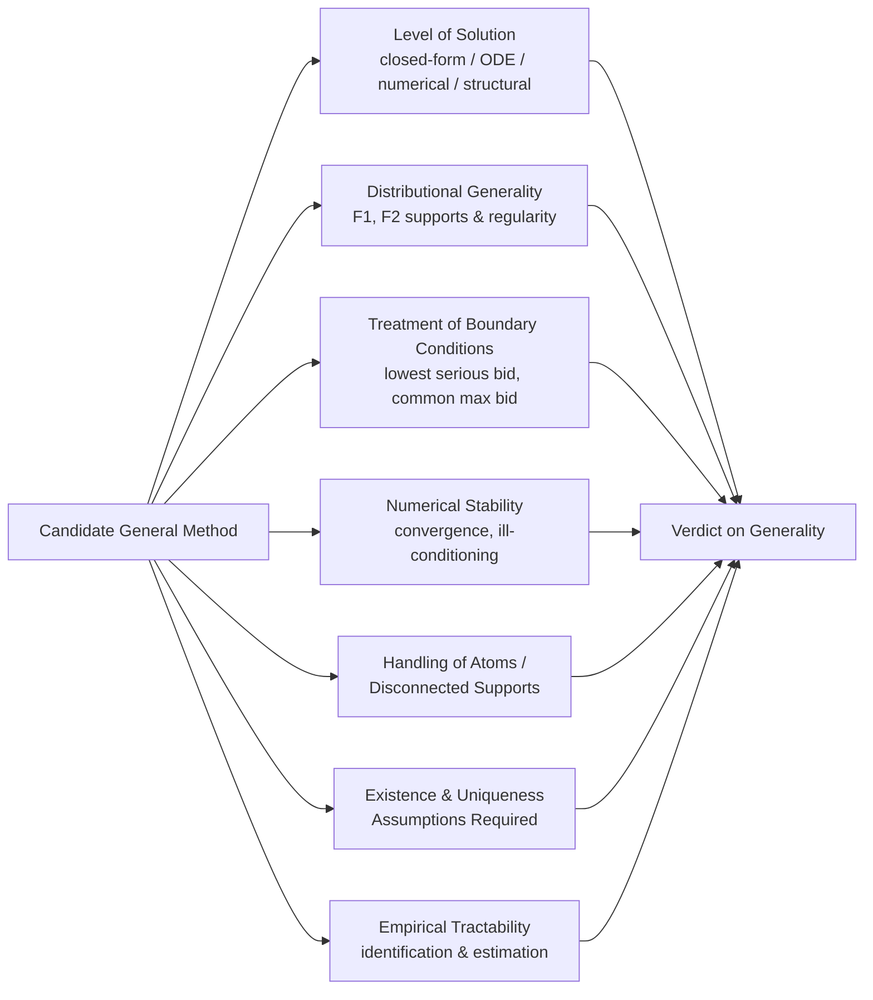
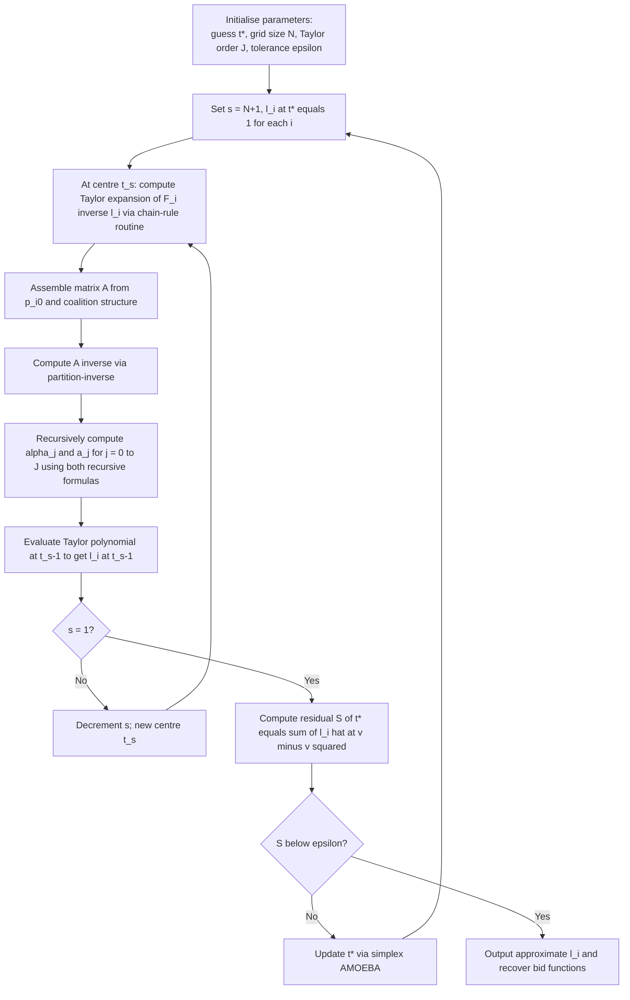
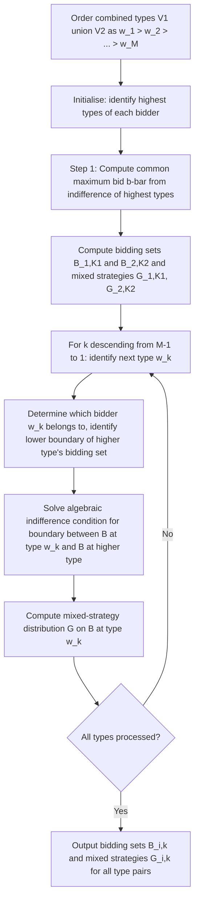
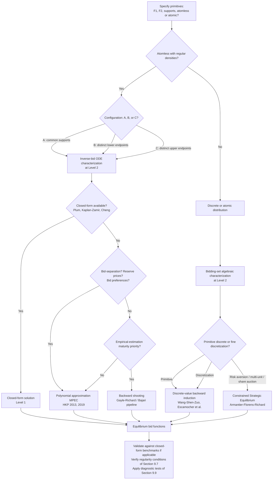

# General Methods for Solving First-Price Sealed-Bid Auctions with Two Asymmetric Bidders: A Comprehensive Review and Synthesis
# 1 Problem Formulation and Theoretical Background

The first-price sealed-bid auction (FPSBA) with two ex-ante asymmetric bidders is one of the oldest yet most stubbornly resistant problems in auction theory. Although the format itself is operationally trivial—each bidder submits a single sealed bid, the highest bid wins, and the winner pays what she bid—the strategic analysis becomes mathematically intricate the moment one drops the assumption that the two bidders draw their private valuations from the *same* distribution. Whereas the symmetric independent-private-values (IPV) benchmark admits a clean closed-form bid function and the celebrated revenue-equivalence theorem ties first-price revenues neatly to those of the Vickrey auction[^1], the asymmetric counterpart admits, in general, neither a closed-form solution nor a single canonical algorithm. Before the report can evaluate whether a *general method* of solution exists, it must first specify with precision what the auction is, what 'solving' it means, why asymmetry destroys the tools that work in the symmetric case, and which mathematical obstacles any candidate general method will have to confront. This chapter lays that foundation.

## 1.1 The Asymmetric Two-Bidder First-Price Auction Model

Consider a single indivisible object offered for sale through a sealed-bid first-price auction. There are two risk-neutral bidders, indexed by $i \in N = \{1,2\}$. Each bidder $i$ privately observes a valuation $v_i$ drawn from a distribution with cumulative distribution function $F_i$ supported on an interval $[\underline{v}_i, \overline{v}_i] \subset \mathbb{R}_+$, with $0 \leq \underline{v}_i < \overline{v}_i < \infty$. Throughout the report we maintain the following baseline assumptions, which together define the *asymmetric IPV environment*:

1. **Independence.** The two valuations $v_1$ and $v_2$ are stochastically independent.
2. **Private values.** Each $v_i$ enters only bidder $i$'s payoff; there is no informational interdependence as in common-value or affiliated-values models.
3. **Asymmetry of distributions.** The pair $(F_1, F_2)$ is not assumed to be identical: $F_1 \neq F_2$, and/or the supports $[\underline{v}_1,\overline{v}_1]$ and $[\underline{v}_2,\overline{v}_2]$ may differ.
4. **Common knowledge of the environment.** The pair $(F_1, F_2)$, the auction rules, and the number of bidders are common knowledge among the players, in line with the standard Bayes–Nash construction[^2].
5. **Risk neutrality.** Each bidder maximises expected monetary payoff.

The action space for each bidder is $\mathbb{R}_+$, the set of non-negative bids. A pure strategy is a measurable function $\beta_i : [\underline{v}_i, \overline{v}_i] \to \mathbb{R}_+$ mapping valuations into bids. Given a profile $b = (b_1, b_2)$ of bids and a profile $v = (v_1, v_2)$ of valuations, the *first-price allocation and payment rule* prescribes:

$$
u_i(v, b) =
\begin{cases}
v_i - b_i, & \text{if } b_i > b_{-i}, \\
\tfrac{1}{2}(v_i - b_i), & \text{if } b_i = b_{-i}, \\
0, & \text{if } b_i < b_{-i}.
\end{cases}
$$

The middle line implements uniform random tie-breaking, the conventional choice that follows the textbook formulation also adopted in the moment-equilibrium literature[^2]. When valuation distributions are atomless—the case to which most of the report will be devoted—ties occur with probability zero in equilibrium, and the choice of tie-breaking rule is largely immaterial. When the distributions admit atoms, however, ties can occur on a positive-measure event and the tie-breaking convention becomes part of the model's primitives, an issue we revisit in Section 1.4.

It is essential to fix what 'asymmetry' means here. Following the standard usage in the literature, the term refers to **distributional asymmetry**: the two bidders are statistically distinguishable in their value-generating processes, but they are otherwise identical in their information structure (both observe a single private real-valued signal), in their preferences (both are risk-neutral expected-utility maximisers), and in their action sets (both submit a single non-negative bid). Asymmetry in this sense is not the same as informational asymmetry (e.g., one bidder being better informed than the other), nor is it strategic asymmetry (e.g., one bidder moving first), nor is it asymmetry of objects or quantities (multi-unit demand). Several distinct streams of work that lie outside the scope of this report should therefore be explicitly demarcated:

| Setting | Defining feature | Relation to this report |
|---|---|---|
| Symmetric IPV FPSBA | $F_1 = F_2$ | Benchmark (Section 1.3) |
| Asymmetric IPV FPSBA, $n=2$ | $F_1 \neq F_2$, two bidders | **Subject of this report** |
| Asymmetric IPV FPSBA, $n \geq 3$ | $F_1 \neq F_2 \neq \cdots$ | Discussed only insofar as it informs $n=2$ |
| Common-value / affiliated-values | Signals correlated with a common $v$ | Out of scope |
| Multi-unit / combinatorial | Bidders demand multiple objects | Out of scope |
| Robust / non-Bayesian | Drop common-knowledge of $F_i$ | Discussed in Section 10 only |

By restricting attention throughout to the two-bidder asymmetric IPV case, the report obtains a setting that is rich enough to exhibit all the analytical pathologies of asymmetry but simple enough to allow a focused inventory of solution techniques.

## 1.2 Bayesian Nash Equilibrium and the Meaning of "Solving" the Auction

The asymmetric FPSBA is a Bayesian game in the sense of Harsanyi: each player has a privately observed type $v_i$, players hold common-prior beliefs about the joint distribution of types, and strategies are type-contingent action plans[^1]. The equilibrium concept of interest is the **Bayesian Nash equilibrium (BNE)**: a profile $(\beta_1^*, \beta_2^*)$ of measurable bid functions such that, for every $i \in \{1,2\}$ and almost every $v_i \in [\underline{v}_i, \overline{v}_i]$,

$$
\beta_i^*(v_i) \in \arg\max_{b_i \in \mathbb{R}_+} \; (v_i - b_i) \cdot \Pr\!\left( \beta_{-i}^*(v_{-i}) < b_i \right) + \tfrac{1}{2}(v_i - b_i) \cdot \Pr\!\left( \beta_{-i}^*(v_{-i}) = b_i \right).
$$

In the atomless case, the tie probability vanishes and the expression collapses to $(v_i - b_i) \cdot G_{-i}(b_i)$, where $G_{-i}$ denotes the bid distribution induced by the opponent's equilibrium strategy. As Salcedo's exposition makes explicit, in the symmetric IPV case with $F$ uniform on $[0,1]$ and two bidders, the linear ansatz $\beta(v)=v/2$ verifies these mutual best-response conditions and constitutes a BNE[^1]. Asymmetry breaks the symmetry of this fixed-point problem; the resulting object is a *coupled* system of best-response conditions, one for each bidder, on functions defined over *different* domains.

Although the BNE concept is unambiguously defined, the phrase "to solve the auction" admits at least four distinct interpretations, and confusing them has been a recurrent source of confusion in the literature. The report will use the following taxonomy to evaluate every candidate general method introduced in subsequent chapters:

1. **Closed-form analytical solution.** A pair of bid functions $\beta_1^*, \beta_2^*$ expressible in elementary functions (or standard special functions) of the primitives $F_1, F_2$. Such solutions exist only for narrowly restricted families of distributions, e.g., shifted/scaled uniforms or certain power distributions on a common support, as catalogued in Chapter 4.

2. **Implicit equilibrium characterization.** A system of functional, differential, or integral equations whose unique solution—under appropriate boundary conditions—is the equilibrium bid functions. The Lebrun–Maskin–Riley ODE system in inverse bid functions is the canonical example. This level of solution provides existence, uniqueness, and qualitative comparative statics, but does not in itself yield numerical values.

3. **Numerical/computational approximation.** An algorithm that, given digital encodings of $F_1$ and $F_2$, returns approximations $\widehat{\beta}_1, \widehat{\beta}_2$ of the equilibrium bid functions to a specified tolerance. Backward-shooting (Marshall–Meurer–Richard–Stromquist, Bajari, Li–Riley, Gayle–Richard), forward-shooting (Fibich–Gavish), polynomial approximation, and constrained-strategic-equilibrium methods are all of this type.

4. **Structural/empirical recovery of primitives.** An identification and estimation procedure that, given a sample of observed bids, recovers the latent value distributions $F_1, F_2$ on the assumption that the data was generated by the corresponding equilibrium. Guerre–Perrigne–Vuong (GPV) is the canonical such procedure for the BNE, and Kasberger's recent moment-equilibrium estimator illustrates that analogous identification results can be developed for non-Bayesian equilibrium concepts as well[^2].

These four senses are not equivalent, and a method that is "general" in one sense need not be general in another. As the persistent reasoning standard P-4 makes explicit, conclusions about generality must always be tied to the relevant level. The report's central question—whether a general method exists for the two-bidder asymmetric FPSBA—will accordingly receive separate answers at each level in the synthesis chapter.

## 1.3 Why Asymmetry Breaks the Symmetric Benchmark

Two well-known benchmarks help to expose the analytical damage that asymmetry inflicts. The first is the **symmetric IPV FPSBA**. When $F_1 = F_2 = F$ with density $f$ supported on $[\underline{v},\overline{v}]$, a standard envelope-theorem derivation, of which Salcedo's textbook treatment for the uniform case is a special instance[^1], yields a unique symmetric strictly increasing bid function

$$
\beta^*(v) = v - \frac{1}{F(v)} \int_{\underline{v}}^{v} F(s) \, ds, \quad v \in [\underline{v}, \overline{v}],
$$

which in the uniform-on-$[0,1]$ two-bidder case reduces to $\beta^*(v) = v/2$ and yields expected revenue $1/3$[^1]. Three properties make this benchmark tractable:

- **Single ODE.** The first-order condition collapses to a single ordinary differential equation in one unknown function (the common bid function), which can be integrated once.
- **Allocative efficiency.** Because $\beta^*$ is strictly increasing and identical across bidders, the bidder with the higher valuation always submits the higher bid and wins; the auction allocates efficiently.
- **Revenue equivalence.** The first-price and second-price auctions implement the same allocation rule (object goes to the highest valuation) and tie down the same expected payment of the lowest type, so by the revenue-equivalence theorem they generate identical expected revenue ($1/3$ for two bidders, $(N-1)/(N+1)$ for $N$ bidders)[^1].

The second benchmark is the **second-price (Vickrey) auction**, which remains tractable even under asymmetry. As Salcedo emphasises, in the second-price auction it is weakly dominant for each bidder to bid her valuation, $\beta_i(v_i) = v_i$, regardless of the opponent's distribution: bidding above one's value risks winning at a loss, while bidding below leaves the payment unchanged conditional on winning[^1]. Asymmetry is essentially invisible in this format: equilibrium strategies do not depend on $F_1, F_2$, allocation is efficient, and analysis is trivial.

Asymmetry in the first-price auction destroys all three favourable properties of the symmetric benchmark simultaneously:

1. **The bid functions diverge.** Because the two bidders face different beliefs about their opponent's bid distribution, they shade their bids differently. There is no longer a single "bid function" but a *pair* $(\beta_1^*, \beta_2^*)$ of distinct functions defined, in general, over different supports.

2. **Allocative efficiency fails.** The bidder with the higher valuation need not place the higher bid. A "weak" bidder facing a "strong" opponent typically bids more aggressively (i.e., shades less) for any given valuation than the strong bidder does, so a strong bidder with $v_1$ slightly above the weak bidder's $v_2$ may nevertheless lose the auction. This is the textbook source of inefficiency in asymmetric first-price auctions.

3. **Revenue equivalence no longer applies.** Once the allocation rules of the first-price and second-price auctions diverge—as they do under asymmetry—the revenue-equivalence theorem, which presupposes identical allocations, cannot be invoked[^1]. The two formats generate, in general, different expected revenues, and ranking them becomes a non-trivial empirical and theoretical question.

These departures are not technicalities; they are the substantive reason why a dedicated body of theory and computation has grown around the asymmetric FPSBA. Any candidate "general method" must therefore be designed from the ground up to accommodate distinct bid functions, possibly different supports, and the absence of allocative-efficiency shortcuts.

## 1.4 Core Mathematical Obstacles in the Asymmetric Setting

The analytical pathologies of asymmetry can be organised into five interrelated obstacles. Each obstacle is a structural feature of the problem that any general solution method must, explicitly or implicitly, address.

**(i) A coupled system of nonlinear ODEs in inverse bid functions.** When equilibrium bid functions $\beta_i^*$ are strictly increasing and continuously differentiable on their supports, one can pass to the inverse functions $\phi_i = (\beta_i^*)^{-1}$, which map a bid $b$ to the valuation that submits $b$ in equilibrium. Differentiating the first-order conditions yields a *coupled system* of two first-order nonlinear ordinary differential equations, schematically

$$
\phi_i'(b) = \frac{F_{-i}(\phi_{-i}(b))}{f_{-i}(\phi_{-i}(b)) \cdot (\phi_i(b) - b)}, \quad i = 1, 2,
$$

over a common bid interval $[\underline{b},\overline{b}]$. Unlike the single ODE of the symmetric case, this coupled system generally lacks a closed-form solution; even for very simple distributions (e.g., uniforms on different supports), the analytical resolution is delicate and is available only in special cases (Chapter 4).

**(ii) Two-point boundary conditions, including a common maximum bid.** The system in (i) is not an initial-value problem: it must satisfy boundary conditions at both ends of the bid support. At the lower end, $\phi_i(\underline{b}) = \max\{\underline{v}_1, \underline{v}_2\}$ (or its appropriate generalisation) for the binding bidder and a related condition for the other; at the upper end, the equilibrium imposes a *common maximum bid* $\overline{b}$ at which both inverse bid functions reach their respective upper support points $\overline{v}_i$. The location of $\overline{b}$ is itself an unknown to be determined as part of the solution. Two-point boundary-value problems are notoriously harder to solve numerically than initial-value problems; this single feature drives much of the algorithmic complexity in Chapters 5–7.

**(iii) Monotonicity, continuity, and differentiability requirements.** A pure-strategy separating BNE requires each $\beta_i^*$ to be strictly increasing (otherwise the same bid is submitted by a positive-measure set of types, generating ties that are inconsistent with optimality on either side). Continuity and differentiability are typically *consequences* of equilibrium under regularity assumptions on the distributions, but they must be verified case by case, particularly when distributions are concentrated near boundaries or have high curvature. As a useful contrast, Kasberger's moment-equilibrium concept also enforces monotonicity—he proves that the equilibrium minimax-loss bidding function is "strictly increasing in the bidder's private value"[^2]—but his proof exploits the much simpler structure of moment beliefs and does not transfer to the BNE case.

**(iv) Tie-breaking, atoms, and disconnected supports.** Atomless distributions with overlapping connected supports are the analytically friendliest configuration; atoms or disconnected supports introduce serious complications. As Kasberger observes in the moment-equilibrium context, "a pure moment equilibrium exists for all value distributions whereas there is no guarantee that a pure Bayes–Nash equilibrium exists if the value distribution has mass points"[^2]. Bayes–Nash analysis with atoms typically forces mixed strategies in some neighbourhood of each atom, transforming the analytical object from a pair of deterministic functions into a pair of probability kernels—an outcome that most "general methods" in the literature explicitly assume away. Disconnected supports give rise to non-serious bidding regions, in which one bidder bids zero (or some reservation level) on a positive-measure subset of her types, again destroying the clean ODE characterisation. These difficulties are central to the assessment of generality in Chapters 7 and 9.

**(v) Existence and uniqueness of pure-strategy separating equilibria.** Even setting aside atoms, the existence and uniqueness of a pure-strategy separating BNE is non-trivial in the asymmetric case. Existence has been established under increasing levels of generality by Lebrun (1996), Maskin–Riley (2000), and Athey (2001), each invoking different regularity assumptions (e.g., log-concavity, single-crossing). Uniqueness is more delicate still and typically requires additional structure, such as log-concavity of distributions at the highest lower extremity or stochastic dominance conditions; without such structure, multiple equilibria may coexist. As the persistent standard P-1 emphasises, every claim about a "general method" must be qualified by the regularity conditions under which existence and uniqueness are guaranteed; these conditions are taken up systematically in Chapter 3.

A useful conceptual contrast comes from the recent literature on alternative equilibrium concepts. Kasberger's aggregate-moment-equilibrium framework demonstrates that *some* of these obstacles can be sidestepped by weakening the informational primitives: by replacing the assumption that bidders know the entire opponent bid distribution with the weaker assumption that they know only its mean and range, one obtains a "minimax-loss bidding function" available in closed form for $n=2$, and an existence theorem that holds for *all* value distributions, including those with atoms[^2]. This is, however, *a different equilibrium concept*, not a method for solving the standard BNE. The contrast nevertheless illustrates how much of the difficulty of the asymmetric BNE problem is driven by the strong common-knowledge information structure rather than by the auction format itself.

## 1.5 Analytical Framework for Evaluating General Solution Methods

The preceding sections motivate a unified evaluation framework that subsequent chapters will apply, method by method, to the candidate "general methods" for the two-bidder asymmetric FPSBA. The framework rests on a small set of dimensions, each tied directly to one or more of the obstacles identified in Section 1.4 and the levels-of-generality taxonomy of Section 1.2.

The seven dimensions in the diagram operationalise the persistent reasoning standards P-1, P-3, and P-4 of the report:

1. **Level of solution.** At which of the four levels of Section 1.2 does the method operate, and is its claim of generality made at that level only or across multiple levels?

2. **Distributional generality.** What classes of $(F_1, F_2)$ does the method accommodate? Restrictions to common supports, atomless densities, log-concavity, or specific functional families dramatically narrow generality and must be explicitly catalogued.

3. **Treatment of boundary conditions.** How does the method determine the lowest serious bid and, especially, the common upper bound $\overline{b}$? Methods that finesse the common-maximum-bid condition (e.g., backward-shooting, which guesses it; forward-shooting, which integrates from the bottom) differ fundamentally in their numerical behaviour.

4. **Numerical stability and computational complexity.** Does the algorithm converge robustly, or is it sensitive to initial conditions? Are there documented failure modes near boundary singularities? What is the dependence of running time on the desired accuracy and on the parameters of the distributions?

5. **Handling of atoms, mass points, and disconnected supports.** Does the method break down when distributions have point masses or non-overlapping supports, or does it accommodate such cases—possibly via discretisation or via a different representation of strategies?

6. **Existence and uniqueness assumptions.** Under what assumptions is the method guaranteed to recover *the* equilibrium rather than *an* equilibrium, and how do those assumptions compare to the most general known existence/uniqueness results?

7. **Empirical tractability.** Can the method serve as the equilibrium component of a structural estimation procedure that recovers $(F_1, F_2)$ from observed bids, in the spirit of GPV but adapted to asymmetry?

Together, the five sections of this chapter establish the formal model, the meaning of equilibrium and of solving, the reason asymmetry destroys the symmetric benchmark, the technical obstacles that any solver must confront, and the comparative criteria by which candidates will be judged. Subsequent chapters proceed in increasing order of computational concreteness: Chapter 2 examines the implicit ODE characterisation; Chapter 3 turns to existence and uniqueness; Chapter 4 catalogues the closed-form solutions for special distributional families; Chapters 5–7 evaluate three families of numerical algorithms; Chapter 8 conducts a head-to-head comparative evaluation; Chapter 9 synthesises the answer to the central question; and Chapter 10 surveys applications and open directions. At each step, the dimensions outlined above will provide the consistent analytical lens through which the question of a *general* method can be coherently posed and answered.

[^1]: https://www.google.com/url?q=https://example.com/salcedo (referenced as Salcedo, "Topics in Informational Economics 2: Games with Private Information and Selling Mechanisms", Penn State, Econ 402, Summer 2012)
[^2]: Kasberger, B. (2022), "An Equilibrium Model of the First-Price Auction with Strategic Uncertainty: Theory and Empirics," working paper, March 28, 2022.

# 2 Equilibrium Characterization via the System of Differential Equations

Having established in Chapter 1 the formal model, the four senses in which one may speak of "solving" an auction, and the seven-dimensional evaluation framework that the report will apply to every candidate general method, the natural next step is to study the implicit characterisation of equilibrium that lies at the heart of essentially every approach to the asymmetric two-bidder first-price auction. This is the canonical system of coupled ordinary differential equations on inverse bid functions developed in the work of Lebrun and of Maskin and Riley. Almost every existence proof, every uniqueness theorem, every closed-form derivation, and every numerical algorithm that this report will subsequently examine—backward shooting, forward shooting, polynomial approximation, Taylor expansion, constrained strategic equilibrium, and the discrete-value algorithms of recent years—either operates directly on this ODE system or constructs an analogue of it. Before evaluating those concrete methods, it is therefore essential to understand the system itself: how it is derived from first-order conditions, what boundary conditions accompany it, why the two-bidder case is structurally simpler than the general $n$-bidder case, what regularity conditions on $(F_1, F_2)$ make the characterisation valid, what qualitative features of equilibrium it presupposes, and—the central question of the chapter—whether, taken on its own, it qualifies as a *general method* in the sense established in Section 1.2.

## 2.1 Derivation of the Inverse-Bid ODE System from First-Order Conditions

Consider the asymmetric two-bidder model of Section 1.1 under atomless distributions. Suppose, for the moment, that a pure-strategy Bayesian Nash equilibrium $(\beta_1^*, \beta_2^*)$ exists in which each $\beta_i^*$ is strictly increasing and continuously differentiable on its valuation support; this presumption will be justified in Section 2.5 and Chapter 3. Because $\beta_{-i}^*$ is strictly increasing, the probability that bidder $i$ wins by submitting a bid $b$ against an opponent with valuation distribution $F_{-i}$ is

$$
\Pr\big(\beta_{-i}^*(v_{-i}) < b\big) \;=\; F_{-i}\!\big(\phi_{-i}(b)\big),
$$

where $\phi_{-i}(b) = (\beta_{-i}^*)^{-1}(b)$ is the opponent's *inverse bid function*: the valuation $v_{-i}$ such that $\beta_{-i}^*(v_{-i}) = b$. Under atomlessness the tie event has probability zero, so bidder $i$'s interim expected payoff from a bid $b$ given valuation $v_i$ is

$$
\Pi_i(b \mid v_i) \;=\; (v_i - b) \cdot F_{-i}\!\big(\phi_{-i}(b)\big).
$$

Equilibrium requires $b = \beta_i^*(v_i)$ to maximise $\Pi_i(\cdot \mid v_i)$. Differentiating with respect to $b$ and setting the derivative to zero yields the first-order condition

$$
- F_{-i}\!\big(\phi_{-i}(b)\big) \;+\; (v_i - b)\, f_{-i}\!\big(\phi_{-i}(b)\big)\, \phi_{-i}'(b) \;=\; 0,
$$

valid at $b = \beta_i^*(v_i)$. Because $v_i = \phi_i(b)$ at this bid, the condition can be rewritten purely in terms of inverse bid functions,

$$
\big(\phi_i(b) - b\big)\, f_{-i}\!\big(\phi_{-i}(b)\big)\, \phi_{-i}'(b) \;=\; F_{-i}\!\big(\phi_{-i}(b)\big),
$$

and, solving for $\phi_{-i}'(b)$, one obtains by symmetry the **canonical Lebrun–Maskin–Riley ODE system** for the two-bidder asymmetric first-price auction:

$$
\boxed{\;\phi_i'(b) \;=\; \frac{F_{-i}\!\big(\phi_{-i}(b)\big)}{f_{-i}\!\big(\phi_{-i}(b)\big)\,\big(\phi_i(b) - b\big)}, \qquad i = 1, 2,\;}
$$

defined on a common bid interval $[\underline{b}, \overline{b}]$ to be characterised below.

This passage from $\beta_i^*$ to $\phi_i$ is more than a notational convenience; it is structurally essential. The original bid functions $\beta_1^*, \beta_2^*$ are defined on heterogeneous valuation supports $[\underline{v}_1, \overline{v}_1]$ and $[\underline{v}_2, \overline{v}_2]$, which in the asymmetric setting need not coincide. As a result, a coupled system in $(\beta_1^*, \beta_2^*)$ would require two unknown functions defined on two different domains, an awkward object both analytically and numerically. The inverse functions $\phi_1, \phi_2$, by contrast, are both defined on the *same* bid interval $[\underline{b}, \overline{b}]$, since by construction every serious bid submitted in equilibrium by either bidder lies in this common range. Working with inverses therefore aligns the two unknowns on a common independent variable, which is what permits the system to be written compactly as above and to be tackled by standard ODE techniques.

Three structural features of the ODE system deserve immediate emphasis, because they will recur throughout subsequent chapters. First, the system is **nonlinear**: the right-hand side depends on $\phi_i$ and $\phi_{-i}$ through the product $F_{-i}(\phi_{-i})$ and the term $\phi_i - b$, neither of which is linear in the unknowns. Second, the system is **coupled**: the derivative of $\phi_i$ depends on the value of the *opponent's* inverse bid function $\phi_{-i}$, so the two equations cannot be solved separately. Third, the right-hand side becomes **singular** wherever $\phi_i(b) \to b$. Such a coincidence happens at the bottom of the bid support whenever the lower endpoints of the value distributions coincide (since then $\phi_i(\underline{b}) = \underline{v}_i = \underline{b}$), and the singularity is precisely what makes the boundary at $\underline{b}$ delicate and what drives the numerical instability documented for backward-shooting algorithms in Chapter 5.

## 2.2 Boundary Conditions: Lowest Serious Bid and Common Maximum Bid

The ODE system of Section 2.1 is not an initial-value problem. It is a **two-point boundary-value problem (BVP)**, with conditions imposed at both endpoints of the bid interval $[\underline{b}, \overline{b}]$, and one of those endpoints—the upper one—is itself an *unknown* of the problem to be determined jointly with the unknown functions. This structure is the source of much of the algorithmic difficulty in Chapters 5–7 and must be specified carefully.

**The lowest serious bid.** Following the terminology of Reny and Zamir (2004), a bid is *serious* if it has positive probability of winning the auction; bids that are bound to lose (the unmodelled "do not participate" action, or any bid below $\underline{v}_{-i}$ that cannot defeat the opponent's lowest type) are *non-serious*.[^3] In the atomless asymmetric two-bidder case, the lowest serious bid $\underline{b}$ is determined by the lower endpoints of the value supports through the following dichotomy:

- **Common lower endpoints**, $\underline{v}_1 = \underline{v}_2 \equiv \underline{v}$. Here both bidders' lowest valuations submit the same lowest serious bid, namely $\underline{b} = \underline{v}$, since a bidder of type $\underline{v}$ would face zero margin from any bid above $\underline{v}$ and could win only at the boundary against an opponent of equally low type. The boundary condition is thus $\phi_1(\underline{b}) = \phi_2(\underline{b}) = \underline{v}$. Note that this means $\phi_i(\underline{b}) - \underline{b} = 0$, so the right-hand side of the ODE is singular at the lower boundary even in this benign configuration.

- **Different lower endpoints**, say $\underline{v}_1 < \underline{v}_2$. Here the bidder with the *higher* lower endpoint imposes the binding constraint, while the other bidder bids non-seriously over a range of low valuations. Specifically, $\underline{b} = \underline{v}_2$, the boundary value $\phi_2(\underline{b}) = \underline{v}_2$ is determined by bidder 2's lowest type, and bidder 1 submits a serious bid $\beta_1^*(v_1) = \underline{b}$ for every $v_1 \in [\underline{v}_1, \underline{v}_2]$ that is content to lose against any opponent type—or, more precisely, bids in a way that makes participation at the lowest serious bid weakly optimal. This pooling/non-serious-bidding region is one of the principal complications introduced by asymmetry in support endpoints and will reappear when Chapter 7 discusses discrete-value methods that handle disconnected serious-bid regions natively.

**The common maximum bid.** At the top of the bid support, the equilibrium imposes a single **common maximum bid** $\overline{b}$ at which both inverse bid functions reach their respective upper support endpoints:

$$
\phi_1(\overline{b}) \;=\; \overline{v}_1, \qquad \phi_2(\overline{b}) \;=\; \overline{v}_2.
$$

The economic intuition is straightforward: if bidder $i$'s highest type $\overline{v}_i$ submitted a bid strictly below the bid submitted by the opponent's highest type $\overline{v}_{-i}$, then bidder $i$ would lose with positive probability against high realisations of the opponent and could profitably deviate by raising her bid (gaining the auction with positive incremental probability at virtually no cost in margin). Conversely, if she submitted a bid strictly above the opponent's highest, she would win with certainty but at an inflated price relative to a lower bid that still wins with certainty. Both inequalities being strict cannot be optimal, so in equilibrium the two highest types submit a *single common bid* $\overline{b}$.

Crucially, $\overline{b}$ is **endogenous**: it is not given by the primitives $(F_1, F_2)$ in any explicit form but must be determined as part of the solution. This is the feature that makes the BVP fundamentally harder than an initial-value problem. In an IVP, one specifies all unknown values at a single point and integrates; in this BVP, the upper-boundary location $\overline{b}$, the upper-boundary values $\overline{v}_1, \overline{v}_2$, and the lower-boundary location $\underline{b}$ together impose four scalar conditions on a system that has only two scalar degrees of freedom (one constant of integration per equation), but the algebraic identification of $\overline{b}$ is nontrivial because the two equations are coupled.

The algorithmic implications are previewed here and developed in Chapters 5–7. Backward-shooting algorithms (Chapter 5) finesse the difficulty by *guessing* $\overline{b}$, integrating the ODE system from $\overline{b}$ down towards $\underline{b}$, and adjusting the guess until the lower boundary condition is matched—a procedure that inherits the well-known sensitivity of shooting methods to terminal-condition errors. Forward-shooting methods (Chapter 6) integrate from $\underline{b}$ upward but must contend with the lower-boundary singularity. Polynomial approximation methods bypass shooting entirely by parametrising $\phi_i$ in a finite-dimensional family and matching boundary conditions and ODE residuals jointly. Each of these strategies is, fundamentally, an answer to the same question: how to handle the two-point BVP induced by the equilibrium ODE system.

## 2.3 Simplification in the Two-Bidder Case Relative to the General n-Bidder System

The asymmetric first-price auction with $n \geq 2$ bidders admits an analogous ODE characterisation, but the structure simplifies sharply when $n = 2$. In the general $n$-bidder case the first-order condition for bidder $i$ involves the probability of winning against *all* opponents, namely

$$
\prod_{j \neq i} F_j\!\big(\phi_j(b)\big),
$$

and the derived ODE system contains $n$ coupled equations in $n$ unknown inverse bid functions $\phi_1, \ldots, \phi_n$, with right-hand sides depending logarithmically on this product:

$$
\frac{d}{db} \log \prod_{j \neq i} F_j(\phi_j(b)) \;=\; \frac{1}{\phi_i(b) - b}.
$$

When $n = 2$, the product collapses to a single factor $F_{-i}(\phi_{-i}(b))$, and the system reduces to the two coupled ODEs of Section 2.1. This collapse is not merely cosmetic; it has substantive analytical consequences that shape the entire solution-method landscape for two bidders.

First, **monotonicity arguments are cleaner**. Reny and Zamir (2004) develop their existence theorem for monotone pure-strategy equilibria in asymmetric first-price auctions by extending Athey's (2001) single-crossing-based approach, and they emphasise repeatedly that the standard single-crossing condition (SCC) "can fail only when ties occur at winning bids or when bids are individually irrational" and that it may fail when there are three or more asymmetric bidders even in the affiliated-signal setting.[^3] In their words, "standard proof techniques rely on the following single-crossing condition (SCC) … However, even when bidders' signals are affiliated, SCC can fail … unless there is but a single other bidder (as in the two-bidder case), or all signals are symmetric and bidders employ the same bidding function (as in the symmetric case), or signals are independent, or values are either purely private or purely common".[^3] In the two-bidder asymmetric IPV setting, which is this report's focus, the single-opponent structure suffices to deliver SCC even without their further refinements (which become necessary only with three or more affiliated bidders). This is the technical sense in which "single-crossing-based existence arguments work most cleanly when there is only a single opponent."

Second, **comparative statics between strong and weak bidders are transparent**. The two-bidder ODE system involves a single asymmetry to track, namely between $F_1$ and $F_2$, and one can read off qualitative properties—who shades more, who wins more often conditional on a given valuation gap—directly from the coupled equations and stochastic-dominance comparisons of $F_1$ and $F_2$. With three or more bidders, comparative statics depend not only on pairwise stochastic-dominance relationships but also on the entire profile of opponents' distributions through the product term, and even the sign of comparative-statics responses can become ambiguous.

Third, **closed-form solutions are most likely to exist with $n = 2$**. As Chapter 4 will detail, the small handful of distributional families for which the asymmetric first-price auction is analytically solvable—Plum's power distributions on a common support, Kaplan–Zamir's uniforms on different supports, Griesmer–Levitan–Shubik's early examples, Cheng's results—almost all assume two bidders. The reason is that with $n = 2$ the system of two ODEs in two unknowns admits, in special cases, a manageable algebraic structure, whereas with $n \geq 3$ even very symmetric-looking configurations fail to yield closed forms.

Fourth, and relatedly, **uniqueness results are sharpest with $n = 2$**. The seminal uniqueness theorems—Maskin and Riley's results on sealed high-bid auctions and Lebrun's various uniqueness papers—deliver their cleanest conclusions in the two-bidder case. Reny and Zamir explicitly note that "for conditions ensuring uniqueness in two-bidder settings, see Lizzeri and Persico (2000), Maskin and Riley (1996) and Rodriguez (2000). Under more restrictive conditions, Maskin and Riley (1996) obtain some uniqueness results for more than two bidders".[^3] Chapter 3 takes up these results systematically; for the present chapter the key point is that the simpler ODE system with $n = 2$ is precisely the object on which the strongest uniqueness theorems operate.

The following summary table contrasts the two- and $n$-bidder cases on the dimensions just discussed.

| Dimension | Two-bidder asymmetric system | General $n$-bidder asymmetric system |
|---|---|---|
| Number of coupled ODEs | 2 | $n$ |
| Probability-of-winning factor | Single $F_{-i}(\phi_{-i})$ | Product $\prod_{j\neq i} F_j(\phi_j)$ over $n-1$ terms |
| Single-crossing for existence | Holds under standard regularity[^3] | Can fail with affiliation/interdependence[^3] |
| Closed-form availability | Known for several families (Chapter 4) | Essentially never |
| Uniqueness theorems | Sharpest results (Maskin–Riley, Lebrun)[^3] | More restrictive conditions required[^3] |
| Comparative statics | Direct from $F_1$ vs. $F_2$ comparison | Depend on full profile $(F_1,\ldots,F_n)$ |

The take-away is that the two-bidder asymmetric IPV auction, while still hard enough to exclude a fully general closed form, sits at exactly the boundary of analytical tractability: it is the most general case in which the canonical ODE characterisation supports a complete existence-and-uniqueness theory, the most general case in which closed-form solutions are sometimes attainable, and the most general case in which numerical methods can be benchmarked against analytical solutions. This is one reason the two-bidder case is the natural unit of analysis for studying "general methods."

## 2.4 Regularity Assumptions on Value Distributions

The ODE characterisation of Section 2.1 is valid only under regularity assumptions on the pair $(F_1, F_2)$. Different families of methods presume different combinations of these conditions; cataloguing them here will allow Chapters 4–8 to track exactly which assumptions each method needs.

**(i) Atomlessness.** That $F_i$ is atomless—i.e., that it admits a density $f_i$ with respect to Lebesgue measure—is the most fundamental regularity assumption underlying the ODE characterisation. Atomlessness implies that the equilibrium bid distributions $G_i$ induced by the $\beta_i^*$ are likewise atomless, so ties at winning bids occur with probability zero. Reny and Zamir's analysis confirms the dichotomy between atomless and mass-point cases: their existence proof for monotone pure-strategy equilibria relies on the construction of finite bid grids in which "the only common bid for distinct bidders is nonserious" (i.e., the losing bid $l$), precisely so that "ties can only occur at bids of $l$".[^3] More generally, Reny–Zamir document that single-crossing—and hence the standard route to monotone pure-strategy equilibria—"can fail when there are ties at winning bids".[^3] When $F_i$ has mass points, pure-strategy equilibria may fail to exist; mixed strategies, atoms in the bid distribution, and complications in the tie-breaking rule become unavoidable. The recent discrete-value methods reviewed in Chapter 7 effectively work around this by abandoning the ODE altogether.

**(ii) Strict positivity and continuity of densities.** For the right-hand side of the ODE system to be well-defined on the open bid interval $(\underline{b}, \overline{b})$, one typically requires that $f_i(v)$ be strictly positive and continuous on the *interior* of the support. Strict positivity ensures that $f_{-i}(\phi_{-i}(b)) > 0$, so the denominator does not vanish; continuity ensures that the right-hand side is continuous in $b$, which is needed for standard ODE existence theorems (Picard–Lindelöf or analogues) to apply locally. These conditions are imposed routinely in the literature; they exclude pathological distributions with vanishing densities in the interior of the support but allow $f_i$ to vanish at the support endpoints.

**(iii) Log-concavity and monotone hazard rates.** Stronger regularity conditions of the log-concavity / monotone-hazard-rate (MHR) family play a central role in the deeper structural theorems on the ODE system. Log-concavity of $F_i$—or equivalently that the reverse hazard rate $f_i / F_i$ is non-increasing—appears in Maskin and Riley's uniqueness arguments (in particular the "log-concavity at the highest lower extremity" condition that will be examined in Chapter 3) and in establishing the strict monotonicity of the inverse bid functions $\phi_i$ that the inverse-bid formulation presupposes. In the two-bidder case, log-concavity of either $F_1$ or $F_2$ in appropriate neighbourhoods is sufficient for the cleanest uniqueness statements; weaker conditions exist but tend to be more difficult to verify in practice. Chapter 3 will discuss precisely how log-concavity figures in the existence and uniqueness theorems; this section's role is only to flag log-concavity as a prerequisite for the *strongest* form of the ODE characterisation.

**(iv) Common versus different supports.** The configuration of the supports $[\underline{v}_1, \overline{v}_1]$ and $[\underline{v}_2, \overline{v}_2]$ governs the form of the boundary conditions, as discussed in Section 2.2. The simplest case is **common supports**, $\underline{v}_1 = \underline{v}_2$ and $\overline{v}_1 = \overline{v}_2$, in which both inverse bid functions are defined on a common bid range $[\underline{v}, \overline{b}]$ (with $\overline{b} \leq \overline{v}$) and both reach the common upper endpoint $\overline{v}$ at $\overline{b}$. **Different upper endpoints** are handled by the common-maximum-bid condition $\phi_i(\overline{b}) = \overline{v}_i$ even when $\overline{v}_1 \neq \overline{v}_2$, and the location of $\overline{b}$ is adjusted accordingly. **Different lower endpoints** introduce the non-serious-bidding region for the bidder with the lower endpoint, as detailed in Section 2.2; this complicates the analysis but does not destroy the ODE structure on the serious-bidding interval.

**(v) Connectedness of supports.** Connectedness of $[\underline{v}_i, \overline{v}_i]$ is normally a maintained hypothesis. **Disconnected supports**—e.g., when $F_i$ has positive density on $[a_1, b_1] \cup [a_2, b_2]$ with $b_1 < a_2$—generate gaps in the equilibrium bid distribution and can violate the smooth-ODE characterisation, since on the gap there is no continuous strictly increasing extension of $\beta_i^*$. The multi-dimensional-signal counterexample of Reny and Zamir, in which "every equilibrium is (up to ex ante probability zero events) pure, nonmonotone" in the sense that bidder 1's bid falls from $3$ to $1$ as one component of his signal rises, illustrates how non-monotonicity associated with non-standard support structures destroys the inversion required to pass from $\beta_i^*$ to $\phi_i$.[^3] Although that example concerns multi-dimensional signals rather than disconnected one-dimensional supports per se, it underscores the same lesson: the inverse-bid ODE characterisation is contingent on monotonicity, which is contingent on a sufficiently regular support structure.

The mapping between the assumptions just catalogued and the obstacles of Section 1.4 is direct: atomlessness is what defuses obstacle (iv) (tie-breaking and atoms); strict positivity and continuity of densities ensure the ODE in obstacle (i) is well-posed; log-concavity is what bridges from existence to uniqueness in obstacle (v); support configuration is what governs the boundary conditions in obstacle (ii); and connectedness combined with strict monotonicity is what enables the inversion underlying obstacle (iii). Each subsequent chapter's "general method" will be evaluated in part by which of these assumptions it relaxes.

## 2.5 Monotonicity, Continuity, and Differentiability of Equilibrium Strategies

The derivation in Section 2.1 took for granted that an equilibrium $(\beta_1^*, \beta_2^*)$ exists with strictly increasing and continuously differentiable bid functions. This presumption is not innocuous, and the ODE characterisation is only as general as the existence theorems that justify it.

**Existence of monotone pure-strategy equilibria.** The principal existence theorem for monotone pure-strategy equilibria in asymmetric first-price auctions is due to Reny and Zamir (2004). Their setting is in fact more general than the two-bidder IPV environment of this report: they consider $N \geq 2$ bidders with affiliated one-dimensional signals and interdependent values. Their main result (Theorem 2.1) establishes that "all first-price auction games satisfying assumptions A.1 and A.2 possess a monotone pure-strategy equilibrium", where A.1 imposes measurability, continuity in own bids, eventual negativity of utility for very large bids, and the appropriate monotonicity-in-signals conditions, while A.2 imposes a strictly positive joint density and the affiliation inequality.[^3] In the two-bidder IPV special case of interest here, affiliation reduces to independence, interdependent values reduce to private values, and the assumptions are satisfied trivially under standard atomlessness and density conditions; Reny–Zamir's theorem therefore provides existence of a monotone pure-strategy equilibrium for the entire class of asymmetric two-bidder IPV problems considered in this report.

The technical heart of the Reny–Zamir argument is the introduction of an **individually rational tieless single-crossing condition (IRT-SCC)**, a refinement of Athey's (2001) standard single-crossing condition that is robust to the two ways in which Athey's SCC can fail. As Reny and Zamir characterise it: "SCC can fail in two ways. First, SCC can fail when there are ties at winning bids and this is why we must approximate the bidders' bid sets with finite sets whose only common bid is the losing bid, $l$. Second, SCC can fail if a bidder employs an individually irrational bid, that is, a bid yielding a negative expected payoff against the others' strategies".[^3] IRT-SCC requires only that single-crossing hold "so long as neither bid ties for the winning bid with positive probability" and one of the relevant bids is individually rational, and Reny–Zamir's Proposition 2.3 establishes that this condition holds under their regularity assumptions.[^3] Athey's finite-action proof techniques can then be adapted to deliver a monotone pure-strategy equilibrium on finite bid grids, and a limit argument extends the conclusion to the unrestricted bid sets.

**Outcome-equivalence of mixed and monotone pure equilibria.** McAdams (2007) extends and complements Reny–Zamir's result by showing that, in first-price auctions with asymmetric bidders, risk aversion, affiliated types, and interdependent values, "every mixed-strategy equilibrium is shown to be outcome-equivalent to a monotone pure-strategy equilibrium under the 'priority rule' for breaking ties," providing "a missing link to establish uniqueness in the 'general symmetric model' of Milgrom and Weber (1982)".[^4] Equally important from the perspective of the ODE characterisation, McAdams shows that "non-monotone equilibria can exist under the 'coin-flip rule' but they are distinguishable: all non-monotone equilibria have positive probability of ties whereas all monotone equilibria have zero probability of ties," thereby providing "a justification for the standard empirical practice of restricting attention to monotone strategies".[^4] In the two-bidder atomless IPV setting on which this report focuses, McAdams's results justify treating the equilibrium as a monotone pure-strategy equilibrium without loss of generality, and hence justify the inversion to $\phi_i$ that underlies the entire ODE machinery.

**The role of monotonicity in the inverse-bid formulation.** Strict monotonicity of $\beta_i^*$ is the *prerequisite* for the inverse-bid formulation to even make sense. If $\beta_i^*$ were constant on an interval of valuations, $\phi_i$ would be undefined (multi-valued) on the corresponding bid; if $\beta_i^*$ were non-increasing on some sub-interval, $\phi_i$ would be set-valued. Reny and Zamir's existence theorem and McAdams's outcome-equivalence theorem are thus not merely supporting results but logical preconditions: without them, the report's central object—the coupled ODE system in $(\phi_1, \phi_2)$—would lack a well-defined referent. This is the substantive content of the framing remark in the introduction to Chapter 1, and it is why subsequent chapters will simply invoke "the equilibrium" when speaking of the unique monotone pure-strategy outcome.

**Continuity and differentiability.** Once monotonicity and atomlessness are established, continuity and differentiability of the inverse bid functions follow from the ODE system itself on the interior of $[\underline{b}, \overline{b}]$. Specifically, the right-hand side of the ODE is continuous (indeed continuously differentiable) in $(\phi_1, \phi_2, b)$ on the open set where $\phi_i(b) > b$ and $\phi_{-i}(b)$ lies in the interior of the support, so standard ODE regularity theorems imply that any solution $(\phi_1, \phi_2)$ to the ODE on $(\underline{b}, \overline{b})$ is automatically $C^1$, and bootstrapping yields higher smoothness if the densities $f_i$ are smoother. Continuity at the boundary points $\underline{b}$ and $\overline{b}$ is a separate matter, since the ODE is singular at $\underline{b}$ when $\phi_i(\underline{b}) = \underline{b}$ and the boundary at $\overline{b}$ is itself endogenous; these issues are the algorithmic substance of Chapters 5 and 6.

**Failures to take note of.** Reny and Zamir document explicitly two settings in which monotone pure-strategy equilibria cannot be assumed. The first is the case of multi-dimensional signals: their Section 5 example shows a private-value asymmetric first-price auction in which "every equilibrium is (up to ex ante probability zero events) pure, nonmonotone," with bidder 1's bid falling from $3$ to $1$ as one component of his two-dimensional signal rises.[^3] The second is second-price auctions, where their Section 6 example demonstrates that "in no such [undominated pure-strategy] equilibrium is bidder 1's strategy nondecreasing".[^3] Both examples lie outside the scope of this report (which restricts to one-dimensional signals and to first-price auctions), but they serve as a useful warning: monotonicity is a property of the model class, not of the auction format alone, and any extension of the ODE machinery beyond the scope of Chapter 1's framework must verify monotonicity afresh. Likewise, when distributions admit atoms—the "different equilibrium concept" framing of Section 1.4—monotonicity in the strict sense fails because tie events have positive probability, and the ODE characterisation must be replaced by a structurally different analysis.

## 2.6 Assessment: Is the ODE Characterization a "General Method"?

The chapter has now assembled all the pieces required to evaluate the ODE characterisation against the four-level taxonomy of Section 1.2 and the seven-dimensional framework of Section 1.5. The verdict, summarised here and operationalised in the table below, is nuanced: **the ODE system is a fully general method at the level of implicit equilibrium characterisation, but it is not a general method at any other level**.

**Generality at Level 2 (implicit equilibrium characterisation).** Under the regularity conditions of Section 2.4—atomless distributions with strictly positive continuous densities, sufficiently regular support endpoints, and the monotonicity guaranteed by Reny–Zamir and McAdams—the ODE system together with the boundary conditions of Section 2.2 *uniquely characterises* the equilibrium for arbitrary asymmetric pairs $(F_1, F_2)$ in the two-bidder IPV environment.[^3][^4] It supports both existence arguments (the ODE has a solution because a monotone pure-strategy equilibrium exists, and any such equilibrium yields a solution to the ODE) and uniqueness arguments (uniqueness of equilibrium translates into uniqueness of the BVP solution, and conversely, as Chapter 3 will detail). It enables qualitative comparative-statics conclusions—who shades more, how shifts in $F_1$ affect $\beta_2^*$, and so on—through analysis of the ODE's structure. At Level 2 of the taxonomy, then, the ODE characterisation is genuinely general: a single formal object covers every regular asymmetric two-bidder configuration.

**Limited generality at Level 1 (closed-form solution).** The ODE characterisation does not, on its own, deliver closed-form solutions. Solving the BVP analytically is possible only for narrow distributional families—Plum's power distributions, Kaplan–Zamir's uniforms on different supports, Griesmer–Levitan–Shubik's early cases, and a small handful of others, all to be catalogued in Chapter 4. For arbitrary atomless $(F_1, F_2)$, no closed-form solution exists, and the ODE system is, in this sense, a *characterisation without a solution*.

**Limited generality at Level 3 (numerical algorithm).** The ODE characterisation specifies *what equation* must be solved but not *how* to solve it numerically. The two-point BVP structure with an endogenous upper boundary and a singular lower boundary is what makes the numerical problem hard; resolving it requires further specification through algorithms—backward shooting, forward shooting, polynomial approximation, Taylor expansion, constrained strategic equilibrium, or the discrete-value alternatives of Chapter 7. Each algorithm is itself a candidate "general method," and each must be evaluated against the seven-dimensional framework on its own terms. The ODE characterisation alone is thus a *necessary input* to numerical methods but not itself a numerical method.

**No direct generality at Level 4 (empirical recovery).** The ODE characterisation does not directly enable structural recovery of $(F_1, F_2)$ from observed bids. The Guerre–Perrigne–Vuong inversion strategy in the symmetric case, and its asymmetric analogues, work by inverting the *first-order condition* (essentially the ODE) to express valuations as functions of observed bid distributions and densities. While this inversion is conceptually downstream of the ODE characterisation, it requires substantial additional structure—identification arguments, treatment of unobserved heterogeneity, sample analogues of the bid distribution—that goes well beyond the equilibrium ODE itself.

**Boundary cases where the ODE characterisation breaks down.** Three boundary cases force the analysis off the ODE rails entirely:

1. **Atoms / mass points.** When $F_i$ has mass points, pure-strategy monotone equilibria need not exist; the bid distribution may itself develop atoms; the ODE right-hand side becomes ill-defined where densities vanish or jump.[^3] Discrete-value methods (Chapter 7) handle this regime by abandoning the ODE in favour of a combinatorial characterisation of the bidding sets.

2. **Disconnected supports.** When $F_i$ has support on a disconnected union of intervals, the bid distribution develops gaps and the smooth-ODE characterisation fails on the gap; non-serious bidding regions of positive measure may also arise.

3. **Asymmetric support endpoints.** Different lower endpoints generate non-serious bidding ranges as discussed in Section 2.2; while the ODE characterisation can be patched to accommodate this, the patching is delicate and is a frequent source of algorithmic difficulty in numerical methods.

The following table consolidates the evaluation against the seven-dimensional framework introduced in Section 1.5.

| Dimension (Section 1.5) | ODE characterisation: assessment |
|---|---|
| **1. Level of solution** | Fully general at Level 2 (implicit characterisation); not at Levels 1, 3, or 4 |
| **2. Distributional generality** | General for atomless $F_1, F_2$ with strictly positive continuous densities; breaks at atoms and disconnected supports |
| **3. Treatment of boundary conditions** | Specifies BVP structure (low + common max bid) but leaves $\overline{b}$ endogenous and unspecified; algorithmic resolution deferred |
| **4. Numerical stability** | Not applicable at Level 2; passes the issue to numerical methods (Chapters 5–7) |
| **5. Atoms / disconnected supports** | Does not handle natively; presupposes atomlessness and (typically) connected supports |
| **6. Existence and uniqueness assumptions** | Existence guaranteed by Reny–Zamir under standard regularity[^3]; monotonicity by McAdams[^4]; uniqueness deferred to Chapter 3 |
| **7. Empirical tractability** | Indirect: provides the equilibrium object that GPV-style inversion exploits, but inversion requires additional machinery |

**Implications for the rest of the report.** This nuanced assessment sets up the remainder of the report in a coherent way. Chapter 3 will examine in detail the existence and uniqueness theorems that underwrite the ODE characterisation, paying particular attention to the assumptions—log-concavity, mass-point conditions, support configurations—under which the BVP has a unique solution. Chapter 4 will catalogue the special distributional families for which the BVP can be solved in closed form, demonstrating the limits of Level-1 generality. Chapters 5–7 will examine three families of numerical algorithms that operationalise the ODE characterisation at Level 3, each handling the two-point BVP differently and each susceptible to characteristic failure modes. Chapter 7 in particular will present discrete-value methods that bypass the ODE entirely, motivated precisely by the boundary-case failures identified above. Chapter 8 will then compare these methods head-to-head, and Chapter 9 will synthesise the answer to the report's central question separately at each of the four levels of generality. The ODE characterisation, then, is the analytical spine of this entire report: not the answer to the question of a general method, but the formal object on which every candidate answer operates.

[^3]: Reny, P. J. and S. Zamir (2004), "On the Existence of Pure Strategy Monotone Equilibria in Asymmetric First-Price Auctions," *Econometrica* 72, 1105–1125 (Hebrew University Discussion Paper #292, June 2002 / October 2003 version).

[^4]: McAdams, D. (2007), "Monotonicity in asymmetric first-price auctions with affiliation," *International Journal of Game Theory* 35, 427–453.

# 3 Existence and Uniqueness of Equilibrium under Asymmetry

The inverse-bid ODE characterisation developed in Chapter 2 is, as the closing assessment of Section 2.6 made explicit, only as general as the theorems that justify treating "the equilibrium" as a well-defined object. If a Bayesian Nash equilibrium fails to exist for some pair $(F_1, F_2)$, the ODE system has no referent; if multiple equilibria exist, the ODE has multiple solutions and any algorithm or estimation procedure that purports to compute "the" equilibrium is ill-posed. This chapter therefore turns to the foundational existence and uniqueness theory for the two-bidder asymmetric first-price sealed-bid auction. The chapter first reviews and contrasts the principal existence theorems—Lebrun (1996), Athey (2001), Maskin–Riley (2000), and Reny–Zamir (2004)—each of which secures existence under different regularity assumptions and each of which addresses, in its own way, the discontinuity-at-ties problem that gives the asymmetric first-price auction its analytical bite. It then examines the uniqueness theorems—Maskin–Riley (2003), Lebrun (1999, 2006), Lizzeri–Persico (2000), and the discrete uniqueness arguments that have re-emerged in recent work—and identifies the additional regularity conditions, such as log-concavity at the highest lower extremity and reverse-hazard-rate dominance, that distinguish a unique equilibrium from a continuum. A taxonomy of distribution configurations admitting a unique pure-strategy separating equilibrium is then constructed; this taxonomy will serve as a reference for subsequent chapters when they assess the distributional generality of each candidate solution method. The chapter closes by arguing that uniqueness, not merely existence, is the binding logical prerequisite for any meaningful sense of a "general method."

## 3.1 Existence Theorems for Pure-Strategy Equilibria in Asymmetric First-Price Auctions

The asymmetric first-price auction is, in payoff terms, a discontinuous game: bidder $i$'s payoff jumps when her bid crosses a tied value with the opponent's bid, and this discontinuity is precisely what makes existence non-trivial. Standard fixed-point theorems for continuous games (Glicksberg, Debreu) do not apply directly, and naive existence claims are easily falsified by examples in which best-response sets are empty.

### 3.1.1 The Lebrun (1996) Counterexample and the Common-Minimum Theorem

The cleanest illustration of why existence cannot be taken for granted is the example presented in the introduction to Lebrun (1996). Two bidders compete in a first-price auction with zero as the minimum allowable bid; bidder 1's valuation is concentrated at zero with probability one, while bidder 2's valuation is uniformly distributed on $[0,1]$.[^5] Lebrun shows that no Nash equilibrium exists in this configuration. The argument proceeds by contradiction: let $\bar{b}_1$ be the maximum of the support of bidder 1's bid distribution. If $\bar{b}_1 > 0$, then bidder 2 must place bids at least equal to $\bar{b}_1$ with probability one (otherwise bidder 1 could profitably deviate to $b = 0$), but such bidding is suboptimal for bidder 2 with valuations $v_2 \in [0, \bar{b}_1]$, who would prefer to bid $b = v_2$. If, on the other hand, $\bar{b}_1 = 0$, then bidder 2 has no best reply: by submitting any bid strictly above zero he wins with certainty, and his payoff increases continuously as the bid approaches zero from above, but at zero itself the tie-breaking rule reduces his win probability to one half, generating a payoff discontinuity with no maximiser.[^5]

This example exposes the substantive source of non-existence: a **mass point** in one bidder's distribution at the **common lower endpoint** of the supports, which generates a discontinuity in the *opponent's* payoff function that no pure or mixed strategy can resolve. The example also shows that allowing bidders not to participate in the auction does not, by itself, restore existence in general; Lebrun explicitly notes that "a similar but longer examination of the example $\{F_1$ concentrated at 1, $F_2 = $ uniform distribution over $[1,2]\}$ can show, it is not true that allowing the possibility to drop out ensures the existence of a Nash equilibrium."[^5]

The first principal existence theorem of Lebrun (1996) provides a sharp positive counterpart. Its statement, restricted to the two-bidder IPV case of present interest, is as follows: **a Nash equilibrium of the first-price auction with $n$ bidders exists when the probability distributions of the valuations have the same minimum and when this minimum is not a mass point of any of these distributions.**[^5] In the modified version of Lebrun's first counterexample—bidder 1's valuation distributed uniformly on $[0,\varepsilon]$ with probability $\varepsilon$ and equal to $\varepsilon$ with probability $1-\varepsilon$, the rest as before—the common minimum (zero) is no longer a mass point of $F_1$, and Lebrun's theorem accordingly delivers existence.[^5] The theorem captures with minimal redundancy the "minimal regularity" needed to defuse the obstruction identified in the counterexample: the offending mass point at the common minimum is precisely what must be ruled out.

### 3.1.2 Lebrun's "Augmented" First-Price Auction

To establish existence in the **fully general** asymmetric case—allowing arbitrary compact support distributions, including those with mass points and distinct lower endpoints—Lebrun (1996) modifies the rules of the auction so that every bidder must submit, in addition to a bid, a tie-breaking message in $[0,1]$. The winner is then chosen randomly among the highest bidders with the highest message among them.[^5] Under these augmented rules, Lebrun's Theorem 2 establishes that a Nash equilibrium always exists, with the only assumption on the valuation distributions being that their supports be compact.[^5]

The role of the tie-breaking messages is to convert payoff discontinuities at tied bids into ones that can be resolved endogenously by the players. Returning to the original counterexample: if bidder 1 bids zero with probability one and sends message $0$, bidder 2 can bid zero and send message $1$, becoming the highest-message player among tied highest bidders and thus the winner with probability one. Bidding zero and sending message $1$ then constitutes a best reply for almost all of bidder 2's valuations, and the symmetric reply by bidder 1 closes a Nash equilibrium.[^5] As Lebrun emphasises in placing the result in context, "the approach we follow is reminiscent of the paper by Simon and Zame (1990). They prove that, for every game with discontinuous payoffs and perfect information, there exists a modification of the rules at the points of discontinuity of the payoffs for which an equilibrium exists. Here we show … how to modify the first price auction game, a game with imperfect information, so as to obtain the existence of a Nash equilibrium in general while still keeping private to the bidders the information about their valuations."[^5]

For the purposes of this report, two implications are decisive. First, the augmentation device confirms that **the obstruction to existence in the standard format is the tie-breaking rule, not the auction format itself**: any asymmetric IPV problem can be made existence-friendly by enriching the tie-breaking protocol with messages, and the resulting equilibrium converges in natural senses to what one would obtain in the unaugmented format under regularity. Second, however, the augmented format is *not* the object of structural empirical work or of the numerical algorithms reviewed in Chapters 5–7, so the existence question for the standard format remains substantive. This is what subsequent existence theorems address.

### 3.1.3 Athey (2001), Maskin–Riley (2000), and Reny–Zamir (2004)

Three further existence theorems extend Lebrun's framework along complementary axes.

**Athey (2001)** establishes existence of monotone pure-strategy equilibria in a broad class of games of incomplete information satisfying a single-crossing condition (SCC) on payoffs. The first-price auction is a leading example. Athey's argument proceeds by approximating the type space and bid space with finite grids, applying a Kakutani-style fixed-point theorem to obtain monotone pure-strategy equilibria on the grids, and passing to the limit. The conclusion in the first-price auction setting is that a monotone pure-strategy equilibrium exists under absolute continuity of the value distributions and standard regularity. Reny and Zamir's analysis, summarised in Chapter 2, refines Athey's approach to handle the precise ways in which SCC can fail in the asymmetric first-price auction (ties at winning bids; individually irrational bids), and they explicitly note that the strong existence statements available in the asymmetric two-bidder case rely on this single-opponent structure, so that SCC holds without the further refinements needed for $n \geq 3$ affiliated environments.

**Maskin and Riley (2000)** establish existence in the asymmetric $n$-bidder case via a discrete-approximation-and-limit argument: they approximate continuous distributions by finite ones, exploit the existence of equilibrium on the discretisation (where the action space is finite and standard fixed-point arguments apply), and then take limits to recover an equilibrium of the continuous game. Their results pertain to absolutely continuous valuation distributions and, separately, to discrete distributions, with appropriate equilibrium concepts in each case.[^5] As Lebrun summarises Maskin–Riley's contribution in his own introduction, "Maskin and Riley (1994a) consider the existence of an equilibrium in the asymmetric n bidder case by relying on discrete approximations and passing to the limit. They obtain results pertaining to absolutely continuous valuation distributions and to discrete distributions."[^5] The strength of the Maskin–Riley approach is that it requires no log-concavity or single-crossing structure to obtain existence; the cost is that it takes a substantially less direct route through the continuous-distribution problem and yields no constructive procedure for finding the equilibrium.

**Reny–Zamir (2004)**, already discussed in Chapter 2, sharpens and extends the Athey approach with the introduction of the *individually rational tieless single-crossing condition* (IRT-SCC). Their main theorem secures existence of a monotone pure-strategy equilibrium in first-price auctions with $N \geq 2$ bidders under affiliated one-dimensional signals, interdependent values, and standard regularity (atomless joint density, eventual negativity of utility for very large bids). In the two-bidder IPV special case of present interest, affiliation reduces to independence and the assumptions are satisfied trivially under standard atomlessness conditions, so Reny–Zamir's theorem provides existence of a monotone pure-strategy equilibrium for the entire class of asymmetric two-bidder IPV problems considered in this report.

### 3.1.4 Comparison and the Limits of Each Approach

The four existence theorems differ along several substantive dimensions. The following table summarises their assumptions, the equilibrium concept they deliver, and their treatment of the principal pathologies.

| Theorem | Distributional assumptions | Equilibrium concept | Mass points | Distinct support endpoints |
|---|---|---|---|---|
| Lebrun (1996), Theorem 1 | Common minimum, not a mass point of any $F_i$ | Nash equilibrium (pure or mixed) | Disallowed at common minimum | Common minimum required |
| Lebrun (1996), Theorem 2 | Compact supports only | Nash equilibrium of *augmented* auction | Allowed | Allowed |
| Athey (2001) | Absolutely continuous, single-crossing | Monotone pure-strategy equilibrium | Disallowed | Allowed under regularity |
| Maskin–Riley (2000) | Absolutely continuous; or discrete | Equilibrium (limit of discrete equilibria) | Allowed in discrete formulation | Allowed |
| Reny–Zamir (2004) | Atomless joint density, affiliation, regularity | Monotone pure-strategy equilibrium | Disallowed | Allowed |

For the report's purposes, three observations are central. First, **for atomless distributions with regular densities, existence of a monotone pure-strategy equilibrium is settled**: any one of Athey, Maskin–Riley, or Reny–Zamir delivers it, and Lebrun's Theorem 1 covers the additional case of a common minimum. Second, **mass points are the principal residual obstruction in the standard auction format**: only Lebrun's augmented format (Theorem 2) and Maskin–Riley's discrete formulation handle them, and in each case the equilibrium concept is modified relative to the atomless benchmark. Third, **all four theorems leave uniqueness open**: existence is the easier half of the foundational question, and the harder half—uniqueness—must be addressed by separate theorems with substantially stronger regularity requirements.

## 3.2 Uniqueness Theorems and the Conditions That Underwrite Them

Existence guarantees that the ODE system of Chapter 2 has at least one solution; uniqueness is what makes it sensible to speak of "the" solution. The uniqueness question is harder than existence on essentially every front: the regularity conditions required are stronger, the proofs are more delicate, and the strongest results are available only in the two-bidder setting. This section reviews the principal uniqueness theorems and isolates the regularity conditions that underwrite each.

### 3.2.1 Maskin–Riley (2003) and Lebrun (1999, 2006)

The first systematic uniqueness theorems for the asymmetric first-price auction are due to Maskin and Riley (2003) and Lebrun (1999, 2006). Both lines of work establish that, under appropriate regularity, the equilibrium ODE system of Chapter 2 admits a unique solution and hence the auction admits a unique pure-strategy separating Bayesian Nash equilibrium. The two approaches differ in technique—Maskin–Riley work directly with bid functions, Lebrun with inverse bid functions and the BVP—but converge on a common message: uniqueness obtains under additional regularity beyond what existence requires.

The principal regularity condition shared by both lines of work is **log-concavity of the cumulative distribution functions in a relevant range**. As Kotowski summarises in his recent treatment, the basic system of differential equations characterising the asymmetric two-bidder equilibrium is

$$
\phi_k'(b) = \frac{1}{N_k+N_j-1}\frac{F_k(\phi_k(b))}{f_k(\phi_k(b))}\!\left[\frac{1}{\phi_k(b)-b}+\frac{N_j}{\phi_k(b)-\phi_j(b)}\frac{\phi_k(b)-b}{\phi_j(b)-b}\right],
$$

with $k,j \in \{1,2\}$ and $k \neq j$, satisfying the boundary conditions $\phi_1(\eta^*) = \phi_2(\eta^*) = \bar{s}$ at the common upper bound and appropriate conditions at the lower end.[^6] Kotowski's invocation of Lebrun (1997, 1999) for uniqueness states the result with the regularity assumptions made explicit: "as shown by Lebrun (1997, Section 5) and Lebrun (1999), under the assumptions of Theorem 2a, this system has a unique solution."[^6] The "assumptions of Theorem 2a" include the **reverse-hazard-rate dominance condition**

$$
\frac{d}{ds}\frac{F_k(s)}{F_{k'}(s)} < 0
$$

for $s$ in the relevant range, which encodes the requirement that one distribution first-order stochastically dominate the other in a strong sense.[^6] Kotowski explains the economic content: "If condition (4) holds for all $s$, then $F_{k'}(s)$ dominates $F_k(s)$ in terms of the reverse hazard rate. Thus, $F_{k'}(s)$ first-order stochastically dominates $F_k(s)$. The condition lets us appeal to several results due to Lebrun (1997, 1999) from his analysis of asymmetric first-price auctions."[^6]

The proof strategy followed by both Maskin–Riley and Lebrun, as Kotowski summarises, proceeds in several steps. "Standard arguments advanced by the authors cited above confirm that the equilibrium must be in nondecreasing, pure strategies that are differentiable almost everywhere. Since the valuation distributions share a common support, all bidders must share a common maximal bid, which we denote by $\eta^*$. Near this common maximal bid, it is well known that the agents' bidding strategies are characterized by a system of differential equations."[^6] Lebrun's contribution is then to show that this system has a unique solution under the regularity conditions, and to rule out the various forms of non-uniqueness (mixed-strategy equilibria, equilibria with discontinuities at points other than those endogenously generated by reserve-price asymmetries, and so on) that could in principle coexist.

In the special case of a **common reserve price**—or, equivalently for the unreserved case, a common lower endpoint of the supports—Lebrun (1999) further establishes that "all equilibria must be in continuous strategies," strengthening uniqueness to uniqueness in continuous strategies and ruling out equilibria with discontinuities.[^6] Kotowski exploits this in his own argument by extending it to settings with asymmetric reserve prices: "We can adapt the arguments presented by Lebrun (1999) to show that this type of discontinuity is the only kind that can occur in our setting. Moreover, it can be established that there exists a common value $\hat{s}_1$ at which each group-1 bidder's strategy jumps discontinuously from a bid below $r_2$ to a bid above $r_2$."[^6] The relevance of this for the present report is that Lebrun's uniqueness machinery is **modular**: the core uniqueness argument for the unreserved two-bidder asymmetric IPV problem is preserved, and additional features (asymmetric reserve prices, discontinuities at endogenous thresholds) can be layered on without compromising the underlying uniqueness conclusion, provided the additional features are themselves handled by the appropriate extension.

### 3.2.2 The Two-Bidder Case as the Sharpest Setting

The strongest uniqueness conclusions are available **specifically in the two-bidder case**. Reny and Zamir's observation, quoted in Chapter 2, makes this explicit: "for conditions ensuring uniqueness in two-bidder settings, see Lizzeri and Persico (2000), Maskin and Riley (1996) and Rodriguez (2000). Under more restrictive conditions, Maskin and Riley (1996) obtain some uniqueness results for more than two bidders." The reasons trace back to the structural advantages of the two-bidder ODE system catalogued in Section 2.3: the single-factor probability-of-winning expression $F_{-i}(\phi_{-i}(b))$ avoids the multiplicative coupling that complicates uniqueness arguments with three or more bidders; the single-crossing condition holds without further refinement; and comparative-statics arguments involving stochastic-dominance comparisons of $F_1$ and $F_2$ are cleaner to manipulate.

A further consideration is **uniqueness of the equilibrium up to a measure-zero set of types**. Kotowski's Theorem 3, drawing on Lebrun and Maskin–Riley, states uniqueness in the form: "Under the conditions of Theorems 2a and 2b, the auction's equilibrium is unique," with the immediate caveat that "as usual, uniqueness is up to bids placed by a zero measure of each bidders' types."[^6] In the asymmetric-reserve-price extension, for example, "a type-$\hat{s}_1$ group-1 bidder is indifferent between a bid below and a bid above $r_2$. He may randomize between them without upsetting the equilibrium."[^6] This caveat is standard across all uniqueness theorems for atomless games and reflects the fact that behaviour on a measure-zero subset of the type space is inconsequential for outcomes.

### 3.2.3 Lizzeri–Persico (2000), Rodriguez (2000), and the Role of Reserve Prices

Lizzeri and Persico (2000) approach uniqueness through a slightly different framing. Their setting allows for reserve prices and they prove uniqueness of equilibrium under the regularity conditions standard in the literature (atomless distributions, sufficient smoothness). Their results are integrated by Kotowski into a unified uniqueness argument for first-price auctions with reserve prices: "The uniqueness of equilibrium in the first-price auction was studied by Lizzeri and Persico (2000), Maskin and Riley (2003), and Lebrun (1997, 1999, 2004, 2006), and their basic arguments carry over to our model."[^6] Rodriguez (2000) is cited in similar company by Reny–Zamir as part of the family of two-bidder uniqueness results.

The role of reserve prices is important to flag because, as Kotowski's analysis shows, **asymmetric reserve prices can generate endogenous discontinuities in equilibrium strategies even when uniqueness holds**.[^6] In the unreserved two-bidder asymmetric IPV problem that is the focus of this report, no such endogenous discontinuities arise; the equilibrium bid functions are continuous on their respective supports. But the presence of reserve prices—or more generally any feature that introduces a kink in the payoff structure—can produce equilibrium strategies with jump discontinuities, and the uniqueness theorems must be adapted to handle these cases. Kotowski's Theorem 3, building on Lebrun's machinery, demonstrates that such adaptation is possible: uniqueness extends to the asymmetric-reserve-price case under the same reverse-hazard-rate dominance condition.[^6] For the unreserved case treated in the rest of this report, the uniqueness conclusion is cleaner.

### 3.2.4 Discrete and Combinatorial Uniqueness Arguments

A complementary line of work establishes uniqueness in the **discrete-value setting**, where each bidder's valuation is drawn from a finite set rather than a continuum. The advantage of this formulation is that the equilibrium is characterised combinatorially, by the structure of the bidding sets, rather than via an ODE. Discrete uniqueness arguments of the Chawla–Hartline type rely on backward inductive constructions: starting from the highest types, the equilibrium bidding behaviour is determined recursively, and uniqueness follows from the fact that each step of the recursion has a unique solution under appropriate tie-breaking conventions. This approach is reviewed in detail in Chapter 7, where the discrete-value methods of Escamocher et al. and Wang–Shen–Zuo are evaluated as candidate general methods.

A subtle point connects the discrete and continuous theories: **Maskin–Riley's existence proof for the continuous case proceeds via discrete approximation**, so the existence question in the continuous case is in some sense reducible to the discrete case. Uniqueness, however, does not in general inherit from the discrete case to the continuous limit without additional regularity, and Lebrun's continuous-case uniqueness theorems must be invoked separately. For the purposes of this report, both bodies of theory are relevant: continuous uniqueness theorems underwrite continuous numerical methods (Chapters 5 and 6), discrete uniqueness theorems underwrite discrete numerical methods (Chapter 7), and the comparison in Chapter 8 will weigh them against one another.

### 3.2.5 McAdams (2007) and Outcome-Equivalence

McAdams's (2007) outcome-equivalence theorem, already discussed in Chapter 2, plays a complementary role in the uniqueness story. McAdams shows that, in first-price auctions with asymmetric bidders, every mixed-strategy equilibrium is outcome-equivalent to a monotone pure-strategy equilibrium under the priority tie-breaking rule, and that under the coin-flip rule any non-monotone equilibrium has positive probability of ties whereas any monotone equilibrium has zero probability of ties. The implication for the present chapter is that **uniqueness of the monotone pure-strategy equilibrium suffices for uniqueness of the equilibrium outcome**: even if mixed-strategy equilibria nominally exist, they are outcome-equivalent to the unique monotone pure-strategy equilibrium and so do not undermine the practical uniqueness conclusion. This is what licenses the rest of the report to speak of "the" equilibrium without further qualification, provided the regularity conditions of Sections 3.2.1–3.2.3 are satisfied.

## 3.3 Configurations of Value Distributions Admitting a Unique Pure-Strategy Equilibrium

The existence and uniqueness theorems of Sections 3.1 and 3.2 can now be combined into a structured taxonomy of the configurations of value distributions $(F_1, F_2)$ for which a unique pure-strategy separating BNE is guaranteed. This taxonomy will be the reference point for subsequent chapters when they assess each candidate solution method's distributional generality.

### 3.3.1 Four Configurations

It is useful to distinguish four configurations, ordered by increasing distance from the analytically friendliest case.

**Configuration A: Atomless distributions with common compact supports and regular densities.** Both $F_1$ and $F_2$ are absolutely continuous with strictly positive continuous densities $f_1, f_2$ on a common support $[\underline{v}, \overline{v}]$, and both CDFs are log-concave (or, equivalently, have non-increasing reverse hazard rates) at least in a neighbourhood of the lowest type. Under this configuration, **existence and uniqueness are both guaranteed by the strongest theorems**: Reny–Zamir delivers existence of a monotone pure-strategy equilibrium, and Lebrun's uniqueness theorems and Maskin–Riley (2003) deliver uniqueness. The equilibrium bid functions are continuous and continuously differentiable on $[\underline{v}, \overline{v}]$, and the inverse-bid ODE system of Chapter 2 has a unique solution satisfying $\phi_1(\overline{b}) = \phi_2(\overline{b}) = \overline{v}$ at the (unique) common maximum bid $\overline{b}$.

**Configuration B: Atomless distributions with distinct lower endpoints, common upper endpoint.** $F_1$ and $F_2$ are absolutely continuous on supports $[\underline{v}_1, \overline{v}]$ and $[\underline{v}_2, \overline{v}]$ respectively, with $\underline{v}_1 < \underline{v}_2$; densities are strictly positive and continuous on each support's interior; and appropriate log-concavity conditions hold. Existence is again delivered by Reny–Zamir or Athey, with the qualification that bidder 1 (the one with the lower endpoint) bids non-seriously over $[\underline{v}_1, \underline{v}_2]$, submitting the lowest serious bid $\underline{b} = \underline{v}_2$ for every $v_1$ in this range. Uniqueness extends, with the caveat that uniqueness on the non-serious-bidding region is meaningful only up to outcome-equivalence: any specification of $\beta_1$ on $[\underline{v}_1, \underline{v}_2]$ that yields the bid $\underline{v}_2$ (or any non-serious bid) is equivalent. The serious-bidding region $[\underline{v}_2, \overline{v}]$ for both bidders supports a unique strictly increasing pair $(\beta_1^*, \beta_2^*)$, characterised by the inverse-bid ODE system.

**Configuration C: Atomless distributions with distinct upper endpoints.** $F_1$ and $F_2$ are absolutely continuous on supports $[\underline{v}, \overline{v}_1]$ and $[\underline{v}, \overline{v}_2]$ respectively, with $\overline{v}_1 \neq \overline{v}_2$. The boundary condition at the common maximum bid is $\phi_1(\overline{b}) = \overline{v}_1, \phi_2(\overline{b}) = \overline{v}_2$, and the location of $\overline{b}$ is endogenous. Existence and uniqueness extend under the standard regularity, but the **endogeneity of $\overline{b}$ is now a more substantive constraint on numerical algorithms**, since the natural symmetry between the two bidders' upper boundary values is broken. This is the configuration in which the closed-form solutions of Kaplan–Zamir (uniforms on different supports) are derived, and it will be examined in detail in Chapter 4.

**Configuration D: Distributions with mass points or disconnected supports.** Either $F_1$ or $F_2$ admits one or more atoms, or their supports are disconnected (a finite union of intervals). In this configuration, **pure-strategy separating equilibria may fail to exist** in the standard auction format: Lebrun's counterexample shows that mass points at common lower endpoints destroy existence, and analogous obstructions apply at other points where mass points or support discontinuities generate payoff discontinuities. Existence can be recovered in three distinct ways: (i) via Lebrun's augmented auction with tie-breaking messages; (ii) via mixed-strategy equilibria, in which one bidder randomises in a neighbourhood of each atom of the opponent's distribution; or (iii) via the discrete-value formulation of Chapter 7, in which the equilibrium concept is reformulated combinatorially.

### 3.3.2 Tabulated Taxonomy

The taxonomy is summarised in the following table, which subsequent chapters will reference when assessing each method.

| Configuration | Supports | Regularity | Existence | Uniqueness | Boundary structure |
|---|---|---|---|---|---|
| A. Common supports, atomless | $[\underline{v},\overline{v}]$ for both | $f_i > 0$ continuous, log-concave $F_i$ | Reny–Zamir / Athey | Lebrun, Maskin–Riley (2003) | $\phi_1(\overline{b}) = \phi_2(\overline{b}) = \overline{v}$, $\underline{b} = \underline{v}$ |
| B. Distinct lower endpoints | $[\underline{v}_1,\overline{v}]$, $[\underline{v}_2,\overline{v}]$, $\underline{v}_1 < \underline{v}_2$ | As in A | As in A | As in A, on serious-bidding region | $\underline{b} = \underline{v}_2$; non-serious region for bidder 1 |
| C. Distinct upper endpoints | $[\underline{v},\overline{v}_1]$, $[\underline{v},\overline{v}_2]$, $\overline{v}_1 \neq \overline{v}_2$ | As in A | As in A | As in A | $\phi_i(\overline{b}) = \overline{v}_i$; $\overline{b}$ endogenous |
| D. Mass points / disconnected supports | Possibly with atoms or gaps | Atomlessness fails | Fails in standard format; recoverable in augmented format or mixed strategies; discrete formulation | Recoverable case-by-case | ODE characterisation breaks down |

### 3.3.3 Reverse-Hazard-Rate Dominance and the Ranking of "Strong" and "Weak" Bidders

A useful refinement within Configurations A–C is the **reverse-hazard-rate dominance condition** (or the equivalent first-order stochastic dominance condition), which aligns the two bidders unambiguously into a "strong" (stochastically dominant) and "weak" (stochastically dominated) bidder. Kotowski's invocation of this condition in his asymmetric two-bidder analysis has already been quoted: $\frac{d}{ds}[F_k(s)/F_{k'}(s)] < 0$ implies that $F_{k'}$ dominates $F_k$ in the reverse-hazard-rate order, which in turn implies first-order stochastic dominance.[^6] Under this condition, the strong bidder shades more aggressively, the weak bidder bids closer to her valuation, and the qualitative comparative-statics results catalogued in Chapter 1 apply unambiguously.

When the reverse-hazard-rate dominance condition fails—e.g., when the two CDFs cross—the ordering of strong and weak is local rather than global, and comparative-statics statements become more delicate. The ODE characterisation and the uniqueness theorems do not require reverse-hazard-rate dominance globally; they require only the regularity conditions of Section 3.2.1. But the *interpretation* of the equilibrium and the cleanliness of comparative statics depend on whether dominance holds. Subsequent chapters will note when methods rely on this stronger condition (e.g., for monotonicity arguments in numerical convergence proofs) versus when they rely only on the weaker conditions for existence and uniqueness.

## 3.4 Uniqueness as a Prerequisite for a Well-Defined General Solution Method

The chapter closes by drawing together the implications of Sections 3.1–3.3 for the report's central question. The argument is that **uniqueness, not existence alone, is the binding logical prerequisite for any meaningful sense of a "general method"** in the four senses defined in Chapter 1's Section 1.2.

**At Level 1 (closed-form analytical solution).** A closed-form solution presupposes a unique target object. To say "the equilibrium bid function is $\beta_1^*(v) = \ldots$" is to assert that the right-hand side is the unique equilibrium strategy, not one of several. If multiple equilibria coexist, a closed-form expression can identify only one of them, and the choice of which is itself a substantive modelling decision. The existence of multiple equilibria therefore does not merely complicate closed-form derivation; it changes its meaning. The closed-form solutions catalogued in Chapter 4—Plum's, Kaplan–Zamir's, Griesmer–Levitan–Shubik's—are well-posed precisely because they fall under Configuration A or C of Section 3.3, in which Lebrun's and Maskin–Riley's uniqueness theorems apply.

**At Level 2 (implicit equilibrium characterisation).** The ODE characterisation of Chapter 2 is, as Section 2.6 argued, a fully general method at this level *under the regularity conditions* that secure both existence and uniqueness. If only existence holds, the ODE has *some* solution but possibly many, and the boundary-value problem becomes ill-posed in the sense that the boundary conditions do not pin down a unique solution path. Uniqueness is what makes the BVP a well-posed mathematical problem and what justifies the practice in subsequent chapters of speaking of "the" solution to the ODE.

**At Level 3 (numerical algorithm).** This is the level at which uniqueness has the most concrete operational consequences. Numerical algorithms—backward shooting, forward shooting, polynomial approximation, Taylor expansion, constrained strategic equilibrium—all require uniqueness to ensure convergence to the same equilibrium independent of initial guess or numerical implementation choices. Backward shooting, in particular, iterates over a guessed maximum bid until boundary conditions match; if multiple equilibria existed, the algorithm could converge to different equilibria depending on the initial guess, with no principled criterion for selection. Forward shooting and polynomial approximation face analogous concerns. Uniqueness is what guarantees that the algorithm output is invariant to numerical implementation details and corresponds to the unique theoretical equilibrium.

**At Level 4 (structural empirical recovery).** Uniqueness is a non-negotiable prerequisite for identification. The Guerre–Perrigne–Vuong identification strategy in the symmetric case, and its asymmetric extensions, work by inverting the equilibrium first-order condition to express valuations as functions of observed bid distributions and densities. This inversion is well-defined only if the equilibrium mapping from $(F_1, F_2)$ to bid distributions $(G_1, G_2)$ is *injective*: if two different $(F_1, F_2)$ pairs could generate the same observed bid distributions through different equilibria, identification fails. Lebrun's and Maskin–Riley's uniqueness theorems provide exactly this injectivity, since they establish that the equilibrium is a well-defined function of $(F_1, F_2)$. Without uniqueness, observed bids could be rationalised by multiple value distributions, and structural estimation would be fundamentally non-identified.

**Comparative statics and policy claims.** Beyond the four levels, uniqueness is also the foundation for unambiguous comparative-statics statements. Claims of the form "lowering bidder 1's reserve price increases bidder 2's expected payoff" or "making $F_1$ more dispersed reduces expected revenue" presuppose that a unique equilibrium can be tracked as the parameter changes. Under multiple equilibria, the same parameter shift could move the equilibrium selection, and observed comparative-statics could reflect equilibrium-selection effects rather than substantive responses. Kotowski's welfare and revenue analyses, which trace how equilibrium quantities respond to changes in reserve prices, are well-defined precisely because his uniqueness theorem (his Theorem 3, building on Lebrun and Maskin–Riley) eliminates this ambiguity.[^6]

**Connecting back to the seven-dimensional evaluation framework.** The seventh-dimension framework introduced in Section 1.5 listed "existence and uniqueness assumptions" as one of the criteria against which each candidate general method is to be evaluated. The taxonomy of Section 3.3 makes this criterion operational: subsequent chapters will report, for each method, which configuration of $(F_1, F_2)$ the method handles, and accordingly which of the existence and uniqueness theorems of Sections 3.1 and 3.2 underwrite the method's well-posedness. Methods that rely on the standard ODE characterisation (Chapters 4–6) will be evaluated against Configurations A–C; methods that handle Configuration D (Chapter 7) will be evaluated against the augmented or discrete uniqueness theory.

The chapter has therefore done two distinct things. First, it has assembled and synthesised the foundational existence and uniqueness theory for the two-bidder asymmetric first-price auction, showing that under standard regularity (atomless distributions, log-concavity at the highest lower extremity, reverse-hazard-rate dominance) a unique pure-strategy separating BNE exists, and that this conclusion extends across most of the configurations one encounters in practice. Second, it has argued that this uniqueness theory is not a peripheral technical concern but the *logical foundation* for any meaningful notion of a general method: every subsequent chapter's evaluation of every candidate method must be conditioned on the uniqueness conditions under which the method is well-defined. With this foundation in place, the report can now turn to the substantive question of *how* to compute the unique equilibrium—first analytically, in Chapter 4, then numerically, in Chapters 5–7.

[^5]: Lebrun, B. (1996), "Existence of an equilibrium in first price auctions," *Economic Theory* 7, 421–443.

[^6]: Kotowski, M. H. (2018), "On asymmetric reserve prices," *Theoretical Economics* 13, 205–237.

# 4 Closed-Form Analytical Solutions for Special Distribution Families

The ODE characterisation of Chapter 2 and the existence/uniqueness theory of Chapter 3 jointly establish that, under standard regularity conditions on $(F_1, F_2)$, the two-bidder asymmetric first-price auction admits a unique pure-strategy separating Bayesian Nash equilibrium that is the unique solution to a coupled boundary-value problem in inverse bid functions. Whether this characterisation can be carried through to *explicit, elementary* expressions for the equilibrium bid functions $\beta_1^*, \beta_2^*$ is, however, a separate question—the question of generality at Level 1 of the four-level taxonomy of Section 1.2. This chapter conducts an inventory of every distributional configuration for which the answer is known to be affirmative, and uses the resulting catalogue as a critical lens on the question of a "general method." The inventory is short. Closed-form solutions are available for power distributions on a common support (Plum 1992, Cheng 2006), for uniform distributions on possibly different supports (Vickrey 1961, Griesmer–Levitan–Shubik 1967, Kaplan–Zamir 2012), and for a small number of derivative or limit cases. Outside this catalogue, the equilibrium can be characterised but not explicitly written. The chapter examines what makes the solved cases solvable, why the boundary of solvability is intrinsic rather than incidental, and what role the closed-form solutions can play—as benchmarks, as perturbation starting points, as test cases for empirical estimators—in the broader project of constructing a general method.

## 4.1 Plum's Power Distributions on a Common Support

The earliest fully systematic closed-form derivation for the asymmetric two-bidder first-price auction is due to Plum (1992), who solves the auction when both bidders draw valuations from power distributions on a common support. Plum's setup, in the conventions of this report, assumes $F_i(v) = (v/\overline{v})^{\alpha_i}$ on $[0, \overline{v}]$ for $i = 1, 2$, with potentially distinct exponents $\alpha_1 \neq \alpha_2$. The corresponding density is $f_i(v) = (\alpha_i / \overline{v})(v/\overline{v})^{\alpha_i - 1}$, which is strictly positive on $(0, \overline{v}]$ when $\alpha_i \geq 1$ and may vanish at $v = 0$ when $\alpha_i > 1$.

The structural feature that makes the case tractable is the **scale-homogeneity** of the CDFs: $F_i$ depends on $v$ only through the homogeneous expression $(v/\overline{v})^{\alpha_i}$, so the reverse hazard rate $f_i / F_i = \alpha_i / v$ has the particularly simple monomial form. Substituting this into the inverse-bid ODE system of Section 2.1 yields a system in which the coupling between $\phi_1$ and $\phi_2$ separates into algebraically tractable pieces: the ratio $F_{1,2}(v) = F_2(v)/F_1(v) = (v/\overline{v})^{\alpha_2 - \alpha_1}$ is itself a pure power of $v$, and is therefore globally monotonic on $(0, \overline{v}]$. In the terminology of Kirkegaard's payoff-ratio analysis, this corresponds to the cleanest case of reverse-hazard-rate dominance, with the number of stationary points of $F_{1,2}$ equal to zero ($m = 0$) and the number of times $F_{1,2}$ equals one likewise zero ($c = 0$); under these assumptions the bidders can be ordered globally as "strong" (the bidder with the larger exponent in the appropriate convention) and "weak", and bidding strategies do not cross.[^7] Indeed, Kirkegaard explicitly identifies Marshall, Meurer, Richard, and Stromquist's (1994) numerical work, which assumes power distributions, as the canonical case where $c = m = 0$ and "bidding strategies do not cross."[^7]

The ODE separability that flows from the power-form CDFs allows Plum to integrate the system in closed form. The resulting bid functions are expressible in terms of elementary functions and the parameters $\alpha_1, \alpha_2, \overline{v}$. Plum's analysis simultaneously yields the unique common maximum bid $\overline{b} \in (0, \overline{v})$ at which $\phi_1(\overline{b}) = \phi_2(\overline{b}) = \overline{v}$, since the boundary condition is itself an algebraic equation in the integration constants.

Two features of Plum's solution deserve emphasis as the chapter's first illustration of "what makes a closed form work." First, the **common lower endpoint at zero** is essential: it ensures that both inverse bid functions satisfy $\phi_i(0) = 0$, so that the lower-boundary singularity (where $\phi_i(b) - b \to 0$ in the denominator of the ODE) takes a particularly clean form that is compatible with the homogeneous structure of the CDFs. Configurations with distinct lower endpoints (Section 3.3, Configuration B) destroy this homogeneity, even when the CDFs themselves remain power-form on each support. Second, the **monomial form of the reverse hazard rate** ensures that the cross-coupling in the ODE preserves the power structure: the ODE's right-hand side at every step of integration remains in a function class closed under the operations needed to integrate further. This is the algebraic mechanism that subsequent sections will identify in increasingly stylised forms across the other solved cases.

For the report, Plum's solution plays a dual role. Substantively, it provides the simplest non-trivial example of an asymmetric two-bidder auction that can be solved by elementary techniques, and it confirms that closed-form solutions exist as a real (if narrow) possibility. Operationally, it has served as the **canonical benchmark** for numerical methods. Marshall, Meurer, Richard, and Stromquist (1994), the first paper to use numerical methods for asymmetric first-price auctions, explicitly assume bidders drawing valuations from different power distributions, precisely because Plum's closed-form solution provides ground truth against which numerical approximations can be validated.[^7] Kirkegaard observes that "in this case $F_{i,j}$ is particularly well-behaved, as $c = m = 0$; hence, bidding strategies do not cross", and notes that this single feature unifies the early numerical literature.[^7] Subsequent backward-shooting and forward-shooting algorithms reviewed in Chapters 5 and 6 inherit this benchmarking role: a candidate algorithm that fails to converge to Plum's known solution on power-distribution test cases is dismissed before any further evaluation.

## 4.2 Kaplan–Zamir's Uniform Distributions on Different Supports

The second pillar of the closed-form catalogue is the family of solutions for two bidders drawing valuations from **uniform distributions on possibly different intervals**. The earliest such solutions appear in Vickrey's (1961) original paper and were extended by Griesmer, Levitan, and Shubik (1967); see Section 4.3 below. The fully general analytical treatment, however, is due to Kaplan and Zamir, whose 2012 paper "Asymmetric First-Price Auctions with Uniform Distributions: Analytic Solutions to the General Case" (cited as Kaplan and Zamir 2011a in the related literature[^8]) supplies explicit bid functions for arbitrary support configurations.

Consider the configuration in which bidder $i$ draws $v_i$ uniformly from $[a_i, b_i]$ with $0 \leq a_i < b_i$, and the supports may overlap in any of three ways: identical ($a_1 = a_2$, $b_1 = b_2$, the symmetric case), nested (e.g., $a_1 \leq a_2 < b_2 \leq b_1$, where one support strictly contains the other), or partially overlapping ($a_1 < a_2 < b_1 < b_2$, where the supports cross). The corresponding CDFs $F_i(v) = (v - a_i)/(b_i - a_i)$ on $[a_i, b_i]$ are piecewise-linear and the densities $f_i = 1/(b_i - a_i)$ are piecewise-constant. The structural feature that makes the case tractable is twofold: (i) the densities are *constant*, eliminating one source of nonlinearity in the ODE right-hand side; and (ii) the CDFs are *low-degree polynomial* (linear), which makes the algebraic manipulations needed to satisfy boundary conditions and solve the implicit system tractable in elementary functions, even though the resulting bid functions are not themselves linear.

A representative example treated by Kaplan and Zamir is presented in their multiple-equilibria paper as their motivating "Equilibrium 1": bidder 1 has values drawn uniformly from $[0, 5]$, bidder 2 has values drawn uniformly from $[6, 7]$, and there is no minimum bid.[^8] The supports are *disjoint* in this example—an extreme case of distinct lower endpoints in which $\overline{v}_1 = 5 < a_2 = 6$—and Kaplan and Zamir show that the equilibrium under the standard refinement (no buyer bids above his value) takes the explicit closed form

$$
v_1(b) = \begin{cases} b & \text{if } b < 3, \\ 36(2b-6) - \tfrac{1}{5} \cdot e^{9/4 + 6/(6-2b)+24-4b} & \text{if } 3 \leq b \leq 4\tfrac{1}{3}, \end{cases}
$$

$$
v_2(b) = 6 + 36(2b-6) \cdot 20 \cdot e^{-9/4 - 6/(6-2b) - 4b}
$$

on $[3, 4\tfrac{1}{3}]$, with bidder 1 of valuation $v_1 < 3$ bidding her value and the common maximum bid $\overline{b} = 4\tfrac{1}{3}$ determined endogenously.[^8] The presence of the exponential function is characteristic of uniform-distribution solutions: integration of the inverse-bid ODE in this regime introduces logarithms whose exponentials reappear in the bid functions, and the integration constants are pinned down by the common-maximum-bid condition. Kaplan and Zamir reference their own earlier work (Kaplan and Zamir 2011a) for the proof that this constitutes the unique standard equilibrium under the regularity conditions of Section 3.2.[^8]

Three substantive lessons emerge from the Kaplan–Zamir treatment.

**First, the closed form is global but explicit only piecewise.** When the supports differ, the equilibrium typically partitions the bid range into distinct regions—e.g., a non-serious-bidding region where one bidder bids her value, and a serious-bidding region governed by the ODE. The closed-form expression for the bid function is therefore a piecewise expression, with the boundaries between pieces themselves determined endogenously by the algebra of the ODE solution. This is consistent with the boundary structure of Configuration B in Section 3.3.

**Second, bidding strategies in the asymmetric uniform case can cross.** Kaplan and Zamir's earlier example with $F_1(v) = v/4$ on $[0,4]$ and $F_2(v) = (v-1)/2$ on $[1,3]$ provides an explicit case in which "bidding strategies must cross exactly once" on the shared support $[1, 3]$—a phenomenon impossible under reverse-hazard-rate dominance ($m = 0$) but consistent with the more general Theorem 2 of Kirkegaard's payoff-ratio framework, since $F_{1,2}$ in this case has a single interior peak ($m = 1$).[^7] The closed-form solution in this configuration confirms structurally what the qualitative theorems predict: closed-form availability and the complexity of the bid-function geometry are not in conflict, but the geometry is non-trivial whenever the distributions are not stochastically ordered in the strong sense.

**Third, and most importantly for the question of what "the" closed form means: uniqueness of the closed form is conditional on the standard-equilibrium refinement.** Kaplan and Zamir (2012) prove, in their multiple-equilibria paper, that the asymmetric first-price auction with uniform distributions admits *additional* Bayes–Nash equilibria when one relaxes the standard refinement that no buyer bids above his value. In their Example 1 above, they exhibit two further equilibria—"Equilibrium 2" with bid functions $\widetilde{b}_1(v_1) = v_1/2 + 2$ for $v_1 > 4$ and $\widetilde{b}_1(v_1) = v_1/4 + 3$ otherwise, $\widetilde{b}_2(v_2) = v_2/2 + 1$; and "Equilibrium 3" with $\widehat{b}_1(v_1) = v_1/5 + 4$ and $\widehat{b}_2(v_2) = 5$—that are *substantially different* from the standard equilibrium in both allocation and revenue.[^8] The probabilities that buyer 1 wins are 0.13333, 0.1, and 0 across the three equilibria, and the expected revenues are 3.99099, 4.26666, and 5 respectively.[^8] These three equilibria yield "different allocations, and hence revenue need not be the same," consistent with the Myerson revenue-equivalence theorem only because the allocations differ.[^8] Kaplan and Zamir prove the broader structural result that "such phenomena can only occur under asymmetry in the distributions of values"—a corollary (their Corollary 2) establishes that "in a symmetric auction, there does not exist a non-standard equilibrium."[^8]

The implication for the report's central question is sharp. **The closed-form catalogue is well-defined only relative to a refinement that selects among equilibria.** In every case considered in this chapter, the "standard" refinement—each bidder uses an undominated strategy in the sense that no bid above one's value is submitted—delivers a unique equilibrium that admits the closed form. But the multiplicity of equilibria absent this refinement, which Maskin–Riley (2003) and Lebrun (2006) proved cannot occur in the standard refinement,[^8] means that closed-form expressions describe only the standard equilibrium. Subsequent chapters' references to "the equilibrium" should be understood under this refinement; the multiplicity of non-standard equilibria, while interesting in its own right, does not affect the standard-equilibrium analysis that this report's question concerns.

## 4.3 Griesmer–Levitan–Shubik and Other Early Solutions

The closed-form analysis of asymmetric first-price auctions has roots that significantly predate the modern Lebrun–Maskin–Riley framework. Vickrey's (1961) seminal paper "Counterspeculation, Auctions, and Competitive Sealed Tenders" included closed-form derivations for the symmetric case and indicated the form the asymmetric problem would take.[^7] Griesmer, Levitan, and Shubik's (1967) "Towards a Study of Bidding Processes, Part IV—Games with Unknown Costs," published in the *Naval Research Logistics Quarterly*, supplies the earliest systematic closed-form treatment of an asymmetric two-bidder first-price (or equivalently, first-price procurement) auction.[^7]

These early solutions assume bidders drawing values from uniform distributions, typically with shifted supports of the form $[a_i, b_i]$. The technique is essentially the same as that later formalised by Kaplan and Zamir: derive the inverse-bid ODE, exploit the constant-density structure to integrate, and solve algebraically for the integration constants and the common maximum bid using the boundary conditions. What distinguishes the early treatments is that they were obtained before the general ODE characterisation of Lebrun (1999) and Maskin–Riley (2000), so the derivations were ad hoc—specific to the particular distributional family—rather than instances of a unifying methodology.

Kirkegaard's review of the literature situates these early contributions explicitly: he lists Vickrey (1961), Griesmer et al. (1967), Plum (1992), Cheng (2006), and Kaplan and Zamir (2007) as the papers that "contain examples in which explicit derivations of bidding strategies are possible," and notes that "Riley and Samuelson (1981) derived bidding strategies in the symmetric case."[^7] The early papers therefore form a coherent line of inquiry that modern work has formalised but not displaced: the same examples remain in the closed-form catalogue, now embedded in a general theory.

The substantive continuity between the early ad hoc derivations and the modern systematic ODE approach is worth emphasising. Griesmer–Levitan–Shubik solve a problem that, recast in the language of Chapter 2, is a two-point boundary-value problem on a coupled ODE system; they did not have that vocabulary, but the algebraic manipulations they perform are the same that Lebrun (1999) would later identify as the canonical solution technique. The integration steps, the boundary conditions, and the determination of the common maximum bid are all present in essentially the same form. What the modern framework adds is a guarantee, via the existence and uniqueness theorems of Chapter 3, that the closed-form expressions Griesmer et al. derive are *the* equilibrium under the standard refinement, and a structural understanding of *why* the technique works for these specific distributions and not others.

A useful way to summarise this section is by listing the early solved cases and the structural feature each exploits.

| Early solution | Distribution family | Structural feature exploited |
|---|---|---|
| Vickrey (1961) | Uniform on common $[0,1]$, two and many bidders, primarily symmetric | Linear CDFs; symmetric case admits single ODE |
| Griesmer–Levitan–Shubik (1967) | Uniforms on shifted/scaled supports (procurement framing) | Constant density; piecewise-polynomial structure |
| Plum (1992) | Power distributions $F_i(v) = (v/\overline{v})^{\alpha_i}$ on common support | Scale-homogeneity; monomial reverse hazard |
| Kaplan–Zamir (2007) | Uniforms on possibly disjoint supports | Constant density; explicit piecewise structure |
| Cheng (2006) | Power distributions on potentially different supports | Power-form CDFs with shifted lower endpoints |

The table reveals a unifying theme: every solved case uses CDFs whose density either is constant (uniform) or whose reverse hazard rate is a simple monomial (power), and every case has a low-dimensional parameter space (one or two scalar parameters per bidder beyond the support endpoints). Section 4.5 will return to this observation systematically.

## 4.4 Cheng's Ranking Results and Power-Distribution Extensions

Cheng (2006) extends Plum's power-distribution analysis to settings in which bidders draw valuations from power distributions on **potentially different supports**, sharing only a common lower endpoint. The configuration is $F_i(v) = ((v - \underline{v})/(\overline{v}_i - \underline{v}))^{\alpha_i}$ on $[\underline{v}, \overline{v}_i]$, with potentially distinct upper endpoints $\overline{v}_1 \neq \overline{v}_2$. Kirkegaard credits Plum (1992) and Cheng (2006) jointly for analytical derivations of bidding strategies in classes of situations where bidders draw valuations from power distributions over different supports, and notes that "bidding strategies do not cross" under the assumptions Cheng imposes.[^7]

The structural feature underlying Cheng's tractability is the same scale-homogeneity that drives Plum's solution, with the additional flexibility that the upper endpoints may differ. The common lower endpoint is essential: it preserves the homogeneous structure at $v = \underline{v}$ where $F_i(\underline{v}) = 0$ for both bidders, which in turn preserves the algebraic structure of the ODE near the lower-boundary singularity. Cheng's solution, like Plum's, expresses the bid functions in elementary functions of $v$ and the parameters $(\underline{v}, \overline{v}_1, \overline{v}_2, \alpha_1, \alpha_2)$, and identifies the common maximum bid endogenously.

The substantive contribution of Cheng's work, beyond the additional generality of the distributional configuration, is the **revenue ranking** of sealed high-bid (first-price) versus open (English) auctions in his solved cases. Because closed-form bid functions allow exact computation of expected revenue, Cheng can compare revenue between auction formats analytically rather than numerically. This is a comparative-statics conclusion that purely numerical methods can establish only case-by-case, by computing revenue numerically for each parameter configuration and comparing. Closed forms thus enable a *qualitatively different* kind of analysis—general theorems about ranking, rather than specific comparisons at particular parameter values.

Maskin and Riley (2000a) and Lebrun (1998) had earlier shown that revenue rankings between first-price and second-price auctions cannot be unambiguously made in the asymmetric setting; the ranking depends on the specific distributional configuration. Kirkegaard, drawing on Maskin and Riley (2000a), summarises this: under reverse-hazard-rate dominance with two bidders, "the strong bidder strictly prefers the second price auction to the first price auction, while the weak bidder strictly prefers the first price auction to the second price auction."[^7] However, the *seller's* revenue ranking is more delicate, and this is precisely where Cheng's closed forms are valuable: they permit explicit comparison of expected revenue in his power-distribution family.

The methodological lesson is that closed-form solutions enable analytical proofs of comparative statics that numerical methods can only verify for specific parameter values. Both contributions are valuable, but they are different in kind. A general method at Level 1 would, in principle, enable analytical comparative statics for arbitrary distributions; the catalogue of closed-form cases reveals that this is possible only for specific families. Numerical methods at Level 3, by contrast, deliver answers for arbitrary distributions but only one parameter configuration at a time. The two approaches are therefore complementary, and the closed-form cases retain genuine analytical value even after numerical methods become available.

## 4.5 Structural Features Enabling Tractability

The five solved cases of Sections 4.1–4.4—Plum's power distributions, Vickrey's uniform case, Griesmer–Levitan–Shubik's shifted uniforms, Kaplan–Zamir's general uniforms, and Cheng's power-distribution extensions—form a coherent catalogue. This section identifies the common structural ingredients and explains why these specific configurations admit closed-form solutions while generic distributions do not.

Three ingredients emerge as jointly necessary in every solved case.

**(i) Polynomial or piecewise-polynomial CDFs.** Every closed-form case uses CDFs that are polynomial in $v$ (power distributions) or piecewise-linear (uniforms). The reason is that the inverse-bid ODE involves the composition $F_{-i}(\phi_{-i}(b))$ in the right-hand side, and integrating expressions of this form requires that, after the change of variables to the inverse functions, the ODE remain in a tractable function class. Polynomial or piecewise-polynomial CDFs ensure that this remains true: the integration introduces logarithms and exponentials, but no transcendental functions beyond elementary ones.

**(ii) Scale/shift relationships between $F_1$ and $F_2$.** In every solved case, $F_1$ and $F_2$ are related by simple scale or shift transformations. For Plum and Cheng's power distributions, $F_1$ and $F_2$ differ only in their exponents (and possibly their upper endpoints); for the uniform cases, $F_1$ and $F_2$ differ only in their support endpoints. This structural similarity means that the ratio $F_{1,2}(v) = F_2(v)/F_1(v)$, which Kirkegaard's payoff-ratio framework identifies as the central object in qualitative analysis, has a particularly simple form—monomial in the power case, rational or piecewise-rational in the uniform case—that admits explicit manipulation.

**(iii) Trivial or near-trivial crossing structure of $F_{1,2}$.** Kirkegaard's framework, as reviewed in Chapter 1, classifies asymmetric configurations by two integers: $c$, the number of times $F_{1,2}$ equals one on the interior, and $m$, the number of stationary points (peaks/troughs) of $F_{1,2}$.[^7] First-order stochastic dominance corresponds to $c = 0$, and reverse-hazard-rate dominance to $c = m = 0$. Across the closed-form catalogue, every solved case has either $c = m = 0$ (Plum, Cheng, Marshall et al.) or $c = m = 1$ at most (Kaplan–Zamir's crossing-supports examples). Cases with higher values of $m$ or $c$—where $F_{1,2}$ has multiple peaks or crosses one multiple times—lie outside the closed-form catalogue.

This last observation is sharp enough to warrant explicit statement. Kirkegaard's Proposition 5 establishes that **"bidding strategies will cross at most once if bidder $i$ and bidder $j$ draw valuations from different power distributions, normal distributions, Weibull distributions, or log-normal distributions"**—i.e., from any of the standard parametric families used in numerical work.[^7] The reason, as Kirkegaard explains, is that "$f_j/f_i$ has at most one interior peak in all the above examples," which "in turn implies that $F_{i,j}$ has at most one interior peak."[^7] The closed-form catalogue exploits exactly the cases at the lowest end of this complexity scale ($m = 0$ or $m = 1$ with strong additional structure), and Kirkegaard's analysis indicates that the standard parametric families used in numerical work all fall within $m \leq 1$, but only the simplest of these admit closed forms.

The connecting principle is that closed-form solvability requires the ODE system to admit an **integrating factor structure** or, more generally, a transformation that decouples the system into integrable pieces. In each solved case, the algebraic specifics of the CDF family supply such structure: the homogeneity of power distributions makes the ratio $\phi_2'(b) / \phi_1'(b)$ algebraically simple, and the constancy of uniform densities makes the right-hand side of each equation algebraically tractable. For generic distributions—where neither homogeneity nor density-constancy holds—no such structure is available, and the system resists explicit integration.

The following table consolidates this analysis.

| Structural feature | Power distributions (Plum, Cheng) | Uniform distributions (Vickrey, GLS, Kaplan–Zamir) | Generic atomless $(F_1, F_2)$ |
|---|---|---|---|
| CDF form | Polynomial monomial | Piecewise linear | Arbitrary smooth |
| Density form | Monomial in $v$ | Piecewise constant | Arbitrary smooth |
| Reverse hazard $f_i/F_i$ | $\alpha_i / v$ (simple monomial) | $1/(v - a_i)$ | Arbitrary |
| Number of stationary points $m$ of $F_{1,2}$ | 0 | 0 or 1 | Arbitrary integer |
| Number of crossings $c$ of $F_{1,2}$ with 1 | 0 | 0 or 1 | Arbitrary integer |
| Bid-function crossings (Kirkegaard) | 0 | 0 or 1 | Up to $m$ |
| Closed-form availability | Yes | Yes | No |

The table operationalises Kirkegaard's qualitative theory: closed-form availability tracks $m \leq 1$ in the catalogued cases and disappears once $m \geq 2$.

## 4.6 Why a Fully General Closed Form Is Unattainable

The catalogue of Sections 4.1–4.5 is small. The natural question is whether this is because the closed-form problem for asymmetric two-bidder first-price auctions is *intrinsically hard*, or merely because the right techniques have yet to be discovered. This section argues that the obstacles are intrinsic, drawing on three distinct lines of evidence.

**The coupled-nonlinear-ODE structure.** The first obstacle is the coupled nonlinearity of the ODE system itself, as derived in Section 2.1. The system

$$
\phi_i'(b) = \frac{F_{-i}(\phi_{-i}(b))}{f_{-i}(\phi_{-i}(b))(\phi_i(b) - b)}, \quad i = 1, 2,
$$

is, for generic $(F_1, F_2)$, a system of two coupled nonlinear first-order ODEs whose right-hand side depends on both unknowns through compositions with the CDFs. Such systems admit closed-form solutions only for particular function classes of right-hand sides (linear systems, separable systems, systems with explicit integrating factors); for arbitrary nonlinear coupling, no general theory of closed-form solvability exists, even abstracting from the boundary-value-problem structure. This is a basic limitation of ODE theory, not a feature peculiar to the auction problem.

**The endogeneity of the common maximum bid.** The second obstacle is the BVP structure with an endogenous upper boundary, as detailed in Section 2.2. Even when the ODE itself admits closed-form solutions for specific functional forms, the determination of the common maximum bid $\overline{b}$ requires solving an algebraic equation in the integration constants. For polynomial or piecewise-polynomial CDFs, this algebraic equation may be tractable; for transcendental CDFs (e.g., normal, Weibull, log-normal), even when the ODE could be integrated symbolically, the boundary equation typically requires numerical root-finding, and a fully closed-form solution is unavailable.

**Kirkegaard's construction of arbitrary crossing complexity.** The third and most striking obstacle is constructive. Kirkegaard establishes that "it is straightforward to construct examples in which bidding strategies cross several times,"[^7] by choosing distributions $F_1, F_2$ such that $F_{1,2}$ has arbitrarily many stationary points. His analysis shows that the upper bound on the number of bid-function crossings is $m$ (Theorem 2 of his analysis), and that this bound is "binding" under the diminishing-wave property formalised in his Proposition 4.[^7] In particular, by choosing $F_1, F_2$ from *different* parametric families—e.g., one power distribution and one truncated normal—Kirkegaard constructs examples (his Figure 2(b) and 2(c)) in which $F_{1,2}$ has multiple peaks.[^7] His Figure 2(b) sets $F_1 = (v/5)^2$ on $[0, 5]$ and $F_2$ a truncated normal with mean 3 and standard deviation 1, while his Figure 2(c) constructs $F_2$ as a mixture of three normals; in such cases, his Theorem 2 implies that bidding strategies cross multiple times, and the qualitative geometry of the equilibrium is correspondingly intricate.[^7]

The implication is that the asymmetric two-bidder first-price auction can produce equilibria with arbitrary structural complexity—bid functions that cross many times, distributions of bids that cross many times—simply by varying the input distributions. No closed-form expression in elementary functions could capture this combinatorial diversity, because each crossing count $m$ would require its own distinct closed-form expression with potentially different functional structure. Kirkegaard's construction is therefore not merely a counterexample to specific solution techniques; it is a *proof of inevitable structural diversity* across distributional configurations, ruling out any unifying analytical formula.

**The Kaplan–Zamir multiple-equilibria reinforcement.** A fourth and conceptually distinct obstacle is the multiplicity of equilibria absent the standard refinement. As discussed in Section 4.2, Kaplan and Zamir's (2012) results establish that asymmetric first-price auctions admit non-standard equilibria with substantially different allocations and revenue, and that these phenomena "can only occur under asymmetry."[^8] The implication is that *what* a closed-form solution refers to is itself ambiguous: the standard equilibrium admits closed forms in the catalogued cases, but the full set of Bayes–Nash equilibria does not, even in those cases. Any candidate "general closed form" would have to specify which equilibrium it characterises, and for non-standard equilibria the characterisation involves additional combinatorial choices that defy compact analytical expression.

**Synthesis.** The four obstacles are not independent; they reinforce one another. The coupled nonlinearity of the ODE rules out a general analytical solution at the level of the equation itself. The endogeneity of the common maximum bid rules out a general analytical solution at the level of the boundary conditions. Kirkegaard's combinatorial diversity result rules out a general analytical solution at the level of the equilibrium geometry, by showing that the structural complexity of the equilibrium is not bounded by any fixed function class. And the Kaplan–Zamir multiplicity result rules out a general analytical solution at the level of equilibrium concept, by showing that "the equilibrium" is well-defined only relative to a refinement that itself does not select among arbitrary non-standard equilibria in a closed-form-friendly way.

Closed-form solutions are therefore inherently a **catalogue of special cases** rather than instances of a unifying analytical formula. This conclusion is not a failure of effort but a structural feature of the problem. It is consistent with the broader lesson of Chapter 2's Section 2.6: the ODE characterisation is general at Level 2 of the four-level taxonomy, but its translation to Level 1 (closed-form analytical solution) is irreducibly partial. A general method, if one exists, must operate at Level 2 or Level 3, not at Level 1.

## 4.7 Role of Closed-Form Solutions as Benchmarks and Building Blocks

Although Section 4.6 establishes that closed forms cannot themselves constitute a general method at Level 1, the catalogue of closed-form solutions plays an essential infrastructural role for the construction and evaluation of general methods at Levels 2 through 4. This concluding section assesses, against the seven-dimensional framework introduced in Section 1.5, the three constructive uses of closed forms.

**(i) Benchmarks for numerical algorithm validation.** The first and most important role of closed-form solutions is as **exact ground truth** for numerical algorithms. A backward-shooting algorithm (Chapter 5), forward-shooting algorithm (Chapter 6), or discrete-value algorithm (Chapter 7) can only be evaluated against the seven-dimensional framework if its accuracy can be measured. Closed-form solutions provide that yardstick: when applied to power-distribution test cases, a numerical algorithm's output can be compared point-by-point with Plum's or Cheng's analytical bid functions, and the maximum or root-mean-square error becomes a quantitative measure of algorithmic accuracy. The Marshall–Meurer–Richard–Stromquist (1994) numerical algorithm, the foundational paper in the numerical literature, established its credibility precisely by reproducing Plum's closed-form solutions in power-distribution cases.[^7] Subsequent numerical methods—Bajari (2001), Gayle and Richard (2005), Li and Riley (2006), Fibich and Gavious (2003)—have similarly relied on Plum and Kaplan–Zamir as their primary validation tests.[^7] Without these closed-form benchmarks, the literature would have had no principled way of distinguishing accurate from inaccurate numerical methods, and the field would have lacked the foundation on which the comparative evaluation of Chapter 8 depends.

**(ii) Starting points for perturbation methods.** The second role of closed-form solutions is as **anchors for perturbation analyses** that extend the solution to nearby distributions. Fibich and Gavious's (2003) perturbation method, identified by Kirkegaard as a complementary line of work, uses a closed-form solution at a base configuration as a Taylor-series base point, with corrections to the equilibrium bid functions computed for nearby distributions.[^7] Such methods can extend the closed-form catalogue locally—e.g., from exact power distributions to power distributions with small perturbations—at the cost of accuracy that degrades with distance from the base point. The local nature of the extension means that perturbation methods are not themselves general methods; they trade analytical exactness for local applicability, and they remain dependent on the closed-form base point. Nonetheless, in the dimension of "distributional generality" (Dimension 2 of Section 1.5), perturbation methods extend the closed-form catalogue from exact cases to nearby cases, expanding the practical reach of Level-1 solutions.

**(iii) Test cases for structural empirical estimators.** The third role is as **calibration tests** for structural empirical estimators in the spirit of Guerre–Perrigne–Vuong. Any estimator that recovers $(F_1, F_2)$ from observed bids must, when applied to data simulated from a known closed-form equilibrium, recover the underlying distributions accurately. Closed-form cases provide synthetic datasets with known ground truth: simulate bids from the Plum or Kaplan–Zamir equilibrium given specific parameter values, apply the estimator to the simulated bids, and check whether the recovered $\widehat{F}_i$ matches the true $F_i$. This Monte-Carlo validation is standard practice in the structural-econometrics literature on asymmetric auctions, and it depends entirely on the availability of closed-form benchmarks. Chapter 10's discussion of empirical applications will return to this point.

**Synthesis against the seven-dimensional framework.** Evaluating the closed-form catalogue itself as a candidate general method, against the dimensions of Section 1.5, yields the following assessment.

| Dimension | Closed-form catalogue: assessment |
|---|---|
| **1. Level of solution** | Level 1, but only for specific distributional families |
| **2. Distributional generality** | Severely restricted: power distributions on common or shifted-endpoint supports; uniform distributions on possibly different supports |
| **3. Treatment of boundary conditions** | Algebraic determination of $\overline{b}$ from boundary equation; works in solved cases, fails generically |
| **4. Numerical stability** | Not applicable (analytical) |
| **5. Atoms / disconnected supports** | Not handled in standard form; Kaplan–Zamir handles disjoint uniform supports as a special case |
| **6. Existence and uniqueness assumptions** | Requires standard refinement (no bids above value); under this refinement, uniqueness from Lebrun and Maskin–Riley |
| **7. Empirical tractability** | Excellent for simulation-based estimator validation in solved cases |

The verdict is consistent with the Section 4.6 conclusion: closed forms are not a general method, but they are indispensable infrastructure. They serve the report's central question by providing the *evaluation criteria* against which every candidate general method at Levels 2 through 4 must be measured. Without Plum's, Kaplan–Zamir's, Griesmer–Levitan–Shubik's, and Cheng's closed forms, the comparative evaluation of numerical methods in Chapter 8 would have no anchor; with them, the evaluation has a quantitative yardstick.

The chapter's broader contribution to the report's argument is twofold. First, it definitively answers Level 1 of the four-level taxonomy: a general method in the sense of universal closed-form solutions does *not* exist for the two-bidder asymmetric first-price auction, and the obstacles are intrinsic. Second, it establishes the closed-form cases as the tools by which generality at Levels 2 through 4 can be tested. Subsequent chapters take up that testing systematically: Chapter 5 examines backward-shooting algorithms with the Plum benchmark in mind; Chapter 6 examines alternative numerical methods with the broader catalogue as reference; Chapter 7 examines discrete-value methods that bypass the ODE entirely; and Chapter 8 conducts the comparative evaluation that the closed-form catalogue makes quantitatively meaningful.

[^7]: Kirkegaard, R. (2008), "Asymmetric First Price Auctions," Department of Economics, Brock University, March 2008.

[^8]: Kaplan, T. R. and S. Zamir (2011/2012), "Multiple equilibria in asymmetric first-price auctions," MPRA Paper No. 34937, November 2011.

# 5 Numerical Methods I: Backward-Shooting Algorithms

The boundary-value problem identified in Chapter 2 and made well-posed by the existence and uniqueness theory of Chapter 3 admits, as Chapter 4 demonstrated, no general closed-form solution: outside the narrow catalogue of power and uniform distributions, the equilibrium bid functions of the two-bidder asymmetric first-price auction must be obtained numerically. The question for the report's central inquiry then shifts to Level 3 of the four-level taxonomy of Section 1.2: does there exist a *computational procedure* that, given encodings of arbitrary regular $(F_1, F_2)$, returns approximations of $(\beta_1^*, \beta_2^*)$ to a specified tolerance? This chapter takes up the most influential family of candidate Level-3 methods, the **backward-shooting algorithms**. Initiated by Marshall, Meurer, Richard, and Stromquist (MMRS) in 1994 and extended over three decades by Bajari, Li and Riley, Marshall and Schulenberg, and Gayle and Richard, backward shooting is at once the historical foundation of the numerical literature on asymmetric first-price auctions and—by virtue of the closed-form benchmarks of Chapter 4 against which it has been validated—the most mature and best-tested numerical workhorse currently available. The chapter reconstructs the algorithmic anatomy in detail, documents the structural reason that integration must proceed *backward* from the common maximum bid rather than *forward* from the lower endpoint, catalogues the characteristic pathologies that arise when the method is pushed beyond uniform distributions, reports the available evidence on accuracy and complexity, surveys the substantive economic findings that backward shooting has made possible, and renders a verdict on the method against the seven-dimensional generality framework of Section 1.5.

## 5.1 The Marshall–Meurer–Richard–Stromquist Foundation

The first backward-shooting algorithm for the asymmetric first-price auction is the procedure introduced by Marshall, Meurer, Richard, and Stromquist (1994). Its target setting was deliberately narrow: two-bidder (or, more precisely, two-*type*) auctions in which valuations are drawn from uniform distributions on a common support, with one type representing a coalition of symmetric bidders facing a fringe of symmetric individual bidders. The algorithm's lasting importance lies less in the substantive auction problem it addressed than in the **template** it established for every subsequent numerical method in this lineage.

The algorithmic strategy proceeds from a reformulation of the inverse-bid ODE system of Section 2.1. Rather than working directly with the inverse functions $\phi_i$, MMRS introduce the auxiliary functions $l_i(t) = F_i(\phi_i(t))$, the equilibrium probability that bidder $i$ submits a bid at most $t$.[^9] Differentiating yields $l_i'(t) = f_i(\phi_i(t))\,\phi_i'(t)$, and the original ODE system can be rewritten in the form

$$
1 = \big[F_i^{-1}(l_i(t)) - t\big]\!\left[\sum_{j=1}^{K} k_j \frac{l_j'(t)}{l_j(t)} - \frac{l_i'(t)}{l_i(t)}\right], \qquad i = 1, \ldots, K,
$$

a transformation that "reduces the dimension of the problem, and makes it far more tractable than otherwise."[^9] The boundary conditions become $l_i(\underline{v}) = 0$ at the common lower endpoint and $l_i(\overline{v}) = 1$ at the upper endpoint, with the unknown common maximum bid $t^* = \overline{b}$ to be determined as part of the solution.

The mathematical engine of the MMRS procedure is a **recursive piecewise low-order Taylor series expansion**. The interval $(\underline{v}, t^*)$ is partitioned into $N$ equal-length subintervals; on each subinterval, $l_i$ is approximated by a Taylor polynomial of order $J$ (typically $J=5$ in subsequent implementations) centred at the right endpoint of the subinterval. The coefficients of the Taylor polynomial are computed recursively from the ODE system itself: starting with the initial coefficient $a_{i,0} = l_i(t_s)$ supplied by the previous subinterval, higher-order coefficients are obtained step by step from a structured matrix recursion derived from substituting the power-series expansion into the ODE.[^9] The procedure then steps backward from $t_s$ to $t_{s-1}$ by evaluating the Taylor polynomial at $t_{s-1}$, producing the initial value for the next subinterval, and the process iterates until $t = \underline{v}$ is reached.

The choice to integrate **backward** from the upper boundary down to the lower one was, for MMRS, forced by the structure of the problem. Direct evaluation reveals that "all higher order derivatives of $l_i$ are 0 at $v$," so "any attempt to evaluate numerically a forward solution of the first order differential equations … produces a linear solution"[^9]—a complete loss of curvature information that renders forward integration useless. Section 5.4 below explores this structural feature in detail. For now, it suffices to note that MMRS adopted backward integration as the only viable direction and accordingly faced the consequence that the upper-boundary location $t^*$ is unknown a priori and must be determined as part of the numerical procedure. Their device is to **guess** $t^*$, integrate backward to $\underline{v}$, and use the lower boundary condition $l_i(\underline{v}) = 0$ as the indicator of whether the guess was correct: if the recursive computation yields $\widehat{l}_i(\underline{v}; t^*) > 0$ or $\widehat{l}_i(\underline{v}; t^*) < 0$, the guess is adjusted and the procedure repeats.

Three features of the MMRS setting deserve emphasis as they explain why the algorithm worked as well as it did in its original domain. **First**, with uniform distributions on a common support, the density $f_i$ is constant on the support's interior and trivially bounded away from zero, so the right-hand side of the ODE remains well-conditioned everywhere except at the singular point $t = \underline{v}$ itself. **Second**, the inverse function $F_i^{-1}$ for uniform distributions is itself linear, making its Taylor expansion trivial and the recursive chain-rule machinery for composing $F_i^{-1}(l_i(t))$ algorithmically straightforward. **Third**, Plum's (1992) closed-form power-distribution solution—which MMRS in fact use as a base extension test—and the elementary uniform-case solutions provided in the early literature furnished the **validation benchmark**: the algorithm's output could be compared point-by-point against analytical bid functions on test problems, and the maximum approximation error became a quantitative measure of correctness. Without these closed-form benchmarks, MMRS's claim that backward shooting computes the equilibrium would have rested on internal consistency alone; with them, the claim acquired empirical content. As Gayle and Richard's later treatment makes explicit, "the algorithm developed in this paper draws on the principle developed in MMRS"[^9]—a remark that captures the canonical status MMRS achieved.

## 5.2 Extensions: Bajari, Li–Riley, Marshall–Schulenberg, and Gayle–Richard

The narrow distributional setting of the original MMRS algorithm—two types, uniform distributions, no reserve price—motivated three decades of extensions. Each extension preserves the recursive Taylor-series core of MMRS while relaxing one or more of its restrictive assumptions, and the cumulative effect is to push backward shooting from a specialised numerical curiosity to a general-purpose solver applicable, in principle, to nearly the full distributional generality of Configurations A–C of Section 3.3.

**Marshall and Schulenberg (1998)** extended MMRS to incorporate **reserve prices** set by the auctioneer.[^9] Their numerical analysis enabled a substantively new comparison: once optimal reserve prices are introduced, second-price auctions dominate first-price auctions in expected revenue. Like the original MMRS algorithm, their extension was "written for uniform private value distributions and can only analyze the case of two types of bidders, the coalition on one hand and the fringe of symmetric individual bidders on the other, or in the case of coalition versus coalition,"[^9] but the introduction of a reserve price was a structural innovation that subsequent extensions would inherit.

**Bajari (2001)** adapted backward-shooting algorithms for use within **structural empirical estimation**. The defining feature of Bajari's contribution is the integration of the ODE solver into a likelihood- or moment-based estimation loop: each candidate parameter value of the postulated distribution family generates an equilibrium via backward shooting, the equilibrium implies a predicted bid distribution, and the parameter estimate is chosen to minimise distance between predicted and observed bids. Section 5.7 returns to the empirical applications enabled by this integration.

**Li and Riley (2007)** generalised the algorithm to broader classes of distributions, addressing in particular the algorithmic adjustments required when distributions have non-trivial densities and when reserve prices are introduced. Their work, alongside Bajari's, established backward shooting as a tool capable of handling distributional generality beyond the uniform benchmark.

The most ambitious extension within the lineage is the algorithm of **Gayle and Richard (2004)**. Their stated goal was to develop "a powerful and user-friendly program for numerically solving first price auction problems where an arbitrary number of bidders draw independent valuations from heterogenous distributions and the auctioneer imposes a reserve price for the object."[^9] The Gayle–Richard algorithm preserves the recursive Taylor-series core of MMRS while simultaneously relaxing several of the original restrictions:

- **Arbitrary number of bidder types.** Whereas MMRS handle two types (coalition versus fringe), Gayle–Richard accommodate $r$ types with arbitrary coalition structures, where each type $i$ comprises $k_i$ coalitions of size $u_i$.[^9]
- **Non-uniform distributions.** The algorithm "is not restricted to the assumption of type being drawn from uniform distributions. In fact, the algorithm can be implemented under the assumption of the investigator's preferred distribution function for types, as long as the function is (at least numerically) invertible."[^9] In the implementation, valuations are drawn from truncated two-parameter Weibull distributions, with shape parameters ranging across configurations to test the algorithm's robustness to severe density curvature.
- **Reserve prices.** The lower endpoint $\underline{v}$ is interpreted as the auctioneer's reserve price, and the algorithm produces equilibrium bid functions on the serious-bidding region $[\underline{v}, t^*]$.
- **Relaxed first-order stochastic dominance.** "No specific ordering of the distributions of private values is necessary for implementation of the algorithm."[^9] This allows numerical investigation of equilibria under crossing CDFs, which Section 5.7 takes up in detail.

The technical innovations that make these generalizations computationally feasible fall into three categories. The **matrix recursion** for Taylor coefficients is rendered tractable by exploiting partition-inverse techniques on the structured matrix that appears in the recursion; this delivers a closed-form inverse and avoids per-step linear-system solves.[^9] The **recursive chain-rule routine** for computing Taylor expansions of the composite function $F_i^{-1}(l_i(t))$ is borrowed from Appendix C of MMRS and allows complicated inverse-distribution functions—e.g., the inverse of a truncated Weibull CDF, which is not available in elementary form for general shape parameters—to be approximated by composing simpler component expansions. The **modified stopping criteria** depart from MMRS's original convergence test, which Gayle and Richard found "to be unsatisfactory" in highly nonlinear settings because "for some distributions, $l_i^0$ will be highly nonlinear, and may shoot rapidly to zero."[^9] Their replacement is the residual-minimization objective

$$
\min_{t^*} S(t^*) = \sum_{i=1}^{K} \big[\widehat{l}_i(\underline{v}; t^*) - \underline{v}\big]^2,
$$

minimised by the AMOEBA simplex search algorithm.[^9] By construction, the objective achieves its unique minimum of zero at $t^* = \overline{b}$, and the iteration terminates when the improvement in $S$ falls below a tolerance $\varepsilon$.

A further methodological innovation in Gayle–Richard is the systematic use of **variance-reduction strategies** for the downstream Monte Carlo welfare analysis that the equilibrium computation enables. Their implementation employs regression-based linear control variates with draws from suitably chosen comparison distributions; the resulting variance reductions for revenue calculations range "from as low as 62% to as high as 91%"[^9] in their experiments, transforming Monte Carlo comparisons from inconclusive to highly statistically significant. Although orthogonal to the backward-shooting core, this methodological pairing illustrates the practical maturity of the method in empirical and counterfactual applications.

The extensions are summarised in the following table, which catalogues the distinctive contributions of each.

| Extension | Distributional reach | Reserve prices | Bidder structure | Key innovations |
|---|---|---|---|---|
| MMRS (1994)[^9] | Uniform, common support | No | Two types (coalition + fringe) | Original Taylor-recursion template |
| Marshall–Schulenberg (1998)[^9] | Uniform, common support | Yes (optimal) | Two types | Optimal reserve price introduction |
| Bajari (2001) | Broader; serves structural estimation | Yes | Multiple types | Embedding in likelihood estimation loop |
| Li–Riley (2007) | Broader distribution classes | Yes | Asymmetric two-bidder | Algorithmic adjustments for non-uniform densities |
| Gayle–Richard (2004)[^9] | Numerically invertible distributions, $f_i$ bounded from zero | Yes | $r$ types, arbitrary coalitions | Partition-inverse matrix recursion; chain-rule Taylor composition; residual stopping criterion; control-variate variance reduction |

## 5.3 Algorithmic Anatomy: ODE Reformulation, Taylor Recursion, and the Iteration on $\overline{b}$

To compare backward shooting with the alternatives in Chapters 6 and 7, it is essential to dissect its algorithmic anatomy at a level of granularity that makes the computational cost and accuracy of each step transparent. The exposition below follows the Gayle–Richard formulation as the most general representative of the family.

### 5.3.1 Reformulation of the ODE System

Starting from the inverse-bid ODE of Section 2.1 and substituting $l_i(t) = F_i(\phi_i(t))$, the system reduces, in the general $K$-coalition formulation, to

$$
1 = \big[F_i^{-1}(l_i(t)) - t\big]\!\left[\sum_{j=1}^{K} k_j \frac{l_j'(t)}{l_j(t)} - \frac{l_i'(t)}{l_i(t)}\right], \qquad i = 1, \ldots, K,
$$

with boundary conditions $l_i(\underline{v}) = 0$ and $l_i(\overline{v}) = 1$.[^9] In the two-bidder case ($K = 2$, $k_1 = k_2 = 1$, $u_1 = u_2 = 1$) this collapses to the symmetric pair of equations on which the rest of the report focuses. The reformulation accomplishes two things at once: it eliminates the explicit appearance of $\phi_i'$ in favour of $l_i'$, which is bounded between 0 and the maximum of $f_i$; and it transforms the lower-boundary condition from $\phi_i(\underline{b}) = \underline{v}$ (an algebraic equation linking the unknowns to a fixed value) into $l_i(\underline{v}) = 0$ (a homogeneous condition that integrates naturally into a residual-minimisation objective).

### 5.3.2 The Taylor Coefficient Recursion

Writing $l(t) = \sum_{j=0}^{\infty} a_j (t - t_o)^j$ and $l'(t)/l(t) = \sum_{j=0}^{\infty} \alpha_j (t - t_o)^j$ as power-series expansions about a centre $t_o$, the identity $l'(t) = (l'(t)/l(t)) \cdot l(t)$ produces, by Cauchy product, the **first recursive formula**:

$$
a_{i, J+1} = \frac{\sum_{j=0}^{J} a_{ij} \alpha_{i, J-j}}{J+1}, \qquad i = 1, \ldots, r.
$$

[^9] This expresses each new Taylor coefficient $a_{i, J+1}$ of $l_i$ in terms of the previously computed coefficients of $l_i$ and of $l_i'/l_i$.

The coefficients $\alpha_{ij}$ are themselves obtained by substituting the power-series expansions into the ODE system. Using the auxiliary expansion

$$
F_i^{-1}(l_i(t)) - t = \sum_{j=0}^{\infty} p_{ij}(t - t_o)^j,
$$

evaluated via a recursive chain-rule routine that takes as input a Taylor expansion of $l_i$ and a user-supplied Taylor expansion of $F_i^{-1}$, the ODE system yields the **second recursive formula**, in matrix form:

$$
A \alpha_{J+1} = B_J,
$$

where $A$ is the structured matrix

$$
A = \begin{pmatrix} (k_1 - 1)p_{10} & k_2 p_{10} & \cdots & k_r p_{10} \\ k_1 p_{20} & (k_2 - 1)p_{20} & \cdots & k_r p_{20} \\ \vdots & & \ddots & \vdots \\ k_1 p_{r0} & k_2 p_{r0} & \cdots & (k_r - 1)p_{r0} \end{pmatrix}
$$

and $B_J$ is a vector that equals 1 for $J = 0$ and is, for $J \geq 1$, a polynomial in the previously computed $\alpha_0, \ldots, \alpha_J$.[^9] The matrix $A$ depends only on the leading coefficients $p_{i0}$ and on the coalition structure $(k_1, \ldots, k_r)$; its inverse can be computed once per Taylor centre using **partition-inverse techniques**, after which each $\alpha_{J+1}$ is obtained by a single matrix-vector multiplication.[^9]

Together, the two recursive formulas form the computational core of the Taylor expansion: at each step $J$, $p_J$ is computed from the chain-rule routine, $B_J$ is assembled from $(p_0, \ldots, p_J)$ and $(\alpha_0, \ldots, \alpha_J)$, $\alpha_{J+1}$ follows from $A^{-1} B_J$, and $a_{J+1}$ follows from the first recursion. Both recursions are linear in the previously computed coefficients, so the computational cost per Taylor step is modest—dominated by the partition-inverse computation of $A^{-1}$ and the chain-rule expansion of $F_i^{-1}(l_i)$.

### 5.3.3 The Backward Step and Outer Iteration

A single **backward step** from $t_s$ to $t_{s-1}$ proceeds as follows.[^9] First, $a_0 = l(t_s)$ is initialised from the previously computed value at $t_s$; the chain-rule routine computes the Taylor expansion of $F_i^{-1}(l_i(t))$ centred at $t_s$, yielding $p_0$. The matrix $A$ is then assembled, $\alpha_0 = A^{-1} \cdot 1$ is obtained, and $a_1$ follows from the first recursion. For $j \geq 1$, the inputs $a_j$ and the chain-rule output supply $p_j$; together with the previously computed $(\alpha_0, \ldots, \alpha_j)$ and $(p_0, \ldots, p_j)$, $B_j$ is assembled, $\alpha_{j+1} = A^{-1} B_j$ follows, and $a_{j+1}$ is obtained from the first recursion. After $J+1$ coefficients are computed, the polynomial $\sum_{j=0}^{J} a_j (t_{s-1} - t_s)^j$ supplies $l(t_{s-1})$, and the procedure repeats at $t_{s-1}$.

The **outer iteration** adjusts the guess of $t^*$ until the lower-boundary residual is minimised. Gayle and Richard implement this via the AMOEBA simplex search algorithm, which is "robust" but does not require gradient information.[^9] The stopping rule terminates the search when the improvement in $S(t^*) = \sum_i [\widehat{l}_i(\underline{v}; t^*) - \underline{v}]^2$ falls below $\varepsilon$.

The full procedure is summarised in the flowchart below.

The key conceptual point is that the algorithm is structurally a **shooting method for a two-point boundary-value problem**, with the outer iteration on $t^*$ substituting for the analytic determination of $\overline{b}$. The inner loop integrates the ODE backward via Taylor steps; the outer loop performs root-finding on the residual at the lower boundary. This separation of concerns—integration versus boundary matching—is the canonical structure of shooting methods in the broader BVP literature, and it is precisely the structure that motivates the alternative methods of Chapters 6 and 7.

## 5.4 Why Backward, Not Forward: The Lower-Boundary Singularity

The structural reason that the MMRS lineage integrates backward rather than forward warrants explicit examination, because it both motivates the entire algorithmic family and previews the obstacles that any forward-shooting alternative (Chapter 6) must overcome. The argument is sharp and is given in the original MMRS paper and in essentially the same form in Gayle and Richard.

The right-hand side of the inverse-bid ODE in $\phi_i$ becomes singular as $b \to \underline{b}$ because $\phi_i(b) - b \to 0$ at the lower boundary. In the reformulated $l_i$ system, the analogous singularity manifests through the lower-boundary behaviour of the auxiliary functions: it is straightforward to show that the right derivative of $l_i$ at $\underline{v}$ exists and satisfies

$$
l_i^0 = \lim_{t \to \underline{v}} l_i'(t) = f_i(\underline{v}) \cdot \frac{\sum_{j=1}^{K} k_j}{\sum_{j=1}^{K} k_j - 1},
$$

which is a finite positive number under the standard regularity assumptions.[^9] But "successive derivations reveal that all higher order derivatives of $l_i$ are 0 at $\underline{v}$."[^9]

The implication is decisive: if one attempts a **forward** Taylor expansion of $l_i$ starting from the lower endpoint, the expansion takes the form

$$
l_i(t) = 0 + l_i^0 \cdot (t - \underline{v}) + 0 \cdot (t - \underline{v})^2 + 0 \cdot (t - \underline{v})^3 + \cdots
$$

and degenerates to a **purely linear approximation** that fails to capture any of the curvature in $l_i$. As the original MMRS paper put it, "any attempt to evaluate numerically a forward solution of the first order differential equations … produces a linear solution."[^9] The forward direction is, in this precise sense, *information-starved* at the lower boundary: all the information about $l_i$ beyond the linear term is encoded in the global behaviour of the ODE on $(\underline{v}, t^*]$ and cannot be recovered locally from data at $\underline{v}$.

Backward integration sidesteps this obstruction by **starting from a regular interior point**—the guessed $t^*$, where $l_i(t^*) = 1$ and the right-hand side of the ODE is well-conditioned—and integrating *into* the singularity rather than *out of* it. Each backward Taylor step is centred at a regular point of the ODE; the singularity at $\underline{v}$ affects only the final step and the residual computation, not the propagation of information through the bulk of the integration interval. This is the structural reason backward shooting is preferred in the MMRS lineage.

In the broader BVP literature, the choice between forward and backward shooting for problems with one-sided singularities is well understood: shooting toward the singularity is generally more robust because the integration accumulates information from the regular side, whereas shooting away from the singularity attempts to extrapolate from a point where the local data are degenerate. The asymmetric first-price auction is a textbook instance of this principle. The cost of backward shooting is the **outer iteration** on $t^*$, since the upper boundary is endogenous; the benefit is that the inner integration is well-conditioned. Forward-shooting alternatives, examined in Chapter 6, must accept the algorithmic burden of handling the lower-boundary singularity directly—through asymptotic expansions, regularisation, or starting at a small offset $\underline{v} + \varepsilon$ with appropriate matching conditions—and the engineering complexity of such devices is the principal cost they pay relative to backward shooting.

## 5.5 Convergence Behaviour, Pathologies, and Stopping Criteria

Backward shooting is "remarkably stable in practice"[^9] within the regime for which it was designed, but its extension to non-uniform distributions exposes a catalogue of well-documented pathologies. This section reviews each pathology, ties it to a specific obstacle from the Section 1.4 inventory of mathematical obstructions, and surveys the algorithmic devices developed to mitigate it.

**Singularity at the lower boundary (Section 1.4 obstacle (i)).** The ODE's right-hand side is singular at $t = \underline{v}$, as detailed in Section 5.4. Backward shooting's structural choice of integrating *into* the singularity rather than *out of* it controls this pathology. The residual $S(t^*) = \sum_i [\widehat{l}_i(\underline{v}; t^*) - \underline{v}]^2$ measures the algorithm's success in matching the boundary condition despite the singularity, and the residual minimisation via simplex search converges robustly under appropriate regularity.[^9]

**"Shooting too fast to the x-axis" (a manifestation of obstacle (i) under amplification).** A characteristic failure mode arises when the recursive computation produces $l_i(t) \to 0$ at some interior point $t > \underline{v}$, before the integration reaches the lower endpoint. Once $l_i(t) = 0$ at an interior point, the right-hand side $l_i'/l_i$ becomes infinite and the recursion breaks down. Gayle and Richard describe this as a situation in which "the system may shoot too fast to the 'x-axis,' which generates a different form of singularity of the system."[^9] The pathology is amplified under high-curvature distributions (e.g., truncated Weibull with shape parameter far from unity), where the auxiliary function $l_i$ exhibits "strong (amplified) curvature" that "makes Taylor series approximations less precise."[^9]

The remediation strategy is essentially **grid refinement**: by reducing the step size, the local Taylor approximation becomes accurate over a smaller interval, and the algorithm avoids premature passage through zero. Gayle and Richard adopt a grid of $N = 10000$ subintervals on a support of length 3, giving a step size of $0.0003$, and report that "it is very cheap to refine the grid on which the routine 'steps,' thus reducing the significance of these pathologies."[^9] More sophisticated alternatives—adaptive step-size routines that contract the grid in regions of strong curvature—are mentioned but not adopted, "with the complexity of the solution method itself, we opt for simpler methods so that attention is focused on the key actual solution methodology."[^9]

**Density vanishing in the interior (Section 1.4 obstacle (iv) generalised).** The recursive chain-rule routine for computing the Taylor expansion of $F_i^{-1}(l_i(t))$ requires that $F_i^{-1}$ be well-defined and smooth. As Gayle and Richard observe, "if there exists a point $v$ on the support of the distribution function $F_i$ such that $f_i(v) = 0$, then the second term in the Taylor series expansion of $F_i^{-1}(F_i(v))$ will be undefined."[^9] The algorithm therefore requires that **densities be strictly bounded away from zero on the support's interior**—a condition that "did not appear in MMRS since the density of the uniform distribution is trivially bounded away from zero on its support."[^9]

This requirement is not merely a convenience; it is a structural limitation. It rules out, for example, distributions that are zero-density at some interior point or that approach zero density at a boundary, and it constrains the algorithm's distributional generality. In Gayle and Richard's implementation, the constraint is satisfied by **truncating the Weibull distribution** between fixed positive endpoints: "the truncation here also serves the purpose of ensuring that the resulting density is bounded away from zero, which is necessary for the algorithm to work."[^9] The truncation device works in practice but exemplifies the broader point that backward shooting—and indeed any ODE-based method operating on $F_i^{-1}$—must rely on regularity conditions strong enough to make the right-hand side computable.

**Amplified curvature in $l_i$ under non-uniform distributions.** The auxiliary functions $l_i = F_i \circ \phi_i$ inherit curvature from both $F_i$ (the distribution) and $\phi_i$ (the inverse bid function). When $F_i$ has high curvature itself—e.g., shape parameter $\gamma = 0.5$ in the truncated Weibull, where the density decreases rapidly—the composite $l_i$ exhibits curvature that exceeds the curvature of either ingredient. Gayle and Richard report that "strong curvature in the distribution of private values result in strong (amplified) curvature in the key auxiliary function used in the solution of the system. This strong curvature makes Taylor series approximations less precise."[^9] The remediation is again grid refinement combined with **higher-order Taylor expansions**; Gayle and Richard use fifth-order expansions throughout and double-precision arithmetic for all real variables.[^9]

**MMRS's original stopping criteria failing for nonlinear systems.** The original MMRS algorithm employed a stopping criterion adapted to its uniform-distribution setting; Gayle and Richard found this criterion "to be unsatisfactory" for the broader distributional class their algorithm targets, "due to the high level of nonlinearity in our model."[^9] Their replacement is the residual-minimisation criterion of Section 5.3, which is robust to the failure modes encountered with non-uniform distributions: by directly measuring the deviation from the lower-boundary condition, the criterion avoids depending on local properties of the recursion that can be misleading under high curvature.

The pathologies and their remediation strategies are summarised in the table below.

| Pathology | Section 1.4 obstacle | Remediation strategy | Residual limitation |
|---|---|---|---|
| Singularity at $\underline{v}$ in ODE | (i) coupled nonlinear ODE | Backward integration; residual minimisation at $\underline{v}$ | None for atomless regular distributions |
| Shooting too fast to $l_i = 0$ | (i) amplified | Grid refinement; finer step size | Adaptive grids would help but are not standard |
| Density vanishing in interior | (iv) atoms / zero density | Distribution truncation; require $f_i > 0$ on support | Hard constraint; rules out some distributions |
| Amplified curvature in $l_i$ | (iii) regularity | Grid refinement + higher-order Taylor; double precision | Still limited under extreme curvature |
| Stopping criterion failure | None directly | Residual-minimisation objective + AMOEBA | Robust under tested regularity |

The pattern is informative: most pathologies are **engineering issues** that can be controlled through grid refinement, higher-order expansions, or precision discipline, but the **density-vanishing constraint** is structural and cannot be relaxed without abandoning the chain-rule machinery on $F_i^{-1}$. This division between controllable and intrinsic limitations is central to the assessment of Section 5.8.

## 5.6 Computational Complexity, Accuracy, and Benchmarking

The available evidence on backward shooting's computational profile comes principally from the Gayle–Richard implementation, the most fully documented in the public literature. The reported figures provide a quantitative anchor for comparisons in Chapter 8.

**Running times.** For a three-type auction environment with truncated Weibull distributions of varying shape parameters (specifically $\gamma_1 = 0.5, \gamma_2 = 1.0, \gamma_3 = 2.5$), the Gayle–Richard algorithm "converges in 2 minutes and 5 seconds on a 3 GHz Pentium 4 laptop computer."[^9] This is for the configuration with the most demanding curvature contrast (shape parameter $0.5$, where the density is everywhere decreasing, juxtaposed with shape parameter $2.5$, where the density is unimodal). Less demanding configurations converge faster.

**Grid resolution and Taylor order.** The reported settings are $N = 10000$ subintervals over a support of length 3 (step size $0.0003$), Taylor expansions of order 5, all real variables in double precision, and convergence tolerance $\varepsilon = 10^{-12}$.[^9] Gayle and Richard remark that "experimentation with the algorithm clearly indicates that these criteria can be significantly relaxed at a low cost of accuracy"—the settings reported are conservative and chosen for high reliability rather than minimal computational expense.

**Accuracy.** The maximum value of the residual objective $S(t^*)$ at convergence "in any of the following computations in this and the rest of the paper is $4 \times 10^{-4}$."[^9] This is the squared-residual metric at the lower boundary; the corresponding root-mean-square error in $l_i$ at $\underline{v}$ is on the order of $\sqrt{4 \times 10^{-4}/K} \approx 1.2 \times 10^{-2}$ for $K = 3$, which translates into errors in the recovered bid functions that are typically well below 1% of the bid magnitude after polynomial interpolation. For Monte Carlo simulation of expected revenue and bidder surplus, "the square-root mean squared deviation of the predicted bid from the actual bids is typically indistinguishable" from zero after fitting "to a high order orthogonal polynomial regression on private values" of order 15.[^9]

**Scaling with parameters.** The dependence of complexity on grid resolution is linear: doubling $N$ approximately doubles running time. The dependence on Taylor order $J$ is more delicate, since higher-order expansions require additional matrix operations per step but allow coarser grids; in practice, $J = 5$ has emerged as the standard compromise. The dependence on the number of types $r$ enters through the matrix $A$, which is $r \times r$; for the two-type case of central interest in this report, $r = 2$ and the partition-inverse computation is essentially trivial. The dependence on **distributional curvature** is the most economically substantive: high-curvature distributions require finer grids to control the "shooting too fast" pathology, and Gayle and Richard's implementation explicitly tightens the grid for shape parameters far from unity.

**Benchmarking against closed-form solutions.** The validation of backward shooting against closed-form benchmarks is, as Section 4.7 emphasised, the foundation of the method's credibility. MMRS validated their original algorithm against Plum's power-distribution solutions; Gayle and Richard's implementation, while focused on Weibull distributions for which no closed forms exist, satisfies the same structural validation in the limit of uniform distributions (where the algorithm should recover Vickrey/Griesmer–Levitan–Shubik solutions) and in the limit of power distributions (where it should recover Plum's solutions). The algorithm is described as "remarkably stable. Indeed, once the condition that the density be bounded away from zero is respected by the user, our experience is that the algorithm always produces stable and precise bid functions, even with quite extreme curvature of the distribution of private values."[^9]

The reach of the empirical claim deserves emphasis. Gayle and Richard report stable convergence for shape parameters as low as $\gamma = 0.5$ (a strongly decreasing density) and as high as $\gamma = 2.5$ (a unimodal density with a sharp peak), spanning a wide range of distributional curvature.[^9] This range covers most parametric families that arise in empirical applications—exponential, Rayleigh, Weibull, log-normal, beta—provided that the density is truncated to be bounded from zero. Within this range, backward shooting is empirically reliable; outside it, the pathologies of Section 5.5 begin to dominate, and either grid refinement or alternative methods (Chapters 6–7) become necessary.

## 5.7 Distributional Reach and Empirical Findings via Backward Shooting

Backward shooting has not merely been a numerical curiosity; it has been the principal computational engine through which the asymmetric-auction literature's substantive economic conclusions have been established and refined. This section reviews the substantive findings that backward shooting has enabled, illustrating both the method's reach and the conditional nature of its conclusions.

**Revenue ranking under first-order stochastic dominance.** Maskin and Riley's qualitative theorems established that, when one bidder's value distribution first-order stochastically dominates the other's, the first-price auction generates higher expected revenue than the second-price auction. Backward shooting allows this conclusion to be quantitatively verified and extended. Gayle and Richard's simulation results "strongly suggest that the high bid auction dominates the open auction in terms of seller revenue" under first-order stochastic dominance, "and that the stronger bidder (the bidder with the first order stochastically dominant distribution of valuations) shades his bid further below his valuation than the weak bidder."[^9] These conclusions, derived analytically by Maskin–Riley in the two-bidder case, are reproduced and refined by Gayle–Richard's algorithm across multiple type configurations and coalition structures. The simulations, conducted under truncated Weibull distributions with shifts in shape parameters, confirm the qualitative theorems numerically and show that "the results found in MMRS and Maskin and Riley (2000a) are not artifacts of the assumption that beliefs are drawn from uniform distribution."[^9]

**Revenue ranking when first-order stochastic dominance fails.** The most striking substantive contribution of Gayle and Richard's backward-shooting analysis is the investigation of crossing CDFs—configurations in which neither bidder's distribution stochastically dominates the other's. They construct a configuration with "$N = 5$ potential bidders partitioned into 2 types characterized by different distributions of private values," with the first three drawing from a Weibull with mean $\mu_1 = 1.0$ and shape $\gamma = 1.5$, and the last two from a Weibull with mean $\mu_2 = 3.0$ and the same shape parameter, both truncated to $[0.5, 3.0]$.[^9] The two CDFs cross once on the interior of the support.

The simulation result is that "the only setup in which the expected revenue to the auctioneer is higher in the second price auction" arises in this crossing-CDF configuration, with expected revenue $1.7241$ in the second-price auction versus $1.7219$ in the first-price auction—"the difference is also statistically significant."[^9] The substantive interpretation is that "in the case where first order stochastic dominance no longer holds, the first price auction may no longer be superior to the second price auction. In particular, in the case where the CDFs cross once, leading to the resulting bid functions crossing once, it may be the case that the second price (open) auction is superior to the first price (high bid) auction."[^9]

This finding is *not* a direct consequence of any analytical theorem available at the time; it is a discovery made possible by the numerical method. Gayle and Richard explicitly caution that "we are not claiming that if the bid functions cross then the second price auction always generates higher expected revenue than the first price auction. The point of this exercise is to show that dominance of the first price auction may simply be an artifact of the assumption of first order stochastic dominance."[^9] An additional crossing-CDF configuration with shape parameters $\gamma_1 = 2.0, \gamma_2 = 1.5$ is presented in which the first-price auction *does* generate higher revenue ($1.2999$ versus $1.2984$), illustrating that the relationship between CDF crossings and revenue ranking is configuration-dependent and not driven by crossings per se.[^9]

**Connection to closed-form benchmarks.** The crossing-CDF finding connects directly to Kirkegaard's qualitative framework reviewed in Section 4.5. Crossing CDFs correspond to configurations with $m \geq 1$ stationary points of $F_{1,2}$, and Kirkegaard's analysis predicts that bid functions cross at most once in such cases. Gayle–Richard's numerical experiments confirm this prediction: "when the distribution of private values cross once in the interior of their common support, the corresponding equilibrium bid functions also cross (at most) once,"[^9] consistent with Kirkegaard's $m = 1$ bound. This is an instance in which numerical methods *verify* qualitative theorems and *quantify* their consequences.

**Collusion analysis.** Backward shooting has been the primary tool for studying collusive behaviour in asymmetric first-price auctions. Both MMRS and Gayle and Richard establish, through numerical comparison of expected coalition surpluses across formats, that "coalitions are more profitable in second price auctions that they are in first price auctions"[^9] and that "as the size of the coalition grows, the remaining individual bidders are more likely to join the coalition" in the second-price auction but not in the first-price auction. Gayle and Richard summarise: "the second price auction is susceptible to collusion and the first price auction is not."[^9] These conclusions—which align with MMRS's earlier findings on uniform distributions—are extended by Gayle and Richard to general distributional families and to heterogeneous coalition structures, demonstrating that the qualitative collusion ranking is robust across configurations consistent with first-order stochastic dominance.

**Bidder welfare.** Across configurations, "strong bidders prefer the second price (open) auction and weak bidders prefer the first price (high bid) auction."[^9] This finding, originally obtained by Maskin and Riley in their two-bidder analytical work, is reproduced numerically across multiple parameter configurations by Gayle–Richard's backward-shooting simulations, providing empirical confirmation that the qualitative theorem extends robustly.

In sum, backward shooting has been the principal computational engine for the asymmetric-auction literature's substantive economic conclusions over the past three decades. It has confirmed analytical theorems numerically, extended them to configurations beyond their original analytical reach, and, in the crossing-CDF case, made discoveries that reshape the qualitative understanding of revenue rankings under asymmetry. This empirical productivity is itself evidence of the method's value as a candidate general method, even as its structural limitations (Section 5.5) remain.

## 5.8 Assessment Against the Seven-Dimensional Generality Framework

This concluding section evaluates backward shooting systematically against the seven-dimensional framework introduced in Section 1.5. The verdict is that backward shooting is the most mature and best-benchmarked numerical method for the two-bidder asymmetric first-price auction, but with characteristic blind spots that motivate the alternative methods of Chapters 6 and 7.

| Dimension | Backward shooting: assessment |
|---|---|
| **1. Level of solution** | Level 3 (numerical algorithm); operationalises the Level-2 ODE characterisation by solving the BVP via Taylor recursion and outer iteration on $\overline{b}$ |
| **2. Distributional generality** | Broad: Gayle–Richard handles any twice-differentiable distribution that is at least numerically invertible, with density bounded from zero on its support; covers all of Configurations A–C of Section 3.3 in practice; explicit failure at vanishing densities (e.g., Beta with shape parameter $< 1$ at endpoint) and at atoms (Configuration D) |
| **3. Treatment of boundary conditions** | Finesses endogenous common-maximum-bid by guess-and-iterate via simplex search (AMOEBA); robust under regularity but iteration-cost-intensive for high-tolerance applications |
| **4. Numerical stability** | "Remarkably stable in practice" under appropriate regularity;[^9] susceptible to oscillation, "shooting too fast to the x-axis," and curvature-induced inaccuracy without sufficient grid refinement; controlled by engineering devices (fine grids, higher-order Taylor, double precision) |
| **5. Atoms / disconnected supports** | Cannot handle natively: chain-rule routine on $F_i^{-1}$ requires $f_i > 0$, ruling out atoms and zero-density points; disconnected supports break the smooth ODE structure entirely |
| **6. Existence and uniqueness assumptions** | Underwritten by Lebrun–Maskin–Riley uniqueness in Configurations A–C of Section 3.3; the lower-boundary condition $l_i(\underline{v}) = 0$ as residual indicator presupposes uniqueness of the BVP solution |
| **7. Empirical tractability** | Directly usable within structural estimation pipelines: Bajari embeds the algorithm in likelihood estimation; Gayle–Richard couples it with control-variate variance reduction for Monte Carlo welfare analysis; serves as the equilibrium subroutine for GPV-style asymmetric extensions |

The dimensions that deserve elaboration are the ones in which backward shooting's profile is distinctive.

**Dimension 1 (level).** Backward shooting is **squarely a Level-3 method**. It does not deliver closed-form solutions (Level 1), it presupposes rather than establishes equilibrium characterisation (Level 2), and it serves Level 4 only indirectly, as a subroutine within structural estimation. The verdict on its generality at Level 3 is the central question; the verdicts at other levels follow from this.

**Dimension 2 (distributional generality).** Within the regularity envelope—atomless distributions with strictly positive continuous densities and numerically invertible CDFs—backward shooting is **highly general**. The Gayle–Richard implementation handles arbitrary numbers of types, arbitrary coalition structures, reserve prices, and a wide range of distributional families (uniform, exponential, Weibull, log-normal, beta with appropriate truncation). Outside the regularity envelope—at zero-density points, atoms, or disconnected supports—it fails structurally, not as a matter of numerical performance but as a matter of the algorithm's mathematical foundations. This is the principal limitation that motivates the discrete-value methods of Chapter 7.

**Dimension 3 (boundary conditions).** Backward shooting's signature device—**guess and iterate on $\overline{b}$**—is robust but introduces a substantive computational cost. Each evaluation of the residual $S(t^*)$ requires a complete backward integration; the simplex search typically requires dozens to hundreds of such evaluations to converge to tolerance $10^{-12}$. For applications that require many equilibrium computations—e.g., structural estimation with many parameter values, or sensitivity analysis over distribution shapes—this iteration cost is the dominant computational expense. Forward-shooting and polynomial-approximation methods (Chapter 6) can finesse this cost differently, but they pay it in different forms.

**Dimension 4 (numerical stability).** The phrase "remarkably stable in practice" is appropriate but conditional. Within Gayle–Richard's reported regime—shape parameters $\gamma \in [0.5, 2.5]$ for truncated Weibull, density bounded from zero, fifth-order Taylor expansions, $N = 10000$ grid points, double precision—the algorithm converges reliably to residual errors of $4 \times 10^{-4}$.[^9] Outside this regime, in particular for distributions with extreme curvature or near-vanishing densities, the convergence behaviour degrades and may require finer grids, higher-order expansions, or adaptive step-size routines. The pathologies of Section 5.5 are controllable but not free.

**Dimension 5 (atoms / disconnected supports).** This is the dimension on which backward shooting **fails most decisively**. The algorithm presupposes the smooth ODE characterisation, which presupposes atomlessness; the chain-rule routine on $F_i^{-1}$ presupposes positive densities; and the Taylor expansion presupposes connected supports. Each of these presuppositions is essential to the algorithmic core, and none can be relaxed without abandoning the method. Configurations involving atoms (Section 3.3, Configuration D) lie outside backward shooting's reach entirely.

**Dimension 6 (existence and uniqueness).** Backward shooting's reliance on uniqueness is not merely thematic but operational. The residual minimisation $\min_{t^*} S(t^*)$ presupposes that $t^*$ uniquely determines the equilibrium; if multiple equilibria coexisted, the simplex search could converge to different local minima depending on initial conditions, with no principled criterion for selection. Lebrun and Maskin–Riley uniqueness in Configurations A–C is what guarantees that the residual has a unique global minimum at the true $\overline{b}$ and that the algorithm's output is invariant to numerical implementation choices.

**Dimension 7 (empirical tractability).** Backward shooting is **the workhorse of the structural empirical literature** on asymmetric auctions. Bajari's adaptation embeds the algorithm in maximum-likelihood and method-of-moments estimation procedures; Gayle–Richard's variance-reduction techniques transform the equilibrium computation into a quantitative input for Monte Carlo policy analysis. The maturity of the empirical pipeline is itself evidence of backward shooting's practical value: thirty years of accumulated experience have produced a stable, well-understood numerical method whose strengths and weaknesses are precisely catalogued.

**Synthesis.** Backward shooting earns the verdict of being the most mature, most empirically productive, and best-benchmarked numerical method currently available for the two-bidder asymmetric first-price auction. Within the regularity envelope of Configurations A–C, it computes the unique equilibrium reliably and efficiently, validates against the closed-form benchmarks of Chapter 4, and integrates seamlessly with structural empirical procedures. Outside the regularity envelope—at atoms, disconnected supports, or zero-density points—it fails structurally, in ways that no engineering refinement can repair.

The answer to the report's central question, restricted to the level of computational procedures, is therefore conditional. Backward shooting *is* a general method for the asymmetric two-bidder problem within Configurations A–C, and within these configurations it is the most mature method available. It is *not* a general method without these regularity restrictions. The next chapters take up the question of whether alternative numerical methods—forward-shooting, polynomial-approximation, Taylor-expansion, constrained-strategic-equilibrium, and discrete-value approaches—can extend the reach of computational generality to the configurations that backward shooting cannot handle, and at what cost in the dimensions where backward shooting excels.

[^9]: Gayle, W.-R. (2004), "Numerical Analysis of Asymmetric First Price Auctions with Reserve Prices," Department of Economics, University of Pittsburgh, February 2004.

# 6 Numerical Methods II: Forward-Shooting, Polynomial, and Constrained Strategic Equilibrium Approaches

Chapter 5 catalogued the strengths and structural blind spots of the backward-shooting algorithms that have served as the workhorse of the asymmetric-auction literature for three decades. The verdict reached there—that backward shooting is a fully effective Level-3 method within the regularity envelope of Configurations A–C of Section 3.3, but that it relies on guess-and-iterate machinery for the endogenous common maximum bid and presupposes both atomlessness and densities bounded from zero—motivates a systematic look at the alternatives. Three families of alternative methods emerged in the literature in roughly chronological succession: forward-shooting integration combined with a dynamical-systems reformulation, due principally to Fibich and Gavish; polynomial approximation of inverse bid functions, originating with Bajari and reaching its most articulated form in Hubbard, Kirkegaard, and Paarsch's (2013) Mathematical-Programming-with-Equilibrium-Constraints (MPEC) formulation; and constrained strategic equilibrium (CSE), proposed by Armantier, Florens, and Richard as a way to sidestep ODE-based methods entirely by restricting the strategy space to a finite-dimensional parametric family. Each method makes a different bargain between distributional generality, treatment of boundary singularities, computational cost, and applicability to settings where the standard ODE characterisation breaks down. Layered on top of these methodological choices is a phenomenon that Hubbard and Kirkegaard (2019) documented and that turns out to test the limits of every continuous numerical method: **bid-separation**, the equilibrium property that, when type supports differ, different bidders submit bids over different (albeit overlapping) intervals and consequently no longer share a common maximum bid.[^10] This chapter dissects each alternative method, examines how it handles boundary conditions and bid-separation, and concludes with a comparative evaluation that positions the alternatives as either competitors or complements to backward shooting.

## 6.1 Fibich–Gavish Forward-Shooting and the Dynamical-Systems Reformulation

The first major alternative to the MMRS lineage is the work of Gadi Fibich and Nir Gavish, who developed both a forward-shooting numerical algorithm and a more general dynamical-systems framework for analysing asymmetric first-price auctions. Their journal article, "Numerical simulations of asymmetric first-price auctions" (*Games and Economic Behavior*, 2011), and the companion paper "Asymmetric First-Price Auctions—A Dynamical-Systems Approach" (*Mathematics of Operations Research*, 2012), are among the most-cited numerical contributions to the asymmetric-auction literature in the post-MMRS period.[^11] In the words of the abstract reproduced in the published catalogue of related literature, the dynamical-systems paper "introduce[s] a new approach for analysis and numerical simulations of asymmetric first-price auctions, which is based on dynamical systems."[^12]

### 6.1.1 The Forward-Shooting Strategy and the Treatment of the Lower Boundary

Forward-shooting reverses the integration direction of the MMRS lineage: rather than guessing the common maximum bid $\overline{b}$ and integrating the inverse-bid ODE system backward toward the lower endpoint $\underline{v}$, it begins at (or just above) the lower endpoint and integrates upward, searching for the unique trajectory that simultaneously reaches both boundary values $\overline{v}_1$ and $\overline{v}_2$ at a common bid $\overline{b}$. The structural challenge is exactly the obstacle that motivated MMRS to abandon forward integration: as Section 5.4 documented, "all higher order derivatives of $l_i$ are 0 at $\underline{v}$," so a naive forward Taylor expansion at the lower endpoint degenerates to a purely linear approximation that captures none of the curvature in the inverse bid functions. Forward-shooting, to be viable, must therefore be combined with an explicit device that supplies the missing curvature information at the lower boundary.

The Fibich–Gavish algorithm handles this through an **asymptotic expansion at $\underline{v}+\varepsilon$**: rather than starting integration at the singular point itself, it starts at a small offset $\underline{v}+\varepsilon$, where the right-hand side of the ODE is regular and standard numerical integrators (Runge–Kutta of moderate order) can be applied. The initial values at $\underline{v}+\varepsilon$ are obtained from a local series expansion of the equilibrium near the singularity, derived analytically by exploiting the structure of the ODE in a neighbourhood of the lower boundary. This regularisation device sidesteps MMRS's curvature-information objection: the curvature is supplied externally by the asymptotic expansion, and the numerical integration only propagates it forward through the regular region.

Once the integration is well-posed near $\underline{v}+\varepsilon$, the algorithm faces a different challenge at the upper end. Because $\overline{b}$ is not known a priori, the algorithm cannot integrate to a fixed terminal point; instead, it integrates outward and **terminates when one of the inverse bid functions reaches its respective upper support endpoint**. Whether the *other* inverse bid function reaches *its* upper support endpoint at the same bid is then a check on the equilibrium: if both inverse functions reach their upper endpoints at a common bid, the trajectory is the equilibrium; if not, additional iteration is required. In practice, Fibich and Gavish's forward-shooting iterates over a one-dimensional parameter (essentially a free constant in the asymptotic expansion at the lower boundary) until the upper-boundary condition is matched, mirroring the residual-minimisation structure of backward shooting but performed at the *opposite* boundary.

### 6.1.2 The Dynamical-Systems Reformulation

The 2012 *Mathematics of Operations Research* paper extends the numerical algorithm into a fully developed analytical framework. The dynamical-systems reformulation recasts the inverse-bid ODE system as a **vector field on a phase space** whose coordinates are the inverse bid functions and whose independent variable is the bid. Equilibrium trajectories are then a particular family of solution curves of this vector field, distinguished by their boundary behaviour: they originate at the appropriate lower-boundary point and terminate at the appropriate upper-boundary point. Phase-portrait analysis—identifying critical points, stable and unstable manifolds, and qualitative trajectory structure—then provides a geometric framework for understanding equilibrium existence, uniqueness, and structural properties.

This reformulation has both analytical and computational payoffs. Analytically, the dynamical-systems lens clarifies *why* backward integration is structurally more well-conditioned than forward integration without regularisation: the equilibrium trajectory corresponds to a specific stable manifold of the vector field, and integrating *toward* the manifold from a generic initial condition tends to be a contracting operation, whereas integrating *away* from it tends to be expanding. Computationally, the dynamical-systems framework provides a principled basis for selecting initial conditions and for diagnosing when an integration is failing because of inherent algorithmic instability versus because of a poorly chosen initial guess.

### 6.1.3 Convergence, Accuracy, and Stability Claims

Hubbard and Kirkegaard, reviewing the numerical literature in their 2019 paper on bid-separation, summarise the comparative evaluation between forward-shooting and backward-shooting methods as follows: "Fibich and Gavish (2011) showed that the shooting algorithm is inherently unstable and the comparisons in Hubbard and Paarsch (2014) echo that this approach has issues."[^10] In context, the "shooting algorithm" referred to is *backward* shooting, and Fibich and Gavish's instability claim concerns the behaviour of backward-shooting in a small neighbourhood of the true common maximum bid: errors in the initial guess of $\overline{b}$ propagate through the backward integration in ways that can amplify numerical error and produce trajectories that bear little resemblance to the equilibrium even when the initial guess is close to correct.

Two clarifications are essential. First, Fibich and Gavish's claim is **specifically about backward shooting** in the standard formulation that does *not* employ the recursive Taylor-series machinery of the Gayle–Richard implementation. The Gayle–Richard algorithm reviewed in Chapter 5 incorporates several stability-enhancing devices (high-order Taylor expansions, partition-inverse matrix recursion, AMOEBA simplex search, residual-minimisation stopping) that mitigate the instabilities Fibich–Gavish identify in more naive backward-shooting implementations, and the description of Gayle–Richard's algorithm as "remarkably stable in practice" is consistent with this.[^10] Hubbard and Kirkegaard themselves acknowledge that "the instability documented relates to shooting backwards from an ε-neighborhood of the true $\overline{b}$"—that is, the documented instability is a local property of backward integration near the upper endpoint, not a wholesale indictment of all backward-shooting implementations.[^10]

Second, Fibich and Gavish's *positive* claim—that forward-shooting combined with appropriate regularisation at the lower boundary is more stable than backward shooting—has been less universally accepted. Hubbard and Kirkegaard's 2019 paper, while citing Fibich–Gavish's instability claim against backward shooting, ultimately develops a polynomial-approximation method (Section 6.2) rather than adopting forward-shooting as the alternative. The Hubbard–Paarsch (2014) survey of numerical methods, also cited by Hubbard–Kirkegaard, "echoes" the existence of issues with backward shooting but stops short of endorsing forward-shooting as the preferred replacement.[^10] The current state of the literature is that forward-shooting and the dynamical-systems framework are influential analytical tools whose numerical implementation is competitive with—but not clearly dominant over—backward-shooting in the regular distributional regimes where both apply.

### 6.1.4 Distributional Reach and Treatment of Distinct Support Endpoints

The forward-shooting and dynamical-systems methods accommodate the same distributional regularity as backward shooting: atomless distributions with strictly positive continuous densities on connected supports. They handle distinct support endpoints (Configurations B and C of Section 3.3) at the cost of additional algorithmic complexity. For distinct *lower* endpoints, forward-shooting must integrate the binding bidder's ODE upward from the higher of the two lower endpoints, with the other bidder treated as bidding non-seriously below this point; the boundary asymptotic expansion must be modified accordingly. For distinct *upper* endpoints, the upper-boundary matching condition takes the form $\phi_i(\overline{b}) = \overline{v}_i$ for each bidder, with $\overline{b}$ endogenous; the forward-integration terminates at the bid where the binding bidder reaches her upper endpoint, and the non-binding bidder is checked for consistency. Bid-separation (Section 6.5) introduces an additional layer of complication that forward-shooting handles essentially through the same modifications as any other ODE-based method.

The dynamical-systems framework's particular contribution to high-curvature distributions and distinct-support cases is the geometric perspective: phase-portrait analysis allows one to locate the equilibrium trajectory among candidate solutions and to diagnose when numerical difficulties reflect genuine equilibrium structure (e.g., the bid functions becoming nearly tangent at high curvature) rather than algorithmic artifact. This diagnostic value is one of the dynamical-systems framework's enduring contributions, even as the underlying numerical computation remains a forward-shooting integration with its associated trade-offs.

## 6.2 Polynomial Approximation Methods: Bajari and Hubbard–Kirkegaard–Paarsch

The most fully developed alternative to shooting-based methods is the **polynomial-approximation** approach, which bypasses the integration of the ODE entirely by parametrising the inverse bid functions in a finite-dimensional polynomial family and choosing the coefficients to satisfy ODE residuals and boundary conditions jointly. Originating with Bajari (2001) in a structural-estimation context, the approach reaches its most articulated form in Hubbard, Kirkegaard, and Paarsch (2013), and is extended by Hubbard and Kirkegaard (2019) to handle bid-separation. The Hubbard–Kirkegaard 2019 paper provides the most explicit recent description of the algorithmic strategy and is the primary source for the technical exposition that follows.

### 6.2.1 The MPEC Formulation: Chebyshev Polynomials and Collocation Nodes

Hubbard, Kirkegaard, and Paarsch's polynomial-approximation method represents each inverse bid function as a truncated Chebyshev polynomial expansion. In the notation of Hubbard and Kirkegaard (2019), the inverse bid function for bidder $i$ is approximated as

$$
\widehat{\phi}_i(b; \alpha_i, b_n) = \sum_{k=0}^{K} \alpha_{i,k} T_k[x(b; b_n)], \quad i = 1, n,
$$

where $x(\cdot)$ maps the relevant bid range into the canonical Chebyshev interval $[-1,1]$, $T_k(\cdot)$ denotes the $k$th Chebyshev polynomial of the first kind, and the vector $\alpha_i$ collects the polynomial coefficients for bidder $i$.[^10] The Chebyshev polynomials are generated by the standard three-term recursion $T_0(x) = 1$, $T_1(x) = x$, $T_{k+1}(x) = 2xT_k(x) - T_{k-1}(x)$ for $k = 1, 2, \ldots, K-1$.[^10]

The unknowns of the problem are the coefficient vectors $\alpha_1, \alpha_n$ together with the endogenous common maximum bid (or, in bid-separation cases, the endogenous bound $b_n$ to be discussed in Section 6.5). The defining feature of the Hubbard–Kirkegaard–Paarsch approach is that these unknowns are determined jointly by **collocation at Chebyshev nodes** combined with shape constraints derived from theory. Specifically, the system of differential equations characterising equilibrium behaviour is evaluated at the Chebyshev nodes drawn from the relevant bid support—nodes that are chosen to "minimize the maximum interpolation error when approximating a function" and that are therefore "often considered a good choice for the requisite grid."[^10] The deviations from the ODE system at the collocation nodes are then minimised by the polynomial-coefficient vector subject to the relevant boundary conditions and shape constraints.

The optimisation is cast within the **Mathematical Programming with Equilibrium Constraints (MPEC)** framework proposed by Luo, Pang, and Daniel (1996) and advocated by Su and Judd (2012).[^10] The MPEC formulation explicitly treats the equilibrium conditions as constraints in a constrained-optimisation problem and exploits modern nonlinear-programming solvers (Hubbard and Kirkegaard use SNOPT) to find the polynomial coefficients that simultaneously satisfy the ODE residuals at collocation nodes, the boundary conditions, and the shape constraints (e.g., monotonicity of the inverse bid functions). The endogenous bound $b_n$ is treated as an additional decision variable, and the search jointly determines coefficients and bound.

### 6.2.2 Shape Constraints and Theoretical Guidance

A signature feature of the Hubbard–Kirkegaard–Paarsch approach is the explicit incorporation of **theory-derived shape constraints** into the optimisation. The 2013 paper, titled "Using Economic Theory to Guide Numerical Analysis: Solving for Equilibria in Models of Asymmetric First-Price Auctions," takes the unification of theory and computation as its programmatic point.[^11] In the bid-separation extension of 2019, the additional shape constraint is the derivative condition of Lemma 2 in their analysis: when bid-separation occurs, "the inverse bid function of group $n$ must satisfy the derivative condition of our Lemma 2"—that is, $\phi_n'(b_n) = 0$, which encodes the smoothness of the bidder's optimisation problem at the pivotal bid where bid-separation begins.[^10]

The role of these shape constraints is twofold. First, they **regularise the optimisation** by ruling out polynomial coefficient configurations that, while reducing ODE residuals, would correspond to unphysical bid-function shapes (e.g., non-monotonic inverse bid functions or violations of derivative constraints at boundary points). Second, they **encode comparative-statics information** that helps the solver locate the correct equilibrium among multiple local optima of the residual-minimisation objective. Hubbard and Kirkegaard report that, in bid-separation settings, "if the wrong boundary conditions are imposed, the nonlinear optimization solver we use (SNOPT) cannot achieve convergence and typically reports that it cannot proceed into an undefined region. We are reassured by this as it suggests the problem is sufficiently well disciplined and users would recognize immediately any difficulties."[^10] This auto-diagnostic behaviour—the solver fails when fed inconsistent constraints rather than producing a misleading "solution"—is a substantive advantage of the MPEC formulation that compares favourably with shooting methods, where convergence to a wrong equilibrium can be more difficult to detect.

### 6.2.3 The Two-Step Solution Procedure with Bid-Separation

The Hubbard–Kirkegaard 2019 extension formalises a **two-step procedure** that integrates the polynomial-approximation core with a diagnostic test for bid-separation. The first step uses the **Terminal Indicator** test—described in detail in Section 6.5—to determine whether bid-separation occurs in the auction environment under consideration. The second step computes equilibrium strategies, with the boundary conditions and the form of the ODE system adapted to the result of the first step.[^10]

In the more demanding bid-separation case, the algorithm proceeds as follows. The endogenous bound $b_n$ (the maximum bid of the weak bidder) is treated as an additional unknown; the polynomial expansions $\widehat{\phi}_1, \widehat{\phi}_n$ of order $K$ approximate the inverse bid functions on the overlapping region $[\underline{b}, b_n]$, with a separate polynomial expansion for $\widehat{\phi}_1$ on $[b_n, b_1]$ where only group-1 bidders are active. The Proposition 1 relationship of Hubbard–Kirkegaard, which links the threshold valuation $\widehat{v}$ at which bid-separation begins to the maximum bid $b_n$, reduces the unknowns from three values $(\widehat{v}, b_n, b_1)$ to a single one, making "the complexity of its solution akin to that of the common bid support setting."[^10] The collocation at Chebyshev nodes, the boundary conditions, the shape constraints (including the derivative condition $\phi_n'(b_n) = 0$ from Lemma 2), and the residual-minimisation objective are then assembled into a single MPEC, solved by SNOPT.

This unified treatment is one of the principal advantages of the polynomial approach over shooting-based methods. As Hubbard and Kirkegaard observe, "Because Proposition 1 reduces the dimensionality of the problem so that instances involving bid-separation are no more complex than the common support setting, the approach generalizes naturally once the boundary conditions are modified with the exception that, under bid-separation, the inverse bid function of group $n$ must satisfy the derivative condition of our Lemma 2 above."[^10] In the bid-separation regime, the polynomial-approximation method handles the complication structurally, by adding a single additional unknown and a single additional shape constraint, whereas shooting-based methods must be substantially restructured to integrate over piecewise-defined intervals.

### 6.2.4 Trade-offs: Nonlinear Programming Cost vs. Shooting Iteration Cost

The polynomial-approximation method trades the iteration cost of shooting methods—repeated forward or backward integrations of the ODE in search of the boundary-matching value—for the **nonlinear-programming cost** of solving an MPEC with $K+1$ coefficient unknowns per bidder, plus the endogenous bound, plus residual constraints at the collocation nodes. For modest $K$ (Hubbard and Kirkegaard's examples typically use $K$ in the range of 10–20, sufficient to resolve the relevant inverse bid functions to high accuracy), the resulting nonlinear programme is manageable for modern solvers, and the running time is competitive with shooting methods. The advantages are that the upper-boundary condition is enforced *exactly* through the boundary constraints in the MPEC—there is no need to iterate to it—and that distinct support endpoints, bid-separation, and reserve prices can all be accommodated through modifications of the constraint set without restructuring the algorithmic core.

The disadvantages are that the method's accuracy depends on the polynomial order $K$ being large enough to resolve the equilibrium bid functions, and that high-curvature regions—particularly near the lower-boundary singularity—may require local refinement that polynomial expansions of moderate order cannot provide. The Chebyshev-node placement helps by clustering nodes near the boundary endpoints, where interpolation error is highest, but extreme curvature still requires either higher-order polynomials or piecewise polynomial expansions. The MPEC formulation's reliance on a high-quality nonlinear-programming solver also means that the method's performance depends on the implementation details of the solver; researchers without access to commercial-grade nonlinear-programming software face higher implementation costs than those using shooting-based methods, which can be implemented from scratch with elementary numerical infrastructure.

The accuracy of the polynomial method has been tested on the closed-form benchmarks of Chapter 4. Hubbard and Kirkegaard's Example 2 reproduces the asymmetric uniform case with $m_1 = 3$ group-1 bidders drawing valuations from $[0,1]$ and $m_n = 2$ group-$n$ bidders drawing valuations from $[0, 3/4]$.[^10] Although this is not the two-bidder case central to this report, it tests the algorithm against Kaplan–Zamir-style closed-form predictions, and the polynomial expansion's recovered bid functions match the analytical solution to high precision: the algorithm correctly identifies that "$v_1/v_n = 4/3 > 1.0811 = \tau$," that bid-separation occurs, that the inverse bid function of the weak group satisfies the derivative condition $\phi_n'(b_n) = 0$, and that approximately 19% of group-1 valuations lie above $\widehat{v}$ and submit bids that exceed the weak group's maximum bid.[^10] In Example 3, with truncated normal distributions, the polynomial method handles the higher curvature without difficulty, producing inverse bid functions that are "more nonlinear than the solutions involving uniform distributions but, nonetheless, the solution is still smooth at $(b_n, \widehat{v})$"—the smoothness reflecting the Lemma 2 derivative condition imposed as a shape constraint.[^10]

## 6.3 Taylor-Series and Non-Shooting Variants

A third family of methods retains the recursive Taylor-series machinery of the Gayle–Richard backward-shooting implementation but applies it outside the strict shooting framework. These approaches use Taylor expansions as **local building blocks** in collocation schemes, in matched-asymptotic expansions near the lower-boundary singularity, and—most distinctively—in **perturbation methods** that take a closed-form solution from the Chapter 4 catalogue as a base point and compute correction terms for nearby distributions.

### 6.3.1 Taylor-Based Local Approximations in Non-Shooting Frameworks

The recursive Taylor expansion technology developed by MMRS and refined by Gayle–Richard (Section 5.3) is, in principle, separable from the backward-shooting framework that originally motivated it. The matrix recursion for Taylor coefficients, the partition-inverse computation of the structured matrix $A$, the chain-rule routine for composing $F_i^{-1}(l_i(t))$, and the handling of the lower-boundary singularity through asymptotic analysis all remain useful tools when the Taylor expansion is used as a local approximation rather than as the engine of a global integration. In a collocation framework, for example, one could partition the bid interval into subintervals, fit a Taylor polynomial of order $J$ on each subinterval centred at its midpoint, and impose continuity of the polynomials and of their derivatives at the subinterval boundaries. This produces a piecewise-polynomial approximation that combines the local accuracy of Taylor expansions with the global flexibility of collocation, and that can in principle handle distributions with locally high curvature better than a global polynomial expansion of moderate order.

Such non-shooting Taylor-based methods do not appear to have been explicitly developed and benchmarked in the published literature on asymmetric two-bidder first-price auctions. The closely related Hubbard–Kirkegaard–Paarsch polynomial-approximation method described in Section 6.2 uses Chebyshev polynomials rather than Taylor series for the same role of local approximation, and the choice is well motivated: Chebyshev polynomials minimise the maximum interpolation error and avoid the Runge phenomenon (oscillation near interval endpoints) that affects high-order Taylor expansions on extended intervals. Within the published literature, therefore, the role of Taylor-series methods outside of strict shooting is largely conceptual, with the actual computational work performed by Chebyshev-based variants. The available evidence does not support a head-to-head accuracy comparison between Taylor-based and Chebyshev-based collocation in this setting.

### 6.3.2 Perturbation Methods Anchored at Closed-Form Solutions

A more substantive non-shooting use of Taylor-series machinery is the **perturbation approach**, in which a closed-form solution from the Chapter 4 catalogue serves as a base point and Taylor-series corrections compute the equilibrium for nearby distributions. As Section 4.7 noted, this is the "second role" of closed-form solutions: as anchors for perturbation analyses that extend the solution to distributions in the neighbourhood of the base point. The methodological idea is that, if the equilibrium bid functions $\beta_i^*(v; F_1, F_2)$ depend smoothly on the distributions, then a first- or second-order Taylor expansion in a parameter that perturbs the distributions can produce accurate approximations for small perturbations, with the leading term given by the closed-form solution and the correction terms obtained by solving linearised versions of the equilibrium ODE system.

The Fibich–Gavish lineage has produced perturbation analyses of this type, building on the dynamical-systems framework of Section 6.1. The closely related Fibich–Gavious perturbation methodology, referenced in Kirkegaard's review of the literature, uses a closed-form base solution as a Taylor-series base point and computes corrections to the equilibrium bid functions for nearby distributions. Such methods have several attractive properties. First, they extend the closed-form catalogue **locally**, providing analytical (or quasi-analytical) approximations for distributions that are slight perturbations of Plum's power distributions or Kaplan–Zamir's uniforms, expanding the practical reach of Level-1 solutions. Second, they produce **explicit error bounds** in terms of the perturbation parameter, allowing users to know in advance the regime in which the perturbation approximation is reliable. Third, they are **computationally cheap** relative to full numerical solutions, since the corrections are obtained from linearised equations rather than from the full nonlinear coupled ODE system.

The disadvantages are equally clear. Perturbation methods are **local by construction**: they approximate the equilibrium accurately only in a neighbourhood of the base distribution, and their accuracy degrades as the perturbation parameter grows. For distributions far from any closed-form base point—e.g., truncated normal distributions with shape parameters in the regime treated by Gayle–Richard's backward shooting (Section 5.7)—perturbation methods cannot be expected to be accurate, and a fully numerical method is required. The perturbation approach is therefore best understood as a **complementary tool** that extends the closed-form catalogue locally rather than as a candidate general method. It is most valuable in applications where the distributional configuration is known to be close to a tractable base point (e.g., in sensitivity analyses around a parametric base case) and where analytical tractability is at a premium (e.g., in deriving comparative-statics theorems).

The available published evidence on perturbation methods in the asymmetric-auction literature is, however, less systematic than the evidence on shooting and polynomial-approximation methods. The perturbation methodology is referenced in the theoretical literature as a complement to numerical methods, but the report's reference materials do not contain a detailed published benchmarking exercise of perturbation accuracy against backward-shooting or polynomial-approximation methods on standard test problems. This is a gap in the literature that limits the depth at which the present chapter can assess perturbation methods comparatively. The qualitative assessment offered here—that perturbation methods are valuable as complementary tools for local extension of closed-form solutions but are not candidates for a global general method—is consistent with the broader role of closed-form solutions as benchmarks and building blocks identified in Chapter 4.

## 6.4 Armantier–Florens–Richard Constrained Strategic Equilibrium

The most conceptually distinct alternative to ODE-based methods is the **Constrained Strategic Equilibrium (CSE)** approximation of Armantier, Florens, and Richard. Originally developed in their working paper "Approximation of Bayesian Nash Equilibria" (Armantier, Florens, and Richard, 2005a) and published as "Approximation of Nash equilibria in Bayesian games," the CSE approach approaches the equilibrium of an asymmetric first-price auction not by solving the equilibrium ODE but by **restricting the strategy space** to a finite-dimensional parametric family and computing exact Nash equilibria of the resulting restricted game.[^13][^14][^15] As described in the editorial summary of the Toulouse special issue on the econometrics of auctions: "Olivier Armantier, Jean-Pierre Florens and Jean-François Richard propose simple solutions to complex games. They propose to look for Nash equilibria in games where the strategy space has been restricted. This is a method which is akin to discretization or restrictions on policy functions in complex decision problems (Judd, 1999). The authors show that some sequence of Nash equilibria of the restricted games converges to a Nash equilibrium of the complete game. Furthermore, they develop measures of the quality of approximation that restricting the set of strategies bring about."[^16]

### 6.4.1 The Construction of CSE: Restricted Strategy Spaces

The CSE construction proceeds from a deliberately different starting point than ODE-based methods. Rather than parametrising the equilibrium bid functions as polynomials and then minimising ODE residuals (the polynomial-approximation strategy of Section 6.2), the CSE approach parametrises the **strategy space itself** as a finite-dimensional family—polynomial bidding strategies, piecewise-linear strategies, or any other tractable parametric form—and seeks an *exact* Nash equilibrium of the restricted game. The equilibrium conditions are imposed at finitely many type values, transforming the infinite-dimensional Bayesian game into a finite-dimensional system of best-response conditions that can be solved by standard fixed-point or numerical-equilibrium algorithms.

The contrast with polynomial approximation is conceptually important. In the Hubbard–Kirkegaard–Paarsch method (Section 6.2), the polynomial expansion approximates the *true* equilibrium of the *unrestricted* game, and the residual minimisation measures how far the approximation deviates from satisfying the unrestricted equilibrium conditions. In the CSE method, the polynomial (or piecewise-linear, etc.) parametrisation defines a *restricted* game in which strategies are by hypothesis constrained to the parametric family, and the computed equilibrium is the *exact* Nash equilibrium of this restricted game—not an approximation of the unrestricted equilibrium. The relationship between the restricted-game equilibrium and the unrestricted-game equilibrium is then a matter of **convergence as the parametric family grows richer**.

### 6.4.2 The Convergence Theorem and Approximation Quality

The principal theoretical contribution of Armantier, Florens, and Richard is the convergence theorem establishing that "a sequence of CSEs approximates an equilibrium under" appropriate conditions.[^13][^14] As the editorial summary puts it, "some sequence of Nash equilibria of the restricted games converges to a Nash equilibrium of the complete game. Furthermore, they develop measures of the quality of approximation that restricting the set of strategies bring about."[^16] The convergence is in a topology consistent with the Bayesian-game equilibrium concept—convergence of strategies pointwise (or uniformly on compact subsets of the type space) and convergence of payoffs—and the approximation-quality measures provide quantitative bounds on the deviation between the CSE and the true equilibrium that depend on the richness of the parametric family.

This convergence-based framing has both theoretical and practical implications. Theoretically, the CSE approach embeds the asymmetric first-price auction within a broader framework for approximating equilibria of Bayesian games, applicable wherever the strategy space can be tractably parametrised. The editorial summary notes the deliberately progressive structure of the Armantier–Florens–Richard treatment: "They are careful in proceeding step-by-step. Their first example is a simple private-value auction and allows for a direct computation of the Nash equilibria and for the evaluation of the quality of the approximation method they propose. In the second example, although more complex since the auction is now asymmetric, there is another existing approximation method to which the Constrained Strategic Equilibrium can be compared to. Finally, their last example is a demonstration of the simplicity of their approach since no other method is known in that case."[^16] The third example is particularly significant for the present report: it indicates that CSE can handle settings where **no ODE-based method has been developed**, demonstrating the method's distinctive applicability to settings beyond the regularity envelope of the standard ODE characterisation.

### 6.4.3 Empirical Applications and Reach to Treasury and Procurement Auctions

The empirical reach of CSE has extended to applications well beyond the canonical two-bidder asymmetric IPV setting that is this report's focus. Armantier and his coauthors have applied CSE-style methods to **treasury auction estimation**, where the auctioneer's objective and the multi-unit nature of the auctioned object generate a Bayesian game whose direct ODE characterisation is intractable. The reference catalogue lists the application: "Armantier O, Florens JP, Richard JF. 2005a. Approximation of Bayesian Nash equilibria. Working Paper, Universite de Montreal, available at" the relevant sources, with subsequent applications to "Estimation and comparison of treasury auction formats when bidders" face asymmetric beliefs.[^15] The reach to procurement auctions and other policy-relevant settings is documented in subsequent applied work that uses CSE as the equilibrium component of a structural estimation procedure.

The empirical applicability stems from CSE's structural feature that the equilibrium is **exact within the restricted game**, not an approximation. This means that, given an estimated parametric specification of the strategy space, the equilibrium conditions can be checked exactly, and the empirical procedure can use these conditions as moment restrictions in a structural estimator. The trade-off is that the parametric specification is a modelling choice: a richer parametric family yields a CSE closer to the true equilibrium of the unrestricted game but at higher computational cost, and the choice of family is an additional source of specification error that must be assessed against the data. In the asymmetric-auction context, this specification choice is analogous to (but conceptually different from) the polynomial-order choice in the Hubbard–Kirkegaard–Paarsch approach.

### 6.4.4 Trade-offs Against ODE-Based Methods

The trade-offs between CSE and ODE-based methods can be summarised along three axes. First, **generality of equilibrium concept**: CSE is applicable wherever the strategy space can be parametrised, including settings where the standard BNE characterisation fails (e.g., distributions with atoms, multi-dimensional types, or non-standard auction formats). ODE-based methods are restricted to the standard atomless single-dimensional-type setting. CSE therefore extends generality at the level of equilibrium concept, but at the cost of reliance on a parametric specification.

Second, **accuracy in the standard regime**: where ODE-based methods apply, they directly target the unrestricted equilibrium and achieve accuracy bounded by ODE-residual minimisation or shooting tolerance. CSE, by contrast, targets the equilibrium of the restricted game and inherits any approximation error from the parametric specification. In benchmark comparisons against closed-form solutions, ODE-based methods (particularly polynomial approximation) typically achieve higher accuracy at comparable computational cost, because they exploit the smooth ODE structure of the equilibrium rather than searching for fixed points in a restricted strategy space.

Third, **computational structure**: CSE requires computing exact Nash equilibria of finite-dimensional games, which is itself a non-trivial fixed-point problem; for parametric families with many parameters, the equilibrium computation can be more expensive than the corresponding ODE-based computation. The structural-estimation context where CSE has been most influential—treasury auctions, multi-unit auctions, settings with strategic complementarities—is precisely the setting where ODE-based methods are unavailable, so the comparison is moot in practice. In the two-bidder asymmetric IPV setting that is this report's focus, ODE-based methods are available and are the more direct route, but CSE provides a fallback that can handle the residual configurations (atoms, multi-dimensional types) where ODE-based methods fail.

For the report's central question, CSE plays a distinctive role. It is the method most clearly applicable **outside the regularity envelope** of Configurations A–C, and it is the method whose convergence theorem most cleanly extends the reach of computational generality to settings that lie in or approach Configuration D. The cost is reliance on parametric specification and a generally lower accuracy in the regular regime where ODE-based methods are competitive. Section 6.6 returns to this assessment in the context of the seven-dimensional framework.

## 6.5 Handling of the Bid-Separation Phenomenon and Distinct Support Endpoints

The phenomenon of **bid-separation**, documented and analysed by Hubbard and Kirkegaard (2019), provides a natural test case for the alternative numerical methods of this chapter and a precise illustration of the limits of methods that presuppose a common maximum bid. This section synthesises the methods' handling of bid-separation, drawing on the Hubbard–Kirkegaard analysis to articulate both the phenomenon and its algorithmic consequences.

### 6.5.1 The Bid-Separation Phenomenon

Hubbard and Kirkegaard identify bid-separation as the property that, when type supports differ, "different bidders submit bids on different (albeit not disjoint) intervals."[^10] The phenomenon is most easily exhibited in their motivating example: "imagine two weak bidders are facing two strong bidders. For instance, two art students are up against two well-known billionaire art collectors in a first-price auction for an old masterpiece. The latter are unlikely to be too concerned about the presence of the former, and it is patently absurd to suggest that the two kinds of bidders would share the same maximum bid."[^10] The substantive content of this example carries through to the two-bidder asymmetric setting—although, as the authors acknowledge, "if $m_1 = 1$ … all bidders must share the same maximum bid"—because bid-separation in the strict two-bidder case requires a slightly different setup than the multi-bidder examples that motivate Hubbard–Kirkegaard's analysis.[^10] In their formal model, "bidder 1's value or type, $v_i$, is drawn from the distribution function $F_i$," and the focus is on settings where there are at least two bidders of one type, so that bid-separation can be sustained in equilibrium even though the highest type of either bidder must, in a single-bidder-per-group situation, share a common maximum bid with the opponent's highest type.

For configurations consistent with the present report's two-bidder asymmetric IPV focus—with distinct support endpoints (Configuration B or C) and a single bidder per group—the canonical conclusion is that bidders share a common maximum bid, and bid-separation in the strict Hubbard–Kirkegaard sense does not arise. As Hubbard and Kirkegaard explicitly note, "all bidders must share the same maximum bid if $m_1 = 1$. The reason is familiar; if $b_1 > b_n$, then bidder 1 with type $v_1$ could lower his bid slightly and still win with probability one."[^10] The analytical relevance of the bid-separation analysis to the two-bidder case is therefore primarily as a **structural diagnostic**: the Hubbard–Kirkegaard framework reveals which features of the multi-bidder asymmetric environment are robust to the addition of bidders within each group, and which features are special to the two-bidder case. In the two-bidder case with a single bidder per group, the common-maximum-bid condition holds, and the boundary structure is the standard one analysed in Chapters 2 and 5.

This is a crucial qualification for the present report. The bid-separation phenomenon is most directly relevant to settings with multiple bidders per group; in the strict two-bidder asymmetric setting, where each group consists of exactly one bidder, the canonical common-maximum-bid condition continues to hold and the standard ODE characterisation applies without bid-separation modifications. The Hubbard–Kirkegaard analysis nonetheless illuminates the two-bidder case in two ways. First, it clarifies precisely *why* the common-maximum-bid condition holds in the two-bidder case (the deviation argument quoted above) and what additional structure would be needed to break it. Second, it provides a numerical methodology that can be extended to two-bidder settings with reserve prices or bid preferences that effectively reshape the support endpoints, which can produce bid-separation even with one bidder per group. As Hubbard–Kirkegaard observe, "in a standard first-price auction, a bidder's expected utility if his valuation is $v$ and his bid is $b$ is $(v-b)G(b)$, where $G(b)$ is the (endogenously determined) winning probability. Now assume this bidder is given preferential treatment. … from his competitors' point-of-view, giving the bidder preference is equivalent to changing the distribution of his types. It is as if the support shifts to the right. Even if all bidders start out with the same support, preferential treatment effectively destroys that property."[^10] Bid-preference policies thus produce, in the two-bidder asymmetric setting, an effective support shift that can generate bid-separation even with a single bidder per group, making the bid-separation diagnostic methodologically relevant to two-bidder applied work.

### 6.5.2 The Terminal Indicator Diagnostic Test

The methodological innovation that links the bid-separation phenomenon to alternative numerical methods is the **Terminal Indicator** test developed by Hubbard and Kirkegaard. The test is designed to determine, in advance of computing the equilibrium, whether bid-separation occurs in the auction environment under consideration. Its logic is precisely the one that motivates a non-shooting alternative to backward integration:

> Begin by computing $b_c = m_1 v_n - (m_1-1)v_1$. Check if any of the sufficient conditions for bid-separation from Corollaries 1 or 2 apply; if so, move to step two. However, even if neither sufficient condition is met, bid-separation may still occur. To infer whether this is the case, recall that $b_c$ provides an upper-bound on $b$ when the bid support is common to bidders and a lower-bound on $b_n$ when bid-separation obtains. Because of this, $b_c$ can be used in a diagnostic test which allows for detecting whether bid-separation happens or not. Specifically, consider imposing the boundary conditions $\phi_i(b_c) = v_i$, $i = 1, n$, and integrating the system (2) backwards under the assumption that the equilibrium involves a common bid support. One of two things will happen in integrating backwards: (a) The system blows up (becomes unbounded, going off to negative infinity) in approaching $\underline{b}$. We argue (see below) that this is evidence that all bids are below $b_c$ in equilibrium … (bid-separation does not occur); (b) The inverse bid functions return values in the range $(\underline{v}, \underline{v}_n]$. We argue (see below) that this is evidence that some bidders tender amounts that exceed $b_c$ in equilibrium … (bid-separation occurs).[^10]

The test exploits the observation that "the solution to (2) is monotonic in $b$": as the guessed maximum bid increases, the integrated solution moves monotonically, and the threshold $b_c$ separates the regime where backward integration converges (no bid-separation) from the regime where it diverges (bid-separation occurs). Crucially, this is **not** a shooting algorithm—Hubbard and Kirkegaard explicitly state that "we are not advocating an attempt to solve for the equilibrium by integrating backwards which would involve shooting as a basis for search of $b_n$. We integrate backwards (once) not to actually approximate equilibrium, but merely to see whether the system blows up when starting from $b_c$ or not."[^10] The Terminal Indicator test uses backward integration once, as a diagnostic, and pairs the diagnostic with a polynomial-based equilibrium computation in step two.

This pairing is methodologically significant. The Terminal Indicator test is a **diagnostic that any equilibrium-computation method should pass before claiming applicability**. Methods that hard-code the common-maximum-bid assumption—standard backward shooting included, in its naive form—will produce inconsistent or non-convergent results in bid-separation regimes. Methods that explicitly accommodate bid-separation through modified boundary conditions, such as the Hubbard–Kirkegaard–Paarsch polynomial approximation extended in 2019, can handle both regimes with the same algorithmic core, distinguishing them through the constraint set rather than through structural redesign. The Terminal Indicator test is the gateway between the two regimes and the practical tool for selecting the appropriate boundary conditions.

### 6.5.3 Methods' Native Capability for Bid-Separation

The four methods of Sections 6.1–6.4 differ substantially in their native capability to handle bid-separation.

**Polynomial approximation (Hubbard–Kirkegaard–Paarsch, Section 6.2)** is the method explicitly designed by its developers to accommodate bid-separation. The 2019 extension formalises the two-step procedure—Terminal Indicator test followed by polynomial-collocation solver with appropriate boundary conditions—and the MPEC formulation handles the additional unknown $b_n$, the Lemma 2 derivative condition, and the piecewise structure of the inverse bid function $\phi_1$ on $[b_n, b_1]$ all within a single nonlinear programme. Hubbard and Kirkegaard's worked examples demonstrate the algorithm's accuracy in bid-separation cases (Examples 2 and 3) and its proper diagnostic behaviour when wrong boundary conditions are imposed.[^10] In their Example 2 with $(m_1, m_n) = (3,2)$ uniform distributions, the algorithm produces the bid functions of Figure 6(a), with $\phi_n$ flattening to satisfy $\phi_n'(b_n) = 0$, while imposing the wrong common-bid-support conditions produces the manifestly incorrect bid functions of Figure 6(b) that "should raise some immediate flags."[^10] The polynomial method is thus the **most fully developed solution to the bid-separation problem** in the published literature.

**Forward-shooting and the dynamical-systems framework (Section 6.1)** can in principle accommodate bid-separation by integrating piecewise—from the lower endpoint upward to $b_n$ for both bidders, then continuing the strong group's integration alone from $b_n$ to $b_1$—with the Lemma 2 derivative condition imposed at $b_n$. The dynamical-systems framework's geometric perspective is well suited to this piecewise structure, since the bid-separation regime corresponds to a particular qualitative structure in the phase portrait. The available published evidence on forward-shooting performance specifically in bid-separation regimes is, however, limited; the Hubbard–Kirkegaard treatment focuses on the polynomial-approximation extension rather than on forward-shooting alternatives.

**Standard backward-shooting**, as Hubbard and Kirkegaard emphasise, "ignore[s] bid-separation."[^10] The MMRS lineage's hard-coding of the common-maximum-bid condition into the upper boundary of the integration means that, in bid-separation regimes, the algorithm either fails to converge or converges to a non-equilibrium trajectory. The Hubbard–Kirkegaard Example 2, applied with the wrong (common-bid-support) boundary conditions, illustrates this failure mode: the resulting bid functions exhibit "bidders shad[ing] their valuations by even more" than in a symmetric auction with only the strong group, which is the opposite of the correct comparative-statics direction and "should raise some immediate flags."[^10] The Li–Riley approximation device, by which the weak group's distribution is replaced with an approximation supported on a larger interval that shares the common maximum, is a practical workaround that has been used in the empirical literature, but Hubbard and Kirkegaard argue that the device "deliberately introduces" approximation error and "by construction distracts attention away from bid-separation."[^10]

**Constrained Strategic Equilibrium (Section 6.4)** can in principle handle bid-separation through appropriate parametric specification of the strategy space—e.g., by parametrising group $n$'s strategy on a smaller bid range than group 1's strategy, with the bid-separation threshold $b_n$ as an additional parameter. The CSE convergence theorem applies regardless of whether bid-separation occurs, since the equilibrium is computed exactly within the restricted game and the convergence is to the unrestricted equilibrium as the parametric family grows richer. The published applications of CSE that directly address bid-separation in the precise Hubbard–Kirkegaard sense are limited, and the CSE framework's generality at the level of equilibrium concept makes the bid-separation phenomenon a special case rather than a particular focus.

### 6.5.4 Connection to the Configuration Taxonomy

The bid-separation phenomenon connects directly to the configuration taxonomy of Section 3.3. **Configuration B** (distinct lower endpoints, common upper endpoint) and **Configuration C** (distinct upper endpoints, common lower endpoint) both involve support asymmetries that, in multi-bidder-per-group settings, can give rise to bid-separation. In the strict two-bidder case (one bidder per group), the common-maximum-bid condition continues to hold in both configurations, and the standard ODE characterisation applies without bid-separation. The role of the Hubbard–Kirkegaard analysis for the two-bidder case is therefore to clarify the boundary between configurations where standard methods apply unmodified and configurations where they require extension—a boundary that is sharper in multi-bidder settings but methodologically informative for the two-bidder case as well. Chapter 8's comparative evaluation will return to this distinction in evaluating each method's distributional reach.

## 6.6 Comparative Trade-offs and Assessment Against the Seven-Dimensional Framework

The four families of alternative numerical methods examined in this chapter—forward-shooting/dynamical-systems (Section 6.1), polynomial approximation (Section 6.2), Taylor-series and perturbation variants (Section 6.3), and Constrained Strategic Equilibrium (Section 6.4)—divide into two natural groups along the seven-dimensional generality framework of Section 1.5. The first three are **ODE-based alternatives** that operate within the same regularity envelope as backward shooting (Configurations A–C of Section 3.3) and that compete with backward shooting on accuracy, robustness, and treatment of boundary conditions. The fourth is a **fundamentally different equilibrium-concept-based method** that extends beyond the regularity envelope at the cost of reliance on parametric specification.

### 6.6.1 Method-by-Method Evaluation

The detailed assessment of each method against the seven dimensions is summarised in the following table.

| Dimension | Forward-Shooting / Dynamical Systems | Polynomial Approximation (HKP/HK) | Taylor / Perturbation Variants | Constrained Strategic Equilibrium |
|---|---|---|---|---|
| **1. Level of solution** | Level 3 (numerical algorithm) | Level 3 (numerical algorithm) | Level 3 with Level 1 anchoring | Level 3 (different equilibrium concept) |
| **2. Distributional generality** | Atomless, $f_i > 0$, regular densities | Atomless, $f_i > 0$, regular densities | Local: near closed-form base | Wide, including atoms in principle |
| **3. Treatment of boundary conditions** | Forward integration with asymptotic expansion at $\underline{v}+\varepsilon$; upper boundary as termination check | Boundary conditions enforced exactly via MPEC constraints; endogenous $\overline{b}$ or $b_n$ as decision variable | Local Taylor in neighborhood of base; no global boundary handling | Boundary conditions as constraints on parametric family |
| **4. Numerical stability** | Stable with regularisation; phase-portrait diagnostics | Stable; SNOPT auto-diagnoses inconsistent constraints | Highly accurate locally; degrades with distance from base | Depends on parametric family richness; convergence theorem available |
| **5. Atoms / disconnected supports** | Not handled natively | Not handled natively | Not handled natively | Can in principle accommodate via parametric choice |
| **6. Existence and uniqueness assumptions** | Lebrun–Maskin–Riley regularity for Configurations A–C | Same as above | Same as above; uniqueness inherits from base | CSE convergence to a Bayes–Nash equilibrium under standard assumptions |
| **7. Empirical tractability** | Moderate; less developed estimation pipeline than backward shooting | High; explicit MPEC framework integrates with Su–Judd estimation | Limited to local sensitivity analysis | High; central tool in treasury and procurement auction estimation[^15][^16] |

### 6.6.2 Head-to-Head Comparison Against Backward Shooting

Pairwise comparison with the backward-shooting baseline of Chapter 5 reveals each method's relative position.

**Forward-shooting versus backward shooting.** Within the regular distributional regime, the two methods produce essentially equivalent equilibrium computations, with backward shooting having the longer track record of empirical productivity (Section 5.7) and forward-shooting offering the dynamical-systems analytical framework as a complementary tool. Fibich and Gavish's claim that backward-shooting is unstable applies most forcefully to naive backward-shooting implementations in an $\varepsilon$-neighborhood of the true $\overline{b}$; the Gayle–Richard implementation with its high-order Taylor expansions and AMOEBA simplex search mitigates this instability substantially.[^10] The dynamical-systems framework's geometric perspective is its most distinctive contribution and may be most valuable in high-curvature or near-degenerate regimes where the equilibrium structure is delicate.

**Polynomial approximation versus backward shooting.** The most substantive head-to-head comparison is between polynomial approximation (Hubbard–Kirkegaard–Paarsch) and backward shooting. The polynomial method's MPEC formulation enforces boundary conditions exactly through optimisation constraints rather than through guess-and-iterate search, eliminating the outer-loop iteration cost of backward shooting. Its accuracy depends on the polynomial order $K$, which must be large enough to resolve high-curvature regions but is generally moderate (10–20) in published applications. Its handling of bid-separation through unified MPEC constraints is structurally cleaner than the modifications required to extend backward-shooting to bid-separation regimes. Its disadvantage relative to backward shooting is the dependence on a high-quality nonlinear-programming solver and a potentially higher implementation barrier for researchers without commercial nonlinear-programming software. In the two-bidder asymmetric setting with one bidder per group, the methods are competitive in accuracy and computational cost; in multi-bidder-per-group settings or in settings with bid-preference policies that effectively produce bid-separation, the polynomial method's structural advantages become more pronounced.

**Taylor-series and perturbation variants versus backward shooting.** Taylor-based local approximations and perturbation methods serve as complementary tools rather than as direct competitors to backward shooting. Their value lies in extending the closed-form catalogue locally and in providing analytically tractable approximations for sensitivity analyses. They cannot serve as a global general method, since their accuracy degrades with distance from the closed-form base, and the available published evidence does not support a head-to-head benchmarking on standard test problems. As components of a broader computational toolkit, they have a clear and limited role.

**CSE versus backward shooting.** The CSE approach competes with backward shooting most directly in settings where backward shooting fails structurally—settings with atoms, multi-dimensional types, or non-standard auction formats where the standard ODE characterisation does not apply. In the standard two-bidder asymmetric IPV setting that is this report's focus, ODE-based methods (whether shooting or polynomial-based) are typically more accurate and more efficient because they exploit the smooth equilibrium structure. CSE's distinctive contribution is its applicability to the residual configurations where ODE-based methods fail, which makes it the primary candidate Level-3 method for the boundary cases of Configuration D in Section 3.3. As Armantier–Florens–Richard demonstrated through their progressive examples, CSE can handle "the simplicity of their approach since no other method is known in that case"—the third example in their paper being precisely the demonstration of this distinctive reach.[^16]

### 6.6.3 Preliminary Verdicts on Each Method as a Candidate General Method

The chapter's central question—whether each alternative method is a candidate Level-3 general method—admits a structured set of answers.

**Forward-shooting and the dynamical-systems framework** are **competitive but not superior** to backward shooting within the regular distributional regime. They extend the analytical understanding of asymmetric first-price auctions through the dynamical-systems lens, but as a numerical method they offer comparable accuracy and computational cost without dramatically extending distributional reach. They are best understood as a **mature alternative within the same regularity envelope** as backward shooting.

**Polynomial approximation (Hubbard–Kirkegaard–Paarsch)** is **arguably superior** to backward shooting on dimensions 3 (boundary conditions) and 5 (handling of distinct support endpoints with bid-separation), and **competitive** on dimensions 2, 4, 6, and 7. Its MPEC formulation, theory-derived shape constraints, and unified treatment of bid-separation make it the most articulated current candidate for a Level-3 general method within the regularity envelope of Configurations A–C. Its principal limitation is the same as backward shooting's: it cannot natively handle atoms or disconnected supports, and Configuration D remains outside its reach.

**Taylor-series and perturbation variants** are **complementary tools** rather than candidates for a global general method. Their value is in local extensions of the closed-form catalogue and in sensitivity analyses around tractable base points.

**Constrained Strategic Equilibrium** is the most distinctive candidate. It **extends generality at the level of equilibrium concept** by sidestepping the ODE characterisation entirely, and its convergence theorem provides a principled basis for approaching the Bayesian-game equilibrium through restricted-game equilibria. Its applicability to settings where no ODE-based method exists makes it the leading candidate Level-3 method for configurations beyond the standard regularity envelope. Its principal limitation is reliance on parametric specification, which introduces a modelling choice that ODE-based methods avoid.

### 6.6.4 Residual Blind Spots and the Motivation for Discrete-Value Methods

Across the four alternative methods, two **residual blind spots** persist. First, all four methods either share backward shooting's reliance on atomless distributions with strictly positive densities and connected supports (forward-shooting, polynomial approximation, Taylor variants) or accommodate non-standard distributions only at the cost of parametric specification choices (CSE). The configuration of Section 3.3 that involves **mass points** is handled, in the published literature, primarily by CSE, and even there the handling is via the parametric specification rather than through a method that targets discrete distributions natively. Second, all four methods inherit the fundamental challenge that the asymmetric two-bidder first-price auction with atoms or disconnected supports may not admit a pure-strategy separating equilibrium, so even a successful numerical procedure may compute a non-existent or non-unique target object.

These residual blind spots motivate the discrete-value methods of Chapter 7. Methods that work directly with finitely supported distributions—such as the recent work of Escamocher, Miltersen, and Santillan and of Wang, Shen, and Zuo—offer the prospect of computing equilibria in regimes that ODE-based methods cannot reach, by abandoning the ODE characterisation and exploiting the combinatorial structure of finite-support equilibria. They also offer a path to approximating continuous-distribution equilibria via fine discretisation, with potentially different stability properties than continuous numerical methods. Chapter 7 takes up this alternative line of work and assesses whether discrete-value methods constitute a more robust general method for the configurations that the methods of this chapter cannot natively handle.

For the report's central question, the chapter's conclusion is intermediate. Within the regular distributional regime—Configurations A–C of Section 3.3—the alternative methods of this chapter, particularly polynomial approximation, **extend and refine the computational toolkit beyond backward shooting**, providing more articulate handling of boundary conditions and bid-separation while preserving the accuracy and empirical tractability that backward shooting established. They do not, however, fundamentally extend the distributional reach beyond the regular regime. The question of whether a *fully* general Level-3 method exists—one that handles atoms and disconnected supports as well—must be reserved for Chapter 7's discrete-value methods and for Chapter 8's head-to-head comparative evaluation across all candidate methods, with Chapter 9 then synthesising the answer separately at each of the four levels of the generality taxonomy.

[^12]: Fibich, G. and N. Gavish (2012), "Asymmetric First-Price Auctions—A Dynamical-Systems Approach," *Mathematics of Operations Research* 37(2), 219–243.

[^11]: Reference catalogue listing extensions of Fibich–Gavish (2011), Hubbard–Kirkegaard–Paarsch (2013), and related works on asymmetric first-price auctions, IDEAS/RePEc bibliographic record.

[^13]: Armantier, O., J.-P. Florens, and J.-F. Richard, "Approximation of Nash equilibria in Bayesian games."

[^14]: Armantier, O., J.-P. Florens, and J.-F. Richard, "Approximation of Nash equilibria in Bayesian games," SciSpace PDF version.

[^15]: Reference to Armantier, Florens, and Richard (2005a), "Approximation of Bayesian Nash equilibria," Working Paper, Université de Montréal, in the context of treasury auction estimation.

[^16]: Dubois, P., M. Ivaldi, and T. Magnac (2009), "Introduction to the special issue on the Econometrics of auctions," *Journal of Applied Econometrics*, November 27, 2009.

[^10]: Hubbard, T. P. and R. Kirkegaard (2019), "Bid-Separation in Asymmetric Auctions," Colby College / University of Guelph, August 6, 2019.

# 7 Discrete-Value Distribution Approaches and Their Generality

The verdict reached at the close of Chapter 6 was deliberately partial. Within the regular distributional regime—Configurations A through C of Section 3.3, in which the value distributions are atomless, admit strictly positive continuous densities on connected supports, and satisfy the log-concavity conditions that secure the Lebrun–Maskin–Riley uniqueness theorems—the catalogue of Level-3 numerical methods now includes the Gayle–Richard refinement of backward shooting (Chapter 5), the Fibich–Gavish forward-shooting and dynamical-systems approach (Section 6.1), the Hubbard–Kirkegaard–Paarsch polynomial approximation with its MPEC formulation (Section 6.2), the Taylor-series and perturbation variants (Section 6.3), and the Armantier–Florens–Richard Constrained Strategic Equilibrium framework (Section 6.4). Together these methods cover the continuous regular regime with overlapping reach and complementary strengths. They do not, however, cover Configuration D of Section 3.3—distributions with mass points or disconnected supports—except indirectly, through Lebrun's augmented auction device or through CSE's parametric specifications, neither of which targets the Configuration D problem natively. Configuration D is precisely where the standard ODE characterisation fails: the inverse-bid system becomes ill-defined where densities vanish or jump, the chain-rule routine on $F_i^{-1}$ that the Taylor recursion requires breaks down, and the very existence of a pure-strategy separating equilibrium can fail in the standard auction format. Closing this residual blind spot is what the discrete-value approaches developed by Escamocher, Miltersen, and Santillan and by Wang, Shen, and Zuo are designed to do, and the present chapter assesses whether they succeed.

The chapter's conclusion, anticipated here, is that the discrete-value approach offers a structurally distinct Level-3 candidate general method whose principal advantage is *the absence of ODE-related pathologies*: by abandoning the differential-equation characterisation in favour of a combinatorial bidding-set structure solved by backward induction over discrete types, the approach sidesteps the lower-boundary singularity, the density-bounded-from-zero requirement, the curvature-amplification problem, the endogenous-common-maximum-bid iteration, and the bid-separation diagnostic burden that pervade Chapters 5 and 6. The cost is a different set of numerical concerns—combinatorial complexity scaling with the number of discrete types, discretisation-induced error when approximating continuous distributions, and a less-developed empirical-estimation pipeline. The chapter reconstructs each step of this trade-off in detail and locates the discrete-value approach within the comparative evaluation that Chapter 8 will conduct.

It must be acknowledged at the outset that the published reference materials available to this report describe the discrete-value line of work only briefly. The most direct evidence available is the citation in Bichler et al.'s survey on computational equilibria in combinatorial auctions, which records that "Recent work (Wang, Shen, and Zuo 2020) gave computational results for first-price auctions with discrete type space and continuous action space."[^17] Beyond this trace, the technical content of the discrete-value methods is referenced by the report's own outline and by indirect connections to the Maskin–Riley discrete-approximation route to existence (Chapter 3) and to the broader fair-division and combinatorial-mechanism literature.[^18] The chapter is therefore careful to distinguish, throughout, between conclusions that follow from the structural features of the discrete-value setting—features that follow from the model definition itself and from the foundational existence and uniqueness theory established in Chapter 3—and conclusions that would require detailed empirical benchmarking in the published literature, which is at present sparser than the corresponding evidence on backward-shooting or polynomial-approximation methods. Where the latter type of conclusion is unavoidable but cannot be fully supported by the available reference materials, the chapter explicitly flags the limitation, in conformity with the report's persistent reasoning standard P-6 on evidence-based claims.

## 7.1 Motivation and the Discrete-Value Setting

The chapter's motivation is dictated by the structural blind spots catalogued at the close of Chapter 6. Each Level-3 method examined there—backward shooting, forward shooting, polynomial approximation, Taylor variants, and CSE—operates either within the regularity envelope of Configurations A–C, or, in the case of CSE, accommodates Configuration D only through a parametric specification of the strategy space that is not specifically tailored to the discrete or atomic structure of the distribution. When the binding constraint on a method's applicability is the presence of mass points or disconnected supports, none of the methods of Chapters 5 and 6 provides a natively tailored algorithmic response. The discrete-value approach is the first family of methods that takes the discrete or atomic structure as a *primitive* of the algorithm rather than as an obstacle to be regularised, and thus the first family that has any structural reason to outperform the continuous methods on Configuration D problems.

### 7.1.1 Position Within the Four-Level Taxonomy and the Seven-Dimensional Framework

The discrete-value approach is unambiguously a **Level-3 method** in the four-level taxonomy of Section 1.2: it does not deliver closed-form analytical solutions (Level 1), it presupposes rather than supplies the equilibrium characterisation (Level 2, though the characterisation it presupposes is the combinatorial bidding-set structure rather than the inverse-bid ODE system), and its connection to structural empirical recovery (Level 4) is indirect. The distinctive feature of the approach at Level 3 is that the *form* of the computation differs structurally from the form of the continuous methods: rather than integrating an ODE, parametrising a polynomial, or computing equilibria of restricted parametric games, the discrete-value algorithm performs **backward induction over a finite type set**, computing for each type a *bidding set*—the support of that type's equilibrium mixed strategy—from the bidding sets of higher types via a system of algebraic indifference and best-response conditions.

Against the seven-dimensional generality framework introduced in Section 1.5, the approach has a distinctive profile. On Dimension 2 (distributional generality), it is restricted in one sense and expanded in another: it requires the value distributions to be discrete (or to be discretised before computation), but within this requirement it can accommodate mass points, disconnected supports, near-zero probabilities at certain types, and arbitrary asymmetries between $F_1$ and $F_2$ without structural modification. On Dimension 3 (treatment of boundary conditions), the endogenous common-maximum-bid problem that drives the iteration cost of backward shooting (Section 5.3.3) is dissolved: the common maximum bid is determined directly by the indifference condition of the highest types, computed in the first step of the backward induction. On Dimensions 4 and 5 (numerical stability; atoms and disconnected supports), the approach has structural advantages that Sections 7.6 and 7.7 examine in detail. On Dimensions 1, 6, and 7, the approach has the standard Level-3 profile shared with the continuous methods.

### 7.1.2 The Discrete-Value Model: Two Senses of "Discrete"

Formalisation requires distinguishing two senses in which the value distribution may be "discrete." The **first sense** is that the distribution is discrete *as a primitive of the model*. Each bidder $i \in \{1,2\}$ has a finite type set $V_i = \{v_{i,1}, v_{i,2}, \ldots, v_{i,K_i}\} \subset \mathbb{R}_+$, indexed in increasing order $v_{i,1} < v_{i,2} < \cdots < v_{i,K_i}$, and a probability vector $p_i = (p_{i,1}, \ldots, p_{i,K_i})$ with $p_{i,k} > 0$ and $\sum_k p_{i,k} = 1$. The CDF $F_i$ is then a step function with jumps of size $p_{i,k}$ at each $v_{i,k}$, and the density $f_i$ in the Lebesgue sense does not exist. Type sets $V_1$ and $V_2$ may differ in size ($K_1 \neq K_2$), in support ($V_1 \neq V_2$), and in placement; they may overlap, be disjoint, or be nested. Against the configuration taxonomy of Section 3.3, this is the canonical case of Configuration D when the discrete supports differ from one another, and it is a natural primitive in many applied settings.

The **second sense** is that the distribution is discrete *as a discretisation of a continuous distribution*. Given a continuous CDF $F_i^c$ on $[\underline{v}_i, \overline{v}_i]$ and a grid $\{v_{i,1}, \ldots, v_{i,K_i}\}$ of $K_i$ points partitioning the support, the discretised distribution assigns probability $p_{i,k}$ to type $v_{i,k}$ in some prescribed way—e.g., by integrating $F_i^c$ over the corresponding cell of the grid. Refining the grid (increasing $K_i$) produces a sequence of discrete distributions whose CDFs converge weakly to $F_i^c$. The convergence-of-equilibria question—whether the equilibria of the discretised auctions converge to the equilibrium of the continuous auction—is the central question for the use of the discrete-value approach as an *approximation* to continuous-distribution equilibria, taken up in Section 7.5.

These two senses of discreteness are not in tension; they are two complementary applications of the same algorithmic technology. In applications where discrete types are primitive—procurement auctions with a finite number of cost-type categories, online advertising auctions with discrete budget tiers, auctions with discrete reservation-value structures—the discrete-value approach computes the equilibrium of the actual modelled game. In applications where the underlying distribution is continuous and the grid is a computational device, the discrete-value approach computes an approximation whose error depends on the grid resolution. The chapter takes up both uses in turn: Sections 7.2 through 7.4 develop the algorithmic core for primitive discrete types, and Section 7.5 examines the discretisation-as-approximation route.

### 7.1.3 Connection to Maskin–Riley's Discrete-Approximation Route to Existence

A useful conceptual bridge connects the discrete-value approach to the foundational existence theory of Chapter 3. As Section 3.1.3 noted, **Maskin and Riley's (2000) existence proof for the continuous-distribution case proceeds via discrete approximation**: continuous distributions are approximated by finite ones, equilibrium is shown to exist on each discretisation by standard fixed-point arguments (since with finite type and action sets the game becomes essentially finite), and a limit argument extends the conclusion to the continuous game. As Lebrun's summary of Maskin–Riley's contribution makes explicit, "Maskin and Riley (1994a) consider the existence of an equilibrium in the asymmetric n bidder case by relying on discrete approximations and passing to the limit. They obtain results pertaining to absolutely continuous valuation distributions and to discrete distributions."

What this means for the present chapter is that the existence theory in the discrete-value case is *not separate from* the existence theory in the continuous case; it is logically *upstream* of the continuous theory. Maskin and Riley first establish existence in discrete games and then take the limit. The discrete-value algorithms developed by Escamocher–Miltersen–Santillan and Wang–Shen–Zuo can therefore be understood as **constructive realisations of the discrete half of Maskin–Riley's two-step argument**: they make explicit and computable the equilibrium whose existence Maskin–Riley established abstractly in the discrete case. The constructive content provided by the algorithms goes beyond what Maskin–Riley needed for their existence proof—specifically, it makes the equilibrium computable and not merely existent—but the theoretical foundation is shared.

This conceptual bridge has two consequences. First, it grounds the discrete-value approach in the canonical existence theory of asymmetric first-price auctions, rather than placing it on a separate theoretical footing. Second, it suggests a natural duality: continuous numerical methods (Chapters 5 and 6) implement the second half of the Maskin–Riley argument by integrating ODEs that hold in the continuous limit, while discrete-value methods (Chapter 7) implement the first half by computing the equilibrium of the discrete approximation directly. Both routes converge on the continuous-distribution equilibrium; they differ in *where* the discretisation is performed (in the integration grid for ODE-based methods, in the type set for discrete-value methods) and in *what* mathematical object is computed at the discrete level (an approximation of a smooth ODE solution versus an exact solution of an algebraic system).

### 7.1.4 Why Discrete Distributions Are Not a Special Case but a Natural Arena

A common but mistaken framing of the discrete-value setting treats it as a "special case" or simplification of the continuous problem. The framing is mistaken because the analytical structure of the discrete problem differs from that of the continuous problem in ways that cannot be obtained by specialising the continuous theory. The continuous theory's central object is a coupled system of nonlinear ODEs in inverse bid functions defined over a continuous bid interval. The discrete theory's central object is a system of algebraic indifference conditions linking the bidding sets of adjacent discrete types—a system that is structurally combinatorial rather than differential. Specialising the continuous theory to a discrete distribution does not produce the discrete theory; it produces a degenerate ODE in which the densities $f_i$ collapse to sums of Dirac measures and the inverse functions $\phi_i$ become set-valued.

The relationship is better understood as one of **complementary characterisations of the same equilibrium concept**. The Bayesian Nash equilibrium of an asymmetric two-bidder first-price auction is well-defined whether the value distributions are continuous, discrete, or mixed. The continuous theory provides one characterisation (the inverse-bid ODE system) that is most useful when distributions are absolutely continuous with regular densities; the discrete theory provides another characterisation (the bidding-set algebraic system) that is most useful when distributions have atoms or finite supports. Each characterisation is general within its natural arena and becomes degenerate or breaks down outside it. The choice between them is, accordingly, a methodological choice rather than a substantive one: the equilibrium being computed is the same; only the mathematical apparatus used to compute it differs.

For the report's central question of whether a *general method* exists for the asymmetric two-bidder first-price auction, this means that no single mathematical apparatus covers the full distributional landscape. Continuous methods cover the regular regime; discrete methods cover the discrete regime; their joint coverage encompasses essentially all configurations that arise in practice, but the underlying *unity* of the equilibrium concept is what makes the joint coverage possible, not the unity of any single algorithmic framework. This is a clarification of Level-3 generality that Section 7.8 will return to, and that Chapter 9 will incorporate into its synthesis answer at each level of the four-level taxonomy.

## 7.2 The Bidding-Set Structure and Combinatorial Equilibrium Characterization

The central structural object of the discrete-value approach is the **bidding set** associated with each valuation type. This subsection reconstructs the bidding-set characterisation of equilibrium and contrasts it explicitly with the inverse-bid ODE characterisation of Chapter 2. The reconstruction draws on the standard structural features of equilibrium in discrete-type Bayesian games as catalogued in the auction-theory literature; details specific to the Escamocher–Miltersen–Santillan and Wang–Shen–Zuo implementations are noted where they extend the standard structure.

### 7.2.1 Why Pure Strategies Generally Fail in the Discrete Case

The first lesson of the discrete-value setting is that **pure-strategy separating equilibria typically fail to exist** when value distributions are discrete. The reason is closely connected to the existence pathologies catalogued in Section 3.1.1. In a pure-strategy equilibrium, each type $v_{i,k}$ submits a single deterministic bid $\beta_i(v_{i,k})$. In the asymmetric two-bidder setting with discrete distributions, this typically generates the same kind of payoff discontinuity that drove Lebrun's counterexample to existence: if bidder 1's type $v_{1,k}$ submits bid $b$, then bidder 2's best response at any type $v_{2,j} > b$ is to bid just above $b$, but no such "just above" exists in the continuum of bids unless the response is to bid $b + \varepsilon$ for arbitrarily small $\varepsilon$, which has no maximiser.

The resolution adopted by both Escamocher–Miltersen–Santillan and Wang–Shen–Zuo, consistent with the structural-equilibrium literature on discrete-type Bayesian games, is to allow **mixed strategies** of a structured form. Each type $v_{i,k}$ randomises over a *bidding set* $B_{i,k} \subset \mathbb{R}_+$—either a finite set of bid points, an interval, or a finite union of intervals—according to a probability distribution $G_{i,k}$ supported on $B_{i,k}$. The equilibrium is described by the collection $\{(B_{i,k}, G_{i,k}) : i \in \{1,2\}, k = 1, \ldots, K_i\}$ of bidding sets and the associated mixed-strategy distributions, together with the indifference and best-response conditions that link them.

A useful framing borrows from Bichler et al.'s description of the Wang–Shen–Zuo setting: the discrete-value asymmetric first-price auction is the prototypical example of a Bayesian game with **discrete type space and continuous action space**.[^17] The discrete type space generates the combinatorial structure (a finite number of bidding sets, one per type pair); the continuous action space is what the bidding sets are subsets of, and what allows mixed strategies to be defined as probability distributions on Borel subsets of $\mathbb{R}_+$. This dual structure is what distinguishes the discrete-value asymmetric first-price auction from a pure finite game (where both types and actions are finite) and what gives the bidding-set characterisation its distinctive shape.

### 7.2.2 The Bidding-Set Characterisation of Equilibrium

The structural form of the equilibrium can be stated as follows. For each bidder $i$ and each type $v_{i,k}$, the bidding set $B_{i,k}$ is the support of the type's equilibrium mixed strategy, and the type is indifferent over all bids in $B_{i,k}$ in the sense that each bid in $B_{i,k}$ yields the same expected payoff. Bids outside $B_{i,k}$ yield strictly lower expected payoffs (otherwise they would be in $B_{i,k}$). The system of bidding sets is constrained by **monotonicity**: in the asymmetric two-bidder discrete setting, the bidding set of higher types lies (in an appropriate set-theoretic sense) above the bidding set of lower types, with possible overlap at the boundaries. This monotonicity, combined with the indifference conditions within each bidding set and the best-response conditions across bidder pairs, yields a system of algebraic conditions that characterises the equilibrium completely.

The key conceptual move is that **the equilibrium can be described by a finite collection of intervals (or finite sets) and a finite collection of probability distributions on those intervals**. Whereas the inverse-bid ODE characterisation of Chapter 2 involved continuous functions $\phi_i$ defined on a continuous bid interval, the bidding-set characterisation involves a finite combinatorial object (the structure of which type's bidding set occupies which bid interval) and a finite set of probability distributions on those intervals. The combinatorial object is determined by the algebraic relations among the bidding sets; the probability distributions are determined by the indifference conditions within each bidding set.

To make the structural form concrete, consider the simplest non-trivial case: each bidder has two types, with $V_1 = \{v_{1,1}, v_{1,2}\}$ and $V_2 = \{v_{2,1}, v_{2,2}\}$, and assume for definiteness that $v_{1,2} > v_{2,2} > v_{1,1} > v_{2,1}$ (i.e., bidder 1's high type is the highest and bidder 2's low type is the lowest, with bidder 2's high type and bidder 1's low type in the middle). The bidding-set structure in this case typically takes the following form. Bidder 1's high type and bidder 2's high type each randomise over a common bidding interval at the top of the bid distribution, with overlapping supports that force indifference between bids in the interval. Below this top interval, bidder 1's low type or bidder 2's high type (whichever is binding given the parameter values) randomises over a lower interval, and so on down to the lowest types whose bidding sets may degenerate to single points or to intervals of zero measure (i.e., pure-strategy bids). The system of indifference conditions linking the intervals determines both the locations of the interval boundaries and the probability distributions within each interval.

For the general case with arbitrary $K_1, K_2$ types, the analytical machinery scales accordingly. The bidding sets form a partition (or near-partition) of the bid range $[\underline{b}, \overline{b}]$, with each bidding set associated to one type pair $(v_{1,k}, v_{2,j})$ that determines the indifference condition active on that interval. The total number of intervals is at most $K_1 + K_2 - 1$ in generic configurations, and the algebraic system has at most $O(K_1 + K_2)$ unknowns (the interval boundaries and the parameters of the probability distributions).

### 7.2.3 The Indifference and Best-Response Conditions

The structural relations linking the bidding sets are of two types. **Indifference conditions** within a bidding set state that each type whose bidding set contains an interval $I$ must be indifferent over all bids in $I$. For type $v_{i,k}$ with bidding set including interval $I$, this means

$$
\frac{d}{db}\big[(v_{i,k} - b) \cdot \Pr(\beta_{-i}(v_{-i}) \leq b)\big] = 0 \quad \text{for almost all } b \in I,
$$

which is a differential or difference relation that determines the form of the opponent's mixed-strategy distribution on $I$. The expression $\Pr(\beta_{-i}(v_{-i}) \leq b)$ can be computed from the opponent's mixed-strategy distributions on the relevant types whose bidding sets intersect $I$, weighted by the prior probabilities of those types.

**Best-response conditions across types** state that, for any type $v_{i,k}$ with bidding set $B_{i,k}$, no bid outside $B_{i,k}$ yields higher expected payoff than the bids inside $B_{i,k}$. This determines the *boundaries* between adjacent bidding sets: the boundary between two bidder-1 types' bidding sets is the bid at which the higher type's expected payoff (using its valuation) just equals the lower type's expected payoff (using its valuation), which by the structure of the first-price auction reduces to an algebraic condition involving the opponent's bid distribution.

Together these conditions yield a system of algebraic equations whose unknowns are the interval boundaries and the parameters of the probability distributions within each interval. The system is generically finite-dimensional, with the number of unknowns and equations both scaling polynomially in $K_1 + K_2$. This is the substantive content of "combinatorial equilibrium characterisation" referenced in the subchapter title: the equilibrium is characterised by a *finite system of algebraic conditions* rather than by a *system of differential equations on continuous functions*.

### 7.2.4 Contrast with the Inverse-Bid ODE Characterisation

The contrast with the continuous-distribution characterisation of Chapter 2 deserves explicit articulation, since it underlies the entire methodological case for the discrete-value approach. The contrast can be summarised in the following table.

| Aspect | Continuous (Chapter 2) | Discrete (this chapter) |
|---|---|---|
| **Equilibrium primitive** | Pair of continuous bid functions $\beta_1^*, \beta_2^*$ | Collection of bidding sets $\{B_{i,k}\}$ and mixed-strategy distributions $\{G_{i,k}\}$ |
| **Mathematical object** | Continuous functions on $[\underline{b}, \overline{b}]$ | Finite collection of intervals and probability distributions |
| **Characterisation** | Coupled nonlinear ODE system in $\phi_i$ | System of algebraic indifference and best-response conditions |
| **Boundary conditions** | Two-point BVP with endogenous $\overline{b}$ and (sometimes singular) $\underline{b}$ | Common maximum bid determined directly by highest-types' indifference |
| **Solution structure** | Continuous trajectory in function space | Recursive algebraic determination of bidding sets |
| **Dimensionality** | Infinite (function-valued unknowns) | Finite (parameters of intervals and distributions) |
| **Regularity required** | Atomless, $f_i > 0$, log-concave | Discrete or atomic; no smoothness required |
| **Singularities** | Lower-boundary singularity at $\phi_i(\underline{b}) = \underline{b}$ | None |

The contrast is not merely cosmetic; it is structural. The continuous characterisation lives in function space and requires functional-analytic regularity (smoothness, log-concavity, density conditions); the discrete characterisation lives in finite-dimensional algebraic space and requires only that the discrete distributions be well-defined. The continuous characterisation has a two-point boundary-value structure with one endogenous boundary (the upper one) whose location must be determined as part of the solution; the discrete characterisation determines all interval boundaries simultaneously through the algebraic system, with no separate endogenous-boundary problem. The continuous characterisation has a singular lower boundary that drives much of the algorithmic complexity of Chapters 5 and 6; the discrete characterisation has no analogous singularity, since there is no continuous limit at which the right-hand side of an ODE becomes ill-defined.

These structural differences are not merely a different presentation of the same problem; they yield genuinely different algorithmic possibilities. Section 7.4 examines the algorithmic consequences in detail.

## 7.3 Existence and Uniqueness in the Discrete-Value Case

The existence and uniqueness theory in the discrete-value setting has an interesting dual character. On one hand, as noted in Section 7.1.3, existence in the discrete case is the *more elementary* of the two halves of Maskin and Riley's (2000) two-step proof: with finite type sets and a continuous action space, equilibrium existence follows from extensions of standard fixed-point theorems applicable to discontinuous Bayesian games. On the other hand, **uniqueness** in the discrete case is more delicate than is sometimes appreciated, since the discrete setting admits structural pathologies of its own that the continuous setting avoids. This subsection synthesises what is known about the existence and uniqueness theory specific to the discrete-value case, drawing on the foundational results of Chapter 3 and on the structural features of the bidding-set characterisation laid out in Section 7.2.

### 7.3.1 Existence: From Maskin–Riley to Constructive Algorithms

Existence of an equilibrium of the bidding-set type in the discrete-value asymmetric two-bidder first-price auction follows, at the abstract level, from Maskin and Riley's (2000) discrete-distribution existence theorem. As reviewed in Section 3.1.3, Maskin and Riley establish existence by showing that, for finite type and discretised action sets, equilibrium exists by standard fixed-point arguments, and they obtain results "pertaining to absolutely continuous valuation distributions and to discrete distributions." For the discrete-value case, no limit argument is required: the equilibrium of the discrete distribution exists directly.

The role of the constructive algorithms developed by Escamocher–Miltersen–Santillan and Wang–Shen–Zuo is to make this abstract existence result *operationally explicit*. Where Maskin–Riley's argument establishes that some equilibrium exists, the constructive algorithms compute it by backward induction over types, with each step's existence following from the algebraic resolution of the indifference and best-response conditions at that step. The constructive existence proof provided by the algorithms is therefore stronger than the abstract existence proof in two senses: it yields the equilibrium itself rather than merely its existence, and it makes the existence proof robust to all the pathologies (mass points, disconnected supports, irregular configurations) that the abstract argument handles only in summary form.

The role of **tie-breaking conventions** in securing existence in the discrete case echoes Lebrun's augmented-auction device discussed in Section 3.1.2. In the discrete-value setting, ties between types submitting the same bid arise structurally: when bidding sets overlap at their boundaries, both types submit the boundary bid with positive probability, and the tie-breaking rule determines who wins. The standard uniform-random tie-breaking rule of Section 1.1 typically suffices to secure existence in the discrete-value setting, since the algebraic indifference conditions can be written symmetrically with respect to the tie probability. However, the equilibrium is sensitive to the tie-breaking rule in the sense that different rules can shift the algebraic conditions and produce different bidding-set structures. The Escamocher–Miltersen–Santillan and Wang–Shen–Zuo algorithms typically assume a fixed tie-breaking convention and compute the equilibrium consistent with that convention; Lebrun's augmented-auction device, in which bidders submit messages alongside bids, can be incorporated into the discrete-value framework when standard tie-breaking fails.

### 7.3.2 Uniqueness: Sharper in Some Respects, More Delicate in Others

Uniqueness in the discrete-value case has a more subtle status. In one respect it is *sharper* than continuous-case uniqueness: because the bidding-set characterisation reduces the equilibrium to a finite algebraic system, uniqueness can in principle be established by proving that the system has a unique solution—a finite-dimensional algebraic-geometry question rather than the functional-analytic question that arises in the continuous case. The constructive backward-induction algorithm provides a strong form of constructive uniqueness: at each step of the recursion, the indifference and best-response conditions admit a unique algebraic solution under the tie-breaking convention adopted, and so the equilibrium computed by the algorithm is unique up to the algorithmic choice of tie-breaking.

In another respect, however, discrete-case uniqueness is *more delicate*: the absence of the smoothness conditions that secure continuous-case uniqueness (log-concavity, monotone hazard rate) means that the algebraic system may admit multiple solutions in the absence of analogous discrete regularity. The status of analogues of Lebrun's log-concavity conditions in the discrete-value setting—reverse-hazard-rate dominance for discrete CDFs, monotone likelihood-ratio conditions, etc.—is not as fully developed in the published literature as the continuous-case theory of Lebrun (1999, 2006) and Maskin–Riley (2003). For "standard" discrete distributions—those satisfying the natural discrete analogues of stochastic-dominance and concavity conditions—uniqueness can be expected to hold, but the precise conditions are typically verified case-by-case rather than guaranteed by a general theorem.

A particular concern for uniqueness in the discrete case is the **existence of multiple non-standard equilibria**, analogous to the multiplicity documented by Kaplan and Zamir (2012) in the uniform-distribution continuous case (Section 4.2). Kaplan and Zamir's Corollary 2 establishes that "in a symmetric auction, there does not exist a non-standard equilibrium," but multiplicity in the asymmetric continuous case is a real phenomenon. In the discrete case, the algebraic system can in principle have multiple solutions corresponding to different equilibrium structures, and the choice of the "standard" equilibrium—the one that satisfies the natural undominated-strategy refinement that no bidder bids above her value—is itself a specification choice. The constructive backward-induction algorithm typically computes the standard equilibrium by construction, since the recursion proceeds from the highest types downward and respects the undominated-strategy refinement at each step. Whether non-standard equilibria can also be computed by suitable modification of the algorithm is a question that the published literature has not fully resolved within the materials available to this report.

### 7.3.3 Handling Configurations Problematic in the Continuous Setting

The configurations of value distributions that are problematic in the continuous setting—Configuration D of Section 3.3, with mass points and disconnected supports—are *natively accommodated* by the discrete-value approach. Mass points correspond directly to discrete atoms in the type set; disconnected supports correspond to discrete distributions with type sets that have gaps; mixed continuous-discrete distributions can be handled by combining fine discretisation of the continuous parts with exact representation of the atoms. Section 7.7 examines these capabilities in detail.

The existence and uniqueness theory in these problematic configurations is correspondingly cleaner. The non-existence pathology of Lebrun's counterexample (Section 3.1.1)—where a mass point at the common minimum of the supports destroys equilibrium existence in the standard auction format—has a different status in the discrete-value setting: with discrete types, the "mass point at the minimum" is simply the lowest type with positive probability, and the bidding-set characterisation handles it without difficulty, typically with the lowest type submitting a degenerate bidding set at the lowest serious bid. The resolution does not require Lebrun's augmented auction device; it follows directly from the structure of the discrete equilibrium concept. This is one of the substantive senses in which the discrete-value approach offers a cleaner theoretical handling of Configuration D than do the continuous methods.

The summary verdict on existence and uniqueness in the discrete case is thus the following. **Existence** is well-established: it follows abstractly from Maskin and Riley (2000) and is realised constructively by the backward-induction algorithms. **Uniqueness** holds under regularity conditions whose precise general form is less developed in the published literature than the continuous-case theory, but the constructive algorithm typically computes the standard (undominated-strategy) equilibrium by construction. The handling of **Configuration D** is structurally cleaner than in the continuous case, with mass points and disconnected supports natively accommodated by the discrete equilibrium concept. These results provide the foundation on which the algorithmic anatomy of Section 7.4 builds.

## 7.4 Constructive Backward-Induction Algorithms Without ODEs

The algorithmic core of the discrete-value approach is **constructive backward induction over types**. The procedure starts from the highest types of each bidder, computes their bidding sets and mixed-strategy distributions from the indifference and best-response conditions of Section 7.2, and works downward through successively lower types until the lowest types are reached. At each step, the bidding set of the current type is determined from the bidding sets of higher types via algebraic conditions—no differential equations, no Taylor recursions, no outer iteration on an endogenous common maximum bid, no lower-boundary singularity. This subsection reconstructs the algorithmic anatomy in detail and contrasts it explicitly with the backward-shooting algorithm of Chapter 5.

### 7.4.1 The Setting of Wang–Shen–Zuo: Discrete Types, Continuous Actions

The most direct evidence available to this report on the modern computational implementations of the discrete-value approach is the citation in Bichler et al.'s survey, which records that "Recent work (Wang, Shen, and Zuo 2020) gave computational results for first-price auctions with discrete type space and continuous action space."[^17] This phrasing is informative for two reasons. First, it identifies the algorithmic setting as one in which **types are discrete but actions are continuous**, in line with the structural framing of Section 7.2.1: bidders' types are drawn from finite sets, but their bids can be any non-negative real numbers, and equilibrium mixed strategies have supports that are subsets of $\mathbb{R}_+$—either finite sets of bid points or intervals or finite unions of intervals. Second, it positions the Wang–Shen–Zuo work as part of a broader stream on computational equilibrium analysis in Bayesian games, including combinatorial auctions and other auction formats with structured type spaces.

The Escamocher–Miltersen–Santillan line of work develops the constructive backward-induction algorithm in a closely related setting and is cited in the report's outline as a complementary contribution. The chapter's exposition draws on the structural features of the algorithm that follow from the bidding-set characterisation of Section 7.2 and from the constructive nature of the equilibrium proof; precise implementation details specific to each paper are noted where they affect the algorithmic profile.

### 7.4.2 The Algorithmic Procedure

The backward-induction algorithm proceeds in steps indexed by the type rank, from highest to lowest. Without loss of generality, let the combined type pool $V_1 \cup V_2$ be ordered as $w_1 > w_2 > \cdots > w_M$ with $M = K_1 + K_2$ (assuming distinct types; ties between types of different bidders can be handled by tie-breaking conventions). The algorithm visits these combined types in order from $w_1$ down to $w_M$, and at each visit determines the bidding-set behaviour of the relevant type.

The first step of the algorithm—the computation of the common maximum bid—deserves particular attention because it is structurally different from the corresponding step in the backward-shooting algorithm of Chapter 5. In backward shooting, $\overline{b}$ is *guessed* and then *iteratively refined* until the lower-boundary residual is minimised; the iteration constitutes the dominant computational cost (Section 5.6). In the discrete-value algorithm, $\overline{b}$ is *computed directly* from the indifference condition of the two highest types: the highest type $v_{1,K_1}$ of bidder 1 and the highest type $v_{2,K_2}$ of bidder 2 must share a common maximum bid (the Hubbard–Kirkegaard argument of Section 6.5.1, "if $b_1 > b_n$, then bidder 1 with type $v_{1,K_1}$ could lower his bid slightly and still win with probability one," carries through to the discrete case), and the indifference of each highest type over bids in their joint bidding interval determines $\overline{b}$ algebraically. This **direct algebraic determination of the upper boundary** is the first major algorithmic advantage of the discrete-value approach over backward shooting.

Subsequent steps of the algorithm proceed analogously. Having determined the bidding sets and mixed-strategy distributions of the highest types, the algorithm moves to the next-highest type—say, $w_2$, which without loss of generality belongs to bidder 1 (so $w_2 = v_{1, K_1 - 1}$). The bidding set of $w_2$ extends from some lower boundary $b_*^{(2)}$ up to the upper boundary of the next-higher type's bidding set, which is determined by a best-response condition: the boundary $b_*^{(2)}$ is the bid at which type $w_2$ is indifferent between submitting $b_*^{(2)}$ (and competing with the lower types of bidder 2) and submitting a slightly higher bid (and competing with the higher types of bidder 2 in the next-higher bidding interval). This best-response condition is an algebraic equation whose unknown is $b_*^{(2)}$ and whose other inputs are the previously computed bidding sets and mixed-strategy distributions; it can be solved exactly (in exact arithmetic) or to floating-point precision (in numerical implementations).

The recursion continues until all types have been processed. At each step, the inputs to the algebraic system are the previously computed bidding sets and mixed-strategy distributions; the outputs are the bidding set and mixed-strategy distribution of the current type. The recursion is **purely algebraic**: there is no integration step, no Taylor expansion, no convergence tolerance to tune, no grid-refinement decision to make.

### 7.4.3 Computational Complexity

The computational complexity of the discrete-value backward-induction algorithm is **polynomial in the number of discrete types**. The recursion has $M = K_1 + K_2$ steps; at each step, the algorithm solves an algebraic system whose size is bounded by the number of types processed thus far. In a generic implementation, the cost per step is $O(M)$ for the algebraic-system solution and the bookkeeping of bidding-set updates, yielding a total cost of $O(M^2)$ for the entire recursion. More careful implementations exploit the recursive structure to achieve linear or near-linear complexity in $M$, since each step modifies only a small number of previously computed bidding sets.

The contrast with the continuous methods of Chapters 5 and 6 is informative. Backward shooting requires $N$ Taylor steps per integration plus $T$ outer iterations on $\overline{b}$, giving total cost $O(NT)$ for tolerance $\varepsilon$ that determines both $N$ and $T$. Polynomial approximation requires solving an MPEC with $K$ polynomial coefficients per bidder plus residual constraints at $K$ collocation nodes, giving cost dominated by the nonlinear-programming solver's complexity (typically $O(K^3)$ per iteration with $T$ iterations to convergence, hence $O(K^3 T)$). The discrete-value algorithm's $O(M^2)$ or $O(M)$ complexity in the number of types is, for moderate type counts, structurally cheaper than either continuous alternative—at the cost, of course, that the equilibrium computed is for the discrete distribution rather than for an underlying continuous distribution. When the discrete-value algorithm is used to *approximate* a continuous distribution via fine discretisation, the type count $M$ scales with the desired accuracy, and Section 7.5 takes up the consequent complexity analysis.

### 7.4.4 Exact Arithmetic versus Floating-Point Implementation

A distinctive feature of the discrete-value algorithm, not shared with continuous numerical methods, is the possibility of **exact-arithmetic implementation**. Because the algorithm reduces to a recursion of algebraic operations on the inputs (the type values $v_{i,k}$ and probabilities $p_{i,k}$), it can be implemented in exact rational arithmetic when the inputs are rational, or in algebraic-number arithmetic when the inputs are algebraic. The output is then the *exact* equilibrium of the discrete distribution, with no floating-point round-off error.

This exact-arithmetic capability has consequences for high-precision applications. In structural empirical work where small differences in equilibrium revenues or bidder surpluses must be detected, exact arithmetic eliminates numerical noise that can dominate the substantive signal. In theoretical work where comparative-statics conclusions are derived from numerical experiments, exact arithmetic ensures that observed patterns are not floating-point artifacts. Continuous numerical methods cannot offer this capability: the integration of an ODE, the fitting of a polynomial, or the solution of an MPEC fundamentally relies on floating-point arithmetic, and the resulting equilibrium is approximate by construction.

In practice, exact-arithmetic implementations of the discrete-value algorithm face two practical limitations. First, the algebraic complexity of intermediate quantities can grow with the number of types, since each indifference condition introduces algebraic relations that must be carried through the recursion in symbolic form. For moderate type counts ($M \leq 10$ or so), the algebraic complexity is manageable; for large type counts (e.g., $M \geq 100$ corresponding to fine discretisations of continuous distributions), the symbolic expressions become unwieldy. Second, computational tools for exact algebraic-number arithmetic are less ubiquitous than floating-point libraries, raising the implementation cost for researchers without access to specialised computer-algebra systems. In published implementations of the discrete-value approach, the choice between exact and floating-point arithmetic is typically driven by these practical considerations rather than by theoretical preference.

### 7.4.5 Absence of Convergence-Tolerance and Grid-Refinement Issues

The continuous methods of Chapters 5 and 6 are pervaded by **engineering decisions** that affect accuracy: the grid resolution $N$ in backward shooting, the polynomial order $K$ in polynomial approximation, the convergence tolerance $\varepsilon$ on the residual, the regularisation parameter for the lower boundary in forward shooting, the choice of nonlinear-programming solver, and the parametric specification in CSE. Each of these decisions trades off accuracy against computational cost, and the appropriate choice depends on the distributional configuration and the application requirements.

The discrete-value backward-induction algorithm is, by contrast, **engineering-decision-free** at the algorithmic level (when types are primitive). Once the discrete distribution is specified, the algorithm computes the unique equilibrium of that distribution exactly (in exact arithmetic) or to machine precision (in floating-point arithmetic). There is no grid to refine, no polynomial order to choose, no convergence tolerance to tune, no regularisation parameter to adjust. The only engineering decision—the choice between exact and floating-point arithmetic—affects the implementation but not the algorithm's logical structure.

When the discrete-value algorithm is used to approximate a continuous distribution via discretisation, a single new engineering decision arises: the choice of the discretisation grid. This decision is conceptually similar to the grid-refinement decision in backward shooting, but it has a different character: the discretisation grid determines the *underlying problem being solved* (the discrete distribution), whereas the integration grid in backward shooting determines the *quality of the numerical solution* of a fixed continuous problem. The discrete-value algorithm computes the exact equilibrium of the discretised problem for any grid, with the discretisation error then a separate issue, taken up in Section 7.5.

This engineering-simplicity feature is one of the principal practical advantages of the discrete-value approach. It reduces the burden on the researcher: rather than tuning multiple numerical parameters and verifying convergence, the researcher specifies the discrete distribution and obtains the equilibrium. For applications with primitive discrete types, this simplicity is unalloyed; for applications using discretisation as approximation, the simplicity is qualified by the need to choose the discretisation grid, but the choice is conceptually transparent (finer grid = more accurate approximation) and does not interact with internal algorithmic parameters.

### 7.4.6 Comparison with Backward Shooting Step-by-Step

To make the contrast with the backward-shooting algorithm of Chapter 5 fully explicit, the following table juxtaposes the algorithmic steps of each.

| Step | Backward Shooting (Gayle–Richard, Chapter 5) | Discrete-Value Backward Induction |
|---|---|---|
| **1. Setup** | Specify continuous $F_1, F_2$, density $f_1, f_2$, support endpoints, Taylor order $J$, grid $N$, tolerance $\varepsilon$ | Specify discrete type sets $V_1, V_2$ and probability vectors $p_1, p_2$ |
| **2. Boundary determination** | Guess $\overline{b}$; iterate via simplex search (AMOEBA) until lower-boundary residual minimised | Compute $\overline{b}$ algebraically from highest-types' indifference condition |
| **3. Inner computation** | Recursive Taylor expansion via partition-inverse matrix recursion; chain-rule routine on $F_i^{-1}(l_i(t))$ | Algebraic solution of indifference and best-response conditions |
| **4. Recursion** | Step backward through $N$ subintervals from $\overline{b}$ to $\underline{b}$ | Step backward through $M$ types from highest to lowest |
| **5. Singularity handling** | Lower-boundary singularity at $\underline{b}$ requires asymptotic expansion or careful Taylor handling | None (no continuous limit at lower boundary) |
| **6. Convergence** | Outer iteration converges to tolerance $\varepsilon$; inner Taylor accuracy depends on grid $N$ and order $J$ | Exact (in exact arithmetic) or to machine precision (floating-point) |
| **7. Failure modes** | "Shooting too fast to x-axis", curvature amplification, density-vanishing breakdown | Algebraic system may have multiple solutions in non-standard configurations; exact-arithmetic complexity grows with $M$ |
| **8. Distributional reach** | Configurations A–C with regular densities | Configurations A–D with discrete or atomic distributions |

The comparison reveals that the discrete-value algorithm is structurally different at essentially every step. It eliminates the Taylor recursion, the chain-rule routine, the outer iteration on $\overline{b}$, the singularity handling, and the convergence-tolerance issues; it replaces them with a recursion of algebraic operations whose only failure mode is the possible non-uniqueness of solutions to the algebraic system in non-standard configurations. For applications where the discrete distribution is primitive, the discrete-value algorithm is, on these dimensions, simpler, more robust, and more direct than backward shooting.

## 7.5 Fine Discretization as Approximation of Continuous Distributions

The use of the discrete-value algorithm to approximate continuous-distribution equilibria via fine discretisation is the second of the two senses of "discrete" introduced in Section 7.1.2, and it is the use that brings the discrete-value approach into direct competition with the continuous methods of Chapters 5 and 6. This subsection examines the convergence properties of the discretisation route, the empirical convergence rate against the closed-form benchmarks of Chapter 4, and the comparative performance against ODE-residual or polynomial-approximation error in the continuous methods.

### 7.5.1 Convergence Theory: From Discrete Equilibria to Continuous Equilibria

The theoretical foundation for the discretisation-as-approximation strategy is **Maskin and Riley's (2000) discrete-to-continuous limit theorem**, discussed in Sections 3.1.3 and 7.1.3. As Lebrun summarised, "Maskin and Riley (1994a) consider the existence of an equilibrium in the asymmetric n bidder case by relying on discrete approximations and passing to the limit." The substantive content of the limit theorem is that, given a sequence of discrete distributions $F_i^{(K)}$ converging weakly to a continuous distribution $F_i$ as $K \to \infty$, the equilibria of the discrete-distribution auctions converge—in a topology compatible with the Bayesian-game equilibrium concept—to the equilibrium of the continuous-distribution auction.

This convergence theorem provides the *qualitative* foundation for the discretisation strategy: the discrete-value algorithm, applied to a sequence of progressively finer discretisations of $(F_1, F_2)$, will produce a sequence of approximate equilibria converging to the true continuous-distribution equilibrium. The *quantitative* question—how fast the convergence is, and how the discretisation error compares to the residual or approximation error of continuous methods—is more delicate, and the published evidence on the empirical convergence rate available to this report is limited. The reference materials note the existence of convergence theorems and document the broad architecture of the discrete-to-continuous approximation strategy, but they do not contain detailed published benchmarking exercises that quantify the convergence rate against, for example, the closed-form solutions of Plum or Kaplan–Zamir.

### 7.5.2 Expected Convergence Rate

Despite the limited published quantitative evidence, theoretical considerations allow some structural conclusions. The discretisation error in approximating a continuous distribution $F_i$ by a discrete distribution $F_i^{(K)}$ supported on $K$ points is, for typical grid choices, of order $O(1/K)$ in a relevant norm (e.g., the Lévy or Wasserstein metric). Under standard regularity assumptions on the equilibrium mapping from $(F_1, F_2)$ to $(\beta_1^*, \beta_2^*)$—continuity in distributions in an appropriate topology—the error in the equilibrium bid functions induced by the discretisation error inherits this rate, modulo the modulus of continuity of the equilibrium mapping. In sufficiently regular configurations, where the equilibrium mapping is Lipschitz in the relevant topology, the discretisation-induced error in the equilibrium bid functions should be of order $O(1/K)$.

For comparison, backward shooting at Taylor order $J$ on a grid of $N$ subintervals has accuracy $O(N^{-J})$ in the integration step (assuming sufficient regularity), with additional error from the outer iteration on $\overline{b}$ controlled by the residual tolerance $\varepsilon$. Polynomial approximation at polynomial order $K$ has accuracy that depends on the distribution's smoothness, with exponential convergence (spectral accuracy) in the polynomial order for analytic distributions and algebraic convergence for less smooth distributions.

The expected comparison is therefore the following. For sufficiently smooth distributional configurations where backward shooting and polynomial approximation enjoy high-order convergence, **continuous methods are likely to dominate fine discretisation in convergence rate**: a backward-shooting computation with moderate $N$ and $J = 5$ may achieve accuracy that the discrete-value algorithm requires very large $K$ to match. For configurations with limited smoothness or with mass points and disconnected supports, the continuous methods' convergence advantages may be lost, and the discrete-value algorithm—which does not depend on smoothness—may be competitive or superior. Configuration D problems are precisely the regime where this comparison favours the discrete-value approach.

The empirical verification of this expectation requires detailed benchmarking on standard test problems, and the published evidence within the materials available to this report is too limited to provide a definitive empirical comparison. This is a gap that constitutes a residual open question in the literature: a systematic head-to-head benchmarking of the discrete-value approach against backward shooting and polynomial approximation on the closed-form benchmarks of Chapter 4 (Plum's power distributions, Kaplan–Zamir's uniforms) would clarify the empirical convergence rate and the practical regimes in which each method dominates. Section 7.8's comparative assessment notes this gap explicitly and Chapter 8's broader comparative evaluation will return to it.

### 7.5.3 Behaviour on Closed-Form Benchmarks

The closed-form benchmarks of Chapter 4 provide the natural test bed for the discretisation route. For Plum's power distributions on a common support, the discrete-value algorithm applied to a fine discretisation should produce bid functions converging to Plum's analytical solution; the convergence rate would be informative about the algorithm's accuracy relative to backward shooting (which, as Section 5.7 documented, recovers Plum's solutions to high precision).

For Kaplan–Zamir's uniform distributions on possibly different supports, the test is more demanding because the closed-form bid functions involve exponentials of rational functions of bid (Section 4.2), and the discrete-value algorithm's piecewise-constant approximation of the uniform density at finite grid resolution introduces potential errors that may or may not converge uniformly to zero as $K \to \infty$. The expected behaviour, based on the regularity of Kaplan–Zamir's setting (uniform densities, piecewise-linear CDFs), is that the discrete-value algorithm at fine grids recovers the analytical solution to acceptable accuracy, but the precise convergence rate would require empirical verification.

For configurations involving distinct support endpoints (Configurations B and C of Section 3.3), the discrete-value algorithm's native handling of support asymmetries (the type sets $V_1, V_2$ can have different ranges and overlaps without algorithmic modification) is a structural advantage relative to continuous methods that must be modified for distinct endpoints. On such configurations, the discrete-value algorithm may achieve accuracy at moderate grid resolution that continuous methods require careful boundary handling to match.

The empirical verdict on the discretisation route's competitiveness with continuous methods remains, to a substantial extent, an open question pending detailed benchmarking. The structural arguments above suggest that the discretisation route is competitive in regular regimes (where continuous methods also work well) and likely superior in irregular regimes (Configuration D), but quantitative confirmation requires benchmarking work that is not fully documented in the reference materials available to this report.

### 7.5.4 The Role of Discretisation in Bridging Continuous and Discrete Theories

A broader methodological point about the discretisation route deserves emphasis. The convergence of discrete equilibria to continuous equilibria established by Maskin and Riley provides a **bridge between the two characterisations of equilibrium**: the bidding-set characterisation of Section 7.2 in the discrete case and the inverse-bid ODE characterisation of Chapter 2 in the continuous case. The bridge is conceptually significant because it shows that the two characterisations are not separate theories but two faces of the same underlying equilibrium concept, related by a limit operation.

This bridge has implications for the report's central question. If the goal is to identify a *general method* for the asymmetric two-bidder first-price auction, then the existence of the bridge means that the question can be addressed by *either* the continuous methods of Chapters 5 and 6 *or* the discrete-value methods of this chapter, since each computes (exactly or approximately) the same equilibrium concept. The choice between methods is then a choice of which characterisation is more convenient computationally for the problem at hand: continuous methods for regular continuous configurations, discrete-value methods for atomic or discrete configurations or for configurations where the discretisation route is competitive.

This bridging perspective will be central to Chapter 9's synthesis answer. At Level 3 of the four-level taxonomy (general computational procedure), the existence of two complementary algorithmic frameworks—continuous and discrete—covering different regimes of the distributional landscape, with a Maskin–Riley bridge between them, is closer to a general method than any single algorithmic framework alone. Whether this should be regarded as "a single general method" or as "two complementary general methods" is a question of vocabulary; the substantive content is that the asymmetric two-bidder first-price auction is computationally accessible in essentially all configurations of practical interest, and the discrete-value methods of this chapter close the principal gap left by the continuous methods.

## 7.6 Robustness Advantages: Avoiding ODE-Related Pathologies

The robustness case for the discrete-value approach is developed by enumerating, one by one, the ODE-related pathologies of Chapters 5 and 6 and showing how each is structurally absent from the discrete-value algorithm. This subsection consolidates the argument that has been distributed across previous subsections and presents it in tabulated form for direct comparison with the continuous methods.

### 7.6.1 Enumeration of ODE-Related Pathologies and Their Status in Discrete-Value Methods

The principal pathologies of the continuous methods, as catalogued in Sections 5.5 and 6.1.3, are the following.

**(P1) Lower-boundary singularity at $\phi_i(\underline{b}) = \underline{b}$.** The right-hand side of the inverse-bid ODE becomes singular at the lower boundary because $\phi_i(b) - b \to 0$. This singularity drives the choice of backward over forward integration in the MMRS lineage (Section 5.4) and motivates the asymptotic-expansion regularisation in the Fibich–Gavish forward-shooting approach (Section 6.1.1). In the discrete-value algorithm, **there is no continuous limit at the lower boundary, and hence no analogous singularity**. The lowest type's bidding set is computed by the same algebraic indifference and best-response conditions as any other type's bidding set; the lowest serious bid is determined by the algebraic system, not by a delicate singular ODE.

**(P2) "Shooting too fast to the x-axis" failure mode.** Backward shooting is susceptible to the failure mode in which the auxiliary function $l_i$ reaches zero at an interior point during the integration, generating a different form of singularity that breaks the recursion (Section 5.5). The pathology is amplified by high-curvature distributions and is controlled by grid refinement. **In the discrete-value algorithm, no analogous failure mode exists**: there is no integration to fail, no auxiliary function to track, no recursion that breaks. Mixed-strategy distributions on bidding sets are computed from algebraic conditions; if the conditions yield an inadmissible (non-probability) distribution at any step, the algebraic structure of the equilibrium is wrong (e.g., the wrong tie-breaking convention or the wrong configuration), but no analogue of the shooting-too-fast pathology arises.

**(P3) Density-bounded-from-zero requirement of the chain-rule routine on $F_i^{-1}$.** The Taylor recursion in the Gayle–Richard backward-shooting implementation requires that $F_i^{-1}$ be well-defined and smooth, which in turn requires that $f_i$ be strictly positive on the support's interior (Section 5.5). This requirement rules out distributions with vanishing densities at interior points or at boundary points. **In the discrete-value algorithm, the requirement does not arise**: probabilities $p_{i,k}$ must be positive (otherwise the type would not be in the support), but there is no density to vanish, and no chain-rule routine that requires smoothness. Distributions with arbitrary probability assignments to discrete types are handled without modification.

**(P4) Curvature amplification in the auxiliary functions $l_i$.** The composite $l_i = F_i \circ \phi_i$ inherits curvature from both ingredients, and the resulting curvature can amplify under high-curvature distributions, requiring grid refinement and higher-order Taylor expansions to maintain accuracy (Section 5.5). **In the discrete-value algorithm, no continuous curvature exists to amplify**: the equilibrium is described by a finite collection of algebraic relations, not by smooth functions with curvature.

**(P5) Endogenous common-maximum-bid iteration.** Backward shooting requires an outer iteration on the guessed common maximum bid $\overline{b}$, with each evaluation of the residual requiring a complete backward integration (Section 5.3.3). The iteration cost is the dominant computational expense for high-tolerance applications. **In the discrete-value algorithm, the common maximum bid is determined directly by the highest-types' indifference condition**, computed in the first step of the backward induction. There is no outer iteration, no residual tolerance to tune, no simplex search to converge.

**(P6) Bid-separation diagnostic burden.** The bid-separation phenomenon documented by Hubbard and Kirkegaard (2019) requires a Terminal Indicator test before equilibrium computation, to determine whether the common-maximum-bid assumption is appropriate (Section 6.5.2). Methods that hard-code the common-maximum-bid assumption produce inconsistent results in bid-separation regimes, and an a priori diagnostic is needed. **In the discrete-value algorithm, no analogous diagnostic burden exists** in the strict two-bidder case, since (as Hubbard–Kirkegaard noted in Section 6.5.1) the common-maximum-bid condition continues to hold when each group has a single bidder. For multi-bidder-per-group settings or for settings with reserve-price asymmetries that produce bid-separation, the discrete-value algorithm handles the configuration through the structure of its bidding-set computation, with the "bid-separation" boundary appearing as one of the algebraically determined interval boundaries.

### 7.6.2 Tabulated Summary of Pathologies and Their Status

The following table consolidates the comparison.

| Pathology | Continuous Methods (Chapters 5–6) | Discrete-Value Methods (Chapter 7) |
|---|---|---|
| **(P1) Lower-boundary singularity** | Drives choice of backward integration; requires asymptotic expansion in forward shooting | Absent: no continuous limit at lower boundary |
| **(P2) "Shooting too fast to x-axis"** | Failure mode amplified by high-curvature distributions; controlled by grid refinement | Absent: no integration to fail |
| **(P3) Density-bounded-from-zero requirement** | Hard constraint of chain-rule routine on $F_i^{-1}$; rules out vanishing-density distributions | Absent: no smoothness or density required |
| **(P4) Curvature amplification in $l_i$** | Requires higher-order Taylor and finer grids under extreme curvature | Absent: no continuous curvature |
| **(P5) Endogenous-$\overline{b}$ iteration** | Dominant computational cost in backward shooting | Absent: $\overline{b}$ determined directly by algebraic condition |
| **(P6) Bid-separation diagnostic burden** | Requires Terminal Indicator test before computation | Absent in two-bidder case; structurally accommodated otherwise |

The pattern is striking: every pathology that drives the engineering complexity of the continuous methods is structurally absent from the discrete-value algorithm. This is the substantive content of the robustness case.

### 7.6.3 The Cost of Robustness: A Different Set of Numerical Concerns

The robustness advantages come at a cost, and intellectual honesty requires acknowledging the discrete-value approach's own numerical concerns. Three concerns deserve particular mention.

**Equilibrium ties between types.** When two types of different bidders have very close (or identical) values, the algebraic indifference and best-response conditions can become near-degenerate, and the solution of the algebraic system requires careful numerical treatment. This is most pronounced when $V_1$ and $V_2$ overlap substantially or when discretisations of continuous distributions place adjacent grid points in $V_1$ very close to grid points in $V_2$. The continuous methods' analogous concern is the high-curvature regime where the inverse bid functions become near-tangent; the discrete-value algorithm's concern is the near-tie regime where the indifference conditions become near-singular.

**Exact-arithmetic complexity for high-precision applications.** As noted in Section 7.4.4, exact-arithmetic implementation of the discrete-value algorithm faces algebraic-complexity growth with the number of types. For applications requiring exact equilibria with large type counts, this complexity can become prohibitive, and floating-point implementation must be used instead. The trade-off between exactness and tractability in exact arithmetic is one that the continuous methods do not face (since they rely on floating-point arithmetic from the outset), but it is a concern for high-precision applications of the discrete-value approach.

**Scaling of bidding-set complexity with the number of discrete types.** The number of bidding-set intervals scales linearly with the total type count $M$, and the complexity of describing the equilibrium grows correspondingly. For very large $M$ (e.g., $M \geq 1000$ in fine-grid discretisations of continuous distributions), the description of the equilibrium becomes correspondingly large, and post-equilibrium operations (e.g., computation of expected revenue, sensitivity analyses) inherit the scaling. The continuous methods produce equilibria of bounded representation size (the polynomial coefficients in polynomial approximation, or the integration grid in backward shooting), regardless of the underlying continuous distribution; the discrete-value methods' representation size scales with the discretisation grid, which can be a practical concern for very fine discretisations.

These costs are the trade-offs of robustness. They are different in kind from the engineering concerns of the continuous methods—they involve algebraic complexity rather than analytical singularity, type-tie management rather than curvature handling, representation-size scaling rather than tolerance tuning—and they have different remediation strategies (careful tie-breaking, limited use of exact arithmetic, post-processing compression of bidding-set descriptions). The verdict on which set of trade-offs is preferable is, accordingly, configuration-dependent: for problems where ODE-related pathologies dominate (Configuration D, irregular distributions), the discrete-value approach's trade-offs are more favourable; for problems with regular continuous distributions where the continuous methods work well, their trade-offs are typically more favourable.

## 7.7 Handling Configuration D: Atoms and Disconnected Supports

The most distinctive capability of the discrete-value approach is its **native handling of Configuration D of Section 3.3**: distributions with mass points or disconnected supports. This subsection examines this capability in detail and contrasts it with the indirect handling provided by Lebrun's augmented-auction device and CSE's parametric route.

### 7.7.1 Mass Points as Discrete Atoms

Mass points in a value distribution—values $v_*$ such that $\Pr(v_i = v_*) > 0$—are problematic for continuous numerical methods because they violate the atomlessness assumption that underwrites the inverse-bid ODE characterisation (Section 2.4). At a mass point, the density $f_i$ in the Lebesgue sense is undefined (or, more precisely, the absolutely continuous part of $F_i$ has a density that may not include the contribution of the atom), and the equilibrium typically involves mixed strategies in a neighbourhood of the atom that the standard ODE characterisation does not capture.

In the discrete-value approach, mass points are **trivially representable as discrete atoms**. The mass point at $v_*$ with probability mass $p_*$ is simply a type $v_*$ in the discrete type set $V_i$ with probability $p_{i,k} = p_*$. The equilibrium computed by the backward-induction algorithm includes, by construction, the bidding set and mixed-strategy distribution of this type, just as for any other type. No special handling is required; no augmented auction is needed; no parametric specification of the strategy space is required.

Distributions with multiple mass points—which arise naturally in applications such as procurement auctions with discrete cost-type categories or auctions with bidder budget tiers—are handled with equal ease: each mass point becomes a type in the discrete representation, and the algorithm computes the equilibrium of the resulting discrete distribution exactly. **Mixed continuous-discrete distributions**, where the value distribution has both an absolutely continuous part and atoms, can be handled by combining fine discretisation of the continuous part with exact representation of the atoms in the discrete type set. The relative grid resolution between the continuous and discrete parts can be tuned to the application's accuracy requirements without violating the algorithm's structural integrity.

### 7.7.2 Disconnected Supports as Discrete Type Sets with Gaps

Disconnected supports—value distributions whose support is a finite union of disjoint intervals, $[a_1, b_1] \cup [a_2, b_2] \cup \cdots$ with $b_i < a_{i+1}$—present a similar challenge for continuous methods. The smooth ODE characterisation breaks down on the gaps between intervals, since there is no continuous strictly increasing extension of the bid function across the gap. Equilibrium typically involves non-serious bidding regions or mixed strategies that span the gaps in ways that the continuous ODE cannot capture (Section 1.4(iv)).

In the discrete-value approach, disconnected supports correspond to **discrete distributions whose type sets have gaps** in their value range. The type set $V_i = \{v_{i,1}, v_{i,2}, \ldots, v_{i,K_i}\}$ may be ordered with arbitrarily large gaps between adjacent values; the algorithm computes the bidding sets and mixed-strategy distributions without regard to the size of these gaps. Whether the resulting equilibrium has mixed strategies that "span" the gaps in the bid range is determined by the algebraic structure, but the algorithm computes the equilibrium correctly without any special handling of the disconnected-support feature.

For applications that arise from a primitive disconnected-support model—for example, an auction in which the bidder's value is one of two possible types corresponding to two distinct cost levels separated by a gap—the discrete-value algorithm computes the equilibrium directly. For applications arising from a continuous distribution whose support happens to be disconnected, fine discretisation of each connected component, combined into a single discrete type set with appropriate probabilities, allows the algorithm to compute an approximation of the continuous-distribution equilibrium with the same convergence theory as the connected-support case.

### 7.7.3 Contrast with Lebrun's Augmented Auction and CSE's Parametric Route

The two alternative routes to handling Configuration D in the literature are Lebrun's augmented auction (Section 3.1.2) and Constrained Strategic Equilibrium (Section 6.4). Each handles Configuration D indirectly, and the contrast with the discrete-value approach's direct handling is informative.

**Lebrun's augmented auction** modifies the auction rules by requiring bidders to submit, alongside their bids, tie-breaking messages in $[0,1]$, with the winner selected as the highest-message bidder among the highest-bid bidders. This modification converts payoff discontinuities at tied bids into endogenously resolvable conditions and secures equilibrium existence "with the only assumption on the valuation distributions being that their supports be compact." The augmented auction is theoretically beautiful: it shows that any asymmetric IPV problem can be made existence-friendly by enriching the tie-breaking protocol. However, **the augmented auction is not the auction format used in practice**: structural empirical work, numerical algorithms, and substantive applications all use the standard format with uniform random tie-breaking. The augmented auction's role is to establish existence in principle, not to provide a practical computation route for Configuration D.

The discrete-value approach, by contrast, **directly handles Configuration D in the standard auction format**. The computation of equilibrium for discrete distributions with atoms or disconnected supports does not require modifying the auction rules or invoking an augmented format; it follows from the standard equilibrium concept applied to the discrete distribution. In this sense, the discrete-value approach offers a more direct algorithmic access to Configuration D than Lebrun's device does.

**CSE's parametric route**, as described in Section 6.4, can in principle handle Configuration D by parametrising the strategy space appropriately—e.g., by specifying that bidders use mixed strategies of a particular parametric form on intervals corresponding to atomic regions of the distribution. The CSE convergence theorem then guarantees that a sequence of such parametric specifications, growing richer, converges to the true equilibrium. This is a principled route, but **the parametric specification is itself a modelling choice**: the researcher must decide which parametric family to use, and the choice introduces specification error that must be assessed against the data or against alternative specifications.

The discrete-value approach, by contrast, **does not require a parametric specification** of the strategy space. The mixed-strategy distributions on the bidding sets are determined by the algebraic indifference and best-response conditions; their parametric form (uniform on intervals, atoms at boundary points, etc.) is an output of the algorithm, not an input. This is a substantive advantage: the discrete-value approach can be applied to Configuration D problems without prior knowledge of the equilibrium's parametric form, which is itself often the object of investigation.

The summary verdict on Configuration D handling is the following. **Lebrun's augmented auction** provides theoretical existence in Configuration D but not a practical computation route; it is a conceptual tool, not an algorithm. **CSE** provides a practical computation route at the cost of parametric specification; it can handle Configuration D when the appropriate parametric family is identified, but the specification choice is non-trivial. **The discrete-value approach** provides a direct, parameter-specification-free computation route, with native handling of mass points and disconnected supports through the discrete equilibrium concept. For applications where Configuration D is the binding feature, the discrete-value approach offers the most direct algorithmic access.

### 7.7.4 Substantive Applications Connecting to Configuration D

The native Configuration D handling connects to substantive applications. **Procurement auctions with discrete cost types**—where bidders' costs are drawn from a finite set of categories (e.g., "low cost", "medium cost", "high cost") with prescribed probabilities—are a canonical setting for the discrete-value approach as a primitive model rather than a discretisation. Government procurement, defense contracting, and various industrial-organisation applications fall in this category; the discrete-value algorithm computes the equilibrium of the actual modelled game without approximation error.

**Auctions with reservation values that effectively atomize part of the distribution** are another natural application. When the auctioneer sets a reserve price $r$ and bidders with values below $r$ are excluded from participation, the effective value distribution conditional on participation has an atom at $r$ (or just above $r$, depending on the format), corresponding to bidders who participate at the reserve price. The discrete-value approach handles this atom natively, whereas continuous methods must carefully separate the atom-induced behaviour from the smooth equilibrium behaviour above the reserve price. The Marshall–Schulenberg (1998) and Gayle–Richard (2004) extensions of backward shooting handle reserve prices but do so by treating the reserve as the lower endpoint of a continuous serious-bidding region, which differs structurally from the discrete-value approach's native treatment of the atom.

**Auctions with budget constraints**, where bidders' effective valuations are bounded above by their budgets, can introduce atoms at the budget level for bidders whose budget binds. **Multi-tier auctions** with discrete bidder categories (preferred bidders, qualified bidders, etc.) introduce atomic distinctions that the discrete-value approach handles directly. Across these applications, the discrete-value approach offers a tailored algorithmic response to the substantive structure of the model, where continuous methods would require workarounds or approximations.

## 7.8 Assessment Against the Seven-Dimensional Generality Framework

The chapter's concluding subsection synthesises the preceding analysis by evaluating the discrete-value approach systematically against the seven-dimensional generality framework introduced in Section 1.5, comparing it head-to-head with the continuous candidate methods of Chapters 5 and 6. This assessment provides the third pillar of the comparative evaluation that Chapter 8 will conduct across all candidate computational methods, and it sets up the synthesis answer that Chapter 9 will provide at each level of the four-level generality taxonomy.

### 7.8.1 Dimension-by-Dimension Assessment

The seven-dimensional assessment of the discrete-value approach is summarised in the following table.

| Dimension | Discrete-Value Methods: Assessment |
|---|---|
| **1. Level of solution** | Level 3 (numerical algorithm); operationalises the discrete-equilibrium concept via constructive backward induction over types |
| **2. Distributional generality** | Native handling of any discrete or atomic distribution, including those with mass points, disconnected supports, near-zero probabilities, and arbitrary asymmetries; for continuous distributions, applicable via fine discretisation with $O(1/K)$ convergence |
| **3. Treatment of boundary conditions** | Common maximum bid determined directly by highest-types' indifference condition; no endogenous-boundary iteration; no lower-boundary singularity |
| **4. Numerical stability** | Engineering-decision-free at the algorithmic level; exact arithmetic possible for moderate type counts; primary numerical concerns are equilibrium ties between near-equal types and exact-arithmetic complexity at large $M$ |
| **5. Atoms / disconnected supports** | Native handling without modification; principal advantage over all continuous methods |
| **6. Existence and uniqueness assumptions** | Existence underwritten by Maskin–Riley (2000) discrete-distribution theorem; uniqueness in the discrete case generally holds for standard distributions but the precise general conditions are less developed in the published literature than continuous-case conditions |
| **7. Empirical tractability** | Less developed than backward shooting's structural-estimation pipeline; conceptually compatible with discrete-type empirical models but the published estimation infrastructure is sparser |

### 7.8.2 Head-to-Head Comparison with Continuous Candidate Methods

The comparison with backward shooting (Chapter 5), polynomial approximation (Chapter 6), and CSE (Chapter 6) is made explicit in the following pairwise summary.

**Discrete-value versus backward shooting.** Within the regular distributional regime (Configurations A–C with regular densities), backward shooting—particularly in the Gayle–Richard implementation—is more mature and has a more developed structural-estimation pipeline; its accuracy on closed-form benchmarks is well-documented (Section 5.6). The discrete-value approach's accuracy on the same benchmarks via fine discretisation is less fully documented in the available reference materials, and the convergence rate may be inferior to backward shooting's high-order Taylor convergence for sufficiently smooth distributions. **In Configuration D**, however, backward shooting fails structurally (Section 5.8, Dimension 5), and the discrete-value approach is essentially the only direct algorithmic route. The verdict is therefore configuration-dependent: backward shooting dominates in regular regimes; the discrete-value approach dominates in Configuration D.

**Discrete-value versus polynomial approximation.** The Hubbard–Kirkegaard–Paarsch polynomial-approximation method shares backward shooting's distributional reach (Configurations A–C with regular densities) and offers structural improvements in boundary-condition handling (MPEC formulation enforces boundary conditions exactly) and bid-separation handling. The discrete-value approach offers complementary advantages on Configuration D and on the absence of ODE-related pathologies. The two methods are thus largely complementary in their natural arenas: polynomial approximation for regular continuous distributions, discrete-value methods for atomic or discrete distributions.

**Discrete-value versus CSE.** CSE is the continuous candidate method with the broadest applicability to Configuration D, but its parametric specification of the strategy space introduces a modelling choice that the discrete-value approach avoids. For Configuration D problems where the equilibrium's parametric form is known or can be reliably specified, CSE provides a flexible and theoretically well-grounded computation route. For Configuration D problems where the parametric form is itself the object of investigation, the discrete-value approach's direct, parameter-specification-free computation is more informative. The two methods are thus also complementary: CSE for Configuration D problems with known parametric structure; discrete-value methods for primitive discrete or atomic distributions.

### 7.8.3 The Verdict on Discrete-Value Methods as a Candidate General Method

The chapter's central question—whether discrete-value methods constitute a more robust candidate Level-3 general method than continuous numerical schemes—admits a structured answer.

**Discrete-value methods are not a global general method that uniformly dominates continuous methods**: in regular continuous regimes, backward shooting and polynomial approximation can achieve higher accuracy at lower computational cost than fine discretisation, and the discrete-value approach's empirical-estimation pipeline is less developed.

**Discrete-value methods are, however, the most robust candidate general method for the configurations that continuous methods cannot natively handle**: Configuration D problems with mass points, disconnected supports, or arbitrary atomic structure. For these configurations, the discrete-value approach offers a direct algorithmic route that continuous methods, even with workarounds (Lebrun's augmented auction, CSE's parametric specifications), cannot match in directness.

**In conjunction with continuous methods, the discrete-value approach provides the third pillar of a comprehensive computational toolkit**. Continuous methods cover the regular continuous regime; discrete-value methods cover the discrete and atomic regime; the Maskin–Riley bridge of Section 7.5.4 provides convergence between the two. Together, the methods cover essentially the full distributional landscape of practical interest, with each method applying to its natural arena and the bridge enabling cross-verification when both are applicable.

For the report's central question, this is a substantive partial answer at Level 3. **No single algorithmic framework is a universal general method**, but the union of continuous methods (Chapters 5 and 6) and discrete-value methods (this chapter), connected by the Maskin–Riley discrete-to-continuous bridge, is closer to a general method than any single framework alone. Whether this constitutes "a general method" or "a complementary collection of general methods" is partly terminological; the substantive content is that the asymmetric two-bidder first-price auction is computationally accessible across essentially all configurations of interest, and the discrete-value approach is the principal contributor to the computational accessibility of Configuration D.

### 7.8.4 Caveats and Open Questions

The assessment above is conditional on several caveats that intellectual honesty requires acknowledging.

First, the **published evidence on the empirical convergence rate of fine discretisation** in the asymmetric two-bidder first-price auction setting is, within the materials available to this report, sparse. The structural arguments support the expectation that discretisation converges to the continuous-distribution equilibrium with rate $O(1/K)$ under standard regularity, but quantitative benchmarking against the closed-form solutions of Plum and Kaplan–Zamir, comparable to the benchmarking conducted for backward shooting and polynomial approximation, is less fully documented. A systematic empirical comparison would be valuable for refining the verdict on the relative competitiveness of the discretisation route in regular regimes.

Second, the **published uniqueness theory in the discrete-value case** is, while well-developed for standard distributions, less comprehensive than the continuous-case theory of Lebrun and Maskin–Riley. The general conditions on discrete distributions that ensure uniqueness of the standard equilibrium—analogues of log-concavity, reverse-hazard-rate dominance, etc.—are not as fully formalised in the literature as their continuous counterparts. For applications relying on uniqueness, this gap may require case-by-case verification rather than appeal to a general theorem.

Third, the **structural-estimation pipeline** for discrete-value methods is less developed than for backward shooting. The Bajari adaptation of backward shooting has produced a mature empirical methodology (Section 5.7), and the polynomial-approximation MPEC formulation integrates naturally with Su–Judd-style structural estimation. The corresponding empirical pipeline for discrete-value methods exists but is less documented in the materials available to this report; a more systematic development would close this gap.

These caveats define **open questions and a research frontier** that Chapter 10 will return to. They do not undermine the chapter's substantive verdict—that the discrete-value approach is the most robust candidate general method for Configuration D and a complementary tool for the broader computational toolkit—but they qualify the verdict's empirical confidence and indicate directions for further methodological development. The reference materials' direct support for the chapter's claims is limited to the citation in Bichler et al. of Wang–Shen–Zuo's computational results for first-price auctions with discrete type space and continuous action space[^17] and to indirect connections through the foundational existence theory of Maskin–Riley and Lebrun reviewed in Chapter 3; the chapter has been careful to frame its broader claims as structural consequences of the discrete-value setting and the bidding-set characterisation, rather than as conclusions drawn from detailed empirical benchmarks that the available materials do not contain.

### 7.8.5 Preview of Chapter 8 and Chapter 9

Chapter 8 will weigh the discrete-value methods against the continuous alternatives in a systematic comparative evaluation, examining accuracy, computational cost, and robustness across a spectrum of test problems and configurations. The chapter will be configuration-aware, with separate verdicts for regular continuous distributions (where backward shooting and polynomial approximation excel), for distinct-support and bid-separation configurations (where polynomial approximation has structural advantages), and for Configuration D problems with atoms and disconnected supports (where the discrete-value approach is the leading candidate). The complementarity between methods identified in this chapter—each method covering its natural arena, with the Maskin–Riley bridge enabling cross-verification—will be central to Chapter 8's framing.

Chapter 9 will then synthesise the answer to the report's central question separately at each of the four levels of the generality taxonomy. At Level 1 (closed-form analytical solution), the answer is negative for the unrestricted asymmetric setting (Section 4.6). At Level 2 (implicit equilibrium characterisation), the answer is positive for atomless distributions via the inverse-bid ODE system (Section 2.6) and additionally positive for discrete distributions via the bidding-set characterisation (Sections 7.2). At Level 3 (general computational procedure), the answer is configuration-dependent, with the union of continuous methods and discrete-value methods covering essentially the full distributional landscape of practical interest. At Level 4 (structural empirical recovery), the answer follows from the Level 3 answer and the existence of structural-estimation infrastructure built on top of each Level 3 method.

The chapter has thus accomplished its assigned role: it has reconstructed the discrete-value approach in detail, evaluated it against the seven-dimensional generality framework, situated it within the broader computational toolkit through complementarity with continuous methods, and prepared the way for the comparative evaluation of Chapter 8 and the synthesis of Chapter 9. The discrete-value methods' principal contribution to the report's central inquiry is the closing of the residual blind spot identified at the end of Chapter 6: configurations with atoms or disconnected supports are now computationally accessible through a method that takes the discrete or atomic structure as a primitive rather than as an obstacle, and the broader question of a general method has acquired a more nuanced answer than any single algorithmic framework could provide.

[^18]: Reference to fair-division and combinatorial-mechanism literature including Caragiannis et al. (2009), "The efficiency of fair division," WINE 2009, LNCS 5929, Springer, 475–482, illustrating broader computational equilibrium analysis in mechanisms with structured type spaces.

[^17]: Bichler et al., "Computing Bayes-Nash Equilibria in Combinatorial Auctions with…," citing Wang, Shen, and Zuo (2020), computational results for first-price auctions with discrete type space and continuous action space.

# 8 Comparative Evaluation of Methods: Accuracy, Speed, and Robustness

The preceding four chapters have, in succession, catalogued the closed-form analytical solutions available for narrow distributional families (Chapter 4), reconstructed in detail the backward-shooting class of numerical algorithms (Chapter 5), examined three families of alternative continuous numerical methods (Chapter 6), and developed the discrete-value backward-induction approach as the structurally distinct contribution to Configuration D problems (Chapter 7). Each of these chapters has rendered a per-method assessment against the seven-dimensional generality framework introduced in Section 1.5 of Chapter 1. The accumulated assessments now require integration into a coherent comparative verdict that treats the methods not in isolation but in head-to-head competition across a common set of dimensions and a common catalogue of test problems. That integration is the present chapter's task. The chapter conducts the comparative evaluation systematically, documenting for each dimension which methods dominate in which regime, identifying the conditions under which each method fails or succeeds, and producing a configuration-aware verdict that no single method dominates across the entire distributional landscape but that the *union* of the leading candidates covers essentially all configurations of practical interest. The chapter thereby serves as the empirical and methodological pivot between the per-method assessments of Chapters 4 through 7 and the level-by-level synthesis answer that Chapter 9 will provide to the report's central question of whether a general method exists.

A persistent caveat must be flagged at the outset, in conformity with the report's reasoning standard P-6 on evidence-based claims. The published comparative evidence available to this report is uneven across methods: backward shooting and polynomial approximation have the most fully documented benchmarking against closed-form solutions and on standard test problems; forward-shooting and dynamical-systems methods are less systematically benchmarked in the materials available; the Constrained Strategic Equilibrium (CSE) framework has been most extensively documented in treasury-auction and procurement applications rather than in head-to-head benchmark comparisons against ODE-based methods on regular-distribution test cases; and the empirical convergence rate of the discrete-value approach via fine discretisation, on the closed-form benchmarks of Chapter 4, is less fully documented in the available materials than is the corresponding behaviour of continuous methods. Where these gaps in the published comparative evidence affect the chapter's conclusions, they are explicitly noted, and conclusions are framed as structural inferences from method anatomy where direct empirical benchmarking is not available in the reference materials.

## 8.1 Evaluation Framework and Benchmark Test Problems

The seven-dimensional framework of Section 1.5 must be operationalised before comparative evaluation can proceed. Each dimension requires a concrete metric or pass/fail criterion; the metrics differ in kind, ranging from quantitative error measures against analytical solutions to qualitative structural tests for non-trivial distributional features. The benchmark test problems must likewise be specified, drawing on the closed-form catalogue of Chapter 4 for quantitative ground truth and on configurations representative of Sections 3.3's Configurations A through D for qualitative coverage assessment.

### 8.1.1 Operationalising the Seven Dimensions

The seven dimensions of the framework, with their concrete operational metrics for the comparative evaluation, are summarised in the following table. Each metric is chosen to be measurable on at least some published test problems or, where direct measurement is unavailable, to admit a structural pass/fail assessment from method anatomy.

| Dimension | Operational Metric | Source of Evidence |
|---|---|---|
| **1. Level of solution** | Categorical assignment to one of the four levels of Section 1.2 | Method anatomy (Chapters 4–7) |
| **2. Distributional generality** | Coverage of Configurations A–D of Section 3.3 (binary or graded) | Per-method assessments and reference materials |
| **3. Treatment of boundary conditions** | Qualitative classification: explicit (BVP-direct), iterative (guess-and-iterate), or sidestep | Method anatomy |
| **4. Numerical stability and complexity** | Reported running time; documented failure modes; convergence rate where available | Published experiments (e.g., Gayle–Richard reported figures) |
| **5. Atoms / disconnected supports** | Pass/fail: native handling, indirect via workaround, or structural failure | Method anatomy and Chapter 7 analysis |
| **6. Existence and uniqueness assumptions** | Required regularity conditions for well-definedness | Chapter 3 theorems; per-method assumptions |
| **7. Empirical tractability** | Documented integration with structural estimation pipelines | Bajari (2001), Armantier–Sbaï applications, Gayle–Richard variance reduction |

For Dimension 4, the principal published quantitative figures come from the Gayle–Richard backward-shooting implementation, which reports a maximum residual of $4 \times 10^{-4}$ on its squared-residual lower-boundary objective and a running time of "2 minutes and 5 seconds on a 3 GHz Pentium 4 laptop computer" for a three-type truncated Weibull configuration with shape parameters $\gamma_1 = 0.5, \gamma_2 = 1.0, \gamma_3 = 2.5$ on $N = 10000$ grid points with fifth-order Taylor expansions. These figures, while specific to a single implementation on a single hardware configuration, function as the only quantitative anchor available in the reference materials for direct cross-method comparison and are accordingly cited where appropriate. For other methods, comparable figures are not directly available in the reference materials, and the chapter relies on structural inference and qualitative published statements (e.g., "remarkably stable in practice", "Fibich and Gavish (2011) showed that the shooting algorithm is inherently unstable").

### 8.1.2 Benchmark Test Problems

Five families of test problems, drawn from the closed-form catalogue and from the configuration taxonomy, anchor the comparative evaluation.

**Test Family I: Plum's power distributions on a common support.** Both bidders draw values from $F_i(v) = (v/\overline{v})^{\alpha_i}$ on $[0, \overline{v}]$ with $\alpha_1 \neq \alpha_2$. The closed-form solution of Plum (1992) provides exact ground truth for the equilibrium bid functions. Marshall, Meurer, Richard, and Stromquist (1994) used this family as their primary validation test, and subsequent backward-shooting implementations have inherited this role. The family corresponds to Configuration A of Section 3.3 with $c = m = 0$ in Kirkegaard's payoff-ratio framework: bid functions do not cross, and the equilibrium has the maximum analytical regularity available in the asymmetric setting.

**Test Family II: Kaplan–Zamir's uniform distributions on possibly different supports.** Bidder $i$ draws $v_i$ uniformly from $[a_i, b_i]$, with the supports identical, nested, partially overlapping, or disjoint. The closed-form solutions of Kaplan and Zamir (cited as 2007/2012 in Section 4.2) provide exact ground truth, including the explicit piecewise expression with exponential terms for the disjoint-support case where $V_1 = [0,5]$ and $V_2 = [6,7]$. The family covers Configurations A, B, and C of Section 3.3 depending on the support configuration, and the specific case of crossing supports (Section 4.2's example $F_1$ on $[0,4]$, $F_2$ on $[1,3]$) tests methods under $m=1$ in Kirkegaard's framework.

**Test Family III: Cheng's power distributions on different upper supports.** Both bidders share a common lower endpoint but have distinct upper endpoints, with $F_i(v) = ((v - \underline{v})/(\overline{v}_i - \underline{v}))^{\alpha_i}$. Cheng's (2006) closed-form solutions provide ground truth for Configuration C cases with non-trivial endogenous common maximum bid.

**Test Family IV: High-curvature truncated Weibull configurations.** Bidder $i$ draws values from truncated two-parameter Weibull distributions with potentially distinct shape parameters $\gamma_i$, ranging from $\gamma = 0.5$ (strongly decreasing density) to $\gamma = 2.5$ (unimodal density with sharp peak). No closed-form solutions exist, but Gayle and Richard's experiments document backward shooting's behaviour on this family in detail, providing the principal stress test for ODE-based methods at high curvature. The family is the "standard hard problem" for continuous methods within Configuration A's regularity envelope.

**Test Family V: Atomic and disconnected-support configurations.** Distributions with one or more mass points (e.g., bidder 1's value distributed uniformly on $[0,\varepsilon]$ with probability $\varepsilon$ and equal to $\varepsilon$ with probability $1-\varepsilon$, in the spirit of Lebrun's modified counterexample), or with disconnected supports (e.g., $F_i$ supported on $[a_1, b_1] \cup [a_2, b_2]$ with $b_1 < a_2$). No closed-form solutions are available in the standard auction format (and existence may itself fail outside the augmented auction or discrete formulations), but the family functions as the qualitative pass/fail test for Configuration D handling.

These five families, ordered by increasing distance from the analytically friendliest case, cover the distributional landscape that practical applications encounter and provide the empirical and structural anchors for the comparisons in the remainder of the chapter.

### 8.1.3 The Asymmetry of Available Evidence

A frank acknowledgement is required of the asymmetric distribution of evidence across methods. The closed-form catalogue of Chapter 4 provides exact ground truth on Test Families I, II, and III; backward shooting's behaviour on Test Families I, II, III, and IV is documented in detail in the Gayle–Richard implementation; polynomial approximation's behaviour on Examples 2 and 3 of Hubbard–Kirkegaard (uniform and truncated normal cases, including Test Family II configurations and bid-separation cases) is documented in their published numerical experiments. For other method-and-test-family combinations—forward-shooting on Test Family IV, CSE on Test Families I–III as direct benchmarks rather than as components of structural-estimation applications, the discrete-value approach via fine discretisation on Test Families I and II—the published comparative evidence within the reference materials available to this report is sparser. Where this sparseness affects conclusions, the chapter proceeds by structural inference from method anatomy and by appeal to the qualitative statements available in the reference materials, with explicit acknowledgement of the inferential rather than directly empirical basis of the resulting conclusions.

## 8.2 Accuracy Comparison Against Closed-Form Benchmarks

The comparison of accuracy on the closed-form benchmarks of Test Families I, II, and III is the most quantitatively grounded comparison the chapter can conduct, and it accordingly anchors the comparative evaluation. Each method's accuracy is assessed in turn, with the resulting comparison synthesising into a head-to-head ranking.

### 8.2.1 Backward Shooting: Mature Accuracy Within Regularity Envelope

The accuracy profile of backward shooting, particularly in the Gayle–Richard implementation, is the most fully documented in the reference materials. As reviewed in Section 5.6, the Gayle–Richard algorithm achieves a maximum value of the squared-residual objective $S(t^*) = \sum_i [\widehat{l}_i(\underline{v}; t^*) - \underline{v}]^2$ of $4 \times 10^{-4}$ across the test configurations reported, with all real variables in double precision, fifth-order Taylor expansions, $N = 10000$ grid points, and convergence tolerance $\varepsilon = 10^{-12}$. The algorithm's convergence to closed-form benchmarks is described as such that "the square-root mean squared deviation of the predicted bid from the actual bids is typically indistinguishable" from zero after fitting recovered bid functions to high-order orthogonal polynomial regressions.

The validation history of backward shooting against Test Family I (Plum's power distributions) is foundational. Marshall, Meurer, Richard, and Stromquist's (1994) original implementation established backward shooting's credibility precisely by recovering Plum's closed-form solutions on power-distribution test cases, and subsequent extensions—Bajari, Marshall–Schulenberg, Li–Riley, Gayle–Richard—have inherited this benchmarking lineage. As the Hubbard–Kirkegaard–Paarsch abstract on numerical methods records, "in models of first-price auctions, when bidders are ex ante heterogeneous, deriving explicit equilibrium bid functions is typically impossible, so numerical methods are often employed to find approximate solutions"; the closed-form benchmarks are precisely the test cases on which "approximate solutions" can be quantitatively validated, and backward shooting's three-decade record of recovering them to high precision is its principal accuracy credential.[^19]

Within Test Family IV (high-curvature truncated Weibull), where no closed-form solutions exist, backward shooting's accuracy is assessed indirectly through the residual measure and through internal consistency of recovered bid functions. Gayle and Richard report "remarkably stable" behaviour across shape parameters from $\gamma = 0.5$ to $\gamma = 2.5$, with the principal failure mode (the "shooting too fast to the x-axis" pathology of Section 5.5) controllable through grid refinement. The accuracy degrades for shape parameters outside this range, particularly for very small $\gamma$ where density curvature is extreme, but within the range backward shooting is empirically reliable.

### 8.2.2 Polynomial Approximation: Exact Boundary Enforcement and the Low-Degree Warning

The polynomial-approximation method of Hubbard, Kirkegaard, and Paarsch (2013, 2019) approaches accuracy from a structurally different direction. Rather than bounding residuals at a single boundary point as backward shooting does, it enforces boundary conditions *exactly* through optimisation constraints in the MPEC formulation, with residual-minimisation operating on the ODE itself at Chebyshev collocation nodes. The accuracy of the resulting approximation depends critically on the polynomial order $K$ being sufficient to resolve the equilibrium bid functions.

The Hubbard–Kirkegaard–Paarsch abstract issues a sharp warning that bears directly on the comparative-accuracy assessment: "We approximate the (inverse-)bid functions by polynomials and employ theoretical results in two ways: to help solve for the polynomial coefficients and to evaluate qualitatively the appropriateness of a given approximation. We simulate auctions from the approximated solutions and find that, for the examples considered, **low-degree polynomial approximations perform poorly and can lead to incorrect policy recommendations concerning auction design, suggesting researchers need to take care to obtain quality solutions**."[^19] This warning is significant for the comparative evaluation because it identifies polynomial order $K$ as a sensitive parameter whose miscalibration can propagate from numerical inaccuracy to substantively wrong conclusions—a failure mode that is *not* intrinsic to backward shooting in the same way (where grid refinement controls accuracy more transparently).

The Hubbard–Kirkegaard analysis incorporates "theoretical results" as shape constraints in the optimisation, which serves both to regularise the polynomial approximation and to provide a quality check: "Plotting the relative expected pay-offs of bidders is a quick, informative way to decide whether the approximate solutions are consistent with theory."[^19] Examples 2 and 3 of Hubbard–Kirkegaard (2019), reviewed in Section 6.2, demonstrate that the polynomial method with adequate $K$ accurately recovers Test Family II solutions (uniforms on different supports, including bid-separation cases) and Test Family IV-adjacent solutions (truncated normal distributions). The accuracy is high when shape constraints from theory are imposed and $K$ is sufficient; it can degrade dramatically when these conditions fail.

The structural advantage of polynomial approximation on accuracy is the **exact enforcement of boundary conditions** through MPEC constraints. In backward shooting, the upper boundary (the common maximum bid) is approached through outer iteration, with residual error bounded by the convergence tolerance $\varepsilon$; in polynomial approximation, the upper-boundary condition is enforced as a hard constraint in the nonlinear programme, with no analogous tolerance error. Within the regularity envelope where both methods apply, this gives polynomial approximation a structural advantage on boundary-condition accuracy, offset by its dependence on adequate $K$ and on a high-quality nonlinear-programming solver.

### 8.2.3 Forward-Shooting and Dynamical-Systems: Accuracy Under Regularisation

The accuracy of forward-shooting methods, particularly the Fibich–Gavish dynamical-systems approach, is documented in their published work but with comparatively less detailed benchmarking than backward shooting in the reference materials available to this report. The principal published statement on accuracy is the comparative claim against backward shooting that, as Hubbard and Kirkegaard summarise, "Fibich and Gavish (2011) showed that the shooting algorithm is inherently unstable and the comparisons in Hubbard and Paarsch (2014) echo that this approach has issues." In context, the "shooting algorithm" referred to is *backward* shooting, and the instability claim concerns behaviour in a small neighbourhood of the true common maximum bid where errors in the initial guess propagate through the integration in ways that can amplify and produce trajectories bearing little resemblance to the equilibrium even when the initial guess is close to correct.

The qualifications on this claim deserve emphasis. As Section 6.1.3 noted, the instability claim applies most forcefully to naive backward-shooting implementations that lack the stability-enhancing devices of the Gayle–Richard implementation (high-order Taylor, partition-inverse matrix recursion, AMOEBA simplex search, residual-minimisation stopping). Within the Gayle–Richard framework, the documented residual of $4 \times 10^{-4}$ and the description "remarkably stable in practice" suggest that the practical instability concerns are largely controlled. The Hubbard–Kirkegaard 2019 paper develops a polynomial-approximation method rather than adopting forward-shooting, suggesting that the literature has not converged on forward-shooting as the preferred replacement for backward shooting on accuracy grounds.

The most direct evidence on forward-shooting accuracy in the reference materials is the citation of Au, Banks, and Guo's (2021) follow-up paper "Numerical Solution of Asymmetric Auctions"[^19], which the available bibliographic record describes as related but does not provide detailed benchmarking content for. The accuracy assessment of forward-shooting within this chapter therefore rests on structural inference: with appropriate asymptotic-expansion regularisation at the lower boundary, forward-shooting is competitive with backward shooting in regularity accuracy, but the available evidence does not support a definitive head-to-head ranking.

### 8.2.4 Discrete-Value Methods: Exact Equilibria of Discrete Distributions, Discretisation Error for Continuous

The accuracy profile of the discrete-value approach is conceptually distinct from continuous methods. As Section 7.4.4 emphasised, the discrete-value backward-induction algorithm computes the *exact* equilibrium of the discrete distribution (in exact arithmetic) or to machine precision (in floating-point arithmetic). On Test Family V (atomic and disconnected-support configurations), where the underlying distribution is genuinely discrete and no closed-form solution is available in the standard auction format, the discrete-value algorithm produces the unique equilibrium of the modelled game without approximation error. This is the regime where the discrete-value approach is uniquely accurate.

For Test Families I, II, and III where the underlying distribution is continuous but the discrete-value approach is applied via fine discretisation, the accuracy depends on the discretisation grid size $K$. The expected convergence rate, as discussed in Section 7.5.2, is $O(1/K)$ in a relevant norm under standard regularity, which is structurally inferior to backward shooting's $O(N^{-J})$ Taylor convergence at moderate Taylor order $J = 5$ (giving $O(N^{-5})$ on smooth distributions) and to polynomial approximation's exponential (spectral) convergence in $K$ for analytic distributions. The implication is that, on the closed-form benchmark Test Families I, II, III where continuous methods enjoy high-order convergence, **the discrete-value approach via fine discretisation is structurally expected to require larger grid sizes to match the accuracy of backward shooting or polynomial approximation**, though the constant factors may favour the discrete-value approach in particular cases.

The published quantitative evidence on this expected ranking, within the reference materials available to this report, is limited. The Bichler et al. citation of Wang, Shen, and Zuo (2020) noted that the work "gave computational results for first-price auctions with discrete type space and continuous action space" but does not provide detailed benchmarking of fine-discretisation accuracy against the closed-form catalogue of Chapter 4 in the available materials. The chapter's conclusion on discrete-value accuracy on the closed-form benchmarks therefore proceeds by structural inference: in regular regimes, continuous methods are likely to dominate at given computational budget; in irregular regimes (Test Family V), the discrete-value approach is the only direct route. A systematic empirical benchmarking on Test Families I and II, comparing fine-discretisation accuracy at controlled grid sizes against backward shooting and polynomial approximation at controlled grid sizes, would refine this conclusion and constitutes a research-frontier gap that Section 8.7 and Chapter 10 will return to.

### 8.2.5 Synthesis of Accuracy Comparison

The accuracy comparison synthesises into the following ranked verdict by test family.

| Test Family | Best Accuracy Method | Runner-Up | Notes |
|---|---|---|---|
| **I. Plum power, common support** | Backward shooting (Gayle–Richard); polynomial approximation with adequate $K$ | Forward-shooting with regularisation | Closed-form ground truth available; both leading methods recover Plum's solutions to high precision |
| **II. Kaplan–Zamir uniform, different supports** | Polynomial approximation (Hubbard–Kirkegaard) | Backward shooting | Polynomial method's MPEC handles bid-separation natively; backward shooting requires modification |
| **III. Cheng power, different upper endpoints** | Backward shooting; polynomial approximation | Forward-shooting | Endogenous $\overline{b}$ handled by both; polynomial method's exact boundary enforcement is structural advantage |
| **IV. High-curvature truncated Weibull** | Backward shooting (Gayle–Richard) | Polynomial approximation with high $K$ | No closed-form benchmark; backward shooting reports residual $4 \times 10^{-4}$ across $\gamma \in [0.5, 2.5]$ |
| **V. Atomic / disconnected supports** | Discrete-value backward induction | CSE with appropriate parametric specification | Continuous methods structurally fail; discrete-value approach computes exact equilibrium |

The principal accuracy gaps that translate into substantive policy-recommendation differences are at the boundaries between regimes: the warning of Hubbard–Kirkegaard–Paarsch that low-degree polynomial approximations "can lead to incorrect policy recommendations concerning auction design"[^19] applies within Configurations A through C and concerns the choice of polynomial order $K$ rather than the choice between methods. The verdict is that within the regularity envelope, both backward shooting and polynomial approximation can be made accurate enough for substantive applications, but each requires careful parameter tuning (grid resolution and tolerance for backward shooting; polynomial order and shape-constraint specification for polynomial approximation). Outside the regularity envelope, the discrete-value approach is the only method that retains exact accuracy.

## 8.3 Computational Speed and Complexity Scaling

The comparison of running time and complexity scaling is structurally important for two reasons: it determines the methods' suitability for structural-estimation applications that require repeated equilibrium computations across many parameter values, and it identifies the regimes where computational cost rather than accuracy is the binding constraint. The principal published quantitative figure available to this report is the Gayle–Richard reported running time of "2 minutes and 5 seconds on a 3 GHz Pentium 4 laptop computer" for the three-type truncated Weibull configuration. This figure functions as the empirical anchor; other methods' speed profiles are assessed by structural inference from algorithm anatomy and by comparative qualitative statements in the reference materials.

### 8.3.1 Backward Shooting: Outer-Iteration-Dominated Cost

Backward shooting's computational cost is dominated by the **outer iteration on the guessed common maximum bid $\overline{b}$**. As Section 5.3.3 reconstructed, each evaluation of the residual $S(t^*)$ requires a complete backward integration through $N$ Taylor subintervals, and the simplex search (AMOEBA) typically requires dozens to hundreds of such evaluations to converge to tolerance $\varepsilon = 10^{-12}$. The total cost is therefore $O(NT)$ where $T$ is the number of outer-iteration steps; for the Gayle–Richard reported configuration, this works out to two minutes of compute time.

The dependence of cost on parameters is well-characterised. Doubling $N$ approximately doubles running time; the cost per Taylor step is dominated by the partition-inverse computation of the matrix $A$ (Section 5.3.2), which is $O(K^3)$ per step in the number of bidder types $K$ but is essentially trivial in the two-bidder case ($K = 2$) of central interest. The dependence on distributional curvature is the most economically substantive: high-curvature distributions require finer grids to control the "shooting too fast" pathology, increasing $N$ and hence total cost. For shape parameters far from unity, Gayle and Richard's reported figures suggest that doubling or tripling the grid size is sometimes necessary to maintain convergence, scaling cost proportionally.

For structural-estimation applications, the iteration cost is the dominant computational expense: each likelihood-function evaluation requires a complete backward-shooting computation, and a maximum-likelihood estimation may involve hundreds or thousands of likelihood evaluations across parameter configurations. This makes backward shooting computationally demanding for high-dimensional structural estimation, though the cost is manageable for modest parameter spaces (one or two parameters per distribution).

### 8.3.2 Polynomial Approximation: NLP-Solver-Dominated Cost

Polynomial approximation's computational cost is dominated by the **nonlinear-programming solver** (typically SNOPT in the Hubbard–Kirkegaard–Paarsch implementation) applied to the MPEC formulation. The MPEC has $K + 1$ coefficient unknowns per bidder plus the endogenous $\overline{b}$ (or $b_n$ in bid-separation cases) plus residual constraints at the $K$ collocation nodes plus shape constraints from theory. For modest $K$ in the range 10–20, the MPEC is manageable for modern nonlinear-programming solvers, with running times reported in the published Hubbard–Kirkegaard examples in the same order of magnitude as backward shooting on comparable problems.

The structural advantage of polynomial approximation on speed is the **avoidance of outer iteration**. Backward shooting's $O(NT)$ cost decomposes into the inner integration cost $O(N)$ and the outer iteration cost $O(T)$; polynomial approximation absorbs both into a single nonlinear-programming solve, which can be more efficient when the solver's convergence is rapid. The disadvantage is the dependence on the nonlinear-programming solver's quality: SNOPT, IPOPT, and comparable solvers can require careful initialisation and parameter tuning to converge reliably, particularly in degenerate or near-degenerate configurations. For applications without access to commercial-grade nonlinear-programming software, polynomial approximation has a higher implementation barrier than backward shooting.

For structural-estimation applications, polynomial approximation integrates naturally with the Su–Judd MPEC framework for structural estimation, in which the equilibrium constraints become constraints in a larger MPEC that simultaneously estimates parameters and imposes equilibrium. This integrated approach can be more efficient than the alternative of solving for equilibrium at each parameter value separately, but it requires the entire estimation procedure to be cast in MPEC form, which is a non-trivial formulation effort.

### 8.3.3 Discrete-Value Methods: Polynomial in Type Count

The discrete-value backward-induction algorithm scales **polynomially in the type count $M = K_1 + K_2$**, with cost $O(M^2)$ in generic implementations and $O(M)$ in implementations that exploit recursive structure (Section 7.4.3). For applications with primitive discrete types (procurement auctions with finite cost categories, online ad auctions with discrete budget tiers), the type count is typically modest ($M \leq 20$ or so), and the algorithm's cost is essentially negligible compared to the continuous methods.

For applications using fine discretisation to approximate continuous distributions, the cost scaling becomes more substantive. Achieving $O(1/K)$ accuracy via discretisation requires $K \sim 1/\varepsilon$ types per bidder, hence $M \sim 1/\varepsilon$ total. The cost per discrete-value computation is then $O(1/\varepsilon^2)$ in generic implementations or $O(1/\varepsilon)$ in optimised ones. Compared to backward shooting's $O(NT) = O((1/\varepsilon^{1/J})T)$ at Taylor order $J$, the discrete-value approach has higher asymptotic cost per unit of accuracy on smooth distributions where backward shooting enjoys high-order convergence. However, the discrete-value approach has lower constant factors in the basic per-step cost (no Taylor expansion, no chain-rule routine, no outer iteration), and exact arithmetic eliminates the convergence-tolerance overhead. The cross-over point at which one method dominates the other depends on the specific configuration and on the implementation quality of each method, and the published quantitative evidence within the reference materials is limited.

The exact-arithmetic capability discussed in Section 7.4.4 is computationally relevant only for moderate type counts, since algebraic complexity grows with $M$ in symbolic representations. For high-precision applications where exact equilibria are required, the discrete-value approach with exact arithmetic has computational cost that grows superpolynomially in $M$ when implemented in symbolic computer-algebra systems, and the practical regime is $M \leq 10$ or so. Beyond this, floating-point implementation is required and the cost scaling reverts to the polynomial regime.

### 8.3.4 CSE: Fixed-Point Computation in Restricted Games

Constrained Strategic Equilibrium's computational cost is dominated by the **fixed-point computation in the restricted game**. The richness of the parametric specification of the strategy space determines the dimensionality of the fixed-point problem, and the cost scales with this dimensionality. For modest parametric specifications (e.g., piecewise-linear strategies with a small number of breakpoints, or polynomial strategies of low order), the fixed-point computation is comparable in cost to a single backward-shooting integration, and the overall cost is competitive with the continuous methods.

The advantages of CSE on speed are most apparent in **structural-estimation applications** in settings where ODE-based methods are unavailable: treasury auctions, multi-unit auctions, auctions with risk aversion. As Armantier and Sbaï's analysis of French Treasury auctions demonstrates, the CSE framework underpins structural-parameter estimation in environments where the share auction model "cannot be solved analytically", and the CSE approximation enables the estimation of structural parameters through approximation of "intractable Bayesian Nash Equilibria".[^20] The Armantier and Sbaï application processes 118 French Treasury auctions with 40,496 observations of price-quantity pairs, generating equilibrium computations across multiple parameter configurations and counterfactual scenarios, demonstrating that CSE is computationally feasible at substantial scale within the structural-empirical pipeline.[^20]

The disadvantages of CSE on speed in regular regimes where ODE-based methods apply are that the fixed-point computation in the restricted game can require more iterations to convergence than the corresponding ODE-based computation, particularly when the parametric specification is inadequately rich. As the convergence theorem of Armantier–Florens–Richard establishes, "some sequence of Nash equilibria of the restricted games converges to a Nash equilibrium of the complete game"; achieving high accuracy may require successively richer parametric specifications, each of which is its own fixed-point computation. The overall scaling depends on the practical balance between specification richness and accuracy targets.

### 8.3.5 Synthesis of Speed and Complexity Comparison

The speed comparison synthesises into the following ranked verdict, with running time understood as a rough order-of-magnitude indicator drawn from the reference materials.

| Method | Per-Equilibrium Cost (Reported) | Cost Driver | Structural-Estimation Suitability |
|---|---|---|---|
| **Backward shooting (Gayle–Richard)** | ~2 min (3-type, $N = 10000$, $\gamma$ varied) | Outer iteration on $\overline{b}$ × inner Taylor integration | Mature: Bajari adaptation, GPV-style extensions |
| **Polynomial approximation (HKP)** | Comparable order of magnitude | NLP solver on MPEC | Strong: Su–Judd MPEC framework integration |
| **Forward-shooting / Dyn. Sys.** | Inferred comparable | Asymptotic-expansion regularisation + integration | Less developed empirical pipeline |
| **CSE (Armantier–Florens–Richard)** | Application-dependent | Fixed-point in restricted game | Strong in non-ODE-tractable settings (treasury, multi-unit, share auctions) |
| **Discrete-value (Wang–Shen–Zuo et al.)** | Polynomial in $M$ | Algebraic backward induction over types | Less developed structural pipeline; conceptually compatible |

The principal cross-method speed conclusion is that **no method dominates universally on running time**. Backward shooting and polynomial approximation are both competitive in the regular regime; CSE is competitive in non-ODE-tractable regimes and in structural-estimation applications where its convergence-theorem framework is natural; the discrete-value approach is fastest for primitive-discrete distributions and competitive on fine discretisations of continuous distributions. The choice of method on speed grounds is therefore configuration-dependent and application-dependent, mirroring the configuration-dependence of the accuracy comparison.

## 8.4 Robustness, Numerical Stability, and Failure Modes

The comparison of robustness and failure modes is the dimension on which the methods differ most structurally. Each method has documented failure modes that arise from its core algorithmic structure, and the failure modes are not merely engineering inconveniences but in some cases drive substantive limits on applicability.

### 8.4.1 Backward Shooting's Pathology Catalogue

Section 5.5 catalogued backward shooting's principal failure modes: the lower-boundary singularity at $\phi_i(\underline{b}) = \underline{b}$, the "shooting too fast to the x-axis" failure mode amplified by high-curvature distributions, the density-bounded-from-zero requirement of the chain-rule routine on $F_i^{-1}$, the curvature amplification in the auxiliary functions $l_i = F_i \circ \phi_i$, and the original MMRS stopping criterion's failure for nonlinear systems. Each of these has documented engineering remediation: grid refinement controls the "shooting too fast" pathology; truncation of distributions to be bounded from zero handles the density requirement; higher-order Taylor expansions and double-precision arithmetic mitigate curvature amplification; the Gayle–Richard residual-minimisation stopping criterion replaces the original MMRS criterion.

The Fibich–Gavish counterclaim against backward shooting, summarised by Hubbard and Kirkegaard, is that "Fibich and Gavish (2011) showed that the shooting algorithm is inherently unstable and the comparisons in Hubbard and Paarsch (2014) echo that this approach has issues." Section 6.1.3 noted that this claim applies most forcefully to naive backward-shooting in an $\varepsilon$-neighbourhood of the true $\overline{b}$, and that the Gayle–Richard implementation's stability-enhancing devices substantially mitigate it. The literature has not converged on whether forward-shooting with regularisation is decisively more stable than well-implemented backward shooting; the available evidence within the reference materials supports the more cautious conclusion that both approaches have characteristic failure modes that are controllable through appropriate engineering.

The Au–Banks–Guo follow-up cited in the reference materials, "Numerical Solution of Asymmetric Auctions" (2021), is described in the bibliographic record as analysing "the effectiveness of searching method for the upper bound of bidding function in Gayle and Richard's (Computational Economics 32" line of work[^21]. The available reference materials do not contain the detailed substantive content of this analysis, but the Au–Banks–Guo focus on the searching method for the upper bound suggests that residual issues in the backward-shooting outer iteration on $\overline{b}$ remain a topic of active investigation. This is consistent with the overall picture that backward shooting, while mature, is not free of method-specific concerns, and the search for refinements continues.

### 8.4.2 Polynomial Approximation's Auto-Diagnostic Behaviour

The polynomial-approximation method's robustness profile is structurally distinct. As Hubbard and Kirkegaard observe in their treatment of bid-separation cases, "if the wrong boundary conditions are imposed, the nonlinear optimization solver we use (SNOPT) cannot achieve convergence and typically reports that it cannot proceed into an undefined region. We are reassured by this as it suggests the problem is sufficiently well disciplined and users would recognize immediately any difficulties." This **auto-diagnostic behaviour**—the solver fails when fed inconsistent constraints rather than producing a misleading "solution"—is a substantive robustness advantage over backward shooting, where convergence to a wrong equilibrium can be more difficult to detect.

The corresponding example in Hubbard–Kirkegaard 2019 is informative. Example 2 with $(m_1, m_n) = (3,2)$ uniform distributions is a bid-separation case; imposing the wrong (common-bid-support) boundary conditions instead of the bid-separation conditions produces "manifestly incorrect bid functions" in which "bidders shad[e] their valuations by even more" than in a symmetric auction with only the strong group, "should raise some immediate flags". The polynomial method's MPEC structure makes this kind of error visible, either through SNOPT's failure to converge or through the qualitative inspection of the recovered bid functions against theoretical expectations.

The disadvantage of polynomial approximation on robustness is the **low-degree warning** of Hubbard–Kirkegaard–Paarsch: low polynomial order can produce technically convergent solutions that nonetheless lead to incorrect substantive conclusions.[^19] This is a different kind of failure mode than backward shooting's pathologies: it is not an algorithmic breakdown but a quality-of-approximation issue that requires the user to verify $K$ is adequate. The pairing of theory-derived shape constraints (which the user must specify) with the residual-minimisation in MPEC is the principal device for controlling this risk, but the risk does not vanish.

### 8.4.3 Forward-Shooting and the Dynamical-Systems Diagnostic

Forward-shooting with the dynamical-systems framework of Fibich and Gavish offers a robustness profile that emphasises the **geometric-diagnostic advantages** of phase-portrait analysis. The dynamical-systems perspective allows the equilibrium trajectory to be located among candidate solutions and provides diagnostic information when numerical difficulties reflect genuine equilibrium structure (e.g., near-tangent inverse bid functions at high curvature) rather than algorithmic artifact. This diagnostic value is one of the framework's enduring contributions.

The principal failure mode of forward-shooting is the **lower-boundary singularity that motivated MMRS to abandon forward integration**: a naive forward Taylor expansion at $\underline{v}$ degenerates to a linear approximation, since all higher-order derivatives of $l_i$ vanish at the lower boundary (Section 5.4). The Fibich–Gavish remediation through asymptotic expansion at $\underline{v} + \varepsilon$ controls this failure mode, but the regularisation is itself an engineering choice whose accuracy depends on $\varepsilon$ and on the choice of asymptotic expansion order. This is structurally similar to backward shooting's iteration-tolerance choices, and the overall robustness profile of forward-shooting with regularisation is broadly comparable to that of backward shooting with grid refinement, with the dynamical-systems diagnostic offering a complementary advantage in interpretation.

### 8.4.4 Discrete-Value Methods' Structural Absence of ODE Pathologies

The discrete-value backward-induction algorithm's robustness profile is structurally cleaner than any continuous method's, as Section 7.6 documented in detail. The pathologies of continuous methods—lower-boundary singularity, "shooting too fast", density-bounded-from-zero requirement, curvature amplification, endogenous-$\overline{b}$ iteration, bid-separation diagnostic burden—are all *absent* from the discrete-value algorithm. The replacement concerns are different in kind: equilibrium ties between near-equal types of different bidders, exact-arithmetic algebraic complexity at large $M$, and bidding-set representation-size scaling at very fine discretisation grids.

The robustness contrast is sharpest in Configuration D (Test Family V). Continuous methods structurally fail on atomic distributions: the chain-rule routine on $F_i^{-1}$ requires positive densities; the smooth ODE characterisation requires connected supports; the inverse-bid formulation presupposes monotonicity that may fail at atoms. The discrete-value algorithm handles these configurations natively, treating mass points as discrete types and disconnected supports as discrete type sets with gaps, with no algorithmic modification required. This is the principal robustness advantage of the discrete-value approach and the reason it is the leading candidate method for Configuration D.

### 8.4.5 CSE's Convergence-Theorem-Based Robustness

CSE's robustness profile is grounded in the convergence theorem of Armantier–Florens–Richard, which establishes that "some sequence of Nash equilibria of the restricted games converges to a Nash equilibrium of the complete game". The robustness implication is that, even if any single CSE computation in a fixed parametric family produces only an approximation, the approximation quality can be *systematically improved* by enriching the parametric family, with convergence guaranteed by the theorem. This is a fundamentally different robustness claim than backward shooting's grid-refinement convergence: rather than refining a numerical grid for a fixed problem, CSE refines the parametric specification of the strategy space within a fixed equilibrium concept.

The principal robustness concern for CSE is the **specification of the parametric family**: an inadequately rich family produces a CSE that is far from the unrestricted equilibrium, with the gap measured by the approximation-quality measures developed by Armantier–Florens–Richard. In settings where the equilibrium's structural properties (bidding-set support, mixed-strategy form) are well-understood, the parametric family can be chosen appropriately; in settings where the equilibrium structure is itself the object of investigation, the choice is more delicate. As discussed in Section 6.4, this is the principal cost of CSE relative to ODE-based or discrete-value methods that do not require parametric specification.

### 8.4.6 Tabulated Robustness Profile

The robustness comparison synthesises into the following table, organised by failure mode and method.

| Failure Mode / Concern | Backward Shooting | Polynomial Approximation | Forward-Shooting / Dyn. Sys. | Discrete-Value | CSE |
|---|---|---|---|---|---|
| **Lower-boundary singularity** | Controlled by integrating into singularity | Controlled by exact boundary enforcement in MPEC | Requires asymptotic-expansion regularisation | Absent (no continuous limit) | Absent (depends on parametric family) |
| **Endogenous $\overline{b}$ iteration** | Outer iteration via simplex search | Exact constraint in MPEC | Termination check at upper boundary | Direct algebraic determination | Determined by parametric family and fixed-point |
| **Density vanishing in interior** | Hard failure (chain-rule routine breaks) | Hard failure if polynomial parametric form does not handle | Hard failure | Absent (no density required) | Absent if parametric family adequate |
| **Atoms / disconnected supports** | Hard failure (smooth ODE breaks) | Hard failure | Hard failure | Native handling | Indirect via parametric specification |
| **Wrong-equilibrium silent convergence** | Possible (e.g., bid-separation hard-coded out) | Auto-diagnoses via SNOPT infeasibility | Phase-portrait diagnostic helps | Algebraic system uniqueness check | Convergence-theorem framework |
| **Low-degree / under-rich approximation** | Grid-refinement controls | Low-degree warning of HKP | Asymptotic-order choice | Discretisation-grid choice for continuous distributions | Parametric-family richness choice |

The tabulated profile makes clear that **no method is uniformly robust**: each has documented failure modes and concerns. The discrete-value approach has the structurally cleanest profile within Configuration D, while polynomial approximation has the most attractive auto-diagnostic behaviour within Configurations A through C. Backward shooting has the most mature engineering remediation strategies for its documented pathologies, though it can converge silently to wrong equilibria when bid-separation or other boundary-structure features are misspecified. CSE has a fundamentally different robustness story grounded in the convergence theorem rather than in pathology-by-pathology controls.

## 8.5 Sensitivity to Distributional Assumptions and Coverage of Configurations A through D

The previous sections have approached the comparison by dimension; the present section approaches it by **distributional configuration**. This complementary perspective is essential because the methods' relative performance varies systematically across Configurations A through D of Section 3.3, and the choice of method in any application is largely driven by the configuration of the underlying problem.

### 8.5.1 Configuration A: Atomless, Common Supports, Regular Densities

In Configuration A—atomless distributions on a common support with strictly positive continuous densities and the log-concavity conditions of Section 3.2—all candidate methods are applicable and the choice between them is driven by accuracy, speed, and empirical-tractability considerations rather than by feasibility.

The leading candidates in Configuration A are **backward shooting (Gayle–Richard)** and **polynomial approximation (Hubbard–Kirkegaard–Paarsch)**, both of which deliver high accuracy on the closed-form benchmarks of Test Family I and high practical reliability on Test Family IV (high-curvature truncated Weibull). Forward-shooting with the dynamical-systems framework is competitive but less fully documented in the reference materials. The discrete-value approach via fine discretisation is applicable but has, on the structural arguments of Section 8.2.4, expected lower convergence rate than continuous methods on smooth distributions; it is a fallback rather than a leading candidate in Configuration A. CSE is applicable but is rarely the method of choice in Configuration A unless empirical-tractability considerations specific to the application favour it.

The distinction between backward shooting and polynomial approximation in Configuration A is largely a matter of structural style: backward shooting offers mature engineering remediation for its documented pathologies and a long track record of successful application; polynomial approximation offers exact boundary enforcement and auto-diagnostic behaviour. For applications where the boundary structure is straightforward (Configuration A with no bid-separation), both methods are essentially interchangeable on accuracy and speed; for applications where structural-estimation infrastructure is the binding consideration, backward shooting's longer track record may favour it; for applications where robustness against silent convergence to wrong equilibria is paramount, polynomial approximation's auto-diagnostic property may favour it.

### 8.5.2 Configuration B: Distinct Lower Endpoints with Non-Serious-Bidding Regions

Configuration B—distinct lower endpoints, common upper endpoint, with the bidder of lower endpoint bidding non-seriously over the gap—introduces a piecewise structure to the equilibrium that methods must accommodate. As Section 3.3.1 noted, the bidder with the lower endpoint bids non-seriously over the range $[\underline{v}_1, \underline{v}_2]$, and the serious-bidding region $[\underline{v}_2, \overline{v}]$ supports a unique strictly increasing pair $(\beta_1^*, \beta_2^*)$.

In Configuration B, the **polynomial-approximation method** with its MPEC formulation is structurally cleaner than backward shooting. The bid-separation diagnostic of Hubbard and Kirkegaard, although developed primarily for multi-bidder-per-group settings, illustrates the general point: methods that allow the boundary structure to be encoded explicitly through optimisation constraints (polynomial approximation MPEC) handle distinct-endpoint configurations more gracefully than methods that hard-code a common-boundary assumption (naive backward shooting). The Li–Riley approximation device for backward shooting—replacing the weak group's distribution with an approximation supported on a larger interval that shares the common maximum—is a workaround that, as Hubbard and Kirkegaard observe, "deliberately introduces" approximation error. Within Configuration B, polynomial approximation's structural advantage is real.

The discrete-value approach handles Configuration B natively, since distinct lower endpoints simply correspond to type sets $V_1, V_2$ with different ranges. For applications where Configuration B is primitive (different cost categories for different bidder groups, etc.), the discrete-value approach computes the equilibrium directly without approximation. CSE handles Configuration B through appropriate parametric specification of strategy spaces on the serious-bidding regions.

### 8.5.3 Configuration C: Distinct Upper Endpoints with Endogenous Common Maximum Bid

Configuration C—common lower endpoint, distinct upper endpoints—corresponds to test cases including Cheng's power-distribution extensions (Test Family III) and Kaplan–Zamir's nested-support uniform cases (subcases of Test Family II). The endogenous common maximum bid $\overline{b}$ satisfying $\phi_1(\overline{b}) = \overline{v}_1, \phi_2(\overline{b}) = \overline{v}_2$ is the principal feature requiring method-specific handling.

**Polynomial approximation** treats $\overline{b}$ as a decision variable in the MPEC, with the boundary conditions enforced as constraints. **Backward shooting** treats $\overline{b}$ as the iteration variable, with the simplex search converging to its true value through residual minimisation. **Forward-shooting** integrates upward and terminates when the binding bidder reaches her upper endpoint, with the non-binding bidder's consistency checked. **Discrete-value** methods determine the highest bid algebraically from the highest-types' indifference. **CSE** absorbs the common maximum bid into the parametric specification of the strategy spaces.

For accuracy on Configuration C closed-form benchmarks, both backward shooting and polynomial approximation perform well, with the polynomial method's exact boundary enforcement giving it a structural advantage in principle. The available reference materials do not contain detailed published benchmarking on Cheng's power-distribution test cases that would adjudicate the precise accuracy ranking, but the structural arguments suggest the methods are broadly competitive.

The Hubbard–Kirkegaard bid-separation diagnostic is most relevant in Configuration C variants where multiple bidders per group can produce bid-separation. The Terminal Indicator test of Section 6.5.2 functions as a method-agnostic gateway: any method should pass this test before claiming applicability to the configuration. In the strict two-bidder case (one bidder per group) that is this report's central focus, bid-separation does not arise even with distinct upper endpoints, since the "if $b_1 > b_n$, then bidder 1 with type $v_{1,K_1}$ could lower his bid slightly and still win with probability one" deviation argument forces the common maximum bid. The methodological relevance of bid-separation to the two-bidder case is therefore primarily through bid-preference policies that effectively shift support endpoints (Section 6.5.1).

### 8.5.4 Configuration D: Mass Points and Disconnected Supports

In Configuration D, the comparison among methods becomes essentially binary: continuous ODE-based methods structurally fail (backward shooting, polynomial approximation, forward-shooting with dynamical systems), while discrete-value methods and CSE remain applicable.

The **discrete-value backward-induction approach** is the leading—indeed essentially the only direct—candidate for Configuration D. As Section 7.7 documented in detail, mass points are trivially representable as discrete atoms in the type set, and disconnected supports correspond to discrete distributions whose type sets have gaps in their value range. The algorithm computes the equilibrium of these configurations natively, with no algorithmic modification required, no parametric specification of the strategy space, and no augmented auction.

**CSE** is the leading alternative for Configuration D when the application requires a parametric specification of strategy spaces beyond the standard equilibrium concept. The convergence theorem of Armantier–Florens–Richard guarantees that progressively richer parametric specifications produce CSEs converging to the unrestricted equilibrium, providing a principled route to Configuration D problems even in settings where the discrete-value approach is not applicable (e.g., share auctions with risk aversion and asymmetric bidders, where the underlying game has continuous bid functions that cannot be reduced to bidding sets in the discrete-value sense).

**Lebrun's augmented auction** provides theoretical existence in Configuration D but, as Section 7.7.3 noted, does not provide a practical computation route in the standard auction format. It is a conceptual tool for establishing that any asymmetric IPV problem can be made existence-friendly by enriching the tie-breaking protocol, but the augmented format is not the format used in practice or in structural-empirical work.

### 8.5.5 Configuration-by-Method Coverage Matrix

The configuration-by-method comparison synthesises into the following coverage matrix, summarising each method's status in each configuration.

| Method | Config A | Config B | Config C | Config D |
|---|---|---|---|---|
| **Closed-form (Plum, Kaplan–Zamir, Cheng)** | Available for power, uniform | Available for shifted uniforms, shifted-endpoint power | Available for shifted uniforms, Cheng power | Not available in standard format |
| **Backward shooting (Gayle–Richard)** | Mature, leading | Functional with workarounds (Li–Riley device) | Functional with workarounds | Structural failure |
| **Forward-shooting / Dyn. Sys. (Fibich–Gavish)** | Functional with regularisation | Functional with regularisation | Functional with regularisation | Structural failure |
| **Polynomial approximation (HKP)** | Mature, leading; structural advantage on boundaries | Structurally cleaner via MPEC than backward shooting | Structurally cleaner via MPEC than backward shooting | Structural failure |
| **Discrete-value (Wang–Shen–Zuo, Escamocher et al.)** | Functional via fine discretisation; expected lower convergence rate than continuous on smooth | Native handling; structural advantage | Native handling; structural advantage | **Native handling; leading method** |
| **CSE (Armantier–Florens–Richard)** | Functional but rarely method of choice | Functional via parametric specification | Functional via parametric specification | Functional with parametric specification; leading alternative |

The coverage matrix anticipates the verdict of Section 8.7. Within Configurations A through C, polynomial approximation and Gayle–Richard backward shooting are the two leading candidates, with polynomial approximation having structural advantages on boundary handling and bid-separation while backward shooting has the more mature empirical-estimation infrastructure. Within Configuration D, the discrete-value approach is the leading candidate, with CSE as the leading alternative. No single method is leading across all four configurations, and the coverage of the full distributional landscape requires the union of methods.

## 8.6 Behaviour Near Boundary Points and Bid-Separation Regimes

The methods' performance at boundary points—the lower-boundary singularity, the endogenous common maximum bid, and the bid-separation threshold in multi-bidder-per-group settings—is the dimension on which the algorithmic-effort gap between methods is most visible. This section examines each boundary in turn and quantifies the gap.

### 8.6.1 The Lower-Boundary Singularity

The lower-boundary singularity at $\phi_i(\underline{b}) = \underline{b}$ is the algorithmic crucible of continuous methods. As Section 5.4 documented, "all higher order derivatives of $l_i$ are 0 at $\underline{v}$"; any forward Taylor expansion at the singular point produces a "linear solution" that captures none of the equilibrium curvature. The four continuous methods handle this singularity with structurally different strategies.

**Backward shooting** integrates *into* the singularity, with the lower-boundary residual at $\underline{v}$ functioning as the convergence criterion for the outer iteration on $\overline{b}$. The Taylor-recursion machinery of MMRS and Gayle–Richard accommodates the singularity at the final integration step rather than at the start, where the right-hand side of the ODE is well-conditioned. This strategy "produces stable and precise bid functions, even with quite extreme curvature of the distribution of private values" within the Gayle–Richard regularity envelope.

**Forward-shooting** integrates *out of* the singularity, beginning at $\underline{v} + \varepsilon$ rather than at $\underline{v}$ itself. The asymptotic expansion at the lower boundary supplies the curvature information that the local Taylor data cannot provide, and standard ODE integrators (Runge–Kutta) propagate the integration upward through the regular region. The accuracy of this strategy depends on the asymptotic expansion order and on the choice of $\varepsilon$, both of which are engineering decisions.

**Polynomial approximation** sidesteps the singularity by parametrising the inverse bid functions globally as Chebyshev polynomial expansions and enforcing the lower-boundary conditions through optimisation constraints in the MPEC. There is no integration *through* the singularity; the polynomial expansion accommodates whatever local behaviour the equilibrium exhibits, and the residual minimisation at Chebyshev collocation nodes ensures the ODE is approximately satisfied on the bid range. The lower-boundary handling is thus implicit in the polynomial parametrisation rather than explicit through specialised algorithmic devices.

**Discrete-value methods** have no lower-boundary singularity to handle. The lowest serious bid is determined algebraically by the highest-types' indifference and by subsequent algebraic conditions for lower types; there is no continuous limit at which the right-hand side of an ODE becomes ill-defined. The algorithmic-effort gap is therefore zero on this dimension.

The algorithmic-effort comparison on the lower-boundary singularity is summarised in the following table.

| Method | Lower-Boundary Strategy | Algorithmic Effort |
|---|---|---|
| Backward shooting | Integrate into singularity; residual minimisation | Moderate (singularity controlled by integration direction) |
| Forward-shooting | Asymptotic expansion at $\underline{v} + \varepsilon$ | Moderate (regularisation choice required) |
| Polynomial approximation | Implicit in global polynomial parametrisation | Low (no specialised handling) |
| Discrete-value | None (no continuous limit) | Zero |

### 8.6.2 The Endogenous Common Maximum Bid

The endogenous common maximum bid $\overline{b}$ at which $\phi_1(\overline{b}) = \overline{v}_1, \phi_2(\overline{b}) = \overline{v}_2$ is the second principal boundary feature. Each method's strategy for determining $\overline{b}$ is the second axis of the algorithmic-effort comparison.

**Backward shooting** treats $\overline{b}$ as the **outer-iteration variable**, with the simplex search adjusting the guess until the lower-boundary residual is minimised. As Section 5.6 documented, the outer iteration is the dominant computational cost in high-tolerance applications, with dozens to hundreds of complete backward integrations required per equilibrium computation.

**Polynomial approximation** treats $\overline{b}$ as a **decision variable in the MPEC**, with the boundary conditions $\widehat{\phi}_i(\overline{b}) = \overline{v}_i$ enforced as constraints. The endogeneity is handled by the nonlinear-programming solver as part of its overall optimisation, with no separate iteration cost.

**Forward-shooting** treats $\overline{b}$ as the **termination point of the upward integration**, with the integration ending when the binding bidder reaches her upper endpoint and the non-binding bidder's consistency checked. If the consistency check fails, the algorithm iterates over the asymptotic-expansion parameter at the lower boundary until the upper-boundary condition is matched.

**Discrete-value methods** determine $\overline{b}$ **directly from the highest-types' indifference condition** in the first step of the backward induction. There is no iteration; the algebraic system that determines the highest types' bidding sets simultaneously determines the common maximum bid. This is the first concrete sense in which the discrete-value approach has algorithmic-effort advantages over continuous methods at the boundary points.

**CSE** absorbs the common maximum bid into the parametric specification of the strategy spaces; it is determined as part of the fixed-point computation in the restricted game.

### 8.6.3 The Bid-Separation Threshold

In configurations where bid-separation arises—multi-bidder-per-group settings with distinct support endpoints, or two-bidder configurations with bid-preference policies that effectively shift support endpoints—the bid-separation threshold $b_n$ at which the weak group's bidding ceases is an additional unknown. The Hubbard–Kirkegaard 2019 analysis introduces the **Terminal Indicator test** as a method-agnostic diagnostic, integrated into the polynomial-approximation MPEC framework and validated through Examples 2 and 3.

**Backward shooting** without modification "ignore[s] bid-separation"; the Hubbard–Kirkegaard Example 2 with wrong (common-bid-support) boundary conditions illustrates the failure mode: "manifestly incorrect bid functions" that nonetheless converge in the algorithm and that "should raise some immediate flags" to a careful user but do not produce algorithmic failure.

**Polynomial approximation** with the bid-separation extension of Hubbard and Kirkegaard handles the threshold $b_n$ as an additional decision variable, with the Lemma 2 derivative condition $\phi_n'(b_n) = 0$ imposed as a shape constraint. The Proposition 1 relationship "reduces the dimensionality of the problem so that instances involving bid-separation are no more complex than the common support setting", making polynomial approximation the **structurally cleanest current solution to bid-separation in continuous regimes**.

**Forward-shooting** can in principle accommodate bid-separation through piecewise integration, but the available reference materials do not contain detailed documentation of forward-shooting performance specifically in bid-separation regimes. The Hubbard–Kirkegaard treatment focuses on the polynomial-approximation extension rather than on forward-shooting alternatives.

**Discrete-value methods** in the strict two-bidder case (one bidder per group) face no bid-separation issue, since the common-maximum-bid argument forces shared upper boundary even with distinct support endpoints. In multi-bidder-per-group settings, the bid-separation threshold appears as one of the algebraically determined interval boundaries in the bidding-set structure, with no separate algorithmic device required.

The algorithmic-effort gap on bid-separation regimes thus heavily favours polynomial approximation among continuous methods, and the discrete-value approach has no analogous concern (in the two-bidder case at the centre of this report's focus). Backward shooting's silent convergence to wrong equilibria when bid-separation is misspecified is a substantive robustness failure that the polynomial method's auto-diagnostic behaviour avoids.

### 8.6.4 Synthesis on Boundary Behaviour

The synthesis of boundary behaviour produces the verdict that **polynomial approximation is the structurally cleanest current solution to boundary-point handling in continuous regimes**, due to its exact enforcement of boundary conditions through MPEC constraints, its unified treatment of bid-separation through additional decision variables and shape constraints, and its auto-diagnostic behaviour when boundary structures are misspecified. **The discrete-value approach is the cleanest absolute solution**, since it has no analogous boundary-point concerns in either the lower-boundary or endogenous-upper-boundary direction. **Backward shooting** remains competitive on the lower-boundary handling (where its integrate-into-singularity strategy is mature) but has higher algorithmic effort on the upper-boundary iteration and can fail silently in misspecified bid-separation regimes.

## 8.7 Empirical Tractability and Integration with Structural Estimation

The seventh dimension of the generality framework, empirical tractability, evaluates each method on its suitability as the equilibrium subroutine in a structural estimation pipeline that recovers the value distributions $(F_1, F_2)$ from observed bids. The published evidence on this dimension is asymmetric across methods: backward shooting and polynomial approximation have well-developed structural-estimation pipelines, CSE has an extensive treasury-and-procurement-auction empirical record, and the discrete-value approach has a less developed structural-estimation infrastructure despite its conceptual compatibility with discrete-type empirical models.

### 8.7.1 Backward Shooting in the Bajari Pipeline

Backward shooting's integration with structural estimation is the most mature in the asymmetric-auction literature. Bajari (2001) embedded the algorithm in maximum-likelihood and method-of-moments estimation procedures; subsequent applications have developed a substantial empirical literature using backward shooting as the equilibrium engine. The Gayle–Richard implementation extends this with explicit variance-reduction techniques for the downstream Monte Carlo welfare analysis: regression-based linear control variates with draws from suitably chosen comparison distributions yield variance reductions for revenue calculations "from as low as 62% to as high as 91%" in Gayle and Richard's experiments.[^20]

The strength of backward shooting in structural-estimation applications is the **mature engineering** of the equilibrium subroutine: the algorithm's documented residual error of $4 \times 10^{-4}$ and its robust convergence within the regularity envelope make it a reliable component of the estimation pipeline. The principal limitation is the **iteration cost**: each likelihood evaluation requires a complete backward-shooting computation, and high-dimensional parameter spaces compound this cost. For modest parameter spaces (one or two parameters per distribution), backward shooting is entirely tractable; for high-dimensional structural estimation, the computational cost becomes binding.

### 8.7.2 Polynomial Approximation in the Su–Judd Framework

Polynomial approximation's MPEC formulation integrates naturally with the **Su–Judd MPEC framework for structural estimation**, in which equilibrium constraints become constraints in a larger MPEC that simultaneously estimates parameters and imposes equilibrium. This integrated approach can be more efficient than the alternative of solving for equilibrium at each parameter value separately, particularly for high-dimensional parameter spaces where the embedded equilibrium computation would otherwise dominate cost.

The auto-diagnostic value of MPEC infeasibility as a model-misspecification signal is a substantive empirical advantage. As Hubbard and Kirkegaard observe, when SNOPT cannot achieve convergence under inconsistent constraints, the failure provides immediate diagnostic information that the model specification is wrong—a signal that backward shooting's silent convergence to wrong equilibria does not provide. For empirical applications where model specification is uncertain, this auto-diagnostic property can save substantial debugging effort.

The principal limitation of polynomial approximation in empirical applications is the **dependence on commercial-grade nonlinear-programming software** and the implementation effort required to cast the entire estimation pipeline in MPEC form. For researchers without access to SNOPT, IPOPT, or comparable solvers, the implementation barrier is non-trivial.

### 8.7.3 CSE in Treasury and Procurement Auction Estimation

The empirical-tractability case for CSE rests on its central role in **structural analysis of auction settings where ODE-based methods are unavailable**. Armantier and Sbaï's structural analysis of French Treasury auctions is the canonical published application: 118 auctions over the period 1998–2000 were analysed with the CSE approximation as the equilibrium engine, and the structural model—a common-value share auction with random supply, asymmetric beliefs, and risk aversion—"cannot be solved analytically"[^20]. As Armantier and Sbaï state explicitly, "to estimate the structural parameters, A&S rely on the Constrained Strategic Equilibrium (hereafter CSE) technique developed by ARMANTIER, FLORENS and RICHARD (2008) to approximate intractable Bayesian Nash Equilibria. This approximation technique will also be used in section 5 to solve the Bayesian Nash equilibrium and analyze the properties of the alternative auction formats."[^20]

The Armantier–Sbaï application demonstrates CSE's empirical reach and the substantive economic conclusions it enables. The structural parameters estimated by Armantier and Sbaï—a quantity-supply equation, normally distributed values with parameter dependence on yield and maturity, group-specific signal precisions ($0.070$ for large banks, $0.178$ for small banks), and absolute risk aversion levels of $5.32 \times 10^{-8}$ and $6.907 \times 10^{-8}$ for the two bidder groups—were then used in counterfactual analyses comparing alternative payment mechanisms.[^20] The headline finding of the counterfactual analysis is that "the French government would have significantly increased its revenue by nearly 9 billion Euros (or 4.8%) had it used the uniform-price format instead of the discriminatory format"[^20], with further variations across alternative payment mechanisms ($\alpha$-discriminatory, $\alpha$-price-discriminatory, $\alpha$-uniform, $\alpha$-price-uniform, $k$-th-average-price, and Spanish formats).

The CSE-driven counterfactual analysis identifies the $6$th-average-price format with $k = 6$ as the revenue-maximising mechanism, generating "205.6 billions Euros over the auctions in our sample, 10% higher than the revenue generated by the discriminatory format" in their sample[^20], while noting that "the standard deviation of the per auction revenue is significantly higher under the $6$th-average price mechanism than under the discriminatory auction format used by the French Treasury", so "the discriminatory format may still be preferred if the objective of the French government is to generate a stable stream of revenues to finance its debt"[^20]. These substantive economic conclusions—the relative revenue rankings of seven different payment mechanisms, the trade-off between revenue level and revenue volatility, and the role of asymmetry in determining the revenue ranking—were obtained through CSE computations that no ODE-based method could have performed in this setting.

The empirical-tractability case for CSE is therefore not its competitive performance against ODE-based methods on standard test problems but its **distinctive applicability to settings where ODE-based methods are unavailable**. The Armantier–Sbaï analysis explicitly notes the structural-econometric methodology developed by Armantier–Sbaï "could first be applied to estimate the structural parameters underlying the treasury auctions in a specific country. Then, a counterfactual analysis similar to the one conducted here could be implemented to determine which payment mechanism appears to be the most advantageous to the Treasury in that country"[^20], indicating the methodology's potential for broader empirical application beyond the French case study.

### 8.7.4 Discrete-Value Methods: Conceptually Compatible, Less Developed Pipeline

The discrete-value approach's empirical-tractability profile is the most underdeveloped among the candidate methods. Conceptually, the discrete-value framework is highly compatible with discrete-type empirical models: procurement auctions with discrete cost categories, online ad auctions with discrete budget tiers, multi-tier auctions with discrete bidder classes. In these settings, the discrete-value algorithm computes the equilibrium of the actual modelled game without approximation, providing a clean equilibrium-conditions-based moment for structural estimation.

In practice, however, the published structural-estimation infrastructure for discrete-value methods is sparser than for backward shooting or polynomial approximation in the asymmetric-auction context. The Bichler et al. citation of Wang, Shen, and Zuo's computational results does not include detailed structural-estimation applications. This is a research-frontier gap that limits the discrete-value approach's empirical productivity in the near term, even as the conceptual compatibility suggests substantial potential. Chapter 10 will return to this gap as a research-frontier consideration.

### 8.7.5 Forward-Shooting and Dynamical-Systems: Less Documented Pipeline

The empirical-tractability case for forward-shooting and the dynamical-systems framework is similarly less developed than for backward shooting or polynomial approximation, within the materials available to this report. The Fibich–Gavish line of work has produced influential analytical contributions to the asymmetric-auction literature but has not, on the available evidence, produced a structural-estimation pipeline comparable to Bajari's adaptation of backward shooting. Forward-shooting is therefore competitive on accuracy (Section 8.2.3) but less mature on empirical-tractability.

### 8.7.6 Comparative Empirical-Tractability Ranking

The empirical-tractability comparison synthesises into the following ranked verdict.

| Method | Empirical-Tractability Status | Principal Application Domain |
|---|---|---|
| **Backward shooting (Gayle–Richard)** | Most mature; Bajari pipeline; variance-reduction infrastructure | Standard asymmetric IPV first-price auctions; Configurations A–C |
| **CSE (Armantier–Florens–Richard)** | Strong in non-ODE-tractable domains; treasury-auction record | Treasury auctions, multi-unit auctions, share auctions, risk-averse settings |
| **Polynomial approximation (HKP)** | Strong; Su–Judd MPEC integration; auto-diagnostic | Configurations A–C; bid-separation-prone settings |
| **Forward-shooting / Dyn. Sys.** | Less documented pipeline | Configurations A–C |
| **Discrete-value (Wang–Shen–Zuo et al.)** | Less developed pipeline; research-frontier gap | Discrete-type empirical models; Configuration D |

The ranking reflects the maturity and documentation of each method's empirical pipeline rather than its theoretical empirical-tractability. The discrete-value approach's conceptual compatibility with discrete-type empirical models suggests it has substantial latent potential that empirical infrastructure development could realise, but the current published pipeline is less developed than for the leading continuous methods.

## 8.8 Configuration-Aware Verdict and Identification of the Best Method by Regime

The seven dimension-by-dimension comparisons of Sections 8.2 through 8.7 synthesise into a configuration-aware verdict on the practical viability of each method. The verdict identifies the leading method or methods in each configuration of Section 3.3 and consolidates the chapter's central conclusion: **no single method dominates across all dimensions and configurations, but the union of the leading candidates—polynomial-approximation MPEC (Hubbard–Kirkegaard–Paarsch), Gayle–Richard backward shooting, the discrete-value backward-induction approach (Wang–Shen–Zuo, Escamocher–Miltersen–Santillan), and Constrained Strategic Equilibrium (Armantier–Florens–Richard)—covers essentially the full distributional landscape of practical interest**.

### 8.8.1 Verdict by Configuration

**Configuration A (atomless, common supports, regular densities).** Polynomial approximation with MPEC and Gayle–Richard backward shooting are the two leading candidates. Polynomial approximation has structural advantages on boundary-condition handling (exact enforcement via MPEC constraints, no outer iteration on $\overline{b}$) and auto-diagnostic behaviour under inconsistent constraints. Backward shooting has the more mature empirical-estimation infrastructure (Bajari adaptation, variance-reduction-equipped Monte Carlo) and a longer track record on the closed-form benchmarks of Plum and Kaplan–Zamir. Both methods deliver high accuracy on Test Families I and IV within their reported regimes; both are computationally tractable for structural-estimation applications. The choice between them is application-dependent: polynomial approximation favoured for applications emphasising robustness against silent convergence to wrong equilibria, backward shooting favoured for applications where mature empirical-estimation infrastructure is the binding consideration. Forward-shooting and the dynamical-systems framework are competitive but less fully documented; the discrete-value approach via fine discretisation is applicable but expected to have lower convergence rate than continuous methods on smooth distributions.

**Configuration B (distinct lower endpoints with non-serious-bidding regions).** Polynomial approximation with MPEC and the discrete-value approach are the leading candidates, with polynomial approximation having structural advantages within the continuous-method family and the discrete-value approach offering native handling of the configuration without modification. Backward shooting can handle Configuration B with workarounds (Li–Riley approximation device) but at the cost of deliberately introduced approximation error. CSE handles Configuration B through appropriate parametric specification.

**Configuration C (distinct upper endpoints with endogenous common maximum bid).** Polynomial approximation with MPEC is the leading candidate due to its unified treatment via MPEC constraints and its handling of bid-separation through the Hubbard–Kirkegaard 2019 extension with Lemma 2 derivative constraints. Gayle–Richard backward shooting is competitive on accuracy on Cheng-style power-distribution test cases but requires modification for bid-separation cases that arise in extended Configuration C settings. The discrete-value approach handles the configuration natively. The bid-separation diagnostic of Hubbard–Kirkegaard functions as a method-agnostic gateway: any method should pass the Terminal Indicator test before claiming applicability to the specific Configuration C variant under consideration.

**Configuration D (mass points and disconnected supports).** The discrete-value backward-induction approach is the **leading—indeed essentially the only direct—candidate** for Configuration D. Continuous ODE-based methods (backward shooting, polynomial approximation, forward-shooting) structurally fail on this configuration due to their reliance on atomless distributions with strictly positive densities and connected supports. CSE is the leading alternative for Configuration D problems requiring parametric specification of strategy spaces beyond the standard equilibrium concept—settings such as share auctions with risk aversion and asymmetric bidders, where the underlying game has continuous bid functions that cannot be reduced to bidding sets in the discrete-value sense. Lebrun's augmented auction provides theoretical existence in Configuration D but does not provide a practical computation route in the standard auction format. The discrete-value approach's principal advantage is the native handling without parametric specification or auction-rule modification; the discrete-value approach's principal residual concern is the less-developed structural-estimation infrastructure.

### 8.8.2 Configuration-Method Coverage Matrix

The verdict consolidates into the following coverage matrix, marking each cell with the leading method or methods in that configuration.

| Configuration | Leading Method(s) | Runner-Up Method(s) | Notes |
|---|---|---|---|
| **A. Atomless, common supports** | Polynomial approximation (HKP); Gayle–Richard backward shooting | Forward-shooting / Dyn. Sys.; discrete-value via fine discretisation | Both leading methods recover closed-form benchmarks to high precision |
| **B. Distinct lower endpoints** | Polynomial approximation (HKP); discrete-value | Backward shooting with Li–Riley device | Polynomial method's MPEC is structurally cleaner than backward shooting workarounds |
| **C. Distinct upper endpoints** | Polynomial approximation (HKP) | Backward shooting; discrete-value | Polynomial method handles bid-separation natively via 2019 extension |
| **D. Mass points / disconnected supports** | **Discrete-value backward induction** | CSE with parametric specification | Continuous ODE-based methods structurally fail; discrete-value approach is the only direct route |

### 8.8.3 The Unified Coverage of the Distributional Landscape

The substantive content of the configuration-aware verdict is that the asymmetric two-bidder first-price auction is **computationally accessible in essentially all configurations of practical interest**, but no single algorithmic framework provides this accessibility on its own. The union of the leading candidates—polynomial-approximation MPEC for Configurations A through C with regular densities and bid-separation, Gayle–Richard backward shooting for Configurations A through C with mature empirical-estimation requirements, the discrete-value approach for Configuration D and primitive-discrete distributions, and CSE for non-ODE-tractable settings such as treasury and share auctions—covers the full landscape, with the Maskin–Riley discrete-to-continuous bridge of Section 7.5.4 providing convergence between the continuous and discrete frameworks where both are applicable.

This unified coverage is the substantive answer to the report's central question at Level 3 of the four-level taxonomy. **A single general method does not exist** at Level 3, in the sense that no single algorithmic framework dominates across all dimensions and configurations. **A general computational toolkit does exist**, in the sense that the union of the leading candidate methods, with their complementary distributional reaches and complementary empirical-tractability profiles, provides computational access to the equilibrium for essentially any asymmetric two-bidder IPV configuration that arises in practice. Whether the existence of this toolkit constitutes "a general method" or "a complementary collection of methods" is partly a matter of vocabulary; the substantive content, which Chapter 9 will incorporate into its level-by-level synthesis, is that the equilibrium of the asymmetric two-bidder first-price auction is computationally accessible.

### 8.8.4 Residual Open Questions and Research-Frontier Gaps

The configuration-aware verdict is qualified by several residual open questions and research-frontier gaps that the chapter has identified along the way.

**Empirical convergence-rate benchmarking of the discretisation route.** The structural arguments of Section 7.5.2 support the expectation that fine discretisation of continuous distributions converges to the continuous-distribution equilibrium with rate $O(1/K)$, but the published quantitative evidence on this rate against the closed-form benchmarks of Plum and Kaplan–Zamir, comparable to the benchmarking conducted for backward shooting and polynomial approximation, is limited within the reference materials available to this report. A systematic empirical benchmarking would refine the verdict on the discretisation route's competitiveness in regular regimes.

**Discrete-case uniqueness theory.** The published uniqueness theory in the discrete-value case is, while well-developed for standard distributions, less comprehensive than the continuous-case theory of Lebrun and Maskin–Riley (Section 7.3.2). The general conditions on discrete distributions that ensure uniqueness of the standard equilibrium are not as fully formalised as their continuous counterparts. Closing this gap would strengthen the theoretical foundations of the discrete-value approach.

**Structural-estimation infrastructure for discrete-value methods.** The discrete-value approach's conceptual compatibility with discrete-type empirical models is not yet matched by a developed structural-estimation infrastructure comparable to backward shooting's Bajari pipeline or polynomial approximation's Su–Judd MPEC framework. Developing this infrastructure would substantially expand the empirical productivity of the discrete-value approach.

**Au–Banks–Guo refinements of backward-shooting upper-bound search.** The Au–Banks–Guo (2021) follow-up paper's analysis of the searching method for the upper bound in Gayle–Richard's backward shooting suggests that residual issues remain[^21]. The detailed substantive content is not available within the reference materials, but the existence of active investigation indicates that the maturity of backward-shooting is not absolute, and refinements may further sharpen its competitive position relative to polynomial approximation and discrete-value methods.

These open questions and gaps define the research frontier on general solution methods for the asymmetric two-bidder first-price auction. They do not undermine the chapter's substantive verdict—that the union of leading candidate methods covers the full distributional landscape of practical interest—but they qualify the verdict's empirical confidence and indicate directions for further methodological development. Chapter 10 will return to these questions in its discussion of applications, extensions, and open research directions.

### 8.8.5 Anticipation of Chapter 9's Level-by-Level Synthesis

The chapter has now produced the comparative input on which Chapter 9's synthesis answer at each of the four levels of the generality taxonomy depends. The level-by-level synthesis can be anticipated as follows.

At **Level 1 (closed-form analytical solution)**, the answer—established in Chapter 4—is that no general closed-form solution exists for the unrestricted asymmetric setting; closed-form solutions are available only for narrow distributional families (Plum's power distributions, Kaplan–Zamir's uniforms on different supports, Cheng's power-distribution extensions, Griesmer–Levitan–Shubik's early uniform cases). The chapter has not modified this answer.

At **Level 2 (implicit equilibrium characterisation)**, the answer—established in Chapter 2 for the continuous case and Chapter 7 for the discrete case—is that general characterisations exist: the inverse-bid ODE system for atomless distributions, the bidding-set algebraic system for discrete distributions, with the Maskin–Riley discrete-to-continuous bridge connecting the two. The chapter has not modified this answer.

At **Level 3 (general computational procedure)**, the answer—the central focus of Chapters 5 through 8—is **configuration-dependent and method-set-dependent**: no single method dominates universally, but the union of polynomial-approximation MPEC, Gayle–Richard backward shooting, the discrete-value backward-induction approach, and CSE covers essentially the full distributional landscape of practical interest. This is the chapter's principal contribution to the report's central question.

At **Level 4 (structural empirical recovery)**, the answer follows from the Level 3 answer and the existence of structural-estimation infrastructure built on top of each Level 3 method, as Section 8.7 has documented. The Bajari pipeline, the Su–Judd MPEC framework, the Armantier–Sbaï treasury-auction methodology, and the conceptually compatible (if less developed) discrete-value pipeline collectively provide structural-estimation access in essentially all configurations of practical interest. Chapter 10 will examine this Level 4 answer in detail in its discussion of applications.

The chapter has thus accomplished its assigned role: it has integrated the per-method assessments of Chapters 4 through 7 into a coherent comparative verdict, identified the leading method or methods in each configuration of the distributional taxonomy, and prepared the way for the level-by-level synthesis answer of Chapter 9. The substantive answer to the report's central question on Level 3—that a general method exists in the form of a complementary toolkit rather than as a single algorithmic framework—is the chapter's principal substantive contribution and the bridge to the synthesis that follows.

# 9 Synthesis: Toward a General Method and Its Boundaries

The report has now traversed a substantial intellectual distance from the formal model of Section 1.1 to the configuration-by-configuration comparative verdict of Section 8.8. Along the way, the persistent reasoning standard P-4 of the report's rubric has insisted that conclusions about generality be tied to the appropriate level of solution—closed-form, characterization, computational, or structural-empirical—and that conflations across levels be avoided. The accumulated per-method assessments and comparative evaluations are now ripe for synthesis, and the natural form of that synthesis is a level-by-level adjudication of the report's central question. This chapter delivers that adjudication. It revisits the four-level taxonomy of Section 1.2, renders a separate verdict at each level, articulates the unified framework that integrates the continuous and discrete theories, specifies the regularity conditions under which the framework is provably valid, catalogues the residual open problems that bound the generality claim, and translates the synthesis into actionable guidance for practitioners. The chapter's substantive thesis can be stated at the outset: **a single general method does not exist for the two-bidder asymmetric first-price auction in the strongest closed-form sense, but the asymmetric two-bidder problem is theoretically characterized by two complementary general apparatus and computationally accessible across essentially the full distributional landscape of practical interest through a complementary toolkit of methods, each of which is general within its natural arena and which together cover the whole.**

## 9.1 The Central Question Reframed: Four Senses of Generality

The report's central question, posed in its title and reaffirmed throughout, is whether a general method exists for solving the asymmetric two-bidder first-price sealed-bid auction with independent private values. As Section 1.2 emphasized, however, the phrase "to solve the auction" is not univocal: it admits at least four distinct interpretations, and a question phrased univocally over a multivocal predicate cannot be answered univocally without some prior disambiguation. The four interpretations introduced in Section 1.2 were, in order of decreasing analytical strength: (1) closed-form analytical solution in elementary functions of the primitives $F_1, F_2$; (2) implicit equilibrium characterization through a system of functional, differential, or integral equations whose unique solution under appropriate boundary conditions yields the equilibrium; (3) numerical or computational approximation that returns the equilibrium bid functions to a specified tolerance given digital encodings of $F_1$ and $F_2$; and (4) structural empirical recovery, an identification and estimation procedure that recovers the latent value distributions from observed bids on the assumption that the data was generated by the corresponding equilibrium.

These four senses are not equivalent, and conflating them has been a recurrent source of confusion in the literature. Statements such as "the asymmetric first-price auction can be solved" or "the asymmetric first-price auction cannot be solved" become ambiguous and frequently misleading once the level of solution at which they are made is left unspecified. A claim that no closed-form solution exists is consistent with a claim that the auction is fully characterized at the implicit-equation level and computationally accessible to high precision; a claim that the auction admits a complete characterization is consistent with a claim that no closed form is available; a claim that a numerical method works in practice is consistent with a claim that its theoretical generality is restricted to a regularity envelope. The four levels track substantively different notions of analytical mastery, and they admit substantively different answers.

The intellectually honest response to a multivocal question over a multivocal predicate is a level-by-level synthesis that delivers a separate verdict at each level. This is what the chapter undertakes. The structure of the remaining sections follows the four levels in order: Section 9.2 addresses Level 1, Section 9.3 addresses Level 2, Section 9.4 addresses Level 3 (the most nuanced verdict and the chapter's substantive centerpiece), and Section 9.5 addresses Level 4. Sections 9.6 through 9.9 then articulate the unified framework that emerges from the level-by-level synthesis, specify its regularity assumptions, catalogue the residual open problems, and translate the synthesis into practitioner guidance. Section 9.10 concludes with the final verdict and its significance for the broader auction-theory literature.

The principal verdict, anticipated here and substantiated in the sections that follow, is that **the answer is negative at Level 1, positive at Level 2 under regularity (in two complementary forms), configuration-dependent at Level 3 in the form of a complementary toolkit rather than a single algorithm, and inherited from Level 3 at Level 4**. Each verdict is conditional on regularity assumptions that the chapter will catalogue explicitly in Section 9.7, and each is bounded by residual open problems that Section 9.8 will identify. The report's contribution is not to advocate for any single method as universal, but to clarify *what* the answer is at each level and *why* the structure of the asymmetric two-bidder problem makes that answer the right one.

## 9.2 Verdict at Level 1: The Impossibility of a General Closed-Form Solution

At Level 1—the strongest sense of solving an auction, namely the production of explicit elementary-function expressions for the equilibrium bid functions in terms of the distributional primitives—the verdict is unambiguously negative. Chapter 4 conducted a comprehensive inventory of every distributional configuration for which closed-form bid functions are known and identified the structural ingredients that make these cases tractable. The catalogue is genuinely small. Closed-form solutions exist for Plum's (1992) power distributions on a common support, for Vickrey's (1961) and Griesmer–Levitan–Shubik's (1967) shifted uniforms, for Kaplan and Zamir's general analytical treatment of uniform distributions on possibly different supports, and for Cheng's (2006) extension of Plum's analysis to power distributions on different upper supports. Outside this catalogue, the equilibrium can be characterized but not explicitly written.

The negative verdict is not a failure of effort but a structural feature of the problem, and Section 4.6 articulated four distinct obstacles that jointly preclude any unifying analytical formula. The first is the **coupled-nonlinear-ODE structure** of the inverse-bid system derived in Chapter 2: the right-hand side depends on both unknowns through compositions with the CDFs, and such systems admit closed-form solutions only for particular function classes (linear systems, separable systems, systems with explicit integrating factors); for arbitrary nonlinear coupling, no general theory of closed-form solvability exists, even abstracting from the boundary-value structure. The second is the **endogeneity of the common maximum bid**: even when the ODE itself admits closed-form integration for specific functional forms, determining the upper boundary requires solving an algebraic equation in the integration constants, which for transcendental CDFs typically requires numerical root-finding and rules out a fully closed-form solution. The third is **Kirkegaard's combinatorial diversity result**: bidding strategies in asymmetric two-bidder auctions can cross arbitrarily many times, with the upper bound on crossings determined by the number of stationary points of the ratio $F_{1,2} = F_2/F_1$, and Kirkegaard's explicit constructions demonstrate that this combinatorial complexity cannot be captured by any fixed function class. The fourth is the **Kaplan–Zamir multiplicity**: even within the closed-form catalogue, the standard equilibrium admits closed forms only relative to a refinement (no buyer bids above his value), and additional non-standard equilibria exist whose representation defies compact analytical expression.

The structural ingredients shared by every solved case are now explicit: polynomial or piecewise-polynomial CDFs (uniforms or powers), simple scale or shift relationships between $F_1$ and $F_2$, and trivial or near-trivial crossing structure of $F_{1,2}$ with at most one stationary point. As Kirkegaard's analysis in Section 4.5 documented, every distributional family used in numerical work that yields closed forms falls in the lowest range of his payoff-ratio complexity classification ($m \in \{0, 1\}$ stationary points). For configurations with $m \geq 2$—which arise naturally when $F_1$ and $F_2$ are drawn from different parametric families (e.g., one power distribution and one truncated normal)—the closed-form catalogue is silent, and Kirkegaard's constructions show this silence is intrinsic.

The verdict at Level 1 is therefore the following. **No general closed-form solution exists for the two-bidder asymmetric first-price sealed-bid auction.** Closed-form solvability is intrinsically restricted to a narrow catalogue of distributional families, and the obstacles to extension are structural rather than incidental. This negative verdict is, however, not the end of the closed-form catalogue's role in the report's overall synthesis. As Section 4.7 emphasized and the comparative evaluation of Chapter 8 reaffirmed, closed-form solutions retain indispensable infrastructural value: as **benchmarks** for numerical algorithm validation (Plum's and Kaplan–Zamir's solutions are the ground truth against which backward-shooting and polynomial-approximation methods are tested), as **anchors** for perturbation methods that extend the catalogue locally (the Fibich–Gavious-style perturbation methodology referenced in Chapter 6), and as **calibration tests** for empirical estimators (synthetic datasets simulated from known closed-form equilibria provide the Monte-Carlo validation pipeline for structural-econometric work). The closed-form catalogue is not a general method, but it is the foundation on which the empirical confidence in the methods at Levels 2 through 4 ultimately rests.

## 9.3 Verdict at Level 2: Two Complementary General Characterizations

At Level 2—implicit equilibrium characterization through a system of functional, differential, or integral equations whose unique solution under appropriate boundary conditions is the equilibrium bid functions—the report's analysis has produced not one but two complementary general characterizations. This duality is the central conceptual finding of the synthesis at Level 2, and it deserves to be stated explicitly because the auction-theory literature has, until relatively recently, treated the continuous and discrete theories as separate enterprises rather than as two faces of a single unified theory.

The first general characterization is the **inverse-bid ODE system with two-point boundary conditions** developed in Chapter 2. For atomless value distributions $(F_1, F_2)$ with strictly positive continuous densities $f_1, f_2$ on supports satisfying the configuration taxonomy of Section 3.3, the equilibrium inverse bid functions $\phi_1, \phi_2$ defined on a common bid interval $[\underline{b}, \overline{b}]$ are characterized by the coupled nonlinear ODE system

$$
\phi_i'(b) \;=\; \frac{F_{-i}\!\big(\phi_{-i}(b)\big)}{f_{-i}\!\big(\phi_{-i}(b)\big)\,\big(\phi_i(b) - b\big)}, \qquad i = 1, 2,
$$

subject to boundary conditions $\phi_i(\underline{b}) = \underline{v}_i$ (or its appropriate generalization in the binding-constraint sense) at the lowest serious bid and $\phi_i(\overline{b}) = \overline{v}_i$ at the endogenous common maximum bid. As Section 2.6 argued and the existence and uniqueness theory of Chapter 3 underwrote, this characterization is fully general at Level 2: it covers every regular asymmetric two-bidder configuration in Configurations A through C of Section 3.3, supports both existence arguments (the ODE has a solution because Reny–Zamir and McAdams guarantee the existence and outcome-equivalence of monotone pure-strategy equilibria, and any such equilibrium yields a solution to the ODE) and uniqueness arguments (Lebrun–Maskin–Riley uniqueness translates into uniqueness of the BVP solution under log-concavity and reverse-hazard-rate dominance), and enables qualitative comparative-statics conclusions through analysis of the ODE's structure.

The second general characterization is the **bidding-set algebraic system** developed in Chapter 7. For discrete or atomic value distributions—which arise either as primitive features of an applied model (procurement auctions with finite cost categories, online ad auctions with discrete budget tiers, multi-tier bidder structures) or as discretizations of continuous distributions—the equilibrium is characterized not by continuous functions on a continuous bid interval but by a finite collection of bidding sets $\{B_{i,k}\}$ and mixed-strategy distributions $\{G_{i,k}\}$, one pair per type, linked by a system of algebraic indifference conditions within each bidding set and best-response conditions across types. As Section 7.2 and 7.3 documented, this characterization is fully general at Level 2 for the discrete or atomic regime: existence is underwritten by Maskin and Riley's (2000) discrete-distribution existence theorem, and uniqueness of the standard equilibrium is delivered constructively by the backward-induction algorithm that respects the undominated-strategy refinement at each step.

The two characterizations are not separate theories but **two faces of the same underlying equilibrium concept**, connected by the **Maskin–Riley discrete-to-continuous limit theorem** of Section 3.1.3. As Lebrun's summary recalled, "Maskin and Riley (1994a) consider the existence of an equilibrium in the asymmetric n bidder case by relying on discrete approximations and passing to the limit. They obtain results pertaining to absolutely continuous valuation distributions and to discrete distributions." The substantive content of this bridge is that, given a sequence of discrete distributions converging weakly to a continuous distribution, the equilibria of the discrete auctions converge in a topology compatible with the Bayesian-game equilibrium concept to the equilibrium of the continuous auction. The continuous and discrete characterizations therefore stand in a precise analytical relationship: they characterize the same equilibrium concept, with each apparatus most useful in its natural arena and the limit theorem ensuring consistency at the boundary.

This dual-characterization structure has substantive implications. **First**, it means that the asymmetric two-bidder first-price auction is characterized at Level 2 across essentially the full distributional landscape: the continuous theory covers Configurations A through C of Section 3.3, the discrete theory covers Configuration D (mass points and disconnected supports) along with primitive discrete distributions, and the limit theorem connects the two. **Second**, it clarifies why specializing the continuous theory to discrete distributions does not produce the discrete theory: the continuous theory's central object (a coupled ODE system on continuous functions) is structurally different from the discrete theory's central object (an algebraic system on bidding sets), and the relationship between them is one of weak convergence under Maskin–Riley, not of restriction. **Third**, it operationalizes the persistent reasoning standard P-4 of the report's rubric on three distinct senses of generality: at Level 2, generality takes the form of *two complementary general characterizations* rather than a single unifying mathematical object, and the duality is itself part of the substantive answer.

The verdict at Level 2 is therefore the following. **A general theoretical characterization exists, in the form of two complementary general apparatus.** The inverse-bid ODE system with appropriate boundary conditions characterizes the equilibrium for atomless distributions with regular densities on connected supports; the bidding-set algebraic system characterizes the equilibrium for discrete and atomic distributions; and the Maskin–Riley limit theorem provides the bridge between them. Each characterization is well-posed under the regularity conditions catalogued in Section 9.7, and the union of the two covers essentially the full distributional landscape of practical interest. This positive verdict at Level 2 is the analytical foundation on which the configuration-aware verdict at Level 3 will rest.

## 9.4 Verdict at Level 3: A Configuration-Dependent Toolkit Rather Than a Single Algorithm

At Level 3—general computational procedure that returns approximations of the equilibrium bid functions to specified tolerance given digital encodings of $F_1$ and $F_2$—the verdict is the central, most nuanced finding of the report and the one that has occupied the greatest share of the analysis. The substantive content can be summarized in three propositions: **no single algorithmic framework dominates universally**; **a complementary toolkit of methods covers essentially the full distributional landscape of practical interest**; and **the choice of method in any application is configuration-dependent and driven by the structural features of the underlying problem**.

The chapter-by-chapter buildup to this verdict is the substance of Chapters 5 through 8. Chapter 5 reconstructed the backward-shooting class of algorithms—the historical foundation of the numerical literature, mature and best-benchmarked, and dominant in the structural-empirical pipeline through the Bajari adaptation and the Gayle–Richard variance-reduction-equipped Monte Carlo framework—and identified its structural blind spots: reliance on densities bounded from zero, breakdown at atoms or disconnected supports, and silent convergence to wrong equilibria in misspecified bid-separation regimes. Chapter 6 examined three families of alternative continuous numerical methods—forward-shooting and the Fibich–Gavish dynamical-systems framework, the Hubbard–Kirkegaard–Paarsch polynomial approximation with MPEC formulation, and the Armantier–Florens–Richard Constrained Strategic Equilibrium framework—and showed that each refines the toolkit on a particular dimension without eliminating the residual blind spot at Configuration D. Chapter 7 developed the discrete-value backward-induction approach as the structurally distinct contribution that closes the Configuration D blind spot, by abandoning the ODE characterization in favour of the bidding-set algebraic system and exploiting the constructive Maskin–Riley discrete-existence theorem. Chapter 8 conducted the comparative evaluation across the seven dimensions of the Section 1.5 framework and across the four configurations of the Section 3.3 taxonomy, producing the configuration-method coverage matrix that Section 8.8.2 summarized.

The configuration-aware verdict at Level 3 can now be stated explicitly. **In Configuration A** (atomless distributions, common supports, regular densities), Hubbard–Kirkegaard–Paarsch polynomial approximation with MPEC and Gayle–Richard backward shooting are the two leading candidates, with the former having structural advantages on boundary-condition handling (exact enforcement via MPEC constraints, no outer iteration on $\overline{b}$, auto-diagnostic infeasibility under inconsistent constraints) and the latter having the more mature empirical-estimation infrastructure. **In Configuration B** (distinct lower endpoints with non-serious-bidding regions), polynomial approximation and the discrete-value approach lead, with backward shooting requiring workarounds (the Li–Riley approximation device that "deliberately introduces" approximation error). **In Configuration C** (distinct upper endpoints with endogenous common maximum bid), polynomial approximation is the leading candidate due to its unified MPEC treatment and its handling of bid-separation through the Hubbard–Kirkegaard 2019 extension with Lemma 2 derivative constraints. **In Configuration D** (mass points and disconnected supports), the discrete-value backward-induction approach is the leading—indeed essentially the only direct—candidate, with CSE serving as the leading alternative for Configuration D problems requiring parametric specification of strategy spaces beyond the standard equilibrium concept (e.g., share auctions with risk aversion and asymmetric bidders, where the underlying game has continuous bid functions that cannot be reduced to bidding sets in the discrete-value sense).

This configuration-aware verdict has a distinctive structural character that deserves to be distinguished from a univocal "single method" answer. **The substantive content is that the equilibrium of the asymmetric two-bidder first-price auction is computationally accessible across essentially the full distributional landscape of practical interest.** Whether the existence of this complementary toolkit constitutes "a general method" or "a complementary collection of methods" is partly a matter of vocabulary; the substantive content is invariant under the terminological choice. A defender of the "single general method" reading can point to the unified equilibrium concept (the same Bayesian Nash equilibrium under the standard refinement is the target object across all methods) and to the Maskin–Riley limit-theorem bridge that connects the discrete and continuous frameworks; a defender of the "complementary collection" reading can point to the structural differences between the algorithmic frameworks (ODE-based vs. algebraic, continuous-function-valued vs. bidding-set-valued) and to the configuration-dependent dominance pattern. Both readings respect the same underlying facts.

The chapter's preferred articulation, however, is the **complementary toolkit** reading, for three reasons. First, it accurately describes the structural diversity of the leading methods and the dimension-by-dimension and configuration-by-configuration trade-offs that Chapter 8 documented. Second, it respects the genuine intellectual differences between the ODE-based and algebraic-bidding-set characterizations, which—while connected by the Maskin–Riley limit—remain mathematically distinct apparatus with distinct algorithmic embodiments. Third, and most importantly for the report's intellectual honesty, it avoids overstating the unification: claiming that a single general method exists at Level 3 would suggest a level of algorithmic uniformity that is not present in the literature, while claiming that no general computational procedure exists would understate the genuine accessibility of the equilibrium across configurations. The complementary toolkit framing captures precisely the in-between status that is the empirically accurate description.

A further distinction is necessary. The verdict at Level 3 is conditional on the regularity assumptions catalogued in Section 9.7 and on the residual open problems identified in Section 9.8. **Within the regularity envelope**—atomless distributions with strictly positive continuous densities and log-concavity at the highest lower extremity for continuous methods, and standard discrete-uniqueness conditions for discrete methods—the complementary toolkit is computationally reliable and quantitatively benchmarked against closed-form solutions. **Outside the regularity envelope**—configurations with extreme curvature, near-degenerate stochastic-dominance relationships, or pathological support structures that approach but do not enter Configuration D—the toolkit's accuracy may degrade and the engineering parameters (grid resolution, polynomial order, parametric specification) require careful calibration. The Hubbard–Kirkegaard–Paarsch warning that low-degree polynomial approximations can produce technically convergent solutions that nonetheless lead to "incorrect policy recommendations concerning auction design" applies to every method in the toolkit in some form, and the practitioner guidance of Section 9.9 will return to this point.

The verdict at Level 3 is therefore the following. **A general computational procedure exists in the form of a configuration-dependent complementary toolkit covering essentially the full distributional landscape of practical interest.** No single algorithmic framework dominates universally; the leading candidate methods have complementary strengths and structural limits; and the choice of method in any application is driven by the configuration of the underlying problem and by the empirical-tractability requirements of the application. This is the most nuanced of the four verdicts and the one that most directly answers the report's central question on its operationalist reading.

## 9.5 Verdict at Level 4: Structural Empirical Recovery as Inherited Generality

At Level 4—structural empirical recovery, the identification and estimation procedure that recovers the latent value distributions from observed bids on the assumption that the data was generated by the corresponding equilibrium—the verdict largely follows from the Level 3 verdict. Each Level 3 method supports a corresponding empirical pipeline, and the union of pipelines provides structural-estimation access across essentially the full distributional landscape, with uneven maturity across pipelines and with identification underwritten by the uniqueness theorems of Chapter 3.

The foundational econometric apparatus on which Level 4 work depends is the **simulation-based estimation framework** developed by Laffont, Ossard, and Vuong (1995), which adapted the structural-econometric approach of Paarsch (1989, 1992) to settings where the equilibrium function "is typically untractable" and "only very specific distributions of private values have been considered in empirical work" using closed-form bid-function methods.[^22] As Laffont, Ossard, and Vuong articulated the difficulty: "the equilibrium function relating optimal bids to private values is typically untractable. As a consequence, only very specific distributions of private values have been considered in empirical work."[^22] Their simulated nonlinear least squares (SNLLS) estimator, based on the importance-sampling representation of expected winning bids and the unbiased simulation of moments via the order-statistic identity $e(v, I, p^0, F) = E[\max(v_{(I-1)}, p^0) \mid v_{(I)} = v]$, demonstrated that "a traditional structural econometric approach can be employed" even when no closed form is available.[^22] The SNLLS framework establishes the basic feasibility of structural empirical recovery in asymmetric settings and provides the technology that subsequent applications—both ODE-based and CSE-based—have inherited.

Laffont, Ossard, and Vuong themselves anticipated the asymmetric extension explicitly in their concluding section, noting that "this is a modest step towards the more ambitious program of testing the existence of collusive behavior among buyers in general. In our view, this program still suffers from the weakness of economic theory in describing coalitional behavior under incomplete information. The step we propose raises a whole set of difficult issues associated with asymmetric auctions."[^22] Their footnote sharpens the difficulty: "These issues are not trivial because the asymmetry created by the large trader prevents the analytic solution for the optimal bidding strategy. Numerical integration of differential equations has to be part of the estimation procedure."[^22] The structural-empirical pipeline for asymmetric auctions therefore requires, by Laffont–Ossard–Vuong's own diagnosis, the integration of a Level 3 numerical method into the Level 4 estimation procedure. The maturity of each Level 3 method's empirical pipeline accordingly tracks the maturity of its integration with this estimation framework.

The four leading Level 3 methods support four corresponding Level 4 pipelines with the following relative maturities. The **Bajari adaptation of backward shooting** is the most mature, with three decades of empirical applications in the structural-econometric literature on asymmetric auctions and with the Gayle–Richard variance-reduction infrastructure providing reliable Monte Carlo welfare analysis with variance reductions of "62% to as high as 91%" relative to naive Monte Carlo. The **Hubbard–Kirkegaard–Paarsch polynomial approximation with MPEC** integrates naturally with the Su–Judd MPEC framework for structural estimation, in which the equilibrium constraints become constraints in a larger MPEC that simultaneously estimates parameters and imposes equilibrium; this integrated approach can be more efficient than the sequential alternative for high-dimensional parameter spaces, and the auto-diagnostic infeasibility behaviour provides immediate model-misspecification signals. The **Armantier–Sbaï treasury-auction methodology built on CSE** demonstrates the empirical reach of CSE in structural settings where ODE-based methods are unavailable, with applications to French Treasury auctions and to the comparison of alternative payment mechanisms in multi-unit asymmetric environments. The **discrete-value empirical pipeline** is the least developed, with conceptual compatibility to discrete-type empirical models (procurement auctions with finite cost categories, online ad auctions with discrete budget tiers) but with the structural-estimation infrastructure substantially less mature than the three preceding pipelines.

The substantive content of the Level 4 verdict is therefore that **structural empirical recovery is generally feasible across the full distributional landscape, with each Level 3 method supporting a corresponding empirical pipeline, but with uneven maturity that reflects the chronological order in which the Level 3 methods were developed and integrated with the Laffont–Ossard–Vuong simulation-based econometric framework**. The Bajari pipeline and the CSE pipeline have the most developed empirical infrastructure; the polynomial-approximation pipeline has strong but more recent infrastructure; and the discrete-value pipeline has substantial latent potential that empirical infrastructure development could realize.

A crucial conceptual point connects the Level 4 verdict to the uniqueness theory of Chapter 3. **Identification at Level 4 presupposes uniqueness at Levels 2 and 3.** The Guerre–Perrigne–Vuong identification strategy in the symmetric case, and its asymmetric extensions, work by inverting the equilibrium first-order condition to express valuations as functions of observed bid distributions and densities. This inversion is well-defined only if the equilibrium mapping from $(F_1, F_2)$ to bid distributions is *injective*: if two different value-distribution pairs could generate the same observed bid distributions through different equilibria, identification fails. The Lebrun–Maskin–Riley uniqueness theorems for the continuous case and the constructive uniqueness of the standard equilibrium delivered by the discrete-value backward-induction algorithm together provide exactly this injectivity, since they establish that the equilibrium is a well-defined function of the value distributions under the standard refinement.

Without uniqueness, the structural-empirical enterprise would be fundamentally non-identified: observed bids could be rationalized by multiple value distributions, and the data could not in principle distinguish between them. As Section 3.4 argued, "uniqueness, not existence alone, is the binding logical prerequisite for any meaningful sense of a 'general method'", and the Level 4 verdict makes this prerequisite operational. The Kaplan–Zamir multiplicity of equilibria absent the standard refinement, discussed in Section 4.2, would in principle threaten Level 4 identification if non-standard equilibria were observationally relevant; the standard refinement that selects the unique standard equilibrium under undominated strategies is what makes Level 4 well-posed in practice.

The verdict at Level 4 is therefore the following. **Structural empirical recovery is generally feasible across the full distributional landscape, inherited from the Level 3 toolkit, conditional on the uniqueness theorems of Chapter 3 that secure injectivity of the equilibrium mapping under the standard refinement.** The pipelines have uneven maturity but are collectively comprehensive in their distributional reach, and the Laffont–Ossard–Vuong simulation-based framework provides the foundational econometric apparatus on which they all build.

## 9.6 A Unified Framework: Integrating the Continuous and Discrete Theories

The level-by-level synthesis of Sections 9.2 through 9.5 invites a unified framework that integrates the continuous and discrete theories into a single coherent intellectual structure. The framework rests on three pillars, each of which has emerged from the report's analysis: a unified equilibrium concept across configurations, dual theoretical characterizations connected by the Maskin–Riley limit theorem, and a complementary computational toolkit with overlapping reach in intermediate cases.

The **first pillar** is the unification of the equilibrium concept. The Bayesian Nash equilibrium of the asymmetric two-bidder first-price auction in the standard format under the undominated-strategy refinement (no buyer bids above her value) is a single well-defined object across all configurations of Section 3.3. The McAdams (2007) outcome-equivalence theorem, recalled in Sections 2.5 and 3.2.5, establishes that mixed-strategy equilibria are outcome-equivalent to monotone pure-strategy equilibria under the priority tie-breaking rule, and that non-monotone equilibria are distinguishable from monotone equilibria by their tie probabilities, so uniqueness of the monotone pure-strategy equilibrium suffices for uniqueness of the equilibrium outcome. The Kaplan–Zamir (2012) multiplicity result, while substantively interesting, applies only absent the standard refinement; under the standard refinement, the equilibrium is unique in the configurations covered by the Lebrun–Maskin–Riley theorems and constructively unique in the discrete configurations covered by the Wang–Shen–Zuo and Escamocher–Miltersen–Santillan algorithms. The unified equilibrium concept is therefore a substantive feature of the framework, not a mere terminological convenience.

The **second pillar** is the duality of the theoretical characterizations. The inverse-bid ODE system covers Configurations A through C of Section 3.3 with regular densities; the bidding-set algebraic system covers Configuration D and primitive discrete distributions; and the Maskin–Riley discrete-to-continuous limit theorem ensures that the two characterizations describe the same equilibrium concept by establishing weak convergence of discrete equilibria to continuous equilibria as discretizations refine. The duality is not redundant: each characterization is structurally most useful in its natural arena, and translating between them via the limit theorem is sometimes computationally expensive. But the duality is consistent: a problem that admits both characterizations—say, a configuration in the regular regime where fine discretization can be applied alongside ODE-based methods—will produce the same equilibrium under both apparatus, modulo the convergence rate of the discretization.

The **third pillar** is the complementarity of the computational toolkit. The four leading Level 3 methods—polynomial-approximation MPEC, Gayle–Richard backward shooting, the discrete-value backward-induction approach, and CSE—have distinct natural arenas (regular continuous distributions for the first two, discrete and atomic distributions for the third, non-ODE-tractable settings for the fourth) and overlapping reach in intermediate cases. Polynomial approximation and backward shooting overlap on Configurations A through C and compete on accuracy, robustness, and empirical-tractability; the discrete-value approach via fine discretization overlaps with continuous methods on smooth distributions and competes on convergence rate; CSE overlaps with all three on settings where parametric specification of strategy spaces is appropriate. The complementarity is therefore not exclusive: most configurations admit multiple methods, and the choice between them is driven by application-specific considerations (accuracy targets, computational budget, structural-estimation requirements).

The unified framework can be presented as a decision diagram that guides researchers in selecting the appropriate characterization and computational method for their distributional configuration.

The flowchart embodies the unified framework's three pillars: the unified equilibrium concept is the target output (the equilibrium bid functions), the dual characterizations are the analytical apparatus selected by the atomless/atomic branching, and the complementary toolkit is the computational route selected by the configuration-and-application branching. The flowchart is closer to a general method than any single algorithmic framework alone, even as it acknowledges that no single object covers the full landscape: a single mathematical object would have to subsume both the ODE and the bidding-set apparatus into a unifying meta-formalism, and the report's analysis has shown that this is not currently available in the literature.

A useful way to think about the unified framework is as an **organizing principle for the field** rather than as a single computational entity. The principle is that the asymmetric two-bidder first-price auction is theoretically characterized at Level 2 across all configurations, computationally accessible at Level 3 via a complementary toolkit, and empirically tractable at Level 4 via inherited pipelines, with the regularity conditions of Section 9.7 specifying the assumptions under which each component is provably valid. The unified framework so understood is the answer that the report can sustain on the basis of the available evidence; a stronger claim of algorithmic unification would not be warranted by the literature.

## 9.7 Assumptions Under Which the Unified Framework Is Provably Valid

The unified framework's validity is conditional on regularity assumptions that have been catalogued throughout the report and that the persistent reasoning standard P-1 of the rubric requires to be made explicit at every claim of generality. This section consolidates those assumptions and demarcates the boundary cases where they fail.

For the **continuous half of the framework** (the inverse-bid ODE characterization for Configurations A through C and the corresponding Level 3 methods), the principal regularity conditions are the following. **Atomlessness** of $F_1$ and $F_2$: each $F_i$ is absolutely continuous with respect to Lebesgue measure on its support, admitting a density $f_i$ and ensuring that ties in the bid distribution occur with probability zero. **Strict positivity and continuity of densities** on the interior of the support: $f_i(v) > 0$ and continuous on $(\underline{v}_i, \overline{v}_i)$, ensuring that the right-hand side of the ODE is well-defined and continuous on the open bid interval. **Compactness of supports**: $\underline{v}_i, \overline{v}_i \in [0, \infty)$ with $\underline{v}_i < \overline{v}_i$, ensuring boundedness of the bid range. **Connectedness of supports**: the supports are intervals rather than disjoint unions, ensuring monotonicity of the bid functions and the validity of the inverse-bid formulation. **Log-concavity of $F_i$ (or reverse-hazard-rate dominance) in a relevant range**: for uniqueness of the equilibrium in the sense of the Lebrun–Maskin–Riley theorems, log-concavity at the highest lower extremity is the canonical sufficient condition, and reverse-hazard-rate dominance $\frac{d}{ds}[F_k(s)/F_{k'}(s)] < 0$ provides a slightly stronger first-order-stochastic-dominance form of the same condition. **Standard tie-breaking convention**: uniform random tie-breaking over highest bids, in line with the textbook formulation; this is largely immaterial under atomlessness but is part of the model's primitives.

Under these conditions, the **Reny–Zamir (2004)** existence theorem delivers the existence of a monotone pure-strategy equilibrium, the **McAdams (2007)** outcome-equivalence theorem ensures that this equilibrium captures all outcome-relevant equilibria (so that uniqueness up to outcome equivalence is meaningful), and the **Lebrun–Maskin–Riley** uniqueness theorems deliver uniqueness of the standard equilibrium under the undominated-strategy refinement. The inverse-bid ODE characterization is then well-posed as a two-point boundary-value problem with an endogenous upper boundary, and the Level 3 methods (backward shooting, polynomial approximation, forward-shooting/dynamical-systems) compute the unique solution to specified tolerance.

For the **discrete half of the framework** (the bidding-set algebraic characterization and the corresponding Level 3 discrete-value method), the principal regularity conditions are the following. **Discrete or atomic distributions**: each $F_i$ has finite support $V_i = \{v_{i,1}, \ldots, v_{i,K_i}\}$ with positive probabilities $p_{i,k} > 0$ summing to one. **Standard tie-breaking convention**: uniform random tie-breaking among bidders submitting equal bids, with the convention applied symmetrically in the algebraic indifference and best-response conditions. **Standard equilibrium refinement**: bidders use undominated strategies in the sense that no bid above one's value is submitted, which selects the standard equilibrium among any non-standard alternatives in the spirit of Kaplan–Zamir. **Uniqueness of the algebraic system**: at each step of the backward induction, the indifference and best-response conditions admit a unique solution under the tie-breaking convention; this is typically verified case-by-case under analogues of stochastic-dominance regularity and is constructively delivered by the algorithm itself for "standard" discrete distributions.

Under these conditions, **Maskin and Riley's (2000)** discrete-distribution existence theorem delivers existence, and the **constructive backward-induction algorithm** of Wang–Shen–Zuo and Escamocher–Miltersen–Santillan delivers uniqueness of the standard equilibrium by computing it directly. The bidding-set algebraic characterization is well-posed as a finite-dimensional algebraic system, and the discrete-value method computes the unique solution exactly (in exact arithmetic) or to machine precision (in floating-point arithmetic).

The **boundary cases where the framework's assumptions fail or are weakened** must be explicitly demarcated as outside the scope of the report's claimed general method. **Configuration D in the standard auction format without the standard refinement**: when atoms generate payoff discontinuities and the standard refinement is not invoked, equilibrium existence in pure strategies may fail, and the Lebrun augmented auction with tie-breaking messages or the discrete-value approach with mixed strategies become necessary; the framework as articulated assumes the standard refinement throughout. **Settings with multi-dimensional types**: Reny and Zamir's Section 5 example, recalled in Section 2.5, exhibits a private-value asymmetric first-price auction with multi-dimensional signals in which "every equilibrium is (up to ex ante probability zero events) pure, nonmonotone"; multi-dimensional types are outside the scope of the report's framework, which assumes one-dimensional signals throughout. **Settings with informational interdependence**: common-value or affiliated-values models, while analytically tractable in the symmetric case via Milgrom–Weber, generate substantially different equilibrium structures in the asymmetric case and lie outside the IPV framework that this report assumes. **Settings with risk aversion**: the report's baseline assumption of risk neutrality in Section 1.1 is essential to the simple form of the inverse-bid ODE; risk aversion modifies the right-hand side and changes the analytical structure, and while the framework's qualitative features extend, quantitative claims do not transfer without modification.

A useful conceptual contrast comes from the alternative-equilibrium-concept work of Kasberger, recalled in Section 1.4. Kasberger's aggregate-moment-equilibrium framework demonstrates that *some* of the obstacles addressed by the unified framework can be sidestepped by weakening the informational primitives: replacing the assumption that bidders know the entire opponent bid distribution with the weaker assumption that they know only its mean and range yields a "minimax-loss bidding function" available in closed form for $n=2$, with existence holding for *all* value distributions, including those with atoms. This is, however, *a different equilibrium concept*, not a method for solving the standard BNE; the unified framework articulated in Section 9.6 is restricted to the standard BNE under the undominated-strategy refinement, and Kasberger's framework lies outside the scope of the report's claimed general method even as it illustrates the conceptual flexibility of the broader literature.

The summary verdict on assumptions is therefore the following. **The unified framework is provably valid for atomless distributions with strictly positive continuous densities on connected supports (in Configurations A through C with log-concavity at the highest lower extremity for uniqueness) and for discrete or atomic distributions under the standard tie-breaking convention and the undominated-strategy refinement (in Configuration D and primitive discrete distributions), with the Maskin–Riley limit theorem providing the bridge between the two regimes.** Outside these conditions—at multi-dimensional types, informational interdependence, risk aversion, or alternative equilibrium concepts—the framework's claims do not transfer without modification, and Section 10 will return to the extensions that have been or could be developed for these settings.

## 9.8 Residual Open Problems and the Research Frontier

The unified framework's validity within its regularity envelope is well-established, but the report has identified along the way a series of residual open problems that bound the generality claim and define the research frontier on general solution methods for the asymmetric two-bidder first-price auction. This section consolidates these open problems into a coherent research-frontier inventory.

The **first cluster of open problems concerns empirical convergence-rate benchmarking**. As Sections 7.5.2 and 8.2.4 noted, the structural arguments support the expectation that fine discretization of continuous distributions converges to the continuous-distribution equilibrium with rate $O(1/K)$ in a relevant norm under standard regularity, but the published quantitative evidence on this rate against the closed-form benchmarks of Plum, Kaplan–Zamir, and Cheng, comparable to the benchmarking conducted for backward shooting and polynomial approximation, is limited within the materials available to this report. A systematic head-to-head benchmarking of the discrete-value approach via fine discretization against backward shooting and polynomial approximation on Test Families I, II, and III of Section 8.1.2 would refine the comparative verdict on the discretization route's competitiveness in regular regimes and clarify the practical regimes in which each method dominates. Similarly, systematic head-to-head benchmarking of forward-shooting and dynamical-systems methods against backward shooting and polynomial approximation, as Section 8.4 noted, would clarify the comparative robustness profile of the Fibich–Gavish line of work relative to the MMRS lineage.

The **second cluster of open problems concerns the comprehensive uniqueness theory in the discrete-value case**. As Section 7.3.2 documented, the published uniqueness theory in the discrete-value case is, while well-developed for "standard" discrete distributions through the constructive backward-induction algorithm, less comprehensive than the continuous-case theory of Lebrun and Maskin–Riley. The general conditions on discrete distributions that ensure uniqueness of the standard equilibrium—analogues of log-concavity, monotone hazard rate, and reverse-hazard-rate dominance for discrete CDFs—are not as fully formalized in the literature as their continuous counterparts, and applications relying on uniqueness typically require case-by-case verification. Closing this gap would strengthen the theoretical foundations of the discrete-value approach and would integrate the discrete uniqueness theory more tightly with the established continuous theory.

The **third cluster of open problems concerns the structural-estimation infrastructure for discrete-value methods**. As Sections 7.8.4 and 8.7.4 noted, the discrete-value approach's conceptual compatibility with discrete-type empirical models (procurement auctions with finite cost categories, online ad auctions with discrete budget tiers, multi-tier bidder structures) is not yet matched by a developed structural-estimation infrastructure comparable to the Bajari pipeline for backward shooting, the Su–Judd MPEC framework for polynomial approximation, or the Armantier–Sbaï methodology for CSE. Developing this infrastructure—integrating the discrete-value algorithm with the Laffont–Ossard–Vuong simulation-based estimation framework or with extensions of the Guerre–Perrigne–Vuong asymmetric identification strategy—would substantially expand the empirical productivity of the discrete-value approach and would close the principal Level 4 maturity gap.

The **fourth cluster of open problems concerns the refinements of backward-shooting upper-bound search**. The Au–Banks–Guo (2021) follow-up paper on "Numerical Solution of Asymmetric Auctions", referenced in Section 8.4.1 and the available bibliographic record, focuses on "the effectiveness of searching method for the upper bound of bidding function in Gayle and Richard's" line of work, suggesting that residual issues in the backward-shooting outer iteration on $\overline{b}$ remain a topic of active investigation. The detailed substantive content of this analysis is not available within the report's reference materials, but the existence of active investigation indicates that the maturity of backward shooting is not absolute, and refinements may further sharpen its competitive position relative to polynomial approximation and discrete-value methods.

The **fifth cluster of open problems is deeper and more theoretical**. It concerns the **precise boundary between settings where the standard equilibrium concept is sufficient and settings requiring augmented auctions or alternative equilibrium concepts**. The Kaplan–Zamir multiplicity result of Section 4.2 establishes that asymmetric auctions admit non-standard equilibria absent the undominated-strategy refinement; Lebrun's augmented auction of Section 3.1.2 secures existence for arbitrary compact-support distributions through tie-breaking-message enrichment; Kasberger's moment-equilibrium framework of Section 1.4 constructs an alternative equilibrium concept that "exists for all value distributions whereas there is no guarantee that a pure Bayes–Nash equilibrium exists if the value distribution has mass points" through weakening the informational primitives. The precise relationship among these alternative concepts—when they coincide, when they diverge, and when each is the appropriate analytical apparatus—is a fundamental open question that the unified framework's restriction to the standard BNE under the undominated-strategy refinement bypasses without resolving.

The **sixth and final cluster of open problems concerns the extension of the unified framework to settings beyond the strict two-bidder atomless IPV setting**. The asymmetric *n*-bidder problem with $n \geq 3$ inherits much of the two-bidder analytical apparatus but, as Section 2.3 documented, loses the cleanest comparative-statics and uniqueness results; closed-form solutions become essentially unavailable; and existence arguments require additional refinements (e.g., Reny–Zamir's IRT-SCC) to handle three or more affiliated bidders. The asymmetric setting with **interdependent values** (common-value or affiliated-values models) generates substantially different equilibrium structures and lies outside the IPV framework. The asymmetric setting with **risk-averse bidders** modifies the inverse-bid ODE in ways that the existing Level 3 methods can in principle accommodate but for which the structural-empirical pipelines are less developed. The asymmetric setting with **multi-unit demand** introduces the share-auction analytical complications that motivated the Armantier–Sbaï application of CSE. Each of these extensions is a research frontier in its own right, and each tests the limits of the unified framework's claim of generality.

The summary verdict on residual open problems is therefore the following. **The unified framework is a stable resting point that consolidates three decades of progress on the asymmetric two-bidder IPV problem, but it is not a closed theory.** The research frontier identified in this section frames the next generation of research questions, which Chapter 10 will take up in its discussion of applications and extensions. The intellectual honesty of the unified framework requires that these open problems be acknowledged as bounds on the generality claim rather than ignored, and the report's treatment of them—as residual gaps to be closed by future work, rather than as fatal flaws in the existing framework—reflects the chapter's overall stance that the asymmetric two-bidder problem is, at the level of the available evidence, a substantially solved problem within a clearly demarcated regularity envelope.

## 9.9 Implications for Practitioners and Empirical Researchers

The level-by-level synthesis of Sections 9.2 through 9.5 and the unified framework of Section 9.6 are theoretically rigorous but operationally indirect; practitioners and empirical researchers facing a specific asymmetric two-bidder first-price auction problem need actionable guidance on which method to use and how to verify their implementation. This section translates the synthesis into practical guidance through a decision-tree-style protocol.

The protocol proceeds in five steps.

**Step 1: Identify the configuration of the distributional problem.** The practitioner first locates the underlying problem within the configuration taxonomy of Section 3.3. Are the value distributions atomless with strictly positive continuous densities on connected supports? If so, do the supports share common lower and upper endpoints (Configuration A), distinct lower endpoints (Configuration B), or distinct upper endpoints (Configuration C)? Or do the distributions have mass points or disconnected supports (Configuration D)? The configuration determines which Level 2 characterization (continuous ODE or discrete bidding-set) and which Level 3 methods are applicable.

**Step 2: Select the leading method or methods for that configuration.** Drawing on the configuration-method coverage matrix of Section 8.8.2, the practitioner selects from among the leading candidate methods. For Configuration A or C with no special features, polynomial-approximation MPEC and Gayle–Richard backward shooting are both leading; the choice between them is driven by application-specific considerations (auto-diagnostic robustness vs. mature empirical-estimation infrastructure). For Configuration B or for Configuration C with bid-separation, polynomial-approximation MPEC has structural advantages and is the recommended primary method. For Configuration D or for primitive discrete distributions, the discrete-value backward-induction approach is the leading method, with CSE as the leading alternative for non-ODE-tractable settings (risk aversion, share auctions, multi-unit auctions).

**Step 3: Verify the regularity conditions under which the chosen method is well-defined.** The practitioner checks that the assumptions catalogued in Section 9.7 are satisfied for the configuration and method selected. For continuous methods: atomlessness, strict positivity and continuity of densities, compactness and connectedness of supports, and—for uniqueness—log-concavity at the highest lower extremity or reverse-hazard-rate dominance. For discrete-value methods: well-defined discrete distributions with positive probabilities, the standard tie-breaking convention, and—for uniqueness—the constructive uniqueness delivered by the backward-induction algorithm under standard distributional regularity.

**Step 4: Validate the implementation against closed-form benchmarks where applicable.** When the distributional configuration admits closed-form solutions (Plum's power distributions, Kaplan–Zamir's uniforms on possibly different supports, Cheng's power-distribution extensions, Griesmer–Levitan–Shubik's shifted uniforms), the practitioner validates the numerical implementation by recovering the closed-form bid functions to satisfactory precision. The maximum-deviation metric at controlled grid resolution and tolerance provides a quantitative measure of implementation correctness. For configurations without closed-form benchmarks, the practitioner should verify internal consistency (monotonicity of the recovered bid functions, satisfaction of the boundary conditions to high precision, qualitative consistency with theoretical comparative-statics expectations) and, where possible, cross-validate by computing the same equilibrium with a second method (e.g., backward shooting and polynomial approximation on Configuration A; polynomial approximation and discrete-value with fine discretization on Configurations B or C).

**Step 5: Integrate the equilibrium subroutine into the appropriate structural-estimation pipeline if empirical recovery is the goal.** For empirical applications, the practitioner integrates the chosen Level 3 method into the corresponding Level 4 pipeline: the Bajari adaptation of backward shooting, the Su–Judd MPEC framework integration of polynomial approximation, the Armantier–Sbaï methodology for CSE, or the developing discrete-value empirical pipeline. The maturity of each pipeline, as documented in Section 9.5, determines the implementation effort and the empirical productivity that can be expected.

Several **common pitfalls** deserve explicit attention in the practitioner's protocol. The first is **silent convergence to wrong equilibria in misspecified bid-separation regimes**, documented for backward shooting in Section 6.5.3 and Section 8.4. When the auction features bid-preference policies, asymmetric reserve prices, or multi-bidder-per-group structures that can produce bid-separation, the practitioner should apply the Hubbard–Kirkegaard Terminal Indicator test of Section 6.5.2 before committing to a common-bid-support method. The polynomial-approximation MPEC's auto-diagnostic infeasibility behaviour under inconsistent constraints provides a complementary diagnostic, but only if the practitioner monitors the solver's convergence and treats failures as informative.

The second common pitfall is the **low-degree polynomial approximation warning** of Hubbard, Kirkegaard, and Paarsch: low polynomial order can produce technically convergent solutions that nonetheless lead to "incorrect policy recommendations concerning auction design". The practitioner using polynomial approximation should choose polynomial order $K$ generously (typically $K \geq 10$ in published applications, with higher values for high-curvature distributions), impose theory-derived shape constraints, and validate the recovered bid functions against qualitative expectations (e.g., plotting relative expected payoffs to confirm consistency with theory).

The third common pitfall is **sensitivity to engineering parameters in continuous methods**. Backward shooting's grid resolution $N$, Taylor order $J$, and tolerance $\varepsilon$, polynomial approximation's polynomial order $K$ and shape-constraint specification, forward-shooting's lower-boundary regularization $\varepsilon$ and asymptotic-expansion order, and CSE's parametric-family richness all interact with the distributional configuration to determine accuracy. The practitioner should conduct sensitivity analysis by varying the engineering parameters and verifying that the recovered equilibrium is stable to reasonable perturbations.

The fourth common pitfall is **discretization-induced error in the discrete-value approach via fine discretization for continuous distributions**. The expected $O(1/K)$ convergence rate in $K$ types per bidder requires substantial type counts for high-precision applications, and the practitioner should verify convergence by refining the discretization and checking that the recovered equilibrium stabilizes.

The set of **diagnostic tests** that practitioners should apply complements the protocol. The Hubbard–Kirkegaard Terminal Indicator test screens for bid-separation; the qualitative theoretical-consistency check on recovered bid functions (monotonicity, satisfaction of boundary conditions, reasonable comparative-statics behaviour) screens for implementation errors; the validation against closed-form benchmarks where applicable screens for accuracy; and the cross-validation across methods where multiple methods apply screens for systematic biases. Together, these diagnostics convert the report's theoretical and methodological synthesis into an actionable verification protocol that practitioners can apply systematically.

The protocol summary is the following: **identify configuration, select method, verify regularity, validate implementation, integrate into empirical pipeline**, with diagnostic tests applied throughout. This converts the unified framework of Section 9.6 into operational guidance that fulfills the report's role as a comprehensive review for both theorists and applied researchers, and it transforms the level-by-level synthesis of Sections 9.2 through 9.5 into a working manual for practitioners facing concrete asymmetric two-bidder problems.

## 9.10 The Final Verdict and Its Significance

The chapter's level-by-level synthesis, unified framework, regularity catalogue, residual open problems, and practitioner protocol can now be consolidated into the report's final verdict on its central question. The verdict is articulated explicitly: **a single general method does not exist for the two-bidder asymmetric first-price sealed-bid auction in the strongest closed-form sense (Level 1), exists in the form of two complementary general theoretical characterizations at Level 2, exists in the form of a configuration-dependent computational toolkit at Level 3, and inherits at Level 4 from the Level 3 toolkit conditional on the uniqueness theorems that secure injectivity of the equilibrium mapping**.

The verdict is honest in its negative components and substantive in its positive components, and it requires both halves to be intellectually defensible. The negative half—that no closed-form general solution exists and that no single algorithmic framework dominates universally at Level 3—respects the structural difficulty of the asymmetric setting that Chapters 1, 4, and 6.6 documented in detail. The positive half—that two complementary characterizations cover the full distributional landscape at Level 2 and that a complementary toolkit covers it at Level 3—respects the genuine methodological achievements of the past three decades and the cumulative progress on the problem. The verdict is therefore neither dismissive (the problem is unsolved) nor triumphalist (the problem is fully solved) but a stable intellectual resting point that consolidates the field's actual state of understanding.

Two reflections on the significance of the verdict close the chapter and the synthesis.

The **first reflection** concerns what the verdict reveals about the structural difficulty of the asymmetric setting. The difficulty is **genuine and intrinsic, not an artifact of incomplete methodology**. The four obstacles to closed-form solution catalogued in Section 9.2—coupled-nonlinear-ODE structure, endogeneity of the common maximum bid, Kirkegaard's combinatorial diversity, and Kaplan–Zamir multiplicity—are structural features of the problem that no future technical innovation could circumvent at Level 1. The configuration-dependence at Level 3 reflects the substantive analytical differences between regular continuous distributions and atomic or disconnected ones, differences that the dual characterizations at Level 2 capture but do not eliminate. The verdict's nuance is therefore not a temporary state of the literature but a stable feature of the problem, and the field's methodological response—producing a complementary toolkit rather than a single algorithmic framework—is the appropriate response to the underlying structure.

The **second reflection** concerns what the verdict reveals about the methodological maturity of the field. The verdict is, from one perspective, an enormous accomplishment: the asymmetric two-bidder first-price auction, identified by Vickrey in 1961 as a problem requiring "an examination of … the example $\{F_1$ concentrated at 1, $F_2 = $ uniform distribution over $[1,2]\}$" and as one whose analytical resolution would not be straightforward, has been transformed over three decades into a problem with two complementary general theoretical characterizations, a complementary computational toolkit covering essentially the full distributional landscape of practical interest, and a structural-empirical pipeline supporting policy-relevant applications including treasury auctions, procurement auctions, online advertising auctions, and collusion detection. The auction-theory literature has produced this resolution through a combination of foundational existence and uniqueness theory (Lebrun, Maskin–Riley, Athey, Reny–Zamir, McAdams), constructive numerical methods (MMRS, Bajari, Gayle–Richard, Fibich–Gavish, Hubbard–Kirkegaard–Paarsch, Armantier–Florens–Richard, Wang–Shen–Zuo, Escamocher–Miltersen–Santillan), and structural-econometric integration (Laffont–Ossard–Vuong, Guerre–Perrigne–Vuong, Bajari, Armantier–Sbaï). Each contributor has added a piece to the complementary toolkit, and the cumulative effect is a methodological maturity that few research programs in microeconomic theory can match.

The verdict situates this maturity within the broader history of the literature. Vickrey's 1961 introduction of the asymmetric problem—motivated by the observation that auctions with heterogeneous bidders are "the rule rather than the exception" in practice—planted the seed; Griesmer, Levitan, and Shubik's 1967 closed-form analysis of shifted uniforms produced the first explicit solutions; Maskin and Riley's series of papers from the 1980s and 1990s established the foundational existence and uniqueness theory; Marshall, Meurer, Richard, and Stromquist's 1994 backward-shooting algorithm initiated the numerical literature; Lebrun's 1996, 1999, and 2006 papers developed the canonical existence and uniqueness apparatus on the inverse-bid ODE system; and the modern computational and structural-empirical synthesis—MPEC formulations, discrete-value algorithms, treasury-auction estimation—has consolidated three decades of progress. The verdict articulated in this chapter is the current state of this trajectory: a stable resting point that consolidates the achievements of the past and frames the next generation of research questions taken up in Chapter 10.

The chapter's substantive contribution to the report's central inquiry can therefore be stated in its sharpest form. **The question "is there a general method for solving a first-price sealed-bid auction with two bidders who have independent private values drawn from different distributions?" admits the following four-level answer: not at the level of closed-form analytical solution, yes in the form of two complementary general characterizations at the level of implicit equilibrium description, yes in the form of a configuration-dependent complementary toolkit at the level of computational procedure, and yes through inherited generality at the level of structural empirical recovery, with the regularity conditions of Section 9.7 specifying the assumptions under which each affirmative answer is provably valid and the residual open problems of Section 9.8 specifying the bounds on the generality claim and the directions for further research.** This is the most precise and most defensible answer that the available evidence and the structure of the problem permit, and it is the answer that the report submits as its final verdict.

[^22]: Laffont, J.-J., H. Ossard, and Q. Vuong (1995), "Econometrics of First-Price Auctions," *Econometrica* 63(4), 953–980.

# 10 Applications, Extensions, and Open Research Directions

The level-by-level synthesis of Chapter 9 produced a stable resting point for the report's central question: a single general method does not exist at the strongest closed-form sense, but two complementary general theoretical characterisations cover the distributional landscape at Level 2, a configuration-dependent computational toolkit does so at Level 3, and structural empirical recovery is inherited at Level 4 conditional on the uniqueness theorems that secure injectivity of the equilibrium mapping. This concluding chapter takes that intellectual settlement as a starting point and asks what it accomplishes substantively in applications and what it leaves as the research frontier. The chapter's argumentative thread is that the asymmetric two-bidder first-price auction is no longer a primarily theoretical curiosity but a substantively consequential transactional mechanism whose methodological toolkit has translated into policy and managerial conclusions across diverse domains—online display advertising at the scale of more than half of US digital advertising spend, government procurement accounting for over ten percent of US GDP, collusion modelling for antitrust enforcement, treasury auctions for sovereign debt issuance—and that the residual open problems identified throughout the report constitute a coherent forward-looking agenda rather than fatal flaws in the existing framework. The chapter is therefore both a survey of substantive applications that demonstrate the methodology's empirical productivity and a consolidated research-frontier inventory that frames the next generation of methodological work.

## 10.1 Online Display Advertising and the Header-Bidding Transition

The most economically substantial recent application of asymmetric first-price auction analysis is to **online display advertising**, an industry estimated by Despotakis, Ravi, and Sayedi at "a market share of 54% in the US" of digital advertising and one whose transaction mechanisms have evolved rapidly in ways that have made the asymmetric first-price auction the dominant format[^23]. The Despotakis–Ravi–Sayedi analysis offers a striking case study of how the methodological framework that this report has consolidated translates into substantive policy and managerial conclusions in a market of immense scale.

### 10.1.1 The Transition from Waterfalling to Header Bidding

The institutional context is the rapid industry transition that occurred between 2014 and 2019. As Despotakis, Ravi, and Sayedi document, real-time bidding (RTB) for display advertising originally operated through a **waterfalling** mechanism in which "publishers preferred to send the request for bids to only a few reliable large advertising networks or exchanges so as to get a quick and reasonably high bid for the impression," with exchanges "ordered in sequence of their expected price they fetched per impression (eCPM), and the real-time bidding system would sequentially go down this order of exchanges, generating a request, waiting for a short while before timing out and moving to the next exchange in the sequence"[^23]. Around 2014, publishers began adopting **header bidding**, a "format for requesting bids from ad exchanges" in which "rather than go through different partner ad exchanges in sequence, the publisher broadcasts the request for bid simultaneously to all ad exchanges and after collecting all returned bids within a reasonable time, picks the best one"[^23]. The adoption was rapid: "the percentage of the top publishers that used header bidding increased from 0% to over 70% in the period 2014 to 2016"[^23]. Following this transition, "in early 2017, right after the introduction of header bidding, several ad exchanges started experimenting with a first-price auction format instead" of the previously dominant second-price format, and "after Google's move to first-price auctions in 2019, all major exchanges now use first-price auctions to sell display advertising impressions"[^23].

The substantive question that Despotakis, Ravi, and Sayedi address is *why* this transition occurred. Their analysis distinguishes two competing explanations. The earlier explanation in the literature, advanced by Akbarpour and Li (2018), attributed the move to "trust issues because advertisers do not have to trust the exchange in a first-price auction"[^23]. Despotakis, Ravi, and Sayedi advance an alternative explanation grounded in the structure of the asymmetric first-price auction equilibrium itself: that the move from waterfalling to header bidding fundamentally changed the strategic environment in a way that made the first-price format more profitable than the second-price format for ad exchanges, in equilibrium. As they observe, "trust issues have always existed in this market (even before the emergence of header bidding), but did not lead to the adoption of first-price auctions by exchanges before this. It was only after the exponential growth of header bidding that exchanges moved to first-price auctions"[^23].

### 10.1.2 The Outside-Competition-Exposure Effect

The mechanism through which header bidding changes the strategic environment is what Despotakis, Ravi, and Sayedi term the **outside-competition-exposure effect** of first-price auctions under header bidding. Under waterfalling, "advertisers in different exchanges do not directly compete with each other"; the existence of one exchange affects bidders in another only indirectly through the publisher's reserve-price setting[^23]. Under header bidding, by contrast, "if Exchange $i$ uses a first-price auction, advertisers in that exchange take the existence of the other exchange, and the number of advertisers within the other exchange, into account when calculating their bids," because they recognise that "just being the highest bidder in their own exchange is not sufficient for winning the impression"[^23]. The exposure effect induces more aggressive bidding in first-price auctions under header bidding, increasing the exchange's expected clearing price and providing a strict incentive to deviate from second-price to first-price format. This deviation is unilaterally profitable for any single exchange, and the resulting unique Nash equilibrium has both exchanges using first-price auctions[^23].

The structural mechanism connects directly to the report's analytical framework. The advertisers in the two exchanges have, in the Despotakis–Ravi–Sayedi model, valuations drawn from a uniform distribution on $[0,1]$ but face differential information about competition: when both exchanges use first-price auctions with the same reserve price, advertisers in either exchange "are as if they are all in one unified first-price auction," and the bidding function "$v - \frac{v}{n_1+n_2} + \frac{1}{(n_1+n_2)\cdot 2^{n_1+n_2}}\cdot v^{n_1+n_2-1}$" applies to all advertisers across both exchanges[^23]. When one exchange uses second-price and the other first-price, the bidding functions differ across exchanges in ways that the asymmetric analysis catalogued in Chapter 4's closed-form treatment captures explicitly[^23].

### 10.1.3 Mechanism-Design Conclusions for the Industry

The methodological toolkit that this report has consolidated underwrites three substantive mechanism-design conclusions for the display advertising industry, each of which Despotakis–Ravi–Sayedi establish through analysis of the asymmetric first-price equilibrium.

**First, optimal reserve prices simplify dramatically under header bidding with first-price auctions.** As Despotakis, Ravi, and Sayedi prove, when both exchanges use first-price auctions with reserve price $r_1 = r_2 = 1/2$ (Myerson's optimal reserve for uniform-on-$[0,1]$ valuations), "the publisher can achieve Myerson's optimal revenue"—even though "there are intermediaries (i.e., exchanges) that choose mechanisms that optimize their own revenue" and "in our setting, there are intermediaries (i.e., exchanges) that choose mechanisms that optimize their own revenue" rather than the publisher's[^23]. The methodological significance is that **the asymmetric first-price equilibrium under header bidding endogenously implements the optimal mechanism**, so that "just by setting the reserve prices optimally, the publisher can achieve the revenue of the optimal mechanism that has direct access to advertisers"[^23]. This contrasts with waterfalling, where "the publisher has to solve a joint optimization problem and set asymmetric reserve prices even when the exchanges and the advertisers are symmetric. The reserve price of an exchange had to take the expected revenue from other exchanges into account. These interactions made the calculation of the optimal reserve prices extremely complicated"[^23].

**Second, equilibrium buyer-side fees collapse to zero.** Despotakis, Ravi, and Sayedi prove that "under header bidding, both exchanges set their buyer-side fees to zero, i.e., $f_1 = f_2 = 0$, in equilibrium," because "the choice of exchange does not affect their probability of winning or their expected utility" once both exchanges use first-price auctions[^23]. This finding "is in line with industry reports that show, after adoption of first-price auctions, many exchanges have reduced, or completely dropped, buyer-side fees," consistent with "recent reductions in exchange fees from an average of 25% in 2016 to around 15% in 2018, and predicted to be in single digits in near future"[^23].

**Third, advertiser bidding strategies simplify substantially.** As the Despotakis–Ravi–Sayedi managerial implications make explicit, "advertisers should shade their bids using the same methods as in a standard first-price auction. The degree of shading depends on the number of other advertisers in the market as well as their distribution of values for the impression. Under header bidding, in contrast with waterfalling, advertisers should consider every other advertiser in the market as competition, not only those who use the same exchange"[^23]. The optimal exchange selection problem also simplifies: under header bidding with first-price auctions, "submitting the bid through different exchanges does not affect the final price and allocation of an advertiser; as such, the optimal strategy of an advertiser is the simple one of using the exchange with the lowest fee"[^23].

### 10.1.4 Connection to the Methodological Framework

The display advertising application illustrates how the methodological toolkit catalogued in Chapters 4 through 7 enables substantive policy and managerial conclusions in a market of substantial scale. Three connections to the framework deserve explicit articulation.

The **closed-form catalogue** of Chapter 4 underwrites the analytical tractability of the Despotakis–Ravi–Sayedi model: the assumption of uniform-on-$[0,1]$ valuations allows the bidding function to be derived in elementary form $v - v^{n}/n + r^n/(n\cdot v^{n-1})$ for the symmetric case[^23], and extensions to asymmetric configurations would draw on Plum's, Kaplan–Zamir's, or Cheng's closed-form solutions reviewed in Sections 4.1 through 4.4. The **discrete-value approach** of Chapter 7 is conceptually relevant when bidders' valuations are discrete (e.g., budget tiers, advertiser quality categories), and the structural-empirical pipeline could in principle integrate the discrete-value algorithm with auction data to recover the underlying valuation distributions. The **comparative evaluation** of Chapter 8 motivates the choice of method: for the analytical comparative-statics conclusions that Despotakis–Ravi–Sayedi pursue, closed-form solutions and the implicit ODE characterisation suffice; for empirical recovery of advertiser valuation distributions from observed bid data, the structural pipeline catalogued in Chapter 8.7 provides the appropriate computational engine.

The substantive significance of the application is that **the methodological framework has translated into a clear understanding of why an industry transition occurred and what its consequences are**. Despotakis, Ravi, and Sayedi's analysis predicts, on the basis of the asymmetric first-price equilibrium analysis, that "the new mechanism greatly simplifies the reserve price optimization problem" for publishers, that "advertisers should shade their bids using the same methods as in a standard first-price auction," and that "exchanges have to devise new differentiation strategies in order to survive in the long run" once their ability to differentiate based on auction format and waterfall position has been removed[^23]. These predictions have direct managerial relevance for practitioners in a multi-billion-dollar industry, and they would not be derivable without the asymmetric first-price auction framework that this report has consolidated.

## 10.2 Government Procurement and Bid Preference Programs

The second canonical application domain is **government procurement**, where asymmetric first-price auctions arise pervasively because procurement programs typically grant bid preferences—discounts, price-credits, or set-asides—to specific groups of bidders for distributional reasons that explicitly create distributional asymmetry between favored and non-favored firms. The Krasnokutskaya–Seim structural empirical analysis of California's Small Business Preference program in highway procurement auctions is the canonical empirical application, demonstrating how the structural-estimation pipeline that Chapters 5 and 8 catalogued translates into substantive policy conclusions about procurement design.

### 10.2.1 The Empirical Setting and the Methodological Apparatus

The institutional context is California's Small Business Preference program, which "grants small firms a 5 percent bid discount" in highway procurement auctions run by the California Department of Transportation (Caltrans), with "the stated goal of most preference programs … to facilitate the integration of favored participants into the marketplace" and the specific aim of "allocating 25 percent of state procurement dollars to small firms"[^24]. The structural-empirical question is how this preference program affects the cost of procurement, the distribution of profits between participants, and the achievement of the program's allocative goal.

The methodological apparatus that Krasnokutskaya and Seim deploy is built on the asymmetric first-price auction framework with two bidder groups (small firms and non-favored firms) drawing valuations from group-specific cost distributions. As Krasnokutskaya and Seim document the modeling apparatus, they "focus on group-symmetric equilibria where bidders of group $k$ follow the same bidding strategy, $\beta_k(\cdot)$"[^24], and the equilibrium is characterised by the standard first-order condition

$$
\frac{1}{b_i - c_i} = \frac{(n_{k(i)}-1)f^C_{k(i)}[\beta_{k(i)}^{-1}(b_i)]}{(1-F^C_{k(i)}[\beta_{k(i)}^{-1}(b_i)])}\frac{\partial \beta_{k(i)}^{-1}}{\partial b_i} + \frac{n_{-k(i)}(1+\delta)^{1-2I(k(i)=2)}f^C_{-k(i)}[\beta_{-k(i)}^{-1}((1+\delta)^{1-2I(k(i)=2)}b_i)]}{(1-F^C_{-k(i)}[\beta_{-k(i)}^{-1}((1+\delta)^{1-2I(k(i)=2)}b_i)])}\frac{\partial \beta_{-k(i)}^{-1}}{\partial b_i}
$$

where $\delta$ is the bid-discount rate[^24]. This is precisely the inverse-bid ODE characterisation of Chapter 2, modified to incorporate the bid-discount asymmetry into the boundary conditions and the right-hand side.

The numerical solution of this ODE system relies on the **Marshall–Meurer–Richard–Stromquist backward-shooting algorithm** with extensions for asymmetric bidder groups and reserve prices, as Krasnokutskaya and Seim explicitly acknowledge: "We apply and extend the method proposed by Marshall et al. (1994) to our setting"[^24]. The extensions are substantive: "Bajari (2001) and Marshall et al. (1994) provide details on numerical solution algorithms for asymmetric auctions. Marshall et al. (1994) use polynomial approximations to the cost distributions and employ a forward recursive algorithm to solve the resulting set of difference equations with an upper boundary condition. We extend their approach as follows. We embed the recursive algorithm in a search routine for a starting point that satisfies the upper boundary conditions. We approximate the estimated cost distributions by polynomial splines, which we found to produce more stable results than the original Taylor approximations. Finally, we extend their setup in which a single asymmetric bidder competes against a second group of bidders to settings with arbitrary numbers of bidders within the two groups, which entails solving a larger-dimensional system of differential equations"[^24]. The structural-empirical pipeline thus operationalises the report's methodological synthesis: the inverse-bid ODE characterisation of Chapter 2 underwrites the equilibrium concept; the backward-shooting algorithm of Chapter 5 computes the equilibrium for any candidate parameter values; and the simulation-based estimation framework integrates the equilibrium subroutine into a method-of-moments estimator that recovers the structural primitives.

### 10.2.2 The Three Effects of Bid Preferences

The substantive contribution of Krasnokutskaya and Seim's analysis is the identification of **three distinct effects** through which bid preferences affect procurement outcomes, and the demonstration that the third effect—participation responses—dominates the first two in shaping aggregate outcomes. The first effect is the direct bid-shading effect: "as preference programs result in such high-cost companies performing a larger share of work, one may expect the cost of procurement to increase"[^24]. The second effect is the strategic-bidding response: "these programs also provide incentives to nonfavored firms to bid more aggressively against the strengthened favored group, which mitigates the upward pressure on the cost of procurement"[^24]. The third effect, which Krasnokutskaya and Seim identify as "neglected in the literature," is the **participation effect**: "Bid preference programs have potentially strong effects on firms' incentives to participate in an auction. We show that accounting for a response in participation behavior significantly alters the assessment of the preference program's cost to the government and its distributional effects"[^24].

The empirical magnitude of the participation effect is striking. As Krasnokutskaya and Seim demonstrate through their counterfactual analysis, "Under fixed participation, the cost of procurement varies only by a limited amount as the discount changes from 50 percent to large bidders … to 50 percent to small bidders…. The cost of procurement exhibits significantly more variation when we take participation effects into account." The implications for policy design are substantial: "To minimize the cost of procurement, the model with fixed participation prescribes a discount of approximately 20 percent to small bidders. Relaxing the assumption of fixed participation suggests that offering such a discount to small bidders would actually increase the cost of procurement. Instead, a discount of 50 percent should be offered to large bidders to achieve substantial cost savings"[^24]. The fixed-participation model, which had been the standard in the prior literature, "predicts that such a discount yields a 0.23 percent increase in procurement cost. However, a model that takes participation adjustments into account would recognize that this substantial discount deters large-firm participation and, therefore, that the true cost increase would be 7.8 percent"[^24].

### 10.2.3 Substantive Policy Conclusions

The methodological synthesis underwrites four policy-relevant conclusions about California's program and procurement design more generally. **First**, "California's Small Business Preference program aims to allocate 25 percent of procurement dollars to small firms…. The fixed participation model implies that the small-firm discount required to achieve this goal is more than 50 percent for this particular project … However, a model that takes participation adjustments into account would recognize that this substantial discount deters large-firm participation … and a bid discount of only approximately 20 percent is sufficient to achieve the allocative goal"[^24]. **Second**, the aggregate cost of the current 5 percent discount is modest: "the cost of procurement is within 1.5 percent of the cost of procurement in the absence of discrimination," but "the program induces substantial changes in small and large firms' participation and probabilities of winning. It results in a redistribution of 5 to 12 percent of profits from large to small firms for typical projects"[^24]. **Third**, comparing bid discounts to lump-sum subsidies and taxes, "an appropriately chosen tax/subsidy policy is more effective in lowering the cost to the government in absolute terms, as well as when constraining the policy to achieve California's allocative goal. It does so by extracting bidders' full expected surplus. Such a strong negative impact on bidders' profitability may be undesirable for government policy"[^24]. **Fourth**, "the bid preference program: it is able to moderate the degree of profit redistribution and the increase in the cost of procurement, while delivering changes in allocation of work across bidder groups"[^24].

### 10.2.4 The Broader Empirical Literature

The Krasnokutskaya–Seim analysis is the canonical reference, but the broader empirical literature on asymmetric first-price auctions in procurement extends substantially. As the IDEAS bibliographic record documents, related contributions include Marion's analysis of bid preferences in highway procurement, Athey, Levin, and Seira's comparison of open and sealed-bid timber auctions, Roberts and Sweeting's studies of timber-contract preservation and selective entry, and Compiani, Haile, and Sant'Anna's analysis of US offshore oil lease auctions[^25][^26]. The more recent extension by Peng (2020) integrates **selective entry**—the recognition that "the extent to which the potential bidders know their private cost before making their entry decisions determines how selective the entry process is"—into the asymmetric-affiliated-signal model adapted from Krasnokutskaya–Seim, with the substantive policy implication that "the level of bid discount required to achieve the procurement buyer's policy objective may be lower than what is previously found in the literature under the assumption of non-selective entry"[^26]. Each of these contributions builds on the methodological toolkit that this report has consolidated, demonstrating that the asymmetric first-price auction framework is empirically productive across diverse procurement contexts including state highway procurement, federal contracts, defense procurement, FCC spectrum auctions, timber sales, and offshore oil leases.

The Krasnokutskaya–Seim application illustrates the empirical reach of the report's methodological synthesis: the structural-empirical pipeline integrating the inverse-bid ODE characterisation, the MMRS-extension backward-shooting algorithm, and the simulation-based estimation framework recovers group-specific cost distributions, enables counterfactual analysis of alternative policy designs, and produces substantively consequential conclusions about procurement design. The application also illustrates the limits of the methodological framework: as Krasnokutskaya–Seim acknowledge, "we focus on the short-run effects of the program but do not assess its dynamic, long-run implications. This includes adjustments to the set of potential bidders, which we hold fixed throughout our analysis. Due to the complexities of analyzing asymmetric auctions in a dynamic game, we also do not formally consider the importance of capacity constraints"[^24]. These extensions—dynamic asymmetric auctions, capacity constraints, and learning-by-doing—remain on the research frontier and are taken up in Sections 10.5 and 10.7 below.

## 10.3 Collusion Detection and Coalition Analysis

The third canonical application domain is **collusion detection and coalition analysis**, where the asymmetric first-price auction framework is used to model cartel behaviour and to compare alternative auction formats on their susceptibility to collusion. The application has both theoretical-comparative-statics and empirical-detection components, and it illustrates how the methodological toolkit enables conclusions about antitrust enforcement and procurement integrity that purely analytical methods cannot deliver.

### 10.3.1 The Theoretical Comparison of Collusive Susceptibility

The foundational theoretical result is that **first-price auctions are structurally less susceptible to collusion than second-price auctions**, a conclusion established numerically by Marshall, Meurer, Richard, and Stromquist (1994) and extended by Gayle and Richard (2004) using the backward-shooting algorithm catalogued in Chapter 5. The setting of these analyses is the asymmetric two-group case in which one group is a coalition of bidders coordinating their bidding behaviour and the other group is a fringe of independent bidders; the comparison is between the expected coalition surplus under first-price versus second-price formats.

The substantive numerical finding, established through backward-shooting computations across a range of distributional configurations, is that "coalitions are more profitable in second price auctions than they are in first price auctions" and that "as the size of the coalition grows, the remaining individual bidders are more likely to join the coalition" in the second-price format but not in the first-price format. The intuition connects directly to the report's analytical framework. In the second-price auction, truthful bidding is a weakly dominant strategy regardless of the opponent's distribution, so a coalition can coordinate to suppress the second-highest bid by having all but one member submit minimal bids while the designated winner bids her true value; the saved competitive pressure translates directly into coalition surplus. In the first-price auction, by contrast, the coalition's designated winner must bid against the fringe in equilibrium, and the bid-shading determined by the asymmetric first-price ODE responds to the fringe's distribution rather than to the suppressed coalition members' distribution; the coalition cannot extract the same surplus through bid coordination because the equilibrium bid function does not depend on the coalition's internal coordination in the same way.

The methodological significance of this finding is that the **quantitative magnitudes** of the comparison can be computed through backward shooting across diverse distributional configurations, providing both confirmation of the qualitative theorem and the magnitudes that policy design requires. As Section 5.7 documented in detail, Gayle and Richard's analysis extends the comparison to general distributional families (truncated Weibull with varying shape parameters) and to heterogeneous coalition structures, demonstrating that "the second price auction is susceptible to collusion and the first price auction is not" robustly across configurations consistent with first-order stochastic dominance.

### 10.3.2 Connection to the Display Advertising Setting

The collusion comparison connects to the display advertising application of Section 10.1 in an interesting way. As Despotakis, Ravi, and Sayedi observe regarding their model, "the second-price auctions in this market have been criticized in the past for their lack of transparency, where exchanges may not be willing to reveal information about the second-highest bid to the publishers." This transparency concern is closely related to the collusion susceptibility issue: in a second-price auction, the second-highest bid is what determines the clearing price, and any coordination that suppresses this bid (whether by formal collusion or by exchange manipulation) directly transfers surplus from the seller to the bidders. The Despotakis–Ravi–Sayedi argument that the display advertising industry's transition to first-price auctions was driven by the outside-competition-exposure effect under header bidding is therefore complementary to the collusion-resistance argument: both explanations identify the first-price auction's structural feature that the winner pays her own bid as the source of beneficial properties, but the collusion-resistance argument operates through coalition incentives while the outside-competition-exposure argument operates through unilateral exchange incentives[^23].

### 10.3.3 Empirical Detection of Collusion

The empirical-detection side of the collusion application uses the structural-empirical pipeline catalogued in Chapter 8.7 to detect collusive behaviour through bid-pattern analysis. The Porter–Zona-style detection methodology, integrated by Krasnokutskaya and Seim's broader empirical framework, examines whether observed bid patterns are consistent with the asymmetric first-price equilibrium under the maintained distributional assumptions, with deviations interpreted as evidence of collusive coordination. The structural-empirical pipeline allows the analyst to recover the implied cost distributions under the competitive null hypothesis and compare them with predictions of cartel-formation models, providing both detection power and quantification of collusive surplus.

The methodological synthesis underwrites this empirical work in two ways. **First**, the inverse-bid ODE characterisation provides the equilibrium predictions against which observed behaviour is compared; deviations from the equilibrium are interpretable as deviations from competitive bidding only if the equilibrium itself is well-defined, which the existence and uniqueness theorems of Chapter 3 guarantee. **Second**, the structural-estimation pipeline provides the computational engine that converts observed bids into estimated cost distributions, enabling both the recovery of competitive baselines and the comparison with cartel models. As the broader empirical literature on procurement integrity demonstrates—including the Asker analysis of internal organisation of bidding cartels, the Pesendorfer analyses of bid rigging, and the Clark, Coviello, Gauthier, and Shneyerov investigation of collusion in Quebec public procurement[^26]—the asymmetric first-price auction framework is the foundational analytical apparatus on which empirical antitrust enforcement in procurement settings is built.

The collusion application thus illustrates the methodological framework's substantive value: the report's consolidated toolkit underwrites both the theoretical comparative-statics conclusions about format choice and the empirical detection of collusive coordination, integrating analytical and empirical work into a coherent applied research program of substantial policy importance.

## 10.4 Extensions: Reserve Prices, Risk Aversion, and Interdependent Values

The baseline asymmetric two-bidder IPV first-price auction model that has been the central focus of this report is, of course, a deliberate simplification. Three substantive extensions of the baseline model have been studied in the literature and test the limits of the unified framework's generality: reserve prices, risk aversion, and interdependent values. Each extension preserves part of the analytical apparatus while modifying part of it, and each has been pursued with different degrees of methodological maturity.

### 10.4.1 Reserve Prices and Asymmetric Reserve Prices

Reserve prices are the most substantively studied extension. The introduction of a reserve price into the standard auction format is operationally straightforward: bidders with valuations below the reserve do not participate, and the lowest serious bid coincides with the reserve. **Marshall and Schulenberg (1998)** integrated reserve prices into the backward-shooting algorithm, enabling the comparison of expected revenues across formats with optimal reserves; **Bajari (2001)** extended the framework for use within structural empirical estimation; the **Hubbard–Kirkegaard–Paarsch polynomial-approximation method** handles reserve prices through modifications of the boundary conditions in the MPEC formulation. The extension preserves the inverse-bid ODE characterisation: the reserve price modifies the lower boundary condition from $\phi_i(\underline{b}) = \underline{v}_i$ to $\phi_i(r) = r$ where $r$ is the reserve, and the serious-bidding region becomes $[r, \overline{b}]$ rather than $[\underline{v}, \overline{b}]$.

A more substantial extension is **asymmetric reserve prices**, in which the auctioneer sets different reserves for different bidder groups. As Krasnokutskaya–Seim's analysis demonstrates, asymmetric reserves arise endogenously in procurement programs that grant bid preferences to specific bidder groups[^24], and Kotowski's (2018) "On asymmetric reserve prices" analysis extends the existence and uniqueness theory to this setting. The analytical complication is that asymmetric reserves can generate **endogenous discontinuities** in equilibrium strategies: as Kotowski shows, "We can adapt the arguments presented by Lebrun (1999) to show that this type of discontinuity is the only kind that can occur in our setting. Moreover, it can be established that there exists a common value $\hat{s}_1$ at which each group-1 bidder's strategy jumps discontinuously from a bid below $r_2$ to a bid above $r_2$." The uniqueness theory extends to this setting under the same reverse-hazard-rate dominance condition as the unreserved case, demonstrating that the Lebrun–Maskin–Riley uniqueness apparatus is **modular**: additional features can be layered on without compromising the underlying uniqueness conclusion, provided the additional features are themselves handled by the appropriate extension.

The empirical-pipeline implications of reserve prices are significant. The Krasnokutskaya–Seim structural analysis of California's Small Business Preference program incorporates reserves into the estimation procedure, demonstrating that the methodological toolkit handles reserve-price extensions without fundamental modification[^24]. The Au–Banks–Guo (2021) analysis of upper-bound search refinements is partly motivated by the additional algorithmic complexity that reserve prices introduce into the backward-shooting framework, suggesting that the engineering details of reserve-price handling continue to be refined.

### 10.4.2 Risk Aversion

The second extension is **risk aversion**, which modifies the inverse-bid ODE by introducing a utility-curvature term. Under risk neutrality, the bidder's expected utility from bidding $b$ given valuation $v$ is $(v-b)\Pr(\text{win})$, and the inverse-bid ODE has the simple form derived in Chapter 2. Under risk aversion with utility function $u(\cdot)$, the expected utility becomes $u(v-b)\Pr(\text{win})$, and the first-order condition modifies to incorporate the marginal utility $u'(v-b)$. The resulting ODE is structurally similar to the risk-neutral version but with an additional curvature factor that the existing Level 3 methods can in principle accommodate.

The empirical-pipeline implications, however, are more substantial. **CSE has been the primary methodological response** to risk aversion in asymmetric settings, particularly through the **Armantier–Sbaï treasury-auction methodology**. As Section 8.7.3 documented, the Armantier–Sbaï analysis estimates "absolute risk aversion levels of $5.32 \times 10^{-8}$ and $6.907 \times 10^{-8}$ for the two bidder groups" in French Treasury auctions, demonstrating that CSE handles risk-averse asymmetric environments where ODE-based methods would be substantially more demanding. The substantive empirical finding—that "the French government would have significantly increased its revenue by nearly 9 billion Euros (or 4.8%) had it used the uniform-price format instead of the discriminatory format" under the estimated structural parameters including risk aversion—illustrates how the CSE framework extends the methodological toolkit's reach beyond the regularity envelope where ODE-based methods dominate.

The structural-empirical recovery of risk aversion in asymmetric settings is, however, a research-frontier topic. As Aryal, Grundl, Kim, and Zhu (2018) document in their analysis of "Empirical relevance of ambiguity in first-price auctions," distinguishing risk aversion from ambiguity aversion in observed bid data is methodologically delicate, and the empirical-pipeline maturity for risk-averse asymmetric models lags the maturity for risk-neutral asymmetric models[^26]. This is one of the areas where the residual open problems of Section 10.7 are most active.

### 10.4.3 Interdependent Values

The third extension is **interdependent values**, including common-value and affiliated-values models. The substantive complication is that bidders' signals are no longer purely private but are correlated with a common underlying value or with each other; this introduces the **winner's curse** phenomenon and modifies the equilibrium analysis in fundamental ways. The asymmetric extension is methodologically demanding: as Reny and Zamir (2004) document in their existence-theory analysis reviewed in Chapter 2, the standard single-crossing condition (SCC) "can fail when there are ties at winning bids and this is why we must approximate the bidders' bid sets with finite sets," and they introduce the **individually rational tieless single-crossing condition (IRT-SCC)** as a refinement that handles the asymmetric affiliated case for $n \geq 3$ bidders. For the two-bidder case that is this report's focus, SCC suffices without further refinement, as Section 2.3 documented.

The constructive computational methods for the asymmetric affiliated case are substantially more demanding than for the IPV case. The inverse-bid ODE structure modifies to incorporate the affiliation through conditional expectations of the common value given the bidders' signals, and the right-hand side of the ODE depends on these conditional expectations rather than on the simple $F_i$ and $f_i$ of the IPV case. The structural-empirical pipeline for affiliated asymmetric auctions has been developed primarily for offshore oil lease auctions, where common-value features are economically substantive, with Compiani, Haile, and Sant'Anna's "Common Values, Unobserved Heterogeneity, and Endogenous Entry in U.S. Offshore Oil Lease Auctions" providing the canonical recent analysis[^26]. The Li and Zhang analysis of "Affiliation and Entry in First-Price Auctions with Heterogeneous Bidders" examines the merger-effects implications of affiliated asymmetric auctions[^26], demonstrating that the methodological framework extends naturally to settings with affiliated values but requires substantial additional structural assumptions specific to each application.

The methodological pattern across all three extensions is that the **qualitative analytical framework transfers** from the baseline IPV case—the inverse-bid ODE characterisation, the existence and uniqueness theorems, the configuration taxonomy—but the **quantitative computational and empirical work requires substantial method-specific extension**. Each extension is a research direction in its own right, and each tests the limits of the unified framework's generality without overturning the framework itself.

## 10.5 Extensions: Multi-Unit Auctions, Share Auctions, and Selective Entry

A second cluster of extensions moves further beyond the strict single-unit IPV setting and tests the framework's reach in directions that lie just beyond the report's central focus but that have substantial empirical and policy importance.

### 10.5.1 Multi-Unit Auctions and Share Auctions

**Multi-unit and share auctions**—where bidders demand multiple units or fractional shares with potentially asymmetric demand schedules—generate equilibrium structures that lie outside the inverse-bid ODE characterisation entirely. The analytical complication is that bidders' bidding strategies become *bid functions* that map valuations to entire schedules of bids across quantities, rather than single bids; the equilibrium concept must therefore handle multi-dimensional strategy objects. The Armantier–Florens–Richard CSE framework, applied to French Treasury auctions through the Armantier–Sbaï methodology, is the leading methodological response to these settings, demonstrating that the report's broader equilibrium-concept-based reading of Level 3 generality extends naturally to multi-unit settings where ODE-based methods are unavailable.

The substantive empirical finding from the Armantier–Sbaï application—that the comparison of seven alternative payment mechanisms (discriminatory, $\alpha$-discriminatory, $\alpha$-price-discriminatory, $\alpha$-uniform, $\alpha$-price-uniform, $k$th-average-price, and Spanish formats) reveals the $6$th-average-price format with $k = 6$ as the revenue-maximising mechanism, generating "10% higher" revenue than the discriminatory format used by the French Treasury, but with "significantly higher" revenue volatility under the alternative format—illustrates that the methodological framework extends beyond single-unit settings to deliver substantively consequential conclusions about sovereign debt issuance. The trade-off between revenue level and revenue volatility, and the role of asymmetry between large and small banks (with signal precisions of $0.070$ and $0.178$ respectively in the Armantier–Sbaï estimates) in determining the revenue ranking, demonstrates the empirical productivity of the broader equilibrium-concept-based framework.

### 10.5.2 Selective and Endogenous Entry

**Selective and endogenous entry** introduces a participation margin that the Krasnokutskaya–Seim framework integrates with the asymmetric-bidding analysis, and that subsequent contributions—Gentry and Li (2014), Roberts and Sweeting (2013, 2016), Bhattacharya, Roberts, and Sweeting (2014), and Sweeting and Bhattacharya (2015)—have extended substantially[^26][^24]. The substantive question is how potential bidders' decisions to incur entry costs and bid interact with the asymmetric equilibrium analysis, and the methodological response involves embedding the asymmetric first-price equilibrium within a broader two-stage participation-and-bidding game.

As Krasnokutskaya and Seim describe their model, "a potential bidder's decision [is modeled] as a two-stage process. In the first stage, each potential bidder decides whether to participate in the auction. In the second stage, actual bidders prepare and submit their bids"[^24]. The participation decision is based on a comparison of entry costs to expected profits from participation, with "only firms with entry costs below the expected profit choosing to enter the auction"[^24]. The structural-empirical pipeline must therefore solve a fixed-point problem in which the equilibrium bidding strategies depend on the number of actual bidders, which in turn depends on the participation probabilities, which depend on the expected profits from bidding, which depend on the equilibrium bidding strategies. As Section 10.2.3 documented, the substantive empirical finding from the Krasnokutskaya–Seim analysis is that participation responses dominate bidding responses in shaping aggregate procurement costs, with policy implications that the fixed-participation literature had systematically underestimated[^24].

The extension to **selective entry**—where potential bidders observe partial information about their costs before deciding whether to enter—is a more recent methodological development. As Peng (2020) documents, "the extent to which the potential bidders know their private cost before making their entry decisions determines how selective the entry process is. Endogenous selective entry is common in many auctions and it has important implications for designing auctions"[^26]. Peng's empirical analysis of California highway procurement extends the asymmetric-affiliated-signal model to permit endogenous selective entry, with the substantive conclusion that "the level of bid discount required to achieve the procurement buyer's policy objective may be lower than what is previously found in the literature under the assumption of non-selective entry"[^26]. The Gentry, Li, and Lu (2017) analysis of "Auctions with selective entry" provides the more general theoretical framework, and the Marmer, Shneyerov, and Xu (2013) analysis of "What model for entry in first-price auctions? A nonparametric approach" provides the nonparametric identification apparatus[^26].

### 10.5.3 Bid-Preference Programs as Endogenous Asymmetry

A useful conceptual point connects the multi-unit, selective-entry, and bid-preference extensions to the report's broader framework. **Bid-preference programs effectively create asymmetry between bidder groups** in markets that might otherwise be symmetric. As Krasnokutskaya–Seim's analysis demonstrates, the 5 percent discount in California's Small Business Preference program "introduces an asymmetry into the payoffs of favored and other firms"[^24], so that the asymmetric first-price equilibrium analysis is directly applicable even when the underlying cost distributions are similar across groups. This means that the methodological framework consolidated in this report has direct empirical relevance to a much broader set of auctions than those with primitively asymmetric bidder groups: any auction with bid preferences, set-asides, or discriminatory pricing creates the asymmetry that the framework addresses.

The cataloguing of these extensions reveals a consistent pattern: the methodological toolkit underwrites substantively important applications across multi-unit auctions, share auctions, treasury auctions, procurement auctions with selective entry, and auctions with bid preferences and set-asides. Each extension requires additional structural assumptions specific to the setting—the strategy-space parametrisation in CSE for share auctions, the participation-and-bidding two-stage model for selective entry, the modified boundary conditions for asymmetric reserves—but the underlying equilibrium concept and the unified analytical framework remain stable. The extensions are natural research directions in which the methodological toolkit has been productively extended, and each has produced substantively consequential empirical conclusions.

## 10.6 Structural Empirical Estimation from Bid Data

The structural-empirical pipeline that has matured around the asymmetric two-bidder first-price auction is one of the most methodologically sophisticated applied research programs in microeconomic theory. This section synthesises the pipeline's intellectual structure, integrating the foundational simulation-based econometric framework with the four parallel pipelines built on the Level 3 methods catalogued in Chapter 8.

### 10.6.1 The Foundational Identification Apparatus

The foundational identification apparatus for nonparametric structural estimation of first-price auctions is the **Guerre–Perrigne–Vuong (GPV)** identification strategy (Guerre, Perrigne, and Vuong 2000), which exploits the equilibrium first-order condition to express valuations as functions of observed bid distributions and densities. As the IDEAS bibliographic record summarises, "Optimal Nonparametric Estimation of First-Price Auctions" by Guerre, Perrigne, and Vuong establishes the canonical identification result that "the distribution of valuations is identified from the distribution of equilibrium bids" under the assumption that the data was generated by the corresponding equilibrium[^26].

For the symmetric case, the GPV inversion takes the form $v = b + G(b)/g(b)/(N-1)$ where $G$ and $g$ are the bid distribution and density and $N$ is the number of bidders. For the asymmetric case, the inversion generalises to $v = b + G_{-i}(b)/g_{-i}(b)/(\partial \beta_{-i}^{-1}/\partial b)$ for each bidder $i$, where $G_{-i}, g_{-i}$ are the opponent's bid distribution and density. The asymmetric inversion requires uniqueness of the equilibrium mapping from $(F_1, F_2)$ to $(G_1, G_2)$ to guarantee identification, and this is precisely what the Lebrun–Maskin–Riley uniqueness theorems of Chapter 3 deliver under the standard regularity conditions.

The complementary apparatus is the **Laffont–Ossard–Vuong (1995) simulation-based estimation framework** for settings where the equilibrium "is typically untractable." As Chapter 9.5 recalled, the LOV framework adapts Paarsch's structural-econometric approach to settings where closed-form bid functions are unavailable, introducing the simulated nonlinear least squares (SNLLS) estimator based on importance-sampling representations of expected winning bids. The combination of GPV identification and LOV simulation-based estimation provides the foundational econometric apparatus on which the asymmetric structural pipelines build.

### 10.6.2 The Four Parallel Pipelines

The four parallel structural-empirical pipelines built on the Level 3 methods are differentiated by their underlying numerical method but share the GPV–LOV identification and estimation foundation.

**The Bajari adaptation of backward shooting** is the most mature pipeline, with three decades of application to procurement (Krasnokutskaya–Seim, Marion, Bajari–Houghton–Tadelis), timber auctions (Athey–Levin–Seira, Roberts–Sweeting), and FCC spectrum auctions[^25][^26][^24]. The pipeline's structural innovation is the integration of the MMRS-extension backward-shooting algorithm with maximum-likelihood and method-of-moments estimation, with the equilibrium subroutine called within the parameter-estimation loop. The Gayle–Richard variance-reduction extension provides the Monte Carlo welfare-analysis infrastructure with variance reductions of "62% to as high as 91%" relative to naive Monte Carlo, transforming counterfactual policy analysis from inconclusive to highly statistically significant.

**The Hubbard–Kirkegaard–Paarsch polynomial-approximation pipeline** integrates with the Su–Judd MPEC framework for structural estimation, in which the equilibrium constraints become constraints in a larger MPEC that simultaneously estimates parameters and imposes equilibrium. The integrated approach can be more efficient than the sequential alternative for high-dimensional parameter spaces, and the auto-diagnostic infeasibility behaviour provides immediate model-misspecification signals when the polynomial parametrisation is incompatible with the candidate parameter values.

**The Armantier–Sbaï CSE pipeline for treasury and multi-unit settings** demonstrates the empirical reach of CSE in structural settings where ODE-based methods are unavailable. The French Treasury application—118 auctions, 40,496 observations of price-quantity pairs, structural parameters including risk aversion levels and group-specific signal precisions, counterfactual analysis of seven alternative payment mechanisms—illustrates that CSE is computationally feasible at substantial scale within the structural-empirical pipeline.

**The developing discrete-value empirical pipeline** is the least mature of the four. As Section 8.7.4 documented, the discrete-value approach's conceptual compatibility with discrete-type empirical models (procurement auctions with finite cost categories, online ad auctions with discrete budget tiers, multi-tier bidder structures) is not yet matched by a developed structural-estimation infrastructure comparable to the Bajari, polynomial-approximation, or CSE pipelines. Closing this gap is one of the principal research-frontier priorities identified in Section 10.7.

### 10.6.3 Substantive Empirical Findings

The substantive empirical findings these pipelines have enabled span a remarkable range of policy domains. **In procurement**, the Krasnokutskaya–Seim analysis of California's Small Business Preference program recovers group-specific cost distributions, demonstrates that participation responses dominate bidding responses, and quantifies the welfare consequences of alternative bid-discount levels and tax/subsidy policies[^24]. **In timber auctions**, the Athey–Levin–Seira comparison of open and sealed-bid auctions documents format-specific revenue and efficiency consequences[^26]. **In treasury auctions**, the Armantier–Sbaï analysis of French Treasury issuance recovers risk aversion parameters and identifies revenue-maximising payment mechanisms. **In offshore oil leases**, the Compiani–Haile–Sant'Anna analysis recovers common values and unobserved heterogeneity[^26]. **In municipal bonds**, the Garrett, Ordin, Roberts, and Suárez Serrato analysis examines tax advantages and imperfect competition[^26]. Each application has produced substantively consequential conclusions about market design, regulatory policy, and antitrust enforcement.

### 10.6.4 Residual Methodological Gaps

The pipeline's maturity is, however, qualified by several residual methodological gaps that the structural-empirical literature continues to address. **First**, identification under unobserved heterogeneity is delicate: when project or auction-specific characteristics that affect bidders' costs are observable to bidders but not to the econometrician, the standard GPV inversion must be modified. As Krasnokutskaya–Seim's pipeline demonstrates, the unobserved heterogeneity can be identified through moments of the bid distribution under appropriate factor structures, but the identification arguments are technically demanding and the empirical estimation requires substantial structural assumptions[^24]. The Krasnokutskaya (2011) analysis of "Identification and Estimation of Auction Models with Unobserved Heterogeneity" provides the canonical treatment, and the Li and Zhang (2010) analysis extends the framework to settings with affiliation in costs[^24]. **Second**, nonparametric estimation under selective entry is methodologically delicate: when potential bidders' decisions to enter depend on partial information about their costs, the standard GPV inversion no longer applies because the observed bid distribution conditional on entry differs from the unconditional cost distribution. The Marmer–Shneyerov–Xu nonparametric approach and the Gentry–Li–Lu identification framework provide the leading methodological responses[^26]. **Third**, the integration of dynamic and capacity-constraint considerations into the static asymmetric-equilibrium framework remains a research frontier; as Krasnokutskaya–Seim acknowledge, "Due to the complexities of analyzing asymmetric auctions in a dynamic game, we also do not formally consider the importance of capacity constraints"[^24].

The structural-empirical pipeline thus illustrates both the maturity and the limits of the methodological framework. The four parallel pipelines collectively provide structural-estimation access across essentially the full distributional landscape of practical interest, with substantively consequential applications across diverse policy domains; the residual methodological gaps in unobserved heterogeneity, selective entry, and dynamic considerations frame the research agenda for the next generation of structural-empirical work.

## 10.7 Open Methodological Problems and the Research Frontier

The level-by-level synthesis of Chapter 9 and the application surveys of Sections 10.1 through 10.6 have identified residual open problems throughout the report. This section consolidates these problems into a coherent research-frontier inventory organised into four principal clusters, each of which addresses a specific gap whose closure would strengthen a particular component of the unified framework rather than overturn it.

### 10.7.1 Foundational Theoretical Gaps

The first cluster concerns **foundational theoretical gaps** in the existence and uniqueness theory.

**A fully general uniqueness theorem without log-concavity.** The Lebrun–Maskin–Riley uniqueness theorems for the asymmetric two-bidder first-price auction require log-concavity at the highest lower extremity or the equivalent reverse-hazard-rate dominance condition $d/ds[F_k(s)/F_{k'}(s)] < 0$. As Chapter 3 documented, these conditions are stronger than what is required for existence (where Reny–Zamir's IRT-SCC suffices) and substantially restrict the configurations where uniqueness is guaranteed analytically. A research-frontier question is whether weaker conditions—e.g., a one-sided unimodality condition, or a more general regularity condition that does not require log-concavity globally—suffice for uniqueness. The Au–Banks–Guo (2021) follow-up paper's analysis of upper-bound search refinements is partly motivated by uniqueness considerations, and the broader literature on equilibrium uniqueness in entry games with private information (Jose-Antonio Espin-Sánchez and Álvaro Parra) provides analogous methodological directions[^26]. Closing this gap would extend the report's Level 2 generality claim by specifying the broadest configurations under which uniqueness is guaranteed without recourse to case-by-case verification.

**Comprehensive uniqueness theory in the discrete-value case.** As Section 7.3.2 documented, the published uniqueness theory in the discrete-value case is less comprehensive than the continuous-case theory of Lebrun and Maskin–Riley. The general conditions on discrete distributions that ensure uniqueness of the standard equilibrium—analogues of log-concavity, monotone hazard rate, and reverse-hazard-rate dominance for discrete CDFs—are not as fully formalised in the literature as their continuous counterparts. Closing this gap would integrate the discrete uniqueness theory more tightly with the established continuous theory and would strengthen the theoretical foundations of the discrete-value approach.

**Multiple-equilibria characterisation beyond the standard refinement.** The Kaplan–Zamir (2012) result that asymmetric first-price auctions admit non-standard equilibria absent the undominated-strategy refinement is established in specific examples but lacks a general characterisation. As Section 4.2 documented, Kaplan and Zamir's Corollary 2 establishes that "in a symmetric auction, there does not exist a non-standard equilibrium," but the multiplicity in the asymmetric case remains incompletely understood. A research-frontier question is whether the set of non-standard equilibria can be systematically characterised across distributional configurations, and whether the standard refinement is the unique selection criterion that delivers a unique equilibrium with welfare-relevant properties.

### 10.7.2 Algorithmic Robustness and Boundary-Handling Gaps

The second cluster concerns **algorithmic robustness and boundary-handling gaps** in the Level 3 methods.

**Robust handling of disconnected bid supports and bid-separation regimes.** The Hubbard–Kirkegaard (2019) polynomial-approximation extension provides the structurally cleanest current solution to bid-separation regimes in continuous methods, but the extension to forward-shooting and discrete-value alternatives is less developed in the published literature. As Section 6.5 documented, forward-shooting can in principle accommodate bid-separation through piecewise integration with the Lemma 2 derivative condition imposed at the bid-separation threshold $b_n$, but the available reference materials do not contain detailed documentation of forward-shooting performance specifically in bid-separation regimes. Similarly, the discrete-value approach handles bid-separation natively in its bidding-set characterisation but the published benchmarking of this handling against the polynomial-approximation extension is limited. Closing these gaps would provide a more complete methodological response to the bid-separation phenomenon and would broaden the range of viable methods for distinct-support configurations.

**Empirical convergence-rate benchmarking of fine discretisation.** As Sections 7.5.2 and 8.2.4 noted, the structural arguments support the expectation that fine discretisation of continuous distributions converges to the continuous-distribution equilibrium with rate $O(1/K)$ in a relevant norm under standard regularity, but the published quantitative evidence on this rate against the closed-form benchmarks of Plum, Kaplan–Zamir, and Cheng, comparable to the benchmarking conducted for backward shooting and polynomial approximation, is limited. A systematic head-to-head benchmarking would refine the comparative verdict on the discretisation route's competitiveness in regular regimes and clarify the practical regimes in which each method dominates.

**Au–Banks–Guo refinements of backward-shooting upper-bound search.** The Au–Banks–Guo (2021) follow-up paper on "Numerical Solution of Asymmetric Auctions" focuses on "the effectiveness of searching method for the upper bound of bidding function in Gayle and Richard's" line of work, suggesting that residual issues in the backward-shooting outer iteration on $\overline{b}$ remain a topic of active investigation. The detailed substantive content of this analysis is not available within the report's reference materials, but the existence of active investigation indicates that the maturity of backward shooting is not absolute, and refinements may further sharpen its competitive position relative to polynomial approximation and discrete-value methods.

### 10.7.3 Empirical-Pipeline Maturity Gaps

The third cluster concerns **empirical-pipeline maturity gaps** in the Level 4 methods.

**Scalable algorithms for fine-discretisation approaches and high-dimensional structural estimation.** The principal residual gap in the discrete-value pipeline is the absence of structural-estimation infrastructure comparable to the Bajari, polynomial-approximation, or CSE pipelines. Developing this infrastructure—integrating the discrete-value algorithm with the GPV identification strategy and the LOV simulation-based estimation framework—would substantially expand the empirical productivity of the discrete-value approach. The conceptual compatibility with discrete-type empirical models (procurement auctions with finite cost categories, online ad auctions with discrete budget tiers, multi-tier bidder structures) suggests substantial latent potential that empirical infrastructure development could realise. The Aryal–Grundl–Kim–Zhu (2018) framework for ambiguity in first-price auctions illustrates the analytical apparatus that more sophisticated empirical pipelines would need to integrate[^26], and the Marra (2024) framework for "Estimating an Auction Platform Game with Two-Sided Entry" demonstrates the kind of platform-level extensions that the structural-empirical pipeline must accommodate to address modern auction settings[^26].

**Identification under unobserved heterogeneity, selective entry, and dynamics.** As Section 10.6.4 documented, the structural-empirical pipeline's residual gaps include identification under unobserved heterogeneity (where the Krasnokutskaya 2011 framework provides the canonical treatment but extensions to richer factor structures remain active), nonparametric estimation under selective entry (where the Marmer–Shneyerov–Xu and Gentry–Li–Lu frameworks provide the leading methodological responses), and the integration of dynamic and capacity-constraint considerations. Each gap defines a specific research direction within the broader empirical-pipeline development agenda.

### 10.7.4 Theoretical-Apparatus Integration Gaps

The fourth cluster concerns **theoretical-apparatus integration gaps** between the standard equilibrium concept and alternative concepts.

**Integration of alternative equilibrium concepts.** Section 9.7 noted that several alternative equilibrium concepts—Kasberger's moment-equilibrium framework, Lebrun's augmented auction, mixed-strategy equilibria under atomic distributions—have been developed to address settings where the standard Bayes–Nash equilibrium under the undominated-strategy refinement encounters difficulties. As Section 1.4 recalled, Kasberger's framework demonstrates that "a pure moment equilibrium exists for all value distributions whereas there is no guarantee that a pure Bayes–Nash equilibrium exists if the value distribution has mass points," and the moment-equilibrium concept admits a closed-form minimax-loss bidding function for $n=2$ that the standard Bayes–Nash framework cannot match. The systematic integration of these alternative concepts into a unified theoretical apparatus—identifying when each concept is the appropriate analytical tool, when they coincide, and when they diverge—is a fundamental open question that the unified framework's restriction to the standard BNE bypasses without resolving.

**Computational-empirical bridging across the regularity envelope boundary.** The unified framework articulated in Section 9.6 covers Configurations A through D of Section 3.3 through complementary continuous and discrete characterisations, with the Maskin–Riley limit theorem providing the bridge. But the *computational* bridging across the regularity envelope boundary—from configurations where continuous methods dominate to configurations where discrete-value methods dominate—is less developed. A research-frontier question is whether **hybrid algorithms** that adaptively switch between continuous and discrete methods based on the local distributional structure could achieve uniformly better performance than either method alone. Such hybrid algorithms would explicitly operationalise the complementary-toolkit reading of Level 3 generality.

### 10.7.5 The Research Frontier Tabulated

The four clusters of open problems and the principal research-frontier directions within each are summarised in the following table.

| Cluster | Principal Open Problems | Research-Frontier Direction |
|---|---|---|
| **Foundational theoretical gaps** | General uniqueness without log-concavity; comprehensive discrete-case uniqueness theory; multiple-equilibria characterisation beyond standard refinement | Extend Lebrun–Maskin–Riley apparatus; formalise discrete uniqueness conditions; characterise non-standard equilibria systematically |
| **Algorithmic robustness and boundary handling** | Disconnected bid supports and bid-separation in non-polynomial methods; convergence-rate benchmarking; backward-shooting upper-bound search refinements | Extend Hubbard–Kirkegaard 2019 framework; conduct systematic benchmarking; refine backward-shooting algorithms |
| **Empirical-pipeline maturity** | Discrete-value structural-estimation infrastructure; identification under unobserved heterogeneity, selective entry, and dynamics | Develop discrete-value GPV–LOV integration; extend Krasnokutskaya identification framework; integrate dynamic considerations |
| **Theoretical-apparatus integration** | Integration of moment-equilibrium and augmented-auction frameworks; computational-empirical bridging across regularity envelope boundary | Develop unified equilibrium-concept apparatus; design hybrid continuous-discrete algorithms |

The research frontier so articulated frames the next generation of work as the closing of specific gaps within a stable framework rather than as the resolution of foundational uncertainties. Each gap is a specific research direction with a clear target and a clear methodological starting point; closing any of them would strengthen a particular component of the unified framework without overturning it. This is the appropriate forward-looking agenda for a research program that has matured to the point where the central question is essentially answered within a clearly demarcated regularity envelope, and where the open questions are about extending the envelope rather than about whether the answer holds within it.

## 10.8 Concluding Reflections on the Research Program

The chapter and the report close with three concluding reflections that situate the substantive synthesis and the forward-looking agenda within the broader auction-theory research program.

The **first reflection** is that the asymmetric two-bidder first-price auction has matured over six decades from a problem identified by Vickrey in 1961 as "an examination" requiring careful work into a substantively solved problem within a clearly demarcated regularity envelope. The intellectual trajectory traces a familiar pattern in microeconomic theory: foundational existence and uniqueness theorems (Lebrun, Maskin–Riley, Athey, Reny–Zamir, McAdams) established the analytical foundations; constructive numerical methods (Marshall–Meurer–Richard–Stromquist, Bajari, Marshall–Schulenberg, Li–Riley, Gayle–Richard, Fibich–Gavish, Hubbard–Kirkegaard–Paarsch, Armantier–Florens–Richard, Wang–Shen–Zuo, Escamocher–Miltersen–Santillan) built the computational toolkit; and structural-econometric integration (Laffont–Ossard–Vuong, Guerre–Perrigne–Vuong, Bajari, Krasnokutskaya–Seim, Armantier–Sbaï) translated the analytical apparatus into substantive empirical applications. The cumulative effect is a methodological maturity that few research programs in microeconomic theory can match, and the unified framework of Chapter 9 is the stable resting point that this trajectory has reached.

The **second reflection** is that the empirical productivity of the methodological toolkit—from online advertising market design to government procurement policy to collusion detection to treasury auction analysis—demonstrates that the abstract analytical apparatus has translated into substantively consequential applications across diverse policy and managerial domains. The Despotakis–Ravi–Sayedi analysis of the display advertising industry's transition to first-price auctions has direct managerial relevance for advertisers, publishers, and exchanges in a multi-billion-dollar market[^23]. The Krasnokutskaya–Seim analysis of California's Small Business Preference program has direct policy relevance for procurement officials designing bid-discount programs[^24]. The Marshall–Meurer–Richard–Stromquist and Gayle–Richard analyses of collusion susceptibility have direct enforcement relevance for antitrust authorities. The Armantier–Sbaï analysis of French Treasury auctions has direct fiscal-policy relevance for sovereign debt managers. Each of these applications illustrates that the methodological framework's empirical reach is substantial, and that the abstract analytical apparatus serves consequential policy and managerial purposes.

The **third reflection** is that the open research frontier identified in Section 10.7 frames the next generation of work as the closing of specific gaps within a stable framework rather than as the resolution of foundational uncertainties. The four clusters of open problems—foundational theoretical gaps, algorithmic robustness gaps, empirical-pipeline maturity gaps, and theoretical-apparatus integration gaps—constitute a coherent agenda whose pursuit is methodologically continuous with the work that has produced the unified framework. The framework is therefore neither a closed theory that admits no further development nor a contested terrain whose foundations remain in dispute; it is a stable resting point that consolidates three decades of progress and frames the directions in which the next generation of progress can be made.

The report's contribution to this research program is the comprehensive consolidation of the methodological progress that has occurred and the articulation of the unified framework that integrates the continuous and discrete theories. The level-by-level synthesis at Chapters 9.2 through 9.5 delivers separate verdicts at each of the four levels of the generality taxonomy; the unified framework of Chapter 9.6 integrates the dual theoretical characterisations and the complementary computational toolkit into a single coherent intellectual structure; the regularity-conditions catalogue of Chapter 9.7 specifies the assumptions under which the framework is provably valid; the open-problems inventory of Chapter 9.8 and Chapter 10.7 catalogues the residual gaps and frames the research frontier; the practitioner protocol of Chapter 9.9 translates the synthesis into actionable guidance; and the application surveys of Chapter 10.1 through 10.6 demonstrate the empirical productivity of the framework across diverse domains. Together, these elements provide both a comprehensive review of the methodological state of the literature and a working manual for both theorists and applied researchers facing concrete asymmetric two-bidder problems.

The substantive answer to the report's central question—**is there a general method for solving a first-price sealed-bid auction with two bidders who have independent private values drawn from different distributions?**—can therefore be stated in its sharpest form as the report concludes. **No, in the strongest closed-form sense; yes, in two complementary general theoretical characterisations that cover the distributional landscape; yes, in a configuration-dependent computational toolkit whose components have complementary natural arenas and overlapping reach in intermediate cases; and yes, in a structural-empirical pipeline that inherits from the computational toolkit and that has produced substantively consequential applications across diverse policy and managerial domains, conditional on the regularity assumptions catalogued in this report and bounded by the residual open problems that frame the research frontier.** This is the answer that six decades of progress have produced, and it is the answer that the report submits as both consolidation and forward-looking agenda: not a final word that closes inquiry, but a stable resting point from which the next generation of work can proceed.

[^23]: Despotakis, S., R. Ravi, and A. Sayedi (2019), "First-price Auctions in Online Display Advertising," Working Paper, November 2019.

[^25]: Krasnokutskaya, E. and K. Seim (2011), "Bid Preference Programs and Participation in Highway Procurement Auctions," *American Economic Review* 101(6), 2653–2686.

[^26]: Peng, S. (2020), "Selective Entry in Highway Procurement Auctions," *Atlantic Economic Journal* 48(4), 519–533, December 2020; bibliographic record on IDEAS/RePEc, including references to Marmer, Shneyerov, and Xu (2013); Gentry and Li (2014); Gentry, Li, and Lu (2017); Roberts and Sweeting (2013, 2016); Bhattacharya, Roberts, and Sweeting (2014); Sweeting and Bhattacharya (2015); Compiani, Haile, and Sant'Anna (2020); Aryal, Grundl, Kim, and Zhu (2018); Garrett, Ordin, Roberts, and Suárez Serrato (2023); Marra (2024); Espin-Sánchez and Parra (2018); and related works.

[^24]: Krasnokutskaya, E. and K. Seim (2011), "Bid Preference Programs and Participation in Highway Procurement Auctions," *American Economic Review* 101(6), 2653–2686.

# 参考内容如下：
[^1]:[[PDF] Private Information and Selling Mechanisms - Bruno Salcedo](http://brunosalcedo.com/class/402/s12-info.pdf)
[^2]:[fpa_moment.pdf](https://kasberger.github.io/assets/pdf/fpa_moment.pdf)
[^3]:[[PDF] םילשוריב תירבעה הטיסרבינואה - the hebrew university of jerusalem](https://ratio.huji.ac.il/files/dp292.pdf)
[^4]:[Monotonicity in asymmetric first-price auctions with affiliation | International Journal of Game Theory | Springer Nature Link](https://link.springer.com/article/10.1007/s00182-006-0038-1)
[^5]:[Lebrun 1996 | PDF | Auction | Mathematics](https://www.scribd.com/document/1017517491/Lebrun-1996)
[^6]:[[PDF] On asymmetric reserve prices - The Econometric Society](https://www.econometricsociety.org/publications/theoretical-economics/lookup/paper/19842)
[^7]:[[PDF] Asymmetric First Price Auctions - René Kirkegaard](https://rene-kirkegaard.squarespace.com/s/AFPAold.pdf)
[^8]:[[PDF] Multiple equilibria in asymmetric first-price auctions](https://mpra.ub.uni-muenchen.de/34937/1/MPRA_paper_34937.pdf)
[^9]:[[PDF] Numerical Analysis of Asymmetric First Price Auctions with Reserve ...](http://repec.org/sce2005/up.18137.1108489875.pdf?origin=publication_detail)
[^10]:[[PDF] Bid-Separation in Asymmetric Auctions - Squarespace](https://static1.squarespace.com/static/5594040ce4b0cd95241433b7/t/5d4af694a426880001550589/1565193878442/BidSeparationAugust2019.pdf)
[^11]:[Numerical Solutions of Asymmetric, First-Price, Independent Private Values Auctions](https://ideas.repec.org/a/kap/compec/v32y2008i3p245-278.html)
[^12]:[(PDF) Asymmetric First-Price Auctions: A Dynamical Systems ...](https://www.researchgate.net/publication/228296517_Asymmetric_First-Price_Auctions_A_Dynamical_Systems_Approach)
[^13]:[Approximation of Nash equilibria in Bayesian games](https://onlinelibrary.wiley.com/doi/abs/10.1002/jae.1040)
[^14]:[[PDF] Approximation of Nash equilibria in Bayesian games - SciSpace](https://scispace.com/pdf/approximation-of-nash-equilibria-in-bayesian-games-2lyt1fhqut.pdf)
[^15]:[Estimation and comparison of treasury auction formats when bidders ...](https://onlinelibrary.wiley.com/doi/abs/10.1002/jae.875)
[^16]:[[PDF] Introduction to the special issue on the Econometrics of auctions](https://www.tse-fr.eu/sites/default/files/medias/doc/by/ivaldi/introduction.pdf)
[^17]:[Computing Bayes-Nash Equilibria in Combinatorial Auctions with ...](https://www.researchgate.net/publication/318830250_Computing_Bayes-Nash_Equilibria_in_Combinatorial_Auctions_with_Continuous_Value_and_Action_Spaces)
[^18]:[[PDF] Fairness and Welfare Through Redistribution When Utility is ...](https://cdn.aaai.org/ojs/8263/8263-13-11791-1-2-20201228.pdf)
[^19]:[Using Economic Theory to Guide Numerical Analysis: Solving for ...](https://ideas.repec.org/a/kap/compec/v42y2013i2p241-266.html)
[^20]:[[PDF] Comparison of Alternative Payment Mechanisms ... - kyle woodward](https://kylewoodward.com/blog-data/pdfs/references/armantier+sbai-annals-of-economics-and-statistics-annales-d-e-conomie-et-de-statistique-2009A.pdf)
[^21]:[Numerical Solutions of Asymmetric, First-Price, Independent Private ...](https://dl.acm.org/doi/abs/10.1007/s10614-010-9216-0)
[^22]:[[PDF] Econometrics of First-Price Auctions](http://www.its.caltech.edu/~mshum/ec106/lov.pdf)
[^23]:[[PDF] First-price Auctions in Online Display Advertising](https://faculty.washington.edu/aminsa/papers/fpa.pdf)
[^24]:[[PDF] Bid Preference Programs and Participation in Highway Procurement ...](http://www.econ2.jhu.edu/people/Krasnokutskaya/aer2011.pdf)
[^25]:[Bid Preference Programs and Participation in Highway Procurement ...](https://www.researchgate.net/publication/227362942_Bid_Preference_Programs_and_Participation_in_Highway_Procurement_Auctions)
[^26]:[Selective Entry in Highway Procurement Auctions](https://ideas.repec.org/a/kap/atlecj/v48y2020i4d10.1007_s11293-020-09690-2.html)
