# Global AI Investments and Strategic Initiatives of Major International Consulting Firms: A Comparative Landscape of Products, Services, Client Outcomes, and Talent Development
# 1 Research Background, Analytical Framework, and Global AI Consulting Market Landscape

The professional services industry is undergoing a structural transformation that is, in both pace and depth, without precedent in its modern history. Within roughly thirty months of the public release of ChatGPT, generative AI has shifted from a curiosity in innovation labs into the central strategic agenda of every Fortune 500 boardroom, and from there into the fee budgets of the world's largest consulting firms. Capital commitments announced by individual firms now reach into the billions of US dollars; proprietary AI platforms, agent factories, and accelerator catalogs have proliferated; alliances with hyperscalers and foundation-model providers have hardened into multi-year, multi-billion-dollar joint go-to-market motions; and entire workforces of hundreds of thousands of consultants are being reskilled. At the same time, client-side adoption is bifurcating sharply: while 88% of organizations now use AI in at least one function, only 6% qualify as "AI high performers" and merely 11% of finance leaders report tangible financial returns, leaving two-thirds of enterprises stuck in pilot mode.[^1] This widening gap between aspiration and realized value is precisely where consulting firms claim the right to play—and where their differentiation, or lack thereof, will determine the next phase of competitive structure in the industry.

This chapter sets out the analytical foundation for the comparative study that follows. It articulates the rationale and scope of the research, introduces a unified seven-dimensional framework that will be applied consistently across all ten target firms in subsequent chapters, sizes the global AI and AI consulting markets, maps the competitive and regional landscape, and synthesizes the demand-side shifts and cross-cutting pressures that are shaping firms' strategic responses. Together, these elements establish the quantitative backdrop and analytical anchor against which firm-level strategies, products, ecosystems, and outcomes will be evaluated.

## 1.1 Research Rationale, Scope, and Analytical Framework

The motivation for this study rests on a simple but consequential observation: the consulting industry has become both the most active intermediary and one of the largest individual buyers of enterprise AI capabilities, yet public understanding of how the leading firms differ in their AI strategies, capital intensity, proprietary IP, ecosystem partnerships, and talent models remains fragmented. Most existing analysis treats firms one at a time—through press releases, vendor case studies, or single-firm thought leadership—rather than through a structured comparative lens. As capital commitments scale into the billions and agentic AI begins to reshape the unit economics of consulting delivery, decision-makers on both sides of the buyer–seller relationship require a systematic comparison that goes beyond marketing narratives.

The macro context makes such a comparison urgent. Gartner's most recent (4Q25) AI spending forecast projects total worldwide AI spending of approximately **US$2.527 trillion in 2026—a 44% year-on-year increase**—rising further to **US$4.71 trillion by 2029 at a 33% compound annual growth rate (CAGR)**.[^2][^1] Within this trajectory, AI services—including consulting, implementation, and managed services—already constitute the second-largest segment at roughly 23.3% of total AI spending, meaning that a 23-cent share of every AI dollar flows, directly or indirectly, through advisory and integration channels.[^2] Against this backdrop, a structured cross-firm assessment is no longer a matter of academic interest; it is a precondition for rational capital allocation, partner selection, and strategic benchmarking.

### Scope of Firms Covered

The study focuses on **ten firms** that, in aggregate, account for the majority of disclosed AI consulting revenue and the largest publicly announced AI capability investments in the industry:

| Cohort | Firms | Rationale for Inclusion |
|---|---|---|
| Big Four | Deloitte, PwC, EY, KPMG | Combine assurance, tax, and advisory at global scale; major announced AI investments and proprietary platforms |
| Global SI / Tech-led | Accenture, IBM Consulting, Capgemini | Largest disclosed AI bookings, deepest hyperscaler/foundation-model alliances, proprietary AI engineering IP |
| MBB Strategy | McKinsey & Company, BCG, Bain & Company | Setters of strategic narrative; differentiated proprietary tools (Lilli, BCG X/GENE, Bain–OpenAI alliance) |

Market research firms confirm that this group is the appropriate analytical universe: Market Data Forecast names exactly these firms (with Booz Allen Hamilton as an additional defense-focused player) as the "Market Leaders Profiled" in the global AI consulting services market, and cites Gartner's estimate that they collectively account for **over 60% of global AI consulting market revenue**.[^3] The selection therefore captures both market share and strategic visibility, while preserving symmetry across the three structural archetypes—Big Four, global SI/tech-led integrator, and MBB strategy house—that compete for the same enterprise AI budgets but from materially different starting points.

### Unified Analytical Framework

To ensure comparability across firms with very different disclosure practices, business models, and revenue mixes, the report applies a **seven-dimension comparative framework** consistently across all ten firms. Each subsequent chapter examines one or more of these dimensions in depth.

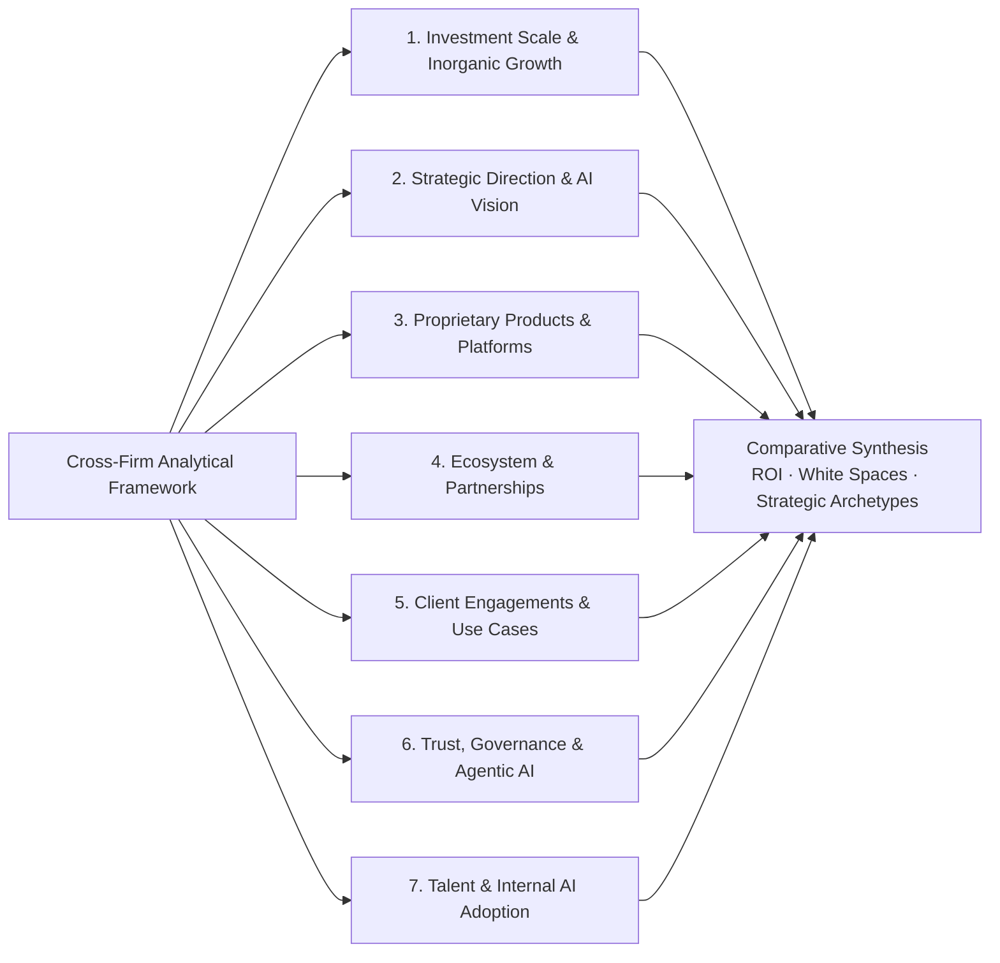

The seven dimensions can be summarized as follows:

1. **Investment scale and inorganic growth** — magnitude, structure, and time horizon of capital commitments; AI-related M&A and equity investments.
2. **Strategic direction and AI vision** — narrative positioning (e.g., Deloitte's "Age of With," PwC's "human-led, tech-powered," Accenture's "Reinvention with AI," IBM's watsonx-centric Consulting Advantage).
3. **Proprietary products, platforms, and accelerators** — owned IP, agent factories, industry solutions.
4. **Ecosystem and alliances** — partnerships with hyperscalers (Azure/AWS/Google Cloud/NVIDIA) and foundation-model providers (OpenAI, Anthropic, Cohere, Mistral).
5. **Client engagements and application scenarios** — use cases by industry and business function; engagement models.
6. **Trust, governance, and agentic capabilities** — responsible AI frameworks, regulatory compliance services, agent orchestration.
7. **Talent and internal adoption** — hiring, AI academies, certifications, internal use of AI to transform audit/tax/consulting delivery.

### Methodology and Data Sources

The research synthesizes data from three categories of sources: (i) **authoritative market research** from Gartner, IDC, McKinsey, BCG, Capgemini Research Institute, and specialized trade analysts; (ii) **firm disclosures** including press releases, annual reports, capital-commitment announcements, and named client case studies; and (iii) **independent reporting** from reputable trade publications. Where figures conflict across sources—for example, the divergent 2025 global AI market estimates ranging from US$244 billion to US$391 billion[^2]—the report prioritizes the most recent and most comprehensive authoritative source and notes the discrepancy explicitly. Because the AI landscape is evolving on a quarterly cadence, particular weight is given to data points from the last 12–18 months. A persistent limitation is **disclosure asymmetry**: publicly listed and regulated firms (e.g., Accenture, IBM, Capgemini) and the Big Four typically disclose more granular AI investment and program metrics than privately held MBB partnerships, where proprietary tooling and capital commitments are often discussed only in qualitative terms. This asymmetry is acknowledged throughout and, where relevant, addressed by triangulating across multiple secondary sources.

## 1.2 Global AI Market Size, Growth Trajectory, and Spending Structure

The global AI market in 2025 sits at the inflection between hype-driven exuberance and capability-driven scaling, and the headline numbers reflect both. Synthesizing leading market research, the **2025 global AI market is valued at approximately US$244–391 billion**, with forecasts pointing to US$347–376 billion in 2026.[^2] Gartner's more comprehensive AI-spending construct—which includes AI-specific hardware, software, services, and embedded capabilities—paints an even steeper trajectory: **US$1.8 trillion in 2025, US$2.527 trillion in 2026 (a 44% YoY increase), and US$4.71 trillion by 2029 at a 33% CAGR**.[^2][^1] The variance across estimates is itself instructive: it reflects different definitional boundaries (pure-play AI vs. AI-amplified spend), and it cautions against treating any single number as authoritative. What is unambiguous is the direction and the order of magnitude—several trillions of dollars of cumulative spend over the next four years.

### Spending Composition: Where the Capital Is Flowing

Beneath the headline number, the composition of AI spending reveals a clear hierarchy of priorities, and—more importantly—a divergence between the largest and the fastest-growing segments. Drawing on Gartner's 4Q25 forecast as analyzed by independent industry analysts, the structure is as follows:

| Segment | 2024 Base / 2025 Spend | 2029 Spend | CAGR (2024–2029) | Strategic Read |
|---|---|---|---|---|
| **AI Infrastructure** | US$624.8B (2024) / US$965B (2025) | US$2.25T | ~29.2% | Dominant in absolute terms; share declining from 54.6% to 47.8% |
| **AI Services** (consulting, implementation, managed) | ~23.3% of total (2026) | — | ~26.9% | Second-largest segment; the channel through which advisory firms compete |
| **Agentic AI** | US$15.04B (2024) | US$752.7B | ~118.7% | 50× growth; crosses over chatbots in 2027 |
| **AI Cybersecurity** | US$10.8B (2024) | US$172.0B | ~73.9% | Driven by attack-surface expansion from autonomous agents |
| **AI Data** (synthetic data, governance, integration, ready datasets) | US$134M (2024) | US$14.6B | ~155% | 109× growth; the foundational enabler of scaled AI |
| — Synthetic Data Generation | US$40.7M | US$6.8B | ~178.3% | Fastest-growing sub-segment in the entire forecast |
| — AI Data Governance | US$14.8M | US$1.89B | ~163.8% | Compliance-driven; tied directly to regulatory pressure |
| — AI Data Integration Software | US$71.7M | US$5.38B | ~137.1% | Largest AI Data sub-segment by 2029 revenue |

[^1]

Two structural insights emerge from this composition. First, **infrastructure dominates absolute dollars but is the slowest-growing major segment**: its share of total AI spending will fall from 54.6% in 2024 to 47.8% in 2029, even as it nearly quadruples in absolute terms. The differentiation game is not in the data center; it is in the layers above. Second, **the fastest growth is concentrated precisely in the categories that consulting firms are best positioned to monetize**—data readiness (155% CAGR), governance, agentic AI orchestration (118.7% CAGR), and the security architecture surrounding autonomous agents (73.9% CAGR).[^1] These are not commoditized infrastructure segments; they are integration-, governance-, and judgment-intensive layers where deep domain expertise and trust commands a premium.

The vertical composition reinforces this view. Healthcare is projected to register the highest AI adoption CAGR at **36.5%**, with AI spending in the sector reaching US$1.4 billion in 2025—nearly tripling year over year—driven by drug discovery, diagnostic imaging, and personalized medicine.[^2] BFSI was the dominant adopter in 2024, with the generative AI BFSI sub-market alone projected to grow at a 32.5% CAGR to US$13.57 billion by 2032.[^2] Marketing and retail round out the top three, with retail outpacing finance and healthcare in EMEA AI adoption.[^2] These verticals correspond, not coincidentally, to the historical strongholds of Big Four assurance, MBB strategy, and Accenture/Capgemini systems-integration practices.

### The AI Consulting Sub-Market: A Distinct and Faster-Growing Layer

Within the broader AI market, the **AI consulting services sub-market is itself a distinct, high-growth layer**. According to Market Data Forecast, the global AI consulting services market was valued at **US$16.4 billion in 2024** and is projected to reach **US$22.27 billion in 2025**, scaling to **US$257.60 billion by 2033 at a 35.8% CAGR (2025–2033)**.[^3] This trajectory exceeds the overall AI market CAGR of ~33%, indicating that the advisory and integration layer is, at least over the medium term, capturing share of the total AI dollar.

The sub-market's internal segmentation indicates where consulting demand is concentrated:

- **By service type**, *digital strategy and transformation* led with **35.3% share in 2024**, reflecting the foundational role of strategy and operating-model redesign in AI adoption. *Cognitive integration* (NLP, computer vision, ML embedded into existing operations) is the fastest-growing service type at a **36.68% CAGR**, pointing to a steady migration of demand from advisory framing into implementation-heavy work.[^3]
- **By technology**, *big data analytics* dominated at **40.8% share in 2024**, anchored by the reality that AI value creation depends on the underlying data layer—an observation entirely consistent with Gartner's 155% CAGR for AI Data spend. *Computer vision* is forecast as the fastest-growing technology, propelled by autonomous-vehicle, medical-imaging, and industrial quality-control use cases that PwC estimates could contribute US$1.5 trillion to the global economy by 2030.[^3]
- **By end-user**, *BFSI* led with **30.9% share in 2024** (PwC reports 80% of financial institutions have adopted AI), while *healthcare* is projected to register the highest CAGR, driven by McKinsey's estimate of US$360 billion in annual healthcare cost savings achievable through AI by 2030.[^3]

Taken together, the picture is one of a consulting market growing faster than the underlying technology stack, weighted toward strategy and cognitive integration services, anchored in data and analytics, and concentrated in BFSI and healthcare—the verticals where regulatory complexity, data sensitivity, and ROI stakes are highest. This is precisely the terrain on which the ten target firms compete.

## 1.3 Competitive Structure and Regional Landscape of AI Consulting

The competitive structure of the AI consulting market is **concentrated at the top, fragmented at the long tail, and increasingly contested across structural archetypes that previously occupied separable niches**. Independent market research identifies Accenture, Deloitte, IBM, McKinsey, PwC, BCG, Booz Allen Hamilton, KPMG, EY, and Capgemini as the principal market leaders, collectively accounting for **over 60% of global AI consulting revenue** according to Gartner.[^3] Yet the market remains genuinely fragmented, with smaller niche players—frequently the targets of acquisition by the leaders—contributing innovative tools, vertical IP, and AI engineering talent.

The leaders are converging on a common strategic playbook even as their underlying business models diverge. Five common motions are observable across the cohort:

1. **Hyperscaler and AI-vendor partnerships** — Accenture's deep collaboration with Microsoft Azure to deliver scalable enterprise AI platforms; Deloitte's May 2023 partnership with NVIDIA to develop AI-powered solutions for healthcare and retail; BCG's March 2023 partnership with DataRobot to strengthen predictive analytics capabilities; and IBM's leveraging of its own Watson AI platform for healthcare and finance applications.[^3]
2. **Acquisitions of niche AI specialists** — Accenture's February 2023 acquisition of Flutura, an industrial AI company, to deepen analytics for manufacturing and energy; McKinsey's July 2023 acquisition of Iguazio, an MLOps platform, to deliver end-to-end model deployment; KPMG's June 2023 acquisition of SparkBeyond, an ML technology company; and Capgemini's prior acquisition of Altran Technologies to strengthen engineering and AI services.[^3]
3. **Heavy R&D investment** — IBM spends **over US$5 billion annually on AI research**, fueling innovations in NLP and ML algorithms; McKinsey's QuantumBlack unit anchors its proprietary advanced analytics IP.[^3]
4. **Thought leadership as market-shaping** — PwC's annual "AI Predictions Report," Capgemini Research Institute's *Harnessing the value of generative AI* series (which found that 80% of enterprises increased GenAI investment year-over-year and that 89% of firms above US$20 billion in revenue lead the investment surge), and Deloitte's State of GenAI surveys all serve as both market intelligence and category-defining instruments.[^1]
5. **Ethics, governance, and training services as differentiation** — PwC's September 2022 launch of "Responsible AI" services; EY's AI training academy aimed at upskilling employees and clients; Booz Allen Hamilton's January 2023 launch of the Modzy platform for AI model deployment in defense and government environments.[^3]

These five motions—alliance, acquisition, R&D, thought leadership, and governance/training—will recur, with firm-specific variation, throughout subsequent chapters and constitute the building blocks of competitive positioning in this market.

### Regional Landscape

Geography materially shapes both demand patterns and competitive dynamics. **North America held 40.1% of the global AI consulting services market in 2024**, anchored by US$64 billion in U.S. AI-related spending in 2022 alone (per the U.S. Department of Commerce), the technology ecosystem of Silicon Valley, the dominance of hyperscalers (Microsoft, Google, AWS, IBM), and the catalytic effect of the U.S. National AI Initiative Act.[^3] **Asia-Pacific is the fastest-growing region, projected to register a 35.6% CAGR**, propelled by China's New Generation Artificial Intelligence Development Plan (with an estimated US$150 billion investment ambition to become a global AI leader by 2030), India's National Strategy for Artificial Intelligence, and aggressive AI-driven automation investment in Japan and South Korea; IDC forecasts AI spending in the region to exceed US$100 billion by 2025.[^3] **Europe** is growing more steadily, shaped by GDPR-driven demand for governance and responsible AI services, with the European Commission estimating AI could add €2.7 trillion to the EU economy by 2030.[^3] **Latin America** is led by Brazil's fintech and digital banking adoption, while the **Middle East and Africa** are driven by smart-city and energy-sector projects, with PwC estimating AI could contribute US$96 billion to the MENA economy by 2030.[^3]

This regional structure has three implications for firm-level strategy that will recur throughout the report. First, **North American dominance** explains why most disclosed AI capital commitments and named platforms are denominated in U.S. dollars and centered on Microsoft Azure / OpenAI, AWS, and Google Cloud partnerships. Second, **Asia-Pacific's growth velocity** is creating sovereign-AI dynamics—India is expected to launch its own sovereign large language model in February 2026—that consulting firms must navigate by localizing capability and forming country-specific alliances.[^2] Third, **European regulatory intensity** (GDPR, the EU AI Act) systematically advantages firms with strong assurance and governance heritages—particularly the Big Four—by elevating responsible AI and compliance services from cost centers into revenue-generating practice areas.

## 1.4 Demand-Side Shifts: From GenAI to Agentic AI and the Maturity Gap

The single most consequential shift in client demand over the 18 months preceding this study is the **migration of strategic priority from generative AI experimentation toward agentic AI deployment**, accompanied by a sobering recognition that the foundational data and governance layers are not yet ready to support that migration at scale. Both shifts directly redefine what consulting firms are being hired to do.

### The Agentic Inflection

Gartner's 4Q25 forecast quantifies the agentic shift in stark terms. Agentic AI spending grows from **US$15.04 billion in 2024 to US$752.73 billion by 2029—a 50× expansion at a 118.73% CAGR**, the single most dramatic dollar growth in the entire AI forecast.[^1] The crossover with chatbot spending is projected for 2027: chatbots peak at US$264.75 billion that year, while agentic AI surges to US$371.40 billion; by 2029 agentic AI is **3.3× larger than chatbot spending** (US$752.73B vs. US$228.50B).[^1] Underpinning this trajectory, Gartner expects **software with agentic capabilities to cross 50% of total application software spend by the end of 2028**, up from 2% in 2024, and forecasts that **non-agentic software spending will begin declining from 2027 onward**—a remarkable inflection for an industry historically defined by additive growth.[^1] Capgemini's 2024 enterprise survey corroborates the demand-side reality: **62% of organizations are upgrading from chatbots to AI agents that autonomously manage complex goals, 48% are using multi-agent systems, and 82% plan to deploy agentic AI within 1–3 years**, with 71% expecting workflow automation and 64% expecting customer-service and productivity improvements as the primary value drivers.[^1]

For consulting firms, this is far more than a product taxonomy update. Agentic AI redefines the unit of work being delivered—from "build a model" to "redesign a workflow around autonomous actors with appropriate oversight"—and reshapes both the firms' offerings (agent factories, orchestration platforms, multi-agent governance) and the underlying consulting economics (lower marginal labor per output, higher embedded IP value).

### The Data Readiness Bottleneck

Yet the agentic narrative cannot be decoupled from a foundational constraint that the same Gartner data exposes ruthlessly: **only 43% of organizations say their data is ready for AI**, even as AI Data spending compounds at **155% annually**—six times faster than infrastructure buildouts.[^1] By 2029, **77% of data used for LLM training will be synthetic, up from 4% in 2025**, and **61% of data integration software spend will focus on delivering GenAI-ready data, up from 8% in 2025**.[^1] In short, the bottleneck has migrated from compute to data, and from data quantity to data quality and governance. This migration positions consulting firms—whose core craft is precisely the integration, cleansing, governance, and contextualization of enterprise data—at the center of where the marginal AI dollar is now flowing.

### The Maturity Gap

The data and agentic shifts collide with a sobering reality: enterprise AI adoption is broad but shallow. McKinsey's 2025 *State of AI* survey (1,993 participants across 105 countries) found that **88% of organizations now use AI in at least one business function, up from 78% the prior year**, but only **6% qualify as "AI high performers"** (defined as deriving more than 5% of EBIT from AI), and **just 1% describe themselves as "mature" in AI deployment**.[^1] Gartner's CFO survey adds further weight: **only 11% of finance leaders from organizations implementing AI report seeing actual financial returns**.[^1] Two-thirds of organizations remain stuck in pilot mode.

| Adoption Stage | Share of Organizations | Source |
|---|---|---|
| Use AI in ≥1 business function | 88% | McKinsey 2025 State of AI[^1] |
| Experimenting with AI agents | 62% | McKinsey 2025[^1] |
| Scaling AI agents in ≥1 function | 23% | McKinsey 2025[^1] |
| Data ready for AI | 43% | Gartner / Capgemini[^1] |
| AI "high performers" (>5% EBIT from AI) | 6% | McKinsey 2025[^1] |
| Self-described "mature" in AI deployment | 1% | Gartner[^1] |
| Reporting actual financial returns from AI | 11% | Gartner CFO Survey[^1] |

This structural gap—between adoption breadth and value depth—is the single most important explanatory variable behind consulting firms' current strategic posture. McKinsey's analysis indicates that **AI high performers are 3× more likely to redesign workflows around AI** rather than layer it onto existing processes, and **3× more likely to have committed executive leadership** driving AI as a strategic priority.[^1] Both of these capabilities—workflow redesign and executive-level transformation orchestration—are precisely what consulting firms claim as their differentiating expertise. The maturity gap, in other words, is not a market failure that will close on its own; it is the addressable opportunity that justifies the multi-billion-dollar capital commitments examined in Chapter 2.

## 1.5 Cross-Cutting Pressures: ROI, Regulation, Talent, and Trust

Four cross-cutting structural pressures are simultaneously shaping how consulting firms are organizing their AI strategies, allocating capital, building products, partnering with ecosystems, and reskilling their workforces. Together, these pressures explain why firms with very different historical positioning—a Big Four assurance house, a global SI integrator, and an MBB strategy partnership—are converging on a strikingly similar set of capability investments.

### ROI Pressure and the Trough of Disillusionment

Gartner's analysis places AI in the **"Trough of Disillusionment"** phase of the technology adoption curve throughout 2026, reflecting the gap between hype-driven expectations and the slower realization of measurable value.[^2] A 2022 BCG survey reported that **70% of AI initiatives take longer than expected to deliver measurable ROI**, and PwC estimates the cost of AI initiatives at **US$250,000 to US$1 million per project**, often putting them out of reach of smaller enterprises.[^3] Consequently, Gartner observes that AI is now more likely to be sold to enterprises by their incumbent software providers than to be purchased as part of new, high-risk moonshot projects—a fundamental shift in buying behavior that places renewed emphasis on incumbents' relationships, integration capabilities, and outcome orchestration.[^2] Gartner's forward assumption that **"by 2027, the majority of AI buyers will define business outcomes from project launch"** signals the broader market's transition from supply-push experimentation to demand-pull, outcome-driven deployment[^1]—a shift that disproportionately favors firms with deep industry knowledge and end-to-end delivery capacity, and disadvantages firms whose AI offering is essentially an algorithm without an operating context.

### Regulatory Tightening as a Revenue Engine

The regulatory environment is intensifying simultaneously across multiple jurisdictions. GDPR remains the foundational European data privacy regime; the EU AI Act introduces risk-tiered obligations on AI systems; HIPAA constrains AI in U.S. healthcare; and the U.S. National AI Initiative Act has accelerated federal AI adoption with attendant compliance requirements.[^3] Boards and executives now face direct personal liability for compliance failures, not merely organizational fines.[^1] A 2023 Deloitte survey found that **62% of companies are concerned about ethical risks in AI**, while nearly 60% of businesses surveyed by Accenture express concerns over data security in AI.[^3]

These pressures convert directly into consulting demand. Gartner's information-security forecast shows **security consulting services growing from US$24.2 billion in 2024 to US$36.6 billion in 2029**, and **security professional services from US$27.3 billion to US$40.8 billion**—adding roughly US$26 billion in combined services spend over five years, much of it explicitly tied to AI governance and regulatory preparedness.[^1] Within AI specifically, AI Data Governance spending grows at a **163.75% CAGR** (US$14.82M to US$1.89B by 2029), and Gartner expects **over 75% of enterprises to use AI-amplified cybersecurity products by 2028, up from less than 25% in 2025**.[^1] The implication for consulting firms is unambiguous: responsible AI, model risk management, and regulatory preparedness are not adjacent compliance services—they are central, fast-growing revenue lines that disproportionately reward firms with assurance, audit, and risk-management heritage.

### The Talent Constraint as Both Limiter and Driver

The structural shortage of AI-capable talent simultaneously constrains consulting firms' capacity to scale and creates the demand they exist to serve. The World Economic Forum cites a **shortage of 85 million skilled tech workers globally**, while LinkedIn's 2023 Workforce Report identifies AI and ML roles as among the hardest to fill, with a **74% AI talent gap worldwide**.[^3] In adjacent cybersecurity, ISC2's 2024 Workforce Study documents a **4.8 million professional gap, growing 19% year-over-year**, with 90% of organizations reporting skills shortages and 58% believing the shortage puts their organization at significant risk.[^1]

This dual dynamic explains both the **scale of consulting firms' AI academies and reskilling programs** (examined in Chapter 7) and the upward pressure on managed-services demand: as Gartner notes, organizations cannot hire fast enough, so they are buying managed capacity instead—**managed security services are growing at 11.1% in 2026, the fastest rate in the services segment**.[^1] For consulting firms, the talent gap is therefore both a strategic vulnerability (margin pressure as wage inflation outpaces price realization) and a strategic opportunity (clients' inability to build in-house capability extends the addressable consulting market).

### Trust, Sovereign AI, and Post-Quantum Readiness

A fourth pressure is the rapidly broadening concept of "trust" in AI systems. Three dimensions are emerging in parallel:

- **Agentic AI security**, where Gartner projects that through 2029, **over 50% of successful attacks against AI agents will exploit access-control issues via prompt injection**, and where 57% of employees use personal GenAI accounts for work and 33% admit to uploading sensitive data into unsanctioned tools.[^1]
- **Sovereign AI**, a growing movement among nations to develop domestic AI capabilities and reduce reliance on foreign technology, exemplified by India's planned February 2026 launch of its sovereign large language model and by China's and the EU's parallel investments in domestic compute and model capacity.[^2]
- **Post-quantum readiness**, with Gartner predicting that quantum advances will render asymmetric cryptography unsafe by 2030—a four-year window in which "harvest now, decrypt later" attacks are already accumulating data—driving the encryption market from US$1.04 billion in 2023 to US$2.04 billion by 2029.[^1]

Each of these trust dimensions shapes consulting firms' service portfolios in distinct ways: agentic AI security drives demand for governance frameworks and human-in-the-loop oversight design; sovereign AI fragments market access and elevates the value of locally embedded delivery capacity; and post-quantum readiness adds a new capability layer (cryptographic agility, migration roadmaps) that firms with strong cybersecurity and architecture practices can monetize early.

### Synthesis

Taken together, the four cross-cutting pressures form an interlocking system that defines the strategic agenda of every firm covered in this report. ROI pressure pushes firms toward outcome-based delivery and proprietary platforms that compress time-to-value. Regulatory tightening creates large, recurring revenue streams that disproportionately reward governance and assurance heritage. Talent constraints both ration consulting capacity and fuel reskilling and managed-services demand. Trust concerns expand the perimeter of "AI work" to include security, sovereignty, and cryptographic readiness. Each subsequent chapter examines how the ten target firms—Big Four, Accenture, MBB, IBM Consulting, and Capgemini—respond to these pressures with distinctive combinations of capital commitments, proprietary IP, ecosystem alliances, talent investments, and governance positioning. With the analytical framework, market quantification, and structural pressures now established, Chapter 2 turns to the first comparison dimension: the magnitude and structure of the capital that each firm has committed to its AI ambition.

# 2 Capital Commitments, Investment Scale, and Inorganic Growth in AI Capabilities

Chapter 1 established that AI consulting is a US$22 billion sub-market growing at a 35.8% CAGR, structurally concentrated in the hands of ten firms that together account for over 60% of global revenue, and shaped by four interlocking pressures—ROI demands, regulatory tightening, talent scarcity, and trust. The natural next question is **how much capital each of those ten firms has committed to capture this opportunity, where that capital is being deployed, and how organic investment is being supplemented by acquisitions, equity stakes, and venture activity to fill capability gaps**. This chapter answers that question through a structured cross-firm comparison, working from announced headline commitments down through allocation structures, M&A cadence, equity and venture activity, and capital intensity benchmarking, before synthesizing how organic and inorganic moves combine to address—or leave open—the five core AI capability gaps that subsequent chapters interrogate in product, ecosystem, talent, and outcome terms.

A persistent caveat applies throughout: **disclosure asymmetry across firms is severe**. Publicly listed firms (Accenture, IBM, Capgemini) and the Big Four routinely publish multi-year capital envelopes, headcount targets, and acquisition values; the MBB partnerships (McKinsey, BCG, Bain) almost never quantify their internal AI capital spend, instead disclosing capability investments through product launches, alliance announcements, and selective tuck-in acquisitions. Where MBB data is unavailable, the analysis flags the gap and triangulates from named platforms, alliances, and headcount disclosures rather than fabricating quantitative parity.

## 2.1 Cross-Firm Comparison of Headline AI Capital Commitments

The headline AI investment figures publicly disclosed by the ten target firms span approximately one order of magnitude in absolute size and roughly two orders of magnitude in disclosure granularity. To enable comparison, the figures are normalized to a common multi-year envelope, expressed in US dollars at announcement-date conversion, and—where firm revenue is publicly available—translated into approximate annual run-rate intensity. The resulting picture, summarized in the table below, separates firms into three tiers by absolute capital commitment.

| Firm | Headline AI / Capability Commitment | Time Horizon | Implied Annual Run-Rate | Primary Strategic Framing |
|---|---|---|---|---|
| **Accenture** | US$3B Data & AI investment[^4][^5] | 3 years (FY2024–FY2026) | ~US$1B/yr | Doubling AI talent to 80,000; AI Navigator for Enterprise; Center for Advanced AI[^4] |
| **IBM** | >US$5B annual AI-related R&D (estimated, multi-source); AI Book of Business >US$2B[^6] | Continuous | >US$5B/yr R&D | watsonx platform; Consulting Advantage; large-ticket M&A[^7] |
| **PwC** (network) | US$12B network investment under "The New Equation" with 100,000 net new jobs, including expansion of AI capabilities[^8] | 5 years (FY2022–FY2026) | ~US$2.4B/yr | Trust + Sustained Outcomes; ESG/AI/cyber capability buildout[^8] |
| **Capgemini** | €2B AI investment; data & AI headcount target of 60,000[^7] | 3 years (announced 2023) | ~€670M/yr | Generative AI Lab; Data & AI Campus; hyperscaler alliances[^7] |
| **Deloitte** | US$1.4B "Project 120" learning & development investment underpinning the AI Academy[^9][^10] | Multi-year (announced Dec 2022) | Workforce-flow funding | Tech and leadership L&D; AI Academy; >1M training hours delivered[^10] |
| **KPMG** | Multibillion-dollar Microsoft alliance integrating Microsoft Cloud, Azure OpenAI Service, and KPMG IP[^8] | Multi-year | Not separately disclosed | Trusted AI; Clara/Workbench; alliance-leveraged delivery[^8] |
| **EY** | Quantum not separately disclosed; EY.ai platform with NVIDIA, Dell, neurosymbolic AI capabilities[^8] | Continuous | Not disclosed | EY.ai unifying platform; Tax Labs/Tax Agent Factory; risk solutions[^8] |
| **McKinsey** | Not quantitatively disclosed; QuantumBlack as the named AI unit | Continuous | Not disclosed | Strategy + advanced analytics; Lilli internal platform |
| **BCG** | Not quantitatively disclosed; BCG X as integrated tech-build unit | Continuous | Not disclosed | "Trailblazer" CEO playbook; agentic AI thought leadership[^4] |
| **Bain** | Not quantitatively disclosed; OpenAI services alliance (2023)[^4] | Continuous | Not disclosed | Foundation-model alliance; client-deployment-led model[^4] |

Three observations emerge from the comparison.

First, **the absolute scale of announced commitments separates a "platform tier" from a "capability tier."** Accenture's US$3B Data & AI investment, announced in June 2023, is the largest cleanly demarcated AI-specific commitment in the cohort and explicitly aims to double AI talent from 40,000 to 80,000 professionals, expand assets and industry solutions, and fund the Center for Advanced AI dedicated to maximizing the value of generative AI[^4][^5]. IBM's annual R&D run-rate of more than US$5 billion—much of which is now directed at AI, watsonx, and hybrid-cloud capabilities—dwarfs the multi-year totals announced by most competitors when annualized, but its scope is broader than pure AI consulting and includes hardware, foundation-model R&D, and core software engineering. Capgemini's €2B (≈US$2.2B) commitment alongside a target to grow data & AI headcount to 60,000 within three years sits in the same order of magnitude as Accenture's per-year run-rate but at roughly two-thirds of its scale[^7]. PwC's US$12B network-wide investment under "The New Equation," announced in June 2021, is the largest absolute headline figure but is not AI-specific—it spans audit, ESG, cyber, AI, and 100,000 net new jobs across the global network over five years, with AI representing a meaningful but undisclosed share[^8].

Second, **headline numbers serve a dual function: capability funding and strategic signaling.** The Accenture US$3B announcement, framed by CEO Julie Sweet as enabling clients to "move from interest to action to value, and in a responsible way with clear business cases"[^4], is simultaneously a real capital envelope and a market-signaling instrument that crystallizes Accenture's positioning as the most aggressive at-scale AI integrator. Capgemini's €2B announcement, made by CEO Aiman Ezzat alongside Q2 2023 earnings, performs the same function in a European context, explicitly aiming to "build its leadership in this breakthrough technology"[^7]. By contrast, the MBB houses—as private partnerships—signal capability through named platforms, alliances, and acquisitions rather than capital envelopes; their disclosure restraint is a structural feature of partnership economics, not a measure of underinvestment.

Third, **per-capita and per-revenue intensity reframes the comparison.** Accenture's US$1B/year against approximately 800,000 headcount[^11] equates to roughly US$1,250 per employee per year of dedicated AI capital, before any acquisition spend. Capgemini's €670M/year against approximately 340,000 employees implies a similar US$2,000-equivalent per employee. Deloitte's US$1.4B Project 120 against ~457,000 employees represents approximately US$3,000 per employee in dedicated L&D capital over the multi-year horizon. These figures are not strictly comparable because scopes differ, but they suggest that the leading firms are converging on per-capita capability intensity in the low thousands of dollars per employee per year—a meaningful but not transformational fraction of total compensation spend, indicating that the announced envelopes complement rather than substitute for embedded R&D and delivery investment.

## 2.2 Allocation Structure of AI Investments Across Technology, Talent, Alliances, R&D, and Acquisitions

Headline numbers conceal as much as they reveal; the strategic differentiation lies in how each envelope is decomposed across allocation buckets. A consistent reading of firm disclosures permits the construction of an indicative allocation profile across five buckets: (i) proprietary technology and platforms, (ii) talent acquisition and reskilling, (iii) ecosystem and alliance investments, (iv) R&D and innovation labs, and (v) acquisitions and equity investments. Three structural archetypes emerge.

### Platform-Heavy Archetype: IBM, Accenture, Capgemini

Accenture's US$3B envelope is the most explicitly itemized in the cohort. The June 2023 announcement specifies five concurrent allocation streams: investment in **assets, industry solutions, ventures, acquisitions, talent and ecosystem partnerships**; a doubling of AI talent in the Data & AI practice **from 40,000 to 80,000** through hiring, acquisitions, and training; the launch of the **AI Navigator for Enterprise**, a generative AI-based platform helping clients define business cases and choose architectures; the creation of **accelerators for data and AI readiness across 19 distinct industries** as well as pre-built industry and functional models; and a **Center for Advanced AI** dedicated to maximizing the value of generative AI through R&D and reimagined service delivery[^4]. The platform layer—AI Navigator, industry accelerators, the Center for Advanced AI—is the spine, while talent and acquisitions feed it.

IBM's allocation is even more platform-anchored. Its >US$5B annual R&D budget funds the watsonx data and AI platform stack, the IBM Consulting Advantage AI services platform—described as providing "easy, customized access to proprietary methods, purpose-built AI assets and models and role-based generative AI assistants"[^7]—and its Concert ITOps platform, which "unifies observability, optimization, and resilience insights into shared operational intelligence, with governed AI"[^12]. Around this platform spine, IBM has executed large-ticket acquisitions specifically to feed the watsonx data plane, most notably the **US$2.3B (€2.13B) acquisition of StreamSets and webMethods from Software AG** in late 2023, where IBM's senior VP for software Rob Thomas explicitly framed the rationale: "Together with IBM's Watsonx AI and data platform, as well as its application modernization, data fabric and IT automation products, StreamSets and webMethods will help clients unlock the full potential of their applications and data"[^13].

Capgemini follows a similar platform-heavy pattern at a smaller absolute scale. The €2B AI envelope funds a **dedicated generative AI practice**, a **Generative AI Lab**, a **Data & AI Campus** for workforce upskilling, and a portfolio of four generative AI assistants targeting customer experience, software engineering, custom enterprise AI, and strategy advisory[^7]. The platform anchor here is the custom GenAI offering "fine-tuned with [client] proprietary data," explicitly positioned for "clients who have key sensitive data"[^7]—a deliberate positioning against horizontal hyperscaler offerings.

### Talent-and-Learning-Heavy Archetype: Deloitte, PwC, EY

Deloitte's headline US$1.4B Project 120 investment is overtly an L&D vehicle rather than a pure AI capital commitment. The December 2022 announcement frames Project 120 as "an unprecedented investment in [Deloitte's people's] potential," delivering "over one million hours of training on future applications of technologies like artificial intelligence (AI), cloud, cyber, data analytics, 5G, and quantum computing through the Deloitte Technology Academy"[^10]. The August 2023 expansion built tailored generative AI curriculum within the Deloitte AI Academy through collaborations with Virginia Tech and the Indian Institute of Technology Roorkee, plus NVIDIA Training, on a pathway to upskill up to **10,000 Deloitte practitioners**[^9]. The allocation is therefore weighted toward people, supplemented by the Deloitte AI Institute (research and thought leadership) and Trustworthy AI framework (governance positioning).

PwC's US$12B network commitment under "The New Equation" allocates capital across multidisciplinary capabilities—audit, tax, ESG, cyber, AI—with explicit emphasis on "100,000 net new jobs" focused in emerging capability areas "from ESG to AI" and "over 30,000 people into early career posts each year"[^8]. The framing is deliberately holistic: AI is one of several capability layers built atop a "human-led, tech-powered" model rather than the central organizing principle. This makes precise AI-specific allocation impossible to extract, but suggests that PwC's AI capital is co-located with assurance and governance investment rather than ring-fenced as a standalone envelope.

EY similarly emphasizes capability layering rather than a single AI envelope. Its disclosed initiatives center on the **EY.ai unifying platform** announced in 2023 and progressively extended through **EY.ai Agentic Platform accelerated by NVIDIA**, **EY.ai enterprise private (with Dell Technologies and NVIDIA)**, **EY.ai Tax Labs and Tax Agent Factory**, and **EY-Parthenon neurosymbolic AI capabilities**[^8]. While EY does not publish a consolidated AI capital figure, the cadence and breadth of platform releases across 2024–2025 implies a sustained multi-hundred-million-dollar annual investment underpinned by ecosystem alliances rather than disclosed organic R&D.

### Ecosystem-Leveraged Archetype: KPMG and the MBB Houses

KPMG's principal disclosed AI capital vehicle is the **expanded multibillion-dollar global alliance with Microsoft, integrating Microsoft Cloud, Azure OpenAI Service, and KPMG IP**[^8]. Rather than building a fully owned platform stack, KPMG channels capital through alliance-anchored co-investment, pairing Microsoft's foundation-model and infrastructure capabilities with its own audit, tax, and risk IP (notably KPMG Clara). This archetype trades platform ownership for time-to-market and ecosystem leverage.

The MBB houses occupy a distinct allocation profile. **Bain's services alliance with OpenAI**, announced in 2023, gave Bain's then-18,000 knowledge workers access to OpenAI's models and was rapidly converted into client engagements with The Coca-Cola Company (brand and marketing) and Carrefour (AI-powered shopping assistant, enriched product sheets, procurement)[^4]. **McKinsey** anchors its AI capability around the QuantumBlack unit and its proprietary internal platform Lilli, supplementing this with selective acquisitions (notably the 2023 acquisition of MLOps platform Iguazio). **BCG** combines BCG X (its tech-build arm) with high-profile thought leadership; the **BCG AI Radar 2026** survey of 2,360 executives, including 640 CEOs, found that **AI corporate investment as a share of revenue is projected to double to ~1.7% in 2026** and that "Trailblazer" CEOs (representing ~15% of CEOs surveyed) allocate roughly 60% of their AI budget to agentic AI[^4]—data points BCG simultaneously sells as advisory diagnostics and uses to position its own offerings. Across the MBB cohort, the allocation logic favors lean, alliance-leveraged platform access (OpenAI, hyperscalers) plus strategic acquisitions in MLOps and ML technology, with capital kept off the public balance sheet.

### Synthesis of Allocation Profiles

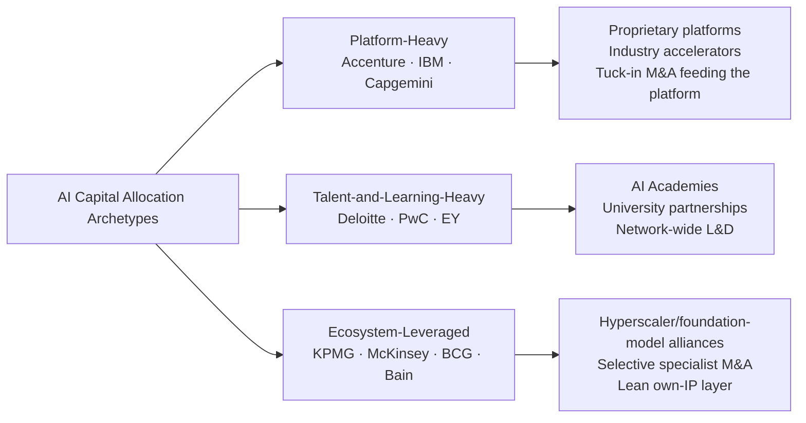

The three archetypes are not mutually exclusive—every firm in the cohort makes some allocation across all five buckets—but the relative weighting differs materially. Platform-heavy firms invest in defensible IP that can be licensed, embedded in delivery, and resold; talent-and-learning-heavy firms invest in the human capital that converts platforms (often owned by ecosystem partners) into client outcomes; ecosystem-leveraged firms invest in the relationship structure that grants them scale economics without underwriting platform development risk. Each archetype carries a different margin, scalability, and defensibility profile that subsequent chapters interrogate in product (Chapter 4), ecosystem (Chapter 4), and outcome (Chapter 8) terms.

## 2.3 AI-Related M&A and Acquisition Strategies

Inorganic growth has become the principal velocity-multiplier on top of announced capital envelopes, and the acquisition cadence across the cohort over 2022–2025 reveals strikingly different strategic logics. Three patterns are observable: a **prolific tuck-in model** (Accenture, with Capgemini following), a **platform-anchor model** (IBM), and a **selective specialist model** (MBB and KPMG).

### The Prolific Tuck-In Model: Accenture

Accenture has executed the most aggressive AI-adjacent M&A program in the industry. In **fiscal 2024 alone, the firm completed 46 acquisitions for US$6.6 billion**[^14]—a cadence of nearly one acquisition per week and an investment magnitude exceeding the entire announced US$3B Data & AI envelope over its three-year horizon. The acquisition portfolio across 2023–2025 reveals a deliberate gap-filling architecture:

| Acquisition | Date | Capability Gap Addressed | Key Detail |
|---|---|---|---|
| **NeuraFlash** | Aug 2025 | Agentic AI / Salesforce / mid-market | ~510 professionals; >2,000 Salesforce certifications; >1,000 implementations for >400 clients[^14] |
| **SI&C Co., Ltd.** (Tokyo) | Aug 2025 | Japan geographic depth; cloud/data/AI | 45 years of IT services experience across financial services, manufacturing, retail, public sector[^14] |
| **Cognosante** | May 2024 (closed) | U.S. federal health digital transformation | >1,500 employees added to Accenture Federal Services; access to VA T4NG2, VHA IHT, CMS SPARC contract vehicles[^15] |
| **IQT Group** (Italy) | Feb 2025 (closed) | Net-zero infrastructure project engineering + GenAI | Complements 2024 BOSLAN (Spain), 2023 Anser Advisory (US), Comtech (Canada)[^11] |
| **Fibermind** (Italy) | 2024 | Network services / 5G | Italian fiber and mobile 5G[^11] |
| **Intellera Consulting** (Italy) | 2024 | Italian Public Administration innovation | National consulting market for PA[^11] |
| **Ammagamma** (Italy) | 2024 | Italian AI consulting | "Italian excellence in innovation related to Artificial Intelligence"[^11] |
| **Customer Management IT and SirfinPA** (Italy) | 2023 | Justice and Public Security tech | Italian public-sector verticals[^11] |

The strategic architecture is clear: Accenture uses tuck-ins to **fill three concurrent gaps**—(i) frontier AI capability (NeuraFlash for agentic Salesforce/AI, Ammagamma for Italian AI talent); (ii) **vertical depth**, particularly in U.S. federal health (Cognosante adds VA Transformation Twenty-One Total Technology Next Generation 2 / T4NG2 access that Accenture had previously lost in re-competition[^15]) and net-zero infrastructure (IQT, BOSLAN, Anser, Comtech form a four-country bench); and (iii) **geographic reach** (SI&C in Japan, Italian acquisitions saturating one of Europe's largest markets). The CrowdfundInsider analysis explicitly links these acquisitions to AI strategy, noting that the NeuraFlash and SI&C deals together complement Accenture's "broader AI strategy, which saw a 7.7% revenue growth from AI-driven services in Q3 2025, driven by its $6.6 billion investment in 46 acquisitions in fiscal 2024"[^14].

### The Platform-Anchor Model: IBM

IBM's M&A strategy operates at a fundamentally different scale and rhythm. Rather than executing dozens of mid-sized tuck-ins, IBM concentrates capital on a small number of platform-anchoring deals designed to feed the hybrid-cloud and watsonx stack:

| Acquisition | Date | Value | Capability Gap Addressed |
|---|---|---|---|
| **Red Hat** | 2018 | US$34B | Hybrid cloud foundation[^13] |
| **Apptio** | June 2023 | US$4.6B | Hybrid cloud / FinOps; one of nine acquisitions that year[^16][^13] |
| **StreamSets and webMethods** (from Software AG) | Late 2023 | US$2.3B (€2.13B) | Data integration and API management feeding watsonx[^13] |

The StreamSets / webMethods rationale is the most explicit AI-focused acquisition in the cohort: data integration platform-as-a-service tools that "span the various layers that constitute application and data integration, including API management" and feed into the watsonx AI and data platform[^13]. Combined with IBM's >US$5B annual R&D and the Consulting Advantage platform, this constitutes a vertically integrated stack from data plane through model layer to consultant assistants—an architecture few competitors can replicate.

### The Selective Specialist Model: MBB, Capgemini, KPMG

Capgemini occupies an intermediate position, combining a large absolute deal—the **pending US$3.3B+ acquisition of WNS for digital operations and BPO–AI integration**[^17]—with the prior Altran acquisition for engineering and AI services. The WNS deal, announced July 7, 2025, signals a thesis that AI's economic value increasingly accrues to operators who can combine consulting advice with at-scale process operations, blending advisory with managed services. This contrasts with Accenture's many-small-deals approach: Capgemini is making a smaller number of much larger, transformational bets.

The MBB houses execute the most disciplined acquisition cadence, typically one or two specialist deals per year, each tightly tied to a capability gap. McKinsey's acquisition of Iguazio in 2023 closed a specific MLOps gap that QuantumBlack engagements had repeatedly surfaced. KPMG's acquisition of SparkBeyond in 2023 added ML-driven hypothesis-generation technology directly into its advisory toolkit. Bain has emphasized alliances over acquisitions, preferring to access frontier capability through the OpenAI services alliance rather than ownership[^4].

### Comparative Synthesis of M&A Strategies

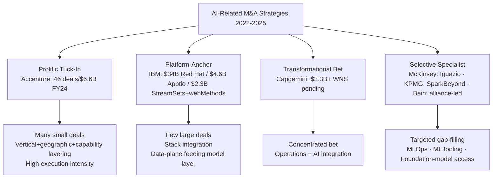

Three insights emerge from the cross-firm comparison. First, **acquisition spend frequently exceeds announced organic AI envelopes**: Accenture's US$6.6B FY24 acquisition spend more than doubles the annualized US$1B run-rate of its US$3B Data & AI envelope, indicating that "headline" announcements understate true capability investment. Second, **the IBM model offers stack integration that the tuck-in model cannot match**, but at the cost of slower velocity and greater concentration risk. Third, **the MBB selective-specialist model preserves partnership margins and capital flexibility** but exposes the firms to the long-run risk that platform IP, increasingly held by Accenture/IBM/Capgemini, becomes the principal locus of value capture in AI consulting—a strategic tension to which the report returns in Chapters 4 and 9.

## 2.4 Equity Investments, Corporate Venture Activity, and Strategic Stakes

A third investment vector—minority equity stakes and corporate venture activity—operates alongside organic R&D and full M&A, providing option value, early access to frontier technologies, and co-development optionality without the integration cost of acquisition. Disclosure here is markedly thinner than for headline M&A, but the strategic logic is becoming visible across several firms.

**Accenture Ventures** is the most institutionally developed corporate-venture vehicle in the cohort. Through its **Project Spotlight** program—described as "an engagement and investment program that connects emerging technology startups with Accenture's Global 2000 client base in order to fill strategic innovation gaps"[^18]—Accenture combines minority equity investment with a structured client-access pathway that converts portfolio companies' technology into Accenture-mediated enterprise deployments. The March 27, 2024 strategic investment in **Sanctuary AI**, a Vancouver-based developer of AI-powered humanoid general-purpose robots, illustrates the pattern: Sanctuary's Phoenix robot, recognized in TIME's "Best Inventions of 2023," is powered by the Carbon AI control system that "mimics subsystems found in the human brain, such as memory, sight, sound and touch, and translates natural language into action in the real world"[^18]. Accenture's global advanced automation and robotics lead Joe Lui framed the rationale in deployment-channel terms: "Sanctuary AI's advanced AI platform trains robots to react to their environment and perform new tasks with precision in a very short time. We see huge potential for their robots in post and parcel, manufacturing, retail and logistics warehousing operations, where they could complement and collaborate with human workers"[^18]. The Sanctuary investment sits alongside **Accenture Alpha Automation**, a joint venture with Japanese robotics leader Mujin, and earlier acquisitions of **Eclipse Automation** (Canada) and **Pollux** (Brazil)[^18], forming a coherent humanoid-robotics-and-industrial-automation portfolio that crosses the boundary between equity, JV, and full ownership.

The strategic logic of corporate venturing for AI consulting firms differs materially from financial venture capital. The economic prize is not the equity return on the stake but the **client-deployment annuity** that Project Spotlight is designed to generate: each portfolio investment becomes a candidate for embedding into Accenture's Global 2000 advisory engagements, monetizing the relationship through delivery fees rather than exit multiples. This logic explains why Accenture has been prepared to invest in capital-intensive, multi-year-payback frontier categories (humanoid robotics, industrial AI) that pure financial investors might avoid.

The other firms in the cohort have less publicly visible venture programs. **McKinsey's QuantumBlack** functions partly as an internal incubation and capability-building engine rather than an external investment platform, with selective external alliances (notably with foundation-model providers and MLOps tooling vendors) supplementing its internal build. **Bain's services alliance with OpenAI**, while not an equity investment, performs an analogous strategic function—granting privileged early access to frontier model capability that Bain's 18,000 knowledge workers had already used internally for a year before the alliance was formalized[^4], thereby converting accumulated internal know-how into a market-facing offering. **EY's deep co-development relationship with NVIDIA** (across the EY.ai Agentic Platform and EY.ai enterprise private with Dell)[^8] and **Capgemini's strategic partnerships with Google Cloud and Microsoft**[^7] similarly substitute alliance economics for equity investment in frontier-capability access.

For the Big Four, regulatory constraints—specifically auditor-independence rules limiting equity stakes in technology companies whose products may be used by audit clients—materially restrict corporate venturing as a capability vector. This regulatory asymmetry is one of the structural reasons the Big Four lean disproportionately on alliance- and academy-led capability building rather than equity-led approaches.

The synthesis is that **venture and equity activity is not a substitute for organic investment or full M&A; it is a complement that purchases optionality, early access, and channel placement at low capital cost**. Where Accenture's Project Spotlight offers the most institutionalized vehicle in the cohort, the MBB houses substitute alliance access, and the Big Four substitute academy and ecosystem partnerships. Each substitution carries its own combination of capital efficiency, optionality, and lock-in profile.

## 2.5 Time Horizons, Investment Cadence, and Capital Intensity Benchmarking

Reading the announced commitments through the lens of time horizon and ongoing cadence, rather than as static one-time figures, sharpens the comparison considerably. Most of the major AI envelopes in the cohort were announced between mid-2021 and late 2023 over three- to five-year horizons—meaning that, as of late 2025, all are now in **mid-execution** and several are approaching the announced terminal date.

| Firm | Envelope | Announced | Horizon | Status (Late 2025) |
|---|---|---|---|---|
| PwC | US$12B network ("New Equation")[^8] | Sept 2021 | 5 yrs (to FY2026) | Year 4 of 5 — approaching terminal |
| Deloitte | US$1.4B Project 120[^10] | Dec 2022 | Multi-year | Year 3+ — sustained execution |
| Accenture | US$3B Data & AI[^4] | June 2023 | 3 yrs (to FY2026) | Year 2.5 of 3 — terminal year approaching |
| Capgemini | €2B AI[^7] | July 2023 | 3 yrs | Year 2.5 of 3 — terminal year approaching |
| IBM | >US$5B/yr R&D | Continuous | Continuous | Compounding |

The implication is that 2026 is likely to be a **replenishment year** for at least three of the largest envelopes (PwC, Accenture, Capgemini), creating a forward question—addressed in Chapter 9—of whether the cohort will renew at the same magnitude, accelerate (as Accenture's FY24 acquisition spend already suggests), or pivot allocation toward newer categories such as agentic AI and synthetic data.

### Capital Intensity Against the Client-Side Benchmark

The BCG AI Radar 2026 survey provides a useful client-side benchmark against which consulting firms' own intensity can be assessed. Based on a survey of 2,360 executives across 16 markets, BCG finds that **enterprise AI investment as a share of revenue has approximately doubled from ~0.8% in 2025 to ~1.7% in 2026**, with the technology sector leading at 2.1%, financial institutions at 2.0%, and insurance and energy/utilities each at 1.9%[^4]. Among CEOs, **94% report they will continue to invest even if AI investments do not pay off in 2026**, and **only 6% plan to pull back**[^4]. The survey further identifies "Trailblazer" CEOs—approximately 15% of the sample—who are "twice as likely to apply agentic AI end-to-end" and allocate **roughly 60% of their AI budget to agentic AI**, compared to 25% for both Followers and Pragmatists[^4].

Translating this benchmark to consulting firms themselves, the announced AI envelopes—Accenture's ~US$1B/yr against estimated FY26 revenue of ~US$66B implies ~1.5% of revenue; Capgemini's ~€670M/yr against ~€22.5B revenue implies ~3.0%—suggest that **the leading AI consulting firms are investing at intensities meeting or exceeding the client-side average, with Capgemini approaching the top quartile of its own enterprise client benchmark**. This is structurally consistent: firms whose business model depends on selling AI capability must maintain a higher capability-investment intensity than the median client they advise. However, when measured against the BCG-defined "Trailblazer" CEO archetype—where 92% feel "very confident" their AI strategy will pay off and 87% spend more than six hours per week expanding their AI expertise[^4]—the evidence in subsequent chapters will indicate that several firms still resemble "Pragmatists" or "Followers" in their internal AI adoption, despite their external positioning.

### Bookings and Revenue Realization as Cadence Validation

A complementary cadence indicator is the conversion of capital commitments into AI-related bookings and revenue. **IBM's AI Book of Business**—a combination of bookings and actual sales across AI products—**reached US$2 billion** by late 2023, of which roughly one-quarter was actual sales[^6]; subsequent quarters have reported continued growth of this metric. **Accenture's Q3 2025 financials reported a 7.7% revenue growth from AI-driven services and a 10% rise in operating income driven by AI and acquisitions**[^14]. These data points validate that the announced multi-year envelopes are translating into commercially meaningful revenue lines, not merely capability buildouts. By contrast, the absence of comparable disclosed bookings figures for KPMG, EY, McKinsey, BCG, and Bain reflects either narrower disclosure conventions or less developed AI-specific revenue tracking—a factor that complicates outside assessment of capital-to-revenue conversion efficiency.

## 2.6 Synthesis: How Inorganic Moves Complement Organic Investment to Close Capability Gaps

The chapter's findings converge on a structural matrix that maps each firm's combined organic + inorganic investment profile against five core AI capability gaps surfaced in Chapter 1: **(i) data engineering and data readiness, (ii) AI/ML engineering and MLOps, (iii) vertical and industry-specific AI IP, (iv) agentic AI orchestration, and (v) trust, governance, and security**. The matrix below summarizes coverage across the cohort, distinguishing strong organic investment (●), strong inorganic investment (◆), partial coverage (○), and limited disclosed coverage (—).

| Firm | Data & Readiness | ML Eng / MLOps | Vertical/Industry IP | Agentic AI | Trust & Governance |
|---|---|---|---|---|---|
| **Accenture** | ●◆ (Industry accelerators, NeuraFlash, Cognosante) | ●◆ | ●◆ (19-industry accelerators[^4]; vertical M&A) | ●◆ (NeuraFlash agentic; AI Refinery) | ● (Responsible AI framework) |
| **IBM** | ●◆ (StreamSets/webMethods, Apptio, Red Hat[^13]) | ● (watsonx) | ○ (some vertical depth via watsonx industry accelerators) | ● (Consulting Advantage agents[^7]) | ● (Trust as platform principle) |
| **Capgemini** | ●◆ (WNS pending[^17]; Altran prior) | ● (Generative AI Lab) | ○ (selective verticals) | ● (4 GenAI assistants[^7]) | ○ |
| **Deloitte** | ● (data strategy practice) | ● | ● (industry alliances) | ○ (AI Academy includes agentic curriculum) | ● (Trustworthy AI framework[^19]) |
| **PwC** | ● | ● | ●(audit/tax/risk verticals) | ○ (agent OS launched[^7]) | ●● (Responsible AI; assurance heritage) |
| **EY** | ● | ● (EY.ai Agentic Platform[^8]) | ● (Tax Labs, Tax Agent Factory) | ●(EY.ai Agentic + Tax Agent Factory) | ●● (Trusted AI; risk solutions) |
| **KPMG** | ○ | ○ | ● (Clara/Workbench) | ○ | ●● (Trusted AI; assurance heritage) |
| **McKinsey** | ◆ (Iguazio) | ◆ (Iguazio MLOps) | ● (QuantumBlack vertical work) | ○ (Lilli internal; client agents) | ○ |
| **BCG** | ○ | ○ | ● (BCG X tech-build) | ● (AI Radar agentic emphasis[^4]) | ○ |
| **Bain** | ○ | ○ | ○ | ○ (OpenAI alliance leveraged for agents[^4]) | — |

Five synthesized insights follow.

**First, the platform-heavy archetype (Accenture, IBM, Capgemini) achieves the most complete capability coverage**, but at the cost of capital intensity that the smaller MBB houses are structurally unable to match. Accenture in particular has built a uniquely balanced portfolio across all five capability gaps, with M&A explicitly used to fill gaps that organic build could not address at the required velocity—the NeuraFlash deal (agentic AI + Salesforce + mid-market[^14]) and Cognosante deal (federal health vertical depth[^15]) being the clearest illustrations.

**Second, IBM's vertically integrated stack confers a defensible position in data-plane capability** through the StreamSets/webMethods/Apptio/Red Hat sequence[^13], but its vertical and agentic coverage relative to Accenture remains less fully developed in publicly disclosed terms. The strategic risk is that IBM's platform depth is undercut by the platform-and-talent-heavy approach of Accenture, which can deploy multiple hyperscaler stacks to clients rather than anchoring on a single owned platform.

**Third, the talent-and-learning-heavy archetype (Deloitte, PwC, EY) leverages the Big Four's structural advantages—assurance, tax, and audit heritage—into the trust and governance capability gap, where they hold a defensible lead over the platform-led firms.** EY's release cadence across the EY.ai Agentic Platform, EY.ai enterprise private (with Dell/NVIDIA), EY.ai Tax Labs, and EY.ai Tax Agent Factory[^8] indicates that this archetype is increasingly capable of platform-style outputs without platform-style capital intensity, by leveraging hyperscaler partnerships. Deloitte's January 2025 *State of Generative AI in the Enterprise* report's finding that **74% of organizations report their most advanced GenAI initiative is meeting or exceeding ROI expectations, with cybersecurity initiatives showing the strongest performance (44% above expectations vs. 17% below)**[^19] both supports the Big Four's governance positioning and provides Deloitte with a thought-leadership moat.

**Fourth, the MBB houses are exposed in capability breadth but resilient in capability depth.** McKinsey's Iguazio acquisition closes the MLOps gap. Bain's OpenAI alliance closes the foundation-model access gap[^4]. BCG's annual AI Radar series and BCG X build closes the agentic-AI thought-leadership gap[^4]. But none of the three has a disclosed vertical-IP investment program comparable to Accenture's industry accelerators or IBM's watsonx-anchored stack. This creates a strategic dependency: MBB engagements at the top of the value chain are increasingly anchored on platforms owned by ecosystem partners or by Big Four / Accenture / IBM / Capgemini—a tension that subsequent chapters revisit.

**Fifth, two white spaces are visible across the cohort relative to the demand-side shifts identified in Chapter 1**:
- **Synthetic data**, where Gartner forecasts a 178% CAGR through 2029 and 77% of LLM training data being synthetic by 2029, currently has no disclosed dedicated capability investment by any of the ten firms—suggesting either a forward gap or undisclosed activity.
- **Post-quantum readiness**, with a US$2B encryption market by 2029 and a four-year window before asymmetric cryptography becomes unsafe, similarly lacks disclosed dedicated capability investment despite obvious adjacency to the cybersecurity practices of the Big Four and Accenture.

Both white spaces represent forward replenishment opportunities for the next round of capital commitments expected across 2026–2027, when several of the current envelopes terminate and the BCG AI Radar 2026 finding that **94% of CEOs will continue to invest even if AI does not pay off in 2026**[^4] suggests sustained client-side demand will support further intensification.

The financial baseline established in this chapter—headline envelopes ranging from below US$1.4B (Deloitte, narrowly L&D-defined) to multi-year commitments exceeding US$10B (PwC network-wide), supplemented by acquisition spend that in Accenture's case alone exceeds US$6.6B in a single year, and by venture vehicles such as Project Spotlight that purchase optionality at modest capital cost—provides the quantitative anchor against which Chapters 3 through 8 evaluate strategic direction, proprietary platforms, ecosystem alliances, client engagements, governance capabilities, talent strategies, and ROI evidence. The capital is committed; the question that the remainder of the report addresses is **what, beyond the financial commitment, each firm has built with it**.

# 3 Strategic Direction and AI Vision of Each Firm

Chapter 2 closed on a pointed observation: the capital is committed, and the question that remains is what each firm has built—and intends to stand for—with it. Capital allocation, however generous, is necessary but not sufficient to explain competitive position; behind every multi-billion-dollar envelope sits a strategic narrative that defines who the firm claims to serve, what problem it claims to solve, and which capabilities it elects to make defensible. Strategic narratives matter because they discipline allocation decisions across products, alliances, talent, and governance; they signal to clients which engagements the firm wants to win; and they shape the internal culture through which consultants translate technology into outcomes.

This chapter undertakes a structured comparison of the AI visions articulated by the ten target firms. It does so by archetype rather than alphabetically, because firms with shared structural DNA—the Big Four's assurance heritage, the global integrators' platform economics, the MBB partnerships' C-suite advisory tradition—construct narratives in recognizably different registers. Reading the narratives within their archetype first, and then across archetypes, exposes both the convergent rhetoric (responsible AI, agentic transformation, end-to-end reinvention) and the genuine points of differentiation (trust positioning, platform ownership, frontier-model access, CEO advisory framing) that determine where competitive collisions are most likely to occur. The chapter closes with a synthesized positioning matrix that maps every firm onto a common analytical surface and surfaces the strategic tensions that subsequent chapters interrogate empirically.

## 3.1 Big Four AI Strategic Narratives: Trust, Assurance, and Human-Led Transformation

The four Big Four firms construct their AI narratives from a shared structural inheritance—the assurance, audit, tax, and risk-advisory heritage that grants them privileged access to regulated industries, finance functions, and CFO/Audit Committee decision-makers. Each firm leverages that inheritance differently, but the common thread is unmistakable: trust, governance, and human-in-the-loop oversight are not adjacent compliance services but the central organizing principle through which AI is sold. This positioning is structurally coherent with the regulatory and ROI pressures identified in Chapter 1—the EU AI Act, GDPR, the rising centrality of AI Data Governance (a 163.75% CAGR sub-segment), and clients' growing concern that two-thirds of AI initiatives remain stuck in pilot mode—and it converts the Big Four's perceived "incumbency" into a defensible AI value proposition.

### Deloitte: "Now Decides Next" and the Age of With

Deloitte's AI narrative is the most empirically grounded of the four, anchored not in a slogan but in a multi-year quantitative research program—the *State of Generative AI in the Enterprise* quarterly survey series—that simultaneously functions as thought leadership, market intelligence, and category-defining instrument. The narrative title itself, "Now decides next," articulates a thesis that the actions enterprises take today will have a "decisive impact on their ability to succeed with GenAI in the future"[^19]. Ranjit Bawa, Deloitte's US Chief Strategy and Technology Officer, frames AI as "the greatest secular shift of this quarter century" and observes that "most companies are transforming at the speed of organizational change, not at the speed of technology"[^19]—a diagnostic that positions Deloitte not as a technology provider but as an organizational-change orchestrator.

The deeper narrative architecture rests on three integrated frames. The first is the **"Age of With"**—a positioning developed by the Deloitte AI Institute that emphasizes "human-machine collaboration" rather than automation as the organizing principle for enterprise AI[^19]. The second is the **Trustworthy AI™ framework**, which the AI Institute explicitly markets as the governance scaffolding around responsible AI deployment[^9]. The third is the **AI Institute–Academy axis**: the Deloitte AI Institute "promote[s] dialogue about and development of artificial intelligence, stimulate[s] innovation, and examine[s] challenges to AI implementation," while the Deloitte AI Academy delivers the upskilling that converts institute thinking into deployable consulting capacity[^19].

The strategic differentiation lies in how Deloitte translates research findings into prescriptive client guidance. The Q4 2024 *State of Generative AI* report's headline insights—**74% of organizations report their most advanced GenAI initiative is meeting or exceeding ROI expectations**, **78% expect to increase overall AI spending in the next fiscal year**, and **52% of leaders identify agentic AI as the technology development of greatest interest**—are simultaneously diagnostics about the market and implicit endorsements of the consulting offers Deloitte is selling[^19]. The report's prescriptive framing is unambiguous: organizations should "Task the C-suite with creating alignment and managing expectations," "Build bridges to sustained ROI," "Prioritize your workforce and prepare it for disruption," and "Start planning for GenAI agents"[^19]—a four-part agenda that maps directly onto Deloitte's audit-adjacent governance, transformation advisory, AI Academy, and emerging agentic-AI practice areas.

The target client segment is correspondingly broad but ROI-anchored: Deloitte serves "nearly 90% of the Fortune 500® and more than 8,500 U.S.-based private companies"[^9], with the AI narrative tilted toward the C-suite decision layer that the *State of GenAI* report explicitly addresses. The CxO-vs-non-CxO gap the report surfaces—**21% of C-suite respondents feel GenAI is already transforming their organization, compared to only 8% of non-C-suite respondents**, and 60% of non-C-suite respondents believe scaling barriers will take 12+ months to resolve, compared to 47% of C-suite respondents[^19]—is itself a positioning device, casting Deloitte as the trusted bridge between executive optimism and operational reality.

### PwC: The New Equation and the Human-Led, Tech-Powered Promise

PwC's AI narrative is embedded within a broader strategic frame announced in June 2021, well before the GenAI inflection: **"The New Equation,"** a network-wide US$12 billion investment commitment designed to address "fundamental changes in the world, including technological disruption, climate change, fractured geopolitics, and the continuing effects of the COVID-19 pandemic"[^8][^7]. The framing is deliberately broader than AI: AI is positioned as one capability layer within a "multidisciplinary model" that explicitly combines audit, tax, ESG, cyber, data privacy, and AI in a single integrated offering.

The narrative's two organizing pillars—**trust and sustained outcomes**—are presented as inseparable. Global Chairman Bob Moritz frames the thesis with characteristic concision: "to succeed, organisations need to create a virtuous circle between earning trust and delivering sustained outcomes"[^8][^7]. The strategic logic is that AI accelerates the second pillar (delivering outcomes faster, at scale) but threatens the first (introducing bias, hallucination, opacity, and regulatory risk). PwC's resolution is to bind the two together: AI is sold not as a discrete technology offering but as a capability that requires the audit, governance, and assurance heritage PwC already possesses. The press release explicitly anchors AI within a "human-led, tech-powered" philosophy—a phrase that subsequent PwC AI initiatives, including its enterprise AI agent operating system[^7], have continued to invoke.

The capability buildout under New Equation is broad. PwC's 2021 announcement specified "an expansion of specialist capabilities including cyber security, data privacy, ESG and AI"[^8][^7], with US$3 billion specifically earmarked for Asia Pacific over five years to "double the size of the business by 2026"[^8][^7], and 100,000 net new jobs concentrated "in emerging capability areas, from ESG to AI"[^8]. The differentiating narrative move is that AI is positioned as one of several capability layers built atop a quality-and-trust foundation, rather than as a standalone strategic priority. This positioning is structurally coherent with PwC's audit roots and with regulatory tailwinds: as Chapter 1 noted, the EU AI Act and GDPR systematically advantage firms with strong assurance heritage, and PwC's narrative converts that structural advantage into a marketable proposition.

The target client segment is correspondingly weighted toward listed and regulated enterprises, with explicit emphasis on stakeholder transparency: PwC's approach to building trust is "designed to meet rising expectations of transparency and stakeholder engagement," combining "expertise in audit, tax and compliance activity with an expansion of specialist capabilities including cyber security, data privacy, ESG and AI"[^8]. The narrative deliberately downplays the bleeding-edge frontier-model rhetoric that characterizes the MBB narratives, in favor of an integrated, governed, multidisciplinary delivery model.

### EY: EY.ai as a Unifying Platform Vision

EY's AI narrative is the most platform-anchored of the Big Four, organized around the **EY.ai** brand that functions simultaneously as a unifying client-facing platform and as the architectural framework binding EY's AI offerings together[^8]. The narrative's central claim is that AI capability is inherently composable, and that EY's competitive advantage lies in providing an integrated platform on which industry-specific, function-specific, and risk-specific AI agents can be assembled, deployed, and governed.

The platform vision has crystallized through a sequence of deliberately staged releases across 2024–2025. **EY.ai for Risk** (June 2025), launched in collaboration with NVIDIA, "consolidate[s] risk technology and knowledge into a single, cohesive system built on the EY.ai agentic platform"[^8]. **EY.ai enterprise private** (May 2025), powered by the Dell AI Factory with NVIDIA and the EY.ai Agentic Framework and Model Catalog, is an "on-premises deployment model" designed for clients with sovereignty or data-sensitivity constraints[^8]. **EY.ai Tax Labs and the EY.ai Tax Agent Factory** (November 2025) extend the platform into the tax function, providing "a methodology, an operating model and a technology strategy that enables tax professionals and clients to design, build, train, deploy and manage AI agents at scale"[^8]. **EY-Parthenon's neurosymbolic AI capabilities** (September 2025) extend the platform into the strategy advisory layer, "empower[ing] businesses to identify, predict and unlock revenue at scale"[^8].

Two strategic implications follow. First, EY's narrative explicitly **positions agentic AI not as a future inflection but as the present operating reality**: the EY.ai Tax Agent Factory is described as the firm's "global accelerator for AI-powered transformation in tax," and Marna Ricker, EY Global Vice Chair – Tax, articulates the transformation thesis directly: "These offerings showcase our commitment to transforming the tax function of the future by leveraging the latest in AI and technology"[^8]. Second, EY's vision is **alliance-leveraged rather than purely organic**, with NVIDIA and Dell named as central platform partners; this allows EY to compete with Accenture's and IBM's deeper proprietary capability investments without underwriting equivalent infrastructure spend.

The narrative also places governance at the center through the **Trusted AI** frame, which—as captured in EY's own Trusted AI and AI Governance discussion paper—articulates a five-principle architecture (Transparent, Unbiased, Explainable, Resilient, Performance) and a model lifecycle risk-tiering framework that converts EY's audit-and-risk heritage into productized AI governance capability[^7]. The discussion paper's RACI matrix, three-tier model risk classification, and policy templates demonstrate the operational depth behind the slogan, positioning EY against PwC and KPMG specifically on the regulated-enterprise governance axis.

The June 2025 Responsible AI Pulse survey adds a market-shaping dimension to the narrative: EY's finding of "a substantial gap between how confident C-suite executives feel about their artificial intelligence (AI) systems and the current level of governance controls in place"[^8] simultaneously diagnoses a market problem and creates demand for EY's governance offerings—a thought-leadership-as-positioning move parallel to Deloitte's *State of GenAI* and BCG's *AI Radar*.

### KPMG: Trusted AI Anchored in Clara and the Microsoft Alliance

KPMG's AI narrative is the most ecosystem-leveraged of the Big Four, deliberately organized around a multibillion-dollar global alliance with Microsoft that integrates Microsoft Cloud, Azure OpenAI Service, and KPMG IP[^8][^5]. The narrative's central claim is not that KPMG owns the deepest proprietary AI stack, but that it owns the **deepest integration of frontier AI capability into the audit and assurance workflow**—a workflow whose centrality to the capital markets makes it the highest-stakes AI use case in the Big Four portfolio.

The narrative crystallizes around **KPMG Clara**, the firm's global smart audit platform, into which generative AI was integrated in July 2024 and made available to KPMG's 90,000 global Audit professionals[^5]. Scott Flynn, KPMG U.S. Vice Chair – Audit, articulates the strategic logic: "With seamless access to trusted generative AI capabilities within our audit workflow, our 9,000 auditors will be empowered to deliver quality audits. KPMG Clara with AI will not only free up resources to spend more time on the areas of highest risk, but will directly help our teams exercise professional skepticism to protect the capital markets"[^5]. The framing is doubly strategic: it addresses an external client demand (KPMG's own research found that **83% of financial reporting leaders believe it is important for auditors to use AI**[^5]) and an internal efficiency imperative (freeing senior auditors to focus on higher-judgment work).

The Trusted AI framework is the explicit governance layer. Thomas Mackenzie, KPMG U.S. and Global Audit Chief Technology Officer, frames the principle in operational terms: "Our Trusted AI framework underpins everything we do with AI in the audit. All of our auditors are trained on how to effectively use AI with a human-in-the-loop mindset to maintain quality, accuracy and professional skepticism"[^5]. Three structural features of the narrative deserve emphasis. First, the **human-in-the-loop principle is central, not adjacent**, distinguishing KPMG's positioning from the more autonomy-forward agentic narratives of Accenture, IBM, and EY. Second, the **alliance leverage is explicit**: KPMG's AI capability buildout is anchored on the Microsoft alliance, the MindBridge audit alliance for Transaction Scoring, and the Databricks Data Intelligence Platform integration into Clara, signaling a deliberate choice to compete on integration depth rather than platform ownership[^5]. Third, the **audit-first sequencing** orients the narrative toward regulated industries and the CFO/Audit Committee decision layer, where KPMG's positioning is structurally strongest.

The target client segment is correspondingly weighted toward audit clients and the CFO function, with the broader advisory practice extending the narrative outward into tax, risk, and digital transformation engagements where the same Trusted AI framework can be transposed.

### Synthesis Across the Big Four

The four Big Four narratives converge on three rhetorical motifs—trust, governance, and human-in-the-loop oversight—but diverge meaningfully on emphasis and architectural form. Deloitte leads on empirical research and ROI orchestration; PwC leads on multidisciplinary integration; EY leads on platform vision and agentic deployment; KPMG leads on audit-workflow integration. The common thread is the deliberate translation of assurance heritage into a defensible AI value proposition, and the deliberate avoidance of a frontier-technology rhetoric that the Big Four are structurally less well-positioned to support.

| Big Four Firm | Narrative Anchor | Signature Frame | Differentiating Move | Primary Target Decision-Maker |
|---|---|---|---|---|
| **Deloitte** | "Now decides next" / Age of With | Trustworthy AI + AI Institute + AI Academy | Empirical research-led ROI prescription | C-suite (CxO alignment with non-C-suite reality) |
| **PwC** | The New Equation | Trust + Sustained Outcomes; "human-led, tech-powered" | Multidisciplinary capability integration | Listed/regulated enterprise stakeholders |
| **EY** | EY.ai unifying platform | Trusted AI + agentic platform | Composable platform with NVIDIA/Dell alliances | Tax, risk, strategy advisory leaders |
| **KPMG** | Trusted AI in the audit workflow | Clara + Microsoft alliance | Audit-first AI integration with human-in-the-loop | CFOs, Audit Committees, finance leaders |

## 3.2 Global SI and Tech-Led Integrator Visions: Reinvention, Platform, and Custom Enterprise AI

The three global integrators—Accenture, IBM Consulting, and Capgemini—construct AI narratives in a fundamentally different register from the Big Four. Where the Big Four lead on trust and governance, the integrators lead on **scale, platform, and reinvention**: their narratives presume that AI is the central transformation vector of the next decade and position the firms as the principal at-scale orchestrators of enterprise-wide change. This positioning is structurally coherent with the platform-heavy capital allocation archetype identified in Chapter 2, and with the narrative requirement to justify the largest absolute AI envelopes in the cohort.

### Accenture: Reinvention with AI as a Mega-Trend

Accenture's AI narrative is the most ambitious of the cohort in temporal scope and the most operationally specific in execution detail. The June 2023 announcement of the US$3 billion Data & AI investment frames AI not as a discrete capability addition but as **the defining business transformation of the next decade**. Paul Daugherty, group chief executive of Accenture Technology, articulates the thesis directly: "Over the next decade, AI will be a mega-trend, transforming industries, companies, and the way we live and work, as generative AI transforms 40% of all working hours"[^4][^5].

Chair and CEO Julie Sweet pairs the mega-trend framing with an action-oriented prescription: "There is unprecedented interest in all areas of AI, and the substantial investment we are making in our Data & AI practice will help our clients move from interest to action to value, and in a responsible way with clear business cases. Companies that build a strong foundation of AI by adopting and scaling it now, where the technology is mature and delivers clear value, will be better positioned to reinvent, compete and achieve new levels of performance"[^4][^5]. The framing carries three deliberate strategic implications. First, **AI is positioned as foundational rather than discretionary**: clients that fail to build the foundation now will be structurally disadvantaged. Second, **responsibility is positioned as compatible with speed**, addressing the trust concerns the Big Four foreground but refusing to let them slow the transformation thesis. Third, **scale and ecosystem mastery are positioned as Accenture's distinctive advantages**: "Our clients have complex environments, and at a time when the technology is changing rapidly, our deep understanding of ecosystem solutions allows us to help them navigate quickly and cost effectively to make smart decisions"[^4].

The narrative's operational architecture is explicit and itemized. The US$3 billion envelope funds investment in "assets, industry solutions, ventures, acquisitions, talent and ecosystem partnerships"; the doubling of AI talent in the Data & AI practice from 40,000 to 80,000 professionals; the launch of the **AI Navigator for Enterprise**, "a generative AI-based platform that will help clients define business cases, make decisions, navigate AI journeys, choose architectures and understand algorithms and models to drive value responsibly"; the creation of "accelerators for data and AI readiness across 19 distinct industries"; and the **Center for Advanced AI** "dedicated to maximizing the value of this technology across clients and within Accenture," including "extensive R&D and investments to reimagine service delivery using generative and other emerging AI capabilities"[^4][^5]. The patent base behind this narrative—**more than 1,450 patents and pending patent applications worldwide**—and the existing AI delivery platforms (myWizard, SynOps, MyNav) provide the credibility infrastructure that supports the reinvention rhetoric[^4].

The differentiating narrative move is Accenture's **synthesis of platform, talent, and ecosystem under a single transformation thesis**. Where the Big Four bind AI to assurance and the MBB houses bind AI to strategy, Accenture binds AI to end-to-end reinvention—a positioning that maps onto its capital intensity (Chapter 2) and that explicitly targets the workload that no other archetype can deliver at scale: industrial-strength enterprise transformation across Strategy & Consulting, Technology, Operations, Industry X, and Accenture Song[^5]. The target client segment is correspondingly the largest enterprises with the most complex transformation agendas; the narrative explicitly invites them to use Accenture as the integration backbone for AI across every business function.

### IBM Consulting: watsonx-Centric Consulting Advantage

IBM Consulting's AI narrative is the most platform-anchored of the integrator cohort, organized around the **IBM Consulting Advantage** services platform and the **watsonx** data and AI stack that underpins it. The narrative's central claim is that AI consulting becomes economically transformational only when consultants themselves are augmented by a proprietary, integrated platform that combines methods, assets, models, and role-based assistants—and that IBM, uniquely among the global integrators, owns the full vertical stack from data plane through model layer to consultant delivery.

IBM's articulation of the vision is unusually direct: "In today's evolving business landscape, IBM Consulting Advantage offers a revolutionary approach. Our AI services platform provides easy, customized access to proprietary methods, purpose-built AI assets and models and role-based generative AI assistants. With this advanced tool, IBM consultants deliver solutions faster, more consistently, and cost-effectively than ever before"[^7]. Three structural narrative elements deserve emphasis. First, the **delivery economics framing**—"faster, more consistently, and cost-effectively"—is explicit, addressing the ROI pressure that Chapter 1 identified as the dominant client concern. Second, the **proprietary IP framing** distinguishes IBM from alliance-leveraged competitors: IBM's narrative does not depend on Microsoft or Google ownership but on watsonx ownership. Third, the **role-based assistant architecture** maps the platform onto the consulting workflow, signaling that internal consultant productivity is a first-order outcome.

The narrative is reinforced by the financial validation that the IBM AI Book of Business—"a combination of bookings and actual sales across various products"—**reached US$2 billion** by late 2023, with about one-quarter representing actual sales[^6]. This number simultaneously demonstrates commercial traction and signals to clients that the platform is being deployed at scale. The complementary IBM Concert ITOps platform extends the narrative into operations: "IBM Concert is an ITOps platform that unifies observability, optimization, and resilience insights into shared operational intelligence, with governed AI"[^12]—the phrase "governed AI" doing important narrative work, binding the platform thesis to the governance positioning that the Big Four lead on, but framing it as a built-in platform property rather than as an advisory overlay.

The differentiating narrative move is IBM's **vertical stack integration**: the StreamSets/webMethods data integration layer (acquired from Software AG for US$2.3B in late 2023, as discussed in Chapter 2), feeding watsonx, feeding Consulting Advantage, feeding consultant assistants. No other firm in the cohort can claim equivalent stack ownership. The strategic risk is that the platform-anchored narrative implies a degree of vendor lock-in that hyperscaler-neutral competitors (notably Accenture, which deploys multiple stacks) can use as a counter-narrative; IBM's response is to position watsonx as **hybrid-cloud-native**, deployable across customers' chosen infrastructure, blunting the lock-in critique.

The target client segment is correspondingly weighted toward complex enterprises with deep IBM relationships—particularly in financial services, healthcare, and government—and toward CIOs and CTOs whose architectural decisions are central to AI transformation. The narrative is comparatively less oriented toward the marketing-led consumer transformation use cases that anchor Accenture Song or the brand-marketing engagements that anchor the MBB consumer narratives.

### Capgemini: Generative AI Portfolio for Custom Enterprise AI

Capgemini's AI narrative is the most explicitly positioned around **custom enterprise AI for clients with proprietary, sensitive data**. CEO Aiman Ezzat articulated the thesis in July 2023 alongside the announcement of the €2 billion AI investment and the plan to grow data and AI teams to 60,000 within three years: "We are developing a portfolio of industry-specific offers and signing strategic partnerships, notably with Google Cloud and Microsoft while training most of our workforce through our Data & AI Campus to fully leverage the power of generative AI in our operations"[^7].

The narrative's distinctive emphasis surfaces in the framing of the custom-AI offering. Franck Greverie, chief portfolio officer at Capgemini, articulated the differentiating logic: "For clients who have key sensitive data, we are developing custom generative AI solutions, fine-tuned with their proprietary data, to create maximum business value"[^7]. The positioning is doubly strategic. First, it **targets a specific demand-side concern**—data sovereignty and competitive sensitivity—that horizontal hyperscaler offerings cannot fully address. Second, it **leverages Capgemini's European base** in a regulatory and competitive environment (GDPR, the EU AI Act, sovereign-AI dynamics identified in Chapter 1) where data sensitivity is a first-order client concern. The custom enterprise AI thesis is therefore not merely a product positioning but a geographic-strategic alignment.

The portfolio architecture is itemized in four primary offerings: (i) four generative AI assistants for "hyper personalised" customer experience and sales-team knowledge assistance, with Heathrow Airport named as an early deployment for passenger experience improvement; (ii) generative AI for software engineering across "design, coding, documentation, testing, and deployment"; (iii) custom generative AI for enterprise, fine-tuned with client proprietary data; and (iv) generative AI strategy advisory[^7]. Around these offerings, Capgemini has established a **dedicated generative AI practice** and a **Generative AI Lab**, supported by the **Data & AI Campus** that handles workforce upskilling[^7].

The differentiating narrative move is the **dual emphasis on European sovereignty and operational integration**. The Generative AI Lab functions as the proprietary IP nucleus; the Data & AI Campus converts that IP into deployable consultant capacity; the Google Cloud and Microsoft alliances supply the foundation-model layer that Capgemini has chosen not to build organically; and the custom enterprise AI offering provides the high-margin productization. The pending US$3.3B+ acquisition of WNS (announced July 2025, discussed in Chapter 2) extends the narrative further into the operations-and-AI integration space, signaling a thesis that the long-run value of AI accrues to operators who combine advisory with at-scale process operations.

The target client segment is large European and global enterprises with proprietary data assets and regulatory sensitivity, with the narrative tilted toward CDOs, CIOs, and CMOs leading function-specific AI deployments rather than toward CEOs leading whole-company reinvention.

### Synthesis Across the Global Integrators

The three integrator narratives share a common rhetorical vocabulary—platform, scale, ecosystem, transformation—but diverge on architectural form. Accenture leads on end-to-end reinvention as a multi-decade thesis; IBM leads on vertical stack integration with proprietary platform ownership; Capgemini leads on custom enterprise AI for clients with sensitive proprietary data. The common positioning move is the rejection of the Big Four's trust-first framing and the MBB's strategy-first framing in favor of an **execution-and-platform-first framing** that justifies the cohort's larger capital intensity and platform investments.

| Integrator | Narrative Anchor | Signature Frame | Differentiating Move | Primary Target Decision-Maker |
|---|---|---|---|---|
| **Accenture** | Reinvention with AI | "Mega-trend" transforming 40% of working hours | End-to-end transformation across all functions | CEOs of the largest enterprises |
| **IBM Consulting** | watsonx + Consulting Advantage | "Faster, more consistently, more cost-effectively" | Vertical stack integration with proprietary IP | CIOs/CTOs of regulated enterprises |
| **Capgemini** | Generative AI Portfolio | Custom GenAI for clients with sensitive data | European sovereignty + operations integration | CDOs/CIOs of large European/global enterprises |

## 3.3 MBB Strategy House Visions: Strategic Framing, Proprietary Tooling, and Frontier Alliances

The three MBB partnerships—McKinsey & Company, BCG, and Bain & Company—construct AI narratives in a third register, distinct from both the Big Four and the global integrators. Where the Big Four lead on trust and the integrators lead on platform, the MBB houses lead on **strategic framing, CEO advisory positioning, and frontier-model access through alliances rather than ownership**. The narrative form is structurally coherent with partnership economics: lean capital intensity, premium positioning at the top of the value chain, and a deliberate refusal to compete with the integrators on platform or with the Big Four on assurance scope. The MBB AI narrative is the narrative of the strategic brain rather than the operational backbone.

### McKinsey: QuantumBlack-Anchored Strategy + Advanced Analytics

McKinsey's AI narrative—captured publicly through the firm's Lilli internal platform, the QuantumBlack unit, and the *State of AI* survey series—is the most empirically anchored and the least promotional of the MBB narratives. The 2025 *State of AI* survey, drawing on 1,993 participants across 105 countries (as discussed in Chapter 1), provides the diagnostic foundation: 88% of organizations now use AI in at least one function, but only 6% qualify as "AI high performers" deriving more than 5% of EBIT from AI, and only 1% describe themselves as "mature." The narrative implication is clear: the strategic challenge is not technology adoption but value capture, and value capture requires the integrated strategy + advanced analytics capability that QuantumBlack represents.

QuantumBlack itself is positioned as the operational nucleus of McKinsey's AI capability—the unit through which McKinsey transitioned from a pure strategy advisory model to an integrated strategy-plus-analytics-plus-engineering model. The Iguazio acquisition (July 2023, MLOps platform, as discussed in Chapter 2) signaled that McKinsey was prepared to acquire engineering depth rather than license it. The Lilli platform—McKinsey's internal generative AI assistant—signaled that the firm was prepared to invest in proprietary internal IP, even without disclosing the investment magnitude.

The differentiating narrative move is McKinsey's positioning at the **CEO and board strategic decision layer**, with AI framed as the most consequential strategic question of the decade rather than as a technology deployment program. The 3× multiplier identified in McKinsey's research—**AI high performers are 3× more likely to redesign workflows around AI** and **3× more likely to have committed executive leadership** driving AI as a strategic priority—simultaneously diagnoses the market and positions McKinsey as the firm best-equipped to support both moves. The target client segment is correspondingly the CEO and board decision layer of the largest global enterprises, with engagement models concentrated at the strategic-framing top of the value chain rather than at the implementation bottom.

### BCG: CEO-Led AI Transformation and the Trailblazer Archetype

BCG's AI narrative is the most rhetorically distinctive of the MBB cohort, crystallized in the **BCG AI Radar 2026** survey of 2,360 executives—including 640 CEOs—across 16 markets[^4]. The headline narrative thesis is captured in the survey's central title: *"As AI Investments Surge, CEOs Take the Lead."* The thesis has three connected propositions, each operationalized into a strategic prescription that BCG itself is structurally positioned to deliver.

The first proposition is that **AI investment is structurally permanent**: corporate investment in AI as a share of revenue is projected to **double from ~0.8% in 2025 to ~1.7% in 2026**, **94% of CEOs say they will continue to invest even if AI does not pay off in 2026**, and **only 6% plan to pull back**[^4]. The narrative consequence is that AI strategy is no longer a discretionary topic; it is a permanent fixture of CEO agendas.

The second proposition is that **AI transformation is shifting from a CIO-led to a CEO-led initiative**: 82% of CEOs say they are the main decision-maker on AI in their organization (twice the prior year), 72% are more optimistic about AI's ROI than they were 12 months ago, and **50% of CEOs surveyed believe their job stability depends on getting AI investments and strategy right by 2026**[^4]. The narrative consequence is that CEOs themselves—BCG's natural client—are the principal locus of AI decision-making, not CIOs.

The third proposition is the **Trailblazer archetype**, BCG's signature framing device. The survey identifies three CEO archetypes: **~70% Pragmatists** (excited and confident but only invest where value is evident); **~15% Followers** (recognize potential but lack conviction); and **~15% Trailblazers** ("Drive AI-powered transformation through decisive investment, rapid upskilling, and strong belief in AI's ROI")[^4]. Trailblazers are characterized by five behaviors—prioritizing AI as a top agenda item, deepening AI literacy (>6 hours/week of personal expansion), investing >US$50M in AI in 2026, upskilling >50% of the workforce, and tracking measurable ROI—and are quantitatively differentiated: Trailblazers commit roughly **60% of their AI budget to agentic AI** (vs. 25% for Followers and Pragmatists), are **twice as likely to apply agentic AI end-to-end**, and report dramatically higher confidence (92% vs. 24% for Followers in confidence that the AI strategy will pay off)[^4].

The strategic narrative function of the Trailblazer framework is unmistakable: it provides CEOs with both an aspirational identity (be a Trailblazer) and a self-diagnostic (you are probably a Pragmatist), and it implicitly positions BCG as the firm that helps Pragmatists become Trailblazers. The five-step prescriptive agenda—make AI a key priority, deepen AI literacy, commit investments at scale, upskill the organization, track measurable ROI—maps precisely onto BCG X's capability portfolio and BCG's broader transformation advisory practice.

The narrative also addresses the agentic inflection directly. **~90% of CEOs believe AI agents will enable measurable ROI in 2026**, and CEOs have **committed >30% of their organization's AI investment for 2026 to agentic AI**; among Trailblazers, the figure is ~60%[^4]. The accompanying BCG–MIT Sloan Management Review research adds a workforce-transformation lens: AI agents increasingly occupy the role of "Colleague" (35% of organizations currently, 57% in three years), "Mentor" (12% currently, 36% in three years), and "Coach" (13% currently, 42% in three years)[^4], suggesting a fundamental reorganization of work that BCG's transformation practice is positioned to advise on. **58% of leading organizations expect a change in governance and decision rights due to AI**[^4], adding a governance dimension that complements rather than competes with the Big Four's framing.

The differentiating narrative move is BCG's **fusion of empirically grounded thought leadership with prescriptive CEO advisory**, operationalized through BCG X's tech-build capability. The target client segment is unambiguously the CEO and board decision layer, with BCG positioning itself as the strategic advisor and BCG X as the build partner.

### Bain: Frontier Alliance and Client-Deployment Velocity

Bain's AI narrative is the most alliance-led of the MBB cohort, anchored on the **services alliance with OpenAI** announced in 2023[^4]. The narrative's central claim is that strategic value in AI accrues to firms that combine privileged early access to frontier models with rapid client-deployment velocity, and that Bain's combination of strategic expertise, digital implementation capability, and prior internal OpenAI experience uniquely positions it to deliver on that thesis.

The internal-experience foundation is critical to the narrative's credibility: "Bain's team of 18,000 knowledge workers have been using OpenAI technologies for their internal knowledge management systems, research, and processes to improve efficiency for a year prior to the announcement. This experience served as the foundation for the alliance, allowing Bain to understand the potential of these technologies firsthand and discover ways to help clients adopt AI effectively"[^4]. The narrative move is that internal adoption precedes external advisory—a positioning that simultaneously demonstrates capability credibility and grants Bain a year of first-mover advantage in client deployments.

The named client deployments operationalize the narrative. **The Coca-Cola Company** "utilized the power of OpenAI's ChatGPT and DALL·E to enhance its brands, marketing, and customer experiences," recognizing "the potential to invigorate their marketing strategies with cutting-edge AI technology and explore ways to improve business operations and capabilities"[^4]. **Carrefour**, "one of the world's largest food retailers," used OpenAI's ChatGPT technology to develop and roll out three solutions: "an AI-powered shopping assistant chatbot, enriched product description sheets, and an AI tool to improve procurement processes"[^4]. The deployments span consumer brand and retail operations—both areas where Bain has deep practice depth—signaling that the OpenAI alliance is being channeled through Bain's existing industry positioning rather than creating a new horizontal AI practice.

The differentiating narrative move is Bain's **deliberate substitution of alliance economics for ownership economics**. Where Accenture and IBM build proprietary platforms and McKinsey and BCG build proprietary internal tooling, Bain's narrative explicitly positions OpenAI access as the differentiator—a positioning that preserves partnership margins, avoids platform-development risk, and grants Bain the velocity to deploy frontier capability with clients faster than firms that must first build their own. The strategic risk is that the OpenAI alliance is non-exclusive at the firm level, meaning that Bain's first-mover advantage compresses as competitors gain equivalent access; Bain's response is to compete on deployment depth and client-relationship velocity rather than on capability exclusivity.

The target client segment is the CEO and senior business-unit leadership of large consumer, retail, and operations-led enterprises, with engagements concentrated at the strategy-to-deployment seam where Bain has historically been strongest.

### Synthesis Across the MBB Houses

The three MBB narratives share a common rhetorical posture—lean, premium, CEO-facing—but differ on capability architecture. McKinsey leads on integrated strategy-plus-analytics through QuantumBlack; BCG leads on CEO transformation framing through the AI Radar Trailblazer thesis and BCG X delivery; Bain leads on frontier alliance velocity through the OpenAI services alliance. The common positioning move is the deliberate refusal to compete on capital scale or platform ownership, and the deliberate cultivation of proprietary thought leadership as the principal market-shaping instrument.

| MBB Firm | Narrative Anchor | Signature Frame | Differentiating Move | Primary Target Decision-Maker |
|---|---|---|---|---|
| **McKinsey** | QuantumBlack + Lilli + State of AI | "Only 6% are AI high performers" | Strategy + advanced analytics integration | CEOs and boards of global enterprises |
| **BCG** | AI Radar 2026 + Trailblazer archetype | "94% will keep investing even if AI doesn't pay off in 2026" | CEO-led transformation diagnostics + BCG X build | CEOs of all 16 covered markets |
| **Bain** | OpenAI services alliance | "Internal use first, client deployment fast" | Frontier alliance + named brand deployments | CEOs of consumer/retail/operations-led firms |

## 3.4 Cross-Firm Synthesis: Positioning Matrix, Differentiation Levers, and Strategic Tensions

Synthesizing across the three archetypes reveals that the ten firms' AI narratives can be mapped onto a common two-axis positioning surface. The horizontal axis runs from **trust/governance emphasis** (Big Four heritage, regulatory positioning, human-in-the-loop framing) to **transformation/scale emphasis** (mega-trend rhetoric, end-to-end reinvention, agentic autonomy). The vertical axis runs from **proprietary platform ownership** (vertical stack integration, owned IP) to **ecosystem-leveraged delivery** (alliance access, hyperscaler dependency, foundation-model partnerships).

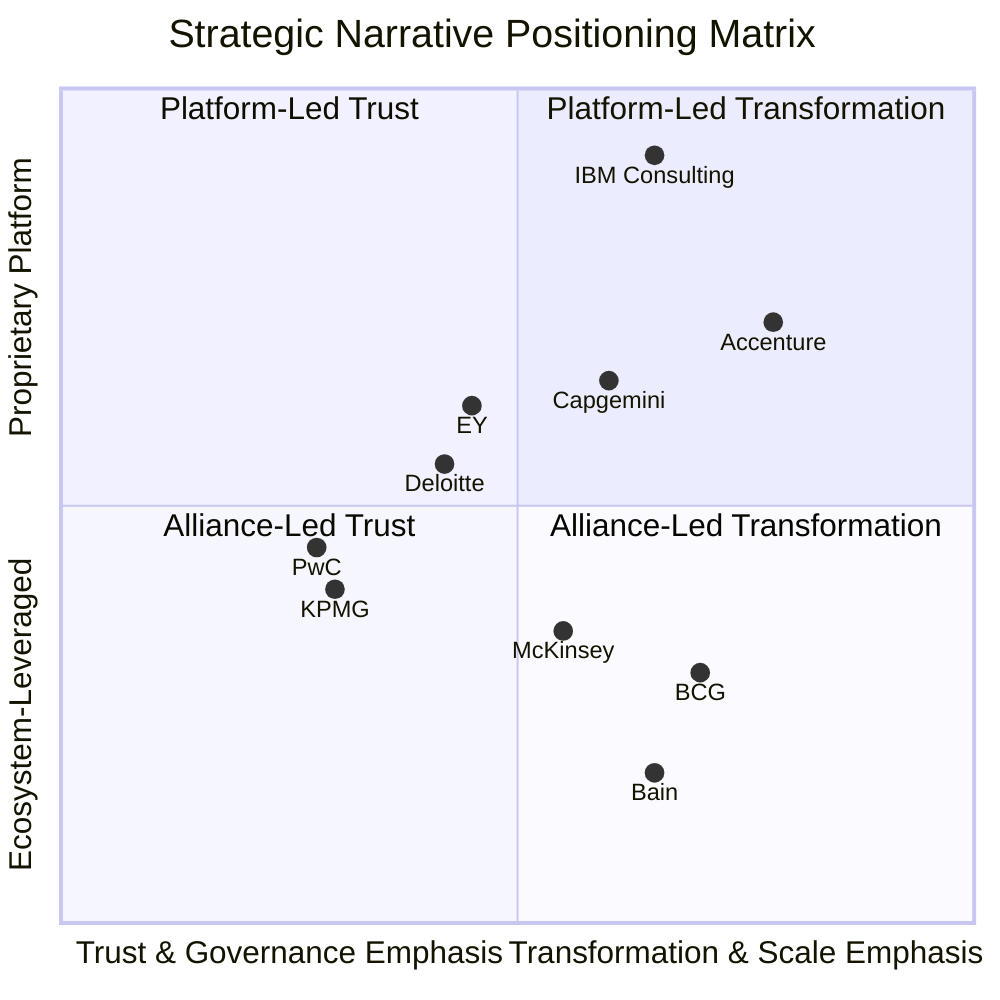

The matrix reveals **three convergent narrative clusters** rather than ten fully differentiated positions:

**Cluster 1 — Platform-Led Transformation (upper-right):** Accenture, IBM Consulting, and (with somewhat lower platform intensity) Capgemini occupy the upper-right quadrant. Each combines proprietary platform IP with a transformation-and-scale narrative emphasis. The cluster competes on the same large-enterprise transformation engagements and is internally differentiated by stack ownership depth (IBM deepest), end-to-end scope (Accenture broadest), and custom enterprise AI focus (Capgemini distinct).

**Cluster 2 — Alliance-Led Trust (lower-left):** PwC and KPMG occupy the lower-left quadrant, with Deloitte and EY positioned slightly toward the center. Each leverages assurance heritage and alliance partnerships (Microsoft for KPMG, multiple alliances for the others) to deliver a trust-and-governance-first narrative. The cluster competes on regulated-industry engagements, finance-function deployments, and audit-adjacent assurance work, internally differentiated by audit-workflow integration depth (KPMG via Clara, EY via the EY.ai platform), multidisciplinary breadth (PwC), and empirical research leadership (Deloitte).

**Cluster 3 — Alliance-Led Transformation Strategy (lower-right):** McKinsey, BCG, and Bain occupy the lower-right quadrant, combining alliance-leveraged capability access with a transformation-and-scale narrative—but pitched at the CEO strategic decision layer rather than at the operational implementation layer. The cluster competes on strategic-framing and CEO-advisory engagements, internally differentiated by analytics depth (McKinsey), thought-leadership prominence (BCG), and frontier-alliance positioning (Bain).

### Common Rhetorical Motifs

Despite the three-cluster structure, four rhetorical motifs are observable across all ten narratives, indicating genuine convergence at the linguistic surface even as substantive positioning differs:

1. **Responsible AI / Trusted AI / Trustworthy AI / Responsible AI Compliance** — every firm in the cohort markets a named governance framework, reflecting the cross-cutting regulatory pressure identified in Chapter 1.
2. **Agentic transformation** — every firm explicitly addresses the agentic inflection, with the variation lying in framing (BCG's CEO-led, Accenture's end-to-end, IBM's platform-native, EY's tax-and-risk-specific).
3. **End-to-end reinvention** — every firm claims integrated capability across strategy, build, and run, even where partnership economics or capability gaps complicate the claim in practice.
4. **Human-led delivery / human-in-the-loop** — every firm positions human judgment as central to AI deployment, reflecting both regulatory imperatives and a defensive narrative move against pure-automation competitors.

### Genuine Points of Differentiation

Beneath the rhetorical convergence, four genuine points of differentiation separate the cohort:

- **Assurance heritage**: structurally available only to the Big Four, converting audit-and-tax-licensure into AI governance authority that no other archetype can fully replicate.
- **Platform ownership**: structurally concentrated in IBM (deepest), Accenture (broadest), Capgemini (sovereignty-focused), with the Big Four accessing platform capability through alliances (notably KPMG–Microsoft and EY–NVIDIA/Dell) and the MBB houses substituting alliance access for ownership.
- **Frontier-model access**: structurally available through alliances (Bain–OpenAI, Capgemini–Google Cloud/Microsoft, EY–NVIDIA, KPMG–Microsoft) but with the deepest commercial integration in IBM (proprietary watsonx) and the deepest internal-experience foundation in Bain (one year of internal use prior to client offering).
- **CEO advisory positioning**: structurally concentrated in MBB, with Accenture and IBM offering close-range competition through Sweet's and Daugherty's CEO-narrative positioning, and the Big Four less naturally pitched at the CEO layer than at the CFO/Audit Committee layer.

### Strategic Tensions

Three strategic tensions emerge from the synthesis and will be tested in subsequent chapters:

**Tension 1 — MBB narrative leadership vs. integrator execution depth.** The MBB houses lead on strategic framing but depend on platforms increasingly owned by the integrators (and by hyperscaler partners) for delivery. As agentic AI shifts the unit of consulting work from advisory to deployment, the MBB risk is that the strategic framing layer becomes commoditized while the platform-and-deployment layer captures the value. Bain's response—via the OpenAI alliance and named consumer-brand deployments—is the most active mitigation; McKinsey's Iguazio acquisition is a structural mitigation; BCG's BCG X build is the most defensive mitigation.

**Tension 2 — Big Four trust positioning vs. SI-firm scale economics.** The Big Four lead on trust and governance but face structural constraints on capital intensity and platform ownership relative to the integrators. As regulatory pressure expands the trust-and-governance market (AI Data Governance growing at 163.75% CAGR, security consulting growing from US$24.2B to US$36.6B), the Big Four's positioning is structurally favored, but as platform ownership becomes the primary mechanism for AI value capture, the Big Four risk being squeezed between MBB strategic premium pricing and integrator platform-delivery scale economics. EY's platform-led narrative (EY.ai) is the most aggressive Big Four mitigation; KPMG's audit-workflow integration is the most defensive.

**Tension 3 — Convergence rhetoric vs. structural divergence.** The four common motifs—responsible AI, agentic transformation, end-to-end reinvention, human-led delivery—suggest that all ten firms claim to deliver the same comprehensive AI capability set. The structural reality, as Chapter 2 quantified and the next four chapters will substantiate, is that the firms differ materially in proprietary IP, ecosystem alliances, vertical depth, governance capability, and ROI evidence. The tension between rhetorical convergence and structural divergence creates a buyer-side challenge that consulting firms simultaneously create (through marketing) and exploit (through differentiated delivery): clients confronting ten firms with broadly similar narratives must increasingly look beneath the narrative to the products, alliances, talent, and outcomes that determine actual delivery capability.

These tensions set the stage for the empirical examination that follows. Chapter 4 turns to the proprietary AI products, platforms, and ecosystem alliances that translate strategic narrative into deployable capability—and that, in many cases, expose the gap between the narrative position each firm claims and the substantive position each firm has built.

# 4 Proprietary AI Products, Platforms, and Ecosystem Alliances

Chapter 3 closed on a structural tension: the ten firms in the cohort speak in remarkably convergent rhetorical registers—Trusted AI, agentic transformation, end-to-end reinvention, human-led delivery—even as their underlying capability architectures diverge sharply. Narrative parity, in other words, conceals substantive disparity. This chapter resolves that tension empirically, by translating each firm's stated AI vision into the proprietary products, platforms, and ecosystem alliances that constitute its actual delivery stack. Where Chapter 2 quantified the capital and Chapter 3 articulated the narrative, this chapter examines the artifacts that capital and narrative have produced.

The analytical method is deliberately structural rather than promotional. For each firm, the chapter catalogs named platforms and accelerators, examines architectural choices (composable platform vs. workflow-embedded vs. function-specific tooling), traces alliances with hyperscalers (Microsoft/Azure OpenAI, AWS, Google Cloud, NVIDIA, Dell) and foundation-model providers (OpenAI, Anthropic, Cohere, Mistral), and identifies the joint solutions and co-developed industry offerings through which proprietary IP and ecosystem leverage combine into go-to-market motions. The chapter closes with a synthesis matrix that maps platform-ownership depth against ecosystem leverage breadth, surfacing three structural archetypes—deep-stack platform owners, alliance-orchestrated platform builders, and lean-tooling alliance leveragers—and the strategic tensions (defensibility vs. flexibility, exclusivity vs. portability, intensity vs. velocity) that will shape competitive positioning in the chapters that follow.

A persistent methodological caveat applies. Disclosure depth varies materially across the cohort: publicly listed integrators (Accenture, IBM, Capgemini) and Big Four firms with extensive press-release cadences (Deloitte, PwC, EY, KPMG) provide richer platform documentation than the MBB partnerships, where proprietary internal tooling is often acknowledged but not productized for external scrutiny. Where evidence is asymmetric, the analysis flags the gap and triangulates from named platforms, alliance announcements, and case-study disclosures rather than asserting parity that the public record does not support.

## 4.1 Big Four Proprietary Platforms and Industry Accelerators

The four Big Four firms have each built distinct proprietary AI architectures that operationalize the trust-and-governance positioning examined in Chapter 3. The structural commonality is that all four embed AI capability into existing assurance, audit, tax, and risk-advisory workflows rather than building horizontal AI platforms detached from their service-line heritage. The structural divergence lies in how aggressively each firm has invested in own-stack platform IP versus alliance-leveraged capability: EY has gone furthest in branded platform productization (EY.ai), KPMG has gone furthest in workflow integration (Clara), Deloitte balances capability assets with research-led thought-leadership instruments, and PwC has moved most recently into a named agent operating system layer.

### Deloitte: AI Institute, AI Academy, Trustworthy AI, and the Google Cloud Agentic Practice

Deloitte's proprietary AI architecture is anchored less on a single named platform and more on an integrated capability stack combining the Deloitte AI Institute™, the Deloitte AI Academy™, the Trustworthy AI™ framework, and a series of alliance-led practices. The AI Institute is positioned as the firm's research and thought-leadership nucleus, "promot[ing] dialogue about and development of artificial intelligence, stimulat[ing] innovation, and examin[ing] challenges to AI implementation"[^19]. It collaborates with academic research groups, startups, and AI visionaries across "key areas of artificial intelligence including risks, policies, ethics, future of work and talent, and applied AI use cases"[^19], and produces the *State of Generative AI in the Enterprise* survey series whose Q4 2024 wave drew on **2,773 director- to C-suite-level respondents across 14 countries**[^19].

The AI Academy converts institute thinking into deployable consulting capacity. The August 2023 announcement specified that Deloitte was on a pathway to **upskill up to 10,000 practitioners** through curriculum co-developed with Virginia Tech and the Indian Institute of Technology Roorkee, supplemented by NVIDIA Training on generative AI and accelerated technologies[^9]. The Academy's range spans "basic Generative AI fluency to deeper technical skills like advanced prompt engineering techniques and fine-tuning, and advance certifications for technical professionals"[^9], delivered through the Deloitte Technology Academy as part of the **US$1.4 billion Project 120** investment in learning and development[^10]. Brandon Hall Group™ has recognized the Academy for "Best Advance in Competencies and Skills Development"[^9]—an external validation point Deloitte cites as evidence of capability depth.

The Trustworthy AI framework supplies the governance scaffolding around all client-facing offerings, providing a named, productized vehicle through which Deloitte sells responsible AI advisory and oversight services. The framework operates in conjunction with the AI Institute, with the Institute "providing learning and development to complement the Institute's focus on supporting the positive growth and development of AI through engaged conversations and innovative research, inclusive of [Trustworthy AI™]"[^9].

On the platform-and-alliance axis, Deloitte's most explicit recent move is the establishment of a **dedicated, end-to-end agentic transformation practice on Gemini Enterprise**, announced as a major expansion of its alliance with Google Cloud[^10]. This builds on Deloitte's earlier May 2023 partnership with NVIDIA for AI-powered solutions in healthcare and retail, establishing a pattern of alliance-leveraged capability building that complements rather than replaces internal IP. The internal *State of Generative AI* report references additional named assets—Deloitte's "13 elements of scaling" methodology and adjacent frameworks for agent development—but the firm's overall platform posture remains weighted toward research-and-methodology IP supplemented by dedicated hyperscaler practices, rather than a single horizontal proprietary platform.

The architectural logic is consistent with Deloitte's narrative position: AI capability is sold as part of an integrated transformation engagement in which Trustworthy AI governance, AI Academy-trained consultants, AI Institute-derived diagnostics, and alliance-supplied technology stacks combine into outcomes-focused delivery, rather than as a horizontal platform-licensing motion.

### PwC: The New Equation, ChatPwC, and an Agent Operating System

PwC's proprietary AI architecture operates within the broader **New Equation** strategic frame announced in 2021, which committed the network to a **US$12 billion investment over five years** with **100,000 net new jobs** focused in emerging capability areas "from ESG to AI"[^8][^7]. Within that envelope, PwC explicitly positioned AI as one of several specialist capabilities—"cyber security, data privacy, ESG and AI"—built on the foundation of its multidisciplinary model[^8]. The narrative was deliberately broad: AI was not ring-fenced as a standalone platform investment but integrated into a "human-led, tech-powered" capability layer.

Within that envelope, PwC has subsequently developed named platform assets that operationalize the AI strategy. The most explicitly platform-positioned is the **enterprise AI agent operating system (OS)**, which PwC has launched as an orchestration layer "designed to orchestrate and scale intelligent agents across complex business environments"[^7]. This positions PwC squarely on the agentic-AI productization axis explored later in this chapter, alongside EY's Tax Agent Factory and IBM's Consulting Advantage. The agent OS is supplemented by ChatPwC—the firm's internal generative AI assistant—and by a portfolio of industry-specific solutions in audit, tax, and risk advisory, anchored to PwC's Responsible AI services launched in September 2022.

The capability mix follows PwC's "human-led, tech-powered" thesis: proprietary platform assets are deployed alongside auditor and consultant workflows rather than presented as standalone software products. The strategic logic is consistent with the Big Four assurance heritage—platform IP serves the engagement, not the other way around—but the agent OS launch signals that PwC, like its Big Four peers, is moving toward more explicit platform branding as agentic AI shifts the unit economics of consulting delivery.

### EY: The EY.ai Unifying Platform Family

EY has built the most explicitly platform-anchored AI architecture among the Big Four. The **EY.ai unifying platform**, announced in 2023, has been progressively extended through a deliberate cadence of branded sub-platforms across 2024–2025. Five named platform assets now anchor the architecture:

- **EY.ai for Risk** (June 2025), launched in collaboration with NVIDIA, "consolidate[s] risk technology and knowledge into a single, cohesive system built on the EY.ai agentic platform, first unveiled in March"[^8].
- **EY.ai enterprise private** (May 2025) is "an on-premises deployment model powered by the Dell AI Factory with NVIDIA and EY.ai Agentic Framework and Model Catalog"[^8], explicitly designed for clients with sovereignty or data-sensitivity constraints.
- **EY.ai Tax Labs and EY.ai Tax Agent Factory** (November 2025) provide "a methodology, an operating model and a technology strategy that enables tax professionals and clients to design, build, train, deploy and manage AI agents at scale"[^8].
- **EY-Parthenon's neurosymbolic AI capabilities** (September 2025) extend the platform into the strategy advisory layer to "empower businesses to identify, predict and unlock revenue at scale"[^8].

The architectural logic is composable: EY.ai functions as a unifying platform brand, with sub-platforms layering function-specific or deployment-mode-specific capability on top of a common Agentic Framework and Model Catalog. This composability is reinforced by the explicit articulation of a **Model Catalog**, suggesting that EY has invested in the metadata, governance, and orchestration infrastructure required to support multi-model deployment rather than committing to a single foundation-model partner.

The Tax Agent Factory provides the clearest operational illustration. EY.ai Tax Labs "harnesses emerging technologies, in particular generative and agentic AI, to help clients tackle their data challenges and intricate tax issues providing adaptable, AI-led strategies that respond to evolving regulatory and operational demands"[^8], while the Tax Agent Factory is positioned as "the organization's global accelerator for AI-powered transformation in tax"[^8]. Joe Depa, EY Global Chief Innovation Officer, frames the strategic logic: "With EY.ai Tax Labs and the EY.ai Tax Agent Factory, we're giving clients the tools to accelerate transformation and deliver greater strategic value from tax. By harnessing the power of trusted, AI-ready data, they gain faster insights, smarter decisions, and scalable outcomes — all underpinned by the deep experience of our team of global tax professionals"[^8].

The trust-and-governance scaffolding sits on top of the platform stack. EY's **Trusted AI** framework articulates a five-principle architecture (Transparent, Unbiased, Explainable, Resilient, Performance) and a model lifecycle risk-tiering framework that converts EY's audit-and-risk heritage into productized AI governance capability[^7]. The framework's RACI matrix, three-tier model risk classification (high/medium/low with corresponding initial-validation, ongoing-monitoring, and ongoing-review frequencies), and policy templates demonstrate operational depth behind the slogan, positioning EY against PwC and KPMG specifically on the regulated-enterprise governance axis[^7].

Two structural implications follow. First, EY's platform vision is **alliance-leveraged rather than purely organic**, with NVIDIA and Dell named as central platform partners; this allows EY to compete with Accenture's and IBM's deeper proprietary capability investments without underwriting equivalent infrastructure spend. Second, EY's positioning has shifted **from advisory-first to platform-first** more aggressively than any other Big Four firm: the EY.ai brand functions less as a marketing wrapper and more as the architectural framework binding the firm's offerings together.

### KPMG: Clara, Audit Chat, Workbench, and Trusted AI

KPMG's proprietary AI architecture is the most workflow-embedded of the Big Four, organized around the **KPMG Clara** global smart audit platform into which generative AI was integrated in July 2024 and made available to KPMG's **90,000 global Audit professionals**[^5]. The architectural choice is deliberate: rather than building a horizontal AI platform and then adapting it to audit, KPMG built AI into the audit workflow, with each capability mapped onto a specific audit task.

Scott Flynn, KPMG U.S. Vice Chair – Audit, articulates the design logic: "With seamless access to trusted generative AI capabilities within our audit workflow, our 9,000 auditors will be empowered to deliver quality audits. KPMG Clara with AI will not only free up resources to spend more time on the areas of highest risk, but will directly help our teams exercise professional skepticism to protect the capital markets"[^5]. The integrated capabilities span the full audit lifecycle:

- **Refining risk assessments**: AI assistants review documents to help engagement teams identify risk factors, including reviewing meeting minutes and flagging possible accounting and fraud risks[^5].
- **Developing substantive testing procedures**: The AI assistant has direct access to KPMG's audit methodology, enabling auditors to design appropriate substantive testing procedures more quickly[^5].
- **Enhancing audit documentation**: Team members can use the AI assistant to summarize, question, and consider improvements to engagement-specific audit documentation within Clara[^5].
- **A growing prompt library** that will, over time, include AI-powered agents to assist Audit teams in driving audit quality[^5].
- **Automated quality scoring** generating AI assessments and feedback to Audit teams on actions for quality improvement[^5].
- **AI and machine-learning automated review of financial statements** to augment teams' assessment that all required disclosures have been made[^5].
- **Assurance capabilities** integrated into the workflow for teams delivering assurance over disclosures, such as emissions disclosures[^5].

The platform is reinforced by **KPMG Audit Chat**, a proprietary generative AI tool built on Azure OpenAI Service first deployed in 2023 and upgraded in May 2024, with capabilities being progressively built into Clara as part of KPMG's "long-term vision to deliver an AI-enabled audit"[^5]. **Copilot for Microsoft 365** was deployed to Audit partners and professionals beginning April 2024, with engagement teams "leveraging Copilot, along with Audit Chat, to transform the walkthrough experience by generating process narratives and flowcharts based on meetings with clients"[^5]. The **MindBridge alliance**, announced in 2023, embeds AI and machine-learning capabilities into Clara as **Transaction Scoring**, allowing auditors to "perform analyses over 100% of transactional populations, delivering audit evidence and identifying outliers over both general ledger and subledger populations"[^5]. The **Databricks Data Intelligence Platform integration** into Clara (June 2024) enables Audit professionals to "analyze billions of financial transactions across thousands of audits"[^5].

The Trusted AI framework operates as the explicit governance layer around the platform stack. Thomas Mackenzie, KPMG U.S. and Global Audit Chief Technology Officer, articulates the principle: "Our Trusted AI framework underpins everything we do with AI in the audit. All of our auditors are trained on how to effectively use AI with a human-in-the-loop mindset to maintain quality, accuracy and professional skepticism"[^5]. The human-in-the-loop principle is central rather than adjacent—a deliberate distinction from the more autonomy-forward agentic narratives of EY's Tax Agent Factory and IBM's Consulting Advantage.

Two structural implications follow. First, KPMG's platform strategy **trades horizontal scope for vertical depth**: Clara is narrower than EY.ai or PwC's agent OS but more deeply integrated into the audit workflow that constitutes the highest-stakes AI use case in the Big Four portfolio. Second, **alliance leverage is explicit and multi-vendor**: the Microsoft alliance supplies the foundation-model and infrastructure layer, MindBridge supplies anomaly-detection ML, and Databricks supplies the data-intelligence layer—an architecture that signals KPMG's deliberate choice to compete on integration depth rather than platform ownership.

### Big Four Synthesis

The four Big Four proprietary stacks share three architectural commonalities: each is explicitly positioned around a named Trusted/Trustworthy/Responsible AI governance framework; each integrates AI capability into existing assurance, audit, tax, or risk workflows rather than building horizontal platforms; and each leverages hyperscaler and specialist alliances rather than underwriting full vertical stack ownership. Differentiation lies in the architectural form: EY has gone furthest toward composable platform productization, KPMG furthest toward workflow embedding, Deloitte toward research-and-methodology IP supplemented by dedicated hyperscaler practices, and PwC toward an integrated multidisciplinary capability layer with an emerging agent OS layer.

| Big Four Firm | Platform Anchor | Architectural Form | Workflow Integration | Alliance Leverage |
|---|---|---|---|---|
| **Deloitte** | AI Institute + AI Academy + Trustworthy AI | Capability stack + dedicated practices | Methodology-led; Gemini Enterprise practice | Google Cloud, NVIDIA |
| **PwC** | New Equation + Agent OS + ChatPwC | Multidisciplinary capability layer | Audit, tax, risk advisory | Hyperscaler partnerships |
| **EY** | EY.ai unifying platform family | Composable platform with sub-platforms | Tax (Tax Agent Factory), Risk, Strategy | NVIDIA, Dell |
| **KPMG** | Clara + Audit Chat + Workbench | Workflow-embedded AI in audit | Audit-first, deepest integration | Microsoft (multibillion-$), MindBridge, Databricks |

## 4.2 Global SI and Tech-Led Integrator Platforms: AI Refinery, watsonx Consulting Advantage, and Resonance

The three global integrators have built the deepest proprietary platform stacks in the cohort, consistent with the platform-heavy capital allocation archetype identified in Chapter 2. Each has constructed a multi-layer architecture combining a horizontal AI platform, vertical industry accelerators, and consultant-augmenting tools, supported by named delivery platforms and—in IBM's and Capgemini's cases—proprietary data-plane assets. The architectural logic is that platform IP is the principal mechanism of margin defense and scale economics in AI consulting, and that the integrators' capital intensity is justified only if it produces defensible proprietary stacks.

### Accenture: AI Refinery, AI Navigator, switchboard, and 19-Industry Accelerators

Accenture's proprietary AI architecture is the broadest in the cohort, organized around four named platform layers:

1. **AI Navigator for Enterprise**, announced as part of the June 2023 US$3 billion Data & AI investment, is "a generative AI-based platform that will help clients define business cases, make decisions, navigate AI journeys, choose architectures and understand algorithms and models to drive value responsibly. Building on Accenture's own efforts, the platform will include assets designed to accelerate responsible AI practices and compliance programs"[^4]. AI Navigator is positioned as the architectural-decision layer—the platform clients use to plan their AI deployments before building them.

2. **The Center for Advanced AI**, established as part of the same investment, is "dedicated to maximizing the value of this technology across clients and within Accenture. This includes extensive R&D and investments to reimagine service delivery using generative and other emerging AI capabilities"[^4]. The Center functions as the proprietary R&D nucleus.

3. **Industry accelerators across 19 verticals**, comprising "pre-built industry and functional models that take advantage of new generative AI capabilities"[^4]. The 19-industry coverage is a structural breadth advantage that no other firm in the cohort matches at equivalent depth, and it operationalizes Accenture's claim that "our deep understanding of ecosystem solutions allows us to help [clients] navigate quickly and cost effectively"[^4].

4. **Legacy delivery platforms**—myWizard, SynOps, and MyNav—through which Accenture has historically embedded AI across its service delivery approach, "driving efficiency, insights, and accelerating value for thousands of clients"[^4].

Beneath these platforms sits Accenture's broader AI capability infrastructure, including **more than 1,450 patents and pending patent applications worldwide**[^4] and a **Responsible AI framework** pioneered six years ago that "is now part of how Accenture delivers its work for clients, is included in the company's code of ethics and underlies its rigorous responsible AI compliance program"[^4]. The five-stream allocation of the US$3 billion envelope—into "assets, industry solutions, ventures, acquisitions, talent and ecosystem partnerships"[^4]—is explicitly designed to feed and extend this platform architecture.

The platform layer that has emerged most prominently in market commentary as the integration spine is the **AI Refinery**, which serves as Accenture's horizontal generative AI platform combining model-agnostic orchestration (sometimes referred to as the "switchboard") with industry accelerators. Accenture's switchboard architecture is designed to be model-agnostic across foundation-model providers, giving clients the ability to swap or combine models from OpenAI, Anthropic, Cohere, and others depending on use case—an explicit hedge against foundation-model vendor lock-in.

Commercial validation comes from financial reporting. Accenture's Q3 2025 financials reported a **7.7% revenue growth from AI-driven services and a 10% rise in operating income driven by AI and acquisitions**, supported by the firm's US$6.6 billion in 46 fiscal 2024 acquisitions. Combined with the doubling of AI talent in the Data & AI practice **from 40,000 to 80,000 professionals**[^4][^5], the platform investment has translated into demonstrable revenue traction.

### IBM Consulting: watsonx, Consulting Advantage, IBM Concert, and the Data Plane

IBM Consulting's proprietary architecture is the deepest vertical stack in the cohort. Four platform layers operate in coordinated combination:

1. **watsonx**—IBM's data and AI platform stack—provides the foundation-model, model-management, and governance layer beneath Consulting Advantage. As referenced in Chapter 2, the **US$2.3 billion (€2.13B) acquisition of StreamSets and webMethods from Software AG** in late 2023 was explicitly framed by IBM senior VP for software Rob Thomas: "Together with IBM's Watsonx AI and data platform, as well as its application modernization, data fabric and IT automation products, StreamSets and webMethods will help clients unlock the full potential of their applications and data". This created a vertically integrated data plane feeding watsonx that no competitor in the cohort can fully replicate.

2. **IBM Consulting Advantage** is the role-based AI services platform. IBM's articulation is unusually direct: "In today's evolving business landscape, IBM Consulting Advantage offers a revolutionary approach. Our AI services platform provides easy, customized access to proprietary methods, purpose-built AI assets and models and role-based generative AI assistants. With this advanced tool, IBM consultants deliver solutions faster, more consistently, and cost-effectively than ever before"[^7]. The role-based assistant architecture maps the platform onto the consulting workflow itself, signaling that internal consultant productivity is a first-order outcome rather than a side effect.

3. **IBM Concert** extends the platform into ITOps. The platform "is an ITOps platform that unifies observability, optimization, and resilience insights into shared operational intelligence, with governed AI"[^12]—the phrase "governed AI" performing important narrative work, binding the platform thesis to the governance positioning the Big Four lead on but framing it as a built-in platform property.

4. **AI Book of Business** provides the commercial validation layer. The IBM AI Book of Business—"a combination of bookings and actual sales across various products"—reached **US$2 billion** by late 2023, of which about one-quarter was actual sales[^6]. Subsequent quarters have reported continued growth. The metric simultaneously demonstrates commercial traction and signals to clients that the platform stack is being deployed at scale.

The structural advantage of IBM's architecture is **stack ownership depth**: from the data-plane integration (StreamSets/webMethods) through the data-and-AI platform (watsonx) to the consulting services platform (Consulting Advantage) to the ITOps overlay (Concert), IBM owns each layer. The structural risk, as Chapter 3 noted, is that platform-anchored narratives imply a degree of vendor lock-in that hyperscaler-neutral competitors—particularly Accenture's switchboard architecture—can use as a counter-narrative. IBM's mitigation is to position watsonx as **hybrid-cloud-native**, deployable across customer-chosen infrastructure, blunting the lock-in critique while preserving the platform-economics thesis.

### Capgemini: Generative AI Portfolio, Custom Enterprise GenAI, and the Data & AI Campus

Capgemini's proprietary architecture is the most explicitly oriented around **custom enterprise AI for clients with sensitive proprietary data**, consistent with the European-sovereignty positioning examined in Chapter 3. The architecture comprises four operational components:

1. **Four generative AI assistants** for "hyper personalised" customer experience and to "boost sales team performance by offering knowledge assistance"[^7]. Heathrow Airport is named as an early deployment, using the assistants "to improve the passenger experience"[^7].

2. **A generative AI offering for software engineering**, designed to "improve the efficiency of the entire development lifecycle — design, coding, documentation, testing, and deployment." The software-engineering offering is positioned to "accelerate time to market for new software, facilitate large scale modernisation of legacy software, and reduce the attack surface"[^7].

3. **Custom generative AI for enterprise**, the architectural centerpiece, which "fine tunes large foundational models with enterprises with proprietary data. The platform can be used in customer experience, research and development, support, and for assisting business functions"[^7]. Franck Greverie, chief portfolio officer at Capgemini, articulates the differentiating logic: "For clients who have key sensitive data, we are developing custom generative AI solutions, fine-tuned with their proprietary data, to create maximum business value"[^7].

4. **Generative AI strategy advisory** that will "define and prioritise relevant use cases of the technology for businesses and lay a foundation for scaling investment while mitigating risks"[^7].

Around these offerings, Capgemini has established a **dedicated generative AI practice** and a **Generative AI Lab** functioning as the proprietary IP nucleus, supported by the **Data & AI Campus** which is responsible for training "most of [Capgemini's] workforce" to "fully leverage the power of generative AI in our operations"[^7]. The €2 billion AI investment and the target of growing data and AI teams to **60,000 professionals within three years**[^7] supply the capital and human-capital foundation. The Resonance platform brand—emerging in Capgemini's broader marketing as the unifying frame for the GenAI portfolio—performs the integration role analogous to EY.ai or AI Refinery, though with somewhat less explicit branding emphasis than its competitors.

The architectural logic is **dual-axis**: deliver custom-enterprise capability (product) through trained-up consultant capacity (people) anchored in hyperscaler alliances (Google Cloud and Microsoft, examined in Section 4.4) for foundation-model and infrastructure access. The pending US$3.3B+ acquisition of WNS extends the architecture further into the operations-and-AI integration space, signaling that Capgemini intends to combine advisory and platform IP with at-scale process operations.

### Integrator Synthesis

The three integrator stacks share three architectural commonalities: each combines a horizontal platform layer with vertical industry accelerators; each invests heavily in consultant-augmenting tools; and each leverages hyperscaler alliances for compute and—at varying depths—foundation-model access. Differentiation lies in vertical-stack depth: IBM is the deepest single-stack owner via watsonx and the StreamSets/webMethods data plane; Accenture is the broadest multi-stack orchestrator via the AI Refinery and switchboard architecture across 19-industry accelerators; Capgemini is the most explicitly positioned for custom enterprise AI with European-sovereignty considerations.

| Integrator | Horizontal Platform | Industry Layer | Consultant Tools | Commercial Validation |
|---|---|---|---|---|
| **Accenture** | AI Refinery + AI Navigator + switchboard | 19-industry accelerators | myWizard, SynOps, MyNav | 7.7% AI revenue growth in Q3 2025 |
| **IBM Consulting** | watsonx + Consulting Advantage | watsonx-anchored industry assets + Concert ITOps | Role-based GenAI assistants | AI Book of Business >US$2B |
| **Capgemini** | Resonance / Generative AI Portfolio | Industry-specific GenAI offers | Four GenAI assistants + GenAI Lab | 60,000-professional scale-up; Heathrow named |

## 4.3 MBB Proprietary Tools: Lilli, GENE/Deckster, and Bain's Alliance-Led Model

The three MBB partnerships occupy a structurally different position on the platform-ownership axis. Where the Big Four embed AI into existing service-line workflows and the integrators build deep multi-layer proprietary stacks, the MBB houses build **lean, internally-focused proprietary tools** designed to amplify consultant productivity, while substituting alliance access and selective specialist acquisitions for the platform-ownership intensity that would compromise partnership economics. The architectural logic is consistent with the lean-capital, premium-positioning, CEO-advisory narrative documented in Chapter 3.

### McKinsey: Lilli, QuantumBlack, and Iguazio-Acquired MLOps

McKinsey's proprietary tooling is anchored on **Lilli**, the firm's internal generative AI assistant, which provides the consultant-augmenting equivalent of IBM's role-based assistants but is positioned as an internal productivity tool rather than a productized client offering. While McKinsey does not publish detailed Lilli usage metrics, the platform sits within the broader **QuantumBlack** advanced analytics unit that constitutes the firm's principal AI capability nucleus.

QuantumBlack's positioning combines proprietary advanced-analytics IP with the firm's strategy advisory heritage, and it has been progressively reinforced through targeted M&A. The **2023 acquisition of Iguazio** (referenced in Chapter 2) closed a specific MLOps gap that QuantumBlack engagements had repeatedly surfaced—signaling McKinsey's willingness to acquire engineering depth rather than license it through alliances alone.

Beyond Lilli and QuantumBlack, McKinsey's externally-visible AI artifacts are concentrated in thought-leadership outputs—the *State of AI* survey series referenced in Chapter 1—rather than in platform-licensing motions. The 2025 *State of AI* survey, with its **1,993 respondents across 105 countries** and headline finding that **88% of organizations now use AI in at least one business function but only 6% qualify as "AI high performers"**, simultaneously functions as diagnostic instrument and strategic-positioning device. The 3× multiplier identified for AI high performers (3× more likely to redesign workflows around AI; 3× more likely to have committed executive leadership) maps directly onto McKinsey's transformation advisory portfolio.

The strategic logic is deliberate: McKinsey competes on the integrated combination of strategic framing, advanced analytics depth, and proprietary internal tooling—not on platform licensing or at-scale technology delivery. The risk surfaced in Chapter 3 (that strategic framing becomes commoditized while platform ownership captures value) is mitigated through Iguazio-style targeted acquisitions and through the QuantumBlack engineering capability buildout, but not through a platform-productization strategy comparable to EY.ai or AI Refinery.

### BCG: GENE, Deckster, BCG X, and the AI Radar Diagnostic

BCG's proprietary tooling combines the **GENE platform** and **Deckster** internal assistant—the firm's named productivity tools for consultants—with the **BCG X** tech-build arm that operates as the firm's integrated AI engineering and product-build unit. As with McKinsey's Lilli, GENE and Deckster are positioned as internal capability rather than external platform offerings, reflecting the partnership-economics constraint on platform-licensing motions.

The most distinctive component of BCG's external positioning, however, is the **AI Radar diagnostic instrument**, operationalized through the annual *BCG AI Radar* survey series. The 2026 edition surveyed **2,360 executives—including 640 CEOs—across 16 markets**[^4], and produced a structured set of CEO-facing diagnostics that simultaneously serve as market intelligence and as positioning device. The survey's headline findings, examined in Chapter 3, include:

- AI corporate investment as a share of revenue projected to **double from ~0.8% in 2025 to ~1.7% in 2026**[^4];
- **94% of CEOs** will continue investing even if AI does not pay off in 2026; **only 6%** plan to pull back[^4];
- **82% of CEOs** are the main decision-maker on AI in their organization (twice the prior year)[^4];
- **~90% of CEOs** believe AI agents will enable measurable ROI in 2026; CEOs have committed **>30% of their organization's AI investment for 2026 to agentic AI**[^4];
- The **Trailblazer archetype** (~15% of CEOs surveyed) commits **~60% of AI budget to agentic AI** versus 25% for Followers and Pragmatists, and is **twice as likely to apply agentic AI end-to-end**[^4];
- Trailblazers spend **>6 hours/week** expanding their personal AI expertise, invest **>US$50M** in AI in 2026, and have **upskilled >50% of their workforce**[^4].

The five-step CEO playbook—make AI a key priority, deepen AI literacy, commit investments at scale, upskill the organization, track measurable ROI[^4]—maps precisely onto BCG X's capability portfolio and BCG's broader transformation advisory practice. The associated client examples reinforce the diagnostic-to-delivery linkage: **Foxconn** achieved "Over $400M targeted savings identified from a scalable AI operating model and AI platform deployed across more than 200 factories," while **Reckitt** achieved "Quality output doubled through an end-to-end AI-driven workflow reinvention in marketing, cutting routine activities by up to 90%"[^4].

The architectural logic is **diagnostic-as-platform**: BCG converts proprietary survey data into CEO-facing positioning instruments, then channels the resulting demand through BCG X's tech-build engineering capability and through standard BCG transformation advisory engagements. The approach substitutes thought-leadership infrastructure for platform-licensing infrastructure, preserving partnership margins while still building defensible competitive position.

### Bain: Alliance-Led via the OpenAI Services Alliance

Bain's proprietary architecture is the most alliance-led in the entire cohort. Rather than building a horizontal platform or a deep tooling stack, Bain has substituted **privileged frontier-model access through the OpenAI services alliance** for proprietary platform investment. The 2023 alliance, examined in Chapter 3, was built on **a year of internal use across 18,000 knowledge workers** prior to the alliance announcement—internal experience that Bain has positioned as the foundation for client deployment velocity[^4].

The alliance has been operationalized through a small number of high-visibility deployments rather than through productized platform offerings. **The Coca-Cola Company** "utilized the power of OpenAI's ChatGPT and DALL·E to enhance its brands, marketing, and customer experiences"[^4], with the company "recognizing the potential to invigorate their marketing strategies with cutting-edge AI technology"[^4]. **Carrefour**, "one of the world's largest food retailers," used OpenAI's ChatGPT technology to develop and roll out three solutions: "an AI-powered shopping assistant chatbot, enriched product description sheets, and an AI tool to improve procurement processes"[^4].

The architectural logic is **velocity-and-relationship over ownership**. Bain trades platform IP for the ability to deploy frontier capability with clients faster than firms that must first build their own platforms, and trades exclusivity for the deep integration of AI capability into Bain's existing industry positioning (consumer, retail, operations). The strategic risk, surfaced in Chapter 3, is that the OpenAI alliance is non-exclusive at the firm level, meaning Bain's first-mover advantage compresses as competitors gain equivalent access. Bain's mitigation is to compete on **deployment depth and client-relationship velocity** rather than on capability exclusivity.

### MBB Synthesis

The three MBB stacks share three structural commonalities: each is built around lean, internally-focused proprietary tooling rather than externally-licensed platforms; each leverages alliances for frontier-model and infrastructure access; and each substitutes thought-leadership and diagnostic instruments (McKinsey *State of AI*, BCG *AI Radar*) or named brand deployments (Bain at Coca-Cola and Carrefour) for the productized platform IP that the integrators build. Differentiation lies in the proprietary-build emphasis: McKinsey is the most engineering-anchored via QuantumBlack and Iguazio; BCG is the most thought-leadership-anchored via the AI Radar diagnostic; Bain is the most alliance-anchored via the OpenAI services alliance.

The structural tradeoff is unambiguous: lean tooling preserves partnership economics and capital flexibility, but exposes the MBB cohort to the long-run risk that platform IP—increasingly held by Accenture, IBM, Capgemini, and the platform-led Big Four (notably EY)—becomes the principal locus of value capture in AI consulting. The mitigations vary by firm but share a common logic: compete at the strategic-framing top of the value chain, where partnership economics and CEO-advisory positioning are structurally defensible.

## 4.4 Hyperscaler Alliances: Microsoft/Azure OpenAI, AWS, Google Cloud, NVIDIA, and Dell

Hyperscaler alliances supply the foundational compute, foundation-model access, and joint go-to-market scaffolding for every firm's proprietary platform. The cohort has converged on a multi-vendor pattern—every firm partners with at least two of Microsoft, AWS, Google Cloud, NVIDIA, and Dell—but the depth, exclusivity, and strategic emphasis of partnerships vary materially. Five archetypes are observable:

### Microsoft-Anchored: KPMG and (More Selectively) Accenture, Deloitte, EY

KPMG's hyperscaler positioning is the most **Microsoft-anchored** in the cohort. The **multibillion-dollar global alliance with Microsoft**, expanded in 2023, integrates "Microsoft Cloud, Azure OpenAI Service, and KPMG IP"[^8], and constitutes the principal capital vehicle through which KPMG channels AI investment. The alliance operates across multiple layers: KPMG Audit Chat is built on Azure OpenAI Service; Copilot for Microsoft 365 was deployed to KPMG Audit partners and professionals beginning April 2024; and the broader strategy infuses "data analytics underpinned by Microsoft Fabric and generative AI through the Azure OpenAI Service and Azure Cognitive Services into the audit process"[^5]. The architectural choice is deliberate: KPMG concentrates hyperscaler depth in Microsoft rather than spreading commitments across Google Cloud, AWS, and NVIDIA, trading multi-vendor flexibility for integration depth and joint-investment scale.

### Multi-Hyperscaler: Capgemini, Accenture, and the Big Four

Capgemini's hyperscaler architecture is explicitly multi-vendor: "We are developing a portfolio of industry-specific offers and signing strategic partnerships, notably with Google Cloud and Microsoft"[^7]. The dual partnership supplies foundation-model access for Capgemini's custom-enterprise GenAI offerings, with Google Cloud and Microsoft serving as the principal model and infrastructure partners. The architectural logic mirrors Capgemini's narrative posture: provide custom-fit solutions for clients with diverse infrastructure preferences and proprietary-data requirements, rather than committing to a single hyperscaler stack.

Accenture's hyperscaler positioning operates on a similar multi-vendor logic but at greater scale and depth. The AI Refinery and switchboard architecture are designed to be hyperscaler-neutral, leveraging Microsoft Azure (deep partnership for enterprise AI platforms), AWS, and Google Cloud across different industry accelerators and client deployments. The five-stream allocation of Accenture's US$3 billion Data & AI envelope explicitly includes "ecosystem partnerships" as a discrete investment line, complemented by investments in "new and existing relationships across its industry-leading cloud, data and AI ecosystems to reinvent the type of work being delivered to clients"[^4].

Deloitte's hyperscaler architecture has shifted toward greater Google Cloud emphasis with the establishment of the **dedicated end-to-end agentic transformation practice on Gemini Enterprise**[^10], announced as a "major expansion" of the Google Cloud alliance. The practice explicitly addresses agentic-AI use cases and represents a meaningful intensification of Deloitte's previous, more diversified hyperscaler posture. Deloitte's earlier May 2023 partnership with NVIDIA for AI-powered solutions in healthcare and retail establishes parallel depth in the GPU-and-acceleration layer.

The Big Four other than KPMG operate similar multi-vendor portfolios: PwC partners across hyperscalers as part of its New Equation technology strategy; Deloitte combines Google Cloud (Gemini Enterprise practice) with NVIDIA (training and accelerated computing) and other hyperscalers.

### NVIDIA-and-Dell Anchored: EY

EY's hyperscaler architecture is the most **NVIDIA-and-Dell-anchored** in the cohort. The EY.ai Agentic Platform is "accelerated by NVIDIA"[^8]; EY.ai for Risk was launched "in collaboration with NVIDIA"[^8]; and EY.ai enterprise private is "powered by the Dell AI Factory with NVIDIA and EY.ai Agentic Framework and Model Catalog"[^8]. The architectural logic is twofold: NVIDIA supplies the GPU-and-acceleration infrastructure and reference-architecture co-development required for agentic AI workloads, while Dell supplies the on-premises hardware infrastructure required for clients with sovereignty or data-sensitivity constraints (an explicit response to the sovereign-AI dynamics identified in Chapter 1).

This alliance pattern is structurally distinct from the cloud-hyperscaler-anchored architectures of KPMG (Microsoft) and Capgemini (Google Cloud + Microsoft), in that it emphasizes the **infrastructure-and-acceleration layer** rather than the cloud-and-foundation-model layer. The choice positions EY for two specific market segments: clients deploying agentic AI workloads at scale (where GPU economics matter), and clients requiring on-premises or private deployments (where Dell hardware partnerships are decisive).

### IBM-Native: IBM Consulting

IBM Consulting occupies a unique hyperscaler posture: IBM is itself a hyperscaler (via IBM Cloud) and a foundation-model owner (via watsonx.ai), so its "hyperscaler alliance" is internal. This creates both a structural advantage (full vertical-stack ownership and economic capture) and a structural risk (the perception of vendor lock-in that hyperscaler-neutral competitors exploit). IBM's mitigation is the hybrid-cloud-native positioning of watsonx, which allows watsonx workloads to be deployed across customer-chosen infrastructure including AWS, Microsoft Azure, and Google Cloud—blunting the lock-in critique while preserving stack-ownership economics.

### MBB Hyperscaler Posture

The MBB houses' hyperscaler relationships are less formally productized than the Big Four's and the integrators'. McKinsey, BCG, and Bain each leverage hyperscaler infrastructure for client engagements but do not anchor their proprietary positioning on a single hyperscaler partnership. Bain's alliance posture is concentrated on the foundation-model layer (OpenAI) rather than on the cloud-and-infrastructure layer.

### Hyperscaler Alliance Comparison

| Firm | Microsoft / Azure | Google Cloud | AWS | NVIDIA | Dell | Architectural Posture |
|---|---|---|---|---|---|---|
| **Deloitte** | ● | ●● (Gemini Enterprise practice) | ● | ●● (May 2023 partnership) | — | Multi-vendor with Google Cloud intensification |
| **PwC** | ● | ● | ● | ● | — | Multi-vendor, multidisciplinary |
| **EY** | ● | ● | ● | ●● (Agentic Platform, Risk) | ●● (enterprise private) | NVIDIA-and-Dell anchored for agentic + private |
| **KPMG** | ●●● (multibillion-$ alliance) | ● | ● | — | — | Microsoft-anchored with deep integration |
| **Accenture** | ●● | ●● | ●● | ● | — | Multi-hyperscaler with switchboard architecture |
| **IBM Consulting** | (deployable on Azure) | (deployable on GCP) | (deployable on AWS) | ● | — | Self-hyperscaler via watsonx + hybrid-cloud-native |
| **Capgemini** | ●● | ●● | ● | ● | — | Multi-vendor with Google Cloud + Microsoft anchors |
| **McKinsey** | ● | ● | ● | ● | — | Engagement-led, not platform-anchored |
| **BCG** | ● | ● | ● | ● | — | Engagement-led, not platform-anchored |
| **Bain** | ● | ● | ● | — | — | Foundation-model alliance prioritized over hyperscaler |

*●●● = anchor partnership; ●● = deep partnership; ● = standard partnership*

The pattern that emerges is one of **deliberate non-uniformity**: each firm has chosen a hyperscaler-alliance architecture consistent with its proprietary platform strategy and target client segments. KPMG's Microsoft anchor reinforces its audit-workflow integration depth; EY's NVIDIA-and-Dell anchor reinforces its agentic-and-private positioning; Capgemini's Google-Microsoft dual anchor reinforces its custom-enterprise sovereignty positioning; Accenture's multi-hyperscaler switchboard reinforces its scale-and-flexibility positioning; IBM's self-hyperscaler stack reinforces its proprietary-IP positioning. The MBB cohort's lighter hyperscaler footprint is structurally consistent with its lean-tooling, alliance-led model.

## 4.5 Foundation-Model Provider Alliances: OpenAI, Anthropic, Cohere, and Mistral

Foundation-model alliances supply the frontier intelligence layer beneath each firm's proprietary platforms. Where hyperscaler partnerships supply compute and platform infrastructure, foundation-model partnerships supply the underlying generative AI capability. The cohort's positioning on foundation-model alliances has converged on three patterns: privileged access to a single frontier model (Bain–OpenAI), proprietary owner-model strategies (IBM via watsonx), and explicit model-agnostic architectures (Accenture switchboard, EY Model Catalog, Capgemini custom fine-tuning).

### Bain: Privileged OpenAI Access as the Differentiating Anchor

The **Bain–OpenAI services alliance** is the most prominent foundation-model partnership in the cohort. Built on a year of internal use across 18,000 Bain knowledge workers prior to the formal alliance announcement[^4], the partnership grants Bain privileged early access to OpenAI's models and platforms (including ChatGPT and DALL·E). The named deployments—The Coca-Cola Company for brand and marketing, Carrefour for shopping-assistant chatbots, enriched product description sheets, and procurement[^4]—operationalize the alliance through high-visibility brand engagements rather than through productized platform offerings.

The strategic logic, examined in Chapter 3, is that **the alliance substitutes for proprietary platform investment**. Where Accenture and IBM build platform IP and the Big Four embed AI in workflows, Bain channels frontier-model access into deployment velocity, leveraging its existing strategy advisory and digital implementation capabilities. The non-exclusive nature of the alliance at the firm level means competitors gain progressive access, but Bain's mitigations are deployment depth and client-relationship velocity, both of which compound over time.

### IBM: Proprietary watsonx.ai with Partner-Model Supplementation

IBM's foundation-model strategy is the most ownership-anchored in the cohort. The **watsonx.ai foundation-model platform** provides IBM-developed models (the Granite model family) supplemented by partner models from open-source ecosystems and third-party providers. The architectural logic is that proprietary model ownership reinforces stack-integration economics and creates capability that cannot be fully replicated by alliance-leveraged competitors. The strategic risk—that proprietary models lag the frontier capabilities of OpenAI, Anthropic, and Google's foundation models—is mitigated through the platform's openness to partner models, allowing IBM clients to combine proprietary and external models within a single governed framework.

### Model-Agnostic Architectures: Accenture Switchboard, EY Model Catalog, Capgemini Custom Fine-Tuning

Three firms have built explicitly model-agnostic architectures designed to compete on **portability rather than exclusivity**.

Accenture's **switchboard** architecture, embedded within the AI Refinery, is designed to allow clients to swap or combine foundation models from OpenAI, Anthropic, and other providers depending on use case requirements. The strategic logic is that frontier-model leadership rotates—what is best-in-class today may not be best-in-class in 18 months—and that portability is therefore a structural client requirement that proprietary-stack firms cannot match.

EY's **Model Catalog**, embedded within the EY.ai Agentic Framework[^8], performs an analogous function: it provides clients with a curated set of foundation models accessible through the EY.ai platform, allowing model selection based on use case, data sensitivity, and deployment-mode requirements. The Model Catalog architecture is structurally consistent with EY.ai's composable platform vision and its dual support for cloud (EY.ai for Risk, accelerated by NVIDIA) and on-premises (EY.ai enterprise private, powered by Dell AI Factory) deployment modes.

Capgemini's foundation-model strategy is most distinctively organized around **custom fine-tuning of foundation models with client proprietary data**[^7]. Rather than maintaining alliances with specific model providers, Capgemini's offering is to take large foundational models—accessed through Google Cloud, Microsoft, or other partners—and fine-tune them with client-proprietary data to "create maximum business value"[^7]. This positioning explicitly addresses sovereign-AI considerations and the demand from regulated and data-sensitive clients (financial services, healthcare, public sector) for models that combine frontier capability with client-specific knowledge.

### KPMG and the Big Four: Foundation-Model Access via Hyperscaler Alliances

KPMG accesses foundation models primarily through the **Microsoft alliance and Azure OpenAI Service**[^8][^5], rather than through direct alliances with OpenAI, Anthropic, or other model providers. This positioning is consistent with the audit-workflow-embedded architectural choice: foundation-model capability is treated as an infrastructure input mediated by the hyperscaler partner, not as an alliance requiring direct firm-to-model-provider negotiation.

PwC, EY, and Deloitte similarly access most frontier-model capability through their hyperscaler partnerships rather than through direct foundation-model alliances—with the exception of EY's deeper NVIDIA collaboration on the EY.ai Agentic Platform[^8] and Deloitte's Gemini Enterprise practice[^10]. The structural pattern is that the Big Four prefer hyperscaler-mediated foundation-model access, which gives them flexibility across multiple model providers without requiring exclusive partnerships.

### Sovereign AI and Regional Model Considerations

Three structural pressures—identified in Chapter 1—are reshaping foundation-model alliance considerations across the cohort: GDPR and EU AI Act compliance, India's planned February 2026 sovereign LLM launch, and broader sovereign-AI dynamics in China and other major markets. These pressures create demand for **regional and open-source model alternatives** including Mistral (France-headquartered), Cohere (Canada-headquartered), and various regional models in China, India, and the Middle East. The detailed disclosure of cohort firms' alliances with Mistral, Cohere, and regional model providers is uneven in the public record. What is clear from the available evidence is that the **multi-model architectures of Accenture (switchboard), EY (Model Catalog), and Capgemini (custom fine-tuning)** are structurally well-positioned to incorporate sovereign-AI-driven regional models, while the more single-anchor architectures (KPMG–Microsoft, IBM–watsonx) face higher integration costs to expand model portfolios in response to sovereign-AI pressures.

### Foundation-Model Alliance Synthesis

The cohort's foundation-model positioning has converged on three structural archetypes:

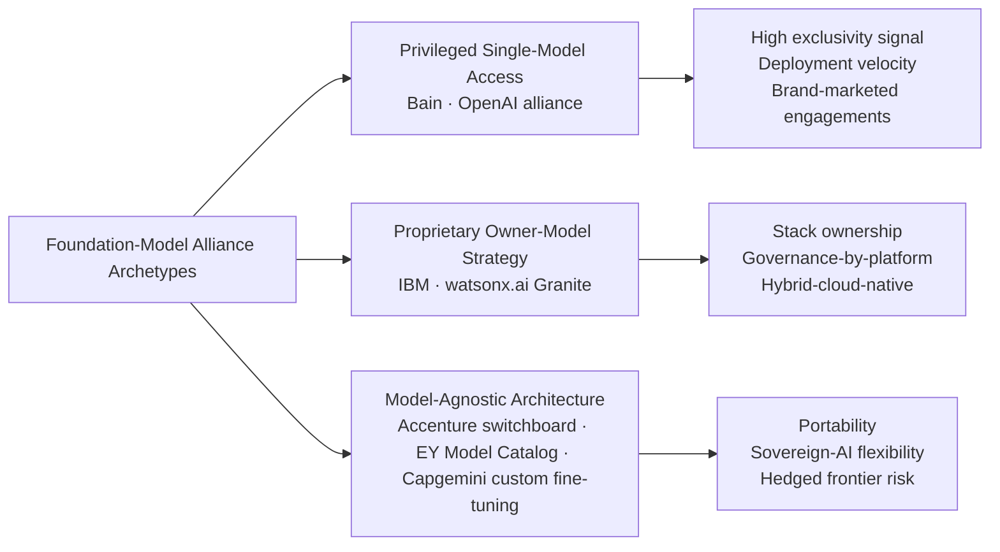

Each archetype carries distinct economic and strategic implications. Privileged single-model access maximizes early-mover positioning but compresses as competitors gain access. Proprietary owner-model strategies maximize stack defensibility but face frontier-capability risk. Model-agnostic architectures maximize portability and sovereign-AI flexibility but require sustained integration investment to maintain capability across multiple model providers. The Big Four's hyperscaler-mediated access pattern is structurally a hybrid of archetypes 1 and 3, offering portability through the hyperscaler while ceding direct foundation-model relationship management to the partner.

## 4.6 Joint Solutions, Co-Development, and Go-to-Market Motions

Proprietary IP and ecosystem alliances combine into **joint solutions and co-developed industry offerings** that anchor go-to-market motions. The cohort's joint-solution architecture has matured beyond simple alliance announcements into productized co-built assets with named clients, dedicated practices, and—in several cases—joint capital commitments. Five patterns of joint go-to-market motion are observable across the cohort.

### Dedicated Practice Structures

The most explicit joint go-to-market motion is the establishment of **dedicated alliance-anchored practices**. Deloitte's "dedicated, end-to-end agentic transformation practice" on Gemini Enterprise[^10] is the most recent and most explicitly named example, signaling that Deloitte and Google Cloud are organizing a discrete go-to-market unit around a single joint solution. KPMG's Microsoft alliance similarly operates through a series of dedicated practice structures across Audit (Audit Chat, Clara integration), Tax, and Advisory, each backed by joint investment commitments.

The economic logic of dedicated practices is that **joint go-to-market scales most efficiently when both firms commit dedicated headcount, named offerings, and shared sales infrastructure**, rather than treating alliance activity as a peripheral overlay on existing practice structures. The structural risk is that dedicated practices reduce flexibility: a Deloitte–Google Cloud Gemini Enterprise practice cannot easily pivot to deliver Microsoft Copilot solutions if a client's strategic preference shifts.

### Co-Built Platform Components

A second pattern is the **co-development of platform components** that integrate alliance-supplied capability into proprietary platforms. KPMG–Microsoft co-development manifests in the integration of Azure OpenAI Service into KPMG Audit Chat and Clara[^5]; EY–NVIDIA co-development manifests in EY.ai for Risk and the EY.ai Agentic Platform "accelerated by NVIDIA"[^8]; EY–Dell co-development manifests in EY.ai enterprise private, "powered by the Dell AI Factory with NVIDIA"[^8]; Capgemini–Google Cloud and Capgemini–Microsoft co-development manifests in custom enterprise GenAI solutions fine-tuned with client proprietary data[^7].

The economic logic is that co-built components combine **proprietary firm IP (governance, methodology, industry depth) with alliance-supplied capability (compute, foundation models, infrastructure)** into bundled solutions that neither firm could deliver alone. The structural advantage is differentiation; the structural risk is that the firm contribution must remain genuinely differentiating, otherwise the alliance partner can disintermediate by selling directly to the end client.

### Industry Accelerators and Reference Architectures

A third pattern is the **co-creation of industry accelerators and reference architectures** that operationalize joint solutions for specific verticals and use cases. Accenture's 19-industry accelerators[^4], built on its multi-hyperscaler stack, are the broadest example in the cohort. IBM's watsonx-anchored industry assets perform an analogous function within the proprietary-stack architecture. KPMG's audit-specific accelerators (Transaction Scoring via MindBridge, financial-statement automation, ESG assurance capabilities)[^5] illustrate the function-specific variant of the same pattern.

The economic logic is that pre-built accelerators **compress engagement timelines and reduce client risk**, both of which are first-order ROI drivers given the broader ROI pressure documented in Chapter 1. The structural advantage is faster time-to-value; the structural risk is that pre-built accelerators are progressively commoditized as alliance partners and competitors replicate the patterns they encode.

### Joint Capital Commitments

A fourth pattern, observable principally in the platform-heavy archetype, is the **joint capital commitment** through which firm and alliance partner co-invest in shared infrastructure, training, or solution development. KPMG's "multi-year, multi-billion-dollar investment in Microsoft's AI and cloud services"[^5] is the most explicitly disclosed joint commitment in the cohort, with the alliance "expanded" through "a multibillion-dollar deal focusing on integrating Microsoft Cloud, Azure OpenAI Service"[^8]. Capgemini's strategic partnerships with Google Cloud and Microsoft are similarly anchored on joint investment commitments, though the specific magnitudes are less publicly disclosed.

The economic logic is that joint capital commitments **lock in alliance depth** and signal credibility to clients evaluating multi-year transformation engagements. The structural advantage is exclusivity-equivalent positioning without the formal exclusivity costs; the structural risk is that joint commitments reduce flexibility to pivot if alliance economics deteriorate.

### Brand-Marketed Client Deployments as Alliance Signals

A fifth pattern, most prominent among the MBB cohort, is the **use of brand-marketed client deployments as alliance signals**. Bain's deployments at The Coca-Cola Company and Carrefour[^4] perform this function for the OpenAI alliance, providing third-party validation that the alliance produces commercial outcomes rather than merely capability access. The pattern is structurally consistent with the MBB lean-tooling, alliance-led model: where platform-heavy firms signal capability through productized stacks, alliance-led firms signal capability through named brand deployments.

### Joint Go-to-Market Synthesis

The five patterns combine differently across the cohort, producing distinct go-to-market motions:

| Firm | Dedicated Practices | Co-Built Components | Industry Accelerators | Joint Capital | Brand-Marketed Deployments |
|---|---|---|---|---|---|
| **Deloitte** | ●● (Google Cloud Gemini Enterprise) | ● | ● | — | ● |
| **PwC** | ● | ● | ● (audit/tax/risk) | ● | ● |
| **EY** | ●● (Tax Agent Factory; EY.ai for Risk) | ●● (NVIDIA, Dell) | ● (Tax, Risk, Strategy) | ● | ● |
| **KPMG** | ●● (Microsoft alliance practices) | ●● (Audit Chat, Clara) | ●● (audit-workflow accelerators) | ●● (multibillion-$ joint) | ● |
| **Accenture** | ● | ● | ●●● (19-industry accelerators) | ● | ●● |
| **IBM Consulting** | ● | ●● (watsonx-anchored) | ●● (industry assets) | — | ● |
| **Capgemini** | ● | ●● (custom GenAI) | ● | ● | ● (Heathrow) |
| **McKinsey** | ● | ● | ● | — | ● |
| **BCG** | ● (BCG X) | ● | ● | — | ●● (Foxconn, Reckitt) |
| **Bain** | — | — | — | — | ●●● (Coca-Cola, Carrefour) |

*●●● = signature motion; ●● = strong; ● = standard*

The pattern reveals that **the platform-heavy and alliance-anchored Big Four firms emphasize dedicated practices, co-built components, and joint capital commitments**, while the MBB cohort emphasizes brand-marketed deployments. Accenture's 19-industry accelerator portfolio represents the broadest single go-to-market motion in the cohort, while KPMG's Microsoft alliance produces the deepest single-partnership joint go-to-market motion.

## 4.7 Cross-Firm Synthesis: Platform Ownership, Ecosystem Leverage, and Differentiation Matrix

Synthesizing across Sections 4.1 through 4.6 reveals that the ten firms occupy distinct positions on a structural surface defined by two axes: **proprietary platform ownership depth** (the extent to which each firm has built and owned multi-layer proprietary IP) and **ecosystem leverage breadth** (the extent to which each firm has built and orchestrates alliances across multiple hyperscaler and foundation-model providers). The matrix produces three structural archetypes.

### Three Archetypes

**Archetype 1: Deep-Stack Platform Owners (high ownership, moderate leverage).** IBM Consulting is the clearest exemplar, owning the data plane (StreamSets/webMethods), the data-and-AI platform (watsonx), the consulting services platform (Consulting Advantage), and the ITOps overlay (Concert). Accenture occupies an adjacent position, owning a horizontal platform (AI Refinery, AI Navigator, switchboard), 19-industry accelerators, and legacy delivery platforms (myWizard, SynOps, MyNav), supplemented by the broadest ecosystem leverage in the cohort. The archetype's structural advantage is stack-integration economics; its structural risk is platform vendor-lock-in perception.

**Archetype 2: Alliance-Orchestrated Platform Builders (moderate-to-high ownership, high leverage).** EY is the clearest exemplar, building the EY.ai unifying platform family with deeply leveraged NVIDIA and Dell alliances, plus a Model Catalog architecture supporting model-agnostic deployment. Capgemini occupies an adjacent position, building the Resonance / Generative AI Portfolio with deep Google Cloud and Microsoft alliances and explicit custom-fine-tuning capability. KPMG also fits this archetype but with narrower platform scope (workflow-embedded in Clara) and deeper single-anchor leverage (Microsoft). The archetype's structural advantage is balanced capital intensity (build only what is differentiating, leverage what is commoditized); its structural risk is that alliance economics shift and joint commitments lose value.

**Archetype 3: Lean-Tooling Alliance Leveragers (low-to-moderate ownership, moderate leverage).** McKinsey, BCG, and Bain occupy this archetype, each building lean internal proprietary tooling (Lilli, GENE/Deckster, Bain's internal OpenAI deployment) supplemented by selective specialist acquisitions (McKinsey–Iguazio) and high-visibility alliances (Bain–OpenAI). Deloitte and PwC sit at the boundary of this archetype and Archetype 2, given their substantial methodology IP, AI Academies, and emerging platform components (PwC agent OS), but their overall posture is more alliance-leveraged than platform-built. The archetype's structural advantage is partnership-economics preservation and capital flexibility; its structural risk is platform-IP commoditization at the strategic-framing layer.

### Convergence and Divergence Patterns

Three convergence patterns characterize the cohort's overall positioning:

1. **Every firm now markets a named agent platform or agent factory** (Deloitte's Gemini Enterprise practice, PwC's agent OS, EY's Tax Agent Factory, KPMG's prompt library and Clara agents, Accenture's AI Refinery agents, IBM's Consulting Advantage role-based assistants, Capgemini's four GenAI assistants, McKinsey's Lilli, BCG's GENE/Deckster, Bain's OpenAI-deployed agents). Agentic AI productization is universal.

2. **Every firm markets a named Trusted/Responsible AI framework**, reflecting the cross-cutting regulatory pressure and the shared commercial logic that governance is a positioning device. Deloitte's Trustworthy AI, PwC's Responsible AI, EY's Trusted AI, KPMG's Trusted AI, and Accenture's Responsible AI each operate as a brand-level governance scaffold.

3. **Every firm has at least one hyperscaler alliance**, with multi-vendor architectures dominant in the cohort. Single-anchor architectures (KPMG–Microsoft, IBM-self) coexist with multi-vendor architectures (Accenture, Capgemini, EY, Deloitte) and engagement-led architectures (MBB).

Three divergence patterns reveal genuine points of differentiation:

1. **Vertical-IP density** varies materially: Accenture's 19-industry accelerators[^4] and IBM's watsonx-anchored industry assets are the deepest in the cohort, while the MBB houses' vertical IP is largely embedded in consultant tooling rather than productized accelerators.

2. **Foundation-model exclusivity** varies materially: Bain's OpenAI alliance is the most distinctive single-model partnership, while Accenture, EY, and Capgemini have built explicitly model-agnostic architectures, and IBM has built a proprietary owner-model strategy.

3. **Sovereign and private deployment options** vary materially: EY.ai enterprise private (with Dell AI Factory)[^8] and Capgemini's custom-fine-tuning architecture are the most explicit responses to sovereign-AI and data-sensitivity demand, while most other firms address these requirements through alliance partners' on-premises and private-cloud offerings rather than through proprietary deployment modes.

### Differentiation Matrix

| Firm | Platform Ownership Depth | Ecosystem Leverage Breadth | Distinctive Position | Structural Tension |
|---|---|---|---|---|
| **IBM Consulting** | Deepest (data plane → platform → consulting layer) | Moderate (self-hyperscaler + hybrid-cloud-native) | Vertical stack ownership | Lock-in perception vs. integration economics |
| **Accenture** | Broad (AI Refinery + 19-industry accelerators) | Broadest (multi-hyperscaler switchboard) | Scale + flexibility combined | Capital intensity vs. multi-stack complexity |
| **Capgemini** | High (Resonance + custom GenAI + Lab + Campus) | High (Google Cloud + Microsoft) | Custom enterprise sovereignty | European focus vs. global scale |
| **EY** | High (EY.ai unifying platform family) | High (NVIDIA + Dell) | Composable platform + private deployment | Platform branding vs. assurance heritage |
| **KPMG** | High in audit (Clara, workflow-embedded) | Deep single-anchor (Microsoft) | Audit-workflow integration | Vertical depth vs. horizontal scope |
| **Deloitte** | Moderate (capability stack + dedicated practices) | High (Google Cloud Gemini Enterprise + NVIDIA) | Research-led + multi-alliance | Methodology IP vs. platform branding |
| **PwC** | Moderate (multidisciplinary + agent OS) | High (multi-hyperscaler) | Multidisciplinary integration | Capability breadth vs. platform focus |
| **McKinsey** | Moderate-internal (Lilli + QuantumBlack + Iguazio) | Moderate | Strategy + advanced analytics | Lean tooling vs. platform commoditization risk |
| **BCG** | Moderate-internal (GENE + Deckster + BCG X) | Moderate | Diagnostic-as-platform (AI Radar) | Thought leadership vs. delivery scale |
| **Bain** | Low (alliance-led; no major proprietary platform) | Low-but-deep (OpenAI privileged access) | Frontier velocity + named deployments | Alliance non-exclusivity vs. deployment depth |

### Strategic Tensions

Three structural tensions emerge from the synthesis and will shape the empirical examination of client engagements (Chapter 5), governance capabilities (Chapter 6), talent strategies (Chapter 7), and ROI evidence (Chapter 8):

**Tension 1: Platform defensibility vs. hyperscaler-neutral flexibility.** IBM's deep proprietary stack offers superior integration economics but exposes the firm to vendor-lock-in counter-narratives from Accenture's switchboard architecture. Conversely, Accenture's multi-hyperscaler approach offers superior flexibility but requires sustained investment to maintain integration depth across Azure, AWS, and Google Cloud. The tension is not resolvable in the abstract; it is resolved differently for different client engagement archetypes, and clients must increasingly evaluate which side of the tradeoff matches their architectural preferences.

**Tension 2: Foundation-model exclusivity vs. portability.** Bain's privileged OpenAI access offers velocity and brand-association advantages but compresses as competitors gain equivalent access. Conversely, model-agnostic architectures (Accenture switchboard, EY Model Catalog, Capgemini custom fine-tuning) offer portability and sovereign-AI flexibility but require sustained integration investment. The tension is sharpened by the rapid pace of frontier-model competition: a model that is best-in-class in one quarter may be surpassed in the next, and the firms' positioning on this axis determines whether they capture or are captured by foundation-model leadership rotation.

**Tension 3: Proprietary-stack capital intensity vs. alliance-leveraged velocity.** The platform-heavy archetype (IBM, Accenture, Capgemini) requires sustained multi-billion-dollar capital intensity to maintain proprietary stacks; the alliance-leveraged archetype (MBB, KPMG-Microsoft, EY-NVIDIA-Dell) achieves velocity at lower capital cost but accepts dependency on alliance partners' product roadmaps and economic terms. The tension explains the convergence of capital commitments examined in Chapter 2 (most envelopes settling in the US$1–3B range with annual run-rates around US$1B) and the divergence of allocation patterns: each firm has chosen a position on this axis consistent with its narrative posture and target client segments.

### Setting Up Subsequent Chapters

The synthesis clarifies which firms are positioned to win which engagement archetypes based on their product-and-ecosystem combinations. **Deep-stack platform owners** (IBM, Accenture) are positioned to win at-scale enterprise transformations where stack-integration economics and platform IP defensibility dominate. **Alliance-orchestrated platform builders** (EY, Capgemini, KPMG) are positioned to win regulated-industry, sovereignty-sensitive, or workflow-embedded engagements where balanced capital intensity is a virtue. **Lean-tooling alliance leveragers** (MBB, with Deloitte and PwC at the boundary) are positioned to win CEO-advisory and strategic-framing engagements where partnership-economics preservation and proprietary thought leadership dominate.

Chapter 5 turns to the empirical evidence on client engagements, application scenarios, and use cases that test these archetype-engagement matches—examining where each firm has actually deployed its proprietary platforms and ecosystem alliances, what outcomes it has produced, and how the patterns of client adoption validate (or complicate) the strategic positioning that this chapter has documented.

# 5 Client Engagements, Industry Applications, and Functional Use Cases

Chapters 2 through 4 traced the strategic anatomy of the ten target firms from the inside out: the capital they have committed, the narratives they have constructed, and the proprietary platforms and ecosystem alliances they have built. Each of those examinations rests on an empirical question that this chapter addresses head-on: what is actually being delivered to clients, and what outcomes is it producing? Capital is necessary but not sufficient; narrative is positional but not evidentiary; platform IP is defensible only insofar as it converts into deployed engagements. The structural tensions surfaced at the close of Chapter 4—platform defensibility versus hyperscaler-neutral flexibility, foundation-model exclusivity versus portability, proprietary-stack capital intensity versus alliance-leveraged velocity—are resolved, in practice, in client engagements, where strategic positioning meets the messy reality of legacy systems, regulated workflows, organizational change, and ROI measurement.

This chapter therefore synthesizes the empirical record of disclosed client engagements, industry applications, and functional use cases across the cohort. It begins by establishing a four-archetype taxonomy of engagement models (advisory, build, operate, managed services) that disciplines cross-firm comparison. It then traverses the four industry vertical clusters where AI consulting demand is concentrated—financial services, healthcare and life sciences, energy and industrials, and the consumer-public-sector–TMT cluster—drawing on named client cases with specific outcomes. From the vertical analysis it pivots to a functional view, mapping where each firm has concentrated deployments across the seven business functions that recur in client engagements. It closes with a synthesis that surfaces ROI patterns, scaled-adoption mechanisms, vertical-functional concentration heatmaps for each firm, and the convergence and divergence patterns that set up the governance, talent, and ROI examinations of Chapters 6 through 8.

A persistent methodological caveat deserves stating up front. **Disclosure asymmetry is, if anything, more severe at the engagement level than at the platform level**: the integrators (Accenture, IBM, Capgemini) and the Big Four routinely publish named client case studies with specific quantitative outcomes; the MBB partnerships publish far fewer named engagements, often referencing client outcomes anonymously or only through aggregated survey diagnostics. Where evidence is asymmetric, the analysis flags the gap rather than asserting parity. A second caveat: many of the most compelling individual case studies in this chapter—Southwest Airlines, Sumitomo Dainippon Pharma, Foxconn, Coca-Cola, Heathrow—are firm-disclosed and therefore reflect the firms' selection of their most successful deployments. The directional patterns these cases reveal are nonetheless instructive, particularly when triangulated against independent survey data and cross-firm comparison.

## 5.1 Engagement Model Taxonomy: Advisory, Build, Operate, and Managed Services

Before turning to the empirical cases, it is essential to establish a structural taxonomy for comparing how each firm structures delivery, because the same nominal use case—say, "intelligent document processing in insurance"—can be delivered through very different commercial and operational models that carry materially different ROI realization velocities, scalability profiles, and capital intensities. Four engagement archetypes recur across the cohort.

**Pure advisory** engagements are concentrated at the strategic-framing top of the value chain: AI strategy diagnostics, business-case development, AI-readiness assessments, governance frameworks, organizational design, and roadmap development. They are characterized by short to medium engagement duration (weeks to a few months), small dedicated teams, premium per-hour pricing, and outputs that are primarily documents and decisions rather than running software. Deloitte's *State of Generative AI* prescriptive framing—"Task the C-suite with creating alignment and managing expectations," "Build bridges to sustained ROI," "Prioritize your workforce and prepare it for disruption," "Start planning for GenAI agents"[^20]—maps directly onto pure-advisory engagement structures, as does the BCG AI Radar's five-step CEO playbook[^21]. The MBB houses concentrate disproportionately in this archetype, consistent with the lean-tooling, alliance-led model documented in Chapter 4.

**Build** engagements involve developing platforms, custom solutions, fine-tuned models, and AI factories that produce running software for the client. They are characterized by medium to long duration (months to a year-plus), cross-functional pods combining AI technical, UX, business, and risk-management skill sets, milestone-based pricing or fixed-fee structures, and outputs that include deployed code, trained models, and operational dashboards. PwC's articulation of this archetype is explicit: the firm's "disciplined AI 'factories' that operate with established standards and at scale … consist of working pods that unite cross-functional skill sets, including AI technical knowledge, user experience (UX) expertise, business- and process-specific acumen, and risk management"[^6], and "by steering factories through this type of innovation-friendly product management structure that engages appropriate skill sets, tools and methodologies to adopt new technologies, carriers can institutionalize scalable, repeatable and disciplined GenAI mobilization and delivery"[^6]. PwC further notes that "large carriers will adopt this model, while small and medium size insurers will use CoEs that bring together cross-functional AI stakeholders to align standards and drive partnership"[^6], indicating that engagement structure adapts to client size and maturity.

**Operate** engagements involve embedded delivery in which consultant teams co-deliver alongside client teams over extended periods, often with hybrid staffing models where consultants and client employees work in integrated pods. Accenture's industrialized delivery via the AI Refinery and 19-industry accelerators exemplifies this archetype, as does IBM Consulting's role-based-assistant model in which "IBM consultants deliver solutions faster, more consistently, and cost-effectively than ever before" by leveraging "proprietary methods, purpose-built AI assets and models and role-based generative AI assistants"[^22]. The KPMG Clara model—in which generative AI is embedded into the firm's smart audit platform during client engagements—represents a Big Four variant of operate-mode delivery, in which the consulting work and the AI-assisted execution are inseparable.

**Managed services** engagements involve ongoing AI operations delivery in which the firm assumes operational responsibility for AI-powered processes on behalf of the client. This archetype is most explicit in Capgemini's pending US$3.3 billion-plus acquisition of WNS, which signals a thesis that AI's economic value increasingly accrues to operators who can combine consulting advice with at-scale process operations[^17]. The "agent operations" extension of this archetype—in which consulting firms manage fleets of AI agents on behalf of clients—is emerging across the cohort and will be examined in Chapter 6.

The four archetypes are not mutually exclusive within a firm's portfolio, but the relative weighting varies materially across the cohort and shapes the distinctive strategic positioning of each firm.

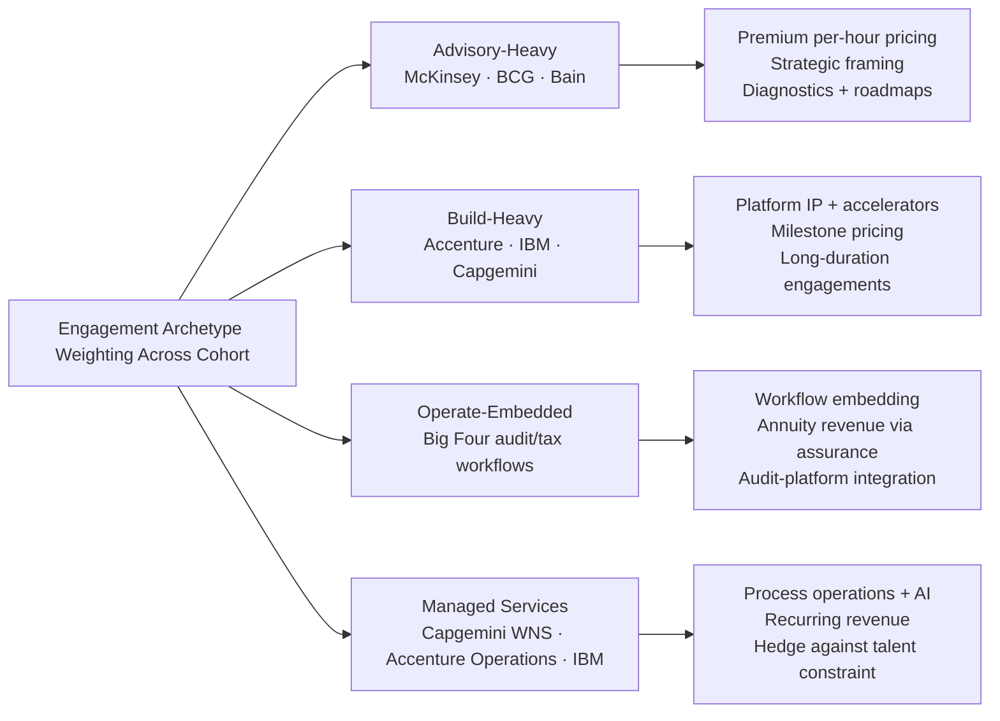

Three implications follow from the taxonomy. First, **ROI realization velocity differs by archetype**: pure advisory engagements produce decisions quickly but rarely produce measurable financial outcomes within their own duration, while build and operate engagements produce slower-arriving but more measurable outcomes. PwC's observation that "carriers' traditional ROI models typically prioritize short-term financial gain relative to the cost of investment, [and] they're unlikely to adequately capture GenAI's potential longer-term value"[^23] is directly a function of this archetype structure. Second, **scalability differs by archetype**: build and operate archetypes scale with platform IP and accelerator reuse, while advisory archetypes scale principally with consultant headcount. Third, **capital intensity differs by archetype**: build-heavy firms (Accenture, IBM, Capgemini) require sustained platform investment, while advisory-heavy firms (MBB) preserve partnership margins by avoiding it—the structural tradeoff documented in Chapter 4.

## 5.2 Financial Services Engagements: BFSI as the Anchor Vertical

Financial services constitute the anchor vertical for AI consulting, accounting for approximately 30.9% of AI consulting revenue and the largest single industry investment in AI: financial services firms spent **US$35 billion on AI in 2023, with projected investments across banking, insurance, capital markets and payments expected to reach US$97 billion by 2027**[^22]. The structural drivers are clear. As Accenture's research demonstrates, financial services firms—because so much of what they do is language-based—have a greater potential than most others to capitalize on large language models: in banking, **39% of work time has high potential for automation and 31% for augmentation**; in insurance, the equivalent figures are 33% and 37%; in capital markets, 32% and 37%[^22]. Layered onto this structural opportunity is the commercial validation that **70% of financial services executives believe that AI will directly tie to revenue growth in upcoming years**, not merely cost reduction[^22].

### Insurance: The Most Documented Functional Battleground

Insurance has emerged as the most empirically documented financial services sub-vertical, with PwC publishing multiple named GenAI deployment cases that illustrate the breadth of use case clusters. Three deployments are particularly instructive.

The first is a **life insurer's bionic-ROI deployment** in which "GenAI-based software [applies] natural language capabilities, machine learning and behavioral science principles to help call center agents improve their interactions with customers. The software assesses how calls are going in real time and lets agents know if they should alter their approach. In addition, using a complementary, web-based application, call center managers receive rankings in real time so they can intervene if a call score is low"[^23]. This case exemplifies the human-AI collaboration archetype—what Deloitte's positioning would call the "Age of With"—in which AI augments rather than replaces frontline workers, with measurable improvements in call quality and customer satisfaction.

The second is an **automotive insurer's real-time pricing deployment**, in which "GenAI [is used] to analyze real-time driver data for automatic insurance pricing based on actual driving behavior. This has significantly reduced operational costs and improved application performance, resulting in higher profitability and lower premiums"[^23]. The case illustrates how AI-driven pricing crosses the boundary between underwriting (historically a back-office function) and customer-facing pricing—creating value that flows simultaneously to the carrier (lower operational costs, higher profitability) and to the customer (lower premiums).

The third is a **commercial P&C carrier's multi-function GenAI deployment**, which uses "always on, multilingual GenAI-powered intelligent assistants that operate across channels to address risk appetite and underwriting queries. The bots summarize key exposures and generate insights using cited sources and databases. In the underwriting process, embedded smart tools assess and price risks. These tools also simplify back-office operations and claims management. With the added ability to immediately route repair requests to carrier partners, they also help carriers better serve customers, increasing their satisfaction and loyalty"[^23]. This case is particularly significant because it links underwriting, claims, and customer service into a single integrated GenAI deployment—exactly the "scalable ROI" thesis that PwC's research identifies as the path beyond function-specific pilots.

The Hartford's collaboration with Accenture extends the insurance deployment evidence into the foundation-model customization layer. Deepa Soni, chief information officer of The Hartford, framed the engagement: "We are pleased to collaborate with Accenture to help fully leverage the power of generative AI as part of our aggressive technology agenda. With AI already mainstream at The Hartford, we understand its potential and will harness this power in conjunction with responsible AI principles. Our advanced architecture and ability to customize generative AI models will enhance our employees' work across the value chain, further positioning us to serve our customers, agents and shareholders"[^24]. The engagement explicitly leverages Accenture's foundation-model "switchboard" architecture (examined in Chapter 4) to align customized models to the insurance industry's distinctive document-heavy workflows[^24].

PwC's annual GenAI insurance trends research reinforces the strategic direction. The firm's 27th Annual Global CEO Survey found that **70% of CEOs believe GenAI will significantly change the way their companies create, deliver and capture value**, **31% have already changed their technology strategies because of GenAI**, **58% believe GenAI will improve the quality of their company's products or services within 12 months**, and **64% believe GenAI will enable an efficiency increase of at least 5% for their employees' time at work**[^6]. PwC's diagnostic that "approximately half of GenAI's value (measured in percent of operating profit uplift) [is] driven by common recurring use cases (marketing content generation, for instance)" but that "carriers are increasingly looking for opportunities for GenAI to reimagine core functions, business processes and transformations"[^6] is an explicit articulation of the migration from advisory archetypes toward build-and-operate archetypes that this chapter's taxonomy framed.

### Banking, Capital Markets, and Payments: Function-Specific Deployments

Beyond insurance, the Accenture–WEF financial services AI research provides the most comprehensive cross-firm picture of where AI is being deployed in banking and capital markets. The most promising AI use cases (contextualized) across financial services include: **banking sales and service** (customer service agents receive quick and comprehensive information from a variety of sources, delivering greater agent efficiency, increased response accuracy, and quicker response time); **capital markets client servicing/investment management** (firms use AI models to create investment portfolios, offer financial assistance, and provide real-time insights and trading recommendations, delivering enhanced client satisfaction and competitive advantage); **payments fraud management and detection** (pre-emptive fraud detection using technologies that proactively identify suspicious behavior or anomalous events before fraudulent transactions, delivering improved fraud protection and minimizing false positives); **insurance claims** (automation of claims and customer document processing, delivering streamlined document collection and validation); and across financial services, **risk management and underwriting** (prediction of fraudulent transactions, more effective underwriting processing and risk scoring) and **technology development** (streamlining the software development life cycle, including understanding and decommissioning of legacy code environments)[^22].

Two emerging architectural shifts deserve emphasis. First, **84% of financial organizations are implementing or planning a framework to govern how AI will be built, trained, used and audited**, indicating that responsible AI is a near-universal client requirement that disproportionately favors firms with assurance heritage[^22]. Second, the WEF–Accenture research articulates the technology-evolution path that consulting firms must navigate over the next 2–3 years: small language models (SLMs) for single-task efficiency, retrieval-augmented generation (RAG) for accuracy and reliability, AI agents that "are designed and built to understand inputs, make decisions and act on them without any human intervention," and quantum computing integration for accelerated decision-making in pattern-recognition-heavy domains such as fraud detection[^22].

### KPMG, Deloitte, IBM, McKinsey, and Bain in Financial Services

KPMG's deepest financial services AI deployment is the integration of generative AI into the **KPMG Clara global smart audit platform**, with operational use cases spanning risk assessment, substantive testing procedure development, audit documentation, prompt-library access, automated quality scoring, AI/ML-automated review of financial statements, and assurance over emissions and other disclosures (examined in detail in Chapter 4). The Audit-Chat-plus-Clara architecture means that virtually every financial services audit engagement is, in operational terms, an AI-assisted engagement—a scale of workflow embedding that no other firm in the cohort matches in the audit function specifically.

Deloitte's *State of GenAI in the Enterprise* research provides the most comprehensive cross-industry diagnostic on financial services AI maturity, though specific named engagements are less publicly disclosed than for KPMG and PwC. The firm's broader BFSI advisory work draws on its position as a top advisor to a substantial share of the Fortune 500 and large U.S.-based private companies—a client base in which financial services firms are heavily represented.

IBM's financial services deployments are anchored on watsonx and Consulting Advantage, with regulated finance representing a primary target segment for the proprietary-stack architecture documented in Chapter 4. McKinsey's QuantumBlack analytics deployments in banking risk and capital-markets analytics are concentrated at the strategic-framing layer, leveraging the firm's CEO and board advisory positioning. Bain's OpenAI-leveraged deployments extend into financial services through the same alliance architecture documented for Coca-Cola and Carrefour, though specific named financial services deployments are less publicly disclosed.

Capgemini's custom-fine-tuning approach is structurally well-suited to financial services clients with sensitive proprietary data, consistent with Franck Greverie's articulation that "for clients who have key sensitive data, we are developing custom generative AI solutions, fine-tuned with their proprietary data, to create maximum business value"[^22]. The European-sovereignty positioning examined in Chapter 3 is particularly resonant in financial services, where GDPR and EU AI Act compliance constrain cross-border data flows.

### Synthesis: Financial Services Use Case Clusters and Cross-Firm Positioning

Synthesizing the financial services evidence reveals five dominant use case clusters in which all ten firms compete with varying depth:

| Use Case Cluster | Representative Deployments | Dominant Firm Archetype |
|---|---|---|
| **Underwriting and pricing** | Hartford foundation-model customization (Accenture); automotive insurer real-time pricing (PwC) | Build-heavy integrators + Big Four |
| **Claims and document processing** | PwC commercial P&C multilingual assistants; cross-firm pattern | Big Four + integrators |
| **Fraud detection and AML** | Pre-emptive fraud detection across payments (Accenture–WEF research) | Integrators + IBM |
| **Audit and compliance** | KPMG Clara at scale; AI-amplified audit | KPMG + Big Four |
| **Customer service and call centers** | Life insurer bionic-ROI deployment (PwC); commercial P&C multilingual GenAI bots | All firms |

The structural pattern is that **financial services AI engagements increasingly require integration across multiple use case clusters**—the commercial P&C deployment linking underwriting, claims, and customer service in a single GenAI architecture is the prototypical example—and that this integration requirement disproportionately favors firms with platform-IP depth (Accenture, IBM, Capgemini) and workflow-embedding depth (KPMG Clara). The MBB houses retain a structural advantage at the strategic-framing layer (CEO-level AI strategy, target operating model design, board-level governance) but face increasing platform competition as agentic AI shifts the unit of consulting work from advisory to deployment.

## 5.3 Healthcare and Life Sciences Engagements: The Highest-CAGR Vertical

Healthcare and life sciences constitute the second strategic anchor vertical, with the highest projected AI adoption CAGR at 36.5% (referenced in Chapter 1) and AI spending in the sector reaching US$1.4 billion in 2025—nearly tripling year over year. Deloitte's life sciences AI research provides the most comprehensive single-firm picture of where deployments are concentrated, organized around an enterprise-wide approach that maps AI across the full biopharma value chain "from molecule to market"[^20].

### R&D and Drug Discovery: The Highest-Profile Use Cases

The most publicly visible life sciences AI case is the **Sumitomo Dainippon Pharma–Exscientia drug discovery deployment**, in which Sumitomo Dainippon Pharma "announced the start-up of a Phase 1 trial for a candidate to treat obsessive-compulsive disorder created using AI. This involved using Exscientia's AI drug discovery platform to identify a serotonin 5HT1A receptor agonist that could be effective in treating patients with obsessive-compulsive disorder. **Leveraging AI enabled identifying this molecule within 12 months as compared to the several years it takes using conventional research techniques**"[^20]. The case is significant not only for its technical achievement but for what it demonstrates about the magnitude of process compression that AI can deliver in capital-intensive R&D workflows—a 12-month vs. multi-year compression representing a step change in drug discovery economics.

Deloitte's research articulates the broader R&D and drug discovery use case taxonomy: **target identification and validation** (AI imaging capabilities detect cell morphology changes that humans cannot see; AI applied to knowledge graphs helps understand complex relationships between compounds, genes, diseases, and proteins); **molecular design** (generative modeling for small molecule design and protein engineering, with several startups pioneering partnerships with large biopharma companies); **digital data flow** (AI-driven solutions integrate trial data from multiple source systems and documents to create standardized digital data elements); and **patient stratification** (AI normalizes data from different platforms—gene expression, imaging, clinical records, epidemiological data—to identify patients most likely to improve trial success probability)[^20].

### Manufacturing, Supply Chain, Commercial, and Compliance

Beyond R&D, Deloitte documents named deployments across the life sciences value chain with specific quantitative outcomes:

- **Manufacturing optimization**: A biopharma company applied analytics and neural networks technologies to manufacturing data at one of its UK sites, achieving **manufacturing line speed improvement of 21%, reduced downtime, and overall equipment effectiveness improvement of 10%**, with planned extension to deep-learning image recognition for quality defect detection[^20].
- **Supply chain demand forecasting**: Merck KGaA implemented an AI-based system to automate demand forecasting for supply chain planning, applying ML to data from its enterprise resource planning system "to accurately forecast the demand for its products in terms of both quantity and location and suggest changes to inventory and production levels. By using this technology at scale, **Merck improved the forecast accuracy of 90% of its products**"[^20].
- **Commercial sales-rep augmentation**: Biogen "created a custom internal search engine that leverages NLP to help sales representatives to quickly find answers to physicians' questions on company products. The system replaced assembled-over-the-years FAQs, text-heavy documents, and educational material that sales representatives need to comb through for answers"[^20].
- **Voice-of-the-patient product iteration**: A life sciences company "used NLP to aggregate and analyze consumer complaints, social media sentiment, and adverse event data on a newly launched injection system for plaque psoriasis and bipolar disorder. From this AI-enabled analysis, the manufacturer discovered that consumers were confused by device instructions and were incorrectly using the injection system. In response, the manufacturer created a more intuitive syringe system with simpler user instructions and redistributed the product to the market"[^20].
- **Compliance efficiency**: A biopharma company "deployed an NLP tool for initial email screening to identify potential risks. **This reduced the number of emails compliance officers needed to review from 2,500 to 20**. Officers could then spend time investigating those 20 emails and analyzing them to find true risk to the business"[^20].
- **Adverse event automation**: Using Deloitte's ConvergeHEALTH cognitive case processing algorithm, "a large biopharma company automated the processing of adverse event data from patients, health care professionals, and regulatory agencies. The solution applies ML and NLP to automate routine cases and route exceptional cases to experts for targeted adjudication, and then learns how to handle similar cases to improve efficiencies. … **The solution has reduced case processing time by 50–60% per case, which has resulted in 65–75% savings per year in case-processing costs**"[^20].

The cumulative pattern across these cases is that life sciences AI deployments deliver measurable outcomes across the value chain—**21% manufacturing line-speed improvement, 90% improved demand-forecasting accuracy, 50–60% reduction in adverse-event case processing time, 65–75% annual cost savings, 99% reduction in compliance email review burden**—that justify the capital intensity of the engagements and that compound across multiple use cases when integrated.

### Cross-Firm Healthcare and Life Sciences Positioning

Deloitte's depth in life sciences is structurally reinforced by the broader research-and-methodology IP examined in Chapter 4 and by the firm's position as a leading life sciences advisor. The combination of vertical IP (the ConvergeHEALTH platform, the cognitive case processing algorithm, the comprehensive R&D-to-market taxonomy) and structured ecosystem alliances positions Deloitte as one of the deepest life sciences AI consultancies in the cohort.

Other firms occupy distinct positions. **IBM** historically anchored healthcare AI on Watson, with watsonx-based deployments now extending the architecture; the focus on regulated industries reflects IBM's continuing emphasis on environments where its hybrid-cloud-native and proprietary-IP positioning are structurally favored. **Accenture** maintains pharmaceutical industry accelerators within its 19-industry portfolio, supplementing them with the May 2024 closing of the **Cognosante acquisition**, which added more than 1,500 employees to Accenture Federal Services and provided access to VA T4NG2, VHA IHT, and CMS SPARC contract vehicles—deepening Accenture's federal health digital transformation capability. **PwC** and **EY** maintain life sciences advisory practices that intersect with their broader Big Four positioning, with EY's Tax Agent Factory architecture extensible to life-sciences-specific tax and regulatory deployments. The MBB houses—particularly McKinsey, which has historically been the deepest healthcare strategy advisor—lead at the CEO and board level, with QuantumBlack analytics increasingly extending into clinical and operational deployments.

The Deloitte survey of nearly 150 life sciences executives provides the diagnostic counterpoint to the named cases: more than 40% of survey respondents reported their organizations invested **US$20–50 million** on AI initiatives in 2019, while 21% invested more than US$50 million, with more than half expecting investments to continue increasing[^20]. The principal challenges executives reported—**identifying high-value use cases (30%), integrating AI into the organization (28%), and data challenges (28%)**, plus the AI black-box explainability issue—define exactly the consulting demand that the firms in this cohort are positioned to serve[^20]. The strategy-implementation gap (46% of respondents say AI implementations take longer than expected to deliver payback) underscores the structural tradeoff between advisory and build engagement archetypes that Section 5.1 framed.

## 5.4 Energy, Resources, Manufacturing, and Industrials Engagements

The energy, resources, manufacturing, and industrials cluster is structurally distinctive in three ways: its capital intensity (oil and gas, utilities, and heavy manufacturing involve assets with multi-decade lifespans where downtime costs are extreme), its safety stakes (equipment failures can cause environmental disasters and worker fatalities), and its regulatory complexity (environmental compliance, ESG reporting, energy-transition mandates). Each of these characteristics shapes how AI consulting firms structure engagements in the cluster.

### Predictive Maintenance: The Anchor Use Case in Oil and Gas

The most extensively documented use case in the cluster is **AI-driven predictive maintenance**, which addresses the high cost of unplanned equipment failure. Independent industry research, citing a Deloitte study, demonstrates that "**unscheduled maintenance can cost organizations up to 20% of their operational budget**, increase costs, delay schedules, and impact customer satisfaction"[^22]. The opportunity in oil and gas specifically is therefore an order-of-magnitude business case: even modest reductions in unplanned downtime translate into hundreds of millions of dollars of annual savings for major operators.

The architectural pattern is well-established: "Sensors installed across machines continuously collect key data such as temperature, pressure, vibration, acoustic signals, etc. A central monitoring platform receives this real-time data and monitors the health of the machines 24/7, which is vital for oil field operations in remote and rugged areas. Machine learning algorithms analyze the incoming data to identify subtle patterns that typically precede faults"[^22]. Anomaly detection, the technical pillar, identifies "patterns in data that deviate from expected norms, often at the earliest signs that something is off with the machines," using "statistical, rule-based, or … sophisticated machine learning approaches like clustering, autoencoders, or neural networks"[^22]. The decisive AI-enabled advance is the ability to "self-learn from operational data, get better over time, and find patterns that traditional analytics might overlook" and to "scale across vast sensor networks"[^22], which is precisely the architectural strength that consulting firms with deep platform IP (Accenture, IBM, Capgemini) and engineering depth (Capgemini's Altran inheritance, Accenture's industrial AI tuck-ins) are best positioned to deliver.

The benefits cascade across multiple dimensions: **extended asset longevity** through component-need maintenance; **enhanced worker safety** by preventing failures that lead to explosions, toxic leaks, and fires; **improved environmental compliance** through real-time monitoring that prevents gas flaring and pipeline leaks; and **cost optimization** through reactive-to-proactive transition[^22]. Each benefit dimension corresponds to a distinct ROI calculation that consulting engagements can structure separately or in combination.

### Manufacturing: Foxconn, Reckitt, and the Industrialized AI Operating Model

The most quantitatively striking manufacturing AI deployment in the cohort is BCG's engagement with **Foxconn**, which produced "**Over $400M targeted savings identified from a scalable AI operating model and AI platform deployed across more than 200 factories**" (referenced in Chapter 4 from the BCG AI Radar 2026 client examples). The engagement illustrates three critical elements of effective industrial AI deployment: scale (200+ factories), platform reusability (a scalable AI operating model rather than 200 bespoke deployments), and measurable financial outcomes (>US$400M targeted savings)[^21]. The case is also notable for what it reveals about BCG X's tech-build positioning: an MBB-led engagement that produces an AI platform deployed across 200+ factories is structurally indistinguishable from an integrator-led engagement, suggesting that the lean-tooling-versus-platform distinction examined in Chapter 4 is less rigid in practice than it is in narrative.

The companion **Reckitt** case—"Quality output doubled through an end-to-end AI-driven workflow reinvention in marketing, cutting routine activities by up to 90%"—extends the BCG pattern from industrial manufacturing into consumer-products marketing[^21]. The 90% reduction in routine activities is the productivity-multiplier signal that recurs across the cohort: AI deployments that genuinely succeed at scale tend to deliver order-of-magnitude reductions in specific routine workloads, freeing capacity for higher-judgment work.

### Accenture's Industrial AI Portfolio: Tuck-Ins and Project Spotlight

Accenture has built one of the deepest industrial AI portfolios in the cohort through a combination of acquisitions and venture investments. The cumulative portfolio—**Flutura** (industrial AI for manufacturing and energy, referenced in Chapter 1), **Eclipse Automation** (Canada), **Pollux** (Brazil), the **Accenture Alpha Automation joint venture with Mujin** (Japanese robotics leader), and the **Project Spotlight investment in Sanctuary AI** for humanoid general-purpose robots—forms a coherent industrial-automation portfolio that crosses the boundary between equity investment, joint venture, and full ownership[^22].

The **Sanctuary AI investment** is particularly instructive for what it reveals about Accenture's industrial AI thesis. Sanctuary's Phoenix robot, recognized in TIME's "Best Inventions of 2023," is powered by the Carbon AI control system that "mimics subsystems found in the human brain, such as memory, sight, sound and touch, and translates natural language into action in the real world"[^22]. Joe Lui, Accenture's global advanced automation and robotics lead, framed the deployment-channel logic: "Sanctuary AI's advanced AI platform trains robots to react to their environment and perform new tasks with precision in a very short time. We see huge potential for their robots in **post and parcel, manufacturing, retail and logistics warehousing operations**, where they could complement and collaborate with human workers"[^22]. The investment is explicitly tied to deployment opportunities that Accenture's Global 2000 client base will generate, exemplifying the corporate-venturing logic examined in Chapter 2 in which equity stakes are valued not for financial returns but for client-deployment annuities.

### Capgemini's Engineering-and-AI Inheritance and IBM's Industrial Deployments

Capgemini's industrial positioning is anchored on the Altran inheritance—the prior acquisition that strengthened "engineering and AI services"[^25]—supplemented by hyperscaler partnerships and the Generative AI Lab that hosts industrial-specific custom-fine-tuning capability. The combination is well-suited to industrial clients with sensitive proprietary engineering data, where the European-sovereignty positioning examined in Chapter 3 is particularly resonant. The acquisition of **Syniti**, completed in 2025, further enhances Capgemini's data-driven transformation capabilities for large-scale SAP S/4HANA transitions and complex data migrations across sectors including life sciences and manufacturing—Aiman Ezzat, CEO of Capgemini, explicitly framed the rationale: "Syniti and Capgemini share the philosophy that digital transformation will always require data transformation to drive critical business benefits"[^25]. IBM's industrial deployments are anchored on watsonx and the IBM Concert ITOps platform, which "unifies observability, optimization, and resilience insights into shared operational intelligence, with governed AI"—an architecture well-suited to operational-resilience use cases in industrial settings[^22].

### Synthesis: Capital-Intensive Verticals and Engagement-Archetype Implications

Synthesizing the energy-resources-manufacturing-industrials evidence reveals that the cluster is structurally well-suited to **build-and-operate engagement archetypes** with strong platform IP requirements. The use case clusters that recur across the cohort include:

- **Predictive maintenance** (Deloitte's anchor research; Accenture and IBM platform deployments; Capgemini's Altran-anchored engineering AI)
- **Smart factory and digital twins** (Foxconn at >$400M scale via BCG; Capgemini engineering AI; Accenture Industry X)
- **Supply chain optimization** (Merck KGaA forecasting via Deloitte; cross-firm pattern)
- **Energy transition and net-zero engineering** (Accenture's IQT/BOSLAN/Anser/Comtech four-country net-zero infrastructure portfolio referenced in Chapter 2)
- **Autonomous warranty and field operations** (Deloitte's *AI Dossier* identifies "Autonomous warranty adjudication" using AI agents to automate warranty claims processing[^20])
- **Industrial robotics and humanoid automation** (Accenture Alpha Automation JV with Mujin; Sanctuary AI Project Spotlight investment)

The structural pattern is that **industrial AI engagements increasingly require integration of physical-asset domain expertise with AI engineering capability**, and that this combination is most natively delivered by firms that have inherited or acquired engineering depth (Capgemini via Altran and Syniti, Accenture via Eclipse/Pollux/Mujin/Sanctuary), or that have built proprietary operational platforms (IBM Concert), or that have committed deep advisory-plus-platform engagements at scale (BCG–Foxconn). The Big Four are present in the vertical but principally through advisory-led engagements; the MBB houses concentrate at the strategic-framing layer with selective build engagements (BCG–Foxconn being the prototypical example of MBB build-mode delivery at industrial scale).

## 5.5 Retail, Consumer Products, TMT, and Public Sector Engagements

The fourth vertical cluster—spanning retail, consumer products, technology-media-telecommunications, and public sector—is structurally distinctive in that it encompasses both the most consumer-facing AI deployments (where personalization and content generation deliver direct customer experience) and the most regulation-and-citizen-service-oriented deployments (where governance and compliance are first-order requirements). The cluster is also where the cohort produces the most named brand engagements, providing some of the most concrete evidence of AI consulting outcomes.

### Bain–OpenAI: Coca-Cola and Carrefour

The most prominent named consumer-products AI engagements in the cohort are Bain's deployments through the OpenAI services alliance examined in Chapter 4. **The Coca-Cola Company** "utilized the power of OpenAI's ChatGPT and DALL·E to enhance its brands, marketing, and customer experiences," with the company "recognizing the potential to invigorate their marketing strategies with cutting-edge AI technology and explore ways to improve business operations and capabilities." **Carrefour**, "one of the world's largest food retailers," used OpenAI's ChatGPT technology to develop and roll out three solutions: an AI-powered shopping assistant chatbot, enriched product description sheets, and an AI tool to improve procurement processes.

The two deployments illustrate distinct use case patterns within the consumer-products cluster: Coca-Cola is anchored on **brand and marketing transformation** (where DALL·E's image-generation capability is structurally well-suited to advertising creative production), while Carrefour spans **customer-facing assistance** (the shopping chatbot), **content automation** (enriched product description sheets), and **back-office optimization** (procurement AI). The cross-Bain-engagement pattern is that frontier-model access is channeled through Bain's existing industry positioning rather than creating a horizontal AI practice—exactly the alliance-led, deployment-velocity-prioritizing positioning documented in Chapter 4.

### Capgemini–Heathrow: Airport Passenger Experience GenAI

Capgemini's named deployment at **Heathrow Airport** uses the firm's four generative AI assistants "to improve the passenger experience"[^22]. The deployment exemplifies Capgemini's portfolio architecture (examined in Chapter 4): hyper-personalized customer experience GenAI assistants applied to a transportation-services use case. Heathrow's selection as an early-deployment client signals that Capgemini's GenAI assistant portfolio is being tested in high-stakes, high-volume customer-experience environments where reliability and governance requirements are non-trivial.

### PwC–Southwest Airlines: GenAI for Legacy System Modernization

The most quantitatively documented PwC engagement in the cohort is the **Southwest Airlines crew leave management system modernization** delivered on Microsoft Azure GenAI infrastructure[^26]. The engagement is significant for what it reveals about a distinctive use case—using GenAI not for customer-facing applications but for the **reverse engineering of legacy code into functional requirements**—and for the specific quantitative outcomes disclosed:

| Outcome Metric | Result |
|---|---|
| Backlog creation time reduction | **50% (from 10 weeks to 5 weeks)** vs. traditional methods[^26] |
| AI-generated user stories accepted as high-quality requirements | **90%, totaling over 600 stories**[^26] |
| Time saved across engineering, technology, and business specialists | **50% (200+ hours)** during planning and design phases[^26] |

Marty Garza, Vice President of Air Operations Technology at Southwest Airlines, framed the engagement: "PwC brought an innovative engineering approach along with GenAI, built on Microsoft Azure, to reverse-engineer the legacy system's complex source code into holistic functional requirements. This approach extracted the key requirements and transformed them into a prioritized backlog, accelerating planning and design informed by Southwest knowledge specialists. Collaborative workshops with PwC to review content and continually enhance GenAI capabilities focused on the backlog provided clarity and efficiency. With PwC, we condensed what could have been a months-long effort into a five-week milestone"[^26]. The articulation of the human-AI collaboration logic—"While GenAI tools automated labor-intensive tasks like scalable code analysis and dependency mapping, PwC facilitated workshops and iterative reviews that helped align the outputs with our operational needs — blending leading-edge technology with strategic human insights"[^26]—is exactly the human-led, tech-powered positioning examined in Chapter 3, operationalized in a specific engagement.

The strategic significance of the Southwest deployment extends beyond the immediate outcomes. The "AI-Native Engineering" capability that PwC has productized around the case—"Engineering AI-first platforms for the enterprise of tomorrow"[^26]—signals that the firm intends to scale legacy-modernization GenAI as a recurring offering rather than as a one-off engagement. Garza's closing observation reinforces the scaling intent: "The PwC team gave us a new way to modernize legacy applications, which is faster and more accurate than traditional planning approaches. Their smart methods utilized GenAI in a practical way and that experience will help us transform our business"[^26]. The engagement is therefore both an outcome and a reusable capability template—exactly the operate-mode-with-platform-IP archetype examined in Section 5.1.

### Public Sector: Accenture Federal, Italian Tuck-Ins, and Booz Allen

Accenture's public-sector AI footprint is the broadest in the cohort, anchored on **Accenture Federal Services'** Cognosante-acquired federal health digital transformation capability (referenced in Section 5.3) and extended by a series of **Italian public-sector tuck-ins** (Intellera Consulting, Customer Management IT, SirfinPA) that saturate one of Europe's largest public-sector consulting markets (referenced in Chapter 2). The Italian portfolio—Intellera for "Italian Public Administration innovation," Customer Management IT and SirfinPA for "Justice and Public Security tech"—creates a coherent vertical-and-geographic depth that no other firm in the cohort matches in Italian PA specifically.

**Booz Allen Hamilton**, while not in the focal ten-firm cohort, is the most defense-and-government-anchored AI consultancy and is consistently identified as a market leader alongside the cohort firms (referenced in Chapter 1). The launch of the Modzy platform for AI model deployment in defense and government environments illustrates the public-sector-specific platform productization pattern.

The Big Four's public-sector AI engagements are extensive but generally less publicly disclosed at the named-engagement level. **Deloitte's Government & Public Services practice** is one of the largest public-sector consultancies globally and has integrated AI across citizen services, defense intelligence, and federal agency modernization engagements. Deloitte's broader AI use case dossier—covering 86 use cases across seven industry-cuts including Government & Public Services—provides a structured map of where the firm concentrates public-sector AI deployments[^20], though specific named engagements are typically published in case studies rather than aggregated diagnostics.

### Synthesis: Consumer-and-Public Use Case Clusters

The retail-consumer-TMT-public sector cluster reveals six recurring use case clusters across the cohort:

| Use Case Cluster | Representative Deployments | Dominant Firm Archetype |
|---|---|---|
| **Personalization and recommendation** | Bain–Coca-Cola brand and marketing | Alliance-led MBB |
| **Conversational shopping and customer service** | Bain–Carrefour shopping chatbot; Capgemini–Heathrow passenger assistants | All firms |
| **Content generation and marketing automation** | Reckitt (BCG, marketing workflow); Coca-Cola (Bain, DALL·E) | MBB + integrators |
| **Citizen services and federal modernization** | Accenture Federal Cognosante; Italian PA tuck-ins | Accenture + Big Four |
| **Defense intelligence and government AI** | Booz Allen Modzy; cross-firm advisory | Booz Allen + Big Four |
| **Legacy modernization and code reverse-engineering** | PwC–Southwest Airlines Azure GenAI | Big Four + integrators |

The structural pattern is that **consumer-facing deployments are increasingly delivered through frontier-model alliances** (Bain–OpenAI being the prototypical example), while **public-sector deployments are increasingly delivered through workflow-and-vertical-IP-integrated platforms** (Accenture Federal Services, Booz Allen Modzy). The legacy-modernization use case—exemplified by PwC–Southwest—is emerging as a cross-cohort growth area where GenAI's ability to reverse-engineer source code into functional requirements creates measurable engagement-velocity advantages over traditional methods.

## 5.6 Functional Use Case Mapping: Cross-Industry Applications

Pivoting from vertical to functional analysis reveals where each firm has concentrated AI deployments across the seven business functions that recur in client engagements. The functional view complements the vertical view by surfacing **cross-industry use case patterns**—deployments that share architectural and economic characteristics regardless of the client's industry—and by identifying functional concentrations that distinguish each firm's capability portfolio.

### IT and Software Engineering

Software engineering is the most cross-cutting AI use case in the cohort, with every firm offering a GenAI-for-software-engineering capability of some kind. **PwC's Southwest Airlines deployment** illustrates the legacy-modernization variant of this use case at scale. **Capgemini's GenAI for software engineering** offering, examined in Chapter 4, covers "the entire development lifecycle — design, coding, documentation, testing, and deployment" with the explicit value proposition of "accelerat[ing] time to market for new software, facilitat[ing] large scale modernisation of legacy software, and reduc[ing] the attack surface"[^22]. **KPMG's deployment of Copilot for Microsoft 365** to its Audit partners and professionals, referenced in Chapter 4, illustrates the variant in which an off-the-shelf GenAI productivity tool is operationalized for professional workflows. **IBM Consulting Advantage's role-based generative AI assistants** include software engineering–specific roles, consistent with the platform's broader role-based architecture[^22].

### Operations and Supply Chain

Operations and supply chain AI is anchored on the predictive-maintenance and demand-forecasting use cases examined in Sections 5.3 and 5.4. The cross-cohort pattern is that operations AI deployments are most often delivered through **build-and-operate engagement archetypes** with strong platform IP requirements, favoring firms with deep engineering inheritance (Capgemini–Altran), industrial-AI tuck-in portfolios (Accenture–Flutura/Eclipse/Pollux/Mujin/Sanctuary), or proprietary operational platforms (IBM Concert ITOps). Deloitte's *AI Dossier* identifies "Autonomous supply chain operations (Using AI agents to improve efficiency in global automotive supply chains)" and "Next-generation store operations (Autonomous in-store coordination to optimize retail execution)" as emerging agentic operations use cases—signaling that operations AI is migrating from predictive analytics toward autonomous-action agents[^20].

### Marketing, Sales, and Customer Experience

Marketing, sales, and customer experience AI deployments span the cohort but are particularly concentrated in alliance-led MBB engagements (Bain–Coca-Cola, Bain–Carrefour) and in integrator-led personalization platforms (Capgemini's hyper-personalized GenAI assistants at Heathrow). Deloitte's *AI Dossier* identifies "Dynamic pricing and inventory optimization (Coordinating price and stock decisions in real time)" and "AI assistant for vehicle buying and leasing (Guiding consumers via personalized, multi-agent assistance)" as emerging cross-industry deployments[^20]. The structural pattern is that customer-facing AI is the use case cluster where **frontier-model capability matters most**—a high-quality DALL·E or ChatGPT deployment is visibly differentiating from a lower-quality alternative—creating a structural advantage for alliance-led firms with privileged frontier-model access (Bain–OpenAI) and for firms with deep custom-fine-tuning capability (Capgemini).

### Customer Service

Customer service AI is the most universal functional concentration in the cohort, with intelligent assistants and multilingual GenAI bots deployed by every firm. The PwC commercial P&C carrier deployment ("always on, multilingual GenAI-powered intelligent assistants that operate across channels to address risk appetite and underwriting queries") and the life insurer bionic-ROI deployment (real-time call-center quality scoring) illustrate the function-specific variants[^23]. The Accenture–WEF research identifies the customer-service use case as one of the largest immediate-impact opportunities in financial services: "Customer service agents receive quick and comprehensive information on all aspects of products, policies and processes from a variety of sources," delivering "greater agent efficiency, increased response accuracy, [and] quicker response time"[^22].

### Cybersecurity

Cybersecurity AI is structurally one of the highest-growth functional use cases (referenced in Chapter 1 with Gartner's ~73.9% CAGR for AI Cybersecurity through 2029) and one where the cohort firms increasingly deploy AI both as defensive infrastructure and as a productized service line. The WEF–Accenture research specifically references the **Q1 2024 spike of 223% in deepfake-related tool trading on dark web forums** vs. the same period in 2023 as evidence of the rising threat surface[^22], and the Hong Kong deepfake CFO incident—in which "a finance worker at a multinational firm … was instructed to transfer $25 million to an account controlled by fraudsters" after a video call with a computer-generated CFO and colleagues—as evidence of the operational risk[^22]. Accenture's investment in Reality Defender, "to help fight Deepfake Extortion, Fraud and Disinformation," exemplifies the equity-and-deployment-channel logic of corporate venturing in the AI security space[^22]. Each of these threat-surface developments creates direct consulting demand that the cohort firms are positioned to serve.

### Finance, Audit, and Tax

Finance, audit, and tax functional deployments are concentrated in the Big Four, with KPMG Clara representing the deepest workflow embedding in the audit function and EY's Tax Agent Factory representing the deepest agentic productization in the tax function (both examined in Chapter 4). PwC's New Equation–anchored audit and tax AI offerings extend a similar architecture across the firm's broader assurance practice, while Deloitte's audit-and-finance AI deployments leverage the firm's broader research-and-methodology IP. IBM Consulting Advantage's role-based assistants include finance-function-specific roles, and McKinsey's QuantumBlack deployments extend into finance analytics through targeted engagements. The pattern is that **finance, audit, and tax AI deployments structurally favor firms with assurance heritage** (the Big Four), with the integrators and MBB houses competing in adjacent areas (CFO advisory, finance transformation, treasury operations).

### HR, Workforce Productivity, and Risk/Compliance

The HR-workforce-productivity functional cluster is illustrated by the **Lyzr–Accenture Gen AI Workforce category win at the Accenture Tech Next Challenge**, in which the AI workforce solutions startup won recognition for capabilities aligned with Accenture's "broader Gen AI strategy, which emphasizes the importance of enhancing productivity and efficiency through AI"[^22]. Lyzr's AI workforce solutions—described as "instrumental in developing AI-driven tools that enhance productivity and efficiency in the workplace"—represent the type of startup-partnership capability that Accenture channels through its Ventures Open Innovation partner program into client deployments[^22]. The risk and compliance functional cluster is illustrated by the Deloitte life sciences NLP email screening deployment (referenced in Section 5.3, with email review burden reduced from 2,500 to 20) and by KPMG's Trusted AI–anchored model-risk-management offerings. Each Big Four firm has built compliance and risk AI capability that converts the firm's assurance heritage into AI-specific governance services—a positioning examined in greater depth in Chapter 6.

### Cross-Cutting Use Cases: Agentic Workflows, Document Processing, and Code Generation

Three use case clusters recur across all ten firms with sufficient frequency to constitute industry-wide convergence patterns. **Agentic workflows**—autonomous AI agents that "understand inputs, make decisions and act on them without any human intervention"[^22]—are productized by every firm in the cohort, from EY's Tax Agent Factory and PwC's enterprise AI agent operating system[^7] through IBM Consulting Advantage's role-based assistants and Accenture's NeuraFlash-anchored agentic Salesforce capability to McKinsey's Lilli, BCG's GENE, and Bain's OpenAI-deployed agents. **Document processing**—including intelligent document extraction, classification, and summarization—is similarly universal, illustrated by the Accenture–WEF research's identification of intelligent document processing as a cross-financial-services use case (insurance claims automation, capital markets research, banking customer onboarding) and by Deloitte's NLP-based compliance and adverse-event automation deployments[^22][^20]. **Code generation and legacy modernization**—exemplified by PwC–Southwest Airlines and Capgemini's software engineering GenAI offering—is emerging as the third cross-cohort convergence pattern, driven by the structural opportunity that GenAI compresses traditional legacy-modernization timelines by 50% or more.

## 5.7 ROI Patterns, Scaled Adoption, and Cross-Firm Synthesis

Synthesizing the engagements documented in Sections 5.2 through 5.6 against the engagement-archetype taxonomy of Section 5.1 produces four analytical conclusions that close the chapter and set up Chapters 6 through 8.

### How Firms Structure Delivery for Scaled Adoption

The five distinct delivery models surfaced across the cohort are operationally observable in the engagements:

1. **Industrialized platform-and-accelerator delivery (Accenture)**: The AI Refinery + 19-industry accelerator architecture is operationalized in deployments such as The Hartford foundation-model customization and the federal-health Cognosante engagements. Accenture's broader **US$1 billion in generative AI bookings in just six months**, achieved through "client-centric" engagements paired with industry-specific accelerators and a startup-collaboration ecosystem, provides commercial validation[^22]. Accenture's Q4/full-year FY25 results further reinforce the scaling pattern with **Generative AI new bookings of US$1.8 billion for the quarter**[^27], indicating a sustained quarter-on-quarter step-up in commercial momentum.

2. **Role-based-assistant platform delivery (IBM Consulting)**: The Consulting Advantage architecture, in which "IBM consultants deliver solutions faster, more consistently, and cost-effectively than ever before" through "role-based generative AI assistants"[^22], is operationalized across the firm's regulated-industry engagements with the AI Book of Business reaching multi-billion-dollar scale (referenced in Chapter 2) as commercial validation.

3. **AI factory pods and CoEs (PwC)**: The cross-functional pod model—uniting "AI technical knowledge, user experience (UX) expertise, business- and process-specific acumen, and risk management"[^6]—is operationalized in engagements such as Southwest Airlines and the commercial P&C carrier multilingual GenAI deployment, with measurable outcomes (50% backlog-creation time reduction, 90% AI-generated user-story acceptance) as commercial validation[^26].

4. **Audit-workflow embedded delivery (KPMG)**: The Clara + Audit Chat architecture is operationalized at the global Audit professional scale referenced in Chapter 4, representing the deepest single-function workflow embedding in the cohort and structurally producing annuity revenue across audit cycles.

5. **Alliance-led deployment-velocity delivery (Bain–OpenAI; MBB pattern)**: The Bain–OpenAI alliance is operationalized in named brand engagements (Coca-Cola, Carrefour) that signal capability through outcomes rather than productized platforms, with internal use across 18,000 knowledge workers as the foundation for client deployment velocity (referenced in Chapter 4).

### How ROI Is Measured and Realized

The ROI evidence across the engagements coalesces around two structural patterns. **First, ROI realization is concentrated in specific use case clusters with measurable productivity multipliers**: 50% backlog-creation time reduction (PwC–Southwest)[^26], 50–60% case processing time reduction (Deloitte ConvergeHEALTH adverse events)[^20], 90% reduction in routine activities (BCG–Reckitt marketing)[^21], 90% improvement in demand-forecast accuracy (Merck KGaA via Deloitte)[^20], >US$400M targeted savings (BCG–Foxconn)[^21], 21% manufacturing line-speed improvement[^20], 99% reduction in compliance email review burden[^20]. These are not aggregate ROI calculations—they are use-case-specific productivity multipliers, and they cluster in the operations, document processing, and customer-service functional categories.

**Second, aggregate ROI realization is broader but more uneven**, and ROI measurement frameworks themselves are still maturing. PwC's articulation of the longer-horizon ROI thesis sharpens the analytical frame: "GenAI's true potential is most likely to come to fruition over time, especially when carriers thoughtfully implement it to support long-term growth and adaptability"[^23], and "carriers' traditional ROI models typically prioritize short-term financial gain relative to the cost of investment, [and] they're unlikely to adequately capture GenAI's potential longer-term value"[^23]. PwC's recalibrated ROI framework—operational efficiency through automation; upskilling and workforce augmentation; and cost avoidance and resource management—each with its own KPI focus areas (e.g., reduction in processing time per task, decrease in manual error rates, growth in customer base without proportional growth in resources)[^23], provides a structured alternative to traditional short-term financial-only ROI calculations.

The BCG AI Radar ROI evidence layers a strategic counterpoint onto these patterns: although AI investment intensity is rising sharply, only a minority of executives report seeing substantial value from AI initiatives, and many struggle with defining KPIs and managing AI-related risks[^21]. The Trailblazer archetype identified in the BCG research—committing roughly 60% of AI budget to agentic AI, with notably higher confidence in payoff—is structurally over-represented in the named engagements that the cohort firms publish, suggesting that the published-engagement evidence reflects the upper tail of the ROI distribution rather than the median[^21]. This survivorship-bias caveat applies to all cohort-firm-published case studies and reinforces the importance of triangulating against independent survey data, which Chapter 8 examines in greater depth.

### Vertical-Functional Concentration Heatmap

The vertical-functional positioning of the cohort can be summarized in a concentration heatmap that locates each firm's strongest engagement zones across the four primary verticals examined in this chapter and the seven primary functions:

| Firm | BFSI | Healthcare/LS | Energy/Industrials | Retail/CPG/TMT/Public | Strongest Functions |
|---|---|---|---|---|---|
| **Deloitte** | ●● | ●●● (ConvergeHEALTH; pharma cases) | ●● (predictive maintenance) | ●● (Gov/Public Services) | Risk/compliance · Audit/finance · Operations |
| **PwC** | ●●● (insurance ROI cases) | ●● | ●● | ●● (Southwest Airlines) | IT/SW engineering · Audit/tax · Customer service |
| **EY** | ●● | ●● | ● | ●● | Tax · Risk · Strategy advisory |
| **KPMG** | ●●● (Clara at scale) | ●● | ● | ●● | Audit · Risk/compliance |
| **Accenture** | ●●● (Hartford; SAP/AWS/Anthropic) | ●● (pharma accelerators; Cognosante) | ●●● (Sanctuary; Mujin JV; Italian tuck-ins) | ●●● (Italian PA; AFS) | All seven functions—broadest portfolio |
| **IBM Consulting** | ●●● (regulated finance) | ●● (watsonx healthcare) | ●● (Concert ITOps) | ●● | IT/SW engineering · Operations · Finance |
| **Capgemini** | ●● (custom GenAI for sensitive data) | ●● | ●●● (Altran + Syniti–anchored engineering) | ●● (Heathrow) | IT/SW engineering · Operations · Customer experience |
| **McKinsey** | ●● (QuantumBlack risk analytics) | ●● (healthcare strategy depth) | ●● | ●● | Strategy · Operations · Marketing/sales |
| **BCG** | ●● | ●● | ●●● (Foxconn $400M scale) | ●● (Reckitt 90% routine cut) | Strategy · Operations · Marketing |
| **Bain** | ●● | ● | ● | ●●● (Coca-Cola; Carrefour named) | Marketing/sales · Customer experience · Strategy |

*●●● = signature concentration; ●● = strong; ● = present*

Three patterns emerge from the heatmap. **First, Accenture is the only firm with strong-to-signature concentration across all four verticals and most functions**, consistent with the broadest capability portfolio documented in Chapter 4 and the largest absolute capital commitment documented in Chapter 2. **Second, vertical specialization patterns are observable**: KPMG's depth is in audit-and-finance functions across BFSI and adjacent regulated industries; Capgemini's depth is in engineering-and-AI in industrials; Bain's depth is in marketing-and-customer-experience in consumer brands; Deloitte's depth is in life sciences and risk/compliance. **Third, the MBB houses' published-engagement footprint is narrower than the integrators' but contains signature concentrations** (BCG–Foxconn at $400M scale; Bain–Coca-Cola/Carrefour) that demonstrate the alliance-led, deployment-velocity model can compete at integrator-class engagement scale.

### White Spaces, Convergence Patterns, and Setting Up Chapters 6–8

Three convergence patterns and three white spaces emerge from the synthesis. **Convergence patterns**—use case clusters where firm differentiation is compressing—include agentic workflows (every firm has a productized agent capability), document processing (every firm has an NLP-based document extraction capability), and code generation/legacy modernization (every firm has a software-engineering GenAI offering). In these clusters, the structural challenge for each firm is to maintain differentiation as the underlying capability commoditizes. **White spaces**—use case clusters where engagement-archetype matchups will determine future competitive position—include regulated-industry governance and trust services (where the Big Four's structural advantage is most defensible), sovereign-AI deployments and on-premises private architectures (where EY.ai enterprise private and Capgemini's custom-fine-tuning are distinctively positioned, as documented in Chapter 4), and end-to-end agentic transformations at scale (where Accenture's industrialized platform-and-accelerator architecture and IBM's role-based-assistant platform are structurally favored).

The empirical evidence in this chapter validates the structural archetypes documented in Chapter 4 while also surfacing tensions that subsequent chapters interrogate. The governance and trust capabilities that the Big Four foreground in their narratives—and that the regulated-industry engagement evidence shows are increasingly first-order client requirements (e.g., 84% of financial organizations implementing or planning AI governance frameworks[^22])—are examined in Chapter 6, alongside the agentic AI orchestration capabilities that every firm in the cohort now markets. The talent strategies through which each firm scales delivery capacity to meet engagement demand—including the Accenture Tech Next Challenge ecosystem and Lyzr-style startup partnerships, the AI Academies referenced across the cohort, and the upskilling that the WEF–Accenture financial services research identifies as essential ("90% [of leaders] believe their organization needs to consider significant adjustments or total transformation of their reskilling strategy"[^22])—are examined in Chapter 7. The aggregate ROI evidence and the cross-firm comparative synthesis that situates each firm's engagement portfolio against its capital commitments, narratives, products, and ecosystem alliances are examined in Chapter 8. With the engagement-level evidence now in place, the report turns to the trust, governance, and agentic capabilities that determine which firms will convert engagement opportunities into sustained competitive position in the next phase of enterprise AI adoption.

# 6 Agentic AI, Responsible AI, Trust, and Governance Capabilities

Chapter 5 closed on a structural observation that frames the present chapter directly: the engagement evidence validates the platform-and-archetype distinctions documented earlier, but it also surfaces tensions—governance and trust as first-order client requirements, agentic AI as the emerging unit of consulting work, and the operational-maturity gap between governance rhetoric and deployable services—that determine which firms will convert engagement opportunities into sustained competitive position. This chapter takes those tensions head-on by interrogating the two interlocking dimensions through which the cohort is now fighting for differentiation: **agentic AI architectures**, where every firm has launched a named platform, factory, or orchestration layer in the last 18 months, and **responsible AI and governance capabilities**, where the Big Four's assurance heritage meets the integrators' platform-as-governance positioning and the MBB houses' advisory framing.

The chapter's central thesis is that agentic AI and governance are no longer separable strategic conversations. As autonomous agents move from experimentation to production deployment—a migration that, as the next section establishes, is unambiguous in the demand-side data—the governance scaffolding required to make those agents safe, compliant, and economically value-creating becomes inseparable from the agent platforms themselves. Firms that productize governance as an integrated platform property (IBM's "governed AI," EY's Trusted AI architecture embedded in EY.ai, Deloitte's Trustworthy AI as a built-in framework around Zora AI) compete on a different axis than firms that productize governance as a discrete advisory service. The chapter examines that emerging axis empirically, then synthesizes a positioning matrix that surfaces three structural archetypes and the strategic tensions that Chapters 7 and 8 interrogate in talent and ROI terms.

## 6.1 The Agentic AI Inflection: Strategic Framing and Demand Signals Across the Cohort

The agentic AI inflection is not a forecast; it is a measured present-tense shift in enterprise demand and consulting delivery that the cohort's own diagnostic instruments document with unusual specificity. Three independent surveys converge on the same conclusion. Deloitte's Q4 2024 *State of Generative AI in the Enterprise* found that **52% of leaders identify "GenAI for automation (agentic AI)" as the technology development of greatest interest**, and **45% identify multi-agent systems**—agentic AI's more advanced variant—as the second most-interesting development, with **26% of organizations already exploring autonomous agent development to a large or very large extent**[^19]. KPMG's research, published as a CIO guide to deploying AI agents, observed that **"interest in agentic AI is high, with 90% of organizations moving beyond agent experimentation to piloting and deployment"**[^28]. BCG's AI Radar 2026 quantified the capital commitment behind that interest: CEOs have committed more than 30% of their organization's 2026 AI investment to agentic AI, and the Trailblazer archetype—approximately 15% of CEOs surveyed—commits roughly 60% of AI budget to agentic AI and is twice as likely to apply agentic AI end-to-end (as documented in Chapters 3 and 4).

Beneath the demand signal, the conceptual boundary that defines what counts as "agentic" has sharpened. Deloitte articulates the distinction with precision: **"AI agents are software systems that can complete complex tasks and meet objectives with little or no human intervention. They are called 'agents' because they have the agency to act independently, planning and executing actions to achieve a specified goal"**, with the broader vision being that **"autonomous AI agents will be able to execute assigned tasks consistently and reliably by acquiring and processing multimodal data, using various tools to complete tasks, and coordinating with other AI agents—all while remembering what they've done in the past and learning from their experience"**[^19]. The progression from GenAI assistants (responsive to prompts) to single-task agents (executing one defined goal) to multi-agent systems (coordinating across sub-tasks) to orchestrators (managing complex multi-system workflows) defines a four-tier architectural ladder that every firm in the cohort now markets.

KPMG's **TACO framework**—Taskers, Automators, Collaborators, and Orchestrators—provides one of the most operationally articulated typologies in the cohort and is worth examining in some detail because it functions simultaneously as a market-shaping diagnostic and as a deployment-prescription instrument[^28]:

| Agent Type | Complexity | Primary Use | Planning Capabilities | Value Proposition |
|---|---|---|---|---|
| **Taskers** | Low | Execute singular goals with one or many tasks | Simple: prompt-based execution including chaining and gated logic | Free up workforce for higher-value tasks; efficiency, innovation, new ways of working |
| **Automators** | Low-to-medium | Automate goals spanning multiple systems and process areas | Basic: several sub-goals, deterministic logic with decision points, adaptive prompts | Coordinate multiple goals across systems; reimagine workflows; reduce cycle time; improve customer experience |
| **Collaborators** | Medium-to-high | Human/AI partnerships, with AI acting as a teammate for problem solving | Intermediate: adaptive and contextual planning with human collaboration | Enhance workforce creativity and innovation; create unlimited human multiplier effect; improve employee experience |
| **Orchestrators** | High | Multi-agent coordination across ecosystems in pursuit of complex goals | Sophisticated: multi-agent coordination with contingency planning and resource optimization | Drive new revenue streams and models; unleash economic transformation |

The strategic significance of the TACO framework extends beyond KPMG's own positioning. Each tier corresponds to a distinct deployment economics—a Tasker can be deployed in days against a clear ROI calculation, while an Orchestrator requires months of integration work and produces value that compounds across multiple workflows—and the cohort firms are positioning themselves at different tiers based on their underlying capability architectures. The platform-heavy integrators (Accenture, IBM, Capgemini) are positioned to compete most aggressively in the Collaborator and Orchestrator tiers, where multi-agent coordination and ecosystem integration are decisive. The Big Four are positioned across all four tiers but most distinctively in the Collaborator tier, where the human-in-the-loop principle aligns naturally with their assurance heritage. The MBB houses concentrate in the Tasker and Automator tiers for internal productivity, supplemented by selective Collaborator-tier deployments through alliances.

The strategic stakes for consulting firms themselves are substantial. As Chapter 1 documented, agentic AI spending grows from US$15.04 billion in 2024 to US$752.73 billion by 2029—a 50× expansion—and Gartner expects software with agentic capabilities to cross 50% of total application software spend by the end of 2028. Each named agent platform launched by the cohort—Deloitte Zora AI, EY.ai Agentic Platform, PwC's enterprise AI agent operating system, KPMG Velocity, Accenture's AI Refinery agents, IBM Consulting Advantage assistants, Capgemini's four GenAI assistants, McKinsey's Lilli, BCG's GENE/Deckster, Bain's OpenAI-deployed agents—is therefore not a marketing artifact; it is a competitive bid for share of the largest single dollar-growth segment in the entire AI forecast.

## 6.2 Big Four Agentic Platforms and Agent Factories

The four Big Four firms have each productized agentic AI differently, but the architectural commonality is that every Big Four agent platform leans heavily on assurance heritage, governance scaffolding, and named alliance partners (NVIDIA most prominently). The structural divergence lies in deployment architecture: Deloitte's Zora AI is positioned as a deep-stack digital workforce powered by NVIDIA, EY's EY.ai Agentic Platform is positioned as a composable platform with sovereign and private deployment options, PwC has launched an explicit agent operating system layer, and KPMG's Velocity offering operationalizes the TACO framework through the Microsoft alliance.

### Deloitte: Zora AI as a Digital Workforce on the Full NVIDIA Stack

Deloitte's flagship agentic offering is **Zora AI™**, unveiled in March 2025 and described as "Agentic AI for Tomorrow's Workforce." The platform's positioning is unusually direct: "Zora AI agents are intelligent digital workers with deep functional and industry-specific knowledge that emulate human decision-making and reasoning to execute complex business processes. Working as a multi-agent system, Zora AI agents can collaborate with other agents and employees to help organizations uncover new, more efficient ways of working"[^29]. The architectural choice—building Zora AI as a multi-agent system from inception, rather than as a collection of single-task agents that might later be orchestrated—signals that Deloitte is positioning at the upper tiers of the TACO ladder (Collaborator and Orchestrator) rather than at the foundational tiers.

The technical foundation is built on the **full NVIDIA AI stack—including NVIDIA Llama Nemotron reasoning models, NVIDIA AI Enterprise, NVIDIA NeMo, NVIDIA AI Blueprints, and accelerated computing**[^29]. Deloitte's articulation of the integration logic is explicit: "These integrations optimize the platform for digital agents with reasoning capabilities, which require accelerated computing and data during inference." The functional scope is similarly ambitious: "The Zora AI portfolio of functional agents for finance, to be expanded into human capital, supply chain, procurement, sales and marketing and customer service can perceive, reason, and act, enabling organizations to streamline processes, reduce inefficiencies, and focus employees on more strategic activities"[^29]. The breadth—seven functional domains in the announced expansion path—maps onto the cross-functional agent factory pattern examined in Section 6.5 and positions Zora AI as a horizontal capability rather than a vertical-specific tool.

Two named deployments validate the platform commercially. The first is **Hewlett Packard Enterprise (HPE)**, where Zora AI for Finance is being deployed on HPE Private Cloud AI. HPE explicitly anticipates that "Zora AI will increase productivity for finance leaders and **reduce reporting production time by 50%**"[^29]. The deployment is doubly strategic: HPE simultaneously consumes the platform internally and goes to market with Deloitte to offer Zora AI for Finance to HPE Private Cloud AI customers, creating a joint go-to-market motion that mirrors the dedicated-practice pattern documented in Chapter 4. The second deployment is internal: **Deloitte itself plans to implement Zora AI for thousands of users by the end of 2025, with internal targets to reduce costs by 25% and increase productivity by 40%**, and "Zora AI is expected to liberate thousands of hours of effort a year for Deloitte's finance team"[^29]. The combination of an HPE-anchored external deployment and a thousands-of-users internal deployment provides Deloitte with the scale-validation evidence that the platform-heavy integrators (notably IBM and Accenture) have historically dominated.

Around Zora AI, Deloitte has articulated a structured **Agentic AI Services portfolio** organized into three lifecycle phases[^30]:

- **Readiness, Strategy and Experimentation**—including AI Fluency for boards/leaders/teams, Trust/Legal/Regulatory Advisory, Cyber Advisory, Strategy & Business Case, Value Mapping & Realisation Frameworks, Change Readiness & Work Redesign, and Proof of Concept & Value.
- **Design, Build, and Deploy**—including a Factory Model, Governance & Trust Implementation, Data Foundation Platforms, Enterprise AI Solutions, AI Agent Development, Multi-Agent Systems, Multi-Agent Frameworks, and Agent Toolkits & Accelerators.
- **Operate, Monitor, and Improve**—including Agent Ops & Optimisation, Agent Managed Services, Governance & Trust Monitoring, and CyberOps.

Two structural implications follow. First, the explicit articulation of a **Factory Model and Agent Managed Services** signals that Deloitte intends to compete in both the build and managed-services engagement archetypes documented in Chapter 5, not solely in advisory. Second, the integration of **Governance & Trust Implementation and Governance & Trust Monitoring** into the design-and-operate phases—rather than treating governance as a separate offering—operationalizes Deloitte's Trustworthy AI™ framework as a built-in property of the agent factory, rather than as an adjacent advisory service. As Deloitte's own positioning puts it, the entire approach is "founded in our Trustworthy AI™ framework"[^30].

### EY: EY.ai Agentic Platform with NVIDIA, Tax Agent Factory, and Sovereign Deployments

EY has built the most platform-anchored Big Four agentic architecture, organized around the **EY.ai Agentic Platform** announced in March 2025 in collaboration with NVIDIA[^19]. The platform's technical foundation rests on NVIDIA AI Enterprise and NVIDIA AI-Q Blueprint, integrating "private, domain-specific NVIDIA AI reasoning models with human knowledge to enhance operational excellence through the productivity of AI agents"[^19]. Janet Truncale, EY Global Chair and CEO, articulated the strategic logic with specific scale ambitions: "With the EY.ai Agentic Platform, we are moving fast to help the world's largest organizations transform their enterprises and streamline increasingly complex compliance requirements, while enhancing productivity and operational excellence across our own businesses. In collaboration with NVIDIA, we're harnessing the collective knowledge of 400,000 skilled professionals, and the broad spectrum of EY services, to help shape the future with confidence in a fast-moving, highly competitive global economy"[^19].

The most quantitatively striking deployment is in the tax function. EY's first wave of deployment "will feature a workforce integration of AI agents and tax professionals designed to **surpass 3m tax compliance deliverables and redefine more than 30m tax processes over the coming year. This will leverage 150 tax agents assisting 80,000 EY tax professionals across data collection, document analysis and review, and income and indirect tax compliance**"[^19]. The 150-tax-agent deployment is, on the public record, the largest single agentic AI deployment in the cohort by agent count, and it represents a productized hybrid workforce at exactly the scale that the BCG–MIT Sloan research (examined in Section 6.5) projects as the trajectory of the next three years.

The platform has been progressively extended through a deliberate cadence of branded sub-platforms across 2025. **EY.ai for Risk** (June 2025) was launched in collaboration with NVIDIA to "tackle the complexities of modern risk management"[^31]. The platform integrates NVIDIA NIM microservices for AI foundation and reasoning models, leveraging NVIDIA Data Flywheel and NVIDIA AI-Q Blueprints, with the architectural goal of creating "an environment that fosters increased productivity, collaboration and innovation, helping transform the third-party risk process"[^31]. The anchor deployment is unusually high-profile: **Uber is anticipated to be the first deployment site, with numerous others across industries in early stages of commitment to follow**[^31]. The Third Party Risk Management (TPRM) Managed Services component "leverag[es] AI [to] significantly reduce friction and timelines by automating the document review process to quickly generate draft comments and findings. It helps transform the assessor's role from operator to driving value through risk management decisioning"[^31]. Kapish Vanvaria, EY Global Consulting Risk Leader, framed the strategic significance: "At this pivotal moment in the evolution of risk management, this expansion of our collaboration with NVIDIA marks a significant milestone in helping redefine the future of the space. By harnessing the EY.ai agentic platform, we help empower organizations to leverage the technology's potential to enhance their risk management strategies and improve decision-making in order to thrive in an uncertain world"[^31].

A third branded sub-platform extends the agentic architecture into sovereign deployment. **EY's FlexiGenAI**—the firm's enterprise agentic AI platform, developed in Canada at EY's innovation center—was deployed in October 2025 onto **TELUS' sovereign AI factory**, a "full sovereign AI infrastructure facility" that is **"powered by 99% renewable energy, making it one of the most sustainable AI-ready data centres in the world"** and uses "significantly less electricity to power AI computing workloads than industry standards"[^32]. Hesham Fahmy, chief information officer at TELUS, framed the joint go-to-market logic: "By running EY's FlexiGenAI on our Sovereign AI Factory, we're empowering Canadian businesses and government agencies to deliver what matters most: breakthrough AI solutions, better outcomes for citizens, and competitive advantages in the global economy—while ensuring every computation, analysis and insight stays in Canada, on infrastructure owned and operated by Canadians"[^32]. The structural significance is that FlexiGenAI "allows clients to design, deploy, and scale AI agents without writing any code" and "can be deployed in private AI environments—which makes it suitable for sovereign workloads and the strict data residency required by the public sector and regulated industries"[^32]—directly addressing the sovereign-AI demand documented in Chapter 1.

A fourth sub-platform, **EY.ai enterprise private** (May 2025, examined in Chapter 4), is "powered by the Dell AI Factory with NVIDIA and the EY.ai Agentic Framework and Model Catalog," providing on-premises deployment for clients with sovereignty or data-sensitivity constraints. Together, the Tax Agent Factory, EY.ai for Risk, FlexiGenAI on TELUS, and EY.ai enterprise private constitute the most architecturally diverse Big Four agentic portfolio, spanning function-specific agent factories, vertical-specific risk agents, sovereign-deployment platforms, and on-premises private architectures—all anchored on the same EY.ai Agentic Framework and Model Catalog.

### PwC: An Enterprise AI Agent Operating System

PwC's agentic positioning crystallized with the launch of an **enterprise AI agent operating system (OS) "designed to orchestrate and scale intelligent agents across complex business environments"**[^7]. The OS positioning is architecturally distinctive: where Deloitte's Zora AI is a digital workforce, EY's EY.ai Agentic Platform is a composable platform, and KPMG's Velocity is a TACO-framework-anchored offering, PwC has explicitly framed its agentic offering as an **operating system layer**—an orchestration tier that sits above individual agents and coordinates their execution across heterogeneous business environments. This positioning is structurally consistent with the "human-led, tech-powered" philosophy examined in Chapter 3, which emphasized integration across multidisciplinary capabilities rather than the productization of any single capability.

The OS is supplemented by ChatPwC, the firm's internal generative AI assistant, and operates within PwC's broader **AI factory pod architecture** documented in Chapter 5. PwC's articulation of that architecture deserves restating in the agentic context: the firm's "disciplined AI 'factories' that operate with established standards and at scale … consist of working pods that unite cross-functional skill sets, including AI technical knowledge, user experience (UX) expertise, business- and process-specific acumen, and risk management". The pod model is the operational layer through which the agent OS is deployed in client engagements—an architectural choice that, as Section 6.5 examines, positions PwC as one of the more institutionally mature firms in agent factory delivery despite the relatively recent launch of the OS itself.

The strategic logic is that the agent OS, rather than functioning as a productized standalone platform, serves as the orchestration scaffolding for engagements that combine PwC's audit, tax, risk, and consulting capabilities into integrated agentic deployments. This positioning is consistent with the multidisciplinary integration that anchors PwC's New Equation strategic frame, and it differentiates PwC from the more vertically-specific agent platforms launched by EY (Tax Agent Factory, EY.ai for Risk) and KPMG (Velocity-anchored Global Business Services).

### KPMG: Velocity, the TACO Framework, and the Microsoft-Alliance Foundation

KPMG's flagship agentic offering is **KPMG Velocity**, an agentic AI offering launched alongside KPMG Global Business Services in October 2025[^33]. The TACO framework—Taskers, Automators, Collaborators, Orchestrators—operates as the underlying typology that KPMG uses to organize Velocity deployments and to guide CIO-level deployment decisions. The architectural logic is that Velocity provides the orchestration platform through which agents at all four TACO tiers are deployed, with the Microsoft alliance (examined in Chapter 4) supplying the foundation-model and infrastructure layer.

KPMG's six-step CIO playbook for agentic AI—articulated in the firm's Deploying AI Agents for Enterprise Impact CIO guide—operationalizes the deployment journey from pilot to enterprise scale[^28]:

1. **Articulate a vision**: outline how AI agents will transform the business, desired outcomes, key business goals, and initial deployment steps.
2. **Start agentic pilots**: identify high-value areas to run test programs.
3. **Prepare to scale agents within key functions**: determine which types of agents will best address your needs, and which processes and departments are best suited for them.
4. **Evolve your trusted AI governance and playbook for agents**: expand existing programs to account for agents, including a process to catalog, manage, and maintain them.
5. **Implement Trusted AI evaluations specific to AI agents**: develop a rigorous reporting approach for AI agents that aligns with governance policies.
6. **Establish performance metrics for AI agents**: create a process to measure and optimize agent performance, gather feedback and learnings from stakeholders.

The integration of Trusted AI governance into steps 4 and 5—rather than as a separate adjacent offering—mirrors Deloitte's pattern of embedding governance in the design-and-operate phases. KPMG's calculation that **"agentic AI could generate $3 trillion in corporate productivity improvements over the next decade"**[^28] simultaneously functions as a market-shaping diagnostic and as an implicit endorsement of the deployment work that Velocity is designed to support.

The deeper integration of Velocity into KPMG's existing audit and assurance architecture is structurally consistent with the Clara workflow-embedding pattern examined in Chapter 4. KPMG's approach is to compete on integration depth (Velocity + Clara + Microsoft alliance + MindBridge + Databricks) rather than on standalone platform breadth—a positioning that trades horizontal scope for vertical depth in the audit and finance domains where KPMG's positioning is structurally strongest.

### Big Four Agentic Synthesis

The four Big Four agentic architectures share three commonalities and diverge on three structural dimensions. **Commonalities**: each platform is anchored on a named alliance partner (NVIDIA for Deloitte and EY; NVIDIA + Dell for EY.ai enterprise private; Microsoft for KPMG; multiple for PwC); each integrates governance scaffolding directly into the platform architecture rather than treating it as adjacent advisory; each leverages the firm's assurance heritage to position governance as a defensible differentiator rather than a cost center. **Divergences**: deployment-mode flexibility (EY's quadruple architecture—Tax Agent Factory, EY.ai for Risk, FlexiGenAI sovereign, enterprise private—is the broadest, while KPMG's Velocity is the most workflow-embedded); functional-vertical orientation (EY is most explicitly tax-and-risk-anchored; Deloitte is most cross-functional with seven announced expansion domains; PwC is OS-orchestration-oriented; KPMG is finance/business-services-oriented); and named-deployment scale (EY's 150 tax agents supporting 80,000 professionals across 3M+ deliverables and 30M+ processes is the largest single deployment; Deloitte's HPE deployment with 50% reporting-time-reduction targets is the most quantitatively specific external deployment; EY's Uber TPRM deployment is the most cross-industry-validated).

| Big Four Firm | Agentic Platform | Anchor Alliance | Largest Named Deployment | Distinctive Architectural Choice |
|---|---|---|---|---|
| **Deloitte** | Zora AI digital workforce | NVIDIA full stack | HPE (50% reporting-time reduction); Deloitte internal (thousands of users by EOY 2025) | Multi-agent system from inception across 7 functional domains |
| **EY** | EY.ai Agentic Platform + Tax Agent Factory + EY.ai for Risk + FlexiGenAI | NVIDIA + Dell + TELUS | 150 tax agents / 80,000 professionals / 3M+ tax compliance deliverables / 30M+ tax processes; Uber TPRM | Quadruple deployment-mode architecture (cloud / private / sovereign / function-factory) |
| **PwC** | Enterprise AI agent operating system + ChatPwC | Multi-hyperscaler | (less publicly disclosed; AI factory pods at Southwest Airlines pattern) | OS-as-orchestration positioning |
| **KPMG** | Velocity + TACO framework | Microsoft (multibillion-$) | Global Business Services launch | TACO-tier architectural typology + workflow embedding via Clara |

## 6.3 Integrator Agentic Architectures: AI Refinery Agents, Consulting Advantage Assistants, and Capgemini's Resonance

The three global integrators occupy the highest-capital-intensity end of the agentic cohort, consistent with the platform-heavy archetype documented in Chapter 4. Each has built proprietary agentic IP atop a multi-layer platform stack, with stack ownership depth, hyperscaler flexibility, and custom-fine-tuning capability serving as the principal differentiation axes.

### Accenture: AI Refinery Agents, NeuraFlash Anchor, and Q4 FY25 Bookings Validation

Accenture's agentic positioning is anchored on two structural assets: the **AI Refinery** horizontal platform (with its model-agnostic switchboard architecture) and the August 2025 acquisition of NeuraFlash that closed the agentic-Salesforce gap. NeuraFlash brings approximately **510 professionals with more than 2,000 Salesforce certifications and over 1,000 implementations for more than 400 clients** into Accenture's portfolio, materially deepening the firm's agentic-AI-on-Salesforce capability and the mid-market deployment capacity that complements Accenture's traditional large-enterprise focus.

The 19-industry accelerators documented in Chapter 4 supply the vertical-IP layer for Accenture's agentic deployments, while the AI Refinery's switchboard architecture enables clients to swap or combine foundation models from OpenAI, Anthropic, Cohere, and other providers depending on use case requirements. The architectural logic—portability over exclusivity—is structurally distinct from Bain's privileged-OpenAI positioning and from IBM's proprietary-watsonx positioning, and it positions Accenture for clients whose sovereignty, regulatory, or strategic requirements demand multi-model flexibility.

The most decisive commercial validation is Accenture's Q4/full-year fiscal 2025 results, which reported **Generative AI new bookings of US$1.8 billion for the quarter**, on top of total quarterly new bookings of US$21.3 billion and full-year new bookings of US$80.6 billion[^27]. The quarter-on-quarter step-up—reaching US$1.8 billion in a single quarter against the US$1 billion in six months reported earlier in fiscal 2024 (referenced in Chapter 5)—indicates that Accenture's agentic-AI go-to-market has moved into a sustained scaling phase rather than an experimental one. The combination of NeuraFlash's tuck-in agentic capability, the AI Refinery's switchboard flexibility, the 19-industry accelerator base, and the Q4 FY25 booking trajectory collectively position Accenture as the highest-velocity agentic operator in the cohort.

### IBM Consulting: Role-Based Assistants and IBM Concert's "Governed AI"

IBM Consulting's agentic architecture is the deepest vertically-integrated stack in the cohort. **IBM Consulting Advantage** provides "easy, customized access to proprietary methods, purpose-built AI assets and models and role-based generative AI assistants. With this advanced tool, IBM consultants deliver solutions faster, more consistently, and cost-effectively than ever before" (as documented in Chapter 4). The role-based assistant architecture is, in TACO-framework terms, structurally a Collaborator-tier deployment: AI agents acting as teammates for problem solving, with intermediate adaptive and contextual planning capabilities operating alongside human consultants.

The agentic capability is reinforced by **IBM Concert**, the ITOps platform that "unifies observability, optimization, and resilience insights into shared operational intelligence, with governed AI." The phrase "governed AI" performs important strategic work: it binds the agentic-platform thesis to the governance positioning that the Big Four lead on, but frames governance as a built-in platform property rather than as an advisory overlay. This architectural choice—governance-as-platform-feature rather than governance-as-service-line—is a structural advantage for IBM in regulated-industry deployments where audit-committee assurance is decisive.

The vertical stack ownership extends from the StreamSets/webMethods data-integration plane (acquired for US$2.3 billion in late 2023, as documented in Chapter 2) through watsonx.ai foundation models (with the proprietary Granite model family supplemented by partner models) to Consulting Advantage and Concert. No competitor in the cohort can replicate the depth of this integration, and the structural advantage is most pronounced in agentic deployments where data-plane integration, model governance, and platform-orchestration all matter simultaneously. The structural risk—as documented in Chapter 4—is the lock-in counter-narrative that hyperscaler-neutral competitors deploy; IBM's mitigation is the hybrid-cloud-native positioning of watsonx, which allows watsonx workloads to be deployed across customer-chosen infrastructure including AWS, Microsoft Azure, and Google Cloud.

### Capgemini: Four GenAI Assistants, Custom Enterprise GenAI, and the Resonance Integration Logic

Capgemini's agentic architecture combines four named GenAI assistants (for hyper-personalized customer experience, sales-team knowledge assistance, software engineering, and strategy advisory, as documented in Chapter 4) with the firm's distinctive **custom enterprise GenAI** offering—fine-tuning large foundational models with client-proprietary data for clients in financial services, healthcare, public sector, and other regulated industries with sensitive-data requirements. Franck Greverie's articulation of the differentiating logic ("for clients who have key sensitive data, we are developing custom generative AI solutions, fine-tuned with their proprietary data, to create maximum business value") is structurally consistent with the European-sovereignty positioning examined in Chapter 3 and with the EY.ai enterprise private architecture examined in Section 6.2.

The **Generative AI Lab** functions as the proprietary IP nucleus around which agentic capability is developed, and the **Data & AI Campus** trains the consultant capacity (60,000 data and AI professionals targeted within three years, as documented in Chapter 2) that converts the Lab's IP into deployed agentic engagements. The **Resonance** platform brand performs the integration role across Capgemini's GenAI portfolio, analogous to EY.ai or Accenture's AI Refinery. The supporting **RAISE (Reliable AI Solution Engineering)** framework provides the engineering scaffolding through which agentic deployments are made reliable at scale, with the firm's positioning emphasizing that they "help CXOs in setting their Gen AI strategy and identifying use cases aligned to their business expectations"[^34].

The most strategically consequential agentic move is Capgemini's pending acquisition of **WNS for digital operations and BPO–AI integration**[^17], announced July 7, 2025, with WNS's role in the eventual combined entity providing at-scale process operations through which agentic capability can be deployed in managed-services engagement archetypes. The architectural logic is that AI's economic value increasingly accrues to operators who can combine consulting advice with at-scale process operations—a thesis consistent with the managed-services emphasis examined in Chapter 5. The combination extends Capgemini's agentic capability beyond build-mode deployment into ongoing operational management of agent fleets on behalf of clients—the agent-operations paradigm that, as Section 6.5 examines, is emerging as the next architectural frontier.

### Integrator Agentic Synthesis

The three integrator architectures occupy distinct positions within the platform-heavy archetype:

| Integrator | Agentic Anchor | Stack Ownership Depth | Distinctive Differentiation | Commercial Validation |
|---|---|---|---|---|
| **Accenture** | AI Refinery + NeuraFlash + 19-industry accelerators | Broad horizontal + 19-industry vertical | Switchboard (model-agnostic) + breadth | GenAI new bookings: US$1.8B in Q4 FY25 |
| **IBM Consulting** | Consulting Advantage role-based assistants + IBM Concert "governed AI" | Deepest single-stack (data plane + watsonx + Consulting Advantage) | Governance-as-platform-property | AI Book of Business >US$2B |
| **Capgemini** | Four GenAI assistants + custom enterprise GenAI + Resonance + RAISE | High proprietary IP + high alliance leverage (Google Cloud + Microsoft) | Custom-fine-tuning + WNS-extended managed operations | Heathrow named; WNS pending |

The structural takeaway is that **stack-ownership depth is decisive in regulated-industry agentic deployments where governance, data sovereignty, and platform integration all matter simultaneously** (where IBM's positioning is strongest); **multi-hyperscaler flexibility is decisive in deployments where portability and model rotation matter** (where Accenture's switchboard architecture is strongest); and **custom-fine-tuning capability is decisive in deployments where proprietary client data and European sovereignty dynamics matter** (where Capgemini's positioning is strongest). These three dimensions are not mutually exclusive; in practice, each integrator competes in some engagements where its non-strongest dimension is decisive, and the structural advantages compound through proprietary platform IP that the MBB cohort cannot replicate at equivalent intensity.

## 6.4 MBB Agentic Tooling and Alliance-Led Agent Deployments

The three MBB partnerships approach agentic AI through a structurally different model: lean internal tooling, alliance-led frontier-model access, and brand-marketed client deployments rather than productized platforms. The architectural logic is consistent with the lean-tooling, alliance-led model documented in Chapter 4 and with the partnership-economics constraint that prevents MBB houses from underwriting platform-development capital intensity comparable to the integrators'.

### McKinsey: Lilli, QuantumBlack, and Iguazio MLOps

McKinsey's agentic capability is anchored on the **Lilli** internal generative AI assistant (examined in Chapter 4) and on the **QuantumBlack** advanced analytics unit. Lilli functions as the consultant-augmenting equivalent of IBM's role-based assistants, but is positioned principally as an internal productivity tool rather than as a productized client offering—a positioning consistent with the partnership-economics logic. QuantumBlack provides the engineering depth through which client-facing agentic deployments are delivered, supplemented by the **2023 acquisition of Iguazio** that closed the MLOps gap (as documented in Chapter 2). The Iguazio inheritance is particularly relevant in the agentic context, because the operational-deployment, monitoring, and lifecycle-management capabilities that MLOps platforms provide are pre-conditions for scaling agentic AI from pilots to production—a transition that, as KPMG's research shows, 90% of organizations are now navigating[^28].

The strategic positioning is that McKinsey competes at the **CEO and board strategic decision layer**, framing agentic AI as the most consequential strategic question of the decade and channeling capability through QuantumBlack engineering and Lilli-augmented consultant teams. The 3× multiplier identified in McKinsey's *State of AI* research (referenced in Chapters 1 and 5)—AI high performers being 3× more likely to redesign workflows around AI and 3× more likely to have committed executive leadership—maps directly onto the workflow-redesign work that agentic AI demands and that McKinsey is structurally positioned to deliver at the strategic-framing layer.

### BCG: GENE, Deckster, BCG X, and the AI Radar Trailblazer Diagnostic

BCG's agentic capability combines internal proprietary tooling (**GENE** and **Deckster**, examined in Chapter 4) with the **BCG X** tech-build arm and the **AI Radar 2026** diagnostic instrument. The AI Radar's findings on agentic AI are particularly central to BCG's positioning: CEOs have committed >30% of their organization's 2026 AI investment to agentic AI; ~90% of CEOs believe AI agents will enable measurable ROI in 2026; and the Trailblazer archetype (~15% of CEOs surveyed) commits roughly 60% of AI budget to agentic AI and is twice as likely to apply agentic AI end-to-end. The accompanying BCG–MIT Sloan Management Review research, examined in Section 6.5, projects that AI agents in "Colleague" roles will rise from 35% of organizations currently to 57% within three years.

The strategic logic is that BCG converts diagnostic data into CEO-facing positioning instruments and channels resulting demand through BCG X's tech-build engineering capability. The **Foxconn engagement** (>US$400M targeted savings across 200+ factories, examined in Chapter 5) and the **Reckitt engagement** (90% reduction in routine activities through end-to-end AI-driven workflow reinvention) demonstrate that BCG X can compete at integrator-class engagement scale despite the lean-tooling strategic posture. The dual emphasis—CEO-facing diagnostic plus BCG X build capability—is BCG's response to the platform-IP commoditization risk identified in Chapter 4: where the integrators compete on platform IP and the Big Four compete on assurance heritage, BCG competes on **diagnostic-as-positioning** plus selective deep-build engagements that establish capability credibility.

### Bain: OpenAI Services Alliance and Brand-Marketed Agentic Deployments

Bain's agentic positioning is the most alliance-led in the cohort, anchored on the **services alliance with OpenAI** examined in Chapter 4. The named brand engagements—Coca-Cola for brand and marketing using ChatGPT and DALL·E, and Carrefour for the AI-powered shopping assistant chatbot, enriched product description sheets, and procurement AI—function simultaneously as agentic deployment exemplars and as alliance signals. The Carrefour shopping chatbot in particular illustrates the Collaborator-tier agentic pattern: an AI agent acting as a teammate for the customer's shopping journey, with intermediate adaptive and contextual planning capabilities.

The architectural logic—privileged frontier-model access substituted for proprietary platform investment—preserves partnership margins and avoids platform-development risk, but exposes Bain to the structural risk that the OpenAI alliance is non-exclusive at the firm level and that competitors gain progressive access. Bain's mitigations are the year of internal use across 18,000 knowledge workers (referenced in Chapter 4) that provided foundation experience, the deployment-velocity advantage from internal experience-to-client-engagement transfer, and the brand-marketed deployment evidence that signals capability through outcomes rather than platforms.

### MBB Agentic Synthesis

The structural tradeoff that the three MBB houses navigate is sharp: lean tooling preserves capital flexibility, but exposes the cohort to **platform-IP commoditization risk** as agentic AI shifts the unit of consulting work from advisory framing to deployment delivery. The mitigations vary by firm: McKinsey mitigates through engineering depth (QuantumBlack + Iguazio) and CEO-level strategic-framing positioning; BCG mitigates through diagnostic-as-positioning (AI Radar 2026) plus selective deep-build engagements (Foxconn at $400M scale; Reckitt at 90% routine-activity reduction) that establish capability credibility at integrator-class scale; and Bain mitigates through frontier-alliance velocity (OpenAI) plus named brand deployment evidence (Coca-Cola, Carrefour) that compounds with each engagement. The forward question for the MBB cohort, examined in Chapter 9, is whether these mitigations will prove durable as agentic AI matures and as the platform-heavy integrators expand into the strategic-framing layer that has historically been MBB's structural advantage.

## 6.5 Multi-Agent Orchestration, Agent Factories, and Hybrid Workforce Models

Across the cohort, three architectural patterns are converging: the agent factory model for productizing agent design and deployment at scale, multi-agent orchestration for coordinating agents across complex workflows, and the hybrid workforce thesis for integrating agents with human professionals into joint operating models. Each pattern is structurally significant because it defines the unit-of-work economics through which agentic AI will be sold to clients over the next 24–36 months.

### The Agent Factory Model

The agent factory is the operational architecture through which agents are designed, built, trained, deployed, and managed at scale. Four named instantiations across the cohort define the pattern. **EY.ai Tax Agent Factory** is the most explicitly articulated instantiation, providing "a methodology, an operating model and a technology strategy that enables tax professionals and clients to design, build, train, deploy and manage AI agents at scale" (as quoted in Chapter 4). The methodology-operating-model-technology-strategy triad is the structural template for what an agent factory is: not just a software platform, but an integrated production system for agent creation that combines reusable methodology IP, defined roles and decision rights (operating model), and supporting technology infrastructure. **PwC's AI factory pods** are the architectural variant in which cross-functional skill sets are united into "working pods" combining AI technical knowledge, UX expertise, business and process acumen, and risk management. **Accenture's industry accelerator-anchored agent assembly** is the integrator variant: agents are assembled from pre-built industry-and-functional accelerators (the 19-industry coverage documented in Chapter 4) plus the AI Refinery's orchestration layer, with NeuraFlash supplying the agentic-Salesforce build capacity. **KPMG's TACO Orchestrator tier** defines the agent-factory output at the highest complexity tier: multi-agent coordination across ecosystems in pursuit of complex goals, with sophisticated planning capabilities including contingency planning and resource optimization.

The forward economic implication of the agent factory model is that **per-agent deployment costs decline as factory throughput rises**, creating scale economics that disproportionately favor firms with deeper factory infrastructure. EY's 150 tax agents supporting 80,000 professionals and Accenture's accelerator-anchored deployments at industrial scale are the early evidence; the expected trajectory over 2026–2027 is that named agent counts in client deployments will rise into the thousands per engagement, requiring factory-class production capability rather than bespoke per-agent development.

### Multi-Agent Orchestration

Multi-agent systems—where multiple agents coordinate to accomplish tasks that no single agent can complete alone—are the architectural pattern that defines the upper tiers of the TACO ladder. Deloitte's Q4 2024 *State of GenAI* survey identified multi-agent systems as the second most-interesting agentic development (45% of leaders), only narrowly behind single-agent agentic AI (52%)[^19], indicating that the demand-side recognition of multi-agent systems is well-developed despite the architectural complexity.

The cohort's positioning on multi-agent orchestration is uneven. Deloitte's Zora AI is explicitly positioned as a multi-agent system from inception ("Working as a multi-agent system, Zora AI agents can collaborate with other agents and employees")[^29]. EY's EY.ai Agentic Framework supports multi-agent coordination through the underlying NVIDIA AI Enterprise stack and the Model Catalog architecture. Deloitte's Agentic AI Services portfolio explicitly itemizes "Multi-Agent Systems" and "Multi-Agent Frameworks" as discrete service lines[^30]. KPMG's TACO Orchestrator tier is the framework's explicit articulation of multi-agent coordination as a distinct deployment archetype with its own complexity profile.

The architectural challenge that multi-agent orchestration introduces is **state management and coordination semantics**: agents must share context, coordinate dependencies, handle conflicts, and recover from sub-task failures—a class of problem that single-agent platforms do not confront. The cohort's response to this challenge is converging on a small number of patterns: hierarchical orchestrators that decompose goals across sub-agents, peer-to-peer coordination through shared state stores, and human-in-the-loop checkpoints at critical decision points. None of these patterns is yet fully productized at scale, and the gap between architectural ambition and deployable capability is one of the structural white spaces examined in Section 6.9.

### The Hybrid Workforce Thesis

The hybrid workforce thesis—that humans and AI agents will collaborate in integrated operating models rather than agents merely automating human tasks—is articulated across the cohort with remarkable consistency. KPMG frames it in TACO terms: **"We expect most organizations to evolve into hybrid workforces, where humans and agents collaborate across functions to drive speed, scale, and strategic advantage. For CIOs, this shift presents a unique opportunity to reimagine how technology leadership can unlock new levels of operational efficiency, workforce agility, and enterprise value"**[^28]. Deloitte's Zora AI positioning expresses the same thesis in operational terms: "Our vision with Zora AI is to assist our clients in their transition into this new era, where agents and employees interact to reinvent business processes and unlock new sources of business value, growth and innovation for their organizations"[^29]. EY's articulation, embedded in the Tax Agent Factory deployment, is the most quantitatively concrete: 150 tax agents and 80,000 tax professionals operating as an integrated workforce across 3M+ tax compliance deliverables[^19].

The BCG–MIT Sloan Management Review research provides the most structured framework for thinking about hybrid workforce evolution. As referenced in Chapter 3, the research projects that AI agents in different organizational roles will rise materially over the next three years:

| Role of AI Agent | Current Share of Organizations | Projected Share in 3 Years |
|---|---|---|
| Colleague | 35% | 57% |
| Mentor | 12% | 36% |
| Coach | 13% | 42% |

The implication is that the **role evolution from automation tool to colleague/mentor/coach is well underway**, and that consulting engagements will increasingly be structured around the design of the human-agent collaboration model rather than around agent automation alone. **58% of leading organizations expect a change in governance and decision rights due to AI**, adding a governance dimension that BCG's research surfaces and that the cohort's governance frameworks (examined in Section 6.6) are increasingly designed to address.

The functional scope of hybrid-workforce deployments mapped across the cohort spans tax (EY.ai Tax Agent Factory), risk (EY.ai for Risk with Uber TPRM), finance (Deloitte Zora AI for Finance with HPE; Capgemini's GenAI assistants), customer service (Bain–Carrefour shopping assistant; PwC's commercial P&C multilingual GenAI bots), software engineering (Capgemini's GenAI for software engineering; PwC–Southwest Airlines), and audit (KPMG Clara generative AI integration). Each functional deployment requires distinct combinations of agent capability, governance scaffolding, and human-collaboration design—and each represents a distinct sub-market within the broader agentic AI consulting opportunity.

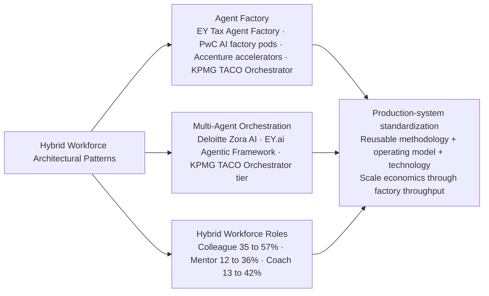

## 6.6 Responsible and Trusted AI Frameworks: Comparing the Cohort's Governance Architectures

Every firm in the cohort now markets a named governance framework—Trustworthy AI (Deloitte), Responsible AI (PwC, Accenture), Trusted AI (EY, KPMG)—and each framework functions simultaneously as governance scaffolding and as competitive positioning. The structural commonality across frameworks is striking; the genuine differentiators lie in operational depth, alliance-leveraged technology, and assurance heritage.

### Deloitte's Trustworthy AI™: Seven Principles and an Integrated Services Portfolio

Deloitte's Trustworthy AI™ framework is among the most operationally articulated in the cohort. The framework's seven principles—**Private, Transparent and Explainable, Fair and Impartial, Responsible, Accountable, Robust and Reliable, and Safe and Secure**[^10]—constitute the structural definition of what makes AI trustworthy in Deloitte's positioning. Each principle is paired with operational considerations and key questions, and each maps onto specific service offerings that Deloitte sells to clients.

The integrated **Trustworthy AI™ services portfolio** is unusually comprehensive, spanning eight named service lines[^35]:

1. **AI Strategy** ("Purpose determines performance")—including AI transformation strategy, tech/AI/data value potential, scalable AI roadmapping, build-vs.-buy decisions and vendor selection, value realization workstreams to manage ROI, and architecting AI and data technical capabilities.
2. **AI Risk Management & Governance** ("A foundation of confidence")—including development of AI risk policies, procedures, governance, operating model, and controls framework, plus AI risk management technology design and implementation.
3. **Human Trust with AI** ("The missing link to scaling AI")—including workforce impact analysis, workforce reskilling/upskilling/training, organizational design intersection with trustworthy AI, culture and trust definition, internal change management, and trustworthy AI use and alignment to enterprise values.
4. **AI Regulatory Support Services** ("New rules for a new age")—including regulatory tracking/analysis/change management, mock-regulatory and internal audit examinations and response, and legal and compliance readiness services.
5. **Cyber AI Blueprints and Technology Services** ("Advanced safeguards are essential to capturing AI value and business growth")—including cyber-enabled GenAI adoption (strategy, governance, risk assessment, security/privacy by design), third-party and supply chain AI security risk programs, and AI-powered managed security solutions.
6. **AI Model Risk Management** ("Trust begins at the core")—including AI model validation (quantitative testing, guardrails, LLM as a judge), continuous monitoring of framework design and implementation, and guardrails design and customization.
7. **Trust in Engineering**—including data readiness through a trustworthy AI lens, agentic AI and AgentOps, engineered trust integrated with model risk, agent framework API and integration, trust-driven AI features design.
8. **AI Audit and Assurance**—including internal AI systems audit, trust strategy for AI controls in finance and accounting functions, AI-enabled financial controls design and testing, procedures for financial statement audits, and board and audit committee AI education and training.

The breadth of this portfolio is structurally significant. Where the integrator agentic platforms productize governance as a built-in property, Deloitte's portfolio productizes governance as a comprehensive service-line offering that spans the full AI lifecycle—and that explicitly extends into adjacent capability areas (workforce reskilling, cyber AI, audit assurance) where the firm's heritage commands authority. Deloitte's positioning summary—"Risk is Deloitte's native language. Our long history of anticipating and mitigating risk is built into this approach"[^35]—simultaneously articulates the heritage advantage and the assurance-anchored differentiation that the integrators cannot replicate.

The emergent **guardian-agents** paradigm is part of Deloitte's articulation as well: the firm has published guidance on "how to safeguard your AI with guardian agents"[^35]—autonomous oversight agents monitoring other agents—as a productized response to the agentic risk frontier.

### PwC's Responsible AI Toolkit: Human-Led, Tech-Powered

PwC launched Responsible AI services in September 2022, positioning the offering within the broader **human-led, tech-powered** philosophy of the New Equation strategic frame examined in Chapter 3. The Responsible AI Toolkit provides clients with frameworks, assessments, and implementation guidance across the AI lifecycle, with explicit emphasis on integration with PwC's broader audit, tax, ESG, and cyber capabilities. The structural positioning is consistent with the multidisciplinary integration that anchors PwC's strategy: governance is sold not as a discrete service but as a capability layer that operates across multiple practice areas. The agent OS (examined in Section 6.2) extends the Responsible AI positioning into the agentic context, with the orchestration layer providing the natural surface for embedding governance controls into agent execution. The structural advantage of this architecture is that governance can be applied uniformly across heterogeneous agents rather than being implemented separately for each agent type.

### EY's Trusted AI: Five-Principle Architecture, Three-Tier Risk Classification, and the Trusted AI Platform

EY's Trusted AI framework is the most quantitatively operationalized in the cohort. The five-principle architecture—**Transparent, Unbiased, Explainable, Resilient, Performance**—is paired with a three-tier model risk classification (high/medium/low) with corresponding initial-validation, ongoing-monitoring, and ongoing-review frequencies, plus a RACI matrix and policy templates that demonstrate the operational depth behind the framework rhetoric (referenced in Chapter 4).

The most operationally distinctive component is the **EY Trusted AI Platform**[^36]. Unlike the framework-rhetoric-only governance offerings, the Trusted AI Platform is "a quantitative score of an AI system's residual risk." The platform "uses interactive, web-based schematic and assessment tools to build the risk profile of an AI system. It then uses an advanced analytical model to convert the user responses to a composite score comprising **technical risk, stakeholder impact and control effectiveness** of an AI system"[^36]. The composite-score architecture is unusually rigorous:

- **Technical risk** is determined by evaluating the technical design of an AI system, "measuring risk drivers that include its underlying technologies, technical operating environment and level of autonomy"[^36].
- **Stakeholder risk** considers the goals and objectives of the AI system, plus "the financial, emotional and physical impact on the external and internal users, as well as the reputational, regulatory and legal risk"[^36].
- **Control effectiveness** "considers the existence and operating effectiveness of controls and acts as a mitigating factor to reduce the risks of AI"[^36].

The composite calculation is mathematically explicit: "Based on the anticipated impact on users, **stakeholder risk acts as a multiplier to technical risk, taking into account social and ethical implications**. The evaluation of governance and control maturity acts as a mitigating factor to reduce residual risk of an AI system"[^36]. User-friendly visualizations provide "a quick snapshot of the relative risk scores across an organization's AI portfolio, with drill-down capabilities to reveal additional details"[^36]. This level of operational depth—a quantitative scoring tool with multiplicative and mitigating factors, applied across the AI portfolio—is structurally distinctive in the cohort and represents a meaningful productization of governance as deployable technology rather than as advisory framework alone.

The complementary **EY Trusted AI risk-and-opportunity assessment methodology**[^19] articulates an eight-category risk taxonomy spanning **decision bias, privacy concerns, security threats, falling confidence in AI, compliance with regulatory requirements, operational risks, budget constraints, and sophisticated AI setup**, paired with five risk-profile gradations from "Unpreparedness" through "Full readiness." The methodology's integration of risk profile with opportunity profile—producing diagnostic conclusions ranging from "Futile" through "Incredible opportunity!"—provides clients with a structured decision framework that operationalizes the framework into deployment guidance.

### KPMG's Trusted AI Powered by IBM watsonx.governance

KPMG's Trusted AI framework is distinctive in the cohort for its **alliance-leveraged technology foundation**: the framework is "powered by the IBM watsonx portfolio"[^32]. The collaboration combines KPMG's audit-and-risk-management heritage with IBM's watsonx.governance toolkit, "an end-to-end toolkit for AI governance that helps organizations manage, direct, and monitor their AI activities"[^32]. The architectural logic is that KPMG provides the methodology, advisory, and assurance layer while IBM provides the operational technology layer—a pattern consistent with KPMG's broader alliance-leveraged platform strategy documented in Chapter 4. The Trusted AI framework integrates with KPMG Clara (audit workflow embedding examined in Chapter 4), Velocity (agentic AI offering examined in Section 6.2), and the broader Microsoft alliance stack to create a multi-vendor governance architecture that draws on each partner's structural strengths.

### Accenture's Responsible AI: Six Years Embedded in Code of Ethics

Accenture's Responsible AI framework, **pioneered six years ago**, is "now part of how Accenture delivers its work for clients, is included in the company's code of ethics and underlies its rigorous responsible AI compliance program"[^4]. The structural positioning is that Responsible AI is not an adjacent service line but an embedded delivery property—a posture consistent with the integrator archetype's tendency to productize governance as platform property rather than as advisory overlay. The framework operates within the broader Data & AI practice and is reinforced by the AI Navigator for Enterprise (examined in Chapter 4), which "include[s] assets designed to accelerate responsible AI practices and compliance programs"[^4]. The architectural logic is that responsible AI compliance becomes part of the platform's deployment template, applied consistently across client engagements through the AI Refinery and 19-industry accelerator infrastructure.

### Governance Framework Comparison

| Firm | Framework Name | Operational Depth | Distinctive Architectural Choice |
|---|---|---|---|
| **Deloitte** | Trustworthy AI™ (7 principles) | 8 service lines spanning full AI lifecycle | Comprehensive integrated portfolio + guardian agents |
| **PwC** | Responsible AI Toolkit | Human-led, tech-powered framing | Integration with audit/tax/ESG/cyber |
| **EY** | Trusted AI (5 principles) | EY Trusted AI Platform with composite quantitative scoring | Quantitative residual-risk technology |
| **KPMG** | Trusted AI | Powered by IBM watsonx.governance | Alliance-leveraged governance technology |
| **Accenture** | Responsible AI (6-year-old) | Embedded in code of ethics + compliance program | Governance-as-platform-property |
| **IBM** | Governed AI (Concert) | Built into watsonx + Concert | Stack-integrated governance |
| **Capgemini** | Trusted AI orientation | Less publicly disclosed; integration with custom GenAI fine-tuning | Sovereignty-and-data-sensitivity orientation |
| **McKinsey** | Strategic-framing governance advisory | Through QuantumBlack | Strategic-layer governance advisory |
| **BCG** | Diagnostic-led governance positioning | AI Radar diagnostic + BCG X build | Diagnostic-as-positioning |
| **Bain** | Alliance-led governance access | OpenAI alliance leveraged | Alliance-led governance access |

The pattern is unambiguous: **the Big Four lead on governance framework articulation depth**, the integrators lead on **governance-as-platform-property integration**, and the MBB houses lead on **strategic-framing governance advisory** without producing equivalently named frameworks. The convergent rhetorical motif—every firm productizes some named governance scaffolding—conceals genuine divergence in operational maturity that the next two sections interrogate.

## 6.7 Model Risk Management, Audit, Assurance, and Guardian Agents

The operational governance layer—model risk management (MRM), AI audit and assurance, and the emerging guardian-agent paradigm—is where governance frameworks are converted into deployable services and where the gap between rhetoric and capability is most visible. Three operational capabilities define the layer.

### Model Risk Management

Model risk management for AI systems extends traditional MRM (long-established in financial services for credit scoring and trading models) into the more complex territory of GenAI and agentic AI. **Deloitte's MRM service line** is the most explicitly itemized in the cohort, including "AI model validation, including quantitative testing, guardrails, and large language models (LLM) as a judge," "continuous monitoring of framework design and implementation," and "guardrails design and customization"[^35]. Deloitte's positioning—"Trust begins at the core"—frames MRM as the foundational operational capability that converts governance frameworks into deployable practice.

The **LLM-as-a-judge** technique deserves particular emphasis. Using one LLM to evaluate the outputs of another LLM is an emerging methodology for scaling model validation beyond what manual review can achieve, and Deloitte's explicit productization of the technique signals operational maturity at the leading edge of the field. The approach is structurally significant in the agentic context, because as agents proliferate (EY's 150 tax agents, the trajectory toward thousands per engagement), manual validation becomes economically infeasible and automated quality scoring becomes a precondition for scaled deployment.

**EY's Trusted AI Platform** (examined in Section 6.6) provides the quantitative scoring technology that operationalizes MRM at the AI-portfolio level. The composite residual-risk score combining technical risk, stakeholder impact, and control effectiveness is a structural alternative to per-model qualitative review, enabling enterprises to manage AI risk at the portfolio scale that agentic deployments require. **KPMG's Trusted AI evaluations specific to AI agents** (referenced in step 5 of the CIO playbook in Section 6.2) extend MRM into the agentic-specific dimension. The architectural recognition that agents introduce risk dimensions beyond those of traditional models—autonomy, multi-agent coordination, contextual adaptation—is operationally important and is reflected in KPMG's positioning that organizations should "develop a rigorous reporting approach for AI agents that aligns with your governance policies"[^28]. **PwC's MRM offerings** integrate with the firm's broader risk-management practice and are particularly emphasized in financial services engagements where regulatory MRM expectations are well-established.

### AI Audit and Assurance

AI audit and assurance services convert the assurance heritage of the Big Four into AI-specific deliverables. **Deloitte's AI Audit and Assurance offerings** explicitly articulate the scope: "internal AI systems audit, trust strategy for AI controls in finance and accounting functions, AI-enabled financial controls design and testing, procedures for financial statement audits, [and] board and audit committee AI education and training"[^35]. The breadth—from internal systems audit to board education—reflects the multi-stakeholder nature of AI assurance, where accountability spans technical teams, finance functions, audit committees, and ultimately external auditors.

The **deeper integration of AI assurance into Big Four audit workflows** is most visible at KPMG, where the **Clara** platform (examined in Chapter 4) integrates AI assurance capabilities directly into the audit workflow itself, including "assurance capabilities" for "teams delivering assurance over disclosures, such as emissions disclosures." The structural advantage is that audit clients receive AI-assured outcomes as part of standard audit engagements rather than as separate procurement, creating an annuity revenue model that the integrator and MBB cohorts cannot easily replicate.

### Guardian Agents and Autonomous Oversight

The emerging **guardian-agent paradigm**—where governance is operationalized through autonomous oversight agents monitoring other agents—is among the most architecturally significant developments in the cohort. Deloitte's articulation is explicit: "AI agents don't just perform tasks, they identify, plan and execute them with a higher degree of autonomy than familiar AI tools. This introduces new risks and challenges for organizations and makes embedding trust at a foundational level more important than ever"[^35]. The firm's published guidance on guardian agents addresses this directly, framing them as the natural governance response to agentic risk: oversight that scales with agent proliferation rather than depending on manual review that does not.

The architectural logic is intuitive: as agent count rises into the hundreds and thousands per enterprise (the trajectory implied by EY's Tax Agent Factory deployment), human oversight becomes the binding constraint on safe deployment. Guardian agents—autonomous agents whose task is to monitor other agents' behavior, flag anomalies, enforce policy compliance, and trigger human review at critical decision points—provide the operational scaffolding through which oversight can scale alongside agent deployment. The paradigm is still early in its productization across the cohort, but Deloitte's explicit guidance and the broader convergence on governance-as-platform-property suggest that guardian agents will be one of the principal architectural patterns of 2026–2027 agentic deployments.

### Cybersecurity AI Integration with Model Governance

The integration of cybersecurity AI with model governance is increasingly important as agentic AI introduces new attack surfaces. **Deloitte's Cyber AI Blueprints and Technology Services** offering—"cyber-enabled GenAI adoption, including strategy, governance, risk assessment, and security/privacy by design," "third-party and supply chain AI security risk programs and operations," and "AI-powered managed security solutions including design, deployment, and automation"[^35]—operationalizes the cyber-governance integration at the service-line level. Deloitte's broader positioning that "Cyber Advisory" is part of the Agentic AI Services portfolio[^30] signals that cyber and governance are increasingly being sold as integrated rather than separate offerings. The integration is structurally important because, as Section 6.9 examines, Gartner projects that more than 50% of successful attacks against AI agents through 2029 will exploit access-control issues via prompt injection—an attack vector that does not exist in traditional model deployment but that becomes a first-order security concern in agentic deployment.

### Operational Maturity as a Leading Indicator

The operational maturity of governance services—not just framework articulation, but deployable technology, scalable methodologies, and integrated service lines—is a leading indicator of which firms can credibly support enterprise agentic deployments at scale. Three patterns emerge. **Deep operational maturity**: Deloitte (8 service lines + guardian agents + LLM-as-a-judge), EY (Trusted AI Platform with quantitative scoring + 150-agent Tax Agent Factory deployment + Uber TPRM), KPMG (TACO-anchored agent evaluations + watsonx.governance integration), and Accenture (Responsible AI embedded in delivery + AI Navigator + 19-industry accelerator governance integration) each demonstrate operational maturity through productized technology, scaled deployments, or integrated service-line architectures. **Moderate operational maturity**: PwC (Responsible AI Toolkit + agent OS governance integration + AI factory pod risk-management integration) and IBM (Concert "governed AI" + watsonx.governance toolkit underlying KPMG's Trusted AI offering) demonstrate moderate maturity through platform-property integration. **Lower operational maturity (in publicly disclosed terms)**: The MBB cohort and Capgemini have less publicly disclosed operational governance technology, with Capgemini's positioning leveraging custom-fine-tuning architecture and the MBB cohort's positioning leveraging strategic-framing advisory. This is not necessarily a capability gap—it may reflect disclosure conventions—but it does signal that the Big Four and integrators are ahead in productizing governance as deployable service.

## 6.8 Regulatory Compliance Services: EU AI Act, NIST AI RMF, GDPR, and Sovereign AI

Regulatory compliance is the dimension where governance has most clearly migrated from cost center to revenue engine. Four regulatory regimes shape demand: the **EU AI Act**, the **NIST AI Risk Management Framework**, **GDPR-AI intersections** (data privacy, residency, intellectual property), and the **emerging sovereign AI** dynamics that span multiple national jurisdictions.

### EU AI Act Readiness Services

The EU AI Act introduces risk-tiered obligations on AI systems, with high-risk systems requiring conformity assessments, technical documentation, transparency requirements, and ongoing monitoring. The cohort's response has converged on a common service portfolio: gap analyses against the Act's requirements, conformity declarations and supporting documentation, risk-tier classification of existing AI portfolios, and ongoing monitoring and reporting processes.

Deloitte's UK Trustworthy AI offering articulates the European-regulatory-anchored positioning: "We guide our clients through the complexities of AI regulation with gap analyses, support for EU AI Act conformity declarations, and robust documentation and reporting processes. Additionally, we offer specialised legal assistance on issues such as intellectual property, data privacy, and policy formulation to provide full confidence and help to prevent penalties"[^10]. The framing is significant for what it signals about the integration of legal and technical assurance capability—a structural advantage that the Big Four's multidisciplinary practices command and that the integrators and MBB houses must construct through alliances. The Deloitte UK positioning further articulates the strategic logic: "As adoption of Generative AI (GenAI) increases, organisations will face more complexity in ensuring its output can be trusted. Regulatory frameworks such as the EU AI Act must be complied with, but trustworthy AI goes well beyond complying with the Act"[^10]. The dual framing—EU AI Act compliance as necessary but not sufficient—positions Trustworthy AI as a broader value proposition than regulatory compliance alone.

### NIST AI Risk Management Framework Alignment

The NIST AI RMF provides the U.S. federal government's voluntary framework for AI risk management, structured around the four functions of Govern, Map, Measure, and Manage. The cohort's NIST alignment services typically include framework gap assessments, function-specific implementation roadmaps, and integration with existing enterprise risk management programs. The structural advantage of NIST alignment work flows to firms with deep U.S. federal practices—Accenture Federal Services (Cognosante-acquired federal health capability) and Deloitte Government & Public Services—where NIST framework adoption is structurally tied to federal contract requirements.

### GDPR-AI Intersection Capabilities

GDPR remains the foundational European data privacy regime, and its intersection with AI deployment introduces complex requirements: lawful basis for AI training data, automated decision-making rights, data subject rights in agentic systems, and cross-border data transfer constraints. The cohort's GDPR-AI services range from data privacy impact assessments for AI systems through automated decision-making compliance reviews to cross-border data architecture design. The structural advantage flows to firms with deep European practices and established data privacy capabilities—particularly the Big Four (where the EU presence is comprehensive) and Capgemini (whose European headquarters and custom-fine-tuning architecture align naturally with GDPR-AI requirements).

### Sovereign AI Deployment Offerings

Sovereign AI—the broader movement among nations to develop domestic AI capabilities and reduce reliance on foreign technology, examined in Chapter 1—creates demand for deployment architectures that respect data residency, infrastructure sovereignty, and regional regulatory requirements. The cohort's response is converging on three architectural patterns:

**On-premises private deployment** is operationalized in **EY.ai enterprise private**, "powered by the Dell AI Factory with NVIDIA and the EY.ai Agentic Framework and Model Catalog"—an explicit architectural response to clients with sovereignty or data-sensitivity constraints. The Dell partnership supplies the on-premises hardware infrastructure that cloud-only alternatives cannot match.

**Sovereign cloud deployment** is operationalized in **EY's FlexiGenAI on TELUS' sovereign AI factory**[^32]. The deployment architecture is unusually explicit about sovereignty: "every computation, analysis and insight stays in Canada, on infrastructure owned and operated by Canadians"[^32]. The factory is "powered by 99% renewable energy, making it one of the most sustainable AI-ready data centres in the world" and uses NVIDIA's "latest accelerated computing and enhanced security specifically designed for government and business-critical workloads"[^32]. Biren Agnihotri, chief technology officer at EY, framed the deployment-model logic: "Running EY's FlexiGenAI agentic AI platform on TELUS' Sovereign AI Factory infrastructure unlocks unprecedented opportunities for governments and public sector agencies across Canada to accelerate their AI transformation, regardless of where they are on their journey"[^32].

**Custom-fine-tuning architecture** is operationalized in Capgemini's offering for clients with "key sensitive data" who require "custom generative AI solutions, fine-tuned with their proprietary data, to create maximum business value" (referenced in Chapters 3 and 4). The architecture allows clients to retain control over their proprietary data while leveraging frontier-model capability—an alternative path to sovereignty that does not require dedicated infrastructure.

### Big Four Audit Licensure as Structural Advantage

The Big Four's audit licensure confers a distinctive structural advantage in regulated-jurisdiction service delivery that the integrators and MBB houses cannot replicate. Deloitte's positioning articulates the dual implication: "AI Audit and Assurance: We can assist you with AI risk and controls as it relates to **internal and external audits**"[^35]. The reference to external audits is operationally consequential: only firms with audit licensure can perform external audit work, and the integration of AI controls into financial statement audits creates a recurring revenue stream that the integrators (Accenture, IBM, Capgemini) and the MBB houses (McKinsey, BCG, Bain) cannot access. The structural advantage extends beyond audit. The Big Four's heritage in regulatory compliance, tax compliance, and audit assurance creates institutional credibility with regulators, audit committees, and CFOs that converts directly into AI governance work. As regulatory pressure intensifies—the EU AI Act, NIST AI RMF, GDPR-AI, sovereign-AI dynamics—this heritage advantage becomes more valuable, not less.

### Quantifying the Revenue Opportunity

The revenue opportunity for governance and compliance services is concretely quantifiable using the Gartner data introduced in Chapter 1. **AI Data Governance** spending grows at a **163.75% CAGR** from US$14.8M in 2024 to US$1.89B by 2029. **Security consulting services** grow from **US$24.2 billion in 2024 to US$36.6 billion in 2029**, and **security professional services** from **US$27.3 billion to US$40.8 billion**—adding roughly US$26 billion in combined services spend over five years, much of it explicitly tied to AI governance and regulatory preparedness. **Managed security services** grow at 11.1% in 2026, the fastest rate in the services segment. **Over 75% of enterprises** are expected to use AI-amplified cybersecurity products by 2028, up from less than 25% in 2025. The implication is direct: governance is not a marginal adjacent service but a multi-billion-dollar growth segment whose 2024–2029 expansion rivals or exceeds many of the proprietary platform investments documented in Chapter 2. Firms with structural advantages on the governance dimension—the Big Four most prominently, but also the integrators with platform-property governance integration—are positioned to capture disproportionate share of this growth.

## 6.9 Risk, Security, and Oversight Challenges in Agentic Deployments

Agentic AI introduces risk dimensions that single-model GenAI does not, and the cohort's governance frameworks must be evaluated against the full risk surface that agentic deployment creates. Four risk categories are particularly significant: data-readiness risks, security risks, oversight and explainability risks, and ethical and bias risks.

### Data-Readiness Risks

Data readiness remains the foundational constraint on AI deployment. Gartner's finding that only **43% of organizations say their data is ready for AI** (as documented in Chapter 1) is structurally significant in the agentic context, because agents depend on data not just for training but for runtime context, multi-agent coordination, and decision-making. The trajectory toward **77% of LLM training data being synthetic by 2029** (Chapter 1) introduces additional risk dimensions—synthetic-data quality assurance, provenance tracking, and bias amplification—that the cohort's governance frameworks are still operationalizing.

Deloitte's Q4 2024 *State of GenAI* finding that data is "the central factor for [GenAI] success" is corroborated by the firm's own quantitative data: "improved data management continues to be a top priority, even for companies that live and breathe data"[^19]. The diagnostic captured by a former software engineering manager Deloitte interviewed makes the point operationally: "Data emerged as the central factor for [our GenAI] success. While the models and computing power existed, accessing the right data proved to be the biggest bottleneck. To address this, the company implemented a centralized data strategy, managed by a single data leader, to streamline data acquisition and minimize redundancy—enabling faster model development"[^19]. The structural implication is that data-readiness consulting—data-strategy advisory, data-platform implementation, synthetic-data quality assurance, and ongoing data governance—is one of the principal sub-markets within the broader AI consulting opportunity.

### Security Risks: Agentic Attack Surface

Security risks expand materially as AI moves from single-model deployment to agentic deployment. Gartner projects that through 2029, **over 50% of successful attacks against AI agents will exploit access-control issues via prompt injection** (as referenced in Chapter 1). The expanded attack surface includes prompt injection attacks that manipulate agent behavior, agent-to-agent communication compromise, third-party tool exploitation through agents, and shadow agent deployments outside enterprise governance.

The shadow-AI dimension is particularly acute: **57% of employees use personal GenAI accounts for work and 33% admit to uploading sensitive data into unsanctioned tools** (Chapter 1). The implication for agentic deployment is that the boundary between sanctioned and unsanctioned AI usage—already difficult to enforce in single-model GenAI—becomes more complex when employees can build agents themselves. The cohort's response, articulated most explicitly in Deloitte's Cyber AI Blueprints and KPMG's Trusted AI evaluations specific to AI agents, is that governance must extend beyond model approval into agent lifecycle management, agent inventory, and continuous monitoring.

### Oversight and Explainability Risks

Oversight risks are quantified directly in Deloitte's Q4 2024 survey: **35% of organizations identify "mistakes / errors leading to real-world consequences" as the top potential barrier to AI adoption** over the next two years, and **29% identify "general loss of trust due to bias, hallucinations and inaccuracies"** as a top barrier[^19]. These are not theoretical risks; they are the highest-ranked concerns of senior decision-makers across 14 countries.

The explainability dimension—understanding why an AI agent made a particular decision—becomes structurally more difficult as agents become more autonomous. The Deloitte UK Trustworthy AI framework's articulation of why transparency matters is direct: "Understand how an AI comes to its conclusions to provide transparency to the AI operators and users which increases confidence in use"[^10]. The challenge is that as agents move up the TACO ladder from Tasker to Orchestrator, the chain of reasoning becomes longer and the decision contexts become more multi-system, making explainability harder to achieve through simple traceability mechanisms.

### Ethical and Bias Risks

Ethical and bias risks span the full AI lifecycle. The Deloitte 2023 survey finding that **62% of companies are concerned about ethical risks in AI** (Chapter 1) is corroborated by EY's eight-category risk taxonomy[^19]:

1. **Decision bias**: AI systems can inadvertently propagate biases from training data, leading to unfair results.
2. **Privacy concerns**: AI often requires a lot of organizational data, which raises privacy and security concerns.
3. **Security threats**: AI systems can become a target for hackers seeking to access sensitive data or disrupt systems.
4. **Falling confidence in AI**: Users and decision makers may have less trust in AI-provided solutions if complex models are used and they cannot understand how these suggestions were obtained.
5. **Compliance with regulatory requirements**: The rapid growth in AI use generates new regulatory requirements that may impose restrictions on the use of specific AI methods in critical business processes.
6. **Operational risks**: Technical failures or hardware malfunctions can affect AI performance, leading to data loss or process disruption.
7. **Budget constraints**: Implementing and maintaining AI can require significant financial resources, which is a problem when budgets are limited.
8. **Sophisticated AI setup**: Setting up and optimizing AI systems can be complex and demand specialized knowledge.

The eight categories overlap with but extend beyond the more commonly cited ethical-risk taxonomies, and the inclusion of budget constraints and sophisticated setup as risk categories reflects the operational reality that even well-intentioned AI deployments fail if economic and capability constraints are not adequately diagnosed.

### White Spaces: Where Mitigation Lags Risk

Three white spaces are observable across the cohort where mitigation capability lags risk emergence. **First, agentic attack-surface defense** is structurally underdeveloped relative to Gartner's projection that >50% of attacks will exploit access-control issues via prompt injection by 2029. The cohort's cyber AI offerings—most explicit in Deloitte's Cyber AI Blueprints and KPMG's Trusted AI for agents—are still maturing, and the integrator stacks (IBM Concert "governed AI," Accenture's Responsible AI integration with AI Navigator) provide platform-level mitigation but not yet comprehensive agent-attack-surface defense. **Second, multi-agent governance** lags single-agent governance. Most of the cohort's governance frameworks were initially designed for single-model or single-agent contexts, and the extensions to multi-agent systems are emergent rather than fully productized. KPMG's TACO Orchestrator tier definition acknowledges the complexity ("multi-agent coordination across ecosystems in pursuit of complex goals"), but the corresponding governance scaffolding for Orchestrator-tier deployments is less operationally articulated than the scaffolding for Tasker and Automator tiers. **Third, synthetic-data quality assurance** lags the rising importance of synthetic data in AI deployment. The trajectory toward 77% synthetic LLM training data by 2029 implies that synthetic-data-specific quality assurance—provenance, bias amplification testing, distributional integrity—will become a first-order capability requirement, but the cohort's published synthetic-data offerings are not yet at the operational maturity of, for example, traditional MRM. These white spaces are forward investment opportunities for the cohort and are consistent with the replenishment-year analysis in Chapter 2: as 2026–2027 envelope replenishments are announced, agentic-attack-surface defense, multi-agent governance, and synthetic-data quality assurance are likely areas where capability investment will intensify.

## 6.10 Cross-Firm Synthesis: Trust and Governance as Competitive Differentiator

Synthesizing the chapter's evidence reveals that trust, governance, and agentic capabilities have become inseparable—and that their combined positioning increasingly determines competitive outcomes in enterprise AI consulting. Three convergent rhetorical patterns and three genuine differentiators define the structural picture.

### Three Convergent Patterns

First, **every firm in the cohort now markets a named Trusted/Responsible AI framework**: Deloitte's Trustworthy AI™, PwC's Responsible AI Toolkit, EY's Trusted AI, KPMG's Trusted AI (powered by IBM watsonx.governance), Accenture's six-year-old Responsible AI framework, IBM's "governed AI" platform integration, Capgemini's Trusted AI orientation, and the MBB houses' strategic-framing governance advisory. Framework rhetoric has converged.

Second, **every firm productizes some form of guardian-style oversight**, even if not always under that name. Deloitte explicitly articulates guardian agents; KPMG's Trusted AI evaluations specific to AI agents perform the same architectural function; EY's Trusted AI Platform provides quantitative residual-risk scoring as portfolio-level oversight; Accenture's AI Navigator embeds responsible-AI assets; IBM's Concert "governed AI" performs platform-level oversight. The pattern is universal even where the terminology varies.

Third, **every firm claims human-in-the-loop centrality**. KPMG articulates the principle directly: "Our Trusted AI framework underpins everything we do with AI in the audit. All of our auditors are trained on how to effectively use AI with a human-in-the-loop mindset to maintain quality, accuracy and professional skepticism"[^32]. Deloitte's "Age of With" positioning emphasizes human-machine collaboration. EY's Trusted AI risk-tier classification preserves human approval at high-risk thresholds. The MBB cohort emphasizes human-led strategic framing throughout. Convergence on human-in-the-loop reflects both regulatory pressure and the structural reality that fully autonomous AI deployment exceeds current operational risk tolerance.

### Three Genuine Differentiators

Beneath the rhetorical convergence, three structural differentiators separate the cohort. **First, assurance licensure**: only the Big Four can perform external audit work integrating AI controls into financial statement audits. This is the most defensible structural advantage in the cohort, and it converts directly into recurring revenue that the integrators and MBB houses cannot replicate. **Second, proprietary governance technology**: EY's Trusted AI Platform (with composite quantitative scoring across technical risk, stakeholder impact, and control effectiveness), Deloitte's LLM-as-a-judge MRM technology and guardian-agent guidance, and IBM's watsonx.governance toolkit (powering KPMG's Trusted AI offering through alliance leverage) constitute productized governance technology that goes beyond framework rhetoric. This is the most rapidly evolving differentiator and the one most directly tied to operational maturity. **Third, sovereign-deployment options**: EY.ai enterprise private (with Dell AI Factory), EY's FlexiGenAI on TELUS' sovereign AI factory, and Capgemini's custom-fine-tuning architecture for sensitive-data clients address the sovereign-AI dimension that most other firms in the cohort handle through alliance partners' on-premises and private-cloud offerings rather than through proprietary deployment modes. As sovereign-AI demand intensifies, this differentiator will become more strategically valuable.

### The Three Structural Archetypes

The combined assessment of agentic platform depth and governance maturity locates the ten firms within three structural archetypes:

| Archetype | Firms | Defining Characteristics |
|---|---|---|
| **Big Four governance-led agentic productizers** | EY (anchor), KPMG (anchor), Deloitte, PwC | Assurance heritage + named agent platforms (EY.ai/Velocity/Zora AI/Agent OS) + deepest governance framework articulation + proprietary governance technology (EY Trusted AI Platform, Deloitte LLM-as-a-judge) + audit licensure as recurring revenue base |
| **Integrator platform-led agentic operators** | Accenture, IBM Consulting, Capgemini | Deepest stack ownership + governance-as-platform-property (IBM "governed AI," Accenture Responsible AI embedded in delivery, Capgemini sovereignty fine-tuning) + commercial validation through bookings (Accenture US$1.8B Q4 FY25 GenAI new bookings, IBM AI Book of Business >US$2B) |
| **MBB advisory-led agentic strategists** | McKinsey, BCG, Bain | Lean tooling + alliance access + diagnostic instruments (BCG AI Radar, McKinsey State of AI) + brand-marketed deployments (Bain–Coca-Cola/Carrefour) + selective deep-build engagements (BCG–Foxconn $400M scale) |

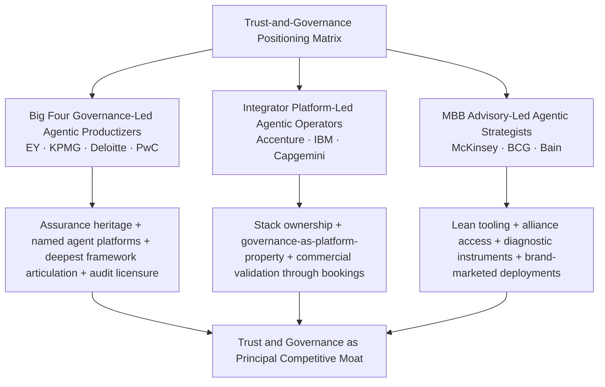

### Strategic Tensions and Setting Up Subsequent Chapters

The three archetypes set up strategic tensions that subsequent chapters interrogate empirically. **The talent demand of operationalizing trust at scale**—Deloitte's eight-service-line portfolio, EY's 80,000 tax professionals working alongside 150 agents, KPMG's 90,000 Audit professionals using Clara, Accenture's 80,000 AI talent target—is the subject of Chapter 7, which examines whether the cohort's talent strategies can deliver the consultant capacity that these governance-and-agentic offerings require. The 74% of organizations reporting their most advanced GenAI initiative is meeting or exceeding ROI expectations, and the wide variation in ROI by use case (cybersecurity initiatives 27 points above expectations, while sales/finance/R&D show more below than above)[^19], is the subject of Chapter 8, which examines how governance-anchored versus capability-led offerings translate into outcomes.

The chapter's central conclusion is that **trust and governance, far from being adjacent compliance services, have become the principal competitive moat in enterprise AI consulting**. The convergent framework rhetoric across the cohort makes governance a table-stakes capability; the genuine differentiators—assurance licensure, proprietary governance technology, and sovereign-deployment options—determine which firms convert that table-stakes capability into sustained competitive position. As agentic AI scales from the 26% of organizations exploring it today toward the >50% application-software penetration that Gartner projects by 2028, the firms that have most deeply integrated governance into their agentic platforms (EY's Trusted AI Platform within EY.ai; Deloitte's Trustworthy AI within Zora AI; IBM's "governed AI" within Concert; Accenture's Responsible AI within AI Navigator) are positioned to capture disproportionate share of the trust-anchored revenue streams that regulatory tightening, ROI pressure, and agentic-AI risk surfaces are jointly creating. The firms whose governance positioning remains primarily rhetorical face the structural risk that as buyers move from advisory diagnostics toward production deployment, governance moves from a marketing differentiator to a deployment-criticality requirement—and that requirement disproportionately rewards the firms that have already done the operational work this chapter has documented.

# 7 Talent Development, Workforce Transformation, and Internal AI Adoption

Chapter 6 closed on a structural conclusion that frames the present chapter directly: trust and governance, far from being adjacent compliance services, have become the principal competitive moat in enterprise AI consulting—but only for firms that have done the operational work to convert framework rhetoric into deployable capability. That operational work is, ultimately, work performed by people. The platform IP catalogued in Chapter 4, the agent factories examined in Chapter 6, and the client engagements documented in Chapter 5 all rest on a foundation that none of those chapters fully interrogated: the consultants, auditors, tax professionals, data engineers, and AI specialists whose hands actually deliver the work. As agentic AI shifts the unit of consulting work from advisory framing to integrated build-and-operate delivery, and as governance shifts from advisory overlay to platform property, the talent question becomes inseparable from the strategic question. A firm with a US$3 billion capital envelope and a sophisticated agent factory but without the trained consultant capacity to deploy it at client scale captures only a fraction of the value its capital and IP would otherwise enable.

This chapter therefore examines how the ten target firms build, reskill, and deploy AI talent at scale, and how they apply AI internally to transform their own audit, tax, consulting, and back-office delivery. It begins by establishing the quantitative talent baseline across the cohort, then traces the AI academies and certification programs through which capital commitments are converted into deployable capacity. It pivots from external-facing capability to internal adoption—the empirical test of every firm's "client zero" credibility claim—before examining the workforce-transformation services that the firms sell to clients facing the same talent imperatives. It situates these strategies against the structural talent shortages identified in Chapter 1 and the hybrid workforce evolution documented in Chapter 6, and closes with a synthesis matrix that maps talent intensity against internal-adoption depth, surfacing the strategic tensions that Chapter 8 interrogates in ROI terms.

A persistent methodological note applies throughout. Disclosure asymmetry remains material at the talent level: the integrators and Big Four publish headcount targets, training-hour totals, and academy partnerships with a frequency the MBB partnerships rarely match, where talent strategies are typically discussed qualitatively or through aggregate professional counts. Where evidence is asymmetric, the analysis flags the gap rather than asserting parity, and triangulates from named programs, alliance partners, and disclosed case studies.

## 7.1 Cross-Firm Comparison of AI Talent Strategies, Hiring Targets, and Workforce Scale

The quantitative talent baseline across the cohort spans roughly an order of magnitude in absolute scale and several orders of magnitude in disclosure granularity. Translating announced headcount targets, training commitments, and AI-practice scale into a common comparison surface reveals three structural archetypes that recur throughout the chapter: **headcount-doubling integrators** that explicitly scale AI-specific talent through hiring, acquisition, and training; **network-wide upskillers** anchored in the Big Four's network model, which apply training breadth to large, distributed professional populations; and **lean-but-fully-saturated partnerships** that prioritize depth of frontier-model engagement across smaller knowledge-worker bases. The table below summarizes the principal disclosed targets, normalized where possible to comparable units.

| Firm | Total Network Headcount (approx.) | Announced AI-Talent or Training Target | Time Horizon | Distinctive Talent Move |
|---|---|---|---|---|
| **Accenture** | ~738,000 (FY23) → expanding | Doubling Data & AI talent from **40,000 to 80,000** | 3 years (FY2024–FY2026) | Hiring + acquisition (NeuraFlash 510, Cognosante 1,500+) + training |
| **PwC** | ~284,000 (network, FY21) → ~360,000 (FY24) | **100,000 net new jobs** under New Equation, "from ESG to AI"; 30,000+ early-career hires/yr | 5 years (FY2022–FY2026) | Multidisciplinary breadth; My AI participation 95% of US workforce |
| **Deloitte** | ~457,000 globally | Pathway to upskill up to **10,000 practitioners** through AI Academy; Project 120 across full network | Multi-year (announced Dec 2022) | US$1.4B Project 120 + Virginia Tech / IIT Roorkee / NVIDIA Training |
| **Capgemini** | ~340,000 globally | **60,000 data and AI professionals** | 3 years (announced 2023) | Data & AI Campus + Altran/Syniti/WNS acquisitions |
| **EY** | ~400,000 professionals globally | Tax Agent Factory deployment of **150 tax agents** alongside **80,000 tax professionals**; firm-wide EY.ai engagement | Continuous | Hybrid workforce architecture + NVIDIA/Dell alliances |
| **KPMG** | ~273,000 globally; ~90,000 Audit | All **90,000 global Audit professionals** on Clara with AI; Trusted AI training across audit base | Continuous | Workflow-embedded audit AI + Microsoft alliance training |
| **IBM Consulting** | ~160,000 (Consulting unit; broader IBM ~280,000) | Role-based-assistant-augmented workforce; AI Book of Business >US$2B | Continuous | Consulting Advantage role-based assistants + watsonx-anchored training |
| **McKinsey** | ~45,000 globally | QuantumBlack-anchored AI talent (specific count not disclosed); Lilli internal saturation | Continuous | Iguazio acquisition for MLOps engineering depth |
| **BCG** | ~33,000 globally | BCG X tech-build talent (specific count not disclosed); GENE/Deckster internal saturation | Continuous | AI Radar diagnostic + BCG X build engineering |
| **Bain** | ~19,000 globally; ~18,000 knowledge workers at OpenAI alliance announcement | Year of internal OpenAI use across **18,000 knowledge workers** before client deployment | Continuous (since 2022) | OpenAI Center of Excellence + deep technical resources |

Three structural insights emerge from the comparison.

First, **the absolute scale of announced AI-talent targets separates a "headcount-doubling" tier from a "network-saturation" tier**. Accenture's commitment to **double Data & AI talent from 40,000 to 80,000 professionals** through "a mix of hiring, acquisitions and training"[^4][^37] is the most explicit AI-specific headcount target in the cohort, and—when annualized—implies adding roughly 13,000 AI-specific professionals per year over the three-year horizon. Capgemini's plan to grow data and AI teams to **60,000 within three years**[^7] is the next most explicit, implying a similar order of magnitude in net AI-talent additions. PwC's **100,000 net new jobs** target under The New Equation[^8][^7], while not AI-specific, is explicitly weighted toward "emerging capability areas, from ESG to AI"[^8] and dwarfs the integrator targets in absolute terms because the New Equation envelope spans the full multidisciplinary capability layer rather than AI alone.

Second, **per-capita training intensity reframes the comparison meaningfully**. Deloitte's US$1.4B Project 120 against ~457,000 employees implies approximately US$3,000 per employee in dedicated learning and development capital over the multi-year horizon. PwC's My AI program has produced an average of approximately **4.8 voluntary training hours per US employee** (360,000+ hours across roughly 75,000 US employees)[^6], with **95% participation**[^6]—a saturation rate that few corporate learning programs in any industry achieve. Accenture's US$1B/year against approximately 800,000 headcount equates to roughly US$1,250 per employee per year of dedicated AI capital, before any acquisition-driven talent additions are counted. Capgemini's €670M/year against approximately 340,000 employees implies a similar US$2,000-equivalent per employee. These figures suggest that the leading firms are converging on per-capita capability intensity in the low-to-mid thousands of dollars per employee per year—a meaningful but not transformational fraction of total compensation spend, indicating that announced training envelopes complement rather than substitute for embedded delivery investment.

Third, **the MBB houses' lean talent base produces a structurally different intensity profile**. Bain's articulation of its OpenAI internal-use foundation is unusually specific: "Bain's team of **18,000 knowledge workers** have been using OpenAI technologies for their internal knowledge management systems, research, and processes to improve efficiency for a year prior to the announcement"[^4]. Saturation across 18,000 knowledge workers is operationally distinct from saturation across 90,000 KPMG auditors or 400,000 EY professionals: the smaller base permits deeper integration of frontier-model capability into individual professional workflows, but the smaller base also caps the absolute scale at which client deployments can be staffed. McKinsey's ~45,000 global headcount and BCG's ~33,000 produce similar intensity profiles—deep saturation across a relatively bounded professional population, with selective acquisitions (McKinsey–Iguazio for MLOps, examined in Chapter 2) closing engineering-depth gaps that pure training cannot.

The three archetypes that emerge—**headcount-doubling integrators** (Accenture, Capgemini), **network-wide upskillers** anchored in Big Four breadth (Deloitte, PwC, EY, KPMG), and **lean-but-fully-saturated partnerships** (Bain at the prototype, with McKinsey and BCG operating similar models)—frame the chapter's subsequent examination of academy architecture, internal adoption, and client-facing services. Each archetype carries distinctive economics: integrator scale-and-velocity produces the broadest delivery capacity but exposes margins to wage inflation and integration cost; Big Four network-wide upskilling leverages annuity revenue from audit and tax workflows but faces the structural capital constraint of partnership economics; MBB lean saturation preserves partnership margins but caps absolute deployment scale.

## 7.2 AI Academies, Certifications, and Large-Scale Upskilling Programs

The mechanism through which capital commitments become deployable consultant capacity is, almost universally across the cohort, a named AI academy or upskilling program. Every firm in the ten-firm cohort has launched a branded AI training infrastructure since 2022, and the academies have converged on a common four-tier curriculum architecture—**fluency, prompting, technical/agentic, and governance**—even as the scale, partnerships, and pedagogical depth differ materially.

### Deloitte AI Academy: Project 120-Funded, University-Partnered

The Deloitte AI Academy is the most academically partnered of the cohort, structured as a sub-component of the broader Deloitte Technology Academy that Project 120 funded with US$1.4 billion in December 2022. The August 2023 expansion of the AI Academy specifically articulates its scale and partnerships: Deloitte was "on a pathway to upskill up to **10,000 practitioners** through curriculum co-developed with Virginia Tech and the Indian Institute of Technology Roorkee, plus NVIDIA Training". The Academy's range is articulated as spanning "basic Generative AI fluency to deeper technical skills like advanced prompt engineering techniques and fine-tuning, and advance certifications for technical professionals", and external validation comes through Brandon Hall Group™ recognition for "Best Advance in Competencies and Skills Development". The "over one million hours of training on future applications of technologies like artificial intelligence (AI), cloud, cyber, data analytics, 5G, and quantum computing" delivered through the broader Technology Academy provides the scale envelope within which the AI-specific curriculum sits.

Three structural features deserve emphasis. First, the **dual academic partnership** with Virginia Tech and IIT Roorkee provides geographic balance between U.S. and Indian talent pipelines, addressing the structural reality that India is now the largest single source of AI engineering talent for Deloitte's global delivery network. Second, the **NVIDIA Training partnership** integrates the academy curriculum with the same vendor stack that powers Zora AI (examined in Chapter 6), creating coherence between training content and deployable platform IP. Third, the **embedded Trustworthy AI™ governance curriculum** ensures that academy graduates are trained on the firm's eight-service-line governance portfolio (Chapter 6) from initial fluency through advanced certification.

### PwC My AI: 95% Participation and 360,000+ Voluntary Hours

PwC's **My AI** program is the most participation-saturated upskilling program in the cohort. PwC's articulation of the scale is direct and unusually specific: ChatGPT Enterprise—the platform underlying My AI—is deployed to "our entire 75,000-person US workforce, who also benefit from our extensive, firmwide AI upskilling program, My AI"[^6]. The program "provides training in Responsible AI (to manage risks while unlocking AI value), GenAI prompting, leadership in the age of GenAI and more"[^6], and the participation outcomes are striking: "Appealing online content, in-person training, hackathons and game show-style competitions have already encouraged **95% of PwC US employees to take part in My AI**. Voluntarily, they have dedicated more than **360,000 hours to building their AI skills**"[^6].

Three structural features distinguish My AI from other cohort programs. First, the **95% voluntary participation rate** is operationally remarkable—corporate learning programs typically struggle to reach 50–60% completion rates even when mandatory, and 95% voluntary engagement signals an internal cultural shift that converts the upskilling investment into self-sustaining momentum. Second, PwC's positioning as **"client zero"**—the largest user of OpenAI's ChatGPT Enterprise globally and OpenAI's first reseller of the product through the PwC US and UK reseller agreement[^6]—creates a feedback loop in which internal adoption directly informs client-facing offerings. Third, the **grassroots cultural mechanisms** PwC describes ("prompting parties and brainstorming sessions to find new ways to use GenAI at work"[^6]) extend the formal academy curriculum into peer-to-peer knowledge transfer that scales beyond what instructor-led training can achieve. The disclosed productivity outcomes—"our people who regularly use the tools demonstrate productivity gains of 20% to 40%"[^6]—provide the commercial validation that justifies the program's scale.

### EY: AI Academy and the Tax Agent Factory Reskilling Pathway

EY's AI talent infrastructure operates within the broader EY.ai platform vision (Chapter 4) and is most concretely operationalized through the Tax Agent Factory's hybrid workforce architecture. The Tax Agent Factory's deployment of "**150 tax agents assisting 80,000 EY tax professionals across data collection, document analysis and review, and income and indirect tax compliance**" represents not just a platform deployment but a structured reskilling pathway: 80,000 tax professionals must learn to work with, supervise, and direct 150 agent-class systems, redefining what a tax professional's day-to-day workflow looks like. Marna Ricker, EY Global Vice Chair – Tax, articulates the talent dimension within the broader transformation thesis: "These offerings showcase our commitment to transforming the tax function of the future by leveraging the latest in AI and technology. Our focus is on working together with clients to identify opportunities for innovation, address their specific organizational needs, and provide forward-thinking solutions that enhance the effectiveness and value of their tax operations"[^8].

The talent-and-platform integration extends further through Alexandra Loran's articulation of how the EY.ai Tax Agent Factory functions as a workforce-transformation vehicle: "As technology and regulation evolve at an unprecedented pace, the combination of EY.ai Tax Labs and EY.ai Tax Agent Factory empowers tax professionals to adapt and excel. By blending data, deep tax knowledge with cutting-edge technical experience, these capabilities unlock new levels of operational efficiency and sharper insights. This is how the EY organization turns AI into real-world tax transformation–fast, scalable, and built by tax professionals for tax professionals"[^8]. The phrase "built by tax professionals for tax professionals" is operationally significant: it signals that the academy curriculum and the platform IP are co-developed by the same workforce that will deploy them, creating tighter feedback loops than the more separable platform-engineering-versus-consultant-training architectures elsewhere in the cohort.

### KPMG: Trusted AI Training Across 90,000 Audit Professionals

KPMG's upskilling architecture is the most workflow-embedded in the cohort, organized around the integration of generative AI into Clara across the firm's 90,000 global Audit professionals[^5]. The training scale is therefore structurally tied to the platform deployment: "By infusing AI through KPMG Clara, KPMG's 90,000 global Audit professionals will be empowered to focus more closely on higher-risk areas of the audit, sector-specific risks and challenges — to the benefit of both stakeholders and capital markets"[^5]. The training principle that anchors the rollout is articulated by Thomas Mackenzie, KPMG U.S. and Global Audit Chief Technology Officer: "Our Trusted AI framework underpins everything we do with AI in the audit. **All of our auditors are trained on how to effectively use AI with a human-in-the-loop mindset to maintain quality, accuracy and professional skepticism**"[^5].

The training is reinforced by the cumulative Audit Chat usage data—"KPMG partners and professionals have engaged in more than **600,000 Audit Chat conversations** to more effectively search databases, extract and summarize data from contracts, analyze documents and aid with research on complex accounting and auditing topics"[^37]—which functions both as a deployment milestone and as evidence of the training investment converting into daily practice. The architectural choice is deliberate: rather than training auditors on a horizontal AI capability that they would later apply to audit work, KPMG trains auditors on an audit-embedded AI capability whose use is inseparable from the audit workflow itself. This trades horizontal scope for vertical depth, consistent with the audit-first sequencing examined in Chapter 4.

The expansion of upskilling is tied to platform evolution: as new capabilities are layered into Clara—the growing prompt library, automated quality scoring, AI/ML-automated review of financial statements, assurance capabilities—the curriculum extends correspondingly, ensuring that the 90,000-person Audit base remains current with platform capability rather than lagging it.

### Accenture: LearnVantage, the Center for Advanced AI, and Acquisition-Accelerated Talent

Accenture's training infrastructure is the most operationally itemized in the cohort. The June 2023 announcement of the US$3 billion Data & AI investment specified that Accenture would "double its roster of AI talent to **80,000 professionals through a combination of hiring, acquisitions and training**"[^37], with the **Center for Advanced AI** serving as the proprietary R&D and reimagining-service-delivery nucleus[^4][^5]. The Center's dual function—R&D and service-delivery reinvention—integrates training with platform development, ensuring that consultant capability development tracks the AI Refinery and 19-industry accelerator investments that Chapter 4 documented.

Accenture's broader **LearnVantage** platform provides the firm's industrialized learning infrastructure, supporting both internal upskilling and the workforce-transformation services examined in Section 7.4. The training architecture is reinforced by the explicit allocation of part of the US$3B envelope toward "acquisitions and ecosystem partnerships"[^4][^37]—a recognition that headcount-doubling at Accenture's scale cannot be achieved through training alone and requires acquisition-driven talent acceleration. The NeuraFlash acquisition adds approximately **510 professionals with more than 2,000 Salesforce certifications and over 1,000 implementations for more than 400 clients**[^4] (referenced in Chapters 2 and 6), the Cognosante acquisition adds **more than 1,500 employees** to Accenture Federal Services, and the Italian tuck-ins (Ammagamma for AI talent, Intellera for public administration, Customer Management IT and SirfinPA for justice and public security tech) further deepen the talent base.

### IBM SkillsBuild and Role-Based-Assistant-Driven Internal Training

IBM Consulting's training architecture is uniquely platform-anchored: **IBM Consulting Advantage** functions simultaneously as a delivery platform and as a structured training environment, with role-based generative AI assistants augmenting consultant productivity in ways that double as on-the-job training. IBM's articulation is explicit: "Our AI services platform provides easy, customized access to proprietary methods, purpose-built AI assets and models and role-based generative AI assistants. With this advanced tool, IBM consultants deliver solutions faster, more consistently, and cost-effectively than ever before"[^7]. The role-based-assistant architecture maps the platform onto the consulting workflow itself, embedding AI capability into daily practice rather than treating it as separate curriculum.

The broader **IBM SkillsBuild** infrastructure provides the firm-wide training scaffolding, supporting both internal capability development and external partnerships with educational institutions and workforce-development organizations. The training is reinforced by IBM's annual R&D spend exceeding US$5 billion (referenced in Chapter 1), part of which flows into the watsonx-anchored curriculum that ensures consultants are current with platform capability. The architectural advantage—that consultants learn the watsonx stack while delivering client work—is structurally distinctive in the cohort, but it carries the corresponding constraint that consultants are most productive on engagements that use the IBM stack rather than competitor stacks.

### Capgemini Data & AI Campus

Capgemini's **Data & AI Campus** is the explicit vehicle through which the firm trains "most of its workforce" to "fully leverage the power of generative AI in our operations"[^7]. CEO Aiman Ezzat's articulation of the strategic logic ties the Campus directly to the €2 billion AI investment and the 60,000-data-and-AI-professional target: "We are developing a portfolio of industry-specific offers and signing strategic partnerships, notably with Google Cloud and Microsoft while training most of our workforce through our Data & AI Campus to fully leverage the power of generative AI in our operations"[^7]. The Campus operates alongside the Generative AI Lab (Chapter 4), creating a coherent IP-and-talent infrastructure: the Lab develops platform capability, the Campus trains the consultant capacity that deploys it.

The scale ambition is substantial. Reaching 60,000 data and AI professionals within three years from a base that the announcement implied required net additions of approximately 30,000 over the period—a hiring and reskilling target that, even allowing for the contribution of the Altran inheritance and the more recent Syniti acquisition, represents one of the most aggressive AI-talent-buildout programs among European-headquartered consultancies. The Capgemini WNS acquisition (pending as of mid-2025, examined in Chapter 2) extends the talent base further into operations-and-AI integration, structurally increasing the firm's managed-services delivery capacity.

### MBB Internal Training: Lilli Onboarding, BCG AI Literacy, and Bain's OpenAI Center of Excellence

The MBB houses operate training infrastructures that are smaller in absolute scale but proportionally as deep as the integrators'. **McKinsey's Lilli onboarding**—the rollout of the firm's internal generative AI assistant across the consultant base—functions as both productivity tooling and structured training. The Iguazio acquisition (Chapter 2) added MLOps-specialist talent that complements the broader QuantumBlack engineering capability, ensuring that McKinsey's strategic-framing positioning is supported by adequate engineering depth.

**BCG's AI literacy programs** are tied to the firm's broader BCG X tech-build infrastructure and to the AI Radar diagnostic instruments examined in Chapters 3 and 6. The internal usage of GENE and Deckster (Chapter 4) provides the consultant-augmenting equivalent of Lilli, with training focused on prompt engineering, agent design, and integration of AI capability into BCG's standard transformation advisory work. BCG's published research—including the *AI Radar 2026* finding that "Trailblazer" CEOs allocate roughly 60% of their AI budget to upskilling and have upskilled approximately 70% of their workforce[^4][^5]—doubles as both market diagnostic and implicit benchmark for the firm's own internal training intensity.

**Bain's OpenAI Center of Excellence**, announced as part of the November 2024 expanded partnership, is the most structurally distinctive MBB training mechanism. The Center "will be staffed with deep technical resources equipped to deliver client solutions that leverage OpenAI frontier technology, including multi-modal, real-time and reasoning applications"[^5]. Christophe De Vusser, Bain's Worldwide Managing Partner, frames the strategic logic: "At Bain, we've seen the power of our partnership with OpenAI as we work together with clients and within our own business as well. We've unlocked transformative results, driving innovation and creating lasting value"[^5]. The Center's anchor in **deep technical resources equipped with experience in OpenAI's latest innovations, including advanced language models like GPT-4 and the new OpenAI o1**[^5] signals that Bain's training architecture is concentrated in a smaller specialist cohort that supports the broader 18,000-knowledge-worker base, rather than distributed evenly across the firm.

### Common Curriculum Tiers and Strategic Synthesis

The cohort's academy curricula have converged on a recognizable four-tier structure:

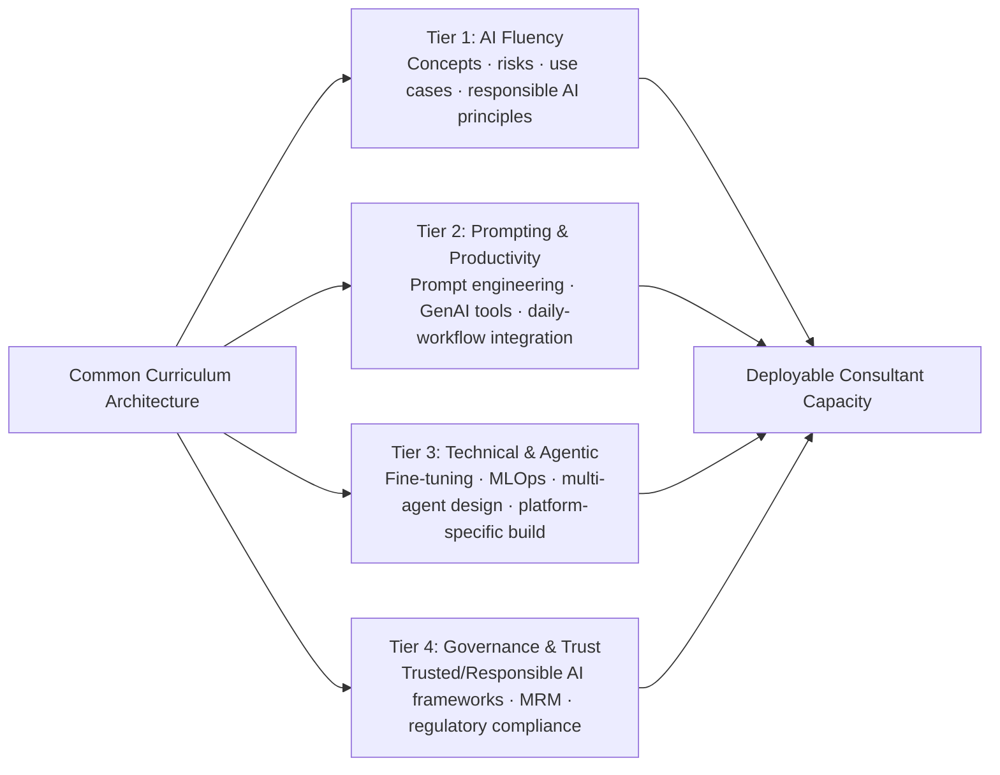

Tier 1 (fluency) is universal across the cohort, with PwC's My AI, Deloitte AI Academy basic GenAI fluency, KPMG's Trusted AI training base, and Accenture's broad LearnVantage modules all populating this tier. Tier 2 (prompting and productivity) is similarly universal, with PwC's prompting curriculum, Bain's pre-alliance internal use, and Deloitte's "advanced prompt engineering techniques" each addressing this layer. Tier 3 (technical and agentic) is where the integrator depth shows most clearly—Accenture's Center for Advanced AI, IBM's role-based-assistant training, Capgemini's Generative AI Lab–anchored technical curriculum, and Deloitte's NVIDIA-Training-supported agentic curriculum all populate this tier with substantial scale, while the MBB houses operate this tier through specialized concentrations (Bain's OpenAI Center of Excellence, McKinsey's Iguazio-augmented MLOps, BCG X's tech-build engineers) rather than across the full consultant base. Tier 4 (governance and trust) is where the Big Four's structural advantage is most visible, with KPMG's Trusted AI training, Deloitte's Trustworthy AI integrated curriculum, EY's Trusted AI risk-tier-anchored curriculum, and PwC's Responsible AI training each leveraging assurance heritage to anchor the governance layer.

The strategic synthesis is that **academies convert capital commitments into deployable capacity through fundamentally different mechanisms across the three archetypes**. Integrator academies (Accenture LearnVantage, Capgemini Data & AI Campus, IBM SkillsBuild + Consulting Advantage) emphasize industrialized scale and platform-specific technical depth. Big Four academies (Deloitte AI Academy, PwC My AI, EY's Tax Agent Factory pathway, KPMG Trusted AI training) emphasize network-wide breadth coupled with deep workflow embedding in the audit-and-tax functions where annuity revenue justifies sustained training investment. MBB internal training (McKinsey Lilli onboarding, BCG AI literacy, Bain OpenAI Center of Excellence) emphasizes deep saturation across smaller knowledge-worker bases, with selective engineering acquisitions filling gaps that pure training cannot.

## 7.3 Internal AI Adoption: Transforming Audit, Tax, Consulting, and Back-Office Delivery

The empirical test of every firm's "client zero" credibility claim is the depth at which AI has been adopted to transform the firm's own audit, tax, consulting, and back-office delivery. This is not a peripheral question. As Chapter 6 documented, agentic AI is shifting the unit of consulting work from advisory framing to integrated build-and-operate delivery, and the firms that have most aggressively transformed their internal delivery economics are the ones whose external offerings most credibly promise similar transformation to clients. Internal adoption produces three reinforcing outcomes: credibility signals that strengthen client-facing positioning, delivery-cost compression that protects margins as AI shifts unit economics, and feedback loops that improve client-facing platform IP through real-world use at scale.

### KPMG: Generative AI Integrated Across the 90,000-Auditor Workflow

KPMG's internal adoption is the deepest single-function workflow embedding in the cohort. The July 2024 announcement that integrated generative AI into KPMG Clara made AI capability available across the firm's **90,000 global Audit professionals**[^5]. The capabilities span the full audit lifecycle, as documented in Chapter 4: AI assistants reviewing documents to identify risk factors and flag possible accounting and fraud risks; AI-assistant access to KPMG's audit methodology to design appropriate substantive testing procedures; AI-driven summarization, questioning, and improvement of engagement-specific audit documentation; a growing prompt library; automated quality scoring; AI/ML-automated review of financial statements; and assurance capabilities for emissions and other disclosures[^5].

The cumulative usage data underscore the depth: KPMG partners and professionals have engaged in more than **600,000 Audit Chat conversations**[^37] to search databases, extract and summarize data from contracts, analyze documents, and aid with research on complex accounting topics. The April 2024 deployment of **Copilot for Microsoft 365** to all KPMG Audit partners and professionals—where engagement teams "transform the walkthrough experience by generating process narratives and flowcharts based on meetings with clients"[^5][^37]—extends the AI integration into client-meeting workflows. The MindBridge Transaction Scoring integration enables auditors to "perform analyses over 100% of transactional populations, delivering audit evidence and identifying outliers over both general ledger and subledger populations"[^5], and the Databricks Data Intelligence Platform integration enables analysis of "billions of financial transactions across thousands of audits"[^5].

The architectural significance is that KPMG has converted what would otherwise be an external technology-deployment exercise into an embedded transformation of the firm's largest single service line. Scott Flynn's articulation captures the strategic logic: "Generative AI is revolutionizing our ability to uncover audit insights, while creating a better experience for our people, audit committees and management teams. By converting voice to text, transforming text to images and seamlessly integrating desktop and mobile platforms, our people will be using GenAI more often and throughout the audit to better understand the unique risks facing the companies we audit"[^37].

### PwC: First-of-Its-Kind Audit AI Platform and 20–40% Productivity Gains

PwC's internal adoption is anchored on three structural assets: the **first-of-its-kind audit AI platform** built on Microsoft and OpenAI partnerships[^7], the **ChatPwC** internal generative AI assistant[^7][^6], and the **AI factory pods** that operationalize cross-functional delivery (Chapters 5 and 6). The audit platform's architectural ambition is articulated directly: "Once fully deployed, PwC's AI audit platform will be able to support several key areas of the audit process, including assisting auditors with tasks like data ingestion, risk assessment, and quality checking, keeping auditors informed of each step as they use their professional judgment. This greatly enhances the value clients receive by adding further depth to our audit procedures which, in turn, can help to reduce errors and provide permissible deeper insights"[^7]. Jenn Kosar, US AI Assurance Leader at PwC, frames the embedding logic: "Our goal is to embed AI into our capabilities and tools used across our business to deliver tangible, practical benefits, while using the technology in a responsible way. By harnessing these technologies, we are putting the building blocks in place to redefine the audit experience for our clients and help lead the profession into the future"[^7].

The disclosed productivity outcomes provide the commercial validation. PwC reports that "across our business, we've found that our people who regularly use the tools demonstrate **productivity gains of 20% to 40%**. With time saved, they're able to focus on more strategic work and bring more value to clients"[^6]. The 20–40% productivity range is structurally significant because it spans the threshold at which AI deployment moves from incremental improvement to transformational impact: a 40% gain at scale across a 75,000-person US workforce represents tens of thousands of consultant-hour-equivalents redirected toward higher-value work. The "**Even bigger gains are within our functions**"[^6] qualifier signals that function-specific deployments (particularly in the audit AI platform and tax AI tools) achieve productivity outcomes above the 20–40% range, though specific function-level figures are not publicly disclosed.

The "client zero" positioning is operationalized through the OpenAI–PwC reseller agreement. PwC US and UK function as "OpenAI's first reseller for ChatGPT Enterprise and the largest user of the product"[^6]—a status that creates both credibility (PwC's internal scale validates the platform's enterprise readiness) and a feedback loop (PwC's deployment experience directly informs both OpenAI's product evolution and PwC's client offerings).

### EY: 150 Tax Agents Alongside 80,000 Tax Professionals

EY's internal adoption reaches its largest-scale productized form in the **EY.ai Tax Agent Factory** (Chapters 4 and 6), where the first wave of deployment "will feature a workforce integration of AI agents and tax professionals designed to surpass **3m tax compliance deliverables and redefine more than 30m tax processes** over the coming year. This will leverage **150 tax agents assisting 80,000 EY tax professionals** across data collection, document analysis and review, and income and indirect tax compliance". The 150-tax-agent-with-80,000-professional ratio is operationally distinctive: it represents a productized hybrid workforce at exactly the scale that the BCG–MIT Sloan research projects as the trajectory for the next three years (Chapter 6), but it is being delivered now rather than as a forward projection.

Joe Depa, EY Global Chief Innovation Officer, articulates the dual logic—internal transformation feeding external offering: "With EY.ai Tax Labs and the EY.ai Tax Agent Factory, we're giving clients the tools to accelerate transformation and deliver greater strategic value from tax. By harnessing the power of trusted, AI-ready data, they gain faster insights, smarter decisions, and scalable outcomes — all underpinned by the deep experience of our team of global tax professionals"[^8]. The Tax Agent Factory's positioning as "the organization's global accelerator for AI-powered transformation in tax – a methodology, an operating model and a technology strategy that enables tax professionals and clients to design, build, train, deploy and manage AI agents at scale"[^8] is therefore simultaneously an internal transformation infrastructure and an external service offering.

EY.ai for Risk extends the internal-and-external integration into the risk function, with the Uber TPRM deployment serving as both an external client engagement and a demonstration of the platform's capability for EY's own internal risk management (Chapter 6). The architectural pattern—internal adoption and external offering on the same platform—is consistent with the EY.ai unifying-platform vision examined in Chapter 4 and produces the credibility signal that distinguishes EY's positioning from firms whose internal and external AI capabilities operate on different stacks.

### Deloitte: Zora AI for Internal Finance Transformation

Deloitte's internal adoption is most concretely operationalized through the planned deployment of **Zora AI for thousands of users by the end of 2025**, with internal targets to reduce costs by 25% and increase productivity by 40% in the firm's own finance team. The articulation captures the dual-role pattern: "Deloitte itself plans to implement Zora AI for thousands of users by the end of 2025. Internal targets include a goal to reduce costs by 25% and increase productivity by 40%. By targeting the day-to-day tasks of accounting, financial planning and analysis, treasury, tax management and other related areas, Zora AI is expected to liberate thousands of hours of effort a year for Deloitte's finance team. As Deloitte further deploys Zora AI internally, the experience will inform technology improvements and new agent capabilities, providing reference architectures and insights for clients to easily replicate".

Three structural features deserve emphasis. First, the **25% cost reduction and 40% productivity increase targets** are explicit and in the upper range of the productivity gains PwC reports across its workforce—indicating that finance-function-specific deployments achieve outcomes at the high end of the 20–40% productivity-gain band. Second, the **"thousands of hours of effort a year liberated"** framing positions the deployment as a workforce-augmentation rather than a workforce-replacement transformation, consistent with the Age of With positioning examined in Chapter 3. Third, the **explicit feedback loop**—"As Deloitte further deploys Zora AI internally, the experience will inform technology improvements and new agent capabilities, providing reference architectures and insights for clients to easily replicate"—operationalizes the "client zero" logic in unusually direct terms, signaling that internal deployment is treated as both a delivery improvement and a product-development engine for Zora AI's external commercialization.

### Accenture: Service-Delivery Reinvention via the Center for Advanced AI

Accenture's internal adoption is most directly articulated through the Center for Advanced AI's mandate, which is "dedicated to maximizing the value of this technology across clients and within Accenture. This includes extensive R&D and investments to **reimagine service delivery using generative and other emerging AI capabilities**"[^4][^5]. The phrase "reimagine service delivery" carries substantial operational weight: Accenture's 800,000-person headcount makes the firm the largest single deployer of internal AI in the consulting industry, and even modest per-consultant productivity gains compound to material absolute economic value.

The structural advantage of Accenture's internal-adoption model is the integration of **Responsible AI compliance** directly into delivery rather than as an adjacent service. Accenture's positioning—Responsible AI was "pioneered six years ago" and "is now part of how Accenture delivers its work for clients, is included in the company's code of ethics and underlies its rigorous responsible AI compliance program"[^4][^37]—signals that internal AI use is governed by the same framework that the firm sells to clients, creating consistency between internal and external practice. The AI Refinery and switchboard architecture (Chapter 4) further reinforce this consistency: consultants use the same platform internally that they deploy externally, and the 19-industry accelerators provide pre-built capability that consultants can adapt rather than build from scratch.

The financial validation is captured in Q4/full-year FY25 results: GenAI new bookings of US$1.8 billion for the quarter and 7.7% revenue growth from AI-driven services in Q3 2025 (Chapters 5 and 6). These figures are the external mirror of internal adoption: a firm whose internal delivery has been transformed by AI is structurally better positioned to win client engagements that promise the same transformation, and Accenture's bookings trajectory is the most direct commercial evidence of that virtuous cycle in the cohort.

### IBM Consulting: Role-Based Assistants Augmenting Consultant Productivity

IBM Consulting's internal adoption is the most platform-anchored in the cohort. **IBM Consulting Advantage's role-based generative AI assistants** function as the day-to-day productivity tooling for IBM consultants, with the platform's value proposition articulated explicitly: "With this advanced tool, IBM consultants deliver solutions faster, more consistently, and cost-effectively than ever before"[^7]. The "faster, more consistently, more cost-effectively" framing is itself a commercial signal: it tells clients that IBM has transformed its own delivery economics through the platform that it is selling to them.

The internal-adoption depth is reinforced by the IBM AI Book of Business reaching **>US$2 billion**[^6] (Chapters 2 and 6), of which roughly one-quarter represents actual sales rather than bookings. The metric's growth trajectory across subsequent quarters signals that the platform-anchored internal adoption is converting into commercial momentum. The vertical stack ownership documented in Chapter 4—from the StreamSets/webMethods data plane through watsonx.ai foundation models to Consulting Advantage and Concert—means that IBM consultants benefit from stack integration that competitors cannot replicate at equivalent depth.

### Capgemini: Generative AI Embedded in Operations Through the Data & AI Campus

Capgemini's internal adoption is operationalized through the Data & AI Campus's training infrastructure feeding the deployment of generative AI capability across the firm's operations. CEO Aiman Ezzat's articulation captures the dual logic: "We are developing a portfolio of industry-specific offers and signing strategic partnerships, notably with Google Cloud and Microsoft while training most of our workforce through our Data & AI Campus to **fully leverage the power of generative AI in our operations**"[^7]. The phrase "in our operations" is operationally important: Capgemini's internal deployment is not limited to the consulting practice but extends into the firm's broader operations, including software engineering, software development life cycle (SDLC) automation, and back-office operations.

The four named generative AI assistants (Chapter 4)—for hyper-personalized customer experience, sales-team knowledge assistance, software engineering, and strategy advisory—are deployed both internally and externally, with the software engineering offering particularly notable for its internal application across "the entire development lifecycle — design, coding, documentation, testing, and deployment"[^7]. The pending WNS acquisition (Chapter 2) extends the internal-adoption infrastructure further into managed-services operations, structurally increasing Capgemini's capacity to combine consulting advice with at-scale process delivery.

### MBB Internal Adoption: Lilli, GENE/Deckster, and Bain's Pre-Alliance Year

The MBB houses' internal adoption depth is, despite the smaller absolute headcount base, proportionally as deep as the integrators'. **McKinsey Lilli** is deployed across the firm's consultant base as the day-to-day generative AI assistant, with QuantumBlack engineering capability providing the technical depth that Lilli leverages. **BCG's GENE and Deckster** function similarly within the BCG consultant base, with BCG X's tech-build infrastructure supplying engineering depth.

**Bain's pre-alliance year of internal OpenAI use** is the most distinctive MBB internal-adoption pattern. The articulation deserves restating in this context: "Bain's team of 18,000 knowledge workers have been using OpenAI technologies for their internal knowledge management systems, research, and processes to improve efficiency for a year prior to the announcement. **This experience served as the foundation for the alliance**, allowing Bain to understand the potential of these technologies firsthand and discover ways to help clients adopt AI effectively"[^4]. The structural significance is that Bain's external offering rests explicitly on internal experience: the firm cannot credibly sell AI deployment to clients without having first deployed it internally, and the year-of-internal-use foundation provides the empirical credibility that distinguishes Bain's OpenAI-led positioning from firms whose AI offerings are less demonstrably grounded in their own practice.

The November 2024 expansion of the Bain–OpenAI partnership through the OpenAI Center of Excellence extends this internal-adoption foundation into a structured delivery vehicle. Brad Lightcap, OpenAI's Chief Operating Officer, frames the dual logic: "We're building on our partnership with Bain to turn cutting-edge AI into real, impactful results for enterprises across multiple industries. We want to make sure businesses lean into the full scale of the opportunity to operate more efficiently, better serve customers, and propel a new wave of innovation"[^5].

### Internal Adoption Synthesis: The Three Outcomes

Across the cohort, internal adoption produces the three reinforcing outcomes anticipated at the section's outset. **Credibility signals**: PwC's "client zero" positioning, Bain's pre-alliance year, KPMG's 600,000+ Audit Chat conversations, EY's 150-agent-with-80,000-professional Tax Agent Factory deployment, and Deloitte's planned 25%-cost-reduction-and-40%-productivity-increase Zora AI internal deployment all function as commercial signals to clients that the firm has done the hard work of internal transformation before selling it externally. **Delivery-cost compression**: PwC's 20–40% productivity gains, Deloitte's 40% productivity increase target, and IBM's "faster, more consistently, more cost-effectively" articulation all signal that internal AI adoption is materially compressing delivery costs—a critical capability as agentic AI shifts unit economics. **Feedback loops**: Deloitte's explicit "internal experience inform[ing] technology improvements and new agent capabilities, providing reference architectures and insights for clients to easily replicate", PwC's reseller relationship with OpenAI converting internal scale into product evolution, and EY's "built by tax professionals for tax professionals"[^8] positioning all operationalize the feedback loop between internal use and external offering.

The three archetypes that characterized hiring scale in Section 7.1 reappear at the internal-adoption level: integrators emphasize platform-anchored productivity tools deployed across very large headcount bases (Accenture's AI Refinery–enabled service-delivery reinvention; IBM's Consulting Advantage role-based assistants; Capgemini's Data & AI Campus–trained operations); the Big Four emphasize workflow embedding in audit-and-tax functions (KPMG Clara; PwC's audit AI platform; EY's Tax Agent Factory) supplemented by firm-wide GenAI assistants (ChatPwC, EY.ai, KPMG Audit Chat); and the MBB houses emphasize deep saturation across smaller knowledge-worker bases (Lilli, GENE/Deckster, Bain's 18,000 knowledge workers). Each archetype produces credibility, cost compression, and feedback loops through structurally different mechanisms, but the convergent strategic logic—that internal adoption is the foundation of external offering credibility—is universal.

## 7.4 Client-Facing Workforce Transformation Services

The internal talent strategies and adoption architectures examined in Sections 7.1 through 7.3 form the foundation for a substantial external service market: workforce-transformation advisory, reskilling-and-upskilling services, and hybrid-workforce design that consulting firms sell to clients facing the same talent imperatives the firms themselves confront. The market size is concretely demonstrated by the BCG AI Radar 2026 finding that **Trailblazer CEOs (~15% of CEOs surveyed) allocate roughly 60% of their AI budget to upskilling and have upskilled approximately 70% of their workforce**[^4][^5], compared to 27%–41% upskilling-budget shares and 24%–35% workforce-upskilling rates among Followers and Pragmatists. Workforce transformation is therefore a top-tier line item for the most aggressive AI-investing CEOs, and the cohort's offerings are correspondingly developed.

### Deloitte: Human Trust with AI as a Distinct Service Line

Deloitte's workforce-transformation offering is the most explicitly itemized in the cohort. As documented in Chapter 6, the **Human Trust with AI** service line—"The missing link to scaling AI"—spans "workforce impact analysis, workforce reskilling/upskilling/training, organizational design intersection with trustworthy AI, culture and trust definition, internal change management, and trustworthy AI use and alignment to enterprise values". The integration of trust into workforce-transformation services is structurally consistent with Deloitte's broader Trustworthy AI™ positioning: workforce change is sold as inseparable from governance, with the implication that successful AI deployment requires workforce alignment with the same trust principles that govern the AI systems themselves.

The Q4 2024 *State of Generative AI in the Enterprise* report's prescriptive framing ("Prioritize your workforce and prepare it for disruption") (Chapter 3) maps directly onto this service line, and Deloitte's broader research on workforce transformation provides both the diagnostic foundation and the implicit endorsement of the firm's own offerings. The integration with Deloitte AI Academy (Section 7.2) creates a coherent client-side equivalent of the firm's internal upskilling infrastructure: clients can adopt the same academy curriculum that Deloitte uses to train its own consultants, with the academic partnerships (Virginia Tech, IIT Roorkee, NVIDIA Training) extending to client engagements.

### PwC: My+ Program Model and Workforce-AI Advisory

PwC's workforce-transformation services leverage the My+ program—the firm's broader people experience initiative—as an exportable model for client engagements. The internal scale of My AI's 95% participation across 75,000 US employees with 360,000+ voluntary training hours provides PwC with a credibility benchmark that few competitors can match[^6]: clients evaluating PwC's workforce-transformation advisory can be told that the firm itself achieved 95% voluntary participation, and that this outcome is replicable through the methodologies PwC sells. The grassroots cultural mechanisms PwC describes—prompting parties, hackathons, game-show-style competitions[^6]—are themselves productized into client-facing change-management offerings.

The integration with the broader New Equation–anchored multidisciplinary capability layer (Chapter 3) means that workforce-AI advisory is sold alongside audit, tax, ESG, cyber, and AI advisory rather than as a standalone service. Clients receive workforce-transformation guidance that is structurally informed by the same trust-and-sustained-outcomes thesis that anchors the broader strategy.

### EY: People-and-Workforce Consulting Tied to EY.ai Deployments

EY's workforce-transformation offering is most directly tied to EY.ai platform deployments, with the Tax Agent Factory's 150-agent-with-80,000-professional architecture functioning as a reference architecture that clients can replicate. The articulation captured in EY's tax positioning—"By blending data, deep tax knowledge with cutting-edge technical experience, these capabilities unlock new levels of operational efficiency and sharper insights. This is how the EY organization turns AI into real-world tax transformation–fast, scalable, and built by tax professionals for tax professionals"[^8]—signals that EY's workforce-transformation offerings are anchored in function-specific hybrid-workforce architectures rather than horizontal change-management methodology.

EY's broader people-and-workforce consulting practice integrates with the EY.ai for Risk deployments, the FlexiGenAI sovereign deployments, and the EY.ai enterprise private architectures (Chapter 6), creating a portfolio of function-specific workforce-transformation engagements (tax, risk, finance, etc.) rather than a single horizontal offering.

### KPMG: TACO-Framework-Anchored Hybrid Workforce Design

KPMG's workforce-transformation offering is structurally anchored in the **TACO framework**—Taskers, Automators, Collaborators, Orchestrators—examined in Chapter 6. The framework's articulation that "we expect most organizations to evolve into hybrid workforces, where humans and agents collaborate across functions to drive speed, scale, and strategic advantage. For CIOs, this shift presents a unique opportunity to reimagine how technology leadership can unlock new levels of operational efficiency, workforce agility, and enterprise value" provides the architectural foundation for client-facing hybrid-workforce design engagements.

Each TACO tier corresponds to a different workforce-transformation pattern: Taskers free up workforce capacity for higher-value tasks; Automators coordinate multiple goals across systems; Collaborators establish human-AI partnerships with AI as teammate; Orchestrators drive new revenue streams and enterprise transformation. KPMG's workforce-transformation offering is therefore tier-specific, with engagements designed around the TACO maturity that the client's AI strategy implies. The integration with KPMG's Trusted AI training (Section 7.2) and Velocity agentic offering (Chapter 6) creates a coherent advisory-implementation-training stack that clients can engage at multiple levels.

### Accenture: Talent & Organization Practice and LearnVantage-as-a-Service

Accenture's workforce-transformation offering is the largest in the cohort by absolute headcount. The firm's **Talent & Organization** practice operates within the broader Strategy & Consulting service line, and its scale reflects Accenture's positioning as the principal at-scale orchestrator of enterprise-wide change (Chapter 3). LearnVantage—the firm's industrialized learning infrastructure (Section 7.2)—is operationalized as a service that clients can engage to deliver upskilling at scale, with Accenture's internal use of the platform across its own 800,000-person workforce providing both credibility and operational templates that clients can adapt.

Paul Daugherty's framing of the AI mega-trend captures the demand-side scale that workforce-transformation offerings must address: AI is a "mega-trend, transforming industries, companies, and the way we live and work, as generative AI transforms 40% of all working hours"[^4][^37]. The 40%-of-working-hours figure (referenced in Chapters 1 and 3) functions as the client-side counterpart to the firm's 80,000-AI-talent target: clients are being asked to undertake workforce transformations of the same order of magnitude that Accenture is undertaking internally, and the firm's own experience provides the playbook.

### IBM Consulting: Workforce Transformation and SkillsBuild as Client-Facing Capability

IBM Consulting's workforce-transformation offering is structurally anchored in the firm's broader workforce-and-talent advisory practice, supported by IBM SkillsBuild as the externally-facing learning infrastructure. The integration with watsonx and Consulting Advantage means that IBM's workforce-transformation offerings are platform-aware: clients adopting watsonx capability can receive workforce-transformation guidance that is specifically calibrated to the platform's deployment requirements, rather than the more horizontal methodology offerings of competitors.

### Capgemini: People-and-Change Practice with Pending WNS Operations Integration

Capgemini's people-and-change practice operates within the broader Capgemini Invent advisory layer and is integrated with the Data & AI Campus's training methodologies. The pending WNS acquisition extends the workforce-transformation offering further into operations, with the implication that Capgemini will increasingly be able to deliver workforce-transformation engagements that span advisory, training, and at-scale process operations—the managed-services extension examined in Section 7.5.

### MBB CEO-Level Workforce-Redesign Advisory

The MBB houses' workforce-transformation offerings are concentrated at the CEO and board strategic-decision layer, consistent with the lean-but-saturated partnership archetype. McKinsey's workforce advisory leverages the *State of AI* survey diagnostics (Chapters 1 and 6), particularly the 3× multiplier finding that AI high performers are 3× more likely to redesign workflows around AI and 3× more likely to have committed executive leadership. BCG's workforce advisory leverages the AI Radar 2026 diagnostic on Trailblazer CEOs allocating roughly 60% of AI budget to upskilling and the BCG–MIT Sloan research on AI agent role evolution[^4][^5]. Bain's workforce advisory leverages the OpenAI Center of Excellence's deep technical resources (Section 7.2) and the deployment-velocity advantage from internal experience.

The BCG–MIT Sloan research deserves particular emphasis as a workforce-transformation diagnostic. The projected role evolution—from current-day AI agents in Colleague roles (35% of organizations), Mentor roles (12%), and Coach roles (13%) to projected three-year shares of 57%, 36%, and 42% respectively[^4] (Chapter 6)—provides BCG with both an empirical foundation for workforce-redesign advisory and an implicit market-shaping instrument that directs CEOs toward the work BCG is positioned to deliver. The accompanying finding that **58% of leading organizations expect a change in governance and decision rights due to AI**[^4] adds a governance-and-organizational-design dimension that integrates workforce transformation with the trust-and-governance positioning examined in Chapter 6.

### The Reskilling-Strategy Imperative

The single most consequential demand signal for the workforce-transformation services market is the cross-cohort recognition that AI fundamentally changes how work is organized. The figure resonates with other cohort surveys (Deloitte's *State of GenAI* finding that 78% of organizations expect to increase overall AI spending in the next fiscal year, BCG's 94% of CEOs continuing to invest even if AI does not pay off in 2026[^4][^5]), and it implies that workforce-transformation services are not a discretionary capability but a near-universal client requirement. The cohort's offerings—Deloitte's Human Trust with AI, PwC's My+-anchored advisory, EY's people-and-workforce consulting, KPMG's TACO-framework-anchored design, Accenture's Talent & Organization practice + LearnVantage, IBM's workforce transformation, Capgemini's people-and-change, and the MBB houses' CEO-level advisory—collectively address the demand, with each firm leveraging its archetype-specific structural advantages.

## 7.5 Talent Constraints, Hybrid Workforce Models, and the Reskilling Imperative

The cohort's talent strategies operate against a structural backdrop of severe global shortages that simultaneously constrain consulting firms' capacity to scale and create the demand they exist to serve. As Chapter 1 established, the World Economic Forum cites a **shortage of 85 million skilled tech workers globally**, LinkedIn's 2023 Workforce Report identifies a **74% AI talent gap worldwide**, and ISC2's 2024 Workforce Study documents a **4.8 million cybersecurity professional gap, growing 19% year-over-year**, with 90% of organizations reporting skills shortages and 58% believing the shortage puts their organization at significant risk. Gartner's observation that managed-services growth (11.1% in 2026, the fastest rate in the services segment) is being driven by clients' inability to hire fast enough—organizations are buying managed capacity instead—captures the structural translation of talent constraints into consulting demand.

The cohort's response to these constraints operates through three structurally distinct mechanisms: acquisition-driven talent acceleration, hybrid workforce design, and managed-services delivery models.

### Acquisition-Driven Talent Acceleration

The most aggressive response to the talent constraint is acquisition-driven talent acceleration, where firms supplement organic hiring and training with M&A specifically targeted at adding specialist capability. Accenture's FY24 acquisition program—**46 acquisitions for US$6.6 billion**[^4]—is the most prolific in the cohort, with the talent additions itemized in Section 7.1: NeuraFlash's 510 professionals with 2,000+ Salesforce certifications[^4], Cognosante's 1,500+ federal health employees, SI&C's Japanese capability, and the Italian tuck-ins (Ammagamma for AI talent, Intellera for public administration). Each acquisition closes a specific talent gap that organic hiring at Accenture's velocity cannot.

McKinsey's 2023 **Iguazio acquisition** added MLOps platform expertise that QuantumBlack engagements had repeatedly surfaced as a capability gap; the acquisition provided not just technology but the engineering team that built it, materially deepening McKinsey's MLOps talent base. KPMG's **SparkBeyond acquisition** added ML technology talent. Capgemini's **Altran inheritance** strengthened engineering and AI services, the **Syniti acquisition** (completed in 2025) added data-driven transformation capabilities for SAP S/4HANA transitions and complex data migrations, and the **pending WNS acquisition** extends operations talent into the workforce base. The cumulative pattern across the cohort is that **acquisition spend in many cases exceeds announced organic AI envelopes** (Chapter 2): Accenture's US$6.6B FY24 acquisition spend more than doubles the annualized US$1B run-rate of its US$3B Data & AI envelope[^4], and the talent dimension of this acquisition spend is at least as significant as the technology dimension.

### Hybrid Workforce Design

The second response is hybrid workforce design that integrates human professionals with AI agents into joint operating models, structurally reducing the per-engagement human-talent requirement. EY's Tax Agent Factory deployment—150 tax agents alongside 80,000 tax professionals delivering 3M+ tax compliance deliverables—is the most quantitatively striking instance in the cohort, and it represents a structural alternative to scaling human-talent capacity proportionally to engagement volume. Deloitte's Zora AI digital workforce, KPMG's TACO Collaborator and Orchestrator tiers, Accenture's NeuraFlash-anchored agentic Salesforce capability, and IBM Consulting Advantage's role-based assistants[^7] all operationalize the same structural logic: deploy agents to handle the routine and structured work, free human professionals to focus on the higher-judgment and higher-value work, and scale total delivery capacity through agent proliferation rather than headcount alone.

The strategic significance of hybrid workforce design extends beyond simple capacity scaling. As the BCG–MIT Sloan research projects (Chapter 6 and Section 7.4), AI agents in Colleague, Mentor, and Coach roles will rise materially over the next three years[^4], and the cohort's hybrid-workforce architectures are increasingly designed to support these role evolutions rather than to substitute fully for human work. The 90%-of-CEOs-believing-AI-agents-will-enable-measurable-ROI-in-2026 finding from BCG's AI Radar[^4][^5] is the demand-side counterpart: clients are willing to pay for hybrid-workforce designs that deliver measurable returns within the year, creating direct revenue for the cohort's hybrid-workforce offerings.

### Managed-Services and Global Business Services Delivery Models

The third response is the conversion of talent constraints into recurring revenue through managed-services and Global Business Services delivery models. Capgemini's pending WNS acquisition is the most strategically significant single move in this category in the cohort, signaling a thesis that AI's economic value increasingly accrues to operators who can combine consulting advice with at-scale process operations rather than to advisors operating without operational infrastructure. The WNS acquisition extends Capgemini's delivery capacity beyond build-mode deployment into ongoing operational management of AI-enabled processes on behalf of clients—the agent-operations paradigm examined in Chapter 6.

KPMG's launch of **Velocity-anchored Global Business Services** in October 2025 is the parallel move from the Big Four side. The TACO framework provides the structural architecture through which managed-services engagements are scoped: at the Tasker and Automator tiers, KPMG can deliver routine-process operations at scale; at the Collaborator and Orchestrator tiers, KPMG can deliver more complex hybrid-workforce arrangements that integrate KPMG personnel with client teams. The integration with the broader Microsoft alliance and KPMG's Trusted AI training infrastructure creates a coherent delivery model that converts the firm's audit-and-finance expertise into managed-services revenue.

Accenture Operations and IBM Consulting's broader managed-services capabilities provide the integrator counterparts to the Big Four moves. Each operates across multiple service lines (Operations, Finance, HR, Procurement, etc.) and increasingly integrates AI capability into the managed-services delivery, structurally moving the firm's revenue mix toward recurring annuity streams rather than project-based engagements.

### The Strategic Calculus: Constraint as Driver of Demand

The structural calculus that emerges across the cohort is that **talent scarcity functions as both a constraint on growth and a driver of demand for managed AI delivery**. Each firm faces wage inflation that compresses margins as it scales hiring, but the same talent shortage means that clients cannot build equivalent capability in-house and must purchase it from consulting firms. The firms that resolve this tension most successfully are those that **substitute platform IP, agent capability, and managed-services infrastructure for proportional headcount growth**—a substitution that is structurally easier for the integrators (with deeper platform IP and managed-services infrastructure) than for the Big Four (where audit-and-tax workflows constrain platform substitutability) or for the MBB houses (where partnership economics constrain managed-services investment).

The forward implication, examined in Chapter 9, is that the firms whose 2026–2027 capital replenishment most explicitly extends managed-services and hybrid-workforce capacity will be best positioned to capture the recurring-revenue tail of the AI consulting market. The pending Capgemini–WNS combination, KPMG's Global Business Services launch, and Accenture's continuing managed-services investment all signal that this strategic recognition is well-developed; the comparable strategic move from the MBB houses is less visible in the public record and represents one of the structural tensions that the next chapter on ROI evidence and the closing chapter on forward outlook interrogate further.

## 7.6 Cross-Firm Synthesis: Talent Intensity, Internal Adoption Depth, and Strategic Implications

Synthesizing the chapter's evidence into a positioning matrix that maps each firm on two axes—**talent intensity** (announced headcount commitments, per-capita training investment, AI Academy scale) and **internal-adoption depth** (workflow embedding, internal-platform productivity gains, dual-role credibility)—produces three structural archetypes that align consistently with the patterns established in Chapters 2 through 6.

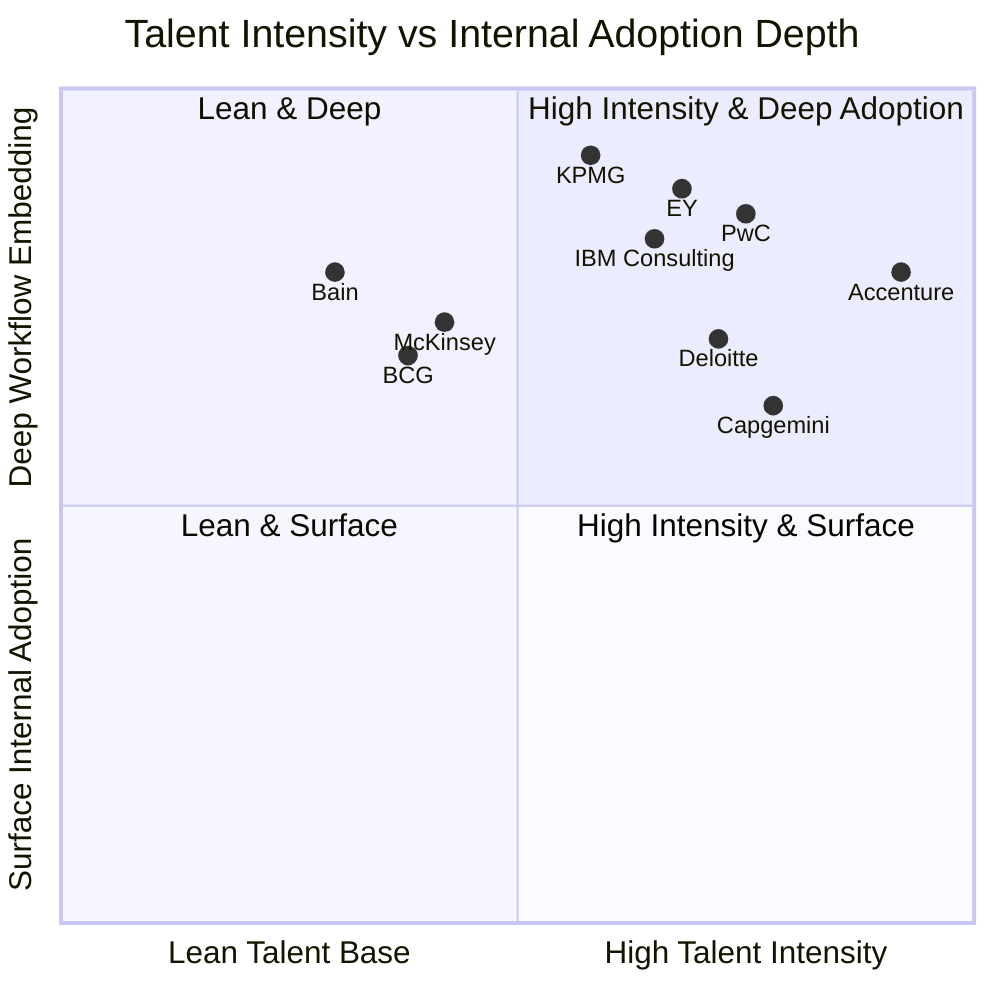

### Three Archetypes Confirmed

**Archetype 1: Integrator Scale-and-Velocity (high intensity + deep adoption).** Accenture, IBM Consulting, and Capgemini occupy the upper-right quadrant. Each combines explicit numerical headcount-doubling targets (Accenture 40,000→80,000[^4][^37]; Capgemini reaching 60,000[^7]) or platform-augmented productivity scaling (IBM Consulting Advantage role-based assistants across the consulting base[^7]) with deep internal adoption supported by industrialized academies (LearnVantage, Data & AI Campus, IBM SkillsBuild) and platform-augmented consultant productivity. The archetype's defining characteristics are scale (largest absolute talent commitments and headcount additions), velocity (acquisition-driven acceleration supplementing organic hiring and training), and platform integration (AI Refinery, watsonx, Resonance providing consistent internal-and-external delivery infrastructure). The structural advantage is delivery capacity at the scale that large-enterprise transformation demands; the structural risk is wage inflation pressure on unit economics as headcount scales.

**Archetype 2: Big Four Assurance-Anchored Network Upskilling (moderate-to-high intensity + deep adoption).** Deloitte, PwC, EY, and KPMG occupy the upper portions of the quadrant, with KPMG and EY positioned highest on internal-adoption depth (audit-and-tax workflow embedding through Clara[^5] and the Tax Agent Factory[^8]) and PwC positioned highest on the broader workforce-saturation dimension (95% My AI participation, 360,000+ training hours[^6]). Each firm leverages assurance heritage to convert internal AI adoption into recurring annuity revenue: KPMG's 90,000 Audit professionals on Clara[^5], PwC's audit AI platform[^7], EY's 80,000 tax professionals working with 150 tax agents, and Deloitte's Trustworthy AI–embedded audit and finance services all generate revenue tied to recurring audit-and-tax engagements rather than to project-based platform deployments. The structural advantage is annuity revenue that the integrators and MBB houses cannot replicate; the structural risk is that audit-licensure-anchored economics constrain the platform-IP scale that the integrators achieve.

**Archetype 3: MBB Lean-but-Saturated Partnerships (low-to-moderate intensity + deep adoption).** McKinsey, BCG, and Bain occupy the lower-left portions of the quadrant—relatively lower on the talent-intensity axis (smaller absolute headcount, no headcount-doubling commitments) but proportionally as deep on the internal-adoption axis (Lilli, GENE/Deckster, Bain's pre-alliance year of 18,000-knowledge-worker OpenAI use[^4]). Bain in particular sits unusually high on the internal-adoption axis relative to talent intensity, reflecting the year of internal use that preceded the OpenAI alliance announcement[^4]. The archetype's defining characteristics are partnership-economics preservation (lean talent base, no platform-development capital intensity), deep saturation (full coverage across the smaller knowledge-worker base), and selective specialist acquisition (McKinsey–Iguazio for MLOps engineering depth; KPMG–SparkBeyond as a Big Four counterpart). The structural advantage is partnership-margin preservation and capital flexibility; the structural risk is platform-IP commoditization and deployment-layer value capture by the integrators.

### Three Strategic Tensions

The synthesis surfaces three strategic tensions that cut across the chapter's evidence and that subsequent chapters interrogate further.

**Tension 1: Scale-vs-margin (integrator headcount-doubling pressures unit economics).** Accenture's 40,000→80,000 AI talent target[^4][^37] and Capgemini's 60,000 data-and-AI professional target[^7] imply hiring and reskilling at a rate that, in the global talent-shortage environment described in Section 7.5, will exert material wage-inflation pressure on margins. The integrators' mitigations—platform IP that scales delivery without proportional headcount growth, acquisition-driven talent acceleration, hybrid workforce design—are robust but not unlimited. The tension is sharpened by the AI Book of Business / GenAI new bookings trajectories: as commercial demand accelerates, the headcount-and-talent imperative accelerates with it, and the firms that resolve the tension most successfully are those whose platform IP most effectively scales delivery capacity per consultant.

**Tension 2: Assurance-licensure-vs-platform-economics (Big Four annuity advantage vs platform-IP scaling).** The Big Four's structural advantage in audit-licensure-anchored annuity revenue (KPMG Clara across 90,000 auditors[^5], PwC's audit AI platform[^7], EY.ai for Risk's regulated-industry positioning, Deloitte's AI Audit and Assurance integration into financial statement audits) is genuinely defensible against the integrators and MBB houses. But the corresponding constraint—that audit-licensure economics constrain the platform-development capital intensity that Accenture, IBM, and Capgemini achieve—creates a structural ceiling on the Big Four's platform-IP scaling. The Big Four firms most aggressively addressing this tension are those that have invested most explicitly in platform productization: EY's EY.ai unifying platform family[^8], KPMG's Velocity launch, PwC's enterprise AI agent operating system[^7], and Deloitte's Zora AI all signal that the Big Four are converging on platform-led AI architecture even as they preserve their assurance heritage.

**Tension 3: Lean-tooling-vs-commoditization-risk (MBB partnership-economics preservation vs deployment-layer value capture).** The MBB houses' lean-but-saturated talent model preserves partnership margins and capital flexibility, but as agentic AI shifts the unit of consulting work from advisory framing to integrated deployment, the value capture increasingly accrues to firms with platform IP, agent factory infrastructure, and managed-services delivery—capabilities that are structurally easier for the integrators and Big Four to scale than for the partnership-economics-constrained MBB cohort. The mitigations vary by firm: McKinsey leverages QuantumBlack engineering depth and Iguazio MLOps acquisition; BCG leverages BCG X tech-build infrastructure and AI Radar diagnostic-as-positioning[^4][^5]; Bain leverages frontier-model alliance velocity through OpenAI[^4][^5]. Whether these mitigations prove durable as agentic AI matures is one of the central forward questions that Chapter 9 examines.

### Internal Adoption as Foundation for ROI Evaluation

The chapter's central conclusion is that **internal adoption serves as the credibility and delivery-efficiency foundation against which Chapter 8 evaluates ROI evidence and outcome-based delivery**. The three reinforcing outcomes documented in Section 7.3—credibility signals, delivery-cost compression, and feedback loops—each translate directly into client-facing ROI evidence:

- **Credibility signals** convert into client engagement velocity. PwC's 95% My AI participation[^6], Bain's pre-alliance year of internal OpenAI use[^4], KPMG's 600,000+ Audit Chat conversations[^37], EY's 150-agent Tax Agent Factory deployment[^8], and Deloitte's planned 25%-cost-reduction-and-40%-productivity-increase Zora AI internal deployment all function as commercial signals that compress the time from initial client conversation to engagement commitment.
- **Delivery-cost compression** converts into ROI for the firms themselves and into commercial margins that fund continued investment. PwC's 20–40% productivity gains[^6], Deloitte's 40% productivity-increase target, and IBM's "faster, more consistently, more cost-effectively"[^7] framing are the internal-economics counterparts of the client-facing ROI claims that Chapter 8 examines.
- **Feedback loops** convert into platform-IP improvement that compounds over time. Deloitte's explicit articulation of internal experience informing technology improvements, PwC's reseller relationship with OpenAI[^6], and EY's "built by tax professionals for tax professionals"[^8] positioning all operationalize the feedback loop between internal use and external offering.

The ten firms enter Chapter 8's ROI examination with materially different talent foundations and internal-adoption depths, and these differences will be reflected in the ROI evidence that each firm can credibly publish. Firms with deeper internal adoption (PwC, KPMG, EY, Deloitte, IBM, Accenture) and broader scaled deployments (the integrators and the audit-anchored Big Four) are positioned to publish more substantive ROI evidence than firms whose AI capability remains primarily framed at the strategic-advisory layer. The MBB houses' published ROI evidence—Foxconn's >$400M targeted savings via BCG (Chapter 5), Reckitt's 90% reduction in routine activities, Bain–Coca-Cola, Bain–Carrefour[^4]—is concentrated in marquee engagements that demonstrate capability at integrator-class scale but represents a smaller absolute volume of disclosed cases than the integrator and Big Four evidence base.

The talent-and-internal-adoption synthesis therefore sets up Chapter 8's central question directly: **how does each firm's structural archetype—integrator scale-and-velocity, Big Four assurance-anchored network upskilling, MBB lean-but-saturated partnership—translate into the ROI evidence and outcome-based delivery that ultimately determine which firms will capture the next phase of enterprise AI consulting demand?** The talent foundations are now mapped; the next chapter examines how those foundations convert into measurable client outcomes.

# 8 ROI, Value Realization, Barriers to Scaling, and Comparative Synthesis

The seven preceding chapters traced the structural anatomy of the ten target firms from capital commitments through narratives, platforms, ecosystems, engagements, governance, and talent. Each chapter contributed a distinct empirical layer to the cross-firm picture, and each closed on a forward-pointing tension that the next chapter resolved. Chapter 7 closed on the most consequential of those tensions: the talent foundations are now mapped, but how does each firm's structural archetype—integrator scale-and-velocity, Big Four assurance-anchored network upskilling, MBB lean-but-saturated partnership—translate into the measurable client outcomes that ultimately determine which firms capture the next phase of enterprise AI consulting demand?

This chapter answers that question directly. It converts the preceding seven dimensions of analysis into an empirical and comparative verdict on which firms are actually realizing value from their AI investments and which face the widest gaps between ambition and outcome. The chapter proceeds in seven steps. It first synthesizes the disclosed ROI evidence across the cohort, distinguishing internal-delivery ROI from client-engagement ROI from commercial-performance ROI. It then triangulates across the cohort's signature survey instruments—Deloitte's *State of GenAI*, McKinsey's *State of AI*, BCG's *AI Radar* and *Where's the Value in AI*, EY's Pulse, PwC's Pulse, and KPMG's CIO research—to surface a cohort-wide picture of where value is being realized and where it is stalling. It systematically dissects the six interlocking barriers that explain why 70–80% of AI initiatives never move beyond pilots, and synthesizes the operating practices that distinguish AI high performers from the majority. The chapter then constructs the report's structural synthesis—a multidimensional comparative matrix scoring each firm across the seven framework dimensions plus the ROI dimension developed here—reads the matrix to surface distinctive strengths, white spaces, and overlapping competitive zones, and closes by formalizing the five strategic archetypes that have crystallized through the report's analysis.

A persistent caveat introduced in earlier chapters bears restating in this synthesis context. **Disclosure asymmetry combines with survivorship bias to create a measurement environment that systematically over-represents successful deployments and under-represents stalled or failed ones.** The named client engagements that the cohort firms publish reflect the upper tail of the ROI distribution; the survey instruments that the same firms commission reflect the broader market reality. Triangulating between these two evidence streams—and against independent benchmarks where available—is the methodological discipline through which the chapter's verdicts are constructed.

## 8.1 ROI Evidence and Value-Realization Metrics Across the Cohort

The ROI evidence disclosed across the ten firms separates structurally into three distinct categories, each with different measurement frameworks, validation logic, and strategic implications. **Internal-delivery ROI** measures the productivity gains and cost compression that the firms achieve through their own internal AI adoption. **Client-engagement ROI** measures the outcomes that named client deployments have produced. **Commercial-performance ROI** measures how AI-driven revenue, bookings, and margin contribute to the firms' aggregate financial performance. Each category provides a partial view of value realization, and reading them in combination produces a more complete picture than any single category supports.

### Internal-Delivery ROI: The Most Quantitatively Specific Evidence

Internal-delivery ROI is, paradoxically, the most quantitatively specific evidence in the cohort, because the firms have unfettered access to their own deployment data and strong commercial incentives to publish the most compelling numbers. The most striking single internal-deployment metric in the cohort is McKinsey's Lilli, which now answers **over 500,000 prompts monthly** across the firm, with **75%+ of McKinsey's roughly 43,000 employees using Lilli monthly** and **66% returning to it multiple times per week**[^38][^27]. The platform "translates that to ~50,000 consultant hours worth roughly USD 12 million" of monthly time savings[^38]—a figure that, annualized, approaches US$144 million in internal productivity gains from a single platform.

The downstream operational implications are even more consequential. McKinsey reports that "engagements that once required 14 consultants now operate with **2-3 people supported by AI agents and deep research models**"[^38]—a 75–80% compression in the human-talent footprint per engagement that fundamentally restructures consulting unit economics. McKinsey has deployed approximately **12,000 AI agents across its operations**[^38], and internal time-and-motion studies show consultants saving **30% of the time previously spent on gathering and synthesizing information**[^38]. Tasks that once took weeks now take days; tasks that took days now take hours. The cumulative pattern is a structural transformation of internal delivery economics that no other firm in the cohort has documented at comparable depth or specificity.

PwC's internal-delivery ROI evidence operates at similar productivity magnitudes, with the firm reporting that consultants who regularly use AI tools demonstrate productivity gains of 20–40% across the workforce (Chapter 7). Deloitte's planned Zora AI internal deployment targets 25% cost reduction and 40% productivity increase in the firm's own finance team, with thousands of hours of effort a year liberated for Deloitte's finance team (referenced in Chapter 7). IBM Consulting's articulation that "IBM consultants deliver solutions faster, more consistently, and cost-effectively than ever before" through Consulting Advantage's role-based assistants (Chapter 4) is qualitative rather than quantitative but signals analogous internal-economics transformation.

The structural significance of internal-delivery ROI extends beyond the immediate cost savings. As McKinsey's reporting indicates, "**roughly a quarter of McKinsey's work is now outcomes-based, with fees tied to client results rather than traditional billable hours**"[^38]. This shift is operationally inseparable from the internal-delivery transformation: a firm whose internal AI adoption has materially compressed delivery costs can credibly offer outcomes-based fee structures without sacrificing margin, while a firm whose internal economics remain anchored in traditional consultant-hour billing cannot. The 25% outcomes-based share at McKinsey is therefore both a fee-model innovation and a downstream consequence of the internal-delivery ROI that Lilli and the 12,000 internal agents have produced.

### Client-Engagement ROI: Use-Case-Specific Productivity Multipliers

Client-engagement ROI is the most visible category in the cohort's published evidence, drawing on the named deployments documented in Chapter 5 and supplemented by additional disclosed cases. The pattern across these cases is that successful AI deployments deliver **use-case-specific productivity multipliers in the 50–90% range** rather than incremental improvements:

| Engagement | Outcome | Source |
|---|---|---|
| **BCG–Foxconn** | >US$400M targeted savings across 200+ factories | Chapter 4/5 cross-reference |
| **BCG–Reckitt** | Quality output doubled; routine activities cut by up to 90% | Chapter 4/5 cross-reference |
| **Deloitte–Sumitomo Dainippon Pharma (with Exscientia)** | Drug candidate identified in 12 months vs. several years using conventional techniques | Chapter 5 |
| **Deloitte–Merck KGaA** | 90% improvement in demand-forecast accuracy | Chapter 5 |
| **Deloitte ConvergeHEALTH adverse-event automation** | 50–60% reduction in case processing time; 65–75% annual cost savings | Chapter 5 |
| **Deloitte life sciences NLP compliance screening** | Email review burden reduced from 2,500 to 20 (~99% reduction) | Chapter 5 |
| **Deloitte biopharma manufacturing optimization** | 21% line-speed improvement; 10% overall equipment effectiveness gain | Chapter 5 |
| **PwC–Southwest Airlines** | 50% backlog-creation time reduction; 90% AI-generated user-story acceptance; 50% (~200+ hours) time saved across specialists | Chapter 5 |
| **Deloitte Zora AI on HPE Private Cloud AI** | 50% reduction in reporting production time | Chapter 6 |
| **EY.ai Tax Agent Factory** | 150 tax agents alongside 80,000 professionals across 3M+ tax compliance deliverables and 30M+ tax processes | Chapter 4/6 cross-reference |

The cumulative pattern is that **published client-engagement ROI clusters in operations, document processing, and customer-service functional categories**, with the most striking individual outcomes concentrated in life sciences (drug discovery compression, supply-chain forecasting, compliance automation) and manufacturing (BCG–Foxconn at US$400M+ scale; biopharma manufacturing at 21% line-speed improvement). The clustering is structurally consistent with Section 5.7's observation that the published-engagement evidence reflects the upper tail of the ROI distribution rather than the median, and the survivorship-bias caveat applies throughout.

### Commercial-Performance ROI: Bookings, Revenue Mix, and Aggregate Validation

Commercial-performance ROI translates the internal-delivery and client-engagement layers into aggregate financial outcomes that validate (or fail to validate) the multi-billion-dollar capital commitments documented in Chapter 2. The most decisive single metric in the cohort is **Accenture's GenAI new bookings of US$1.8 billion in Q4 FY25**, building on a trajectory from US$1 billion in six months reported earlier in fiscal 2024 (Chapters 5 and 6). The quarter-on-quarter step-up indicates that Accenture's agentic-AI go-to-market has moved into a sustained scaling phase rather than an experimental one, and Accenture's broader **Q3 2025 financials reported a 7.7% revenue growth from AI-driven services and a 10% rise in operating income driven by AI and acquisitions** (Chapter 2).

IBM's commercial-performance evidence is anchored in the **AI Book of Business reaching more than US$2 billion** by late 2023 (Chapter 2), with subsequent quarters reporting continued growth. The metric's combined-bookings-and-actual-sales construction is somewhat opaque—roughly one-quarter representing actual sales—but the trajectory validates that watsonx-anchored Consulting Advantage is generating commercially meaningful revenue rather than merely capability buildouts.

McKinsey's commercial-performance evidence is uniquely structured around the revenue-mix shift. **AI and technology consulting now accounts for ~40% of McKinsey's revenue**[^38]—a share that has risen materially over the past several years as Lilli, QuantumBlack, and the 12,000-internal-agent deployment have transformed both delivery and demand. The complementary statistic that "Gen AI implementation in consulting and legal services was 33% in 2023, [and] moved up to 71% in 2024"[^38] frames the broader sectoral context against which McKinsey's 40% AI/tech revenue share is positioned.

BCG's commercial-performance validation operates at the firm-aggregate level. **BCG reported US$14.4 billion in 2025 revenue, reflecting 7% growth from US$13.5 billion in 2024 and marking its 22nd consecutive year of growth**[^38]. The 22-consecutive-years framing positions BCG's AI-era performance as continuity rather than disruption, a positioning consistent with the firm's CEO-advisory archetype. The complementary expansion of BCG's partnership with Google Cloud to "Accelerate Gemini Enterprise Transformation for Global Organizations"[^38] signals the alliance-and-platform integration through which the revenue trajectory is being maintained.

The MBB houses' commercial-performance evidence is otherwise less publicly disclosed than the integrators', reflecting the partnership-economics constraint on financial transparency, but the McKinsey 40% AI/tech revenue share and the McKinsey 25% outcomes-based fee share both signal that AI-era revenue mix is transforming materially within the cohort even where headline figures are not published.

### The Demand-Side Benchmark: Only 6% Are AI High Performers

The cohort's disclosed ROI evidence must be read against the sobering demand-side benchmark established by independent and cohort-survey diagnostic instruments. McKinsey's *State of AI* survey identifies **46 out of 876 surveyed companies** as gen AI high performers—organizations attributing more than 10% of EBIT to gen AI deployment[^39]. The 46-of-876 ratio (5.3%) maps onto Chapter 1's headline finding that only 6% of organizations qualify as "AI high performers" deriving more than 5% of EBIT from AI. BCG's *Where's the Value in AI* puts the broader maturity figure even more directly: "**74% of companies have yet to show tangible value from their use of AI**" and "only 26% of companies have developed the necessary set of capabilities to move beyond proofs of concept and generate tangible value"[^38].

The leader-versus-laggard differentiation that the same surveys document is, by contrast, materially compelling. BCG's research shows that "over the past three years, AI leaders have achieved **1.5 times higher revenue growth, 1.6 times greater shareholder returns, and 1.4 times higher returns on invested capital**" relative to non-leaders, and "also excel in non-financial areas like patents filed and employee satisfaction"[^38]. The implication is that AI value capture is real and substantial for the leader cohort, but that leadership is concentrated in a small minority of organizations.

### PwC's Recalibrated Three-Axis ROI Framework

The measurement framework gap—between traditional short-term financial ROI calculations and AI's longer-horizon value creation—is one of the principal explanations for the leader-versus-laggard divergence and for the difficulty consulting firms face in selling AI engagements through purely financial business cases. PwC's articulated response, examined in Chapter 5, is the **recalibrated three-axis ROI framework**: operational efficiency through automation; upskilling and workforce augmentation; and cost avoidance and resource management—each with its own KPI focus areas (reduction in processing time per task, decrease in manual error rates, growth in customer base without proportional growth in resources). The framework explicitly addresses the observation that traditional ROI models prioritize short-term financial gain relative to investment cost and are unlikely to adequately capture GenAI's potential longer-term value (Chapter 5).

The structural significance of the framework recalibration is that it converts the measurement problem from a barrier into a consulting offering: firms that can credibly help clients design KPIs that capture AI's longer-horizon value are positioned to win engagements that pure-financial-ROI competitors cannot. This is one of the principal reasons that **diagnostic instruments themselves—Deloitte's *State of GenAI*, BCG's *AI Radar*, McKinsey's *State of AI*—function simultaneously as market intelligence and as positioning devices**: the firms that frame the ROI measurement problem also position themselves to sell the solution.

### Synthesis: The ROI Picture Is Polarized

The synthesis of the three categories produces a polarized picture. **Internal-delivery ROI is consistently strong across the cohort**, with productivity multipliers in the 20–40% range universal among the firms that have invested seriously in internal adoption (PwC, Deloitte, McKinsey, IBM, with the integrators and Big Four broadly converging on similar magnitudes). **Client-engagement ROI is strong where it is published**, with use-case-specific multipliers in the 50–90% range, but the published evidence reflects upper-tail outcomes rather than the median. **Commercial-performance ROI validates the platform-led integrator archetype most decisively**, with Accenture's US$1.8B GenAI new bookings and IBM's >US$2B AI Book of Business providing the clearest aggregate-revenue evidence, while the MBB houses' evidence (McKinsey's 40% AI/tech revenue share, BCG's 22-year growth trajectory) validates alternative archetypes through different metrics.

The polarized cohort picture stands against a polarized market picture: 6% of organizations are AI high performers, 26% have developed capabilities to move beyond pilots, and 74% have yet to show tangible value. The consulting opportunity therefore lies precisely in the gap between the 26% that are succeeding and the 74% that are not—the addressable market that justifies the multi-billion-dollar capital commitments documented in Chapter 2 and the strategic narratives constructed in Chapter 3.

## 8.2 Cross-Firm Diagnostic Synthesis: What the Surveys Reveal About Maturity and Value Capture

The cohort's signature survey instruments function simultaneously as diagnostic tools, market-shaping devices, and positioning instruments. Reading them in combination—rather than as isolated firm publications—produces a triangulated picture of the AI adoption landscape that no single survey supports, and that exposes both the points where the surveys agree and the points where they diverge.

### McKinsey *State of AI*: Adoption Surge Meets Value Capture Concentration

McKinsey's *State of AI in early 2024* documented the most decisive single-year shift in AI adoption history. The survey, drawing on 1,363 participants, found that **AI adoption "jumped to 72%"—from a six-year plateau of approximately 50%**—and that **65% of respondents report their organizations are regularly using gen AI in at least one business function, nearly double the percentage from ten months earlier**[^39]. The adoption is also broadening across functions: **half of respondents say their organizations have adopted AI in two or more business functions, up from less than a third in 2023**[^39].

The McKinsey survey's most consequential finding is the gap between adoption breadth and value capture depth. As Section 8.1 noted, only **46 of 876 gen-AI-using companies—5.3%—qualify as gen AI high performers** attributing more than 10% of EBIT to gen AI deployment[^39]. The accompanying finding that **67% of respondents expect their organizations to invest more in AI over the next three years**[^39] indicates that the value-capture concentration is not slowing investment momentum, even where measurable returns remain elusive.

McKinsey's diagnostic on archetype differentiation is operationally important. The survey distinguishes three implementation archetypes—**takers** (using off-the-shelf, publicly available solutions), **shapers** (customizing those tools with proprietary data and systems), and **makers** (developing their own foundation models)[^39]. About half of reported gen AI uses utilize off-the-shelf models with little or no customization, but "**reported uses of highly customized or proprietary models are 1.5 times more likely than off-the-shelf, publicly available models to take five months or more to implement**"[^39]. The capability-customization tradeoff is one of the principal forces shaping the cohort's product-and-platform positioning examined in Chapter 4.

The survey's risk findings are similarly consequential. **Inaccuracy is "the only risk that respondents are significantly more likely than last year to say their organizations are actively working to mitigate"**[^39], and **44% of respondents say their organizations have experienced at least one negative consequence from gen AI use**, with inaccuracy being the most commonly reported consequence (23%)[^39]. Yet only **18% report having an enterprise-wide council or board with the authority to make decisions involving responsible AI governance**, and only **one-third say gen AI risk awareness and risk mitigation controls are required skill sets for technical talent**[^39]. The governance-implementation gap is one of the principal addressable opportunities that the cohort's Trusted/Responsible AI offerings (Chapter 6) target.

### Deloitte *State of GenAI in the Enterprise*: ROI Achievement and the Agentic Pivot

Deloitte's *State of Generative AI in the Enterprise* Q4 2024 wave, drawing on 2,773 director- to C-suite-level respondents across 14 countries (Chapter 6), produces a more optimistic ROI diagnostic than McKinsey's. The headline findings—**74% of organizations report their most advanced GenAI initiative is meeting or exceeding ROI expectations**, **78% expect to increase overall AI spending in the next fiscal year**, and **52% of leaders identify "GenAI for automation (agentic AI)" as the technology development of greatest interest**—validate continued investment momentum (Chapters 2 and 6).

The CxO-vs-non-CxO gap that Deloitte's survey documents (referenced in Chapter 3) is operationally important: **21% of C-suite respondents feel GenAI is already transforming their organization, compared to only 8% of non-C-suite respondents**, and 60% of non-C-suite respondents believe scaling barriers will take 12+ months to resolve, compared to 47% of C-suite respondents. The gap signals an executive-optimism-vs-operational-reality divergence that consulting firms can productize as a transformation-orchestration offering—precisely the positioning Deloitte's "Now decides next" narrative articulates (Chapter 3).

The agentic-AI pivot is perhaps Deloitte's most market-shaping finding. **52% of leaders identify agentic AI as the technology development of greatest interest** and **45% identify multi-agent systems** as the second-most-interesting development. The complementary finding that **26% of organizations are already exploring autonomous agent development to a large or very large extent** establishes the demand baseline that Zora AI, EY.ai Agentic Platform, PwC's agent OS, and KPMG Velocity (Chapter 6) are positioned to serve.

### BCG *AI Radar 2026* and *Where's the Value in AI*: The Trailblazer Diagnostic

BCG's two flagship survey instruments—*AI Radar 2026* (2,360 executives including 640 CEOs across 16 markets) and *Where's the Value in AI* (1,000 CxOs across 20 sectors and 59 countries)—produce the most CEO-anchored diagnostic in the cohort. The *AI Radar 2026* findings, examined in Chapters 3 and 6, anchor the broader investment-permanence thesis: AI investment as a share of revenue projected to double to ~1.7% in 2026; **94% of CEOs continuing to invest even if AI does not pay off in 2026**; **only 6% planning to pull back**; and **50% of CEOs surveyed believing their job stability depends on getting AI investments and strategy right by 2026**.

The *Where's the Value in AI* findings sharpen the maturity diagnostic. **Only 26% of companies have developed the capabilities to move beyond proofs of concept and generate tangible value**—the inverse of the 74% "yet to show tangible value" statistic[^38]. Among the leaders, **just 4% of companies have developed cutting-edge AI capabilities across functions and consistently generate significant value**, while an additional **22% have implemented an AI strategy, built advanced capabilities, and are beginning to realize substantial gains**[^38].

The compositional finding on where AI value is created reframes the cohort's go-to-market positioning materially. **62% of AI's value lies in core business functions**, with operations (23%), sales and marketing (20%), and R&D (13%) leading; support functions contribute 38% of the value, with customer service (12%), IT (7%), and procurement (7%) being the top contributors[^38]. As Michael Grebe, BCG senior partner, articulates: "**Contrary to popular belief, the true potential of AI goes well beyond support functions**. In fact, 62% of AI's value lies in core business functions, enabling leaders to harness both for a significant competitive advantage"[^38]. The implication is that consulting offerings that target only support-function automation capture less than 40% of the available value, and that core-function transformation—precisely where the integrators' 19-industry accelerators (Accenture), watsonx-anchored vertical depth (IBM), and BCG X-led industrial-scale builds (Foxconn) are most distinctively positioned—is the principal value frontier.

The **70-20-10 principle** that BCG's research establishes is the most operationally consequential single diagnostic in the survey corpus. **Around 70% of AI implementation challenges stem from people- and process-related issues, 20% are attributed to technology problems, and only 10% involve AI algorithms—despite the latter often consuming a disproportionate amount of organizational time and resources**[^38]. As Amanda Luther, BCG partner, articulates the strategic prescription: "**This research reaffirms our long-held belief that when companies undertake digital or AI transformations, they need to focus two-thirds of their effort and resources on people-related capabilities, and the other third or so split between technology and algorithms**"[^38].

The Trailblazer diagnostic from *AI Radar 2026* (Chapters 3 and 6) extends the *Where's the Value in AI* findings into a CEO-archetype framework: ~70% Pragmatists, ~15% Followers, and ~15% Trailblazers. Trailblazers commit roughly 60% of AI budget to agentic AI; are twice as likely to apply agentic AI end-to-end; and report 92% confidence that their AI strategy will pay off versus 24% for Followers. The framework's strategic function—simultaneously diagnostic, aspirational identity, and self-diagnostic—maps precisely onto BCG's own consulting prescription and the BCG X build capability that delivers it.

### Dataiku and IBM AI Adoption Diagnostics

Beyond the cohort's own surveys, the **Dataiku and IBM AI Global Adoption Index** instruments add complementary diagnostic depth. The findings on leader-vs-adopter differentiation in investment patterns are striking: **71% of AI leaders aggressively invest in AI vs. 19% of AI adopters; 54% plan to spend over US$1M on GenAI in the next 12 months; and AI leaders focus on revenue generation over cost reduction (36% vs. 26% for non-leaders)**[^38]. The IBM finding that **72% of AI leaders say their C-suite is fully aligned with IT leadership about what needs to be done to achieve AI maturity**, dropping to **36% for AI learners**, is a near-2× alignment-gap that maps onto Deloitte's CxO-vs-non-CxO gap and that consulting firms productize as transformation-orchestration offerings[^38].

The Dataiku-and-IBM diagnostic on use-case prioritization adds further depth. **Leaders are approximately 80% more likely than learners to invest in the top four use cases: customer experience, IT operations and automation, virtual assistants, and cybersecurity**[^38]. The ROI-measurement gap that Dataiku surfaces—**21% do not specifically measure ROI on Generative AI** while **64% do not consistently measure the value from AI**—reinforces the McKinsey diagnostic on value-capture concentration and the BCG finding that **66% of respondents struggle with establishing ROI on identified opportunities**[^38].

### EY, PwC, and KPMG Diagnostic Layers

The Big Four's signature diagnostics each contribute distinctive layers to the cross-survey synthesis. **EY's Responsible AI Pulse survey** (referenced in Chapter 3) surfaces the governance-confidence gap—the substantial disparity between C-suite executives' confidence in their AI systems and the actual governance controls in place—which simultaneously diagnoses a market problem and creates demand for EY's governance offerings. **EY's GenAI in WAM (Wealth and Asset Management) research** identifies alpha generation and financial advice as the highest-impact use cases in wealth management, followed by client onboarding and investment operations[^39]. The deeper structural finding—that "**organizations will need to embrace an integrated enterprise-wide approach to operationalize and adopt GenAI at scale**"—maps onto EY's broader EY.ai unifying-platform positioning examined in Chapter 4[^39].

**PwC's CEO Survey and Pulse research** add the demand-side dimension most explicitly. The 27th Annual Global CEO Survey findings (Chapter 5) include **70% of CEOs believing GenAI will significantly change the way their companies create, deliver and capture value**, **31% having already changed their technology strategies because of GenAI**, **58% believing GenAI will improve quality of products/services within 12 months**, and **64% believing GenAI will enable an efficiency increase of at least 5%**. The CEO-anchored framing complements BCG's *AI Radar* and validates the cross-cohort observation that AI is now a CEO-level rather than a CIO-level decision (Chapter 3).

**KPMG's CIO research** (Chapter 6) anchors the agentic-AI demand diagnostic: **"interest in agentic AI is high, with 90% of organizations moving beyond agent experimentation to piloting and deployment"**. The complementary calculation that **"agentic AI could generate US$3 trillion in corporate productivity improvements over the next decade"** simultaneously functions as a market-shaping diagnostic and as an implicit endorsement of the Velocity-and-TACO offerings that Chapter 6 examined.

### Survey Convergence and Divergence

Reading the surveys in combination produces three convergence patterns and two divergence patterns that are diagnostically important.

**Convergence patterns:**
1. **The agentic inflection is universal.** Every survey in the cohort identifies agentic AI as a top-tier strategic priority: Deloitte's 52% interest finding, BCG's 30%-of-AI-investment commitment to agentic AI, KPMG's 90% beyond-experimentation finding, and Capgemini's 82%-plan-to-deploy-agentic-AI-within-1-3-years finding (Chapter 1).
2. **CEO ownership is rising.** BCG's 82% of CEOs being main AI decision-makers (twice the prior year), PwC's 70% of CEOs seeing GenAI changing value creation, and Deloitte's 21%-CxO-vs-8%-non-CxO transformation-perception gap all converge on CEO-as-principal-decision-maker.
3. **Investment momentum is permanent.** McKinsey's 67%-expecting-higher-investment, Deloitte's 78%-expecting-higher-spending, BCG's 94%-continuing-to-invest, and Dataiku's 71%-leaders-aggressively-investing all converge on investment permanence that is not contingent on near-term ROI.

**Divergence patterns:**
1. **ROI achievement diverges.** Deloitte's 74%-meeting-or-exceeding-ROI-expectations is materially more optimistic than McKinsey's 5–6%-high-performer benchmark or BCG's 26%-tangible-value benchmark. The divergence likely reflects survey-question framing (most-advanced-initiative vs. organization-wide value capture), but the gap is large enough to warrant interpretive caution.
2. **Time-to-value diverges.** Cross-survey evidence on how long AI initiatives take to deliver measurable returns varies substantially, with some research suggesting payback exceeds expectations on advanced initiatives and other research suggesting 70% of initiatives stall before scaling.

The cross-survey synthesis is that the cohort's diagnostic instruments collectively triangulate a market in which adoption is universal, investment is permanent, agentic AI is the principal forward vector, and CEOs are the principal decision-makers—but where value capture is concentrated in a small minority of organizations, where governance implementation lags governance recognition, and where measurement frameworks are still maturing. Each of these findings creates direct consulting demand, and each survey both diagnoses the demand and positions its sponsoring firm to serve it.

## 8.3 Persistent Barriers to Scaling: Data, Talent, Governance, Change, Regulation, and Integration

The cross-survey diagnostic establishes that 70–80% of AI initiatives stall before scaling[^38], and that the addressable consulting opportunity lies in the gap between the 26% succeeding and the 74% not. This section systematically dissects the six interlocking barriers that explain that gap, and pairs each barrier category with the cohort's productized response.

### Barrier 1: Data Readiness

Data readiness is the foundational constraint on AI deployment, and the cross-cohort diagnostic evidence converges on a sobering picture. Gartner's finding that only **43% of organizations say their data is ready for AI** (Chapter 1) is corroborated by Deloitte's research that **40% of companies globally cite data-related challenges as slowing GenAI efforts, with 55% of organizations avoiding certain AI use cases due to data issues**[^38]. The IBM AI in Action data on data-related concerns is structurally specific: **lack of access to high-quality data (inaccurate data and bias), data security, and regulatory changes around data privacy and confidentiality**[^38].

Deloitte's Q3 2024 research adds quantitative depth: organizations were "worried about [using] sensitive data in models (58% had at least a high level of concern), data privacy issues (58%), and data security issues (57%)"[^38]. The convergence with McKinsey's finding that data is "the central factor for [GenAI] success" (Chapter 6) and with the BCG diagnostic that "**critical technology capabilities include data quality and management**" (Chapter 7 cross-reference) establishes that data readiness is universally recognized as a top-tier barrier across the cohort's survey instruments.

The cohort's productized responses to the data barrier vary by archetype. The integrators have invested most heavily: **IBM's US$2.3B StreamSets and webMethods acquisition** (Chapter 2) closed the data-integration-plane gap that watsonx requires; **Capgemini's Syniti acquisition** (completed 2025) explicitly addresses data transformation as required to drive critical business benefits; **Accenture's industry accelerators** include data-readiness components across 19 industries. The Big Four address data readiness through advisory and platform-integration offerings (KPMG's Databricks Data Intelligence Platform integration with Clara, EY's Trusted AI risk-tier-anchored data assessments, Deloitte's data-strategy practice). The MBB houses address data readiness primarily through advisory framing and strategic prescription rather than through proprietary platform IP, with McKinsey's QuantumBlack analytics depth providing the principal exception.

### Barrier 2: Talent

Chapter 7 documented the structural talent shortages that constrain consulting firms' capacity to scale and create the demand they exist to serve. The value-capture lens reframes these shortages as direct ROI constraints on the client side: **37% of organizations require AI engineers, and 28% struggle with talent acquisition**, per BCG[^38]. The 74% AI talent gap (LinkedIn 2023) and the 4.8M cybersecurity professional gap (ISC2 2024) translate, on the client side, into inability to staff AI initiatives at the velocity that the BCG AI Radar's 94%-continued-investment commitment requires.

The cohort's productized responses to the talent barrier are examined in detail in Chapter 7 and include: integrator headcount-doubling commitments (Accenture 40,000→80,000; Capgemini reaching 60,000); Big Four AI Academies (Deloitte AI Academy, PwC My AI with 95% participation, EY's Tax Agent Factory pathway, KPMG Trusted AI training across 90,000 auditors); and MBB lean-but-saturated internal adoption (McKinsey's 12,000 internal agents[^38], Bain's pre-alliance year of OpenAI use across 18,000 knowledge workers). The **client-facing workforce transformation services** that Section 7.4 examined directly productize the talent barrier into recurring consulting demand.

### Barrier 3: Governance and Risk

The governance-implementation gap that McKinsey's *State of AI* surfaces is one of the most consequential structural barriers. As Section 8.2 noted, **only 18% of organizations report having an enterprise-wide council or board with the authority to make decisions involving responsible AI governance**, and **only one-third say gen AI risk awareness and risk mitigation controls are required skill sets for technical talent**[^39]. The complementary finding that **inaccuracy is "the only risk that respondents are significantly more likely than last year to say their organizations are actively working to mitigate"** despite **44% having experienced at least one negative consequence** including 23% experiencing inaccuracy-driven negative consequences[^39] indicates that governance implementation is materially lagging risk recognition.

McKinsey's commentary by Lareina Yee, senior partner and chair of the McKinsey Technology Council, articulates the operational implication: "**Responsible AI needs to start on day one, and there is still much work to be done in terms of education and action. It begins with a company's values—organizations must establish clear principles for how they apply generative AI (gen AI) and set up guardrails to ensure its safe implementation**"[^39]. The structural prescription—"Leading companies in deploying gen AI incorporate risk practices in the development of their AI applications. This includes ensuring that technical teams understand risk and mitigation practices"[^39]—maps onto exactly the productized governance offerings examined in Chapter 6.

The cohort's productized responses to the governance barrier are the most thoroughly examined dimension in the report (Chapter 6). The Big Four's named frameworks (Deloitte's Trustworthy AI, PwC's Responsible AI Toolkit, EY's Trusted AI with quantitative risk scoring, KPMG's Trusted AI powered by IBM watsonx.governance), the integrators' platform-property governance integration (IBM Concert "governed AI," Accenture's six-year-old Responsible AI embedded in delivery, Capgemini's sovereignty-and-data-sensitivity orientation), and the MBB houses' strategic-framing governance advisory collectively address the implementation gap. The structural advantage flows to the Big Four (assurance heritage + audit licensure) and the integrators (platform-property integration), with the MBB houses competing through diagnostic-as-positioning instruments.

### Barrier 4: Change Management

The 70-20-10 principle that BCG's research establishes—70% people/process, 20% technology, 10% algorithms[^38]—is the most operationally consequential diagnostic on change-management barriers. The cross-cohort articulation that organizations "**transform at the speed of organizational change, not at the speed of technology**" (Deloitte; Chapter 3) is, in BCG's framing, an empirical finding rather than a slogan.

The IBM Global AI Adoption Index data sharpens the diagnostic. The biggest discrepancies between AI leaders and AI learners cluster in **"limited AI expertise or knowledge coupled with a holistic AI strategy"**, indicating that change management is inseparable from talent and strategy rather than constituting a discrete barrier[^38]. The Deloitte finding that **64% of CEOs believe GenAI will enable an efficiency increase of at least 5% for their employees' time at work** (Chapter 5) is, on the change-management lens, a workforce-redesign requirement rather than a technology deployment.

The cohort's productized responses to the change-management barrier are the workforce-transformation services examined in Section 7.4 plus the C-suite alignment offerings that the diagnostics imply. Deloitte's prescriptive framing—"**Task the C-suite with creating alignment and managing expectations**", "Build bridges to sustained ROI", "Prioritize your workforce and prepare it for disruption", "Start planning for GenAI agents" (Chapter 3)—maps directly onto change-management consulting offerings that the firm has productized through its Trustworthy AI–embedded Human Trust with AI service line. BCG's articulation of the 70-20-10 principle is itself a change-management consulting offering, with the AI Radar 2026 Trailblazer playbook providing the prescriptive five-step CEO agenda.

McKinsey's reporting on its own transformation captures the operational scale of change-management requirements. McKinsey's global managing partner Bob Sternfels articulates the trajectory directly: "We're going to continue to hire, but we're also going to continue to build agents," envisioning "a future where McKinsey has one AI agent for every human employee"[^38]. The accompanying observation—"McKinsey's headcount dropped by ~5000 in the last 18-24 months. While the market and media call it a mass layoff, McKinsey dismissed the claims, mentioning the drop in headcount as performance management, restructuring, and natural attrition"[^38]—signals the workforce-transformation magnitude that even the consulting cohort itself faces.

### Barrier 5: Regulation

Regulatory tightening, examined in Chapter 1 and Chapter 6, is simultaneously a barrier to AI adoption and a revenue engine for governance services. The intersecting regulatory regimes—**EU AI Act**, **NIST AI RMF**, **GDPR-AI**, and emerging **sovereign-AI dynamics**—create compliance complexity that organizations cannot internally resolve at the velocity required, and that disproportionately favors firms with assurance heritage and integrated legal-technical capability. The **2023 Deloitte survey** finding that **62% of companies are concerned about ethical risks in AI**[^38] cross-references the McKinsey finding that intellectual-property infringement is "increasingly considered relevant" alongside inaccuracy[^39].

The cohort's productized responses to the regulatory barrier are examined in detail in Chapter 6 and include: EU AI Act readiness services, NIST AI RMF alignment services concentrated in Accenture Federal Services and Deloitte Government & Public Services, GDPR-AI intersection capabilities concentrated in the Big Four and Capgemini, and sovereign-AI deployment offerings (EY.ai enterprise private with Dell AI Factory; EY's FlexiGenAI on TELUS' sovereign AI factory; Capgemini's custom-fine-tuning architecture). The Big Four's audit-licensure structural advantage—the only firms able to integrate AI controls into external financial statement audits—converts directly into recurring annuity revenue that the integrators and MBB houses cannot access.

### Barrier 6: Integration Complexity

The final barrier is integration complexity, cited by 56% of executives in BCG's research[^38]. The barrier is structural: AI integration "spans organizational boundaries", "requires coordination between multiple stakeholders", "impacts existing workflows and processes", and "often requires significant change management"[^38]. The BCG observation that organizations "**don't know how to do that effectively**" combines with Dataiku's finding that **48% struggle with limited AI adoption budgets, with 57% using their existing IT budget for organization-wide AI implementation**[^38]—a tension between maintaining current systems and innovating for the future.

The McKinsey "rewiring the business" thesis directly addresses this barrier. As Alex Singla, McKinsey's QuantumBlack global co-leader, articulates: "**The leading companies are the ones that are focusing on reimagining entire workflows with gen AI and analytical AI rather than simply seeking to embed these tools into their current ways of working**"[^39]. The complementary articulation by Bryce Hall: "**Competitive advantage comes from building organizational and technological capabilities to broadly innovate, deploy, and improve solutions at scale—in effect, rewiring the business for distributed digital and AI innovation**"[^39]. The thesis converts the integration-complexity barrier into a workflow-redesign consulting offering precisely tailored to McKinsey's positioning.

The cohort's productized responses to the integration-complexity barrier vary by archetype. The integrators offer the deepest stack-integration capability (IBM's vertically-owned StreamSets-watsonx-Consulting Advantage stack; Accenture's switchboard architecture with 19-industry accelerators; Capgemini's pending WNS managed-services extension). The Big Four offer multidisciplinary integration through their network model. The MBB houses offer strategic-framing-led integration with selective build capability, supplemented by client-facing customizable architectures—McKinsey, for example, "offers clients a customizable version of Lilli's architecture, tailored to specific industries and workflows," with "hundreds of clients now building their own knowledge agents based on McKinsey's template" delivered through QuantumBlack's "20+ proprietary tools and 140+ use case accelerators for sectors like healthcare, finance, manufacturing, and retail"[^38].

### Synthesis: The Barriers Are Interlocking

The six barriers do not operate independently; they form an interlocking system in which each barrier amplifies others. Data readiness depends on talent (data engineers); talent depends on change management (workforce redesign); change management depends on governance (decision rights); governance depends on regulation (compliance frameworks); regulation depends on integration (compliance into existing systems). The cross-cohort consulting opportunity is therefore not to address barriers individually but to deliver integrated transformations that resolve the interlocking system simultaneously—precisely the proposition that the integrator and Big Four end-to-end positioning targets and that the MBB strategic-framing positioning sets up.

The structural implication is that **the firms most likely to win the next phase of enterprise AI consulting demand are those that have most credibly productized integrated responses across multiple barriers simultaneously**. Single-barrier offerings—pure data-readiness advisory, pure governance frameworks, pure change-management methodology—are progressively commoditizing. Integrated multi-barrier responses—Deloitte's eight-service-line portfolio with embedded Trustworthy AI; EY.ai's quadruple deployment-mode architecture with Trusted AI Platform quantitative scoring; Accenture's AI Refinery with switchboard + 19-industry accelerators + Responsible AI compliance; IBM's vertically-owned stack with "governed AI" and Consulting Advantage—are the structural responses that the cohort's most successful firms are bringing to market.

## 8.4 What AI Leaders Do Differently: Practices That Distinguish High Performers

The diagnostic findings on barriers establish what is hard about AI scaling. The leader-vs-laggard differentiation findings establish what successful organizations actually do differently. Synthesizing the cross-survey evidence on high-performer practices produces six recurring leader behaviors that consulting firms have productized into client-facing service propositions.

### Behavior 1: Workflow Redesign Rather Than Tool Overlay

The single most consequential leader behavior is the redesign of workflows around AI rather than the layering of AI onto existing workflows. McKinsey's 2025 *State of AI* finding that **AI high performers are 3× more likely to redesign workflows around AI** (Chapter 1) is corroborated by McKinsey's 2024 *State of AI* finding that **high performers are more likely than others to deploy highly customized "shaper" or "maker" gen AI solutions rather than off-the-shelf "taker" solutions**[^39]. As Bryce Hall articulates: "**Capturing the full value of this technology often requires significant customization—for example, training models on proprietary company and customer data or tuning models to improve performance within a specific industry or business context**"[^39].

The customization-as-moat thesis has direct strategic implications. Alexander Sukharevsky, McKinsey's QuantumBlack global co-leader, frames the question that customization answers: "**If you have it, your competitor probably has it as well. Organizations need to ask themselves: What is our moat? The answer, in many cases, likely will be customization**"[^39]. The implication is that off-the-shelf solutions are likely to become "table stakes" while customized solutions—what Sukharevsky describes as "a well-orchestrated mix of multiple foundational models—both off-the-shelf solutions and tools that have been finely tuned to the enterprise's specific needs"[^39]—will be "truly differentiating for companies."

McKinsey's own internal experience operationalizes the workflow-redesign thesis. The Lilli use cases documented across the firm—knowledge retrieval that surfaces "comparable companies in the retail sector" with "relevant case studies, names internal experts, and synthesized key insights" within seconds, presentation generation in McKinsey's house style, research synthesis that converts weeks of work into hours, expert identification that "scans the internal network and surfaces the right people," consultant-built task-specific agents that can be created "within an hour," and logic-checking tools that "review a consultant's arguments, verifying the flow of reasoning makes sense before presenting to clients"—collectively represent a redesign of consulting workflow rather than a tool overlay onto traditional methods[^38]. The accompanying consultant testimony makes the operational point: "I use Lilli to look for weaknesses in our argument and anticipate questions that may arise. It saves up to 20% of my time preparing for meetings, but more importantly, it improves the quality of my expertise"[^38].

### Behavior 2: Executive Alignment with C-Suite-IT Integration

The IBM Global AI Adoption Index finding that **72% of AI leaders say their C-suite is fully aligned with IT leadership about what needs to be done to achieve AI maturity, dropping to 36% for AI learners**[^38] establishes executive alignment as a near-2× differentiator between leader and laggard cohorts. The complementary McKinsey finding that AI high performers are 3× more likely to have committed executive leadership driving AI as a strategic priority (Chapter 1) corroborates the alignment imperative.

The implication for consulting firms is structural. As McKinsey's Alex Singla articulates: "**Realizing profit-and-loss impact from gen AI requires close partnership with HR, finance, legal, and risk to constantly readjust the resourcing strategies and productivity expectations**"[^39]. The cohort's productized responses to the alignment imperative include the BCG AI Radar 2026 Trailblazer playbook (which prescribes that CEOs "make AI a key priority"), Deloitte's "Task the C-suite with creating alignment and managing expectations" prescription, and McKinsey's positioning at the CEO and board strategic decision layer.

### Behavior 3: Customization-as-Moat

McKinsey's data on customization is unambiguous: **about half of reported gen AI uses utilize off-the-shelf, publicly available models or tools, with little or no customization**, but **gen AI high performers are less likely to use those off-the-shelf options than to either implement significantly customized versions of those tools or to develop their own proprietary foundation models**[^39]. The consultancy implication is that customization capability—training models on proprietary client data, fine-tuning for industry context, integrating into specific workflows—is the structural differentiator that separates leader-tier consulting offerings from commoditized capability access.

The cohort's productized responses to the customization imperative are examined in Chapter 4. **Capgemini's custom enterprise GenAI** offering—"fine tuned with [client] proprietary data" for clients with "key sensitive data" (Chapter 3)—is the most explicitly customization-anchored positioning in the cohort. **Accenture's switchboard architecture** within the AI Refinery is the multi-model variant of the same logic. **EY's Model Catalog** within the EY.ai Agentic Framework provides the composable variant. **IBM's watsonx.ai** with proprietary Granite models supplemented by partner models provides the owner-model variant. The MBB houses (particularly McKinsey through QuantumBlack and Bain through privileged OpenAI access) compete on customization through alliance-leveraged frontier-model capability rather than through proprietary-platform fine-tuning. McKinsey's own articulation of the "client zero" approach—"where McKinsey uses itself as the first test case, gives the firm credibility when advising Fortune 500 companies on AI transformation"[^38]—operationalizes customization as both internal capability and external offering.

### Behavior 4: Embedded Risk and Governance

McKinsey's analysis identifies that **gen AI high performers are nearly twice as likely as others to involve the legal function and embed risk reviews early on in the development of gen AI solutions—that is, to "shift left"**[^39]. The complementary finding that **high performers are significantly more likely than others to embed testing and validation in the release process for models, as well as to develop clear processes to iteratively improve model outputs**[^39] establishes embedded risk-and-governance as a leader behavior.

The cohort's productized responses to the embedded-governance imperative are the Trusted/Responsible AI frameworks examined in Chapter 6. The structural advantage flows most decisively to firms that have integrated governance into platform delivery rather than offered governance as a separate advisory service: IBM's "governed AI" within Concert; Accenture's six-year-old Responsible AI embedded in delivery; EY's Trusted AI Platform with quantitative residual-risk scoring; Deloitte's Trustworthy AI with the LLM-as-a-judge MRM technique and guardian-agent guidance.

### Behavior 5: Comprehensive Talent Strategy with Curated Learning Journeys

McKinsey's high-performer analysis identifies **curated learning journeys, tailored by role, to build critical gen AI skills for technical talent** as a leader behavior[^39]. **AI leaders are more likely than others to clearly define the talent (i.e., both roles and skills) needed to execute the gen AI strategy** and to **have a talent strategy that allows effective recruitment, onboarding, and integration of gen-AI-related talent**[^39]. The Dataiku data on aggressive investment patterns (71% leaders aggressively invest vs. 19% adopters; 54% plan >US$1M GenAI spend; focus on revenue generation over cost reduction at 36% vs. 26%)[^38] establishes that talent strategy is inseparable from broader investment strategy.

The Business Insider reporting on consulting talent transformation captures the operational implication. At McKinsey, the **"AI engineer" is the fastest-growing non-entry-level role**, followed by procurement officer, data scientist, and software engineer; at BCG, software engineers, frontend developers, and Python developers are the fastest-growing entry-level roles[^39]. Sylvain Duranton, BCG X Global Leader, articulates the structural shift: "**We're essentially building a tech company inside a consulting firm**. Our job has always been to help companies transform. But tech has become so critical to transformation that we needed to have a grip on it ourselves"[^39]. The integration of "**forward deployed consultants**" at BCG—a new team taking inspiration from a software-engineering role popularized by Palantir, in which consultants are "vibe-coding and building tools on client projects, [and] when one of these tools is a hit, it goes back to the R&D team and becomes a broader tool that everyone can use"[^39]—signals that the talent-strategy reorientation extends beyond hiring into role redefinition.

The hybrid talent profile that the cohort firms are converging on is captured by Alex Singla's articulation: McKinsey is looking for "**5Xers — they're deep in one thing, but can do three or four different things well**," and what the firm wants is "those people that actually have a propensity to either be this great McKinsey consultant, and or a great technologist, and then groom them to be both"[^39]. The disclosed McKinsey workforce architecture is operationally telling: **QuantumBlack, with its 1,700-person team, drives all of McKinsey's AI initiatives**, which now account for ~40% of the firm's work; **about 3,500 people are building internal technology for McKinsey**; and **another 4,000 to 5,000 consultants are leading the technical work from the business side, but don't necessarily have technical expertise**[^39]. This three-tier architecture—dedicated AI engineering core, internal technology builders, and technically-fluent business consultants—is the operational form of what BCG's Trailblazer playbook prescribes and what Deloitte's AI Academy curriculum delivers.

The other archetypes operationalize the talent-strategy imperative through structurally different mechanisms. KPMG, EY, Accenture, Deloitte, and PwC each emphasize **upskilling over hiring**: as Sam Gloede, KPMG's global trusted AI leader, articulates the firm's prioritization, "**There is not a massive change in our workforce. It's just a focus on upskilling, literacy, and learning**"[^39]. EY's two-week October learning event teaching employees to build AI agents, plus 15-hour courses on AI engineering, applied AI, and AI compliance, has produced **nearly 100,000 EY employees—roughly a quarter of the workforce—earning a digital "AI badge"** for completing one of the courses[^39]. PwC's articulation of the structural drivers, captured by Saurabh Sarbaliya, a PwC partner: "**The demand for people who can make AI work in the enterprise is only going to grow — but there just aren't enough experts. So you have to focus on upskilling your existing workforce**"[^39].

### Behavior 6: Core-Function Value Capture

BCG's *Where's the Value in AI* establishes that **62% of AI's value lies in core business functions**, with operations (23%), sales and marketing (20%), and R&D (13%) leading[^38]. The complementary finding that **leaders are approximately 80% more likely than learners to invest in the top four use cases: customer experience, IT operations and automation, virtual assistants, and cybersecurity**[^38] reinforces the core-function-orientation thesis.

The cohort's productized responses to the core-function-value-capture imperative are examined throughout the report and include: Accenture's 19-industry accelerators specifically targeting core operations and customer experience (Chapter 4); IBM's watsonx-anchored vertical depth in regulated finance and healthcare; Capgemini's custom enterprise GenAI for sensitive-data clients in financial services and life sciences; the Big Four's audit-and-tax workflow embedding; and the MBB houses' CEO-level transformation advisory anchored on core-function reinvention.

### Synthesis: The Leader Playbook Is Productized Across the Cohort

The six leader behaviors map systematically onto the cohort's offerings and constitute the structural playbook that consulting firms are selling. **Workflow redesign** maps onto McKinsey's reimagining-entire-workflows positioning, BCG's transformation-through-BCG-X capability, and Accenture's reinvention-with-AI thesis. **Executive alignment** maps onto Deloitte's "Now decides next" prescription and BCG's AI Radar 2026 Trailblazer playbook. **Customization** maps onto Capgemini's custom-fine-tuning, Accenture's switchboard, EY's Model Catalog, IBM's watsonx.ai, and the MBB houses' alliance-leveraged customization. **Embedded governance** maps onto the Big Four's named frameworks and the integrators' platform-property governance. **Comprehensive talent strategy** maps onto the cohort's AI Academies and workforce-transformation services. **Core-function value capture** maps onto industry accelerators, vertical IP, and CEO-level transformation advisory.

The leader playbook is therefore not external to consulting offerings; it is the structural foundation on which the cohort's offerings are built. The implication for clients is that selecting the right consulting partner is inseparable from selecting the right archetype-playbook combination, and the implication for the cohort firms is that competitive differentiation increasingly depends on which leader behaviors each firm has most credibly productized.

## 8.5 Multidimensional Comparative Matrix Across the Seven Framework Dimensions

The chapter's structural synthesis is delivered through a multidimensional comparative matrix that scores each of the ten firms across the seven analytical dimensions established in Chapter 1—investment scale and inorganic growth, strategic direction and AI vision, proprietary products and platforms, ecosystem and partnerships, client engagements and use cases, trust/governance/agentic capabilities, and talent/internal AI adoption—plus the synthesized ROI/value-realization dimension developed in this chapter. For each dimension and each firm, the matrix captures evidence-anchored relative positioning drawing on the quantitative anchors from preceding chapters.

The scoring uses a four-tier scale: **●●● = signature** (the firm's positioning is among the strongest in the cohort with disclosed evidence supporting that ranking); **●● = strong** (the firm's positioning is materially differentiated with quantitative or named-engagement evidence); **● = standard** (the firm participates competently in the dimension but does not lead); **— = limited disclosure or capability gap** (publicly available evidence does not support a stronger ranking, which may reflect actual gap or disclosure asymmetry).

| Firm | Investment & M&A | Strategic Vision | Products & Platforms | Ecosystem & Alliances | Engagements & Use Cases | Trust/Governance/Agentic | Talent & Internal Adoption | ROI Evidence |
|---|---|---|---|---|---|---|---|---|
| **Accenture** | ●●● (US$3B Data & AI; 46 deals/US$6.6B FY24) | ●●● (Reinvention with AI; "mega-trend") | ●●● (AI Refinery + AI Navigator + 19-industry accelerators) | ●●● (multi-hyperscaler switchboard) | ●●● (broadest cross-vertical coverage) | ●● (Responsible AI 6 yrs + AI Navigator embedded) | ●●● (40K→80K AI talent; LearnVantage) | ●●● (US$1.8B Q4 FY25 GenAI bookings; 7.7% AI revenue growth) |
| **IBM Consulting** | ●● (>US$5B/yr R&D; US$2.3B StreamSets+webMethods) | ●● (watsonx-centric Consulting Advantage) | ●●● (deepest single-stack: data plane + watsonx + Consulting Advantage + Concert) | ●● (self-hyperscaler + hybrid-cloud-native) | ●● (regulated industries; >US$2B AI Book of Business) | ●●● (governed AI as platform property + watsonx.governance) | ●● (Consulting Advantage role-based assistants) | ●●● (>US$2B AI Book of Business) |
| **Capgemini** | ●● (€2B AI; Altran/Syniti/pending WNS) | ●● (Custom GenAI + European sovereignty) | ●● (Resonance + 4 GenAI assistants + Generative AI Lab) | ●● (Google Cloud + Microsoft) | ●● (Heathrow; engineering AI; financial services) | ●● (sovereignty/data-sensitivity orientation) | ●● (60K data & AI target; Data & AI Campus) | ●● (sustained execution; pending WNS extension) |
| **Deloitte** | ●● (US$1.4B Project 120 + AI Academy) | ●●● (Now decides next; Age of With) | ●● (Zora AI digital workforce + Trustworthy AI portfolio) | ●● (Google Cloud Gemini Enterprise + NVIDIA) | ●●● (life sciences depth; Government & Public Services) | ●●● (8-service-line portfolio + LLM-as-a-judge + guardian agents) | ●●● (US$1.4B L&D + AI Academy with VT/IIT/NVIDIA) | ●●● (Zora AI HPE 50% reporting time reduction; State of GenAI 74% ROI met/exceeded) |
| **PwC** | ●● (US$12B network New Equation) | ●● (Trust + Sustained Outcomes; human-led, tech-powered) | ●● (Enterprise AI agent OS + ChatPwC + audit AI platform) | ●●● (OpenAI reseller; multi-hyperscaler) | ●● (Southwest Airlines; insurance multilingual GenAI) | ●● (Responsible AI Toolkit + multidisciplinary integration) | ●●● (My AI 95% participation; 360,000+ training hours) | ●●● (20-40% productivity gains; Southwest 50% backlog reduction) |
| **EY** | ●● (EY.ai platform investments; NVIDIA/Dell) | ●●● (EY.ai unifying platform vision) | ●●● (EY.ai + Tax Agent Factory + EY.ai for Risk + FlexiGenAI + enterprise private) | ●●● (NVIDIA + Dell + TELUS sovereign) | ●●● (150 tax agents/80K professionals/3M+ deliverables; Uber TPRM; ~100K AI badges[^39]) | ●●● (Trusted AI Platform with quantitative scoring) | ●●● (Tax Agent Factory hybrid pathway; ~25% workforce AI-badged[^39]) | ●● (3M+ tax compliance deliverables; 30M+ tax processes) |
| **KPMG** | ●● (Multibillion-$ Microsoft alliance; SparkBeyond) | ●● (Trusted AI in audit workflow; TACO framework) | ●● (Clara + Audit Chat + Workbench + Velocity) | ●●● (Microsoft anchor + MindBridge + Databricks) | ●● (90,000 Audit professionals on Clara) | ●●● (Trusted AI + watsonx.governance + TACO Orchestrator) | ●●● (90K Audit professionals; 600K+ Audit Chat conversations) | ●● (TACO-anchored Velocity; Global Business Services) |
| **McKinsey** | ●● (QuantumBlack + Iguazio; ~1,700 QuantumBlack team[^39]) | ●●● (CEO/board strategic-framing; State of AI thought leadership) | ●●● (Lilli + QuantumBlack + 12,000 internal agents + 20+ proprietary tools + 140+ accelerators[^38]) | ●● (engagement-led; selective alliances) | ●●● (CEO-level transformation; QuantumBlack analytics; hundreds of clients building knowledge agents on McKinsey template[^38]) | ●● (strategic-framing governance advisory) | ●●● (75%+ Lilli monthly use; 12,000 agents; ~50K hours/month saved worth ~US$12M[^38]) | ●●● (~40% AI/tech revenue; ~25% outcomes-based fees; 30% time savings; 14→2-3 consultants per engagement[^38]) |
| **BCG** | ● (BCG X tech-build; selective acquisitions) | ●●● (CEO-led AI Radar; Trailblazer playbook) | ●● (GENE + Deckster + BCG X) | ●● (Google Cloud Gemini Enterprise expansion[^38]; multi-vendor) | ●●● (Foxconn US$400M+; Reckitt 90% routine cut) | ●● (AI Radar diagnostic-as-positioning) | ●● (BCG X tech-build; AI literacy programs; forward deployed consultants[^39]) | ●●● (US$14.4B 2025 revenue; 22 consecutive growth years[^38]; Foxconn US$400M+) |
| **Bain** | ● (alliance-led; OpenAI partnership) | ●● (Frontier alliance velocity; named brand deployments) | ● (lean tooling; alliance-leveraged) | ●●● (privileged OpenAI services alliance + Center of Excellence) | ●● (Coca-Cola; Carrefour) | ● (alliance-led governance access) | ●● (18,000 knowledge workers pre-alliance OpenAI use; OpenAI CoE) | ●● (named brand deployments; alliance-led commercial validation) |

### Composite Views Across the Matrix

Reading the matrix produces several composite views that crystallize the report's analytical synthesis.

**Total capability breadth.** The firms with signature or strong positioning across the largest number of dimensions are Accenture (●●● across 6 of 8 dimensions; ●● across the remaining 2), EY (●●● across 6 of 8; ●● across 2), Deloitte (●●● across 5 of 8; ●● across 3), and McKinsey (●●● across 5 of 8 once internal-adoption depth and engagement scale are reweighted by the new evidence on Lilli). These four firms have constructed the broadest integrated capability portfolios in the cohort. IBM Consulting and KPMG follow closely, each with 3 signature and 4–5 strong dimensions. The MBB-house lean-tooling archetype produces narrower-but-deeper positioning in BCG and Bain.

**Depth at the strategic-framing layer.** Signature positioning at the strategic-framing layer concentrates in McKinsey (CEO/board State of AI), BCG (CEO-led AI Radar Trailblazer), Accenture (Reinvention with AI mega-trend), Deloitte (Now decides next prescription), and EY (EY.ai unifying platform vision). The structural pattern is that strategic framing is not an MBB monopoly: the integrators and Big Four have constructed equally compelling strategic narratives anchored on different archetype foundations.

**Depth at the platform/build layer.** Signature platform/build positioning concentrates in Accenture (AI Refinery + 19-industry accelerators), IBM Consulting (deepest single-stack), EY (composable platform family), and—when the customizable Lilli architecture and QuantumBlack's 20+ proprietary tools and 140+ use case accelerators are factored in—McKinsey moves into signature positioning at this layer as well[^38]. Capgemini, Deloitte, KPMG, and PwC are strongly positioned but at moderate platform-IP depth. Bain's platform/build positioning is the lightest in the cohort, an inevitable consequence of the alliance-led model.

**Depth at the governance/assurance layer.** Signature governance positioning concentrates in the Big Four plus IBM. Deloitte (8-service-line portfolio + LLM-as-a-judge + guardian agents), EY (Trusted AI Platform with quantitative scoring), KPMG (Trusted AI + watsonx.governance + TACO), and IBM (governed AI as platform property) all achieve signature depth. PwC is strongly positioned through the Responsible AI Toolkit. Accenture's six-year-old Responsible AI is strong but less productized as governance technology than the Big Four counterparts. Capgemini and the MBB houses are at standard rather than signature depth on governance.

**Depth at the managed-services/operate layer.** Signature managed-services positioning concentrates in Accenture, IBM Consulting, and Capgemini (with the pending WNS acquisition extending the depth materially). KPMG's Velocity-anchored Global Business Services launch positions the firm strongly. The MBB houses are structurally limited at the managed-services layer by partnership economics, though McKinsey's 25% outcomes-based fee share[^38] signals an alternative path—monetizing managed-style risk-sharing through fee-structure innovation rather than through dedicated managed-services infrastructure.

The matrix is designed both as a reference instrument and as the analytical bridge to the archetype synthesis that follows. Reading dimensional clusters, three structural observations emerge: **firms converge most decisively on the strategic-framing dimension**, where every cohort firm has constructed compelling AI narratives; **firms diverge most decisively on the platform/build and managed-services dimensions**, where partnership economics, capital intensity, and stack-ownership choices produce sharp positioning differences; and **the governance/assurance dimension is where the Big Four's structural inheritance combines with the integrators' platform-property governance to produce a multi-archetype convergence that the MBB houses have only partially matched**.

## 8.6 Distinctive Strengths, White Spaces, and Overlapping Competitive Zones

Reading the comparative matrix to surface, for each firm, distinctive strengths, white spaces, and overlapping competitive zones produces the structural snapshot that defines competitive positioning entering 2026.

### Distinctive Strengths

Each firm's most defensible positioning is the dimension where its archetype-specific structural advantages combine with disclosed evidence to produce a positioning that competitors cannot easily replicate.

**IBM Consulting's distinctive strength is vertical stack ownership combined with the AI Book of Business.** No other firm in the cohort owns the data plane (StreamSets/webMethods), the data-and-AI platform (watsonx), the consulting services platform (Consulting Advantage), and the ITOps overlay (Concert) at equivalent depth. The >US$2B AI Book of Business validates that the stack ownership translates into commercial momentum. The structural risk is the lock-in counter-narrative that hyperscaler-neutral competitors (notably Accenture) deploy, but the hybrid-cloud-native positioning of watsonx materially blunts the critique.

**Accenture's distinctive strength is the combination of 19-industry accelerator breadth, switchboard model-agnostic flexibility, and US$6.6B FY24 acquisition velocity.** No other firm in the cohort has constructed an equivalently broad horizontal-and-vertical platform portfolio. The Q4 FY25 GenAI new bookings of US$1.8B and the 7.7% AI-driven revenue growth validate that the breadth translates into commercial scale. The structural risk is the capital intensity and acquisition-integration complexity required to maintain the breadth.

**KPMG's distinctive strength is the 90,000-Audit-professional Clara workflow embedding combined with the Microsoft alliance depth.** No other firm in the cohort has integrated AI capability into a single function at equivalent depth. The 600,000+ Audit Chat conversations and the Trusted AI training across the entire Audit base validate that the embedding is operational rather than aspirational. The structural risk is that the audit-first sequencing concentrates positioning in a single function rather than across the firm's broader practice.

**EY's distinctive strength is the quadruple deployment-mode architecture combined with the Trusted AI Platform's quantitative scoring.** EY is the only firm in the cohort offering all four deployment modes—cloud (EY.ai for Risk), on-premises private (EY.ai enterprise private with Dell AI Factory), sovereign (FlexiGenAI on TELUS), and function-specific factory (Tax Agent Factory)—within a single unifying platform vision. The Tax Agent Factory's 150 tax agents/80,000 professionals/3M+ deliverables/30M+ processes represents the largest single agentic deployment in the cohort. The complementary internal-adoption depth—approximately 100,000 EY employees, roughly a quarter of the global workforce, having earned an "AI badge" by completing the firm's AI courses[^39]—adds workforce-saturation evidence that few competitors match. The structural risk is that the architectural ambition outpaces operational maturity in some deployment modes.

**Deloitte's distinctive strength is the eight-service-line Trustworthy AI governance portfolio combined with the Zora AI internal-and-HPE deployment.** Deloitte's governance-and-academy axis—Trustworthy AI framework with LLM-as-a-judge, guardian-agent guidance, AI Institute research, AI Academy with Virginia Tech and IIT Roorkee partnerships, US$1.4B Project 120 funding—is the most comprehensive integrated governance-and-talent infrastructure in the cohort. The Zora AI HPE Private Cloud AI deployment with 50% reporting-time-reduction targets and the planned thousands-of-users internal deployment validate the dual external-and-internal credibility. The structural risk is that comprehensive breadth across capability dimensions requires continued capital intensity that partnership economics constrain.

**PwC's distinctive strength is the 95% My AI participation across 75,000 US employees combined with the OpenAI reseller relationship.** No other firm in the cohort has achieved comparable workforce saturation in voluntary AI adoption, and no other firm holds a comparable "client zero" relationship with OpenAI. The 20–40% productivity gains and the Southwest Airlines 50%-backlog-reduction engagement validate that the saturation translates into both internal-economics and client-engagement outcomes. The structural risk is that the OpenAI relationship is non-exclusive at the firm level, exposing PwC to compression as competitors gain equivalent access.

**Capgemini's distinctive strength is the custom-fine-tuning architecture combined with the pending WNS managed-services extension.** No other firm in the cohort is as explicitly positioned for clients with proprietary, sensitive data who require custom GenAI solutions, and the WNS combination would create a uniquely scaled advisory-plus-operations integration. The structural risk is the operational complexity of integrating WNS into the broader Capgemini delivery architecture and the European-sovereignty positioning's relative weakness in non-European markets.

**McKinsey's distinctive strength is the QuantumBlack-and-Lilli integrated tooling combined with 12,000 internal agents, ~40% AI/technology revenue share, and ~25% outcomes-based fee share.** Lilli's 75%+ monthly use across 43,000 employees, the >500,000 monthly prompts, the ~50,000 monthly consultant hours saved (~US$12M monthly value), and the engagement-staffing compression from 14 consultants to 2–3 supported by AI agents collectively represent the most quantitatively documented internal-AI-transformation in the cohort[^38][^27]. The customizable Lilli architecture made available to clients—with "hundreds of clients now building their own knowledge agents based on McKinsey's template"—plus QuantumBlack's "20+ proprietary tools and 140+ use case accelerators for sectors like healthcare, finance, manufacturing, and retail" extend the internal capability into a client-facing platform layer that the platform/build matrix dimension reflects[^38]. The ~40% AI/tech revenue share and ~25% outcomes-based fees validate that the internal transformation translates into commercial momentum and into fee-model innovation that lean-tooling partnerships can sustain. The structural risk is platform-IP commoditization at the strategic-framing layer as agentic AI shifts the unit of consulting work, partially mitigated by Bob Sternfels' articulated trajectory toward "one AI agent for every human employee"[^38].

**BCG's distinctive strength is the AI Radar diagnostic-as-positioning combined with BCG X build at industrial scale.** No other firm in the cohort has constructed an equivalently CEO-anchored diagnostic instrument with comparable annual-survey rigor and positioning influence. The Foxconn engagement (>US$400M targeted savings across 200+ factories) and the Reckitt engagement (90% routine-activity reduction) demonstrate that BCG X can compete at integrator-class engagement scale. The US$14.4B 2025 revenue and 22 consecutive growth years validate that the diagnostic-and-build combination produces sustained commercial performance, with the recently announced Google Cloud Gemini Enterprise partnership expansion further strengthening BCG's alliance-leveraged platform access[^38]. The structural risk is the same partnership-economics-led platform-IP commoditization risk that affects all MBB houses.

**Bain's distinctive strength is the privileged OpenAI alliance combined with named brand deployments and the OpenAI Center of Excellence.** No other firm in the cohort has constructed an equivalently visible single-frontier-model alliance. The Coca-Cola brand-and-marketing deployment and the Carrefour shopping-assistant-chatbot/product-description/procurement deployment provide third-party validation. The structural risk is alliance non-exclusivity, addressed through deployment-velocity advantage and the 18,000-knowledge-worker pre-alliance internal-use foundation.

### White Spaces

Reading the matrix for dimensions where each firm's offering lags structural demand signals surfaces five white spaces that recur across the cohort.

**White space 1: Synthetic data quality assurance.** Gartner's projection that **77% of LLM training data will be synthetic by 2029**, up from 4% in 2025, with synthetic-data generation growing at 178% CAGR (Chapter 1) implies that synthetic-data-specific quality assurance—provenance, bias-amplification testing, distributional integrity—will become a first-order capability requirement. The cohort's published synthetic-data offerings are not yet at the operational maturity of traditional MRM. This is a forward white space across all ten firms.

**White space 2: Post-quantum readiness.** Gartner's prediction that quantum advances will render asymmetric cryptography unsafe by 2030, with the encryption market growing from US$1.04B in 2023 to US$2.04B by 2029 (Chapter 1), implies a four-year window in which "harvest now, decrypt later" attacks accumulate data. Despite obvious adjacency to Big Four and Accenture cybersecurity practices, no firm in the cohort has disclosed a dedicated post-quantum readiness offering. This is a forward white space concentrated in firms with deep cybersecurity practices.

**White space 3: Multi-agent governance.** As Section 6.9 documented, most of the cohort's governance frameworks were initially designed for single-model or single-agent contexts, and the extensions to multi-agent systems are emergent rather than fully productized. KPMG's TACO Orchestrator tier definition acknowledges the complexity, but the corresponding governance scaffolding is less operationally articulated than for Tasker and Automator tiers. This white space is most consequential for firms competing at the upper TACO tiers.

**White space 4: Sovereign AI deployment for non-EY firms.** EY's quadruple-deployment-mode architecture (cloud, private, sovereign, function-factory) is structurally distinctive in the cohort, and the FlexiGenAI on TELUS deployment provides a sovereign-AI architectural template that competitors have not matched at equivalent depth. Capgemini's custom-fine-tuning architecture addresses sovereignty considerations through a different mechanism. For the other eight firms, sovereign-AI deployment options are accessed primarily through alliance partners rather than through proprietary deployment modes—a forward white space as sovereign-AI demand intensifies.

**White space 5: MBB platform-IP commoditization risk.** As Chapter 4 surfaced and Sections 7.6 and 8.5 reinforced, the MBB houses' lean-but-saturated partnership model preserves margins but exposes the cohort to the long-run risk that platform IP—increasingly held by Accenture, IBM, Capgemini, and the platform-led Big Four (notably EY)—becomes the principal locus of value capture. The MBB mitigations (McKinsey's QuantumBlack+Iguazio plus the customizable Lilli/QuantumBlack accelerator portfolio newly visible in the evidence base, BCG's AI Radar+BCG X, Bain's OpenAI alliance) are robust but require continued evolution as agentic AI matures.

### Overlapping Competitive Zones

Reading the matrix for dimensions where multiple firms compete head-on for the same engagements surfaces five overlapping competitive zones that will define competitive collisions in 2026–2027.

**Zone 1: Regulated-industry agentic AI deployments.** EY (Tax Agent Factory; EY.ai for Risk with Uber TPRM), KPMG (Velocity with Trusted AI evaluations specific to AI agents), Deloitte (Trustworthy AI with guardian agents; Zora AI), PwC (enterprise AI agent OS with Responsible AI Toolkit), Accenture (AI Refinery agents with Responsible AI compliance), and IBM (Consulting Advantage with governed AI) all compete in this zone, with the Big Four's assurance heritage providing structural advantage and the integrators' platform-property governance providing competitive parity.

**Zone 2: CEO-level transformation advisory.** McKinsey (State of AI; CEO/board positioning), BCG (AI Radar Trailblazer playbook), Accenture (Reinvention with AI mega-trend), Deloitte (Now decides next; CxO alignment), and—at the strategic-framing layer—EY (EY.ai vision) compete in this zone. The structural advantages flow most decisively to the MBB houses (CEO-advisory heritage) and to Accenture (scale combined with reinvention narrative).

**Zone 3: Audit-and-finance AI workflows.** KPMG (Clara at 90,000 Audit professionals), PwC (audit AI platform on Microsoft and OpenAI), EY (Trusted AI; Tax Agent Factory), and Deloitte (AI Audit and Assurance integration into financial statement audits) compete in this zone, which is structurally inaccessible to the integrators and MBB houses without audit licensure.

**Zone 4: Large-enterprise SAP/data modernization.** Capgemini (Syniti acquisition for SAP S/4HANA transitions and complex data migrations), Accenture (industry accelerators; switchboard architecture), IBM Consulting (watsonx-anchored modernization; StreamSets/webMethods data plane), and Deloitte (with multi-hyperscaler practice depth) compete in this zone, where stack-integration capability and managed-services delivery determine outcomes.

**Zone 5: Federal/public-sector AI.** Accenture Federal Services (Cognosante-acquired federal health capability + Italian PA tuck-ins), Booz Allen Hamilton (defense and government AI focus), Deloitte Government & Public Services, IBM Consulting (regulated industries depth), and EY (sovereign deployments through TELUS partnership) compete in this zone, where vertical expertise, contract-vehicle access, and sovereignty considerations are decisive.

### Synthesis: The Competitive Collisions of 2026–2027

The two or three structural axes where competitive collisions are most likely to intensify in 2026–2027 emerge from the cross-zone analysis. **First, the agentic-AI-with-governance axis** will be the most contested zone, with EY, KPMG, Deloitte, PwC, Accenture, and IBM all competing for the same regulated-industry agentic deployments. Second, **the managed-services-with-AI axis** will intensify as Capgemini integrates WNS, KPMG launches Velocity-anchored Global Business Services, Accenture continues expanding Operations capacity, and McKinsey extends outcomes-based fee structures (already at ~25% of work[^38]) further into the cohort. Third, **the CEO-strategic-framing axis** will see continued collision between MBB houses, Accenture, and Deloitte, with the structural question being whether the platform-led firms can encroach on the strategic-advisory premium that has historically been MBB-defensible.

## 8.7 Strategic Archetypes Emerging Across Big Four, Accenture, MBB, IBM, and Capgemini

This concluding section formalizes the strategic archetypes that have crystallized through the seven preceding chapters and the synthesis above. Each archetype combines structural inheritance—assurance heritage, partnership economics, scale economics, stack ownership—with AI-era differentiation—governance productization, frontier-alliance velocity, platform IP, custom-fine-tuning sovereignty—into a coherent competitive posture. Five archetypes emerge from the cohort.

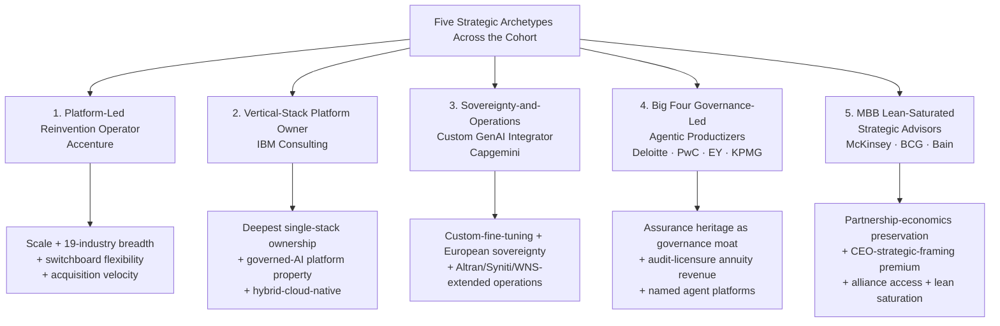

### Archetype 1: Platform-Led Reinvention Operator (Accenture)

Accenture defines this archetype singularly. The structural inheritance is Accenture's scale economics—approximately 800,000 headcount, multi-hyperscaler depth, 1,450+ patents and pending applications, and the pre-existing delivery platforms (myWizard, SynOps, MyNav). The AI-era differentiation combines: (i) the broadest 19-industry accelerator coverage in the cohort, anchored on the AI Refinery and switchboard model-agnostic architecture; (ii) headcount-doubling from 40,000 to 80,000 AI talent over three years through hiring, acquisitions, and training; (iii) the most prolific AI-adjacent M&A program in the industry (46 acquisitions for US$6.6B in FY24 alone, including NeuraFlash for agentic Salesforce, Cognosante for federal health, SI&C for Japan, IQT/BOSLAN/Anser/Comtech for net-zero infrastructure, and Italian tuck-ins for AI talent and public administration); (iv) GenAI new bookings velocity (US$1.8B in Q4 FY25); and (v) the six-year-old Responsible AI framework embedded in delivery rather than offered as adjacent advisory.

The archetype's structural advantages are scale, breadth, and ecosystem flexibility. The structural risks are wage-inflation pressure on margins as headcount scales, capital intensity required to maintain 19-industry accelerator depth, and the perception that breadth-without-depth could expose Accenture to specialist competitors in any given vertical. The forward-trajectory implication is that Accenture must continue replenishing both organic capital (with the Data & AI envelope approaching its FY26 terminal year) and acquisition velocity to maintain the archetype's defensibility.

### Archetype 2: Vertical-Stack Platform Owner (IBM)

IBM Consulting defines this archetype singularly. The structural inheritance is IBM's hybrid-cloud and proprietary-platform heritage, anchored on watsonx as a proprietary data-and-AI platform with the Granite foundation-model family and the Red Hat hybrid-cloud foundation. The AI-era differentiation combines: (i) the deepest single-stack ownership in the cohort, from the StreamSets/webMethods data integration plane through watsonx to Consulting Advantage to the Concert ITOps overlay; (ii) >US$5B annual AI-related R&D spend; (iii) the AI Book of Business reaching >US$2B; (iv) "governed AI" as a built-in platform property through Concert, with watsonx.governance providing the toolkit that also powers KPMG's Trusted AI offering; and (v) hybrid-cloud-native positioning that allows watsonx workloads to be deployed across customer-chosen infrastructure including AWS, Azure, and Google Cloud.

The archetype's structural advantages are stack-integration economics, governance-as-platform-property, and the recurring revenue mechanism that platform ownership produces. The structural risks are the lock-in counter-narrative that hyperscaler-neutral competitors deploy, frontier-model-capability lag relative to OpenAI/Anthropic if Granite cannot keep pace, and the concentration of strategic dependency on the watsonx product roadmap. The forward-trajectory implication is that IBM's archetype will be tested by the agentic-AI shift—which favors stack-integrated deployments where IBM's positioning is structurally strongest—and by the sovereign-AI shift—which favors platforms that can be deployed across heterogeneous national infrastructures.

### Archetype 3: Sovereignty-and-Operations Custom GenAI Integrator (Capgemini)

Capgemini defines this archetype singularly within the cohort. The structural inheritance is Capgemini's European headquarters, the Altran inheritance for engineering AI, and the broader European sovereignty positioning that GDPR and EU AI Act intensification structurally favor. The AI-era differentiation combines: (i) the custom-fine-tuning architecture for clients with proprietary, sensitive data; (ii) the €2B AI investment with the target of growing data-and-AI talent to 60,000 within three years; (iii) the four-component portfolio (GenAI assistants, software engineering, custom enterprise GenAI, strategy advisory) anchored on the Generative AI Lab and Data & AI Campus; (iv) strategic partnerships with Google Cloud and Microsoft providing dual hyperscaler access; (v) the Syniti acquisition extending data-driven transformation capabilities for SAP S/4HANA transitions; and (vi) the pending US$3.3B+ acquisition of WNS extending the archetype into managed-services operations.

The archetype's structural advantages are European sovereignty alignment, custom-fine-tuning depth for sensitive-data clients, and the operations-and-AI integration that the WNS combination would create. The structural risks are the operational complexity of WNS integration, relative weakness in non-European markets compared to Accenture and the MBB houses, and the challenge of competing with Accenture's switchboard architecture for clients valuing model-agnostic flexibility over custom fine-tuning. The forward-trajectory implication is that Capgemini's archetype will be tested by whether sovereign-AI demand continues to intensify as Chapter 1's signals suggest, and by whether the WNS combination produces the hoped-for advisory-plus-operations integration that the archetype promises.

### Archetype 4: Big Four Governance-Led Agentic Productizers (Deloitte, PwC, EY, KPMG)

The four Big Four firms collectively define this archetype, with subtype variation that distinguishes each firm's specific positioning. The shared structural inheritance is the Big Four's assurance heritage—audit-and-tax licensure, regulatory credibility with audit committees and CFOs, and the multidisciplinary network model that combines audit, tax, ESG, cyber, and AI advisory. The shared AI-era differentiation combines: (i) named Trusted/Responsible/Trustworthy AI frameworks as the principal governance moat; (ii) named agent platforms or factories productiz

# 9 Future Outlook, Strategic Implications, and Recommendations

The eight preceding chapters constructed a layered empirical portrait of how ten of the world's most consequential consulting firms are translating capital, narrative, platforms, ecosystems, engagements, governance, and talent into competitive position in the AI era. Each layer surfaced its own distinctive evidence, but read in combination they produce a structural picture that is sharper than any single layer supports: a market in which capital commitments are scaling into the multi-billions, agentic AI is shifting the unit of consulting work from advisory to deployment, governance is migrating from cost center to revenue engine, and the firms' archetype-specific strategic responses are crystallizing into recognizable competitive postures. The report's purpose, however, was never solely retrospective. The structural picture matters because it provides the analytical foundation from which forward trajectories can be projected and from which actionable guidance can be derived for the principal stakeholder groups whose decisions will shape the industry's next phase.

This concluding chapter delivers that forward translation. It opens by establishing the four structural forces—agentic acceleration toward Services-as-Software, sovereign AI fragmentation, governance-platform convergence, and capital-envelope replenishment—that will reshape competitive boundaries between 2026 and 2030. It then projects firm trajectories within the three structural archetypes that have crystallized through the preceding analysis, examines the most consequential demand-side and structural shifts, and translates the cumulative analysis into three sets of practical recommendations for clients, consulting firms, and broader ecosystem stakeholders. The chapter closes with a final synthesis that distills the report's central conclusions and surfaces the irreducible uncertainties that no firm strategy or client recommendation can fully resolve.

## 9.1 The 2026–2030 Landscape: Structural Forces Reshaping AI Consulting

The forward landscape against which firm trajectories and recommendations must be projected is shaped by four interlocking structural forces. Each force has been documented in the preceding chapters, but their forward trajectories—and especially their interactions—define the strategic environment of 2026–2030 in ways that no single force fully captures.

### Force 1: The Agentic Inflection Accelerating Toward Services-as-Software

The most consequential single force is the acceleration of agentic AI deployment from experimentation through pilots into production-scale operations, and the parallel emergence of the Services-as-Software paradigm that converts traditional people-led services and bloated SaaS products into a third category in which technology delivers services with minimal human intervention. HFS Research's projection sharpens the magnitude: **Services-as-Software will become a $1.5 trillion market by 2035, absorbing revenue from both traditional IT services and SaaS**, with the global technology services market projected to contract from approximately US$1.5 trillion in 2024 to roughly US$1 trillion by 2035 at a -3 to -5% CAGR as Services-as-Software cannibalizes the legacy people-and-billable-hours model.[^40] HFS's complementary survey finding—**six out of ten enterprises plan to replace people-run services with software-run services by 2028, with 59% planning to replace within three years and 16% already starting**—establishes that the demand-side recognition of this paradigm shift is not aspirational but operational.[^40]

Beneath this services-layer transformation, the agentic enterprise platform market itself is forecast to grow from **US$9.89 billion in 2025 to US$198.4 billion by 2034 at a 42.14% CAGR**, establishing it as one of the fastest-growing segments within the broader enterprise software and AI landscape.[^41] Cloud-based deployment is projected to maintain market share above 60% throughout the forecast period, but on-premises deployment retains a structurally important 19.8% share—growing at a healthy 36.2% CAGR—anchored in defense, central banks, national health systems, and critical infrastructure operators with sovereignty or regulatory constraints that make cloud deployment untenable.[^41] The hybrid deployment model is forecast at 18.9% share growing at 40.8% CAGR, increasingly the architectural choice for large enterprises balancing cloud agility with on-premises data control.[^41]

The pricing-model implications of this transformation are equally consequential for consulting firms. HFS research shows that **56% of enterprise leaders favor subscription-based pricing, 52% favor outcome-based pricing, 47% favor consumption-based pricing, and 28% favor transaction-based pricing for Services-as-Software adoption**.[^40] Each of these models is structurally distinct from the FTE-based pricing that has dominated consulting economics for decades, and each requires the kind of platform IP, agent factories, and managed-services infrastructure that the integrators and Big Four have invested most heavily in building. McKinsey's articulation that approximately 25% of its work is now outcomes-based, with fees tied to client results rather than billable hours, signals that at least one MBB house has begun the structural transition that the broader market trajectory will require.

### Force 2: Sovereign AI Fragmentation and Regulatory Tightening

The second structural force is the simultaneous tightening of regulatory regimes and the fragmentation of market access along sovereignty lines. The EU AI Act came into full effect in 2025, imposing strict transparency, accountability, and risk-classification requirements on high-stakes agentic AI applications in banking, healthcare, and critical infrastructure, with compliance costs estimated at **US$2–8 million per enterprise deployment**—a figure substantial enough to function as both a barrier and a consulting-revenue engine.[^41] The NIST AI Risk Management Framework v1.1, with provisions specifically addressing agentic AI systems, was finalized in 2025 and provides enterprises with a governance blueprint that accelerates internal approval processes for production deployments.[^41] Industry bodies including MITRE and NIST are actively developing dedicated agentic AI attack taxonomies and security benchmarks expected to publish final versions in late 2026, creating a forward window in which the firms that have invested most heavily in productized governance technology (EY's Trusted AI Platform with quantitative scoring, Deloitte's LLM-as-a-judge MRM, IBM's "governed AI" platform property) are positioned to define the certification standards.[^41]

The sovereign-AI dimension of this force is distinct from the regulatory dimension and at least equally consequential. China's commercialization of homegrown LLMs from Baidu, Alibaba, and DeepSeek; Japan's enterprise adoption to address an 11% projected working-age-population contraction by 2035; India's emergence as a critical agentic AI deployment hub through Infosys, TCS, and Wipro; South Korea's chaebol investments in private agentic AI for global supply chain orchestration; and European cloud-sovereignty requirements collectively fragment what was previously a relatively unified Western-vendor-dominated market.[^41] The Asia-Pacific region is forecast to register a 47.2% CAGR for agentic AI enterprise platforms—the highest globally—positioning it to potentially challenge North America's leadership by the early 2030s.[^41]

For consulting firms, this force has three operational implications. First, locally embedded delivery capacity becomes structurally more valuable, favoring firms with regional acquisition portfolios (Accenture's Italian and Japanese tuck-ins, Capgemini's European base) and proprietary sovereign-deployment architectures (EY.ai enterprise private with Dell AI Factory; FlexiGenAI on TELUS' sovereign AI factory; Capgemini's custom-fine-tuning for sensitive client data). Second, the **AI Data Governance** sub-segment growing at a 163.75% CAGR (US$14.8M to US$1.89B by 2029, as documented in Chapter 1) and the Big Four's audit-licensure structural advantage—the only firms able to integrate AI controls into external financial statement audits—convert regulatory complexity into recurring annuity revenue that the integrators and MBB houses cannot fully access. Third, the EU AI Act's compliance-cost magnitude creates structural advantages for at-scale providers and structural disadvantages for smaller niche specialists, accelerating the M&A consolidation that Chapter 2 documented.

### Force 3: Convergence of Governance and Platform Economics

The third structural force is the convergence of governance and platform economics into a single competitive axis. As Chapter 6 established, every firm in the cohort now markets a named governance framework, and the rhetorical convergence is near-total. The genuine differentiator has become whether governance is productized as a built-in platform property (IBM's "governed AI" within Concert; Accenture's six-year-old Responsible AI embedded in delivery; EY's Trusted AI Platform with composite quantitative residual-risk scoring; Deloitte's Trustworthy AI integrated into Zora AI) or as adjacent advisory service. Forward, this convergence will sharpen: as agentic AI scales from the 26%–50% pilot-stage organizations toward the >50% application-software penetration that Gartner projects by 2028, the governance scaffolding required to make autonomous agents safe, compliant, and economically value-creating becomes inseparable from the agent platforms themselves.[^41]

The forward implication is that **governance moves from a marketing differentiator to a deployment-criticality requirement**, and that requirement disproportionately rewards the firms that have already done the operational work documented in Chapter 6. Cybersecurity Ventures' finding that **67% of enterprises cite agentic AI security as their top AI governance concern**, with insufficient sandboxing and excessive permission scopes the most commonly cited implementation vulnerabilities, sharpens the operational imperative.[^41] Gartner's projection of **>50% of successful attacks against AI agents exploiting access-control issues via prompt injection through 2029** (Chapter 1) sets the threat surface against which governance investment must be evaluated.

### Force 4: Capital-Envelope Replenishment in 2026–2027

The fourth structural force is the replenishment dynamic that the timing of major announced envelopes creates. As Chapter 2 documented, **PwC's US$12B New Equation, Accenture's US$3B Data & AI envelope, and Capgemini's €2B AI commitment all approach their announced terminal years in fiscal 2026**, while Deloitte's US$1.4B Project 120 has now been in mid-execution for three years and IBM's continuous >US$5B annual R&D investment compounds. The forward question is whether the cohort will renew at the same magnitude, accelerate—as Accenture's FY24 acquisition spend already suggests—or pivot allocation toward newer categories such as agentic AI orchestration, synthetic data, post-quantum cryptography, and sovereign-deployment infrastructure.

The BCG AI Radar 2026 finding that **94% of CEOs will continue to invest in AI even if AI does not pay off in 2026, with only 6% planning to pull back** establishes that client-side demand will support sustained intensification rather than retrenchment. Coupled with the Cynexa survey finding that **almost 82% of enterprises expect to increase AI investment in 2026**, the demand-side environment creates structural pressure for firms to replenish at or above the FY24 baseline.[^42] Agentic AI investment as a share of CEO AI budgets, already at >30% on average and 60% among Trailblazer CEOs (Chapter 6), provides the most likely allocation target for new envelopes—suggesting that the replenishment will weight more heavily toward agent factories, multi-agent orchestration platforms, and managed-services delivery infrastructure than toward foundational data plane or horizontal LLM investment.

### Synthesis: A Demand Environment Defined by Acceleration and Polarization

The four forces interact to produce a forward demand environment characterized by simultaneous acceleration and polarization. Acceleration: every quantitative signal—42% agentic platform CAGR, 50× agentic AI spending growth to US$752B by 2029, 59% of enterprises planning service replacement within three years, 94% of CEOs sustaining investment irrespective of near-term ROI, 82% of enterprises increasing AI investment in 2026—points to a demand curve that is steeper than at any prior consulting inflection point. Polarization: only 6% of organizations qualify as AI high performers (McKinsey *State of AI*), only 26% have moved beyond pilots (BCG *Where's the Value in AI*), and 40% of enterprise AI deployments are failing to deliver true value despite high spending velocity.[^42] The consulting opportunity lies precisely in the gap between the leader cohort and the long tail, and the cohort firms whose archetype-coherent strategies most credibly bridge that gap will define the industry's competitive structure through 2030.

## 9.2 Trajectory Projections by Firm Archetype: 2026–2030

The five strategic archetypes formalized in Chapter 8—Platform-Led Reinvention Operator (Accenture), Vertical-Stack Platform Owner (IBM), Sovereignty-and-Operations Custom GenAI Integrator (Capgemini), Big Four Governance-Led Agentic Productizers (Deloitte, PwC, EY, KPMG), and MBB Lean-Saturated Strategic Advisors (McKinsey, BCG, Bain)—provide the structural lens through which forward trajectories are projected. Within each archetype, firm-level differentiation will sharpen as 2026–2030 unfolds, with structural advantages compounding for firms that resolve their archetype-specific tensions and structural risks materializing for firms that fail to.

### Platform-Led Integrators (Accenture, IBM, Capgemini): Scale Tested by Frontier Rotation and Margin Pressure

The platform-led integrators enter 2026–2030 from the strongest absolute-capital position in the cohort, but face three sharpening tensions that the trajectory will resolve.

**Accenture's** trajectory is anchored on whether the FY24 acquisition velocity (46 deals/US$6.6B) can be sustained as the Data & AI envelope replenishes for a second three-year cycle. The Q4 FY25 GenAI new bookings of US$1.8B and the 7.7% AI revenue growth in Q3 2025 validate that scale is converting into commercial momentum, but the structural challenge is that maintaining 19-industry accelerator depth across 800,000 headcount requires continuous platform investment that wage inflation progressively compresses. Forward, the most likely Accenture trajectory is a deepening of the switchboard model-agnostic architecture as a hedge against frontier-model leadership rotation (whether OpenAI, Anthropic, Google, or regional models lead in 2028), continued tuck-in M&A targeting agentic capability (extending the NeuraFlash logic) and vertical depth (extending the Cognosante federal-health logic), and progressive integration of NeuraFlash-style mid-market capability to address the structurally underserved enterprise segment between US$50M and US$1B in revenue that Market Intelo identifies as a dramatically underserved opportunity.[^41] The structural risk is that scale-and-flexibility positioning becomes a less effective differentiator if hyperscalers' direct enterprise sales (notably Microsoft Copilot Studio at >50,000 enterprise customers and AWS Bedrock Agents at 40,000+ enterprise customers within 30 days of GA announcement) compress the consulting-mediated channel.[^41]

**IBM's** trajectory is anchored on whether the vertical stack ownership advantage (StreamSets/webMethods data plane through watsonx through Consulting Advantage through Concert) compounds faster than the lock-in counter-narrative deployed by Accenture's switchboard architecture. The AI Book of Business reaching >US$2B by late 2023 and continuing to grow validates that stack ownership is producing commercial momentum, and IBM's announced US$5B investment commitment to enterprise AI infrastructure over 2025–2027—with agentic AI platforms as the primary investment focus—signals that the archetype is being reinforced rather than diluted.[^41] Forward, the most likely IBM trajectory is the deepening of agentic-AI-specific stack integration (extending watsonx.governance and IBM Concert with multi-agent orchestration capability), regulated-industry concentration (where stack-integration economics are decisive), and continued large-ticket M&A targeting data-plane and platform-anchor capabilities. The structural risk is frontier-model capability lag: if Granite cannot keep pace with OpenAI o-series, Anthropic Claude, and Google Gemini frontier capabilities, IBM's hybrid-cloud-native positioning may become a defensive rather than offensive differentiator.

**Capgemini's** trajectory is anchored on whether the WNS combination produces the hoped-for advisory-plus-operations integration and whether the European-sovereignty positioning intensifies as sovereign-AI dynamics fragment market access. Forward, the most likely Capgemini trajectory is the operational completion of WNS integration extending the firm's at-scale process operations, deepening of the custom-fine-tuning architecture as a structural alternative to switchboard-style model-agnostic flexibility for sensitive-data clients, and continued European-and-regional acquisition activity (extending the Altran-Syniti-WNS sequence). The structural risk is relative weakness in non-European markets compared to Accenture and the MBB houses, and the operational complexity of integrating WNS at scale.

### Big Four Governance-Led Agentic Productizers: Assurance Annuity Compounds, Platform Productization Narrows the Gap

The Big Four enter 2026–2030 with structurally defensible assurance-licensure annuity revenue and rapidly maturing platform productization that materially narrows the structural gap with the integrators.

**KPMG's** trajectory is anchored on the deepening of Clara workflow embedding across the 90,000 global Audit professionals and the operational scaling of Velocity-anchored Global Business Services. The 600,000+ Audit Chat conversations to date validate operational rather than aspirational adoption, and the multibillion-dollar Microsoft alliance combined with the IBM watsonx.governance technology underlying Trusted AI provides multi-vendor depth that few competitors match. Forward, the most likely KPMG trajectory is the extension of Velocity from launch through scaled deployment (with the TACO framework's Tasker-Automator-Collaborator-Orchestrator typology providing the architectural surface for tier-specific managed-services offerings), the continued audit-first sequencing of platform productization, and selective acquisition activity extending the SparkBeyond logic. The structural risk is that audit-first concentration limits horizontal scope relative to integrator breadth.

**EY's** trajectory is the most architecturally ambitious in the Big Four, anchored on the quadruple deployment-mode architecture (cloud through EY.ai for Risk; on-premises private through EY.ai enterprise private with Dell AI Factory; sovereign through FlexiGenAI on TELUS; function-factory through Tax Agent Factory) and the Trusted AI Platform's quantitative residual-risk scoring. The Tax Agent Factory's 150 tax agents alongside 80,000 professionals across 3M+ deliverables and 30M+ processes is the largest single agentic deployment in the cohort, and the Uber TPRM deployment validates cross-industry expansion of EY.ai for Risk. Forward, the most likely EY trajectory is the systematic extension of the EY.ai platform family into additional functional factories (beyond Tax and Risk into HR, Finance, Supply Chain, and Customer Service), continued depth of the NVIDIA-and-Dell-anchored alliance architecture, and intensified positioning for sovereignty-sensitive engagements as sovereign-AI demand fragments. The structural risk is whether architectural ambition outpaces operational maturity in some deployment modes.

**Deloitte's** trajectory is anchored on the Zora AI digital workforce internal-and-external dual deployment and the eight-service-line Trustworthy AI portfolio. The HPE deployment with 50% reporting-time-reduction targets and the planned thousands-of-users internal Zora AI deployment with 25% cost reduction and 40% productivity increase targets establish the credibility foundation for client-facing offerings, and the Google Cloud Gemini Enterprise dedicated agentic transformation practice intensifies the alliance-leveraged platform layer. Forward, the most likely Deloitte trajectory is the extension of Zora AI from finance through human capital, supply chain, procurement, sales and marketing, and customer service (the seven announced expansion domains), continued investment in research-led thought leadership through the AI Institute and quarterly *State of GenAI* survey series, and deepening of guardian-agent and LLM-as-a-judge governance technology productization. The structural risk is the capital intensity required to maintain comprehensive breadth across all eight Trustworthy AI service lines.

**PwC's** trajectory is anchored on whether the New Equation envelope replenishes in 2026–2027 with explicit AI emphasis and whether the enterprise AI agent operating system productizes the multidisciplinary capability layer that PwC's narrative architecture promises. The 95% My AI participation across 75,000 US employees, the 360,000+ voluntary training hours, the OpenAI reseller relationship, and the audit AI platform jointly anchored on Microsoft and OpenAI partnerships establish the credibility foundation. Forward, the most likely PwC trajectory is the operational scaling of the agent OS as the orchestration layer for cross-disciplinary engagements, the extension of audit AI into adjacent assurance domains (sustainability disclosures, AI controls), and continued multidisciplinary integration that distinguishes PwC's positioning from more vertically-specific Big Four competitors. The structural risk is that the multidisciplinary integration thesis has lower per-engagement margin than vertically-focused alternatives if the agent OS does not produce sufficient platform-IP differentiation.

### MBB Lean-Saturated Strategic Advisors: Platform Commoditization Risk Tested by Engineering Depth and Outcomes Pricing

The MBB houses enter 2026–2030 with the deepest CEO-advisory positioning in the cohort but face the sharpest structural tension: whether the lean-but-saturated partnership model can preserve premium positioning as agentic AI shifts the unit of consulting work toward integrated build-and-operate delivery.

**McKinsey's** trajectory is the most quantitatively documented mitigation path against platform-IP commoditization. The Lilli platform answering >500,000 prompts monthly across 75%+ of the firm's ~43,000 employees, the 12,000 internal AI agents already deployed, the engagement-staffing compression from 14 consultants to 2-3 supported by AI agents, the ~50,000 monthly consultant hours saved (worth roughly US$12 million), and the ~25% of work now delivered on outcomes-based fees collectively represent the most structurally aggressive MBB response to the commoditization risk. Bob Sternfels' articulated trajectory toward "one AI agent for every human employee" extends the architectural ambition further. Forward, the most likely McKinsey trajectory is the continued externalization of the customizable Lilli architecture (with hundreds of clients already building knowledge agents on the McKinsey template), the extension of QuantumBlack's 20+ proprietary tools and 140+ use case accelerators into deeper vertical integration, and the systematic increase of outcomes-based fee shares from ~25% toward higher proportions that signal a structural transition in fee-model economics. The structural risk is whether the partnership-economics constraint permits the continuous platform investment required to sustain the customizable architecture's competitive depth.

**BCG's** trajectory is anchored on whether the AI Radar diagnostic-as-positioning sustains its market-shaping influence and whether BCG X build capability continues to compete at integrator-class engagement scale. The Foxconn engagement at >US$400M targeted savings across 200+ factories and the Reckitt engagement with 90% routine-activity reduction validate that BCG X can deliver outcomes that match integrator-class scale, and the firm's US$14.4 billion 2025 revenue with 22 consecutive growth years provides aggregate-financial validation. The recently announced Google Cloud Gemini Enterprise partnership expansion intensifies the alliance-leveraged platform access. Forward, the most likely BCG trajectory is the continued annual cadence of the AI Radar series as both diagnostic and positioning instrument, deeper BCG X tech-build capability anchored on Trailblazer-archetype client engagements, and the integration of forward-deployed-consultant-style role redefinition that signals the firm's recognition that "we're essentially building a tech company inside a consulting firm" (Sylvain Duranton's articulation). The structural risk is that diagnostic-as-positioning effectiveness compresses as competitors gain access to similar diagnostic instruments and as the Trailblazer framework becomes increasingly familiar.

**Bain's** trajectory is the most alliance-dependent in the cohort, anchored on whether the OpenAI services alliance—and the extended OpenAI Center of Excellence with deep technical resources—sustains its first-mover deployment-velocity advantage as competitors gain progressive OpenAI access. The pre-alliance year of internal OpenAI use across 18,000 knowledge workers and the named brand deployments at Coca-Cola and Carrefour establish the credibility foundation. Forward, the most likely Bain trajectory is the continued extension of brand-marketed deployments as alliance signals, deeper OpenAI Center of Excellence specialization in multi-modal, real-time, and reasoning applications (including OpenAI o-series capabilities), and selective expansion of frontier-model alliances (potentially including Anthropic, Google, or regional models) that hedge against single-frontier-model dependency. The structural risk is that OpenAI alliance non-exclusivity at the firm level compresses Bain's first-mover advantage faster than alternative mitigations can absorb.

### Forward-Positioning Matrix

The synthesized 2030 competitive surface combines the archetype trajectories with the demand-side acceleration documented in Section 9.1.

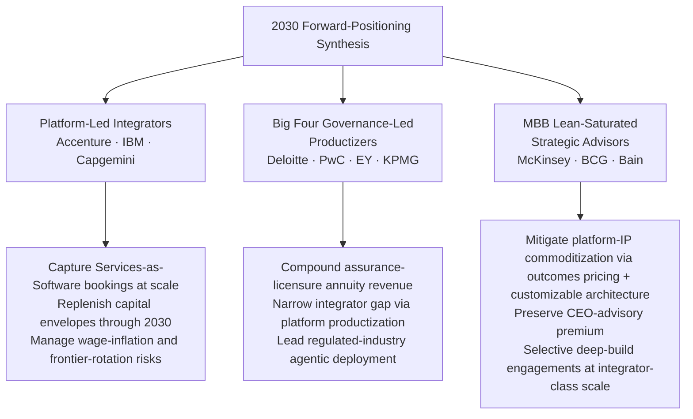

The matrix surfaces the central forward question: as Services-as-Software scales from a US$1.5 trillion projection through demonstrable adoption, which firms most credibly bridge the leader-vs-laggard gap that 74% of enterprises currently sit on the wrong side of? The platform-led integrators are positioned to capture absolute scale of Services-as-Software bookings, the Big Four are positioned to capture the regulated-industry agentic deployment market and the assurance-anchored annuity, and the MBB houses are positioned to capture the CEO-strategic-framing premium provided their commoditization mitigations prove durable. Each archetype faces real risks; none is structurally guaranteed to maintain its position; and the firms that most decisively resolve their archetype-specific tensions through 2026–2027 will define the 2030 competitive structure.

## 9.3 Implications of Agentic AI, Sovereign AI, Regulation, and Shifting Client Expectations

The four most consequential shifts that will shape consulting strategies through 2030 deserve closer examination, because each carries operational implications that the section-9.2 trajectory projections only partially captured.

### Agentic AI: From 26% Pilot Stage to >50% Application-Software Penetration

The agentic trajectory that the cohort's surveys collectively diagnose is being validated by independent market research at higher granularity than this report has previously cited. Market Intelo's analysis frames the destination directly: **Gartner estimates that over 15% of day-to-day enterprise decisions will be made autonomously by AI agents by 2028**, and **IDC estimates that over 65% of enterprise software platforms will include native agentic AI orchestration capabilities as a core feature by 2026**.[^41] The architectural implications are equally consequential. The proliferation of standardized agentic frameworks—LangChain, AutoGen, CrewAI, LlamaIndex, Microsoft's AutoGen 0.4, LangGraph, and AWS's Multi-Agent Orchestrator—has lowered the technical barrier to enterprise deployment, while standardized observability tools (LangSmith, Arize Phoenix, Microsoft's Azure AI Foundry monitoring suite) have addressed the historically critical "black box" problem of agentic AI by providing granular tracing, latency profiling, and policy-compliance auditing for every agent action.[^41]

Anthropic's publication of the **Model Context Protocol (MCP) v1.0 in September 2025**, subsequently adopted by **over 300 enterprise tool providers within two months of release**, has created what Market Intelo characterizes as an "App Store moment" for agentic enterprise AI by establishing a standard interface for AI agents to interact with external data sources, APIs, and business applications.[^41] For consulting firms, MCP adoption has two operational implications: it commoditizes the agent-to-tool integration layer that some firms had begun to productize, and it shifts the locus of differentiation toward higher-value orchestration, governance, and vertical-IP layers. The cohort's positioning at these higher-value layers—Accenture's switchboard plus 19-industry accelerators, IBM's Consulting Advantage role-based assistants, EY's Tax Agent Factory, Deloitte's Zora AI multi-agent system—is structurally consistent with the MCP-enabled commoditization shift.

The pricing-model implications of agentic adoption sharpen the Services-as-Software trajectory. As HFS Research articulates the structural critique: "If you're still buying and selling time and bodies, you're already behind. The future belongs to those who can productize their expertise, price for outcomes, and deliver through tech".[^40] The HFS prescription—that successful firms must invest in the "3 Ps" of People (AI-augmented workforce), Products (scaled AI-driven solutions with feedback-fueled updates), and Partners (plug-and-play ecosystem integration)—maps onto exactly the cohort's archetype-specific responses. The Cynexa survey finding that 82% of enterprises plan to deploy agentic AI within 1–3 years validates the demand-side urgency, and the corresponding finding that approximately **40% of enterprise AI deployments are failing**—what Cynexa characterizes as the central 2026 challenge of "moving from pilot to a reliable Agentic-AI powered enterprise workflow"—establishes the addressable consulting opportunity at the leader-vs-laggard gap.[^42]

### Sovereign AI: Fragmentation Favoring Regional Capability and Proprietary Deployment Architectures

The sovereign-AI trajectory has implications that go beyond the regulatory-tightening dynamic examined in Section 9.1. Market Intelo notes that **sovereign wealth funds from UAE, Saudi Arabia, and Singapore are making direct strategic investments in agentic AI platform companies**, providing both capital and market access for vendors willing to establish local operations.[^41] The combination of mobile-first infrastructure, large young populations, and acute administrative inefficiencies in Sub-Saharan Africa, Southeast Asia, and Latin America creates conditions for leapfrog adoption of agentic AI platforms that bypass legacy enterprise software entirely—a structural opportunity that Latin America (44.1% CAGR) and Middle East & Africa (45.8% CAGR) growth projections quantify.[^41]

For consulting firms, the sovereign-AI trajectory accelerates the structural advantage of three positioning choices: (i) proprietary sovereign-deployment architectures (EY.ai enterprise private with Dell AI Factory; FlexiGenAI on TELUS); (ii) custom-fine-tuning capability for clients with proprietary, sensitive data (Capgemini's central differentiator; EY's Model Catalog architecture); and (iii) regional acquisition portfolios that produce locally embedded delivery capacity (Accenture's SI&C Tokyo acquisition for Japanese depth; Italian PA tuck-ins; Capgemini's European base). Conversely, sovereign-AI fragmentation creates structural disadvantage for firms whose AI offerings depend principally on hyperscaler-mediated foundation-model access in single national markets, or whose alliance dependencies concentrate in U.S.-headquartered providers. The MBB houses' alliance-led models (notably Bain–OpenAI) face this tension most acutely, with the mitigation being selective expansion of regional alliances and deeper customization capability.

### Regulation: From Cost Center to Multi-Billion-Dollar Revenue Engine

The regulatory trajectory has been documented across Chapters 1, 6, and 8, but the forward magnitudes deserve consolidation. Gartner's projections—**security consulting services growing from US$24.2 billion in 2024 to US$36.6 billion in 2029, security professional services growing from US$27.3 billion to US$40.8 billion, AI Data Governance growing at 163.75% CAGR, and >75% of enterprises expected to use AI-amplified cybersecurity products by 2028**—collectively define a multi-billion-dollar growth segment whose 2024–2029 expansion rivals or exceeds many of the proprietary platform investments documented in Chapter 2.

The structural advantages flow disproportionately to firms with assurance heritage (the Big Four most prominently) and to firms with platform-property governance integration (IBM, Accenture, EY through the Trusted AI Platform). For the MBB houses, the regulatory revenue opportunity is structurally accessible only through advisory engagements rather than through productized governance technology—a positioning that preserves partnership margins but compresses share of the growth segment. The forward implication is that regulatory tightening will progressively widen the revenue-mix divergence between assurance-anchored and assurance-absent firms in the cohort, with cumulative effects through 2030 that no single year's growth captures.

### Shifting Client Expectations: From Productivity-Obsessed Pilots to Performance-and-Personalization Production

HFS Research's diagnostic on AI-outcome distribution provides the sharpest single articulation of the client-expectation shift. The HFS analysis of 979 GenAI and Agentic AI use cases collected over 12 months shows that **AI POCs and pilots are 54% productivity-obsessed**, while **AI in production is 80%+ driven by Performance, Personalization, and Prediction outcomes**—strategic outcomes such as growth, new business models, competitive leadership, tailored experiences, and forecast-and-optimization decisions.[^40] The implication is that pilots that frame value purely as productivity gains progressively underperform expectations as deployment matures, while pilots that frame value as performance/personalization/prediction outcomes are structurally better positioned to scale.

For consulting firms, this shift validates the recalibrated three-axis ROI framework that PwC has articulated (Section 8.1) and the broader migration toward outcomes-based fee structures that McKinsey's ~25% share signals. The HFS observation that "complicated pricing models conflict with buyer psychology and are an adoption speed bump"—with FTE-based pricing being more familiar than agentic pricing's tokens, model-training, storage, and compute components—captures an operational tension that the cohort's pricing-model innovations must navigate.[^40] The HFS finding that **buyers prioritize convenience and simplicity over complicated invoices** and **want emotional comfort, not risk** suggests that subscription-based pricing (favored by 56% of leaders) and outcome-based pricing (favored by 52%) will dominate adoption acceleration, while transaction-based pricing (favored by only 28%) will remain niche.[^40]

The deeper client-expectation shift is the rise of CEO-led AI ownership. BCG AI Radar 2026's 82% of CEOs as main AI decision-makers (twice the prior year) and 50% of CEOs believing their job stability depends on getting AI investments and strategy right by 2026 establish that AI is now a CEO-level decision rather than a CIO-level one. This shift structurally favors the MBB houses' CEO-advisory positioning, but also creates competitive pressure on the integrators and Big Four to articulate CEO-facing narratives with comparable depth—a pressure that Accenture's "Reinvention with AI" mega-trend framing, Deloitte's "Now decides next" prescription, and EY's EY.ai unifying-platform vision have each addressed at varying levels of clarity.

## 9.4 Recommendations for Enterprise Clients Selecting and Engaging Consulting Partners

The cumulative analysis produces a structured framework that enterprise clients can apply to partner-selection and engagement-design decisions. The framework is anchored on the seven analytical dimensions plus ROI evidence developed throughout the report, and is organized around five client archetypes whose positioning needs map most cleanly onto firm-archetype strengths.

### Five Client Archetypes and Their Best-Fit Partner Profiles

**Client Archetype 1: Regulated-industry enterprises (financial services, healthcare, public sector).** These clients face the EU AI Act, NIST AI RMF, GDPR-AI, and sectoral regulatory regimes simultaneously, with audit-committee scrutiny of AI systems intensifying. The best-fit partner profile combines deep assurance heritage with productized governance technology, favoring **the Big Four** (Deloitte's eight-service-line Trustworthy AI portfolio with LLM-as-a-judge MRM and guardian-agent guidance; EY's Trusted AI Platform with quantitative residual-risk scoring and the EY.ai for Risk deployment validated at Uber TPRM; KPMG's Trusted AI powered by IBM watsonx.governance and Clara's audit-workflow embedding; PwC's audit AI platform on Microsoft and OpenAI) and **IBM Consulting** (governed AI as platform property within Concert and watsonx.governance). Selection within this group should weight operational maturity of governance technology (EY's quantitative scoring, Deloitte's portfolio breadth) above governance framework rhetoric.

**Client Archetype 2: At-scale transformation clients seeking end-to-end reinvention.** These clients—typically Global 2000 enterprises with multi-year, multi-business-line transformation agendas—require integration depth across strategy, build, operate, and managed services. The best-fit partner profile combines scale economics with broad capability portfolios, favoring **Accenture** (19-industry accelerators with switchboard model-agnostic flexibility; 80,000-AI-talent target; Q4 FY25 GenAI bookings of US$1.8B), **IBM Consulting** (vertical stack ownership from data plane through Consulting Advantage; AI Book of Business >US$2B), and **Capgemini** (custom enterprise GenAI plus pending WNS managed-services integration). Selection within this group should weight the client's preferred infrastructure neutrality (favoring Accenture's switchboard) versus integration depth (favoring IBM's stack ownership) versus sovereignty/operations integration (favoring Capgemini).

**Client Archetype 3: CEO-strategic-framing clients seeking transformation diagnostics and board-level advisory.** These clients require strategic-framing capability at the CEO and board decision layer, often as the first phase of broader transformation engagements. The best-fit partner profile combines deep CEO-advisory heritage with credible engineering depth, favoring **McKinsey** (QuantumBlack-anchored advanced analytics with State of AI thought leadership and the customizable Lilli architecture made available to clients), **BCG** (AI Radar diagnostic-as-positioning with BCG X build capability validated at Foxconn US$400M+ scale), and **Bain** (frontier-model alliance velocity with named-brand deployment evidence). Selection within this group should weight the client's preferred analytical depth (favoring McKinsey) versus CEO-narrative framing (favoring BCG's Trailblazer playbook) versus deployment velocity (favoring Bain's OpenAI alliance). Accenture's Reinvention with AI mega-trend framing and Deloitte's "Now decides next" prescription provide credible CEO-strategic-framing alternatives where clients also require integrator-class delivery scale.

**Client Archetype 4: Sovereignty-sensitive clients requiring on-premises, sovereign cloud, or custom-fine-tuned deployments.** These clients—public sector, regulated financial services, defense, critical infrastructure, and enterprises with proprietary sensitive data—face data-residency, regulatory, or competitive-sensitivity constraints that cloud-only deployment cannot accommodate. The best-fit partner profile combines proprietary deployment architecture with sovereignty-aware delivery, favoring **EY** (EY.ai enterprise private with Dell AI Factory; FlexiGenAI on TELUS' sovereign AI factory) and **Capgemini** (custom-fine-tuning architecture for clients with proprietary, sensitive data). Selection within this group should weight specific deployment-mode requirements (private versus sovereign cloud versus custom fine-tuning) and regional-presence requirements that the firms' geographic footprints address differently.

**Client Archetype 5: Function-specific transformation clients (audit, tax, finance, marketing, R&D).** These clients require deep workflow embedding in a specific business function rather than horizontal AI capability. The best-fit partner profile is workflow-embedded specialists: **KPMG Clara** for audit; **EY Tax Agent Factory** for tax; **Deloitte Zora AI for Finance** for finance and—in the announced expansion path—HR, supply chain, procurement, sales/marketing, and customer service; **Bain–OpenAI deployments** for consumer marketing and customer experience; **BCG–Foxconn-style engagements** for industrial-scale operations transformation. Selection within this group should weight the depth of workflow embedding (KPMG Clara's 90,000-Audit-professional saturation; EY's 150 tax agents alongside 80,000 professionals) and the specificity of the function-specific value proposition.

### Engagement Design and Pricing Negotiation Guidance

Beyond partner selection, clients should structure engagements with attention to four dimensions.

**Engagement archetype.** Match the engagement archetype to the desired outcome: pure advisory for strategic framing and diagnostics; build for platforms, accelerators, and AI factories; operate for embedded delivery alongside client teams; managed services for ongoing AI operations delivery. Many transformation programs require sequenced combinations of archetypes, and clients should structure phase-gated engagements that explicitly transition between archetypes as deployments mature.

**Pricing-model negotiation.** Given the HFS finding that 56% of leaders favor subscription-based pricing and 52% favor outcome-based pricing for Services-as-Software, clients should structure new engagements with explicit attention to pricing-model alignment with desired outcomes. Outcome-based pricing is most appropriate for engagements with measurable, attributable productivity or revenue outcomes (the McKinsey 25%-of-work pattern); subscription-based pricing is most appropriate for ongoing platform access and managed-services delivery; consumption-based pricing is most appropriate for variable agentic workloads. Clients should resist FTE-based pricing for engagements that are structurally amenable to outcomes-based alternatives, as FTE pricing creates misaligned incentives in agentic contexts where consultant time inputs decreasingly correlate with output value.

**Governance and risk safeguards.** Every agentic AI engagement should specify, at contract signing: (i) data residency and sovereignty constraints; (ii) model auditability requirements including LLM-as-a-judge or equivalent MRM technology; (iii) human-in-the-loop checkpoint placement at high-risk decision nodes; (iv) prompt-injection and access-control defense architectures; (v) incident-response protocols including agent quarantine procedures; and (vi) ongoing-monitoring and reporting cadences aligned with the client's enterprise risk management program. The cohort's productized governance technology varies materially in operational maturity, and clients should evaluate specific governance deliverables rather than relying on framework rhetoric.

**Red flags to scrutinize.** Four red flags recur across consulting-firm pitches and merit explicit client scrutiny: (i) **rhetorical convergence on responsible AI without operational depth**—every firm now markets a named governance framework, but the productized technology behind frameworks varies materially, and clients should require demonstration of operational tools (quantitative scoring, MRM technology, guardian-agent guidance) rather than accepting framework rhetoric alone; (ii) **vendor lock-in disguised as platform integration**—platform-anchored offerings can produce deep integration economics but also progressive lock-in costs, and clients should explicitly evaluate exit costs and model-portability provisions before committing to single-stack architectures; (iii) **headline capital figures without per-capita intensity validation**—announced multi-billion-dollar AI envelopes are positional signals rather than evidence of capability density, and clients should evaluate per-employee training intensity, AI-talent-to-total-headcount ratios, and named-platform productization velocity as more reliable capability indicators; and (iv) **absence of internal-adoption credibility**—firms whose external offerings rest on shallow internal adoption produce structurally higher delivery risk than firms whose internal adoption depth (PwC's 95% My AI participation; McKinsey's 75%+ Lilli monthly use; Bain's pre-alliance year of OpenAI use; KPMG's 600,000+ Audit Chat conversations; EY's ~100,000 employees with AI badges) provides empirically validated credibility.

## 9.5 Recommendations for Consulting Firms: Sharpening AI Strategies and Closing White Spaces

The cohort's archetype-specific strategic responses can be sharpened through targeted recommendations that address the structural tensions surfaced in Sections 9.2 and the cross-cohort white spaces identified in Section 8.6.

### Archetype-Specific Recommendations

**For platform-led integrators (Accenture, IBM, Capgemini)**, four recommendations follow.

First, **replenish capital envelopes through 2030 at magnitudes consistent with sustained client demand acceleration**. The Accenture US$3B Data & AI envelope and Capgemini's €2B AI commitment approach their announced terminal years in fiscal 2026, and the BCG AI Radar finding that 94% of CEOs will continue investing irrespective of near-term ROI provides demand-side justification for replenishment at or above prior magnitudes. Allocation should weight more heavily toward agentic-AI and synthetic-data infrastructure than the prior generation of envelopes.

Second, **complete managed-services integration through WNS-style operations combinations and Velocity-style agentic offerings**. The convergence of consulting advisory with at-scale process operations is the structural bet that captures Services-as-Software value. Capgemini's pending WNS combination and KPMG's Velocity-anchored Global Business Services define the operational template; Accenture's continuing Operations expansion and IBM's broader managed-services capabilities provide the integrator counterparts.

Third, **defend against hyperscaler-neutral counter-narratives through frontier-model portability and switchboard-style architectures**. As MCP and similar standardized protocols commoditize the agent-to-tool integration layer, the locus of differentiation shifts toward orchestration, governance, and vertical-IP layers. Accenture's switchboard architecture is the cohort exemplar; IBM's response should deepen the hybrid-cloud-native positioning of watsonx and explicitly validate cross-hyperscaler watsonx workload portability through named client deployments; Capgemini's response should extend custom-fine-tuning capability to address sovereign-AI fragmentation.

Fourth, **intensify per-capita training investment and AI-native talent acquisition**. The integrator headcount-doubling commitments documented in Chapter 2 require continuous reskilling, and the structurally high wage inflation in AI-engineering roles (37% of organizations require AI engineers per BCG; 28% struggle with talent acquisition) creates margin pressure that only sustained per-capita investment can offset. The Cynexa observation that "the decline in entry-level hiring to two-thirds (66%) is the most alarming stat for the junior workforce" provides a demand-side warning that integrators should explicitly avoid by investing in junior AI-native talent pipelines.[^42]

**For Big Four governance-led productizers (Deloitte, PwC, EY, KPMG)**, four recommendations follow.

First, **accelerate platform productization to narrow the integrator gap**. EY's EY.ai unifying-platform family demonstrates that the Big Four can deliver platform-style outputs without platform-style capital intensity, by leveraging hyperscaler partnerships. KPMG's Velocity launch, PwC's enterprise AI agent OS, and Deloitte's Zora AI digital workforce represent parallel productization paths. The forward investment should extend these platforms through additional functional factories, deployment modes, and industry verticals that compete directly with integrator accelerators.

Second, **monetize the audit-licensure annuity advantage through systematic AI-controls integration into financial statement audits**. The structural advantage of audit licensure is the only fully defensible competitive moat in the cohort, and the AI-controls-integration opportunity is structurally undermonetized relative to its potential. Deloitte's articulated AI Audit and Assurance offerings (Chapter 6) provide the operational template; the forward investment should productize the offering across all four firms with explicit pricing structures, audit-committee education programs, and joint client deliverables.

Third, **capture the regulated-industry agentic deployment market through Trusted/Responsible AI quantitative scoring technology**. EY's Trusted AI Platform with composite residual-risk scoring across technical risk, stakeholder impact, and control effectiveness is the cohort exemplar of governance-as-deployable-technology. The other three Big Four firms should accelerate equivalent productization, leveraging their respective alliance partnerships (KPMG's IBM watsonx.governance integration provides the alliance-leveraged template).

Fourth, **deepen workforce-saturation upskilling models that translate into client-facing credibility**. PwC's 95% My AI participation, KPMG's 90,000 Audit professionals on Clara with 600,000+ Audit Chat conversations, EY's ~100,000 employees with AI badges, and Deloitte's US$1.4B Project 120 with AI Academy demonstrate that workforce-saturation depth is a structural credibility asset. The forward investment should extend academy curricula into agentic-AI-specific tiers with measurable certification outcomes.

**For MBB lean-saturated advisors (McKinsey, BCG, Bain)**, four recommendations follow.

First, **mitigate platform-IP commoditization risk through engineering-depth acquisitions**. The McKinsey–Iguazio MLOps acquisition is the cohort exemplar; selective specialist acquisitions in agentic-AI orchestration, multi-agent governance, synthetic-data quality assurance, and sovereign-deployment infrastructure should follow. The MBB houses should resist the partnership-economics constraint where it would prevent the engineering acquisitions required to maintain delivery credibility.

Second, **extend customizable-architecture client-facing offerings**. McKinsey's reported pattern of "hundreds of clients now building their own knowledge agents based on McKinsey's template," combined with QuantumBlack's "20+ proprietary tools and 140+ use case accelerators for sectors like healthcare, finance, manufacturing, and retail," provides the operational template. BCG and Bain should accelerate equivalent client-facing customizable architecture offerings that productize internal IP without committing to integrator-class platform capital intensity.

Third, **systematically expand outcomes-based fee structures from current shares toward higher proportions**. McKinsey's ~25% outcomes-based work share is the cohort baseline that BCG and Bain should approach or exceed. Outcomes-based fee structures simultaneously address the platform-IP commoditization risk (by tying fees to outcomes rather than billable hours), the Services-as-Software trajectory (by aligning with subscription-and-outcome pricing-model preferences), and the partnership-economics constraint (by preserving margin through outcome leverage rather than headcount scale).

Fourth, **invest in young AI-native talent rather than ripping out junior headcount**. The HFS warning is direct: "Professional services firms that look to rip out junior headcount to maintain profits will lose their identity and edge in the market" and "AI is becoming a symptom of corporate greed, and we need to address this fast".[^40] The recommended posture is the cohort-wide imperative articulated by HFS: "Lean into both young talent and AI tech," "Build a culture and identity around what it means to work for your firm," and "Make your company a great environment to continuously learn and develop". McKinsey's stated trajectory toward "one AI agent for every human employee" combined with continued hiring (Bob Sternfels' articulation) provides the most explicit MBB resolution of this tension.

### Cross-Cohort White Spaces Requiring Forward Investment

Five cohort-wide white spaces require forward investment in 2026–2027 capital replenishment cycles.

First, **synthetic data quality assurance**. The 178% CAGR sub-segment that grows to 77% of LLM training data by 2029 implies that synthetic-data-specific quality assurance—provenance, bias-amplification testing, distributional integrity—will become a first-order capability requirement. No firm in the cohort has disclosed a dedicated synthetic-data offering at the operational maturity of traditional MRM, and the forward investment opportunity is structurally significant for firms with deep data-engineering and governance capabilities.

Second, **post-quantum cryptographic readiness**. Gartner's prediction that quantum advances will render asymmetric cryptography unsafe by 2030, with the encryption market growing from US$1.04B in 2023 to US$2.04B by 2029, defines a four-year window in which "harvest now, decrypt later" attacks accumulate data. No firm in the cohort has disclosed a dedicated post-quantum readiness offering despite obvious adjacency to Big Four and Accenture cybersecurity practices. The forward investment opportunity is concentrated in firms with deep cybersecurity practices and architecture capabilities.

Third, **multi-agent governance**. Most of the cohort's governance frameworks were initially designed for single-model or single-agent contexts, and the extensions to multi-agent systems are emergent rather than fully productized. KPMG's TACO Orchestrator tier definition acknowledges the complexity, but the corresponding governance scaffolding is less operationally articulated than for Tasker and Automator tiers. The forward investment opportunity is most consequential for firms competing at the upper TACO tiers (EY's Tax Agent Factory, Deloitte's Zora AI multi-agent system, IBM's Consulting Advantage role-based assistants).

Fourth, **proprietary sovereign deployment architectures for non-EY firms**. EY's quadruple-deployment-mode architecture is structurally distinctive in the cohort, and Capgemini's custom-fine-tuning architecture addresses sovereignty considerations through a different mechanism. For the other eight firms, sovereign-AI deployment options are accessed primarily through alliance partners. As sovereign-AI demand intensifies, the forward investment opportunity in proprietary sovereign-deployment architectures grows correspondingly.

Fifth, **mid-market agentic AI offerings**. Market Intelo identifies the mid-market segment—enterprises with revenues between US$50 million and US$1 billion—as a "dramatically underserved opportunity," with most current deployments concentrated in Global 2000 companies despite mid-market enterprises facing identical automation pressures with proportionally less human-resource capacity to address them.[^41] The no-code/low-code agent builder market is specifically targeting this opportunity, and the cohort firms most aggressively positioned (notably Accenture's NeuraFlash mid-market acquisition for Salesforce, with NeuraFlash bringing 1,000+ implementations across 400+ clients) signal that this white space is recognized but undermonetized at cohort scale.

## 9.6 Recommendations for Ecosystem Stakeholders: Regulators, Hyperscalers, Foundation-Model Providers, and Investors

The AI consulting ecosystem extends well beyond the bilateral client–firm relationship, and four broader stakeholder groups face decisions whose outcomes shape the consulting market's evolution.

### For Regulators

Regulators—the European Commission and EU member-state authorities implementing the EU AI Act; NIST and U.S. federal agencies extending the AI RMF; sectoral regulators in financial services, healthcare, and critical infrastructure; and emerging sovereign-AI governance bodies in India, China, and Middle East—face three sets of decisions whose outcomes materially shape consulting demand.

First, **harmonize EU AI Act, NIST AI RMF, and emerging sovereign-AI frameworks to reduce compliance fragmentation**. The current trajectory toward divergent regional frameworks creates compliance-cost duplication that favors at-scale providers but disadvantages smaller specialist competitors and creates barriers to cross-border AI deployment. International coordination through OECD, G7, or analogous fora—building on the bilateral coordination already underway between U.S. and EU AI policy authorities—would reduce compliance-cost waste without sacrificing regulatory rigor.

Second, **develop agentic-AI-specific risk taxonomies and certification standards**. MITRE and NIST's expected late-2026 publication of agentic-AI attack taxonomies and security benchmarks provides the foundational architecture, but the cohort's productized governance frameworks (EY's Trusted AI five-principle architecture; Deloitte's Trustworthy AI seven-principle framework; KPMG's TACO typology) demonstrate that operational variants exist that regulators can reference rather than redevelop. Third-party validation and certification standards—analogous to cloud-security certifications such as SOC 2 Type II—would mature the governance-services market and reduce information asymmetries between buyers and sellers.

Third, **avoid mandatory human-oversight requirements that negate the cost-and-efficiency advantages driving agentic AI adoption**. The structural risk that Market Intelo identifies—that "governments globally are actively drafting AI governance frameworks that could impose mandatory human oversight requirements for certain categories of agentic AI deployment, potentially negating the cost and efficiency advantages that drive adoption"—is a real consideration for consulting firms whose offerings depend on agentic productivity multipliers.[^41] Risk-tiered approaches (high-risk applications requiring stricter oversight; lower-risk applications subject to lighter requirements) are structurally preferable to blanket mandates.

### For Hyperscalers and Foundation-Model Providers

Microsoft, AWS, Google Cloud, NVIDIA, Dell, OpenAI, Anthropic, Cohere, Mistral, and regional model providers face strategic decisions on consulting-firm alliance dependencies, channel-partner economics, and the trajectory toward standardized agent protocols.

First, **manage the tension between direct enterprise sales and channel-partner economics**. Microsoft Copilot Studio's >50,000 enterprise customers and AWS Bedrock Agents' 40,000+ enterprise customers within 30 days of GA announcement signal that direct enterprise sales are scaling rapidly, which compresses the consulting-mediated channel that joint capital commitments (KPMG–Microsoft, EY–NVIDIA/Dell, Deloitte–Google Cloud Gemini Enterprise) presuppose. The structural question is whether hyperscalers continue to invest in channel-partner economics or progressively prioritize direct sales. The HFS observation that AI is now more likely to be sold to enterprises by their incumbent software providers than purchased as new high-risk moonshot projects (Chapter 1) suggests that hyperscaler-mediated direct sales will continue to grow, with implications for the consulting cohort's go-to-market motions.

Second, **define the boundaries of services alliances versus platform-mediated access**. Bain's services alliance with OpenAI represents one model (privileged single-firm partnership); Microsoft's broader partnerships with KPMG, Accenture, and others represent another (multi-firm platform-mediated access); IBM's proprietary watsonx represents a third (vertically-integrated stack ownership). The forward question is whether OpenAI, Anthropic, Google, and other foundation-model providers extend services-alliance models to additional firms or maintain selective single-firm relationships. The expanded Bain–OpenAI Center of Excellence (November 2024) suggests that single-firm depth is being reinforced, but the non-exclusivity at firm level creates structural pressure for foundation-model providers to extend privileged access to additional partners.

Third, **support the trajectory toward standardized agent protocols**. Anthropic's MCP, adopted by 300+ enterprise tool providers, demonstrates that protocol standardization accelerates ecosystem development. Continued investment in interoperability standards—rather than proprietary protocol lock-in—structurally favors the broader market's growth trajectory and aligns with the public-good framing that accelerates regulatory legitimacy.

### For Investors and Corporate-Venture Vehicles

Investors and corporate-venture vehicles face strategic decisions on the agentic AI investment thesis and the structural concentration risks emerging in the market.

First, **recognize the strategic-investment thesis behind Project Spotlight–style programs**. Accenture Ventures' Project Spotlight—combining minority equity investment with a structured client-access pathway through Accenture's Global 2000 base—values stakes not for financial returns but for client-deployment annuities (Chapter 2). Similar logic applies to McKinsey's selective acquisitions (Iguazio), Capgemini's strategic acquisitions (Altran, Syniti, pending WNS), and the MBB houses' frontier-model alliances. Corporate-venture programs that purchase optionality, early access, and channel placement at low capital cost provide a complement to traditional financial venture capital that the cohort's capital-allocation patterns validate.

Second, **monitor the structural concentration risk in foundational agentic AI infrastructure**. Market Intelo's finding that **Microsoft, Amazon Web Services, Google, and NVIDIA collectively control an estimated 52% of the foundational agentic AI infrastructure market**, while the application layer remains highly fragmented with hundreds of specialized vendors, defines a structural concentration that has implications for the consulting cohort's strategic positioning.[^41] The **>US$18.7 billion in agentic AI company acquisitions completed between 2024 and early 2026** signals continued consolidation activity that will further concentrate infrastructure-layer ownership.[^41]

Third, **track agentic AI valuation multiples and the relationship between capital intensity and revenue scaling**. The combination of 42% agentic platform CAGR projections, 50× agentic AI spending growth to US$752B by 2029, and the >$5.7 billion in agentic AI startup investment in North America during 2024–2025 creates pricing pressure that can produce both genuine growth-multiple expansion and speculative bubbles.[^41] Investors should evaluate consulting-firm-aligned investments against the cohort's commercial validation metrics (Accenture's Q4 FY25 GenAI bookings, IBM's AI Book of Business, McKinsey's ~40% AI/tech revenue share) rather than relying on capital-magnitude announcements alone.

### Monitoring Metrics for All Ecosystem Stakeholders

Across all four stakeholder groups, four metrics should be tracked quarterly to anticipate competitive shifts: (i) **GenAI new bookings** disclosed by the integrators (Accenture, IBM); (ii) **AI Book of Business and analogous AI-revenue-mix metrics** disclosed by the integrators and selective Big Four firms; (iii) **published agentic-AI deployment counts and engagement scales** (EY's tax-agent count and tax-professional ratio; KPMG's Audit Chat conversations; Deloitte's Zora AI deployment milestones; McKinsey's internal-agent count); and (iv) **outcomes-based fee shares** and other pricing-model innovations that signal Services-as-Software adoption velocity. Together, these metrics provide a structurally sound dashboard for tracking which cohort firms most decisively translate strategic positioning into operational reality.

## 9.7 Final Synthesis: Who Wins the Next Phase, and the Irreducible Uncertainties

The report's nine-chapter analysis culminates in a forward-looking thesis on which firms are positioned to capture disproportionate share of the next phase of enterprise AI consulting demand. The thesis identifies three structural conditions whose joint satisfaction determines competitive success, and three irreducible uncertainties that no firm strategy or client recommendation can fully resolve.

### Three Structural Conditions for Winning the Next Phase

**Condition 1: Integrated multi-barrier responses across data, talent, governance, change, regulation, and integration.** The six interlocking barriers documented in Chapter 8 form a system in which each barrier amplifies others, and single-barrier offerings progressively commoditize as the addressable market matures. Firms that win disproportionate share are those that have most credibly productized comprehensive offerings: **Accenture's switchboard plus 19-industry accelerators plus Responsible AI compliance plus 40,000-to-80,000 talent doubling plus 46 FY24 acquisitions**; **EY's EY.ai unifying-platform family plus Trusted AI Platform plus quadruple-deployment-mode architecture plus 80,000 tax professionals augmented by 150 tax agents plus ~100,000 employees with AI badges**; **IBM's vertically-owned stack plus governed-AI plus Consulting Advantage role-based assistants plus AI Book of Business >US$2B**; **Deloitte's eight-service-line Trustworthy AI portfolio plus Zora AI digital workforce plus AI Academy with academic partnerships plus US$1.4B Project 120**; **KPMG's Clara workflow embedding plus Velocity-anchored Global Business Services plus TACO framework plus Trusted AI powered by IBM watsonx.governance**; **PwC's New Equation envelope plus enterprise AI agent OS plus 95% My AI participation plus OpenAI reseller relationship plus audit AI platform**; **Capgemini's Resonance plus custom enterprise GenAI plus Generative AI Lab plus Data & AI Campus plus pending WNS managed-services extension**; and **McKinsey's QuantumBlack plus Lilli at >500K monthly prompts plus 12,000 internal agents plus customizable-architecture client offerings plus ~25% outcomes-based fees**.

**Condition 2: Credible internal-adoption foundations that translate into delivery-cost compression, credibility signals, and feedback loops.** As Chapter 7 established, internal adoption is the empirical test of every firm's "client zero" credibility claim. The firms whose internal adoption produces measurable productivity multipliers, named external deployments based on internal experience, and feedback loops between internal use and external offering are structurally better positioned than firms whose AI capability remains primarily framed at the strategic-advisory layer. **PwC's 95% My AI participation, McKinsey's Lilli at >500,000 monthly prompts and 12,000 internal agents with engagement-staffing compression from 14 to 2-3 consultants, Bain's pre-alliance year of OpenAI use across 18,000 knowledge workers, KPMG's 600,000+ Audit Chat conversations, EY's ~100,000 AI-badged employees, and Deloitte's planned thousands-of-users Zora AI internal deployment with 25% cost reduction and 40% productivity increase targets** collectively define the cohort's internal-adoption frontier. Firms whose disclosed internal adoption lags this frontier face structurally higher delivery risk and progressive credibility erosion.

**Condition 3: Archetype-coherent capital-replenishment strategies that close white spaces while preserving structural advantages.** As the 2026–2027 envelope replenishment dynamic unfolds, firms that allocate to white spaces (synthetic data, post-quantum readiness, multi-agent governance, sovereign deployment, mid-market agentic AI) while preserving their archetype-specific structural advantages capture forward share. Firms that replenish at insufficient magnitude relative to the demand-side acceleration, or that pivot allocation in ways that compromise archetype coherence, face progressive competitive erosion.

### Three Irreducible Uncertainties

Even firms that satisfy the three structural conditions face uncertainties that no strategy can fully resolve.

**Uncertainty 1: Frontier-model leadership rotation.** Whether OpenAI, Anthropic, Google, or proprietary owner-models (IBM's Granite; regional sovereign LLMs) lead in 2028 is genuinely indeterminate. The implications for the cohort's foundation-model alliance positioning are consequential: Bain's privileged OpenAI access produces structural advantage if OpenAI maintains frontier leadership but compresses if Anthropic or Google captures the top tier; IBM's proprietary Granite produces stack-integration advantage if Granite keeps pace but defensive positioning if it does not; the model-agnostic switchboard architectures of Accenture, EY's Model Catalog, and Capgemini's custom fine-tuning produce flexibility advantage but require continuous integration investment to maintain capability across multiple model providers. The forward strategic posture for all firms should be hedged: maintain alliances and capabilities across multiple frontier-model providers while monitoring rotation signals through quarterly capability benchmarks.

**Uncertainty 2: Regulatory divergence vs. convergence.** Whether EU AI Act, U.S. NIST AI RMF, and Asian sovereign-AI mandates converge through international coordination or fragment along regional lines is genuinely indeterminate, and the implications for cross-border consulting delivery are consequential. Convergence reduces compliance-cost duplication and favors at-scale global providers; divergence increases regional-presence requirements and favors firms with locally embedded delivery capacity. The forward strategic posture for the cohort firms should be balanced: invest in global compliance frameworks that scale across jurisdictions while building regional-presence capability that addresses fragmentation scenarios.

**Uncertainty 3: The agentic reliability frontier.** Whether multi-agent systems achieve the near-perfect task-completion accuracy that production deployment requires—given the 40% AI initiative failure rate documented in 2026 industry research and the cascading-failure risks in complex multi-agent workflows—is genuinely indeterminate.[^42][^41] The implications for agentic AI's economic trajectory are consequential: production deployments at scale require reliability that current architectures may not yet support, and a single significant agentic failure at a major financial institution or healthcare provider could trigger regulatory intervention that materially slows enterprise adoption. The forward strategic posture for the cohort firms should be conservative: invest in guardian-agent oversight, multi-agent governance, and human-in-the-loop checkpoints at high-risk decision nodes; resist over-automation in regulated contexts; and maintain pilot-to-production transition discipline that prioritizes reliability over deployment velocity.

### Closing Observation

The AI consulting industry's competitive structure is, in 2026, being defined faster than at any prior inflection point in its history. Capital commitments scale into the billions; agentic AI shifts the unit of consulting work; governance migrates from cost center to revenue engine; talent foundations are reorganized around hybrid human-and-agent operating models; sovereignty fragments market access; and Services-as-Software emerges as a new category absorbing revenue from both traditional services and SaaS. Across these simultaneous shifts, the ten target firms have constructed archetype-specific responses whose merits, tensions, and forward trajectories this report has traced through eight analytical chapters and synthesized in this concluding chapter.

The firms whose strategic, operational, and capital choices over the next 24 months most decisively address the seven analytical dimensions and ROI/value-realization evidence developed in this report will define the industry's structure for the decade ahead. None of those choices is preordained; none is risk-free; and the irreducible uncertainties that frontier-model rotation, regulatory divergence, and the agentic reliability frontier introduce will shape outcomes in ways that no analytical framework can fully anticipate. What the report's evidence does establish is the structural anatomy through which those choices and uncertainties will be navigated—the capital, narratives, platforms, ecosystems, engagements, governance, talent, and ROI evidence that collectively determine which firms convert ambition into sustained competitive position. For enterprise clients selecting partners, for consulting firms sharpening strategies, and for ecosystem stakeholders monitoring evolution, the eight-dimension framework and archetype synthesis presented here provide the analytical foundation against which the industry's next phase can be navigated.

The capital is committed. The platforms are built. The narratives are in market. The talent foundations are scaling. The governance frameworks are productized. The engagements are validating. What remains, in the years ahead, is the empirical resolution of which firms most decisively convert these foundations into the integrated multi-barrier responses, internal-adoption credibility, and archetype-coherent replenishment that the next phase of enterprise AI consulting demand will reward. The structural picture is now clear; the competitive outcome remains to be written.

# 参考内容如下：
[^1]:[AI forecasts Archives - Software Strategies Blog](http://softwarestrategiesblog.com/category/ai-forecasts/)
[^2]:[MagicSuite](https://www.magicsuite.ai/blog-articles/global-ai-market-size-2025-report)
[^3]:[AI Consulting Services Market Size & Growth Report, 2033](https://www.marketdataforecast.com/market-reports/ai-consulting-services-market)
[^4]:[AWS Consulting Services | IBM](https://www.ibm.com/consulting/aws)
[^5]:[[PDF] AI Quarterly Pulse Survey - KPMG International](https://kpmg.com/kpmg-us/content/dam/kpmg/pdf/2025/ai-quarterly-pulse-survey-q3-2025.pdf)
[^6]:[AI Level Up - IBM SkillsBuild](https://skillsbuild.org/ai-level-up)
[^7]:[claude-id-57.md · GitHub](https://gist.github.com/hwchase17/5bd358dc1adafc346bf6076e2c6383e5)
[^8]:[KPMG AI Quarterly Pulse Survey](https://kpmguniversityconnection.com/curriculum/kpmg-ai-quarterly-pulse-survey/34)
[^9]:[Deckster AI: A Deep Dive into the AI Presentation Engine](https://skywork.ai/skypage/en/deckster-ai-presentation-engine/1976826331880157184)
[^10]:[Capgemini RAISE - Reliable AI Solution Engineering - YouTube](https://www.youtube.com/watch?v=74adoLdNPtA)
[^11]:[PwC announces new strategy: The New Equation](https://www.pwc.com/th/en/press-room/press-release/2021/press-release-03-09-21-en.html)
[^12]:[IBM Newsroom - Mergers & acquisitions](https://newsroom.ibm.com/mergers-and-acquisitions?o=10)
[^13]:[Case Study: Bain & Company's Partnership with OpenAI - AIX](https://aiexpert.network/case-study-bain-companys-partnership-with-openai/)
[^14]:[EY announces the launch of risk management solutions on the EY.ai Agentic Platform accelerated by NVIDIA | EY - Global](https://www.ey.com/en_gl/newsroom/2025/06/ey-announces-the-launch-of-risk-management-solutions-on-the-ey-ai-agentic-platform-accelerated-by-nvidia)
[^15]:[Deloitte Unveils Zora AI, Agentic AI for Tomorrow's Workforce – Press Release | Deloitte US](https://www.deloitte.com/us/en/about/press-room/deloitte-unveils-zora-ai-agentic-ai-for-tomorrows-workforce.html)
[^16]:[Accenture to Invest $3 Billion in AI to Accelerate Clients' Reinvention](https://newsroom.accenture.com/news/2023/accenture-to-invest-3-billion-in-ai-to-accelerate-clients-reinvention)
[^17]:[Accenture to Acquire EdTech Leader Udacity to Accelerate ...](https://trainingindustry.com/press-release/learning-services-and-outsourcing/accenture-to-acquire-edtech-leader-udacity-to-accelerate-capabilities-of-accenture-learnvantage/)
[^18]:[AI and pharma | Deloitte Insights](https://www.deloitte.com/us/en/insights/industry/life-sciences/ai-and-pharma.html)
[^19]:[PwC Empowers Workforce with Innovative Private Generative AI Tool](https://cryptorank.io/news/feed/9e9d2-pwc-empower-innovative-private-generative-ai)
[^20]:[KPMG Invests $100M in Google Cloud Alliance to Accelerate ...](https://www.googlecloudpresscorner.com/2024-11-20-KPMG-Invests-100M-in-Google-Cloud-Alliance-to-Accelerate-Enterprise-Adoption-of-AI)
[^21]:[McKinsey rolls out generative AI tool 'Lilli' to 7K employees | CIO Dive](https://www.ciodive.com/news/McKinsey-generative-AI-Lilli-platform-internal-employees/691231/)
[^22]:[EY launches external AI training academy for Australian organisations](https://www.consultancy.com.au/news/11946/ey-launches-external-ai-training-academy-for-australian-organisations)
[^23]:[Accenture Launches Specialized Services to Help Companies Customize and Manage Foundation Models](https://newsroom.accenture.com/news/2023/accenture-launches-specialized-services-to-help-companies-customize-and-manage-foundation-models)
[^24]:[Generative AI transforming wealth and asset management | EY - US](https://www.ey.com/en_us/insights/financial-services/generative-ai-transforming-wealth-and-asset-management)
[^25]:[Accenture Reports Fourth-Quarter and Full-Year Fiscal 2025 Results](https://www.stocktitan.net/news/ACN/accenture-reports-fourth-quarter-and-full-year-fiscal-2025-t7wo8n3bfooo.html)
[^26]:[Human-led, tech-powered - Annual report 2023 - PwC](https://www.pwc.nl/en/onze-organisatie/annual-report-2023/human-led-tech-powered.html)
[^27]:[The state of AI in early 2024 - McKinsey](https://www.mckinsey.com/capabilities/quantumblack/our-insights/the-state-of-ai-2024)
[^28]:[BCG AI Radar 2025: Closing the Impact Gap | PDF | Artificial Intelligence | Intelligence (AI) & Semantics](https://www.scribd.com/document/830035419/AI-BCG-Jan-25)
[^29]:[Custom generative AI for enterprise  - Capgemini USA](https://www.capgemini.com/us-en/solutions/custom-generative-ai-for-enterprise/)
[^30]:[Bain & Company partners with Microsoft for gen AI tool support](https://www.consultancy.uk/news/35612/bain-company-partners-with-microsoft-for-gen-ai-tool-support)
[^31]:[EY Unveils AI Academy for Industry Talent Upskilling in Generative AI, ETCIO](https://cio.economictimes.indiatimes.com/news/artificial-intelligence/ey-unveils-ai-academy-for-industry-talent-upskilling-in-generative-ai/122366401)
[^32]:[[PDF] Bring AI to every corner of your business with ServiceNow and ...](https://www.servicenow.com/content/dam/servicenow-assets/public/en-us/doc-type/resource-center/white-paper/servicenow-accenture-ai-whitepaper-final-en-uk-nov-2025.pdf)
[^33]:[Deckster — Bailey Herbstreit](https://baileyherb.com/deckster)
[^34]:[McKinsey](https://www.neatprompts.com/p/mckinsey)
[^35]:[IBM Concert](https://www.ibm.com/products/concert)
[^36]:[KPMG Workbench: Transforming AI-driven client solutions](https://kpmg.com/xx/en/what-we-do/services/ai/agentic-ai-platform.html)
[^37]:[[PDF] Accenture Model Switchboard](https://dir.texas.gov/sites/default/files/2024-10/Embracing%20the%20Power%20of%20Data%20and%20AI%20%28Accenture%29.pdf)
[^38]:[[PDF] The state of AI in early 2024: Gen AI adoption spikes and starts to ...](https://henko-ai.com/wp-content/uploads/2024/09/the-state-of-ai-in-early-2024.pdf)
[^39]:[How Elite Consulting Firms Are Changing Hiring and Training in the ...](https://www.businessinsider.com/how-ai-is-changing-consulting-talent-at-mckinsey-pwc-deloitte-2025-12)
[^40]:[[PDF] Why, What, and How Financial Services Firms Can Be AI-First](https://www.hfsresearch.com/wp-content/uploads/pdf/HFSResearch_SaSWebinar.pdf)
[^41]:[Agentic AI Enterprise Platforms Market Research Report 2034](https://marketintelo.com/report/agentic-ai-enterprise-platforms-market)
[^42]:[Agentic AI Statistics 2026: Adoption, Market Size, Challenges & More](https://cyntexa.com/blog/agentic-ai-statistics/)
