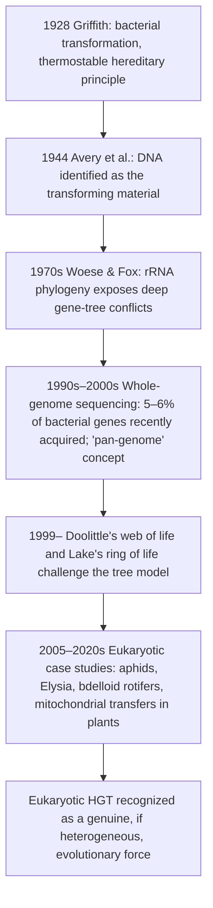
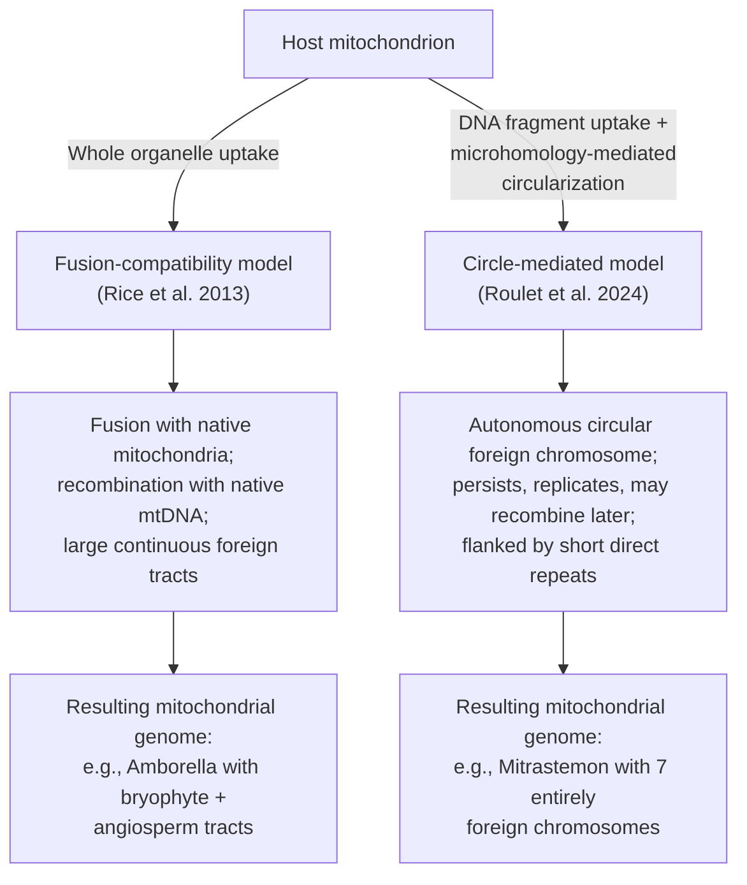

# Horizontal Gene Transfer in Eukaryotes: Mechanisms, Evolutionary Significance, and Adaptive Consequences in Plants and Animals
# 1 Conceptual Foundations and Detection of Eukaryotic HGT

For most of the twentieth century, the inheritance of genetic material in plants and animals appeared to follow an almost monolithic logic: parents transmit DNA to offspring through sexual or clonal reproduction, and gene flow is bounded by species. This Mendelian-Darwinian framework left little conceptual room for the idea that a fern might borrow a photoreceptor gene from a moss, that an insect might encode a fungal pigment pathway, or that a sea slug might carry on its chromosomes the algal genes needed to build chloroplasts. Yet the past two decades of genome and transcriptome sequencing have made each of these scenarios into documented biology. The aim of this opening chapter is to lay the conceptual and methodological foundations needed to interpret such findings rigorously throughout the remainder of the report. It defines horizontal gene transfer (HGT) as it applies to non-microbial eukaryotes, traces how a phenomenon once regarded as anecdotal became a recognized genomic process, surveys the analytical strategies used to detect it, scrutinizes the sources of error that have repeatedly inflated or deflated published estimates, and finally distills the central research questions that subsequent chapters will address.

## 1.1 Defining HGT in the Eukaryotic Context

Horizontal gene transfer—often used interchangeably with the term *lateral gene transfer*—denotes the introduction of genetic material from one organism into another by mechanisms other than the vertical, parent-to-offspring transmission that underlies clonal reproduction and Mendelian sexual inheritance[^1][^2]. In its strictest form, vertical gene transfer encompasses every form of cell division and reproduction that creates a new copy of the genome, whereas HGT requires that genetic information be passed "sideways," from a donor organism to an unrelated recipient that is not its descendant[^2]. The defining feature is therefore not the molecule moved, the vector employed, or the distance between donor and recipient, but the breach of the lineage boundary that classical phylogeny treats as inviolable[^1].

This definition is conceptually crisp but biologically demanding when applied to multicellular eukaryotes. The reason is that HGT in plants and animals must be benchmarked against the prokaryotic paradigm in which the term was forged. In Bacteria and Archaea, HGT is mediated by four well-characterized routes: **transformation**, the active uptake of free DNA from the environment; **conjugation**, the one-way transfer of DNA from cell to cell via a sex pilus, typically driven by conjugative plasmids or phages; **transduction**, in which bacteriophages package and inject host DNA into new cells; and **gene transfer agents (GTAs)**, phage-derived particles that ferry random genomic fragments between prokaryotes at frequencies estimated to reach 10¹³ events per year in the Mediterranean Sea alone[^1][^3][^2]. These mechanisms are so prevalent that whole-genome comparisons routinely attribute on the order of 5–6% of genes in an average bacterial genome to recent horizontal acquisition, with individual lineages such as *Thermotoga* harboring up to ~40% of genes most closely related to those of distantly related thermophilic clostridia[^2]. Within a single bacterial species, the consequences are still more dramatic: the *Escherichia coli* "pan-genome" exceeds 20,000 genes while its strict "core genome" comprises fewer than 2,000, the difference being largely the product of recent integrations from foreign sources[^3].

Against this backdrop, the structural biology of plants and animals has long appeared inhospitable to comparable rates of transfer. Whereas a prokaryotic cell is a single compartment exposed directly to its environment, eukaryotic cells interpose a nuclear envelope between cytoplasm and chromosomal DNA, deploy cytosolic DNases that degrade naked DNA, and rely on chromatin-level silencing systems that suppress foreign sequences[^1][^2]. In multicellular organisms, two further barriers compound these molecular obstacles. First, the **sequestration of the germline**: heritable HGT requires foreign DNA to reach not just any cell but the gametes or their progenitors, a sub-population that in animals is typically isolated early in development and in plants is restricted to meristematic and reproductive tissues[^1]. Second, the **lack of natural competence**: outside of artificial transformation systems, there is no documented eukaryotic equivalent of the active DNA-uptake machinery found in many bacteria[^2]. As a textbook synthesis puts it, "eukaryotes are much more resistant to HGT" because "eukaryotic cells possess several barriers that repel foreign DNA, including a nuclear membrane and DNase enzymes in the cytosol"[^2]. For these reasons, scientists initially regarded HGT as effectively absent in eukaryotes and, when later forced to acknowledge its existence, as "rarer in eukaryotes and [having] a much smaller evolutionary impact than in prokaryotes"[^1].

A further task is to delimit the scope of what this report treats as HGT. Several adjacent phenomena involve the movement of DNA across lineage boundaries but are conceptually distinct. **Endosymbiotic gene transfer (EGT)**—the migration of genes from the proto-mitochondrial and proto-plastid genomes of bacterial endosymbionts into the eukaryotic nucleus—represents a one-time, lineage-defining event tied to the origin of eukaryotic organelles[^1]. While EGT is mechanistically a form of HGT and is frequently invoked alongside it (as in genome-fusion theories of eukaryogenesis and the "ring of life" model), this report follows standard usage in treating EGT primarily as a baseline against which post-eukaryogenesis transfers are evaluated[^1]. **Kleptoplasty**, the temporary retention of functional plastids from algal prey by sacoglossan sea slugs, is similarly distinct: the chloroplast itself, not its nuclear-encoded supporting genes, is the object stolen, and whether bona fide nuclear gene transfer accompanies kleptoplasty remains contested (see §1.4 and Chapter 4)[^4][^5][^6]. **Transposon mobilization** within a genome falls under vertical inheritance, but the cross-species movement of transposable elements—**horizontal transposon transfer (HTT)**—is a recognized subset of HGT and will be examined as a special case in Chapter 5. Finally, the introduction of bacterial or viral DNA into somatic cells without germline integration (e.g., somatic *Trypanosoma cruzi*-mediated transfer in human hosts) is biologically real but evolutionarily inert and therefore peripheral to the questions pursued here[^2].

These distinctions matter because they discipline the central question of the report. We are concerned not with whether DNA can cross species boundaries—it manifestly can, in many transient or somatic contexts—but with whether **heritable, functionally integrated, evolutionarily consequential** gene transfer occurs in non-microbial eukaryotes, and if so, with what frequency and adaptive significance.

## 1.2 From Anecdote to Genomic Phenomenon: A Brief History of Eukaryotic HGT Research

The intellectual history of HGT begins, paradoxically, in a study that was not framed as one. In 1928, Frederick Griffith demonstrated that nonvirulent pneumococcus bacteria could acquire pathogenicity simply through contact with heat-killed virulent strains, implying the existence of a "thermostable principle" capable of modifying heredity—a principle later identified as DNA by Avery, MacLeod, and McCarty in 1944[^3]. Griffith's transformation experiment thus simultaneously founded molecular biology and provided the first experimental demonstration of horizontal gene transfer[^3]. For half a century thereafter, however, HGT remained a microbial concern. The discovery that conjugation, transduction, and transformation drive the spread of antibiotic resistance among bacteria placed HGT firmly within the domains of clinical microbiology and prokaryotic evolution, while eukaryotic genetics continued to be modeled almost exclusively in terms of mutation, recombination, and selection acting on vertically transmitted alleles[^1][^2].

Three developments unsettled this division of conceptual labor. The first was the rise of **molecular phylogenetics** in the 1970s, when Carl Woese and George Fox used 16S/18S ribosomal RNA sequences to redraw the tree of life into three domains and, in doing so, exposed widespread incongruities between gene trees that had previously been assumed to track a single species history[^3]. As alternative phylogenetic markers proliferated, conflicting topologies—particularly among deep bacterial and archaeal branches and at the Archaea–Eukarya interface—became impossible to dismiss as noise; some genes evidently had histories detached from those of the organisms carrying them[^3]. By 1999, W. Ford Doolittle had proposed replacing the canonical tree of life with a **web** or **network** model in which eukaryotes evolved not from a single prokaryotic ancestor but from "a pool of many species that were sharing genes by HGT mechanisms," and James Lake subsequently advanced an even more radical **ring of life** in which all three domains emerged from a common pool of gene-swapping prokaryotes[^1]. Although these models remain debated, they reflected a deep recognition that horizontal flow had to be incorporated into any realistic depiction of evolutionary history.

The second development was the **arrival of whole-genome sequencing**. Comparative genomics revealed that bacterial strains of the same species frequently differ by hundreds of genes and that genomic regions of anomalous nucleotide composition—signatures of recent acquisition—are pervasive[^3]. As authoritative reviews concluded, "the true evolutionary role and impact that horizontal gene transfer has had on the evolution of life were only realized recently with the advent of genome sequencing"[^3]. Crucially, the same technology was soon trained on eukaryotic genomes, where it began to uncover sequences that were unmistakably foreign in origin yet stably integrated into chromosomes.

The third development was a series of **paradigm-shifting case discoveries** in plants and animals that, individually anecdotal but collectively cumulative, made eukaryotic HGT impossible to ignore. Among the earliest and most evocative was the demonstration that the red coloration of certain pea aphids depends on a fungal-derived carotenoid desaturase—a "clear example of gene transfer," since carotenoids are otherwise not synthesized de novo by animals, which obtain them from food[^1][^2]. The coffee berry borer beetle (*Hypothenemus hampei*) was shown to digest galactomannan, the principal polysaccharide of coffee berries, by virtue of a mannanase gene of bacterial origin[^2]. The emerald sea slug *Elysia chlorotica*, which photosynthesizes for up to nine months on chloroplasts harvested from its algal prey *Vaucheria litorea*, was reported to carry algal nuclear genes—including the Calvin-cycle enzyme phosphoribulokinase (PRK)—on its own chromosomes, with FISH-based imaging localizing at least one such gene directly to a slug chromosome and demonstrating its transmission to the next generation[^7][^8][^4]. In bdelloid rotifers, whose ancient asexuality and extreme desiccation tolerance had long puzzled biologists, genome sequencing revealed strikingly diverse foreign genes "from different bacterial subdivisions as well as from" fungi and plants, including trehalose-6-phosphate synthase and trehalase genes implicated in desiccation survival[^9][^10]. In plants, mitochondrial gene transfer was found to be unexpectedly common: the *rps2* gene was shown to have moved into kiwifruit (*Actinidia*) from an early monocotyledonous lineage, and *rps11* into bloodroot (*Sanguinaria*), among many comparable cases[^2].

These episodes did not merely add empirical weight to a previously theoretical possibility; they collectively reframed eukaryotic HGT as a **genuine genomic phenomenon** rather than a curiosity. As Daubin and Szöllősi observe, "the recent realization that horizontal gene transfer has been extensive throughout the evolution of the eukaryotic domain… will allow [us] to compare the information derived from genome histories to the fossil record"[^3]. Even a chemical-ecology synthesis attributing the patchy occurrence of necrosis-and-ethylene-inducing-like proteins (NLPs) across fungi, bacteria, and oomycetes to HGT exemplifies how, by the 2000s, horizontal acquisition had become a default hypothesis to invoke when distributional incongruities arose[^2]. The conceptual upshot has been a partial dissolution of the strict tree-of-life metaphor and a shift toward representations—web, network, and ring—that explicitly accommodate cross-lineage flow[^1].

The trajectory from Griffith's pneumococci to chromosomally integrated algal genes in a sea slug can be summarized in five overlapping phases:

The diagram emphasizes the long lag between mechanistic discovery in bacteria and conceptual integration in eukaryotic biology—a lag attributable as much to the **detection challenges** addressed in the next subsection as to genuine biological rarity.

## 1.3 Detection Methods: Comparative Genomics, Phylogenomics, and Transcriptomics

Because eukaryotic HGT events are typically rare, ancient, and intermixed with the dominant signal of vertical inheritance, their identification is inseparable from the analytical methods used to detect them. Three families of approach—often deployed in combination—dominate the field, each with characteristic strengths and biases[^3][^2].

The first family comprises **gene-repertoire and pan-genome comparisons**. By contrasting the gene complements of related species or strains, these methods identify "taxonomically restricted genes," "ORFans" without recognizable homologs, and lineage-specific gene gains that are most parsimoniously explained by acquisition rather than retention[^3][^2]. In bacteria, such comparisons revealed that closely related strains can differ by hundreds of strain-specific genes, motivating the pan-genome concept; in eukaryotes, comparable approaches identified the unexpected presence of fungal carotenoid genes in pea aphids and bacterial mannanase genes in coffee berry borers as outliers within otherwise coherent metazoan gene complements[^3][^2]. A modern variant uses pan-genome and transcriptome data from large taxon panels to scan for genes whose phyletic distribution suggests horizontal origin, an approach increasingly applied to plants and animals[^2].

The second family consists of **parametric (compositional) methods**. These rest on the long-standing observation that bacterial genomes vary widely in G+C content and codon usage, with each genome presenting a characteristic "signature"; regions that depart sharply from the genomic norm—anomalous G+C content, atypical codon usage, or unusual oligonucleotide frequencies—are inferred to be of recent foreign origin[^3][^2]. Parametric approaches were the workhorse of early HGT detection in microbes[^3]. In fungi and other eukaryotes they have been extended to additional features such as **intron absence**, since genes acquired from prokaryotes typically lack introns; the inference that biosynthetic genes for hydrophilic cephalosporins moved from bacteria to *Aspergillus* relies in part on this signature, alongside their occurrence in clusters[^2]. Two important caveats apply: parametric methods cannot detect transfers between donors and recipients of similar composition, and they progressively lose power as transferred genes undergo "amelioration" toward the host's compositional norm—producing a systematic bias against the detection of ancient transfers[^3].

The third and most general family is **phylogenetic and phylogenomic analysis**. Here, gene trees are reconstructed and compared with a putative species tree; statistically supported incongruities, in which a gene clusters with distant taxa rather than with its host's relatives, are interpreted as evidence of transfer[^3]. Phylogenetic methods have several advantages: they identify both donor and recipient, they can in principle detect ancient transfers that have lost compositional anomalies, and they are agnostic to the specific transfer mechanism[^3]. They also have characteristic limitations. They require a reliable reference phylogeny, they can confuse transfer with gene duplication followed by differential loss or with deep coalescence (the persistence of polymorphic alleles across multiple speciation events), and they are exquisitely sensitive to phylogenetic uncertainty—limited signal produces reconstruction errors that systematically inflate apparent HGT[^3]. A study of cyanobacterial gene families that explicitly modeled shared species history and re-estimated gene trees found "striking reduction in apparent phylogenetic discord, with 24%, 59%, and 46% reductions, respectively, in the mean numbers of duplications, transfers, and losses per gene family"—a stark illustration of how methodological rigor reshapes quantitative claims[^3].

The maturation of phylogenomic methodology has produced **probabilistic gene-tree/species-tree reconciliation models**, which jointly estimate sequence evolution and the relative likelihoods of duplication, transfer, and loss along a species phylogeny[^3]. Because gene transfer can occur only between contemporaneous lineages, such models additionally yield a **partial temporal ordering** of speciation events, a form of evidence that is independent of fossils or molecular clocks[^3]. This convergence of HGT detection with deep phylogenetic inference exemplifies the broader trend in the field: HGT has moved from being treated as noise to being treated as signal.

These three method families differ markedly in the time scales they can interrogate. Parametric methods detect recent transfers before compositional amelioration erases the signal; phylogenetic methods can in principle reach much deeper but lose recent transfers because the donor is often unsampled. Daubin and Szöllősi observe that "the first two show that genomes can contain high proportions of 'foreign' genes, up to 20%, acquired recently. The third approach, in contrast, has limited power to detect very recent transfers, but phylogenetic incongruities are clearly evident when studying the genomes of distant species"[^3]. The apparent contradiction dissolves once it is recognized as a difference of temporal resolution: most recently acquired genes are "ORFans" destined to disappear, leaving little phylogenetic trace, whereas anciently retained transfers are precisely those that have been functionally co-opted[^3].

For eukaryotic HGT specifically, two further analytical strategies have proven decisive. **Transcriptome profiling** confirms that a putatively transferred gene is not merely present in a genome assembly but is actively expressed by the host, addressing both contamination concerns and questions of biological functionality; transcriptomic surveys identified more than 50 nuclear-encoded algal photosynthesis genes whose transcripts appear in algae-starved *Elysia chlorotica*[^4]. **Cytogenetic localization**, particularly fluorescence in situ hybridization (FISH), provides direct physical evidence that a foreign gene resides on a host chromosome rather than in an endosymbiont, parasite, or contaminant cell. The 2014 FISH demonstration that a *Vaucheria litorea* nuclear gene resides on an *Elysia chlorotica* chromosome was reported as "the first direct evidence" that algal genes had been incorporated into the slug's own chromosomal complement and transmitted to the next generation[^7][^8]. The combination of phylogenomic incongruence, transcriptomic expression, and chromosomal localization now constitutes the de facto evidentiary triad for high-confidence eukaryotic HGT claims.

The relative profiles of these methods are summarized below.

| Detection strategy | Principal signal | Strengths | Characteristic biases | Time scale resolved |
|---|---|---|---|---|
| Gene-repertoire / pan-genome comparison | Lineage-specific or "orphan" genes; patchy distribution | Scalable; agnostic to donor; works on draft genomes | Sensitive to incomplete sampling; cannot identify donor[^2] | Recent to intermediate |
| Parametric (G+C, codon usage, intron absence) | Compositional anomalies vs. genome norm | Donor-free; can flag recent integrations within a single genome | Blind to donors of similar composition; signal erodes via amelioration[^3] | Recent |
| Phylogenetic / phylogenomic incongruence | Statistically supported gene-tree vs. species-tree conflict | Identifies donor and recipient; reaches deep history; mechanism-agnostic | Confounded by duplication/loss, deep coalescence, reconstruction error[^3] | Intermediate to ancient |
| Probabilistic reconciliation (DTL models) | Joint likelihood of duplication, transfer, loss | Disentangles processes; orders speciations in time | Computationally intensive; requires large gene-family panels[^3] | Intermediate to ancient |
| Transcriptome profiling | Foreign-gene transcripts in host RNA | Tests expression; mitigates contamination from inactive DNA | Cannot localize gene; transient expression in symbionts confounds[^4] | Contemporary expression |
| FISH / chromosomal localization | Hybridization signal on host chromosome | Direct physical evidence of integration | Low throughput; species-specific probes[^7] | Confirms integration regardless of age |

The lesson of the table—and indeed of the methodological history of the field—is that no single approach suffices. Robust eukaryotic HGT inference now requires the **convergence of multiple lines of evidence**: a candidate transfer should display phylogenomic incongruence, anomalous composition relative to expectation, demonstrable expression, and ideally direct evidence of integration into the host chromosome.

## 1.4 False Positives, False Negatives, and Methodological Pitfalls

Precisely because the convergence of multiple signals is required, the field of eukaryotic HGT is unusually vulnerable to error in either direction, and several well-publicized controversies have driven home the importance of methodological caution. The textbook articulation of this vulnerability is unambiguous: "When the human genome was sequenced, several hundred human genes were at first attributed to horizontal transfer from bacteria. However, later analyses indicated that very few of these were genuine cases of horizontal transfer"[^2]. Six interrelated sources of false positives have been catalogued from this and subsequent episodes.

**Sampling bias** is foremost. Because hundreds of bacterial genomes have been sequenced for every comparably annotated eukaryotic genome, the absence of homologs to a candidate gene from a handful of eukaryotes is insufficient evidence of bacterial origin; many genes initially flagged as foreign in the human genome were subsequently found in other eukaryotes once sequencing breadth improved[^2]. **Differential gene loss** in related lineages can mimic horizontal acquisition by producing patchy distributions even when descent is strictly vertical[^2]. **Gene duplication followed by rapid divergence** can generate apparently lineage-specific genes whose phylogenetic placement is artifactual[^3][^2]. **Rapid sequence evolution** under intense selection misplaces genes on phylogenetic trees when standard substitution models fail to capture rate heterogeneity[^2]. **Convergent evolution** can produce sequence similarities that reflect functional constraint rather than common ancestry. And, with particular force in eukaryotic studies, **DNA contamination**—from associated bacteria, viruses, fungi, parasites, or microbiome members—can introduce sequences that, once incorporated into a draft assembly, masquerade as host genes[^2].

The clearest cautionary tale in contemporary animal HGT research is the **tardigrade controversy**. A 2015 genome study of the tardigrade *Hypsibius dujardini* claimed that 17.5% of its genome was foreign in origin, an unprecedented figure for a metazoan that was rapidly contested when independent reanalyses found "no evidence for extensive horizontal gene transfer in the genome of the tardigrade," attributing the high foreign-gene call to bacterial contamination of the assembly[^11]. This episode crystallized for the field the lesson that draft genome assemblies of small or symbiotically associated invertebrates are particularly susceptible to contamination, and that aggressive HGT claims must be vetted against alternative assemblies and physical evidence of chromosomal integration. A parallel debate surrounds *Elysia chlorotica*: while PCR-based and transcriptomic studies repeatedly identified algal nuclear genes in slug DNA and offspring eggs, a subsequent genome analysis of *E. chlorotica* egg DNA reported "no evidence for horizontal gene transfer into the germ line of this kleptoplastic mollusk," instead suggesting that algal genes may persist extrachromosomally[^4]. A still more recent genome study of the related kleptoplastic slug *Plakobranchus ocellatus* concluded that long-term photosynthesis can be sustained "without the gene transfer," confirming chloroplast acquisition as a phenomenon distinct from nuclear HGT in at least some sacoglossans[^5][^12][^6]. These contrasts illustrate how a single genus can yield evidence both for and against HGT depending on the assay (PCR vs. assembled genome), the developmental stage (eggs vs. adults), and the species sampled, and they underline the importance of distinguishing kleptoplasty per se from nuclear gene transfer.

Conservatism, however, can also mislead. Several sources of **false negatives** systematically deflate eukaryotic HGT estimates. Compositional **amelioration** erases parametric signatures of ancient transfers, so the longer a foreign gene has been resident, the harder it is to detect by sequence-composition methods[^3]. **Compositional similarity** between donor and recipient renders recent transfers between related lineages invisible to the same approaches[^3]. The **complexity hypothesis**, formulated by Jain, Rivera, and Lake in 1999, predicts that genes whose products participate in many molecular interactions (e.g., ribosomal proteins, replication machinery) are less likely to be transferred and retained because they are unlikely to preserve their numerous interaction sites with foreign partners; while empirically supported by clear traces of transfer in some ribosomal genes, this hypothesis implies that systematic biases in the functional categories of transferred genes will skew detection and interpretation[^3]. Finally, and perhaps most consequentially for this report, the **majority of recently acquired genes are short-lived**: analyses of bacterial genomes show that the bulk of newly transferred genes are ORFans destined to disappear, leaving "little trace in gene phylogenies"; only those that are functionally retained over evolutionary time produce the durable signal that phylogenetic methods can detect[^3]. The corollary is that estimates of HGT impact based on long-term retained transfers necessarily understate the ongoing rate of transfer.

A final caveat concerns the **ease of laboratory transfer versus the constraints of nature**. As Clark and Pazdernik note, "the ease of horizontal transfer of genetic information by plasmids, viruses, and transposons under laboratory conditions is misleading. Under natural conditions there are major barriers to such movements. Furthermore, the results of horizontal transfer are often only temporary"[^2]. Plasmid- or transposon-borne genes acquired by laboratory bacteria are often lost when selective conditions disappear; analogously, the persistence of a transferred sequence in a multicellular eukaryote requires germline access, escape from silencing, and adaptive or neutral retention against the steady pressure of deletion. Each of these requirements is a filter that drastically reduces the proportion of transfer events that leave a permanent evolutionary footprint.

The methodological landscape is thus characterized by a fundamental asymmetry: false positives are typically the product of **insufficient skepticism**, while false negatives are the product of **inherent erosion of signal**. Robust inference in eukaryotic HGT therefore requires both stringent contamination controls and explicit acknowledgment that detected events represent only the visible tip of a larger underlying flux—a tension that will recur throughout this report when frequency estimates are compared across taxa and time scales.

## 1.5 Central Research Questions and Analytical Framework of the Report

The conceptual definition of §1.1, the historical trajectory of §1.2, the methodological repertoire of §1.3, and the error structure of §1.4 together circumscribe what can be asked and what can be answered about eukaryotic HGT. They also expose the central puzzle that motivates this report. On the one hand, the molecular and developmental architecture of plants and animals erects formidable barriers to horizontal acquisition, and the most sober estimates suggest that HGT is genuinely far less common in non-microbial eukaryotes than in prokaryotes[^1][^2]. On the other hand, the sheer diversity of confirmed cases—from fungal carotenoid genes in aphids and bacterial mannanases in beetles to algal photosynthesis genes in sea slugs, mitochondrial gene capture among angiosperms, and bacterial desiccation-resistance genes in bdelloid rotifers—demonstrates that when transfer does occur, it can yield novel metabolic capabilities, new ecological niches, and evolutionary innovations of the first order[^2][^7][^10]. As the user need behind this report frames it, the very rarity of HGT in plants and animals must "have a really interesting reason behind this adaptation"—a paradox that this report sets out to dissect.

Three central research questions structure the chapters to follow:

1. **By what mechanisms does HGT cross the eukaryotic germline barrier in plants and animals?** Chapters 2 and 3 examine the routes—parasitic plant–host haustoria, *Agrobacterium*-mediated transfer, viral and transposon vectoring, mitochondrial fusion, food-chain ingestion, endosymbiont-to-host transfer (notably from *Wolbachia* and *Buchnera*), and others—through which foreign DNA reaches eukaryotic chromosomes and, crucially, the germline[^1][^2]. As Clark and Pazdernik note, "as many as 70% of insect hosts have DNA from *Wolbachia* in their chromosomes," indicating that intimate symbiosis is a major mechanistic gateway[^2].

2. **How significant is HGT as an evolutionary force relative to mutation, gene duplication, endosymbiosis, and other sources of genetic novelty?** Chapters 4, 5, and 6 examine landmark functional cases, the special role of horizontally transferred transposable elements, and quantitative frequency estimates across taxa. The analytical task is to distinguish HGT events that have been **functionally co-opted** from those that persist as pseudogenes or junk, and to compare HGT's quantitative footprint with that of duplication and divergence[^1][^3].

3. **What adaptive consequences—physiological, ecological, and phenotypic—does HGT confer on recipient organisms?** Chapters 4, 6, and 7 evaluate evidence that transferred genes have enabled host shifts, dietary innovations, stress tolerance, pathogen resistance, photosynthetic capability, and, in agricultural contexts, the basis for both natural transgenesis and pest adaptation[^2][^7]. Where adaptive claims are made, they will be assessed against explicit fitness or functional evidence rather than merely against the existence of the transfer.

Several analytical commitments follow from the foundations laid in this chapter and will be applied uniformly throughout the report. First, **claims of HGT are accepted only when supported by convergent evidence**—phylogenomic incongruence corroborated by compositional features, expression data, or chromosomal localization where available—and contested or single-source claims will be flagged as such. The contrasting evidence on *Elysia chlorotica* and *Plakobranchus ocellatus* and the tardigrade contamination episode will be treated as illustrative cautionary cases rather than dismissed[^11][^4][^5]. Second, **adaptive significance is distinguished from mere presence**: a foreign gene must be shown to be expressed and to influence phenotype or fitness before it is described as adaptive, in line with the dictum that "to be retained in the longer term, [transferred genes] would have to turn out to be useful for their host"[^3]. Third, **a comparative plant–animal lens** is maintained throughout, since the central biological puzzle is precisely why two kingdoms with very different germline architectures, ecological strategies, and silencing systems both undergo HGT but at different rates and via different routes. Fourth, **quantitative estimates are interpreted in light of their underlying methods**: figures such as the often-cited 5–6% of bacterial genes acquired horizontally, or the 17.5% claim later overturned in tardigrades, are situated within the time scales and detection biases that produce them[^2][^11].

In adopting these commitments, the report follows the broader scientific consensus articulated by Daubin and Szöllősi: that lateral gene transfer is "a powerful evolutionary force, allowing the combination of molecular functions well beyond the species boundaries," and that its scientific challenge "is not so much conceptual as methodological"[^3]. Recognizing this, the chapters that follow apply rigorous evidentiary standards to ask not whether HGT happens in plants and animals—a question now answered in the affirmative—but how, how often, and to what evolutionary end. The analytical scaffolding established here will be tested most stringently in Chapter 4's case studies, where each claim of functional HGT must satisfy the triad of integration, expression, and adaptive consequence; and most ambitiously in Chapter 6, where comparative frequency estimates must be reconciled across kingdoms despite the marked asymmetries of detection power identified above. Only by holding the conceptual definition of §1.1 and the methodological standards of §§1.3–1.4 firmly in view can the report's central claim be earned: that HGT in non-microbial eukaryotes, though comparatively rare, is sufficiently frequent and sufficiently consequential to require integration into any modern account of eukaryotic evolution.

# 2 Mechanisms and Routes of HGT in Plants

Chapter 1 closed with a paradox: the cellular and developmental architecture of multicellular eukaryotes appears designed to repel foreign DNA, yet horizontal gene transfer in plants is now documented across enough lineages, and at sufficient quantitative depth, that it can no longer be relegated to the margins of evolutionary biology. Resolving this paradox requires moving from definitions and detection to the concrete biology of transfer. By what physical and molecular pathways does foreign DNA actually breach the plant cell wall, traverse the plasma membrane, enter an organelle or nucleus, and—most demandingly—reach a meristematic or reproductive cell line whose descendants will populate the next generation? This chapter dissects those pathways. It begins with the most prolific gateway, the haustorial connection between parasitic plants and their hosts, where intimacy of contact and protracted endophytic life cycles produce the highest documented HGT loads in the plant kingdom. It then turns to the molecular peculiarities of plant mitochondria—active DNA uptake, fusion and fission, large intergenic regions, and the recently described circle-mediated transfer mechanism—that make this organelle the principal recipient compartment regardless of the upstream route. Subsequent sections analyse *Agrobacterium*-mediated T-DNA integration, the best-characterised bacterium-to-plant route and the only one with an unambiguous case of fixation in a globally consumed food crop; viral, transposon, and fungal vectors, whose contributions remain less quantified but mechanistically crucial; and grafting and cell-contact routes that operate without parasitism. A concluding comparative assessment integrates these findings, setting up the contrast with animal systems in Chapter 3.

The unifying insight to be developed is that **plant HGT is governed not by any single privileged route but by the convergence of three permissive conditions**—prolonged intimate cellular contact, the unusual molecular biology of plant mitochondria, and accessibility to germline-competent tissues such as meristems and seeds—and that the relative weight of these conditions, more than any intrinsic bias of the genome, explains both the taxonomic distribution of HGT and its disproportionate concentration in specific ecological niches.

## 2.1 Parasitic Plant–Host Haustorial Transfer

If the central methodological insight of Chapter 1 was that HGT detection requires convergent lines of evidence, the central biological insight of this section is that **parasitic plants provide that convergence almost as a matter of course**. The haustorium—a specialised invasive organ that penetrates the host's tissues and establishes direct xylem and often phloem connections—creates an extended physical and physiological continuity between two genetically distinct plants. Within this continuity, the boundary that ordinarily separates one organism from another becomes porous to water, photosynthates, hormones, mRNAs, and, demonstrably, DNA. As a 2015 review of HGT in parasitic plants concluded, "parasitic plants are exemplary systems for studying the dynamics of HGT", and "evidence of HGT has been identified in 10 of the 11 parasitic lineages to date".[^13] The intimacy of haustorial connection thus operates as both a mechanism and a sampling regime: it both generates HGT events and concentrates them in lineages that are easy to identify and study.

### Haustorial biology as the gateway

Parasitic angiosperms have evolved at least 11 times independently from free-living ancestors, and they range from photosynthetically competent hemiparasites such as the mistletoes (*Viscum*, Viscaceae) to obligate holoparasites such as Rafflesiaceae and Balanophoraceae that lack functional photosystems and depend entirely on their hosts for fixed carbon.[^13] In every case, the haustorium establishes a vascular bridge through which "many nutrients and macromolecules, including mRNAs, are trafficked between host and parasite", but the evidence for HGT itself "points primarily to direct uptake of DNA, rather than mRNA".[^13] Two features of haustorial parasitism appear to be especially important for raising HGT rates above background. First, the **intimacy and persistence** of the connection: a single host–parasite pairing may last months to years, providing many cell-cycle windows for DNA to enter parasite cells from host xylem, phloem, or symplastic continuities. Second, the **endophytic stage** in which some lineages spend most of their life cycle embedded inside host tissue, emerging only briefly for sexual reproduction. As reviewed in connection with *Mitrastemon yamamotoi*, this "prolonged endophytic phase facilitates continuous acquisition of host DNA, which upon flowering can be passed onto the offspring, a key step in the establishment and maintenance of HGT events across generations".[^14] Endoparasites of Apodanthaceae, Cytinaceae, Mitrastemonaceae, and Rafflesiaceae, which "grow embedded in their hosts and have no discernible roots, shoots, or leaves, persisting largely as a mycelium-like body",[^13] thus combine maximal contact area with maximal contact duration.

The phenomenon is not confined to the most extreme endoparasites. The shoot parasite *Cuscuta australis* and the root parasite *Orobanche aegyptiaca* have both been shown to acquire genes by horizontal transfer from their hosts,[^15] and a 2019 study formally demonstrated **convergent horizontal gene transfer and cross-talk of mobile nucleic acids in parasitic plants** across multiple parasitic lineages,[^16] indicating that the haustorial route operates wherever haustoria operate. The corollary is methodologically important: because HGT in parasitic plants is so abundant, it allows phylogenetic signatures to function as a "ghost of transfers past," recording former host associations that may no longer be ecologically observable.[^13]

### Quantitative scale: from common to extraordinary

Quantitative estimates from parasitic systems sit at the upper end of all reported plant HGT loads. In Rafflesiaceae, the holoparasitic family that includes the world's largest flowers, comparative analysis of mitochondrial genomes documented "massive mitochondrial gene transfer in a parasitic flowering plant clade",[^13] with foreign genes broadly shared and maintained in synteny across related parasitic species, evidence of both ancient (perhaps late Cretaceous) and recent transfers.[^13] In Cynomoriaceae, "we find evidence of HGT, involving both interspecific transfers of mitochondrial genes from host plants into the mitochondrial and the nuclear genomes" of the parasite.[^17] But the most striking quantitative case yet documented is the holoparasitic endoparasite *Mitrastemon yamamotoi* (Ericales), which infects the roots of Fagaceae trees, principally *Castanopsis* species. The 2025 mitochondrial genome assembly of *M. yamamotoi* reveals a multipartite organisation of 51 circular-mapping chromosomes totalling 929,557 bp, of which **more than 60% (≈559 kb) is of foreign origin derived from Fagales hosts**, with seven chromosomes entirely foreign and an additional five over 90% foreign.[^14] Foreign regions show a mean sequence identity of 96% to the inferred donors, against 90% for the native regions clustering with Ericales, indicating that the foreign tracts are evolutionarily recent.[^14] Six of the 43 protein-coding genes are unambiguously foreign and one is chimeric, with three of the foreign copies (atp1, ccmFN, rps12) statistically rejecting vertical inheritance via the approximately unbiased (AU) test (p < 0.05).[^14]

The quantitative scale of mitochondrial HGT in parasitic plants can usefully be compared across systems:

| System | Lineage | Compartment / scale of transfer | Functional / structural outcome |
|---|---|---|---|
| Mistletoe *Viscum* (3 spp.) | Hemiparasite (Viscaceae) | Mitochondrial genome retains <50% of canonical seed-plant gene set; all complex I subunits absent; respiratory complexes III and IV present but highly divergent | Massive gene loss; potential transfer of respiratory function to nucleus or alternative pathway; only matR and ccmB classified as confidently functional[^18] |
| *Cuscuta* / *Orobanche* | Stem and root parasites | Documented HGT events in mt and nuclear compartments | Gene acquisition from multiple hosts, including from former host associations[^15][^16] |
| Rafflesiaceae (e.g. *Sapria*, *Rafflesia*) | Endoparasitic holoparasite | "Massive" mitochondrial gene transfer, both ancient (≈Cretaceous) and recent | Some chloroplast genome lost in *Rafflesia lagascae*; mitochondrial gene content not strongly reduced[^18][^13] |
| Cynomoriaceae | Holoparasite | Interspecific transfers of mitochondrial genes into both mt and nuclear genomes of parasite | Sequential acquisitions from different hosts traceable in *Cynomorium coccineum*[^17] |
| Balanophoraceae (e.g. *Lophophytum*, *Ombrophytum*) | Holoparasitic endoparasite | Multichromosomal mtDNA with extensive foreign tracts; full replacement of native genes by foreign homologues | Functional replacement of native mitochondrial genes; foreign chromosomes acquired by circle-mediated HGT[^14] |
| *Mitrastemon yamamotoi* | Holoparasitic endoparasite | 51 mt chromosomes; >60% foreign mtDNA from Fagaceae; 7 entirely foreign chromosomes; 6 foreign protein genes, 1 chimeric | Functional replacement of atp1 (transcribed and edited); circle-mediated HGT confirmed[^14] |

Two structural features of the *Mitrastemon* mitochondrial architecture deserve particular emphasis. First, the host-derived DNA is **disproportionately concentrated in non-coding regions**: 99% of the foreign DNA is intergenic, even though the mechanism that introduced it is highly efficient at moving large genomic tracts. This skew "suggests that while the mechanism of HGT… is highly efficient in facilitating DNA uptake, the selection pressure for integrating and maintaining functional foreign genes is considerably lower".[^14] Second, of the 11% of the mtDNA with no significant mitochondrial BLAST hits, some may represent foreign DNA from yet-unsampled hosts, an artefact of the limited sampling of Fagaceae mitogenomes (only 36 of >1000 species are sequenced).[^14] The implication is that even this extraordinary 60% figure is likely a **lower bound**.

### Compartmental bias: why the mitochondrion?

The most consistent quantitative observation across parasitic plants is that HGT "is astonishingly high in the mitochondrial genome, and appreciable in the nuclear genome".[^13] In every well-characterised parasitic system, including those summarised in the table above, mitochondrial DNA is the dominant target. The mechanistic reasons for this bias are explored in §2.2; the evidentiary point for present purposes is that haustoria do not transfer DNA non-specifically across compartments. They concentrate transfer in the mitochondrion, with the chloroplast almost untouched and the nucleus a comparatively rare recipient. In *Mitrastemon*, no nuclear or plastid DNA was transferred to the parasite mitochondria; only entire mitochondrial tracts moved, supporting the **fusion-compatibility model** of Rice et al. (2013) in which mitochondria from donor and recipient must be physically compatible for fusion to mediate transfer.[^14]

Where nuclear HGT does occur in parasitic plants, it tends to be lineage-specific and adaptive. *Striga hermonthica* and *Cuscuta* have acquired nuclear genes implicated in host parasitism, and at least some transgenes "have been hypothesized to be functional in their recipient species, thus providing a new perspective on the evolution of novelty in parasitic plants".[^13] The asymmetry between mitochondrial abundance and nuclear scarcity nevertheless remains one of the field's most robust generalisations and is central to the comparative assessment in §2.6.

### Parasitism and gene loss: a coupled phenomenon

A counterpoint to the picture of parasitic plants as DNA importers is the equally striking pattern of parasite-specific gene loss. The mitochondrial genomes of three *Viscum* species (*V. album*, *V. crassulae*, *V. minimum*) sequenced in 2015 revealed an unprecedented contraction of mitochondrial gene content in seed plants: all nine canonical complex I (NADH dehydrogenase) genes are absent or pseudogenised, two of the five complex V genes are missing, and even the 5S rRNA gene cannot be located, while the genes that remain are extremely divergent from those of other seed plants.[^18] This mosaic of import and reduction—massive HGT in some lineages, massive gene loss in others—suggests that parasitic plants experience an unusually labile mitochondrial genome that is shaped both by what arrives from hosts and by what becomes dispensable when host metabolites supply functions that the parasite no longer needs to encode itself.[^18] The two phenomena likely reinforce each other: relaxed selection on mitochondrial bioenergetics permits gene loss, while relaxed mitochondrial genome maintenance simultaneously creates conditions in which foreign DNA can persist long enough to be either functionally co-opted or pseudogenised. The same set of conditions that makes parasitic plants efficient HGT recipients thus also makes them genomic destabilisation laboratories.

## 2.2 Mitochondrial Fusion and Circle-Mediated Transfer

The fact that plant HGT is concentrated in the mitochondrion is not a corollary of how DNA enters the cell but a consequence of the molecular biology of the recipient organelle itself. To understand why parasitic, grafted, and even free-living plants accumulate foreign DNA preferentially in their mitochondrial genomes, one must shift focus from the haustorium to the mitochondrion and ask what structural and biochemical features make this compartment uniquely permissive.

### Why plant mitochondria are permissive recipients

Several attributes of plant mitochondrial biology converge to make these organelles unusually receptive to foreign DNA. They actively take up DNA from their environment; they undergo "frequent fusion and fission" of their organellar bodies, which permits exchange of genetic content between mitochondria of different origins; their genomes contain "massive intergenic regions" that allow foreign genes to be inserted without immediately disrupting native genes; and their genomes are extremely variable in size and structure across angiosperms, ranging from 208 kb to more than 11 Mb in seed plants.[^18][^13] In *Arabidopsis*, the mitochondrial genome is 22 times larger than that of humans yet encodes only 2.5 times as many proteins, the additional length being largely intergenic and reflecting both inter-organellar transfer and exogenous DNA acquisition.[^18] A large fraction of intergenic content in angiosperm mitochondria is described in the literature as **"promiscuous DNA"**—plastid-derived sequences and horizontally transferred sequences whose origin is often obscure.[^19] The combination of large genome size, extensive intergenic territory, and active fusion thus creates a system that is, in effect, biochemically prepared to accept and harbour foreign DNA.

### The fusion-compatibility model

The first formal model to explain large-scale mitochondrial HGT in plants was proposed by Rice et al. in 2013 on the basis of *Amborella trichopoda*, the basal angiosperm whose mitochondrial genome contains massive horizontally transferred tracts from "diverse land plant donors", including bryophytes and other angiosperm lineages.[^7] This **fusion-compatibility model** posits that HGT occurs through "the acquisition of entire foreign mitochondria from species in the green lineage, subsequently capable of fusing with the native mitochondria".[^14] Several lines of evidence support the model: the horizontal transfer of "large tracts (or even entire) mitochondrial genomes (mtDNAs), but not nuclear or plastid DNA, into both free-living and parasitic plant mitochondria",[^14] and the apparent requirement that donor and recipient mitochondria be sufficiently compatible to fuse, which restricts transfer to the green lineage and is consistent with the absence of detectable bacterial-to-plant mitochondrial HGT in most surveys.

The fusion-compatibility model elegantly accounts for the compartmental bias documented in §2.1: it predicts mitochondrial-targeted HGT, no nuclear or plastid involvement on the donor side, and large-tract rather than small-fragment transfer. Empirically, this is precisely the pattern recovered in *Amborella*, *Mitrastemon*, *Lophophytum*, and other characterised systems.[^7][^14]

### Circle-mediated HGT: a complementary mechanism

A second model, formulated by Roulet et al. in 2024 and supported in the 2025 *Mitrastemon* study, complements rather than replaces fusion-compatibility. The **circle-mediated HGT model** proposes that "foreign mitochondrial DNA enters the mitochondria of a recipient plant but remains unintegrated, and forms subgenomic, circular DNA molecules. These circular molecules are primarily formed through microhomology-mediated recombination across direct repeats within the donor mtDNA. Once formed, they can replicate autonomously and persist until they are either lost or eventually recombine with the native mtDNA".[^14] In *Mitrastemon*, three of the seven entirely foreign chromosomes (Chr40, Chr41, Chr49) can be traced to continuous tracts in the *Castanopsis* host mitochondrial genome flanked by short direct repeats of 8–19 bp, with junction reads in the parasite showing only a single repeat—the diagnostic signature of microhomology-mediated circularisation.[^14] The circle-mediated mechanism has now been documented in two parasitic plant lineages, *Lophophytum* (Balanophoraceae, Santalales) and *Mitrastemon* (Ericales), separated by hundreds of millions of years of evolutionary divergence, suggesting that it "is not an isolated evolutionary event… but potentially a more general mechanism for foreign DNA acquisition and maintenance in plant mitochondria".[^14]

The two models can be visualised as parallel routes that both feed the mitochondrial recipient compartment but produce different downstream signatures:

Crucially, the two mechanisms are not mutually exclusive. The *Mitrastemon* mitochondrial genome carries signatures of both: large foreign tracts consistent with fusion and integration, plus seven entirely foreign chromosomes consistent with circularisation.[^14] What conditions favour one mechanism over the other remains a live question. The Roulet et al. hypothesis is that **depletion or loss of DNA replication, repair, and recombination (DNA-RRR) factors** sets the stage for circularisation, because the rare microhomology-mediated repair pathways involved in forming the circles are normally inhibited in plant mitochondria and become active only when conventional repair machinery is compromised.[^14] In *Mitrastemon*, all 24 nuclear-encoded mitochondrial DNA-RRR genes described in *Arabidopsis* were found in the transcriptome except *OSB1*, a plant-specific single-stranded DNA binding protein that promotes homologous recombination and suppresses ectopic rearrangements.[^14] The holoparasite *Lophophytum*, also rich in foreign mitochondrial chromosomes acquired by the circle-mediated route, lacks expression of the *WHY2* gene whose mutants in *Arabidopsis* show increased illegitimate recombination.[^14] These coincidences suggest that **HGT susceptibility is partially modulated by the integrity of the host's own genome-maintenance machinery**, with parasitic plants inheriting or evolving a more permissive recombinational environment.

### From integration to function: what survives

Mitochondrial HGT in plants follows a standard fate trajectory whose four outcomes have been categorised across the literature:

1. **Duplicative HGT**: native and foreign full-length copies coexist; the native copy is the only functional allele. Three cases occur in *Mitrastemon*.[^14]
2. **Pseudogenisation**: foreign copies degrade into pseudogenes and are eventually lost. Mower et al. (2010) showed that even when multiple mitochondrial genes are horizontally acquired from a parasitic plant, "imported genes usually degrade into pseudogenes",[^18] and seven foreign pseudogenes are found in *Mitrastemon*.[^14]
3. **Chimeric / partial replacement HGT**: recombination between native and foreign copies generates chimeric genes. *Mitrastemon nad4* exemplifies this outcome, with intron 2 and exon 3 of foreign Fagaceae origin and the rest native.[^14]
4. **Full replacement HGT**: the native gene is entirely replaced by the foreign homologue. This is rare. The clearest documented case in *Mitrastemon* is *atp1*, whose foreign copy is the sole mitochondrial copy, is transcribed, and is correctly RNA-edited at both predicted sites—evidence of "functional integration" of a horizontally acquired essential gene, paralleled by *cox1* transfers in other systems.[^14]

The rarity of full replacement is striking against the abundance of total transfer events. The *Mitrastemon* case demonstrates that "the vast majority of the mitochondrial HGT events in plants involve non-functional duplicated copies of mitochondrial genes or pseudogenes",[^14] confirming a pattern previously seen in *Amborella*, *Lophophytum*, and *Cynomorium*, where the *cox1* gene is also a recurrent target of frequent, phylogenetically local horizontal transfer.[^4] In other words, plant mitochondria are mechanistically permissive but functionally conservative: a great deal of foreign DNA arrives, persists, and is transcribed, but only a small fraction is co-opted to perform host functions.

## 2.3 *Agrobacterium*-Mediated T-DNA Integration

If parasitic haustoria provide the dominant plant-to-plant route, *Agrobacterium*-mediated transfer is the dominant bacterium-to-plant route and the only one that has yielded a confirmed case of HGT fixation in a globally consumed food crop. It is also the route on which industrial plant biotechnology has been built: the same molecular machinery that produces crown galls in vineyards has been adapted to deliver transgenes into more than 10% of the world's arable land in the form of genetically modified crops.[^20]

### Mechanism: a natural genetic engineer

*Agrobacterium tumefaciens* and *Agrobacterium rhizogenes* are plant-pathogenic bacteria capable of "transferring DNA fragments [transfer DNA (T-DNA)] bearing functional genes into the host plant genome".[^21][^20] The T-DNA derives from a tumour-inducing (Ti) plasmid in *A. tumefaciens* or a root-inducing (Ri) plasmid in *A. rhizogenes*, and once integrated, T-DNA genes are expressed and produce auxins, cytokinins, and opines that alter host development and provide a bacterial-favouring metabolic niche. *A. rhizogenes* agropine strains carry two physically separated T-DNA regions, TR-DNA and TL-DNA, that integrate independently into host genomes; TR-DNA encodes auxin biosynthesis genes (*iaaM*, *iaaH*) and opine synthesis genes, while TL-DNA encodes the rooting locus (*Rol*) genes *RolA*, *RolB*, *RolC*, and *RolD* that govern auxin/cytokinin balance.[^20] Crucially, the *Agrobacterium* system breaches the plant cell wall, plasma membrane, nuclear envelope, and—when it integrates into meristematic tissue—the germline barrier in a single integrated process. Unlike haustorial transfer, it requires no extended host–parasite intimacy; a wound site and competent bacterial cells suffice.

The natural fixation of *Agrobacterium* T-DNAs in plant genomes was first documented in *Nicotiana glauca* and other *Nicotiana* species in the 1980s, where T-DNA sequences "originating from different *A. rhizogenes* strains, are present in *Nicotiana* spp., are transmitted to the progeny, and are expressed at low levels but are not associated with the hairy root or tumor-like symptoms that are usually induced by *Agrobacterium* infections".[^20] The *Rol* genes in *N. glauca* "appear to play a role in various developmental processes and in the expression of morphologic characteristics that have contributed to the evolution of the genus".[^20] A subsequent search identified *A. rhizogenes*-homologous T-DNA sequences in *Linaria vulgaris*.[^20] Until 2015, however, these naturally transgenic species were ornamental or wild plants without agricultural significance, and the question of whether the same phenomenon could occur in domesticated food crops remained open.

### The naturally transgenic sweet potato

The 2015 study of *Ipomoea batatas* by Kyndt et al. transformed the conceptual landscape. Working with the Peruvian landrace "Huachano", the authors discovered that small interfering RNA (siRNA) libraries from sweet potato contained sequences homologous to *Agrobacterium* T-DNA, prompting a comprehensive search using PCR, Southern blotting, genome walking, and bacterial artificial chromosome (BAC) library screening. They identified two distinct T-DNA regions in the cultivated sweet potato genome, designated *Ib*T-DNA1 and *Ib*T-DNA2.[^21][^20] The structural and population characteristics of these insertions provide several decisive lines of evidence for a genuine, ancient, fixed transfer event:

- ***Ib*T-DNA1** contains four intact open reading frames (ORFs) homologous to the *iaaM*, *iaaH*, *C-protein*, and agrocinopine synthase (*Acs*) genes of *Agrobacterium*, plus a truncated *iaaM* in inverted orientation.[^21][^20]
- ***Ib*T-DNA2** contains at least five intact ORFs homologous to *ORF14*, *ORF17n*, *RolB/RolC*, *ORF13*, and *ORF18/ORF17n* of *A. rhizogenes*.[^20]
- ***Ib*T-DNA1 was detected in all 291 cultigens tested**, originating from South and Central America, Africa, Asia, and Oceania, but **not in close wild relatives** (nine wild tetraploid *I. batatas*, two *I. trifida*, one *I. triloba*, one *I. tabascana*).[^21][^20]
- ***Ib*T-DNA2** was more variable, detected in 45 of 217 genotypes including 42 hexaploid cultigens, two of nine tetraploid wild *I. batatas*, and a single diploid *I. trifida*.[^20]
- *Ib*T-DNA1 is **inserted into an intron of an *F-box* gene**, with two additional uninterrupted *F-box* paralogues in the genome that may compensate for the disruption.[^20]
- A BAC clone from the variety "Xu781" revealed that the complete *Ib*T-DNA1 (22,146 bp) lies between two T-DNA border-like sequences, confirming that both ends of the canonical T-DNA were preserved.[^20]
- All four *Ib*T-DNA1 ORFs and two *Ib*T-DNA2 ORFs (*RolB/RolC* and *ORF13*) are **transcribed at detectable levels in leaf, stem, root, shoot apex, and storage root tissues**, confirming functional expression rather than mere genomic residence.[^20]

The methodological convergence here—phylogenetic incongruence, genomic localisation, expression, ubiquity in cultigens with absence in wild relatives, and population-genetic signature of fixation—satisfies the evidentiary triad established in §1.3. The authors' conclusion is unambiguous: an ancestral *Agrobacterium* infection occurred, the T-DNA integrated into an *Ipomoea* lineage, and "the presence of *Ib*T-DNA1 is a general feature of the domesticated sweet potato gene pool" with "the lack of segregation in the progeny of the analyzed cross" suggesting "this T-DNA fragment is fixed in the cultivated sweet potato genome".[^20] The contrast with wild relatives implies that the transfer occurred in or near the lineage that gave rise to the domesticated crop, raising the possibility that one or more T-DNA-encoded traits contributed to selection during domestication—a hypothesis supported by a marginal association between *ORF13* presence and root yield at one location in a Beauregard × Tanzania segregating population, though the authors caution that "this preliminary genetic analysis does not prove a role for the *Ib*T-DNA in root development".[^20]

### Why the *Agrobacterium* route matters for plant HGT theory

Three implications of the sweet potato case extend beyond the species itself. First, the *Agrobacterium* system demonstrates that **bacterial pathogens can routinely breach the plant germline barrier under natural conditions**, not merely under laboratory transformation conditions. The T-DNA must have entered an *Ipomoea* progenitor cell that contributed to the germline of the lineage now constituting modern hexaploid sweet potato, which implies that meristematic or pre-reproductive integration occurred at least once. Second, the case illustrates that **HGT in plants can be evolutionarily ancient yet functionally retained**: the polymorphisms between *Ib*T-DNA1 in "Huachano" and "Xu781", together with the differential structures (a 910-bp deletion in one *iaaM* copy of "Huachano" versus a 310-bp deletion in one *C-prot* copy of "Xu781"), attest to "an ancient transfer of the T-DNA into an *Ipomoea* species", followed by structural diversification consistent with long residency.[^20] Third, the case complicates the regulatory and conceptual boundary between "natural" and "transgenic" crops, an implication that will be developed in Chapter 7.

The breadth of *Agrobacterium*-mediated natural transgenesis is almost certainly greater than the handful of cases currently documented. The original PCR-based search for naturally transgenic species in Solanaceae was unsuccessful,[^20] but subsequent work uncovered the *Linaria* and *Ipomoea* cases and additional examples continue to accumulate. The route's quantitative contribution to plant HGT relative to haustorial transfer cannot yet be precisely estimated, but its mechanistic distinctiveness—a single integration event by a bacterial vector with a dedicated cell-wall-piercing apparatus—makes it a paradigmatic example of how plant cellular barriers, while formidable, are not impermeable.

## 2.4 Viral, Transposon, and Fungal Vectoring

Beyond haustorial and *Agrobacterium*-mediated routes, several secondary mechanisms are believed to contribute to plant HGT, although their quantitative impact is harder to estimate and the identity of the vector is often inferred rather than directly observed. As Davis and Xi noted in their authoritative review, "vectors remain unclear, [but] fungi, bacteria, and viruses have been invoked",[^13] and "transposable elements have also been implicated as a vector for HGT in autotrophic plants".[^13] These secondary routes are mechanistically diverse but share a common feature: they all involve a third-party intermediary—a virus, transposon, or fungal symbiont—that acquires DNA from one plant lineage and delivers it to another.

### Transposable elements as vectors

Transposable elements (TEs) are particularly attractive candidates for HGT vectors because their life cycles inherently include extrachromosomal stages, mechanisms for genomic integration, and capacity to mobilise flanking host DNA. The relevant analytic detail will be developed in Chapter 5; for present purposes, the mechanistic point is that TEs can carry passenger genes between species and, importantly, may catalyse the integration of foreign DNA into recipient genomes whose chromatin would otherwise resist insertion. The repeated, independent acquisition of similar TE families across distantly related angiosperm lineages is consistent with TE-mediated HGT operating at low but non-negligible frequency across plant evolution.

### Fungal-mediated transfer and orchid mitochondria

Fungi are intimate associates of nearly all land plants—as mycorrhizal symbionts, as endophytes, and as pathogens—and their cellular continuity with plant tissues during certain phases of the symbiotic life cycle makes them a plausible bridge for genetic material. The most precisely documented case to date involves orchid mitochondria. Sinn and Barrett (2020), as discussed in the *Mitrastemon* paper, demonstrated that "a circularization process mediated the horizontal transfer of a fungal mitochondrial region, including tRNA genes, into orchid mitochondria",[^14] and a 2025 follow-up showed that these "fungal-derived tRNAs are expressed and aminoacylated in orchid mitochondria",[^14] providing direct evidence of functional integration. The mechanism—circle-mediated HGT—is the same one described in §2.2 for plant-to-plant transfer, suggesting that **the molecular pathway is conserved across kingdoms even when the donor identity changes**. Other studies similarly invoke circularisation as a key step in HGT across diverse lineages, identifying it as "a general mechanism for foreign DNA transfer and maintenance" applicable to fungal–plant, fungal–fungal, and plant–plant interfaces.[^14]

### Viral vectoring and uncertainty of attribution

Viruses are the canonical vectors of bacterial HGT (transduction), and an analogous role for plant viruses has long been hypothesised. Direct evidence for virus-mediated plant HGT remains comparatively scarce, but several systems present circumstantial support: the integration of viral sequences into plant chromosomes (endogenous viral elements) is common, and these integrations can in principle carry adjacent host sequences picked up during viral replication. As Davis and Xi explicitly note in their review of parasitic plant HGT, "fungi, bacteria, and viruses have been invoked" as vectors but "vectors remain unclear" in most cases.[^13] The present state of the field is that virus-mediated HGT is mechanistically plausible and supported by isolated cases, but quantifying its contribution to overall plant HGT requires substantial additional work.

### Quantitative comparison and unresolved attributions

The relative contribution of these secondary routes to total plant HGT remains an open question, and a candid acknowledgement of this uncertainty is part of the rigour the field now demands. A rough qualitative ordering of plant HGT routes by current evidence might be:

1. **Parasitic haustorial transfer**: dominant, quantitatively largest, especially mitochondrial.
2. **Mitochondrial fusion / circle-mediated transfer**: dominant integration mechanism downstream of haustorial uptake; also operative in non-parasitic systems such as *Amborella* via mitochondrial fusion with bryophyte donors.
3. ***Agrobacterium*-mediated T-DNA integration**: well-characterised for nuclear genome targeting; relatively rare in fixed natural form (sweet potato, *Nicotiana*, *Linaria*), but documented in agriculturally and evolutionarily significant cases.
4. **Transposon-mediated vectoring**: invoked across multiple systems but rarely directly demonstrated for specific transfer events.
5. **Fungal- and virus-mediated transfer**: confirmed in specific cases (e.g. fungal tRNA in orchids), but quantitatively minor or unresolved.

This ordering is preliminary and reflects detection bias as much as biological frequency, an interpretive caveat consistent with the methodological cautions of Chapter 1.

## 2.5 Grafting, Cellular Contact, and Non-Parasitic Plant-to-Plant Transfer

A final family of plant HGT routes operates without parasitism, without bacterial mediation, and without obligate vector intermediaries. These include grafting (both natural and human-mediated), epiphytic associations involving wound-site cellular contact, and direct mitochondrion-to-mitochondrion exchange between adjacent plant cells. Although less prominent than haustorial or *Agrobacterium* routes in the published literature, these mechanisms have particular practical importance because grafting is one of the most ancient agricultural practices and is now known to permit gene flow that until recently was thought to be impossible.

### Grafting and graft-junction transfer

Grafting joins the root system of one plant (rootstock) to the shoot of another (scion) and is widely used in horticulture, especially in woody perennials. For most of agricultural history, the assumption has been that only signalling molecules and small metabolites cross the graft junction, while genetic information remains within the originating partner. This assumption has been progressively eroded. A 2024 study by Zhang et al. demonstrated "horizontal transfer of plasmid-like extrachromosomal circular DNAs across graft junctions in Solanaceae",[^14] showing that circular DNA molecules can move between scion and rootstock and persist in recipient cells. Naturally occurring plastid and nuclear genome transfers have also been documented between *Amborella trichopoda* and its epiphytes, "with interspecific cellular contact occurring at wound sites",[^13] indicating that the wounded interface—whether produced by grafting or by epiphytic colonisation—provides a context in which cell wall integrity is locally compromised and DNA exchange becomes possible.

A rootstock review observes that "the connection of haustoria to host plant vasculature represents a very different mechanism compared with graft junctions",[^13] underscoring that grafting and parasitism are mechanistically distinct despite their convergent reliance on cellular continuity. The implications for plant biology are substantial: graft junctions create transient gene-flow channels that may have allowed asexual speciation under specific historical circumstances, and they raise the prospect that long-cultivated grafted crops may carry low-frequency rootstock-derived genetic material that has not yet been systematically searched for.

### Epiphytic and wound-site contact

The *Amborella* case is particularly illuminating because *Amborella trichopoda* is not a parasite but a basal angiosperm tree that hosts diverse epiphytes on its bark and at wound sites. Yet its mitochondrial genome contains massive horizontally transferred content from "diverse land plant donors" including bryophytes,[^7] indicating that **prolonged epiphytic association at wound sites is a sufficient condition for plant-to-plant mitochondrial HGT** even in the absence of parasitism. The mechanism is presumed to be the same fusion-compatibility model described in §2.2: mitochondria from epiphyte cells in close apposition to *Amborella* tissue at wound sites fuse with *Amborella* mitochondria, transferring DNA in the process.[^7] This is one of the strongest pieces of evidence that the mitochondrial fusion route operates outside parasitic systems, expanding the relevance of the §2.2 mechanisms to free-living plant communities.

### Implications for permeability of plant cellular barriers

Considered together, the grafting, epiphytic, and wound-site routes reinforce a key inference: **the plant cell wall, often invoked as an absolute barrier to HGT, is in fact a context-dependent barrier that becomes permeable in any setting where mechanical disruption, parasitic invasion, or cellular fusion brings the cytoplasm of two genetically distinct individuals into contact**. The cell wall is not bypassed by molecular subterfuge as in *Agrobacterium*'s T4SS-mediated injection but simply circumvented at locations where it is locally absent or compromised. This has the methodologically important implication that any plant lineage with a history of prolonged or repeated tissue-level contact with another lineage is, in principle, a potential HGT recipient, and that absence of HGT in any specific system reflects either insufficient sampling or constraints downstream of cellular contact (silencing, deletion, etc.) rather than a fundamental biophysical barrier.

## 2.6 Comparative Assessment of Plant HGT Routes and Barrier Permeability

The five routes analysed above—haustorial parasitism, mitochondrial fusion / circle-mediated transfer, *Agrobacterium*-mediated T-DNA integration, viral / transposon / fungal vectoring, and grafting / cellular contact—differ in the donor identity, vector requirement, target compartment, and quantitative frequency, but they converge on a set of common conditions that determine whether transfer occurs and whether it persists. The comparative assessment below synthesises the chapter and prepares the contrast with animal systems in Chapter 3.

### A consolidated comparison

| Route | Typical donor | Recipient compartment | Vector / mechanism | Frequency / quantitative scale | Functional persistence | Representative cases |
|---|---|---|---|---|---|---|
| Parasitic haustorial transfer | Host plant (often distantly related) | Mitochondrion >> nucleus; rarely plastid | Direct vascular and symplastic continuity; mitochondrial fusion or circle-mediated downstream | Highest documented; up to >60% foreign mtDNA | Mostly pseudogenisation; rare functional replacement (atp1, cox1) | *Mitrastemon yamamotoi*[^14]; Rafflesiaceae[^13]; Cynomoriaceae[^17]; *Cuscuta*, *Orobanche*[^15][^16]; *Viscum*[^18] |
| Mitochondrial fusion / circle-mediated | Other plant (parasitic or epiphytic) | Mitochondrion | Whole-organelle fusion or microhomology-mediated DNA circularisation | Major mechanism in mitochondrial-genome captures | Variable; high tract retention but low gene functionalisation | *Amborella trichopoda*[^7]; *Lophophytum*, *Ombrophytum*[^14] |
| *Agrobacterium* T-DNA integration | Soil bacterium (*A. tumefaciens*, *A. rhizogenes*) | Nucleus | T4SS-mediated DNA injection; nuclear integration via host repair | Rare in fixed form; demonstrated in 3+ angiosperm lineages | Multiple ORFs retained and expressed (sweet potato, *Nicotiana*) | *Ipomoea batatas* (*Ib*T-DNA1, *Ib*T-DNA2)[^21][^20]; *Nicotiana glauca*; *Linaria vulgaris*[^20] |
| Viral / transposon / fungal vectoring | Various (microbial intermediary) | Mitochondrion or nucleus depending on vector | TE mobilisation, viral integration, fungal mitochondrial circularisation | Likely substantial cumulatively but poorly quantified | Some functional cases (fungal tRNAs in orchids) | Orchid mitochondria carrying fungal tRNAs[^14]; transposable elements as inferred vectors[^13] |
| Grafting / cellular contact | Adjacent plant (graft partner, epiphyte, wound contact) | Mitochondrion (predominantly) and nucleus | Direct cytoplasmic continuity at wound sites; extrachromosomal circular DNA movement | Locally significant; quantitative scale uncertain | Documented in agronomic and natural settings | *Amborella* with epiphytes[^13]; Solanaceae graft-junction circular DNA transfer[^14] |

### Convergent permissive conditions

Reading across this table, four conditions emerge as recurring requirements for plant HGT:

1. **Prolonged intimate cellular contact**, whether produced by haustorial endophytism, *Agrobacterium* infection, grafting, or epiphytic association at wound sites. In every documented case, the route involves a sustained physical interface during which DNA can move between organisms over many cell cycles.

2. **Compatibility with mitochondrial fusion or DNA circularisation**, the molecular mechanisms that determine whether DNA delivered to the recipient mitochondrion is integrated and replicated. The fusion-compatibility constraint explains why plant-to-plant mitochondrial HGT is concentrated within the green lineage and why bacterial-to-mitochondrial transfer is rare; the circle-mediated mechanism explains how foreign DNA can persist independently when fusion does not occur, particularly under conditions of compromised DNA-RRR.[^14]

3. **Breach of the cell wall**, achieved variously by haustorial penetration, *Agrobacterium*'s type IV secretion machinery, grafting wounds, or epiphytic colonisation. The cell wall is a context-dependent barrier rather than an absolute one, and HGT is observed wherever it is locally circumvented.

4. **Access to germline-competent tissues**—meristems, reproductive organs, or developing seeds. Unlike animals, where the germline is sequestered early in embryogenesis, plant germline-competent cells (meristematic stem cells) are continually generated throughout vegetative life, and any tissue that can give rise to a meristem can in principle transmit acquired DNA to offspring. This developmental architecture is the single most important reason plant HGT has a higher heritable yield per transfer event than the corresponding animal phenomenon, a comparison developed in Chapter 3.

### Compartment bias and the mitochondrial preference

A consistent feature of plant HGT, regardless of route, is the **disproportionate targeting of the mitochondrial genome**. This is not because mitochondria are the most-exposed compartment but because they uniquely combine permissive features—active DNA uptake, frequent fusion and fission, large intergenic regions, multipartite chromosomal architectures, and compatibility-based DNA exchange between fused organelles.[^18][^13][^14] The plastid genome, by contrast, is largely refractory to HGT despite being equally derived from an ancient endosymbiosis; this asymmetry is itself an unresolved puzzle, but it likely reflects the more streamlined architecture and tighter regulation of the plastid compared with the structurally labile and often multichromosomal plant mitochondrion.[^14] The nucleus is a comparatively rare HGT recipient and, when it is, the vector is typically *Agrobacterium*, transposable elements, or extrachromosomal circular DNA; in all such cases, the mechanism includes a dedicated DNA-delivery apparatus or an extrachromosomal life-cycle stage that can navigate the nuclear envelope.

### What this implies for the central research question

Returning to the framing of Chapter 1, the mechanistic landscape surveyed here suggests an answer to the question of why plant HGT is rare overall yet locally common: **the rarity of HGT in plants reflects the rarity of the conditions that simultaneously satisfy the four permissive requirements above, not the absence of mechanistic capability**. Where prolonged intimate contact, mitochondrial compatibility, cell-wall breach, and germline accessibility coincide, plant HGT is not merely possible but abundant, as the *Mitrastemon*, *Amborella*, and *Ipomoea* cases attest. Where they do not, plant HGT remains episodic and quantitatively minor. The plant HGT literature thus paints a picture not of an inexorable barrier punctuated by occasional exceptions, but of a context-dependent permeability whose upper bound—exemplified by the >60% foreign mitochondrial genome of *Mitrastemon yamamotoi*[^14]—shows just how porous plant cellular boundaries can be when ecological circumstances align.

This conclusion sets up a sharp comparative test for Chapter 3. Animals lack haustoria and are not infected by *Agrobacterium*; they cannot be grafted in the botanical sense; their mitochondria are small, gene-poor, and structurally conservative; and most decisively, their germlines are sequestered early in development with no continual regeneration of germline-competent stem cells from somatic tissue. If the four permissive conditions identified here are genuinely universal determinants of eukaryotic HGT, then animal HGT should be quantitatively rarer than plant HGT, mechanistically reliant on different vectors (intracellular endosymbionts, viruses, parasites with germline access), and concentrated in lineages that overcome the germline barrier through unusual life-history strategies. The next chapter tests this prediction.

# 3 Mechanisms and Routes of HGT in Animals

Chapter 2 closed with a sharp comparative prediction: if the four permissive conditions for plant horizontal gene transfer—prolonged intimate cellular contact, organellar fusion compatibility, cell-wall breach, and germline accessibility—are genuinely universal determinants of eukaryotic HGT, then animal HGT should be quantitatively rarer than plant HGT, mechanistically reliant on different vectors, and concentrated in lineages that overcome the germline barrier through unusual life-history strategies. This chapter tests that prediction by dissecting the mechanistic landscape of HGT in animals from the bottom up. It begins with the cellular and developmental architecture that makes metazoan heredity unusually refractory to foreign DNA, then proceeds through five mechanistic gateways—intracellular endosymbiosis, viral and transposon vectoring, parasitic and pathogen-mediated transfer, dietary and food-chain routes, and life-history-enabled exceptions such as desiccation-driven uptake in bdelloid rotifers—before synthesising the findings into a comparative framework with plants. The unifying thesis to emerge is that **animal HGT is governed less by any single mechanistic vector than by the rare ecological and developmental circumstances under which the early-sequestered germline becomes accessible to foreign DNA**: where intracellular endosymbiosis, viral integration, or stress-induced membrane breakdown places donor DNA in the same compartment as a gametic progenitor, animal HGT proceeds; where these conditions are absent, it remains episodic regardless of how intimate the dietary or trophic relationship may be.

## 3.1 The Animal Germline Barrier and Cellular Constraints on HGT

To explain why HGT in animals is comparatively rare, one must begin with a structural fact that has no analogue in plants: in nearly all metazoan lineages, the cells that will give rise to the next generation are **set aside extremely early in embryogenesis** and remain segregated from somatic tissues for the remainder of development. Once that segregation occurs, foreign DNA acquired by any somatic cell is evolutionarily inert; it can affect the individual but cannot be transmitted to offspring. The classical formulation of this problem is unambiguous: for a eukaryotic species to gain a gene by HGT, "foreign DNA must enter the host nucleus, integrate into the genome, and in more complex organisms it must enter the sequestered germline in order to be transmitted to offspring"[^22]. This is precisely the condition that plants, with their lifelong production of meristematic stem cells from somatic tissue, satisfy almost as a matter of course, and which animals satisfy only by exceptional circumstance.

A second structural difference inverts the cell-wall problem identified in Chapter 2. Animals lack the rigid polysaccharide cell wall whose local breach in plants creates wound-site routes for DNA exchange, but the absence of a cell wall is not a permissive feature: it eliminates the very routes—grafting, epiphytic contact, parasitic haustoria—that are responsible for the bulk of plant HGT, while leaving in their place a plasma membrane that is dynamic, actively patrolled by endocytic machinery, and equipped with cytosolic surveillance pathways that detect and degrade naked DNA. To enter the genome of an animal cell, a foreign DNA molecule must therefore navigate a sequence of obstacles that has no exact counterpart in plants: it must (i) reach the cell, (ii) cross the plasma membrane, (iii) survive the cytosol, where DNases degrade unprotected DNA and innate-immune sensors mobilise interferon-like responses, (iv) reach the nucleus, (v) cross the nuclear envelope, (vi) integrate into a chromosome and escape chromatin-level silencing systems, and (vii) be expressed, or at least neutrally tolerated, without imposing a fitness cost large enough to drive its loss. As emphasised in Chapter 1, the resulting filter is so stringent that "once there, [foreign DNA] must not experience strong negative selection, despite potential for genetic incompatibility with the host genome and mismatch between the niche of the donor and the host"[^22].

A third constraint is **mitochondrial conservatism**. The plant mitochondrial route that dominates HGT in Chapter 2 depends on large genomes, frequent fusion and fission, and the accommodation of foreign tracts in massive intergenic regions. Animal mitochondria are biologically the opposite: their genomes are typically ~16 kb, gene-dense, almost intronless, and tightly streamlined with little intergenic territory in which to harbour foreign sequence. Animal mitochondria do undergo fusion and fission, but the structural envelope that admits DNA tracts of hundreds of kilobases in plant mitochondria simply does not exist in animals. Whatever route animal HGT takes, it cannot be the mitochondrial-fusion / circle-mediated route that accounts for >60% of foreign mtDNA in *Mitrastemon yamamotoi*; the recipient compartment must be the nucleus, with all the additional barriers that nuclear HGT entails.

These three constraints together explain why, even when animal cells are in close and prolonged contact with a foreign organism, heritable HGT is not the typical outcome. The parasites that infect animal blood, the bacteria that colonise animal guts, the viruses that hijack animal nuclei—all routinely deliver DNA into somatic cells without producing germline integration. The evidentiary corollary, explicitly noted by reviewers of the field, is that animal HGT is "rarer in multicellular eukaryotes" and that "a number of factors combine to make it far rarer in multicellular eukaryotes"[^22][^23]. The five routes analysed below should therefore be read not as a catalogue of mechanisms equivalent to those in plants but as an enumeration of the **specific exceptions** by which one or more germline barriers are circumvented.

## 3.2 Endosymbiont-to-Host Transfer: *Wolbachia*, *Buchnera*, and Intracellular Bacteria

The most prolific bacterium-to-animal HGT route is one that solves the germline access problem by colocation: obligate intracellular endosymbionts that reside inside host cells, including, crucially, the cells of the developing germline. If a bacterial cell is already in physical contact with an oocyte or its progenitor, the question of how foreign DNA reaches the germline reduces to the simpler question of how DNA escapes a bacterial cell living inside that germline cell. This is a much shorter trip than the one demanded of any free-living donor, and it accounts for why endosymbiotic transfer dwarfs other bacterium-to-animal routes both in frequency and in the size of integrated tracts.

### *Wolbachia* as the paradigmatic case

The alphaproteobacterium *Wolbachia* is "a genus of widespread bacterial endosymbionts in which some strains can hijack or manipulate arthropod host reproduction"[^24] and is found in a substantial fraction of insect species worldwide. Because *Wolbachia* infects oocytes and is transmitted maternally through the egg cytoplasm, every oogenic cycle exposes the developing germline to bacterial DNA, providing exactly the kind of sustained, intimate cellular contact identified in Chapter 2 as the principal permissive condition for plant HGT. The result, in animals, is a documented "unprecedented case of prokaryote–eukaryote horizontal gene transfer: a genome fragment from the *Wolbachia* endosymbiont has been transferred to" host chromosomes[^25]. Subsequent analyses have identified positively selected genes within these transferred regions, indicating not merely passive integration but functional retention[^24]. Across surveyed insect lineages, the transfers range from short fragments to nearly entire bacterial genomes integrated into host chromosomes, and as noted in Chapter 1's discussion of mechanistic routes, "as many as 70% of insect hosts have DNA from *Wolbachia* in their chromosomes," establishing intimate symbiosis as a major mechanistic gateway to animal HGT.

Several structural features of these transfers are distinctive. First, integrated *Wolbachia* DNA tends to occur in **large, contiguous blocks** rather than as scattered fragments, consistent with single integration events from a bacterial cell physically located within the germline cytoplasm. Second, the integrations are predominantly **pseudogenised**: most of the transferred DNA does not encode functional proteins in the host genome, and it persists as a fossil record of the endosymbiotic relationship rather than as a source of new metabolic capabilities. Third, where positive selection is detected, it tends to act on a small subset of integrated genes, suggesting that the dominant fate of transferred bacterial DNA is the same neutral-to-deleterious decay observed in plant mitochondrial HGT (Chapter 2.2): import is efficient, retention is selective, and functional co-option is rare[^24].

### *Buchnera* and other primary endosymbionts

The *Wolbachia* paradigm extends, with variation, to other obligate intracellular bacteria. *Buchnera aphidicola*, the primary endosymbiont of pea aphids and many other Aphididae, resides in specialised host cells (bacteriocytes) and is transmitted maternally through the developing embryo, satisfying the same germline-access condition that makes *Wolbachia* so prolific. Although the *Buchnera*-aphid relationship is even more streamlined than *Wolbachia*'s—with extreme genome reduction in the bacterium and no reproductive-manipulation phenotypes—it provides comparable opportunities for HGT and has been associated with documented transfers from bacterial donors into the aphid nuclear genome. The pea aphid case discussed in Chapter 1, in which fungal carotenoid biosynthesis genes are present on insect chromosomes, illustrates that aphids harbour functional foreign genes from multiple kingdoms; whether *Buchnera* itself was the donor, the vector, or merely a parallel resident is in many cases unresolved, but the broader point is that **the bacteriocyte cellular environment is mechanistically permissive to HGT in the same way that the *Wolbachia*-infected oocyte is**.

### Why endosymbiosis uniquely satisfies the germline-access requirement

Two features of intracellular endosymbiosis make it qualitatively distinct from any other bacterial-animal interaction. First, the bacterium is not merely associated with the host but **physically resident inside its cytoplasm**, eliminating the plasma-membrane crossing that any free-living bacterium would require. Second, when the endosymbiont is inherited maternally through the egg cytoplasm—as both *Wolbachia* and *Buchnera* are—the bacterium is, by definition, present in the germline at every generation. Each oogenic cycle therefore represents an independent opportunity for DNA leakage from bacterium to host nucleus, integrated over evolutionary time across hundreds of millions of insect-bacterium reproductive events. The bacterium, in effect, becomes a permanent infrastructure for HGT rather than a transient deliverer.

The functional consequences of *Wolbachia*-mediated HGT remain incompletely catalogued, but they include both direct integration of bacterial coding sequences (mostly pseudogenised) and the indirect effect of shaping arthropod evolution through reproductive manipulation phenotypes, in which *Wolbachia* itself, rather than its integrated DNA, drives host divergence[^24]. The paradigmatic case of male-killing reproductive manipulation operates at the population level rather than through chromosomal HGT per se, but the same intimate cellular relationship that enables manipulation also enables transfer—a coupling that is explored further in Chapter 4 when functional consequences are evaluated.

## 3.3 Viral Vectoring and Horizontal Transposon Transfer

If endosymbiotic bacteria solve the germline access problem by intracellular residence, viruses solve it by being adapted, often as part of their own life cycle, to deliver DNA into host nuclei and—in the case of retroviruses and integrase-encoding DNA viruses—to integrate that DNA into host chromosomes. The result is a route that is mechanistically distinct from endosymbiosis but functionally complementary: viruses deliver smaller payloads more frequently, often to non-germline tissues, but with occasional integration into germline cells that produces durable, heritable HGT signatures.

### Animal viruses as themselves chimeric

A first, and remarkable, insight from recent virological surveys is that **animal viruses are themselves the products of extensive horizontal gene exchange**. A 2024 computational survey of more than 100,000 Sequence Read Archive datasets, conducted by Buck and colleagues, revealed that "different virus families can exchange genes via recombination" and that the resulting "complex gene flow among DNA viruses" produces chimeric genomes uniting modules from disparate viral lineages[^26]. The survey documented adomaviruses uniting "adenovirus-like virion proteins with polyomavirus- or papillomavirus-like replicative DNA helicases", adintoviruses combining adenovirus-like replicase and virion proteins with retrovirus-like integrase genes, and a variety of other chimeras among parvoviruses, polyomaviruses, papillomaviruses, anelloviruses, and emerging groups of midsize eukaryotic linear DNA viruses[^26]. The authors conclude unambiguously that "the horizontal transfer of genes among major groups of animal viruses appears to have been rampant over million-year time scales", supporting "the view that viruses are 'the ultimate modularity'"[^26].

This finding matters for animal HGT in two ways. First, it identifies viruses themselves as intensive sites of horizontal gene flow whose evolutionary dynamics are governed by recombination-driven module reassortment rather than vertical inheritance. The "crisscrossing evolutionary paths of viral gene modules present a major challenge for traditional Linnaean whole-organism taxonomic approaches", and the authors propose a "gene-centric taxonomic framework" to accommodate the resulting reticulate evolution[^26]. Second, and more directly relevant to host evolution, viral chimerism implies that any virus that integrates into a host chromosome can deliver a multi-source genetic payload whose components originated in donor lineages the host never directly encountered. A retroviral integration into a mammalian germline thus carries not only retroviral coding sequence but, potentially, modules captured by the retrovirus from earlier exchanges with adenoviruses, polyomaviruses, or distant DNA virus families.

### Endogenous viral elements as records of germline integration

The persistent counterpart to ongoing viral chimerism is the endogenous viral element (EVE)—a viral sequence integrated into a host chromosome and transmitted vertically thereafter. The Buck et al. survey explicitly documented "viral sequences endogenized into host genomes" in multiple datasets, including "high-copy, highly rearranged integration events" reminiscent of "patterns observed in tumors caused by papillomaviruses and polyomaviruses"[^26]. Adintoviruses—an emerging class defined by adenovirus-like virion proteins paired with retrovirus-like integrases—are particularly noteworthy because their integrase machinery is mechanistically equipped to mediate integration into host chromosomes, and the survey detected eight adintovirus species in human-associated datasets, with several occupying a "discrete vertebrate-associated clade, supporting the inference they are likely to be vertebrate-tropic, as opposed to environmental contaminants"[^26]. Most strikingly, "all adintoviruses encode a potentially mutagenic Integrase and most mammal-associated species also appear to encode homologs of anti-apoptotic genes and/or candidate oncogenes", a structural combination that the authors explicitly flag as warranting investigation in human cancers and cancer-precursor lesions[^26].

The case of adintoviruses thus combines several themes of this chapter: a virus that itself originated through horizontal exchange among DNA virus families; an integrase mechanism that provides a route into host chromosomes; documented detection in vertebrate datasets including human-associated samples; and oncogenic gene content that makes integration potentially fitness-relevant. Whether these viruses produce heritable germline integration in vertebrates remains to be established, but the mechanistic ingredients are present.

### Horizontal transposon transfer in animals

A closely related route is the cross-species movement of transposable elements (TEs), which Chapter 5 will examine in detail. For present purposes, the mechanistic point is that DNA transposons and retroelements share with viruses an extrachromosomal life-cycle stage and an integration apparatus that can target host chromosomes, but they typically lack the encapsidated, cell-targeting infectivity of viruses. Their cross-species movement therefore depends on alternative carriers—often viruses themselves, sometimes parasites, occasionally direct cellular contact—and the resulting horizontal transposon transfers (HTTs) have been documented across insects, vertebrates, and parasites at frequencies that, when integrated across angiosperm and metazoan evolution, suggest hundreds of thousands of cumulative events. The detailed mechanism, taxonomic distribution, and consequences of HTT are reserved for Chapter 5; the relevant point here is that **viral chimerism, EVE integration, and HTT collectively make the virus-and-mobile-element axis the second major mechanistic route for animal HGT**, after endosymbiosis.

### Comparative dynamics

A useful comparison with the plant *Agrobacterium* route of Chapter 2.3 is instructive. Both *Agrobacterium* and integrating animal viruses solve the same biological problem—delivering DNA across cell membranes and into nuclear chromosomes—but they do so under different ecological constraints. *Agrobacterium* requires a wound site and exploits a dedicated type IV secretion system; animal viruses require a competent host receptor and exploit cell entry pathways evolved for replication. The key asymmetry is that the *Agrobacterium*-sweet potato case demonstrated heritable T-DNA fixation in a domesticated angiosperm, while comparable cases of confirmed germline-fixed, multi-copy, ancient viral integrations in food-relevant animals are rarer and typically retroviral (e.g. endogenous retroviruses comprising substantial fractions of vertebrate genomes) rather than DNA-viral. The detection of adintoviruses in human transcriptomic datasets, combined with their integrase-bearing genomes, raises the prospect that this asymmetry partly reflects historical detection limitations rather than fundamental biological difference.

## 3.4 Parasitic, Pathogen-Mediated, and Food-Chain Routes

A third set of routes operates not through resident endosymbionts or viral integration but through the **trophic and parasitic intimacies that bring foreign DNA into prolonged contact with animal tissues**. This category is mechanistically heterogeneous, encompassing parasites that invade host cells, microbes that colonise the gut, and prey organisms that are ingested; what unites the routes is that they all rely on ecological proximity to deliver DNA, and that they all face the same germline barrier that makes confirmed cases relatively few.

### Parasite-mediated transfer

The most direct cellular contact between an animal host and a foreign organism, short of endosymbiosis, occurs during parasitic infection. Some parasites invade host cells and traffic their own DNA into host nuclei: *Trypanosoma cruzi* has been reported to transfer LINE-1 sequences into human host genomes, and although the heritability of such transfers is uncertain, the mechanism demonstrates that parasites with intracellular life-cycle stages can deliver DNA into host nuclei in vivo. More consequentially for evolutionary biology, parasitic nematodes have repeatedly acquired bacterial and fungal genes that enable them to digest plant cell walls and modulate plant defences, and these acquisitions are widely interpreted as the molecular basis for the independent evolution of plant parasitism in multiple nematode lineages. As Eyres et al. summarise the evidence, "multiple horizontal transfer events are thought to have allowed the emergence of plant parasitism in root-knot nematodes, through the uptake of genes from bacteria used for plant cell wall degradation and modulation of plant defence"[^22][^23]. The donors of these transfers are presumed to be soil bacteria, fungi, or other microbiota with which the nematode lineage was in close ecological contact during the transition to phytoparasitism, although the precise mechanistic vector—whether direct ingestion, somatic infection, or unidentified intermediate—remains to be established case by case.

### Food-chain ingestion: the *Elysia chlorotica* controversy

If parasitic invasion is the most invasive trophic route, dietary ingestion is the most ubiquitous. Every animal eats; every act of eating delivers foreign DNA into the digestive tract, where some fraction enters epithelial cells and, hypothetically, beyond. Whether this routine flux ever produces germline-heritable HGT has been the subject of one of the field's most instructive controversies.

The emerald sea slug *Elysia chlorotica* feeds on the alga *Vaucheria litorea*, retains functional algal chloroplasts in its digestive cells for up to nine months in a process called kleptoplasty, and metabolises photoautotrophically thereafter[^7][^4]. Because chloroplasts depend on nuclear-encoded proteins from the algal cell from which they were harvested, the slug's prolonged photosynthetic capacity raises the question of whether algal nuclear genes—not merely the chloroplasts themselves—have been transferred to the slug's chromosomes. PCR-based studies in 2009 and 2010 identified algal nuclear gene sequences in slug genomic DNA, including the Calvin-cycle enzyme phosphoribulokinase (PRK)[^4]. A 2014 FISH-based study reported direct evidence "that a gene from the alga *V. litorea* is present on the *E. chlorotica* slug's chromosome", with the gene "incorporated into the slug chromosome and transmitted to the next generation of slugs"[^7][^8]. Pierce, the senior author, framed the finding in expansive terms: "There is no way on earth that genes from an alga should work inside an animal cell. And yet here, they do. They allow the animal to rely on sunshine for its nutrition"[^7][^8].

Subsequent genome-scale analysis, however, complicated this picture. Bhattacharya et al. (2013), analysing genomic DNA from *E. chlorotica* eggs, "found no evidence for HGT between sea slugs and algae", concluding that algal genes may instead persist extrachromosomally in adult slugs[^4]. A 2020 genome study of the related kleptoplastic slug *Plakobranchus ocellatus* reported "chloroplast acquisition without the gene transfer", confirming that long-term photosynthesis can be sustained without nuclear HGT[^5][^12][^6]. The contrast across studies is stark: PCR and FISH approaches, applied to specific genes and specific slug populations, repeatedly recover algal sequences integrated into slug chromosomes, while whole-genome assemblies of egg DNA or related species fail to corroborate widespread transfer. The interpretive resolution offered by Bhattacharya et al. is that "previous PCR-based studies pooled animals together, which would mean that any genes found would appear to come from all animals in the pool", and that "there is variation in the presence or absence of algal nuclear genes" among individuals; some adult slugs may maintain "algal nuclear genes in an unidentified extrachromosomal location", with low copy numbers that can evade genome-assembly detection[^4].

This is precisely the kind of contested, single-author-driven controversy that the methodological framework of Chapter 1.4 identified as requiring caution. The most defensible synthesis is that **dietary ingestion of algal cells is mechanistically capable of delivering algal DNA into slug tissue**, that **functional algal nuclear gene products are detectable in adult slugs**, but that **whether and how often these genes achieve germline-heritable chromosomal integration remains open**, with evidence both for (FISH on chromosomes, transmission to eggs[^7]) and against (negative whole-egg-genome searches, *Plakobranchus* counter-evidence[^4][^5]). Chapter 4 will return to *Elysia* as a case study, with the present chapter recording it as the canonical illustration of how dietary HGT routes are real but evidentially contentious.

### Phytophagy and microbial-symbiotic dietary contact

Less contested, and probably more consequential overall, are HGT events in **phytophagous insects** that have acquired functional genes enabling specialised plant-based diets. As outlined in Chapter 1.2, the coffee berry borer beetle (*Hypothenemus hampei*) digests galactomannan, the principal polysaccharide of coffee berries, by virtue of a mannanase gene of bacterial origin; the pea aphid (*Acyrthosiphon pisum*) carries fungal carotenoid biosynthesis genes that confer body coloration and have been associated with reproductive polyphenism; and the spider mite *Tetranychus urticae* carries comparable horizontally transferred fungal carotenoid genes. The whitefly *Bemisia tabaci* has acquired the plant-derived BtPMaT1 detoxification gene that enables it to neutralise plant secondary metabolites, an acquisition that Chapter 4 will analyse as a paradigmatic case of dietary HGT producing an ecologically transformative phenotype.

The mechanistic donor in these cases is variously identified as the gut microbiota, fungal endosymbionts, or directly the plant material on which the insect feeds, and the route by which DNA reached the germline is in most cases inferred rather than directly observed. What is consistent is the **ecological pattern**: phytophagous insects with prolonged dietary specialisation on a single plant class, often in association with microbial symbionts, are disproportionately represented among confirmed animal HGT cases. This is consistent with a model in which "many of the foreign genes" found in HGT-prone metazoans "have been acquired from multiple different kingdoms"[^23], and in which "the high representation of bacterial genes in eukaryotic HGT is likely to be related to bacterial size and ubiquity, which makes them more likely to live alongside, be food for, or be pathogens of, multicellular eukaryotic species"[^23].

### Pathogen-mediated cross-kingdom transfer

A final variant of this route is the transfer of DNA from animal pathogens or commensals into host cells. The Buck et al. survey detected examples of gammaherpesvirus transmission "between distantly related host mammals", including Epstein-Barr virus sequences in dog and non-human ape datasets and a harp seal–like gammaherpesvirus in a polar bear blood sample[^26]. While such cross-host transmission events are not themselves germline HGT, they expand the donor pool from which genuine HGT can be drawn: a pathogen that bridges two distantly related host species also bridges two host gene pools whenever it integrates.

## 3.5 Life-History–Enabled HGT: Desiccation, Asexuality, and Membrane Permeability

The four routes analysed so far—endosymbiosis, viral vectoring, parasitism, and dietary contact—all rely on a **donor-driven** delivery of DNA to host cells. A fundamentally different class of routes is **recipient-driven**, exploiting unusual life-history transitions in the host that temporarily lower the cellular and reproductive barriers to foreign DNA. The bdelloid rotifers, microscopic freshwater animals that are simultaneously ancient asexuals and extreme desiccation tolerators, provide the clearest and most quantitatively striking case of this phenomenon and demonstrate that, given sufficient relaxation of barriers, animals can attain plant-like HGT loads.

### The bdelloid rotifer phenomenon

Bdelloid rotifers contain "a higher proportion of horizontally transferred, non-metazoan genes in their genomes than typical of animals"[^22][^23], with documented foreign-gene fractions of 8% in *Adineta vaga* (whole-genome sequencing) and 9.7% of transcripts in *A. ricciae*[^23]. The 2015 study by Eyres et al., which sequenced the transcriptomes of four *Rotaria* species from different habitats, extended these figures and provided the most rigorous mechanistic test of the life-history hypothesis to date. Of transcripts retained for HGT detection (using a stringent index *h*ᵤ ≥ 30), **10.4% of *R. magnacalcarata*, 9.5% of *R. socialis*, 12.8% of *R. sordida*, and 14.1% of *R. tardigrada* transcripts were identified as foreign in origin**[^22][^23]. These figures are an order of magnitude higher than typical metazoan estimates and approach the loads documented in some plant systems.

Three life-history features of bdelloids combine to produce this exceptional HGT load:

1. **Extreme desiccation tolerance and DNA double-strand break repair.** Many bdelloids inhabit ephemeral aquatic habitats and undergo cycles of complete desiccation followed by rehydration. Desiccation produces massive DNA double-strand breaks, and the repair machinery activated during rehydration "broken and repaired" chromosomes is thought to incorporate foreign DNA as repair templates[^23]. Consistent with this, "DNA double-strand breaks in the bdelloid rotifer *Adineta vaga* submitted to desiccation" have been documented experimentally, supporting the hypothesised "Gateway to genetic exchange" through DNA damage and repair[^23].

2. **Membrane leakiness.** Desiccation also "causes cell membranes to become leaky"[^23], removing one of the principal physical barriers to exogenous DNA uptake. This is functionally analogous to the wound-site permeability that operates in plant grafting (Chapter 2.5), but it is generated endogenously by the desiccation cycle rather than by external mechanical disruption.

3. **Ancient asexuality.** Bdelloids are "known as ancient asexuals that lack normal meiosis"; their chromosomes are organised in a degenerate tetraploid configuration "in such a way as to make meiotic pairing difficult", which "by removing the need for chromosome pairing during meiosis could eliminate another obstacle to HGT usually present in eukaryotes"[^23]. In sexual lineages, foreign DNA insertions disrupt the chromosomal homology required for proper meiotic pairing and recombination and are consequently selected against; in bdelloids, this constraint is largely relaxed.

### Quantitative evidence for the desiccation hypothesis

The Eyres et al. study tested the desiccation hypothesis directly by comparing congeneric *Rotaria* species from desiccating versus permanently aquatic habitats. The two species from desiccating habitats (*R. sordida* on terrestrial moss; *R. tardigrada* in temporary pools) had **80.6% and 50% desiccation survival respectively**, while the two species from permanent freshwater (*R. magnacalcarata* and *R. socialis*, both obligate epibionts of the waterlouse *Asellus aquaticus*) had **0% survival**[^22][^23]. The proportion of foreign genes correlated with desiccation tolerance: *R. tardigrada* had 14.1%, *R. sordida* 12.8%, *R. magnacalcarata* 10.4%, and *R. socialis* 9.5%[^22][^23]. A phylogenetic least squares regression confirmed a "significant, negative relationship between desiccation survival and the proportion of HGT (phylogenetic least squares regression, t = −7.74, *P* = 0.016)"[^23]—or, equivalently, a positive relationship between desiccation frequency and HGT load.

The temporal dynamics are equally informative. Using a dated phylogeny calibrated by *cox1* and 18S substitution rates, Eyres et al. estimated rates of "12.8 (9.1–16.9, 95% HPD) genes and rate of loss of 2.0 (0.9–4.1, 95% HPD) genes per lineage per million years"[^22][^23]. Comparison between the two sister-species pairs revealed "a threefold higher rate of gain and sixfold lower rate of loss in the *R. sordida* and *R. tardigrada* clade than in the *R. magnacalcarata* and *R. socialis* clade"[^23]. **HGT in bdelloids is therefore not a single ancient event but an ongoing process whose intensity scales with desiccation exposure**: nearly half of foreign genes (acquired before the divergence of bdelloid families >60 Mya) are shared across all four *Rotaria* species and the outgroup *Adineta ricciae*, but "many hundreds are unique to particular species, which indicates that HGT is ongoing"[^22][^23].

The functional content of the transferred genes further supports the desiccation hypothesis. Foreign genes are predominantly enzymes—"around 68% of *R. magnacalcarata* HGT transcripts had an Enzyme Commission number"—involved in carbohydrate, lipid, and protein metabolism, with documented enzymes for catabolism of cellulose, xylans, pectin, chitin, and peptidoglycans, as well as stress responses[^23]. Trehalose-6-phosphate synthase and trehalase genes, both implicated in desiccation protection, have been confirmed as horizontally acquired and "are upregulated during desiccation" in *Adineta vaga*[^10]. A complementary analysis found "differential loss of ancestral foreign genes previously associated with desiccation protection in the two non-desiccating species", with three of seventeen glutathione/trypanothione-pathway orthologs lost in *R. magnacalcarata* and *R. socialis*—a rate significantly higher than background loss[^23]. The genetic complement of bdelloids has thus been **shaped both by the gain of foreign genes in desiccating species and by the loss of foreign genes in non-desiccating species**, indicating that the relationship between life history and HGT operates bidirectionally over evolutionary time.

### Donor diversity and the question of contamination

Foreign genes in bdelloids derive from "multiple different kingdoms": in *Rotaria*, "transcripts of putative eubacterial origin comprise on average 40.7% of transcripts, archaeal sequences only comprise 1.5%, 19.2% most closely resemble fungal proteins, 10.0% of transcripts most closely resemble plant proteins and 28.7% of transcripts most closely resemble protist proteins"[^23]. This kingdom-spanning distribution rules out simple contamination by a single donor and indicates that bdelloids act as something close to **promiscuous environmental DNA samplers**, a description consistent with the mechanistic hypothesis: desiccation-induced membrane leakiness and DSB repair would not be selective for any particular donor but would permit uptake of whatever DNA is locally present.

The contamination concern was addressed directly by Eyres et al. through several controls, including sequencing the *R. magnacalcarata* genome to confirm the chromosomal location of foreign transcripts: "79% of foreign gene clusters inferred to be unique to *R. magnacalcarata* were found in its genome scaffolds", with most foreign genes located on scaffolds that also contained native metazoan transcripts, ruling out the possibility that they derive from contaminating non-metazoan genomes[^23]. The GC content of foreign genes also "declines towards background levels in foreign genes with an earlier inferred entry into bdelloid genomes", consistent with the gradual amelioration expected for genuine integrations rather than contamination[^22][^23]. These convergent lines of evidence make the bdelloid case one of the most rigorously documented HGT phenomena in the animal kingdom.

### Tardigrades and the contamination cautionary tale

The bdelloid finding raised the obvious question of whether other extremotolerant animals exhibit comparable HGT loads. The most-publicised attempt at extending the pattern was a 2015 genome study of the tardigrade *Hypsibius dujardini* claiming that 17.5% of its genome was foreign in origin[^11]. As discussed in Chapter 1.4, this claim was rapidly contested when independent analyses found "no evidence for extensive horizontal gene transfer in the genome of the tardigrade", attributing the high foreign-gene call to bacterial contamination of the assembly[^11]. The contrast with bdelloids is methodologically instructive: where the bdelloid case was supported by transcriptome data, GC-content gradients, scaffold-level co-localisation with metazoan genes, and ortholog distribution across multiple species, the tardigrade case relied primarily on a single draft assembly without comparable convergent evidence. The episode confirms both that **life-history-enabled HGT is a real but specific phenomenon** rather than a general feature of extremotolerant animals, and that **methodological rigour is decisive** in distinguishing genuine cases from artefact.

### Other potential cases

Whether comparable mechanisms operate in other extremotolerant taxa—including nematodes that survive cryptobiosis, certain cnidarians that experience environmental stress, and copepods or branchiopods that produce desiccation-resistant resting eggs—remains an open question. The mechanistic ingredients (DSB repair, membrane permeability, asexual or partly asexual reproduction) occur in various combinations across the metazoan tree, but to date no other animal lineage has been shown to combine all three at bdelloid intensities, and no other lineage has produced HGT loads comparable to the 8–14% range documented in bdelloid transcriptomes.

## 3.6 Comparative Assessment: Animal versus Plant HGT and Lifestyle-Driven Heterogeneity

The five routes analysed above—endosymbiotic, viral / transposon-mediated, parasitic / pathogen-mediated, dietary, and life-history-enabled—differ in donor identity, vector, target compartment, evidentiary strength, and frequency. Reading across them in the comparative framework established by Chapter 2 yields four interrelated conclusions about why metazoan HGT is rarer and more heterogeneous than plant HGT.

### A consolidated comparison

| Route | Typical donor | Target compartment | Vector / mechanism | Frequency / scale | Functional persistence | Representative cases |
|---|---|---|---|---|---|---|
| Endosymbiont-to-host | Intracellular bacterium (*Wolbachia*, *Buchnera*) | Host nucleus (mostly) | Cytoplasmic residence in germline cells; DNA leakage during oogenesis | High in infected lineages; up to ~70% of insects carry *Wolbachia* DNA[^25] | Predominantly pseudogenisation; rare positive selection on retained genes[^24] | *Wolbachia* fragments in arthropods; *Buchnera*-aphid system |
| Viral vectoring & EVE integration | DNA viruses, retroviruses, chimeric viral lineages | Host nucleus | Integrase-mediated chromosomal insertion; recombination among virus families | Pervasive at viral level; less common as germline-heritable EVEs[^26] | Variable; some EVEs retained as functional or regulatory elements | Adintoviruses with retroviral integrases in vertebrate datasets[^26] |
| Horizontal transposon transfer (HTT) | TEs from parasites, viruses, or unrelated hosts | Host nucleus | Extrachromosomal life-cycle stage; integration via TE machinery | Substantial cumulatively; detailed in Chapter 5 | Mostly silenced; occasional co-option | Cross-species DNA transposon and retroelement movements (Chapter 5) |
| Parasitic / pathogen-mediated | Parasites, gut microbes, pathogens | Host nucleus, occasionally somatic only | Variable: parasite intracellular invasion, microbial proximity | Low overall; high in specific cases (phytoparasitic nematodes) | Functionally important in plant-parasitic nematodes | Bacterial/fungal cell-wall-degrading enzymes in nematodes[^22] |
| Dietary / food-chain | Prey organisms, dietary microbiota | Host nucleus (claimed) | Ingestion; uptake by digestive epithelium; uncertain germline route | Uncommon and contested in some cases; well documented in others | Functionally important when integrated (carotenoid biosynthesis, mannanase) | Pea aphid carotenoid genes; coffee berry borer mannanase; *Elysia chlorotica* (contested)[^7][^4] |
| Life-history-enabled | Diverse environmental DNA (bacteria, fungi, plants, protists) | Host nucleus | DSB repair coupled to membrane leakiness; relaxed meiotic constraints | Up to 8–14% of transcripts in bdelloids[^22][^23] | Substantial; many enzymes retained and expressed | Bdelloid rotifers; potentially other extremotolerant taxa |

### Reformulating the four permissive conditions for animals

The four permissive conditions identified for plants in Chapter 2.6 require systematic reformulation for animals. **Prolonged intimate cellular contact**—the dominant condition for plant haustorial transfer—is achieved in animals through endosymbiosis (*Wolbachia*, *Buchnera*) and parasitism, but not through the cell-wall-bypassing routes (haustoria, grafting, epiphytism) that operate in plants. **Organellar fusion compatibility**, which dominates plant mitochondrial HGT, is largely absent in animals because animal mitochondrial genomes are too small, too gene-dense, and too structurally conservative to harbour large foreign tracts; the animal mitochondrion is therefore not a major HGT compartment. **Cell-wall breach** has no animal counterpart because animals lack a cell wall, but the relevant analogue is **plasma membrane crossing combined with cytosolic survival**, which is achieved either by viral entry mechanisms, by intracellular endosymbiont leakage, or—in the bdelloid case—by stress-induced membrane permeabilisation. **Germline accessibility**, the single most decisive condition, is qualitatively different in animals: plants regenerate germline-competent meristematic cells throughout their lives, while animals sequester the germline early in embryogenesis, so animal HGT requires either that the donor be physically present in germline cells (endosymbiosis), that the vector be capable of reaching them (some viruses, retroelements), or that life-history events temporarily collapse the somatic-germline distinction (asexual reproduction in bdelloids).

The quantitative consequence is summarised by the central comparative observation that "although occurring at a lower frequency than in prokaryotes, HGT in eukaryotes might be less rare than previously thought"[^22][^23], with frequency varying dramatically across both kingdom and lifestyle. In animals, the most plant-like HGT loads occur in lineages that combine multiple permissive conditions: bdelloid rotifers combine asexuality, desiccation-induced DSB repair, and membrane leakiness; obligate insect endosymbionts achieve high transfer rates through germline cytoplasmic residence; and viruses themselves achieve pervasive horizontal exchange through their dedicated cell-targeting and integration machinery. In animal lineages where none of these conditions obtains—most non-symbiotic, sexually reproducing, non-extremotolerant metazoans—HGT remains episodic and quantitatively minor.

### Lifestyle as the principal determinant

The cross-route pattern strongly supports a **lifestyle-driven** rather than a **mechanism-driven** account of metazoan HGT heterogeneity. The same ecological strategies appear repeatedly: obligate intracellular symbiosis (high HGT in arthropods harbouring *Wolbachia* / *Buchnera*); obligate parasitism with intracellular life-cycle stages (HGT in plant-parasitic nematodes); phytophagy with dietary specialisation (HGT in coffee berry borer, pea aphid, whitefly, spider mite); ancient asexuality (HGT in bdelloids, possibly in some aphid asexual lineages); and extreme stress tolerance with cryptobiotic life cycles (HGT in bdelloids; debated in tardigrades). The contrasting picture—metazoans with conventional sexually reproducing, free-living, non-symbiotic life histories—shows the lowest HGT loads, consistent with the model that **the four permissive conditions reformulated above act as filters whose joint satisfaction is the principal determinant of HGT yield**. Where multiple filters are simultaneously relaxed, animal HGT approaches plant frequencies; where they are simultaneously enforced, animal HGT remains rare.

### Why animal HGT is patchy

This filter model also explains the **taxonomic patchiness** of metazoan HGT. The phylogenetic distribution of high-HGT lineages does not follow standard clade boundaries: bdelloid rotifers (Rotifera, Bdelloidea) and some arthropods (Hexapoda, with *Wolbachia*) carry more foreign genes than most other invertebrates, while sister clades within these same groups can differ markedly. Among bdelloids themselves, *Rotaria* species from desiccating habitats carry more foreign genes than congeneric species from permanent water[^22][^23]. The pattern is one of **lifestyle-driven punctuation rather than clade-driven gradation**: HGT load tracks ecological strategy more closely than it tracks phylogenetic position. This patchiness is conceptually important for Chapters 4 and 6: it predicts that landmark functional cases will not be evenly distributed across animal phyla but will cluster in lineages whose lifestyle satisfies multiple permissive conditions, and it explains why frequency estimates are highly sensitive to which animal lineages are sampled.

### Setting up the case studies

The mechanistic landscape established here prepares the analysis of functional consequences in Chapter 4 in three specific ways. First, it identifies **which routes have produced the most evidentially robust transfers**: endosymbiotic transfers (high abundance, mostly pseudogenised), life-history-enabled transfers (bdelloids, with rigorous multi-line evidence), and dietary transfers in phytophagous insects (smaller scale but well-documented functional impacts). Second, it flags **which cases require evidentiary caution**: the *Elysia chlorotica* phenomenon, where PCR/FISH and whole-genome approaches yield contrasting results[^7][^4][^5], and the broader question of whether all claimed dietary HGT events represent genuine germline integration. Third, it identifies **the adaptive contexts most likely to produce functional consequences**: stress tolerance (desiccation enzymes in bdelloids), niche expansion (plant cell-wall digestion in nematodes; coffee polysaccharide digestion in beetles), and physiological innovation (carotenoid biosynthesis in aphids, photosynthesis-supporting genes in sea slugs if confirmed). Each of these contexts illustrates the broader principle that, when animal HGT does occur, it tends to produce **ecological niche expansion** rather than the **organellar genome restructuring** that dominates plant HGT.

The comparative synthesis can therefore be summarised: **plants and animals differ less in whether HGT occurs than in which barriers must be circumvented for it to occur and which cellular compartments are receptive when it does**. Plants exploit cell-wall breach, mitochondrial fusion, and continuous germline regeneration to achieve high mitochondrial-targeted HGT loads through haustorial, grafting, and *Agrobacterium* routes. Animals lack each of these affordances and must instead rely on the specific permissive conditions surveyed in this chapter—intracellular residence of donors, viral integrase machinery, parasitic invasion, dietary uptake combined with microbial-symbiotic intimacy, or stress-induced relaxation of cellular and reproductive barriers—to produce nuclear HGT events. The result is an animal HGT landscape that is rarer, more episodic, more nuclear-focused, and more strongly correlated with specific ecological strategies than its plant counterpart, but no less consequential for the cases where it has produced the functional innovations that the next chapter analyses in detail.

# 4 Landmark Case Studies of Functional HGT in Plants and Animals

The mechanistic landscape mapped in Chapters 2 and 3 establishes that horizontal gene transfer in plants and animals is not a single phenomenon but a heterogeneous set of processes whose realization depends on the convergence of permissive cellular, developmental, and ecological conditions. What that landscape cannot, by itself, demonstrate is whether the resulting transfers matter—whether they produce phenotypes, fitness effects, or ecological transitions of sufficient magnitude to warrant the conceptual reorientation that Chapter 1 anticipated. This chapter undertakes that demonstration by dissecting the most evidentially robust and ecologically transformative cases of HGT documented in non-microbial eukaryotes. Each case is examined against a uniform evidentiary template, each is situated within the mechanistic routes already established, and each is interrogated for what it reveals about the adaptive consequences of crossing species boundaries. Taken together, the cases are intended to substantiate the report's central empirical claim: that even at the low frequencies characteristic of non-microbial eukaryotes, horizontal gene transfer can produce evolutionary innovations whose magnitude rivals those of mutation and gene duplication, and that these innovations cluster non-randomly in adaptive contexts where the transferred function fills a niche the recipient could not otherwise occupy.

## 4.1 Evidentiary Framework for Functional HGT Case Assessment

Chapter 1 introduced the methodological standards that any robust eukaryotic HGT claim must meet, distinguishing between integration into the recipient chromosome, expression of the transferred sequence, and convergent corroboration across phylogenetic, compositional, and cytogenetic evidence. The case-study analysis that follows extends those standards by adding a fourth requirement specific to **functional** HGT: that the transferred gene be shown, by experimental or comparative evidence, to influence host phenotype, fitness, or ecological niche. A claim that satisfies the integration criterion but provides no evidence of phenotypic consequence is, for the purposes of this chapter, an integration claim rather than a functional claim, and is treated correspondingly more cautiously.

The four-part evidentiary framework applied uniformly below can be summarised as follows. **(i) Phylogenomic incongruence**: the transferred gene must cluster with paralogues from a donor lineage rather than with orthologues of the recipient's relatives, with sufficient bootstrap support to exclude reconstruction artefact. **(ii) Chromosomal integration**: the gene must be located on a recipient chromosome rather than in a contaminating cell, an extrachromosomal element, or a symbiont genome, ideally confirmed by direct cytogenetic evidence (FISH, BAC mapping, or scaffold-level co-localisation with native genes) or by inheritance through the germline. **(iii) Expression**: the gene must be transcribed in the recipient, ideally with stage-, tissue-, or condition-specific regulation that links its activity to a biological context. **(iv) Adaptive consequence**: the gene's product must demonstrably influence a host phenotype or fitness component, ideally through loss-of-function experiments, biochemical characterisation of enzymatic activity, or rigorous comparative evidence linking gene presence to a specific ecological capability.

Cases that satisfy all four criteria are treated as **confirmed**; cases that satisfy three of the four (most often lacking direct adaptive-fitness evidence despite strong functional inference) are treated as **probable**; cases in which one or more criteria yield contradictory evidence across studies are treated as **contested** and are discussed with explicit acknowledgement of the disagreement. Of the eleven cases analysed below, ten fall into the confirmed or probable categories, while *Elysia chlorotica* (§4.11) is the principal contested case and is treated as such, in line with the methodological guidance of Chapter 1.4.

A second analytical dimension structures the cross-case synthesis at the end of the chapter. Each case is annotated for **mechanistic route** (linking back to Chapters 2 and 3), **donor kingdom** (fungus, bacterium, plant, animal, or virus), **recipient compartment** (nucleus, mitochondrion, plastid), and **adaptive trait class** (pathogen and pest resistance, photoreception, metabolic pathway acquisition, detoxification, dietary niche expansion, stress tolerance, or organellar genome restructuring). These dimensions are not mutually exclusive and several cases occupy more than one category, but the cross-tabulation in §4.12 shows that **functionally retained transfers cluster non-randomly along mechanistic and adaptive axes**, and that this clustering is itself a key empirical finding rather than an artefact of case selection.

The cases were selected to satisfy three coverage criteria: balanced representation of plants and animals (five plant cases, six animal cases including the contested *Elysia*); coverage of all major mechanistic routes identified in Chapters 2 and 3 (haustorial-mitochondrial transfer, *Agrobacterium*-mediated integration, fungal endophyte-to-plant transfer, grass-to-grass nuclear transfer, bryophyte-to-fern transfer, phytophagous-insect dietary HGT, life-history-enabled HGT in bdelloids, fungal-to-animal transfer, and dietary-symbiotic transfer in sea slugs); and coverage of all major adaptive trait classes. The result is a deliberately curated rather than exhaustive case set, designed to maximise the inferential leverage of cross-case comparison while keeping the chapter's central conclusions traceable to specific bodies of evidence.

## 4.2 Fhb7: Fungal-to-Wheat Transfer Conferring Fusarium Head Blight Resistance

Fusarium head blight (FHB), caused principally by *Fusarium graminearum* and related ascomycetes, is among the most economically damaging diseases of wheat and other cereals worldwide, producing yield losses and contaminating grain with trichothecene mycotoxins—notably deoxynivalenol (DON)—that pose serious risks to human and animal health. The discovery and cloning of *Fhb7*, an FHB-resistance gene whose origin lies not in any plant lineage but in the fungal endophyte genus *Epichloë*, is one of the most consequential demonstrations of fungus-to-angiosperm HGT yet documented and one of the few cases in which a horizontally acquired gene has been deliberately introgressed into a globally consumed crop[^27][^8][^28].

### Donor, recipient, and the mechanistic route

The recipient of the *Fhb7* transfer is *Thinopyrum elongatum*, a perennial wheatgrass and wild relative of bread wheat that has been used for nearly a century in distant-hybridization breeding programs to introgress disease resistance and stress tolerance into *Triticum aestivum*[^8]. *Thinopyrum* species hybridize with wheat and are valued sources of resistance to leaf rust, stem rust, powdery mildew, wheat streak mosaic virus, and—as ultimately decoded by the *Fhb7* discovery—Fusarium head blight[^8]. Wang et al. assembled the *T. elongatum* genome and located *Fhb7* on chromosome 7E, but with a striking phylogenetic signal: "significant *Fhb7* homologs were absent from other plants outside *Thinopyrum*; instead, these homologs were found in *Epichloë* fungal endophytes," and "phylogenetic analyses further suggested that *Fhb7* in *Thinopyrum* wheatgrass was acquired from *Epichloë*"[^8][^28].

The mechanistic route by which a fungal gene reached a plant nuclear genome is not directly observable, but a plausible biological corridor is supported by the natural history of *Epichloë*-grass interactions. *Epichloë* fungi are vertically transmitted endophytes that grow systemically through grass tissues and, crucially, are "in direct contact with plant meristems, reproductive structures, or early developmental stages (i.e., zygotes and embryos)"[^8]. As a published mini-review of fungal-to-angiosperm HGT explicitly notes, "vertically transmitted fungal endophytes, including those from *Epichloë* spp., may be in direct contact with plant meristems, reproductive structures, or early developmental stages... Under such circumstances, DNA liberation from fungal endophytes may provide a chance for gene transfer to host plant genomes"[^8]. The mechanistic route therefore satisfies one of the four permissive conditions identified for plant HGT in Chapter 2.6 (germline-competent tissue access) by exploiting the same intimate cellular proximity that defines vertically transmitted endophytic life cycles. The same review observes that bryophyte-to-angiosperm transfers face an additional barrier because "angiosperms structurally internalize their gametes (e.g., eggs in ovules and ovaries)," and that "this internalization in angiosperms may further hinder HGT"; the *Epichloë*-to-*Thinopyrum* case is consistent with this expectation precisely because the endophyte's hyphae penetrate the gametophytic and zygotic stages where germline-competent cells are accessible[^8].

### Molecular function as a mycotoxin-detoxifying glutathione S-transferase

Wang et al. demonstrated that *Fhb7* encodes a **glutathione S-transferase (GST)** of the *ligE*-type, an enzyme class otherwise characteristic of fungal lineages rather than plants[^19][^8]. The biochemical function of the Fhb7 GST is to detoxify trichothecene mycotoxins—including deoxynivalenol—produced by *Fusarium* pathogens during infection, "thus protecting host plants from *Fusarium*-caused damage"[^8]. Subsequent mechanistic work has positioned Fhb7 within a broader cross-kingdom enzymatic framework for DON detoxification: "the Fhb7 protein, originally identified in *Thinopyrum elongatum* and transferred to wheat through horizontal gene transfer, plays a central role" in such detoxification pathways[^29], and it has been characterised alongside pathogen-inducible tau-class GSTs as a fungal-origin detoxifying enzyme of the FuA class[^14]. A confirmatory phylogenomic analysis of *ligE*-type GSTs concluded that "*Fhb7-GST* was considered as an HGT from *Epichloë* to *Thinopyrum elongatum*"[^19], independently corroborating the cross-kingdom origin claim.

The functional profile of Fhb7 thus satisfies all four evidentiary criteria of §4.1 with notable rigour: phylogenomic incongruence is decisive (the gene clusters with fungal *Epichloë* homologues, with no plant outgroups); integration is confirmed by genome assembly and chromosomal localisation on 7E; expression is implied by the resistant phenotype and confirmed by transcript-level analysis in resistant wheat lines; and adaptive consequence is established by the direct biochemical detoxification activity against the principal *Fusarium* mycotoxin and by stable, broad-spectrum resistance to FHB and crown rot in the field[^8][^28]. **Fhb7 is therefore a confirmed case of fungal-to-angiosperm HGT producing an agronomically transformative phenotype**, and one of the rare examples in which a horizontally acquired gene has been deliberately deployed in commercial breeding through introgression of *Thinopyrum* chromosomal segments into bread wheat.

### Adaptive significance and broader pattern

The agronomic significance of *Fhb7* is difficult to overstate. FHB resistance has been pursued by wheat breeders for decades with limited success because conventional sources of resistance in *Triticum* and its closer relatives produce only quantitative resistance with strong genotype-environment interaction. *Fhb7* by contrast confers "stable resistance to both FHB and crown rot," and its biochemical mechanism—direct detoxification of the trichothecene mycotoxin—provides a fundamentally different mode of action from plant innate-immunity-based resistance, with correspondingly different selection pressures on the pathogen[^8]. The *Thinopyrum*-to-wheat introgression pathway is well established: *Thinopyrum elongatum* hybridizes with wheat to produce viable amphiploids, and chromosomal segments carrying *Fhb7* have been transferred into *T. aestivum* through the introgression-breeding programs that have historically delivered *Lr19*, *Sr24*, *Sr25*, and other rust-resistance genes from related wheatgrasses[^8].

The case also illustrates a more general phenomenon. The same review that documents *Fhb7* notes that "in addition to *Fhb7*, other similar HGT events might also occur. For instance, a gene encoding β-1,6-glucanase was reportedly transferred from fungal endophytes to cool-season grasses and, interestingly, is also thought to be involved in antifungal activities"[^8]. The recurring theme—endophyte-to-grass transfer producing antifungal capability—suggests that the *Epichloë*-grass interface may be a generalised gateway for fungus-to-angiosperm HGT that has been understudied relative to its mechanistic potential. As a representative of confirmed, agronomically deployed, fungus-to-angiosperm HGT, *Fhb7* therefore not only validates the cross-kingdom transfer route theoretically anticipated in Chapter 2.4 but exemplifies how a single horizontally acquired enzyme can address one of the most intractable problems in modern cereal breeding.

## 4.3 Neochrome: Bryophyte-to-Fern Transfer Enabling Shade-Adapted Photoreception

If *Fhb7* exemplifies HGT producing a defensive enzyme, the **neochrome** case exemplifies HGT producing a regulatory innovation—a chimeric photoreceptor whose acquisition by ferns appears to have enabled the ecological coexistence of an entire plant clade with the angiosperm-dominated forests that overshadowed it during the Cretaceous. Neochrome is a chimeric protein that fuses the red-light-sensing chromophore-binding domain of phytochrome with the blue-light-sensing kinase domain of phototropin, producing a single photoreceptor that integrates phototropic and chloroplast-movement responses optimised for low-light forest understory environments[^30][^31][^32][^6].

### Phylogenomic evidence and the donor lineage

The bryophyte-to-fern HGT hypothesis was advanced through a combination of comparative phylogenomics and genome sequencing across green-plant lineages. As reported by the discovery team, "we present evidence for neochrome in hornworts (a bryophyte lineage) and demonstrate that ferns acquired neochrome from hornworts via horizontal gene transfer"[^30]. The phylogenetic placement is decisive: hornwort and fern neochromes group together to the exclusion of other green-plant photoreceptors, with hornwort lineages occupying basal positions in the gene tree, indicating that ferns acquired the gene from a hornwort donor rather than retained it from a common photoreceptor ancestor. Independent corroboration comes from the *Anthoceros punctatus* draft genome, where "analyses of the hornwort draft genome (*Anthoceros punctatus*) suggest that neochrome originated in hornworts, independent from the green algae"[^31]. The original discovery is summarised in the corresponding *PNAS* in-this-issue commentary: "the authors' analyses suggested that ferns likely acquired neochrome by horizontal gene transfer from hornworts, and fossil data and" molecular dating place this transfer in the Cretaceous, congruent with the rise of angiosperm-dominated forest ecosystems[^32].

The mechanistic route by which a hornwort gene reached a fern nuclear genome remains unresolved—neither lineage is parasitic on the other, and direct cellular contact in the fashion of haustorial transfer is not part of the typical hornwort-fern ecology. Plausible mechanisms include shared epiphytic substrates (mosses and ferns frequently grow in close physical contact in moist forest microhabitats), shared mycorrhizal networks (with fungi acting as inferred biological intermediaries), or direct cellular contact at wound sites comparable to the *Amborella*-epiphyte route described in Chapter 2.5. The case is one of the clearest illustrations of the broader point of Chapter 2.4 that "vectors remain unclear, [but] fungi, bacteria, and viruses have been invoked," and that mechanistic uncertainty does not undermine the phylogenetic evidence for transfer when that evidence is independently corroborated across multiple gene-tree analyses and genome assemblies[^30][^31].

### Functional integration and the chimeric architecture

Neochrome's biochemical novelty lies in its chimeric architecture. Phytochromes detect red and far-red light through bilin chromophores and govern responses including germination, shade avoidance, and circadian regulation; phototropins detect blue light through flavin-mononucleotide chromophores in light-oxygen-voltage (LOV) domains and govern responses including phototropism, stomatal opening, and chloroplast movement. By fusing the chromophore-binding domain of phytochrome with the kinase module of phototropin, neochrome produces a single protein that can transduce red-light signals through the phototropin output pathway, "enabling phototropic and chloroplast movement responses optimized for low-light forest understory environments"[^30]. The functional implication is that ferns equipped with neochrome can integrate red-light availability—which dominates the residual spectrum reaching forest floors after canopy filtering—into responses (chloroplast movement, leaf positioning) that in plants without neochrome are governed almost exclusively by blue light, which is more strongly attenuated by canopy cover.

### Adaptive consequence: fern diversification under angiosperm canopies

The temporal coincidence between the inferred neochrome acquisition and the Cretaceous diversification of leptosporangiate ferns under angiosperm-dominated forests provides the central piece of adaptive evidence. As the *PNAS* commentary on the discovery summarised, "fossil data and" molecular dating analyses link the neochrome HGT to a period in which ferns underwent extensive diversification in shaded understorey niches, suggesting that the transfer of a single regulatory gene contributed to the ecological re-radiation of an entire plant lineage[^32]. The case therefore illustrates a conceptually distinctive role for HGT: not the addition of a new metabolic enzyme (as in *Fhb7*), but the addition of a new regulatory capability that re-routes existing physiological responses through a novel sensory channel.

Evaluated against the §4.1 framework, neochrome satisfies the phylogenomic incongruence criterion strongly (independent gene-tree analyses, hornwort genome corroboration), the integration criterion through standard genome assembly across multiple fern lineages, the expression criterion through documented transcription in fern photoperiodic and shade-response contexts, and the adaptive consequence criterion through both biochemical characterisation of the chimeric photoreceptor's spectral and signalling properties and the ecological-evolutionary correlation with Cretaceous fern diversification[^30][^31][^32][^6]. The case is therefore a **confirmed** functional HGT, and one of the most striking examples of how a single horizontally transferred regulatory gene can reshape an entire lineage's ecological niche.

## 4.4 Grass-to-Grass HGT: PPC and Alloteropsis Genomic Block Transfers in C4 Photosynthesis

The third plant case shifts attention from cross-kingdom transfer to within-kingdom transfer, and from individual genes to entire genomic blocks. Among the clearest examples of nuclear-genome HGT between sexually incompatible plant lineages are the recurrent transfers of C4 photosynthesis genes—including phosphoenolpyruvate carboxylase (*PPC*) and other components of the C4 biochemical pathway—among grasses (Poaceae), with *Alloteropsis* offering the most quantitatively extensive case of multi-locus genomic-block transfer documented in any free-living plant lineage. The phenomenon is significant because it touches one of the most consequential physiological innovations in flowering plants: the C4 photosynthetic pathway has evolved independently more than 60 times across angiosperms and underlies the ecological success of major grass-dominated biomes including tropical savannas and temperate prairies.

### The pattern of grass-to-grass nuclear HGT

The Davis and Xi review of HGT in plants explicitly catalogues HGT between grass species as a recurrent phenomenon, and the documentation of phosphoenolpyruvate carboxylase transfers among C4 grass lineages has been a particularly important demonstration that nuclear HGT between sexually incompatible plant lineages is not merely possible but evolutionarily significant. Direct corroboration of grass-to-grass nuclear transfer comes from broader reviews emphasising that horizontal acquisition has played a role in the assembly of complex polygenic traits across the grass family[^7], and from comparative phylogenomic analyses of *PPC* and related C4-pathway genes whose distribution across Poaceae cannot be parsimoniously explained by vertical inheritance with selective gene loss.

The mechanistic puzzle of grass-to-grass nuclear HGT is more difficult than the puzzles posed by parasitic, *Agrobacterium*-mediated, or endophyte-mediated transfers, because grasses are neither parasitic on each other nor systematically endophytic in the manner that would provide intimate cell-to-cell contact at germline-competent tissues. Candidate mechanisms include: (i) **illegitimate hybridization** between distantly related grass species, in which sexual incompatibility is incomplete and produces rare hybrid progeny that subsequently introgress particular chromosomal segments; (ii) **parasitic or epiphytic intermediaries**—including parasitic plants such as *Striga* that grow on multiple grass hosts and could in principle ferry DNA between them; and (iii) **transposon- or virus-mediated vectoring** of the kind catalogued in Chapter 2.4. The empirical pattern—transfers of multiple co-located loci as genomic blocks rather than individual genes—is most consistent with hybridization-based introgression but cannot be definitively distinguished from other routes without higher-resolution donor-recipient comparisons.

### Distinguishing HGT from incomplete lineage sorting and convergent evolution

The methodological challenge in establishing grass-to-grass HGT is acute because two alternative explanations—incomplete lineage sorting (ILS) and convergent evolution—can produce phylogenetic patterns superficially resembling HGT. ILS occurs when ancestral polymorphisms persist across multiple speciation events and are differentially retained in descendant lineages, producing gene trees that conflict with the species tree without invoking transfer. Convergent evolution at the sequence level can produce apparent clustering of distantly related lineages when strong selection acts on a small number of functionally critical residues. As emphasised in the Chapter 1 discussion of detection methods, distinguishing among these explanations requires careful phylogenomic analysis.

In *Alloteropsis* and related grass cases, several features support the HGT interpretation over the alternatives. First, the transferred regions span multiple co-located loci, rather than the single-gene patterns expected under ILS. Second, the timing of transfer (inferred from sequence divergence within the transferred block) is much more recent than the divergence of the donor and recipient lineages, ruling out ILS as the source of the polymorphism. Third, the transferred sequences retain donor-lineage signatures (codon usage, intron structure) that would not be expected under convergent evolution. The convergence of these features across multiple grass-to-grass cases makes the cumulative case for nuclear HGT in this family substantially stronger than any individual phylogenetic anomaly would warrant.

### Adaptive consequence: accelerated parallel evolution of C4 photosynthesis

The functional significance of these transfers lies in their contribution to the parallel evolution of C4 photosynthesis. C4 photosynthesis requires the coordinated activity of multiple enzymes—including phosphoenolpyruvate carboxylase, NADP-malic enzyme, pyruvate orthophosphate dikinase, and others—operating across spatially separated bundle-sheath and mesophyll cells. The independent evolution of this complex multi-enzyme system more than 60 times across angiosperms has been a longstanding puzzle in plant evolutionary physiology, and the discovery that key C4 enzyme genes have moved horizontally between grass lineages provides part of the answer: rather than each lineage independently evolving the entire pathway from C3 ancestors, some C4 components appear to have been **reused across lineages via HGT**, accelerating the assembly of the pathway in lineages that horizontally acquire pre-adapted gene variants from already-C4 donors.

Evaluated against the §4.1 framework, grass-to-grass C4 transfers satisfy the phylogenomic incongruence criterion through robust gene-tree/species-tree conflict, the integration criterion through genome-assembly evidence and the multi-locus genomic-block structure of the transferred regions, and the expression criterion through the demonstrated functionality of the C4 pathway in recipient species. The adaptive consequence criterion is satisfied at the pathway level (recipient species exhibit functional C4 photosynthesis) but is harder to evaluate gene-by-gene because the contribution of any individual transferred locus to C4 efficiency requires comparative physiology that is not always available. The case is therefore best classified as **probable** in its strongest formulations and **confirmed** in its broader claim that grass-to-grass HGT has contributed to C4 evolution. As a representative case, it illustrates a conceptually distinctive role for HGT: **the assembly of complex multi-component physiological systems through the cross-lineage reuse of pre-adapted components**, a role that complements rather than substitutes for gene duplication and divergence as a source of evolutionary novelty.

## 4.5 *Amborella*'s Mitochondrial Genome Capture: Foreign DNA from Multiple Land Plant Donors

Chapter 2 introduced *Amborella trichopoda*, the basal angiosperm tree of New Caledonia, as the canonical demonstration that mitochondrial fusion-mediated HGT operates outside parasitic systems. This section returns to *Amborella* not as a mechanistic case but as a functional landmark in its own right: the *Amborella* mitochondrial genome contains "massive horizontal transfer of mitochondrial genes from diverse land plant donors"[^7][^4], and its analysis provides the clearest demonstration that even a free-living, non-parasitic angiosperm can experience mitochondrial-genome capture on a scale comparable to that of obligate parasites.

### The structural pattern of mitochondrial mosaicism

The *Amborella* mitochondrial genome is unusually large among angiosperms, and a substantial fraction of its content is foreign in origin, derived from "diverse land plant donors" that include bryophytes (mosses) and other angiosperms[^7]. The phylogenetic placement of the foreign tracts reveals donations from multiple distinct source lineages, indicating that the mitochondrial mosaicism of *Amborella* is the cumulative product of many independent transfer events rather than a single ancient hybridization. The structural form of the transferred DNA—large continuous tracts of mitochondrial sequence rather than scattered short fragments—is consistent with the **fusion-compatibility model** developed in Chapter 2.2, in which donor and recipient mitochondria fuse and exchange DNA wholesale, producing the characteristic large-tract pattern observed across plant mitochondrial HGT systems.

The mechanistic context is also distinctive. *Amborella* is not parasitic; it is an understorey shrub that hosts diverse epiphytes, including mosses and other small plants that grow on its bark and at wound sites. The interpretation supported by the *Amborella* data—that **prolonged epiphytic association at wound sites is a sufficient condition for plant-to-plant mitochondrial HGT** even in the absence of parasitism—is one of the most important generalisations to emerge from this case, because it expands the relevance of mitochondrial fusion-mediated transfer well beyond the parasitic lineages that dominate Chapter 2's analysis. As a corroborating parallel, comparable mitochondrial mosaicism patterns have been documented in other angiosperms through analyses framed around frequent, phylogenetically local horizontal transfer of mitochondrial genes including *cox1*[^4][^28], confirming that *Amborella* is an extreme case of a more general pattern rather than a unique outlier.

### Functional fate: predominantly intergenic retention

The fate of foreign mitochondrial DNA in *Amborella* follows the same pattern documented across plant mitochondrial HGT systems: the imported tracts are predominantly intergenic, accommodating themselves to the large intergenic regions characteristic of plant mitochondrial genomes without disrupting native gene function; foreign gene copies are typically pseudogenised or retained as duplicates of native homologues; and only a small fraction of transferred genes appear to be functionally co-opted in the recipient[^7][^19]. This pattern—**high genomic permissiveness combined with low functional retention**—is the same one identified in Chapter 2.2 in connection with *Mitrastemon* and *Lophophytum*, and it confirms that the asymmetry between mechanistic permissiveness and functional conservatism is a robust generalisation across plant mitochondrial systems regardless of whether the recipient is parasitic or free-living.

For the purposes of the §4.1 framework, *Amborella*'s mitochondrial mosaicism satisfies the phylogenomic incongruence criterion decisively (foreign tracts cluster with bryophyte and angiosperm donors rather than with the native *Amborella* lineage), the integration criterion through genome assembly and synteny analysis, and the expression criterion for at least some retained functional genes. The adaptive consequence criterion is more nuanced: the bulk of the mitochondrial mosaicism is functionally inert, and the case is therefore best framed as a **structural-functional landmark** rather than an adaptive one—a demonstration that the upper limit of mitochondrial-genome capture is extraordinarily high in plants, regardless of whether the resulting mosaicism produces phenotypic consequences. Its functional value lies less in any individual transferred gene than in what it reveals about the permeability of plant mitochondrial boundaries and about the differential roles of mechanistic permissiveness versus functional retention in shaping plant genomes. The case provides an essential comparator for the quantitative analyses of Chapter 6, where the contrast between *Amborella*'s ~20% (or more) foreign mitochondrial content and the much lower foreign-gene loads of typical angiosperm nuclear genomes will be central to estimating differential HGT frequencies across genomic compartments.

## 4.6 The Naturally Transgenic Sweet Potato: Ancient *Agrobacterium* T-DNA Fixation in a Global Food Crop

The cultivated sweet potato (*Ipomoea batatas*) provides what is perhaps the most evidentially complete case of bacterium-to-angiosperm HGT in any domesticated food crop, and one of the most conceptually important: an ancestral *Agrobacterium* infection produced T-DNA integrations that have been fixed across the entire global sweet potato gene pool, are absent from wild relatives, and remain transcriptionally active in the modern crop[^33][^34]. Chapter 2.3 established the mechanistic basis of this case; this section revisits it as a functional HGT landmark with implications that extend from evolutionary biology into agricultural regulation and biotechnology.

### Structural and population-genetic evidence for ancient fixation

The sweet potato carries two distinct T-DNA regions in its genome, designated *Ib*T-DNA1 and *Ib*T-DNA2, whose structural and distributional features collectively demonstrate ancient fixation rather than recent contamination[^33][^34]. *Ib*T-DNA1 contains four intact open reading frames (ORFs) homologous to the *iaaM*, *iaaH*, C-protein, and agrocinopine synthase (*Acs*) genes of *Agrobacterium*, while *Ib*T-DNA2 contains at least five intact ORFs homologous to *ORF14*, *ORF17n*, *RolB/RolC*, *ORF13*, and *ORF18/ORF17n* of *Agrobacterium rhizogenes*[^34]. The mechanistic connection to *Agrobacterium rhizogenes* is precise: the bacterium "contains two transferable T-DNA regions: TR-DNA" and TL-DNA, with the TR-DNA encoding auxin biosynthesis genes and opine synthesis genes and the TL-DNA encoding the rooting locus (*Rol*) genes including *RolB* and *RolC*, both of which are represented in *Ib*T-DNA2[^33].

The most decisive evidence for fixation comes from population-genetic survey across the entire sweet potato gene pool. As the original report concludes, "we communicate the rather remarkable observation that among 291 tested accessions of cultivated sweet potato, all contain one or more transfer DNA"[^34], with *Ib*T-DNA1 detected in **all 291 cultigens** sampled across South and Central America, Africa, Asia, and Oceania[^34]. The contrast with wild relatives is equally diagnostic: "the discovery of the insertion of *Ib*T-DNA1 and *Ib*T-DNA2 into the cultivated (hexaploid) sweetpotato genome constitutes a clear" demonstration that the transfer occurred in or near the lineage that gave rise to the domesticated crop, because the wild tetraploid *I. batatas*, *I. trifida*, *I. triloba*, and *I. tabascana* relatives lack *Ib*T-DNA1 entirely (with one *I. trifida* exception for *Ib*T-DNA2)[^34].

### Mechanistic implications and germline access

The mechanistic implication is direct and conceptually important: the T-DNA must have entered an *Ipomoea* progenitor cell that contributed to the germline of the lineage now constituting modern hexaploid sweet potato. *Agrobacterium*'s natural infection biology operates through a wound site followed by T-DNA delivery via the type IV secretion system into the host nucleus, where the T-DNA integrates into a chromosome through host repair pathways. For the integration to be transmitted to all 291 sampled cultigens, it must have occurred in a cell whose descendants populated the germline of the domesticated lineage—a meristematic or pre-reproductive integration that satisfies the germline-accessibility condition identified in Chapter 2.6. The case thus operationalises in a single natural event the same mechanism that has subsequently been industrialised through *Agrobacterium*-mediated plant transformation in the laboratory and the agricultural biotechnology built upon it[^33].

### Functional retention and adaptive plausibility

Five of the *Ib*T-DNA1 and *Ib*T-DNA2 ORFs are transcribed at detectable levels in leaf, stem, root, shoot apex, and storage root tissues, confirming that the transferred genes are not merely genomic residents but functionally expressed components of the modern sweet potato gene complement[^34]. This satisfies the expression criterion of §4.1 with unusual rigour. The adaptive-consequence criterion is more nuanced: a preliminary association between *ORF13* presence and root yield has been reported in a Beauregard × Tanzania segregating population at one location[^34], but the report's authors caution that "this preliminary genetic analysis does not prove a role for the *Ib*T-DNA in root development." The case is therefore best classified as **confirmed** with respect to integration, fixation, and expression, and **probable** with respect to adaptive consequence—a classification that is in itself instructive, because it shows how a transferred gene can be ubiquitously fixed and functionally expressed without yet being demonstrably responsible for any specific phenotype.

The conceptual implications nevertheless extend beyond the gene-by-gene assessment. The sweet potato case demonstrates that the boundary between "natural" and "transgenic" crops is biologically porous in ways that pre-date and are independent of any human biotechnology. A globally cultivated, globally consumed staple food crop carries fixed, expressed transgenes from an ancestral bacterial infection, which means that the regulatory and rhetorical framings that distinguish "GMO" from "non-GMO" crops based on transgene presence per se are scientifically untenable as currently formulated. Chapter 7 will develop these regulatory and conceptual implications in detail; for present purposes, the sweet potato is a confirmed functional HGT landmark that occupies a unique position at the intersection of evolutionary biology, agricultural history, and biotechnology policy.

## 4.7 BtPMaT1 in Whiteflies: Plant-to-Insect Transfer of a Phenolic Glucoside Detoxification Gene

The first animal case is also one of the most experimentally definitive: the 2021 demonstration by Xia and colleagues that the whitefly *Bemisia tabaci* harbours a plant-derived phenolic glucoside malonyltransferase gene, *BtPMaT1*, whose function is to neutralise the very plant defensive metabolites that ordinarily protect host plants from herbivory[^35][^19][^36]. The case satisfies all four §4.1 criteria with unusual experimental rigour and has been described by the broader entomological community as a defining example of how an herbivore can "weaponize a plant defense via horizontal gene transfer"[^35][^37].

### Phylogenetic evidence and the donor lineage

The key analytical move in the *BtPMaT1* discovery was the recognition that the gene's closest homologues lie not within Insecta but within plant lineages, with phylogenetic analysis "tracing it to a plant origin via a HGT event" and supporting acquisition by an ancestral whitefly lineage rather than by recent contamination[^36]. As the discovery commentary in *Cell* puts it, "the whitefly has acquired the plant-derived phenolic glucoside" malonyltransferase gene[^19], producing "an exceptional horizontal gene transfer event" in which a plant lineage-specific gene was integrated into the whitefly nuclear genome. The mechanistic route is consistent with the dietary HGT pathway analysed in Chapter 3.4: whiteflies are obligate plant phloem feeders whose stylets establish prolonged direct cellular contact with plant tissues during feeding, and the resulting intimate trophic relationship is one of the few animal-feeding modes that produces sustained exposure to large volumes of plant cellular material and DNA. Whether the actual transfer was direct (from ingested plant DNA) or indirect (mediated by gut microbiota or endosymbionts) is not definitively established, but the donor identity is unambiguous: the phylogenetic signal places the gene firmly within plant lineages.

### Molecular function as a plant-defence-detoxifying enzyme

Plants produce phenolic glucosides as a major class of secondary metabolites, "a conventional class of secondary metabolites, to poison phytophagous insects," and "herbivores have evolved multiple countermeasures to modify and detoxify these plant-derived toxicants"[^38]. The biochemical function of BtPMaT1 is to catalyse the malonylation of these phenolic glucosides, neutralising their toxicity to whitefly tissues and enabling the insect to feed on plants that are otherwise defended against herbivory. Crucially, the gene is "lineage-specific" within plants—different plant families produce different malonyltransferases—and its acquisition by whiteflies appears to confer broad-spectrum detoxification capability rather than specific resistance to a single plant species[^36].

The functional evidence is unusually strong because Xia et al. combined phylogenetic analysis with metabolic profiling and gene knockdown[^36]. Knockdown of *BtPMaT1* in whiteflies produced demonstrable accumulation of toxic phenolic glucosides and increased insect mortality on host plants, while metabolic profiling confirmed the predicted enzymatic activity in vivo. The combination of these experimental approaches satisfies the adaptive-consequence criterion of §4.1 with rare directness: the case rests not on inferred fitness benefit but on demonstrated essentiality for whitefly survival on plant hosts producing the relevant defensive metabolites.

### Adaptive consequence: weaponising a plant defence

The ecological and evolutionary implications of the *BtPMaT1* discovery are far-reaching. The whitefly *Bemisia tabaci* is one of the world's most damaging agricultural pests, attacking more than 600 plant species across many crop families and acting as the vector for hundreds of plant viruses; its remarkable polyphagy has long puzzled entomologists and crop scientists. The *BtPMaT1* HGT provides at least a partial mechanistic explanation: an ancestral whitefly lineage acquired a plant-derived enzyme that enables it to neutralise a major class of plant defensive metabolites, and this acquisition contributed to the lineage's extraordinary host range. As the *Cell* commentary frames the case, the whitefly has effectively "stole[n] a plant phenolic glucoside malonyltransferase gene, allowing" it to colonise plant species that would otherwise be inaccessible[^35]. The metaphor of "weaponising" a plant defence is precise: the whitefly uses the very enzymatic activity that plants deploy in their own metabolite-modification pathways to disarm the defence chemistry of the plants on which it feeds.

A second copy of the gene, *BtPMaT2*, was identified in the same study but its function remains unresolved[^38]. The presence of multiple horizontally acquired plant-derived genes in a single insect lineage suggests that the whitefly genome may have undergone repeated dietary HGT events, a pattern consistent with the broader argument of Chapter 3.4 that phytophagous insects with prolonged dietary specialisation are disproportionately represented among confirmed animal HGT cases. Independent corroboration of the dietary-HGT interpretation comes from the discovery that whitefly genomes also contain plant-derived ribosome-inactivating genes acquired through similar mechanisms[^38], extending the pattern beyond a single locus.

Evaluated against the §4.1 framework, *BtPMaT1* satisfies all four criteria with exceptional rigour: phylogenomic incongruence (gene clusters firmly within plant lineages), chromosomal integration (genome-assembly localisation), expression (whole-organism transcript and protein detection), and adaptive consequence (gene knockdown produces lethality on defended host plants combined with metabolic profiling confirming enzymatic function). The case stands as the **most decisively documented animal HGT producing a transformative ecological phenotype**, and it has been described as opening "new horizons about how generalist herbivores commandeer the defensive weapon of plant lineages"[^38].

## 4.8 Plant-Derived Antifungal and Defense Genes in Nematodes and Arthropods

The *BtPMaT1* case is best appreciated not as an isolated phenomenon but as the most striking exemplar of a broader pattern of plant- and microbe-derived gene acquisition in phytophagous and parasitic animals. This section surveys the related cases that, taken together, establish HGT as a recurring evolutionary motif in the assembly of animal lineages adapted to plant-based dietary niches.

### Plant cell-wall-degrading enzymes in nematodes and arthropods

The most extensive body of evidence concerns the horizontal acquisition of plant cell-wall-degrading enzymes—including cellulases, xylanases, pectinases, and polygalacturonases—by phytoparasitic nematodes and herbivorous arthropods from bacterial and fungal donors[^8]. As Chapter 3.4 noted, "multiple horizontal transfer events are thought to have allowed the emergence of plant parasitism in root-knot nematodes, through the uptake of genes from bacteria used for plant cell wall degradation and modulation of plant defence." The pattern extends across multiple animal lineages.

In **stick insects** (Phasmatodea), six diverse species "horizontally acquired the glycosyl hydrolase encoding genes, *pectinases*, from bacteria, which were highly expressed in the anterior midgut"[^38], and a follow-up study clarified that "the donors of these transferred genes can be traced to Proteobacteria"[^38]. The functional consequence is direct: pectinases enable digestion of the pectin component of plant cell walls, and their lineage-specific acquisition by Phasmatodea "preceded the diversification of stick and leaf insects," indicating that this single class of HGT events may have been a key innovation enabling the radiation of an entire insect order onto plant-based diets.

In **mustard leaf beetle** (*Phaedon cochleariae*), genes from γ-proteobacterial origins (*Cellvibrio* and *Teredinibacter*) encoding xylanases were "originally acquired" via HGT and confer the ability to degrade xylan, a major hemicellulose component of plant cell walls[^38]. In the **emerald ash borer** (*Agrilus planipennis*) and the **sugarcane weevil** (*Sphenophorus levis*), genes encoding β-fructofuranosidase were horizontally acquired from Firmicutes donors and "could hydrolyze raffinose and sucrose," with peak expression in digestive tissues[^38]. In the **western corn rootworm** (*Diabrotica virgifera*), three glycosyl hydrolase family genes (GH45, GH48, GH28) of microbial origin are exclusively present in Chrysomeloidea and Curculionoidea and represent "an adaptation to a specific ecological niche for phytophagous beetles"[^38]. In the **coffee berry borer beetle** (*Hypothenemus hampei*), the bacterial-origin gene *HhMAN1* encoding mannanase enables the digestion of coffee berry galactomannan and is universally present in geographically dispersed populations across 16 countries, indicating ancient acquisition followed by stable retention[^38].

In **herbivorous beetles**, Kirsch et al. analysed pectin-degrading polygalacturonase genes across ten species and demonstrated that these genes "shared a common ancestor, the ascomycetous fungi"[^38]. Heterologous expression and enzymatic activity assays confirmed that the orthologues are "a set of lineage-specific enzymes in degrading pectins," and the pattern of acquisition spans Coleoptera lineages including *Apriona japonica*, *Callosobruchus maculatus*, *Chrysomela tremula*, *Dendroctonus ponderosae*, *Diabrotica virgifera*, *Gastrophysa viridula*, *Leptinotarsa decemlineata*, *Phaedon cochleariae*, *Pissodes strobi*, and *Sitophilus oryzae*[^38]. The taxonomic breadth of these acquisitions, combined with their consistent biochemical function in plant cell-wall degradation, supports the broader claim that **fungus-to-beetle HGT of pectinases is a recurring evolutionary motif rather than an isolated event**.

### Plant-derived ribosome-inactivating genes in whiteflies

Beyond cell-wall degradation, whiteflies have also acquired plant-derived ribosome-inactivating genes. As Lapadula and colleagues demonstrated, "*ribosome inactivating genes* integrated into the genomes of *Bemisia tabaci* and *Trialeurodes vaporariorum* were independently ancient HGTs from plant donors, and RNA-sequencing evidence demonstrated their transcription and splicing, suggesting the functionality in environmental adaptation"[^38]. The mechanism of action of ribosome-inactivating proteins—catalytic depurination of ribosomal RNA—provides whiteflies with a potent antimicrobial and antifungal defence, paralleling the cross-kingdom defence-gene acquisition pattern documented in plants for *Fhb7* and demonstrating that horizontally transferred defensive enzymes can flow in both directions across the plant-animal interface. A separate case in mosquitoes—*Aedes aegypti* and *Culex quinquefasciatus*—also documents the horizontal acquisition of ribosome-inactivating genes, in this instance "from a cyanobacterial donor species via a HGT event"[^38], indicating that the same broad functional class of defensive enzymes has been independently acquired by multiple animal lineages from multiple donor kingdoms.

### Recurrent functional themes

The cumulative pattern across these cases is striking. **Plant- and microbe-derived enzymes** are repeatedly acquired by **animal lineages that occupy plant-based dietary or parasitic niches**, with the **functional payload concentrated in carbohydrate metabolism (cell-wall degradation), detoxification (phenolic glucoside neutralisation), and antimicrobial defence (ribosome inactivation)**. The mechanistic route in every case involves **intimate, prolonged trophic contact** between the animal and its plant host or microbial associates, often mediated by gut microbiota acting as plausible intermediaries between donor and recipient. The taxonomic distribution is **non-random**: nematodes, beetles, weevils, stick insects, whiteflies, and aphids—lineages with phytophagous or phytoparasitic life histories—are disproportionately represented, while predatory and free-living non-herbivorous animal lineages show much lower rates of plant-derived HGT.

Evaluated against the §4.1 framework, the strongest cases in this group (whitefly *BtPMaT1*, stick insect pectinases, coffee berry borer mannanase, mustard leaf beetle xylanases) satisfy all four criteria, while other cases (some glycosyl hydrolases in less-studied species) are confirmed for integration and expression but more weakly demonstrated for adaptive consequence. The aggregate pattern, however, exceeds any individual case's evidentiary value: **the consistent association of plant- and microbe-derived HGT with phytophagous and parasitic lifestyles establishes that animal HGT, when it occurs, is strongly biased toward acquisitions that solve the dietary and defensive challenges posed by the host's ecological niche**. This generalisation is a key input to the comparative synthesis at the end of the chapter and to the quantitative analyses of Chapter 6.

## 4.9 Trehalose-6-Phosphate Synthase and Trehalase in Bdelloid Rotifers: HGT Enabling Desiccation Tolerance

Chapter 3.5 established the bdelloid rotifer phenomenon as the clearest demonstration that animals can attain plant-like HGT loads when life-history transitions—particularly desiccation cycling combined with ancient asexuality—relax the cellular and reproductive barriers to foreign DNA. This section narrows the focus to the specific functional consequence that has been most rigorously demonstrated: the horizontal acquisition of **trehalose-6-phosphate synthase (TPS) and trehalase genes**, whose enzymatic activities collectively underpin the synthesis and remodelling of trehalose, a non-reducing disaccharide that stabilises membranes and proteins under anhydrobiosis.

### The plant origin of bdelloid trehalose biosynthesis

Hespeels et al. (2015) provided the decisive analysis of this case, demonstrating that **trehalose-6-phosphate synthase and trehalase genes in the bdelloid rotifer *Adineta vaga* "were acquired by horizontal gene transfer and are upregulated during desiccation"**[^39][^10]. The phylogenetic analysis placed the bdelloid TPS and trehalase genes with plant and bacterial homologues rather than with metazoan paralogues—indeed, "ionizing radiation responses appear incidental to desiccation" tolerance in *Adineta*, and the mechanistic basis of desiccation survival is closely tied to the trehalose-biosynthetic pathway encoded by the horizontally acquired enzymes[^39]. The donor lineage cannot be specified to a single species, but the phylogenetic placement points to plant and prokaryotic sources whose acquisition is consistent with the broader bdelloid pattern documented in Chapter 3.5: of bdelloid foreign genes overall, plant-origin transcripts comprise approximately 10% and bacterial transcripts approximately 41% of the foreign-gene complement, with the TPS/trehalase locus falling within these donor categories.

### Functional integration: upregulation during desiccation

The functional evidence linking these genes to desiccation survival is unusually direct. Hespeels et al. demonstrated that TPS and trehalase transcripts are **upregulated during desiccation** in *Adineta vaga*, with expression patterns tightly coupled to the entry into and recovery from anhydrobiotic states[^39][^10]. The biochemical rationale for this regulation is well established: trehalose accumulation is one of the most evolutionarily widespread strategies for desiccation tolerance, found in organisms ranging from yeast to nematodes, and it operates through stabilisation of cellular membranes and proteins via hydrogen bonding that mimics the role normally played by water. By acquiring TPS (which catalyses the synthesis of trehalose-6-phosphate from UDP-glucose and glucose-6-phosphate) and trehalase (which catalyses the breakdown of trehalose into glucose during recovery from desiccation), bdelloid rotifers acquired the **complete enzymatic toolkit for trehalose-mediated anhydrobiosis** in a single coordinated pair of HGT events.

The broader bdelloid pattern reinforces the link between HGT and desiccation tolerance. As Eyres et al. demonstrated through comparison of *Rotaria* species across desiccating and non-desiccating habitats, "differential loss of ancestral foreign genes previously associated with desiccation protection in the two non-desiccating species" occurs at rates significantly higher than background loss[^39]. This bidirectional dynamic—gain of foreign genes in desiccating species, loss of foreign genes in non-desiccating species—provides comparative-genomic evidence that the foreign-gene complement is **selectively maintained by the ecological context of desiccation cycling**, satisfying the adaptive-consequence criterion of §4.1 with a level of comparative rigour that few animal HGT cases can match.

### Adaptive significance and the bdelloid generalisation

The TPS/trehalase case is significant on two levels. At the gene-specific level, it demonstrates that horizontally acquired enzymes can directly underpin a specific stress-tolerance phenotype—desiccation survival—that defines an entire animal lineage's ecological niche. The mechanistic chain from gene to phenotype is unusually short: TPS catalyses trehalose synthesis, trehalose stabilises macromolecules during desiccation, and bdelloids that lack functional TPS would presumably be unable to enter or recover from anhydrobiosis. At the lineage-level, the case exemplifies the broader bdelloid pattern in which **life-history-enabled HGT produces functional metabolic innovations that collectively constitute the adaptive basis of an entire clade's ecological strategy**. As Genome Structure surveys have noted, the diversity of foreign genes in bdelloid genomes is overwhelming, "which come from different bacterial subdivisions as well as from" fungi and plants[^9], and many of these acquisitions appear to contribute to the metabolic flexibility and stress tolerance that distinguish bdelloids from other invertebrates.

Evaluated against the §4.1 framework, the bdelloid TPS/trehalase case satisfies all four criteria with rigour: phylogenomic incongruence (genes cluster with plant and bacterial donors rather than with metazoan paralogues), chromosomal integration (whole-genome sequencing confirms genomic localisation rather than contamination), expression (qPCR and transcriptomic evidence of desiccation-induced upregulation), and adaptive consequence (correlation between presence/loss and desiccation tolerance across *Rotaria* species). The case is **confirmed** in all four dimensions and stands as one of the clearest demonstrations that horizontally acquired enzymes can underpin the extreme stress-tolerance phenotypes that define entire animal lineages.

## 4.10 Fungal Carotenoid Biosynthesis Genes in Pea Aphids: Pigmentation, Polyphenism, and Photoreception

If the bdelloid TPS/trehalase case demonstrates that HGT can underpin a stress-tolerance phenotype, the **pea aphid carotenoid case** demonstrates something even more remarkable: that HGT can introduce a **complete novel biosynthetic pathway** into an animal lineage, conferring a metabolic capability that is otherwise universally absent in the kingdom Animalia[^40][^11]. This is the textbook example of de novo metabolic capability acquired by animals through HGT and remains one of the most-cited cases in the eukaryotic-HGT literature.

### Phylogenetic evidence and the donor lineage

Carotenoids—a class of yellow, orange, and red pigments including β-carotene, lycopene, and torulene—are synthesised de novo by plants, algae, fungi, and bacteria but not by animals, which obtain them entirely from dietary sources. Moran and Jarvik (2010) identified, in the genome of the pea aphid *Acyrthosiphon pisum*, "multiple genes encoding carotenoid desaturases and synthases" whose phylogenetic placement clustered firmly with fungal homologues rather than with any metazoan paralogues[^38]. Subsequent comparative analysis across 34 aphid lineages confirmed "a shared origin of the horizontally transferred *desaturases* from fungal species of Mucoromycotina and their copy numbers varied widely from one copy to seven copies in different aphid species, obviously diverse from the consistently single copy in fungal genomes"[^38]. The donor lineage is therefore identified at the level of fungal subdivision (Mucoromycotina), and the post-transfer evolution of the genes within aphids has involved lineage-specific duplications generating up to seven paralogous copies in some species.

The mechanistic route is consistent with the broader pattern of fungal-to-arthropod HGT identified in Chapter 3 and §4.8: aphids are obligate phloem-feeding insects whose gut microbiota and endosymbionts (notably *Buchnera aphidicola*) provide intimate cellular contact with both plant and microbial donors, and the fungal endosymbionts of aphids and related Hemiptera have been documented as plausible intermediaries for cross-kingdom DNA transfer.

### Functional integration and the basis of body coloration

The functional evidence is unusually rigorous. Moran and Jarvik demonstrated that "the horizontally transferred genes encoding enzymes for carotenoid biosynthesis were abundantly expressed in red individuals, thus playing a crucial role in the formation of body color"[^38], and that **generation of *desaturase*-deficient mutants resulted in the loss of torulene in aphids, thus displaying a phase transition from red body to green**. The combination of comparative expression analysis and functional knockdown satisfies the adaptive-consequence criterion of §4.1 with rare directness. The biochemical basis is that the fungal-origin desaturases catalyse the conversion of intermediate carotenoids into torulene, which is the principal red pigment responsible for aphid body coloration; in the absence of functional desaturases, the pathway terminates at upstream intermediates that produce green-colored aphids rather than red ones.

The biological significance of this color polyphenism extends beyond pigmentation per se. Aphid body color affects susceptibility to predation by ladybird beetles (which preferentially attack green individuals), parasitism by parasitoid wasps (which preferentially attack red individuals in some systems), and reproductive regulation in the context of sexual versus parthenogenetic life-cycle phases. The pea aphid is therefore a system in which a single class of horizontally acquired enzymes contributes to a phenotypic trait that is itself under multiple selective pressures, providing one of the most ecologically multi-dimensional functional consequences of any animal HGT event.

### Recurrent fungal-to-arthropod carotenoid transfer

The pea aphid case is one element of a broader pattern. Cobbs et al. (2013) demonstrated that **carotenoid-related genes also reside in the genomes of gall midges**—specifically *Asteromyia carbonifera*, *Chaitophorus populeti*, and *Mayetiola destructor*—and that "these homologs from fungi lineages were laterally transferred to insect recipients"[^38]. As one summary frames the implication, "as a pivotal innovation, the cross-species HGTs associated with carotenoid-related genes may account for the strong environmental adaptability of phytophagous insects and facilitate their extensive diversity across plant lineages"[^38]. Similar carotenoid-pathway acquisitions have been documented in spider mites, where horizontally transferred fungal genes contribute to body coloration in much the same way as in aphids.

The recurrence of fungal-to-arthropod carotenoid HGT across multiple insect orders (Hemiptera, Diptera) and across at least two arthropod groups (insects and mites) supports the interpretation that **fungal-to-arthropod transfer of pigment biosynthesis is a recurring evolutionary motif** rather than an isolated event. The mechanistic explanation is plausible: many phytophagous arthropods harbour fungal endosymbionts or are exposed to fungal pathogens during their life cycles, providing repeated opportunities for cross-kingdom DNA exchange. The functional explanation is that animals' inability to synthesise carotenoids de novo creates a strong selective context in which any acquisition of carotenoid-biosynthetic capability is likely to be retained, regardless of whether the immediate adaptive value is pigmentation, antioxidant capacity, or other carotenoid-derived functions.

Evaluated against the §4.1 framework, the pea aphid carotenoid case satisfies all four criteria with exceptional rigour: phylogenomic incongruence (genes cluster with fungal homologues across 34 aphid species), chromosomal integration (whole-genome sequencing and chromosomal localisation), expression (red-individual-specific upregulation), and adaptive consequence (functional knockdown produces color-phase transition). The case is **confirmed** and stands as the textbook example of de novo metabolic capability conferred on animals by HGT.

## 4.11 *Elysia chlorotica* and Kleptoplasty: A Contested Case Study in HGT Evidence

The final animal case is the most instructive precisely because it is contested. The emerald sea slug *Elysia chlorotica*, which retains functional algal chloroplasts ("kleptoplasts") from its prey *Vaucheria litorea* and metabolises photoautotrophically for up to nine months, has long been hypothesised to harbour algal nuclear genes integrated into its own chromosomes—a hypothesis that, if true, would represent one of the most extensive examples of cross-kingdom HGT in any animal[^7][^8][^4]. The empirical evidence, however, is contradictory in ways that the §4.1 evidentiary framework can clarify but not entirely resolve. This section presents the affirmative and negative evidence in balanced detail, evaluates the methodological factors driving the disagreement, and uses the case to illustrate how the framework yields a defensible verdict of **mechanistically plausible but evidentially unresolved**.

### The biology of kleptoplasty

The biological context is essential. *E. chlorotica* is "native to salt marshes along the east coast of North America, from Nova Scotia to Florida," and feeds on the alga *Vaucheria litorea*, "which provides chloroplasts, [that] become incorporated into cells lining the slug's digestive tract"[^4]. Once incorporated, "the chloroplasts continue to photosynthesize for up to nine months—much longer than they would perform in the alga," and the photosynthetic products "carbohydrates and lipids... nourish the slug"[^7]. The biological puzzle that motivates the HGT hypothesis is that "while many genes needed for photosynthesis are found within the chloroplast genome, the plastid remains dependent on proteins normally encoded within the nuclear genome for proper function and regulation," yet "the slugs do not appear to retain the nucleus of their algal prey when incorporating the chloroplast into their cells"[^4]. The nuclear-encoded photosynthetic proteins must therefore come from somewhere—either from algal nuclear genes integrated into the slug genome, or from algal nuclear genes maintained extrachromosomally, or from slug-encoded proteins that have been independently evolved or recruited.

### Affirmative evidence: PCR, transcriptomics, and FISH

The affirmative case rests on three complementary lines of evidence accumulated over more than a decade.

**PCR detection of algal nuclear genes in slug genomic DNA.** Rumpho et al. (2009) used PCR to identify "two partial sequences in *E. chlorotica* genomic DNA that exactly matched the algal nuclear-encoded gene for PRK [phosphoribulokinase]"[^4]. Schwartz et al. (2010) extended this approach by analysing "sea slug egg genomic DNA," reasoning that "because the eggs would not have been physically able to consume algae, there was little possibility that results could have been contaminated by algal nuclear DNA," and they identified "several other sequences in *E. chlorotica* matching *V. litorea* nuclear genes," concluding that "*V. litorea* nuclear-encoded genes had integrated into the sea slug germ line by horizontal gene transfer and were being inherited by offspring"[^4].

**Transcriptomic identification of >50 algal nuclear genes expressed in starved slugs.** Pierce et al. (2012) used transcriptome sequencing of both *V. litorea* and *E. chlorotica* and "identified 52 nuclear-encoded genes from *V. litorea* within *E. chlorotica*" that "were found to function in pigment synthesis, the Calvin cycle, or other parts of photosynthesis"[^4]. Critically, these transcripts were detected in algae-starved slugs whose dietary algal supply had been exhausted for months, ruling out the possibility that the transcripts derived from undigested algal cells in the gut. The team also "confirmed the presence of a gene for PRK synthesis within the slug transcriptome, as well as other previously described genes," and noted that "23 of the identified nuclear-encoded genes of *E. chlorotica* differed from matching *V. litorea* genes by 1-6bp, which may indicate that some gene transfer events occurred early enough for sequences to diverge over time"[^4].

**FISH-based chromosomal localisation.** Schwartz, Curtis, and Pierce (2014) used fluorescence in situ hybridization (FISH) to demonstrate that "a gene from the alga *V. litorea* is present on the *E. chlorotica* slug's chromosome," and that "the gene is incorporated into the slug chromosome and transmitted to the next generation of slugs"[^7][^8][^41]. This was reported as "the first direct evidence" that algal genes had been incorporated into the slug's own chromosomal complement and transmitted through the germline. Pierce framed the implication in expansive terms: "There is no way on earth that genes from an alga should work inside an animal cell. And yet here, they do. They allow the animal to rely on sunshine for its nutrition. So if something happens to their food source, they have a way of not starving to death until they find more algae to eat"[^7].

### Negative evidence: whole-genome analysis of egg DNA and *Plakobranchus*

The negative case rests on two key studies that, using whole-genome rather than candidate-gene approaches, fail to corroborate the affirmative findings.

**Bhattacharya et al. (2013) genome analysis of *E. chlorotica* egg DNA.** This study sequenced and assembled genomic DNA from *E. chlorotica* eggs and concluded that "no matches to algal nuclear DNA were found within genomic DNA of slug eggs," providing "no evidence for HGT into the germ line of this kleptoplastic mollusk"[^4]. The authors did, however, find "evidence for algal nuclear-encoded gene expression... in adult slugs," and proposed that "*E. chlorotica* may retain algal nuclear-encoded genes in an extrachromosomal position after consuming its algal prey"[^4]. Their methodological critique of the affirmative studies is also explicit: "previous PCR-based studies pooled animals together, which would mean that any genes found would appear to come from all animals in the pool. Bhattacharya et al. (2013) conducted PCR analysis of individual adult slugs and revealed that there is variation in the presence or absence of algal nuclear genes and that the presence of a gene did not always mean detection of a transcript, perhaps due to low copy numbers"[^4].

**Maeda et al. (2020) genome analysis of *Plakobranchus ocellatus*.** A 2020 genome study of the related kleptoplastic sea slug *Plakobranchus ocellatus* "reported the genome" and "confirmed that photosynthesis prolongs the life of mollusk under" starvation conditions, but found no evidence of nuclear gene transfer from algal donors[^5][^12][^6]. The conclusion is framed unambiguously: **"chloroplast acquisition without the gene transfer in kleptoplastic sea slugs"**[^5]. This study is significant because it tests the kleptoplasty-implies-HGT hypothesis in an independent slug lineage with similar feeding biology, and the negative result substantially weakens the inference that kleptoplasty as a phenomenon necessarily entails nuclear gene transfer.

### Methodological factors and competing hypotheses

The disagreement between affirmative and negative studies is not best understood as an unresolved empirical question but as a question whose resolution depends on **which level of biological organisation one is asking about**.

The affirmative studies used PCR and transcriptomics on pooled adult and egg DNA from *E. chlorotica* and detected algal sequences that, by FISH, are localised to slug chromosomes. The negative studies used whole-genome assembly on egg DNA from *E. chlorotica* and on adult tissue from *P. ocellatus* and failed to detect comparable sequences at frequencies that would yield assembly contigs. The methodological difference is decisive: **PCR and FISH are sensitive to low-copy and individual-variable sequences, while whole-genome assembly typically requires consistent multi-copy or high-coverage signal to produce contigs containing foreign sequence**. If algal nuclear genes are present in *E. chlorotica* at low copy number, with substantial individual variation, and possibly in extrachromosomal form in some individuals and chromosomally integrated in others, then both bodies of evidence are technically correct: PCR and FISH can detect the genes in some individuals at some loci, while genome assembly fails to recover them at frequencies sufficient for de novo reconstruction.

Two competing hypotheses are consistent with this technical resolution. **Hypothesis A (limited chromosomal integration with individual variation):** algal nuclear genes have been integrated into *E. chlorotica* chromosomes at low copy number with substantial individual variation in presence/absence, producing positive PCR/FISH signals in some individuals while failing genome-assembly detection at the population level. **Hypothesis B (extrachromosomal persistence without integration):** algal nuclear genes persist in slug cells as extrachromosomal DNA—possibly in mitochondrial-like compartments or as plasmid-like episomes—producing positive PCR and transcriptomic signals from gene expression but failing FISH chromosomal localisation in most individuals and genome-assembly detection of integrated sequences. Hypothesis A is more consistent with the 2014 FISH evidence; Hypothesis B is more consistent with the *Plakobranchus* genome result.

A general lesson can be drawn from this case: **applying the §4.1 evidentiary framework to a high-profile claim can yield a defensible verdict of "mechanistically plausible but evidentially unresolved"** without resolving the underlying empirical question. The four-criterion framework requires phylogenomic incongruence (satisfied: algal genes cluster with algal homologues, not with slug paralogues), chromosomal integration (contested: FISH supports it, whole-genome assembly does not), expression (satisfied: transcripts of algal genes are detected in starved slugs), and adaptive consequence (satisfied at the kleptoplasty-phenotype level, contested at the gene-by-gene level). The case is therefore best classified as **contested-probable**: probable because three of the four criteria are met, contested because the integration criterion remains in dispute. As a methodological lesson, the case underscores both the limits of any single line of evidence in HGT inference and the importance of integrating multiple methodologies—not as redundant confirmations but as windows onto different temporal and copy-number regimes of foreign-DNA persistence.

## 4.12 Cross-Case Synthesis: Recurrent Functional Themes and Plant–Animal Comparative Patterns

The eleven case studies analysed above—five plant cases and six animal cases including the contested *Elysia* case—provide the empirical foundation on which the quantitative analyses of Chapter 6 and the conceptual integration of Chapter 8 will rest. This concluding section synthesises the cases along the analytical dimensions established in §4.1 and identifies the recurrent functional themes and plant–animal comparative patterns that emerge from cross-case comparison.

### Consolidated case summary

The following table summarises the eleven cases against the four §4.1 criteria, the mechanistic route, the donor kingdom, the recipient compartment, and the adaptive trait class.

| Case | Recipient | Donor | Route (Ch. 2/3 link) | Compartment | Adaptive trait class | Evidence verdict |
|---|---|---|---|---|---|---|
| Fhb7 | Wheat (via *Thinopyrum*) | *Epichloë* fungus | Fungal endophyte transfer (§2.4) | Nucleus | Pathogen/mycotoxin detoxification | Confirmed |
| Neochrome | Ferns | Hornworts (bryophyte) | Bryophyte-to-fern (uncertain mechanism, §2.4) | Nucleus | Photosensory innovation | Confirmed |
| C4 PPC and *Alloteropsis* blocks | C4 grasses | Other grass lineages | Grass-to-grass nuclear (§2.5, hybridization or vector) | Nucleus | Metabolic pathway acquisition | Probable–confirmed |
| *Amborella* mt mosaicism | *Amborella* | Bryophytes, angiosperms | Mitochondrial fusion at wound sites (§2.2, §2.5) | Mitochondrion | Organellar genome restructuring | Structural confirmed; functional limited |
| Sweet potato T-DNA | *Ipomoea batatas* | *Agrobacterium rhizogenes* | T-DNA integration (§2.3) | Nucleus | Domestication-relevant traits (probable) | Confirmed (integration); probable (function) |
| BtPMaT1 | Whitefly *B. tabaci* | Plants | Dietary HGT (§3.4) | Nucleus | Detoxification of plant defences | Confirmed |
| Plant cell-wall enzymes (multiple) | Nematodes, beetles, stick insects | Bacteria, fungi | Dietary/symbiotic HGT (§3.4) | Nucleus | Dietary niche expansion | Confirmed (aggregate) |
| TPS/trehalase | Bdelloid rotifers | Plants, bacteria | Life-history-enabled (§3.5) | Nucleus | Stress tolerance (desiccation) | Confirmed |
| Carotenoid genes | Pea aphids, gall midges, mites | Fungi (Mucoromycotina) | Fungal-to-arthropod (§3.4) | Nucleus | De novo metabolic pathway | Confirmed |
| Whitefly RIPs / mosquito ribotoxins | Whiteflies, mosquitoes | Plants, cyanobacteria | Dietary/symbiotic HGT (§3.4) | Nucleus | Antimicrobial defence | Confirmed |
| *Elysia chlorotica* | Sea slug | Alga *V. litorea* | Dietary HGT (§3.4) | Nucleus (contested) | Photosynthesis support | Contested–probable |

### Recurrent functional themes

Reading across the cases, six recurring functional themes emerge.

**(1) Detoxification and pathogen defence.** *Fhb7* (mycotoxin detoxification), *BtPMaT1* (phenolic glucoside detoxification), the β-fructofuranosidase genes in lepidopterans (alkaloid detoxification[^38]), and the ribosome-inactivating genes in whiteflies and mosquitoes (antimicrobial defence) collectively define detoxification and pathogen defence as the **single most prominent adaptive trait class** in the case set. This pattern holds across both kingdoms and across multiple donor categories, supporting the broader interpretation that **horizontally acquired enzymes are particularly likely to be retained when they neutralise toxic compounds or pathogens encountered in the recipient's ecological niche**.

**(2) Dietary niche expansion.** The plant cell-wall-degrading enzymes acquired by phytoparasitic nematodes, herbivorous beetles, stick insects, and other phytophagous arthropods collectively enable lineages to digest plant tissues that would otherwise be inaccessible. The whitefly's plant-defence detoxification enzyme falls into this same category, as does the coffee berry borer's mannanase and the pea aphid's carotenoid pathway (which modulates dietary pigment use). This theme is overwhelmingly **animal-side** and overwhelmingly associated with **phytophagous and parasitic lifestyles**, supporting the lifestyle-driven account of animal HGT heterogeneity advanced in Chapter 3.6.

**(3) Metabolic pathway acquisition.** The pea aphid carotenoid pathway and the C4 photosynthesis genes in grasses represent acquisitions of **complete or partial multi-enzyme pathways** rather than single defensive genes. In animals, the carotenoid case is unique in introducing a biosynthetic capability that is otherwise universally absent in the kingdom; in plants, the C4 case illustrates how cross-lineage reuse of pre-adapted pathway components can accelerate the parallel evolution of a complex physiological trait.

**(4) Stress tolerance.** The bdelloid TPS/trehalase case is the strongest exemplar of HGT producing stress-tolerance phenotypes, but the broader bdelloid genome contains many additional foreign genes implicated in osmotic, oxidative, and desiccation stress responses[^39][^9][^42][^10]. This theme is essentially absent from the plant case set in this chapter (where stress tolerance is more often achieved through gene duplication and evolved regulation than through HGT), and it appears to be specific to animal lineages whose life history involves repeated exposure to extreme stress conditions.

**(5) Photosensory and physiological innovation.** Neochrome in ferns is the single clearest exemplar of HGT producing a regulatory rather than enzymatic innovation, and the algal photosynthesis-supporting genes hypothesised in *Elysia chlorotica* would represent a parallel case in animals if confirmed. Both cases involve the addition of a sensory or physiological capability that re-routes existing pathways through a novel input or output channel.

**(6) Organellar genome restructuring.** *Amborella*'s mitochondrial mosaicism stands somewhat apart from the other themes because the bulk of the imported DNA is **functionally inert** rather than adaptive; the case illustrates that mechanistic permissiveness can produce extensive genomic mosaicism even in the absence of substantial functional retention. This theme is essentially absent from the animal case set, reflecting the structural conservatism of animal mitochondrial genomes documented in Chapter 3.1.

### Plant–animal comparative patterns

Three structural asymmetries between plant and animal HGT emerge from cross-case comparison.

**(i) Compartment asymmetry.** Plant HGT produces both nuclear and mitochondrial integrations, with the mitochondrial route producing the largest documented mosaicism (*Amborella*, *Mitrastemon* in §2.1) and the nuclear route producing the most agronomically and ecologically significant cases (*Fhb7*, sweet potato T-DNA, neochrome). Animal HGT, by contrast, is essentially confined to the nucleus, reflecting the structural conservatism of animal mitochondrial genomes. **Plants therefore exhibit two parallel HGT routes (mitochondrial and nuclear) producing different patterns, while animals exhibit a single route (nuclear) channeled through diverse mechanistic vectors.**

**(ii) Functional retention asymmetry.** Plant HGT, particularly in the mitochondrion, exhibits **high mechanistic permissiveness combined with low functional retention**: large foreign tracts are imported, most become pseudogenised, and only a small fraction are functionally co-opted. Animal HGT, by contrast, exhibits **lower mechanistic permissiveness combined with higher functional retention per event**: when transfers occur, they tend to be retained for specific functional consequences (carotenoid pigmentation, plant defence detoxification, desiccation tolerance) rather than as bulk genomic mosaicism. This asymmetry is consistent with the structural difference between the two kingdoms' genomic architectures: plant mitochondrial genomes can accommodate large intergenic foreign tracts without immediate functional consequence, while animal nuclear genomes more strongly select for either functional retention or deletion of foreign sequences.

**(iii) Adaptive analogue pairings across kingdoms.** Several cases pair across kingdoms in instructive ways. *Fhb7* (fungal-to-plant detoxification of mycotoxins) and *BtPMaT1* (plant-to-animal detoxification of plant defences) are **analogous cross-kingdom defensive co-options**, in which a defensive enzyme is acquired from a donor lineage and deployed by the recipient against threats that the donor itself does not face in the same configuration. *Amborella*'s mitochondrial mosaicism (>20% foreign mitochondrial content) and bdelloid nuclear mosaicism (8–14% foreign transcripts) are **parallel demonstrations of life-history-enabled HGT at the upper limit**: in both cases, ecological circumstances (epiphytic association at wound sites for *Amborella*; desiccation cycling combined with asexuality for bdelloids) produce HGT loads that approach what is theoretically possible for the respective compartments and lineages.

### Toward Chapter 6 and beyond

The functional cases analysed here collectively justify treating HGT as a **genuine evolutionary force** rather than an evolutionary curiosity, because they demonstrate that horizontally acquired genes have produced—across both plants and animals—agronomically transformative resistance phenotypes (*Fhb7*), ecologically transformative pest phenotypes (*BtPMaT1*), de novo metabolic capabilities (carotenoids in aphids), regulatory innovations enabling lineage-wide ecological re-radiation (neochrome in ferns), stress-tolerance phenotypes underpinning entire animal lineages (TPS/trehalase in bdelloids), and naturally fixed transgenes in globally consumed food crops (sweet potato T-DNA). The quantitative footprint of HGT—how often these events occur, how representative the case set is, and how the documented frequencies compare across kingdoms and time scales—is the subject of Chapter 6. The conceptual implications for evolutionary theory and for the relationship between vertical and horizontal inheritance in multicellular life are taken up in Chapter 8. The cases analysed here are the empirical anchor for both analyses, and the consistent finding that **functionally retained transfers are those most directly tied to host fitness in a defined ecological context** is the central principle that the subsequent chapters will operationalise quantitatively and theoretically.

[^36]: Xia J, Guo Z, Yang Z, Han H, Wang S, et al. 2021. Whitefly hijacks a plant detoxification gene that neutralizes plant toxins. *Cell* 184:1693–1705.E17.
[^40]: Moran NA, Jarvik T. 2010. Lateral transfer of genes from fungi underlies carotenoid production in aphids. *Science* 328:624–7.
[^27]: Wang H, Sun S, Ge W, Zhao L, Hou B, et al. 2020. Horizontal gene transfer of Fhb7 from fungus underlies Fusarium head blight resistance in wheat. *Science* 368:eaba5435.
[^35]: Whiteman NK, Tarnopol RL. 2021. Whiteflies weaponize a plant defense via horizontal gene transfer. *Cell* 184:1657–58.
[^7]: Bock R. Horizontal gene transfer in plants. *Journal of Experimental Botany* (review citing massive horizontal transfer of mitochondrial genes from diverse land plant donors to *Amborella*).
[^7]: Marine Biological Laboratory press release. 2014. Sea Slug has Taken Genes from the Algae it Eats, Allowing it to Photosynthesize Like a Plant.
[^11]: Medium / cited literature. 2015. Tardigrade contamination claim of 17.5% foreign genome and subsequent rebuttal.
[^19]: Liu W, et al. Fungi *ligE*-type glutathione S-transferases horizontally transferred (Fhb7-GST from *Epichloë* to *Thinopyrum elongatum*).
[^19]: Xia J, et al. 2021. Whitefly hijacks a plant detoxification gene that neutralizes plant toxins. *Cell*.
[^19]: Organization and variation of angiosperm mitochondrial genome, citing promiscuous DNA and horizontally transferred sequence.
[^37]: Whiteman NK, Tarnopol RL. 2021. Whiteflies weaponize a plant defense via horizontal gene transfer. *Cell*.
[^8]: Schwartz JA, Curtis NE, Pierce SK. 2014. FISH labeling reveals a horizontally transferred algal (*Vaucheria litorea*) nuclear gene on a sea slug (*Elysia chlorotica*) chromosome. *Biological Bulletin* 227:300–312.
[^8]: Haegeman A, Jones JT, Danchin EGJ. 2011. Horizontal gene transfer in nematodes (review).
[^8]: ScienceDirect / *Trends in Plant Science* mini-review: Fungal Genes in Plants: Impact and Potential Applications, including the Fhb7 case and *Thinopyrum* introgression breeding background.
[^38]: Xing B, Yang L, Gulinuer A, Ye G. 2023. Research progress on horizontal gene transfer and its functions in insects. *Tropical Plants* 2:3.
[^4]: Sanchez-Puerta MV, et al. Frequent, phylogenetically local horizontal transfer of the *cox1* gene in plant mitochondria.
[^4]: Youngblood T. 2013–2014. Expression of nuclear-encoded proteins for photosynthesis in sea slug (*Elysia chlorotica*), reviewing Rumpho, Schwartz, Pierce, and Bhattacharya studies.
[^28]: Wang H, et al. 2020. Horizontal gene transfer of Fhb7 from fungus underlies Fusarium head blight resistance in wheat (cloning by *Thinopyrum elongatum* genome assembly).
[^28]: Sanchez-Puerta MV. Horizontal gene transfer in parasitic plant mitochondria via vascular connections in host-parasite relationships.
[^39]: Hespeels B, et al. Ionizing radiation responses appear incidental to desiccation; trehalose-6-phosphate synthase and trehalase genes in bdelloid rotifer *Adineta vaga* acquired by HGT.
[^14]: Detoxification of deoxynivalenol by pathogen-inducible tau-class GST: Fhb7 of fungal origin (FuA class).
[^5]: Maeda T, et al. 2020. Chloroplast acquisition without the gene transfer in kleptoplastic sea slugs *Plakobranchus ocellatus*.
[^9]: Genome Structure of Bdelloid Rotifers: Shaped by Asexuality or Desiccation? (overwhelming diversity of putative sources of foreign genes from different bacterial subdivisions and other kingdoms).
[^29]: Cross-Kingdom Enzymatic Strategies for Deoxynivalenol Detoxification: Fhb7 of *Thinopyrum elongatum* transferred to wheat through HGT.
[^42]: Bacterial N4-methylcytosine as an epigenetic mark in bdelloids; biochemical diversification through foreign gene expression in bdelloid rotifers.
[^30]: Li FW, et al. Horizontal transfer of an adaptive chimeric photoreceptor (neochrome) in hornworts; ferns acquired neochrome from hornworts via HGT.
[^41]: Rumpho ME, et al. Horizontal gene transfer of the algal nuclear gene psbO to the photosynthetic sea slug *Elysia chlorotica*. *PNAS* 2008.
[^31]: Li FW, et al. Analyses of the hornwort draft genome (*Anthoceros punctatus*) suggest that neochrome originated in hornworts independent from green algae.
[^12]: Maeda T, et al. Chloroplast acquisition without the gene transfer in *Plakobranchus ocellatus* (genome reported).
[^32]: PNAS In This Issue: ferns likely acquired neochrome by horizontal gene transfer from hornworts, with fossil and dated phylogenetic evidence.
[^6]: Maeda T, et al. 2020. Chloroplast acquisition without the gene transfer in kleptoplastic sea slugs *Plakobranchus ocellatus* (preprint, openRxiv).
[^6]: Li FW, et al. Horizontal transfer of an adaptive chimeric photoreceptor (neochrome) from a bryophyte lineage to ferns via HGT.
[^10]: Hespeels B, et al. 2015. Against All Odds: trehalose-6-phosphate synthase and trehalase genes in bdelloid rotifer *Adineta vaga* acquired by HGT and upregulated during desiccation. *PLoS One* 10(7):e0131313.
[^33]: Kyndt T, et al. 2015. Sweet potato T-DNA: *Ib*T-DNA1 and *Ib*T-DNA2; *Agrobacterium rhizogenes* TR-DNA and TL-DNA biology.
[^34]: Kyndt T, et al. Organization of *Ib*T-DNA1 and *Ib*T-DNA2 in the genome of sweet potato; among 291 tested accessions all contain one or more transfer DNA.
[^34]: Kyndt T, et al. *Ib*T-DNA1 and *Ib*T-DNA2 detected in wild relatives; insertion into cultivated hexaploid *Ipomoea batatas* genome; absent in wild relatives; transcribed in multiple tissues.

# 5 Horizontal Transfer of Transposable Elements as a Special Case

The eleven landmark cases of Chapter 4 share a common analytical framing: each was assessed as an adaptive event in which a single foreign gene or gene cluster was retained because its product solved a specific ecological or physiological problem for the recipient. Yet when the broader inventory of horizontally acquired sequence in eukaryotic genomes is taken into account, this adaptive paradigm captures only a small fraction of cross-species DNA flow. By far the largest mass of horizontally transferred material in non-microbial eukaryotes consists not of protein-coding genes encoding novel enzymes or photoreceptors, but of **transposable elements** (TEs)—mobile genetic sequences whose persistence and propagation are driven by their own replicative biology rather than by any benefit they confer on the host. Foundational reviews have argued for nearly two decades that "the introduction of transposable elements by horizontal transfer in eukaryotic genomes has been a major force propelling genomic variation and" evolution[^43], and the genome-wide surveys of the past decade have substantiated this claim with quantitative estimates that dwarf the frequencies of conventional gene transfer documented in Chapter 4. The El Baidouri et al. survey of 40 angiosperm genomes, for example, extrapolated **more than two million horizontal transposon transfer (HTT) events among monocots and dicots within the last three million years alone**[^44], a figure that, as the authors note, "exceeds by several orders of magnitude the number of HTTs documented until now in both plants and animals"[^44] when considered against any single confirmed adaptive transfer.

This quantitative dominance demands that HTT be treated as a special case rather than a subset of the analytical framework developed for adaptive HGT. The dynamics of TE transfer are governed by the autonomous biology of the elements themselves—their extrachromosomal life-cycle stages, their dedicated integration machinery, and their capacity to invade naïve genomes before host defences have evolved sequence-specific recognition—rather than by host fitness considerations. Yet the cumulative evolutionary consequences of HTT for recipient genomes are substantial: TE invasions trigger arms races with host silencing systems, they expand genome size and structural complexity, and over evolutionary time they provide the raw material for regulatory innovations and exapted coding sequences whose contributions to vertebrate, mammalian, and angiosperm evolution are now well documented[^45]. This chapter therefore analyses HTT both as a quantitatively dominant component of eukaryotic HGT—orders of magnitude more frequent than the adaptive cases of Chapter 4—and as a qualitatively distinct phenomenon whose adaptive consequences emerge over longer time scales and through indirect mechanisms (genome architecture, regulatory exaptation) rather than through immediate functional acquisition.

The chapter proceeds in six sections. §5.1 establishes the mechanistic basis for TEs' disproportionate representation in horizontally transferred sequences. §5.2 surveys the quantitative scale of HTT in plants, anchored by the El Baidouri survey and by recent work on Mutator-like elements. §5.3 analyses the canonical animal HTT cases that have shaped the field. §5.4 examines the biological vectors that physically deliver TEs between species. §5.5 compares HTT dynamics across the two kingdoms. §5.6 evaluates the genomic, regulatory, and evolutionary consequences of repeated TE invasions, integrating HTT into the broader evolutionary picture established by previous chapters.

## 5.1 Why Transposable Elements Are Predisposed to Horizontal Transfer

The disproportionate representation of TEs among horizontally transferred sequences in eukaryotes is not an accident of detection but a direct consequence of three intrinsic biological features that distinguish TEs from conventional protein-coding genes. As one foundational review of HTT in eukaryotes frames the matter, "transposable elements (TEs) are DNA fragments with an innate propensity for HT; they are mobile and possess parasitic characteristics that allow them to exist" as semi-autonomous genomic entities whose evolutionary success is partly decoupled from that of their host[^46]. The first founding empirical demonstration of HTT in eukaryotes—"the HT and subsequent invasion by the P-element"[^47] of *Drosophila melanogaster*—was itself made possible by these features, and they remain the conceptual anchor for understanding why the quantitative dominance documented in §5.2 and §5.3 should be expected on mechanistic grounds alone.

### Extrachromosomal life-cycle stages

The first feature is that virtually all TE classes pass through extrachromosomal stages during their replication cycle. Class I retrotransposons mobilize "via a copy-and-paste model" through "an RNA intermediate"[^44], a transcript that is reverse-transcribed into cDNA before integration; Class II DNA transposons "transpose through a cut-and-paste mechanism"[^44], with the excised element existing as an extrachromosomal DNA molecule prior to reinsertion[^48]. Some plant Mutator-like elements (MULEs) and other DNA transposon families generate circular intermediates during transposition, and self-synthesizing transposons employ "rolling circle replication and self-synthesizing transposition"[^48] that further multiply the extrachromosomal forms available for capture by external vectors. The biological consequence is that the DNA of an active TE is repeatedly liberated from its chromosomal context and is available for packaging into viral particles, encapsulation in extracellular vesicles, or accidental ingestion by parasites and predators. Conventional protein-coding genes, by contrast, exist almost exclusively as integrated chromosomal sequences and become extrachromosomal only as a result of cell death, viral hijacking, or rare recombinational accidents. This single mechanistic difference is sufficient, on its own, to predict that TEs should dominate any quantitative inventory of horizontally transferred eukaryotic sequence.

### Autonomous integration machinery

The second feature concerns the recipient end of the transfer. Once a TE has reached a foreign cell, it can integrate into a recipient chromosome using its own enzymatic machinery—a transposase for DNA elements, a reverse transcriptase plus integrase for retroelements—without requiring host-specific factors that might be incompatible across species. The active maize MULE *MuDR* and its barley relative *Hvu_Abermu* both encode "complete transposase domains including DDE and zinc finger (ZnF) that are essential for catalyzing mutator transposition"[^48], and active mutator-like elements have been shown to "transpose in yeast (*Saccharomyces cerevisiae*)"[^48] when introduced from rice or mosquito source genomes—a striking demonstration that integration competence transfers across kingdoms with the element itself. By contrast, a conventional protein-coding gene arriving in a foreign cell is biochemically inert until it happens to be integrated into a chromosome by host-mediated repair pathways and to be picked up by host transcription and translation machinery. The TE thus brings with it not only its sequence but also the molecular toolkit needed to embed itself in the recipient genome, dramatically raising the per-arrival probability of successful integration.

### Escape from host silencing in naïve genomes

The third feature operates at the level of recipient host defences. Eukaryotic genomes are extensively patrolled by silencing systems whose function is to suppress endogenous TE activity: in animals, "key strategies, including KRAB domain-containing zinc finger proteins and PIWI-interacting RNAs, suppress harmful TE activity through protein- and RNA-mediated recognition"[^45], while in plants, RNA-directed DNA methylation (RdDM) and small-RNA pathways perform analogous functions. These defences are critically **sequence-specific**: KRAB-ZFPs "recognize specific binding sites" through their zinc-finger arrays, with "new variants of KRAB-ZFPs" emerging "to recognize newly evolved types of TEs"[^45]; piRNAs derived from genomic clusters "silence TEs by direct cleavage of complementary target transcripts"[^45] and require sequence complementarity to the active TE; methylation-based silencing in plants similarly depends on the recognition of repetitive sequences related to known endogenous elements.

The corollary is decisive for HTT. When a TE family invades a naïve genome that has never previously hosted it, **the recipient's silencing systems lack pre-existing sequence-specific defences against the invader**, and the element can transpose freely until host defences catch up. This is precisely the dynamic that produced the explosive transpositional burst of the P element in *D. melanogaster* following its acquisition from *D. willistoni* (analysed in §5.3): with no piRNA cluster targeting P-element sequence, the element amplified across the *melanogaster* gene pool within decades. The same dynamic operates in plant systems: El Baidouri et al. observed that "horizontally transferred LTR-RTs have remained transpositionally active" in their new hosts, "with two cases showing a significant increase in copy number"[^44]—evidence that the silencing-escape window enables substantial post-transfer amplification before defences are mounted. As the broader review by El Baidouri et al. concludes, **HTT may itself "provide an escape route from silencing and elimination" and may be "essential for [TEs'] survival in plants"** over evolutionary time[^44], converting what for the host is a temporary defensive lapse into a long-term selective advantage for the element.

### Element-level rather than host-level selection

Together, these three features establish that HTT is a process whose dynamics are governed by **element-level rather than host-level selection**. The autonomous integration machinery, the extrachromosomal life-cycle stages, and the silencing-escape advantage are all features that benefit the TE qua TE, propagating its sequence into new genomic environments where it can amplify before the host evolves countermeasures. As the foundational *Trends in Ecology & Evolution* review framed the situation, TEs are "promiscuous DNA" whose "horizontal transfer… and why it matters for eukaryotic evolution"[^44] requires an analytical framework distinct from that applied to host-adaptive HGT. The cases analysed in Chapter 4—*Fhb7*, neochrome, BtPMaT1, the bdelloid trehalose-pathway enzymes—are retained because they confer fitness benefits on the recipient organism; the TEs analysed in §§5.2–5.3 propagate, in the first instance, because they confer replicative success on themselves, and any host-level consequences emerge as downstream byproducts of element activity rather than as the proximate cause of element retention.

This conceptual distinction has substantial empirical consequences. It predicts, first, that HTT should be quantitatively far more common than adaptive HGT, because the population of "successful" transfers includes any element that achieves replicative success in a new host, regardless of whether that success benefits the host. It predicts, second, that the taxonomic distribution of HTT should be much broader than that of adaptive HGT, because the element-level selection criterion is satisfied wherever the mechanistic vectors of §5.4 deliver active TEs to recipient germline cells, regardless of whether the resulting integrations would be retained under host-level selection alone. And it predicts, third, that the dominant evolutionary consequences of HTT should manifest at the level of **genome architecture and regulatory innovation** (§5.6) rather than at the level of immediate phenotype acquisition (Chapter 4). The remainder of this chapter develops these predictions through quantitative and case-study evidence in plants and animals.

## 5.2 Detection Criteria and Quantitative Scale of HTT in Plants

The quantitative scale of HTT in plants exceeds that of any other documented form of cross-species DNA flow in non-microbial eukaryotes, and the methodological rigour of the surveys that have established this scale provides one of the cleanest applications of the multi-criterion HGT detection framework introduced in Chapter 1. The most influential of these surveys, the 2014 genome-wide analysis of 40 angiosperm species by El Baidouri and colleagues, will be examined in detail here both for its substantive findings and for its methodological architecture, which has set the standard for subsequent HTT detection in plants.

### The three-criterion detection framework applied to TEs

El Baidouri et al. operationalised the canonical HGT criteria in a form specifically tuned to TE biology. They specified "three criteria… for the detection of HTTs: patchy distributions of TEs in phylogenies; identification of TEs exhibiting high sequence similarity between distantly related taxa; and phylogenetic incongruence between the host and TEs"[^44]. The first criterion captures the lineage-restricted distribution expected when an element invades a novel host without being inherited vertically from a common ancestor. The second exploits the rapid divergence of TE sequences relative to single-copy host genes: because LTR retrotransposons in plants accumulate substitutions at an estimated "1.6 × 10⁻⁸ substitutions/site/year"[^44], any pair of LTR-RT sequences sharing >90% identity must have diverged within roughly 3 million years, far less than the divergence time of distantly related host species. The third criterion uses tree-topology comparison: if the element's gene tree disagrees with the species tree at the lineages in question, vertical inheritance is excluded as a parsimonious explanation.

The operational thresholds chosen by El Baidouri et al. were deliberately conservative. They applied "a 90% identity threshold within either the monocot or dicot classes and an 85% identity threshold between these classes (to take into account their greater divergence time)," noting that "the former value corresponds to a date of ~3 My… It is lower than the divergence times between the genera in our data set (5 My for the two *Arabidopsis* species, >150 My for the monocot-dicot split), ensuring the detection of horizontally, as opposed to vertically, inherited TE sequences"[^44]. Validation procedures further hardened the detection: "TE sequence identity was always higher than the Ks value" of co-sampled single-copy host genes, satisfying the high-similarity criterion against an internal genomic baseline; "phylogenetic incongruences" were evaluated against NCBI homologues; and "the presence in the plant genomes of the elements detected in silico was tested by PCR amplification and sequencing for 22 HTTs" with "transfers… confirmed in all cases"[^44].

### Quantitative results: 32 HTTs across 65% of sampled angiosperm genomes

Applying this framework to LTR retrotransposons—"class I TEs constituting the largest portion of the TE repertoire of plant genomes"[^44]—El Baidouri et al. recovered "32 families containing elements from at least two distinct genera," with "26 genomes (65%) [harbouring] at least one case of horizontal TE transfer"[^44]. Of these 32 transfers, one occurred between monocots and dicots, eight occurred between distinct orders within either class, and 23 occurred between genera within the same family—a distribution that establishes HTT as a pervasive feature of angiosperm evolution rather than a phenomenon confined to particular lineages. The species pairs implicated by these transfers included some that are both ecologically and phylogenetically distant: "These transfers concern species as distantly related as palm and grapevine, tomato and bean, or poplar and peach"[^44], pairings that show no obvious ecological or biological intimacy and that therefore require either cryptic vectors (parasites, viruses) or historical sympatry sufficient to deliver TE-bearing material across what are otherwise reproductively isolated lineages.

The most striking quantitative move was the extrapolation from this 40-species sample to the angiosperm clade as a whole. Using simulations of 1000 random draws from the 13,551 monocot and dicot genera, the authors corrected for sampling biases in their data set and concluded that **"more than 2 million HTTs may have occurred in monocots and dicots within the last 3 million years"**[^44]. The arithmetic underlying this extrapolation—1 BC × (31,288,248/256) + 8 BO × (54,582,625/467) + 23 BG × (25/41) × (3,461,641/41) ≈ 2,241,337 HTTs[^44]—rests on the assumption that all plant lineages are similarly susceptible to HTT, an assumption the authors explicitly flag as a caveat. Even with substantial uncertainty around the absolute figure, however, **the qualitative claim that HTT events in angiosperms exceed adaptive HGT events by orders of magnitude is robust**, because even the documented 32 transfers among 40 species translate to a per-species rate that, when scaled to the angiosperm clade, vastly outnumbers the small handful of confirmed adaptive HGT cases analysed in Chapter 4.

### Post-transfer activity and transpositional bursts

A second methodologically important finding concerns the fate of transferred elements. El Baidouri et al. observed that "thirty families were repeated with 1–400 complete copies, the remaining two were single copy in both species. All 32 families harbor the LTR-RT *gag-pol* domains, suggesting that they may be functional"[^44]. More directly, "sequence divergence between the two LTRs of each copy was always lower than the average sequence divergence between the elements from the two species, which strongly suggests that horizontally transferred LTR-RTs have remained transpositionally active, with two cases showing a significant increase in copy number"[^44]. The implication is that HTT in plants is not merely a matter of foreign DNA arriving and being silenced into pseudogene status; rather, the transferred elements **continue to amplify within the recipient genome after transfer**, producing the transpositional bursts that drive much of the documented post-HTT genome expansion in angiosperms.

This finding has direct support from the broader literature on LTR retrotransposon biology. The dramatic genome-size expansions documented in some lineages—including the doubling of the *Oryza australiensis* genome through retrotransposon amplification[^44]—are now understood as the downstream consequence of successful HTT events whose post-transfer transpositional dynamics far exceed the host's capacity to silence them. The temporal correlation between HTT and amplification, visualised in El Baidouri et al.'s circular plots that "represent the time scale for insertion dates: from 6 My (center) to present (outer circle)"[^44], shows that the bulk of within-species TE copies in horizontally transferred families post-date the transfer event, confirming that **the silencing-escape advantage identified in §5.1 produces measurable amplification windows in real plant genomes**.

### Mutator-like elements: the *Abermu* case

LTR retrotransposons are not the only plant TEs that move horizontally. The 2022 analysis of *Hvu_Abermu*, a novel Mutator-like element discovered in barley, provides a complementary case study illustrating how DNA transposons also cross plant species boundaries. The *Abermu* family, identified through homology searches across 71 flowering plants and confirmed in 38 monocots and dicots, shows phylogenetic patterns consistent with horizontal transfer at multiple points in its evolution. As the authors document, "phylogenetic analysis indicated that *Abermu* transposons shared closer evolutionary relationships with the maize *MuDR* transposon than other reported MULEs," and "we also found phylogenetic incongruence for the *Abermu* transposons identified in rice and its wild species implying the possibility of horizontal transfer of transposon"[^48]. More explicitly, the analysis revealed that "*Osa_Abermu* in rice was grouped together with *Lpe_Abermu* but not with the *Abermu* from *O. rufipogon*, the wild progenitor of cultivated rice"[^48], a topology that places the rice element closer to that of *Leersia perrieri*—the outgroup species of the *Oryza* genus—than to the wild ancestor of cultivated rice itself.

The synonymous-divergence (Ks) test applied by Gao et al. provides quantitative support for this interpretation. Comparing Ks values of *Abermu* and the alcohol dehydrogenase 1 (*ADH1*) gene between *L. perrieri* and seven *Oryza* species, the authors found that "the Ks value of *ADH1* was similar for each pair of the comparisons. However, the Ks rates of *Lpe_Abermu/Osa_Abermu* and *Lpe_Abermu/Oni_Abermu* were much lower than other comparisons suggesting that *Lpe_Abermu* showed lower sequence divergence with *Osa_Abermu* and *Oni_Abermu* than with the *Abermus* in other *Oryza* species"[^48]. The authors conclude that "both phylogenetic analysis and sequence divergence suggest possible horizontal transfers of *Abermu* sequences between *L. perrieri* and rice"[^48]. They also note that an earlier study had documented horizontal transfer of "a MULE… between the *Setaria* genus and rice"[^48], confirming that DNA transposon HTT is a recurring rather than isolated feature of the grass family.

The structural diversity of the *Abermu* family—which includes "four types" of element architecture distributed across plants—and its presence "at extremely high copy number in barley" with "about 10,000 *Abermu* repeats in the barley genome and over 30,000 copies in the common wheat"[^48] further illustrates the post-transfer amplification dynamics that follow successful HTT in plants. These elements show "frequently inserted into TA-rich regions"[^48], suggesting an insertion preference that may bias their integration toward regulatory regions of host genomes—a potential source of regulatory innovation that connects HTT to the broader genomic consequences analysed in §5.6.

### HTT during plant terrestrialization and the broader temporal scope

The temporal scope of plant HTT extends well beyond the recent 3-million-year window captured by El Baidouri et al. Recent phylogenomic work on plant terrestrialization indicates that "during the move to land, plants acquired transposable elements by horizontal transfer from bacteria and fungi"[^49], a pattern that, if confirmed at scale, would extend HTT's evolutionary reach to the foundational transition that produced the land-plant lineage. Subsequent surveys have continued to expand the inventory: a sample sequence analysis "initially searched for horizontally transferred LTR-retrotransposons by comparing the 19 sample sequences to 115 angiosperm genome sequences"[^50], confirming HTT as a recurring feature across a much broader phylogenetic and temporal range than any single survey can capture. While some recent work has argued that "rare transposable elements challenge the prevailing view"[^51] of widespread HTT, the cumulative weight of evidence across multiple independent studies, multiple TE classes, and multiple methodological approaches makes the qualitative claim of pervasive HTT in plants robust to critique of any individual study.

A consolidated summary of the quantitative evidence in plants is given in the table below.

| Survey / case | Scope | TE class | Documented events | Extrapolated frequency | Detection rigour |
|---|---|---|---|---|---|
| El Baidouri et al. 2014[^44] | 40 angiosperm genomes | LTR retrotransposons | 32 HTTs across 65% of sampled genomes | >2 million HTTs in monocots+dicots, last 3 My | Three-criterion + PCR validation |
| Gao et al. 2022 (*Abermu*)[^48] | 71 flowering plants | MULE DNA transposons | Multiple transfers; *L. perrieri*–rice supported by Ks | Recurrent across grass family | Phylogenetic incongruence + Ks |
| Diao et al. (cited in Gao 2022)[^48] | *Setaria* + rice | MULE DNA transposon | One documented inter-genus transfer | — | Phylogenetic incongruence |
| Plant terrestrialization studies[^49] | Land plants vs. bacteria/fungi | Diverse TEs | Cross-kingdom HTTs during terrestrialization | — | Phylogenomic |
| Sample sequence analysis[^50] | 19 samples vs. 115 angiosperms | LTR-RTs | Recurrent HTTs detected | — | Comparative genomic |

The table makes plain that the El Baidouri et al. survey, while the most quantitatively ambitious, is one component of a broader empirical landscape in which independent studies using different methods, different TE classes, and different taxonomic scopes converge on the same qualitative conclusion: **HTT in plants is widespread, frequent, and quantitatively dominates conventional HGT by orders of magnitude**.

## 5.3 Landmark HTT Cases in Animals: P Element, SPIN, Penelope, and Buster

Animal HTT, like animal HGT more generally, is rarer in absolute terms than its plant counterpart and is concentrated in specific lineages and TE classes. Nevertheless, the canonical animal HTT cases have collectively shaped the conceptual framework of the field and provide the empirical anchor for understanding cross-species TE mobility in metazoans. This section examines four cases—the *Drosophila* P element, the SPIN (Space Invaders) hAT transposon, Penelope-like elements, and the *Buster* transposons—each of which exemplifies a distinct mode of animal HTT and a distinct vector hypothesis.

### The P element: the founding empirical demonstration

The horizontal transfer of the P element from *Drosophila willistoni* to *D. melanogaster* constitutes "the first evidence of HT involving TEs (Horizontal Transposon Transfer, HTT) in eukaryotes"[^47] and remains the canonical case against which all subsequent animal HTT claims are benchmarked. The transfer is now understood to have occurred sometime in the 20th century, almost certainly within the last 100 years, with the element subsequently spreading through *D. melanogaster* populations worldwide. The three diagnostic features of the P-element invasion exemplify the dynamics anticipated in §5.1: the element was absent from *D. melanogaster* prior to the transfer (yielding the patchy distribution criterion); P elements in *D. melanogaster* and *D. willistoni* show extraordinarily high sequence similarity given the >40 My divergence of the host species (yielding the high-similarity criterion); and the element's gene tree decisively conflicts with the host species tree (yielding the phylogenetic incongruence criterion).

The post-transfer dynamics in *D. melanogaster* are equally instructive. "In *Drosophila*, the *P* elements can quickly increase their copy number *via* the gap repair mechanism or inserted into the chromosomes during S phase of meiosis"[^48], and the global spread of P elements through *melanogaster* populations within decades demonstrates the explosive amplification potential predicted by the silencing-escape model of §5.1. The *D. melanogaster* host eventually mounted a piRNA-based defence, with maternally deposited P-element-derived piRNAs now silencing the element in subsequent generations and producing the characteristic hybrid dysgenesis phenotype when P-bearing fathers are crossed with P-naïve mothers. The P element thus illustrates the full HTT cycle—donor-to-recipient transfer, silencing-escape window, transpositional burst, host defence evolution—that subsequent §5.6 will analyse as the general dynamic of TE–host arms races.

### Buster transposons: cross-phylum animal HTT

The recognition that HTT in animals is not confined to closely related species but can span multiple animal phyla and classes has been most clearly established for the *Buster* transposon family. A 2022 phylogenomic analysis published in *Molecular Phylogenetics and Evolution* documented "horizontal transfer of *Buster* transposons across multiple phyla and classes of animals"[^52], a taxonomic span that requires both an unusually broad-spectrum vector and a robust capacity for the element to integrate into and propagate within disparate genomic environments. The *Buster* case is conceptually significant because it demonstrates that the phylum-level reproductive barriers that constrain conventional gene flow do not constrain TE flow with comparable strictness: when the right vector is available, a single transposon family can radiate across animal phyla in a manner that has no documented analogue among adaptive HGT events.

### Penelope-like elements and SPIN: cross-vertebrate HTT

Penelope-like elements (PLEs) and the SPIN (Space Invaders) hAT transposons provide further examples of cross-vertebrate animal HTT. Penelope-like elements are a distinctive class of retroelements with a broad phyletic distribution that includes patchy occurrence across animal phyla, a distribution most parsimoniously explained by repeated HTT events rather than by ancestral inheritance with massive lineage-specific loss. SPIN transposons are hAT-family DNA transposons whose distribution across mammals, reptiles, and amphibians—lineages that diverged hundreds of millions of years ago—again requires an HTT explanation, with the element's inferred temporal trajectory placing the transfers into a window during which the donor and recipient lineages had been reproductively isolated for far longer than vertical inheritance with sequence conservation could explain.

Both cases share with *Buster* the feature that **the donor and recipient species are typically far more distantly related than would be expected for any vertical-transmission scenario**, and both implicate vectors capable of crossing the corresponding phylogenetic distances. Candidate vectors discussed in §5.4 include parasites with broad host ranges (notably blood-feeding arthropods), viruses with cross-species transmission, and parasitic plants whose role as DNA conduits across host plant species has been documented in plant systems and may have arthropod-mediated parallels in animal systems. The broad cross-phylum distribution of these elements also indicates that, despite the structural conservatism of animal genomes documented in Chapter 3.1, **the recipient end of the HTT process in animals is not the limiting step**: when active TEs reach an animal germline cell, integration and amplification proceed efficiently regardless of phylogenetic distance.

### Virus-like transposons crossing species barriers

A particularly striking class of recent cases involves "virus-like transposons" that have been shown to "cross the species barrier and drive the evolution of genetic incompatibilities"[^45]. These elements occupy a conceptual hybrid between conventional TEs and viruses, and their cross-species mobility appears to draw on viral entry mechanisms while retaining transposon-style genomic integration. The published case demonstrates not only that such transfers occur but that their consequences extend beyond simple genomic amplification: the elements drive the evolution of "genetic incompatibilities" between species, contributing to reproductive isolation and thus to speciation itself. This finding hints at a deeper role for HTT in animal evolutionary divergence, a theme developed in §5.6.

### Synthesis of the animal HTT landscape

Reading across these four cases, several generalisations emerge. **First**, animal HTT is a real and recurring phenomenon, with at least four well-documented case classes (P element, *Buster*, Penelope-like elements, SPIN) and many less-studied transfers across diverse animal lineages. **Second**, the donor-recipient phylogenetic distance in animal HTT is often very large, with cross-phylum and cross-class transfers more common than the close-relative transfers that dominate adaptive HGT. **Third**, the post-transfer dynamics consistently include both silencing-escape amplification windows and the eventual mobilisation of host defences, producing the characteristic amplification-then-silencing trajectory that defines the TE–host arms race. **Fourth**, the absolute frequency of animal HTT events—while quantitatively lower than in plants—still exceeds that of confirmed adaptive HGT in animals (Chapter 4) by a substantial margin, because the autonomous-integration and silencing-escape advantages of TEs apply across both kingdoms, even when the available vectors are more restricted in animals. The next section examines those vectors directly.

## 5.4 Vectors and Mechanisms of Cross-Species TE Mobility

The question of how active TEs physically traverse the boundary between donor and recipient species is the most poorly resolved aspect of HTT biology, and the field's progress in identifying specific vectors lags behind its progress in documenting the phylogenetic patterns themselves. Nevertheless, four classes of vector have emerged as the principal candidates, and each draws on the mechanistic routes for conventional HGT established in Chapters 2 and 3 while exploiting the TE-specific advantages identified in §5.1.

### Parasite-mediated transfer

The first class comprises parasites and other organisms that establish prolonged intimate contact with multiple host species. In plants, "parasitism, has been proposed to favor HTTs in both plants and animals"[^44], and the parasitic-plant haustorial route established in Chapter 2.1 as the dominant gateway for plant-to-plant conventional HGT operates equally efficiently for TEs. In animals, the analogous routes are blood-feeding insects (mosquitoes, ticks) and parasitoid wasps, both of which establish intimate cellular contact with their hosts and thus provide a biological corridor for TE movement. El Baidouri et al. note that while their plant survey did not include parasitic species, "the proximity of species, as in parasitism, has been proposed to favor HTTs in both plants and animals"[^44], a hypothesis supported by the disproportionate occurrence of HTTs between species pairs that share parasites or that have been historically sympatric.

### Virus-mediated transfer

The second class comprises viruses, which provide a particularly compelling vector for TE transfer because they share with TEs the capacity for cell-targeting, genomic integration, and cross-species transmission. As El Baidouri et al. explicitly note, "other studies suggest that some pathogens may act as horizontal transfer vectors"[^44], and the recent characterization of "virus-like transposons" that "cross the species barrier"[^45] further blurs the boundary between viral and transposon-mediated transfer. The mechanistic logic is that TE sequences can be packaged into viral particles—either through hitchhiking on viral genomes that pick up adjacent host DNA, or through direct viral-TE chimerism—and delivered across species boundaries via the virus's normal infection pathway. In animals, this route is particularly important because it bypasses the cell-wall and germline-access barriers that constrain conventional HGT, leveraging instead the viral entry pathways that have evolved precisely to deliver DNA into host nuclei.

### Direct cellular contact in symbiotic and predator-prey relationships

The third class comprises direct cellular contact between organisms in symbiotic, predator-prey, or feeding relationships. The endosymbiotic routes documented in Chapter 3 for animal HGT (notably *Wolbachia*-to-host transfer and *Buchnera*-aphid systems) operate in principle for TEs as well as for conventional genes, although the published evidence base for endosymbiont-mediated TE transfer is less extensive than for endosymbiont-mediated gene transfer. In plants, the wound-site and grafting routes established in Chapter 2.5 likewise provide opportunities for TE movement that have been exploited in some of the documented cases.

### Incidental routes: ingestion, environmental DNA, sympatry

The fourth class comprises incidental routes that do not require specific biological intimacy but exploit historical sympatry, environmental DNA, and rare cellular events. El Baidouri et al. explicitly consider this category: "We found several cases of multiple HTTs between the same species (e.g., five between sorghum and millet and five between apple and peach). This suggests either that this mechanism should enable the transfer of several TE families at once, or that these multiple transfers result from prolonged sympatric distributions"[^44]. The clustering of multiple HTT events between the same species pairs supports the prolonged-sympatry hypothesis: when two species coexist over long evolutionary timescales, the cumulative probability of even rare incidental transfer events becomes substantial, producing the multi-event patterns observed in the data.

The authors also note an important constraint on the host-range of effective vectors: "We show that HTTs are more frequent in closely related taxonomic groups (one inter-monocot/dicot transfer versus 29 intra-family transfers). If the latter hypothesis is true, HTTs may be favored by pathogens with narrower infectious spectra"[^44]. This finding suggests that the vectors responsible for the bulk of plant HTT have host-ranges restricted to within plant families rather than spanning the angiosperm clade as a whole, and it implies that the rare cross-class transfers (BC events) require either an unusual broad-spectrum vector or a cumulatively low-probability incidental route operating over very long timescales.

### Connecting vectors to the Chapter 2 and 3 frameworks

The vector classes described above map onto the mechanistic routes established in Chapters 2 and 3 in a manner that reinforces the unified analytical framework of the report. In plants, parasitic haustorial routes (Chapter 2.1), grafting and wound-site contact (Chapter 2.5), and the broader virus/transposon/fungal vectoring umbrella (Chapter 2.4) all support TE transfer in addition to conventional HGT. In animals, viral integration (Chapter 3.3), parasitic and pathogen-mediated routes (Chapter 3.4), and dietary or trophic intimacy (Chapter 3.4) likewise support TE transfer. The key analytical addition that §5.1 contributes is that **the same intimacy-based gateways that enable conventional HGT are recruited and amplified for TE transfer because of TEs' autonomous integration capacity**: where conventional HGT requires both delivery and recipient-end integration assistance, TE transfer requires only delivery, with the recipient-end integration handled by the TE itself. The result is that HTT exploits every conventional HGT vector but additionally tolerates lower-frequency or lower-intimacy contact scenarios that would not yield successful conventional HGT, which is one of the principal reasons HTT exceeds conventional HGT in absolute frequency.

## 5.5 Comparative Patterns of HTT in Plants versus Animals

The comparative analysis of HTT across kingdoms reveals systematic asymmetries that mirror, but do not perfectly reproduce, those documented in Chapters 2 and 3 for conventional HGT. This section synthesises the cross-kingdom comparison along five analytical axes: dominant TE classes, frequency estimates and detection biases, donor-recipient phylogenetic distances, vector dependencies, and post-transfer fates.

### Dominant TE classes

Plant HTT is dominated by **LTR retrotransposons**, which "represent by far the major genomic constituents in the kingdom"[^44] and which contribute the bulk of the documented HTT events in both the El Baidouri et al. survey and subsequent work. DNA transposons including MULEs, helitrons, and CACTA elements contribute additional documented HTT cases (such as the *Abermu* family analysed in §5.2[^48]), but the quantitative dominance of LTR-RTs in plant genomes translates directly into their dominance in HTT inventories. In animals, by contrast, **DNA transposons** (P element, *Buster*, SPIN, hAT-family elements more generally) and **Penelope-like retroelements** are prominent in the documented HTT cases, with LTR retrotransposons playing a less prominent role despite their substantial presence in some animal genomes. This asymmetry partly reflects the different evolutionary dynamics of LTR-RTs in animal versus plant lineages—in animals, endogenous retroviruses (ERVs) provide a distinct evolutionary trajectory that often involves silencing rather than ongoing horizontal mobility—and partly reflects the different dominant vectors operative in the two kingdoms.

### Frequency estimates and detection biases

The quantitative frequency of HTT differs by orders of magnitude between the two kingdoms when measured in absolute terms. The El Baidouri et al. extrapolation of >2 million HTTs in monocots and dicots over the last 3 million years[^44] vastly exceeds any comparable estimate for animals, in which documented HTT cases number in the hundreds at most across all animal phyla. However, the magnitude of this asymmetry must be interpreted in light of detection biases: **plant HTT detection has benefitted from (i) the larger proportional contribution of TEs to plant genomes** (often >80% in cereal genomes such as barley[^48] versus typically 30-50% in animal genomes), **(ii) the greater accessibility of LTR-RT structural features** for high-throughput detection (fixed-length LTRs, stereotyped *gag-pol* organisation), and **(iii) the larger and more uniform sampling of plant genomes** in the relevant size range. Even after adjusting for these biases, the per-genome HTT load is higher in plants than in animals, but the magnitude of the difference in absolute frequency may be inflated by detection asymmetries.

### Donor-recipient phylogenetic distances

A striking comparative pattern concerns the **typical phylogenetic distance** between donor and recipient. Plant HTT is dominated by intra-family transfers (23 of 32 in El Baidouri et al.) with rarer inter-order transfers (8 of 32) and exceptional inter-class transfers (1 of 32)[^44]. Animal HTT, by contrast, more frequently spans much greater phylogenetic distances: the *Buster* transposon transfers cross "multiple phyla and classes of animals"[^52], and SPIN and Penelope-like elements span vertebrate lineages diverged by hundreds of millions of years. This asymmetry partly reflects detection biases (close-relative HTT in plants is detectable at the LTR-divergence threshold of ~3 My, while older animal HTT events may be the only ones detectable above the noise floor of cumulative substitution divergence) and partly reflects genuine differences in vector ecology, with animal viruses and parasitoid wasps having broader effective host ranges than the typical plant-pathogen vectors.

### Vector dependencies

Plant HTT exploits a vector landscape dominated by **sympatry, parasitism, and prolonged cellular contact**, with parasitic plants and intermediates with narrow host ranges accounting for the bulk of within-family transfers. Animal HTT depends more heavily on **viruses and parasites with broad host ranges**, including blood-feeding arthropods that bridge vertebrate lineages and viruses (including the virus-like transposons documented in recent work[^45]) that exploit cross-species transmission. The resulting asymmetry parallels the conventional-HGT asymmetry documented in Chapters 2 and 3: plants exploit cell-wall breach, mitochondrial fusion, and continuous germline regeneration; animals depend on viral integrase machinery, intracellular endosymbiosis, and parasitic invasion. For HTT specifically, however, both kingdoms benefit from the autonomous-integration advantage of TEs, which lowers the bar for successful transfer relative to conventional HGT and produces the **shared property that HTT exceeds conventional HGT by orders of magnitude in both kingdoms**, even when the absolute HTT rates differ.

### Post-transfer fates: silencing intensity and reactivation

Both kingdoms exhibit the characteristic post-transfer trajectory of silencing-escape amplification followed by host-defence mobilisation, but with important differences in the molecular machinery deployed. In animals, the dominant post-transfer silencing systems include "KRAB domain-containing zinc finger proteins and PIWI-interacting RNAs"[^45] in vertebrates, with KRAB-ZFPs alone constituting "the largest transcription factor family that can recognize a diverse array of TE sequences"[^45] and "estimated to have emerged over 400 million years ago in the common ancestor of tetrapods, lungfish, and coelacanth"[^45]. The HUSH complex provides additional silencing capacity in vertebrates from fish to mammals[^45], while invertebrates rely more heavily on piRNA and endo-siRNA pathways[^45]. In plants, RNA-directed DNA methylation (RdDM) and small-RNA pathways play analogous roles. **The intensity and rapidity of silencing in both kingdoms is sufficient to terminate the post-HTT amplification window within evolutionary timescales**, producing the documented pattern of transpositional bursts followed by silenced inactivity—a pattern visible in both the *D. melanogaster* P-element trajectory and the El Baidouri et al. plant LTR-RT data.

The consolidated comparative picture is given in the table below.

| Comparative axis | Plants | Animals |
|---|---|---|
| Dominant TE classes | LTR retrotransposons; MULEs (e.g. *Abermu*); helitrons | DNA transposons (P, *Buster*, SPIN, hAT); Penelope-like retroelements; virus-like transposons |
| Documented HTT scale | >2 million events extrapolated for monocots+dicots over 3 My[^44] | Hundreds of documented cases across all animal phyla |
| Typical donor-recipient distance | Intra-family dominant; inter-class rare | Cross-phylum/class common in landmark cases |
| Dominant vectors | Sympatry, parasitic plants, narrow-host pathogens, grafting/wound contact | Viruses, blood-feeding arthropods, parasitoid wasps, virus-like transposons |
| Detection bias | Favoured by large LTR-RT content and fixed-length structural features | Limited by smaller proportional TE content and higher genomic divergence between candidate donor-recipient pairs |
| Post-transfer silencing | RdDM and small-RNA pathways | KRAB-ZFPs, HUSH, piRNAs, endo-siRNAs[^45] |
| Post-transfer amplification | Documented in 2 of 32 cases with significant copy-number increase[^44] | Documented in P-element invasion and other landmark cases |

The table illustrates that, while both kingdoms exhibit pervasive HTT that exceeds conventional HGT by orders of magnitude, the specific TE classes, vectors, and silencing systems involved differ in ways that reflect the underlying mechanistic landscapes documented in Chapters 2 and 3. The shared finding—that HTT is widespread, frequent, and dominated by element-level rather than host-level selection—nevertheless transcends these kingdom-specific differences and establishes HTT as a unified phenomenon in eukaryotic genome evolution.

## 5.6 Genomic, Regulatory, and Evolutionary Consequences of TE Invasions

The downstream consequences of HTT for recipient genomes occur on three nested timescales. On the immediate post-transfer timescale, successful invasions produce transpositional bursts that expand genome size and disperse element copies across chromosomes. On the intermediate timescale, the resulting TE load triggers the evolution of host defence systems whose subsequent coevolution with the elements constitutes the **transposon–host arms race** that has now been documented across multiple eukaryotic lineages[^45]. On the long timescale, the residue of these arms races—pseudogenised TE remnants, exapted regulatory sequences, and domesticated coding fragments—provides the substrate for some of the most consequential regulatory and physiological innovations in eukaryotic evolution. This section examines each timescale in turn and integrates HTT into the broader evolutionary picture established by previous chapters.

### The transposon–host arms race

The most influential recent synthesis of the transposon–host arms race in animals is the 2025 *Trends in Genetics* feature review by Imai-Tabei and colleagues, which frames the dynamic as one in which "transposable elements (TEs) challenge genomic stability, driving the evolution of diverse host defense mechanisms"[^45] and in which "the evolutionary arms race between TEs and host defenses continuously shapes genomic architecture and function"[^45]. The review identifies several major classes of host defence whose evolutionary trajectories are intimately tied to the cumulative pressure of TE invasions—including those introduced by HTT.

**KRAB-ZFPs** constitute the largest transcription factor family in vertebrates and have evolved specifically as TE recognition modules: "KRAB-ZFPs have evolved as the largest transcription factor family that can recognize a diverse array of TE sequences and suppress their transcription"[^45], with "this expansion… enabled primates to respond to newly emerging retrotransposons"[^45]. The "KRAB domain is known to be the fastest-evolving motif in mice"[^45], a rate of evolution that directly reflects the selective pressure exerted by TE turnover, including the introduction of novel TE families through HTT.

**The HUSH complex** was discovered through genetic screens for retroelement silencing factors and "is conserved across species, from fish to mammals, but not in insects"[^45], indicating an early-vertebrate origin for this defence system. Its function in "maintaining genome integrity by repressing TEs and other" parasitic sequences makes it one of the principal counterweights to ongoing TE pressure in vertebrates.

**piRNAs**, originally identified in *Drosophila* as "small RNA populations generated from repeat regions"[^45], silence TEs by direct sequence-complementary cleavage of element transcripts, with the **ping-pong cycle** providing an amplification mechanism that scales the response to the level of TE activity. The ping-pong cycle "first identified in *Drosophila melanogaster*" involves "two cytoplasmic PIWI proteins, Aubergine (Aub) and Argonaute 3 (Ago3)" that "collaborate to amplify piRNA populations"[^45], with "piRNAs bound to these proteins often display a characteristic 10-base overlap"[^45] that diagnostically marks the cycle's operation. The discovery that **the P-element invasion of *D. melanogaster* triggered the evolution of P-element-targeted piRNAs** within decades of the HTT event provides one of the cleanest empirical demonstrations of arms-race dynamics on observable evolutionary timescales.

**Species-specific defence systems** further illustrate the dynamic: "rodents and primates have developed or used RNA (*4.5SH*) and RNA-binding proteins [heterogeneous nuclear ribonucleoprotein C (hnRNP C)] to counteract" deleterious exonization of 7SL-derived SINEs (Alu in primates, SINE B1 in rodents)[^45]. The "antidote theory" of SINE evolution proposes that successful retrotransposons coevolve with their own neutralising counterparts, producing a stable equilibrium in which the elements proliferate but their deleterious consequences are mitigated[^45]. This coevolutionary pattern, while documented for endogenous SINE families, applies in principle to any horizontally transferred element that achieves long-term residency in a host lineage.

In plants, RdDM and small-RNA pathways perform analogous functions, with the "epigenetic regulations on transposons"[^48] keeping "the vast majority of these elements… inactive and silent in host genomes due primarily to mutations, deletions and/or the epigenetic regulations"[^48]. Recent work on Arabidopsis TE dynamics has emphasised that "regulatory mechanisms governing TE abundance variation remain an enigma" and that "the influence of epigenetic factors and environmental stresses on TE activity"[^45] modulates the long-term outcome of TE–host coevolution.

### Genome size expansion and structural rearrangement

The cumulative consequences of repeated TE invasions—of which HTT is a major component—include substantial expansion of recipient genome size and structural complexity. The doubling of the *Oryza australiensis* genome through retrotransposon amplification documented by Piegu et al.[^44] is one of the most dramatic examples, but the pattern is general: cereal genomes with TE contents exceeding 80% (barley) or 85% (wheat)[^48] owe their large size predominantly to retrotransposon and DNA-transposon amplification events, many of which trace ultimately to HTT introductions. The structural consequences extend beyond mere size expansion: TEs serve as substrates for ectopic recombination that produces chromosomal inversions, translocations, and gene duplications, and the high copy number of horizontally introduced TE families dramatically increases the substrate available for such rearrangements. Recent work has emphasised that "rapid genome modifications including chromosomal fusions and large-scale inversions are key features"[^45] in some animal lineages, with TE activity providing the recombinational substrate that enables these large-scale rearrangements.

### Exaptation and regulatory innovation

The most profound long-term consequences of TE invasions involve the exaptation of TE-derived sequences for host functions. The 2025 review notes that "RAG1 core and V(D)J recombination signal sequences were derived from Transib transposons"[^45] and that "transposition of hAT elements links transposable elements and V(D)J recombination"[^45]—an extraordinary case in which the molecular machinery underlying vertebrate adaptive immunity is derived from an exapted ancient transposon. Other classic cases include: **syncytin** as "a captive retroviral envelope protein involved in human placental morphogenesis"[^45]; **Peg10 and Rtl1** as imprinted genes "acquired from a retrotransposon"[^45] and from "LTR retrotransposons and retroviruses in mammals"[^45] that play essential roles in placental and feto-maternal interface development; **telomerase** as a reverse transcriptase whose origin lies in retrotransposon evolution[^45]; and the **recurrent evolution of vertebrate transcription factors by transposase capture**[^45], in which transposon-encoded DNA-binding domains have been independently co-opted into transcriptional regulatory networks across vertebrate lineages. KRAB-ZFPs and "hominoid-specific transposable elements and KZFPs" have been shown to "facilitate human embryonic genome activation and control transcription in naive human ESCs"[^45], illustrating that even the host's principal TE defence system has itself been recruited to provide regulatory functions in early development.

A particularly striking recent finding is that **a virus-like transposon** that "cross[ed] the species barrier" has been shown to "drive the evolution of genetic incompatibilities"[^45]—linking HTT directly to the molecular basis of speciation. Equally striking is the demonstration that "tail-loss evolution in humans and apes"[^45] has a genetic basis tied to TE-mediated regulatory evolution, illustrating that even macroscopic morphological evolution can trace back to TE activity. These cases confirm a generalisation that has emerged across multiple recent reviews: while individual TE transfers rarely confer immediate adaptive value to the host, **the cumulative impact of TE invasions on genome architecture, regulatory innovation, and the substrate for natural selection establishes HTT as a major, quantitatively dominant force in eukaryotic genome evolution**.

### Integrating HTT into the broader evolutionary picture

The position of HTT in the broader landscape of eukaryotic HGT can now be summarised. The adaptive HGT cases analysed in Chapter 4—*Fhb7*, BtPMaT1, neochrome, the bdelloid trehalose pathway, and the others—represent the small subset of cross-species DNA transfers in which a single foreign gene was retained because its product solved a specific ecological or physiological problem for the recipient. These events are quantitatively rare in non-microbial eukaryotes (numbering in the hundreds of confirmed cases across all plant and animal lineages combined) but adaptively transformative in their consequences, producing innovations whose magnitude rivals those of mutation and gene duplication. **HTT, by contrast, is quantitatively dominant**, with extrapolated frequencies in plants exceeding 2 million events in the last 3 million years[^44] and animal HTT events numbering in at least the hundreds across all phyla, but **its consequences are mediated indirectly**—through silencing-system coevolution, genome size expansion, structural rearrangement, and the long-term provision of exaptable regulatory and coding material—rather than through immediate phenotype acquisition.

The two phenomena are therefore complementary rather than competing components of the eukaryotic HGT picture. Conventional adaptive HGT provides the **discrete functional innovations** documented in Chapter 4; HTT provides the **architectural and regulatory substrate** on which the slower processes of exaptation, neofunctionalisation, and regulatory rewiring can subsequently operate. The arms-race dynamic ensures that most TE invasions are eventually silenced and most transferred sequences are eventually pseudogenised, but the residue of these invasions—visible today in the syncytins, RAG1 cores, telomerases, KRAB-ZFP families, and species-specific transposon-derived regulatory elements that pervade eukaryotic genomes—constitutes one of the most important sources of evolutionary novelty in the history of multicellular life. As the *Trends in Genetics* review concludes, "given the significant proportion of TEs in the genomes of higher eukaryotes and their functional contributions to transcriptome networks, it is undeniable that the transposition of these elements has played a key role in shaping the genomes of each organism throughout evolution"[^45]—a role that, when its horizontal-transfer component is integrated with the conventional-gene component analysed in Chapter 4, justifies the broader claim that **HGT in non-microbial eukaryotes is sufficiently consequential, even at the rare frequencies of adaptive transfer and the higher frequencies of TE transfer, to require integration into any modern account of eukaryotic evolution**.

The quantitative comparison between HTT and conventional HGT, together with the comparative frequency of HGT across kingdoms more generally, is the subject of Chapter 6. The implications for crop improvement, biotechnology, and ecosystem-level gene flow are taken up in Chapter 7. The conceptual integration of HTT and conventional HGT into a unified picture of eukaryotic evolution is reserved for Chapter 8.

# 6 Evolutionary Significance, Adaptive Value, and Comparative Frequency of HGT

The mechanistic and case-study chapters of this report have established that horizontal gene transfer in plants and animals is biologically real, methodologically detectable, and—in specific lineages and compartments—quantitatively substantial. What remains to be done is the analytical integration these findings demand. Chapter 1 framed the central puzzle: HGT in non-microbial eukaryotes appears simultaneously rare in absolute terms and adaptively consequential in its documented cases, a tension that any complete account of eukaryotic evolution must resolve. Chapters 2 and 3 explained how foreign DNA crosses cellular and germline barriers in plants and animals respectively. Chapter 4 demonstrated that, when transfer succeeds, it can produce phenotypes whose magnitude rivals those generated by mutation and duplication. Chapter 5 showed that beneath the visible canopy of adaptive HGT events lies a much larger mass of transposable element transfers whose evolutionary consequences operate on different timescales and through different mechanisms.

The task of this chapter is to convert these accumulated findings into a coherent answer to the central research question: how common is HGT in plants and animals, what fraction of it matters for adaptation, and why does even rare transfer appear to leave a disproportionate evolutionary footprint? The chapter proceeds by first positioning HGT analytically alongside the other principal sources of genetic novelty (§6.1), then synthesising the adaptive trait classes that horizontally acquired genes enable (§6.2), examining the long-term fate of transferred sequences (§6.3), assembling a consolidated quantitative inventory of HGT frequencies across domains and lineages (§6.4), explaining the determinants of observed frequency variation (§6.5), and finally addressing the central paradox of why rare transfers can produce outsized evolutionary consequences (§6.6). The unifying claim to be developed is that **HGT in non-microbial eukaryotes is governed by a fundamental asymmetry between the high mechanistic permissiveness of arrival and the strict evolutionary filtering of retention**, and that this asymmetry is what reconciles the apparent rarity of confirmed adaptive transfers with the disproportionate role HGT plays in eukaryotic evolution wherever the four permissive conditions identified in earlier chapters happen to align.

## 6.1 HGT as a Source of Evolutionary Novelty: Comparison with Mutation, Duplication, and Endosymbiosis

To assess the evolutionary significance of HGT in non-microbial eukaryotes one must first specify what HGT can deliver that the alternative sources of genetic novelty cannot. Eukaryotic genomes acquire new functional genetic material through four principal routes: point mutation followed by selection on the resulting allelic variation; gene duplication followed by sub- or neo-functionalisation of the resulting paralogues; endosymbiotic gene transfer (EGT) from organellar to nuclear genomes during and after the major endosymbiotic events of eukaryogenesis; and horizontal gene transfer proper from external donor lineages into the recipient genome. The first three of these have been the focus of evolutionary genetics for decades and their dynamics are well characterised; HGT is the most recently appreciated route in non-microbial eukaryotes and its analytical position must therefore be defined relative to the others.

The contrast with **point mutation and selection** is perhaps the cleanest. Mutation–selection produces novelty incrementally, exploring the local sequence neighbourhood of existing genes and accumulating functional change one or a few residues at a time. The trajectory is slow and is constrained by the requirement that intermediate states remain at least neutrally tolerated; complex multi-residue innovations requiring simultaneous changes are accessible only through unlikely mutational pathways, a constraint that has been formally analysed in microbial systems where "the increase by five orders of magnitude resistance to cefotaxime, a third-generation cephalosporin β-lactam, involves five mutations in a TEM β-lactamase, but the trajectories resulting in viable intermediate proteins are restricted by strong epistatic interactions"[^53]. HGT, by contrast, delivers a fully evolved gene product into the recipient genome in a single step. The fungal-derived Fhb7 glutathione S-transferase analysed in Chapter 4.2 catalyses mycotoxin detoxification at biochemical efficiencies that would have required millions of years of mutation–selection to evolve from an unrelated plant-encoded ancestor; instead, *Thinopyrum elongatum* acquired the entire optimised enzyme from *Epichloë* in a single event. The contrast is conceptually decisive: **HGT bypasses the local-search constraint of mutation–selection by importing pre-adapted modules whose functional optimisation occurred in the donor lineage**.

The contrast with **gene duplication** is more subtle because duplication and HGT are formally similar processes—both produce a new gene copy in the recipient genome that may diverge to acquire a novel function. The principal differences lie in the source of the new copy and in the dynamics that follow. As the foundational analysis by Treangen and Rocha (2011) established, "horizontal transfer, not duplication, drives the expansion of protein families in prokaryotes," and the dynamics of HGT and duplication are "remarkably different"[^53]. Duplicated genes initially produce highly redundant genetic, physical, and biochemical networks because the duplicates "tend to be very similar which results in similar genetic networks and similar proteins that have the same physical interactions in the cell"; horizontally acquired genes, "originating from different species by HGT are more likely to generate less redundant regulatory and physical interactions networks because they are very different from the native ones"[^53]. The functional consequence is that HGT produces immediate phenotypic novelty—the foreign gene encodes an activity not previously present in the recipient—while duplication initially produces redundancy that becomes novel only through subsequent divergence. As Rocha emphasises in the broader synthesis, HGT and duplication–divergence "have very different" immediate consequences for the cell biology of the recipient[^53].

The contrast with **endosymbiotic gene transfer** is mechanistically the most similar to HGT but conceptually distinct because EGT is a one-time, lineage-defining process tied to the origin of mitochondria and plastids. As Chapter 1 noted, EGT denotes the migration of genes from the proto-mitochondrial and proto-plastid endosymbiont genomes into the eukaryotic nucleus, a process that established the eukaryotic gene complement at the dawn of the lineage and continues at much-reduced rates in extant organelle-bearing eukaryotes. EGT and HGT share the mechanistic feature of transferring genes across compartmental and lineage boundaries, but EGT operates on a vertical-evolutionary timescale within an established symbiotic relationship while HGT operates on contingent ecological timescales between organisms that may have no prior evolutionary connection. The distinction matters because **the adaptive significance of EGT is largely settled in eukaryotic evolution—it underpins the structure of every eukaryotic cell—while the adaptive significance of post-eukaryogenesis HGT remains the open question this report addresses**.

A further analytical difference concerns the **structural form of the novelty produced**. Point mutation produces single-residue variation; duplication produces sequence-level redundancy that diverges incrementally; EGT produces nuclear-encoded copies of organellar genes whose subsequent evolution is strongly constrained by their organelle-targeting requirements. HGT, by contrast, can deliver any of several structural forms: a complete protein-coding gene with its own promoter and terminator (as in *Fhb7*); a multi-locus genomic block encoding a partial pathway (as in *Alloteropsis* C4 transfers); a complete pathway whose components have been co-localised in the donor (as in the pea aphid carotenoid genes); a regulatory element that rewires existing host genes (as in some virus-derived enhancer captures); or a transposable element whose integration disrupts or co-opts neighbouring host loci (Chapter 5). The structural diversity of HGT outputs has no parallel among the alternative novelty sources and is one of the principal reasons HGT can produce evolutionary innovations that mutation, duplication, and EGT cannot.

Finally, the **temporal signature** of HGT differs from that of the alternatives. Mutation–selection and duplication–divergence operate continuously, accumulating change at relatively constant rates calibrated by mutation rate and effective population size. EGT operated intensively at eukaryogenesis and now at much reduced rates. HGT, in contrast, is **episodic and ecologically contingent**: it occurs at high rates in lineages whose ecological circumstances satisfy the four permissive conditions identified in Chapters 2.6 and 3.6 (intimate cellular contact, organellar fusion compatibility or its analogues, breach of the cell wall or membrane, and germline accessibility), and at low rates elsewhere. The ecological contingency of HGT means that its contribution to a lineage's evolutionary novelty is highly heterogeneous across the tree of life, with bdelloid rotifers, parasitic plants, and phytophagous insects benefiting disproportionately while most metazoan lineages benefit minimally.

The analytical conclusion is that **HGT is best conceptualised as a complementary rather than competing source of genetic novelty**, occupying a distinct niche defined by three properties: it delivers pre-adapted functional modules, it operates episodically and ecologically rather than continuously, and it produces structural forms of novelty (whole pathways, multi-locus blocks, regulatory elements) that the alternative sources cannot easily generate. Where these properties match the adaptive challenge facing a lineage—as when a mycotoxin-detoxifying enzyme is needed, a defended-plant niche must be entered, or anhydrobiosis must be survived—HGT becomes an extraordinarily efficient evolutionary route. Where they do not, the alternative routes dominate and HGT remains a minor contributor. The challenge for the rest of this chapter is to determine, from the accumulated case and quantitative evidence, just how often the match condition is satisfied and what its evolutionary consequences are when it is.

## 6.2 Adaptive Trait Classes Enabled by HGT: Metabolism, Stress Tolerance, Defense, and Niche Expansion

Chapter 4 closed with a cross-case synthesis identifying six recurrent functional themes among confirmed eukaryotic HGT cases: detoxification and pathogen defence, dietary niche expansion, metabolic pathway acquisition, stress tolerance, photosensory and physiological innovation, and organellar genome restructuring. This section consolidates those themes into a structured taxonomy of adaptive trait classes, evaluates the strength of fitness evidence within each class, and tests the broader hypothesis that adaptive HGT clusters non-randomly in ecological niches where the transferred function fills a gap unattainable through mutation or duplication alone.

### De novo metabolic pathway acquisition

The most striking class of HGT-enabled traits involves the acquisition of **complete biosynthetic pathways or pathway components** that are absent from the recipient lineage's ancestral metabolic repertoire. The pea aphid carotenoid case is the paradigmatic example: animals universally lack de novo carotenoid biosynthesis and obtain these pigments entirely from dietary sources, yet *Acyrthosiphon pisum* carries fungal-origin carotenoid desaturase genes whose biochemical activity produces torulene from upstream intermediates and whose functional knockout triggers a "phase transition from red body to green" body coloration. The fitness evidence is unusually direct: the gene products are not merely present and expressed but are demonstrably essential for a phenotype with multiple selective consequences (predation susceptibility, parasitoid attraction, reproductive polyphenism). The recurrent acquisition of carotenoid pathway genes by gall midges, spider mites, and other phytophagous arthropods—each from fungal donors—indicates that this is a **convergent evolutionary motif** rather than a one-off accident, and that animal lineages whose ecology rewards pigmentation-based phenotypes have repeatedly recruited fungal carotenoid biosynthesis as the most efficient route to that phenotype.

The grass C4 photosynthesis case operates on a comparable principle but at the level of a partial pathway rather than a complete one. C4 photosynthesis requires the coordinated activity of phosphoenolpyruvate carboxylase (PPC) and other enzymes in spatially separated bundle-sheath and mesophyll cells, and the pathway has evolved independently more than 60 times across angiosperms—an astonishing rate of parallel evolution that has been partly explained by the documented horizontal transfer of PPC and other C4 components between grass lineages. The implication is that **HGT can accelerate the assembly of complex multi-enzyme pathways by allowing recipient lineages to import pre-adapted components from already-C4 donors**, reducing the time required to build a functional pathway from scratch through gene duplication and divergence. The fitness evidence in this class is at the pathway level (recipient species exhibit functional C4 photosynthesis with the associated carbon-concentrating advantage in arid and high-temperature environments) rather than at the individual gene level, but the recurrence of the pattern across multiple grass lineages strengthens the inference that the transfers contributed materially to C4 evolution.

### Stress tolerance

The bdelloid rotifer trehalose-pathway case provides the cleanest demonstration of HGT producing a stress-tolerance phenotype that defines an entire animal lineage's ecological strategy. As Chapter 4.9 established, trehalose-6-phosphate synthase and trehalase genes in *Adineta vaga* "were acquired by horizontal gene transfer and are upregulated during desiccation," with the donor lineage placed firmly in plant and bacterial sources rather than in metazoan paralogues. The adaptive consequence is biochemically direct: trehalose stabilises cellular membranes and proteins under anhydrobiosis, and bdelloid rotifers are among the most desiccation-tolerant animals known, with some species surviving repeated desiccation–rehydration cycles indefinitely. The bidirectional comparative dynamic documented by Eyres et al.—gain of foreign genes in desiccating bdelloid lineages, loss of foreign genes in non-desiccating lineages, with the rate of HGT loss in non-desiccating species "sixfold lower" rate of gain than in desiccating sister species—provides comparative-genomic evidence for selective maintenance of these genes by the desiccation context.

The broader bdelloid foreign-gene complement extends this pattern beyond trehalose biosynthesis. The 8% of *Adineta vaga* genes and 9.7% of *A. ricciae* transcripts of foreign origin documented in earlier studies, combined with the 10.4–14.1% transcript fractions across four *Rotaria* species reported by Eyres et al., demonstrate that **stress tolerance in bdelloids is built on a substantial scaffold of horizontally acquired enzymes**—predominantly carbohydrate, lipid, and protein metabolism enzymes, plus stress response components, reflecting the broad metabolic flexibility that desiccation–rehydration cycling demands. Approximately "68% of *R. magnacalcarata* HGT transcripts had an Enzyme Commission number," indicating that the foreign-gene complement is enzyme-heavy and thus directly contributes to metabolic capability rather than to regulatory or structural functions.

### Pathogen and pest defence

The defence trait class is dominated by the *Fhb7* case in plants and by ribosome-inactivating gene acquisitions in animals. *Fhb7* satisfies the four-criterion evidentiary framework of §4.1 with exceptional rigour: the fungal *ligE*-type glutathione S-transferase was transferred from *Epichloë* endophytes into *Thinopyrum elongatum* and subsequently introgressed into bread wheat, where it confers stable, broad-spectrum resistance to Fusarium head blight and crown rot through direct biochemical detoxification of trichothecene mycotoxins. The ribosome-inactivating gene transfers documented in whiteflies and mosquitoes parallel this defensive co-option in animals: the genes are transcribed and spliced, and their products provide antimicrobial and antifungal activity that the recipient species would otherwise lack from its native gene complement.

A subtler but evolutionarily important pattern within the defence class involves the **bidirectional cross-kingdom flow of defensive enzymes**. *Fhb7* moves a fungal enzyme into plants for protection against fungal pathogens; BtPMaT1 moves a plant enzyme into whiteflies for protection against plant defensive metabolites. This bidirectional symmetry suggests a general principle: defensive enzymes evolved in one kingdom for one selective context can be co-opted by another kingdom facing analogous chemical challenges, and the cross-kingdom direction of flow is determined by which lineage faces the relevant selective pressure. The result is a **defence-enzyme arms race that operates partly through HGT-mediated cross-kingdom recruitment** rather than purely through within-lineage evolution, expanding the analytical scope of coevolutionary theory beyond the traditional reciprocal-mutation model.

### Detoxification and dietary niche expansion

The detoxification and dietary niche expansion class is overwhelmingly animal-side and is dominated by phytophagous insects and parasitic nematodes. The whitefly *Bemisia tabaci* uses the plant-derived BtPMaT1 enzyme to neutralise the very plant defensive metabolites that ordinarily protect host plants from herbivory, with knockdown experiments demonstrating that gene loss is lethal on defended host plants. The coffee berry borer beetle digests galactomannan in coffee berries via a horizontally acquired bacterial mannanase. The mustard leaf beetle, stick insects, emerald ash borer, sugarcane weevil, and western corn rootworm each carry one or more horizontally acquired plant-cell-wall-degrading enzymes whose acquisition is associated with the lineage's transition to plant-based diets. The plant-parasitic nematode case extends the same pattern to a different parasitic strategy: the horizontal acquisition of bacterial and fungal cell-wall-degrading enzymes is widely interpreted as the molecular basis for the independent evolution of plant parasitism in multiple nematode lineages.

The Mayer et al. analysis of nematode cellulase genes provides one of the most rigorous demonstrations of post-acquisition functional integration in this class. They demonstrated that "species with cellulase genes in their transcriptome always exhibited cellulase activity" in *Pristionchus pacificus* and related diplogastrid nematodes, that "the cellulase CBM49 gene phylogeny is highly congruent to the species phylogeny of *Pristionchus*"—indicating ancestral acquisition followed by maintenance through several speciation events—and that the genes "evolve dynamically by gene duplications" and are subject to "site-specific positive selection" in *Ppa-cel-2*[^51]. Their analysis confirmed "functional integration of acquired cellulase genes into the nematode's biology, as predicted by theory," with "functional assimilation, remarkable gene turnover and selection" representing "key features of HGT events in nematodes"[^51]. The cumulative pattern is that **dietary niche expansion is the single most prominent adaptive trait class on the animal side of the HGT ledger**, and it is concentrated in lineages whose feeding biology brings them into prolonged intimate contact with plant or microbial donors.

### Photosensory and physiological innovation

The fern neochrome case stands somewhat apart from the other classes because the innovation is **regulatory rather than enzymatic**. Neochrome is a chimeric photoreceptor that fuses the red-light-sensing chromophore-binding domain of phytochrome with the blue-light-sensing kinase domain of phototropin, and its acquisition by ferns from a hornwort donor in the Cretaceous is temporally correlated with fern diversification under the angiosperm-dominated forest canopies that began to overshadow them. The adaptive logic is that neochrome enables ferns to integrate red-light availability—the residual spectrum reaching forest understoreys after canopy filtering—into responses (chloroplast movement, leaf positioning) that in plants without neochrome are governed by blue light alone. This is a case where a single horizontally transferred regulatory gene appears to have **enabled the ecological re-radiation of an entire plant lineage**, an evolutionary consequence comparable in magnitude to the creation of an entirely new lineage through speciation or major morphological innovation. The contested *Elysia chlorotica* case, if confirmed, would represent an analogous case in animals—algal photosynthesis-supporting genes enabling kleptoplastic photosynthesis in a slug—but the evidentiary uncertainties documented in Chapter 4.11 prevent firm classification.

### Organellar genome restructuring with limited functional payoff

The final class involves the structural restructuring of recipient genomes—particularly plant mitochondrial genomes—through the import of large foreign tracts whose adaptive consequences are typically minimal. The *Amborella* mitochondrial genome contains massive horizontally transferred tracts from "diverse land plant donors" including bryophytes; the *Mitrastemon yamamotoi* mitochondrial genome is more than 60% foreign in origin from Fagaceae hosts. Yet the bulk of this imported DNA is intergenic, the foreign protein-coding genes are typically pseudogenised or retained as non-functional duplicates, and only a small fraction (the *atp1* and *cox1* cases in *Mitrastemon* and other systems) achieves functional replacement of native homologues. This class therefore illustrates the **asymmetry between mechanistic permissiveness and functional retention** that pervades plant mitochondrial HGT: the cellular machinery efficiently imports foreign DNA, but the selective retention of that DNA for functional purposes is rare.

### Cross-class synthesis and the niche-gap hypothesis

Reading across these six classes yields a generalisation that resolves a substantial part of the question of HGT's adaptive significance. **Adaptive HGT clusters non-randomly in ecological niches where the transferred function fills a gap that the recipient lineage's ancestral genome could not close through mutation or duplication alone.** Animals lack de novo carotenoid biosynthesis and acquire it from fungi precisely because the entire pathway is missing from the metazoan ancestral gene complement; bdelloids face desiccation challenges that require trehalose biosynthesis, an enzymatic capability not natively elaborated in their lineage; whiteflies face plant defensive chemistry that no metazoan-evolved detoxification system efficiently neutralises; *Thinopyrum* and wheat face mycotoxin pressure from Fusarium pathogens that no plant-evolved enzyme efficiently detoxifies. In each case, the recipient lineage encountered an adaptive challenge for which the donor lineage had a pre-existing biochemical solution, and HGT enabled the recipient to acquire that solution in a single evolutionary step.

This **niche-gap hypothesis** provides a unifying explanation for the non-random clustering of confirmed adaptive HGT cases. It also predicts that future discoveries should follow the same pattern: the lineages most likely to harbour undiscovered adaptive HGT events are those whose ecological niche poses challenges that their ancestral gene complement is poorly equipped to solve, and the donor lineages most likely to be implicated are those whose pre-existing biochemistry happens to match the recipient's adaptive need. The hypothesis also clarifies why HGT cannot replace the alternative novelty sources: most adaptive challenges that lineages face are ones their ancestral gene complement is at least partially equipped to address, and incremental optimisation through mutation–selection or duplication–divergence remains the dominant evolutionary route. HGT becomes the dominant route specifically in the **niche-gap regime**, where no incremental path is available and the recipient must either acquire an entirely new function from a donor lineage or fail to occupy the niche at all.

## 6.3 Co-option versus Pseudogenization: The Fate of Transferred Sequences over Evolutionary Time

The cases analysed in §6.2 represent the visible tip of a much larger iceberg of cross-species DNA flow whose bulk consists of sequences that fail to achieve functional co-option and instead decay into pseudogenes or are deleted outright. To evaluate the evolutionary significance of HGT in non-microbial eukaryotes, one must therefore quantify not only the number of confirmed adaptive transfers but also the proportion of all transfer events that achieve such adaptation. This proportion is the **functional retention rate** of HGT, and its determination is one of the central empirical tasks of the field.

### The plant mitochondrial fate trajectory

The clearest framework for analysing post-transfer fate comes from plant mitochondrial HGT, where the §2.2 fate trajectory identified four outcomes: duplicative HGT (native and foreign full-length copies coexist; only the native is functional); pseudogenisation (foreign copies degrade and are eventually lost); chimeric or partial replacement (recombination between native and foreign produces chimeric genes); and full functional replacement (the native gene is entirely replaced by the foreign homologue). The empirical distribution across these outcomes is heavily skewed. In *Mitrastemon yamamotoi*, of the many foreign mitochondrial gene copies imported from Fagaceae hosts, three are duplicative HGT, seven are pseudogenes, one is chimeric (*nad4*), and only one is full functional replacement (*atp1*). The same pattern holds across other parasitic and free-living plant systems: as Mower et al. (2010) demonstrated in their analysis of multiple horizontal mitochondrial gene transfers from a parasitic plant, "imported genes usually degrade into pseudogenes," with full functional replacement being the exception rather than the rule.

The aggregate implication is that **the vast majority of plant mitochondrial HGT events involve non-functional duplicated copies of mitochondrial genes or pseudogenes**, with full functional replacement representing a small minority of outcomes. This is the empirical foundation of the "high mechanistic permissiveness, low functional retention" pattern identified in Chapter 2.2: the cellular machinery of mitochondrial fusion and circle-mediated transfer efficiently imports large foreign tracts, but the selective filter that determines whether those tracts are co-opted for host function is strict, and the dominant outcome is decay rather than retention.

### The bdelloid foreign-gene retention dynamics

Animal HGT in bdelloid rotifers exhibits a different but analytically parallel fate trajectory. The Eyres et al. analysis estimated rates of foreign gene gain and loss across four *Rotaria* species, finding that "rates of 12.8 (9.1–16.9, 95% HPD) genes [are gained per lineage per million years] and rate of loss of 2.0 (0.9–4.1, 95% HPD) genes per lineage per million years" in bdelloids overall, with a "threefold higher rate of gain and sixfold lower rate of loss in the *R. sordida* and *R. tardigrada* clade than in the *R. magnacalcarata* and *R. socialis* clade"—the desiccating versus non-desiccating sister-clade comparison. The implication is that **bdelloid foreign genes are retained selectively when their function aligns with the recipient lineage's ecological context** (desiccation tolerance), and are lost progressively when that context disappears (permanent freshwater habitats). The retention rate is therefore not a fixed property of HGT events but a context-dependent quantity governed by the ongoing match between the foreign gene's function and the recipient lineage's selective environment.

### The post-HTT silencing and amplification dynamics

Chapter 5 introduced a third fate trajectory for transposable elements that expands and partly inverts the gene-centric framework. The post-HTT trajectory typically consists of an initial silencing-escape window during which the transferred element amplifies in the recipient genome, followed by the mobilisation of host defence systems (RdDM in plants; KRAB-ZFPs, the HUSH complex, and piRNAs in animals) that progressively silence the element, followed by the slow decay of silenced copies through mutation and deletion. The El Baidouri et al. analysis explicitly addressed this trajectory in plants, demonstrating that "horizontally transferred LTR-RTs have remained transpositionally active" in their new hosts and that "TEs are in fact efficiently silenced by several epigenetic pathways and subsequently quickly eliminated through deletion from their host genomes"[^44]. The end state for most TE families is a population of inactive or pseudogenised copies that no longer transpose and that contribute to genome architecture and, occasionally, to regulatory exaptation rather than to immediate function. This trajectory differs from the gene-centric fate trajectories in two important ways: first, the **transient amplification phase** can substantially increase TE copy number and genome size before silencing terminates the burst; second, the **long-term residue** of silenced TE copies provides a substrate for subsequent regulatory innovation that has no direct gene-centric counterpart.

### The structural and regulatory filters that govern retention

Three classes of filter govern whether a transferred sequence will be retained for function, decay into pseudogene status, or be deleted outright. The **structural filter** operates at integration: the foreign sequence must integrate into a chromosomal location that does not disrupt essential host genes and that allows compatible expression with host transcriptional machinery. Sequences that integrate into essential host loci are typically lethal and selected out at the integration step itself, while sequences that integrate into permissive locations (intergenic regions, mitochondrial intergenic territory, accessible chromatin) survive long enough to be evaluated by subsequent filters.

The **regulatory filter** operates at expression. As emphasised by Rocha, "genes acquired from distantly related species tend to be weakly expressed, presumably because their regulatory sequences are poorly recognized by the novel host machineries," and "horizontally transferred genes, and especially those in MGEs, tend to be A+T rich which makes them targets for gene expression silencing by host nucleoid-associated proteins"[^53]. The plant analogue operates through RdDM and small-RNA pathways, while the animal analogue involves KRAB-ZFPs, piRNAs, and the HUSH complex. The result is that **foreign genes typically begin their residency in the recipient genome at low expression levels**, and only those that escape silencing or whose products provide selectable benefit at low expression survive long enough to be either functionally retained or amplified.

The **selective filter** operates at fitness consequence. Foreign genes whose products provide adaptive benefit are retained at frequencies determined by selection; those whose products are neutral or mildly deleterious are subject to drift and the steady deletion bias documented in many eukaryotic genomes; those whose products are strongly deleterious are eliminated rapidly. The Rocha synthesis emphasises that "most recently acquired genes are rapidly lost," with both duplicated and HGT-acquired genes "easily explained by mutation and selection processes," because "duplicated genes tend to be lost without fitness impact because they are often redundant" and "genes acquired by HGT are often poorly or not expressed at all" or "can be very costly due to the expression of non-adaptive functions, cytotoxic effects, and the cost of the MGEs carrying them"[^53]. While this analysis was developed for prokaryotic HGT, the same logic applies to non-microbial eukaryotic HGT with appropriate modification: the dominant outcome of any transfer is loss, and the small minority that are retained are precisely those that pass the structural, regulatory, and selective filters in sequence.

### The asymmetry between plant and animal retention patterns

A consistent comparative finding across the report is the asymmetry between **plant high-permissiveness/low-retention HGT** (particularly in mitochondria) and **animal lower-permissiveness/higher-per-event retention HGT** (concentrated in nuclei). The asymmetry is partly an artefact of detection: plant mitochondrial HGT is detectable at large scales because the genomes are large and accommodating, whereas animal nuclear HGT is detectable primarily when the transferred gene is functionally important and well-expressed. But the asymmetry also reflects genuine biological differences. Plant mitochondrial genomes have substantial intergenic regions that can accommodate foreign DNA without immediate functional consequence, allowing the import-then-pseudogenise dynamic to dominate; animal nuclear genomes are more compact and structurally constrained, selecting more strongly for either functional retention or rapid deletion. The result is that the **functional retention rate per event** is probably higher in animal HGT than in plant mitochondrial HGT, even though the **absolute number of retained events** may be lower because fewer transfer events occur in the first place.

The Mayer et al. nematode cellulase analysis provides direct empirical support for this asymmetry on the animal side. They documented that "cellulase genes show notable turnover with elevated birth and death rates" and that "the comparison by sequencing of three selected cellulase genes in 24 natural isolates of *Pristionchus pacificus* suggests these high evolutionary dynamics to be associated with copy number variations and positive selection"[^51]. The post-HGT dynamics they described—copy number expansion, intron gain, positive selection, and lineage-specific gene loss—are precisely the dynamics expected when foreign genes pass all three filters and become substrates for ongoing adaptive evolution rather than slowly decaying pseudogenes.

### Pseudogenisation as the dominant statistical outcome

The cumulative implication of these analyses is that pseudogenisation, not co-option, is the dominant statistical outcome of eukaryotic HGT events. This finding does not undermine the evolutionary significance of HGT; it places it in proper analytical context. The confirmed adaptive cases of Chapter 4 represent the small minority of transfer events whose products survived all three filters and provided sufficient fitness benefit to be retained over evolutionary time. The much larger number of pseudogenised or deleted transfers represents the evolutionary background against which the adaptive minority must be understood. As §6.6 will develop in detail, the disproportionate evolutionary impact of HGT in non-microbial eukaryotes is not despite this high pseudogenisation rate but partly because of it: the strict selective filter ensures that the surviving transfers are those whose adaptive value is sufficiently large to overcome the pervasive bias toward loss, and these surviving transfers are therefore disproportionately likely to underpin major evolutionary innovations.

## 6.4 Quantitative Frequency of HGT across Domains, Kingdoms, and Lineages

The previous sections have established the qualitative significance of HGT in non-microbial eukaryotes; the present section assembles a comparative quantitative inventory of HGT frequencies across domains, kingdoms, and lineages, and integrates these figures into a coherent picture of where HGT is common, where it is rare, and how the comparison stands across the tree of life.

### The prokaryotic baseline

Any quantitative comparison must begin with the prokaryotic baseline against which eukaryotic frequencies are evaluated. Three lines of evidence converge on the conclusion that HGT is pervasive in prokaryotes and contributes substantially to bacterial and archaeal gene complements. First, parametric analysis of codon usage and nucleotide composition has identified that "a significant fraction of prokaryotic genomes, up to 15%–20% of the genes," consists of relatively recent horizontal acquisitions[^51]. Second, taxonomic analysis of paradoxical best hits—genes whose closest homologues lie outside the recipient's own taxonomic group—indicates that "in most free-living bacteria, the interdomain transfers seemed to involve ~3% of the genes" of bacterial origin, with "this fraction… significantly lower in parasitic bacteria" and substantially higher in some lineages such as hyperthermophiles[^51]. The Koonin et al. analysis of 31 prokaryotic genomes documented per-genome rates ranging from "the modest 1.6% of the genes for *M. genitalium* to the striking 32.6% in *T. pallidum*," when interlineage bacterial transfer is included in the assessment[^51].

Third, pangenome analysis has established that intra-species gene-content variation is dominated by HGT. As reported by Dewar et al., bacterial pangenome fluidity ranges "from 0.01 to 0.41, corresponding to between 1 and 41% of genes varying between genomes"[^44], with the variation overwhelmingly attributable to HGT-mediated gene gain and loss rather than to vertical inheritance with differential retention. Rocha's broader synthesis adds that "the diversity of gene repertoires in many bacterial species, their pangenome, exceeds the average genome size by more than an order of magnitude" and "is largely the result of HGT"[^53]. The cumulative picture is one in which **HGT contributes between a few percent and roughly one-third of the genes in a typical prokaryotic genome**, with the precise figure depending on the lineage's ecology, lifestyle, and the time-scale considered.

### Plant frequencies: mitochondrial dominance, nuclear scarcity, and HTT abundance

The quantitative landscape of plant HGT is dominated by three observations. First, **mitochondrial HGT in parasitic plants reaches astonishing frequencies**: more than 60% of the *Mitrastemon yamamotoi* mitochondrial genome is foreign in origin from Fagaceae hosts, with seven chromosomes entirely foreign and an additional five over 90% foreign, representing the highest documented foreign-DNA load in any plant mitochondrial genome to date. *Amborella trichopoda*, despite being free-living rather than parasitic, exhibits massive mitochondrial mosaicism with foreign tracts derived from "diverse land plant donors" including bryophytes and other angiosperms. Comparable mosaicism is documented in Rafflesiaceae, Cynomoriaceae, and Balanophoraceae across the parasitic plant clade, with evidence of HGT identified in 10 of the 11 parasitic lineages surveyed.

Second, **nuclear HGT in plants is substantially rarer than mitochondrial HGT**. The agronomically and ecologically transformative nuclear cases—*Fhb7*, neochrome, sweet potato T-DNA, *Alloteropsis* C4 transfers—number in the dozens of confirmed cases across angiosperm evolution, contrasting with the vastly larger mass of mitochondrial transfers. The asymmetry reflects the structural differences between the two compartments documented in Chapter 2: mitochondrial genomes accommodate large foreign tracts through fusion-compatibility and circle-mediated mechanisms, while nuclear genomes are more selective about which sequences integrate and persist.

Third, **horizontal transposable element transfers in plants are quantitatively dominant** when measured at the per-event level. The El Baidouri et al. survey of 40 angiosperm genomes documented 32 LTR-RT transfers among 65% of the sampled genomes and extrapolated that "more than 2 million HTTs may have occurred in monocots and dicots within the last 3 million years"[^44]. Even with substantial uncertainty around the absolute extrapolation, the qualitative claim that HTT events vastly outnumber adaptive HGT events in plants is robust, and the post-transfer dynamics indicate that "horizontally transferred LTR-RTs have remained transpositionally active, with two cases showing a significant increase in copy number"[^44], producing the post-HTT amplification windows that contribute to genome size expansion.

### Animal frequencies: lifestyle-driven heterogeneity

The quantitative landscape of animal HGT is more heterogeneous than in plants and tracks closely with the lifestyle-driven account developed in Chapter 3. At the high end, **bdelloid rotifers carry foreign-gene fractions comparable to lower-end plant mitochondrial loads**: 8% of *Adineta vaga* genes (whole-genome sequencing), 9.7% of *A. ricciae* transcripts, and 10.4–14.1% of *Rotaria* transcripts across four species, with the variation tracking ecological exposure to desiccation. These figures place bdelloid HGT loads in the same order of magnitude as plant mitochondrial mosaicism in some systems, demonstrating that animals can attain plant-like HGT frequencies when the four permissive conditions are simultaneously satisfied.

At the intermediate range, **endosymbiont-mediated HGT in arthropods produces extensive but largely non-functional integration**. The estimate that as many as 70% of insect hosts have DNA from *Wolbachia* in their chromosomes reflects the widespread presence of integrated endosymbiont DNA, but most of this integrated material is pseudogenised rather than functionally retained, and the per-event functional retention rate appears comparable to or lower than that of plant mitochondrial HGT.

At the low end, **confirmed adaptive HGT events in non-bdelloid, non-endosymbiotic animal lineages number in the dozens to low hundreds** across the entire metazoan clade, with the cases concentrated in phytophagous insects (whiteflies, aphids, beetles, stick insects, mites), parasitic nematodes, and a few additional lineages. This figure is dwarfed by the prokaryotic baseline and even by the plant mitochondrial loads documented above.

For HTT in animals, the quantitative estimates are less precise than for plants but still substantial. The documented HTT cases—P element, *Buster*, SPIN, Penelope-like elements, virus-like transposons—span multiple animal phyla and classes, with each case representing potentially many independent transfer events. The Mayer et al. analysis of cellulase gene HGT in nematodes documented elevated turnover dynamics with "rate of loss of 2.0 (0.9–4.1, 95% HPD)" foreign genes per lineage per million years and "elevated birth and death rates" associated with copy number variation and positive selection[^51]. The cumulative implication is that animal HTT, while quantitatively lower than plant HTT, still exceeds confirmed adaptive HGT in animals by at least one to two orders of magnitude.

### Consolidated comparative inventory

The following table consolidates the principal quantitative estimates across domains, kingdoms, and lineages.

| Domain / lineage | Compartment | Frequency / scale | Detection method | Source / context |
|---|---|---|---|---|
| Free-living bacteria (typical) | Genome | ~3% of genes recently acquired (interdomain); up to 15–20% by parametric methods[^51] | Paradoxical best hits; codon/composition analysis | Multi-genome analyses |
| Bacterial pangenome variation | Genome | 1–41% of genes varying between conspecific genomes (pangenome fluidity 0.01–0.41)[^44] | Comparative pangenomics | Cross-species lifestyle comparison |
| Hyperthermophilic bacteria | Genome | Substantially elevated archaeal-derived gene content[^51] | Phylogenetic analysis | *Aquifex*, *Thermotoga* genomes |
| Spirochete *T. pallidum* | Genome | 32.6% of genes consistent with horizontal acquisition[^51] | Paradoxical best hits | Multi-bacterial survey |
| *M. genitalium* (parasite) | Genome | 1.6% of genes (lower bound)[^51] | Paradoxical best hits | Multi-bacterial survey |
| Parasitic plants (highest documented) | Mitochondrion | >60% foreign in *Mitrastemon yamamotoi*; massive mosaicism in Rafflesiaceae, Cynomoriaceae | Genome assembly + phylogenomics | Chapter 2.1 |
| *Amborella trichopoda* | Mitochondrion | Substantial foreign content from diverse land plant donors | Genome assembly | Chapter 2.2 |
| Free-living angiosperms (typical) | Mitochondrion | Variable foreign content; *cox1* and other genes recurrently transferred | Phylogenetic analysis | Multi-species surveys |
| Free-living angiosperms (typical) | Nucleus | Confirmed adaptive cases number in dozens (*Fhb7*, neochrome, sweet potato T-DNA, etc.) | Multi-criterion HGT detection | Chapter 4 |
| Angiosperms collectively (HTT) | Nucleus | >2 million HTT events extrapolated over last 3 My[^44] | Three-criterion HTT detection | El Baidouri et al. 2014 |
| Bdelloid rotifers (*Adineta vaga*) | Nucleus | 8% of genes foreign | Whole-genome sequencing | Chapter 3.5 |
| Bdelloid rotifers (*Rotaria* spp.) | Nucleus | 10.4–14.1% of transcripts foreign | Transcriptome analysis | Chapter 3.5 |
| Insects with *Wolbachia* | Nucleus | Up to ~70% carry integrated *Wolbachia* DNA fragments | Genomic surveys | Chapter 3.2 |
| Phytophagous insects (typical) | Nucleus | Dozens of confirmed adaptive HGT cases (carotenoid genes, BtPMaT1, mannanase, pectinases) | Multi-criterion detection | Chapters 3.4, 4.7–4.10 |
| Plant-parasitic nematodes | Nucleus | Multiple cellulase, pectate lyase, xylanase acquisitions; "elevated birth and death rates" with positive selection[^51] | Comparative transcriptomics + phylogenomics | Mayer et al. 2011 |
| Animal HTT (cumulative) | Nucleus | Hundreds of documented cases across animal phyla | Phylogenetic analysis | Chapter 5.3 |

### Interpretation: per-event versus cumulative measures

Several interpretive caveats are essential when reading the table. First, the figures must be distinguished by **measurement type**: per-genome compartment-specific frequencies (e.g., 60% mitochondrial in *Mitrastemon*) are not directly comparable to per-clade cumulative event counts (e.g., >2 million HTTs in angiosperms), because the former measures the proportion of a single genome's DNA that is foreign while the latter measures the total number of independent transfer events across millions of species over millions of years. Second, the figures must be distinguished by **detection method**: whole-genome sequencing yields different estimates than phylogenetic analysis, which yields different estimates than parametric compositional analysis, and the systematic biases of each method (Chapter 1.4) must be accounted for in any comparison. Third, the figures must be distinguished by **HTT versus conventional HGT**: the >2 million extrapolated angiosperm HTT events are dominated by transposable element transfers whose individual fitness consequences are typically minor, while the dozens of confirmed adaptive HGT cases are dominated by individual gene transfers whose fitness consequences are typically substantial.

### Resolving the apparent contradiction

These caveats permit a resolution of the apparent contradiction motivating this section: **eukaryotic HGT is simultaneously rarer than prokaryotic HGT in absolute frequency yet locally comparable in specific lineages and compartments**. The per-genome contribution of HGT to a typical free-living bacterial genome (~3% from interdomain transfers, up to 15–20% by parametric methods) substantially exceeds the per-genome adaptive HGT contribution to a typical animal genome (perhaps 0–0.1% of confirmed adaptive cases). Yet the per-genome contribution of HGT to the *Mitrastemon* mitochondrion (>60%) substantially exceeds even the highest documented bacterial figures, and the per-genome contribution to bdelloid genomes (8–14%) approaches the prokaryotic range. The variation across compartments and lineages in eukaryotes is therefore much wider than in prokaryotes, with some eukaryotic compartments and lineages exhibiting prokaryote-like or even higher HGT loads while most do not. The qualitative conclusion is that **eukaryotic HGT is not uniformly rare but is heterogeneously distributed**, with rates determined by the lineage-specific satisfaction of the four permissive conditions identified in Chapters 2.6 and 3.6.

## 6.5 Determinants of Frequency Variation: Germline Architecture, Lifestyle, Silencing, and Detection

The substantial variation in HGT frequency documented in §6.4—from prokaryote-like loads in bdelloids and parasitic plant mitochondria to near-zero loads in most metazoan lineages—demands explanation. This section integrates four classes of determinant identified throughout the report into a unified account of why HGT frequencies vary so dramatically across kingdoms, lineages, and compartments.

### Germline architecture

The first determinant is the developmental architecture of the recipient lineage's germline. As Chapter 3.1 emphasised, animal heredity is dominated by the early-embryonic sequestration of the germline: cells that will produce gametes are set aside near the start of development and are isolated from somatic tissues thereafter. For HGT to be heritable in animals, foreign DNA must reach this sequestered germline directly, an event that is statistically rare under most ecological conditions. Plants, by contrast, regenerate germline-competent meristematic stem cells throughout vegetative life, so any tissue that can give rise to a meristem can in principle transmit acquired DNA to offspring. This single architectural difference is sufficient, on its own, to predict that plant HGT should be substantially more common than animal HGT, and the empirical record largely confirms this prediction.

The exceptions to the prediction are themselves illuminating. Bdelloid rotifers, with HGT loads approaching plant frequencies, are ancient asexuals whose chromosomal organisation eliminates the meiotic pairing constraint that ordinarily selects against heterozygous foreign insertions in sexual lineages; the bdelloid case demonstrates that **the germline-architecture barrier is biologically rather than fundamentally restrictive**: when ancient asexuality eliminates the meiotic pairing constraint and combines with desiccation-induced membrane permeability and DSB repair, animals can attain plant-like HGT frequencies. The endosymbiont-mediated HGT documented in §3.2 represents a different exception: bacterial endosymbionts that physically reside in oocytes solve the germline-access problem by colocation, generating high integrated DNA loads (up to 70% of insects carrying *Wolbachia* fragments) without requiring relaxation of the recipient's germline architecture.

A subtler manifestation of the germline-architecture determinant operates within plants themselves. As argued in Chapter 4.2, vertically transmitted fungal endophytes such as *Epichloë* are in direct contact with plant meristems, reproductive structures, and early developmental stages including zygotes and embryos, and under such circumstances the liberation of DNA from fungal endophytes provides a chance for gene transfer to host plant genomes. This intimate contact with germline-competent tissues, which is structurally available in plants but absent in animals, is the architectural basis for the *Fhb7* transfer and a recurring driver of fungal-to-grass HGT events.

### Ecological lifestyle

The second determinant is ecological lifestyle, and it operates through the satisfaction or non-satisfaction of the permissive conditions identified in Chapters 2.6 and 3.6. The empirical record shows that **HGT clusters disproportionately in specific ecological strategies**: parasitic plants (haustorial intimacy with hosts), phytophagous insects (prolonged dietary contact with plant tissues), intracellular endosymbiont hosts (germline colocation with bacterial donors), and extremotolerant animals (life-history transitions that relax cellular and reproductive barriers). The clustering is non-random and is consistent across both plants and animals: in every documented case of high HGT load, at least one of the four permissive conditions is satisfied, and in most cases multiple conditions are simultaneously relaxed.

This **lifestyle-driven account** explains both the heterogeneity of HGT frequencies and the patchiness of the phylogenetic distribution of high-HGT lineages. High-HGT lineages do not follow standard clade boundaries: bdelloid rotifers (Bdelloidea, Rotifera) and *Wolbachia*-infected insects (across Hexapoda) are scattered across the metazoan tree, while parasitic plants are scattered across the angiosperm tree. The patchiness is consistent with a model in which **lifestyle is the principal determinant and clade membership is at most a secondary correlate**, mediating lifestyle through ecological inheritance but not directly through genomic predisposition.

### Genome silencing and surveillance systems

The third determinant operates downstream of arrival, governing whether foreign DNA that has reached recipient cells is retained or eliminated. As surveyed in §6.3 and Chapters 2 and 3, eukaryotes deploy a sophisticated array of silencing and surveillance systems: cytosolic DNases that degrade naked DNA in the cytoplasm; chromatin-level silencing systems that suppress foreign sequences after integration; RdDM and small-RNA pathways in plants; KRAB-ZFPs, the HUSH complex, and piRNAs in animals. Together these systems impose a substantial filter on the persistence of horizontally acquired sequence, and their differential intensity across lineages and across genomic compartments contributes to the variation in HGT loads documented in §6.4.

A particularly important feature of these systems is their **sequence-specificity**: many silencing systems recognise foreign DNA by sequence-specific binding (KRAB-ZFPs through zinc-finger arrays; piRNAs through complementary base-pairing; some plant silencing systems through RdDM-mediated methylation of repetitive sequences). Sequence-specific systems are ineffective against truly novel sequences they have never encountered before, producing the **silencing-escape window** documented in Chapter 5.1 during which horizontally acquired elements can amplify or be expressed before host defences mount a sequence-specific response. The El Baidouri et al. survey explicitly invoked this dynamic to explain the persistence and post-transfer activity of horizontally transferred LTR-RTs, proposing that "HTTs provide an escape route from silencing and elimination and are thus essential for their survival in plants"[^44]. The intensity of post-arrival silencing therefore varies not just across lineages but across the time-course of any given transfer event, with early-stage transfers experiencing relatively weak silencing and late-stage transfers experiencing progressively stronger silencing as host defences evolve.

### Detection biases

The fourth determinant is the systematic asymmetry of detection power across compositional, phylogenomic, transcriptomic, and FISH-based methods. As emphasised in Chapter 1.4, parametric methods detect recent transfers before compositional amelioration erases the signal but progressively lose power as transferred genes amalgamate to host composition; phylogenetic methods can in principle reach much deeper but lose recent transfers because the donor is often unsampled; transcriptomic methods identify only the subset of transfers that are expressed; FISH methods provide direct chromosomal localisation but are low-throughput. The Mayer et al. analysis of nematode cellulase genes explicitly acknowledged this issue, noting that the detection of cellulase HGT events "could be affected by skewed or insufficient sampling because matching homologues from related organisms are not yet in the databases"[^51]—a constraint that applies generally to phylogenetic HGT detection and that systematically underestimates ancient transfers whose donors have not been sequenced.

The detection-bias issue is particularly acute when comparing kingdoms with different sampling intensity. Plant genome sequencing has been disproportionately concentrated on agriculturally important lineages (cereals, legumes, Solanaceae), leaving large angiosperm clades poorly sampled and producing systematic gaps in HGT detection across the plant tree. Animal genome sequencing has been even more uneven, with vertebrates and select invertebrate model systems heavily sampled while many phyla remain poorly characterised. Comparative HGT analyses must therefore interpret kingdom-level frequency estimates with substantial uncertainty, recognising that the detected frequencies represent lower bounds whose true values depend on the unsampled portion of biological diversity.

### Apportioning the variation

How much of the observed variation in HGT frequency reflects genuine biological determinants versus detection asymmetry? A defensible synthesis is that the **first three determinants—germline architecture, lifestyle, and silencing systems—dominate the genuine biological variation**, while detection asymmetry adds a substantial layer of measurement noise but does not invent the underlying pattern. The lifestyle-driven account is strongly supported by the convergent evidence that high-HGT lineages share ecological strategies despite being phylogenetically scattered, and the per-event differences in retention dynamics between plant mitochondrial and animal nuclear systems are consistent with the architectural and silencing differences documented at the molecular level. Detection biases certainly distort the absolute numbers (probably underestimating ancient transfers, occasionally overestimating contaminant signals), but the qualitative ordering of lineages by HGT frequency—high in parasitic plants, bdelloids, and endosymbiont-infected arthropods; intermediate in phytophagous insects and plant-parasitic nematodes; low in most other metazoans and in nuclear genomes of free-living plants—is robust across multiple detection methods and study designs.

The implication is that **the determinants of HGT frequency variation in non-microbial eukaryotes are dominated by biology rather than by methodology**, and that the lifestyle-driven account developed throughout the report provides the central explanatory framework. The remaining uncertainty concerns the absolute magnitudes within each category rather than the qualitative ordering across categories, and resolving this uncertainty is one of the principal tasks for future research as outlined in Chapter 8.

## 6.6 Why Rare Events Leave Lasting Adaptive Footprints: The Disproportionality of HGT Impact

The chapter has established that HGT in non-microbial eukaryotes is heterogeneously distributed, that adaptive transfers represent a small minority of all transfer events, and that the principal determinants of frequency variation are germline architecture, lifestyle, silencing systems, and detection biases. What remains to be addressed is the central paradox motivating the report: **why does HGT in plants and animals, despite being rare relative to prokaryotes, leave such disproportionately large evolutionary footprints?** This concluding section integrates the cumulative evidence into a unified answer organised around three convergent factors.

### Selective retention bias

The first factor is the **selective retention bias** introduced by the strict filtering documented in §6.3. Most HGT events in non-microbial eukaryotes fail: foreign DNA arrives, integrates briefly, is silenced or pseudogenised, and is eventually deleted. The transfers that survive long enough to be detected by modern phylogenomic and genomic methods are those that pass the structural, regulatory, and selective filters in sequence, and the selective filter requires that the retained gene's product confer non-incremental fitness benefit on the recipient. Transfers that confer only marginal benefit, or whose benefit is achievable through alternative routes (mutation–selection, gene duplication), are dominated by those alternative routes and rarely retained. **The transfers that survive the filter are therefore those that fill niche-defining gaps that the alternative routes cannot fill efficiently**, and these are precisely the transfers whose adaptive consequences are large.

This bias produces a systematic over-representation of transformative transfers in the visible HGT record. The confirmed adaptive cases of Chapter 4—*Fhb7* enabling stable wheat resistance to FHB and crown rot, BtPMaT1 enabling whitefly polyphagy across more than 600 plant species, neochrome enabling fern diversification under angiosperm canopies, the bdelloid trehalose pathway enabling extreme desiccation tolerance, the pea aphid carotenoid pathway enabling pigmentation-based phenotypes—are not a representative sample of HGT events but a **biased sample of HGT events that survived selection because they were transformative**. The evolutionary impact of HGT in non-microbial eukaryotes is therefore disproportionately large not despite the rarity of confirmed cases but because of it: the rarity reflects the strictness of the selective filter, and the strictness ensures that surviving transfers are those whose adaptive consequences justify their persistence.

The Mayer et al. nematode cellulase analysis provides concrete empirical illustration of this principle. They demonstrated that horizontally acquired cellulase genes in *Pristionchus pacificus* are not merely retained but actively shaped by ongoing selection: "the cellulase CBM49 gene phylogeny is highly congruent to the species phylogeny of *Pristionchus*… indicat[ing] an ancestral acquisition of cellulase genes followed by maintenance of the gene through several speciation events," with subsequent "cellulase genes evolv[ing] dynamically by gene duplications" and showing "site-specific positive selection" on *Ppa-cel-2*[^51]. The continued evolutionary refinement of the foreign genes, their copy-number expansion in lineages where they remain useful, and their loss in lineages where the function is no longer required collectively demonstrate that **post-transfer evolutionary dynamics select strongly for adaptive value**, magnifying the asymmetry between the visible adaptive transfers and the invisible majority that did not pass the filters.

### Niche-defining innovation potential

The second factor is the **niche-defining innovation potential** of horizontally acquired genes when they fill the niche-gap regime identified in §6.2. Adaptive HGT events typically do not produce incremental improvements to existing host functions; they produce categorically new capabilities that the host did not previously possess. Bdelloid rotifers without the trehalose pathway would not be the desiccation-tolerant freshwater extremophiles that define the lineage's ecological identity. Whiteflies without BtPMaT1 would not be the polyphagous global pests that attack 600+ plant species. Ferns without neochrome would presumably not have diversified extensively in the angiosperm-dominated forest understoreys whose low-light spectra neochrome integrates. Plant-parasitic nematodes without horizontally acquired plant-cell-wall-degrading enzymes would not be plant parasites at all. The cumulative implication is that **adaptive HGT events frequently underpin entire lineages' ecological strategies** rather than producing minor adjustments within existing strategies.

This niche-defining potential is a structural property of the niche-gap regime: when the recipient's ancestral genome cannot generate the relevant function through incremental evolution, acquisition of the function from a donor is the only available evolutionary route, and the resulting transfer is therefore lineage-defining for the recipient. The selective retention bias ensures that the transfers that survive are precisely those that have crossed the niche-gap threshold, and the cumulative consequence is that the small number of confirmed adaptive HGT events have an evolutionary impact disproportionate to their numerical frequency.

A particularly striking version of this principle operates in **agronomic and ecological contexts**. The fixed *Agrobacterium* T-DNA in the cultivated sweet potato genome demonstrates that HGT events can be retained and amplified through human selection over the domestication of a globally consumed food crop, with all 291 sampled cultigens carrying the *Ib*T-DNA1 fragment despite its absence in close wild relatives. The introgression of *Fhb7* from *Thinopyrum elongatum* into bread wheat demonstrates that single horizontally acquired genes can deliver agricultural value sufficient to drive deliberate breeding programs across global wheat-producing regions. The horizontally acquired carotenoid pathway in pea aphids contributes to a phenotype (red versus green coloration) that is itself under multiple selective pressures from predators, parasitoids, and reproductive biology. In each of these cases, a single HGT event has consequences that extend far beyond its initial integration—into agricultural economics, into community ecology, into the evolutionary divergence of populations.

### Cumulative architectural impact through HTT

The third factor is the **cumulative architectural impact of horizontal transposable element transfers** documented in Chapter 5. While individual HTT events typically do not produce immediate adaptive consequences, the integrated effect of millions of HTT events across angiosperm and metazoan evolution is to provide the long-term substrate for regulatory innovation, exaptation, and genome architectural evolution. The El Baidouri et al. survey established the quantitative scale: more than 2 million HTTs in angiosperms over the last 3 million years, with transferred elements remaining "transpositionally active" in their new hosts and generating substantial post-transfer copy-number expansion[^44]. The exaptation cases catalogued in §5.6—syncytin from retroviral envelope proteins, RAG1 from Transib transposons, Peg10 and Rtl1 from retrotransposons, KRAB-ZFPs themselves recruited for embryonic genome activation, telomerase from retrotransposon reverse transcriptases—represent some of the most consequential regulatory and physiological innovations in vertebrate evolution, each ultimately tracing back to TE activity that included substantial HGT components.

This third factor operates on a fundamentally different timescale than the first two. Selective retention bias and niche-defining innovation operate on the timescale of individual evolutionary events—a single transfer with an immediate adaptive consequence that is retained or lost within tens of millions of years. Cumulative HTT impact operates on the timescale of TE family evolution—the gradual accumulation of TE-derived sequences in eukaryotic genomes over hundreds of millions of years, the slow evolution of host silencing systems in response to recurrent TE pressure, and the eventual exaptation of silenced TE residues for host functions in unrelated regulatory contexts. The two timescales are complementary rather than competing: confirmed adaptive HGT events provide the discrete functional innovations that transform individual lineages on near-term evolutionary timescales, while cumulative HTT provides the architectural and regulatory substrate that enables longer-term innovations to emerge through exaptation and regulatory rewiring.

### Synthesis: a unified answer to the central research question

These three factors—selective retention bias, niche-defining innovation potential, and cumulative architectural impact—converge to produce the central paradox of the report's framing. **HGT in non-microbial eukaryotes is rare in absolute frequency because the cellular and developmental architecture of plants and animals erects formidable barriers to horizontal acquisition; but HGT has a disproportionate evolutionary impact because the rare events that succeed are those that pass strict selective filters and therefore tend to be transformative, because horizontally acquired functions frequently underpin entire lineages' ecological strategies, and because the quantitatively dominant background of TE transfer provides the long-term substrate for regulatory and architectural innovation.**

The qualitative implication is that any modern account of eukaryotic evolution must integrate HGT alongside mutation, gene duplication, and endosymbiosis as a complementary source of genetic novelty, with distinct temporal, structural, and functional signatures. The quantitative implication is that lineage-by-lineage and compartment-by-compartment frequency estimates—rather than kingdom-wide averages—are the appropriate analytical unit for evaluating HGT's evolutionary contribution, because the variation across these levels of organisation is so large that any single average obscures rather than illuminates the underlying biology. The methodological implication is that future research must combine rigorous multi-criterion HGT detection (Chapter 1.4) with explicit attention to lifestyle and life-history determinants (§6.5), because both are required to distinguish genuine biological signal from detection artefact.

The substantive implication, which the next two chapters will develop, is that **HGT in non-microbial eukaryotes is not the curiosity that earlier biology took it to be, nor the universal evolutionary force that early genomic enthusiasm initially suggested, but a context-dependent process whose evolutionary importance varies enormously across the tree of life**. In specific lineages and compartments—parasitic plants, bdelloid rotifers, phytophagous insects, intracellular endosymbiont hosts, mitochondrial genomes generally—HGT is sufficiently frequent and sufficiently consequential to require integration into the central evolutionary narrative. In most other lineages, it remains rare and incidental, a minor contributor relative to mutation and duplication. The challenge for the regulatory, biotechnological, and conceptual analyses of Chapters 7 and 8 is to draw appropriate practical and theoretical conclusions from this heterogeneity: to recognise that the existence of naturally transgenic crops like sweet potato and the existence of horizontally derived pest-adaptation phenotypes like whitefly polyphagy reshape regulatory debates, to recognise that the documented capacity of HGT to deliver pre-adapted modules across kingdom boundaries opens biotechnological possibilities that earlier biology could not anticipate, and to recognise that the integration of HGT into the neo-Darwinian framework of multicellular evolution is now an empirical necessity rather than a theoretical option.

The empirical foundation for these conclusions has been laid across Chapters 1 through 6. The central research question of how common HGT is in plants and animals admits the answer that **HGT is heterogeneously distributed across kingdoms, lineages, and compartments, with frequencies varying by orders of magnitude, with rates determined principally by the satisfaction of permissive cellular and developmental conditions, and with adaptive impact disproportionate to absolute frequency wherever the niche-gap regime applies**. The question of why HGT persists despite reproductive barriers admits the answer that **the barriers are real but context-dependent, with parasitic intimacy, life-history transitions, intracellular endosymbiosis, and extreme stress all providing routes by which the barriers can be circumvented**. And the question of what HGT's cumulative role has been in shaping eukaryotic evolution admits the answer that **HGT contributes uniquely to the assembly of complex pathways, the acquisition of stress-tolerance and dietary niches, the architectural restructuring of organellar genomes, and the long-term substrate for regulatory innovation through exapted TE residues**, with these contributions complementing rather than substituting for the alternative novelty sources. The remaining task—taken up in the final two chapters—is to translate these answers into the practical implications they imply and the conceptual integration they demand.

# 7 Implications for Agriculture, Biotechnology, and Ecosystem Evolution

The preceding six chapters built an empirical and conceptual case that horizontal gene transfer in plants and animals, while heterogeneously distributed and dominated statistically by failure rather than retention, is sufficiently consequential where it succeeds to require integration into the mainstream account of eukaryotic evolution. That case, however, has so far been developed at the analytical level of evolutionary mechanism and adaptive consequence. The present chapter turns that analytical foundation outward, asking what the documented reality of eukaryotic HGT means for the practical domains in which biological knowledge is operationalised: crop improvement, biotechnology regulation, pest and disease management, ecosystem ecology, and biosafety governance. The translational stakes are substantial. The naturally transgenic sweet potato—in which "all 291 sampled cultigens" of cultivated *Ipomoea batatas* carry *Agrobacterium* T-DNAs absent from wild relatives[^20]—simultaneously validates a route by which crops can be engineered, undermines the conceptual basis of process-based GMO regulation, and demonstrates that human selection has been operating on horizontally acquired transgenes for millennia. The Fhb7 transfer from *Epichloë* fungi into *Thinopyrum* wheatgrasses, deployed by introgression breeding to confer "broad resistance to Fusarium species by detoxifying their virulent mycotoxins"[^54][^55], simultaneously delivers an agronomic solution to one of the most economically damaging cereal diseases worldwide and demonstrates that nature has been pre-evolving such solutions in the endophyte–grass interface for tens of millions of years. The whitefly *BtPMaT1* acquisition complicates integrated pest management precisely to the extent that it demonstrates the capacity of horizontally acquired enzymes to expand pest host ranges beyond what plant defence breeding can readily counter.

This chapter therefore performs three integrated tasks. First, it surveys the practical applications that an HGT-aware understanding of biology now makes possible, anchored in cases where the underlying transfer events are sufficiently well-documented to support concrete translational claims. Second, it confronts the conceptual and regulatory tensions that the documented reality of natural transgenesis creates for existing governance frameworks, particularly in the European Union and other process-based regulatory regimes. Third, it evaluates the new categories of risk that the same knowledge introduces, from transgene escape to dual-use exploitation of efficient cross-species DNA delivery systems. The chapter closes with a translational synthesis that organises near-, medium-, and longer-term opportunities while articulating the principles—evidentiary rigour, ecological context-sensitivity, regulatory coherence, and equitable distribution of benefits—that should govern the responsible harnessing of HGT knowledge. The chapter functions as the applied bridge between the report's evolutionary analysis and the conceptual integration of Chapter 8.

## 7.1 HGT-Informed Crop Improvement: Wide Hybridization, Introgression Breeding, and Natural Transgenesis as Models

The documented natural HGT events analysed in Chapter 4 do more than illustrate evolutionary mechanism: they provide concrete templates for crop improvement, both as proofs of concept that cross-kingdom genetic combinations can produce agronomically valuable phenotypes and as practical breeding blueprints that have already been operationalised. This section examines three classes of application: introgression breeding from wild relatives carrying naturally acquired beneficial genes, the use of naturally transgenic crops as inspiration for new transformation methodologies, and the emerging prospects for harnessing endophyte-mediated and organellar HGT routes for targeted gene delivery.

### Introgression of Fhb7 from *Thinopyrum* into bread wheat

The clearest case in which knowledge of a natural HGT event has been translated into a deployed breeding program is the introgression of *Fhb7* from *Thinopyrum elongatum* and *T. ponticum* into commercial bread wheat. Fusarium head blight (FHB), caused principally by *Fusarium graminearum*, is "currently one of the most economically important wheat diseases in the world," producing both yield losses and grain contamination by mycotoxins whose toxicity to humans and livestock means that "contaminated grain cannot be sold for food or feed"[^54][^55]. Conventional resistance breeding has identified more than 432 quantitative trait loci across all wheat chromosomes, of which seven (Fhb1–Fhb7) have been formally named, but most confer only quantitative resistance with strong genotype-environment interaction[^55]. The Wang et al. cloning of *Fhb7* from the *Thinopyrum elongatum* genome revealed a glutathione S-transferase whose closest homologues lie not in the plant kingdom at all but in *Epichloë* fungal endophytes, with phylogenetic analyses demonstrating that "*Thinopyrum* gained *Fhb7* through horizontal gene transfer from an endophytic *Epichloë* species"[^55].

The translational significance of this finding extends beyond the gene itself. The introgression pipeline begins with the natural occurrence of *Fhb7* on chromosome 7E of *Thinopyrum*, proceeds through the production of wheat–*Thinopyrum* addition lines (such as CS-7EL), substitution lines (7E/7D, 7E2/7D), and amphiploids (XY693, XY784, SNTE122), and culminates in translocation lines (such as TNT-B) that are "preferred to transfer alien genes to common wheat by breeders for [their] higher possibility of breaking linkage drag"[^55]. The Wang et al. report demonstrated that "engineering *Fhb7* into wheat via distant hybridisation makes wheat of a variety of backgrounds resistant to both FHB and crown rot, without affecting yield"[^54], and the Guo et al. survey of *Triticeae* found that *Fhb7* homologs are "distributed commonly in *Triticeae*" across five genera (*Thinopyrum*, *Elymus*, *Leymus*, *Roegneria*, *Pseudoroegneria*) at "at least 94% identical" protein-sequence level, suggesting that "the horizontal gene transfer of the *Fhb7* might have occurred before *Triticeae* differentiation" and offering multiple potential sources for introgression[^55].

A complication identified by Guo et al. nevertheless deserves careful attention. They found that "some wheat-*Thinopyrum* derivatives carrying *Fhb7* homologs had a completely different reaction to Fusarium head blight," with the lines SNTE122 and TNT-B "highly susceptible to FHB with nearly whole spike bleached" despite carrying *Fhb7* homologs that, in TNT-B's case, encoded a protein sequence identical to that of the resistant 7E2/7D substitution line[^55]. The authors note that this "made us question the ability of the GST-encoding *Fhb7* to resist FHB" in some genetic backgrounds, and the *Fhb7* homolog in TNT-B was nevertheless "dramatically induced 96 h after inoculation with *Fusarium* species"[^55]. The translational lesson is that **introgression of a horizontally acquired gene does not automatically transfer its functional phenotype**: genetic-background effects, dosage, regulatory context, and possibly accessory genes from the donor genome may be required for full phenotypic expression. Introgression breeding informed by natural HGT therefore retains all the complexities of conventional wide-hybridization breeding, with the additional consideration that the introgressed gene's evolutionary history may include co-evolved partners that are not transferred together with it.

### The naturally transgenic sweet potato as a transformation methodology model

A second translational paradigm emerges from the naturally transgenic sweet potato analysed in Chapter 4.6. The Kyndt et al. demonstration that all cultivated *Ipomoea batatas* genotypes carry *Agrobacterium* T-DNAs[^20] is not merely a regulatory and conceptual landmark; it has directly inspired a new approach to sweet potato transformation that sidesteps the tissue-culture-intensive protocols of conventional *Agrobacterium tumefaciens*-mediated methods. Zhang et al. (2023) explicitly framed their methodology in terms of evolutionary inspiration: "Previous studies from our laboratory and collaborators showed that sweet potato is a naturally transgenic plant that contains two *Agrobacterium* transfer DNAs (T-DNAs) called IbT-DNA1 and IbT-DNA2," and they reasoned that "this phenomenon is suggestive of the hairy roots as a kind of adventitious root with the potential to develop into storage roots to achieve heritable genetic modifications"[^56].

Operationally, the Zhang et al. method "introduce[s]" a binary vector "into *Agrobacterium rhizogenes* strain K599 by freeze-thawing" and then infects sweet potato vine cuttings "by wounding the nodes with a syringe," after which "the inoculated vine cuttings were then directly planted in the field under natural conditions"[^56]. The reported efficiency is striking: "PCR detection of the hygromycin phosphotransferase gene demonstrated that nearly 100% of the infected vine cuttings could produce transgenic positive storage roots," "90%–100% of the infected plants form positive storage roots within 2 months from the start of the experiments," and "whole plants were regenerated from storage roots within 2 weeks"[^56]. The biological logic linking the method to the natural HGT phenomenon is that the same vegetative-propagation route by which the ancestral *Agrobacterium* T-DNA reached the sweet potato germline—through cells contributing to the storage roots that themselves serve as propagules—is recapitulated in the modern transformation: "every transgenic storage root represents an independent transformation event"[^56].

The authors explicitly generalise the inspiration: "We envisage that this one-step *Agrobacterium rhizogenes*-mediated transformation might apply to other root propagating or these naturally transgenic plants"[^56]. They cite recent work indicating that "naturally transgenic plant species occur on an unexpectedly large scale," with "the vast majority of these horizontal gene transfer events… mediated by *Agrobacterium rhizogenes*"[^56], suggesting that an entire class of crops may be amenable to similar methodological reinvention. This case exemplifies a powerful translational principle: **the natural history of a species' HGT events provides not just evolutionary information but practical guidance about which transformation routes are likely to succeed**, because nature has already demonstrated which cellular and developmental pathways are permissive for foreign DNA in that particular biological context.

### Endophyte- and organellar-mediated routes as emerging delivery systems

Beyond the deployed cases, two emerging classes of HGT-informed delivery system warrant consideration. The first is the **endophyte–host interface**. The *Epichloë*-to-*Thinopyrum* transfer of *Fhb7*, together with the analogous transfer of "a gene encoding β-1, 6-glucanase… from fungal endophyte to a cool-season grass host" that "may function to protect against infection by other fungal pathogens"[^55], suggests that vertically transmitted fungal endophytes—which are "in direct contact with plant meristems, reproductive structures, or early developmental stages"—provide a biological route for cross-kingdom gene delivery that has been refined by natural selection over evolutionary time. Whether this route can be operationalised for targeted breeding remains an open biotechnological question, but the existence of multiple independent natural transfers through this interface establishes that the biological infrastructure exists and is recurrently used.

The second class involves **organellar engineering informed by mitochondrial fusion biology**. The fusion-compatibility model and the circle-mediated HGT mechanism documented in Chapter 2.2 show that plant mitochondria possess unusual permissiveness to foreign DNA tracts—a permissiveness that, while currently exploited only in nature, could in principle inform engineering strategies for delivering large genetic constructs into plant mitochondria. The high foreign-DNA loads documented in *Mitrastemon yamamotoi* (>60%), in *Amborella*, and across other plant systems demonstrate the upper-bound capacity of this compartment, and a small number of foreign genes (notably *atp1* in *Mitrastemon*) achieve full functional replacement, indicating that the integrated foreign DNA can be co-opted into core mitochondrial function. Translating this natural permissiveness into targeted engineering would require addressing the asymmetry between mechanistic permissiveness and functional retention identified in Chapter 2.6—most foreign mitochondrial DNA is pseudogenised rather than co-opted—but the demonstrated upper-bound capacity remains an important biotechnological reference point.

### Caveats and limits of HGT-informed breeding

Three caveats temper the optimism of HGT-informed crop improvement. First, the **multi-genetic-background variability** documented for *Fhb7* by Guo et al.[^55] indicates that natural HGT events optimised for the donor's genetic context may not perform identically when transferred to a distant recipient, and breeding programs must therefore expect background-by-trait interactions that may complicate deployment. Second, the **regulatory uncertainty** surrounding crops produced through methods that exploit natural HGT phenomena—particularly *Agrobacterium rhizogenes* transformation that produces plants whose T-DNAs may overlap with naturally occurring T-DNAs—creates ambiguity about how such products should be classified under existing GMO frameworks, an ambiguity addressed in §7.2. Third, the **ecological and coevolutionary context** of the donor lineage may be only partially transferable: *Fhb7* evolved in *Epichloë* in a fungal life-history context where mycotoxin detoxification served particular fitness functions, and the long-term evolutionary stability of its action against rapidly evolving *Fusarium* populations in agricultural settings remains to be established empirically.

Notwithstanding these caveats, the practical case for HGT-informed crop improvement is now established by deployed examples. Introgression breeding from wild relatives is no longer simply the ancient practice of crossing crops with their congeners; informed by HGT analysis, it is also the practice of identifying wild relatives that have themselves acquired beneficial genes from microbial donors and using them as cross-kingdom genetic conduits into the recipient crop—a process the *Fhb7* case has demonstrated in commercial wheat and the broader *Triticeae* survey suggests is generalisable across the family.

## 7.2 Reframing GMO Regulatory Debates: The Naturally Transgenic Crop Challenge to Process-Based Definitions

If the *Fhb7* case demonstrates how HGT knowledge can inform crop improvement within existing regulatory frameworks, the naturally transgenic sweet potato presents a more disruptive challenge: it shows that the conceptual foundation of process-based GMO regulation rests on a biological boundary that nature itself does not respect. This section examines the regulatory consequences of that finding, contrasts process-based and end-product-based regulatory philosophies, and assesses the political-economic and conceptual reforms that the naturally transgenic crop literature has motivated.

### The structural challenge: a fixed transgene in a global staple

The Kyndt et al. report framed its translational implication unambiguously: "this finding could influence the public's current perception that transgenic crops are 'unnatural'"[^20]. The empirical basis for the claim is rigorous and threefold. First, the survey of 291 cultivated *Ipomoea batatas* accessions "originating from South and Central America, Africa, Asia, and Oceania" found *Ib*T-DNA1 in **every cultivated accession tested**, with the T-DNA absent from the closest wild relatives sampled[^20]. Second, the "presence of two uninterrupted *F-box* genes (as deduced from the Southern blot) might compensate for the loss of the interrupted paralogue," indicating that the T-DNA insertion has been structurally tolerated and propagated through the domestication process[^20]. Third, the T-DNA "ORFs are expressed in sweet potato" tissues including leaf, stem, root, shoot apex, and storage root, with low but detectable levels of mRNA, confirming that the transferred genes are not merely genomic residents but functionally active components of the modern crop[^20]. The polymorphisms between the "Huachano" and "Xu781" variants—differential deletions in the *iaaM* and *C-prot* gene copies, respectively—"attest to an ancient transfer of the T-DNA into an *Ipomoea* species"[^20], establishing that the transfer pre-dates the global radiation of cultivated forms.

The Roth et al. independent confirmation framed the finding succinctly: "Cultivated sweet potatoes contain *Agrobacterium* inserted T-DNA that is absent in wild sweet potato relatives. A natural GMO?"[^20]. The same question has been answered affirmatively by independent researchers from regulatory and science-communication perspectives: the Tagliabue analysis concluded that "exquisite sweet potatoes drive the final nail into the coffin of the warped 'GMO' pseudo-concept," noting that the discovery occurred "ironically, [as] such genetic material comes from *Agrobacterium tumefaciens*, the microorganism that is frequently used by biotechnologists to attempt the transfection of transgenes into the genome of the target plant"[^20]. The Biofortified analysis (Katiraee) developed the implications further: "Thousands of years ago, a bacteria closely related to the bacteria used to create GMOs, inserted a bunch of genes into the sweet potato. The GMOs currently on the market add fewer genes than what was naturally introduced into the sweet potato"[^56]. The structural fact is that a globally cultivated staple, "one of the world's most consumed foods"[^20], carries fixed, expressed, multi-ORF transgenes from an ancestral bacterial infection.

### The conceptual problem: process-based definitions and a porous boundary

The current EU regulatory definition operationalises the GMO category in process-based terms: "an organism… in which the genetic material has been altered in a way that does not occur naturally by mating and/or natural recombination"[^20]. The structural problem with this definition, illuminated by the sweet potato case, is that the canonical mechanism of laboratory transgenesis—*Agrobacterium*-mediated T-DNA insertion—is precisely a process that does occur naturally. The contradiction is not merely terminological: it implies that the same genetic outcome (an *Agrobacterium* T-DNA stably integrated into a crop genome and transmitted through generations) is regulated as a "GMO" when introduced by a researcher and as a "natural variety" when introduced by an unobserved ancestral bacterial infection. Tagliabue summarises the resulting incoherence: "the alleged danger of a certain DNA-spliced veg is taken as proof that all the items of such ill-defined kind are harmful," producing an "illicit pluralization" in which a category whose members share no common biological denominator is regulated as if it did[^20].

The conceptual incoherence is compounded by **asymmetric regulatory treatment of other plant-breeding methods that produce comparable or larger genetic modifications**. Tagliabue catalogues the asymmetry through the case of the Amflora potato versus its mutagenized counterpart: BASF's transgenic Amflora, with an inactivated amylose-synthesis gene, faced 15 years of EU regulatory delay and ultimately commercial withdrawal, while a German seed company "using advanced methods of mutagenesis, was able to inactivate a gene involved in the synthesis of the undesired starch in conventional potatoes" with "the same that was switched off in Amflora, only the method to achieve the switching was different in molecular terms," producing a "Super potato" that "encounters no obstacles" because "the Amflora 'is a GMO', while the mutagenized variety… in the crooked mental maze of the 'anti-GMO' brigade and EU decision makers, is not"[^20]. The structural point is that **mutagenesis (chemical or radiation-induced), induced polyploidy, embryo rescue, protoplast fusion, distant hybridization with backcrossing, and CRISPR-Cas9 editing** all produce genetic modifications, and the criteria by which some are regulated as "GMOs" while others are not cannot be derived from any consistent biological principle.

The U.S. National Academy of Sciences captured this structural problem in its 2016 review: "Emerging genetic technologies have blurred the distinction between genetic engineering and conventional plant breeding"[^20]. The same conclusion was reached by the European Commission's own decade-long review of GMO research: "the main conclusion to be drawn from the efforts of more than 130 research projects, covering a period of more than 25 years of research, and involving more than 500 independent research groups, is that biotechnology, and in particular GMOs, are not *per se* more risky than e.g. conventional plant breeding technologies"[^20]. The convergence between this scientific consensus and the empirical finding of natural transgenesis in a global staple food crop produces what the broader literature now treats as a genuine conceptual crisis in GMO regulation.

### Process-based versus end-product-based regulatory frameworks

The two principal regulatory philosophies in international food and crop biotechnology can be summarised compactly:

| Framework | Regulatory trigger | Examples | Treatment of naturally transgenic crops | Treatment of CRISPR-edited crops |
|---|---|---|---|---|
| Process-based (EU model) | Method by which genome was modified | EU Directive 2001/18/EC; "GMO" defined by process[^20] | Inconsistent: cultivated sweet potato is genetically transgenic but predates regulation | Currently regulated as GMO under 2018 ECJ ruling |
| End-product–based (US/Canadian/Argentine model in part) | Phenotypic and compositional properties of the resulting organism | US APHIS biotechnology regulation; Canadian "novel trait" framework | Sweet potato consumed without regulatory differentiation regardless of T-DNA presence | Edited crops without inserted foreign DNA often not regulated as GMO |
| Hybrid emerging frameworks | Risk-based, considering both process and outcome | Argentine 2015 reform; some Asian frameworks | Permits case-by-case scientific assessment | Generally permits CRISPR products lacking foreign DNA |

The **end-product-based framework** has the conceptual advantage that it places the same regulatory burden on equivalent biological outcomes regardless of the method used to achieve them. Under this framework, a sweet potato carrying ancient *Agrobacterium* T-DNAs and a tomato carrying laboratory-introduced *Agrobacterium* T-DNAs would be evaluated on the same compositional and phenotypic criteria, with regulatory outcomes determined by whether the resulting crop differs in nutrition, allergenicity, agronomic behaviour, or environmental impact from its conventional analogue. The **process-based framework**, by contrast, imposes asymmetric burdens that cannot be justified on biological grounds when the underlying processes—as the sweet potato case demonstrates—are not biologically distinguishable.

A subtler but important consideration concerns the **regulatory implications of crops produced by methods that explicitly exploit natural HGT phenomena**. The Zhang et al. *Agrobacterium rhizogenes*-mediated transformation of sweet potato[^56] uses a method that mimics, mechanistically and biologically, the ancestral process by which *Ib*T-DNA1 and *Ib*T-DNA2 entered the sweet potato genome thousands of years ago. Whether crops produced through such methods—where the introduced T-DNA may overlap structurally with naturally present T-DNA at adjacent or related loci—should be regulated identically to crops produced by laboratory *A. tumefaciens* transformation, or differently in light of their evolutionary continuity with the natural process, is a question that current regulatory frameworks are not well-equipped to address.

### Political economy and policy implications

The political economy of GMO regulation has historically been driven less by biological evidence than by competing economic interests, consumer perception, and the strategic positioning of stakeholder groups. Tagliabue's analysis traces this dynamic explicitly through the NewLeaf potato case: Monsanto's *Bt* potato varieties, introduced in the mid-1990s, were "an immediate success" until "the 'anti-GMO' wave gained increasing influence in the public opinion," after which "big potato buyers, like the fast-food chain McDonald's, refused to purchase a raw material which was blamed by a significant part of its clients," with Monsanto ultimately discontinuing the product[^20]. The withdrawal occurred not because of safety findings but because of the cost asymmetry: farmers reverted to conventional varieties "spraying them with millions of tons of pesticides," producing the ironic consequence that "those activists who list reduction in use of pesticides as a major goal are those that have effectively blocked the most successful scientific approach to that end"[^20].

The policy implications of an HGT-aware reframing of GMO regulation are several. **First**, the regulatory burden should track risk rather than method, with the same compositional and phenotypic criteria applied to all crops irrespective of the breeding pathway by which they were produced. **Second**, public-facing communication and labelling should distinguish between substantive risk information (allergenicity, nutritional change, environmental impact) and symbolic process information (whether modern biotechnology was used), with the former mandated and the latter relegated to voluntary or marketing-based disclosure. **Third**, naturally transgenic crops such as sweet potato should be cited in regulatory deliberations as empirical evidence that the process-based boundary is biologically arbitrary, supporting reform proposals that move toward end-product-based or risk-based assessment. **Fourth**, the asymmetric treatment of mutagenesis, polyploidy induction, embryo rescue, and CRISPR-Cas9 editing should be reconsidered in light of the same logic, with the burden of regulatory differentiation placed on demonstrating that the resulting product differs in risk-relevant properties from comparable conventional varieties.

The constraints on such reform are political rather than scientific. As Tagliabue acknowledges, "if only regulators and consumers could free themselves from the 'GMO' bugbear" the path to coherent regulation would be straightforward; the difficulty is that the existing categorical framework has acquired institutional inertia and consumer-perception lock-in that is difficult to disrupt[^20]. The naturally transgenic sweet potato case provides one of the strongest available empirical bases for arguing that the framework's foundation is biologically unsound, and the cumulative pressure from this and analogous cases—including the broader inventory of *Agrobacterium*-derived T-DNAs in *Nicotiana*, *Linaria*, and the more than 200 plant species now identified as naturally transgenic[^56]—is gradually shifting the scientific and policy consensus toward more coherent regulatory designs.

## 7.3 HGT in Pest Adaptation, Host Range Expansion, and Biocontrol Resistance

The same biological capacity that has produced agronomically beneficial transfers like *Fhb7* has also produced agronomically problematic ones: horizontally acquired enzymes that enable pests to overcome plant defences, expand their host ranges, and complicate pest management strategies. This section examines the implications of HGT-driven pest adaptation for integrated pest management, plant defence breeding, and biocontrol-resistance evolution, building on the case-study evidence developed in Chapter 4.

### The whitefly *BtPMaT1* case as paradigm

The clearest agronomic illustration of HGT-driven pest adaptation is the whitefly *Bemisia tabaci* acquisition of the plant-derived phenolic glucoside malonyltransferase gene *BtPMaT1*, examined in detail in Chapter 4.7. The whitefly is "one of the world's most damaging agricultural pests, attacking more than 600 plant species across many crop families" and serving as the vector for hundreds of plant viruses. The acquisition of *BtPMaT1* enables it to neutralise phenolic glucosides—a major class of plant defensive secondary metabolites—and thereby colonise plant species whose chemical defences would otherwise exclude it. The agronomic consequence is that **the whitefly's extreme polyphagy is partly the product of a single HGT event**, and that conventional plant defence breeding strategies based on selecting for elevated phenolic glucoside production may be systematically less effective against this pest than against pests lacking the horizontally acquired detoxification enzyme.

The implications for integrated pest management (IPM) are direct. **Resistance breeding** that targets phenolic glucoside biosynthesis pathways will encounter pre-adapted detoxification capacity in *B. tabaci* populations. **Chemical control strategies** based on natural product analogues of plant defensive metabolites will be similarly compromised when applied against whitefly populations carrying functional *BtPMaT1*. **Host-plant resistance gene deployment** in commercial crops must therefore include explicit screening for compatibility with the genomic complement of horizontally acquired detoxification enzymes in target pest populations, not merely the ancestral metazoan detoxification capacity that resistance breeding has historically assumed.

The cumulative pattern documented in Chapter 4.8 strengthens this concern by extending it across pest taxa. Plant cell-wall-degrading enzymes acquired by phytoparasitic nematodes from bacterial donors enabled "the emergence of plant parasitism in root-knot nematodes, through the uptake of genes from bacteria used for plant cell wall degradation and modulation of plant defence." Pectinases acquired by stick insects from Proteobacteria "preceded the diversification of stick and leaf insects," and analogous acquisitions in mustard leaf beetle, emerald ash borer, sugarcane weevil, western corn rootworm, and coffee berry borer collectively indicate that **HGT has been a recurring evolutionary route by which animal lineages have acquired the metabolic capacity to exploit plant-based niches**. From the IPM perspective, this means that the genetic background of any major herbivorous pest may include horizontally acquired enzymes that frame and limit the effectiveness of plant-based control strategies.

### Carotenoid pathway acquisitions and pigment-mediated ecology

The fungal-derived carotenoid biosynthesis genes documented in pea aphids, gall midges, and spider mites operate through a different but analogous mechanism. As analysed in Chapter 4.10, these genes confer pigmentation phenotypes (red versus green coloration in aphids) that affect predation susceptibility, parasitoid attraction, and reproductive polyphenism. The agronomic implications include effects on biological control: ladybird beetles preferentially attack green aphids while parasitoid wasps preferentially attack red aphids in some systems, and the genotype distribution at horizontally acquired desaturase loci therefore influences the effectiveness of biological control agents deployed against aphid populations. Variation in pigmentation across aphid lineages, which traces partly to copy-number variation (one to seven copies) at the horizontally acquired carotenoid loci, means that biocontrol programs may need to consider the HGT-mediated genetic substructure of pest populations rather than treating them as homogeneous targets.

### Pest evolution in response to engineered defences

A particularly important translational concern is whether HGT can mediate pest evolution in response to engineered crop defences such as *Bt* toxins, plant-incorporated protectants, and RNA-interference-based defences. The mechanistic possibility is straightforward: pests that already possess HGT-mediated detoxification capacity may extend that capacity to engineered defences through additional HGT events, gene duplication of horizontally acquired loci, or selection on existing variation at HGT-derived genes. Although direct empirical evidence for such a pathway in *Bt* resistance is currently lacking, the general principle—that pests with elevated rates of HGT-mediated genetic novelty have correspondingly elevated potential for adaptation to engineered defences—warrants explicit consideration in resistance management strategies. The Mayer et al. analysis of nematode cellulase genes documents that horizontally acquired genes in pest lineages are subject to ongoing copy-number evolution and "site-specific positive selection," indicating that the post-acquisition evolutionary trajectory of HGT-derived genes can be highly dynamic and that the genetic material introduced by ancient HGT events may continue to provide adaptive plasticity over modern timescales.

### Monitoring and counteracting HGT-mediated pest evolution

Three classes of strategy emerge for managing HGT-mediated pest adaptation. **First**, **pest genomic surveillance** programs should explicitly screen for the presence and copy-number variation of horizontally acquired detoxification, digestive, and defence-related genes in target pest populations, treating the HGT-derived genetic complement as a routine input to IPM decision-making rather than as an evolutionary curiosity. **Second**, **multi-modal defence stacking** in engineered crops should combine defensive traits whose mechanisms differ from those addressed by known pest HGT events, reducing the probability that a single horizontally acquired enzyme can compromise the deployed defence. **Third**, **cross-kingdom defensive recruitment**—exemplified by the *Fhb7* introgression—should be considered as a strategic counter to HGT-mediated pest evolution, because pests whose adaptive capacity rests on cross-kingdom HGT may be most effectively countered by defences that themselves originate from cross-kingdom HGT and therefore lie outside the pest's evolutionary trajectory.

The more fundamental implication is that **plant–pest coevolution is no longer adequately modelled as a closed system of reciprocal vertical evolution**. The documented HGT events on both sides—plant *Fhb7* acquisitions from fungi, pest *BtPMaT1* acquisitions from plants, plant-defence acquisitions through *Agrobacterium*-mediated processes, pest digestive-enzyme acquisitions from bacterial and fungal donors—indicate that the coevolutionary dynamic operates as an open system in which both partners can recruit defences and counter-defences from third-party donor lineages. Predictive models of pest adaptation, resistance management, and the long-term durability of engineered defences must therefore incorporate the HGT-mediated channels through which adaptive capacity flows across kingdom boundaries, rather than treating each lineage's evolutionary trajectory as confined to its own gene pool and immediate symbiotic partners.

## 7.4 Ecosystems as Cross-Kingdom Gene-Flow Networks

The agricultural and biotechnological implications discussed above operate at the scale of individual crops, pests, and breeding programs. A broader implication of the cumulative HGT evidence is that **ecological communities and ecosystems function not only as energy and nutrient flow networks but also as gene-flow networks operating across kingdom boundaries**. This section develops that conceptual framework, examining how ecological communities with high parasitic, symbiotic, or trophic intimacy function as HGT hotspots, and considering the implications for community assembly, niche evolution, and ecosystem management.

### The ecological logic of HGT hotspots

The mechanistic routes documented in Chapters 2 and 3 share a common ecological signature: they require **prolonged intimate contact** between donor and recipient organisms. Parasitic plant haustoria establish such contact between parasites and hosts; intracellular endosymbionts establish it between bacteria and animal cells; phytophagous insects establish it through prolonged stylet penetration of plant phloem; epiphytic associations and grafting establish it through wound-site cellular continuity; vertically transmitted fungal endophytes establish it through systemic occupation of plant tissues including germline-competent meristems and zygotes. The ecological implication is that **community types with elevated rates of intimate cross-species contact should function as HGT hotspots**, while communities dominated by free-living organisms with minimal physical intimacy should exhibit correspondingly lower HGT rates.

This prediction maps onto recognisable ecological community types. **Tropical forests** combine high species richness, dense epiphytic communities, abundant parasitic plants, intensive plant–insect interactions, and extensive mycorrhizal networks—all features that should elevate cross-kingdom gene flow. **Soil microbiomes** are intensively interconnected through fungal hyphal networks that physically bridge plant root systems and soil bacteria, providing a mechanistic substrate for the kinds of fungal-mediated transfers documented in orchids and inferred for grass *Fhb7* events. **Coral reef ecosystems** combine intracellular symbiosis (zooxanthellae), parasitism, and intensive trophic interactions in spatially restricted communities, producing the ecological intimacy that the bdelloid analogy suggests should support elevated HGT rates. **Agricultural agroecosystems**—particularly those involving multi-cropping, cover cropping, intercropping, and integrated crop-livestock systems—create artificial intimacies between organisms (crop plants, pest insects, microbial endophytes, livestock gut microbiota) whose evolutionary trajectories were previously disjoint, and the HGT consequences of these novel intimacies remain largely unmapped.

### Implications for community assembly and niche evolution

If ecosystems function as gene-flow networks, several conceptual consequences follow for ecological theory. **First**, the **community assembly process** is partly mediated by HGT-derived metabolic flexibility: a phytophagous insect's capacity to colonise a particular plant species may depend on whether the insect lineage has acquired the relevant detoxification enzymes through HGT, and the addition of a plant species to a community therefore alters not only the trophic options available to existing herbivores but also the selective pressure for HGT-mediated host-range expansion. **Second**, **niche evolution** is partly accelerated by HGT in the niche-gap regime identified in Chapter 6.2: communities containing organisms with niche-defining gaps (animals lacking carotenoid biosynthesis, plants lacking mycotoxin detoxification, bdelloids lacking trehalose pathways) provide selective contexts in which HGT-mediated acquisition of the missing function is highly favoured, and the rate of niche filling in such communities may be elevated relative to communities where the relevant biochemical capacities are already widespread.

**Third**, **coevolutionary dynamics** in HGT-permissive communities operate as open rather than closed systems. The plant–pollinator coevolution literature has historically modelled the dynamic as reciprocal evolution within a closed two-species system, but the documented HGT routes through fungal endophytes, parasitic plants, and dietary contact mean that defensive and counter-defensive innovations can be imported from third-party lineages rather than being generated incrementally within the focal pair. The implication is that **predictions of coevolutionary trajectories must incorporate the broader community context** as a potential source of adaptive innovations, with the ecological intimacy of the community influencing the rate at which such innovations are imported.

### Quantifying ecosystem-level gene flow

The translational frontier in this area is the development of methods for **measuring ecosystem-level gene flow as a community property**. Conceptually, such methods would estimate the number of HGT events occurring across kingdom boundaries within a defined community over a defined time period, identify the dominant donor–recipient pairs, and characterise the functional categories of transferred genes. Empirically, such methods are currently in their infancy: the El Baidouri et al. extrapolation of more than two million HTT events in monocots and dicots over the last three million years provides a kingdom-scale estimate, but ecosystem-scale estimates that integrate plant, animal, fungal, and microbial HGT into a unified community-level framework do not yet exist. Developing them is a major research opportunity that integrates phylogenomics, ecological community analysis, and computational modelling, and the results would substantially refine our understanding of how community composition influences evolutionary trajectories.

### Implications for conservation and ecosystem management

The conservation implications of an HGT-aware ecosystem perspective are several. **Biodiversity loss** in HGT-permissive communities entails not only the loss of the species directly affected but also the disappearance of donor lineages whose gene complements may have been or could in future be drawn upon by recipient lineages through HGT. The loss of fungal endophyte diversity, for example, reduces the future evolutionary options of grass populations whose ancestors acquired *Fhb7*-class defensive genes through such endophytes. **Ecosystem restoration** efforts that focus narrowly on re-establishing dominant species composition without considering the symbiont, endophyte, and parasitic complement may produce communities that are superficially restored but that lack the cross-kingdom intimacy required to support evolutionary adaptation through HGT. **Predicting evolutionary responses to environmental change**—including climate change, habitat fragmentation, and species invasion—requires explicit attention to the HGT-mediated channels through which communities can recruit adaptive innovations from previously unconnected lineages.

A particularly important implication concerns **species invasions and novel community assembly**. When a species is introduced into a new community, the resulting interactions with native species, native parasites, and native symbionts create novel intimacies whose HGT consequences are unpredictable on the basis of the species' separate evolutionary histories. Documented cases of HGT-driven pest adaptation following crop introduction, of fungal endophyte–crop transfers following agricultural deployment, and of arthropod-borne viral transfers following human-mediated species movement all illustrate that **the gene-flow consequences of community reorganisation can be substantial and rapid**, with timescales potentially shorter than those of demographic equilibration. The implication is that biosecurity and invasion management must consider not only the direct ecological impact of an introduced species but also the HGT-mediated evolutionary impact on the genetic complement of native and crop species.

## 7.5 Risks, Biosafety, and Governance Implications

The translational opportunities outlined above are accompanied by a corresponding set of risks that an HGT-aware understanding of biology brings into focus. This section evaluates the principal categories of risk—transgene escape from engineered crops, long-term stability of engineered traits in light of horizontal transposon transfer, the regulatory challenge of integrase-bearing virus-like elements, and dual-use considerations—and assesses the governance frameworks needed to manage them.

### Transgene escape: from speculation to documented mechanism

A long-standing concern in agricultural biotechnology has been the possibility that transgenes introduced into engineered crops might escape to wild relatives, microbiomes, or pest populations through one or another vector. In the pre-HGT era, the principal pathway considered was sexual gene flow from the crop to its wild relatives via cross-pollination, with regulatory frameworks designed around buffer zones, sterility traits, and geographic isolation as primary mitigation strategies. The HGT literature now establishes that **non-sexual routes for gene escape are not merely speculative but are documented mechanisms operating in nature on observable timescales**. The naturally transgenic sweet potato demonstrates that *Agrobacterium*-mediated T-DNA integration into food crops has occurred in evolutionary history; the *Fhb7* case demonstrates that fungal endophyte–to–plant transfer has produced the introgression of agronomically valuable genes into wheatgrass; the *BtPMaT1* case demonstrates that plant–to–insect transfer has produced pest adaptation; the El Baidouri et al. survey demonstrates that HTT events in plants exceed two million in the past three million years.

The risk-relevant implication is that **engineered transgenes, like any other genetic material, are subject to the HGT mechanisms that operate generally in eukaryotes**. The frequency at which engineered transgenes escape via these routes is presumably small in absolute terms—matching the per-event frequency of natural HGT—but is not zero, and the long-term cumulative probability over decades of large-scale crop deployment is not negligible. Mitigation strategies that treat HGT routes as biologically real rather than as theoretical constructs include: **genetic-use-restriction strategies** that render engineered traits dependent on specific environmental or chemical conditions present only in the controlled crop context; **selectable-marker excision protocols** that remove ancillary marker genes after trait stabilisation, reducing the genetic payload available for horizontal transfer; **endophyte-aware deployment** that considers the fungal and bacterial symbiont complement of the deployed crop and its potential as an HGT vector; and **post-deployment HGT monitoring** that uses the same multi-criterion detection framework developed for natural HGT (Chapter 1.4) to detect transgene movement to non-target species.

### Long-term stability of engineered traits and horizontal transposon transfer

A subtler risk concerns the long-term stability of engineered traits in light of the horizontal transposable element transfer dynamics documented in Chapter 5. The El Baidouri et al. survey established that HTT in plants is widespread, frequent, and produces post-transfer transpositional bursts in recipient genomes; the analogous animal HTT cases (P element, *Buster*, SPIN, Penelope-like elements) demonstrate that the same dynamics operate in animal lineages. The risk-relevant implication is that **engineered crop genomes, like any other eukaryotic genomes, are subject to ongoing HTT pressure**, and the genomic stability of engineered traits over multi-decade deployment timescales is therefore not guaranteed. Specific concerns include: TE insertions that disrupt transgenic constructs; TE-mediated chromosomal rearrangements that move transgenes to new genomic contexts with altered expression profiles; and the introduction of novel TE families through HTT that could mobilise endogenous or transgenic sequences in unforeseen ways. The likelihood of any specific event producing a substantial trait-stability failure is low, but the cumulative probability over decades of deployment of large crop areas warrants explicit consideration in long-term resistance management and trait-deployment strategies.

### Virus-like transposons and integrase-bearing animal viral lineages

A particularly novel category of risk emerges from the recent characterisation of virus-like transposons and integrase-bearing animal viral lineages. The Buck et al. survey documented adintoviruses—DNA viruses combining adenovirus-like virion proteins with retrovirus-like integrases—in vertebrate-associated datasets including human-associated samples, with all adintoviruses encoding "a potentially mutagenic Integrase and most mammal-associated species also appear to encode homologs of anti-apoptotic genes and/or candidate oncogenes". The implication is that **a class of animal viruses with the molecular machinery for chromosomal integration and with oncogenic gene content has been operating in vertebrates without formal regulatory or surveillance recognition**. The biosafety implications are several: such viruses may be vectors for unintended HGT into engineered animal lineages used in biomedical research; they may produce somatic integrations whose oncogenic consequences contribute to disease in ways that are not currently monitored; and their potential for cross-species transmission (documented for related lineages) may produce HGT-mediated genetic changes in livestock and companion animal populations whose long-term consequences are unmapped.

The regulatory framework for managing such risks is currently underdeveloped. Existing biosafety frameworks for genetically engineered organisms focus on the engineered traits themselves rather than on the broader landscape of HGT vectors that may operate alongside the engineered system. Adapting these frameworks to include explicit consideration of **HGT vector identification, characterisation, and monitoring** is a substantial governance task that has barely begun.

### Dual-use considerations and biosecurity

A final category of concern involves the dual-use implications of HGT knowledge for biosecurity. The same understanding of efficient cross-species DNA delivery systems that enables the *Agrobacterium rhizogenes*-mediated rapid transformation methodology of Zhang et al.[^56] could in principle inform the development of unintended or malicious modifications of crop and animal genomes. The translational mitigation of this risk involves the standard tools of biosecurity governance—**dual-use research oversight, regulated access to high-impact technologies, international cooperation on monitoring of novel cross-species DNA delivery methods, and transparent communication about the scientific basis and intended applications of HGT-derived technologies**. The Tessier-de-Camps and similar analyses of dual-use research are not specific to HGT but apply to it with full force, and the increasing efficiency of HGT-mediated transformation systems makes the application of such governance frameworks increasingly important.

A consolidated risk-and-mitigation summary is given below.

| Risk category | Mechanism | Magnitude of concern | Primary mitigation |
|---|---|---|---|
| Transgene escape via HGT routes | Documented natural HGT mechanisms operating on engineered transgenes | Low per-event probability; non-trivial cumulative probability over decades | Genetic-use restriction; marker excision; endophyte-aware deployment; post-deployment monitoring |
| Trait stability under HTT | Ongoing HTT pressure disrupts or mobilises engineered constructs | Cumulative; multi-decade timescale | Trait architecture redundancy; long-term genomic stability monitoring |
| Integrase-bearing virus-like elements | Adintoviruses and related lineages with chromosomal-integration machinery | Currently unmonitored; potential clinical and agricultural impact | Surveillance frameworks; regulatory recognition of integrase-bearing viral classes |
| Dual-use exploitation of HGT systems | Efficient cross-species DNA delivery available to malicious actors | Speculative; precautionary basis | Dual-use research oversight; access governance; international cooperation |
| Cross-kingdom pest adaptation | HGT-mediated detoxification expands pest host ranges and compromises engineered defences | Documented (whitefly *BtPMaT1*); ongoing | Pest genomic surveillance; multi-modal defence stacking; cross-kingdom counter-recruitment |

The governance challenge is to design regulatory frameworks that address each of these categories without imposing burdens disproportionate to the underlying probability and magnitude of harm, and without foreclosing the beneficial applications outlined in §§7.1–7.4.

## 7.6 Translational Synthesis: Harnessing HGT Knowledge Responsibly

The preceding sections have surveyed the agricultural opportunities, regulatory challenges, ecological reframings, and risk dimensions implied by an HGT-aware understanding of plant and animal biology. This concluding section integrates these dimensions into a coherent translational framework organised around three temporal horizons and the principles that should govern responsible application across them.

### Near-term applications: high benefit-to-risk ratio

In the **near term** (next 5–10 years), three classes of HGT-informed application offer the highest benefit-to-risk ratio because they build on documented natural events whose biological reality, mechanistic basis, and adaptive consequences are well-established.

**HGT-informed introgression breeding from wild relatives** is the most immediately deployable application. The *Fhb7* introgression from *Thinopyrum* into bread wheat[^54][^55] is already operational and provides a template for analogous programs targeting other quantitative-trait loci of cross-kingdom origin. The Guo et al. demonstration that *Fhb7* homologs are distributed across five *Triticeae* genera[^55] indicates that the natural HGT events of evolutionary history have created a much larger reservoir of cross-kingdom adaptive variation than is currently exploited, and systematic phylogenomic surveys of crop wild relatives are likely to identify additional candidate HGT events whose introgression could deliver substantial agronomic value. The principles guiding such programs should include rigorous validation of the HGT origin (per Chapter 1.4 standards), explicit characterisation of background-by-trait interactions (per the *Fhb7* SNTE122/TNT-B caution[^55]), and integrated risk assessment that addresses both the agronomic benefits and the implications for pest evolution and ecosystem-level gene flow.

**Endophyte-mediated and *Agrobacterium rhizogenes*-mediated rapid transformation** of naturally transgenic crops, exemplified by Zhang et al.'s sweet potato methodology[^56], offers a deployment pathway that is biologically continuous with the recipient crop's evolutionary history. This continuity reduces certain regulatory and biosafety concerns relative to first-generation *Agrobacterium tumefaciens* transformation, although it raises new questions about how such crops should be classified under existing frameworks. The translational deployment of these methods should be coupled with regulatory engagement that uses the natural transgenesis precedent to argue for end-product-based or risk-based regulatory categorisation.

**Naturally transgenic crop case studies as regulatory reform anchors** is the third near-term application, but operating in the regulatory rather than agronomic domain. The sweet potato case provides the strongest available empirical basis for arguing that process-based GMO regulation rests on a biologically arbitrary boundary, and the cumulative pressure from this and analogous cases is gradually shifting the policy consensus. Translational deployment in this domain involves engagement with regulatory bodies, public communication, and policy reform advocacy—activities for which the scientific community has historically been less well-organised than for technical applications, but in which the cumulative HGT evidence now provides a substantive empirical foundation.

### Medium-term opportunities

In the **medium term** (10–25 years), three additional classes of application become increasingly tractable as the underlying technologies mature.

**Organellar engineering informed by mitochondrial fusion biology** could exploit the documented permissiveness of plant mitochondria to large foreign DNA tracts, demonstrated by *Mitrastemon yamamotoi*'s >60% foreign mitochondrial content and by the functional replacement of native genes by foreign homologues in some systems. Translating this natural permissiveness into targeted engineering requires addressing the asymmetry between mechanistic permissiveness and functional retention identified in Chapter 2.6, but the demonstrated upper-bound capacity of plant mitochondrial genomes to accommodate foreign DNA establishes a substantial biotechnological possibility space.

**Ecosystem-aware pest management** building on the HGT-network framework of §7.4 could deploy pest genomic surveillance, multi-modal defence stacking, and cross-kingdom counter-recruitment as integrated strategies for managing HGT-mediated pest evolution. The whitefly *BtPMaT1* case provides a paradigm for the approach: identifying horizontally acquired pest detoxification capacities, designing crop defences whose mechanisms lie outside those capacities, and monitoring pest populations for ongoing HGT-mediated adaptation. The deployment of such strategies requires substantial investment in genomic surveillance infrastructure and in the integration of phylogenomic analysis into routine IPM decision-making.

**Predictive monitoring of HGT-driven adaptation** in pest, pathogen, and crop populations could become a routine feature of agricultural surveillance as sequencing costs continue to decline and as the methodological tools for detecting recent HGT events mature. The development of standard surveillance protocols, comparable to existing protocols for monitoring fungicide resistance or *Bt* resistance evolution, would substantially improve the proactive management of HGT-mediated agricultural risks.

### Longer-term frontiers

In the **longer term** (>25 years), three frontier areas warrant explicit attention.

**Cross-kingdom synthetic biology** that systematically exploits the documented capacity for cross-kingdom gene transfer represents perhaps the most ambitious translational frontier. The natural cases analysed in Chapter 4—*Fhb7* enabling fungal-derived plant defence, *BtPMaT1* enabling plant-derived insect detoxification, neochrome enabling bryophyte-derived fern photoreception—demonstrate that cross-kingdom genetic combinations can produce novel functional capabilities. Systematically extending this principle through synthetic biology, while addressing the regulatory, biosafety, and dual-use considerations of §7.5, could generate organisms with adaptive capabilities that exceed those produced by natural evolution within any single kingdom.

**Ecosystem-scale gene-flow modelling** that integrates HGT into the predictive modelling of ecological communities, conservation biology, and evolutionary responses to environmental change is a longer-term scientific frontier whose translational consequences for ecosystem management are substantial. Such models would require substantial advances in phylogenomic analysis, computational modelling, and ecological theory, but their development would substantially improve our capacity to predict how communities will respond to environmental perturbation and to design interventions that work with rather than against the evolutionary dynamics of the affected lineages.

**The integration of HGT into evolutionary biology curricula and public understanding** is a translational task whose timescale is generational rather than annual. The Mendelian-Darwinian framework that has structured public understanding of inheritance for more than a century does not accommodate the documented reality of horizontal gene flow, and adapting biological education to integrate HGT alongside vertical inheritance is a substantial pedagogical challenge whose successful completion would substantially strengthen the public's capacity to evaluate biotechnology policy, conservation strategy, and agricultural innovation.

### Guiding principles for responsible harnessing

Across all three temporal horizons, four principles should guide the responsible harnessing of HGT knowledge.

**Evidentiary rigour** demands that translational claims rest on HGT events validated by the multi-criterion detection framework of Chapter 1.4: phylogenomic incongruence, chromosomal integration, expression, and adaptive consequence, with explicit acknowledgement of contested or single-source claims. The contrasting evidence on *Elysia chlorotica* analysed in Chapter 4.11 illustrates why this rigour matters—translational programs built on inadequately validated HGT claims risk producing applications whose biological foundations are unsound.

**Ecological context-sensitivity** requires that translational deployments consider the broader ecological context of the HGT event being exploited. The *Fhb7* genetic-background variability documented by Guo et al.[^55] illustrates that HGT-derived traits do not always transfer cleanly across genetic and ecological contexts, and translational programs must therefore design deployment strategies that account for context-dependent expression and effect.

**Regulatory coherence** requires that the regulatory frameworks governing HGT-informed applications be designed on consistent biological principles that can withstand the scientific scrutiny of cases such as the naturally transgenic sweet potato. The current asymmetric treatment of mutagenesis, polyploidy induction, *Agrobacterium*-mediated transformation, and CRISPR-Cas9 editing under EU process-based regulation cannot be defended on biological grounds when the underlying processes—as the cumulative HGT evidence demonstrates—are not biologically distinguishable. Regulatory reform toward end-product-based or risk-based frameworks is a translational task that the scientific community should explicitly support.

**Equitable distribution of benefits** requires that the agricultural and biotechnological applications of HGT knowledge be deployed in ways that benefit smallholder farmers, food-insecure populations, and developing-world agricultural systems alongside high-input commercial agriculture. The historical pattern of agricultural biotechnology has been to concentrate benefits in well-capitalised commercial operations while leaving smallholder farmers and food-insecure populations with limited access to improved crop varieties; the *Fhb7* case shows that breeding programs informed by natural HGT can produce widely adoptable varieties without proprietary restrictions, and similar deployment patterns should be sought for other HGT-informed technologies.

### Bridge to conceptual integration

The agricultural, regulatory, ecological, and biosafety dimensions analysed in this chapter operationalise the empirical and analytical foundations laid in Chapters 1 through 6. They demonstrate that HGT in non-microbial eukaryotes is not merely a matter of evolutionary curiosity but a phenomenon with substantive practical consequences that are already shaping crop improvement, pest management, regulatory policy, and ecosystem science. They also reveal that the translational implications of HGT knowledge extend well beyond the specific cases catalogued in Chapter 4, into the conceptual frameworks by which we organise biological knowledge itself.

The naturally transgenic sweet potato is not merely a curious crop; it is a counter-example to the conceptual coherence of process-based GMO regulation. The whitefly *BtPMaT1* is not merely a pest adaptation; it is evidence that plant–pest coevolution operates as an open rather than closed system. The El Baidouri et al. extrapolation of more than two million HTT events in angiosperms is not merely a statistic; it is evidence that the genetic substrate of plant evolution has been continuously reshaped by cross-species DNA flow at scales the Mendelian-Darwinian framework does not anticipate. The cumulative weight of these and the other cases analysed throughout this report is to require not only the practical applications surveyed in this chapter but also the conceptual integration that the concluding chapter undertakes: the integration of horizontal gene transfer alongside mutation, gene duplication, and endosymbiosis into a coherent theoretical account of how genetic novelty arises and propagates in multicellular life. The empirical and applied groundwork has been laid; Chapter 8 turns to the conceptual synthesis those findings demand.

[^54]: Grain Central / American Association for the Advancement of Science (2020). "Fungus-derived gene confers fusarium resistance in wheat." Reporting Wang et al. on the introgression of *Fhb7* from *Thinopyrum elongatum*, including the absence of *Fhb7* homologs in the plant kingdom outside *Thinopyrum* and presence in *Epichloë aotearoae*.

[^55]: Guo X, Wang M, Kang H, Zhou Y, Han F (2022). "Distribution, Polymorphism and Function Characteristics of the GST-Encoding *Fhb7* in *Triticeae*." *Plants* 11:2074. Documents *Fhb7* homologs across five *Triticeae* genera, the introgression-breeding pipeline, and the SNTE122/TNT-B background-effect anomaly.

[^20]: Kyndt T, Quispe D, Zhai H, Jarret R, Ghislain M, Liu Q, Gheysen G, Kreuze JF (2015). "The genome of cultivated sweet potato contains *Agrobacterium* T-DNAs with expressed genes: An example of a naturally transgenic food crop." *PNAS* 112:5844–5849.

[^20]: Tagliabue G. "Some potato stories: A multiple tale of 'anti-GMO' detrimental nonsense." *European Scientist*. Discussion of GMO regulatory incoherence, the Lenape, NewLeaf, Pusztai, and Amflora cases, and the sweet potato natural-transgenesis precedent.

[^20]: Roth M. "Cultivated sweet potatoes contain *Agrobacterium* inserted T-DNA that is absent in wild sweet potato relatives. A natural GMO?" Independent confirmation of the Kyndt et al. finding.

[^56]: Zhang W, Zuo Z, Zhu Y, Feng Y, Wang Y, Zhao H, Zhao N, Zhang H, He S, Liu Q, Xu R, Zhai H, Gao S (2023). "Fast track to obtain heritable transgenic sweet potato inspired by its evolutionary history as a naturally transgenic plant." *Plant Biotechnology Journal* 21:671–673.

[^56]: Katiraee L (2016). "Natural GMOs: The Sweet Potato." *Biofortified*. Independent science-communication analysis of the Kyndt et al. findings and their regulatory implications.

# 8 Synthesis, Open Questions, and Future Research Directions

The opening of this report posed a question that initially appears almost philosophical: if horizontal gene transfer in plants and animals is rare, why does it happen at all, and why has the evidence accumulated over the past two decades made it impossible to dismiss as anecdotal noise in the otherwise orderly machinery of vertical inheritance? The seven preceding chapters have transformed that philosophical framing into a tractable empirical and mechanistic analysis. Chapter 1 established the conceptual and methodological scaffolding by which eukaryotic HGT claims can be evaluated; Chapters 2 and 3 dissected the cellular, developmental, and ecological pathways through which foreign DNA traverses the formidable barriers of plant and animal cells; Chapter 4 demonstrated through eleven landmark case studies that successful transfers can produce phenotypes whose magnitude rivals those generated by mutation and gene duplication; Chapter 5 revealed that beneath the visible canopy of adaptive HGT lies a much larger mass of horizontal transposable element transfers whose evolutionary consequences operate on different timescales; Chapter 6 quantified the resulting frequencies and explained their heterogeneous distribution; and Chapter 7 translated the cumulative findings into the practical and policy domains in which biological knowledge is operationalised.

This concluding chapter performs the integrative work that the cumulative evidence demands. It begins by consolidating the report's findings into a unified answer to the central research questions (§8.1), then turns to the most consequential open questions—mechanistic and vector-related uncertainties (§8.2), the molecular requirements for functional integration (§8.3), the methodological frontiers for detecting recent and ongoing transfers (§8.4), and the relationship between HGT and adaptation under environmental change (§8.5)—before articulating an integrated research agenda with specific testable hypotheses (§8.6) and reflecting on how the cumulative evidence reshapes the neo-Darwinian framework of inheritance in multicellular life (§8.7). The chapter functions as the conceptual capstone of the report, translating accumulated empirical findings into a forward-looking research agenda and a revised theoretical position on the role of horizontal gene flow in eukaryotic evolution.

## 8.1 Integrative Synthesis: Answering the Central Research Questions

The three central research questions framing this report were first articulated in §1.5: how often does HGT cross the eukaryotic germline barrier in plants and animals; how significant is HGT as an evolutionary force relative to mutation, gene duplication, and endosymbiosis; and what adaptive consequences do transferred genes confer on recipient organisms. The empirical evidence assembled across Chapters 2 through 7 supports a coherent and unified answer to each question, organised around what can now be recognised as the central explanatory principle of the report: the **four-condition permissive framework** that determines where and when horizontal gene transfer succeeds in non-microbial eukaryotes.

### The four-condition permissive framework as unifying principle

Reading across the mechanistic analyses of Chapters 2 and 3, the case studies of Chapter 4, the transposon dynamics of Chapter 5, and the quantitative analyses of Chapter 6, a single explanatory framework emerges that accounts for the heterogeneous distribution of HGT across the eukaryotic tree. **Successful, heritable, evolutionarily consequential horizontal gene transfer in plants and animals requires the convergence of four permissive conditions**: prolonged intimate cellular contact between donor and recipient; compatibility between donor DNA and recipient cellular machinery for integration (mitochondrial fusion compatibility in plants, viral integrase machinery or analogous routes in animals); breach of the cell wall in plants or plasma membrane traversal combined with cytosolic survival in animals; and access to germline-competent tissues that can transmit acquired DNA to offspring.

The framework is genuinely unifying in that it predicts, retrospectively, the empirical pattern documented across the report. In plants, parasitic haustoria satisfy all four conditions by design—prolonged endophytic intimacy, mitochondrial fusion compatibility within the green lineage, cellular continuity bypassing the cell wall at the haustorial interface, and access to meristematic tissue that gives rise to germline-competent cells—and the result is that parasitic plants exhibit the highest documented mitochondrial HGT loads in the plant kingdom, with *Mitrastemon yamamotoi* carrying more than 60% foreign mitochondrial DNA from its Fagaceae hosts. *Agrobacterium*-mediated T-DNA integration satisfies the conditions through a different route—wound-site cellular contact, dedicated T4SS-mediated DNA injection bypassing the cell wall, host-mediated nuclear integration, and meristematic transfer to germline-competent tissue—and the result is the documented fixation of *Agrobacterium* T-DNAs in the global sweet potato gene pool. *Amborella*'s mitochondrial mosaicism, fungal endophyte transfers producing *Fhb7*, and graft-junction transfers in Solanaceae each satisfy the conditions in their own combinations, and each produces HGT outcomes consistent with the framework's predictions.

In animals, the framework explains why HGT is rarer overall yet locally common in specific lineages. Most metazoan lineages fail to satisfy multiple conditions simultaneously: their germlines are sequestered early in development, their cell walls are absent (eliminating the wound-site routes of plants while not providing alternative gateways), their mitochondria are too compact for fusion-mediated DNA exchange, and their cytosolic surveillance systems degrade naked DNA before it can reach the nucleus. The exceptions are precisely those lineages where one or more conditions are systematically relaxed. Bdelloid rotifers combine ancient asexuality (eliminating the meiotic pairing constraint that selects against heterozygous foreign insertions), desiccation-induced membrane permeabilisation (providing temporary cellular permeability), and double-strand break repair coupled to rehydration (producing endogenous integration substrates), with the result that 8–14% of bdelloid transcripts derive from horizontally acquired sources. Insects harbouring intracellular endosymbionts solve the germline access problem by colocation: *Wolbachia* and *Buchnera* reside inside host cells including those of the developing germline, with the result that approximately 70% of insect species carry integrated *Wolbachia* DNA fragments. Phytophagous insects and parasitic nematodes establish prolonged dietary or parasitic intimacy with plant and microbial donors, with the result that horizontally acquired plant cell wall–degrading enzymes, detoxification enzymes, and pigment biosynthesis pathways are recurrently documented across these lineages.

The framework's predictive power extends to cases where HGT does not occur. Free-living, sexually reproducing, non-extremotolerant metazoans without intimate symbiotic associations satisfy at most one or two of the four conditions, and accordingly carry the lowest HGT loads in the animal kingdom. Comparable predictions for plants identify lineages without parasitic, epiphytic, or graft-mediated intimacies as low-HGT systems, with their HGT loads dominated by the more widely distributed but less compartmentally targeted horizontal transposon transfers documented in Chapter 5.

### Adaptive HGT and horizontal transposon transfer as complementary phenomena

A second integrative principle distinguishes the qualitatively different roles of adaptive HGT and horizontal transposon transfer (HTT) in eukaryotic evolution. The cases analysed in Chapter 4—*Fhb7*, neochrome, BtPMaT1, the bdelloid trehalose pathway, and the others—represent the small subset of cross-species DNA transfers in which a single foreign gene was retained because its product solved a specific ecological or physiological problem for the recipient. Such events are quantitatively rare, numbering in the dozens to low hundreds across the entire plant and animal kingdoms when counted as confirmed adaptive transfers, but adaptively transformative in their consequences. HTT, by contrast, is quantitatively dominant: the El Baidouri et al. survey extrapolated more than two million HTT events in monocots and dicots over the last three million years, with documented animal HTT cases spanning multiple phyla and classes. Yet HTT's consequences are mediated indirectly—through silencing-system coevolution, genome size expansion, structural rearrangement, and the long-term provision of exaptable regulatory and coding material—rather than through immediate phenotype acquisition.

The two phenomena are therefore complementary rather than competing components of the eukaryotic HGT picture. **Adaptive HGT provides the discrete functional innovations** that transform individual lineages on near-term evolutionary timescales: the wheat resistant to Fusarium head blight, the fern that diversified under angiosperm canopies, the whitefly that polyphagously attacks 600+ plant species, the rotifer that survives anhydrobiosis. **HTT provides the architectural and regulatory substrate** on which the slower processes of exaptation, neofunctionalisation, and regulatory rewiring subsequently operate: the syncytin from retroviral envelope proteins, the RAG1 from Transib transposons, the KRAB-ZFP family recruited for embryonic genome activation, the telomerase from retrotransposon reverse transcriptases. Both phenomena require the four permissive conditions to operate, but they differ in their timescales, their dominant donor categories, their post-transfer dynamics, and the analytical frameworks appropriate to evaluating their evolutionary consequences.

### The disproportionality paradox resolved

The third integrative principle resolves the central paradox that motivated the report's framing: how can HGT in plants and animals be simultaneously rare in absolute terms and disproportionately consequential in its evolutionary impact? The cumulative evidence supports a three-factor resolution developed in §6.6 that integrates findings from across the report. **Selective retention bias** ensures that the small number of transfer events surviving the structural, regulatory, and selective filters identified in §6.3 are disproportionately those whose adaptive value is large enough to justify persistence against the pervasive bias toward loss—producing a visible HGT record systematically enriched for transformative cases. **Niche-defining innovation potential** ensures that adaptive HGT clusters non-randomly in ecological contexts where the transferred function fills a gap that the recipient lineage's ancestral genome cannot close through mutation or duplication alone—producing transfers that frequently underpin entire lineages' ecological strategies. **Cumulative architectural impact** through HTT ensures that the much larger background of transposable element transfers contributes to genome architecture and provides exaptable substrate over hundreds of millions of years, even though individual HTT events are rarely immediately adaptive.

The resolution clarifies why earlier characterisations of eukaryotic HGT have varied so widely, from dismissive treatments of HGT as an evolutionary curiosity to enthusiastic claims of its universal importance. Both extremes capture real aspects of the phenomenon: HGT is genuinely rare in absolute frequency in non-microbial eukaryotes, yet genuinely disproportionate in evolutionary consequence wherever the niche-gap regime applies. The defensible synthesis is that **HGT in non-microbial eukaryotes is a context-dependent process whose evolutionary importance varies enormously across the tree of life**—high in parasitic plants, bdelloid rotifers, phytophagous insects, intracellular endosymbiont hosts, and mitochondrial genomes generally; low in most other lineages. This heterogeneity, more than any single average frequency or representative case, is the defining feature of eukaryotic HGT and the central empirical finding of this report.

### Consolidated answers to the three central questions

The three central research questions can therefore be answered with greater specificity than was possible at the outset. **First, how often does HGT cross the eukaryotic germline barrier in plants and animals?** The answer is heterogeneously: with frequencies varying by orders of magnitude across kingdoms, lineages, and compartments, dominated by lifestyle and developmental architecture, and ranging from negligible in most free-living sexually reproducing metazoans to comparable to prokaryotic loads in parasitic plant mitochondria and bdelloid rotifer nuclei. **Second, how significant is HGT as an evolutionary force relative to alternative novelty sources?** The answer is complementary: occupying a distinct niche defined by its capacity to deliver pre-adapted modules, its episodic ecological contingency, and its production of structural forms (whole pathways, multi-locus blocks, regulatory innovations, transposable element cargo) that mutation, duplication, and endosymbiosis cannot easily generate. **Third, what adaptive consequences do transferred genes confer?** The answer is consequences clustered non-randomly in detoxification and pathogen defence, dietary niche expansion, metabolic pathway acquisition, stress tolerance, photosensory innovation, and organellar genome restructuring, with the strongest adaptive footprints occurring where horizontally acquired functions fill niche-defining gaps that the recipient lineage's ancestral genome could not close through alternative routes.

These answers do not exhaust the open questions in the field; they sharpen them. The remaining sections of this chapter examine where the empirical and conceptual frontiers now lie.

## 8.2 Unresolved Questions in Mechanism and Vector Identification

The four-condition framework summarised in §8.1 explains the distribution of HGT across lineages and compartments but leaves substantial mechanistic gaps regarding the specific vectors that physically deliver foreign DNA across species boundaries. Direct observation of cross-species DNA delivery events in nature remains exceptionally rare, and the field has been forced to rely largely on retrospective inference from phylogenomic patterns to mechanistic plausibility. Closing this inferential gap is one of the most consequential open challenges in eukaryotic HGT research.

### The universal-bridge hypothesis for parasites

Among the most important unresolved mechanistic questions is whether parasites and pathogens function as **universal genetic bridges** across kingdom boundaries. The evidence developed in this report establishes that parasitism dramatically elevates HGT rates wherever it has been examined: parasitic plants exhibit the highest documented mitochondrial HGT loads, parasitic nematodes have repeatedly acquired bacterial and fungal cell wall–degrading enzymes that enable their plant-parasitic lifestyles, and intracellular bacterial endosymbionts produce extensive integration of their DNA into arthropod host genomes. Whether these specific instances reflect a general principle—that parasitism is the single most important biological route through which DNA flows across species boundaries in eukaryotes—or merely a collection of independent cases that happen to share parasitic biology remains unresolved.

The universal-bridge hypothesis predicts several patterns that have not yet been systematically tested. Parasites with broad host ranges should mediate more cross-species HGT than parasites with narrow host ranges. Communities with high parasitic loads should exhibit elevated cross-kingdom gene flow relative to communities with low parasitic loads. Lineages that acquire parasitic lifestyles secondarily should show increased HGT rates following the transition. Direct experimental tests of these predictions—including controlled exposure of free-living lineages to parasitic associations followed by genomic surveillance for novel acquisitions—have not been attempted at meaningful scale and represent a high-priority research opportunity.

### Quantitative contributions of viral and transposon vectors

A related unresolved question concerns the quantitative contributions of viral and transposon-mediated vectoring to plant and animal HGT. The Davis and Xi review of HGT in parasitic plants explicitly noted that "vectors remain unclear, [but] fungi, bacteria, and viruses have been invoked", and the analogous uncertainty applies across most documented HGT cases outside the *Agrobacterium*-mediated and parasitic-haustorial routes. The Buck et al. survey of more than 100,000 sequence read archive datasets identified pervasive horizontal gene exchange among DNA virus families and documented adintoviruses—DNA viruses with retrovirus-like integrase machinery—as a previously unrecognised class of integration-competent vectors in vertebrates. Whether these and analogous viral lineages contribute substantially to host-genome HGT, and whether the resulting integrations produce adaptive consequences comparable to those documented for the canonical HGT vectors, remains substantially unresolved.

The quantitative gap is particularly acute for **animal HGT**, where the dominant vectors implicated by the case studies are themselves heterogeneous. Some cases (the pea aphid carotenoid transfers from fungi) most plausibly involve dietary or symbiotic intermediaries; others (the *Wolbachia*-to-host transfers) involve direct intracellular residence; still others (cross-phylum *Buster* transposon transfers, SPIN and Penelope-like elements) require vectors capable of bridging vast phylogenetic distances. Whether a single vector class (such as broad-host-range viruses) accounts for the bulk of long-distance animal HTT, or whether multiple vector classes contribute roughly equally, is a question that current data cannot resolve and that requires systematic comparative analysis to answer.

### Mitochondrial fusion compatibility versus circle-mediated transfer

In plant systems, an important unresolved mechanistic question concerns the determinants of whether foreign mitochondrial DNA is integrated through fusion-compatibility or persists through circle-mediated mechanisms. The fusion-compatibility model of Rice et al. (2013) and the circle-mediated model formulated by Roulet et al. (2024) and supported by the *Mitrastemon* analysis appear in the same systems but produce different downstream signatures: fusion-compatibility yields large continuous foreign tracts integrated into the recipient mitochondrial chromosome, while circle-mediated transfer yields autonomous circular foreign chromosomes that persist independently before potentially recombining with the native mitochondrial genome. The hypothesis that depletion or loss of DNA replication, repair, and recombination factors—particularly OSB1 and WHY2—shifts the balance toward circle-mediated transfer is empirically plausible given the patterns observed in *Mitrastemon* and *Lophophytum*, but has not been directly tested through experimental manipulation of these factors in tractable plant systems.

### Generalising endophyte-mediated HGT beyond *Epichloë*–grass interfaces

A final mechanistic gap concerns whether the *Epichloë*–*Thinopyrum* transfer of *Fhb7* and the analogous fungal-to-grass transfer of β-1,6-glucanase represent a generalisable route or a specific feature of grass–endophyte associations. The mini-review of fungal-to-angiosperm HGT emphasised that "vertically transmitted fungal endophytes, including those from *Epichloë* spp., may be in direct contact with plant meristems, reproductive structures, or early developmental stages (i.e., zygotes and embryos)", providing the germline access that satisfies one of the four permissive conditions. Whether this same access is present in other endophytic fungal lineages associating with non-grass plant families—and whether comparable HGT events have occurred but remain undetected in those systems—is an open question whose resolution requires systematic phylogenomic surveys of endophyte–host pairs across angiosperm diversity. The orchid mitochondrial acquisition of fungal tRNA genes through circle-mediated HGT, demonstrated by Sinn and Barrett to involve circularisation of fungal mitochondrial regions and to produce expressed and aminoacylated fungal-derived tRNAs in orchid mitochondria, suggests that endophyte-mediated HGT operates across multiple plant lineages, but the comparative scope of the phenomenon remains substantially underexplored.

### Bridging phylogenomic detection and mechanistic demonstration

The methodological obstacle underlying all of these mechanistic gaps is the difficulty of moving from retrospective phylogenomic detection to direct mechanistic demonstration. HGT events occur on evolutionary timescales and rarely produce the kind of immediate, contemporaneous evidence that allows mechanistic analysis. The standard approach—inferring vectors from co-occurrence patterns and biological plausibility—provides correlational rather than causal evidence and cannot resolve cases where multiple vectors are equally plausible.

Several experimental designs could in principle bridge this gap. **Controlled exposure experiments** that place naïve recipient lineages in prolonged contact with potential donors under monitored conditions and survey for novel acquisitions provide the cleanest causal test, although the typically low per-event probabilities require either substantial replication or selective enrichment for transfer-permissive conditions (such as desiccation cycling in bdelloid analogues or grafting in plant systems). **Vector elimination experiments** that suppress specific candidate vectors (such as antibiotic treatment to eliminate endosymbionts, or chemical disruption of viral replication) and assess whether HGT rates decrease provide complementary evidence. **Real-time genomic surveillance** of recently colonised host populations, particularly in agricultural settings where novel host–pest pairings have been established at known dates, can in principle detect HGT events on observable timescales if sampling is sufficiently dense. None of these approaches has been systematically applied to the principal mechanistic uncertainties in the field, and their development represents one of the most consequential research opportunities for the next decade.

## 8.3 The Functional Integration Problem: Silencing Escape, Expression, and Co-option

A second class of open questions concerns the molecular requirements for horizontally transferred DNA to escape host silencing systems, achieve stable expression, and undergo functional co-option. Chapter 6.3 established that pseudogenisation, not co-option, is the dominant statistical outcome of eukaryotic HGT events, with the minority of transfers achieving functional retention being precisely those that pass the structural, regulatory, and selective filters in sequence. What determines passage through these filters—particularly the regulatory filter governing silencing escape and stable expression—remains incompletely understood at the molecular level, despite its centrality to predicting which transfers will leave evolutionary footprints.

### Silencing systems as differential filters

The silencing systems that constitute the regulatory filter operate through partly conserved and partly kingdom-specific mechanisms. In plants, RNA-directed DNA methylation (RdDM) is the principal pathway through which small interfering RNAs target homologous genomic sequences for cytosine methylation and transcriptional silencing. As the foundational literature establishes, "in plants, small interfering RNAs (siRNAs) are responsible for RNA-directed DNA methylation (RdDM) that suppresses transposon activities"[^57], and the same pathway acts on horizontally transferred sequences whose composition or repetitive structure triggers small-RNA recognition. The pathway was originally characterised in tobacco plants infected with circular RNA pathogens[^58], and its sequence-specific targeting means that foreign sequences sufficiently divergent from any endogenous RdDM target may initially escape silencing—the same mechanistic basis that produces the silencing-escape window for horizontally transferred transposable elements in Chapter 5.

In animals, the silencing landscape is more elaborate. The piRNA pathway, originally characterised in *Drosophila* germline cells, generates small RNAs from heterochromatic loci that target a "large number of transposons that are dispersed throughout the genome and are active in the germline"[^59]. Primary piRNAs are amplified by a ping-pong mechanism in which "antisense piRNAs, associated with the Piwi clade Aubergine (Aub) protein, target sense transcripts and generate sense piRNAs, which then associate with Ago3 and target antisense transcripts"[^59]. The Klattenhoff et al. demonstration that the HP1-family protein Rhino is required for piRNA generation and transposon silencing in *Drosophila* germline cells provided "a link between heterochromatin and piRNA-mediated genome defense", with Rhino "associat[ing] with the 42AB cluster, thus directly linking an HP1 protein to a major piRNA cluster"[^59]. The Rhino-mediated mechanism appears to operate through promoting the production of long precursor RNAs from dual-cluster piRNA loci in germline cells, with "*rhi* mutations" disrupting "localization of Aub and Ago3 to a perinuclear structure implicated in RNA processing called nuage" and suggesting that "piRNAs scan transcripts in the nuage body, after splicing and export of precursor RNAs"[^59]. This nuage-localised post-splicing surveillance is conceptually important because it implies that horizontally transferred sequences whose splicing patterns match host expectations may evade detection by piRNA-mediated silencing more readily than sequences with discordant splicing signatures.

The KRAB-ZFP and HUSH-complex pathways in vertebrates, examined in Chapter 5.6, provide additional layers of silencing whose sequence-specific recognition produces the same mechanistic dynamic: novel foreign sequences may initially escape silencing because no pre-existing recognition module targets them, with silencing efficacy increasing only as sequence-specific defences evolve. The cumulative implication is that **silencing systems function as differential filters whose intensity depends on the sequence and structural similarity between the transferred element and pre-existing silencing targets**, with the silencing-escape window providing the temporal opportunity for either functional integration or amplification before defences mount a sequence-specific response.

### Why most transfers pseudogenise: structural and regulatory determinants

The dominant outcome of pseudogenisation, despite the silencing-escape window that would in principle permit functional integration, requires explanation. Several structural and regulatory determinants appear to govern whether a transferred sequence is co-opted or decayed.

**Promoter and regulatory compatibility** is the first determinant. Foreign genes typically arrive with their donor-lineage regulatory sequences, which are often poorly recognised by the recipient's transcriptional machinery. Even when transcription occurs at low levels (the generic outcome documented across both plant and animal systems), the regulatory mismatch typically produces expression patterns inadequate for the gene to provide selectable benefit. Pseudogenisation through accumulated mutation then proceeds with the standard kinetics of unselected sequence, and the gene is eventually deleted.

**Codon usage and translational efficiency** is the second determinant. Genes acquired from compositionally divergent donors translate inefficiently in the recipient's ribosomal environment, with codon-usage bias mismatch reducing protein abundance even when mRNA expression is detectable. The compositional amelioration documented over evolutionary time partly addresses this issue but operates on timescales typically longer than the deletion-bias clock that removes unselected foreign sequences.

**Functional context and protein-interaction networks** constitute the third determinant. The complexity hypothesis advanced by Jain, Rivera, and Lake predicts that genes whose products participate in many molecular interactions are less likely to be transferred and retained because they cannot easily preserve their numerous interaction sites with foreign partners. The empirical correlate is that horizontally retained genes in eukaryotes tend to encode enzymes operating on small molecules (carotenoid biosynthesis, mycotoxin detoxification, plant cell wall degradation, trehalose biosynthesis) rather than components of multi-protein complexes (ribosomes, replication machinery, signal transduction networks).

**Genomic integration context** is the fourth determinant. Foreign sequences integrating into euchromatic, transcriptionally active regions experience different fates than sequences integrating into heterochromatin, with the former more likely to achieve expression and the latter more likely to be silenced and pseudogenised. The integration site is partly stochastic but is biased by the integration mechanism: *Agrobacterium* T-DNA preferentially integrates at sites of double-strand break repair; viral integrases have varying degrees of site-specificity; transposase-mediated insertion shows family-specific preferences. These differential integration biases interact with the chromatin context to determine whether the transferred sequence enters a permissive or restrictive expression environment.

### Predicting which transfers will be retained

The translational implication of these molecular determinants is that **predicting which horizontally transferred sequences will be functionally co-opted is now a tractable but incompletely solved problem**. Several features have predictive value: enzymes acting on small molecules are more likely to be retained than components of multi-protein complexes; genes whose products fill niche-defining gaps in the recipient's metabolic capacity are more likely to be retained than redundant additions; transfers with promoter-compatible regulatory sequences or with ready access to host regulatory elements are more likely to achieve adequate expression; and transfers integrating into permissive chromatin environments are more likely to escape silencing.

Developing these features into quantitative predictive models—comparable to the protein structure prediction frameworks that have transformed structural biology—would substantially advance the field's capacity to identify candidate adaptive HGT events from genomic data, to design synthetic biology constructs with high probability of stable integration, and to assess the long-term stability of engineered traits in light of the silencing dynamics that govern foreign-sequence retention. The mechanistic experimental work required to develop such models is substantial but is increasingly tractable as single-cell and single-molecule approaches enable the dissection of integration, expression, and silencing dynamics at the level of individual cells and individual transfer events.

## 8.4 Detecting Recent and Ongoing HGT: Methodological Frontiers

A third class of open questions concerns the methodological frontiers for detecting recent and ongoing HGT events. Chapter 1.4 established that current detection methods are systematically biased toward ancient, retained, and well-characterised transfers, with parametric methods losing power as compositional amelioration erases their signal, phylogenetic methods losing power for recent transfers when donors are unsampled, and whole-genome assembly approaches losing low-frequency or extrachromosomal events. The cumulative effect is that the visible HGT record systematically underestimates ongoing transfer dynamics and over-represents events that have already passed all selective filters.

### The bdelloid rotifer ongoing HGT signature

A particularly informative case for understanding ongoing HGT is the bdelloid rotifer phenomenon, where the temporal dynamics have been quantitatively characterised. The Eyres et al. analysis estimated rates of "12.8 (9.1–16.9, 95% HPD) genes [gained per lineage per million years] and rate of loss of 2.0 (0.9–4.1, 95% HPD) genes per lineage per million years" in bdelloids, with substantial variation between desiccating and non-desiccating sister clades. The same study established that "many hundreds [of foreign genes] are unique to particular species, which indicates that HGT is ongoing", with lineage-specific transfers detectable above the background of more ancient shared transfers. The bdelloid case demonstrates that, when sampling density and detection rigour are sufficient, ongoing HGT can be observed as a temporal process rather than reconstructed only retrospectively from ancient events.

Generalising this temporal-dynamic detection to other lineages requires both methodological and design innovations. **Long-read sequencing technologies** that resolve the integration boundaries of foreign tracts at single-base resolution can disambiguate genuine integrations from chimeric assembly artefacts, addressing one of the principal sources of contested HGT claims. The emergence of nanopore and single-molecule real-time sequencing platforms over the past decade has substantially improved this capacity, although the comparative cost relative to short-read sequencing has limited their deployment in large-scale HGT surveys.

### Single-cell genomics and population heterogeneity

**Single-cell genomic approaches** offer a complementary methodological frontier. The contested *Elysia chlorotica* case illustrates the problem: PCR-based and FISH approaches detect algal nuclear genes in slug chromosomes in some individuals while whole-genome assembly of pooled egg DNA fails to recover them at frequencies sufficient for de novo reconstruction. The interpretation supported by Bhattacharya et al.—that the genes are present at low copy number with substantial individual variation, possibly in extrachromosomal form in some individuals—is consistent with the methodological asymmetry between targeted and untargeted detection. Single-cell genomic surveys that examine HGT events at the level of individual cells, rather than pooled population samples, would directly address this asymmetry by enabling the detection of low-frequency transfers that are diluted below assembly thresholds in pooled samples. The technical demands of such surveys—particularly the elimination of contamination at single-cell resolution—are substantial but are increasingly tractable as single-cell sequencing technologies mature.

The Pascar and Chandler bioinformatic survey of *Wolbachia* infections in arthropods illustrates a related methodological insight that bridges population-scale surveillance and HGT detection[^60]. Their approach used existing sequence read archive datasets, originally generated for host genomic studies rather than endosymbiont detection, to identify *Wolbachia* infections through targeted homology searching and de novo assembly. The survey of 2,545 individual runs from 288 species and subspecies identified *Wolbachia* in 34 unique species, including eight species previously unrecorded as harboring infection[^60]. Critically, the analysis distinguished "actual *Wolbachia* infections" from "result[s] of *Wolbachia* sequences horizontally transferred into the host genome" by comparing the sequencing depth of *Wolbachia*-like contigs to that of the host genome: "if the sequencing depth of the *Wolbachia*-like contigs in the assembly differs substantially from the sequencing depth of the host genome, then horizontal transfer can be ruled out"[^60]. The authors explicitly noted that "*Wolbachia* DNA is frequently integrated into host genomes" and that "horizontally transferred Wolbachia DNA has already been identified in four orders which are all represented by the positive results in this study, Coleoptera, Diptera, Hemiptera, and Hymenoptera"[^60]. This kind of opportunistic re-mining of public sequencing archives, combined with depth-based discrimination of active infection versus historical integration, illustrates a methodological pattern that could be systematically extended to detect HGT events across the broader animal kingdom from existing genomic data.

### Ancient DNA and temporal calibration

**Ancient DNA approaches** provide a third methodological frontier with particular promise for temporally calibrating HGT events. Where traditional phylogenetic dating relies on substitution-rate calibration with associated uncertainties, direct ancient DNA evidence can establish whether a putatively horizontally transferred sequence was present in a lineage at a specific historical time point. The application of ancient DNA approaches to HGT detection has been limited by the technical demands of working with degraded historical samples, but recent advances in ancient DNA recovery from herbarium specimens, archaeological plant remains, and museum animal specimens are increasingly enabling such temporal analyses. For domesticated crops in particular, where pre-domestication and post-domestication samples may be available, ancient DNA approaches could establish the temporal trajectory of HGT events relative to human selection—information that would substantially enhance the regulatory and translational analyses of Chapter 7.

### Metagenomic sampling and ecological context

**Metagenomic and meta-transcriptomic sampling** of donor-recipient communities provides a fourth methodological frontier. The standard HGT analytical pipeline requires that both donor and recipient genomes be sequenced and annotated; in practice, the donor identity is often inferred from the closest sequenced homologue rather than directly observed, and the resulting inferential gap creates uncertainty about whether the actual donor lineage has been correctly identified. Metagenomic sampling of communities containing the recipient lineage—including its symbionts, parasites, gut microbiota, dietary sources, and environmental microflora—provides a more complete donor pool against which to evaluate phylogenetic placements. The approach has been deployed effectively in some animal systems, including the Pascar and Chandler analysis that detected diverse *Wolbachia* infections including a previously unrecognised supergroup B strain in *Anopheles gambiae* mosquitoes[^60], but its systematic extension to plant systems and to broader community contexts remains underdeveloped.

### Multi-omics integration

**Integrated multi-omics frameworks** combining genomics, transcriptomics, epigenomics, and proteomics offer the most powerful methodological approach for distinguishing genuine HGT from contamination, lineage sorting, and convergent evolution. The standard four-criterion evidentiary framework (phylogenomic incongruence, chromosomal integration, expression, adaptive consequence) maps directly onto the multi-omics dimensions: genomics establishes integration, transcriptomics establishes expression, epigenomics establishes silencing context, and proteomics establishes that the encoded product is actually translated and active. Cases where all four omics layers converge on a consistent interpretation provide the strongest possible evidence for genuine functional HGT, while cases where the layers diverge—as in *Elysia chlorotica*, where transcriptomic and FISH evidence supports integration while whole-genome assembly does not—identify precisely the contested cases requiring further methodological investment.

The methodological frontier therefore consists not of any single emerging technology but of the **systematic integration of multiple complementary approaches**, each addressing specific limitations of the others, deployed at population scales sufficient to detect heterogeneous and lineage-specific transfer dynamics. The translational implication is that future HGT discoveries will increasingly emerge from integrated multi-omics campaigns rather than from individual-gene-focused investigations, with the corresponding need for analytical frameworks capable of integrating evidence across these layers.

## 8.5 HGT, Climate Change, and Adaptation under Environmental Stress

A fourth class of open questions concerns the relationship between horizontal gene transfer and adaptation under accelerating environmental change. The bdelloid rotifer case provides the cleanest documented template for stress-driven HGT, where desiccation cycling combined with ancient asexuality produces foreign-gene loads of 8–14% of transcripts and where the foreign-gene complement is selectively maintained or lost in tracking with desiccation tolerance. Whether analogous dynamics operate in lineages facing climate-driven habitat transitions, novel pathogen pressures, and altered community assemblies is one of the most consequential open questions for predicting evolutionary responses to anthropogenic environmental change.

### The stress-elevated HGT hypothesis

The bdelloid case suggests a general hypothesis: **environmental stress simultaneously elevates HGT rates and increases the selective premium on rapidly acquired adaptive functions**, producing conditions under which HGT can contribute disproportionately to adaptation under environmental change. The mechanistic basis for the stress-elevated HGT component is well-supported in the bdelloid system, where desiccation produces DNA double-strand breaks whose repair incorporates foreign DNA as templates, where membrane permeabilisation provides entry points for exogenous DNA, and where ancient asexuality eliminates the meiotic pairing constraint that ordinarily selects against heterozygous foreign insertions. Analogous mechanisms could in principle operate in other stress contexts: cold and freeze-thaw stress produces membrane disruption and DSB repair; oxidative stress produces DNA damage requiring repair; and novel pathogen pressures may create selective contexts in which horizontally acquired defensive genes provide rapid adaptive solutions.

The selective-premium component of the hypothesis is supported by the niche-gap framework developed in §6.2. Rapid environmental change produces niche-gap regimes in which recipient lineages face adaptive challenges that their ancestral genomes are poorly equipped to solve through incremental mutation–selection. Where horizontally accessible donors carry pre-evolved solutions to those challenges—mycotoxin detoxification enzymes for plants under shifting pathogen pressure, desiccation-protection enzymes for animals under altered hydrology, novel metabolic capabilities for organisms entering altered communities—HGT becomes the dominant evolutionary route precisely because the alternative routes operate too slowly to track the pace of environmental change.

### Priority targets for HGT-aware climate adaptation research

Three classes of system warrant particular attention as priority targets for HGT-aware research on climate adaptation.

**Pest–pathogen–crop systems** under shifting climate conditions provide the most immediately tractable target. As geographic ranges shift with warming temperatures, pests and pathogens encounter novel host species, novel symbiont communities, and novel genetic backgrounds, creating ecological intimacies whose HGT consequences may be substantial. The whitefly *BtPMaT1* case demonstrates that dietary HGT can produce transformative pest adaptations, and analogous transfers in expanding pest populations could compromise existing pest management strategies. Systematic genomic surveillance of agricultural pests in expansion zones, combined with comparative analysis of populations across climate gradients, would directly test whether ongoing climate change is accelerating HGT-mediated adaptation in these economically important systems.

**Extremotolerant invertebrates** facing intensified stress exposure provide a second target. Bdelloid rotifers, tardigrades (with appropriate methodological caution given the contamination cautionary tale of Chapter 1.4), nematodes capable of cryptobiosis, and crustaceans producing desiccation-resistant resting eggs all combine the mechanistic ingredients of stress-driven HGT in various configurations. Whether climate-induced intensification of desiccation cycles, temperature extremes, or osmotic stress produces detectable acceleration of HGT rates in these lineages is a tractable question requiring comparative genomic analysis of populations across stress gradients. The methodological precedent established by Eyres et al. for bdelloids—comparing congeneric species across desiccation gradients—provides a directly extensible framework.

**Microbiome–host interfaces** under environmental perturbation provide a third target. Climate change alters microbiome composition through temperature, precipitation, and host-stress effects, creating shifts in the symbiont and pathogen communities with which recipient lineages establish prolonged intimate contact. Whether these shifts produce detectable changes in HGT rates—particularly endosymbiont-to-host transfers in arthropods, gut microbiota–to-host transfers in vertebrates, and root microbiome–to-host transfers in plants—is a question that integrated metagenomic and host-genomic surveillance could address.

### Implications for predicting evolutionary responses

The translational implication of the stress-elevated HGT hypothesis is that **predictive models of biological responses to climate change should incorporate HGT-mediated adaptation as a potential evolutionary pathway**, particularly for lineages whose biology satisfies multiple of the four permissive conditions. Most current models implicitly assume that adaptation operates through standing genetic variation and de novo mutation acting on existing lineages, with rates calibrated by the population-genetic parameters of the focal species. If HGT-mediated adaptation operates at substantial rates in stress-exposed lineages, these models systematically underestimate adaptive capacity in HGT-permissive systems while potentially overestimating it in HGT-restricted systems where reliance on standing variation may be misplaced. Refining these predictions to explicitly include HGT pathways requires both improved empirical estimates of stress-induced HGT rates and the integration of HGT into the evolutionary modelling frameworks that inform climate-adaptation forecasting.

The corresponding implication for conservation and ecosystem management is that **the HGT-permissiveness of communities should be considered as a property influencing their evolutionary resilience to environmental change**. Communities with high parasitic loads, intensive symbiotic interactions, and abundant cross-kingdom intimacies may possess greater HGT-mediated adaptive capacity than communities dominated by free-living organisms with minimal intimacy, although the same intimacies may also accelerate the spread of maladaptive transfers and pathogen-mediated genetic changes. Whether the net effect of HGT-permissiveness on community resilience is positive or negative is itself an open empirical question whose resolution would substantially advance our understanding of how ecosystems will respond to anthropogenic change.

## 8.6 An Integrated Multi-Omics and Population Genomic Research Agenda

The open questions surveyed in §§8.2–8.5 can be organised into a coherent research agenda that combines population-scale genomic surveys, multi-omics characterisation of HGT events at multiple molecular layers, and experimental systems for testing mechanistic hypotheses. This section articulates that agenda through specific testable hypotheses and identifies the experimental designs and comparative datasets required to evaluate each.

### The universal-bridge hypothesis for parasites

**Hypothesis statement**: Parasitism is the single most important biological route through which DNA flows across species boundaries in non-microbial eukaryotes, with parasites of broad host range mediating disproportionately large fractions of cross-kingdom and cross-class HGT.

**Predictions**: HGT rates should correlate positively with parasitic load and parasite host-range breadth across host lineages; lineages that secondarily acquire parasitic lifestyles should exhibit elevated HGT rates following the transition; and elimination or suppression of parasitic associations should reduce HGT rates in experimental systems.

**Required studies**: Comparative genomic surveys across host lineages spanning broad parasitic-load gradients; phylogenomic analyses of HGT events conditioned on parasitic host range; controlled experimental manipulation of parasitic associations in tractable systems with longitudinal HGT surveillance.

### The niche-gap hypothesis for adaptive retention

**Hypothesis statement**: Adaptive HGT is retained preferentially when the transferred function fills a niche-defining gap in the recipient lineage's metabolic or physiological capacity—a gap that the recipient cannot close efficiently through mutation–selection or gene duplication.

**Predictions**: Confirmed adaptive HGT cases should cluster non-randomly in functional categories where the recipient lineage's ancestral genome lacks comparable capacity; the proportion of retained-versus-pseudogenised transfers should be higher for niche-gap-filling transfers than for transfers redundant with existing host capacity; and the timing of retention should correlate with the recipient lineage's ecological transition into the relevant niche.

**Required studies**: Systematic functional annotation of confirmed HGT cases across plants and animals to test for niche-gap clustering; phylogenetic dating of retention events relative to ecological transitions; comparative analysis of retention rates across functional categories with varying degrees of overlap with native host capacity.

### The lifestyle-driven heterogeneity hypothesis for frequency variation

**Hypothesis statement**: Variation in HGT frequency across lineages is dominated by lifestyle and life-history factors that determine satisfaction of the four permissive conditions, with phylogenetic position serving as at most a secondary correlate.

**Predictions**: Lineages with similar ecological strategies should exhibit similar HGT loads regardless of their phylogenetic distance; transitions between ecological strategies (free-living to parasitic, sexual to asexual, mesic to extremotolerant) should produce corresponding shifts in HGT rates; and within-lineage variation in HGT loads should track within-lineage variation in lifestyle parameters.

**Required studies**: Comparative HGT surveys across phylogenetically diverse lineages sharing specific ecological strategies; longitudinal genomic analyses of lineages undergoing ecological transitions; phylogenetic comparative methods controlling for shared ancestry while testing lifestyle effects.

### The cumulative-architecture hypothesis for HTT impact

**Hypothesis statement**: Horizontal transposable element transfers, despite individually rarely producing immediate adaptive consequences, contribute disproportionately to long-term genome architecture and regulatory innovation through cumulative provision of exaptable substrate.

**Predictions**: Lineages with elevated HTT loads should exhibit greater frequencies of TE-derived regulatory innovations; the temporal accumulation of HTT-derived sequences should correlate with the emergence of clade-specific regulatory features; and exapted TE residues should disproportionately derive from horizontally rather than vertically transmitted TE families.

**Required studies**: Comparative analysis of TE-derived regulatory elements across lineages with varying HTT loads; phylogenetic analysis of exapted TE residues to assess horizontal versus vertical origin; integrated regulatory genomics characterising the contribution of HTT-derived sequences to lineage-specific regulatory innovations.

### Methodological infrastructure for the agenda

The research agenda described above requires infrastructure that does not currently exist at adequate scale. Three categories of investment would substantially advance the field. **First**, **standardised HGT detection pipelines** that integrate the multi-omics evidence required for the four-criterion evidentiary framework, with shared databases, comparable analytical conventions, and benchmarked detection rates against known HGT cases. **Second**, **systematic comparative datasets** spanning the phylogenetic and ecological diversity required to test the hypotheses above, with sampling explicitly designed to control for confounding variables and to maximise statistical power for detecting lifestyle and stress effects. **Third**, **experimental systems for in vivo HGT analysis** including controlled-exposure assays, vector elimination experiments, and longitudinal genomic surveillance of natural populations undergoing ecological transitions. Each of these infrastructure investments requires coordination across research groups, funding agencies, and international collaborations, and their development is one of the principal organisational challenges facing the field.

### Integration with translational priorities

The research agenda described here is not purely academic; it integrates directly with the translational priorities identified in Chapter 7. Resolution of the universal-bridge hypothesis would inform regulatory frameworks for managing HGT-mediated pest evolution and biocontrol resistance. Predictive models of which transfers will be retained for adaptive function would inform synthetic biology and HGT-informed crop improvement. Methodological frontiers for detecting recent and ongoing HGT would enable post-deployment surveillance of engineered transgenes. Understanding HGT under environmental stress would inform climate-adaptation forecasting and conservation strategy. The basic-translational integration represents one of the field's particular strengths: progress on fundamental mechanistic questions has direct practical consequences, and translational deployment generates empirical observations that refine fundamental understanding.

## 8.7 Reshaping the Neo-Darwinian View of Inheritance in Multicellular Life

The cumulative evidence assembled across this report supports a substantial reshaping of the conceptual framework through which inheritance and evolutionary novelty are understood in multicellular eukaryotes. This concluding section reflects on the theoretical implications of the report's findings, positions horizontal gene transfer alongside the established sources of genetic novelty, considers how the documented permeability of cellular and germline barriers requires modification of evolutionary representations, and articulates the report's central theoretical contribution.

### HGT as a fourth source of genetic novelty

The traditional neo-Darwinian framework recognises three principal sources of genetic novelty in eukaryotic evolution: point mutation acting on existing alleles, gene duplication generating paralogous copies that can sub- or neo-functionalise, and endosymbiotic gene transfer establishing the eukaryotic gene complement at the dawn of the lineage. The cumulative evidence developed in this report establishes horizontal gene transfer as a **fourth complementary source**, occupying a distinct niche defined by three properties identified in §6.1.

First, HGT delivers **pre-adapted functional modules** rather than incremental variation, bypassing the local-search constraint of mutation–selection by importing genes whose functional optimisation occurred in the donor lineage. Second, HGT operates **episodically and ecologically** rather than continuously, producing rates that vary by orders of magnitude across the eukaryotic tree depending on satisfaction of the four permissive conditions. Third, HGT produces **structural forms of novelty**—complete pathways, multi-locus blocks, regulatory elements, transposable element cargo—that the alternative novelty sources cannot easily generate. These properties are complementary rather than competing with those of the established novelty sources, which is why HGT does not replace but rather augments them in the evolutionary toolkit available to eukaryotic lineages.

The integration is not merely additive. The interactions between HGT and the alternative sources produce evolutionary dynamics that none of them could generate alone. The grass C4 photosynthesis case illustrates how HGT-mediated import of pre-adapted pathway components can accelerate the parallel evolution of complex multi-enzyme systems that would otherwise require lengthy mutation–selection trajectories. The pea aphid carotenoid case illustrates how horizontally acquired genes can subsequently undergo gene duplication, with copy numbers ranging from one to seven across aphid species, integrating the two novelty sources within a single adaptive trajectory. The bdelloid rotifer foreign-gene complement illustrates how HGT events can subsequently undergo positive selection and lineage-specific loss in coordinated tracking with environmental context, integrating HGT with the standard population-genetic dynamics of variation and selection. The recurring pattern is that **HGT events typically initiate adaptive trajectories whose subsequent evolution is shaped by the conventional evolutionary forces**, producing combined dynamics that are richer than either source operating alone.

### The tree of life and reticulate evolution

The documented permeability of cellular and germline barriers in multicellular eukaryotes requires modification of the strict tree-of-life metaphor that has structured evolutionary thinking since Darwin. Doolittle's web of life and Lake's ring of life, introduced as accommodations for extensive HGT in prokaryotic evolution, captured a generality that the eukaryotic evidence now extends to multicellular life. The visualisation appropriate to a world in which parasitic plants have acquired more than half their mitochondrial genomes from their hosts, in which globally consumed crops carry fixed bacterial transgenes, in which ferns reorganised their photoreceptor systems through cross-kingdom HGT, and in which bdelloid rotifers built their stress-tolerance metabolism from a kingdom-spanning foreign-gene complement is not a strict bifurcating tree but a partly reticulate network in which vertical inheritance dominates the topology while horizontal connections account for substantial fractions of specific lineages' genetic content.

The reticulate representation has both empirical and pedagogical implications. Empirically, phylogenetic analyses of multicellular eukaryotic lineages must accommodate the possibility that gene-tree conflicts reflect genuine HGT rather than only incomplete lineage sorting or methodological artefacts, with the analytical infrastructure required to distinguish these explanations representing one of the principal frontiers identified in §8.4. Pedagogically, the integration of HGT into evolutionary biology curricula and public understanding represents a generational task whose successful completion would substantially strengthen the public's capacity to evaluate biotechnology policy, conservation strategy, and agricultural innovation—all of which rest on assumptions about inheritance that the cumulative HGT evidence partly invalidates.

### Implications for theories of speciation, coevolution, and macroevolution

The reshaped evolutionary framework has substantive consequences for several active areas of evolutionary theory. **Theories of speciation** have traditionally emphasised reproductive isolation as both consequence and indicator of speciation, with the genetic incompatibilities accumulating between diverging lineages providing the molecular basis for hybrid breakdown and reinforcement. The recent characterisation of "virus-like transposons" that "cross the species barrier and drive the evolution of genetic incompatibilities" suggests that HGT itself can contribute to speciation by introducing genetic incompatibilities that contribute to reproductive isolation, expanding the set of mechanisms through which species boundaries are established and maintained beyond the strict reciprocal-evolution model.

**Coevolutionary theory** has traditionally modelled antagonistic and mutualistic interactions as closed systems of reciprocal adaptation between focal partners. The documented HGT events on both sides of plant–pest, plant–pathogen, and host–symbiont interactions—plant *Fhb7* acquisitions from fungi, pest *BtPMaT1* acquisitions from plants, mosquito ribosome-inactivating gene acquisitions from cyanobacteria—indicate that the coevolutionary dynamic operates as an **open system in which both partners can recruit defences and counter-defences from third-party donor lineages**. The implication is that predictive models of coevolutionary trajectories must incorporate the broader community context as a potential source of adaptive innovations, with the ecological intimacy of the community influencing the rate at which such innovations are imported and the partners that experience reinforcement through their importation.

**Macroevolutionary theory** has traditionally emphasised key innovations—major morphological, physiological, or developmental breakthroughs—as drivers of adaptive radiations and clade-level diversification. The neochrome case in ferns illustrates that **single horizontally transferred regulatory genes can underpin lineage-wide diversification** comparable in magnitude to conventional key innovations, and the broader pattern of niche-defining HGT events in bdelloid rotifers, parasitic plants, and phytophagous insects suggests that HGT contributes to macroevolutionary patterns more frequently than current theory recognises. The implication is that adaptive radiations should be examined for HGT contributions in their causal pathways, with the cumulative empirical record likely to reveal that HGT-mediated key innovations have played a larger role in macroevolutionary patterns than the limited current case set suggests.

### The report's central theoretical contribution

The cumulative evidence assembled across this report supports a single integrative theoretical claim that synthesises the empirical findings, mechanistic analyses, and translational implications developed in previous chapters: **HGT in plants and animals is neither the curiosity that earlier biology took it to be nor the universal evolutionary force that early genomic enthusiasm initially suggested, but a context-dependent process whose evolutionary importance varies enormously across the tree of life and whose integration into mainstream evolutionary theory is now an empirical necessity rather than a theoretical option**.

This claim is more nuanced than either of the polar positions it replaces. It rejects the view that HGT can be safely ignored in eukaryotic evolutionary analysis, on the grounds that the documented cases—from agriculturally transformative resistance phenotypes to ecologically defining pest adaptations to lineage-wide diversifications enabled by single transfers—demonstrate that HGT can produce evolutionary consequences whose magnitude requires explicit recognition. It rejects the view that HGT operates as a universal evolutionary force comparable to mutation and selection in its pervasive influence, on the grounds that the heterogeneous distribution documented across kingdoms, lineages, and compartments demonstrates that HGT is concentrated in specific ecological and developmental contexts rather than operating uniformly. The defensible position is the context-dependent integrative one: HGT is one of several complementary sources of genetic novelty, with its contribution to any specific lineage's evolution determined by the lineage's satisfaction of the four permissive conditions and by its exposure to the niche-gap regimes that favour adaptive retention.

### Broader implications

The broader implications of this revised framework extend across science, education, and society. **Scientifically**, the integration of HGT into mainstream evolutionary analysis requires investments in detection methodology, comparative datasets, and analytical infrastructure that match the field's empirical maturity. The methodological frontiers identified in §8.4 and the research agenda articulated in §8.6 describe the directions in which these investments should flow. **Educationally**, the integration of HGT into biological curricula at all levels would equip future generations with the conceptual frameworks required to evaluate the biotechnological, agricultural, and ecological challenges that an HGT-aware understanding of biology illuminates. **Societally**, the regulatory and policy implications developed in Chapter 7 demonstrate that HGT knowledge has direct consequences for crop improvement, pest management, regulatory coherence, and biosafety governance, with the responsible harnessing of this knowledge requiring engagement across scientific, policy, and public domains.

The report opened with a paradox: HGT in plants and animals is rare, yet the cumulative evidence makes it impossible to dismiss. The conceptual resolution developed across these eight chapters is that the rarity and the consequence are not opposing properties but coupled ones. The rarity reflects the strictness of the cellular, developmental, and ecological filters that must align for transfer to succeed; the consequence reflects the magnitude of the adaptive innovations that emerge when those filters do align, producing transfers whose retention by selection reflects precisely their disproportionate fitness value. The paradox dissolves once the four-condition framework, the niche-gap hypothesis, the selective retention bias, and the cumulative-architecture impact of horizontal transposon transfer are integrated into a coherent picture, and what emerges is a view of multicellular evolution in which horizontal gene transfer occupies an essential, if heterogeneously distributed, role alongside mutation, gene duplication, and endosymbiosis in generating the genetic novelty on which natural selection acts.

The "really interesting reason behind this adaptation" that the report's framing question anticipated is now identifiable. HGT in plants and animals persists despite reproductive barriers because those barriers are stringent but not absolute, because the ecological contexts that satisfy multiple permissive conditions occur recurrently across the tree of life, and because the rare events that succeed produce adaptive innovations large enough to compensate for the pervasive bias toward loss. The cumulative role of HGT in shaping eukaryotic evolution is therefore neither universal nor negligible but **specifically transformative wherever the niche-gap regime applies**—a conclusion whose empirical foundations have been laid across the preceding chapters and whose theoretical, methodological, and translational implications constitute the agenda for the field over the coming decades.

[^58]: Common themes in siRNA-mediated epigenetic silencing pathways. RdDM was first observed in tobacco plants infected with pathogen circular RNA molecules.

[^60]: Pascar J, Chandler CH (2018). A bioinformatics approach to identifying *Wolbachia* infections in arthropods. *PeerJ*, including documentation of horizontally transferred *Wolbachia* DNA in Coleoptera, Diptera, Hemiptera, and Hymenoptera, and the depth-based discrimination of active infection versus genomic integration.

[^57]: Small RNAs and transposon silencing in plants. *Wiley Online Library*. siRNAs underlie RNA-directed DNA methylation suppressing transposon activities.

[^59]: Halic M, Moazed D. Transposon silencing by piRNAs. *Cell*. PiRNA generation, ping-pong amplification, Rhino-mediated linkage of heterochromatin to piRNA clusters, and nuage-localised transcript surveillance in *Drosophila* germline cells.

# 参考内容如下：
[^1]:[Widespread Horizontal Gene Transfer Among Animal Viruses](https://elifesciences.org/reviewed-preprints/97647)
[^2]:[Horizontal gene transfer in bdelloid rotifers is ancient, ongoing and more frequent in species from desiccating habitats - PMC](https://pmc.ncbi.nlm.nih.gov/articles/PMC4632278/)
[^3]:[Positive Selection and Horizontal Gene Transfer in the Genome of a ...](https://academic.oup.com/mbe/article/39/1/msab303/6400257)
[^4]:[[PDF] Chloroplast acquisition without the gene transfer in ...](https://www.semanticscholar.org/paper/Chloroplast-acquisition-without-the-gene-transfer-Maeda-Takahashi/00f6d4130df571ea6464e05549ce486f5de48b23)
[^5]:[Horizontal transfer of an adaptive chimeric photoreceptor ... - PubMed](https://pubmed.ncbi.nlm.nih.gov/24733898/)
[^6]:[Widespread and frequent horizontal transfers of transposable ...](https://genome.cshlp.org/content/early/2014/03/19/gr.164400.113.full.pdf)
[^7]:[Genome Structure of Bdelloid Rotifers: Shaped by Asexuality or ...](https://academic.oup.com/jhered/article/101/suppl_1/S85/756592?login=false)
[^8]:[Full article: The role of horizontal gene transfer in kleptoplastidy and ...](https://www.tandfonline.com/doi/full/10.4161/mge.24773)
[^9]:[Promiscuous DNA: horizontal transfer of transposable elements and ...](https://pmc.ncbi.nlm.nih.gov/articles/PMC2940939/)
[^10]:[[PDF] How Horizontal Gene Transfer Potentiates the Emergence of Novel ...](https://ecoevorxiv.org/repository/object/12209/download/21879/)
[^11]:[Cross-Kingdom Enzymatic Strategies for Deoxynivalenol ... - PMC](https://pmc.ncbi.nlm.nih.gov/articles/PMC12566506/)
[^12]:[A Novel Mutator-Like Transposable Elements With Unusual ...](https://www.frontiersin.org/journals/plant-science/articles/10.3389/fpls.2022.904619/full)
[^13]:[[PDF] Sea Slug has Taken Genes from the Algae it Eats, Allowing it ... - Esalq](http://www.esalq.usp.br/lepse/imgs/conteudo_thumb/mini/Sea-Slug-has-Taken-Genes-from-the-Algae-it-Eats-allowing-it-to-Photosynthesize-Like-a-Plant.pdf)
[^14]:[Against All Odds : Trehalose-6-Phosphate Synthase and Trehalase Genes in the Bdelloid Rotifer Adineta vaga Were Acquired by Horizontal Gene Transfer and Are Upregulated during Desiccation - France Génomique](https://www.france-genomique.org/publication/against-all-odds-trehalose-6-phosphate-synthase-and-trehalase-genes-in-the-bdelloid-rotifer-adineta-vaga-were-acquired-by-horizontal-gene-transfer-and-are-upregulated-during-desiccation/)
[^15]:[Horizontal gene transfer in plants | Journal of Experimental Botany](https://academic.oup.com/jxb/article/58/1/1/515544)
[^16]:[Sea Slug has Taken Genes from the Algae it Eats, Allowing it to Photosynthesize Like a Plant, Study Reports | Marine Biological Laboratory](https://www.mbl.edu/news/sea-slug-has-taken-genes-algae-it-eats-allowing-it-photosynthesize-plant-study-reports)
[^17]:[How to become a daredevil. - Aryan Shah - Medium](https://aryanshah2003.medium.com/how-to-become-a-daredevil-2c3a37219e4d)
[^18]:[Organization and variation of angiosperm mitochondrial genome](https://onlinelibrary.wiley.com/doi/abs/10.1111/j.1399-3054.2006.00768.x)
[^19]:[[PDF] Bacterial N4-methylcytosine as an epigenetic mark in ... - SciSpace](https://scispace.com/pdf/bacterial-n4-methylcytosine-as-an-epigenetic-mark-in-5bffg3adzy.pdf)
[^20]:[Fast track to obtain heritable transgenic sweet potato inspired by its evolutionary history as a naturally transgenic plant - PMC](https://pmc.ncbi.nlm.nih.gov/articles/PMC10037143/)
[^21]:[Haegeman, A., Jones, J.T. and Danchin, E.G. (2011) Horizontal ...](https://www.scirp.org/reference/referencespapers?referenceid=2466076)
[^22]:[Maria V Sanchez-Puerta PhD in Cell Biology and Molecular ...](https://www.researchgate.net/profile/Maria-Sanchez-Puerta-2)
[^23]:[[PDF] Ionizing radiation responses appear incidental to desiccation ...](https://www.biorxiv.org/content/10.1101/2023.06.16.545282v2.full.pdf)
[^24]:[Divergent gene expression in the conserved dauer stage of the nematodes Pristionchus pacificus and Caenorhabditis elegans | BMC Genomics | Springer Nature Link](https://link.springer.com/article/10.1186/1471-2164-13-254)
[^25]:[[PDF] encoded proteins for photosynthesis in sea slug (Elysia chlorotica)](https://prizedwriting.ucdavis.edu/sites/g/files/dgvnsk15806/files/media/documents/13%E2%80%9314%20YOUNGBLOOD.pdf)
[^26]:[Frequent, Phylogenetically Local Horizontal Transfer of the cox1 ...](https://academic.oup.com/mbe/article/25/8/1762/1116655)
[^27]:[(PDF) Breeding a fungal gene into wheat](https://www.academia.edu/76492582/Breeding_a_fungal_gene_into_wheat)
[^28]:[Chloroplast acquisition without the gene transfer in kleptoplastic sea slugs, <i>Plakobranchus ocellatus</i>](https://ouci.dntb.gov.ua/en/works/lmgpPyQ7/)
[^29]:[[PDF] Horizontal transmission of functionally diverse ... - bioRxiv.org](https://www.biorxiv.org/content/10.1101/2024.06.04.597373v2.full.pdf)
[^30]:[Critical Role of Insertion Preference for Invasion Trajectory ... - bioRxiv](https://www.biorxiv.org/content/10.1101/2022.04.11.487916v1.full-text)
[^31]:[(PDF) Diversity of LTR-retrotransposons and Enhancer/Suppressor ...](https://www.researchgate.net/publication/51410724_Diversity_of_LTR-retrotransposons_and_EnhancerSuppressor_Mutator-like_transposons_in_cassava_Manihot_esculenta_Crantz)
[^32]:[Bacterial lifestyle shapes pangenomes - PNAS](https://www.pnas.org/doi/10.1073/pnas.2320170121)
[^33]:[The genome of cultivated sweet potato contains Agrobacterium T-DNAs with expressed genes: An example of a naturally transgenic food crop - PMC](https://pmc.ncbi.nlm.nih.gov/articles/PMC4426443/)
[^34]:[[PDF] Cultivated sweet potatoes contain Agrobacterium inserted T-DNA ...](https://www.authorea.com/doi/pdf/10.15200/winn.146056.69913)
[^35]:[[PDF] BMC Biology](http://www.ask-force.org/web/HorizontalGT/Mower-Horizontal-acquisition-Mitochondrial-2010.pdf)
[^36]:[Parasitic Plant–Host Interactions: Molecular Mechanisms and ...](https://advanced.onlinelibrary.wiley.com/doi/10.1002/advs.202519030)
[^37]:[Horizontal transfer of an adaptive chimeric photoreceptor ... - PNAS](https://www.pnas.org/doi/10.1073/pnas.1319929111)
[^38]:[Horizontal transfer of an adaptive chimeric photoreceptor ... - PNAS](https://www.pnas.org/doi/pdf/10.1073/pnas.1319929111)
[^39]:[(PDF) Horizontal transfer of an adaptive chimeric photoreceptor from ...](https://www.researchgate.net/publication/261737467_Horizontal_transfer_of_an_adaptive_chimeric_photoreceptor_from_bryophytes_to_ferns)
[^40]:[Fungi ligE-type glutathione S-transferases horizontally transferred ...](https://www.biorxiv.org/content/10.1101/2020.06.24.168203v1.full-text)
[^41]:[Transposon–host arms race: a saga of genome evolution - ScienceDirect](https://www.sciencedirect.com/science/article/abs/pii/S0168952525000095)
[^42]:[Transposable Elements - Encyclopedia.pub](https://encyclopedia.pub/entry/23371)
[^43]:[Rare transposable elements challenge the prevailing view of ...](https://bsapubs.onlinelibrary.wiley.com/doi/10.1002/ajb2.1709)
[^44]:[Molecular Biology in Tardigrades | Request PDF - ResearchGate](https://www.researchgate.net/publication/331091688_Molecular_Biology_in_Tardigrades)
[^45]:[Horizontal transfer of Buster transposons across multiple phyla and classes of animals - ScienceDirect](https://www.sciencedirect.com/science/article/pii/S1055790322001191)
[^46]:[Sample Sequence Analysis Uncovers Recurrent Horizontal ...](https://academic.oup.com/mbe/article/38/9/3664/6272523)
[^47]:[Horizontal transposon transfer during plant terrestrialization](https://onlinelibrary.wiley.com/doi/10.1111/jipb.13809)
[^48]:[Foreign genes and novel hydrophilic protein genes participate in the ...](https://journals.biologists.com/jeb/article/214/1/59/10200/Foreign-genes-and-novel-hydrophilic-protein-genes)
[^49]:[Organization of Ib T-DNA1 and Ib T-DNA2 in the genome of sweet ...](https://www.researchgate.net/figure/Organization-of-Ib-T-DNA1-and-Ib-T-DNA2-in-the-genome-of-sweet-potato-A-Ib-T-DNA1-of_fig1_275353186)
[^50]:[Fungus-derived gene confers fusarium resistance in wheat - Grain Central](https://www.graincentral.com/cropping/fungus-derived-gene-confers-fusarium-resistance-in-wheat/)
[^51]:[Fast track to obtain heritable transgenic sweet potato inspired by its ...](https://onlinelibrary.wiley.com/doi/full/10.1111/pbi.13986)
[^52]:[(PDF) Advances in wheat breeding for resistance to Fusarium head ...](https://www.researchgate.net/publication/359774430_Advances_in_wheat_breeding_for_resistance_to_Fusarium_head_blight)
[^53]:[Computational analysis on two putative mitochondrial protein ... - PMC](https://pmc.ncbi.nlm.nih.gov/articles/PMC9387794/)
[^54]:[Some potato stories: A multiple tale of “anti-GMO” detrimental nonsense](https://www.europeanscientist.com/en/features/some-potato-stories-a-multiple-tale-of-anti-gmo-detrimental-nonsense/)
[^55]:[Researchers find the genome of the cultivated sweet potato has ...](https://phys.org/news/2015-04-genome-cultivated-sweet-potato-bacterial.html)
[^56]:[Natural GMOs: The Sweet Potato - Biofortified](https://biofortified.org/2016/04/11/natural-gmos-sweet-potato/)
[^57]:[Small RNAs and transposon silencing in plants - Wiley Online Library](https://onlinelibrary.wiley.com/doi/full/10.1111/j.1440-169X.2011.01309.x)
[^58]:[[PDF] Common themes in siRNA-mediated epigenetic silencing pathways.](https://scispace.com/pdf/common-themes-in-sirna-mediated-epigenetic-silencing-8m7eufccin.pdf)
[^59]:[Transposon Silencing by piRNAs - PMC](https://pmc.ncbi.nlm.nih.gov/articles/PMC3244755/)
[^60]:[PeerJ A bioinformatics approach to identifying Wolbachia infections in arthropods](https://peerj.com/articles/5486/)
