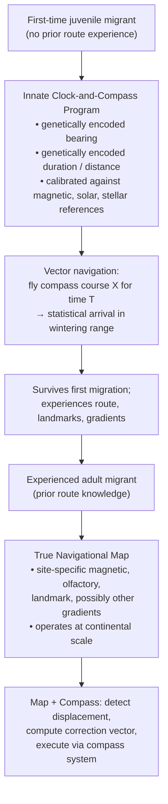
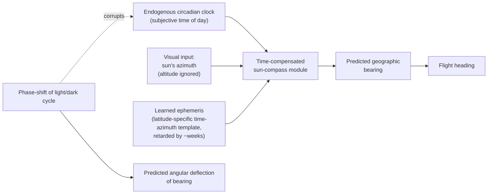
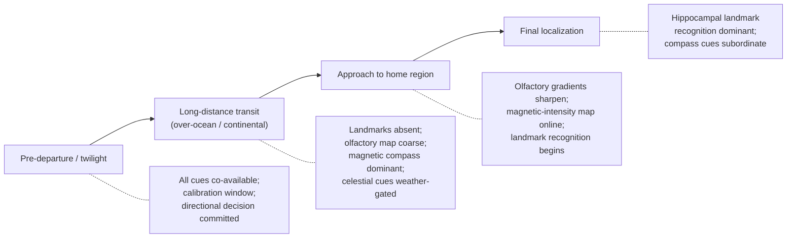
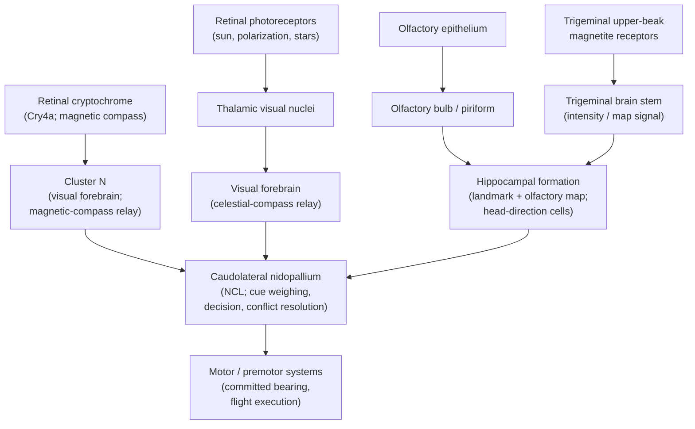
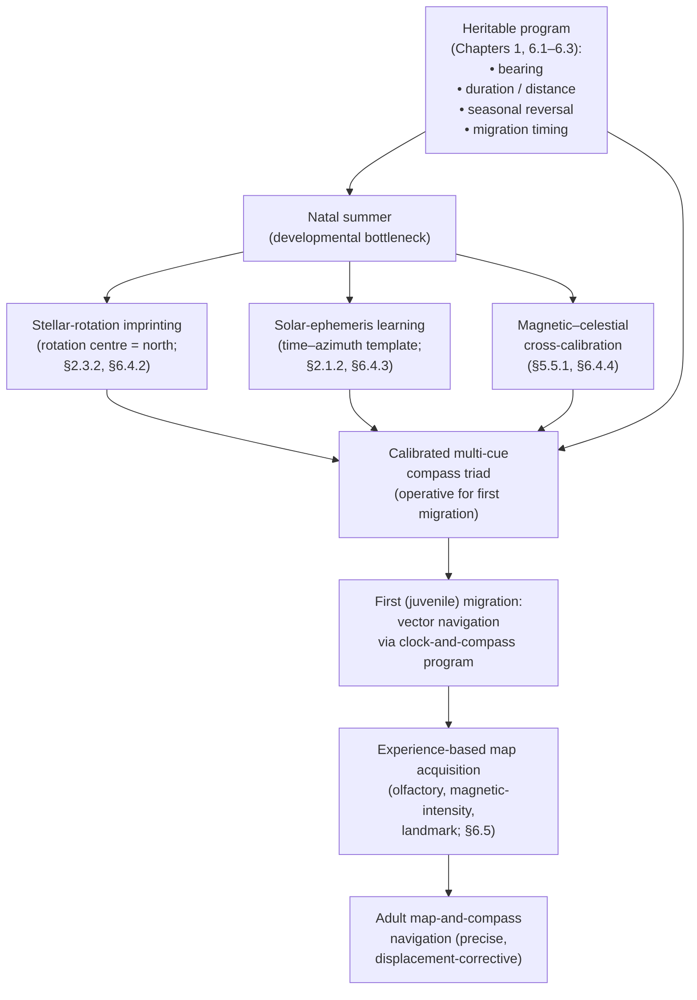

# Precision Navigation in Avian Migration: Multi-Cue Orientation Mechanisms and Ecological Disturbances
# 1 Introduction and Theoretical Framework: The Map-and-Compass Paradigm

Few biological phenomena pose a more profound puzzle to ecology and sensory biology than the annual migrations of birds. Each year, billions of individual birds depart breeding grounds, traverse oceans, deserts, and continents, and arrive with remarkable consistency at specific wintering territories—often returning to the same nest bowl, marsh, or coastline they left months earlier. The precision of these journeys, undertaken by individuals weighing as little as a few grams and lacking any of the technological aids used in human navigation, raises a fundamental question: through what sensory, cognitive, and neural mechanisms do migratory birds determine where they are, where they must go, and how to get there? This opening chapter establishes the empirical scale of the problem, introduces the **map-and-compass conceptual paradigm** that has structured navigation research since the 1950s, and lays the theoretical scaffolding upon which the remainder of the report builds its analysis of compass systems, sensory mechanisms, multi-cue integration, and ecological disturbances.

## 1.1 The Scale and Precision of Avian Migration: Defining the Research Question

The magnitude of avian migration is staggering both in numbers and in geographic reach. Global censuses estimate that the world hosts on the order of **~50 billion individual birds across roughly 9,700 species**[^1], and citizen-science platforms such as eBird have already amassed more than two billion observations spanning over 11,000 species, making it possible for the first time to estimate continental-scale migration traffic with quantitative rigor[^2]. A substantial fraction of these birds are migratory: continent-wide radar and tracking studies indicate that billions of individuals undertake regular cyclical journeys every year, with seabirds and shorebirds routinely circumnavigating ocean basins and tiny songbirds crossing thousands of kilometres between hemispheres[^3].

The exemplar of such performance is the **Arctic Tern (*Sterna paradisaea*)**. Geolocator tracking of 11 birds breeding in Greenland and Iceland revealed an average annual round-trip migration of approximately **70,900 km (range 59,500–81,600 km)**, with some individuals exceeding 80,000 km in a single year[^4]. Because Arctic Terns can live more than 30 years, the cumulative lifetime distance can exceed **2.4 million km—roughly equivalent to three return journeys to the Moon**[^4]. The route is not a simple meridional sweep: post-breeding birds first travel to a previously unknown oceanic stopover in the eastern Newfoundland Basin, where they remain for an average of about 24.6 days at the productive boundary between cold northern and warmer southern waters; they then continue south along either the West African or the Brazilian coast before converging on Antarctic waters between roughly 58°S and the Weddell Sea, returning northward along a sigmoidal trajectory that exploits clockwise North-Atlantic and counter-clockwise South-Atlantic wind systems[^4][^5]. Northbound migration covers about 25,700 km in only 40 days (mean ground speed ≈ 520 km·day⁻¹), illustrating that the navigational system must operate not only across enormous distances but also at the limits of energetic performance[^4].

Long-distance feats are by no means restricted to seabirds. Comparable journeys are routinely documented in shorebirds and passerines, with migratory shorebird species displaying short, medium, and long migration distances that vary systematically with life-history traits[^6], and long-distance migrant passerines repeatedly visiting specific stopover regions across thousands of kilometres of continental geography[^7]. Importantly, these journeys are not stochastic. Beyond the directional choice itself, birds display marked **philopatry and site fidelity**—the tendency to return year after year to the same breeding, wintering, and stopover sites. In waterfowl, for example, documented site-fidelity rates reach **40 % in Central Valley pintails, 75 % in San Francisco Bay canvasbacks, more than 75 % in Pacific-coast Barrow's goldeneyes, and 85 % in Atlantic-coast black ducks**, with banding studies of mallards in the Lower Mississippi Alluvial Valley showing that nearly 52 % of recoveries within one year occur within 50 km of the banding site, and individual birds repeatedly harvested on the same property where they had been banded[^8]. Stopover-site fidelity, although typically lower than fidelity to terminal sites, is nonetheless detectable in long-distance migrant passerines that visit many stopovers per journey[^7], and tern and shearwater tracking studies routinely reveal individuals returning to the same colony rocks—and even the same nest scrape—after pelagic excursions of tens of thousands of kilometres[^4].

**Three observations therefore define the central research question of this report.** First, the spatial scale of the navigational task is global, often spanning hemispheres and crossing wholly featureless oceanic expanses. Second, the precision is extraordinary: birds repeatedly arrive at specific points on Earth's surface to a degree that random search or simple climatic tracking cannot explain. Third, this performance is achieved with sensory hardware that is biologically miniature and evolved long before the modern environmental stressors—light pollution, electromagnetic noise, climate change, habitat fragmentation—that increasingly threaten it. The report's overarching question follows directly: **by what mechanisms do birds achieve such precise positional and directional navigation, and through which pathways do natural and anthropogenic disturbances erode this precision?**

## 1.2 The Map-and-Compass Conceptual Model

Although hypotheses about bird navigation date back to the late nineteenth century, the modern theoretical framework crystallized in the early 1950s with the work of Gustav Kramer. Surveying half a century of inconclusive sensory-deprivation experiments, Kramer proposed that homing and migratory orientation are best understood as a **two-step process**, in which a bird first establishes its geographic position relative to a distant goal, and only afterwards selects and maintains the appropriate flight direction with the aid of an external directional reference, or compass[^9]. This formulation, now universally referred to as the **map-and-compass model**, was decisively supported when subsequent clock-shift experiments demonstrated that pigeons exposed to phase-shifted light/dark cycles deflect their bearings in the predicted direction—incontrovertible evidence that they consult a time-compensated solar compass during the second step of homing[^9][^10]. Kramer's framework "still forms the basis of our present concept on avian homing" and has remained the dominant scaffolding upon which six decades of navigation research have been built[^9].

The model's enduring power lies in its conceptual cleanliness: it separates two logically distinct kinds of information that any navigating animal must possess.

| Component | Information Type | Question Answered | Examples of Cues Implicated |
|---|---|---|---|
| **Map** | Positional / geographic | "Where am I relative to my goal?" | Site-specific gradients—magnetic intensity and inclination, atmospheric odors, visual landmarks, possibly infrasound; learned at familiar sites or extrapolated from gradients |
| **Compass** | Directional | "In which direction must I fly?" | Sun azimuth + internal clock; skylight polarization; star patterns and celestial rotation axis; geomagnetic inclination/intensity vector |

The *map step* requires that the bird extract, from cues available at the release or departure site, an estimate of its position relative to a remembered or innate goal. Kramer himself proposed that this step might exploit a **'grid map' based on environmental gradients**, whose isolines a bird could read in two dimensions[^9]. The *compass step* then translates the resulting bearing into actual flight by reference to an external directional cue. Crucially, Kramer's logic implies redundancy: any cue capable of providing reliable directional information can in principle serve as a compass, and any cue that varies predictably across geographic space can in principle contribute to the map. Modern research has shown that birds in fact possess at least three compass mechanisms—a time-compensated sun compass, a star compass based on celestial rotation, and a magnetic compass keyed to field inclination—and that these may be combined with map information derived from magnetic gradients, olfactory landscapes, and learned visual landmarks[^9].

The map-and-compass dichotomy provides the structural backbone of this report. **Chapters 2 and 3 examine compass systems**: the celestial compasses (sun, polarized light, stars; Chapter 2) and the magnetic compass together with its biophysical basis (Chapter 3). **Chapter 4 turns to map-relevant cues**: olfactory gradients, visual landmarks, and acoustic information. **Chapter 5** then synthesizes how birds operate these multiple map and compass mechanisms in parallel, calibrate them against one another, and resolve conflicts hierarchically—integration questions that Kramer's two-step model implicitly demands but does not itself answer. **Chapter 6** addresses the genetic and developmental origins of these systems, **Chapter 7** evaluates the disturbances that compromise them, and **Chapter 8** identifies the open methodological frontiers. Throughout, the map/compass distinction serves not as a rigid taxonomy—several cues, notably the geomagnetic field, contribute to both components—but as an analytical lens that keeps positional and directional questions conceptually separate even when their physical substrates overlap.

It should also be emphasized that the model originated in studies of *homing*, the return of a displaced bird to a known goal, and was subsequently extended to *migration*, the seasonal travel between distant breeding and wintering ranges. Wiltschko's 2003 synthesis underscores that the two-step logic appears to be a "common feature of avian navigation tasks," but that **the origin of the compass course differs by task**: bearings are acquired through individual learning for movements within the home range, derived from navigational map information for returning to a known home, and obtained from "genetically coded information in first-time migrants"[^9]. This last category brings us directly to the second great organizing axis of the report: the contrast between innate and learned navigation.

## 1.3 Innate Clock-and-Compass Programs versus Learned Navigational Maps

Among the most consequential discoveries of twentieth-century ornithology was that **first-time juvenile migrants and experienced adults navigate by fundamentally different rules**. The seminal evidence came from A. C. Perdeck's large-scale starling and chaffinch displacement experiments of the late 1950s, in which juveniles displaced laterally from their normal flyway continued to fly in their genetically prescribed direction and ended up in geographically inappropriate wintering areas, whereas adults compensated for the displacement and corrected their course toward the species-typical wintering range[^9]. Subsequent studies confirmed and extended this dichotomy: migrating juvenile pied flycatchers (*Ficedula hypoleuca*) displaced east of their normal route do not compensate for the geographic shift[^9], and Mouritsen's modelling work showed that the simple **'clock-and-compass' algorithm**—a genetically encoded bearing maintained for a genetically encoded duration—can by itself reproduce the empirical distribution of ringing recoveries of inexperienced migrants without invoking any map at all[^9][^10].

The strongest field demonstration of the ontogenetic transition is Thorup and colleagues' radio-tracking of white-crowned sparrows (*Zonotrichia leucophrys*) displaced 3,700 km from the west to the east coast of North America. **Adults rapidly recognized the displacement and corrected toward their previously known wintering grounds, whereas juveniles continued in their innate southerly heading, ignoring the continental-scale shift entirely**—evidence that the experience-based "navigational map used by adult long-distance migratory songbirds extends at least on a continental scale," while juveniles "rely on their innate program to find their distant wintering areas and continue to migrate in the innate direction without correcting for displacement"[^9]. Comparable conclusions emerge from a strong-magnetic-pulse study on naturally migrating European Robins, where the pulse degraded the precision of adults' departure bearings but had no detectable effect on juveniles, again pointing to a map sense that develops only with experience[^9].

The map-versus-vector distinction is mirrored in homing research, which provides much of the experimental rigor underlying the framework. Wiltschko & Wiltschko's ontogenetic studies of homing pigeons showed that **very young, inexperienced birds depend on outward-journey information to compute the direction back to the loft and become disoriented when this information is corrupted**—for example, when birds are transported in a distorted magnetic field or in total darkness—whereas experienced trained pigeons, which have switched to using local "map" information obtained at the release site, are unaffected by such manipulations[^9]. The same conceptual architecture has now been demonstrated in non-pigeon, free-ranging wild birds: Orchan and colleagues' translocation of stone curlews (*Burhinus oedicnemus*) revealed a striking two-phase homing trajectory consisting of a long, tortuous *wandering phase* followed by a short, direct *return phase*—a behavioural signature directly interpretable as the map step (acquiring or refreshing positional information) preceding the compass step (committing to a homeward bearing)[^9]. Long-distance seabird studies extend the picture: Manx Shearwaters and other shearwaters know "the direction and distance home" from free-ranging foraging trips but "fail to encode intervening obstacles," indicating a map-and-compass system that resolves position globally rather than as a path-integrated route[^10]. Conversely, magnetic-field manipulation in the homing of wandering albatrosses had no detectable effect on their orientation performance, suggesting either a different sensory weighting or sufficient redundancy that a single cue's removal is invisible at the scale of a foraging trip[^9]—a reminder that the multi-cue paradigm allows considerable interspecific variation.

These findings collectively justify a developmental and cognitive distinction that the rest of the report will repeatedly invoke:

The figure highlights two central points. First, **innate vector navigation and map-based true navigation are not alternatives but successive ontogenetic stages**: the juvenile's clock-and-compass program is the developmental precondition for the eventual acquisition of an experience-based map[^9]. Second, the multi-cue architecture is present at both stages: the juvenile vector requires an external compass reference to be expressed in geographic space (and these references are themselves cross-calibrated, as Chapters 2 and 5 will detail), while the adult map relies on multiple gradient and landmark systems that converge on a positional estimate. The implication for the rest of the report is direct—any analysis of navigational cues, integration mechanisms, or disturbances must be interpreted in light of the bird's life-history stage and the redundancy structure of the cues available to it.

## 1.4 From Multi-Cue Paradigm to Ecological Disturbance: Roadmap of the Report

The picture that emerges from §§1.1–1.3 is of a **layered, redundant, and developmentally structured navigation system**. Birds do not depend on a single sensory channel: they possess at least three compass mechanisms—solar, stellar, and magnetic—operating in different temporal and meteorological windows; they combine these compasses with map information drawn from magnetic gradients, atmospheric odors, and visual landmarks; and they shift the relative weight of these sources across ontogeny, from a near-exclusive reliance on innate vectors in naive juveniles to a flexible map-and-compass strategy in experienced adults[^9]. Modern reviews emphasize that these compass systems form a **hierarchy** that must be calibrated relative to one another, with astronomical cues commonly calibrating the magnetic compass during pre-migratory development and migration-period strategies showing additional species-specific complexity[^9]. The neural implementation of this integration is itself multi-regional: the hippocampus is implicated in storing and consulting maps, structures such as Cluster N in the visual forebrain process magnetic compass information through an ascending thalamofugal pathway, and the caudolateral nidopallium has been hypothesized to weigh conflicting cues and adjudicate decisions[^9].

This redundancy is the source of the system's astonishing robustness—but it is also the reason that **ecological disturbances act through distinct, partly independent pathways** rather than through a single sensory failure. Light pollution and overcast skies attack the celestial compasses; geomagnetic storms and anthropogenic radio-frequency electromagnetic noise attack the magnetic compass and its underlying radical-pair chemistry; habitat loss, building collisions, and stopover degradation attack the spatial substrates over which the navigational map is learned and expressed[^9]; and climate change reshuffles the phenological and geographic anchors of the entire system. Because of redundancy, a bird may sometimes compensate; because of cue calibration, the failure of one cue may corrupt the calibration of others; and because of ontogeny, juveniles and adults are vulnerable in different ways—juveniles to anything that distorts their innate compass references, adults to anything that erases or relocates the map cues they have learned. Crucially, paleodemographic analyses of seasonally migratory songbirds indicate that migration is a deeply rooted life-history strategy associated with larger and more variable effective population sizes over evolutionary time, with initial population-growth periods extending over **0.75–4.3 million years**[^11]; the contemporary anthropogenic threats that interfere with the navigational system therefore act on traits that have been finely tuned across geological timescales and cannot be reconstituted on ecological ones.

The remainder of the report unfolds along this logic:

| Chapter | Theme | Conceptual locus in map-and-compass framework |
|---|---|---|
| **2** | Celestial compasses (sun, polarized light, stars) | Compass step; calibration reference for magnetic compass |
| **3** | Magnetic compass and biophysical magnetoreception | Compass step; also contributor to map step via gradients |
| **4** | Olfactory navigation, landmarks, acoustic cues | Predominantly map step; landmarks also enable familiar-area piloting |
| **5** | Multi-cue integration, calibration, hierarchy | The architecture that binds map and compass into a single navigational system |
| **6** | Genetic and developmental foundations | Origin of the innate clock-and-compass program; learning rules for the map |
| **7** | Disturbances and conservation | Failure modes of the cue system; intervention points |
| **8** | Open questions and methodological frontiers | Unresolved mechanisms (in vivo radical-pair verification, neural integration) |

Three reading principles, derived from this introduction, will be applied consistently in the chapters that follow. First, **no cue is treated in isolation**: each compass and map mechanism is examined for how it interacts with, calibrates, or is overridden by others. Second, **species, life stage, and journey phase are made explicit**: evidence from European Robins, homing pigeons, white-crowned sparrows, Arctic Terns, and stone curlews speaks to different facets of the system, and overgeneralization across these contexts is avoided. Third, **distinctions between established consensus, leading hypotheses, and emerging speculation are preserved**—a discipline that is particularly important for the biophysical mechanisms of magnetoreception (Chapter 3) and for the still-cryptic map step in non-pigeon wild birds (Chapter 4)[^9]. With this scaffolding in place, the report now turns to the celestial compasses—the sensory channel through which Kramer first demonstrated that the second step of avian navigation is, indeed, a compass step.

# 2 Celestial Compasses: Solar, Polarized Light, and Stellar Cues

The Introduction closed by reasserting that Kramer's two-step model demands an external directional reference for the *compass step*, and that the bird's central nervous system in fact reads several such references in parallel. Historically, however, the conceptual breakthrough that turned avian navigation from a 'mystery sense' into an experimental science came not from magnetism, olfaction, or landmarks, but from the sky. Between roughly 1950 and 1975, three sets of experiments—Kramer's mirror trials on caged Starlings, Schmidt-Koenig's clock-shift homing studies on pigeons, and Emlen's planetarium work on Indigo Buntings—demonstrated, in turn, that a diurnal migrant references the sun's azimuth in time-compensated fashion, that this same compass underwrites map-and-compass homing, and that a nocturnal migrant references the rotational geometry of the stars rather than any fixed pattern of constellations. Together with the post-1980 work on skylight polarization, these findings established the **celestial compass triad** that this chapter dissects: a time-compensated sun compass, a twilight-polarization compass, and a time-independent stellar compass based on celestial rotation. Crucially, none of these is autonomous; each is acquired, calibrated, and partially overridden in interaction with the others (and with the magnetic compass treated in Chapter 3), so that the triad is best read not as three rival channels but as a redundant, hierarchically calibrated system whose joint operation explains both the precision of clear-sky orientation and the failure modes induced by cloud, light pollution, and equatorial geometry.

## 2.1 The Time-Compensated Sun Compass

### 2.1.1 Kramer's mirror experiments and the discovery of the compass step

The empirical anchor of avian celestial orientation is the series of caged-bird studies that Gustav Kramer reported in 1950–1952. Working with European Starlings (*Sturnus vulgaris*) showing nocturnal restlessness — what Kramer christened *gerichtete Zugaktivität*, "oriented migratory activity" — he found that captive birds in a circular cage adopted statistically reliable headings appropriate to their seasonal migratory direction whenever they could see the sun, and that the reproducibility of these compass directions could be demonstrated either by exploiting spontaneous migratory restlessness or by directional training[^12][^13][^14]. The decisive step was the **mirror experiment**: by inserting mirrors into the cage so that the apparent azimuth of the incoming sunlight was deflected by a known angle, Kramer was able to deflect the bird's chosen heading by the same angle, "more particularly, it has [been shown] that if the incidence of light is changed by use of a mirror arrangement, the direction chosen by the Starling changes correspondingly"[^12][^15]. This was the first direct demonstration that birds use the sun for orientation, and it is universally identified as the founding experiment of avian compass research[^15][^14].

Two follow-up programmes converted Kramer's qualitative discovery into a quantitative mechanism. First, Kramer and von St. Paul showed that Starlings could be trained to a specific compass direction defined relative to the sun, establishing that the relevant solar variable is *azimuth* (its compass bearing on the horizon) rather than altitude or some intensity cue[^14]. Second, Hoffmann's directional-training studies and Schmidt-Koenig's clock-shift experiments addressed the most awkward feature of any solar compass: because the Earth spins, the sun's azimuth changes through the day, so a bird that always flew "south of the sun" would describe a complete arc as the sun moved across the sky. Hoffmann showed in caged birds, and Schmidt-Koenig confirmed in homing pigeons, that **birds compensate for this apparent diurnal motion by reference to an endogenous circadian clock**: when the clock is experimentally phase-shifted by holding birds for several days under an artificial light/dark cycle offset from local time, their bearings deflect by the angle predicted from the difference between local solar azimuth and the azimuth that the bird "expects" given its subjective time[^16][^14]. Schmidt-Koenig (1958, 1961) thereby established that pigeons consult a **time-compensated sun compass during initial orientation in homing**, and this finding "is the principal evidence for the existence of a map-and-compass navigational system"[^16][^14] — directly underwriting the framework laid out in Chapter 1.

Quantitatively, the system is impressively accurate. McDonald's laboratory studies with directionally trained pigeons reported angular accuracy of **±3° to ±5°**, and field homing experiments at the magnetic equator have documented sun-compass orientation with angular resolution of about **3°** under the extreme conditions of equinox, when the sun crosses near the zenith[^16][^14]. Such precision implies not only a stable circadian reference but also a learned representation of the **ephemeris function** — the species-specific mapping between time of day and solar azimuth at the relevant latitude.

### 2.1.2 Latitudinal limits and the learned ephemeris

The ephemeris function is not innate in the simple sense of being identical at all places. Hoffmann and Schmidt-Koenig found that **caged birds trained at medium northern latitudes were able to allow for the sun's apparent movement after displacement north of the Arctic Circle**, where the midnight sun describes a closed arc through 360° of azimuth, but were unable to do so at equatorial and trans-equatorial latitudes, where the sun's path crosses near the zenith and reverses its azimuthal sense over the year[^16][^14]. Pigeons living year-round under equatorial skies do, however, master these conditions, achieving the ~3° resolution noted above[^16][^14]. The implication is that the ephemeris is **learned from solar experience during ontogeny**, which is consistent with Wiltschko & Wiltschko's developmental finding that young pigeons must observe the sun for some weeks before they can use it as a compass[^14].

Two further empirical wrinkles complicate the simple picture of an exact, fully time-compensated reference. First, preliminary analyses by Schmidt-Koenig, Ranvaud, Ganzhorn and colleagues indicate that **the homing pigeon's internal ephemeris is retarded by several weeks** relative to the actual solar calendar, suggesting that the bird's time-azimuth template is updated relatively slowly and reflects a temporal average rather than the instantaneous celestial geometry[^16][^14]. Second, **the sun's altitude is ignored**, even though altitude could in principle provide latitude information; this rules out the older "sun arc" or solar-bicoordinate hypotheses (Mathews) at least as a routine homing mechanism[^16][^14]. The map step in Kramer's framework is therefore not derived from solar elevation but from other gradients (Chapter 4), with the sun providing direction only.

In the open ocean, where map cues are sparse and the magnetic field changes only slowly with latitude, the contribution of the sun compass has been verified by *in situ* clock-shift experiments on a pelagic seabird, demonstrating that even strongly magnetic taxa rely on solar reference when it is available[^17]. The combined picture is summarized in the following process diagram:

### 2.1.3 Beyond classical time-compensation: heading indicators and time-dependent landmarks

Although the orthodox time-compensated sun compass remains the consensus mechanism, Guilford & Taylor (2014) issued an important conceptual revision. They argued that "while birds almost certainly do use a time-compensated sun compass in the classical sense, this does not exclude the possibility that they use solar cues in other ways for orientation," and that the long-standing equation between *deviation under clock shift* and *operation of a true compass* is not in fact tight[^18]. Three of their distinctions matter for the rest of the report.

| Mode of solar use | Time compensation required? | Functional role | Behaviour under clock shift |
|---|---|---|---|
| **Full time-compensated sun compass** (Kramer/Schmidt-Koenig) | Yes — accurate throughout the day | Provides absolute geographic direction; underwrites map-and-compass homing | Predictable angular deflection |
| **Partial / time-limited compensation** | Limited — accurate only at biased times of day from associative experience | Provides directional reference within learned temporal windows | Deflection possible but artefactual if release times are biased |
| **Sun as heading indicator** (analogue of aircraft gyrocompass) | No — bird flies at constant angle to sun, with optional offset correction of ~15°/h | Maintains a course already set; permits straight tracks over minutes-to-hours | **Invariant** under clock shift |
| **Time-dependent landmarks / shadows** | No — but visually time-coded | Provides direction or place recognition through patterns of light, shade and shadow on familiar landscape | Can produce clock-shift deflection through misrecognition of place rather than compass error |

Guilford and Taylor showed mathematically that a bird flying at a constant angle to the sun would describe an arc whose curvature is **indiscernible over a few minutes** — at a 60 km/h cruising speed it would deviate by less than 0.5 km from a straight line over 15 min, and the residual drift can be eliminated by a constant offset correction of ~15°/h that *does not* require knowledge of time of day, only of elapsed time[^18]. This is functionally equivalent to the sun compasses used by transpolar pilots and by the British Army in North African desert campaigns of WWII and the First Gulf War[^18], and it implies that *some* of the clock-shift deflections reported in the literature may reflect a heading-indicator process rather than a fully time-compensated compass[^18]. They additionally proposed that solar shadows could superimpose **directional sense on otherwise undirected landmarks** — a tall tree, a hedgerow, a road — and that recognition of familiar places can itself be time-dependent, so that clock shift may produce orientation errors through *failure to recognize a place* rather than through compass deflection per se[^18].

For the present report, three implications follow. First, the sun compass should be understood as a *family* of solar uses rather than a single mechanism. Second, the clock-shift signature, although diagnostic and historically central, is not the unique fingerprint of the compass step; it can arise from any time-coded use of solar information. Third, the dominance of the sun compass in diurnal species (notably homing pigeons) co-exists with auxiliary functions — heading maintenance, place recognition — that will reappear in Chapter 4's discussion of landmark guidance and Chapter 5's analysis of cue hierarchy.

## 2.2 Skylight Polarization Patterns at Twilight

### 2.2.1 Physical structure of the polarization field

Long after the solar disk has set, the sky retains a stable, geometrically organized signature of the sun's position: the **polarization pattern of skylight**, generated by Rayleigh scattering of sunlight by atmospheric molecules and aerosols. The Rayleigh sky model predicts that the local degree of polarization $\delta$ depends on the angular distance $\gamma$ between observer pointing and the sun, according to
$$\delta = \frac{\delta_{\max}\sin^{2}\gamma}{1+\cos^{2}\gamma},$$
so that polarization is **maximal in a band 90° from the sun**, where realistic clear-sky values of about **80%** are reached[^19]. At twilight, when the sun lies on or just below the horizon, this band of maximal polarization wraps along the **north–zenith–south meridian**, with the e-vector vertical at the horizon in the north and south[^19]. The pattern is highly stable: it appears about 45 minutes before sunrise and persists about 45 minutes after sunset, and once established it changes only by rotation, not by structure[^19]. Three "neutral points" — the **Arago point** above the antisolar horizon and the **Babinet** and **Brewster** points above and below the sun, respectively — are loci of zero polarization that mark the boundaries of regions of opposite e-vector orientation, and their positions shift predictably with solar zenith distance[^19]. Crucially, the moon at night produces the same pattern at lower intensity, and the polarization signature persists *under thin cloud or in patches of clear sky between clouds* provided the air beneath is directly sunlit[^19], features that confer ecological robustness on a polarization-based compass.

### 2.2.2 Behavioural evidence in birds

That birds exploit this pattern was first established in passerines by depolarization and shift experiments in the 1980s and 1990s. Helbig demonstrated that **artificial depolarization of the natural twilight skylight disrupts the orientation of an avian nocturnal migrant**, and Helbig & Wiltschko showed that the dusk polarization pattern affects the orientation of Blackcaps (*Sylvia atricapilla*); Moore & Phillips reached parallel conclusions for Yellow-rumped Warblers (*Dendroica coronata*), and Able demonstrated more generally that skylight polarization patterns influence the migratory orientation of birds[^14][^20]. These studies converge on the conclusion stated by the Wiltschkos themselves in summary form: **skylight polarization patterns are not necessary for the occurrence of migratory orientation, but birds respond strongly to manipulations of the pattern**, indicating that polarization is a usable, but not indispensable, channel within the celestial-compass triad[^20].

The most economical demonstration that twilight solar geometry — sun azimuth together with its polarization context — provides sufficient directional information for nocturnal migration comes from **mirror experiments with Savannah Sparrows (*Passerculus sandwichensis*)**, a North-American night migrant. Moore tested the hypothesis that this species selects a migratory heading on the basis of the setting sun: control birds in Emlen funnels showed directionality appropriate for spring migration (mean vector $\bar{a}=342°$), whereas experimentals exposed to a mirror-shifted sunset showed a mean heading of $\bar{a}=272°$ — that is, deflected to the expected westerly direction relative to the controls (V-test, $P<0.05$)[^21]. The interpretation, in Moore's own words, is that **"the setting sun appears to be a sufficient source of directional information for this avian migrant"**, with stars functioning as celestial reference points consulted later in the night[^21][^22]. Parallel sunset and dusk studies of European Robins (*Erithacus rubecula*) and Pied Flycatchers (*Ficedula hypoleuca*) confirm that dusk solar information plays a comparably critical role across passerine taxa[^21][^14]. Importantly, an integrative review of orientation-cage and free-flying field data concluded that **night-migrating birds integrate directional information prior to departure, probably during the transition between daylight and darkness**, when sun-related cues — direct solar azimuth, polarization patterns, and the pattern of illumination at the horizon — converge to define the bearing carried into the night[^21][^22].

A subtler experiment with Savannah Sparrows nuances the picture. Under a 4-h slow clock shift in northern Canada, birds responded with an **axial mean orientation aligned with the position of the setting sun in the NW and with the preferred migratory direction in the SE**, and after six days of shift they shifted toward NNE; however, individual reactions varied, and the authors concluded that the birds did not select a constant menotactic angle to the sun but were variously phototactic toward the solar disk or driven by their magnetic compass[^21]. This is itself a useful illustration of the two-stage Guilford-Taylor logic: at high geomagnetic latitudes, where declinations change rapidly and stars are absent under the polar summer, the same sunset cue that operates as a compass farther south may collapse to a heading indicator or even a phototactic stimulus, and species adopt species-specific weighting strategies.

### 2.2.3 Polarization as a calibration reference and an open controversy

Beyond providing directional information in its own right, twilight polarization has been proposed as a **cross-calibration channel** between the sun, the stars, and the magnetic compass. Phillips & Waldvogel argued that celestial polarized-light patterns could serve as a calibration reference for the homing pigeon's sun compass[^14], and Helbig's work established the polarization sensitivity of nocturnal migrants at the very moment when the calibration of stellar against solar references must occur[^14][^20]. More controversially, Muheim and colleagues proposed that **birds recalibrate the magnetic compass using the polarization pattern at sunrise and sunset**, particularly the pattern just above the horizon, where the e-vector geometry uniquely encodes north–south. This claim was sharply contested by the Wiltschkos and colleagues, who pointed out that polarization is *physically weakest* near the horizon — typically much less than the ~70% maximum reached near the zenith — and that the assumption of a horizon-specific calibration "is counter-intuitive and makes no sense"; they further argued that some of the supporting data (Able & Able 1995a; Cochran et al. 2004) do not unambiguously demonstrate horizon-mediated recalibration, and that selecting birds *post hoc* by their migratory orientation introduces statistical bias[^21]. The dispute remains unresolved, and is flagged here as an example of an **ongoing controversy** that will reappear in Chapter 5 when we examine cue calibration in detail and in Chapter 8 when we list outstanding methodological frontiers. Per the report's reasoning standards, the Muheim view is here treated as a *strongly supported but contested hypothesis*, not as established consensus.

## 2.3 The Stellar Compass and Celestial Rotation

### 2.3.1 From the Sauers to Emlen: discovery of nocturnal stellar orientation

For nocturnal migrants — which include most passerine long-distance migrants — neither the solar disk nor (during the deepest night) the polarization pattern is generally available as a directional reference. The first proof that birds can substitute the stars came from the German husband-and-wife team Edgar and Eleonore Sauer in the late 1950s, who placed warblers in outdoor arenas where the only visible cue was the night sky and observed that the birds attempted to fly in their expected migratory direction — but only on clear nights, not under cloud cover; the same effect was reproduced inside a German planetarium showing artificial stars[^23][^24]. Stephen Emlen subsequently provided the rigorous experimental dissection of the underlying mechanism using **migratory Indigo Buntings (*Passerina cyanea*)** at the Longway Planetarium in Flint, Michigan, and at Cornell, and his work became the canonical reference for stellar orientation in nocturnal migrants[^25][^26][^23][^24].

Emlen's experimental tool was the **Emlen funnel** — a funnel-shaped cage with the bird at the narrow base, an ink pad on which the bird's feet leave directional marks as it jumps toward its preferred heading, and a wire- or plexiglas-screened top through which only the sky above is visible[^23]. The funnel cage, introduced in 1966, has since become "a generally accepted technique to test bird orientation"[^21], and remains the standard methodological substrate for both sun, polarization, star, and magnetic-compass studies[^21].

### 2.3.2 What the birds were looking at: rotation, not constellations

Emlen's initial finding was negative in a powerful way. He first re-set the planetarium's star projector to a different time of night than local time, expecting that — if the birds used a sun-like time-compensated star compass keyed to absolute star positions — they would deflect in the predicted way. They did not. **"They were not using a clock,"** as Emlen put it: the birds oriented correctly regardless of the simulated time of night[^23]. Stellar orientation is therefore **time-independent**, in sharp contrast to the time-compensated sun compass[^23][^24][^27]. The expected orientation of a nocturnal migrant under a time-independent star compass is straightforward: a bird heading south in autumn maintains its bearing relative to the configuration of the sky above the rotational pole, irrespective of the hour or season[^27].

Emlen then performed a systematic process of elimination by blacking out individual constellations on the planetarium projector. **No single constellation was indispensable**: blocking the Big Dipper, Cassiopeia, or other particular star patterns did not disorient the birds, and "I couldn't link it to any particular star pattern"[^23]. Only when he blacked out essentially all stars within ~35° of Polaris — i.e., the entire **circumpolar region around the rotational axis of the sky** — did the birds become "clueless"[^23]. This pinpointed the relevant cue: **not any specific star pattern, but the geometric region around the celestial pole, the only point in the sky that does not rotate**. The hypothesis that fell out of this elimination was therefore that birds use the *axis of celestial rotation* as their directional reference[^25][^23][^24].

The decisive proof came from a developmental experiment in which Emlen **raised young Indigo Buntings inside a planetarium under an artificial sky whose axis of rotation was centred on Betelgeuse rather than Polaris**[^23][^28]. When these hand-reared birds reached migratory age and were tested in funnel cages, they oriented as if Betelgeuse were 'north' — i.e., they treated the artificially imposed rotational pole as the polar reference of their compass[^23][^28]. Conversely, hand-reared birds exposed to a stationary sky during development showed no consistent stellar orientation later in life[^25][^26][^29]. The implication, summarized in Emlen's celebrated phrase, is that **birds are primed for nocturnal orientation not by an inborn star map but by paying "close attention to the movement of the sky"; they are "hardwired to pay attention to something, which then takes on meaning"**[^23].

### 2.3.3 Developmental window and species variability

This developmental learning rule — visual exposure to the rotating sky during a sensitive period in the natal summer, followed by life-long use of the learned rotational centre as 'north' — has been confirmed in subsequent work and is recognized as one of the clearest examples of a **behavioural sensitive period** in vertebrate sensory ecology: the bird "learns the centre of rotation of the starry night sky and interprets this as 'north'", and "the birds then use the learned location of the rotational centre to calibrate" further compass references[^29]. The ecological logic is robust on long timescales: although Earth's axis precesses and the present North Star, Polaris, will be replaced by Vega in roughly 13,000 years, a learning-based compass automatically tracks any such change, since each new generation re-learns the stationary point of its own sky[^23]. Empirically, Roswitha Wiltschko has further suggested that **different individuals or populations may use somewhat different star configurations as anchors around the rotational pole**: "Different birds might use different star configurations… and apparently there is some individual difference in it. This is a part of orientation where we do not know the details yet."[^23] This individual variability anticipates the species- and age-specific patterns that Chapter 5 will analyse in the context of cue integration.

The central differences between the diurnal sun compass and the nocturnal star compass can be tabulated as follows:

| Property | Time-compensated sun compass | Star compass (rotation-based) |
|---|---|---|
| Reference cue | Sun azimuth | Geometric centre of celestial rotation |
| Time compensation | Required (circadian clock) | Not required (time-independent)[^23][^27] |
| Information used | Bird-specific learned ephemeris of sun's daily path[^16][^14] | Learned location of stationary point in the sky[^25][^23][^29] |
| Acquisition | Solar experience over weeks of ontogeny[^14] | Visual exposure to rotating sky during developmental sensitive period[^23][^29] |
| Diagnostic experiment | Clock shift produces predictable angular deflection[^18][^16] | Planetarium re-axis (Betelgeuse) yields re-learned 'north'[^23] |
| Species exemplar | European Starling, Homing Pigeon[^12][^15][^14] | Indigo Bunting, *Sylvia* warblers[^25][^23][^24] |
| Failure mode | Clock disruption; equatorial geometry; cloud cover | Cloud cover; obscuration of pole region; insufficient developmental exposure[^23] |

## 2.4 Limitations and Failure Modes of Celestial Compasses

The celestial triad is powerful when the sky is visible, geometrically well-structured, and free of artificial perturbation — but each of these conditions can fail in nature, with quantitatively different consequences for orientation precision. This section reviews the principal failure modes; Chapter 7 returns to those modes that are exacerbated by anthropogenic disturbance.

### 2.4.1 Cloud cover, depolarization, and below-cloud flight

The most common natural perturbation of celestial cues is cloud. Radar studies of free-flying nocturnal migrants by Able compared autumn migration tracks under overcast and clear skies and found a graded response: when **birds flew below the cloud cover, "there were essentially no discernible effects"** — flight was as straight, level, and fast as under clear skies[^22]. This implies that **horizon, terrain features, and possibly residual polarization beneath the cloud base** can substitute for direct visibility of sun or stars in maintaining heading over short timescales, consistent with Guilford & Taylor's heading-indicator function[^18][^22]. With **continuous overcast lasting several days**, however, orientation precision degrades, and birds flying *within* clouds show altered tracks and altitude profiles[^22]. The Sauers' planetarium experiments anticipated the same conclusion at the cage level: warblers oriented under simulated stars, but did not orient when the planetarium 'sky' was obscured[^23][^24]. Helbig's depolarization experiments closed the loop in the opposite direction, showing that even when the polarized component alone is corrupted (with the disk and stars still visible), nocturnal orientation deteriorates[^14][^20]. Thus the celestial compasses are not equally robust: the polarization channel is the most fragile, the star compass tolerates partial cloud as long as the rotational region is visible, and the sun compass is the most robust under thin overcast because the sun's azimuth is often discernible through cloud and because solar polarization can persist below thin cloud[^19].

### 2.4.2 Equatorial geometry and high-latitude declination

A second class of failures concerns geographic geometry. As noted in §2.1.2, the time-compensated sun compass is hard to acquire for birds that have not experienced equatorial or trans-equatorial solar paths; only resident equatorial pigeons achieve full ephemeris compensation under such conditions, and even they show evidence of a retarded internal ephemeris[^16][^14]. In the opposite hemisphere of the globe, **at high northern latitudes, birds face large changes in magnetic declination, rapid longitudinal time-shifts during long-distance flight, and the invisibility of stars during the polar summer**, so that both sunset and geomagnetic cues — rather than stars — assume disproportionate weight in species such as Savannah Sparrows[^21]. The star compass faces an analogous geometric challenge near the equator, where the celestial pole sits at the horizon and the rotational region around it is half-hidden each night. These geographic constraints help explain the species-specific weightings of celestial channels documented across the literature — and reinforce Chapter 1's insistence that compass mechanisms must be evaluated in their ecological and geographic context.

### 2.4.3 Light pollution, satellite mega-constellations, and depolarization

A third class of failures is anthropogenic and directly motivates the conservation analysis of Chapter 7. The polarization of the moonlit night sky is **strongly reduced by urban light pollution because scattered urban light is not strongly polarized**, so that sky regions formerly carrying compass information are filled with depolarized luminance[^19]. Stars near the rotational pole — the very area Emlen's blackouts identified as critical[^23] — are progressively masked by atmospheric skyglow over urban centres, and Emlen himself anticipated, on observing trains of bright SpaceX satellites passing through the night sky, that **"that will completely screw up birds that are up there at night"**[^23]. Working hypotheses in the experimental literature already suggest that artificial light at night can interfere not only with the celestial compasses but also, indirectly, with the radical-pair-based magnetic compass discussed in Chapter 3[^30][^31]. The dung-beetle case study, in which animals lose their orientation when placed atop a Johannesburg rooftop bright enough to drown out the Milky Way, makes the principle vivid for any taxon using starlight as a reference[^23]. From the standpoint of the Rayleigh model, **the polarization pattern beneath a strongly light-polluted night sky is degraded both in degree and in spatial coherence**, eroding the very feature — geometric stability under rotation of the sun's position — that gives the cue its compass value[^19].

### 2.4.4 Individual variability, age, and experience

A final consideration is the **age- and experience-structure of celestial orientation**. Sandberg and colleagues' release experiments showed that under clear skies, **migratorily naive (first-year) Robins and Pied Flycatchers exhibited significantly larger angular dispersion in orientation than adults**, indicating that adult birds orient with higher precision, "due to experience and/or that strong selection among young migrants operates to maintain orientation within narrow limits"[^22]. Similarly, the responses of Savannah Sparrows to clock shifts varied between individuals — some shifting clockwise as predicted, others apparently following the sun phototactically or relying on the magnetic compass — illustrating that **the operative compass mode within any experimental sample can itself be heterogeneous**[^21]. Variability also extends to fine-scale uses of celestial cues: the moon, for instance, does not appear to be used by Savannah Sparrows as a directional compass, but they often orient phototactically to the moon's azimuth, and their response to moonlight is contingent on whether they had earlier viewed the sunset[^21]. These individual and developmental differences interlock with Chapter 1's emphasis on ontogeny — juvenile vector navigation versus adult map-and-compass use — and prefigure Chapter 5's analysis of how birds resolve cue conflicts.

### 2.4.5 Synthesis: the celestial triad as a redundant, hierarchically calibrated system

Taken together, the evidence reviewed in §§2.1–2.4 supports a unified picture rather than three independent compass channels. **Solar, polarization, and stellar references are not interchangeable but coordinated**: the sun compass dominates by day in diurnal species and during the daytime portion of long flights for nocturnal migrants[^17][^22]; the twilight polarization pattern provides the most information-rich window of the diel cycle, when sun-related cues, geomagnetic information, and stars all become available essentially simultaneously, and during which **migrants integrate directional information prior to departure**[^21][^22]; the star compass takes over once the deep night begins and the polarization signal weakens, anchored to the rotational geometry learned during early development[^23][^29]. Each channel calibrates and is calibrated by the others — a point made especially salient by the still-debated role of horizon polarization in setting the magnetic compass[^21] — and each fails under partly disjoint conditions, so that the loss of any one rarely disorients an experienced migrant. This redundancy is the principal reason that birds maintain navigational precision across a wide range of meteorological and geographic regimes, but it is also the reason that anthropogenic stressors, which act through different sensory channels (Chapter 7), can compound: light pollution attacks polarization and stars; cloud attacks all three celestial channels but typically not simultaneously; and any disturbance that compromises the celestial system will throw additional weight onto the geomagnetic compass — to which we now turn in Chapter 3.

# 3 The Magnetic Compass and Biophysical Mechanisms of Magnetoreception

Chapter 2 closed by emphasizing that the celestial triad — sun, polarized twilight, and rotational starlight — fails under predictable but recurrent conditions: cloud and continuous overcast, light pollution and skyglow, equatorial solar geometry, polar summer star-loss, and the open ocean far from any horizon landmark. For an Arctic Tern crossing the South Atlantic, a Bar-tailed Godwit on an eight-day non-stop transoceanic flight, or a European Robin migrating beneath thick cloud, none of the celestial channels can be relied upon throughout the journey. Yet such birds continue to fly directionally. The remaining cue that satisfies the joint requirement of *being globally available* and *being weather-independent* is the geomagnetic field, which, as Beason summarized, "is available everywhere on the planet. It penetrates almost everything: air, water, ground, and the bodies of animals; and it is available day and night"[^32]. This chapter examines the magnetic compass that exploits this field, dissecting first its functional behaviour in the laboratory and the field, then its two competing biophysical substrates — a light-dependent radical-pair mechanism in the retina and an iron-mineral-based mechanism in the upper beak — and finally the dual-receptor architecture that integrates the two into a single, redundant navigational system. The chapter is the conceptual hinge of the report: the magnetic compass functions as a *compass* (linking back to Chapter 2) while magnetite-based receptors contribute to the navigational *map* (linking forward to Chapter 4), and both systems exhibit specific failure modes that will return as the principal targets of the anthropogenic disturbance analysis in Chapter 7.

## 3.1 Functional Properties of the Avian Inclination Compass

### 3.1.1 The Wiltschko coil experiments and the discovery of an inclination compass

The empirical foundation of avian magnetoreception rests on a series of caged-bird studies on European Robins (*Erithacus rubecula*) initiated by Wolfgang Wiltschko in the late 1960s. Working with birds displaying the seasonally appropriate *Zugunruhe* (migratory restlessness) inside Helmholtz coil systems that allowed the ambient magnetic field to be reoriented or attenuated independently of all other cues, Wiltschko showed in 1968 that the migratory direction selected by Robins is controlled by the local magnetic field[^33], and in 1972 Wiltschko & Wiltschko reported the decisive functional discovery that gives the avian compass its modern name: when the **vertical component** of the field was experimentally inverted while the horizontal component was held constant, Robins reversed their migratory bearings; when, instead, the **horizontal component** was reversed while leaving the vertical component intact, the birds did *not* respond to the change[^32][^34]. The behavioural response was therefore controlled by the dip of the field lines rather than by their polarity.

This pattern of responses identifies the avian compass as an **inclination compass**, "which does not rely on the polarity of the magnetic field, but rather on the axial course of the geomagnetic field lines"[^35]. Directional information is extracted from the angle that the field lines make with the gravity vector: where the field lines run obliquely *down* into the Earth, the bird identifies the direction as "poleward"; where they run obliquely *up* out of the Earth, the bird identifies it as "equatorward"; the technical concepts of magnetic north and south play no role[^32][^36]. The same architecture works equally well in both hemispheres — in the Northern Hemisphere the field dips into the ground toward the geographic north, in the Southern Hemisphere toward the geographic south — and converts a single sensor into a hemisphere-agnostic device. Subsequent reviews have confirmed the inclination compass in **18 species of migratory birds** studied to date, and across all of them the same functional properties have been reported[^34].

The contrast with conventional compasses is informative. A technical magnetic compass, as humans use it, is a **polarity compass**: it distinguishes magnetic north from south by the polar sense of the horizontal field component, ignoring the vertical dip. Polarity compasses have been documented in non-avian taxa, most clearly in subterranean mammals such as the blind mole-rat *Spalax*, where field component direction is read by polarity rather than inclination[^37]. The bird's choice of the alternative architecture is functionally consequential: an inclination compass is **insensitive to a 180° reversal of the field's polarity** — birds cannot tell whether the horizontal component points geographically north or south so long as the dip remains the same[^38] — but it is exquisitely sensitive to the geometric angle of the field lines, providing exactly the cue that varies smoothly with latitude across the planet[^36].

### 3.1.2 The narrow functional intensity window

A second diagnostic property of the avian compass is that it operates only within a **narrow functional window** of magnetic intensities centred on the ambient geomagnetic field, which in the species' home range is typically of order 50 μT (≈ 0.5 gauss)[^32]. When Robins captured at a site with a particular field strength are tested in coil-generated fields whose intensity is shifted significantly above or below the local value, they become disoriented; the compass does not simply read the field at any intensity but rather "the limitation of its sensitivity to a narrow range of magnetic intensities"[^39]. Importantly, this is not a fixed instrumental limit. After several days of exposure to the new intensity, Robins re-acquire normal orientation at the new field strength, indicating that the functional window is **adaptable** rather than rigidly tuned. Subsequent theoretical work has formalized this band-pass behaviour as a "functional window… defined as a band-pass-filter-like characteristic wherein the compass sensitivity is appreciable only for a narrow"[^40] range of intensities, a property predicted by — and providing one of the strongest indirect lines of evidence for — the radical-pair model discussed in §3.2.

The ecological corollary of the intensity window is direct. In its normal flight regime, a bird traverses field intensities that vary smoothly across the globe (from roughly 25 μT near the magnetic equator to 65 μT near the poles), and adaptation appears to track these slow changes. But when birds encounter abrupt intensity excursions — a strong magnetic anomaly produced by ferromagnetic crustal rock, a powerful artificial coil, or a geomagnetic storm with rapid intensity fluctuations of 50–100 nT or more[^32] — the field can be temporarily pushed outside the operative window, with predictable degradation of compass performance. Pigeons released within the strong, irregular magnetic anomaly of the Vogelsberg, for example, show longer vanishing intervals and shorter homing vectors than birds released in magnetically quiet terrain, with the impeding effect of the anomaly attributable specifically to magnetic input[^41].

### 3.1.3 Light-dependence, wavelength sensitivity, and right-eye lateralization

The third diagnostic property — the one that ultimately motivates the radical-pair hypothesis — is that the avian compass is **light-dependent and wavelength-sensitive**. Robins, Silvereyes (*Zosterops lateralis*), and several other tested species orient normally under short-wavelength light (blue at ≈ 425–450 nm) and under green-yellow light (≈ 500–565 nm) at low intensities, but the compass fails or produces non-migratory bearings under longer wavelengths. European Robins are disoriented under orange (590 nm) and red (635 nm) light[^32], and are *unable* to use the magnetic compass under yellow illumination unless the yellow is pre-exposed: pre-exposure to dim red can restore compass function under red light, indicating an adaptive process within the receptor itself[^32]. Combinations of two wavelengths produce especially diagnostic responses — under yellow combined with blue, Robins orient consistently to the south regardless of season, while yellow combined with green produces northerly orientation[^32] — pointing to an interaction between at least two spectral channels in the receptor, rather than a single broadband detector.

Crucially, **complete failure of the compass occurs under conditions that exclude the receptor's photochemistry from operating**. Behavioural studies show that under total darkness, under monochromatic red light beyond a threshold wavelength, or under combinations of certain light regimes, birds exhibit **'fixed-direction' responses** — bearings that do not show the seasonal change between autumn and spring and that orient by the *polarity* rather than the inclination of the field[^41]. R. Wiltschko et al. demonstrated that these fixed-direction responses can be selectively disrupted by **local anaesthesia of the upper beak**, indicating that they originate not in the inclination compass but in the magnetite-based receptors discussed in §3.3, which can take over directional control once the radical-pair compass is silenced[^41]. This dissociation will prove central to the dual-receptor architecture of §3.4.

A further diagnostic property is **lateralization**. In European Robins, Australian Silvereyes, and probably the homing pigeon, the ability to use the geomagnetic field for migratory orientation shows "a marked dominance of the right eye for magnetoreception"[^32]: covering the right eye disrupts compass orientation, whereas covering the left eye does not. This right-eye lateralization is consistent with a retinal origin of the compass receptor and with the unilateral neural pathway to the visual forebrain that will be examined in §3.2.

### 3.1.4 Transequatorial migrants and the equator-crossing problem

The inclination architecture creates a specific geometric difficulty for **transequatorial migrants**. At the magnetic equator the field lines run horizontal, the inclination angle is zero, and the cue that distinguishes "poleward" from "equatorward" vanishes. Worse still, on the far side of the equator the dip reverses sign, so that what was "equatorward" in the breeding hemisphere becomes "poleward" in the wintering hemisphere and vice versa. The ecological evidence is that birds crossing the equator do not simply reverse their compass — they switch from an equatorward strategy to a poleward strategy. Beason's experiments on the Bobolink (*Dolichonyx oryzivorus*), a transequatorial New World migrant, and the Wiltschkos' simulated equator-crossing experiments on Garden Warblers (*Sylvia borin*) demonstrate that **experience with the horizontal magnetic field appears to trigger this switch**: birds exposed to the simulated zero-inclination field of the equator subsequently re-orient appropriately for the southern hemisphere when transferred to a southern-type field[^32]. The compass is therefore not blindly inclination-based throughout the life cycle but is gated by an internal switch triggered by exposure to the equatorial geometry, providing one of the clearest demonstrations that the magnetic compass is **embedded in a learning-capable cognitive architecture** rather than implemented as a fixed reflex.

The combined functional profile of the avian inclination compass can be summarized as follows:

| Property | Empirical signature | Diagnostic experiment | Species exemplar |
|---|---|---|---|
| Inclination, not polarity | Reverses bearing on inversion of *vertical* but not *horizontal* component | Wiltschko & Wiltschko 1972 coil experiments[^32][^34] | European Robin |
| Narrow functional intensity window | Disorientation outside ±N % of ambient field; re-adapts in days | Coil-imposed intensity shifts on Robins[^39]; theoretical band-pass model[^40] | European Robin, Garden Warbler |
| Light- and wavelength-dependence | Normal at 425–565 nm; failure / fixed direction under red, yellow, darkness | Monochromatic illumination in funnels[^32][^41] | European Robin, Silvereye, Bobolink |
| Right-eye lateralization | Right-eye occlusion abolishes orientation; left-eye occlusion does not | Eye-occlusion in Robins, Silvereyes, pigeons[^32] | European Robin, Silvereye |
| Equator-switch capability | Bearing reversal triggered by experience of horizontal field | Simulated equator-crossing in Bobolinks, Garden Warblers[^32] | Bobolink, Garden Warbler |

These five properties jointly impose tight constraints on any biophysical model of the receptor. The model must (i) read field axis rather than polarity, (ii) function only within a band of intensities, (iii) require visible light of specific wavelengths, (iv) be located preferentially in the right eye, and (v) be subject to high-level neural gating that allows the direction of "poleward" to be reset by experience. As we will see in §3.2, these constraints together pick out a *single* class of biophysical mechanism known to physical chemistry — the radical-pair reaction.

## 3.2 The Cryptochrome–Radical Pair Hypothesis

### 3.2.1 Theoretical foundations: from Leask to Ritz–Schulten

That the avian compass might involve a quantum-mechanical reaction in a photopigment was first proposed in functional terms by Leask in 1977, who suggested an optical-pumping resonance in a visual pigment such as rhodopsin[^32], and was placed on a chemically realistic footing by Schulten and colleagues, beginning with Schulten (1982), who proposed that the relevant physical process is a **radical-pair reaction** in which the singlet–triplet equilibrium between two unpaired-electron states is modulated by the orientation of the ambient magnetic field[^32]. Ritz, Adem & Schulten (2000) developed this proposal into a quantitative biological model, identifying the **cryptochromes** — flavin-based blue-light photoreceptor proteins known from plants and animals, including the avian retina — as the most plausible candidate molecules; their model showed that the orientation-dependence of singlet/triplet yields in a cryptochrome-bound radical pair could in principle generate the wavelength-sensitive, light-dependent, intensity-banded behaviour observed in birds[^32].

The chemical mechanism is straightforward in outline. Cryptochrome contains a flavin adenine dinucleotide (FAD) chromophore non-covalently bound deep in the protein, and a chain of conserved tryptophan residues running outward to the protein surface. When blue light is absorbed by the FAD, an electron is transferred along the tryptophan chain, generating a **radical pair** consisting of two molecules — one on the FAD, one on the terminal tryptophan — each carrying an unpaired electron. The two unpaired electron spins can be either aligned (triplet state) or opposed (singlet state), and the rate of interconversion between these two spin configurations is sensitive to the local magnetic field on a sub-microsecond timescale. Because the singlet and triplet products of the subsequent chemical reaction differ, a tiny change in the angle of an external magnetic field alters the steady-state yield of the products — providing, in principle, a chemical readout of field orientation[^38].

This mechanism is "well-established in spin chemistry"[^38], and a quantitative literature now exists describing how flavin-tryptophan radical pairs in biologically relevant geometries reshape spin dynamics under realistic magnetic-field anisotropy[^42][^43]. Critically, the radical-pair process is **the only known mechanism by which a magnetic field as weak as the geomagnetic field (≈ 0.5 gauss) can produce a chemical change at room temperature**; conventional chemical kinetics are far too insensitive, and only the spin-coherent dynamics of unpaired electron pairs are quantitatively susceptible at this field strength[^38].

### 3.2.2 In vitro evidence: Cry4a, four-tryptophan chains, and species comparisons

Behavioural and theoretical arguments have been increasingly buttressed by direct biochemical evidence on the candidate molecule itself, **cryptochrome 4a (Cry4a)**. Hore and colleagues' spectroscopic measurements on Cry4a purified from the migratory European Robin demonstrated that the protein has the required magnetic sensitivity in vitro, that it forms photo-induced radical pairs upon blue-light illumination, and that the yields of the resulting radical species depend on the orientation and intensity of an applied magnetic field[^44]. Comparative work has now extended these measurements: Cry4a from non-migratory **domesticated quail** shows magnetic properties similar to those of robin Cry4a, suggesting that the basic photochemical machinery is broadly conserved across birds rather than uniquely present in long-distance migrants[^45][^46]. The functional implication, however, is not that all birds magnetically orient with equal facility but that selection in migratory taxa has likely tuned the *protein context* — its membrane association, its expression level, the precise composition of the tryptophan chain — to optimise magnetic sensitivity for navigation.

Indeed, recent work has refined the canonical three-tryptophan model into a **four-tryptophan chain** in which a fourth, more distant tryptophan participates in the electron-transfer cascade and reshapes the spin dynamics of the radical pair in ways that may explain why animal cryptochromes outperform their plant counterparts as magnetic sensors[^47]. European Robin Cry4a has further been shown to **associate with lipid bilayers**, suggesting that the receptor is positioned within or upon the disc membranes of retinal photoreceptors, where its orientation relative to the cell — and hence relative to the bird's head — can be held stable[^44]. These biochemical refinements directly address the inclination-compass requirement that the receptor extract field axis rather than polarity: only if the radical pair is held in a fixed orientation within an organized cellular substrate can the *geometric* anisotropy of the spin dynamics be projected into a directional behavioural output.

### 3.2.3 Three independent lines of in vivo evidence

The radical-pair hypothesis would, however, remain merely plausible were it not for three converging lines of in vivo evidence that no other proposed mechanism can simultaneously accommodate.

**Resonance / radio-frequency interference experiments.** The diagnostic signature of a radical-pair compass is that its operation should be disrupted by weak oscillating magnetic fields tuned to the Larmor frequencies of the radical pair, because such fields drive transitions between spin states that the static geomagnetic field is normally controlling[^48]. Ritz and colleagues (2004) demonstrated precisely this effect: weak radio-frequency electromagnetic fields applied to migratory Garden Warblers in orientation cages disorient the birds, with the disruption depending on the frequency and orientation of the RF field in a way predicted by the radical-pair model[^32]. As Mouritsen and colleagues subsequently summarized, this disruption is "extremely sensitive to weak magnetic fields, and readily disturbed by radio-frequency interference, *unlike a conventional iron compass*"[^38]; the same interference would not affect a magnetite-based receptor at all. Equally diagnostic is that **birds are unable to detect a 180-degree reversal of the magnetic field**, which they would straightforwardly detect with an iron-based polarity compass[^38], directly recapitulating the functional inclination property of §3.1.1.

The Mouritsen replication saga is itself a useful object lesson. Beginning in 2007, Henrik Mouritsen attempted to reproduce the Ritz et al. RF effect and initially found that Robins were unable to orient themselves at all in the wooden experimental huts on his university campus. Suspecting weak background RF interference from electrical equipment, he tried shielding the huts with aluminium sheeting; **when the sheeting was earthed, the robins oriented correctly; when the earthing was removed, the robins again oriented at random; and when the robins were tested in a hut far from electrical equipment, they oriented correctly**[^38]. These manipulations rule out a magnetite-based mechanism and require a radical-pair compass.

**Wavelength-specific orientation patterns under monochromatic illumination.** As reviewed in §3.1.3, the orientation behaviour of Robins, Silvereyes, Bobolinks, and pigeons under different monochromatic wavelengths shows a structured pattern of compass function, disorientation, and fixed-direction responses that fingerprints a *photopigment-based* receptor[^32]. Theoretical models of the radical-pair mechanism predict, and behavioural experiments confirm, that compass orientation is restricted to short-wavelength light because cryptochrome's flavin absorbs in the blue and near-UV; under longer wavelengths the photochemistry is not initiated and the compass fails or is replaced by output from other (magnetite-based) receptors[^32]. The Wiltschko group's analysis explicitly concludes that cryptochrome and its radical pairs "provide the only model that can explain the avian magnetic compass"[^41].

**Cluster N and the ascending thalamofugal pathway.** Anatomical and lesion studies have identified a forebrain region called **Cluster N**, located in the visual forebrain of night-migratory songbirds, that shows greatly elevated neuronal activity specifically when birds attempt to orient using the magnetic field at night. Critically, Zapka and colleagues demonstrated that **lesions to Cluster N abolish magnetic-compass orientation while leaving sun and star compasses intact**, and further that "visual but not trigeminal mediation of magnetic compass information" controls compass behaviour in a migratory bird[^41]. The pathway carrying the magnetic information is *ascending* and *thalamofugal*, consistent with a retinal origin via the optic nerve and the thalamus to the visual forebrain — exactly what a radical-pair compass located in the retina would require, and exactly what a magnetite-trigeminal compass would *not* predict, since trigeminal input enters the brain through entirely different pathways. The companion ZENK immediate-early-gene study by Heyers et al. (2010) confirmed activation of trigeminal brain-stem nuclei by magnetic stimulation, but only when the trigeminal branch was intact[^41], dissociating the two systems anatomically.

### 3.2.4 What is established, what is leading hypothesis, and what remains open

The radical-pair hypothesis is now supported by a convergent experimental edifice — RF disruption, wavelength sensitivity, in vitro Cry4a magnetic sensitivity, behavioural response to inclination but not polarity, right-eye lateralization, and Cluster N pathway — that no competing mechanism can match. Its status, however, must be carefully calibrated. It is **established consensus** that birds possess a light-dependent magnetic compass distinct from the magnetite system, that this compass shows the quantum-coherent signatures (RF sensitivity, weak-field sensitivity, polarity-blindness) characteristic of a radical-pair process, and that cryptochromes — most likely Cry4a — are the strongest molecular candidates. It is **a leading hypothesis with strong support** that the operative radical pair is the FAD–tryptophan pair generated by blue-light photolysis of Cry4a in retinal photoreceptors, and that the signal is transmitted via the optic nerve and thalamus to Cluster N. It remains **speculative or under active investigation** that the standard three-tryptophan electron-transfer cascade is the operative one in vivo, since recent theoretical work suggests four-tryptophan schemes may be more resistant to spin relaxation and more consistent with observed behaviour[^47][^38], and a three-radical scheme has been proposed as an alternative architecture more resistant to spin relaxation than the canonical two-radical pair[^38]. **No definitive in vivo verification of the operative radical pair has yet been achieved**, and the gap between purified-protein magnetic sensitivity and behavioural compass function — that is, demonstration that the same magnetic field changes that affect Cry4a in solution also drive the compass output of a behaving bird — remains the single largest open question in avian magnetoreception, to which Chapter 8 returns.

## 3.3 The Magnetite-Based Trigeminal System and the Magnetic Map

### 3.3.1 Two systems, not one: the dissociation of compass and intensity reception

The radical-pair compass cannot be the whole story. As early as the 1980s, electrophysiological recordings from the optic tectum of pigeons and Bobolinks revealed neurons responsive to magnetic-field orientation, but recordings from the **ophthalmic branch of the trigeminal nerve** in the Bobolink revealed something different: single units that responded to changes in the *intensity* of the magnetic field, with sensitivities of order 30–50 nT and a logarithmic response function up to 50 μT[^32]. Because magnetic intensity varies smoothly across geographic space — the ambient field changes by about 6–12 nT per kilometre along a north–south axis under typical conditions — these sensitive intensity detectors are well configured to read **the location of the bird relative to a remembered home or goal**, that is, to provide a component of the navigational *map* in Kramer's sense, rather than to read direction (compass)[^32][^41].

Beason and Semm drew exactly this dual conclusion from their pioneering electrophysiology: the ophthalmic nerve mediates magnetic information, and this information is "probably the information on magnetic intensity involved in the navigational 'map'"[^41]. Behavioural and conditioning experiments subsequently confirmed both halves of the inference. **Locally anaesthetizing or sectioning the ophthalmic nerve** of homing pigeons trained to detect a small, strong magnetic anomaly abolishes the conditioned response (Mora et al. 2004), as does the same manipulation in Pekin Ducks trained on a similar paradigm[^41]. A ZENK immediate-early-gene study in European Robins showed that magnetic stimulation activates two areas in the trigeminal brain stem, and that this activation falls dramatically when the ophthalmic nerve is sectioned[^41]. The trigeminal pathway is therefore a real, anatomically traceable conduit for magnetic information, and Zapka et al. (2009) showed that it mediates *not* the compass — for which it is dispensable — but rather magnetic information of a different kind, plausibly intensity[^41].

### 3.3.2 The magnetite signature: pulse experiments and their age dependence

The diagnostic experimental tool for an iron-mineral-based receptor is the **strong, brief magnetic pulse** — typically 0.5 Tesla applied for less than 5 ms — chosen to be strong enough to remagnetize single-domain magnetite particles and brief enough to prevent the particles physically rotating during the pulse[^41]. Such a pulse should leave radical-pair receptors entirely unaffected (their spin dynamics relax in microseconds, far faster than the pulse duration) but should disrupt magnetite-based receptors by either flipping the magnetization of single-domain particles or disorganizing clusters of superparamagnetic particles[^41].

The behavioural results match the prediction. Australian Silvereyes pulsed "south-anterior" show a roughly 90° eastward shift in their migratory bearing during both spring and autumn — independent of migratory direction — and the deflection is direction-dependent on the orientation of the pulse but transient (lasting only the day of pulsing and the two following days, with full recovery to the natural migratory direction after 8–10 days)[^41]. Bobolinks pulsed "south-anterior" deflect to the right, while those pulsed "north-anterior" deflect to the left[^41]. Crucially, **anaesthetizing the ophthalmic nerve before pulsing, or applying the local anaesthetic Xylocain externally to the upper-beak skin, abolishes the pulse effect entirely**[^41], placing the affected receptor specifically in the trigeminal pathway and most likely in the upper beak.

The most striking behavioural-genetic signature, however, is the **age dependence** of the pulse effect. Munro et al. (1997) reported that **young, first-time Silvereyes captured immediately after fledging are not affected by the pulse**, whereas experienced adults are[^41]. Subsequent field studies of pulsed European Robins reached the same conclusion: juveniles continue in their migratory direction unaffected by pulsing, while adults that depart within ~10 days after pulsing show a significant deviation from their normal direction[^41]. As R. Wiltschko summarized, the pulse-affected system "is not innate, but based on experience"[^41]. This precisely mirrors the ontogenetic distinction laid out in Chapter 1: juveniles operate the innate compass-only program (which uses the radical-pair compass to read field inclination, an unlearned cue), while adults additionally consult an experience-acquired magnetic map (which uses magnetite-based intensity reception over a learned representation of the geographic gradient). Pulse-treated birds tested in a vertical-component-reversed field located their changed course "with their normal inclination compass"[^41], confirming that the compass and map systems are **functionally and physically dissociable**.

### 3.3.3 Histology, the Treiber controversy, and emerging inner-ear candidates

The behavioural and electrophysiological case for a magnetite-based system in the trigeminal pathway has long sought anatomical confirmation. Walcott, Gould & Kirschvink (1979) first detected permanently magnetic material — presumably single-domain magnetite — in the heads of pigeons[^32][^41]. Beason and colleagues identified iron-rich structures in the nasal region of the Bobolink, with size and remanence properties consistent with single-domain magnetite, and Williams & Wild (2001) reported similar structures in pigeons; both sets of structures were anatomically associated with the ophthalmic branch of the trigeminal nerve[^41]. A second class of putative receptors — clusters of **superparamagnetic** magnetite nanocrystals — was described by Hanzlik et al. (2000) and characterized in elaborate ultrastructural detail by Fleissner and colleagues (2003, 2007) in the skin of the upper beak of pigeons, with similar structures subsequently reported in the upper beaks of domestic chickens, Garden Warblers, and European Robins (Falkenberg et al. 2010)[^41]. The two classes of particles — single-domain (with permanent magnetic moment) and superparamagnetic (with field-aligned moment but no permanent moment) — are not mutually exclusive, and theoretical receptor models exist for each type[^32][^41].

This anatomical edifice was sharply challenged in 2012 by **Treiber et al.**, who reported that the iron-rich cell clusters described as superparamagnetic magnetoreceptors in the upper beak of pigeons are not magnetosensitive neurons at all but rather **macrophages** — immune cells that accumulate iron in the course of normal tissue surveillance[^41][^38]. The finding received considerable public attention and called into question the most prominent histological identification of avian magnetoreceptors. R. Wiltschko's 2013 review acknowledged the challenge directly: "the histological study by Treiber et al. (2012) calls the existence of these receptors in question, a finding that received considerable public attention. This may point to the single-domain receptors described in the nasal region… but it appears highly unlikely that the externally applied anesthetic could have reached them"[^41]. The debate is therefore *not* about whether a magnetite-based magnetoreceptor exists — the behavioural pulse evidence and the electrophysiological intensity-sensitive units in the trigeminal nerve remain robust — but about *where* in the upper beak/nasal region the relevant cells are located and what their cell-biological identity is. The observation that young chickens with the tip of their beak removed (a routine poultry-industry procedure) are impaired in locating a magnetic anomaly suggests that at least some of the relevant receptors lie in the anterior beak[^41], but conclusive identification awaits future histological work.

A second emerging candidate site is the **inner ear**. Pigeons have an iron-containing organelle of unknown function (the **cuticulosome**) in the inner ear, and a 2025 *Science* study reported two converging lines of evidence for inner-ear magnetoreception in pigeons[^38]. Brain mapping using a cleared-brain preparation and a genetic activity marker found populations of neurons triggered by magnetic-field rotation in regions linked to the semicircular canals; and single-cell RNA sequencing of inner-ear cells of the semicircular canals identified "the molecular machinery necessary for the detection of magnetic stimuli by electromagnetic induction"[^38]. This work suggests that the avian magnetic sense may comprise not two but three substrates — the radical-pair compass in the retina, the magnetite-trigeminal map detector in the upper beak / nasal region, and an electromagnetic-induction-based inner-ear system whose functional role remains to be characterized. A 2011 study had already identified increased neural activity to magnetic fields in the **posterior vestibular nuclei, dorsal thalamus, hippocampus, and visual hyperpallium** of pigeons[^38], with the vestibular nuclei receiving input from inner-ear semicircular canals — anticipating the 2025 results. As of this report, the inner-ear system is best classified as an **emerging hypothesis** that does not yet displace, but supplements, the dual radical-pair / magnetite framework.

### 3.3.4 Function of the magnetite system: intensity, map, and "fixed-direction" outputs

What does the magnetite system *do* for the navigating bird? The convergent answer is that it provides **magnetic intensity** as one component of the multifactorial navigational map, and that this map — like the adult experience-based map of Chapter 1 — is acquired by experience over the bird's first years[^41]. Pigeons can distinguish among magnetic fields differing in intensity by 10–30 nT[^32], a sensitivity sufficient to read the natural magnetic gradient of ~6–12 nT per km, and pulse-affected birds show pulse-dependent deflections only in adults (who possess the map) and not in juveniles (who do not). Pigeons released in the strong, irregular Vogelsberg anomaly show longer vanishing intervals and shorter homing vectors than at magnetically quiet sites; remarkably, when their upper-beak skin is locally anaesthetized, pigeons within the anomaly become *faster* and their vectors *longer*, "as if the impeding input from the disrupted intensity receptors had been removed"[^41]. The pigeon, in other words, is normally consulting the intensity input, and within an anomaly it reads conflicting and unreliable intensity values that retard the homing decision until the bird turns to other (non-magnetic) cues. This makes the magnetite system a textbook illustration of a map cue: it normally improves navigation, but its removal (or its corruption) produces measurable deficits.

The magnetite system can, however, also produce **directional output** under certain pathological light regimes. R. Wiltschko's analyses of "fixed-direction" responses — bearings observed under red light, total darkness, or yellow + short-wavelength combinations — show that these polarity-based, season-independent bearings can be selectively abolished by local anaesthesia of the upper beak[^41]. The interpretation is that, when the radical-pair inclination compass is disrupted, the magnetite-based receptors can *take over* directional control, but the resulting fixed-direction output is not biologically useful for migration. R. Wiltschko and colleagues have suggested that the fixed-direction responses may be "possible relicts of an ancient, magnetite-based compass mechanism that has been replaced by the radical pair mechanism in birds"[^41], with the magnetite receptors having since specialized for intensity / map reception. Whether one accepts the evolutionary speculation or not, the empirical dissociation is clear: under normal conditions the radical-pair system carries the compass and the magnetite system carries the map, and the magnetite system *can* contribute directional output but only under non-natural illumination.

## 3.4 Dual-Receptor Architecture and Comparative Evidence

### 3.4.1 The architecture: two systems, two pathways, two functions

Synthesizing §§3.1–3.3, the avian magnetic sense is best understood as a **dual-receptor architecture** in which a light-dependent retinal compass and an intensity-sensitive trigeminal map operate in parallel and are believed to co-occur in the same individual[^36]. The two systems differ in essentially every property that matters for the navigational task:

| Property | Radical-pair / cryptochrome system | Magnetite-based / trigeminal system |
|---|---|---|
| Functional role | Inclination compass (direction) | Magnetic-intensity map component (position) |
| Anatomical location | Retinal photoreceptors (probably membrane-associated Cry4a)[^44] | Upper-beak skin / ophthalmic-region nasal tissue; possibly inner ear[^41][^38] |
| Neural pathway | Optic nerve → thalamus → Cluster N (visual forebrain)[^41] | Ophthalmic branch of trigeminal nerve → trigeminal brain stem complex[^41] |
| Light-dependence | Required (blue–green wavelengths) | Independent of light |
| Polarity vs inclination | Reads field axis; insensitive to 180° polarity reversal[^38] | Polarity-based responses observable under abnormal light[^41] |
| Diagnostic disruption | Weak RF resonance fields[^32][^38] | Strong, brief magnetic pulse (0.5 T, < 5 ms)[^41] |
| Local anaesthesia of upper beak | No effect[^41][^38] | Abolishes responses[^41] |
| Age dependence | Present in juveniles (innate compass) | Affects only adults (learned map)[^41] |
| Likely evolutionary status | Conserved across birds; possibly tuned in migrants[^45][^46] | Possibly relict directional system specialized for intensity/map[^41] |

Behavioural confirmation of the dual architecture comes from experiments in which both systems are manipulated independently. Pulse-treated birds whose ophthalmic nerve is anaesthetized recover their normal migratory direction, indicating that the compass is intact even when the pulse-affected map system is silenced[^32][^41]. Conversely, under monochromatic red light or under RF interference, the compass fails while the magnetite system either remains silent or produces fixed-direction output[^41][^38]. Zapka et al.'s (2009) demonstration that visual but not trigeminal input mediates compass orientation in a migratory bird[^41] places the dissociation at the level of central neural pathways. The two systems are therefore **physically separable, anatomically distinct, and functionally complementary** — and the navigational system gains its robustness precisely from their redundancy.

### 3.4.2 Comparative evidence: migratory tuning, juvenile-adult shifts, and species variability

Comparative work across species, life stages, and ecological contexts further illuminates how selection has shaped this architecture. Cry4a is expressed in retinas of both migratory European Robins and non-migratory chickens and quail[^45][^46], indicating that the molecular machinery of radical-pair magnetoreception is broadly distributed; what differs across taxa is presumably the protein context (membrane association, expression level, possibly the precise tryptophan-chain configuration[^47]) that determines magnetic sensitivity in vivo. The recently demonstrated lipid-bilayer association of robin Cry4a[^44] and the four-tryptophan refinements[^47] are best read as selection's tuning of an ancient, pan-avian protein toward navigational performance in long-distance migrants.

The **juvenile-to-adult transition** documented in §3.3.2 generalizes across species: young Silvereyes, juvenile European Robins, juvenile pied flycatchers, and white-crowned sparrows all show innate-compass behaviour that is unaffected by magnetic-pulse manipulation, while adults in each species show pulse-induced deflections consistent with disruption of an experience-based map[^41]. This consistent ontogenetic pattern reinforces Chapter 1's central distinction between the genetically encoded clock-and-compass program of first-time migrants and the experience-based navigational map of adults: the radical-pair compass is the substrate of the former, the magnetite-based intensity reading the substrate of the latter.

Finally, **species variability** reminds us that the dual-receptor architecture, while widespread, is not deployed uniformly. Magnetic-field manipulation in the homing of wandering albatrosses had no detectable effect on their orientation performance, suggesting either a different sensory weighting, a less central role for magnetic cues in pelagic seabird navigation, or sufficient redundancy with non-magnetic cues that single-cue removal is undetectable at the foraging-trip scale (as noted in Chapter 1). Conversely, the consistent reproduction of pulse effects, RF effects, and Cluster N findings across European Robins, Garden Warblers, Silvereyes, and Bobolinks indicates that the dual architecture is the standard plan for nocturnal passerine migrants. The lesson reinforces the methodological standard set in Chapter 1: results from any single model species (the Robin, the homing pigeon) must be validated comparatively before generalization, and species-specific weighting of magnetic versus celestial versus olfactory cues — to which Chapter 5 returns — is itself part of what evolution has had to engineer.

### 3.4.3 Failure modes and their relevance to Chapter 7

The dual architecture has two correspondingly distinct sets of vulnerabilities that motivate the conservation analysis of Chapter 7.

**The radical-pair compass** is exquisitely sensitive to weak anthropogenic radio-frequency electromagnetic noise across a broad frequency range, because RF fields tuned anywhere near the Larmor frequencies of the radical pair drive transitions between spin states and corrupt the field-orientation readout[^48][^38]. The Mouritsen sheeting-and-earthing experiments[^38] show that even faint background RF fields generated by ordinary electrical equipment in a university campus are sufficient to disorient Robins in funnel cages, implying that urban "electrosmog" — broadband radio-frequency emission from broadcast antennas, electrical wiring, and electronic devices — is a real and quantitatively significant disturbance of the avian compass. The same compass also fails under monochromatic red light or in total darkness because cryptochrome's photochemistry is not initiated[^32][^41], implicating certain forms of red-shifted artificial light at night as potential cue-corrupting agents. And because the compass operates only within the narrow functional intensity window (§3.1.2), **geomagnetic storms** that push field intensity rapidly outside the normal band can temporarily disorient migrating birds, with empirical evidence linking elevated geomagnetic activity (high K-indices and *A*ₚ indices) to slight shifts and reduced steadiness in pigeon initial orientation[^41].

**The magnetite-based system** is robust to RF interference (its mechanism is not spin-coherent) but vulnerable to strong magnetic pulses[^41] and to spatial anomalies — the latter producing the documented pigeon hesitancy and degraded vector lengths within the Vogelsberg and other strong anomalies[^41]. Anthropogenic ferromagnetic infrastructure, heavy industrial sites, and powerful localized magnets near migratory corridors are therefore plausible disturbance sources for the map component, although less well documented quantitatively than the RF effects on the compass.

### 3.4.4 Open questions and the bridge to Chapter 4

Three categories of open questions remain even after the dual architecture is accepted. First, the **in vivo identity of the operative radical pair** has not been verified: while Cry4a is the strongest candidate and its in vitro magnetic sensitivity is established[^44][^45][^46], no experiment has yet demonstrated that the same radical pair driving in vitro spectroscopic signals is the one driving in vivo compass behaviour, and three-radical and four-tryptophan refinements remain under active development[^47][^38]. Second, the **true location and cellular identity of the magnetite-based receptors** are unsettled in light of the Treiber et al. (2012) macrophage critique[^41][^38], and the recently emerging inner-ear semicircular-canal magnetoreceptor system[^38] adds a third possible substrate that has not yet been integrated into the dual framework. Third, the **central neural integration** of compass and map information — how Cluster N's compass signal is combined with the trigeminal-brainstem map signal and with hippocampal spatial representations to produce a single navigational decision — is essentially uncharacterized. As Beason already noted in 2005, "we do not know where and how the various sources of compass and map information come together in the brain"[^32], and the situation has improved only modestly since.

These three open questions — the in vivo radical pair, the magnetite locus, and the central integration of compass and map — define the methodological frontiers to which Chapter 8 returns, and they delimit precisely those mechanisms through which the anthropogenic disturbances of Chapter 7 act. With the geomagnetic compass and its biophysical substrates now established as the weather-independent backbone of avian navigation, and with magnetite-based intensity reception introduced as a key contributor to the navigational map, the report turns in Chapter 4 to the remaining map-step cues — olfactory gradients, visual landmarks, and acoustic information — that complete the multi-cue architecture upon which migratory precision depends.

# 4 Olfactory Navigation, Landmarks, and Auxiliary Cues

Chapter 3 closed by demonstrating that the geomagnetic field provides both a robust inclination compass and, through magnetite-based intensity reception in the upper-beak / trigeminal pathway, one component of the navigational map. Yet the magnetic gradient alone is too coarse and too slowly varying to fully explain the precision with which a homing pigeon released a few tens of kilometres from its loft selects an immediate homeward bearing, with which a Cory's Shearwater displaced thousands of kilometres across an oceanic basin returns directly to its colony, or with which an experienced songbird relocates a specific stopover bog after a transcontinental flight. Some additional source — or sources — of positional information must therefore be available to the bird at the moment it asks Kramer's first question, "where am I?" This chapter completes the survey of the *map step* by analysing the three best-supported non-celestial, non-magnetic candidate cue classes: **atmospheric odors**, whose exploitation has been argued for since the 1970s and remains the only sensory modality for which a positional role in pigeon navigation has been experimentally demonstrated under double-blind GPS tracking; **visual landmarks**, whose role in familiar-area piloting and final-approach guidance is well established but whose contribution to long-distance map navigation is more circumscribed; and **acoustic cues**, including the still-controversial infrasound-map hypothesis and the better-supported but functionally ambiguous nocturnal flight calls. Each cue class is examined through the lens of the report's reasoning standards — distinguishing established findings from leading hypotheses and from emerging speculation, evaluating the geographic and species contexts in which the cue is operative, and explicitly acknowledging methodological limitations — before §4.4 synthesizes the geographic, ontogenetic, and journey-phase factors that determine when each auxiliary cue becomes dominant or supplementary.

## 4.1 Olfactory Navigation and the Papi Hypothesis

### 4.1.1 The Papi hypothesis: an olfactory map built from wind-borne odors

The proposition that birds could navigate by smell traces to a single decisive observation by Floriano Papi and his Pisa colleagues in 1971: **homing pigeons subjected to surgical section of the olfactory nerve are unable to find home from unfamiliar release locations**, although their ability to home from familiar sites is preserved.[^49] From this finding Papi formulated what is now called the **olfactory navigation hypothesis**, the proposition that pigeons "develop an olfactory map by learning the wind-borne odours in association with the direction of the winds blowing at home", so that "when displaced to a non-familiar location, they are able to determine the direction of displacement on the basis of the prevalent local odourants at the release site, by recalling the direction from which these odourants were blown at the home area".[^49] The hypothesis solves a specific structural problem in Kramer's framework: it provides a candidate *gradient* — the spatial distribution of atmospheric volatiles, anchored to the wind regime of the home area — that could function as a map for a bird displaced beyond the range of its remembered visual landmarks.

Papi's original observation has since been corroborated by an extensive experimental literature that exploits two principal methods of olfactory deprivation. **Surgical olfactory-nerve section** produces persistent anosmia at the cost of an invasive procedure, while **zinc-sulphate nasal washing** induces necrosis of the olfactory neurons and produces a **long-lasting anosmia**, with full regeneration of the olfactory mucosa via maturation and differentiation of basal cells "likely to be completed after a few months".[^49] A third manipulation — the so-called **Wallraff aviary deprivation** — confines pigeons to lofts shielded from natural winds or whose ventilation passes through activated charcoal filters, on the prediction that birds raised without exposure to the wind-borne odor regime should fail to develop the olfactory map even with their olfactory system anatomically intact. All three manipulations yield the same qualitative result: **pigeons that cannot smell, or that have not been exposed to natural environmental odors during development, are impaired at homing from unfamiliar sites**, and **"extensive research on pigeon navigation accumulated a considerable amount of data consistently supporting a specific role of local environmental odours in pigeon navigation"**.[^49] The convergent evidence from these independent manipulations — and the consistency of the impairment across multiple decades and laboratories — establishes the olfactory contribution to pigeon homing as the most robust experimental case for any proposed map cue, and indeed places olfaction methodologically *ahead* of magnetite-based intensity reception (whose contribution to the map, while well supported, has not been demonstrated through anything as decisive as a multi-method anosmia paradigm).

### 4.1.2 The activation controversy and its resolution by GPS tracking

In the late 2000s the specific positional role of olfaction was challenged by an alternative interpretation, the **olfactory activation hypothesis**, proposed by Jorge, Phillips, and colleagues. According to this hypothesis, "olfactory stimuli only activate a navigational system that is based on non-olfactory cues", with the prediction that "even artificial odourants alone are sufficient to allow unimpaired navigation".[^49] The activation hypothesis would, if correct, dissolve the proposed olfactory *map*: smells would still be necessary for homing, but only because they switch on a navigational system whose actual positional information was extracted from some other (unspecified) cue. The proponents of the activation hypothesis reported initial-orientation evidence consistent with their view, namely that "birds released in anosmic conditions showed unimpaired vanishing bearing distributions provided that they had been exposed to odourants during the outward journey, regardless whether these odourants were 'map' odourants (potentially learned in association with the wind directions) or novel artificial non-sense odourants",[^49] and they additionally reported immediate-early-gene expression in the dorsolateral hippocampal formation of pigeons exposed to olfactory stimuli, which they interpreted as activation of a hippocampally based navigational system.[^49]

The activation hypothesis was decisively tested — and rejected — by a series of GPS-tracking experiments by Gagliardo and colleagues, in which the *full track* of each pigeon, rather than only the initial vanishing bearing at 2 km from the release site, was recorded.[^49] The most informative of these experiments compared three groups of pigeons released from Bolgheri, 53 km from home: a control group (C) transported and released with intact olfactory access to environmental air; a zinc-sulphate-treated group (ZnC) transported in environmental air but made anosmic shortly before release; and a critical experimental group (ZnAO) transported in airtight containers ventilated through activated charcoal filters and stimulated with **artificial nonsense odorants** (lavender, eucalyptus, rose, thyme, delivered in a temporal sequence that mimicked the activation-hypothesis protocol) before being made anosmic and released.[^49]

The behavioural outcomes differed sharply across the three groups. The mean vector distributions of all three groups were significantly directional (Hotelling test, p < 0.001), but only the C and ZnC groups oriented in a direction whose 95 % confidence limits *included* the home bearing of 336°, while the **ZnAO birds oriented in a direction (α = 322°, 95 % CI 255°–333°) significantly different from the home direction**.[^49] The difference between ZnC and ZnAO is the diagnostic comparison: both groups were anosmic at release, both had received olfactory stimulation during transportation, and the only experimental contrast was the *content* of the olfactory stimulation — environmental odors for ZnC, artificial nonsense odorants for ZnAO. The artificial-odorant treatment failed to support homeward orientation; the environmental-odor exposure did. The same pattern emerged in a complementary metric: the percentage of GPS fixes located within the home quadrant (291°–021°) was 77.1 ± 24.6 % for C, 60.9 ± 29.6 % for ZnC, and only 40.5 ± 30.6 % for ZnAO (one-way ANOVA, F = 6.793, p = 0.003), with both C and ZnC significantly higher than ZnAO.[^49] On the day of release, the ZnAO birds also flew significantly shorter paths (mean 28.5 ± 18.0 km) than ZnC (44.0 ± 21.2 km) and C (61.2 ± 20.4 km), and only 3 of 21 ZnAO birds returned home on the day of release, with 15 ZnAO and 15 ZnC birds never returning, compared to only 5 lost C birds.[^49] The principal results are summarized below.

| Group | Olfactory exposure during transport | State at release | Mean bearing (95 % CI) | % fixes in home quadrant | Mean flight on day of release | Birds never returned (n / total) |
|---|---|---|---|---|---|---|
| C (control) | Environmental air | Intact olfaction | 337° (333°–350°) | 77.1 ± 24.6 % | 61.2 ± 20.4 km | 5 / 15 |
| ZnC | Environmental air | Anosmic (Zn-SO₄) | 335° (325°–339°) | 60.9 ± 29.6 % | 44.0 ± 21.2 km | 15 / 16 |
| ZnAO | Artificial nonsense odorants in filtered air | Anosmic (Zn-SO₄) | 322° (255°–333°) | 40.5 ± 30.6 % | 28.5 ± 18.0 km | 15 / 21 |

*Home direction = 336°; home distance = 53 km. Reproduced from Gagliardo, Pollonara & Wikelski (2018).*[^49]

The interpretation, in the authors' own words, is that "**the environmental olfactory information seems to provide pigeons with sufficient information for homeward orientation**, while the stimulation with artificial nonsense odourants failed to do so", directly contradicting the activation hypothesis, "according to which pigeons stimulated with artificial odourants were expected to show unimpaired navigational performances".[^49] An additional architectural argument reinforces the rejection of the activation account: the activation hypothesis posits a hippocampally based mechanism, but **hippocampal ablation does not impair the homeward orientation of pigeons**; lesioned birds are merely slower at homing because of a specific deficit in landmark-based navigation in the home area, and tracking studies have confirmed that hippocampal-ablated birds are unimpaired in long-distance navigation.[^49] The immediate-early-gene activation in the dorsolateral hippocampus reported by Jorge et al. (2014) cannot, therefore, "be ascribed to an olfactory activation process of a navigational mechanism".[^49]

A subtlety worth noting is that **anosmic birds exposed to environmental odors at the release site are oriented homeward in their initial bearing but typically fail to actually reach home**, whereas birds with intact olfaction throughout the trip do reach home. The interpretation, supported by direct comparison of the C and ZnC homing performance, is that "the olfactory map needs to be consulted on the way for a successful homing": initial determination of the home direction can be made from a single dose of pre-release olfactory information, but **continued olfactory access is required to update positional estimates during the homeward flight**, plausibly to correct for accumulated drift or for changes in local wind regime as the bird crosses gradient isolines.[^49] Olfactory navigation is therefore not a single-time-point event at release but an ongoing positional consultation, recapitulating in olfactory terms the dynamic, en-route character of magnetic-intensity map use discussed in §3.3.

### 4.1.3 Methodological qualifications and the limits of the experimental design

Two methodological qualifications must be acknowledged. First, the zinc-sulphate treatment in the Gagliardo et al. (2018) study was applied at the release site rather than the day before, contrary to the convention in much of the earlier literature. As a result, **both anosmic groups (ZnC and ZnAO) showed an impaired initial orientation at 2 km from the release site**, raising the possibility of a non-specific effect of the nasal washing on early-flight behaviour.[^49] However, the diagnostic ZnC-vs-ZnAO contrast survives this concern because both groups received the identical zinc-sulphate treatment; the differential outcome is therefore attributable specifically to the olfactory content during transport, not to the anaesthesia. Furthermore, ZnC birds *recovered* their homeward orientation by the day of release while ZnAO birds did not, indicating that the persistent inability of the artificial-odorant group to correct toward home "can be hardly attributed to a non-specific effect of the zinc sulphate treatment".[^49] Second, the dispute over whether earlier activation-hypothesis studies failed because of unsuitable olfactory stimulation procedures — too strong, too discontinuous, or mistimed — was a substantive controversy in the literature, with Phillips and Jorge (2014) criticising the Gagliardo et al. (2011) protocol on those grounds.[^49] The 2018 experiment specifically adopted a stimulation procedure modeled on the Jorge et al. protocol (one odorant delivered every 5 min, in continuous rotation through four scents) to neutralize this objection, and obtained the same outcome — failure of artificial odorants to support homeward orientation.[^49] The procedural objection therefore does not survive the replication.

### 4.1.4 Extension beyond pigeons: olfaction in free-ranging wild birds

Until the late 2000s, the experimental literature on olfactory navigation was dominated by the homing pigeon, raising a legitimate concern that the phenomenon might be a domestication-influenced peculiarity rather than a general feature of avian navigation. Tracking studies on wild, free-ranging birds have since dispelled this concern. Olfactory-deprivation experiments combined with GPS tracking have demonstrated that **olfactory cues contribute to homing after displacement in Cory's shearwaters (*Calonectris borealis*)**, a pelagic seabird that forages over thousands of kilometres of open ocean, with anosmic birds exhibiting impaired oceanic navigation while controls returned directly to their colony.[^49] A subsequent Mediterranean displacement study on Scopoli's shearwaters reached the same conclusion, with anosmic birds adopting **coastal navigation** rather than open-ocean trajectories, while birds with intact olfaction moved freely through pelagic waters — a result that **rules out the non-specific-effect interpretation of anosmia treatment**, since reproductive and foraging behaviour were preserved in both groups while only navigational *strategy* differed.[^49] A Padget et al. (2017) study on non-displaced, free-ranging Scopoli's shearwaters incubating eggs reached the same conclusion: anosmia "impairs homing orientation but not foraging behaviour", confirming the **specific effect of olfactory deprivation on the navigational strategies used by birds for homing**.[^49]

Olfactory navigation has additionally been documented in **migrating passerines and gulls**. Holland and colleagues' work on Catharus thrushes during migration showed that olfactory deprivation alters migratory headings,[^49] and the Wikelski et al. (2015) study established that **true navigation in migrating gulls (Lesser Black-backed Gull, *Larus fuscus*) requires intact olfactory nerves**, with anosmic individuals failing to compensate for an experimental displacement while controls reoriented appropriately.[^49] Pollonara et al. (2015), comparing magnetic and olfactory manipulations in displaced pelagic seabirds, concluded that "olfaction and topography, but not magnetic cues, control navigation in a pelagic seabird" — a striking species-specific result indicating that, in at least some seabird taxa, the olfactory map carries a heavier weight than the magnetic system.[^49] This last finding directly extends the species-specific weighting issue raised in §3.4.2 (the unaffected wandering albatross under magnetic manipulation) and reinforces the report's caution against generalizing any single sensory mechanism uniformly across migratory taxa.

### 4.1.5 Open questions: the chemistry of the cue and the neural map

Two substantial open questions remain. First, **the chemical identity of the navigationally relevant atmospheric volatiles is still essentially unknown**. The microclimatic experiments of Wallraff and colleagues showed that the origin of inhaled air affects pigeon orientation, indicating that the relevant odors are spatially organized at the synoptic-meteorological scale, but the specific molecular species — likely a mixture of biogenic volatile organic compounds, anthropogenic markers, and seasonally variable plant volatiles — have not been chemically characterized. Second, **the central neural representation of the olfactory map is incompletely understood**. The hippocampal formation, although implicated by immediate-early-gene activation under olfactory stimulation, is not the locus of compass operation (lesion studies show that hippocampal ablation does not abolish initial homing orientation),[^49] but rather appears to mediate the visual-landmark recognition required for the final approach to the loft. The piriform cortex and the dorsolateral hippocampal areas are candidate sites for the olfactory map representation itself, but the integrative pathways linking olfactory positional information to the magnetic and celestial compass outputs remain a major frontier (Chapter 8). Finally, the **geographic limits of olfactory navigation** are pertinent: olfactory maps are most clearly demonstrated within home ranges of tens to hundreds of kilometres, and although they have been extended to oceanic seabirds operating across thousands of kilometres of pelagic environment, whether the same mechanism scales to genuinely transcontinental passerine migration — across atmospheric mixing boundaries that may scramble the wind-anchored gradient — is a question on which definitive evidence is still lacking.

## 4.2 Visual Landmarks and Familiar-Area Piloting

### 4.2.1 The hippocampal landmark system and the final-approach problem

In contrast to olfactory cues, whose proposed map function operates at gradient scales, visual landmarks contribute to navigation predominantly through **piloting** — the recognition of specific, learned features and the selection of routes anchored to them. Visual landmarks are therefore less an alternative to gradient maps than a *complement* to them, providing the high-resolution spatial precision required at the smallest scale of the navigational task: the final approach to a specific loft, nest, or wintering territory.

The clearest experimental evidence for the role of visual landmarks in pigeon navigation comes from hippocampal-lesion studies. Bingman and colleagues showed that **homing pigeons with hippocampal ablations are unimpaired in determining the home direction from unfamiliar release sites and in long-distance navigation**, but are nonetheless slower at homing than controls, with the deficit specifically traceable to "perceptual neglect of environmental features" during the final phase of homing.[^49] Gagliardo et al. (2014) refined the localization of this deficit further, showing that hippocampal-lesioned pigeons "are unimpaired in long distance navigation, and that the impairment in their homing time is due to the difficulty of the lesioned birds in visual familiar landmark-based navigation… needed for localising the loft within the home area in the last phase of their homing process".[^49] Earlier work by Bingman and Mench (1990) had already established that hippocampus and parahippocampus lesions specifically impair homing behaviour over short distances, where the bird is operating within the familiar area and must recognise landmarks to locate the loft.[^49]

The architectural implication is direct: **landmark-based piloting and gradient-based map navigation are anatomically and functionally dissociable**, with the hippocampus serving the former and other (presumably forebrain) structures serving the latter. The dual division of labour parallels — and in some sense recapitulates at the anatomical level — Kramer's logical separation of the map and compass steps: the gradient map provides positional information at scales beyond familiar terrain, while the hippocampally mediated landmark system provides the high-resolution spatial recognition required to translate a homeward bearing into actual loft location once the bird has re-entered the area where it has stored landmark memories.

### 4.2.2 Landmarks in migratory navigation: leading lines, coastlines, and topographic guidance

For migratory rather than homing tasks, visual landmarks function less as discrete recognition targets and more as **leading lines** — extended linear topographic features that birds use as guides during sustained directional flight. Coastlines, river valleys, and mountain ridges concentrate migration corridors in ways well documented by long-term radar and visual observations, and the empirical record from the Gagliardo et al. corpus shows that, in tracked anosmic Scopoli's shearwaters of the Mediterranean, **the loss of olfactory access caused birds to switch from open-ocean trajectories to coastal navigation** — the bird's behavioural fall-back when the gradient map fails is precisely to follow a topographic landmark.[^49] This observation is doubly informative: it shows that wild seabirds possess and can deploy a visual-landmark navigation strategy as a redundant alternative to olfactory mapping, and it documents that these alternative strategies are **prioritized hierarchically**, with the gradient map preferred when available and the landmark fall-back invoked when it is not.

The Guilford and Taylor analysis introduced in Chapter 2 connects to landmark navigation through a subtler mechanism. They showed that **solar shadows and time-coded patterns of illumination can superimpose directional information on otherwise undirected landmarks** — a tall tree, a hedgerow, or a road acquires a temporally varying directional signature through the geometry of cast shadows, and recognition of a familiar place can itself be time-dependent, so that a bird's apparent disorientation under a clock shift may reflect failure to *recognize* a place rather than failure of a compass. This reframes the landmark system as not a purely spatial recognition device but as a hybrid time-space encoder, integrating into the broader multi-cue architecture in ways that Chapter 5 will analyze in detail.

### 4.2.3 Landmark acquisition, philopatry, and the limits of visual cues

Visual landmark navigation differs from the genetically encoded compass systems of Chapter 2–3 in being **acquired through individual route experience**. The map of useful landmarks is built as a juvenile flies its first migration, and is refined over subsequent journeys. This learning-based architecture is precisely what underwrites the **site fidelity** documented in Chapter 1: 85 % of Atlantic-coast black ducks returning to the same wintering site, 75 % of San Francisco Bay canvasbacks, and the consistently high stopover-site fidelity of long-distance migrant passerines all imply that experienced birds carry an individualized, landmark-anchored representation of the route they have flown before. Where this landmark library is deepest — in the home area surrounding the loft, on the breeding territory, on a heavily used stopover bog — navigational precision is highest; in unfamiliar terrain it is the gradient maps (olfactory, magnetic-intensity, and possibly infrasound) that must do the work.

The limits of visual-landmark navigation are intrinsic to the modality. **Visual landmarks are useless over featureless oceans, in dense fog or cloud, and at night for species without low-light vision**, restricting their navigational role to specific ecological and developmental contexts. A pelagic seabird crossing thousands of kilometres of ocean without visible coastline cannot rely on landmarks; a nocturnal passerine flying in continuous overcast is likewise blind to topography; and even diurnal migrants cannot pilot when the cloud base is low. Under these conditions the celestial and magnetic compass systems (Chapters 2–3) and the gradient maps (§4.1, §3.3) must carry the navigational load. The empirical demonstration that landmark navigation is *added* to gradient navigation rather than replacing it — most cleanly in the hippocampal-lesion result that gradient-map function is preserved while landmark function is abolished — is therefore not a peripheral curiosity but a central illustration of the report's redundant-multi-cue paradigm.

## 4.3 Acoustic Cues: Infrasound, Flight Calls, and Auditory Landscapes

### 4.3.1 The infrasound-map hypothesis: physical basis and supporting analyses

The most provocative and least settled candidate for an avian map cue is **infrasound** — acoustic energy below the lower limit of human hearing (~20 Hz), to which pigeons are uniquely sensitive among tested birds. The auditory threshold of pigeons extends to approximately 0.05 Hz, more than two orders of magnitude lower than the human limit of about 20 Hz, and physical considerations indicate that infrasound at these frequencies has an exceptional propagation characteristic: high-frequency components of any acoustic event are absorbed within a few hundred kilometres of their source, while infrasonic components travel essentially globally with little attenuation.[^50]

This sensitivity has been hypothesized by Jonathan Hagstrum of the U.S. Geological Survey to underwrite a **map-step contribution from acoustic information**. The proposed mechanism is that **persistent, low-frequency acoustic energy is generated by waves in the deep ocean**, that this energy "travels through the Earth as seismic energy, and then is reradiated at the landscape back into the atmosphere", and that pigeons and possibly other birds "are listening to that reradiated infrasound, and using that to find their way home".[^50] Because the radiation pattern depends on the geographic configuration of ocean basins, continental shelves, and topographic features, the resulting infrasound landscape would, in principle, vary smoothly across geography and could function as a long-baseline positional cue. As Hagstrum framed the conceptual logic, "in order to get home from some location, you need a map and a compass. And we know what the compass senses are, in birds. They use the stars, the position of the sun and the geomagnetic field, as compasses. But what the big mystery has been for a long time… has been, what is the map?"[^50] His proposal places infrasound directly into the unfilled map-step slot of Kramer's framework, alongside (and partially overlapping with) the olfactory and magnetic gradient cues already discussed.

Two empirical observations are advanced in support of the hypothesis. First, **the 1997 disorientation event in the eastern United States**, in which homing pigeons released on a sunny day failed to return, was tied by Hagstrum's analysis to the sonic boom of the Concorde supersonic transport aircraft that overflew the area. The high-frequency components of the sonic boom would have been absorbed during atmospheric propagation, leaving only the infrasonic component as a candidate disturbance — and this is precisely the frequency range to which pigeons are uniquely sensitive but humans deaf.[^50] Second, Hagstrum reanalysed a **14-year database of pigeon-release outcomes from Cornell University (1967–1980)**, applied an atmospheric acoustic-propagation model to compute, for each release day, whether infrasound would have reached the release site or been refracted away by the temperature and wind structure of the atmosphere, and found that **release-day disorientation events correlated with predicted "acoustic shadow" conditions** in which the model indicated that infrasound was being "bent up and over by the temperature and wind structure of the atmosphere", whereas successful releases corresponded to days on which sound was making it to the release site.[^50]

### 4.3.2 Methodological limitations and current status

Despite its physical plausibility and the suggestive Cornell-database correlations, the infrasound-map hypothesis must be classified, in the report's reasoning standards, as a **leading but unconfirmed proposal** rather than an established mechanism. Three principal methodological limitations apply. First, **the supporting evidence is correlational rather than experimental**: the Cornell analysis reanalyses historical release outcomes against a model-predicted infrasound field, but does not test the prediction prospectively or under controlled experimental manipulation of the infrasound field itself. Second, **no specific infrasound receptor has been identified** in the avian inner ear or elsewhere; the auditory-threshold data establish that pigeons can detect infrasound, but the anatomical and physiological basis of this sensitivity, and the neural pathways by which infrasound information could be integrated into a positional readout, remain uncharacterized. Third, **no replication has been reported in non-pigeon migrants**: although Hagstrum has conjectured that whales, sea turtles, and trans-oceanic migrants such as the Bar-tailed Godwit "might well be using infrasound" — observing that GPS-equipped human navigation requires "satellites and a huge infrastructure to make that work" while infrasound-based navigation could "do the same thing by just listening" — these extensions remain speculative.[^50]

The infrasound-map hypothesis is best read, therefore, as the **most fully developed of the post-1970s candidate map mechanisms still awaiting experimental confirmation**. It belongs in the report not because it has been demonstrated but because it represents a physically plausible, partially supported alternative to the olfactory gradient hypothesis, and because — like the olfactory hypothesis at its inception — it makes specific, falsifiable predictions about which release-day conditions should produce disorientation. Its eventual confirmation or refutation will require the controlled-manipulation studies that have so far been absent.

### 4.3.3 Flight calls and acoustic coordination

The better-established role of acoustic signals in avian migration concerns **nocturnal flight calls** — short, species-specific vocalizations produced by passerines and other migrants in flight at night. In contrast to the speculative infrasound-map mechanism, flight calls are well documented and have an empirical literature that links them to **social coordination and aggregation** during migration. Flight calls allow birds flying singly through the dark to maintain acoustic contact with other migrants, which has been hypothesized to support route consensus, stopover-site location through "fall-out" aggregation, and possibly the transmission of route information from experienced adults to juveniles. The function is thus not principally one of providing absolute positional or directional information — flight calls are not, in themselves, map or compass cues — but of permitting the social structure within which inexperienced juveniles can benefit from the proximity of experienced conspecifics.

Beyond flight calls, **acoustic landscape recognition near familiar areas** has been suggested as a possible auxiliary cue for site recognition: the soundscape of a given marsh, woodland, or coastline contains species-specific bioacoustic signatures (calls, songs, wave noise, wind in vegetation) that could in principle support the same kind of place recognition that visual landmarks provide. However, experimental evidence for this acoustic-landmark function is sparse compared to the visual case, and the issue remains an open frontier rather than an established mechanism.

### 4.3.4 Connection to anthropogenic disturbance

The acoustic component of the navigational system, whether based on infrasound or on flight calls and soundscape recognition, is potentially vulnerable to a class of anthropogenic disturbances that will be examined in detail in Chapter 7. **Wind turbines, road and rail traffic, and heavy industrial activity all generate substantial infrasonic emissions**, and broadband noise pollution near urban centres degrades the signal-to-noise ratio of biological flight calls and soundscape cues. To the extent that the infrasound-map hypothesis is correct, the same atmospheric infrastructure of broadcast antennas and electromagnetic emitters that disrupts the radical-pair compass (§3.4.3) is paralleled, in the acoustic domain, by an infrastructure of mechanical and aerodynamic noise sources that could disrupt any acoustic component of the navigational map. The conditional structure of this argument — *if* infrasound is used as a map cue, *then* anthropogenic infrasound is a navigational disturbance — is itself an instance of the report's reasoning standards: the disturbance analysis must be calibrated to the strength of the underlying mechanistic evidence, and an unconfirmed mechanism imposes correspondingly unconfirmed disturbance pathways.

## 4.4 Geographic and Species-Specific Weighting of Auxiliary Cues

The three cue classes of §§4.1–4.3 do not contribute equally across species, ecological settings, or journey phases. The empirical record reviewed above instead documents a **systematic weighting** of olfactory, visual, and acoustic information, in which each cue's relative importance reflects the geometry of the bird's environment, the bird's developmental stage, and the phase of its journey. This section synthesizes these dependencies and prepares the integration analysis of Chapter 5.

### 4.4.1 Habitat-driven weighting: pelagic seabirds versus terrestrial migrants

The most striking habitat dependence concerns the contrast between pelagic seabirds and terrestrial migrants. For **pelagic seabirds operating over open ocean**, visual landmarks are essentially absent — the horizon contains no features that could anchor a learned spatial representation — and the olfactory channel correspondingly assumes a dominant map role. The Gagliardo et al. (2013) study on Cory's shearwaters and the Pollonara et al. (2015) study on Scopoli's shearwaters jointly establish that **olfaction, supplemented by topographic recognition where coastlines come into view, controls navigation in pelagic seabirds**, with magnetic cues playing a comparatively minor role for at least some species.[^49] This pattern explains why the experimental manipulation that most dramatically alters seabird trajectories is olfactory rather than magnetic deprivation, and why anosmic shearwaters fall back on coastal-following behaviour rather than on magnetic dead reckoning.[^49]

For **terrestrial passerines**, the cue weighting shifts. Visual landmarks dominate familiar-area piloting, particularly during the final approach to breeding or wintering territories and at heavily used stopover sites where landmark memories accumulate. Olfactory cues contribute during certain migration phases — most clearly in homing and in the gulls and thrushes for which Wikelski et al. (2015) and Holland et al. (2009) have demonstrated experimental olfactory dependence[^49] — but their importance over open continental terrain is less clearly established than for seabirds. Flight calls support social coordination among nocturnal passerines, particularly for juveniles undertaking their first migration, providing a form of auditory aggregation that may be functionally analogous to the social information sources documented in many other taxa.

For **homing pigeons**, the model system in which olfactory navigation was originally discovered, the empirical record demonstrates that all three auxiliary cue classes are involved but in varying proportions. Olfaction is documented as the dominant map cue at unfamiliar release sites of moderate distance (typically 30–100 km from the loft); visual landmarks dominate the final approach phase within the familiar area surrounding the loft (with hippocampal lesions producing characteristic final-approach deficits);[^49] and infrasound has been proposed (though not confirmed) as a longer-baseline map cue that could explain the puzzling release-day disorientation events documented across decades of pigeon racing.[^50] The pigeon thus occupies an empirical sweet spot in which all three cue classes can be experimentally manipulated and their relative contributions assessed — but the resulting picture must be generalized cautiously, since the pigeon's domestic-loft architecture and short-baseline release geometry are not representative of the long-distance, transcontinental migration challenges faced by wild migrants.

### 4.4.2 Ontogenetic weighting: juveniles cannot have learned what they have not experienced

A second systematic dependence concerns the **age and experience** of the bird, recapitulating in the auxiliary-cue domain the ontogenetic dichotomy laid out in Chapter 1. **Juveniles on first migration cannot have learned olfactory or landmark maps**, by the simple logic that learning requires prior experience of the spatial gradients to be mapped. The use of olfactory and landmark cues by inexperienced birds is therefore predicted to be minimal, and the bird's first migration must be carried by the genetically encoded clock-and-compass program (Chapter 6) operating on the celestial and magnetic compass references of Chapters 2–3. This prediction is consistent with the magnetic-pulse evidence reviewed in §3.3.2: juveniles are unaffected by pulses that disrupt the experience-based magnetic map, and the same reasoning applies to deprivation of olfactory or landmark cues whose maps the juvenile has not yet acquired.

Experienced adults, by contrast, integrate all available cues, with the auxiliary cues progressively assuming weight as the bird accumulates route experience. This pattern explains why olfactory deprivation has its largest effect on adult homing pigeons returning from sites within their experiential range, why hippocampal lesions affect the final-approach behaviour of trained adult pigeons (in which a landmark library has been built) more than that of inexperienced birds, and why site fidelity and stopover-site re-use accelerate with successive migration cycles. The olfactory map, the visual landmark library, and any acoustic-landscape representation are all **experience-acquired**, and their weight in the integrated navigational decision rises monotonically with the bird's accumulated familiarity with the route.

### 4.4.3 Journey-phase weighting: a temporal cue hierarchy

A third systematic dependence concerns the **phase of the journey**. The empirical record supports a sequential weighting in which different cue classes dominate at different scales:

| Journey phase | Dominant cues | Auxiliary cues | Failure modes / notes |
|---|---|---|---|
| Pre-departure / take-off | Solar / polarization (twilight); magnetic compass | Onset cues for migratory restlessness | Most directional information assembled in twilight window (§2.4.5) |
| Long-distance over-water transit | Magnetic inclination compass; sun compass when available; star compass at night | Olfactory gradients (seabirds); infrasound (proposed) | No visual landmarks; celestial cues lost under continuous overcast |
| Long-distance over-land transit | Same compass triad; magnetic-intensity map (adults) | Olfactory gradients; leading lines (coastlines, ridges); flight calls | Cues progressively diversify as more channels become available |
| Approach to known territory | Olfactory map (gradient); magnetic-intensity map | Visual landmarks at hundreds of metres to kilometres | Adult experience-based map dominates |
| Final-approach / loft / nest localization | Visual landmarks (hippocampally mediated) | Olfactory / acoustic landscape recognition | Hippocampal lesions selectively impair this phase |

The picture that emerges is of a **layered, progressively higher-resolution cascade of cues** that the bird invokes as the navigational task narrows from continental-scale orientation to nest-scale localization. Compass systems and large-scale gradient maps dominate at the start of the journey; finer-grained gradient cues, leading lines, and topographic features dominate during transit through known terrain; and visual landmarks dominate the final phase, when the bird has entered the area where its detailed spatial memory resides. This cascade provides the temporal architecture within which Chapter 5 will analyze the active integration of multiple cues, including their cross-calibration, hierarchical conflict resolution, and species-specific contextual switching.

### 4.4.4 Synthesis: redundancy, weighting, and the bridge to Chapter 5

The central conclusion of this chapter is that **olfactory, visual, and acoustic cues complete the multi-cue map architecture of Kramer's framework**, with each cue class contributing distinctively to navigational precision in ways that depend on habitat geometry, life-history stage, and journey phase. Olfactory navigation is the best-supported of the auxiliary cue classes, having survived the most rigorous controlled-experimental challenges — the GPS-tracking dissociation between environmental and artificial odorants, the cross-species replication in pelagic seabirds and migrating gulls, and the architectural dissociation between olfaction and the hippocampal landmark system. Visual landmarks dominate at the smallest spatial scale (the familiar area), with hippocampal-lesion evidence localizing the function and learning-based acquisition explaining the pattern of philopatry and site fidelity. The infrasound-map hypothesis remains a leading but unconfirmed proposal that fills a real conceptual gap — the long-baseline map cue for pelagic and transcontinental migrants — but whose mechanistic underpinnings (the receptor, the neural pathway, and the predictive experimental signature) have not yet been established.

Three reading principles that have organized this chapter will continue to apply in Chapter 5. First, **no auxiliary cue is autonomous**: each functions within a redundant multi-cue system in which the failure of one channel throws weight on the others, and the empirical signatures of cue interaction (anosmic shearwaters switching to coastal piloting; hippocampal-lesioned pigeons retaining gradient-map but losing landmark function) are themselves evidence for the integrated architecture. Second, **species, life-history stage, and journey phase determine the operative cue weighting**, and any analysis that generalizes from a single combination of these contexts (e.g., from adult homing pigeons at moderate-distance release sites) to all migratory birds is methodologically unsound. Third, **the strength of evidence varies markedly across the auxiliary cue classes**: olfaction has the strongest experimental warrant, landmarks have a robust but spatially circumscribed empirical case, and acoustic mechanisms — particularly the infrasound map — remain the most speculative. With these distinctions in place, the report now turns in Chapter 5 to the central integration question: how does the bird, equipped with this multiplex of compass and map systems, combine and arbitrate among them to produce a single, coherent navigational decision?

# 5 Multi-Cue Integration, Calibration, and Hierarchical Cue Use

The four preceding chapters have inventoried a navigational toolkit of remarkable richness: a time-compensated solar compass and a twilight-polarization compass (Chapter 2), a star compass anchored to the rotational axis of the night sky (Chapter 2), an inclination magnetic compass implemented via the cryptochrome–radical-pair mechanism (Chapter 3), a magnetite-trigeminal intensity sensor that contributes to the navigational map (Chapter 3), and a layered map-step architecture combining olfactory gradients, visual landmarks, and possibly infrasound (Chapter 4). Each channel has been analysed largely in isolation, with cross-references to the others held to a minimum so that the empirical signatures of each could be identified cleanly. Yet a navigating bird does not consult these systems sequentially or in isolation; it operates them in parallel, on a single nervous system, often within the same five-minute window of pre-departure twilight, and frequently under conditions in which two cues disagree about which way is "north." The central question that this chapter addresses is therefore not whether birds *have* multiple cues — they manifestly do — but **how they combine them** to produce a single coherent flight bearing or positional estimate, how the resulting hierarchy adapts to the bird's species, age, ecological context, and journey phase, and which neural structures implement this integration. The answer, as the literature increasingly makes clear, is that **no universal cue hierarchy exists**; calibration strategies vary across taxa and across life-history stages, and the architectural source of navigational robustness is precisely this contextual flexibility — which, however, is also the source of the differential vulnerability profiles that Chapter 7 will examine.

## 5.1 The Logic of Redundancy and Cue Calibration

### 5.1.1 Why redundancy is not enough: the cue-calibration problem

Possessing multiple sources of directional information is, in the abstract, an obvious advantage: if any one cue fails, the bird can fall back on the others. This is the simple logic of redundancy already invoked at the close of Chapter 2 and recapitulated in the dual-receptor magnetic architecture of Chapter 3. But redundancy alone is **insufficient** to guarantee navigational precision, because the various cues do not, in general, agree about which direction is which. The sun's azimuth at any moment depends on the bird's latitude and on the time of day; the rotational pole of the night sky depends on the bird's geographic position; the inclination of the geomagnetic field depends on magnetic latitude, which in some regions diverges substantially from geographic latitude because of magnetic declination. **Three references that all in principle indicate "north" can therefore in fact indicate three slightly different bearings**, and the discrepancies — small at any one moment but cumulative over a transcontinental migration — are quantitatively large enough to compromise the precision documented in Chapter 1.

A multi-cue navigation system therefore requires a **calibration architecture**: a rule by which the bird determines, when two cues disagree, which one provides the more reliable geographic reference, and how the others should be re-anchored to that reference. As Lindecke and colleagues observed for migratory bats, "in migrating passerine birds, these cues appear to be used hierarchically, in which one provides an absolute geographical reference that calibrates others, which are then used as a compass to take up the desired direction of orientation".[^51] The fundamental question on which much of the experimental literature has converged is therefore not whether birds calibrate their compasses, but **which cue serves as the absolute geographical reference** and **whether the hierarchy is fixed or contextually flexible**.

### 5.1.2 Why magnetic declination forces the calibration question

The single most concrete reason that cue calibration cannot be neglected is the existence of **magnetic declination** — the angle between geomagnetic north (the direction the magnetic compass indicates) and geographic north (the direction defined by the rotational axis of the Earth and read from the sun, the celestial pole, or the polarization pattern at the horizon). Declination varies smoothly across geographic space, reaching values of 20° or more across much of the Atlantic and Pacific basins crossed by migratory birds, and it changes over historical time as the geomagnetic pole drifts. Eurasian Reed Warblers have been experimentally shown to incorporate magnetic declination into their map sense, indicating that **adult birds extract not just inclination and intensity from the geomagnetic field but also its angular relationship to geographic north** — a measurement that is impossible without an independent geographic reference against which to compare.[^52] The resulting geometry sets the calibration agenda: the celestial cues, anchored to the Earth's rotational axis, are necessarily *geographic* references; the magnetic compass, anchored to the field's dip, is necessarily a *magnetic* reference; and one of them must be calibrated against the other if the bird is to fly a straight geographic course across regions of variable declination.

### 5.1.3 The two competing calibration directions

The conceptual options are limited and historically have been exhaustively contested. The first option, defended over decades by Wolfgang and Roswitha Wiltschko on the basis of the European Robin and Garden Warbler experimental literature reviewed in Chapter 3, is that **the magnetic compass provides the primary geographic reference** and that the celestial cues — sun, polarization, stars — are calibrated against the magnetic field. On this account, the magnetic field is the "common reference system" against which the other compasses are anchored, supported by the early Wiltschko & Wiltschko (1975) demonstration that the interaction of stars and magnetic field in the orientation system of night-migrating birds produces the bird's first stellar orientation only after exposure to the magnetic field, and that European Robins force their stellar bearing into agreement with the magnetic bearing when the two are placed in conflict.[^53][^54] The Wiltschkos' early summary that "the stars do not contain directional information in themselves, but they are secondary sources of orientation when information from the magnetic field has been transferred to them"[^54] expressed the strong form of this position, with the magnetic compass as primary and the stellar compass as a derived, calibrated channel.

The second, opposing option was articulated principally by Cochran, Mouritsen, Wikelski, Muheim, Phillips, and colleagues in the 2000s on the basis of telemetry studies on free-flying Catharus thrushes and Savannah Sparrows. On this account **the magnetic compass is recalibrated daily from twilight cues**, with the sun azimuth and/or the polarization pattern at the horizon serving as the primary geographic reference and the magnetic compass derived from them. As the seminal Cochran et al. paper put it, "we suggest that birds orient with a magnetic compass calibrated daily from twilight cues," and this hypothesis would explain "how birds cross the magnetic equator and deal with" the inclination reversal documented in Chapter 3.[^55][^56] In its more specific Muheim formulation, **the polarization pattern at sunrise and sunset — particularly the band of maximum polarization at the horizon — provides the geographic reference**, with averaging of the sunrise and sunset polarization vectors yielding a true geographic axis against which the magnetic compass is recalibrated each day.[^57]

The two hypotheses make incompatible predictions about cue-conflict outcomes, and the next section reviews the experimental record that has accumulated as a consequence.

## 5.2 Cue-Conflict Experiments and Calibration Pathways

### 5.2.1 The cue-conflict paradigm

The experimental tool by which calibration questions are addressed is the **cue-conflict paradigm**, in which two or more directional references are placed in disagreement — typically by deflecting the magnetic field with Helmholtz coils while leaving celestial cues unaltered, or by changing the apparent azimuth of the sunset (using mirrors or by holding birds in altered light boxes) while leaving the magnetic field intact — and the bird's subsequent orientation is interpreted as evidence of which cue it has chosen as the primary reference. Two principal conflict geometries dominate the literature: conflicts between **solar cues at sunset and stars** (testing whether the sunset calibrates the stellar compass), and conflicts between **solar cues at sunset and the geomagnetic field** (testing whether the sunset calibrates the magnetic compass).[^58] The interpretation hinges on whether, after exposure to the conflict, the bird's subsequent orientation aligns with the originally manipulated cue — indicating that this cue was used to recalibrate the others — or with the unaltered cue, indicating that the unaltered cue was the dominant reference.

### 5.2.2 Evidence for twilight calibration of the magnetic compass

The strongest support for the daily-recalibration hypothesis comes from a series of experiments on naturally migrating North American songbirds. Cochran, Mouritsen, and Wikelski (2004) exposed migrating Catharus thrushes to a deflected magnetic field at sunset and then released them with miniature radio-transmitters, finding that **the birds initially flew in directions consistent with the deflected magnetic field but subsequently corrected back toward their normal migratory course on subsequent nights**, with the correction occurring after the next sunset — precisely the pattern predicted if the magnetic compass were recalibrated each day from twilight cues.[^55][^56] The same pattern was reported for Savannah Sparrows: their magnetic compass is calibrated by polarized light cues at twilight in a way that allows the birds to adjust their bearing after each sunset.[^59] Sandberg and colleagues' analysis of the integration of environmental stimuli in the migratory orientation of nocturnal songbirds reached a parallel conclusion, with cue-conflict experiments evaluating the role of solar cues at sunset against stars and against geomagnetic stimuli supporting an important role for the sunset reference.[^58]

The Muheim formulation strengthened this account by identifying the **band of maximum polarization (BMP) at the horizon at sunrise and sunset** as the specific geographic reference. Because the polarization band runs along the north-zenith-south meridian when the sun is on the horizon, averaging of the BMP vectors available at sunrise and sunset would, in principle, "provide birds with a true geographic reference for calibration of the magnetic" compass.[^57] Migrating Savannah Sparrows recalibrate their magnetic compass when the polarization pattern is artificially shifted, supporting the proposition that polarized light cues underlie compass calibration in migratory songbirds.[^59] The Muheim, Phillips, and Deutschlander (2009) study on White-throated Sparrows extended the result by showing that this species calibrates its magnetic compass by polarized light cues during both autumn and spring migration, addressing a previous concern that the calibration might be restricted to one migratory season.[^51]

### 5.2.3 Evidence against universal twilight calibration

The contrary evidence, however, is substantial and methodologically rigorous. Chernetsov, Kishkinev, Kosarev, and Bolshakov (2011) performed a telemetry study on free-flying European migratory songbirds — specifically Song Thrushes (*Turdus philomelos*) — and found that **these birds did not calibrate their magnetic compass from twilight cues**.[^55][^60] After exposure to an experimental magnetic-field shift at sunset, the Song Thrushes continued to fly in the direction predicted by the *shifted* magnetic compass, rather than correcting back toward the geographic course as the calibration hypothesis would predict. The title of the resulting paper — "Not all songbirds calibrate their magnetic compass from twilight cues" — is itself the principal finding.[^55][^60] Pakhomov and Chernetsov's follow-up experiments at Rybachy (Russia) extended this conclusion across additional species. Working with Garden Warblers, Pied Flycatchers, and European Robins under conditions in which birds had access to the sky near the horizon and to stars, the team showed that **access to the sky near the horizon and stars does not play a crucial role in compass calibration of European songbird migrants**, contradicting a key prediction of the Muheim BMP-at-horizon formulation.[^61]

The Animal Navigation Lab (Pakhomov & Chernetsov) summarized the resulting picture as follows: "we experimentally demonstrate that many European migratory songbirds do not calibrate their compass systems, instead relying predominantly on a single compass, in contrast to North American migrants — even when they have access to the setting sun near the horizon. This finding *contradicts* the modified theory of compass hierarchy and calibration strategies in migratory birds. Each species (and possibly even different populations) may choose its calibration strategy differently and exhibit different hierarchies of orientation cues, depending on the geographic and ecological challenges they encounter during migration".[^61] This conclusion — that calibration strategies are *species-* and *population-*specific — overturns the universalist framing of both the Wiltschko and the Cochran-Muheim hypotheses, and is itself supported by Pakhomov and Chernetsov's reviews of compass calibration strategies in different songbird migrants, which trace the historical development of the cue-conflict literature and the empirical incompatibility of any single hierarchy with the full data set.[^61]

A parallel result has emerged from work on a non-avian model system. Lindecke, Voigt, Pētersons, and Holland (2015) tested whether migratory Nathusius' bats (*Pipistrellus nathusii*) — which face a navigational problem analogous to that of migratory songbirds — calibrate their compass using polarized skylight at dusk. They found that bats exposed to a 90° rotated band of polarized light at dusk during autumn migration **showed no difference in vanishing bearings from controls** (Mardia-Watson-Wheeler test, *W* = 2.199, *p* = 0.333; mean bearing 200° for controls, 183° for treated), in contrast to the bimodal deflection that had been observed in non-migratory greater mouse-eared bats under identical manipulation.[^51] The authors concluded that "the environmental cues used to calibrate the compass system may depend on the migratory status of bats, with non-migratory bats using cues of polarized skylight and a migratory bat not appearing to calibrate its compass system. This has parallels in bird migration, with some studies suggesting that celestial cues dominate in the pre-migratory period but not during the migratory period."[^51]

### 5.2.4 Methodological reasons for the discrepancy

The ostensibly contradictory results across studies have prompted several methodological reanalyses. A review of the cue-conflict literature by Muheim, Moore, and Phillips (2006) concluded that **methodological differences, particularly access to a view of the horizon at sunset, may explain a substantial portion of the variation** in published outcomes.[^51] In studies where birds had a clear view of the horizon at sunset, the polarization-calibration result tended to be obtained; in studies where they did not, calibration effects were weaker or absent. A more recent analysis by Giunchi et al. (2015) on Pied Flycatchers further indicated that **the method by which orientation is measured** (orientation cage versus free-flight release) introduces systematic differences, with cage-based studies tending to support a leading role of visual cues and free-flight releases sometimes producing different patterns.[^51] Pakhomov, Prokshina, Cellarius, Mouritsen, and Chernetsov (2022) addressed the horizon-access objection directly by ensuring that European Robins, Garden Warblers, and Pied Flycatchers had unobstructed access to the sky near the horizon and to stars, and still found no calibration effect — closing one of the principal methodological loopholes in favour of the species-specific interpretation.[^61]

The current state of the field is thus best summarized as a **contested but increasingly nuanced picture**: the daily-recalibration hypothesis appears to hold for at least some North American migrants (Catharus thrushes, Savannah Sparrows, White-throated Sparrows) but does not generalize to several European migrants (Song Thrushes, Garden Warblers, Pied Flycatchers, European Robins), nor to migratory Nathusius' bats. The biological diversity of calibration strategies must therefore be regarded as itself the principal finding, displacing the universalist framing of either the magnetic-primacy or the celestial-primacy hypotheses.

| Calibration outcome | Species / system | Key evidence | Source |
|---|---|---|---|
| Daily twilight recalibration of magnetic compass | Catharus thrushes | Magnetic-field deflection at sunset; correction back to migratory course on next night | Cochran, Mouritsen & Wikelski (2004)[^55][^56][^62] |
| Magnetic compass calibrated by polarized light at twilight | Savannah Sparrows | Polarization shift at sunset deflects subsequent magnetic orientation | Muheim et al.[^59] |
| Polarized-light calibration of magnetic compass in both seasons | White-throated Sparrows | Calibration occurs during both autumn and spring migration | Muheim, Phillips & Deutschlander (2009)[^51] |
| **No calibration of magnetic compass from twilight cues** | Song Thrushes | Birds continue in shifted-magnetic direction after exposure | Chernetsov et al. (2011)[^55][^60] |
| **No essential role of sky near horizon / stars in calibration** | Garden Warblers, Pied Flycatchers, European Robins | Calibration absent even with full horizon view | Pakhomov et al. (2022)[^61] |
| **No calibration of magnetic compass from polarized light during migration** | Nathusius' bats | 90° polarization shift produces no behavioural deflection | Lindecke et al. (2015)[^51] |
| Contradictory data on polarization role across seasons | Various passerines | Compilation of conflicting results | Wiltschko et al. (2008)[^51] |

## 5.3 Species-Specific Hierarchies and the Absence of a Universal Rule

### 5.3.1 Hierarchies as adaptive responses to ecological challenge

The convergence of the cue-conflict literature on a species-specific picture has motivated a deeper question: *why* do calibration strategies differ across species and populations, and is there an ecological logic to the variation? Pakhomov and Chernetsov's 2020 review of "a hierarchy of compass systems in migratory birds" addressed this question directly, concluding that **each species — and possibly even different populations — may choose its calibration strategy differently and exhibit different hierarchies of orientation cues, depending on the geographic and ecological challenges they encounter during migration**.[^61] Bingman, Budzynski, and Voggenhuber's (2003) earlier formulation framed migratory orientation systems as **adaptive responses to spatial and temporal variability in orientation stimuli**, anticipating the species-specific empirical pattern as the predicted consequence of selection on populations that face heterogeneous navigational environments.[^51] Bingman and Cheng's broader comparative analysis reached a similar conclusion at the level of major taxonomic groups, proposing that **"different navigational mechanisms, with different scales of accuracy, are likely employed during the course of migration and superficially similar global migratory behavior in different taxonomic groups is likely characterized by different sensory, representational and neural mechanisms reflective of group-specific adaptation to the physical properties of a migratory environment"**.[^63] The species-specific hierarchy is therefore not a methodological artefact but a substantive evolutionary result: the cue-weighting algorithm is itself a target of selection.

### 5.3.2 Geographic and ecological correlates

Several geographic and ecological factors plausibly drive the inter-specific variation. **Transequatorial migrants** must contend with the inclination reversal at the magnetic equator (§3.1.4), and species that perform such crossings — including Catharus thrushes, which cross from boreal North America to South America — face a stronger selection pressure for daily recalibration of the magnetic compass than do species that migrate within a single hemisphere. The Cochran et al. proposal that twilight recalibration "could explain how birds cross the magnetic equator and deal with" the inclination reversal[^55][^56] is precisely the ecological-functional argument that links the calibration finding to the equator-crossing problem, and it is consistent with the observation that **the species in which strong daily recalibration has been demonstrated are typically transhemispheric New World migrants**, while the European species that lack the recalibration are largely intra-Palearctic migrants whose routes do not cross the magnetic equator.

**High-latitude migrants** face a different set of constraints: large changes in magnetic declination across the route, the invisibility of stars during the polar summer, and the long arctic twilight that extends the diel window in which the polarization pattern is visible. Sandberg, Backman, Moore, and Lohmus (2000) reported that for Savannah Sparrows in northern Canada, **magnetic information calibrates celestial cues during migration** — an intermediate result in which the calibration goes from magnetic to celestial rather than the reverse.[^51] At these latitudes, the rapid change of declination across short geographic distances may make the magnetic field a less stable reference than the (continuously visible) sun, but the absence of stellar cues in summer means that the celestial cues actually available are limited to solar and polarization information. The hierarchical architecture must accommodate this regional constraint, and species adapted to high latitudes show correspondingly distinctive calibration patterns.

**Pelagic seabirds** present yet another extreme: as documented in §4.4.1 and §3.4.2, magnetic-field manipulation in the homing of wandering albatrosses had no detectable effect, and Pollonara et al. (2015) concluded that olfaction and topography, rather than magnetic cues, control navigation in pelagic seabirds. For these species the calibration question is reformulated: the dominant cues are not the celestial/magnetic pair contested in the songbird literature but rather the olfactory map and topographic landmarks, and the cue-conflict experiments that have been so productive on songbirds have not yet been adapted to the open-ocean foraging context. The hierarchy is therefore not absent in seabirds but qualitatively different, weighted toward olfactory rather than celestial-magnetic information.

### 5.3.3 Single-cue dependence and the limits of "hierarchy"

A particularly striking outcome of the Pakhomov-Chernetsov programme is that some European migratory songbirds **rely predominantly on a single compass** rather than maintaining a hierarchy in any conventional sense.[^61] This finding is conceptually important because it shows that the multi-cue paradigm — which Chapter 1 introduced as the dominant framework — is itself a species-specific generalization rather than a universal principle. Some species do operate the redundant, calibrated, multi-channel architecture predicted by the standard model; others apparently do not, instead committing to a single primary reference that is presumably reliable enough across their migratory range that the costs of calibrating against secondary cues outweigh the benefits. The implication is that **redundancy itself is an adaptive trait** whose deployment varies with the heterogeneity of the cue environment, and that the standard image of the migratory bird as a multi-sensor integrator is the maximal — not the typical — case.

| Migratory ecology | Inferred dominant cue / calibration architecture | Representative species | Source |
|---|---|---|---|
| Transequatorial New World migrant | Daily twilight recalibration of magnetic compass | Catharus thrushes, Savannah Sparrows, White-throated Sparrows | [^55][^56][^62][^59][^51] |
| Intra-Palearctic migrant | Predominant reliance on single (often magnetic) compass; little or no calibration | Song Thrush, Garden Warbler, Pied Flycatcher, European Robin | [^61][^55][^60] |
| High-latitude migrant | Magnetic compass calibrates celestial cues | Savannah Sparrows in northern Canada | [^51] |
| Pelagic seabird | Olfactory map + topographic landmarks; magnetic cues secondary | Cory's / Scopoli's shearwaters; wandering albatross | [^64][^65] |
| Migratory bat | No calibration of compass from polarized light during migration | Nathusius' bat (*Pipistrellus nathusii*) | [^51] |
| Non-migratory bat (homing) | Magnetic compass calibrated by polarized light at dusk | Greater mouse-eared bat (*Myotis myotis*) | [^51] |

## 5.4 Journey-Phase Dynamics: From Departure to Final Localization

### 5.4.1 Pre-departure: assembly of directional information at twilight

Beyond the species-specific structure of the hierarchy, cue weighting also varies systematically *within* an individual's journey. The empirical evidence assembled in Chapter 2 indicates that **migrants integrate directional information prior to departure, probably during the transition between daylight and darkness**, when sun-related cues (direct solar azimuth, polarization patterns, illumination of the horizon), geomagnetic information, and stars all become available essentially simultaneously.[^57] This twilight window is the phase in which whatever calibration the species performs — whether daily recalibration of the magnetic compass from polarization cues (in calibrating species) or use of the magnetic compass alone (in non-calibrating species) — is presumably executed, since it is the only diel interval in which all the candidate references are simultaneously visible. The early-evening activity of migratory Garden Warblers has indeed been hypothesized to constitute a **compass-calibration activity**, with birds ascending to the sky and orienting at a time when the relevant references are co-available.[^61]

The composition of available cues at twilight also explains why this phase is so vulnerable to disturbance. When pre-departure cues are corrupted — by overcast that occludes the polarization pattern, by light pollution that washes out the horizon glow, by an experimental magnetic-field deflection — the bird carries the resulting directional error into the night, and (in non-calibrating species) may not have an opportunity to correct it until the following twilight. This temporal asymmetry of cue availability is one of the principal architectural features that distinguishes pre-departure orientation from in-flight orientation.

### 5.4.2 Transoceanic and long-distance transit: stripped-down cue inventories

Once the bird has departed and is in sustained transit over open ocean or featureless terrain, the cue inventory contracts. **Visual landmarks are absent**, **olfactory gradients become coarse and slowly varying** at the scale of synoptic meteorology rather than at the scale of recognizable home ranges, and **the celestial cues available depend critically on weather and time**: the sun by day, the stellar rotation pattern by night, the polarization bands at twilight. The principal cue that remains *continuously* available is the geomagnetic field, which is why Chapter 3 emphasized the magnetic compass as the weather-independent backbone of avian navigation. Long-distance transit is therefore the journey phase in which **multi-cue redundancy is most compromised** and the bird's reliance on the magnetic compass is most pronounced, particularly at night, under cloud, or over featureless seascapes.

The phase also imposes specific requirements for **selective stopover and weather-window choice**. Long-distance migrant sandpipers performing transoceanic flights have been shown to be more selective of energetically favourable weather at departure and to have longer stopover durations than congeners performing shorter overland flights, indicating that the bird's *decision* about when to depart is itself part of the navigational strategy: a bird that can choose its departure conditions can ensure that it begins the over-ocean phase with the best possible cue inventory and the most favourable wind regime.[^66][^67] This pre-departure decision-making exemplifies how the navigational architecture extends beyond compass and map operations to encompass the meteorological and energetic context in which those operations must be executed.

### 5.4.3 Approach and stopover: gradient maps come online

As the bird approaches its destination region, the cue inventory expands. Olfactory gradients become sharper and more diagnostic as the bird enters atmospheric regions whose volatile composition was learned during previous migrations or during the natal summer; magnetic-intensity isolines become finer and more locally informative; and visual landmarks become available as the bird descends and crosses recognizable topography. The approach phase is therefore where the **adult's experience-based gradient maps come online**: the magnetite-trigeminal intensity reading (§3.3) and the olfactory map (§4.1) provide the principal positional signals, with the celestial and magnetic compasses translating those positional estimates into homeward bearings.

The empirical evidence reviewed in Chapter 4 — particularly the GPS-tracking dissociation between environmental and artificial odorants in homing pigeons, and the demonstration that **anosmic birds exposed to environmental odors at the release site can determine the home direction initially but require continued olfactory access during flight to actually reach home**[^68] — supports the picture of olfactory navigation as an *ongoing positional consultation* rather than a single-time-point operation. The cue weighting in the approach phase therefore shifts dynamically: gradient information dominates as long as the bird is far from familiar terrain, with landmark recognition assuming progressively more weight as the bird crosses into the area where its visual memories accumulate.

### 5.4.4 Final localization: hippocampal landmark recognition

The final phase of the journey — locating a specific nest, loft, or wintering territory within the home area — relies overwhelmingly on **visual landmark recognition mediated by the hippocampal formation** (§4.2). Hippocampal-lesioned pigeons are unimpaired in long-distance navigation but are impaired in the localization of the loft within the home area, with their homing time deficit attributable specifically to "the difficulty of the lesioned birds in visual familiar landmark-based navigation… needed for localising the loft within the home area in the last phase of their homing process".[^63] The Bingman and MacDougall-Shackleton (2017) framework for the avian hippocampus and the hypothetical maps used by navigating migratory birds proposed that **homing pigeon data suggest that the hippocampal formation is important for navigating by landscape features near familiar breeding, over-wintering, and stop-over sites**, supporting a multi-scale architecture in which different spatial-resolution maps operate at different journey phases.[^63] This phase-specific hippocampal contribution has been further refined by work demonstrating **directional tuning in the hippocampal formation of birds**, with head-direction cells documented in the quail hippocampal formation supporting the existence of an allocentric head-direction representation analogous to the mammalian head-direction system.[^63]

The cumulative picture of cue weighting across journey phases is summarized in the following diagram:

The diagram captures three structural features. First, **the operative cue set contracts in transit and expands again on approach**, reflecting the geographic gradient in cue availability. Second, **the dominant cue class shifts from compass-led at departure and in transit to map-led on approach and at final localization**, reflecting the shifting nature of the navigational task from "maintain a bearing" to "identify and reach a specific place." Third, **calibration is a discrete event tied to the twilight window**, while in-flight cue use is more continuous and gradient-based — an asymmetry that helps to explain why daily recalibration (where it occurs) is a twilight phenomenon rather than an in-flight one.

## 5.5 Ontogenetic Shifts in Cue Integration

### 5.5.1 The juvenile clock-and-compass program revisited

The journey-phase architecture interacts with the ontogenetic distinction laid out in Chapter 1 in ways that further complicate any unified hierarchy. **First-time juveniles operate the genetically encoded clock-and-compass program** described in §1.3: a heritable bearing maintained for a heritable duration, expressed through the compass references genetically calibrated during development. For these birds, the integration question reduces to **which compass the juvenile reads to express its innate vector**, since no map information is available to compete with or modify the bearing. Perdeck's classic displacement experiments and Mouritsen's modelling of clock-and-compass migration confirmed that **young birds are thought to be unable to correct for displacements during their first autumn migration**[^69], and the magnetic-pulse evidence reviewed in §3.3.2 — that juveniles are unaffected by pulses that disrupt the experience-based magnetic map — independently localizes this developmental constraint at the level of map cues rather than compass cues.

The relevant compass references for juveniles are themselves calibrated in a stereotyped sequence during the natal summer. As reviewed in §2.3.2, **young Indigo Buntings imprint on the rotational axis of the night sky during a developmental sensitive period**, learning the location of the stationary point as 'north', and the same logic applies to the calibration of the magnetic compass against the celestial reference: the magnetic compass is involved in the learning process associated with establishment of the sun compass, but as Wiltschko et al. (1983) noted, the complex relationship between the two has not been fully unravelled.[^54] What is clear is that during the developmental window the compasses are cross-calibrated, with the celestial rotation axis providing the geographic reference and the magnetic compass anchored to it. This is the **only universally documented case of celestial calibration of the magnetic compass in birds**, and it occurs during ontogeny rather than during migration.

### 5.5.2 The transition to map-based navigation

Adult experienced migrants have, by definition, completed at least one round-trip migration and have accumulated the spatial information required to construct a navigational map. They can therefore detect displacements from their normal route (Thorup et al.'s white-crowned sparrow experiment, §1.3) and can compensate for them by computing a correction vector — an operation that requires both the map (to recognize the displacement) and the compass (to execute the correction). The cue-conflict literature reviewed in §5.2 was conducted predominantly on adults, and the species-specific hierarchies it has identified are therefore **adult hierarchies** in which multiple cue classes compete and must be arbitrated.

Common cuckoos (*Cuculus canorus*) provide a particularly clean case. As brood parasites raised by host species, juvenile cuckoos cannot follow experienced conspecifics and must therefore complete their first migration entirely on their innate program; yet experimental displacement of adult cuckoos on migration shows that they exhibit **flexible navigation responses involving the use of a map sense to identify the position of the current location**.[^70] The transition from juvenile vector navigation to adult true navigation must therefore occur within the bird's first complete migratory cycle, with the relevant map cues acquired during the bird's first traverse of the route. Similarly, work on migratory songbirds confirms that **experienced songbird migrants can perform true navigation involving the use of a map sense to identify the position of the current location**, in contrast to the inflexible vector behaviour of first-time migrants.[^70]

### 5.5.3 Lateralization and the structure of the developing magnetic sense

A subtler ontogenetic finding concerns the **right-eye lateralization of the avian magnetic compass**. As reviewed in §3.1.3, occlusion of the right eye disrupts compass orientation in European Robins, Australian Silvereyes, and probably homing pigeons, while occlusion of the left eye does not. A related finding from the homing pigeon literature is that **the left and right hippocampal formations make different but complementary contributions to avian spatial cognition**, with the right hippocampus particularly important for sun-compass-based spatial learning.[^63] Gagliardo, Vallortigara, Nardi, and Bingman (2005) reported that **a lateralized avian hippocampus shows a preferential role of the left hippocampal formation in homing pigeon sun compass-based spatial learning**, with the hypothesis that "the left and right HF make different but complementary contributions toward avian spatial cognition is supported, however, preferential use of the sun compass for learning requires an intact right HF".[^63] The integration of compass and map information is therefore not anatomically uniform but lateralized, with different aspects of the cue-integration task assigned to different hemispheres — a feature that imposes constraints on any model of how cue conflicts are arbitrated centrally.

## 5.6 Neural Architecture of Cue Integration

### 5.6.1 The Mouritsen-Heyers-Güntürkün framework

The neural substrates of cue integration in birds have been increasingly characterized by Mouritsen, Heyers, and Güntürkün's 2016 review of "the neural basis of long-distance navigation in birds" published in the *Annual Review of Physiology*. Their synthesis proposed that **the hippocampus could interact with structures that represent maps and compass information to compute and constantly control navigational goals and directions**, and that **the caudolateral nidopallium could be involved in weighing conflicting pieces of information against each other, making decisions, and helping the animal respond to unexpected situations**.[^63] This framework places the cue-integration question at the intersection of three well-characterized functional regions: the hippocampal formation, the visual-forebrain region Cluster N introduced in §3.2.3, and the caudolateral nidopallium (NCL).

Frost and Mouritsen (2006) framed the underlying problem by observing that **animal navigation is a complex process involving the integration of many sources of specialized sensory information for navigation in near and far space**, and that "one crucial question for future research is whether the near space concepts of place cells, head direction cells, and maps in the entorhinal cortex scale up to animals navigating over very long distances".[^63] This question — whether the rodent-derived spatial-cell architecture scales to the continental and intercontinental distances of bird migration — remains essentially open, and is one of the principal frontiers identified in Chapter 8.

### 5.6.2 Hippocampus as map storage and retrieval

The hippocampal contribution to bird navigation has been extensively documented through lesion, tracking, and electrophysiological studies. As reviewed in §4.2, hippocampal-lesioned pigeons retain long-distance navigation but lose familiar-landmark recognition, indicating that **the hippocampus stores and retrieves the visual-landmark map** rather than the gradient maps. Bingman and MacDougall-Shackleton's 2017 framework — "the avian hippocampus and the hypothetical maps used by navigating migratory birds (with some reflection on compasses and migratory restlessness)" — proposed that **using a hypothetical framework of multiple maps of differing spatial resolution and range, homing pigeon data suggest that HF is important for navigating by landscape features near familiar breeding, over-wintering, and stop-over sites**, supporting the multi-scale architecture invoked in §5.4.[^63] The avian hippocampus has been the subject of substantial recent anatomical and developmental scrutiny, with Herold, Coppola, and Bingman (2015) describing **a hippocampal formation design that defies any simple comparison to the mammalian hippocampus and that leaves unanswered the seemingly enduring question of whether a dentate-gyrus homologue is to be found**.[^63] The question of whether **place cells exist in the avian hippocampus** is itself still being addressed; Sherry, Grella, Guigueno, White, and Marrone (2017) used immediate-early-gene expression visualized by the catFISH method to investigate how neurons in the hippocampus of brood-parasitic brown-headed cowbirds respond to spatial context, finding **cells that discriminate between different spatial environments and are reactivated when the same spatial environment is reexperienced** — preliminary but suggestive evidence that some form of place-cell coding does operate in birds.[^63]

A complementary line of work has now established **directional tuning in the hippocampal formation of birds**, with Ben-Yishay et al. (2021) recording neurons from the hippocampal formation of Japanese quails using tetrodes and finding **head-direction cells** that **support the existence of an allocentric HD representation in the quail hippocampal formation**, providing **the first demonstration of HD cells in birds**.[^63] The avian hippocampus therefore appears to integrate not just landmark-based positional information but also the directional reference required to convert positional estimates into bearings — a critical function for any cue-integration architecture.

The complementary olfactory-hippocampal account has been developed by Gagliardo and Bingman (2024), whose review of **the avian olfactory system and hippocampus: complementary roles in the olfactory and visual guidance of homing pigeon navigation** synthesized the empirical literature on the homing pigeon as **the foundational model species used to investigate the neural control of avian navigation**.[^63] In their account, **the olfactory system is critically involved in implementing the so-called olfactory map, used to locate position relative to home from unfamiliar locations**, while the hippocampus mediates the visual-landmark phase of navigation — the two systems operating in complementary fashion at different scales and journey phases. The "Requiem for a heavyweight" review by the same group acknowledged that **for decades, homing pigeons have served as the premier model for understanding the mechanisms of bird navigation**, and the resulting literature has produced the most detailed anatomical map of cue integration available for any vertebrate species.[^71]

### 5.6.3 Cluster N as a magnetic-compass relay

The visual-forebrain region **Cluster N**, identified in night-migratory songbirds and discussed in §3.2.3, is the principal known relay for magnetic-compass information. Cluster N shows greatly elevated neuronal activity specifically when birds attempt to orient using the magnetic field at night, and its lesion abolishes magnetic-compass orientation while leaving the sun and star compasses intact. The anatomical pathway is **ascending and thalamofugal**, from retinal cryptochrome receptors through the optic nerve and thalamus to Cluster N — the architecture predicted by a radical-pair retinal compass and incompatible with a trigeminal-magnetite compass. Cluster N's role in cue integration is therefore that of a **pre-processed magnetic-compass signal** that must subsequently be combined with the parallel celestial-compass signals (presumably arriving via separate thalamofugal pathways) and with the map-step signals from the hippocampus and the olfactory and trigeminal systems.

### 5.6.4 The caudolateral nidopallium and decision-making

The third element of the Mouritsen-Heyers-Güntürkün framework is the **caudolateral nidopallium (NCL)**, hypothesized to be involved in **weighing conflicting pieces of information against each other, making decisions, and helping the animal respond to unexpected situations**.[^63] This is precisely the function required to resolve cue conflicts: when the celestial and magnetic compasses disagree, when the olfactory map and the magnetic-intensity map indicate different positions, or when an unexpected disturbance corrupts one channel, the navigational system must adjudicate among the available cues and commit to a single bearing or position estimate. Experimental work on the NCL has begun to characterize its functional dynamics during goal-directed spatial cognitive tasks; Li et al. (2022) reported **elevated gamma connectivity in the nidopallium caudolaterale of pigeons during spatial path adjustment**, with the local field potentials' spectral and functional connectivity patterns examined in a goal-directed spatial cognitive task with a detour paradigm, finding that **pigeons progressively learned to solve the path adjustment task when the learned path was blocked suddenly**.[^63] This is preliminary but consistent with the hypothesized role of NCL in flexible reweighting of cues under unexpected circumstances.

### 5.6.5 The integrated picture: a distributed cue-arbitration architecture

The neural picture that emerges from these three lines of work is of a **distributed cue-arbitration architecture** in which compass information (from Cluster N for the magnetic compass, with celestial information arriving via parallel pathways), map information (from the hippocampus for landmarks, from olfactory pathways for the olfactory map, and from the trigeminal system for magnetic-intensity), and decision-making (in the caudolateral nidopallium) are integrated through reciprocal connections that have not yet been fully traced. The Mouritsen-Heyers-Güntürkün review has been **highly cited as a foundational reference** for subsequent work on the avian navigational brain, with 125 citations and 5 highly influential citations as of recent indexing, indicating that the framework has structured a substantial fraction of the post-2016 experimental and theoretical literature.[^63] As Frost and Mouritsen had earlier framed it, the question of whether spatial-cell architectures scale from rodent near-space to avian global navigation remains open[^63]; the converging evidence on hippocampal head-direction cells, place-related coding, and the NCL's role in cue weighting suggests that they likely do, but at a resolution and a scale that has not yet been characterized in any detail.

The diagram emphasizes three architectural features that are critical for the disturbance analysis of Chapter 7. First, **compass and map signals enter the integration network through anatomically separate pathways**, so that disturbances acting on one pathway (e.g., RF interference at the retinal cryptochrome stage) do not directly corrupt the others. Second, **the hippocampus integrates both landmark and olfactory information**, with head-direction signals supplementing the spatial codes; this is the locus where adult experience-based map information is brought together. Third, **the caudolateral nidopallium occupies the apex of the network**, where final cue weighting and conflict resolution occur, with the committed bearing then transmitted to motor systems for flight execution. The Mouritsen-Heyers-Güntürkün hypothesis that the NCL "could be involved in weighing conflicting pieces of information against each other" provides the neural correlate of the species-specific hierarchies documented in §5.3, and the lateralization patterns documented in §5.5.3 indicate that this weighting may be implemented by hemisphere-specific rather than bilaterally uniform mechanisms.

## 5.7 Synthesis: Robustness, Vulnerability, and the Bridge to Disturbance Analysis

The picture of cue integration that emerges from §§5.1–5.6 is markedly more nuanced than the simple "redundant multi-cue system" framing introduced in Chapter 1. **Five conclusions structure the synthesis** and prepare the disturbance analysis of Chapter 7.

**First, no universal hierarchy of compass cues exists.** The cue-conflict literature, after four decades of cumulative experimentation, has converged on the empirical conclusion that calibration strategies vary across species and even across populations, with North American transequatorial migrants tending to recalibrate the magnetic compass daily from twilight cues, several European intra-Palearctic migrants relying predominantly on a single compass without significant calibration, and pelagic seabirds employing a fundamentally different cue weighting in which olfactory and topographic information dominates over magnetic and celestial cues.[^61][^55][^56][^60][^64][^65] The resulting architecture is best understood as **adaptive to the ecological and geographic challenges faced by each species**, rather than as a single algorithm shared across migratory taxa.

**Second, calibration is concentrated at twilight, while in-flight cue use is more continuous and gradient-based.** This temporal asymmetry has direct consequences for vulnerability: any disturbance that corrupts the twilight window — overcast that occludes the polarization pattern, light pollution that washes out the horizon glow, electromagnetic interference that disrupts the radical-pair compass during the critical calibration interval — has a disproportionate effect because the resulting error propagates across the entire ensuing flight, with no opportunity for correction until the next twilight (in non-calibrating species) or until the bird re-encounters a sufficiently strong gradient cue (in calibrating species).

**Third, cue weighting shifts dynamically across journey phases**, from a pre-departure twilight assembly of all available references to a stripped-down magnetic-compass-dominated transit phase, to an approach phase in which the gradient maps come online, to a final-localization phase in which hippocampal landmark recognition dominates. This phase-specific weighting means that a disturbance acting at one phase has different consequences than the same disturbance acting at another: light pollution of urban centres affects landmark recognition in the approach phase but is largely irrelevant during over-ocean transit, while RF interference from broadband electromagnetic emitters disrupts the transit-phase magnetic compass but is geographically concentrated near urban areas where transit may not occur.

**Fourth, ontogenetic shifts compound the architectural complexity.** Juveniles operate the genetically encoded clock-and-compass program with the magnetic compass calibrated against the celestial rotational reference during development; adults additionally consult an experience-based magnetic-intensity map, an experience-based olfactory map, and a hippocampal landmark library. The cue inventories of juveniles and adults are therefore different, and disturbances that affect the experience-based maps disproportionately impair adults, while disturbances that affect the developmental calibration period disproportionately impair the next generation of juveniles.[^69] The pulse-experiment evidence reviewed in §3.3.2 — juvenile insensitivity, adult sensitivity — is the cleanest empirical demonstration of this differential vulnerability.

**Fifth, cue integration is implemented in a distributed neural architecture spanning hippocampus, Cluster N, and the caudolateral nidopallium**, with the NCL hypothesized to weigh conflicting cues and resolve disagreements, with the hippocampus storing landmark and olfactory map information and providing head-direction signals, and with Cluster N relaying the magnetic-compass output of the retinal radical-pair system.[^63] This architecture provides the neural substrate for the species-specific hierarchies documented behaviourally, and it imposes specific predictions about which kinds of disturbances should produce which kinds of behavioural failures — predictions that the conservation analysis of Chapter 7 will exploit.

The chapter's overarching conclusion is that **redundancy is the architectural source of avian navigational robustness, but contextual flexibility — species-specific hierarchies, journey-phase reweighting, ontogenetic shifts, and decision-level cue arbitration — is what allows redundancy to translate into robustness in the heterogeneous environments birds actually encounter**. The same flexibility, however, is also the source of differential vulnerability. A bird with multiple cue channels is robust to the failure of any single channel, but the calibration network that ties the channels together is itself vulnerable in subtle ways: a disturbance that does not abolish any one cue but instead corrupts the *agreement* among cues — for example, by introducing a small magnetic deflection that the bird's calibration rule incorrectly transfers to the celestial compasses — can degrade orientation precision more than the loss of a single channel would. Geomagnetic storms (which produce small, rapid, and spatially heterogeneous declination fluctuations), urban radio-frequency electromagnetic noise (which selectively degrades the radical-pair compass while leaving celestial and magnetite-based systems intact), light pollution (which selectively degrades the celestial compasses while leaving the magnetic system intact), and habitat fragmentation (which selectively erases learned landmarks while leaving compass cues intact) all act through the integration network rather than through any single cue, with consequences that depend on how the species in question weights and calibrates its cue inventory. Chapter 7 will examine these disturbances in detail.

Before turning to that analysis, however, the report addresses a final upstream question: **how is the multi-cue integration architecture itself constructed during development, and what role do genetic versus learned components play in establishing it?** Chapter 6 examines the genetic and developmental foundations of avian navigation, beginning with the heritable components of migration direction and timing and concluding with the experience-dependent learning that converts the juvenile clock-and-compass program into the adult map-and-compass system documented in this chapter and in Chapter 1.

# 6 Genetic and Developmental Foundations of Navigation

Chapter 5 closed by emphasizing that the multi-cue integration architecture which delivers adult navigational precision is itself the product of construction: it must be assembled across the bird's first months and years of life from heritable starting materials and experience-acquired refinements. The cleanest empirical signature of this construction is the ontogenetic dichotomy that has surfaced repeatedly in earlier chapters — Perdeck's lateral displacements producing geographic mis-arrivals only in juveniles, Thorup et al.'s 3,700 km displacement of white-crowned sparrows producing compensation only in adults, magnetic-pulse manipulations producing deflections only in adults, and the differential weighting of experience-based gradient maps versus genetically calibrated compass references across life-history stages. None of these patterns can be explained without an explicit account of *what* is genetically encoded and *what* is acquired by experience, *when* the relevant developmental windows open and close, and *how* the gene-by-environment interaction translates a fertilized egg into a navigating Arctic Tern, Indigo Bunting, or Swainson's Thrush. This chapter undertakes that account. It begins with the heritability of core migratory traits — direction, distance, and timing — that converts an abstract clock-and-compass model into a concrete genetic program (§6.1), examines the molecular candidate genes whose allele variation has been most extensively associated with migration phenology (§6.2), and analyses the genomic architecture of migratory divides exemplified by the Swainson's Thrush hybrid zone (§6.3). It then turns to the developmental sensitive periods during which juveniles imprint on celestial rotation and cross-calibrate their compass references against the local geomagnetic field (§6.4), and concludes by synthesizing the ontogenetic transition from innate vector navigation to experience-based map-and-compass navigation that establishes both the navigational precision celebrated in Chapter 1 and the differential vulnerability profiles of juveniles and adults that Chapter 7 will analyse (§6.5).

## 6.1 Heritable Components of Migratory Behaviour: Direction, Distance, and Timing

### 6.1.1 The behavioural-genetic case for an inherited migratory program

The first systematic demonstration that migratory traits are inherited rather than learned came from the cross-fostering, common-garden, and artificial-selection experiments conducted on European *Sylvia* warblers, primarily Blackcaps (*Sylvia atricapilla*), by Peter Berthold and colleagues at Radolfzell over several decades from the 1970s onward. Hand-reared birds raised in isolation from conspecifics and in the absence of any cue that could betray geographic location nonetheless display **migratory restlessness (Zugunruhe)** in funnel cages at the appropriate season, in directions and durations that match the species- and population-typical bearing and migration distance. Cross-fostering between populations or subspecies that differ in migratory direction or distance — for example between long-distance and short-distance migrant Blackcaps, or between sedentary southern and migratory northern populations — produces offspring whose orientation and Zugunruhe quantity track the *biological* parents rather than the foster parents, demonstrating that the trait is heritable in the strict sense.

Two related lines of artificial-selection evidence reinforce the conclusion. First, partially migratory Blackcap populations, in which some individuals migrate while others remain on the breeding range, can be selected toward fully migratory or fully sedentary phenotypes within a small number of generations, indicating that the propensity to migrate is itself a heritable polygenic trait under additive genetic control with substantial standing variation. Second, the rapid emergence of a novel migratory route from central Europe to the British Isles during the second half of the twentieth century — a phenomenon documented by ringing recoveries and confirmed by common-garden experiments showing that British-wintering individuals carry the heritable bearing — illustrates that the genetically encoded direction can shift on ecological timescales when selection acts strongly, providing a striking demonstration of the trait's evolutionary plasticity. The collective Berthold programme thereby established what Mouritsen subsequently formalized in his computational modelling: a species-typical migration emerges from a small set of heritable parameters — a bearing, an endogenous timing programme that controls the onset and duration of Zugunruhe, and the seasonal switching between autumn and spring directions — operating on the bird's calibrated compass references. This is the **clock-and-compass algorithm** introduced in Chapter 1, and its empirical foundation is precisely the inheritance of these parameters in the absence of any opportunity for individual learning.

### 6.1.2 Direction, distance, and the structure of the inherited vector

The inherited program decomposes into at least three quantitative components. The first is **bearing**, the genetically encoded direction in which a juvenile flies on its first migration. Cross-fostering experiments between Blackcap populations with differing migration directions produce hybrid offspring whose bearings are intermediate between the parental directions, consistent with additive genetic control of orientation; this finding has since been extended to multiple migratory-divide systems and provides the behavioural-genetic underpinning for the genetically encoded route programming examined in §6.3. The second is **duration**, the length of the period during which Zugunruhe is expressed and which, multiplied by typical flight speeds, determines migration distance; common-garden studies show that hand-reared birds from long-distance and short-distance migrant populations exhibit correspondingly long and short durations of nightly restlessness over the migratory season, with a programmed decline in intensity that brings the bird to a halt in the species-typical wintering range without any feedback from external geography. The third is **the seasonal reversal**, the genetically scheduled switch from the autumn bearing to the spring return bearing, which in *Sylvia* warblers occurs at a population-specific date and which has been shown to involve internal endogenous timing rather than external photoperiodic triggering of the directional reversal itself.

These three components together produce the *vector navigation* of first-time migrants: a bird that has never seen a wintering ground, never traversed a migratory route, and possesses no experience-based map nonetheless flies a species-typical bearing for a species-typical duration with a species-typical seasonal reversal, and arrives — on average — within the species-typical wintering range. The arrival is statistical rather than precise: the clock-and-compass algorithm by itself produces a distribution of arrival points consistent with the empirical distribution of ringing recoveries of inexperienced migrants, but does not by itself explain the high site-fidelity rates documented in Chapter 1. The transition from this distributional vector navigation to the precise site fidelity of experienced adults requires the experience-based maps examined in §6.5.

### 6.1.3 Timing as a heritable trait at the population scale

A fourth heritable component, distinct from but interacting with bearing and duration, is **migration phenology** — the calendar timing of departure and arrival. The seasonal scheduling of migrations is fundamentally driven by photoperiod, which acts on the circadian clock to produce the differential gene expression characteristic of light/dark phases and to entrain the annual cycle of physiological preparation, fattening, and migratory activity[^72]. Photoperiodic responsiveness, however, is itself genetically variable across populations and species, so that two populations exposed to the same photoperiod can initiate migration at different calendar dates because their internal time-keeping mechanisms have been shaped by selection to produce different threshold responses[^72]. This variation in photoperiodic timing is the proximate substrate on which the candidate-gene literature reviewed in §6.2 has focused, and it explains why migration phenology is generally treated as a **circadian-clock-mediated trait** whose genetic architecture overlaps with that of seasonal reproduction.

The ecological logic of inherited timing is closely tied to the optimization of resource use along the migratory route. Migrations are scheduled to optimize hours of daylight, nighttime visibility, and time spent at stopover sites along the migration route to ensure timely arrivals for optimal habitat use[^72]. Deviations from the optimal timing — through climate-driven shifts in resource phenology, through anthropogenic alteration of photoperiodic cues, or through breakdown of the genetic correspondence between timing and route — can produce phenological mismatches with consequences for population fitness, a point to which Chapter 7 returns in the context of climate change as a navigational disturbance[^72].

A particularly informative line of evidence concerns **partial migration**, in which a single species contains both year-round residents and long-distance migrants. Several species within the order Coraciiformes display this pattern, including the Lilac-breasted Roller (*Coracias caudatus*) and the Woodland Kingfisher (*Halcyon senegalensis*), whose subspecies are delineated by differential migration, as well as the European Bee-eater (*Merops apiaster*), which is considered monotypic but has a distinct resident population in Southern Africa[^72]. The maintenance of differential migration patterns within a singular species, even in the absence of extrinsic environmental triggers that could mechanically separate the two strategies, points to **heritable variation in migratory propensity** that is preserved by selection within partial-migration populations and that depends on plasticity — the ability to switch between migratory and resident behaviours — as climate or anthropogenic conditions change[^72]. Understanding how differential migration is established and maintained within such species is key to assessing migratory connectivity, speciation at the subspecies level, and potential population fitness, and it provides a natural genetic-comparative framework for identifying the candidate genes that underwrite the migratory phenotype itself[^72].

## 6.2 Candidate Genes and the Molecular Architecture of Migration Timing

### 6.2.1 Why circadian clock genes are the leading candidates

The molecular-genetic search for the substrate of inherited migratory timing has converged on the network of **circadian clock genes**, for two interlocking reasons. First, the photoperiodic regulation of migration is mechanistically tied to the circadian system: photoperiod is primarily responsible for daily oscillations within the regulatory feedback loops of the circadian clock, which differentially expresses genes during light or dark phases to maintain sleep-wake cycles in most organisms[^72]. Second, the genetic variation that distinguishes migratory phenotypes must be linked to processes that interface with annual life events, which selects against generic neutral variation and toward variation in genes that regulate endocrine or metabolic changes in preparation for migration and breeding, or that constitute the intrinsic time-keeping mechanisms whose rhythmic expression interfaces with environmental cues such as photoperiod, temperature, lunar cycles, and food availability[^72]. The candidate-gene approach therefore aims to **exclude variants that co-vary with migration phenotypes but are not actively involved in shaping them**, and to focus on genes with a plausible functional pathway from genotype to migratory behaviour[^72].

Among the circadian-network candidates, two genes have dominated the avian-migration literature: the *Clock* gene, whose protein product is a core transcription factor of the circadian feedback loop, and *Adcyap1*, encoding the pituitary adenylate cyclase-activating polypeptide (PACAP) that participates in neuroendocrine signalling. Both genes contain **length polymorphisms within short tandem repeat regions** — a polyglutamine (poly-Q) repeat in the *Clock* gene and a microsatellite repeat in the 3′-UTR of *Adcyap1* — and these length polymorphisms have been the focus of many studies investigating allele-frequency variation across species, populations, and migratory phenotypes[^72]. The repeat-length variation provides a natural source of standing genetic variation that can be assayed by fragment-length analysis without requiring full sequencing, which has facilitated the comparative cross-species coverage of the candidate-gene literature.

### 6.2.2 The Le Clercq et al. cross-species dataset

The most comprehensive synthesis of the candidate-gene literature to date is the systematic review and dataset compiled by Le Clercq, Bazzi, Ferrer Obiol and colleagues, who applied PRISMA Ecology and Evolution guidelines to identify, screen, and compile the available evidence[^72]. Their structured search of five scientific databases (Scopus, ScienceDirect, Web of Science, PubMed, Dimensions) using a Boolean search string targeting birds, clock genes (including *Clock*, *Adcyap1*, and other candidates such as *NPAS*, *CREB1*, and *DRD4*), and migration produced an initial corpus that was reduced through citation-network analyses and manual title-abstract screening to a final set of 66 studies — 34 candidate-gene studies and 32 other migration-related studies including latitude/longitude/spatial analyses, timing of migration, and timing of egg laying or breeding[^72]. The geographic distribution of sampling is heavily weighted toward Europe and North America, with only a small number of studies including sampling from parts of Africa and South America[^72].

The resulting compiled dataset (version 1.0.2) constitutes **the most extensive cross-species collection for these candidate genes**, encompassing data from over 8000 birds across **52 species, with 46 species genotyped for the *Clock* gene and 43 species genotyped for the *Adcyap1* gene**[^72]. Allele data was retrieved as either diploid allele data of individuals or allele frequencies, from main-text tables, supplementary materials, online repositories such as Dryad and Figshare, and direct communication with authors[^72]. The *Clock* allele data was normalized according to the polyglutamine repeat size by subtracting the conserved non-repeat size from the total fragment size and dividing by codon size, while *Adcyap1* alleles were retained as total fragment sizes in base pairs[^72]. The dataset included unpublished data for an additional twelve species from sampling at Long Point Old Cut, Ontario, Canada (six North American species: American Redstart, Common Yellowthroat, Hermit Thrush, Magnolia Warbler, Swainson's Thrush, and White-throated Sparrow), and from European sites including Sweden, Kazakhstan, France, Portugal, Iceland, Cape Verde, and Gough Island (six European species: Common Chiffchaff and five shearwater species — Barolo, Boyd's, Great, Manx, and Yelkouan)[^72]. The compilation, archived in parallel on Zenodo, Figshare, and a maintained GitHub repository (LSLeClercq/AvianClocksData), enables comparative analyses across phylogenetically and ecologically diverse migratory taxa using mantel and phylogenetic generalised least squares methods to test for associations between migratory phenotypes and candidate-gene genotypes[^72].

### 6.2.3 Phenotypic associations: latitudinal clines, migration timing, and breeding phenology

The associations documented across the candidate-gene literature span several phenotypic axes. The earliest and most influential finding — the demonstration of a **latitudinal cline in *Clock* allele frequencies in birds** — was reported by Johnsen et al. (2007) and has motivated much of the subsequent work, with the prediction that allele variation should track latitude because photoperiodic regimes (and hence the selective pressures on circadian timing) vary systematically across latitudes[^72]. Subsequent studies have extended the latitudinal-cline analysis to additional species, with mixed results: *Adcyap1* polymorphism covaries with breeding latitude in the Wilson's Warbler (*Cardellina pusilla*), a Nearctic migratory songbird, supporting the latitudinal-cline prediction for that species, while other studies have found weaker or absent latitudinal patterns, particularly in resident or short-distance migrant species where the selective pressure on circadian variation is presumably weaker[^72].

A second axis of association is **migration timing**, particularly of spring arrival or departure. The Saino et al. (2015) study demonstrated that polymorphism at the *Clock* gene predicts phenology of long-distance migration in birds, and the Bazzi et al. (2015) geolocator study of the Barn Swallow (*Hirundo rustica*) extended this finding by showing that *Clock* gene polymorphism is associated with the scheduling of migration in a tracked individual-level dataset[^72]. The Bazzi et al. (2017) follow-up demonstrated that candidate genes have **sex-specific effects on timing of spring migration and moult speed** in a long-distance migratory bird, indicating that the genotype-phenotype mapping is modulated by sex[^72]. The Mettler et al. (2015) study on Blackcap populations showed that interactions between *Adcyap1*, morphology, and sex predict spring arrival, providing a parallel result for a different species and a different candidate gene[^72]. The Krist et al. (2021) integration of candidate genes with quantitative genetic approaches in a long-distance migrant further established that the genetic regulation of avian migration timing involves both candidate-gene effects and broader heritable variance not captured by single loci[^72]. A complementary finding is that **shorebirds' longer migratory distances are associated with larger *ADCYAP1* microsatellites and greater morphological complexity of hippocampal astrocytes**, providing a striking link between candidate-gene variation, migration distance, and the neural substrate of spatial cognition[^72].

A third axis is **breeding phenology**, particularly the timing of egg laying. The work on Blue Tits (*Cyanistes caeruleus*) by Liedvogel et al. (2009, 2012) demonstrated that *Clock* gene variation is correlated with phenotypic measures of seasonal timing of reproduction in a wild population, and that integrating candidate-gene and quantitative-genetic approaches helps to clarify the variance in timing of breeding attributable to specific loci versus to broader polygenic background[^72]. The Caprioli et al. (2012) study reported that *Clock* gene variation is associated with breeding phenology and may be under directional selection in the migratory Barn Swallow[^72]. The Bourret and Garant (2015) study on candidate gene-environment interactions extended this work by showing that interactions between candidate genes and environmental conditions, rather than candidate-gene effects alone, predict timing of breeding[^72]. The Romano et al. (2018) study of the Yellow-legged Gull demonstrated that circadian-gene polymorphism is associated with breeding phenology in a *resident* species, indicating that the candidate-gene effects are not restricted to migratory taxa[^72]. The Chakarov et al. (2013) study of a sedentary bird of prey found that variation at phenological candidate genes correlates with timing of dispersal and plumage morph, extending the candidate-gene framework to non-reproductive phenological traits[^72].

A fourth axis is **migratory restlessness and behavioural variation** within species. The Ralston et al. (2019) study reported that length polymorphisms at two candidate genes (presumably *Clock* and *Adcyap1*) explain variation of migratory behaviours in Blackpoll Warblers (*Setophaga striata*), providing one of the cleanest documented genotype-behaviour associations for migratory traits[^72]. The Mueller, Pulido and Kempenaers (2011) identification of a gene associated with avian migratory behaviour was a foundational result of this kind, and the Justen et al. (2022) demonstration of population-specific association of *Clock* gene polymorphism with annual cycle timing in stonechats further illustrated that the candidate-gene effects can be **population-specific within species**, reinforcing the lineage-dependence of the findings[^72].

### 6.2.4 Inconsistent findings and the limits of the candidate-gene approach

Despite the substantial corpus of associations summarized above, the candidate-gene literature on avian migration is conspicuously characterized by **inconsistent and sometimes lineage-dependent findings**[^72]. Several well-conducted studies have failed to find the expected associations. Parody-Merino et al. (2019) reported no evidence for an association between *Clock* gene allelic variation and migration timing in a long-distance migratory shorebird, the Bar-tailed Godwit (*Limosa lapponica baueri*) — a species for which migration timing is conspicuously precise and which would, on the simplest version of the candidate-gene hypothesis, be expected to show strong associations[^72]. Peterson et al. (2013) found that variation in candidate genes *CLOCK* and *ADCYAP1* does not consistently predict differences in migratory behaviour in the songbird genus *Junco*[^72]. Liedvogel and Sheldon (2010) reported low variability and absence of phenotypic correlates of *Clock* gene variation in a Great Tit (*Parus major*) population, and Edwards et al. (2015) found no association between personality and candidate-gene polymorphisms in a wild bird population[^72]. The Dor et al. (2011) study of Barn Swallow populations across the species' range reported low variation in the polymorphic *Clock* gene poly-Q region despite population genetic structure, indicating that the candidate gene is not necessarily informative about all aspects of population differentiation even in a species where other candidate-gene studies have found significant associations[^72].

The inconsistency has several plausible explanations. **Lineage dependence**: the genetic architecture of migratory timing may differ across taxa, with the *Clock* gene playing a substantial role in some lineages (Barn Swallows, Blackcaps) and a minimal role in others (shorebirds, some thrushes), depending on the specific selection histories and the polygenic background within each lineage[^72]. **Methodological caveats**: candidate-gene approaches are prone to false-positive associations when sample sizes are small, populations are not appropriately controlled for structure, and multiple-testing correction is not rigorously applied; the cross-species inconsistency may partly reflect publication bias and statistical artefacts[^72]. **Polygenic architecture**: migratory timing is almost certainly polygenic, with the *Clock* and *Adcyap1* loci contributing only a small fraction of the total heritable variance, and with the bulk of the genetic signal distributed across many loci of small effect that candidate-gene studies cannot detect[^72]. **Gene-environment interactions**: the Bourret and Garant (2015) finding that candidate gene-environment interactions, rather than main effects, predict breeding phenology indicates that the genotype-phenotype mapping is modulated by environmental context, and that single-locus studies that ignore this modulation will produce inconsistent results across populations and years[^72]. **Plasticity and population-specific selection**: the Justen et al. (2022) demonstration that *Clock* gene associations are population-specific in stonechats indicates that even within a species, different populations may exhibit different genotype-phenotype mappings depending on local selection pressures and demographic history[^72].

### 6.2.5 Beyond candidate genes: genomic, transcriptomic, and epigenetic complementarity

The limitations of the candidate-gene approach have motivated a complementary set of methodologies that examine the genetic basis of migration at higher resolution and at the genome scale. **Genomic approaches** scan the entire genome for regions of differentiation between populations or phenotypes that differ in migratory behaviour, identifying selective sweeps, islands of differentiation, and previously unsuspected candidate loci; the Delmore et al. (2015) genomic analysis of a migratory divide in the Swainson's Thrush — examined in detail in §6.3 — exemplifies this approach[^72]. The Toews et al. (2019) demonstration of selection on *VPS13A* linked to migration in a songbird identified a non-circadian candidate gene through a genomic scan that the candidate-gene literature had not anticipated, illustrating how the genome-wide approach broadens the molecular hypothesis space beyond the circadian network[^72].

**Transcriptomic approaches** examine differential gene expression in tissues relevant to migratory preparation (brain, hypothalamus, liver, muscle) at different physiological states (pre-migratory, migratory, post-migratory). The Frias-Soler et al. (2020) study of transcriptome signatures in the brain of a migratory songbird identified gene-expression changes associated with migration that include both circadian-network genes and a broader complement of metabolic, neural, and signalling pathways, indicating that migratory preparation is a coordinated multi-system response rather than a simple circadian-clock output[^72]. The transcriptomic approach has the methodological advantage of capturing functional state changes rather than only standing genetic variation, and it complements the candidate-gene literature by indicating *which* genes are actively differentially expressed during migration, which need not be the same set as those whose allelic variation correlates with phenotypic differences[^72].

**Epigenetic approaches** examine heritable but non-sequence-based modifications of the genome (most prominently DNA methylation) that can produce differential gene expression without underlying allelic variation. The Saino et al. (2019) study of inter-generational resemblance of methylation levels at circadian genes in the Barn Swallow demonstrated that methylation patterns at *Clock* and related genes are heritable across generations and are associated with phenology, providing a mechanism by which environmental conditions experienced by parents could influence the migratory phenotype of offspring without changes in DNA sequence[^72]. The epigenetic findings reframe the candidate-gene literature in important ways: variation in *Clock* gene phenotypic associations across populations may partly reflect variation in methylation rather than in allelic state, and the relevant heritable substrate for selection may include both genetic and epigenetic components[^72].

The combined picture from candidate-gene, genomic, transcriptomic, and epigenetic studies is that **the heritable basis of migratory timing is multilayered**, with the circadian-network candidate genes (*Clock*, *Adcyap1*, *NPAS*, *CREB1*) representing the most extensively studied but not the most comprehensive component[^72]. The cross-species dataset compiled by Le Clercq et al. provides the empirical foundation for the next generation of comparative analyses, but the lessons of the candidate-gene literature have already established that **a single locus or even a small set of candidate loci cannot, in general, predict migratory phenotype**, and that the genetic basis of migration is best understood as a polygenic, gene-by-environment, partially epigenetic architecture in which different lineages may emphasize different molecular pathways[^72].

| Candidate gene | Type of polymorphism | Phenotypic associations documented | Key methodological caveats |
|---|---|---|---|
| ***Clock*** | Polyglutamine (poly-Q) repeat length | Latitudinal clines in allele frequency; migration timing (Barn Swallow, Blackcap, Blackpoll Warbler); breeding phenology (Blue Tit, Yellow-legged Gull); sex-specific spring arrival | Inconsistent across species (no association in Bar-tailed Godwit, *Junco*, Great Tit); population-specific within stonechats; low variation in some populations[^72] |
| ***Adcyap1*** | 3′-UTR microsatellite length | Migration distance in shorebirds (linked to hippocampal astrocyte morphology); breeding latitude in Wilson's Warbler; spring arrival in Blackcaps (interaction with morphology and sex) | Cross-species inconsistency; gene-environment interactions modulate effects[^72] |
| *NPAS, CREB1* | Various | Studied in parallel with *Clock* and *Adcyap1*; less extensively characterized | Limited cross-species coverage[^72] |
| *DRD4* | Various | Personality/behavioural variation; urbanisation adaptation in Blackbirds; wariness in Black Swans | Functional pathway to migration less direct than circadian candidates[^72] |
| *VPS13A* (genomic-scan-identified) | Multiple | Selection signatures linked to migration in a songbird | Identified through genome scans rather than candidate-gene approach; non-circadian[^72] |

## 6.3 Migratory Divides and Genetically Encoded Routes: The Swainson's Thrush Case

### 6.3.1 The migratory-divide paradigm

A particularly powerful natural experiment for the genetic analysis of migratory route programming is the **migratory divide** — a geographic zone in which two genetically distinct subspecies or populations meet and interbreed, with one subspecies migrating along one route and the other along a substantially different route. If the divergent routes are genetically encoded, then F1 hybrids should exhibit intermediate or maladaptive bearings reflecting the mixture of parental genotypes, and the genomic regions that distinguish the two parental populations should contain the loci responsible for the directional difference. The migratory-divide paradigm has been applied to several avian systems — most prominently Blackcap populations migrating southwest versus southeast across central Europe, Willow Warblers (*Phylloscopus trochilus*) migrating southwest versus southeast across Scandinavia, and Swainson's Thrushes migrating along Pacific-coastal versus inland routes across western North America — and has produced converging evidence that **migratory direction itself, not merely timing, is heritable and genetically encoded**.

### 6.3.2 The Swainson's Thrush hybrid zone and its genomic architecture

The Swainson's Thrush (*Catharus ustulatus*) provides the canonical case for genetic analysis of migratory direction. The species comprises two subspecies — a coastal (russet-backed) form that migrates along the Pacific coast to wintering grounds in Mexico and Central America, and an inland (olive-backed) form that migrates eastward across the continent to wintering grounds in South America — that meet and hybridize in a narrow zone in southwestern Canada. The two subspecies follow routes that differ by thousands of kilometres in distance and by major directional components, and tracking studies have documented that F1 hybrids fly intermediate routes that are likely energetically and ecologically suboptimal, consistent with additive genetic control of migratory direction.

The Delmore et al. (2015) genomic analysis of this migratory divide applied a genome-wide scan approach to identify regions of differentiation between the two subspecies, with the explicit goal of locating candidate genes for migration[^72]. The study identified **selective sweeps in islands of differentiation** — regions of the genome where the two subspecies diverge sharply against a background of otherwise low differentiation, indicative of strong recent selection[^72]. These islands were enriched for candidate genes implicated in circadian regulation, neural function, and other pathways plausibly connected to the migratory phenotype, and they provided one of the first genomic-scale demonstrations that **migratory direction has identifiable genetic correlates beyond the candidate-gene loci that the candidate-gene literature had focused on**[^72]. The study illustrates the complementarity discussed in §6.2.5: while candidate-gene approaches identify variation at *a priori* loci, genomic scans identify divergent regions across the entire genome and can uncover loci that no prior hypothesis had implicated.

### 6.3.3 Implications for the juvenile clock-and-compass program

The genomic evidence from Swainson's Thrushes and parallel migratory-divide systems converges on a conclusion of central importance for the framework laid out in Chapter 1: **route choice itself, not merely timing, is part of the heritable clock-and-compass vector**. The juvenile of either Swainson's Thrush subspecies must, on its first migration, fly the species-specific route in the absence of any opportunity to learn it from conspecifics; the empirical fact that the two subspecies fly substantially different routes despite occupying overlapping breeding ranges in the contact zone indicates that the directional component of the inherited program is itself species-specific and heritable. The F1-hybrid intermediate-bearing pattern further indicates that this directional encoding is **additive rather than dominant**, with the bearing of an individual reflecting the average of the bearings encoded by its two parents — an architecture consistent with a polygenic basis distributed across multiple loci of small effect rather than with a small number of large-effect direction-determining loci.

The same logic applies to the Common Cuckoo (*Cuculus canorus*) introduced in Chapter 5: as brood parasites raised by host species, juvenile cuckoos cannot follow experienced conspecifics or learn the route from parental migration, yet they nonetheless complete species-specific migratory journeys to wintering grounds in sub-Saharan Africa. This requires that the entire migratory program — including the route — be genetically encoded with sufficient precision to deliver the juvenile to the species-typical wintering range, and the cuckoo therefore provides an *in vivo* demonstration of the predictive power of the inherited clock-and-compass framework. The Willow Warbler migratory divide between European and East Siberian subspecies provides a parallel case: the Sokolovskis et al. (2019) study of the East Siberian Willow Warbler (*Phylloscopus trochilus yakutensis*) reported phenotypic and genetic characterization of this subspecies in relation to the European subspecies, and the Bazzi et al. (2016) comparative study of trans-Saharan migratory birds demonstrated that *Clock* gene polymorphism, migratory behaviour, and geographic distribution covary across multiple species in ways consistent with shared selection pressures on the candidate-gene locus[^72].

### 6.3.4 Heritability of route choice and the speciation interface

The migratory-divide results have implications beyond navigation itself, connecting to the broader population-genetic and speciation literature. Differential migration is implicated in **speciation at the subspecies level**, since migratory-divide populations may experience reduced gene flow because hybrids fly suboptimal routes, suffer reduced survival, and contribute less to subsequent generations[^72]. Mwale et al. (2022) documented genetic and morphological variation in the Woodland Kingfisher revealing cryptic mitochondrial lineages and patterns of mitochondrial-nuclear discordance, indicating that differential migration patterns can produce complex phylogenetic signatures detectable at the molecular level[^72]. Finch et al. (2015) provided a pan-European multipopulation assessment of migratory connectivity in a near-threatened migrant bird, illustrating how connectivity — the degree to which breeding and wintering populations are linked — depends on the heritable route programming and can be assessed using a combination of tracking and genetic data[^72]. The Dor et al. (2012) study of *Clock* gene variation in *Tachycineta* swallows identified candidate-gene patterns at the subspecies and species level, providing further evidence that heritable variation in migration genes contributes to population differentiation and potentially to speciation[^72].

The ecological import of these speciation-interface results is direct: heritable route programming creates reproductive isolation when hybrids fly suboptimal routes, and the resulting selection against intermediate phenotypes can drive divergence between populations even in the absence of geographic barriers to gene flow. This makes migratory-divide systems particularly informative natural experiments for understanding both the genetics of navigation and the role of behavioural traits in speciation, and it provides the comparative evolutionary context within which the juvenile clock-and-compass program acquires its full ecological significance. Sauve et al. (2021) extended the analysis to North American bluebirds (*Sialia* spp.), examining whether candidate genes for migration and behaviour explain migratory variation in this genus and noting the importance of plasticity — the ability to switch between migratory behaviours — should environmental conditions change considerably[^72].

## 6.4 Developmental Sensitive Periods and Compass Calibration

### 6.4.1 The general logic of sensitive-period calibration

The genetic program described in §§6.1–6.3 specifies a bearing, a duration, and a seasonal reversal — but it does *not* by itself specify which direction of the local sensory environment corresponds to the encoded bearing. The juvenile must therefore **calibrate its inherited program against the actual celestial and magnetic geometry of its natal location**, and this calibration is accomplished through a small number of well-characterized developmental sensitive periods during which exposure to specific sensory cues anchors the inherited bearing to a usable external reference. Sensitive-period learning of this kind is conceptually distinct from ordinary associative learning in that the relevant exposure window is bounded in time, occurring during a developmentally restricted phase typically within the natal summer, and the resulting calibration is then largely fixed for the bird's subsequent life. The architecture is the developmental embodiment of the gene-by-environment interaction that produces the adult navigational system, and it provides the conceptual link between the heritable program of §§6.1–6.3 and the experience-based maps of §6.5.

### 6.4.2 Stellar-rotation imprinting as the canonical case

The most rigorously characterized sensitive period in avian compass calibration is the **stellar-rotation imprinting** documented in §2.3.2, which constitutes the foundation of the time-independent star compass used by nocturnal migrants. Stephen Emlen's planetarium experiments on Indigo Buntings (*Passerina cyanea*) demonstrated that the relevant cue is not any specific star pattern but the geometric region around the celestial pole, the only point in the sky that does not rotate, and that juveniles raised inside a planetarium under an artificial sky whose axis of rotation was centred on Betelgeuse rather than Polaris subsequently treated Betelgeuse as 'north'. Conversely, hand-reared birds exposed to a stationary sky during development showed no consistent stellar orientation later in life, indicating that **rotational motion during the sensitive period, rather than any particular star map, is the proximate cue**.

The developmental architecture of this calibration has three properties of broader relevance. First, the **window is restricted to early ontogeny**: birds that miss the relevant exposure during the natal summer cannot acquire the calibration by later experience, paralleling the structure of imprinting documented in many other vertebrate behavioural systems. Second, the **calibration is to the rotational geometry rather than to absolute star positions**, providing a robustness on long timescales — Earth's axis precesses and the present North Star will be replaced by Vega in roughly 13,000 years, but a learning-based compass automatically tracks any such change because each new generation re-learns the stationary point of its own sky. Third, the **resulting calibration generalizes to whatever stars are visible at the bird's adult migration latitude**, since the relevant cue is the geometric centre of rotation rather than any specific constellation; this allows the calibration to remain functional even as the bird crosses substantial latitudinal ranges during migration. Roswitha Wiltschko's observation that different individuals or populations may use somewhat different star configurations as anchors around the rotational pole — "a part of orientation where we do not know the details yet" — indicates that the precise stellar substrate of the calibration is itself variable, but the rotational principle is consistent.

### 6.4.3 Solar-ephemeris learning

A parallel sensitive period operates for the **time-compensated sun compass**, although its developmental architecture is less rigorously characterized than the stellar case. As reviewed in §2.1.2, the ephemeris function — the species-specific mapping between time of day and solar azimuth at the relevant latitude — is *not* innate in the simple sense of being identical at all places. Hoffmann and Schmidt-Koenig found that caged birds trained at medium northern latitudes were unable to allow for the sun's apparent movement at equatorial latitudes where the sun's path crosses near the zenith and reverses its azimuthal sense over the year, while pigeons living year-round under equatorial skies do master these conditions, achieving angular resolution of about 3°. The implication is that the ephemeris is **learned from solar experience during ontogeny**, consistent with Wiltschko & Wiltschko's developmental finding that young pigeons must observe the sun for some weeks before they can use it as a compass. The sensitive-period architecture for the sun compass is therefore extended over a longer developmental window than the stellar case — weeks to months of solar observation rather than the more sharply defined stellar-rotation imprinting — but the principle is the same: the inherited program does not specify the local time-azimuth template, and the bird must acquire this template by exposure to the sun's actual path at its natal latitude.

A subtle additional complication is that the homing pigeon's internal ephemeris is retarded by several weeks relative to the actual solar calendar, indicating that the time-azimuth template reflects a temporal average rather than the instantaneous celestial geometry. This suggests that the ephemeris is updated relatively slowly, with new solar information integrated into a running representation that lags behind the calendar — a feature that may protect the calibration against day-to-day weather variation but that imposes a genuine error on rapid latitudinal displacement.

### 6.4.4 Magnetic-celestial cross-calibration during the natal summer

The third documented sensitive-period calibration concerns the **cross-calibration of the magnetic compass against the celestial rotational reference** during the natal summer. As reviewed in §5.5.1, the magnetic compass is involved in the learning process associated with establishment of the sun compass, and the celestial rotation axis provides the geographic reference against which the magnetic compass is anchored during development. The relevant developmental window overlaps with the stellar-rotation imprinting period, since the bird must observe both the rotating sky (to identify the celestial pole) and the magnetic field at the same location (to determine the local correspondence between magnetic and geographic north) in order to perform the calibration. This **only universally documented case of celestial calibration of the magnetic compass in birds** is critical because it specifies how the inherited bearing — which is presumably encoded relative to a geographic reference — is connected to the magnetic field that the bird will use as the principal in-flight compass during the migration itself.

The architectural significance of this cross-calibration is that it links the genetic and developmental components of the navigational system. The genetic program specifies *how far* the magnetic compass should be offset from the celestial rotational reference (which, on a continental scale, equals the local magnetic declination plus any species-specific encoded angle), but the bird must measure the actual celestial-magnetic correspondence at its natal location to produce a usable in-flight compass. Disturbances during this developmental window — for example, anomalous magnetic fields generated by industrial infrastructure near the natal site, or cloud cover sufficient to prevent observation of the rotating night sky — would corrupt the cross-calibration with consequences for the entire subsequent migratory career, and this provides one of the principal pathways by which Chapter 7's anthropogenic disturbances act on long-term population fitness.

### 6.4.5 The natal summer as a critical developmental bottleneck

Synthesizing §§6.4.2–6.4.4, the **natal summer constitutes a critical developmental bottleneck** during which the genetically encoded vector program is anchored to the actual celestial and magnetic geometry of the bird's birthplace. The principal sensitive-period operations — stellar-rotation imprinting, solar-ephemeris learning, and magnetic-celestial cross-calibration — all occur during this window and all require specific sensory exposures that may be vulnerable to anthropogenic disturbance. The implications are substantial. **Disrupted exposure during these windows implies long-term navigational deficits**, since the calibrations cannot be acquired later in life and the bird carries the resulting errors throughout its subsequent migrations. **Light pollution at the natal site** may interfere with stellar-rotation imprinting by obscuring the rotational region around the celestial pole; **cloud cover during the relevant developmental weeks** may produce inadequate solar-ephemeris learning; **anomalous magnetic fields near the natal site** (from ferrous infrastructure, electrical equipment, or strong industrial sources) may corrupt the magnetic-celestial cross-calibration. Each of these disturbances acts not at the moment of migration itself but during the developmental window that precedes the bird's first migration, with consequences that propagate forward through the entire migratory life-history.

The diagram captures the architectural logic: heritable starting materials enter a developmental bottleneck during the natal summer, where three sensitive-period calibrations anchor the genetic program to the local sensory environment, producing a calibrated multi-cue compass triad that is operative for the bird's first migration. The vector navigation of that first migration then generates the spatial experience required for acquisition of the experience-based maps that produce adult precision. Disturbances at any stage of this construction — corruption of the heritable program through methylation changes (§6.2.5), sensitive-period disruption (§6.4), or attack on the experience-based maps during adulthood (§6.5, Chapter 7) — degrade the resulting navigational system, but the consequences differ in their temporal profile and in which life stages are vulnerable.

## 6.5 From Innate Vector Navigation to Experience-Based Maps

### 6.5.1 The Perdeck and Thorup displacements as ontogenetic markers

The behavioural-genetic and developmental architecture analyzed in §§6.1–6.4 produces, at the end of the natal summer, a juvenile bird whose calibrated clock-and-compass program is sufficient for vector navigation but not for displacement-corrective true navigation. The seminal empirical demonstrations of this ontogenetic distinction — Perdeck's lateral displacements of starlings and chaffinches, and Thorup et al.'s 3,700 km displacement of white-crowned sparrows — have been reviewed in Chapter 1 and need not be recapitulated in detail here. What is essential for the developmental synthesis is that **the same individual bird that as a juvenile cannot correct for displacement becomes, after one or more completed migrations, an adult that can**. The transition is not a discrete switch but a progressive acquisition of map information across the bird's first migratory cycles, with the relevant cues acquired in a sequence determined by the geographic and ecological structure of the bird's route.

### 6.5.2 The age-dependent magnetic-pulse evidence

The cleanest experimental signature of the ontogenetic transition comes from the **magnetic-pulse experiments** reviewed in §3.3.2. Munro et al. (1997) reported that young, first-time Australian Silvereyes (*Zosterops lateralis*) captured immediately after fledging are not affected by a strong, brief magnetic pulse of the kind that disrupts magnetite-based receptors, whereas experienced adults are. Subsequent field studies of pulsed European Robins reached the same conclusion: juveniles continue in their migratory direction unaffected by pulsing, while adults that depart within ~10 days after pulsing show a significant deviation from their normal direction. The pulse-affected system is, as R. Wiltschko summarized, "not innate, but based on experience". The differential vulnerability of juveniles and adults to the same magnetic disturbance is therefore direct evidence that the magnetite-based intensity-reading system, which contributes to the navigational map, is **constructed during the bird's first migratory experience** and does not exist as a functional system in the naive juvenile. This dovetails with the radical-pair compass — which, as the inclination compass, is operational from the first migration and therefore unaffected by the pulse manipulation — to produce the dual-receptor architecture documented in Chapter 3.

### 6.5.3 Progressive acquisition of olfactory and landmark maps

A parallel ontogenetic logic applies to the olfactory and visual-landmark maps reviewed in Chapter 4. **Olfactory maps cannot be acquired in advance of the bird's exposure to the relevant atmospheric volatile gradients**, by the simple logic that learning requires prior experience. The Wallraff aviary deprivation experiments — in which pigeons confined to lofts shielded from natural winds fail to develop a functional olfactory map even with their olfactory system anatomically intact — confirm that **olfactory navigation depends on developmental exposure to the natural odor regime** during the period in which the map is constructed. Juveniles on their first migration cannot, therefore, consult an olfactory map for regions they have not yet traversed, and their use of olfactory information must be limited to whatever atmospheric cues are available during the journey itself rather than to a learned gradient representation.

The same logic applies to **visual-landmark maps**. The hippocampally mediated landmark library of Chapter 4 is acquired through individual route experience, and its weight in the integrated navigational decision rises monotonically with the bird's accumulated familiarity with the route. Site fidelity and stopover-site re-use therefore accelerate with successive migration cycles: an adult Black Duck returning to the same Atlantic-coast wintering site for the seventh consecutive year possesses a deeper landmark library and a more refined olfactory and magnetic-intensity map than a first-time juvenile passing through the area for the first time, and the resulting precision is correspondingly higher. The 85% Atlantic-coast Black Duck return rate, the 75% San Francisco Bay canvasback return rate, and the comparable site-fidelity figures documented in Chapter 1 are therefore the population-level signature of this individual-level developmental construction.

### 6.5.4 The architectural source of differential vulnerability

The synthesis of §§6.1–6.5 has direct implications for the disturbance analysis of Chapter 7. **Juveniles and adults are vulnerable to fundamentally different classes of disturbance** because their navigational systems have different compositions:

- **Juveniles depend on**: the genetically encoded clock-and-compass program (§§6.1–6.3), the sensitive-period calibrations of the natal summer (§6.4), and the calibrated compass triad operative on the first migration. Disturbances that act on these components — climate-driven mismatches between heritable timing and resource phenology; light pollution or cloud cover during the natal summer that disrupts stellar-rotation imprinting; anomalous magnetic fields near the natal site that corrupt magnetic-celestial cross-calibration — disproportionately affect juveniles, with consequences that propagate through the entire subsequent life-history.

- **Adults additionally depend on**: the experience-based gradient maps (olfactory, magnetic-intensity), the experience-based landmark library, and the integration network that arbitrates among multiple cues. Disturbances that act on these components — habitat fragmentation that erases learned landmarks; building collisions or stopover-site loss that destroys familiar terrain; magnetic-pulse-equivalent perturbations that scramble the magnetite-trigeminal map; anthropogenic modification of atmospheric volatile gradients that corrupts the olfactory map — disproportionately affect adults, while leaving juveniles relatively unscathed.

- **Both juveniles and adults are vulnerable to**: disturbances of the radical-pair magnetic compass (RF electromagnetic noise, geomagnetic storms outside the functional intensity window) and disturbances of the celestial compasses (continuous overcast, light pollution that washes out the polarization pattern or stellar references). These cues are operative in both life stages, and disturbances that compromise them affect the entire migratory population rather than only one age class.

The differential-vulnerability profile reframes the ecological-disturbance question in important ways. Conservation interventions that protect adult experience-based maps — for example, preservation of stopover sites, maintenance of dark-sky corridors, reduction of urban light pollution near approach phases — primarily benefit the experienced fraction of the migratory population. Interventions that protect the developmental sensitive periods — for example, maintenance of dark-sky conditions during the natal summer, reduction of magnetic anomalies near breeding sites — primarily benefit the next generation of juveniles. And interventions that protect the magnetic and celestial compass systems benefit both age classes simultaneously. The integrated picture provides a framework within which Chapter 7 can analyze each disturbance pathway with appropriate attention to which life-history stage it most directly threatens.

### 6.5.5 Genetic architecture as the substrate of navigational evolution

A final synthetic point concerns the **evolutionary timescale** of the navigational system. The candidate-gene literature reviewed in §6.2 has established that allele variation at *Clock* and *Adcyap1* loci is associated with migratory phenology in many (though not all) species, and that this variation is shaped by selection acting through the photoperiodic and metabolic pathways that interface with annual life events. The migratory-divide evidence of §6.3 has established that route choice itself is heritable, with genomic islands of differentiation marking the loci on which selection acts to maintain divergent migratory programs in adjacent populations. The cross-species dataset compiled by Le Clercq et al. — over 8000 birds across 52 species — provides the empirical foundation for comparative analyses that test whether candidate-gene variation tracks migration phenotype across phylogenetically and ecologically diverse taxa, and the ongoing accumulation of genomic, transcriptomic, and epigenetic data is progressively expanding the molecular hypothesis space[^72].

These selection processes have operated over geological timescales: paleodemographic analyses of seasonally migratory songbirds indicate that migration is a deeply rooted life-history strategy associated with larger and more variable effective population sizes over evolutionary time, with initial population-growth periods extending over 0.75–4.3 million years (a finding established in Chapter 1). The contemporary anthropogenic threats that interfere with the navigational system therefore act on traits that have been finely tuned across geological timescales and cannot be reconstituted on ecological ones. The implications are stark. **Heritable traits change slowly relative to the rate of contemporary environmental change**: the rapid emergence of the central-European-to-British-Isles Blackcap migration over the past half-century is the exception rather than the rule, and most species cannot evolve new migratory programs on the timescale of decades over which climate change, light pollution, and electromagnetic pollution are reshaping the cue environment[^72]. **Developmental sensitive periods compound this constraint**: even where some genetic flexibility exists, the calibration of the heritable program to the local sensory environment depends on the natal-summer cue inventory remaining within the range that selection has shaped the calibration system to expect, and disturbances that push the cue inventory outside this range may produce calibration failures whose population-level consequences are difficult to predict but plausibly severe[^72].

The chapter's overarching conclusion is therefore that **the genetic and developmental foundations of avian navigation produce a system whose precision depends on the joint integrity of inherited program, developmental calibration, and experience-based map acquisition, and whose vulnerability to disturbance is correspondingly stratified across life-history stages**. Juveniles depend on a program inherited from generations of past selection; adults depend on maps acquired from years of past experience; and both depend on compass references whose calibration was set during the natal summer of the year they hatched. The disturbances that Chapter 7 will examine — geomagnetic storms, radio-frequency electromagnetic noise, light pollution, habitat loss, climate change, building collisions, and stopover-site degradation — each act on specific components of this architecture, and their conservation implications must be assessed in light of which components of the genetically and developmentally constructed navigational system they most directly threaten. With the architecture now characterized, the report turns in Chapter 7 to that disturbance analysis and to the conservation interventions that the architectural understanding makes possible.

# 7 Disturbances to Avian Navigation and Conservation Implications

The six preceding chapters constructed a layered, redundant, developmentally calibrated navigational architecture: celestial compasses operating under the visible sky (Chapter 2), a radical-pair magnetic compass paired with a magnetite-trigeminal intensity-reading map (Chapter 3), olfactory and landmark cues completing the map step (Chapter 4), species- and stage-specific cue hierarchies arbitrated in a distributed brain network (Chapter 5), and a heritable program anchored to the local sensory environment through natal-summer sensitive periods and progressively refined by experience (Chapter 6). The architecture's redundancy is, by every measure, the source of its astonishing robustness — but this same redundancy, as Chapter 5 emphasized, also distributes vulnerability across multiple, partly independent failure modes. A disturbance need not abolish the entire system to compromise navigation: it suffices to corrupt one sensory channel selectively, to push a single cue parameter outside its operative window, to disagree with the others enough that the calibration network commits to a slightly wrong reference, or to erase the spatial substrate over which an adult's painstakingly learned map is expressed. This chapter examines, channel by channel and stage by stage, the natural and anthropogenic disturbances now empirically documented to act on each component of the architecture, and asks how the resulting fitness costs interact with the broader pressures that have driven nearly three billion North American breeding birds out of the population since 1970. The empirical landscape that emerges is not a list of independent threats but a structured map of interacting failures, in which architectural understanding makes possible — for the first time — the design of targeted conservation interventions whose efficacy can be predicted from the cue logic of the navigational system itself.

## 7.1 Geomagnetic Storms, Solar Activity, and Vagrancy

The most ancient class of disturbance to avian navigation is geophysical: the geomagnetic field that birds use as the weather-independent backbone of their compass and as one component of their map (§3.1, §3.3) is itself subject to substantial fluctuation driven by space weather. Solar flares, sunspot activity, and coronal mass ejections inject charged-particle streams into the Earth's magnetosphere, producing geomagnetic storms whose principal observable signatures — the planetary K-index and *A*ₚ-index — track rapid, spatially heterogeneous excursions in the strength and direction of the surface field. From the perspective of the dual-receptor magnetic architecture of Chapter 3, such excursions act through two distinct pathways. First, **rapid intensity fluctuations can push the ambient field outside the narrow functional window of the radical-pair compass** documented in §3.1.2; the compass, which adapts only over days, cannot retune fast enough to a transient several-hundred-nT excursion, and orientation precision therefore degrades while the storm persists. Second, **the spatial heterogeneity of magnetic-storm-induced declination shifts corrupts the magnetic-intensity map** used by adult experienced birds, since the gradient against which the map was learned no longer matches the field encountered during the storm. Both pathways predict that geomagnetic storms should produce measurable navigational deficits during migration, and an increasingly substantial empirical literature confirms the prediction.

The historical lineage of this evidence runs from Schreiber and Rossi's documentation of a correlation between magnetic storms due to solar spots and pigeon homing performance, through the meteorological and solar-geomagnetic analyses that established weakened initial bearings and degraded vector lengths during geomagnetic disturbance, to the contemporary continental-scale analyses now possible with citizen-science and radar datasets.[^73][^74][^75] The most quantitatively powerful contemporary study is Tonelli, Youngflesh, and Tingley's analysis of **2.2 million bird ringing records relating to 152 species captured and released between 1960 and 2019**, which revealed a direct relationship between unusual bird movements and disturbances in Earth's geomagnetic field.[^76][^77] The study's central finding is that **disturbances to the planet's geomagnetic field are a significant cause of vagrancy** — the term used for a bird captured well outside its expected geographic range — even in the absence of major weather effects, with the effect "especially noticeable during autumn migration".[^76][^77] The interpretive frame, articulated by the authors, is that magnetic disturbances cause birds to interpret "distorted maps" that send them off course in ways analogous to a navigator using a corrupted chart.[^76][^77]

A second contemporary line of evidence comes from radar-based monitoring of nocturnal migration intensity. Gulson-Castillo and colleagues, using a 23-year dataset of Doppler weather radar scans (1.7 million autumn scans and 1.4 million spring scans across 37 stations in the U.S. Great Plains central flyway), compared migration traffic against a geomagnetic disturbance index representing the maximum hourly change from background magnetic conditions.[^78] The principal finding is a **9–17% decline in the number of migrating birds during severe space-weather events in both spring and fall**, and the additional finding that the birds that did migrate during such events showed greater navigational difficulties, particularly under cloudy conditions in autumn.[^78] Under cloudy skies during large solar storms in autumn, "effort flying" against the wind was reduced by approximately a quarter, "implying that a combination of obscured celestial signals and magnetic disruption may hamper the birds' navigation".[^78] The interaction is precisely the architectural prediction of Chapter 5: when the magnetic compass is corrupted by a geomagnetic storm *and* the celestial compasses are simultaneously occluded by cloud, the bird loses two of its three principal compass channels at once and the redundancy normally present in the multi-cue system collapses. The lead author summarized: "our findings highlight how animal decisions are dependent on environmental conditions — including those that we as humans cannot perceive, such as geomagnetic disturbances — and that these behaviors influence population-level patterns of animal movement".[^78]

A counterintuitive and architecturally informative result emerges from these analyses concerning the *direction* of the solar-activity effect. Tonelli and colleagues had expected that geomagnetic disturbances associated with heightened solar activity would be associated with the *most* vagrancy; they found instead that **solar activity actually reduced the incidence of vagrancy**, a result the authors interpreted as plausibly reflecting a switch in cue use.[^76][^77] As they put it, "we think the combination of high solar activity and geomagnetic disturbance leads to either a pause in migration or a switch to other cues during fall migration. Interestingly, birds that migrate during the day were generally exceptions to this rule — they were more affected by solar activity".[^77] The mechanistic candidate for this switch is that the radio-frequency activity generated by solar flares and sunspots **renders the magnetoreceptors in birds temporarily disabled**, forcing them to rely on alternative navigational cues such as day length, topography, and the night sky.[^76][^77] If this interpretation is correct — and as a leading hypothesis it remains to be experimentally confirmed — the result is doubly diagnostic. It demonstrates that the radical-pair compass is sensitive to natural broadband radio-frequency emission from solar sources at intensities reaching the surface, in a way functionally analogous to the anthropogenic electrosmog effects that §7.2 will examine in detail; and it confirms the architectural prediction of Chapter 5 that contextual cue switching is an active feature of the navigational system, with birds reweighting their cue inventory away from a corrupted channel toward whichever alternatives remain functional.

A third architecturally informative finding from the Tonelli et al. analysis concerns the **age structure** of geomagnetic vulnerability. Magnetic disturbances impacted both young and adult birds, suggesting that such events impair navigation regardless of the number of migration miles clocked up over a bird's lifetime.[^76][^77] This pattern has direct implications for the differential-vulnerability framework of §6.5.4. The compass component of the magnetic system — the radical-pair inclination compass operative from the first migration onward — is shared by juveniles and adults alike, and a disturbance acting on this compass should therefore corrupt orientation in both age classes, exactly as observed. The map component — the magnetite-trigeminal intensity reading acquired through experience — affects only adults whose experience-based maps are now corrupted by storm-induced declination heterogeneity, but the compass-mediated component dominates the integrated signature because juveniles cannot exclude themselves from the compass effect. The empirical pattern of age-independent geomagnetic vulnerability is therefore not a refutation of the dual-receptor architecture but a confirmation of its compass-component dominance during transit-phase orientation.

To make the conservation-relevant scaling concrete, the principal contemporary findings are summarized in the following table:

| Study | Method | Population scale | Principal disturbance metric | Quantitative effect on navigation |
|---|---|---|---|---|
| Schreiber & Rossi (1978)[^73][^74][^75] | Pigeon homing trials | Single loft, decadal | Magnetic storms from sunspots | Degraded homing performance during storms |
| Tonelli, Youngflesh & Tingley (2023)[^76][^77] | Ringing-record analysis | 2.2 M birds, 152 species, 1960–2019 | Geomagnetic disturbance index | Strong correlation with vagrancy, especially in autumn; both age classes affected; high solar activity *reduces* vagrancy |
| Gulson-Castillo et al. (2023)[^78] | Doppler radar + magnetometers | 1.7 M autumn + 1.4 M spring scans, 37 stations | Hourly change from background field | 9–17 % decline in migrants during severe storms; ~25 % reduction in "effort flying" under cloudy conditions in autumn |

Tonelli has additionally developed a web-based tool that tracks geomagnetic conditions and predicts vagrancy in real time, illustrating the practical translation of the architectural understanding into operational forecasting that birdwatchers and conservation practitioners can use during migration windows.[^77] The methodological lineage from Schreiber and Rossi's pigeon-loft observations to continental-scale radar-and-magnetometer integration represents one of the cleanest cases in the entire avian navigation literature of an ecological-disturbance pattern that was first detected at small scales, then progressively scaled up as datasets and tools matured, and finally placed within a sufficiently mechanistic framework to permit forecasting. The same trajectory, as the next sections will show, has yet to be fully traversed for several of the anthropogenic disturbances that act on the same architectural components.

## 7.2 Radio-Frequency Electromagnetic Noise and the Radical-Pair Compass

If geomagnetic storms produce intermittent, geographically broad disturbances of the magnetic compass, anthropogenic radio-frequency electromagnetic noise — the continuous, broadband background radiation generated by broadcast antennas, electrical wiring, and the dense electronic infrastructure of modern civilization — produces a *chronic, geographically structured* disturbance whose mechanistic specificity reaches deeper into the receptor architecture than any other known threat to avian navigation. The disturbance pathway acts on the cryptochrome–radical-pair compass introduced in §3.2 through a precisely characterizable physical mechanism: oscillating magnetic fields whose frequencies match the Larmor frequencies of the radical pair drive transitions between singlet and triplet spin states, corrupting the field-orientation readout that the compass depends upon. Crucially, this same interference would not affect a magnetite-based receptor at all, because the magnetite mechanism is not spin-coherent and operates on entirely different physical timescales. Radio-frequency disruption is therefore not merely a disturbance acting on the magnetic compass; it is a **diagnostic signature of the radical-pair mechanism itself**, and the empirical record of anthropogenic RF disruption simultaneously establishes the conservation problem and confirms the receptor's biophysical identity.

The empirical lineage begins with the experimental demonstration by Ritz and colleagues that weak oscillating fields disrupt the orientation of European Robins, and continues with the Engels et al. (2014) and Schwarze et al. follow-ups that systematically characterized the frequency and intensity dependence of the disruption.[^79][^80] Engels and colleagues found that European Robins were **disoriented by a 20–450 kHz broadband electromagnetic field** at intensities as low as those characteristic of ordinary urban background noise, with disruption thresholds documented at *B*ₜₒₜₐₗ values as low as 32 nT and root-mean-square noise intensities of order 2.3 nT in the lower-frequency disrupting band.[^80] The full intensity comparison reported by Engels et al. spans frequency bands from 600 kHz to 5 MHz with disruption documented at multiple intensity levels, providing a quantitative envelope of conditions under which the radical-pair compass fails.[^80] The most ecologically consequential of the Engels et al. findings is that the disrupting intensities are not laboratory exotica but are routinely encountered in ordinary anthropogenic environments — the broadband noise spectrum produced by ordinary university-campus electrical equipment is sufficient to abolish compass orientation in caged birds.[^80]

The Mouritsen replication saga, summarized in §3.2.3 and worth recapitulating in the present disturbance context, provides the most direct demonstration that real-world anthropogenic infrastructure is the operative source. Beginning in 2007, Henrik Mouritsen attempted to reproduce the Ritz et al. RF effect and initially found that Robins were unable to orient themselves at all in the wooden experimental huts on his university campus. Suspecting weak background RF interference from electrical equipment, he tried shielding the huts with aluminium sheeting; **when the sheeting was earthed, the robins oriented correctly; when the earthing was removed, the robins again oriented at random; and when the robins were tested in a hut far from electrical equipment, they oriented correctly**. The conservation-relevant inference is direct: ordinary urban and suburban electromagnetic backgrounds, generated by infrastructure that no ornithologist would *a priori* identify as a wildlife threat, are sufficient to disable the radical-pair compass in birds attempting to orient within or near such backgrounds. The disturbance does not require specially powerful emitters; it accumulates from the broadband output of routine electrical activity.

A subsequent experiment by Kobylkov and colleagues bracketed the high-frequency end of the receptor's vulnerability with comparable rigor.[^80] The team exposed Eurasian blackcaps (*Sylvia atricapilla*) to electromagnetic white noise in the range 0.1–100 kHz at an intensity comparable to that found by Engels et al. to disrupt the magnetic orientation of robins, and tested orientation in a normal magnetic field, in the field plus 0.1–100 kHz RF noise, and in a 120°-rotated field plus the same RF noise.[^80] The result was a **failure to disrupt**: blackcaps oriented in the season-specific northeasterly direction in the control condition (mean 68.4°, *r* = 0.5164, *p* = 0.0157), oriented similarly under 0.1–100 kHz RF (mean 47.5°, *r* = 0.4859, *p* = 0.0262, no significant difference from control), and re-oriented appropriately when the static field was rotated.[^80] The architectural inference, in the authors' own words, is that "the absence of disorientation caused by a 0.1–100 kHz broadband field leads to the conclusion that the coherence lifetime does not exceed 10 µs (the period of the highest frequency component of those fields)".[^80] Combined with the Engels et al. finding that 20–450 kHz fields *do* disrupt — implying a coherence lifetime of at least 2.2 µs — the Kobylkov et al. experiment **brackets the spin coherence lifetime of the avian magnetosensitive radical pair to between 2 and 10 µs**, providing one of the most quantitatively specific inferences yet drawn about the in vivo properties of the receptor.[^80] Beyond its biophysical importance, the result has direct conservation relevance: it specifies which frequency bands of anthropogenic RF infrastructure should be considered navigationally hazardous (those overlapping the 20–450 kHz to low-MHz range relevant to the Larmor frequencies of the radical pair) and which can be regarded as benign (the lower-frequency bands below ~100 kHz).

| Frequency band | Documented effect on compass orientation | Implication for spin coherence lifetime | Conservation relevance |
|---|---|---|---|
| 0.1–100 kHz | No disruption (Kobylkov et al. 2019)[^80] | Coherence lifetime < 10 µs | Lower-frequency anthropogenic emissions less hazardous |
| 20–450 kHz | Disruption documented (Engels et al. 2014)[^80] | Coherence lifetime ≥ 2.2 µs | AM radio band, broadcast antennas, electrical noise: hazardous |
| 0.6–3 MHz | Disruption at *B*ₜₒₜₐₗ = 32 nT (Engels et al. 2014)[^80] | Within operative receptor band | Broadcast and electrical infrastructure: hazardous |
| 0.1–10 MHz | Disorientation in European Robins (Ritz et al. 2004) | Within operative receptor band | Broadband urban background: hazardous |
| Combined inference (2–10 µs window)[^80] | Receptor sensitivity bracketed | 2–10 µs in vivo | Targeted shielding feasible in this band |

The methodological rigor with which the Kobylkov et al. team characterized their experimental electromagnetic environment is itself a conservation-relevant model. They reported all parameters of the static magnetic fields and their homogeneity, the measurements of the electric and magnetic field components in the range up to 100 MHz both for control and experimental conditions, the amplitude of the RF field measured both in *average* and *maxhold* modes, the root-mean-square RF noise intensities to allow comparison with RF fields of different frequency ranges, and the spectral amplitude in T(√Hz)⁻¹ rather than simply T (the latter, the authors note, being meaningless without quoting the measurement bandwidth).[^80] This protocol — required for reproducible bracketing of the receptor's properties — is also the protocol required for any field assessment of ambient anthropogenic RF noise as a navigational hazard, and its widespread adoption would substantially clarify the cumulative-impact picture that conservation interventions require.

The architectural implications for the dual-receptor system of Chapter 3 deserve emphasis. RF disruption acts **selectively on the radical-pair compass and not on the magnetite-trigeminal map**, because the magnetite mechanism is not spin-coherent and operates on physical timescales unrelated to the Larmor frequencies that disrupt the radical pair. This selectivity has three direct consequences. First, the *compass* component of the magnetic sense — operative in both juveniles and adults — fails under anthropogenic RF noise, while the *map* component — operative in adults only — remains intact; this predicts that RF-induced disorientation should affect both age classes, but that adults retain a partial fallback through the magnetite map that juveniles do not possess. Second, RF disturbance can produce situations in which a bird can still detect its position (via the magnetite intensity reading) but cannot determine which way to fly to reach it (because the compass is disabled), generating the kind of mismatched information state that the cue-arbitration network of §5.6 is least well-equipped to resolve. Third, the urban-rural gradient of anthropogenic RF noise produces a **geographic structure of compass vulnerability**: birds passing over or near major urban centres, broadcast installations, and dense electrical infrastructure encounter disruption that birds passing over rural or wilderness corridors do not, generating a spatially heterogeneous selection pressure that may compound the spatial concentration of other urban hazards (light pollution, building collisions) examined in §§7.3–7.4.

A final and architecturally telling integration: the Tonelli et al. interpretation of the counterintuitive solar-activity finding in §7.1 — that high solar activity *reduces* vagrancy because solar-flare-induced RF "would render the magnetorecepters in birds temporarily disabled, forcing them to use other navigational cues such as day length, topography and the night sky"[^76][^77] — is precisely the same mechanism that anthropogenic electrosmog produces continuously. The natural and anthropogenic disturbances therefore act through the same biophysical pathway and produce the same downstream cue-reweighting response, with the difference that anthropogenic noise is geographically structured by human infrastructure rather than temporally structured by solar activity. The conservation lesson is correspondingly direct: anywhere along a migratory route where the bird is forced to rely on celestial alternatives because the magnetic compass is RF-disabled, simultaneous celestial-cue degradation (§7.3) compounds the disturbance and pushes the bird's redundancy below its viable threshold.

## 7.3 Artificial Light at Night and Celestial Compass Degradation

If anthropogenic RF noise attacks the magnetic compass, **artificial light at night (ALAN)** attacks the celestial compass triad documented in Chapter 2 — the time-compensated sun compass at sunset and sunrise (§2.1), the twilight polarization compass (§2.2), and the rotational star compass (§2.3) — together with the developmental sensitive periods through which juveniles imprint on these cues (§6.4). Unlike RF disturbance, whose mechanistic specificity acts on a single biophysical receptor, ALAN acts through multiple, partly independent pathways. **Urban skyglow degrades the polarization pattern**, because scattered urban light is not strongly polarized and therefore reduces the degree of polarization in the sky regions over urban centres, eroding the very feature that gives the polarization cue its compass value (§2.4.3). **Skyglow washes out the circumpolar stellar region** that, as Emlen's planetarium experiments demonstrated (§2.3.2), is the critical referent for the rotational star compass; stars near the rotational pole are progressively masked by atmospheric skyglow over urban centres, and the developmental sensitive period during which juveniles imprint on the stationary point of their natal sky is correspondingly compromised when natal sites are themselves light-polluted. **Twilight horizon cues used in pre-departure cue assembly** are washed out by urban illumination, corrupting the integration window during which §5.4.1 documented that all available references converge for the bird's pre-departure directional decision. And **direct light attraction** disorients birds passing within the lit zone, producing a behavioural fallout effect distinct from the compass disturbances and traceable to specific architectural features of urban illumination.

The mechanistic richness of this disturbance pathway is matched by the empirical depth of its documentation. The single most quantitatively complete case study is Korner, von Maravic, and Haupt's six-year investigation of bird casualties at the **Post Tower in Bonn**, a 163 m, 41-storey, glass-clad office building whose façade illumination, roof logo lights, and emergency lighting jointly produced **1,478 documented bird casualties over the autumn migration periods of 2008–2013 alone**.[^81] The study's methodological rigor — 2,220 search hours over 283 nights, hourly logging of light status, weather, and moon parameters, and Bayesian negative-binomial modelling of casualty rates against light-source configurations — produced a uniquely detailed quantitative picture of how building illumination interacts with migratory orientation.[^81]

Six findings from the Bonn case study have direct architectural-disturbance significance. First, **the species composition of casualties demonstrates the migratory-traffic specificity of the effect**: kinglets accounted for 63.6 % of all casualties, with European Robin and the thrushes the next most common, while warblers, flycatchers, tits, and other species were less commonly found.[^81] These are precisely the short-distance and partial migrant species whose peak migration through central Europe coincides with early October — the period during which the model identified the highest casualty rates — and the species' presumed lower flight altitudes at this latitude help explain why they were disproportionately affected at a single high-rise relative to taxa such as Redwing and Eurasian Skylark that are common collision casualties elsewhere but rare at the Post Tower despite being seen flying above and around it.[^81] The pattern indicates that the disturbance is not a generic light effect but is **structured by the species-specific ecology of nocturnal flight altitude** and migratory phenology.

Second, **wavelength of illumination did not protect against attraction**, contradicting a long-standing folk-wisdom recommendation that blue or green light is bird-safe. Switching the Post Tower from full façade illumination with changing colours (blue, yellow, red) to full façade illumination with only blue light in 2008 did *not* markedly reduce casualties; the modest reduction from 533 to 461 casualties was attributed by the authors mainly to a parallel reduction in roof spotlights rather than to the wavelength change.[^81] The authors' broader conclusion is direct: "our data strongly indicate that the often recommended short-wave light is not suitable as remediation measure", and "overall, there is no indication that particular spectra of artificial light were less critical for birds".[^81] The architectural inference is that ALAN attraction does not act through any single wavelength-specific photopigment whose protection by avoidance of certain colours would mitigate the disturbance; instead, the broadband light source itself is the attractant, regardless of spectrum.

Third, **even faint light sources attract and disorient migratory birds**. The Post Tower's emergency lights — which for security reasons cannot be turned off — produced documented casualties even when the more spectacular façade illumination was off, with the modest alleviating effect of the partially attenuating shutters insufficient to fully shield the building.[^81] As the authors put it, "the attracting and disorienting effect of weaker or even very faint light sources has been recognized early and consistently confirmed", and "in our opinion, an intensity level low enough not to cause disorientation in the field cannot be defined at present".[^81] The result eliminates the simple regulatory pathway of imposing a brightness cap; the disturbance threshold appears to be effectively zero for any exposed light source visible to passing migrants.

Fourth, **turning off lights is the single most effective intervention**. The reduction of the Post Tower's casualty numbers from 2008 to 2009 was attributed to limiting illumination time from three to two hours, and the strongest difference between full and reduced façade illumination occurred during the first two hours after illumination was switched off — reflecting birds falling down after clinging to the façade during illumination, plus the residual attraction of the still-lit emergency and logo lights.[^81] During the 5 % worst nights (15 nights with 21–64 casualties each), the casualty distribution "almost all" coincided with full façade illumination, mostly with shutters not lowered and logo lights on.[^81] Similarly, **logo lights** alone produced a documented effect — switching them off reduced casualties by a factor of approximately 2.0 (95 % credible interval 1.3–3.1) — and reduced façade illumination produced about 3.3 times fewer casualties than full illumination during the first hour after switching off.[^81] The authors conclude that "instead of changing light colour, only reducing light emissions can significantly reduce negative effects, either by turning off lights or, if not feasible, by effective attenuation".[^81]

Fifth, **moon and weather are modulators that in some cases counterintuitively reduce casualties**. More moonlight reduced the estimated number of birds found, with nights of more than 20 casualties at the Post Tower mainly characterized by early moonsets, late moonrises, or absent visible moon, consistent with the historical observation that "collision risk is generally rated lower in moonlit nights" because the moon provides an alternative celestial reference that competes with the building's lights for visual attention.[^81] Rain strongly reduced casualties, "but this seems trivial as rain strongly reduces migration" and rainy nights have nonetheless been historically associated with high light-induced casualty totals when migration does occur.[^81] These modulators reflect the complex interaction between cue availability and disturbance impact: light pollution acts most strongly when alternative cues are unavailable and when migration traffic is high.

Sixth, and most consequentially for conservation, **voluntary mitigation is unreliable**. As the authors document, "even long-lasting interventions did not prevent unnecessary light emissions, despite the building owner's promise to reduce tower lights during migration periods, resulting in high numbers of casualties. Therefore, voluntariness does not seem to be sufficient. Mandatory provisions and arrangements and effective enforcing measures are needed to prevent avoidable casualties".[^81] Korner et al. emphasize that the Post Tower's full-façade illumination at selected nights during migration seasons "has been continued to date although killing and injuring protected wild birds is prohibited in Germany according to § 44 of the Federal Nature Conservation Act, implementing the respective provision of the Wild Birds Directive of the European Union (Directive 2009/147/EG)", and that "enforcement deficits in nature conservation have long been stated".[^81] The case study therefore serves not only as an architectural-disturbance demonstration but as a regulatory-failure documentation, with implications for §7.8's analysis of conservation interventions.

The Bonn study's architectural inferences are reinforced by complementary work on continental-scale and globally-distributed urban light pollution. Van Doren and colleagues' demonstration that **a high-intensity urban light installation dramatically alters nocturnal bird migration** established that even temporary light installations can produce measurable effects on migration trajectories at continental scales, and the same group's analysis of the **drivers of fatal bird collisions in an urban centre** confirmed that turning off lights is the principal effective mitigation.[^81] Horton and colleagues' analysis of stopover-density patterns under light-polluted skies — finding that **artificial light at night is a top predictor of bird migration stopover density** — establishes that ALAN does not merely cause direct mortality at lit structures but actively concentrates migrating birds in inhospitable urban landscapes, where they then face the building-collision and habitat-degradation hazards examined in §7.4.[^82] An emerging concern, raised by Stephen Emlen on observing trains of bright SpaceX-type satellites passing through the night sky, is that satellite mega-constellations may produce a globally distributed light pollution component that "will completely screw up birds that are up there at night" and that, unlike terrestrial sources, cannot be locally mitigated by lights-out programs.

The connection back to Chapter 6's developmental sensitive periods is direct. **Light pollution at the natal site** disproportionately threatens the next generation of juveniles, because stellar-rotation imprinting requires unobstructed visual access to the rotating night sky around the celestial pole during the natal-summer developmental window (§6.4.2, §6.4.5). Skyglow over urban breeding sites that masks the circumpolar stellar region during this window may produce calibration deficits that propagate forward through the bird's entire migratory career, with consequences invisible at the moment of disturbance but observable in subsequent years as those juveniles fail to orient at the precision their genetically programmed compass references should permit. This developmental-window vulnerability is one of the principal pathways by which contemporary anthropogenic threats act on traits "finely tuned across geological timescales" (§1.4) but cannot be reconstituted on ecological ones.

A separate but related ALAN concern is the recent and rapidly growing use of **drone light shows** as urban entertainment. New York City Audubon's March 2024 recommendations document that drone shows are "spectacles of artificial light, often held in otherwise previously dark skies", with leading providers boasting that their drones have "powerful LED lights that can be seen from several miles away" and that "swarm of 1000 drones" displays present a substantially novel category of light pollution.[^82] The recommendations call for: avoidance of high-migration nights during peak migration seasons (April 1 through May 31, August 15 through November 15) using BirdCast forecasting; buffer zones of at least 1,200 metres (~4,000 ft) from known colonial waterbird or beach-nesting shorebird habitat during waterbird breeding season (May 1 through August 15); consultation with NYC Audubon on dates, timing, and locations; and scientific data collection using thermal cameras three days before, during, and three days after drone shows to characterize the relationship between drones and birds.[^82] The proposal explicitly extends the partnership model that has operated since 2002 with the 9/11 Tribute in Light Memorial, where collaboration between bird conservationists and the memorial sponsors has reduced harm to migrating birds while preserving the memorial's significance.[^82] The recommendations illustrate how the architectural understanding of celestial-cue disturbance can be translated into specific, evidence-based regulatory frameworks, and they connect §7.3 to §7.8's broader conservation-intervention analysis.

## 7.4 Building Collisions, Glass, and Urban Mortality

Of all the disturbance pathways analyzed in this chapter, **building collisions** provide the most quantitatively documented direct mortality. The number of birds killed each year by collision with windows and lit structures dwarfs the casualty counts produced by any other single anthropogenic threat to birds besides predation by domestic cats, and the disturbance pathway is mechanistically dual: daytime collisions occur when glass is not recognizable to birds due to see-through situations or specular reflections, producing a year-round mortality stream, while nighttime collisions occur predominantly during migration seasons when building light sources attract and disorient migratory birds during darkness.[^81][^82]

The continental-scale mortality estimates emerging from this literature are striking. Loss and colleagues' analysis of bird-building collisions in the United States produced **estimates of annual mortality and species vulnerability** that, together with the parallel Canadian estimates by Machtans, Wedeles, and Bayne, place North American building-collision mortality in the hundreds of millions annually.[^81][^82] The drivers analysis by Van Doren and colleagues identified **lighting and structural features** as the principal predictors of fatal collisions in an urban centre, with the implication that mitigation must target both factors simultaneously rather than either alone.[^81][^82] Parkins, Elbin, and Barnes' study of **light, glass, and bird-building collisions in an urban park** estimated that **~250,000 birds are killed annually in New York City alone** as a result of artificial light at night and glass.[^82] The geographic concentration is itself architecturally informative: NYC Audubon documents that "more than 400 bird species have been recorded in the city, and each year 15–25 million birds migrate through this urban area", placing the city directly in a major migratory flyway and concentrating the cumulative collision risk at a single geographically restricted node.[^82]

The mechanistic dual structure of collision mortality maps onto the disturbance architecture analyzed in §§7.3 and earlier chapters in distinct ways. **Daytime collisions** occur when migrating or commuting birds, navigating by visual cues that include landmark features and topography (§4.2), encounter glass surfaces that reflect the sky or vegetation behind them or that permit direct line-of-sight through the building. The disturbance pathway here is not navigational in the sensory-channel sense; the bird's compass and map systems are fully functional, but the visual landmark recognition system is *misled* by the glass surface's mimicry of natural cues. The Klem (1989) framing of bird-window collisions, which has shaped much of the subsequent literature, identified these see-through and reflective hazards as a year-round mortality stream that operates independently of migration phenology.[^81] **Nighttime collisions**, by contrast, are dominated by the light-attraction mechanism documented in §7.3, with the highest concentrations occurring during migration seasons and at the lit structures whose architectural lighting was most provocative. The Bonn Post Tower data demonstrate this temporal structure with quantitative precision: the casualty rate increased over the first relative hours of the night during full façade illumination, with the largest difference between full and reduced illumination occurring during the first hour after turning off the façade lights.[^81]

The species composition of collision mortality is correlated with both flight altitude and abundance, but with substantial taxon-specific variation. NYC Audubon's compilation cites Loss et al.'s estimates of bird–building collisions in the United States, with nearly 250,000 birds killed annually in New York City as a result of artificial light at night and glass, and emphasizes that these declines disproportionately affect migratory taxa.[^82] At the Post Tower, kinglets dominated casualty counts (63.6 %), reflecting their abundance in the central European autumn flyway and presumably their lower flight altitudes at this latitude, while species commonly killed at structures elsewhere (Redwings, Eurasian Skylarks) were comparatively rare at the Post Tower despite being seen flying above the building.[^81] The species-specific patterns underscore that building-collision mortality is not a uniform threat across all migratory taxa but is structured by the interaction between flight altitude, migratory phenology, and the geographic concentration of high-collision-risk structures along flyways.

The geographic concentration of collisions along migratory corridors and at urban stopover destinations connects the disturbance to the broader spatial-substrate disruption analyzed in §7.5. Once an urban centre's light pollution has concentrated migrating birds in inhospitable landscapes — the documented effect that **artificial light at night is a top predictor of bird migration stopover density** — the same urban landscape's high density of glass façades, reflective surfaces, and tall lit structures translates the concentrated bird population into concentrated collision mortality.[^82] The two disturbance pathways therefore compound: light pollution pulls birds into the urban risk zone, and glass-and-structure architecture kills them once they are there. The cumulative-impact framing of §7.7 will return to this compounding pattern, but it deserves emphasis here that the architectural understanding of cue disturbance directly predicts the spatial concentration of mortality, and that conservation interventions targeting either pathway alone (lights-out without glass treatment, or glass treatment without lights-out) leave the other pathway operative.

The Bonn study additionally documented a class of casualties that simple collision counts miss. Of the 1,478 birds found, 107 were already dead when found, but 1,371 were initially alive — and "many of them, if not being collected, would have died unnoticed, e.g. due to internal injuries, disorientation, subsequent collisions, predators or strong entanglement with spider web", with 394 kinglets (42 % of the kinglets) found entangled to some degree with spider web during fluttering against the façade.[^81] "Surviving casualties lost energy and time on their migration towards the south", and along the route "many artificial light sources contribute to the cumulative and growing effect of light pollution".[^81] The fitness-cost picture is therefore not merely the directly counted dead but the substantial population of birds whose successful arrival at wintering grounds is compromised by sub-lethal injury, energy depletion, and time loss accumulated at multiple lit structures along the migration corridor.

## 7.5 Habitat Loss, Stopover-Site Degradation, and the Erasure of Learned Maps

The disturbance pathways examined in §§7.1–7.4 act on **sensory channels** — the magnetic compass, the celestial compasses, the visual landmark recognition system corrupted by glass mimicry. A fundamentally different class of disturbance acts not on sensory channels but on the **spatial substrates** over which adult experience-based maps are constructed and expressed: the breeding territories, wintering sites, and stopover locations whose geographic specifics constitute the learned map of the experienced migrant. Habitat loss, fragmentation, and stopover-site degradation do not corrupt cue reception; they erase the very places that the cues are used to find. The architectural prediction of Chapter 6 is therefore that these spatial disturbances act **disproportionately on adults** whose painstakingly accumulated landmark libraries and gradient-map representations are now invalidated, while affecting juveniles less directly because juveniles have not yet acquired the maps that the disturbance erases.

The architectural framework for understanding spatial-substrate disruption derives directly from §§4.2 and 6.5. **Hippocampally mediated landmark-based piloting** in the final-approach phase fails when familiar landmarks are eliminated, because the visual recognition system that the hippocampus stores depends on the persistence of the specific visual features against which the memory was indexed. Bingman and colleagues' demonstration that hippocampal-lesioned pigeons retain long-distance navigation but lose the ability to localize the loft within the home area provides the experimental signature of this phase-specific dependence; in the wild, the same dependence manifests when habitat conversion erases the landmark substrate that an experienced bird has learned to use. **Stopover-site fidelity** is undermined when previously used sites are converted: an adult migratory bird returning to the location where it has stopped and refuelled in years past finds that the stopover marsh has been drained, the riparian woodland cleared, or the agricultural field paved, and the route segment that depended on that stopover for energetic continuation is correspondingly broken. **Landscape-scale fragmentation** alters the leading-line and topographic-corridor cues used during transit (§4.2.2), removing the coastline, river valley, or mountain ridge that anchored the bird's mid-route piloting.

The connection to the differential-vulnerability profile of §6.5.4 is direct. Chapter 1's documentation of high site-fidelity rates — 85 % in Atlantic-coast Black Ducks, 75 % in San Francisco Bay canvasbacks, more than 75 % in Pacific-coast Barrow's goldeneyes, 40 % in Central Valley pintails, and ~52 % of Lower Mississippi Alluvial Valley mallard recoveries within 50 km of banding within one year — establishes that adult experience-based maps are operationally precise to the level of individual sites, not merely to the level of geographic regions. When those individual sites are lost, the precision of the adult's map drops to the regional resolution that juvenile vector navigation provides, and the bird's effective navigational performance regresses to the inexperienced-migrant baseline. The age-stratified fitness consequences are consequential: an adult Black Duck whose 20-year-faithful Atlantic wintering site has been converted faces a navigational re-learning problem mid-life that may exceed her capacity to solve before energy reserves are exhausted, while a first-year juvenile of the same species, whose innate program would have delivered it to that region anyway, simply settles into an alternative location nearby.

A complementary fitness pathway operates through **migratory connectivity**, the population-level structure of links between specific breeding and wintering sites. When site-fidelity is high — as it is in many shorebirds, waterfowl, and some passerines — the population's capacity to absorb disturbance to any single site is correspondingly low, because the affected segment of the population cannot easily relocate. Loss of a single critical stopover site can therefore translate into population-level decline at the breeding sites that depend on that stopover for migratory connectivity, even when the breeding sites themselves remain unaltered. The architectural consequence is that the navigational system's robustness, which §5.3.3 emphasized varies across species and reflects adaptation to specific cue environments, is also unevenly distributed across the spatial substrate: species and populations with high site-fidelity are robust to single-channel cue loss but vulnerable to spatial-substrate disruption, while species with lower fidelity may be the reverse. The conservation prioritization implication is that **stopover-corridor protection benefits experienced adults disproportionately**, while preserving spatial substrates that juvenile vector navigation does not require.

The methodological challenge of documenting stopover-site degradation at the resolution required for conservation prioritization remains substantial. Tracking studies on tern and shearwater colonies have documented individuals returning to the same colony rocks and even the same nest scrape after pelagic excursions of tens of thousands of kilometres, illustrating the precision of adult site recognition; but the inverse documentation — quantifying the population-fitness cost of *losing* such sites — requires longitudinal data that are difficult to assemble at scale. Where such data exist, they confirm that site-specific fitness costs are real and measurable, but the comprehensive assessment of stopover-corridor integrity along major flyways remains a methodological frontier rather than an established baseline.

## 7.6 Climate Change as Phenological and Geographic Disruption

Climate change acts on the avian navigational system through pathways that are simultaneously the most pervasive and the most architecturally subtle of any disturbance examined in this chapter. Rather than corrupting a single sensory channel or erasing a single spatial substrate, climate change re-shuffles the **temporal and geographic anchors** to which the heritable program of Chapter 6 was tuned by natural selection over evolutionary timescales. The disturbance pathway is therefore not the failure of any cue receptor but the progressive mismatch between the bird's genetically encoded expectations — encoded by selection acting on the candidate genes of §6.2 across "0.75–4.3 million years" of population-growth history (§1.4) — and the climatically reshaped resource phenology, range distributions, and stopover habitat conditions that the bird actually encounters.

The phenological-mismatch pathway operates through the **circadian-clock-mediated photoperiodic response** that translates day length into migratory and reproductive timing (§6.1.3). The Le Clercq et al. compilation of candidate-gene data on *Clock* and *Adcyap1* polymorphisms documents that latitudinal clines in allele frequencies, sex-specific spring-arrival effects, and breeding-phenology associations are detectable across a substantial cross-species sample, supporting the inference that these genes shape the timing decisions that selection has tuned. But the heritable program changes slowly — Saino et al.'s demonstration that *Clock* gene polymorphism predicts phenology of long-distance migration is precisely the demonstration that the timing trait is constrained by genetic architecture, and the rapid emergence of the British-wintering Blackcap migration is the ecological-timescale exception that proves the geological-timescale rule. When climate change advances the phenology of insect emergence at boreal breeding sites by days to weeks per decade while the bird's photoperiodically gated arrival shifts more slowly, the resulting **phenological mismatch** can convert a genetically optimized timing into an ecologically maladaptive one, with consequences for breeding success and ultimately population persistence.

Range-shift and partial-migration consequences follow a parallel logic. Several species within Coraciiformes display partial migration, with year-round residents and long-distance migrants coexisting within a single species — the European Bee-eater, Lilac-breasted Roller, and Woodland Kingfisher have been highlighted in this regard — and the maintenance of such differential migration depends on plasticity, "the ability to switch between migratory and resident behaviours" should environmental conditions change. Climate change is precisely the stimulus that should test this plasticity, with shifting ranges potentially favouring resident phenotypes at increasingly poleward latitudes and disfavouring long-distance migration that no longer corresponds to historical resource gradients. Whether the genetic flexibility documented in partial-migration systems is sufficient to track contemporary climate change at ecological timescales is an open question, but the architectural understanding of heritable migration timing supports the prediction that some species will succeed and others will fail, with the failures concentrated in the long-distance and trans-equatorial migrants whose genetic programs are most narrowly tuned.

The vulnerability of the migratory-divide systems analyzed in §6.3 is particularly acute. Swainson's Thrushes whose coastal versus inland subspecies maintain distinct routes through F1 hybrid intermediate-bearing maladaptation depend on the routes themselves remaining fitness-optimal; if climate change shifts the wintering-ground productivity such that one route becomes substantially worse than the other, the migratory divide that has stabilized the two subspecies for evolutionary time may collapse, with the loss of one of the two ecotypes. The candidate-gene literature predicts that such losses operate through alleles fine-tuned to specific climatic-phenological regimes, and the rapidity with which contemporary climate change is altering those regimes places the heritable program under selection pressure that may or may not resolve through new equilibria within the next century.

A separate and architecturally distinct climate-change pathway acts through **alterations in cloud cover and storm frequency**. The pre-departure twilight cue-assembly window (§5.4.1) — during which migrants integrate directional information from sun azimuth, polarization, twilight glow, geomagnetic information, and (for rotational imprinting at natal sites) emerging stars — depends on cloud-cover patterns that are themselves climate-modulated. Persistent cloud at twilight reduces the precision of the calibration window in calibrating species, and persistent cloud during the natal-summer developmental window may reduce stellar-rotation imprinting precision in the next generation of juveniles. Climate-driven changes in storm frequency, intensity, and seasonality additionally interact with the weather-related cue blockage that Chapter 2 documented as a baseline failure mode of celestial compasses, with the consequence that climate change may produce not merely the well-known phenological and range-distribution effects but also a less-visible degradation of cue-assembly conditions during critical windows.

The special vulnerability of **long-distance trans-equatorial migrants** and **high-latitude breeders** deserves emphasis. Trans-equatorial migrants such as Catharus thrushes face the equator-crossing problem documented in §3.1.4, with cue-recalibration architectures that may be specifically vulnerable to climate-driven changes in the polarization or magnetic-field geometry along their routes. High-latitude breeders such as Arctic Terns whose 70,900 km annual migration was documented in §1.1 face climate-driven changes in sea-ice extent and prey distribution at both ends of their journey, with the potential for the wintering-ground stopover at the eastern Newfoundland Basin to become misaligned with the productive boundary it has historically tracked. The architectural-disturbance framework predicts that species whose navigational system depends on the most precisely tuned geographic and phenological anchors are the most vulnerable to climate change, and the empirical record so far supports this prediction.

## 7.7 Cumulative Pressures and the Three-Billion-Bird Decline

The disturbances examined in §§7.1–7.6 do not act in isolation. Light pollution attracts birds into urban areas where building collisions and habitat-fragmented landscapes await; electromagnetic noise compromises the magnetic compass exactly where light pollution compromises the celestial alternatives; climate change shifts habitats while juveniles' inherited programs continue to deliver them to historically appropriate but currently mismatched destinations. The architectural reason that redundant multi-cue navigation, while robust to single-channel failure, can be progressively eroded when multiple channels degrade simultaneously is the calibration-network logic of Chapter 5: the failure of one cue throws weight onto the others, and when the others are themselves compromised the system has no robust fallback. The cumulative-impact framing is therefore not merely an additive aggregation of individual disturbances but an architectural prediction that follows from the redundancy structure of the cue inventory.

The population-level signature of these cumulative pressures is unambiguous and deeply concerning. Rosenberg and colleagues' analysis of the **decline of the North American avifauna** documented that **over 1 in 4 birds in North America have been lost since 1970**, with migratory birds demonstrating the steepest declines.[^82] The drivers identified by NYC Audubon's compilation of the conservation literature include "habitat loss, climate change, predation by cats, and more", but with the explicit identification that "the biggest continuing threats presented by New York City are artificial light at night and collisions with glass".[^82] The geographic concentration of the urban-hazard threats in cities that lie astride major flyways amplifies the cumulative impact: a bird whose migration takes it through New York City faces the convergent disturbances of skyglow, drone shows, glass façades, building lights, and the reflected sky-and-vegetation in tall office windows, with the redundancy of its cue inventory eroded by the simultaneous compromise of multiple channels.

The disproportionate burden on long-distance migrants reflects the architectural constraint that long migrations expose the bird to a longer cumulative disturbance gradient. A Bar-tailed Godwit on an eight-day non-stop transoceanic flight encounters geomagnetic conditions, weather systems, and (on approach) urban landscapes whose cumulative disturbance may exceed any one species' navigational tolerance, and the long migrations characteristic of the steepest-declining taxa are precisely those for which cumulative cue erosion translates most directly into population-level fitness costs. The special vulnerability of taxa with **high site fidelity** compounds this pattern: the very precision that makes adult experience-based maps so navigationally effective also makes the populations dependent on those maps highly vulnerable to spatial-substrate disruption at any single critical site.

The age-structured nature of these vulnerabilities, established in Chapter 6 and recapitulated throughout this chapter, has important demographic implications for the population-trajectory question. Disturbances that act on **juvenile sensitive periods** — light pollution at natal sites, magnetic anomalies near breeding grounds — affect cohort recruitment with delays that may not become demographically visible until the affected cohorts have fully entered the adult population, meaning that contemporary disturbances may be producing population-trajectory consequences that will manifest only over the coming decades. Disturbances that act on **adult experience-based systems** — habitat loss, stopover-site conversion, magnetic-pulse-equivalent perturbations — have more immediate demographic signatures but interact with the cohort-replacement dynamics in ways that further complicate the trajectory. The Rosenberg et al. one-in-four loss since 1970 may therefore represent a demographic signature of disturbances accumulated over the half-century, with the equilibrium population that those disturbances support being substantially below the current population — meaning that the decline is likely to continue even if no further disturbance accumulates.

The architectural framework permits a more refined prediction than pure demographic accounting allows. The cumulative-impact prediction of cue-redundancy theory is that **species whose cue inventories overlap most with the disturbance gradient will decline fastest**. Long-distance migrants whose magnetic compass is most heavily relied upon during transoceanic flight, whose celestial cues are most heavily relied upon during pre-departure and over-water transit, and whose experience-based maps depend on stopover sites along corridors that pass through urbanized regions, face simultaneous compromise of all three channels in ways that the genetic and developmental architecture cannot easily compensate for. Short-distance migrants, partial migrants, and residents face fewer of these convergent compromises and should therefore decline less steeply in the same disturbance regime — a prediction that the empirical population-trajectory data appears to bear out.

## 7.8 Evidence-Based Conservation Interventions

The architectural understanding of avian navigation summarized in Chapters 1–6 and applied to the disturbance pathways analyzed in §§7.1–7.7 makes possible a class of conservation interventions whose efficacy can be predicted from cue logic rather than empirically discovered through trial and error. This section evaluates the suite of interventions whose efficacy has been established by the disturbance analyses, identifies the life-history stages each intervention most directly benefits, and concludes by assessing the policy and enforcement gaps that remain.

**Lights-out programs and dark-sky initiatives** target the celestial-compass disturbance pathway analyzed in §7.3. The Korner et al. demonstration that turning off Post Tower façade illumination is the single most effective intervention — producing 3.3 times fewer casualties during reduced illumination than during full illumination — establishes the quantitative case for lights-out programs.[^81] The reduction of casualty numbers through programmatic illumination reduction (limiting illumination time from three to two hours; introducing the moving-blue-bird silhouette in 2010 that activates each light for only about one second; switching off logo lights for several hours in the middle of the night) provides a direct empirical translation of the architectural finding that exposed light sources are the principal attractants.[^81] The complementary intervention is **migration-night forecasting**: NYC Audubon's recommendations for bird-safe drone shows reference the BirdCast platform, "an innovative technological platform [that] provides real-time predictions of bird migrations using traditional weather radar", and the recommendations propose that BirdCast migration predictions be treated like weather forecasts with pre-scheduled "rain dates" used in place of original dates if migration predictions are medium or high.[^82] The integration of BirdCast forecasting into mandatory regulatory frameworks for high-impact light installations — drone shows, façade-illumination spectacles, monumental lighting events — represents the leading edge of operational conservation derived directly from the architectural understanding of celestial-cue disturbance.

**Bird-friendly building treatments** target the building-collision pathway analyzed in §7.4. The Loss et al. and Van Doren et al. drivers analyses establish that both lighting and structural features must be addressed, and the documented failure of wavelength-specific protection (the Korner et al. finding that switching to blue light did not reduce casualties) eliminates the simple regulatory pathway of color modification.[^81] The remaining effective interventions are **window patterning and glass treatments** that make glass surfaces visually detectable by birds — UV-reflective patterns that birds can see but that minimize human visual disruption, frit patterns and dot grids that break up reflective surfaces, and externally applied films that reduce specular reflection. The Korner et al. emphasis that "bird conservation, aiming at preventing collisions by day and disorientation from artificial light at night, must be taken into account by building owners, architects, and responsible authorities from the beginning of the planning stage" identifies the regulatory pathway: voluntary retrofitting after construction is insufficient and high-cost, while design-stage integration of bird-safe glass and lighting is feasible and produces substantially lower lifetime casualty rates.[^81]

**Electromagnetic shielding and rural-corridor protection** target the radical-pair compass disturbance pathway analyzed in §7.2. The architectural understanding that the compass is vulnerable in the 20–450 kHz to low-MHz frequency range[^80] but not below ~100 kHz[^80] specifies the frequency bands at which mitigation should focus; broadcast antenna placement, electrical infrastructure design, and the maintenance of rural corridors with low background RF noise are the principal intervention pathways. The Mouritsen sheeting-and-earthing replication established that even ordinary university-campus electrical equipment can disrupt compass orientation, indicating that the threshold for compromise is low and that the intervention required to restore compass function (earthed shielding) is technologically straightforward when applied to specific localities; scaling such shielding to flyway-scale rural corridors is more complex but conceptually parallel. The conservation pathway is in some ways more difficult than light-out programs because RF infrastructure is less visible and less culturally salient than building illumination, but the architectural specification of which frequency bands matter provides the foundation for evidence-based RF infrastructure regulation that is currently absent.

**Stopover-habitat protection programs** target the spatial-substrate disturbance pathway analyzed in §7.5. The differential-vulnerability framework of §6.5.4 specifies that stopover-corridor protection primarily benefits experienced adults whose learned landmark and gradient maps depend on the persistence of the specific sites at which their map representations are anchored. The conservation pathway is therefore site-specific and longitudinal: identifying critical stopover sites along major flyways through the kind of multi-year tracking data that has documented colonial-waterbird and shearwater colony fidelity, prioritizing those sites for protection through legally durable conservation easements or public ownership, and maintaining the habitat conditions (water levels in stopover marshes, prey availability in stopover bays, vegetation structure in riparian corridors) that support the bird's energetic and navigational function during stopover. The architectural framework's contribution to this longstanding conservation agenda is the **prediction that adult experience-based fidelity to specific sites is real and quantifiable**, and that the conservation cost of losing such sites is not merely the immediate habitat value but the loss of the navigational map that the population depended on at that site.

**Life-stage-targeted interventions** follow the Chapter 6 differential-vulnerability framework. Protections during the **natal summer** that preserve developmental sensitive-period calibrations — dark-sky maintenance at major breeding grounds, magnetic-anomaly avoidance near critical natal areas — primarily benefit the next generation of juveniles whose stellar-rotation imprinting, solar-ephemeris learning, and magnetic-celestial cross-calibration depend on undisturbed exposure during the developmental window. Protections of **stopover corridors and approach-phase landscapes** primarily benefit the experienced adult fraction of the population whose maps are expressed at these locations. Both intervention classes are demographically necessary but operate on different time horizons: natal-summer protections show their effects in the cohort recruitment of subsequent years and decades, while stopover-corridor protections show effects in the survival of adult migrants in the year of intervention. A conservation portfolio that addresses only one class — for example, focusing on adult mortality without addressing juvenile developmental conditions — produces a population trajectory that depends asymmetrically on the unaddressed disturbance pathway.

The remaining policy gaps are substantial. The Korner et al. case study documents in unsparing detail that **voluntariness does not seem to be sufficient** even for relatively well-documented and well-publicized disturbances at single high-profile sites: at the Bonn Post Tower, "even long-lasting interventions did not prevent unnecessary light emissions, despite the building owner's promise to reduce tower lights during migration periods, resulting in high numbers of casualties".[^81] The general principle the authors derive — that "mandatory provisions and arrangements and effective enforcing measures are needed to prevent avoidable casualties" — applies broadly across the disturbance categories analyzed in this chapter, and the **regulatory enforcement deficit** documented at the Post Tower, where building illumination has continued despite explicit prohibition under § 44 of the Federal Nature Conservation Act and the EU Wild Birds Directive, indicates that legal frameworks alone are insufficient without active enforcement.[^81] The case study's recommendations include the requirement that "short-time surveys are not sufficient for investigations on the attraction of migratory birds by artificial light" — that "at least one year's full migration seasons must be monitored for a first impression" — and that "exposed light sources, particularly for decorative or advertising purposes and not relevant for security, should generally be waived to prevent light pollution, but as a priority during migration seasons and the vegetation period (for the reason of insect conservation)".[^81]

Cross-jurisdictional coordination along migratory corridors is a further gap. A Black Duck migrating along the Atlantic flyway from a Canadian breeding ground through urban stopovers in the northeastern United States to a southern wintering site encounters disturbances administered under multiple regulatory regimes (Canadian, American federal, multiple state, and municipal), with consequently inconsistent enforcement and inconsistent intervention design. The architectural understanding that disturbances accumulate cumulatively along the migratory corridor, and that single-channel interventions in single jurisdictions are insufficient when redundancy is eroded by simultaneous compromises elsewhere, supports the case for **flyway-scale coordination frameworks** that integrate lighting, electromagnetic, and habitat policies across jurisdictions. NYC Audubon's 2024 recommendations to NYC Parks and the Mayor's Office, calling for buffer zones, BirdCast-informed timing, advisory consultation, and scientific data collection, illustrate the practical form such frameworks can take at the municipal level.[^82] Their scaling to the national and continental level remains a methodological and political frontier rather than an established practice, and the methodological gaps in the supporting evidence — the unresolved questions about in vivo radical-pair verification, the cellular identity of magnetite-based receptors, the central neural integration of compass and map information, and the operational scale at which different interventions matter most — define the priorities for the open-question and future-research agenda that Chapter 8 will address.

The chapter's overarching conclusion is that the architectural understanding of avian navigation transforms the conservation question from a list of independent threats into a structured assessment of how specific disturbances act on specific cue channels, life-history stages, and spatial substrates, with consequences that propagate through the multi-cue redundancy network in ways that the architecture predicts. The disturbances are now, with few exceptions, well enough characterized to support evidence-based intervention; the failures are, with few exceptions, regulatory and political rather than scientific. The three-billion-bird decline since 1970 is the cumulative population-level signature of these disturbance pathways acting on a navigational system whose evolution over geological timescales did not anticipate the contemporary cue environment, and the architectural framework's most consequential conservation contribution may be the quantitative specification of which interventions — at which life-stages, at which sites, in which frequency bands, and under which lighting regimes — can most efficiently restore the redundancy on which migratory populations depend.

[^81]: Korner P, von Maravic I, Haupt H. Birds and the 'Post Tower' in Bonn: a case study of light pollution. *J Ornithol* 163, 827–841 (2022). https://doi.org/10.1007/s10336-022-01985-2
[^79]: Engels S et al. Anthropogenic electromagnetic noise disrupts magnetic compass orientation in a migratory bird; cited in Schwarze et al., as reviewed in Hiscock H et al., Upper bound for broadband radiofrequency field disruption (PNAS).
[^80]: Kobylkov D, Wynn J, Winklhofer M, Chetverikova R, Xu J, Hiscock H, Hore PJ, Mouritsen H. Electromagnetic 0.1–100 kHz noise does not disrupt orientation in a night-migrating songbird implying a spin coherence lifetime of less than 10 µs. *J R Soc Interface* (2019). PMC6936046.
[^76]: BirdGuides. Changes in Earth's geomagnetic field may drive vagrancy, summarizing Tonelli BA, Youngflesh C, Tingley MW. Geomagnetic disturbance associated with increased vagrancy in migratory landbirds. *Scientific Reports* 13, 414 (2023). https://doi.org/10.1038/s41598-022-26586-0
[^78]: Anna Louise. Space Weather Events Cause 9 To 17% Reduction in Bird Migration, Study Says. *Nature World News*, summarizing Gulson-Castillo et al., *Proceedings of the National Academy of Sciences* (2023).
[^77]: UCLA Newsroom. When migrating birds go astray, disturbances in magnetic field may be partly to blame, summarizing Tonelli, Youngflesh & Tingley (2023).
[^73]: Schreiber B, Rossi O. Correlation between magnetic storms due to solar spots and pigeon homing performances. IEEE Transactions on Magnetics (1978), as cited in Natural geomagnetic anomalies and homing in pigeons.
[^74]: Schreiber B, Rossi O (1978), as cited in Pigeon Homing in the Meteorological and Solar-geomagnetic literature.
[^75]: Schreiber B, Rossi O. Correlation between magnetic storms due to solar spots and pigeon homing performances. International Magnetic Conference (1978), as cited in Study of Homing Pigeons in Brazil.
[^82]: NYC Audubon. Recommendations for Making Drone Light Shows Bird-Safe: A Report for the NYC Department of Parks & Recreation. March 2024. Citing Rosenberg et al. (2019) Science 366: 120–124; Loss et al. (2014) Condor 116:8–23; Van Doren et al. (2017) PNAS 114:11175–11180; Van Doren et al. (2021) PNAS 118:e2101666118; Horton et al. (2023) Nature Communications 14:7446; Parkins, Elbin & Barnes (2015) Northeastern Naturalist 22:84–94.

# 8 Open Questions, Methodological Frontiers, and Future Research Directions

The architectural framework constructed across Chapters 1–7 has, at every juncture, depended on a careful triage of evidential status. Established consensus — that birds possess multiple compass systems, that the avian magnetic compass is an inclination compass, that juveniles operate a clock-and-compass program while adults additionally consult experience-based maps, that anthropogenic radio-frequency noise disrupts the radical-pair compass, that artificial light at night attracts and kills migrating birds — has been the substrate on which the analysis rested. Leading hypotheses with strong support — that Cry4a in the retina is the operative magnetoreceptor, that olfactory wind-borne odor gradients underlie the Papi map in pigeons and pelagic seabirds, that twilight is the principal cue-calibration window in calibrating species, that the caudolateral nidopallium implements cue-conflict resolution — have framed the report's central interpretive claims while being explicitly flagged as not yet definitively established. Emerging or contested speculation — that infrasound provides a long-baseline map cue, that an inner-ear electromagnetic-induction system constitutes a third magnetoreception substrate, that horizon polarization is the dominant calibration reference, that three-radical or four-tryptophan electron-transfer schemes outperform the canonical two-radical pair — has been included where it is required to map the frontier of the field but has been excluded from the report's central claims. This concluding chapter examines the open questions that emerge from this triage, evaluates the methodological tools that make them newly tractable, and articulates an integrated research agenda whose execution would simultaneously advance fundamental mechanistic understanding and underwrite the evidence-based conservation interventions of Chapter 7. The agenda is set by an asymmetry that the report has repeatedly emphasized: the navigational system has been finely tuned over geological timescales (§1.4) and cannot be reconstituted on ecological ones, while the disturbances eroding it accumulate at the timescale of decades. The race between mechanistic resolution and continued cue-environment degradation defines the urgency of the priorities identified in this chapter.

## 8.1 Resolving the Radical-Pair Mechanism: From In Vitro Spectroscopy to In Vivo Verification

### 8.1.1 The central biophysical gap

The single largest open question in avian magnetoreception, repeatedly flagged across §§3.2.4, 3.4.4, and 7.2, is the **in vivo identity of the operative radical pair**. The evidential edifice supporting the radical-pair hypothesis is, by the standards of any biophysical mechanism in sensory biology, exceptionally rich: in vitro magnetic sensitivity of purified Cry4a from the European Robin and from non-migratory domesticated quail; the diagnostic radio-frequency disruption signature, with its 2–10 µs spin-coherence-lifetime bracket established by the combined Engels et al. (2014) and Kobylkov et al. (2019) experiments; the wavelength-specific behavioural pattern under monochromatic illumination that fingerprints a flavin-based photopigment; the right-eye lateralization that places the receptor in the retina; and the Cluster N pathway that delivers the magnetic signal through an ascending thalamofugal route incompatible with a trigeminal-magnetite origin. Yet **no experiment has yet demonstrated that the same radical pair driving in vitro spectroscopic signals is the one driving in vivo compass behaviour**. The gap between purified-protein magnetic sensitivity in solution and behavioural compass function in a flying robin has been called, with justification, the principal unresolved frontier of avian magnetoreception, and its resolution will require a class of experiments whose feasibility has only recently become realistic.

### 8.1.2 The cryptochrome-knockout paradigm

The leading experimental pathway for closing this gap is the **AAV-mediated CRISPR-Cas9 cryptochrome-knockout paradigm**, in which the different types of cryptochrome present in the European Robin retina — Cry1a, Cry1b, Cry2, and Cry4 — are disabled selectively, individually, and in combination, with subsequent behavioural confirmation through Emlen-funnel orientation testing.[^83] The conceptual structure of this paradigm follows directly from the architectural understanding developed in Chapter 3. If the radical-pair hypothesis is correct in its specific Cry4a formulation, then knockout of Cry4 should abolish compass orientation while leaving the sun and star compasses intact, recapitulating in a molecular-genetic dissociation what the Cluster N lesion studies achieved at the level of brain regions. If, instead, the operative cryptochrome is Cry1a — as has been proposed by Nießner and colleagues on the basis of its localization in UV/V cones of the retina — then the knockout dissociation should land on Cry1 rather than Cry4. And if redundancy across cryptochrome types provides functional compensation, then only the combined four-way knockout should produce a behavioural deficit. Each of these outcomes is experimentally distinguishable, and the four-way combinatorial design therefore promises to resolve not merely whether cryptochrome is involved but **which cryptochrome is operative in vivo** — a question that has remained empirically open since Ritz et al. (2000) first proposed cryptochrome as the candidate magnetoreceptor.[^83]

The methodological architecture of the proposed paradigm has been worked out in detail. The viral vector — adeno-associated virus (AAV) — is selected for its low immunogenicity, its established safety in retinal gene therapy in mice and humans, and its capacity to deliver CRISPR-Cas9 machinery to the retinal photoreceptors that the radical-pair hypothesis identifies as the relevant cellular substrate.[^83] Two complementary delivery strategies have been proposed: a **single-vector AAV system** using *Staphylococcus aureus* Cas9 (SaCas9), whose 3.1 kb coding sequence is short enough to permit packaging of both the nuclease and the guide RNA together in a single AAV capsid (4.7 kb capacity); and a **dual-vector system** using the larger *Streptococcus pyogenes* Cas9 (SpCas9, 4.2 kb) in one vector and the guide RNA together with a fluorescent marker in a second vector, with the two vectors co-administered to achieve the complete CRISPR-Cas9 functionality.[^83] Subretinal injection delivers the viral vector to the layer between the photoreceptor cells and the retinal pigment epithelium, where it transduces the photoreceptors and initiates Cas9-mediated double-strand cleavage of the targeted cryptochrome gene; subsequent error-prone non-homologous end joining produces insertion-deletion mutations sufficient to produce a functional knockout.[^83] Confirmation of the knockout proceeds at two molecular levels — DNA-sequencing-based verification through targeted Illumina amplicon sequencing of the cryptochrome locus, and protein-elimination verification through Western blot — together with in vitro testing on retinal explant cultures before the in vivo administration is attempted.[^83]

The behavioural confirmation of the knockout effect uses the standard Emlen-funnel paradigm developed by Emlen (1966) and now ubiquitous in avian-orientation research. Each bird is placed in a funnel-shaped cage with an ink pad at the base and thermal-paper-lined walls; as the bird attempts to migrate, it leaves directional ink marks on the paper that record its preferred heading.[^83] To distinguish a magnetoreceptive deficit from a more general motivation-to-migrate deficit, the proposed protocol includes parallel tests of the **sun compass** under a transparent net during dusk, the **star compass** in a planetarium showing the local night sky with a local electromagnet to disrupt magnetic information, and the **principal magnetoreceptive test** in a Faraday-caged Helmholtz-coil setup that excludes electromagnetic interference and permits controlled rotation of the magnetic field.[^83] Statistical analysis follows the standard circular-statistics framework: the Rayleigh z-test, applied to each treatment group separately, tests whether the measurements depart from a circular uniform distribution and thereby confirms (or fails to confirm) the existence of a preferred direction; the Wallraff test compares the angular dispersion of each knockout group against the control group to detect impairment of magnetoreceptive precision.[^83] Statistical simulations under realistic Von Mises distributions with concentration parameter κ = 2 establish that **15 birds per group, each tested 5 times for a total of 75 measurements per group**, is a reasonable sample size to achieve significance levels of α = β = 0.01 for the Rayleigh test and the Wallraff test under complete knockout, and α = β = 0.05 for the Wallraff test under partial knockout — a design that is biologically and ethically tractable while statistically rigorous.[^83]

### 8.1.3 Methodological challenges and risks

Several methodological challenges qualify the immediate tractability of the proposed paradigm. **Damage to the retina from subretinal injection** could impair visual sight and thereby compromise the sun and star compass tests required to confirm motivation to migrate; mitigation depends on the surgical care developed for retinal gene therapy in mice and humans, where subretinal AAV delivery has been performed safely.[^83] **Immune response to the viral vector** is plausible in birds, where research on subretinal AAV delivery is sparser than in mammals; mitigation involves serotype switching (AAV2, AAV8, AAV9 have all shown high transduction in retinal cells) or, in extreme cases, immunosuppressive drugs.[^83] **Insufficient transduction**, producing a non-significant knockout, can be addressed by higher viral doses, alternative serotypes with different tropisms, or in vitro pre-knockout of cultured retinal cells followed by transplantation.[^83] **Off-target effects** of the Cas9 nuclease can be reduced by sgRNA optimization or by switching to alternative nucleases with different protospacer adjacent motifs.[^83] **Loss of motivation to migrate** in knockout birds — whether caused by retinal damage or by an unanticipated role of cryptochrome in circadian or circannual rhythms — would itself be a scientifically interesting finding but would complicate the magnetoreceptive interpretation; mitigation depends on the parallel sun- and star-compass tests and on electroretinography to assess retinal functioning.[^83] **Disruption of magnetic-field conditions during the principal experiment** by external electromagnetic fields not blocked by the Faraday cage requires continuous magnetometer recording during measurements, as recommended by Hiscock et al. (2017) and as exemplified by the methodological rigor of the Kobylkov et al. (2019) protocol.[^83]

### 8.1.4 Open theoretical questions

Beyond the specific cryptochrome-knockout pathway, several theoretical questions about the in vivo radical-pair mechanism remain active. The standard three-tryptophan electron-transfer cascade has been refined by recent work into a **four-tryptophan chain** in which a fourth, more distant tryptophan participates in the cascade and reshapes the spin dynamics in ways that may explain why animal cryptochromes outperform their plant counterparts as magnetic sensors. Whether the operative cascade in vivo is three-tryptophan or four-tryptophan, and whether the proposed three-radical scheme — more resistant to spin relaxation than the canonical two-radical pair — operates in any species, are questions that the in vivo verification experiments must address. The bracketed **2–10 µs spin coherence lifetime** established by combining Engels et al. (2014) and Kobylkov et al. (2019) provides a target value against which any in vivo mechanism must be measured, and electromagnetic-environment characterization of sufficient rigor — full reporting of static-field homogeneity, RF amplitudes in average and maxhold modes, root-mean-square noise intensities across realistic frequency bands, and spectral amplitude with explicit measurement bandwidth — is itself a prerequisite for any claim of in vivo verification. The role of **lipid-bilayer association in tuning Cry4a sensitivity**, recently demonstrated for European Robin Cry4a, suggests that the receptor's functional tuning depends on its membrane context as well as on its primary sequence and tryptophan-chain architecture, and any in vivo verification must therefore work with the receptor in its native cellular environment rather than only with purified protein in solution.

The cryptochrome-knockout paradigm, if successful, would constitute the first definitive in vivo localization of the avian magnetic compass to a specific molecular substrate, and it would simultaneously open the array of gene-editing techniques to a new species — birds — in which they have not previously been deployed.[^83] Beyond its biophysical importance, such a confirmation would underwrite the conservation-relevant prediction that anthropogenic radio-frequency interference acts specifically on cryptochrome-bearing retinal photoreceptors, narrowing the set of mitigation pathways that need to be considered.

## 8.2 Identifying the Magnetite Receptors and the Inner-Ear Magnetoreception System

### 8.2.1 The unsettled cellular identity of the upper-beak receptors

The second major sensory-architectural gap concerns the **cellular identity and anatomical location of the magnetite-based receptors** following the Treiber et al. (2012) demonstration that the iron-rich cell clusters previously identified as superparamagnetic magnetoreceptors in the upper beak of pigeons are macrophages — immune cells that accumulate iron in the course of normal tissue surveillance — rather than magnetosensitive neurons. As emphasized in §3.3.3, the Treiber finding does *not* abolish the case for a magnetite-based system: the behavioural pulse-experiment evidence and the electrophysiological intensity-sensitive units in the trigeminal nerve remain robust, and Lefeldt and colleagues' ZENK immediate-early-gene mapping in pigeons demonstrated unambiguously that **the trigeminal brainstem nuclei are activated by changing magnetic fields and that this activation depends on intact V1 (the ophthalmic branch of the trigeminal nerve)**, with a 162% increase in ZENK-positive cells in the principal trigeminal sensory nucleus (PrV) and a 249% increase in the spinal trigeminal sensory nucleus (SpV) under constantly changing magnetic field conditions compared to zero-magnetic-field controls.[^84] The activation in PrV was concentrated specifically in the ventral PrV (PrVv), and in SpV the differences were concentrated in the medial SpV (SpVm), with a 347% increase in this subregion alone.[^84] Bilateral sectioning of V1 abolished this activation, with PrV ZENK counts of 55 ± 23 in cut-V1 birds compared to 181 ± 119 in intact-V1 birds under identical magnetic stimulation — a statistically significant decrease that places the magnetic information unambiguously in the trigeminal pathway.[^84][^85]

What the Treiber critique therefore challenges is **not** the existence of a trigeminal-magnetic system but the specific cellular identity of the receptors that transmit information into V1. As R. Wiltschko's review acknowledged, the histological challenge "may point to the single-domain receptors described in the nasal region… but it appears highly unlikely that the externally applied anesthetic could have reached them," and the convergent evidence indicates that some V1-associated magnetosensors must exist somewhere in the upper beak, nasal cavity, or palate — but their cellular identity has not been definitively established. The methodological frontier therefore comprises three priorities. First, **histological re-identification** using more sensitive techniques than Prussian-blue staining, since "only a few single-domain magnetite crystals might be needed to sense the geomagnetic field, and a magnetite-based sensory cell containing only a few magnetite crystals will evade detection by Prussian-blue staining."[^84] Second, **electrophysiological characterization** of the V1-associated neurons that respond to magnetic-intensity changes, extending the electrophysiology pioneered by Beason and Semm to include single-cell recordings combined with histological reconstruction of the recorded cells. Third, **behavioural confirmation through V1-section experiments** of the Mora et al. (2004), Heyers et al. (2010), and Kishkinev et al. type, whose results — that V1 sectioning impairs the bird's ability to detect magnetic anomalies and to compensate for east-west displacements over thousands of kilometres — converge on the conclusion that "the magnetic information transmitted by the trigeminal nerve is used for navigation over longer distances."[^85]

### 8.2.2 The inner-ear electromagnetic-induction hypothesis

A second emerging frontier concerns the **inner-ear semicircular-canal magnetoreception system** introduced in §3.3.3. The 2025 *Science* study reporting two converging lines of evidence for inner-ear magnetoreception in pigeons — brain mapping that identified neurons triggered by magnetic-field rotation in regions linked to the semicircular canals, and single-cell RNA sequencing of inner-ear cells that identified the molecular machinery for electromagnetic-induction-based detection — proposed that the avian magnetic sense may comprise not two but three substrates: the radical-pair compass in the retina, the magnetite-trigeminal map detector in the upper beak / nasal region, and an electromagnetic-induction-based inner-ear system whose functional role remains uncharacterized. This hypothesis has direct anatomical underpinnings in the documented neuronal connections between the trigeminal and vestibular sensory systems in birds, which include putative magnetosensory locations and afferents that link the vestibular hindbrain nuclei to the trigeminal system through structures including the telencephalic nucleus basalis.[^86][^84] A direct connection has been reported in domestic chicken between the lagena (an inner-ear organ unique to non-mammalian vertebrates) and the spinal trigeminal sensory nucleus, raising the possibility that magnetic information detected in the inner ear could be conveyed to the trigeminal brainstem via this pathway and integrated with input from V1-associated upper-beak receptors.[^84]

The methodological frontiers for the inner-ear system are correspondingly distinct. **Electrophysiological characterization of inner-ear neurons** during controlled magnetic stimulation, ideally in behaving rather than anaesthetized animals, is required to demonstrate that the cells identified by RNA sequencing are functionally responsive to the geomagnetic field at relevant intensities. **Lesion studies** that selectively ablate the inner-ear magnetoreceptive components while leaving the radical-pair and trigeminal systems intact would test whether the inner-ear system contributes to compass orientation, to map navigation, to neither, or to both. **Comparative work across species** would establish whether the inner-ear system is a general avian feature or a pigeon-specific specialization, paralleling the question raised by Cry4a's similar magnetic properties in robins and quail of whether the molecular machinery is broadly conserved across birds. The Lefeldt et al. analysis explicitly considered the "putative trigemino-vestibular combination hypothesis," in which "the vestibular system… would be the source of the magnetic activation we have observed in PrV and SpV" — a hypothesis that the ZENK quantification did not entirely support (the sum of magnetic activations in zero-field and V1-cut conditions did not equal the activation in the intact-V1 magnetic-stimulation condition), but did not entirely exclude.[^84] Whether the avian magnetic sense is best modelled as a dual-receptor architecture (Chapter 3's working model) or as a triple-receptor architecture incorporating an inner-ear component is therefore a question that will require coordinated work across all three putative substrates.

### 8.2.3 Open developmental and ontogenetic questions

A third frontier concerns the **developmental origin and ontogenetic vulnerability** of the magnetite system, framed by the differential-vulnerability conservation framework of Chapter 6. The age-dependent magnetic-pulse evidence reviewed in §3.3.2 — juveniles unaffected, adults deflected — establishes that the magnetite-based intensity-reading system is constructed during the bird's first migratory experience, but the developmental window during which this construction occurs has not been characterized. Methodological priorities include longitudinal pulse experiments on individually marked juveniles tracked across their first migratory cycle, comparative work across species with differing migratory ontogenies, and histological assessment of magnetite-particle deposition patterns at successive developmental stages. The conservation relevance is direct: if the magnetite system has its own developmental sensitive period during which environmental disturbances (industrial magnetic anomalies, strong localized magnetic infrastructure) could compromise its construction, then the differential-vulnerability framework needs to be refined to include not only juvenile sensitive-period vulnerabilities for compass calibration (Chapter 6) but also juvenile sensitive-period vulnerabilities for map-system construction during the first migration itself.

## 8.3 Central Neural Integration of Compass and Map Information

### 8.3.1 Scaling of spatial-cell architectures to migratory distances

The Mouritsen-Heyers-Güntürkün distributed cue-arbitration architecture analyzed in §5.6 proposes that cue integration in birds occurs through reciprocal connections among the hippocampal formation (storing landmark and olfactory map information, providing head-direction signals), Cluster N (relaying the magnetic-compass output of the retinal radical-pair system), and the caudolateral nidopallium (NCL; weighing conflicting cues and resolving disagreements). Each of these regions is now characterized to varying degrees, but the **integration of their outputs across continental migratory distances** remains the largest open frontier in avian neuroethology. Frost and Mouritsen framed the underlying problem in 2006 by asking whether "the near-space concepts of place cells, head-direction cells, and maps in the entorhinal cortex scale up to animals navigating over very long distances," and the question remains essentially open two decades later. Preliminary evidence is suggestive in both directions: Sherry and colleagues' immediate-early-gene work on brood-parasitic brown-headed cowbirds documented hippocampal cells that discriminate between different spatial environments and are reactivated when the same environment is re-experienced, and Ben-Yishay et al. (2021) provided **the first demonstration of head-direction cells in birds** by recording from the quail hippocampal formation. But whether the rodent-derived spatial-cell ensembles operate at the precision and the geographic scale required for transcontinental migration, and whether the avian hippocampus contains analogues of the grid cells that anchor mammalian entorhinal-cortex spatial representations, remain unresolved.

### 8.3.2 Methodological priorities

Three methodological priorities define the experimental frontier. **Chronic neural recording in behaving migratory songbirds** during natural or experimentally induced migration is the technical sine qua non for testing whether place cells, head-direction cells, and (potentially) grid cells operate in the avian hippocampus and neighbouring structures during real navigational decisions. The technical demands are formidable — small body size, the need to record while the bird is in migratory restlessness or in actual flight, and the requirement that the recording not corrupt the magnetic and celestial cue inventory the bird is attempting to read — but the rapid maturation of miniaturized telemetry electrophysiology in the rodent and bat literature suggests that the equivalent capability for songbirds is within reach. **Multi-region electrophysiology during cue-conflict paradigms** would directly test the cue-arbitration role of the NCL, comparing NCL activity in the moments before and after a deflected magnetic field is introduced or a polarization pattern is shifted, with predictions derived from the Mouritsen-Heyers-Güntürkün hypothesis that NCL activity should reflect the weighing of conflicting cues. The Li et al. (2022) finding of elevated gamma connectivity in the pigeon NCL during spatial path adjustment in a detour paradigm is preliminary but consistent with this prediction, and extension to migratory species under cue-conflict manipulation is the obvious next step. **Integration of immediate-early-gene mapping with circuit-level connectivity tracing** would extend the Lefeldt et al. (2014) approach beyond the trigeminal system to the full distributed network, identifying which neural populations are activated under specific cue regimes (clear sky, overcast, magnetic deflection, polarization shift) and tracing their efferent connections to the motor outputs that translate the integrated decision into flight.[^84]

### 8.3.3 Lateralization and species-specific architecture

A subtler frontier concerns the **lateralization** of cue integration and the species-specific structure of the architecture. The Gagliardo et al. (2005) demonstration that the homing pigeon's left and right hippocampal formations make different but complementary contributions to spatial cognition, with the right hippocampus particularly important for sun-compass-based spatial learning, indicates that cue integration is not bilaterally uniform. Whether this lateralization generalizes to migratory songbirds, whether it interacts with the right-eye lateralization of the magnetic compass documented in §3.1.3, and whether it is itself developmentally calibrated during the natal-summer sensitive periods of Chapter 6 are open questions whose resolution would substantially refine the architecture proposed in Chapter 5. The species-specific calibration hierarchies documented in §5.3 — North American transequatorial migrants performing daily twilight recalibration, several European intra-Palearctic migrants relying predominantly on a single compass, pelagic seabirds weighting olfactory and topographic information over magnetic and celestial cues — predict that the neural-integration architecture is itself species-specific in ways that have not yet been characterized. Comparative neuroanatomy across taxa with documented calibration differences is therefore a frontier whose pursuit would simultaneously address Chapter 5's behavioural-calibration questions and Chapter 6's developmental architecture.

## 8.4 Resolving Map-Step Mechanisms: Olfactory Chemistry, Acoustic Cues, and Infrasound Verification

### 8.4.1 The chemistry of the olfactory map

The olfactory map, although the best-supported of the auxiliary cue classes by Chapter 4's standards (with the GPS-tracking dissociation between environmental and artificial odorants in Gagliardo et al. (2018), the cross-species replication in Cory's and Scopoli's shearwaters and migrating gulls, and the architectural dissociation between olfaction and the hippocampal landmark system), remains crippled at its mechanistic foundation by **the still-unknown chemical identity of the navigationally relevant atmospheric volatiles**. The Wallraff microclimatic experiments demonstrated that the relevant odors are spatially organized at the synoptic-meteorological scale, but the specific molecular species — likely a mixture of biogenic volatile organic compounds, anthropogenic markers, and seasonally variable plant volatiles — have not been chemically characterized. Methodological priorities include high-resolution gas-chromatography mass-spectrometry sampling of the atmosphere along migration corridors at the spatial and temporal resolution required to resolve the gradient that the bird is using, behavioural assays in which candidate volatile mixtures are presented to anosmic versus intact birds to test which mixtures restore navigational performance, and electrophysiological recording from olfactory bulb neurons to identify which classes of volatiles produce neural responses correlated with positional change. The architectural payoff of resolving this question would be substantial: only with the chemistry identified can the **anthropogenic alteration of atmospheric volatile gradients** — a plausible but currently uncharacterized disturbance pathway — be assessed at the rigor that other disturbance pathways have achieved.

### 8.4.2 Neural pathways for olfactory navigation

A complementary frontier concerns the **incompletely characterized neural pathways linking olfactory positional information to the hippocampal and forebrain integration network**. The piriform cortex and the dorsolateral hippocampal areas are candidate sites for the olfactory map representation, but the integrative connections to the magnetic and celestial compass outputs and to the NCL cue-arbitration network remain to be traced. The Gagliardo and Bingman (2024) review of the avian olfactory system and hippocampus framed this as a complementary-roles architecture in which the olfactory system implements the olfactory map while the hippocampus mediates the visual-landmark phase, but the circuit-level demonstration of this complementarity — including immediate-early-gene mapping under olfactory versus visual-landmark navigation, and connectivity tracing between the implicated regions — has not yet been performed. Methodological priorities parallel those for compass integration: chronic recording in behaving birds during olfactory-driven navigation, multi-region mapping during anosmic versus intact conditions, and integration of these findings with the broader Mouritsen-Heyers-Güntürkün framework.

### 8.4.3 Geographic limits of olfactory navigation

A third frontier concerns the **geographic limits** of olfactory navigation. Olfactory maps are most clearly demonstrated within home ranges of tens to hundreds of kilometres, and although they have been extended to oceanic seabirds operating across thousands of kilometres of pelagic environment, whether the same mechanism scales to genuinely transcontinental passerine migration — across atmospheric mixing boundaries that may scramble the wind-anchored gradient — is a question on which definitive evidence is still lacking. Methodological priorities include long-distance translocation experiments with anosmic versus intact passerines tracked by Motus or satellite telemetry across continental distances, comparative work across species with differing migration distances to identify the geographic scale at which olfactory maps remain reliable, and atmospheric modelling of the spatial coherence of biogenic volatile gradients across the boundaries that long-distance migrations cross.

### 8.4.4 The infrasound hypothesis

The infrasound-map hypothesis, evaluated in §4.3 as a leading but unconfirmed proposal, requires three classes of investigation to be elevated to established mechanism. **Controlled-manipulation experiments** in which the infrasound field is selectively masked, attenuated, or shifted while other cues are held constant, with subsequent behavioural assessment of homing or migratory performance, would convert Hagstrum's correlational analyses into causal demonstrations. **Receptor-identification work** is required to identify the anatomical and physiological substrate of avian infrasound sensitivity below 20 Hz, the neural pathways by which infrasound information could be integrated into a positional readout, and the developmental architecture of any such system. **Cross-species replication** is needed to determine whether infrasound-based map navigation is a general mechanism — Hagstrum's conjecture that whales, sea turtles, and Bar-tailed Godwits "might well be using infrasound" requires species-specific empirical confirmation — or a homing-pigeon peculiarity. Until these three classes of investigation are completed, the infrasound hypothesis must be classified as the most fully developed of the post-1970s candidate map mechanisms still awaiting experimental confirmation, and the conservation implications of anthropogenic infrasound emissions from wind turbines, road and rail traffic, and heavy industrial activity must be assessed conditionally rather than definitively.

### 8.4.5 Acoustic landscape recognition and flight-call coordination

A further underexplored frontier concerns the role of **acoustic landscape recognition and flight-call coordination** in route learning and stopover-site location. Flight calls are well documented as a mechanism for social coordination among nocturnal passerines, but the experimental demonstration that they support route consensus, stopover-site location through "fall-out" aggregation, or transmission of route information from experienced adults to juveniles has been sparse compared to the rigorous treatment that olfactory navigation has received. Methodological priorities include playback experiments that test whether artificially broadcasted flight calls attract or redirect migrating birds, longitudinal Motus tracking of juveniles in flight-call-rich versus flight-call-poor migration corridors to test the route-learning function, and integration of acoustic recordings with concurrent radar and Motus data at the flyway scale to characterize the relationship between flight-call density and migration trajectory. The acoustic-landscape recognition hypothesis — that the soundscape of a given marsh, woodland, or coastline supports site recognition analogous to visual-landmark recognition — is even less developed and requires basic experimental groundwork (anosmic-equivalent acoustic-deprivation paradigms, neural recording from auditory regions during site-approach behaviour) before its plausibility can be assessed with the rigor applied to other map cues.

## 8.5 The Genetic and Developmental Architecture: From Candidate Genes to Genome-Scale Mechanisms

### 8.5.1 Beyond the candidate-gene paradigm

The genetic foundations of navigation reviewed in Chapter 6 leave several substantial questions open. The **inconsistent and lineage-dependent findings** of the candidate-gene literature on *Clock* and *Adcyap1* — strong associations in Barn Swallows, Blackcaps, and Blackpoll Warblers but absent or weak associations in Bar-tailed Godwits, *Junco* species, and Great Tits — indicate that single-locus approaches cannot, in general, predict migratory phenotype, and that the genetic basis of migration is best understood as polygenic, gene-by-environment-interactive, and partially epigenetic. The methodological frontier therefore comprises a transition from candidate-gene approaches to **genome-scale mechanisms**: genome-wide association studies with sample sizes large enough to detect loci of small effect across diverse migratory taxa, transcriptomic and proteomic profiling that captures the functional state changes during migratory preparation, epigenomic profiling that quantifies methylation patterns at circadian and migration-related loci across generations, and integration of these multi-omic data with quantitative-genetic estimates of heritability for direction, distance, timing, and the seasonal reversal. The Le Clercq et al. cross-species dataset, encompassing over 8,000 birds across 52 species, provides the empirical foundation for comparative analyses that test whether candidate-gene variation tracks migration phenotype across phylogenetically and ecologically diverse taxa, and its expansion through coordinated multi-laboratory sampling represents one of the highest-leverage investments available in the field.

### 8.5.2 Migratory-divide systems as natural experiments

The Swainson's Thrush hybrid zone analyzed in §6.3 and parallel migratory-divide systems in Blackcaps, Willow Warblers, and stonechats provide natural experiments whose genomic exploitation has only begun. The Delmore et al. (2015) genome-wide scan identified selective sweeps in islands of differentiation between coastal and inland subspecies, but the **specific candidate genes within those islands and their functional roles in route programming** have not yet been characterized. Methodological priorities include high-resolution genomic mapping of the migratory-divide regions across additional hybrid-zone systems, functional characterization of the candidate loci through transcriptomic and CRISPR-knockout approaches (paralleling the cryptochrome paradigm of §8.1), and longitudinal tracking of F1 and F2 hybrid individuals across multiple generations to test the predicted intermediate-bearing maladaptation under field conditions. The recent advances in machine-learning-based prediction of migratory survival in songbird hybrid zones — exemplified by the Vastani et al. (2025) analysis of survival in the Swainson's Thrush hybrid zone — illustrate how the statistical power required to detect fitness consequences of route mismatch at the individual level is now becoming available.[^87] Blain et al.'s experimental test for ecologically dependent reproductive isolation across an avian migratory divide further illustrates the maturation of the experimental paradigm.[^87]

### 8.5.3 Developmental sensitive periods under controlled disturbance

The natal-summer developmental sensitive periods analyzed in Chapter 6 — stellar-rotation imprinting, solar-ephemeris learning, magnetic-celestial cross-calibration — have been characterized at the behavioural level but have not been subjected to systematic experimental manipulation under controlled disturbance regimes. Methodological priorities include hand-reared cohorts raised under defined light-pollution levels that selectively obscure the circumpolar stellar region, hand-reared cohorts raised in defined magnetic anomalies that corrupt the magnetic-celestial cross-calibration, and longitudinal tracking of these cohorts through their first migration to characterize the magnitude and pattern of orientation deficits. Such experiments would simultaneously confirm the architectural prediction that natal-summer disturbances produce calibration deficits propagating across the bird's entire migratory career, and they would provide the dose-response data required to set evidence-based thresholds for light-pollution and electromagnetic-environment regulation at major breeding grounds.

### 8.5.4 Climate change and the limits of evolutionary plasticity

A particularly consequential frontier concerns whether the **genetic flexibility documented in partial-migration systems is sufficient to track contemporary climate change**. The rapid emergence of the central-European-to-British-Isles Blackcap migration over the past half-century demonstrates that heritable migratory traits can shift on ecological timescales when selection is strong, and the partial-migration systems within Coraciiformes — the European Bee-eater, Lilac-breasted Roller, and Woodland Kingfisher — illustrate that residency and migration can coexist within a single species in ways that depend on plasticity. But whether such plasticity is broadly distributed across migratory taxa, whether it can track the rate of contemporary climate change (which advances resource phenology by days to weeks per decade at boreal latitudes), and which species and populations are most likely to fail are questions that require coordinated long-term tracking, common-garden, and quantitative-genetic studies. Methodological priorities include multi-decade common-garden experiments comparing populations from differing climate-change exposure histories, coupled phenotypic-genomic monitoring of migratory phenology at long-term banding stations, and demographic modelling that links genotype-phenotype-environment relationships to projected population trajectories under climate-change scenarios.

## 8.6 Climate Change, Phenological Mismatch, and the Evolutionary Plasticity of Migration

### 8.6.1 The climate-navigation interaction as research frontier

The climate-navigation interaction identified as architecturally subtle but ecologically pervasive in §7.6 frames a research frontier requiring integration of evolutionary genetics, sensory ecology, and demographic modelling. Recent work has begun to address specific components of this frontier. Studies of the impacts of prolonged breeding on the post-breeding physiology, autumn departure phenology, and migratory behaviour of Neotropical migratory songbirds illustrate how breeding-ground conditions propagate forward into migration timing through carry-over effects.[^87] Studies of the effects of severe weather on shorebirds — documenting disrupted refuelling and delayed departure on southbound migration — illustrate the direct mechanistic pathways by which climate-driven changes in storm frequency translate into navigation-relevant phenotypic shifts.[^87] Work on stopover departure decisions in spring documents that pre-Saharan migrants stay longer and are more selective for favourable wind than trans-Saharan migrants, illustrating the species-specific structure of the cue-weighting and decision-making architecture under environmental pressure.[^87] Common-garden experiments that experimentally increase food availability and demonstrate earlier departure in a long-distance migratory shorebird (Lameris et al. 2025) directly test whether sufficient food can drive migration phenology to advance, providing one of the cleanest empirical demonstrations of phenological flexibility currently available.[^87]

### 8.6.2 Differential vulnerability of migration types

The differential vulnerability of trans-equatorial migrants and migratory-divide species — whose genetic programs are most narrowly tuned by the analyses of §6.3 — to contemporary climate change is a research priority whose pursuit requires both species-specific tracking and comparative cross-species analysis. Methodological priorities include extension of long-term Motus and satellite-tracking datasets to cover the full annual cycle of high-vulnerability species, integration of these tracking data with climate-projection scenarios at the resolution of stopover-site and approach-phase landscapes, and demographic modelling that links route-mismatch fitness costs to population-trajectory predictions. The Multispecies migratory connectivity analyses indicating hemispheric-scale risk to bird populations from global change exemplify the integrative analytical framework that this priority requires.[^87] The work on divergent migration strategies within populations — exemplified by the Simard-Provençal et al. (2026) analysis of Snow Buntings — illustrates how within-species variation in migration strategy provides natural experimental material for testing differential vulnerability hypotheses.[^87]

### 8.6.3 Cumulative interaction with anthropogenic disturbances

A particularly important frontier concerns the **cumulative interaction of climate-driven cue-assembly degradation** (cloud cover changes, storm-frequency shifts) with the anthropogenic cue disturbances analyzed in §§7.2–7.4. The architectural prediction of Chapter 5 — that simultaneous compromise of multiple cue channels exceeds the redundancy budget of the multi-cue system more than any single-channel disturbance does — applies directly to the climate-anthropogenic interaction: a bird flying through a region where light pollution has compromised the celestial compasses, anthropogenic radio-frequency noise has compromised the radical-pair magnetic compass, and climate-driven persistent cloud has compromised the twilight calibration window faces a navigational situation that no single one of these disturbances would produce. Methodological priorities include integrated mapping of disturbance landscapes that combine light-pollution, electromagnetic-noise, and climate-projection data at flyway-relevant resolution; field studies that compare orientation precision in regions of single-disturbance versus multi-disturbance exposure; and demographic models that quantify the population-level consequences of cumulative versus single disturbances.

## 8.7 Methodological Frontiers: Tracking Technologies, Citizen Science, and Cross-Scale Integration

### 8.7.1 The Motus Wildlife Tracking System

The methodological capacity to address the frontiers identified in §§8.1–8.6 has expanded dramatically in the past decade through the development of new tracking, sensing, and data-integration tools. Foremost among these is the **Motus Wildlife Tracking System**, a global automated radio-telemetry network developed by Birds Canada that uses lightweight nanotag transmitters detected by a network of ground-based receiver stations.[^88][^89] The transformative feature of Motus is the **miniaturization of the transmitters**: nanotags can weigh as little as one-tenth of a gram — the weight of a single pine nut — and can therefore be safely affixed to species too small for satellite-based GPS tracking, including warblers, dragonflies, bats, and other taxa that have historically been invisible to long-distance tracking studies.[^88] As Adam Smith, ABC's Motus U.S. Director, summarized: "Motus's sweet spot is tracking small animals — especially migratory birds — over large distances."[^88]

The infrastructure has expanded rapidly. As of recent reporting, **more than 1,500 Motus receiver stations have been installed across 34 countries**, with most concentrated in the United States and Canada where the network began.[^88] Receiver stations have detection ranges of approximately **10–15 miles** (typical 10-mile range reported by Harris Center, with up to 15-mile range reported by IBO), and they collect data continuously and upload to the central Motus database, where the data are accessible to researchers and the public alike.[^89][^90] Individual stations can detect any nanotag-equipped bird, bat, or insect that flies within range, and lines or clusters of stations enable fine-scale resolution of itineraries and flight speeds: the IBO's Motus station network in southern Idaho, for example, detected a Swainson's Thrush at three stations on the same day as it crossed the Snake River Plain, enabling a minimum-flight-speed estimate of 64 km/h.[^90] The network's published bibliography includes 394 peer-reviewed publications spanning topics from departure decisions and stopover duration to migratory connectivity, individual path choice, and ecological-barrier crossings.[^87]

The architecture of the network is collaborative and low-barrier-to-entry. Once an individual or organization acquires the appropriate state and federal permits, they need only purchase nanotag transmitters and affix them to study subjects; existing towers then record any pings within range, and the data are shared on motus.org for use by the entire research community.[^88] New receiver stations can be installed by anyone with suitable funding and a site offering clear line-of-sight for the radio antennas, with stations now deployed on wildlife refuges, zoo grounds, private ranches, and conservation properties such as the Harris Center's Granite Lake Headwaters station in Stoddard, New Hampshire.[^88][^89] The Harris Center's involvement in the New England Motus project — establishing 50 receiving stations in east-west "fencelines" across interior Connecticut, Maine, Massachusetts, Rhode Island, Vermont, and New Hampshire — exemplifies the strategic geographic build-out that converts opportunistic deployment into systematic flyway coverage.[^89]

The methodological priorities for Motus expansion are direct. American Bird Conservancy's creation of a U.S. Motus team in partnership with Birds Canada explicitly targets **strategic build-out along key migration paths** to fill gaps in the western and southeastern U.S. and in Central and South America, where coverage is currently sparse.[^88] The U.S. Fish and Wildlife Service's Wood Thrush project — which in 2024 affixed Motus transmitters to nearly 600 Wood Thrushes at breeding sites in 24 states and Ontario, plus 100 birds on wintering grounds in Central America, in the largest single-species Motus project to date — illustrates the scale at which species-specific deployment can now be undertaken.[^89] Strategic priorities include extending coverage along under-monitored flyways, integrating Motus data with sensory-disturbance maps (light-pollution, electromagnetic-noise, climate-projection layers), and developing analytical pipelines that link individual-level tracking data to population-level connectivity assessments. The Motus-based work on conservation-focused mapping of avian migratory routes using a pan-European automated telemetry network (Mitchell et al. 2025) and on multispecies migratory connectivity indicating hemispheric-scale risk to bird populations from global change (Saunders et al. 2025) exemplifies the integrative potential of the network's continued maturation.[^87]

### 8.7.2 Space-based animal tracking: the ICARUS Initiative

A complementary technological frontier is space-based animal tracking, exemplified by the **ICARUS Initiative** (International Cooperation for Animal Research Using Space). ICARUS, launched in 2002 with the goal of tracking the locations of even the smallest animals on Earth using space technology, achieved a critical infrastructure milestone in August 2018 when the ICARUS antenna — consisting of four antennas each up to 2 metres long — was installed on the International Space Station.[^91] The system uses miniature GPS-based tags small enough to be attached to a locust, transmitting location data directly to the ISS and powered solely by solar energy.[^91] In addition to location coordinates, the tags record acceleration, the animal's orientation relative to the Earth's magnetic field, and ambient temperature, pressure, and humidity.[^91] As ICARUS lead scientist Martin Wikelski (Max Planck Institute for Ornithology) put it: "We will be able to understand the behavior of individual animals on a global scale… Through this, we can also identify their complex interactions with our planet."[^91][^92]

The methodological complementarity between Motus and ICARUS is direct. Motus achieves its high spatial resolution along the migratory corridors where receiver stations are deployed, but the bird is invisible to the network when it flies between stations. ICARUS, by contrast, achieves continuous coverage across the entire Earth surface but requires GPS tags whose miniaturization, while remarkable, has not yet matched the sub-gram weight of the smallest Motus nanotags and whose data require active satellite communication rather than passive ground-station detection. Together, the two systems provide both fine-scale local resolution and continuous global coverage, and integrated analyses that combine Motus and ICARUS data are an emerging frontier in migration research. The on-board recording of magnetic-field orientation by ICARUS tags is particularly relevant to the Chapter 3 architecture: continuous monitoring of the geomagnetic field a bird actually experiences during migration provides direct data for the cue-environment characterization that the disturbance analyses of Chapter 7 require.

### 8.7.3 Citizen science, radar networks, and integrated disturbance mapping

A third methodological frontier is the integration of **citizen-science platforms, continental-scale Doppler-radar networks, and integrated magnetometer-radar datasets** into cumulative-impact analyses at flyway scale. The Tonelli et al. (2023) ringing-record analysis (2.2 million records, 152 species, 1960–2019) and the Gulson-Castillo et al. (2023) Doppler-radar dataset (1.7 million autumn scans and 1.4 million spring scans across 37 stations) demonstrate the analytical power that becomes available when continental-scale datasets are combined with mechanistic disturbance frameworks (in these cases, geomagnetic disturbance indices). The methodological priorities for extending this integrative approach include the strategic combination of Motus tracking data with eBird abundance data, BirdCast migration forecasts, satellite-derived light-pollution maps, electromagnetic-environment characterizations, and climate-projection layers at the spatial and temporal resolution required to test cue-disturbance interactions empirically. Tonelli's web-based tool that tracks geomagnetic conditions and predicts vagrancy in real time exemplifies the operational translation of integrated disturbance mapping into conservation-decision support.

### 8.7.4 Standardized electromagnetic-environment characterization

A fourth methodological priority, deceptively simple but consistently neglected, is the **standardization of electromagnetic-environment characterization protocols**. The Kobylkov et al. (2019) protocol — full reporting of static-field homogeneity, electric and magnetic field components from DC to at least 100 MHz under both control and experimental conditions, RF amplitudes in average and maxhold modes, root-mean-square noise intensities for comparison across frequency ranges, and spectral amplitude reported in T(√Hz)⁻¹ rather than simply T (the latter being meaningless without explicit measurement bandwidth) — represents the methodological standard required for any orientation experiment to be definitively interpreted. Widespread adoption of this protocol across the avian-orientation literature would substantially clarify the disturbance-experimental record and would underwrite the cumulative-impact assessments that conservation-relevant electromagnetic-infrastructure regulation requires. The priority extends beyond the laboratory: field characterization of the electromagnetic environment along major migratory corridors, with the same level of methodological rigor as the laboratory protocols, is required to translate the Engels et al. and Mouritsen replication findings about the disorienting power of urban background noise into operational conservation guidance.

## 8.8 An Interdisciplinary Research Agenda: Bridging Quantum Biology, Neuroethology, and Conservation

### 8.8.1 The integrated agenda

The frontier identified in §§8.1–8.7 share a common architectural feature: progress on each depends on coordinated work across traditionally separate disciplines. The radical-pair verification in §8.1 requires biophysical chemistry, molecular biology, and behavioural neuroscience to converge in a single experimental program. The magnetite-receptor identification in §8.2 requires histology, electrophysiology, and behavioural ecology. The neural-integration agenda in §8.3 requires electrophysiology, neuroanatomy, computational modelling, and field migration biology. The map-step mechanisms in §8.4 require analytical chemistry, sensory physiology, and conservation ecology. The genetic-developmental architecture in §8.5 requires genomics, transcriptomics, epigenomics, quantitative genetics, and population biology. The climate-navigation interaction in §8.6 requires evolutionary genetics, demographic modelling, and climate science. The methodological frontiers in §8.7 require engineering, data science, and large-scale collaborative infrastructure. The interdisciplinary research agenda that emerges from this analysis can be articulated through five integrative priorities.

### 8.8.2 Priority I: Coupled cryptochrome-knockout and neural-circuit recording

The first priority is to **couple cryptochrome-knockout behavioural experiments with neural-circuit recording** to localize the in vivo radical-pair signal pathway from molecule to behaviour. The cryptochrome-knockout paradigm of §8.1, which tests whether elimination of specific cryptochrome types abolishes compass orientation, addresses the molecular-level question of which cryptochrome is the operative magnetoreceptor.[^83] Concurrent neural recording from Cluster N, the trigeminal brainstem nuclei, and the NCL in the same knockout birds would simultaneously address the circuit-level question of which neural pathways carry the magnetic signal. The combined experiment — molecular knockout plus circuit recording plus behavioural orientation testing in the same animals — would produce a unified mechanistic chain from cryptochrome activation to flight bearing, closing the gap between in vitro biophysics and in vivo navigation that the Chapter 3 dual-receptor architecture has worked to bridge.

### 8.8.3 Priority II: Flyway-scale disturbance-vulnerability mapping

The second priority is to **integrate long-term Motus and ICARUS tracking with magnetometer, light-pollution, and radio-frequency datasets to map disturbance-vulnerability landscapes at flyway scale**. The Motus network's expansion into under-monitored regions (western U.S., Central America, South America) provides the tracking infrastructure;[^88][^89] continuous magnetometer monitoring along major flyways characterizes the geomagnetic-disturbance environment;[^93] satellite-derived light-pollution maps and BirdCast migration forecasts characterize the celestial-cue and migration-traffic environment; and standardized electromagnetic-environment characterization (§8.7.4) maps the radio-frequency disturbance gradient. Integration of these layers in a single analytical framework would produce, for the first time, a **continental-scale assessment of which migratory corridors carry the highest cumulative disturbance loads** and which species, populations, and life-history stages are most exposed. The conservation-prioritization output of such an assessment would translate the architectural understanding of cue redundancy and cumulative disturbance directly into operational interventions.

### 8.8.4 Priority III: Comparative cross-species genomic-behavioural studies

The third priority is to **develop comparative cross-species genomic-behavioural studies that test which navigational architectures are most vulnerable to contemporary climate and electromagnetic change**. The Le Clercq et al. cross-species candidate-gene dataset (8,000 birds across 52 species), expanded through coordinated multi-laboratory sampling and integrated with genomic-scale data from migratory-divide hybrid zones, provides the evolutionary-genetic foundation; long-term tracking and demographic data link genotype to phenotype to fitness; and integration with climate-projection and disturbance-mapping layers tests the architectural prediction that species with the most narrowly tuned genetic programs and the most overlapping disturbance exposures will decline fastest. The research priority directly serves both fundamental understanding (of how selection has shaped navigational architectures over geological timescales) and conservation prioritization (of which species require the most urgent intervention).

### 8.8.5 Priority IV: Standardized methodological protocols

The fourth priority is to **establish standardized methodological protocols** for electromagnetic-environment characterization (§8.7.4), cue-conflict experimental design (§5.2), developmental-window manipulation (§8.5.3), and disturbance-impact assessment (§7.8). The methodological diversity of the avian-orientation literature has been a strength in some respects — different species, different paradigms, and different settings have collectively produced a richer empirical record than any single approach could have generated — but it has also been a weakness when comparison across studies is required for cumulative-impact assessment or for meta-analytical synthesis. Standardized protocols, developed through community-wide consensus and adopted by the major laboratories and tracking networks, would substantially accelerate the conversion of disparate findings into integrated understanding.

### 8.8.6 Priority V: Translation to evidence-based regulation

The fifth priority is to **translate architectural findings into evidence-based regulatory frameworks** for lighting, electromagnetic-infrastructure, and stopover-habitat protection. The Korner et al. demonstration that voluntary mitigation is insufficient even at well-publicized single sites identifies the regulatory pathway as the central conservation challenge, and the architectural understanding developed in this report provides the mechanistic foundation on which evidence-based regulation can be built. Specific translation priorities include: integration of BirdCast forecasting with mandatory regulatory frameworks for high-impact light installations (drone shows, façade-illumination spectacles); development of frequency-band-specific RF infrastructure regulations targeting the 20–450 kHz to low-MHz band that the Engels-Kobylkov bracket has identified as the operative receptor range; flyway-scale coordination frameworks that integrate lighting, electromagnetic, and habitat policies across jurisdictions; and life-stage-targeted protections that distinguish natal-summer developmental sensitive-period requirements from adult experience-based map-protection requirements.

### 8.8.7 The geological-versus-ecological asymmetry

The chapter's overarching conclusion returns to the asymmetry that opened it. **The navigational system's evolution over geological timescales cannot be reconstituted on ecological ones.** The candidate-gene literature establishes that the heritable substrate of migration timing reflects selection over evolutionary time on photoperiodic and metabolic loci whose allele-frequency variation tracks latitudinal and ecological gradients, and the partial-migration plasticity that allows some species to track climate change on ecological timescales is not broadly distributed across the migratory avifauna. The developmental sensitive periods that anchor the heritable program to the local sensory environment depend on cue inventories that selection has shaped the calibration system to expect, and the contemporary disturbances that push these inventories outside the expected range produce calibration failures whose population-level consequences may be severe and difficult to reverse. The three-billion-bird decline since 1970 — over 1 in 4 birds in North America lost — is the cumulative population-level signature of these disturbance pathways acting on a navigational system whose evolution did not anticipate the contemporary cue environment, and the empirical record establishes that **redundancy is the architectural source of robustness, but redundancy is finite and is being progressively consumed**.

The research agenda outlined in this chapter is therefore both a scientific and a conservation imperative. Each frontier — the radical-pair verification, the magnetite-receptor identification, the central-neural-integration architecture, the map-step mechanism resolution, the genetic-developmental architecture characterization, the climate-navigation interaction analysis, the methodological-tool integration — represents a gap in the architectural understanding whose closure would underwrite more precisely targeted conservation interventions than are currently feasible. The methodological tools required for these advances — Motus, ICARUS, citizen-science platforms, integrated radar-magnetometer networks, AAV-CRISPR knockouts, chronic neural recording in behaving birds — have, with few exceptions, only recently become available, and the rate at which they can be deployed depends on the funding structures, the collaborative architectures, and the regulatory frameworks within which the science operates. The race between mechanistic resolution and continued cue-environment degradation is not metaphorical: it is the literal race between the rate at which the research agenda outlined here can be executed and the rate at which the navigational redundancy on which migratory populations depend is being consumed by the disturbances of Chapter 7.

The report has, throughout, treated avian navigation as a problem at the intersection of sensory biology, biophysics, neuroethology, evolutionary genetics, and conservation ecology. The conclusion of this final chapter is that the continued separation of these disciplines — the maintenance of disciplinary silos in funding, training, publication, and institutional structure — is itself an obstacle to the research agenda the field requires. The most consequential contribution of the architectural framework developed across Chapters 1–8 may be the demonstration that the questions can no longer be productively addressed in isolation. The bird that crosses an ocean using a quantum-coherent radical pair, an inherited bearing tuned by natal-summer celestial imprinting, a learned olfactory map of atmospheric volatiles, a hippocampally indexed library of stopover landmarks, and a caudolateral-nidopallium-arbitrated weighting of all of these in the face of geomagnetic storms, urban skyglow, broadband electromagnetic noise, and climate-shifted resource distributions is a single biological system, and it can only be understood — and ultimately protected — by a research enterprise that is itself integrated across the scales at which the bird operates. The frontiers identified in this chapter define the substantive content of that enterprise; the urgency of the three-billion-bird decline defines its timeline.

# 参考内容如下：
[^1]:[Global abundance estimates for 9,700 bird species - PNAS](https://www.pnas.org/doi/10.1073/pnas.2023170118)
[^2]:[Novel Estimates of Bird Migration Traffic at the Continental Scale ...](https://onlinelibrary.wiley.com/doi/full/10.1111/geb.70236)
[^3]:[New frontiers in bird migration research - ScienceDirect.com](https://www.sciencedirect.com/science/article/pii/S0960982222013057)
[^4]:[Tracking of Arctic terns Sterna paradisaea reveals longest animal migration - PMC](https://pmc.ncbi.nlm.nih.gov/articles/PMC2836663/)
[^5]:[PRESS RELEASE: Terns clock up the miles - British Antarctic Survey](https://www.bas.ac.uk/media-post/arctic-terns-confirmed-to-have-the-longest-animal-migration-in-the-world/)
[^6]:[Migration strategy and constraint in migration behavior vary among ...](https://esajournals.onlinelibrary.wiley.com/doi/10.1002/ecs2.70161)
[^7]:[Are long‐distance migrant passerines faithful to their stopover sites?](https://nsojournals.onlinelibrary.wiley.com/doi/10.1111/j.0908-8857.2004.03112.x)
[^8]:[Understanding Waterfowl: Going Home | Ducks Unlimited](https://www.ducks.org/conservation/waterfowl-research-science/understanding-waterfowl-going-home)
[^9]:[(PDF) Avian navigation: from historical to modern concepts](https://www.academia.edu/24491372/Avian_navigation_from_historical_to_modern_concepts)
[^10]:[Simulating pigeon navigation - ScienceDirect](https://www.sciencedirect.com/science/article/abs/pii/S0003347204004178)
[^11]:[Seasonally migratory songbirds have different historic population size characteristics than resident relatives](https://elifesciences.org/reviewed-preprints/90848v1)
[^12]:[EXPERIMENTS ON BIRD ORIENTATION *. - Kramer. - 1952 - Ibis](https://onlinelibrary.wiley.com/doi/abs/10.1111/j.1474-919X.1952.tb01817.x)
[^13]:[Experiments on Bird Orientation - ResearchGate](https://www.researchgate.net/publication/229879176_Experiments_on_Bird_Orientation)
[^14]:[The Sun Compass | Springer Nature Link](https://link.springer.com/chapter/10.1007/978-3-0348-7208-9_1)
[^15]:[Avian Navigation - BioOne Complete](https://bioone.org/journals/the-auk/volume-126/issue-4/auk.2009.11009/Avian-Navigation/10.1525/auk.2009.11009.full)
[^16]:[Orientation in birds. The sun compass - PubMed](https://pubmed.ncbi.nlm.nih.gov/1838509/)
[^17]:[In Situ Clock Shift Reveals that the Sun Compass Contributes to Orientation in a Pelagic Seabird - ScienceDirect](https://www.sciencedirect.com/science/article/pii/S0960982217315877)
[^18]:[The sun compass revisited - PMC](https://pmc.ncbi.nlm.nih.gov/articles/PMC4222775/)
[^19]:[Rayleigh sky model - Wikipedia](https://en.wikipedia.org/wiki/Rayleigh_sky_model)
[^20]:[Skylight Polarization Patterns and the Orientation of Migratory Birds](https://journals.biologists.com/jeb/article/141/1/241/5467/Skylight-Polarization-Patterns-and-the-Orientation)
[^21]:[Sunset and the orientation of a nocturnal bird migrant: A mirror experiment - R Discovery](https://discovery.researcher.life/article/sunset-and-the-orientation-of-a-nocturnal-bird-migrant-a-mirror-experiment/8bb05906cd3330b2a84b7c5117c5bc89)
[^22]:[The Effects of Overcast Skies on the Orientation of Free-Flying Nocturnal Migrants | Semantic Scholar](https://www.semanticscholar.org/paper/f3a4e72167874fda468aeabcc2e4463d4cf27b9c)
[^23]:[Animals can navigate by starlight. Here's how we know. - Vox](https://www.vox.com/22538268/animal-navigation-starlight-emlen-planetarium-experiments)
[^24]:[Orientation and navigation | Migration: The Biology of Life on the Move](https://academic.oup.com/book/5806/chapter/149006976)
[^25]:[Celestial Rotation and Stellar Orientation in Migratory Warblers](https://www.science.org/doi/10.1126/science.173.3995.459)
[^26]:[Celestial Rotation: Its Importance in the Development of Migratory Orientation (1970) | Stephen T. Emlen | 258 Citations](https://scispace.com/papers/celestial-rotation-its-importance-in-the-development-of-o864jy607l?citations_page=6)
[^27]:[Expected orientation of a nocturnal migrant using time-independent ...](https://www.researchgate.net/figure/Expected-orientation-of-a-nocturnal-migrant-using-time-independent-and-time-compensated_fig1_313773283)
[^28]:[Module 15: Developmental Psychobio Flashcards - Quizlet](https://quizlet.com/505650292/module-15-developmental-psychobio-flash-cards/)
[^29]:[Behavioral and neuronal aspects of developmental sensitive periods](https://www.researchgate.net/publication/6334841_Behavioral_and_neuronal_aspects_of_developmental_sensitive_periods)
[^30]:[(PDF) Green Light for Nocturnally Migrating Birds - ResearchGate](https://www.researchgate.net/publication/46710280_Green_Light_for_Nocturnally_Migrating_Birds)
[^31]:[Green Light for Nocturnally Migrating Birds - jstor](https://www.jstor.org/stable/26267982)
[^32]:[[PDF] Mechanisms of Magnetic Orientation in Birds - DigitalCommons@UNL](https://digitalcommons.unl.edu/cgi/viewcontent.cgi?article=1006&context=icwdm_usdanwrc)
[^33]:[Magnetic Compass of Birds Is Based on a Molecule with Optimal ...](https://www.cell.com/fulltext/S0006-3495(09)00468-8)
[^34]:[Magnetic Orientation in Birds | Journal of Experimental Biology](https://journals.biologists.com/jeb/article/199/1/29/7370/Magnetic-Orientation-in-Birds)
[^35]:[Directional orientation of birds by the magnetic field under different ...](https://royalsocietypublishing.org/rsif/article/7/suppl_2/S163/1231/Directional-orientation-of-birds-by-the-magnetic)
[^36]:[Magnetic Compass Mechanisms, Detection of the Geomagnetic Field](https://ebrary.net/97915/health/magnetic_compass_mechanisms)
[^37]:[Magnetic Compass Orientation in the Blind Mole Rat Spalax ...](https://journals.biologists.com/jeb/article/204/4/751/8743/Magnetic-Compass-Orientation-in-the-Blind-Mole-Rat)
[^38]:[Magnetoreception - Wikipedia](https://en.wikipedia.org/wiki/Magnetoreception)
[^39]:[A Model for Photoreceptor-Based Magnetoreception in Birds](https://www.sciencedirect.com/science/article/pii/S000634950076629X)
[^40]:[Functional window of the avian compass | Phys. Rev. E - APS Journals](https://link.aps.org/doi/10.1103/PhysRevE.95.052417)
[^41]:[The magnetite-based receptors in the beak of birds and their role in ...](https://pmc.ncbi.nlm.nih.gov/articles/PMC3552369/)
[^42]:[Introduction to modelling radical pair quantum spin dynamics ... - arXiv](https://arxiv.org/html/2509.22104v2)
[^43]:[Introduction to modeling radical pair quantum spin dynamics with ...](https://pubs.aip.org/aip/jcp/article/164/8/084101/3380962/Introduction-to-modeling-radical-pair-quantum-spin)
[^44]:[European Robin Cryptochrome-4a Associates with Lipid Bilayers in ...](https://pubs.acs.org/doi/10.1021/acschembio.4c00576)
[^45]:[[PDF] Magnetic sensitivity of cryptochrome 4a in domesticated quail with ...](https://www.biorxiv.org/content/10.64898/2026.02.19.706734v1.full.pdf)
[^46]:[(PDF) Magnetic sensitivity of cryptochrome 4a in domesticated quail ...](https://www.researchgate.net/publication/400991812_Magnetic_sensitivity_of_cryptochrome_4a_in_domesticated_quail_with_migratory_origins)
[^47]:[four tryptophans could be better than three - Royal Society Publishing](https://royalsocietypublishing.org/rsif/article/18/184/20210601/90066/Cryptochrome-magnetoreception-four-tryptophans)
[^48]:[a possible test for the radical pair mechanism of magnetoreception](https://royalsocietypublishing.org/rsif/article/21/217/20240133/90529/Orientation-of-birds-in-radiofrequency-fields-in)
[^49]:[[PDF] Only natural local odours allow homeward orientation in homing ...](https://d-nb.info/1192216075/34)
[^50]:[Birds May Use 'Sound Maps' To Navigate Huge Distances : NPR](https://www.npr.org/2013/02/01/170884694/birds-may-use-sound-maps-to-navigate-huge-distances)
[^51]:[[PDF] Polarized skylight does not calibrate the compass system of a ...](https://pureadmin.qub.ac.uk/ws/files/16757412/polarized.pdf)
[^52]:[Migratory Eurasian Reed Warblers Can Use Magnetic Declination to ...](https://www.cell.com/current-biology/fulltext/S0960-9822(17)30882-5)
[^53]:[Common Themes and Variations in Animal Orientation Systems1](https://academic.oup.com/icb/article-pdf/31/1/157/355714/31-1-157.pdf)
[^54]:[[PDF] 3 The Earth's Magnetic Field as a Navigational ... - Andrew A. Marino](https://andrewamarino.com/PDFs/MB/MB_Ch03.pdf)
[^55]:[Migrating songbirds recalibrate their magnetic compass ... - PubMed](https://pubmed.ncbi.nlm.nih.gov/15087541/)
[^56]:[Migrating Songbirds Recalibrate Their Magnetic Compass ... - Science](https://www.science.org/doi/10.1126/science.1095844)
[^57]:[The band of maximum polarization (BMP) of skylight at sunrise and...](https://www.researchgate.net/figure/The-band-of-maximum-polarization-BMP-of-skylight-at-sunrise-and-sunset-Top_fig5_288162460)
[^58]:[Integration of environmental stimuli in the migratory orientation of the ...](https://www.sciencedirect.com/science/article/pii/S0003347285800890)
[^59]:[Magnetic compass of migratory Savannah sparrows is calibrated by ...](https://www.researchgate.net/publication/226213946_Magnetic_compass_of_migratory_Savannah_sparrows_is_calibrated_by_skylight_polarization_at_sunrise_and_sunset)
[^60]:[Not all songbirds calibrate their magnetic compass from twilight cues](https://www.researchgate.net/publication/51489406_Not_all_songbirds_calibrate_their_magnetic_compass_from_twilight_cues_A_telemetry_study)
[^61]:[A hierarchy of compass systems in migratory songbirds – Animal Navigation Lab](https://magbbb.com/projects/magbird/a-hierarchy-of-compass-systems-in-migratory-songbirds/)
[^62]:[Biotelemetry of New World thrushes during migration](https://academic.oup.com/icb/article/45/2/295/778463)
[^63]:[[PDF] The Neural Basis of Long-Distance Navigation in Birds.](https://www.semanticscholar.org/paper/The-Neural-Basis-of-Long-Distance-Navigation-in-Mouritsen-Heyers/784b74d6b91435742632ebe5e40060013cffd257)
[^64]:[Seabirds Use Their Sense of Smell to Navigate Open Water](https://www.smithsonianmag.com/smart-news/seabirds-use-their-sense-smell-navigate-open-water-180964674/)
[^65]:[evidence for a crucial role of olfactory cues for homing after ...](https://www.researchgate.net/publication/248396412_Oceanic_navigation_in_Cory's_Shearwaters_evidence_for_a_crucial_role_of_olfactory_cues_for_homing_after_displacement)
[^66]:[(PDF) More than just refuelling: lengthy stopover and selection of ...](https://www.researchgate.net/publication/345262630_More_than_just_refuelling_lengthy_stopover_and_selection_of_departure_weather_by_sandpipers_prior_to_transoceanic_and_transcontinental_flights)
[^67]:[lengthy stopover and selection of departure weather by sandpipers ...](https://onlinelibrary.wiley.com/doi/10.1111/ibi.12891)
[^68]:[A GPS study on birds released with unilateral olfactory inputs](https://www.researchgate.net/publication/49788318_Olfactory_lateralization_in_homing_pigeons_A_GPS_study_on_birds_released_with_unilateral_olfactory_inputs)
[^69]:[Migratory navigation in birds: new opportunities in an era of fast ...](https://journals.biologists.com/jeb/article/214/22/3705/10493/Migratory-navigation-in-birds-new-opportunities-in)
[^70]:[Flexible navigation response in common cuckoos Cuculus canorus ...](https://pmc.ncbi.nlm.nih.gov/articles/PMC4637880/)
[^71]:[Requiem for a heavyweight – can anything more be learned from ...](https://journals.biologists.com/jeb/article/221/20/jeb163089/19650/Requiem-for-a-heavyweight-can-anything-more-be)
[^72]:[Birds of a feather flock together: a dataset for Clock and Adcyap1 genes from migration genetics studies | Scientific Data](https://www.nature.com/articles/s41597-023-02717-8)
[^73]:[Natural geomagnetic anomalies and homing in pigeons](https://www.sciencedirect.com/science/article/pii/0300962983901305)
[^74]:[Pigeon Homing in the Meteorological and Solar‐geomagnetic ...](https://onlinelibrary.wiley.com/doi/abs/10.1111/j.1439-0310.1996.tb01136.x)
[^75]:[[PDF] Study of Homing Pigeons in Brazil: Some Preliminary ... - SciSpace](https://scispace.com/pdf/study-of-homing-pigeons-in-brazil-some-preliminary-results-5986j46w62.pdf)
[^76]:[Changes in Earth's geomagnetic field may drive vagrancy - BirdGuides](https://www.birdguides.com/articles/ornithology/changes-in-earths-geomagnetic-field-may-drive-vagrancy/)
[^77]:[When migrating birds go astray, disturbances in magnetic field may be partly to blame | UCLA](https://newsroom.ucla.edu/releases/birds-vagrancy-geomagnetic-field)
[^78]:[Space Weather Events Cause 9 To 17% Reduction in Bird Migration, Study Says](https://www.natureworldnews.com/articles/58852/20231010/space-weather-events-cause-9-17-reduction-bird-migration-study.htm)
[^79]:[Upper bound for broadband radiofrequency field disruption ... - PNAS](https://www.pnas.org/doi/10.1073/pnas.2301153120)
[^80]:[Electromagnetic 0.1–100 kHz noise does not disrupt orientation in a night-migrating songbird implying a spin coherence lifetime of less than 10 µs - PMC](https://pmc.ncbi.nlm.nih.gov/articles/PMC6936046/)
[^81]:[Birds and the 'Post Tower' in Bonn: a case study of light pollution](https://link.springer.com/article/10.1007/s10336-022-01985-2)
[^82]:[[PDF] Recommendations for Making Drone Light Shows Bird-Safe](https://nycbirdalliance.org/rails/active_storage/blobs/eyJfcmFpbHMiOnsibWVzc2FnZSI6IkJBaHBBdkFNIiwiZXhwIjpudWxsLCJwdXIiOiJibG9iX2lkIn19--1cb34d4c29b8e4417d27903f030c87dba61590b7/NYC%20Audubon_Drone%20Show%20Recommendations_March%202024.pdf)
[^83]:[[PDF] Magnetoreception in Robins - Walter van Suijlekom](http://www.waltervansuijlekom.nl/wp-content/uploads/2021/06/research_proposal_magnetoreception_digital.pdf)
[^84]:[Magnetic field-driven induction of ZENK in the trigeminal system of pigeons (Columba livia) - PMC](https://pmc.ncbi.nlm.nih.gov/articles/PMC4191110/)
[^85]:[Magnetoreception in birds | Journal of The Royal Society Interface](https://royalsocietypublishing.org/rsif/article/16/158/20190295/87177/Magnetoreception-in-birdsMagnetoreception-in-birds)
[^86]:[Neuronal connections between the trigeminal and vestibular sensory...](https://www.researchgate.net/figure/Neuronal-connections-between-the-trigeminal-and-vestibular-sensory-systems-in-birds_fig5_265792356)
[^87]:[Motus | Publications](https://motus.org/resources/publications/)
[^88]:[American Bird Conservancy Leads Expansion of Tagging Network For Migratory Birds - American Bird Conservancy](https://abcbirds.org/news/abc-motus-launch/)
[^89]:[Motus - Harris Center for Conservation Education](https://harriscenter.org/conservation-research/wildlife-research/migration/motus)
[^90]:[Motus Wildlife Tracking System Expansion into Idaho - IBO](https://www.boisestate.edu/ibo/2020/11/25/expanding-motus-wildlife-tracking-system/)
[^91]:[ICARUS Initiative Launches to Track Animals on Earth from Space  - DongA Science](https://www.dongascience.com/en/news/23552)
[^92]:[Icarus initiative: Wildlife Observation from Space - YouTube](https://www.youtube.com/watch?v=e_KNyhQMjOY)
[^93]:[Neuronal activation in the geomagnetic responsive region Cluster N ...](https://onlinelibrary.wiley.com/doi/abs/10.1111/ejn.15995)
