# 全球具身智能技术路线全景与代表企业深度研究
# 1 研究背景与具身智能技术体系总览

2025年，"具身智能"首次被写入《政府工作报告》，并被列为国家重点培育的未来产业之一[^1][^2]。同年，全球人形机器人出货量突破1.44万台，中国占据84.7%的份额，超过140家整机企业涌现于长三角与珠三角的精密制造集群[^3]。资本市场同样给出了强烈信号——据中国信息通信研究院披露，截至2025年12月，中国具身智能与机器人领域投资事件数达744起，融资总额达735.43亿元人民币[^2]。在政策、资本、技术与产业的共振之下，"具身智能元年"从一个行业口号，逐步演变为可被数据验证的产业事实。

然而，繁荣背后亦潜藏争议。从技术路线的VLA派与世界模型派之争，到本体形态的通用人形与专用构型分歧，再到数据策略上真实数据与仿真数据的孰轻孰重，整个行业正处在"非共识"的早期阶段[^2]。要厘清全球具身智能的技术路线全景与企业竞争格局，必须先回到原点：**具身智能究竟是什么？它从哪里来？又为何恰恰在当下迎来产业拐点？** 本章作为全篇研究的总纲，将围绕这三个核心问题，系统建立概念边界、解构核心要素、梳理演进脉络、剖析驱动因素，并提出贯穿后续九章的统一分析框架。

## 1.1 具身智能的概念界定与核心内涵

具身智能（Embodied Artificial Intelligence，简称EAI）是人工智能与机器人学交叉的前沿领域，其核心定义可表述为：**通过物理实体（如机器人、智能汽车等）感知并与现实世界进行实时交互和学习的智能系统**[^1]。它强调智能体的认知和行动在物理环境中的相互依赖，将人工智能融入机器人、新能源汽车等物理实体，为"大脑"赋予了"身体"，使其拥有像人一样感知、学习并与环境动态交互的能力[^4]。中国科学院院士张钹将其学理性内涵进一步深化：具身智能强调认知受智能体感知与动作的影响，主张智能或智能行为来自智能体身体与周围环境的交互，而非仅仅是大脑的功能[^5]。

理解具身智能最有效的方式，是将其与"离身智能"进行对照。所谓**离身智能**（如ChatGPT、文心一言等），是无实体、纯软件形态的智能，它们通过处理海量数据进行分析、推理和生成内容，但缺乏与物理世界直接交互的能力——形象地说，"就像一个博学的军师，能运筹帷幄，却无法亲身上阵杀敌"[^6]。而具身智能则拥有物理身体，强调通过"身体"与环境的动态交互来产生智能；这种智能并非预设，而是在"感知—决策—行动—再感知"的实时闭环中不断学习和进化，"就像一个婴儿通过不断摔倒最终学会走路一样"[^6]。两者的本质差异，张钹院士从哲学层面给出了精到的概括：**离身智能建立在笛卡尔身心二元论基础上，没有考虑大脑与身体之间的联系；而具身智能则弥补了传统人工智能将思考、感知与动作相互分离、与环境隔离的根本缺陷**[^5]。

为避免后续章节出现术语混淆，需要进一步厘清"具身智能—智能机器人—人形机器人"这一组高频出现的相关概念之间的层级关系。下表对此进行梳理：

| 概念层级 | 本质属性 | 范畴定位 | 典型示例 |
|---------|---------|---------|---------|
| 具身智能 | 一种思想/理念/技术范式 | 上位概念，强调感知-行动-认知闭环 | 涵盖所有具备物理交互能力的智能系统 |
| 智能机器人 | 具身智能的主要应用载体与产品形态 | 中位概念，工业机器人、服务机器人等若具备自主感知、决策、交互能力均属此列 | 自动驾驶汽车、协作机械臂、服务机器人、无人机 |
| 人形机器人 | 智能机器人的高级形态之一 | 下位概念，仿人外形被视为最适合人类环境工作的通用具身智能载体 | Optimus、Figure 01、宇树G1/H1、Walker S |

需要特别强调的是，**具身智能是一种"理念与范式"，而非一种特定产品形态**[^6]。工业机器人、服务机器人乃至自动驾驶汽车，只要具备自主感知、决策与交互能力，都可视为具身智能的体现；人形机器人之所以备受瞩目，是因为其仿人外形被认为是最适合在人类环境中工作、最具潜力的通用具身智能载体之一[^6]。这一概念层级关系是后续章节讨论技术路线（VLA、世界模型等）与企业归类（整机厂、平台型、零部件供应商）的基础——本研究将以"具身智能"为最高层范式，以"机器人/人形机器人"为主要分析载体，构建统一的术语坐标系。

## 1.2 感知-推理-行动闭环的核心要素解构

如果说概念界定回答了"具身智能是什么"，那么解构其核心要素则回答了"具身智能由什么构成"。从技术架构看，具身智能体可被拆解为四大相互耦合的核心模块：**多模态感知系统、认知推理大脑、运动控制小脑与执行本体**，四者通过"感知—决策—行动—再感知"的实时闭环紧密协同。

在控制架构层面，传统机器人控制与具身智能机器人控制存在根本差异。**经典机器人控制**基于运动学与动力学，通过PID、模型预测控制（MPC）、全身控制（WBC）等控制理论，实现位置、速度、姿态或扭矩的多目标控制[^7]。这类方法在结构化环境与固定路径下表现稳定，但难以应对开放、动态、非结构化场景。**具身智能机器人**则定位为通用型智能体，能够像人类一样在多样复杂场景下理解、学习、规划、决策并行动；它以端到端方式整合感知、推理、规划与行动，当前大多数原型基于大语言模型与视觉模型构建[^7]。这一控制架构的代际跃迁，正是具身智能区别于传统机器人的核心标志。

具体到技术要素层面，可以将具身智能体的内部协同机制描绘为如下闭环架构：

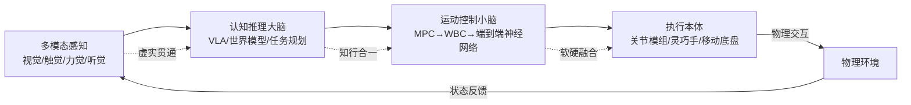

这一闭环中的每个环节都对应着具身智能产业链上一类关键企业群落：感知层对应3D视觉、触觉传感器等零部件厂商；大脑层对应VLA、世界模型等基础模型企业；小脑层对应运动控制算法与强化学习公司；本体层对应关节模组、滚珠丝杠、灵巧手等精密制造企业。**这种"分层化"的产业结构，构成了后续第3至第7章按技术路线归类企业的底层逻辑**。

中国信通院将这一协同机制进一步抽象为三大融合趋势[^2]：

- **软硬融合**：推进具身基础模型与本体结构的软硬协同进化，避免"好模型配差硬件"或"好硬件跑差算法"的失衡。
- **知行合一**：打造感知—决策—行动一体化的闭环链路，弥合"会说不会干"的鸿沟。张钹院士特别指出，传统大语言模型"只会说（生成语言），不会干（行动）"，这正是具身智能需要解决的核心问题[^5]。
- **虚实贯通**：推动从仿真模拟到现实实践的迁移和部署，即解决Sim-to-Real鸿沟。

值得注意的是，具身智能的"小脑"运动控制正经历从模型预测控制（MPC）向端到端神经网络控制的跃迁。以众擎T800为例，其搭载的准直驱QDD技术与强化学习（RL）算法，赋予了机器人后空翻、抗冲击等动态运动能力[^3]。这一"小脑"觉醒，叠加大模型驱动的"大脑"觉醒，构成了2025年具身智能从"铁皮娃娃"向真正智能体质变的技术内核[^3]。

## 1.3 具身智能的发展脉络与范式演进

具身智能并非一夜诞生的概念，其思想萌芽与人工智能学科本身一样古老。回溯其七十余年的演进历程，可以清晰地划分为四个阶段，每个阶段都对应着特定的理论突破与技术拐点。

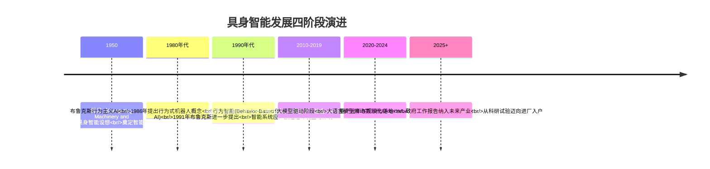

**第一阶段（1950—1980年代前）：思想萌芽与符号主义主导**。1950年，图灵在其著名论文《Computing Machinery and Intelligence》中首次提出了具身智能的设想，奠定了智能与物理形态相结合的理论基础[^4]。然而在此后的达特茅斯会议后，人工智能研究主要集中于符号处理模型（即符号主义），依赖符号操作来模拟人类智能；尽管随后诞生了多层感知机、前向神经网络和循环神经网络等连接主义方法，但仍难以解决智能体与物理世界交互的复杂性问题[^4]。

**第二阶段（1980—2010年）：行为主义崛起与硬件积累**。1986年，罗德尼·布鲁克斯（Rodney Brooks）从控制论角度出发，提出了行为式机器人概念，强调去除表征，推动具身智能以行为为核心发展，认为智能是具身化（Embodied）和情境化（Contextualized）的[^4][^1]。1991年，布鲁克斯进一步提出"行为智能"（Behavior-Based AI），认为智能系统应直接通过与环境互动来体现[^4]。这一时期，机器人学、神经科学和控制理论交叉融合，硬件技术逐步成熟，传感器与执行器性能大幅提升，为后续具身智能的发展奠定了基础[^1]。

**第三阶段（2010—2020年）：深度学习赋能与运动控制突破**。2010年前后，深度学习技术的兴起为具身智能带来了革命性变化，多模态感知与深度学习的结合，使机器人能够处理更复杂的环境信息并做出智能决策[^1]。2020年后，波士顿动力Atlas的持续升级展示了具身智能在运动控制领域的突破，其能够通过试错学习优化动作，标志着机器人从"固定动作"向"自主适应"的转变[^1]。

**第四阶段（2020年至今）：大模型驱动与产业爆发**。2020年大语言模型的出现，将人工智能推向新的发展阶段——第三代人工智能[^5]。张钹院士指出，大语言模型具有强大的语言生成能力，使机器能够在开放领域下实现与人类的自由交互，"机器一旦掌握了人类的语言，也就在某种程度上理解了人类的世界"，为通用人工智能迈出了关键一步[^5]。在此之后，具身智能进入产业化加速期：2024年3月OpenAI与Figure合作推出Figure 01人形机器人[^4]；2025年3月《政府工作报告》将具身智能纳入未来产业重点培育清单[^2]；2025年成为公认的"人形机器人量产元年"[^3]。

将这一演进脉络与人工智能三代范式相对照，可以发现一条清晰的内在逻辑：**第一代AI（符号主义，知识与经验驱动）与第二代AI（连接主义，数据驱动）均属于"离身智能"，思考、感知、动作彼此分离且与环境隔离；第三代AI（大模型驱动）虽然在语言理解上取得突破，但仍受限于"只会说不会干"，唯有通过具身化才能真正向通用人工智能迈进**[^5]。这正是当前所有头部企业纷纷将大模型与机器人本体结合、构建VLA与世界模型的根本动因。

## 1.4 2025"量产元年"关键驱动因素

为何具身智能恰恰在2025年迎来产业拐点，而非更早或更晚？答案在于**技术、硬件、数据三大成熟条件**与**政策、资本、场景三大外部催化**的同步共振。

### 三大内生成熟条件

**第一，大模型成熟带来的认知与泛化能力跃升**。2020年以来，大语言模型与多模态视觉语言模型的成熟，使具身智能首次具备了在开放领域下理解自然语言指令、规划复杂任务的能力。VLA（Vision-Language-Action）等多模态基础模型的兴起，让机器人可以"听懂'请搬运2号货箱'等自然语言指令，并自主完成从环境感知到规划抓取的全过程"——开普勒基于分层模型VLA+实现的精准语义识别与任务执行即为典型案例[^8]。华为与中国信通院在IEEE 802.1标准会议上的报告也指出，大语言模型与视觉模型的集成，使机器人能够更好地感知、理解和与复杂现实环境交互，这是推动具身智能全球快速增长的关键趋势之一[^7]。

**第二，硬件供应链成熟带来的成本拐点**。这一拐点尤以中国市场最为剧烈。2025年中国企业已将人形机器人的核心BOM成本下探至3.2万美元左右，部分型号甚至下探至万元级人民币，而特斯拉Optimus的成本仍徘徊在2-3万美元区间[^3]。其背后是核心零部件国产化率的暴力突破——据赛迪顾问数据，**核心零部件国产化率已突破70%，部分领域甚至达到90%**[^3]。在昆山、深圳等地，上游精密减速器（如绿的谐波）、滚珠丝杠（如贝斯特、恒立液压）、3D视觉传感器（如奥比中光）与下游整机厂商形成了"一小时供应链圈"，让小批量试错的成本降至最低[^3]。这种地理集群效应叠加2025年全国机器人工程专业毕业生规模突破1.4万人的"工程师红利"，构成了中国独特的成本与迭代速度优势[^3]。

**第三，仿真与真实数据成熟带来的训练闭环打通**。中国信通院将2025年具身智能产业的核心特征概括为"软硬、知行、虚实"三大融合，其中虚实贯通即指打通从仿真模拟到现实实践的迁移路径[^2]。一方面，业界普遍认识到"机器人从'能动'变得'聪慧'，离不开高质量数据的驱动，这是具身智能进化的'燃料'和基石"[^8]；另一方面，"硅基生命"开始在简易小场景"沿路播种"，从工业、物流等可控性高、容错率高的领域切入积累真实数据[^8]。然而行业仍存在显著争议：**真实数据与仿真/合成数据如何选择、处理和混合训练，至今仍是产业三大"非共识"之一**[^2]。

### 三大外部催化因素

**政策驱动**层面，2025年和2026年的《政府工作报告》连续将具身智能列为未来产业重点培育清单[^4][^2]。"十五五"规划在"十四五"基础上，进一步将具身智能上升为支撑制造强国、数字中国战略的核心赛道，实现从"基础布局、生态培育"向"核心攻坚、融合赋能"的战略升级，打造"具身中国"发展模式[^1]。标准体系也在加速完善——2025年3月26日，中国信通院联合40余家单位起草的具身智能领域首个行业标准正式发布；2026年6月1日，《YD/T 6770—2026人工智能 关键基础技术 具身智能基准测试方法》行业标准正式实施[^4][^1]。

**资本助推**层面，截至2025年12月，**中国具身智能和机器人领域投资事件数达744起，融资总额735.43亿元人民币**[^2]。资本的密集涌入既为头部企业的研发投入与产能扩张提供了弹药，也催生了对短期商业闭环的强压力。

**场景牵引**层面，业内已普遍形成共识："沿途下蛋"——从工业、物流等可控性高、容错率高的领域切入，积累真实数据，步步为营实现场景落地，再向更高阶的居家服务等场景验证具身智能的价值[^8]。擎朗智能在配送服务机器人领域已在全球部署超10万台，并发展出"岗位化"战略，针对酒店、医院、工厂等不同场景衍生差异化功能[^8]；卓益得机器人在导览、演艺等场景实现商业闭环，未来逐步向家庭场景拓展[^8]。这种"场景牵引"模式，恰恰是中国相较于硅谷"技术完美主义"路径的差异化优势——**利用中国全球最复杂的工业场景产生的海量非结构化数据，倒逼算法快速迭代**[^3]。

需要警示的是，这种"先上岗再进化"的Beta版思维在产业内仍存争议：越疆科技、小鹏汽车等产业界人士指出，其虽然能实现极快的迭代速度（"用10万元级机器人替代8万年薪工人，1.5年即可回本"），但也伴随着硬件试错成本高、安全边界模糊的风险；知名投资人朱啸虎甚至直指部分企业是"只会翻跟头"的泡沫[^3]。**这一争议，将作为本研究第10章评估各技术路线商业闭环可持续性的重要观察点**。

## 1.5 全球产业格局与本研究的分析框架

在三大成熟条件与三大外部催化的共振下，全球具身智能产业格局已初步成形，但中美欧日各阵营呈现出显著的差异化特征。从全球出货量数据看，2025年中国占据全球84.7%的份额，但中国市场规模占比仅53.8%——这一**"出货量占绝对统治地位、市场规模占比却显著低于数量占比"的剪刀差现象**，深刻揭示了中国"制造大国"与"价值大国"之间的张力[^3]。它既是中国超级供应链与工程师红利铸就的成本护城河的体现，也暴露出中国在高端市场溢价能力、技术自主创新与生态构建上仍需补课的现实。

从国际格局看，特斯拉、Figure AI、1X、Boston Dynamics等海外头部企业凭借在大模型、运动控制、传感器等领域的早期积累，主导着高端市场与前沿技术叙事；而宇树科技、优必选等中国企业则凭借成本控制与场景落地速度，在出货量与场景多样性上形成差异化优势[^7]。中国信通院将全球具身智能产业的发展特点概括为"融合、多元、繁荣"——从软硬、知行、虚实三大融合，到"上天入海涉险"的多元化产品形态，再到行业应用、产品服务、技术服务、基础设施四大板块组成的完整产业链[^2]。

然而在繁荣表象之下，全球具身智能产业仍处于发展早期，并面临三大"非共识"[^2]：

| 非共识维度 | 核心争议 | 代表性分歧 |
|----------|---------|-----------|
| 路径选择 | "感知—认知—决策—执行"中数据和模型孰重孰轻？ | 端到端VLA派 vs 世界模型派 vs 分层架构派 |
| 本体构型 | 打造通用的唯一终极形态还是面向场景的专用构型？ | 通用人形机器人 vs 四足/轮足/机械臂等专用本体 |
| 数据方案 | 真实数据与仿真/合成数据如何选择、处理、混合训练？ | 真实数据派 vs 仿真合成派 vs 人类视频派 |

此外，整个产业还面临"数据—模型—本体—场景"难闭环、商业模式不清、规模化量产瓶颈、标准缺失等共性挑战，商用落地仍处于初期探索阶段，将逐步从"科研试验"迈向"进厂入户"[^2]。

基于上述全球格局与产业争议，本研究构建以下三层分析框架，作为后续九章的统一坐标系：

**第一层——技术路线维度**：以三大"非共识"为切入点，将全球具身智能技术路线划分为端到端VLA路线、世界模型与WAM路线、硬件驱动与分层架构路线、双系统与混合融合路线、平台型与生态构建者路线五大类，分别在第3至第7章展开。这一分类既兼顾学术界的理论范式（连接主义、行为主义、混合主义），也尊重产业界的工程实践（端到端、分层、双系统）。

**第二层——本体形态维度**：覆盖人形机器人、四足/多足、轮足、轮式、机械臂、复合移动操作平台等多种本体形态。中国信通院将其概括为"以四足、多足、轮足等机器人载体以及无人车、无人机、无人船和可变形移动装置等为代表的移动类产品（解决'去哪里'问题），以协作机械臂、复合轮臂式机器人、人形机器人等操作类产品（解决'干什么'问题）"[^2]。本研究将在每条技术路线下兼顾不同本体形态的代表企业。

**第三层——企业五维评估维度**：对每家代表性企业，将统一从**技术路径、产品进度、商业化进度、融资情况、团队情况**五个维度展开分析，确保横向对比的可行性与对称性。这五个维度也直接对应了用户研究需求中明确提出的核心信息要素，将贯穿第3章至第9章的所有企业分析与横向对比。

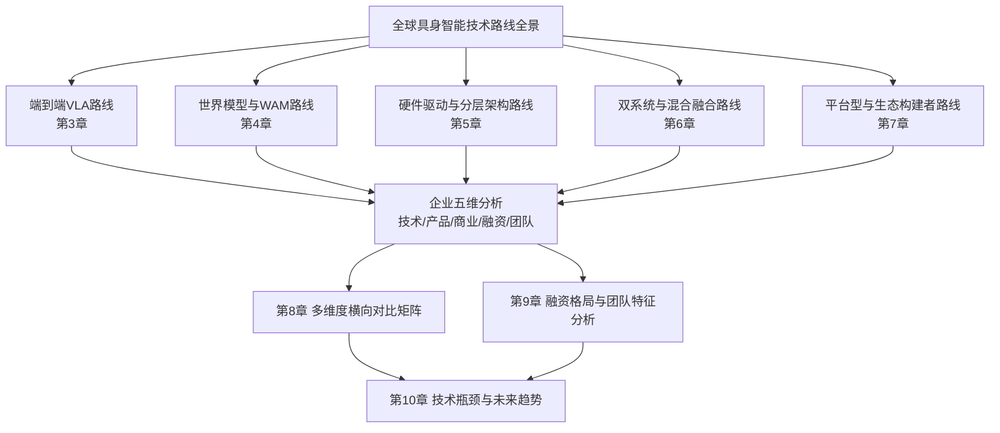

需要预先指出的是，技术路线之间的边界并非绝对刚性。许多头部企业实际上采用了**混合架构**：例如Figure AI的Helix同时具备双系统与VLA特征，星海图同时布局G0双系统与Fast-WAM世界模型，开普勒在工业搬运场景采用VLA+分层模型[^8]。这种向混合架构收敛的趋势，将在第2章的技术路线分类框架与第10章的趋势研判中作为重点议题展开。

至此，本章已确立了具身智能的概念边界、解构了核心技术要素、梳理了七十年演进脉络、剖析了2025量产元年的驱动因素，并提出了贯穿后续九章的"技术路线—本体形态—企业五维"三层分析框架。**具身智能并非单一技术的突破，而是一场由技术、工程、场景与资本合力推动的全球浪潮**[^2]——下一章，本研究将深入这场浪潮的技术内核，系统比较VLA、世界模型、分层架构、双系统、模仿学习等主要技术路线的范式差异与演进逻辑，为后续代表企业的深度剖析建立统一的技术参照系。

# 2 全球具身智能技术路线分类框架与演进逻辑

第1章已建立"技术路线—本体形态—企业五维"的三层分析框架，并指出当前全球具身智能产业仍处于路径"非共识"阶段。要回答"哪条路线最有可能通向通用具身智能"这一根本问题，必须先建立一套科学、可比、可追溯的技术路线分类坐标系。本章作为承上启下的方法论章节，将首先剖析行业当前主流分类视角的优劣，构建本研究的统一分类坐标系；继而依次解构端到端VLA、世界模型/WAM、分层架构、双系统、模仿学习五大路线的核心原理与代表算法；进一步从六个维度展开横向对比；最后聚焦2025—2026年最具争议的"VLA派 vs 世界模型派"之争，揭示其本质分歧与向混合架构收敛的趋势——为第3至第7章按路线归类剖析代表企业建立统一的技术参照系。

## 2.1 技术路线分类坐标系的构建逻辑

具身智能发展速度之快、范式更迭之频繁，使得行业对技术路线的称谓出现了严重的"分类碎片化"现象。北京大学—灵初智能联合实验室在2025年7月发布的VLA综述中明确指出："现有分类方法如'大脑-小脑'、'快慢系统'、'分层-端到端'等，直觉清晰但本质仍不明确，领域急需系统化的分析框架"[^9]。该综述首次从**动作词元化（action tokenization）**视角提出统一框架——VLA系统遵循"视觉与语言输入经过一系列VLA模块逐级处理，生成逐渐具体的action token，最终转化为动作输出"的通用流程，并将action token划分为language description、code、affordance、trajectory、goal state、latent representation、raw action和reasoning八类[^9]。这一框架的根本贡献在于：**将VLA中的action token视为大语言模型中language token的推广，使所有具身智能架构都可以在同一坐标系下被解析与比较**[^9]。

借鉴这一学术视角并结合产业界的工程化称谓，本研究构建如下三维分类坐标系作为后续章节归类企业的统一基础：

| 分类维度 | 取值范围 | 对应学术/产业视角 | 解决的根本问题 |
|---------|---------|------------------|--------------|
| **动作表示形式** | 语言描述 / 代码 / 可供性 / 轨迹 / 目标状态 / 隐表征 / 原始动作 / 推理链 八类action token | 北大-灵初Action Tokenization框架 | "智能体如何编码意图与动作？" |
| **控制架构层级** | 端到端 vs 分层（大脑-小脑-本体） | 学术界"分层-端到端"之争、产业界"大脑-小脑"分工 | "认知与控制是否解耦？" |
| **决策时序机制** | 单系统统一推理 vs 双系统快慢协同 | Kahneman系统1/系统2、英伟达GR00T双系统 | "推理深度与响应速度如何平衡？" |

这一坐标系与第1章建立的"感知—推理—行动—本体"四要素闭环存在清晰的映射关系：**动作表示形式刻画的是"行动"如何被神经网络表征**，**控制架构层级刻画的是"推理"与"行动"之间的耦合方式**，**决策时序机制刻画的是"感知—推理—行动"循环中的频率分工**。基于这一坐标系，本研究将全球主流技术路线归纳为五大类——端到端VLA、世界模型/WAM、分层架构、双系统、模仿学习——其中前三者更接近"独立路线"，后两者（双系统、模仿学习）则更多扮演"组织方式"或"底层模块"的角色。这一结构性区分，是后续章节正确理解企业技术归属的关键。

## 2.2 端到端VLA路线：感知-语言-行动的统一建模

VLA（Vision-Language-Action Model）是2023—2025年间具身智能领域最具影响力的范式。其核心思想是**将视觉感知、语言理解与动作生成端到端映射为单一模型**——"接收图像/视频、自然语言指令，直接输出智能体（如机器人）可执行的动作序列，实现'感知—理解—执行'"[^10][^11]。借助GPT-4o、Gemini 2.5 Pro等多模态基础模型在对话、代码生成与数学推理上接近甚至超越人类的能力，研究者将这种通用智能从数字世界延伸至物理空间，使VLA成为"借助基础模型的通用能力与大规模学习范式，处理通用的视觉与语言输入并生成实时动作"的最受关注前沿方向之一[^9]。

从VLA的"身体结构"看，其内部组件呈现出清晰的三层演进逻辑。**视觉骨干**层面，斯坦福、帝国理工、伦敦国王学院等机构联合发布的VLA综述（arXiv:2512.11362v3）指出，那些在互联网图片上训练过的视觉模型（如**CLIP和SigLIP**）在机器人任务中表现得特别出色，而结合几何理解能力的视觉系统（如**DINOv2**）则能帮助机器人更精确地操作物体，相当于"给机器人装上了工匠的眼睛"[^12][^13]。**语言理解**层面，VLA系统经历了从只能理解简单文本指令到能够"运用常识推理来填补指令中的空白"的演化，大型语言模型扮演了"知识渊博的大脑"的关键角色[^12][^13]。**动作生成**层面，VLA系统正在经历一次重要转变：**从离散的动作指令转向连续的动作流**，扩散模型（Diffusion）和流匹配（Flow Matching）技术的应用让机器人的动作"从僵硬的机械舞转向优美的芭蕾舞"[^12][^13]。

VLA的代际演进可以从代表性模型π0.5上得到清晰印证。Physical Intelligence于2025年4月发布的π0.5采用VLA架构，其分层设计包括"高层推理（预测语义子任务，如'拿起杯子'、'放入水槽'）"与"低层推理（生成具体的机器人动作块）"，训练范式上"采用预训练+后训练两阶段——预训练使用多源异构数据（含网络数据、其他机器人数据），建立基础能力；后训练针对目标机器人定向微调"；动作表示则使用**FAST动作分词器将连续动作压缩为离散Token**，支持自回归Transformer架构的高效训练[^14]。这种"预训练大模型+异构数据+离散动作Token"的组合，已成为当前VLA头部模型的工程范式。

然而VLA的固有局限同样明确。一方面，**VLA"被认为缺少对物理世界的结构化理解"**——它将感知输入直接映射为控制动作，类似模仿人类将看到的事物、所理解的语言指令转化为行动的过程，但其对物理规律的理解仍是隐式的[^15]。另一方面，宇树科技创始人王兴兴明确指出"VLA模型面临泛化能力受限等瓶颈，天花板更低"[^15]；中国信通院2025年的产业研究也观察到"多数VLA大模型在语言跟随、空间泛化能力上缺乏有效解决方案"，2025年8月全球首届人形机器人运动会中"多数参赛机器人依赖人工遥控，暴露了'大模型与本体赋能脱节'的核心问题"[^16]。这些局限正是2025—2026年世界模型路线兴起、VLA派与世界模型派之争激化的直接导火索（详见2.8节）。

## 2.3 世界模型与WAM路线：基于物理预测的决策范式

与VLA的"感知-行动直接映射"不同，世界模型路线主张**"先预判，再决策"**——智能体先在内部构建对物理世界的预测系统，"基于历史环境状态与动作输入，预判环境未来的演化趋势，进而帮助智能体优化决策路径"，其本质是"复刻生物对世界的预判本能，融合神经网络、强化学习等技术，构建对物理世界的动态表征"[^10][^11]。商汤科技联合创始人、大晓机器人董事长王晓刚形象地将其描述为：**世界模型让机器人"了解外部世界的物理规律，并像人类一样进行思考判断"**——可以在"脑海"中模拟和推演不同行动可能带来的后果，从而提升决策性能[^15]。

需要厘清的是具身智能语境下的世界模型与李飞飞等人探索的视频生成型世界模型之间的本质差异。王晓刚明确解释："**李飞飞所做的世界模型更偏视频生成**，可构建供用户访问的3D世界，应用于游戏或虚拟现实场景；**具身智能语境下的世界模型，则用来指导机器人与物理世界交互**"[^15]。这一区分至关重要——它意味着具身世界模型的评价标准不应是FVD、文本-视频对齐等视频生成指标，而应是其对下游机器人任务的支撑能力。2026年2月清华等机构联合发布的WorldArena基准在14个代表性世界模型（涵盖Veo 3.1、Wan 2.6、CogVideoX、Cosmos-Predict、Genie Envisioner、CtrlWorld等）上系统测量了"视觉质量与下游具身任务能力的关系"，其结论印证了上述判断[^17]。

世界模型相对于VLA最具吸引力的优势体现在**数据来源的拓宽与成本的下降**上。王晓刚指出："训练VLA模型主要依赖昂贵且稀缺的真机数据，这类数据由人工操作机器完成采集；而世界模型更多转向互联网上的图像和文字数据，这些数据记录了大量的物理规律——相当于你在互联网上看了很多课本，教你物理定律是什么，人的行为逻辑是什么"[^15]。Generalist AI（PaLM-E、RT-2背后团队创办的明星公司）CEO、VLA概念共同开创者之一Pete Florence更进一步点破了一个"行业长期回避的事实"：**"把'视觉-语言'训练引入机器人，很大程度上是因为机器人自己的交互数据还不够多，所以VLM只是一根过渡期的'拐杖'。一旦物理交互数据规模起来，这根拐杖就该被拿掉，而不是继续围着它做架构设计"**[^17]。Generalist AI于2025年4月发布的GEN-1更以实证支撑其立场——成功率超过99%、速度提升2-3倍、数据量和微调成本只需上一代的1/10，并明确表示"不再把自己的模型归类为VLA"[^17]。

但世界模型的工程落地远非坦途。跨维智能基于WorldArena的实证总结，揭示了当前像素空间世界模型存在四类系统性瓶颈[^17]：

| 瓶颈类型 | 具体表现 | 工程后果 |
|---------|---------|---------|
| **表示瓶颈** | 在像素空间建模，模型被迫把容量消耗在纹理、光照、背景等与任务弱相关的信息上 | 计算资源浪费，任务性能边际改善低 |
| **记忆瓶颈** | 因果自回归+KV Cache的组合，空间复杂度随轨迹长度线性增长 | 长时任务越跑越重，难以稳定落地 |
| **推理瓶颈** | 感知→推理→执行严格串行，部署端延迟高 | 闭环频率上不去，机器人"走走停停" |
| **数据瓶颈** | 模型依赖固定的离线数据集训练，缺少持续、新鲜、物理可信的信息流 | 难以飞速进化，与真实物理偏差累积 |

王兴兴对此持相似但稍乐观的判断："视频生成模型可以在虚拟空间中可实现近乎零误差、极高保真的模拟效果。然而，把这一模型部署到机器人上时，即使只有一毫米的偏差，也可能导致与实际效果的巨大差异。要实现视频生成世界模型和真机操作之间的对齐，依然极具挑战"[^15]。正是为破解上述瓶颈，**WAM（World Action Model，世界动作模型）**等新兴变体开始出现——其核心思路是不在像素空间而在与行动相关的隐表征空间建模，将"世界进入了什么对行动有意义的状态"取代"下一帧视觉是否真实"作为优化目标[^17]。星海图Fast-WAM、跨维智能DexWorldModel等代表性工作（详见第4章）正是这一方向的典型实践。

## 2.4 分层架构路线：大脑-小脑-本体的协同设计

如果说VLA与世界模型的争论是关于"模型如何理解世界"，那么分层架构路线则更多是关于"模型如何被工程化部署"。其核心思想是**将认知与控制解耦为大脑（高层语义推理）、小脑（中低层运动控制）、本体（硬件执行）三层分工**，每层独立优化、通过明确的接口协同——既能够缓解端到端路线对海量真机数据的极端依赖，又能复用各层的通用组件。

聆动通用CEO季超对这一选择的产业逻辑做了精到说明："**在具身智能的技术分野中，'完全端到端'一度被视为最具想象力的方向：一个模型，从感知到决策再到执行，一步到位。但当机器人走出实验室，进入真实产线时，问题开始集中暴露**"——真实环境远比实验室复杂，光线变化、地面杂物、非标操作等每一个细节都可能让机器人"失灵"，泛化能力不足仍是横亘在具身智能规模化落地面前最难绕开的核心瓶颈[^18]。聆动通用因此提出"大脑-小脑-本体的分层端到端架构"，"正是在当前动作数据极度匮乏的现实约束下，为具身智能大规模产业落地蹚出的一条关键路径"[^18]。

分层架构在工业场景的工程价值已经获得多家头部企业的实证。北京人形机器人创新中心XR-1模型"通过多模态融合技术，实现了跨机器人平台的通用操作知识积累与特定场景的快速学习"[^16]；智平方提出的**类脑VLA（NeuroVLA）则进一步将分层结构的边界从"大脑-小脑"扩展到"大脑-小脑-脊髓"**——"通过引入生物启发的分层计算结构，首次提出将小脑和脊髓的部分融入操作当中，实现模型毫秒级自适应控制与接近生物反射速度的响应能力，使机器人首次具备类似'肌肉记忆'的持续进化能力"[^19]。智平方将其发展划分为清晰的三阶段路径：**从最初实现感知、理解与行动统一建模的端到端VLA，到融合世界模型实现"行动前预测"的增强型VLA，再到迈向类脑机制的全新阶段**——"VLA不再只是一个单一模型，而是演进为具备分层结构的智能系统——类似人类大脑、小脑与脊髓的协同机制，从而实现更高效的推理、更快速的响应以及更稳定的控制"[^19]。

值得注意的是，分层架构在数据层面亦有独特的产业价值。聆动通用强调，"具身智能的数据，就是物理AI时代的基础设施"——其依托科大讯飞生态构建了"大脑-小脑-本体全链路自主可控"的体系，覆盖**"全模态数据采集管线 + AI原生预训练-后训练模型全栈能力 + 工规级软硬一体垂直整合"**的独特生态位[^18]。这种分层化的能力布局，使其在中小企业难以承担"特斯拉Optimus级数百万小时训练数据、5亿美元采集成本"门槛的现实下，仍能依托大小脑分工实现"机器人'干活'与'变聪明'同步发生"的闭环[^18]。

但分层架构并非没有代价。其内在挑战集中体现在**跨层信息损失**与**整体协同优化困难**两方面：当任务被人为拆解为高层规划与低层执行时，各层之间的接口（无论是离散符号还是隐变量）都存在信息压缩与误差累积；同时各层独立训练亦可能导致"局部最优、全局次优"的整体性能瓶颈。这也是为什么以智平方为代表的企业将"端到端"与"分层"视为可融合而非互斥的设计选择——其NeuroVLA本质上是**"端到端学习+分层组织结构"的混合架构**[^19]。

## 2.5 双系统快慢协同路线：仿生认知架构的工程化实践

双系统路线源自心理学家Daniel Kahneman提出的"系统1/系统2"认知二分法，并在2025年通过英伟达GR00T N1的发布进入具身智能产业主流视野。**英伟达Isaac GR00T N1于2025年3月18日在GTC大会上发布，是全球首款开源人形机器人功能模型**，采用"基于人类认知原理开发的双系统架构"——"**系统1**负责快速执行直觉动作（实现毫秒级快速响应，模拟人类直觉反射机制），**系统2**处理复杂推理与规划（执行复杂环境推理与多步骤任务规划）"[^20][^21]。其预训练模型支持广义类人推理能力，开发者可通过真实或合成数据进行二次训练，应用于工厂作业、物资搬运及家庭服务等场景；英伟达还同步推出了Simulation Frameworks仿真工具链以及与Google DeepMind和Disney Research合作开发的开源物理引擎Newton，已与傅利叶智能、Agility Robotics、波士顿动力等厂商建立技术合作[^20][^21]。

中国阵营中，智平方在2025年6月推出了"快慢系统深度融合的新一代VLA架构"，**成为业内首个"异构输入+异步频率"的双系统VLA模型**，性能直接超越国际标杆Pi0达30%[^19]。其核心创新在于解决双系统的工程协同难题——**"异构输入"指系统1与系统2接受不同模态、不同分辨率的输入**（系统2接收语言指令与全局视觉上下文，系统1接收高频本体状态与近距视觉），**"异步频率"指两系统以不同时间步长运行**（系统2以低频做规划与意图更新，系统1以高频做毫秒级动作生成），从而在响应速度与推理深度之间取得平衡[^19]。

需要明确指出的是：**双系统更多是一种"组织方式"而非独立的技术路线，往往作为VLA或分层架构的具体实现形式**。这一判断可以从三个角度得到印证。第一，从智平方自身的演进逻辑看，其双系统VLA、融合世界模型的VLA、类脑NeuroVLA同属VLA框架下的不同代际，"VLA不会消失，它会被不断加持，变得越来越聪明"[^19]。第二，从英伟达GR00T N1的描述看，双系统架构是其VLA类基础模型的内部组织方式，而非与VLA并列的独立路径[^20]。第三，从功能映射看，双系统的"系统2"对应分层架构中的"大脑"、"系统1"对应"小脑"——只是双系统更强调时间频率上的异步而非功能层级上的隔离。这种概念上的交叉与边界模糊，正是导致行业分类混乱的根源之一，也是本研究在第6章将"双系统与混合融合路线"单独列章并强调其混合属性的原因。

## 2.6 模仿学习路线：Diffusion Policy、ACT与Flow Matching

模仿学习（Imitation Learning）路线的核心定位与上述四条不同——它**不是一条独立的"认知架构"路线，而是底层动作生成模块**，通常作为VLA、世界模型、分层架构的"动作生成器"被嵌入更大的系统中。其根本思想是让机器人通过观看大量人类示范来模仿动作；机器人学习的成功率以及需要多少示范数据才能让机器人学会，构成了评价模仿学习算法的关键指标[^22]。

理解模仿学习的演进，必须先理解最经典的**行为克隆（Behavior Cloning, BC）**路径所遭遇的两大致命缺陷[^23]：

- **多模态灾难（"求平均值"撞碎杯子）**：当人类示范同一任务时存在多种合理风格（例如绕水杯时既可左绕也可右绕），基于MSE Loss的传统神经网络会"为了误差最小取个平均值"，结果机械臂"直挺挺地往前走，直接把水杯撞碎"[^23]。
- **误差级联（帕金森式抽搐）**：因为是一步一步预测，上一微秒和下一微秒的预测往往不连贯，导致机械臂"像抽筋一样疯狂抖动"[^23]。

为破解上述两大难题，三类代表性算法依次登场，构成了2023—2025年模仿学习的主流方法图谱：

**ACT（Action Chunking with Transformers）**由斯坦福ALOHA项目于2023—2024年提出，其核心思想是"不要走一步看一步，而是一次性把未来的一长串动作全部'翻译'出来"[^23][^14]。ACT具备三大魔法：**动作分块**机制一次性预测未来k步（chunk_size通常为100）轨迹，将有效任务时长从500步缩短到5步，大幅降低了累计误差，"彻底消灭了帕金森抖动"[^23][^14]；**CVAE结构**通过条件变分自编码器引入隐藏变量z（"风格盲盒"）解决多模态问题——抽到z₁代表"左绕风格"，抽到z₂代表"右绕风格"[^23][^14]；**时序集成**则使用指数衰减权重对重叠预测块进行加权平均，实现平滑执行[^14]。

**Diffusion Policy**由哥伦比亚大学宋舒然团队和MIT教授Russ Tedrake带领的丰田机器人研究院于2023年共同创作发表[^22]，其核心是"将策略建模为条件去噪扩散过程——从高斯噪声开始，经过多步迭代去噪，逐步恢复出真实动作序列"[^14]。这一路径的关键优势在于：**自然表达多模态动作分布**（应对同一任务的不同演示风格）、**稳定训练**（无需像GAN那样进行对抗训练）、**适合高维动作空间**[^14]。Diffusion Policy"目前被认为是提升具身智能学习能力的最佳路径之一"[^22]。**3D Diffusion Policy（DP3）**由清华叉院许华哲团队（星海图联合创始人）于2024年5月在Diffusion Policy基础上引入3D视觉增强而成，被华兴资本介绍为"当前世界最优模仿学习效率算法架构"——在仿真环境中"DP3只需要约10次演示即可完成大多数操作任务，相较之下，2D的Diffusion Policy通常需要100-200次演示数据"，真实机器人四个不同任务上的成功率达85%[^22]。

**Flow Matching**则是更新一代的动作生成范式，作为π0.5等头部VLA的底层动作生成模块出现。其与扩散模型同属生成式策略，但训练效率更高、推理步数更少，被视为"从离散动作Token向连续动作流"转变的代表性技术[^12][^13]。

将三种代表性算法置于本研究的统一坐标系下进行对比，可以更清晰地看到模仿学习如何作为底层模块与上层认知架构协同：

| 算法 | 类型 | 核心思想 | 动作表示 | 发布时间 | 上层耦合方式 |
|------|------|---------|---------|---------|------------|
| **ACT** | 动作分块Transformer + CVAE | 预测固定长度的动作块，降低任务有效时长 | 连续动作块 | 2023-2024年 | 与视觉编码器组合（如ALOHA） |
| **Diffusion Policy** | 扩散生成模型 | 将策略建模为条件去噪扩散过程 | 连续动作轨迹 | 2023年 | 与视觉/语言条件输入组合 |
| **π0.5** | 视觉-语言-动作大模型 | 基于VLA架构，预训练+微调范式，FAST动作分词器 | FAST离散Token | 2025年4月 | VLA框架内自洽 |

资料来源：综合整理自[^23][^14]

由此可见，**模仿学习方法本身不构成一条独立的"系统级路线"，而是被VLA（如π0.5使用Flow Matching/FAST Token）、分层架构（小脑层使用Diffusion Policy）、双系统（系统1使用ACT）等上层架构作为底层动作策略调用**——星海图依托许华哲团队的DP3作为底层动作策略，同时构建上层G0双系统与Fast-WAM世界模型，正是这种"底层模仿学习+上层认知架构"组合范式的典型代表[^22]。

## 2.7 五大技术路线的多维度横向对比

基于2.2—2.6节的逐一解构，可以从感知融合方式、决策机制、动作生成形式、泛化能力上限、数据需求规模与类型、工程化与部署难度六个维度构建对比矩阵，对五大路线进行系统化对照。需要再次强调的是：**端到端VLA、世界模型/WAM、分层架构属于"系统级路线"，双系统是组织方式，模仿学习是底层模块**——这种异质性使得六维对比并不完全平行，但仍可揭示各路线的核心定位差异。

| 对比维度 | 端到端VLA | 世界模型/WAM | 分层架构 | 双系统 | 模仿学习 |
|---------|----------|------------|---------|-------|---------|
| **感知融合方式** | 视觉+语言端到端编码（CLIP/SigLIP/DINOv2） | 历史状态+动作输入预测未来状态 | 各层独立感知，跨层接口传递 | 系统1高频近距感知/系统2低频全局感知 | 视觉条件作为策略输入 |
| **决策机制** | 视觉-语言直接映射动作 | 先预判未来状态，后选择行动 | 大脑规划→小脑执行的接力 | 系统2规划+系统1反射的异步协同 | 模仿示范分布，不显式决策 |
| **动作生成** | 离散Token / Flow Matching / 扩散 | WAM隐表征→动作 / 与VLA组合 | 小脑层独立生成（MPC或RL或NN） | 系统1毫秒级动作流 | ACT动作块 / Diffusion轨迹 / DP3三维扩散 |
| **泛化能力上限** | 受限于真机数据多样性，"天花板更低"[^15] | 理论更高，可利用互联网视频学物理规律[^15] | 取决于各层组件能力上限 | 平衡推理深度与响应速度 | 受限于演示数据多样性 |
| **数据需求** | 海量真机数据，昂贵稀缺[^15] | 互联网视频+少量真机对齐数据[^15] | 各层数据可分别采集 | 系统1需高频数据，系统2需任务规划数据 | DP3约10次演示即可，DP需100-200次[^22] |
| **工程化难度** | 模型大、推理慢，量产部署有挑战 | 像素空间4大瓶颈[^17]，闭环频率低 | 工程化友好，但跨层接口复杂 | 双频率协同+异构输入设计复杂 | 算法本身简单，但与上层耦合需设计 |

在这一对比矩阵中，可以清晰看到五大路线的差异化定位：**VLA高泛化但依赖海量真机数据，世界模型可利用互联网视频但仿真到现实迁移困难，分层架构工程化友好但受限于接口设计，双系统平衡响应与推理但增加系统复杂度，模仿学习样本效率高但受限于演示数据多样性**。这一矩阵将作为第8章企业横向对比的技术维度基础。

## 2.8 VLA派与世界模型派之争的本质分歧

2025—2026年间，"VLA派 vs 世界模型派"之争成为具身智能领域最具关注度的路线分歧。理解这场争论，必须先并列听取双方核心论点。

**世界模型派的核心论点**呈现出三种代表性立场。**第一，宇树王兴兴的"天花板论"**：在2026年3月中旬的英伟达GTC大会上，他判断"在通往具身智能ChatGPT时刻的路径中，世界模型几乎'看不到天花板'，是更主流的技术方向"，并认为"VLA模型面临泛化能力受限等瓶颈，天花板更低"[^15]。**第二，英伟达Jim Fan的"时代轮替论"**：他在2026年2月初发文称，"2025年，具身智能行业由VLA模型主导，但2026年将成为世界模型首次为机器人领域典型基础的一年"[^15]。**第三，Generalist AI Pete Florence的"拐杖论"**——这一立场尤为耐人寻味，因为Pete Florence本人就是VLA概念的共同开创者之一。他在GEN-1发布同期发文表示"不再把自己的模型归类为VLA"，并直言："**把'视觉-语言'训练引入机器人，很大程度上是因为机器人自己的交互数据还不够多，所以VLM只是一根过渡期的'拐杖'。一旦物理交互数据规模起来，这根拐杖就该被拿掉**"[^17]。

**VLA派的回应**则以智平方郭彦东的"主航道论"最具代表性。在2026 POWER Robot未来大会主论坛上，郭彦东用题为《AGI迈进物理世界：通用智能机器人开启第四代智能终端时代》的演讲正面回应了"VLA是否过时"的争论：**"VLA时代没有结束，它正在持续变得更强！并且依然是通往物理世界智能的最强主航道"**[^19]。其论证基于第一性原理——"任何能够在真实世界中执行任务的智能系统，都必须具备三项核心能力：对世界的感知、对逻辑的推理以及对行为的控制——这三个要素（视觉、语言、行动）是永远存在的，变化的只是它们的组织方式"[^19]。基于此，**"所谓范式之争，本质上并非替代关系，而是组织方式的持续演进。世界模型、类脑模型等新技术，并不是对VLA的颠覆，而是对其能力的增强与补全"**[^19]。

将双方立场置于本研究第2.1节的统一坐标系下审视，可以揭示**这场争论的本质并非两条互斥道路的非此即彼，而是关于动作Token组织方式、数据来源构成与认知架构形态的范式选择分歧**。具体而言，三大分歧维度可归纳如下：

| 分歧维度 | 世界模型派立场 | VLA派立场 | 本质 |
|---------|--------------|----------|------|
| **数据来源** | 互联网视频+少量真机；机器人交互数据规模化后VLM拐杖将被拿掉[^15][^17] | 真机数据仍是核心，VLA将持续变强[^19] | 数据成本与可获取性的工程权衡 |
| **物理理解** | 显式预测未来状态，内化物理规律[^15] | 通过视觉-语言隐式获得，可融合世界模型加持[^19] | 物理知识的表示形式选择 |
| **演进路径** | 范式替代，VLA将被超越[^17] | 范式融合，世界模型是加持者而非颠覆者[^19] | 对"范式"概念本身的不同理解 |

理解这一争论本质后，会发现双方在"未来终态"的判断上其实存在交集——一位头部具身智能数据服务商的联合创始人指出"二者可能会融合，VLA要依托世界模型对世界的理解能力"[^15]；王晓刚同样认为"短期内，二者是相互协作的关系。世界模型先在'脑海'中预演未来可能发生的各种情景，而具体的执行交由VLA模型完成。从长期来看，世界模型很可能将VLA的能力全部吸收整合"[^15]。换言之，**真正的分歧不在"是否融合"，而在"谁吸收谁"——VLA派认为世界模型是被吸收的加持组件，世界模型派认为VLA是过渡期的拐杖将被超越**。

## 2.9 向混合架构收敛的产业趋势

跳出"派系之争"的话语框架后，2025—2026年的产业实践事实呈现出一个清晰得多的趋势：**头部企业不再纠结于路线归属，而是在工程层面向多路线融合的混合架构主动收敛**。这一收敛体现在四个维度。

**第一，世界模型作为VLA的预测模块嵌入决策前端**。智平方在2025年11月发表融合世界模型的VLA具身大模型，"实现'先预测、后执行'"，将世界模型从"VLA的颠覆者"重新定义为"VLA的加持者"[^19]。同样的融合也发生在头部研究机构——2025年6月，阿里巴巴达摩院、湖畔实验室和浙江大学研究团队发布一项研究，"将VLA模型和世界模型集成在一个框架中：世界模型通过结合动作与视觉信息理解来预测未来状态，这对于成功执行诸如抓取等灵巧操作任务"具有重要意义[^15]。

**第二，双系统作为VLA与分层架构的工程实现形式**。智平方双系统VLA将"快慢系统深度融合"，本质上是VLA框架内的双系统组织方式[^19]；英伟达GR00T N1的双系统架构同样作为其开源人形机器人功能模型的内部组织方式而非独立路线[^20]。这种组织方式的融合，使"分层架构"与"双系统"在工程实践上日益难以区分。

**第三，模仿学习作为底层动作策略与上层认知模型协同**。π0.5将Flow Matching整合进VLA框架，星海图将DP3作为底层动作策略与上层G0双系统、Fast-WAM世界模型组合，都是"底层模仿学习+上层认知架构"组合范式的典型代表[^22]。

**第四，Action Token从单一类型走向多类型协同**。北大-灵初VLA综述明确指出："**VLA模型的未来不在于依赖单一action token，而在于多种token的协同**。Language motion表达能力有限，难以成为主流"[^9]。这一判断从动作词元化的根基上，为"混合架构"提供了理论支撑——既然动作Token本就需要多类协同，那么基于不同Token的"路线之争"自然会向"协同之合"演进。

将上述四个维度的融合趋势与第1章引用的中国信通院"软硬、知行、虚实"三大融合判断相对照，可以提炼出具身智能技术演进的总体方向：**从单一范式之争走向系统级整合，从"哪条路线更优"走向"在何场景以何种方式组合更优"**。智平方将VLA的发展划分为清晰的三阶段路径——"从过去最初实现感知、理解与行动统一建模的端到端VLA，到现在融合世界模型实现'行动前预测'的增强型VLA，再到未来迈向类脑机制的全新阶段"[^19]——这一路径正是混合架构收敛趋势的一个具体范例。

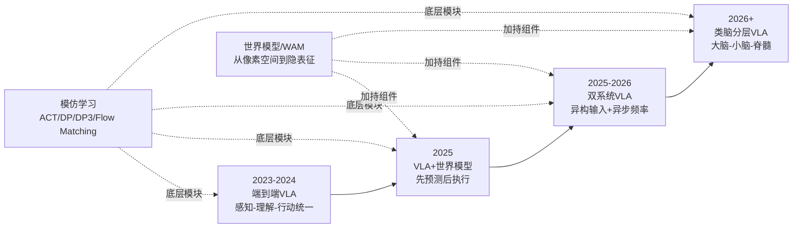

需要客观指出的是，"混合架构收敛"作为产业趋势的判断仍存在边界条件——它更多反映了2025—2026年头部企业的工程实践选择，而Pete Florence、王兴兴等代表的"激进世界模型派"仍在尝试更彻底的范式革命，其能否在2026—2027年通过GEN-1后续产品、Cosmos-Predict等模型证伪"混合即终态"的判断，将是后续观察的关键。**这一开放性命题——"路线收敛是终态还是过渡态"——将作为第10章未来技术研判的核心议题之一进一步展开**。

至此，本章已完成五大技术路线的统一坐标系构建、原理解构、横向对比与争论剖析，并提出了向混合架构收敛的产业趋势判断。下一章将进入第3章，按本章建立的分类框架，深入剖析端到端VLA路线的国际与国内代表企业——包括Google DeepMind RT系列、Physical Intelligence π系列、Figure AI、智元机器人、智平方等——从技术架构创新、产品迭代节奏、商业化场景渗透、融资规模与团队构成五个维度展开系统性对比，验证VLA路线在工程化与规模化中的优势与瓶颈。

# 3 端到端VLA路线代表公司分析

第2章已经从动作词元化、控制架构层级与决策时序机制三个维度建立了具身智能的统一分类坐标系，并指出端到端VLA是2023—2025年间最具影响力的技术范式。然而，技术范式的真正价值唯有在企业级的工程实践中才能被检验——同样标榜"VLA"的企业，其在动作Token选择、视觉骨干设计、数据策略、商业模式上可能存在天壤之别。本章作为五大技术路线代表企业剖析的开篇，将沿用第2章的坐标系，依次解构**国际VLA阵营**（Google DeepMind、Physical Intelligence、Figure AI、Wayve）与**国内VLA阵营**（智元、智平方、蚂蚁灵波、星动纪元、自变量）的工程实践与产业表现，每家企业统一从**技术路径、产品进度、商业化进度、融资情况、团队情况**五个维度展开分析。通过国际派与国内派的对照，本章一方面呈现VLA路线在"端到端基础模型+真机数据+量产部署"三角中的工程范式趋同，另一方面揭示其在数据稀缺、泛化天花板、信任危机等方面的现实瓶颈，为第4章世界模型路线与后续混合架构讨论提供必要的对照基线。

## 3.1 VLA路线代表企业谱系与本章分析框架

在进入企业逐一剖析之前，必须先解决两个前置问题：**哪些企业应被归入端到端VLA路线？以及在归类边界存在交叉时，如何避免与第4—7章产生归类冲突？**

从全球范围观察，端到端VLA路线的代表性企业可以划分为两大阵营。**国际VLA派**以Google DeepMind的RT/Gemini Robotics系列、Physical Intelligence的π系列、Figure AI的Helix系列以及英国Wayve为代表——前三者主要服务于人形与通用机器人，Wayve则将VLA思想延展至自动驾驶赛道。**国内VLA派**则以智元机器人的GO-1、智平方的GOVLA/FiS-VLA、蚂蚁灵波的LingBot-VLA、星动纪元的ERA-42与自变量机器人的WALL系列为代表。这两大阵营在技术架构上呈现出"端到端基础模型+真机数据训练+多本体部署"的工程范式趋同——硅谷101的研究将开源VLA模型概括为四股力量，其中"巨头生态派"(英伟达GR00T、Google Gemini Robotics)、"创业公司与中国力量"(自变量、小米、蚂蚁等)与"技术极致派"(Physical Intelligence π₀)三派均落入本章分析范围[^24][^25]。

需要预先对若干**归类边界**作出说明，以避免与后续章节产生概念冲突：

- **自变量WALL-B的WUM架构**虽然在技术上已具备世界模型属性、王潜本人也将其定义为对VLA的"范式跃迁"，但自变量从WALL-A、WALL-OSS到WALL-AS均沿用VLA技术血统，且公开资料中其投资方与产业生态主要将其与VLA阵营对标，本研究因此将其完整放入本章末尾，并在其内部对WUM与世界模型路线的边界辨析进行专门讨论[^26][^27]。
- **Wayve横跨自动驾驶与具身智能**两个赛道，其LINGO-1属于VLAM（视觉-语言-动作模型）的早期实践，本章保留其作为"VLA思想在自动驾驶领域的先行者"的对照价值[^28][^29]。
- **Figure AI的Helix系列**虽具有典型的双系统属性（系统0/1/2），但其本质仍是一个统一的VLA神经网络（统一视觉-运动VLA模型），本章将其作为VLA企业重点剖析，第6章对双系统协同将另作系统讨论[^30]。
- **Google DeepMind的Gemini Robotics 1.5**采用ER+VLA双模型协作架构，本章将其作为VLA的代际演进而非分层架构案例处理[^31]。

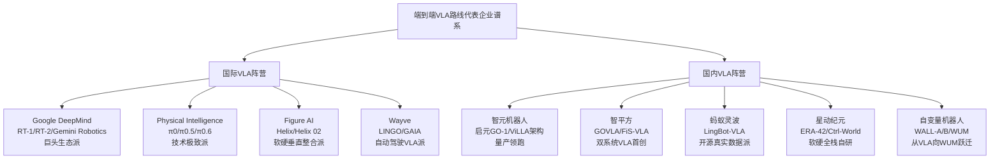

本章对每家企业统一采用如下五维分析框架，确保横向对比的公平性与可读性：**技术路径**（架构创新、动作Token、控制频率、视觉骨干等）、**产品进度**（本体形态、迭代节奏、关键演示）、**商业化进度**（订单规模、客户类型、场景渗透）、**融资情况**（轮次节奏、估值变化、投资方结构）、**团队情况**（创始人背景、核心成员构成、团队规模）。在第3.11节，本研究将基于这一框架对10家企业进行系统横向对比。

## 3.2 Google DeepMind:RT系列到Gemini Robotics的基础模型路线

Google DeepMind是全球最早将大模型范式引入具身智能领域的研究机构之一。其VLA路线的演进可视为"以基础模型驱动机器人"思想从概念到产品的完整范本——从早期RT-1、RT-2到与海量机器人数据集Open X-Embodiment绑定的RT-2-X、再到2025年发布的Gemini Robotics及其后续版本。

**技术路径**层面，Gemini Robotics于2025年3月12日发布，是基于Gemini 2.0多模态架构开发的视觉语言行动模型(VLA)。其核心创新在于**首次实现了"感知-决策-动作"的全闭环操作**——能够直接根据视觉输入和语言指令生成相应的机械臂轨迹，无需传统分步规划[^31]。该模型通过整合多模态理解能力与物理动作输出模块，形成"感知-认知-行动"闭环系统，实现在动态环境中执行折纸、物体抓取、餐盒打包等复杂任务，跨场景泛化能力提升超100%[^31]。增强推理版本Gemini Robotics-ER进一步专注三维空间理解能力，对咖啡杯等陌生物体的抓取轨迹规划成功率提升至91%，动态障碍物规避路径规划效率较基础版提高2.3倍。

值得注意的是，Gemini Robotics在2025年内完成了三次代际跃迁。2025年6月，谷歌DeepMind推出**Gemini Robotics On-Device本地化机器人AI模型**，可在无云端支持的情况下实现对实体机器人的控制[^31]。2025年9月，**Gemini Robotics 1.5问世**，采用**ER模型和VLA模型协作架构**——其中ER模型负责高层推理和决策，生成详细的行动方案；VLA模型负责感知和具体执行，并在执行过程中进行细粒度的自我推理校正[^31]。这种"高层推理ER+底层执行VLA"的双模型协作，本质上是第2章所述"分层组织方式+VLA底层"的混合实践，体现了Google基础模型路线向更精细分工的工程化演进。

在更横向的开源VLA生态中，Google DeepMind的另一个里程碑是**RT-2-X**——拥有550亿参数、背靠Google算力与数据资源的VLA模型，曾被OpenVLA以70亿参数、八分之一规模在29项操作任务中击败16.5个百分点的成功率[^24][^25]。这一对比一方面凸显出Google在大模型规模上的工程优势，另一方面也暴露出"参数规模并非具身智能效果唯一决定因素"的行业共识。

**产品进度与商业化**层面，Gemini Robotics采取了与Figure AI、智元等"自做整机"路线截然不同的**"AI模型供应商"定位**——其商业化路径不依赖自有本体，而是通过生态合作触达终端硬件。Gemini Robotics已与Apptronik、Boston Dynamics等企业合作推进商业化落地，并适配Franka机械臂及Apollo人形机器人等多种硬件形态[^31]。2026年3月，Google DeepMind与德国工业机器人企业Agile Robots达成战略研究合作，旨在将Gemini Robotics模型集成到后者的工业系统中以提高自动化程度[^31][^32]。Agile Robots成立于2018年，目前拥有超过2500名员工，已在全球部署了超过20000套机器人解决方案[^32][^33]。这一合作验证了Google "巨头生态派"模式的产业可行性——**通过为已有大规模硬件部署的合作伙伴提供AI模型升级，实现"一份模型赋能万台机器"的杠杆效应**。

**融资与团队**层面，作为Google母公司Alphabet下属研究机构，DeepMind无独立融资活动，其资源来自Google对AI赛道的整体投入。但需指出的是，Google在2025—2026年内对Wayve亦签署了拟投资5亿美元的意向书，进一步扩展其在具身智能（含自动驾驶）赛道的布局[^34][^35]。团队层面，Google DeepMind机器人技术高级总监Carolina Parada在与Agile Robots合作的声明中将该合作定位为"**将AI影响力带入现实世界的重要步骤**"[^32][^33]，这一表态揭示了Google将基础模型从数字世界向物理世界延伸的战略定位。

## 3.3 Physical Intelligence:π系列与软件定义机器人范式

如果说Google代表了"巨头生态派"的VLA基础设施供应商定位，那么Physical Intelligence（简称PI）则代表了**"技术极致派"的另一种极端形态**——一家以软件模型为核心资产、明确不做整机硬件、却以110亿美元估值跻身全球具身智能头部阵营的旧金山初创公司[^36][^37]。

**技术路径**层面，Physical Intelligence的代表作π0.5于2025年4月22日发布于arXiv，是一个具有**开放世界泛化能力的VLA模型**[^38][^39]。其核心工程创新可归纳为三点。**第一，分层推理链架构**：模型在处理每一帧画面时，遵循"感知层（Bounding Box，圈出相关物体）→规划层（Subtask Labels，预测当前语义子任务）→执行层（Action Expert，生成具体动作）"的严密思维链[^40]。**第二，异构数据协同训练**：π0.5的训练数据来源广泛，包括多机器人数据、高层语义预测、网络数据等，涵盖图像观察、语言指令、物体检测、语义子任务预测以及底层动作等多种模态——通过协同训练，模型能够实现有效的知识迁移[^38]。**第三，FAST动作分词器+Flow Matching**：所有数据（动作、坐标、文本、检测框）都被转化为FAST Token，使机器人能像LLM处理文本一样处理动作；执行层同时预测离散Token（用于对齐语义和加速训练）和连续动作流（通过Flow Matching实现），并冗余输出关节角度和末端执行器位姿——末端位姿用于跨机型泛化，关节角度用于直接、安全的物理执行[^40]。

π0.5的实证表现颇具说服力——团队大胆地在三个**从未见过的私人家庭**中进行测试，模型在无需微调的情况下，能持续执行**10—15分钟的复杂任务**[^40]。π0.5还证明了一个对行业极具启发性的事实：**"训练时与机器人无关的数据会显著影响模型的执行成功率以及泛化能力"**，并通过控制变量实验证明"即便数据量相同，训练时见过的房子越多（多样性高），模型的泛化能力越强，且100个环境仍未达到上限"[^39][^40]。

**商业模式**层面，PI走出了一条与硬件整机派完全不同的路径。其商业模式是给其他机器人团队提供模型，类似于给汽车提供智驾系统的软件公司[^37]。PI联合创始人Lachy Groom对TechCrunch表态——"**我们没有商业化的时间表**"——在任何其他创业公司这都是"自杀式发言"，但PI的底气来自其"打造一套像操作系统一样的底座，从而适配各种类型本体硬件"的战略定位[^36][^37]。值得注意的是，π0.5论文出来后业内观察到，PI"摸到了真正适合VLA模型的硬件结构应该是怎样的"，"一直在给银河通用、星海图等中国本体厂商的本体构型提改动需求"[^39]——这意味着PI的"软件定义硬件"模式在事实上已对全球本体设计形成了反向影响力。

**产品进度**层面，PI从初代π0迭代到π0.5（2025年4月），并在2025年下半年继续推出π0.6——后者被星动纪元披露曾引用其分频VLA与"VLA+在线强化学习"等创新范式[^25]。这一连续迭代节奏，使PI成为开源VLA社区的"技术极致派"代表[^24][^25]。

**融资情况**层面，PI的融资速度堪称硅谷2025年最昂贵的技术赌注之一。2024年3月成立，同年11月累计融资突破10亿美元；2025年1月估值升至56亿美元；2025年下半年新一轮10亿美元融资完成后估值翻倍至**110亿美元以上**[^36][^37]。Founders Fund和Lightspeed Venture Partners进场，老股东Thrive Capital和Lux Capital继续跟投[^36]。一组对比数据揭示了其资本动能——OpenAI从2015年成立到2019年拿到10亿美元融资用了4年，而PI两年走完这个路程，且下一轮已在桌上[^36]。

**团队情况**层面，PI仅有约80名员工，其中相当一部分是研究员[^36][^37]。联合创始人Sergey Levine是UC Berkeley计算机副教授，谷歌学术引用量达18万次，在机器人领域具有极高的学术影响力[^37]；联合创始人Chelsea Finn为斯坦福大学教授，其在斯坦福的实验室与星动纪元创始人陈建宇有深度合作，联合研发了Ctrl-World世界模型[^25]。这种"少人员、高学术密度+大算力"的极致组合，是PI能在不做整机的情况下获得"机器人版OpenAI"估值标签的根本支撑。

## 3.4 Figure AI:Helix系列与全身VLA的工业落地

与PI"软件定义硬件"路线相对照的，是Figure AI的**软硬件垂直整合战略**——这家成立仅4年、估值达390亿美元的美国初创公司[^41]，正以"机器人版特斯拉"的姿态构建从硬件到模型的完整闭环[^42]。

**技术路径**层面，Figure AI的核心模型Helix经历了从初代到Helix 02的代际跃迁。**初代Helix**采用创新的"系统1+系统2"双架构，首次实现了视觉感知、语言理解与动作控制的深度融合，单个神经网络能够通过像素图像实现对人形机器人上半身的控制[^43][^41][^30]。**Helix 02**则在2026年初实现了从"上半身控制"到"全身控制"的关键跃迁——通过单一统一的视觉运动神经网络，将机器人搭载的全部机载传感器（视觉、触觉、本体感知）与所有执行机构直接相连[^30]。其架构在原有系统1、系统2基础上新增了底层基础模块**系统0**：**系统0以1000赫兹的高频运行**（1000万参数神经网络，1kHz输出关节级执行器命令），负责全身的平衡控制、接触交互与协同调度；**系统1以200赫兹运行**，将感知信息直接转化为全身关节目标姿态；**系统2负责对目标进行慢速推理**，解析场景、理解语言指令，并对行为进行时序编排[^30]。Helix 02基于超过1000小时的人体运动数据，结合仿真到现实的强化学习算法完成训练[^30]。

Helix 02的实证突破在于**4分钟洗碗机端到端长时域任务**——机器人能够在常规厨房环境中完成洗碗机的餐具取出与放回工作，这是迄今为止人形机器人自主完成的时域最长、复杂度最高的任务，机器人能够融合行走、物体操作与平衡控制，无需重置系统，也无需人工干预[^30]。

**产品进度**层面，Figure的硬件本体经历了Figure 01→Figure 02→Figure 03的三代迭代。Figure 02灵巧手专利取消传统钢索结构，采用单电机+连杆机构实现三自由度运动[^41]；Figure 03在前臂及腕部的电子元件进行了彻底的重新架构，取消了配电板和动态布线，从而降低复杂性、提高可靠性、简化散热管理[^34]。

**商业化**层面，Figure的工业落地实证最具说服力。Figure 02在过去6个月内已在宝马集团斯帕坦堡工厂参与生产了**3万辆X3汽车，累计装载超过9万个零件，运行时间超过1250小时，预计行走超过120万步或200英里**[^34]。机器人从货架或料箱中取出钣金件并将其放置在焊接夹具上，目标工作时长不超过84秒，每班次成功率高于99%，每班次零次干预[^34]。在另一个版本的披露中，Figure02在宝马生产线上的速度提升达400%，成功率提升七倍，每天能够完成多达1000次操作[^44]。Figure于2024年1月与宝马达成商业合作协议，宝马成为汽车行业首批引入通用型人形机器人的整车厂[^45]。

但Figure并非毫无争议——2025年下半年至2026年初，围绕其"完全自主"宣传的**信任危机**集中爆发。社区与业内专家通过逐帧慢放分析，发现3月10日发布的Helix 02家务视频、3月26日白宫亮相的Figure 03演示均存在"动作时序异常"[^46][^32]。例如在Shawn Ryan Show节目中，户外演示Figure 03时"在创始人发出'好了，转身'的指令前，机器人就已提前启动转向动作"[^46]；仓库分拣演示中"机器人握把动作存在2秒延迟，与宣称的'每包裹处理速度不到三秒、完全自主'形成矛盾"[^46][^32]。Figure官方对此回应称"训练阶段可能会采用遥操作示范，这是行业通用标准，但演示和生产阶段的机器人均实现完全自主"，但质疑者指出"Figure从未在无剪辑、一镜到底的公开场合验证其自主能力"[^46][^32]。

**融资情况**层面，Figure AI的融资节奏堪称行业纪录。2023年6月B轮融资6.75亿美元，估值26亿美元，由微软、英伟达、OpenAI Startup Fund、贝索斯旗下基金等投资[^45][^44]。2025年9月获得**超10亿美元C轮融资，估值飙升至390亿美元**，本轮由Parkway Venture Capital领投，Brookfield Asset Management、英伟达、英特尔资本、LG Technology Ventures等跟投[^43][^41][^42]。其融资速度从22亿美元到390亿美元仅用约2年，公司计划未来四年内实现10万台人形机器人量产目标[^41]。

**团队情况**层面，Figure由连续创业者Brett Adcock于2022年创立[^42]。Adcock此前创立Archer以27亿美元成功上市、Vettery以1亿美元被收购；其组建的团队由来自波士顿动力、特斯拉、谷歌DeepMind以及Archer Aviation的顶尖AI机器人专家组成[^42]。Adcock公布的Master Plan仿照特斯拉，分为"构建机电一体化人形机器人→实现拟人化操控能力→将人形机器人融入劳动力大军"三步[^42]。

## 3.5 Wayve:自动驾驶领域的VLA与世界模型先行者

Wayve是端到端VLA思想在自动驾驶赛道的代表性企业，其价值在于为本研究提供了"VLA思想跨赛道泛化"的对照视角——证明同一技术范式既可服务于通用人形机器人，也可重塑高阶自动驾驶。

**技术路径**层面，Wayve是第一个在公共道路上开发和测试端到端深度学习自动驾驶系统的公司[^47]。其AV2.0自动驾驶系统和特斯拉FSD一样，使用端到端模型，用神经网络取代了传统自动驾驶架构的感知、规划、控制环节，不使用高精地图，只依赖传感器原始输入数据[^47]。在此基础上，Wayve开发了两个具有标志性意义的模型：**LINGO-1**是公司将自然语言引入自动驾驶的VLAM（视觉-语言-动作模型）——能够实现行车解说和视觉问答两大功能，"由过去的'感知→驾驶操作'逻辑变为'感知→文本推断→驾驶操作'"，提高了模型的可解释性[^28]；**GAIA**则是多模态生成式世界模型[^47]。

Wayve最具杀伤力的能力是**Drive Zero-shot**——在过去一年中，Wayve在欧洲、北美以及日本超过500个城市，实现了无需城市特定数据精调的快速部署[^29]。这一能力的来源被官方解释为：基座模型基于来自70多个国家以及多种车型平台的多元化数据训练得到，"模型像人类老司机一样，凭借在数据中练就的'手感'，哪怕第一次来到陌生的街道，无需任何本地化训练也能丝滑驾驶"[^29]。"这是目前全球唯一实现500城无精调快速部署的方案"——这恰恰是基础模型范式在物理世界泛化能力的极致体现，与Physical Intelligence π0.5的"零样本进入陌生家庭"形成跨赛道呼应。

**产品与商业化**层面，Wayve的商业闭环呈现"L4 Robotaxi+L2量产"双线并进。一方面，Wayve计划在2026年与Uber推出Robotaxi商业试点[^29][^48]；另一方面，2027年将在乘用车上部署有监督的自动驾驶软件（L2+），最早的量产项目很可能就指向日产[^29]。这家公司目前已在英国和美国开展业务，并正在将测试和开发业务扩展到德国和日本等市场[^48][^34]。

**融资情况**层面，Wayve是欧美少数能持续吸引顶级资本的具身智能/自动驾驶标的。其2024年5月C轮由软银领投、英伟达和微软跟投，融资10.5亿美元；2025年2月D轮融资12亿美元（约合82.67亿元人民币），估值达86亿美元（约592亿元人民币）[^48][^29]。这12亿美元之后，Wayve累计融资超过25亿美元（约171亿元人民币）[^29]。投资方阵容堪称豪华——Eclipse、Balderton和软银愿景基金2期领投；产业资方包括微软、英伟达、Uber、奔驰、日产、Stellantis[^29]，几乎所有全球科技与汽车巨头都站在了Wayve的资本表上。一位在美国当地开发智驾的技术中层评价"这是他们内部唯一关注的对手"[^29]。

**团队情况**层面，Wayve成立于2017年，总部位于英国伦敦，目前约300名员工[^47]。创始人现任CEO亚历克斯·肯德尔（Alex Kendall）是来自剑桥大学的机器学习博士，从2017年开始就在汽车上对神经网络强化学习的早期成果进行应用[^47]。

需要指出的是，Wayve的特殊价值还在于其作为"**欧美唯一的第三方大模型智驾标的**"——除特斯拉FSD和英伟达智驾团队（均不需要独立融资）以及传统Tier 1之外，欧美几乎没有第三方公司在做基于大模型的智驾方案[^29]。这种"赛道唯一性"既使其享受了估值溢价，也为后续中国具身VLA企业拓展自动驾驶赛道提供了重要的对照样本。

## 3.6 智元机器人:启元GO-1与ViLLA架构的量产领跑者

进入国内VLA阵营，智元机器人是当前出货量与商业化进度最为领先的代表。这家由原华为副总裁邓泰华与"稚晖君"彭志辉联合创办的公司，在不到三年时间内从0冲到全球人形机器人市场39%的份额[^49][^50]。

**技术路径**层面，智元于2025年发布通用具身基座模型**智元启元大模型（Genie Operator-1, GO-1）**。其独创的**Vision-Language-Latent-Action（ViLLA）架构**由两大核心组件构成：多模态大模型VLM与混合专家系统MoE[^51]。**VLM组件**通过深度挖掘海量互联网图文数据，赋予了模型卓越的通用场景感知和语言理解能力。**MoE系统**则进一步增强了模型的动作理解与执行能力——其中**Latent Planner（隐式规划器）**通过分析大量跨本体和人类操作视频数据，掌握了通用的动作规划逻辑；**Action Expert（动作专家）**则依托**百万级真机数据训练**，具备了精细且高效的动作执行能力[^51]。这种"VLM感知+Latent Planner规划+Action Expert执行"的三层协同，本质上是VLA基础范式在动作Token选择上的特色化实现——其引入的Latent Action（隐式动作Token）介于"动作描述"与"原始动作"之间，被视为一种降低数据需求、提升跨本体泛化能力的工程设计。

**产品进度**层面，智元已构建出"远征、精灵、灵犀"三大机器人家族，覆盖工业智造、商业物流、科研教育等场景[^38]。其量产能力呈现"陡峭上扬"的指数级增长：2025年1月6日实现第1000台通用具身机器人量产下线，刷新行业纪录；从2025年1月至12月8日完成1000台到5000台的跨越；从5000台到10000台仅用了短短三个多月（2025年12月8日至2026年3月28日），3月28日**第10,000台通用具身机器人"远征A3"正式下线**[^52]。智元年产能力已达10万台以上，并构建起"半小时供应链圈"[^52]。智元联合创始人、总裁兼CTO彭志辉将这一节点定义为"开发态加速走向部署态的规模化落地"，宣告"部署态"元年的到来[^52][^40]。

**商业化进度**层面，智元的工业订单已实现质的突破。2024年10月与全球智能产品ODM头部企业**龙旗科技**达成合作，智元精灵G2在龙旗平板产线投产并应用于MMIT工站的精密上下料任务，成为全球首个具身智能机器人应用于制造业场景的标杆[^52]。在**宁波均胜电子**汽车零部件工厂，智元精灵G2被应用于高难度三销定位的柔性装配环节，**最快12.97秒的节拍和超过99%的成功率**[^52]。在**上汽通用奥特能超级工厂**，基于智元A2-W打造的"能仔1号"在别克至境E7的电池量产线上承担高精度作业任务，**±0.1mm的高精度定位能力和约2秒/件的作业效率**，紧凑设计仅占用传统自动工位不到15%的面积[^52]。

业绩端，智元交出了行业内最具说服力的成绩单。**2025年销售收入超过10亿元，相比2024年的数千万元实现数百倍增长**；2025年底整体出货量超过5100台，**占据全球人形机器人市场约39%份额**，在出货量与市场份额两项关键指标上均位居全球第一[^49]。在2026年合作伙伴大会上，邓泰华公开了五年规划：**2026年营收实现数倍增长，2027年营收突破百亿大关，2030年剑指千亿规模**[^50]。彭志辉在2026年4月接受蓝鲸采访时也确认"2024年营收不到1亿，2025年已超过10亿，今年还会有几倍增长"，公司"现在能自我造血，对一级市场融资没那么迫切"[^39]。

**融资情况**层面，截至2025年，智元最新估值达**150亿元**，是中国估值最高的具身智能企业之一[^49][^38]。累计完成11轮融资，投资方包括红杉中国、高瓴、上汽、比亚迪、京东、腾讯、美团等机构与企业[^49][^28][^53]。比亚迪是其在人形机器人领域的首个公开投资项目，认缴出资额191.497万元，持股3.76%[^28][^53][^54]。2025年7月，智元通过"协议转让+要约收购"方式，以约21亿元总价收购**上纬新材63.62%股权**，市场对其估值预期通过对上市公司的收购溢价得以体现[^38]。

**团队情况**层面，智元由原华为副总裁、昇腾AI业务核心操盘手**邓泰华**与"稚晖君"**彭志辉**联合创办[^50]。邓泰华带来的不只是管理经验，更是一套完整的华为式产业思维——"先建生态、铺平台、投AI，再靠规模把成本打下来"[^50]。彭志辉则是B站知名科技博主"稚晖君"，前华为"天才少年"[^28]。智元超过四分之三的研发资源投在了AI上，成立不到三年已签下17家以上合资公司、投资15家以上早期企业，并发布了开源操作系统和开发者平台[^50]。其"一体三智"到"三智一体"的模型收敛路径、以及子公司分拆独立融资的"富二代创业"打法[^39]，与华为式生态战略一脉相承。

## 3.7 智平方:GOVLA/FiS-VLA与"最像特斯拉"的双系统VLA

智平方（AI² Robotics）由郭彦东博士于2023年4月创立，被资本市场普遍视为"最像特斯拉"的中国机器人创业公司[^37][^45]。

**技术路径**层面，智平方是**国内最早提出并系统性研发端到端VLA技术范式的企业**[^55]。其原创研发的**GOVLA（Global & Omni-body Vision-Language-Action）大模型**在2025年4月17日发布，是**全球首个全栈自研的全域全身VLA大模型**——首次实现"全域感知（360°×360°）+全身控制（34自由度）+长程推理"[^55][^48]。常规VLA仅输出机械臂动作，而GOVLA首次提出输出全身控制和移动轨迹，意味着机器人能够实现全身协同，完成"从冰箱取食材到送餐上桌"的全链条任务[^55]。

GOVLA的系列演进体现了智平方对双系统VLA的体系化探索。**GOVLA 0.0**（2024年6月）是其首个开源VLA模型；**GOVLA 0.5（FiS-VLA）**（2025年6月）实现"快慢系统深度融合"，**成为业内首个"异构输入+异步频率"双系统VLA模型**，性能超越国际标杆π0达30%[^37][^45][^43]；**GOVLA 1.0**为最新版本[^36]。其技术架构包含三部分——空间交互基础模型、慢系统（System 2，复杂逻辑推理与任务拆解）、快系统（System 1，全身控制与移动轨迹生成）[^55]。**控制频率达117.7Hz**，兼顾实时响应与复杂决策[^48]。其开源FiS-VLA论文入选NeurIPS 2024，图灵奖得主Yann LeCun曾公开点赞其开源模型[^41]。智平方还在RoboCOIN（大型双臂机器人数据集）中成为half-humanoid领域数据与本体数量最多的贡献者，覆盖50余个场景[^36]。

智平方对VLA演进路径的理解也颇具启发性——其CEO郭彦东将VLA划分为"端到端VLA→融合世界模型的增强型VLA→类脑NeuroVLA"三阶段，强调"VLA不会消失，它会被不断加持，变得越来越聪明"[^48]——这一观点已在第2章2.8节作为VLA派回应世界模型派的核心论据展开。

**产品进度**层面，智平方已推出**AlphaBot（爱宝）系列三代产品**——AlphaBot、AlphaBot 1S、AlphaBot 2，均为轮式可升降人形机器人[^43]。AlphaBot机器人能在模拟工厂搬箱子码垛、在软饮吧做咖啡冰淇淋，还能在舞台敲架子鼓[^43]。

**商业化进度**层面，智平方采取"工业+服务"双轮驱动战略。AlphaBot系列已进入汽车制造场景，直接对标特斯拉Optimus，并拿下国际车企订单[^36]。在工业落地上，智平方与全球第三大面板厂商**惠科签订了3年1000台商业订单**，并在2025年12月即实现单月百台级交付[^36]。其2025年9月自建产线投产，12月实现单月百台级交付，目前该产线已具备年产千台能力，并计划在2026年扩产至万台规模[^36]。在服务场景上，2025年12月29日智平方推出全球首个模块化具身智能服务空间"智魔方"，并率先于北京朝阳公园与深圳万象城同步落地，计划未来三年在全国文商旅场景落地1000个"智魔方"[^36]。

**融资情况**层面，智平方在**一年内累计完成12轮融资**，被业内视为全球融资节奏最快的具身智能企业之一[^37][^45]。继2025年半年内连续完成7轮数亿级融资后，智平方在2026年2月23日宣布完成B轮融资，**融资规模超10亿元，公司估值正式突破百亿，成为深圳首个估值超百亿的具身智能独角兽**[^36][^37][^45]。本轮投资方包括百度、中国中车、多家特斯拉生态链企业，以及PE基金沄柏资本、券商系基金国泰海通等[^36]。2026年4月，智平方完成股份制改造，正式更名为"智平方（深圳）科技股份有限公司"——业内普遍将其视为IPO进程加速的关键节点，叠加宇树科技、乐聚机器人等独角兽完成股改后快速启动IPO的先例[^43]。

**团队情况**层面，创始人郭彦东博士为美国普渡大学博士，曾在微软美国总部核心AI团队任职，担任过小鹏汽车和OPPO的首席科学家与研发高管，主导的智能系统应用于数亿台消费电子终端及智能汽车[^36][^43]。智平方核心团队来自微软、谷歌、小鹏、OPPO、Momenta等科技企业，以及清华大学、北京大学、中科院、哥伦比亚大学等学术机构[^36]，是"科学家密度最高的创业团队，罕见拥有5位斯坦福全球前2%科学家加盟"[^37]。这种"科学家密度+量产经验"的双重组合，正是智平方被赋予"中国版特斯拉机器人"标签的核心依据[^37][^45]。

## 3.8 蚂蚁灵波:LingBot-VLA与开源真实数据派路线

蚂蚁灵波是蚂蚁集团旗下的具身智能公司，其VLA路线代表了"互联网巨头跨界+开源真实数据"的独特定位[^33][^56][^27]。

**技术路径**层面，蚂蚁灵波在2026年1月连续四天开源了**LingBot-Depth、LingBot-VLA、LingBot-World、LingBot-VA**四款具身智能领域模型，构建起"从空间感知到智能决策、从基座能力到世界建模的完整技术矩阵"[^35][^27]。其中：**LingBot-Depth**于1月27日开源，旨在提升环境深度感知与三维空间理解能力，解决机器人识别真实世界的"玻璃问题"[^27]；**LingBot-VLA**于1月28日全面开源，包括后训练代码，**已与多家机器人厂商完成适配，验证了跨本体迁移能力**[^56][^27]；**LingBot-World**世界模型于1月29日开源，旨在为具身智能、自动驾驶及游戏开发提供高保真、高动态、可实时操控的"数字演练场"，模型权重及推理代码已面向社区开源[^56]；**LingBot-VA**具身世界模型于1月30日开源[^27]。2026年4月16日，蚂蚁灵波又开源了**流式三维重建模型LingBot-Map**，支持仅依靠单个普通RGB摄像头进行实时三维重建[^27]。

LingBot-VLA的性能表现亦颇具说服力。在统一的真机评测基准下，其整体任务成功率与泛化表现已超越Physical Intelligence的π0.5[^42]——后者长期被视为行业性能标杆。LingBot-VLA的泛化能力，部分源于其对高质量三维空间信息的深度融合——这一能力来自LingBot-Depth模型的核心提供[^42]。LingBot-VLA也被披露**在上海交通大学开源的GM-100测试和RobotWin 2.0仿真基准评测中，性能表现优于π0.5**[^27]。蚂蚁灵波明确坚持"从真实数据出发，打磨数据链路，并探索具身领域的Scaling Law"的技术路线[^57]。

蚂蚁灵波首席科学家沈宇军对路线选择的判断对理解其技术哲学颇具价值——他在2026年中关村论坛上表示，**"具身智能可能还在GPT-1阶段"**，行业里还没有一个真正属于具身智能的原生预训练模型；今天几乎所有具身模型都建立在数字世界的大模型基础之上——要么是多模态模型，要么是视频生成模型——再叠加少量机器人数据进行微调，这是一种"迫不得已"的选择，而非终极答案[^35]。沈宇军认为达到"GPT-3时刻"至少需要三年，"一年解决数据怎么采，一年解决数据怎么选，一年真正训出原生基模"[^35]。这种"慢功夫才是真捷径"的判断，与PI、星动等同行的激进时间表形成鲜明对照。

**产品进度**层面，蚂蚁灵波首款人形机器人**Robbyant-R1**在2025外滩大会首次公开亮相[^56]。2025年9月，Robbyant-R1亮相柏林国际电子消费品展览会（IFA）[^27]。R1基于自研的具身智能基础大模型与智能硬件，能够完成包括取菜、烹饪和清洁在内的操作，具备烹饪、导游服务、药店药品分拣等功能[^33]。

**商业化进度**层面，LingBot-VLA已与星海图、松灵、乐聚等多家国产本体厂商完成端到端验证[^42][^57]，并在工业、物流、医药等场景进行应用落地[^57]。蚂蚁灵波已与奥比中光达成战略合作伙伴关系，2026年4月15日与江苏隆盛唯睿具身智能机器人创新中心等企业合作签约共建生态[^27]。

**融资情况**层面，与其他独立创业公司不同，**蚂蚁灵波作为蚂蚁集团全资子公司，目前没有公开融资轮次**[^33][^57]。其上海主体（上海蚂蚁灵波科技有限公司）成立于2024年12月17日，注册资本1亿元，由蚂蚁集团旗下蚂蚁智能科技有限公司全资持股；杭州主体（蚂蚁灵波科技（杭州）有限公司）成立于2025年8月20日，注册资本500万元[^56][^27][^57]。

**团队情况**层面，首席科学家**沈宇军**博士毕业于香港中文大学多媒体实验室（MMLab），师从汤晓鸥、周博磊教授，是香港博士研究生奖学金计划（HKPFS）获得者[^35][^50]。他长期深耕计算机视觉与生成模型领域，在CVPR、TPAMI等国际顶会和期刊发表论文百余篇，累计引用逾万次，h-index达44[^35][^50]。沈宇军2021年加入字节跳动任高级研究员，2022年4月加入蚂蚁集团，2024年11月出任蚂蚁灵波首席科学家[^50]。这种"学术派+互联网巨头资源"的组合，使蚂蚁灵波在开源生态贡献与多本体适配上具备独特优势。

## 3.9 星动纪元:ERA-42与软硬一体全栈自研路径

星动纪元由清华大学交叉信息研究院孵化，**是唯一一家清华大学占股的人形机器人企业**[^25][^58]，其VLA路线代表了"软硬一体全栈自研+学术驱动"的另一条独特路径。

**技术路径**层面，星动纪元于2024年12月23日发布**端到端原生具身大模型ERA-42**，是结合了五指灵巧手的具身智能大模型[^24]。ERA-42采用端到端原生架构，将感知、决策与执行整合为统一系统，减少中间环节误差[^24]。其**核心策略是通过大规模视频数据学习行动结果而非模仿动作**，结合视觉、语言、触觉等多模态信息实时适应环境，通过观看人类操作视频即可直接学习新技能，降低了数据需求[^24]。该模型融入了世界模型技术，使其具备物理规律理解与未来行动轨迹预测能力，可应对突发干扰并优化执行路径，**任务成功率随模型规模提升而提高，初步验证了机器人领域的"Scaling效应"**[^24]。在物流分拣等非结构化场景中，ERA-42任务完成效率可达到人类水平的70%以上[^24]。

星动纪元的另一项重磅技术成果是与斯坦福大学Chelsea Finn团队（Physical Intelligence创始人）联合研发的**Ctrl-World世界模型**。在2026年2月的WorldArena榜单中，**Ctrl-World在具身任务类别排名全球第一，在世界模型综合类别排名第二**[^24][^25]。星动纪元还率先提出**分频VLA**与**"VLA+在线强化学习"**等创新范式，**相关成果早于PI、谷歌、英伟达等发布，强化学习技术方案还被PI最新模型π0.6引用**[^25]。这一"中国学术先发、国际同行跟进"的范式贡献，对照沈宇军关于"具身智能仍在GPT-1阶段"的判断，呈现出中国具身智能研究在前沿创新上的独立贡献能力。

**产品进度**层面，星动纪元构建了"双足/轮式/灵巧手"完整产品矩阵——**双足人形机器人星动L7、轮式人形机器人星动Q5、半身人形机器人星动M7、五指机器人灵巧手星动XHAND1**[^58]。星动M7腰部3自由度设计覆盖超2.1米台面全域操作范围，搭载国内首创全直驱12自由度五指灵巧手星动XHAND1，可精准拿捏各类大小、形状、材质的包裹[^59][^29]。星动XHAND1采用一种关节全直驱方案，搭载12个全主动自由度，指端包裹高分辨率（>100点）触觉阵列传感器，最大抓握力80N，响应速度可达每秒10次鼠标点击[^24]。该机械手与ERA-42协同后，支持100多种复杂灵巧操作[^24]。

**商业化进度**层面，星动纪元呈现"高质量、高市场化、高复购"特征。**截至2026年初，累计订单超过5亿元，海外业务占比达50%**，覆盖北美、欧洲、中东、日韩等核心市场；**全球市值TOP10科技公司中已有9家成为星动纪元客户**；国际化、市场化客户的复购次数高达6次[^25][^58]。在物流场景的落地遥遥领先——已落地国内首个具身智能物流解决方案，应用于仓储拣选、快递供件等场景，在深圳、湖州、杭州、合肥、北京等多个城市完成布局，**单笔订单金额超5000万元**[^25][^56]。其与顺丰合作的跨境物流具身智能查验解决方案，已应用于海关跨境货物查验[^25]。星动XHAND1作为独立产品，2025年出货量近千只[^58]。陈建宇在2026商业新愿景中明确表态——"2026年希望实现千台级别的出货，万台是更长期的目标"[^56]。

**融资情况**层面，2024年10月完成近3亿元的Pre-A轮融资，2025年7月完成近5亿元A轮融资，2025年11月20日完成近10亿元A+轮融资（吉利资本领投，北汽产投战略投资），2026年3月5日完成**10亿元战略轮融资，估值破百亿元**[^25][^58][^56]。本轮融资由三星、高成投资、新加坡电信、友利资本、中金保时捷、中芯聚源、峰和资本、锡创投、广发乾和、鸿瑞集团等新机构联合投资，老股东追加投资[^25]。**星动纪元已累计吸引16家国内外产业投资方，为具身智能行业之最**——涵盖科技、汽车、3C、物流、半导体、新能源、新材料、电信等全产业链核心环节，包括吉利资本、阿里巴巴、联想、海尔、北汽，以及三星集团、新加坡电信、友利资本等国际产业巨头，形成了"国际巨头+国内龙头"的生态矩阵[^25]。

**团队情况**层面，创始人**陈建宇**是国内最早一批做人形机器人的创业者，本科毕业于清华大学精密仪器系，在加州大学伯克利分校读博期间师从美国工程院院士、机械控制理论奠基人Masayoshi Tomizuka，2020年受图灵奖得主姚期智邀请回国担任清华大学交叉信息研究院助理教授、博士生导师；**28岁时即成为博士生导师**[^58][^56]。陈建宇直言"我们想做万亿市值具身公司"，并提出"现在大家估值都在蹭蹭往上走，我们要成为巨头就得万亿市值"[^56]。其务实风格亦颇具特色——"挑了一家在线教育公司的办公室，装修看起来还不错，办公桌椅能继续用，能省下一笔费用"，同时"每天骑着电动车上班"[^56]。

## 3.10 自变量机器人:WALL系列与从VLA到WUM的范式跃迁

自变量机器人（X Square Robot）由王潜创办于2023年12月（亦有资料显示成立于2023年9月）[^56][^57]，其VLA路线在2026年4月经历了一次显著的范式跃迁——从基础VLA向**世界统一模型WUM架构**演进，标志着该公司在端到端路线上提出了对VLA"模块化拼接"的根本性挑战。

**技术路径**层面，自变量于2024年底发布基于VLA架构的第一代具身基础模型**WALL-A**[^26][^30]。2025年9月将同样思路架构下的轻量化模型版本**WALL-OSS**开源[^26]。运行于58到家家庭清洁项目中的**WALL-AS**（WALL-A迭代版本）为公司带来了大量真实家庭环境数据，但也"进一步暴露出VLA架构在复杂场景中的能力边界"[^26][^30]。

在此基础上，自变量于2026年4月21日发布全新一代具身智能基础模型**WALL-B**——**全球首个基于世界统一模型架构（World Unified Model, WUM）的具身智能基础模型**[^30][^27][^57]。WUM区别于行业其他方案的核心是**"将视觉、语言、动作、物理预测等能力，放在同一个网络中从零开始联合训练，融为一体，消除模块间的边界和数据搬运损耗"**[^26][^30]。王潜以一个形象比喻表达对VLA主流路线的判断——"VLA就类似于M1之前的笔记本电脑架构——视觉模块、语言模块、动作模块各自为政"，"VLA本质上是视觉、语言、动作三个独立模块的拼接，数据在三个模块里逐级传递，每过一次模块边界，就会发生信息损耗和延迟"[^26][^57]。

WALL-B在WUM架构下实现了**三大质变**：**原生多模态融合**——首次实现"原生本体感"，无需持续观察自身、无需依赖大量外部传感器，就能内在感知自身的空间尺寸与动作边界，"这种内生的空间感知能力，甚至很多动物都不具备"[^57]；**物理世界感知**——基于重力、惯性、摩擦力等通用物理规则预判风险，例如当看到盘子悬空在桌沿时，模型能推断出掉落风险并主动采取预防动作[^57]；**自我进化能力**——摆脱传统的"错误即停"模式，任务失败后能自主调整策略再次尝试，并将成功经验实时更新至模型参数[^57]。

需要明确指出的是，**WUM架构与第4章将要分析的世界模型路线存在显著的边界辨析问题**。一方面，自变量明确将WUM定义为对VLA的范式跃迁、强调其与世界模型的差异——王潜直言"行业现在公认的两条具身道路，无论是从VLM延展到VLA，还是从视频生成模型、世界模型继续往动作上接，本质上都还是在继承那些原本不是为具身任务训练出来的模型"，"我们做的，是专门为机器人、为物理世界打造的基础模型，彻底从头开始预训练，这和行业主流路线是完全相反的"[^57]。另一方面，WUM在"物理世界感知"上确实包含了世界模型的预测能力。**本研究采取的处理方式是将自变量完整放入VLA章节、并将WUM视为'VLA向世界模型方向的极致演进'**——这一归类既尊重自变量的技术血统连续性（WALL-A→WALL-OSS→WALL-AS→WALL-B），也保留了WUM作为"VLA派融合世界模型"的范式价值，第4章将不再重复分析自变量。

**产品进度**层面，自变量推出量子1号和量子2号两款轮式仿人形机器人[^57]。基于WUM架构的WALL-B宣布**35天后（2026年5月25日）将正式入驻首批真实家庭**[^57]——这是国内具身智能行业第一次把通用家庭服务机器人从实验室的PPT和Demo推向普通用户的真实家庭[^57]。

**商业化进度**层面，自变量与58到家平台合作，将机器人引入家庭清洁场景，参与上门保洁等实际作业[^26][^30]——这是其在家庭场景的首次实际部署。但需指出的是，自变量目前的商业化重心更多放在"用钱拿数据、占领用户心智"上，而非短期ROI——业内观察者评价"目前自变量先把自己战略先聚焦在最难最远的家庭机器人场景"[^57]。

**融资情况**层面，自变量是端到端VLA路线中资本表现最特殊的企业之一。2026年1月12日完成10亿元A++轮融资，投资方涵盖字节跳动、红杉中国、北京信息产业发展基金、深创投、南山战新投、锡创投等顶级投资机构及多元地方平台（**该轮融资也是深创投AI基金成立以来的第一笔投资**）[^56]。**2026年3月底至4月初完成B轮融资近20亿元，由小米战投与红杉中国联合领投**[^56][^27]。自变量累计融资超40亿元，估值超100亿元[^57]。

最具特色的是其投资方结构——**自变量是国内唯一同时获得字节跳动、阿里巴巴、美团、小米四家互联网大厂战略投资的具身智能企业**[^26][^30][^56][^27]。王潜将巨头持续追捧的原因归结为"投技术的绝对领先性"——"这些投资方本身具备成熟的大模型研发能力与技术判断力，更关注长期技术壁垒的构建，而非短期回报"[^26]。"软硬件一体化能力是其中的重要竞争力之一"，"资源投入并不必然转化为技术领先"[^26]。

**团队情况**层面，创始人兼CEO **王潜**1988年出生，本科在清华大学电子工程系，研究生在生物医学系，博士在南加州大学专攻机器人学习，曾在美国机器人实验室从事人机交互研究，**是注意力机制的早期提出者之一**；在经历量化基金公司创业后，王潜于2023年决定回国创业[^57]。这种"学术派+量化基金创业经验"的组合，使自变量在AGI路径选择上呈现出明显的"基础模型导向"——"当很多具身智能公司更关心机器人先在哪些场景里跑通商业化时，自变量更想寻找哪条路径能够通往AGI"[^27]。

## 3.11 VLA代表企业横向对比与路线优势瓶颈研判

基于3.2—3.10节对10家代表企业的五维剖析，本节构建统一对比矩阵，从技术架构创新、产品迭代节奏、商业化路径、融资规模与团队基因五个层面进行横向比较，并最终归纳VLA路线的共性优势与瓶颈。

### 3.11.1 五维对比矩阵

| 企业 | 核心模型/架构 | 关键产品/本体 | 商业化标志 | 融资/估值 | 创始人/核心团队基因 |
|------|------------|------------|----------|----------|---------------|
| **Google DeepMind** | Gemini Robotics系列；ER+VLA双模型协作（2025.9）；本地化版本（2025.6） | 适配Franka、Apollo人形等多种本体 | 与Apptronik、Boston Dynamics、Agile Robots（2万套部署）合作 | 隶属Alphabet，无独立融资 | DeepMind团队，机器人负责人Carolina Parada |
| **Physical Intelligence** | π0/π0.5/π0.6；分层推理链+异构数据+FAST Token+Flow Matching | 不做本体，给银河通用、星海图等提供模型 | 私人家庭10-15分钟开放世界泛化 | 2年累计融资超20亿美元；估值110亿美元（2025） | UC Berkeley Sergey Levine、斯坦福Chelsea Finn等学术派 |
| **Figure AI** | Helix→Helix 02；系统0(1kHz)+系统1(200Hz)+系统2三层架构 | Figure 01/02/03 | 宝马斯帕坦堡工厂6个月生产3万辆X3、装载9万零件、1250小时 | C轮10亿美元（2025.9）；估值390亿美元 | Brett Adcock（Archer/Vettery连续创业者）；波士顿动力、特斯拉、谷歌DeepMind专家 |
| **Wayve** | LINGO-1（VLAM）；GAIA世界模型；500城zero-shot部署 | 适配乘用车与商用车，端到端AV2.0 | 与Uber Robotaxi 2026试点；与日产/奔驰L2+/L3量产 | D轮12亿美元（2025.2）；估值86亿美元；累计25亿美元 | 剑桥机器学习博士Alex Kendall等；约300名员工 |
| **智元机器人** | 启元GO-1；ViLLA（VLM+MoE Latent Planner+Action Expert） | 远征A1/A2/A3；精灵G1/G2；灵犀X2-N | 2025年出货5100+台、营收10亿元、全球39%份额；龙旗/均胜/上汽通用订单 | 11轮融资；估值150亿元 | 邓泰华（华为副总裁/昇腾负责人）+稚晖君彭志辉 |
| **智平方** | GOVLA 0.0/0.5(FiS-VLA)/1.0；首创"异构输入+异步频率"双系统VLA；117.7Hz | AlphaBot/1S/2轮式可升降人形 | 惠科3年1000台订单；2025.12月单月百台交付；自建产线规划万台 | 一年12轮融资；B轮超10亿元；估值破百亿（2026.2） | 郭彦东（OPPO/小鹏首席科学家）；5位斯坦福全球前2%科学家 |
| **蚂蚁灵波** | LingBot-VLA等四模型矩阵；性能超越π0.5 | Robbyant-R1人形机器人 | 与星海图、松灵、乐聚等多本体厂商适配；工业、物流、医药场景试点 | 蚂蚁集团全资子公司，无独立融资 | 沈宇军（CUHK博士、字节研究员、蚂蚁研究院）首席科学家 |
| **星动纪元** | ERA-42（端到端原生）；Ctrl-World世界模型WorldArena第一；分频VLA、VLA+RL | 星动L7双足/Q5轮式/M7半身/XHAND1五指手 | 累计订单5亿元；海外占比50%；全球Top10科技公司9家为客户 | 2026.3轮10亿元；估值破百亿；16家产业投资方 | 陈建宇（清华-伯克利-清华博导）；与斯坦福Chelsea Finn合作 |
| **自变量机器人** | WALL-A→WALL-OSS→WALL-AS→WALL-B（WUM世界统一模型） | 量子1号/2号轮式仿人形 | 与58到家合作家庭清洁；2026.5.25入驻首批家庭 | B轮近20亿元（2026.4）；累计超40亿元；估值超100亿元 | 王潜（清华-南加州博士、注意力机制早期提出者） |

资料来源：综合整理自[^31][^49][^38][^39][^26][^40][^30][^52][^28][^55][^53][^36][^37][^45][^43][^41][^34][^35][^42][^47][^29][^24][^25][^58][^56][^27][^57][^50]

### 3.11.2 关键差异与代际归纳

**第一，技术架构层面呈现清晰的VLA代际谱系**。从最基础的"端到端单一VLA"（Google RT-2、π0、Figure初代Helix），到"双系统/分层协作VLA"（Figure Helix 02、智平方FiS-VLA、Google Gemini Robotics 1.5的ER+VLA），再到"融合世界模型的增强型VLA"（智平方下一代、星动纪元ERA-42）、最终到"世界统一模型WUM"（自变量WALL-B）——这一代际演进清晰对应了第2章2.9节所述"向混合架构收敛"的产业趋势。**动作Token的选择上**也呈现出明显分化：π0.5使用FAST Token+Flow Matching，智元GO-1使用Latent Action（隐式动作Token），Figure Helix 02使用连续关节级命令，Wayve使用直接的车辆控制信号——多元的动作Token设计验证了第2章关于"VLA未来不在于单一action token，而在于多种token协同"的判断。

**第二，产品迭代与量产规模差距悬殊**。从绝对出货量看，**智元10000台（部署态）、Figure参与生产3万辆X3汽车、星动纪元XHAND1出货近千只、智平方惠科1000台订单**等数字呈现出"规模化能力梯队"的清晰分层。智元代表的"硬件量产+生态扩张"模式与Figure代表的"垂直整合+客户深度绑定"模式形成两条不同范式——前者赌的是"先量产再升级智能"，后者赌的是"软硬件协同的高溢价工业部署"。

**第三，商业化路径分化为"工业产线/物流分拣/家庭清洁/Robotaxi"四大场景**。Figure专注汽车装配、智元覆盖工业+商业、智平方布局工业+服务、星动纪元主攻物流+B端、自变量直接押注家庭场景、Wayve专注自动驾驶。其中**家庭场景被业内普遍视为"99%的机器人都跨不过去的门槛"——自变量"35天后入驻家庭"的激进路径与王潜"先把数据拿到、迅速占领用户心智"的战略选择，实质是用资本换数据、用数据反哺模型的飞轮押注**[^57]。

**第四，融资规模与估值结构层级分明**。可大致划分为四个梯队：**第一梯队**（Figure 390亿美元、Wayve 86亿美元、PI 110亿美元）以美元/英镑为计价单位，本身具备国际化资本属性；**第二梯队**（智元150亿元、智平方/星动百亿元梯队、自变量超100亿元）位于中国具身智能独角兽核心阵营；**第三梯队**（Google/蚂蚁灵波）作为巨头子公司不参与独立融资但隐性估值难以量化；**Wayve作为欧美第三方智驾标的**则呈现出"赛道唯一性带来的高估值"独特定位[^29]。融资节奏上，"一年12轮"（智平方）、"4个月估值翻倍"（PI）、"两年累计融资40亿"（自变量）等节奏均刷新了过去硬科技投资的常规步调[^36][^37][^45][^57]。

**第五，团队基因呈现学术派、产业派与跨界派三大类**。**学术派**以Physical Intelligence（Sergey Levine、Chelsea Finn）、星动纪元（陈建宇）、蚂蚁灵波（沈宇军）、自变量（王潜）为代表，依托顶尖高校的研究积累；**产业派**以Figure（Brett Adcock）、智元（邓泰华）为代表，强调多次创业与大平台运营经验；**跨界派**以智平方（郭彦东，OPPO/小鹏首席科学家）为代表，将智驾时代的端到端经验直接迁移到具身智能。智驾背景人才的集体转向是2025年具身智能创业潮的鲜明特征——业内观察认为"智能驾驶背景人才在本轮具身智能创业潮中占据了相当比例。从百度Apollo、小鹏自动驾驶到Waymo等企业，技术骨干的集体转向，正在重塑行业格局"[^43]。

### 3.11.3 VLA路线的共性优势与瓶颈

综合上述对比，可以归纳VLA路线在工程化与规模化中的**共性优势**：**第一，基础模型驱动带来的跨场景泛化**——以π0.5在陌生家庭zero-shot部署、Wayve 500城无精调zero-shot为代表，VLA基础模型展现出超越传统机器人编程的开放世界泛化能力；**第二，跨本体适配能力**——以Google Gemini Robotics适配Franka/Apollo、PI模型跨本体输出、蚂蚁灵波LingBot-VLA与多家本体厂商完成端到端验证为代表，VLA模型表现出从"模型适配硬件"向"模型驱动硬件"的杠杆效应；**第三，资本认可度高**——Figure 390亿美元估值、PI 110亿美元、智元150亿元等数据印证了VLA路线在资本侧的强吸引力，资本市场普遍认为"硬件本身在国内并不构成长期壁垒""基础模型的壁垒显著更高"[^26][^30]。

但VLA路线的**共性瓶颈**同样明确，且这些瓶颈构成了第4章世界模型路线兴起的直接背景：

- **真机数据稀缺**：彭志辉直言智元目前最缺的是数据——"相比大语言模型用了整个互联网的数据，我们还差3到5个数量级，缺口非常大"[^39]。Pete Florence的"VLM拐杖论"也直指VLA对真机数据的过度依赖[^26]。
- **泛化天花板争议**：宇树王兴兴明确指出"VLA模型面临泛化能力受限等瓶颈，天花板更低"，而王潜则认为"VLA本质上是视觉、语言、动作三个独立模块的拼接""它只能模仿训练数据里的轨迹，根本不理解物理世界的规律"[^57]。
- **Figure式信任危机**：3万辆X3生产数据虽实证，但"完全自主"宣传与远程操控的边界争议、白宫演示动作时序异常等问题，对整个VLA路线的"可证伪性"提出了质疑——"Figure从未在无剪辑、一镜到底的公开场合验证其自主能力，所有'证据'均为公司发布的精心剪辑视频"[^46][^32]。
- **长程任务可靠性不足**：Figure 02前臂故障率最高、π0.5虽能完成10-15分钟任务但仍"经常失败"——Physical Intelligence研究者公开承认"它们仍经常失败，目前状态更像是'演示就绪'而非'部署就绪'"[^34][^42]。

这些瓶颈的存在恰恰成为推动**世界模型/WAM路线、双系统、混合架构**演进的产业动力——王兴兴的"世界模型天花板更高"判断、Generalist AI Pete Florence的"拐杖论"、自变量WALL-B的WUM跃迁、蚂蚁灵波同步开源四个模型矩阵的多路线下注等，都是对VLA瓶颈的直接回应。**值得注意的是，这种回应并未导致VLA路线被淘汰，而是推动其向"VLA+世界模型"、"VLA+双系统"、"VLA+类脑分层"等混合架构演进**——这正印证了第2章2.9节所述"向混合架构收敛"的产业判断。

至此，本章已完成全球10家VLA代表企业的深度剖析与系统对比。下一章将沿着同样的五维分析框架，进入与VLA路线既互补又竞争的世界模型/WAM路线——剖析英伟达Cosmos/GR00T、自变量WUM（已在本章末完整呈现，第4章将简要呼应）、华为WEWA、星海图Fast-WAM等代表企业，探查其在物理动力学建模、长程推演、安全性、数据效率上的技术优势与商业化挑战。

# 4 世界模型与WAM路线代表公司分析

第3章已系统剖析了端到端VLA路线的国际与国内代表企业，并指出VLA在工程化中面临真机数据稀缺、泛化天花板、长程任务可靠性不足等共性瓶颈。这些瓶颈正是2025—2026年间世界模型/WAM路线快速崛起的直接产业动力——王兴兴的"世界模型天花板更高"判断、Pete Florence的"VLM拐杖论"、英伟达Jim Fan关于"2026年将成为世界模型首次为机器人领域典型基础的一年"的论断，共同构成了本章企业剖析的时代背景[^48]。

然而，与VLA路线企业边界相对清晰不同，世界模型路线在企业归类上存在更多交叉与争议——既有英伟达、华为这样的"平台型基础设施供应商"，也有星海图、银河通用这样在VLA与世界模型之间双轨布局的整机企业，还有光轮智能、章鱼动力等深度绑定特定生态的专精型新锐。本章作为五大技术路线企业剖析的第二章，将沿用第3章的五维分析框架（技术路径—产品进度—商业化进度—融资情况—团队情况），首先界定世界模型路线的企业谱系与归类边界，随后依次解构英伟达、华为、星海图、银河通用四家代表企业及光轮智能、章鱼动力等专精型新锐，最后通过横向对比矩阵归纳该路线的优势瓶颈与商业化挑战，为第5章硬件驱动与分层架构路线提供完整对照基线。

## 4.1 世界模型路线代表企业谱系与归类边界

在进入企业逐一剖析前，必须先解决三个前置问题：**世界模型路线在企业层面的边界如何界定？哪些企业应被归入本章而非VLA章节或平台型章节？以及在五维分析框架下，世界模型路线相对VLA路线需要补充哪些特殊评估维度？**

如第2章2.3节所述，必须区分两类容易混淆的"世界模型"——**李飞飞所探索的"视频生成型世界模型"更偏向于构建供用户访问的3D世界，应用于游戏或虚拟现实；而具身智能语境下的世界模型，则用来指导机器人与物理世界交互**。本章所讨论的代表企业均聚焦于后者，即"具身决策型世界模型"——其评价标准不在视频生成的视觉保真度，而在对下游机器人任务的支撑能力。基于这一界定，结合企业实际定位与公开技术声明，本研究将世界模型/WAM路线的代表企业划分为三大阵营：

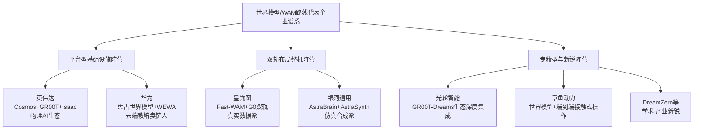

需要预先对若干**归类边界**作出说明：

- **自变量机器人WALL-B（WUM架构）**已在第3章3.10节完整剖析。WUM虽具备"将视觉、语言、动作、物理预测放在同一网络中从零开始联合训练"的世界模型属性[^26][^60]，但自变量明确将其定义为对VLA的范式跃迁、其技术血统连续性（WALL-A→WALL-OSS→WALL-AS→WALL-B）使其更适合放入VLA章节。本研究将其视为"VLA向世界模型方向的极致演进"，本章不再重复深度剖析，仅在4.7节横向对比矩阵中作为"统一融合型"代表纳入对照。
- **英伟达与华为同时具备"平台型生态"与"世界模型路线"双重属性**，本研究在本章重点剖析其世界模型技术布局与具身智能应用，第7章将进一步从平台型生态的整体视角对其展开分析，避免重复。
- **星海图与银河通用本质上是"VLA+世界模型双轨布局"的整机企业**，但鉴于其在世界模型方向的独特技术贡献（Fast-WAM、AstraSynth虚实融合），且在第6章双系统与混合融合路线中亦将出现，本研究在本章重点剖析其世界模型侧技术路径与数据策略，第6章将聚焦其双系统协同机制。
- **DreamZero**作为CVPR 2026 ManipArena挑战赛中的世界模型代表，与π0.5进行了大规模真机对比测试[^46]，本研究将其作为学术-产业新锐范式纳入4.6节简要讨论。

在五维分析框架的延续上，世界模型路线相比VLA路线需要补充三类**特殊评估维度**：第一，**Sim-to-Real迁移能力**——王兴兴明确指出"视频生成模型可以在虚拟空间中实现近乎零误差、极高保真的模拟效果。然而，把这一模型部署到机器人上时，即使只有一毫米的偏差，也可能导致与实际效果的巨大差异"，这一鸿沟构成世界模型路线落地的关键考核点；第二，**合成数据生成效率**——以GR00T-Dreams"仅凭一张图像和简单的文本提示，在虚拟环境中快速生成海量、带有精确动作标签和逼真物理交互的合成数据"为代表[^52]，合成数据生成效率成为衡量世界模型路线"数据飞轮"动能的核心指标；第三，**长程推演精度与闭环频率**——蔚来NWM"100毫秒内推演216种轨迹"、"3秒视频输入生成120秒想象视频"等指标[^32]，反映了世界模型路线在物理预测能力上的差异化优势。

## 4.2 英伟达：Cosmos+GR00T平台型世界模型生态

英伟达是全球物理AI与具身智能基础设施供应商的绝对代表，其世界模型布局已超越单一模型范畴，形成了"训练超算+仿真平台+世界基础模型+机器人基础模型+边缘部署芯片"的完整堆栈，被业内视为本轮具身智能浪潮中的"核心卖铲人"。

**技术路径**层面，英伟达的世界模型布局以**Cosmos世界基础模型平台**为核心，包含三个相互配合的子模型组件：**Cosmos Predict**作为领先的世界生成模型，可适配任何物理AI任务或环境——能够基于2B/14B规模的模型从文本、图像或视频生成30秒的预测视频世界，亦支持基于自有数据进行后训练，以创建定制边缘案例、闭环策略以及多视角、机器人中心的仿真；**Cosmos Transfer**是面向"仿真到真实"光照渲染转换的多控制模型，可与CARLA或NVIDIA Isaac Sim等物理AI仿真框架配对，加速跨多种环境与光照条件的合成数据生成；**Cosmos Reason**则是领先的视觉语言模型[^39]。在SIGGRAPH 2025大会上，英伟达进一步开源了70亿参数推理视觉语言模型Cosmos Reason，以及用于物理AI的Omniverse NuRec 3D高斯喷射库[^55]。

在机器人基础模型层面，英伟达于2025年3月19日的GTC 2025大会上正式开源**GR00T N1**——全球首款通用型人形机器人推理与技能适用的开放式基础模型[^49][^38]。GR00T N1的核心架构采用了**模拟人类思维的"快慢思考"双系统模式**：**视觉-语言模块（系统2）**通过视觉和语言指令解释环境，基于在互联网规模数据上预训练的Eagle-2 VLM中间层进行联合编码，在NVIDIA L40 GPU上以10Hz运行；**扩散变换器模块（系统1）**则相当于GR00T N1的"四肢"，基于扩散变换器（DiT）架构，通过动作流匹配技术进行训练，实时生成流畅的运动动作（120Hz）[^51][^49]。这种"VLM慢思考+DiT快反应"的组合，在第2章2.5节已被识别为双系统范式的工程典范。

GR00T N1最具创新性的训练范式是其**"数据金字塔"结构**——将不同来源的数据按照规模和实体特异性进行分层。**金字塔顶层**是真实机器人轨迹数据（在真实世界中通过物理机器人硬件收集）；**中间层**是合成数据集（通过物理仿真生成的synthetic data，以及由现成神经模型增强的数据如VLM标注数据）；**底层**则是大规模网络数据和人类视频数据（如Ego4D数据集涵盖的第一人称视角日常活动视频）——这些视频数据虽无直接动作标签，但模型可从其中的视觉信息和语言描述学习丰富的任务语义和自然动作模式[^51][^49]。**DexMimicGen则作为重要的合成数据生成工具**，可从少量人类演示中扩展生成大规模训练数据。这一"数据金字塔"思想后被业内多家头部企业借鉴，成为世界模型路线的标志性数据策略。

2025年6月11日，英伟达推出GR00T N1的升级版**GR00T N1.5**，在N1基础上改进模型和数据——预训练和微调期间VLM被冻结，且VLM升级为Eagle 2.5[^51]。在GR00T N1/N1.5基础上，英伟达进一步推出**GR00T-Dreams蓝图**——基于Cosmos平台，能够仅凭一张图像和简单的文本提示，在虚拟环境中快速生成海量、带有精确动作标签和逼真物理交互的合成数据[^52]。这一工具链的核心价值在于：**不依赖真实世界的数据采集，而是利用生成式AI和世界基础模型，在虚拟环境中生成逼真且多样的数据，极大地减少了时间和物理限制**——使机器人可以在数小时内从零开始学习并掌握复杂的任务，极大地提高了训练效率和泛化能力。

英伟达还构建了**三种计算解决方案**支撑物理AI的端到端开发：**NVIDIA AI超级电脑**（搭载H100或B100处理器的DGX系统）用于训练强大的生成式实体AI模型和机器人基础模型；**配备NVIDIA RTX GPU的NVIDIA OVX电脑**用于合成数据生成、机器人学习和模拟测试，以及基于NVIDIA Omniverse的Isaac Sim和Isaac Lab等模拟框架；**机器人内建的执行阶段电脑**例如NVIDIA Jetson Thor（采用NVIDIA Blackwell架构），可执行低延迟、高传输量推论[^38]。在2025年10月华盛顿GTC大会上，英伟达进一步发布Newton开源物理引擎——与Google DeepMind和Disney Research合作开发，用于高保真物理仿真[^55]。

**产品进度**层面，GR00T N1于2025年3月19日GTC大会开源（开源地址：huggingface.co/nvidia/GR00T-N1-2B）[^49]，GR00T N1.5于2025年6月11日推出升级版本[^51]，二者均面向全球开发者社区免费开放。GR00T-Dreams则作为NVIDIA Cosmos平台上的应用蓝图同步发布。英伟达明确将其定位为**"物理AI下一时代的推手"**——为人形机器人推理与行为发展提供基础设施[^38]。

**商业化进度**层面，英伟达采取"开放生态+硬件销售"双轮驱动模式。在生态合作方面，英伟达正与Apptronik、Boston Dynamics、Agility Robotics、傅利叶智能、Figure等头部本体厂商建立技术合作[^38][^55]，将Cosmos+GR00T技术栈作为机器人基础模型的"开源底座"输出。Jetson AGX Thor芯片已被银河通用应用于机器人应用[^55]。在中国市场，**协创数据的具身智能服务平台Omnibot深度整合NVIDIA Isaac Sim、Isaac Lab、Omniverse、GR00T和Cosmos等技术栈，成为NVIDIA在机器人应用场景的重要合作伙伴**[^40]；光轮智能则通过深度融合GR00T-Dreams工作流，构建了高效、可扩展的合成数据生成平台（详见4.6节）[^52]。

更深远的产业影响在于英伟达对中国整车厂的渗透——2026年3月16日GTC开发者大会上，黄仁勋宣布**比亚迪、吉利、五十铃、日产正式加入英伟达DRIVE Hyperion自动驾驶平台生态**，比亚迪将基于DRIVE Hyperion重点开发面向城市复杂道路的L4级乘用车自动驾驶系统，并使用刚开源的Alpamayo 1.5模型[^61][^48]。最新的Hyperion 10版本搭载两颗NVIDIA DRIVE AGX Thor芯片，算力达到2000 FP4 TFLOPS——相当于目前特斯拉FSD芯片算力的14倍[^48]。比亚迪还计划使用NVIDIA的辅助驾驶基础架构进行基于云的AI开发和训练技术，并利用NVIDIA Isaac和Omniverse平台为虚拟工厂规划和零售配置器开发工具和应用[^43]。这一从"芯片采购客户"到"全栈平台合作"的关系跃迁，使英伟达从单纯的硬件供应商升级为具身智能与自动驾驶产业的"操作系统供应商"。

**融资情况**层面，作为美股上市公司，英伟达不参与独立融资活动，其在物理AI赛道的资源来自整体研发预算的战略倾斜。**团队情况**层面，机器人业务由黄仁勋亲自领衔战略，研究侧由Jim Fan等人主导前沿叙事——Jim Fan在2026年2月初公开宣称"2025年具身智能行业由VLA模型主导，但2026年将成为世界模型首次为机器人领域典型基础的一年"，这一论断在英伟达内部转化为对Cosmos世界基础模型与GR00T-Dreams的资源加码。在2025年10月华盛顿GTC大会上，黄仁勋详细阐述了**"物理AI正在推动机器人训练从依赖真实数据的'经验主义'，转向基于物理规律的'理性主义'"**这一根本判断[^55]——这既是英伟达世界模型战略的产业宣言，也是整个世界模型路线相对VLA路线的核心差异化定位。

## 4.3 华为：盘古世界模型与WEWA双架构布局

如果说英伟达代表了"全栈基础设施供应商"模式，华为则代表了"云端训练—车端/机端部署"闭环下的另一种平台型布局——其依托盘古大模型与昇腾云全栈软硬件架构，在智能驾驶与具身智能两条赛道同时输出世界模型能力，被业内描述为机器人产业的"教培卖铲人"[^26]。

**技术路径**层面，华为世界模型布局形成了"盘古多模态大模型→盘古世界模型→WEWA双架构"三层演进。**盘古多模态大模型**于2023年7月7日华为开发者大会2023首次发布，作为盘古大模型3.0的L0层基础模型之一，通用版参数规模达**1.3万亿**，融合文本、图像、视频等多模态数据，利用深度学习实现跨模态语义对齐[^62]。2025年6月20日华为开发者大会2025上，盘古大模型升级至5.5版本——NLP大模型采用718B参数的MoE混合专家架构（256个专家组成），支持自适应快慢思考融合技术、推理效率提升8倍；CV大模型基于300亿参数MoE架构，是目前业界最大的视觉模型；多模态大模型同步全面升级[^63]。

基于盘古多模态大模型，华为云**创新发布了盘古世界模型，可以为智能驾驶、具身智能等构建可探索的数字物理空间，实现持续优化迭代**[^62]。盘古世界模型的能力跨度颇具示范性：**在火星探测领域，其能够基于单张火星地表图片，生成高精度的数字物理空间，用于火星车的避障训练；在智能驾驶领域，输入首帧的行车场景、行车控制信息和路网数据，该模型可以生成每路摄像头的行车视频和激光雷达的点云数据，为智能驾驶模型提供大量的低成本训练数据**[^62]。这种"单帧场景+控制信号→多路传感器视频与点云"的生成能力，本质上是世界模型对物理动力学的显式建模在工程层面的极致体现。

在智能驾驶赛道，华为进一步推出**WEWA架构（World Engine + World Action Model）**——这是一种典型的生成式端到端架构。2025年4月22日，华为智能汽车解决方案BU CEO靳玉志在乾崑智能技术大会上发布该架构，并应用于新一代乾崑智驾HUAWEI ADS 4系统[^64]。**WE（云端世界引擎）**通过扩散生成模型模拟极端场景，**生成的难例场景密度达真实世界的1000倍**，已完成6亿公里高速L3仿真验证；**WA（车端世界行为模型）**采用MoE多专家架构，实现全模态感知与精准场景调用[^64]。该架构使端到端时延降低50%，通行效率提升20%，重刹率减少30%，并集成全维防碰撞系统CAS 4.0。在2025年城市NOA第三方供应商呈现"双强"格局的背景下，华为的WEWA架构作为代表性技术之一，通过"云端世界引擎+车端世界行为模型"的协同模式提升长尾场景适配能力[^64][^32]。

值得注意的是，**WEWA与VLA构成了2025年中国智能驾驶领域两大技术流派的核心分歧**。中国汽车工业协会发布的《2025城市NOA汽车辅助驾驶研究报告》中以华为乾崑智驾采用的WEWA作为端到端大模型的典型例子进行说明[^64]。在这一分歧中，**蔚来NWM（NIO World Model）与华为WEWA同属"世界模型派"，理想、小鹏则代表"VLA派"**[^32]。蔚来NWM能够在100毫秒内推演216种可能发生的轨迹，并寻找最优路径，基于3秒钟视频的输入可以生成120秒的想象视频[^32]——这与本章2.3节关于世界模型"先预判、再决策"的核心思想形成完整闭环。华为的差异化定位在于**"不追求创造一个包罗万象的单一'世界模型'实体，而是将世界模型所需的能力拆解，并用技术去实现每一个子系统，最终通过顶级的工程能力将其整合"**——通过GOD 2.0网络和道路拓扑推理网络两大核心组件，共同承担"世界模型"的功能[^32]。

**产品进度**层面，HUAWEI ADS 4系统计划于2025年9月推送，支持高速场景L3级自动驾驶功能[^64]。2025年5月30日，鸿蒙智行尊界S800成为首款搭载ADS 4的量产车型，岚图FREE、东风猛士M817等车型随后陆续搭载[^64]。在具身智能赛道，华为云推出**CloudRobo战略——"只有Robo没有t"**，强调华为要做机器人的"教培"，把机器人的"具身"让给产业伙伴，扮演机器人行业中的核心"卖铲人"角色[^26]。其核心逻辑在于：**当前"大小脑"智能水平不足是制约人形机器人产业化的核心瓶颈，背后本质是数据缺乏和模型性能不够用共同作用的结果**，机器人企业若自建万卡集群成本高昂（GPU采购成本就高达几十亿元），转向云服务训练机器人明显更为经济划算[^26]。

**商业化进度**层面，华为在智能驾驶赛道的商业化已通过尊界S800、岚图FREE等量产车型完成第一波验证[^64]。在具身智能赛道，华为依托"算力+算法"的优势，将盘古世界模型作为机器人厂商的训练基础设施输出。盘古多模态大模型已覆盖政务、医疗等12个行业领域，并与鸿蒙系统联动实现多终端协同[^62]。盘古大模型5.5整体已应用于30多个行业500余场景，覆盖政务、金融、制造、医疗、气象、能源等领域[^63]。

**融资与团队情况**层面，作为非上市的大型企业，华为不参与公开融资，其在世界模型赛道的资源来自集团整体研发预算（2024年研发投入超千亿元规模）。盘古大模型由华为云CEO张平安发布，WEWA架构由华为智能汽车解决方案BU CEO靳玉志领衔[^63][^64]。需要指出的是，**盘古世界模型从智能驾驶向人形机器人迁移仍存在挑战**——智驾场景的车辆运动学相对简单（主要是平面运动+换道），而人形机器人涉及全身高自由度协同控制，世界模型对接触式操作、灵巧手精细动作的物理建模能力是否足够仍需进一步验证。华为的优势在于其CloudRobo战略已在产业生态层面完成卡位——"成就具身智能商业化最佳闭环"——这一定位与英伟达Cosmos+GR00T形成了中美平台型企业的直接对照。

## 4.4 星海图：Fast-WAM与G0双轨"真实数据派"代表

进入双轨布局整机阵营，星海图是当前国内最具代表性的"VLA与世界模型双轨并进+真实数据派"企业。这家成立于2023年9月的公司，在两年多时间内完成了从硬件本体到VLA模型再到世界模型的完整堆栈布局，并以200亿元估值跻身具身智能头部第一梯队。

**技术路径**层面，星海图采取了"VLA+世界模型同源共生"的差异化设计——**VLA模型与世界动作模型（WAM）基于真实开放场景的海量数据，将物理世界的直觉认知与精准的任务执行深度耦合**[^65]。在VLA侧，星海图于2025年8月发布**G0 VLA大模型**（当时成为SOTA），2026年1月推出其升级版**G0 Plus**——定位为"全球首个开箱即用的VLA模型"，2026年2月进一步开源面向衣物折叠的垂类场景G0 VLA模型与支持端侧轻量化部署的**G0 Tiny**小模型[^42]。截至目前，星海图已开源三款VLA模型，其开源的具身智能真机数据集GOD全球下载量突破60万次[^33]。

在世界模型侧，星海图的核心成果是**Fast-WAM——被定位为"全球最快世界模型"**[^33][^66]。Fast-WAM的技术意义在于其重点解决了第2章2.3节所述像素空间世界模型的四大瓶颈（表示瓶颈、记忆瓶颈、推理瓶颈、数据瓶颈）——通过在"与行动相关的隐表征空间"而非像素空间建模，将"世界进入了什么对行动有意义的状态"取代"下一帧视觉是否真实"作为优化目标。在第一财经的描述中，**星海图选择真实场景具身数据引擎与世界模型构建相结合的具身大脑路线，与银河通用以仿真数据为主线的路径形成鲜明对照**[^65]。

星海图CFO罗天奇在解释路线选择时强调："具身行业链条极长，生存下来需要做'六边形战士'"——意味着模型、数据、本体三者必须同步精进[^65]。在数据策略上，星海图坚持"真实场景具身数据引擎"路线，**面临采集难度大、成本高、扩张慢的挑战**，但其市场总监张宇佳指出："以前做展会时，桌面颜色、高度、外部灯光都必须和训练状态一模一样才行，但在户外场景中，对面是谁、太阳光线随时变化、投射到桌面的阴影也在持续变动，这就需要足够强的模型和足够多的数据来不断训练，才能覆盖各种场景、复杂光照和环境稳定的部署"[^66]。这一路径与许华哲团队的DP3（清华叉院许华哲，星海图联合创始人）作为底层动作策略形成了"真实数据+底层模仿学习+上层VLA与世界模型"的完整组合。

**产品进度**层面，星海图核心产品为**R1 Pro/R1 Lite轮式双臂仿人形机器人**[^66]。其产品迭代节奏密集——2025年8月开源G0 VLA大模型，2026年1月发布G0 Plus实现"开箱即用万物抓取Demo"，2026年2月发布Fast-WAM及G0 Tiny[^42]。星海图同时开源了本体、数据、模型与开发工具链[^66]。**罗天奇判断"具身智能行业属于AI行业，技术驱动遵循scaling law，当前处于数据准备初期，研发投入将指数级上升"**——为此星海图自2025年底开始"激进地"加大研发投入，过去半年的研发费用相当于公司成立以来的数倍[^42][^29]。

**商业化进度**层面，星海图呈现出"开发者市场领先+生产力市场快速突破"的双轨格局。**2025年其在轮式双臂机器人领域的全球市场占有率位居第一，服务超150家具身智能开发者伙伴，头部覆盖率超90%**[^59]。在生产力场景端，公司已聚焦搬运移动、抓拿放置等五大核心垂类场景完成千台级订单跑通，并与工业搬运、物流分拣等领域的行业领军企业达成深度合作，**2026年将正式开启万台级规模化放量**[^59]。在亦庄人形机器人半程马拉松中，星海图选择"不去争名次，而是为人类选手拿水递毛巾"的差异化出场方式——6台R1 Pro机器人协同完成发令仪式，4个补给站点全线由R1 Pro与R1 Lite协同作业，精准完成饮用水、毛巾等补给物资的整理与递送[^66]，这一开放场景下的真机部署成为对其模型泛化能力的实地验证。

**融资情况**层面，星海图融资节奏堪称行业前列。2023年9月成立之初便获得百度风投、IDG资本等天使轮融资；2025年一口气完成至少4轮A系列融资，凯辉基金、今日资本、美团龙珠、高瓴创投等机构入局[^29]。**2026年2月11日完成近10亿元B轮融资**（金鼎资本、北汽产投、碧鸿投资、正心谷资本、前海方舟、毅峰资本等参与）；**仅隔1个多月，4月初再次完成近20亿元B+轮融资，估值跃升至200亿元**——成为国内估值最高的具身智能企业之一[^33][^42][^59]。本轮投资方阵容覆盖产业资本（华登科技、蓝思科技、矽芯投资、时代伯乐、航发基金）、长线基金（修远资本、弘章投资、御海资本）、国资基金（金融街资本、金浦投资、北京科创、国元股权）及一线PE（中金资本旗下基金、普华资本、洪泰基金、广发乾和）[^59][^29]。星海图累计融资额已逼近50亿元，与银河通用同属第一梯队[^29][^65]。

**罗天奇将估值快速攀升归结为三大原因**：第一，星海图自2025年底开始"激进地"加大研发投入，目标是在2026年"把花钱从效率变成效果"；第二，模型层面的密集发布证明了星海图的体量、行业地位和人才密度；第三，行业估值体系的重构与"正宗大脑"标的的稀缺性——自年初智谱、MiniMax上市后，二级市场对AI大模型公司给予了极高估值，这一逻辑迅速传导至一级市场[^42][^59]。

**团队情况**层面，星海图核心创始团队均具有自动驾驶背景。**创始人兼CEO高继扬**毕业于清华大学电子系，在南加州大学计算机视觉读博士后，曾就职于自动驾驶公司Waymo和Momenta[^42][^29]。在Waymo与Momenta的工作经历，让高继扬看清自动驾驶行业的两种终极路径："Waymo代表经典机器人学架构，体系重、迭代慢、易滋生大公司病；Momenta代表量产先行+数据闭环，节奏快、强迭代、以客户与交付为中心"——他将这一认知完整迁移到具身智能，确立星海图的核心路线："必须做量产硬件、必须靠真实数据、必须坚持端到端模型"[^42]。**联合创始人赵行**是清华大学交叉信息学院助理教授、Mars Lab主任，博士毕业于麻省理工学院后加入Waymo，担任研究科学家[^29]；**联合创始人李天威**与高继扬是Momenta时期的同事，伦敦大学学院硕士[^29]。这种"清华+Waymo/Momenta"的团队组合，是第3章末尾归纳"智驾人才向具身智能集体迁移"产业现象的最典型样本。

## 4.5 银河通用：AstraBrain与虚实融合的合成数据世界模型范式

与星海图"真实数据派"形成鲜明对照的，是银河通用所代表的**"仿真合成数据为主、真机数据为辅"虚实融合派**——这一路线在第2章2.3节已被预先标识为"非主流但具备数据成本与可扩展性优势"的代表，其在2025—2026年间凭借春晚演示与国家大基金重注成为了世界模型路线的标志性企业。

**技术路径**层面，银河通用围绕具身智能打造全栈能力，核心壁垒在于"数据基建+端到端大模型"的双轮驱动。**AstraBrain（银河星脑）是全球首个集成"大脑-小脑-神经控制"于一模的全身全手端到端大模型**——打通从多模态感知到实时反馈控制的全链路[^65]。其端到端的优势在于全局最优——"要实现人类级别的灵巧操作，必须打通从高层语义理解到低层电机控制的全链路，实现全身协同与全手精细操作的深度融合"[^65]。

银河通用在数据层面走的是非主流路线。**行业普遍依赖人力遥操采集真机数据时，银河通用构建了全球规模最大的百亿级具身智能数据集，开创了数据基建"银河星坊"（AstraSynth），首创"以合成仿真数据为主、真机数据为辅"的虚实融合训练范式**——在高精度物理仿真环境中生成海量多样化场景，让机器人在虚拟世界遍历各种极端情况，再以极少量真机数据完成实战微调[^65]。其CTO王鹤宣称的关键指标是**"真机训练效率比特斯拉高1000倍"**[^65]。

基于AstraBrain，银河通用开发了系列场景模型：**2025年1月推出的GraspVLA，是基于十亿级仿真合成动作数据预训练的端到端具身大模型，突破了Google RT-2仅能控制物体的局限**[^67]；**DexNDM灵巧手神经动力学模型**在行业内首次打造基于训练的灵巧手控制算法，使灵巧手能真正灵活应对复杂、多样、极长、极小的物品实现手内旋转精密操作[^25]；**NavFoM**是全球首个跨本体、全域环视的导航基座大模型，让机器人第一次理解"移动的本质"，实现在复杂场景下跟随及自主导航两种能力，并在业内率先突破小时级长程导航，能实现动态避障[^25]。

王鹤对其虚实融合路径的解释颇具理论深度：**"我们走的是'虚拟筑基+现实纠偏'的路径。首先在虚拟仿真环境中，让机器手进行海量训练，系统会输入各种大小、重量、纹理的虚拟核桃，让它在亿万次试错中，练出一套适应性极强的基础操作逻辑"**[^59]。AstraBrain的核心突破在于**高维泛化能力**——"传统机器人是'见过的才能做'，而AstraBrain通过强化学习框架，让机器人在虚拟世界中经历亿万次'试错博弈'，习得'如何与物理世界交互'的通用能力，从而实现让机器人像人一样'边看边想边做'，而非特定动作的预设轨迹"[^59]。

**产品进度**层面，银河通用核心产品为**Galbot G1**——采用轮式底盘而非死磕双足行走，把研发资源集中在最核心的泛化抓取与推理能力上[^65]。Galbot G1在2026年央视春晚亮相，**成为春晚首个自主干活机器人，展示了从指尖灵巧地盘核桃、精准捡拾透明玻璃碎片、密集货架取物，到生活化的叠衣服、串烤肠等整套自主操作**[^59]。王鹤特别指出："盘核桃的挑战，本质上是对机器人动态力控能力的极限考验。核桃表面不规则、重量分布不均，这对机器人感知、决策与执行的闭环速度、精度都提出了极高要求"——破解这一难题的核心，正是AstraBrain中专为灵巧操作打造的神经动力学小脑模型[^59]。与过往春晚舞台上依赖预编程完成固定动作的机器人不同，"小盖"的所有操作均通过端到端的自主感知、自主决策、自主执行完成。

**商业化进度**层面，银河通用已实现规模化场景落地。**累计订单规模已达数千台**[^25]。在工业场景，已与宁德时代、博世集团、丰田汽车、韩国现代、北汽集团、上汽集团、极氪汽车、长城汽车等企业达成深度合作，**实现人形机器人进厂真实自主干活**[^25]。在零售商超领域，银河通用首创城市级具身智能解决方案"银河太空舱"，以人形机器人Galbot为核心，实现完全自主的运营与值守，打造人与机器人"零距离"交互的智慧零售与城市服务终端[^25]。在医疗场景，银河通用与爱博医疗联合推出全国首家24小时智慧医疗门店，引入银河通用人形机器人实现全自主运营[^25]——"率先落地全球首个百台级人形机器人常态化商业运营项目"[^67]。在2026年3月25亿元融资后，**中国石化的加入或为银河通用打开了加油站网络、石油化工高危场景及数万家易捷便利店的想象空间；上汽集团的持续加注，将推动机器人在汽车柔性生产线的深度整合**[^59]。

**融资情况**层面，银河通用的融资节奏与规模在国内具身智能赛道堪称"现象级"。**2023年6月种子轮**（成立仅一个月）由经纬创投、商汤国香资本、蓝驰创投、讯飞创投投资[^58]；**2024年6月天使轮7亿元**（美团战投、北汽产投、蓝驰创投、启明创投、经纬创投、IDG资本等）[^47][^58]；**2024年11月A轮5亿元**（恒旭资本、上汽集团、香港投资公司HKIC、上海人工智能产业基金、北京机器人产业基金、深创投等）[^47]；**2025年6月B轮11亿元**（宁德时代领投、国家开发银行国开科创、纪源资本等跟投）——这是宁德时代第一次投资具身智能企业且全额押注[^47][^58]；**2025年12月超3亿美元（约21.6亿元）C轮融资**，由中国移动链长基金领投，中金资本、中科院基金、苏创投、央视融媒体基金、天奇股份等投资平台及产业巨头联合注资，并同步获得来自新加坡、中东的国际投资机构注资——刷新当年具身智能单轮融资纪录[^47][^25][^58]。

**最具标志性的是2026年3月2日完成的25亿元新一轮融资——再次刷新国内具身智能单轮融资纪录**[^68][^59][^65]。本轮融资阵容堪称"国资集结号"：由**国家人工智能产业基金（国家大基金三期）、中国石化、中信集团投资控股、中国银行、上汽集团金控、中芯聚源、亦庄国投、未来产业投资、鲲鹏基金、无锡创投、福建产投**联合投资，老股东深创投、上海人工智能基金等持续加码——**这是国家大基金通过国家人工智能产业投资基金首次出手投资具身智能赛道企业**[^59][^65]。截至此轮，银河通用累计融资额超过69.6亿元，估值持续领跑行业[^47]，在2025年12月C轮融资后估值已超过200亿元（约30亿美元）[^67][^58]。

国家大基金首次出手具身智能释放的两大信号尤为关键：**首先，人形机器人对AI芯片、传感器、控制系统需求密集，若形成规模化落地，将对国产算力与关键元器件形成持续拉动；其次，国家级基金通常要求较强技术壁垒与明确产业路径，其出手意味着具身智能被纳入中长期产业体系，而非单纯展示型技术**[^65]。2025年11月，银河通用完成了股改，被视作为IPO铺路[^47]。

**团队情况**层面，银河通用形成了"学术大牛+产业化经历"的创始团队组合。**联合创始人、CTO王鹤**2014年毕业于清华大学电子系，2021年获得斯坦福大学博士学位（师从美国三院院士Leonidas J. Guibas教授），同年9月回国加入北京大学，担任前沿计算研究中心助理教授、博士生导师，**创立了具身感知与交互实验室——是中国第一个具身智能实验室**[^67][^65]。**联合创始人姚腾洲**硕士毕业于北京航空航天大学机器人研究所，曾就职于ABB集团上海机器人研发中心，**拥有千万级智能硬件产品的量产经验**[^67]。这种"斯坦福具身智能博士+ABB千万级量产经验"的组合，恰好对应了AstraBrain端到端大模型与百亿级仿真合成数据的双重技术内核——前者解决了模型架构的学术先进性，后者解决了量产工程化的产业现实性。

## 4.6 专精型与新锐世界模型企业：光轮智能、章鱼动力等

在英伟达、华为、星海图、银河通用等头部企业之外，世界模型生态链上还涌现了一批扮演专精角色的代表企业，它们或深度绑定特定平台生态、或聚焦细分技术方向，构成了世界模型路线的"长尾"重要补充。

**光轮智能**作为合成数据领域的代表性创新者，深度绑定NVIDIA Cosmos+GR00T-Dreams生态，成为世界模型工程化在中国市场的重要落地者。**技术路径**层面，光轮智能将NVIDIA GR00T-Dreams蓝图与自有技术相结合，**创造了一个高效、可扩展的合成数据生成平台**——通过将高质量仿真环境与GR00T-Dreams结合，构建覆盖厨房、仓库、生产线等复杂场景的虚拟环境，机器人可以在这些仿真环境中通过与物体的互动学习抓取、放置、折叠、搬运等多种操作[^52]。其技术价值集中在三个层面：**第一，高效仿真数据生成**——能够从一张图像和简单的指令生成数以百万计的训练数据，结合自有的高质量可泛化场景，将GR00T-Dreams的能力放大数百倍；**第二，弥补真实遥操作数据的局限**——尽管真实遥操作数据可以提供相对精确的训练信息，但其依赖人工操作、可扩展性较差，光轮智能通过GR00T-Dreams生成大量虚拟数据有效扩增和增强真实数据集；**第三，精准高效的任务特定数据生成**——能够根据指令精确生成针对特定任务目标的数据集（如仓储管理中的抓取、搬运、堆放）[^52]。光轮智能还基于其新合成数据产线对GR00T N1.5进行了精细化微调实践，进一步验证了"世界模型生成合成数据→反哺机器人基础模型"的训练飞轮闭环[^52]。

**章鱼动力（SynapX）**是2026年具身智能赛道最受瞩目的新锐之一，其定位与多数整机厂截然不同——**作为"物理AI"公司，从第一性原理切入接触式操作任务，强调'拒绝捷径、抓住不变量'**[^38]。

**技术路径**层面，章鱼动力的核心技术哲学是"物理AI底层的接触式操作任务"。创始人都大龙在与媒体交流中表示："**章鱼是最聪明的软体动物，它有三颗心脏、九个大脑、八条触手，甚至被认为是一种'外星生物'——它的智能体系和哺乳动物完全不一样**"——而章鱼的核心能力并非移动，而是操作。"我们认为操作是物理AI领域的明珠。人和动物最大的区别，是能用手去操作、去劳动"[^38]。其技术路线深度结合**端到端AI、世界模型、模仿与强化学习闭环**——联合创始人梁柱锦（前鉴智机器人技术副总裁）长期聚焦端到端AI、世界模型、模仿与强化学习闭环[^38]。这种"世界模型+端到端AI+模仿与强化学习"的组合范式，正是第2章2.9节"向混合架构收敛"判断在新锐企业层面的具体印证。

**产品进度与商业化**层面，章鱼动力成立于2026年1月，目前仍处于早期技术研发阶段，尚未公开发布完整的整机产品或商业化订单数据[^68][^38]。

**融资情况**层面，章鱼动力创下了2026年具身智能赛道种子轮融资规模纪录——**成立仅两个月便完成约5000万美元（约合3.46亿元人民币）首轮融资**，由地平线、高瓴创投、小米战投、顺为资本、线性资本联合投资[^68][^38]。2026年4月10日，章鱼动力官宣获得新加坡风投机构K3的战略投资，顺为、小米、高瓴、线性等老股东持续加注[^38]。在2026年Q1具身智能赛道14起单笔10亿元及以上融资的背景下，章鱼动力以"种子轮即拿到3.46亿元"的纪录，成为本轮"资本哄抢理想汽车、地平线背景创业者"现象的典型样本[^68]。

**团队情况**层面，章鱼动力的核心创始团队构成了"技术、资本与产业商业化的稳固三角"[^38]。**创始人都大龙**作为百度深度学习实验室创始成员、地平线早期核心员工（前地平线6号员工），深度参与AI芯片研发、自动驾驶量产、全球化布局与融资全流程；离开地平线后联合创办鉴智机器人，**实现自动驾驶量产交付，2025年底鉴智被四维图新收购，成为A股智能驾驶领域规模最大的一笔并购之一**——为其投身具身智能创业完成了启动程序[^38]。**联合创始人潘杨家一**曾任职于摩根士丹利、高盛近十年，主导超千亿美元跨境并购及资本市场项目，2017年加入地平线任集团资本运营与战略副总裁，操盘近30亿美元融资；**联合创始人樊庆元**曾在德州仪器（TI）工作近十年，2016年加入地平线，推动多项业务从0到1突破及规模化商业化[^38]。**目前公司团队规模已3余人精锐配置**[^38]——这种"地平线核心团队+鉴智机器人量产经验+顶级资本背景"的精英组合，使章鱼动力成为"智驾背景人才向具身智能集体迁移"现象的最新代表。都大龙的判断颇具行业洞察力："**具身智能的竞争终局，本质上是技术判断力的竞争**"——当行业处于技术路线未定、场景纷繁的高度不确定中，顶级人才凭借技术直觉避开算力冗余、减少试错路径，所节省的隐性成本，也是穿越周期的核心确定性[^38]。

**DreamZero**作为学术-产业新锐范式的代表，在CVPR 2026 ManipArena挑战赛中作为世界模型典型与π0.5进行了大规模真机对比测试[^46]。该挑战赛由中山大学携手自变量机器人、MBZUAI等机构共同推出，提供了20个真机任务、10812条高质量遥操作轨迹，构建了一个可以精确诊断模型泛化能力的科学化评测框架[^46]。**ManipArena团队对代表VLA的π0.5与代表世界模型的DreamZero进行的初步评测数据，清晰地勾勒出两类模型互补的能力边界：多任务VLA模型具备更强的精细操作能力，但泛化表现脆弱，面对分布外物体易出现灾难性退化；世界模型则展现出显著的泛化鲁棒性，但仅限于粗粒度操作，在精细任务上力不从心**[^46]——这一结论将作为4.7节横向对比与4.8节路线研判的核心实证依据。

## 4.7 世界模型路线多维度横向对比与架构差异

基于4.2—4.6节对代表企业的五维剖析，本节构建世界模型阵营的横向对比矩阵，从架构形态、动作生成机制、数据来源、Sim-to-Real迁移能力、长程推演精度、闭环频率与延迟、商业化阶段七个维度展开对照。

### 4.7.1 五维核心信息对比矩阵

| 企业 | 核心模型/架构 | 关键产品 | 商业化标志 | 融资/估值 | 团队基因 |
|------|------------|--------|---------|---------|---------|
| **英伟达** | Cosmos（Predict/Transfer/Reason）+GR00T N1/N1.5双系统（VLM 10Hz+DiT 120Hz）+GR00T-Dreams+Newton物理引擎 | GR00T N1开源（2025.3）/N1.5（2025.6）；Jetson Thor芯片 | 与Apptronik、Boston Dynamics、傅利叶、Figure等合作；协创数据、光轮智能等中国生态伙伴；DRIVE Hyperion平台覆盖比亚迪、吉利、日产 | 上市公司，无独立融资 | Jim Fan等领衔；"2026世界模型基础年"判断 |
| **华为** | 盘古多模态大模型5.5（1.3万亿参数）+盘古世界模型+WEWA双架构（云端WE+车端WA）；扩散生成模型生成1000倍密度难例 | HUAWEI ADS 4（2025.4发布、9月推送）；CloudRobo战略 | 尊界S800、岚图FREE、东风猛士M817等量产搭载；盘古5.5覆盖30+行业500+场景 | 非上市，无独立融资 | 张平安（华为云CEO）、靳玉志（车BU CEO）；联合中国信通院主导IEEE 802.1具身智能标准 |
| **星海图** | G0/G0 Plus/G0 Tiny VLA+Fast-WAM世界模型（同源共生）；DP3底层动作策略 | R1 Pro/R1 Lite轮式双臂；GOD数据集下载60万+ | 2025轮式双臂全球市占率第一；服务150+开发者伙伴；千台级订单跑通；亦庄半马4补给站 | B+轮20亿元（2026.4）；估值200亿元；累计近50亿元 | 高继扬（清华-Waymo-Momenta）、赵行（清华叉院/MIT）、李天威（Momenta） |
| **银河通用** | AstraBrain端到端"大脑-小脑-神经控制"统一+AstraSynth百亿级仿真+GraspVLA+DexNDM+NavFoM | Galbot G1轮式人形；2026春晚首个自主干活机器人 | 累计订单数千台；宁德时代/博世/丰田/上汽/北汽/极氪/长城/爱博医疗；银河太空舱24小时门店 | 累计69.6亿元；估值超210亿元；国家大基金三期首投 | 王鹤（清华-斯坦福，中国首个具身智能实验室）+姚腾洲（ABB千万级量产） |
| **光轮智能** | 深度集成NVIDIA GR00T-Dreams蓝图；高效仿真数据生成平台 | 合成数据产线微调GR00T N1.5 | 服务NVIDIA生态，覆盖厨房、仓库、生产线等场景 | 未公开 | 合成数据领域创新团队 |
| **章鱼动力** | 端到端AI+世界模型+模仿与强化学习闭环；接触式操作任务 | 早期阶段 | 早期阶段 | 种子轮5000万美元（2026.3）；K3战投（2026.4） | 都大龙（地平线6号员工/鉴智机器人）+梁柱锦（前鉴智机器人技术副总裁） |
| **自变量WALL-B** | WUM世界统一模型；视觉、语言、动作、物理预测同一网络联合训练 | 量子1号/2号；2026.5入驻家庭 | 与58到家家庭清洁合作 | B轮近20亿元；累计超40亿元；估值超100亿元 | 王潜（清华-南加州，注意力机制早期提出者） |

资料来源：综合整理自[^39][^55][^49][^38][^52][^61][^48][^62][^63][^26][^64][^32][^33][^66][^42][^59][^29][^65][^67][^59][^65][^25][^58][^47][^38][^68][^26][^60][^57]

### 4.7.2 架构形态与技术差异化解读

将世界模型路线代表企业置于第2章2.1节建立的统一坐标系下分析，可识别出**四种差异化的架构形态**：

| 架构形态 | 核心机制 | 代表企业 | 优势 | 局限 |
|--------|---------|---------|-----|-----|
| **视频扩散生成型** | 在像素空间预测未来视频帧，用扩散生成模型模拟物理世界 | 英伟达Cosmos Predict/华为盘古世界模型 | 视觉保真度高，可生成多模态合成数据（视频+点云）；适合智驾Sim场景 | 像素空间存在表示/记忆/推理/数据四大瓶颈；Sim-to-Real存在毫米级偏差 |
| **JEPA隐表征/WAM型** | 在与行动相关的隐表征空间建模，优化"对行动有意义的状态"而非视觉真实 | 星海图Fast-WAM | 解决像素空间四大瓶颈，闭环频率高 | 需配合真实场景数据，泛化对数据多样性敏感 |
| **统一融合型（WUM）** | 视觉、语言、动作、物理预测在同一网络联合训练，原生消除模块边界 | 自变量WALL-B | 原生本体感、跨模块零损耗 | 训练复杂度高，对算力与数据要求极致 |
| **虚实融合端到端型** | 仿真合成数据为主+真机微调，构建百亿级具身数据集 | 银河通用AstraBrain | 数据成本低、可扩展性强；真机训练效率高1000倍 | Sim-to-Real对齐挑战大；对仿真精度要求极高 |

需要特别强调的是，这四种架构形态之间并非互斥，而是存在大量交叉与融合。例如，星海图同时布局G0 VLA与Fast-WAM、DP3底层动作策略，本质上是"VLA+JEPA隐表征WAM+底层模仿学习"的混合架构；自变量WUM虽不归类于本章，但其技术属性同时跨越了VLA与统一融合型世界模型。这种**跨架构的混合态正是第2章2.9节所述"向混合架构收敛"产业趋势在企业层面的直接体现**。

### 4.7.3 七维度横向对比

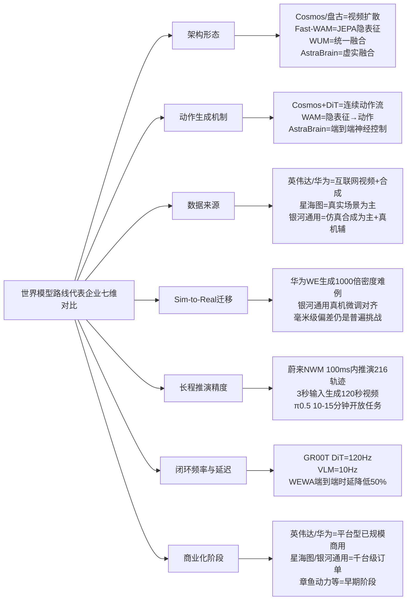

在这一七维对比中，可以清晰看到世界模型路线企业的差异化定位：**英伟达与华为作为平台型基础设施供应商，已通过开源生态（GR00T）与量产搭载（ADS 4）实现规模化变现；星海图与银河通用作为双轨布局整机企业，分别代表"真实数据派"与"仿真合成派"两条数据路线在商业化中的赛跑；专精型与新锐企业则在合成数据生成、接触式操作等细分方向占据生态位**。

## 4.8 世界模型路线的优势、瓶颈与商业化挑战研判

综合上述七家代表企业的剖析与对比，可以系统归纳世界模型/WAM路线的共性优势、瓶颈与商业化挑战。

### 4.8.1 共性优势

**第一，数据来源拓宽与成本下降**。这是世界模型路线相对VLA路线最具吸引力的优势。如第2章2.3节所述，"训练VLA模型主要依赖昂贵且稀缺的真机数据，这类数据由人工操作机器完成采集；而世界模型更多转向互联网上的图像和文字数据"。在企业实践中，这一优势已得到充分验证——华为WEWA的扩散生成模型生成的难例场景密度达真实世界的1000倍[^64]；银河通用的"真机训练效率比特斯拉高1000倍"[^65]；光轮智能"从一张图像和简单的指令生成数以百万计的训练数据"[^52]。这些具体案例共同印证了世界模型作为"数据飞轮加速器"的产业价值。

**第二，对物理规律的显式建模带来更高泛化天花板**。王晓刚指出世界模型让机器人"了解外部世界的物理规律，并像人类一样进行思考判断"——可以在"脑海"中模拟和推演不同行动可能带来的后果。在企业实践中，这一优势体现在AstraBrain"让机器人在虚拟世界中经历亿万次'试错博弈'，习得'如何与物理世界交互'的通用能力"[^59]，以及星海图Fast-WAM在"开放场景下做模型的端到端部署"上的鲁棒性[^66]。CVPR 2026 ManipArena的初步评测明确表明：**世界模型则展现出显著的泛化鲁棒性，但仅限于粗粒度操作，在精细任务上力不从心**[^46]——这一结论恰好印证了世界模型"高泛化天花板"的优势同时也暴露了其精细操作短板。

**第三，长程推演与Sim-to-Real迁移能力**。蔚来NWM"100毫秒内推演216种轨迹"、"3秒视频输入生成120秒想象视频"[^32]、华为WE"6亿公里高速L3仿真验证"[^64]、英伟达Cosmos Predict"30秒预测视频世界生成"[^39]等指标，共同体现了世界模型在长程推演与虚拟训练上的独特价值。

**第四，合成数据反哺训练飞轮的效率优势**。"硬件落地-数据积累-算法迭代-硬件升级"的闭环生态[^24]在世界模型路线中表现得尤为显著——光轮智能与GR00T-Dreams的深度集成、银河通用AstraSynth百亿级仿真数据基建等案例，证明了世界模型作为"数据生成器"的杠杆效应。

### 4.8.2 四大瓶颈与商业化挑战

但世界模型路线的瓶颈与挑战同样明确，且这些瓶颈与VLA路线的瓶颈呈现出"互补而非重叠"的特征：

**第一，产品落地滞后——多数世界模型仍处于"演示就绪"而非"部署就绪"阶段**。王兴兴对此判断颇具警示意义："视频生成模型可以在虚拟空间中可实现近乎零误差、极高保真的模拟效果。然而，把这一模型部署到机器人上时，**即使只有一毫米的偏差，也可能导致与实际效果的巨大差异**。要实现视频生成世界模型和真机操作之间的对齐，依然极具挑战"。这一毫米级偏差挑战，恰恰是世界模型路线区别于VLA路线（VLA是数据稀缺但已有真机部署）的特殊瓶颈。

**第二，商业闭环困难——除平台型企业外纯世界模型路线企业普遍缺乏直接终端订单**。这一现象在企业对比中表现明显——英伟达通过GR00T+Cosmos+Thor芯片实现规模化变现[^55]、华为通过WEWA+ADS 4车型量产实现智驾闭环[^64]，但**这两家企业的本质都是"基础设施供应商+硬件量产商"，而非纯世界模型企业**。在双轨布局企业中，星海图与银河通用的商业化订单主要来自其VLA侧能力（轮式双臂操作、Galbot抓取等），世界模型更多扮演"训练加速器"而非"直接产品"的角色。在专精型企业中，章鱼动力等仍处于早期阶段[^38]。这一现象揭示了一个根本问题：**世界模型本身难以直接变现，必须依托VLA、整机硬件或平台生态才能完成商业闭环**。

**第三，评测体系缺失——CVPR 2026 ManipArena揭示VLA与世界模型的互补性**。ManipArena挑战赛揭示的核心痛点在于行业急需"统一、高标准的真机评测体系"——"这一缺位不仅无法为产业树立清晰的发展基准，更直接制约了模型的迭代效率"[^46]。其对π0.5与DreamZero的对比测试明确得出：**多任务VLA模型具备更强的精细操作能力，但泛化表现脆弱，面对分布外物体易出现灾难性退化；世界模型则展现出显著的泛化鲁棒性，但仅限于粗粒度操作，在精细任务上力不从心。两种范式各有所长，未来的通用具身操作系统或需深度融合二者的优势**[^46]。这一结论既是对世界模型路线泛化优势的官方背书，也是对其精细操作短板的官方证伪。

**第四，路线收敛压力——"VLA+世界模型"融合架构正成为产业共识**。从企业实践层面看，这种收敛趋势已经清晰可见——星海图同时推进G0 VLA与Fast-WAM"同源共生"[^33][^65]；自变量WALL-B在VLA血统上完成WUM跃迁；智平方提出"端到端VLA→融合世界模型的增强型VLA→类脑NeuroVLA"三阶段路径；银河通用GraspVLA本身就是"VLA+仿真合成数据"的混合形态[^67]。这一收敛压力对纯世界模型路线企业（如章鱼动力）构成了战略考验——"独立路线价值"与"融合架构主流"之间的张力，将决定其能否避免被VLA派或混合架构派吸收。

### 4.8.3 与VLA路线瓶颈的对照与混合架构收敛趋势再确认

将世界模型路线的四大瓶颈与第3章3.11.3节VLA路线的四大瓶颈对照，可以发现一个深刻的产业规律：**两条路线的瓶颈呈现出明显的互补性**——VLA的真机数据稀缺、泛化天花板低，恰恰是世界模型的强项；世界模型的Sim-to-Real毫米级偏差、精细操作不足，恰恰是VLA的强项。这种互补性正是"VLA+世界模型"融合架构成为产业共识的根本逻辑。

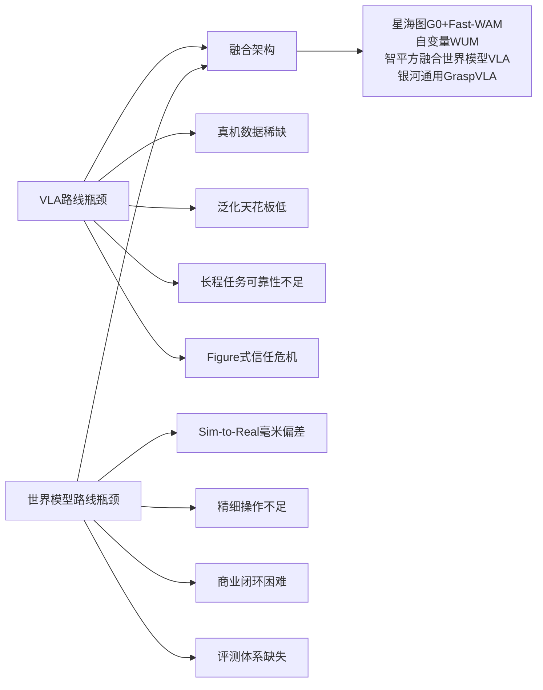

世界模型派的领军人物对这一收敛趋势的回应耐人寻味。**Generalist AI Pete Florence的"拐杖论"**——"VLM只是一根过渡期的'拐杖'。一旦物理交互数据规模起来，这根拐杖就该被拿掉"——立场仍然激进。但更多企业实践已经走向温和的融合路径：**英伟达GR00T N1的"VLM慢思考+DiT快反应"双系统本质上是VLA与世界模型思路的工程整合**[^51][^49]；**华为WEWA将"世界模型所需的能力拆解，并用技术去实现每一个子系统"**[^32]；**星海图明确表示"VLA模型与世界动作模型基于真实开放场景的海量数据将物理直觉认知与精准任务执行深度耦合"**[^65]——这些都是"互补融合而非互斥替代"的产业宣言。

至此，本章已完成全球世界模型/WAM路线代表企业的深度剖析、横向对比与瓶颈研判。**世界模型路线作为对VLA路线瓶颈的产业回应，已在2025—2026年间从概念论证走向工程化落地，但其纯路线独立价值正面临"融合架构收敛"的压力**。下一章将沿着同样的五维分析框架，进入与VLA、世界模型路线既互补又对照的硬件驱动与分层架构路线——剖析Boston Dynamics、Agility Robotics、Tesla Optimus、宇树科技、优必选、傅利叶智能等代表企业，从关节模组、灵巧手、运动算法、整机量产能力上的技术壁垒切入，比较硬件极致与性价比路线在商业化中的可持续性，为后续混合架构与平台型企业的整体格局判断建立完整对照基线。

# 5 硬件驱动与分层架构路线代表公司分析

第3章与第4章已系统剖析了端到端VLA路线与世界模型/WAM路线的国际与国内代表企业，揭示了"软件智能"主导的两条技术路径在数据策略、动作Token、泛化能力等维度上的差异化布局。然而，具身智能产业的另一条主干脉络——**以硬件性能、运动控制能力与模块化分层架构见长的"硬件驱动派"**——在2025—2026年量产元年中扮演了同样关键、甚至在出货量与商业化订单上更为突出的角色。这条路线的代表企业并非诞生于大模型浪潮，而是源自经典机器人学的动力学控制、关节模组与精密制造传统；它们以硬件壁垒与运动控制极限为核心竞争力，AI大模型则更多扮演"渐进式叠加层"而非"颠覆性重构者"的角色。

本章作为五大技术路线企业剖析的第三章，将沿用前两章的五维分析框架（技术路径—产品进度—商业化进度—融资情况—团队情况），系统剖析国际派的Boston Dynamics、Agility Robotics、Tesla Optimus与中国派的宇树科技、优必选、傅利叶智能、云深处科技、越疆科技等代表企业。本章关注的核心命题在于：**在大模型时代，硬件驱动路线如何从"纯硬件公司"向"软硬一体智能体"演进？"特斯拉式垂直整合极致"、"宇树式性价比量产"、"波士顿动力式动力学极致"、"优必选/傅利叶式场景深耕"四种范式各自的商业化可持续性如何？硬件派与VLA/世界模型派之间是否正在形成"反向收敛"的产业格局？** 通过本章的系统对照，将为第6章双系统与混合融合路线、第7章平台型生态构建者路线提供必要的对照基线。

## 5.1 硬件驱动与分层架构路线企业谱系与分析框架

在进入企业逐一剖析前，必须先界定本章的归类边界与差异化定位，避免与第3—4章的VLA、世界模型路线产生概念交叉。

**硬件驱动与分层架构路线的本质内涵**可界定为：以经典机器人控制理论（PID、模型预测控制MPC、全身控制WBC、强化学习RL等）为基础，强调硬件本体性能、关节模组扭矩密度、灵巧手精度、整机量产能力与可靠性，认知层AI模型作为渐进式叠加而非颠覆性重构。这一路线在第2章2.4节已被识别为"分层架构路线"——即将认知与控制解耦为大脑（高层语义推理）、小脑（中低层运动控制）、本体（硬件执行）三层分工的工程化范式。其代表企业大多沿袭"先做出硬件—再叠加智能"的演进逻辑，与VLA派"先训练大模型—再部署到硬件"的逻辑形成鲜明对照。

基于这一界定，结合企业实际业务重心、核心壁垒来源与产品形态，本研究将硬件驱动路线代表企业划分为四大阵营：

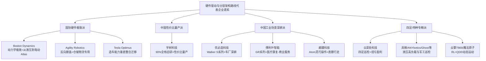

需要预先对若干**归类边界**作出说明，以避免与其他章节产生概念冲突：

- **本章企业虽多已开始引入VLA或世界模型作为认知层补课**（如宇树科技2026年3月开源UnifoLM-VLA-0模型、傅利叶GRx系列与英伟达合作、优必选的BrainNet架构等），**但其核心壁垒与商业化叙事仍主要建立在硬件本体与运动控制能力上**，AI模型多扮演"附加层"而非"主导层"。这一定位区别于第3章VLA派（以软件模型为核心资产）与第4章世界模型派（以认知预测能力为差异化优势）。
- **特斯拉Optimus与Figure AI均具有"软硬件垂直整合"属性**，但Figure AI以Helix模型为核心叙事（已在第3章3.4节深度剖析），而Tesla Optimus更强调"造车能力迁移"与FSD芯片复用，本章因此将其归入硬件极致派。
- **智元机器人**虽在产品矩阵上属于硬件量产派的代表（已实现10000台量产里程碑），但其核心叙事建立在GO-1 ViLLA架构上（已在第3章3.6节深度剖析），本章不再重复，但在5.10节横向对比矩阵中作为"混合演进型"代表纳入对照。
- **众擎、魔法原子、星动纪元等中国本体厂商**均存在硬件与软件双重属性，星动纪元已在第3章3.9节深度剖析，本章对众擎、魔法原子等仅作简要对比；具微科技、ANYbotics、Ghost Robotics等则作为四足/特种专精派的国际差异化代表。

在五维分析框架的延续上，硬件驱动路线相比软件主导路线需要补充三类**特殊评估维度**：

| 评估维度 | 核心指标 | 行业意义 |
|---------|---------|---------|
| **关节模组与灵巧手自研率** | 关节电机/减速器/灵巧手等核心零部件自研比例 | 决定成本控制能力与硬件壁垒可持续性 |
| **运动控制极限指标** | 关节峰值扭矩、扭矩密度（N·m/kg）、移动速度（m/s）、续航时长 | 衡量硬件性能上限与场景适配能力 |
| **整机量产能力与成本下探** | 年产能、单台BOM成本、价格带分布 | 衡量从"实验室Demo"到"部署态"的工程化能力 |

这三类硬件特殊维度，将贯穿5.2—5.9节的企业逐一剖析与5.10节的横向对比矩阵。

## 5.2 Boston Dynamics:从液压Atlas到电动Atlas的动力学极致路线

Boston Dynamics作为全球四足与人形机器人领域的鼻祖企业，其技术演进史本身就是一部"动力学极致路线"的工程教科书。这家成立于1992年、源自MIT Leg Lab的公司，从一开始就**不以"产品公司"或"消费级机器人"为目标，而是一个以动力学、控制理论和仿生运动为核心的工程型公司**[^51]。

**技术路径**层面，Boston Dynamics的核心工程哲学可归纳为四点：**以物理世界约束为出发点，先解决"受力、稳定与能量传递"问题，再考虑高层决策和感知；优先采用在单位体积/质量上能提供足够功率的驱动方案（早期选用液压驱动）；关注实时性与鲁棒性，控制回路频率高（数百Hz级别）、传感器反馈直接、低层闭环优先；保留组件、传感器和控制参数的工程可访问性，便于迭代与调试**[^51]。第一代以BigDog为代表的实验性平台采用液压执行机构（液压缸与伺服阀）由车载液压泵供油、小型内燃机驱动液压泵的动力配置——液压能提供高功率密度和短时大峰值力矩，适合高动态动作，但带来噪声与排放问题[^51]。在控制架构上，其经典实现包含低层闭环控制（实时力/位置闭环、控制回路频率达数百Hz级别）、基于全身动力学模型或简化模型（如质心/力分配模型）的稳定性控制、步态生成与步足规划、扰动恢复策略（针对被推、踩或地形不稳实施瞬时姿态补偿）[^51]。

2024年4月，Boston Dynamics实现了战略性的技术路径转换——**液压版Atlas宣告"退役"，电动版Atlas以全新姿态"复活"**。不同于液压驱动版，电动版Atlas的造型更为简洁，更有未来感，性能更为强悍。在波士顿动力发布的视频中，新款Atlas可以毫不费力地从躺平状态中站起，**各个关节和头部都实现全方向的旋转**[^24]。英伟达负责人形机器人基础模型开发的高级科学家Jim Fan一语道破其中的突破之处：**此前的人形机器人开发太痴迷于达到"人类水平"，反而人为给自己设了限，为什么不从一开始就设计超过人类的机器人呢？全新Atlas显然摆脱了纯粹模仿人类运动的窠臼**[^24]。这一从"液压追求功率密度"到"电动追求超人类运动设计"的范式转换，标志着Boston Dynamics在保持动力学极致追求的同时，开始拥抱新一代电动伺服与AI能力的融合。

值得指出的是，Boston Dynamics创始人Marc Raibert早已意识到AI的重要性，于2022年8月创办了波士顿动力AI研究院，**探索如何在极少甚至没有人类指导下，让机器人完成复杂的挑战**[^24]。在更广泛的生态合作上，Boston Dynamics也已与英伟达建立技术合作——英伟达Newton开源物理引擎正是与Google DeepMind和Disney Research合作开发，并在GR00T N1基础模型生态中将波士顿动力作为合作伙伴。

**产品进度**层面，Boston Dynamics构建了"Atlas人形+Spot四足"两条产品线：Atlas作为前沿动力学验证平台与电动化人形机器人代表，Spot则在工业巡检、电力检测领域形成了高端定位的成熟产品线，**单机价值量普遍超50万元人民币**[^49]。

**商业化进度**层面，Boston Dynamics呈现出"技术领先与规模化滞后并存"的鲜明特征。从全球出货格局来看，**2025年波士顿动力人形机器人出货量约1000台**[^60]——亦有数据显示其特斯拉Optimus、Figure AI、Agility Robotics等海外厂商出货量与之相近（约150台级别）[^69]。这一数据相比中国头部厂商呈现显著差距：宇树科技以超5500台的出货量登顶全球第一，市场份额占比近38%；智元AgiBot紧随其后，出货量达5168台，全球排名第二；**两款头部国产品牌合计出货量占全球总量超70%，成为行业量产核心主力**[^69]。**这一出货量数据上"中国压倒性领先"与Boston Dynamics"技术先驱却规模滞后"的剪刀差，深刻揭示了硬件路线中"技术极致vs量产规模"的张力**。

**融资与团队情况**层面，Boston Dynamics作为软银/现代汽车旗下子公司，无独立融资活动，其资源支撑来自母公司战略投入。Marc Raibert代表了MIT Leg Lab的学术血脉，其工程哲学影响了后续整个动力学控制流派。

最后归纳Boston Dynamics面临的核心挑战：**技术领先但规模化滞后**（出货量仅约中国头部企业的1/5）、**AI能力相对短板**（虽已成立AI研究院但未形成端到端基础模型代表作）、**与中国成本派的剪刀差竞争**（其Spot单机价值量超50万元，宇树同级产品价格仅其1/5至1/10）。这些挑战使Boston Dynamics在大模型时代面临"硬件极致路线如何重建规模化能力"的根本性命题。

## 5.3 Agility Robotics:Digit与仓储物流场景专用化路径

与Boston Dynamics追求通用动力学极致不同，Agility Robotics代表了**"硬件场景专用化"的另一条范式**——不追求完全拟人，而是优化仓储搬运的实用性，并通过深度绑定头部物流客户实现差异化竞争。

**技术路径**层面，Agility Robotics的Digit机器人采用"反向膝盖"仿生设计哲学，针对仓储搬运场景进行结构优化，并在英伟达GR00T N1开源生态中作为核心合作伙伴之一参与技术整合。

**产品进度**层面，Agility Robotics已与Figure AI、特斯拉Optimus同处海外人形机器人第一梯队，**2025年Digit出货量约150台**[^69]。这一出货规模虽小，但其专用化定位带来的客户深度与场景渗透在仓储物流细分赛道相对Boston Dynamics、Tesla呈现出独特优势。

**商业化进度**层面，Agility Robotics的核心叙事建立在与顶级仓储物流客户的深度绑定上——**Agility Robotics的Digit机器人已在Amazon、GXO、Spanx等仓库投入使用。Amazon甚至专门成立团队研究如何将人形机器人融入其全球物流网络**[^30]。这一案例尤为关键，揭示了一个根本性的产业现象：**头部物流巨头将人形机器人的导入视为系统性工程而非单点采购**——这与传统机器人领域"采购台数"逻辑形成本质区别，为Digit的长期场景渗透打下了战略基础。

**融资与团队情况**层面，Agility Robotics作为俄勒冈州立大学孵化企业，具有典型的学术创业背景；公开资料中其未在2025—2026年披露大额独立融资，但凭借Amazon、GXO等核心客户的实证落地保持了行业地位。

需要指出的是，Agility Robotics的存在为第1章三大非共识中的"本体形态争议"提供了现实回应——**专用构型vs通用人形并非互斥选择，而是不同细分赛道的差异化定位**。Digit的"反向膝盖"设计虽偏离人形外观，但在仓储搬运场景中可能比通用人形更具效率优势——这种"形态服从场景"的设计哲学，与中国云深处、具微等四足专精企业形成跨地域呼应。

## 5.4 Tesla Optimus:垂直整合与造车能力迁移的极致样本

Tesla Optimus代表了硬件驱动路线中**"造车能力大规模迁移至人形机器人"**的极致垂直整合范式。其叙事核心不在于AI模型的领先（虽然Optimus与FSD共享AI5算力底座），而在于**将特斯拉在汽车制造、芯片自研、产能爬坡上积累的工程能力，整体迁移至机器人量产**。

**技术路径**层面，2026年4月公开的核心三块拼图清晰展现了Tesla Optimus的垂直整合逻辑[^70]：

**第一块拼图——AI5芯片流片**。2026年4月15日，马斯克晒出AI5芯片照片，配文"AI5流片成功"，芯片标识显示流片时间是2026年第13周（3月底）。**这颗芯片单颗AI算力接近2500 TOPS、内存144GB，综合性能比上一代AI4提升40倍**。AI5提供两种配置：单芯片版本对标英伟达Hopper，双芯片版本对标Blackwell，功耗和成本反而更低。马斯克明确说过，**AI5是FSD和Optimus的共同算力底座**——这颗芯片流片，意味着Optimus的"大脑"设计已经冻结，可以进入生产准备阶段。芯片生产将由台积电和三星代工，大规模量产定在2026年底到2027年初；更长远的规划是，未来芯片会放到特斯拉自建的TeraFab工厂去造，从DRAM研发到封装制造，全流程自己掌控[^70]。

**第二块拼图——灵巧手五份专利公布**。马斯克自己说过，制造手和前臂"比机器人的其他部分都更难"——2025年弗里蒙特工厂里堆了几百台"无手的机器人"，量产计划就这么卡住了[^70]。2026年4月16日，世界知识产权组织一口气公布了五份Optimus灵巧手相关专利。这些专利的提交时间是2024年10月9日，正好是特斯拉"We, Robot"发布会的前一天，发布会上展示的"下一代"灵巧手与专利图纸完全一致。这意味着特斯拉的灵巧手技术方案在2024年底就已冻结，后续的"工程减法"在2025年一整年里都在围绕量产做准备[^70]。其核心技术突破集中在四个方面[^54]：

| 设计创新 | 技术细节 | 量产价值 |
|---------|---------|---------|
| **前臂腱绳驱动** | 把所有执行器（每只手25个、双手50个）全部移到前臂，手部只保留结构件、滚动关节、腱索和传感器 | 手部大幅减重、维护成本下降、控制更精准 |
| **四指节滚动关节** | 每根手指由四个指节组成，指节之间的接触面采用曲面设计，弯曲时曲面相互滚动 | 运动更自然、减少磨损、简化结构 |
| **双电机腕部** | 用两个电机协同控制腕部多自由度运动 | 解决腕部紧凑空间下的高自由度协同 |
| **22个自由度** | 双手共50个执行器、22个自由度、精度0.08毫米 | 支撑捏鸡蛋、系鞋带、叠衣服等精细操作 |

资料来源：综合整理自[^54][^70]

**第三块拼图——Fremont工厂改造为机器人产能堡垒**。马斯克在财报电话会上宣布2026年第二季度结束前停产Model S和Model X，4月1日正式停止接受定制订单。"那片曾经焊接铝制车身、安装鹰翼门的昂贵空间，正在被改造为年产一百万台机器人的自动化堡垒——这不是'腾笼换鸟'的比喻，是字面意思——产线物理上被拆掉，换上了机器人的装配线"[^70]。**弗里蒙特首条产线设计年产能100万台，得州超级工厂后续将建设年产1000万台的产线，计划2027年启动量产**[^70]。

**产品进度**层面，Optimus呈现出Gen 1→Gen 2→V3的清晰代际演进。**Optimus Gen 2**采用了特斯拉自主研发的传动装置和传感器，配备了2自由度的脖子，使得机器人的活动范围更加广泛；行走速度提升了30%，整体减重10千克；升级了全身平衡控制能力；全新配备了11自由度的灵巧手，每个手指都装上了触觉传感器[^38]。在更宏观的产业判断上，**马斯克预测其商业化潜力或超10万亿美元**[^38]。

**商业化进度**层面，Tesla Optimus呈现出"激进规划与现实差距并存"的特征。马斯克在3月25日表示Optimus 3有望在2025年夏季启动生产，并有望在2027年实现大规模量产[^55]。根据公开信息和产业调研，**预计2026年年中可能开始小批量试生产，2026—2027年开始进入量产爬坡阶段，在2030年前达到年产100万台目标**[^55]。但现实数据揭示出与激进规划的巨大差距——**特斯拉Optimus 2025年全年仅交付150台，与Figure AI、Agility Robotics出货量持平**[^69]。在马斯克的判断中，"Optimus是当前为数不多的兼顾性能、可量产性与成本控制的通用人形机器人。依托特斯拉在FSD上强大的技术积累和算力基础、在大脑学习能力和应急响应上有望远超行业平均"[^55]。

**融资情况**层面，作为美股上市公司，特斯拉无独立融资活动，但马斯克对Optimus商业化潜力超10万亿美元的预测构成了资本市场对Tesla AI叙事的核心支撑[^38]。

**团队情况**层面，Tesla Optimus的最大特点在于**"造车团队全套迁移"的人才战略**——AI5芯片由特斯拉自研团队完成、灵巧手专利由特斯拉工程师设计、Fremont工厂由原汽车产线工程师改造为机器人装配线。这种"垂直整合极致"的人才组织方式，使Optimus在缺乏独立机器人创业团队的情况下，依然能够获得世界级的工程能力支撑。

最后将Tesla Optimus定位为**"硬件垂直整合极致+造车能力迁移"范式**——其与第3章Figure AI（软硬件垂直整合+Helix VLA驱动）、本章宇树科技（90%全栈自研+性价比量产）形成鲜明的三角对照：**Figure赌的是"软件智能领先驱动硬件量产"，Tesla赌的是"造车产能优势复用至机器人"，宇树赌的是"成本控制极致激活规模放量"**——三种不同的"硬件+智能"组合范式，正是2025—2026年具身智能产业最具张力的竞争格局。

## 5.5 宇树科技:90%全栈自研与高性价比量产范式

进入中国硬件驱动路线代表，宇树科技以**420亿元估值冲击科创板IPO、2025年人形机器人出货量5500+台占全球市场份额32.4%、四足机器人出货量超3万台两项数据均位居全球第一**[^60]的耀眼成绩，成为本轮全球具身智能浪潮中最具代表性的中国硬件派企业。

**技术路径**层面，宇树科技的核心壁垒可归纳为"90%全栈自研构筑成本护城河"。**截至2025年底，宇树科技在电机、减速器、灵巧手等核心零部件上的自研率超过90%。其中，自研的M107型高扭矩密度关节电机，扭矩密度达189N·m/kg，可支撑机器人完成空翻、奔跑等高动态动作，性能对标国际顶尖水平，而硬件成本仅为海外同类产品的1/5-1/10**[^60]。这一"硬件自研率+扭矩密度+成本下探"的三角壁垒，是宇树能够实现"降价—放量—降本—再降价—进一步放量"正向循环的根本支撑。

宇树的技术路径还体现了一条独特的产业演进逻辑——**从四足机器人技术积累直接复用至G1人形**。"Unitree从四足机器人积累的自研执行器技术，直接复用到G1人形机器人上，实现了性能与成本的双赢"[^30]。这一"四足→人形技术迁移"的路径，与其早期作为四足机器人龙头的产业定位形成历史延续性。

在智能化补课层面，宇树也已开始向VLA路线渗透——**Unitree在2026年3月开源的UnifoLM-VLA-0模型，更是实现了通过自然语言命令执行自主家务任务的能力**[^30]。但需要客观指出，**宇树科技招股书坦承其自研的通用具身大模型尚未规模化应用，机器人仍处于"需开发者喂指令"的硬件平台阶段，"大脑"能力的缺失，制约了其在工业场景的深度落地**[^60]。这一"硬件极致+智能化滞后"的矛盾，正是宇树科技及整个硬件驱动路线在大模型时代面临的核心命题。

值得特别指出的是，**宇树创始人王兴兴本人是当前具身智能行业"VLA派vs世界模型派"路线之争中世界模型派的核心代表人物**——他在2026年3月中旬的英伟达GTC大会上判断"在通往具身智能ChatGPT时刻的路径中，世界模型几乎'看不到天花板'，是更主流的技术方向"，并认为"VLA模型面临泛化能力受限等瓶颈，天花板更低"。这一路线判断对中国具身智能行业的影响力，使宇树科技虽以硬件壁垒立身，却同时占据了大模型路线讨论的话语权。

**产品进度**层面，宇树构建了清晰的"四足+人形+灵巧手"产品矩阵。**B2四足机器人**关节扭矩达360N·m，奔跑速度超6m/s，较2023年产品性能提升170%[^49]。**Unitree H1**作为高端全尺寸人形机器人，有三项"全球第一"——最高移动速度3.3m/s、单关节扭矩360N·m、能搬运20kg重物，配备360°全景深度感知结合AI自主避障，能完成空翻动作，采用纯电驱动，重量不到50kg[^38]。**Unitree G1**是这场价格革命的代表产物——2024年5月发布时，16,000美元的定价（约8.5万元人民币）让整个行业震惊，这是当时市场上最便宜的可量产人形机器人；身高132cm、体重35kg、23-43个自由度，EDU版本配备NVIDIA Jetson Orin计算平台（最高275 TOPS AI算力），支持ROS2、Python/C++ SDK和Isaac Gym sim2real训练[^30]。**入门级R1型号售价仅5900美元（约2.99万元人民币），远低于海外同类产品**[^69]。

**商业化进度**层面，宇树交出了一份**"反常识"的财务成绩单**——这正是其在行业普遍亏损背景下的最大差异化优势。当行业80%以上企业处于亏损状态、行业平均毛利率仅为20.2%时[^60]，宇树的财务表现完全颠覆了行业认知：

| 财务指标 | 宇树科技2025年 | 行业平均/同行参照 | 倍数差距 |
|---------|--------------|----------------|---------|
| **营业收入** | 17.08亿元 | 同比增长335.36% | 数百倍跃升 |
| **扣非净利润** | 6亿元 | 同比激增674.29% | 数百倍跃升 |
| **主营业务毛利率** | 60.27% | 行业平均20.2% | 约3倍 |
| **净利率** | 35.13% | 优必选0.67%、智元不足1.2% | 约30倍 |
| **人形机器人出货量** | 超5500台 | 波士顿动力约1000台、优必选约3000台、智元约2500台 | 全球第一 |
| **四足机器人出货量** | 超3万台 | 全球第一 | 全球第一 |

资料来源：综合整理自[^60][^71][^69]

宇树的盈利神话源自其**"低价策略带来规模爆发，规模效应又进一步反哺盈利，形成'降价—放量—降本—再降价—进一步放量'的正向循环"**[^60]。其产品定价远低于海外竞品——四足机器人价格被拉低至万元以内，人形机器人G1售价降至8.5万元、R1更是低至2.99万元，远低于波士顿动力（约50万元）和Figure（约42万元）的海外竞品[^60]。

**融资与上市进展**层面，宇树科技的估值跃迁堪称中国硬科技企业的标杆案例。**2025年初，宇树科技的估值大约50亿元，2025年6月份飙升至120亿元；到2026年3月份，宇树科技的IPO时估值将达到420亿元**[^71]。资本阵容堪称豪华，**云集了包括深创投、红杉中国在内的股权投资机构以及美团、腾讯、阿里巴巴等产业资本**[^71]。**2026年3月20日，宇树科技递交了科创板上市招股书，并获得上交所受理，拟募资42.02亿元，发行不低于10%股份，对应的整体估值420亿元左右**[^71][^60]。Unitree还获得了2026年3月申请的6100万美元上海IPO[^30]。

**团队情况**层面，创始人王兴兴的故事成为中国硬科技创业的传奇样本。**王兴兴是"科技新贵"，初中时期同学背英语单词时他在实验室里捣鼓微型涡轮喷气发动机，因英语成绩太差险些没考上高中；不过数理化成绩较好，动手能力强**[^71]。**大一寒假用200元制作了一款小的双足机器人；上海大学读研期间参考国外公开文献独立设计开发了第一款产品XDog机器人；2015年带着XDog参加国际智能"星创师"大赛获得二等奖，赢得人生中的第一桶金8万元**[^71]。**2016年6月硕士毕业后加入大疆工作，不久后XDog测试视频突然在网上爆火，王兴兴果断辞职于当年8月份创立宇树科技**[^71]。这种"90后偏科少年→上海大学硕士→大疆短暂任职→2016年8月创立宇树→2026年IPO"的成长路径，成为中国硬科技创业生态的代表性叙事。

最后客观指出宇树面临的核心局限——**其招股书坦承通用具身大模型尚未规模化应用、过度依赖科研教育市场、工业制造与家庭服务等核心场景的突破缓慢**[^60]。这些局限恰恰是宇树需要在2026年后突破的关键命题——**如何从"硬件性价比量产领跑"升级为"软硬一体的工业场景深度落地"**。

## 5.6 优必选科技:Walker S系列与工业产线深耕路径

优必选科技作为中国"人形机器人第一股"（2023年12月29日港交所主板挂牌上市）[^43]，代表了硬件驱动路线中**"工业场景深耕+订单兑现"**的另一种范式——通过密集中标车厂、地方政府等大额订单，押注Walker S系列在工业人形机器人赛道的规模化部署。

**技术路径**层面，优必选的核心技术资产可概括为三大支柱[^43]：**第一，人形机器人群脑网络（BrainNet）软件架构**——攻克了复杂工业场景下的协同决策与控制难题，为人形机器人集群在工业产线的高效协作提供了可复用的技术路径；**第二，第四代工业级灵巧手与仿生手臂**；**第三，自主换电技术**。Walker S2的硬件参数为身高1.76米、体重70公斤，**能够在负载15公斤的情况下行走，满足工业场景中的重物搬运需求**[^38]。优必选搭建了由机器人学与人工智能领域博士级专家领衔的研发团队，核心成员包含具备机器人运动控制、自主导航、计算机视觉等细分领域实战经验的科学家与工程师[^43]。

**产品进度**层面，优必选Walker系列经历了从2018年CES首秀到2025年量产交付的完整迭代节奏。**Walker机器人于2015年立项，双足Walker于2018年亮相CES；2019年第二代Walker机器人发布，能在常用家庭场景自由活动和服务；2021年新一代Walker X机器人发布；目前Walker S系列已成为全球进入最多车厂实训的工业人形机器人，在质检、搬运、分拣等生产环节取得了一定的实训成果**[^43]。**2025年11月，优必选发布视频宣布其首批全尺寸工业人形机器人Walker S2正式开启量产交付，将分批投入汽车制造、物流等产业一线；视频中数百台Walker S2组成方阵整齐划一地完成换电、列队行进等动作，48小时内播放量突破千万**[^43]。

**商业化进度**层面，优必选2025年下半年呈现出鲜明的"订单狂飙"特征——这是中国工业人形机器人从"PPT阶段"进入"应用验证关键期"的标志性现象。下表系统梳理了优必选2025年9月至11月期间公开披露的核心订单：

| 时间 | 订单方/项目 | 金额 | 主力产品 | 交付时间 |
|------|-----------|------|---------|---------|
| 2025年9月3日 | 国内某知名企业 | 2.5亿元 | Walker S2 | 当年内启动交付 |
| 2025年9月29日 | 天奇股份（UQI优奇签订） | 0.3亿元 | Walker S系列 | 2025年12月31日前 |
| 2025年10月 | 广西具身智能数据采集及测试中心 | 1.26亿元 | 可自主换电Walker S2 | 2025年内 |
| 2025年11月5日 | 自贡数投人形机器人数据采集中心 | 1.59亿元 | 可自主换电Walker S2 | 11月完成 |
| 2025年11月25日 | 广西防城港市数据采集与测试中心 | 2.64亿元 | 可自主换电Walker S2 | 12月交付 |
| **合计** | **Walker系列全年订单** | **11亿元** | **不含天工/悟空** | — |

资料来源：综合整理自[^72]

优必选创始人周剑给出了清晰的产能规划——**优必选2025年规划人形机器人产能1000台，预计交付几百台。在各个场景都顺利落地的情况下，乐观估计2026年人形机器人交付将达数千台，2027年有望实现万台级别的交付**[^43]。在场景拓展上，**Walker S1已进入多家汽车工厂进行实训，与L4级无人物流车、无人叉车、工业移动机器人和智能制造管理系统协同作业；Walker S1计划拓展至医疗、教育领域，应对老龄化需求**[^38]。

**融资与资本运作**层面，优必选的资本路径堪称"高融资+高亏损+订单交付"三重压力下的复杂样本。上市前公司共经历了4次Pre-A轮融资、1次A轮、2次B轮、1次C轮、6次D轮融资，投资方阵容包括启明创投、腾讯、海尔、科大讯飞等知名机构[^43]。**上市不足两年，公司分别于2024年8月、2024年10月、2024年11月、2025年2月、2025年7月完成五次配售募资，累计募资超45亿港元；最近一次配售优必选发行了30,155,450股，募资总额约24.7亿港元**[^43]。**2025年8月，优必选与国际知名投资机构Infini Capital正式签署10亿美金战略伙伴合作协议——Infini Capital旗下高新技术基金为优必选提供一笔总额为10亿美金的战略融资授信额度；Infini Capital计划在合适时机增持优必选股票，目标成为优必选不超过5%持股比例的重要股东，并协助优必选开拓中东市场，成立中东合资公司，计划在中东建立超级工厂和研发中心以及中东总部**[^43]。**2025年11月25日，优必选发布公告，拟配售3146.8万股H股，筹资约30.56亿港元，用于产业整合与偿债**[^72]。

但优必选的财务困境同样明显——**优必选上市两年扣非净利润累计不足2亿元，2025年净利率仅0.67%**[^60]。这一"高收入高亏损"的怪圈，与宇树科技35.13%的净利率形成强烈反差。**针对当前人形机器人订单盛况，有业内人士分析称："重要的不是看订单金额有多大，而是看实际的交付闭环能力。目前，人形机器人从量产到交付面临技术和成本两大瓶颈"**[^72]。**截至发稿前，优必选股价在配股融资30亿港元的压力下小幅下跌0.72%，展现出市场对人形机器人商业化进程的复杂预期**[^72]。

**团队情况**层面，**优必选成立于2012年，主要业务是人工智能和人形机器人研发、平台软件开发运用及产品销售；2014年成功研发并生产出小型家庭机器人Alpha；2016年540台Alpha机器人登上央视春晚舞台，一举打响了名头**[^43]。创始人周剑通过家庭服务场景起家、通过工业人形机器人寻找商业突破，是中国人形机器人产业化的早期推动者之一。

最后客观研判优必选订单狂飙背后的关键问题：**第一，交付闭环能力**——前文所提及的优必选订单中交付时间几乎都在2025年内，对其产能爬坡能力是严峻考验[^72]；**第二，"高收入高亏损"怪圈何时打破**——上市两年净利率仅0.67%，与宇树35.13%的净利率形成鲜明对照；**第三，订单结构的可持续性**——大量订单来自地方政府主导的"数据采集中心"项目（广西、自贡、防城港），其重复采购的可持续性与商业模式可复制性存在不确定性。优必选面临的，正是**中国工业人形机器人内卷化背景下"如何从订单兑现走向规模盈利"**的根本性命题。

## 5.7 傅利叶智能:GRx系列与医疗康复-商业服务双场景路径

如果说优必选押注的是工业产线大客户，傅利叶智能则代表了硬件驱动路线中**"医疗康复+商业服务"差异化场景路径**——以医疗康复设备起家，通过"以人为本"的设计理念与"产品六边形"标准，在中国人形机器人内卷化背景下走出一条相对稳健的路径。

**技术路径**层面，傅利叶GR-2作为最新一代代表产品，硬件指标颇具竞争力[^64]：**身高1.75米、体重63公斤，全身拥有53个独立可控关节，单臂运动负载达3公斤；采用模块化设计，第二代执行器FSA 2.0相较于前代提升了力矩密度与控制精度，提供最大关节峰值扭矩超380N·m、步态行走速度达每小时5公里、电池续航延长至2小时且支持可拆卸换电；搭载新12自由度自研灵巧手并配备6个阵列式触觉传感器，可精准感知抓握力度，适配不同形状、材质物体；该硬件设计与傅利叶自主研发的多智能体协作调度平台系统FOCUS深度集成，形成覆盖自主导航、精准抓取、搬运与分拣的全链路闭环作业体系**[^64]。

傅利叶提出了**"产品六边形"标准——围绕运动智能、灵巧作业、认知智能、仿生设计、用户体验和商业化应用共六个维度，明确机器人本体的能力标准和发展方向**[^73]。这一标准体现了傅利叶"以人为本"的产品哲学，区别于纯硬件极致或纯AI模型的单维度叙事。傅利叶副总裁周斌的产品理念也颇具特色——**"我们会继续坚持'响应场景，响应客户'的产品研发思路，从需求出发，让人形机器人不仅在技术上实现突破，也能真正早日应用在各行各业"**[^73]。

**产品进度**层面，傅利叶构建了GR-1→GR-2→GR-3的代际演进。**GR-2基于前代GR-1的技术积累，优化了全身结构设计，搭载全新自主研发的12自由度灵巧手及第二代执行器FSA 2.0；GRx系列人形机器人目前已推出GR-1和GR-2两款机型，覆盖导览咨询、学术科研、医疗康复等应用场景**[^73][^64]。GR-2在2025年还获得了多项品牌势能突破：**2025年1月亮相CES 2025展会，成为英伟达机器人合作伙伴中重要的中国代表；2025年8月14日参与总台央视《2025中国·AI盛典》节目录制，与歌手刘雨昕合作表演《Passion·人机共振》；2025年11月14日傅利叶携GRx系列亮相第二十七届高交会，GR-3担任讲解员并演示多机协作完成搬运分拣任务，副总裁翟彦祺提出"交互驱动"技术布局；2025年12月16日，世界知识产权组织发布《1925-2025百年设计注册史》，傅利叶智能研发的第二代人形机器人GR-2被收录为唯一一款人形机器人**[^64]。这一系列国际权威背书，使傅利叶在中国人形机器人企业中获得了相对独特的品牌势能。

**商业化进度**层面，傅利叶的核心叙事建立在两条差异化场景路径上[^73][^64]：**第一，导览咨询场景标准化解决方案**——"由傅利叶率先推出的首个导览咨询场景应用解决方案，整合客户需求及市场反馈，为商业客户提供一整套标准化技术方案。凭借高度仿生的外形设计、顺滑的人机互动、和稳定安全的运控能力，GRx系列人形机器人可支持流程化定制、多语言交流，助力商业客户提升服务效率，终端用户体验，实现差异化营销。目前该方案已经广泛服务了包含银行、4S门店、大型国际会议、公共景点等应用场景在内的数十家商业客户"[^73]；**第二，医疗陪护领域**——"在医疗陪护领域，GR-2通过配备6个阵列式触觉传感器实现精准力控，实现了商业化交付"[^64]。这一"商业服务+医疗康复"的双场景路径，与优必选的工业大客户战略形成清晰差异化。

**融资情况**层面，傅利叶在2025年实现了密集的资本动作。**2025年1月9日，傅利叶公司宣布完成由国鑫投资领投的E系列融资，总额近8亿元，浦东创投、张江科投、张科垚坤基金、Prosperity7（沙特阿美旗下基金）、钧山资本等机构共同参与**[^64][^73]。**2025年8月，傅利叶智能科技E+轮再融资3亿元，与梅卡曼德D轮5亿元、松延动力数亿元A++轮等共同构成2025年8月人形机器人与具身智能赛道14起融资中的头部案例**[^46]。投资方阵容中沙特阿美旗下Prosperity7的入局，使傅利叶具备了一定的国际化资本背景。

**团队情况**层面，傅利叶副总裁周斌与翟彦祺等核心团队成员主导了"响应场景、响应客户"的产品开发理念。傅利叶GR-2参与CES 2025、央视《AI盛典》、高交会、WIPO收录等多项国际国内权威活动，背后是一支具备品牌运营与生态合作能力的复合型团队[^64]。

最后归纳傅利叶在中国人形机器人内卷化背景下的稳健性优势——**其"医疗康复+商业服务"双场景路径相比工业产线大客户战略，对单笔订单依赖度更低、客户结构更分散；与英伟达建立的合作伙伴关系也为其智能化补课提供了平台型支撑**。这一差异化定位，使傅利叶成为本章中相对独特的"场景驱动型"企业代表。

## 5.8 云深处科技:四足机器人专精路径与已扭亏盈利样本

如果说宇树是"四足+人形"双线布局的代表，云深处科技则是中国四足机器人领域**"垂直专精+B端工业深耕+扭亏盈利"**的稀缺样本。这家2017年由浙江大学孵化的硬科技独角兽，在2025年实现了与众不同的财务突破。

**技术路径**层面，云深处的核心技术积累源自浙江大学控制理论的深厚血脉。**云深处科技是首个登上《Science Robotics》封面的中国足式机器人企业；自主研发的四足机器人全球行业应用中市场占有率第一；累计拥有专利171项、软件著作权9项**[^33]。其核心优势主要体现在三个层面[^33]：**第一，硬件结构设计能力**——电机关节等核心部件全部自研；**第二，核心算法**——运动控制算法让机器人可以在草地、泥地、乱石堆等复杂地形稳定行走，自研的定位导航算法解决了空旷场景、相似场景下的定位漂移问题；**第三，体系化的行业解决方案能力**——针对不同行业的痛点提供定制化方案。

**2024年度浙江省科学技术奖中，云深处科技牵头完成的"复杂场景四足机器人关键技术及产业化"项目荣获科学技术进步一等奖**——其技术突破包括复杂地形下的高灵巧、高自适应运动控制（使机器狗能像生物一样在废墟、斜坡、泥泞等复杂地形中实时感知并调整步态与踩踏力）、复杂场景的自主感知精准理解与自主规划（让机器狗在感知受限场景下可自主导航安全路径）、多场景应用的全时全效防护整机设计（确保机器狗在高原高寒、暴雨粉尘、电磁干扰等恶劣工况下长期稳定运行）[^66]。该项目"已创造出数十亿元的直接经济效益"[^66]。

**产品进度**层面，云深处构建了清晰的差异化产品矩阵：

| 产品 | 定位 | 核心特征 | 应用场景 |
|-----|------|---------|---------|
| **绝影X30** | 行业旗舰四足 | IP67防护、融合感知、全天候作业 | 长沙消防、国家电网在编队员、福州极限演练 |
| **山猫M20** | 轮足复合 | 轻量化机身、轮足融合 | 内蒙古-30℃光伏电站、可可西里科考运输 |
| **绝影Lite3** | 灵巧型 | 教育科研、文娱互动 | 北大清华浙大爱丁堡UCL等高校、阿里、京东 |
| **DR01/DR02** | 行业级人形 | IP66防护、-20℃至55℃宽温运行 | 户外作业、危险场景人力替代 |
| **机器马** | 概念展示 | 拆掉轮组改马蹄、马年应景 | AWE 2026展会 |

资料来源：综合整理自[^74][^33][^66]

**2023年行业旗舰四足机器人绝影X30正式面世，凭借卓越的融合感知与全天候作业能力，迅速填补了电力、工业及应急消防领域对移动作业平台的迫切需求；在福州的一场实战演练中，X30面对通讯中断、浓烟与水雾喷淋的极限环境下，其IP67级防护保障了救援数据的实时传回；如今这只机器狗已完成从"演习选手"转变为"在编队员"，正式部署应用于长沙消防、国家电网等一线单位**[^66]。**2025年发布的山猫M20采用轮足融合设计，以轻量化机身轻松应对坎坷山路、泥泞湿地、废墟障碍等极端环境；在内蒙古呼伦贝尔-30℃的雪地实测中，M20配合专用防滑胎，在冰层覆盖的斜坡上不仅稳稳抓地，甚至能完成高速漂移与精准转向；在海拔4600米的可可西里，M20为科考观测站运输氧气瓶、食品等物资**[^66]。**2025年10月，云深处发布DR02行业级全天候人形机器人，高175cm、重75kg；DR02具备IP66防护等级，可在-20℃至55℃的宽温环境下稳定运行，打破了人形机器人仅能在受控环境中使用的局限**[^74][^33]。

**商业化进度**层面，云深处的核心叙事是**"B端工业深耕+扭亏盈利"**。**云深处希望机器人能够真正帮助人解决问题，比如传统的电力巡检完全依赖人工，环境复杂、风险较大；目前云深处的绝影系列四足机器人在变电站全自主巡检的整体识别准确率达到96.5%**[^74]。**2025年云深处的四足机器人从国家电网、南方电网走到了新加坡的国家电网和安防巡逻公司、沙特炎热的沙滩，以及北美、欧洲等国家的仓库工厂里；目前云深处核心产品业务已覆盖50个国家和地区**[^74]。**2025年落地的内蒙古变电站、光伏电站项目中，四足机器人替代运维人员完成零下30℃环境下的巡检工作，不受人员经验、工作状态影响，巡检结果准确率达99.9%**[^33]。

云深处在三大核心领域的解决方案具有清晰的"检测-处置闭环"特征——**在能源电力领域，云深处科技打造了两大核心解决方案：一是智能巡检方案，代替人工进入危险环境执行巡检任务；二是应急处置方案，机器人搭载机械臂或操作机构，在发生危险时直接执行排险操作，实现"检测-处置"全流程闭环**[^33]。这种"行业端应用最大的要求就是稳定可靠"的B端坚持，使云深处与消费级文娱表演的中国机器人企业形成了清晰区分。

最具差异化的财务突破在于——**云深处在2025年已经实现了扭亏为盈**[^74]。"哪怕只是在展览的时候让观众能安全地骑一骑、玩一玩，这也是一次很好的尝试"——这种产品多元化探索建立在"背靠四足机器人，云深处已在2025年实现扭亏为盈"的稳健基础之上[^74]。在中国人形机器人企业普遍亏损的背景下，云深处与宇树共同构成了**中国具身智能产业"已盈利稀缺样本"**——但二者商业化模式截然不同，宇树靠人形+四足规模放量、云深处靠四足B端工业深耕。

**融资与上市情况**层面，**2025年12月云深处宣布完成超过5亿元C轮融资；12月23日云深处正式提交IPO辅导备案，启动上市流程**[^74]。**2025年云深处科技迎来爆发式增长：全年融资超10亿元、提交IPO辅导备案、入选《财富》中国科技50强**[^33]。

**团队情况**层面，云深处展现了典型的浙大系硬科技团队特征。**核心团队根源于浙江大学，创始人朱秋国教授现在还是浙大的老师，可以说云深处是真正从实验室里走出来的企业**[^33]。**云深处科技是国家级专精特新"小巨人"企业、国家高新技术企业；目前平均年龄仅29岁的团队中，硕博占比达到60%，年轻化、高学历的研发队伍是技术创新的核心底气**[^33]。**2025年《财富》中国科技50强榜单评价其："自主研发的多款机器人产品性能全球领先，率先实现了四足机器人全自主巡检变电站，为各行业提供了高效、智能的解决方案"**[^33]。

需要指出的是，云深处也已开始布局人形机器人——**2023年云深处研发了一款专门面向科研场景的人形机器人DR01；2025年10月云深处发布DR02行业级全天候人形机器人**[^74]。但朱秋国对人形机器人的态度颇为务实——**"目前人形机器人产品仅有一些合作伙伴拿到了样机，还未大规模发售，预计2026年二季度将正式对外"**[^74]。这种"四足为基本盘、人形作为长期布局"的战略定位，使云深处成为中国硬科技企业稳健发展的样本。

最后归纳云深处对四足专精路径商业化可持续性的实证价值——**其"背靠四足已扭亏"的财务图景，相比人形机器人赛道的普遍亏损，呈现出完全不同的产业轨迹**。这一案例对应了第1章关于"沿途下蛋"产业策略的实证支撑——**从工业、物流等可控性高、容错率高的领域切入，积累真实数据，步步为营实现场景落地**——云深处恰恰是这一路径的成功代表。

## 5.9 越疆科技与其他四足/特种专精企业

在Boston Dynamics、Tesla Optimus、宇树、优必选、傅利叶、云深处等头部企业之外，硬件驱动路线中还涌现了一批差异化的代表企业，它们或聚焦特定本体形态、或瞄准极端工业场景，构成了本章企业谱系的重要补充。

**越疆科技**作为中国机械臂龙头企业之一，在2025年正式跨入人形机器人赛道。**2025年3月11日，越疆科技正式发布了全球首款具备"灵巧操作+直膝行走"功能的智能人形机器人Dobot Atom**[^38]。其差异化定位在于**面向工业级精细操作的全尺寸仿生人形机器人，搭载自研神经驱动灵巧操作系统NDS和仿人直膝行走系统AWS，引领具身智能技术向工业、服务等多元场景深度落地**[^38]。**越疆具身智能人形机器人是人形机器人灵巧操作的进阶，脑-手协同进化使得双手越来越灵活，具有工具制造和使用的精细操作能力**[^38]。在场景适配上，**这款机器人特别适用于设备位置不固定、产品多规格、操作相似度高，且需要短程狭小空间通过、灵活转身操作的工业商业连续重复工作场景，如车厂组装备料环节、咖啡店制饮多台设备的流程操作、连锁药店夜间取药等；目前越疆已开展国内一线车厂、电子制造厂、咖啡奶茶店的场景合作**[^38]。越疆代表了中国机械臂企业向人形机器人延伸的典型路径——以工业精细操作能力为差异化优势。

在**全球四足机器人产业格局**层面，2025年呈现出清晰的多极化竞争结构。**据产业链交付数据估算，2025年全球四足机器人出货量约8.2万台，中国占比80%达6.5万台；全球市场规模约70亿元人民币，中国约50亿元**[^49]。从应用领域划分，2025年全球四足机器人市场呈现"三足鼎立"格局：**工业级市场占比45%，核心需求为巡检、物流与设备维护**[^49]。

全球四足机器人产业的差异化代表企业可归纳为以下几类：

| 企业类别 | 代表企业 | 差异化定位 | 关键参数/案例 |
|---------|---------|---------|------------|
| **北美军工背景** | Ghost Robotics | 国防安全为主 | 北美军工技术积累 |
| **欧洲精密制造** | ANYbotics | 化工/能源高危行业 | 苏黎世联邦理工背景，设备故障率低于行业平均30% |
| **中国液压高负载** | 具微科技MOVENEW P1 | 极端工业场景 | 400kg极限负载、200kg动态负载、-40℃至85℃宽温域、1000Gs强磁、四防能力 |
| **中国动态运动RL派** | 众擎T800 | 准直驱QDD+RL算法 | 后空翻、抗冲击等动态运动能力 |
| **中国天使轮新锐** | 魔法原子（MagicLab） | 早期资本助推 | 追创创投1.5亿元天使轮、翼朴基金跟投 |
| **波士顿动力Spot** | Boston Dynamics Spot | 高端工业巡检 | 单机价值量超50万元 |

资料来源：综合整理自[^49][^73][^69]

需要特别指出的是，**全球四足机器人研发与产业化活动高度集中于三大区域**[^49]：**北美**以美国为核心，是技术发源地与高端市场主导者，波士顿动力、Ghost Robotics等企业依托早期军工技术积累，在高动态控制、极端环境适配领域长期领先，产品多服务于工业检测、国防安全等高端场景；**东亚**中国凭借"产学研联动+供应链成熟+场景开放"优势，在消费级与行业级市场实现规模化突破，宇树科技、云深处科技等企业全球出货量稳居前列；日本聚焦仿生设计与消费级情感陪伴（如索尼Aibo），韩国侧重军工与工业协同；**欧洲**以瑞士、德国为代表，聚焦工业可靠性与标准化，ANYbotics等企业依托苏黎世联邦理工学院等科研资源，在自主导航、传感器融合领域技术领先，产品主打化工、能源等高危行业长期作业场景，设备故障率低于行业平均水平30%[^49]。

2025年四足机器人技术呈现三大突破方向[^49]：**第一，驱动方式迭代**——电动驱动成为消费级与中小负载行业级产品主流，宇树科技B2机器人关节扭矩达360N·m、奔跑速度超6m/s（较2023年产品性能提升170%），液压驱动则在高负载场景（如具微科技MOVENEW P1）中保留优势；**第二，AI与感知融合**——大模型赋能"感知—决策—行动"闭环，智元机器人D1 Ultra依托"一体三智"架构可通过3D雷达与深度相机实现6km范围内的自主巡检与异常识别；多模态传感技术普及，激光雷达、热成像、气体检测模块成为行业级产品标配；**第三，场景适配优化**——"四防"（防磁、防爆、防水、防冻）能力成为特种场景核心指标。

## 5.10 硬件驱动路线企业横向对比矩阵

基于5.2—5.9节对国际派与中国派代表企业的五维剖析，本节构建本章核心横向对比矩阵，从五个维度展开系统化对照，识别硬件驱动路线企业的差异化定位与共性特征。

### 5.10.1 五维核心信息对比矩阵

| 企业 | 核心硬件壁垒 | 关键产品 | 商业化标志 | 融资/估值 | 创始人/团队基因 |
|------|------------|--------|---------|---------|-------------|
| **Boston Dynamics** | 液压→电动Atlas动力学极致；全方向旋转关节；数百Hz级实时闭环 | Atlas人形+Spot四足；Spot单机超50万元 | 2025人形出货约1000台；与英伟达Newton合作 | 软银/现代汽车子公司，无独立融资 | Marc Raibert（MIT Leg Lab）+ AI研究院（2022） |
| **Agility Robotics** | 反向膝盖仿生设计；仓储搬运专用化 | Digit机器人 | 2025出货约150台；Amazon、GXO、Spanx深度绑定 | 俄勒冈州立大学孵化 | 学术创业团队 |
| **Tesla Optimus** | AI5芯片2500TOPS+灵巧手22DOF前臂腱绳驱动+Fremont产线100万台年产能 | Optimus Gen1/2/V3；11DOF灵巧手 | 2025交付约150台；2027年千万台目标；潜力超10万亿美元 | 美股上市，无独立融资 | 造车团队全套迁移；马斯克 |
| **宇树科技** | 90%核心零部件自研；M107电机189N·m/kg扭矩密度；硬件成本海外1/5-1/10 | G1（8.5万元）/R1（2.99万元）/H1（3.3m/s速度）/B2四足 | 2025出货5500+台、营收17.08亿元、净利率35.13%（行业30倍）；全球市占32.4% | 估值420亿元；2026.3科创板IPO拟募42.02亿元；深创投/红杉/美团/腾讯/阿里 | 王兴兴（90后偏科少年→上海大学硕士→大疆→2016创立） |
| **优必选** | BrainNet群脑网络架构；第四代工业级灵巧手；自主换电技术 | Walker S2（1.76m/70kg/15kg负载）；Alpha家庭机器人 | 2025年Walker系列订单11亿元；车厂实训覆盖最多 | 港股上市；累计配售45亿港元+Infini Capital 10亿美金授信 | 周剑创始人；博士级研发团队 |
| **傅利叶智能** | FSA 2.0执行器380N·m峰值扭矩；12DOF自研灵巧手+6阵列触觉；FOCUS协作平台 | GR-1/GR-2（1.75m/63kg）/GR-3 | 数十家商业客户（银行/4S/会议/景点）；医疗陪护商业化交付；英伟达合作伙伴 | 2025.1 E轮近8亿元（Prosperity7参与）+8月E+轮3亿元 | 周斌副总裁"响应场景"理念 |
| **云深处科技** | 浙大控制理论；Science Robotics封面；专利171项+软著9项 | 绝影X30/山猫M20/绝影Lite3/DR01/DR02 | 2025扭亏为盈；覆盖50国；变电站巡检99.9%准确率 | 2025.12 C轮5亿+全年融资超10亿；提交IPO辅导备案 | 朱秋国（浙大教授）；硕博占比60%、平均年龄29岁 |
| **越疆科技** | NDS神经驱动灵巧操作系统；AWS仿人直膝行走系统 | Dobot Atom（全球首款灵巧操作+直膝行走） | 一线车厂、电子制造厂、咖啡奶茶店 | （未披露最新轮次） | 机械臂龙头跨界 |
| **众擎T800** | 准直驱QDD技术+强化学习RL算法 | T800（后空翻、抗冲击） | 早期 | （未披露最新轮次） | RL派代表 |
| **魔法原子** | 早期阶段 | 早期产品 | 早期 | 1.5亿元天使轮（追创创投领投） | 早期资本助推 |
| **具微科技** | 液压驱动；四防能力 | MOVENEW P1（400kg负载/-40℃至85℃/1000Gs强磁） | 极端工业场景 | （未披露最新轮次） | 液压高负载派 |
| **ANYbotics** | 苏黎世联邦理工背景；自主导航与传感器融合 | ANYmal | 化工/能源高危行业；故障率低于行业30% | 欧洲精密制造代表 | 欧洲学术创业 |

资料来源：综合整理自

### 5.10.2 关键差异维度归纳

**第一，关节自研率维度**呈现清晰梯度：宇树>90%、特斯拉100%（自研传动装置和传感器[^38]）、傅利叶FSA 2.0自研执行器、云深处电机关节全部自研、优必选第四代灵巧手部分自研、Boston Dynamics相对外购为主。这一梯度揭示了硬件路线"自研率→成本控制→规模放量"的因果链条——宇树35.13%净利率与90%自研率的强相关，正是这一逻辑的最佳实证。

**第二，运动控制极限指标维度**呈现"性能极致与性价比平衡"的两条路径：宇树M107电机扭矩密度189N·m/kg对标国际顶尖；宇树H1速度3.3m/s、Boston Dynamics空翻能力、众擎T800后空翻、傅利叶GR-2峰值扭矩超380N·m分别代表了不同企业的硬件极限指标。

**第三，灵巧手自由度与设计哲学维度**对比尤为鲜明：

| 企业 | 自由度 | 设计哲学 | 量产特征 |
|------|-------|---------|---------|
| Tesla Optimus | 22DOF（双手50执行器） | 前臂腱绳驱动+四指节滚动关节 | 精度0.08毫米、量产倒计时 |
| 傅利叶GR-2 | 12DOF | 6阵列触觉传感器 | 已商业化交付（医疗陪护） |
| 优必选Walker S2 | 第四代工业级灵巧手 | 仿生手臂 | 数百台量产交付 |
| 宇树G1/H1 | 力控灵巧手 | 模仿+强化学习 | 万元级量产 |

资料来源：综合整理自[^54][^64][^43][^38]

**第四，商业化路径维度**清晰分化为五大场景：**工业产线**（特斯拉Fremont、优必选Walker S系列、越疆Atom、智元）vs **仓储物流**（Agility Digit对接Amazon/GXO/Spanx）vs **四足巡检**（云深处国家电网/沙特/新加坡、Boston Dynamics Spot）vs **商业服务**（傅利叶银行/4S/会议/景点）vs **科研教育**（宇树主力市场、绝影Lite3销往十余国）。这一分化反映了硬件路线企业对客户结构与场景天花板的不同押注。

**第五，融资规模与估值维度**呈现"上市企业与未上市独角兽并存"的格局：

| 资本市场状态 | 代表企业 | 关键节点 |
|-----------|---------|---------|
| **已上市美/港股** | Tesla（美股）、优必选（港股） | 优必选累计配售45亿港元+Infini Capital 10亿美金 |
| **科创板IPO进行中** | 宇树科技 | 拟募42.02亿元，估值420亿元 |
| **IPO辅导备案** | 云深处科技 | 2025.12提交辅导备案 |
| **未上市独角兽** | 傅利叶智能、越疆科技、众擎、魔法原子 | 傅利叶2025年E+轮3亿元 |
| **跨国/外资集团子公司** | Boston Dynamics（软银/现代）、Agility Robotics（俄勒冈州立大学孵化）、ANYbotics（瑞士苏黎世联邦理工） | 无独立融资轮次 |

资料来源：综合整理自[^43][^72][^71][^64]

**第六，团队基因维度**可清晰归纳为四大派系：**学院派**（云深处浙大朱秋国、Boston Dynamics MIT Marc Raibert、ANYbotics苏黎世联邦理工）；**连续创业者派**（傅利叶副总裁周斌、越疆机械臂跨界）；**自动驾驶/造车迁移派**（Tesla Optimus）；**学生创业派**（宇树王兴兴上海大学硕士直接创业）。这一团队基因分布与第3—4章VLA、世界模型派的"学术派+量化基金创业经验"、"清华+Waymo/Momenta智驾迁移"形成鲜明对照——**硬件派的团队基因更多元，不像软件派高度集中于顶尖AI实验室**。

### 5.10.3 硬件驱动路线企业的"四象限分布"

通过对比矩阵的归纳，可识别硬件驱动路线企业呈现"四象限分布"：

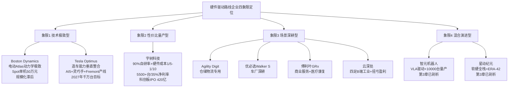

**这一四象限分布揭示了硬件驱动路线在2025—2026年量产元年的差异化竞争格局**——技术极致型企业面临规模化挑战、性价比量产型企业面临智能化补课、场景深耕型企业面临单场景天花板、混合演进型企业（已在第3—4章剖析）则代表了硬件派与软件派"反向收敛"的产业方向。

## 5.11 硬件驱动路线的优势瓶颈与商业化可持续性研判

基于本章对全球十余家代表企业的深度剖析与横向对比，本节系统归纳硬件驱动与分层架构路线的共性优势、瓶颈以及商业化可持续性挑战，并引出向第6章双系统与混合融合路线的过渡。

### 5.11.1 共性优势

**第一，工程化与量产能力领先**。硬件驱动路线企业在2025—2026年量产元年呈现出明显的"部署态先发优势"。从全球出货数据看，**2025年全球人形机器人出货量成功突破14500台，中国厂商凭借供应链、技术与成本优势包揽全球绝大多数份额**[^69]——其中**宇树科技以超5500台的出货量登顶全球第一，市场份额占比近38%；智元AgiBot紧随其后出货量达5168台全球排名第二，两款头部国产品牌合计出货量占全球总量超70%**[^69]。**优必选数百台Walker S2量产交付**[^43]、**AGIBOT在2026年3月成为全球首个出货量突破10,000台的人形机器人公司，其背后的供应链能力和成本控制能力令行业侧目**[^30]。**比亚迪已制定明确路线图：2026年计划将人形机器人从1500台扩展到20000台**[^30]。这些数据印证了硬件路线在"实验室Demo→部署态"的工程化优势。

**第二，硬件成本下降40%的产业拐点**。**制造成本在过去一年下降40%，主流产品价格带从5万-25万美元下探至3万-15万美元**[^30]。**成本下降40%的背后，是执行器技术、AI算法和供应链成熟度的三重突破——执行器是机器人的"关节"。曾经占据主流的液压驱动方案已被电动伺服电机彻底取代——体积更小、响应更快、成本更低**[^30]。在第三代半导体层面，**人形机器人的核心运动能力依赖全身上百个关节协同运作，主流机型标配30-50个动力关节；按行业主流40关节基础机型测算，单台基础版人形机器人GaN器件用量约200-300颗；若搭载五指灵巧手、高自由度腰部等进阶模块，中高端机型单台用量可突破500-1000颗，远超消费电子单设备GaN用量**[^69]。这一产业链协同的成本下降，是硬件驱动路线得以规模化的根本性物质条件。

**第三，工业场景率先实现商业闭环**。**人形机器人的核心竞争力在于：它们可以在为人类设计的环境中直接工作，无需对工厂、仓库进行大规模改造——通过门框、爬楼梯、使用标准工具，这些能力让它比传统工业机械臂拥有更广泛的应用场景**[^30]。**制造业因此成为最被看好的落地领域**[^30]——BMW工厂、Mercedes工厂、Tesla Fremont工厂、Amazon仓库等顶级工业客户的导入，为硬件路线提供了"沿途下蛋"式的稳定现金流。**Agility Robotics的Digit机器人已在Amazon、GXO、Spanx等仓库投入使用；Amazon甚至专门成立团队研究如何将人形机器人融入其全球物流网络**[^30]——这种"头部客户系统性导入"远超过去机器人产业的单点采购模式。

**第四，零部件全栈自研构筑成本护城河**。宇树90%自研率构筑硬件成本仅为海外同类1/5-1/10的护城河[^60]、特斯拉造车能力迁移使Optimus复用FSD算力底座[^70]、傅利叶FSA 2.0自研执行器实现380N·m峰值扭矩[^64]——这些案例共同印证了硬件壁垒的实在性。**Unitree从四足机器人积累的自研执行器技术，直接复用到G1人形机器人上，实现了性能与成本的双赢**[^30]——这一"硬件能力跨形态迁移"的杠杆效应，是软件派VLA基础模型难以复制的差异化优势。

### 5.11.2 共性瓶颈与商业化挑战

但硬件驱动路线的瓶颈与挑战同样明确，且这些瓶颈构成了2025—2026年硬件派"反向引入VLA/世界模型"的产业动力：

**第一，AI智能化相对滞后构成最大短板**。**宇树科技招股书坦承其自研的通用具身大模型尚未规模化应用，机器人仍处于"需开发者喂指令"的硬件平台阶段，"大脑"能力的缺失，制约了其在工业场景的深度落地**[^60]。这一坦承代表了整个硬件驱动路线的共性短板——与第3—4章VLA派、世界模型派形成能力剪刀差。**在2025世界机器人大会上，据宇树科技，现在最大的问题其实是模型问题，当前的机器人模型架构不够好不够统一，机器人公司选择的常用技术路线VLA模型架构本身还需要进一步升级和优化**[^26]。这一行业自我批评，揭示了硬件路线必须补齐的认知层短板。

**第二，灵巧操作与精细任务短板使工业场景渗透不彻底**。**据虎嗅，在车企生产线中当前人形机器人仍不足以胜任线束整理、涂胶、撕膜等对柔性要求更高的工序**[^26]。**"大小脑"智能水平不足是制约人形机器人产业化的核心瓶颈，主要体现在：环境理解局限——对非结构化场景的实时感知能力薄弱；决策泛化性差——单一模型难以适应多变的工业场景；执行精度不足——自然语言理解与执行精度存在断层**[^26]。这一短板使硬件路线的工业场景订单虽然规模庞大，但仍难以突破"高柔性工序"的天花板。

**第三，"高收入高亏损"怪圈在多数硬件派企业延续**。除宇树（净利率35.13%）、云深处（已扭亏）外，多数硬件派企业仍处亏损状态——**优必选上市两年扣非净利润累计不足2亿元，2025年净利率仅0.67%；智元机器人仍处于微利状态，净利率不足1.2%**[^60]。优必选累计配售融资45亿港元+Infini Capital 10亿美金授信仍面临盈利压力[^43]；2025年11月再次配售30.56亿港元用于产业整合与偿债[^72]。这一"高融资+高亏损"的怪圈，揭示了硬件路线"订单规模与盈利能力脱钩"的产业现实。

**第四，订单兑现与产能爬坡考验密集涌现**。**优必选订单中交付时间几乎都在2025年内**[^72]——11亿元订单的集中交付能力是严峻考验。**目前人形机器人从量产到交付面临技术和成本两大瓶颈**[^72]。**特斯拉Optimus 3有望在2025年夏季启动生产、2027年实现大规模量产**[^55]——但2025年仅交付150台的现实数据，与"千万台目标"形成巨大差距[^69][^70]。**资本市场表现出对人形机器人商业化进程的复杂预期**[^72]——投资人朱啸虎甚至指出部分企业是"只会翻跟头"的泡沫。这种"订单狂飙vs交付能力"的张力，是硬件路线在量产元年面临的最直接挑战。

### 5.11.3 不同范式的商业化可持续性研判

基于上述优势与瓶颈，可对硬件驱动路线四种不同范式的商业化可持续性作出研判：

| 范式 | 代表企业 | 商业化可持续性核心挑战 | 关键突破口 |
|-----|---------|-----------------------|---------|
| **硬件极致型** | Boston Dynamics、Tesla Optimus | 规模化滞后压力（出货量仅中国头部的1/5—1/30）；需补齐AI短板 | Tesla依靠造车能力迁移的工程化加速；Boston Dynamics依靠AI研究院与英伟达合作 |
| **性价比量产型** | 宇树科技 | 智能化补课压力；工业场景天花板突破缓慢；过度依赖科研教育市场 | UnifoLM-VLA-0等智能化模型开源；从"硬件平台"升级为"软硬一体智能体" |
| **场景深耕型** | 优必选、傅利叶、Agility、云深处 | 单场景天花板与规模化扩张的平衡；"高收入高亏损"怪圈 | 优必选向医疗教育拓展；傅利叶双场景路径稳健；云深处B端扭亏样本最稳健 |
| **混合演进型** | 智元、星动纪元（第3章剖析） | VLA能力与硬件量产的协同复杂度 | 智元10000台量产里程碑+ViLLA架构；星动纪元ERA-42+XHAND1协同 |

**硬件极致派**面临的根本命题是"如何将技术领先转化为规模化能力"——Tesla依靠造车能力迁移的工程化加速可能在2027年突破这一瓶颈，但Boston Dynamics相对更依赖软银/现代汽车的母公司战略。**性价比量产派**（宇树）则面临"智能化补课"与"工业深度突破"的双重挑战——其420亿元IPO估值已透支了"硬件领先+未来软件突破"的双重预期，2026年后能否兑现智能化承诺将是关键。**场景深耕派**呈现出最大分化——云深处"已扭亏盈利"的稳健样本与优必选"高收入高亏损"形成两极对照，其差异本质上反映了"四足专精B端工业"vs"通用人形分散场景"两种商业模式的不同收益特征。**混合演进型**（智元、星动等已在第3章剖析）则代表了硬件派与软件派"反向收敛"的产业方向。

### 5.11.4 向第6章的过渡:硬件派与软件派的反向收敛

最终引出向第6章双系统与混合融合路线的过渡。**硬件驱动路线在大模型时代不得不引入VLA/世界模型作为"认知层补课"**——宇树2026年3月开源UnifoLM-VLA-0模型[^30]、傅利叶GR-2与英伟达合作成为机器人合作伙伴[^64]、智元基于ViLLA架构实现10000台量产[^71]、星动纪元ERA-42软硬一体路径——这些案例共同指向一个产业规律：**硬件派与VLA/世界模型派的反向收敛——硬件派在加智能、智能派在造硬件**——正是第2章2.9节"向混合架构收敛"判断的另一面镜像。

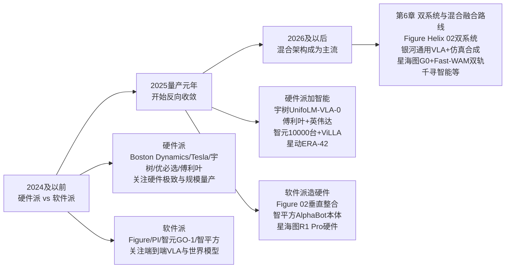

**这一反向收敛的产业规律，不仅是硬件路线的演进方向，也是软件路线的工程现实**——纯硬件派难以突破AI能力短板，纯软件派难以脱离硬件本体规模化部署。下一章将沿同样的五维分析框架，进入硬件派与软件派的"中间地带"——第6章双系统与混合融合路线，剖析Figure AI（Helix双系统已在第3章简要提及，第6章将聚焦其双系统协同机制）、银河通用（GraspVLA与仿真合成数据，第4章已部分剖析）、星海图（G0双系统与Fast-WAM融合，第4章已部分剖析）、千寻智能等代表企业，探查其在系统协同机制、数据策略、跨本体泛化能力上的差异化设计，并比较其在零售、家庭、工业等不同场景中的商业落地表现。

至此，本章已完成全球12家硬件驱动与分层架构路线代表企业的深度剖析、横向对比与商业化可持续性研判。**硬件驱动路线作为2025—2026年量产元年的"出货量主力军"，其工程化优势与AI短板共存的格局，正在驱动整个具身智能产业向"软硬一体智能体"演进**——这一演进方向，将在第6章混合融合路线的代表企业中得到更充分的呈现，并最终在第10章关于"路线收敛是终态还是过渡态"的研判中得到完整闭环。

# 6 双系统与混合融合路线代表公司分析

第3章至第5章已分别系统剖析了端到端VLA、世界模型/WAM、硬件驱动与分层架构三大独立路线的代表企业，并在每章末尾不约而同地揭示出同一个产业规律——**任何单一路线都难以独立通向通用具身智能**：VLA派受困于真机数据稀缺与泛化天花板，世界模型派挣扎于Sim-to-Real毫米级偏差与商业闭环困难，硬件派则普遍面临AI智能化补课的紧迫压力。这三类瓶颈的"互补而非重叠"特征，使得2025—2026年全球头部企业不约而同地走向了"快慢双系统协同+VLA与世界模型融合+大小脑分层架构"的混合架构方向。如果说前三章描绘的是"独立路线的极致探索"，那么本章所要呈现的，则是**"独立路线在工程层面的反向收敛与协同进化"**——这一收敛已在第2章2.9节作为产业趋势提出，本章将通过头部企业的工程实践对其进行实证。

本章将沿用前几章统一的五维分析框架，并在此基础上补充三类特殊评估维度——**系统协同机制**（双系统频率比、信息交互方式、异构输入设计）、**数据策略组合**（仿真合成/真实场景/人类视频三类数据的比例与组合方式）、**跨本体泛化能力**（跨机器人构型与硬件平台的迁移表现）。围绕"混合融合路线如何在工程层面落地、不同数据策略对应何种商业场景、混合架构的商业化可持续性"三个核心问题，本章将依次剖析Figure AI Helix三层架构、银河通用AstraBrain端到端融合、星海图G0+Fast-WAM双轨、千寻智能Spirit v1.5、智平方FiS-VLA、Physical Intelligence π0.5、英伟达GR00T N1及极佳视界、原力灵机等代表企业，并通过横向对比矩阵验证"向混合架构收敛"已成为2025—2026年具身智能产业的事实性主流。

## 6.1 双系统与混合融合路线企业谱系与归类边界

如第2章2.5节所述，**双系统更多是一种"组织方式"而非独立的技术路线，往往作为VLA或分层架构的具体实现形式**。这一定位为本章的归类工作提出了独特挑战——本章涵盖的代表企业，绝大多数已在第3—5章作为VLA派、世界模型派或硬件派代表被深度剖析过，本章不应重复其基础信息，而应聚焦其"双系统协同机制"与"混合架构设计"两个独特视角。基于这一原则，本研究将双系统与混合融合路线代表企业划分为三大阵营：

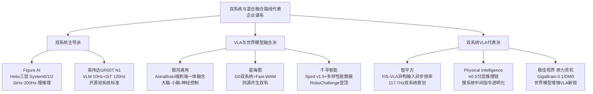

需要预先对若干**归类边界**作出说明。第一，**Figure AI、银河通用、星海图、智平方、Physical Intelligence、英伟达、星动纪元等已在第3—5章详细剖析过基础信息**——其完整融资历史、团队背景、产品矩阵、商业化标志已在前文系统呈现，本章仅以必要篇幅承接前文事实，重点聚焦其双系统协同机制、跨层接口设计、异构数据融合范式等独特视角，避免简单重复。第二，**千寻智能、极佳视界、原力灵机作为本章首次系统出现的代表企业**，将按照五维分析框架展开完整剖析。第三，**自变量WALL-B的WUM架构**虽具备"视觉、语言、动作、物理预测同一网络联合训练"的混合融合属性，但已在第3章3.10节作为VLA向世界模型方向的极致演进完整剖析，本章不再重复，仅在6.9节横向对比矩阵中作为对照纳入。

## 6.2 Figure AI:Helix三层双系统的全身一体化范式

Figure AI已在第3章3.4节作为端到端VLA代表完整剖析。本节聚焦其**Helix 02三层双系统架构**作为混合融合路线的工程实践——这是当前全球范围内"将硬件实时控制、视觉运动规划、高层语义推理三类异构需求统一在单一神经网络中"最具代表性的工程范例。

**技术路径——三层频率分层与统一神经网络**。Helix 02采用"System 0–2"三级层级架构，通过单一神经网络实现全身统一控制，能同时处理行走、操作与平衡。**System 2作为语义推理层负责高层语言推理与场景理解，进行高层任务规划；System 1作为视觉运动层以200赫兹频率运行，将感知数据转化为全身关节目标姿态；System 0作为物理基础层以1kHz频率运行，是基于超1000小时人类动作数据训练的全身控制基础模型，直接取代了10.9万行手动代码，负责平衡、接触与全身协调**[^62]。这一"1kHz物理反射→200Hz视觉运动→慢思考语义规划"的三层频率分层，本质上是将经典机器人控制中"动力学控制层、运动规划层、任务规划层"的分工，以神经网络方式重新统一为单个端到端系统。

Helix 02的核心工程突破在于**"全传感器输入、全关节输出"的统一视觉-运动神经网络**——它集成头部摄像头、手掌摄像头、指尖触觉传感器及全身关节状态感知，输出腿、躯干、头、双臂、手腕、手指的完整关节控制[^62]。从训练范式看，**训练完全在虚拟仿真环境中完成，使用了20万个并行环境进行大规模训练**[^62]——这一训练规模在双系统架构中已属于行业顶级水平，配合超1000小时真实人类运动数据，构成了"仿真+真实"两类数据在双系统训练中的工程协同。其前代Helix 01"聚焦上半身操作控制，在抓取、装配等精细动作上实现突破，但行走与操作采用串行执行逻辑，即先完成定位移动再开展任务操作，整体响应延迟高、场景适应性有限"[^62]——而Helix 02"攻克了人形机器人领域长期难以解决的'移动操作（Loco-Manipulation）'难题，将行走、平衡与精细操作纳入同一连续控制框架，实现从上半身端到端向全身端到端的核心跨越"[^62]。

**产品进度与里程碑**。Helix 02于2026年1月28日/29日发布，其代表性能力包括：**完成持续4分钟、包含61个连续动作的完全自主厨房家务任务**，机器人在演示视频中展示了用脚顶洗碗机柜门的拟人动作；并在2026年3月展示了在客厅环境中执行全流程清洁作业的能力；还能完成拧开瓶盖、从药盒中取出单粒药片、用注射器精确推注液体等精细操作，**其指尖触觉传感器可感知低至3克的力**；从厨房到客厅的场景切换仅通过补充数据实现，未更换算法[^62]。这一"61连续动作+场景泛化+毫牛级触觉感知"的能力组合，是当前混合融合路线在长程任务可靠性上的工程标杆。

**商业化进度——宝马生产实证与信任危机并存**。在工业落地侧，Figure 02在过去6个月内已在宝马集团斯帕坦堡工厂参与生产了**3万辆X3汽车**，累计装载超过9万个零件，运行时间超过1250小时，预计行走超过120万步或200英里——其取放作业绩效指标包括"工作时长目标不超过84秒、定位准确率每班次成功率高于99%、干预次数每班次零次"[^34]。但宝马工厂的工作也暴露了Figure 02的部分问题，**前臂是故障率最高的部件**——"由于前臂紧凑的封装、对灵活性（三个自由度）的要求以及热限制，前臂是一个极具挑战性的子系统"[^34]。

与此同时，Helix 02及其前代型号围绕"完全自主"的宣传争议也在持续发酵。围绕3月10日Helix 02家务视频与3月26日白宫亮相演示，**社区与业内专家通过逐帧慢放分析，发现了诸多与"完全自主"宣称不符的细节**——例如户外演示中"在他发出'好了，转身'的指令前，机器人就已提前启动转向动作"，仓库分拣演示中"机器人握把动作存在2秒延迟，与宣称的'每包裹处理速度不到三秒、完全自主'形成矛盾"[^30][^46][^32]。Figure官方解释称"训练阶段可能会采用遥操作示范，这是行业通用标准，但演示和生产阶段的机器人均实现完全自主"，但质疑者指出"Figure AI从未在无剪辑、一镜到底的公开场合验证其自主能力，所有'证据'均为公司发布的精心剪辑视频"[^30]。**这一信任危机的核心启示在于：双系统三层架构在工程指标（4分钟61动作、宝马3万辆、1250小时）上虽具说服力，但"端到端自主"叙事的可证伪性仍存在结构性挑战**——这构成了对全球VLA与混合架构叙事的连带警示。

**融资与团队**。如第3章3.4节所述，Figure AI 2025年9月完成超10亿美元C轮融资，估值飙升至390亿美元，公司计划未来四年内实现10万台人形机器人量产目标。Brett Adcock组建的团队由来自波士顿动力、特斯拉、谷歌DeepMind以及Archer Aviation的顶尖AI机器人专家组成，构成了双系统三层架构所需的"控制理论+大模型+硬件量产"复合人才矩阵。

## 6.3 银河通用:AstraBrain端到端融合与虚实数据范式

银河通用已在第4章4.5节作为世界模型路线"仿真合成派"代表完整剖析，本节聚焦其**AstraBrain端到端一体化融合架构**与双系统派的差异化设计——这是当前混合融合路线中**"不走频率分层、而走三层一体融合"**的最具代表性实践。

**技术路径——大脑-小脑-神经控制三层一体融合**。区别于Figure AI Helix 02的频率分层双系统、智平方FiS-VLA的异步频率双系统，银河通用AstraBrain走的是**"集成大脑-小脑-神经控制于一模"的端到端全身全手统一融合路径**。AstraBrain"是全球首个集成'大脑-小脑-神经控制'于一模的全身全手端到端大模型，打通从多模态感知到实时反馈控制的全链路"[^65]，"端到端的优势在于全局最优——要实现人类级别的灵巧操作，必须打通从高层语义理解到低层电机控制的全链路，实现全身协同与全手精细操作的深度融合"[^65]。这一设计哲学的工程意义在于：**与三层频率分层架构通过"接口对齐"协同不同，AstraBrain通过"网络内部参数共享"实现协同，理论上可避免跨层信息损失，但训练复杂度更高**。

银河通用的差异化更体现在数据策略组合上。**行业普遍依赖人力遥操采集真机数据时，银河通用构建了全球规模最大的百亿级具身智能数据集，开创了数据基建"银河星坊"（AstraSynth），首创"以合成仿真数据为主、真机数据为辅"的虚实融合训练范式**[^65]。在高精度物理仿真环境中生成海量多样化场景，让机器人在虚拟世界遍历各种极端情况，再以极少量真机数据完成实战微调——王鹤宣称的关键指标是**"真机训练效率比特斯拉高1000倍"**[^65]。其CTO王鹤将这一路径形象地总结为**"虚拟筑基+现实纠偏"**——"首先在虚拟仿真环境中，让机器手进行海量训练，系统会输入各种大小、重量、纹理的虚拟核桃，让它在亿万次试错中，练出一套适应性极强的基础操作逻辑"[^59]。

基于AstraBrain，银河通用开发了**面向不同场景的模型矩阵**：**GraspVLA**（2025年1月推出）作为"全球首个端到端具身抓取基础大模型"，预训练完全基于合成大数据，训练数据达到"十亿帧'视觉-语言-动作'对"；**DexNDM灵巧手神经动力学模型**"在行业内首次打造基于训练的灵巧手控制算法，使灵巧手能真正灵活应对复杂、多样、极长、极小的物品实现手内旋转精密操作"[^25];**NavFoM**作为"全球首个跨本体、全域环视的导航基座大模型，让机器人第一次理解'移动的本质'"，并在业内率先突破小时级长程导航[^25];**GroceryVLA零售端到端大模型**"基于99%合成数据+<1%真实数据训练"，能驾驭真实货架环境的极致复杂[^71]。

GraspVLA团队对预训练能力的"七大泛化金标准"——光照泛化、干扰物泛化、平面位置泛化、高度泛化、背景泛化、物体类别泛化、闭环能力——的验证结果令人惊叹：**模型能在完全未见过的真实环境与物体（如购物车、挖掘机模型、游泳眼镜、测电笔）中，仅凭语言指令（如"抓取测电笔"）就游刃有余地完成精准抓取，且具备闭环实时动态调整能力，且具备强抗干扰性**[^53][^71]。基于合成数据方案带来的革命性效率提升表现为：**仅需极少量的真实数据微调（例如，"按顺序抓取箱子中的矿泉水"技能仅需每人约2小时采集的200条数据），模型即可精确理解人类意图，并能零样本泛化到同类新物品（如从训练用的怡宝水到农夫山泉、东方树叶）**[^71]。

**产品进度与商业化标志**。Galbot G1在2026年央视春晚成为**春晚首个自主干活机器人**，"小盖"展示了从指尖灵巧地盘核桃、精准捡拾透明玻璃碎片、密集货架取物，到生活化的叠衣服、串烤肠等整套自主操作[^59]。**与过往春晚舞台上依赖预编程完成固定动作的机器人不同，"小盖"的所有操作均通过端到端的自主感知、自主决策、自主执行完成**[^59]。王鹤特别指出："盘核桃的挑战，本质上是对机器人动态力控能力的极限考验。核桃表面不规则、重量分布不均，这对机器人感知、决策与执行的闭环速度、精度都提出了极高要求"[^59]。

商业落地侧呈现"零售+工业+医疗+服务"四大场景全覆盖：**累计订单规模已达数千台**[^25]；与宁德时代、博世集团、丰田汽车、韩国现代、北汽集团、上汽集团、极氪汽车、长城汽车等企业达成深度合作，实现人形机器人进厂真实自主干活[^25]；**北京、上海、深圳等城市已有几十家完全由银河通用人形机器人运营的、面向骑手的药仓**[^72]；2026年4月17日Galbot G1正式进驻全家北京中关村鼎好店开启常态化在岗服务[^54][^60]，**春晚结束后24小时内Galbot G1获得数百台订单**[^54]。这种"工厂、24小时仓库等不可见场景的勤勉工作"与"商超、景点等大众可感知的体验空间"两条路径并行，构成了银河通用商业化的"两条相辅相成的路径"[^72]。

**融资逻辑与团队**。如第4章4.5节所述，银河通用累计融资额超过69.6亿元、估值持续领跑行业。2026年3月25亿元融资引入**国家人工智能产业基金（国家大基金三期）首次投资具身智能赛道**[^59][^65]，本轮融资阵容堪称"国资集结号"——大基金、中国石化、中信集团、中国银行、上汽集团金控、中芯聚源、亦庄国投、未来产业投资等联合投资[^59]。**国家大基金的此次出手释放了两大信号**：第一，人形机器人对AI芯片、传感器、控制系统需求密集，若形成规模化落地，将对国产算力与关键元器件形成持续拉动；第二，国家级基金通常要求较强技术壁垒与明确产业路径，其出手意味着具身智能被纳入中长期产业体系[^59]。中国石化的加入或为银河通用打开了加油站网络、石油化工高危场景及数万家易捷便利店的想象空间；上汽集团的持续加注将推动机器人在汽车柔性生产线的深度整合[^59]。这种"国资集结+订单式投资"的产业逻辑，使银河通用的虚实数据范式获得了战略级背书。

## 6.4 星海图:G0快慢双系统与Fast-WAM同源共生路线

星海图已在第4章4.4节作为世界模型路线"真实数据派"代表完整剖析。本节聚焦其作为**"全球快慢双系统VLA技术开创者"**的差异化定位，重点解构G0/G0 Plus/G0 Tiny VLA与Fast-WAM世界模型的"同源共生"设计哲学，与底层DP3模仿学习共同构成的三层混合架构创新。

**技术路径——快慢双系统+世界模型双轨同源**。星海图的混合架构内核是其独特的**"VLA与WAM同源共生"**设计——"星海图以打造'通用具身智能大脑'为核心目标，认为视觉-语言-动作（VLA）模型与世界动作模型（WAM）同源共生，基于真实开放场景的海量数据，将物理世界的直觉认知与精准的任务执行深度耦合，赋予机器人理解世界、操作万物的通用智能"[^46]。

**作为全球"快-慢双系统"VLA模型的技术开创者**，星海图持续领跑全球具身基础模型能力——**2025年8月开源G0 VLA大模型突破当时SOTA；2026年1月开源全球首个开箱即用VLA模型G0 Plus；2026年2月开源面向衣物折叠的垂类场景G0 VLA模型、支持端侧轻量化部署的G0 Tiny小模型，持续夯实具身基础模型领先地位**[^73][^46]。在世界模型侧，**星海图近期发布全球最快的世界模型Fast-WAM**——"通过对模型底层架构的颠覆性重构，让世界模型可以不靠想象理解世界，大幅提高世界模型推理速度，为具身智能从实验室研发走向大规模产业落地奠定关键基础"[^46]。这种"VLA做行动+WAM做预测"的双轨同源架构，结合底层DP3模仿学习作为动作策略（如第2章2.6节所述，DP3由清华叉院许华哲团队即星海图联合创始人于2024年5月在Diffusion Policy基础上引入3D视觉增强而成），构成了"底层模仿学习+上层VLA双系统+并行世界模型"的三层混合架构创新。

数据策略侧，**星海图坚持构建真实场景具身数据引擎**，公司开源的全球首个开放场景具身智能真机数据集GOD"重新定义高质量真机数据标准，发布一个月即登顶全球下载量首位，被开源社区广泛认可为2025年全球最高质量具身真机数据集，**全球下载量已突破60万次**"[^46]。沿着真实数据金字塔，星海图领先于行业布局涵盖UMI数据与人类第一视角（Egocentric）数据的无本体数据方案布局，构筑起稳固的具身智能数据金字塔——**目前星海图的数据体系已深度赋能英伟达EgoScale、蚂蚁灵波Lingbot-VLA等全球顶级具身大模型，成为行业不可或缺的底层基础设施**[^46]。**2026年星海图将构建全球最大规模的真实场景具身数据集，以百万小时真实场景数据持续驱动具身基础模型进化**[^46]。

**产品进度与开发者生态领先**。**作为具身智能硬件的标杆，R1系列已通过Physical Intelligence、斯坦福AI实验室、英伟达等全球顶尖开发者的检验，成为服务于全球顶尖模型的核心基座；同时也成为全球顶尖汽车主机厂和一线物流运营商的首选生产力平台**[^46]。**在轮式双臂机器人领域，星海图已建立起绝对的领先优势，累计服务超过150家全球顶尖具身智能开发者伙伴**[^46]。这一"开发者首选+全球顶级模型数据基础设施"的双重生态卡位，是星海图区别于其他混合架构企业的最大差异化优势——它不仅是模型与本体的提供者，更是其他模型公司（包括英伟达、蚂蚁灵波）的数据基础设施供应商。

商业化侧，星海图采取"开发者市场领先+生产力市场快速突破"双轨格局——**2025年其在轮式双臂机器人领域的全球市场占有率位居第一**，并已聚焦搬运移动、抓拿放置等五大核心垂类场景完成千台级订单跑通。在亦庄人形机器人半程马拉松中，星海图选择"不去争名次，而是为人类选手拿水递毛巾"的差异化出场方式——**6台R1 Pro机器人协同完成发令仪式，4个补给站点全线由R1 Pro与R1 Lite协同作业**，这一开放场景下的真机部署成为对其混合架构泛化能力的实地验证。

**融资节奏与战略转向**。星海图融资节奏在国内具身智能赛道堪称前列。**2026年2月完成近10亿元B轮融资**[^64]，**仅隔1个多月，4月初再次完成近20亿元B+轮融资**——本轮投资方阵容覆盖产业资本（华登科技、蓝思科技、矽芯投资、时代伯乐、航发基金）、长线基金（修远资本、弘章投资、御海资本）、国资基金（金融街资本、金浦投资、北京科创、国元股权）及一线PE（中金资本旗下基金、普华资本、洪泰基金、广发乾和）[^73][^64]。**本轮融资后，星海图跻身"估值200亿+俱乐部"，并刷新了迄今为止中国未上市具身智能企业估值记录，也是今年春节以来估值涨幅最快的具身智能企业**[^73]。

值得特别关注的是星海图的**战略转向**——"就在两个月前，星海图管理层对外释放的口径还是'克制花钱'：账上仍有充足现金储备，支出重点是为接下来可能快速增长的数据量与算力需求留出冗余。随着这轮融资，公司的判断已经明显变化。星海图开始明确强调，**具身智能的scaling拐点已经出现**，2026年的重点不再只是'提高花钱效率'，而是要把资源真正投向更大规模的数据、训练与场景验证中去"[^64]。CFO罗天奇指出三大估值跃升原因：**第一，星海图作为市场上"花钱效率最高"的具身智能企业，过去半年研发费用相当于公司成立以来的数倍；第二，智谱、MiniMax两家大模型企业港股上市的非常惊人后市表现直接传导到一级市场，具身大模型的估值体系发生重构；第三，星海图作为综合能力更强的稀缺标的，资金正向头部集中**[^73]。

## 6.5 千寻智能:Spirit v1.5与多样性脏数据范式

千寻智能（Spirit AI）作为本章首次系统剖析的代表企业，其核心价值在于**以"多样性脏数据"对传统"干净数据"范式的根本挑战**，以及**自研可穿戴设备将数据采集成本降至传统1/10的数据范式革命**——这一双重突破使其成为2026年具身智能基础模型赛道最受瞩目的"黑马"。

**技术路径——Spirit v1.5与多样性脏数据预训练范式**。Spirit v1.5是千寻智能自主研发的VLA基础模型，于2026年1月12日正式开源。**模型采用Vision-Language-Action（VLA）统一建模框架，将视觉感知、语言理解与动作生成整合在同一决策流程中，减少多模块串联带来的信息损耗。具体以Qwen3-VL-4B-Instruct作为视觉语言模型主干，动作为DiT（Diffusion Transformer）动作头**[^25]。其训练分为两阶段——第一阶段利用海量互联网视频进行预训练以建立物理常识，第二阶段引入真实遥操作数据进行微调[^25]。

Spirit v1.5最具开创性的是其**预训练数据策略的根本性范式转换**——**"摒弃了大多数保证'干净'数据的规则，只遵循一条规则：做一些有用的事，进行开放式、目标驱动的数据采集或多样化采集"**[^25]。"在数据采集阶段，鼓励数采员只围绕任务目标行动，而不强制遵循固定的动作流程。这种开放式采集显著扩大了动作分布，使模型在预训练阶段'见过更多可能性'，从而具备更强的迁移与泛化能力"[^25]。这一策略带来了显著的工程收益：**人均有效采集时长提升约200%，对算法专家深度介入的需求降低约60%**[^25]。

更关键的是消融实验所揭示的根本性发现：**"在预训练数据规模一致的前提下，基于多样化数据预训练的模型在新任务上的微调效率显著更高，达到相同性能所需迭代次数减少约40%。进一步扩大多样化数据规模后，模型的验证误差仍在持续下降，表明任务多样性比单一任务演示数量更为关键"**[^25]。这一"任务多样性比演示数量更关键"的判断，对整个行业既有的"干净数据+大规模演示"主流范式构成了根本性挑战。

在权威评测上，**Spirit v1.5在RoboChallenge全球评测中综合得分为66.09，任务成功率为50.33%，成为首个成功率超50%的具身智能模型，超越了此前领先的Pi0.5模型**[^25]。这一登顶时间点（2026年1月12日）随后被极佳视界GigaBrain-0.1（2月9日）、原力灵机DM0（2026年中）相继赶超，三家中国创企在RoboChallenge榜单上的连续领跑构成了2026年具身基础模型领域最具产业意义的现象（详见6.8节）。

**数据范式革命——可穿戴设备压降成本至传统1/10**。**千寻智能通过自研可穿戴式数据采集设备（第五代），将多模态数据采集成本降至传统方法的1/10**[^66][^42]。这套技术系统沿着四项关键技术展开：**第一，轻量化保障"量"**——传统数据采集设备往往笨重、有外骨骼或刚性结构，操作者穿戴几分钟就会感到疲劳，无法进行长时间、大规模的连续作业；千寻智能将设备做到极致轻量，让操作者能舒适地工作数小时，使"规模化"采集成为可能[^66]。**第二，逼近人手自由度保障"质"**——只有5-6个自由度的数据手套无法捕捉手腕的旋转、手指的侧向摆动等精细动作，千寻智能让设备自由度尽可能逼近真实人手的自由度（**超过20个主动自由度**），将数据可用性从30%提升到95%[^66]。**第三，坐标系转换算法保障"效"**——开发高效的算法将人类操作者在三维空间中的末端位姿和目标轨迹，实时、平滑地转换为机器人各关节所需的指令，让操作者感觉像在"驾驶"一台高性能机器，而非"驯服"一个笨拙的提线木偶[^66]。**第四，系统工程端到端优化**——将所有环节看作一个完整的系统工程进行全局优化[^66]。

数据飞轮的实证规模也令人瞩目——**千寻智能累计获取超20万小时多类型真实交互数据，覆盖互联网视频、遥操作、可穿戴采集等维度，预计2026年总量将突破100万小时**[^74][^66]。**"在京东咖啡机器人场景中，每杯咖啡制作的遥操作过程同步自动化采集关节运动轨迹、力控数据，形成'使用即训练'的闭环，推动模型自主进化"**[^42]——这种"以用代研"的飞轮已经在宁德时代和京东的真实场景中闭环运转起来。

**产品进度——Moz1全力控人形机器人与全球首条具身产线**。千寻智能推出了**全力控人形机器人Moz1**，并实现了商业化的标志性事件——**全球首条人形具身智能产线已在宁德时代中州基地投运**[^74]。在工业落地侧，"宁德时代电池产线上，'小墨'机器人完成高压插接等精密工序，实现零故障量产，验证了产线级稳定性"[^42]。在零售场景，"Moz机器人在京东MALL复杂人流环境中稳定执行咖啡研磨、萃取任务，突破非标准化服务场景的落地难题"[^42]——双场景成功证实了"统一基座模型+场景微调"技术路径的可行性。

**商业化进度与"以用代研"飞轮**。"千寻智能跨工业与零售场景的成功落地，不仅验证了具身智能在复杂任务中的执行能力，更揭示了行业突破数据壁垒、实现闭环迭代的关键路径"[^42]。其与京东的四年战略合作延伸至药房配药、数码导览等场景，形成"技术-场景-供应链"协同生态，缩短商业化周期[^42]。

**融资情况——30天内30亿元的资本核爆**。**千寻智能成立于2024年1月，2年间陆续完成了6轮融资，披露的融资总额约33.28亿元**[^74]。**2026年开年的融资节奏堪称"资本核爆"——1月完成近20亿元新融资创下2026年开年以来具身智能领域新高、估值突破百亿元；4月7日完成新一轮10亿元融资**[^74][^44]。"4月7日，千寻智能完成新一轮10亿元融资。本轮融资由顺为资本、云锋基金联合领投，达晨财智、某头部人民币基金、银河源汇、图灵基金、新鼎资本、庚辛资本等重磅加持"[^44]——**云锋基金（马云系）与顺为资本（雷军系）的罕见联手领投，使这笔融资被业内视为"30天内30亿元、马云雷军罕见联手"的标志性事件**[^44]。

CEO韩峰涛对融资节奏的判断颇具启发性：**"2026年的核心主题是数据量级与模型性能的突破，而非追求落地与营收增长，真正的大规模落地预计在2027年下半年至2028年到来"**[^44]——千寻智能2026年营收目标定在1—1.5亿元、销售数量约200台，相对同规模企业略显保守，但这正是其"先把数据拿到、再追求规模盈利"战略的体现。高鹄资本董事总经理舒雪梅与韩峰涛达成的共识揭示了行业深层逻辑——**"千寻作为起步相对较晚的具身智能创业公司，能否拿到足够多的钱，直接决定了公司能否'上牌桌'……一旦估值上去了但钱没拿够，非常危险"**[^44]。

**团队情况——硬件老兵+90后科学家+"做苹果不做安卓"战略**。千寻智能拥有典型的**"硬件老兵+AI科学家"**互补组合。**创始人兼CEO韩峰涛是位行业老兵**，本科华中科技大学自动化专业、研究生浙江大学人工智能专业，**曾为珞石机器人联合创始人&CTO，主导交付了超过2万台工业机器人，在机器人行业拥有十余年技术和商业化经验**，创业后回到华科大攻读博士学位（师从丁汉院士）[^74]。**联合创始人兼首席科学家高阳**是"具身大模型"代表人物、"归国四子"之一（其他三位分别是边塞科技吴翼、前星海图联创/破壳机器人许华哲、星动纪元陈建宇），2020年开始担任清华大学视觉与人形机器人实验室主任[^44]。**团队成员汇聚了来自UC Berkeley、CMU、清华、北大等顶尖高校以及字节、小米、腾讯等大厂优秀人才，平均年龄不到30岁**[^74]。

高阳在与媒体的交流中阐述了千寻智能最具代表性的战略选择——**"具身智能创业，要做苹果，而不是安卓"**[^58]。"我到今天为止一个比较obvious的结论是，得做软硬一体，得做具身智能领域的苹果，不能做安卓。因为技术初期，跨本体能力一定是比较弱的，把软件和硬件一起做好，在无数的行业初期都是这样的。比如个人电脑最开始，像IBM，它做硬件也做软件，可能过了三四十年，大家才逐渐软硬去分工"[^58]——这一战略判断与第3章自变量、智元的"软硬件一体"路径形成产业共识。

## 6.6 智平方FiS-VLA与Physical Intelligence π0.5双系统范式对照

智平方与Physical Intelligence已分别在第3章3.7节、3.3节作为VLA代表完整剖析。本节作为前两章已剖析企业的双系统机制深度补充，**重点对照分析两家VLA代表企业差异化的双系统设计**——这是当前全球范围内"双系统作为VLA组织方式"两条最具代表性的工程路径对照。

**智平方FiS-VLA——业内首个"异构输入+异步频率"双系统VLA**。智平方在2025年6月推出了"快慢系统深度融合的新一代VLA架构"——GOVLA 0.5（FiS-VLA），**成为业内首个"异构输入+异步频率"的双系统VLA模型，性能直接超越国际标杆Pi0达30%**。其核心创新在于解决双系统的工程协同难题：**"异构输入"指系统1与系统2接受不同模态、不同分辨率的输入**——系统2接收语言指令与全局视觉上下文，系统1接收高频本体状态与近距视觉；**"异步频率"指两系统以不同时间步长运行**——系统2以低频做规划与意图更新，系统1以高频做毫秒级动作生成（**控制频率达117.7Hz**），从而在响应速度与推理深度之间取得平衡。

智平方的双系统设计还呈现了清晰的代际演进逻辑——其CEO郭彦东将VLA划分为**"端到端VLA→融合世界模型的增强型VLA→类脑NeuroVLA"三阶段路径**，强调"VLA不会消失，它会被不断加持，变得越来越聪明"。这一演进路径在工程层面表现为：**GOVLA 0.0（首个开源VLA模型）→GOVLA 0.5/FiS-VLA（双系统）→GOVLA 1.0（融合世界模型）→未来NeuroVLA（类脑分层）**——每一代都在前代基础上叠加新的混合融合元素，是"双系统作为VLA加持组件"产业判断的最系统化实践。

**Physical Intelligence π0.5——分层推理链与中间指令透明化**。π0.5作为PI技术极致派的代表作，其双系统设计的独特之处在于**"分层推理链"范式与决策透明化设计哲学**——模型在处理每一帧画面时，遵循"感知层（Bounding Box，圈出相关物体）→规划层（Subtask Labels，预测当前语义子任务）→执行层（Action Expert，生成具体动作）"的严密思维链。这一设计与Figure Helix 02的频率分层、智平方FiS-VLA的异步频率不同，而是更接近"语义层级分层"——**慢系统生成"可解读的中间指令"**（类似自言自语），将"拿起杯子→放入水槽"等高层语义子任务作为快慢系统之间的接口。

如第2章2.7节横向对比矩阵所述，**PI的架构特别强调慢系统生成"可解读的中间指令"（类似自言自语），注重决策过程的透明化，便于调试和信任，其他家更多是端到端的内部特征传递**[^59][^24]。这一"中间指令透明化"的设计哲学，使π0.5在调试可解释性上具有独特价值——这是其能够在私人家庭zero-shot开放世界泛化中持续执行10—15分钟复杂任务的关键工程支撑。

**两家差异化对照矩阵**。将智平方FiS-VLA与Physical Intelligence π0.5置于统一对比维度下，可以清晰看到双系统范式的差异化设计：

| 对比维度 | 智平方FiS-VLA | Physical Intelligence π0.5 |
|---------|--------------|---------------------------|
| **双系统协同核心** | 异构输入+异步频率 | 分层推理链+中间指令透明化 |
| **系统1运行频率** | 117.7Hz | 受FAST Token+Flow Matching限制 |
| **系统1-系统2接口** | 不同模态特征向量传递 | 自然语言子任务作为接口（"拿起杯子"） |
| **动作Token选择** | 异构输入+异步频率内部表示 | FAST离散Token+Flow Matching连续动作流 |
| **数据策略** | 仿真+真实+异构数据协同 | 多机器人异构数据+网络数据co-training |
| **代表性能力** | 性能超越π0达30% | 私人家庭10-15分钟开放世界泛化 |
| **商业化路径** | 惠科3年1000台订单+智魔方服务空间 | 不做整机，给银河通用、星海图等提供模型 |
| **设计哲学** | "VLA不会消失，将被不断加持" | "VLM是过渡期拐杖，机器人交互数据规模化后将拿掉" |

资料来源：综合整理自第3章3.3、3.7节内容

这一对照揭示了**双系统范式在工程实现上的两条不同哲学路径**：**智平方走"工程协同极致优化"——通过频率分层与异构输入提升纯VLA性能；PI走"语义透明化"——通过中间指令使整个推理链可解释**。两条路径在2025—2026年期间都已被产业证实有效，构成了双系统作为VLA组织方式的两个"标杆答案"。

智平方在商业化进展上进一步实证了双系统VLA的工程价值——与全球第三大面板厂商**惠科签订了3年1000台商业订单**，并在2025年12月即实现单月百台级交付；2025年12月29日推出**全球首个模块化具身智能服务空间"智魔方"**并率先于北京朝阳公园与深圳万象城同步落地；2026年4月完成股份制改造为IPO进程加速做准备。这些进展使智平方的双系统VLA从"算法领先"转化为了"商业落地领先"。

## 6.7 英伟达GR00T N1开源双系统的生态意义

英伟达已在第4章4.2节作为世界模型路线"平台型基础设施供应商"完整剖析。本节专门聚焦GR00T N1/N1.5双系统架构的工程意义与开源生态影响——其作为"全球首款开源人形机器人功能模型"的产业卡位，使其超越了单纯的模型层面意义，成为整个具身智能行业的"双系统范式开源标准"。

**GR00T N1双系统架构的工程意义**。如第4章所述，GR00T N1于2025年3月19日GTC 2025大会上正式开源，**采用了模拟人类思维的"快慢思考"双系统模式**——**视觉-语言模块（系统2）**通过视觉和语言指令解释环境，基于在互联网规模数据上预训练的Eagle-2 VLM中间层进行联合编码，**在NVIDIA L40 GPU上以10Hz运行**；**扩散变换器模块（系统1）**则相当于GR00T N1的"四肢"，基于扩散变换器（DiT）架构，通过动作流匹配技术进行训练，**实时生成流畅的运动动作（120Hz）**。这一"VLM慢思考10Hz+DiT快反应120Hz"的频率比，本质上确立了双系统范式在工程上的"参考实现"。

**数据金字塔三层异构融合**。GR00T N1最具创新性的训练范式是其"数据金字塔"结构——将不同来源的数据按照规模和实体特异性进行分层。**金字塔顶层是真实机器人轨迹数据；中间层是合成数据集（通过物理仿真生成的synthetic data）；底层是大规模网络数据和人类视频数据**。这一"数据金字塔"思想被业内多家头部企业借鉴，成为双系统训练中"真机数据+仿真数据+人类视频"三类异构数据融合的标志性范式。**DexMimicGen则作为重要的合成数据生成工具，可从少量人类演示中扩展生成大规模训练数据**。

GR00T N1.5于2025年6月11日推出升级版本，在N1基础上改进模型和数据——预训练和微调期间VLM被冻结，且VLM升级为Eagle 2.5。

**GR00T-Dreams蓝图——世界模型反哺双系统训练飞轮**。在GR00T N1/N1.5基础上，英伟达进一步推出**GR00T-Dreams蓝图**——基于Cosmos平台，能够**仅凭一张图像和简单的文本提示，在虚拟环境中快速生成海量、带有精确动作标签和逼真物理交互的合成数据**。这一工具链的核心价值在于：**不依赖真实世界的数据采集，而是利用生成式AI和世界基础模型，在虚拟环境中生成逼真且多样的数据，极大地减少了时间和物理限制，使机器人可以在数小时内从零开始学习并掌握复杂的任务**。这种"世界模型生成合成数据→反哺双系统训练"的飞轮闭环，配合Cosmos平台的Predict、Transfer、Reason三个子模型与Newton物理引擎，共同构建了完整的双系统训练基础设施。

**生态合作与产业卡位**。英伟达已将GR00T N1作为机器人基础模型的"开源底座"输出，与Apptronik、Boston Dynamics、Agility Robotics、傅利叶智能、Figure等头部本体厂商建立技术合作[^69]。这种"双系统范式开源标准+合作伙伴广泛生态"的卡位，使英伟达成为全球范围内推动双系统范式产业化的核心推手——**头部本体企业不必从零开始研发双系统架构，而是可以基于GR00T N1快速落地双系统能力**。Jim Fan在2026年2月初公开宣称"2025年具身智能行业由VLA模型主导，但2026年将成为世界模型首次为机器人领域典型基础的一年"——这一论断在英伟达内部转化为对Cosmos世界基础模型与GR00T-Dreams的资源加码，进一步强化了"双系统+世界模型增强"的混合融合方向。

值得指出的是，**英伟达的双系统开源生态不仅服务于人形机器人，也辐射到自动驾驶领域**——2026年3月GTC大会上，黄仁勋宣布比亚迪、吉利、五十铃、日产正式加入英伟达DRIVE Hyperion自动驾驶平台生态，**最新的Hyperion 10版本搭载两颗NVIDIA DRIVE AGX Thor芯片，算力达到2000 FP4 TFLOPS——相当于目前特斯拉FSD芯片算力的14倍**[^61][^48]。比亚迪还计划"使用NVIDIA的辅助驾驶基础架构进行基于云的AI开发和训练技术，并利用NVIDIA Isaac和Omniverse平台为虚拟工厂规划和零售配置器开发工具和应用"[^43]。这种"双系统范式跨人形与自动驾驶赛道辐射"的生态价值，使英伟达成为本研究第7章"平台型生态构建者"的核心代表。

## 6.8 极佳视界、原力灵机等新锐:RoboChallenge榜单背后的混合架构竞速

继千寻智能Spirit v1.5登顶RoboChallenge之后，2026年具身智能基础模型领域呈现出**"中国创企在全球榜单上多强并立、加速赶超"**的竞速格局。剖析这一现象背后的代表企业极佳视界、原力灵机，对理解混合融合路线的工程演进具有重要的产业意义。

**RoboChallenge三家创企连续登顶超越π0.5的产业意义**。**2026年1月12日，千寻智能Spirit v1.5在RoboChallenge上登顶第一，性能超越了Pi0.5；2月9日，极佳视界宣布全栈自研的GigaBrain-0.1具身基础大模型登顶RoboChallenge全球榜单第一；随后原力灵机在其技术开放日发布的具身原生大模型DM0，夺得单任务与多任务双项第一，跃居榜首**[^25]。三家创企的具身模型均选择了开源路线[^25]——这一开源路线选择本身具有深刻的产业意义：**对比大语言模型领域的发展轨迹，开源生态有望大大推动机器人行业更快迎来技术发展拐点，集中力量突破当前技术难点与瓶颈，让人形机器人迈向生态成熟化**[^74]。

**极佳视界GigaBrain-0.1——世界模型生成数据增强VLA**。极佳视界作为空间智能公司的代表，其GigaBrain-0.1的核心创新在于**"世界模型生成数据增强VLA"的混合架构范式**。**该公司发布的GigaBrain-0技术报告显示，该系列VLA模型利用世界模型生成的数据来进行增强，通过RGBD输入建模和具身化的思维链（CoT）监督进一步提高了策略鲁棒性，使模型能够在任务执行过程中推理空间几何、物体状态和长时域依赖关系，显著提升了模型在灵巧操作、长时域操作和移动操作任务上的实际性能**[^25]。**GigaBrain-0.1在复杂任务执行能力上展现出行业顶尖水准，长程任务部署与完成能力表现出色**[^25]——这种"世界模型作为合成数据生成器+VLA作为底层动作策略+RGBD三维输入+具身CoT监督"的多层混合融合，是"VLA派+世界模型派融合"在工程层面最具代表性的实现之一。

**原力灵机DM0——全球首个具身原生VLA模型**。原力灵机（Dexmal）的DM0被宣称为**"全球首个从零开始训练的具身原生VLA模型"**——这一定位呼应了蚂蚁灵波首席科学家沈宇军关于"具身智能可能还在GPT-1阶段"的判断：**今天几乎所有具身模型都建立在数字世界的大模型基础之上，要么是多模态模型，要么是视频生成模型，再叠加少量机器人数据进行微调，这是一种"迫不得已"的选择，而非终极答案**。DM0的"具身原生"意义在于**直接面向具身任务从零预训练，而非以VLM为底座微调**。

DM0具备**"多源数据预训练、多任务跨机型预训练、空间推理思维链"三大核心特征**[^25]。**该模型最显著的突破在于其"智能密度"，在预训练阶段即系统混合了操作、导航、全身控制三类核心任务，并覆盖了UR、Franka等8种构型迥异的机器人硬件**——迫使模型学习通用的物理操作逻辑，而非记忆特定硬件参数，从而获得了强大的跨机型泛化能力[^25]。**该团队提出具身空间支架（Embodied Spatial Scaffolding）策略，用于构建空间思维链（CoT）推理，有效约束动作解空间，在RoboChallenge基准上的实验显示，DM0在专用智能体与通用智能体设置下均取得了当前最优性能（SOTA）**[^25]。这种"8种异构机器人硬件跨机型泛化"的能力突破，是混合融合路线在跨本体泛化维度上的重要进展。

**资本节奏与产业格局**。三家创企的资本动能均颇为强劲：**极佳视界成立于2023年6月，核心团队来自清华、中科院及微软、地平线等企业，2025年下半年融资节奏显著加快——3个月内连续完成4轮累计5亿元A轮系列融资**[^25]；**原力灵机的A轮和A+轮融资约合近10亿元**[^74]；千寻智能则如6.5节所述累计融资33.28亿元、估值破百亿。这一资本格局清晰反映了**2026年具身智能基础模型赛道"多强并立、加速赶超"的产业格局**——头部企业即便短暂登顶也无法守住领先位置，必须以更快迭代节奏维持竞争优势。

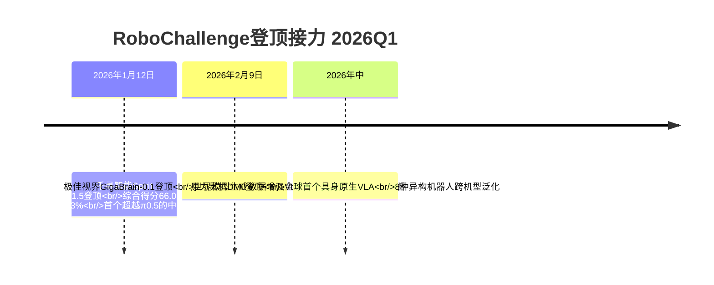

## 6.9 双系统与混合融合路线企业横向对比矩阵

基于6.2—6.8节对各代表企业的剖析，本节构建本章核心横向对比矩阵，从核心架构形态、系统协同机制、数据策略组合、动作生成机制、跨本体泛化能力、商业化场景落地、融资规模与估值七大维度展开系统化对照。

### 6.9.1 七维度横向对比矩阵

| 企业 | 核心架构形态 | 系统协同机制 | 数据策略组合 | 动作生成机制 | 跨本体泛化 | 商业化场景 | 融资/估值 |
|------|------------|-----------|-----------|-----------|---------|---------|---------|
| **Figure AI Helix 02** | 三层频率分层双系统（System 0/1/2） | 1kHz物理反射+200Hz运动+慢思考 | 1000小时人类数据+20万并行仿真 | 全身关节级命令端到端神经网络 | 同一神经网络全身统一控制；场景切换仅靠数据 | 宝马汽车装配（3万辆X3）+客厅清洁 | C轮10亿美元；估值390亿美元 |
| **银河通用AstraBrain** | 大脑-小脑-神经控制端到端一体融合 | 网络内部参数共享（非频率分层） | 仿真合成为主+真机微调（百亿级合成数据） | DexNDM神经动力学+GraspVLA端到端 | NavFoM全域环视跨本体导航；GroceryVLA 99%合成1%真实 | 春晚+全家便利店+24小时智慧药房+宁德/丰田/上汽工业 | 25亿元（国家大基金三期首投）；累计69.6亿元；估值超210亿元 |
| **星海图G0+Fast-WAM** | 快慢双系统VLA+世界模型同源共生+底层DP3 | "通用具身智能大脑"双轨耦合 | 真实场景为主+UMI/POV无本体数据；GOD全球60万+下载 | DP3+DiT扩散+G0 VLA | R1硬件成为PI、斯坦福、英伟达检验基座；服务150+开发者 | 轮式双臂全球市占率第一+亦庄半马补给+生产力千台级 | B+轮20亿元；估值200亿元；累计近50亿元 |
| **千寻智能Spirit v1.5** | VLA+多样性脏数据预训练 | Qwen3-VL-4B-Instruct视觉语言主干+DiT扩散动作头 | 互联网视频+遥操作+可穿戴；20万小时→100万小时 | DiT扩散动作头 | 待验证 | 京东MALL咖啡机器人+宁德时代电池产线"小墨" | 30天30亿元（雷军/马云联手）；累计33.28亿元；估值破百亿 |
| **智平方FiS-VLA** | 异构输入+异步频率双系统VLA（业内首个） | 117.7Hz系统1+低频系统2；不同模态分辨率 | 仿真+真实+异构数据协同 | 内部表示+异步频率 | 跨场景适配 | 惠科3年1000台+智魔方服务空间+1000个文商旅落地规划 | 一年12轮；B轮超10亿元；估值破百亿 |
| **PI π0.5** | 分层推理链+中间指令透明化 | 感知层Bounding Box→规划层Subtask→执行层Action Expert | 多机器人异构数据+网络数据co-training | FAST离散Token+Flow Matching连续动作流 | 给银河通用、星海图等本体厂提供模型 | 不做整机；私人家庭10-15分钟开放泛化 | 累计超20亿美元；估值110亿美元 |
| **英伟达GR00T N1/N1.5** | VLM 10Hz+DiT 120Hz双系统（开源标准） | Eagle-2/2.5慢思考+DiT快反应；动作流匹配 | 数据金字塔三层（真机+合成+人类视频）；DexMimicGen+GR00T-Dreams | DiT扩散动作流 | 跨本体开源底座；适配Apptronik/BD/傅利叶/Figure等 | 平台型，赋能全球生态；DRIVE Hyperion辐射汽车 | 上市公司，无独立融资 |
| **极佳视界GigaBrain-0.1** | 世界模型生成数据增强VLA+RGBD建模+具身CoT | 世界模型反哺VLA数据飞轮 | 世界模型合成数据+真机训练 | RGBD输入+具身思维链监督 | 长时域多任务推理 | 早期阶段 | A轮3个月4轮累计5亿元 |
| **原力灵机DM0** | 全球首个具身原生VLA+空间推理思维链 | 多任务跨机型预训练；具身空间支架 | 多源数据预训练（操作+导航+全身控制） | 跨8种机器人构型泛化 | 行业最强（UR/Franka等8种异构本体） | 早期阶段 | A+A+轮约10亿元 |
| **自变量WALL-B（参照）** | 世界统一模型WUM单一网络融合 | 视觉/语言/动作/物理预测同一网络联合训练 | 真实数据为主（58到家家庭清洁） | 原生本体感+物理世界感知 | 内生空间感知 | 35天后入驻首批家庭 | B轮近20亿元；累计超40亿元；估值超100亿元 |

资料来源：综合整理自正文剖析及

### 6.9.2 四象限差异化定位

将本章代表企业置于"硬件/软件主导×双系统/融合架构"两维坐标系中，可以识别出四种差异化定位象限：

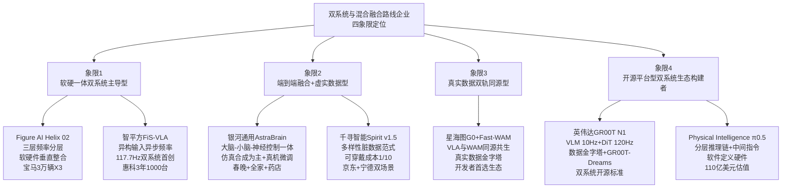

**象限1"软硬一体双系统主导型"**——以Figure AI、智平方为代表，强调通过软硬件垂直整合构建双系统架构的工程闭环，工程指标（频率比、控制频率）领先但需面对"完全自主可证伪性"挑战。**象限2"端到端融合+虚实数据型"**——以银河通用、千寻智能为代表，通过端到端一体融合架构与差异化数据范式（仿真合成或多样性脏数据）破解数据稀缺瓶颈，商业化场景跨度更广。**象限3"真实数据双轨同源型"**——以星海图为代表，通过VLA与世界模型同源共生设计与真实数据金字塔构筑生态级数据基础设施。**象限4"开源平台型双系统生态构建者"**——以英伟达、PI为代表，通过开源模型或软件定义硬件模式，将双系统范式输出为整个行业的"参考实现"。

### 6.9.3 共性优势归纳

混合融合路线在本章对比中呈现出清晰的三方面共性优势：

**第一，数据来源多元化**。从Figure的"1000小时人类数据+20万并行仿真"、银河通用的"99%合成数据+<1%真实数据"，到星海图的"真实场景金字塔+UMI/POV无本体数据"、千寻智能的"互联网视频+遥操作+可穿戴"、英伟达的"数据金字塔三层"，混合架构企业普遍打破了纯真机数据或纯仿真数据的单一依赖，通过异构数据组合大幅降低了数据获取成本。**典型量化指标——千寻智能数据采集成本降至传统1/10、银河通用真机训练效率比特斯拉高1000倍**——共同构成了对第3章VLA派"真机数据稀缺"瓶颈的工程化破解。

**第二，跨本体能力提升**。原力灵机DM0覆盖8种异构机器人硬件、银河通用NavFoM全域环视跨本体导航、英伟达GR00T N1作为开源底座适配Apptronik/BD/傅利叶/Figure等多家本体——这些案例共同印证了混合架构在跨本体泛化上相对单一路线的工程优势。

**第三，长程任务可靠性增强**。Figure Helix 02的4分钟61连续动作、PI π0.5的私人家庭10—15分钟开放世界泛化、银河通用GraspVLA的七大泛化金标准、智平方FiS-VLA超越π0达30%——这些工程指标的密集突破，标志着混合架构在长程任务可靠性上已经达到相对单一路线显著领先的水平。

## 6.10 混合融合路线的商业化可持续性与对未来路线收敛的启示

基于本章对全球近10家代表企业的深度剖析与横向对比，本节系统研判混合融合路线在2025—2026年量产元年的商业化可持续性，并引出向第7章平台型生态构建者路线的过渡。

### 6.10.1 工程协同复杂度作为核心挑战

混合融合路线在工程层面的核心挑战是**协同复杂度的指数级上升**。**双系统的异构输入设计**（智平方FiS-VLA系统2接收语言指令与全局视觉、系统1接收高频本体状态与近距视觉）、**跨层接口对齐**（PI π0.5"感知层Bounding Box→规划层Subtask Labels→执行层Action Expert"的严密思维链对齐）、**世界模型与VLA融合训练**（星海图G0+Fast-WAM同源共生、极佳视界GigaBrain-0.1世界模型生成数据增强VLA），均对工程能力提出了远超单一路线的极致要求。

第2章2.4节聆动通用CEO季超对此挑战曾有精到说明——"完全端到端"一度被视为最具想象力的方向，但当机器人走出实验室、进入真实产线时，问题开始集中暴露——真实环境远比实验室复杂，光线变化、地面杂物、非标操作等每一个细节都可能让机器人"失灵"。混合架构通过分层、双系统、世界模型加持等组织方式分担了纯端到端的复杂度，但同时也将"系统级整合能力"提升为头部企业必须具备的核心壁垒。**这一壁垒的形成意味着：未来能够在混合融合路线中持续领先的企业，必须同时具备AI算法、机器人控制、硬件量产三方面的复合工程能力**——这正是Figure AI、银河通用、星海图、千寻智能等头部企业的共同特征。

### 6.10.2 数据策略组合带来的飞轮效应

混合融合路线最具产业意义的产业贡献在于——**通过差异化数据策略组合，对"数据稀缺"瓶颈实现了多元破解**：

| 数据策略 | 代表企业 | 关键量化突破 | 路线启示 |
|---------|---------|------------|---------|
| **可穿戴+多样性脏数据** | 千寻智能 | 数据成本降至1/10；20万小时→100万小时 | "任务多样性比演示数量更关键" |
| **百亿级仿真数据基建** | 银河通用 | 真机训练效率比特斯拉高1000倍；99%合成+1%真实 | "虚拟筑基+现实纠偏"路径可行 |
| **百万小时真实数据金字塔** | 星海图 | GOD全球下载60万次；2026构建全球最大真实数据集 | 真实数据派的生态卡位价值 |
| **数据金字塔三层异构融合** | 英伟达GR00T+Dreams | DexMimicGen少量演示扩展生成大规模数据 | 世界模型反哺训练飞轮 |
| **大规模仿真+真实数据混合** | Figure AI | 1000小时人类数据+20万并行仿真环境 | 仿真到现实的"补充数据切换场景" |

资料来源：综合整理自正文剖析

这些数据策略组合所形成的飞轮效应，正是混合融合路线相对单一路线的最大差异化优势——**它不再纠结于"真机vs仿真"的单一选择，而是根据场景、任务、阶段的不同需求，灵活组合三类数据来源**。这种灵活性与组合性，恰恰是2026年中国信通院发布行业首个具身智能行业标准、京东宣布构建全球最大数据采集中心（计划两年内积累1000万小时高质量数据）等产业基础设施加速建设的工程基础。

### 6.10.3 场景落地差异化研判

混合融合路线企业在场景落地上呈现明显差异化：

- **Figure AI专注汽车装配**——宝马斯帕坦堡工厂6个月3万辆X3生产，专注高价值工业场景，对单一客户深度绑定换取场景天花板的稳定性。
- **银河通用零售商超+药店+工业全覆盖**——春晚、全家便利店、24小时智慧药房、宁德时代/丰田/上汽工业产线"两条相辅相成的路径"，体现了端到端融合架构的场景泛化能力。
- **星海图开发者首选+生产力标杆双轨**——服务150+开发者伙伴的"卖铲人"角色，叠加千台级生产力订单的"自营场景"，构建生态级护城河。
- **千寻智能工业产线+京东咖啡机器人双场景**——通过宁德时代"小墨"机器人验证工业稳定性、通过京东MALL咖啡机器人验证零售泛化性，"以用代研"飞轮闭环运转。
- **智平方工业+服务双轮**——惠科3年1000台订单+智魔方服务空间，"中国版特斯拉机器人"定位向多元化场景扩张。

这一差异化场景布局也回应了第10章关于"工业、家庭、极端环境、AI Agent具身化"四大场景终局可能性的预研判——**混合融合路线正在通过多场景并行落地，验证不同架构在不同场景下的相对优劣**：双系统主导型在工业产线（汽车、电池）等高节拍场景表现突出；端到端融合型在零售商超、家庭服务等高泛化需求场景具有优势；真实数据双轨同源型则在开发者生态与跨场景适配上构筑独特护城河。

### 6.10.4 向混合架构收敛已成事实

回顾本研究第3章VLA派的"信任危机"、第4章世界模型派的"毫米级偏差"、第5章硬件派的"AI智能化补课"，可以清晰看到——**任何单一路线在2025—2026年都无法独立支撑通用具身智能的工程化落地**。本章对Figure AI、银河通用、星海图、千寻智能、智平方、PI、英伟达等代表企业的剖析共同验证了一个产业事实：**"向混合架构收敛"已不再是理论预测，而是头部企业的实际工程选择**。

这种收敛的具体表现可归纳为四个层面：

| 收敛层面 | 工程实践 | 代表案例 |
|---------|---------|---------|
| **VLA融入双系统** | VLA作为系统2的语义层，配合系统1高频动作生成 | 智平方FiS-VLA、PI π0.5、英伟达GR00T N1 |
| **世界模型加持VLA** | 世界模型作为预测器或合成数据生成器 | 极佳视界GigaBrain-0.1、星海图G0+Fast-WAM、银河通用GraspVLA+AstraSynth |
| **多类Action Token协同** | FAST Token+Flow Matching+DiT扩散+离散动作Token共存 | π0.5、Spirit v1.5、智元GO-1 Latent Action |
| **底层模仿学习+上层认知** | DP3/Diffusion Policy/ACT作为底层动作策略 | 星海图（DP3+G0+Fast-WAM）、千寻智能（DiT+VLA） |

资料来源：综合整理自正文剖析及第2章2.6—2.9节

值得指出的是，**混合架构收敛并不意味着路线之争的终结**——Pete Florence的"VLM拐杖论"、王兴兴的"世界模型天花板更高"判断、自变量WALL-B的WUM架构跃迁、原力灵机DM0的"具身原生VLA"路线，都在尝试通过更彻底的范式革命突破当前混合架构的边界。**这些激进派的存在与混合派的主流共存，构成了2026—2027年具身智能技术演进的核心张力**——本研究将在第10章对"路线收敛是终态还是过渡态"的开放性命题作进一步研判。

### 6.10.5 向第7章平台型生态构建者的过渡

混合融合路线的工程化落地，使得**双系统协同机制、数据金字塔基础设施、跨本体适配能力**等"生态级基础设施"成为头部企业的核心护城河。这一现象的产业终极指向是——**真正能够在混合融合路线中构筑长期竞争优势的，不是单一企业的算法或硬件领先，而是跨企业、跨本体、跨场景的生态级基础设施供应能力**。

英伟达通过Cosmos+GR00T+Thor芯片构建了"训练超算+仿真平台+世界基础模型+机器人基础模型+边缘部署芯片"的完整堆栈，并通过DRIVE Hyperion将这一堆栈辐射至自动驾驶领域；华为通过盘古大模型+WEWA+CloudRobo战略构建了"云端教培+车端/机端部署"闭环；Google DeepMind通过Gemini Robotics系列+Apptronik/BD/Agile Robots合作输出"AI模型供应商"角色；星海图的R1硬件成为"PI、斯坦福、英伟达等全球顶尖开发者的检验基座"；甚至中国互联网巨头小米、比亚迪也通过战略投资（自变量、智元、章鱼动力等）与生态合作（与英伟达Hyperion平台合作）卡位生态构建者位置——这些迹象共同指向一个产业判断：**具身智能产业的终局竞争，不仅是模型与本体的竞争，更是生态级基础设施的竞争**。

下一章将沿同样的五维分析框架，进入这一生态级竞争的代表企业群落——第7章"平台型与生态构建者路线"将系统剖析英伟达Cosmos+GR00T+Isaac+Thor全栈、Google DeepMind RT/Gemini Robotics基础模型、华为盘古+昇腾云全栈、小米/比亚迪等大厂跨界生态布局，分析这些"卖铲人"如何在混合融合路线基础上构建跨企业、跨本体、跨场景的生态级护城河，并最终为整个具身智能产业的价值链分配格局提供完整的研判依据。

至此，本章已完成全球近10家双系统与混合融合路线代表企业的深度剖析、横向对比与商业化可持续性研判。**混合融合路线作为对前三章独立路线瓶颈的工程化回应，已在2025—2026年间从理论预测走向产业主流，但其工程协同复杂度、生态卡位竞争、跨场景规模化能力等深层挑战，仍将在未来3—5年持续重塑全球具身智能产业的竞争格局**——这一判断将作为后续第7章平台型生态、第8章企业横向对比矩阵、第9章融资格局与团队特征、第10章未来趋势研判的共同认知前提。

# 7 平台型与生态构建者路线分析

第3章至第6章已系统剖析了端到端VLA、世界模型/WAM、硬件驱动与分层架构、双系统与混合融合四大路线的代表企业，并在第6章末尾揭示出一个产业终极指向——**真正能够在混合融合路线中构筑长期竞争优势的，不是单一企业的算法或硬件领先，而是跨企业、跨本体、跨场景的生态级基础设施供应能力**。这一判断将本研究的视角从"做整机的企业"自然延伸至**"不直接生产整机本体、而以基础设施和生态资源为核心壁垒的卖铲人阵营"**——它们既是前几章企业的赋能者，又是产业链价值分配格局的隐性主导者。

本章作为五大技术路线企业剖析的收官章节，将沿用全书统一的五维分析框架（技术路径—产品进度—商业化进度—融资情况—团队情况），并在此基础上补充**"生态卡位维度"**（仿真数据、算力芯片、基础模型、场景资源四个子维度）作为特殊评估视角。围绕"卖铲人如何构筑跨企业、跨本体、跨场景的生态护城河；不同卖铲人路径的价值捕获能力差异；平台型企业对整个具身智能产业链价值分配格局的深层影响"三个核心问题，本章将依次剖析英伟达、华为、Google DeepMind三大全栈平台型企业，以及小米、比亚迪两家以战略投资+场景资源切入的大厂跨界生态构建者。值得强调的是，由于英伟达、华为、Google DeepMind的核心技术细节已分别在第3—6章作系统剖析，本章不再重复，而是聚焦其在生态卡位与价值捕获层面的整体视角；小米、比亚迪则作为本研究首次系统剖析的代表企业，按照五维框架展开完整分析。

## 7.1 平台型与生态构建者路线企业谱系与卖铲人模式总览

在进入企业逐一剖析前，必须先厘清平台型企业的本质内涵、代表企业谱系与生态卡位维度三个前置问题。

**平台型企业的本质内涵**可界定为：**不直接以生产整机本体为核心商业模式，而以基础设施（算力芯片、仿真平台、基础模型）或生态资源（投资布局、场景渠道、产业链整合）为核心壁垒，通过赋能整机厂商捕获价值的企业群落**。其与第3—6章剖析的整机派代表企业（Figure AI、智元、宇树、银河通用等）形成清晰区分——后者的核心资产是"软件智能+硬件本体"的产品组合，前者的核心资产则是"基础设施+生态网络"的赋能能力。这一区分并非绝对，例如英伟达虽不做整机但参与硬件芯片销售、小米CyberOne虽自研整机但更多依托投资生态体现价值，因此本章对每家企业的"卖铲人属性强弱"将作差异化定性评估。

基于这一界定，结合企业实际业务重心与产业生态地位，本研究将平台型与生态构建者路线代表企业划分为**两大阵营、五家代表**：

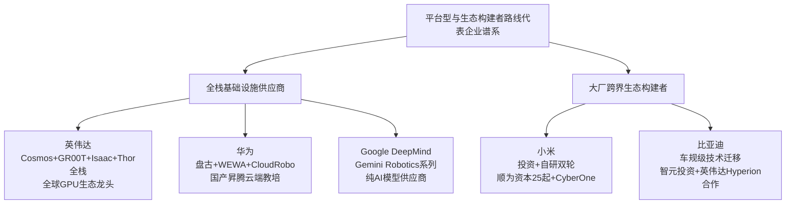

需要预先对若干**归类边界**与**章节定位**作出说明。第一，**英伟达的Cosmos世界基础模型已在第4章4.2节、GR00T N1双系统已在第6章6.7节作过技术侧深度剖析**，本章不再重复模型架构细节，而是聚焦其作为全栈生态构建者的整体视角；第二，**华为的盘古世界模型与WEWA双架构已在第4章4.3节作过完整剖析**，本章重点补充CloudRobo战略与昇腾APN伙伴生态等卖铲人路径细节；第三，**Google DeepMind的Gemini Robotics基础模型已在第3章3.2节作为VLA代表完整剖析**，本章重点补充其作为"纯AI模型供应商"的差异化生态卡位；第四，**小米与比亚迪作为本研究首次系统剖析的代表企业**，将按照完整五维框架展开分析。

在五维分析框架的延续上，平台型路线相比前几章整机派路线需要补充**"生态卡位维度"**作为特殊评估视角，包含四个子维度：

| 生态卡位子维度 | 核心内涵 | 关键评估指标 |
|------------|---------|---------|
| **仿真数据** | 是否提供大规模物理仿真平台与合成数据生成能力 | 仿真平台覆盖场景数、合成数据生成效率、数据格式开放性 |
| **算力芯片** | 是否提供训练超算与边缘部署芯片的全栈能力 | 训练芯片性能、边缘芯片功耗、CUDA/昇腾等软件栈成熟度 |
| **基础模型** | 是否提供可被多个本体厂商调用的具身基础模型 | 开源/闭源策略、跨本体适配能力、合作伙伴渗透度 |
| **场景资源** | 是否拥有大规模真实场景与渠道用于本体厂商验证落地 | 自有产线、零售渠道、汽车工厂等可调用资源规模 |

这四个生态子维度，将贯穿7.2—7.6节的企业逐一剖析与7.7节的横向对比矩阵，构成本章相对前几章的差异化分析坐标系。

**卖铲人模式对产业链价值分配格局的影响逻辑**。从产业链视角观察，具身智能产业的价值链可初步划分为"底层算力—中层模型—上层本体—终端场景"四层。**平台型企业的卡位策略，本质是在这四层价值链中选择最具杠杆效应的环节深度卡位**——英伟达卡位"底层算力+中层模型+仿真数据"三层、华为卡位"底层算力+中层模型+部分场景"三层、Google DeepMind专注"中层模型"单层、小米与比亚迪则更偏"终端场景+战略投资"组合。**这种差异化卡位的产业含义是**：当下游本体厂商陷入"高融资+高亏损"的内卷化竞争时（如第5章所述优必选、智元等净利率不足1.2%），平台型企业反而可以通过芯片销售、订阅服务、生态分成等方式实现稳定的价值捕获——这正是2025—2026年量产元年呈现的"上游赚钱、下游烧钱"的产业景象的本质成因。下文将按"全栈—云端—模型—跨界自研—跨界投资"五种差异化路径，依次剖析五家代表企业。

## 7.2 英伟达:Cosmos+GR00T+Isaac+Thor全栈物理AI生态

英伟达作为本轮具身智能浪潮中最受瞩目的"卖铲人"代表，其生态布局的根本特征已超越单一产品或技术维度——形成了**"训练超算+仿真平台+世界基础模型+机器人基础模型+边缘部署芯片"**的五层全栈堆栈，并通过CUDA生态20年累积优势构筑起跨企业、跨本体、跨场景的生态护城河。

**技术路径——五层全栈堆栈的协同闭环**。如第4章4.2节与第6章6.7节所述，英伟达的全栈能力可归纳如下：**第一层训练超算**——以DGX系统（搭载H100或B100处理器）和下一代Vera Rubin平台为代表，2026年GTC大会上发布的Vera Rubin Ultra"专为AI代理系统打造，能够在一个系统中连接多达144个GPU，并实现了硬件与软件的彻底垂直整合"，预期可"为企业带来高达5倍的营收产出比"[^30]，2027年下半年发布的Rubin Ultra延续"一年一代"的产品节奏[^70];**第二层仿真平台**——基于NVIDIA Isaac Sim/Lab构建的物理仿真环境，配合2025年10月华盛顿GTC大会与Google DeepMind和Disney Research合作开发的开源物理引擎Newton[^62];**第三层世界基础模型**——Cosmos平台包含Cosmos Predict、Cosmos Transfer、Cosmos Reason三个相互配合的子模型组件;**第四层机器人基础模型**——GR00T N1于2025年3月19日GTC大会开源、N1.5于6月升级、**N1.6于2026年1月CES大会发布**——黄仁勋在该大会上宣告"机器人领域已迎来'ChatGPT时刻'"[^62];**第五层边缘部署芯片**——基于Blackwell架构的Jetson Thor"集成下一代GPU可提供每秒800万亿次8位浮点运算AI性能"[^62]。

五层堆栈之间的协同价值集中体现在**CUDA生态20年累积优势**上。**时值CUDA生态诞生20周年，CUDA已在全球范围内累积了数亿GPU的装机量，并渗透进了每一个技术生态中**[^30]——这一装机量意味着任何选择英伟达堆栈的本体厂商都能获得开箱即用的开发者社区、工具链与算子优化支持。摩根大通在2026年3月12日发布的研报中将英伟达GTC大会的核心信号概括为"AI基建供应链的六大强劲指引"，其中第二条为"2026年Agentic AI的落地速度将快于市场预期"[^70]——这一判断在物理AI赛道转化为对Cosmos+GR00T的资源加码。

**产品进度——双系统范式的开源标准卡位**。如第6章6.7节所述，GR00T N1的"VLM慢思考10Hz+DiT快反应120Hz"双系统架构与"数据金字塔三层"训练范式已成为全球范围内的"参考实现",**2026年1月CES大会发布的最新视觉语言动作模型NVIDIA Isaac GR00T N1.6**[^62]进一步强化了这一开源标准的产业渗透。这种"开源标准卡位"的意义在于——头部本体企业不必从零研发双系统架构，而可直接基于GR00T N1快速落地双系统能力，从而事实上将英伟达的技术栈嵌入产业的事实标准。

**商业化进度——"开放生态+硬件销售"双轮驱动**。英伟达的商业化路径呈现出"芯片销售+模型生态+平台合作"三重价值捕获:

**第一,机器人侧合作伙伴生态**。**NVIDIA已与Agility Robotics、波士顿动力公司、傅利叶智能等企业合作开发综合AI平台**[^62],GR00T N1作为机器人基础模型的"开源底座"输出至Apptronik、Boston Dynamics、Agility、傅利叶、Figure等头部本体企业。这种"一份模型赋能万台机器"的杠杆效应,使英伟达在不直接做整机的情况下深度参与了所有头部本体企业的产品演进。

**第二,自动驾驶侧Hyperion平台辐射**。2026年3月16日GTC开发者大会上,**黄仁勋当场官宣:比亚迪、吉利、日产等车企正式加入英伟达DRIVE Hyperion自动驾驶生态**[^61]。**最新的Hyperion 10版本搭载两颗NVIDIA DRIVE AGX Thor芯片,算力达到2000 FP4 TFLOPS——这个数字相当于目前特斯拉FSD芯片算力的14倍**[^48]。除了硬件平台,英伟达还向比亚迪、吉利等合作伙伴开放了Alpamayo 1.5开源模型——"该模型类似人类司机的逻辑推理能力,简单说,让AI开车更像人类司机"[^48]。这一从"芯片采购客户"到"全栈平台合作"的关系跃迁,使英伟达从单纯的硬件供应商升级为具身智能与自动驾驶产业的"操作系统供应商"[^61]。

**第三,生态合作伙伴在中国市场的深度落地**。光轮智能通过深度融合GR00T-Dreams工作流构建合成数据生成平台、协创数据的具身智能服务平台Omnibot深度整合Isaac Sim/Lab/Omniverse/GR00T/Cosmos技术栈、银河通用Galbot G1已应用Jetson AGX Thor芯片、宇树G1 EDU版本配备NVIDIA Jetson Orin计算平台(最高275 TOPS AI算力)——这些案例共同构成了英伟达在中国具身智能生态中的深度渗透网络。

**融资情况**层面,作为美股上市公司,英伟达不参与独立融资活动。但黄仁勋在2026年GTC大会上为AI基础设施未来需求定下了明确基调——**到2027年,全球计算需求将突破1万亿美元大关**[^30],这一判断为其全栈生态战略提供了宏观市场背书。

**团队情况**层面,机器人业务由黄仁勋亲自领衔战略,研究侧由Jim Fan等人主导前沿叙事。Jim Fan在2026年2月初公开宣称"2025年具身智能行业由VLA模型主导,但2026年将成为世界模型首次为机器人领域典型基础的一年"——这一论断在英伟达内部转化为对Cosmos世界基础模型与GR00T-Dreams的资源加码。**黄仁勋在2026年GTC演讲中抛出了一个极其宏大的产业愿景:单纯的数字生成时代正在走向深化,我们正在迎来物理AI的大爆炸以及代理式AI的全面普及**[^30]——这一战略宣言成为英伟达全栈卖铲人路径的终极注脚。

**英伟达卖铲人模式的价值捕获能力评估**。基于上述剖析,英伟达通过芯片销售、模型生态、平台合作三重路径,实质性地锁定了具身智能与自动驾驶两大赛道的基础设施层价值。**最关键的产业含义在于——头部整机厂商之间的"VLA派vs世界模型派vs硬件派"路线之争,在底层都依赖英伟达的GPU+CUDA+Isaac+Cosmos+GR00T堆栈**——这意味着无论哪条路线最终胜出,英伟达都是确定的赢家。这种"路线无关、必赢一票"的产业地位,是其他平台型企业难以企及的护城河。

## 7.3 华为:盘古大模型+WEWA+CloudRobo云端教培范式

如果说英伟达代表了"全球GPU生态卖铲人"路径,华为则代表了**国产昇腾闭环下的另一种卖铲人范式——"云端教培+全栈替代方案"**。在中美科技博弈的宏观背景下,华为的卖铲人路径具有独特的战略意义——它既是对英伟达全栈堆栈的"国产替代",也是对中国本土具身智能产业生态的"基础设施供应"。

**技术路径——盘古5.5+WEWA+CloudRobo三层闭环**。华为的全栈卖铲人能力可归纳为"算力底座+大模型能力+具身平台"三层闭环。**第一层基于昇腾云的全栈软硬件训练而成**——盘古大模型是基于昇腾云全栈软硬件训练而成的,这标志着基于昇腾架构可以打造出世界一流大模型[^63]。**第二层盘古大模型5.5的多模态能力**——2025年6月20日华为开发者大会2025上发布的盘古5.5,NLP大模型采用718B参数的MoE混合专家架构、支持自适应快慢思考融合技术、推理效率提升8倍;CV大模型基于300亿参数MoE架构(目前业界最大的视觉模型);多模态大模型构建智能驾驶数字物理空间生成训练数据降低路采成本[^63]。**第三层CloudRobo具身智能平台**——在2025年6月20日的华为开发者大会2025(HDC 2025)上,华为常务董事、华为云计算CEO张平安发布了CloudRobo具身智能平台。**他强调,华为云不做机器人本体,把机器人本体交给伙伴。华为云的目标是让一切联网的本体都成为具身智能机器人**[^48]。**该平台基于盘古大模型的多模态能力及思维能力,整合了数据合成、数据标注、模型开发、仿真验证、云边协同部署以及安全监管等端到端能力,能提供具身多模态生成大模型、具身规划大模型、具身执行大模型三大核心模型,加速具身智能创新**[^48]。

**CloudRobo战略的卡位逻辑**最值得深度剖析。华为的产业洞察是:**当前"大小脑"智能水平不足是制约人形机器人产业化的核心瓶颈,背后本质是数据缺乏和模型性能不够用共同作用的结果**[^26]。机器人企业若自建万卡集群成本过于高昂,转向云服务训练机器人明显更为经济划算——**相比建设万卡集群"百亿元"的成本投入(其中单是GPU采购成本就高达几十亿元),使用云服务厂商的算力资源赋能明显是个更为经济划算的选择**[^26]。基于这一判断,华为云依托"算力+算法"的优势,**其CloudRobo战略只有Robo没有t,华为要做机器人的"教培",把机器人的"具身"让给产业伙伴,有望成为机器人行业中的核心"卖铲人"**[^26]。这一定位与英伟达"开源GR00T+硬件芯片"的卖铲人路径形成清晰对照——华为更偏"云端服务+行业Know-how"模式,英伟达更偏"开源标准+硬件渗透"模式。

**产品进度——智驾量产先行,具身智能后追**。华为卖铲人能力的产品化进度呈现"智驾先行+具身后追"的双线节奏。智驾侧,**2025年5月30日鸿蒙智行尊界S800成为首款搭载ADS 4的量产车型**,岚图FREE、东风猛士M817等车型随后陆续搭载,WEWA双架构(云端世界引擎+车端世界行为模型)实现了端到端时延降低50%、通行效率提升20%、重刹率减少30%。具身智能侧,**华为(深圳)全球具身智能产业创新中心于2024年11月15日成立,并与乐聚机器人、大族机器人、拓斯达、中坚科技、兆威机电等16家企业签署战略合作备忘录**[^67]。盘古多模态大模型的能力跨度颇具示范性——**在火星探测领域,盘古世界模型能够基于单张火星地表图片,生成高精度的数字物理空间,用于火星车的避障训练;在智能驾驶领域,输入首帧的行车场景、行车控制信息和路网数据,该模型可以生成每路摄像头的行车视频和激光雷达的点云数据,为智能驾驶模型提供大量的低成本训练数据**[^62]。

**商业化进度——三层渗透路径**。华为CloudRobo模式的商业渗透可归纳为三层逻辑:

**第一层智能驾驶量产**。HUAWEI ADS 4系统已通过尊界S800、岚图FREE、东风猛士M817等量产车型完成第一波智驾商业闭环验证;盘古大模型5.5整体已**应用于30多个行业500余场景,覆盖政务、金融、制造、医疗、气象、能源等领域**[^63]。

**第二层具身智能产业生态**。**华为全资子公司东莞极目机器有限公司近期完成了一轮新的资本注入,注册资本由38.9亿元提升至46.891亿元,增幅高达20.54%。这已是该公司在过去一年内进行的第二次大规模增资,早在2024年12月3日,其注册资本曾从8.7亿元跃升至38.9亿元,增幅达347.13%**[^44]。东莞极目成立于2023年6月,法定代表人为华为的常务董事及制造部总裁李建国,**公司定位为人形机器人资源整合平台,核心聚焦机器视觉、自然语言处理及智能制造等关键技术,旨在为人工智能(AI)应用与智能制造提供综合解决方案**[^44]。**依托华为的技术积累与资源支持,东莞极目发展迅速,成立仅一个月便在东莞塘厦斩获近60万平方米的产业园用地,规划建筑面积约204万平方米,总投资达到72亿元**[^44]。这种"资本快速注入+产业园用地落地"的双重投入,体现了华为对具身智能基础设施供应商角色的长期战略承诺。

**第三层昇腾APN伙伴生态**。**2026年3月27日在南京举办的2026计算部件伙伴大会上,昇腾携手APN伙伴(Ascend Partner Network),围绕"智能终端&边缘"、"龙虾盛宴"和"具身智能"三大前沿方向开展三场主题研讨会**[^73]。在具身智能主题研讨会上,**北京奥思维科技有限公司具身智能业务拓展总监杨怀宇提出"当前行业对具身智能的发展方向已形成共识,但一个鲜明的现实是,尚未有任何场景真正跑通完整的商业闭环"**[^73]。这一基于产业共识的研判,反映了华为生态合作伙伴对具身智能商业化阶段的清醒认知,也强化了"卖铲人"角色在产业培育期的关键价值。

更具产业意义的是华为生态对中国大模型与硬件协同的赋能——**DeepSeek V4大模型正式官宣完成与华为昇腾生态全方位深度适配**[^32],**中控信息与华为已由商业伙伴关系升级为开源鸿蒙技术联创关系,双方作为开源鸿蒙项目群A类捐赠人**[^46]。这种"国产大模型+国产算力+鸿蒙生态"的三层闭环,为中国本土具身智能厂商提供了避开海外GPU与CUDA生态依赖的另一条工程路径。

**融资情况**层面,作为非上市的大型企业,华为不参与公开融资活动,其在卖铲人赛道的资源来自集团整体研发预算。**团队情况**层面,盘古大模型5.5由华为云CEO张平安发布,WEWA智驾架构由华为智能汽车解决方案BU CEO靳玉志领衔,东莞极目机器由华为常务董事兼制造部总裁李建国担任法定代表人——这种"云、车、机、制造"多业务线总裁级高管的密集投入,体现了华为对卖铲人生态的战略级重视。

**华为卖铲人模式的差异化价值评估**。基于上述剖析,华为"云端教培+全栈替代方案"模式相对英伟达"全栈芯片+开源模型"路径的差异化价值集中体现在三方面:**第一,国产算力底座替代价值**——昇腾架构+盘古大模型+鸿蒙生态构成的国产化闭环,在中美科技博弈背景下具有战略意义;**第二,行业Know-how整合优势**——盘古5.5覆盖30+行业500+场景的能力底座,使华为在垂直行业落地具身智能时具备显著的Know-how积累;**第三,云服务订阅模式**——CloudRobo"教培"模式的本质是"按需付费的算力与模型服务",相比英伟达"芯片销售+CUDA许可"的产品销售模式,具有更强的客户粘性与持续收入特征。但需指出的是,华为相对英伟达的核心短板在于**全球生态广度**——CUDA 20年累积的开发者社区与全球GPU装机量,是华为短期内难以复制的护城河。

## 7.4 Google DeepMind:Gemini Robotics基础模型供应商范式

如果说英伟达卡位"芯片+模型+仿真"三层、华为卡位"云端+模型+部分场景"三层,Google DeepMind则代表了**最纯粹的"中层模型"卡位路径——专注于AI模型供应商,不涉足芯片硬件,依托Alphabet的全球AI研究优势构筑模型护城河**。

**技术路径——Gemini Robotics基础模型的代际跃迁**。如第3章3.2节所述,Gemini Robotics系列的核心技术演进可归纳为"三次代际跃迁":2025年3月发布初代Gemini Robotics——基于Gemini 2.0多模态架构开发的视觉语言行动模型;2025年6月推出Gemini Robotics On-Device本地化机器人AI模型;2025年9月Gemini Robotics 1.5问世,采用ER模型和VLA模型协作架构。本节重点补充其在2025年下半年至2026年初的最新进展。

**Gemini Robotics 1.5"先思考再行动"机制的产业突破**。2025年9月25日,**谷歌DeepMind发布新一代多模态具身智能大模型Gemini Robotics 1.5及其扩展版本Gemini Robotics-ER 1.5,宣称这是全球首款专为具身推理优化的思考型模型**[^71]。**Gemini Robotics-ER 1.5是首个专门为具身推理优化的思考型多模态大模型,不仅能在物理环境中进行逻辑决策和高层规划,还在验证空间理解、任务规划、视觉问答等能力的15项学术和内部基准测试中取得了平均62.8分的最佳成绩,显著优于第二名的60.6分**[^71]。**传统的视觉语言行动模型通常只将指令直接转化为运动控制信号,而Gemini Robotics 1.5引入了"先思考再行动"的机制,能够生成内部推理过程,并用自然语言解释自己的思考步骤,从而在执行多步骤任务时更加透明、稳健和可靠。这种语义层面的"思考"可大幅提升机器人完成复杂任务的能力,在部分任务上实现了44%的分数提升,并将长程任务的失败率从44.5%降低到22%**[^71]。这种"中间指令透明化"的设计哲学,与第6章6.6节剖析的Physical Intelligence π0.5"分层推理链+中间指令透明化"形成跨企业的设计共识。

**跨硬件平台学习能力的产业意义**。Gemini Robotics 1.5最具杠杆效应的能力是其**跨硬件平台学习能力**——**可以将一种机器人学到的技能直接迁移到另一种机器人上,而无需针对每个新平台重新训练或微调。例如,在ALOHA 2机器人上学习的任务技能,能够直接在Apollo人形机器人或Franka双臂机器人上执行**[^71]。**DeepMind认为,这项技术可大幅缩短新机器人的技能学习周期,为构建通用的机器人大模型奠定重要基础**[^71]。这种跨本体适配能力,正是平台型企业相对单一整机派的核心差异化优势——**一份模型赋能多种本体**,使Google DeepMind在不卖硬件的情况下深度渗透了所有合作硬件平台。

**Gemini Robotics-ER 1.6的最新升级**则进一步强化了模型层的卡位价值。"刚刚,Google DeepMind发布了最新的机器人推理模型——Gemini Robotics-ER 1.6"[^61],其升级亮点包括:**仪表识别成功率从ER 1.5的23%提升至ER 1.6的93%**[^61](结合Pointing定位指针刻度和代码计算比例);**Pointing基本功的精度突破**——给一张工具图能精准识别"锤子2把、剪刀1把、画笔1支、钳子6把,一个不差"且对图里没有的东西"知道不去指"[^61];**多视角推理的成功检测能力**——"机器人通常有多个摄像头,头顶一个、手腕一个,系统需要把这些视角合并成一个连贯的判断"[^61]。**搭载它的波士顿动力机器狗Spot,现在能走到工厂里的压力表前,停下来,读出数字。精确到刻度以下**[^61]。

**虚拟机器人世界范式的独特价值**。Google DeepMind的另一项重要平台型贡献是其虚拟机器人世界研究范式。**Google DeepMind的研究团队找到了一个巧妙的解决方案:他们创造了一个虚拟的"平行宇宙",在这里可以安全地测试机器人的各种行为,就像在电影《黑客帝国》中的虚拟现实一样逼真。这个虚拟世界的核心是一个名为Veo的视频生成模型**[^75]。研究团队的创新之处在于,**他们不仅让这个虚拟世界能够准确模拟正常情况下机器人的表现,还能够创造出各种"假设情境"。比如,他们可以通过图像编辑技术,在原本只有苹果的桌子上"添加"一把剪刀,然后让虚拟机器人去执行"关闭笔记本电脑"的任务,观察它是否会智能地先移开剪刀**[^75]。**整个研究最令人印象深刻的地方在于其预测的准确性——通过对比虚拟世界中的机器人表现和真实世界中的表现,发现两者之间存在着惊人的一致性。在超过1600次的真实世界验证中,虚拟测试能够准确预测出不同机器人政策的相对表现排名,相关性系数高达0.88**[^75]。这一"虚拟测试可预测真实世界排名"的实证,为整个具身智能行业的安全测试与模型评估提供了基础设施级的工具范式。

**商业化进度——AI模型供应商的杠杆效应**。Google DeepMind采取了与Figure AI、智元等"自做整机"路线截然不同的**"AI模型供应商"定位**——其商业化路径不依赖自有本体,而是通过生态合作触达终端硬件。Gemini Robotics已与Apptronik、Boston Dynamics等企业合作推进商业化落地,并适配Franka机械臂及Apollo人形机器人等多种硬件形态。最具产业意义的是2026年3月与德国工业机器人企业Agile Robots达成的战略研究合作——**旨在将Gemini Robotics模型集成到后者的工业系统中以提高自动化程度。Agile Robots成立于2018年,目前拥有超过2500名员工,已在全球部署了超过20000套机器人解决方案**。这一合作验证了Google "巨头生态派"模式的产业可行性——**通过为已有大规模硬件部署的合作伙伴提供AI模型升级,实现"一份模型赋能万台机器"的杠杆效应**。值得特别提及的是Boston Dynamics与Google DeepMind的合作背景——**九年前谷歌把波士顿动力卖掉,今年CES刚宣布重新合作,ER 1.6就是这次新开始的第一个正式成果**[^61]——这一合作的回归,标志着Google对具身智能赛道战略级重视。

**融资情况**层面,作为Alphabet下属研究机构,DeepMind无独立融资活动,其资源来自Google对AI赛道的整体研发投入。但需要指出的是,Google在2025—2026年内对Wayve亦签署了拟投资5亿美元的意向书,进一步扩展其在具身智能(含自动驾驶)赛道的布局——这一外部投资行为,使Google在"内部研究自研Gemini Robotics+外部生态投资Wayve"两条腿走路的卖铲人战略更加完整。**团队情况**层面,机器人技术高级总监Carolina Parada在与Agile Robots合作的声明中将该合作定位为"将AI影响力带入现实世界的重要步骤"。Google DeepMind在Gemini Robotics-ER 1.6技术博客中明确写道:"**机器人要真正有用,就必须不只是执行指令,而是要对物理世界进行推理**"[^61]——这一战略判断成为其平台型卖铲人路径的核心理念。

**Google DeepMind卖铲人模式的差异化价值评估**。相对英伟达"芯片+模型+仿真"全栈和华为"云端+模型+场景"组合,Google DeepMind的卡位策略最为聚焦——**专注于"中层模型"单一环节**。这种聚焦带来的优势是模型层的纯粹性与跨硬件适配的中立性——它可以同时赋能Apptronik、Boston Dynamics、Agile Robots等多家本体厂商,而不与任何一家形成排他性绑定。其挑战则是**价值捕获能力相对有限**——不卖硬件意味着错失芯片销售收入,不做云服务意味着错失订阅收入,主要价值捕获路径只能依托Alphabet整体AI生态的间接价值反哺(如搜索、广告、云等业务对AI能力的需求)。这种"高生态影响力+低直接变现"的特征,使Google DeepMind在卖铲人阵营中呈现出独特的"研究驱动+战略影响"定位。

## 7.5 小米:投资+自研双轮的跨界生态构建者

进入大厂跨界生态构建者阵营,小米以**"全产业链投资+CyberOne自研双轮"**的差异化路径,代表了消费电子巨头切入具身智能赛道的典型范式。

**技术路径——CyberOne四年蛰伏后的回归**。**消失4年之后,小米人形机器人重出江湖了**[^42]。**事情还要从2022年8月说起,当时小米抢先特斯拉高调发布CyberOne,一时之间风头无俩。但有意思的是,短暂的高光之后,CyberOne很快就在大众的视野中消失了**[^42]。**我记得大概是在2024年,当时有媒体朋友曾尝试做一篇关于小米机器人的报道,但在推进过程中,小米公关却明确表示,公司并不希望提及这项业务。也就是说,CyberOne消失的这四年,是被小米有意识地雪藏了**[^42]。

**2026年的回归则呈现出与四年前截然不同的务实姿态**。3月份,**雷军突然在微博上更新了两条视频:这一条是CyberOne(小米人形机器人)灵巧手的最新进展,展示其已经可以丝滑完成拧螺丝、捏羽毛等动作;另一条则是安装自攻螺钉的视频,展示其已经可以进厂打工了**[^42]。**雷军发微博称"(小米机器人)在汽车工厂压铸车间自攻螺母上件工站中连续自主运行3小时,安装成功率90.2%,同步满足76秒产线节拍"**[^76]。**在官方披露的视频中,CyberOne站在作业工位旁,从自动送钉设备中抓取自攻螺母,放置在自攻拧紧的定位工装上,如此反复,一干就是3个小时**[^42]。

但需要客观指出的是,**横向与Figure、Optimus对比来看,小米CyberOne所呈现出来,也更多是一种被限定好的能力:在标准化的空间里,面对固定的工位,完成一段被设计好的操作路径。既没有向Figure那样展示多任务切换,也还没有进入像Optimus那样面向规模化生产的阶段**[^42]。**小米CyberOne亦庄产线量产进展预计于2026年下半年公示**[^76]——这一节点预示着小米自研整机将在2026年下半年迎来关键的产能验证窗口。

**投资生态——25起投资、15家企业的全产业链布局**。小米卖铲人路径的核心价值并不在于CyberOne自研整机,而在于其全产业链投资布局所形成的生态卡位优势。**根据IT桔子数据显示,从2021年至今,雷军旗下小米集团和顺为资本在人形机器人领域共投资25起,涉15家企业,分布在整个人形机器人上下游,涵盖数据、模型、感知、执行、场景整个链条**[^42]。这一布局规模在大厂跨界生态构建者中居于前列。

具体投资案例从前几章的剖析中可见小米投资的密度与质量:**第一,领投自变量B轮**——4月20日,**自变量机器人宣布完成B轮融资,由小米战投与红杉中国联合领投**[^56],至此**自变量机器人成为国内目前公开披露的唯一一家同时获得字节跳动、美团、阿里巴巴、小米四家互联网大厂投资的具身智能企业**[^27]。**第二,与云锋基金联手领投千寻智能**——**2026年4月7日,千寻智能完成新一轮10亿元融资。本轮融资由顺为资本、云锋基金联合领投**——这一"雷军系顺为+马云系云锋"的罕见联手,被业内视为标志性事件。**第三,跟投章鱼动力种子轮**——**章鱼动力创始人都大龙领衔,成立仅两个月便完成近5000万美元首轮融资,吸引地平线、高瓴创投、小米战投等顶级机构强势入局**[^38]。**4月10日,章鱼动力官宣获得新加坡风投机构K3的战略投资,顺为、小米、高瓴、线性等老股东持续加注**[^38]。

更具产业意义的是,**小米作为投资方的战略价值,不仅体现在资金支持,更体现在"成熟的大模型研发能力与技术判断力,更关注长期技术壁垒的构建,而非短期回报"**[^26]。自变量CEO王潜对此评价"软硬件一体化能力是其中的重要竞争力之一。此外,资源投入并不必然转化为技术领先"[^26]——这一表态揭示了小米作为投资方的"技术鉴别能力溢价"价值。

**商业化进度——汽车工厂自有场景验证试验田**。除了投资生态,小米卖铲人路径的另一个差异化优势是**自有汽车工厂作为CyberOne整机能力验证试验田**。**小米则更进一步,将机器人导入汽车工厂场景**——CyberOne在汽车工厂压铸车间自攻螺母上件工站连续自主运行3小时,这一场景验证为小米后续将CyberOne进一步迁移至更复杂工业场景提供了实证基础。这种"自研+自用+自扩展"的内循环模式,是小米作为消费电子巨头跨界至具身智能的独特优势。

**融资情况**层面,作为港股上市公司,小米不参与独立融资活动,其在具身智能赛道的资源来自集团整体战略投入与顺为资本基金。**团队情况**层面,雷军作为集团创始人亲自推动CyberOne回归,2026年3月连发两条视频展示进展的密集宣发,体现了小米对具身智能赛道战略级重视。

**小米模式的差异化价值评估**。相对纯平台型企业(英伟达、华为、Google DeepMind),小米模式的差异化定位在于"投资先行+自研补课"双轮——**通过2021年起的全产业链投资,小米在数据、模型、感知、执行、场景整个链条建立了产业链早期布局优势;再通过CyberOne自研补齐整机能力短板,以汽车工厂等自有场景为试验田验证整机性能**。这种"生态构建者+产业链整合者"的复合定位,使小米在2026年下半年CyberOne量产进展公示窗口期具备了较强的弹性——若CyberOne能成功量产,小米将同时收获自研整机收益与生态投资回报;若CyberOne量产受挫,小米仍可通过投资组合(自变量、千寻智能等头部企业)分享行业增长红利。这种"双轮驱动+对冲风险"的特征,是大厂跨界生态构建者相对单线整机派的独特价值。

## 7.6 比亚迪:车规级技术迁移与产业链整合的跨界路径

如果说小米代表了消费电子巨头的跨界路径,比亚迪则代表了**全球最大新能源车企以"造车能力跨界迁移"切入具身智能的另一种范式**。这一范式的根本逻辑是:**车规级技术、新能源产业链、海量场景数据等核心壁垒,正成为人形机器人产业化的关键支撑**。

**技术路径——车规级技术迁移与产业链协同**。比亚迪卖铲人路径的核心逻辑是依托新能源车产业链向具身智能领域延伸。**比亚迪在2025年业绩中明确指出,公司持续聚焦具身智能领域,聚焦机器人技术与智能制造的前沿研究,依托完善的新能源产业链布局、领先的技术创新能力和丰富的场景应用经验,积极布局未来产业**[^75]。其技术迁移壁垒可归纳为四方面:

**第一,核心零部件自给率超90%**——这一数字在第3章已被证明是中国硬件派构筑成本护城河的关键支撑(宇树科技核心零部件自研率超90%、硬件成本仅为海外同类的1/5—1/10)。**比亚迪拥有从整车制造、三电系统到渠道覆盖的全产业链能力,核心零部件自给率超90%,这也意味着比亚迪有望以最快速度把L4方案转为量产车卖到全球**[^48]。这一产业链优势若迁移至具身智能,将构成相对其他跨界大厂的差异化竞争力。

**第二,电池技术与储能能力**。**储能业务成为业绩亮点之一,2025年比亚迪全年储能系统出货量突破60GWh,跃居全球第一**[^75]。**2025年,刀片电池迎来技术升级,推出第二代刀片电池及闪充技术,实现性能与体验的双重突破**[^75]——这种电池层面的技术储备,若应用于人形机器人续航这一行业共性瓶颈,具有显著价值。

**第三,智驾系统与海量行驶数据**。**其自研的"天神之眼"智驾系统累计装车已超256万辆,日均生成1.6亿公里行驶数据。海量的真实道路数据,正是训练自动驾驶算法最宝贵的"燃料"**[^48]。这一数据资产虽主要服务于智驾,但其规模化数据采集与处理能力可向具身智能赛道复用。

**第四,2025年460万辆销量与全球渠道**。**2025年,比亚迪全年销量达460万辆。其中纯电车型225万辆,以超60万辆的优势,首次在年度维度上超越特斯拉,登顶新能源汽车全球第一**[^48]。这一销量规模带来的全球渠道与品牌势能,为后续具身智能产品的全球化部署提供了基础设施。

**投资生态与战略合作——智元投资+英伟达Hyperion合作**。比亚迪卖铲人路径的两个标志性事件可清晰呈现其战略意图。

**第一,投资智元机器人**。**天眼查APP显示,近日,前华为"天才少年"稚晖君创业公司智元机器人(上海智元新创技术有限公司)发生工商变更,新增彭志辉(稚晖君)为董事,新增比亚迪等为股东,同时,公司注册资本由约4847万元增至约5097万元**[^28]。**目前,比亚迪持有智元机器人3.76%的股权,为该公司第7大股东**[^28]。**值得注意的是,这是比亚迪在人形机器人领域的首个公开投资项目**[^53]。**比亚迪的认缴出资额为191.497万**[^28]——这一相对较小的金额(约200万元)显示出比亚迪在初期采取"小钱试水"策略。**比亚迪本次投资智元机器人有着多重考虑——目前比亚迪对于人形机器人领域没有研究,成为股东之后,比亚迪可拿到智元机器人内部资料,有了这样的基础比亚迪才能够进一步判断该领域未来的走势。其次,智元机器人团队曾透露过远程A1在工厂打工的场景,例如可以应用于新能源汽车工厂装配底盘,并且该团队还透露过已经与国内头部汽车厂商进行密切合作。如今看来,这一汽车厂商大概率是比亚迪**[^54]。**最后,200万元的投资对于其他行业来说并不算少,不过对于人形机器人领域来说却是杯水车薪,比亚迪目前属于观望状态,先投200万元试试水**[^54]。这种"小钱试水+核心客户绑定"的产业策略,体现了比亚迪在具身智能赛道的审慎卡位。

**第二,加入英伟达DRIVE Hyperion生态**。**2026年3月16日,英伟达GTC开发者大会在美国加州落幕,黄仁勋当场官宣:比亚迪、吉利、日产等车企,正式加入英伟达DRIVE Hyperion自动驾驶生态。比亚迪的合作方向很明确,就盯着城市复杂道路,死磕L4级乘用车自动驾驶,还会用上英伟达刚开源的Alpamayo 1.5模型**[^61]。**比亚迪不再只是英伟达的客户,而是其自动驾驶生态中的重要合作伙伴**[^48]。这一从"芯片采购客户"到"全栈平台合作"的关系跃迁,是比亚迪卖铲人路径中最具战略意义的事件。

更具协同性的是其多维度合作内容:**领先的新能源汽车制造商比亚迪正在将与NVIDIA的合作从汽车扩展到云端。除了在NVIDIA DRIVE上构建新一代电动汽车车队外,比亚迪还计划使用NVIDIA的辅助驾驶基础架构进行基于云的AI开发和训练技术。比亚迪还将利用NVIDIA Isaac和Omniverse平台为虚拟工厂规划和零售配置器开发工具和应用**[^43]。这种"汽车+云端+Isaac/Omniverse平台"的全栈合作,使比亚迪事实上获得了英伟达全栈卖铲人能力的深度赋能,反向成为英伟达生态体系内的重要合作伙伴。

**商业化进度与产能规划**。**比亚迪已制定明确路线图:2026年计划将人形机器人从1500台扩展到20000台**——这一规划虽相对Tesla Optimus的"千万台目标"显得务实,但相对绝大多数中国整机厂仍属较为激进的产能目标。结合其投资智元、加入英伟达Hyperion生态、自有新能源汽车工厂等场景资源,比亚迪在2026—2027年的具身智能商业化进程值得密切关注。

**融资情况**层面,作为A股上市公司,比亚迪不参与独立融资活动。**根据数据,2025年比亚迪实现营收达8040亿元,实现净利润达326.2亿元**[^75]——这一规模为其在具身智能赛道的资本投入提供了充足底气。**团队情况**层面,创始人王传福领衔战略,通过"小钱试水智元+大手笔英伟达Hyperion合作"双线推进,体现了比亚迪审慎而坚定的跨界路径。

**比亚迪模式的独特价值评估**。相对小米"投资+自研双轮",比亚迪模式的差异化价值在于**"产业链迁移+场景资源整合"**。**比亚迪在新能源汽车产业链(电池、电机、智驾、整车制造)上的全栈能力,在具身智能产业化中具有跨域复用价值;460万辆销量带来的全球渠道与海量场景数据,是其他跨界大厂难以匹敌的场景资源**;而通过战略投资智元、加入英伟达Hyperion生态等多重合作,比亚迪事实上将自身定位为**"全球最大新能源车企+具身智能场景+英伟达全栈赋能"的复合卡位企业**。这种独特卡位的产业含义在于——**比亚迪不需要在具身智能赛道做大举投入,即可通过产业链协同与生态合作分享行业增长红利**,这正是大厂跨界生态构建者相对纯平台型企业的差异化优势。

## 7.7 平台型企业横向对比与卖铲人模式价值捕获研判

基于7.2—7.6节对五家代表企业的剖析,本节构建本章核心横向对比矩阵,从五个维度展开系统化对照,识别平台型企业的差异化定位与共性价值捕获能力。

### 7.7.1 五维度横向对比矩阵

| 企业 | 生态卡位维度 | 商业模式 | 价值捕获路径 | 对整机厂商影响力 | 竞争壁垒 |
|------|----------|---------|---------|----------|---------|
| **英伟达** | 仿真数据(Isaac/Cosmos)+算力芯片(Thor/DGX/Vera Rubin)+基础模型(GR00T N1.6)+部分场景(Hyperion) | 开源生态+硬件销售双轮驱动 | 芯片销售+CUDA许可+模型生态+平台合作 | 开源底座+算力依赖,事实标准卡位 | CUDA 20年生态+全球GPU装机数亿+合作伙伴Apptronik/BD/傅利叶/Figure等 |
| **华为** | 仿真数据(盘古世界模型)+算力芯片(昇腾)+基础模型(盘古5.5)+场景(智驾30+行业) | 云端教培+行业Know-how整合 | 昇腾芯片销售+云服务订阅+大模型授权+生态分成 | 云端依赖+模型适配+合作伙伴关系 | 国产化闭环+昇腾生态+东莞极目72亿元投资+APN伙伴生态 |
| **Google DeepMind** | 基础模型(Gemini Robotics 1.6)+部分仿真(Veo虚拟世界) | 纯AI模型供应商 | 通过Alphabet整体AI生态间接变现 | 模型适配+技能跨本体迁移 | Alphabet全球AI研究优势+ER 1.6仪表识别93%+跨硬件平台学习能力 |
| **小米** | 投资生态(25起15家)+自研CyberOne+汽车工厂场景 | 投资+自研双轮 | 战略投资回报+CyberOne整机销售(待量产)+生态分成 | 资本绑定+技术鉴别力溢价+场景共建 | 顺为资本布局+雷军系生态+小米汽车工厂试验田 |
| **比亚迪** | 战略投资(智元3.76%)+英伟达Hyperion合作+自有新能源车产业链与场景 | 产业链迁移+场景资源整合 | 智元投资回报+英伟达生态分成+人形机器人自有产能(2026年2万台) | 资本绑定+场景共建+产业链协同 | 460万辆销量+核心零部件自给率90%+刀片电池+天神之眼256万辆装车 |

资料来源:综合整理自[^30][^70][^48][^71][^42][^61][^43]及第3—6章相关内容

### 7.7.2 四象限差异化定位

将五家代表企业置于"卖铲人属性强弱×卡位深度广度"两维坐标系,可以识别出四种差异化定位:

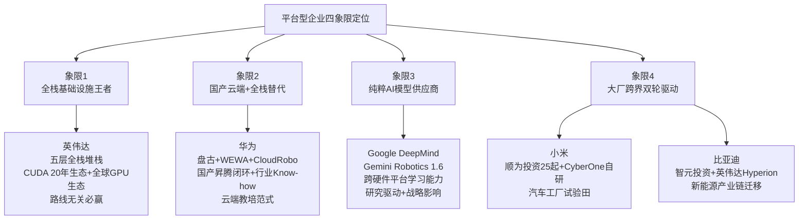

**象限1"全栈基础设施王者"**(英伟达)——通过五层全栈堆栈(训练超算+仿真平台+世界基础模型+机器人基础模型+边缘部署芯片)与CUDA 20年累积生态,构筑"路线无关必赢"的产业地位,是卖铲人模式最强势的代表。**象限2"国产云端+全栈替代"**(华为)——通过昇腾闭环+盘古大模型+CloudRobo战略,提供英伟达全栈堆栈的国产替代方案,在中美科技博弈背景下具有战略意义。**象限3"纯粹AI模型供应商"**(Google DeepMind)——通过Gemini Robotics系列纯模型层卡位,依托Alphabet生态构筑"高研究影响力+低直接变现"的独特定位。**象限4"大厂跨界双轮驱动"**(小米、比亚迪)——通过战略投资+自研整机/产业链迁移的复合模式,以非纯平台型企业身份切入具身智能赛道,实现"风险对冲+生态卡位"双重价值。

### 7.7.3 卖铲人模式对产业链价值分配格局的深层影响

基于五家代表企业的横向对比,可对卖铲人模式如何重塑整个具身智能产业链的价值分配格局作出系统研判:

**第一,基础设施层价值捕获能力可能超过本体层**。在前几章剖析中,本研究已揭示了一个反差性的产业图景——下游本体厂商陷入"高融资+高亏损"的内卷化竞争(优必选、智元等净利率不足1.2%、Figure AI虽估值390亿美元但仍未盈利),而上游基础设施供应商(英伟达通过芯片销售、华为通过昇腾云服务)却能实现稳定的价值捕获。这种"上游赚钱、下游烧钱"的产业现象,本质上反映了**具身智能产业链价值正在向基础设施层(芯片+模型+仿真)集中**——本体层因技术路线不收敛、商业化场景碎片化,难以在短期内形成赢家通吃的壁垒,而基础设施层凭借"路线无关必赢"的特性反而获得了最稳定的价值捕获位置。

**第二,开源生态加速产业拐点**。英伟达GR00T、Google Gemini Robotics、华为盘古、银河通用GraspVLA、星海图G0、千寻Spirit v1.5、极佳GigaBrain-0.1、原力灵机DM0等头部模型的开源/赋能策略,**将大幅降低中小企业进入门槛——头部本体企业不必从零研发认知层基础模型,而可基于开源底座快速构建产品力**。这种开源驱动的"人才—模型—数据—硬件"生态拐点,与第2章末尾所述"向混合架构收敛"的产业趋势相呼应,共同构成了2026—2027年具身智能产业从"百花齐放"走向"生态级竞争"的核心动能。

**第三,垂直整合反向收敛——平台型企业实质性影响本体设计**。第3章3.3节曾指出"PI一直在给银河通用、星海图等中国本体厂商的本体构型提改动需求",这一现象在更大范围内同样存在——**英伟达Cosmos平台对Figure/Apptronik/Boston Dynamics的渗透实质性影响了这些本体的传感器配置与计算架构;Google DeepMind Gemini Robotics 1.5的跨硬件学习能力倒逼Apollo/Franka等本体优化关节标准化;华为CloudRobo战略要求合作伙伴(乐聚、大族、拓斯达等16家)在数据格式与接口规范上向昇腾生态对齐**[^67]。这种"平台型企业反向定义本体设计"的现象,使本研究第1章预先识别的"独立路线—混合架构—生态卡位"演进路径在产业实证中得到充分验证。

**第四,中美平台型企业的差异化路径将构成长期竞争格局**。英伟达全球GPU生态vs华为国产昇腾闭环、Google DeepMind纯AI模型供应vs小米/比亚迪大厂跨界——这两组对照将构成2026—2030年全球具身智能基础设施层竞争的核心格局。从短期看,英伟达凭借CUDA 20年累积优势与全球GPU装机量保持绝对领先;从中长期看,中美科技博弈背景下国产昇腾闭环的战略重要性将持续上升,中国大厂(小米、比亚迪、阿里、字节、美团等)对自变量、千寻、章鱼动力等头部整机厂的密集投资,事实上构成了"中国式生态卡位"的差异化路径。**这种基础设施层的中美双轨格局,可能成为未来3—5年全球具身智能产业最深层的竞争主线**。

**第五,平台型企业作为"隐性主导者"将贯穿全部企业横向对比**。本章对五家平台型企业的剖析揭示了一个重要事实——前几章剖析的所有整机派代表企业,都不同程度依赖平台型企业的基础设施支撑:Figure AI依托英伟达GPU与可能的Cosmos合作、银河通用使用Jetson AGX Thor芯片、宇树G1 EDU配备NVIDIA Jetson Orin、星海图R1硬件成为PI/斯坦福/英伟达的检验基座、自变量/智元/千寻等头部企业获得小米/比亚迪/阿里/字节等大厂战略投资。**这种"整机派浮于水面、平台型潜于水下"的产业格局,使平台型企业事实上成为整个具身智能产业的"隐性主导者"**——这一定位将作为下一章企业横向对比矩阵中的特殊维度,贯穿对全球具身智能企业整体竞争格局的最终研判。

至此,本章已完成全球5家平台型与生态构建者路线代表企业的深度剖析、横向对比与价值捕获研判。**平台型企业作为具身智能产业链的"隐性主导者",通过基础设施层的全栈卡位与生态网络的深度赋能,正在事实上重塑整个产业的价值分配格局**——这一判断与第3—6章对独立路线与混合融合路线企业的剖析共同构成了完整的全球具身智能企业谱系。下一章将基于第3—7章累积的全部企业信息,构建覆盖技术路线归属、核心模型与产品参数、量产与出货能力、商业订单规模与场景深度、累计融资与估值、团队学术与产业背景六个维度的统一对比矩阵,对全球主要具身智能企业进行系统性横向比较,识别硬件派与软件派、国际与国内、B端与C端等不同竞争格局下各企业的差异化竞争优势与短板,为第9章融资格局与团队特征分析、第10章未来趋势研判建立完整的对比基线。

# 8 全球代表企业多维度横向对比

第3章至第7章已沿"端到端VLA—世界模型/WAM—硬件驱动与分层架构—双系统与混合融合—平台型与生态构建者"的路线坐标系，对全球40余家代表性企业进行了五维深度剖析。每一章末尾的横向对比矩阵已为该路线内部的差异化竞争提供了清晰刻画，但仍未回答一个跨章节的根本问题——**当我们将这40余家企业放在同一坐标系下整体审视时，2025—2026年量产元年的真实竞争格局究竟是什么样子？哪些企业占据了最稳健的价值捕获位置？哪些企业面临最紧迫的生存压力？硬件派与软件派、国际派与国内派、B端与C端、独立路线与混合架构、整机派与平台派之间，是否存在系统性的产业规律？**

本章作为前五章企业剖析的系统性收官与对比综合，将基于第3—7章累积的全部企业信息，构建覆盖六大维度的统一对比矩阵，对全球25家核心代表企业进行横向比较。在此基础上，本章将依次从硬件派与软件派、国际派与国内派、B端与C端及整机派与平台派、五大技术路线代表企业的差异化优势与短板四组对照视角切入，揭示2025—2026年全球具身智能产业的真实竞争格局，并最终提炼五大关键产业判断作为第9章融资格局与团队特征分析、第10章未来趋势研判的共同认知前提。

## 8.1 统一对比矩阵的构建逻辑与样本选取

在进入25家企业总览矩阵之前，必须先界定本章对比方法论的两个前置问题——**评估维度的内涵与可量化指标**、**样本选取原则与归类边界处理规则**。

**六大评估维度的内涵与可量化指标**已在前五章企业剖析中分散呈现，本章将其系统化为统一坐标系，作为25家企业横向对比的基础。

| 评估维度 | 核心内涵 | 关键可量化指标 |
|---------|---------|------------|
| **技术路线归属** | 企业核心技术路径在第2章五大路线坐标系下的归属 | VLA / 世界模型WAM / 硬件驱动 / 双系统融合 / 平台型五大类；混合架构企业标注主辅路线 |
| **核心模型与产品参数** | 代表模型名称、动作Token类型、控制频率、本体自由度等技术细节 | 模型代表作（如GO-1、π0.5、Helix 02）、动作Token类型、控制频率（Hz）、关节自由度数 |
| **量产与出货能力** | 2025—2026年出货数据、年产能规划、量产里程碑事件 | 2025年出货量（台）、年产能（台）、量产里程碑节点 |
| **商业订单规模与场景深度** | 累计订单金额、客户类型、场景渗透广度 | 累计订单金额（亿元/亿美元）、标志性客户、场景类型（工业/商业/家庭/科研） |
| **累计融资与估值** | 融资总额、最新估值、投资方结构 | 累计融资额、最新估值梯度、产业资本/财务资本/国资比例 |
| **团队学术与产业背景** | 创始人背景、核心团队构成、人才密度 | 创始人学术或产业经历、团队人才学校与企业出处 |

资料来源：基于第3—7章企业剖析方法论的统一化整理

**样本选取原则**遵循三条规则：第一，**全覆盖性**——25家核心样本完整覆盖第3—7章已剖析的全部代表企业，确保前文铺陈的信息得到系统性呈现；第二，**国际派与国内派对称**——按"国际9家+国内16家"配比，反映全球具身智能产业"中国数量优势+美国估值优势"的真实格局；第三，**整机派与平台派交叉**——通过"整机派20家+平台型与跨界派5家"的交叉划分，确保对比维度兼顾产品力与生态卡位。

**归类边界处理规则**针对前五章已揭示的多家"混合架构"企业作出统一处理。**对于在多条路线均有突出贡献的企业**，本章按其"核心叙事路线"归类、并标注"辅助属性"——例如自变量机器人WALL-B虽具备世界模型属性，但其技术血统连续性使其归属VLA派、辅助世界模型；Figure AI Helix 02具备双系统三层架构，但其端到端神经网络底色仍归属VLA派、辅助双系统融合；星海图同时布局G0 VLA与Fast-WAM世界模型，归属"双系统融合派"作为同源共生代表。这种"主路线+辅属性"的统一归类规则，既尊重企业自身的技术叙事，也避免简单的二元归类对混合架构现象的失真。

## 8.2 全球25家代表企业六维核心信息总览矩阵

基于上节方法论框架，下表系统呈现全球25家代表企业在六大维度的关键信息。这是本研究第3—7章累积信息的最完整一览，构成后续多组对照分析的事实基础。

**国际派代表企业（9家）**

| 企业 | 路线归属 | 核心模型/产品 | 出货/订单标志 | 融资/估值 | 团队基因 |
|------|---------|------------|------------|---------|---------|
| **Google DeepMind** | 平台型（VLA基础模型） | Gemini Robotics 1.5/1.6（ER+VLA双模型协作；ER 1.6仪表识别93%） | 与Apptronik、Boston Dynamics、Agile Robots（2万套部署）合作 | Alphabet子公司无独立融资；外部投资Wayve 5亿美元意向 | DeepMind团队；机器人技术高级总监Carolina Parada等[^31][^61][^32] |
| **Physical Intelligence** | VLA（技术极致派） | π0/π0.5/π0.6；FAST Token+Flow Matching；分层推理链 | 不做整机；私人家庭10-15分钟开放世界泛化；给银河通用、星海图供模型 | 累计超20亿美元；估值110亿美元（2025） | UC Berkeley Sergey Levine、斯坦福Chelsea Finn等学术派；约80人[^63] |
| **Figure AI** | VLA（辅助双系统融合） | Helix→Helix 02三层架构（System 0 1kHz/System 1 200Hz/System 2慢推理） | 宝马斯帕坦堡工厂6个月3万辆X3、9万零件、1250小时；4分钟61连续动作 | C轮10亿美元（2025.9）；估值390亿美元；累计超17亿美元 | Brett Adcock（Archer/Vettery连续创业）；波士顿动力/特斯拉/谷歌DeepMind专家[^62][^69][^30][^43][^66][^67] |
| **Boston Dynamics** | 硬件驱动（动力学极致） | 电动Atlas+Spot四足；液压→电动转型；数百Hz级实时闭环 | 2025人形出货约1000台；Spot单机超50万元 | 软银/现代汽车子公司无独立融资 | Marc Raibert（MIT Leg Lab）+ AI研究院（2022）[^51][^61] |
| **Tesla Optimus** | 硬件驱动（垂直整合） | Optimus Gen1/2/V3；AI5芯片2500TOPS；22DOF灵巧手前臂腱绳驱动 | 2025交付约150台；Fremont工厂年产100万台；2027千万台目标 | 美股上市无独立融资；商业化潜力超10万亿美元 | 造车团队全套迁移；马斯克[^69][^55] |
| **Agility Robotics** | 硬件驱动（场景专用） | Digit机器人；反向膝盖仿生设计 | 2025出货约150台；Amazon、GXO、Spanx深度绑定 | 俄勒冈州立大学孵化；与英伟达GR00T合作[^62][^69] |
| **1X Technologies** | VLA+硬件融合（家用人形） | NEO Beta双足；NEO Gamma家用版；2万美元/台或499美元/月订阅 | 2024.1获ADT 140台订单；2026交付NEO家用预订单 | A+轮2350万美元（OpenAI Startup Fund领投）；B轮约1.37亿美元（EQT领投/三星NEXT/Tiger Global） | 挪威奥斯陆总部；Halodi Robotics前身（2014成立）[^76][^26] |
| **Wayve** | VLA（自动驾驶赛道） | LINGO-1（VLAM）+GAIA世界模型+AV2.0端到端；500城zero-shot | 与Uber 2026 Robotaxi试点；与日产/奔驰L2+/L3量产；500城无精调部署 | D轮12亿美元（2025.2）/累计25亿美元；估值86亿美元；Wayve拟新一轮20亿美元/估值80亿美元 | Alex Kendall（剑桥机器学习博士）；约300名员工[^34][^35][^47] |
| **英伟达** | 平台型（全栈基础设施） | Cosmos（Predict/Transfer/Reason）+GR00T N1/N1.5/N1.6+Isaac Sim/Lab+Newton+Thor芯片+Vera Rubin | 与Apptronik/BD/Agility/傅利叶/Figure等深度合作；DRIVE Hyperion辐射比亚迪/吉利/日产 | 美股上市无独立融资 | Jim Fan等领衔；"2026世界模型基础年"判断[^31][^62][^77][^69][^40][^52] |

**国内派代表企业（16家）**

| 企业 | 路线归属 | 核心模型/产品 | 出货/订单标志 | 融资/估值 | 团队基因 |
|------|---------|------------|------------|---------|---------|
| **宇树科技** | 硬件驱动（性价比量产） | G1（8.5万元）/R1（2.99万元）/H1（3.3m/s）/B2四足；M107电机189N·m/kg；UnifoLM-VLA-0开源 | 2025出货5500+台、营收17.08亿、净利率35.13%（行业30倍）；全球市占32.4% | 估值420亿元；2026.3科创板IPO拟募42.02亿元；深创投/红杉/美团/腾讯/阿里 | 王兴兴（90后偏科少年→上海大学硕士→大疆→2016创立）[^76][^69][^36][^60][^71][^66] |
| **智元机器人** | VLA（量产领跑） | 启元GO-1（ViLLA：VLM+MoE Latent Planner+Action Expert） | 2025出货5168台、营收10亿元、全球39%份额；龙旗/均胜/上汽通用订单；2026.3 万台下线 | 11轮融资；估值150亿元；累计京东、上海具身智能基金等 | 邓泰华（华为副总裁/昇腾负责人）+稚晖君彭志辉[^51][^49][^39][^52][^53][^43][^41] |
| **智平方** | VLA（双系统首创） | GOVLA 0.0/0.5(FiS-VLA)/1.0；首创"异构输入+异步频率"双系统VLA；117.7Hz | 惠科3年1000台订单；2025.12月单月百台交付；规划万台；2026.4股改 | 一年12轮融资；B轮超10亿元；估值破百亿（2026.2） | 郭彦东（OPPO/小鹏首席科学家）；5位斯坦福全球前2%科学家[^36][^43] |
| **星海图** | 双系统融合（VLA+WAM同源） | G0/G0 Plus/G0 Tiny VLA+Fast-WAM世界模型；DP3底层动作策略 | 2025轮式双臂全球市占第一；服务150+开发者；千台级订单跑通；亦庄半马4补给站 | B+轮20亿元（2026.4）；估值200亿元；累计近50亿元 | 高继扬（清华-Waymo-Momenta）+赵行（清华叉院/MIT）+李天威（Momenta）[^73][^64][^33][^66][^42][^59][^29][^65] |
| **银河通用** | 双系统融合（仿真合成派） | AstraBrain（大脑-小脑-神经控制一体融合）+AstraSynth百亿级仿真+GraspVLA+DexNDM+NavFoM | 累计订单数千台；宁德时代/博世/丰田/上汽/北汽/极氪/长城/爱博医疗；银河太空舱24小时门店 | 累计69.6亿元；估值超210亿元；国家大基金三期首投（25亿元，2026.3） | 王鹤（清华-斯坦福，中国首个具身智能实验室）+姚腾洲（ABB千万级量产）[^53][^54][^60][^71][^61][^72][^48][^47][^59][^65] |
| **千寻智能** | 双系统融合（多样性脏数据） | Spirit v1.5（Qwen3-VL-4B+DiT动作头）；可穿戴成本1/10；登顶RoboChallenge | Moz1全力控人形；宁德时代电池产线"小墨"；京东MALL咖啡机器人 | 30天内30亿元（雷军/马云联手）；累计33.28亿元；估值破百亿 | 韩峰涛（珞石机器人联创/2万台工业机器人交付）+高阳（清华视觉与人形实验室主任）[^25] |
| **星动纪元** | VLA（软硬全栈+世界模型加持） | ERA-42端到端原生+Ctrl-World世界模型WorldArena第一；分频VLA+VLA+RL | 累计订单5亿元；海外占比50%；全球Top10科技公司9家为客户；XHAND1出货近千只 | 2026.3轮10亿元；估值破百亿；16家产业投资方 | 陈建宇（清华-伯克利-清华博导28岁）；与斯坦福Chelsea Finn合作[^24][^25][^56] |
| **自变量机器人** | VLA（向WUM跃迁） | WALL-A→WALL-OSS→WALL-AS→WALL-B（WUM世界统一模型） | 量子1号/2号轮式仿人形；与58到家合作家庭清洁；2026.5.25入驻首批家庭 | B轮近20亿元（2026.4）；累计超40亿元；估值超100亿元 | 王潜（清华-南加州博士、注意力机制早期提出者）[^26][^54][^45][^43][^61] |
| **蚂蚁灵波** | VLA（开源真实数据派） | LingBot-Depth/VLA/World/VA/Map五模型矩阵；性能超越π0.5 | Robbyant-R1人形；与星海图、松灵、乐聚等多本体厂适配；工业、物流、医药试点 | 蚂蚁集团全资子公司无独立融资 | 沈宇军（CUHK博士、字节研究员、蚂蚁研究院）首席科学家[^46][^56][^27][^57] |
| **傅利叶智能** | 硬件驱动（场景深耕） | GR-1/GR-2（1.75m/63kg）/GR-3；FSA 2.0执行器380N·m；12DOF灵巧手+6阵列触觉；FOCUS协作平台 | 数十家商业客户（银行/4S/会议/景点）；医疗陪护商业化交付；英伟达合作伙伴；WIPO百年设计史收录 | 2025.1 E轮近8亿元（Prosperity7参与）+8月E+轮3亿元 | 周斌副总裁"响应场景"理念[^73][^64] |
| **优必选** | 硬件驱动（车厂深耕） | Walker S1/S2（1.76m/70kg/15kg负载）；BrainNet群脑网络+第四代灵巧手+自主换电 | 2025年Walker系列订单11亿元；车厂实训覆盖最多；首批数百台Walker S2量产交付 | 港股上市；2024.8起5次配售累计45亿港元+Infini Capital 10亿美金授信 | 周剑创始人；博士级研发团队；2012年成立[^72] |
| **云深处科技** | 硬件驱动（四足专精） | 绝影X30/山猫M20/绝影Lite3/DR01/DR02；Science Robotics封面；专利171项 | 2025扭亏为盈；覆盖50国；变电站巡检99.9%准确率 | 2025.12 C轮5亿+全年融资超10亿；提交IPO辅导备案 | 朱秋国（浙大教授）；硕博占比60%、平均年龄29岁[^49] |
| **越疆科技** | 硬件驱动（机械臂跨界） | Dobot Atom（NDS神经驱动灵巧+AWS仿人直膝行走） | 一线车厂、电子制造厂、咖啡奶茶店 | （未披露最新轮次） | 机械臂龙头跨界 |
| **众擎机器人** | 硬件驱动（动态运动RL派） | T800（准直驱QDD+RL算法；后空翻/抗冲击） | 早期 | B轮 | RL派代表[^76] |
| **章鱼动力** | 双系统融合（早期新锐） | 端到端AI+世界模型+模仿与强化学习闭环；接触式操作 | 早期阶段 | 种子轮5000万美元（2026.3）；K3战投（2026.4） | 都大龙（地平线6号员工/鉴智机器人创始人）+梁柱锦（前鉴智技术副总裁） |
| **极佳视界&原力灵机** | 双系统融合（RoboChallenge新锐） | GigaBrain-0.1（世界模型生成数据增强VLA+RGBD+具身CoT）；DM0（具身原生VLA+8种异构机器人跨机型） | 早期阶段 | 极佳视界：A轮3个月4轮累计5亿元；原力灵机：A+轮约10亿元 | 极佳视界：清华/中科院/微软/地平线团队 |

**平台型与大厂跨界派代表企业（注：英伟达、Google DeepMind已计入国际派9家中）**

| 企业 | 路线归属 | 核心模型/产品 | 出货/订单标志 | 融资/估值 | 团队基因 |
|------|---------|------------|------------|---------|---------|
| **华为** | 平台型（云端教培+全栈替代） | 盘古5.5（718B MoE）+盘古世界模型+WEWA双架构+CloudRobo战略；昇腾算力 | HUAWEI ADS 4量产搭载尊界S800/岚图FREE等；东莞极目72亿元投资；APN伙伴生态 | 非上市无独立融资；东莞极目注册资本46.89亿元（2026年增资） | 张平安（华为云CEO）+靳玉志（车BU CEO）+李建国（制造部总裁）[^63][^62][^48][^73][^64] |
| **小米** | 大厂跨界（投资+自研双轮） | CyberOne人形（汽车工厂自攻螺母3小时90.2%成功率）；小米SU7生态 | 顺为投资25起15家具身智能企业（自变量、千寻、章鱼动力等） | 港股上市无独立融资 | 雷军；顺为资本布局[^76][^53] |
| **比亚迪** | 大厂跨界（产业链迁移） | 智元投资（持股3.76%）+英伟达Hyperion合作；天神之眼智驾256万辆装车 | 460万辆销量（全球新能源第一）；储能60GWh第一；2026人形规划2万台 | A股上市无独立融资 | 王传福；新能源全产业链[^53][^43][^61][^48] |

资料来源：综合整理自第3—7章企业剖析及

需要简要说明的几点。第一，**自变量、Figure等"主路线+辅属性"企业的归类已在矩阵中明确标注**——例如自变量WALL-B归VLA派但具备世界模型WUM属性、Figure Helix 02归VLA派但具备双系统三层架构属性、星动纪元归VLA派但具备世界模型加持属性。第二，**1X Technologies首次在本章作为系统化样本纳入对比**——这家挪威奥斯陆企业凭借2024年1月B轮约1.37亿美元（EQT领投，三星NEXT、Tiger Global等跟投）、与OpenAI Startup Fund的早期合作、家用人形NEO的2万美元定价或499美元月度订阅模式，构成了VLA派与硬件驱动派之间"家用消费场景专用化"的独特样本。第三，**章鱼动力、极佳视界、原力灵机等新锐企业**虽融资体量与产品成熟度不及头部企业，但因其代表了2026年RoboChallenge登顶接力与种子轮5000万美元式资本核爆的产业现象，纳入矩阵以呈现行业新生力量。

## 8.3 硬件派与软件派的差异化竞争格局

基于上节25家企业总览矩阵，本节聚焦"硬件驱动vs软件智能"这一最具产业意义的核心分野展开深度对比。这一对比的核心命题在于——**两派在商业模式可持续性、价值捕获能力、规模化路径上呈现何种根本差异？硬件派的"高出货量+稳定毛利"与软件派的"高估值+高研发烧钱"之间，谁更能穿越2026—2027年的商业化小考？**

**硬件派与软件派的代表企业可清晰归纳如下**：硬件派以宇树科技（90%自研率/35.13%净利率/420亿IPO估值）、Tesla Optimus（造车能力迁移/AI5芯片+灵巧手专利）、Boston Dynamics（动力学极致）、优必选（11亿元订单/Walker S2）、傅利叶（FSA 2.0执行器）、云深处（四足扭亏盈利）为代表；软件派以Physical Intelligence（110亿美元估值/不做整机）、智平方（FiS-VLA首创双系统）、自变量（WUM架构）、千寻（Spirit v1.5登顶RoboChallenge）、蚂蚁灵波（开源真实数据派）为代表。

**第一组对照——出货量与估值的剪刀差**。这是硬件派与软件派最直观的差异。从出货量看，**硬件派宇树2025年5500+台、智元5168台占据全球榜单前列；软件派PI不做整机出货量为零、自变量量子系列尚未规模交付、千寻Moz1处于宁德时代电池产线"小墨"早期部署阶段**。从估值看，**软件派PI 110亿美元（约770亿元人民币）、自变量100亿元、千寻百亿元；而硬件派宇树420亿元IPO估值已是国内人形机器人企业天花板，但相对软件派PI仍呈现明显差距**[^36][^65]。这种"硬件派出货量领跑、软件派估值领跑"的剪刀差，本质上反映了一级市场对"基础模型壁垒vs硬件量产壁垒"的差异化定价逻辑——**资本市场普遍认为基础模型的壁垒显著更高，硬件本身在国内并不构成长期壁垒**[^26]。

**第二组对照——净利率与研发投入比的根本差异**。这是更具产业洞察的对比维度。**硬件派的"宇树+云深处"已成为中国具身智能产业"已盈利稀缺样本"**——宇树2025年净利率35.13%、是行业平均水平近30倍，远高于优必选0.67%、智元不足1.2%[^60]；云深处则在2025年实现扭亏为盈[^49]。**软件派则普遍采取"用钱拿数据、占领用户心智"的烧钱战略**——千寻智能CEO韩峰涛明确表示"2026年的核心主题是数据量级与模型性能的突破，而非追求落地与营收增长，真正的大规模落地预计在2027年下半年至2028年到来"，2026年营收目标仅定在1—1.5亿元、销售数量约200台[^25]；自变量CEO王潜则将焦点放在"35天后入驻家庭"的战略卡位而非短期盈利[^54][^43]。这种"硬件派盈利领先、软件派烧钱领先"的根本差异，对应了两派截然不同的商业化时间表预期——硬件派押注"已可验证的工业场景现金流"，软件派押注"未来3—5年家庭与服务场景的指数级回报"。

**第三组对照——关节自研率与动作Token类型的技术分野**。从硬件壁垒构建角度看，关节自研率呈现清晰梯度：**宇树>90%、特斯拉100%（自研传动装置和传感器）、傅利叶FSA 2.0自研执行器、云深处电机关节全部自研、优必选第四代灵巧手部分自研**。这一梯度揭示了硬件路线"自研率→成本控制→规模放量"的因果链条——**宇树M107电机扭矩密度189N·m/kg对标国际顶尖、硬件成本仅为海外同类的1/5—1/10，正是其35.13%净利率的物质基础**[^60]。从软件智能角度看，软件派的差异化主要体现在动作Token类型选择上——**π0.5使用FAST离散Token+Flow Matching、智元GO-1使用Latent Action（隐式动作Token）、智平方FiS-VLA使用异构输入+异步频率、自变量WALL-B使用WUM统一融合表示、千寻Spirit v1.5使用DiT扩散动作头**——这种动作Token类型的多样性，恰恰印证了第2章"VLA未来不在于单一action token，而在于多种token协同"的判断。

**第四组对照——反向收敛与"硬件派加智能、软件派造硬件"**。最具产业意义的现象是两派的反向收敛趋势。**硬件派开始密集补课AI智能化能力**——宇树2026年3月开源UnifoLM-VLA-0模型、傅利叶GR-2成为英伟达机器人合作伙伴、智元基于ViLLA架构实现10000台量产、星动纪元ERA-42软硬一体路径——这些案例共同印证第5章末尾所述"硬件派必须补齐AI能力短板"的产业规律[^51][^49][^64]。**软件派则不约而同走向自研硬件本体**——Figure 02的软硬件垂直整合、智平方AlphaBot系列（轮式可升降人形）、星海图R1 Pro硬件成为PI/斯坦福/英伟达检验基座、千寻智能Moz1全力控人形——这些迹象表明纯软件路线难以脱离硬件本体规模化部署[^43][^64][^25]。这种**反向收敛的产业趋势**揭示了一个根本判断：在2026年量产元年的工程现实中，**纯硬件派难以突破AI能力短板、纯软件派难以脱离硬件本体规模化部署**——这正是第6章双系统与混合融合路线兴起的根本动因。

下表系统呈现硬件派与软件派代表企业在六大对比指标上的差异化定位：

| 对比指标 | 硬件派代表（宇树/Tesla/Boston Dynamics/优必选/云深处/傅利叶） | 软件派代表（PI/智平方/自变量/千寻/蚂蚁灵波） |
|--------|----------------------------------|-----------------------------------|
| **核心壁垒** | 90%关节自研率+扭矩密度+成本下探+量产能力 | 基础模型架构+动作Token设计+数据策略+开源生态 |
| **2025出货量** | 宇树5500+台、Tesla 150台、Boston约1000台、优必选数百台 | PI不做整机、自变量未规模交付、千寻早期部署 |
| **典型估值/融资** | 宇树420亿元IPO、优必选45亿港元配售、傅利叶E+轮3亿元 | PI 110亿美元、自变量超40亿元、千寻30天30亿元 |
| **盈利状况** | 宇树净利率35.13%、云深处2025扭亏；优必选0.67%承压 | 普遍未盈利；以"用钱拿数据"为战略 |
| **AI智能化补课** | 宇树UnifoLM-VLA-0开源、傅利叶+英伟达合作、优必选BrainNet | 已具备基础模型壁垒；持续加大研发投入 |
| **硬件本体补课** | 已有完整产品矩阵 | Figure/智平方/星海图/千寻均自研硬件本体 |

资料来源：综合整理自[^51][^49][^39][^69][^26][^52][^53][^54][^60][^71][^43][^72][^64][^66][^42][^59][^29][^65][^25]

## 8.4 国际派与国内派的格局对照与剪刀差现象

接下来聚焦中美及欧日国际格局对比，揭示2025年量产元年最具产业意义的现象——**"中国出货量占绝对统治地位、估值结构却显著低于美元梯队"的全球剪刀差**。

**第一，出货量层面中国压倒性领先**。**2025年全球人形机器人出货量成功突破14500台**[^69]，**宇树科技以超5500台的出货量登顶全球第一，市场份额占比近38%；智元AgiBot紧随其后出货量达5168台全球排名第二**[^69]——**两款头部国产品牌合计出货量占全球总量超70%，成为行业量产核心主力**[^69]。**反观海外厂商，特斯拉Optimus全年仅交付150台，Figure AI、Agility Robotics出货量与之持平**[^69]。这一"中美出货量30倍以上差距"的格局，深刻反映了中国"产学研联动+供应链成熟+场景开放"优势[^49]，也呼应了第1章所述"中国占据全球84.7%份额"的整体趋势。

**第二，估值结构层面美元梯队领跑**。从估值看，**Figure 390亿美元、PI 110亿美元、Wayve 86亿美元的美元梯队仍领跑全球**[^69][^43]——以美元/英镑计价构成"国际美元独角兽"梯队；**国内宇树420亿元、银河通用210亿元、星海图200亿元属于人民币百亿梯队**[^60][^48][^33][^42]。按美元换算，宇树IPO估值约58亿美元、银河通用约30亿美元、星海图约28亿美元——**仍显著低于Figure、PI、Wayve美元梯队**。这一"出货量与估值结构的全球剪刀差"，深刻揭示了中国"制造大国"与"价值大国"之间的张力，既是中国超级供应链与工程师红利铸就的成本护城河的体现，也暴露出中国在高端市场溢价能力与生态构建上仍需补课的现实。

**第三，技术路线选择的中美系统差异**。在技术路线层面，中美呈现明显的差异化偏好。**中国企业更偏向"混合融合架构+硬件量产"**——星海图G0+Fast-WAM双轨同源、银河通用AstraBrain端到端融合、智平方FiS-VLA双系统首创、自变量WUM统一架构、宇树+智元的"硬件量产+VLA补课"组合，普遍体现了"利用中国全球最复杂的工业场景产生的海量非结构化数据，倒逼算法快速迭代"的混合架构特征。**美国企业更偏向"端到端VLA+软件定义硬件"**——PI不做整机、Google DeepMind纯AI模型供应、Figure AI软硬件垂直整合下的Helix模型主导、Wayve端到端AV2.0自动驾驶系统，普遍体现了"以软件智能为核心资产、硬件作为软件的物理载体"的技术路径偏好[^31][^63][^62][^47]。

**第四，商业化路径的中美系统差异**。这一差异在订单结构与场景选择上表现尤为鲜明。**中国厂商呈现"沿途下蛋"工业落地优先**——智元龙旗/均胜/上汽通用、银河通用宁德时代/丰田/上汽、优必选广西防城港/自贡/天奇股份、星动纪元顺丰物流跨境、千寻智能宁德时代电池产线"小墨"+京东MALL咖啡机器人，覆盖工业产线、地方政府数据采集中心、零售商超等多元场景[^52][^36][^72][^65][^25][^56]。**美国厂商呈现"完美主义"长程任务优先**——Figure AI在宝马斯帕坦堡工厂6个月生产3万辆X3、Tesla Optimus规划Fremont工厂年产100万台、Agility Robotics深度绑定Amazon/GXO/Spanx，更倾向于深度绑定单一头部客户实现规模化部署[^62][^69][^55]。

**第五，资本节奏的中美系统差异**。**中国呈现"一年12轮密集融资"特征**——智平方一年内完成12轮融资、千寻智能成立2年完成6轮融资合计33.28亿元、自变量2026年4月B轮近20亿元距上轮10亿元仅隔3个月、星海图2026年2月B轮10亿元后4月再融B+轮20亿元[^36][^43][^64][^25]。**美国呈现"单轮10亿美元式集中下注"特征**——Figure AI 2025年9月单轮10亿美元、PI 2024年11月单轮超10亿美元、Wayve 2024年5月单轮10.5亿美元（软银领投，英伟达跟投）、Wayve拟新一轮20亿美元[^43][^34][^47]。这种"密集小步快跑"vs"集中大步豪赌"的资本节奏差异，背后反映了中美创投生态的根本不同——中国市场化机构密集涌入与产业资本紧密咬合，美国则更依赖头部VC（Founders Fund、Lightspeed、a16z等）与战略巨头（微软、英伟达、英特尔资本、贝索斯系基金等）的少数大额下注[^69][^43]。

**第六，团队基因的中美系统差异**。**中国具身智能创业团队呈现"智驾人才迁移派+清华浙大学院派"双主线**——星海图高继扬（Waymo+Momenta）+赵行（清华叉院/MIT Waymo）、智平方郭彦东（OPPO/小鹏首席科学家）、章鱼动力都大龙（地平线6号员工/鉴智机器人）、千寻智能韩峰涛（珞石机器人联创）、银河通用王鹤（清华+斯坦福）+姚腾洲（ABB千万级量产）、星动纪元陈建宇（清华-伯克利-清华博导）、宇树王兴兴（上海大学硕士直接创业）、云深处朱秋国（浙大教授）[^36][^71][^43][^48][^64][^33][^25][^56]。**美国具身智能创业团队呈现"MIT/UC Berkeley/Stanford顶尖学院派"主线**——PI Sergey Levine（UC Berkeley）+ Chelsea Finn（Stanford）、Figure AI Brett Adcock组建波士顿动力/特斯拉/谷歌DeepMind专家团队、Wayve Alex Kendall（剑桥机器学习博士）[^63][^69][^43][^66][^47]。这种团队基因差异背后，是中美在具身智能人才供给上的结构性差异——**中国凭借自动驾驶产业前几年积累的工程师红利集体转向具身智能赛道，美国则依靠顶尖学术机构持续输出基础研究力量**。

**第七，欧洲与日本的差异化补位**。欧洲方面，**Wayve作为英国自动驾驶VLA代表，2025年2月D轮12亿美元/累计25亿美元/估值86亿美元**，凭借"500城无精调zero-shot部署"等独特能力构成了"欧美第三方智驾标的"的赛道唯一性溢价[^47]；**ANYbotics（瑞士苏黎世联邦理工背景）则在化工/能源高危行业构筑了相对四足专精领域的差异化护城河，设备故障率低于行业平均30%**[^49]。日本方面，索尼Aibo聚焦消费级情感陪伴；**1X Technologies（挪威奥斯陆，但以三星NEXT、Tiger Global、OpenAI Startup Fund为主要投资方）则代表了北欧企业在家用人形机器人赛道的独特卡位**——其NEO家用人形机器人售价2万美元或499美元/月订阅，首批订单预计2026年交付[^76][^26]。

下表系统对照中美及欧日全球具身智能格局的剪刀差现象：

| 对照维度 | 中国阵营 | 美国阵营 | 欧日阵营 |
|--------|---------|---------|---------|
| **2025出货量** | 宇树5500+台、智元5168台占全球70% | Tesla/Figure/Agility各150台 | 1X等少量交付 |
| **估值梯队** | 人民币百亿（宇树420亿、银河通用210亿、星海图200亿） | 美元独角兽（Figure 390亿、PI 110亿、Wayve 86亿美元） | Wayve（欧洲/英）86亿美元 |
| **技术路线偏好** | 混合融合架构+硬件量产 | 端到端VLA+软件定义硬件 | Wayve自动驾驶VLA+ANYbotics四足专精 |
| **商业化路径** | "沿途下蛋"工业落地优先（多元场景） | "完美主义"长程任务优先（深度绑定头部客户） | 高危行业（ANYbotics）/家用消费（1X） |
| **资本节奏** | 一年12轮密集（中小金额) | 单轮10亿美元集中（少数大额） | Wayve单轮10.5亿/12亿美元 |
| **团队基因** | 智驾人才迁移派+清华浙大学院派 | MIT/UC Berkeley/Stanford顶尖学院派 | 苏黎世联邦理工/剑桥/Halodi |

资料来源：综合整理自[^31][^63][^49][^62][^76][^69][^26][^52][^55][^36][^60][^71][^43][^72][^48][^34][^64][^33][^66][^42][^47][^59][^29][^65][^25][^56]

## 8.5 B端与C端、整机派与平台派的差异化定位

本节进一步从"客户类型"与"商业模式"两个维度展开横向对比，揭示不同定位企业的差异化优势与可持续性。

**B端工业派的核心特征是"深度绑定大客户实现订单兑现，但面临单场景天花板与高收入高亏损怪圈"**。这一阵营的代表企业可清晰列举：**Figure AI深度绑定宝马（6个月3万辆X3）；智元绑定龙旗科技/均胜电子/上汽通用奥特能超级工厂；优必选绑定广西防城港/自贡数投/天奇股份等地方政府与产业客户（2025年Walker系列订单11亿元）；云深处绑定国家电网+南方电网+新加坡国家电网；银河通用绑定宁德时代+博世+丰田+上汽+北汽+极氪+长城；星动纪元绑定顺丰跨境物流（单笔订单超5000万元）；越疆绑定一线车厂+电子制造厂；Agility Robotics深度绑定Amazon+GXO+Spanx**[^62][^52][^53][^36][^54][^72][^24][^25]。这一阵营的根本困境在于**"高收入高亏损"怪圈延续**——优必选上市两年扣非净利润累计不足2亿元、2025年净利率仅0.67%；智元机器人仍处于微利状态、净利率不足1.2%[^60]。

**B端零售商业派则通过分散场景分摊单点风险**。代表企业包括：**银河通用全家便利店中关村鼎好店常态化在岗服务+24小时智慧药房+银河太空舱景点服务；智平方智魔方文商旅"计划未来三年在全国文商旅场景落地1000个智魔方"；傅利叶GRx系列服务银行/4S/会议/景点等数十家商业客户**[^36][^54][^43][^73]。这一阵营的差异化优势在于**单笔订单规模较小但客户结构分散，避免对单一头部客户的过度依赖**。

**C端家庭派押注最具想象力但难度最高的家庭场景**。代表企业包括：**自变量机器人WALL-B"35天后（2026.5.25）将正式入驻首批真实家庭"；1X Technologies家用人形NEO以2万美元或499美元/月订阅形式开放预订，首批订单预计2026年交付；千寻智能在京东MALL咖啡机器人初步验证家庭+零售跨场景能力**[^26][^54][^43][^25]。值得指出的是，**家庭场景被业内普遍视为"99%的机器人都跨不过去的门槛"**——王潜在2026年4月发布会上明确指出"机器人进入家庭，是我们这个时代最难的技术问题之一"[^26][^54][^43]。**自变量"用钱拿数据、迅速占领用户心智"的战略选择，实质是用资本换数据、用数据反哺模型的飞轮押注**——这种激进路径在产业内仍存争议，朱啸虎甚至直指部分企业是"只会翻跟头"的泡沫。

**整机派与平台派的根本商业模式分野**。整机派以软硬一体产品为核心资产，约20家企业构成第一阵营——Figure/智元/宇树/银河通用/星海图/智平方/自变量/千寻智能/傅利叶/优必选/云深处/星动纪元/Tesla/Boston Dynamics/Agility/1X等。平台派以基础设施与生态资源为核心壁垒，5家企业构成第二阵营——英伟达/华为/Google DeepMind/小米/比亚迪。**两派最根本的差异在于价值捕获路径**：整机派依赖产品销售与订单兑现，毛利率受硬件成本与规模化程度共同决定；平台派依赖芯片销售/云服务订阅/模型授权/战略投资回报等多元路径，价值捕获能力相对更稳定。这一对比在前文7.7节已作系统研判，本节通过订单结构、毛利率、客户复购率等指标进一步验证。

下表系统呈现B端工业派、B端商业派、C端家庭派、整机派与平台派五种差异化定位：

| 定位 | 代表企业 | 标志性订单/场景 | 核心挑战 | 可持续性研判 |
|-----|--------|------------|---------|-----------|
| **B端工业大客户** | Figure-宝马、智元-上汽通用、优必选-地方政府、Agility-Amazon、银河通用-宁德时代、星动-顺丰 | 优必选11亿元订单、Figure 3万辆X3、星动单笔超5000万元 | 单场景天花板、"高收入高亏损"（优必选0.67%净利率） | 取决于产能爬坡与盈利转正 |
| **B端零售商业** | 银河通用-全家+药房、智平方-智魔方、傅利叶-银行/4S | 春晚后24小时数百台订单、千个智魔方规划 | 客户结构分散但单笔小 | 通过规模分摊单点风险 |
| **C端家庭** | 自变量WALL-B、1X NEO、千寻智能 | 5月25日入驻家庭、2万美元家用、京东MALL咖啡 | "时代最难的技术问题"、安全边界模糊 | 押注3—5年长周期回报 |
| **整机派** | 约20家代表整机企业 | 出货量+订单兑现 | 路线选择碎片化、单笔订单依赖度 | 头部企业向规模化盈利演进 |
| **平台派** | 英伟达/华为/Google/小米/比亚迪 | 芯片+模型+订阅+战略投资 | 不做整机难以分享终端溢价 | "路线无关必赢"地位最稳定 |

资料来源：综合整理自[^49][^62][^69][^26][^52][^55][^36][^54][^60][^43][^72][^25]

## 8.6 五大技术路线代表企业的差异化竞争优势与短板

本节按第2章建立的五大技术路线分类框架，系统归纳每条路线代表企业的差异化竞争优势与共性短板。这是本章对前几章企业剖析在路线层面的最终汇总。

**端到端VLA派**（Google DeepMind/Physical Intelligence/Figure AI/Wayve/智元/智平方/星动纪元/自变量/蚂蚁灵波/1X等）。**优势**集中在两方面：第一，**跨场景泛化能力突出**——以π0.5在陌生家庭zero-shot开放世界10—15分钟泛化、Wayve在500城无精调zero-shot部署、Figure从厨房到客厅"补充数据切换场景未更换算法"为代表，VLA基础模型展现出超越传统机器人编程的开放世界泛化能力[^63][^62][^47]；第二，**资本认可度极高**——Figure 390亿美元估值、PI 110亿美元、智元150亿元、自变量超100亿元等数据印证了VLA路线在资本侧的强吸引力。**短板**主要表现为：第一，**真机数据稀缺**——彭志辉直言智元最缺数据，"相比大语言模型用了整个互联网的数据，我们还差3到5个数量级"[^39]；第二，**"完全自主"信任危机**——Figure AI 2026年初围绕Helix 02家务视频与白宫演示的动作时序异常争议，对整个VLA路线的"可证伪性"提出质疑[^30]；第三，**长程任务可靠性不足**——Physical Intelligence研究者公开承认其模型"仍经常失败，目前状态更像是'演示就绪'而非'部署就绪'"。

**世界模型/WAM派**（英伟达Cosmos/华为盘古世界模型/星海图Fast-WAM/银河通用AstraSynth/光轮智能/章鱼动力/极佳视界/原力灵机等）。**优势**主要体现在：第一，**数据成本下降与拓宽数据来源**——华为WEWA扩散生成模型生成的难例场景密度达真实世界的1000倍、银河通用"真机训练效率比特斯拉高1000倍"、千寻智能可穿戴设备将数据采集成本降至传统1/10[^48][^65][^25]；第二，**对物理规律的显式建模带来更高泛化天花板**——AstraBrain"让机器人在虚拟世界中经历亿万次试错博弈，习得如何与物理世界交互的通用能力"[^65]；第三，**长程推演能力**——蔚来NWM"100ms内推演216种轨迹"、华为WE"6亿公里高速L3仿真验证"、英伟达Cosmos Predict"30秒预测视频世界生成"等指标均印证了这一优势。**短板**包括：第一，**Sim-to-Real毫米级偏差**——王兴兴明确指出"视频生成模型即使只有一毫米的偏差也可能导致与实际效果的巨大差异"[^69]；第二，**商业闭环困难**——纯世界模型路线企业普遍缺乏直接终端订单，必须依托VLA、整机硬件或平台生态才能完成商业闭环；第三，**精细操作不足**——CVPR 2026 ManipArena评测显示"世界模型展现出显著的泛化鲁棒性，但仅限于粗粒度操作，在精细任务上力不从心"[^46]。

**硬件驱动与分层架构派**（Boston Dynamics/Agility/Tesla Optimus/宇树/优必选/傅利叶/云深处/越疆/众擎等）。**优势**集中在：第一，**工程化与量产能力领先**——硬件派在2025—2026年量产元年呈现明显的"部署态先发优势"，全球出货量超14500台中绝大多数来自硬件派；第二，**硬件成本下降40%产业拐点**——制造成本在过去一年下降40%，主流产品价格带从5万-25万美元下探至3万-15万美元；第三，**工业场景率先实现商业闭环**——Boston Dynamics Spot覆盖国家电网巡检、Agility Digit绑定Amazon仓库、宇树/傅利叶覆盖科研教育与商业服务多场景；第四，**零部件全栈自研构筑成本护城河**——宇树90%自研率构筑硬件成本仅为海外同类1/5—1/10的护城河[^76][^69][^60][^72]。**短板**主要表现为：**AI智能化滞后**——宇树招股书坦承其自研的通用具身大模型尚未规模化应用、机器人仍处于"需开发者喂指令"的硬件平台阶段[^60]；**灵巧操作短板使工业渗透不彻底**——车企生产线中当前人形机器人仍不足以胜任线束整理、涂胶、撕膜等对柔性要求更高的工序；**"高收入高亏损"怪圈延续**（除宇树、云深处外）。

**双系统与混合融合派**（Figure Helix 02/银河通用AstraBrain/星海图G0+Fast-WAM/千寻智能Spirit v1.5/智平方FiS-VLA/英伟达GR00T N1/PI π0.5/极佳视界GigaBrain-0.1/原力灵机DM0等）。**优势**集中在：第一，**多类Action Token协同**——FAST Token+Flow Matching+DiT扩散+离散动作Token+Latent Action共存，验证了第2章"VLA未来不在于单一action token，而在于多种token协同"的判断；第二，**跨本体能力提升**——原力灵机DM0覆盖8种异构机器人硬件、银河通用NavFoM全域环视跨本体导航、英伟达GR00T N1作为开源底座适配多家本体；第三，**长程任务可靠性增强**——Figure Helix 02的4分钟61连续动作、PI π0.5的私人家庭10—15分钟开放世界泛化、银河通用GraspVLA的七大泛化金标准[^62][^53][^65]。**短板**主要为：**工程协同复杂度激增**——双系统的异构输入设计、跨层接口对齐、世界模型与VLA融合训练，均对工程能力提出远超单一路线的极致要求；**系统级整合能力成为核心壁垒**——能够在混合融合路线中持续领先的企业必须同时具备AI算法、机器人控制、硬件量产三方面的复合工程能力。

**平台型生态派**（英伟达/华为/Google DeepMind/小米/比亚迪）。**优势**已在第7章作系统剖析：第一，**"路线无关必赢"的产业地位**——头部整机厂商之间的"VLA派vs世界模型派vs硬件派"路线之争，在底层都依赖英伟达的GPU+CUDA+Isaac+Cosmos+GR00T堆栈[^31][^62][^40][^52]；第二，**稳定的价值捕获能力**——通过芯片销售/云服务订阅/模型授权/战略投资回报等多元路径，相比下游本体厂商"高融资+高亏损"内卷化竞争，平台型企业实现稳定的价值捕获[^48]；第三，**反向定义本体设计**——PI"一直在给银河通用、星海图等中国本体厂商的本体构型提改动需求"、英伟达Cosmos平台对Figure/Apptronik/Boston Dynamics的渗透实质性影响传感器配置与计算架构[^51][^62][^53]。**短板**主要为：**不直接生产整机难以分享终端溢价**——Google DeepMind"高研究影响力+低直接变现"特征即为典型例证；**国产化闭环战略压力**——华为昇腾闭环相对英伟达全球GPU生态在开发者社区广度上仍有差距[^31][^63][^62]。

下表系统呈现五大技术路线代表企业的差异化竞争优势与共性短板：

| 路线 | 代表企业 | 核心优势 | 共性短板 |
|-----|--------|---------|---------|
| **VLA派** | Google/PI/Figure/Wayve/智元/智平方/星动/自变量/1X | 跨场景泛化突出、资本认可度极高 | 真机数据稀缺、"完全自主"信任危机、长程任务可靠性不足 |
| **世界模型/WAM派** | 英伟达Cosmos/华为盘古世界模型/星海图Fast-WAM/银河通用AstraSynth | 数据成本大幅下降、物理规律显式建模、长程推演能力 | Sim-to-Real毫米级偏差、商业闭环困难、精细操作不足 |
| **硬件驱动派** | Boston Dynamics/Tesla/宇树/优必选/傅利叶/云深处 | 工程化与量产能力领先、硬件成本下降40%、工业场景率先闭环 | AI智能化补课压力、灵巧操作短板、"高收入高亏损"怪圈 |
| **双系统融合派** | Figure Helix 02/银河通用/星海图/千寻/智平方FiS-VLA/极佳视界/原力灵机 | 多类Action Token协同、跨本体能力突出、长程任务可靠性最强 | 工程协同复杂度激增、系统级整合能力成核心壁垒 |
| **平台型生态派** | 英伟达/华为/Google/小米/比亚迪 | "路线无关必赢"产业地位、稳定价值捕获、反向定义本体 | 不直接生产整机难分享终端溢价、国产化闭环战略压力 |

资料来源：综合整理自[^31][^51][^63][^62][^39][^69][^26][^40][^52][^53][^60][^48][^46][^47][^65][^25]

## 8.7 竞争格局的关键启示与产业判断

基于本章六维矩阵与多组对照分析，可提炼五大关键产业判断作为后续章节的认知锚点。这五大判断在前文已分散呈现，本节作为本章收官将其系统化为产业级洞察。

**判断一：全球具身智能产业已形成"中国出货量主导、美国估值与技术叙事主导、欧日差异化补位"的三极格局**。中国凭借宇树5500+台、智元5168台占全球70%出货份额，构筑了"产学研联动+供应链成熟+场景开放"的制造大国地位[^69]；美国凭借Figure 390亿美元、PI 110亿美元、Wayve 86亿美元的美元独角兽梯队与Google DeepMind/英伟达的基础模型话语权，主导了估值结构与技术叙事；欧洲（Wayve、ANYbotics）与日本（索尼Aibo、1X Technologies间接合作）则在自动驾驶VLA、四足专精、家用消费等差异化赛道补位[^49][^76][^43][^47]。这一三极格局将在未来3—5年内基本稳定，但**"中国数量优势如何转化为价值优势"仍是核心命题**——这一命题与第10章关于"中国具身智能产业能否突破制造大国与价值大国张力"的研判形成直接对接。

**判断二：技术路线层面"向混合架构收敛"已成事实性主流，前述25家企业中超过15家已采用某种形式的混合架构**。从第3章自变量WALL-B从VLA向WUM跃迁、Figure Helix 02三层双系统、智平方FiS-VLA异构输入异步频率，到第4章星海图G0+Fast-WAM同源共生、银河通用AstraBrain端到端融合，再到第6章千寻Spirit v1.5多样性脏数据预训练、英伟达GR00T N1+Cosmos+GR00T-Dreams数据飞轮、Google Gemini Robotics 1.5 ER+VLA双模型协作——这些工程实践共同验证了"路线收敛"已不再是理论预测而是产业事实[^31][^26][^53][^64][^25]。**纯路线企业正面临融合压力**——Pete Florence的"VLM拐杖论"、王兴兴的"世界模型天花板更高"判断与产业实践之间的张力，将在未来3—5年持续推动路线整合而非纯粹替代。

**判断三：价值链层面"上游赚钱、下游烧钱"的剪刀差揭示出基础设施层与已盈利稀缺样本正在锁定相对稳定的价值捕获位置**。**英伟达通过Cosmos+GR00T+Thor全栈卡位"路线无关必赢"产业地位；华为通过盘古+CloudRobo+昇腾闭环构筑国产替代价值；宇树35.13%净利率与云深处2025扭亏为盈共同构成中国具身智能产业的"已盈利稀缺样本"**[^49][^31][^62][^60]。**反观下游本体厂商——优必选0.67%净利率、智元不足1.2%、Figure AI虽估值390亿美元但仍未盈利**[^60]——这种"上游赚钱、下游烧钱"的剪刀差，深刻反映了具身智能产业链价值正在向基础设施层（芯片+模型+仿真）与具备硬件壁垒的稀缺盈利样本集中。这一格局对2026—2027年企业战略选择的根本启示是——**整机派必须通过硬件壁垒+智能化补课实现盈利转正，否则将面临持续融资稀释的命运**。

**判断四：企业层面"头部独角兽集群"已经形成**。国内9家百亿估值企业构成第一梯队——**宇树科技420亿元、银河通用210亿元、星海图200亿元、智元150亿元、智平方百亿元、千寻智能百亿元、自变量100亿元、星动纪元百亿元、云深处或众擎等紧随其后**——共同构成中国具身智能赛道的"百亿估值俱乐部"[^36][^60][^43][^48][^33][^42][^65][^25]。国际4家美元独角兽——**Figure 390亿美元、PI 110亿美元、Wayve 86亿美元、1X Technologies B轮估值未公开但基于EQT领投1.37亿美元的资本背书与中坚科技持股账面价值近28亿元的间接折算，应具独角兽规模**——共同构成全球第一梯队的国际维度[^76][^26][^43][^34][^47]。这13家百亿估值/美元独角兽企业，将在未来2—3年的"商业化小考"中继续演化分化，最终可能形成**5—8家全球头部赢家+10—15家细分赛道领导者**的稳定格局。

**判断五：2026年将是关键的"商业化小考"年，B轮10亿元门槛、订单兑现能力、智能化补课进度将成为决定企业能否穿越周期的核心考验**。从B轮门槛看，**2024—2026年间中国具身智能完成B轮及以上融资的企业仅十几家，绝大多数B轮单笔金额已站上10亿元台阶——10亿元正在成为具身智能企业迈过B轮的"门槛价"**[^56]。从订单兑现看，优必选11亿元订单的"交付时间几乎都在2025年内"对其产能爬坡能力构成严峻考验[^72]；从智能化补课看，宇树UnifoLM-VLA-0、傅利叶+英伟达合作、智元10000台量产+ViLLA架构、星动纪元ERA-42软硬一体路径——这些案例共同指向硬件派必须在2026—2027年完成认知层基础模型的体系化构建。**洪泰基金投资人对此判断尤为精准**："具身智能与人形机器人赛道将是继智能手机之后最大的硬件平台机会。从长周期角度看，具身智能赛道仍处于早期，我们越来越看到基础模型创新对于公司的重要性。同时经过了3年的技术发展，2026年对于具身智能的创业公司将不可避免的迎来一次商业化'小考'"[^59]。

**这五大判断构成本章对2025—2026年量产元年全球具身智能产业竞争格局的最终研判**——三极格局基本稳定、混合架构已成事实主流、上下游价值剪刀差持续放大、头部独角兽集群已形成、2026年商业化小考即将到来。这些判断将作为第9章融资格局深度分析（探查全球具身智能领域的资本流向与估值演变、归纳代表企业核心团队的学术背景与产业经历的共性特征、分析中美在产业生态与政策支持上的结构性差异）、第10章未来趋势研判（系统归纳当前具身智能面临的核心瓶颈、分析行业向数据规模化元年与模型/数据/硬件协同与世界模型/VLA融合等方向的演进趋势、对全球产业格局的未来3至5年走向做出研判）的共同认知前提。

至此，本章已完成全球25家代表企业的六维总览矩阵构建、四组对照分析的深度展开与五大产业判断的系统提炼。**本章最重要的方法论价值，是将第3—7章按路线分散展开的企业剖析重新整合为统一的对比坐标系，使读者能够在跨路线、跨地域、跨商业模式的多维视角下整体把握全球具身智能产业的真实竞争格局**——这一整合视角，将为后续两章的资本分析与未来研判提供完整的事实基线与认知锚点。

# 9 融资格局、团队特征与产业生态分析

第3章至第8章已沿"路线—企业—对比"的纵向剖析路径，对全球40余家具身智能代表企业进行了系统性呈现。然而，企业层面的横切对比仍未充分回答两个产业级追问——**驱动这些企业从实验室走向量产元年的资本逻辑、人才供给与生态土壤究竟如何运行？为什么2025—2026年会出现"B轮10亿元门槛""国资集结号""上游赚钱下游烧钱"等鲜明的中国式产业现象？中国数量优势能否在未来3—5年内转化为价值优势？** 这些追问指向具身智能产业的深层运行逻辑——**资本如何流动、人才如何聚集、生态如何成型**——它们既是前八章企业剖析的因果土壤，也是第10章未来趋势研判的事实基线。

本章作为前几章企业层面纵向剖析的横切补充，将基于第3—8章累积的全部企业信息，从**资本、团队、生态**三个维度对2025—2026年量产元年全球具身智能产业的深层运行逻辑进行系统性透视。本章首先聚焦全球资本流向、估值演变与投资方结构的差异化卡位（9.1—9.3节），继而归纳头部企业核心团队的学术血脉与产业出身共性（9.4节），随后从产业生态、政策支持与人才供给三个层面对照中美结构性差异（9.5—9.6节），最后剖析上下游价值分配格局、IPO进展与资本市场化退出路径（9.7—9.8节），最终在9.9节系统提炼五大关键产业判断作为本章收官。

## 9.1 全球资本流向与融资规模总览

要理解2025—2026年量产元年的具身智能资本图景，必须先从宏观规模数据切入，把握全球资本流向的整体节奏与中美估值结构差异。

**全球资本流入呈指数级跃升**。从中国市场看，**截至2025年12月中国具身智能与机器人领域投资事件数达744起，融资总额735.43亿元人民币**；2025年中国具身智能赛道全年获得投资的有168家公司，**融资规模共计329亿元，同比大涨291%**[^75]。进入2026年Q1，融资节奏进一步加速——**2026年开年以来仅前三个月赛道融资规模已近300亿元，资本向头部企业聚拢的趋势愈发明显**[^59]。从全球看，**仅2025年一年，企业和投资者就向人形机器人砸了61亿美元，是2024年投资额的四倍**[^68]。这一从"数十亿元年度规模"到"季度近300亿元"的跃升曲线，深刻反映了量产元年驱动下资本对具身智能的战略级重估。

**头部集中化趋势愈发显著**。投中嘉川数据显示，2025年中国286家具身智能公司中，**前10家公司拿走了全年融资额的约四成**[^75]，这一头部集中度已超过新能源汽车、半导体等典型硬科技赛道。中国信通院与多家产业研究机构均观察到资本"向头部独角兽集群单向流动"的趋势——**截至2026年4月初，国内至少有13家具身智能企业突破百亿估值：包括宇树科技、智元机器人、银河通用、星海图、它石智航、智平方、千寻智能、灵心巧手、星动纪元、自变量机器人、云深处、众擎机器人、帕西尼感知科技；其中银河通用、星海图等公司估值已突破200亿，成为赛道头部梯队**[^42]。

**中美估值结构剪刀差呈现鲜明特征**。如第8章8.4节所述，全球具身智能产业呈现"中国出货量主导、美国估值与技术叙事主导"的剪刀差格局。下表系统呈现2025—2026年全球头部具身智能企业的估值梯度对照：

| 估值梯队 | 国际美元独角兽 | 国内人民币百亿独角兽 |
|---------|------------|---------------|
| **第一梯队（300亿美元以上）** | Figure AI 390亿美元[^43] | — |
| **第二梯队（80—150亿美元/300—500亿元）** | Physical Intelligence 110亿美元、Wayve 86亿美元[^34][^47] | 宇树科技420亿元（科创板IPO）[^36][^71] |
| **第三梯队（50—100亿美元/150—300亿元）** | 1X Technologies B轮约1.37亿美元（具体估值未公开）[^76] | 银河通用210亿元、星海图200亿元、智元机器人150亿元[^48][^64][^41] |
| **第四梯队（百亿元独角兽集群）** | — | 智平方、千寻智能、自变量、星动纪元、云深处、众擎、帕西尼感知科技、灵心巧手、它石智航等[^43][^59][^45][^25] |

资料来源：综合整理自第3—8章企业剖析及

按美元换算，**宇树IPO估值约58亿美元、银河通用约30亿美元、星海图约28亿美元——仍显著低于Figure、PI、Wayve美元独角兽梯队**。这种"出货量与估值结构的全球剪刀差"既是中国超级供应链与工程师红利铸就的成本护城河的体现，也暴露出中国在高端市场溢价能力与生态构建上仍需补课的现实——**这正是本章9.5节将进一步对照的中美产业生态结构性差异的资本层面投射**。

**资本流入呈现"密集小金额—集中大金额"的双轨节奏**。从中国侧的资本节奏看，**2026年开年具身智能多个项目集中晋升独角兽——星动纪元、帕西尼、智平方、千寻智能、自变量机器人相继宣布完成新一轮融资，估值突破百亿规模**[^29]。**2026年Q1具身智能赛道呈现14起单笔10亿元及以上融资**——这一现象级密度意味着每周都有头部企业完成大额融资。美国侧则呈现"集中大金额"特征——Figure AI 2025年9月单轮10亿美元、Physical Intelligence 2024年11月单轮超10亿美元、Wayve 2024年5月单轮10.5亿美元（软银领投，英伟达跟投）[^43][^34][^47]。这种"中国密集小金额—美国集中大金额"的双轨节奏，反映了中美创投生态在底层运作机制上的根本差异——这一差异将在9.2节通过具体企业案例进一步深化。

## 9.2 头部企业融资节奏与B轮10亿门槛现象

进入企业层面的资本节奏分析，2025—2026年量产元年最具产业意义的发现，是**"B轮10亿元已成为中国具身智能企业迈过B轮的门槛价"**这一行业新规律。

**B轮断层与门槛价现象的事实基础**。从机器人圈对2024—2026年三年数据的系统统计看：**这三年间，具身智能相关的融资事件累计超过315起，其中B轮及以后只有34起，而真正完成B轮及以上的创业公司，只有十多家。在这34起B轮及后续融资里，绝大多数企业的单轮金额已经站上了10亿元人民币甚至更高的台阶**[^56]。这意味着**B轮以下是"百花齐放"的市场——种子轮、天使轮、Pre-A以及A轮阶段集中了大部分融资事件，团队+方向就能拿到启动资金；而一旦进入B轮，规则就突然变成"大额集中下注"——资本只愿意让少数公司拿到真正能支撑工程化和量产的资金**[^56]。

**"10亿元门槛"的工程化逻辑**。理解这一门槛的合理性，关键在于看B轮之前与之后的资金用途差异。**在天使轮和A轮阶段，具身智能公司的主要任务是确定技术路线、搭出原型机、组建一个能够运转的团队；而到了B轮，任务发生了根本变化——一个典型的具身智能企业此时要同时面对几条昂贵的战线：整机的工程化（关节、电机、电驱、传感器、减速器，每一项都要从"实验室级别"走向"可量产级别"）、软件和算力的持续投入、产线和交付体系的搭建**[^56]。简单来说，**B轮之前企业在回答"能不能造出来"，B轮之后企业要回答"能不能批量造出来、稳定卖出去、活得下去"**——这一从"技术验证"到"工程化与商业化"的转换，决定了10亿元成为支撑这一阶段的最低弹药量。

**中国头部企业B轮以上融资节奏密集案例**。下表系统呈现2025年下半年至2026年Q1中国头部具身智能企业的标志性B轮以上融资节奏：

| 企业 | 关键融资节点 | 单轮金额 | 投资方阵容亮点 |
|------|----------|--------|------------| 
| **智平方** | **一年内完成12轮融资** | B轮超10亿元（2026.2） | 百度、中国中车、特斯拉生态链企业、沄柏资本、国泰海通[^43][^36] |
| **千寻智能** | **30天内30亿元（雷军/马云联手）** | A++轮20亿元（2026.1）+10亿元（2026.4） | **顺为资本、云锋基金联合领投**[^45] |
| **自变量机器人** | **B轮近20亿元距上轮3个月** | A++轮10亿元（2026.1）+B轮近20亿元（2026.4） | **小米战投与红杉中国联合领投**[^45][^43][^56] |
| **星海图** | **2个月B轮+B+轮累计近30亿元** | B轮近10亿元（2026.2）+B+轮近20亿元（2026.4） | 华登科技/蓝思科技/矽芯投资/金融街资本/中金资本[^64][^42][^59] |
| **银河通用** | **2025.12到2026.3两个月内连续两笔大额融资** | C轮超3亿美元（2025.12）+25亿元（2026.3） | 中国移动、中金资本、**国家大基金三期首投**[^48][^65] |
| **星动纪元** | **2026.3轮战略融资** | 10亿元（2026.3，距上轮仅2个月） | 三星、新加坡电信、友利资本、中金保时捷[^25] |

资料来源：综合整理自

**美国阵营"集中大步豪赌"模式对照**。与中国"密集小步快跑"形成鲜明对照的是美国阵营的"集中大步豪赌"特征。**Physical Intelligence的融资速度堪称硅谷2025年最昂贵的技术赌注之一——2024年3月成立，同年11月累计融资突破10亿美元；2025年1月估值升至56亿美元；2025年下半年新一轮10亿美元融资完成后估值翻倍至110亿美元以上**[^43]。一组对比数据揭示了其资本动能——**OpenAI从2015年成立到2019年拿到10亿美元融资用了4年，而PI两年走完这个路程**。Figure AI同样呈现集中下注特征——2024年2月B轮6.75亿美元（投资方包括亚马逊和贝索斯、微软9500万美元、英伟达5000万美元、三星、LG）[^77]；2025年9月C轮超10亿美元，估值飙升至390亿美元[^43]。Wayve则在2024年5月融资10.5亿美元（软银领投，英伟达和微软跟投）[^47]，2025年2月D轮融资12亿美元（约合82.67亿元人民币），**消息称Wayve拟新一轮融资至多20亿美元，估值或达约80亿美元**[^34][^35]。

**两种资本节奏对企业战略选择的根本影响**。中国"一年12轮密集小步快跑"与美国"集中大步豪赌"两种模式背后，反映了创投生态的根本不同——**中国市场化机构密集涌入与产业资本紧密咬合，企业可以通过频繁融资快速获取资金、降低单轮估值压力，但同时也面临"持续路演消耗管理层精力"的负担；美国头部VC（Founders Fund、Lightspeed、a16z等）与战略巨头（微软、英伟达、英特尔资本、贝索斯系基金等）倾向于一次性大额下注，企业可以在一段较长时间内专注产品研发，但单次融资失败的代价更高**。这种差异最终深刻地塑造了两国头部企业的战略性格——**中国企业普遍呈现"敏捷迭代+多场景试错"的特征，美国企业则更倾向于"深度绑定头部客户+长程任务完美主义"的路径**——这正是第8章8.4节所揭示的中美技术路线选择与商业化路径差异的资本层面成因。

**"上牌桌"成为生死线**。高鹄资本董事总经理舒雪梅与千寻智能CEO韩峰涛达成的共识，揭示了行业深层逻辑——**"千寻作为起步相对较晚的具身智能创业公司，能否拿到足够多的钱，直接决定了公司能否'上牌桌'……一旦估值上去了但钱没拿够，非常危险"**。这一判断在2026年Q1得到充分印证——**仅前三个月赛道融资规模已近300亿元，资本向头部企业聚拢的趋势愈发明显**[^59]。换言之，**B轮10亿元门槛已不再是单纯的资本要求，而是企业能否进入"头部独角兽集群"的资格门槛**——这正是9.7节将深化分析的"头部集中化锁定价值捕获位置"产业现象的微观成因。

## 9.3 投资方结构剖析:产业资本、财务资本、国资与外资的差异化卡位

理解2025—2026年具身智能融资格局的另一关键维度，是投资方结构的差异化卡位逻辑。基于前八章25家代表企业的投资方阵容，本节系统拆解全球具身智能投资方的四类卡位逻辑——产业资本、财务资本、国资集结号、外资与国际产业资本。

### 9.3.1 产业资本的"订单式投资"与生态绑定

**产业资本卡位的核心特征是带着具体的产业需求和订单进场，而非单纯的财务投资**。这一特征在2025—2026年期间表现得尤为鲜明，构成了具身智能赛道相对其他硬科技赛道最独特的资本现象。

**汽车产业链协同案例**。比亚迪是这一逻辑的代表性样本。**比亚迪此前股东包括高瓴创投、鼎晖投资、红杉中国、比亚迪、软通动力、三花控股集团、蓝驰创投等；比亚迪在人形机器人领域的首个公开投资项目即为智元机器人，认缴出资额191.497万元、持股比例3.76%**[^53][^41]。这笔"小钱试水"投资的产业逻辑很清晰——比亚迪通过成为股东获得智元机器人内部资料，进一步判断该领域走势；同时智元机器人远征A1的"在工厂打工场景"已与某国内头部汽车厂商密切合作，这一汽车厂商大概率即为比亚迪本身。同样的产业资本卡位逻辑在上汽集团身上也有充分体现——**上汽集团连续在银河通用A轮、上汽金控在B轮、25亿元融资中持续加注**[^48][^65]，意图是推动机器人在汽车柔性生产线的深度整合。

**新能源/能源产业链协同案例**。宁德时代领投银河通用B轮——**这是宁德时代第一次投资具身智能企业且全额押注**[^48]。中国石化2026年3月战略入股银河通用25亿元融资，**或为银河通用打开了加油站网络、石油化工高危场景及数万家易捷便利店的想象空间**[^65]。

**互联网巨头的"AI+硬件"战略性布局**。前八章已揭示的多个标志性案例呈现了互联网巨头介入具身智能的差异化卡位——**自变量机器人成为国内唯一同时获得字节跳动、美团、阿里巴巴、小米四家互联网大厂投资的具身智能企业**[^26][^45][^56]。智元机器人则获得美团、腾讯、阿里、京东、上海具身智能基金等互联网与国资协同投资[^43][^41]。**美团通过战略投资布局宇树科技、阿里巴巴参与星动纪元融资**[^73]——这些案例共同印证了互联网巨头将具身智能视为继云计算、大模型之后下一代基础平台机会的战略判断。

**硬件供应链协同案例**。这是产业资本卡位最具杠杆效应的方向。**蓝思科技联合投资星海图后，将与公司在硬件供应链与大规模量产领域展开深度协同，加速产品全场景渗透**[^59]。**智元机器人通过与合作伙伴共同创新粉末冶金技术，将其应用于机器人关节和传动系统等关键部件，实现了更精准的运动控制和成本下降；通过订单驱动型的柔性生产和"半小时供应链圈"的构建，智元实现了年产10万台以上的交付能力**[^52]。

### 9.3.2 财务资本的连续多轮加注

财务资本（一线VC/PE机构）的卡位逻辑相对更聚焦"投早投小投头部"，并通过多轮连续加注分享头部企业估值跃升红利。

**红杉中国是最具代表性的连续加注案例**。**红杉中国在2019年12月通过宁波红杉科盛股权投资入局宇树科技，首笔1500万元投资对应的投后估值仅1.5亿元，经多轮加注后，目前账面回报已超25亿元**[^36]。在自变量机器人最新B轮中，**红杉中国与小米战投联合领投近20亿元**[^56]——这意味着红杉中国在中国具身智能赛道完成了从早期到中后期的全链条卡位。

**深创投、IDG、经纬创投、高瓴等机构同样呈现连续加注特征**。**银河通用累计融资中，深创投、上海人工智能基金等多家老股东在2025年A轮、B轮、C轮以及2026年3月的25亿元融资中持续加码**[^48]。**星海图融资历程中，IDG资本、百度风投自天使轮起持续加注，凯辉基金、今日资本、美团龙珠、高瓴创投等A轮入局，B轮+B+轮再次集体追加投资**[^64][^59]。**银河通用2024年6月的天使轮7亿元由蓝驰创投、启明创投、经纬创投、IDG资本等头部机构入局，老股东IDG、经纬创投在A轮大幅追加投资**[^48]。这种"连续加注"模式不仅是财务资本的回报最大化策略，也是头部企业获得"老股东背书"的关键信用基础。

### 9.3.3 国资集结号刷新行业纪录

2025—2026年具身智能赛道资本格局最具时代特征的现象，是**"国资集结号"成为行业级标志性事件**。

**国家大基金三期首次出手具身智能赛道**。**银河通用2026年3月25亿元融资本轮融资阵容堪称"国资集结号"——由国家人工智能产业投资基金（大基金三期全资基金）、中国石化、中信集团投资控股、中国银行、上汽集团金控、中芯聚源、亦庄国投、未来产业投资、鲲鹏基金、无锡创投、福建产投联合投资，老股东深创投、上海人工智能基金等持续加码**[^65][^59]。**值得关注的是，本次融资也是大基金通过国家人工智能产业投资基金首次出手投资具身智能赛道企业**[^59]。这一事件释放的两大信号——**首先，人形机器人对AI芯片、传感器、控制系统需求密集，若形成规模化落地，将对国产算力与关键元器件形成持续拉动；其次，国家级基金通常要求较强技术壁垒与明确产业路径，其出手意味着具身智能被纳入中长期产业体系，而非单纯展示型技术**[^59]——使国家大基金的入局成为整个具身智能产业的战略级背书。

**地方国资基金密集布局**。除大基金三期外，地方国资在2025—2026年期间呈现密集卡位特征。**上海具身智能基金是2025年4月成立的国资基金，由上海国有资本投资有限公司联合浦东新区发起设立，主要围绕具身智能产业链上下游开展投资；智元机器人也是该基金对外出手的首笔投资**[^43]。**北京机器人产业基金、亦庄国投在银河通用多轮融资中持续加注；金融街资本、北京科创、国元股权在星海图B+轮中联合参投**[^48][^59]。**云深处科技2024年度浙江省科学技术奖一等奖、2025年12月C轮5亿元融资+提交IPO辅导备案的全链条获得了浙江省地方国资支持**。这种"中央大基金+地方国资+市场化机构"的三层国资协同，构成了中国具身智能赛道相对其他硬科技赛道最独特的资本结构。

### 9.3.4 外资与国际产业资本的双向流动

外资与国际产业资本的卡位呈现"双向流动"特征——既有国际资本投资中国头部企业，也有中国资本投资全球头部企业。

**国际产业资本投资中国头部企业**。**星动纪元A+轮战略融资中三星集团、新加坡电信、友利资本（隶属韩国友利金融集团）、中金保时捷等国际产业巨头联合投资**[^25]。**傅利叶智能2025年1月E轮近8亿元融资由国鑫投资领投，沙特阿美旗下Prosperity7、钧山资本等机构共同参与**[^64][^73]——这是沙特阿美主权基金首次在中国具身智能赛道亮相。**银河通用2024年11月A轮战略融资引入香港投资公司HKIC（港版"淡马锡"）、深创投、上海人工智能基金等**[^48]，体现了境外主权基金对中国具身智能赛道的战略兴趣。

**中国资本通过中坚科技等A股上市公司参股全球头部企业**。**中坚科技2024年3月投资了1X Holding AS——1X是全球首家实现商用的通用机器人厂家，其前身Halodi Robotics于2014年成立于挪威，2020年成功获得来自美国安保服务龙头公司ADT Security Services的140台人形机器人订单，在全球范围内率先实现商用**[^26]。**据中坚科技2025年财报，投资1X核算的投资收益高达1.67亿元，占利润比96.05%**[^26]。这种"A股上市公司参股海外头部企业"的资本路径，反映了中国资本对全球具身智能赛道的多点位卡位策略。

**美国头部VC与战略巨头的集中下注**。**Figure AI 2024年2月B轮6.75亿美元融资，投资方包括亚马逊和贝索斯、微软9500万美元、英伟达5000万美元、三星、LG**[^77]；**1X Technologies B轮约1.37亿美元由EQT领投，三星NEXT、Sandwater、Skagerak Capital等参与；A+轮2350万美元由OpenAI Startup Fund领投，Alliance Ventures、Tiger Global Management等跟投**[^76]。这一全球顶级VC与产业巨头的集中布局，使Figure AI、PI、1X等美国头部企业获得了中国头部企业难以匹敌的"全球产业资本+顶尖VC"双重背书。

### 9.3.5 "订单式投资"与"生态绑定式投资"成为主流

综合上述四类投资方的卡位逻辑，可以提炼出具身智能赛道相对其他硬科技赛道最独特的两个产业资本介入方式：

**第一，"订单式投资"模式**。**实业巨头的深度参与，让本轮具身智能领域的融资呈现出鲜明的"订单式投资"特征，资本与产业场景实现深度绑定。中石化、上汽、中信集团等大型实业企业纷纷入局，并非单纯的财务投资，而是带着具体的产业需求和订单进场，中石化的投资指向化工场景的巡检机器人，上汽的布局则为汽车制造线的人机协作机器人铺路**[^24]。**这也让银河通用不仅获得了资金壁垒，更拿到了通往多元场景和订单的"入场券"**[^24]。这种"投资即订单、订单即场景"的产业资本介入方式，使头部独角兽事实上获得了"资金+场景+订单"三重护城河。

**第二，"生态绑定式投资"模式**。这一模式的代表是小米通过顺为资本+战投的双轮投资策略——**小米集团和顺为资本在人形机器人领域共投资25起，涉15家企业，分布在整个人形机器人上下游，涵盖数据、模型、感知、执行、场景整个链条**。这种"全产业链卡位"使小米事实上构建了具身智能赛道的"生态投资组合"，无论哪条路线最终胜出，小米都能通过多元化投资分享行业增长红利。

## 9.4 代表企业团队学术背景与产业经历的共性特征

从资本视角转入团队视角，2025—2026年量产元年最具产业洞察的发现，是**全球具身智能创业团队呈现出鲜明的"四大共性团队基因"——顶尖学院派、智驾人才迁移派、连续创业者派、90后学生直接创业派**。这一团队基因图谱，是理解具身智能创业生态人才供给逻辑的关键。

### 9.4.1 顶尖学院派:依托MIT/UC Berkeley/Stanford/清华/北大/浙大学术血脉

顶尖学院派构成了全球具身智能创业团队最深厚的人才血脉，依托MIT/UC Berkeley/Stanford/CMU/清华/北大/浙大等顶尖学府的具身智能与机器人学研究积累。

**国际阵营顶尖学院派的代表案例**清晰呈现了"顶尖学者+独角兽企业"的紧密绑定：

- **Physical Intelligence**：联合创始人**Sergey Levine是UC Berkeley计算机副教授，谷歌学术引用量达18万次，在机器人领域具有极高的学术影响力**；联合创始人**Chelsea Finn为斯坦福大学教授，其在斯坦福的实验室与星动纪元创始人陈建宇有深度合作，联合研发了Ctrl-World世界模型**。这种"少人员、高学术密度+大算力"的极致组合，是PI能在不做整机的情况下获得"机器人版OpenAI"估值标签的根本支撑。
- **Boston Dynamics**：创始人**Marc Raibert代表了MIT Leg Lab的学术血脉，其工程哲学影响了后续整个动力学控制流派**[^51]。
- **Wayve**：创始人**亚历克斯·肯德尔（Alex Kendall）和艾玛尔·沙都是来自剑桥大学的机器学习博士**[^47]。

**国内阵营顶尖学院派的代表案例**则呈现了"清华叉院+斯坦福/伯克利+一线产业实践"的多重组合：

- **银河通用**：**联合创始人、CTO王鹤2014年毕业于清华大学电子系，2021年获得斯坦福大学博士学位（师从美国三院院士Leonidas J. Guibas教授），同年9月回国加入北京大学，担任前沿计算研究中心助理教授、博士生导师，创立了具身感知与交互实验室——是中国第一个具身智能实验室**[^48][^65][^59]。
- **星动纪元**：创始人**陈建宇是国内最早一批做人形机器人的创业者，本科毕业于清华大学精密仪器系，在加州大学伯克利分校读博期间师从美国工程院院士、机械控制理论奠基人Masayoshi Tomizuka，2020年受图灵奖得主姚期智邀请回国担任清华大学交叉信息研究院助理教授、博士生导师；28岁时即成为博士生导师**[^25][^56]。
- **千寻智能**：联合创始人兼首席科学家**高阳是"具身大模型"代表人物、"归国四子"之一（其他三位分别是边塞科技吴翼、前星海图联创/破壳机器人许华哲、星动纪元陈建宇），2020年开始担任清华大学视觉与人形机器人实验室主任**。
- **自变量机器人**：创始人兼CEO **王潜本科在清华大学电子工程系，研究生在生物医学系，博士在南加州大学专攻机器人学习，曾在美国机器人实验室从事人机交互研究，是注意力机制的早期提出者之一**[^43][^26][^45]。
- **蚂蚁灵波**：首席科学家**沈宇军博士毕业于香港中文大学多媒体实验室（MMLab），师从汤晓鸥、周博磊教授，是香港博士研究生奖学金计划（HKPFS）获得者；他长期深耕计算机视觉与生成模型领域，在CVPR、TPAMI等国际顶会和期刊发表论文百余篇，累计引用逾万次，h-index达44**。
- **云深处科技**：创始人**朱秋国教授现在还是浙大的老师，可以说云深处是真正从实验室里走出来的企业；目前平均年龄仅29岁的团队中，硕博占比达到60%**。
- **星海图**：联合创始人**赵行是清华大学交叉信息学院助理教授、Mars Lab主任，博士毕业于麻省理工学院后加入Waymo，担任研究科学家**。

特别值得指出的是**北京大学—灵初智能联合实验室、清华大学交叉信息研究院、浙江大学控制学院**作为中国具身智能学术生态的三大核心策源地——清华叉院孵化了星动纪元、千寻智能（部分团队）、星海图（赵行）；北大孵化了银河通用、灵御智能、智在无界等[^75]；浙大孵化了云深处、慧感智能、炬坤机器人等[^75]。这种"顶尖高校→产业输血"的人才管道，是中国具身智能赛道相对美国"仅依靠少数顶尖学府"模式的差异化优势。

### 9.4.2 智驾人才集体迁移派:从Waymo/Momenta/百度Apollo/小鹏/地平线到具身智能

第二大共性是**智驾人才集体迁移派**，这是2025—2026年中国具身智能创业潮最具时代特征的人才流动现象。**智能驾驶背景人才在本轮具身智能创业潮中占据了相当比例。从百度Apollo、小鹏自动驾驶到Waymo等企业，技术骨干的集体转向，正在重塑行业格局**[^43]。

**代表案例的密集呈现**揭示了智驾人才迁移的产业规模：

- **星海图**：核心创始团队均具有自动驾驶背景。**创始人兼CEO高继扬毕业于清华大学电子系，在南加州大学计算机视觉读博士后，曾就职于自动驾驶公司Waymo和Momenta**[^64][^29][^59]。**联合创始人李天威与高继扬是Momenta时期的同事，伦敦大学学院硕士**[^64]。**赵行博士毕业于麻省理工学院，后也加入了Waymo，担任研究科学家**[^29]。
- **智平方**：创始人**郭彦东博士为美国普渡大学博士，曾在微软美国总部核心AI团队任职，担任过小鹏汽车和OPPO的首席科学家与研发高管，主导的智能系统应用于数亿台消费电子终端及智能汽车；智平方核心团队来自微软、谷歌、小鹏、OPPO、Momenta等科技企业**[^36][^43]。
- **章鱼动力**：核心创始团队构成了"技术、资本与产业商业化的稳固三角"。**创始人都大龙作为百度深度学习实验室创始成员、地平线早期核心员工（前地平线6号员工），深度参与AI芯片研发、自动驾驶量产、全球化布局与融资全流程；离开地平线后联合创办鉴智机器人，实现自动驾驶量产交付，2025年底鉴智被四维图新收购，成为A股智能驾驶领域规模最大的一笔并购之一——为其投身具身智能创业完成了启动程序；联合创始人潘杨家一曾任职于摩根士丹利、高盛近十年，主导超千亿美元跨境并购及资本市场项目，2017年加入地平线任集团资本运营与战略副总裁，操盘近30亿美元融资；联合创始人樊庆元曾在德州仪器（TI）工作近十年，2016年加入地平线，推动多项业务从0到1突破及规模化商业化**。

**智驾人才迁移派的产业逻辑**值得深度剖析。在Waymo与Momenta的工作经历，让星海图CEO高继扬看清自动驾驶行业的两种终极路径：**Waymo代表经典机器人学架构，体系重、迭代慢、易滋生大公司病；Momenta代表量产先行+数据闭环，节奏快、强迭代、以客户与交付为中心。他将这一认知完整迁移到具身智能，确立星海图的核心路线：必须做量产硬件、必须靠真实数据、必须坚持端到端模型，这成为公司最核心的战略护城河**[^42]。这种"智驾经验直接迁移到具身智能"的认知红利，是智驾人才迁移派区别于纯学术派与纯硬件派的核心优势——他们已经完整经历过一次"AI+硬件+数据闭环+量产"的完整产业周期，能够避开纯学术派"只懂模型不懂量产"的陷阱与纯硬件派"只懂硬件不懂模型"的短板。章鱼动力都大龙的判断尤具洞察力：**"具身智能的竞争终局，本质上是技术判断力的竞争"——当行业处于技术路线未定、场景纷繁的高度不确定中，顶级人才凭借技术直觉避开算力冗余、减少试错路径，所节省的隐性成本，也是穿越周期的核心确定性**。

### 9.4.3 连续创业者派:多次创业与大平台运营经验

第三大共性是**连续创业者派**，依托多次创业与大平台运营经验，在产品化、组织管理、资本运作上具备成熟经验。

**国际阵营连续创业者代表**：

- **Figure AI Brett Adcock**：**1986年出生于美国伊利诺伊州莫韦夸小镇外的一个农场，是一位连续创业者；2002年还在上学时创办了网络公司Street of Walls；2012年与Adam Goldstein联合创办了在线人才市场Vettery，该公司于2018年被Adecco集团以1.1亿美元收购；2018年创立电动垂直起降飞行器公司Archer Aviation，2020年以27亿美元估值上市；2022年从Archer董事会辞职，同年创立人形机器人公司Figure AI**[^66][^67]。Adcock组建的Figure AI核心团队由来自波士顿动力、苹果、特斯拉、谷歌DeepMind等公司工程师组成，其Master Plan仿照特斯拉，分为"构建机电一体化人形机器人→实现拟人化操控能力→将人形机器人融入劳动力大军"三步。

**国内阵营连续创业者代表**：

- **智元机器人邓泰华+彭志辉双联合创始人组合**：**邓泰华作为原华为副总裁、昇腾AI业务核心操盘手，带来的不只是管理经验，更是一套完整的华为式产业思维——"先建生态、铺平台、投AI，再靠规模把成本打下来"；彭志辉则是B站知名科技博主"稚晖君"，前华为"天才少年"，2020年通过华为天才少年计划加入华为，2022年底离职并着手创业**[^52][^39][^41]。
- **千寻智能韩峰涛**：**位行业老兵，本科华中科技大学自动化专业、研究生浙江大学人工智能专业，曾为珞石机器人联合创始人&CTO，主导交付了超过2万台工业机器人，在机器人行业拥有十余年技术和商业化经验，创业后回到华科大攻读博士学位（师从丁汉院士）**。
- **银河通用姚腾洲**：**联合创始人姚腾洲硕士毕业于北京航空航天大学机器人研究所，曾就职于ABB集团上海机器人研发中心，拥有千万级智能硬件产品的量产经验**[^48]。
- **云深处朱秋国+硕博60%团队**：**朱秋国教授带领的核心团队根源于浙江大学；目前平均年龄仅29岁的团队中，硕博占比达到60%，年轻化、高学历的研发队伍是技术创新的核心底气**。

连续创业者派的产业价值在于其"全周期产品化经验"——不仅懂技术、不仅懂研发，更懂得如何将技术转化为产品、产品转化为订单、订单转化为商业模式。这正是Figure AI、智元机器人、千寻智能能在2025—2026年间快速从研发走向量产的核心人才支撑。

### 9.4.4 90后学生直接创业派:宇树科技王兴兴的中国式硬科技样本

第四大共性是**90后学生直接创业派**，以宇树科技王兴兴为最具代表性样本。**王兴兴是"科技新贵"，初中时期同学背英语单词时他在实验室里捣鼓微型涡轮喷气发动机，因英语成绩太差险些没考上高中；不过数理化成绩较好，动手能力强**[^71]。**大一寒假用200元制作了一款小的双足机器人；上海大学读研期间参考国外公开文献独立设计开发了第一款产品XDog机器人；2015年带着XDog参加国际智能"星创师"大赛获得二等奖，赢得人生中的第一桶金8万元；2016年6月硕士毕业后加入大疆工作，不久后XDog测试视频突然在网上爆火，王兴兴果断辞职于当年8月份创立宇树科技**[^71]。这种"90后偏科少年→上海大学硕士→大疆短暂任职→2016年8月创立宇树→2026年IPO"的成长路径，成为中国硬科技创业生态的代表性叙事。**截至发稿前，宇树科技2025年实现营收17.08亿元、净利率35.13%、估值420亿元IPO**[^60][^71]——这一数据使王兴兴成为2025—2026年中国具身智能创业潮中最具传奇色彩的人物之一。

### 9.4.5 四大团队基因图谱的产业意义

将上述四大共性置于"中美对照"视角下审视，可以发现一个深刻的产业规律——**中国呈现"清华浙大学院派+智驾人才迁移派+连续创业者派+90后学生派"四大基因共同构成的多元韧性人才矩阵；美国则相对依赖"MIT/UC Berkeley/Stanford顶尖学院派"单一供给模式**。这种差异的产业含义是——中国的人才供给在多元化与韧性上具备优势，能够在不同细分赛道（VLA、世界模型、硬件量产、双系统融合）同时输出领军人物；而美国凭借顶尖学术机构持续输出基础研究力量，在前沿技术叙事与基础模型创新上保持领先。这一差异化的人才供给结构，将在未来3—5年深刻影响全球具身智能技术演进路径——**中国可能在"工程化与量产"、"混合架构落地"等维度持续领先，美国可能在"基础模型创新"、"理论范式突破"等维度保持优势**。

## 9.5 中美具身智能产业生态与政策支持的结构性差异

从资本与团队视角进入产业生态视角，中美在政策支持、产业链协同、生态培育模式上呈现出鲜明的结构性差异，这些差异将深刻塑造2026—2030年全球具身智能产业的竞争格局。

### 9.5.1 中国侧:政策驱动+供应链优势+场景牵引三位一体

中国具身智能产业生态的核心特征是**"政策+供应链+场景"三轮驱动**，这一特征在2025—2026年量产元年得到充分印证。

**政策驱动层面呈现"国家战略+行业标准+地方集群"的多层联动**。**2025年政府工作报告首次写入具身智能，将其被列为未来产业培育的重点方向，成为我国制造业升级的重要抓手，为科技制造领域竞争新高地。同时，各地陆续出台产业集群发展政策，共同推动人形机器人产业化加速**[^43]。**工业和信息化部发布《人形机器人创新发展指导意见》提出明确发展目标，各省政府随之出台配套行动计划**[^43]。在标准体系层面，**中国信通院联合40余家单位起草的具身智能领域首个行业标准已正式发布**；**2026年6月1日，《YD/T 6770—2026人工智能 关键基础技术 具身智能基准测试方法》行业标准正式实施**——这一标准实施意味着中国具身智能赛道在评测、认证、互联互通等基础设施层面已走在全球前列。

**供应链优势层面呈现"国产化突破+集群效应+成本下探"的工程化拐点**。**2025年人形机器人出货格局上，中国厂商凭借供应链、技术与成本优势包揽全球绝大多数份额，稳居产业第一大国**[^69]。**这一格局的形成得益于中国完善的机器人产业链配套、核心零部件自主化突破以及多场景快速落地能力**[^69]。具体到关节零部件层面，**国产化率已突破70%，部分领域甚至达到90%；国产电机国产化率提升至65%，国产减速器价格仅为日系的60%**——这一数据是宇树科技90%自研率、35.13%净利率得以兑现的产业链底层支撑。**全球四足机器人产业格局中：北美以美国为核心是技术发源地与高端市场主导者；东亚中国凭借"产学研联动+供应链成熟+场景开放"优势，在消费级与行业级市场实现规模化突破，宇树科技、云深处科技等企业全球出货量稳居前列**[^49]。

**场景牵引层面呈现"沿途下蛋+多场景验证"的差异化路径**。中国厂商呈现出鲜明的"沿途下蛋"工业落地优先特征——智元龙旗/均胜/上汽通用、银河通用宁德时代/丰田/上汽、优必选广西防城港/自贡数投、星动纪元顺丰跨境物流、千寻智能宁德时代电池产线"小墨"+京东MALL咖啡机器人，覆盖工业产线、地方政府数据采集中心、零售商超等多元场景。**地方政府主导的"数据采集中心"订单**（广西防城港2.64亿元、自贡数投1.59亿元、广西具身智能数据采集及测试中心1.26亿元等[^72]）是这一场景牵引的独特产物——**地方政府将人形机器人数据采集中心作为产业引导工具，既为本体厂商提供规模化订单，又为地方培育产业集群与数据资产积累**——这是其他国家所不具备的产业政策工具。

### 9.5.2 美国侧:顶尖VC+巨头战略+学术研究三轮驱动

与中国"政策+供应链+场景"三轮驱动相对照，美国具身智能产业生态呈现"顶尖VC+巨头战略+学术研究"三轮驱动特征。

**顶尖VC的集中下注机制**。美国头部VC（Founders Fund、Lightspeed Venture Partners、Parkway Venture Capital、a16z等）与战略巨头（微软、英伟达、英特尔资本、贝索斯系基金、亚马逊、LG等）倾向于一次性大额下注少数明星企业。**Figure AI 2024年2月B轮6.75亿美元投资方包括亚马逊和贝索斯、微软9500万美元、英伟达5000万美元**[^77]；**2025年9月C轮10亿美元由Parkway Venture Capital领投，英伟达、英特尔资本、LG等科技巨头跟投**[^43]。**Physical Intelligence的投资方阵容覆盖Founders Fund、Lightspeed Venture Partners、Thrive Capital和Lux Capital等头部VC**。这种"顶级VC+战略巨头集中下注"的资本结构，使美国头部企业获得了相对中国头部企业更"纯粹"的市场化资本背书，但也意味着缺少国家级产业政策的系统性引导。

**巨头战略的物理AI布局**。美国具身智能赛道的另一大特征是科技巨头的战略级介入——**OpenAI从2023年开始已经连续两轮参投1X**[^26]、英伟达通过Cosmos+GR00T+Thor全栈卡位"路线无关必赢"产业地位、Google DeepMind通过Gemini Robotics系列纯AI模型供应商角色赋能Apptronik/Boston Dynamics等多家本体厂商、微软通过对Figure AI、Wayve、1X等多家头部企业的战略投资构建"AI+硬件"战略矩阵。这种"巨头战略+生态投资+技术输出"的全栈布局，是美国具身智能生态相对中国"政策+供应链"路径的核心差异化优势。

**学术研究的基础理论领先**。美国具身智能赛道的根本壁垒来自其顶尖学术机构持续输出的基础研究力量。**Pete Florence（Generalist AI、PaLM-E/RT-2背后团队）、Sergey Levine（UC Berkeley）、Chelsea Finn（Stanford）、Marc Raibert（MIT Leg Lab）、Yann LeCun（Meta/AMI Labs）、Fei-Fei Li（Stanford/World Labs）等顶级学者**几乎主导了VLA、世界模型、动力学控制、空间智能等核心技术方向的范式定义。**仅2026年Q1，AMI Labs完成10.3亿美元种子轮融资、World Labs完成新一轮约10亿美元融资、Google DeepMind发布Genie 3世界模型、Tesla持续推进Optimus人形机器人在工厂中的部署**[^69]——这些事件共同印证了美国学术研究力量在前沿叙事上的主导地位。

### 9.5.3 中美对照的产业链协同模式差异

下表系统对照中美具身智能产业生态的结构性差异：

| 对照维度 | 中国侧 | 美国侧 |
|--------|------|------|
| **驱动模式** | 政策+供应链+场景三轮驱动 | 顶尖VC+巨头战略+学术研究三轮驱动 |
| **政策支持** | 政府工作报告/十五五规划/行业标准/地方集群政策 | 缺少国家级产业政策的系统性引导 |
| **供应链协同** | 核心零部件国产化率70%+部分领域90%、长三角/珠三角"一小时供应链圈" | 全球GPU生态CUDA 20年累积优势 |
| **场景牵引** | "沿途下蛋"工业落地优先+地方政府数据采集中心订单 | "完美主义"长程任务+深度绑定头部客户（宝马、Amazon、ADT） |
| **核心壁垒** | 制造大国地位+成本护城河 | 基础理论创新+全球GPU生态 |
| **代表企业资本结构** | 国资集结号+产业资本+市场化机构三层协同 | 顶级VC+战略巨头+OpenAI Startup Fund等少数大额下注 |

资料来源：综合整理自

**中美对照的核心启示**在于——**两种生态模式各有优势、互为补充**。中国"政策+供应链+场景"模式的根本优势是规模化落地速度与成本控制，但相对短板是基础理论创新与全球生态影响力；美国"顶尖VC+巨头+学术"模式的根本优势是基础理论领先与全球生态影响力，但相对短板是规模化量产能力与成本控制。**这种"中美互补而非互替"的格局，可能成为未来3—5年全球具身智能产业演进的核心主线**——不是一方压倒另一方，而是双方在不同维度持续竞合。

## 9.6 中美人才供给结构与流动趋势对比

人才供给是产业生态的最深层支撑。中美在人才供给规模、流动方向、人才密度三个维度的差异，深刻塑造了未来3—5年全球具身智能技术演进路径。

**中国侧的人才供给特征**呈现"工程师红利+智驾人才迁移+顶尖学府输血+年轻化团队"四位一体。

第一，**工程师红利**。中国2025年全国机器人工程专业毕业生规模突破1.4万人，叠加新能源汽车产业前几年积累的工程师规模化迁移，形成了具身智能赛道独特的"工程师红利"。这一规模相比美国的相关专业毕业生规模具备显著的数量级优势。

第二，**智驾人才集体迁移**。如9.4.2节所述，**百度Apollo、小鹏自动驾驶、Waymo、Momenta、地平线、鉴智机器人等智驾产业前几年积累的工程师骨干集体转向具身智能赛道**，构成了2025—2026年中国具身智能创业潮最具时代特征的人才流动现象。

第三，**顶尖学府持续向产业端输血**。**清华叉院、北大、浙大、中科院持续向产业端输血，加速技术向产品转化**。具体案例已在9.4.1节展开——清华叉院孵化星动纪元、千寻智能（部分团队）、星海图（赵行）；北大孵化银河通用、灵御智能、智在无界等；浙大孵化云深处、慧感智能、炬坤机器人等。

第四，**年轻化团队特征**。**云深处科技目前平均年龄仅29岁的团队中，硕博占比达到60%；千寻智能团队成员汇聚了来自UC Berkeley、CMU、清华、北大等顶尖高校以及字节、小米、腾讯等大厂优秀人才，平均年龄不到30岁**。这种"年轻化+高学历+多元化"的团队结构，是中国具身智能赛道相对其他硬科技赛道最独特的人才特征——年轻团队的快速学习能力与多元化背景，是混合架构创新与跨场景适配能力的人才支撑。

**美国侧的人才供给特征**则相对聚焦于"顶尖学术机构持续输出+全球工程师吸引"。

第一，**顶尖学术机构持续输出基础研究力量**。**UC Berkeley、Stanford、MIT、CMU等顶尖学术机构构成了美国具身智能赛道的人才核心策源地**。Sergey Levine、Chelsea Finn、Pete Florence、Marc Raibert、Yann LeCun、Fei-Fei Li等顶级学者的研究团队，事实上承担了"基础理论创新+人才培养+产业孵化"的三重角色。

第二，**少而精的精英团队模式**。**Physical Intelligence仅有约80名员工，其中相当一部分是研究员**。**Wayve总部位于英国伦敦，目前大概有300名左右的员工**[^47]。**章鱼动力目前公司团队规模已3余人精锐配置**——这种"少人员、高学术密度+大算力"的精英团队模式，与中国"工程师红利+多元化团队"形成鲜明对照。

第三，**Figure AI的全球顶尖工程师吸引能力**。**Figure AI由波士顿动力、苹果、特斯拉、谷歌DeepMind等公司工程师组建核心团队**[^66]。**截至2025年12月14日，Figure AI自创立以来收到17.6万份简历，录用425人，录用率为0.24%，低于加州理工学院的录取率**[^67]。这一吸引力的来源在于Figure的高估值、高声誉以及Brett Adcock等连续创业者的人脉网络。

**中美人才供给模式的差异化竞争优势**：**中国"工程师红利+智驾人才迁移+多元化团队"的人才供给模式，在工程化落地、跨场景适配、混合架构创新等维度具备显著优势——这正是中国能够在出货量上占据全球70%份额的人才支撑；美国"顶尖学术机构持续输出+少而精精英团队"的供给模式，在基础理论创新、前沿范式定义、技术叙事主导等维度保持领先——这正是Figure AI、PI、Wayve等美国头部企业能够获得美元独角兽估值的人才支撑**。Figure AI创始人Brett Adcock曾承认**感受到来自中国机器人公司（如宇树科技）的竞争压力**——"中国团队在成本控制与执行效率方面的优势，将使其成为全球机器人领域不可忽视的竞争力量"[^67]——这一表态恰好印证了中美人才供给模式在产业竞争层面的差异化优势。

## 9.7 上下游价值剪刀差与产业链价值分配格局

基于前几章已识别的核心产业现象——**"上游赚钱、下游烧钱"价值剪刀差**——本节进一步深化分析具身智能产业链的价值分配格局，并系统研判头部独角兽集群相对内卷企业的差异化价值捕获能力。

**上游基础设施层呈现"路线无关必赢"的稳定价值捕获**。如第7章所述，平台型企业通过基础设施层的全栈卡位实现了相对稳定的价值捕获——**英伟达通过Cosmos+GR00T+Thor全栈卡位"路线无关必赢"产业地位**，无论VLA派、世界模型派、硬件派哪条路线最终胜出，英伟达都是确定的赢家；**华为通过盘古+CloudRobo+昇腾闭环构筑国产替代价值**，在中美科技博弈背景下具有战略意义；**Google DeepMind通过Gemini Robotics系列纯AI模型供应商角色**赋能Apptronik、Boston Dynamics、Agile Robots（已在全球部署超过20000套机器人解决方案）等多家本体厂商[^31]。

**已盈利稀缺样本构成中国具身智能产业的"另一条价值捕获曲线"**。**宇树35.13%净利率与云深处2025扭亏为盈共同构成中国具身智能产业的"已盈利稀缺样本"**[^60]。宇树的盈利来源于"90%核心零部件自研率+硬件成本仅为海外同类的1/5—1/10+5500+台规模化出货"的三角护城河；云深处的盈利则来自"四足专精+B端工业深耕+全球50国市场覆盖"的差异化定位。这两家企业的产业意义远超财务层面——**它们证明了硬件路线在量产元年具备真实的盈利能力，从而打破了具身智能赛道"普遍亏损"的内卷魔咒**。

**下游本体厂商陷入"高融资+高亏损"内卷化竞争**。**优必选上市两年扣非净利润累计不足2亿元，2025年净利率仅0.67%；智元机器人仍处于微利状态，净利率不足1.2%；优必选累计配售融资45亿港元+Infini Capital 10亿美金授信仍面临盈利压力**[^72]。**Figure AI虽估值390亿美元但仍未盈利**——这种"上游赚钱、下游烧钱"的剪刀差，深刻反映了具身智能产业链价值正在向基础设施层（芯片+模型+仿真）与具备硬件壁垒的稀缺盈利样本集中。

**中游模型层的"头部独角兽集群"卡位逻辑**。9家国内百亿估值与4家国际美元独角兽形成的头部独角兽集群正在锁定相对稳定的价值捕获位置。这些独角兽通过"基础模型壁垒+跨本体适配能力+开源生态卡位"的组合，事实上构成了产业链价值分配的"中坚梯队"——它们不像上游基础设施企业那样具备"路线无关必赢"的稳定地位，但相对下游单纯整机派企业又具备显著的差异化壁垒。

**产业链价值分配新格局的提炼**。基于上述分析，可以系统研判出如下产业链价值分配新格局：

| 价值分配梯队 | 代表企业 | 价值捕获机制 | 可持续性研判 |
|----------|--------|---------|-----------|
| **第一梯队:基础设施层** | 英伟达、华为、Google DeepMind | "路线无关必赢"+多元价值捕获路径（芯片销售+云服务+模型授权+战略投资） | 最稳定，长期主导价值分配 |
| **第二梯队:已盈利稀缺样本** | 宇树科技、云深处 | 90%自研率+硬件成本下探+规模化出货=毛利护城河 | 中长期稳定，但需补齐智能化短板 |
| **第三梯队:头部独角兽集群** | 银河通用、星海图、智元、智平方、千寻、自变量、Figure、PI、Wayve、1X等 | 基础模型壁垒+跨本体适配+开源生态卡位 | 取决于2026—2027年商业化小考 |
| **第四梯队:下游内卷企业** | 优必选、部分中小整机厂等 | 单一产品销售+订单兑现 | 持续融资稀释压力，可能在2027年前迎来洗牌 |

资料来源：综合整理自

**这一产业链价值分配新格局对2026—2027年企业战略选择的根本启示是**——整机派必须通过硬件壁垒+智能化补课实现盈利转正，否则将面临持续融资稀释的命运；同时**整机派必须通过深度绑定基础设施层企业**（如华为CloudRobo战略合作16家本体厂商[^48][^40]、英伟达GR00T生态合作Apptronik/BD/傅利叶等）**或与已盈利稀缺样本协同**（如蓝思科技投资星海图协同硬件供应链[^59]）来分享上游价值。**纯资本驱动的内卷化竞争将在2026—2027年迎来分化洗牌**——这是9.9节将进一步研判的关键产业判断之一。

## 9.8 IPO进展与资本市场化退出路径

随着具身智能赛道进入量产元年，**IPO与股改进程**成为衡量企业从"一级市场独角兽"向"二级市场上市公司"跨越的关键节点。

**已启动IPO的代表企业**：

- **宇树科技**：**2026年3月20日，宇树科技递交了科创板上市招股书，并获得上交所受理，拟募资42.02亿元，发行不低于10%股份，对应的整体估值420亿元左右**[^60][^71]。宇树科技2025年实现营业收入17.08亿元、扣非净利润6亿元、净利率35.13%，**主营业务毛利率高达60.27%**[^60]——这一财务表现成为宇树IPO的核心支撑。**Unitree还获得了2026年3月申请的6100万美元上海IPO**——这一双重市场化资本动作（A股科创板+境外IPO申请）使宇树成为中国具身智能赛道上市进展最快的样本。
- **云深处科技**：**2025年12月云深处宣布完成超过5亿元C轮融资；12月23日云深处正式提交IPO辅导备案，启动上市流程**。**2025年云深处科技迎来爆发式增长：全年融资超10亿元、提交IPO辅导备案、入选《财富》中国科技50强**。云深处2025年扭亏为盈的财务表现，使其成为继宇树之后中国具身智能赛道IPO进展第二快的样本。
- **银河通用**：**2025年11月，银河通用完成了股改，这一动作被视作银河通用为IPO铺路**[^48][^47]。银河通用2026年3月获得国家大基金三期25亿元投资，预示着其IPO节奏将进一步加速。

**已完成股改企业**：

- **智平方**：**2026年4月，智平方（深圳）科技有限公司正式完成股份制改造，公司名称变更为智平方（深圳）科技股份有限公司**[^43]。**这距离其2026年2月宣布完成超10亿元B轮系列融资、估值突破百亿仅过去两个月时间，叠加此前宇树科技、乐聚机器人等行业内独角兽完成股改后快速启动IPO的先例**[^43]——市场普遍将其视为IPO进程加速的关键节点。

**已上市企业**：

- **优必选**：作为"中国人形机器人第一股"于2023年12月29日港交所主板挂牌上市，**上市不足两年，公司分别于2024年8月、2024年10月、2024年11月、2025年2月、2025年7月完成五次配售募资，累计募资超45亿港元**[^72]。**2025年8月，优必选与国际知名投资机构Infini Capital正式签署10亿美金战略伙伴合作协议**[^72]。**2025年11月25日，优必选发布公告，拟配售3146.8万股H股，筹资约30.56亿港元，用于产业整合与偿债**[^72]。
- **特斯拉、英伟达、比亚迪、小米**作为美股或A股/港股上市企业不参与独立融资，但通过Optimus、GR00T、智元投资、CyberOne等具身智能业务进行战略级布局。
- **中坚科技**作为A股上市公司通过参股1X Holding AS（中坚科技2025年财报显示，**投资1X核算的投资收益高达1.67亿元，占利润比96.05%**[^26]）实现了具身智能赛道的间接资本退出。

**境外IPO机会与中外资本市场协同**：

- **Wayve拟新一轮20亿美元融资估值80亿美元**[^34][^35]——若Wayve完成此轮融资并最终IPO，将成为欧洲具身智能/自动驾驶赛道最具标志性的资本退出事件。
- 其他头部企业亦在筹备多元化的资本市场化退出路径。**智平方相关负责人表示"会基于公司发展阶段、业务布局以及长期战略，综合考虑多种可能性，选择最适合企业长期发展的路径"**[^43]——这一表态体现了头部企业对IPO时机的审慎选择。

**IPO密集申报窗口期对一级市场估值锚的深层影响**。综合上述IPO进展，可以系统研判中国具身智能企业**"2026—2028年迎来IPO密集申报窗口"**的产业判断。这一判断对一级市场估值锚的深层影响在于——**当宇树科技以420亿元/约58亿美元估值IPO获科创板受理后，一级市场对其他具身智能企业的估值定价将不再以"美元独角兽对标"为唯一参照，而是以"宇树+科创板+人民币百亿"为新的本土锚定**。这一估值锚的本土化转向，可能使中国具身智能赛道的一级市场估值更趋理性，但也可能压缩部分尚未盈利的头部独角兽的估值上行空间。**洪泰基金投资人对此判断尤为精准**——"2026年对于具身智能的创业公司将不可避免的迎来一次商业化'小考'"[^59]。这意味着2026—2027年的IPO窗口期，将同时是头部企业的"机遇期"与"考验期"——能够通过商业化小考的企业将顺利进入二级市场，未能通过的企业可能面临估值回调与持续融资稀释的双重压力。

## 9.9 融资与团队层面的关键产业判断

作为本章收官，本节系统提炼资本-团队-生态三维分析的五大关键产业判断，作为第10章未来趋势研判的共同认知前提。

**判断一:"B轮10亿门槛+一年12轮密集融资"已成中国具身智能资本节奏新常态，决定了"拿不到足够多的钱即上不了牌桌"的生死线**。这一判断已通过9.2节的多个企业案例得到充分印证——智平方一年内完成12轮融资、千寻智能30天内30亿元、自变量B轮近20亿元距上轮3个月、星海图2个月B轮+B+轮累计近30亿元、银河通用2025.12到2026.3两个月内连续两笔大额融资。**高鹄资本董事总经理舒雪梅与韩峰涛达成的共识揭示了这一新常态的深层逻辑**——"千寻作为起步相对较晚的具身智能创业公司，能否拿到足够多的钱，直接决定了公司能否'上牌桌'……一旦估值上去了但钱没拿够，非常危险"。这一新常态对2026—2027年中小创业企业的根本启示是——**具身智能创业的资金门槛已显著高于其他硬科技赛道，缺乏顶级VC背书与产业资本协同的中小企业将面临"无法上牌桌"的生存压力**。

**判断二:"国资集结号+订单式投资+战略生态绑定"三位一体的产业资本介入模式，使头部独角兽事实上获得了"资金+场景+订单"三重护城河**。这一判断通过9.3节的产业资本卡位剖析得到充分印证——比亚迪小钱试水智元绑定汽车工厂、宁德时代领投银河通用绑定电池产线、上汽多轮加注银河通用绑定柔性生产、中国石化战略入股银河通用打开加油站与易捷便利店想象空间、蓝思科技联合投资星海图协同硬件供应链。**特别是国家大基金三期2026年3月首次出手投资具身智能赛道企业的标志性事件**，将整个赛道的产业资本卡位逻辑提升到了战略级层面。这一三位一体模式的深远影响是——**头部独角兽不再单纯以财务表现作为价值评估依据，而是以"资金+场景+订单"的复合护城河作为差异化优势**——这正是2026年Q1中国具身智能赛道头部集中化趋势的根本成因。

**判断三:"清华浙大学院派+智驾人才迁移派+连续创业者派+90后学生派"四大团队基因共同构成中国具身智能创业的人才矩阵，相对美国顶尖学院单一供给模式呈现更强的多元韧性**。这一判断通过9.4节四大团队基因的系统呈现得到充分印证。中国"工程师红利+智驾人才迁移+顶尖学府输血+年轻化团队"四位一体的人才供给模式，在工程化落地、跨场景适配、混合架构创新等维度具备显著优势——这正是中国能够在出货量上占据全球70%份额的人才支撑。**这一多元韧性的产业价值在于——即使某条单一技术路线（如纯VLA派或纯硬件派）出现重大瓶颈，中国具身智能赛道仍能通过另外几条路线的人才储备维持整体竞争力**。

**判断四:上下游价值剪刀差与开源生态加速产业拐点共同推动"基础设施层与已盈利稀缺样本"锁定相对稳定价值捕获位置，纯资本驱动的内卷化竞争将在2026—2027年迎来分化洗牌**。这一判断通过9.7节产业链价值分配格局的系统研判得到深化——基础设施层（英伟达、华为、Google DeepMind）凭借"路线无关必赢"地位锁定第一梯队稳定价值；已盈利稀缺样本（宇树35.13%净利率、云深处2025扭亏）凭借硬件壁垒锁定第二梯队差异化价值；头部独角兽集群（约13家百亿估值/美元独角兽）通过基础模型壁垒锁定第三梯队中坚价值；下游内卷企业则面临持续融资稀释压力。**洪泰基金投资人的判断尤为关键**——"2026年对于具身智能的创业公司将不可避免的迎来一次商业化'小考'"[^59]——这一商业化小考将成为2026—2027年具身智能赛道分化洗牌的关键时间窗口。

**判断五:中美产业生态结构性差异（中国"政策+供应链+场景"三轮驱动 vs 美国"顶尖VC+巨头战略+学术研究"三轮驱动）将在未来3—5年持续重塑全球具身智能竞争格局，但"中国制造大国与价值大国之间的张力"仍是核心命题**。这一判断通过9.5—9.6节中美对照的系统呈现得到充分支撑。**中国凭借"政策+供应链+场景"三轮驱动在出货量上占据全球70%份额，但美元独角兽估值梯度仍由Figure 390亿美元、PI 110亿美元、Wayve 86亿美元主导；中国头部企业的估值按美元换算（宇树58亿美元、银河通用30亿美元、星海图28亿美元）仍显著低于美元梯队**——这种"出货量与估值结构的全球剪刀差"将是未来3—5年中国具身智能产业必须正面回答的根本命题。**这一命题的破解关键在于**——中国能否在保持出货量与成本优势的同时，在基础理论创新、全球生态影响力、品牌溢价能力等维度实现质的突破，从而将"制造大国"的数量优势转化为"价值大国"的质量优势。

**这五大判断构成本章对2025—2026年量产元年全球具身智能产业资本-人才-生态格局的最终研判**——B轮10亿门槛已成新常态、产业资本三位一体卡位、四大团队基因共同支撑、上下游价值剪刀差锁定头部价值捕获、中美产业生态结构性差异将持续重塑全球格局。这些判断将作为下一章未来趋势研判（系统归纳具身智能面临的核心瓶颈、分析行业向数据规模化元年与世界模型/VLA融合等方向的演进趋势、对全球产业格局未来3—5年走向做出研判）的共同认知前提。

至此，本章已完成全球具身智能产业资本-团队-生态三维分析的系统性透视。**本章最重要的方法论价值，是将第3—8章按企业纵向展开的剖析重新整合为按"资本流向—团队基因—生态土壤"横切的产业级洞察**——这一整合视角，使读者能够在前八章微观企业剖析的基础上，把握驱动整个具身智能产业从实验室走向量产元年的资本逻辑、人才供给与生态土壤。下一章将基于第3—9章累积的全部企业、路线、资本、团队、生态信息，系统归纳当前具身智能面临的核心瓶颈，分析行业向数据规模化元年、模型与数据与硬件协同、世界模型与VLA融合等方向的演进趋势，并对全球产业格局未来3—5年走向做出最终研判。

# 10 技术瓶颈、产业挑战与未来趋势展望

经过前九章的系统性铺陈——从概念界定与发展脉络（第1章）、技术路线分类框架（第2章）、五大路线代表企业深度剖析（第3—7章）、跨章节横向对比（第8章）、到资本-人才-生态三维透视（第9章）——本研究已对全球具身智能产业的"是什么、怎么走、谁在做、谁在投"这四个根本问题作出了系统回答。然而，前九章的叙事仍主要建立在"已发生事实"的基础上，尚未充分回答三个开放性的产业级追问——**当前具身智能面临的最根本瓶颈究竟是什么？2026年这一'量产元年'之后产业将向何处演进？2030年的终极产业形态会是什么样子？**

这三个追问构成了本研究作为"全球具身智能技术路线研究"必须给出的最终答卷。本章作为全篇研究的收官，将基于第3—9章累积的全部企业、路线、资本、团队、生态信息，沿"瓶颈—趋势—场景—终局"的递进逻辑，系统归纳当前具身智能面临的六大核心技术瓶颈与产业挑战（10.1节），剖析行业向数据规模化元年（10.2节）、模型-数据-硬件协同与世界模型/VLA融合（10.3节）三大方向的演进趋势，比较验证五大技术路线在工业、家庭、极端环境、AI Agent具身化四大场景中的落地节奏与终局可能性（10.4节），最终对全球具身智能产业格局未来3—5年走向做出系统研判（10.5节），回答"路线收敛是终态还是过渡态""中国数量优势能否转化为价值优势""2030年产业形态如何"三大开放性命题，使全篇研究形成完整的认知闭环。

## 10.1 六大核心技术瓶颈的系统归纳

繁荣表象之下，全球具身智能产业仍处于发展早期。如英特尔研究院副总裁、英特尔中国研究院院长宋继强所明确指出的：**"当前具身智能的发展，正处于'提升能力上限'与'保障能力下限'的双重攻坚期。大家都在展示机器人的智能能力，但很少有人关注它表现不佳时该怎么办——这正是产业化必须跨越的鸿沟"**[^78]。简智新创联合创始人朱雁鸣的判断同样精准——**"今天大家看到的所有具身智能公司，其实它们真正模型化的能力，仍然停留在一些非常短时序的简单任务上，比如叠衣服、倒水、拿杯子……这些精心设计的演示任务，往往在受控环境下完成，距离能够应对家庭、工厂、物流等真实场景中复杂、多变、长链条的任务要求，还有巨大差距"**[^78]。基于前九章累积的事实，本节将当前具身智能面临的核心瓶颈系统归纳为六大类。

**第一，灵巧手精细操作短板**。这是工业场景渗透不彻底的最直接技术瓶颈。如第5章所述，**车企生产线中当前人形机器人仍不足以胜任线束整理、涂胶、撕膜等对柔性要求更高的工序**。特斯拉Optimus灵巧手量产卡点尤为典型——马斯克自己说过制造手和前臂"比机器人的其他部分都更难"，2025年弗里蒙特工厂里堆了几百台"无手的机器人"导致量产计划卡住；正是为此，特斯拉于2026年4月一口气公布了**5份Optimus灵巧手相关专利**，核心方案包括前臂腱绳驱动（双手50个执行器全部移到前臂）、四指节滚动关节、双电机腕部、22个自由度+精度0.08毫米——这些设计创新显示出灵巧手已成为人形机器人量产瓶颈的工程焦点。Figure 02在宝马生产线上的表现也暴露了类似问题——**前臂是故障率最高的部件，"由于前臂紧凑的封装、对灵活性（三个自由度）的要求以及热限制，前臂是一个极具挑战性的子系统"**。这种灵巧手与精细操作的工程化短板，使得即便是Figure这样实现3万辆X3生产规模的头部企业，也仍然面临"工业场景渗透不彻底"的天花板。

**第二，续航与能源约束**。这一瓶颈虽然不如灵巧手那样常被提及，但实际上构成了人形机器人长程任务可靠性的根本约束。傅利叶GR-2电池续航延长至2小时且支持可拆卸换电——这一2小时上限事实上代表了当前主流人形机器人的续航极限。更深层的矛盾在于电池能量密度与高功率关节扭矩之间的工程权衡——宇树M107电机扭矩密度189N·m/kg、傅利叶FSA 2.0关节峰值扭矩超380N·m，这些极限性能指标的实现都需要消耗高能量密度电池的快速放电能力，使得续航与性能之间难以兼得。**优必选Walker S2的"自主换电技术"成为缓解这一约束的关键工程方案**——在自贡数投人形机器人数据采集中心、广西防城港数据采集与测试中心等大单中，"可自主换电Walker S2"作为标志性配置出现，恰恰反映了行业对续航瓶颈的工程化补救。

**第三，数据规模化与异构难题**。这是2025—2026年期间被业内反复提及的"卡脖子"瓶颈。**中国信通院联合北京人形机器人创新中心发布的《具身智能发展报告（2024年）》明确指出，缺乏数据已经成为具身智能能力突破的重要壁垒**[^79]。彭志辉直言智元目前最缺的是数据——"相比大语言模型用了整个互联网的数据，我们还差3到5个数量级，缺口非常大"——这一判断在行业内已成为共识。**灵初智能创始人、CEO王启斌将这一困境形象地概括为**："数据量不够，模型层面的任何精巧架构调整都毫无意义"[^80]。具身智能的数据困境与大语言模型截然不同——**GPT们可以畅饮互联网上近乎无限的文本与图像，数据获取成本极低；但机器人不一样，它的每一次交互、每一个动作，都必须在物理世界中"一拳一脚"地打出来，背后是硬件的磨损、时间的消耗和难以避免的试错成本**[^80]。**高质量真实世界数据已成为当前具身智能发展的关键瓶颈。仿真数据存在无法逾越的Sim-to-Real差距，尤其在处理柔性物体时捉襟见肘；真机遥操作数据采集成本高昂，且无法穷尽物理世界的复杂分布**[^80]。在这一困境下，灵初智能2026年3月以**20亿元天使轮+Pre-A轮融资**全力攻坚10万小时人类手部操作全模态数据集（首批1000小时已开源），成为产业级"数据攻坚"的标志性事件[^80]。同时，行业标准缺失加剧了"数据孤岛"现象——**多模态数据难以共享：具身智能需融合视觉、力控、运动等多源数据，但各企业采集协议和标注体系互不兼容。例如工业机器人的操作日志与家庭机器人的交互数据无法跨场景复用，阻碍模型泛化能力提升**[^81]。

**第四，Sim-to-Real鸿沟**。如第2章2.3节与第4章4.8节所述，这是世界模型路线与仿真合成数据派面临的根本工程挑战。宇树王兴兴的判断颇具警示意义：**"视频生成模型可以在虚拟空间中实现近乎零误差、极高保真的模拟效果。然而，把这一模型部署到机器人上时，即使只有一毫米的偏差，也可能导致与实际效果的巨大差异。要实现视频生成世界模型和真机操作之间的对齐，依然极具挑战"**。跨维智能创始人贾奎对此的另一个角度判断同样深刻——**"与大语言模型要学习的智能不同，具身智能本质上是世界物理规律的智能，从广义空间来看，更像是一个牛顿体系的智能"**[^79]——这种"牛顿体系智能"对物理仿真精度的极致要求，使得即便是英伟达Cosmos、华为盘古世界模型等顶级仿真平台，仍难以彻底跨越Sim-to-Real鸿沟。

**第五，安全与伦理风险**。这一瓶颈在2025年具身智能写入《政府工作报告》、上升为国家战略后变得尤为突出。**具身智能的"感知—决策—执行"实体交互模式，让系统安全攻击面从传统信息层面进一步拓展到物理执行环节，不仅可能带来设备损坏、人员伤亡与数据泄露等安全隐患，严重时还会影响社会整体信任**[^82]。具体表现为四类风险：

| 风险类别 | 核心表现 | 行业影响 |
|---------|---------|---------|
| **行为安全边界未定义** | 工业场景中机器人的力控阈值、紧急制动机制缺乏统一标准 | 企业担忧产品引发事故后面临法律风险，延缓高危场景部署[^81] |
| **伦理与隐私保护机制空白** | 家庭陪护机器人涉及生物信息采集，但数据脱敏、存储规则尚未标准化 | 用户隐私泄露风险抑制市场接受度[^81] |
| **物理域攻击面扩展** | 决策层承担风险传导与放大的关键作用，执行层是风险转化为物理伤害的最后环节 | 系统安全治理需从信息域扩展到物理域[^82] |
| **就业冲击与劳动力变化** | 高盛报告称AI可能取代相当于3亿个全职工作岗位 | 新技术驱动的工作所需技能与当前劳动力技能不匹配[^83] |

资料来源：综合整理自[^81][^82][^83]

**第六，标准体系缺失**。这是制约具身智能从单点突破走向全域普及的最深层瓶颈。**首份具身智能行业标准的发布（2026年3月26日）标志着该领域告别"野蛮生长"，而此前行业标准的缺失曾严重制约技术从实验室单点突破向规模化普及的跨越，主要体现在评测体系混乱、数据孤岛、安全规范缺位及产业链协同失效四大瓶颈**[^81]。具体到工程层面，标准缺失带来了惊人的成本浪费：**某企业反馈其80%的研发预算用于非标测试环境搭建，而非核心技术突破**[^81]。**软硬件接口不兼容**带来的"生态断层"同样严重——**核心零部件（如伺服电机、传感器）与整机系统的通信协议各异。某厂商需为不同品牌关节模组定制适配接口，单台整合周期延长3个月**[^81]。**应用场景落地成本高**——**物流仓储场景需机器人跨设备调度，但因通信接口和任务指令无标准，企业被迫为每个仓库定制中控系统，规模化复制成本增加40%**[^81]。

值得期待的是，2026年新标准通过三大机制化解了上述制约：**统一评测框架（覆盖仿真/真实环境的万级测试任务库，如工业分拣、家庭护理）驱动技术路线收敛；数据互通基础（规范多模态数据采集格式）推动建立国家级训练场，如上海"1+N"训练场联盟；安全伦理分级（明确L1-L5智能等级的操作红线）配套保险金融工具降低商用风险**[^81]。**具身智能的标准化如同为"AI最后一公里"铺设高速路网，从单点技术优势到全域生态繁荣，标准体系是打通研发、数据、安全、协同断链的核心通行证**[^81]。同时，**2026年2月28日，我国首个《人形机器人与具身智能标准体系（2026版）》正式发布，充分彰显了国家推动创新与安全协同发展、筑牢技术规模化应用基石的坚定决心**[^82]——这两份标志性标准文件的密集发布，使中国在具身智能赛道的标准体系建设上事实上走在了全球前列。

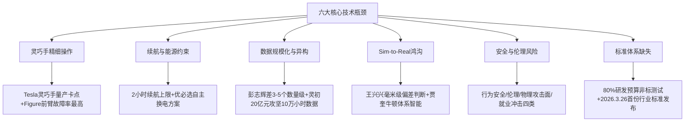

这六大瓶颈并非孤立存在，而是相互交织、相互放大——数据稀缺加剧Sim-to-Real鸿沟，标准缺失放大数据孤岛，灵巧手短板限制工业渗透，续航约束制约长程任务，安全风险延缓家庭场景落地。**正是这种瓶颈群的整体性挑战，决定了具身智能产业在2026—2030年期间必须通过"数据规模化+模型-数据-硬件协同+世界模型/VLA融合"三大主线趋势的协同推进，才能突破产业化天花板**——这正是10.2与10.3节将系统剖析的核心内容。

## 10.2 数据规模化元年与三类数据范式之争

将2026年定义为具身智能"数据规模化元年"的产业判断，不仅仅是一个时间节点的标签——它反映了整个行业从"PPT与Demo阶段"向"数据驱动模型迭代阶段"的深刻范式跃迁。**当前，通用人工智能的讨论逐渐从文本与图像转向物理世界，具身智能——赋予AI以物理身体，使其能感知、理解和交互真实环境，而这些正成为全球科技竞赛的下一个关键战场**[^78]。**与语言模型时代"数据天然存在"的繁荣景象不同，具身智能的"大脑"模型正陷入一场前所未有的"数据饥渴"。训练一个能在复杂、长时序任务中泛化的具身智能大脑，需要的不再是万亿级的文本Token，而是高质量、多模态、时空对齐的"人类行为数据"。这背后，是一场从硬件架构、数据采集到处理范式的系统性革命**[^78]。

**2026年作为"数据规模化元年"的拐点意义**集中体现在三方面。第一，资本投入向数据攻坚倾斜——**2026年开年仅前三个月，国内具身智能赛道融资规模已近300亿元，融资事件同比增长63%。光轮智能斩获超5亿美元融资，创下国内该领域融资纪录**[^78]，灵初智能完成20亿元天使+Pre-A轮融资，星海图B+轮20亿元——这些融资明显将"数据基础设施建设"作为核心用途。第二，量产爬坡推动"使用即训练"飞轮——**京东咖啡机器人场景中，每杯咖啡制作的遥操作过程同步自动化采集关节运动轨迹、力控数据，形成"使用即训练"的闭环**，智元10000台量产、Figure宝马1250小时运行、千寻Moz1宁德时代电池产线持续运行，都成为真实场景数据的飞轮起点。第三，产业政策工具系统性介入——**广西防城港、自贡数投、广西具身智能数据采集及测试中心**等地方政府数据采集中心订单，叠加上海"1+N"训练场联盟[^81]、京东计划两年内构建1000万小时数据采集中心，构成了"国家训练场+地方数据采集中心"的中国独有产业政策工具体系。

围绕"数据从哪里来"这一根本问题，2025—2026年期间形成了**三类清晰的数据范式之争**——真实场景数据派、仿真合成数据派、人类视频派。这一争论已在第2章2.3节作为产业三大"非共识"之一预先识别，本节基于前九章累积的企业实证，对三派的代表实践、博弈格局与混合协同范式作系统对照。

**第一派——真实场景数据派**。其核心主张是"机器人的每一次交互、每一个动作，都必须在物理世界中实打实地积累"。代表企业及其差异化数据策略包括：

- **星海图**：坚持"真实场景具身数据引擎"路线，开源GOD数据集"重新定义高质量真机数据标准，发布一个月即登顶全球下载量首位，被开源社区广泛认可为2025年全球最高质量具身真机数据集，全球下载量已突破60万次"。**2026年星海图将构建全球最大规模的真实场景具身数据集，以百万小时真实场景数据持续驱动具身基础模型进化**——这一目标使星海图成为真实数据派最具规模化雄心的代表企业。
- **灵初智能**：开创"人类原生数据"路径，**自研全球首个具身原生人类数据采集方案Psi-SynEngine。其核心是一副便携式外骨骼触觉手套，能够精确捕捉人手的21个关节自由度、高精度触觉信息，并同步记录头戴与手部视角的视觉数据**[^80]。**这套方案的关键不在硬件本身，而在于部署模式：让物流分拣员、商超收银员在日常工作中无感佩戴，在不改变任何既有作业流程的前提下，自然采集人类最本真的操作数据**[^80]。其规模化目标——**首批开源1000小时人类手部操作全模态数据集，总储备达10万小时，为当前行业最大规模**[^80]。
- **千寻智能**：通过自研第五代可穿戴式数据采集设备，**将多模态数据采集成本降至传统方法的1/10**，依托轻量化保障"量"、超过20个主动自由度逼近人手保障"质"、坐标系转换算法保障"效"的四项关键技术，**累计获取超20万小时多类型真实交互数据，预计2026年总量将突破100万小时**。
- **京东**：作为产业方与本体厂协同，**与千寻的四年战略合作延伸至药房配药、数码导览等场景**——京东计划构建全球最大数据采集中心的产业级行动，是"零售巨头介入具身智能数据基础设施"的标志性事件。
- **蚂蚁灵波**：明确坚持"从真实数据出发，打磨数据链路，并探索具身领域的Scaling Law"的技术路线，开源LingBot系列五个模型矩阵，强调高质量真实数据的开源生态价值。

**第二派——仿真合成数据派**。其核心主张是"通过物理仿真引擎构建虚拟训练场，以低成本、可扩展、覆盖极端情况的优势替代真机数据"。代表企业及其工程实践包括：

- **银河通用**：**首创"以合成仿真数据为主、真机数据为辅"的虚实融合训练范式**，构建全球规模最大的百亿级具身智能数据集AstraSynth，CTO王鹤宣称**"真机训练效率比特斯拉高1000倍"**。**GraspVLA"基于99%合成数据+<1%真实数据训练"**——这一极致比例使银河通用成为仿真合成派最激进的代表。
- **华为**：盘古世界模型的扩散生成模型**生成的难例场景密度达真实世界的1000倍**，为智能驾驶提供大量低成本训练数据。**输入首帧的行车场景、行车控制信息和路网数据，该模型可以生成每路摄像头的行车视频和激光雷达的点云数据**——这种"单帧场景+控制信号→多路传感器视频与点云"的生成能力，是世界模型工程化在仿真数据生成上的极致体现。
- **英伟达**：GR00T-Dreams蓝图**仅凭一张图像和简单的文本提示，在虚拟环境中快速生成海量、带有精确动作标签和逼真物理交互的合成数据**，配合DexMimicGen工具从少量人类演示扩展生成大规模训练数据，使**机器人可以在数小时内从零开始学习并掌握复杂的任务**。
- **跨维智能**：贾奎是仿真数据路径的绝对拥趸，其判断颇具理论深度——**"要想实现这样的具身智能，唯一的方式就是建立一个引擎世界，将物理世界、物理规律，以及机器人在这个世界中与物体、环境的交互方式以仿真形式建立起来，这样的引擎才是具身智能机器人最佳的训练场，这与地球在过去几十亿年演化出了不同的生物一样"**[^79]。
- **光轮智能**：作为合成数据领域的代表性创新者，深度绑定NVIDIA Cosmos+GR00T-Dreams生态，**能够从一张图像和简单的指令生成数以百万计的训练数据**，是世界模型工程化在中国市场的重要落地者。

**第三派——人类视频派**。其核心主张是"利用互联网上海量人类活动视频学习物理规律与动作模式，作为真机与仿真数据的拓宽替代"。代表案例包括：

- **Generalist AI Pete Florence的"拐杖论"**——其作为VLA概念共同开创者之一，公开提出"把'视觉-语言'训练引入机器人，很大程度上是因为机器人自己的交互数据还不够多，所以VLM只是一根过渡期的'拐杖'。一旦物理交互数据规模起来，这根拐杖就该被拿掉"。这一立场实质上将"人类视频+VLM预训练"定位为通向纯机器人原生数据的过渡路径。
- **Ego4D第一人称视角日常活动视频**——英伟达GR00T N1的"数据金字塔"将其作为**底层大规模网络数据和人类视频数据**——虽无直接动作标签，但模型可从中学习丰富的任务语义和自然动作模式。
- **Figure Helix 02**——基于**超过1000小时的人体运动数据**结合仿真到现实的强化学习算法完成训练。
- **流昇科技**——**收集了4000多种语言的全球经典文献，通过数据清洗，将能够用来做训练的四分之一的数据保留**[^79]——虽然这一案例更多面向多语言而非具身智能，但其"借助人类活动数据训练AI"的方法论与人类视频派同源。

**三派的博弈格局与混合协同范式**。三类数据范式之争的根本分歧在于"何种数据最接近物理世界真相、何种数据最具规模化潜力"。然而2025—2026年的工程实践已经清晰显示——**单一数据范式难以独立支撑通用具身智能，三类数据的混合协同已成为头部企业的事实性主流**：

| 混合协同范式 | 代表企业 | 工程实现 |
|---------|---------|---------|
| **数据金字塔三层** | 英伟达GR00T N1/N1.5 | 顶层真实机器人轨迹+中层仿真合成+底层网络与人类视频 |
| **异构数据co-training** | Physical Intelligence π0.5 | 多机器人数据+高层语义预测+网络数据协同训练，Flow Matching+FAST Token输出 |
| **真机+大规模仿真组合** | Figure AI Helix 02 | 1000小时人类运动数据+20万并行仿真环境 |
| **真实场景金字塔** | 星海图 | GOD真实数据+UMI+人类第一视角POV无本体数据 |
| **虚实融合训练** | 银河通用GroceryVLA | 99%合成数据+<1%真实数据微调 |
| **多源真实数据预训练** | 千寻智能Spirit v1.5 | 互联网视频+遥操作+可穿戴脏数据多样化预训练 |

资料来源：综合整理自第3—7章企业剖析及

**国家训练场与地方数据采集中心作为中国独有产业政策工具的战略意义**值得特别强调。如10.1节所述，**上海"1+N"训练场联盟**作为国家级训练场，与广西防城港（2.64亿元）、自贡数投（1.59亿元）、广西具身智能数据采集及测试中心（1.26亿元）等地方政府数据采集中心订单形成"中央+地方"的双层数据基础设施[^81]。**此外，智元机器人在上海投建了具身智能机器人的数据采集场，帕西尼感知科技也在天津投建了数据采集场**[^79]。这种"政府订单驱动数据基础设施建设+本体厂获得规模化订单+数据资产被本地化沉淀"的产业政策工具，是中国相对美国"市场化主导"模式的独特优势——它既解决了创业企业B轮前难以承担数据基建成本的现实困境，又为地方培育具身智能产业集群提供了实物抓手。这一工具的可持续性与规模化效应，将成为2026—2028年中国具身智能赛道相对全球同行的关键差异化竞争力。

## 10.3 模型-数据-硬件协同与世界模型与VLA融合的演进趋势

数据规模化元年的到来，并不意味着数据本身就是答案——**数据必须与模型架构、硬件本体协同进化，才能形成真正的"具身智能"飞轮**。本节剖析具身智能技术演进的两大主线趋势，回应"路线收敛是终态还是过渡态"这一开放性命题。

### 10.3.1 主线一:模型-数据-硬件协同的"X/Y/Z三曲线"演进

智元机器人董事长邓泰华在2026年4月智元合作伙伴大会上，以"X/Y/Z三曲线"系统勾勒了具身智能产业从"开发态"到"部署态"再到"普及态"的完整演进路径——这一框架因其精准捕捉了产业演进的内在节奏，已成为业内引用最广的产业判断之一。**邓泰华以X、Y、Z三条曲线勾勒具身智能产业发展路径：X曲线对应2022年至2025年的"开发尝鲜期"，即行业完成从原型到规模量产的关键跨越；Y曲线对应2026年至2030年的"部署成长期"，即机器人硬件一致性、规模化交付能力、交互智能与作业智能同步提升，部署态数据飞轮驱动生产力进一步提高；Z曲线对应2030年及以后的"部署普及期"，即具身智能涌现时刻到来，机器人将在制造、物流、服务等重点领域释放生产力**[^84]。

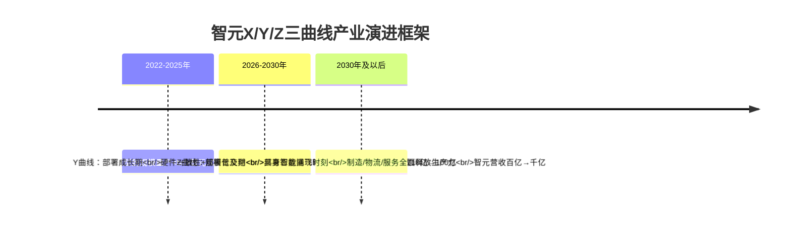

邓泰华明确将2026年定义为具身智能"部署态"元年——**"具身智能正式从'开发态'迈入'部署态'，从'能动'走向'会干'。当机器人能自主干活、独立创造价值，它就成为物理AI世界真正的生产力"**[^84]。这一从"能动"到"会干"的范式跃迁，恰恰是模型-数据-硬件协同进化的产业表征。智元联合创始人、总裁兼CTO彭志辉对此的另一角度解读同样深刻——**"具身智能的真正分水岭，不只是AI模型进入物理世界，更是产品开始进入真实工作流。行业正在从'卖机器人'转向'交付结果'"**[^84]。

模型-数据-硬件协同的工程化路径，在中国信通院"软硬融合+知行合一+虚实贯通"三大融合判断中得到了系统性概括（如第1章1.2节所述）。基于第3—7章企业实证，这三大融合的工程演进可归纳为：**软硬融合**——智元从硬件量产到ViLLA基础模型升级、傅利叶GR-2与英伟达合作、宇树2026年3月开源UnifoLM-VLA-0、星海图R1硬件成为PI/斯坦福/英伟达的检验基座；**知行合一**——千寻智能"使用即训练"飞轮在京东与宁德时代场景闭环、Figure 02在宝马生产线6个月3万辆X3的数据飞轮；**虚实贯通**——银河通用AstraSynth百亿级仿真+真机微调、英伟达Cosmos+GR00T-Dreams数据飞轮。

更具产业深度的工程实践范例是**智平方AlphaBrain Platform——三大全球首创的开源生态构建**。这是2026年4月发布的标志性事件，与同期特斯拉公开Optimus第三代灵巧手核心硬件专利形成"中美开源呼应"[^85]。**特斯拉选择公开其Optimus第三代灵巧手的核心硬件专利。这种开放，延续了特斯拉一贯的硬件开源逻辑：通过释放关键能力，推动行业形成统一标准，从而加速产业整体进化。但几乎在同一时间，全球生产力型通用智能机器人领跑者智平方正式发布AlphaBrain Platform，一个面向全球开发者的一站式具身智能模型开源社区**[^85]。**与硬件层面的开放不同，AlphaBrain Platform直接指向机器人的核心——"大脑"。它不是开放一个零部件，而是开放一整套让机器人能够理解世界、做出决策并持续进化的大脑体系。如果说特斯拉在回答"机器人如何被制造"，那么智平方正在回答一个更关键的问题：机器人如何变得真正聪明**[^85][^86]。

AlphaBrain Platform的三大全球首创集中开源，标志着具身智能技术演进从"单点模型领先"走向"生态级基础设施"：

- **全球首个开源类脑VLA模型（NeuroVLA）**——**类脑模型被公认为VLA的未来方向。传统VLA模型"训练完成即固定"，无法在部署后继续学习。智平方首次在类脑控制任务上达到前沿水平**[^85]。**NeuroVLA引入脉冲神经网络动作头与R-STDP训练算法，支持部署阶段的在线自适应，使用前向传递方式，让机器人具有肌肉记忆能力。这意味着机器人第一次从"执行指令的工具"转向"在任务中不断进化的主体"。它不只是完成任务，而是在过程中变得更熟练、更稳定，接近人类的学习方式**[^85]。
- **全球首个基于RL Token的开源VLA训练架构**——**RL Token是"强化学习+VLA"的黄金组合，也是让大模型真正可落地的场景化利器，其核心是将大模型的通用认知与强化学习的特定场景优化能力深度融合**[^86]。**智平方率先在LIBERO环境上完成验证，并提出优化方案。其信息瓶颈编码器与两阶段训练策略，使VLA主体在RL微调过程中完全冻结，既避免灾难性遗忘，又大幅降低训练计算成本。所需训练参数从3.9B降至**[^86]更小规模。
- **全球首个面向具身智能的开源世界模型集成**——智平方成为整合"端到端VLA→融合世界模型VLA→类脑NeuroVLA"三阶段路径的代表企业，将VLA的演进从理论范式转化为可被全球开发者复用的工程基础设施。

这一开源生态的产业意义在于——**当具身智能基础模型从"商业秘密"走向"开源底座"时，整个产业的迭代速度将获得指数级提升**。这正呼应了第7章关于"开源生态加速产业拐点"的判断——英伟达GR00T、Google Gemini Robotics、华为盘古、银河通用GraspVLA、星海图G0、千寻Spirit v1.5、极佳GigaBrain-0.1、原力灵机DM0等头部模型的开源/赋能策略，将大幅降低中小企业进入门槛，同时也使得"软硬一体做苹果不做安卓"成为头部企业的战略共识——千寻智能高阳的判断颇具代表性："我到今天为止一个比较obvious的结论是，得做软硬一体，得做具身智能领域的苹果，不能做安卓。因为技术初期，跨本体能力一定是比较弱的，把软件和硬件一起做好，在无数的行业初期都是这样的"。

### 10.3.2 主线二:世界模型与VLA融合演进的三阶段路径

具身智能技术演进的第二大主线，是世界模型与VLA融合的代际演进。如第2章2.8—2.9节所述，2025—2026年间"VLA派vs世界模型派"之争的本质并非两条互斥道路的非此即彼，而是关于动作Token组织方式、数据来源构成与认知架构形态的范式选择分歧。基于第3—6章企业实证，可清晰识别出两派融合的三阶段演进路径——**这一路径以智平方郭彦东的总结最具系统性**——**"端到端VLA→融合世界模型增强VLA→类脑NeuroVLA"三阶段**：

**第一阶段:端到端VLA（2023—2024年）**——以Google RT-2、Physical Intelligence π0、智元GO-1初代、Figure Helix初代为代表。核心特征是"感知—理解—行动"统一建模，但泛化天花板与真机数据稀缺成为根本约束。

**第二阶段:融合世界模型的增强型VLA（2025—2026年）**——以星海图G0+Fast-WAM同源共生、银河通用GraspVLA+AstraSynth虚实融合、智平方融合世界模型VLA、极佳视界GigaBrain-0.1（世界模型生成数据增强VLA+RGBD+具身CoT）、原力灵机DM0（具身原生VLA+8种异构机器人跨机型）、自变量WALL-B（WUM统一融合）为代表。这一阶段的核心特征是**"先预测，后执行"——世界模型作为VLA的预测模块嵌入决策前端**。**2025年6月，阿里巴巴达摩院、湖畔实验室和浙江大学研究团队发布一项研究，将VLA模型和世界模型集成在一个框架中：世界模型通过结合动作与视觉信息理解来预测未来状态，这对于成功执行诸如抓取等灵巧操作任务**具有重要意义。

**第三阶段:类脑分层VLA（2026年及以后）**——以智平方NeuroVLA为代表。**智平方将其发展划分为清晰的三阶段路径：从最初实现感知、理解与行动统一建模的端到端VLA，到融合世界模型实现"行动前预测"的增强型VLA，再到迈向类脑机制的全新阶段——VLA不再只是一个单一模型，而是演进为具备分层结构的智能系统——类似人类大脑、小脑与脊髓的协同机制，从而实现更高效的推理、更快速的响应以及更稳定的控制**。**类脑模型通过引入生物启发的分层计算结构，首次提出将小脑和脊髓的部分融入操作当中，实现模型毫秒级自适应控制与接近生物反射速度的响应能力，使机器人首次具备类似"肌肉记忆"的持续进化能力**。

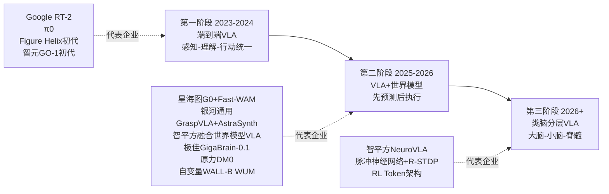

### 10.3.3 关于"路线收敛是终态还是过渡态"的产业研判

回到本章开篇提出的开放性命题——路线收敛是终态还是过渡态？基于第3—9章企业实证与本节趋势剖析，本研究给出如下系统判断：

**短期看（2026—2028年），混合架构作为工程主流的事实性确认毫无悬念**。从企业实践层面看，超过15家头部企业（占第8章25家代表企业的60%以上）已采用某种形式的混合架构——自变量WALL-B从VLA向WUM跃迁、Figure Helix 02三层双系统、智平方FiS-VLA异构输入异步频率、星海图G0+Fast-WAM同源共生、银河通用AstraBrain端到端融合、千寻Spirit v1.5多样性脏数据预训练、英伟达GR00T N1+Cosmos+GR00T-Dreams数据飞轮、Google Gemini Robotics 1.5 ER+VLA双模型协作、极佳GigaBrain-0.1世界模型增强VLA、原力灵机DM0具身原生跨机型——这些工程实践共同验证了"路线收敛"已不再是理论预测而是产业事实。

**中期看（2028—2030年），融合架构内部的分化将持续推进，可能出现"工业场景双系统主导+家庭场景类脑主导+B2B服务VLA主导"的差异化收敛**。这一判断的依据来自四大场景对路线选择的不同需求——工业产线对毫秒级控制频率与高节拍稳定性的要求，使双系统主导型（Figure Helix 02、英伟达GR00T N1）更具优势；家庭场景对持续学习与"肌肉记忆"的需求，使类脑分层VLA（NeuroVLA）的研究价值凸显；B2B服务场景对跨场景泛化的需求，使端到端VLA与融合世界模型VLA保持中坚地位。

**长期看（2030年及以后），激进派"具身原生"路线对"混合即终态"判断的证伪可能性仍然存在**。Pete Florence的"VLM拐杖论"、王兴兴的"世界模型天花板更高"判断、自变量WALL-B的WUM架构跃迁、原力灵机DM0的"全球首个具身原生VLA模型"路线，都在尝试通过更彻底的范式革命突破当前混合架构的边界。**蚂蚁灵波首席科学家沈宇军的判断对这一长期可能性最具洞察力**——"具身智能可能还在GPT-1阶段，行业里还没有一个真正属于具身智能的原生预训练模型；今天几乎所有具身模型都建立在数字世界的大模型基础之上——要么是多模态模型，要么是视频生成模型——再叠加少量机器人数据进行微调，这是一种'迫不得已'的选择，而非终极答案"。沈宇军预判达到"GPT-3时刻"至少需要三年，"一年解决数据怎么采，一年解决数据怎么选，一年真正训出原生基模"——按这一时间表推演，2028—2030年正是具身原生预训练模型从理论走向工程的关键窗口期。

**因此，本研究对该开放性命题的最终回答是——混合架构是2026—2028年的事实性主流，但不一定是2030年及以后的终态。具身原生范式革命的可能性，将与混合架构的工程主流共存，最终在2028—2030年期间通过数据规模化与基础理论突破的"双重赛跑"决定走向**。这一判断既尊重了当前工程实践的事实，也保留了基础研究范式革命的可能性，避免对未来作出武断结论。

## 10.4 四大场景终局比较——工业、家庭、极端环境、AI Agent具身化

回到产业落地层面，"具身智能在哪些场景率先实现规模化盈利闭环"是2026—2030年期间最具商业价值的产业级问题。基于第3—7章企业实证与10.1—10.3节趋势剖析，本节系统比较五大技术路线在工业、家庭、极端环境、AI Agent具身化四大场景中的落地节奏、商业化天花板与终局可能性，最终归纳"工业先行—极端补位—家庭长期—Agent融合"的四场景终局节奏。

### 10.4.1 工业场景:硬件派+混合融合派领跑,最先实现规模化盈利闭环

**工业场景已经成为具身智能率先实现规模化盈利闭环的确定性赛道**。这一判断的依据来自前几章企业实证的密集呈现：

- **Figure AI**：宝马斯帕坦堡工厂6个月生产3万辆X3、装载9万零件、运行1250小时，每班次成功率高于99%、零次干预；
- **智元机器人**：2026年3月28日第10000台通用具身机器人下线，**已发布工业制造、商业服务、特种作业三大方向的七大生产力解决方案。今年3月底，智元刚刚实现累计1万台机器人下线**[^84]，**龙旗南昌产线并线部署一个多月，富临精工、上汽工厂常态化运行**[^84]；
- **银河通用**：累计订单数千台，深度合作宁德时代/博世/丰田/上汽/北汽/极氪/长城；
- **越疆科技**：服务超过80家世界500强企业，**2025年越疆科技收入同比增长31.7%**[^87]；
- **Tesla Optimus**：Fremont工厂规划年产能100万台，2027年千万台目标；
- **Agility Digit**：深度绑定Amazon、GXO、Spanx等顶级仓储物流巨头；
- **千寻智能**：**全球首条人形具身智能产线已在宁德时代中州基地投运**，"小墨"机器人完成高压插接等精密工序、零故障量产；
- **优必选Walker S2**：2025年订单累计11亿元，进入车厂、医疗、教育多场景。

工业场景的产业级数据支撑同样令人瞩目——**高盛研究利用现有技术预测，在制造业等结构化环境中对人形机器人的需求将大幅增长。这可能包括电动汽车组装和零部件分类等使用案例。行业研究表明，中国约70%的制造业已经由机械和自动化完成，而仅有20%由人工劳动和10%由管理人员完成**[^88]。**根据高盛团队的预测，到2030年，将有超过25万台人形机器人出货量，其中几乎全部用于工业用途**[^88]。**ABI Research预测，机器人产业规模将从如今的500亿美元增至2030年的1110亿美元，届时全球部署机器人数量约达1300万台**[^89]。

工业场景的核心成功要素来自三方面：**第一，结构化环境降低泛化压力**——工业产线相对家庭场景的非结构化复杂性，更适配当前模型的能力上限；**第二，明确的ROI回报**——"用10万元级机器人替代8万年薪工人，1.5年即可回本"的财务模型已被多个案例验证；**第三，头部客户系统性导入**——亚马逊专门成立团队研究人形机器人融入物流网络[^89]、宝马引入Figure 02、宁德时代深度合作多家本体厂等案例，使工业场景从"单点采购"升级为"系统性工程"。

这一场景的胜出路线归属——**硬件驱动派**（Tesla、宇树、优必选、Boston Dynamics、Agility）凭借量产能力与硬件壁垒占据制造与仓储核心位置，**混合融合派**（Figure、银河通用、星海图、智元、千寻智能）凭借跨场景适配与认知层补课实现高价值场景渗透，二者构成工业场景的双主角格局。

### 10.4.2 家庭场景:VLA派+WUM派激进押注,3—5年长周期验证

**家庭场景被业内普遍视为"99%的机器人都跨不过去的门槛"**——这一判断既是产业共识，也是想象空间所在。本研究对家庭场景的代表企业及战略选择已在前几章充分剖析：

- **自变量机器人WALL-B**：**35天后（2026年5月25日）将正式入驻首批真实家庭——这是国内具身智能行业第一次把通用家庭服务机器人从实验室的PPT和Demo推向普通用户的真实家庭**。
- **1X Technologies NEO**：以**2万美元/台或499美元/月订阅**的家用人形机器人定价，首批订单预计2026年交付。
- **千寻智能**：通过京东MALL咖啡机器人初步验证家庭+零售跨场景能力。
- **银河通用**：**Galbot G1正式进驻全家北京中关村鼎好店**，从工厂、24小时仓库等不可见场景的勤勉工作走向"商超、景点等大众可感知的体验空间"。
- **多家头部企业的远期家庭规划**：智元、智平方、Figure等均将家庭场景列为3—5年战略目标。

家庭场景的核心挑战集中在三方面：**第一，王潜所言"时代最难的技术问题"**——非结构化环境下持续学习与极端泛化能力的根本要求；**第二，安全边界模糊**——家庭陪护机器人涉及生物信息采集与儿童老人交互，安全标准尚未成熟[^81]；**第三，商业模式的不确定性**——2万美元买断vs.订阅服务、保险责任划分、长期维护与升级模式都尚待验证。

但家庭场景的想象空间同样巨大——**高盛预计仅人形机器人市场规模到2035年就将达380亿美元**[^89]，**消费者机器人销售将在未来十年快速增长，十多年后每年销售量将超过一百万台**[^88]，**自动化机器人甚至类人机器人将接管大量重复性工作，把人类从枯燥、繁重的体力劳动中解放出来，同时协助消费者处理日常家务**[^89]。**麦肯锡全球资深合伙人亚历克斯·帕纳斯指出，预测显示到2033年美国将面临190万工厂工人缺口，现有数据表明仓库员工流失率高达40%，这成为加速机器人应用的核心动力**[^89]——这一劳动力供给端的根本矛盾，使家庭服务机器人具备长期不可逆的需求基础。

这一场景的胜出路线归属——**VLA派**（自变量、1X、千寻智能、Figure）凭借跨场景泛化与基础模型壁垒占据先发优势，**WUM/世界模型派**（自变量WALL-B WUM、智平方融合世界模型VLA）凭借物理世界感知与持续进化能力具备长期潜力，二者构成家庭场景的核心赌注。但需客观指出——**家庭场景的真正规模化爆发预计仍需3—5年验证期**。

### 10.4.3 极端环境与特种应用:四足专精派+液压高负载派优势凸显,容错率与人力替代价值最高

极端环境与特种应用场景包括高危工业巡检、应急救援、核电站作业、空海跨域等——这一类场景的共同特征是**"高危场景容错率高、人力替代价值最具确定性"**，使其成为四足专精派与液压高负载派率先实现商业化盈利的差异化赛道。

代表案例的密集呈现凸显了这一场景的产业成熟度：

- **云深处科技**：**业务覆盖50个国家和地区，绝影系列四足机器人在变电站全自主巡检的整体识别准确率达到96.5%**，**2025年落地的内蒙古变电站、光伏电站项目中，四足机器人替代运维人员完成零下30℃环境下的巡检工作，巡检结果准确率达99.9%**——成为中国硬件派率先实现2025年扭亏为盈的稀缺样本。
- **ANYbotics**：苏黎世联邦理工背景，深耕化工/能源高危行业长期作业场景，**设备故障率低于行业平均水平30%**。
- **具微科技MOVENEW P1**：液压驱动+四防能力（防磁、防爆、防水、防冻），**400kg极限负载、200kg动态负载、-40℃至85℃宽温域、1000Gs强磁**，专攻极端工业场景。
- **TeleAI（中国电信人工智能研究院）**：**TeleBot-M人形机器人放飞TeleAqua-Bee空海跨域具身智能体**[^90]，专门面向"应急救援、海缆电网检测维修、临地安防、城市治理、工业巡检"等高危作业场景[^90]。**以应急救援为例，洪水冲断道路、地震堵死通道，人进不去；深山搜救、海上失联，视线够不着；高温、有毒、缺氧，危险系数拉满，救援人员每前进一步都要赌上运气。为此，李学龙教授带领具身智能团队创新推出了一套面向高危作业场景的"具身智能搭子"**[^90]。
- **华东理工大学核电站巡检机器人**：**面向核电站巡检的具身智能机器人，研发了"会思考"的巡检机器人。在核电站的运维管理中，传统的人工巡检不仅耗时耗力，还面临着高辐射风险**[^91]——这一成果荣获Robotex世界机器人大赛亚洲创新创业挑战赛创新赛道总决赛亚军[^91]。
- **优必选Walker S系列**：在大型活动保障、城市巡检与应急、特殊人群辅助等场景已实现部署[^92]。

极端环境场景的核心成功要素来自三方面：**第一，人力替代价值的确定性**——核电、电力、化工、深海、太空等场景的"人不愿去/不能去/去不安全"特征，使机器替代具备不可逆的需求基础；**第二，容错率相对较高**——相比家庭场景的精细操作要求，极端环境对机器人的核心要求是"完成任务即可，无需追求人类水平的精致"；**第三，B端付费意愿强烈**——国家电网、应急管理部门、核电运营方等客户对机器替代的预算相对充足。

**亦庄机器人马拉松带给我们的启示**最具产业意义——**亦庄的核心价值，在于将赛事打造成产业加速器。赛事设立"最佳续航""最美步态""最佳感知"等专项奖项，引导技术聚焦场景需求；同时串联上游零部件、中游整机制造、下游场景应用，形成产业链协同。正如业内专家所言，赛事正在推动人形机器人从"实验展示"走向"场景实战"，加速实现技术从"单项突破"到"体系化提升"的跨越**[^92]。这种"以赛促研、以赛促产"的产业模式，特别适合极端环境场景的能力验证与场景拓展。

这一场景的胜出路线归属——**硬件驱动派的四足专精派**（云深处、ANYbotics）和**液压高负载派**（具微科技、Boston Dynamics Spot）凭借硬件性能与场景深耕占据核心位置，**混合融合派**则在跨域协同（如TeleAI空海跨域）等更复杂的极端任务中具备差异化优势。

### 10.4.4 AI Agent具身化:平台型生态派最具杠杆,智能体与具身智能融合的"通用底座"路径

第四类场景是AI Agent具身化——这一场景指的是数字智能体（如客服、数据分析助手、内容生成工具）与物理智能体（机器人、无人机、智能汽车）在通用底座层的融合。**根据《中国信通院智能体技术和应用研究报告（2025年）》的最新数据，智能体市场预计会在2025年达到约28.5亿美元的规模，而具身智能市场也会突破约16.2亿美元。这两条技术路径正在对AI产业格局进行重塑**[^93]。

这两类智能形态的融合趋势日益明显。**智能体本质上是一个在软件层面开展自主决策工作的系统。它会借助对环境信息的感知，来制定行动计划，随后去执行任务，并且还会从结果当中进行学习，这样就把"感知-决策-行动"的闭环给建立起来了**[^93]——这一闭环结构与具身智能"感知—决策—行动—再感知"高度同构。**典型应用场景会包括智能客服、数据分析助手、内容生成工具等。这类应用的共同点在于主要会在数字空间当中进行操作，通常会借助API调用、数据处理、文本生成等方式，把任务完成**[^93]。**具身智能则强调智能需要依托一个物理载体才能得以实现。这个"身体"不只是一个硬件平台，它还是让智能系统去感知以及改变物理世界的关键媒介**[^93]。

千寻位置发布的**"具身时空大脑（SpatiXBot）"**是AI Agent具身化的代表性产品[^94]——**根据千寻位置公开信息，"具身时空大脑"基于公司时空智能全链路技术底座，融合千问通用大模型、自研专业模型的能力，构建起覆盖室内外的自主行走、环境感知与群体协同能力。千寻位置CEO陈金培将其定位为一套"帮助机器人理解环境、做出决策、执行任务的神经中枢"**[^94]。其在2026年4月19日北京亦庄人形机器人半程马拉松中**超过三分之二的自主赛队搭载了千寻位置的北斗"时空智能三体套件"**[^94]——证明了AI Agent具身化在群体协同与跨场景泛化上的潜力。

**IDC预测，2026年中国具身智能机器人在相似场景间的任务复用率将达到约40%**[^95]——**这意味着什么？在养老院学会递送药品的机器人，可以很快适应医院病房的环境；在仓库掌握分拣技能的机械臂，能够迁移到工厂生产线**[^95]。**这种"场景AI"的能力，正是中国厂商的核心竞争力**[^95]。这一场景AI能力的提升，正是AI Agent具身化的关键工程指标。

这一场景的胜出路线归属——**平台型生态派**（英伟达Cosmos+GR00T、Google DeepMind Gemini Robotics 1.5/1.6、华为CloudRobo+盘古、千寻SpatiXBot）凭借基础设施层与模型供应商角色最具杠杆效应。**英伟达通过"芯片+模型+仿真"全栈生态卡位"路线无关必赢"地位；Google DeepMind通过Gemini Robotics系列的跨硬件平台学习能力实现"一份模型赋能多种本体"的杠杆；华为CloudRobo战略以"云端教培+行业Know-how整合"赋能整机厂商**——这些平台型企业事实上在AI Agent具身化场景中扮演着"基础底座"角色。

### 10.4.5 "工业先行—极端补位—家庭长期—Agent融合"四场景终局节奏

综合上述分析，本研究对四大场景的终局节奏作出系统判断如下：

| 场景 | 落地节奏 | 主要胜出路线 | 商业化天花板 | 终局形态 |
|------|---------|-----------|---------|---------|
| **工业场景** | 2026—2028年规模化盈利 | 硬件派+混合融合派 | 高盛预测2030年25万台+工业用途 | "硬件量产+认知层补课"双主角格局 |
| **极端环境** | 2025—2027年加速渗透 | 四足专精派+液压高负载派+特种混合派 | 容错率高+人力替代价值确定 | 高危场景B端规模化部署 |
| **家庭场景** | 2028—2030年验证期，2030+爆发 | VLA派+WUM/世界模型派 | 高盛2035年380亿美元市场 | "类脑分层+持续进化"主导 |
| **AI Agent融合** | 2026—2030年持续推进 | 平台型生态派 | 智能体+具身智能融合至通用底座 | "基础设施+全栈杠杆"格局 |

资料来源：综合整理自第3—7章企业剖析及

**这一"工业先行—极端补位—家庭长期—Agent融合"的终局节奏，既反映了2026—2030年具身智能产业演进的工程现实，也回应了第8章关于"五大路线代表企业差异化优势与短板"的横向对比研判**——不同路线在不同场景下具备差异化优势，所谓"路线之争"在场景终局视角下转化为"路线分工"。这种分工格局的稳定性与演进性，将决定2030年全球具身智能产业的最终形态。

## 10.5 全球产业格局未来3—5年走向研判与最终结论

作为全篇研究的最终收官，本节基于第8—9章累积的产业判断，对2026—2030年全球具身智能产业格局做出系统研判，并回答本研究的三大开放性命题——"路线收敛是终态还是过渡态""中国数量优势能否转化为价值优势""2030年产业形态如何"。

### 10.5.1 市场规模研判:多机构预测的交叉验证

具身智能市场规模的多机构预测尽管存在差异，但共同验证了产业的指数级增长趋势。下表系统呈现主要研究机构的预测数据：

| 研究机构 | 预测对象与时点 | 规模预测 | 关键数据 |
|---------|------------|---------|---------|
| **高盛研究** | 2035年全球人形机器人市场 | **380亿美元（最乐观2050亿美元）** | 出货量140万台；制造成本下降40%[^88][^96] |
| **IDC** | 2026年全球智能机器人硬件 | **接近300亿美元** | 中国引领增长，市场规模突破110亿美元[^97][^98] |
| **IDC** | 2026年中国人形机器人 | **逼近13亿美元** | 应用场景拓展至当前3倍以上[^98] |
| **IDC** | 2026年中国四足机器人 | **突破7亿美元** | 翻倍增长[^98] |
| **赛迪研究院** | 2030年全球具身智能 | **2388亿元** | 复合增长率73%[^99] |
| **国务院发展研究中心** | 中国具身智能 | **2030年达4000亿、2035年破万亿** | [^78] |
| **摩根士丹利** | 具身智能潜在市场 | **总规模可达60万亿美元** | 中国35家企业入选全球百强[^100] |
| **ABI Research** | 2030年机器人产业整体 | **1110亿美元** | 全球部署机器人数量约达1300万台[^89] |
| **中国信通院** | 2025年全球具身智能 | **195.25亿元** | 首次将具身智能纳入国家未来产业重点[^78] |
| **赛迪研究院** | 中国市场 | **2026年Q1融资规模近300亿元** | 同比增长63%[^78] |

资料来源：综合整理自[^78][^99][^89][^88][^96][^100][^97][^98]

这些预测数据的核心启示在于——**具身智能市场规模在2026—2035年期间将实现约10倍以上的增长**。**仅2025年一年，企业和投资者就向人形机器人砸了61亿美元，是2024年投资额的四倍**——这一资本流入与市场规模预测共同指向，具身智能将成为继智能手机、新能源汽车之后下一个万亿级硬件平台机会。**洪泰基金投资人对此判断尤为精准——"具身智能与人形机器人赛道将是继智能手机之后最大的硬件平台机会"**。

### 10.5.2 产业格局演进研判:三极格局基本稳定但中国"质变"命题待解

如第8章8.7节所述，全球具身智能产业已形成"中国出货量主导、美国估值与基础理论主导、欧日差异化补位"的三极格局。**摩根士丹利的人形机器人百强名单中，中国有35家企业上榜，占比超过三分之一**[^100][^101][^102]——**专利申请数量上，中国也是遥遥领先。过去5年中，中国以5688项人形机器人专利申请数，牢牢占据第一宝座，远远超过排在后面的美国（1483项）和日本（1195项）**[^101][^102]。这一数据印证了中国在具身智能产业链广度与专利积累上的绝对优势。

但**"中国制造大国与价值大国之间的张力"**仍是核心命题。如第9章9.5—9.6节所述，中国"政策+供应链+场景"三轮驱动模式在出货量上占据全球70%份额，但美元独角兽估值梯度仍由Figure 390亿美元、PI 110亿美元、Wayve 86亿美元主导。按美元换算，宇树IPO估值约58亿美元、银河通用约30亿美元、星海图约28亿美元——仍显著低于美元梯队。**为什么引领全球机器人市场的，会是中国？答案在场景实验室的差异化路径中**——**传统机器人创新遵循"技术驱动"逻辑：先有突破性技术，再寻找应用场景。波士顿动力的Atlas展示了惊人的运动能力，但十年过去了，它的商业化路径依然模糊。这种模式在实验室里创造奇迹，在市场上却步履维艰。中国走的是另一条路："场景驱动创新"。不是问"我们的技术能做什么"，而是问"这个场景需要什么"**[^95]。

中国的"质变"命题需要在三个维度实现质变：

- **基础理论创新**——能否在世界模型、类脑VLA、具身原生预训练等前沿范式上贡献中国原创理论。蚂蚁灵波"具身智能仍在GPT-1阶段"的判断、智平方"NeuroVLA类脑分层"的代际跃迁、原力灵机"具身原生VLA"的范式革命，都是这一维度的早期信号。
- **品牌溢价能力**——能否将"中国制造"的成本优势升级为"中国创造"的品牌溢价。**Figure AI创始人Brett Adcock曾承认感受到来自中国机器人公司（如宇树科技）的竞争压力。"中国团队在成本控制与执行效率方面的优势，将使其成为全球机器人领域不可忽视的竞争力量"**——这一表态的背面，是中国头部企业仍未在全球市场获得相对Figure的同等品牌溢价。
- **全球生态影响力**——能否构建相对英伟达Cosmos+GR00T、Google Gemini Robotics、Boston Dynamics等全球生态主导者的中国对位品牌。华为CloudRobo战略、智平方AlphaBrain Platform三大全球首创开源生态、星海图作为英伟达EgoScale等顶级模型的数据基础设施供应商，都是这一维度的早期突破。

### 10.5.3 企业洗牌研判:商业化小考催生"5—8家全球头部赢家+10—15家细分赛道领导者"格局

如第9章9.9节所述，2026—2027年的"商业化小考"将成为决定企业能否穿越周期的核心考验。基于第3—9章累积的产业判断，本研究对2026—2030年企业洗牌格局作出如下系统研判：

**第一梯队（5—8家全球头部赢家）**：在四大场景中至少能在两个场景实现规模化盈利、累计融资达独角兽以上规模、具备生态卡位能力的全球头部企业。预计这一梯队将由"中美各2—3家整机企业+2—3家平台型生态企业"组成——中国整机企业的强候选包括宇树科技（已盈利+IPO进展最快）、智元机器人（10000台量产+营收10亿元）、银河通用（国家大基金背书+商业化全场景），美国候选包括Figure AI（宝马深度绑定+390亿美元估值）、Tesla Optimus（Fremont百万台年产能），平台型候选包括英伟达、华为、Google DeepMind。

**第二梯队（10—15家细分赛道领导者）**：在单一场景或细分赛道具备明确竞争优势的头部独角兽。预计这一梯队将包括星海图（开发者首选+真实数据基础设施）、智平方（双系统VLA+智魔方）、千寻智能（多样性脏数据+京东宁德双场景）、自变量（家庭场景押注）、星动纪元（软硬全栈+海外占比50%）、傅利叶智能（医疗康复+商业服务）、云深处科技（四足专精+已扭亏）、Physical Intelligence（软件定义硬件+110亿美元估值）、Wayve（欧美第三方智驾标的+500城zero-shot）、1X Technologies（家用消费）、Boston Dynamics（动力学极致+AI研究院）、Agility Robotics（仓储物流专用）等。

**第三梯队（后续梯队企业）**：未通过商业化小考、面临持续融资稀释压力的企业。这一梯队的企业将在2027—2028年期间面临三种命运——被头部企业并购整合、转型至细分应用赛道、退出市场。

**IPO密集申报窗口期**将进一步加速这一洗牌进程。如第9章9.8节所述，宇树科技2026年3月科创板IPO获受理（420亿元/约58亿美元估值）、云深处2025年12月提交IPO辅导备案、银河通用2025年11月完成股改、智平方2026年4月完成股改——这些标志性事件将在2026—2028年期间形成"IPO密集申报窗口期"，重塑一级市场估值锚的本土化转向。

### 10.5.4 技术演进研判:"2026世界模型基础年→2027—2028混合架构成熟期→2030+具身智能涌现时刻"

基于10.2—10.3节的趋势剖析，本研究对2026—2030年技术演进时间表作出如下研判：

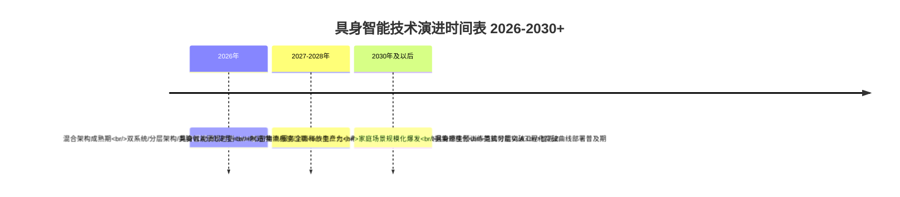

**2026年——世界模型基础年**。如英伟达Jim Fan所判断"2026年将成为世界模型首次为机器人领域典型基础的一年"，这一年将见证VLA派与世界模型派融合的工程化加速、数据规模化元年的落地、智元部署态元年的开启、首份行业标准（YD/T 6770—2026）的发布、智元10000台量产里程碑的兑现。

**2027—2028年——混合架构成熟期**。这一阶段将完成双系统、分层架构、类脑VLA等不同混合形态的分化定型。**邓泰华表示，公司成立三年时即2025年年营收已经突破10亿元；目标在成立5年时即2027年，年营收突破百亿元**[^84]——智元的百亿营收目标将在这一阶段验证混合架构的商业化能力。同时，IPO密集申报窗口期将催生头部企业从一级市场独角兽向二级市场上市公司跃迁，商业化小考将分化出最终的5—8家头部赢家。类脑分层VLA等前沿范式可能在这一阶段实现工程化突破。

**2030年及以后——具身智能涌现时刻**。如智元邓泰华所言"2030年及以后的'部署普及期'，即具身智能涌现时刻到来，机器人将在制造、物流、服务等重点领域释放生产力"[^84]。家庭场景的规模化爆发将在这一阶段从可能性走向现实，具身原生预训练范式可能在这一阶段实现对混合架构的范式革命，全球具身智能产业将进入万亿级市场规模。

### 10.5.5 终极命题研判:"机器人会成为下一个智能手机吗"

回到本研究最终的开放性命题——**"机器人会成为下一个智能手机吗？"**[^88]这是高盛研究在分析人形机器人产业时反复追问的终极问题。本研究基于前九章的系统剖析与本章的趋势研判，给出如下最终回答：

**短期看（2026—2028年），具身智能更接近"工业级智能终端"的定位，而非消费级"下一个智能手机"**。这一阶段的核心场景是工业、物流、极端环境等B端市场，商业模式以企业采购、订阅服务、订单驱动为主，与智能手机的"消费级人手一台"逻辑存在本质差异。

**中期看（2028—2030年），具身智能可能实现"准消费级"突破，进入医疗陪护、教育辅助、商业服务等高净值消费场景**。1X NEO的2万美元家用定价、自变量WALL-B的家庭场景押注、银河通用银河太空舱的零售服务——这些早期信号显示具身智能正在向消费级渗透。

**长期看（2030年及以后），具身智能有可能实现"消费级人手一台"的智能手机式爆发，但需满足三大前提条件**：

- **第一，硬件成本下探至万元级以下**——参照高盛"2024—2027年工厂应用、2028—2031年消费应用"的时间表与"成本年降幅15—20%"的趋势[^96]，2030年消费级人形机器人可能下探至5000—10000美元区间。
- **第二，AI能力达到"具身智能涌现时刻"**——能够在非结构化家庭环境中实现长程任务可靠性与持续学习能力，这需要类脑VLA或具身原生预训练范式的工程化突破。
- **第三，标准体系与安全规范成熟**——家庭陪护机器人的安全标准、保险机制、数据隐私规范等基础设施需要建立。

**这一长期判断的核心逻辑在于**——**机器人不是另一个智能手机，而是"智能手机+智能汽车+具身智能"三层智能终端的最终融合形态**。智能手机解决了"信息获取"，智能汽车解决了"空间移动"，具身智能则要解决"物理操作"——这一历史性跨越的实现，将不仅仅是一个产品类别的爆发，而是整个数字经济与物理经济深度融合的标志性事件。

### 10.5.6 本研究的最终启示

作为本篇研究的收官，谨提出五点最终启示作为对全篇内容的认知锚定：

**第一，"路线之争"将走向"路线分工"**。VLA派、世界模型派、硬件派、双系统融合派、平台型生态派将不会出现单一路线"赢家通吃"的局面，而是在四大场景下形成差异化分工——工业场景由硬件派+混合融合派主导、极端环境由四足专精派+液压高负载派主导、家庭场景由VLA派+WUM派主导、AI Agent融合由平台型生态派主导。这一"分工格局"将在2026—2030年期间逐步成型。

**第二，混合架构作为工程主流的事实性确认毫无悬念，但具身原生范式革命的可能性仍然存在**。短期看混合架构是2026—2028年的事实性主流，长期看具身原生预训练模型的GPT-3时刻可能在2028—2030年期间到来——本研究保留对这一基础理论范式革命的开放性判断。

**第三，中国"制造大国向价值大国"的质变命题需要通过基础理论创新+品牌溢价+全球生态影响力三维度实现**。这一质变能否在2026—2030年期间完成，将决定中国具身智能产业能否真正走出"出货量与估值结构剪刀差"的产业困境。

**第四，2026年商业化小考与2027—2028年IPO密集申报窗口将决定头部企业的最终格局**。预计将分化出"5—8家全球头部赢家+10—15家细分赛道领导者"的稳定格局，未通过小考的企业将面临被并购、转型或退出的命运。

**第五，具身智能不仅是一个产业，更是数字经济与物理经济深度融合的历史性跨越**。如黄仁勋所言"我们正在迎来物理AI的大爆炸以及代理式AI的全面普及"——具身智能的最终意义，不在于诞生几家千亿美元市值的企业，而在于推动整个人类社会从"信息时代"向"物理智能时代"的根本性转换。

至此，本篇研究已沿"概念—路线—企业—对比—资本人才—趋势"的完整逻辑路径，对全球具身智能技术路线与代表企业作出了系统性剖析。**作为一个仍处于早期发展阶段的产业，具身智能在2025—2026年量产元年所展现的繁荣与挑战、共识与分歧、机遇与风险，都不应被简化为单一的乐观或悲观叙事**——它既是技术、工程、场景与资本合力推动的全球浪潮，也是充满不确定性、需要持续验证与修正的开放性产业实验。本研究希望通过对全球40余家代表企业的深度剖析与跨章节横向对比，为学术界、产业界、投资界、政策制定者提供一份兼具事实密度与产业洞察的参考——使每一位读者都能在2026—2030年这一关键产业窗口期，作出更具信息支撑、更接近产业真相的判断与决策。

**这场由具身智能引发的"AI走出虚拟世界、走入物理空间"的范式革命，才刚刚开始**。

# 参考内容如下：
[^1]:[具身智能行业深度:驱动因素、市场空间、行业展望、产业链及相关公司深度梳理](https://xueqiu.com/9666245355/383498200)
[^2]:[具身智能发展报告 (2025 年)](https://www.caict.ac.cn/kxyj/qwfb/bps/202601/P020260130541978285206.pdf)
[^3]:[中国速度与具身觉醒:2025人形机器人产业深度观察](https://baijiahao.baidu.com/s?id=1863001239754114429&wfr=spider&for=pc)
[^4]:[具身智能](https://baike.baidu.com/item/具身智能/63286570)
[^5]:[【人民日报】中国科学院院士张钹:具身智能推动实现通用人工智能](http://www.ecas.cas.cn/dtfb/mtgz/202506/t20250624_5074265.html)
[^6]:[什么是“具身智能”? 和人形机器人有什么关系?](http://www.xinhuanet.com/finance/20251023/b743d45528a14473867f73c398397924/c.html)
[^7]:[Embodied AI and TSN Potentials](https://grouper.ieee.org/groups/802/1/files/public/docs2025/new-wangtt-embodiedAI-robots-TSN-potentials-0925-v02.pdf)
[^8]:[深度丨场景、数据、量产!三大关键词透视“具身智能元年”含金量](https://baijiahao.baidu.com/s?id=1851259436433246954&wfr=spider&for=pc)
[^9]:[北大-灵初重磅发布具身VLA全面综述!一文看清VLA技术路线与未来趋势](https://baijiahao.baidu.com/s?id=1838588160306415410&wfr=spider&for=pc)
[^10]:[物理AI是什么?广州企业正在训练另一种“大脑”](https://mp.weixin.qq.com/s?__biz=MzA3MDM4MTEzNw==&mid=2652032332&idx=1&sn=07bc4a076416cafcc338e8b685fa80e0&chksm=859aeb731ab3bc035cf19a5f5b91aa84895c8cb968b13f17e4777537103af8648a8686e3b1be&scene=27)
[^11]:[物理AI是什么?广州企业正在训练另一种“大脑”](http://baijiahao.baidu.com/s?id=1863285232558569425&wfr=spider&for=pc)
[^12]:[斯坦福等顶级院校联合破解embodied AI密码](https://www.163.com/dy/article/KHICQ1P60511DTVV.html)
[^13]:[机器人终于学会用眼睛、语言和行动思考了!斯坦福等顶级院校联合破解embodied AI密码](https://new.qq.com/rain/a/20251224A03AH400)
[^14]:[【Robot】:机器人学习策略(ACT、Diffusion Policy 与π0.5 对比)](https://blog.csdn.net/weixin_44322778/article/details/159394101)
[^15]:[世界模型成具身智能“新欢”,VLA何去何从?](https://baijiahao.baidu.com/s?id=1860912605499184646&wfr=spider&for=pc)
[^16]:[「年终盘点」2025具身智能:破局萌芽期,蓄力产业新爆发](https://baijiahao.baidu.com/s?id=1858004615548017659&wfr=spider&for=pc)
[^17]:[跨维智能DexWorldModel斩获榜首,世界模型考场在机器人执行里](https://www.163.com/dy/article/KR06FHK30511DSSR.html)
[^18]:[打破数据瓶颈,聆动通用以「大小脑」驱动具身智能产业落地](https://www.163.com/dy/article/KQLS84GT05118DFD.html)
[^19]:[“VLA时代没有终结!”智平方创始人郭彦东给行业争议“定调”,同时推出全球首个一站式具身模型开源平台](https://baijiahao.baidu.com/s?id=1863360431063510113&wfr=spider&for=pc)
[^20]:[GR00T N1](https://baike.baidu.com/item/GR00T%20N1/65503989)
[^21]:[NVIDIA Announces Isaac GR00T N1 — the World’s First Open Humanoid Robot Foundation Model — and Simulation Frameworks to Speed Robot Development | NVIDIA Newsroom](https://nvidianews.nvidia.com/news/nvidia-isaac-gr00t-n1-open-humanoid-robot-foundation-model-simulation-frameworks)
[^22]:[世界最优模仿学习架构?具身智能企业星海图完成2亿元融资](https://baijiahao.baidu.com/s?id=1814788681935022658&wfr=spider&for=pc)
[^23]:[机器人的“直觉”是怎么炼成的?彻底搞懂具身智能双子星 Diffusion Policy 与 ACT](https://blog.csdn.net/GuPusheng/article/details/159158420)
[^24]:[雷军刚领投20亿,这家机器人大脑公司,一个月后要推机器人住家干活](https://baijiahao.baidu.com/s?id=1863152294006225515&wfr=spider&for=pc)
[^25]:[http://finance.sina.com.cn/stock/t/2026-04-26/doc-inhvuxup0141281.shtml.md](http://finance.sina.com.cn/stock/t/2026-04-26/doc-inhvuxup0141281.shtml.md)
[^26]:[人形机器人之灵巧手研究分析](https://www.eefocus.com/article/1968784.html)
[^27]:[具身智能为什【么还】没[真正落地?问题卡在这|沙龙报|名]&](http://fujian.dgzx.net/fjnews/11478506)
[^28]:[联想创投10余家被投企业闪耀2026中关村论坛,以AI+新质生产力共筑科创未来](https://baijiahao.baidu.com/s?id=1861881891789635309&wfr=spider&for=pc)
[^29]:[上海蚂蚁灵波科技有限公司](https://www.tianyancha.com/company/7348475436)
[^30]:[开年最大融资诞生!银河通用再融25亿 国家大基金首投具身智能](https://baijiahao.baidu.com/s?id=1858554278643232906&wfr=spider&for=pc)
[^31]:[获10亿美元新融资,为什么Figure的估值3年内飙到390亿美元?](https://www.tmtpost.com/7706184.html)
[^32]:[自变量机器人被曝B轮融资近20亿元,距上轮10亿仅隔数月](https://baijiahao.baidu.com/s?id=1863053927058701700&wfr=spider&for=pc)
[^33]:[具身智能企业的B轮融资,10亿只是“起步价”](https://baijiahao.baidu.com/s?id=1858329804971637059&wfr=spider&for=pc)
[^34]:[Spirit v1.5](https://baike.baidu.com/item/Spirit%20v1.5/67213548)
[^35]:[星动纪元再获10亿元融资,估值突破百亿元](https://baijiahao.baidu.com/s?id=1858790465278429955&wfr=spider&for=pc)
[^36]:[快慢双系统成为具身智能主流技术路线?10家企业的差异、特性在哪](https://www.163.com/dy/article/KBCGBQB20511D0C3.html)
[^37]:[CMU 具身智能风云榜:从传统到全面](https://dy.163.com/article/JL0H22DJ05118HA4.html)
[^38]:[银河通用三年融资70亿估值200亿   大基金宁德时代押注IPO紧追宇树科技](https://baijiahao.baidu.com/s?id=1858785215422439574&wfr=spider&for=pc)
[^39]:[2026中关村论坛|星动纪元联合创始人席悦解码具身智能产业化](https://baijiahao.baidu.com/s?id=1860886210547727168&wfr=spider&for=pc)
[^40]:[快慢双系统成为具身智能主流技术路线?10家企业的差异、特性都在哪?](https://baijiahao.baidu.com/s?id=1845416152994517329&wfr=spider&for=pc)
[^41]:[襄禾资本投资企业「星动纪元」再获10亿元战略融资,估值破百亿领跑具身智能](https://baijiahao.baidu.com/s?id=1862438392117095661&wfr=spider&for=pc)
[^42]:[阿里、美团、字节、小米罕见「会师」,四大厂为何共同押注自变量机器人](https://baijiahao.baidu.com/s?id=1863552288885891897&wfr=spider&for=pc)
[^43]:[国家大基金首次“出手”具身智能,银河通用再获25亿融资](https://baijiahao.baidu.com/s?id=1858521410669608566&wfr=spider&for=pc)
[^44]:[星动纪元CEO陈建宇:因机器人“干活好”而被记住|2026商业新愿景](https://baijiahao.baidu.com/s?id=1856981679377018853&wfr=spider&for=pc)
[^45]:[星海图再获20亿融资,具身智能行业加速分化](https://baijiahao.baidu.com/s?id=1861325606702826345&wfr=spider&for=pc)
[^46]:[讯飞、美团押注的人形机器人公司,估值200亿,超越宇树](https://xueqiu.com/1615318337/366871671)
[^47]:[上海蚂蚁灵波科技有限公司](https://baike.baidu.com/item/上海蚂蚁灵波科技有限公司/65222051)
[^48]:[银河通用获3亿美元融资 机器人赛道拥挤](https://baijiahao.baidu.com/s?id=1852646109087588086&wfr=spider&for=pc)
[^49]:[千寻智能跨工业与零售场景的成功落地,揭示了具身智能商业化的哪些关键瓶颈与突破?](https://news.sina.cn/bignews/insight/2026-04-09/detail-inhtwaii6004619.d.html?type=reply&type=reply)
[^50]:[沈宇军](https://baike.baidu.com/item/沈宇军/67538128)
[^51]:[从炫技到量产,具身智能要突破哪些瓶颈?](https://baijiahao.baidu.com/s?id=1855551827002274464&wfr=spider&for=pc)
[^52]:[估值4亿美元!清华系具身智能入局家庭场景](https://m.163.com/dy/article/KQ3N711N0516EPQ9.html)
[^53]:[人形机器人元年开启!波士顿动力电动Atlas惊艳,AI巨头纷纷入局,商业化仍面临挑战](http://news.cqnews.net/1/detail/1231376943369101312/web/content_1231376943369101312.html)
[^54]:[资本共振下,中国具身智能开启产业革命新征程](https://baijiahao.baidu.com/s?id=1858788296284417441&wfr=spider&for=pc)
[^55]:[星海图再融20亿 估值突破200亿 具身智能头部格局加速形成](https://baijiahao.baidu.com/s?id=1861362820854641648&wfr=spider&for=pc)
[^56]:[深圳新兴机器人企业自变量获小米投资,百亿估值引领智能家居潮流 ](https://it.sohu.com/a/1013700535_122004016)
[^57]:[宇树证明了自己,现在轮到智元了](https://baijiahao.baidu.com/s?id=1862864748128471221&wfr=spider&for=pc)
[^58]:[这周六,聊聊具身数据、模型与落地场景|沙龙报名](https://hub.baai.ac.cn/view/54169)
[^59]:[小米战投领投 自变量机器人完成B轮融资](http://news.10jqka.com.cn/20260421/c676150381.shtml)
[^60]:[机器人开源革命:“免费大脑”背后的四派力量与博弈](https://baijiahao.baidu.com/s?id=1860868753871288677&wfr=spider&for=pc)
[^61]:[机器人开源革命:“免费大脑”背后的四派力量与博弈](https://baijiahao.baidu.com/s?id=1860866431941435039&wfr=spider&for=pc)
[^62]:[消失4年的小米“铁蛋”又回来了](https://baijiahao.baidu.com/s?id=1862594164575476879&wfr=spider&for=pc)
[^63]:[两个月估值翻倍破200亿!星海图再揽20亿融资,领跑中国具身智能赛道](https://baijiahao.baidu.com/s?id=1861955728589083927&wfr=spider&for=pc)
[^64]:[对话千寻智能高阳:科学家创业不太“靠谱”,但创业就像一场游戏](https://36kr.com/p/3413531313409670)
[^65]:[这周六,聊聊具身数据、模型与落地场景|沙龙报名](https://hub-assets-cache.baai.ac.cn/view/54169)
[^66]:[自变量机器人被曝B轮融资近20亿元,距上轮10亿仅隔数月 ](https://t.10jqka.com.cn/pid_616122417.shtml)
[^67]:[蚂蚁灵波科技(杭州)有限公司](https://baike.baidu.com/item/蚂蚁灵波科技（杭州）有限公司/66328669)
[^68]:[【会员动态】人形机器人核心动力:关节电机、灵巧手微型电机等12种电机路径解析](https://mp.weixin.qq.com/s?__biz=MzU3MjQ2MDcwNQ==&mid=2247775073&idx=2&sn=4ba9637ae929a2ffdd15a3ab42c9e712&chksm=fd015e088b6c9bedad75c06f3eb8555013b8ab3cc51879df17f819969ac026e93186c1970666&scene=27)
[^69]:[星海图再获20亿B+轮融资,具身智能赛道2026年融资事件激增63%](https://baijiahao.baidu.com/s?id=1861323405692573145&wfr=spider&for=pc)
[^70]:[欧美唯一大模型智驾标的,一家还没量产的公司融资了超170亿](https://baijiahao.baidu.com/s?id=1858633186612355518&wfr=spider&for=pc)
[^71]:[智驾的VLA与世界模型对比【陈老师科普】](https://post.m.smzdm.com/p/a0vl3d89/)
[^72]:[三家明星创企领跑!中国具身智能模型霸榜RoboChallenge榜单](https://baijiahao.baidu.com/s?id=1861235651099333687&wfr=spider&for=pc)
[^73]:[估值破百亿!星动纪元完成10亿元战略融资—— ](https://www.ncsti.gov.cn/kjdt/scyq/zgckxc/zgcdt/202603/t20260310_240429.html)
[^74]:[对话星动纪元陈建宇:28 岁成为清华博导,想做万亿市值具身公司](https://baijiahao.baidu.com/s?id=1859515221576184772&wfr=spider&for=pc)
[^75]:[ERA-42](https://baike.baidu.com/item/ERA-42/65241642)
[^76]:[软银领投、英伟达跟投,Wayve获英国AI公司史上最大单笔融资](https://m.jiemian.com/article/11144259.html)
[^77]:[具身智能独角兽背后的团队密码:2026 年创始人背景与核心技术对比](https://www.ithome.com/0/940/666.htm)
[^78]:[万亿具身智能赛道,被数据卡住了](https://baijiahao.baidu.com/s?id=1861882905047507344&wfr=spider&for=pc)
[^79]:[14位从业者眼中:数据、架构、商业化难题,和具身智能的未来十年](https://baijiahao.baidu.com/s?id=1837088747539251263&wfr=spider&for=pc)
[^80]:[融资20亿、登顶全球评测榜,灵初智能的具身智能“数据战争”](https://baijiahao.baidu.com/s?id=1863245686766884502&wfr=spider&for=pc)
[^81]:[行业标准缺失如何制约具身智能从单点突破走向全域普及?](https://news.sina.cn/bignews/insight/2026-03-31/detail-inhsvsha3429482.d.html)
[^82]:[专题·具身智能安全 | 具身智能安全风险分析与应对措施建议](https://mp.weixin.qq.com/s?__biz=MzA5MzE5MDAzOA==&mid=2664261264&idx=1&sn=6415e10cd733b8c943a2bae65ef26174&chksm=8a21def85fdd19665b8e7e1ad7afef08e4437335a2cee7d36c63ce3e9408912c22244c2c0619&scene=27)
[^83]:[具身智能标准与合规挑战:标准化层面和法律与伦理规范层面](http://www.robotcz.cn/third_1.asp?txtid=106)
[^84]:[智元董事长邓泰华:2026年是具身智能“部署态”元年](https://baijiahao.baidu.com/s?id=1863074728232932436&wfr=spider&for=pc)
[^85]:[特斯拉开源硬件,中国公司开源大脑:智平方推出全球首个具身模型“顶配全家桶”](https://baijiahao.baidu.com/s?id=1863150822860648738&wfr=spider&for=pc)
[^86]:[特斯拉开源硬件,中国公司开源大脑:智平方AlphaBrain Platform重新定义具身智能开源范式](https://baijiahao.baidu.com/s?id=1863232762594941792&wfr=spider&for=pc)
[^87]:[越疆科技亮相FAIR plus 2026机器人全产业链接会 打造可信赖的具身智能](https://baijiahao.baidu.com/s?id=1863255856813242329&wfr=spider&for=pc)
[^88]:[高盛预计2035年人形机器人市场有望达到380亿美元](https://xiamen0128611.11467.com/news/6267998.asp)
[^89]:[自动驾驶正推动汽车行业加速布局人形机器人](https://www.eepw.com.cn/article/202604/480521.htm)
[^90]:[人形机器人放飞无人机?TeleAI“具身智能搭子”上岗!](https://mp.weixin.qq.com/s?__biz=MjM5MDU2MTc4NQ==&mid=2650701453&idx=1&sn=50083e73b340e9ae1b33ad87af72a154&chksm=bfe5e15a2852532baaa07f2a6e1929d44a599c6f8ff1411ece362b410621ccfda0f69e6f0dc1&scene=27)
[^91]:[【青春奋进】机器人变身核电站“打工人”,点赞华理“智造”!](https://www.ecust.edu.cn/2024/1107/c633a185187/page.htm)
[^92]:[亦庄机器人马拉松带给我们的启示](https://baijiahao.baidu.com/s?id=1862976021026826437&wfr=spider&for=pc)
[^93]:[智能体与具身智能区别详解:技术架构、应用场景全对比](https://developer.aliyun.com/article/1690971)
[^94]:[千问千寻协同上场,业内首个“具身时空大脑”发布](https://baijiahao.baidu.com/s?id=1863362966084928980&wfr=spider&for=pc)
[^95]:[为什么引领全球机器人市场的,会是中国?](https://baijiahao.baidu.com/s?id=1858793988762250227&wfr=spider&for=pc)
[^96]:[高盛:10年后市场规模将达到380亿美元](https://baijiahao.baidu.com/s?id=1819786522010763923&wfr=spider&for=pc)
[^97]:[IDC预测中国具身智能机器人市场破110亿美元,机器人ETF (562500) 稳步回暖](https://baijiahao.baidu.com/s?id=1858880686704741529&wfr=spider&for=pc)
[^98]:[IDC 预测:2026 年中国具身智能机器人市场规模将破 110 亿美元,领跑全球增长 ](http://www.myzaker.com/article/69a9abc68e9f091acb49287c)
[^99]:[具身智能、生物制造、脑机接口……《2026年未来产业十大赛道》发布|聚焦2026中关村论坛](https://baijiahao.baidu.com/s?id=1860877813313283050&wfr=spider&for=pc)
[^100]:[35家中国企业上榜!人形机器人全球百强登场](https://baijiahao.baidu.com/s?id=1824404671248429437&wfr=spider&for=pc)
[^101]:[35家中国企业,杀进全球人形机器人100强|大摩具身智能报告](https://baijiahao.baidu.com/s?id=1824096791408270006&wfr=spider&for=pc)
[^102]:[大摩具身智能机器人报告:35 家中国企业杀进全球人形机器人 100 强](https://m.ithome.com/mip/html/831170.htm)
