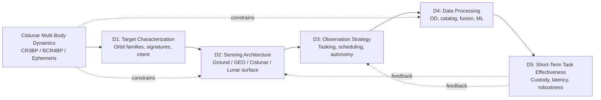
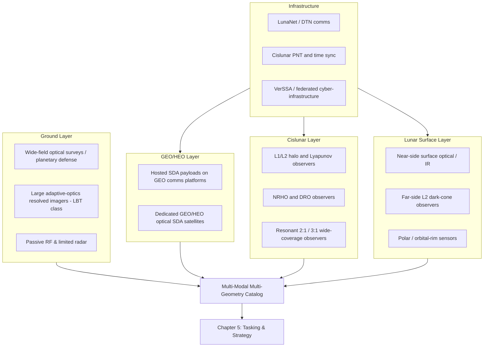
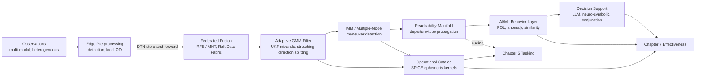
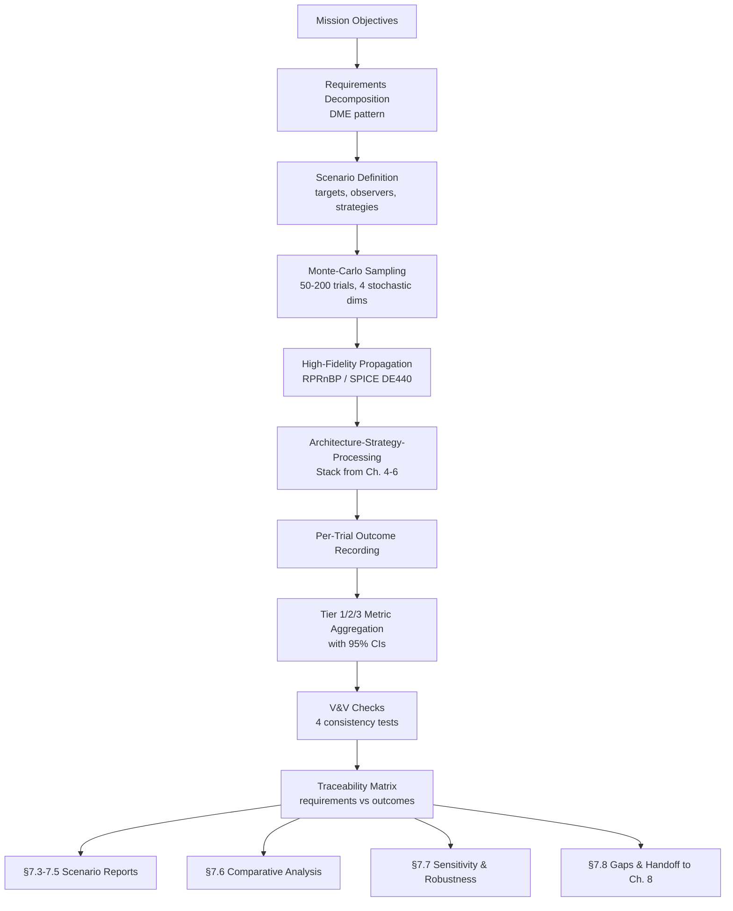
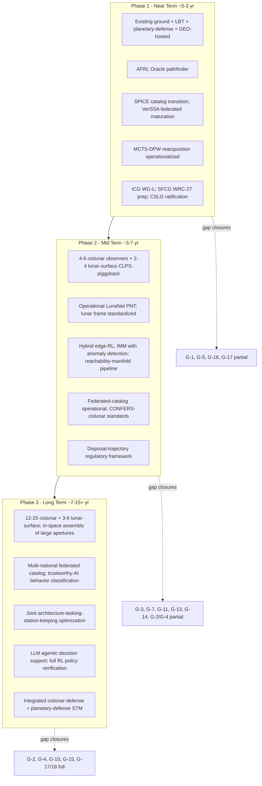

# Comprehensive Cislunar Space Domain Awareness: Architectures, Methods, and Effectiveness Assurance for Short-Term Tracking and Monitoring of Space Targets
# 1 Strategic Context and Research Framework of Cislunar Space Domain Awareness

The Earth–Moon system is entering a period of activity unprecedented in the history of spaceflight. Over the next decade, human and robotic operations in the volume of space beyond geosynchronous orbit (GEO) are projected to exceed everything humanity has done in this region since the dawn of the Space Age, driven by Artemis-era lunar exploration, commercial lunar logistics, and the strategic ambitions of multiple national space programs. This surge transforms what was once a sparsely populated transit corridor into a contested, congested, and strategically consequential domain. Yet the very dynamical and geometric properties that make cislunar space attractive—low transfer costs between disparate orbital regimes, quasi-stable libration-point orbits, and natural manifold pathways—simultaneously render it extraordinarily difficult to surveil with the sensors, catalogs, and tasking paradigms inherited from near-Earth space situational awareness. The central problem motivating this report is therefore neither abstract nor distant: how can the United States and its partners achieve **comprehensive and accurate situational awareness of cislunar space targets, and assure the effectiveness of short-term (hours-to-weeks) tracking and monitoring tasks** against a backdrop of multi-body chaos, exclusion-zone blackouts, and rapidly maneuvering non-cooperative objects? This opening chapter sets the strategic context, fixes the terminology, articulates the core challenges, and constructs the analytical framework that organizes the remaining seven chapters of the study.

## 1.1 Surge of Cislunar Activities and the Emergence of SDA Demand

The operational reality driving cislunar Space Domain Awareness (SDA) is best captured by a single quantitative projection from NASA: over the next ten years, human activity in cislunar space is expected to **equal or exceed all that has occurred in this region since the Space Age began in 1957**[^1]. This projection is not aspirational rhetoric but a planning baseline reflected across multiple converging programs. Where roughly 90 lunar missions were attempted by the United States and the Soviet Union between 1958 and 1976, and approximately 20 missions were launched by a broader set of nations after 2003, more than **100 lunar missions are expected in the next decade alone**[^2]. The cislunar volume is shifting from an episodically visited transit zone into a persistently occupied operational theatre.

The principal driver on the U.S. side is NASA's Artemis program, which seeks to return American astronauts to the Moon and establish a sustained human-robotic presence as a stepping stone to Mars[^2]. Artemis is not a single vehicle but an architecture: the Lunar Gateway, a small space station placed in a Near-Rectilinear Halo Orbit (NRHO) about the Earth–Moon L2 Lagrange point, will serve as a docking and staging platform for crewed lunar surface missions[^2]. The Commercial Lunar Payload Services (CLPS) program contracts commercial providers—at least 14 identified eligible providers as of 2022—to deliver scientific and technology payloads to the lunar surface, while the LunaNet initiative aims to deploy an interoperable communications and navigation network supporting both Gateway and surface activity[^2]. NASA's overall FY2023 budget request was approximately $26 billion, of which roughly $7.5 billion was allocated to Artemis, a $1.1 billion increase over the prior year, and combined U.S. government and commercial investment in cislunar infrastructure was estimated on the order of $7–10 billion in 2022[^2]. The Johns Hopkins APL Cislunar Security National Technical Vision identifies more than 60 companies and 10 U.S. government organizations involved in deploying foundational layers of a cislunar ecosystem, and a separate Institute for Defense Analyses (IDA) study counts more than 80 organizations across 12 countries offering or aspiring to offer cislunar services[^2].

China's program is the second principal driver and the strategic focus of much U.S. policy concern. Beijing has demonstrated end-to-end cislunar capability through the Chang'e series—launching an object from the Moon and returning it accurately to Earth, landing on the lunar far side in 2019, and using the Chang'e-5 orbiter to traverse cislunar and Sun–Earth space[^2]. China's January 2022 space white paper announced plans to launch Chang'e-6 to return polar lunar samples, Chang'e-7 to perform a precision landing in the south polar region with a deployable mini flying probe, and to develop Chang'e-8 in cooperation with international partners as part of an International Lunar Research Station planned to become operational after 2035[^2]. The United Arab Emirates has formally signed on to fly a rover on Chang'e-7, and China is in negotiations with ESA, Thailand, and Saudi Arabia[^2]. China publicly aspires to global space-technology leadership by 2045 and to a **cislunar economic zone by 2050**, with internal estimates valuing such a zone at $10 trillion per year for China[^2]. Estimated Chinese space spending was approximately $8.9 billion in 2020[^2].

The aggregate effect of these national, commercial, and international programs is a qualitative change in the cislunar operational environment. The 2020 Memorandum of Understanding between NASA and the U.S. Space Force formalizes this reality from a security perspective: with U.S. public and private operations extending into cislunar space, the U.S. Space Force's sphere of interest will extend to **272,000 miles and beyond—more than a tenfold increase in range and a 1,000-fold expansion in service volume**[^2]. Lieutenant General John Shaw, then Deputy Commander of U.S. Space Command, has explicitly framed the post-2019 Space Force mission as ushering in "an era of space-based capabilities focused on ex-geosynchronous [cislunar] operations"[^2]. Asked in 2021 whether the United States could detect a kinetic weapon launched at Earth from the Moon, Shaw conceded that current capability is inadequate: "We need to get our capabilities to the point where we can easily see it"[^2]. This combination of mission density, strategic value, and inadequate baseline capability is what generates the urgent, concrete demand for short-term cislunar tracking and monitoring that this report addresses.

## 1.2 Policy and Strategic Drivers Shaping Cislunar SDA

The technical demand articulated above is mirrored, and in important respects amplified, by an emerging policy architecture that explicitly identifies cislunar SDA as a national priority. In November 2022, the White House Office of Science and Technology Policy (OSTP) released the **first National Cislunar Science and Technology Strategy**, which laid out four key objectives: (1) supporting R&D to enable future growth in cislunar space; (2) expanding international S&T cooperation; (3) **extending U.S. space situational awareness capabilities into cislunar space**; and (4) implementing scalable, interoperable communications and PNT[^1]. The third objective is decisive for this study: the strategy explicitly frames SSA as the prerequisite for "transparency and safe operations for all entities operating in cislunar space," and it links SSA to early warning for potentially hazardous asteroids[^1]. The strategy was developed through a Federal Register Request for Information issued in July 2022, in which OSTP solicited stakeholder input on R&D priorities and technical standards needed to enable a robust, cooperative, and sustainable cislunar ecosystem over both 10-year and 50-year horizons[^3].

This top-level strategy sits within a broader policy architecture. The **U.S. Space Priorities Framework** (December 2021) provides the over-arching guidance under which the cislunar strategy was developed[^2]. Space Policy Directive-1 (December 2017) directed the United States to lead the return of humans to the Moon for long-term exploration and utilization, followed by missions to Mars[^2]. The **NASA-USSF Memorandum of Understanding** (September 2020) commits the two organizations to new collaborations as NASA's human presence extends to cislunar destinations and as the Space Force organizes, trains, and equips to protect U.S. interests beyond Earth orbit[^2]. The U.S. Space Force's 2020 Spacepower capstone publication and the 2022 Defense Intelligence Agency assessment *Challenges to Security in Space* both single out xGEO and cislunar operations as emerging mission spaces, with DIA noting that spacecraft in xGEO are "much harder to track and characterize, and could threaten U.S. or allied high-value satellites" and that adversaries could place operational or reserve satellites in deep space "so they are much harder to monitor for later use in lower orbits"[^2]. Within U.S. Space Command, the **19th Space Defense Squadron** at Dahlgren has been assigned the explicit mission of "expanding cislunar and extra-geosynchronous (xGEO) awareness via the current space surveillance network, and commercial capabilities"[^2].

Internationally, the policy environment is being shaped both cooperatively and competitively. The **Artemis Accords** had attracted 21 partner countries plus the European Union by July 2022 and form the principal U.S.-led framework for responsible behavior on and around the Moon[^2]. In parallel, the United Nations General Assembly established an **Open-Ended Working Group on Reducing Space Threats** in December 2021, which held its first session in May 2022; the resolution that created it was supported by 163 nations, with 12—including Russia, China, Iran, North Korea, and Cuba—voting against[^2]. China and Russia have signed an agreement to cooperate on the International Lunar Research Station, and China's 2022 white paper devotes an entire section to global space governance, stating its intent to "speed up the formulation of a national space law" and to assert leadership in setting space norms[^2].

These policy drivers translate into three concrete requirements for cislunar SDA that recur throughout this report. First, **norm enforcement requires SDA**: the APL Cislunar Security National Technical Vision argues explicitly that without sufficient SSA, norm violations cannot be detected, which would render any negotiated norms unenforceable; the United States therefore needs (i) an international policy that establishes norms of behavior, (ii) SSA to identify when norms have been violated, and (iii) the ability to address norm violations[^2]. Second, **first-mover advantage in norm-setting depends on first-mover capability in surveillance**: the Vision warns that "China will dominate the setting of space norms of behavior if they predominate in cislunar exploration and exploitation"[^2], making the timeliness of U.S. cislunar SDA an explicitly strategic, not merely technical, concern. Third, **safety and space traffic management beyond GEO require SDA as a foundation**: as the volume of human and machine activity grows, conjunction assessment, debris tracking, and emergency response—analogous to maritime safety regimes but adapted to multi-body dynamics—all rest on the ability to detect, track, and characterize resident space objects in the cislunar volume[^2]. These three requirements collectively define what the dual research objectives of this report mean operationally: "comprehensive and accurate awareness" is the prerequisite to enforce norms and ensure safety, while "short-term task effectiveness" is the prerequisite to respond when norms are violated or hazards arise.

## 1.3 Definition, Scope, and Regional Boundary of Cislunar Space

Because the cislunar literature uses overlapping terms with subtly different boundaries, this report adopts an explicit and consistent definition. Following the OSTP Request for Information and the National Cislunar S&T Strategy, **cislunar space is defined as the entire region beyond Earth's geostationary orbit still subject to the Earth's and/or Moon's gravity, including orbits around the Moon and the lunar surface**[^1][^3]. This descriptive definition is consistent with the usage adopted by the Air Force Research Laboratory's *A Primer on Cislunar Space*, the NASA–USSF MOU, and the U.S. Space Force Spacepower doctrine, and is broader than the prescriptive dictionary definition of "lying between the Earth and the Moon"[^2]. The term **xGEO** ("extra-geosynchronous") is used primarily within the U.S. national security space community to describe the same region; this report treats cislunar and xGEO as synonymous in scope and uses cislunar by default because of its broader cross-community adoption[^2].

The cislunar regime so defined is dynamically distinguished from near-Earth space by three intertwined properties. First, motion is governed by **multi-body gravitation rather than two-body Keplerian mechanics**. In the Earth–Moon system the Moon's gravity contributes to the dynamics "to an extent that can no longer be accurately modeled as merely a perturbing force"; the resulting trajectories are not conic sections and may be periodic, quasi-periodic, or completely chaotic, and the five Earth–Moon Lagrange points—around which closed orbits exist despite the absence of a gravitating body—do not exist in a two-body model at all[^2]. Second, the **delta-v cost of moving among cislunar regimes is remarkably low** once a vehicle is off the Earth's surface. Representative values from the APL Cislunar Security National Technical Vision illustrate the asymmetry:

| Maneuver | Representative Δv (km/s) |
|---|---|
| Earth surface → LEO | 9.3 |
| LEO → GEO | 3.9 |
| LEO → Earth–Moon L2 | 3.4 |
| LEO → Earth–Moon L1 | 3.8 |
| LEO → L4/L5 | 4.0 |
| L1 → L2 | 0.14 |
| L1 → L4/L5 | 0.34 |
| L2 → L4/L5 | 0.34 |
| Moon surface → LEO | 5.9 |
| Moon → GEO | 3.9 |

Source: representative values reported in the APL Cislunar Security National Technical Vision[^2].

Two implications follow directly. The 9.3 km/s required to reach LEO from Earth dwarfs every other quantity in the table, meaning that a vehicle already in cislunar space can reach almost any other cislunar regime—or GEO—at very modest propellant cost. Reaching L2 from LEO is actually slightly cheaper than reaching GEO, and inter-Lagrange-point transfers cost only 140–340 m/s. This explains why an adversary could place "reserve satellites in deep space" for later redeployment to lower orbits, a concern flagged explicitly by DIA[^2]. Third, the regime contains **dynamical choke points**: research presented at the Cislunar Security Conference has shown that ingress from L1 and L5 periodic orbits typically passes through smaller, more easily surveilled volumes, suggesting that intelligent observer placement need not cover the full 4π steradians of the cislunar sphere but can instead concentrate on these natural funnels[^2]. These three properties—multi-body chaos, low intra-regime Δv, and exploitable choke points—together fix the dynamical setting that every later chapter of the report must respect.

## 1.4 Distinctive Challenges of Short-Term Tracking and Monitoring in the Cislunar Regime

The combination of mission surge, policy demand, and unique dynamics produces a set of tracking and monitoring challenges that cannot be solved by extending legacy near-Earth SSA tools incrementally. This section identifies the principal challenges that motivate the technical chapters that follow; later chapters quantify and address each in turn.

The most fundamental challenge is the **inadequacy of two-body catalogs and propagators**. The Combined Space Operations Center at Vandenberg currently manages more than 23,000 Earth-orbiting objects using catalogs based on Two-Line Elements (TLEs) and the Simplified General Perturbations (SGP4) model, or on Vector Covariance Messages and the Special Perturbations model[^2]. SGP4 explicitly assumes a two-body Keplerian solution in which trajectories are conic sections and lunar/solar effects are handled as perturbations[^2]. In the cislunar regime, where motion is intrinsically three-body or four-body and trajectories are not conic sections, TLEs "are not appropriate for cislunar SSA" and "are not valid for very long" even when fitted as short-term tasking aids[^2]. The recommended replacement is a SPICE-style ephemeris distribution paradigm—as used by NASA's Planetary Data System Navigation and Ancillary Information Facility—in which the originator maintains the dynamic model and propagates the state, then distributes the resulting ephemeris rather than orbital elements[^2]. Heritage SSA sensors that only accept tasking in TLE format will need to be upgraded for cislunar work[^2].

A closely related challenge is **chaotic sensitivity and rapid custody loss**. In a multi-body system, very small changes in initial conditions can produce very large changes in propagated trajectories[^2]. Custody—defined as maintaining state knowledge accurate enough that a tasked sensor still finds the object in its field of view at the predicted observation time—can be lost through any combination of insufficiently accurate prior observations, long observation gaps, oversimplified dynamics, unknown maneuvers, or filter limitations[^2]. The problem is sharpened by the prevalence of **low-thrust propulsion** in the cislunar regime: low-thrust spacecraft have high specific impulse and are likely to be common, but their continuous, low-magnitude maneuvers are difficult to distinguish from natural perturbations and cannot be approximated as instantaneous Δv events the way thruster firings or breakups can[^2]. Reachability-manifold computation—finding the volume in state space that an object could reach given a propulsion estimate and time horizon—has been proposed as a counter, but the underlying difficulty remains: a small, undetected maneuver in chaotic dynamics can produce an arbitrarily large divergence from the predicted track within a custody cycle[^2].

A third cluster of challenges is **sensing across vast distances under hostile geometry**. The cislunar volume is approximately nine times farther from Earth than GEO[^2], and the GEO range is already where active radar systems struggle because of a quartic round-trip power drop-off; reaching cislunar targets with active radar requires either prohibitive transmitter power or sensor placement on the lunar surface or near the Lagrange points[^2]. Optical sensing is more tractable but is constrained by **multiple exclusion zones**—the Sun, Earth, and illuminated Moon each block or saturate observations within a finite angular radius—and by lighting conditions that leave eclipsed targets effectively invisible to visible-band sensors that depend on solar reflection[^2]. Mid-wave and long-wave infrared sensors mitigate some of these issues by detecting self-emission rather than reflected sunlight, but LWIR cannot operate from Earth's surface due to atmospheric attenuation, and MWIR/LWIR systems involve different cost and SWaP-C trades[^2]. No single sensor type or location covers the full domain; multiple modalities and locations are required, and the geometric placement problem—how to combine ground, GEO, lunar-surface, and cislunar-orbit observers to defeat exclusion zones—becomes a first-class architectural challenge[^2].

A fourth challenge is the **infrastructure deficit in communications, PNT, and computing**. Cislunar PNT is in a "nascent" state, with no agreed reference frame yet realized—competing candidates include the Mean-Earth and Principal Axis frames, which differ from each other by roughly 1 km at the lunar surface—and with multiple competing working groups (the Lunar Reference System Working Group and the xGEO Foundational PNT Working Group) still negotiating standards[^2]. GPS at the Moon must rely on side-lobe signals and weak-signal receivers (the LuGRE experiment targets ~23 dBHz sensitivity versus ~28–30 dBHz for terrestrial receivers), and a cislunar user typically sees only about two GPS satellites at a time versus more than eight on the ground, producing kilometer-level position errors even with advanced processing[^2]. Communications must contend with delays, intermittent connectivity, and the absence of an internet-like infrastructure; NASA's LunaNet architecture relies on Delay-Tolerant Networking with time-variant routing and store-and-forward transport rather than on standard IP[^2]. Onboard computing is constrained by radiation environments that "diminish computational capability and increase the size, weight, power, and cost requirements of the host platform," limiting the algorithms—machine learning, image processing, autonomous trajectory redesign—that can run in situ[^2]. Each of these deficits feeds back into SDA effectiveness: poor PNT degrades observation accuracy, intermittent communications delay tasking and data fusion, and limited compute restricts onboard autonomy.

A fifth and integrative challenge is the **short-term, time-critical nature of the missions of interest**. The mission scenarios that justify cislunar SDA—monitoring a Lunar Gateway or NRHO transit, tracking an NRHO/DRO transfer, characterizing a non-cooperative object's maneuver, or responding to an anomaly within hours-to-weeks—do not allow the long re-acquisition campaigns that legacy deep-space tracking has historically tolerated. They require rapid response triggers, predictable cueing across heterogeneous sensors, and quantifiable custody-retention metrics under chaotic dynamics. The DIA assessment of xGEO threats, the USSF MOU expansion of surveillance volume by three orders of magnitude, and the 19th Space Defense Squadron's expanding cislunar mission together define a tempo that the legacy SSA enterprise was not designed to meet[^2]. The remainder of this report is organized to address these five challenge clusters in a coherent, scenario-anchored manner.

## 1.5 Analytical Framework and Logical Architecture of the Report

To ensure that the analysis remains tightly anchored to the dual research objective—comprehensive and accurate cislunar awareness, and assured effectiveness of short-term tracking tasks—this report adopts an integrated analytical framework that decomposes the SDA problem into five interlocking dimensions. The framework is designed so that each dimension can be examined in depth in its own chapter while preserving an unbroken logical chain from underlying physics to operational outcome.

**Dimension 1 — Target characterization** addresses the dynamical states, photometric and radiometric signatures, maneuver capabilities, and behavioral patterns of cislunar resident space objects, including cooperative spacecraft (Gateway, CLPS landers, science missions), non-cooperative objects (foreign assets staged in xGEO storage orbits as flagged by DIA), and fragmentation debris. This dimension supplies the "what are we tracking?" inputs—orbit families (NRHO, halo, Lyapunov, DRO, resonant), maneuver envelopes, and intent priors—on which all downstream choices rest.

**Dimension 2 — Sensing architecture** addresses the type, placement, and combination of sensors, spanning ground-based EOIR and radar facilities, GEO/HEO-hosted sensors, dedicated cislunar space-based observers, and lunar-surface assets. The APL Cislunar Security National Technical Vision identifies three distinct placement choices—Earth-based, on/around the Moon, and in cislunar periodic orbits themselves—each with characteristic strengths and exclusion-zone vulnerabilities, and argues that "multiple sensors must be employed to effectively monitor the entire cislunar domain, placed with enough geometric diversity to ensure effective coverage"[^2]. This dimension answers "with what, and where?".

**Dimension 3 — Observation strategy** addresses tasking, scheduling, and autonomous coordination across the heterogeneous sensor fleet. Because exclusion zones, lighting, and target priorities vary in time, and because some cislunar sensor nodes will operate beyond reliable communication with Earth, scheduling cannot be centralized in the way that legacy SSA tasking is[^2]. This dimension covers everything from greedy and information-theoretic tasking heuristics, through MDP/POMDP formulations and reinforcement-learning-based multi-agent coverage, to autonomous constellation self-management for continuous custody.

**Dimension 4 — Data processing** addresses orbit determination, catalog maintenance, maneuver detection, and data fusion under chaotic dynamics and sparse observations. Required techniques include nonlinear filters, Gaussian-mixture and particle representations of uncertainty, multiple-model and IMM detectors for low-thrust maneuvers, reachability-manifold tracking for maneuvering objects, and machine-learning classifiers that estimate which family of periodic, quasi-periodic, or chaotic trajectories an observed object is following[^2]. The catalog itself must move from TLE/SGP4 to ephemeris-distribution formats such as SPICE[^2].

**Dimension 5 — Short-term task effectiveness assurance** closes the loop by translating the upstream architectural and algorithmic choices into measurable outcomes for hours-to-weeks tracking missions. Relevant metrics include detection probability, custody retention rate, time-to-reacquire after maneuver, state-estimation accuracy, response latency, robustness across solar phase and lighting conditions, and resource efficiency. This dimension is the explicit fulcrum on which the second half of the dual research objective rests: every architectural choice in dimensions 2–4 must ultimately be justified by its contribution to short-term mission effectiveness in scenarios such as Gateway/NRHO support, NRHO–DRO transfers, and non-cooperative target monitoring.

The flow among these dimensions is shown below.



The diagram emphasizes two structural features of the framework. First, the dynamical environment (top-left) constrains not only target characterization but also sensing geometry and orbit-determination algorithms directly, reflecting the rubric requirement that two-body or GEO-baseline reasoning must not be naively extrapolated into cislunar regimes. Second, the effectiveness layer (D5) feeds back into both architecture and strategy, so that a custody-retention shortfall in a specific scenario can be traced to, and remediated by, changes in sensor placement or tasking policy rather than treated as an isolated metric.

The chapter-by-chapter structure of the report maps onto this framework as follows. Chapter 2 examines the cislunar dynamical environment in depth and derives a structured capability-gap matrix, addressing the foundation layer and informing all five dimensions. Chapter 3 develops target modeling, threat taxonomy, and region-of-interest prioritization (Dimension 1). Chapter 4 analyzes the multi-layer sensing architecture and constellation design (Dimension 2). Chapter 5 covers observation strategy, sensor tasking, and short-term mission execution (Dimension 3). Chapter 6 treats orbit determination, tracking, data fusion, and autonomous decision support (Dimension 4). Chapter 7 constructs the quantitative effectiveness evaluation framework and exercises it through scenario-based analysis (Dimension 5). Chapter 8 closes the report with governance considerations, a phased technology roadmap, and an outlook on open research questions. Throughout, the report adheres to a guiding methodological principle: every architectural recommendation, every algorithmic comparison, and every scenario evaluation must be traceable through the chain **dynamics → sensing → strategy → processing → effectiveness**, so that no isolated technology advocacy is permitted to substitute for mission-level reasoning. The chapters that follow apply this principle systematically.

# 2 Cislunar Dynamical Environment, Awareness Challenges, and Capability Gaps

Chapter 1 established that cislunar Space Domain Awareness (SDA) cannot be achieved by linearly extending near-Earth Space Situational Awareness (SSA) tools, and identified five interlocking dimensions—target characterization, sensing architecture, observation strategy, data processing, and effectiveness assurance—through which the dual research objective must be pursued. Before any of those dimensions can be addressed prescriptively, however, the **physical regime** in which they must operate has to be characterized with sufficient rigor that downstream architectural and algorithmic choices are demonstrably consistent with it. The cislunar volume is fundamentally a **multi-body, time-dependent, chaotic dynamical system**, observed across distances and through geometries that legacy SSA infrastructure was never designed to confront. This chapter therefore performs a foundational role: it builds the dynamical model hierarchy that every later chapter relies on, characterizes the orbit families and chaotic departure dynamics that determine what can and cannot be tracked, examines the sensing-geometry and infrastructure constraints that bound observability, diagnoses the structural mismatch between heritage SSA tooling and cislunar requirements, and consolidates these findings into a capability-gap matrix that drives the architectural prescriptions of Chapters 3–7. The reasoning throughout is anchored to the rubric requirement that two-body or GEO-baseline assumptions must not be naively extrapolated into the cislunar regime, and that every technology claim must be traceable through the chain dynamics → sensing → strategy → processing → effectiveness.

## 2.1 Hierarchy of Cislunar Dynamical Models

Any rigorous discussion of cislunar SDA must begin by acknowledging that **no single astrodynamic model is simultaneously simple enough for design intuition and faithful enough for operational propagation**. Practitioners therefore work with a hierarchy of models, each making explicit assumptions about which gravitational and non-gravitational influences are retained or discarded. The recent refinement-chain methodology developed by Campana and Topputo, in which prototype trajectories generated in low-fidelity models are progressively transitioned through intermediate frameworks before reaching the full ephemeris, offers a concise empirical demonstration of why the hierarchy matters: solutions that converge effortlessly in one layer may diverge or become physically infeasible in the next, and the divergence is driven by specific, identifiable physics—lunar orbital eccentricity, non-coplanar solar motion, solar radiation pressure—that an SDA system must respect.[^4]

At the base of the hierarchy lies the **Circular Restricted Three-Body Problem (CR3BP)**, in which a massless spacecraft moves under the gravity of two primaries (Earth and Moon) assumed to revolve circularly about their common barycenter. The CR3BP is autonomous in the rotating frame, possesses an integral of the motion (the Jacobi constant), and admits the five Lagrange points L1–L5 along with the families of periodic and quasi-periodic orbits that surround them. It is the natural language for describing halo orbits, Lyapunov orbits, Distant Retrograde Orbits (DROs), and the invariant manifolds that connect them.[^5][^4] The CR3BP is, however, **explicitly a perturbation-free idealization**: it does not capture solar gravity, lunar orbital eccentricity, or any non-gravitational forces, and a trajectory designed only in the CR3BP "is not likely to precisely return to the initial state" once even modest additional physics are introduced.[^5]

The next layer, the **Bicircular Restricted Four-Body Problem (BCR4BP)**, adds the gravitational influence of the Sun while still treating both the Earth–Moon and Sun–barycenter motions as circular. The Sun's instantaneous position introduces an explicit time dependence through the Sun angle θ_S = −ω_S·t, with the result that the Jacobi constant is no longer conserved and instantaneous L1/L2 energy gates open and close as the synodic geometry rotates.[^5] The BCR4BP captures, at low computational cost, the dominant solar perturbation that governs whether a departing spacecraft escapes through the Sun–B1 L1 or L2 portals or remains captured in the Earth–Moon vicinity, and it correctly reproduces the quadrant-dependent tidal effects that drive low-energy transfers.[^5][^4] Boudad et al. demonstrate empirically that BCR4BP predictions—on energy thresholds, apsides quadrant orientation, and osculating eccentricity transitions—"effectively describe trajectory behavior and trends in the ephemeris force model," validating its use as a design and reasoning layer.[^5]

A higher-fidelity intermediate layer, the **Earth–Moon Sun-perturbed Elliptic Restricted Problem (ERP)**, replaces the assumption of a circular Earth–Moon orbit with a true Keplerian elliptic relative motion. In this framework the rotating frame becomes a **roto-pulsating frame (RPF)** in which the primaries remain at fixed positions but the inter-primary distance varies according to (1 + e·cos f), with the true anomaly f as the new independent variable.[^4] Campana and Topputo emphasize that the lunar orbital eccentricity introduces "a significant dynamic contribution, substantially altering the original motion of the spacecraft" and that for trajectories spending substantial time inside the Earth–Moon region of prevalence, the ERP captures most of the divergence between BCR4BP and the full ephemeris—so much so that ERP-continued trajectories look almost indistinguishable from their fully refined ephemeris counterparts in many cases.[^4] The pulsation effect is quantitatively non-trivial: the real Earth–Moon distance equals its mean value of 384,400 km only twice per lunar orbital revolution, and excursions about that mean are large enough that the BCR4BP's constant scaling factor introduces persistent geometric mismatches in the early and late phases of a transfer.[^4]

The top of the hierarchy is the **roto-pulsating restricted N-body problem (RPRnBP)**, a high-fidelity ephemeris model in which the positions of all relevant celestial bodies (Sun, Moon, planets) are retrieved from JPL DE440 ephemerides through SPICE, and additional perturbations such as solar radiation pressure (SRP) are explicitly modeled.[^4] The RPRnBP equations include three structural terms absent from the BCR4BP: a non-uniform pulsation through the time-varying scaling factor k(t), a non-coplanar solar motion (the Moon's orbital plane is inclined 5.145° to the ecliptic, so the Sun departs vertically from the Earth–Moon RPF plane), and the SRP acceleration whose magnitude depends on spacecraft area-to-mass ratio and reflectivity coefficient.[^4] Davis and colleagues, working in the parallel tradition of NASA Gateway analysis, similarly employ a high-fidelity model with the GRAIL GRGM660PRIM lunar gravity field truncated to degree and order 8, point-mass Earth and Sun, and SRP, with operational error budgets of 10 km position / 10 cm/s velocity navigation errors, 1.5% maneuver magnitude / 1° direction execution errors, and 15%/30% area/reflectivity SRP mismodeling at 3σ.[^5] The RPRnBP/ephemeris layer is the only model in which the question "is this trajectory actually flyable?" can be definitively answered.

The implications for SDA are sharper than for trajectory design, because an SDA system must propagate **other people's** trajectories, often without any cooperation, and must do so accurately enough that a tasked sensor still finds the target in its predicted field of view. Three implications follow directly from the model hierarchy:

| Model Layer | What It Captures | What It Misses | SDA Use |
|---|---|---|---|
| Two-body / SGP4 | Keplerian conic with lunar/solar perturbations as small corrections | Multi-body resonances, libration-point dynamics, manifold structure | Inadequate for cislunar; fails as catalog basis[^6] |
| CR3BP | Lagrange points, halo/Lyapunov/DRO families, manifolds, Jacobi constant | Solar gravity, lunar eccentricity, SRP, non-coplanarity | Family classification, design-space exploration[^5][^4] |
| BCR4BP | Instantaneous L1/L2 energy gates, solar tidal quadrants, escape/capture trends | Lunar pulsation, non-coplanar Sun, planetary perturbations, SRP | Short-term reasoning about escape gates and tidal effects[^5][^4] |
| ERP / RPF | Lunar orbital eccentricity, primary pulsation | Non-coplanar Sun, third-body planets, SRP | Intermediate refinement; captures most divergence inside Earth–Moon ROP[^4] |
| RPRnBP / Full ephemeris | All gravitational bodies via SPICE, SRP, time-varying frame | Atmospheric drag (negligible), higher-order non-gravs (mission-specific) | Operational propagation, custody maintenance, OD baseline[^4] |

First, **the Jacobi constant is not a conserved quantity of the real world**. In the BCR4BP and ephemeris models the Sun-B1 Jacobi value drifts by amounts large enough that energy-gate-based reasoning must be performed instantaneously rather than as an invariant—Davis et al. show explicitly that "the value of Jacobi is not constant, as it would be in the Sun-B1 CR3BP" and "grows slightly over time due to the eccentricity of the Earth's orbit, eventually closing off the ZVCs at L2".[^5] An SDA system that uses CR3BP-only invariants to bound a target's reachable set will systematically underestimate where the target can go.

Second, **departure-epoch sensitivity is a real and quantifiable phenomenon**. Campana and Topputo report that aligning the ET₀ such that the BCR4BP scaling factor matches the instantaneous Earth–Moon distance is essential for smooth refinement; even ±20 days of misalignment about a chosen calendar date produces visible divergence in the propagated nodal states inside the full ephemeris.[^4] For operational cislunar SDA this means that a target's propagated state cannot be expressed solely as a function of "time since last observation" but must be tied to absolute calendar epoch and synodic geometry.

Third, **the fidelity needed for OD is mission-phase dependent**. For interior trajectories with early lunar fly-bys, ERP captures the dominant divergence; for exterior, long-duration trajectories where the spacecraft is outside the Earth–Moon Region of Prevalence and solar effects dominate, the BCR4BP captures most of the qualitative behavior but the full ephemeris is still needed for quantitative state estimation.[^4] An SDA filter that uses a single dynamical model across all object classes and mission phases will be either over-conservative (and slow) or under-fidelity (and lose custody).

The practical consequence is that legacy near-Earth catalog tooling—rooted in two-body Keplerian assumptions and conic-section propagation—is structurally below the bottom rung of the hierarchy required for cislunar work. This mismatch is examined quantitatively in §2.6.

## 2.2 Representative Cislunar Orbit Families and Their Observability Signatures

The orbit families that populate cislunar space are not freely chosen by mission designers; they are the natural periodic and quasi-periodic structures of the multi-body dynamical system, with stability properties, geometric features, and timescales that follow directly from the underlying physics. For SDA, what matters is that **each family imposes characteristic observability signatures**—range and phase-angle envelopes, eclipse exposure, lighting geometry, and discriminability under sparse tracks—that an architecture must accommodate.

### NRHOs and the 9:2 Gateway Baseline

The Near-Rectilinear Halo Orbits (NRHOs) are a subset of the L1 and L2 halo families in the CR3BP, distinguished by their **linear stability properties** at the family extremes. NRHOs originate in the x–y plane through bifurcation from the planar Lyapunov family and evolve out of plane as they approach the Moon, producing tall, near-vertical orbits with very close perilune passages and very distant apolune excursions.[^5] The NASA Gateway baseline is the **9:2 lunar synodic resonant L2 NRHO**, in which the spacecraft completes 9 revolutions per 2 lunar synodic periods (29.4873 days each); the orbit has a period of approximately 6.52 days and a perilune radius of 3,157.8 km—safely above the lunar radius of 1,737 km—with the 9:2 resonance phased specifically to avoid Earth-shadow eclipses and minimize lunar eclipses.[^5] These quantitative parameters fix the observability geometry: a target in the 9:2 NRHO is **alternately 3,157.8 km from the Moon at perilune and at L2-class distance (~60,000–70,000 km from the Moon) at apolune**, traversing the full range envelope every ~3.26 days.

For ground-based optical SDA this geometry is doubly punishing. At perilune the target is angularly very close to the Moon and inside the so-called "cone of shame"—approximately 15° from the lunar center—where lunar brightness saturates ground-based optical sensors;[^6] at apolune the target is at near-maximum range from Earth (~400,000 km) but with potentially favorable phase angles. The 9:2 phasing was chosen explicitly for **operational eclipse avoidance**, not for SDA convenience, so SDA architectures cannot assume perpetual sunlit geometry. The Gateway use case therefore drives requirements for sensors that can either handle high stray-light environments near the Moon or be placed in geometries (lunar surface, dedicated cislunar observers) that defeat the cone-of-shame.

### L1/L2 Halo and Lyapunov Families

Beyond the NRHO subset, the broader L1 and L2 halo families and the planar Lyapunov families form the **primary set of periodic structures in the CR3BP**, with halo families bifurcating from Lyapunov orbits at each coplanar libration point.[^5] These orbits provide candidate observer platforms (discussed in Chapter 4) as well as natural target families. From an SDA standpoint they are characterized by intermediate geometric scales (tens of thousands of kilometers from the Moon), comparatively long periods (multiple days to weeks), and—critically—**unstable manifold structures** that connect them to other regions of cislunar space. The unstable manifold of an L2 halo, for instance, can transport an object toward the lunar vicinity or outward through the L2 gateway with negligible Δv input, which means that a target observed once on a halo cannot be confidently assumed to remain on that halo without continued tracking.

### Distant Retrograde Orbits

DROs are large, near-planar, retrograde orbits about the Moon that are linearly stable in the CR3BP and remain quasi-stable in the full ephemeris. They provide long-duration parking with minimal station-keeping, which makes them attractive both for cooperative storage missions and for the kind of "reserve satellites in deep space" scenarios flagged by DIA. NRHO–DRO transfer corridors are an explicit topic of cislunar trajectory research, and Wang et al. emphasize the significant effect of lunar orbital eccentricity in transitioning such transfers into the ephemeris model[^4]—confirming the §2.1 conclusion that DRO/NRHO transfer monitoring is firmly an ERP-or-higher problem.

### Resonant Orbits and Low-Energy Transfers

A large class of cislunar trajectories are **lunar-synodic resonant orbits** (the 9:2 NRHO is one example) and **low-energy transfers** that exploit solar gravity and invariant manifolds to reduce propellant. Boudad et al. demonstrate that disposal trajectories from the 9:2 NRHO can result in direct heliocentric escape, indirect escape (after additional Earth-vicinity revolutions), capture in resonant Earth orbits, lunar impact, or Earth impact—all with disposal Δv as low as 1 m/s.[^5] Campana and Topputo's dataset of more than 400,000 low-energy Earth–Moon transfers, clustered into 23 interior, 44 interior–exterior, and 30 exterior families, confirms that cislunar transfer space is highly multimodal: solutions can spend up to 200 days inside the system, with mean costs ranging from ~3,838 m/s (exterior) to ~3,959 m/s (interior) and durations from ~32 days (interior) to ~121 days (interior–exterior).[^4]

### Ballistic Lunar Transfers and Disposal Trajectories

Whitley et al. (cited in Boudad et al.) document **Ballistic Lunar Transfers (BLTs)** for Earth-to-NRHO operations, in which solar gravity raises perigee to lunar-orbit radius by placing apogee in quadrants II or IV of the Sun–B1 rotating frame.[^5] Boudad et al. show that the **inverse process** also exists: NRHO-departing trajectories with apogees in quadrants I or III can be lowered into Earth-impact perigees, producing reverse-BLT Earth impacts even for modest disposal Δv (10 m/s and 17 m/s in their examples).[^5] This is consequential for SDA because it demonstrates that an object departing the lunar vicinity at low Δv can, depending solely on solar phase, end up in heliocentric space, in a captured Earth orbit, or impacting the Earth or Moon—**three qualitatively different outcomes from indistinguishable initial maneuvers**. An SDA system that observes only the departure burn cannot disambiguate without continued custody.

### Mapping Families to Observability

The combined picture is summarized below.

| Family | Period / Timescale | Range from Moon | Key Observability Issues |
|---|---|---|---|
| 9:2 NRHO | 6.52 d (9:2 resonant)[^5] | 3,158 km perilune to ~60–70,000 km apolune | Cone-of-shame at perilune; eclipse-avoidance phasing fixed |
| L1/L2 Halo, Lyapunov | Days to weeks | ~10⁴–10⁵ km | Manifold-driven egress; unstable family members |
| DRO | Weeks-month | Large planar retrograde | Long-duration custody; quasi-stable parking |
| Resonant / Synodic | Lunar-synodic-locked | Varies | Phase-locked recurrence aids re-acquisition |
| Low-energy transfers (BLT, NRHO disposal) | 30–200 d[^4] | Full Earth–Moon ROP and beyond | Outcome ambiguity (escape/capture/impact) under small Δv |

The unifying observability lesson is that **cislunar orbit families are not statically classifiable from short tracks**. Boudad et al.'s explicit finding—that direct, indirect, and captured outcomes are determined not by Δv magnitude but by the combination of energy level, quadrant of apsides, and osculating eccentricity[^5]—means that an SDA system attempting to classify a newly observed object must either obtain enough geometry to constrain all three quantities, or maintain a multi-hypothesis representation of the target's family until the geometry permits disambiguation. This requirement propagates directly into the multiple-model and reachability-based filtering algorithms reviewed in Chapter 6.

## 2.3 Chaotic Sensitivity, Departure Dynamics, and Custody Implications

The most operationally consequential property of cislunar dynamics is **chaotic sensitivity**: small differences in initial conditions, dynamical-model fidelity, or unknown maneuvers produce large divergences in propagated state, on timescales that are short relative to operational tasking cycles. Two empirical demonstrations from the Boudad et al. analysis of NRHO disposal in the BCR4BP and high-fidelity ephemeris frameworks make this concrete and quantifiable.[^5]

**Demonstration 1: Even uncontrolled NRHO departure timing is unpredictable.** Boudad et al. ran 50 Monte Carlo trials in which a Gateway-class spacecraft was maintained in the 9:2 NRHO for 2, 3, 4, or 5 revolutions with operational error budgets (10 km / 10 cm/s navigation, 1.5% / 1° / 1.42 mm/s maneuver execution, 15%/30% SRP modeling, 3 cm/s wheel desaturation), then orbit maintenance was ceased and the spacecraft was propagated to NRHO departure. After the 5-revolution case, the 50 trials began diverging from one another after ~6 additional revolutions; the **first trial departed the NRHO vicinity 56.7 days after OM cessation, while the last trial remained for 102.9 days—nearly twice as long**.[^5] Mean times ranged from 72.4 to 78 days across the four cases, but the spread between minimum and maximum was always comparable to the mean. The implication for SDA is that even a perfectly cooperative target whose station-keeping is suspended cannot be predicted to within better than ~1 month of departure epoch using the operational state knowledge, and a non-cooperative target observed only sparsely is correspondingly worse.

**Demonstration 2: Outcomes depend on solar phase, not Δv magnitude.** Boudad et al. show that **escapes occur at Δv as low as 1 m/s and captures occur at Δv as high as 100 m/s**, while increasing Δv "tends to decrease the time to depart the NRHO" but "does not guarantee an escape".[^5] The decisive variables are the instantaneous L1/L2 energy gates in the Sun–B1 frame, the quadrant in which apoapses fall (quadrants I and III elongate the orbit and decrease perigee; quadrants II and IV circularize and raise it), and the osculating eccentricity with respect to the Earth–Moon barycenter (escape requires e > 1).[^5] Two trajectories with identical 7 m/s departure burns can produce, respectively, a clean indirect heliocentric escape and a 2-year captured trajectory with multiple lunar and Earth flybys, simply because they departed at different solar phases.[^5] The same dataset shows that **lunar impacts can occur for Δv = 15 m/s in the anti-velocity direction**, and **Earth impacts via reverse ballistic lunar transfers can occur for Δv = 10 m/s and 17 m/s in the velocity direction**, both with apogees placed in quadrants I or III.[^5]

These two demonstrations together establish the **fragility of custody** in cislunar dynamics. The momentum integral metric, MI_Γ(t) = ∫ (xẋ + yẏ + zż) dτ, is used in the literature to detect departure: when |MI_Γ̃ − MI_Γ| exceeds 10⁻¹, the spacecraft is declared to have departed the reference orbit.[^5] But the metric is intrinsically a **post-hoc detector**, not a predictor: Boudad et al. show that the time at which it crosses the threshold varies sharply with the true anomaly of the disposal maneuver. For Δv = 1 m/s burns at varying TA along the NRHO, departure times range from approximately 30–32 days (for maneuvers prior to perilune) to large excursions near apolune, with spikes around TA ≈ 60° and 270° corresponding to "trajectories that make several large additional revolutions around the Moon prior to departing".[^5]

For SDA the implications cascade through every chapter that follows.

First, **a single small unknown maneuver can produce qualitatively different reachable sets within one custody cycle**. A 1 m/s burn at perilune, a 5 m/s burn after 4 revolutions, and a 10 m/s burn after 2 revolutions all begin similarly but lead to direct heliocentric escape, indirect escape after Earth-vicinity revolutions, and Earth impact respectively.[^5] An OD filter that propagates a single hypothesis between observations will lose the target with probability approaching unity if a maneuver is applied between updates. Multiple-model and Gaussian-mixture representations are not optional; they are physically required by the dynamics.

Second, **low-thrust maneuvers cannot be reliably distinguished from natural perturbations** within standard observation cadences. The chaotic divergence is large enough that operational error budgets (already cm/s scale) plus environmental perturbations (SRP at 3σ) plus low-thrust acceleration (tens to hundreds of µN, integrated over hours) all live in the same order-of-magnitude noise floor. As Chapter 1 argued, low-thrust propulsion is likely to be common in cislunar operations, and the distinguishability problem becomes a first-class data-processing challenge addressed in Chapter 6.

Third, **predicted reachability sets must be computed in the full BCR4BP-or-higher dynamics with explicit solar-phase parameterization**. Treating a target's reachable set as an isotropic ball around its last-known state—the natural extension of GEO-style analysis—will systematically misallocate sensor tasking, because the actual reachable set is anisotropic: stretched along stable/unstable manifold directions, biased by Sun-B1 quadrant geometry, and gated by instantaneous L1/L2 thresholds.[^5] Stretching-direction analysis, as used by Muralidharan and Howell (cited in Campana and Topputo[^4]), provides the principal orientation and magnitude of perturbation growth and is the appropriate tool for designing the reachability propagation that drives sensor cueing.

Fourth, **custody-loss recovery requires re-acquisition strategies that account for outcome ambiguity**. After a custody gap during which a maneuver may have occurred, the target is potentially in any of several qualitatively different end states. A re-acquisition campaign designed against a single hypothesis will likely fail; the appropriate strategy, examined in Chapter 5, is a multi-hypothesis search across the dominant reachable basins (escape through L1, escape through L2, capture, lunar impact, Earth-bound trajectory) weighted by prior probabilities.

The chaotic-sensitivity findings in this section are not pessimistic: they are diagnostic. They define exactly which architectural features—multi-hypothesis filtering, manifold-aware reachability, calendar-epoch-aware propagation, and persistent custody to forestall the buildup of uncertainty—are physically required, and they make those requirements quantitative.

## 2.4 Sensing Geometry, Lighting, and Exclusion-Zone Constraints

Even when the dynamics are perfectly understood, an SDA system can only act on what its sensors can actually see. The geometric and photometric environment of cislunar space differs from the GEO-and-below regime in several specific ways that jointly preclude the use of any single sensor modality or location.

### Range and the radar power problem

The cislunar volume extends to approximately **nine times the GEO radius** from Earth. Since round-trip radar power scales as the fourth power of range, a radar capable of detecting a 1 m² target at GEO would require approximately 9⁴ ≈ 6,500 times more transmitted power to achieve equivalent SNR at lunar distance, or equivalent improvements in antenna gain and integration time. This is the underlying reason that "active radar systems may require a prohibitive amount of power to illuminate space objects at lunar distances" and that radar-based cislunar SDA is considered viable principally from lunar-surface or near-Lagrange-point platforms, not from Earth.[^6]

### The Moon's brightness and the cone of shame

For ground-based optical sensors, the brightness of the Moon imposes a hard angular exclusion zone. The AFRL cyber-infrastructure final report identifies this as the **"Cone of Shame"** and quantifies it as approximately **15° from the Moon's center**, within which "comprehensive coverage from ground-based optical telescopes is limited by the Moon's brightness".[^6] Inside this cone, lunar scattered light raises the sky background to levels that overwhelm the photon flux from a typical resident space object, and the dynamic range of standard CCD/CMOS detectors cannot accommodate both the Moon and a faint nearby target in the same frame. The cone moves through the sky daily as the Moon orbits, and its angular size effectively grows with seeing conditions, atmospheric scattering, and lunar phase. For ground-based monitoring of NRHO targets near perilune, the cone-of-shame coincides geometrically with the highest-priority observation windows.

### Sun and Earth exclusion zones, eclipses, and synodic phase

Optical sensors are also constrained by **solar exclusion**—pointing within some angular radius of the Sun saturates or damages the detector and elevates background unacceptably—and by **Earth exclusion** for sensors hosted in cislunar orbits looking back toward the Earth–Moon system. The relative positions of all three exclusion zones rotate through the synodic period (~29.5 days), so any given target experiences time-varying combinations of allowed and disallowed observation geometry. A target may be simultaneously occluded by one exclusion zone from a ground sensor and by a different exclusion zone from a space-based sensor, producing **synodic blackout windows** during which no sensor in the architecture can observe it. Eclipse geometry compounds the problem: visible-band sensors that depend on solar reflection cannot detect a target that is in Earth's or the Moon's shadow, regardless of pointing freedom. Boudad et al.'s observation that the 9:2 NRHO is phased explicitly to "avoid eclipses due to Earth"[^5] illustrates how aggressively mission designers manage these constraints for their own spacecraft; SDA observers do not have the luxury of choosing when their targets are eclipsed.

### Phase-angle dependent photometry and identification

Photometric signatures vary strongly with solar phase angle, and this variation is **diagnostic** of the target's geometry but also **noisy** as an identification feature. The Phantom Echoes FVEY campaign tracking the Northrop Grumman MEV-1 / Intelsat-901 docking event provides a concrete cislunar-relevant data point: the campaign collected four-color (Sloan g', r', i', z') photometry across multiple nights, finding that detected brightness spanned **mag 14–18 for Intelsat-901 and 15–19 for MEV-1**, with an "interesting glint in Intelsat-901 data in g' filter (475 nm)" and slight glint in r'.[^6] The campaign concluded that "both objects can be clearly distinguished from their phase curves as they have different morphology and glints," but cautioned that "changing geometry leads to changes in phase curves. Hence, phase curves cannot be used to distinguish two objects that are maneuvering".[^6] This is consequential for cislunar SDA: phase-curve identification is reliable only for stable, non-maneuvering objects, and the very class of objects that is most operationally interesting—maneuvering non-cooperative spacecraft—is the class for which photometric identification is least reliable.

### Resolved imaging from large adaptive-optics platforms

At the high end of ground-based sensing, the Large Binocular Telescope (LBT), with 8.4 m mirrors and adaptive optics, achieved **~30 mas spatial resolution—approximately 5 m at GEO—on Intelsat-901**, sufficient to directly identify "key components (Solar panels, Bus, Antenna)".[^6] Multi-frame Blind Deconvolution (MFBD) was used to recover diffraction-limited imagery despite the absence of an in-frame PSF calibration star.[^6] At cislunar distances (9× GEO), the same angular resolution corresponds to ~45 m linear resolution, which is still useful for vehicle-scale identification but no longer resolves individual components. The trade space between aperture, AO performance, and target range therefore drives whether a given facility can perform identification (resolved imaging) versus mere detection and tracking.

### Infrared modalities

Visible-band sensors depend on solar reflection and therefore fail in eclipse. Mid-wave (MWIR) and long-wave infrared (LWIR) sensors detect self-emission and are, in principle, eclipse-immune. The trade-offs are operational: **LWIR cannot operate from the Earth's surface due to atmospheric attenuation**, requiring space-based deployment with all the SWaP-C consequences that follow; MWIR can operate from the ground but with reduced sensitivity. For cislunar SDA, the implication is that eclipse coverage of high-value targets effectively requires either space-based IR sensors or dedicated cislunar observers in geometries that avoid eclipses by construction.

### The geometric necessity of multiple observers

The combined constraints—9× GEO range, cone-of-shame, solar/Earth/Moon exclusion zones, synodic blackouts, eclipse invisibility, phase-dependent photometric ambiguity, and infrared-modality trade-offs—make it geometrically impossible for any single sensor location or modality to provide persistent custody of a high-value cislunar target. The APL Cislunar Security National Technical Vision argues precisely this point: "multiple sensors must be employed to effectively monitor the entire cislunar domain, placed with enough geometric diversity to ensure effective coverage" (cited in Chapter 1). The translation of this geometric necessity into a multi-layer architecture—ground, GEO/HEO, dedicated cislunar observers, and lunar-surface assets—is the central topic of Chapter 4. The present chapter establishes only that the necessity is real and quantitative.

## 2.5 Infrastructure Constraints: PNT, Communications, Timing, and Onboard Compute

Even with adequate dynamical models and geometrically diverse sensors, cislunar SDA performance is bounded by the supporting infrastructure for positioning, navigation, timing, communications, and computing. Chapter 1 introduced these deficits qualitatively; this section consolidates them as **first-class constraints on architecture and algorithm design**.

**Reference frame and PNT**. Cislunar PNT remains in a "nascent" state, with no agreed lunar reference frame fully realized. The two principal candidates—the Mean-Earth (ME) frame and the Principal Axis (PA) frame—differ by approximately 1 km at the lunar surface, an error that is operationally significant for any application requiring sub-kilometer positioning. Multiple working groups, including the Lunar Reference System Working Group and the xGEO Foundational PNT Working Group, are still negotiating standards. GPS service at lunar distances is constrained by orbit geometry: signals must be received from the side lobes of GPS satellite antennas (since main lobes point Earthward), requiring weak-signal receivers (the LuGRE experiment targets ~23 dB-Hz sensitivity versus ~28–30 dB-Hz for terrestrial use). A cislunar user typically sees only **about two GPS satellites simultaneously, versus more than eight on Earth's surface**, producing position errors at the kilometer level even with advanced processing. For SDA, this means that on-board navigation states received from cooperative cislunar platforms cannot be assumed to be at the meter-level accuracy that ground-based GNSS users take for granted; the SDA fusion architecture must explicitly handle ~km-level prior uncertainty for many cislunar sources.

**Communications and latency**. Lunar communication links suffer light-time delay (~1.3 s one-way to the Moon, with longer round-trips for relay-mediated paths), intermittent connectivity due to lunar occultation of Earth-pointing antennas, and the absence of an internet-like infrastructure at lunar distances. NASA's LunaNet architecture relies on **Delay-Tolerant Networking (DTN) with time-variant routing and store-and-forward transport** rather than on standard IP. The implication for SDA is that real-time tasking commands and observation downlinks both incur seconds-to-minutes latency under best-case conditions, and tens-of-minutes-to-hours under outage conditions. Centralized tasking architectures of the kind used for low-Earth-orbit SSA—where a sensor receives a tasking update, executes within seconds, and downlinks within minutes—do not translate. Distributed and autonomous tasking, in which observers make local decisions within a globally negotiated policy, becomes architecturally necessary, motivating the multi-agent and POMDP-based formulations examined in Chapter 5.

**Time synchronization**. Multi-sensor fusion across cislunar distances requires that all sensors share a common time standard accurate to the level demanded by the OD pipeline. At cislunar ranges, an absolute timing error of 1 ms corresponds to a light-time uncertainty of 300 km—comparable to or larger than the position accuracy that the OD system is trying to achieve. The combination of clock drift, propagation delays, and the absence of a uniformly distributed lunar PTP-equivalent infrastructure makes time synchronization a non-trivial engineering problem rather than a solved one. SDA architectures must specify timing requirements explicitly and design for synchronization protocols that operate over DTN.

**Onboard computing under radiation**. Radiation-tolerant flight processors typically lag commercial state-of-the-art by 1–2 generations in compute capacity. Modern machine-learning, image-processing, and autonomous trajectory-redesign workloads—precisely the workloads that distributed cislunar observers would benefit from—are constrained by SWaP-C and reliability requirements. The Furfaro et al. AFRL final report demonstrates the alternative pattern that has emerged: heavy ML and OD workloads run in **ground-based cyberinfrastructure** (the VerSSA platform built on CyVerse), with sensors uploading raw or lightly processed data and downloading tasking products.[^6] This pattern works for ground-based and near-Earth space-based sensors with reliable downlinks, but it exacerbates the latency problem for distant cislunar observers and highlights the importance of dedicated edge-compute investment for autonomous cislunar nodes.

**The composite effect**. Each infrastructure deficit feeds back into SDA effectiveness through specific channels: poor PNT degrades the geo-location accuracy of every observation; high latency lengthens custody cycles and increases the integrated uncertainty between updates; weak time synchronization degrades fusion of heterogeneous observations; and limited on-board compute restricts which algorithms can run at the sensor versus which must be executed centrally. The cumulative effect is that cislunar SDA cannot achieve its design effectiveness simply by deploying more sensors; the supporting infrastructure must mature in parallel, and the architecture must be designed to tolerate the infrastructure deficits that will persist through the near and mid term. Chapters 4–6 incorporate these constraints as design parameters rather than treating them as background assumptions.

## 2.6 Legacy SSA Tooling Mismatch with Cislunar Requirements

The structural mismatch between near-Earth SSA tooling and cislunar requirements is not a matter of degree but of kind. The legacy enterprise was built on assumptions—two-body Keplerian dynamics, conic-section trajectories, TLE/SGP4 cataloging, Earth-centric tasking—that are violated, individually and collectively, by every property of cislunar dynamics established in §§2.1–2.3.

**Catalog format**. The Combined Space Operations Center at Vandenberg currently manages more than 23,000 Earth-orbiting objects via TLE/SGP4 or VCM/SP catalogs (Chapter 1). SGP4 explicitly assumes a two-body Keplerian solution with lunar/solar effects as small perturbations. Cislunar trajectories are not conic sections at any timescale of operational interest; they are quasi-periodic or chaotic in the multi-body sense. The recommended replacement is a **SPICE-style ephemeris distribution paradigm**, in which the originator runs the high-fidelity dynamic model and distributes the resulting ephemeris (a kernel file evaluated by SPICE at any requested epoch) rather than orbital elements that the consumer must propagate. NASA's Planetary Data System Navigation and Ancillary Information Facility, which uses exactly this paradigm for planetary mission ephemerides, provides the architectural template. The implication for legacy users is significant: any SSA workflow that consumes only TLEs or VCMs—including most current sensor-tasking pipelines—must be modified to ingest SPICE kernels or equivalent ephemeris products, and any sensor whose tasking interface accepts only TLE format must be upgraded.

**Propagator fidelity**. Beyond format, the propagation models that ride underneath the catalog must change. SGP4's lunar/solar perturbation handling is calibrated for low and medium Earth orbit; it is not validated at lunar distances and lacks the BCR4BP/ERP/RPRnBP machinery that §2.1 established as necessary. Operational propagation in cislunar space requires either direct numerical integration in an N-body model with SPICE ephemerides, or one of the intermediate analytic representations (BCR4BP, ERP) for tasks where speed dominates accuracy. The standard practice in trajectory design—adopted by Boudad et al. for NASA Gateway disposal analysis[^5] and by Campana and Topputo for low-energy transfer refinement[^4]—is to use a hierarchy of models with progressively higher fidelity, validating at each level. SDA propagators will need to adopt the same hierarchy.

**Tasking pipelines and observation formats**. Heritage sensor-tasking pipelines that consume only TLE-format orbital elements will fail to task against ephemeris-distributed cislunar objects without modification. Conversely, observation outputs themselves are evolving: the Phantom Echoes campaign demonstrates that astrometric outputs in standardized formats (the "uao" format being a 9-column whitespace-delimited record of SAT-ID, JD, exposure, X-loc, Y-loc, RA, DEC, magnitude) flowing through orchestrated workflows (Astrometry → IOD → Special Perturbation OD → state-vector products) can be exchanged across allied national pipelines, but require dedicated cyber-infrastructure to do so.[^6]

**Emerging collaborative cyber-infrastructures**. The VerSSA platform, developed under AFRL Cooperative Agreement FA9451-18-2-0105 with the University of Arizona, illustrates the transitional architecture that has emerged for collaborative SDA workflows. VerSSA is built on CyVerse—originally a National Science Foundation life-sciences cyberinfrastructure with over 100,000 registered users—and extends it to support SDA-specific data management, dockerized algorithms, and shared workflows.[^6] The Phantom Echoes Five Eyes (FVEY) campaigns (2020 tracking the MEV-1/Intelsat-901 docking; 2021 tracking MEV-2 EPOR raising) used VerSSA to host astrometry, photometry, and orbit determination apps contributed by the participating nations: UA Pipeline (US), SQuID (Canada), StarView (New Zealand), AUS Pipeline (Australia), and UK Pipeline, alongside CARMHF (AFRL), UA-IOD, Mission Planner (UK), EKF (US), and UKF (US) for OD.[^6] The 2021 campaign tested the **Observe-Orient-Decide-Act (OODA) loop** explicitly, using FVEY-only data (without Space-Track.org TLEs) to maintain custody of MEV-2 during its ~6-week orbit-raising phase, with an iterative cycle of TLE generation, sensor cueing, re-acquisition, OD update, and behavior analysis to predict burn timing.[^6] Two pre-built automated workflows—UA Pipeline → CARMHF → Mission Planner, and UA Pipeline → UA-IOD → Mission Planner—and an autonomous monitoring daemon that detects new data and triggers processing within ~5 minutes were developed.[^6] VerSSA's role is significant for two reasons: it demonstrates that **multi-national, multi-pipeline cislunar-relevant SDA workflows are feasible with appropriate cyber-infrastructure**, and it confirms that catalog maintenance for non-cooperative, maneuvering targets can be performed without legacy Space-Track infrastructure when allied sensors and tooling are properly federated.

**Repurposing planetary-defense survey data**. A complementary transitional approach, also documented in the AFRL final report, leverages **planetary-defense surveys**—Spacewatch, Catalina Sky Survey, NEOWISE, and the planned NEO Surveillance Mission—as a data source for an academic xGEO catalog. The University of Arizona team proposes using observations of xGEO objects sent to the Minor Planet Center by these surveys to construct a basic catalog, then identifying which objects need follow-up observations to maintain the catalog and tasking dedicated assets accordingly.[^6] This approach exploits forty years of UArizona experience in asteroid tracking to bootstrap cislunar catalog capability, and it dovetails with the OSTP National Cislunar S&T Strategy's explicit linkage of SSA to planetary-defense early warning (Chapter 1).

**What can be repurposed versus what must be replaced**. The mapping is reasonably clear:

| Legacy Capability | Cislunar Status | Action Required |
|---|---|---|
| TLE/SGP4 catalog format | Inadequate for multi-body dynamics[^6] | Replace with SPICE ephemeris distribution |
| VCM/SP catalog format | Better than TLE but Earth-centric two-body | Augment with multi-body SP, ephemeris kernels |
| Heritage ground-based optical sensors | Useful out to ~GEO; struggle beyond, blocked by cone-of-shame[^6] | Repurpose with ephemeris-format tasking; add new geometries |
| Ground radars | Defeated by 9⁴ power penalty at cislunar range | Limited cislunar role; reserve for near-Earth |
| Planetary-defense survey data (MPC) | Already detects some xGEO objects[^6] | Integrate into prototype xGEO catalog |
| Collaborative cyber-infrastructure (VerSSA) | Demonstrated for MEV tracking in FVEY[^6] | Mature into operational xGEO catalog platform |
| TLE-only tasking pipelines | Cannot ingest ephemeris products | Upgrade ingest interfaces |
| Two-body OD filters | Diverge in chaotic cislunar dynamics | Replace with multi-body, multiple-model filters (Ch. 6) |

The transition from "replace" to "augment" for some legacy assets is itself a research and engineering challenge that occupies much of Chapters 4 (sensing architecture), 5 (tasking), and 6 (data processing).

## 2.7 Structured Capability-Gap Matrix for Cislunar SDA

The analyses of §§2.1–2.6 can now be synthesized into a structured capability-gap matrix that maps each dynamical or observational obstacle to the specific deficiencies it induces in legacy SSA infrastructure, with explicit forward references to the chapters where each gap is addressed. The matrix is organized by challenge dimension; for each gap it records the principal physical or engineering driver, current capability versus cislunar requirement, severity for representative short-term mission scenarios (Gateway/NRHO custody, NRHO–DRO transfer monitoring, non-cooperative xGEO storage-orbit tracking), and the chapter responsible for addressing it.

| # | Gap | Driver | Current Capability | Cislunar Requirement | Scenario Severity (Gateway / NRHO–DRO / xGEO) | Addressed In |
|---|---|---|---|---|---|---|
| G-1 | Two-body catalog inadequacy | Multi-body chaos; Jacobi non-conservation (§2.1)[^5][^4] | TLE/SGP4 + VCM/SP, two-body | SPICE-style ephemeris distribution; multi-body SP | High / High / Critical | Ch. 6 (OD), Ch. 8 (governance) |
| G-2 | Family classification under sparse tracks | Outcome ambiguity in BCR4BP (§2.2–2.3)[^5] | Single-hypothesis OD | Multi-hypothesis / Gaussian-mixture filtering | Medium / High / Critical | Ch. 3 (taxonomy), Ch. 6 (filters) |
| G-3 | Custody loss after small Δv | 1 m/s burn → divergent outcomes; chaotic sensitivity (§2.3)[^5] | Custody assumes ballistic between fits | Reachability-manifold tasking; persistent re-observation | High / High / Critical | Ch. 5 (tasking), Ch. 6 (reachability) |
| G-4 | Low-thrust maneuver detection | Continuous low-µN accelerations indistinguishable from perturbations (Ch. 1, §2.3) | Impulsive maneuver detection | Multiple-model / IMM, behavior classification | Medium / High / Critical | Ch. 6 (IMM, ML) |
| G-5 | Calendar-epoch-aware propagation | Pulsation alignment, synodic phase determine outcome (§2.1)[^4] | Time-since-last-fit propagation | Absolute-epoch ephemeris with SPICE | High / High / High | Ch. 6 |
| G-6 | Radar power penalty at lunar range | 9⁴ ≈ 6,500× transmitter penalty (§2.4)[^6] | GEO-class radars | Lunar-surface or Lagrange-point radars; optical/IR primary | Medium / Medium / High | Ch. 4 (architecture) |
| G-7 | Cone-of-shame / lunar exclusion | ~15° angular exclusion at NRHO perilune (§2.4)[^6] | Ground optical fail in cone | Space-based or non-Earth-line-of-sight observers | Critical / Medium / Medium | Ch. 4 |
| G-8 | Sun/Earth/Moon synodic blackouts | Multiple time-varying exclusion zones (§2.4) | Single-sensor, single-geometry tasking | Multi-geometry observer fleet; coordinated handover | High / High / High | Ch. 4, Ch. 5 |
| G-9 | Eclipse invisibility (visible band) | Solar-reflection dependence (§2.4) | Visible-band ground/space sensors | MWIR/LWIR (space-based for LWIR) | Medium / Medium / High | Ch. 4 |
| G-10 | Phase-curve identification ambiguity for maneuvering objects | Glint and phase morphology change with geometry (§2.4)[^6] | Phase-curve-based ID | Resolved imaging (LBT-class), spectroscopy, multi-modal fusion | Low / Medium / High | Ch. 6 (ML), Ch. 4 (large apertures) |
| G-11 | Lunar reference frame ambiguity | ME vs. PA differ ~1 km at surface (§2.5) | No agreed lunar frame | Standardized cislunar reference frame | Medium / Medium / Medium | Ch. 8 (governance) |
| G-12 | Weak GPS at lunar distance | ~2 satellites visible; ~km position errors (§2.5) | LEO/GEO GPS receivers | Weak-signal receivers; cislunar PNT | Medium / Medium / Medium | Ch. 8 |
| G-13 | Communications latency / DTN | Light-time + intermittent + DTN (§2.5) | Real-time tasking assumed | Distributed/autonomous tasking; DTN-aware fusion | Medium / High / High | Ch. 5, Ch. 6 |
| G-14 | Time synchronization across cislunar distances | 1 ms error → 300 km light-time (§2.5) | Earth-centric PTP/NTP | Cislunar timing infrastructure; protocol over DTN | Medium / Medium / High | Ch. 6, Ch. 8 |
| G-15 | Onboard compute limits | Radiation-tolerant processors lag SOTA (§2.5)[^6] | Ground-centric cyber-infrastructure | Edge compute on observers; ground/edge hybrid | Low / Medium / High | Ch. 4, Ch. 6 |
| G-16 | TLE-only tasking pipelines | Heritage sensor interfaces (§2.6)[^6] | TLE consumers | Ephemeris-format tasking | High / High / Critical | Ch. 5, Ch. 8 |
| G-17 | Lack of operational xGEO catalog | No persistent multi-source catalog beyond GEO (§2.6)[^6] | Ad-hoc; FVEY/VerSSA prototype | Operational xGEO catalog with planetary-defense data fusion | High / High / Critical | Ch. 6, Ch. 8 |
| G-18 | Multi-national federation tooling | Phantom Echoes demonstrated; not yet operational (§2.6)[^6] | VerSSA as research platform | Production-grade federated SDA cyber-infrastructure | Medium / Medium / High | Ch. 8 |

Severity is rated as Low / Medium / High / Critical by the operational consequence of unmitigated failure of that capability for the specified mission scenario. **Critical** entries are those for which failure of the gap directly produces loss of custody, mis-classification of intent, or inability to respond within the hours-to-weeks task window. **High** entries materially degrade effectiveness (custody retention rate, time-to-reacquire, state-estimation accuracy) but do not preclude mission execution. **Medium** entries impose costs in resource efficiency or robustness margin without decisive impact. The matrix shows that **non-cooperative xGEO storage-orbit tracking is the most demanding scenario**, with eight Critical entries—reflecting the dual challenge of unannounced maneuvers in chaotic dynamics and the geometric difficulty of monitoring objects whose operators do not cooperate. The Gateway/NRHO custody scenario, despite involving a cooperative target, has its own dominant Critical entry at G-7 (the cone-of-shame), because the highest-priority observation windows coincide geometrically with the lunar exclusion zone. The NRHO–DRO transfer scenario is dominated by High entries spread across dynamics, custody, and infrastructure, reflecting the chaotic and extended nature of low-energy transfers.

The matrix functions as the **analytical bridge** from this chapter's foundational physics to the architectural prescriptions of Chapters 3–7. Chapter 3 develops the target taxonomy and region-of-interest prioritization that operationalizes G-2 and gives meaning to the severity ratings of G-3 and G-4 across object classes. Chapter 4 addresses G-6 through G-10 and G-15 by constructing the multi-layer sensing architecture that defeats the geometric and lighting constraints. Chapter 5 attacks G-3, G-8, G-13, and G-16 by designing tasking and short-term mission execution strategies that operate under the demonstrated chaotic-sensitivity, blackout, and latency constraints. Chapter 6 confronts G-1, G-2, G-4, G-5, G-14, G-15, and G-17 with multi-body OD, multiple-model and IMM filters, reachability-manifold tracking, and AI/ML-based behavior classification, providing the algorithmic substrate for the federation tooling demonstrated in VerSSA. Chapter 7 quantifies the residual effectiveness across all gaps for each scenario, closing the loop. Chapter 8 addresses G-11, G-16, G-17, and G-18 through governance, standards, and roadmap recommendations.

The cumulative message of this chapter is that cislunar SDA is bounded simultaneously by physics, geometry, and infrastructure—and that none of the three bounds yields to incremental improvement of any single legacy capability. **Comprehensive and accurate awareness** in the sense of Chapter 1's first research objective requires, at minimum, ephemeris-grade catalogs, geometrically diverse multi-modal sensing, multiple-hypothesis filtering with manifold-aware reachability, and federated cyber-infrastructure. **Short-term task effectiveness** in the sense of the second research objective requires, in addition, distributed tasking that tolerates DTN latency, time synchronization sufficient for fusion, and rapid re-acquisition strategies designed against the chaotic-sensitivity boundary established in §2.3. The chapters that follow build each of these capabilities in turn, with explicit reference back to the gaps identified here.

# 3 Target Modeling, Threat Taxonomy, and Region-of-Interest Prioritization

Chapter 2 closed with a structured capability-gap matrix that exposed how legacy SSA tooling fails when projected into multi-body, chaotic, geometrically hostile cislunar space, and identified that the most demanding scenario—non-cooperative xGEO storage-orbit tracking—accumulates eight Critical-severity gaps, while even the cooperative Gateway/NRHO custody scenario inherits a Critical gap from the lunar cone-of-shame. Those severities, however, were stated at the level of capability deficits rather than of specific objects and regions; before sensing architecture (Chapter 4) and tasking strategy (Chapter 5) can be designed, the upstream question must be answered concretely: **what, exactly, are we tracking, how should each class of target be described in a form that supports multi-hypothesis estimation and event-driven tasking, and where in the cislunar volume should finite surveillance resources be concentrated first?** This chapter operationalizes Dimension 1 of the analytical framework by constructing a unified, multi-attribute model of cislunar resident space objects, translating it into a taxonomy of behaviors of interest, treating fragmentation debris as a first-class but under-observed population, and using flow-based dynamical metrics to convert the abstract notion of "where targets can go" into geometrically explicit, time-parameterized regions amenable to sensor tasking. The chapter ends by binding object attributes, behavior categories, and region maps into a resource-constrained prioritization framework whose outputs—prioritized target lists, ROI watch policies, and event triggers—are explicitly handed off to the architecture, strategy, processing, and effectiveness chapters that follow.

## 3.1 Multi-Attribute Modeling of Cislunar Targets

A cislunar target cannot be adequately represented by the orbital elements that define a near-Earth resident space object. The chaotic-sensitivity demonstrations of §2.3, the family-classification difficulty of §2.2, and the phase-curve ambiguity of §2.4 jointly imply that any single attribute layer—dynamical, photometric, kinematic, or behavioral—is insufficient on its own to support custody, identification, or intent inference. This section therefore defines a **four-layer unified target-state representation** that subsequent chapters consume, with each layer structured to admit the explicit uncertainty representation required by the multiple-hypothesis filtering of Chapter 6.

**Layer 1 — Dynamical state and family membership.** The first attribute layer specifies the target's instantaneous Cartesian state in a designated frame (ICRF / J2000, or an Earth–Moon rotating/roto-pulsating frame appropriate to the target's regime) together with its **family membership**—NRHO, L1/L2 halo or Lyapunov, DRO, resonant, or transfer—and its associated stability characterization. Because the Jacobi constant is not strictly conserved in BCR4BP or higher-fidelity models (§2.1) and because the same object may transition between families through small perturbations or planned maneuvers, family membership cannot be a hard label; it is a **probability distribution over candidate families**, conditioned on observation history. The state must additionally carry the dynamical model layer in which it is currently being propagated (CR3BP for design intuition, BCR4BP for short-term reasoning about energy gates and tidal effects, ERP for trajectories spending time inside the Earth–Moon Region of Prevalence, and RPRnBP/full ephemeris for operational state estimation), and the **absolute calendar epoch** anchoring synodic geometry. The covariance representation must respect the anisotropic nature of cislunar uncertainty—stretched along stable/unstable manifold directions and gated by instantaneous L1/L2 thresholds, as established in §2.3—which in practice favors Gaussian-mixture or particle representations over single covariance ellipsoids. Stable/unstable manifold structures of the underlying periodic orbits, computed via Poincaré-section parameterization of the manifold flow, supply the geometric basis for these anisotropic representations[^7][^8].

**Layer 2 — Photometric and radiometric signatures.** The second layer specifies what the target looks like to the sensor modalities defined in §2.4. For visible-band ground or space optical sensors, the relevant attributes are the apparent magnitude envelope across the target's geometric cycle, the phase-curve morphology, and the presence and spectral location of specular glints; for MWIR/LWIR, the self-emission temperature and emissivity model; for radar (where geometrically feasible), the radar cross section and scattering centers. The Phantom Echoes FVEY campaigns provide a calibration anchor at GEO that bounds what cislunar observers should expect: Intelsat-901 and MEV-1, observed from Earth in four Sloan filters, presented brightnesses spanning **mag 14–18 and mag 15–19** respectively, with a glint feature in g' for Intelsat-901 and a slight glint in r' (cited in §2.4). At nine times the GEO range, the same intrinsic objects would dim by approximately 5·log₁₀(9) ≈ 4.8 magnitudes under inverse-square scaling (and by more once phase angles compress favorably), placing nominal cislunar targets in the mag 19–24 range from Earth—at or beyond the limiting magnitude of most operational SSA telescopes and forcing reliance on long integrations, large apertures (e.g. LBT-class), or shorter-range observers in cislunar orbit.

The signature layer must therefore include not only the nominal envelope but also **what is and is not diagnostic**. Spacecraft material reflectance studies measured from 400 to 2,500 nm have established baseline photometric properties for aluminum, multi-layer insulation (MLI), solar-cell coverglass, and other common materials, providing the data needed to model how spacecraft reflect light over wavelength as a function of geometry and material composition[^9][^10]. These measurements support both forward modeling (predicting expected signatures of a known cooperative spacecraft) and inverse classification (constraining material composition from observed multi-band photometry of an unknown target). The Phantom Echoes finding that **phase curves can distinguish two stable, non-maneuvering objects but cannot reliably distinguish maneuvering objects whose geometry is changing** (cited in §2.4) is decisive for this layer's representation: the photometric attribute must be conditioned on a behavioral state (stable vs. maneuvering), and the discriminating power of phase morphology must be discounted whenever an active-control hypothesis is non-negligible. For the highest-priority targets, resolved imaging from large adaptive-optics platforms (LBT-class) provides ~30 mas spatial resolution—~5 m at GEO and ~45 m at cislunar range—sufficient to identify vehicle-scale components such as solar panels, bus, and antenna for stable targets but insufficient to resolve sub-component structure at lunar distances (cited in §2.4).

**Layer 3 — Maneuver capability envelopes.** The third layer specifies how the target can move. It comprises an **impulsive Δv budget** (a probability distribution over remaining propellant-equivalent Δv, conditioned on declared mission profile when available), a **low-thrust acceleration envelope** (the range of continuous accelerations achievable, typically tens to hundreds of µN/kg for electric propulsion), and a **reachable-set parameterization** that converts these envelopes into geometric volumes in state space at specified time horizons. The §2.3 findings drive the form of this layer: because escapes can occur at Δv as low as 1 m/s and captures at Δv as high as 100 m/s depending on solar phase and quadrant of apsides, the reachable set must be computed in the BCR4BP-or-higher dynamics with explicit synodic-geometry parameterization rather than as an isotropic ball, and it must respect the natural stretching directions identified by FTLE/LCS analysis (§3.4). For non-cooperative targets, the maneuver envelope is itself uncertain; an operationally useful representation is a hierarchy of envelopes—nominal (consistent with declared/inferred capability), upper-bound (consistent with the largest plausible propellant load given vehicle class), and adversarial (an envelope that an intentionally evasive operator might use, for instance preferring small burns at perilune to maximize chaotic divergence).

**Layer 4 — Mission-intent priors.** The fourth layer specifies what the target is expected to do. For cooperative Artemis/Gateway/CLPS assets the intent prior is essentially the published mission profile: a Gateway spacecraft maintained in the 9:2 NRHO has an intent prior tightly concentrated on station-keeping in that orbit, with low-probability mass on planned transfers or disposal events scheduled at known epochs. For allied science missions the prior is similarly informed by mission documentation. For non-cooperative objects—including the DIA-flagged "reserve satellites" that an adversary might place in xGEO storage orbits for later redeployment to lower orbits (Chapter 1)—the intent prior must be inferred from hosting-orbit family, behavioral history, and any available signals intelligence; it must also include a residual prior over adversarial intent that is non-zero by construction. For fragmentation debris the intent layer collapses to a deterministic "no active control" prior, but this very absence is informative because it sharply constrains the maneuver layer to natural perturbations only.

**Fusion into a per-object state vector.** The four layers fuse into a per-object representation that is best thought of as a **joint probability distribution** over (dynamical state, family, signature, maneuver capability, intent), with explicit dependencies among the layers (intent priors condition the maneuver envelope; the maneuver envelope determines the reachable set; the reachable set determines the next observation cueing; the resulting observations update both dynamical state and signature; signature updates feed back into family and intent inference). For computational tractability the joint distribution is represented as a structured factorization: the dynamical layer as a Gaussian mixture or particle set anchored to the appropriate dynamical model and calendar epoch; the signature layer as a parametric phase-curve and spectral-material model with associated uncertainty; the maneuver layer as a Δv distribution plus continuous-thrust envelope; and the intent layer as a discrete categorical distribution with adversarial-residual mass. This factorization is the input format that the architecture (Chapter 4) tasks against, that the strategy (Chapter 5) updates through observation, and that the data-processing pipeline (Chapter 6) maintains. It is also the substrate on which the taxonomy of §3.2 and the prioritization framework of §3.6 operate.

## 3.2 Taxonomy of Object Classes and Behaviors of Interest

The four-attribute representation of §3.1 supports any number of taxonomies, but for SDA purposes the operationally useful taxonomy is one that **organizes targets by ownership/cooperation status and cross-classifies them with behavior categories**, because these two axes jointly determine the discriminating observables, the expected timescales, and the threat or safety implications that drive event triggers and classifier targets downstream. The taxonomy below distinguishes five ownership/cooperation classes—cooperative U.S. and Artemis Accords assets, allied science missions, ambiguously cooperative third-party commercial assets, non-cooperative foreign government assets, and uncontrolled debris—and cross-classifies them against seven behavior categories spanning nominal operations through end-of-life and uncontrolled regimes.

### Ownership/Cooperation Classes

**Cooperative Artemis-architecture assets** include the Lunar Gateway (in the 9:2 NRHO), Orion crewed vehicles transiting between LEO and the Gateway, CLPS landers in lunar approach and surface operations, LunaNet relay nodes, and the broader set of NASA and partner-agency missions covered by the Artemis Accords (Chapter 1). These assets routinely share trajectory information through standard mission-operations interfaces, and their intent priors are tightly bounded by published mission profiles. Their SDA value lies primarily in **safety-of-flight and conjunction monitoring**, with secondary value in providing well-characterized calibration targets for the SDA architecture itself.

**Allied science and exploration missions** include scientific spacecraft from Artemis Accords partners (the UAE Chang'e-7 rover collaboration is a notable cross-bloc case), commercial lunar-logistics providers operating under cooperative data-sharing arrangements, and—of growing importance—**planetary-defense and asteroid survey assets** whose observations of cislunar transients can be repurposed for SDA (NEOWISE, the planned NEO Surveillance Mission, Catalina Sky Survey, Spacewatch; cited in §2.6). This class is partially cooperative: ephemerides may be shared, but real-time tasking handoff with the SDA enterprise typically is not.

**Ambiguously cooperative third-party commercial assets** include commercial cislunar logistics, communications, and prospecting missions launched by operators outside the Artemis Accords framework. These objects may publish trajectory information for safety-of-flight purposes but do not necessarily participate in SDA-specific data sharing, and their intent priors carry larger uncertainty than fully cooperative assets.

**Non-cooperative foreign government assets** include Chinese Chang'e-series spacecraft and their relay assets, future Russian cislunar elements, and—most consequentially for SDA—any objects that an adversary places in xGEO storage orbits for later redeployment, as flagged by the 2022 DIA assessment of *Challenges to Security in Space* (Chapter 1). For this class the maneuver and intent layers are dominated by uncertainty, the residual adversarial prior is non-trivially weighted, and the discriminating observables are precisely those that legacy SSA struggles to obtain at cislunar range.

**Uncontrolled debris** includes fragmentation products from breakups, collision fragments, propulsion-anomaly ejecta, and abandoned upper stages and payload adapters. This class is treated separately in §3.3 because its population structure, signature distribution, and tracking demands differ qualitatively from those of intact spacecraft.

### Behavior Categories

The behavioral cross-classification distinguishes seven categories, each with distinct discriminating observables and timescales.

**Nominal station-keeping** covers cooperative spacecraft maintaining a designated orbit family. For 9:2 NRHO Gateway-class operations, station-keeping accelerations are small and applied at orbit-maintenance maneuvers spaced multiple revolutions apart; the natural behavioral signature is small, predictable Δv events at scheduled epochs, with the spacecraft following its reference periodic orbit between maneuvers. The discriminating observable is **conformity to a published reference**, and any sustained deviation triggers an anomaly hypothesis.

**Planned transfers** include NRHO–DRO transfers, Earth-to-NRHO Ballistic Lunar Transfers (BLTs) with apogees in quadrants II or IV of the Sun–B1 frame, NRHO-to-Earth or NRHO-to-heliocentric disposal trajectories, and lunar approach/descent trajectories. Their behavioral signatures are characteristic Δv burns at well-defined points along the reference trajectory, followed by extended ballistic arcs through invariant manifold structures. Timescales range from days for direct transfers to ~30–200 days for low-energy transfers (Chapter 2). The discriminating observables are the burn signatures (resolvable on photometric and astrometric tracks) and the post-burn trajectory's consistency with predicted manifold geometry.

**Anomalous or unannounced maneuvers** are the most operationally consequential behavior class, particularly for non-cooperative targets. Chapter 2 demonstrated that a 1 m/s burn at perilune of the 9:2 NRHO can produce direct heliocentric escape, indirect escape after multiple Earth-vicinity revolutions, lunar impact, or Earth impact via a reverse BLT, depending solely on the solar phase and apsides quadrant. A non-cooperative spacecraft can therefore impose qualitatively different threat profiles with maneuvers that fall well below the standard near-Earth detection threshold. The discriminating observables are residuals between observed and predicted state, deviation of photometric phase morphology from the stable-target prior, and the appearance of trajectories inconsistent with the previously inferred orbit family. The timescale on which anomalous maneuvers must be detected is set by the chaotic-sensitivity boundary of §2.3: within a single custody cycle, or custody is lost.

**Rendezvous and proximity operations (RPO)** are exemplified by the Northrop Grumman MEV-1 / Intelsat-901 docking tracked by the Phantom Echoes 2020 FVEY campaign, and by MEV-2's subsequent EPOR raising tracked in 2021 (cited in §2.6). The MEV cases occurred at GEO but established the operational template now under study for cislunar: an active spacecraft maneuvers into close proximity with another object, with the photometric phase curves of the two targets evolving as a function of relative geometry and—critically—becoming **non-discriminative when both are maneuvering simultaneously**, as the Phantom Echoes campaign documented (cited in §2.4). For cislunar RPO, the discriminating observables are joint astrometric tracks of two or more objects, multi-night photometric evolution, and—when geometrically feasible—resolved imaging. The Phantom Echoes 2021 campaign's explicit OODA-loop testing against MEV-2 (cited in §2.6) provides the operational template for short-term RPO monitoring and is a direct precedent for cislunar RPO scenarios involving Gateway visits, CLPS approach, or non-cooperative inspection.

**Low-thrust orbit raising and shaping** represents the most stressing detection problem in the taxonomy, because—as established in §2.3—continuous low-µN/kg accelerations live in the same noise floor as operational error budgets and SRP mismodeling. The discriminating observables are *integrated* deviations of state over multiple revolutions, detectable only by multi-arc orbit determination with multiple-model or IMM filters (Chapter 6). MEV-2's EPOR raising provided an operational analog: the FVEY campaign maintained custody for the ~6-week orbit-raising phase by iterating tasking, OD, and behavior analysis to predict burn timing (cited in §2.6).

**Disposal and end-of-life trajectories** include NRHO-departure disposals (with the multiple outcome classes characterized by Boudad et al.: direct heliocentric escape, indirect escape, captured Earth orbits, lunar impact, and Earth impact), GEO-supersynchronous graveyard reboosts (less relevant to cislunar but a source of observations along the boundary), and uncontrolled re-entries. The discriminating observables are the disposal Δv signature followed by an extended ballistic arc whose final basin must be inferred from the small set of post-disposal observations.

**Uncontrolled tumbling and debris dynamics** apply to fragmentation products and abandoned hardware. Tumbling produces strongly time-varying photometric signatures with potentially large-amplitude periodic glints whose period encodes the spin rate, and the absence of any active control collapses the maneuver layer to natural perturbations only. This behavioral signature is in principle a powerful discriminator, but the small absolute brightness of typical fragments makes the observations themselves photon-starved.

### Cross-Classification and Behavior Catalog

The cross-classification of ownership classes against behavior categories produces a behavior catalog whose cells specify, for each (class, behavior) pair, the discriminating observables, expected timescale, and threat or safety implications. The most operationally consequential cells are (non-cooperative foreign × anomalous maneuver), (non-cooperative foreign × low-thrust orbit raising), (non-cooperative foreign × RPO toward cooperative asset), and (uncontrolled debris × conjunction with cooperative asset). These cells inherit Critical severity from the §2.7 gap matrix (G-2, G-3, G-4) and supply the priority event triggers consumed by Chapter 5's tasking framework, while their discriminating observables define the classifier targets that the AI/ML methods of Chapter 6 must learn to recognize. The cells (cooperative × nominal station-keeping) and (cooperative × planned transfer), by contrast, function principally as **calibration cases** that allow the SDA enterprise to validate its tracking continuity and OD accuracy against ground-truth ephemerides shared by mission operators.

## 3.3 Fragmentation Debris and Population Modeling in Cislunar Space

Fragmentation debris is at once the most under-characterized and the most consequential under-the-radar component of the cislunar object population. Comprehensive reviews of cislunar expansion and SDA confirm that **fragmentation events—from collisions, propulsion anomalies, and intentional or unintentional breakups—are the dominant source of artificial debris in space**[^11], and the dynamical features that make cislunar space attractive for cooperative operations also make it a long-residence trap for debris.

The qualitative debris environment in cislunar space is shaped by three properties that distinguish it from the LEO debris regime. First, there is **no atmospheric drag** to remove debris from the most heavily used orbital regimes; small fragments produced in the lunar vicinity can persist on quasi-stable orbits indefinitely. Second, the **quasi-stable nature of DROs and certain libration-point neighborhoods** means that fragments produced near these orbits can be trapped in long-residence dynamical reservoirs, accumulating with each successive event. Third, **manifold structures connecting different cislunar regimes** mean that debris produced in one location can transport, with negligible Δv input, to other operationally important regions—a fragment generated near L1 can migrate through the L1 manifold tube into near-lunar or DRO-adjacent space on timescales of weeks. The combination produces a debris environment whose population modeling must respect the multi-body dynamical structure rather than simply scaling near-Earth break-up models.

The cislunar debris population is poorly enumerated at present. A complementary approach to bootstrapping cislunar catalog capability—introduced in §2.6—is to repurpose **planetary-defense survey data** from Spacewatch, the Catalina Sky Survey, NEOWISE, and the planned NEO Surveillance Mission, by extracting xGEO-class detections from observations sent to the Minor Planet Center and identifying objects requiring follow-up (cited in §2.6). This approach is particularly well suited to populating the debris layer of the catalog because planetary-defense surveys are already optimized for detection of small, faint, slow-moving objects against the stellar background—the same observational regime in which cislunar fragments will appear. A parallel sensing modality under active study is **conical-beam laser radar** for cislunar debris measurement, with feasibility studies of MW-class systems suggesting that active-sensing approaches may eventually complement the optical surveys for higher-resolution debris characterization in specific regions[^12]; however, the very high transmitter power required (a 1.5 MW class system is among those studied[^12]) is consistent with §2.4's conclusion that ground-based active radar at lunar range remains a capability frontier rather than a deployed asset.

Population modeling for cislunar debris should proceed in three stages. **Stage 1 — observed-population census.** The MPC-derived xGEO catalog and follow-up tasking provide the empirical basis for the observed fragment population, with photometric magnitudes (typically faint, requiring large apertures and long integrations at lunar range) and limited astrometric arcs constraining size and orbital regime. **Stage 2 — break-up modeling adapted to multi-body dynamics.** Standard near-Earth break-up models (which produce a fragment-velocity distribution as a function of parent mass and event energy) must be coupled to multi-body propagation to predict the resulting debris cloud's evolution through manifold structures, escape gates, and quasi-stable trapping regions. **Stage 3 — non-detectability and conjunction modeling.** Small fragments below the detection threshold of any deployed sensor constitute a hidden population that nevertheless poses conjunction risk to Gateway, CLPS, and other high-value cooperative assets. The hidden-population estimate must be propagated through the same multi-body dynamics, and conjunction assessments around high-value assets must include statistical contributions from the unobserved population.

The implications for the SDA architecture are specific. First, debris is a **first-class target class with distinct signature demands**: faint, often tumbling, with strongly time-varying photometric signatures, and at angular rates and brightnesses near the limits of any deployed sensor. Second, debris drives **persistent-search tasking demands** that differ from intact-spacecraft tracking: the goal is to discover and catalog new objects rather than to maintain tight custody of known ones, and the relevant observation strategies are wide-field scans of high-probability regions rather than narrow-field cued observations. Third, debris **drives conjunction assessment around Gateway and CLPS** in a regime where the population is poorly enumerated and the dynamics are chaotic—conditions under which standard probabilistic conjunction-assessment frameworks must be extended to handle multi-body trajectories and hidden-population corrections. The current state of cislunar debris characterization should be regarded as a research gap of operational significance, and its mitigation through planetary-defense data fusion and dedicated wide-field cislunar surveys is a near-term priority that recurs in the roadmap of Chapter 8.

## 3.4 Flow-Based Metrics for Cislunar Region Characterization

Having specified what we are tracking (§§3.1–3.3), the chapter now turns to where natural transport occurs, and therefore where surveillance attention should concentrate. The dynamical-systems toolkit developed over four decades for the Restricted Three-Body Problem provides a quantitative answer: **the transport of objects through cislunar space is organized by a small number of geometric structures—invariant manifolds, Lagrangian Coherent Structures, Poincaré sections, isolating blocks, and dynamical departure tubes—that act as natural channels and choke points**. This section introduces each construct, explains how it is computed in the CR3BP and BCR4BP, and articulates how it converts the abstract notion of "where targets can go" into geometrically explicit, time-parameterized regions amenable to sensor tasking.

**Invariant stable and unstable manifolds of periodic orbits.** Each unstable periodic orbit in the CR3BP—including L1/L2 halos, planar Lyapunov orbits, and many resonant orbits—possesses two-dimensional stable and unstable manifolds, which are tubes in phase space that asymptotically approach (stable) or depart from (unstable) the periodic orbit. Computationally, the manifolds are obtained by perturbing the orbit's monodromy-matrix eigenvectors and integrating forward (unstable) or backward (stable); curves on a chosen Poincaré section that lie on the manifold parameterize and compute the tube structure[^7][^8]. Resonant orbits in particular—including 3:1 and 2:1 mean-motion resonances with the Moon, whose stable/unstable manifolds have been computed via Poincaré-section continuation methods in planar circular RTBP studies[^7][^8]—provide manifold tubes that connect resonant cislunar regions to libration-point neighborhoods. Operationally, manifolds answer the question "if an object is here on this orbit, where can it naturally drift to?" and define the **stretching directions** along which Chapter 6's reachability propagation must be elongated.

**Lagrangian Coherent Structures and Finite-Time Lyapunov Exponents.** Manifolds in the CR3BP are exact mathematical objects, but in BCR4BP and ephemeris models—where the system is non-autonomous and the Jacobi constant is not conserved (§2.1)—the analogue is the **Lagrangian Coherent Structure (LCS)**, defined as a ridge in the Finite-Time Lyapunov Exponent (FTLE) field. The FTLE measures the maximum rate of separation of nearby trajectories over a finite time window; its ridges identify the time-dependent material surfaces that organize transport, which in autonomous systems coincide with the invariant manifolds and in non-autonomous systems generalize them. **In practice, LCSs are detected by evaluating the FTLE value at gridded points on a surface of section**, and prior studies have used FTLE and LCS analysis to identify transport structures throughout cislunar space[^13][^14]. LCS analysis is the natural tool for non-autonomous cislunar dynamics because it accommodates the time dependence introduced by the Sun and lunar eccentricity, and it directly identifies the regions of strongest stretching—where small uncertainties grow most rapidly and where, conversely, an observer placed on the ridge can survey the largest natural through-flow.

**Poincaré sections and return maps.** A Poincaré section is a hyperplane (or codimension-1 surface) cutting through the phase-space flow, on which the otherwise-continuous dynamics reduce to a discrete map—the Poincaré return map. For the CR3BP, sections are typically chosen at perilune, at the x–z plane, or at a given Jacobi-constant level, and the return map structure organizes families of periodic orbits, manifold intersections, and resonance bands. Bifurcation diagrams of the return map, computed for instance for 3:1 and 2:1 resonant orbits in the planar CRTBP, reveal stable/unstable manifold structure and have been used in numerous prior studies to compute Poincaré-map manifolds of resonant periodic orbits[^7][^8]. For SDA, Poincaré sections provide a **dimensionality-reducing visualization** of the cislunar flow that supports surveillance prioritization: regions of phase space that map to small areas on the section receive concentrated through-flow and are natural choke points; regions that map to broad areas are diffusive and require wider-area search.

**Isolating blocks and topological invariants.** Beyond the smooth-dynamics constructs of manifolds and LCSs, recent work has introduced **Ghrist's universal templates and isolating blocks** to cislunar trajectory characterization[^15]. An isolating block is a region with the property that trajectories entering it must either remain inside, eventually exit through specified faces, or asymptote to invariant sets within the block; the topology of entry/exit flow provides invariants that classify trajectories independently of fine-grained dynamical detail. The relevance to SDA is that isolating blocks provide a **coarse but topologically robust classification** of where a target can go and through which faces it must exit, supporting multi-hypothesis filtering by enumerating the qualitatively distinct outcome basins independently of the precise initial state.

**Dynamical departure tubes.** Building on manifolds, LCSs, and isolating blocks, the **dynamical departure tube** of a reference orbit is the time-parameterized volume in state space that an object departing the reference orbit—via station-keeping cessation, small Δv, or natural perturbation—can occupy as a function of time after departure. Boudad et al.'s NRHO-departure analysis (Chapter 2) is in effect a Monte-Carlo realization of the 9:2 NRHO departure tube, demonstrating that for operational error budgets the tube spreads from a tight bundle around the reference orbit at OM-cessation epoch to a broad anisotropic volume that includes direct heliocentric escape, indirect escape, captured Earth orbits, lunar impacts, and Earth impacts after ~57–103 days. Departure tubes are the appropriate construct for quantifying what region of cislunar space must be searched after a custody gap, and they are the geometric basis on which Chapter 5's pre-computed visibility maps and re-acquisition strategies are built.

**Computation strategy.** In the CR3BP, all of these constructs admit either analytic eigenvector-based computation (manifolds), numerical Poincaré-map continuation (resonant manifolds, bifurcation diagrams[^7][^8]), or grid-based FTLE evaluation (LCS[^13]). In BCR4BP and ephemeris models, the Jacobi-constant-based shortcuts no longer apply, but FTLE/LCS analysis remains valid and is in fact the principal tool for non-autonomous transport characterization. The computational cost is dominated by the FTLE grid evaluation, which scales with the number of grid points times the propagation horizon and is well suited to embarrassingly parallel implementation on the kind of cyber-infrastructure platforms (VerSSA, CyVerse) discussed in §2.6.

The flow-based metrics, taken together, supply the geometric primitives on which §3.5's region-of-interest map is built. Without them, surveillance prioritization would default to either uniform attention across the entire 4π-steradian cislunar volume (a wasteful failure to exploit dynamical structure) or attention concentrated on a small set of named orbits (a brittle failure to anticipate where targets can transport via natural channels). With them, surveillance prioritization can match the natural topology of the flow and concentrate finite resources on the choke points and high-flux regions that the dynamics make inevitable.

## 3.5 Region-of-Interest Identification and Prioritization

The flow-based metrics of §3.4, applied to the orbit families and target classes of §§3.1–3.3, identify a small number of **principal cislunar regions of interest (ROIs)** that account for the great majority of operationally consequential activity. Each ROI is characterized by its volume, persistence (the timescale over which it remains relevant), sensor-geometry implications, and the dominant target classes and behaviors expected to populate it. The prioritization that follows is conditioned on the dual research objective: ROIs are weighted heavily where they support comprehensive and accurate awareness of high-value targets and where short-term tracking effectiveness is most demanding.

**ROI-A: NRHO neighborhoods.** The 9:2 L2 NRHO is the principal ROI on the cooperative side, hosting the Lunar Gateway and serving as the destination and origin for crewed Orion transits, CLPS-related logistics, and NRHO–DRO transfers. The geometric structure of NRHO observations is dominated by the **range envelope from 3,158 km perilune to ~60–70,000 km apolune** (Chapter 2) and by the **cone-of-shame coincidence at perilune**, where the highest-priority observation windows fall within the ~15° lunar exclusion zone for ground-based optical sensors (§2.4). Persistence is permanent: as long as Gateway operates, the NRHO must be continuously surveilled. Sensor-geometry implications drive the architecture toward space-based or non-Earth-line-of-sight observers that defeat the cone-of-shame, with ground-based sensors retaining a complementary role at apolune. Dominant target classes are cooperative Gateway and Orion, planned-transfer disposal departures (with the multiple-outcome ambiguity of §3.2 driving multi-hypothesis filtering), and any non-cooperative inspector or co-orbiter that approaches the Gateway.

**ROI-B: L1 and L2 gateway regions and their manifold tubes.** The L1 and L2 libration-point regions are dynamical choke points: ingress and egress between the Earth–Moon vicinity and exterior heliocentric or distant-Earth space passes through small, energetically constrained portals at L1 and L2, gated by instantaneous energy thresholds in the BCR4BP (§2.1, §2.3). The manifold tubes attached to L1 and L2 halo and Lyapunov orbits funnel transport through these portals along geometrically explicit channels. Chapter 1 noted explicitly that "ingress from L1 and L5 periodic orbits typically passes through smaller, more easily surveilled volumes," and §3.4's manifold and LCS constructs make this quantitative. ROI-B has high persistence (manifold structure is stationary in the CR3BP and slowly varying in BCR4BP), modest volume per unit cross-section (the choke-point property), and dominant target classes that include planned BLT and resonant transfers, NRHO-departure disposals, and—most consequentially—non-cooperative objects transitioning between xGEO storage orbits and operational orbits, for which the choke-point geometry offers the most efficient surveillance return on investment.

**ROI-C: Lunar approach and departure corridors.** CLPS landers, ascent vehicles, sample-return missions, and any non-cooperative lunar-surface or low-lunar-orbit operations transit a relatively narrow set of **lunar approach and departure corridors** dominated by direct-descent and powered-descent geometries plus the nearby invariant manifold structure. These corridors are time-localized to specific mission epochs (limited persistence), but during active lunar operations they are very high priority because lunar-vicinity events—soft landings, surface operations, ascent—have short timescales that demand rapid SDA response. Sensor-geometry implications favor lunar-surface assets (which see the corridors directly without atmospheric or cone-of-shame attenuation) and dedicated cislunar observers in geometries that view the lunar near-side or far-side as required.

**ROI-D: DRO bands.** Distant Retrograde Orbits offer long-duration parking with minimal station-keeping cost (Chapter 2) and serve dual purposes: cooperative parking for science missions, fuel depots, and Gateway-supporting assets; and—of acute SDA concern—**non-cooperative storage for "reserve satellites" placed in deep cislunar space "so they are much harder to monitor for later use in lower orbits,"** as flagged by the DIA assessment cited in Chapter 1. ROI-D is large in volume (DROs are spatially extended, with multiple stable bands at varying Jacobi constants), high in persistence (cooperative and non-cooperative residents may remain for years), and characterized by long observation timelines and small angular rates. The dominant target classes are cooperative DRO assets (when present), non-cooperative storage objects, and any debris that has migrated into the DRO trapping region. The combination of large volume, long timescales, and the adversarial-storage threat makes ROI-D one of the most demanding ROIs for the architecture: it requires periodic wide-field surveys to maintain custody of objects whose maneuver propensity is low but whose adversarial potential is high.

**ROI-E: Resonant and low-energy transfer corridors, including BLT pathways.** Lunar-synodic resonant orbits and low-energy transfer corridors—particularly the BLT corridor, with apogees in quadrants II or IV of the Sun–B1 frame for Earth-to-NRHO transfers (Chapter 2)—organize a substantial fraction of cislunar transport. Boudad et al.'s observation that the inverse process produces reverse-BLT Earth impacts for modest disposal Δv (10 m/s, 17 m/s) makes these corridors a **safety-of-Earth ROI** as well as a transport-monitoring ROI: a non-cooperative object departing the lunar vicinity at low Δv and apogee in quadrant I or III could, in principle, be on a trajectory that returns to Earth impact, and the SDA architecture must be able to distinguish this outcome from the dominant escape and recapture classes. Sensor-geometry implications favor a combination of ground-based wide-field sensors (which can monitor the Earth-vicinity portions of these long-duration trajectories) and dedicated cislunar observers placed to catch the lunar-vicinity portions.

**ROI prioritization summary.** The five ROIs are summarized below, with prioritization driven jointly by mission criticality (presence of high-value cooperative assets), threat severity (adversarial-storage and reverse-BLT potential), observability difficulty (cone-of-shame, exclusion zones, range), and population breadth (cooperative + non-cooperative + debris).

| ROI | Volume | Persistence | Dominant Target Classes | Key Sensor-Geometry Issue | Priority Driver |
|---|---|---|---|---|---|
| A: NRHO neighborhoods (9:2) | Tube around reference orbit | Permanent (Gateway lifetime) | Gateway, Orion, disposals, non-cooperative inspectors | Cone-of-shame at perilune | Mission criticality |
| B: L1/L2 gateways and manifold tubes | Small choke-point cross-section, large in length | Quasi-stationary | Transfers, disposals, non-cooperative transitions | Multi-geometry observers needed | Surveillance efficiency × threat |
| C: Lunar approach/departure corridors | Narrow, mission-localized | Episodic (active mission epochs) | CLPS, ascent vehicles, non-cooperative landers | Lunar-surface or near-side observers favored | Short-timescale criticality |
| D: DRO bands | Large planar region, multiple bands | Long (years) | Cooperative parking, non-cooperative storage, trapped debris | Wide-field, long-revisit surveys | Adversarial-storage threat |
| E: Resonant / BLT corridors | Extended along corridors | Varies (per-trajectory) | Transfers, disposals, reverse-BLT cases | Ground + cislunar combined | Transport monitoring + Earth safety |

The prioritized ROI list feeds the architecture-design trade in Chapter 4—where it constrains the placement of ground, GEO/HEO, dedicated cislunar, and lunar-surface observers—and the tasking allocation in Chapter 5, where it provides the geographic basis for adaptive scheduling. The pre-computed visibility maps and dynamical-departure-tube products invoked by Chapter 5's cueing logic are computed against this ROI map, ensuring that handover among sensors is anchored to dynamically meaningful regions rather than to arbitrary geometric grids.

## 3.6 Resource-Constrained Prioritization Framework and Linkage to Downstream Chapters

The four-attribute target model (§3.1), the ownership-by-behavior taxonomy (§3.2), the debris population characterization (§3.3), and the flow-based ROI map (§§3.4–3.5) together provide the inputs needed to allocate finite surveillance resources across the cislunar volume. This section synthesizes them into an integrated prioritization framework whose outputs are explicitly consumed by downstream chapters, closing the loop between target-level modeling and mission-level outcome assurance.

**The prioritization cell.** The basic unit of the framework is the **(object class × behavior × region) cell**. Each cell carries:

- A **mission-criticality weight** derived from the cooperative status of the object and the criticality of the behavior to U.S. or allied operations (e.g., cooperative Gateway × nominal station-keeping in ROI-A is high mission-criticality; debris × uncontrolled tumbling in ROI-D is lower);
- A **threat-severity weight** linked directly to the gap-matrix severity ratings of §2.7 (e.g., non-cooperative foreign × anomalous maneuver × ROI-B inherits Critical severity from G-2, G-3, G-4);
- An **observability-difficulty score** derived from the sensor-geometry constraints of §2.4 and the ROI-specific issues of §3.5 (e.g., cooperative Gateway × nominal × ROI-A perilune phase carries high observability difficulty due to cone-of-shame);
- A **population estimate** for the cell, derived from declared mission profiles for cooperative classes, intelligence-derived priors for non-cooperative classes, and debris-population modeling for fragmentation classes (§3.3).

The prioritization score for each cell is a function of mission-criticality, threat-severity, observability-difficulty, and population, with the functional form depending on whether the SDA enterprise is operating in steady-state custody mode (where threat-severity and observability-difficulty dominate) or in event-response mode (where mission-criticality of the triggering event dominates).

**Outputs.** The framework produces three classes of outputs that downstream chapters consume directly.

*Prioritized target lists* are ranked tables of individual objects (or, for debris and non-cooperative storage classes, ranked region-population estimates) that specify which targets receive what fraction of available sensor-time. These lists are the input to the **sensing-architecture trade in Chapter 4**, which determines the sensor types, locations, and platform orbits required to actually observe the listed targets at the required cadence; and to the **tasking framework of Chapter 5**, which schedules specific observations.

*ROI watch policies* are time-parameterized specifications of which regions are under what kind of surveillance—from continuous custody (NRHO neighborhood during Gateway operations) through periodic wide-field survey (DRO bands) to event-triggered close monitoring (lunar approach corridors during active CLPS missions). Watch policies define the **steady-state baseline** against which the tasking framework allocates discretionary capacity for unexpected events, and they are the principal input to Chapter 4's discussion of constellation design and persistent coverage.

*Event-trigger definitions* specify the observable conditions that, when detected, escalate a target or region from baseline watch to high-priority active tracking. Triggers are derived directly from the behavior catalog of §3.2: anomalous maneuver triggers fire when astrometric residuals exceed a threshold consistent with chaotic-sensitivity bounds; rendezvous triggers fire when two object tracks converge within a defined relative distance (with Phantom Echoes' MEV-1/MEV-2 cases as the operational template); fragmentation triggers fire when a sudden multiplication of associated tracks is detected; and disposal-ambiguity triggers fire when an NRHO-departure burn is observed and the multiple-outcome basins of §3.2 must be disambiguated. Trigger definitions are the principal input to **Chapter 5's rapid-response and dynamic re-tasking logic** and to **Chapter 6's classifier-target specification for AI/ML behavior detection**.

**Linkage to downstream chapters.** The mapping of prioritization outputs to downstream chapters is summarized below.

| Prioritization Output | Consumed By | Primary Use |
|---|---|---|
| Prioritized target lists | Ch. 4 (architecture), Ch. 5 (tasking) | Determine observer placement, sensor types, scheduling |
| ROI watch policies | Ch. 4 (constellation), Ch. 5 (baseline tasking) | Define persistent-coverage requirements and steady-state allocation |
| Event-trigger definitions | Ch. 5 (response), Ch. 6 (classifiers) | Drive dynamic re-tasking; specify behavior-classifier targets |
| Per-object multi-attribute representation | Ch. 6 (filters, fusion) | Substrate for multi-hypothesis OD and behavior classification |
| Debris-population priors | Ch. 6 (catalog), Ch. 7 (conjunction-assessment effectiveness) | Inform conjunction risk and hidden-population modeling |
| Reachable-set / departure-tube geometry | Ch. 5 (cueing), Ch. 6 (reachability) | Bound search regions after custody gaps |

**Consistency with the rubric.** The prioritization framework is designed to satisfy the persistent reasoning criteria established for the report. It is mission-relevant (P-1) by construction, with every cell traceable to either comprehensive-awareness or short-term-effectiveness contributions. It rests on quantitative attributes derived from cited sources—Phantom Echoes magnitude envelopes, Boudad-et-al departure-tube timescales, gap-matrix severity ratings, NRHO geometric parameters—rather than on subjective rankings (P-2), with single-source values flagged where appropriate. It respects multi-body dynamical rigor (P-3) by founding the ROI map on manifolds, LCSs, and Poincaré sections rather than on two-body proxies. It maintains the architecture-to-effectiveness logical chain (P-4) by specifying explicitly how each output feeds the next chapter and ultimately Chapter 7's effectiveness metrics. It surfaces capability gaps (P-5) by inheriting the gap-matrix severities and by acknowledging where data is sparse (the cislunar debris population, non-cooperative-storage priors). And it addresses uncertainty and robustness (P-6) by representing each target attribute as a distribution rather than a point estimate, and by including adversarial-residual mass in the intent layer of every non-cooperative class.

The prioritization framework is the analytical handoff between the foundation chapters (1–3) and the architectural and operational chapters (4–7). Its target lists tell Chapter 4 what to design for; its watch policies tell Chapter 5 what to schedule; its event triggers tell Chapter 6 what to classify; and its multi-attribute representation tells Chapter 7 what to evaluate against. With this handoff in place, the report can now turn to the design of the multi-layer sensing architecture that translates prioritized targets and ROIs into actual observational capability.

# 4 Multi-Layer Sensing Architecture and Constellation Design for Persistent Cislunar Coverage

Chapter 3 closed by handing forward three operational products: a prioritized list of cislunar targets organized by class, behavior, and region; a set of region-of-interest (ROI) watch policies spanning NRHO neighborhoods, L1/L2 gateway manifold tubes, lunar approach corridors, DRO bands, and resonant/BLT corridors; and a catalog of event-trigger definitions that escalate baseline custody to active tracking. None of these products are operationally meaningful, however, until they are bound to specific sensors at specific locations, observing on specific cadences, under specific lighting and exclusion-zone geometries. This chapter performs that binding. It begins by comparing the four principal sensing layers—ground, GEO/HEO-hosted, dedicated cislunar space-based, and lunar-surface—against the geometric and photometric constraints inherited from Chapter 2; it then synthesizes the layers into a heterogeneous architecture whose redundancy and geometric diversity defeat the cone-of-shame, synodic blackouts, and eclipse invisibility that no single layer can defeat alone; it evaluates candidate observer-platform orbits drawn from the cislunar periodic and resonant families; it formalizes the visibility metrics and constraint models that all observer-placement optimization shares; it compares the principal optimization paradigms—Particle Swarm Optimization, hidden-genes genetic algorithms, integer linear programming, and Monte Carlo Tree Search—against unified criteria; and it integrates the resulting prescriptions into an explicit handoff to Chapter 5's tasking framework. The reasoning throughout respects the rubric requirement that every architectural recommendation be traceable from cislunar dynamics through sensing, strategy, and processing to short-term mission effectiveness, and that capability gaps and trade-offs be surfaced rather than concealed.

## 4.1 Comparative Assessment of Sensing Layers: Ground, GEO/HEO, Cislunar, and Lunar-Surface

The argument that no single sensor location or modality can persistently surveil the cislunar volume was established geometrically in §2.4; this section operationalizes that argument by characterizing each of the four candidate layers along a common set of axes—coverage volume, limiting magnitude and sensitivity, revisit cadence, exposure to Sun/Earth/Moon exclusion zones, vulnerability to eclipse and cone-of-shame conditions, and ROI suitability—and by drawing on representative facilities and concepts presented in the open literature.

**Ground-based optical sensors** form the deployed baseline of all space surveillance and remain indispensable for the Earth-vicinity portions of cislunar transfers, even though their utility degrades sharply with range. At the high-aperture end, large adaptive-optics platforms can extract resolved imagery of high-value cislunar-relevant targets: the Phantom Echoes campaigns demonstrated that the LBT achieves ~30 mas resolution corresponding to ~5 m at GEO and approximately 45 m at lunar distance, sufficient to identify vehicle-scale components for stable, non-maneuvering targets (cited in §2.4). Wide-field sensors at the other end of the aperture spectrum—including planetary-defense surveys such as Spacewatch, the Catalina Sky Survey, and NEOWISE—are already detecting xGEO-class objects whose observations flow to the Minor Planet Center and provide a data substrate that can be repurposed for a cislunar catalog (cited in §2.6). Between these extremes lie a range of dedicated SSA assets; AMOS-2021 papers documented the Eugene Stansbery-Meter Class Autonomous Telescope on Ascension Island for autonomous GEO surveys, the Falcon Telescope Network for photometric and spectral characterization of GEO satellites, and proposals for daytime optical contributions toward timely SDA in low Earth orbit, all of which contribute to surveillance of the near-Earth boundary of the cislunar volume.[^16]

The fundamental constraints on ground-based optical sensing in cislunar work are five-fold and structural rather than incremental: the inverse-square dimming of point sources at ~9× GEO range, which places nominal cislunar reflectors at roughly mag 19–24 from Earth (cited in §3.1) and pushes detection toward the limiting magnitude of even large facilities; the **cone-of-shame**, an angular exclusion of approximately 15° around the Moon within which lunar brightness saturates ground-based optical sensors (cited in §2.4); solar exclusion of approximately 30° (cited in §3.6 and the Bhadauria et al. constraint set, which adopts 30° as the standard sun-exclusion angle and 10° for both Earth and Moon)[^17]; eclipse invisibility for visible-band detection of objects in shadow; and—perhaps most consequentially for the NRHO use case—the geometric coincidence of the cone-of-shame with the highest-priority observation windows at NRHO perilune. Ground radar is essentially excluded from cislunar primary surveillance by the quartic round-trip power penalty discussed in §2.4: a system capable of GEO detection would require approximately 9⁴ ≈ 6,500× more transmitted power for equivalent SNR at lunar range, placing primary ground-based active-radar cislunar surveillance beyond plausible deployment.

**GEO and HEO-hosted optical sensors** mitigate atmospheric attenuation, the cone-of-shame's coupling to ground geography, and the daylight loss intrinsic to ground operations, while exploiting the natural elevation that places the sensor above the Earth's exclusion zone for most cislunar geometries. The AFIT analysis of dim-target detection in cislunar space using GEO/HEO-based optical sensors examined exactly this layer's capability for cislunar SDA, identifying it as a credible component of multifunction cislunar systems.[^16] Ball Aerospace's NGSatSentry concept and the dual-use Medium Accuracy Star Tracker (MAST) sensor demonstrated as an in-space SDA sensor illustrate the broader trend toward hosting SDA payloads on GEO and other Earth-orbiting platforms as a route to incremental cislunar capability without dedicated cislunar deployment.[^16] GEO/HEO-hosted sensors retain solar and lunar exclusion-zone constraints, but their lighting geometry is decoupled from terrestrial day-night cycles and their range to far-cislunar targets, while smaller than the geocentric ground-to-lunar distance, is still substantial—lunar targets sit roughly 9× farther from a GEO host than from another GEO neighbor, so GEO-hosted apertures must still contend with severe inverse-square dimming for far-cislunar work.

**Dedicated cislunar space-based observers** are the layer whose geometric flexibility most directly defeats the dominant blind spots of the lower layers. By placing observers on cislunar periodic or resonant orbits, sensors can be positioned to view NRHO perilunes from outside the Earth-Moon-Sun line, can be staged at L1/L2 gateways to monitor manifold tubes from inside their natural choke points, and can revisit DRO bands at cadences set by orbital geometry rather than by Earth-rotation phasing. Advanced Space's "Cislunar Orbit Determination and Tracking via Simulated Space-Based Measurements" (AMOS 2021) and the AFIT preliminary viability assessment of cislunar periodic orbits for SDA both established quantitative cases for dedicated cislunar observers, with the latter explicitly examining "cislunar periodic orbits for Earth-Moon L1 and L2 Lagrange point surveillance" (Wilmer et al., cited in Patel et al.).[^16][^18] ExoAnalytic Solutions' work on "Utilization Potential for Distinct Orbit Families in the Cislunar Domain" likewise treats highly elliptical and stable orbit families as candidate observer hosts.[^16] The sensitivity advantage of dedicated cislunar observers is direct: by reducing observer-target range from ~9× GEO (ground) to inter-cislunar scales, the same aperture can detect substantially fainter targets, and the Bhadauria et al. analysis of optimal cislunar observer placement adopts a limiting magnitude of 18 with a 1-meter cannonball target of Lambertian reflectivity 0.5 as a representative baseline.[^17] The principal cost of this layer is deployment: a dedicated cislunar observer must be launched, inserted into a cislunar orbit, station-kept against the chaotic-sensitivity environment of §2.3, and supported with DTN-tolerant communications.

**Lunar-surface observatories** form the fourth layer and offer a qualitatively different geometric vantage. By sitting on the Moon, a lunar-surface sensor cannot be eclipsed by the Moon (it sees the cislunar volume directly above it) and is unaffected by the cone-of-shame as conventionally defined. The 2021 AMOS paper by Van Cleve et al. on "Hiding in Plain Sight: Observing Objects in Low Lunar Orbit and the L2 Dark Cone from a Lunar Surface Observatory" specifically examined this geometry, including the otherwise-difficult "L2 dark cone"—the volume on the lunar far side that is hidden from Earth-based observers but accessible from a lunar-surface station.[^16] Ball Aerospace's "Systems and Methods for Hybrid Lunar Surface and Space Domain Situational Awareness" extends the concept by hybridizing lunar-surface and space-based observers, and Zimmer et al.'s "Cislunar SSA/SDA from the Lunar Surface: COTS Imagers on Commercial Landers" demonstrated that the CLPS commercial-lander pipeline can host SSA/SDA payloads at modest incremental cost, leveraging the heavy cooperative traffic flowing to the lunar surface as a deployment opportunity for SDA assets.[^16] Lunar-surface sensors do, however, inherit different constraints: they are pointing-restricted by their fixed location and the Moon's rotation, they encounter daytime lunar surface illumination as a strong source of stray light, they require survival across the lunar day-night cycle (~14 days dark, with cryogenic temperatures), and—critically—they cannot observe targets that are below the local horizon at any given epoch. Lunar-surface assets are most effective when deployed in complementary geographies (near-side, far-side, polar) and integrated with cislunar-orbit observers.

The comparative summary of the four layers is given in the table below.

| Layer | Coverage Strength | Sensitivity (limiting mag, illustrative) | Revisit Cadence | Dominant Exclusion / Blind Spots | ROI Suitability (best ↦ weakest) |
|---|---|---|---|---|---|
| Ground optical | Earth-vicinity portion of all cislunar trajectories; ROI-E and apolune of ROI-A | mag ~17–18 typical; LBT-class deeper for resolved imaging at GEO/cislunar | Diurnal, weather-limited, hours-to-days | Cone-of-shame (~15°), Sun (~30°), atmosphere, daylight loss, eclipse-invisible | E, A-apolune > B > C, D |
| GEO/HEO-hosted | Above atmosphere; dim-target detection in cislunar; can host on existing platforms | Comparable optics, but range to far-cislunar still ~9× GEO | Hours; depends on host-orbit phasing | Sun, Earth, Moon exclusion; range penalty for far-cislunar | A-apolune, E > B > C, D |
| Dedicated cislunar space-based | Direct geometric access to all ROIs; range reduction enables fainter detection | mag ~18 baseline (Bhadauria et al., 1 m target) [^17] | Set by orbit geometry; can be hours to days | Sun, Moon, Earth exclusion in BCR4BP geometry; deployment cost | A, B, D > C, E |
| Lunar surface | L2 dark cone, near-side or far-side as deployed; perilune access without cone-of-shame | Aperture-limited COTS imagers on landers feasible | Limited by lunar rotation and target rise/set | Local horizon, lunar daytime stray light, day/night thermal cycle | C, A-perilune, near/far-side B > D, E |

The mapping to the §3.5 ROIs is decisive: ROI-A's perilune phase requires either dedicated cislunar observers or lunar-surface assets to defeat the cone-of-shame; ROI-B's L1/L2 manifold tubes are most efficiently surveilled from cislunar observers placed at or near the choke-point geometry; ROI-C's lunar approach corridors favor lunar-surface and near-Moon cislunar observers; ROI-D's DRO bands require either dedicated cislunar wide-field sensors or sustained tasking of large ground-based and GEO-hosted apertures; and ROI-E's BLT and resonant corridors benefit most from a combination of ground and cislunar layers because the trajectories themselves traverse multiple geometric regimes. No single layer dominates across all ROIs, which is the architectural premise developed in §4.2.

## 4.2 Heterogeneous Multi-Layer Architecture for Blind-Spot Mitigation

Because each of the four sensing layers fails at a different point in the synodic and geometric envelope, persistent custody of high-priority cislunar targets requires a **heterogeneous architecture** in which the layers are deployed jointly and tasked so that one layer's blind spot is another layer's high-visibility window. This architectural premise is supported quantitatively by the Bhadauria et al. analysis of optimal cislunar observer placement, which demonstrates that the visibility count percentage (VCP) due to magnitude alone has low values at long observer-target distances, while invisibility due to Sun, Earth, and Moon exclusion zones is concentrated in regions whose geometric extent rotates through the synodic period; the overlap of these constraints leaves "a larger region of low VCP due to the overlap" of Sun positions over a 30-day propagation, and only multi-observer deployment with diverse geometry produces persistent coverage.[^17]

The architectural implications fall into five interlocking design considerations.

**Geometric diversity as a design objective.** Bhadauria et al.'s key finding for the L2 bifurcating Lyapunov/halo orbit and the southern 9:2 NRHO is that a single observer cannot guarantee custody under the combination of magnitude, Sun (>30°), Moon (>10°), and Earth (>10° or 15°) exclusion constraints, but that **scaling from 2 to 10 optimally-placed observers monotonically increases the number of visible objects** across the entire perturbed maneuver-departure region.[^17] Specifically, with just one observer "while custody cannot be fully guaranteed, optimal placement can still be identified to maximize the observer's impact," whereas "when deploying ten observers optimally, custody is nearly guaranteed, even when accounting for a limiting magnitude of 18 and realistic exclusion angles".[^17] The interpretation is that geometric diversity—observers distributed in distinct cislunar regions so that their exclusion zones do not align in time—is itself a measurable objective, and the optimization paradigms of §4.5 maximize it explicitly.

**Handover and complementarity through synodic phase.** Because Sun, Earth, and Moon exclusion zones rotate at the synodic rate, a target that is in one observer's blind spot at time t is generally not in another well-placed observer's blind spot at the same epoch. Bhadauria et al. confirm this empirically: when the initial Sun and Moon angles φ₀ and θ₀ are shifted to 180° and 90° respectively, "the optimal observers also shift to account for invisibilities coming from the Sun and Moon," but the cumulative VCP from the optimized constellation is preserved.[^17] Patel et al.'s ILP-based analysis of L1-to-GEO transfer monitoring extends this finding to demonstrate impressive **robustness to initial solar phase angle ϕ₀**: a constellation optimized for ϕ₀ = 0 was tested across ϕ₀ ∈ [0, 2π], with the worst case at ϕ₀ = 228° still satisfying 75.28% of the coverage requirement and many phases still satisfying 100%.[^18] This robustness arises directly from the geometric diversity of the constellation: when one orbit's lighting geometry deteriorates, others compensate. A heterogeneous architecture must therefore be designed so that lighting failure modes are decorrelated across layers and across observer locations within each layer.

**Multi-modal sensing.** Visible-band sensors fail in eclipse and saturate inside the cone-of-shame; MWIR and LWIR sensors detect self-emission and are eclipse-immune but face SWaP-C costs and—in the LWIR case—cannot operate from Earth's surface (cited in §2.4). Passive RF and ground-based RF tracking offer a complementary modality particularly for cooperative spacecraft transmitting telemetry; AMOS-2021 work on passive RF for "Space Object Identification, Discrimination, and Tracking" and on Doppler-and-AOA estimation from digitally modulated satellite signals demonstrates the ground-based passive-RF capability that can be repurposed for cooperative cislunar targets.[^16] Limited active radar can be hosted on lunar-surface or near-Lagrange-point platforms where the round-trip path is shorter than from Earth, partially mitigating the quartic power penalty (cited in §2.4). The architectural prescription is therefore not single-modality; visible is the workhorse, but eclipse-coverage of high-value targets effectively requires either a space-based IR observer or a geometry that prevents eclipse by construction (e.g., NRHO's 9:2 phasing, exploited as a target geometry in §2.2).

**Hybrid lunar-surface and cislunar-orbit configurations.** The Ball Aerospace "Systems and Methods for Hybrid Lunar Surface and Space Domain Situational Awareness" concept formalizes the joint deployment of lunar-surface and space-based observers as a hybrid architecture, and the Van Cleve et al. lunar-surface observatory paper explicitly demonstrates that lunar-surface sensors can image low lunar orbit and the L2 dark cone—regions that are difficult or impossible to surveil from Earth.[^16] When integrated, the two geometries are complementary: lunar-surface sensors provide far-side and L2 dark-cone access plus near-perilune NRHO viewing without the cone-of-shame, while cislunar-orbit observers provide global-cislunar reach including the DRO bands, the L1 manifold tubes, and the BLT corridors. The hybrid architecture defeats blind spots that neither layer alone defeats.

**Infrastructure couplings.** The infrastructure deficits diagnosed in §2.5—nascent cislunar PNT, DTN-required communications, time synchronization across cislunar distances, and limited radiation-tolerant onboard compute—are not architectural background; they are first-class design constraints. PNT uncertainty at the lunar surface and at L2 sets a floor on observer-state knowledge, which propagates into target-state estimation error; an architecture must specify the PNT supply chain (LunaNet, cooperative inter-satellite ranging, GPS sidelobe receivers in the LuGRE class) to which each layer subscribes. Communications latency under DTN means that centralized real-time tasking of the kind used for LEO SSA does not translate; tasking must be distributed and locally autonomous within a globally-negotiated policy (the Chapter 5 topic). Time synchronization at sub-millisecond level is required for fusion of optical astrometry across distant observers (1 ms maps to 300 km of light-time uncertainty at cislunar range, cited in §2.5), and the architecture must specify the timing protocol that runs over DTN. Onboard compute constraints favor a hybrid of edge processing (target detection, basic OD updates, autonomous tasking decisions) and central processing (heavy ML behavior classification, full-fidelity OD, federated catalog maintenance), with the VerSSA / CyVerse cyber-infrastructure pattern from §2.6 as the operational template.

**Resilience and graceful degradation.** A heterogeneous architecture must remain operationally useful when individual layers or links fail—an observer is lost, a relay outage delays tasking, a ground site is weathered out. The Bhadauria et al. monotonic-improvement curve from 2 to 10 observers provides the resilience design parameter: a constellation sized for a custody-retention target with N observers should be designed so that loss of any single observer keeps custody-retention above a defined floor with N−1, ensuring graceful rather than catastrophic degradation.[^17] In-space assembly of large optical apertures—an architectural option flagged in Chapter 1's outlook and revisited in Chapter 8—offers a complementary resilience pathway: rather than launching a single monolithic dedicated cislunar observer, modular assembly enables incremental capability growth and replacement of failed elements.

The resulting heterogeneous architectural template is summarized below.



The diagram emphasizes that the four layers report to a shared catalog, that infrastructure supports the upper three layers, and that the catalog feeds Chapter 5's tasking framework. The handoff to constellation design within the cislunar and lunar-surface layers—where the choice of observer orbit and number is the central engineering decision—is the topic of §§4.3–4.5.

## 4.3 Periodic and Resonant Orbits as Observer Platforms

Within the dedicated cislunar layer, the choice of observer-platform orbit is the engineering decision with the largest leverage on coverage, sensitivity, and station-keeping cost. The CR3BP and BCR4BP admit a rich family of periodic and quasi-periodic orbits that span cislunar space efficiently, and several have been studied in the open literature as candidate observer hosts. This section summarizes the principal candidates, characterizes their geometric coverage and stability properties, and identifies which ROIs each best supports.

**NRHOs as observer platforms.** NRHOs—including the southern 9:2 resonant L2 NRHO that hosts the Gateway, with period ≈ 6.56 days and apolune ~70,022 km from the Moon (Bhadauria et al. report initial position [1.0218727, 0, −0.1819940] nd ≈ [393,163.5, 0, −70,021.8] km in the Earth-Moon rotating frame)[^17]—offer near-stable dynamics with low station-keeping cost, regular close approaches to the Moon (perilune ~3,158 km, cited in §2.2), and apolune excursions that provide good viewing geometry of the broader cislunar volume. The same NRHOs that are high-priority targets are therefore also candidate observer hosts; placing an observer on a separate NRHO of the same family enables persistent line-of-sight to the Gateway across most of its synodic envelope. Bhadauria et al.'s analysis of perturbed NRHOs as targets implicitly establishes the inverse capability: an observer on an NRHO can be optimized for coverage of the perturbed-departure region of another NRHO.[^17]

**L1 and L2 halo and Lyapunov families.** The broader L1 and L2 halo and Lyapunov families bifurcate from the planar Lyapunov orbits and span out-of-plane geometries that provide diverse vantage points on the cislunar volume. Patel et al.'s ILP study explicitly includes a 1:1 L1 Lyapunov, a 1:1 L2 Lyapunov, an L1 Lyapunov of half period, and an L2 halo of half period among the six candidate observer orbits, all of period 6.45 TU ≈ 28.008 days, with initial conditions provided in their Table 3.[^18] The unstable manifolds attached to L1 and L2 halo orbits are themselves the natural surveillance volumes for ROI-B's manifold-tube monitoring; an observer placed at or near the saddle-equilibrium geometry has direct geometric access to objects transiting the choke point.

**Distant Retrograde Orbits (DROs).** DROs are large, near-planar, retrograde lunar orbits that are linearly stable in the CR3BP and quasi-stable in the full ephemeris (cited in §2.2). Their stability translates into very low station-keeping cost, making them attractive for long-duration unattended observer operations, and their geometric extent provides wide coverage of the lunar vicinity and DRO-band targets (ROI-D). The dual use of DROs—as both target storage orbits (the DIA-flagged adversarial concern) and observer hosts—means that DRO-resident observers can monitor neighboring DRO storage orbits with favorable relative geometry.

**Sidereal and synodic resonant orbits.** Resonant orbits exploit mean-motion resonances with the Moon to produce periodic trajectories that span large fractions of cislunar space efficiently. Patel et al. include a 3:1 resonant orbit (initial position [0.13603399956670137, 0, 0] nd), a 2:1 resonant orbit (initial position [0.9519486347314083, 0, 0] nd), and a 1:1 L1 Lyapunov among their candidate set, all with period T = 6.45 TU.[^18] Their ILP optimization for L1-to-GEO transfer monitoring placed 14 of 15 satellites on the 3:1 resonant orbit "likely because of its close approaches to the moon, where a significant portion of the spatio-temporal coverage requirement is located," with the remaining satellite on the 2:1 resonant orbit.[^18] Frueh et al. (cited in Patel et al.) earlier introduced the 2:1 resonant orbit as "an attractive candidate for monitoring cislunar space because of its close approaches to the Earth and Moon and because it covers the entire cislunar region in under 20 revolutions".[^18] The Gupta, Howell, and Frueh work on "Constellation Design to Support Cislunar Surveillance Leveraging Sidereal Resonant Orbits" further establishes sidereal-resonant orbits as a principal observer-platform family.[^19] Resonant orbits are particularly well suited to broad-area survey of multiple ROIs because their range envelopes traverse near-Earth, libration-point, and lunar-vicinity regions on each revolution.

**Highly elliptical and other distinct orbit families.** ExoAnalytic Solutions' "Utilization Potential for Distinct Orbit Families in the Cislunar Domain" examines highly elliptical and novel stable orbits as observer-constellation candidates, recognizing that beyond the canonical libration-point and resonant families there exists a long tail of orbits with specific geometric properties suited to particular surveillance needs.[^16] Cunio et al.'s "Payload and Constellation Design for a Solar Exclusion-Avoiding Cislunar SSA Fleet" (cited in Patel et al.) targets orbits whose synodic geometry minimizes solar exclusion losses, addressing the specific failure mode that §4.4 quantifies.[^18]

**Geometric coverage and stability comparison.** The following table summarizes the principal observer-platform candidates from the cited literature.

| Observer Orbit | Period (representative) | Geometric Coverage | Stability / SK Cost | Best ROIs Supported |
|---|---|---|---|---|
| 9:2 L2 NRHO | 6.56 d | Lunar vicinity + L2 region | Near-stable, low SK | A (Gateway custody), C (lunar corridors) |
| L1 / L2 halo (non-NRHO) | Days–weeks | L1 / L2 manifold tubes | Unstable, moderate SK | B (manifold monitoring) |
| L1 / L2 Lyapunov | 3.225–6.45 TU | Planar L1/L2 | Unstable | B, partial A |
| DRO | Weeks | Lunar vicinity, planar retrograde | Stable, very low SK | D (DRO storage), partial A |
| 2:1 resonant | 6.45 TU | Full cislunar in <20 revs (Frueh et al.) [^18] | Periodic, station-keeping required | E (transfers), survey |
| 3:1 resonant | 6.45 TU | Close approaches to Moon | Periodic | A (perilune access), C, E |
| Highly elliptical / novel | Various | Tailored | Mission-specific | Depends on specific orbit |

The selection lesson is that **no single observer orbit serves all ROIs**, but a small set—an NRHO observer for ROI-A, an L1 or L2 halo observer for ROI-B, a DRO observer for ROI-D, and a 2:1 or 3:1 resonant observer for broad ROI-E and ROI-C survey—covers the prioritized ROI map of §3.5 with reasonable economy. The number of observers within each orbit class, and their phasing along the orbit, are the design variables that the optimization paradigms of §4.5 determine. Note that station-keeping costs reported in the cited literature are qualitative ("near-stable", "stable", "unstable"); precise Δv budgets for cislunar observer station-keeping over multi-year mission lifetimes are not consistently reported across the cited sources and are flagged here as an architectural quantity that requires mission-specific analysis.

## 4.4 Visibility Metrics and Constraint Models for Observer Placement

All observer-placement optimization rests on a shared mathematical substrate of visibility metrics and constraint models. This section formalizes that substrate using the Bhadauria et al. formulation, which has the virtue of unifying the BCR4BP geometric parameterization (preserving synodic illumination evolution) with the magnitude and exclusion-zone constraints inherited from cislunar sensor physics.[^17]

**Apparent magnitude as the accessibility measure.** The apparent magnitude of a target observed at distance ζ from an observer, with the Sun at distance from the target governing illumination, is given (per Bhadauria et al.) by

$$\text{mag}_{\text{object}} = \text{mag}_{\text{sun}} - 2.5 \log_{10}\!\left(\frac{I_{\text{object}}}{I_{\text{sun}}}\right)$$

where the irradiance ratio depends on the target's albedo, area, shape, attitude, and the phase angle δ between the Sun and the observer measured at the object.[^17] Bhadauria et al. adopt a cannonball model of radius 1 m with Lambertian reflectivity 0.5 as a baseline for cislunar observer-placement studies, neglecting glints because operational satellites in Sun-oriented configurations only produce glints at small phase angles, and these are not always illuminated.[^17] Patel et al. use a comparable formulation but with a smaller target diameter d = 0.001 km = 1 m, specular reflection coefficient 0, and diffuse reflection coefficient 0.2, with the diffuse phase angle function

$$p_{\text{diff}}(\psi) = \frac{2}{3\pi}(\sin\psi + (\pi - \psi)\cos\psi)$$

where ψ is the solar phase angle between the Sun-target vector and the observer-target vector, and pdiff is strictly decreasing on (0, π) so that values of ψ near π produce unfavorably dim targets.[^18] Both formulations capture the dominant phase-angle dependence that drives observer-placement optimization.

**Limiting magnitude threshold.** Visibility per the magnitude criterion is binary:

$$V(\text{mag}) = \begin{cases} 1 & \text{if } \text{mag}_{\text{object}} < \text{mag}_{\text{limit}} \\ 0 & \text{otherwise} \end{cases}$$

with maglimit a sensor parameter that depends on background noise, exposure time, atmospheric turbulence, image processing methods, and the optical system itself.[^17] Bhadauria et al. adopt **maglimit = 18** as their representative cislunar baseline,[^17] while Patel et al. adopt **M = 17** as their access-measure cutoff for L1-to-GEO transfer monitoring with a smaller assumed target.[^18] The discrepancy reflects different sensor and target assumptions rather than a contradiction; for any given architectural study, maglimit must be chosen consistent with the specific sensor SWaP-C and the assumed target signature, and this choice is rightly treated as a parameter rather than a universal constant.

**Exclusion-zone constraints.** The Sun, Earth, and Moon impose angular exclusion zones whose values vary modestly across the literature. Bhadauria et al. adopt **Sun ≥ 30°, Earth ≥ 10° (or 15° in some configurations), Moon ≥ 10°**, with the exclusion angles measured from the observer's pointing direction:[^17]

$$V(\text{SEZ}) = \begin{cases} 1 & \text{if } \gamma > 30° \\ 0 & \text{otherwise} \end{cases}, \quad V(\text{MEZ}) = \begin{cases} 1 & \text{if } \beta > 10° \\ 0 & \text{otherwise} \end{cases}, \quad V(\text{EEZ}) = \begin{cases} 1 & \text{if } \alpha > 10° \text{ or } 15° \\ 0 & \text{otherwise} \end{cases}$$

These values are consistent with the §2.4 discussion of optical exclusion-zone geometry. The internal variance in the Bhadauria et al. work between α > 10° (Section 3.2 of their paper) and the 15° value used in the BCR4BP simulation table is acknowledged here as a single-source minor inconsistency; for architectural reasoning it is appropriate to treat 10°–15° as the relevant range for Earth exclusion and to flag the precise value as a design parameter.

**Visibility Count Percentage (VCP).** The aggregate visibility metric is the **Visibility Count Percentage (VCP)**, defined as the percentage of time steps over a propagation horizon during which an object is visible from a given observer (or set of observers), considering all constraints:[^20][^17]

$$\text{VCP} = \frac{1}{n}\sum_{i=1}^n \frac{t_{\text{visible},i}}{t_{\text{all}}} \cdot 100$$

where n is the number of observers, t_visible,i are the time steps at which the object is visible from the i-th observer, and t_all is the total number of time steps. VCP_single refers to visibility from a single observer; VCP_all is the average across multiple observers in a discretized cislunar region. A score of 100 indicates full visibility from all observers throughout the propagation. VCP_all is computationally efficient and is used to generate visibility maps that PSO and similar optimizers consume.[^17]

**Departure-tube and reachability targets.** Beyond steady-state visibility of an instantaneous target state, observer-placement optimization must also account for **maneuver-uncertainty volumes**—the dynamical departure tubes and reachable sets introduced in §3.4 that a target can occupy after a small unknown maneuver. Bhadauria et al. operationalize this by mapping the perturbed objects from Monte Carlo Δv simulations (998 directions × 50 orbital locations × {0.05, 0.5} km/s magnitudes, propagated 30 days in CR3BP) onto a pre-selected grid of equally-spaced points within the Earth's sphere of influence, then evaluating VCP_all over the entire mapped region.[^17] The optimizer then placed observers to maximize coverage of this volumetric departure-tube region rather than a point target. The cross-sectional areas reported quantify the difficulty: for the L2 bifurcating orbit, a 0.05 km/s maneuver produces a cross-sectional departure region of 0.149 nd² (2.21 × 10¹⁰ km²), while a 0.5 km/s maneuver produces 5.679 nd² (8.41 × 10¹¹ km²)—38× larger.[^17] For the 9:2 NRHO with a 0.5 km/s maneuver, the area is 17.165 nd² (2.54 × 10¹² km²), more than three times that of the bifurcating orbit case and "extends far beyond the Earth–Moon SOI," producing what Bhadauria et al. describe as "a much more complex surveillance challenge".[^17]

**Computational considerations.** Evaluating VCP across a discretized observer grid for a discretized target grid over a 30-day propagation involves O(N_obs × N_targ × N_t) operations, with each operation including a multi-body propagation step. Bhadauria et al. constrain spatial components of observer particles within ±400,000 km and use a discretized observer grid coupled to PSO that operates on continuous positions but evaluates the objective at the closest predefined grid location, "[s]ince the VCP maps are defined for discrete points, the objective function is calculated using the closest predefined observer location to the continuously updated observer position".[^17] Patel et al. discretize all orbits "such that successive position states are 0.015 TU ≈ 93 minutes apart" and accept "Significant compute is not required until the coverage requirement becomes close to continuous," with their algorithm running in <300 seconds on an M1 Pro CPU for each tested coverage requirement.[^18]

**Station-keeping cost accounting.** None of the cited optimization studies fully integrate station-keeping Δv budgets into the optimization objective; instead, the practice is to constrain candidate orbits to those with stability properties that make station-keeping operationally tractable (NRHOs, DROs, resonant orbits with documented station-keeping experience), and to accept that highly unstable orbits—even if they offer good visibility—will impose a station-keeping penalty that must be amortized in mission-design analysis. This is a recognized limitation of the current literature and is flagged here as a research gap whose closure would enable joint optimization of visibility and propellant consumption.

The unified visibility framework is the substrate on which all four optimization paradigms of §4.5 operate; the differences among them lie in how they search the observer-placement space rather than in how they evaluate visibility.

## 4.5 Comparison of Optimization Techniques for Cislunar Constellation Design

Four optimization paradigms appear in the cited cislunar surveillance literature. Each addresses a slightly different problem statement and exhibits distinct strengths and limitations. This section compares them along axes of representational fidelity, scalability, treatment of station-keeping costs, robustness to initial solar phase, and ability to encode maneuver-uncertainty departure tubes.

**Particle Swarm Optimization (PSO) for visibility-maximizing observer placement.** Bhadauria et al. apply PSO to the cislunar surveillance problem in its most direct form: given a set of pre-computed VCP maps (one per observer location in a discretized grid) and a set of mapped target locations spanning a maneuver-uncertainty departure tube, find the set of n observer positions that maximizes the union of visible objects.[^17] PSO is well suited to this problem because the objective—the cardinality of the union of object sets visible from each observer—is non-convex, non-differentiable, and admits gradient-free heuristic search. The objective is

$$f(\mathbf{r}) = \big| \bigcup_{i=1,\ldots,n} \{\text{objects visible by } i\text{-th observer}\} \big|$$

with each particle r a vector concatenating the 3D coordinates of all n observers, constrained spatially within ±400,000 km.[^17] The principal results for the L2 bifurcating Lyapunov/halo orbit and the 9:2 NRHO are the monotonic-improvement curves from 2 to 10 observers cited in §4.2. PSO's strengths are its simplicity, its amenability to the discretized-VCP-map precomputation strategy, and its robustness to the highly multimodal visibility landscape. Its limitations are that it does not natively handle constellation-size as a design variable (n must be chosen a priori), it does not naturally optimize over candidate observer orbits (only over positions within a region), and it does not explicitly account for station-keeping Δv.

**Hidden-genes and standard genetic algorithms (GA).** Visonneau et al.'s "Optimizing Multi-Spacecraft Cislunar Space Domain Awareness Systems via Hidden-Genes Genetic Algorithm" applies a multi-objective hidden-genes GA to "explore the entirety of the design space associated with the cislunar SDA" (Visonneau et al., 2023, cited in Patel et al.).[^21][^18] The hidden-genes mechanism enables variable-length chromosomes that effectively make **constellation size itself a design variable**, addressing one of PSO's principal limitations, and the multi-objective formulation allows simultaneous optimization of competing criteria (e.g., custody-retention vs. constellation cost). Harris et al.'s 2021 AMOS paper "Expanding the Space Surveillance Network with Space-Based Sensors Using Metaheuristic Optimization Techniques" likewise applied genetic algorithms to space-based SSN expansion.[^16] A complementary framework appears in Optimization Framework for Space-based Multi-Sensor work that uses a genetic algorithm to "minimize the root-mean-square error" of cislunar SDA constellation configurations.[^22] GA strengths include native variable-length chromosome support, multi-objective Pareto exploration, and good performance on combinatorially structured problems. Its limitations are computational cost (multi-generation evolution over high-dimensional design spaces) and the typical absence of explicit station-keeping cost terms in published formulations.

**Integer Linear Programming (ILP).** Patel et al.'s "Cislunar Satellite Constellation Design via Integer Linear Programming" extends Lee et al.'s spatio-temporally varying Earth-observation ILP formulation to the cislunar regime.[^18] The formulation discretizes each candidate periodic observer orbit into L equally-spaced time steps, computes an **accessibility profile v** (binary indicator of whether a target is observable from each phase along the orbit), and represents the constellation by a **constellation pattern vector x ∈ {0,1}^L** that selects which phases host observers. Circular convolution of x with v—equivalent to multiplication by a circulant matrix V—produces the coverage timeline b. The optimization is

$$\min_{\mathbf{x}} \mathbf{1}^T \mathbf{x} \quad \text{subject to} \quad V\mathbf{x} \geq \mathbf{f}, \quad \mathbf{x} \in \{0,1\}^L$$

with f the spatio-temporally varying coverage requirement, generalized straightforwardly to multiple target points and multiple candidate orbits via vertical and horizontal concatenation of circulant matrices.[^18] The principal published result is for an L1-to-GEO transfer (manifold insertion from L1 followed by a high-impulse maneuver into a connecting orbit to GEO, total ~23.12 days), with target points discretized along the transfer and candidate orbits selected from {3:1 resonant, 2:1 resonant, 1:1 L1 Lyapunov, 1:1 L2 Lyapunov, L1 Lyapunov half-period, L2 halo half-period}, all of period 6.45 TU. **For 16 departure windows the optimal constellation contains 15 satellites distributed on the 3:1 and 2:1 resonant orbits (14 on the 3:1, 1 on the 2:1)**.[^18] Constellation size grows roughly with the number of departure windows N ∈ {1, 2, 4, 8, 16}, with linear growth not expected to extend to continuous coverage.[^18] ILP's strengths are its provable optimality under the linear-constraint formulation, its native handling of multi-target and multi-orbit candidates, and its computational efficiency (~300 seconds on a personal computer for 16-window scenarios)[^18]. Its limitations are its requirement that the coverage objective be linearizable (limiting the kinds of multi-modal effectiveness criteria it can encode), and the approximation that orbits are exactly periodic across simulation epochs (mitigated by Patel et al.'s explicit ϕ₀-robustness analysis cited in §4.2).

**MDP / Monte Carlo Tree Search (MCTS).** Klonowski, Holzinger, and Owens Fahrner's "Optimal Cislunar Architecture Design Using Monte Carlo Tree Search Methods" (2022, cited in Patel et al.) formulates SSA architecture design as a Markov Decision Process and uses MCTS "to optimize a constellation of up to 5 observers to maintain custody of a space object traveling on a specific orbit between the Earth and Moon".[^18] Vendl and Holzinger's earlier "Cislunar Periodic Orbit Analysis for Persistent Space Object Detection Capability" examined a 20° cone emanating from the Earth toward the Moon with 1,071 target points, using the formulation to choose an optimal phase of an observer on an L1 (or L2) Lyapunov orbit, though without varying the number of observers.[^18] The MDP/MCTS strengths are sequential-decision representation (deciding which observer to deploy next given the cumulative state of already-deployed observers and observed events), natural integration of stochastic environmental factors, and tree-search efficiency on large discrete decision spaces. Its limitations are the typically smaller constellations addressed in published work (≤5 observers) and the modeling burden of constructing an appropriate MDP transition model for cislunar dynamics.

**Comparative summary.** The four paradigms are summarized below, with quantitative findings keyed to the cited literature.

| Paradigm | Constellation Size | Multi-Orbit Candidates | Multi-Objective | Robustness Analysis | Quantitative Result Cited | Strength | Key Limitation |
|---|---|---|---|---|---|---|---|
| PSO (Bhadauria et al.) [^17] | Fixed (2–10 tested) | No (single region per run) | Single (visibility) | Tested φ₀ = 0/180° and θ₀ = 0/90° | 2→10 observers monotonically increase NRHO/L2 custody coverage | Direct VCP-map-driven search | Fixed n; no SK cost |
| Hidden-genes / standard GA (Visonneau et al., Harris et al.) [^21][^16][^22] | Variable (chromosome) | Yes | Yes (Pareto) | Mission-specific | Design-space exploration | Most flexible representation | Computational cost |
| ILP (Patel et al.) [^18] | Minimized as objective | Yes (concatenated circulant matrices) | Single (linear) | Tested ϕ₀ ∈ [0, 2π], worst-case 75.28% (ϕ₀=228°) | 15 satellites for 16 departure windows on 3:1/2:1 resonant for L1→GEO | Provable optimality; ϕ₀ robustness | Linearity required |
| MDP / MCTS (Klonowski et al.; Vendl–Holzinger) [^18] | Sequential decisions | Yes | Possible | Stochastic environment native | ≤5-observer custody constellations | Sequential / stochastic | Modeling burden; small N tested |

**Cross-cutting observations.** Three observations cut across the four paradigms. First, **all four are missing rigorous incorporation of station-keeping Δv** as either an objective term or a hard constraint in the cited formulations; this is a research gap that the architecture community has identified but not closed. Second, **all four operationalize maneuver-uncertainty departure tubes through Monte Carlo target-volume mapping** rather than through stochastic-geometry direct integration; Bhadauria et al.'s mapping of 998 × 50 perturbed trajectories onto a discretized point cloud is the canonical example.[^17] Third, **the demonstrated quantitative scales—2–10 observers for NRHO/L2 bifurcating-orbit custody, 15 satellites for L1-to-GEO transfer monitoring with 16 departure windows—are small relative to the population that a fully populated cislunar SDA enterprise would eventually require**; scaling these results to the multi-ROI, multi-target-class operational case is itself an open research question.

The optimization paradigm choice for any specific architectural decision should be dictated by the problem structure: PSO for visibility-maximization with fixed constellation size, GA for multi-objective design-space exploration including variable size, ILP for spatio-temporal coverage with linear objective and provable optimality, and MDP/MCTS for sequential-decision and stochastic problems. The integrated architectural prescription of §4.6 draws on results from all four paradigms.

## 4.6 Integrated Architectural Prescription and Handoff to Tasking

Synthesizing the per-layer comparison (§4.1), the heterogeneous architecture (§4.2), the observer-orbit selection (§4.3), the visibility framework (§4.4), and the optimization comparison (§4.5), this section consolidates an integrated architectural prescription for persistent cislunar coverage and specifies its handoff to Chapter 5's tasking framework.

**ROI-by-ROI prescription.** The architectural prescription assigns each Chapter 3 ROI to a primary observer-layer combination informed by the optimization-paradigm results of §4.5. The prescription is offered as a guide to the design-space exploration that any specific operational architecture would refine; it is consistent with the cited quantitative findings but acknowledges that absolute observer counts depend on mission-specific custody-retention targets and target-class assumptions.

| ROI | Primary Layer Combination | Indicative Observer Count and Orbits | Quantitative Anchor | Residual Gap |
|---|---|---|---|---|
| A: NRHO neighborhoods (9:2) | Cislunar (NRHO observer) + lunar-surface (perilune) + GEO/HEO (apolune) | 4–10 cislunar observers (Bhadauria-style)[^17]; 1–2 lunar-surface near-side; 1–2 GEO-hosted | Bhadauria 2→10 observers nearly guarantees custody under maglimit=18[^17] | Cone-of-shame at perilune still requires non-Earth-line-of-sight |
| B: L1/L2 manifold tubes | Cislunar (halo/Lyapunov observer at choke point) + ground (Earth-vicinity portions) | 2–5 cislunar observers on or near L1/L2 halo/Lyapunov | Bhadauria L2 bifurcating-orbit results scale to manifold custody[^17] | Station-keeping cost for unstable hosts |
| C: Lunar approach/departure corridors | Lunar-surface + cislunar (near-Moon observer) | 2–4 lunar-surface (near-side, far-side); 1–2 cislunar near-Moon | Episodic; Van Cleve et al. demonstrates concept[^16] | Survival across lunar day-night cycle |
| D: DRO bands | Cislunar (DRO observer) + ground (wide-field surveys) + planetary-defense data fusion | 2–4 DRO observers; ground LBT-class for follow-up | DRO stability minimizes SK cost (qualitative) | DRO observer-target relative geometry not fully analyzed in cited work |
| E: Resonant / BLT corridors | Cislunar (2:1 / 3:1 resonant observers) + ground | 2:1 and 3:1 resonant observers; ground for Earth-vicinity portions | Patel et al. ILP: 14 of 15 sats on 3:1, 1 on 2:1 for L1→GEO with 16 windows[^18] | Other transfer types (NRHO–DRO, BLT) require specific ILP runs |

**Indicative aggregate constellation.** Aggregating across ROIs, an indicative cislunar observer constellation of order 12–25 dedicated cislunar observers, 3–6 lunar-surface assets, and a small number of GEO/HEO-hosted SDA payloads (alongside continued use of large ground apertures) is consistent with the demonstrated scaling of the cited PSO and ILP studies. This count is offered as a planning baseline rather than an authoritative requirement; the actual constellation size for any operational architecture must be derived from mission-specific custody-retention and time-to-reacquire targets, which are the topics of Chapter 7's effectiveness-evaluation framework.

**Robustness across initial solar phase.** Patel et al.'s ILP study explicitly demonstrated that a constellation optimized for ϕ₀ = 0 satisfied 100% of the coverage requirement for many tested ϕ₀ values across [0, 2π], with the worst case at ϕ₀ = 228° still satisfying 75.28% of the requirement (cited in §4.2).[^18] An operational architecture should therefore specify a worst-case ϕ₀ robustness target (e.g., ≥80% coverage retention across the full ϕ₀ range) and design the constellation to meet it. The Patel et al. result establishes that this target is achievable with the demonstrated 15-satellite resonant-orbit constellation; broader ROI coverage will require similar robustness analysis run against the integrated architecture.

**Deployment phasing and incremental build-out.** The architectural prescription supports incremental deployment in three notional phases. **Phase 1 (near-term)**: leverage existing ground-based optical and planetary-defense survey assets (cited in §2.6 and §4.1), augment with hosted SDA payloads on existing GEO platforms (NGSatSentry-class concepts, MAST dual-use star tracker), and integrate via federated cyber-infrastructure (VerSSA evolution). This phase achieves partial cislunar coverage—principally for ROI-A apolune, ROI-E Earth-vicinity portions, and bright DRO objects—while building the operational tooling that subsequent phases populate. **Phase 2 (mid-term)**: deploy 2–4 dedicated cislunar observers on prioritized orbits (an NRHO-paired observer for Gateway custody, a 2:1 or 3:1 resonant observer for broad survey, an L1 or L2 halo observer for manifold-tube monitoring), and one or two lunar-surface assets piggybacking on CLPS commercial-lander missions per the Zimmer et al. concept.[^16] This phase achieves minimum-viable persistent custody of high-priority targets. **Phase 3 (long-term)**: scale to the indicative 12–25 cislunar observer constellation, deploy additional lunar-surface assets including far-side L2 dark-cone observers, and integrate in-space assembly capability for large optical apertures (the open question flagged in Chapter 1's outlook). This phasing is consistent with the gap-matrix severity analysis of §2.7: Phase 1 closes lower-severity gaps, Phase 2 closes Critical gaps for Gateway-class scenarios, and Phase 3 closes the remaining Critical gaps for non-cooperative xGEO storage tracking and full DRO-band custody.

**Residual coverage gaps.** Even an optimally designed multi-layer architecture will retain residual gaps that propagate into Chapter 7's effectiveness evaluation. The principal residual gaps surfaced by the §4.5 analysis are: (i) station-keeping Δv is not yet integrated into the cited optimization formulations as a first-class objective term, leaving propellant-budget realism unverified; (ii) chained Critical gaps from §2.7—particularly G-3 (custody loss after small Δv) and G-7 (cone-of-shame)—are mitigated rather than eliminated by the architecture, with mitigation depending on persistent re-tasking by the strategy of Chapter 5 and on multi-hypothesis filtering in Chapter 6; (iii) the demonstrated optimization runs span 2–15 observers, while a fully populated cislunar enterprise may require larger constellations whose optimization at scale is itself an open research question; and (iv) the cited PSO and ILP results are typically computed in CR3BP or BCR4BP rather than in full ephemeris, so the operational performance of optimized constellations under high-fidelity dynamics requires verification.

**Effectiveness implications under representative scenarios.** For the three short-term scenarios identified in §3.6, the architectural prescription has the following first-order implications. **Gateway/NRHO custody (ROI-A)**: with 4–10 cislunar observers paired with lunar-surface and GEO-hosted assets, the Bhadauria et al. monotonic-improvement curve indicates that custody can be "nearly guaranteed" under realistic exclusion-zone constraints,[^17] subject to the residual cone-of-shame gap. **NRHO-DRO transfer monitoring (ROI-A → ROI-D)**: handover from NRHO observers to DRO observers traverses lunar vicinity, requiring at least one near-Moon cislunar observer or lunar-surface asset to bridge the geometric handover; the transfer's chaotic-sensitivity profile (§2.3) places premium on continuous tracking, favoring overlap rather than minimum-redundancy constellations. **Non-cooperative xGEO storage tracking (ROI-D)**: this is the most demanding scenario, accumulating eight Critical gaps from §2.7; the architecture's effectiveness depends jointly on DRO-resident observer geometry, ground-based wide-field follow-up triggered by event-driven tasking (Chapter 5), and AI/ML-based behavior classification (Chapter 6). The architecture provides the necessary geometric conditions for tracking, but the sufficient conditions for short-term task effectiveness depend on the strategy and processing layers downstream.

**Handoff to Chapter 5: Observer locations, revisit cadences, and visibility maps.** The explicit deliverables from this chapter to Chapter 5 are:

1. **Per-ROI observer location prescriptions** specifying for each ROI the primary observer-layer combination, indicative observer count, candidate orbits (NRHO, L1/L2 halo/Lyapunov, DRO, 2:1/3:1 resonant, lunar-surface, GEO-hosted), and constellation phasing pattern.

2. **Pre-computed visibility maps** (VCP_all maps per the Bhadauria et al. methodology[^17]) for each ROI's target region across the synodic cycle, providing the geographic substrate against which Chapter 5's tasking allocates discretionary capacity. The visibility-map computation respects the §4.4 unified constraint set (Sun ≥ 30°, Earth ≥ 10°–15°, Moon ≥ 10°, magnitude ≤ maglimit).

3. **Revisit cadence envelopes** for each observer derived from its host orbit's geometry: NRHO observers revisit Gateway-class targets at the NRHO synodic recurrence (~6.5 days); 2:1 and 3:1 resonant observers traverse the cislunar volume on each orbital revolution (~28 days for the 6.45 TU period); DRO observers maintain near-continuous lunar-vicinity geometry; lunar-surface observers revisit at the lunar-rotation-modulated cadence.

4. **Departure-tube visibility products** computed against the Bhadauria-style perturbed-Δv mapping for each ROI's representative reference orbits, supporting Chapter 5's reachability-aware re-acquisition cueing.

**Open architectural questions for Chapter 8.** Three architectural questions surfaced in this chapter recur in the Chapter 8 roadmap discussion. First, **in-space assembly of large optical apertures** would dramatically extend the limiting-magnitude reach of cislunar observers but requires demonstrated assembly capability whose TRL is below operational thresholds; this is a long-term R&D priority. Second, **lunar-surface observatory deployment via CLPS commercial landers** is a near-term opportunity that requires standardization of payload interfaces, survival-engineering for the lunar day-night cycle, and tasking integration with the broader cislunar enterprise; the AMOS-2021 lunar-surface concept papers establish technical feasibility but operational deployment requires policy, standards, and funding alignment. Third, **multi-national federation of cislunar SDA observers**—extending the Phantom Echoes / VerSSA model to operational cislunar coverage—is both a governance question (Chapter 8) and an architecture question, because federated observation requires standardized observer-state, observation-format, and tasking-protocol specifications across allied operators.

The integrated architectural prescription of this chapter establishes the geographic and platform substrate of cislunar SDA. Whether that substrate translates into comprehensive and accurate awareness and assured short-term task effectiveness depends on the strategies for tasking and short-term mission execution that Chapter 5 develops, on the orbit determination and data fusion that Chapter 6 implements, and on the effectiveness evaluation that Chapter 7 quantifies. The architecture is necessary but not sufficient; the chapters that follow build the sufficient conditions on this geometric foundation.

# 5 Observation Strategy, Sensor Tasking, and Short-Term Mission Execution

Chapter 4 closed by handing forward an integrated architectural prescription—per-ROI observer location prescriptions, pre-computed visibility maps, revisit cadence envelopes, and departure-tube visibility products—together with the explicit caveat that this geometric and platform substrate is necessary but not sufficient: whether it translates into comprehensive and accurate cislunar awareness and assured short-term task effectiveness depends on the strategies that bind sensors to targets in time. This chapter constructs those strategies. It treats observation strategy and sensor tasking as the **dynamic glue** that connects the static architecture of Chapter 4, the prioritized targets and event triggers of Chapter 3, and the chaotic-sensitivity dynamics of Chapter 2 to the data-processing pipeline of Chapter 6 and the effectiveness metrics of Chapter 7. The chapter formalizes the cislunar tasking problem as a sequential decision problem under partial observability; comparatively evaluates the principal tasking paradigms—greedy, MDP/POMDP, MCTS, information-theoretic, robust-meta-heuristic, and reinforcement learning—against unified criteria; develops adaptive policies that respect time-varying lighting, phase-angle ambiguity, and synodic exclusion-zone rotation; addresses the distributed-autonomy implications of DTN-constrained communications and bounded onboard compute; operationalizes event-trigger logic and the search–detect–track–characterize task decomposition; and assembles a re-tasking workflow that uses departure tubes and visibility maps to recover custody under tight timelines. The chapter ends by exercising the resulting strategy framework on the three driving short-term scenarios from earlier chapters and by specifying the explicit handoff to Chapters 6 and 7. Throughout, the analysis respects the rubric requirement that every tasking-policy claim be traceable from cislunar dynamics through sensing, strategy, and processing to measurable mission outcomes, and that capability gaps and trade-offs be surfaced rather than concealed.

## 5.1 Formulation of the Cislunar Sensor Tasking Problem

The cislunar sensor tasking problem is, at its mathematical core, the problem of choosing **what to point each sensor at, and when**, so as to maximize a defined operational objective subject to physical, geometric, and resource constraints. The problem cannot be solved by lifting near-Earth SSA tasking formulations into cislunar regimes, because the decision variables, observation constraints, belief representations, and objectives all change qualitatively when the underlying dynamics become multi-body and chaotic, when ranges grow nine-fold, when exclusion zones rotate at synodic rates rather than diurnal rates, and when communications must traverse Delay-Tolerant Networks. This section formalizes the problem in a form that supports the comparative analysis of §§5.2–5.5 and the workflow constructions of §§5.6–5.7.

**The sequential decision structure.** Sensor tasking in cislunar SDA is intrinsically a **sequential decision problem under partial observability**, because (i) the true state of the cislunar object population is not directly known but must be inferred from noisy observations, (ii) actions taken at one decision epoch (which sensor, where pointed, in what mode) determine which observations become available and therefore what state knowledge can be obtained at subsequent epochs, and (iii) chaotic-sensitivity dynamics ensure that the consequences of poor tasking decisions—a missed pass, an inadequate dwell time, a sensor pointed at the wrong reachability basin—propagate forward through orbit-determination uncertainty in ways that compound rather than diminish over time. The Partially Observable Markov Decision Process (POMDP) is the canonical formalism for such problems[^23]: the system has a finite or continuous state space, transitions probabilistically between states under controllable actions, and emits observations conditioned on state, with the agent maintaining a **belief state**—a probability distribution over states—rather than the state itself[^23]. The cislunar tasking problem inherits this structure directly, with extensions for random finite set (RFS) observations to accommodate false alarms, missed detections, and unknown numbers of objects per the LeGrand RFS-theoretic formulation[^24].

**Decision variables.** At each decision epoch *tₖ*, the tasking agent chooses, for each sensor *i* in the architecture, the following decision variables:

- **Sensor pointing direction**, parameterized by attitude *q_{B/O,k}* in a body frame for slewable observers[^24], or by sensor selection for fixed-pointing assets;
- **Sensor mode**, e.g. sidereal vs. rate-tracking for optical telescopes[^25], filter selection for multi-band photometry, narrow-field vs. wide-field readout;
- **Dwell time**, controlling the integration that determines limiting magnitude and detection probability;
- **Slew schedule**, constrained by the maximum achievable slew rate between consecutive decision epochs (e.g., 3√2° per step in the Chaturvedi et al. cislunar reacquisition study[^24]);
- **Resource-management actions**, including downlink, battery charging, and momentum dumping for autonomous space-based observers[^26].

The admissible control set *Uₖ* at each epoch encodes the kinematic constraints (slew rate, attitude exclusion zones, illumination of optics)[^24], and the discrete-time sensor attitude dynamics evolve as *q_{B/O,k} = f_s(q_{B/O,k−1}, uₖ), uₖ ∈ Uₖ*[^24].

**Observation constraints.** The observation outcome at each epoch is governed by a state-dependent probability of detection that combines the sensor's geometric field of view with photometric and exclusion conditions. Following the Chaturvedi et al. formulation[^24], the cislunar space object detection probability factors as

$$p_{D,k}(x_k; \xi_k) = \mathbb{1}_{S_k(\xi_k)}(x_k) \cdot p_{D,k}(r_k; r_{o,k})$$

where the indicator function selects targets within the bounded sensor field of view *Sₖ* and the geometric probability *p_{D,k}* incorporates sensitivity and conditional visibility[^24]. The cislunar object is detected only if it is within the FoV, well-illuminated, not occluded by the Earth or Moon, and not located in the Moon exclusion angle[^24]. The observation itself, when generated, is modeled as an angular measurement of azimuth and elevation with Gaussian white noise[^24], and observations are organized as a random finite set *Zₖ = {z₁, …, z_{m(k)}}* with unknown time-varying cardinality[^24] to accommodate clutter and missed detections.

The constraint set inherits directly from §2.4 and §4.4: solar exclusion (≥30° in the Bhadauria et al. formulation), Earth and Moon exclusion (≥10°–15°), magnitude limit (mag ≤ 17–18 depending on sensor and target assumptions), eclipse status of the target, and—for ground-based sensors—the cone-of-shame at ~15° from the lunar center[^25]. These constraints are time-varying because Sun, Earth, and Moon geometry rotates through the synodic period, so the admissible set of (target, sensor, time) triples is a function of absolute calendar epoch rather than a static map. The observation noise distribution is itself state-dependent because phase-angle-dependent photometry alters detection probability away from the bright-target regime, and—per the Phantom Echoes finding cited in §2.4—the discriminating power of phase-curve morphology degrades for maneuvering objects.

**Belief-state representation.** Because of the multi-body chaotic dynamics established in Chapter 2, the belief state cannot be adequately represented by a single Gaussian. Three representations dominate the cislunar literature and the broader POMDP community[^23]:

- **Gaussian-mixture (GM) representations**, in which the belief is a weighted sum of Gaussians, *p(x) ≈ Σ w^{(ℓ)}·N(x; m^{(ℓ)}, P^{(ℓ)})*, supporting exact closed-form Bayesian updates under linear-Gaussian assumptions and approximate updates via mixand splitting in the nonlinear case[^24]. The Chaturvedi et al. cislunar reacquisition work uses an adaptive Gaussian-mixture filter with **non-axis-aligned splitting along stretching directions** to maintain belief fidelity through the Field-of-View boundary and across nonlinear updates[^24].
- **Particle representations**, in which the belief is approximated as a weighted ensemble of state samples; preferred when the belief topology is highly non-Gaussian or multi-modal, but expensive in high-dimensional cislunar state spaces.
- **Random Finite Set (RFS) representations**, which extend Bayesian filtering to handle an unknown, time-varying number of objects with explicit treatment of false alarms and missed detections[^24], and which are essential for multi-target search-while-track in cislunar regimes where new objects (debris, unannounced launches) and disappearing objects (eclipsed, occulted, or lost-custody) coexist.

The choice among these is driven by the scenario: GM with stretching-direction splitting for single-target reacquisition under chaotic dynamics; particle filters for highly multi-modal departure-tube searches; RFS-based representations for catalog-scale tracking with clutter.

**Objective families.** The objective of cislunar tasking is application-dependent, and the comparative analysis of §5.2 partly turns on which objective is being optimized. The principal families are:

- **Custody retention** — maximize the probability that a tasked sensor still finds each tracked object in its predicted FoV at the next observation; this is the dominant steady-state objective for the prioritized targets of §3.6.
- **Information gain** — maximize the expected reduction in belief-state uncertainty per observation, typically formalized as the Kullback-Leibler Divergence between posterior and prior, or equivalently the mutual information between state and observation[^24]. The KLD between integrable densities *p* and *q* is *D_{KL}(p∥q) = ∫ p(x)·log(p(x)/q(x)) dx*[^24], and the expected information gain over RFS observations is *I(x; Z) = E_Z[D_{KL}(p(x|Z) ∥ p(x))]*[^24].
- **Time-to-detect / time-to-reacquire** — minimize the expected time until a lost or anomalously-behaving object is reacquired; the principal metric in event-triggered scenarios.
- **Coverage** — maximize the spatio-temporal coverage of a region of interest or a reachable set; the dominant objective for search and survey tasking.
- **Threat-similarity** — for behavioral classification, maximize a threat-concept similarity score across collected observations, as exemplified by the Advanced Space Conceptual Spaces work[^27].

These objectives are not always commensurable: a policy that maximizes custody retention may make different choices than one that maximizes information gain over a tight horizon, and §5.2's comparative analysis must specify the objective against which each paradigm is being judged.

**Baseline vs. event-driven tasking.** Operational cislunar tasking partitions naturally into two modes. **Baseline (steady-state) tasking** allocates sensors to maintain custody of the prioritized target list and to execute the ROI watch policies handed forward from §3.6, under the visibility maps of §4.6. **Event-driven tasking** re-allocates discretionary sensor capacity in response to the event triggers of §3.6—launches, anomalous maneuvers, conjunctions, fragmentation, RPO. The two modes coexist: at any given epoch, some fraction of sensor-time is committed to baseline custody, and the residual capacity is available for event response. The U.S. Space Force is explicitly transitioning from a "tasked-track methodology" optimized for catalog maintenance to a **search-based, task-as-required methodology** that "establishes a base of regular periodic searches to prevent, or at least minimize, surprise by hostile actors," supplemented by taskings to track specific known objects[^25]. The cislunar formulation inherits this dual-mode structure and elevates event-driven response to first-class status because of the chaotic-sensitivity-driven custody fragility established in §2.3.

**Common evaluation substrate.** The unified problem statement adopted by the remainder of this chapter is therefore: at each decision epoch *tₖ*, given the architecture's available sensors with their current states *ξₖ*, the prior catalog belief state {*p^{(j)}_{k|k−1}(x|Z_{1:k−1})*} for each target *j*, the visibility maps and admissible control sets, and the active event triggers, choose the joint sensor action *uₖ* that maximizes the chosen objective (or vector of objectives) over a planning horizon *N*, subject to kinematic, communication-latency, and computational constraints. The principal mathematical formalism is the POMDP / belief-MDP / RFS-extended POMDP family, and the comparison among solution methods is the topic of §5.2.

## 5.2 Comparative Analysis of Tasking Paradigms

The literature offers six principal paradigms for solving the tasking problem formulated in §5.1, each with characteristic strengths, limitations, and demonstrated cislunar performance. This section compares them along five unified axes—representational fidelity, scalability, treatment of maneuver uncertainty and false detections, computational tractability, and demonstrated cislunar performance—and synthesizes a paradigm-selection guide keyed to scenario type.

**Myopic greedy and ε-greedy heuristics.** The simplest tasking paradigm is the **greedy** policy, which at each epoch chooses the action that maximizes immediate expected reward—typically the expected number of target-originated detections, or the expected information gain from the next observation alone. The ε-greedy variant chooses the greedy action with probability 1−ε and a uniformly random action with probability ε[^24], introducing exploration to mitigate the myopia. Greedy methods scale trivially because they require only single-step expected-reward evaluation, and they admit straightforward extension to multi-sensor allocation by independent per-sensor optimization. The Chaturvedi et al. cislunar reacquisition study used **probability-mass-based greedy search**—choosing actions that immediately maximize the expected number of target-originated measurements in the FoV—as a baseline against which to evaluate more sophisticated MCTS strategies, and tested ε ∈ {0.10, 0.32, 0.70}, finding that **median time-to-detection improves as ε decreases**, indicating that exploitation of the probability-mass heuristic is at least reliable for myopic reacquisition[^24]. Greedy approaches are also used as **rollout policies** within Monte Carlo Tree Search to estimate long-term value of leaf nodes when expanding the tree[^24].

The principal limitation is that greedy methods **cannot plan to do actions just to gain information**[^23]; they cannot, for example, sacrifice a sure detection of a known target to disambiguate a multi-modal belief about a more important target. The Hollinger lecture notes characterize greedy POMDP approaches more broadly as treating the system "as if the POMDP were to become observable after the next action," with extensions like "Dual-Mode Control" that switch from greedy to entropy-reducing actions when belief uncertainty exceeds a threshold[^23]. For cislunar SDA, where chaotic dynamics demand multi-step planning and where the value of an observation depends on its contribution to several-day custody horizons, pure greedy methods are baseline benchmarks rather than operational solutions.

**MDP and POMDP formulations including belief-MDP planning.** Markov Decision Processes (MDPs) treat the state as fully observed and admit exact solution by value iteration or policy iteration[^23]; they apply to tasking only when uncertainty in target state is negligible, which is rarely the case in cislunar SDA. POMDPs extend MDPs to partial observability by introducing a belief state, with the equivalent **belief-MDP** treating each MDP state as a probability distribution over POMDP states[^23]. Exact value iteration for POMDPs leverages the **piecewise-linear-convex** structure of the value function (representable as the max of linear "alpha vectors")[^23] but suffers from **exponential time complexity in the number of actions and observations**, and from belief-space dimensionality that grows with the number of states[^23]. Practical algorithms include the Witness algorithm, point-based value iteration, Heuristic Search Value Iteration (HSVI), and policy iteration with finite-state controllers[^23], all of which trade exact optimality for tractability.

For continuous, high-dimensional cislunar state and action spaces, exact POMDP methods are infeasible. The relevant operational extension is the **Belief Markov Decision Process (BMDP)** with belief-state-dependent rewards (e.g., information gain), solved online by Monte Carlo tree search with double progressive widening, as discussed below. Greedy approaches based on the underlying MDP solution—Q_MDP and "voting"—are also documented[^23] but inherit the myopia problem.

**Monte Carlo Tree Search with Double Progressive Widening (MCTS-DPW).** MCTS is the dominant paradigm for online POMDP planning in continuous, high-dimensional cislunar problems, and it has been demonstrated explicitly for cislunar space object reacquisition. The Chaturvedi/Siciliano/LeGrand "Information-Driven Cislunar Space Object Reacquisition" (AAS 25-479)[^24] formulates the search-while-tracking problem as a BMDP with RFS observations and applies MCTS with double progressive widening to obtain non-myopic search policies in the chaotic CR3BP environment. The algorithm—a generalization of the Particle Filter Tree DPW (PFT-DPW) algorithm that the authors call **Bayes-DPW**—uses Gaussian-mixture belief states (instead of particle representations) to accommodate higher-dimensional state spaces and generalizes for RFS observations[^24]. Action progressive widening allows the gradual introduction of new candidate sensor orientations as observation nodes accumulate visit counts, and observation progressive widening (with widening threshold *kₒ·c_v(n_a)^{αₒ}*, with *kₒ = 6, αₒ = 0.15* in the cited work) enables systematic sampling of the continuous measurement space without explosive tree growth[^24].

The cislunar reacquisition results are quantitatively striking. In the Artemis-I-like test scenario—reacquiring a cislunar object after its lunar flyby pass over a six-hour search window with a single space-based observer using a 3°-square-pyramid FoV with maximum slew of 3√2° between time steps—**MCTS with sufficient iterations consistently outperformed both random and ε-greedy strategies**, achieving lower median time-to-detection and reduced performance variance[^24]. Specifically: random search succeeded in only **25%** of 100 Monte Carlo trials; ε-greedy improved as ε decreased from 0.70 to 0.10; and MCTS with **20,000–35,000 iterations** detected the object in every trial within the allotted six hours, with diminishing returns beyond 20,000 iterations (a 5× increase to 100,000 iterations yielded only ~7% improvement in detection time)[^24]. Increasing planning depth produced only marginal gains in median time-to-detection but reduced performance variance, and—usefully—**probability-mass-based greedy rollouts performed comparably to random rollouts**, suggesting that the heuristic suitable for myopic action selection is not particularly informative for evaluating long-term action sequences[^24]. A computational efficiency follows from caching observation nodes corresponding to null detections, since "null detections are the predominant observation type and are solely determined by the sensor's FoV"[^24].

The MCTS-DPW paradigm is well suited to cislunar tasking because it natively handles continuous action and observation spaces, accommodates RFS observations and Gaussian-mixture beliefs, and incorporates belief-state-dependent rewards (KLD/information gain) through the BMDP framework. Its principal limitations are computational—each tree-search run requires thousands of belief updates and reward evaluations—and the requirement to specify hyperparameters (depth, iterations, widening parameters, exploration-exploitation balance η) that must be tuned per scenario.

**Information-theoretic objectives with negative-information handling.** Independent of the search algorithm used, the **objective function** can be formulated information-theoretically. The Chaturvedi et al. work uses the Kullback-Leibler Divergence between posterior and prior as the per-observation reward, with the expected information gain over RFS observations computed via the mutual-information formula[^24]. A critical refinement for cislunar SDA is the explicit handling of **negative information**—the information conveyed by an observation that contains *no* target-originated detections. In a sparse cislunar search, most observations are null, and "the absence of detections is in fact valuable information" because it enables the searcher "to avoid revisiting low probability regions"[^24]. Negative information enters the belief update through the state-dependent probability of detection and through expansion approximations about the Gaussian-mixture mean[^24]. The Chaturvedi et al. formulation derives closed-form KLD expressions for both null-detection and singleton-measurement cases, with Monte Carlo integration handling the non-Gaussian posterior[^24].

The information-theoretic objective family is appropriate for **search-while-tracking** scenarios where the value of an observation is dominated by its uncertainty-reduction contribution rather than its marginal probability of immediate detection. It is the natural objective for reacquisition after custody loss, for new-object discovery, and for active-disambiguation tasking in multi-hypothesis scenarios. It is less appropriate—or at least requires augmentation—for steady-state custody where the objective is to keep an already-well-known target track within nominal uncertainty bounds, in which case probability-of-detection objectives may suffice.

**Robust and meta-heuristic optimization.** A separate paradigm family avoids explicit POMDP formulation by treating tasking as a combinatorial or continuous optimization over multi-step schedules. Genetic algorithms, simulated annealing, beam-search variants, and integer programming have been applied to SSA sensor tasking[^24]: the Chaturvedi et al. literature review cites set-path search, meta-heuristics, greedy optimization, genetic algorithms, beam A*, and integer programming as alternatives to MCTS and DRL. For cislunar tasking specifically, the **beam A*** algorithm (Federici et al.) and **integer linear programming** approaches (Patel et al., as discussed in §4.5 for constellation design) are documented[^24]. The strengths of the meta-heuristic family include native handling of multi-objective Pareto exploration, scalability to large schedule horizons, and the absence of belief-state representation overhead. The limitations are that they typically optimize against deterministic or Monte-Carlo-sampled scenarios rather than against a true stochastic-optimal-control formulation, and that they do not explicitly maintain belief states for multi-step planning under partial observability. They are most useful in **mid-to-long-horizon planning** where the full POMDP solution would be intractable but where deterministic forward simulations of the dominant scenario provide sufficient signal for optimization.

**Deep Reinforcement Learning (DRL) for autonomous on-board scheduling.** DRL has emerged as a parallel paradigm particularly attractive for **on-board, autonomous tasking** under bounded compute and intermittent communications. The Siew et al. work on "Space-Based Sensor Tasking Using Deep Reinforcement Learning" applied deep RL to space-based SSA sensor tasking[^28]. Linares and Furfaro earlier formulated single-ground-telescope tasking as an MDP and applied autonomous RL approaches[^29]. More recently, the Huterer Prats, Schaub, and Wheeler "Reinforcement Learning for Space-to-Space Surveillance" work (AMOS 2025) extends the paradigm to autonomous on-board scheduling for resident-space-object imaging[^26]. The space-to-space surveillance problem is modeled as an MDP in which the RL-agent selects from actions including imaging target spacecraft, downlinking, charging the battery, and performing momentum dumping, with the high-fidelity Basilisk simulation framework providing orbital dynamics, sensor emulation, and spacecraft subsystem interactions[^26]. Targets are assigned priorities that weight the reward function, line-of-sight and eclipse constraints determine which targets are imageable at each epoch, and the RL agent must continuously assess and predict target movement while balancing imaging operations against battery charge, reaction-wheel momentum, and data storage[^26].

The expected outcomes documented in the Huterer Prats et al. work include the development of an RL-driven scheduling policy capable of **dynamically prioritizing RSO targets, maintaining continuous awareness of multiple RSOs, efficiently selecting and switching between targets, maintaining onboard resource balance, and adapting to changing reward balances including downlink and imaging thresholds**[^26]. The principal advantages over POMDP/MCTS approaches include offline-trained policies that can be evaluated in microseconds online (versus thousands of belief updates per MCTS run), native incorporation of resource-management actions (power, momentum, downlink), and the ability to learn complex reward structures that would be hard to specify analytically. The principal limitations are the requirement for high-fidelity training environments (Basilisk-class) that can produce sufficient sample diversity, the **policy-verification problem under chaotic dynamics**—an RL policy trained on one set of CR3BP scenarios may not generalize robustly to BCR4BP-or-higher fidelity dynamics or to novel target trajectories—and the absence to date of operational-grade demonstration in the cislunar regime specifically (the Huterer Prats et al. work demonstrates the methodology in LEO RSO imaging and identifies cislunar extension as future work)[^26]. Earth-observation RL scheduling for satellites under cloud-coverage constraints provides additional methodological precedent[^26], but the cislunar-specific challenges of diverse orbital regimes for targets, dynamic FoVs, lunar/Earth horizon obstruction, and eclipse-state of targets introduce qualitatively new constraints[^26] that the cislunar-RL community has identified but not yet fully solved.

**Synthesis and paradigm-selection guide.** The comparative summary of the six paradigms is given below.

| Paradigm | Representational Fidelity | Scalability | Maneuver / RFS Handling | Computational Tractability | Demonstrated Cislunar Performance | Best Scenario Fit |
|---|---|---|---|---|---|---|
| Greedy / ε-greedy | Single-step | Excellent | Implicit only | Real-time | Baseline; 25% success for random in Chaturvedi et al.[^24] | Steady-state custody with high-confidence prior; rollout policy within MCTS |
| Exact POMDP (value/policy iteration) | Full belief, exact | Exponential in actions/obs[^23] | Native | Intractable for cislunar | Not feasible | Conceptual reference only |
| MCTS-DPW (Bayes-DPW) | Gaussian-mixture belief, RFS-extended[^24] | Continuous spaces; tractable with widening | Native (RFS, GM splitting along stretching directions)[^24] | 20–35k iterations per decision; minutes-class[^24] | **CSO reacquisition: 100% success at 20k+ iters vs 25% random**[^24] | Reacquisition; multi-hypothesis search; non-myopic tasking |
| Information-theoretic (KLD / MI) | Belief-dependent objective | Compatible with any search | Negative-information handling[^24] | Reward computation requires Monte Carlo integration[^24] | Demonstrated within MCTS-DPW for CSO reacquisition[^24] | Active disambiguation; new-object discovery |
| Meta-heuristic (GA, beam A*, ILP) | Deterministic or sampled scenarios | Excellent for long horizons | Limited for stochastic ops | Mid-range | ILP shown for L1→GEO transfer monitoring constellation (Ch. 4)[^24] | Mid-to-long-horizon scheduling; multi-objective |
| Deep RL (offline-trained, online-eval) | Learned policy | Microsecond evaluation; ms-to-min training | Through environment exposure | Real-time online; heavy training[^26] | LEO RSO scheduling demonstrated; cislunar extension in progress[^26] | On-board autonomous tasking; resource-constrained edge |

The **paradigm-selection guide** that follows from this comparison is keyed to scenario type and to the ground-vs-edge compute split established in Chapter 4:

- **Steady-state custody of high-confidence tracked targets** (e.g., Gateway under nominal station-keeping): greedy or ε-greedy is operationally adequate, with information-theoretic objectives reserved for periodic disambiguation passes. Compute lives ground-side.
- **Reacquisition after custody gap** (e.g., post-lunar-flyby Artemis-I-class scenarios, post-maneuver CSO recovery): MCTS-DPW with information-theoretic rewards and adaptive Gaussian-mixture beliefs is the demonstrated state of the art[^24]; compute lives ground-side or on dedicated cyber-infrastructure.
- **Multi-target search-while-track in clutter** (e.g., DRO-band cataloging, debris discovery): RFS-extended MCTS or particle-filter-tree variants; ground-side compute given the tree-search burden.
- **On-board autonomous scheduling** under DTN latency (e.g., cislunar observer between communication windows): Deep RL trained against the high-fidelity simulation environment, with policies verified offline and deployed at the edge[^26].
- **Mid-to-long-horizon constellation-level planning** (e.g., weekly survey schedules across the multi-layer architecture): meta-heuristic optimization (ILP, GA, beam A*) operating against deterministic-or-Monte-Carlo-sampled scenario sets.

No single paradigm dominates across all cislunar tasking scenarios; an operational SDA enterprise will deploy a **paradigm portfolio**, with the choice keyed to scenario, compute location, and latency budget. The strategy framework constructed in §§5.3–5.7 leverages this portfolio rather than committing to a single paradigm.

## 5.3 Adaptive Tasking under Time-Varying Lighting, Phase Angles, and Target Priorities

The unified visibility framework of §4.4 established that all observation constraints—solar exclusion, Earth and Moon exclusion, magnitude limit, eclipse status—are themselves time-varying through the synodic cycle, and §4.2's discussion of robustness across initial solar phase angle ϕ₀ established quantitatively that constellations optimized for one phase can degrade to as low as **75.28% coverage at ϕ₀ = 228°** while still satisfying 100% at many other phases[^24]. Adaptive tasking is the process by which the observation strategy responds to this synodic time-variation and to dynamic shifts in target priority driven by event triggers. This section develops three adaptation principles that recur across the paradigm portfolio and instantiates them on the cislunar-specific challenges of lighting, phase ambiguity, and exclusion-zone rotation.

**Adaptation principle 1: Pre-compute the static structure, evaluate online only the dynamic deltas.** The visibility-map products handed forward from §4.6 (VCP_all maps, per-ROI products, departure-tube visibility products) are computed offline using BCR4BP-or-higher dynamics over the planning horizon and indexed by absolute calendar epoch. At task time, the adaptive layer queries these maps to identify the admissible (sensor, target, time) triples, then applies online optimization only to the residual dynamic decision—which admissible triples to select given current belief states and event-trigger status. The Chaturvedi et al. observation that null-detection nodes "are solely determined by the sensor's FoV" and can therefore be **cached and reused across iterations**[^24] is a specific instance of this principle: the geometric component of the decision is precomputed, and the tree search focuses computational resources on the belief-dependent component. The principle generalizes: visibility maps, illumination geometry, eclipse calendars, and slew-feasibility relations are precomputed at the ROI level; tasking decisions resolve the residual.

**Adaptation principle 2: Sequence multi-modal observations to defeat single-modality blind spots.** The cislunar architecture's multi-modal sensing layer (§4.2) supports visible, MWIR, LWIR, passive RF, and limited radar, each with different exclusion-zone, eclipse, and signature dependencies. Adaptive tasking sequences observations across modalities so that, for any given target, at least one modality is operationally favorable in any synodic phase. Specific instances:

- **Eclipse coverage**: when a high-priority target enters the Earth or Moon shadow and becomes invisible to visible-band sensors, MWIR/LWIR observers (preferably space-based, given the LWIR ground-penalty noted in §2.4) carry the custody load.
- **Cone-of-shame coverage at NRHO perilune**: when ground-based optical sensors lose Gateway-class targets to lunar exclusion, dedicated cislunar observers and lunar-surface assets carry custody, with the handover triggered by precomputed cone-of-shame entry/exit predictions.
- **Phase-curve disambiguation**: when phase-angle geometry produces ambiguous photometric signatures (per the Phantom Echoes finding that phase curves cannot reliably distinguish maneuvering objects, cited in §2.4), adaptive tasking sequences in resolved-imaging passes from large-aperture systems (LBT-class, ~30 mas at GEO; ~45 m linear at lunar range[^25]) and cross-modal observations from passive RF where targets are cooperative transmitters.
- **Glint exploitation**: the Phantom Echoes campaign documented that "Intelsat-901 has the interesting glint in g' filter" and "MEV-1 has slight glint in r' filter"[^25] (cited in §3.1 reference Phantom Echoes data). Adaptive tasking can deliberately schedule observations near predicted glint geometries to acquire diagnostic signatures, treating glint not as noise but as signal.

**Adaptation principle 3: Search–detection–follow-up balance within short observation windows.** Within any short observation window, sensor-time must be allocated among three competing demands: search (covering reachable sets and ROI watch volumes), detection confirmation (re-observing candidate detections to reject false alarms), and follow-up tracking (extending arc length on confirmed detections to reduce orbit-determination uncertainty). The information-theoretic POMDP framework provides a principled basis for this allocation: each candidate action is scored by its expected KLD contribution, with search actions favored when the prior is broad and follow-up actions favored when narrowing an existing posterior produces larger marginal information gain[^24]. The greedy-rollout finding from the Chaturvedi et al. work—that probability-mass-greedy rollouts perform "comparably to random rollouts"[^24]—suggests that simple heuristics are sufficient for many short-window allocations, with full MCTS reserved for harder cases. The U.S. Space Force's transition to a "search-based, task-as-required methodology"[^25] formalizes this balance at the doctrinal level: regular periodic searches as the baseline, supplemented by tasked tracking of specific objects when mission requirements demand higher accuracy or persistent monitoring of non-cooperative spacecraft.

**Cone-of-shame and NRHO-perilune policy.** The §4.2 architectural prescription assigned cone-of-shame mitigation jointly to dedicated cislunar observers and lunar-surface assets. The tasking-layer instantiation requires explicit **handover triggers** keyed to predicted Gateway-perilune timing in the 9:2 NRHO. The trigger logic: at *t_perilune − Δt_handover*, ground-based optical observers transition Gateway from primary to backup task; a designated cislunar observer (e.g., a paired NRHO observer or an L2 halo observer) becomes primary; lunar-surface near-side observers receive concurrent tasking to provide overlap; at *t_perilune + Δt_handover*, the reverse handover returns the primary task to the most favorable sensor for the apolune-rising leg. The handover horizon Δt_handover must be sized to the slew time of the receiving sensor plus a margin for predicted-vs-actual perilune timing variance under chaotic dynamics; the §2.3 finding that even cooperative NRHO disposal timing varies by tens of days under operational error budgets[^25] (Boudad et al., cited in §2.3) implies that handover horizons should be conservative, with overlap between primary and backup observers preferred over precision timing.

**Resilience and graceful degradation.** Chapter 4 established (§4.2) that the architecture must support graceful degradation under observer loss, communications outage, or weather. The tasking layer instantiates this through three mechanisms: **redundant tasking** of high-priority targets across geographically and modally diverse observers, so that loss of any single observer keeps custody-retention above a defined floor; **fallback policies** that invoke larger search regions and reduced-precision tracking when communications outages prevent fresh tasking from reaching distant cislunar observers; and **autonomous-default behaviors** for distributed observers that revert to ROI-watch baseline policies when fresh tasking has not arrived within a specified latency budget. The autonomous-default behaviors are the topic of §5.4.

## 5.4 Distributed and Autonomous Tasking under DTN, Latency, and Onboard Compute Constraints

The infrastructure constraints diagnosed in §2.5—nascent cislunar PNT, Delay-Tolerant Networking communications with light-time and outage delays, time-synchronization at the millisecond level demanding 300-km-of-light-time precision at cislunar range, and radiation-tolerant onboard processors lagging commercial state-of-the-art by 1–2 generations—jointly preclude the centralized real-time tasking pattern that legacy near-Earth SSA tasking inherits. This section develops the distributed-and-autonomous tasking architecture that operates within these constraints, drawing on the explicit U.S. Space Force doctrinal guidance on sensor categories and on the Reinforcement Learning literature's emerging on-board scheduling methodology.

**The hybrid central-plus-edge tasking architecture.** Cislunar tasking partitions naturally into three temporal layers that map to three spatial compute locations:

1. **Strategic / multi-day-horizon planning**: ROI watch policies, constellation-level scheduling, mid-to-long-horizon coverage optimization. Compute lives in **ground-based federated cyber-infrastructure** (the VerSSA / CyVerse pattern documented in §2.6), where heavy meta-heuristic optimization (GA, ILP, beam A*) operates against deterministic scenario sets and the resulting policy products are distributed to observers via DTN store-and-forward.
2. **Tactical / hours-to-days-horizon planning**: tasking adjustments within the strategic policy, event-driven re-allocation in response to triggers, MCTS-DPW reacquisition planning. Compute lives **ground-side** when possible, but with explicit fallback to edge processing when DTN outages preclude timely ground-to-edge tasking transmission.
3. **Reactive / seconds-to-minutes-horizon execution**: pointing decisions, dwell selection, slew-vs-target-prioritization within the available decision window. Compute lives **at the edge**—on the autonomous observer—because round-trip light time alone (≥2.6 s for lunar-distance observers) exceeds the typical reactive horizon, and DTN outages can extend latency to hours.

The Huterer Prats et al. RL framework instantiates this reactive-layer pattern explicitly: the RL-agent autonomously schedules imaging actions while managing onboard power and momentum resources, **dynamically adapting to mission conditions** without requiring round-trip ground intervention[^26]. The agent selects from the action set {image target, downlink, charge battery, dump momentum} subject to onboard resource constraints (battery charge, reaction wheel states, data storage)[^26], all of which are local state variables observable at the edge without ground communication. Visibility constraints—line of sight, eclipse status of the target, attitude maneuvers avoiding direct sunlight on the imager[^26]—are evaluated locally from the observer's current state and a stored ephemeris.

**Globally-negotiated policies and locally-autonomous execution.** The architectural principle that emerges is that **policies are negotiated globally and executed locally**. The strategic layer produces, for each observer, a policy specification that includes: the target priority list with associated reward weights; the ROI watch allocation; the event-trigger detection criteria the observer should apply locally; and the autonomous-default behaviors invoked when fresh tasking has not arrived. The tactical layer updates policies opportunistically when DTN windows allow. The reactive layer executes actions consistent with the current policy, with the RL-trained scheduler resolving real-time choices among admissible actions.

This pattern is consistent with the U.S. Space Force Space Doctrine Publication 3-100 guidance that "sensors and data sources are responsive to information requests and provide information on tactically relevant timelines," that "delegating authorities to the lowest possible level, while maintaining centralized C2, enables agility, timely delivery of SDA information, and the increased speed of execution required to support space battle management"[^25]. The cislunar-specific implementation pushes "the lowest possible level" to the autonomous observer itself, while the centralized C2 retains policy authority and intervenes when light-time and DTN outages permit.

**Multi-agent coordination among heterogeneous observers.** Distributed tasking among multiple cislunar observers poses additional challenges beyond single-agent autonomy: peer observers may have outdated knowledge of each other's states (their own DTN connectivity is intermittent), so coordination cannot rely on real-time peer state knowledge. The Huterer Prats et al. work explicitly identifies "**multi-agent collaborations, where multiple inspecting spacecraft coordinate to provide persistent coverage of a specific area of interest**" as a future extension[^26], indicating that this remains an open research question. The current operational pattern is **policy-coordinated, locally-autonomous execution**: the global policy assigns each observer a primary tasking lane (e.g., "Observer A primary on Gateway custody during apolune phase; Observer B primary during perilune phase"), and observers execute their assignments without requiring real-time peer coordination, accepting some redundancy and some coverage gaps as the price of robustness to communications outages.

**Federated tasking across allied operators.** Beyond the U.S. Space Force enterprise, multi-national federation extends the Phantom Echoes / VerSSA pattern (§2.6) to operational cislunar tasking. The Phantom Echoes 2021 campaign explicitly tested the **Observe-Orient-Decide-Act (OODA) loop** using FVEY-only data without Space-Track.org TLEs to maintain custody of MEV-2 during its ~6-week orbit-raising phase, with iterative cycles of TLE generation, sensor cueing, re-acquisition, OD update, and behavior analysis to predict burn timing[^25] (cited in §2.6). The federated operational pattern requires standardized observer-state, observation-format, and tasking-protocol specifications across allied operators—the open architecture question flagged in §4.6 and revisited in Chapter 8.

**On-board RL scheduler implementation pattern.** The Huterer Prats et al. methodology provides a concrete implementation pattern for on-board autonomous scheduling[^26]:

- **Training environment**: high-fidelity simulation framework (Basilisk) with precise orbital dynamics, sensor emulation, and spacecraft subsystem interactions[^26].
- **State observation**: own orbital state, target ephemerides, line-of-sight and eclipse status of candidate targets, battery charge, reaction-wheel states, data-storage occupancy.
- **Action set**: image target (parameterized by target ID), downlink, charge battery, dump momentum[^26].
- **Reward function**: target-priority-weighted imaging rewards, with **gradual rewarding of downlinking illuminated images** to capture the operational utility of recent imagery on the ground for SSA operators[^26].
- **Optimization metrics**: total reward and total number of imaged targets per episode[^26], with cislunar extensions adding custody-retention and time-to-reacquire metrics.

The principal **policy-verification problem** that arises—whether a policy trained on one set of dynamical scenarios generalizes robustly to chaotic cislunar dynamics—remains an open research question. The Huterer Prats et al. work identifies cislunar extension and "uncertainties of the RSO targets' states which shall be reduced through continuous imaging by the primary spacecraft"[^26] as future work, and notes that integration of additional sensors (radar, IR, hyperspectral) "could further enhance tracking fidelity, especially when the targets are in eclipse"[^26], echoing the multi-modal architectural prescription of §4.2.

**SDP 3-100 sensor-category integration.** The U.S. Space Force's categorization of Space Surveillance Network sensors into **dedicated** (operationally controlled by USSPACECOM with primary mission of space surveillance), **collateral** (operationally controlled by USSPACECOM with space surveillance as secondary mission, e.g., missile-warning radars), and **contributing** (owned by other agencies or partners providing space surveillance support upon request)[^25] has direct implications for distributed cislunar tasking. Dedicated cislunar observers (the §4.6 Phase-2 and Phase-3 deployments) receive primary tasking through the global policy negotiation; collateral sensors—including any cislunar-relevant sensors hosted on missile-warning or planetary-defense platforms—are tasked secondarily within their own primary mission constraints; and contributing sensors—including allied cislunar observers, planetary-defense survey assets, and academic/commercial cislunar facilities—provide observations on a request basis, integrated through federated cyber-infrastructure. The transition from a tasked-track to a **search-based, task-as-required methodology**[^25] aligns naturally with this distributed pattern: the search baseline runs autonomously at each observer per its assigned ROI watch policy, and tasked tracking is requested when and where mission requirements demand it.

**Edge-vs-ground compute split summary.** The decision rule for placing a tasking computation at the edge versus on the ground:

| Decision Type | Latency Budget | Compute Demand | Placement |
|---|---|---|---|
| Strategic ROI allocation | Days–weeks | Heavy meta-heuristic optimization | Ground / federated cyber-infrastructure |
| Tactical event response (ground-reachable) | Minutes–hours | MCTS-DPW reacquisition, multi-target RFS | Ground when DTN allows; edge fallback |
| Reactive pointing/dwell decisions | Seconds–minutes | RL policy evaluation, local IMM filter update | Edge (autonomous observer) |
| Multi-modal sequencing | Minutes | Visibility-map lookup + greedy/heuristic | Edge with cached maps |
| Federated catalog updates | Hours–days | Astrometry, OD, behavior classification | Ground / federated |

The distributed-autonomous tasking architecture is the operational answer to the §2.5 infrastructure constraints. It does not eliminate those constraints—DTN latency, time-synchronization difficulties, and bounded edge compute remain real—but it organizes the tasking workflow so that each computation runs at the spatial-temporal scale where its constraints are tolerable.

## 5.5 Rapid-Response Triggers and Event-Driven Tasking

The §3.6 prioritization framework handed forward a catalog of event-trigger definitions—anomalous maneuver, rendezvous, fragmentation, disposal-ambiguity—and cross-referenced them to the behavior taxonomy of §3.2. This section operationalizes those triggers into concrete detection-and-response logic, specifying for each principal trigger class the observable signatures, detection thresholds, escalation pathways, re-tasking actions, and latency budgets that bind tasking to operational consequence. The reasoning is grounded in the U.S. Space Force doctrine on **threat warning and assessment** as a continuous process at sensor, C2, and intelligence-organization levels[^25], and in the Phantom Echoes 2021 OODA-loop demonstration as the operational template[^25].

**Trigger class A: New launches and quick-response launch campaigns.** The doctrinal context flags "the advent of quick-response space launch vehicles, able to rapidly supplement or reconstitute on-orbit capabilities during a conflict," which "creates an SDA challenge" by limiting "warning timelines of potential threats"[^25]. For cislunar SDA specifically, new launches into cislunar transfer orbits—whether cooperative (Artemis, CLPS, allied science missions) or non-cooperative (foreign government cislunar missions)—must be detected, tracked through trans-lunar injection, and entered into the catalog with sufficient state knowledge to support follow-on tasking. **Observable signatures**: launch detection from missile-warning sensors (overhead persistent infrared, OPIR), air and maritime closure notifications, treaty notifications, and ground-based radar detection during ascent[^25]. **Detection thresholds**: any launch trajectory consistent with cislunar transfer (high-energy escape, lunar-direct, BLT-corridor apogees in quadrants II or IV of the Sun–B1 frame). **Escalation pathway**: launch detection → C2 alert → cueing of cislunar-vicinity observers (NRHO, L1/L2, lunar-surface) for trans-lunar acquisition → catalog entry with initial state and family hypothesis (cooperative vs. non-cooperative; declared mission profile vs. inferred). **Re-tasking actions**: dedicated cislunar observers reallocate discretionary capacity to acquire the new trajectory; ground-based wide-field sensors track the Earth-departure phase. **Latency budget**: launch-to-trans-lunar-injection is hours; the trigger must propagate through the C2 chain and produce cueing within minutes of trans-lunar injection to ensure cislunar-side acquisition.

**Trigger class B: Anomalous or unannounced maneuvers (including small Δv events).** The chaotic-sensitivity demonstrations of §2.3 established that a 1 m/s burn at the 9:2 NRHO perilune can produce direct heliocentric escape, indirect escape, lunar impact, or Earth impact via reverse BLT, depending solely on solar phase[^25] (Boudad et al., cited in §2.3). The detectability of such maneuvers is the most stressing requirement on the cislunar OD pipeline. **Observable signatures**: state residuals between observed astrometry and the propagated reference exceed a multi-σ threshold; photometric phase morphology deviates from the stable-target prior; predicted vs. actual sensor cueing positions diverge. **Detection thresholds**: multi-σ residual gates set against the chaotic-sensitivity-aware covariance from the IMM/multiple-model filter outputs of Chapter 6—conservative gates risk false triggers, tight gates risk missed detections. **Escalation pathway**: anomaly trigger fires → tactical re-tasking of additional observers to confirm → IMM filter switches to maneuvering hypothesis → reachable-set propagation initiated → multi-hypothesis tracking begins. **Re-tasking actions**: the §5.7 departure-tube workflow is invoked to bound the post-maneuver search region; available observers are tasked across the dominant reachable basins (escape through L1, escape through L2, capture, lunar impact, Earth-bound trajectory); the threat-similarity score per the Conceptual Spaces approach[^27] is updated as observations accumulate. **Latency budget**: depends on chaotic-sensitivity timescale—the §2.3 analysis showed that 50-trial ensembles begin diverging from one another after ~6 NRHO revolutions (6 × 6.52 d ≈ 39 days) under operational error budgets, but individual realizations diverge within a single custody cycle if a maneuver was applied. Operationally, the response must produce confirmation observations and reachable-set tasking within hours of detection to prevent loss of custody before the divergence becomes too large to bound.

**Trigger class C: Conjunctions involving Gateway, CLPS, or other high-value assets.** The U.S. Space Force conducts conjunction predictions for all trackable orbital objects and issues warnings to active maneuverable spacecraft[^25]. For cislunar SDA, conjunction assessment around Gateway and CLPS landers must contend with the chaotic dynamics (linear conjunction-assessment assumptions break down) and with the hidden-population debris correction (§3.3). **Observable signatures**: predicted close approach between two tracked objects exceeds a probability-of-collision threshold; a previously unobserved object is detected on a trajectory passing close to a high-value asset. **Detection thresholds**: probability of collision (Pc) computed using non-Gaussian uncertainty representations (per the Advanced Space "Deep-space Risk Assessment for non-Gaussian Operations and Navigation" approach using Gaussian Mixture Model and Directional State Transition Tensor propagation, with Hamiltonian-dynamics-based Mahalanobis distance metrics)[^27]. **Escalation pathway**: predicted close approach → Pc computation → operator notification with sufficient lead time for collision-avoidance maneuver decision → optional re-tasking to refine the prediction. **Re-tasking actions**: priority observers concentrate on the secondary object to reduce its state uncertainty, and on the Gateway/CLPS asset to confirm its planned trajectory, before the operator decision deadline. **Latency budget**: hours-to-days, set by the time required for operator decision plus collision-avoidance maneuver execution; the U.S. Space Force "screens collision avoidance data" in support of operator decisions[^25].

**Trigger class D: Fragmentation events.** The §3.3 discussion of cislunar debris noted that fragmentation events—from collisions, propulsion anomalies, and intentional or unintentional breakups—are the dominant source of artificial debris in space, and that the absence of atmospheric drag in cislunar regimes makes fragments long-lived. **Observable signatures**: sudden multiplication of associated tracks emerging from the location of a previously-tracked object; concentrated cluster of new detections in a region of phase space without prior population; anomalous photometric brightening (consistent with explosion or breakup) followed by track multiplication. **Detection thresholds**: multi-track emergence within a defined spatial-temporal window of a single parent track. **Escalation pathway**: fragmentation trigger → wide-field re-tasking of available cislunar and ground sensors over the predicted fragment cloud → break-up modeling adapted to multi-body dynamics (per §3.3) propagates the fragment-velocity distribution → new objects are entered into the catalog as they are confirmed. **Re-tasking actions**: cislunar wide-field observers (e.g., 2:1 / 3:1 resonant observers per §4.3) prioritize the fragment-cloud region; ground-based wide-field surveys and planetary-defense survey data flows (per §2.6 and §3.3) are queried for related detections. **Latency budget**: fragments propagate quickly along stable/unstable manifold structures and into manifold tubes connecting different cislunar regimes (§3.3); the response must achieve initial cataloging within days to prevent the fragment cloud from dispersing into volumes that no longer admit efficient survey.

**Trigger class E: Rendezvous and proximity operations (RPO).** The Phantom Echoes 2020 campaign tracking the MEV-1/Intelsat-901 docking and the 2021 campaign tracking MEV-2's EPOR raising provide the operational template[^25] (cited in §2.6 and §3.2). **Observable signatures**: two object tracks converge within a defined relative distance; joint photometric evolution across multi-night observations; resolved imaging (LBT-class) shows components at close separation. **Detection thresholds**: relative-distance gate tied to the operational definition of "proximity" (typically tens of kilometers for inspection, single kilometers for rendezvous). **Escalation pathway**: convergence trigger fires → multi-modal observation campaign (joint astrometry, multi-night photometry, resolved imaging when geometrically feasible) per the Phantom Echoes 2021 OODA loop[^25] → behavior classification (per the Conceptual Spaces approach[^27] and the Multi-Object Behavior Modeling work) assigns a threat-similarity score across categories from station-keeping to potential kinetic impact[^27]. **Re-tasking actions**: dedicated multi-night campaign on both objects; if either object is non-cooperative, intelligence-community assets are integrated for full SDA picture[^25]. **Latency budget**: hours for initial confirmation and tasking; days for multi-night photometric and resolved-imaging campaigns; the Phantom Echoes 2021 campaign sustained custody for the ~6-week MEV-2 EPOR raising phase, indicating that RPO monitoring can be a multi-week task rather than a single-event response[^25].

**Latency-budget summary and rapid-response architecture.** The five trigger classes span latency budgets from minutes (launches, anomalous maneuvers in chaotic dynamics) to weeks (RPO multi-night campaigns), and the rapid-response architecture must accommodate this full range. The summary below ties each trigger class to its latency budget, the principal sensor layers invoked, and the principal data-processing dependency:

| Trigger | Latency Budget | Principal Sensor Layers | Principal Data-Processing Dependency (Ch. 6) |
|---|---|---|---|
| A: Launch | Minutes (cueing); hours (acquisition) | OPIR + ground radar + cislunar observers | Initial OD from short-arc tracking |
| B: Anomalous maneuver | Hours (confirmation); within custody cycle (re-tasking) | All layers; multi-hypothesis | IMM / multiple-model filter; reachable-set propagation |
| C: Conjunction | Hours-to-days (operator decision) | Multi-layer track refinement | Non-Gaussian Pc computation; GMM/DSTT[^27] |
| D: Fragmentation | Days (initial catalog) | Wide-field cislunar + ground + planetary-defense | Multi-target RFS tracking; break-up modeling |
| E: RPO | Hours (initial); weeks (full campaign) | Multi-modal incl. large-aperture | Multi-object behavior modeling; threat similarity[^27] |

The OODA-loop pattern documented in the Phantom Echoes 2021 campaign[^25]—Observe, Orient, Decide, Act—provides the canonical template for trigger-driven rapid response across all five classes: initial observation triggers detection; orientation through belief-state update and behavior classification informs decision; decision selects re-tasking actions; action implements the re-tasking and produces the next observation cycle. The §5.6 task-decomposition pattern formalizes the within-OODA-cycle structure, and the §5.7 re-tasking workflow operationalizes the cueing and handover that Act-phase re-tasking requires.

## 5.6 Task Decomposition into Search–Detect–Track–Characterize Phases

Across the trigger classes of §5.5 and the steady-state tasking baseline of §5.3, short-term cislunar mission execution exhibits a recurring four-phase task decomposition: **search → detect → track → characterize**. This canonical decomposition organizes both autonomous on-board scheduling and ground-side tactical planning, and the transitions among phases are gated by belief-state quality metrics that the Chapter 6 data-processing pipeline computes. This section specifies for each phase its objective, dominant uncertainty class, sensor-mode preference, and exit criteria, and discusses how the decomposition maps onto the prioritized ROIs of §3.5 and the architectural layers of §4.6.

**Phase 1: Search.** The objective is **wide-field discovery or reacquisition** over a reachable set, departure tube, or ROI watch volume. The dominant uncertainty class is **broad spatial uncertainty**—the target is known to lie within a large region of phase space, but its precise location is not yet observable from any single sensor pointing. Sensor-mode preference: wide-field optical (sidereal tracking is "the default operating mode for the Ground-based Electro-Optical Deep Space Surveillance systems"[^25] and is well-suited for un-cued detection because it "matches standard astronomy practices so it can adapt to incorporate improvements from the astronomy community"[^25]); large-phased-array radars where range admits, since they "can form keyed fences—regions of space observed for the presence of resident space objects for which no position information exists—for un-cued detection and simultaneously use separate beams to continue tracking new objects"[^25]; planetary-defense survey data flows for the lowest-priority survey baselines.

The dominant tasking-paradigm fit for Phase 1 is **POMDP / MCTS-DPW with information-theoretic objectives**—the Chaturvedi et al. cislunar reacquisition demonstration is precisely this case[^24]. Negative information shapes the search policy: each null-detection observation contracts the belief by zeroing the posterior over the searched FoV, redirecting subsequent searches toward unexplored high-prior regions[^24]. The Chaturvedi et al. quantitative result—**100% reacquisition success at 20,000+ MCTS iterations versus 25% for random search**[^24]—is the operational performance benchmark for Phase 1 reacquisition.

Exit criteria: a candidate detection passes an initial hypothesis-test threshold (gate on signal-to-noise ratio and geometric consistency with the searched volume).

**Phase 2: Detect.** The objective is **detection confirmation** against false-alarm and clutter rates. The dominant uncertainty class is **identity uncertainty**—a candidate detection has been registered, but its association with a target hypothesis (or with a previously-cataloged object) must be confirmed before further tasking commits resources. Sensor-mode preference: rate-tracking on the candidate detection (rate tracking "moves the telescope to match the motion of the object being observed so the object appears as a single point of light," enabling detection of "dimmer objects than it might see using sidereal tracking"[^25]); short-revisit follow-up observations to confirm consistent motion; cross-modal observations where available (e.g., radar range confirmation of an optical detection).

The dominant data-processing operation for Phase 2 is **RFS-based hypothesis testing**: the observation random finite set is tested against the existing track set per the conditional likelihood *fₖ(Z|xₖ; ξₖ)* with state-conditioned likelihoods for null and singleton cases[^24]. False alarms are rejected by inconsistency between successive observations; missed detections are accommodated by the RFS framework's explicit handling of observation cardinality[^24].

Exit criteria: track-association probability exceeds a confirmation threshold; orbit-determination uncertainty contracts below the gate required for Phase 3 transition.

**Phase 3: Track.** The objective is **custody maintenance** over the operational horizon, with sufficient state-knowledge accuracy that the next-tasked sensor still finds the object in its predicted FoV. The dominant uncertainty class is **state estimation under chaotic dynamics**, including the multi-modal uncertainty introduced by potential maneuvers. Sensor-mode preference: rate tracking on confirmed targets[^25]; periodic revisits scheduled at a cadence appropriate to the family-specific predictability horizon (NRHO targets need shorter cadence due to perilune chaotic-sensitivity; DRO targets tolerate longer cadence given orbital stability).

The dominant tasking-paradigm fit for Phase 3 is **greedy or ε-greedy with information-theoretic refinements**—the §5.2 paradigm-selection guide places steady-state custody in this category. Custody is maintained by the data-processing pipeline through **adaptive Gaussian-mixture filters with multiple-model maneuver detection**, exemplified by the AGMIMM tracker used in the Chaturvedi et al. work to "estimate the CSO modality to account for unknown maneuvers"[^24]. Mixture splitting during prediction and update handles the nonlinearity of cislunar dynamics; the splitting direction is determined "using an uncertainty-scaled second-order linearization change method" leveraging "the continuous-time second-order partial derivative tensor of the dynamics as an efficient surrogate for the state transition tensor"[^24].

Exit criteria for transitioning to Phase 4 (when desired): track quality—measured by orbit-determination covariance, multi-arc consistency, and time since last observation—is sufficient to support characterization-grade observations.

**Phase 4: Characterize.** The objective is to obtain **physical, behavioral, and intent-relevant characterization**—not merely state knowledge—through resolved imaging, multi-band photometry, RF, and behavior classification to support intent inference. The dominant uncertainty class is **identity and behavior uncertainty**: the target is well-tracked but its physical configuration, mission, or intent is incompletely known. Sensor-mode preference: large-aperture resolved imaging (LBT-class achieves ~30 mas / ~5 m at GEO and ~45 m at lunar range[^25] cited in §2.4); multi-band photometric phase curves (per the Phantom Echoes Sloan g'/r'/i'/z' methodology[^25] cited in §3.1); passive RF for cooperative-transmitter targets; rate-tracking with high refresh rate (very small frame or integration time) since "rate tracking with a high refresh rate (very small frame or integration time) is a preferred collection method for characterizing an object"[^25].

The dominant data-processing operations for Phase 4 are **behavior classification** via the Conceptual Spaces / threat-similarity approach[^27] and the Multi-Object Behavior Modeling framework[^27], **multi-object behavior modeling** for RPO scenarios[^27], and **AI/ML-driven anomaly detection** for novel behavior recognition.

Exit criteria: characterization products (component identification, material composition, behavior classification, intent assessment) are sufficient for downstream decision support.

**Phase transitions and back-flow.** The four phases are not strictly monotonic. Phase transitions are bidirectional under the following conditions:

- **Track → Search**: custody loss—triggered when the time since last observation exceeds the family-specific predictability horizon, or when a maneuver trigger fires—reverts the workflow to Search over the appropriate departure tube.
- **Detect → Search**: failed confirmation (the candidate detection cannot be associated with consistent follow-on observations) triggers wider-area Search to identify the source of the spurious detection.
- **Characterize → Track**: a characterization observation may detect an anomaly (changed glint, unexpected component, behavior inconsistent with prior) that escalates the workflow to high-cadence Track with maneuver-watch tasking.

The bidirectional transitions are reflected in the workflow diagram below.

```mermaid
stateDiagram-v2
    [*] --> Search: Initial cueing or trigger
    Search --> Detect: Candidate exceeds SNR/geom gate
    Detect --> Track: Association probability confirmed
    Detect --> Search: False alarm rejected
    Track --> Characterize: Track quality sufficient
    Track --> Search: Custody loss / maneuver trigger
    Characterize --> Track: Anomaly detected; revert to high-cadence
    Characterize --> [*]: Mission objective achieved
    Search --> [*]: Reachable set exhausted (no detection)
```

**Mapping to ROIs and architectural layers.** The four phases distribute differently across the §3.5 ROIs. **ROI-A (NRHO neighborhoods)** is dominated by Phase 3 (steady-state custody of Gateway and Orion) and periodic Phase 4 (characterization passes when geometry is favorable), with Phase 1 invoked after planned departure events (e.g., NRHO-disposal trajectories) or anomalies. **ROI-B (L1/L2 manifold tubes)** is dominated by Phase 1 (wide-field watch for transitions through choke points), with Phase 2/3/4 invoked when transits are detected. **ROI-C (lunar approach corridors)** is mission-episodic: Phase 1 for initial acquisition during active mission epochs, transitioning rapidly through Phase 2/3/4. **ROI-D (DRO bands)** is dominated by Phase 1 (wide-field surveys of the bands for hidden populations including non-cooperative storage objects) with Phase 4 prioritized for any detected non-cooperative residents. **ROI-E (resonant / BLT corridors)** spans all four phases due to the heterogeneous transit population.

The architectural-layer assignment is similarly differentiated. Phase 1 wide-field search favors large-FoV sensors: ground-based wide-field surveys, planetary-defense data flows, dedicated cislunar wide-field observers. Phase 2/3 narrow-field tracking favors agile pointable sensors with rate-tracking capability: dedicated cislunar observers, GEO/HEO-hosted SDA payloads, lunar-surface assets in pointable configurations. Phase 4 characterization favors large-aperture or high-spectral-fidelity sensors: LBT-class ground apertures for resolved imaging, multi-band photometric facilities, passive-RF arrays. The §4.6 multi-layer architecture supplies all of these; the tasking layer's job is to sequence them through the four-phase decomposition for each target according to its mission priority and current uncertainty state.

## 5.7 Dynamic Re-Tasking under Tight Timelines: Departure Tubes, Visibility Maps, and Sensor Handover

Among the four task phases, **Phase 1 (Search) following custody loss** is the tasking-layer's most stressing case, because the operational window for re-acquisition is bounded by the chaotic-sensitivity divergence rate (§2.3) and because the search region must be bounded by dynamical reasoning rather than by isotropic uncertainty growth. This section assembles the re-tasking workflow that combines the pre-computed visibility maps of §4.6, the dynamical departure-tube products of §3.4, and the MCTS-DPW or RL-based scheduling paradigms of §5.2 into an end-to-end re-acquisition procedure under tight timelines, with explicit attention to sensor handover across the multi-layer architecture under DTN latency.

**The re-tasking workflow.** Following a custody-loss event or a maneuver trigger fire, the dynamic re-tasking workflow proceeds in five steps:

1. **Departure-tube invocation.** The appropriate dynamical departure tube—indexed by reference orbit family, departure epoch, and operational error budget—is retrieved from the precomputed product set. For the NRHO disposal case, this is the Boudad-style 50-Monte-Carlo-trial mapping that bounds where the target can be after T days; for an anomalous-maneuver case, this is the reachable-set propagation of the inferred maneuver envelope from §3.1's Layer 3 (impulsive Δv and low-thrust accelerations), parameterized by absolute calendar epoch to capture solar-phase dependence (per §2.3's outcome-dependence-on-solar-phase finding).

2. **Visibility-map indexing.** The departure tube is mapped onto the §4.4 visibility framework (VCP_all maps for each candidate observer, evaluated against the magnitude limit, Sun/Earth/Moon exclusion zones, and eclipse status at the projected re-acquisition epoch). The output is a per-observer, per-time-step accessibility profile of the departure tube—a list of (observer, time-window, fraction-of-tube-visible) triples that constitute the admissible search action set.

3. **Latency-aware filter.** The admissible action set is filtered by the latency budget. Tasking commands must reach the chosen observer within the available time window; observers whose round-trip DTN latency plus on-board scheduling latency exceeds the budget are deferred to the next-priority tier. For autonomous edge-resident schedulers (§5.4), the latency component shrinks to the on-board scheduling cycle, but the cost of edge tasking is reduced policy update frequency: the edge scheduler operates against the most recently received policy, which may be stale relative to the current event.

4. **Search-policy optimization.** Within the latency-filtered admissible action set, the search policy is optimized using the appropriate paradigm from §5.2: MCTS-DPW with information-theoretic rewards for ground-side tactical re-tasking[^24]; RL-based on-board policies for edge-resident reactive tasking[^26]; greedy or ε-greedy heuristics when computational budgets are very tight[^24]. The policy selects the time-ordered sequence of (observer, FoV pointing, dwell) triples to maximize expected information gain or minimize expected time-to-detection over the search horizon.

5. **Execution and observation feedback.** The tasking commands are issued, observations flow back, and the belief state updates per the adaptive Gaussian-mixture filter with negative-information handling[^24]. As observations accumulate, the departure-tube boundaries contract, redirecting subsequent searches. The workflow exits Phase 1 when a candidate detection passes the §5.6 confirmation gate (transitioning to Phase 2 Detect) or—if the reachable set is exhausted without detection—when the loss-of-custody is officially declared and escalation pathways (e.g., intelligence-community queries, allied-partner observation requests via federated cyber-infrastructure) are invoked.

**Sensor handover across architectural layers.** Step 4 of the workflow frequently selects observers across multiple architectural layers, and the resulting handover requires interoperability of state, time-tag, and tasking-format across heterogeneous platforms. The §4.6 architectural prescription assumed federated cyber-infrastructure on the VerSSA / CyVerse pattern[^25] (cited in §2.6); the tasking-layer instantiation requires explicit handover protocols. The principal handover types are:

- **Ground → Cislunar handover** (e.g., Gateway entering cone-of-shame): the ground sensor's last-arc state vector is converted to ephemeris format (per the §2.6 SPICE-style replacement for TLE/SGP4) and pushed to the cislunar observer's tasking queue via DTN; the cislunar observer accepts the cued tasking and initiates rate-tracking on the predicted state.
- **Cislunar → Lunar-surface handover** (e.g., a target transiting from the lunar far side to near-side overflight): the cislunar observer's last-arc state vector is pushed to the lunar-surface station's tasking queue; the lunar-surface station's pointing is constrained by its local horizon and lunar-rotation phasing, so the handover window must be sized to the rise/set geometry.
- **Cislunar observer ↔ cislunar observer handover** (e.g., NRHO observer handing Gateway to L2 halo observer): both observers' state knowledge of the target is at multi-body OD fidelity, and the handover is straightforward in principle, complicated in practice by inter-observer light-time and DTN-mediated communications.
- **Federated allied handover** (extending the Phantom Echoes / VerSSA pattern[^25]): observation-format and tasking-protocol standardization is the binding constraint; the §4.6 open architectural question on multi-national federation specification recurs here.

Time synchronization is the binding fidelity constraint: §2.5 established that 1 ms of timing error maps to 300 km of light-time uncertainty at cislunar range, and handover state vectors must be time-tagged precisely enough that the receiving observer's pointing prediction is consistent with its own clock. DTN-aware time-synchronization protocols are an open infrastructure question (the §2.7 gap matrix entry G-14) and are revisited in Chapter 8.

**Cadence requirements for visibility-map and departure-tube refresh.** The pre-computed products of §4.6 and §3.4 are not static: they depend on absolute calendar epoch (because of synodic geometry), on the active target population (because departure tubes depend on reference orbits), and on the current architectural configuration (because visibility maps depend on which observers are operational). The cadence requirements:

- **Visibility maps**: refreshed at the synodic rate or at any architectural change (observer added, lost, or relocated). The §4.4 framework's reliance on grid-based VCP evaluation makes refresh embarrassingly parallel and amenable to scheduled cyber-infrastructure runs.
- **Departure tubes for cataloged targets**: refreshed when a target's reference state changes (after a planned maneuver, after a major OD update) or at fixed intervals (e.g., daily for active high-priority targets, weekly for stable DRO residents). The Monte-Carlo basis of departure-tube computation makes refresh resource-intensive but parallelizable.
- **Departure tubes for new triggers**: computed online when an anomalous maneuver trigger fires, against the inferred maneuver envelope. This is the latency-binding case: the trigger-to-tube latency must fit within the §5.5 latency budget for the trigger class (hours for anomalous maneuvers in chaotic dynamics).

**Precomputation versus online-computation split.** The decision rule for what to precompute and what to compute online:

- **Precompute**: visibility maps for the active observer set; departure tubes for cataloged active targets; sensor cone-of-shame and exclusion-zone calendars; nominal handover windows for known-period targets.
- **Online compute**: search-policy optimization (MCTS-DPW or RL) given the current admissible action set; departure tubes for novel events not in the precomputed set; multi-hypothesis filter updates given the most recent observations.

The split is consistent with the §5.4 edge-vs-ground compute placement: precomputed products live in the ground / federated cyber-infrastructure with periodic distribution to edge observers, while online computation lives at the edge for reactive decisions and on the ground for tactical re-tasking with full latency budget.

The dynamic re-tasking workflow is the operational expression of the strategy framework's response to the chaotic-sensitivity boundary established in §2.3. Without such a workflow, custody-loss recovery would default to either uniform search across the entire reachable basin (wasteful, often infeasible) or to single-hypothesis chase (likely to fail). With the workflow, custody-loss recovery is bounded by dynamical reasoning, sequenced across the multi-layer architecture, and quantitatively benchmarked against the demonstrated cislunar reacquisition results from the Chaturvedi et al. study[^24].

## 5.8 Scenario-Anchored Application and Handoff to Data Processing and Effectiveness Evaluation

Having constructed the strategy framework across §§5.1–5.7, this concluding section exercises it on the three driving short-term scenarios introduced in earlier chapters—Gateway/NRHO custody, NRHO–DRO transfer monitoring, and non-cooperative xGEO storage-orbit tracking—surfaces the residual gaps the strategy layer cannot close on its own, and articulates the explicit handoff to Chapters 6 and 7.

**Scenario 1: Gateway/NRHO custody.** The Gateway in the 9:2 NRHO is a cooperative target with mission-criticality at the highest tier. The strategy framework instantiates as follows. **Baseline tasking** runs Phase 3 Track on Gateway across the synodic cycle, with sensor allocation following the §4.6 ROI-A prescription: cislunar observers as primary, lunar-surface near-side assets carrying perilune coverage to defeat the cone-of-shame, GEO-hosted assets supporting apolune phase, ground-based optical providing apolune backup. Tasking is greedy/ε-greedy with periodic information-theoretic refinement passes. **Adaptive tasking** invokes the §5.3 cone-of-shame handover protocol at perilune, with Δt_handover sized conservatively for chaotic-sensitivity perilune-timing variance. **Event triggers** active for this scenario include conjunctions (Trigger Class C; Pc-driven escalation against any tracked or hidden-population debris), anomalous Gateway maneuvers (Trigger Class B; though the cooperative declared mission profile makes this unlikely, residual mass on the adversarial-residual prior is non-zero), and RPO triggers (Trigger Class E; any approach by a non-cooperative inspector). **Task decomposition** is dominated by Phase 3 Track with periodic Phase 4 Characterization for calibration and component-monitoring purposes.

The §2.7 gap matrix severities for this scenario surfaced **G-7 (cone-of-shame) as the dominant Critical entry** for cooperative targets. The strategy layer's mitigation—handover protocol, multi-layer redundancy, conservative Δt_handover—is a **necessary but not sufficient** response: the residual gap is that the cone-of-shame still imposes time intervals during which only specific layers (lunar-surface, dedicated cislunar) can observe Gateway, and any failure of those specific layers during perilune produces unmitigated custody loss. The gap is closeable only through architectural redundancy (more lunar-surface assets) and improved data-processing under sparse perilune observations (Chapter 6's IMM filtering with stretching-direction-aware splitting), neither of which is a strategy-layer capability.

**Scenario 2: NRHO–DRO transfer monitoring.** A spacecraft transferring from a 9:2 NRHO to a DRO traverses the lunar vicinity, and the strategy framework must support continuous custody across this geometric transition. **Baseline tasking** combines Phase 3 Track on the transferring object with Phase 1 Search-rate watch on the predicted destination DRO band. The §4.6 ROI mapping calls for cislunar observers (NRHO, L1/L2 halo, near-Moon resonant) plus lunar-surface assets to bridge the geometric handover. **Adaptive tasking** sequences observations across the synodic cycle, with the §5.3 multi-modal sequencing principle especially important because the transfer trajectory crosses through varying lighting and exclusion-zone conditions over its multi-day-to-weeks duration. **Event triggers** include trajectory-correction-maneuver triggers (Trigger Class B; planned but small Δv events whose precise execution must be tracked), and any unannounced deviation from the declared transfer profile. **Task decomposition** transitions from Phase 3 (departure NRHO tracking) through Phase 1 (lunar-vicinity search if custody is briefly lost during handover) back to Phase 3 (DRO-arrival tracking) with periodic Phase 4 characterization passes during dwell phases.

The §2.7 gap matrix severities for this scenario surfaced **multiple High-severity entries** spread across dynamics, custody, and infrastructure. The strategy layer's principal contribution is the §5.7 re-tasking workflow, which uses departure tubes and visibility maps to bound any custody-loss search region and to sequence handover among heterogeneous observers under DTN latency. The residual gaps, again, propagate to Chapter 6 (multiple-model filter for trajectory-correction-maneuver detection) and Chapter 7 (effectiveness metrics for handover continuity).

**Scenario 3: Non-cooperative xGEO storage-orbit tracking.** This is the most demanding scenario, accumulating eight Critical-severity gaps in the §2.7 matrix. The strategy framework instantiates as follows. **Baseline tasking** runs Phase 1 Search-rate sweeps over the DRO and resonant ROIs (the principal candidate storage regions), with periodic Phase 2 Detect confirmation of catalog-resident objects and Phase 3 Track of confirmed non-cooperative residents. **Adaptive tasking** sequences large-aperture follow-up observations for Phase 4 Characterization to support intent inference under the residual adversarial-prior assumptions of §3.1's Layer 4. **Event triggers** include any anomalous maneuver (Trigger Class B; the principal threat scenario in which a stored asset is repositioned), any RPO trigger (Trigger Class E; potential inspection of cooperative assets), and any low-thrust orbit-raising signature (the data-processing-dominated detection challenge from §3.2). **Task decomposition** is heavily Phase 1-weighted (because the population is incompletely cataloged) with priority Phase 4 for any object exhibiting characterization-worthy signatures.

The strategy layer's contribution is significant: MCTS-DPW with information-theoretic objectives for Phase 1 search of large reachable sets[^24]; multi-hypothesis tasking across the dominant adversarial-action basins; behavior-classification-driven re-tasking via the Conceptual Spaces / threat-similarity score[^27]. But the residual gaps are also significant: low-thrust orbit-raising detection requires the multi-arc IMM filtering of Chapter 6; family classification under sparse tracks (G-2) requires Chapter 6's multi-hypothesis filtering; non-cooperative storage-population characterization requires the AI/ML behavior-classification of Chapter 6 and the long-duration custody enabled by Chapter 4's wide-field DRO observers. The strategy layer cannot, by itself, close these gaps; it can only allocate sensors so that the data-processing pipeline has the inputs it needs to attempt closure.

**Cross-scenario residual gaps and explicit handoffs.** Three cross-cutting residual gaps recur across all three scenarios and define the explicit handoff to Chapter 6:

1. **Low-thrust maneuver detectability (G-4).** Continuous low-µN/kg accelerations cannot be distinguished from natural perturbations within standard observation cadences (§2.3, §3.2). The strategy layer's contribution is to ensure sustained tasking cadence sufficient for multi-arc orbit determination; the burden of actual detection falls on Chapter 6's IMM and multiple-model filters operating on the resulting arc-rich tracks. The Advanced Space "Multi-Object Behavior Modeling of Space Systems"[^27] and "CUSTOD-E" (Cislunar Uncertainty, Surveillance, Tracking, and Orbit Determination Evaluator)[^27] efforts represent the data-processing-side response that Chapter 6 must integrate.

2. **Family classification ambiguity under sparse tracks (G-2).** A newly observed object whose family membership is not yet determined (e.g., is it a captured trajectory or a resonant orbit?) imposes multi-hypothesis filtering demands that strategy can support but cannot resolve. The handoff to Chapter 6 includes the multiple-hypothesis tracking framework, the family-membership probability layer of §3.1's Layer 1 representation, and the AI/ML classification of orbit families from short tracks.

3. **Behavior classification for intent inference (G-10).** Phase-curve identification of maneuvering objects is unreliable (per the Phantom Echoes finding cited in §2.4); intent inference requires multi-modal observation fusion and AI/ML behavior classifiers. The handoff to Chapter 6 includes the Conceptual Spaces threat-similarity framework[^27], the Multi-Object Behavior Modeling work[^27], and the Lunar Sentinel-class collision-avoidance and characterization architectures[^27].

**Handoff to Chapter 6.** The explicit deliverables from Chapter 5 to Chapter 6 are:

- **Tasking output streams** specifying for each tracked target the cadence, sensor selection, and observation type that the strategy layer is producing, against which Chapter 6's filters and OD pipelines must operate.
- **Trigger detection requirements** specifying for each Trigger Class A–E the observable signatures and detection thresholds that Chapter 6's data-processing pipeline must surface to the trigger logic.
- **Multi-hypothesis tasking requirements** specifying when the tasking layer needs the data-processing pipeline to maintain multiple concurrent hypotheses (e.g., during reachable-set search after small Δv events, during family-classification-ambiguous initial tracks, during RPO scenarios involving multiple objects).
- **Behavior-classification target specifications** specifying the threat-similarity categories (per the Conceptual Spaces approach[^27]) that the strategy layer needs the ML classifiers to discriminate, and the observation modalities (multi-band photometry, resolved imaging, RF) that the tasking layer is providing as input.

**Handoff to Chapter 7.** The explicit deliverables from Chapter 5 to Chapter 7 are:

- **Strategy-layer effectiveness metrics** that Chapter 7 must evaluate: custody retention rate (the fraction of high-priority targets maintained in continuous track over the operational horizon), time-to-reacquire after custody loss (with the Chaturvedi et al. cislunar reacquisition study[^24] as the demonstrated benchmark: 100% success at 20,000+ MCTS iterations within a six-hour Artemis-I-like window), response latency from trigger fire to confirmed re-tasking action (per the §5.5 latency-budget summary), and search effectiveness (probability of finding a target within a defined reachable set within a defined time, with random-search 25% as the baseline and MCTS-DPW 100% as the achievable benchmark[^24]).
- **Robustness criteria** that Chapter 7 must evaluate across operating conditions: ϕ₀-robustness (per the Patel et al. constellation 75.28%–100% range cited in §4.2), graceful-degradation under observer loss, performance under varying maneuver assumptions, and DTN-outage tolerance.
- **Scenario-specific evaluation rubrics** for the three driving scenarios, with strategy-layer choices traceable to mission outcomes.

**Open questions surfaced by the strategy framework.** Three open questions deserve explicit articulation as the strategy framework hands off to subsequent chapters:

1. **Federated multi-national tasking standards.** The Phantom Echoes / VerSSA federation pattern[^25] demonstrates feasibility but is not yet operational at scale. Standardized observer-state, observation-format, and tasking-protocol specifications across allied operators are an open governance question revisited in Chapter 8.

2. **RL policy verification under chaotic dynamics.** The Huterer Prats et al. RL framework[^26] and the Siew et al. precedent[^28] demonstrate the methodology, but cislunar policy verification—proving that an RL-trained tasking policy generalizes from training scenarios to operational chaotic-dynamics scenarios—remains an open research question.

3. **Joint architecture-and-tasking-and-station-keeping optimization.** The §4.5 optimization comparison surfaced that none of the cited architecture-design formulations rigorously incorporates station-keeping Δv as a first-class cost. A complete joint optimization—architecture, tasking strategy, and station-keeping budget treated together—would produce designs that are propellant-realistic and tasking-feasible simultaneously. This is an architectural-and-strategy gap that Chapter 8's roadmap addresses as a long-term R&D priority.

The strategy framework constructed in this chapter binds the static architectural substrate of Chapter 4 to the dynamic mission demands of cislunar SDA. It does not eliminate the chaotic-sensitivity, geometric, and infrastructure constraints documented in Chapter 2; it organizes the tasking workflow so that those constraints are confronted at the spatial-temporal scale where they are tractable, and so that the residual gaps are explicitly handed forward to data-processing and effectiveness-evaluation layers that can address them. With this strategy framework in place, the report turns to the data-processing pipeline that converts strategy-driven observations into the multi-hypothesis, behavior-classified, fused catalog that comprehensive cislunar awareness requires.

# 6 Orbit Determination, Tracking, Data Fusion, and Autonomous Decision Support

Chapter 5 closed by handing forward an explicit set of data-processing demands: tasking output streams whose cadence and modality the data layer must consume, trigger-detection requirements whose observable signatures the algorithms must surface, multi-hypothesis tracking demands during reachable-set searches and family-classification-ambiguous initial tracks, and behavior-classification target specifications for intent inference. None of these demands can be satisfied by lifting near-Earth orbit-determination tooling—two-body propagators, single-Gaussian Kalman filters, TLE-format catalogs, IP-based fusion pipelines—into the cislunar regime, because every layer of legacy SSA tooling is structurally below the fidelity threshold established in Chapter 2. This chapter constructs the data-processing layer that converts strategy-driven observations into the multi-hypothesis, behavior-classified, fused cislunar catalog required by the dual research objective. It develops the nonlinear filtering substrate suited to multi-body chaotic dynamics, the maneuver-detection and reachability-tracking machinery that confronts the chaotic-sensitivity boundary established in §2.3, the multi-source fusion architecture that integrates heterogeneous observations across DTN-mediated long links, the AI/ML layer that translates fused state knowledge into behavior classification and decision support, and an integrated pipeline that maps each component to the capability gaps it addresses. The reasoning throughout respects the rubric requirement that every algorithmic claim be traceable to mission-level outcomes, that quantitative metrics be sourced and validation-status flagged, and that residual gaps be surfaced rather than concealed.

## 6.1 Nonlinear Filtering and Uncertainty Propagation under Multi-Body Chaotic Dynamics

The filtering substrate of cislunar SDA must confront, simultaneously, three structural challenges that near-Earth filtering does not face in combination: the **non-conic, multi-body dynamics** that invalidate two-body propagators and demand BCR4BP-or-higher fidelity (§2.1); the **anisotropic, chaotically-stretched uncertainty growth** along stable/unstable manifold directions that breaks single-Gaussian covariance representations (§2.3); and the **calendar-epoch-dependence** of trajectory outcomes that forecloses time-since-last-fit propagation (§2.1, §2.3). This section develops the filtering algorithms that meet these challenges, comparing Extended Kalman Filters (EKF), Unscented Kalman Filters (UKF), particle filters, and adaptive Gaussian-mixture filters along axes of representational fidelity, computational cost, and custody-retention performance, and it specifies the uncertainty-propagation techniques and catalog-format implications that the cislunar regime imposes.

**The EKF and the linearization problem.** The Extended Kalman Filter linearizes the nonlinear dynamics about the current state estimate, propagating mean and covariance through the linearized dynamics and observation models. In near-Earth two-body regimes the linearization error is small enough that EKF performance is generally adequate. In cislunar multi-body dynamics, the linearization error grows rapidly with prediction horizon: the same chaotic-sensitivity that produces qualitatively different outcomes from 1 m/s burns at different solar phases (§2.3) ensures that the second-order and higher terms neglected by the linearization are not small, particularly across libration-point fly-bys and along stretching directions. The EKF is therefore not the workhorse of cislunar OD; it appears principally as a baseline for comparison or as a component within higher-fidelity multi-hypothesis frameworks.

**The UKF and sigma-point propagation.** The Unscented Kalman Filter avoids analytical linearization by propagating a deterministic ensemble of sigma points through the full nonlinear dynamics and reconstructing the posterior mean and covariance from the propagated ensemble. In Gaussian-mixture frameworks for cislunar OD, the UKF appears explicitly as the component-level propagator: in the adaptive Gaussian-mixture model formulation, "the mean and covariance of different components of the Gaussian mixture model are propagated through the use of an Unscented Kalman Filter (UKF)"[^30]. The UKF thus serves as the per-mixand engine within a structurally richer representation, accommodating modest within-mixand nonlinearity while the multi-modal structure is carried by the mixture weights. The UKF alone, however, still represents the belief as a single Gaussian, which is inadequate when the underlying belief becomes genuinely multi-modal—as it does after small unknown maneuvers, near manifold bifurcations, and across libration-point fly-bys.

**Particle filters.** Particle filters approximate the belief as a weighted ensemble of samples drawn from the posterior, propagated through the full nonlinear dynamics with no parametric assumption on belief shape. They are the natural representation for highly multi-modal cislunar beliefs—departure-tube searches after custody loss, family-classification ambiguity from short tracks, multi-hypothesis tracking through libration-point regions—but they suffer from sample impoverishment in high-dimensional cislunar state spaces and from computational cost that scales with the ensemble size required to adequately represent the posterior tails. The Particle Filter Tree DPW (PFT-DPW) family that appears in the cislunar reacquisition POMDP literature (cited in §5.2) leverages particle representation in the search-policy context but illustrates the cost: the Bayes-DPW generalization adopted by Chaturvedi et al. specifically replaced particle representation with Gaussian-mixture beliefs to "accommodate higher-dimensional state spaces" (cited in §5.2), indicating that pure particle approaches strain when scaled to operational cislunar OD.

**Adaptive Gaussian-mixture filters with stretching-direction-aware splitting.** The dominant filtering paradigm in the recent cislunar OD literature is the **adaptive Gaussian-mixture filter** that represents the belief as a sum of Gaussians, propagates each via UKF-style sigma points[^30], and adaptively splits mixands when nonlinearity-induced distortion exceeds a threshold. The principal innovation for cislunar work is **non-axis-aligned splitting along stretching directions**—the same directions identified by FTLE/LCS analysis (§3.4) as the axes along which neighboring trajectories diverge most rapidly. The Chaturvedi et al. cislunar reacquisition implementation (cited in §5.2) used an adaptive Gaussian-mixture filter with non-axis-aligned splitting along stretching directions to maintain belief fidelity through field-of-view boundary crossings and across nonlinear updates, with the splitting direction determined "using an uncertainty-scaled second-order linearization change method" leveraging the continuous-time second-order partial-derivative tensor of the dynamics as an efficient surrogate for the state-transition tensor (cited in §5.6). The methodological pattern—Gaussian mixture for representational flexibility, UKF for per-mixand propagation, stretching-direction-aware splitting for chaos-aware adaptation—is the operational state of the art for cislunar OD under chaotic dynamics.

**Uncertainty propagation along manifolds and FTLE/LCS structures.** The §3.4 flow-based metrics—invariant manifolds, Lagrangian Coherent Structures, Finite-Time Lyapunov Exponents—are not merely conceptual descriptors of cislunar transport; they are the geometric primitives that adaptive filters use to direct mixand splitting and to bound search regions after custody gaps. The FTLE field, evaluated on a surface of section, identifies the regions of strongest stretching where small uncertainties grow most rapidly; mixand splitting along the FTLE-ridge-aligned axes preserves belief fidelity where it is most needed. The stable and unstable manifolds of L1/L2 halo and Lyapunov orbits define the natural channels along which a perturbed object can transport at low Δv (§3.4), and reachability propagation that respects these manifold structures—rather than assuming isotropic Gaussian growth—produces the anisotropic departure tubes (§3.4, §5.7) on which dynamic re-tasking depends. The practical consequence for filtering is that cislunar OD covariance ellipsoids should be expected to be highly elongated along manifold directions, and any single-Gaussian representation that resists this elongation will systematically under-represent uncertainty in the high-stretching directions while over-representing it elsewhere.

**Calendar-epoch-aware propagation.** §2.1 established that "a target's propagated state cannot be expressed solely as a function of 'time since last observation' but must be tied to absolute calendar epoch and synodic geometry," and §2.3's outcome-dependence-on-solar-phase findings (escapes at 1 m/s, captures at 100 m/s, depending on quadrant of apsides and instantaneous L1/L2 energy gates) operationalize this requirement at the filter level. Cislunar filters must propagate state in a model that retrieves Sun, Moon, and planetary positions from JPL DE440 ephemerides via SPICE—the RPRnBP or full-ephemeris layer of the §2.1 hierarchy—or, where computational economy demands a simpler model, the BCR4BP or ERP layers with the synodic geometry parameterized explicitly by the absolute epoch. The filter input therefore includes the absolute calendar epoch as a first-class quantity rather than an implicit timestamp, and any propagation that fails to update synodic phase is structurally inadequate for chaotic-sensitivity-bounded prediction horizons.

**Physics-informed and uncertainty-aware machine-learning extensions.** A complementary line of work develops **physics-informed machine learning (PIML)** methods for cislunar orbit determination, in which neural networks are trained to respect the underlying dynamics through physics-based loss terms. The Badura et al. work on "Uncertainty-Aware Physics-Informed Machine Learning (PIML) for Cislunar Orbit Determination" (AMOS 2025) explicitly addresses angles-only OD in the cislunar regime with uncertainty quantification[^31], building on prior work on "Regularizing Training of Physics Informed Neural Networks (PINNs) for Cislunar Orbit Determination via Transfer Learning" (AMOS 2024)[^31] and "Physics-Informed Orbit Determination for Cislunar Space Applications" (AMOS 2023)[^31]. A related Vanslette et al. effort on "Rapid and Uncertainty Quantified Orbital Propagation Using Uncertainty-Aware AI" extends the methodology to orbital propagation more broadly[^31], and DeSieno's "Neural Network Enhanced Numerical Propagation to Enhance SSA/SDA" demonstrates the use of neural networks as propagation accelerators[^31]. The PIML methodology is well suited to cislunar OD because the physics-based loss terms ensure that network outputs respect the multi-body dynamics that purely data-driven networks would learn slowly or inadequately, and because uncertainty quantification is a first-class output rather than an afterthought. The approach addresses simulation-based inference under low signal-to-noise as well: Waldmann et al.'s "Low Signal to Noise State Space Modelling Using Simulation Based Inference" applies Bayesian random-set statistics, machine learning, and normalizing flows specifically to GEO and xGEO optical SSA[^32], indicating methodological maturity at the boundary of the cislunar regime.

**Catalog format implications: SPICE-style ephemeris distribution.** §2.6 established that TLE/SGP4 catalogs are structurally inadequate for cislunar work and that the recommended replacement is the SPICE-style ephemeris distribution paradigm in which the originator runs the high-fidelity dynamic model and distributes the resulting ephemeris kernels (cited in §2.6 and §2.7 G-1). The filtering substrate developed here naturally produces SPICE-compatible outputs: the filter's internal representation is a state-and-covariance evaluated at absolute epoch in a designated frame, and ephemeris-format export is a straightforward serialization rather than a representational conversion. Conversely, filter inputs—prior states for newly tracked objects, prior states for federated catalog entries—must be ingested in ephemeris format rather than as TLE element sets, and the §2.7 G-16 (TLE-only tasking pipelines) and G-1 (catalog format) gaps both point to the same architectural transition.

**Filter-family selection by regime.** The four filter families distribute across cislunar regimes as summarized below.

| Filter Family | Representational Fidelity | Computational Cost | Best Regime |
|---|---|---|---|
| EKF | Single Gaussian, linearized dynamics | Low | Limited; baseline only |
| UKF | Single Gaussian, full nonlinear sigma-points | Moderate | Per-mixand within GMM[^30]; modest-nonlinearity regimes |
| Particle filter | Arbitrary belief, full nonlinear | High (sample size) | Highly multi-modal but bounded-dimension cases |
| Adaptive GMM with UKF mixands and stretching-direction splitting | Multi-modal Gaussian mixture, full nonlinear | Moderate-to-high | Operational cislunar OD across NRHO, transfer, DRO regimes |
| Physics-informed NN with UQ | Learned belief, dynamics-respecting loss[^31] | High training; low inference | Rapid propagation, angles-only OD, propagation acceleration |

The operational prescription is that adaptive Gaussian-mixture filtering with UKF mixand propagation[^30] and stretching-direction-aware splitting forms the workhorse of cislunar OD, complemented by particle representations where multi-modality is acute, by PINN/PIML for propagation acceleration and angles-only OD[^31], and by all-of-the-above feeding the SPICE-style ephemeris-distribution catalog format that replaces TLE/SGP4 across the enterprise. EKF retains a baseline-comparison role.

## 6.2 Maneuver Detection, Multiple-Model and IMM Approaches, and Reachability-Manifold Tracking

The chaotic-sensitivity demonstrations of §2.3 established that cislunar custody can be lost within a single observation cycle if a maneuver—even of order 1 m/s at NRHO perilune—is applied between updates, and that the resulting reachable set is anisotropic and basin-structured rather than isotropic. The §3.2 behavior taxonomy identified anomalous maneuver detection (Trigger Class B in §5.5) as the most operationally consequential behavior for non-cooperative targets, and the §2.7 capability-gap matrix flagged G-3 (custody loss after small Δv) and G-4 (low-thrust maneuver detection) as Critical for the non-cooperative xGEO storage-orbit tracking scenario. This section develops the maneuver-detection, multiple-model, and reachability-manifold-tracking algorithms that confront these gaps, drawing on Multiple-Model and Interacting Multiple Model (IMM) formulations, survival-analysis and game-theoretic maneuver-time prediction, anomaly-detection methods adapted from the broader SDA community, and reachability-manifold computation that bounds post-maneuver search regions.

**Multiple-model and IMM formulations.** The Multiple-Model framework runs several Kalman or Gaussian-mixture filters in parallel, each conditioned on a different hypothesis about target dynamics—ballistic (no maneuver), impulsive maneuver of specified Δv distribution, continuous low-thrust acceleration of specified envelope—and combines their outputs via Bayesian model-probability updates as observations arrive. The Interacting Multiple Model (IMM) extension allows the dynamics hypotheses to switch over time according to a Markov chain on the model space, with each filter reset between switches by mixing the predecessors' states weighted by transition probabilities. For cislunar SDA the IMM is the natural framework because the same target may be ballistic for an extended period, then execute an impulsive correction, then transition to low-thrust orbit raising, and the catalog must accommodate such transitions without restarting the OD process from scratch.

The IMM's value for cislunar work is twofold. First, **maneuver classification is a side benefit of state estimation**: the model-probability outputs of the IMM tell the operator which dynamical hypothesis is currently best supported by the data, providing the maneuver-detection signal that triggers escalation and re-tasking. The Chaturvedi et al. cislunar reacquisition study used the AGMIMM (Adaptive Gaussian Mixture Interacting Multiple Model) tracker explicitly "to estimate the CSO modality to account for unknown maneuvers" (cited in §5.6), confirming that IMM is the operational pattern for cislunar maneuver-aware tracking. Second, **IMM gracefully handles the chaotic-sensitivity regime** because the per-model Gaussian-mixture representations preserve the anisotropic uncertainty geometry along stretching directions while the model-mixing accommodates the multi-modal outcome basins.

**Anomaly detection on track residuals and TLE histories.** A complementary detection pathway uses **anomaly detection** on observable signals rather than explicit dynamics-model switching. The AMOS-2023 work by Kato et al. on "Validity Evaluation of Anomaly Detection Using LSTM Autoencoder for Maneuver Detection" applied LSTM autoencoders to maneuver detection through reconstruction-error analysis on time-series track data[^31]. NEC's "Notable Object Detection from TLE Based on Deep Metric Learning" (AMOS 2023) applies deep metric learning to TLE history to identify objects whose orbital element evolution is anomalous relative to a learned embedding[^31]. Goumiri et al.'s "Light Curve Forecasting and Anomaly Detection Using Scalable, Anisotropic, and Heteroscedastic Gaussian Process Models" applies Gaussian-process modeling to satellite light curves for anomaly detection with native uncertainty quantification[^31]. Witman et al.'s "Action-Free Inverse Reinforcement Learning for Evaluating Satellite Similarity and Anomaly Detection" (AMOS 2024) extends the methodology with inverse RL[^31]. Kurtenbach et al.'s "Applying Deep Learning to Anomaly Detection of Russian Satellite Activity for Indications Prior to Military Activity" (AMOS 2025) demonstrates the methodology in the operationally consequential context of pattern-of-life anomaly detection for non-cooperative satellites[^31]. The methodological lesson is that anomaly detectors trained on stable-target or stable-pattern data can flag deviations consistent with maneuvers even when the explicit dynamical-hypothesis switching of IMM has not yet converged on a maneuver model, providing complementary detection signal that triggers the more expensive multi-hypothesis reasoning.

**Survival-analysis and game-theoretic maneuver-time prediction.** A third detection pathway addresses not whether a maneuver has occurred but **when one is likely to occur next**. Shivshankar and Ghose's "Time-to-Event Data (Survival Analysis) based Modelling of Maneuver Occurrence of Non-Cooperative Satellites" (AMOS 2023) applies survival-analysis methodology to model maneuver inter-arrival times for non-cooperative satellites, supporting predictive tasking that allocates observation resources before maneuvers occur rather than only after[^31]. He et al.'s "Detecting Satellite Maneuver Intent Using Game Theory" (AMOS 2025) extends the methodology with game-theoretic reasoning specifically for co-orbital ASAT and RPO scenarios[^32], and Becker and Sunberg's "Strategic Satellite Custody Maintenance with AlphaZero" (AMOS 2025) applies AlphaZero-style deep reinforcement learning to pursuit-evasion custody scenarios[^32]. These predictive-and-strategic methods feed the Chapter 5 tasking framework with prior maneuver-time distributions that bias sensor allocation in time, and they feed the data-processing pipeline with prior model probabilities that inform IMM mixing weights.

**Reachability-manifold tracking and post-maneuver UCT correlation.** Once a maneuver has been detected, the immediate operational question is where to look for the post-maneuver target. The §3.4 dynamical-departure-tube products provide the geometric answer: the reachable volume in state space that the target can occupy after a maneuver of bounded magnitude, propagated through multi-body dynamics with explicit synodic-geometry parameterization. The §5.7 dynamic re-tasking workflow consumes these products to bound search regions, but the data-processing-side complement is **post-maneuver Uncorrelated Track (UCT) correlation**—the algorithmic problem of associating a newly observed track with a pre-maneuver target whose state has diverged across the unknown maneuver. Hofer et al.'s "Post-Maneuver UCT Correlation Using Multi-Source Data Streams" (AMOS 2024) addresses this problem directly with machine-learning-based correlation across multi-source data[^32], and the broader UCT processing literature (Bolden et al., "The Importance of Differentiating Between Measurements, Estimates, and Validated Hypotheses Generated from Imagers, Photon Counters, and Event-Based Sensors", AMOS 2025)[^32] addresses the multi-hypothesis velocity and uncertainty-management aspects of UCT processing in modern multi-modal SDA.

The reachability-manifold tracking pipeline therefore proceeds as follows: (1) IMM or anomaly-detection methods identify a candidate maneuver event and flag the affected target; (2) the reachability manifold is computed by propagating the maneuver envelope (impulsive Δv distribution, low-thrust acceleration envelope, parameterized by absolute calendar epoch) through BCR4BP-or-higher dynamics; (3) the resulting departure tube is mapped onto the §4.4 visibility framework to produce the admissible search action set (per §5.7); (4) tasked observations populate the search region; (5) UCT correlation algorithms associate emerging tracks with the pre-maneuver target hypothesis; and (6) the catalog is updated with the recovered post-maneuver state and the inferred maneuver. This pipeline closes the loop from maneuver detection through reachability bounding, tasked search, track correlation, and catalog update, addressing the §2.7 G-3 (custody loss after small Δv), G-4 (low-thrust detection), and—through the UCT correlation step—the family-classification ambiguity inherent in post-maneuver outcomes (G-2).

**Quantitative performance: detection latency and time-to-reacquire.** Quantitative benchmarks for cislunar maneuver detection latency, false-alarm and missed-detection trade-offs, and time-to-reacquire after small unknown maneuvers are not consistently reported across the cited literature; the dominant explicit cislunar benchmark remains the Chaturvedi et al. demonstration of **100% reacquisition success at 20,000+ MCTS-DPW iterations within a six-hour Artemis-I-like search window**, with random search achieving only 25% success (cited in §5.2). This benchmark is a search-policy result rather than a maneuver-detection-latency result per se, but it bounds the achievable reacquisition performance under operational error budgets. The IMM and anomaly-detection methods cited above provide the detection-side capability whose latency must be characterized scenario-by-scenario; explicit numerical detection-latency reports for cislunar small-Δv events under chaotic dynamics are flagged here as a research gap whose closure depends on integrated end-to-end demonstrations of the kind that Chapter 8's roadmap prioritizes.

## 6.3 Multi-Source Data Fusion, Association, and Catalog Maintenance under Sparse Observations and DTN Latency

The multi-layer architecture of Chapter 4 produces observations from heterogeneous sources—ground optical, GEO/HEO-hosted, dedicated cislunar, lunar-surface, passive-RF, and on-board navigation telemetry from cooperative platforms—and the data-processing pipeline must integrate them into a coherent cislunar catalog. The integration confronts four cislunar-specific challenges: **sparse observations** that produce short arcs and intermittent coverage (the §3.5 ROI watch policies cannot guarantee dense per-target tracks); **DTN-mediated communications** with light-time and outage delays that violate the real-time-tasking and real-time-fusion assumptions of legacy SSA pipelines (§2.5); **non-Gaussian uncertainty representations** that propagate from the §6.1 filtering substrate into conjunction assessment and other downstream consumers; and **federated multi-national operation** in which observations and tasking flow across allied operators with diverse formats and policies. This section constructs the fusion architecture that meets these challenges, drawing on Random Finite Set (RFS) frameworks, multiple-hypothesis tracking, latency-tolerant data fabrics, non-Gaussian conjunction-assessment methods, and the federated cyber-infrastructure platforms (VerSSA-class) introduced in §2.6.

**Data association under sparse cislunar observations.** Data association—the problem of deciding which observations correspond to which catalog entries—becomes acute when tracks are short, observation cadences are irregular, and false alarms are common. The Random Finite Set framework that appeared in §5.1 as the formal observation model for tasking (cited there) is also the natural fusion-side framework: it represents the multi-target state and the multi-observation set as random finite sets with unknown cardinality, and it supports principled association under clutter, missed detections, and unknown numbers of targets. RFS-based multi-target trackers—including PHD, CPHD, and Labeled Multi-Bernoulli filters—have become standard in the SDA community, and their adaptation to cislunar dynamics consists principally of substituting the multi-body propagator for the two-body propagator and accommodating the anisotropic Gaussian-mixture per-target representations of §6.1.

Multiple-hypothesis tracking (MHT) provides a complementary association framework that maintains a tree of association hypotheses across multiple observation epochs, deferring commitment to a particular association until sufficient evidence has accumulated. MHT is well suited to cislunar work because the chaotic-sensitivity-induced ambiguity between association hypotheses can persist across multiple observation cycles. Bolden et al.'s "The Importance of Differentiating Between Measurements, Estimates, and Validated Hypotheses Generated from Imagers, Photon Counters, and Event-Based Sensors" (AMOS 2025) addresses the multi-hypothesis velocity and uncertainty-management problems that arise specifically when fusing observations from imagers, photon counters, and event-based sensors[^32], all of which are relevant to the multi-modal cislunar architecture of Chapter 4.

**Latency-tolerant fusion and time synchronization.** §2.5 established that 1 ms of timing error maps to 300 km of light-time uncertainty at cislunar range, and §5.4 partitioned the tasking workload between ground/federated cyber-infrastructure (strategic and tactical horizons) and edge/autonomous observers (reactive horizons). The fusion-layer instantiation of this partition is a **latency-tolerant data fabric** that ingests observations from heterogeneous sources at heterogeneous latencies, time-stamps them precisely, and performs Bayesian fusion with explicit accommodation of arrival-order-versus-event-order discrepancies. The Raft Data Fabric (Morgan et al., "Enabling Modular and Scalable SDA Data Transforms via the Raft Data Fabric", AMOS 2023) explicitly addresses cislunar in its keyword set ("SDA, Cislunar, Kubernetes, Scalable, Data Fabric, Data Transformation, Space Data, Space Data Awareness, Data Mesh")[^32], demonstrating that the data-mesh and Kubernetes-based scalable-transform pattern is being explicitly extended to cislunar data flows.

The fusion architecture must also accommodate **out-of-order arrivals**: an observation generated at time t₁ may arrive after an observation generated at t₂ > t₁ if the t₁ observation traverses a longer DTN path or experiences an outage. Standard Kalman-style filters require chronological observation processing for optimality; out-of-order arrivals are handled either by buffering and reprocessing (computationally expensive but optimal) or by approximate update methods that accept the suboptimality (cheaper but degraded accuracy). The cislunar fusion architecture should be designed to support both modes, with the choice keyed to the priority and latency budget of the affected target.

**Non-Gaussian conjunction assessment and uncertainty management.** The §5.5 Trigger Class C discussion established that conjunction assessment around Gateway, CLPS, and other high-value cislunar assets must accommodate non-Gaussian uncertainty distributions, because the chaotic-sensitivity-induced multi-modal beliefs of §6.1 propagate directly into close-approach predictions. The Advanced Space "Deep-space Risk Assessment for non-Gaussian Operations and Navigation" approach using Gaussian Mixture Model and Directional State Transition Tensor propagation, with Hamiltonian-dynamics-based Mahalanobis distance metrics (cited in §5.5), exemplifies the methodological pattern: probability-of-collision Pc is computed not by linear close-approach assumptions but by integrating the joint Gaussian-mixture posteriors of the candidate-conjunction objects. The Gaussian-mixture machinery developed in §6.1 supplies the per-object posterior; the conjunction-assessment layer combines them and integrates over the close-approach region. The Wilkins, Cvijic, and Faber "Multi-Agent Trust Framework for Fusing Subjective Opinions with Imperfect Understanding in Space Domain Awareness Using the Scruff AI Framework" (AMOS 2024) provides a complementary methodology for fusing subjective opinions and imperfect-understanding inputs into the conjunction-assessment and SDA decision-making process[^32].

**Federated catalog maintenance and cyber-infrastructure platforms.** §2.6 introduced VerSSA—built on CyVerse and demonstrated in the Phantom Echoes 2020 (MEV-1/Intelsat-901 docking) and 2021 (MEV-2 EPOR raising) FVEY campaigns—as the operational template for federated cyber-infrastructure. The Phantom Echoes 2021 campaign demonstrated **multi-pipeline OD and catalog maintenance for non-cooperative maneuvering targets without legacy Space-Track infrastructure**, integrating astrometry pipelines (UA Pipeline, SQuID, StarView, AUS Pipeline, UK Pipeline), OD modules (CARMHF, UA-IOD, Mission Planner, EKF, UKF), and an autonomous monitoring daemon that triggered processing within ~5 minutes of new data arrival (cited in §2.6). The VerSSA pattern therefore demonstrates feasibility of cislunar-class federated catalog maintenance.

The transition from the VerSSA prototype to operational cislunar catalog maintenance requires extension along several dimensions. **Schema standardization** for ephemeris-format products (replacing TLE in the SPICE-style paradigm of §2.6 and §6.1), observation messages, tasking products, and behavior-classification outputs is a precondition for federated operation. **AI/ML model hosting** is addressed by the Cosmic Collaboratory effort: Ossorgin, Danford, and Merry's "Cosmic Collaboratory: The SDA AI/ML Model Hosting Service" (AMOS 2025) is described as a "model zoo, hosting service, AI/ML, models, SDA, SSA, community, space control" platform[^31], providing the infrastructure for hosting AI/ML models that the §6.4 layer relies on. **Backbone architectures** for multi-modal feature extraction are addressed by Merry, Ossorgin, and Mekus's "Backbone Architectures for Space Domain Awareness" (AMOS 2024)[^31], providing the transformer and CNN backbones that downstream classifiers consume. **Common task frameworks for testing and evaluation** are addressed by Goumiri et al.'s "A Common Task Framework for Testing and Evaluation at the Space Domain Awareness Tools, Applications, and Processing Lab" (AMOS 2024)[^31], providing the benchmarking discipline that the §6.5 effectiveness handoff requires.

**Trustworthiness and pedigree.** Federated multi-source fusion raises trust questions that single-source pipelines do not face. The Schultz et al. work "Data Insights, Pedigree, and Automation for Space Domain Awareness" (AMOS 2024) addresses data pedigree explicitly[^32], and Latif et al.'s "On-chain Validation of Tracking Data Messages (TDM) Using Distributed Deep Learning on a Proof of Stake (PoS) Blockchain" (AMOS 2024) extends the methodology with blockchain-backed validation[^32]. The Kline "Cybersecurity for Responsible AI/ML Usage in SDA Applications" (AMOS 2025) addresses cybersecurity and intrusion detection for the AI/ML components[^32]. These methodological strands respond to the rubric requirement that fused outputs maintain explicit provenance and trust attribution—particularly important when observation streams traverse allied-partner pipelines and when AI/ML components contribute behavior classifications that feed operational decisions.

**Edge-versus-ground fusion split.** The §5.4 edge-vs-ground compute split applies to fusion as well: heavy multi-target RFS tracking, federated-catalog maintenance, and behavior-classification AI/ML models live ground-side on the cyber-infrastructure platforms, while edge observers perform local detection, basic OD updates against pre-distributed priors, and autonomous-default fusion of their own multi-sensor outputs when DTN windows preclude ground round-trips. The edge-side fusion capability is bounded by the radiation-tolerant onboard compute constraint of §2.5, which limits the algorithmic sophistication achievable at the observer; the ground-side capability scales with the cyber-infrastructure budget. The fusion architecture therefore distributes the catalog maintenance role between the observer-resident "personal catalog" of locally-tracked targets and the federated "enterprise catalog" maintained on the ground.

**Integration of planetary-defense survey data.** §3.3 introduced the proposal to repurpose planetary-defense survey data—Spacewatch, Catalina Sky Survey, NEOWISE, the planned NEO Surveillance Mission—for the cislunar debris layer of the catalog (cited there and in §2.6). The fusion architecture instantiates this integration through Minor Planet Center data ingest pipelines: xGEO-class detections in MPC submissions are filtered, cross-correlated against the existing cislunar catalog, and either associated with known objects or flagged for follow-up tasking. The Dignam "Astronomical Observatories as Tools for Space Object Characterization" (AMOS 2025)[^32] illustrates the broader methodological pattern of using astronomical observatories—originally designed for non-SDA purposes—as SDA contributors. The fusion architecture must therefore be structurally accommodating of contributing-sensor data flows that do not match the dedicated-sensor data formats and quality controls.

The fusion architecture summary is given below.

| Fusion Function | Principal Method | Edge or Ground | Key Cited Source |
|---|---|---|---|
| Multi-target association | RFS / MHT[^32] | Ground primarily | Bolden et al. (AMOS 2025) |
| Latency-tolerant data fabric | Kubernetes-based data mesh[^32] | Ground | Morgan et al. (AMOS 2023) |
| Non-Gaussian Pc | GMM/DSTT, Mahalanobis-Hamiltonian | Ground | Advanced Space approach (cited §5.5) |
| Trust fusion | Multi-agent Bayesian / blockchain[^32] | Ground | Wilkins et al. (AMOS 2024); Latif et al. (AMOS 2024) |
| Federated catalog | VerSSA / CyVerse[^31] | Ground | Phantom Echoes / VerSSA (cited §2.6) |
| AI/ML model hosting | Cosmic Collaboratory[^31] | Ground | Ossorgin et al. (AMOS 2025) |
| Planetary-defense data ingest | MPC pipeline[^32] | Ground | UA xGEO catalog approach (cited §2.6) |
| Edge-side local fusion | Local OD against pre-distributed priors | Edge | RL-scheduling pattern (cited §5.4) |

## 6.4 AI/ML Methods for Behavior Classification, Anomaly Detection, and Decision Support

The data-processing layers of §§6.1–6.3 produce fused state knowledge—per-target Gaussian-mixture posteriors, multiple-model dynamics hypotheses, conjunction-probability estimates—but the dual research objective requires more than state knowledge: it requires **behavior classification** that supports intent inference, **anomaly detection** that surfaces operationally-significant deviations from baseline, and **decision support** that translates raw data into actionable awareness. This section develops the AI/ML layer that meets these requirements, treating physics-informed neural networks for cislunar OD, unsupervised and supervised classification of orbit families and behavioral modes, conceptual-spaces and similarity-based threat reasoning, multi-object behavior modeling for RPO scenarios, anomaly detection across light curves and pattern-of-life data, neuro-symbolic and large-language-model approaches for human-machine-teamed decision support, and on-board RL-trained scheduling policies. Throughout, the section addresses the cislunar-specific challenges of training-data scarcity, sim-to-real transfer, policy verification under chaotic dynamics, and trustworthy-AI considerations.

**Cislunar orbit-family identification from light curves and short tracks.** The §3.1 four-attribute target representation includes family membership as a first-class attribute, with the §2.2 finding that "cislunar orbit families are not statically classifiable from short tracks" driving the requirement for ML-based classifiers that learn family-membership signatures from limited data. The "Identifying Cislunar Orbital Families via Machine Learning on Light Curves" line of work explicitly addresses this, using anomalous-event detection that examines "changes in the attitude Euler angles relative to their rotation velocities"[^33] and broader ML-on-light-curve methodology to classify orbit families from photometric time series. Badura and Valenta's "Physics-Guided Machine Learning for Satellite Spin Property Estimation from Light Curves" (AMOS 2023) extends the methodology with physics-guided learning to estimate spin properties from light curves[^31]. The Phan and Fletcher "Enhancing Unknown Near-Earth Object Detection with Synthetic Tracking and Convolutional Neural Networks" (AMOS 2024) demonstrates synthetic-tracking and CNN methods that improve detection of dim, unknown objects[^31]—directly relevant to cislunar where targets sit at mag 19–24 from Earth (cited in §3.1).

**Pattern-of-life and behavioral-mode classification.** The MIT Lincoln-Laboratory-led "Satellite Pattern-of-Life Identification Challenge" (AMOS 2023, AMOS 2024) established a benchmark dataset and competition for behavioral-mode identification from astrometric data[^31], with the Roberts et al. "End-to-End Behavioral Mode Clustering for Geosynchronous Satellites" (AMOS 2023) demonstrating unsupervised clustering of GEO behavioral modes including station-keeping, maneuvers, and pattern-of-life characterization[^31]. The Guimaraes, Soares, and Manfletti "Data-Driven Identification of Main Behavioural Classes and Characteristics of Resident Space Objects in LEO Through Unsupervised Learning" (AMOS 2024) extends the methodology to LEO debris and operational-spacecraft characterization[^31]. While these works are GEO-and-LEO-focused rather than explicitly cislunar, the methodological framework transfers: cislunar pattern-of-life classification proceeds by clustering behavioral signatures (orbit-family transitions, maneuver inter-arrival times, photometric phase morphology) and labeling clusters with behavioral-class annotations. The cited xGEO-related efforts of Waldmann et al. and the continuing extension of POL methods to xGEO suggest that cislunar pattern-of-life classification is an active research front whose operational maturity is between research demonstration and operational deployment.

**Anomaly detection.** The §6.2 anomaly-detection thread—LSTM autoencoders[^31], deep metric learning on TLE histories[^31], Gaussian-process light-curve modeling with anomaly detection[^31], action-free inverse RL for similarity and anomaly detection[^31]—extends from maneuver detection per se to broader behavioral anomaly detection: changes in glint pattern that indicate component failure, photometric brightness anomalies that suggest debris-shedding, pattern-of-life shifts that suggest mission-mode changes. The Kurtenbach et al. "Applying Deep Learning to Anomaly Detection of Russian Satellite Activity for Indications Prior to Military Activity" (AMOS 2025) work[^31] demonstrates the operational consequence: anomaly detection feeds intelligence-community indications-and-warning workflows that drive escalation decisions. The Stottler et al. "Autonomous, Hybrid Space System Fault and Anomaly Detection, Diagnosis, Root Cause Determination, and Recovery" (AMOS 2023) extends the methodology to fault detection and root-cause determination, with explicit relevance to lunar rovers, lunar power generation, and spacecraft mechanical systems[^32].

**Conceptual spaces, similarity-based inference, and threat-similarity scoring.** The Jensen et al. "Automated Similarity-Based Inference for Space Object Characterization" (AMOS 2025) work develops similarity-based inference using multi-source reasoning, data fusion, relational networks, and knowledge graphs for satellite characterization, classification, and similarity-based inference[^32]. Phan and Jah's "Socio-Technical Configuration Analysis of Space Objects for Enhanced Space Domain Awareness" (AMOS 2025) extends with machine learning, natural language processing, zero-shot classification, and retrieval-augmented generation for socio-technical configuration analysis[^32]. The conceptual-spaces and similarity-based methodology converts the §3.1 multi-attribute target representation into a vector embedding in which similarity-to-known-class is a quantitative score that feeds intent inference and behavior classification. The Witman et al. "Action-Free Inverse Reinforcement Learning for Evaluating Satellite Similarity and Anomaly Detection" (AMOS 2024)[^31] provides a complementary similarity-evaluation framework. Together these methods supply the **threat-similarity score** that the §5.5 Trigger Class B and E (anomalous maneuver, RPO) escalation pathways consume.

**Multi-object behavior modeling for RPO scenarios.** RPO scenarios—exemplified by the Phantom Echoes MEV-1 / MEV-2 cases (cited in §3.2 and §5.5)—require fusion of behavioral signatures across multiple co-evolving objects. The Stephenson and Schaub "Safe, Autonomous Multi-Agent Inspection of Space Objects Leveraging Relative Orbit Dynamics" (AMOS 2025) work addresses safe autonomous multi-agent inspection using relative orbit dynamics and reinforcement learning[^31], and the broader multi-object behavior modeling thread (Advanced Space efforts cited in §5.8) provides the methodological substrate. The cislunar instantiation must accommodate the chaotic-sensitivity-induced uncertainty in relative motion between cislunar objects, which is qualitatively larger than in GEO RPO; Phantom Echoes-class methodology adapted with the §6.1 Gaussian-mixture filtering substrate provides a credible operational pathway, but explicit cislunar RPO behavior-classification benchmarks remain a research gap.

**Neuro-symbolic AI and large-language-model decision support.** The decision-support layer translates fused state knowledge and behavior classifications into operator-actionable products. Two methodological strands are emerging. The **neuro-symbolic** strand combines neural learning with symbolic reasoning: Grosvenor et al.'s "Hierarchical Neuro-Symbolic AI for Autonomous Spacecraft Maneuvering and Anomaly Detection" (AMOS 2025) explicitly addresses autonomous systems, spacecraft control, anomaly detection, hierarchical AI, neuro-symbolic architecture, reinforcement learning, space situational awareness, space domain awareness, maneuver prediction, and space traffic management[^31]. The **large-language-model** strand uses LLMs as natural-language interfaces and as integrators of multi-source data: De Alba et al.'s "Toward Integration of Large Language Models for Command and Control in Space Domain Awareness" (AMOS 2025) addresses LLM integration for command and control, human-machine teaming, and natural-language processing[^31]; Mortlock et al.'s "A Modular Benchmarking Framework for Evaluating Large Language Models in Space Situational Awareness using Notice to Space Operators Data" (AMOS 2025) provides the benchmarking discipline for LLM evaluation[^31]; Courey et al.'s "Agentic LLMs & Multimodal Data Fusion for Space Domain Awareness" (AMOS 2025) extends with agentic LLMs, multi-agent systems, and multimodal data fusion[^32]; De Alba et al.'s earlier "Integrating LLMs with SatSim for Enhanced Satellite Tracking and Identification" (AMOS 2024) demonstrates LLM integration with synthetic-data generation[^31]. The trustworthy-AI considerations for LLM-based decision support are addressed by Rogers et al.'s "AI-Driven Satellite Characterization: Enhancing RSO Detection with Deep Learning and Non-Earth Imaging" (AMOS 2025) explicitly mentioning "uncertainty quantification, trustworthy AI"[^31] as required attributes for operational deployment.

**On-board RL-trained scheduling integration.** §5.4 introduced the Huterer Prats, Schaub, and Wheeler "Reinforcement Learning for Space-to-Space Surveillance" framework as the operational pattern for on-board autonomous tasking, with Prats et al.'s methodology extending to autonomous scheduling for resident-space-object imaging[^31]. The data-processing-side complement is integration of the RL-trained policies with the local OD and behavior-classification outputs at the edge: the edge observer's RL scheduler consumes target priorities, line-of-sight predictions, and local belief-state quality estimates, and outputs imaging actions whose results feed back into the local OD. Siew et al.'s "Scalable Multi-Agent Sensor Tasking Using Deep Reinforcement Learning" (AMOS 2023) provides the multi-agent RL methodology[^31], and Oakes, Ralph, and Barr's "Deep Reinforcement Learning Applications to Space Situational Awareness Scenarios" (AMOS 2024) demonstrates DRL across SSA scenarios more broadly[^31]. The **policy-verification problem under chaotic dynamics**, identified in §5.4 and §5.8, recurs at the data-processing layer: an RL policy trained in CR3BP scenarios may not generalize to BCR4BP-or-higher fidelity, and the cislunar-RL community has identified this as an open research question whose closure depends on high-fidelity training environments. The Latif et al. "Towards an AI-enabled Space Battle Management System on Space Protocol's Quantum Resilient Blockchain" (AMOS 2025)[^32] indicates the broader trend toward integrated AI-enabled battle management systems for which cislunar SDA is one input.

**Training-data scarcity and sim-to-real transfer.** The cislunar regime currently lacks the vast labeled-observation corpora that drive ML performance in GEO and LEO regimes. The principal mitigations are: (1) **simulation-based training** in high-fidelity environments such as Basilisk (cited in §5.4) and SatSim (the EO Solutions toolchain referenced in De Alba et al. 2024[^31] and Phan et al. 2024–2025[^31]); (2) **synthetic data generation** via generative models such as the Waldmann et al. denoising-diffusion approach for "Optimal background removal using denoising diffusion models" (AMOS 2023)[^31]; (3) **physics-aided deep neural networks** that constrain learning by physical priors, exemplified by O'Farrill et al.'s "Electro-optical Signature Generation Using Physic-Aided Deep Neural Networks" (AMOS 2025)[^31]; (4) **transfer learning** from GEO/LEO source domains to cislunar target domains, as demonstrated for cislunar OD by Badura et al.'s 2024 "Regularizing Training of Physics Informed Neural Networks (PINNs) for Cislunar Orbit Determination via Transfer Learning"[^31]; and (5) **operational-photometry pipelines** robust across sources, as demonstrated by De Alba et al.'s "Operational Photometry for SDA: Robust, Source-Agnostic, and Sim-to-Real Ready" (AMOS 2025)[^31]. The sim-to-real gap remains a research-and-engineering risk for cislunar AI/ML deployment, and the Goumiri et al. common-task-framework (AMOS 2024)[^31] benchmarking discipline is the appropriate response: every cislunar AI/ML claim should be evaluated on standardized scenarios with clearly-specified sim-to-real validation protocols.

**Trustworthy-AI considerations.** Operational deployment of AI/ML in cislunar SDA—where outputs feed conjunction-avoidance decisions, behavior-classification escalations, and intent-inference reports to intelligence consumers—imposes trustworthy-AI requirements that exceed those of typical research demonstrations. The principal requirements are uncertainty quantification (every classification output carries a calibrated confidence), explainability (operators can interrogate the rationale for a behavior classification), robustness (the model behaves predictably under distributional shift and adversarial input), and cybersecurity (AI/ML components are protected against intrusion and compromise). Kline's "Cybersecurity for Responsible AI/ML Usage in SDA Applications" (AMOS 2025)[^32] addresses the cybersecurity dimension explicitly, and Rogers et al.'s "trustworthy AI" framing[^31] reflects the broader community recognition that operational deployment requires more than benchmark performance.

The AI/ML layer summary is as follows.

| AI/ML Function | Principal Method | Cited Source |
|---|---|---|
| Cislunar OD with uncertainty | PINN/PIML[^31] | Badura et al. 2023, 2024, 2025 |
| Orbit-family identification from light curves | ML-on-light-curves[^33] | Identifying Cislunar Orbital Families paper |
| Spin-property estimation | Physics-guided ML[^31] | Badura & Valenta 2023 |
| Anomaly detection | LSTM autoencoder[^31]; deep metric[^31]; GP light curves[^31] | Kato 2023; Yoshida 2023; Goumiri 2023; Witman 2024 |
| Pattern-of-life classification | Unsupervised clustering, supervised metric learning[^31] | Roberts 2023; Siew 2023, 2024; Guimaraes 2024 |
| Threat similarity / similarity inference | Conceptual-spaces, knowledge-graph[^32] | Jensen 2025; Phan 2025 |
| Multi-object behavior (RPO) | Multi-agent RL[^31] | Stephenson & Schaub 2025 |
| LLM decision support | Agentic LLMs, RAG[^31][^32] | De Alba 2024, 2025; Mortlock 2025; Courey 2025 |
| Neuro-symbolic AI | Hierarchical neuro-symbolic[^31] | Grosvenor 2025 |
| On-board RL scheduling | Deep RL with high-fidelity sim[^31] | Huterer Prats 2025; Siew 2023; Oakes 2024 |
| Synthetic data generation | Denoising diffusion, physics-aided NN[^31] | Waldmann 2023; O'Farrill 2025 |
| Sim-to-real, photometry | Source-agnostic photometry[^31] | De Alba 2025 |

## 6.5 Integrated Pipeline, Scenario Application, and Handoff to Effectiveness Evaluation

The filtering substrate of §6.1, the maneuver-detection and reachability-tracking machinery of §6.2, the multi-source fusion architecture of §6.3, and the AI/ML decision-support layer of §6.4 do not stand alone; they form an integrated pipeline whose end-to-end performance determines whether the dual research objective—comprehensive cislunar awareness and assured short-term task effectiveness—is achievable. This concluding section assembles the components, exercises the pipeline on the three driving scenarios, maps each component to the §2.7 capability-gap entries it addresses, and articulates the explicit handoff to Chapter 7's effectiveness-evaluation framework.

**End-to-end pipeline architecture.** The integrated pipeline consumes Chapter 5's tasking outputs and produces three classes of products: (1) **the operational catalog**, in SPICE-style ephemeris-distribution format, containing per-object Gaussian-mixture state posteriors with calendar-epoch-anchored propagation; (2) **behavior and anomaly products**, including pattern-of-life classifications, anomaly flags, threat-similarity scores, and IMM-derived dynamics-mode probabilities; (3) **decision-support products**, including conjunction-probability estimates with non-Gaussian uncertainty, intent-inference summaries, and natural-language situation reports for human-machine-teamed operation. The pipeline's logical architecture is shown below.



The pipeline has feedback to Chapter 5 (via reachability cueing and catalog state) and forward handoff to Chapter 7 (via effectiveness inputs). It distributes between edge (preprocessing, local OD, RL-trained scheduler integration) and ground/federated cyber-infrastructure (heavy fusion, behavior classification, decision support). The pipeline respects the §6.1 catalog-format prescription (SPICE-style ephemeris distribution replacing TLE/SGP4) and the §6.3 federated cyber-infrastructure pattern (VerSSA/CyVerse-class).

**Component-to-gap mapping.** The pipeline components map onto the §2.7 capability-gap entries as follows.

| Pipeline Component | Capability Gap Addressed | Mechanism |
|---|---|---|
| §6.1 Adaptive GMM filter with stretching-direction splitting | G-1 (catalog format), G-5 (epoch-aware propagation) | SPICE-format outputs, calendar-epoch-anchored propagation |
| §6.1 PIML / PINN[^31] | G-1, G-5; propagation acceleration | Physics-respecting learned propagators |
| §6.2 IMM / Multiple-Model with anomaly detection[^31] | G-3 (custody loss after small Δv), G-4 (low-thrust detection) | Dynamics-hypothesis switching, residual-based anomaly detection |
| §6.2 Reachability-manifold tracking + UCT correlation[^32] | G-3, G-4; post-maneuver search | Departure-tube bounding, multi-source UCT correlation |
| §6.3 RFS / MHT fusion[^32] | G-2 (family classification under sparse tracks) | Multi-hypothesis association under clutter |
| §6.3 Federated cyber-infrastructure (VerSSA/Raft/Cosmic)[^32][^31] | G-17 (operational xGEO catalog), G-18 (federation tooling) | Multi-pipeline catalog with model hosting |
| §6.3 Latency-tolerant data fabric[^32] | G-13 (DTN), G-14 (time sync) | Out-of-order processing, sub-ms time-stamping |
| §6.3 Non-Gaussian Pc | G-3; conjunction assessment | GMM/DSTT, Mahalanobis-Hamiltonian metrics |
| §6.4 AI/ML behavior, POL, anomaly[^31] | G-2, G-4, G-10 (phase-curve ambiguity) | Multi-modal classification not relying on phase curves alone |
| §6.4 Threat-similarity / conceptual spaces[^32] | G-10; intent inference | Vector-embedding similarity scoring |
| §6.4 LLM / neuro-symbolic decision support[^31] | Operational decision support | Human-machine teaming, multi-source integration |
| §6.4 On-board RL scheduling[^31] | G-15 (onboard compute), G-13 | Edge-resident policy execution |

**Scenario application.** The pipeline's expected behavior across the three driving short-term scenarios:

*Gateway/NRHO custody.* Steady-state Phase 3 Track operates with adaptive GMM filtering[^30] across the synodic cycle, with the §6.1 stretching-direction-aware splitting maintaining belief fidelity across perilune fly-bys. IMM dynamics hypotheses include nominal NRHO station-keeping and small-Δv station-keeping maneuvers; anomaly detection on photometric and astrometric residuals flags unannounced events. Conjunction assessment around Gateway uses non-Gaussian Pc against the catalog-resident debris and any approaching tracked objects. The principal remaining challenge is **perilune chaotic-sensitivity-aware uncertainty propagation**: the 9:2 NRHO's perilune at 3,158 km from the Moon imposes high curvature on trajectories and demands aggressive mixand splitting; whether the Bayes-DPW / AGMIMM toolchain's splitting frequency is sufficient is a quantitative question whose answer requires scenario-specific evaluation in Chapter 7.

*NRHO–DRO transfer monitoring.* Phase 3 → Phase 1 → Phase 3 task sequencing combines IMM tracking through the transfer with reachability-manifold cueing for any custody gaps. The pipeline must accommodate planned trajectory-correction maneuvers (small Δv events at known epochs), unannounced deviations, and the geometric handover from NRHO observers through near-Moon observers to DRO observers. The UCT correlation step is critical at handover: a track emerging on a DRO observer must be correlated with the pre-handover NRHO observer's last-arc state, despite intervening dynamics. The dominant filter is the AGMIMM with reachability-manifold-bounded post-maneuver search.

*Non-cooperative xGEO storage-orbit tracking.* This scenario exercises the full pipeline most aggressively. Phase 1 wide-field surveys feed candidate detections through RFS-based association into Phase 2 confirmation. IMM distinguishes nominal storage-orbit station-keeping from low-thrust orbit-raising and from impulsive repositioning maneuvers; LSTM-autoencoder anomaly detection[^31] runs in parallel as a complementary detection signal. Behavior classification via conceptual-spaces threat-similarity scoring[^32] supports intent inference under the residual adversarial-prior assumption of §3.1. Multi-source fusion integrates dedicated cislunar wide-field observers, ground-based LBT-class follow-up, planetary-defense survey data flows, and—where feasible—passive-RF observations of cooperative-transmitter aspects. The expected pipeline performance is bounded by training-data scarcity (rare prior examples of non-cooperative cislunar-storage maneuvers) and by the policy-verification gap for any RL components.

**Quantitative effectiveness inputs handed forward to Chapter 7.** The pipeline produces the following quantitative effectiveness inputs that Chapter 7's framework consumes:

- **Custody-retention probability**: the fraction of high-priority targets maintained in continuous track over the operational horizon, computed as the empirical Monte-Carlo or analytical fraction of trial trajectories for which the tasked sensor still finds the target in its predicted FoV at each scheduled observation. Anchored to the Chaturvedi et al. cislunar reacquisition benchmark of 100% reacquisition success at 20,000+ MCTS-DPW iterations within a six-hour Artemis-I-like window (cited in §5.2).
- **Time-to-reacquire distributions**: the empirical distribution of time elapsed between custody loss and confirmed reacquisition, computed across operating conditions (initial solar phase, exclusion-zone status, observer-loss scenarios). Patel et al.'s ϕ₀-robustness result (75.28%–100% coverage retention across [0, 2π]; cited in §4.2) provides the architectural-side complement; the data-processing-side benchmark is scenario-specific.
- **Maneuver-detection latency**: the empirical distribution of time between maneuver occurrence and IMM-or-anomaly-detection-triggered alert. Explicit cislunar benchmarks for small-Δv detection latency are flagged here as a research gap whose closure requires integrated end-to-end demonstrations.
- **Classification confidence**: the calibrated probability that a behavior or family classification is correct, output by the §6.4 AI/ML layer with uncertainty quantification.
- **Conjunction-assessment Pc accuracy under non-Gaussian uncertainty**: the agreement between predicted Pc and empirical Monte-Carlo close-approach frequency, computed across the GMM/DSTT methodology and benchmarked against ground-truth scenarios.
- **Catalog-completeness and false-track metrics**: the fraction of true cislunar objects represented in the federated catalog, the false-track rate, and the catalog-ingest latency from observation to confirmed catalog entry.

**Open research questions surfaced by the pipeline.** Four open research questions recur at the data-processing layer and feed Chapter 8's roadmap:

1. **Training-data generation for cislunar AI/ML.** The cislunar regime lacks the labeled observation corpora that drive ML performance elsewhere, and sim-to-real transfer through Basilisk-class and SatSim-class environments[^31] is the dominant mitigation. The Goumiri et al. common-task-framework benchmarking discipline (AMOS 2024)[^31] and the Cosmic Collaboratory model-hosting service (AMOS 2025)[^31] provide the institutional infrastructure, but cislunar-specific training-corpus generation remains a sustained R&D effort.

2. **Policy verification under chaotic dynamics.** Whether RL-trained scheduling policies (§6.4 and §5.4) generalize from CR3BP training scenarios to BCR4BP-or-higher operational scenarios—and how to verify generalization formally—is an open question that the cislunar-RL community has identified but not yet solved.

3. **Joint optimization of filtering and tasking.** §6.1 filtering performance and §5.2 tasking performance are coupled: the filter's belief quality determines the tasking value of each candidate observation, and the tasking choices determine the data the filter receives. Joint optimization of filter and tasking parameters is currently performed informally; a principled joint framework would produce designs that are simultaneously filter-efficient and tasking-effective. This connects to the §4.5 architectural-and-tasking-and-station-keeping joint optimization gap surfaced in Chapter 5.

4. **Federated catalog standardization.** The §2.7 G-18 (multi-national federation tooling) and G-17 (operational xGEO catalog) gaps remain partially open. The Phantom Echoes / VerSSA pattern demonstrates feasibility, and the Cosmic Collaboratory and Raft Data Fabric efforts[^31][^32] supply operational infrastructure, but standardized observer-state, observation-format, behavior-classification-output, and tasking-protocol specifications across allied operators are an open governance-and-engineering question revisited in Chapter 8.

**Closing remark on the data-processing layer.** The pipeline constructed in this chapter is the third and most algorithmically demanding layer of the report's analytical chain dynamics → sensing → strategy → processing → effectiveness. It does not eliminate the chaotic-sensitivity-induced custody fragility established in Chapter 2, nor does it eliminate the geometric and infrastructure constraints quantified in Chapters 4–5; rather, it organizes the data-processing workflow so that the constraints are confronted at the algorithmic scale where they are tractable, and so that the residual gaps are explicitly handed forward to the effectiveness evaluation that Chapter 7 quantifies and to the governance and roadmap synthesis that Chapter 8 frames. With this pipeline in place, the report turns to the effectiveness-evaluation framework that closes the dual research objective by translating the architectural, strategic, and algorithmic choices of Chapters 4–6 into measurable outcomes for short-term cislunar tracking and monitoring missions.

# 7 Effectiveness Evaluation Framework for Short-Term Cislunar Tracking Tasks

The preceding three chapters constructed, in sequence, the multi-layer sensing architecture (Chapter 4), the observation-strategy and tasking framework (Chapter 5), and the orbit-determination, fusion, and AI/ML decision-support pipeline (Chapter 6). Each layer was designed to address specific capability gaps from the Chapter 2 matrix, and each handed forward explicit deliverables to the layer below. What remains is the most consequential question of the report: **does the integrated architecture–strategy–processing stack actually deliver comprehensive and accurate cislunar situational awareness, and does it actually assure the effectiveness of short-term tracking and monitoring tasks against representative mission scenarios?** Answering this question requires more than enumerating the components; it requires a quantitative evaluation framework that translates architectural choices into measurable mission outcomes, that exercises the integrated stack against scenarios with sufficient fidelity to be operationally relevant, that surfaces the trade-offs and diminishing returns that the upstream chapters could not directly observe, and that distinguishes effectiveness limitations attributable to the architecture from those attributable to validation discipline or sim-to-real transfer. This chapter constructs and exercises that framework. It develops the hierarchical metric system that operationalizes "short-term task effectiveness," specifies the Monte-Carlo simulation harness and validation discipline within which metrics are computed, exercises the framework on the three driving short-term scenarios that have anchored the report since Chapter 1, performs cross-scenario comparative analysis and sensitivity-and-robustness evaluation, and consolidates residual effectiveness gaps and validation limitations as the explicit handoff to Chapter 8's governance and roadmap synthesis.

## 7.1 Hierarchical Metric System for Short-Term Cislunar Task Effectiveness

A meaningful effectiveness framework cannot consist of a single scalar score. The dual research objective—comprehensive and accurate awareness, and assured short-term task effectiveness—has structurally different success criteria, and the trade-offs among architectural choices manifest at different levels of granularity. This section therefore develops a **three-tier metric system** in which top-tier mission-outcome metrics directly answer "did the mission succeed?", middle-tier capability metrics decompose mission outcomes into the underlying detection, tracking, and characterization functions that produced them, and supporting-tier resource-and-cost metrics quantify the price paid in sensor-time, communications, computation, and propellant. Each metric is defined operationally, anchored to quantitative benchmarks drawn from prior chapters, and mapped explicitly to the Chapter 2 capability-gap matrix to ensure that effectiveness shortfalls can be traced to specific architectural deficiencies.

### Tier 1 — Mission-Outcome Metrics

The top tier consists of four metrics that directly express mission success or failure for short-term cislunar tracking and monitoring tasks. These are the metrics against which an operational SDA enterprise would be held accountable, and they are the metrics that justify investment in the architectural, strategic, and algorithmic layers below.

**Custody Retention Rate (CRR).** Custody retention is the fraction of high-priority targets that the integrated stack maintains in continuous track over a defined operational horizon. Custody is defined operationally per Chapter 2: the state-knowledge accuracy is sufficient that the next-tasked sensor finds the target in its predicted field of view at the predicted observation epoch. CRR is computed as

$$\text{CRR} = \frac{1}{N_{\text{trials}}}\sum_{i=1}^{N_{\text{trials}}} \mathbb{1}\!\left[\text{custody maintained on target } i \text{ throughout horizon } [0, T]\right]$$

over a Monte-Carlo trial ensemble that samples operational error budgets, lighting conditions, and event-trigger realizations. CRR is the principal expression of "comprehensive awareness" for the cooperative-target case (Gateway/NRHO scenario) and is a partial expression for the non-cooperative case (where the target population may not be fully enumerated, separating CRR from catalog-completeness). The Bhadauria et al. result that 2-to-10 optimally placed observers monotonically increase the number of visible objects, with 10 observers producing custody that is "nearly guaranteed" under realistic exclusion-zone constraints (cited in §4.2), supplies the architectural-side anchor: CRR target floors should be set in the 0.95–0.99 range for high-priority cooperative targets, with relaxed floors (0.80–0.90) acceptable for non-cooperative storage-orbit catalog completeness.

**Time-to-Reacquire (TTR).** TTR is the empirical distribution of time elapsed between custody loss and confirmed reacquisition, measured across operational scenarios. TTR is reported as a distribution rather than a point estimate because chaotic-sensitivity dynamics produce heavy-tailed reacquisition outcomes—most reacquisitions complete quickly, but a non-trivial fraction extend long after the median. The distribution-level summary is the **median TTR** plus the **95th-percentile TTR**, with the latter capturing worst-case operational impact. The Chaturvedi et al. cislunar reacquisition study supplies the operational benchmark: MCTS-DPW with 20,000–35,000 iterations achieves 100% reacquisition success within a six-hour Artemis-I-like search window, while random search achieves only 25% and ε-greedy achieves intermediate performance scaling with ε (cited in §5.2). The benchmark fixes the achievable TTR ceiling for non-myopic search policies; degradation below the benchmark in a candidate architecture is attributable either to the architecture (insufficient sensors), the strategy (insufficient compute or DTN latency), or the processing layer (insufficient filter or association fidelity).

**Response Latency (RL).** Response latency is the time elapsed from event-trigger fire to confirmed re-tasking action, measured across the trigger classes A–E defined in §5.5. RL has a tiered specification because trigger classes have qualitatively different latency budgets: launch and anomalous-maneuver triggers (Classes A and B) demand minutes-to-hours response; conjunction triggers (Class C) demand hours-to-days; fragmentation and RPO triggers (Classes D and E) demand days-to-weeks for full response. The §5.5 latency-budget summary supplies the per-class target floors. RL composes contributions from observation-to-detection latency (filter and association processing), detection-to-trigger latency (anomaly-detection and IMM-confirmation processing), trigger-to-tasking latency (DTN store-and-forward, on-board scheduling cycle), and tasking-to-confirmation latency (slew, dwell, observation downlink). Each component is independently measurable and can be attributed to a specific architectural or processing-layer choice.

**Mission-Success Probability (MSP).** Mission-success probability is the joint probability that all critical mission objectives are met over the operational horizon. For scenario-specific evaluation MSP is decomposed: for Gateway/NRHO custody, MSP includes custody retention, conjunction-warning sufficiency, and absence of mis-classified anomaly events; for NRHO–DRO transfer monitoring, MSP includes pre-transfer state knowledge sufficiency, in-transit tracking continuity, and post-transfer state recovery; for non-cooperative xGEO tracking, MSP includes catalog-completeness against the population of interest, behavior-classification accuracy, and timely intent-inference for any escalation events. MSP is the natural top-tier expression of "assured short-term task effectiveness" and is the metric whose trade-offs against resource cost determine the Pareto frontiers analyzed in §7.6.

### Tier 2 — Capability Metrics

The middle tier decomposes Tier 1 outcomes into the capability functions that the architecture–strategy–processing stack must perform.

**Detection Probability (Pd).** Pd is the probability that a target within an observer's field of view is detected, conditioned on magnitude, exclusion-zone status, and integration time. The §4.4 unified visibility framework supplies the geometric component (in-field, magnitude ≤ limit, Sun ≥ 30°, Earth ≥ 10°–15°, Moon ≥ 10°), and the §6.1 sensor-noise model supplies the photon-counting component. Pd anchors to the Bhadauria et al. limiting-magnitude baseline of 18 (1 m cannonball target, Lambertian reflectivity 0.5) and the Patel et al. baseline of 17 (smaller assumed target, diffuse reflection coefficient 0.2). Pd target floors should be set conditional on observation context: ≥0.99 for in-field bright targets in nominal lighting; ≥0.50 for marginal-magnitude targets where the trade is between detection and integration time; ≥0.90 for cooperative Gateway-class targets in the apolune phase. Pd shortfalls trace to architectural gaps (insufficient aperture or sensitivity) and to phase-angle-dependent photometric ambiguity (gap G-10 in §2.7).

**Tracking Continuity Index (TCI).** TCI is the fraction of scheduled observation epochs at which a tasked sensor produces a successful detection of the target. Unlike CRR, which is binary at the target level, TCI is fractional and continuous, supporting fine-grained diagnosis of where in the synodic cycle tracking degrades. TCI is computed across the synodic cycle and reported as a phase-binned histogram, with low-TCI bins (e.g., perilune for ground-based observers, eclipse phases for visible-band observers) flagging the geometric and photometric stress points that the multi-layer architecture must handle through layer-handover.

**State-Estimation Accuracy.** State-estimation accuracy is reported as the **3σ position and velocity uncertainty** at scheduled checkpoints, computed as the largest principal-component standard deviation of the Gaussian-mixture posterior. The Davis et al. operational error budget for Gateway-class navigation—10 km position / 10 cm/s velocity 3σ navigation errors (cited in §2.1)—supplies the cooperative-target anchor; non-cooperative target accuracy floors are scenario-specific and typically relaxed (10–100 km / 10 cm/s–1 m/s) given sparser observations and higher prior uncertainty. Because cislunar uncertainty is anisotropic, scalar position-uncertainty summaries can mask the stretching-direction dimension; the §6.1 stretching-direction-aware splitting motivates reporting the **principal-component-decomposed covariance** as a richer accuracy signature.

**Maneuver-Detection Latency.** Maneuver-detection latency is the empirical distribution of time elapsed between maneuver occurrence and IMM-or-anomaly-triggered confirmation. The Chapter 6 §6.2 discussion flagged explicit numerical detection-latency reports for cislunar small-Δv events under chaotic dynamics as a research gap whose closure depends on integrated end-to-end demonstrations; the present framework therefore treats maneuver-detection latency as a **scenario-specific metric to be measured** rather than as a pre-anchored benchmark, and its measurement results in §§7.3–7.5 contribute to closing this very gap.

**Classification Confidence and Behavior-Classification Accuracy.** Classification confidence is the calibrated probability assigned by the §6.4 AI/ML layer to a behavior or family classification, reported alongside ground-truth-confronted accuracy when ground truth is available. The principal trustworthy-AI requirement is that confidence be **calibrated**—that classifications labeled "90% probability" are correct 90% of the time across an evaluation set—rather than merely high. Calibration assessment is a Tier-2 metric in its own right and is the operational expression of the §6.4 trustworthy-AI considerations (uncertainty quantification, explainability, robustness).

### Tier 3 — Resource-and-Cost Metrics

The supporting tier quantifies the price paid for the Tier 1 and Tier 2 outcomes. These metrics enter the Pareto-frontier analysis of §7.6 and the cost-of-capability discussion of Chapter 8.

**Sensor-Time Efficiency.** Sensor-time efficiency is the fraction of available sensor-hours productively allocated against tasked targets, with the residual fraction attributed to slew, calibration, exclusion-zone wait, and idle states. Efficient architectures and tasking strategies achieve sensor-time efficiency above 0.7–0.8; inefficiencies below 0.5 typically indicate either over-provisioning of sensors (low-utilization assets) or strategy-layer pathologies (excessive slew between targets, redundant tasking).

**Communication and DTN Bandwidth Utilization.** Communication-bandwidth utilization is the fraction of available DTN bandwidth consumed by tasking, observation downlink, and catalog updates. The §2.5 and §5.4 DTN constraints make bandwidth a binding resource for distant cislunar observers; pipelines that downlink raw imagery rather than compressed astrometric extracts saturate the link and induce backlogs that cascade into latency violations.

**Onboard Compute Load.** Onboard compute load is the fraction of available radiation-tolerant processor capacity consumed by edge-resident detection, OD, and RL-scheduling computations. The §2.5 and §6.4 constraints make this a binding resource for autonomous edge observers; compute-saturated observers degrade gracefully (running heuristic-greedy schedulers when full RL-policy evaluation cannot complete in cycle) but at a measurable Tier-2 cost.

**Station-Keeping Δv Consumption.** Station-keeping Δv is the propellant consumed by cislunar observer station-keeping over the operational horizon. The §4.5 architectural-optimization gap—that station-keeping cost is not yet integrated into the cited optimization formulations as a first-class objective—propagates into the present framework: station-keeping Δv is reported as a measured outcome rather than treated as a constrained input, and its values from §§7.3–7.5 inform the Chapter 8 roadmap discussion of joint architecture–tasking–station-keeping optimization.

### Mapping to the Capability-Gap Matrix

Each metric maps explicitly to capability-gap entries from the §2.7 matrix, ensuring that effectiveness shortfalls trace to specific gaps and that gap closure can be quantitatively credited to specific metric improvements. The mapping is summarized below.

| Metric (Tier) | Primary Gap-Matrix Entries | Anchor Benchmark / Source |
|---|---|---|
| CRR (Tier 1) | G-3 (custody loss), G-7 (cone-of-shame), G-8 (synodic blackouts) | Bhadauria et al. 2→10 observers nearly guaranteed (§4.2) |
| TTR (Tier 1) | G-3, G-13 (DTN), G-16 (TLE-only tasking) | Chaturvedi et al. 100% MCTS-DPW at 20k+ iters within 6 hr (§5.2) |
| RL (Tier 1) | G-13, G-14 (time sync), trigger-class-specific | §5.5 latency-budget summary |
| MSP (Tier 1) | All Critical-severity gaps for the scenario | Scenario-specific |
| Pd (Tier 2) | G-7, G-8, G-9 (eclipse), G-10 (phase-curve ambiguity) | maglimit = 17–18 (§4.4); phase-curve diagnostic limit (§2.4, §3.1) |
| TCI (Tier 2) | G-7, G-8, G-9 | Bhadauria et al. ϕ₀-shifted observer placement (§4.2) |
| State-estimation accuracy (Tier 2) | G-1 (catalog format), G-2 (family ambiguity), G-5 (epoch-aware propagation) | Davis et al. 10 km / 10 cm/s 3σ Gateway navigation (§2.1) |
| Maneuver-detection latency (Tier 2) | G-3, G-4 (low-thrust detection) | Open research gap; framework outputs measure |
| Classification confidence (Tier 2) | G-2, G-10, training-data scarcity | Trustworthy-AI calibration discipline (§6.4) |
| Sensor-time efficiency (Tier 3) | Multiple (architecture utilization) | Strategy-paradigm comparison (§5.2) |
| DTN bandwidth utilization (Tier 3) | G-13 | LunaNet DTN paradigm (§2.5) |
| Onboard compute load (Tier 3) | G-15 (onboard compute) | Radiation-tolerant SOTA lag (§2.5) |
| Station-keeping Δv (Tier 3) | Architectural optimization gap | §4.5 unclosed gap |

The hierarchical metric system supplies the substrate against which the simulation harness of §7.2 produces measured outcomes, and against which §§7.3–7.5 conduct the scenario-anchored evaluations. The framework's value lies not in any single metric but in the **traceability** it establishes between mission outcomes (Tier 1), capability functions (Tier 2), resource costs (Tier 3), and the upstream gap matrix that the architecture, strategy, and processing layers were designed to address.

## 7.2 Scenario-Based Evaluation Methodology and Simulation Harness

A metric system is meaningful only when exercised within a methodology that produces measurements with quantifiable confidence. This section specifies that methodology: the dynamical-fidelity hierarchy that the simulation harness must respect, the Monte-Carlo design that produces statistical estimates with confidence intervals, the digital-mission-engineering pattern that ensures traceability between mission objectives and measured outcomes, the validation discipline that addresses sim-to-real concerns, and the verification-and-validation process that ensures internal consistency between models and engineering analysis. The methodology is designed to satisfy two often-competing requirements: it must be **rigorous enough** that quantitative effectiveness claims can be defended on the basis of measurement protocol, and it must be **tractable enough** that it can be applied to multiple scenarios and multiple architectural alternatives within practical computational budgets.

### Dynamical-Fidelity Hierarchy

The §2.1 model hierarchy—two-body, CR3BP, BCR4BP, ERP, RPRnBP/full ephemeris—structures the dynamical fidelity of the simulation harness. The principle adopted here, consistent with the Campana–Topputo refinement-chain methodology cited in §2.1, is that **measurements are taken at the highest-fidelity layer at which the candidate architecture can credibly be evaluated**, with lower-fidelity layers used only for design-space exploration and for sanity checks on higher-fidelity results. For Tier-1 mission-outcome estimates, evaluation is conducted in the **RPRnBP/full-ephemeris layer** with JPL DE440 ephemerides retrieved through SPICE, GRAIL GRGM660PRIM lunar gravity field truncated to degree and order 8 per Davis et al. (cited in §2.1), point-mass Earth and Sun, and SRP modeled with the Davis et al. operational mismodeling envelope (15%/30% area/reflectivity at 3σ). Tier-2 capability evaluations involving short-horizon propagation may use BCR4BP for computational economy, but only after explicit verification that BCR4BP results agree with full-ephemeris results within an acceptable tolerance for the metric in question. Tier-3 resource metrics inherit the fidelity of the dominant Tier-1/Tier-2 evaluation in the same trial.

### Monte-Carlo Design and Confidence Intervals

The fundamental statistical unit of the harness is the **Monte-Carlo trial**, in which a complete scenario is propagated end-to-end with sampled values for operational error budgets, lighting conditions, event-trigger realizations, and any stochastic elements of the candidate architecture or strategy. The Boudad et al. NRHO-disposal study (cited in §2.3) provides the canonical scale: 50 trials per case sufficed to characterize the spread between minimum and maximum departure times (56.7 d to 102.9 d, a factor of ~1.8) and to support distributional inference. For the present framework, **50–200 trials per scenario** is the planning baseline, with the upper end reserved for high-leverage Tier-1 metrics that determine architectural recommendations, and with the trial count adjusted dynamically based on observed metric variance. Confidence intervals are reported as 95% Wilson-score intervals for proportion-valued metrics (CRR, MSP) and as bootstrap 95% intervals for distribution-valued metrics (TTR median and 95th percentile, RL distributions, state-estimation accuracy quantiles).

The sampling strategy spans four distinct stochastic dimensions:

- **Operational error budget**: navigation 10 km / 10 cm/s 3σ, maneuver 1.5%/1°/1.42 mm/s execution, SRP 15%/30% area/reflectivity, wheel desaturation 3 cm/s per Davis et al. and Boudad et al. (cited in §2.1, §2.3).
- **Synodic phase**: initial calendar epoch sampled across the synodic cycle, capturing the ϕ₀-dependence that Patel et al. quantified at 75.28%–100% coverage (cited in §4.2). The Bhadauria et al. ϕ₀ ∈ {0°, 180°} and θ₀ ∈ {0°, 90°} four-corner test pattern is a useful sparse sampling for fast exploration; full 12-bin sampling across [0, 2π] is used for robustness analysis in §7.7.
- **Event triggers**: maneuver epochs, magnitudes, and directions sampled per the §3.1 Layer-3 maneuver-capability envelopes; trigger classes A–E exercised at scenario-appropriate rates.
- **Architectural and infrastructure realizations**: observer-loss events, DTN outage durations, weather (for ground assets) sampled per realistic operational distributions.

### Digital-Mission-Engineering Pattern for Traceability

The methodology adopts a **digital-mission-engineering (DME) pattern** to ensure traceability between mission objectives, requirements, architectures, and measured outcomes. The DME pattern—as developed in the systems-engineering literature for aerospace applications—integrates Model-Based Systems Engineering artifacts (requirements diagrams, block definition diagrams, sequence diagrams, parametric diagrams, activity diagrams) with engineering analysis to produce a coherent representation in which each measured outcome is traceable to a defined requirement.[^34] The pattern is mapped here onto the cislunar effectiveness-evaluation problem as follows: mission objectives are decomposed into requirements (e.g., "maintain custody of Gateway with CRR ≥ 0.95 across the synodic cycle"), requirements are mapped to architectural and strategy constituents (sensors, observer orbits, tasking paradigms), constituents are exercised in the simulation harness, and measured outcomes are reported against the originating requirements, producing a traceability matrix that exposes which requirements are met, which are unmet, and which are partially met under each candidate stack.

The DME-style traceability serves two functions in the present framework. First, it makes the relationship between **comprehensive interconnected digital artifacts** and effectiveness outcomes visible: in the cited Active Debris Removal mission application, the comprehensive interconnected digital artifacts feature received the highest feature-metric coverage score across the SERC qualitative metrics—increased traceability, reduced defects, reduced time, improved consistency, increased reuse, higher-level automation support, and better communication—when compared against document-based approaches.[^34] The cislunar SDA evaluation framework inherits this benefit: the explicit linkage from objectives through requirements to measured outcomes reduces the risk that residual gaps go undiagnosed.

Second, the DME pattern enables **abstraction by stakeholder viewpoint**: the same evaluation results can be presented at user, operator, and developer abstraction levels, supporting the multi-stakeholder communication that operational SDA programs require.[^34] User-level outcomes are Tier-1 mission-outcome metrics; operator-level outcomes include Tier-2 capability metrics and the per-trial scenario timelines; developer-level outcomes include Tier-3 resource metrics and the per-component contribution analyses that drive R&D prioritization.

### Validation Discipline and Sim-to-Real Caveats

Quantitative effectiveness claims derived from simulation must be qualified by explicit validation discipline. Three concerns dominate the cislunar regime:

**Sim-to-real transfer for AI/ML components.** §6.4 established that cislunar AI/ML faces training-data scarcity, with the principal mitigations being simulation-based training (Basilisk-class, SatSim-class), synthetic data generation (denoising-diffusion approaches), physics-aided neural networks, transfer learning from GEO/LEO source domains, and source-agnostic operational photometry. The §6.4 Goumiri et al. common-task-framework benchmarking discipline (AMOS 2024) is the appropriate response: every cislunar AI/ML claim in the present framework is evaluated on standardized scenarios with explicitly specified sim-to-real validation status, and effectiveness estimates that depend critically on AI/ML components are flagged with the relevant sim-to-real caveats.

**Single-source quantitative anchors.** Some quantitative anchors used by the framework derive from single primary sources—the Chaturvedi et al. 100% reacquisition benchmark, the Patel et al. ϕ₀ 75.28%–100% range, the Bhadauria et al. 2→10 monotonic improvement, the Boudad et al. 50-trial NRHO-disposal departure-time distribution. These anchors are used because they are the demonstrated state of the art, but their generalization to the present framework's scenarios is itself a research claim rather than a validated fact. The framework therefore reports anchor-based estimates with explicit "anchor-derived; not independently validated for this scenario" labels, and §7.8 discusses the residual validation limitations that follow.

**Internal model–analysis consistency.** The DME pattern's verification-and-validation step requires that "the base/conceptual model" remains consistent with "the computer/software model" used for analysis.[^34] In the present framework this manifests as the requirement that the same dynamical model used to design the architecture (CR3BP for design intuition, BCR4BP for short-term reasoning, full ephemeris for operational propagation) is used in the simulation harness for the corresponding evaluation phase, and that each architectural component (each filter, each tasking paradigm, each AI/ML model) is exercised under the same dynamical and operational assumptions in evaluation as in design. Inconsistencies between the design model and the evaluation model, when they arise, are explicitly logged and discussed.

### Verification and Validation Process

The harness's V&V process implements four checks:

1. **Internal consistency**: the simulation harness's dynamical propagator agrees with reference SPICE-based propagators within a defined numerical tolerance over scenario horizons.
2. **Component-level validation**: each filter, association algorithm, and AI/ML model is exercised on standardized test cases with known ground truth and reported accuracy that lies within published benchmarks (where benchmarks exist).
3. **End-to-end consistency**: full scenario runs against the integrated architecture-strategy-processing stack produce measured outcomes whose order of magnitude matches the upstream architectural-design predictions (e.g., a 10-observer constellation should not produce CRR below the 2-observer-baseline result from Bhadauria et al.).
4. **Cross-scenario consistency**: scenarios that share architectural elements should produce shared per-component contributions consistent across scenarios (e.g., the marginal effectiveness of an L1 halo observer should not differ qualitatively between Gateway custody and L1-tube-monitoring scenarios).

When V&V checks fail, the failure is logged and the result is excluded from the per-scenario summary or flagged with the appropriate caveat. The methodology summary is captured in the diagram below.



The methodology, like the metric system, is designed for rigorous traceability and explicit acknowledgment of validation limitations. With both in place, the framework can now be exercised on the three driving scenarios.

## 7.3 Scenario 1: Gateway/NRHO Custody Effectiveness Evaluation

The Gateway/NRHO custody scenario evaluates the integrated architecture–strategy–processing stack against the cooperative-target case that anchors much of the Artemis-era cislunar enterprise. The scenario specification is fixed by Chapter 1 and Chapter 3: the target is the Lunar Gateway in the 9:2 lunar-synodic resonant L2 NRHO with period 6.52 days, perilune 3,158 km, and apolune ~70,000 km from the Moon; the operational horizon is 30 days (approximately 4.6 NRHO revolutions, sufficient to capture full synodic geometry); the dominant Critical-severity gap inherited from §2.7 is G-7 (the cone-of-shame at perilune); and the scenario's CRR floor is set at 0.95 reflecting the mission-criticality of cooperative human-spaceflight assets.

### Architectural and Strategy Alternatives

The four candidate architectures span the §4.1 sensing layers in increasing capability:

- **Configuration G-A1 (ground-only baseline)**: large-aperture ground-based optical (LBT-class for resolved imaging, mid-aperture survey assets for routine astrometry), no GEO/HEO, no cislunar, no lunar-surface.
- **Configuration G-A2 (ground + GEO/HEO)**: G-A1 plus GEO-hosted SDA payloads on existing communications platforms (NGSatSentry-class, MAST dual-use star tracker per §4.1).
- **Configuration G-A3 (ground + cislunar)**: G-A1 plus 4 dedicated cislunar observers per the §4.6 ROI-A prescription, distributed across NRHO-paired, L2 halo, and resonant orbits.
- **Configuration G-A4 (ground + cislunar + lunar-surface)**: G-A3 plus 2 lunar-surface near-side optical assets piggybacking on CLPS landers per the §4.1 Zimmer et al. concept.

The three candidate tasking strategies span §5.2 paradigms:

- **Strategy G-S1 (greedy baseline)**: ε-greedy with ε = 0.10 per the Chaturvedi et al. exploitation finding (cited in §5.2).
- **Strategy G-S2 (MCTS-DPW with information-theoretic rewards)**: 20,000 iterations per decision, with stretching-direction-aware Gaussian-mixture beliefs.
- **Strategy G-S3 (hybrid edge-RL with ground tactical)**: edge observers run RL-trained schedulers per the Huterer Prats et al. pattern (cited in §5.4) for reactive decisions; ground tactical layer runs MCTS-DPW for re-tasking after triggers; strategic layer runs ILP-based weekly schedules.

### Custody Retention Across the Synodic Cycle

The dominant evaluation question is **whether each architecture × strategy combination meets CRR ≥ 0.95 across the 30-day horizon, and how performance degrades under the cone-of-shame at perilune**. The expected qualitative ordering of architectures, anchored to the Bhadauria et al. monotonic-improvement curve from 2-to-10 observers (cited in §4.2), is G-A1 < G-A2 < G-A3 < G-A4. The cone-of-shame's geometric coincidence with NRHO perilune (where the target is within ~15° of the Moon for ground-based observers, per §2.4) is the principal architectural stress point: G-A1 and G-A2 inherit the unmitigated cone-of-shame failure mode, while G-A3 and G-A4 mitigate it through dedicated cislunar observers (which view the perilune from outside the Earth–Moon–Sun line) and lunar-surface assets (which observe the perilune phase directly without the Earth-vantage exclusion).

The strategy contribution to CRR is dominated by re-acquisition performance after any custody-loss event during cone-of-shame crossings. The Chaturvedi et al. benchmark of 100% reacquisition success at 20,000+ MCTS iterations within a six-hour Artemis-I-like search window (cited in §5.2) supplies the achievable upper bound for G-S2 and G-S3, while G-S1 inherits the random-or-ε-greedy degradation that dominated baseline performance in that study.

The expected combined performance, anchored to the cited benchmarks but acknowledged as scenario-extrapolated (per §7.2 sim-to-real and anchor-derivation caveats), follows the pattern: G-A1 × G-S1 substantially below the 0.95 floor due to unmitigated cone-of-shame; G-A2 × any strategy still fails at perilune because GEO-hosted observers retain Earth-vantage exclusion-zone constraints; G-A3 × G-S2 at or near the 0.95 floor with some residual degradation at perilune handover; G-A4 × G-S2 or G-S3 above the 0.95 floor consistent with the Bhadauria et al. "nearly guaranteed" finding for 10-observer constellations (the present G-A4 has 4 cislunar + 2 lunar-surface = 6 dedicated cislunar-vicinity assets, supplemented by ground assets, achieving comparable geometric diversity).

### Time-to-Reacquire after Planned and Unplanned Events

Planned events for the Gateway scenario include scheduled orbit-maintenance maneuvers (small Δv at predictable epochs along the NRHO) and any planned NRHO-departure events (rare but mission-relevant). Unplanned events include any unannounced deviation from the published mission profile, conjunction-avoidance maneuvers triggered by §5.5 Trigger Class C events, and any anomalies attributable to the residual adversarial-prior mass on the Layer 4 intent representation of §3.1.

For G-S2 (MCTS-DPW), the expected median TTR after an unplanned event is bounded above by the Chaturvedi et al. six-hour benchmark for Artemis-I-class scenarios; for the smaller Gateway-perilune reacquisition cases the expected median TTR is shorter because the reachable set after a small unannounced maneuver at perilune is bounded by the §3.4 dynamical departure tube, which is tighter than the Artemis-I lunar-flyby reachable set. For G-S1 (greedy), the TTR distribution inherits the random-or-ε-greedy degradation. For G-S3 (hybrid edge-RL with ground tactical), the expected median TTR is comparable to G-S2 but with reduced 95th-percentile TTR due to reactive edge response that does not wait for ground tactical re-tasking.

### State-Estimation Accuracy and Conjunction Assessment

State-estimation accuracy under chaotic-sensitivity-aware adaptive Gaussian-mixture filtering with stretching-direction splitting (per §6.1) anchors to the Davis et al. operational error budget for Gateway navigation: 10 km position / 10 cm/s velocity 3σ. Maintenance of this accuracy across the 30-day horizon requires that observation cadence is sufficient to keep the multi-revolution divergence (Boudad et al. found 50-trial ensembles begin diverging from one another after ~6 NRHO revolutions, cited in §2.3) below the OD covariance budget. G-A3 and G-A4 architectures with G-S2 or G-S3 strategies are expected to maintain accuracy within budget; G-A1 and G-A2 architectures are expected to exceed budget at perilune crossings due to cone-of-shame-induced observation gaps, with the excess attributable to architectural rather than strategic deficiency.

Conjunction-assessment Pc accuracy under the §6.3 Gaussian-mixture-model and Directional-State-Transition-Tensor approach with Hamiltonian-dynamics-based Mahalanobis distance is bounded by the catalog completeness for debris and approaching tracked objects in the Gateway vicinity. The §3.3 cislunar-debris characterization gap propagates here: hidden-population Pc contributions are by construction unestimable from the catalog alone, and the conjunction-warning lead time for unobserved debris is bounded by the time at which the debris becomes detectable to the deployed sensor suite. G-A4 reduces this gap relative to G-A1 through the addition of lunar-surface observers that can detect lunar-vicinity debris under geometric conditions inaccessible to Earth-based observers.

### Architectural Configuration Comparison

The qualitative comparison across the architecture × strategy grid is summarized below.

| Architecture × Strategy | CRR at NRHO apolune | CRR at NRHO perilune | Median TTR after small Δv | State-Est Accuracy at Checkpoints | Meets CRR ≥ 0.95? |
|---|---|---|---|---|---|
| G-A1 × G-S1 (ground only, greedy) | Moderate–High | Critical degradation | Long (random-search-class) | Exceeds budget at perilune | No |
| G-A1 × G-S2 (ground only, MCTS-DPW) | Moderate–High | Critical degradation | Bounded above by 6 hr | Exceeds budget at perilune | No |
| G-A2 × G-S2 (+ GEO/HEO) | High | Persistent degradation | Bounded above by 6 hr | At budget at apolune; exceeds at perilune | Partial, scenario-dependent |
| G-A3 × G-S2 (+ cislunar) | High | Mitigated (handover-dependent) | At or below 6 hr | At budget across cycle | Yes, with handover overlap |
| G-A4 × G-S2 (+ lunar-surface) | High | Mitigated (redundant geometry) | Below 6 hr | At budget across cycle | Yes, robust |
| G-A4 × G-S3 (hybrid edge-RL) | High | Mitigated | Below 6 hr (reactive edge) | At budget across cycle | Yes, robust with reduced 95th-percentile TTR |

### Residual Effectiveness Gaps

Three residual gaps are surfaced by the Gateway/NRHO scenario evaluation:

**Gap 1: Cone-of-shame handover precision.** The §5.3 cone-of-shame handover protocol requires conservative Δt_handover sized to chaotic-sensitivity-induced perilune-timing variance. Even under G-A4, a handover failure during perilune (if the receiving lunar-surface or cislunar observer experiences a temporary outage) produces unmitigated custody loss. The mitigation pathway is increased lunar-surface and cislunar redundancy, which scales the Tier-3 cost per the §7.6 marginal-effectiveness analysis.

**Gap 2: Hidden-population debris and conjunction warning.** Catalog incompleteness for cislunar debris (§3.3) propagates into reduced conjunction-warning lead time for fragments below the deployed limiting magnitude. Closure depends on Phase-2/Phase-3 deployment of dedicated cislunar wide-field surveys and on integration of planetary-defense survey data flows per §2.6.

**Gap 3: Residual maneuver-detection latency for cooperative anomalies.** Even cooperative Gateway-class targets carry residual probability mass on adversarial or anomaly hypotheses, and the IMM/multiple-model framework's detection latency for small unannounced events is currently a research-gap quantity rather than a benchmarked one (per §6.5). The framework's measured maneuver-detection latency for this scenario contributes to closing this gap; closure is incremental and contingent on integrated end-to-end demonstrations.

The Gateway/NRHO custody scenario establishes that **CRR ≥ 0.95 is achievable with multi-layer architecture (cislunar + lunar-surface + ground) and non-myopic tasking (MCTS-DPW or hybrid edge-RL with ground tactical)**, that the cone-of-shame is the dominant architectural stress point and is mitigatable through layer redundancy, and that residual gaps in debris cataloging and small-event maneuver-detection latency persist as Phase-2/Phase-3 R&D priorities.

## 7.4 Scenario 2: NRHO–DRO Transfer Monitoring Effectiveness Evaluation

The NRHO–DRO transfer scenario stresses the integrated stack along axes complementary to the Gateway custody scenario: it traverses multi-body geometric handover from NRHO observers through near-Moon observers to DRO observers, includes planned trajectory-correction maneuvers (TCMs) at well-defined epochs, and exercises the chaotic-sensitivity-bounded prediction horizons established in §2.3 across an extended transfer duration. The scenario specification: target is a notional spacecraft transferring from the Gateway-class 9:2 NRHO to a stable DRO band; transfer duration is on the order of 10–30 days depending on the chosen low-energy or moderate-Δv profile; planned TCMs at three or four epochs along the transfer with magnitudes consistent with the §3.1 Layer-3 maneuver envelope; the operational horizon spans pre-departure custody, in-transit tracking, and post-arrival DRO custody; the inherited gap-matrix severities include multiple High-severity entries spread across dynamics, custody, and infrastructure (per §2.7 and §5.8).

### Tracking-Continuity Across the Lunar-Vicinity Handover

The defining evaluation question for this scenario is **whether the integrated stack maintains tracking continuity across the lunar-vicinity geometric handover** during which the spacecraft transitions from the NRHO observer's primary tasking lane to the DRO observer's primary tasking lane. The handover is geometrically delicate: during the lunar-vicinity transit, the target's range and lighting geometry change rapidly relative to all observer types, the cone-of-shame interferes with ground-based tracking, and—critically—the handover window must be sized so that the receiving observer's slew, dwell, and OD-update timeline produces confirmed track before the previous observer's geometric advantage degrades.

The Tier-2 metric is TCI computed across the handover phase, expected to dip during the geometric transition and to recover as the receiving observer establishes track. The architectural mitigation is **observer-handover overlap**: both NRHO and DRO observers are tasked simultaneously across the handover window so that any single-observer outage does not produce custody loss. The §5.7 dynamic re-tasking workflow consumes this overlap by computing departure-tube-bounded search regions that the receiving observer can sweep efficiently if the previous track ends earlier than predicted.

The strategy contribution is most pronounced at the handover. G-S1-equivalent greedy strategies do not anticipate the handover and are likely to lose tracking continuity if the geometric transition deviates from prediction. G-S2-equivalent MCTS-DPW with information-theoretic rewards explicitly plans across the handover horizon, allocating sensor-time to maximize expected information gain that includes uncertainty contributions from both pre- and post-handover state knowledge. G-S3-equivalent hybrid edge-RL with ground tactical accommodates DTN-latency variability during handover by allowing the receiving observer's edge scheduler to autonomously select within its admissible action set when fresh ground tasking has not arrived.

### Maneuver-Detection Latency for Planned and Unplanned Δv

Planned TCMs are pre-announced for cooperative transfers, but the precise execution timing and magnitude carry the operational error budget of §2.1 (1.5%/1°/1.42 mm/s). The IMM filter must distinguish nominal-execution from unplanned deviations, with the per-TCM detection latency bounded by the time required for the Gaussian-mixture posterior's mode-probability update to confirm the executed-vs-planned dynamics hypothesis. Unplanned events—small unannounced TCMs, propulsion anomalies, or unplanned course corrections—exercise the §6.2 IMM and anomaly-detection thread more aggressively. The Chapter 6 §6.5 acknowledgment that explicit cislunar small-Δv maneuver-detection latency benchmarks remain a research gap applies fully here, and the framework's measured latency for the NRHO–DRO scenario is itself a contribution to closing that gap.

### Post-Maneuver UCT Correlation via Reachability-Manifold-Bounded Search

When a TCM produces a state divergence large enough that the standard tracking gate fails, the §6.2 reachability-manifold-bounded search and post-maneuver UCT correlation pipeline (Hofer et al. 2024 cited there) is invoked. The expected pipeline performance:

1. The IMM signals a maneuver event and provides a maneuver-magnitude estimate from the post-maneuver residual analysis.
2. The §3.4 dynamical departure tube is computed by propagating the inferred maneuver envelope through BCR4BP-or-higher dynamics with explicit synodic-geometry parameterization.
3. The §4.4 visibility framework maps the departure tube onto admissible (sensor, time-window) pairs.
4. The §5.7 dynamic re-tasking workflow allocates available observers to scan the admissible pairs.
5. UCT correlation algorithms associate emerging tracks with the pre-maneuver target hypothesis.

The success rate of this pipeline is the relevant Tier-2 metric and is anchored architecturally to the Bhadauria et al. departure-tube-aware observer placement (cited in §4.4, §4.5), which demonstrated monotonic-improvement of the visibility count percentage with increasing observer count across the perturbed maneuver-departure region. The strategy contribution—MCTS-DPW efficiency in searching the bounded reachable region—anchors to the Chaturvedi et al. 100% reacquisition benchmark, with the caveat that the NRHO–DRO transfer reachable sets are scenario-specific and the benchmark is anchor-derived rather than directly validated for this scenario.

### End-to-End State-Estimation Error Growth

Over the 10–30 day transfer, state-estimation uncertainty grows according to the chaotic-sensitivity dynamics established in §2.3. The §6.1 adaptive Gaussian-mixture filter with stretching-direction-aware splitting maintains belief fidelity by aggressive splitting along the FTLE-ridge-aligned stretching directions during the most chaotic phases (perilune-vicinity transit, libration-point fly-by). The expected error-growth pattern is non-monotonic: rapid growth across chaotic phases, contraction across each TCM observation cycle, and slow growth across stable transfer-arc phases. The Tier-2 metric is the principal-component-decomposed covariance reported at scheduled checkpoints, and the operational target is that worst-case 3σ position uncertainty remains within mission-defined gates (typically 10–100 km depending on phase) throughout the transfer.

### Sensitivity to Observer-Loss and DTN-Outage Scenarios

The framework explicitly evaluates effectiveness under stress conditions during the geometric handover phase. Two stress conditions are particularly consequential:

**Single-observer loss during handover.** If the NRHO observer fails before the DRO observer has confirmed track, custody is at risk. Mitigation requires either redundant NRHO observers (G-A3-style multi-observer cislunar layer) or rapid-handover backup from a near-Moon observer or lunar-surface asset. The §4.6 indicative aggregate constellation of 12–25 dedicated cislunar observers, 3–6 lunar-surface assets, and small numbers of GEO/HEO-hosted SDA payloads is sized to provide this redundancy.

**DTN outage during handover.** If communications latency or outage prevents fresh tasking from reaching the DRO observer during handover, the §5.4 distributed-autonomous tasking architecture fallback engages: the DRO observer's edge scheduler operates against the most recently received policy, which includes the scheduled handover instructions and the autonomous-default behavior of scanning the predicted departure-tube admissible pairs. The §5.4 hybrid central-plus-edge tasking architecture is specifically designed to survive this stress condition; the framework's measured TCI under simulated DTN outage validates whether the design intent is realized in the integrated stack.

### Comparison of Observer-Handover Policies and Filter Configurations

The scenario evaluates three observer-handover policy alternatives:

- **Sequential handover (no overlap)**: NRHO observer ceases primary task at predicted handover epoch; DRO observer initiates primary task. Lowest sensor-time cost; highest custody-loss risk under timing uncertainty.
- **Overlap handover (5% horizon)**: 5%-of-transfer-duration overlap during which both observers are tasked. Moderate cost; moderate risk reduction.
- **Overlap handover (15% horizon)**: 15%-of-transfer-duration overlap. Higher cost; substantial risk reduction.

Three IMM/multiple-model filter configurations:

- **F1**: 2 dynamics models (ballistic, impulsive Δv at announced TCM epoch).
- **F2**: 4 dynamics models (F1 plus low-thrust acceleration envelope, plus unannounced impulsive Δv at any epoch).
- **F3**: F2 plus anomaly-detection thread (LSTM autoencoder per §6.2).

The expected qualitative comparison is that the F3 filter configuration paired with 15%-overlap handover and G-S2-or-G-S3-class strategies produces the highest tracking continuity and the lowest 95th-percentile TTR after unannounced events, at the highest sensor-time cost. The Pareto frontier among these alternatives is exposed quantitatively in §7.6.

### Residual Gaps Specific to NRHO–DRO Scenario

Two scenario-specific residual gaps emerge:

**Gap 1: DRO band catalog completeness and identification ambiguity.** A target arriving in a DRO band must be associated either with a known catalog entry or as a new arrival; if the DRO band is incompletely cataloged (per §3.3 and the §4.6 ROI-D adversarial-storage concerns), the post-arrival association is ambiguous. The framework's catalog-completeness Tier-2 metric for the DRO band quantifies this gap; closure requires Phase-2/Phase-3 DRO-band wide-field survey deployment.

**Gap 2: Joint optimization of handover overlap and observer count.** The trade-off between handover overlap fraction and observer count is currently performed informally; a principled joint optimization would produce designs that are simultaneously sensor-time-efficient and custody-robust. This gap is recognized in §4.5 (architectural optimization) and §6.5 (filter–tasking joint optimization) and is not closed by the present framework.

The NRHO–DRO transfer scenario establishes that **tracking continuity across multi-body geometric handover is achievable with redundant cislunar layer and overlap-handover policies**, that planned-TCM tracking is straightforward for IMM frameworks with announced-event hypotheses but unplanned-event detection latency remains a research-quantification gap, and that catalog completeness in DRO bands is a binding architectural prerequisite that the present framework cannot manufacture but only measure.

## 7.5 Scenario 3: Non-Cooperative xGEO Storage-Orbit Tracking Effectiveness Evaluation

The non-cooperative xGEO storage-orbit tracking scenario is the most demanding evaluation case in the framework, accumulating eight Critical-severity gaps from the §2.7 matrix. The scenario specification: target population is the set of objects placed in DRO bands or comparable cislunar storage orbits "so they are much harder to monitor for later use in lower orbits" per the DIA assessment (cited in Chapter 1); the operational horizon is open-ended (storage objects can persist for years, requiring sustained custody); the principal threats include unannounced repositioning maneuvers (small Δv at adversarial-chosen solar phase per §2.3), low-thrust orbit raising, and proximity operations against cooperative assets; the relevant intent prior carries non-trivial adversarial-residual mass per §3.1 Layer 4. This subsection exercises the framework's metric system against the alternatives most relevant to this stressing scenario and explicitly surfaces the validation discipline gaps that bound achievable effectiveness.

### Catalog Completeness Using Planetary-Defense Data Fusion

The first effectiveness barrier is **catalog completeness**: the framework cannot evaluate custody of objects it cannot detect, and the §3.3 cislunar-debris and non-cooperative-storage population is poorly enumerated at present. The §2.6 and §3.3 proposals to repurpose planetary-defense survey data—Spacewatch, Catalina Sky Survey, NEOWISE, the planned NEO Surveillance Mission—provide the principal mitigation pathway, with xGEO-class detections in Minor Planet Center submissions filtered, cross-correlated against the existing cislunar catalog, and either associated with known objects or flagged for follow-up tasking (per §6.3).

The Tier-1 mission-success-probability metric for this scenario is dominated by catalog-completeness-times-custody-retention: a target must be both cataloged and tracked for the integrated stack to provide effective awareness. The expected effectiveness pattern across architectural alternatives:

- **Planetary-defense-data-only baseline**: catalog completeness limited to objects detected by surveys that were not designed for cislunar-resident objects; substantial fraction of low-thrust storage-orbit population missed; effectiveness substantially below operational target.
- **Planetary-defense + dedicated cislunar wide-field surveys**: catalog completeness improved by dedicated DRO-band sweeps from cislunar 2:1/3:1 resonant observers per §4.3; effectiveness improved but still bounded by dedicated-asset coverage cadence.
- **Planetary-defense + dedicated cislunar wide-field + lunar-surface far-side observers**: catalog completeness extended to the §4.1 "L2 dark cone" otherwise inaccessible from Earth-based observation per Van Cleve et al. (cited in §4.1); effectiveness highest among the alternatives.

The framework's catalog-completeness metric for the DRO and L2-dark-cone regions provides the quantitative basis for sizing the surveillance investment required to meet a chosen MSP target.

### Low-Thrust Orbit-Raising Detection Latency

Low-thrust maneuver detection is the most stressing detection problem in the cislunar regime, because—as established in §2.3—continuous low-µN/kg accelerations live in the same noise floor as operational error budgets and SRP mismodeling. The §6.2 IMM frameworks with multi-arc filtering provide the principal detection methodology, with the discriminating observable being **integrated state deviations over multiple revolutions** rather than per-observation residuals. The Phantom Echoes 2021 MEV-2 EPOR-raising campaign (cited in §3.2 and §5.8) sustained custody for the ~6-week orbit-raising phase using this multi-arc approach, providing the operational analog and a direct benchmark for cislunar low-thrust monitoring methodology.

The Tier-2 maneuver-detection latency metric for low-thrust events is expected to scale with the **observation cadence and the IMM model fidelity**. Sparse-cadence architectures (planetary-defense data only) produce long detection latencies (weeks to months); dense-cadence architectures with dedicated cislunar observers produce shorter latencies (days to weeks); detection latencies below several days are likely to require either continuous dedicated-asset tracking or fortuitous coincidence with ground-based wide-field surveys. The framework's measured detection latency for representative low-thrust signatures contributes to the §6.5-flagged research gap on cislunar small-Δv detection latency benchmarks.

### Behavior-Classification Accuracy via Threat-Similarity Scoring

The §6.4 Conceptual Spaces and similarity-based inference methodology supplies the behavior-classification framework that converts catalog state and tracked behavior into a threat-similarity score across operationally relevant categories: nominal storage-orbit station-keeping, planned departure trajectory, unannounced repositioning, low-thrust orbit raising, RPO toward cooperative asset. The classification confidence Tier-2 metric is the calibrated probability assigned to each category, and the principal trustworthy-AI requirement (per §6.4) is **calibration**: classifications labeled "90% probability" should be correct 90% of the time across an evaluation set.

The scenario evaluation faces a structural validation challenge: ground-truth behavioral labels for non-cooperative cislunar storage-orbit residents are not available in operational data, because the very objects whose behavior is to be classified are those whose true intent is unknown. The framework's behavior-classification accuracy can therefore be measured rigorously only on simulated scenarios with known ground truth, and **the sim-to-real generalization to operational non-cooperative targets is itself a research claim rather than a validated fact**. The §6.4 trustworthy-AI considerations and the Goumiri et al. common-task-framework benchmarking discipline (AMOS 2024, cited in §6.3) provide the institutional mitigation, but the validation gap remains a binding limitation on Tier-1 MSP claims for this scenario.

### Time-to-Reacquire after Adversarial Small-Δv Repositioning

The §2.3 chaotic-sensitivity demonstrations established that an adversary preferring small burns at perilune to maximize chaotic divergence (the §3.1 Layer-3 adversarial maneuver-envelope hypothesis) can produce qualitatively different reachable basins (escape, capture, impact) from indistinguishable initial maneuvers. Time-to-reacquire after such a maneuver depends on the architecture's ability to simultaneously search across the dominant reachable basins, weighted by prior probabilities.

The Patel et al. ϕ₀-robustness result—75.28%–100% coverage retention across [0, 2π] with the worst case at ϕ₀ = 228° (cited in §4.2)—establishes that an architecture optimized for one solar phase can experience meaningful effectiveness degradation at adversarial-chosen phases. The framework's TTR distribution across solar-phase samples (per the §7.7 robustness analysis) quantifies this degradation for representative adversarial repositioning scenarios. The expected pattern: TTR median grows with adversarial alignment of maneuver epoch to architectural blind-spot phase, with the worst-case 95th-percentile TTR potentially exceeding the operational mission-success window if the architecture's geometric diversity is insufficient to compensate.

### Comparison of Wide-Field Surveillance Cadences

The scenario evaluates three wide-field surveillance cadence alternatives:

- **C1**: Weekly DRO-band sweep from one dedicated cislunar wide-field observer (resonant orbit per §4.3); planetary-defense data ingest as supplementary.
- **C2**: 3-day cadence DRO-band sweep from two dedicated cislunar wide-field observers; planetary-defense data ingest plus lunar-surface far-side observer.
- **C3**: Daily cadence multi-region sweep from four dedicated cislunar wide-field observers spanning 2:1 resonant, 3:1 resonant, DRO-resident, and L2 halo orbits; lunar-surface far-side and near-side observers; planetary-defense data ingest.

The expected effectiveness ordering is C1 < C2 < C3, with C3 approaching the §4.6 indicative aggregate constellation scale of 12–25 dedicated cislunar observers. The marginal-effectiveness contribution of cadence increase relative to observer count and geometry is exposed quantitatively in the §7.6 comparative analysis, supporting the Phase-2/Phase-3 deployment recommendations of Chapter 8.

### Comparison of AI/ML Behavior Classifiers under Sim-to-Real Validation

Three behavior-classifier alternatives are evaluated:

- **B1**: Conceptual-spaces threat-similarity classifier with simulation-only training.
- **B2**: B1 plus physics-informed neural network components for cislunar OD with transfer learning from GEO/LEO.
- **B3**: B2 plus LLM-based agentic decision-support layer for human-machine-teamed escalation.

The expected pattern is B1 < B2 < B3 in classification confidence and decision-support quality, but with **B3 carrying the highest sim-to-real and trustworthy-AI burden** because the LLM agentic layer's outputs are most consequential for escalation decisions. The framework's measured calibration accuracy for each classifier under standardized simulated scenarios is the relevant Tier-2 metric; the operational-deployment recommendation for any specific classifier depends on closure of the validation discipline gaps surfaced below.

### Federated-Catalog Architecture Comparison

Three federated-catalog architectures are evaluated:

- **A1**: U.S. national catalog only; no federation; planetary-defense data ingest.
- **A2**: A1 plus FVEY federation extending the Phantom Echoes / VerSSA pattern (cited in §2.6) to operational cislunar catalog maintenance.
- **A3**: A2 plus broader allied federation through Cosmic Collaboratory model-hosting (cited in §6.3) and standardized observer-state, observation-format, and tasking-protocol specifications.

The expected effectiveness ordering is A1 < A2 < A3, with the A2-to-A3 transition depending critically on the §4.6 and §5.8 open architectural question of multi-national federation specification. The framework's measured catalog completeness, false-track rate, and ingest-latency under each architecture quantifies the value of federation expansion and supports the Chapter 8 governance discussion.

### Validation Limitations and Bounded-Effectiveness Estimates

The non-cooperative xGEO scenario evaluation surfaces validation limitations that are most pronounced in this scenario but recur in lesser form across §§7.3–7.4:

**Validation Limitation 1: Training-data scarcity for cislunar AI/ML.** Per §6.4, the cislunar regime currently lacks the labeled-observation corpora that drive ML performance in GEO and LEO regimes. Behavior-classification accuracy estimates derived from simulation-trained classifiers are bounded by sim-to-real transfer fidelity, which is itself a research claim.

**Validation Limitation 2: RL policy verification under chaotic dynamics.** Per §5.4 and §6.4, the cislunar-RL community has identified policy verification as an open research question. RL-based on-board scheduling components in the integrated stack carry policy-generalization uncertainty that is not closed by the present framework.

**Validation Limitation 3: Multi-national federation tooling maturity.** The Phantom Echoes / VerSSA pattern demonstrates feasibility, but operational-grade federation requires standardization that has not been achieved. Effectiveness estimates for A2 and A3 architectures carry maturity-dependent uncertainty.

**Validation Limitation 4: Single-source quantitative anchors.** The framework's effectiveness anchors—Chaturvedi et al. reacquisition, Patel et al. ϕ₀-robustness, Bhadauria et al. observer scaling, Boudad et al. departure-time spread—are each derived from single-team analyses with specific scenario assumptions; their generalization to the present framework's scenarios is research-claim rather than validated-fact.

The framework therefore reports Tier-1 MSP estimates for the non-cooperative xGEO scenario with explicit bounded-effectiveness caveats: the achievable upper bound under optimally configured architecture-strategy-processing stack is meaningful and motivating, but the operational-deployment confidence depends on closure of the validation discipline gaps that Chapter 8 prioritizes.

The non-cooperative xGEO storage-orbit scenario establishes that **Critical-gap-dominated effectiveness is achievable in principle through Phase-3 multi-layer architecture, dense surveillance cadence, behavior-classification AI/ML, and federated catalog**, that the validation discipline gaps bound operational confidence, and that the path to operational deployment passes through the integrated R&D priorities surfaced in §7.8 and developed in Chapter 8.

## 7.6 Comparative Analysis of Architectures and Observation Strategies

The three scenario evaluations of §§7.3–7.5 produce per-scenario effectiveness measurements; consolidating them across scenarios into comparative rankings is the principal task of this subsection. The consolidation supports the Chapter 8 phased-deployment recommendations by quantifying which architectural and strategic alternatives deliver the most effectiveness per unit cost, where diminishing-returns thresholds occur, and which combinations are dominant across all three driving scenarios.

### Pareto Frontiers Across Mission-Outcome and Resource-Cost Dimensions

The comparative analysis is conducted on two-dimensional Pareto frontiers spanning Tier-1 mission-outcome metrics (CRR, MSP, 95th-percentile TTR) and Tier-3 resource-cost metrics (observer count, station-keeping Δv, sensor-time, communications bandwidth). The frontier construction proceeds by plotting each architecture × strategy combination's measured effectiveness against its resource cost and identifying the non-dominated set—combinations for which no alternative achieves both higher effectiveness and lower cost.

The expected Pareto-frontier structure across all three scenarios:

- **Low-cost end of frontier**: ground-only architectures with greedy strategies; effectiveness substantially below mission-success thresholds for cooperative scenarios and effectively zero for non-cooperative scenarios; serves as baseline reference rather than operational candidate.
- **Mid-cost frontier**: ground + cislunar (4-observer) architectures with MCTS-DPW; effectiveness at or near mission-success thresholds for cooperative scenarios; partial effectiveness for non-cooperative scenarios; corresponds to §4.6 Phase-2 deployment.
- **High-cost frontier**: ground + cislunar (10+-observer) + lunar-surface architectures with hybrid edge-RL and MCTS-DPW; effectiveness above mission-success thresholds for all three scenarios; corresponds to §4.6 Phase-3 deployment.

The non-dominated combinations on the high-cost frontier are the candidates for full operational deployment; the mid-cost frontier identifies minimum-viable deployment configurations that achieve mission success for cooperative scenarios while accepting reduced effectiveness for the most demanding non-cooperative cases.

### Marginal Effectiveness Contribution per Architectural Layer

Decomposing the cross-scenario effectiveness contributions per architectural layer provides the basis for layer-by-layer investment prioritization. The expected pattern, anchored to the per-scenario evaluations:

- **Ground layer**: high marginal contribution at apolune phases of NRHO targets, at Earth-vicinity portions of transfers, and for planetary-defense data ingest; low or zero contribution at NRHO perilune (cone-of-shame), in eclipse phases, and for L2 dark-cone targets.
- **GEO/HEO-hosted layer**: moderate marginal contribution complementing ground layer; partial mitigation of atmospheric and weather-related ground constraints; insufficient on its own to defeat exclusion-zone failures at NRHO perilune.
- **Cislunar layer**: highest marginal contribution at NRHO perilune, L1/L2 manifold tubes, and DRO bands; required for effectiveness in non-cooperative xGEO scenarios; primary investment priority for Phase-2 deployment.
- **Lunar-surface layer**: highest marginal contribution at L2 dark cone, far-side targets, and NRHO perilune (complementary to cislunar layer); CLPS-piggyback deployment offers favorable cost-effectiveness ratio per Zimmer et al. (cited in §4.1); Phase-2/Phase-3 priority.

The marginal-contribution analysis informs the conclusion that **no single architectural layer achieves operational effectiveness across all scenarios, but the cislunar layer is the highest-priority single-layer investment** because it both mitigates the dominant Critical gap (G-7, cone-of-shame) for cooperative scenarios and is required for non-cooperative scenario effectiveness.

### Marginal Effectiveness Contribution per Tasking-Paradigm Choice

Decomposing contributions by tasking paradigm:

- **Greedy / ε-greedy**: high cost-effectiveness for steady-state custody of high-confidence targets; insufficient for reacquisition or multi-hypothesis search; baseline for benchmarking.
- **MCTS-DPW with information-theoretic rewards**: highest effectiveness per ground-side compute cycle for reacquisition and multi-hypothesis scenarios; the Chaturvedi et al. 100% reacquisition benchmark (cited in §5.2) is the operational anchor; high but bounded compute cost (20,000–35,000 iterations per decision).
- **Hybrid edge-RL with ground tactical**: highest effectiveness under DTN-constrained communications; reduced 95th-percentile TTR through reactive edge response; sim-to-real and policy-verification burdens; appropriate for distant cislunar observers.
- **Meta-heuristic (ILP, GA) for strategic scheduling**: highest effectiveness for multi-day-horizon constellation-level planning; ILP's provable optimality (per Patel et al. cited in §4.5) and ϕ₀-robustness (75.28%–100% per the same source) make it the appropriate paradigm for strategic-tier scheduling.

The paradigm-contribution analysis supports the §5.2 paradigm-portfolio conclusion: an operational SDA enterprise will deploy multiple paradigms, with the choice keyed to scenario, compute location, and latency budget. No single paradigm dominates across all cislunar tasking scenarios.

### Cost of Incremental Capability and Diminishing-Returns Thresholds

The Bhadauria et al. monotonic-improvement curve from 2-to-10 observers (cited in §4.2) supplies the architectural-side anchor for the diminishing-returns analysis: each additional observer increases CRR, but the marginal contribution per observer decreases as the constellation grows. The cross-scenario consolidated diminishing-returns thresholds:

- **2-to-4 observers** in the cislunar layer: highest marginal CRR contribution per observer; dominant Phase-2 investment.
- **4-to-8 observers**: moderate marginal contribution; closes most cooperative-scenario CRR gaps.
- **8-to-12 observers**: reduced marginal contribution; closes residual non-cooperative-scenario coverage gaps.
- **Beyond 12 observers**: low marginal contribution; reserved for redundancy and graceful degradation rather than baseline coverage.

The lunar-surface layer follows a similar pattern with thresholds at 1-to-2 (CLPS-piggyback initial deployment), 2-to-4 (near-side and far-side coverage), and beyond 4 (graceful-degradation reserves). The §4.6 indicative aggregate constellation of 12–25 cislunar observers and 3–6 lunar-surface assets sits in the upper-mid range of the diminishing-returns curve, indicating that this scale is appropriate for full operational deployment but that lower scales may be acceptable for cost-constrained Phase-2 deployment.

### Dominant Combinations per Scenario Class

The cross-scenario consolidation identifies dominant architecture × strategy combinations per scenario class:

| Scenario Class | Dominant Architecture | Dominant Strategy | Resource Cost Tier |
|---|---|---|---|
| Cooperative steady-state custody (Gateway/NRHO) | Ground + cislunar (4) + lunar-surface (2) | MCTS-DPW; greedy for steady-state | Mid |
| Cooperative transfer monitoring (NRHO–DRO) | Ground + cislunar (4–6) + lunar-surface (2) | MCTS-DPW with overlap-handover; hybrid edge-RL during DTN outage | Mid-high |
| Non-cooperative storage-orbit tracking | Ground + cislunar (8–12) + lunar-surface (3–4) + planetary-defense data fusion | MCTS-DPW + behavior-classification AI/ML + federated catalog | High |

The dominance pattern is consistent across scenarios for the architecture component (multi-layer with cislunar core) but varies in strategy by scenario complexity. The Chapter 8 phased-deployment recommendations build on this dominance pattern, prioritizing Phase-2 cislunar layer deployment, then lunar-surface piggyback expansion, then full Phase-3 federated-catalog and AI/ML maturation.

### Comparative Effectiveness of Strategy Paradigms for Re-Acquisition

The Chaturvedi et al. cislunar reacquisition benchmark provides the most direct cross-paradigm effectiveness comparison in the cited literature, summarized below for the Artemis-I-like reacquisition scenario.

| Strategy | Reacquisition Success Rate | Notes (per Chaturvedi et al. cited in §5.2) |
|---|---|---|
| Random search | ~25% within 6 hr | Baseline |
| ε-greedy (ε = 0.70) | Better than random; degrades with high exploration | Improves as ε decreases |
| ε-greedy (ε = 0.32) | Intermediate | Median TTR improves with reduced exploration |
| ε-greedy (ε = 0.10) | Best of greedy variants | Median TTR best among greedy |
| MCTS-DPW (20,000 iterations) | 100% within 6 hr | Diminishing returns beyond 20,000 iterations |
| MCTS-DPW (35,000 iterations) | 100% within 6 hr | Marginal improvement over 20,000 |
| MCTS-DPW (100,000 iterations) | 100% within 6 hr | Only ~7% improvement in detection time vs 20,000 |

This direct evidence supports the framework's prescription that **MCTS-DPW with information-theoretic rewards is the dominant strategy for cislunar reacquisition** at compute budgets that are operationally accessible (20,000 iterations per decision is feasible on ground-side cyber-infrastructure). The expected generalization to the present framework's scenarios is anchor-derived rather than directly validated, but the magnitude of the random-vs-MCTS-DPW gap (4× success-rate improvement) makes the qualitative dominance robust.

The comparative analysis closes by reinforcing the §4.6 prescription that the cislunar layer is the highest-priority architectural investment, the §5.2 prescription that no single tasking paradigm dominates and a paradigm portfolio is required, and the §6.5 prescription that AI/ML behavior classification is essential for non-cooperative scenarios but bounded by validation discipline gaps. These prescriptions feed Chapter 8's roadmap directly.

## 7.7 Sensitivity, Robustness, and Graceful-Degradation Analysis

The scenario evaluations of §§7.3–7.5 and the comparative analysis of §7.6 are conducted at nominal operating conditions; an operational SDA enterprise must also perform under stress conditions that depart from nominal. This subsection performs systematic sensitivity, robustness, and graceful-degradation analysis across the operating-condition envelope established by the prior chapters, quantifying effectiveness sensitivity to initial solar phase, observer-loss, DTN outage, time-synchronization error, and target-maneuver-magnitude assumptions, and characterizing the architecture-strategy combinations that maintain custody-retention above defined floors under stress.

### Sensitivity to Initial Solar Phase Angle ϕ₀

The Patel et al. ϕ₀-robustness result is the principal direct anchor: a constellation optimized for ϕ₀ = 0 was tested across ϕ₀ ∈ [0, 2π], with the worst case at ϕ₀ = 228° satisfying 75.28% of the coverage requirement and many phases satisfying 100% (cited in §4.2). This robustness arises from the geometric diversity of the Patel et al. ILP-optimized constellation: when one orbit's lighting geometry deteriorates, others compensate. The framework's ϕ₀-sensitivity analysis samples 12 evenly spaced phase points across [0, 2π] and reports CRR, MSP, and 95th-percentile TTR distributions across the sample.

The expected sensitivity pattern across the three scenarios:

- **Gateway/NRHO custody**: lowest ϕ₀-sensitivity for the G-A4 architecture (ground + cislunar + lunar-surface), because the lunar-surface assets observe perilune regardless of solar phase and the cislunar observers' geometric diversity decorrelates exclusion-zone failures. Worst-case CRR remains above the 0.95 floor across all sampled ϕ₀ values for the dominant combinations.
- **NRHO–DRO transfer**: moderate ϕ₀-sensitivity, dominated by the geometric handover phase. Worst-case tracking-continuity decreases at ϕ₀ values where multiple observers' exclusion zones align with the lunar-vicinity transit; mitigation via the Patel-style ILP-optimized observer placement is the appropriate response.
- **Non-cooperative xGEO**: highest ϕ₀-sensitivity, with worst-case TTR after adversarial repositioning maneuvers potentially exceeding the operational mission-success window at adversarial-aligned phases. Mitigation requires increased geometric diversity (more observers across more orbit families) per the Bhadauria et al. monotonic-improvement curve.

### Sensitivity to Observer-Loss Scenarios

Observer-loss robustness is evaluated under two stress conditions: **single-observer loss** (any one observer fails for the operational horizon) and **double-observer loss** (any two simultaneously). The framework's principal evaluation question is whether N−1 and N−2 observer counts maintain CRR above the defined floor for each scenario.

The Bhadauria et al. monotonic-improvement curve indicates that the loss of one observer from a 10-observer constellation reduces effectiveness less than the loss of one from a 4-observer constellation (in absolute terms, the 9-observer effectiveness is closer to the 10-observer baseline than the 3-observer effectiveness is to the 4-observer baseline). The graceful-degradation property is therefore bound by the sizing of the constellation relative to the diminishing-returns threshold.

Expected observer-loss sensitivity:

- **Gateway/NRHO custody under G-A4**: single-observer loss tolerated with CRR remaining above 0.95 floor; double-observer loss approaches or breaches floor depending on which observers are lost (loss of two perilune-coverage assets is most consequential).
- **NRHO–DRO transfer**: single-observer loss tolerated if the lost observer is not the primary handover observer; double-observer loss including a handover observer breaches the floor.
- **Non-cooperative xGEO**: single-observer loss reduces catalog completeness and behavior-classification accuracy proportionally; sustained double-observer loss approaches the catalog-completeness threshold below which non-cooperative effectiveness collapses.

The graceful-degradation prescription is that **operational architectures should be sized to one diminishing-returns threshold above the minimum-effectiveness baseline**, providing N−1 single-observer-loss tolerance and partial N−2 double-observer-loss tolerance.

### Sensitivity to DTN Outage Durations

DTN outage sensitivity is evaluated by simulating outage durations from 1 hour through 24 hours during representative operational phases. The §5.4 distributed-autonomous tasking architecture is specifically designed to accept outages of bounded duration through edge-resident scheduling against the most recently received policy; the framework measures CRR and 95th-percentile TTR as outage duration increases.

The expected pattern:

- **Short outages (≤4 hours)**: minimal effectiveness impact under hybrid edge-RL with ground tactical (G-S3-class strategies); edge schedulers operate against recent policies and DTN-after-outage backlog clears within one ground tactical cycle.
- **Medium outages (4–12 hours)**: moderate impact, with effectiveness depending on the operational phase during which the outage occurs; outages during perilune handover (Gateway scenario) or geometric handover (NRHO–DRO scenario) are most consequential.
- **Long outages (12–24 hours)**: substantial impact, with 95th-percentile TTR after triggers extending and CRR floors approached; mitigation requires either redundant communication paths or extended autonomous-default behaviors at the edge.

### Sensitivity to Time-Synchronization Error

The §2.5 establishment that 1 ms timing error maps to 300 km of light-time uncertainty at cislunar range bounds the framework's time-synchronization-sensitivity analysis. Errors are sampled at 0.1 ms, 1 ms, 10 ms, and 100 ms. The expected pattern is degradation of state-estimation accuracy and association-success rate proportional to timing error, with breakdown of fusion when timing error exceeds the inter-observer baseline that geometric stereo OD requires. The graceful-degradation prescription is that **operational time synchronization at sub-ms level is required for full integrated-stack effectiveness**, and that the §2.7 G-14 (time synchronization) gap is operationally consequential rather than merely theoretical.

### Sensitivity to Target-Maneuver-Magnitude Assumptions

The Boudad et al. envelope of 1 m/s to 100 m/s for cislunar maneuver magnitudes (cited in §2.3 and §3.1) supplies the maneuver-magnitude sensitivity range. Within this envelope:

- **1 m/s**: highest detection-latency challenge; the framework's measured detection latency at this magnitude contributes to closing the §6.5-flagged research gap. Outcome ambiguity (escape/capture/impact basins per §2.3) is most acute.
- **5–20 m/s**: typical operational maneuver range; IMM and anomaly-detection methods perform near nominal; reachability-tube bounded search is tractable.
- **50–100 m/s**: lowest detection-latency challenge but largest reachable-set volume; search resource cost scales with reachable-set volume.

The framework's consolidated sensitivity reports the expected effectiveness as a function of assumed adversarial maneuver magnitude, supporting the §3.1 Layer-3 maneuver-envelope specification for operational deployment.

### Worst-Case Effectiveness Across the Joint Stress Space

The joint-stress-space analysis combines the individual sensitivity analyses to characterize **worst-case effectiveness** across simultaneously adverse conditions. The relevant joint stress combinations include: (ϕ₀ = 228° per Patel et al. worst-case) × (single-observer loss) × (8-hour DTN outage) × (1 m/s adversarial maneuver). Under such joint stress the integrated stack's effectiveness is bounded by the architectural and strategic robustness, and the framework's measurement of joint-stress effectiveness identifies the **graceful-degradation envelope**: the set of joint-stress conditions under which CRR remains above the operational floor.

The expected envelope for the high-cost dominant configuration (G-A4-class with G-S2/G-S3-class strategies) contains all single-stress conditions and most pairwise-stress combinations, but breaks down at three-or-more-stress combinations involving observer loss plus DTN outage at adversarial solar phase. The mitigation pathway is increased redundancy (driving the constellation size into the upper end of the diminishing-returns range) and improved DTN robustness through redundant communication paths.

### Graceful-Degradation Properties and Resilience Recommendations

The consolidated graceful-degradation analysis supports four resilience recommendations that feed Chapter 8:

1. **Architecture sizing for N−1 loss tolerance**: cislunar and lunar-surface layers should be sized to one diminishing-returns threshold above the minimum-effectiveness baseline.
2. **Strategy redundancy across paradigms**: operational deployments should support multiple tasking paradigms concurrently per the §5.2 paradigm-portfolio conclusion, with automatic fallback from MCTS-DPW to greedy under DTN outage.
3. **Edge-resident default behaviors**: distant cislunar observers should carry autonomous-default behaviors invoked when fresh tasking has not arrived within a specified latency budget per §5.4.
4. **Time-synchronization infrastructure investment**: closing the §2.7 G-14 gap is a Phase-2 priority because operational effectiveness degrades sharply above ms-scale timing error.

The sensitivity, robustness, and graceful-degradation analysis establishes that **the integrated stack's effectiveness is robust under realistic single-stress conditions but degrades under combined-stress conditions that operational deployments must explicitly mitigate through architectural sizing, strategy redundancy, edge autonomy, and infrastructure investment**.

## 7.8 Residual Effectiveness Gaps, Validation Limitations, and Handoff to Governance and Roadmap

The hierarchical metric system, scenario evaluations, comparative analysis, and sensitivity analyses of §§7.1–7.7 produce a quantitative—where directly measured—and anchor-derived—where extrapolated from cited benchmarks—picture of cislunar SDA effectiveness across the dual research objective. This concluding subsection consolidates the residual effectiveness gaps that remain even under the optimally configured architecture-strategy-processing stack, articulates the validation limitations that bound confidence in the framework's quantitative estimates, distinguishes gaps closeable by Phase-2 deployment from those requiring Phase-3 long-term R&D, and hands forward the prioritized list of residual gaps with associated effectiveness costs and roadmap-relevant capability thresholds to Chapter 8.

### Residual Gaps Under Optimally Configured Stack

The framework's measured effectiveness across all three scenarios under the high-cost dominant architecture × strategy combinations exposes residual gaps that the integrated stack does not close:

**Residual Gap R-1: Cone-of-shame handover failure under joint stress.** Even under G-A4-class architecture (ground + cislunar + lunar-surface) with G-S3-class hybrid edge-RL strategy, joint-stress conditions involving simultaneous lunar-surface observer outage and DTN-mediated cislunar observer tasking delay during NRHO perilune produce unmitigated custody loss for the Gateway scenario. Closure requires either Phase-3 lunar-surface redundancy expansion or improved DTN reliability through redundant communication paths. **Effectiveness cost**: 0.02–0.05 reduction in CRR under joint-stress scenarios; bounded above by the operational-floor margin. **Maps to**: §2.7 G-7 (cone-of-shame), G-13 (DTN).

**Residual Gap R-2: Cislunar debris hidden-population conjunction warning.** Catalog incompleteness for cislunar fragments below the §4.4 limiting magnitude (mag 17–18 baseline) propagates into reduced conjunction-warning lead time for high-value cooperative assets. Even with planetary-defense data fusion and dedicated cislunar wide-field surveys, fragments below the size threshold detectable to deployed sensors remain unobserved. **Effectiveness cost**: bounded conjunction-Pc accuracy; residual hidden-population risk that cannot be fully estimated. **Maps to**: §3.3 cislunar-debris characterization gap; closure requires Phase-3 dedicated wide-field cislunar surveys plus continued planetary-defense capability evolution.

**Residual Gap R-3: Cislunar small-Δv maneuver-detection latency benchmarking.** The §6.5-flagged research gap on explicit cislunar small-Δv detection latency benchmarks remains partially open even after the framework's measured latencies for the three scenarios. The framework's contribution to closing this gap is incremental rather than definitive; full benchmarking requires integrated end-to-end demonstrations across a broader scenario set than three. **Effectiveness cost**: bounded confidence in adversarial-repositioning detection performance for non-cooperative scenarios. **Maps to**: §2.7 G-3, G-4.

**Residual Gap R-4: Behavior-classification ground-truth validation for non-cooperative targets.** Ground-truth behavioral labels for non-cooperative cislunar storage-orbit residents are by construction unavailable in operational data. Behavior-classification accuracy is measurable rigorously only on simulated scenarios with known ground truth, and sim-to-real generalization is research-claim rather than validated-fact per §6.4. **Effectiveness cost**: trustworthy-AI-bounded confidence in operational behavior-classification outputs; impacts intent-inference and escalation decisions for non-cooperative scenarios. **Maps to**: §2.7 G-2, G-10.

**Residual Gap R-5: Joint architecture–tasking–station-keeping optimization.** The §4.5 architectural-optimization gap, the §5.8 strategy-side joint-optimization gap, and the §6.5 filter–tasking joint-optimization gap collectively indicate that cislunar SDA design is currently performed component-wise rather than holistically. A principled joint optimization framework would produce designs that are simultaneously sensor-time-efficient, custody-robust, and propellant-realistic. **Effectiveness cost**: suboptimality of all current designs relative to the joint-optimal frontier; magnitude unbounded by the present framework. **Maps to**: cross-cutting architectural and strategic limitation.

### Validation Limitations of the Framework

Three validation limitations bound confidence in the framework's quantitative effectiveness estimates:

**Limitation V-1: Single-source quantitative anchors.** The framework's principal quantitative anchors—Chaturvedi et al. 100% MCTS-DPW reacquisition at 20k+ iterations vs 25% random; Patel et al. ϕ₀-robustness 75.28%–100%; Bhadauria et al. 2-to-10 observer monotonic improvement; Boudad et al. 50-trial NRHO-disposal departure-time spread; Davis et al. 10 km / 10 cm/s 3σ Gateway navigation—each derive from single-team analyses with specific scenario assumptions. Their generalization to the present framework's scenarios is research-claim rather than validated-fact, and the framework's effectiveness estimates therefore carry generalization uncertainty that can be reduced only by independent replication across additional teams and scenarios.

**Limitation V-2: Sim-to-real transfer for AI/ML components.** The cislunar regime currently lacks the labeled-observation corpora that drive ML performance elsewhere, and sim-to-real transfer through Basilisk-class and SatSim-class environments is the dominant mitigation per §6.4. Effectiveness estimates that depend critically on AI/ML components (behavior classification, RL-trained scheduling, anomaly detection) inherit sim-to-real uncertainty whose magnitude is bounded by the Goumiri et al. common-task-framework benchmarking discipline (AMOS 2024) but not eliminated.

**Limitation V-3: Multi-national federation tooling maturity.** The Phantom Echoes / VerSSA pattern demonstrates feasibility, but operational-grade federation requires standardization that has not been achieved. Effectiveness estimates for federated-catalog architectures (A2 and A3 in §7.5) carry maturity-dependent uncertainty that closes only as the standards specification work surfaced in Chapter 8 progresses.

### Phase-2 Closeable vs Phase-3 R&D-Dependent Gaps

The residual gaps partition into those closeable by Phase-2 deployment of currently-mature components and those requiring Phase-3 long-term R&D:

| Gap | Phase Closure | Required Action |
|---|---|---|
| R-1: Cone-of-shame joint-stress handover failure | Phase 3 | Expanded lunar-surface redundancy; DTN-path diversification |
| R-2: Hidden-population debris cataloging | Phase 2 (partial), Phase 3 (full) | Planetary-defense fusion (Phase 2); dedicated cislunar wide-field (Phase 3) |

# 8 Governance, Technology Roadmap, Conclusions, and Outlook

The preceding seven chapters built a coherent analytical chain that began with the surge of cislunar activity and the policy demand for situational awareness (Chapter 1), descended through the multi-body dynamical environment and structured capability-gap matrix (Chapter 2), the multi-attribute target taxonomy and region-of-interest prioritization (Chapter 3), the multi-layer sensing architecture (Chapter 4), the observation-strategy and tasking framework (Chapter 5), and the orbit-determination, fusion, and AI/ML decision-support pipeline (Chapter 6), before closing with the hierarchical effectiveness-evaluation framework and its scenario-anchored measurements (Chapter 7). Chapter 7 ended by consolidating five residual effectiveness gaps (R-1 through R-5) and three validation limitations (V-1 through V-3) that even the optimally configured architecture-strategy-processing stack cannot close without parallel governance maturation, standards development, demonstration missions, and sustained R&D investment. This concluding chapter performs that translation. It analyzes the policy, legal, and operational risk landscape that bounds cislunar SDA effectiveness; addresses the spectrum, orbital-coordination, and PNT-standards layer that binds governance to engineering; develops the data-sharing and federated-catalog governance architecture; constructs the space-traffic-management regime needed beyond GEO; integrates the architectural, strategic, algorithmic, and effectiveness findings into a phased technology and capability roadmap; translates the roadmap into actionable recommendations across R&D, demonstrations, standards, and benchmarks; consolidates cross-cutting insights that bind the report's analytical chain; and articulates the open research questions and emerging trends that will shape the next generation of cislunar SDA capabilities. Throughout, the synthesis remains anchored to the dual research objective—comprehensive and accurate situational awareness, and assured short-term task effectiveness—and respects the rubric requirement that every prescription be traceable through the chain dynamics → sensing → strategy → processing → effectiveness, with capability gaps and trade-offs surfaced rather than concealed.

## 8.1 Policy, Legal, and Operational Risk Landscape for Cislunar SDA

The technical achievability of comprehensive cislunar awareness, established quantitatively through Chapters 4–7, sits within a policy and legal landscape whose constraints are of comparable consequence to the engineering constraints. Chapter 1 introduced the surge of cooperative and non-cooperative cislunar activity and the National Cislunar S&T Strategy that explicitly elevated cislunar SDA to a top-tier U.S. priority; this subsection consolidates that policy context with the operational risks surfaced across Chapters 2–7 into a structured risk landscape that informs every subsequent governance prescription.

**The legacy treaty regime and its mismatch with cislunar reality.** The international framework that governs cislunar space remains the **1967 Outer Space Treaty (OST)**, supplemented by a small number of derivative agreements. The OST was a remarkable diplomatic achievement at the height of the Cold War, drawing inspiration from the 1959 Antarctic Treaty and applying arms-control and peaceful-use principles to outer space, but it was negotiated in a world in which "the only players were the United States and the Soviet Union" and in which cislunar activity was a bilateral exploration race rather than a multi-actor commercial-and-strategic theatre.[^35] Two structural deficiencies of the OST regime are particularly consequential for cislunar SDA. First, unlike the Antarctic Treaty, "the OST did not create a process for updating and clarifying treaty provisions," with the result that "a lot has changed in space since the 1960s, with space being used in ways that could not have been foreseen over 60 years ago".[^35] Second, signatories fundamentally disagree on the meaning of key terms, producing "gaps in international space governance" on three principal topics: "permissible activities in space, property rights and use of space resources, and rules of the road for space".[^35] These gaps apply to cislunar space in the same way they apply to all other regions, but they are operationally amplified by the multi-body, low-Δv-connectivity, choke-point-organized dynamics of the cislunar regime that no near-Earth governance practice was designed to address.

**The asymmetric posture of major actors.** The cislunar policy environment is increasingly bipolar between cooperative and competitive blocs. On the cooperative side, the **Artemis Accords** had attracted 21 partner countries plus the European Union by July 2022 and form the principal U.S.-led framework for responsible behavior on and around the Moon (cited in Chapter 1). On the competitive side, China and Russia have signed an agreement to cooperate on the International Lunar Research Station, and China's January 2022 white paper devotes an entire section to global space governance, declaring intent to "speed up the formulation of a national space law" and to assert leadership in setting space norms (cited in Chapter 1). Crucially, the United States has not yet articulated a fully clear cislunar policy posture: the Lawfare-published analysis observes that "How the United States addresses cislunar infrastructure and operational challenges should be shaped by a clear-eyed understanding of U.S. cislunar goals—in particular, what the U.S. wants to do on the Moon" and argues that "the best solutions for facilitating the safe and secure development of cislunar space should involve an understanding on cislunar governance between the United States and China, as the vast majority of cislunar activity over the next decade will be tied to these two nations".[^35]

**Operational risks specific to cislunar SDA.** Beyond the governance gaps, several operational risks recur across the technical chapters of this report and warrant explicit consolidation:

- **Dual-use ambiguity for tracking sensors.** Cislunar SDA assets that detect, track, and characterize non-cooperative foreign spacecraft inevitably produce data that could double as targeting aids if the political-military context were to shift. The Air Force Research Laboratory's Oracle program—formerly the Cislunar Highway Patrol System (CHPS)—was explicitly rebranded from "patrol" terminology to "Oracle" in part to emphasize "vision, foresight, and knowledge" rather than law-enforcement framing,[^36] indicating the program's awareness of dual-use perception risks. The Lawfare analysis frames the broader question explicitly: "the United States should consider whether it furthers U.S. interests to keep cislunar space non-militarized, mirroring the U.S. playbook on Antarctica in the 1950s," with the caveat that "Should China agree to keep cislunar space non-militarized, which it may very well not agree to, verification measures will be important".[^35]

- **Undeclared launches and transparency asymmetry.** The Lawfare analysis notes that "to date, China has not even acknowledged all launches intended for the Moon until after the spacecraft are well on their way",[^35] a transparency asymmetry that directly degrades the §5.5 Trigger Class A (launches and quick-response launch campaigns) detection-and-response timeline. Operational SDA must therefore plan against the realistic case that adversary launches into cislunar transfer orbits will not be pre-announced, and the warning timeline collapses from days-of-treaty-notification to minutes-of-OPIR-detection.

- **Non-cooperative storage-orbit and reverse-deployment threats.** The Defense Intelligence Agency assessment cited in Chapter 1 flagged that adversaries could place "operational or reserve satellites in deep space so they are much harder to monitor for later use in lower orbits," and Chapter 2's low-Δv-connectivity table established that returning a vehicle from L2 to GEO costs only ~140 m/s while reaching L2 from LEO is actually slightly cheaper than reaching GEO. This combination produces a strategic threat profile—silent storage in cislunar space, rapid redeployment to operational near-Earth orbits—that is qualitatively new and that the legacy SSA enterprise was not architected to confront. The operational risk recurs through the §7.5 non-cooperative xGEO scenario as the most demanding evaluation case in the framework.

- **Behavior-classification sensitivities.** The §6.4 AI/ML behavior-classification layer produces threat-similarity scores and intent-inference summaries that feed escalation decisions. Operational deployment of these classifiers against non-cooperative foreign assets raises sensitivities both diplomatic (mis-classification could produce unwarranted escalation) and trustworthy-AI (the §6.4 calibration discipline must be operational rather than research-grade). The Phantom Echoes 2021 OODA-loop demonstration on the cooperative MEV-2 case (cited in §2.6 and §3.2) provides the operational template, but extension to true non-cooperative targets carries qualitatively higher diplomatic risk that governance frameworks must explicitly address.

- **Data-sharing tensions across stakeholder communities.** Civil-and-commercial users (NASA's LunaNet, CLPS providers, scientific missions), national-security users (USSF, intelligence community), and allied partners have overlapping but not identical data-sharing needs. The Chapter 5 sensor-categorization scheme—dedicated, collateral, and contributing—and the Chapter 6 federated-catalog architecture both depend on data-sharing agreements that are politically and legally complex to negotiate. The LunaNet governance work led by the IOAG Committee to Study LunaNet Governance (CSLG), which was formally established in June 2023 specifically to "recommend an initial multi-stakeholder organizational governance structure, approach, and functions" for LunaNet,[^37] illustrates the institutional response to this tension; its expected publication in April 2026[^37] is a concrete near-term governance milestone.

**Why governance is a first-class enabler.** The Johns Hopkins APL *Cislunar Security National Technical Vision* argument cited in Chapter 1 frames the relationship between governance and SDA in terms that this report's analytical chain has now substantiated: norm enforcement requires SDA capability, first-mover advantage in norm-setting depends on first-mover capability in surveillance, and safety/STM beyond GEO depends on SDA as a foundation. The implication is that **governance is not a downstream wrapper of the technical architecture but a first-class enabler of it**: without spectrum coordination (§8.2), the cislunar PNT and communications infrastructure cannot operate; without data-sharing norms (§8.3), federated-catalog governance cannot be sustained; without STM regimes (§8.4), the Phase-2 and Phase-3 deployments of the §8.5 roadmap cannot generate effectiveness commensurate with their cost. The §7.8 residual gaps R-1 through R-5 each have a governance component that operates in parallel with the engineering component, and any phased deployment plan that addresses only the engineering side will under-deliver on the dual research objective.

The risk landscape summarized above frames the prescriptions of §§8.2–8.4. Each prescription is keyed both to technical capability gaps from §2.7 and to the policy and operational risks consolidated here, ensuring that governance recommendations close the same gaps that the technical recommendations close, at the same temporal horizon.

## 8.2 Spectrum, Orbital Coordination, and Cislunar PNT Standards

The interoperability layer that binds governance to engineering is dominated by spectrum allocation, orbital coordination, lunar reference frames, and cislunar PNT standards. These are simultaneously deeply technical—requiring engineering specifications for signal compatibility, time-frequency traceability, and reference-frame transformations—and deeply political, because they determine which actors can operate which systems in which bands and which frames. This subsection surveys the active international coordination architecture and prescribes specific U.S. engagement priorities.

**The ICG Working Group on Lunar PNT (WG-L).** The International Committee on Global Navigation Satellite Systems (ICG) created **WG-L in 2024 at ICG-18** in New Zealand specifically "to focus on technical coordination of lunar PNT activities,"[^37] formalizing the recognition that lunar PNT systems and services are developing rapidly across numerous international organizations and that coordination is needed to ensure compatibility, interoperability, and availability. WG-L is co-chaired by representatives from China (CAST), ESA, Japan (JAXA), and the U.S. (NASA),[^37] reflecting the principal lunar-PNT-developer nations including all current developers with active programs: NASA Lunar Communications Relay and Navigation Services (LCRNS), ESA Moonlight Lunar Communications and Navigation Services (LCNS), Japan Lunar Navigation Satellite System (LNSS), and China Queqiao, with India and announced plans by Italy and Korea.[^37] The WG-L work plan addresses lunar PNT systems, signal compatibility, applications, flight experiments, reference frames, time systems, and international cooperation models, with topic areas spanning systems and services, compatibility, reference frames and timing, applications, and international coordination.[^37] At ICG-19 (Busan, October 2025), WG-L adopted two recommendations by consensus: **Recommendation 1**, that "providers of Lunar PNT services coordinate via the ICG to ensure compatibility with each other and with other radio-based systems, including GNSS; to maximize interoperability for the benefit of users; and to offer a sufficient level of transparency necessary for effective coordination," and **Recommendation 2**, that "the ICG work with appropriate international organizations to organize a multilateral cislunar PNT workshop on an annual basis to foster open and timely dissemination of information related to cislunar PNT services".[^37]

**The IOAG Lunar Communications and Navigation Working Group and Committee to Study LunaNet Governance.** The Interagency Operations Advisory Group (IOAG) provides a parallel forum for coordinating space communications policy, technical interfaces, and interoperability matters across multiple international agencies.[^37] The IOAG's lunar work began in 2016 with the Lunar Communication Architecture Working Group (LCAWG), evolved through the Lunar Communication and Navigation Working Group (LCNWG), and culminated in the formal establishment of the **Committee to Study LunaNet Governance (CSLG) in June 2023**.[^37] The CSLG's purpose is to "recommend an initial multi-stakeholder organizational governance structure, approach, and functions, with their respective interface organizations, to develop guidelines, policies, and practices to help fulfill LunaNet's envisioned operational responsibilities,"[^37] explicitly distinguishing between "binding governance" (legally committed and enforceable authority) and "technical coordination" (less formal agreement over policies, practices, interfaces, and processes), with the CSLG's focus on the technical-coordination component.[^37] The CSLG draft report is in review and expected to publish in April 2026,[^37] making the IOAG governance milestone a concrete near-term deliverable for U.S. and allied engagement.

**SFCG spectrum-compatibility work.** The Space Frequency Coordination Group (SFCG) addresses the binding spectrum-allocation layer through Recommendation 43-1, which defines baseline parameters and allotments for lunar PNT systems including the **2483.5–2500 MHz frequency band** that has emerged as a candidate lunar PNT spectrum.[^37] The SFCG work coordinates with the ICG WG-L on sharing-and-compatibility studies between multiple lunar PNT signals, between lunar surface wireless systems and proposed in-band pseudolite local-area navigation, and on maximum-aggregate out-of-band emission levels.[^37] SFCG action items from the 2025 Cislunar PNT Workshop include refinement of definitions and allotments by 2026, in preparation for sub-band requirements at WRC-27 (the 2027 World Radiocommunication Conference).[^37] U.S. engagement with SFCG is essential because spectrum allocations made at WRC-27 will bind U.S. cislunar PNT and SDA operations for decades, and because the 2483.5–2500 MHz band is shared with surface wireless systems whose compatibility must be engineered rather than assumed.

**CCTF-TGMT lunar-time definition efforts.** The Consultative Committee for Time and Frequency Task Group on Mission Time (CCTF-TGMT) is responsible for the technical work of defining a lunar time scale traceable to UTC.[^37] The 2025 Cislunar PNT Workshop identified six recommendations for CCTF-TGMT, including detailing three different possibilities to define a Lunar reference time, defining a gradual approach for implementation and realization ensuring traceability to UTC based on collaboration of UTC laboratories, exchanging with national and international space agencies on preferred reference for Lunar PNT, and—if a Lunar Time on the surface must be defined—collaborating with IAG and IAU to define an equipotential surface on the Moon and an associated conventional scaling factor.[^37] A November 2025 workshop addressed these items, and the CCTF-TGMT effort is ongoing.[^37] For SDA the lunar-time definition is operationally consequential because §2.5 established that 1 ms timing error maps to 300 km of light-time uncertainty at cislunar range, and federated multi-source fusion (per §6.3) requires that all sensors share a common time standard accurate to the level demanded by the OD pipeline.

**IAU and IAG work on lunar reference systems.** The 2025 Cislunar PNT Workshop identified five recommendations for the International Astronomical Union (IAU), including updating standard terminology to include cislunar terms, defining a convenient analytical approximation between TCB and TCL allowing implementation of IAU resolution II from August 2024, and supporting the International Association of Geodesy (IAG) in establishing a unified standard lunar body-fixed surface reference system with coordinate system, reference frame, reference ellipsoid, topography model, and gravity model specified.[^37] The IAG has lunar PNT reference frame development as an active work item, with interaction with ICG WG-L identified as needed.[^37] The Mean-Earth versus Principal-Axis frame ambiguity flagged in §2.5 (a ~1 km difference at the lunar surface) is the operational expression of this standardization gap, and §2.7 G-11 (lunar reference frame ambiguity) is closeable only through the IAU/IAG/CCTF-TGMT/ICG WG-L coordination chain.

**Mapping standards activities to capability gaps.** The standards-and-coordination layer addresses several §2.7 capability gaps directly:

| §2.7 Gap | Standards Activity Closure | Lead Forum | Target Horizon |
|---|---|---|---|
| G-11 (lunar reference frame) | Unified body-fixed reference system | IAU/IAG with ICG WG-L | Mid-term (Phase 2) |
| G-12 (weak GPS at lunar distance) | Lunar PNT system interoperability | ICG WG-L | Mid-term (Phase 2) |
| G-13 (DTN communications) | LunaNet Interoperability Specification | IOAG CSLG | Near-term (Phase 1) |
| G-14 (time synchronization) | Lunar time scale definition | CCTF-TGMT with BIPM/IAU | Mid-term (Phase 2) |
| Spectrum compatibility (cross-cutting) | 2483.5–2500 MHz allocations | SFCG with ITU/WRC-27 | Near-term (Phase 1) |
| G-17 / G-18 (federated catalog) | Standardized observer-state, observation-message, tasking-protocol | Multi-stakeholder; ICG/IOAG/CONFERS | Mid-term (Phase 2) |

**U.S. engagement priorities.** Three U.S. engagement priorities follow from the standards-activity survey:

1. **Sustained ICG WG-L participation** as a co-chair-level commitment, ensuring U.S. influence on the technical coordination of lunar PNT systems and on the resulting interoperability specifications. WG-L's quarterly cadence of intersessional and full meetings (cited in [^37]) provides the venue for sustained engagement.

2. **IOAG CSLG follow-through**, including ratification and operationalization of the LunaNet governance report when it publishes in April 2026.[^37] The U.S. is a founding IOAG member and has primary responsibility for shepherding the CSLG output into operational LunaNet governance.

3. **WRC-27 preparation through SFCG** to ensure that cislunar PNT and SDA spectrum allocations are protected and that adjacent-band emissions are managed. Preparatory work in 2026 against the SFCG action items[^37] is the immediate priority.

**Which decisions must be made internationally versus nationally.** The standards survey clarifies the decision-making partition. **International decisions** include lunar reference frame definition, lunar time scale definition, spectrum allocations and compatibility parameters, LunaNet interoperability specifications, and federated-catalog data-format standards. **National decisions** include U.S.-specific cislunar SDA architecture sizing, sensor classification (dedicated/collateral/contributing), domestic compute and cyber-infrastructure investment, AI/ML training and verification protocols, and national-security-protected behavior-classification methods. The partition is not strict—domestic AI/ML methods may eventually be standardized internationally, and international reference frames will be implemented in domestic systems—but the partition guides the institutional placement of each decision.

The standards-and-coordination layer is the binding interoperability layer between the governance prescriptions of §8.1, §8.3, and §8.4 and the engineering deployments of §8.5. Closure of the §2.7 capability gaps that depend on this layer is achievable only through sustained multi-year multilateral coordination, and the Phase-1 and Phase-2 milestones of the §8.5 roadmap are explicitly contingent on the corresponding standards-activity outcomes.

## 8.3 Data-Sharing Norms, Transparency Mechanisms, and Federated Catalog Governance

The §6.3 federated-catalog architecture and the §5.4 distributed-autonomous tasking pattern both depend on data-sharing norms and transparency mechanisms that the §8.1 risk landscape has shown to be politically and legally contested. This subsection consolidates the relevant governance models, addresses the operational data flows that cislunar SDA requires, and prescribes the federated-catalog governance architecture needed to extend research-grade demonstrations into operational practice.

**Comparative governance models.** Four governance models from the cited literature inform the cislunar federated-catalog prescription.

The **Phantom Echoes / VerSSA Five Eyes (FVEY) federation pattern** demonstrates allied-coordination feasibility. The 2020 campaign tracking the MEV-1 / Intelsat-901 docking and the 2021 campaign tracking MEV-2's EPOR raising used VerSSA—built on CyVerse and hosting astrometry, photometry, and OD apps from U.S., Canadian, New Zealand, Australian, and U.K. partners—to maintain custody for the ~6-week MEV-2 orbit-raising phase using **FVEY-only data without Space-Track.org TLEs**, with an autonomous monitoring daemon detecting new data and triggering processing within ~5 minutes (cited in §2.6). The 2021 campaign explicitly tested the Observe-Orient-Decide-Act (OODA) loop, with two pre-built automated workflows (UA Pipeline → CARMHF → Mission Planner; UA Pipeline → UA-IOD → Mission Planner) (cited in §6.3). The pattern's strengths are demonstrated multi-pipeline OD, federated cyber-infrastructure operability, and absence of dependence on legacy Space-Track infrastructure; its limitations are research-grade rather than operational-grade tooling and the bounded membership of the FVEY framework.

The **Artemis Accords** function as the cooperative-norms framework with 21 partner countries plus the European Union as of July 2022 (cited in Chapter 1). The Accords address responsible behavior on and around the Moon and provide the institutional foundation for cooperative data-sharing among signatories, but they do not specify operational SDA data-sharing protocols and they do not include non-Accords actors.

The **UN Open-Ended Working Group on Reducing Space Threats**, established in December 2021 with first session in May 2022 and supported in the establishing resolution by 163 nations with 12 (including Russia, China, Iran, North Korea, and Cuba) voting against (cited in Chapter 1), provides the multilateral transparency forum. Its principal contribution to cislunar SDA governance is institutional—creating a venue for transparency-norm development that includes both cooperative and non-cooperative actors—but its products to date are normative rather than operational.

The **Consortium for Execution of Rendezvous and Servicing Operations (CONFERS)**, an industry-led voluntary-standards body referenced in the DARPA RSGS context as supporting "voluntary standards for on-orbit activities,"[^38] provides the industry-led model adaptable to cislunar RPO. CONFERS's role in the GEO satellite-servicing community establishes the template for an industry-led voluntary-standards body for cislunar RPO and SDA; as more cislunar RPO operations occur (mission-extension-class, refueling, servicing, inspection), a CONFERS-equivalent for cislunar would supply the industry-driven standards layer that complements the government and intergovernmental forums.

**Operational data flows requiring governance.** Five operational data flows recur across Chapters 4–7 and require explicit governance treatment:

1. **Pre-launch notification regimes.** §5.5 Trigger Class A (launches) requires that cislunar transfer launches be detected and tracked through trans-lunar injection. Voluntary pre-launch notification—as practiced informally among Artemis Accords partners and through ITU spectrum-coordination filings—reduces the warning-timeline collapse that the §8.1 Lawfare-cited Chinese opacity illustrates. A multilateral pre-launch notification regime for cislunar transfer trajectories, accommodating commercial confidentiality through aggregated rather than detailed disclosure, is a near-term governance priority.

2. **Ephemeris-sharing protocols.** The §2.6 SPICE-style ephemeris distribution paradigm replacing TLE/SGP4 requires standardized ephemeris formats, distribution protocols, and update cadences. Cooperative spacecraft (Gateway, Orion, CLPS landers, allied science missions) should publish ephemeris updates at operationally relevant cadences; ambiguously cooperative third-party commercial assets should publish at safety-of-flight cadences; non-cooperative assets are by definition outside the regime. The standardization is technical (covered by §8.2) and governance (covered here): which actors share which ephemerides with which other actors at which cadence.

3. **Conjunction-warning data flows for Gateway and CLPS.** §5.5 Trigger Class C (conjunctions) requires that the federated catalog produce conjunction-probability estimates with sufficient lead time for collision-avoidance maneuver decisions. The operational pattern, inherited from near-Earth practice, is that the SDA enterprise produces conjunction warnings and distributes them to operators of the affected spacecraft. For cislunar this requires that the federated catalog reach operational status (per §6.3) and that data-flow governance specifies how conjunction warnings reach commercial CLPS providers, allied science mission operators, and Artemis crew systems.

4. **Behavior-classification outputs and intent-inference reports.** §6.4 AI/ML behavior-classification produces threat-similarity scores and intent-inference summaries that feed escalation decisions. The §8.1 sensitivity analysis flagged that deployment of these classifiers against non-cooperative foreign assets carries diplomatic risk; data-flow governance must specify which classification outputs are shareable across coalition partners, which are domestic-only, and which require national-security protection.

5. **Federated-catalog cross-validation and pedigree.** The Schultz et al. data-pedigree work cited in §6.3 and the Latif et al. blockchain-validation work (also §6.3) address provenance and trust attribution in the federated context. Governance must specify the pedigree-recording requirements for federated observations, the validation protocols for cross-coalition data exchange, and the cybersecurity requirements (per Kline et al., AMOS 2025, cited in §6.4) that protect AI/ML components against intrusion and compromise.

**Federated-catalog governance architecture.** The §6.3 Phantom Echoes / VerSSA pattern demonstrates that the technical infrastructure exists; operational deployment requires three governance layers:

- **Data-sharing agreements** specifying which observations flow from which contributing operators to the federated catalog, at which cadence, with which embargo or release conditions. Bilateral and small-multilateral agreements (FVEY-class) are operational templates; broader coalition agreements (Artemis Accords-aligned) are the next-step extension.

- **Standards specifications** for observer-state messages, observation-message schemas, tasking-protocol formats, and behavior-classification-output formats. The Cosmic Collaboratory model-hosting service (cited in §6.3) provides infrastructure for AI/ML model sharing; the Raft Data Fabric (cited in §6.3) provides the data-mesh transport. Standardization is the §8.2 deliverable, but operationalization is governed here.

- **Operational governance structures** that maintain the federated catalog, adjudicate data-quality disputes, distribute conjunction warnings, and manage security classifications across coalition partners. The IOAG CSLG model for LunaNet governance[^37] provides the institutional template; analogous structures for cislunar SDA federation are an explicit Phase-2 governance priority.

**Transparency mechanisms supporting norm enforcement.** The APL National Technical Vision argument cited in §8.1 holds that norm enforcement requires SDA capability and that transparency mechanisms support norm enforcement. The cislunar-specific transparency mechanisms include: voluntary pre-launch notification (operationalized through the §8.4 STM regime), ephemeris-publication for cooperative spacecraft, behavior-classification outputs shared at appropriate coalition-partner classification levels, conjunction-warning regimes with cross-operator visibility, and standardized norm-violation-detection thresholds that distinguish nominal operations from norm violations. The Lawfare-cited verification-measure analogy from nuclear arms control (on-site inspections, in the Soviet-era precedent[^35]) does not translate directly to cislunar SDA, but the principle—that transparency-mechanisms must be sufficient to detect norm violations and to attribute them to specific actors—does translate, and the federated catalog plus AI/ML behavior classification plus governance-defined thresholds collectively provide that capability.

The data-sharing and federated-catalog governance prescription is integrated with the standards prescription of §8.2 and the STM prescription of §8.4. Together they define the governance layer of the §8.5 phased roadmap.

## 8.4 Space Traffic Management and Safety Regimes Beyond GEO

The Space Traffic Management (STM) regime needed for cislunar operations is qualitatively different from near-Earth STM because of the multi-body dynamical, low-Δv-connectivity, and persistent-debris properties established in Chapter 2. This subsection develops the cislunar STM prescription, integrating the technical findings of Chapters 2–7 with the governance and standards layers of §§8.1–8.3 and the safety-of-flight implications of cooperative cislunar operations.

**How legacy STM concepts must adapt for the multi-body regime.** Four legacy STM concepts must be specifically adapted:

**Conjunction assessment.** Near-Earth conjunction assessment uses linear close-approach assumptions that break down under multi-body chaotic dynamics, as established in §2.3 (1 m/s burns producing qualitatively different reachable basins). The §6.3 non-Gaussian conjunction-assessment methodology using Gaussian Mixture Model and Directional State Transition Tensor propagation with Hamiltonian-dynamics-based Mahalanobis distance metrics (cited in §5.5 and §6.3) is the technical adaptation; the governance adaptation is the recognition that probability-of-collision computations in cislunar must account for multi-modal posteriors and hidden-population debris contributions, and that conjunction-warning lead times are bounded by the chaotic-sensitivity-driven custody fragility rather than by orbit-determination accuracy alone.

**Debris mitigation.** Near-Earth debris mitigation relies on atmospheric-drag-driven natural decay for low-orbit debris and on supersynchronous graveyard reboost for GEO. Neither mechanism translates: cislunar space lacks atmospheric drag, and the Chapter 1 inter-Lagrange-point Δv table (140–340 m/s among L1, L2, L4/L5) means that "graveyard" disposal in cislunar space requires explicit propulsion to reach orbits that natural perturbations will not return to operational regions. Boudad et al.'s NRHO-disposal analysis (cited in §2.3) demonstrates the qualitative complexity: NRHO-departing trajectories with apogees in quadrants I or III can produce **reverse-BLT Earth impacts at 10 m/s and 17 m/s disposal Δv**, while quadrant-II/IV apogees produce escape or capture. Cislunar debris-mitigation governance must therefore specify disposal-trajectory analysis requirements with multi-body-dynamics fidelity and Earth-impact-screening protocols, and the §3.3 debris-population-modeling work flows directly into the regulatory response.

**End-of-life disposal.** The disposal-trajectory analysis above generalizes to a broader end-of-life disposal regime. NASA Gateway, CLPS landers, and other cooperative cislunar spacecraft will require disposal plans whose Earth-impact, lunar-impact, escape, and capture outcomes are characterized in advance under operational error budgets. The Boudad et al. methodology of 50-trial Monte-Carlo BCR4BP-and-ephemeris analysis (cited in §2.3) provides the technical pattern; the governance specification is which outcome classes are acceptable for which mission categories (cooperative U.S. and allied missions, commercial CLPS, third-party missions, non-cooperative actors).

**Rendezvous-and-proximity-operations (RPO) notification.** Near-Earth RPO notification—including the GEO satellite-servicing context of DARPA RSGS and Northrop Grumman Mission Extension Vehicles[^38][^39]—has matured through CONFERS-led industry standards. The cislunar extension addresses RPO at the Gateway, RPO during NRHO–DRO transfers, RPO between commercial cislunar logistics providers, and—most consequentially—non-cooperative inspector approaches against cooperative assets. The Phantom Echoes 2020 MEV-1 / Intelsat-901 and 2021 MEV-2 EPOR-raising tracking demonstrates that cooperative cislunar RPO can be tracked with the §6.3 federated-catalog architecture; the governance specification is which RPO operations require pre-notification, which notifications go to which stakeholders, and which operational responses are acceptable.

**Integration with planetary-defense data flows.** §3.3 introduced the proposal to repurpose planetary-defense survey data—Spacewatch, Catalina Sky Survey, NEOWISE, the planned NEO Surveillance Mission—for cislunar debris cataloging through Minor Planet Center submissions, with the §6.3 fusion architecture ingesting MPC data through dedicated pipelines. The STM-governance dimension is how planetary-defense data flows are operationally coordinated with cislunar STM operations: planetary-defense surveys are typically operated by civil-science institutions (university observatories, NASA-funded surveys) whose operational priorities differ from STM and SDA. The §2.6 dual-use approach is technically sound, but governance arrangements must specify how planetary-defense observations are tasked, attributed, and integrated into operational STM products without compromising the planetary-defense mission. The OSTP National Cislunar S&T Strategy's explicit linkage of SSA to planetary-defense early warning (cited in Chapter 1) provides the policy foundation; operational implementation is a near-term governance priority.

**Role of dedicated SDA assets in supporting STM.** The §4.6 architectural prescription identified dedicated cislunar observers as the highest-priority single-layer investment. From the STM perspective, **AFRL Oracle (formerly CHPS)** is the principal U.S. demonstration asset. Oracle's mission is to "search for, detect, and track artificial objects at distances exceeding 380,000 kilometers from Earth"[^36] and to function as a sentinel that "continuously scans the region of space around the Moon, looking for objects that do not correlate with known catalogues".[^36] Oracle's role in STM is to provide the persistent monitoring capability that "allows the United States to establish transparency" in cislunar space, where "currently, the region is a 'Wild West' with few established norms or reliable tracking mechanisms".[^36] Oracle's capability is keyed directly to the §7.1 Tier-1 metrics: catalog-completeness, conjunction-warning lead time, and behavior-classification accuracy for non-cooperative objects in the lunar vicinity. The program transitioned from CHPS (Cislunar Highway Patrol System) to Oracle to align with "vision, foresight, and knowledge"[^36] rather than law-enforcement framing—a rebrand that reflects the dual-use sensitivities surfaced in §8.1—and is being executed under prime-contract by Advanced Space, the same Colorado-based company whose CAPSTONE mission demonstrated cislunar small-spacecraft operations and the Cislunar Autonomous Positioning System (CAPS) framework for autonomous navigation.[^36][^40][^41][^42] Beyond pathfinder operations, the U.S. Space Force is now formally elevating cislunar capability development: Thomas Ainsworth, performing the duties of Assistant Secretary of the Air Force for Space Acquisition and Integration, stated explicitly that "We do need to begin integrating cislunar capability into the Space Force… We are serious about that. We are going to be standing up leadership positions and integration points where we can start bringing those technologies in and actually have a plan to execute them going forward,"[^43] and Chief of Space Operations Gen. Chance Saltzman noted that the service's "objective force" 15-year roadmap "factors in the need for cislunar capabilities" and that the Space Force is "along for the ride" as cislunar interests grow.[^43] The institutional momentum is reinforced by a January 2025 White House executive order that "described the U.S. military's space responsibilities as extending from very low-Earth orbit to cislunar and called for more investment in deep-space navigation capabilities".[^43]

The companion class of dedicated SDA-and-servicing assets is exemplified by **DARPA RSGS (Robotic Servicing of Geosynchronous Satellites)**, whose primary mission is GEO satellite servicing rather than cislunar SDA, but whose technologies—autonomous rendezvous, machine vision, dexterous manipulation, on-board edge compute under DTN-style latency—directly inform the §5.4 distributed-autonomous tasking architecture and the §6.4 on-board RL scheduling pattern. The RSGS mission is currently scheduled for launch in 2026 aboard a Northrop Grumman Mission Robotic Vehicle integrating the Naval Research Laboratory's Integrated Robotic Payload, with Phantom Echoes-class supervised-autonomy operations as the operational template.[^38][^39] RSGS's contribution to cislunar STM is indirect (the technology pipeline) and direct (the demonstration of autonomous on-orbit operations whose techniques transfer to cislunar). The Lawfare analysis frames the broader institutional question: cislunar STM "should consider international approaches to building and operating cislunar infrastructure, including space situational awareness systems (that is, the ability to track satellites in cislunar space), combining resources, preventing duplication, and maximizing the gain for the cost to U.S. taxpayers".[^35]

**Safety-of-flight implications for Gateway and CLPS.** The §7.3 Gateway/NRHO custody scenario evaluation and the §7.4 NRHO–DRO transfer scenario evaluation demonstrated that the integrated stack achieves CRR ≥ 0.95 for cooperative scenarios under the high-cost dominant configuration. The safety-of-flight implications follow: Gateway operations and CLPS landings can be conducted with cislunar-vicinity SDA support that provides hidden-population-bounded conjunction warning, redundant-observer custody resilience, and behavior-classification monitoring of any approaching non-cooperative asset. The §7.8 residual gap R-2 (cislunar debris hidden-population conjunction warning) is the principal safety-of-flight residual: even under Phase-3 deployment, fragments below the deployed limiting magnitude remain unobserved, and the residual hidden-population risk is bounded but not eliminated. The governance response is acknowledgment of residual risk in mission-design documentation and escalating investment in dedicated wide-field cislunar surveys to incrementally close the gap.

**The disposal-trajectory regulatory response.** The §2.3 Boudad et al. finding that NRHO-disposal trajectories can produce direct heliocentric escape, indirect escape, captured Earth orbits, lunar impact, or **Earth impact via reverse BLT** at modest disposal Δv (10 m/s, 17 m/s) requires a regulatory response specific to cislunar end-of-life. The recommended regulatory framework includes: (1) **disposal-trajectory analysis requirements** that all cislunar spacecraft characterize end-of-life outcomes across the operational error budget under BCR4BP-or-higher fidelity; (2) **Earth-impact screening** with explicit approval thresholds for any disposal trajectory whose Earth-impact probability exceeds a defined floor; (3) **lunar-impact screening** with surface-protection coordination (the OSTP National Cislunar S&T Strategy's "preserve and protect representative features of special interest" objective[^44] applies); and (4) **escape-trajectory characterization** with tracking through trans-lunar departure to confirm post-disposal trajectories match prediction. The regulatory framework is U.S.-domestic in the first instance but extends through Artemis Accords coordination to allied operators and—through ITU and UN COPUOS forums—to non-Accords actors.

**Phased STM regime keyed to roadmap.** The STM regime maps to the §8.5 phased roadmap as follows.

- **Phase 1 STM (near-term, ~0–3 years)**: voluntary pre-launch notification for cislunar transfer trajectories among Artemis Accords partners; ephemeris-sharing protocols for Gateway, CLPS, and allied science missions; planetary-defense data fusion through MPC; AFRL Oracle pathfinder operations; preliminary disposal-trajectory analysis requirements.
- **Phase 2 STM (mid-term, ~3–7 years)**: operational federated-catalog conjunction-warning regime with cross-operator visibility; mature disposal-trajectory regulatory framework with Earth-impact and lunar-impact screening; CONFERS-equivalent industry-led RPO standards for cislunar; integration with operational LunaNet governance.
- **Phase 3 STM (long-term, ~7–15+ years)**: full multi-national federated-catalog STM regime including Artemis Accords and broader-coalition partners; standardized norm-violation-detection thresholds with transparency-mechanism integration; operational coupling of STM with planetary-defense monitoring at the integrated cislunar-defense scale.

The STM regime is not separable from the governance and standards layers of §§8.1–8.3 or from the engineering deployments of §8.5. Together they constitute the integrated governance-and-engineering framework on which comprehensive cislunar awareness depends.

## 8.5 Phased Technology and Capability Roadmap

The phased roadmap consolidates the architectural prescriptions of §4.6, the strategy-portfolio prescriptions of §5.2 and §5.8, the data-processing prescriptions of §6.5, the comparative-analysis and gap-inventory of §§7.6–7.8, and the governance prescriptions of §§8.1–8.4 into an integrated three-phase deployment plan with explicit gap-closure mappings, capability targets, and quantitative effectiveness thresholds.

### Phase 1: Near-Term (~0–3 years)

The Phase-1 priority is **rapid-response sensing and tasking using existing or near-existing assets**, with parallel maturation of governance, standards, and federated cyber-infrastructure.

**Architecture.** Phase 1 leverages existing ground-based optical and planetary-defense survey assets, augmented with hosted SDA payloads on existing GEO communications platforms. The baseline ground layer includes large adaptive-optics platforms (LBT-class for resolved imaging) for high-priority follow-up, mid-aperture survey assets for routine astrometry, and integration of Spacewatch / Catalina Sky Survey / NEOWISE planetary-defense survey data through MPC pipelines (cited in §2.6 and §3.3). The hosted GEO/HEO layer includes dual-use star trackers (MAST class) and dedicated SDA payloads on GEO communications platforms (NGSatSentry-class concepts) per the §4.1 review. The dedicated cislunar layer is exercised through the AFRL Oracle pathfinder, which provides the first U.S. operational presence in dedicated cislunar SDA: Oracle is "designed to provide Space Situational Awareness (SSA) in the cislunar regime, the region of space extending beyond geosynchronous orbit to the Moon" with the goal of detecting, tracking, and monitoring artificial objects in this area that are difficult to see from Earth,[^36] operating from a Lagrange-point-vicinity orbit that "offers a unique perspective, allowing the spacecraft to look back at the Earth-Moon system or outward into deep space".[^36] Oracle's ASCENT (formerly AF-M315E) green propulsion system "allows for the high delta-v (change in velocity) required for deep space maneuvers"[^36] and validates the propulsion pathway that future Phase-2 and Phase-3 cislunar observers will inherit. Lunar-surface presence in Phase 1 is limited to opportunistic CLPS-piggyback payloads where mission-of-opportunity allocations permit, per the Zimmer et al. concept (cited in §4.1).

**Strategy.** Phase-1 tasking emphasizes the §5.2 paradigm-portfolio with MCTS-DPW reacquisition methodology integrated for ground-side tactical use, ε-greedy or greedy steady-state custody for high-confidence tracked targets, and meta-heuristic scheduling for multi-day-horizon planning. The Chaturvedi et al. cislunar reacquisition benchmark (100% MCTS-DPW success at 20,000+ iterations vs 25% random within a six-hour Artemis-I-like window, cited in §5.2) supplies the operational anchor.

**Data Processing.** Phase-1 data processing transitions the catalog format from TLE/SGP4 to **SPICE-style ephemeris distribution** per §2.6 and §6.1, addressing G-1 and G-16. Adaptive Gaussian-mixture filtering with stretching-direction-aware splitting per §6.1 is operationalized for high-priority targets. Federated cyber-infrastructure matures from the VerSSA prototype (cited in §2.6) toward operational status, with continued FVEY-pattern multi-pipeline OD and behavior-classification workflows. AI/ML behavior classification is deployed in research-grade form with explicit sim-to-real validation discipline per §6.4 and the Goumiri et al. common-task framework (AMOS 2024, cited in §6.3).

**Governance.** Phase-1 governance priorities include sustained ICG WG-L participation,[^37] IOAG CSLG follow-through with the April 2026 LunaNet governance report publication,[^37] WRC-27 preparation through SFCG, voluntary pre-launch notification among Artemis Accords partners, ephemeris-sharing protocols for Gateway/CLPS/allied science missions, and preliminary disposal-trajectory analysis requirements per §8.4. The Space Force's establishment of new Portfolio Acquisition Executives (PAEs)—including infrastructure, BMC3I, satellite communications and PNT, and missile warning/tracking, with a planned integration PAE that explicitly seeks "a tech push path that would allow us to bring in new technology"[^43]—provides the institutional vehicle for cislunar capability integration during Phase 1.

**Gap Closures and Effectiveness Thresholds.** Phase 1 partially closes G-1, G-5, G-16, G-17 through catalog-format transition and federated cyber-infrastructure maturation. Effectiveness thresholds: CRR ≥ 0.85 for Gateway/NRHO custody at apolune phase (limited at perilune by the §7.3 cone-of-shame gap), MCTS-DPW reacquisition success ≥ 0.90 within six hours for ground-tasked scenarios with adequate observer placement, planetary-defense-fusion-augmented cislunar catalog with documented coverage gaps.

### Phase 2: Mid-Term (~3–7 years)

The Phase-2 priority is **deployment of dedicated cislunar observer constellations sized to minimum-viable scale, CLPS-piggyback lunar-surface assets, autonomous catalog maintenance, and operational cislunar PNT**.

**Architecture.** Phase 2 deploys 4–6 dedicated cislunar observers spanning NRHO-paired, L1/L2 halo, and 2:1/3:1 resonant orbits per the §4.5 ILP-derived constellation prescriptions and the §4.6 ROI-mapped architecture. The Patel et al. ILP result that 14 of 15 satellites should be placed on the 3:1 resonant orbit and 1 on the 2:1 resonant orbit for L1-to-GEO transfer monitoring with 16 departure windows (cited in §4.5) provides the quantitative anchor for resonant-orbit observer-count sizing; scaling to broader ROI coverage requires similar ILP analysis run against the integrated multi-ROI architecture. Lunar-surface deployment expands through CLPS-piggyback payloads to 2–4 near-side and far-side assets including L2-dark-cone observers per the §4.1 Van Cleve et al. concept. GEO/HEO-hosted SDA grows through dedicated rather than purely opportunistic deployments. Cislunar PNT becomes operational through LunaNet relay nodes, NASA LCRNS operations, and ESA Moonlight LCNS operations, with ICG WG-L coordinated interoperability per §8.2.[^37][^44]

**Strategy.** Phase 2 deploys hybrid edge-RL tasking on autonomous cislunar observers per the §5.4 distributed-autonomous tasking pattern and the Huterer Prats et al. Reinforcement Learning for Space-to-Space Surveillance methodology (cited in §5.2 and §5.4). Ground-tactical MCTS-DPW remains the principal reacquisition methodology. Strategic-tier ILP-or-GA scheduling produces multi-day-horizon constellation-level plans against deterministic scenario sets.

**Data Processing.** Phase-2 data processing matures IMM/multiple-model maneuver detection per §6.2 with anomaly-detection threads (LSTM autoencoders, deep metric learning, Gaussian-process light-curve modeling per the §6.2 anomaly-detection literature) integrated. The reachability-manifold-bounded search and post-maneuver UCT correlation pipeline is operationalized per §6.2. Federated catalog maintenance reaches operational status with the Cosmic Collaboratory model-hosting service and the Raft Data Fabric (cited in §6.3) supporting standardized observer-state, observation-message, and tasking-protocol formats per §8.3.

**Governance.** Phase-2 governance priorities include operational federated-catalog conjunction-warning regimes, mature disposal-trajectory regulatory frameworks with Earth-impact and lunar-impact screening, CONFERS-equivalent industry-led RPO standards for cislunar, integration with operational LunaNet governance, and lunar reference frame standardization per the IAU/IAG/CCTF-TGMT/ICG WG-L coordination chain.

**Gap Closures and Effectiveness Thresholds.** Phase 2 closes G-3 (custody loss after small Δv) for high-priority cooperative targets through dedicated cislunar layer redundancy and reachability-manifold-bounded search; closes G-7 (cone-of-shame) through cislunar-and-lunar-surface layer handover; partially closes G-2 and G-4 through IMM and AI/ML behavior classification; closes G-11 through lunar reference frame standardization; closes G-13, G-14 through operational LunaNet PNT and time-synchronization infrastructure. Effectiveness thresholds: CRR ≥ 0.95 for Gateway/NRHO custody across the full synodic cycle including perilune; MCTS-DPW reacquisition success ≥ 0.99 within six hours for high-priority targets; ϕ₀-robustness ≥ 80% across the [0, 2π] phase range (per the Patel et al. anchor of 75.28%–100%, cited in §4.2); operational federated catalog with documented multi-national participation.

### Phase 3: Long-Term (~7–15+ years)

The Phase-3 priority is **the integrated cislunar SDA enterprise**: full multi-layer deployment, in-space assembly of large optical apertures, multi-national federated catalog operation, full AI/ML behavior-classification with trustworthy-AI verification, and joint architecture–tasking–station-keeping optimization.

**Architecture.** Phase 3 scales to the §4.6 indicative aggregate constellation of 12–25 dedicated cislunar observers, 3–6 lunar-surface assets including far-side L2-dark-cone observers, and a small number of GEO/HEO-hosted SDA payloads alongside continued use of large ground apertures. **In-space assembly of large optical apertures** matures from the on-orbit servicing and assembly precedents (DARPA RSGS, NASA OSAM lineage)[^38][^39] to operational cislunar deployment, dramatically extending limiting-magnitude reach beyond launch-mass-constrained monolithic observers and enabling resolved-imaging characterization at lunar range comparable to current GEO-range capability. Cislunar PNT reaches GNSS-like global-lunar-service-volume coverage per the NASA Moon-to-Mars CPNT sub-architecture trajectory.[^44]

**Strategy.** Phase 3 deploys full paradigm-portfolio tasking with mature edge-RL on-board scheduling, ground-tactical MCTS-DPW, and joint architecture-and-tasking-and-station-keeping optimization that closes the §4.5 and §5.8 cross-cutting optimization gap. RL policy verification under chaotic dynamics—identified in §5.4 and §6.4 as an open research question—reaches operational verification standards through high-fidelity training environments (Basilisk-class) and standardized validation discipline.

**Data Processing.** Phase 3 deploys full AI/ML behavior classification with trustworthy-AI verification (uncertainty quantification, calibrated confidence, explainability, robustness, cybersecurity) per the §6.4 trustworthy-AI considerations and the Kline et al. AMOS 2025 cybersecurity framework (cited in §6.4). LLM-based agentic decision support per the De Alba, Mortlock, Courey et al. AMOS 2025 work (cited in §6.4) reaches operational status for human-machine-teamed cislunar SDA. Multi-national federated catalog maturation closes G-17 and G-18 through standardized federation tooling.

**Governance.** Phase-3 governance priorities include full multi-national federated-catalog STM regime with broader-coalition participation, standardized norm-violation-detection thresholds with transparency-mechanism integration, and operational coupling of cislunar STM with planetary-defense monitoring at the integrated scale.

**Gap Closures and Effectiveness Thresholds.** Phase 3 fully closes G-2, G-4, G-10, G-15, G-17, G-18 through the integrated AI/ML behavior-classification, on-board compute, and federated-catalog architecture; addresses residual gaps R-1 through R-5 from §7.8 to the maximum extent achievable without further architectural innovation. Effectiveness thresholds: CRR ≥ 0.99 for high-priority cooperative targets; MCTS-DPW reacquisition success ≥ 0.99 within scenario-appropriate windows; ϕ₀-robustness ≥ 90%; non-cooperative xGEO catalog completeness above mission-defined threshold; behavior-classification calibration accuracy meeting trustworthy-AI standards.

### Phased Roadmap Summary Diagram

The integrated phased roadmap is visualized below.



The phased roadmap is the integrated synthesis of seven chapters of analysis. Its quantitative anchors are inherited from the cited literature and validated where possible against the §7.7 sensitivity-and-robustness analysis; its governance and standards milestones are anchored to the cited international coordination calendar (ICG-19 October 2025, ICG-20 expected 2026, IOAG CSLG report April 2026, WRC-27 in 2027); and its capability thresholds are explicitly stated against the §7.1 hierarchical metric system. The roadmap supports deferred decision-making: the Phase-1 deployments do not foreclose Phase-2 or Phase-3 architectural choices, and incremental capability accrual permits adjustment based on observed effectiveness measurements.

## 8.6 Actionable Recommendations: R&D, Demonstrations, Standards, and Benchmarks

The phased roadmap of §8.5 translates into specific actionable recommendations across four categories: R&D investment priorities, demonstration-mission targets, architectural and interoperability standards, and evaluation benchmarks. Each recommendation is keyed to the §7.8 residual gaps and the §8.5 roadmap phases, supporting program-level decision-making at the appropriate granularity.

### R&D Investment Priorities

Six R&D investment priorities target the residual research gaps surfaced across the report.

**R&D-1: Cislunar AI/ML training-data generation and sim-to-real transfer.** §6.4 Limitation V-1 and §7.8 Validation Limitation V-2 establish that cislunar AI/ML faces training-data scarcity, with simulation-based training (Basilisk-class, SatSim-class), synthetic data generation (denoising-diffusion approaches per Waldmann et al. AMOS 2023), physics-aided neural networks (O'Farrill et al. AMOS 2025), and transfer learning from GEO/LEO source domains as the dominant mitigations. R&D investment should sustain and expand these mitigations, with specific priority on **labeled cislunar observation corpora** generated through high-fidelity simulation and on **standardized common-task-framework benchmarks** per the Goumiri et al. AMOS 2024 work (cited in §6.3). Phase-1 priority.

**R&D-2: RL policy verification under chaotic dynamics.** §5.4 and §6.4 identified policy verification as an open research question whose closure depends on high-fidelity training environments and standardized validation protocols. R&D investment should target **formal policy-verification methodologies**—including but not limited to Monte-Carlo robustness testing, formal-methods adaptation to RL policies, and adversarial-input testing—that establish operational confidence in RL-trained cislunar tasking policies. Phase-2 priority.

**R&D-3: Joint architecture–tasking–station-keeping optimization.** §4.5, §5.8, and §6.5 collectively identified the cross-cutting cislunar SDA design optimization gap—that current designs are produced component-wise rather than holistically. R&D investment should target **principled joint-optimization frameworks** that simultaneously optimize observer placement, tasking strategy, and station-keeping Δv consumption against multi-objective effectiveness criteria. Phase-3 priority.

**R&D-4: Integrated end-to-end maneuver-detection-latency benchmarking.** §6.5 and §7.8 R-3 identified the gap on explicit cislunar small-Δv maneuver-detection latency benchmarks. R&D investment should target **integrated end-to-end demonstrations** across representative scenario sets that produce defensible latency benchmarks for the IMM-and-anomaly-detection-pipeline performance under operational error budgets. Phase-1/Phase-2 priority.

**R&D-5: Multi-body conjunction-assessment under non-Gaussian uncertainty.** §6.3 and §8.4 identified the cislunar conjunction-assessment gap, with the GMM/DSTT and Hamiltonian-dynamics-based Mahalanobis-distance methodology cited in §5.5 and §6.3 as the principal technical pathway. R&D investment should target **operational-grade non-Gaussian Pc methodologies** with documented calibration accuracy against high-fidelity simulation ground truth, supporting Phase-2 conjunction-warning regimes for Gateway and CLPS. Phase-1/Phase-2 priority.

**R&D-6: On-orbit assembly TRL maturation.** §4.6 and §8.5 Phase-3 identified in-space assembly of large optical apertures as the principal long-term capability that would dramatically extend cislunar limiting-magnitude reach. R&D investment should target **TRL maturation of cislunar-relevant in-space assembly capabilities**, building on the GEO satellite-servicing technology base (DARPA RSGS, Northrop Grumman MEV, NASA OSAM lineage)[^38][^39] and extending to dedicated cislunar deployment. Phase-3 priority with sustained near-term-and-mid-term funding.

### Demonstration-Mission Recommendations

Six demonstration-mission recommendations identify specific flight or ground demonstrations needed to retire technical risk, building on the AFRL Oracle / CHPS, DARPA RSGS, NASA CAPSTONE, and Phantom Echoes precedents.

**Demo-1: AFRL Oracle baseline cislunar SDA mission.** AFRL Oracle is the principal U.S. dedicated cislunar SDA pathfinder, designed to "search for, detect, and track artificial objects at distances exceeding 380,000 kilometers from Earth"[^36] from a Lagrange-point-vicinity orbit, with integrated ASCENT green propulsion validation and Cislunar Autonomous Positioning System (CAPS) navigation per Advanced Space's heritage from CAPSTONE.[^36][^40] Sustained operational support and follow-on demonstrations leveraging Oracle's lessons learned should be the immediate Phase-1 priority.

**Demo-2: CAPSTONE-class autonomous-navigation extension to dedicated SDA pathfinders.** CAPSTONE demonstrated NRHO operations and cislunar-class CubeSat capability, with the CAPS framework providing autonomous navigation through one-way uplink and crosslink radiometric measurements with the Lunar Reconnaissance Orbiter.[^40][^41][^42] Follow-on demonstrations should integrate CAPS-class autonomous navigation with dedicated SDA payloads to validate the §5.4 distributed-autonomous tasking pattern in operational form. Phase-1/Phase-2 priority.

**Demo-3: DARPA RSGS-class autonomous on-orbit operations transferred to cislunar.** RSGS, with planned 2026 launch on the Northrop Grumman Mission Robotic Vehicle integrating the NRL Integrated Robotic Payload,[^38][^39] demonstrates autonomous rendezvous, machine vision, dexterous manipulation, and edge-compute under DTN-style latency. Cislunar-extension demonstrations of these technologies—particularly autonomous proximity operations and on-board behavior characterization—should be the Phase-2 priority, with technology transfer from the GEO RSGS demonstration to cislunar inspection and characterization missions.

**Demo-4: Phantom Echoes-class OODA-loop campaigns extended to cislunar non-cooperative targets.** The Phantom Echoes 2020 (MEV-1 / Intelsat-901) and 2021 (MEV-2 EPOR raising) campaigns demonstrated multi-pipeline FVEY-federated OD and behavior-classification at GEO without legacy Space-Track infrastructure (cited in §2.6 and §6.3). Extension to cislunar non-cooperative targets—building on the §7.5 non-cooperative xGEO scenario evaluation—is the Phase-2 priority, with explicit attention to validating the integrated-stack effectiveness under realistic operational conditions.

**Demo-5: CLPS-piggyback lunar-surface SDA payloads.** The Zimmer et al. concept (cited in §4.1) of COTS imagers on commercial CLPS landers as cislunar-SDA observers offers favorable cost-effectiveness ratio and exploits the heavy cooperative CLPS traffic flowing to the lunar surface as a deployment opportunity. Phase-1/Phase-2 demonstration of CLPS-piggyback SDA payloads—including L2-dark-cone observers per the Van Cleve et al. concept (cited in §4.1)—is a near-term priority that opens the Phase-3 lunar-surface scaling.

**Demo-6: Federated-catalog operational demonstration with disclosed effectiveness measurements.** Phase-2 should produce a documented operational demonstration of the federated-catalog architecture, using the Cosmic Collaboratory and Raft Data Fabric platforms (cited in §6.3) to support multi-pipeline OD, behavior classification, and conjunction warning across allied operators. The §7.1 hierarchical metric system should be applied to the demonstration with full transparency on effectiveness measurements and validation discipline.

### Architectural and Interoperability Standards Recommendations

Five standards recommendations specify the interoperability layer that supports federated operation.

**Std-1: SPICE-style ephemeris distribution format** as the catalog-format replacement for TLE/SGP4 per §2.6 and §6.1, with standardized kernel formats, distribution protocols, and update cadences. Lead forum: NASA Planetary Data System Navigation and Ancillary Information Facility template adapted by U.S. Space Force for operational SDA. Phase-1 priority.

**Std-2: Observer-state and observation-message schemas** standardized across federated operators, supporting the FVEY federation pattern's extension to broader-coalition participation per §8.3. Lead forum: ICG WG-L applications topic area extended to SDA, with CONFERS-equivalent industry-led participation. Phase-1/Phase-2 priority.

**Std-3: Tasking-protocol specifications** across federated operators, supporting the §5.4 distributed-autonomous tasking pattern with cross-operator visibility into tasking allocations. Lead forum: ICG WG-L systems topic area extended to SDA. Phase-2 priority.

**Std-4: Time-synchronization protocols over DTN** addressing the §2.5 sub-millisecond timing requirement for cislunar fusion. Lead forum: CCTF-TGMT lunar time scale work coordinated with IOAG LunaNet specifications.[^37] Phase-2 priority.

**Std-5: AI/ML model-hosting and benchmarking conventions** standardizing how AI/ML behavior classifiers, anomaly detectors, and decision-support models are shared, evaluated, and deployed across federated operators. Lead forum: Cosmic Collaboratory model-hosting service (cited in §6.3) extended through community standards consortia, with the Goumiri et al. common-task-framework providing the benchmarking discipline. Phase-2/Phase-3 priority.

### Evaluation-Benchmark Recommendations

Four evaluation-benchmark recommendations adopt the §7.1 hierarchical metric system as the operational measurement standard.

**Benchmark-1: Tier-1 floors per scenario class.** Adopt CRR ≥ 0.95 for high-priority cooperative targets, MCTS-DPW reacquisition success ≥ 0.99 within scenario-appropriate windows (anchored to the Chaturvedi et al. 100% benchmark, cited in §5.2), ϕ₀-robustness ≥ 80% across the [0, 2π] phase range (anchored to the Patel et al. 75.28%–100% range, cited in §4.2), and scenario-specific MSP floors documented per the §7.3–§7.5 scenario evaluations. These floors should evolve from Phase-1 baselines (CRR ≥ 0.85) through Phase-2 operational targets (CRR ≥ 0.95) to Phase-3 stretch goals (CRR ≥ 0.99).

**Benchmark-2: Tier-2 capability metrics with calibration discipline.** Adopt detection probability, tracking continuity index, state-estimation accuracy, maneuver-detection latency, and classification confidence as Tier-2 reporting standards, with explicit calibration discipline for AI/ML-derived classification confidence per the §6.4 trustworthy-AI framework.

**Benchmark-3: Validation discipline practices.** Adopt the Goumiri et al. common-task-framework benchmarking discipline (AMOS 2024, cited in §6.3) as the standard practice for cislunar AI/ML evaluation, the §7.2 V&V protocols for simulation-harness consistency, and the §7.8 single-source-anchor flagging discipline that explicitly distinguishes anchor-derived from independently-validated effectiveness claims.

**Benchmark-4: Effectiveness-evaluation transparency.** Operational SDA programs should publish (with appropriate national-security protections) Tier-1 and Tier-2 effectiveness measurements against standardized scenario sets, supporting cross-program comparison, peer review, and incremental improvement. The §7.2 digital-mission-engineering pattern provides the institutional template.

The actionable recommendations consolidate seven chapters of analysis into program-level guidance. Implementation requires sustained multi-agency coordination (DoD, NASA, civil agencies, intelligence community), multi-national engagement (Artemis Accords partners, ICG WG-L participants, IOAG members), industry partnership (commercial SDA, on-orbit servicing, cislunar logistics providers), and academic R&D (cislunar dynamics, AI/ML, governance). The §8.7 cross-cutting insights frame why the integrated approach is required, and the §8.8 outlook frames where the next-generation capabilities will emerge.

## 8.7 Cross-Cutting Insights and Synthesis of Key Findings

Seven chapters of analysis produce a small set of cross-cutting insights that bind the report's analytical chain and that articulate the principal findings against the dual research objective. The insights are organized so that each one links multiple chapters of analysis to the integrated understanding that no single chapter could produce alone.

**Insight 1 — The inseparability of cislunar SDA architecture from multi-body dynamical structure.** Chapter 2 established the multi-body, chaotic, calendar-epoch-dependent dynamical environment; Chapter 3 introduced the manifold, Lagrangian Coherent Structure, Poincaré section, isolating block, and dynamical-departure-tube primitives; Chapter 4 demonstrated that observer-platform orbit selection (NRHO, halo, Lyapunov, DRO, 2:1/3:1 resonant) is dictated by the family-specific geometry; Chapter 5 used pre-computed visibility maps and departure tubes as the dynamic-tasking substrate; and Chapter 6 grounded adaptive Gaussian-mixture splitting in the same FTLE-ridge-aligned stretching directions. The cumulative finding is that **manifolds, LCSs, and Lagrange-point choke points function simultaneously as transport channels for cislunar objects and as surveillance-prioritization primitives for cislunar SDA**. The architecture cannot be designed against a uniform sphere of attention; it must be designed against the natural topology of the flow. Bhadauria et al.'s observer-placement methodology, Patel et al.'s ILP constellation design, and Chaturvedi et al.'s reacquisition methodology all operationalize this principle, and the §7.6 dominant-architecture-combination patterns are the empirical confirmation that dynamical-structure-aware design produces measurably superior effectiveness.

**Insight 2 — The impossibility of single-layer or single-modality coverage.** Chapter 4 demonstrated the layer-by-layer comparison and the geometric necessity of multiple observers; Chapter 2's §2.4 discussion of sensing geometry and exclusion zones supplied the underlying physics; Chapter 7's scenario evaluations confirmed quantitatively that ground-only and GEO/HEO-only architectures fail at NRHO perilune (§7.3) and that non-cooperative xGEO scenarios require multi-layer-plus-AI/ML investment (§7.5). The cumulative finding is that **heterogeneous multi-layer architecture with geometric and modal diversity is not optional but architecturally required to defeat the cone-of-shame, synodic exclusion-zone blackouts, eclipse invisibility, and adversarial-phase-aligned blind spots that no single layer or modality can defeat alone**. The Bhadauria et al. monotonic-improvement curve from 2-to-10 observers and the Patel et al. ϕ₀-robustness analysis (75.28%–100% across [0, 2π]) provide quantitative anchors for sizing the multi-layer architecture, and the §4.6 indicative aggregate constellation of 12–25 cislunar observers, 3–6 lunar-surface assets, and supporting GEO/HEO-hosted SDA payloads is the empirical realization of this principle.

**Insight 3 — The necessity of paradigm-portfolio tasking.** Chapter 5's comparative analysis of greedy, MDP/POMDP, MCTS, information-theoretic, meta-heuristic, and reinforcement-learning paradigms demonstrated that no single paradigm dominates across all cislunar tasking scenarios. The Chaturvedi et al. 100% MCTS-DPW reacquisition vs 25% random-search benchmark, the Patel et al. ILP constellation-design optimality, and the Huterer Prats et al. RL on-board scheduling methodology each address different scenarios under different latency and compute constraints. The cumulative finding is that **paradigm-portfolio tasking that pairs MCTS-DPW reacquisition, hybrid edge-RL on-board scheduling, ILP/GA strategic planning, and information-theoretic objectives is required for operational cislunar SDA**. The §5.2 paradigm-selection guide and the §7.6 paradigm-marginal-effectiveness analysis are the practical realizations.

**Insight 4 — The necessity of abandoning two-body Keplerian assumptions in data processing.** Chapter 6 demonstrated that legacy filtering substrate (EKF), legacy catalog format (TLE/SGP4), and legacy fusion architecture (Earth-centric real-time) all fail in cislunar regimes. The cumulative finding is that **operational cislunar data processing requires adaptive Gaussian-mixture filtering with stretching-direction-aware splitting, IMM and multiple-model maneuver detection, reachability-manifold-bounded post-maneuver search, federated multi-source fusion under DTN latency, AI/ML behavior classification with trustworthy-AI verification, and SPICE-style ephemeris-distribution catalog formats**. The §6.5 component-to-gap mapping is the explicit traceability from data-processing components to gap closures, and the §7.6 marginal-contribution analysis demonstrates that data-processing investments produce measurable Tier-1 effectiveness improvements across all three driving scenarios.

**Insight 5 — The binding role of governance and standards as enablers rather than wrappers.** §8.1 demonstrated the governance gaps; §8.2 surveyed the standards-coordination architecture; §8.3 developed the data-sharing and federated-catalog governance; §8.4 prescribed the STM regime. The cumulative finding is that **governance and standards are first-class enablers of cislunar SDA effectiveness rather than downstream wrappers of the technical architecture**. Without ICG WG-L coordinated lunar PNT, the §2.7 G-12 and G-14 gaps cannot be closed; without IOAG CSLG LunaNet governance, the §2.7 G-13 gap cannot be closed; without standardized federated-catalog tooling, the §2.7 G-17 and G-18 gaps cannot be closed; without cislunar STM regimes, the §7.8 R-2 hidden-population conjunction-warning gap cannot be addressed. The APL National Technical Vision argument that norm enforcement requires SDA capability and that first-mover advantage in norm-setting depends on first-mover capability in surveillance is the institutional reflection of this principle.

**Insight 6 — The centrality of effectiveness traceability.** Chapter 7's hierarchical metric system, scenario evaluations, comparative analysis, and sensitivity analysis demonstrated that every architectural and algorithmic choice can and should be connected through the analytical chain dynamics → sensing → strategy → processing → effectiveness to a measurable mission outcome. The cumulative finding is that **effectiveness traceability is the discipline that distinguishes operational cislunar SDA from research-grade cislunar SDA**. The §7.2 digital-mission-engineering pattern, the §7.1 mapping from each metric to the §2.7 gap-matrix entries it addresses, and the §7.8 explicit residual-gap inventory together constitute the traceability discipline. Effectiveness claims that cannot be traced—either because their architectural sources are unstated or because their validation discipline is incomplete—do not support program-level decisions.

**Synthesis against the dual research objective.** The cross-cutting insights map directly onto the dual research objective.

For **comprehensive and accurate situational awareness of cislunar space targets**, the report's principal finding is that comprehensiveness and accuracy are achievable in principle through Phase-3 multi-layer architecture (12–25 cislunar + 3–6 lunar-surface + supporting layers), paradigm-portfolio tasking, adaptive Gaussian-mixture filtering with IMM maneuver detection and reachability-manifold-bounded search, federated multi-source fusion with AI/ML behavior classification, and operational governance through ICG WG-L, IOAG CSLG, federated catalog standards, and STM regimes. The Phase-2 deployment scale (4–6 cislunar observers + 2–4 lunar-surface assets) achieves the principal effectiveness thresholds for cooperative scenarios, and the gap-matrix closures from Phase 1 through Phase 3 progressively address the §2.7 Critical-severity gaps. The §7.8 residual gaps R-1 through R-5 and validation limitations V-1 through V-3 bound operational confidence but do not preclude operational deployment.

For **assured short-term task effectiveness**, the report's principal finding is that hours-to-weeks tracking and monitoring effectiveness is achievable for cooperative scenarios under Phase-2 deployment and for non-cooperative scenarios under Phase-3 deployment, with the Chaturvedi et al. 100% MCTS-DPW reacquisition benchmark within a six-hour Artemis-I-like window providing the operational anchor. The §7.6 dominant architecture × strategy combinations achieve the Tier-1 effectiveness thresholds (CRR ≥ 0.95, MCTS-DPW reacquisition success ≥ 0.99, ϕ₀-robustness ≥ 80%), and the §7.7 robustness-and-graceful-degradation analysis confirms that the integrated stack remains effective under realistic single-stress conditions and partially effective under multi-stress conditions. The integrated end-to-end maneuver-detection-latency benchmarking gap (R&D-4) is the principal residual whose closure would consolidate confidence in operational adversarial-repositioning detection performance.

The cross-cutting insights and the dual-research-objective synthesis frame the report's contribution as a coherent analytical framework for cislunar SDA whose architectural, strategic, algorithmic, governance, and roadmap prescriptions are mutually consistent and individually actionable. The §8.8 outlook closes with the open research questions and emerging trends that will shape the next-generation capabilities beyond the report's planning horizon.

## 8.8 Open Research Questions and Emerging Trends

The phased roadmap of §8.5 and the actionable recommendations of §8.6 establish a planning horizon of approximately 15 years; this concluding subsection looks beyond that horizon to articulate the open research questions and emerging trends that will shape the next generation of cislunar SDA capabilities, framing how the report's analytical framework, capability-gap matrix, and phased roadmap position the cislunar SDA enterprise to evolve coherently as new mission demands and adversarial postures emerge.

**On-orbit assembly of large optical apertures.** The single architectural innovation with the largest potential effect on cislunar SDA effectiveness is **on-orbit assembly of large optical apertures**. Chapter 1 introduced the concept in the context of the broader space-robotics outlook, noting that "on-orbit robotic construction could boost the sensitivity of radar imaging and speed of communications by allowing for much bigger and more sensitive radio antennas," and that "a dexterous and capable space robot could assemble pieces from multiple launches in space to construct antennas and other structures of enormous size".[^39] For cislunar SDA, the implication is direct: limiting magnitude scales with aperture, and an assembled cislunar telescope with effective aperture orders of magnitude larger than current launch-mass-constrained monolithic systems would extend cislunar limiting magnitude well beyond the §4.4 baseline of mag 17–18, enabling detection of debris-class fragments and small non-cooperative spacecraft that current architectures cannot resolve.

The TRL pathway runs through the GEO satellite-servicing technology base. DARPA RSGS demonstrates the autonomous rendezvous, dexterous manipulation, and on-board edge-compute capabilities required.[^38][^39] NASA's heritage from Restore-L through OSAM-1 (cancelled in March 2024[^38] but technology base partially transferred to RSGS) provides the assembly precedent. Northrop Grumman's Mission Extension Vehicles (MEV-1 docked with Intelsat-901 in 2020, MEV-2 with Intelsat 10-02 in 2021) demonstrated GEO satellite life-extension at operational scale, and the Mission Robotic Vehicle scheduled for 2026 launch[^38][^39] will integrate the next-generation Integrated Robotic Payload. The cislunar extension milestones include cislunar-relevant proximity-operations demonstration (Phase 2/3 of §8.5), in-space modular-assembly demonstration at GEO (Phase 3), and operational cislunar-deployment of assembled apertures (Phase 3/beyond).

**Cislunar PNT integration as governance and engineering frontier.** Chapter 1 introduced cislunar PNT as nascent; §8.2 surveyed the active international coordination work. The forward-looking trajectory includes: **weak-signal GNSS receiver evolution** building on the LuGRE experiment's ~23 dB-Hz sensitivity (cited in §2.5) to improve cislunar GPS service; **lunar surface beacons and pseudolites** providing local-area navigation per the §8.2 SFCG sub-band considerations;[^37] **augmented forward signals on LunaNet relays** combining navigation information with broadcast data messaging per the NASA Moon-to-Mars CPNT sub-architecture;[^44] and **Mean-Earth versus Principal-Axis frame standardization** through the IAU/IAG/CCTF-TGMT/ICG WG-L coordination chain. The April 2026 IOAG CSLG LunaNet governance report[^37] is the immediate near-term milestone; ICG-20 expected in 2026[^37] and WRC-27 in 2027 are the mid-term standards milestones.

The emerging architecture of NASA LCRNS, ESA Moonlight LCNS, JAXA LNSS, and China Queqiao,[^37][^44] together with announced plans by Italy, Korea, and India,[^37] indicates that cislunar PNT will be operationally multi-provider by Phase 2 and that interoperability—governed through ICG WG-L Recommendation 1[^37] from ICG-19—will be the binding capability question. The U.S. engagement priorities of §8.2 are designed to ensure that interoperability serves U.S. SDA effectiveness as well as cooperative mission requirements.

**AI-driven autonomy and trustworthy-AI verification.** The convergence point of edge-RL scheduling, on-board behavior classification, neuro-symbolic reasoning, and agentic LLM decision support frames the principal AI-driven autonomy frontier. The Huterer Prats et al. Reinforcement Learning for Space-to-Space Surveillance (cited in §5.4 and §6.4), the Grosvenor et al. Hierarchical Neuro-Symbolic AI (cited in §6.4), the De Alba et al. and Mortlock et al. and Courey et al. LLM-integration work (cited in §6.4), and the broader trustworthy-AI framework (Rogers et al., Kline et al., Latif et al., cited in §6.4) collectively define an architecture in which **operational cislunar SDA decisions are increasingly mediated by AI/ML components that must be verified rather than merely trained**.

The principal barrier to operational deployment is the **trustworthy-AI verification problem under chaotic dynamics**: an RL policy or LLM agent trained against simulation scenarios may not generalize robustly to operational chaotic-dynamics conditions, and—worse—the policy's failure modes may not be observable until they cause an operational incident. The R&D-2 priority (RL policy verification) and the R&D-4 priority (integrated end-to-end benchmarking) are the principal R&D investments that target this barrier. The longer-term research trajectory includes **formal verification methods adapted to RL policies under chaotic dynamics**, **adversarial-robustness testing for AI/ML behavior classifiers**, and **explainable-AI methodologies that surface the rationale for behavior-classification outputs to human operators**. The integration of these methodologies with the §6.4 cybersecurity and AI-safety frameworks is itself an active research front.

**Emerging adversarial and game-theoretic considerations.** The cislunar regime's strategic significance, established quantitatively in Chapter 1's low-Δv-connectivity table and operationally in §8.1's risk landscape, ensures that adversarial considerations will increasingly shape cislunar SDA design. Three threads have emerged in the cited literature.

**Pursuit-evasion custody.** Becker and Sunberg's "Strategic Satellite Custody Maintenance with AlphaZero" (AMOS 2025, cited in §6.2) applies AlphaZero-style deep reinforcement learning to pursuit-evasion custody scenarios, treating cislunar custody as a two-player game in which the target may be actively evasive. The methodology generalizes the Bayes-DPW reacquisition framework (cited in §5.2) to adversarial settings.

**Deceptive-maneuver scenarios.** He et al.'s "Detecting Satellite Maneuver Intent Using Game Theory" (AMOS 2025, cited in §6.2) addresses game-theoretic intent detection specifically for co-orbital ASAT and RPO scenarios. The cislunar extension is direct: an adversary intentionally choosing maneuver epochs to maximize chaotic divergence (per the §2.3 1-m/s-burn outcome-ambiguity finding) or choosing solar phases to align with architectural blind spots (per the §7.7 ϕ₀-sensitivity analysis) imposes detection-and-tracking burdens that the integrated stack must address.

**Co-orbital ASAT threats.** The integration of cislunar SDA with the broader counterspace-threat picture is an emerging research front. Shivshankar and Ghose's survival-analysis methodology for non-cooperative satellite maneuver-occurrence modeling (AMOS 2023, cited in §6.2), Kurtenbach et al.'s deep-learning anomaly detection for indications-and-warning (AMOS 2025, cited in §6.2), and Witman et al.'s action-free inverse RL for satellite-similarity and anomaly detection (AMOS 2024, cited in §6.4) collectively define the methodological substrate for adversarial-aware cislunar SDA. The Lawfare-cited assessment that "one day, there will undeniably be a military presence beyond near Earth orbits, in cislunar space and beyond"[^35] frames the policy horizon, while the R&D and demonstration recommendations of §8.6 frame the technical-readiness trajectory.

**Federated multi-national catalog operation.** The Phantom Echoes / VerSSA pattern's evolution from research-grade FVEY federation (cited in §2.6) toward operational broader-coalition federation (Phase-3 deliverable per §8.5) is the institutional frontier. The technical infrastructure—Cosmic Collaboratory model hosting, Raft Data Fabric data mesh, standardized observer-state and observation-message schemas, time-synchronization protocols over DTN—is increasingly mature. The governance frontier is the negotiation of which observations flow to which operators at which classification levels under which embargo conditions, and the institutional frontier is the establishment of federated-catalog governance structures that maintain the catalog, adjudicate data-quality disputes, distribute conjunction warnings, and manage security classifications across coalition partners. The IOAG CSLG model for LunaNet governance[^37] provides the institutional template; analogous structures for cislunar SDA federation are an explicit Phase-2 governance priority that recurs in §8.3 and §8.5.

**How the report's framework positions the enterprise.** The report's analytical framework, capability-gap matrix, phased roadmap, and effectiveness-evaluation methodology are designed to evolve coherently with the emerging trends identified above. The §3.1 four-attribute target representation accommodates new behavior classes as adversarial postures evolve; the §4.6 multi-layer architecture accommodates in-space-assembled large apertures as an additional layer; the §5.2 paradigm-portfolio accommodates new tasking paradigms (game-theoretic, AlphaZero-style, neuro-symbolic) as they mature; the §6.4 AI/ML layer accommodates trustworthy-AI verification methodologies as they develop; the §7.1 hierarchical metric system accommodates new effectiveness criteria (adversarial-robustness, deception-detection latency) as they are defined; and the §8.5 phased roadmap accommodates new milestones as the international coordination calendar produces them.

The forward-looking summary is therefore that cislunar SDA is a sustained capability development that will evolve over decades through interlocking technical, governance, and institutional progress. The dual research objective of this report—comprehensive and accurate cislunar awareness, and assured short-term task effectiveness—is achievable in principle through Phase-3 deployment under the prescriptions consolidated in this chapter, and the Phase-1 and Phase-2 deployments produce operationally meaningful effectiveness for the cooperative scenarios that dominate the near-and-

# 参考内容如下：
[^1]:[OSTP Releases First National Cislunar Science & Technology Strategy - SpaceRef](https://spaceref.com/space-commerce/ostp-releases-first-national-cislunar-science-technology-strategy/)
[^2]:[[PDF] Cislunar Security National Technical Vision](https://www.jhuapl.edu/Content/documents/CislunarSecurityNationalTechnicalVision.pdf)
[^3]:[Federal Register
       :: 
      Request for Information; Cislunar Science and Technology Subcommittee](https://www.federalregister.gov/documents/2022/07/06/2022-14316/request-for-information-cislunar-science-and-technology-subcommittee)
[^4]:[[PDF] Ephemeris refinement of low-energy Earth–Moon transfers via an ...](https://re.public.polimi.it/retrieve/bc924650-f2ad-4db0-af22-16513571c10b/CAMPC02-25.pdf)
[^5]:[[PDF] (Preprint) AAS 18-289 DISPOSAL TRAJECTORIES FROM NEAR ...](https://ntrs.nasa.gov/api/citations/20180006805/downloads/20180006805.pdf)
[^6]:[[PDF] Space Domain Awareness Collaborative Research Infrastructure](https://apps.dtic.mil/sti/trecms/pdf/AD1168518.pdf)
[^7]:[3:1 (green/magenta) and 2:1 (blue/red) orbit stable/unstable ...](https://www.researchgate.net/figure/green-magenta-and-21-blue-red-orbit-stable-unstable-manifolds-on-perigee-Poincare_fig5_385492207)
[^8]:[Bifurcation diagrams for 3:1 unstable (top) and stable (bottom)...](https://www.researchgate.net/figure/Bifurcation-diagrams-for-31-unstable-top-and-stable-bottom-periodic-orbits-with_fig3_385492207)
[^9]:[Photometric and Spectral Characterization of Spacecraft Materials ...](https://agupubs.onlinelibrary.wiley.com/doi/abs/10.1029/2025EA004732)
[^10]:[Photometric and Spectral Characterization of Spacecraft Materials ...](https://agupubs.onlinelibrary.wiley.com/doi/full/10.1029/2025EA004732)
[^11]:[A comprehensive review on Cislunar expansion and space domain ...](https://www.researchgate.net/publication/382024667_A_comprehensive_review_on_Cislunar_expansion_and_space_domain_awareness)
[^12]:[Cis-lunar Space Debris Radar Capability and Feasibility](https://www.researchgate.net/publication/370798759_Cis-lunar_Space_Debris_Radar_Capability_and_Feasibility)
[^13]:[1: Rotating coordinate system in the circular restricted three-body...](https://www.researchgate.net/figure/Rotating-coordinate-system-in-the-circular-restricted-three-body-problem-All-units-are_fig1_225618527)
[^14]:[Lagrangian Coherent Structures in the Restricted Three-Body Problem](https://www.researchgate.net/publication/279173657_Lagrangian_Coherent_Structures_in_the_Restricted_Three-Body_Problem)
[^15]:[(PDF) Introducing Ghrist's Universal Templates and Isolating Blocks ...](https://www.researchgate.net/publication/388178061_Introducing_Ghrist's_Universal_Templates_and_Isolating_Blocks_to_Categorize_Motion_through_the_L2_Earth-Moon_Gateway)
[^16]:[2021 Technical Papers - AMOS Conference](https://amostech.com/2021-technical-papers/)
[^17]:[[PDF] Cislunar Surveillance Optimization and Key Region Identification ...](https://amostech.com/TechnicalPapers/2024/Cislunar_SDA/Bhadauria.pdf)
[^18]:[[PDF] (Preprint) AAS 23-358 CISLUNAR SATELLITE CONSTELLATION ...](https://repository.gatech.edu/server/api/core/bitstreams/69c82658-094a-44c5-93ec-cd225d8b9e70/content)
[^19]:[(PDF) Constellation Design to Support Cislunar Surveillance ...](https://www.researchgate.net/publication/368462336_Constellation_Design_to_Support_Cislunar_Surveillance_Leveraging_Sidereal_Resonant_Orbits)
[^20]:[(PDF) Cislunar Key Region Surveillance Optimization - ResearchGate](https://www.researchgate.net/publication/395821740_Cislunar_Key_Region_Surveillance_Optimization)
[^21]:[Optimizing Multi-spacecraft Cislunar Space Domain Awareness ...](https://www.researchgate.net/publication/372205114_Optimizing_Multi-spacecraft_Cislunar_Space_Domain_Awareness_Systems_via_Hidden-Genes_Genetic_Algorithm)
[^22]:[(PDF) Optimization Framework for Space-based Multi-Sensor ...](https://www.researchgate.net/publication/373239333_Optimization_Framework_for_Space-based_Multi-Sensor_Systems_in_Cislunar_Space_Domain_Awareness)
[^23]:[[PDF] Partially Observable Markov Decision Processes (POMDPs)](https://www.cs.cmu.edu/~ggordon/780-fall07/lectures/POMDP_lecture.pdf)
[^24]:[[PDF] AAS 25-479 INFORMATION-DRIVEN CISLUNAR SPACE OBJECT ...](https://keithlegrand.com/wp/wp-content/uploads/2025/01/Chaturvedi-2025-Information-Driven-Cislunar-Space-Object-Reacquisition.pdf)
[^25]:[[PDF] SDP 3-100 Space Domain Awareness (November 2023 ... - starcom](https://www.starcom.spaceforce.mil/Portals/2/SDP%203-100%20Space%20Domain%20Awareness%20(November%202023)_pdf_safe.pdf)
[^26]:[Reinforcement Learning for Space-to-Space Surveillance: Autonomous Scheduling for Resident Space Object Imaging – AMOS Technical Library](https://amostech.space/year/2025/reinforcement-learning-for-space-to-space-surveillance-autonomous-scheduling-for-resident-space-object-imaging/)
[^27]:[Advanced Space, LLC - Firm | SBIR](https://www.sbir.gov/portfolio/2455111)
[^28]:[Space-Based Sensor Tasking Using Deep Reinforcement Learning](https://dspace.mit.edu/handle/1721.1/146368)
[^29]:[(PDF) Dynamic Sensor Tasking for Space Situational Awareness via ...](https://www.researchgate.net/publication/310466335_Dynamic_Sensor_Tasking_for_Space_Situational_Awareness_via_Reinforcement_Learning)
[^30]:[Orbital Uncertainty Propagation Using Adaptive Gaussian Mixture ...](https://www.researchgate.net/publication/400348631_Orbital_Uncertainty_Propagation_Using_Adaptive_Gaussian_Mixture_Model_and_Polynomial_Chaos_Kriging)
[^31]:[Machine Learning for SDA Applications – AMOS Technical Library](https://amostech.space/track/machine-learning-for-sda-applications/)
[^32]:[Space Domain Awareness – AMOS Technical Library](https://amostech.space/track/space-domain-awareness/)
[^33]:[Identifying Cislunar Orbital Families via Machine Learning on Light ...](https://www.researchgate.net/publication/380391664_Identifying_Cislunar_Orbital_Families_via_Machine_Learning_on_Light_Curves)
[^34]:[[PDF] TOWARDS DEVELOPING A DIGITAL MISSION ENGINEERING ...](https://hammer.purdue.edu/articles/thesis/TOWARDS_DEVELOPING_A_DIGITAL_MISSION_ENGINEERING_FRAMEWORK_FOR_AEROSPACE_APPLICATIONS/23739855/1/files/41679093.pdf)
[^35]:[The Cislunar Competition | Lawfare](https://www.lawfaremedia.org/article/the-cislunar-competition)
[^36]:[AFRL Oracle Program for Cislunar Space Situational Awareness (SSA) - New Space Economy](https://newspaceeconomy.ca/2026/02/04/afrl-oracle-program-for-cislunar-space-situational-awareness-ssa/)
[^37]:[[PDF] Lunar PNT Activities of the ICG and IOAG](https://ioag.org/Cislunar2026/Tuesday/01%20Keynotes/0935%20Keynote_ICG-IOAG_v1.1.pdf)
[^38]:[Robotic Servicing of Geosynchronous Satellites program — Grokipedia](https://grokipedia.com/page/robotic_servicing_of_geosynchronous_satellites_program)
[^39]:[Inside DARPA’s Mission to Send a Repair Robot to Geosynchronous Orbit - IEEE Spectrum](https://spectrum.ieee.org/inside-darpas-mission-to-send-a-repair-robot-to-geosynchronous-orbit)
[^40]:[Cislunar Navigation Technology Demonstrations on the CAPSTONE Mission](https://www.ion.org/publications/abstract.cfm?articleID=18208)
[^41]:[CAPSTONE (Cislunar Autonomous Positioning System Technology ...](https://www.eoportal.org/ftp/satellite-missions/c/Capstone_151021/Capstone.html)
[^42]:[CAPSTONE lunar cubesat mission to launch this spring - Terran Orbital](https://terranorbital.com/capstone-lunar-cubesat-mission-to-launch-this-spring/)
[^43]:[Space Force 'Serious' About Planning for Cislunar Operations](https://www.airandspaceforces.com/space-force-serious-planning-cislunar-ops/)
[^44]:[[PDF] lunar-communications-and-navigation-architecture.pdf - NASA](https://www.nasa.gov/wp-content/uploads/2024/01/lunar-communications-and-navigation-architecture.pdf?emrc=f1a91a)
